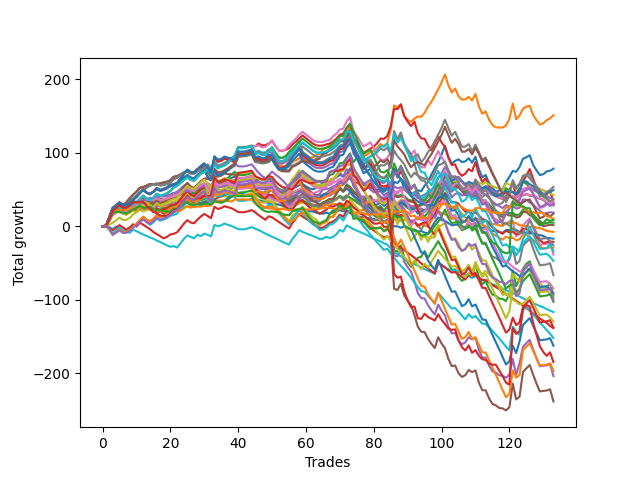

# Long Wallace Doodle 019 
- Symbol: ES90d
- Date Range: 06/04/2021 - 06/24/2022
- Trading Period: 7:20-12:30
- Number of Trades: 133



| Name | Win Percent | Profit | Avg Profit / Trade |     | Name | Win Percent | Profit | Avg Profit / Trade |
| ---- | ----------- | ------ | ------------------ | --- | ---- | ----------- | ------ | ------------------ |
| Sorted By <br> Profit | | | | | Sorted By <br> Win Percentage ||||
| One | 69.17 | 75625.00 | 568.61 |     | One | 69.17 | 75625.00 | 568.61 |
| Zero | 66.92 | 39250.00 | 295.11 |     | Zero | 66.92 | 39250.00 | 295.11 |
| Fifty-Seven | 66.92 | 26875.00 | 202.07 |     | Fifty-Seven | 66.92 | 26875.00 | 202.07 |
| Forty-Eight | 60.15 | 24750.00 | 186.09 |     | Fifty-Six | 66.17 | 16875.00 | 126.88 |
| Eight | 42.11 | 21375.00 | 160.71 |     | Sixty-Four | 63.16 | 15250.00 | 114.66 |
| Thirty-Two | 51.88 | 18500.00 | 139.10 |     | Three | 61.65 | 16125.00 | 121.24 |
| Forty | 59.40 | 18250.00 | 137.22 |     | Sixty-Five | 61.65 | 8750.00 | 65.79 |
| Fifty-Six | 66.17 | 16875.00 | 126.88 |     | Fifty-Nine | 60.90 | -17125.00 | -128.76 |
| Three | 61.65 | 16125.00 | 121.24 |     | Forty-Eight | 60.15 | 24750.00 | 186.09 |
| Sixty-Four | 63.16 | 15250.00 | 114.66 |     | Forty | 59.40 | 18250.00 | 137.22 |
| Twenty-Four | 50.38 | 15250.00 | 114.66 |     | Sixty-Seven | 57.89 | -12875.00 | -96.80 |
| Thirty-Nine | 46.62 | 14625.00 | 109.96 |     | Six | 57.89 | -19250.00 | -144.74 |
| Thirty-Eight | 46.62 | 14250.00 | 107.14 |     | Sixty-Two | 57.14 | -51250.00 | -385.34 |
| Fifty-Four | 51.13 | 9375.00 | 70.49 |     | Two | 56.39 | -47000.00 | -353.38 |
| Sixty-Five | 61.65 | 8750.00 | 65.79 |     | Seventy | 54.89 | -23500.00 | -176.69 |
| Seventy-Two | 49.62 | 5000.00 | 37.59 |     | Fifty-Eight | 54.89 | -47000.00 | -353.38 |
| Seventy-Three | 49.62 | 4375.00 | 32.89 |     | Thirty-Two | 51.88 | 18500.00 | 139.10 |
| Fifty-Two | 48.87 | 2500.00 | 18.80 |     | Sixty-Six | 51.88 | -42125.00 | -316.73 |
| Fifty-Five | 47.37 | 875.00 | 6.58 |     | Sixty | 51.88 | -81125.00 | -609.96 |
| Twenty-Three | 36.84 | -3750.00 | -28.20 |     | Four | 51.88 | -101875.00 | -765.98 |
| Twenty-Two | 36.84 | -8375.00 | -62.97 |     | Fifty-Four | 51.13 | 9375.00 | 70.49 |
| Fifty-Three | 47.37 | -10500.00 | -78.95 |     | Seven | 51.13 | -33250.00 | -250.00 |
| Sixty-Seven | 57.89 | -12875.00 | -96.80 |     | Seventy-Five | 51.13 | -50250.00 | -377.82 |
| Fifty | 48.12 | -14500.00 | -109.02 |     | Twenty-Four | 50.38 | 15250.00 | 114.66 |
| Fifty-Nine | 60.90 | -17125.00 | -128.76 |     | Sixty-Three | 50.38 | -68875.00 | -517.86 |
| Six | 57.89 | -19250.00 | -144.74 |     | Seventy-Two | 49.62 | 5000.00 | 37.59 |
| Seventy | 54.89 | -23500.00 | -176.69 |     | Seventy-Three | 49.62 | 4375.00 | 32.89 |
| Seven | 51.13 | -33250.00 | -250.00 |     | Fifty-Two | 48.87 | 2500.00 | 18.80 |
| Sixty-Six | 51.88 | -42125.00 | -316.73 |     | Fifty | 48.12 | -14500.00 | -109.02 |
| Seventy-One | 48.12 | -45500.00 | -342.11 |     | Seventy-One | 48.12 | -45500.00 | -342.11 |
| Two | 56.39 | -47000.00 | -353.38 |     | Sixty-Nine | 48.12 | -64750.00 | -486.84 |
| Fifty-Eight | 54.89 | -47000.00 | -353.38 |     | Sixty-One | 48.12 | -98250.00 | -738.72 |
| Forty-Two | 42.86 | -49000.00 | -368.42 |     | Five | 48.12 | -119000.00 | -894.74 |
| Seventy-Five | 51.13 | -50250.00 | -377.82 |     | Fifty-Five | 47.37 | 875.00 | 6.58 |
| Sixty-Two | 57.14 | -51250.00 | -385.34 |     | Fifty-Three | 47.37 | -10500.00 | -78.95 |
| Thirteen | 20.30 | -58250.00 | -437.97 |     | Thirty-Nine | 46.62 | 14625.00 | 109.96 |
| Sixty-Nine | 48.12 | -64750.00 | -486.84 |     | Thirty-Eight | 46.62 | 14250.00 | 107.14 |
| Sixty-Three | 50.38 | -68875.00 | -517.86 |     | Seventy-Four | 43.61 | -92250.00 | -693.61 |
| Twenty-Nine | 28.57 | -69125.00 | -519.74 |     | Forty-Two | 42.86 | -49000.00 | -368.42 |
| Forty-Five | 36.84 | -75875.00 | -570.49 |     | Eight | 42.11 | 21375.00 | 160.71 |
| Sixty | 51.88 | -81125.00 | -609.96 |     | Twenty-Three | 36.84 | -3750.00 | -28.20 |
| Seventy-Four | 43.61 | -92250.00 | -693.61 |     | Twenty-Two | 36.84 | -8375.00 | -62.97 |
| Sixty-One | 48.12 | -98250.00 | -738.72 |     | Forty-Five | 36.84 | -75875.00 | -570.49 |
| Four | 51.88 | -101875.00 | -765.98 |     | Twenty-Nine | 28.57 | -69125.00 | -519.74 |
| Five | 48.12 | -119000.00 | -894.74 |     | Thirteen | 20.30 | -58250.00 | -437.97 |

## NO STOPLOSS

### Test Zero
* Sell when price hits the middle line of the 20p bollinger
* No Stoploss
* Results:
```
Total Trades: 133
Percent Up: 66.92
Percent Down: 33.08
Total Points Moved Up: 78.50
Potential Profit: 39250.00
Total Points Ups: 319.50 Count Ups: 89
Total Points Downs: -241.00 Count Downs: 44
```

<details><summary>Trades</summary>

<code>In: 2021-06-09 08:58:00		Out: 2021-06-09 09:05:40		Total Position Time: 07:40		Total Move Up: 1.00		Total to Date: 1.00</code> <br />
<code>In: 2021-06-17 09:00:00		Out: 2021-06-17 09:00:10		Total Position Time: 00:10		Total Move Up: 9.75		Total to Date: 10.75</code> <br />
<code>In: 2021-06-17 09:01:00		Out: 2021-06-17 09:01:10		Total Position Time: 00:10		Total Move Up: 10.25		Total to Date: 21.00</code> <br />
<code>In: 2021-06-30 11:12:00		Out: 2021-06-30 11:14:05		Total Position Time: 02:05		Total Move Up: 1.25		Total to Date: 22.25</code> <br />
<code>In: 2021-07-01 08:20:00		Out: 2021-07-01 08:28:35		Total Position Time: 08:35		Total Move Up: 1.00		Total to Date: 23.25</code> <br />
<code>In: 2021-07-13 10:21:00		Out: 2021-07-13 10:45:00		Total Position Time: 24:00		Total Move Up: -2.50		Total to Date: 20.75</code> <br />
<code>In: 2021-07-13 10:40:00		Out: 2021-07-13 10:45:00		Total Position Time: 05:00		Total Move Up: 2.25		Total to Date: 23.00</code> <br />
<code>In: 2021-07-13 10:43:00		Out: 2021-07-13 10:45:00		Total Position Time: 02:00		Total Move Up: 3.50		Total to Date: 26.50</code> <br />
<code>In: 2021-07-13 11:06:00		Out: 2021-07-13 11:10:10		Total Position Time: 04:10		Total Move Up: 2.25		Total to Date: 28.75</code> <br />
<code>In: 2021-07-15 07:46:00		Out: 2021-07-15 07:51:30		Total Position Time: 05:30		Total Move Up: 2.75		Total to Date: 31.50</code> <br />
<code>In: 2021-07-15 07:51:00		Out: 2021-07-15 07:51:30		Total Position Time: 00:30		Total Move Up: 3.75		Total to Date: 35.25</code> <br />
<code>In: 2021-07-15 09:11:00		Out: 2021-07-15 09:19:35		Total Position Time: 08:35		Total Move Up: 0.00		Total to Date: 35.25</code> <br />
<code>In: 2021-07-22 08:44:00		Out: 2021-07-22 08:52:55		Total Position Time: 08:55		Total Move Up: 1.50		Total to Date: 36.75</code> <br />
<code>In: 2021-07-22 08:47:00		Out: 2021-07-22 08:52:55		Total Position Time: 05:55		Total Move Up: 1.75		Total to Date: 38.50</code> <br />
<code>In: 2021-07-22 09:08:00		Out: 2021-07-22 09:17:55		Total Position Time: 09:55		Total Move Up: -0.25		Total to Date: 38.25</code> <br />
<code>In: 2021-07-22 09:09:00		Out: 2021-07-22 09:17:55		Total Position Time: 08:55		Total Move Up: 1.00		Total to Date: 39.25</code> <br />
<code>In: 2021-07-28 09:46:00		Out: 2021-07-28 09:51:50		Total Position Time: 05:50		Total Move Up: 2.00		Total to Date: 41.25</code> <br />
<code>In: 2021-07-28 10:17:00		Out: 2021-07-28 10:31:05		Total Position Time: 14:05		Total Move Up: 0.00		Total to Date: 41.25</code> <br />
<code>In: 2021-07-28 10:18:00		Out: 2021-07-28 10:31:05		Total Position Time: 13:05		Total Move Up: 0.50		Total to Date: 41.75</code> <br />
<code>In: 2021-07-28 10:20:00		Out: 2021-07-28 10:31:05		Total Position Time: 11:05		Total Move Up: 1.00		Total to Date: 42.75</code> <br />
<code>In: 2021-08-04 07:34:00		Out: 2021-08-04 07:39:55		Total Position Time: 05:55		Total Move Up: 2.50		Total to Date: 45.25</code> <br />
<code>In: 2021-08-06 11:57:00		Out: 2021-08-06 12:08:05		Total Position Time: 11:05		Total Move Up: -0.25		Total to Date: 45.00</code> <br />
<code>In: 2021-08-06 12:04:00		Out: 2021-08-06 12:08:05		Total Position Time: 04:05		Total Move Up: 1.50		Total to Date: 46.50</code> <br />
<code>In: 2021-08-06 12:05:00		Out: 2021-08-06 12:08:05		Total Position Time: 03:05		Total Move Up: 1.75		Total to Date: 48.25</code> <br />
<code>In: 2021-08-06 12:06:00		Out: 2021-08-06 12:08:05		Total Position Time: 02:05		Total Move Up: 0.50		Total to Date: 48.75</code> <br />
<code>In: 2021-08-10 07:34:00		Out: 2021-08-10 07:49:10		Total Position Time: 15:10		Total Move Up: -1.75		Total to Date: 47.00</code> <br />
<code>In: 2021-08-10 07:43:00		Out: 2021-08-10 07:49:10		Total Position Time: 06:10		Total Move Up: 3.00		Total to Date: 50.00</code> <br />
<code>In: 2021-08-10 07:54:00		Out: 2021-08-10 07:59:30		Total Position Time: 05:30		Total Move Up: 2.50		Total to Date: 52.50</code> <br />
<code>In: 2021-08-10 07:55:00		Out: 2021-08-10 07:59:30		Total Position Time: 04:30		Total Move Up: 1.25		Total to Date: 53.75</code> <br />
<code>In: 2021-08-13 11:45:00		Out: 2021-08-13 11:48:15		Total Position Time: 03:15		Total Move Up: 1.50		Total to Date: 55.25</code> <br />
<code>In: 2021-08-17 08:32:00		Out: 2021-08-17 08:33:50		Total Position Time: 01:50		Total Move Up: 3.25		Total to Date: 58.50</code> <br />
<code>In: 2021-08-17 08:43:00		Out: 2021-08-17 09:06:15		Total Position Time: 23:15		Total Move Up: -3.00		Total to Date: 55.50</code> <br />
<code>In: 2021-08-19 11:34:00		Out: 2021-08-19 11:35:40		Total Position Time: 01:40		Total Move Up: 7.50		Total to Date: 63.00</code> <br />
<code>In: 2021-08-26 07:28:00		Out: 2021-08-26 07:57:55		Total Position Time: 29:55		Total Move Up: -6.50		Total to Date: 56.50</code> <br />
<code>In: 2021-08-31 10:27:00		Out: 2021-08-31 10:39:35		Total Position Time: 12:35		Total Move Up: -0.25		Total to Date: 56.25</code> <br />
<code>In: 2021-09-01 08:23:00		Out: 2021-09-01 08:29:10		Total Position Time: 06:10		Total Move Up: 1.25		Total to Date: 57.50</code> <br />
<code>In: 2021-09-01 12:08:00		Out: 2021-09-01 12:13:25		Total Position Time: 05:25		Total Move Up: 1.50		Total to Date: 59.00</code> <br />
<code>In: 2021-09-01 12:10:00		Out: 2021-09-01 12:13:25		Total Position Time: 03:25		Total Move Up: 2.50		Total to Date: 61.50</code> <br />
<code>In: 2021-09-01 12:12:00		Out: 2021-09-01 12:13:25		Total Position Time: 01:25		Total Move Up: 1.75		Total to Date: 63.25</code> <br />
<code>In: 2021-09-01 12:31:00		Out: 2021-09-01 12:47:30		Total Position Time: 16:30		Total Move Up: -1.00		Total to Date: 62.25</code> <br />
<code>In: 2021-09-02 09:21:00		Out: 2021-09-02 09:30:55		Total Position Time: 09:55		Total Move Up: 0.75		Total to Date: 63.00</code> <br />
<code>In: 2021-09-02 09:22:00		Out: 2021-09-02 09:30:55		Total Position Time: 08:55		Total Move Up: 0.50		Total to Date: 63.50</code> <br />
<code>In: 2021-09-02 09:25:00		Out: 2021-09-02 09:30:55		Total Position Time: 05:55		Total Move Up: 1.00		Total to Date: 64.50</code> <br />
<code>In: 2021-09-02 09:26:00		Out: 2021-09-02 09:30:55		Total Position Time: 04:55		Total Move Up: 0.75		Total to Date: 65.25</code> <br />
<code>In: 2021-09-08 07:36:00		Out: 2021-09-08 07:50:00		Total Position Time: 14:00		Total Move Up: -4.50		Total to Date: 60.75</code> <br />
<code>In: 2021-09-08 07:40:00		Out: 2021-09-08 07:50:00		Total Position Time: 10:00		Total Move Up: -0.25		Total to Date: 60.50</code> <br />
<code>In: 2021-09-09 08:22:00		Out: 2021-09-09 08:36:25		Total Position Time: 14:25		Total Move Up: -1.25		Total to Date: 59.25</code> <br />
<code>In: 2021-09-09 08:28:00		Out: 2021-09-09 08:36:25		Total Position Time: 08:25		Total Move Up: 0.75		Total to Date: 60.00</code> <br />
<code>In: 2021-09-27 08:48:00		Out: 2021-09-27 08:58:00		Total Position Time: 10:00		Total Move Up: 0.00		Total to Date: 60.00</code> <br />
<code>In: 2021-09-29 08:43:00		Out: 2021-09-29 08:48:25		Total Position Time: 05:25		Total Move Up: 2.00		Total to Date: 62.00</code> <br />
<code>In: 2021-10-07 11:27:00		Out: 2021-10-07 11:56:55		Total Position Time: 29:55		Total Move Up: -7.50		Total to Date: 54.50</code> <br />
<code>In: 2021-10-07 11:33:00		Out: 2021-10-07 11:57:40		Total Position Time: 24:40		Total Move Up: -3.50		Total to Date: 51.00</code> <br />
<code>In: 2021-10-07 11:39:00		Out: 2021-10-07 11:57:40		Total Position Time: 18:40		Total Move Up: -2.50		Total to Date: 48.50</code> <br />
<code>In: 2021-10-07 11:44:00		Out: 2021-10-07 11:57:40		Total Position Time: 13:40		Total Move Up: -0.50		Total to Date: 48.00</code> <br />
<code>In: 2021-10-07 11:47:00		Out: 2021-10-07 11:57:40		Total Position Time: 10:40		Total Move Up: -0.25		Total to Date: 47.75</code> <br />
<code>In: 2021-10-08 07:45:00		Out: 2021-10-08 07:48:45		Total Position Time: 03:45		Total Move Up: 4.00		Total to Date: 51.75</code> <br />
<code>In: 2021-10-21 08:31:00		Out: 2021-10-21 08:39:45		Total Position Time: 08:45		Total Move Up: 1.75		Total to Date: 53.50</code> <br />
<code>In: 2021-10-21 08:35:00		Out: 2021-10-21 08:39:45		Total Position Time: 04:45		Total Move Up: 2.50		Total to Date: 56.00</code> <br />
<code>In: 2021-10-22 07:56:00		Out: 2021-10-22 08:00:35		Total Position Time: 04:35		Total Move Up: 1.75		Total to Date: 57.75</code> <br />
<code>In: 2021-10-26 08:58:00		Out: 2021-10-26 09:14:05		Total Position Time: 16:05		Total Move Up: -3.25		Total to Date: 54.50</code> <br />
<code>In: 2021-10-26 08:59:00		Out: 2021-10-26 09:14:05		Total Position Time: 15:05		Total Move Up: -2.75		Total to Date: 51.75</code> <br />
<code>In: 2021-10-26 09:01:00		Out: 2021-10-26 09:14:05		Total Position Time: 13:05		Total Move Up: -1.25		Total to Date: 50.50</code> <br />
<code>In: 2021-10-26 09:07:00		Out: 2021-10-26 09:14:05		Total Position Time: 07:05		Total Move Up: 1.50		Total to Date: 52.00</code> <br />
<code>In: 2021-10-27 12:16:00		Out: 2021-10-27 12:26:35		Total Position Time: 10:35		Total Move Up: 2.00		Total to Date: 54.00</code> <br />
<code>In: 2021-10-27 12:20:00		Out: 2021-10-27 12:26:35		Total Position Time: 06:35		Total Move Up: 6.50		Total to Date: 60.50</code> <br />
<code>In: 2021-11-03 10:18:00		Out: 2021-11-03 10:19:45		Total Position Time: 01:45		Total Move Up: 0.75		Total to Date: 61.25</code> <br />
<code>In: 2021-11-03 10:50:00		Out: 2021-11-03 10:58:00		Total Position Time: 08:00		Total Move Up: 0.50		Total to Date: 61.75</code> <br />
<code>In: 2021-11-17 09:31:00		Out: 2021-11-17 09:35:15		Total Position Time: 04:15		Total Move Up: 2.75		Total to Date: 64.50</code> <br />
<code>In: 2021-11-19 07:29:00		Out: 2021-11-19 07:33:35		Total Position Time: 04:35		Total Move Up: 2.25		Total to Date: 66.75</code> <br />
<code>In: 2021-11-19 07:31:00		Out: 2021-11-19 07:33:35		Total Position Time: 02:35		Total Move Up: 3.50		Total to Date: 70.25</code> <br />
<code>In: 2021-11-19 10:31:00		Out: 2021-11-19 10:50:05		Total Position Time: 19:05		Total Move Up: -2.75		Total to Date: 67.50</code> <br />
<code>In: 2021-11-19 10:41:00		Out: 2021-11-19 10:50:05		Total Position Time: 09:05		Total Move Up: 3.50		Total to Date: 71.00</code> <br />
<code>In: 2021-11-22 08:58:00		Out: 2021-11-22 09:07:05		Total Position Time: 09:05		Total Move Up: 7.75		Total to Date: 78.75</code> <br />
<code>In: 2021-11-30 07:52:00		Out: 2021-11-30 08:11:10		Total Position Time: 19:10		Total Move Up: -23.75		Total to Date: 55.00</code> <br />
<code>In: 2021-11-30 07:56:00		Out: 2021-11-30 08:11:10		Total Position Time: 15:10		Total Move Up: -5.50		Total to Date: 49.50</code> <br />
<code>In: 2021-12-01 09:58:00		Out: 2021-12-01 10:22:50		Total Position Time: 24:50		Total Move Up: -12.75		Total to Date: 36.75</code> <br />
<code>In: 2021-12-01 10:01:00		Out: 2021-12-01 10:22:50		Total Position Time: 21:50		Total Move Up: -10.75		Total to Date: 26.00</code> <br />
<code>In: 2021-12-01 10:09:00		Out: 2021-12-01 10:22:50		Total Position Time: 13:50		Total Move Up: 0.25		Total to Date: 26.25</code> <br />
<code>In: 2021-12-01 10:11:00		Out: 2021-12-01 10:22:50		Total Position Time: 11:50		Total Move Up: 3.00		Total to Date: 29.25</code> <br />
<code>In: 2021-12-09 11:44:00		Out: 2021-12-09 12:01:15		Total Position Time: 17:15		Total Move Up: -0.75		Total to Date: 28.50</code> <br />
<code>In: 2021-12-09 11:55:00		Out: 2021-12-09 12:01:15		Total Position Time: 06:15		Total Move Up: 1.25		Total to Date: 29.75</code> <br />
<code>In: 2021-12-09 11:58:00		Out: 2021-12-09 12:01:15		Total Position Time: 03:15		Total Move Up: 2.75		Total to Date: 32.50</code> <br />
<code>In: 2021-12-09 12:11:00		Out: 2021-12-09 12:27:20		Total Position Time: 16:20		Total Move Up: -4.50		Total to Date: 28.00</code> <br />
<code>In: 2022-01-05 08:10:00		Out: 2022-01-05 08:15:30		Total Position Time: 05:30		Total Move Up: 2.75		Total to Date: 30.75</code> <br />
<code>In: 2022-01-26 11:16:00		Out: 2022-01-26 11:25:15		Total Position Time: 09:15		Total Move Up: 10.00		Total to Date: 40.75</code> <br />
<code>In: 2022-01-26 11:37:00		Out: 2022-01-26 11:38:30		Total Position Time: 01:30		Total Move Up: 19.75		Total to Date: 60.50</code> <br />
<code>In: 2022-02-03 09:01:00		Out: 2022-02-03 09:14:30		Total Position Time: 13:30		Total Move Up: -1.50		Total to Date: 59.00</code> <br />
<code>In: 2022-02-03 09:06:00		Out: 2022-02-03 09:14:30		Total Position Time: 08:30		Total Move Up: 5.25		Total to Date: 64.25</code> <br />
<code>In: 2022-02-04 07:31:00		Out: 2022-02-04 07:54:00		Total Position Time: 23:00		Total Move Up: -13.25		Total to Date: 51.00</code> <br />
<code>In: 2022-02-04 07:37:00		Out: 2022-02-04 07:54:00		Total Position Time: 17:00		Total Move Up: -5.00		Total to Date: 46.00</code> <br />
<code>In: 2022-02-04 07:38:00		Out: 2022-02-04 07:54:00		Total Position Time: 16:00		Total Move Up: -2.50		Total to Date: 43.50</code> <br />
<code>In: 2022-02-07 08:11:00		Out: 2022-02-07 08:20:10		Total Position Time: 09:10		Total Move Up: 2.75		Total to Date: 46.25</code> <br />
<code>In: 2022-02-10 09:50:00		Out: 2022-02-10 10:01:30		Total Position Time: 11:30		Total Move Up: 3.00		Total to Date: 49.25</code> <br />
<code>In: 2022-02-14 10:57:00		Out: 2022-02-14 11:12:45		Total Position Time: 15:45		Total Move Up: -1.50		Total to Date: 47.75</code> <br />
<code>In: 2022-02-28 11:10:00		Out: 2022-02-28 11:19:55		Total Position Time: 09:55		Total Move Up: 7.75		Total to Date: 55.50</code> <br />
<code>In: 2022-03-10 07:36:00		Out: 2022-03-10 07:47:30		Total Position Time: 11:30		Total Move Up: 5.00		Total to Date: 60.50</code> <br />
<code>In: 2022-03-14 08:46:00		Out: 2022-03-14 08:47:15		Total Position Time: 01:15		Total Move Up: 10.00		Total to Date: 70.50</code> <br />
<code>In: 2022-03-16 09:52:00		Out: 2022-03-16 09:52:10		Total Position Time: 00:10		Total Move Up: 8.75		Total to Date: 79.25</code> <br />
<code>In: 2022-03-16 10:12:00		Out: 2022-03-16 10:12:10		Total Position Time: 00:10		Total Move Up: 8.25		Total to Date: 87.50</code> <br />
<code>In: 2022-03-21 09:37:00		Out: 2022-03-21 09:45:00		Total Position Time: 08:00		Total Move Up: 10.25		Total to Date: 97.75</code> <br />
<code>In: 2022-03-21 09:38:00		Out: 2022-03-21 09:45:00		Total Position Time: 07:00		Total Move Up: 12.00		Total to Date: 109.75</code> <br />
<code>In: 2022-03-21 09:56:00		Out: 2022-03-21 10:25:55		Total Position Time: 29:55		Total Move Up: -14.75		Total to Date: 95.00</code> <br />
<code>In: 2022-03-21 09:58:00		Out: 2022-03-21 10:26:05		Total Position Time: 28:05		Total Move Up: -10.00		Total to Date: 85.00</code> <br />
<code>In: 2022-03-23 09:47:00		Out: 2022-03-23 09:53:00		Total Position Time: 06:00		Total Move Up: 4.25		Total to Date: 89.25</code> <br />
<code>In: 2022-03-23 10:06:00		Out: 2022-03-23 10:06:25		Total Position Time: 00:25		Total Move Up: 2.00		Total to Date: 91.25</code> <br />
<code>In: 2022-03-23 10:23:00		Out: 2022-03-23 10:37:45		Total Position Time: 14:45		Total Move Up: -3.75		Total to Date: 87.50</code> <br />
<code>In: 2022-03-23 10:28:00		Out: 2022-03-23 10:37:45		Total Position Time: 09:45		Total Move Up: 1.00		Total to Date: 88.50</code> <br />
<code>In: 2022-03-23 10:30:00		Out: 2022-03-23 10:37:45		Total Position Time: 07:45		Total Move Up: 4.25		Total to Date: 92.75</code> <br />
<code>In: 2022-03-25 08:14:00		Out: 2022-03-25 08:36:40		Total Position Time: 22:40		Total Move Up: -6.00		Total to Date: 86.75</code> <br />
<code>In: 2022-03-25 08:29:00		Out: 2022-03-25 08:36:40		Total Position Time: 07:40		Total Move Up: 8.00		Total to Date: 94.75</code> <br />
<code>In: 2022-03-28 08:27:00		Out: 2022-03-28 08:56:55		Total Position Time: 29:55		Total Move Up: -16.75		Total to Date: 78.00</code> <br />
<code>In: 2022-03-28 08:33:00		Out: 2022-03-28 09:01:50		Total Position Time: 28:50		Total Move Up: -11.25		Total to Date: 66.75</code> <br />
<code>In: 2022-03-31 09:28:00		Out: 2022-03-31 09:32:20		Total Position Time: 04:20		Total Move Up: 3.25		Total to Date: 70.00</code> <br />
<code>In: 2022-04-18 08:23:00		Out: 2022-04-18 08:52:55		Total Position Time: 29:55		Total Move Up: -10.75		Total to Date: 59.25</code> <br />
<code>In: 2022-04-18 08:26:00		Out: 2022-04-18 08:54:55		Total Position Time: 28:55		Total Move Up: -7.00		Total to Date: 52.25</code> <br />
<code>In: 2022-04-18 08:29:00		Out: 2022-04-18 08:54:55		Total Position Time: 25:55		Total Move Up: -5.00		Total to Date: 47.25</code> <br />
<code>In: 2022-04-20 11:39:00		Out: 2022-04-20 11:48:15		Total Position Time: 09:15		Total Move Up: 1.50		Total to Date: 48.75</code> <br />
<code>In: 2022-04-20 11:40:00		Out: 2022-04-20 11:48:15		Total Position Time: 08:15		Total Move Up: 1.75		Total to Date: 50.50</code> <br />
<code>In: 2022-05-02 08:06:00		Out: 2022-05-02 08:13:20		Total Position Time: 07:20		Total Move Up: 9.75		Total to Date: 60.25</code> <br />
<code>In: 2022-05-02 08:19:00		Out: 2022-05-02 08:26:05		Total Position Time: 07:05		Total Move Up: 7.00		Total to Date: 67.25</code> <br />
<code>In: 2022-05-04 11:36:00		Out: 2022-05-04 11:36:40		Total Position Time: 00:40		Total Move Up: 8.25		Total to Date: 75.50</code> <br />
<code>In: 2022-05-11 09:32:00		Out: 2022-05-11 09:49:15		Total Position Time: 17:15		Total Move Up: -1.25		Total to Date: 74.25</code> <br />
<code>In: 2022-05-13 11:07:00		Out: 2022-05-13 11:12:25		Total Position Time: 05:25		Total Move Up: 6.50		Total to Date: 80.75</code> <br />
<code>In: 2022-05-17 11:24:00		Out: 2022-05-17 11:27:25		Total Position Time: 03:25		Total Move Up: 11.25		Total to Date: 92.00</code> <br />
<code>In: 2022-05-25 09:29:00		Out: 2022-05-25 09:38:50		Total Position Time: 09:50		Total Move Up: 2.00		Total to Date: 94.00</code> <br />
<code>In: 2022-06-06 08:19:00		Out: 2022-06-06 08:31:35		Total Position Time: 12:35		Total Move Up: 2.75		Total to Date: 96.75</code> <br />
<code>In: 2022-06-08 09:29:00		Out: 2022-06-08 09:53:00		Total Position Time: 24:00		Total Move Up: -13.00		Total to Date: 83.75</code> <br />
<code>In: 2022-06-08 09:33:00		Out: 2022-06-08 09:53:00		Total Position Time: 20:00		Total Move Up: -7.50		Total to Date: 76.25</code> <br />
<code>In: 2022-06-08 09:34:00		Out: 2022-06-08 09:53:00		Total Position Time: 19:00		Total Move Up: -6.50		Total to Date: 69.75</code> <br />
<code>In: 2022-06-08 09:41:00		Out: 2022-06-08 09:53:00		Total Position Time: 12:00		Total Move Up: 1.25		Total to Date: 71.00</code> <br />
<code>In: 2022-06-08 09:44:00		Out: 2022-06-08 09:53:00		Total Position Time: 09:00		Total Move Up: 3.75		Total to Date: 74.75</code> <br />
<code>In: 2022-06-09 07:54:00		Out: 2022-06-09 08:11:10		Total Position Time: 17:10		Total Move Up: 1.00		Total to Date: 75.75</code> <br />
<code>In: 2022-06-23 08:39:00		Out: 2022-06-23 08:48:55		Total Position Time: 09:55		Total Move Up: 2.75		Total to Date: 78.50</code> <br />


</details>

### Test One
* Sell when the price hits the upper line of the 20p 1std bollinger
* No Stoploss
* Results:
```
Total Trades: 133
Percent Up: 69.17
Percent Down: 30.83
Total Points Moved Up: 151.25
Potential Profit: 75625.00
Total Points Ups: 412.75 Count Ups: 92
Total Points Downs: -261.50 Count Downs: 41
```

<details><summary>Trades</summary>

<code>In: 2021-06-09 08:58:00		Out: 2021-06-09 09:14:55		Total Position Time: 16:55		Total Move Up: 1.00		Total to Date: 1.00</code> <br />
<code>In: 2021-06-17 09:00:00		Out: 2021-06-17 09:03:15		Total Position Time: 03:15		Total Move Up: 11.00		Total to Date: 12.00</code> <br />
<code>In: 2021-06-17 09:01:00		Out: 2021-06-17 09:03:15		Total Position Time: 02:15		Total Move Up: 12.00		Total to Date: 24.00</code> <br />
<code>In: 2021-06-30 11:12:00		Out: 2021-06-30 11:16:40		Total Position Time: 04:40		Total Move Up: 2.25		Total to Date: 26.25</code> <br />
<code>In: 2021-07-01 08:20:00		Out: 2021-07-01 08:29:30		Total Position Time: 09:30		Total Move Up: 2.00		Total to Date: 28.25</code> <br />
<code>In: 2021-07-13 10:21:00		Out: 2021-07-13 10:45:55		Total Position Time: 24:55		Total Move Up: -0.25		Total to Date: 28.00</code> <br />
<code>In: 2021-07-13 10:40:00		Out: 2021-07-13 10:45:55		Total Position Time: 05:55		Total Move Up: 4.50		Total to Date: 32.50</code> <br />
<code>In: 2021-07-13 10:43:00		Out: 2021-07-13 10:45:55		Total Position Time: 02:55		Total Move Up: 5.75		Total to Date: 38.25</code> <br />
<code>In: 2021-07-13 11:06:00		Out: 2021-07-13 11:14:55		Total Position Time: 08:55		Total Move Up: 4.75		Total to Date: 43.00</code> <br />
<code>In: 2021-07-15 07:46:00		Out: 2021-07-15 07:57:35		Total Position Time: 11:35		Total Move Up: 4.25		Total to Date: 47.25</code> <br />
<code>In: 2021-07-15 07:51:00		Out: 2021-07-15 07:57:35		Total Position Time: 06:35		Total Move Up: 5.25		Total to Date: 52.50</code> <br />
<code>In: 2021-07-15 09:11:00		Out: 2021-07-15 09:23:05		Total Position Time: 12:05		Total Move Up: 1.00		Total to Date: 53.50</code> <br />
<code>In: 2021-07-22 08:44:00		Out: 2021-07-22 08:56:40		Total Position Time: 12:40		Total Move Up: 2.00		Total to Date: 55.50</code> <br />
<code>In: 2021-07-22 08:47:00		Out: 2021-07-22 08:56:40		Total Position Time: 09:40		Total Move Up: 2.25		Total to Date: 57.75</code> <br />
<code>In: 2021-07-22 09:08:00		Out: 2021-07-22 09:27:15		Total Position Time: 19:15		Total Move Up: -1.00		Total to Date: 56.75</code> <br />
<code>In: 2021-07-22 09:09:00		Out: 2021-07-22 09:27:15		Total Position Time: 18:15		Total Move Up: 0.25		Total to Date: 57.00</code> <br />
<code>In: 2021-07-28 09:46:00		Out: 2021-07-28 10:00:10		Total Position Time: 14:10		Total Move Up: 1.75		Total to Date: 58.75</code> <br />
<code>In: 2021-07-28 10:17:00		Out: 2021-07-28 10:31:35		Total Position Time: 14:35		Total Move Up: 0.75		Total to Date: 59.50</code> <br />
<code>In: 2021-07-28 10:18:00		Out: 2021-07-28 10:31:35		Total Position Time: 13:35		Total Move Up: 1.25		Total to Date: 60.75</code> <br />
<code>In: 2021-07-28 10:20:00		Out: 2021-07-28 10:31:35		Total Position Time: 11:35		Total Move Up: 1.75		Total to Date: 62.50</code> <br />
<code>In: 2021-08-04 07:34:00		Out: 2021-08-04 07:41:45		Total Position Time: 07:45		Total Move Up: 5.00		Total to Date: 67.50</code> <br />
<code>In: 2021-08-06 11:57:00		Out: 2021-08-06 12:10:45		Total Position Time: 13:45		Total Move Up: 0.75		Total to Date: 68.25</code> <br />
<code>In: 2021-08-06 12:04:00		Out: 2021-08-06 12:10:45		Total Position Time: 06:45		Total Move Up: 2.50		Total to Date: 70.75</code> <br />
<code>In: 2021-08-06 12:05:00		Out: 2021-08-06 12:10:45		Total Position Time: 05:45		Total Move Up: 2.75		Total to Date: 73.50</code> <br />
<code>In: 2021-08-06 12:06:00		Out: 2021-08-06 12:10:45		Total Position Time: 04:45		Total Move Up: 1.50		Total to Date: 75.00</code> <br />
<code>In: 2021-08-10 07:34:00		Out: 2021-08-10 08:03:55		Total Position Time: 29:55		Total Move Up: -3.25		Total to Date: 71.75</code> <br />
<code>In: 2021-08-10 07:43:00		Out: 2021-08-10 08:05:25		Total Position Time: 22:25		Total Move Up: 2.00		Total to Date: 73.75</code> <br />
<code>In: 2021-08-10 07:54:00		Out: 2021-08-10 08:05:25		Total Position Time: 11:25		Total Move Up: 3.75		Total to Date: 77.50</code> <br />
<code>In: 2021-08-10 07:55:00		Out: 2021-08-10 08:05:25		Total Position Time: 10:25		Total Move Up: 2.50		Total to Date: 80.00</code> <br />
<code>In: 2021-08-13 11:45:00		Out: 2021-08-13 11:56:45		Total Position Time: 11:45		Total Move Up: 1.50		Total to Date: 81.50</code> <br />
<code>In: 2021-08-17 08:32:00		Out: 2021-08-17 09:01:55		Total Position Time: 29:55		Total Move Up: -8.75		Total to Date: 72.75</code> <br />
<code>In: 2021-08-17 08:43:00		Out: 2021-08-17 09:12:55		Total Position Time: 29:55		Total Move Up: -4.75		Total to Date: 68.00</code> <br />
<code>In: 2021-08-19 11:34:00		Out: 2021-08-19 11:48:00		Total Position Time: 14:00		Total Move Up: 9.25		Total to Date: 77.25</code> <br />
<code>In: 2021-08-26 07:28:00		Out: 2021-08-26 07:57:55		Total Position Time: 29:55		Total Move Up: -6.50		Total to Date: 70.75</code> <br />
<code>In: 2021-08-31 10:27:00		Out: 2021-08-31 10:41:00		Total Position Time: 14:00		Total Move Up: 0.75		Total to Date: 71.50</code> <br />
<code>In: 2021-09-01 08:23:00		Out: 2021-09-01 08:31:20		Total Position Time: 08:20		Total Move Up: 2.25		Total to Date: 73.75</code> <br />
<code>In: 2021-09-01 12:08:00		Out: 2021-09-01 12:15:30		Total Position Time: 07:30		Total Move Up: 2.50		Total to Date: 76.25</code> <br />
<code>In: 2021-09-01 12:10:00		Out: 2021-09-01 12:15:30		Total Position Time: 05:30		Total Move Up: 3.50		Total to Date: 79.75</code> <br />
<code>In: 2021-09-01 12:12:00		Out: 2021-09-01 12:15:30		Total Position Time: 03:30		Total Move Up: 2.75		Total to Date: 82.50</code> <br />
<code>In: 2021-09-01 12:31:00		Out: 2021-09-02 06:30:05		Total Position Time: 1079:05		Total Move Up: 12.00		Total to Date: 94.50</code> <br />
<code>In: 2021-09-02 09:21:00		Out: 2021-09-02 09:36:30		Total Position Time: 15:30		Total Move Up: 0.75		Total to Date: 95.25</code> <br />
<code>In: 2021-09-02 09:22:00		Out: 2021-09-02 09:36:30		Total Position Time: 14:30		Total Move Up: 0.50		Total to Date: 95.75</code> <br />
<code>In: 2021-09-02 09:25:00		Out: 2021-09-02 09:36:30		Total Position Time: 11:30		Total Move Up: 1.00		Total to Date: 96.75</code> <br />
<code>In: 2021-09-02 09:26:00		Out: 2021-09-02 09:36:30		Total Position Time: 10:30		Total Move Up: 0.75		Total to Date: 97.50</code> <br />
<code>In: 2021-09-08 07:36:00		Out: 2021-09-08 07:57:55		Total Position Time: 21:55		Total Move Up: -5.00		Total to Date: 92.50</code> <br />
<code>In: 2021-09-08 07:40:00		Out: 2021-09-08 07:57:55		Total Position Time: 17:55		Total Move Up: -0.75		Total to Date: 91.75</code> <br />
<code>In: 2021-09-09 08:22:00		Out: 2021-09-09 08:41:50		Total Position Time: 19:50		Total Move Up: -1.25		Total to Date: 90.50</code> <br />
<code>In: 2021-09-09 08:28:00		Out: 2021-09-09 08:41:50		Total Position Time: 13:50		Total Move Up: 0.75		Total to Date: 91.25</code> <br />
<code>In: 2021-09-27 08:48:00		Out: 2021-09-27 09:00:05		Total Position Time: 12:05		Total Move Up: 1.00		Total to Date: 92.25</code> <br />
<code>In: 2021-09-29 08:43:00		Out: 2021-09-29 08:50:20		Total Position Time: 07:20		Total Move Up: 5.25		Total to Date: 97.50</code> <br />
<code>In: 2021-10-07 11:27:00		Out: 2021-10-07 11:56:55		Total Position Time: 29:55		Total Move Up: -7.50		Total to Date: 90.00</code> <br />
<code>In: 2021-10-07 11:33:00		Out: 2021-10-07 12:02:55		Total Position Time: 29:55		Total Move Up: -6.00		Total to Date: 84.00</code> <br />
<code>In: 2021-10-07 11:39:00		Out: 2021-10-07 12:05:40		Total Position Time: 26:40		Total Move Up: -2.25		Total to Date: 81.75</code> <br />
<code>In: 2021-10-07 11:44:00		Out: 2021-10-07 12:05:40		Total Position Time: 21:40		Total Move Up: -0.25		Total to Date: 81.50</code> <br />
<code>In: 2021-10-07 11:47:00		Out: 2021-10-07 12:05:40		Total Position Time: 18:40		Total Move Up: 0.00		Total to Date: 81.50</code> <br />
<code>In: 2021-10-08 07:45:00		Out: 2021-10-08 07:52:20		Total Position Time: 07:20		Total Move Up: 6.25		Total to Date: 87.75</code> <br />
<code>In: 2021-10-21 08:31:00		Out: 2021-10-21 08:45:05		Total Position Time: 14:05		Total Move Up: 2.00		Total to Date: 89.75</code> <br />
<code>In: 2021-10-21 08:35:00		Out: 2021-10-21 08:45:05		Total Position Time: 10:05		Total Move Up: 2.75		Total to Date: 92.50</code> <br />
<code>In: 2021-10-22 07:56:00		Out: 2021-10-22 08:05:10		Total Position Time: 09:10		Total Move Up: 3.25		Total to Date: 95.75</code> <br />
<code>In: 2021-10-26 08:58:00		Out: 2021-10-26 09:17:00		Total Position Time: 19:00		Total Move Up: -1.50		Total to Date: 94.25</code> <br />
<code>In: 2021-10-26 08:59:00		Out: 2021-10-26 09:17:00		Total Position Time: 18:00		Total Move Up: -1.00		Total to Date: 93.25</code> <br />
<code>In: 2021-10-26 09:01:00		Out: 2021-10-26 09:17:00		Total Position Time: 16:00		Total Move Up: 0.50		Total to Date: 93.75</code> <br />
<code>In: 2021-10-26 09:07:00		Out: 2021-10-26 09:17:00		Total Position Time: 10:00		Total Move Up: 3.25		Total to Date: 97.00</code> <br />
<code>In: 2021-10-27 12:16:00		Out: 2021-10-27 12:39:15		Total Position Time: 23:15		Total Move Up: 1.75		Total to Date: 98.75</code> <br />
<code>In: 2021-10-27 12:20:00		Out: 2021-10-27 12:39:15		Total Position Time: 19:15		Total Move Up: 6.25		Total to Date: 105.00</code> <br />
<code>In: 2021-11-03 10:18:00		Out: 2021-11-03 10:22:10		Total Position Time: 04:10		Total Move Up: 1.50		Total to Date: 106.50</code> <br />
<code>In: 2021-11-03 10:50:00		Out: 2021-11-03 11:00:30		Total Position Time: 10:30		Total Move Up: 4.00		Total to Date: 110.50</code> <br />
<code>In: 2021-11-17 09:31:00		Out: 2021-11-17 09:38:30		Total Position Time: 07:30		Total Move Up: 3.75		Total to Date: 114.25</code> <br />
<code>In: 2021-11-19 07:29:00		Out: 2021-11-19 07:38:20		Total Position Time: 09:20		Total Move Up: 4.00		Total to Date: 118.25</code> <br />
<code>In: 2021-11-19 07:31:00		Out: 2021-11-19 07:38:20		Total Position Time: 07:20		Total Move Up: 5.25		Total to Date: 123.50</code> <br />
<code>In: 2021-11-19 10:31:00		Out: 2021-11-19 10:50:45		Total Position Time: 19:45		Total Move Up: -1.25		Total to Date: 122.25</code> <br />
<code>In: 2021-11-19 10:41:00		Out: 2021-11-19 10:50:45		Total Position Time: 09:45		Total Move Up: 5.00		Total to Date: 127.25</code> <br />
<code>In: 2021-11-22 08:58:00		Out: 2021-11-22 09:11:35		Total Position Time: 13:35		Total Move Up: 9.00		Total to Date: 136.25</code> <br />
<code>In: 2021-11-30 07:52:00		Out: 2021-11-30 08:12:55		Total Position Time: 20:55		Total Move Up: -18.50		Total to Date: 117.75</code> <br />
<code>In: 2021-11-30 07:56:00		Out: 2021-11-30 08:12:55		Total Position Time: 16:55		Total Move Up: -0.25		Total to Date: 117.50</code> <br />
<code>In: 2021-12-01 09:58:00		Out: 2021-12-01 10:25:35		Total Position Time: 27:35		Total Move Up: -11.75		Total to Date: 105.75</code> <br />
<code>In: 2021-12-01 10:01:00		Out: 2021-12-01 10:25:35		Total Position Time: 24:35		Total Move Up: -9.75		Total to Date: 96.00</code> <br />
<code>In: 2021-12-01 10:09:00		Out: 2021-12-01 10:25:35		Total Position Time: 16:35		Total Move Up: 1.25		Total to Date: 97.25</code> <br />
<code>In: 2021-12-01 10:11:00		Out: 2021-12-01 10:25:35		Total Position Time: 14:35		Total Move Up: 4.00		Total to Date: 101.25</code> <br />
<code>In: 2021-12-09 11:44:00		Out: 2021-12-09 12:02:40		Total Position Time: 18:40		Total Move Up: 1.75		Total to Date: 103.00</code> <br />
<code>In: 2021-12-09 11:55:00		Out: 2021-12-09 12:02:40		Total Position Time: 07:40		Total Move Up: 3.75		Total to Date: 106.75</code> <br />
<code>In: 2021-12-09 11:58:00		Out: 2021-12-09 12:02:40		Total Position Time: 04:40		Total Move Up: 5.25		Total to Date: 112.00</code> <br />
<code>In: 2021-12-09 12:11:00		Out: 2021-12-09 12:28:20		Total Position Time: 17:20		Total Move Up: -2.75		Total to Date: 109.25</code> <br />
<code>In: 2022-01-05 08:10:00		Out: 2022-01-05 08:21:25		Total Position Time: 11:25		Total Move Up: 4.00		Total to Date: 113.25</code> <br />
<code>In: 2022-01-26 11:16:00		Out: 2022-01-26 11:27:45		Total Position Time: 11:45		Total Move Up: 18.25		Total to Date: 131.50</code> <br />
<code>In: 2022-01-26 11:37:00		Out: 2022-01-26 11:39:20		Total Position Time: 02:20		Total Move Up: 33.00		Total to Date: 164.50</code> <br />
<code>In: 2022-02-03 09:01:00		Out: 2022-02-03 09:24:40		Total Position Time: 23:40		Total Move Up: -2.50		Total to Date: 162.00</code> <br />
<code>In: 2022-02-03 09:06:00		Out: 2022-02-03 09:24:40		Total Position Time: 18:40		Total Move Up: 4.25		Total to Date: 166.25</code> <br />
<code>In: 2022-02-04 07:31:00		Out: 2022-02-04 08:00:55		Total Position Time: 29:55		Total Move Up: -16.00		Total to Date: 150.25</code> <br />
<code>In: 2022-02-04 07:37:00		Out: 2022-02-04 08:04:00		Total Position Time: 27:00		Total Move Up: -5.25		Total to Date: 145.00</code> <br />
<code>In: 2022-02-04 07:38:00		Out: 2022-02-04 08:04:00		Total Position Time: 26:00		Total Move Up: -2.75		Total to Date: 142.25</code> <br />
<code>In: 2022-02-07 08:11:00		Out: 2022-02-07 08:25:40		Total Position Time: 14:40		Total Move Up: 4.50		Total to Date: 146.75</code> <br />
<code>In: 2022-02-10 09:50:00		Out: 2022-02-10 10:04:55		Total Position Time: 14:55		Total Move Up: 2.75		Total to Date: 149.50</code> <br />
<code>In: 2022-02-14 10:57:00		Out: 2022-02-14 11:20:35		Total Position Time: 23:35		Total Move Up: -0.50		Total to Date: 149.00</code> <br />
<code>In: 2022-02-28 11:10:00		Out: 2022-02-28 11:36:20		Total Position Time: 26:20		Total Move Up: 5.50		Total to Date: 154.50</code> <br />
<code>In: 2022-03-10 07:36:00		Out: 2022-03-10 07:48:05		Total Position Time: 12:05		Total Move Up: 8.25		Total to Date: 162.75</code> <br />
<code>In: 2022-03-14 08:46:00		Out: 2022-03-14 08:56:15		Total Position Time: 10:15		Total Move Up: 6.75		Total to Date: 169.50</code> <br />
<code>In: 2022-03-16 09:52:00		Out: 2022-03-16 09:59:20		Total Position Time: 07:20		Total Move Up: 8.25		Total to Date: 177.75</code> <br />
<code>In: 2022-03-16 10:12:00		Out: 2022-03-16 10:19:05		Total Position Time: 07:05		Total Move Up: 8.75		Total to Date: 186.50</code> <br />
<code>In: 2022-03-21 09:37:00		Out: 2022-03-21 09:49:05		Total Position Time: 12:05		Total Move Up: 9.25		Total to Date: 195.75</code> <br />
<code>In: 2022-03-21 09:38:00		Out: 2022-03-21 09:49:05		Total Position Time: 11:05		Total Move Up: 11.00		Total to Date: 206.75</code> <br />
<code>In: 2022-03-21 09:56:00		Out: 2022-03-21 10:25:55		Total Position Time: 29:55		Total Move Up: -14.75		Total to Date: 192.00</code> <br />
<code>In: 2022-03-21 09:58:00		Out: 2022-03-21 10:27:55		Total Position Time: 29:55		Total Move Up: -9.75		Total to Date: 182.25</code> <br />
<code>In: 2022-03-23 09:47:00		Out: 2022-03-23 09:59:10		Total Position Time: 12:10		Total Move Up: 5.25		Total to Date: 187.50</code> <br />
<code>In: 2022-03-23 10:06:00		Out: 2022-03-23 10:35:55		Total Position Time: 29:55		Total Move Up: -10.50		Total to Date: 177.00</code> <br />
<code>In: 2022-03-23 10:23:00		Out: 2022-03-23 10:51:50		Total Position Time: 28:50		Total Move Up: -4.50		Total to Date: 172.50</code> <br />
<code>In: 2022-03-23 10:28:00		Out: 2022-03-23 10:51:50		Total Position Time: 23:50		Total Move Up: 0.25		Total to Date: 172.75</code> <br />
<code>In: 2022-03-23 10:30:00		Out: 2022-03-23 10:51:50		Total Position Time: 21:50		Total Move Up: 3.50		Total to Date: 176.25</code> <br />
<code>In: 2022-03-25 08:14:00		Out: 2022-03-25 08:40:40		Total Position Time: 26:40		Total Move Up: -5.00		Total to Date: 171.25</code> <br />
<code>In: 2022-03-25 08:29:00		Out: 2022-03-25 08:40:40		Total Position Time: 11:40		Total Move Up: 9.00		Total to Date: 180.25</code> <br />
<code>In: 2022-03-28 08:27:00		Out: 2022-03-28 08:56:55		Total Position Time: 29:55		Total Move Up: -16.75		Total to Date: 163.50</code> <br />
<code>In: 2022-03-28 08:33:00		Out: 2022-03-28 09:02:55		Total Position Time: 29:55		Total Move Up: -10.25		Total to Date: 153.25</code> <br />
<code>In: 2022-03-31 09:28:00		Out: 2022-03-31 09:40:45		Total Position Time: 12:45		Total Move Up: 3.00		Total to Date: 156.25</code> <br />
<code>In: 2022-04-18 08:23:00		Out: 2022-04-18 08:52:55		Total Position Time: 29:55		Total Move Up: -10.75		Total to Date: 145.50</code> <br />
<code>In: 2022-04-18 08:26:00		Out: 2022-04-18 08:55:55		Total Position Time: 29:55		Total Move Up: -7.75		Total to Date: 137.75</code> <br />
<code>In: 2022-04-18 08:29:00		Out: 2022-04-18 08:57:20		Total Position Time: 28:20		Total Move Up: -3.00		Total to Date: 134.75</code> <br />
<code>In: 2022-04-20 11:39:00		Out: 2022-04-20 12:04:20		Total Position Time: 25:20		Total Move Up: -0.25		Total to Date: 134.50</code> <br />
<code>In: 2022-04-20 11:40:00		Out: 2022-04-20 12:04:20		Total Position Time: 24:20		Total Move Up: 0.00		Total to Date: 134.50</code> <br />
<code>In: 2022-05-02 08:06:00		Out: 2022-05-02 08:34:10		Total Position Time: 28:10		Total Move Up: 2.75		Total to Date: 137.25</code> <br />
<code>In: 2022-05-02 08:19:00		Out: 2022-05-02 08:34:10		Total Position Time: 15:10		Total Move Up: 8.75		Total to Date: 146.00</code> <br />
<code>In: 2022-05-04 11:36:00		Out: 2022-05-04 11:42:00		Total Position Time: 06:00		Total Move Up: 21.25		Total to Date: 167.25</code> <br />
<code>In: 2022-05-11 09:32:00		Out: 2022-05-11 10:01:55		Total Position Time: 29:55		Total Move Up: -21.50		Total to Date: 145.75</code> <br />
<code>In: 2022-05-13 11:07:00		Out: 2022-05-13 11:19:50		Total Position Time: 12:50		Total Move Up: 5.00		Total to Date: 150.75</code> <br />
<code>In: 2022-05-17 11:24:00		Out: 2022-05-17 11:37:35		Total Position Time: 13:35		Total Move Up: 9.25		Total to Date: 160.00</code> <br />
<code>In: 2022-05-25 09:29:00		Out: 2022-05-25 09:44:25		Total Position Time: 15:25		Total Move Up: 3.00		Total to Date: 163.00</code> <br />
<code>In: 2022-06-06 08:19:00		Out: 2022-06-06 08:39:15		Total Position Time: 20:15		Total Move Up: 1.00		Total to Date: 164.00</code> <br />
<code>In: 2022-06-08 09:29:00		Out: 2022-06-08 09:57:10		Total Position Time: 28:10		Total Move Up: -12.50		Total to Date: 151.50</code> <br />
<code>In: 2022-06-08 09:33:00		Out: 2022-06-08 09:57:10		Total Position Time: 24:10		Total Move Up: -7.00		Total to Date: 144.50</code> <br />
<code>In: 2022-06-08 09:34:00		Out: 2022-06-08 09:57:10		Total Position Time: 23:10		Total Move Up: -6.00		Total to Date: 138.50</code> <br />
<code>In: 2022-06-08 09:41:00		Out: 2022-06-08 09:57:10		Total Position Time: 16:10		Total Move Up: 1.75		Total to Date: 140.25</code> <br />
<code>In: 2022-06-08 09:44:00		Out: 2022-06-08 09:57:10		Total Position Time: 13:10		Total Move Up: 4.25		Total to Date: 144.50</code> <br />
<code>In: 2022-06-09 07:54:00		Out: 2022-06-09 08:21:10		Total Position Time: 27:10		Total Move Up: 2.50		Total to Date: 147.00</code> <br />
<code>In: 2022-06-23 08:39:00		Out: 2022-06-23 08:50:15		Total Position Time: 11:15		Total Move Up: 4.25		Total to Date: 151.25</code> <br />


</details>

### Test Two
* Sell when the price hits the upper line of the 20p 2std bollinger
* No Stoploss
* Results:
```
Total Trades: 133
Percent Up: 56.39
Percent Down: 43.61
Total Points Moved Up: -94.00
Potential Profit: -47000.00
Total Points Ups: 361.00 Count Ups: 75
Total Points Downs: -455.00 Count Downs: 58
```

<details><summary>Trades</summary>

<code>In: 2021-06-09 08:58:00		Out: 2021-06-09 09:22:10		Total Position Time: 24:10		Total Move Up: 1.50		Total to Date: 1.50</code> <br />
<code>In: 2021-06-17 09:00:00		Out: 2021-06-17 09:11:05		Total Position Time: 11:05		Total Move Up: 7.00		Total to Date: 8.50</code> <br />
<code>In: 2021-06-17 09:01:00		Out: 2021-06-17 09:11:05		Total Position Time: 10:05		Total Move Up: 8.00		Total to Date: 16.50</code> <br />
<code>In: 2021-06-30 11:12:00		Out: 2021-06-30 11:32:30		Total Position Time: 20:30		Total Move Up: 3.25		Total to Date: 19.75</code> <br />
<code>In: 2021-07-01 08:20:00		Out: 2021-07-01 08:30:20		Total Position Time: 10:20		Total Move Up: 3.50		Total to Date: 23.25</code> <br />
<code>In: 2021-07-13 10:21:00		Out: 2021-07-13 10:50:55		Total Position Time: 29:55		Total Move Up: -3.25		Total to Date: 20.00</code> <br />
<code>In: 2021-07-13 10:40:00		Out: 2021-07-13 11:09:55		Total Position Time: 29:55		Total Move Up: 0.00		Total to Date: 20.00</code> <br />
<code>In: 2021-07-13 10:43:00		Out: 2021-07-13 11:12:55		Total Position Time: 29:55		Total Move Up: 2.75		Total to Date: 22.75</code> <br />
<code>In: 2021-07-13 11:06:00		Out: 2021-07-13 11:27:30		Total Position Time: 21:30		Total Move Up: 5.50		Total to Date: 28.25</code> <br />
<code>In: 2021-07-15 07:46:00		Out: 2021-07-15 08:15:55		Total Position Time: 29:55		Total Move Up: 3.50		Total to Date: 31.75</code> <br />
<code>In: 2021-07-15 07:51:00		Out: 2021-07-15 08:20:55		Total Position Time: 29:55		Total Move Up: 5.25		Total to Date: 37.00</code> <br />
<code>In: 2021-07-15 09:11:00		Out: 2021-07-15 09:37:25		Total Position Time: 26:25		Total Move Up: 4.50		Total to Date: 41.50</code> <br />
<code>In: 2021-07-22 08:44:00		Out: 2021-07-22 09:13:55		Total Position Time: 29:55		Total Move Up: -4.00		Total to Date: 37.50</code> <br />
<code>In: 2021-07-22 08:47:00		Out: 2021-07-22 09:16:55		Total Position Time: 29:55		Total Move Up: -2.00		Total to Date: 35.50</code> <br />
<code>In: 2021-07-22 09:08:00		Out: 2021-07-22 09:28:55		Total Position Time: 20:55		Total Move Up: 0.75		Total to Date: 36.25</code> <br />
<code>In: 2021-07-22 09:09:00		Out: 2021-07-22 09:28:55		Total Position Time: 19:55		Total Move Up: 2.00		Total to Date: 38.25</code> <br />
<code>In: 2021-07-28 09:46:00		Out: 2021-07-28 10:15:55		Total Position Time: 29:55		Total Move Up: -2.75		Total to Date: 35.50</code> <br />
<code>In: 2021-07-28 10:17:00		Out: 2021-07-28 10:45:45		Total Position Time: 28:45		Total Move Up: 1.00		Total to Date: 36.50</code> <br />
<code>In: 2021-07-28 10:18:00		Out: 2021-07-28 10:45:45		Total Position Time: 27:45		Total Move Up: 1.50		Total to Date: 38.00</code> <br />
<code>In: 2021-07-28 10:20:00		Out: 2021-07-28 10:45:45		Total Position Time: 25:45		Total Move Up: 2.00		Total to Date: 40.00</code> <br />
<code>In: 2021-08-04 07:34:00		Out: 2021-08-04 08:03:55		Total Position Time: 29:55		Total Move Up: 1.00		Total to Date: 41.00</code> <br />
<code>In: 2021-08-06 11:57:00		Out: 2021-08-06 12:13:00		Total Position Time: 16:00		Total Move Up: 1.75		Total to Date: 42.75</code> <br />
<code>In: 2021-08-06 12:04:00		Out: 2021-08-06 12:13:00		Total Position Time: 09:00		Total Move Up: 3.50		Total to Date: 46.25</code> <br />
<code>In: 2021-08-06 12:05:00		Out: 2021-08-06 12:13:00		Total Position Time: 08:00		Total Move Up: 3.75		Total to Date: 50.00</code> <br />
<code>In: 2021-08-06 12:06:00		Out: 2021-08-06 12:13:00		Total Position Time: 07:00		Total Move Up: 2.50		Total to Date: 52.50</code> <br />
<code>In: 2021-08-10 07:34:00		Out: 2021-08-10 08:03:55		Total Position Time: 29:55		Total Move Up: -3.25		Total to Date: 49.25</code> <br />
<code>In: 2021-08-10 07:43:00		Out: 2021-08-10 08:12:55		Total Position Time: 29:55		Total Move Up: -1.00		Total to Date: 48.25</code> <br />
<code>In: 2021-08-10 07:54:00		Out: 2021-08-10 08:22:40		Total Position Time: 28:40		Total Move Up: 4.50		Total to Date: 52.75</code> <br />
<code>In: 2021-08-10 07:55:00		Out: 2021-08-10 08:22:40		Total Position Time: 27:40		Total Move Up: 3.25		Total to Date: 56.00</code> <br />
<code>In: 2021-08-13 11:45:00		Out: 2021-08-13 12:06:30		Total Position Time: 21:30		Total Move Up: 2.50		Total to Date: 58.50</code> <br />
<code>In: 2021-08-17 08:32:00		Out: 2021-08-17 09:01:55		Total Position Time: 29:55		Total Move Up: -8.75		Total to Date: 49.75</code> <br />
<code>In: 2021-08-17 08:43:00		Out: 2021-08-17 09:12:55		Total Position Time: 29:55		Total Move Up: -4.75		Total to Date: 45.00</code> <br />
<code>In: 2021-08-19 11:34:00		Out: 2021-08-19 11:53:15		Total Position Time: 19:15		Total Move Up: 13.75		Total to Date: 58.75</code> <br />
<code>In: 2021-08-26 07:28:00		Out: 2021-08-26 07:57:55		Total Position Time: 29:55		Total Move Up: -6.50		Total to Date: 52.25</code> <br />
<code>In: 2021-08-31 10:27:00		Out: 2021-08-31 10:47:30		Total Position Time: 20:30		Total Move Up: 1.75		Total to Date: 54.00</code> <br />
<code>In: 2021-09-01 08:23:00		Out: 2021-09-01 08:52:55		Total Position Time: 29:55		Total Move Up: 2.50		Total to Date: 56.50</code> <br />
<code>In: 2021-09-01 12:08:00		Out: 2021-09-01 12:37:55		Total Position Time: 29:55		Total Move Up: -1.50		Total to Date: 55.00</code> <br />
<code>In: 2021-09-01 12:10:00		Out: 2021-09-01 12:39:55		Total Position Time: 29:55		Total Move Up: -1.25		Total to Date: 53.75</code> <br />
<code>In: 2021-09-01 12:12:00		Out: 2021-09-01 12:41:55		Total Position Time: 29:55		Total Move Up: -2.25		Total to Date: 51.50</code> <br />
<code>In: 2021-09-01 12:31:00		Out: 2021-09-02 06:30:05		Total Position Time: 1079:05		Total Move Up: 12.00		Total to Date: 63.50</code> <br />
<code>In: 2021-09-02 09:21:00		Out: 2021-09-02 09:50:55		Total Position Time: 29:55		Total Move Up: -0.25		Total to Date: 63.25</code> <br />
<code>In: 2021-09-02 09:22:00		Out: 2021-09-02 09:51:55		Total Position Time: 29:55		Total Move Up: 0.25		Total to Date: 63.50</code> <br />
<code>In: 2021-09-02 09:25:00		Out: 2021-09-02 09:54:55		Total Position Time: 29:55		Total Move Up: 1.25		Total to Date: 64.75</code> <br />
<code>In: 2021-09-02 09:26:00		Out: 2021-09-02 09:55:25		Total Position Time: 29:25		Total Move Up: 1.50		Total to Date: 66.25</code> <br />
<code>In: 2021-09-08 07:36:00		Out: 2021-09-08 08:01:05		Total Position Time: 25:05		Total Move Up: -2.25		Total to Date: 64.00</code> <br />
<code>In: 2021-09-08 07:40:00		Out: 2021-09-08 08:01:05		Total Position Time: 21:05		Total Move Up: 2.00		Total to Date: 66.00</code> <br />
<code>In: 2021-09-09 08:22:00		Out: 2021-09-09 08:51:55		Total Position Time: 29:55		Total Move Up: -2.50		Total to Date: 63.50</code> <br />
<code>In: 2021-09-09 08:28:00		Out: 2021-09-09 08:57:55		Total Position Time: 29:55		Total Move Up: 0.25		Total to Date: 63.75</code> <br />
<code>In: 2021-09-27 08:48:00		Out: 2021-09-27 09:05:20		Total Position Time: 17:20		Total Move Up: 1.75		Total to Date: 65.50</code> <br />
<code>In: 2021-09-29 08:43:00		Out: 2021-09-29 09:12:55		Total Position Time: 29:55		Total Move Up: -1.50		Total to Date: 64.00</code> <br />
<code>In: 2021-10-07 11:27:00		Out: 2021-10-07 11:56:55		Total Position Time: 29:55		Total Move Up: -7.50		Total to Date: 56.50</code> <br />
<code>In: 2021-10-07 11:33:00		Out: 2021-10-07 12:02:55		Total Position Time: 29:55		Total Move Up: -6.00		Total to Date: 50.50</code> <br />
<code>In: 2021-10-07 11:39:00		Out: 2021-10-07 12:08:55		Total Position Time: 29:55		Total Move Up: -1.00		Total to Date: 49.50</code> <br />
<code>In: 2021-10-07 11:44:00		Out: 2021-10-07 12:13:55		Total Position Time: 29:55		Total Move Up: 2.50		Total to Date: 52.00</code> <br />
<code>In: 2021-10-07 11:47:00		Out: 2021-10-07 12:14:40		Total Position Time: 27:40		Total Move Up: 4.00		Total to Date: 56.00</code> <br />
<code>In: 2021-10-08 07:45:00		Out: 2021-10-08 08:13:25		Total Position Time: 28:25		Total Move Up: 7.50		Total to Date: 63.50</code> <br />
<code>In: 2021-10-21 08:31:00		Out: 2021-10-21 08:49:30		Total Position Time: 18:30		Total Move Up: 3.50		Total to Date: 67.00</code> <br />
<code>In: 2021-10-21 08:35:00		Out: 2021-10-21 08:49:30		Total Position Time: 14:30		Total Move Up: 4.25		Total to Date: 71.25</code> <br />
<code>In: 2021-10-22 07:56:00		Out: 2021-10-22 08:05:15		Total Position Time: 09:15		Total Move Up: 4.25		Total to Date: 75.50</code> <br />
<code>In: 2021-10-26 08:58:00		Out: 2021-10-26 09:27:55		Total Position Time: 29:55		Total Move Up: -3.75		Total to Date: 71.75</code> <br />
<code>In: 2021-10-26 08:59:00		Out: 2021-10-26 09:28:55		Total Position Time: 29:55		Total Move Up: -3.50		Total to Date: 68.25</code> <br />
<code>In: 2021-10-26 09:01:00		Out: 2021-10-26 09:30:55		Total Position Time: 29:55		Total Move Up: -3.75		Total to Date: 64.50</code> <br />
<code>In: 2021-10-26 09:07:00		Out: 2021-10-26 09:36:55		Total Position Time: 29:55		Total Move Up: -2.50		Total to Date: 62.00</code> <br />
<code>In: 2021-10-27 12:16:00		Out: 2021-10-27 12:45:55		Total Position Time: 29:55		Total Move Up: -0.50		Total to Date: 61.50</code> <br />
<code>In: 2021-10-27 12:20:00		Out: 2021-10-27 12:49:55		Total Position Time: 29:55		Total Move Up: 0.25		Total to Date: 61.75</code> <br />
<code>In: 2021-11-03 10:18:00		Out: 2021-11-03 10:23:10		Total Position Time: 05:10		Total Move Up: 1.50		Total to Date: 63.25</code> <br />
<code>In: 2021-11-03 10:50:00		Out: 2021-11-03 11:00:55		Total Position Time: 10:55		Total Move Up: 6.50		Total to Date: 69.75</code> <br />
<code>In: 2021-11-17 09:31:00		Out: 2021-11-17 10:00:55		Total Position Time: 29:55		Total Move Up: 1.50		Total to Date: 71.25</code> <br />
<code>In: 2021-11-19 07:29:00		Out: 2021-11-19 07:42:25		Total Position Time: 13:25		Total Move Up: 6.75		Total to Date: 78.00</code> <br />
<code>In: 2021-11-19 07:31:00		Out: 2021-11-19 07:42:25		Total Position Time: 11:25		Total Move Up: 8.00		Total to Date: 86.00</code> <br />
<code>In: 2021-11-19 10:31:00		Out: 2021-11-19 10:54:25		Total Position Time: 23:25		Total Move Up: 0.50		Total to Date: 86.50</code> <br />
<code>In: 2021-11-19 10:41:00		Out: 2021-11-19 10:54:25		Total Position Time: 13:25		Total Move Up: 6.75		Total to Date: 93.25</code> <br />
<code>In: 2021-11-22 08:58:00		Out: 2021-11-22 09:27:55		Total Position Time: 29:55		Total Move Up: 6.00		Total to Date: 99.25</code> <br />
<code>In: 2021-11-30 07:52:00		Out: 2021-11-30 08:16:35		Total Position Time: 24:35		Total Move Up: -12.00		Total to Date: 87.25</code> <br />
<code>In: 2021-11-30 07:56:00		Out: 2021-11-30 08:16:35		Total Position Time: 20:35		Total Move Up: 6.25		Total to Date: 93.50</code> <br />
<code>In: 2021-12-01 09:58:00		Out: 2021-12-01 10:26:55		Total Position Time: 28:55		Total Move Up: -8.50		Total to Date: 85.00</code> <br />
<code>In: 2021-12-01 10:01:00		Out: 2021-12-01 10:26:55		Total Position Time: 25:55		Total Move Up: -6.50		Total to Date: 78.50</code> <br />
<code>In: 2021-12-01 10:09:00		Out: 2021-12-01 10:26:55		Total Position Time: 17:55		Total Move Up: 4.50		Total to Date: 83.00</code> <br />
<code>In: 2021-12-01 10:11:00		Out: 2021-12-01 10:26:55		Total Position Time: 15:55		Total Move Up: 7.25		Total to Date: 90.25</code> <br />
<code>In: 2021-12-09 11:44:00		Out: 2021-12-09 12:13:55		Total Position Time: 29:55		Total Move Up: -8.25		Total to Date: 82.00</code> <br />
<code>In: 2021-12-09 11:55:00		Out: 2021-12-09 12:24:55		Total Position Time: 29:55		Total Move Up: -10.50		Total to Date: 71.50</code> <br />
<code>In: 2021-12-09 11:58:00		Out: 2021-12-09 12:27:55		Total Position Time: 29:55		Total Move Up: -4.75		Total to Date: 66.75</code> <br />
<code>In: 2021-12-09 12:11:00		Out: 2021-12-09 12:31:20		Total Position Time: 20:20		Total Move Up: -1.25		Total to Date: 65.50</code> <br />
<code>In: 2022-01-05 08:10:00		Out: 2022-01-05 08:30:15		Total Position Time: 20:15		Total Move Up: 5.25		Total to Date: 70.75</code> <br />
<code>In: 2022-01-26 11:16:00		Out: 2022-01-26 11:45:55		Total Position Time: 29:55		Total Move Up: -34.25		Total to Date: 36.50</code> <br />
<code>In: 2022-01-26 11:37:00		Out: 2022-01-26 12:06:55		Total Position Time: 29:55		Total Move Up: -69.00		Total to Date: -32.50</code> <br />
<code>In: 2022-02-03 09:01:00		Out: 2022-02-03 09:30:55		Total Position Time: 29:55		Total Move Up: -1.75		Total to Date: -34.25</code> <br />
<code>In: 2022-02-03 09:06:00		Out: 2022-02-03 09:35:35		Total Position Time: 29:35		Total Move Up: 8.50		Total to Date: -25.75</code> <br />
<code>In: 2022-02-04 07:31:00		Out: 2022-02-04 08:00:55		Total Position Time: 29:55		Total Move Up: -16.00		Total to Date: -41.75</code> <br />
<code>In: 2022-02-04 07:37:00		Out: 2022-02-04 08:06:55		Total Position Time: 29:55		Total Move Up: -7.25		Total to Date: -49.00</code> <br />
<code>In: 2022-02-04 07:38:00		Out: 2022-02-04 08:07:55		Total Position Time: 29:55		Total Move Up: -6.00		Total to Date: -55.00</code> <br />
<code>In: 2022-02-07 08:11:00		Out: 2022-02-07 08:26:10		Total Position Time: 15:10		Total Move Up: 6.00		Total to Date: -49.00</code> <br />
<code>In: 2022-02-10 09:50:00		Out: 2022-02-10 10:07:05		Total Position Time: 17:05		Total Move Up: 6.25		Total to Date: -42.75</code> <br />
<code>In: 2022-02-14 10:57:00		Out: 2022-02-14 11:20:50		Total Position Time: 23:50		Total Move Up: 1.50		Total to Date: -41.25</code> <br />
<code>In: 2022-02-28 11:10:00		Out: 2022-02-28 11:37:15		Total Position Time: 27:15		Total Move Up: 7.75		Total to Date: -33.50</code> <br />
<code>In: 2022-03-10 07:36:00		Out: 2022-03-10 08:05:55		Total Position Time: 29:55		Total Move Up: -9.25		Total to Date: -42.75</code> <br />
<code>In: 2022-03-14 08:46:00		Out: 2022-03-14 08:59:55		Total Position Time: 13:55		Total Move Up: 8.00		Total to Date: -34.75</code> <br />
<code>In: 2022-03-16 09:52:00		Out: 2022-03-16 10:04:05		Total Position Time: 12:05		Total Move Up: 7.00		Total to Date: -27.75</code> <br />
<code>In: 2022-03-16 10:12:00		Out: 2022-03-16 10:23:10		Total Position Time: 11:10		Total Move Up: 7.75		Total to Date: -20.00</code> <br />
<code>In: 2022-03-21 09:37:00		Out: 2022-03-21 10:06:55		Total Position Time: 29:55		Total Move Up: -8.50		Total to Date: -28.50</code> <br />
<code>In: 2022-03-21 09:38:00		Out: 2022-03-21 10:07:55		Total Position Time: 29:55		Total Move Up: -6.25		Total to Date: -34.75</code> <br />
<code>In: 2022-03-21 09:56:00		Out: 2022-03-21 10:25:55		Total Position Time: 29:55		Total Move Up: -14.75		Total to Date: -49.50</code> <br />
<code>In: 2022-03-21 09:58:00		Out: 2022-03-21 10:27:55		Total Position Time: 29:55		Total Move Up: -9.75		Total to Date: -59.25</code> <br />
<code>In: 2022-03-23 09:47:00		Out: 2022-03-23 10:16:55		Total Position Time: 29:55		Total Move Up: 0.75		Total to Date: -58.50</code> <br />
<code>In: 2022-03-23 10:06:00		Out: 2022-03-23 10:35:55		Total Position Time: 29:55		Total Move Up: -10.50		Total to Date: -69.00</code> <br />
<code>In: 2022-03-23 10:23:00		Out: 2022-03-23 10:52:55		Total Position Time: 29:55		Total Move Up: -5.00		Total to Date: -74.00</code> <br />
<code>In: 2022-03-23 10:28:00		Out: 2022-03-23 10:54:50		Total Position Time: 26:50		Total Move Up: 3.00		Total to Date: -71.00</code> <br />
<code>In: 2022-03-23 10:30:00		Out: 2022-03-23 10:54:50		Total Position Time: 24:50		Total Move Up: 6.25		Total to Date: -64.75</code> <br />
<code>In: 2022-03-25 08:14:00		Out: 2022-03-25 08:41:55		Total Position Time: 27:55		Total Move Up: -0.50		Total to Date: -65.25</code> <br />
<code>In: 2022-03-25 08:29:00		Out: 2022-03-25 08:41:55		Total Position Time: 12:55		Total Move Up: 13.50		Total to Date: -51.75</code> <br />
<code>In: 2022-03-28 08:27:00		Out: 2022-03-28 08:56:55		Total Position Time: 29:55		Total Move Up: -16.75		Total to Date: -68.50</code> <br />
<code>In: 2022-03-28 08:33:00		Out: 2022-03-28 09:02:55		Total Position Time: 29:55		Total Move Up: -10.25		Total to Date: -78.75</code> <br />
<code>In: 2022-03-31 09:28:00		Out: 2022-03-31 09:44:50		Total Position Time: 16:50		Total Move Up: 4.50		Total to Date: -74.25</code> <br />
<code>In: 2022-04-18 08:23:00		Out: 2022-04-18 08:52:55		Total Position Time: 29:55		Total Move Up: -10.75		Total to Date: -85.00</code> <br />
<code>In: 2022-04-18 08:26:00		Out: 2022-04-18 08:55:55		Total Position Time: 29:55		Total Move Up: -7.75		Total to Date: -92.75</code> <br />
<code>In: 2022-04-18 08:29:00		Out: 2022-04-18 08:58:55		Total Position Time: 29:55		Total Move Up: -1.75		Total to Date: -94.50</code> <br />
<code>In: 2022-04-20 11:39:00		Out: 2022-04-20 12:08:55		Total Position Time: 29:55		Total Move Up: -3.75		Total to Date: -98.25</code> <br />
<code>In: 2022-04-20 11:40:00		Out: 2022-04-20 12:09:55		Total Position Time: 29:55		Total Move Up: -0.50		Total to Date: -98.75</code> <br />
<code>In: 2022-05-02 08:06:00		Out: 2022-05-02 08:35:55		Total Position Time: 29:55		Total Move Up: -2.75		Total to Date: -101.50</code> <br />
<code>In: 2022-05-02 08:19:00		Out: 2022-05-02 08:36:35		Total Position Time: 17:35		Total Move Up: 9.50		Total to Date: -92.00</code> <br />
<code>In: 2022-05-04 11:36:00		Out: 2022-05-04 11:43:55		Total Position Time: 07:55		Total Move Up: 32.25		Total to Date: -59.75</code> <br />
<code>In: 2022-05-11 09:32:00		Out: 2022-05-11 10:01:55		Total Position Time: 29:55		Total Move Up: -21.50		Total to Date: -81.25</code> <br />
<code>In: 2022-05-13 11:07:00		Out: 2022-05-13 11:31:30		Total Position Time: 24:30		Total Move Up: 10.50		Total to Date: -70.75</code> <br />
<code>In: 2022-05-17 11:24:00		Out: 2022-05-17 11:40:00		Total Position Time: 16:00		Total Move Up: 13.00		Total to Date: -57.75</code> <br />
<code>In: 2022-05-25 09:29:00		Out: 2022-05-25 09:48:50		Total Position Time: 19:50		Total Move Up: 7.00		Total to Date: -50.75</code> <br />
<code>In: 2022-06-06 08:19:00		Out: 2022-06-06 08:43:00		Total Position Time: 24:00		Total Move Up: 3.25		Total to Date: -47.50</code> <br />
<code>In: 2022-06-08 09:29:00		Out: 2022-06-08 09:58:55		Total Position Time: 29:55		Total Move Up: -13.00		Total to Date: -60.50</code> <br />
<code>In: 2022-06-08 09:33:00		Out: 2022-06-08 10:02:55		Total Position Time: 29:55		Total Move Up: -12.25		Total to Date: -72.75</code> <br />
<code>In: 2022-06-08 09:34:00		Out: 2022-06-08 10:03:55		Total Position Time: 29:55		Total Move Up: -10.75		Total to Date: -83.50</code> <br />
<code>In: 2022-06-08 09:41:00		Out: 2022-06-08 10:10:55		Total Position Time: 29:55		Total Move Up: 0.75		Total to Date: -82.75</code> <br />
<code>In: 2022-06-08 09:44:00		Out: 2022-06-08 10:13:55		Total Position Time: 29:55		Total Move Up: 0.50		Total to Date: -82.25</code> <br />
<code>In: 2022-06-09 07:54:00		Out: 2022-06-09 08:22:35		Total Position Time: 28:35		Total Move Up: 4.75		Total to Date: -77.50</code> <br />
<code>In: 2022-06-23 08:39:00		Out: 2022-06-23 09:08:55		Total Position Time: 29:55		Total Move Up: -16.50		Total to Date: -94.00</code> <br />


</details>

### Test Three
* Sell when price hits the middle line of the 50p bollinger
* No Stoploss
* Results:
```
Total Trades: 133
Percent Up: 61.65
Percent Down: 38.35
Total Points Moved Up: 32.25
Potential Profit: 16125.00
Total Points Ups: 380.50 Count Ups: 82
Total Points Downs: -348.25 Count Downs: 51
```

<details><summary>Trades</summary>

<code>In: 2021-06-09 08:58:00		Out: 2021-06-09 09:22:10		Total Position Time: 24:10		Total Move Up: 1.50		Total to Date: 1.50</code> <br />
<code>In: 2021-06-17 09:00:00		Out: 2021-06-17 09:00:10		Total Position Time: 00:10		Total Move Up: 9.75		Total to Date: 11.25</code> <br />
<code>In: 2021-06-17 09:01:00		Out: 2021-06-17 09:01:10		Total Position Time: 00:10		Total Move Up: 10.25		Total to Date: 21.50</code> <br />
<code>In: 2021-06-30 11:12:00		Out: 2021-06-30 11:16:30		Total Position Time: 04:30		Total Move Up: 1.75		Total to Date: 23.25</code> <br />
<code>In: 2021-07-01 08:20:00		Out: 2021-07-01 08:30:15		Total Position Time: 10:15		Total Move Up: 3.25		Total to Date: 26.50</code> <br />
<code>In: 2021-07-13 10:21:00		Out: 2021-07-13 10:50:55		Total Position Time: 29:55		Total Move Up: -3.25		Total to Date: 23.25</code> <br />
<code>In: 2021-07-13 10:40:00		Out: 2021-07-13 10:55:45		Total Position Time: 15:45		Total Move Up: 5.00		Total to Date: 28.25</code> <br />
<code>In: 2021-07-13 10:43:00		Out: 2021-07-13 10:55:45		Total Position Time: 12:45		Total Move Up: 6.25		Total to Date: 34.50</code> <br />
<code>In: 2021-07-13 11:06:00		Out: 2021-07-13 11:11:25		Total Position Time: 05:25		Total Move Up: 3.25		Total to Date: 37.75</code> <br />
<code>In: 2021-07-15 07:46:00		Out: 2021-07-15 07:55:25		Total Position Time: 09:25		Total Move Up: 4.00		Total to Date: 41.75</code> <br />
<code>In: 2021-07-15 07:51:00		Out: 2021-07-15 07:55:25		Total Position Time: 04:25		Total Move Up: 5.00		Total to Date: 46.75</code> <br />
<code>In: 2021-07-15 09:11:00		Out: 2021-07-15 09:31:00		Total Position Time: 20:00		Total Move Up: 3.25		Total to Date: 50.00</code> <br />
<code>In: 2021-07-22 08:44:00		Out: 2021-07-22 09:00:25		Total Position Time: 16:25		Total Move Up: 2.75		Total to Date: 52.75</code> <br />
<code>In: 2021-07-22 08:47:00		Out: 2021-07-22 09:00:25		Total Position Time: 13:25		Total Move Up: 3.00		Total to Date: 55.75</code> <br />
<code>In: 2021-07-22 09:08:00		Out: 2021-07-22 09:28:25		Total Position Time: 20:25		Total Move Up: 0.75		Total to Date: 56.50</code> <br />
<code>In: 2021-07-22 09:09:00		Out: 2021-07-22 09:28:25		Total Position Time: 19:25		Total Move Up: 2.00		Total to Date: 58.50</code> <br />
<code>In: 2021-07-28 09:46:00		Out: 2021-07-28 10:15:55		Total Position Time: 29:55		Total Move Up: -2.75		Total to Date: 55.75</code> <br />
<code>In: 2021-07-28 10:17:00		Out: 2021-07-28 10:45:15		Total Position Time: 28:15		Total Move Up: 0.75		Total to Date: 56.50</code> <br />
<code>In: 2021-07-28 10:18:00		Out: 2021-07-28 10:45:15		Total Position Time: 27:15		Total Move Up: 1.25		Total to Date: 57.75</code> <br />
<code>In: 2021-07-28 10:20:00		Out: 2021-07-28 10:45:15		Total Position Time: 25:15		Total Move Up: 1.75		Total to Date: 59.50</code> <br />
<code>In: 2021-08-04 07:34:00		Out: 2021-08-04 07:42:00		Total Position Time: 08:00		Total Move Up: 5.00		Total to Date: 64.50</code> <br />
<code>In: 2021-08-06 11:57:00		Out: 2021-08-06 12:13:00		Total Position Time: 16:00		Total Move Up: 1.75		Total to Date: 66.25</code> <br />
<code>In: 2021-08-06 12:04:00		Out: 2021-08-06 12:13:00		Total Position Time: 09:00		Total Move Up: 3.50		Total to Date: 69.75</code> <br />
<code>In: 2021-08-06 12:05:00		Out: 2021-08-06 12:13:00		Total Position Time: 08:00		Total Move Up: 3.75		Total to Date: 73.50</code> <br />
<code>In: 2021-08-06 12:06:00		Out: 2021-08-06 12:13:00		Total Position Time: 07:00		Total Move Up: 2.50		Total to Date: 76.00</code> <br />
<code>In: 2021-08-10 07:34:00		Out: 2021-08-10 08:03:55		Total Position Time: 29:55		Total Move Up: -3.25		Total to Date: 72.75</code> <br />
<code>In: 2021-08-10 07:43:00		Out: 2021-08-10 08:12:55		Total Position Time: 29:55		Total Move Up: -1.00		Total to Date: 71.75</code> <br />
<code>In: 2021-08-10 07:54:00		Out: 2021-08-10 08:21:05		Total Position Time: 27:05		Total Move Up: 3.25		Total to Date: 75.00</code> <br />
<code>In: 2021-08-10 07:55:00		Out: 2021-08-10 08:21:05		Total Position Time: 26:05		Total Move Up: 2.00		Total to Date: 77.00</code> <br />
<code>In: 2021-08-13 11:45:00		Out: 2021-08-13 12:05:30		Total Position Time: 20:30		Total Move Up: 2.00		Total to Date: 79.00</code> <br />
<code>In: 2021-08-17 08:32:00		Out: 2021-08-17 08:34:40		Total Position Time: 02:40		Total Move Up: 5.00		Total to Date: 84.00</code> <br />
<code>In: 2021-08-17 08:43:00		Out: 2021-08-17 09:12:55		Total Position Time: 29:55		Total Move Up: -4.75		Total to Date: 79.25</code> <br />
<code>In: 2021-08-19 11:34:00		Out: 2021-08-19 11:44:45		Total Position Time: 10:45		Total Move Up: 9.50		Total to Date: 88.75</code> <br />
<code>In: 2021-08-26 07:28:00		Out: 2021-08-26 07:57:55		Total Position Time: 29:55		Total Move Up: -6.50		Total to Date: 82.25</code> <br />
<code>In: 2021-08-31 10:27:00		Out: 2021-08-31 10:47:30		Total Position Time: 20:30		Total Move Up: 1.75		Total to Date: 84.00</code> <br />
<code>In: 2021-09-01 08:23:00		Out: 2021-09-01 08:31:20		Total Position Time: 08:20		Total Move Up: 2.25		Total to Date: 86.25</code> <br />
<code>In: 2021-09-01 12:08:00		Out: 2021-09-01 12:15:45		Total Position Time: 07:45		Total Move Up: 2.75		Total to Date: 89.00</code> <br />
<code>In: 2021-09-01 12:10:00		Out: 2021-09-01 12:15:45		Total Position Time: 05:45		Total Move Up: 3.75		Total to Date: 92.75</code> <br />
<code>In: 2021-09-01 12:12:00		Out: 2021-09-01 12:15:45		Total Position Time: 03:45		Total Move Up: 3.00		Total to Date: 95.75</code> <br />
<code>In: 2021-09-01 12:31:00		Out: 2021-09-02 06:30:05		Total Position Time: 1079:05		Total Move Up: 12.00		Total to Date: 107.75</code> <br />
<code>In: 2021-09-02 09:21:00		Out: 2021-09-02 09:50:55		Total Position Time: 29:55		Total Move Up: -0.25		Total to Date: 107.50</code> <br />
<code>In: 2021-09-02 09:22:00		Out: 2021-09-02 09:51:55		Total Position Time: 29:55		Total Move Up: 0.25		Total to Date: 107.75</code> <br />
<code>In: 2021-09-02 09:25:00		Out: 2021-09-02 09:51:55		Total Position Time: 26:55		Total Move Up: 0.75		Total to Date: 108.50</code> <br />
<code>In: 2021-09-02 09:26:00		Out: 2021-09-02 09:51:55		Total Position Time: 25:55		Total Move Up: 0.50		Total to Date: 109.00</code> <br />
<code>In: 2021-09-08 07:36:00		Out: 2021-09-08 08:03:25		Total Position Time: 27:25		Total Move Up: -0.25		Total to Date: 108.75</code> <br />
<code>In: 2021-09-08 07:40:00		Out: 2021-09-08 08:03:25		Total Position Time: 23:25		Total Move Up: 4.00		Total to Date: 112.75</code> <br />
<code>In: 2021-09-09 08:22:00		Out: 2021-09-09 08:51:55		Total Position Time: 29:55		Total Move Up: -2.50		Total to Date: 110.25</code> <br />
<code>In: 2021-09-09 08:28:00		Out: 2021-09-09 08:57:55		Total Position Time: 29:55		Total Move Up: 0.25		Total to Date: 110.50</code> <br />
<code>In: 2021-09-27 08:48:00		Out: 2021-09-27 09:06:45		Total Position Time: 18:45		Total Move Up: 2.00		Total to Date: 112.50</code> <br />
<code>In: 2021-09-29 08:43:00		Out: 2021-09-29 09:00:40		Total Position Time: 17:40		Total Move Up: 4.25		Total to Date: 116.75</code> <br />
<code>In: 2021-10-07 11:27:00		Out: 2021-10-07 11:56:55		Total Position Time: 29:55		Total Move Up: -7.50		Total to Date: 109.25</code> <br />
<code>In: 2021-10-07 11:33:00		Out: 2021-10-07 12:02:55		Total Position Time: 29:55		Total Move Up: -6.00		Total to Date: 103.25</code> <br />
<code>In: 2021-10-07 11:39:00		Out: 2021-10-07 12:07:20		Total Position Time: 28:20		Total Move Up: -0.50		Total to Date: 102.75</code> <br />
<code>In: 2021-10-07 11:44:00		Out: 2021-10-07 12:07:20		Total Position Time: 23:20		Total Move Up: 1.50		Total to Date: 104.25</code> <br />
<code>In: 2021-10-07 11:47:00		Out: 2021-10-07 12:07:20		Total Position Time: 20:20		Total Move Up: 1.75		Total to Date: 106.00</code> <br />
<code>In: 2021-10-08 07:45:00		Out: 2021-10-08 07:52:15		Total Position Time: 07:15		Total Move Up: 5.75		Total to Date: 111.75</code> <br />
<code>In: 2021-10-21 08:31:00		Out: 2021-10-21 08:49:30		Total Position Time: 18:30		Total Move Up: 3.50		Total to Date: 115.25</code> <br />
<code>In: 2021-10-21 08:35:00		Out: 2021-10-21 08:49:30		Total Position Time: 14:30		Total Move Up: 4.25		Total to Date: 119.50</code> <br />
<code>In: 2021-10-22 07:56:00		Out: 2021-10-22 08:05:15		Total Position Time: 09:15		Total Move Up: 4.25		Total to Date: 123.75</code> <br />
<code>In: 2021-10-26 08:58:00		Out: 2021-10-26 09:27:55		Total Position Time: 29:55		Total Move Up: -3.75		Total to Date: 120.00</code> <br />
<code>In: 2021-10-26 08:59:00		Out: 2021-10-26 09:28:55		Total Position Time: 29:55		Total Move Up: -3.50		Total to Date: 116.50</code> <br />
<code>In: 2021-10-26 09:01:00		Out: 2021-10-26 09:30:55		Total Position Time: 29:55		Total Move Up: -3.75		Total to Date: 112.75</code> <br />
<code>In: 2021-10-26 09:07:00		Out: 2021-10-26 09:36:55		Total Position Time: 29:55		Total Move Up: -2.50		Total to Date: 110.25</code> <br />
<code>In: 2021-10-27 12:16:00		Out: 2021-10-27 12:45:55		Total Position Time: 29:55		Total Move Up: -0.50		Total to Date: 109.75</code> <br />
<code>In: 2021-10-27 12:20:00		Out: 2021-10-27 12:49:55		Total Position Time: 29:55		Total Move Up: 0.25		Total to Date: 110.00</code> <br />
<code>In: 2021-11-03 10:18:00		Out: 2021-11-03 10:23:10		Total Position Time: 05:10		Total Move Up: 1.50		Total to Date: 111.50</code> <br />
<code>In: 2021-11-03 10:50:00		Out: 2021-11-03 11:00:10		Total Position Time: 10:10		Total Move Up: 1.25		Total to Date: 112.75</code> <br />
<code>In: 2021-11-17 09:31:00		Out: 2021-11-17 10:00:00		Total Position Time: 29:00		Total Move Up: 2.75		Total to Date: 115.50</code> <br />
<code>In: 2021-11-19 07:29:00		Out: 2021-11-19 07:38:20		Total Position Time: 09:20		Total Move Up: 4.00		Total to Date: 119.50</code> <br />
<code>In: 2021-11-19 07:31:00		Out: 2021-11-19 07:38:20		Total Position Time: 07:20		Total Move Up: 5.25		Total to Date: 124.75</code> <br />
<code>In: 2021-11-19 10:31:00		Out: 2021-11-19 10:58:30		Total Position Time: 27:30		Total Move Up: 1.50		Total to Date: 126.25</code> <br />
<code>In: 2021-11-19 10:41:00		Out: 2021-11-19 10:58:30		Total Position Time: 17:30		Total Move Up: 7.75		Total to Date: 134.00</code> <br />
<code>In: 2021-11-22 08:58:00		Out: 2021-11-22 09:27:55		Total Position Time: 29:55		Total Move Up: 6.00		Total to Date: 140.00</code> <br />
<code>In: 2021-11-30 07:52:00		Out: 2021-11-30 08:21:55		Total Position Time: 29:55		Total Move Up: -19.25		Total to Date: 120.75</code> <br />
<code>In: 2021-11-30 07:56:00		Out: 2021-11-30 08:25:55		Total Position Time: 29:55		Total Move Up: -6.25		Total to Date: 114.50</code> <br />
<code>In: 2021-12-01 09:58:00		Out: 2021-12-01 10:27:55		Total Position Time: 29:55		Total Move Up: -7.50		Total to Date: 107.00</code> <br />
<code>In: 2021-12-01 10:01:00		Out: 2021-12-01 10:30:55		Total Position Time: 29:55		Total Move Up: -7.25		Total to Date: 99.75</code> <br />
<code>In: 2021-12-01 10:09:00		Out: 2021-12-01 10:38:55		Total Position Time: 29:55		Total Move Up: 3.00		Total to Date: 102.75</code> <br />
<code>In: 2021-12-01 10:11:00		Out: 2021-12-01 10:40:55		Total Position Time: 29:55		Total Move Up: 3.00		Total to Date: 105.75</code> <br />
<code>In: 2021-12-09 11:44:00		Out: 2021-12-09 12:03:25		Total Position Time: 19:25		Total Move Up: 2.75		Total to Date: 108.50</code> <br />
<code>In: 2021-12-09 11:55:00		Out: 2021-12-09 12:03:25		Total Position Time: 08:25		Total Move Up: 4.75		Total to Date: 113.25</code> <br />
<code>In: 2021-12-09 11:58:00		Out: 2021-12-09 12:03:25		Total Position Time: 05:25		Total Move Up: 6.25		Total to Date: 119.50</code> <br />
<code>In: 2021-12-09 12:11:00		Out: 2021-12-09 12:32:50		Total Position Time: 21:50		Total Move Up: -0.50		Total to Date: 119.00</code> <br />
<code>In: 2022-01-05 08:10:00		Out: 2022-01-05 08:21:25		Total Position Time: 11:25		Total Move Up: 4.00		Total to Date: 123.00</code> <br />
<code>In: 2022-01-26 11:16:00		Out: 2022-01-26 11:25:20		Total Position Time: 09:20		Total Move Up: 13.00		Total to Date: 136.00</code> <br />
<code>In: 2022-01-26 11:37:00		Out: 2022-01-26 11:38:40		Total Position Time: 01:40		Total Move Up: 24.00		Total to Date: 160.00</code> <br />
<code>In: 2022-02-03 09:01:00		Out: 2022-02-03 09:30:25		Total Position Time: 29:25		Total Move Up: -0.50		Total to Date: 159.50</code> <br />
<code>In: 2022-02-03 09:06:00		Out: 2022-02-03 09:30:25		Total Position Time: 24:25		Total Move Up: 6.25		Total to Date: 165.75</code> <br />
<code>In: 2022-02-04 07:31:00		Out: 2022-02-04 08:00:55		Total Position Time: 29:55		Total Move Up: -16.00		Total to Date: 149.75</code> <br />
<code>In: 2022-02-04 07:37:00		Out: 2022-02-04 08:06:55		Total Position Time: 29:55		Total Move Up: -7.25		Total to Date: 142.50</code> <br />
<code>In: 2022-02-04 07:38:00		Out: 2022-02-04 08:07:55		Total Position Time: 29:55		Total Move Up: -6.00		Total to Date: 136.50</code> <br />
<code>In: 2022-02-07 08:11:00		Out: 2022-02-07 08:26:10		Total Position Time: 15:10		Total Move Up: 6.00		Total to Date: 142.50</code> <br />
<code>In: 2022-02-10 09:50:00		Out: 2022-02-10 10:19:55		Total Position Time: 29:55		Total Move Up: -16.00		Total to Date: 126.50</code> <br />
<code>In: 2022-02-14 10:57:00		Out: 2022-02-14 11:26:55		Total Position Time: 29:55		Total Move Up: -6.75		Total to Date: 119.75</code> <br />
<code>In: 2022-02-28 11:10:00		Out: 2022-02-28 11:39:55		Total Position Time: 29:55		Total Move Up: -0.50		Total to Date: 119.25</code> <br />
<code>In: 2022-03-10 07:36:00		Out: 2022-03-10 08:05:55		Total Position Time: 29:55		Total Move Up: -9.25		Total to Date: 110.00</code> <br />
<code>In: 2022-03-14 08:46:00		Out: 2022-03-14 09:15:55		Total Position Time: 29:55		Total Move Up: -6.75		Total to Date: 103.25</code> <br />
<code>In: 2022-03-16 09:52:00		Out: 2022-03-16 10:00:50		Total Position Time: 08:50		Total Move Up: 9.75		Total to Date: 113.00</code> <br />
<code>In: 2022-03-16 10:12:00		Out: 2022-03-16 10:24:05		Total Position Time: 12:05		Total Move Up: 9.75		Total to Date: 122.75</code> <br />
<code>In: 2022-03-21 09:37:00		Out: 2022-03-21 10:06:55		Total Position Time: 29:55		Total Move Up: -8.50		Total to Date: 114.25</code> <br />
<code>In: 2022-03-21 09:38:00		Out: 2022-03-21 10:07:55		Total Position Time: 29:55		Total Move Up: -6.25		Total to Date: 108.00</code> <br />
<code>In: 2022-03-21 09:56:00		Out: 2022-03-21 10:25:55		Total Position Time: 29:55		Total Move Up: -14.75		Total to Date: 93.25</code> <br />
<code>In: 2022-03-21 09:58:00		Out: 2022-03-21 10:27:55		Total Position Time: 29:55		Total Move Up: -9.75		Total to Date: 83.50</code> <br />
<code>In: 2022-03-23 09:47:00		Out: 2022-03-23 10:16:55		Total Position Time: 29:55		Total Move Up: 0.75		Total to Date: 84.25</code> <br />
<code>In: 2022-03-23 10:06:00		Out: 2022-03-23 10:35:55		Total Position Time: 29:55		Total Move Up: -10.50		Total to Date: 73.75</code> <br />
<code>In: 2022-03-23 10:23:00		Out: 2022-03-23 10:52:55		Total Position Time: 29:55		Total Move Up: -5.00		Total to Date: 68.75</code> <br />
<code>In: 2022-03-23 10:28:00		Out: 2022-03-23 10:54:50		Total Position Time: 26:50		Total Move Up: 3.00		Total to Date: 71.75</code> <br />
<code>In: 2022-03-23 10:30:00		Out: 2022-03-23 10:54:50		Total Position Time: 24:50		Total Move Up: 6.25		Total to Date: 78.00</code> <br />
<code>In: 2022-03-25 08:14:00		Out: 2022-03-25 08:43:55		Total Position Time: 29:55		Total Move Up: -3.00		Total to Date: 75.00</code> <br />
<code>In: 2022-03-25 08:29:00		Out: 2022-03-25 08:52:45		Total Position Time: 23:45		Total Move Up: 12.50		Total to Date: 87.50</code> <br />
<code>In: 2022-03-28 08:27:00		Out: 2022-03-28 08:56:55		Total Position Time: 29:55		Total Move Up: -16.75		Total to Date: 70.75</code> <br />
<code>In: 2022-03-28 08:33:00		Out: 2022-03-28 09:02:55		Total Position Time: 29:55		Total Move Up: -10.25		Total to Date: 60.50</code> <br />
<code>In: 2022-03-31 09:28:00		Out: 2022-03-31 09:45:35		Total Position Time: 17:35		Total Move Up: 4.75		Total to Date: 65.25</code> <br />
<code>In: 2022-04-18 08:23:00		Out: 2022-04-18 08:52:55		Total Position Time: 29:55		Total Move Up: -10.75		Total to Date: 54.50</code> <br />
<code>In: 2022-04-18 08:26:00		Out: 2022-04-18 08:55:55		Total Position Time: 29:55		Total Move Up: -7.75		Total to Date: 46.75</code> <br />
<code>In: 2022-04-18 08:29:00		Out: 2022-04-18 08:58:55		Total Position Time: 29:55		Total Move Up: -1.75		Total to Date: 45.00</code> <br />
<code>In: 2022-04-20 11:39:00		Out: 2022-04-20 12:08:55		Total Position Time: 29:55		Total Move Up: -3.75		Total to Date: 41.25</code> <br />
<code>In: 2022-04-20 11:40:00		Out: 2022-04-20 12:09:55		Total Position Time: 29:55		Total Move Up: -0.50		Total to Date: 40.75</code> <br />
<code>In: 2022-05-02 08:06:00		Out: 2022-05-02 08:35:55		Total Position Time: 29:55		Total Move Up: -2.75		Total to Date: 38.00</code> <br />
<code>In: 2022-05-02 08:19:00		Out: 2022-05-02 08:38:05		Total Position Time: 19:05		Total Move Up: 10.75		Total to Date: 48.75</code> <br />
<code>In: 2022-05-04 11:36:00		Out: 2022-05-04 11:41:15		Total Position Time: 05:15		Total Move Up: 11.75		Total to Date: 60.50</code> <br />
<code>In: 2022-05-11 09:32:00		Out: 2022-05-11 10:01:55		Total Position Time: 29:55		Total Move Up: -21.50		Total to Date: 39.00</code> <br />
<code>In: 2022-05-13 11:07:00		Out: 2022-05-13 11:31:20		Total Position Time: 24:20		Total Move Up: 7.75		Total to Date: 46.75</code> <br />
<code>In: 2022-05-17 11:24:00		Out: 2022-05-17 11:40:05		Total Position Time: 16:05		Total Move Up: 14.50		Total to Date: 61.25</code> <br />
<code>In: 2022-05-25 09:29:00		Out: 2022-05-25 09:49:05		Total Position Time: 20:05		Total Move Up: 7.75		Total to Date: 69.00</code> <br />
<code>In: 2022-06-06 08:19:00		Out: 2022-06-06 08:46:10		Total Position Time: 27:10		Total Move Up: 9.00		Total to Date: 78.00</code> <br />
<code>In: 2022-06-08 09:29:00		Out: 2022-06-08 09:58:55		Total Position Time: 29:55		Total Move Up: -13.00		Total to Date: 65.00</code> <br />
<code>In: 2022-06-08 09:33:00		Out: 2022-06-08 10:02:55		Total Position Time: 29:55		Total Move Up: -12.25		Total to Date: 52.75</code> <br />
<code>In: 2022-06-08 09:34:00		Out: 2022-06-08 10:03:55		Total Position Time: 29:55		Total Move Up: -10.75		Total to Date: 42.00</code> <br />
<code>In: 2022-06-08 09:41:00		Out: 2022-06-08 10:10:55		Total Position Time: 29:55		Total Move Up: 0.75		Total to Date: 42.75</code> <br />
<code>In: 2022-06-08 09:44:00		Out: 2022-06-08 10:13:55		Total Position Time: 29:55		Total Move Up: 0.50		Total to Date: 43.25</code> <br />
<code>In: 2022-06-09 07:54:00		Out: 2022-06-09 08:22:45		Total Position Time: 28:45		Total Move Up: 5.50		Total to Date: 48.75</code> <br />
<code>In: 2022-06-23 08:39:00		Out: 2022-06-23 09:08:55		Total Position Time: 29:55		Total Move Up: -16.50		Total to Date: 32.25</code> <br />


</details>

### Test Four
* Sell when the price hits the upper line of the 50p 1std bollinger
* No Stoploss
* Results:
```
Total Trades: 133
Percent Up: 51.88
Percent Down: 48.12
Total Points Moved Up: -203.75
Potential Profit: -101875.00
Total Points Ups: 324.75 Count Ups: 69
Total Points Downs: -528.50 Count Downs: 64
```

<details><summary>Trades</summary>

<code>In: 2021-06-09 08:58:00		Out: 2021-06-09 09:27:55		Total Position Time: 29:55		Total Move Up: 1.00		Total to Date: 1.00</code> <br />
<code>In: 2021-06-17 09:00:00		Out: 2021-06-17 09:03:40		Total Position Time: 03:40		Total Move Up: 11.50		Total to Date: 12.50</code> <br />
<code>In: 2021-06-17 09:01:00		Out: 2021-06-17 09:03:40		Total Position Time: 02:40		Total Move Up: 12.50		Total to Date: 25.00</code> <br />
<code>In: 2021-06-30 11:12:00		Out: 2021-06-30 11:17:55		Total Position Time: 05:55		Total Move Up: 2.75		Total to Date: 27.75</code> <br />
<code>In: 2021-07-01 08:20:00		Out: 2021-07-01 08:49:55		Total Position Time: 29:55		Total Move Up: 3.75		Total to Date: 31.50</code> <br />
<code>In: 2021-07-13 10:21:00		Out: 2021-07-13 10:50:55		Total Position Time: 29:55		Total Move Up: -3.25		Total to Date: 28.25</code> <br />
<code>In: 2021-07-13 10:40:00		Out: 2021-07-13 11:09:55		Total Position Time: 29:55		Total Move Up: 0.00		Total to Date: 28.25</code> <br />
<code>In: 2021-07-13 10:43:00		Out: 2021-07-13 11:12:55		Total Position Time: 29:55		Total Move Up: 2.75		Total to Date: 31.00</code> <br />
<code>In: 2021-07-13 11:06:00		Out: 2021-07-13 11:26:25		Total Position Time: 20:25		Total Move Up: 5.25		Total to Date: 36.25</code> <br />
<code>In: 2021-07-15 07:46:00		Out: 2021-07-15 08:14:20		Total Position Time: 28:20		Total Move Up: 4.25		Total to Date: 40.50</code> <br />
<code>In: 2021-07-15 07:51:00		Out: 2021-07-15 08:14:20		Total Position Time: 23:20		Total Move Up: 5.25		Total to Date: 45.75</code> <br />
<code>In: 2021-07-15 09:11:00		Out: 2021-07-15 09:40:20		Total Position Time: 29:20		Total Move Up: 4.50		Total to Date: 50.25</code> <br />
<code>In: 2021-07-22 08:44:00		Out: 2021-07-22 09:13:55		Total Position Time: 29:55		Total Move Up: -4.00		Total to Date: 46.25</code> <br />
<code>In: 2021-07-22 08:47:00		Out: 2021-07-22 09:16:55		Total Position Time: 29:55		Total Move Up: -2.00		Total to Date: 44.25</code> <br />
<code>In: 2021-07-22 09:08:00		Out: 2021-07-22 09:37:25		Total Position Time: 29:25		Total Move Up: 2.75		Total to Date: 47.00</code> <br />
<code>In: 2021-07-22 09:09:00		Out: 2021-07-22 09:37:25		Total Position Time: 28:25		Total Move Up: 4.00		Total to Date: 51.00</code> <br />
<code>In: 2021-07-28 09:46:00		Out: 2021-07-28 10:15:55		Total Position Time: 29:55		Total Move Up: -2.75		Total to Date: 48.25</code> <br />
<code>In: 2021-07-28 10:17:00		Out: 2021-07-28 10:46:55		Total Position Time: 29:55		Total Move Up: 1.50		Total to Date: 49.75</code> <br />
<code>In: 2021-07-28 10:18:00		Out: 2021-07-28 10:47:55		Total Position Time: 29:55		Total Move Up: 2.00		Total to Date: 51.75</code> <br />
<code>In: 2021-07-28 10:20:00		Out: 2021-07-28 10:48:35		Total Position Time: 28:35		Total Move Up: 3.00		Total to Date: 54.75</code> <br />
<code>In: 2021-08-04 07:34:00		Out: 2021-08-04 08:03:55		Total Position Time: 29:55		Total Move Up: 1.00		Total to Date: 55.75</code> <br />
<code>In: 2021-08-06 11:57:00		Out: 2021-08-06 12:26:55		Total Position Time: 29:55		Total Move Up: 2.00		Total to Date: 57.75</code> <br />
<code>In: 2021-08-06 12:04:00		Out: 2021-08-06 12:27:35		Total Position Time: 23:35		Total Move Up: 4.25		Total to Date: 62.00</code> <br />
<code>In: 2021-08-06 12:05:00		Out: 2021-08-06 12:27:35		Total Position Time: 22:35		Total Move Up: 4.50		Total to Date: 66.50</code> <br />
<code>In: 2021-08-06 12:06:00		Out: 2021-08-06 12:27:35		Total Position Time: 21:35		Total Move Up: 3.25		Total to Date: 69.75</code> <br />
<code>In: 2021-08-10 07:34:00		Out: 2021-08-10 08:03:55		Total Position Time: 29:55		Total Move Up: -3.25		Total to Date: 66.50</code> <br />
<code>In: 2021-08-10 07:43:00		Out: 2021-08-10 08:12:55		Total Position Time: 29:55		Total Move Up: -1.00		Total to Date: 65.50</code> <br />
<code>In: 2021-08-10 07:54:00		Out: 2021-08-10 08:22:40		Total Position Time: 28:40		Total Move Up: 4.50		Total to Date: 70.00</code> <br />
<code>In: 2021-08-10 07:55:00		Out: 2021-08-10 08:22:40		Total Position Time: 27:40		Total Move Up: 3.25		Total to Date: 73.25</code> <br />
<code>In: 2021-08-13 11:45:00		Out: 2021-08-13 12:12:40		Total Position Time: 27:40		Total Move Up: 3.25		Total to Date: 76.50</code> <br />
<code>In: 2021-08-17 08:32:00		Out: 2021-08-17 09:01:55		Total Position Time: 29:55		Total Move Up: -8.75		Total to Date: 67.75</code> <br />
<code>In: 2021-08-17 08:43:00		Out: 2021-08-17 09:12:55		Total Position Time: 29:55		Total Move Up: -4.75		Total to Date: 63.00</code> <br />
<code>In: 2021-08-19 11:34:00		Out: 2021-08-19 11:53:10		Total Position Time: 19:10		Total Move Up: 12.75		Total to Date: 75.75</code> <br />
<code>In: 2021-08-26 07:28:00		Out: 2021-08-26 07:57:55		Total Position Time: 29:55		Total Move Up: -6.50		Total to Date: 69.25</code> <br />
<code>In: 2021-08-31 10:27:00		Out: 2021-08-31 10:56:55		Total Position Time: 29:55		Total Move Up: 1.25		Total to Date: 70.50</code> <br />
<code>In: 2021-09-01 08:23:00		Out: 2021-09-01 08:52:00		Total Position Time: 29:00		Total Move Up: 2.50		Total to Date: 73.00</code> <br />
<code>In: 2021-09-01 12:08:00		Out: 2021-09-01 12:23:00		Total Position Time: 15:00		Total Move Up: 3.50		Total to Date: 76.50</code> <br />
<code>In: 2021-09-01 12:10:00		Out: 2021-09-01 12:23:00		Total Position Time: 13:00		Total Move Up: 4.50		Total to Date: 81.00</code> <br />
<code>In: 2021-09-01 12:12:00		Out: 2021-09-01 12:23:00		Total Position Time: 11:00		Total Move Up: 3.75		Total to Date: 84.75</code> <br />
<code>In: 2021-09-01 12:31:00		Out: 2021-09-02 06:30:05		Total Position Time: 1079:05		Total Move Up: 12.00		Total to Date: 96.75</code> <br />
<code>In: 2021-09-02 09:21:00		Out: 2021-09-02 09:50:55		Total Position Time: 29:55		Total Move Up: -0.25		Total to Date: 96.50</code> <br />
<code>In: 2021-09-02 09:22:00		Out: 2021-09-02 09:51:55		Total Position Time: 29:55		Total Move Up: 0.25		Total to Date: 96.75</code> <br />
<code>In: 2021-09-02 09:25:00		Out: 2021-09-02 09:54:55		Total Position Time: 29:55		Total Move Up: 1.25		Total to Date: 98.00</code> <br />
<code>In: 2021-09-02 09:26:00		Out: 2021-09-02 09:55:25		Total Position Time: 29:25		Total Move Up: 1.50		Total to Date: 99.50</code> <br />
<code>In: 2021-09-08 07:36:00		Out: 2021-09-08 08:05:55		Total Position Time: 29:55		Total Move Up: -0.75		Total to Date: 98.75</code> <br />
<code>In: 2021-09-08 07:40:00		Out: 2021-09-08 08:09:55		Total Position Time: 29:55		Total Move Up: 1.00		Total to Date: 99.75</code> <br />
<code>In: 2021-09-09 08:22:00		Out: 2021-09-09 08:51:55		Total Position Time: 29:55		Total Move Up: -2.50		Total to Date: 97.25</code> <br />
<code>In: 2021-09-09 08:28:00		Out: 2021-09-09 08:57:55		Total Position Time: 29:55		Total Move Up: 0.25		Total to Date: 97.50</code> <br />
<code>In: 2021-09-27 08:48:00		Out: 2021-09-27 09:17:15		Total Position Time: 29:15		Total Move Up: 3.75		Total to Date: 101.25</code> <br />
<code>In: 2021-09-29 08:43:00		Out: 2021-09-29 09:12:55		Total Position Time: 29:55		Total Move Up: -1.50		Total to Date: 99.75</code> <br />
<code>In: 2021-10-07 11:27:00		Out: 2021-10-07 11:56:55		Total Position Time: 29:55		Total Move Up: -7.50		Total to Date: 92.25</code> <br />
<code>In: 2021-10-07 11:33:00		Out: 2021-10-07 12:02:55		Total Position Time: 29:55		Total Move Up: -6.00		Total to Date: 86.25</code> <br />
<code>In: 2021-10-07 11:39:00		Out: 2021-10-07 12:08:55		Total Position Time: 29:55		Total Move Up: -1.00		Total to Date: 85.25</code> <br />
<code>In: 2021-10-07 11:44:00		Out: 2021-10-07 12:13:55		Total Position Time: 29:55		Total Move Up: 2.50		Total to Date: 87.75</code> <br />
<code>In: 2021-10-07 11:47:00		Out: 2021-10-07 12:14:35		Total Position Time: 27:35		Total Move Up: 4.00		Total to Date: 91.75</code> <br />
<code>In: 2021-10-08 07:45:00		Out: 2021-10-08 08:13:05		Total Position Time: 28:05		Total Move Up: 6.75		Total to Date: 98.50</code> <br />
<code>In: 2021-10-21 08:31:00		Out: 2021-10-21 08:59:30		Total Position Time: 28:30		Total Move Up: 4.50		Total to Date: 103.00</code> <br />
<code>In: 2021-10-21 08:35:00		Out: 2021-10-21 08:59:30		Total Position Time: 24:30		Total Move Up: 5.25		Total to Date: 108.25</code> <br />
<code>In: 2021-10-22 07:56:00		Out: 2021-10-22 08:25:55		Total Position Time: 29:55		Total Move Up: -15.00		Total to Date: 93.25</code> <br />
<code>In: 2021-10-26 08:58:00		Out: 2021-10-26 09:27:55		Total Position Time: 29:55		Total Move Up: -3.75		Total to Date: 89.50</code> <br />
<code>In: 2021-10-26 08:59:00		Out: 2021-10-26 09:28:55		Total Position Time: 29:55		Total Move Up: -3.50		Total to Date: 86.00</code> <br />
<code>In: 2021-10-26 09:01:00		Out: 2021-10-26 09:30:55		Total Position Time: 29:55		Total Move Up: -3.75		Total to Date: 82.25</code> <br />
<code>In: 2021-10-26 09:07:00		Out: 2021-10-26 09:36:55		Total Position Time: 29:55		Total Move Up: -2.50		Total to Date: 79.75</code> <br />
<code>In: 2021-10-27 12:16:00		Out: 2021-10-27 12:45:55		Total Position Time: 29:55		Total Move Up: -0.50		Total to Date: 79.25</code> <br />
<code>In: 2021-10-27 12:20:00		Out: 2021-10-27 12:49:55		Total Position Time: 29:55		Total Move Up: 0.25		Total to Date: 79.50</code> <br />
<code>In: 2021-11-03 10:18:00		Out: 2021-11-03 10:30:45		Total Position Time: 12:45		Total Move Up: 2.00		Total to Date: 81.50</code> <br />
<code>In: 2021-11-03 10:50:00		Out: 2021-11-03 11:00:25		Total Position Time: 10:25		Total Move Up: 2.75		Total to Date: 84.25</code> <br />
<code>In: 2021-11-17 09:31:00		Out: 2021-11-17 10:00:55		Total Position Time: 29:55		Total Move Up: 1.50		Total to Date: 85.75</code> <br />
<code>In: 2021-11-19 07:29:00		Out: 2021-11-19 07:42:45		Total Position Time: 13:45		Total Move Up: 7.00		Total to Date: 92.75</code> <br />
<code>In: 2021-11-19 07:31:00		Out: 2021-11-19 07:42:45		Total Position Time: 11:45		Total Move Up: 8.25		Total to Date: 101.00</code> <br />
<code>In: 2021-11-19 10:31:00		Out: 2021-11-19 11:00:55		Total Position Time: 29:55		Total Move Up: 1.25		Total to Date: 102.25</code> <br />
<code>In: 2021-11-19 10:41:00		Out: 2021-11-19 11:09:50		Total Position Time: 28:50		Total Move Up: 9.75		Total to Date: 112.00</code> <br />
<code>In: 2021-11-22 08:58:00		Out: 2021-11-22 09:27:55		Total Position Time: 29:55		Total Move Up: 6.00		Total to Date: 118.00</code> <br />
<code>In: 2021-11-30 07:52:00		Out: 2021-11-30 08:21:55		Total Position Time: 29:55		Total Move Up: -19.25		Total to Date: 98.75</code> <br />
<code>In: 2021-11-30 07:56:00		Out: 2021-11-30 08:25:55		Total Position Time: 29:55		Total Move Up: -6.25		Total to Date: 92.50</code> <br />
<code>In: 2021-12-01 09:58:00		Out: 2021-12-01 10:27:55		Total Position Time: 29:55		Total Move Up: -7.50		Total to Date: 85.00</code> <br />
<code>In: 2021-12-01 10:01:00		Out: 2021-12-01 10:30:55		Total Position Time: 29:55		Total Move Up: -7.25		Total to Date: 77.75</code> <br />
<code>In: 2021-12-01 10:09:00		Out: 2021-12-01 10:38:55		Total Position Time: 29:55		Total Move Up: 3.00		Total to Date: 80.75</code> <br />
<code>In: 2021-12-01 10:11:00		Out: 2021-12-01 10:40:55		Total Position Time: 29:55		Total Move Up: 3.00		Total to Date: 83.75</code> <br />
<code>In: 2021-12-09 11:44:00		Out: 2021-12-09 12:13:55		Total Position Time: 29:55		Total Move Up: -8.25		Total to Date: 75.50</code> <br />
<code>In: 2021-12-09 11:55:00		Out: 2021-12-09 12:24:55		Total Position Time: 29:55		Total Move Up: -10.50		Total to Date: 65.00</code> <br />
<code>In: 2021-12-09 11:58:00		Out: 2021-12-09 12:27:55		Total Position Time: 29:55		Total Move Up: -4.75		Total to Date: 60.25</code> <br />
<code>In: 2021-12-09 12:11:00		Out: 2021-12-09 12:40:55		Total Position Time: 29:55		Total Move Up: -1.25		Total to Date: 59.00</code> <br />
<code>In: 2022-01-05 08:10:00		Out: 2022-01-05 08:30:05		Total Position Time: 20:05		Total Move Up: 5.25		Total to Date: 64.25</code> <br />
<code>In: 2022-01-26 11:16:00		Out: 2022-01-26 11:45:55		Total Position Time: 29:55		Total Move Up: -34.25		Total to Date: 30.00</code> <br />
<code>In: 2022-01-26 11:37:00		Out: 2022-01-26 12:06:55		Total Position Time: 29:55		Total Move Up: -69.00		Total to Date: -39.00</code> <br />
<code>In: 2022-02-03 09:01:00		Out: 2022-02-03 09:30:55		Total Position Time: 29:55		Total Move Up: -1.75		Total to Date: -40.75</code> <br />
<code>In: 2022-02-03 09:06:00		Out: 2022-02-03 09:35:55		Total Position Time: 29:55		Total Move Up: 8.50		Total to Date: -32.25</code> <br />
<code>In: 2022-02-04 07:31:00		Out: 2022-02-04 08:00:55		Total Position Time: 29:55		Total Move Up: -16.00		Total to Date: -48.25</code> <br />
<code>In: 2022-02-04 07:37:00		Out: 2022-02-04 08:06:55		Total Position Time: 29:55		Total Move Up: -7.25		Total to Date: -55.50</code> <br />
<code>In: 2022-02-04 07:38:00		Out: 2022-02-04 08:07:55		Total Position Time: 29:55		Total Move Up: -6.00		Total to Date: -61.50</code> <br />
<code>In: 2022-02-07 08:11:00		Out: 2022-02-07 08:40:55		Total Position Time: 29:55		Total Move Up: -13.25		Total to Date: -74.75</code> <br />
<code>In: 2022-02-10 09:50:00		Out: 2022-02-10 10:19:55		Total Position Time: 29:55		Total Move Up: -16.00		Total to Date: -90.75</code> <br />
<code>In: 2022-02-14 10:57:00		Out: 2022-02-14 11:26:55		Total Position Time: 29:55		Total Move Up: -6.75		Total to Date: -97.50</code> <br />
<code>In: 2022-02-28 11:10:00		Out: 2022-02-28 11:39:55		Total Position Time: 29:55		Total Move Up: -0.50		Total to Date: -98.00</code> <br />
<code>In: 2022-03-10 07:36:00		Out: 2022-03-10 08:05:55		Total Position Time: 29:55		Total Move Up: -9.25		Total to Date: -107.25</code> <br />
<code>In: 2022-03-14 08:46:00		Out: 2022-03-14 09:15:55		Total Position Time: 29:55		Total Move Up: -6.75		Total to Date: -114.00</code> <br />
<code>In: 2022-03-16 09:52:00		Out: 2022-03-16 10:21:55		Total Position Time: 29:55		Total Move Up: -5.75		Total to Date: -119.75</code> <br />
<code>In: 2022-03-16 10:12:00		Out: 2022-03-16 10:31:20		Total Position Time: 19:20		Total Move Up: 13.50		Total to Date: -106.25</code> <br />
<code>In: 2022-03-21 09:37:00		Out: 2022-03-21 10:06:55		Total Position Time: 29:55		Total Move Up: -8.50		Total to Date: -114.75</code> <br />
<code>In: 2022-03-21 09:38:00		Out: 2022-03-21 10:07:55		Total Position Time: 29:55		Total Move Up: -6.25		Total to Date: -121.00</code> <br />
<code>In: 2022-03-21 09:56:00		Out: 2022-03-21 10:25:55		Total Position Time: 29:55		Total Move Up: -14.75		Total to Date: -135.75</code> <br />
<code>In: 2022-03-21 09:58:00		Out: 2022-03-21 10:27:55		Total Position Time: 29:55		Total Move Up: -9.75		Total to Date: -145.50</code> <br />
<code>In: 2022-03-23 09:47:00		Out: 2022-03-23 10:16:55		Total Position Time: 29:55		Total Move Up: 0.75		Total to Date: -144.75</code> <br />
<code>In: 2022-03-23 10:06:00		Out: 2022-03-23 10:35:55		Total Position Time: 29:55		Total Move Up: -10.50		Total to Date: -155.25</code> <br />
<code>In: 2022-03-23 10:23:00		Out: 2022-03-23 10:52:55		Total Position Time: 29:55		Total Move Up: -5.00		Total to Date: -160.25</code> <br />
<code>In: 2022-03-23 10:28:00		Out: 2022-03-23 10:57:55		Total Position Time: 29:55		Total Move Up: 2.50		Total to Date: -157.75</code> <br />
<code>In: 2022-03-23 10:30:00		Out: 2022-03-23 10:59:55		Total Position Time: 29:55		Total Move Up: 7.00		Total to Date: -150.75</code> <br />
<code>In: 2022-03-25 08:14:00		Out: 2022-03-25 08:43:55		Total Position Time: 29:55		Total Move Up: -3.00		Total to Date: -153.75</code> <br />
<code>In: 2022-03-25 08:29:00		Out: 2022-03-25 08:58:55		Total Position Time: 29:55		Total Move Up: 2.50		Total to Date: -151.25</code> <br />
<code>In: 2022-03-28 08:27:00		Out: 2022-03-28 08:56:55		Total Position Time: 29:55		Total Move Up: -16.75		Total to Date: -168.00</code> <br />
<code>In: 2022-03-28 08:33:00		Out: 2022-03-28 09:02:55		Total Position Time: 29:55		Total Move Up: -10.25		Total to Date: -178.25</code> <br />
<code>In: 2022-03-31 09:28:00		Out: 2022-03-31 09:57:55		Total Position Time: 29:55		Total Move Up: -0.25		Total to Date: -178.50</code> <br />
<code>In: 2022-04-18 08:23:00		Out: 2022-04-18 08:52:55		Total Position Time: 29:55		Total Move Up: -10.75		Total to Date: -189.25</code> <br />
<code>In: 2022-04-18 08:26:00		Out: 2022-04-18 08:55:55		Total Position Time: 29:55		Total Move Up: -7.75		Total to Date: -197.00</code> <br />
<code>In: 2022-04-18 08:29:00		Out: 2022-04-18 08:58:55		Total Position Time: 29:55		Total Move Up: -1.75		Total to Date: -198.75</code> <br />
<code>In: 2022-04-20 11:39:00		Out: 2022-04-20 12:08:55		Total Position Time: 29:55		Total Move Up: -3.75		Total to Date: -202.50</code> <br />
<code>In: 2022-04-20 11:40:00		Out: 2022-04-20 12:09:55		Total Position Time: 29:55		Total Move Up: -0.50		Total to Date: -203.00</code> <br />
<code>In: 2022-05-02 08:06:00		Out: 2022-05-02 08:35:55		Total Position Time: 29:55		Total Move Up: -2.75		Total to Date: -205.75</code> <br />
<code>In: 2022-05-02 08:19:00		Out: 2022-05-02 08:48:55		Total Position Time: 29:55		Total Move Up: 4.25		Total to Date: -201.50</code> <br />
<code>In: 2022-05-04 11:36:00		Out: 2022-05-04 11:42:00		Total Position Time: 06:00		Total Move Up: 21.25		Total to Date: -180.25</code> <br />
<code>In: 2022-05-11 09:32:00		Out: 2022-05-11 10:01:55		Total Position Time: 29:55		Total Move Up: -21.50		Total to Date: -201.75</code> <br />
<code>In: 2022-05-13 11:07:00		Out: 2022-05-13 11:32:00		Total Position Time: 25:00		Total Move Up: 15.75		Total to Date: -186.00</code> <br />
<code>In: 2022-05-17 11:24:00		Out: 2022-05-17 11:45:45		Total Position Time: 21:45		Total Move Up: 22.25		Total to Date: -163.75</code> <br />
<code>In: 2022-05-25 09:29:00		Out: 2022-05-25 09:58:55		Total Position Time: 29:55		Total Move Up: 5.00		Total to Date: -158.75</code> <br />
<code>In: 2022-06-06 08:19:00		Out: 2022-06-06 08:48:55		Total Position Time: 29:55		Total Move Up: 4.50		Total to Date: -154.25</code> <br />
<code>In: 2022-06-08 09:29:00		Out: 2022-06-08 09:58:55		Total Position Time: 29:55		Total Move Up: -13.00		Total to Date: -167.25</code> <br />
<code>In: 2022-06-08 09:33:00		Out: 2022-06-08 10:02:55		Total Position Time: 29:55		Total Move Up: -12.25		Total to Date: -179.50</code> <br />
<code>In: 2022-06-08 09:34:00		Out: 2022-06-08 10:03:55		Total Position Time: 29:55		Total Move Up: -10.75		Total to Date: -190.25</code> <br />
<code>In: 2022-06-08 09:41:00		Out: 2022-06-08 10:10:55		Total Position Time: 29:55		Total Move Up: 0.75		Total to Date: -189.50</code> <br />
<code>In: 2022-06-08 09:44:00		Out: 2022-06-08 10:13:55		Total Position Time: 29:55		Total Move Up: 0.50		Total to Date: -189.00</code> <br />
<code>In: 2022-06-09 07:54:00		Out: 2022-06-09 08:23:55		Total Position Time: 29:55		Total Move Up: 1.75		Total to Date: -187.25</code> <br />
<code>In: 2022-06-23 08:39:00		Out: 2022-06-23 09:08:55		Total Position Time: 29:55		Total Move Up: -16.50		Total to Date: -203.75</code> <br />


</details>

### Test Five
* Sell when the price hits the upper line of the 50p 2std bollinger
* No Stoploss
* Results:
```
Total Trades: 133
Percent Up: 48.12
Percent Down: 51.88
Total Points Moved Up: -238.00
Potential Profit: -119000.00
Total Points Ups: 307.75 Count Ups: 64
Total Points Downs: -545.75 Count Downs: 69
```

<details><summary>Trades</summary>

<code>In: 2021-06-09 08:58:00		Out: 2021-06-09 09:27:55		Total Position Time: 29:55		Total Move Up: 1.00		Total to Date: 1.00</code> <br />
<code>In: 2021-06-17 09:00:00		Out: 2021-06-17 09:29:55		Total Position Time: 29:55		Total Move Up: -5.00		Total to Date: -4.00</code> <br />
<code>In: 2021-06-17 09:01:00		Out: 2021-06-17 09:30:55		Total Position Time: 29:55		Total Move Up: -7.25		Total to Date: -11.25</code> <br />
<code>In: 2021-06-30 11:12:00		Out: 2021-06-30 11:32:30		Total Position Time: 20:30		Total Move Up: 3.25		Total to Date: -8.00</code> <br />
<code>In: 2021-07-01 08:20:00		Out: 2021-07-01 08:49:55		Total Position Time: 29:55		Total Move Up: 3.75		Total to Date: -4.25</code> <br />
<code>In: 2021-07-13 10:21:00		Out: 2021-07-13 10:50:55		Total Position Time: 29:55		Total Move Up: -3.25		Total to Date: -7.50</code> <br />
<code>In: 2021-07-13 10:40:00		Out: 2021-07-13 11:09:55		Total Position Time: 29:55		Total Move Up: 0.00		Total to Date: -7.50</code> <br />
<code>In: 2021-07-13 10:43:00		Out: 2021-07-13 11:12:55		Total Position Time: 29:55		Total Move Up: 2.75		Total to Date: -4.75</code> <br />
<code>In: 2021-07-13 11:06:00		Out: 2021-07-13 11:35:55		Total Position Time: 29:55		Total Move Up: 4.50		Total to Date: -0.25</code> <br />
<code>In: 2021-07-15 07:46:00		Out: 2021-07-15 08:15:55		Total Position Time: 29:55		Total Move Up: 3.50		Total to Date: 3.25</code> <br />
<code>In: 2021-07-15 07:51:00		Out: 2021-07-15 08:20:55		Total Position Time: 29:55		Total Move Up: 5.25		Total to Date: 8.50</code> <br />
<code>In: 2021-07-15 09:11:00		Out: 2021-07-15 09:40:55		Total Position Time: 29:55		Total Move Up: 4.50		Total to Date: 13.00</code> <br />
<code>In: 2021-07-22 08:44:00		Out: 2021-07-22 09:13:55		Total Position Time: 29:55		Total Move Up: -4.00		Total to Date: 9.00</code> <br />
<code>In: 2021-07-22 08:47:00		Out: 2021-07-22 09:16:55		Total Position Time: 29:55		Total Move Up: -2.00		Total to Date: 7.00</code> <br />
<code>In: 2021-07-22 09:08:00		Out: 2021-07-22 09:37:55		Total Position Time: 29:55		Total Move Up: 3.50		Total to Date: 10.50</code> <br />
<code>In: 2021-07-22 09:09:00		Out: 2021-07-22 09:38:55		Total Position Time: 29:55		Total Move Up: 5.00		Total to Date: 15.50</code> <br />
<code>In: 2021-07-28 09:46:00		Out: 2021-07-28 10:15:55		Total Position Time: 29:55		Total Move Up: -2.75		Total to Date: 12.75</code> <br />
<code>In: 2021-07-28 10:17:00		Out: 2021-07-28 10:46:55		Total Position Time: 29:55		Total Move Up: 1.50		Total to Date: 14.25</code> <br />
<code>In: 2021-07-28 10:18:00		Out: 2021-07-28 10:47:55		Total Position Time: 29:55		Total Move Up: 2.00		Total to Date: 16.25</code> <br />
<code>In: 2021-07-28 10:20:00		Out: 2021-07-28 10:49:55		Total Position Time: 29:55		Total Move Up: 3.25		Total to Date: 19.50</code> <br />
<code>In: 2021-08-04 07:34:00		Out: 2021-08-04 08:03:55		Total Position Time: 29:55		Total Move Up: 1.00		Total to Date: 20.50</code> <br />
<code>In: 2021-08-06 11:57:00		Out: 2021-08-06 12:26:55		Total Position Time: 29:55		Total Move Up: 2.00		Total to Date: 22.50</code> <br />
<code>In: 2021-08-06 12:04:00		Out: 2021-08-06 12:30:30		Total Position Time: 26:30		Total Move Up: 5.75		Total to Date: 28.25</code> <br />
<code>In: 2021-08-06 12:05:00		Out: 2021-08-06 12:30:30		Total Position Time: 25:30		Total Move Up: 6.00		Total to Date: 34.25</code> <br />
<code>In: 2021-08-06 12:06:00		Out: 2021-08-06 12:30:30		Total Position Time: 24:30		Total Move Up: 4.75		Total to Date: 39.00</code> <br />
<code>In: 2021-08-10 07:34:00		Out: 2021-08-10 08:03:55		Total Position Time: 29:55		Total Move Up: -3.25		Total to Date: 35.75</code> <br />
<code>In: 2021-08-10 07:43:00		Out: 2021-08-10 08:12:55		Total Position Time: 29:55		Total Move Up: -1.00		Total to Date: 34.75</code> <br />
<code>In: 2021-08-10 07:54:00		Out: 2021-08-10 08:23:55		Total Position Time: 29:55		Total Move Up: 5.00		Total to Date: 39.75</code> <br />
<code>In: 2021-08-10 07:55:00		Out: 2021-08-10 08:24:55		Total Position Time: 29:55		Total Move Up: 4.25		Total to Date: 44.00</code> <br />
<code>In: 2021-08-13 11:45:00		Out: 2021-08-13 12:14:55		Total Position Time: 29:55		Total Move Up: 3.50		Total to Date: 47.50</code> <br />
<code>In: 2021-08-17 08:32:00		Out: 2021-08-17 09:01:55		Total Position Time: 29:55		Total Move Up: -8.75		Total to Date: 38.75</code> <br />
<code>In: 2021-08-17 08:43:00		Out: 2021-08-17 09:12:55		Total Position Time: 29:55		Total Move Up: -4.75		Total to Date: 34.00</code> <br />
<code>In: 2021-08-19 11:34:00		Out: 2021-08-19 11:53:45		Total Position Time: 19:45		Total Move Up: 15.50		Total to Date: 49.50</code> <br />
<code>In: 2021-08-26 07:28:00		Out: 2021-08-26 07:57:55		Total Position Time: 29:55		Total Move Up: -6.50		Total to Date: 43.00</code> <br />
<code>In: 2021-08-31 10:27:00		Out: 2021-08-31 10:56:55		Total Position Time: 29:55		Total Move Up: 1.25		Total to Date: 44.25</code> <br />
<code>In: 2021-09-01 08:23:00		Out: 2021-09-01 08:52:55		Total Position Time: 29:55		Total Move Up: 2.50		Total to Date: 46.75</code> <br />
<code>In: 2021-09-01 12:08:00		Out: 2021-09-01 12:37:55		Total Position Time: 29:55		Total Move Up: -1.50		Total to Date: 45.25</code> <br />
<code>In: 2021-09-01 12:10:00		Out: 2021-09-01 12:39:55		Total Position Time: 29:55		Total Move Up: -1.25		Total to Date: 44.00</code> <br />
<code>In: 2021-09-01 12:12:00		Out: 2021-09-01 12:41:55		Total Position Time: 29:55		Total Move Up: -2.25		Total to Date: 41.75</code> <br />
<code>In: 2021-09-01 12:31:00		Out: 2021-09-02 06:30:05		Total Position Time: 1079:05		Total Move Up: 12.00		Total to Date: 53.75</code> <br />
<code>In: 2021-09-02 09:21:00		Out: 2021-09-02 09:50:55		Total Position Time: 29:55		Total Move Up: -0.25		Total to Date: 53.50</code> <br />
<code>In: 2021-09-02 09:22:00		Out: 2021-09-02 09:51:55		Total Position Time: 29:55		Total Move Up: 0.25		Total to Date: 53.75</code> <br />
<code>In: 2021-09-02 09:25:00		Out: 2021-09-02 09:54:55		Total Position Time: 29:55		Total Move Up: 1.25		Total to Date: 55.00</code> <br />
<code>In: 2021-09-02 09:26:00		Out: 2021-09-02 09:55:55		Total Position Time: 29:55		Total Move Up: 1.50		Total to Date: 56.50</code> <br />
<code>In: 2021-09-08 07:36:00		Out: 2021-09-08 08:05:55		Total Position Time: 29:55		Total Move Up: -0.75		Total to Date: 55.75</code> <br />
<code>In: 2021-09-08 07:40:00		Out: 2021-09-08 08:09:55		Total Position Time: 29:55		Total Move Up: 1.00		Total to Date: 56.75</code> <br />
<code>In: 2021-09-09 08:22:00		Out: 2021-09-09 08:51:55		Total Position Time: 29:55		Total Move Up: -2.50		Total to Date: 54.25</code> <br />
<code>In: 2021-09-09 08:28:00		Out: 2021-09-09 08:57:55		Total Position Time: 29:55		Total Move Up: 0.25		Total to Date: 54.50</code> <br />
<code>In: 2021-09-27 08:48:00		Out: 2021-09-27 09:17:55		Total Position Time: 29:55		Total Move Up: 4.75		Total to Date: 59.25</code> <br />
<code>In: 2021-09-29 08:43:00		Out: 2021-09-29 09:12:55		Total Position Time: 29:55		Total Move Up: -1.50		Total to Date: 57.75</code> <br />
<code>In: 2021-10-07 11:27:00		Out: 2021-10-07 11:56:55		Total Position Time: 29:55		Total Move Up: -7.50		Total to Date: 50.25</code> <br />
<code>In: 2021-10-07 11:33:00		Out: 2021-10-07 12:02:55		Total Position Time: 29:55		Total Move Up: -6.00		Total to Date: 44.25</code> <br />
<code>In: 2021-10-07 11:39:00		Out: 2021-10-07 12:08:55		Total Position Time: 29:55		Total Move Up: -1.00		Total to Date: 43.25</code> <br />
<code>In: 2021-10-07 11:44:00		Out: 2021-10-07 12:13:55		Total Position Time: 29:55		Total Move Up: 2.50		Total to Date: 45.75</code> <br />
<code>In: 2021-10-07 11:47:00		Out: 2021-10-07 12:16:55		Total Position Time: 29:55		Total Move Up: 5.50		Total to Date: 51.25</code> <br />
<code>In: 2021-10-08 07:45:00		Out: 2021-10-08 08:14:55		Total Position Time: 29:55		Total Move Up: 7.75		Total to Date: 59.00</code> <br />
<code>In: 2021-10-21 08:31:00		Out: 2021-10-21 09:00:55		Total Position Time: 29:55		Total Move Up: 5.50		Total to Date: 64.50</code> <br />
<code>In: 2021-10-21 08:35:00		Out: 2021-10-21 09:04:55		Total Position Time: 29:55		Total Move Up: 6.50		Total to Date: 71.00</code> <br />
<code>In: 2021-10-22 07:56:00		Out: 2021-10-22 08:25:55		Total Position Time: 29:55		Total Move Up: -15.00		Total to Date: 56.00</code> <br />
<code>In: 2021-10-26 08:58:00		Out: 2021-10-26 09:27:55		Total Position Time: 29:55		Total Move Up: -3.75		Total to Date: 52.25</code> <br />
<code>In: 2021-10-26 08:59:00		Out: 2021-10-26 09:28:55		Total Position Time: 29:55		Total Move Up: -3.50		Total to Date: 48.75</code> <br />
<code>In: 2021-10-26 09:01:00		Out: 2021-10-26 09:30:55		Total Position Time: 29:55		Total Move Up: -3.75		Total to Date: 45.00</code> <br />
<code>In: 2021-10-26 09:07:00		Out: 2021-10-26 09:36:55		Total Position Time: 29:55		Total Move Up: -2.50		Total to Date: 42.50</code> <br />
<code>In: 2021-10-27 12:16:00		Out: 2021-10-27 12:45:55		Total Position Time: 29:55		Total Move Up: -0.50		Total to Date: 42.00</code> <br />
<code>In: 2021-10-27 12:20:00		Out: 2021-10-27 12:49:55		Total Position Time: 29:55		Total Move Up: 0.25		Total to Date: 42.25</code> <br />
<code>In: 2021-11-03 10:18:00		Out: 2021-11-03 10:34:50		Total Position Time: 16:50		Total Move Up: 2.75		Total to Date: 45.00</code> <br />
<code>In: 2021-11-03 10:50:00		Out: 2021-11-03 11:00:30		Total Position Time: 10:30		Total Move Up: 4.00		Total to Date: 49.00</code> <br />
<code>In: 2021-11-17 09:31:00		Out: 2021-11-17 10:00:55		Total Position Time: 29:55		Total Move Up: 1.50		Total to Date: 50.50</code> <br />
<code>In: 2021-11-19 07:29:00		Out: 2021-11-19 07:58:55		Total Position Time: 29:55		Total Move Up: 3.75		Total to Date: 54.25</code> <br />
<code>In: 2021-11-19 07:31:00		Out: 2021-11-19 08:00:55		Total Position Time: 29:55		Total Move Up: 5.75		Total to Date: 60.00</code> <br />
<code>In: 2021-11-19 10:31:00		Out: 2021-11-19 11:00:55		Total Position Time: 29:55		Total Move Up: 1.25		Total to Date: 61.25</code> <br />
<code>In: 2021-11-19 10:41:00		Out: 2021-11-19 11:10:55		Total Position Time: 29:55		Total Move Up: 8.50		Total to Date: 69.75</code> <br />
<code>In: 2021-11-22 08:58:00		Out: 2021-11-22 09:27:55		Total Position Time: 29:55		Total Move Up: 6.00		Total to Date: 75.75</code> <br />
<code>In: 2021-11-30 07:52:00		Out: 2021-11-30 08:21:55		Total Position Time: 29:55		Total Move Up: -19.25		Total to Date: 56.50</code> <br />
<code>In: 2021-11-30 07:56:00		Out: 2021-11-30 08:25:55		Total Position Time: 29:55		Total Move Up: -6.25		Total to Date: 50.25</code> <br />
<code>In: 2021-12-01 09:58:00		Out: 2021-12-01 10:27:55		Total Position Time: 29:55		Total Move Up: -7.50		Total to Date: 42.75</code> <br />
<code>In: 2021-12-01 10:01:00		Out: 2021-12-01 10:30:55		Total Position Time: 29:55		Total Move Up: -7.25		Total to Date: 35.50</code> <br />
<code>In: 2021-12-01 10:09:00		Out: 2021-12-01 10:38:55		Total Position Time: 29:55		Total Move Up: 3.00		Total to Date: 38.50</code> <br />
<code>In: 2021-12-01 10:11:00		Out: 2021-12-01 10:40:55		Total Position Time: 29:55		Total Move Up: 3.00		Total to Date: 41.50</code> <br />
<code>In: 2021-12-09 11:44:00		Out: 2021-12-09 12:13:55		Total Position Time: 29:55		Total Move Up: -8.25		Total to Date: 33.25</code> <br />
<code>In: 2021-12-09 11:55:00		Out: 2021-12-09 12:24:55		Total Position Time: 29:55		Total Move Up: -10.50		Total to Date: 22.75</code> <br />
<code>In: 2021-12-09 11:58:00		Out: 2021-12-09 12:27:55		Total Position Time: 29:55		Total Move Up: -4.75		Total to Date: 18.00</code> <br />
<code>In: 2021-12-09 12:11:00		Out: 2021-12-09 12:40:55		Total Position Time: 29:55		Total Move Up: -1.25		Total to Date: 16.75</code> <br />
<code>In: 2022-01-05 08:10:00		Out: 2022-01-05 08:39:55		Total Position Time: 29:55		Total Move Up: 1.75		Total to Date: 18.50</code> <br />
<code>In: 2022-01-26 11:16:00		Out: 2022-01-26 11:45:55		Total Position Time: 29:55		Total Move Up: -34.25		Total to Date: -15.75</code> <br />
<code>In: 2022-01-26 11:37:00		Out: 2022-01-26 12:06:55		Total Position Time: 29:55		Total Move Up: -69.00		Total to Date: -84.75</code> <br />
<code>In: 2022-02-03 09:01:00		Out: 2022-02-03 09:30:55		Total Position Time: 29:55		Total Move Up: -1.75		Total to Date: -86.50</code> <br />
<code>In: 2022-02-03 09:06:00		Out: 2022-02-03 09:35:55		Total Position Time: 29:55		Total Move Up: 8.50		Total to Date: -78.00</code> <br />
<code>In: 2022-02-04 07:31:00		Out: 2022-02-04 08:00:55		Total Position Time: 29:55		Total Move Up: -16.00		Total to Date: -94.00</code> <br />
<code>In: 2022-02-04 07:37:00		Out: 2022-02-04 08:06:55		Total Position Time: 29:55		Total Move Up: -7.25		Total to Date: -101.25</code> <br />
<code>In: 2022-02-04 07:38:00		Out: 2022-02-04 08:07:55		Total Position Time: 29:55		Total Move Up: -6.00		Total to Date: -107.25</code> <br />
<code>In: 2022-02-07 08:11:00		Out: 2022-02-07 08:40:55		Total Position Time: 29:55		Total Move Up: -13.25		Total to Date: -120.50</code> <br />
<code>In: 2022-02-10 09:50:00		Out: 2022-02-10 10:19:55		Total Position Time: 29:55		Total Move Up: -16.00		Total to Date: -136.50</code> <br />
<code>In: 2022-02-14 10:57:00		Out: 2022-02-14 11:26:55		Total Position Time: 29:55		Total Move Up: -6.75		Total to Date: -143.25</code> <br />
<code>In: 2022-02-28 11:10:00		Out: 2022-02-28 11:39:55		Total Position Time: 29:55		Total Move Up: -0.50		Total to Date: -143.75</code> <br />
<code>In: 2022-03-10 07:36:00		Out: 2022-03-10 08:05:55		Total Position Time: 29:55		Total Move Up: -9.25		Total to Date: -153.00</code> <br />
<code>In: 2022-03-14 08:46:00		Out: 2022-03-14 09:15:55		Total Position Time: 29:55		Total Move Up: -6.75		Total to Date: -159.75</code> <br />
<code>In: 2022-03-16 09:52:00		Out: 2022-03-16 10:21:55		Total Position Time: 29:55		Total Move Up: -5.75		Total to Date: -165.50</code> <br />
<code>In: 2022-03-16 10:12:00		Out: 2022-03-16 10:35:25		Total Position Time: 23:25		Total Move Up: 14.75		Total to Date: -150.75</code> <br />
<code>In: 2022-03-21 09:37:00		Out: 2022-03-21 10:06:55		Total Position Time: 29:55		Total Move Up: -8.50		Total to Date: -159.25</code> <br />
<code>In: 2022-03-21 09:38:00		Out: 2022-03-21 10:07:55		Total Position Time: 29:55		Total Move Up: -6.25		Total to Date: -165.50</code> <br />
<code>In: 2022-03-21 09:56:00		Out: 2022-03-21 10:25:55		Total Position Time: 29:55		Total Move Up: -14.75		Total to Date: -180.25</code> <br />
<code>In: 2022-03-21 09:58:00		Out: 2022-03-21 10:27:55		Total Position Time: 29:55		Total Move Up: -9.75		Total to Date: -190.00</code> <br />
<code>In: 2022-03-23 09:47:00		Out: 2022-03-23 10:16:55		Total Position Time: 29:55		Total Move Up: 0.75		Total to Date: -189.25</code> <br />
<code>In: 2022-03-23 10:06:00		Out: 2022-03-23 10:35:55		Total Position Time: 29:55		Total Move Up: -10.50		Total to Date: -199.75</code> <br />
<code>In: 2022-03-23 10:23:00		Out: 2022-03-23 10:52:55		Total Position Time: 29:55		Total Move Up: -5.00		Total to Date: -204.75</code> <br />
<code>In: 2022-03-23 10:28:00		Out: 2022-03-23 10:57:55		Total Position Time: 29:55		Total Move Up: 2.50		Total to Date: -202.25</code> <br />
<code>In: 2022-03-23 10:30:00		Out: 2022-03-23 10:59:55		Total Position Time: 29:55		Total Move Up: 7.00		Total to Date: -195.25</code> <br />
<code>In: 2022-03-25 08:14:00		Out: 2022-03-25 08:43:55		Total Position Time: 29:55		Total Move Up: -3.00		Total to Date: -198.25</code> <br />
<code>In: 2022-03-25 08:29:00		Out: 2022-03-25 08:58:55		Total Position Time: 29:55		Total Move Up: 2.50		Total to Date: -195.75</code> <br />
<code>In: 2022-03-28 08:27:00		Out: 2022-03-28 08:56:55		Total Position Time: 29:55		Total Move Up: -16.75		Total to Date: -212.50</code> <br />
<code>In: 2022-03-28 08:33:00		Out: 2022-03-28 09:02:55		Total Position Time: 29:55		Total Move Up: -10.25		Total to Date: -222.75</code> <br />
<code>In: 2022-03-31 09:28:00		Out: 2022-03-31 09:57:55		Total Position Time: 29:55		Total Move Up: -0.25		Total to Date: -223.00</code> <br />
<code>In: 2022-04-18 08:23:00		Out: 2022-04-18 08:52:55		Total Position Time: 29:55		Total Move Up: -10.75		Total to Date: -233.75</code> <br />
<code>In: 2022-04-18 08:26:00		Out: 2022-04-18 08:55:55		Total Position Time: 29:55		Total Move Up: -7.75		Total to Date: -241.50</code> <br />
<code>In: 2022-04-18 08:29:00		Out: 2022-04-18 08:58:55		Total Position Time: 29:55		Total Move Up: -1.75		Total to Date: -243.25</code> <br />
<code>In: 2022-04-20 11:39:00		Out: 2022-04-20 12:08:55		Total Position Time: 29:55		Total Move Up: -3.75		Total to Date: -247.00</code> <br />
<code>In: 2022-04-20 11:40:00		Out: 2022-04-20 12:09:55		Total Position Time: 29:55		Total Move Up: -0.50		Total to Date: -247.50</code> <br />
<code>In: 2022-05-02 08:06:00		Out: 2022-05-02 08:35:55		Total Position Time: 29:55		Total Move Up: -2.75		Total to Date: -250.25</code> <br />
<code>In: 2022-05-02 08:19:00		Out: 2022-05-02 08:48:55		Total Position Time: 29:55		Total Move Up: 4.25		Total to Date: -246.00</code> <br />
<code>In: 2022-05-04 11:36:00		Out: 2022-05-04 11:43:55		Total Position Time: 07:55		Total Move Up: 32.25		Total to Date: -213.75</code> <br />
<code>In: 2022-05-11 09:32:00		Out: 2022-05-11 10:01:55		Total Position Time: 29:55		Total Move Up: -21.50		Total to Date: -235.25</code> <br />
<code>In: 2022-05-13 11:07:00		Out: 2022-05-13 11:36:55		Total Position Time: 29:55		Total Move Up: 3.75		Total to Date: -231.50</code> <br />
<code>In: 2022-05-17 11:24:00		Out: 2022-05-17 11:49:45		Total Position Time: 25:45		Total Move Up: 33.50		Total to Date: -198.00</code> <br />
<code>In: 2022-05-25 09:29:00		Out: 2022-05-25 09:58:55		Total Position Time: 29:55		Total Move Up: 5.00		Total to Date: -193.00</code> <br />
<code>In: 2022-06-06 08:19:00		Out: 2022-06-06 08:48:55		Total Position Time: 29:55		Total Move Up: 4.50		Total to Date: -188.50</code> <br />
<code>In: 2022-06-08 09:29:00		Out: 2022-06-08 09:58:55		Total Position Time: 29:55		Total Move Up: -13.00		Total to Date: -201.50</code> <br />
<code>In: 2022-06-08 09:33:00		Out: 2022-06-08 10:02:55		Total Position Time: 29:55		Total Move Up: -12.25		Total to Date: -213.75</code> <br />
<code>In: 2022-06-08 09:34:00		Out: 2022-06-08 10:03:55		Total Position Time: 29:55		Total Move Up: -10.75		Total to Date: -224.50</code> <br />
<code>In: 2022-06-08 09:41:00		Out: 2022-06-08 10:10:55		Total Position Time: 29:55		Total Move Up: 0.75		Total to Date: -223.75</code> <br />
<code>In: 2022-06-08 09:44:00		Out: 2022-06-08 10:13:55		Total Position Time: 29:55		Total Move Up: 0.50		Total to Date: -223.25</code> <br />
<code>In: 2022-06-09 07:54:00		Out: 2022-06-09 08:23:55		Total Position Time: 29:55		Total Move Up: 1.75		Total to Date: -221.50</code> <br />
<code>In: 2022-06-23 08:39:00		Out: 2022-06-23 09:08:55		Total Position Time: 29:55		Total Move Up: -16.50		Total to Date: -238.00</code> <br />


</details>

### Test Six
* Sell when the price hits the middle line of the 1std VWAP
* No Stoploss
* Results:
```
Total Trades: 133
Percent Up: 57.89
Percent Down: 42.11
Total Points Moved Up: -38.50
Potential Profit: -19250.00
Total Points Ups: 333.25 Count Ups: 77
Total Points Downs: -371.75 Count Downs: 56
```

<details><summary>Trades</summary>

<code>In: 2021-06-09 08:58:00		Out: 2021-06-09 09:27:55		Total Position Time: 29:55		Total Move Up: 1.00		Total to Date: 1.00</code> <br />
<code>In: 2021-06-17 09:00:00		Out: 2021-06-17 09:00:10		Total Position Time: 00:10		Total Move Up: 9.75		Total to Date: 10.75</code> <br />
<code>In: 2021-06-17 09:01:00		Out: 2021-06-17 09:01:10		Total Position Time: 00:10		Total Move Up: 10.25		Total to Date: 21.00</code> <br />
<code>In: 2021-06-30 11:12:00		Out: 2021-06-30 11:16:40		Total Position Time: 04:40		Total Move Up: 2.25		Total to Date: 23.25</code> <br />
<code>In: 2021-07-01 08:20:00		Out: 2021-07-01 08:29:40		Total Position Time: 09:40		Total Move Up: 2.50		Total to Date: 25.75</code> <br />
<code>In: 2021-07-13 10:21:00		Out: 2021-07-13 10:50:55		Total Position Time: 29:55		Total Move Up: -3.25		Total to Date: 22.50</code> <br />
<code>In: 2021-07-13 10:40:00		Out: 2021-07-13 11:09:55		Total Position Time: 29:55		Total Move Up: 0.00		Total to Date: 22.50</code> <br />
<code>In: 2021-07-13 10:43:00		Out: 2021-07-13 11:12:55		Total Position Time: 29:55		Total Move Up: 2.75		Total to Date: 25.25</code> <br />
<code>In: 2021-07-13 11:06:00		Out: 2021-07-13 11:35:55		Total Position Time: 29:55		Total Move Up: 4.50		Total to Date: 29.75</code> <br />
<code>In: 2021-07-15 07:46:00		Out: 2021-07-15 07:51:35		Total Position Time: 05:35		Total Move Up: 3.25		Total to Date: 33.00</code> <br />
<code>In: 2021-07-15 07:51:00		Out: 2021-07-15 07:51:35		Total Position Time: 00:35		Total Move Up: 4.25		Total to Date: 37.25</code> <br />
<code>In: 2021-07-15 09:11:00		Out: 2021-07-15 09:37:25		Total Position Time: 26:25		Total Move Up: 4.50		Total to Date: 41.75</code> <br />
<code>In: 2021-07-22 08:44:00		Out: 2021-07-22 09:13:55		Total Position Time: 29:55		Total Move Up: -4.00		Total to Date: 37.75</code> <br />
<code>In: 2021-07-22 08:47:00		Out: 2021-07-22 09:16:55		Total Position Time: 29:55		Total Move Up: -2.00		Total to Date: 35.75</code> <br />
<code>In: 2021-07-22 09:08:00		Out: 2021-07-22 09:37:55		Total Position Time: 29:55		Total Move Up: 3.50		Total to Date: 39.25</code> <br />
<code>In: 2021-07-22 09:09:00		Out: 2021-07-22 09:38:55		Total Position Time: 29:55		Total Move Up: 5.00		Total to Date: 44.25</code> <br />
<code>In: 2021-07-28 09:46:00		Out: 2021-07-28 10:15:55		Total Position Time: 29:55		Total Move Up: -2.75		Total to Date: 41.50</code> <br />
<code>In: 2021-07-28 10:17:00		Out: 2021-07-28 10:46:55		Total Position Time: 29:55		Total Move Up: 1.50		Total to Date: 43.00</code> <br />
<code>In: 2021-07-28 10:18:00		Out: 2021-07-28 10:47:55		Total Position Time: 29:55		Total Move Up: 2.00		Total to Date: 45.00</code> <br />
<code>In: 2021-07-28 10:20:00		Out: 2021-07-28 10:49:55		Total Position Time: 29:55		Total Move Up: 3.25		Total to Date: 48.25</code> <br />
<code>In: 2021-08-04 07:34:00		Out: 2021-08-04 07:40:45		Total Position Time: 06:45		Total Move Up: 4.75		Total to Date: 53.00</code> <br />
<code>In: 2021-08-06 11:57:00		Out: 2021-08-06 12:15:40		Total Position Time: 18:40		Total Move Up: 2.25		Total to Date: 55.25</code> <br />
<code>In: 2021-08-06 12:04:00		Out: 2021-08-06 12:15:40		Total Position Time: 11:40		Total Move Up: 4.00		Total to Date: 59.25</code> <br />
<code>In: 2021-08-06 12:05:00		Out: 2021-08-06 12:15:40		Total Position Time: 10:40		Total Move Up: 4.25		Total to Date: 63.50</code> <br />
<code>In: 2021-08-06 12:06:00		Out: 2021-08-06 12:15:40		Total Position Time: 09:40		Total Move Up: 3.00		Total to Date: 66.50</code> <br />
<code>In: 2021-08-10 07:34:00		Out: 2021-08-10 08:03:55		Total Position Time: 29:55		Total Move Up: -3.25		Total to Date: 63.25</code> <br />
<code>In: 2021-08-10 07:43:00		Out: 2021-08-10 08:12:55		Total Position Time: 29:55		Total Move Up: -1.00		Total to Date: 62.25</code> <br />
<code>In: 2021-08-10 07:54:00		Out: 2021-08-10 08:23:55		Total Position Time: 29:55		Total Move Up: 5.00		Total to Date: 67.25</code> <br />
<code>In: 2021-08-10 07:55:00		Out: 2021-08-10 08:24:35		Total Position Time: 29:35		Total Move Up: 4.75		Total to Date: 72.00</code> <br />
<code>In: 2021-08-13 11:45:00		Out: 2021-08-13 11:56:50		Total Position Time: 11:50		Total Move Up: 2.00		Total to Date: 74.00</code> <br />
<code>In: 2021-08-17 08:32:00		Out: 2021-08-17 08:34:05		Total Position Time: 02:05		Total Move Up: 4.00		Total to Date: 78.00</code> <br />
<code>In: 2021-08-17 08:43:00		Out: 2021-08-17 09:12:55		Total Position Time: 29:55		Total Move Up: -4.75		Total to Date: 73.25</code> <br />
<code>In: 2021-08-19 11:34:00		Out: 2021-08-19 11:53:10		Total Position Time: 19:10		Total Move Up: 12.75		Total to Date: 86.00</code> <br />
<code>In: 2021-08-26 07:28:00		Out: 2021-08-26 07:57:55		Total Position Time: 29:55		Total Move Up: -6.50		Total to Date: 79.50</code> <br />
<code>In: 2021-08-31 10:27:00		Out: 2021-08-31 10:50:45		Total Position Time: 23:45		Total Move Up: 2.25		Total to Date: 81.75</code> <br />
<code>In: 2021-09-01 08:23:00		Out: 2021-09-01 08:29:25		Total Position Time: 06:25		Total Move Up: 1.75		Total to Date: 83.50</code> <br />
<code>In: 2021-09-01 12:08:00		Out: 2021-09-01 12:23:00		Total Position Time: 15:00		Total Move Up: 3.50		Total to Date: 87.00</code> <br />
<code>In: 2021-09-01 12:10:00		Out: 2021-09-01 12:23:00		Total Position Time: 13:00		Total Move Up: 4.50		Total to Date: 91.50</code> <br />
<code>In: 2021-09-01 12:12:00		Out: 2021-09-01 12:23:00		Total Position Time: 11:00		Total Move Up: 3.75		Total to Date: 95.25</code> <br />
<code>In: 2021-09-01 12:31:00		Out: 2021-09-02 06:30:05		Total Position Time: 1079:05		Total Move Up: 12.00		Total to Date: 107.25</code> <br />
<code>In: 2021-09-02 09:21:00		Out: 2021-09-02 09:50:55		Total Position Time: 29:55		Total Move Up: -0.25		Total to Date: 107.00</code> <br />
<code>In: 2021-09-02 09:22:00		Out: 2021-09-02 09:51:55		Total Position Time: 29:55		Total Move Up: 0.25		Total to Date: 107.25</code> <br />
<code>In: 2021-09-02 09:25:00		Out: 2021-09-02 09:54:55		Total Position Time: 29:55		Total Move Up: 1.25		Total to Date: 108.50</code> <br />
<code>In: 2021-09-02 09:26:00		Out: 2021-09-02 09:55:55		Total Position Time: 29:55		Total Move Up: 1.50		Total to Date: 110.00</code> <br />
<code>In: 2021-09-08 07:36:00		Out: 2021-09-08 08:05:55		Total Position Time: 29:55		Total Move Up: -0.75		Total to Date: 109.25</code> <br />
<code>In: 2021-09-08 07:40:00		Out: 2021-09-08 08:09:55		Total Position Time: 29:55		Total Move Up: 1.00		Total to Date: 110.25</code> <br />
<code>In: 2021-09-09 08:22:00		Out: 2021-09-09 08:51:55		Total Position Time: 29:55		Total Move Up: -2.50		Total to Date: 107.75</code> <br />
<code>In: 2021-09-09 08:28:00		Out: 2021-09-09 08:57:55		Total Position Time: 29:55		Total Move Up: 0.25		Total to Date: 108.00</code> <br />
<code>In: 2021-09-27 08:48:00		Out: 2021-09-27 09:17:15		Total Position Time: 29:15		Total Move Up: 3.75		Total to Date: 111.75</code> <br />
<code>In: 2021-09-29 08:43:00		Out: 2021-09-29 08:50:25		Total Position Time: 07:25		Total Move Up: 5.25		Total to Date: 117.00</code> <br />
<code>In: 2021-10-07 11:27:00		Out: 2021-10-07 11:56:55		Total Position Time: 29:55		Total Move Up: -7.50		Total to Date: 109.50</code> <br />
<code>In: 2021-10-07 11:33:00		Out: 2021-10-07 12:02:55		Total Position Time: 29:55		Total Move Up: -6.00		Total to Date: 103.50</code> <br />
<code>In: 2021-10-07 11:39:00		Out: 2021-10-07 12:08:55		Total Position Time: 29:55		Total Move Up: -1.00		Total to Date: 102.50</code> <br />
<code>In: 2021-10-07 11:44:00		Out: 2021-10-07 12:13:55		Total Position Time: 29:55		Total Move Up: 2.50		Total to Date: 105.00</code> <br />
<code>In: 2021-10-07 11:47:00		Out: 2021-10-07 12:16:55		Total Position Time: 29:55		Total Move Up: 5.50		Total to Date: 110.50</code> <br />
<code>In: 2021-10-08 07:45:00		Out: 2021-10-08 07:49:10		Total Position Time: 04:10		Total Move Up: 4.25		Total to Date: 114.75</code> <br />
<code>In: 2021-10-21 08:31:00		Out: 2021-10-21 08:51:00		Total Position Time: 20:00		Total Move Up: 4.50		Total to Date: 119.25</code> <br />
<code>In: 2021-10-21 08:35:00		Out: 2021-10-21 08:51:00		Total Position Time: 16:00		Total Move Up: 5.25		Total to Date: 124.50</code> <br />
<code>In: 2021-10-22 07:56:00		Out: 2021-10-22 08:05:15		Total Position Time: 09:15		Total Move Up: 4.25		Total to Date: 128.75</code> <br />
<code>In: 2021-10-26 08:58:00		Out: 2021-10-26 09:27:55		Total Position Time: 29:55		Total Move Up: -3.75		Total to Date: 125.00</code> <br />
<code>In: 2021-10-26 08:59:00		Out: 2021-10-26 09:28:55		Total Position Time: 29:55		Total Move Up: -3.50		Total to Date: 121.50</code> <br />
<code>In: 2021-10-26 09:01:00		Out: 2021-10-26 09:30:55		Total Position Time: 29:55		Total Move Up: -3.75		Total to Date: 117.75</code> <br />
<code>In: 2021-10-26 09:07:00		Out: 2021-10-26 09:36:55		Total Position Time: 29:55		Total Move Up: -2.50		Total to Date: 115.25</code> <br />
<code>In: 2021-10-27 12:16:00		Out: 2021-10-27 12:45:55		Total Position Time: 29:55		Total Move Up: -0.50		Total to Date: 114.75</code> <br />
<code>In: 2021-10-27 12:20:00		Out: 2021-10-27 12:49:55		Total Position Time: 29:55		Total Move Up: 0.25		Total to Date: 115.00</code> <br />
<code>In: 2021-11-03 10:18:00		Out: 2021-11-03 10:23:10		Total Position Time: 05:10		Total Move Up: 1.50		Total to Date: 116.50</code> <br />
<code>In: 2021-11-03 10:50:00		Out: 2021-11-03 11:00:10		Total Position Time: 10:10		Total Move Up: 1.25		Total to Date: 117.75</code> <br />
<code>In: 2021-11-17 09:31:00		Out: 2021-11-17 09:39:50		Total Position Time: 08:50		Total Move Up: 4.75		Total to Date: 122.50</code> <br />
<code>In: 2021-11-19 07:29:00		Out: 2021-11-19 07:38:10		Total Position Time: 09:10		Total Move Up: 4.00		Total to Date: 126.50</code> <br />
<code>In: 2021-11-19 07:31:00		Out: 2021-11-19 07:38:10		Total Position Time: 07:10		Total Move Up: 5.25		Total to Date: 131.75</code> <br />
<code>In: 2021-11-19 10:31:00		Out: 2021-11-19 11:00:55		Total Position Time: 29:55		Total Move Up: 1.25		Total to Date: 133.00</code> <br />
<code>In: 2021-11-19 10:41:00		Out: 2021-11-19 11:09:50		Total Position Time: 28:50		Total Move Up: 9.75		Total to Date: 142.75</code> <br />
<code>In: 2021-11-22 08:58:00		Out: 2021-11-22 09:27:55		Total Position Time: 29:55		Total Move Up: 6.00		Total to Date: 148.75</code> <br />
<code>In: 2021-11-30 07:52:00		Out: 2021-11-30 08:21:55		Total Position Time: 29:55		Total Move Up: -19.25		Total to Date: 129.50</code> <br />
<code>In: 2021-11-30 07:56:00		Out: 2021-11-30 08:25:55		Total Position Time: 29:55		Total Move Up: -6.25		Total to Date: 123.25</code> <br />
<code>In: 2021-12-01 09:58:00		Out: 2021-12-01 10:27:55		Total Position Time: 29:55		Total Move Up: -7.50		Total to Date: 115.75</code> <br />
<code>In: 2021-12-01 10:01:00		Out: 2021-12-01 10:30:55		Total Position Time: 29:55		Total Move Up: -7.25		Total to Date: 108.50</code> <br />
<code>In: 2021-12-01 10:09:00		Out: 2021-12-01 10:38:55		Total Position Time: 29:55		Total Move Up: 3.00		Total to Date: 111.50</code> <br />
<code>In: 2021-12-01 10:11:00		Out: 2021-12-01 10:40:55		Total Position Time: 29:55		Total Move Up: 3.00		Total to Date: 114.50</code> <br />
<code>In: 2021-12-09 11:44:00		Out: 2021-12-09 12:13:55		Total Position Time: 29:55		Total Move Up: -8.25		Total to Date: 106.25</code> <br />
<code>In: 2021-12-09 11:55:00		Out: 2021-12-09 12:24:55		Total Position Time: 29:55		Total Move Up: -10.50		Total to Date: 95.75</code> <br />
<code>In: 2021-12-09 11:58:00		Out: 2021-12-09 12:27:55		Total Position Time: 29:55		Total Move Up: -4.75		Total to Date: 91.00</code> <br />
<code>In: 2021-12-09 12:11:00		Out: 2021-12-09 12:40:55		Total Position Time: 29:55		Total Move Up: -1.25		Total to Date: 89.75</code> <br />
<code>In: 2022-01-05 08:10:00		Out: 2022-01-05 08:17:40		Total Position Time: 07:40		Total Move Up: 3.50		Total to Date: 93.25</code> <br />
<code>In: 2022-01-26 11:16:00		Out: 2022-01-26 11:25:10		Total Position Time: 09:10		Total Move Up: 7.00		Total to Date: 100.25</code> <br />
<code>In: 2022-01-26 11:37:00		Out: 2022-01-26 11:38:30		Total Position Time: 01:30		Total Move Up: 19.75		Total to Date: 120.00</code> <br />
<code>In: 2022-02-03 09:01:00		Out: 2022-02-03 09:30:55		Total Position Time: 29:55		Total Move Up: -1.75		Total to Date: 118.25</code> <br />
<code>In: 2022-02-03 09:06:00		Out: 2022-02-03 09:35:55		Total Position Time: 29:55		Total Move Up: 8.50		Total to Date: 126.75</code> <br />
<code>In: 2022-02-04 07:31:00		Out: 2022-02-04 08:00:55		Total Position Time: 29:55		Total Move Up: -16.00		Total to Date: 110.75</code> <br />
<code>In: 2022-02-04 07:37:00		Out: 2022-02-04 08:06:55		Total Position Time: 29:55		Total Move Up: -7.25		Total to Date: 103.50</code> <br />
<code>In: 2022-02-04 07:38:00		Out: 2022-02-04 08:07:55		Total Position Time: 29:55		Total Move Up: -6.00		Total to Date: 97.50</code> <br />
<code>In: 2022-02-07 08:11:00		Out: 2022-02-07 08:26:10		Total Position Time: 15:10		Total Move Up: 6.00		Total to Date: 103.50</code> <br />
<code>In: 2022-02-10 09:50:00		Out: 2022-02-10 10:19:55		Total Position Time: 29:55		Total Move Up: -16.00		Total to Date: 87.50</code> <br />
<code>In: 2022-02-14 10:57:00		Out: 2022-02-14 11:26:55		Total Position Time: 29:55		Total Move Up: -6.75		Total to Date: 80.75</code> <br />
<code>In: 2022-02-28 11:10:00		Out: 2022-02-28 11:39:55		Total Position Time: 29:55		Total Move Up: -0.50		Total to Date: 80.25</code> <br />
<code>In: 2022-03-10 07:36:00		Out: 2022-03-10 07:48:15		Total Position Time: 12:15		Total Move Up: 10.00		Total to Date: 90.25</code> <br />
<code>In: 2022-03-14 08:46:00		Out: 2022-03-14 09:15:55		Total Position Time: 29:55		Total Move Up: -6.75		Total to Date: 83.50</code> <br />
<code>In: 2022-03-16 09:52:00		Out: 2022-03-16 09:59:40		Total Position Time: 07:40		Total Move Up: 9.50		Total to Date: 93.00</code> <br />
<code>In: 2022-03-16 10:12:00		Out: 2022-03-16 10:41:55		Total Position Time: 29:55		Total Move Up: 9.50		Total to Date: 102.50</code> <br />
<code>In: 2022-03-21 09:37:00		Out: 2022-03-21 10:06:55		Total Position Time: 29:55		Total Move Up: -8.50		Total to Date: 94.00</code> <br />
<code>In: 2022-03-21 09:38:00		Out: 2022-03-21 10:07:55		Total Position Time: 29:55		Total Move Up: -6.25		Total to Date: 87.75</code> <br />
<code>In: 2022-03-21 09:56:00		Out: 2022-03-21 10:25:55		Total Position Time: 29:55		Total Move Up: -14.75		Total to Date: 73.00</code> <br />
<code>In: 2022-03-21 09:58:00		Out: 2022-03-21 10:27:55		Total Position Time: 29:55		Total Move Up: -9.75		Total to Date: 63.25</code> <br />
<code>In: 2022-03-23 09:47:00		Out: 2022-03-23 10:16:55		Total Position Time: 29:55		Total Move Up: 0.75		Total to Date: 64.00</code> <br />
<code>In: 2022-03-23 10:06:00		Out: 2022-03-23 10:35:55		Total Position Time: 29:55		Total Move Up: -10.50		Total to Date: 53.50</code> <br />
<code>In: 2022-03-23 10:23:00		Out: 2022-03-23 10:52:55		Total Position Time: 29:55		Total Move Up: -5.00		Total to Date: 48.50</code> <br />
<code>In: 2022-03-23 10:28:00		Out: 2022-03-23 10:57:55		Total Position Time: 29:55		Total Move Up: 2.50		Total to Date: 51.00</code> <br />
<code>In: 2022-03-23 10:30:00		Out: 2022-03-23 10:59:55		Total Position Time: 29:55		Total Move Up: 7.00		Total to Date: 58.00</code> <br />
<code>In: 2022-03-25 08:14:00		Out: 2022-03-25 08:43:55		Total Position Time: 29:55		Total Move Up: -3.00		Total to Date: 55.00</code> <br />
<code>In: 2022-03-25 08:29:00		Out: 2022-03-25 08:58:55		Total Position Time: 29:55		Total Move Up: 2.50		Total to Date: 57.50</code> <br />
<code>In: 2022-03-28 08:27:00		Out: 2022-03-28 08:56:55		Total Position Time: 29:55		Total Move Up: -16.75		Total to Date: 40.75</code> <br />
<code>In: 2022-03-28 08:33:00		Out: 2022-03-28 09:02:55		Total Position Time: 29:55		Total Move Up: -10.25		Total to Date: 30.50</code> <br />
<code>In: 2022-03-31 09:28:00		Out: 2022-03-31 09:57:55		Total Position Time: 29:55		Total Move Up: -0.25		Total to Date: 30.25</code> <br />
<code>In: 2022-04-18 08:23:00		Out: 2022-04-18 08:52:55		Total Position Time: 29:55		Total Move Up: -10.75		Total to Date: 19.50</code> <br />
<code>In: 2022-04-18 08:26:00		Out: 2022-04-18 08:55:55		Total Position Time: 29:55		Total Move Up: -7.75		Total to Date: 11.75</code> <br />
<code>In: 2022-04-18 08:29:00		Out: 2022-04-18 08:58:55		Total Position Time: 29:55		Total Move Up: -1.75		Total to Date: 10.00</code> <br />
<code>In: 2022-04-20 11:39:00		Out: 2022-04-20 12:08:55		Total Position Time: 29:55		Total Move Up: -3.75		Total to Date: 6.25</code> <br />
<code>In: 2022-04-20 11:40:00		Out: 2022-04-20 12:09:55		Total Position Time: 29:55		Total Move Up: -0.50		Total to Date: 5.75</code> <br />
<code>In: 2022-05-02 08:06:00		Out: 2022-05-02 08:35:55		Total Position Time: 29:55		Total Move Up: -2.75		Total to Date: 3.00</code> <br />
<code>In: 2022-05-02 08:19:00		Out: 2022-05-02 08:48:55		Total Position Time: 29:55		Total Move Up: 4.25		Total to Date: 7.25</code> <br />
<code>In: 2022-05-04 11:36:00		Out: 2022-05-04 11:36:10		Total Position Time: 00:10		Total Move Up: 0.75		Total to Date: 8.00</code> <br />
<code>In: 2022-05-11 09:32:00		Out: 2022-05-11 10:01:55		Total Position Time: 29:55		Total Move Up: -21.50		Total to Date: -13.50</code> <br />
<code>In: 2022-05-13 11:07:00		Out: 2022-05-13 11:36:55		Total Position Time: 29:55		Total Move Up: 3.75		Total to Date: -9.75</code> <br />
<code>In: 2022-05-17 11:24:00		Out: 2022-05-17 11:27:25		Total Position Time: 03:25		Total Move Up: 11.25		Total to Date: 1.50</code> <br />
<code>In: 2022-05-25 09:29:00		Out: 2022-05-25 09:58:55		Total Position Time: 29:55		Total Move Up: 5.00		Total to Date: 6.50</code> <br />
<code>In: 2022-06-06 08:19:00		Out: 2022-06-06 08:48:55		Total Position Time: 29:55		Total Move Up: 4.50		Total to Date: 11.00</code> <br />
<code>In: 2022-06-08 09:29:00		Out: 2022-06-08 09:58:55		Total Position Time: 29:55		Total Move Up: -13.00		Total to Date: -2.00</code> <br />
<code>In: 2022-06-08 09:33:00		Out: 2022-06-08 10:02:55		Total Position Time: 29:55		Total Move Up: -12.25		Total to Date: -14.25</code> <br />
<code>In: 2022-06-08 09:34:00		Out: 2022-06-08 10:03:55		Total Position Time: 29:55		Total Move Up: -10.75		Total to Date: -25.00</code> <br />
<code>In: 2022-06-08 09:41:00		Out: 2022-06-08 10:10:55		Total Position Time: 29:55		Total Move Up: 0.75		Total to Date: -24.25</code> <br />
<code>In: 2022-06-08 09:44:00		Out: 2022-06-08 10:13:55		Total Position Time: 29:55		Total Move Up: 0.50		Total to Date: -23.75</code> <br />
<code>In: 2022-06-09 07:54:00		Out: 2022-06-09 08:23:55		Total Position Time: 29:55		Total Move Up: 1.75		Total to Date: -22.00</code> <br />
<code>In: 2022-06-23 08:39:00		Out: 2022-06-23 09:08:55		Total Position Time: 29:55		Total Move Up: -16.50		Total to Date: -38.50</code> <br />


</details>

### Test Seven
* Sell when the price hits the upper line of the 1std VWAP
* No Stoploss
* Results:
```
Total Trades: 133
Percent Up: 51.13
Percent Down: 48.87
Total Points Moved Up: -66.50
Potential Profit: -33250.00
Total Points Ups: 363.75 Count Ups: 68
Total Points Downs: -430.25 Count Downs: 65
```

<details><summary>Trades</summary>

<code>In: 2021-06-09 08:58:00		Out: 2021-06-09 09:27:55		Total Position Time: 29:55		Total Move Up: 1.00		Total to Date: 1.00</code> <br />
<code>In: 2021-06-17 09:00:00		Out: 2021-06-17 09:03:40		Total Position Time: 03:40		Total Move Up: 11.50		Total to Date: 12.50</code> <br />
<code>In: 2021-06-17 09:01:00		Out: 2021-06-17 09:03:40		Total Position Time: 02:40		Total Move Up: 12.50		Total to Date: 25.00</code> <br />
<code>In: 2021-06-30 11:12:00		Out: 2021-06-30 11:41:55		Total Position Time: 29:55		Total Move Up: 3.75		Total to Date: 28.75</code> <br />
<code>In: 2021-07-01 08:20:00		Out: 2021-07-01 08:49:55		Total Position Time: 29:55		Total Move Up: 3.75		Total to Date: 32.50</code> <br />
<code>In: 2021-07-13 10:21:00		Out: 2021-07-13 10:50:55		Total Position Time: 29:55		Total Move Up: -3.25		Total to Date: 29.25</code> <br />
<code>In: 2021-07-13 10:40:00		Out: 2021-07-13 11:09:55		Total Position Time: 29:55		Total Move Up: 0.00		Total to Date: 29.25</code> <br />
<code>In: 2021-07-13 10:43:00		Out: 2021-07-13 11:12:55		Total Position Time: 29:55		Total Move Up: 2.75		Total to Date: 32.00</code> <br />
<code>In: 2021-07-13 11:06:00		Out: 2021-07-13 11:35:55		Total Position Time: 29:55		Total Move Up: 4.50		Total to Date: 36.50</code> <br />
<code>In: 2021-07-15 07:46:00		Out: 2021-07-15 08:15:55		Total Position Time: 29:55		Total Move Up: 3.50		Total to Date: 40.00</code> <br />
<code>In: 2021-07-15 07:51:00		Out: 2021-07-15 08:20:55		Total Position Time: 29:55		Total Move Up: 5.25		Total to Date: 45.25</code> <br />
<code>In: 2021-07-15 09:11:00		Out: 2021-07-15 09:40:55		Total Position Time: 29:55		Total Move Up: 4.50		Total to Date: 49.75</code> <br />
<code>In: 2021-07-22 08:44:00		Out: 2021-07-22 09:13:55		Total Position Time: 29:55		Total Move Up: -4.00		Total to Date: 45.75</code> <br />
<code>In: 2021-07-22 08:47:00		Out: 2021-07-22 09:16:55		Total Position Time: 29:55		Total Move Up: -2.00		Total to Date: 43.75</code> <br />
<code>In: 2021-07-22 09:08:00		Out: 2021-07-22 09:37:55		Total Position Time: 29:55		Total Move Up: 3.50		Total to Date: 47.25</code> <br />
<code>In: 2021-07-22 09:09:00		Out: 2021-07-22 09:38:55		Total Position Time: 29:55		Total Move Up: 5.00		Total to Date: 52.25</code> <br />
<code>In: 2021-07-28 09:46:00		Out: 2021-07-28 10:15:55		Total Position Time: 29:55		Total Move Up: -2.75		Total to Date: 49.50</code> <br />
<code>In: 2021-07-28 10:17:00		Out: 2021-07-28 10:46:55		Total Position Time: 29:55		Total Move Up: 1.50		Total to Date: 51.00</code> <br />
<code>In: 2021-07-28 10:18:00		Out: 2021-07-28 10:47:55		Total Position Time: 29:55		Total Move Up: 2.00		Total to Date: 53.00</code> <br />
<code>In: 2021-07-28 10:20:00		Out: 2021-07-28 10:49:55		Total Position Time: 29:55		Total Move Up: 3.25		Total to Date: 56.25</code> <br />
<code>In: 2021-08-04 07:34:00		Out: 2021-08-04 08:03:55		Total Position Time: 29:55		Total Move Up: 1.00		Total to Date: 57.25</code> <br />
<code>In: 2021-08-06 11:57:00		Out: 2021-08-06 12:26:55		Total Position Time: 29:55		Total Move Up: 2.00		Total to Date: 59.25</code> <br />
<code>In: 2021-08-06 12:04:00		Out: 2021-08-06 12:33:55		Total Position Time: 29:55		Total Move Up: 5.75		Total to Date: 65.00</code> <br />
<code>In: 2021-08-06 12:05:00		Out: 2021-08-06 12:34:55		Total Position Time: 29:55		Total Move Up: 6.50		Total to Date: 71.50</code> <br />
<code>In: 2021-08-06 12:06:00		Out: 2021-08-06 12:35:15		Total Position Time: 29:15		Total Move Up: 5.50		Total to Date: 77.00</code> <br />
<code>In: 2021-08-10 07:34:00		Out: 2021-08-10 08:03:55		Total Position Time: 29:55		Total Move Up: -3.25		Total to Date: 73.75</code> <br />
<code>In: 2021-08-10 07:43:00		Out: 2021-08-10 08:12:55		Total Position Time: 29:55		Total Move Up: -1.00		Total to Date: 72.75</code> <br />
<code>In: 2021-08-10 07:54:00		Out: 2021-08-10 08:23:55		Total Position Time: 29:55		Total Move Up: 5.00		Total to Date: 77.75</code> <br />
<code>In: 2021-08-10 07:55:00		Out: 2021-08-10 08:24:55		Total Position Time: 29:55		Total Move Up: 4.25		Total to Date: 82.00</code> <br />
<code>In: 2021-08-13 11:45:00		Out: 2021-08-13 12:14:55		Total Position Time: 29:55		Total Move Up: 3.50		Total to Date: 85.50</code> <br />
<code>In: 2021-08-17 08:32:00		Out: 2021-08-17 09:01:55		Total Position Time: 29:55		Total Move Up: -8.75		Total to Date: 76.75</code> <br />
<code>In: 2021-08-17 08:43:00		Out: 2021-08-17 09:12:55		Total Position Time: 29:55		Total Move Up: -4.75		Total to Date: 72.00</code> <br />
<code>In: 2021-08-19 11:34:00		Out: 2021-08-19 12:00:20		Total Position Time: 26:20		Total Move Up: 22.50		Total to Date: 94.50</code> <br />
<code>In: 2021-08-26 07:28:00		Out: 2021-08-26 07:57:55		Total Position Time: 29:55		Total Move Up: -6.50		Total to Date: 88.00</code> <br />
<code>In: 2021-08-31 10:27:00		Out: 2021-08-31 10:56:55		Total Position Time: 29:55		Total Move Up: 1.25		Total to Date: 89.25</code> <br />
<code>In: 2021-09-01 08:23:00		Out: 2021-09-01 08:34:15		Total Position Time: 11:15		Total Move Up: 3.00		Total to Date: 92.25</code> <br />
<code>In: 2021-09-01 12:08:00		Out: 2021-09-01 12:37:55		Total Position Time: 29:55		Total Move Up: -1.50		Total to Date: 90.75</code> <br />
<code>In: 2021-09-01 12:10:00		Out: 2021-09-01 12:39:55		Total Position Time: 29:55		Total Move Up: -1.25		Total to Date: 89.50</code> <br />
<code>In: 2021-09-01 12:12:00		Out: 2021-09-01 12:41:55		Total Position Time: 29:55		Total Move Up: -2.25		Total to Date: 87.25</code> <br />
<code>In: 2021-09-01 12:31:00		Out: 2021-09-02 06:30:05		Total Position Time: 1079:05		Total Move Up: 12.00		Total to Date: 99.25</code> <br />
<code>In: 2021-09-02 09:21:00		Out: 2021-09-02 09:50:55		Total Position Time: 29:55		Total Move Up: -0.25		Total to Date: 99.00</code> <br />
<code>In: 2021-09-02 09:22:00		Out: 2021-09-02 09:51:55		Total Position Time: 29:55		Total Move Up: 0.25		Total to Date: 99.25</code> <br />
<code>In: 2021-09-02 09:25:00		Out: 2021-09-02 09:54:55		Total Position Time: 29:55		Total Move Up: 1.25		Total to Date: 100.50</code> <br />
<code>In: 2021-09-02 09:26:00		Out: 2021-09-02 09:55:55		Total Position Time: 29:55		Total Move Up: 1.50		Total to Date: 102.00</code> <br />
<code>In: 2021-09-08 07:36:00		Out: 2021-09-08 08:05:55		Total Position Time: 29:55		Total Move Up: -0.75		Total to Date: 101.25</code> <br />
<code>In: 2021-09-08 07:40:00		Out: 2021-09-08 08:09:55		Total Position Time: 29:55		Total Move Up: 1.00		Total to Date: 102.25</code> <br />
<code>In: 2021-09-09 08:22:00		Out: 2021-09-09 08:51:55		Total Position Time: 29:55		Total Move Up: -2.50		Total to Date: 99.75</code> <br />
<code>In: 2021-09-09 08:28:00		Out: 2021-09-09 08:57:55		Total Position Time: 29:55		Total Move Up: 0.25		Total to Date: 100.00</code> <br />
<code>In: 2021-09-27 08:48:00		Out: 2021-09-27 09:17:55		Total Position Time: 29:55		Total Move Up: 4.75		Total to Date: 104.75</code> <br />
<code>In: 2021-09-29 08:43:00		Out: 2021-09-29 09:12:55		Total Position Time: 29:55		Total Move Up: -1.50		Total to Date: 103.25</code> <br />
<code>In: 2021-10-07 11:27:00		Out: 2021-10-07 11:56:55		Total Position Time: 29:55		Total Move Up: -7.50		Total to Date: 95.75</code> <br />
<code>In: 2021-10-07 11:33:00		Out: 2021-10-07 12:02:55		Total Position Time: 29:55		Total Move Up: -6.00		Total to Date: 89.75</code> <br />
<code>In: 2021-10-07 11:39:00		Out: 2021-10-07 12:08:55		Total Position Time: 29:55		Total Move Up: -1.00		Total to Date: 88.75</code> <br />
<code>In: 2021-10-07 11:44:00		Out: 2021-10-07 12:13:55		Total Position Time: 29:55		Total Move Up: 2.50		Total to Date: 91.25</code> <br />
<code>In: 2021-10-07 11:47:00		Out: 2021-10-07 12:16:55		Total Position Time: 29:55		Total Move Up: 5.50		Total to Date: 96.75</code> <br />
<code>In: 2021-10-08 07:45:00		Out: 2021-10-08 08:14:55		Total Position Time: 29:55		Total Move Up: 7.75		Total to Date: 104.50</code> <br />
<code>In: 2021-10-21 08:31:00		Out: 2021-10-21 09:00:55		Total Position Time: 29:55		Total Move Up: 5.50		Total to Date: 110.00</code> <br />
<code>In: 2021-10-21 08:35:00		Out: 2021-10-21 09:04:55		Total Position Time: 29:55		Total Move Up: 6.50		Total to Date: 116.50</code> <br />
<code>In: 2021-10-22 07:56:00		Out: 2021-10-22 08:25:55		Total Position Time: 29:55		Total Move Up: -15.00		Total to Date: 101.50</code> <br />
<code>In: 2021-10-26 08:58:00		Out: 2021-10-26 09:27:55		Total Position Time: 29:55		Total Move Up: -3.75		Total to Date: 97.75</code> <br />
<code>In: 2021-10-26 08:59:00		Out: 2021-10-26 09:28:55		Total Position Time: 29:55		Total Move Up: -3.50		Total to Date: 94.25</code> <br />
<code>In: 2021-10-26 09:01:00		Out: 2021-10-26 09:30:55		Total Position Time: 29:55		Total Move Up: -3.75		Total to Date: 90.50</code> <br />
<code>In: 2021-10-26 09:07:00		Out: 2021-10-26 09:36:55		Total Position Time: 29:55		Total Move Up: -2.50		Total to Date: 88.00</code> <br />
<code>In: 2021-10-27 12:16:00		Out: 2021-10-27 12:45:55		Total Position Time: 29:55		Total Move Up: -0.50		Total to Date: 87.50</code> <br />
<code>In: 2021-10-27 12:20:00		Out: 2021-10-27 12:49:55		Total Position Time: 29:55		Total Move Up: 0.25		Total to Date: 87.75</code> <br />
<code>In: 2021-11-03 10:18:00		Out: 2021-11-03 10:34:50		Total Position Time: 16:50		Total Move Up: 2.75		Total to Date: 90.50</code> <br />
<code>In: 2021-11-03 10:50:00		Out: 2021-11-03 11:00:25		Total Position Time: 10:25		Total Move Up: 2.75		Total to Date: 93.25</code> <br />
<code>In: 2021-11-17 09:31:00		Out: 2021-11-17 10:00:55		Total Position Time: 29:55		Total Move Up: 1.50		Total to Date: 94.75</code> <br />
<code>In: 2021-11-19 07:29:00		Out: 2021-11-19 07:42:25		Total Position Time: 13:25		Total Move Up: 6.75		Total to Date: 101.50</code> <br />
<code>In: 2021-11-19 07:31:00		Out: 2021-11-19 07:42:25		Total Position Time: 11:25		Total Move Up: 8.00		Total to Date: 109.50</code> <br />
<code>In: 2021-11-19 10:31:00		Out: 2021-11-19 11:00:55		Total Position Time: 29:55		Total Move Up: 1.25		Total to Date: 110.75</code> <br />
<code>In: 2021-11-19 10:41:00		Out: 2021-11-19 11:10:55		Total Position Time: 29:55		Total Move Up: 8.50		Total to Date: 119.25</code> <br />
<code>In: 2021-11-22 08:58:00		Out: 2021-11-22 09:27:55		Total Position Time: 29:55		Total Move Up: 6.00		Total to Date: 125.25</code> <br />
<code>In: 2021-11-30 07:52:00		Out: 2021-11-30 08:21:55		Total Position Time: 29:55		Total Move Up: -19.25		Total to Date: 106.00</code> <br />
<code>In: 2021-11-30 07:56:00		Out: 2021-11-30 08:25:55		Total Position Time: 29:55		Total Move Up: -6.25		Total to Date: 99.75</code> <br />
<code>In: 2021-12-01 09:58:00		Out: 2021-12-01 10:27:55		Total Position Time: 29:55		Total Move Up: -7.50		Total to Date: 92.25</code> <br />
<code>In: 2021-12-01 10:01:00		Out: 2021-12-01 10:30:55		Total Position Time: 29:55		Total Move Up: -7.25		Total to Date: 85.00</code> <br />
<code>In: 2021-12-01 10:09:00		Out: 2021-12-01 10:38:55		Total Position Time: 29:55		Total Move Up: 3.00		Total to Date: 88.00</code> <br />
<code>In: 2021-12-01 10:11:00		Out: 2021-12-01 10:40:55		Total Position Time: 29:55		Total Move Up: 3.00		Total to Date: 91.00</code> <br />
<code>In: 2021-12-09 11:44:00		Out: 2021-12-09 12:13:55		Total Position Time: 29:55		Total Move Up: -8.25		Total to Date: 82.75</code> <br />
<code>In: 2021-12-09 11:55:00		Out: 2021-12-09 12:24:55		Total Position Time: 29:55		Total Move Up: -10.50		Total to Date: 72.25</code> <br />
<code>In: 2021-12-09 11:58:00		Out: 2021-12-09 12:27:55		Total Position Time: 29:55		Total Move Up: -4.75		Total to Date: 67.50</code> <br />
<code>In: 2021-12-09 12:11:00		Out: 2021-12-09 12:40:55		Total Position Time: 29:55		Total Move Up: -1.25		Total to Date: 66.25</code> <br />
<code>In: 2022-01-05 08:10:00		Out: 2022-01-05 08:39:55		Total Position Time: 29:55		Total Move Up: 1.75		Total to Date: 68.00</code> <br />
<code>In: 2022-01-26 11:16:00		Out: 2022-01-26 11:27:50		Total Position Time: 11:50		Total Move Up: 20.00		Total to Date: 88.00</code> <br />
<code>In: 2022-01-26 11:37:00		Out: 2022-01-26 11:39:20		Total Position Time: 02:20		Total Move Up: 33.00		Total to Date: 121.00</code> <br />
<code>In: 2022-02-03 09:01:00		Out: 2022-02-03 09:30:55		Total Position Time: 29:55		Total Move Up: -1.75		Total to Date: 119.25</code> <br />
<code>In: 2022-02-03 09:06:00		Out: 2022-02-03 09:35:55		Total Position Time: 29:55		Total Move Up: 8.50		Total to Date: 127.75</code> <br />
<code>In: 2022-02-04 07:31:00		Out: 2022-02-04 08:00:55		Total Position Time: 29:55		Total Move Up: -16.00		Total to Date: 111.75</code> <br />
<code>In: 2022-02-04 07:37:00		Out: 2022-02-04 08:06:55		Total Position Time: 29:55		Total Move Up: -7.25		Total to Date: 104.50</code> <br />
<code>In: 2022-02-04 07:38:00		Out: 2022-02-04 08:07:55		Total Position Time: 29:55		Total Move Up: -6.00		Total to Date: 98.50</code> <br />
<code>In: 2022-02-07 08:11:00		Out: 2022-02-07 08:40:55		Total Position Time: 29:55		Total Move Up: -13.25		Total to Date: 85.25</code> <br />
<code>In: 2022-02-10 09:50:00		Out: 2022-02-10 10:19:55		Total Position Time: 29:55		Total Move Up: -16.00		Total to Date: 69.25</code> <br />
<code>In: 2022-02-14 10:57:00		Out: 2022-02-14 11:26:55		Total Position Time: 29:55		Total Move Up: -6.75		Total to Date: 62.50</code> <br />
<code>In: 2022-02-28 11:10:00		Out: 2022-02-28 11:39:55		Total Position Time: 29:55		Total Move Up: -0.50		Total to Date: 62.00</code> <br />
<code>In: 2022-03-10 07:36:00		Out: 2022-03-10 08:05:55		Total Position Time: 29:55		Total Move Up: -9.25		Total to Date: 52.75</code> <br />
<code>In: 2022-03-14 08:46:00		Out: 2022-03-14 09:15:55		Total Position Time: 29:55		Total Move Up: -6.75		Total to Date: 46.00</code> <br />
<code>In: 2022-03-16 09:52:00		Out: 2022-03-16 10:21:55		Total Position Time: 29:55		Total Move Up: -5.75		Total to Date: 40.25</code> <br />
<code>In: 2022-03-16 10:12:00		Out: 2022-03-16 10:41:55		Total Position Time: 29:55		Total Move Up: 9.50		Total to Date: 49.75</code> <br />
<code>In: 2022-03-21 09:37:00		Out: 2022-03-21 10:06:55		Total Position Time: 29:55		Total Move Up: -8.50		Total to Date: 41.25</code> <br />
<code>In: 2022-03-21 09:38:00		Out: 2022-03-21 10:07:55		Total Position Time: 29:55		Total Move Up: -6.25		Total to Date: 35.00</code> <br />
<code>In: 2022-03-21 09:56:00		Out: 2022-03-21 10:25:55		Total Position Time: 29:55		Total Move Up: -14.75		Total to Date: 20.25</code> <br />
<code>In: 2022-03-21 09:58:00		Out: 2022-03-21 10:27:55		Total Position Time: 29:55		Total Move Up: -9.75		Total to Date: 10.50</code> <br />
<code>In: 2022-03-23 09:47:00		Out: 2022-03-23 10:16:55		Total Position Time: 29:55		Total Move Up: 0.75		Total to Date: 11.25</code> <br />
<code>In: 2022-03-23 10:06:00		Out: 2022-03-23 10:35:55		Total Position Time: 29:55		Total Move Up: -10.50		Total to Date: 0.75</code> <br />
<code>In: 2022-03-23 10:23:00		Out: 2022-03-23 10:52:55		Total Position Time: 29:55		Total Move Up: -5.00		Total to Date: -4.25</code> <br />
<code>In: 2022-03-23 10:28:00		Out: 2022-03-23 10:57:55		Total Position Time: 29:55		Total Move Up: 2.50		Total to Date: -1.75</code> <br />
<code>In: 2022-03-23 10:30:00		Out: 2022-03-23 10:59:55		Total Position Time: 29:55		Total Move Up: 7.00		Total to Date: 5.25</code> <br />
<code>In: 2022-03-25 08:14:00		Out: 2022-03-25 08:43:55		Total Position Time: 29:55		Total Move Up: -3.00		Total to Date: 2.25</code> <br />
<code>In: 2022-03-25 08:29:00		Out: 2022-03-25 08:58:55		Total Position Time: 29:55		Total Move Up: 2.50		Total to Date: 4.75</code> <br />
<code>In: 2022-03-28 08:27:00		Out: 2022-03-28 08:56:55		Total Position Time: 29:55		Total Move Up: -16.75		Total to Date: -12.00</code> <br />
<code>In: 2022-03-28 08:33:00		Out: 2022-03-28 09:02:55		Total Position Time: 29:55		Total Move Up: -10.25		Total to Date: -22.25</code> <br />
<code>In: 2022-03-31 09:28:00		Out: 2022-03-31 09:57:55		Total Position Time: 29:55		Total Move Up: -0.25		Total to Date: -22.50</code> <br />
<code>In: 2022-04-18 08:23:00		Out: 2022-04-18 08:52:55		Total Position Time: 29:55		Total Move Up: -10.75		Total to Date: -33.25</code> <br />
<code>In: 2022-04-18 08:26:00		Out: 2022-04-18 08:55:55		Total Position Time: 29:55		Total Move Up: -7.75		Total to Date: -41.00</code> <br />
<code>In: 2022-04-18 08:29:00		Out: 2022-04-18 08:58:55		Total Position Time: 29:55		Total Move Up: -1.75		Total to Date: -42.75</code> <br />
<code>In: 2022-04-20 11:39:00		Out: 2022-04-20 12:08:55		Total Position Time: 29:55		Total Move Up: -3.75		Total to Date: -46.50</code> <br />
<code>In: 2022-04-20 11:40:00		Out: 2022-04-20 12:09:55		Total Position Time: 29:55		Total Move Up: -0.50		Total to Date: -47.00</code> <br />
<code>In: 2022-05-02 08:06:00		Out: 2022-05-02 08:35:55		Total Position Time: 29:55		Total Move Up: -2.75		Total to Date: -49.75</code> <br />
<code>In: 2022-05-02 08:19:00		Out: 2022-05-02 08:48:55		Total Position Time: 29:55		Total Move Up: 4.25		Total to Date: -45.50</code> <br />
<code>In: 2022-05-04 11:36:00		Out: 2022-05-04 11:41:35		Total Position Time: 05:35		Total Move Up: 16.00		Total to Date: -29.50</code> <br />
<code>In: 2022-05-11 09:32:00		Out: 2022-05-11 10:01:55		Total Position Time: 29:55		Total Move Up: -21.50		Total to Date: -51.00</code> <br />
<code>In: 2022-05-13 11:07:00		Out: 2022-05-13 11:36:55		Total Position Time: 29:55		Total Move Up: 3.75		Total to Date: -47.25</code> <br />
<code>In: 2022-05-17 11:24:00		Out: 2022-05-17 11:40:20		Total Position Time: 16:20		Total Move Up: 20.75		Total to Date: -26.50</code> <br />
<code>In: 2022-05-25 09:29:00		Out: 2022-05-25 09:58:55		Total Position Time: 29:55		Total Move Up: 5.00		Total to Date: -21.50</code> <br />
<code>In: 2022-06-06 08:19:00		Out: 2022-06-06 08:48:55		Total Position Time: 29:55		Total Move Up: 4.50		Total to Date: -17.00</code> <br />
<code>In: 2022-06-08 09:29:00		Out: 2022-06-08 09:58:55		Total Position Time: 29:55		Total Move Up: -13.00		Total to Date: -30.00</code> <br />
<code>In: 2022-06-08 09:33:00		Out: 2022-06-08 10:02:55		Total Position Time: 29:55		Total Move Up: -12.25		Total to Date: -42.25</code> <br />
<code>In: 2022-06-08 09:34:00		Out: 2022-06-08 10:03:55		Total Position Time: 29:55		Total Move Up: -10.75		Total to Date: -53.00</code> <br />
<code>In: 2022-06-08 09:41:00		Out: 2022-06-08 10:10:55		Total Position Time: 29:55		Total Move Up: 0.75		Total to Date: -52.25</code> <br />
<code>In: 2022-06-08 09:44:00		Out: 2022-06-08 10:13:55		Total Position Time: 29:55		Total Move Up: 0.50		Total to Date: -51.75</code> <br />
<code>In: 2022-06-09 07:54:00		Out: 2022-06-09 08:23:55		Total Position Time: 29:55		Total Move Up: 1.75		Total to Date: -50.00</code> <br />
<code>In: 2022-06-23 08:39:00		Out: 2022-06-23 09:08:55		Total Position Time: 29:55		Total Move Up: -16.50		Total to Date: -66.50</code> <br />


</details>

## STOPLOSS OF 2

### Test Eight
* Sell when price hits the middle line of the 20p bollinger
* Stoploss is 2 points
* Results:
```
Total Trades: 133
Percent Up: 42.11
Percent Down: 57.89
Total Points Moved Up: 42.75
Potential Profit: 21375.00
Total Points Ups: 212.25 Count Ups: 56
Total Points Downs: -169.50 Count Downs: 77
```

<details><summary>Trades</summary>

<code>In: 2021-06-09 08:58:00		Out: 2021-06-09 09:05:40		Total Position Time: 07:40		Total Move Up: 1.00		Total to Date: 1.00</code> <br />
<code>In: 2021-06-17 09:00:00		Out: 2021-06-17 09:00:10		Total Position Time: 00:10		Total Move Up: 9.75		Total to Date: 10.75</code> <br />
<code>In: 2021-06-17 09:01:00		Out: 2021-06-17 09:01:10		Total Position Time: 00:10		Total Move Up: 10.25		Total to Date: 21.00</code> <br />
<code>In: 2021-06-30 11:12:00		Out: 2021-06-30 11:14:05		Total Position Time: 02:05		Total Move Up: 1.25		Total to Date: 22.25</code> <br />
<code>In: 2021-07-01 08:20:00		Out: 2021-07-01 08:23:55		Total Position Time: 03:55		Total Move Up: -2.00		Total to Date: 20.25</code> <br />
<code>In: 2021-07-13 10:21:00		Out: 2021-07-13 10:28:05		Total Position Time: 07:05		Total Move Up: -2.50		Total to Date: 17.75</code> <br />
<code>In: 2021-07-13 10:40:00		Out: 2021-07-13 10:42:55		Total Position Time: 02:55		Total Move Up: -2.25		Total to Date: 15.50</code> <br />
<code>In: 2021-07-13 10:43:00		Out: 2021-07-13 10:45:00		Total Position Time: 02:00		Total Move Up: 3.50		Total to Date: 19.00</code> <br />
<code>In: 2021-07-13 11:06:00		Out: 2021-07-13 11:10:10		Total Position Time: 04:10		Total Move Up: 2.25		Total to Date: 21.25</code> <br />
<code>In: 2021-07-15 07:46:00		Out: 2021-07-15 07:50:20		Total Position Time: 04:20		Total Move Up: -2.25		Total to Date: 19.00</code> <br />
<code>In: 2021-07-15 07:51:00		Out: 2021-07-15 07:51:30		Total Position Time: 00:30		Total Move Up: 3.75		Total to Date: 22.75</code> <br />
<code>In: 2021-07-15 09:11:00		Out: 2021-07-15 09:12:05		Total Position Time: 01:05		Total Move Up: -2.25		Total to Date: 20.50</code> <br />
<code>In: 2021-07-22 08:44:00		Out: 2021-07-22 08:52:55		Total Position Time: 08:55		Total Move Up: 1.50		Total to Date: 22.00</code> <br />
<code>In: 2021-07-22 08:47:00		Out: 2021-07-22 08:52:55		Total Position Time: 05:55		Total Move Up: 1.75		Total to Date: 23.75</code> <br />
<code>In: 2021-07-22 09:08:00		Out: 2021-07-22 09:09:20		Total Position Time: 01:20		Total Move Up: -1.75		Total to Date: 22.00</code> <br />
<code>In: 2021-07-22 09:09:00		Out: 2021-07-22 09:10:00		Total Position Time: 01:00		Total Move Up: -2.50		Total to Date: 19.50</code> <br />
<code>In: 2021-07-28 09:46:00		Out: 2021-07-28 09:51:50		Total Position Time: 05:50		Total Move Up: 2.00		Total to Date: 21.50</code> <br />
<code>In: 2021-07-28 10:17:00		Out: 2021-07-28 10:31:05		Total Position Time: 14:05		Total Move Up: 0.00		Total to Date: 21.50</code> <br />
<code>In: 2021-07-28 10:18:00		Out: 2021-07-28 10:31:05		Total Position Time: 13:05		Total Move Up: 0.50		Total to Date: 22.00</code> <br />
<code>In: 2021-07-28 10:20:00		Out: 2021-07-28 10:31:05		Total Position Time: 11:05		Total Move Up: 1.00		Total to Date: 23.00</code> <br />
<code>In: 2021-08-04 07:34:00		Out: 2021-08-04 07:39:55		Total Position Time: 05:55		Total Move Up: 2.50		Total to Date: 25.50</code> <br />
<code>In: 2021-08-06 11:57:00		Out: 2021-08-06 12:04:20		Total Position Time: 07:20		Total Move Up: -2.00		Total to Date: 23.50</code> <br />
<code>In: 2021-08-06 12:04:00		Out: 2021-08-06 12:08:05		Total Position Time: 04:05		Total Move Up: 1.50		Total to Date: 25.00</code> <br />
<code>In: 2021-08-06 12:05:00		Out: 2021-08-06 12:08:05		Total Position Time: 03:05		Total Move Up: 1.75		Total to Date: 26.75</code> <br />
<code>In: 2021-08-06 12:06:00		Out: 2021-08-06 12:08:05		Total Position Time: 02:05		Total Move Up: 0.50		Total to Date: 27.25</code> <br />
<code>In: 2021-08-10 07:34:00		Out: 2021-08-10 07:40:15		Total Position Time: 06:15		Total Move Up: -2.00		Total to Date: 25.25</code> <br />
<code>In: 2021-08-10 07:43:00		Out: 2021-08-10 07:49:10		Total Position Time: 06:10		Total Move Up: 3.00		Total to Date: 28.25</code> <br />
<code>In: 2021-08-10 07:54:00		Out: 2021-08-10 07:59:30		Total Position Time: 05:30		Total Move Up: 2.50		Total to Date: 30.75</code> <br />
<code>In: 2021-08-10 07:55:00		Out: 2021-08-10 07:59:30		Total Position Time: 04:30		Total Move Up: 1.25		Total to Date: 32.00</code> <br />
<code>In: 2021-08-13 11:45:00		Out: 2021-08-13 11:48:15		Total Position Time: 03:15		Total Move Up: 1.50		Total to Date: 33.50</code> <br />
<code>In: 2021-08-17 08:32:00		Out: 2021-08-17 08:33:50		Total Position Time: 01:50		Total Move Up: 3.25		Total to Date: 36.75</code> <br />
<code>In: 2021-08-17 08:43:00		Out: 2021-08-17 08:52:45		Total Position Time: 09:45		Total Move Up: -2.00		Total to Date: 34.75</code> <br />
<code>In: 2021-08-19 11:34:00		Out: 2021-08-19 11:35:40		Total Position Time: 01:40		Total Move Up: 7.50		Total to Date: 42.25</code> <br />
<code>In: 2021-08-26 07:28:00		Out: 2021-08-26 07:38:15		Total Position Time: 10:15		Total Move Up: -1.75		Total to Date: 40.50</code> <br />
<code>In: 2021-08-31 10:27:00		Out: 2021-08-31 10:39:35		Total Position Time: 12:35		Total Move Up: -0.25		Total to Date: 40.25</code> <br />
<code>In: 2021-09-01 08:23:00		Out: 2021-09-01 08:29:10		Total Position Time: 06:10		Total Move Up: 1.25		Total to Date: 41.50</code> <br />
<code>In: 2021-09-01 12:08:00		Out: 2021-09-01 12:11:05		Total Position Time: 03:05		Total Move Up: -2.00		Total to Date: 39.50</code> <br />
<code>In: 2021-09-01 12:10:00		Out: 2021-09-01 12:13:25		Total Position Time: 03:25		Total Move Up: 2.50		Total to Date: 42.00</code> <br />
<code>In: 2021-09-01 12:12:00		Out: 2021-09-01 12:13:25		Total Position Time: 01:25		Total Move Up: 1.75		Total to Date: 43.75</code> <br />
<code>In: 2021-09-01 12:31:00		Out: 2021-09-01 12:38:00		Total Position Time: 07:00		Total Move Up: -2.25		Total to Date: 41.50</code> <br />
<code>In: 2021-09-02 09:21:00		Out: 2021-09-02 09:30:55		Total Position Time: 09:55		Total Move Up: 0.75		Total to Date: 42.25</code> <br />
<code>In: 2021-09-02 09:22:00		Out: 2021-09-02 09:30:55		Total Position Time: 08:55		Total Move Up: 0.50		Total to Date: 42.75</code> <br />
<code>In: 2021-09-02 09:25:00		Out: 2021-09-02 09:30:55		Total Position Time: 05:55		Total Move Up: 1.00		Total to Date: 43.75</code> <br />
<code>In: 2021-09-02 09:26:00		Out: 2021-09-02 09:30:55		Total Position Time: 04:55		Total Move Up: 0.75		Total to Date: 44.50</code> <br />
<code>In: 2021-09-08 07:36:00		Out: 2021-09-08 07:36:20		Total Position Time: 00:20		Total Move Up: -2.00		Total to Date: 42.50</code> <br />
<code>In: 2021-09-08 07:40:00		Out: 2021-09-08 07:40:35		Total Position Time: 00:35		Total Move Up: -2.00		Total to Date: 40.50</code> <br />
<code>In: 2021-09-09 08:22:00		Out: 2021-09-09 08:26:05		Total Position Time: 04:05		Total Move Up: -2.25		Total to Date: 38.25</code> <br />
<code>In: 2021-09-09 08:28:00		Out: 2021-09-09 08:29:35		Total Position Time: 01:35		Total Move Up: -2.50		Total to Date: 35.75</code> <br />
<code>In: 2021-09-27 08:48:00		Out: 2021-09-27 08:58:00		Total Position Time: 10:00		Total Move Up: 0.00		Total to Date: 35.75</code> <br />
<code>In: 2021-09-29 08:43:00		Out: 2021-09-29 08:46:00		Total Position Time: 03:00		Total Move Up: -2.00		Total to Date: 33.75</code> <br />
<code>In: 2021-10-07 11:27:00		Out: 2021-10-07 11:32:45		Total Position Time: 05:45		Total Move Up: -2.00		Total to Date: 31.75</code> <br />
<code>In: 2021-10-07 11:33:00		Out: 2021-10-07 11:41:55		Total Position Time: 08:55		Total Move Up: -2.25		Total to Date: 29.50</code> <br />
<code>In: 2021-10-07 11:39:00		Out: 2021-10-07 11:42:45		Total Position Time: 03:45		Total Move Up: -2.25		Total to Date: 27.25</code> <br />
<code>In: 2021-10-07 11:44:00		Out: 2021-10-07 11:52:55		Total Position Time: 08:55		Total Move Up: -2.25		Total to Date: 25.00</code> <br />
<code>In: 2021-10-07 11:47:00		Out: 2021-10-07 11:52:55		Total Position Time: 05:55		Total Move Up: -2.00		Total to Date: 23.00</code> <br />
<code>In: 2021-10-08 07:45:00		Out: 2021-10-08 07:48:45		Total Position Time: 03:45		Total Move Up: 4.00		Total to Date: 27.00</code> <br />
<code>In: 2021-10-21 08:31:00		Out: 2021-10-21 08:39:45		Total Position Time: 08:45		Total Move Up: 1.75		Total to Date: 28.75</code> <br />
<code>In: 2021-10-21 08:35:00		Out: 2021-10-21 08:39:45		Total Position Time: 04:45		Total Move Up: 2.50		Total to Date: 31.25</code> <br />
<code>In: 2021-10-22 07:56:00		Out: 2021-10-22 08:00:35		Total Position Time: 04:35		Total Move Up: 1.75		Total to Date: 33.00</code> <br />
<code>In: 2021-10-26 08:58:00		Out: 2021-10-26 09:00:35		Total Position Time: 02:35		Total Move Up: -1.75		Total to Date: 31.25</code> <br />
<code>In: 2021-10-26 08:59:00		Out: 2021-10-26 09:00:50		Total Position Time: 01:50		Total Move Up: -2.00		Total to Date: 29.25</code> <br />
<code>In: 2021-10-26 09:01:00		Out: 2021-10-26 09:04:30		Total Position Time: 03:30		Total Move Up: -1.75		Total to Date: 27.50</code> <br />
<code>In: 2021-10-26 09:07:00		Out: 2021-10-26 09:09:05		Total Position Time: 02:05		Total Move Up: -1.75		Total to Date: 25.75</code> <br />
<code>In: 2021-10-27 12:16:00		Out: 2021-10-27 12:18:25		Total Position Time: 02:25		Total Move Up: -2.25		Total to Date: 23.50</code> <br />
<code>In: 2021-10-27 12:20:00		Out: 2021-10-27 12:26:35		Total Position Time: 06:35		Total Move Up: 6.50		Total to Date: 30.00</code> <br />
<code>In: 2021-11-03 10:18:00		Out: 2021-11-03 10:19:45		Total Position Time: 01:45		Total Move Up: 0.75		Total to Date: 30.75</code> <br />
<code>In: 2021-11-03 10:50:00		Out: 2021-11-03 10:58:00		Total Position Time: 08:00		Total Move Up: 0.50		Total to Date: 31.25</code> <br />
<code>In: 2021-11-17 09:31:00		Out: 2021-11-17 09:35:15		Total Position Time: 04:15		Total Move Up: 2.75		Total to Date: 34.00</code> <br />
<code>In: 2021-11-19 07:29:00		Out: 2021-11-19 07:33:35		Total Position Time: 04:35		Total Move Up: 2.25		Total to Date: 36.25</code> <br />
<code>In: 2021-11-19 07:31:00		Out: 2021-11-19 07:33:35		Total Position Time: 02:35		Total Move Up: 3.50		Total to Date: 39.75</code> <br />
<code>In: 2021-11-19 10:31:00		Out: 2021-11-19 10:35:35		Total Position Time: 04:35		Total Move Up: -2.25		Total to Date: 37.50</code> <br />
<code>In: 2021-11-19 10:41:00		Out: 2021-11-19 10:50:05		Total Position Time: 09:05		Total Move Up: 3.50		Total to Date: 41.00</code> <br />
<code>In: 2021-11-22 08:58:00		Out: 2021-11-22 08:58:10		Total Position Time: 00:10		Total Move Up: -2.50		Total to Date: 38.50</code> <br />
<code>In: 2021-11-30 07:52:00		Out: 2021-11-30 07:52:10		Total Position Time: 00:10		Total Move Up: -2.75		Total to Date: 35.75</code> <br />
<code>In: 2021-11-30 07:56:00		Out: 2021-11-30 07:56:15		Total Position Time: 00:15		Total Move Up: -2.00		Total to Date: 33.75</code> <br />
<code>In: 2021-12-01 09:58:00		Out: 2021-12-01 09:59:00		Total Position Time: 01:00		Total Move Up: -2.00		Total to Date: 31.75</code> <br />
<code>In: 2021-12-01 10:01:00		Out: 2021-12-01 10:04:50		Total Position Time: 03:50		Total Move Up: -2.00		Total to Date: 29.75</code> <br />
<code>In: 2021-12-01 10:09:00		Out: 2021-12-01 10:10:05		Total Position Time: 01:05		Total Move Up: -2.00		Total to Date: 27.75</code> <br />
<code>In: 2021-12-01 10:11:00		Out: 2021-12-01 10:13:40		Total Position Time: 02:40		Total Move Up: -2.50		Total to Date: 25.25</code> <br />
<code>In: 2021-12-09 11:44:00		Out: 2021-12-09 11:52:50		Total Position Time: 08:50		Total Move Up: -2.25		Total to Date: 23.00</code> <br />
<code>In: 2021-12-09 11:55:00		Out: 2021-12-09 11:56:35		Total Position Time: 01:35		Total Move Up: -2.00		Total to Date: 21.00</code> <br />
<code>In: 2021-12-09 11:58:00		Out: 2021-12-09 12:01:15		Total Position Time: 03:15		Total Move Up: 2.75		Total to Date: 23.75</code> <br />
<code>In: 2021-12-09 12:11:00		Out: 2021-12-09 12:11:40		Total Position Time: 00:40		Total Move Up: -2.50		Total to Date: 21.25</code> <br />
<code>In: 2022-01-05 08:10:00		Out: 2022-01-05 08:11:20		Total Position Time: 01:20		Total Move Up: -1.75		Total to Date: 19.50</code> <br />
<code>In: 2022-01-26 11:16:00		Out: 2022-01-26 11:16:10		Total Position Time: 00:10		Total Move Up: -4.75		Total to Date: 14.75</code> <br />
<code>In: 2022-01-26 11:37:00		Out: 2022-01-26 11:38:30		Total Position Time: 01:30		Total Move Up: 19.75		Total to Date: 34.50</code> <br />
<code>In: 2022-02-03 09:01:00		Out: 2022-02-03 09:02:25		Total Position Time: 01:25		Total Move Up: -3.00		Total to Date: 31.50</code> <br />
<code>In: 2022-02-03 09:06:00		Out: 2022-02-03 09:14:30		Total Position Time: 08:30		Total Move Up: 5.25		Total to Date: 36.75</code> <br />
<code>In: 2022-02-04 07:31:00		Out: 2022-02-04 07:35:20		Total Position Time: 04:20		Total Move Up: -2.50		Total to Date: 34.25</code> <br />
<code>In: 2022-02-04 07:37:00		Out: 2022-02-04 07:37:50		Total Position Time: 00:50		Total Move Up: -3.75		Total to Date: 30.50</code> <br />
<code>In: 2022-02-04 07:38:00		Out: 2022-02-04 07:38:15		Total Position Time: 00:15		Total Move Up: -2.50		Total to Date: 28.00</code> <br />
<code>In: 2022-02-07 08:11:00		Out: 2022-02-07 08:18:00		Total Position Time: 07:00		Total Move Up: -2.00		Total to Date: 26.00</code> <br />
<code>In: 2022-02-10 09:50:00		Out: 2022-02-10 09:50:15		Total Position Time: 00:15		Total Move Up: -2.00		Total to Date: 24.00</code> <br />
<code>In: 2022-02-14 10:57:00		Out: 2022-02-14 10:59:50		Total Position Time: 02:50		Total Move Up: -2.25		Total to Date: 21.75</code> <br />
<code>In: 2022-02-28 11:10:00		Out: 2022-02-28 11:10:20		Total Position Time: 00:20		Total Move Up: -2.50		Total to Date: 19.25</code> <br />
<code>In: 2022-03-10 07:36:00		Out: 2022-03-10 07:47:30		Total Position Time: 11:30		Total Move Up: 5.00		Total to Date: 24.25</code> <br />
<code>In: 2022-03-14 08:46:00		Out: 2022-03-14 08:47:15		Total Position Time: 01:15		Total Move Up: 10.00		Total to Date: 34.25</code> <br />
<code>In: 2022-03-16 09:52:00		Out: 2022-03-16 09:52:10		Total Position Time: 00:10		Total Move Up: 8.75		Total to Date: 43.00</code> <br />
<code>In: 2022-03-16 10:12:00		Out: 2022-03-16 10:12:10		Total Position Time: 00:10		Total Move Up: 8.25		Total to Date: 51.25</code> <br />
<code>In: 2022-03-21 09:37:00		Out: 2022-03-21 09:37:10		Total Position Time: 00:10		Total Move Up: -2.50		Total to Date: 48.75</code> <br />
<code>In: 2022-03-21 09:38:00		Out: 2022-03-21 09:45:00		Total Position Time: 07:00		Total Move Up: 12.00		Total to Date: 60.75</code> <br />
<code>In: 2022-03-21 09:56:00		Out: 2022-03-21 09:57:05		Total Position Time: 01:05		Total Move Up: -2.25		Total to Date: 58.50</code> <br />
<code>In: 2022-03-21 09:58:00		Out: 2022-03-21 09:58:15		Total Position Time: 00:15		Total Move Up: -2.25		Total to Date: 56.25</code> <br />
<code>In: 2022-03-23 09:47:00		Out: 2022-03-23 09:53:00		Total Position Time: 06:00		Total Move Up: 4.25		Total to Date: 60.50</code> <br />
<code>In: 2022-03-23 10:06:00		Out: 2022-03-23 10:06:25		Total Position Time: 00:25		Total Move Up: 2.00		Total to Date: 62.50</code> <br />
<code>In: 2022-03-23 10:23:00		Out: 2022-03-23 10:23:50		Total Position Time: 00:50		Total Move Up: -1.75		Total to Date: 60.75</code> <br />
<code>In: 2022-03-23 10:28:00		Out: 2022-03-23 10:28:40		Total Position Time: 00:40		Total Move Up: -2.00		Total to Date: 58.75</code> <br />
<code>In: 2022-03-23 10:30:00		Out: 2022-03-23 10:30:15		Total Position Time: 00:15		Total Move Up: -2.00		Total to Date: 56.75</code> <br />
<code>In: 2022-03-25 08:14:00		Out: 2022-03-25 08:20:40		Total Position Time: 06:40		Total Move Up: -2.50		Total to Date: 54.25</code> <br />
<code>In: 2022-03-25 08:29:00		Out: 2022-03-25 08:36:40		Total Position Time: 07:40		Total Move Up: 8.00		Total to Date: 62.25</code> <br />
<code>In: 2022-03-28 08:27:00		Out: 2022-03-28 08:32:05		Total Position Time: 05:05		Total Move Up: -2.75		Total to Date: 59.50</code> <br />
<code>In: 2022-03-28 08:33:00		Out: 2022-03-28 08:33:25		Total Position Time: 00:25		Total Move Up: -2.50		Total to Date: 57.00</code> <br />
<code>In: 2022-03-31 09:28:00		Out: 2022-03-31 09:32:20		Total Position Time: 04:20		Total Move Up: 3.25		Total to Date: 60.25</code> <br />
<code>In: 2022-04-18 08:23:00		Out: 2022-04-18 08:24:05		Total Position Time: 01:05		Total Move Up: -3.25		Total to Date: 57.00</code> <br />
<code>In: 2022-04-18 08:26:00		Out: 2022-04-18 08:27:15		Total Position Time: 01:15		Total Move Up: -2.25		Total to Date: 54.75</code> <br />
<code>In: 2022-04-18 08:29:00		Out: 2022-04-18 08:33:05		Total Position Time: 04:05		Total Move Up: -1.75		Total to Date: 53.00</code> <br />
<code>In: 2022-04-20 11:39:00		Out: 2022-04-20 11:43:40		Total Position Time: 04:40		Total Move Up: -2.00		Total to Date: 51.00</code> <br />
<code>In: 2022-04-20 11:40:00		Out: 2022-04-20 11:45:20		Total Position Time: 05:20		Total Move Up: -1.75		Total to Date: 49.25</code> <br />
<code>In: 2022-05-02 08:06:00		Out: 2022-05-02 08:13:20		Total Position Time: 07:20		Total Move Up: 9.75		Total to Date: 59.00</code> <br />
<code>In: 2022-05-02 08:19:00		Out: 2022-05-02 08:20:25		Total Position Time: 01:25		Total Move Up: -2.00		Total to Date: 57.00</code> <br />
<code>In: 2022-05-04 11:36:00		Out: 2022-05-04 11:36:15		Total Position Time: 00:15		Total Move Up: -2.00		Total to Date: 55.00</code> <br />
<code>In: 2022-05-11 09:32:00		Out: 2022-05-11 09:33:05		Total Position Time: 01:05		Total Move Up: -2.00		Total to Date: 53.00</code> <br />
<code>In: 2022-05-13 11:07:00		Out: 2022-05-13 11:08:10		Total Position Time: 01:10		Total Move Up: -2.75		Total to Date: 50.25</code> <br />
<code>In: 2022-05-17 11:24:00		Out: 2022-05-17 11:27:25		Total Position Time: 03:25		Total Move Up: 11.25		Total to Date: 61.50</code> <br />
<code>In: 2022-05-25 09:29:00		Out: 2022-05-25 09:36:05		Total Position Time: 07:05		Total Move Up: -2.25		Total to Date: 59.25</code> <br />
<code>In: 2022-06-06 08:19:00		Out: 2022-06-06 08:19:30		Total Position Time: 00:30		Total Move Up: -2.25		Total to Date: 57.00</code> <br />
<code>In: 2022-06-08 09:29:00		Out: 2022-06-08 09:32:25		Total Position Time: 03:25		Total Move Up: -2.25		Total to Date: 54.75</code> <br />
<code>In: 2022-06-08 09:33:00		Out: 2022-06-08 09:34:10		Total Position Time: 01:10		Total Move Up: -1.75		Total to Date: 53.00</code> <br />
<code>In: 2022-06-08 09:34:00		Out: 2022-06-08 09:37:25		Total Position Time: 03:25		Total Move Up: -2.00		Total to Date: 51.00</code> <br />
<code>In: 2022-06-08 09:41:00		Out: 2022-06-08 09:42:25		Total Position Time: 01:25		Total Move Up: -1.75		Total to Date: 49.25</code> <br />
<code>In: 2022-06-08 09:44:00		Out: 2022-06-08 09:44:45		Total Position Time: 00:45		Total Move Up: -2.50		Total to Date: 46.75</code> <br />
<code>In: 2022-06-09 07:54:00		Out: 2022-06-09 07:55:10		Total Position Time: 01:10		Total Move Up: -2.00		Total to Date: 44.75</code> <br />
<code>In: 2022-06-23 08:39:00		Out: 2022-06-23 08:40:00		Total Position Time: 01:00		Total Move Up: -2.00		Total to Date: 42.75</code> <br />


</details>

### Test Thirteen
* Sell when the price hits the upper line of the 50p 2std bollinger
* Stoploss is 2 points
* Results:
```
Total Trades: 133
Percent Up: 20.30
Percent Down: 79.70
Total Points Moved Up: -116.50
Potential Profit: -58250.00
Total Points Ups: 117.25 Count Ups: 27
Total Points Downs: -233.75 Count Downs: 106
```

<details><summary>Trades</summary>

<code>In: 2021-06-09 08:58:00		Out: 2021-06-09 09:27:55		Total Position Time: 29:55		Total Move Up: 1.00		Total to Date: 1.00</code> <br />
<code>In: 2021-06-17 09:00:00		Out: 2021-06-17 09:20:15		Total Position Time: 20:15		Total Move Up: -2.00		Total to Date: -1.00</code> <br />
<code>In: 2021-06-17 09:01:00		Out: 2021-06-17 09:20:45		Total Position Time: 19:45		Total Move Up: -2.25		Total to Date: -3.25</code> <br />
<code>In: 2021-06-30 11:12:00		Out: 2021-06-30 11:32:30		Total Position Time: 20:30		Total Move Up: 3.25		Total to Date: 0.00</code> <br />
<code>In: 2021-07-01 08:20:00		Out: 2021-07-01 08:23:55		Total Position Time: 03:55		Total Move Up: -2.00		Total to Date: -2.00</code> <br />
<code>In: 2021-07-13 10:21:00		Out: 2021-07-13 10:28:05		Total Position Time: 07:05		Total Move Up: -2.50		Total to Date: -4.50</code> <br />
<code>In: 2021-07-13 10:40:00		Out: 2021-07-13 10:42:55		Total Position Time: 02:55		Total Move Up: -2.25		Total to Date: -6.75</code> <br />
<code>In: 2021-07-13 10:43:00		Out: 2021-07-13 11:03:30		Total Position Time: 20:30		Total Move Up: -2.00		Total to Date: -8.75</code> <br />
<code>In: 2021-07-13 11:06:00		Out: 2021-07-13 11:35:55		Total Position Time: 29:55		Total Move Up: 4.50		Total to Date: -4.25</code> <br />
<code>In: 2021-07-15 07:46:00		Out: 2021-07-15 07:50:20		Total Position Time: 04:20		Total Move Up: -2.25		Total to Date: -6.50</code> <br />
<code>In: 2021-07-15 07:51:00		Out: 2021-07-15 08:03:50		Total Position Time: 12:50		Total Move Up: -2.25		Total to Date: -8.75</code> <br />
<code>In: 2021-07-15 09:11:00		Out: 2021-07-15 09:12:05		Total Position Time: 01:05		Total Move Up: -2.25		Total to Date: -11.00</code> <br />
<code>In: 2021-07-22 08:44:00		Out: 2021-07-22 09:05:50		Total Position Time: 21:50		Total Move Up: -2.00		Total to Date: -13.00</code> <br />
<code>In: 2021-07-22 08:47:00		Out: 2021-07-22 09:06:40		Total Position Time: 19:40		Total Move Up: -2.00		Total to Date: -15.00</code> <br />
<code>In: 2021-07-22 09:08:00		Out: 2021-07-22 09:09:20		Total Position Time: 01:20		Total Move Up: -1.75		Total to Date: -16.75</code> <br />
<code>In: 2021-07-22 09:09:00		Out: 2021-07-22 09:10:00		Total Position Time: 01:00		Total Move Up: -2.50		Total to Date: -19.25</code> <br />
<code>In: 2021-07-28 09:46:00		Out: 2021-07-28 10:14:30		Total Position Time: 28:30		Total Move Up: -2.00		Total to Date: -21.25</code> <br />
<code>In: 2021-07-28 10:17:00		Out: 2021-07-28 10:34:50		Total Position Time: 17:50		Total Move Up: -2.25		Total to Date: -23.50</code> <br />
<code>In: 2021-07-28 10:18:00		Out: 2021-07-28 10:35:00		Total Position Time: 17:00		Total Move Up: -2.25		Total to Date: -25.75</code> <br />
<code>In: 2021-07-28 10:20:00		Out: 2021-07-28 10:35:45		Total Position Time: 15:45		Total Move Up: -2.00		Total to Date: -27.75</code> <br />
<code>In: 2021-08-04 07:34:00		Out: 2021-08-04 08:03:55		Total Position Time: 29:55		Total Move Up: 1.00		Total to Date: -26.75</code> <br />
<code>In: 2021-08-06 11:57:00		Out: 2021-08-06 12:04:20		Total Position Time: 07:20		Total Move Up: -2.00		Total to Date: -28.75</code> <br />
<code>In: 2021-08-06 12:04:00		Out: 2021-08-06 12:30:30		Total Position Time: 26:30		Total Move Up: 5.75		Total to Date: -23.00</code> <br />
<code>In: 2021-08-06 12:05:00		Out: 2021-08-06 12:30:30		Total Position Time: 25:30		Total Move Up: 6.00		Total to Date: -17.00</code> <br />
<code>In: 2021-08-06 12:06:00		Out: 2021-08-06 12:30:30		Total Position Time: 24:30		Total Move Up: 4.75		Total to Date: -12.25</code> <br />
<code>In: 2021-08-10 07:34:00		Out: 2021-08-10 07:40:15		Total Position Time: 06:15		Total Move Up: -2.00		Total to Date: -14.25</code> <br />
<code>In: 2021-08-10 07:43:00		Out: 2021-08-10 07:53:45		Total Position Time: 10:45		Total Move Up: -2.00		Total to Date: -16.25</code> <br />
<code>In: 2021-08-10 07:54:00		Out: 2021-08-10 08:23:55		Total Position Time: 29:55		Total Move Up: 5.00		Total to Date: -11.25</code> <br />
<code>In: 2021-08-10 07:55:00		Out: 2021-08-10 08:16:15		Total Position Time: 21:15		Total Move Up: -2.00		Total to Date: -13.25</code> <br />
<code>In: 2021-08-13 11:45:00		Out: 2021-08-13 12:14:55		Total Position Time: 29:55		Total Move Up: 3.50		Total to Date: -9.75</code> <br />
<code>In: 2021-08-17 08:32:00		Out: 2021-08-17 08:42:05		Total Position Time: 10:05		Total Move Up: -1.75		Total to Date: -11.50</code> <br />
<code>In: 2021-08-17 08:43:00		Out: 2021-08-17 08:52:45		Total Position Time: 09:45		Total Move Up: -2.00		Total to Date: -13.50</code> <br />
<code>In: 2021-08-19 11:34:00		Out: 2021-08-19 11:53:45		Total Position Time: 19:45		Total Move Up: 15.50		Total to Date: 2.00</code> <br />
<code>In: 2021-08-26 07:28:00		Out: 2021-08-26 07:38:15		Total Position Time: 10:15		Total Move Up: -1.75		Total to Date: 0.25</code> <br />
<code>In: 2021-08-31 10:27:00		Out: 2021-08-31 10:56:55		Total Position Time: 29:55		Total Move Up: 1.25		Total to Date: 1.50</code> <br />
<code>In: 2021-09-01 08:23:00		Out: 2021-09-01 08:52:55		Total Position Time: 29:55		Total Move Up: 2.50		Total to Date: 4.00</code> <br />
<code>In: 2021-09-01 12:08:00		Out: 2021-09-01 12:11:05		Total Position Time: 03:05		Total Move Up: -2.00		Total to Date: 2.00</code> <br />
<code>In: 2021-09-01 12:10:00		Out: 2021-09-01 12:39:55		Total Position Time: 29:55		Total Move Up: -1.25		Total to Date: 0.75</code> <br />
<code>In: 2021-09-01 12:12:00		Out: 2021-09-01 12:38:05		Total Position Time: 26:05		Total Move Up: -2.25		Total to Date: -1.50</code> <br />
<code>In: 2021-09-01 12:31:00		Out: 2021-09-01 12:38:00		Total Position Time: 07:00		Total Move Up: -2.25		Total to Date: -3.75</code> <br />
<code>In: 2021-09-02 09:21:00		Out: 2021-09-02 09:50:55		Total Position Time: 29:55		Total Move Up: -0.25		Total to Date: -4.00</code> <br />
<code>In: 2021-09-02 09:22:00		Out: 2021-09-02 09:51:55		Total Position Time: 29:55		Total Move Up: 0.25		Total to Date: -3.75</code> <br />
<code>In: 2021-09-02 09:25:00		Out: 2021-09-02 09:54:55		Total Position Time: 29:55		Total Move Up: 1.25		Total to Date: -2.50</code> <br />
<code>In: 2021-09-02 09:26:00		Out: 2021-09-02 09:55:55		Total Position Time: 29:55		Total Move Up: 1.50		Total to Date: -1.00</code> <br />
<code>In: 2021-09-08 07:36:00		Out: 2021-09-08 07:36:20		Total Position Time: 00:20		Total Move Up: -2.00		Total to Date: -3.00</code> <br />
<code>In: 2021-09-08 07:40:00		Out: 2021-09-08 07:40:35		Total Position Time: 00:35		Total Move Up: -2.00		Total to Date: -5.00</code> <br />
<code>In: 2021-09-09 08:22:00		Out: 2021-09-09 08:26:05		Total Position Time: 04:05		Total Move Up: -2.25		Total to Date: -7.25</code> <br />
<code>In: 2021-09-09 08:28:00		Out: 2021-09-09 08:29:35		Total Position Time: 01:35		Total Move Up: -2.50		Total to Date: -9.75</code> <br />
<code>In: 2021-09-27 08:48:00		Out: 2021-09-27 09:01:00		Total Position Time: 13:00		Total Move Up: -2.25		Total to Date: -12.00</code> <br />
<code>In: 2021-09-29 08:43:00		Out: 2021-09-29 08:46:00		Total Position Time: 03:00		Total Move Up: -2.00		Total to Date: -14.00</code> <br />
<code>In: 2021-10-07 11:27:00		Out: 2021-10-07 11:32:45		Total Position Time: 05:45		Total Move Up: -2.00		Total to Date: -16.00</code> <br />
<code>In: 2021-10-07 11:33:00		Out: 2021-10-07 11:41:55		Total Position Time: 08:55		Total Move Up: -2.25		Total to Date: -18.25</code> <br />
<code>In: 2021-10-07 11:39:00		Out: 2021-10-07 11:42:45		Total Position Time: 03:45		Total Move Up: -2.25		Total to Date: -20.50</code> <br />
<code>In: 2021-10-07 11:44:00		Out: 2021-10-07 11:52:55		Total Position Time: 08:55		Total Move Up: -2.25		Total to Date: -22.75</code> <br />
<code>In: 2021-10-07 11:47:00		Out: 2021-10-07 11:52:55		Total Position Time: 05:55		Total Move Up: -2.00		Total to Date: -24.75</code> <br />
<code>In: 2021-10-08 07:45:00		Out: 2021-10-08 08:14:55		Total Position Time: 29:55		Total Move Up: 7.75		Total to Date: -17.00</code> <br />
<code>In: 2021-10-21 08:31:00		Out: 2021-10-21 09:00:55		Total Position Time: 29:55		Total Move Up: 5.50		Total to Date: -11.50</code> <br />
<code>In: 2021-10-21 08:35:00		Out: 2021-10-21 09:04:55		Total Position Time: 29:55		Total Move Up: 6.50		Total to Date: -5.00</code> <br />
<code>In: 2021-10-22 07:56:00		Out: 2021-10-22 08:16:45		Total Position Time: 20:45		Total Move Up: -2.50		Total to Date: -7.50</code> <br />
<code>In: 2021-10-26 08:58:00		Out: 2021-10-26 09:00:35		Total Position Time: 02:35		Total Move Up: -1.75		Total to Date: -9.25</code> <br />
<code>In: 2021-10-26 08:59:00		Out: 2021-10-26 09:00:50		Total Position Time: 01:50		Total Move Up: -2.00		Total to Date: -11.25</code> <br />
<code>In: 2021-10-26 09:01:00		Out: 2021-10-26 09:04:30		Total Position Time: 03:30		Total Move Up: -1.75		Total to Date: -13.00</code> <br />
<code>In: 2021-10-26 09:07:00		Out: 2021-10-26 09:09:05		Total Position Time: 02:05		Total Move Up: -1.75		Total to Date: -14.75</code> <br />
<code>In: 2021-10-27 12:16:00		Out: 2021-10-27 12:18:25		Total Position Time: 02:25		Total Move Up: -2.25		Total to Date: -17.00</code> <br />
<code>In: 2021-10-27 12:20:00		Out: 2021-10-27 12:49:55		Total Position Time: 29:55		Total Move Up: 0.25		Total to Date: -16.75</code> <br />
<code>In: 2021-11-03 10:18:00		Out: 2021-11-03 10:34:50		Total Position Time: 16:50		Total Move Up: 2.75		Total to Date: -14.00</code> <br />
<code>In: 2021-11-03 10:50:00		Out: 2021-11-03 11:00:05		Total Position Time: 10:05		Total Move Up: -1.75		Total to Date: -15.75</code> <br />
<code>In: 2021-11-17 09:31:00		Out: 2021-11-17 10:00:55		Total Position Time: 29:55		Total Move Up: 1.50		Total to Date: -14.25</code> <br />
<code>In: 2021-11-19 07:29:00		Out: 2021-11-19 07:58:55		Total Position Time: 29:55		Total Move Up: 3.75		Total to Date: -10.50</code> <br />
<code>In: 2021-11-19 07:31:00		Out: 2021-11-19 08:00:55		Total Position Time: 29:55		Total Move Up: 5.75		Total to Date: -4.75</code> <br />
<code>In: 2021-11-19 10:31:00		Out: 2021-11-19 10:35:35		Total Position Time: 04:35		Total Move Up: -2.25		Total to Date: -7.00</code> <br />
<code>In: 2021-11-19 10:41:00		Out: 2021-11-19 11:10:55		Total Position Time: 29:55		Total Move Up: 8.50		Total to Date: 1.50</code> <br />
<code>In: 2021-11-22 08:58:00		Out: 2021-11-22 08:58:10		Total Position Time: 00:10		Total Move Up: -2.50		Total to Date: -1.00</code> <br />
<code>In: 2021-11-30 07:52:00		Out: 2021-11-30 07:52:10		Total Position Time: 00:10		Total Move Up: -2.75		Total to Date: -3.75</code> <br />
<code>In: 2021-11-30 07:56:00		Out: 2021-11-30 07:56:15		Total Position Time: 00:15		Total Move Up: -2.00		Total to Date: -5.75</code> <br />
<code>In: 2021-12-01 09:58:00		Out: 2021-12-01 09:59:00		Total Position Time: 01:00		Total Move Up: -2.00		Total to Date: -7.75</code> <br />
<code>In: 2021-12-01 10:01:00		Out: 2021-12-01 10:04:50		Total Position Time: 03:50		Total Move Up: -2.00		Total to Date: -9.75</code> <br />
<code>In: 2021-12-01 10:09:00		Out: 2021-12-01 10:10:05		Total Position Time: 01:05		Total Move Up: -2.00		Total to Date: -11.75</code> <br />
<code>In: 2021-12-01 10:11:00		Out: 2021-12-01 10:13:40		Total Position Time: 02:40		Total Move Up: -2.50		Total to Date: -14.25</code> <br />
<code>In: 2021-12-09 11:44:00		Out: 2021-12-09 11:52:50		Total Position Time: 08:50		Total Move Up: -2.25		Total to Date: -16.50</code> <br />
<code>In: 2021-12-09 11:55:00		Out: 2021-12-09 11:56:35		Total Position Time: 01:35		Total Move Up: -2.00		Total to Date: -18.50</code> <br />
<code>In: 2021-12-09 11:58:00		Out: 2021-12-09 12:09:50		Total Position Time: 11:50		Total Move Up: -2.00		Total to Date: -20.50</code> <br />
<code>In: 2021-12-09 12:11:00		Out: 2021-12-09 12:11:40		Total Position Time: 00:40		Total Move Up: -2.50		Total to Date: -23.00</code> <br />
<code>In: 2022-01-05 08:10:00		Out: 2022-01-05 08:11:20		Total Position Time: 01:20		Total Move Up: -1.75		Total to Date: -24.75</code> <br />
<code>In: 2022-01-26 11:16:00		Out: 2022-01-26 11:16:10		Total Position Time: 00:10		Total Move Up: -4.75		Total to Date: -29.50</code> <br />
<code>In: 2022-01-26 11:37:00		Out: 2022-01-26 11:43:30		Total Position Time: 06:30		Total Move Up: -5.25		Total to Date: -34.75</code> <br />
<code>In: 2022-02-03 09:01:00		Out: 2022-02-03 09:02:25		Total Position Time: 01:25		Total Move Up: -3.00		Total to Date: -37.75</code> <br />
<code>In: 2022-02-03 09:06:00		Out: 2022-02-03 09:19:50		Total Position Time: 13:50		Total Move Up: -3.00		Total to Date: -40.75</code> <br />
<code>In: 2022-02-04 07:31:00		Out: 2022-02-04 07:35:20		Total Position Time: 04:20		Total Move Up: -2.50		Total to Date: -43.25</code> <br />
<code>In: 2022-02-04 07:37:00		Out: 2022-02-04 07:37:50		Total Position Time: 00:50		Total Move Up: -3.75		Total to Date: -47.00</code> <br />
<code>In: 2022-02-04 07:38:00		Out: 2022-02-04 07:38:15		Total Position Time: 00:15		Total Move Up: -2.50		Total to Date: -49.50</code> <br />
<code>In: 2022-02-07 08:11:00		Out: 2022-02-07 08:18:00		Total Position Time: 07:00		Total Move Up: -2.00		Total to Date: -51.50</code> <br />
<code>In: 2022-02-10 09:50:00		Out: 2022-02-10 09:50:15		Total Position Time: 00:15		Total Move Up: -2.00		Total to Date: -53.50</code> <br />
<code>In: 2022-02-14 10:57:00		Out: 2022-02-14 10:59:50		Total Position Time: 02:50		Total Move Up: -2.25		Total to Date: -55.75</code> <br />
<code>In: 2022-02-28 11:10:00		Out: 2022-02-28 11:10:20		Total Position Time: 00:20		Total Move Up: -2.50		Total to Date: -58.25</code> <br />
<code>In: 2022-03-10 07:36:00		Out: 2022-03-10 07:54:25		Total Position Time: 18:25		Total Move Up: -2.00		Total to Date: -60.25</code> <br />
<code>In: 2022-03-14 08:46:00		Out: 2022-03-14 09:04:50		Total Position Time: 18:50		Total Move Up: -2.00		Total to Date: -62.25</code> <br />
<code>In: 2022-03-16 09:52:00		Out: 2022-03-16 10:08:15		Total Position Time: 16:15		Total Move Up: -2.25		Total to Date: -64.50</code> <br />
<code>In: 2022-03-16 10:12:00		Out: 2022-03-16 10:35:25		Total Position Time: 23:25		Total Move Up: 14.75		Total to Date: -49.75</code> <br />
<code>In: 2022-03-21 09:37:00		Out: 2022-03-21 09:37:10		Total Position Time: 00:10		Total Move Up: -2.50		Total to Date: -52.25</code> <br />
<code>In: 2022-03-21 09:38:00		Out: 2022-03-21 09:54:30		Total Position Time: 16:30		Total Move Up: -3.50		Total to Date: -55.75</code> <br />
<code>In: 2022-03-21 09:56:00		Out: 2022-03-21 09:57:05		Total Position Time: 01:05		Total Move Up: -2.25		Total to Date: -58.00</code> <br />
<code>In: 2022-03-21 09:58:00		Out: 2022-03-21 09:58:15		Total Position Time: 00:15		Total Move Up: -2.25		Total to Date: -60.25</code> <br />
<code>In: 2022-03-23 09:47:00		Out: 2022-03-23 10:16:55		Total Position Time: 29:55		Total Move Up: 0.75		Total to Date: -59.50</code> <br />
<code>In: 2022-03-23 10:06:00		Out: 2022-03-23 10:17:10		Total Position Time: 11:10		Total Move Up: -2.50		Total to Date: -62.00</code> <br />
<code>In: 2022-03-23 10:23:00		Out: 2022-03-23 10:23:50		Total Position Time: 00:50		Total Move Up: -1.75		Total to Date: -63.75</code> <br />
<code>In: 2022-03-23 10:28:00		Out: 2022-03-23 10:28:40		Total Position Time: 00:40		Total Move Up: -2.00		Total to Date: -65.75</code> <br />
<code>In: 2022-03-23 10:30:00		Out: 2022-03-23 10:30:15		Total Position Time: 00:15		Total Move Up: -2.00		Total to Date: -67.75</code> <br />
<code>In: 2022-03-25 08:14:00		Out: 2022-03-25 08:20:40		Total Position Time: 06:40		Total Move Up: -2.50		Total to Date: -70.25</code> <br />
<code>In: 2022-03-25 08:29:00		Out: 2022-03-25 08:58:55		Total Position Time: 29:55		Total Move Up: 2.50		Total to Date: -67.75</code> <br />
<code>In: 2022-03-28 08:27:00		Out: 2022-03-28 08:32:05		Total Position Time: 05:05		Total Move Up: -2.75		Total to Date: -70.50</code> <br />
<code>In: 2022-03-28 08:33:00		Out: 2022-03-28 08:33:25		Total Position Time: 00:25		Total Move Up: -2.50		Total to Date: -73.00</code> <br />
<code>In: 2022-03-31 09:28:00		Out: 2022-03-31 09:57:55		Total Position Time: 29:55		Total Move Up: -0.25		Total to Date: -73.25</code> <br />
<code>In: 2022-04-18 08:23:00		Out: 2022-04-18 08:24:05		Total Position Time: 01:05		Total Move Up: -3.25		Total to Date: -76.50</code> <br />
<code>In: 2022-04-18 08:26:00		Out: 2022-04-18 08:27:15		Total Position Time: 01:15		Total Move Up: -2.25		Total to Date: -78.75</code> <br />
<code>In: 2022-04-18 08:29:00		Out: 2022-04-18 08:33:05		Total Position Time: 04:05		Total Move Up: -1.75		Total to Date: -80.50</code> <br />
<code>In: 2022-04-20 11:39:00		Out: 2022-04-20 11:43:40		Total Position Time: 04:40		Total Move Up: -2.00		Total to Date: -82.50</code> <br />
<code>In: 2022-04-20 11:40:00		Out: 2022-04-20 11:45:20		Total Position Time: 05:20		Total Move Up: -1.75		Total to Date: -84.25</code> <br />
<code>In: 2022-05-02 08:06:00		Out: 2022-05-02 08:17:10		Total Position Time: 11:10		Total Move Up: -2.50		Total to Date: -86.75</code> <br />
<code>In: 2022-05-02 08:19:00		Out: 2022-05-02 08:20:25		Total Position Time: 01:25		Total Move Up: -2.00		Total to Date: -88.75</code> <br />
<code>In: 2022-05-04 11:36:00		Out: 2022-05-04 11:36:15		Total Position Time: 00:15		Total Move Up: -2.00		Total to Date: -90.75</code> <br />
<code>In: 2022-05-11 09:32:00		Out: 2022-05-11 09:33:05		Total Position Time: 01:05		Total Move Up: -2.00		Total to Date: -92.75</code> <br />
<code>In: 2022-05-13 11:07:00		Out: 2022-05-13 11:08:10		Total Position Time: 01:10		Total Move Up: -2.75		Total to Date: -95.50</code> <br />
<code>In: 2022-05-17 11:24:00		Out: 2022-05-17 11:35:05		Total Position Time: 11:05		Total Move Up: -2.25		Total to Date: -97.75</code> <br />
<code>In: 2022-05-25 09:29:00		Out: 2022-05-25 09:36:05		Total Position Time: 07:05		Total Move Up: -2.25		Total to Date: -100.00</code> <br />
<code>In: 2022-06-06 08:19:00		Out: 2022-06-06 08:19:30		Total Position Time: 00:30		Total Move Up: -2.25		Total to Date: -102.25</code> <br />
<code>In: 2022-06-08 09:29:00		Out: 2022-06-08 09:32:25		Total Position Time: 03:25		Total Move Up: -2.25		Total to Date: -104.50</code> <br />
<code>In: 2022-06-08 09:33:00		Out: 2022-06-08 09:34:10		Total Position Time: 01:10		Total Move Up: -1.75		Total to Date: -106.25</code> <br />
<code>In: 2022-06-08 09:34:00		Out: 2022-06-08 09:37:25		Total Position Time: 03:25		Total Move Up: -2.00		Total to Date: -108.25</code> <br />
<code>In: 2022-06-08 09:41:00		Out: 2022-06-08 09:42:25		Total Position Time: 01:25		Total Move Up: -1.75		Total to Date: -110.00</code> <br />
<code>In: 2022-06-08 09:44:00		Out: 2022-06-08 09:44:45		Total Position Time: 00:45		Total Move Up: -2.50		Total to Date: -112.50</code> <br />
<code>In: 2022-06-09 07:54:00		Out: 2022-06-09 07:55:10		Total Position Time: 01:10		Total Move Up: -2.00		Total to Date: -114.50</code> <br />
<code>In: 2022-06-23 08:39:00		Out: 2022-06-23 08:40:00		Total Position Time: 01:00		Total Move Up: -2.00		Total to Date: -116.50</code> <br />


</details>

## TRAIL STOP OF 2

### Test Twenty-Two
* Sell when the price hits the middle line of the 1std VWAP
* Trailing Stop is 2 points
* Results:
```
Total Trades: 133
Percent Up: 36.84
Percent Down: 63.16
Total Points Moved Up: -16.75
Potential Profit: -8375.00
Total Points Ups: 114.50 Count Ups: 49
Total Points Downs: -131.25 Count Downs: 84
```

<details><summary>Trades</summary>

<code>In: 2021-06-09 08:58:00		Out: 2021-06-09 09:27:55		Total Position Time: 29:55		Total Move Up: 1.00		Total to Date: 1.00</code> <br />
<code>In: 2021-06-17 09:00:00		Out: 2021-06-17 09:00:10		Total Position Time: 00:10		Total Move Up: 9.75		Total to Date: 10.75</code> <br />
<code>In: 2021-06-17 09:01:00		Out: 2021-06-17 09:01:10		Total Position Time: 00:10		Total Move Up: 10.25		Total to Date: 21.00</code> <br />
<code>In: 2021-06-30 11:12:00		Out: 2021-06-30 11:16:40		Total Position Time: 04:40		Total Move Up: 2.25		Total to Date: 23.25</code> <br />
<code>In: 2021-07-01 08:20:00		Out: 2021-07-01 08:23:05		Total Position Time: 03:05		Total Move Up: -0.75		Total to Date: 22.50</code> <br />
<code>In: 2021-07-13 10:21:00		Out: 2021-07-13 10:25:40		Total Position Time: 04:40		Total Move Up: 0.50		Total to Date: 23.00</code> <br />
<code>In: 2021-07-13 10:40:00		Out: 2021-07-13 10:40:10		Total Position Time: 00:10		Total Move Up: -0.25		Total to Date: 22.75</code> <br />
<code>In: 2021-07-13 10:43:00		Out: 2021-07-13 10:43:10		Total Position Time: 00:10		Total Move Up: 0.25		Total to Date: 23.00</code> <br />
<code>In: 2021-07-13 11:06:00		Out: 2021-07-13 11:15:35		Total Position Time: 09:35		Total Move Up: 3.00		Total to Date: 26.00</code> <br />
<code>In: 2021-07-15 07:46:00		Out: 2021-07-15 07:48:50		Total Position Time: 02:50		Total Move Up: -1.00		Total to Date: 25.00</code> <br />
<code>In: 2021-07-15 07:51:00		Out: 2021-07-15 07:51:10		Total Position Time: 00:10		Total Move Up: 1.50		Total to Date: 26.50</code> <br />
<code>In: 2021-07-15 09:11:00		Out: 2021-07-15 09:12:05		Total Position Time: 01:05		Total Move Up: -2.25		Total to Date: 24.25</code> <br />
<code>In: 2021-07-22 08:44:00		Out: 2021-07-22 09:01:45		Total Position Time: 17:45		Total Move Up: 0.75		Total to Date: 25.00</code> <br />
<code>In: 2021-07-22 08:47:00		Out: 2021-07-22 09:01:45		Total Position Time: 14:45		Total Move Up: 1.00		Total to Date: 26.00</code> <br />
<code>In: 2021-07-22 09:08:00		Out: 2021-07-22 09:08:50		Total Position Time: 00:50		Total Move Up: -1.50		Total to Date: 24.50</code> <br />
<code>In: 2021-07-22 09:09:00		Out: 2021-07-22 09:10:00		Total Position Time: 01:00		Total Move Up: -2.50		Total to Date: 22.00</code> <br />
<code>In: 2021-07-28 09:46:00		Out: 2021-07-28 09:54:00		Total Position Time: 08:00		Total Move Up: 0.25		Total to Date: 22.25</code> <br />
<code>In: 2021-07-28 10:17:00		Out: 2021-07-28 10:26:05		Total Position Time: 09:05		Total Move Up: -1.25		Total to Date: 21.00</code> <br />
<code>In: 2021-07-28 10:18:00		Out: 2021-07-28 10:26:05		Total Position Time: 08:05		Total Move Up: -0.75		Total to Date: 20.25</code> <br />
<code>In: 2021-07-28 10:20:00		Out: 2021-07-28 10:26:05		Total Position Time: 06:05		Total Move Up: -0.25		Total to Date: 20.00</code> <br />
<code>In: 2021-08-04 07:34:00		Out: 2021-08-04 07:40:45		Total Position Time: 06:45		Total Move Up: 4.75		Total to Date: 24.75</code> <br />
<code>In: 2021-08-06 11:57:00		Out: 2021-08-06 12:03:55		Total Position Time: 06:55		Total Move Up: -1.50		Total to Date: 23.25</code> <br />
<code>In: 2021-08-06 12:04:00		Out: 2021-08-06 12:15:40		Total Position Time: 11:40		Total Move Up: 4.00		Total to Date: 27.25</code> <br />
<code>In: 2021-08-06 12:05:00		Out: 2021-08-06 12:15:40		Total Position Time: 10:40		Total Move Up: 4.25		Total to Date: 31.50</code> <br />
<code>In: 2021-08-06 12:06:00		Out: 2021-08-06 12:15:40		Total Position Time: 09:40		Total Move Up: 3.00		Total to Date: 34.50</code> <br />
<code>In: 2021-08-10 07:34:00		Out: 2021-08-10 07:40:10		Total Position Time: 06:10		Total Move Up: -1.00		Total to Date: 33.50</code> <br />
<code>In: 2021-08-10 07:43:00		Out: 2021-08-10 07:44:20		Total Position Time: 01:20		Total Move Up: -1.25		Total to Date: 32.25</code> <br />
<code>In: 2021-08-10 07:54:00		Out: 2021-08-10 07:54:10		Total Position Time: 00:10		Total Move Up: -0.50		Total to Date: 31.75</code> <br />
<code>In: 2021-08-10 07:55:00		Out: 2021-08-10 08:00:45		Total Position Time: 05:45		Total Move Up: -0.25		Total to Date: 31.50</code> <br />
<code>In: 2021-08-13 11:45:00		Out: 2021-08-13 11:56:50		Total Position Time: 11:50		Total Move Up: 2.00		Total to Date: 33.50</code> <br />
<code>In: 2021-08-17 08:32:00		Out: 2021-08-17 08:32:10		Total Position Time: 00:10		Total Move Up: -0.25		Total to Date: 33.25</code> <br />
<code>In: 2021-08-17 08:43:00		Out: 2021-08-17 08:48:05		Total Position Time: 05:05		Total Move Up: 1.00		Total to Date: 34.25</code> <br />
<code>In: 2021-08-19 11:34:00		Out: 2021-08-19 11:34:10		Total Position Time: 00:10		Total Move Up: 1.25		Total to Date: 35.50</code> <br />
<code>In: 2021-08-26 07:28:00		Out: 2021-08-26 07:28:20		Total Position Time: 00:20		Total Move Up: -1.00		Total to Date: 34.50</code> <br />
<code>In: 2021-08-31 10:27:00		Out: 2021-08-31 10:30:50		Total Position Time: 03:50		Total Move Up: -1.25		Total to Date: 33.25</code> <br />
<code>In: 2021-09-01 08:23:00		Out: 2021-09-01 08:29:25		Total Position Time: 06:25		Total Move Up: 1.75		Total to Date: 35.00</code> <br />
<code>In: 2021-09-01 12:08:00		Out: 2021-09-01 12:23:00		Total Position Time: 15:00		Total Move Up: 3.50		Total to Date: 38.50</code> <br />
<code>In: 2021-09-01 12:10:00		Out: 2021-09-01 12:23:00		Total Position Time: 13:00		Total Move Up: 4.50		Total to Date: 43.00</code> <br />
<code>In: 2021-09-01 12:12:00		Out: 2021-09-01 12:23:00		Total Position Time: 11:00		Total Move Up: 3.75		Total to Date: 46.75</code> <br />
<code>In: 2021-09-01 12:31:00		Out: 2021-09-01 12:37:15		Total Position Time: 06:15		Total Move Up: -1.25		Total to Date: 45.50</code> <br />
<code>In: 2021-09-02 09:21:00		Out: 2021-09-02 09:39:25		Total Position Time: 18:25		Total Move Up: -1.00		Total to Date: 44.50</code> <br />
<code>In: 2021-09-02 09:22:00		Out: 2021-09-02 09:39:25		Total Position Time: 17:25		Total Move Up: -1.25		Total to Date: 43.25</code> <br />
<code>In: 2021-09-02 09:25:00		Out: 2021-09-02 09:39:25		Total Position Time: 14:25		Total Move Up: -0.75		Total to Date: 42.50</code> <br />
<code>In: 2021-09-02 09:26:00		Out: 2021-09-02 09:39:25		Total Position Time: 13:25		Total Move Up: -1.00		Total to Date: 41.50</code> <br />
<code>In: 2021-09-08 07:36:00		Out: 2021-09-08 07:36:30		Total Position Time: 00:30		Total Move Up: -3.00		Total to Date: 38.50</code> <br />
<code>In: 2021-09-08 07:40:00		Out: 2021-09-08 07:40:50		Total Position Time: 00:50		Total Move Up: -2.75		Total to Date: 35.75</code> <br />
<code>In: 2021-09-09 08:22:00		Out: 2021-09-09 08:24:25		Total Position Time: 02:25		Total Move Up: -1.25		Total to Date: 34.50</code> <br />
<code>In: 2021-09-09 08:28:00		Out: 2021-09-09 08:29:30		Total Position Time: 01:30		Total Move Up: -1.75		Total to Date: 32.75</code> <br />
<code>In: 2021-09-27 08:48:00		Out: 2021-09-27 08:53:55		Total Position Time: 05:55		Total Move Up: -0.75		Total to Date: 32.00</code> <br />
<code>In: 2021-09-29 08:43:00		Out: 2021-09-29 08:45:25		Total Position Time: 02:25		Total Move Up: -1.25		Total to Date: 30.75</code> <br />
<code>In: 2021-10-07 11:27:00		Out: 2021-10-07 11:31:40		Total Position Time: 04:40		Total Move Up: -1.00		Total to Date: 29.75</code> <br />
<code>In: 2021-10-07 11:33:00		Out: 2021-10-07 11:37:30		Total Position Time: 04:30		Total Move Up: 0.00		Total to Date: 29.75</code> <br />
<code>In: 2021-10-07 11:39:00		Out: 2021-10-07 11:41:55		Total Position Time: 02:55		Total Move Up: -1.25		Total to Date: 28.50</code> <br />
<code>In: 2021-10-07 11:44:00		Out: 2021-10-07 11:45:40		Total Position Time: 01:40		Total Move Up: -1.75		Total to Date: 26.75</code> <br />
<code>In: 2021-10-07 11:47:00		Out: 2021-10-07 11:52:55		Total Position Time: 05:55		Total Move Up: -2.00		Total to Date: 24.75</code> <br />
<code>In: 2021-10-08 07:45:00		Out: 2021-10-08 07:46:20		Total Position Time: 01:20		Total Move Up: -1.50		Total to Date: 23.25</code> <br />
<code>In: 2021-10-21 08:31:00		Out: 2021-10-21 08:33:30		Total Position Time: 02:30		Total Move Up: -0.75		Total to Date: 22.50</code> <br />
<code>In: 2021-10-21 08:35:00		Out: 2021-10-21 08:42:25		Total Position Time: 07:25		Total Move Up: 0.75		Total to Date: 23.25</code> <br />
<code>In: 2021-10-22 07:56:00		Out: 2021-10-22 07:58:45		Total Position Time: 02:45		Total Move Up: -0.25		Total to Date: 23.00</code> <br />
<code>In: 2021-10-26 08:58:00		Out: 2021-10-26 09:00:25		Total Position Time: 02:25		Total Move Up: -1.25		Total to Date: 21.75</code> <br />
<code>In: 2021-10-26 08:59:00		Out: 2021-10-26 09:00:35		Total Position Time: 01:35		Total Move Up: -1.25		Total to Date: 20.50</code> <br />
<code>In: 2021-10-26 09:01:00		Out: 2021-10-26 09:01:50		Total Position Time: 00:50		Total Move Up: 0.00		Total to Date: 20.50</code> <br />
<code>In: 2021-10-26 09:07:00		Out: 2021-10-26 09:09:05		Total Position Time: 02:05		Total Move Up: -1.75		Total to Date: 18.75</code> <br />
<code>In: 2021-10-27 12:16:00		Out: 2021-10-27 12:18:05		Total Position Time: 02:05		Total Move Up: -0.75		Total to Date: 18.00</code> <br />
<code>In: 2021-10-27 12:20:00		Out: 2021-10-27 12:20:10		Total Position Time: 00:10		Total Move Up: -0.75		Total to Date: 17.25</code> <br />
<code>In: 2021-11-03 10:18:00		Out: 2021-11-03 10:23:10		Total Position Time: 05:10		Total Move Up: 1.50		Total to Date: 18.75</code> <br />
<code>In: 2021-11-03 10:50:00		Out: 2021-11-03 11:00:05		Total Position Time: 10:05		Total Move Up: -1.75		Total to Date: 17.00</code> <br />
<code>In: 2021-11-17 09:31:00		Out: 2021-11-17 09:39:50		Total Position Time: 08:50		Total Move Up: 4.75		Total to Date: 21.75</code> <br />
<code>In: 2021-11-19 07:29:00		Out: 2021-11-19 07:29:55		Total Position Time: 00:55		Total Move Up: -1.50		Total to Date: 20.25</code> <br />
<code>In: 2021-11-19 07:31:00		Out: 2021-11-19 07:36:05		Total Position Time: 05:05		Total Move Up: 1.75		Total to Date: 22.00</code> <br />
<code>In: 2021-11-19 10:31:00		Out: 2021-11-19 10:34:00		Total Position Time: 03:00		Total Move Up: -1.25		Total to Date: 20.75</code> <br />
<code>In: 2021-11-19 10:41:00		Out: 2021-11-19 10:47:30		Total Position Time: 06:30		Total Move Up: 1.00		Total to Date: 21.75</code> <br />
<code>In: 2021-11-22 08:58:00		Out: 2021-11-22 08:58:10		Total Position Time: 00:10		Total Move Up: -2.50		Total to Date: 19.25</code> <br />
<code>In: 2021-11-30 07:52:00		Out: 2021-11-30 07:52:30		Total Position Time: 00:30		Total Move Up: -2.75		Total to Date: 16.50</code> <br />
<code>In: 2021-11-30 07:56:00		Out: 2021-11-30 07:56:15		Total Position Time: 00:15		Total Move Up: -2.00		Total to Date: 14.50</code> <br />
<code>In: 2021-12-01 09:58:00		Out: 2021-12-01 09:59:00		Total Position Time: 01:00		Total Move Up: -2.00		Total to Date: 12.50</code> <br />
<code>In: 2021-12-01 10:01:00		Out: 2021-12-01 10:02:10		Total Position Time: 01:10		Total Move Up: 0.75		Total to Date: 13.25</code> <br />
<code>In: 2021-12-01 10:09:00		Out: 2021-12-01 10:09:55		Total Position Time: 00:55		Total Move Up: -1.50		Total to Date: 11.75</code> <br />
<code>In: 2021-12-01 10:11:00		Out: 2021-12-01 10:11:25		Total Position Time: 00:25		Total Move Up: -1.50		Total to Date: 10.25</code> <br />
<code>In: 2021-12-09 11:44:00		Out: 2021-12-09 11:47:50		Total Position Time: 03:50		Total Move Up: 0.00		Total to Date: 10.25</code> <br />
<code>In: 2021-12-09 11:55:00		Out: 2021-12-09 11:56:35		Total Position Time: 01:35		Total Move Up: -2.00		Total to Date: 8.25</code> <br />
<code>In: 2021-12-09 11:58:00		Out: 2021-12-09 12:00:20		Total Position Time: 02:20		Total Move Up: 0.25		Total to Date: 8.50</code> <br />
<code>In: 2021-12-09 12:11:00		Out: 2021-12-09 12:11:45		Total Position Time: 00:45		Total Move Up: -2.50		Total to Date: 6.00</code> <br />
<code>In: 2022-01-05 08:10:00		Out: 2022-01-05 08:11:20		Total Position Time: 01:20		Total Move Up: -1.75		Total to Date: 4.25</code> <br />
<code>In: 2022-01-26 11:16:00		Out: 2022-01-26 11:16:15		Total Position Time: 00:15		Total Move Up: -6.75		Total to Date: -2.50</code> <br />
<code>In: 2022-01-26 11:37:00		Out: 2022-01-26 11:37:10		Total Position Time: 00:10		Total Move Up: 3.00		Total to Date: 0.50</code> <br />
<code>In: 2022-02-03 09:01:00		Out: 2022-02-03 09:02:05		Total Position Time: 01:05		Total Move Up: -0.50		Total to Date: 0.00</code> <br />
<code>In: 2022-02-03 09:06:00		Out: 2022-02-03 09:06:45		Total Position Time: 00:45		Total Move Up: -1.75		Total to Date: -1.75</code> <br />
<code>In: 2022-02-04 07:31:00		Out: 2022-02-04 07:31:40		Total Position Time: 00:40		Total Move Up: 1.75		Total to Date: 0.00</code> <br />
<code>In: 2022-02-04 07:37:00		Out: 2022-02-04 07:37:35		Total Position Time: 00:35		Total Move Up: -1.75		Total to Date: -1.75</code> <br />
<code>In: 2022-02-04 07:38:00		Out: 2022-02-04 07:38:50		Total Position Time: 00:50		Total Move Up: -3.00		Total to Date: -4.75</code> <br />
<code>In: 2022-02-07 08:11:00		Out: 2022-02-07 08:12:50		Total Position Time: 01:50		Total Move Up: 0.75		Total to Date: -4.00</code> <br />
<code>In: 2022-02-10 09:50:00		Out: 2022-02-10 09:50:20		Total Position Time: 00:20		Total Move Up: -3.25		Total to Date: -7.25</code> <br />
<code>In: 2022-02-14 10:57:00		Out: 2022-02-14 10:57:10		Total Position Time: 00:10		Total Move Up: 1.00		Total to Date: -6.25</code> <br />
<code>In: 2022-02-28 11:10:00		Out: 2022-02-28 11:10:25		Total Position Time: 00:25		Total Move Up: -2.25		Total to Date: -8.50</code> <br />
<code>In: 2022-03-10 07:36:00		Out: 2022-03-10 07:36:10		Total Position Time: 00:10		Total Move Up: -1.00		Total to Date: -9.50</code> <br />
<code>In: 2022-03-14 08:46:00		Out: 2022-03-14 08:47:55		Total Position Time: 01:55		Total Move Up: 8.00		Total to Date: -1.50</code> <br />
<code>In: 2022-03-16 09:52:00		Out: 2022-03-16 09:52:25		Total Position Time: 00:25		Total Move Up: 7.50		Total to Date: 6.00</code> <br />
<code>In: 2022-03-16 10:12:00		Out: 2022-03-16 10:13:00		Total Position Time: 01:00		Total Move Up: 6.25		Total to Date: 12.25</code> <br />
<code>In: 2022-03-21 09:37:00		Out: 2022-03-21 09:37:45		Total Position Time: 00:45		Total Move Up: -3.50		Total to Date: 8.75</code> <br />
<code>In: 2022-03-21 09:38:00		Out: 2022-03-21 09:38:50		Total Position Time: 00:50		Total Move Up: -1.25		Total to Date: 7.50</code> <br />
<code>In: 2022-03-21 09:56:00		Out: 2022-03-21 09:57:10		Total Position Time: 01:10		Total Move Up: -3.00		Total to Date: 4.50</code> <br />
<code>In: 2022-03-21 09:58:00		Out: 2022-03-21 10:00:05		Total Position Time: 02:05		Total Move Up: -3.00		Total to Date: 1.50</code> <br />
<code>In: 2022-03-23 09:47:00		Out: 2022-03-23 09:50:05		Total Position Time: 03:05		Total Move Up: 0.75		Total to Date: 2.25</code> <br />
<code>In: 2022-03-23 10:06:00		Out: 2022-03-23 10:07:40		Total Position Time: 01:40		Total Move Up: 0.25		Total to Date: 2.50</code> <br />
<code>In: 2022-03-23 10:23:00		Out: 2022-03-23 10:24:05		Total Position Time: 01:05		Total Move Up: -2.75		Total to Date: -0.25</code> <br />
<code>In: 2022-03-23 10:28:00		Out: 2022-03-23 10:29:05		Total Position Time: 01:05		Total Move Up: -2.75		Total to Date: -3.00</code> <br />
<code>In: 2022-03-23 10:30:00		Out: 2022-03-23 10:35:30		Total Position Time: 05:30		Total Move Up: 2.00		Total to Date: -1.00</code> <br />
<code>In: 2022-03-25 08:14:00		Out: 2022-03-25 08:17:20		Total Position Time: 03:20		Total Move Up: 0.75		Total to Date: -0.25</code> <br />
<code>In: 2022-03-25 08:29:00		Out: 2022-03-25 08:29:10		Total Position Time: 00:10		Total Move Up: 1.00		Total to Date: 0.75</code> <br />
<code>In: 2022-03-28 08:27:00		Out: 2022-03-28 08:29:05		Total Position Time: 02:05		Total Move Up: -0.25		Total to Date: 0.50</code> <br />
<code>In: 2022-03-28 08:33:00		Out: 2022-03-28 08:33:25		Total Position Time: 00:25		Total Move Up: -2.50		Total to Date: -2.00</code> <br />
<code>In: 2022-03-31 09:28:00		Out: 2022-03-31 09:33:30		Total Position Time: 05:30		Total Move Up: 1.50		Total to Date: -0.50</code> <br />
<code>In: 2022-04-18 08:23:00		Out: 2022-04-18 08:24:05		Total Position Time: 01:05		Total Move Up: -3.25		Total to Date: -3.75</code> <br />
<code>In: 2022-04-18 08:26:00		Out: 2022-04-18 08:27:15		Total Position Time: 01:15		Total Move Up: -2.25		Total to Date: -6.00</code> <br />
<code>In: 2022-04-18 08:29:00		Out: 2022-04-18 08:32:15		Total Position Time: 03:15		Total Move Up: -0.50		Total to Date: -6.50</code> <br />
<code>In: 2022-04-20 11:39:00		Out: 2022-04-20 11:42:30		Total Position Time: 03:30		Total Move Up: -1.25		Total to Date: -7.75</code> <br />
<code>In: 2022-04-20 11:40:00		Out: 2022-04-20 11:42:30		Total Position Time: 02:30		Total Move Up: -1.00		Total to Date: -8.75</code> <br />
<code>In: 2022-05-02 08:06:00		Out: 2022-05-02 08:06:10		Total Position Time: 00:10		Total Move Up: 3.75		Total to Date: -5.00</code> <br />
<code>In: 2022-05-02 08:19:00		Out: 2022-05-02 08:19:30		Total Position Time: 00:30		Total Move Up: 0.25		Total to Date: -4.75</code> <br />
<code>In: 2022-05-04 11:36:00		Out: 2022-05-04 11:36:10		Total Position Time: 00:10		Total Move Up: 0.75		Total to Date: -4.00</code> <br />
<code>In: 2022-05-11 09:32:00		Out: 2022-05-11 09:33:00		Total Position Time: 01:00		Total Move Up: -0.75		Total to Date: -4.75</code> <br />
<code>In: 2022-05-13 11:07:00		Out: 2022-05-13 11:08:10		Total Position Time: 01:10		Total Move Up: -2.75		Total to Date: -7.50</code> <br />
<code>In: 2022-05-17 11:24:00		Out: 2022-05-17 11:24:10		Total Position Time: 00:10		Total Move Up: -0.75		Total to Date: -8.25</code> <br />
<code>In: 2022-05-25 09:29:00		Out: 2022-05-25 09:29:10		Total Position Time: 00:10		Total Move Up: -0.50		Total to Date: -8.75</code> <br />
<code>In: 2022-06-06 08:19:00		Out: 2022-06-06 08:19:25		Total Position Time: 00:25		Total Move Up: -1.00		Total to Date: -9.75</code> <br />
<code>In: 2022-06-08 09:29:00		Out: 2022-06-08 09:31:10		Total Position Time: 02:10		Total Move Up: 0.25		Total to Date: -9.50</code> <br />
<code>In: 2022-06-08 09:33:00		Out: 2022-06-08 09:35:15		Total Position Time: 02:15		Total Move Up: -1.50		Total to Date: -11.00</code> <br />
<code>In: 2022-06-08 09:34:00		Out: 2022-06-08 09:34:10		Total Position Time: 00:10		Total Move Up: -0.75		Total to Date: -11.75</code> <br />
<code>In: 2022-06-08 09:41:00		Out: 2022-06-08 09:42:05		Total Position Time: 01:05		Total Move Up: -1.25		Total to Date: -13.00</code> <br />
<code>In: 2022-06-08 09:44:00		Out: 2022-06-08 09:44:45		Total Position Time: 00:45		Total Move Up: -2.50		Total to Date: -15.50</code> <br />
<code>In: 2022-06-09 07:54:00		Out: 2022-06-09 07:54:45		Total Position Time: 00:45		Total Move Up: -0.50		Total to Date: -16.00</code> <br />
<code>In: 2022-06-23 08:39:00		Out: 2022-06-23 08:39:45		Total Position Time: 00:45		Total Move Up: -0.75		Total to Date: -16.75</code> <br />


</details>

### Test Twenty-Three
* Sell when the price hits the upper line of the 1std VWAP
* Trailing Stop is 2 points
* Results:
```
Total Trades: 133
Percent Up: 36.84
Percent Down: 63.16
Total Points Moved Up: -7.50
Potential Profit: -3750.00
Total Points Ups: 123.75 Count Ups: 49
Total Points Downs: -131.25 Count Downs: 84
```

<details><summary>Trades</summary>

<code>In: 2021-06-09 08:58:00		Out: 2021-06-09 09:27:55		Total Position Time: 29:55		Total Move Up: 1.00		Total to Date: 1.00</code> <br />
<code>In: 2021-06-17 09:00:00		Out: 2021-06-17 09:03:40		Total Position Time: 03:40		Total Move Up: 11.50		Total to Date: 12.50</code> <br />
<code>In: 2021-06-17 09:01:00		Out: 2021-06-17 09:03:40		Total Position Time: 02:40		Total Move Up: 12.50		Total to Date: 25.00</code> <br />
<code>In: 2021-06-30 11:12:00		Out: 2021-06-30 11:41:55		Total Position Time: 29:55		Total Move Up: 3.75		Total to Date: 28.75</code> <br />
<code>In: 2021-07-01 08:20:00		Out: 2021-07-01 08:23:05		Total Position Time: 03:05		Total Move Up: -0.75		Total to Date: 28.00</code> <br />
<code>In: 2021-07-13 10:21:00		Out: 2021-07-13 10:25:40		Total Position Time: 04:40		Total Move Up: 0.50		Total to Date: 28.50</code> <br />
<code>In: 2021-07-13 10:40:00		Out: 2021-07-13 10:40:10		Total Position Time: 00:10		Total Move Up: -0.25		Total to Date: 28.25</code> <br />
<code>In: 2021-07-13 10:43:00		Out: 2021-07-13 10:43:10		Total Position Time: 00:10		Total Move Up: 0.25		Total to Date: 28.50</code> <br />
<code>In: 2021-07-13 11:06:00		Out: 2021-07-13 11:15:35		Total Position Time: 09:35		Total Move Up: 3.00		Total to Date: 31.50</code> <br />
<code>In: 2021-07-15 07:46:00		Out: 2021-07-15 07:48:50		Total Position Time: 02:50		Total Move Up: -1.00		Total to Date: 30.50</code> <br />
<code>In: 2021-07-15 07:51:00		Out: 2021-07-15 07:51:10		Total Position Time: 00:10		Total Move Up: 1.50		Total to Date: 32.00</code> <br />
<code>In: 2021-07-15 09:11:00		Out: 2021-07-15 09:12:05		Total Position Time: 01:05		Total Move Up: -2.25		Total to Date: 29.75</code> <br />
<code>In: 2021-07-22 08:44:00		Out: 2021-07-22 09:01:45		Total Position Time: 17:45		Total Move Up: 0.75		Total to Date: 30.50</code> <br />
<code>In: 2021-07-22 08:47:00		Out: 2021-07-22 09:01:45		Total Position Time: 14:45		Total Move Up: 1.00		Total to Date: 31.50</code> <br />
<code>In: 2021-07-22 09:08:00		Out: 2021-07-22 09:08:50		Total Position Time: 00:50		Total Move Up: -1.50		Total to Date: 30.00</code> <br />
<code>In: 2021-07-22 09:09:00		Out: 2021-07-22 09:10:00		Total Position Time: 01:00		Total Move Up: -2.50		Total to Date: 27.50</code> <br />
<code>In: 2021-07-28 09:46:00		Out: 2021-07-28 09:54:00		Total Position Time: 08:00		Total Move Up: 0.25		Total to Date: 27.75</code> <br />
<code>In: 2021-07-28 10:17:00		Out: 2021-07-28 10:26:05		Total Position Time: 09:05		Total Move Up: -1.25		Total to Date: 26.50</code> <br />
<code>In: 2021-07-28 10:18:00		Out: 2021-07-28 10:26:05		Total Position Time: 08:05		Total Move Up: -0.75		Total to Date: 25.75</code> <br />
<code>In: 2021-07-28 10:20:00		Out: 2021-07-28 10:26:05		Total Position Time: 06:05		Total Move Up: -0.25		Total to Date: 25.50</code> <br />
<code>In: 2021-08-04 07:34:00		Out: 2021-08-04 07:44:50		Total Position Time: 10:50		Total Move Up: 4.25		Total to Date: 29.75</code> <br />
<code>In: 2021-08-06 11:57:00		Out: 2021-08-06 12:03:55		Total Position Time: 06:55		Total Move Up: -1.50		Total to Date: 28.25</code> <br />
<code>In: 2021-08-06 12:04:00		Out: 2021-08-06 12:33:55		Total Position Time: 29:55		Total Move Up: 5.75		Total to Date: 34.00</code> <br />
<code>In: 2021-08-06 12:05:00		Out: 2021-08-06 12:34:55		Total Position Time: 29:55		Total Move Up: 6.50		Total to Date: 40.50</code> <br />
<code>In: 2021-08-06 12:06:00		Out: 2021-08-06 12:35:15		Total Position Time: 29:15		Total Move Up: 5.50		Total to Date: 46.00</code> <br />
<code>In: 2021-08-10 07:34:00		Out: 2021-08-10 07:40:10		Total Position Time: 06:10		Total Move Up: -1.00		Total to Date: 45.00</code> <br />
<code>In: 2021-08-10 07:43:00		Out: 2021-08-10 07:44:20		Total Position Time: 01:20		Total Move Up: -1.25		Total to Date: 43.75</code> <br />
<code>In: 2021-08-10 07:54:00		Out: 2021-08-10 07:54:10		Total Position Time: 00:10		Total Move Up: -0.50		Total to Date: 43.25</code> <br />
<code>In: 2021-08-10 07:55:00		Out: 2021-08-10 08:00:45		Total Position Time: 05:45		Total Move Up: -0.25		Total to Date: 43.00</code> <br />
<code>In: 2021-08-13 11:45:00		Out: 2021-08-13 12:14:55		Total Position Time: 29:55		Total Move Up: 3.50		Total to Date: 46.50</code> <br />
<code>In: 2021-08-17 08:32:00		Out: 2021-08-17 08:32:10		Total Position Time: 00:10		Total Move Up: -0.25		Total to Date: 46.25</code> <br />
<code>In: 2021-08-17 08:43:00		Out: 2021-08-17 08:48:05		Total Position Time: 05:05		Total Move Up: 1.00		Total to Date: 47.25</code> <br />
<code>In: 2021-08-19 11:34:00		Out: 2021-08-19 11:34:10		Total Position Time: 00:10		Total Move Up: 1.25		Total to Date: 48.50</code> <br />
<code>In: 2021-08-26 07:28:00		Out: 2021-08-26 07:28:20		Total Position Time: 00:20		Total Move Up: -1.00		Total to Date: 47.50</code> <br />
<code>In: 2021-08-31 10:27:00		Out: 2021-08-31 10:30:50		Total Position Time: 03:50		Total Move Up: -1.25		Total to Date: 46.25</code> <br />
<code>In: 2021-09-01 08:23:00		Out: 2021-09-01 08:34:15		Total Position Time: 11:15		Total Move Up: 3.00		Total to Date: 49.25</code> <br />
<code>In: 2021-09-01 12:08:00		Out: 2021-09-01 12:25:55		Total Position Time: 17:55		Total Move Up: 2.00		Total to Date: 51.25</code> <br />
<code>In: 2021-09-01 12:10:00		Out: 2021-09-01 12:25:55		Total Position Time: 15:55		Total Move Up: 3.00		Total to Date: 54.25</code> <br />
<code>In: 2021-09-01 12:12:00		Out: 2021-09-01 12:25:55		Total Position Time: 13:55		Total Move Up: 2.25		Total to Date: 56.50</code> <br />
<code>In: 2021-09-01 12:31:00		Out: 2021-09-01 12:37:15		Total Position Time: 06:15		Total Move Up: -1.25		Total to Date: 55.25</code> <br />
<code>In: 2021-09-02 09:21:00		Out: 2021-09-02 09:39:25		Total Position Time: 18:25		Total Move Up: -1.00		Total to Date: 54.25</code> <br />
<code>In: 2021-09-02 09:22:00		Out: 2021-09-02 09:39:25		Total Position Time: 17:25		Total Move Up: -1.25		Total to Date: 53.00</code> <br />
<code>In: 2021-09-02 09:25:00		Out: 2021-09-02 09:39:25		Total Position Time: 14:25		Total Move Up: -0.75		Total to Date: 52.25</code> <br />
<code>In: 2021-09-02 09:26:00		Out: 2021-09-02 09:39:25		Total Position Time: 13:25		Total Move Up: -1.00		Total to Date: 51.25</code> <br />
<code>In: 2021-09-08 07:36:00		Out: 2021-09-08 07:36:30		Total Position Time: 00:30		Total Move Up: -3.00		Total to Date: 48.25</code> <br />
<code>In: 2021-09-08 07:40:00		Out: 2021-09-08 07:40:50		Total Position Time: 00:50		Total Move Up: -2.75		Total to Date: 45.50</code> <br />
<code>In: 2021-09-09 08:22:00		Out: 2021-09-09 08:24:25		Total Position Time: 02:25		Total Move Up: -1.25		Total to Date: 44.25</code> <br />
<code>In: 2021-09-09 08:28:00		Out: 2021-09-09 08:29:30		Total Position Time: 01:30		Total Move Up: -1.75		Total to Date: 42.50</code> <br />
<code>In: 2021-09-27 08:48:00		Out: 2021-09-27 08:53:55		Total Position Time: 05:55		Total Move Up: -0.75		Total to Date: 41.75</code> <br />
<code>In: 2021-09-29 08:43:00		Out: 2021-09-29 08:45:25		Total Position Time: 02:25		Total Move Up: -1.25		Total to Date: 40.50</code> <br />
<code>In: 2021-10-07 11:27:00		Out: 2021-10-07 11:31:40		Total Position Time: 04:40		Total Move Up: -1.00		Total to Date: 39.50</code> <br />
<code>In: 2021-10-07 11:33:00		Out: 2021-10-07 11:37:30		Total Position Time: 04:30		Total Move Up: 0.00		Total to Date: 39.50</code> <br />
<code>In: 2021-10-07 11:39:00		Out: 2021-10-07 11:41:55		Total Position Time: 02:55		Total Move Up: -1.25		Total to Date: 38.25</code> <br />
<code>In: 2021-10-07 11:44:00		Out: 2021-10-07 11:45:40		Total Position Time: 01:40		Total Move Up: -1.75		Total to Date: 36.50</code> <br />
<code>In: 2021-10-07 11:47:00		Out: 2021-10-07 11:52:55		Total Position Time: 05:55		Total Move Up: -2.00		Total to Date: 34.50</code> <br />
<code>In: 2021-10-08 07:45:00		Out: 2021-10-08 07:46:20		Total Position Time: 01:20		Total Move Up: -1.50		Total to Date: 33.00</code> <br />
<code>In: 2021-10-21 08:31:00		Out: 2021-10-21 08:33:30		Total Position Time: 02:30		Total Move Up: -0.75		Total to Date: 32.25</code> <br />
<code>In: 2021-10-21 08:35:00		Out: 2021-10-21 08:42:25		Total Position Time: 07:25		Total Move Up: 0.75		Total to Date: 33.00</code> <br />
<code>In: 2021-10-22 07:56:00		Out: 2021-10-22 07:58:45		Total Position Time: 02:45		Total Move Up: -0.25		Total to Date: 32.75</code> <br />
<code>In: 2021-10-26 08:58:00		Out: 2021-10-26 09:00:25		Total Position Time: 02:25		Total Move Up: -1.25		Total to Date: 31.50</code> <br />
<code>In: 2021-10-26 08:59:00		Out: 2021-10-26 09:00:35		Total Position Time: 01:35		Total Move Up: -1.25		Total to Date: 30.25</code> <br />
<code>In: 2021-10-26 09:01:00		Out: 2021-10-26 09:01:50		Total Position Time: 00:50		Total Move Up: 0.00		Total to Date: 30.25</code> <br />
<code>In: 2021-10-26 09:07:00		Out: 2021-10-26 09:09:05		Total Position Time: 02:05		Total Move Up: -1.75		Total to Date: 28.50</code> <br />
<code>In: 2021-10-27 12:16:00		Out: 2021-10-27 12:18:05		Total Position Time: 02:05		Total Move Up: -0.75		Total to Date: 27.75</code> <br />
<code>In: 2021-10-27 12:20:00		Out: 2021-10-27 12:20:10		Total Position Time: 00:10		Total Move Up: -0.75		Total to Date: 27.00</code> <br />
<code>In: 2021-11-03 10:18:00		Out: 2021-11-03 10:34:50		Total Position Time: 16:50		Total Move Up: 2.75		Total to Date: 29.75</code> <br />
<code>In: 2021-11-03 10:50:00		Out: 2021-11-03 11:00:05		Total Position Time: 10:05		Total Move Up: -1.75		Total to Date: 28.00</code> <br />
<code>In: 2021-11-17 09:31:00		Out: 2021-11-17 09:41:30		Total Position Time: 10:30		Total Move Up: 3.00		Total to Date: 31.00</code> <br />
<code>In: 2021-11-19 07:29:00		Out: 2021-11-19 07:29:55		Total Position Time: 00:55		Total Move Up: -1.50		Total to Date: 29.50</code> <br />
<code>In: 2021-11-19 07:31:00		Out: 2021-11-19 07:36:05		Total Position Time: 05:05		Total Move Up: 1.75		Total to Date: 31.25</code> <br />
<code>In: 2021-11-19 10:31:00		Out: 2021-11-19 10:34:00		Total Position Time: 03:00		Total Move Up: -1.25		Total to Date: 30.00</code> <br />
<code>In: 2021-11-19 10:41:00		Out: 2021-11-19 10:47:30		Total Position Time: 06:30		Total Move Up: 1.00		Total to Date: 31.00</code> <br />
<code>In: 2021-11-22 08:58:00		Out: 2021-11-22 08:58:10		Total Position Time: 00:10		Total Move Up: -2.50		Total to Date: 28.50</code> <br />
<code>In: 2021-11-30 07:52:00		Out: 2021-11-30 07:52:30		Total Position Time: 00:30		Total Move Up: -2.75		Total to Date: 25.75</code> <br />
<code>In: 2021-11-30 07:56:00		Out: 2021-11-30 07:56:15		Total Position Time: 00:15		Total Move Up: -2.00		Total to Date: 23.75</code> <br />
<code>In: 2021-12-01 09:58:00		Out: 2021-12-01 09:59:00		Total Position Time: 01:00		Total Move Up: -2.00		Total to Date: 21.75</code> <br />
<code>In: 2021-12-01 10:01:00		Out: 2021-12-01 10:02:10		Total Position Time: 01:10		Total Move Up: 0.75		Total to Date: 22.50</code> <br />
<code>In: 2021-12-01 10:09:00		Out: 2021-12-01 10:09:55		Total Position Time: 00:55		Total Move Up: -1.50		Total to Date: 21.00</code> <br />
<code>In: 2021-12-01 10:11:00		Out: 2021-12-01 10:11:25		Total Position Time: 00:25		Total Move Up: -1.50		Total to Date: 19.50</code> <br />
<code>In: 2021-12-09 11:44:00		Out: 2021-12-09 11:47:50		Total Position Time: 03:50		Total Move Up: 0.00		Total to Date: 19.50</code> <br />
<code>In: 2021-12-09 11:55:00		Out: 2021-12-09 11:56:35		Total Position Time: 01:35		Total Move Up: -2.00		Total to Date: 17.50</code> <br />
<code>In: 2021-12-09 11:58:00		Out: 2021-12-09 12:00:20		Total Position Time: 02:20		Total Move Up: 0.25		Total to Date: 17.75</code> <br />
<code>In: 2021-12-09 12:11:00		Out: 2021-12-09 12:11:45		Total Position Time: 00:45		Total Move Up: -2.50		Total to Date: 15.25</code> <br />
<code>In: 2022-01-05 08:10:00		Out: 2022-01-05 08:11:20		Total Position Time: 01:20		Total Move Up: -1.75		Total to Date: 13.50</code> <br />
<code>In: 2022-01-26 11:16:00		Out: 2022-01-26 11:16:15		Total Position Time: 00:15		Total Move Up: -6.75		Total to Date: 6.75</code> <br />
<code>In: 2022-01-26 11:37:00		Out: 2022-01-26 11:37:10		Total Position Time: 00:10		Total Move Up: 3.00		Total to Date: 9.75</code> <br />
<code>In: 2022-02-03 09:01:00		Out: 2022-02-03 09:02:05		Total Position Time: 01:05		Total Move Up: -0.50		Total to Date: 9.25</code> <br />
<code>In: 2022-02-03 09:06:00		Out: 2022-02-03 09:06:45		Total Position Time: 00:45		Total Move Up: -1.75		Total to Date: 7.50</code> <br />
<code>In: 2022-02-04 07:31:00		Out: 2022-02-04 07:31:40		Total Position Time: 00:40		Total Move Up: 1.75		Total to Date: 9.25</code> <br />
<code>In: 2022-02-04 07:37:00		Out: 2022-02-04 07:37:35		Total Position Time: 00:35		Total Move Up: -1.75		Total to Date: 7.50</code> <br />
<code>In: 2022-02-04 07:38:00		Out: 2022-02-04 07:38:50		Total Position Time: 00:50		Total Move Up: -3.00		Total to Date: 4.50</code> <br />
<code>In: 2022-02-07 08:11:00		Out: 2022-02-07 08:12:50		Total Position Time: 01:50		Total Move Up: 0.75		Total to Date: 5.25</code> <br />
<code>In: 2022-02-10 09:50:00		Out: 2022-02-10 09:50:20		Total Position Time: 00:20		Total Move Up: -3.25		Total to Date: 2.00</code> <br />
<code>In: 2022-02-14 10:57:00		Out: 2022-02-14 10:57:10		Total Position Time: 00:10		Total Move Up: 1.00		Total to Date: 3.00</code> <br />
<code>In: 2022-02-28 11:10:00		Out: 2022-02-28 11:10:25		Total Position Time: 00:25		Total Move Up: -2.25		Total to Date: 0.75</code> <br />
<code>In: 2022-03-10 07:36:00		Out: 2022-03-10 07:36:10		Total Position Time: 00:10		Total Move Up: -1.00		Total to Date: -0.25</code> <br />
<code>In: 2022-03-14 08:46:00		Out: 2022-03-14 08:47:55		Total Position Time: 01:55		Total Move Up: 8.00		Total to Date: 7.75</code> <br />
<code>In: 2022-03-16 09:52:00		Out: 2022-03-16 09:52:25		Total Position Time: 00:25		Total Move Up: 7.50		Total to Date: 15.25</code> <br />
<code>In: 2022-03-16 10:12:00		Out: 2022-03-16 10:13:00		Total Position Time: 01:00		Total Move Up: 6.25		Total to Date: 21.50</code> <br />
<code>In: 2022-03-21 09:37:00		Out: 2022-03-21 09:37:45		Total Position Time: 00:45		Total Move Up: -3.50		Total to Date: 18.00</code> <br />
<code>In: 2022-03-21 09:38:00		Out: 2022-03-21 09:38:50		Total Position Time: 00:50		Total Move Up: -1.25		Total to Date: 16.75</code> <br />
<code>In: 2022-03-21 09:56:00		Out: 2022-03-21 09:57:10		Total Position Time: 01:10		Total Move Up: -3.00		Total to Date: 13.75</code> <br />
<code>In: 2022-03-21 09:58:00		Out: 2022-03-21 10:00:05		Total Position Time: 02:05		Total Move Up: -3.00		Total to Date: 10.75</code> <br />
<code>In: 2022-03-23 09:47:00		Out: 2022-03-23 09:50:05		Total Position Time: 03:05		Total Move Up: 0.75		Total to Date: 11.50</code> <br />
<code>In: 2022-03-23 10:06:00		Out: 2022-03-23 10:07:40		Total Position Time: 01:40		Total Move Up: 0.25		Total to Date: 11.75</code> <br />
<code>In: 2022-03-23 10:23:00		Out: 2022-03-23 10:24:05		Total Position Time: 01:05		Total Move Up: -2.75		Total to Date: 9.00</code> <br />
<code>In: 2022-03-23 10:28:00		Out: 2022-03-23 10:29:05		Total Position Time: 01:05		Total Move Up: -2.75		Total to Date: 6.25</code> <br />
<code>In: 2022-03-23 10:30:00		Out: 2022-03-23 10:35:30		Total Position Time: 05:30		Total Move Up: 2.00		Total to Date: 8.25</code> <br />
<code>In: 2022-03-25 08:14:00		Out: 2022-03-25 08:17:20		Total Position Time: 03:20		Total Move Up: 0.75		Total to Date: 9.00</code> <br />
<code>In: 2022-03-25 08:29:00		Out: 2022-03-25 08:29:10		Total Position Time: 00:10		Total Move Up: 1.00		Total to Date: 10.00</code> <br />
<code>In: 2022-03-28 08:27:00		Out: 2022-03-28 08:29:05		Total Position Time: 02:05		Total Move Up: -0.25		Total to Date: 9.75</code> <br />
<code>In: 2022-03-28 08:33:00		Out: 2022-03-28 08:33:25		Total Position Time: 00:25		Total Move Up: -2.50		Total to Date: 7.25</code> <br />
<code>In: 2022-03-31 09:28:00		Out: 2022-03-31 09:33:30		Total Position Time: 05:30		Total Move Up: 1.50		Total to Date: 8.75</code> <br />
<code>In: 2022-04-18 08:23:00		Out: 2022-04-18 08:24:05		Total Position Time: 01:05		Total Move Up: -3.25		Total to Date: 5.50</code> <br />
<code>In: 2022-04-18 08:26:00		Out: 2022-04-18 08:27:15		Total Position Time: 01:15		Total Move Up: -2.25		Total to Date: 3.25</code> <br />
<code>In: 2022-04-18 08:29:00		Out: 2022-04-18 08:32:15		Total Position Time: 03:15		Total Move Up: -0.50		Total to Date: 2.75</code> <br />
<code>In: 2022-04-20 11:39:00		Out: 2022-04-20 11:42:30		Total Position Time: 03:30		Total Move Up: -1.25		Total to Date: 1.50</code> <br />
<code>In: 2022-04-20 11:40:00		Out: 2022-04-20 11:42:30		Total Position Time: 02:30		Total Move Up: -1.00		Total to Date: 0.50</code> <br />
<code>In: 2022-05-02 08:06:00		Out: 2022-05-02 08:06:10		Total Position Time: 00:10		Total Move Up: 3.75		Total to Date: 4.25</code> <br />
<code>In: 2022-05-02 08:19:00		Out: 2022-05-02 08:19:30		Total Position Time: 00:30		Total Move Up: 0.25		Total to Date: 4.50</code> <br />
<code>In: 2022-05-04 11:36:00		Out: 2022-05-04 11:36:10		Total Position Time: 00:10		Total Move Up: 0.75		Total to Date: 5.25</code> <br />
<code>In: 2022-05-11 09:32:00		Out: 2022-05-11 09:33:00		Total Position Time: 01:00		Total Move Up: -0.75		Total to Date: 4.50</code> <br />
<code>In: 2022-05-13 11:07:00		Out: 2022-05-13 11:08:10		Total Position Time: 01:10		Total Move Up: -2.75		Total to Date: 1.75</code> <br />
<code>In: 2022-05-17 11:24:00		Out: 2022-05-17 11:24:10		Total Position Time: 00:10		Total Move Up: -0.75		Total to Date: 1.00</code> <br />
<code>In: 2022-05-25 09:29:00		Out: 2022-05-25 09:29:10		Total Position Time: 00:10		Total Move Up: -0.50		Total to Date: 0.50</code> <br />
<code>In: 2022-06-06 08:19:00		Out: 2022-06-06 08:19:25		Total Position Time: 00:25		Total Move Up: -1.00		Total to Date: -0.50</code> <br />
<code>In: 2022-06-08 09:29:00		Out: 2022-06-08 09:31:10		Total Position Time: 02:10		Total Move Up: 0.25		Total to Date: -0.25</code> <br />
<code>In: 2022-06-08 09:33:00		Out: 2022-06-08 09:35:15		Total Position Time: 02:15		Total Move Up: -1.50		Total to Date: -1.75</code> <br />
<code>In: 2022-06-08 09:34:00		Out: 2022-06-08 09:34:10		Total Position Time: 00:10		Total Move Up: -0.75		Total to Date: -2.50</code> <br />
<code>In: 2022-06-08 09:41:00		Out: 2022-06-08 09:42:05		Total Position Time: 01:05		Total Move Up: -1.25		Total to Date: -3.75</code> <br />
<code>In: 2022-06-08 09:44:00		Out: 2022-06-08 09:44:45		Total Position Time: 00:45		Total Move Up: -2.50		Total to Date: -6.25</code> <br />
<code>In: 2022-06-09 07:54:00		Out: 2022-06-09 07:54:45		Total Position Time: 00:45		Total Move Up: -0.50		Total to Date: -6.75</code> <br />
<code>In: 2022-06-23 08:39:00		Out: 2022-06-23 08:39:45		Total Position Time: 00:45		Total Move Up: -0.75		Total to Date: -7.50</code> <br />


</details>

## STOPLOSS OF 3

### Test Twenty-Four
* Sell when price hits the middle line of the 20p bollinger
* Stoploss is 3 points
* Results:
```
Total Trades: 133
Percent Up: 50.38
Percent Down: 49.62
Total Points Moved Up: 30.50
Potential Profit: 15250.00
Total Points Ups: 239.25 Count Ups: 67
Total Points Downs: -208.75 Count Downs: 66
```

<details><summary>Trades</summary>

<code>In: 2021-06-09 08:58:00		Out: 2021-06-09 09:05:40		Total Position Time: 07:40		Total Move Up: 1.00		Total to Date: 1.00</code> <br />
<code>In: 2021-06-17 09:00:00		Out: 2021-06-17 09:00:10		Total Position Time: 00:10		Total Move Up: 9.75		Total to Date: 10.75</code> <br />
<code>In: 2021-06-17 09:01:00		Out: 2021-06-17 09:01:10		Total Position Time: 00:10		Total Move Up: 10.25		Total to Date: 21.00</code> <br />
<code>In: 2021-06-30 11:12:00		Out: 2021-06-30 11:14:05		Total Position Time: 02:05		Total Move Up: 1.25		Total to Date: 22.25</code> <br />
<code>In: 2021-07-01 08:20:00		Out: 2021-07-01 08:28:35		Total Position Time: 08:35		Total Move Up: 1.00		Total to Date: 23.25</code> <br />
<code>In: 2021-07-13 10:21:00		Out: 2021-07-13 10:36:25		Total Position Time: 15:25		Total Move Up: -3.00		Total to Date: 20.25</code> <br />
<code>In: 2021-07-13 10:40:00		Out: 2021-07-13 10:45:00		Total Position Time: 05:00		Total Move Up: 2.25		Total to Date: 22.50</code> <br />
<code>In: 2021-07-13 10:43:00		Out: 2021-07-13 10:45:00		Total Position Time: 02:00		Total Move Up: 3.50		Total to Date: 26.00</code> <br />
<code>In: 2021-07-13 11:06:00		Out: 2021-07-13 11:10:10		Total Position Time: 04:10		Total Move Up: 2.25		Total to Date: 28.25</code> <br />
<code>In: 2021-07-15 07:46:00		Out: 2021-07-15 07:50:30		Total Position Time: 04:30		Total Move Up: -3.25		Total to Date: 25.00</code> <br />
<code>In: 2021-07-15 07:51:00		Out: 2021-07-15 07:51:30		Total Position Time: 00:30		Total Move Up: 3.75		Total to Date: 28.75</code> <br />
<code>In: 2021-07-15 09:11:00		Out: 2021-07-15 09:16:05		Total Position Time: 05:05		Total Move Up: -2.75		Total to Date: 26.00</code> <br />
<code>In: 2021-07-22 08:44:00		Out: 2021-07-22 08:52:55		Total Position Time: 08:55		Total Move Up: 1.50		Total to Date: 27.50</code> <br />
<code>In: 2021-07-22 08:47:00		Out: 2021-07-22 08:52:55		Total Position Time: 05:55		Total Move Up: 1.75		Total to Date: 29.25</code> <br />
<code>In: 2021-07-22 09:08:00		Out: 2021-07-22 09:10:00		Total Position Time: 02:00		Total Move Up: -3.75		Total to Date: 25.50</code> <br />
<code>In: 2021-07-22 09:09:00		Out: 2021-07-22 09:13:00		Total Position Time: 04:00		Total Move Up: -3.00		Total to Date: 22.50</code> <br />
<code>In: 2021-07-28 09:46:00		Out: 2021-07-28 09:51:50		Total Position Time: 05:50		Total Move Up: 2.00		Total to Date: 24.50</code> <br />
<code>In: 2021-07-28 10:17:00		Out: 2021-07-28 10:31:05		Total Position Time: 14:05		Total Move Up: 0.00		Total to Date: 24.50</code> <br />
<code>In: 2021-07-28 10:18:00		Out: 2021-07-28 10:31:05		Total Position Time: 13:05		Total Move Up: 0.50		Total to Date: 25.00</code> <br />
<code>In: 2021-07-28 10:20:00		Out: 2021-07-28 10:31:05		Total Position Time: 11:05		Total Move Up: 1.00		Total to Date: 26.00</code> <br />
<code>In: 2021-08-04 07:34:00		Out: 2021-08-04 07:39:55		Total Position Time: 05:55		Total Move Up: 2.50		Total to Date: 28.50</code> <br />
<code>In: 2021-08-06 11:57:00		Out: 2021-08-06 12:08:05		Total Position Time: 11:05		Total Move Up: -0.25		Total to Date: 28.25</code> <br />
<code>In: 2021-08-06 12:04:00		Out: 2021-08-06 12:08:05		Total Position Time: 04:05		Total Move Up: 1.50		Total to Date: 29.75</code> <br />
<code>In: 2021-08-06 12:05:00		Out: 2021-08-06 12:08:05		Total Position Time: 03:05		Total Move Up: 1.75		Total to Date: 31.50</code> <br />
<code>In: 2021-08-06 12:06:00		Out: 2021-08-06 12:08:05		Total Position Time: 02:05		Total Move Up: 0.50		Total to Date: 32.00</code> <br />
<code>In: 2021-08-10 07:34:00		Out: 2021-08-10 07:41:05		Total Position Time: 07:05		Total Move Up: -3.25		Total to Date: 28.75</code> <br />
<code>In: 2021-08-10 07:43:00		Out: 2021-08-10 07:49:10		Total Position Time: 06:10		Total Move Up: 3.00		Total to Date: 31.75</code> <br />
<code>In: 2021-08-10 07:54:00		Out: 2021-08-10 07:59:30		Total Position Time: 05:30		Total Move Up: 2.50		Total to Date: 34.25</code> <br />
<code>In: 2021-08-10 07:55:00		Out: 2021-08-10 07:59:30		Total Position Time: 04:30		Total Move Up: 1.25		Total to Date: 35.50</code> <br />
<code>In: 2021-08-13 11:45:00		Out: 2021-08-13 11:48:15		Total Position Time: 03:15		Total Move Up: 1.50		Total to Date: 37.00</code> <br />
<code>In: 2021-08-17 08:32:00		Out: 2021-08-17 08:33:50		Total Position Time: 01:50		Total Move Up: 3.25		Total to Date: 40.25</code> <br />
<code>In: 2021-08-17 08:43:00		Out: 2021-08-17 08:55:05		Total Position Time: 12:05		Total Move Up: -3.00		Total to Date: 37.25</code> <br />
<code>In: 2021-08-19 11:34:00		Out: 2021-08-19 11:35:40		Total Position Time: 01:40		Total Move Up: 7.50		Total to Date: 44.75</code> <br />
<code>In: 2021-08-26 07:28:00		Out: 2021-08-26 07:41:40		Total Position Time: 13:40		Total Move Up: -3.00		Total to Date: 41.75</code> <br />
<code>In: 2021-08-31 10:27:00		Out: 2021-08-31 10:39:35		Total Position Time: 12:35		Total Move Up: -0.25		Total to Date: 41.50</code> <br />
<code>In: 2021-09-01 08:23:00		Out: 2021-09-01 08:29:10		Total Position Time: 06:10		Total Move Up: 1.25		Total to Date: 42.75</code> <br />
<code>In: 2021-09-01 12:08:00		Out: 2021-09-01 12:13:25		Total Position Time: 05:25		Total Move Up: 1.50		Total to Date: 44.25</code> <br />
<code>In: 2021-09-01 12:10:00		Out: 2021-09-01 12:13:25		Total Position Time: 03:25		Total Move Up: 2.50		Total to Date: 46.75</code> <br />
<code>In: 2021-09-01 12:12:00		Out: 2021-09-01 12:13:25		Total Position Time: 01:25		Total Move Up: 1.75		Total to Date: 48.50</code> <br />
<code>In: 2021-09-01 12:31:00		Out: 2021-09-01 12:41:25		Total Position Time: 10:25		Total Move Up: -3.00		Total to Date: 45.50</code> <br />
<code>In: 2021-09-02 09:21:00		Out: 2021-09-02 09:30:55		Total Position Time: 09:55		Total Move Up: 0.75		Total to Date: 46.25</code> <br />
<code>In: 2021-09-02 09:22:00		Out: 2021-09-02 09:30:55		Total Position Time: 08:55		Total Move Up: 0.50		Total to Date: 46.75</code> <br />
<code>In: 2021-09-02 09:25:00		Out: 2021-09-02 09:30:55		Total Position Time: 05:55		Total Move Up: 1.00		Total to Date: 47.75</code> <br />
<code>In: 2021-09-02 09:26:00		Out: 2021-09-02 09:30:55		Total Position Time: 04:55		Total Move Up: 0.75		Total to Date: 48.50</code> <br />
<code>In: 2021-09-08 07:36:00		Out: 2021-09-08 07:36:30		Total Position Time: 00:30		Total Move Up: -3.00		Total to Date: 45.50</code> <br />
<code>In: 2021-09-08 07:40:00		Out: 2021-09-08 07:41:25		Total Position Time: 01:25		Total Move Up: -3.75		Total to Date: 41.75</code> <br />
<code>In: 2021-09-09 08:22:00		Out: 2021-09-09 08:26:45		Total Position Time: 04:45		Total Move Up: -3.25		Total to Date: 38.50</code> <br />
<code>In: 2021-09-09 08:28:00		Out: 2021-09-09 08:36:25		Total Position Time: 08:25		Total Move Up: 0.75		Total to Date: 39.25</code> <br />
<code>In: 2021-09-27 08:48:00		Out: 2021-09-27 08:58:00		Total Position Time: 10:00		Total Move Up: 0.00		Total to Date: 39.25</code> <br />
<code>In: 2021-09-29 08:43:00		Out: 2021-09-29 08:48:25		Total Position Time: 05:25		Total Move Up: 2.00		Total to Date: 41.25</code> <br />
<code>In: 2021-10-07 11:27:00		Out: 2021-10-07 11:40:35		Total Position Time: 13:35		Total Move Up: -3.00		Total to Date: 38.25</code> <br />
<code>In: 2021-10-07 11:33:00		Out: 2021-10-07 11:42:45		Total Position Time: 09:45		Total Move Up: -3.25		Total to Date: 35.00</code> <br />
<code>In: 2021-10-07 11:39:00		Out: 2021-10-07 11:44:05		Total Position Time: 05:05		Total Move Up: -3.00		Total to Date: 32.00</code> <br />
<code>In: 2021-10-07 11:44:00		Out: 2021-10-07 11:53:00		Total Position Time: 09:00		Total Move Up: -3.00		Total to Date: 29.00</code> <br />
<code>In: 2021-10-07 11:47:00		Out: 2021-10-07 11:54:20		Total Position Time: 07:20		Total Move Up: -3.00		Total to Date: 26.00</code> <br />
<code>In: 2021-10-08 07:45:00		Out: 2021-10-08 07:48:45		Total Position Time: 03:45		Total Move Up: 4.00		Total to Date: 30.00</code> <br />
<code>In: 2021-10-21 08:31:00		Out: 2021-10-21 08:39:45		Total Position Time: 08:45		Total Move Up: 1.75		Total to Date: 31.75</code> <br />
<code>In: 2021-10-21 08:35:00		Out: 2021-10-21 08:39:45		Total Position Time: 04:45		Total Move Up: 2.50		Total to Date: 34.25</code> <br />
<code>In: 2021-10-22 07:56:00		Out: 2021-10-22 08:00:35		Total Position Time: 04:35		Total Move Up: 1.75		Total to Date: 36.00</code> <br />
<code>In: 2021-10-26 08:58:00		Out: 2021-10-26 09:02:25		Total Position Time: 04:25		Total Move Up: -3.00		Total to Date: 33.00</code> <br />
<code>In: 2021-10-26 08:59:00		Out: 2021-10-26 09:02:30		Total Position Time: 03:30		Total Move Up: -2.75		Total to Date: 30.25</code> <br />
<code>In: 2021-10-26 09:01:00		Out: 2021-10-26 09:04:45		Total Position Time: 03:45		Total Move Up: -3.25		Total to Date: 27.00</code> <br />
<code>In: 2021-10-26 09:07:00		Out: 2021-10-26 09:14:05		Total Position Time: 07:05		Total Move Up: 1.50		Total to Date: 28.50</code> <br />
<code>In: 2021-10-27 12:16:00		Out: 2021-10-27 12:19:30		Total Position Time: 03:30		Total Move Up: -3.00		Total to Date: 25.50</code> <br />
<code>In: 2021-10-27 12:20:00		Out: 2021-10-27 12:26:35		Total Position Time: 06:35		Total Move Up: 6.50		Total to Date: 32.00</code> <br />
<code>In: 2021-11-03 10:18:00		Out: 2021-11-03 10:19:45		Total Position Time: 01:45		Total Move Up: 0.75		Total to Date: 32.75</code> <br />
<code>In: 2021-11-03 10:50:00		Out: 2021-11-03 10:58:00		Total Position Time: 08:00		Total Move Up: 0.50		Total to Date: 33.25</code> <br />
<code>In: 2021-11-17 09:31:00		Out: 2021-11-17 09:35:15		Total Position Time: 04:15		Total Move Up: 2.75		Total to Date: 36.00</code> <br />
<code>In: 2021-11-19 07:29:00		Out: 2021-11-19 07:33:35		Total Position Time: 04:35		Total Move Up: 2.25		Total to Date: 38.25</code> <br />
<code>In: 2021-11-19 07:31:00		Out: 2021-11-19 07:33:35		Total Position Time: 02:35		Total Move Up: 3.50		Total to Date: 41.75</code> <br />
<code>In: 2021-11-19 10:31:00		Out: 2021-11-19 10:36:40		Total Position Time: 05:40		Total Move Up: -3.00		Total to Date: 38.75</code> <br />
<code>In: 2021-11-19 10:41:00		Out: 2021-11-19 10:50:05		Total Position Time: 09:05		Total Move Up: 3.50		Total to Date: 42.25</code> <br />
<code>In: 2021-11-22 08:58:00		Out: 2021-11-22 08:58:20		Total Position Time: 00:20		Total Move Up: -3.25		Total to Date: 39.00</code> <br />
<code>In: 2021-11-30 07:52:00		Out: 2021-11-30 07:52:30		Total Position Time: 00:30		Total Move Up: -2.75		Total to Date: 36.25</code> <br />
<code>In: 2021-11-30 07:56:00		Out: 2021-11-30 07:57:35		Total Position Time: 01:35		Total Move Up: -3.75		Total to Date: 32.50</code> <br />
<code>In: 2021-12-01 09:58:00		Out: 2021-12-01 09:59:25		Total Position Time: 01:25		Total Move Up: -3.00		Total to Date: 29.50</code> <br />
<code>In: 2021-12-01 10:01:00		Out: 2021-12-01 10:06:00		Total Position Time: 05:00		Total Move Up: -2.75		Total to Date: 26.75</code> <br />
<code>In: 2021-12-01 10:09:00		Out: 2021-12-01 10:10:20		Total Position Time: 01:20		Total Move Up: -4.00		Total to Date: 22.75</code> <br />
<code>In: 2021-12-01 10:11:00		Out: 2021-12-01 10:13:45		Total Position Time: 02:45		Total Move Up: -3.50		Total to Date: 19.25</code> <br />
<code>In: 2021-12-09 11:44:00		Out: 2021-12-09 11:56:35		Total Position Time: 12:35		Total Move Up: -4.00		Total to Date: 15.25</code> <br />
<code>In: 2021-12-09 11:55:00		Out: 2021-12-09 11:57:00		Total Position Time: 02:00		Total Move Up: -3.25		Total to Date: 12.00</code> <br />
<code>In: 2021-12-09 11:58:00		Out: 2021-12-09 12:01:15		Total Position Time: 03:15		Total Move Up: 2.75		Total to Date: 14.75</code> <br />
<code>In: 2021-12-09 12:11:00		Out: 2021-12-09 12:12:00		Total Position Time: 01:00		Total Move Up: -3.00		Total to Date: 11.75</code> <br />
<code>In: 2022-01-05 08:10:00		Out: 2022-01-05 08:15:30		Total Position Time: 05:30		Total Move Up: 2.75		Total to Date: 14.50</code> <br />
<code>In: 2022-01-26 11:16:00		Out: 2022-01-26 11:16:10		Total Position Time: 00:10		Total Move Up: -4.75		Total to Date: 9.75</code> <br />
<code>In: 2022-01-26 11:37:00		Out: 2022-01-26 11:38:30		Total Position Time: 01:30		Total Move Up: 19.75		Total to Date: 29.50</code> <br />
<code>In: 2022-02-03 09:01:00		Out: 2022-02-03 09:02:25		Total Position Time: 01:25		Total Move Up: -3.00		Total to Date: 26.50</code> <br />
<code>In: 2022-02-03 09:06:00		Out: 2022-02-03 09:14:30		Total Position Time: 08:30		Total Move Up: 5.25		Total to Date: 31.75</code> <br />
<code>In: 2022-02-04 07:31:00		Out: 2022-02-04 07:35:30		Total Position Time: 04:30		Total Move Up: -3.00		Total to Date: 28.75</code> <br />
<code>In: 2022-02-04 07:37:00		Out: 2022-02-04 07:37:50		Total Position Time: 00:50		Total Move Up: -3.75		Total to Date: 25.00</code> <br />
<code>In: 2022-02-04 07:38:00		Out: 2022-02-04 07:38:50		Total Position Time: 00:50		Total Move Up: -3.00		Total to Date: 22.00</code> <br />
<code>In: 2022-02-07 08:11:00		Out: 2022-02-07 08:20:10		Total Position Time: 09:10		Total Move Up: 2.75		Total to Date: 24.75</code> <br />
<code>In: 2022-02-10 09:50:00		Out: 2022-02-10 09:50:20		Total Position Time: 00:20		Total Move Up: -3.25		Total to Date: 21.50</code> <br />
<code>In: 2022-02-14 10:57:00		Out: 2022-02-14 11:00:05		Total Position Time: 03:05		Total Move Up: -4.50		Total to Date: 17.00</code> <br />
<code>In: 2022-02-28 11:10:00		Out: 2022-02-28 11:10:40		Total Position Time: 00:40		Total Move Up: -3.25		Total to Date: 13.75</code> <br />
<code>In: 2022-03-10 07:36:00		Out: 2022-03-10 07:47:30		Total Position Time: 11:30		Total Move Up: 5.00		Total to Date: 18.75</code> <br />
<code>In: 2022-03-14 08:46:00		Out: 2022-03-14 08:47:15		Total Position Time: 01:15		Total Move Up: 10.00		Total to Date: 28.75</code> <br />
<code>In: 2022-03-16 09:52:00		Out: 2022-03-16 09:52:10		Total Position Time: 00:10		Total Move Up: 8.75		Total to Date: 37.50</code> <br />
<code>In: 2022-03-16 10:12:00		Out: 2022-03-16 10:12:10		Total Position Time: 00:10		Total Move Up: 8.25		Total to Date: 45.75</code> <br />
<code>In: 2022-03-21 09:37:00		Out: 2022-03-21 09:37:35		Total Position Time: 00:35		Total Move Up: -3.00		Total to Date: 42.75</code> <br />
<code>In: 2022-03-21 09:38:00		Out: 2022-03-21 09:45:00		Total Position Time: 07:00		Total Move Up: 12.00		Total to Date: 54.75</code> <br />
<code>In: 2022-03-21 09:56:00		Out: 2022-03-21 09:57:15		Total Position Time: 01:15		Total Move Up: -4.00		Total to Date: 50.75</code> <br />
<code>In: 2022-03-21 09:58:00		Out: 2022-03-21 09:59:10		Total Position Time: 01:10		Total Move Up: -3.00		Total to Date: 47.75</code> <br />
<code>In: 2022-03-23 09:47:00		Out: 2022-03-23 09:53:00		Total Position Time: 06:00		Total Move Up: 4.25		Total to Date: 52.00</code> <br />
<code>In: 2022-03-23 10:06:00		Out: 2022-03-23 10:06:25		Total Position Time: 00:25		Total Move Up: 2.00		Total to Date: 54.00</code> <br />
<code>In: 2022-03-23 10:23:00		Out: 2022-03-23 10:24:10		Total Position Time: 01:10		Total Move Up: -3.25		Total to Date: 50.75</code> <br />
<code>In: 2022-03-23 10:28:00		Out: 2022-03-23 10:29:35		Total Position Time: 01:35		Total Move Up: -3.50		Total to Date: 47.25</code> <br />
<code>In: 2022-03-23 10:30:00		Out: 2022-03-23 10:37:45		Total Position Time: 07:45		Total Move Up: 4.25		Total to Date: 51.50</code> <br />
<code>In: 2022-03-25 08:14:00		Out: 2022-03-25 08:20:45		Total Position Time: 06:45		Total Move Up: -3.00		Total to Date: 48.50</code> <br />
<code>In: 2022-03-25 08:29:00		Out: 2022-03-25 08:36:40		Total Position Time: 07:40		Total Move Up: 8.00		Total to Date: 56.50</code> <br />
<code>In: 2022-03-28 08:27:00		Out: 2022-03-28 08:32:10		Total Position Time: 05:10		Total Move Up: -4.00		Total to Date: 52.50</code> <br />
<code>In: 2022-03-28 08:33:00		Out: 2022-03-28 08:33:30		Total Position Time: 00:30		Total Move Up: -3.00		Total to Date: 49.50</code> <br />
<code>In: 2022-03-31 09:28:00		Out: 2022-03-31 09:32:20		Total Position Time: 04:20		Total Move Up: 3.25		Total to Date: 52.75</code> <br />
<code>In: 2022-04-18 08:23:00		Out: 2022-04-18 08:24:05		Total Position Time: 01:05		Total Move Up: -3.25		Total to Date: 49.50</code> <br />
<code>In: 2022-04-18 08:26:00		Out: 2022-04-18 08:27:50		Total Position Time: 01:50		Total Move Up: -3.50		Total to Date: 46.00</code> <br />
<code>In: 2022-04-18 08:29:00		Out: 2022-04-18 08:33:50		Total Position Time: 04:50		Total Move Up: -2.75		Total to Date: 43.25</code> <br />
<code>In: 2022-04-20 11:39:00		Out: 2022-04-20 11:46:45		Total Position Time: 07:45		Total Move Up: -2.75		Total to Date: 40.50</code> <br />
<code>In: 2022-04-20 11:40:00		Out: 2022-04-20 11:48:15		Total Position Time: 08:15		Total Move Up: 1.75		Total to Date: 42.25</code> <br />
<code>In: 2022-05-02 08:06:00		Out: 2022-05-02 08:13:20		Total Position Time: 07:20		Total Move Up: 9.75		Total to Date: 52.00</code> <br />
<code>In: 2022-05-02 08:19:00		Out: 2022-05-02 08:21:15		Total Position Time: 02:15		Total Move Up: -2.75		Total to Date: 49.25</code> <br />
<code>In: 2022-05-04 11:36:00		Out: 2022-05-04 11:36:25		Total Position Time: 00:25		Total Move Up: -2.75		Total to Date: 46.50</code> <br />
<code>In: 2022-05-11 09:32:00		Out: 2022-05-11 09:33:25		Total Position Time: 01:25		Total Move Up: -3.25		Total to Date: 43.25</code> <br />
<code>In: 2022-05-13 11:07:00		Out: 2022-05-13 11:12:25		Total Position Time: 05:25		Total Move Up: 6.50		Total to Date: 49.75</code> <br />
<code>In: 2022-05-17 11:24:00		Out: 2022-05-17 11:27:25		Total Position Time: 03:25		Total Move Up: 11.25		Total to Date: 61.00</code> <br />
<code>In: 2022-05-25 09:29:00		Out: 2022-05-25 09:36:10		Total Position Time: 07:10		Total Move Up: -3.25		Total to Date: 57.75</code> <br />
<code>In: 2022-06-06 08:19:00		Out: 2022-06-06 08:19:55		Total Position Time: 00:55		Total Move Up: -3.75		Total to Date: 54.00</code> <br />
<code>In: 2022-06-08 09:29:00		Out: 2022-06-08 09:32:55		Total Position Time: 03:55		Total Move Up: -3.75		Total to Date: 50.25</code> <br />
<code>In: 2022-06-08 09:33:00		Out: 2022-06-08 09:37:25		Total Position Time: 04:25		Total Move Up: -3.00		Total to Date: 47.25</code> <br />
<code>In: 2022-06-08 09:34:00		Out: 2022-06-08 09:39:10		Total Position Time: 05:10		Total Move Up: -3.75		Total to Date: 43.50</code> <br />
<code>In: 2022-06-08 09:41:00		Out: 2022-06-08 09:43:10		Total Position Time: 02:10		Total Move Up: -3.00		Total to Date: 40.50</code> <br />
<code>In: 2022-06-08 09:44:00		Out: 2022-06-08 09:44:55		Total Position Time: 00:55		Total Move Up: -3.00		Total to Date: 37.50</code> <br />
<code>In: 2022-06-09 07:54:00		Out: 2022-06-09 08:04:25		Total Position Time: 10:25		Total Move Up: -4.00		Total to Date: 33.50</code> <br />
<code>In: 2022-06-23 08:39:00		Out: 2022-06-23 08:40:15		Total Position Time: 01:15		Total Move Up: -3.00		Total to Date: 30.50</code> <br />


</details>

### Test Twenty-Nine
* Sell when the price hits the upper line of the 50p 2std bollinger
* Stoploss is 3 points
* Results:
```
Total Trades: 133
Percent Up: 28.57
Percent Down: 71.43
Total Points Moved Up: -138.25
Potential Profit: -69125.00
Total Points Ups: 158.00 Count Ups: 38
Total Points Downs: -296.25 Count Downs: 95
```

<details><summary>Trades</summary>

<code>In: 2021-06-09 08:58:00		Out: 2021-06-09 09:27:55		Total Position Time: 29:55		Total Move Up: 1.00		Total to Date: 1.00</code> <br />
<code>In: 2021-06-17 09:00:00		Out: 2021-06-17 09:20:45		Total Position Time: 20:45		Total Move Up: -3.25		Total to Date: -2.25</code> <br />
<code>In: 2021-06-17 09:01:00		Out: 2021-06-17 09:21:00		Total Position Time: 20:00		Total Move Up: -3.00		Total to Date: -5.25</code> <br />
<code>In: 2021-06-30 11:12:00		Out: 2021-06-30 11:32:30		Total Position Time: 20:30		Total Move Up: 3.25		Total to Date: -2.00</code> <br />
<code>In: 2021-07-01 08:20:00		Out: 2021-07-01 08:49:55		Total Position Time: 29:55		Total Move Up: 3.75		Total to Date: 1.75</code> <br />
<code>In: 2021-07-13 10:21:00		Out: 2021-07-13 10:36:25		Total Position Time: 15:25		Total Move Up: -3.00		Total to Date: -1.25</code> <br />
<code>In: 2021-07-13 10:40:00		Out: 2021-07-13 11:03:15		Total Position Time: 23:15		Total Move Up: -3.00		Total to Date: -4.25</code> <br />
<code>In: 2021-07-13 10:43:00		Out: 2021-07-13 11:12:55		Total Position Time: 29:55		Total Move Up: 2.75		Total to Date: -1.50</code> <br />
<code>In: 2021-07-13 11:06:00		Out: 2021-07-13 11:35:55		Total Position Time: 29:55		Total Move Up: 4.50		Total to Date: 3.00</code> <br />
<code>In: 2021-07-15 07:46:00		Out: 2021-07-15 07:50:30		Total Position Time: 04:30		Total Move Up: -3.25		Total to Date: -0.25</code> <br />
<code>In: 2021-07-15 07:51:00		Out: 2021-07-15 08:20:55		Total Position Time: 29:55		Total Move Up: 5.25		Total to Date: 5.00</code> <br />
<code>In: 2021-07-15 09:11:00		Out: 2021-07-15 09:16:05		Total Position Time: 05:05		Total Move Up: -2.75		Total to Date: 2.25</code> <br />
<code>In: 2021-07-22 08:44:00		Out: 2021-07-22 09:08:50		Total Position Time: 24:50		Total Move Up: -3.00		Total to Date: -0.75</code> <br />
<code>In: 2021-07-22 08:47:00		Out: 2021-07-22 09:08:55		Total Position Time: 21:55		Total Move Up: -3.00		Total to Date: -3.75</code> <br />
<code>In: 2021-07-22 09:08:00		Out: 2021-07-22 09:10:00		Total Position Time: 02:00		Total Move Up: -3.75		Total to Date: -7.50</code> <br />
<code>In: 2021-07-22 09:09:00		Out: 2021-07-22 09:13:00		Total Position Time: 04:00		Total Move Up: -3.00		Total to Date: -10.50</code> <br />
<code>In: 2021-07-28 09:46:00		Out: 2021-07-28 10:15:55		Total Position Time: 29:55		Total Move Up: -2.75		Total to Date: -13.25</code> <br />
<code>In: 2021-07-28 10:17:00		Out: 2021-07-28 10:35:45		Total Position Time: 18:45		Total Move Up: -3.00		Total to Date: -16.25</code> <br />
<code>In: 2021-07-28 10:18:00		Out: 2021-07-28 10:47:55		Total Position Time: 29:55		Total Move Up: 2.00		Total to Date: -14.25</code> <br />
<code>In: 2021-07-28 10:20:00		Out: 2021-07-28 10:49:55		Total Position Time: 29:55		Total Move Up: 3.25		Total to Date: -11.00</code> <br />
<code>In: 2021-08-04 07:34:00		Out: 2021-08-04 08:03:55		Total Position Time: 29:55		Total Move Up: 1.00		Total to Date: -10.00</code> <br />
<code>In: 2021-08-06 11:57:00		Out: 2021-08-06 12:26:55		Total Position Time: 29:55		Total Move Up: 2.00		Total to Date: -8.00</code> <br />
<code>In: 2021-08-06 12:04:00		Out: 2021-08-06 12:30:30		Total Position Time: 26:30		Total Move Up: 5.75		Total to Date: -2.25</code> <br />
<code>In: 2021-08-06 12:05:00		Out: 2021-08-06 12:30:30		Total Position Time: 25:30		Total Move Up: 6.00		Total to Date: 3.75</code> <br />
<code>In: 2021-08-06 12:06:00		Out: 2021-08-06 12:30:30		Total Position Time: 24:30		Total Move Up: 4.75		Total to Date: 8.50</code> <br />
<code>In: 2021-08-10 07:34:00		Out: 2021-08-10 07:41:05		Total Position Time: 07:05		Total Move Up: -3.25		Total to Date: 5.25</code> <br />
<code>In: 2021-08-10 07:43:00		Out: 2021-08-10 08:12:55		Total Position Time: 29:55		Total Move Up: -1.00		Total to Date: 4.25</code> <br />
<code>In: 2021-08-10 07:54:00		Out: 2021-08-10 08:23:55		Total Position Time: 29:55		Total Move Up: 5.00		Total to Date: 9.25</code> <br />
<code>In: 2021-08-10 07:55:00		Out: 2021-08-10 08:24:55		Total Position Time: 29:55		Total Move Up: 4.25		Total to Date: 13.50</code> <br />
<code>In: 2021-08-13 11:45:00		Out: 2021-08-13 12:14:55		Total Position Time: 29:55		Total Move Up: 3.50		Total to Date: 17.00</code> <br />
<code>In: 2021-08-17 08:32:00		Out: 2021-08-17 08:51:50		Total Position Time: 19:50		Total Move Up: -2.75		Total to Date: 14.25</code> <br />
<code>In: 2021-08-17 08:43:00		Out: 2021-08-17 08:55:05		Total Position Time: 12:05		Total Move Up: -3.00		Total to Date: 11.25</code> <br />
<code>In: 2021-08-19 11:34:00		Out: 2021-08-19 11:53:45		Total Position Time: 19:45		Total Move Up: 15.50		Total to Date: 26.75</code> <br />
<code>In: 2021-08-26 07:28:00		Out: 2021-08-26 07:41:40		Total Position Time: 13:40		Total Move Up: -3.00		Total to Date: 23.75</code> <br />
<code>In: 2021-08-31 10:27:00		Out: 2021-08-31 10:56:55		Total Position Time: 29:55		Total Move Up: 1.25		Total to Date: 25.00</code> <br />
<code>In: 2021-09-01 08:23:00		Out: 2021-09-01 08:52:55		Total Position Time: 29:55		Total Move Up: 2.50		Total to Date: 27.50</code> <br />
<code>In: 2021-09-01 12:08:00		Out: 2021-09-01 12:37:55		Total Position Time: 29:55		Total Move Up: -1.50		Total to Date: 26.00</code> <br />
<code>In: 2021-09-01 12:10:00		Out: 2021-09-01 12:39:55		Total Position Time: 29:55		Total Move Up: -1.25		Total to Date: 24.75</code> <br />
<code>In: 2021-09-01 12:12:00		Out: 2021-09-01 12:41:55		Total Position Time: 29:55		Total Move Up: -2.25		Total to Date: 22.50</code> <br />
<code>In: 2021-09-01 12:31:00		Out: 2021-09-01 12:41:25		Total Position Time: 10:25		Total Move Up: -3.00		Total to Date: 19.50</code> <br />
<code>In: 2021-09-02 09:21:00		Out: 2021-09-02 09:50:55		Total Position Time: 29:55		Total Move Up: -0.25		Total to Date: 19.25</code> <br />
<code>In: 2021-09-02 09:22:00		Out: 2021-09-02 09:51:55		Total Position Time: 29:55		Total Move Up: 0.25		Total to Date: 19.50</code> <br />
<code>In: 2021-09-02 09:25:00		Out: 2021-09-02 09:54:55		Total Position Time: 29:55		Total Move Up: 1.25		Total to Date: 20.75</code> <br />
<code>In: 2021-09-02 09:26:00		Out: 2021-09-02 09:55:55		Total Position Time: 29:55		Total Move Up: 1.50		Total to Date: 22.25</code> <br />
<code>In: 2021-09-08 07:36:00		Out: 2021-09-08 07:36:30		Total Position Time: 00:30		Total Move Up: -3.00		Total to Date: 19.25</code> <br />
<code>In: 2021-09-08 07:40:00		Out: 2021-09-08 07:41:25		Total Position Time: 01:25		Total Move Up: -3.75		Total to Date: 15.50</code> <br />
<code>In: 2021-09-09 08:22:00		Out: 2021-09-09 08:26:45		Total Position Time: 04:45		Total Move Up: -3.25		Total to Date: 12.25</code> <br />
<code>In: 2021-09-09 08:28:00		Out: 2021-09-09 08:53:20		Total Position Time: 25:20		Total Move Up: -3.25		Total to Date: 9.00</code> <br />
<code>In: 2021-09-27 08:48:00		Out: 2021-09-27 09:17:55		Total Position Time: 29:55		Total Move Up: 4.75		Total to Date: 13.75</code> <br />
<code>In: 2021-09-29 08:43:00		Out: 2021-09-29 09:12:55		Total Position Time: 29:55		Total Move Up: -1.50		Total to Date: 12.25</code> <br />
<code>In: 2021-10-07 11:27:00		Out: 2021-10-07 11:40:35		Total Position Time: 13:35		Total Move Up: -3.00		Total to Date: 9.25</code> <br />
<code>In: 2021-10-07 11:33:00		Out: 2021-10-07 11:42:45		Total Position Time: 09:45		Total Move Up: -3.25		Total to Date: 6.00</code> <br />
<code>In: 2021-10-07 11:39:00		Out: 2021-10-07 11:44:05		Total Position Time: 05:05		Total Move Up: -3.00		Total to Date: 3.00</code> <br />
<code>In: 2021-10-07 11:44:00		Out: 2021-10-07 11:53:00		Total Position Time: 09:00		Total Move Up: -3.00		Total to Date: 0.00</code> <br />
<code>In: 2021-10-07 11:47:00		Out: 2021-10-07 11:54:20		Total Position Time: 07:20		Total Move Up: -3.00		Total to Date: -3.00</code> <br />
<code>In: 2021-10-08 07:45:00		Out: 2021-10-08 08:14:55		Total Position Time: 29:55		Total Move Up: 7.75		Total to Date: 4.75</code> <br />
<code>In: 2021-10-21 08:31:00		Out: 2021-10-21 09:00:55		Total Position Time: 29:55		Total Move Up: 5.50		Total to Date: 10.25</code> <br />
<code>In: 2021-10-21 08:35:00		Out: 2021-10-21 09:04:55		Total Position Time: 29:55		Total Move Up: 6.50		Total to Date: 16.75</code> <br />
<code>In: 2021-10-22 07:56:00		Out: 2021-10-22 08:17:00		Total Position Time: 21:00		Total Move Up: -3.50		Total to Date: 13.25</code> <br />
<code>In: 2021-10-26 08:58:00		Out: 2021-10-26 09:02:25		Total Position Time: 04:25		Total Move Up: -3.00		Total to Date: 10.25</code> <br />
<code>In: 2021-10-26 08:59:00		Out: 2021-10-26 09:02:30		Total Position Time: 03:30		Total Move Up: -2.75		Total to Date: 7.50</code> <br />
<code>In: 2021-10-26 09:01:00		Out: 2021-10-26 09:04:45		Total Position Time: 03:45		Total Move Up: -3.25		Total to Date: 4.25</code> <br />
<code>In: 2021-10-26 09:07:00		Out: 2021-10-26 09:36:30		Total Position Time: 29:30		Total Move Up: -3.25		Total to Date: 1.00</code> <br />
<code>In: 2021-10-27 12:16:00		Out: 2021-10-27 12:19:30		Total Position Time: 03:30		Total Move Up: -3.00		Total to Date: -2.00</code> <br />
<code>In: 2021-10-27 12:20:00		Out: 2021-10-27 12:49:55		Total Position Time: 29:55		Total Move Up: 0.25		Total to Date: -1.75</code> <br />
<code>In: 2021-11-03 10:18:00		Out: 2021-11-03 10:34:50		Total Position Time: 16:50		Total Move Up: 2.75		Total to Date: 1.00</code> <br />
<code>In: 2021-11-03 10:50:00		Out: 2021-11-03 11:00:30		Total Position Time: 10:30		Total Move Up: 4.00		Total to Date: 5.00</code> <br />
<code>In: 2021-11-17 09:31:00		Out: 2021-11-17 10:00:55		Total Position Time: 29:55		Total Move Up: 1.50		Total to Date: 6.50</code> <br />
<code>In: 2021-11-19 07:29:00		Out: 2021-11-19 07:58:55		Total Position Time: 29:55		Total Move Up: 3.75		Total to Date: 10.25</code> <br />
<code>In: 2021-11-19 07:31:00		Out: 2021-11-19 08:00:55		Total Position Time: 29:55		Total Move Up: 5.75		Total to Date: 16.00</code> <br />
<code>In: 2021-11-19 10:31:00		Out: 2021-11-19 10:36:40		Total Position Time: 05:40		Total Move Up: -3.00		Total to Date: 13.00</code> <br />
<code>In: 2021-11-19 10:41:00		Out: 2021-11-19 11:10:55		Total Position Time: 29:55		Total Move Up: 8.50		Total to Date: 21.50</code> <br />
<code>In: 2021-11-22 08:58:00		Out: 2021-11-22 08:58:20		Total Position Time: 00:20		Total Move Up: -3.25		Total to Date: 18.25</code> <br />
<code>In: 2021-11-30 07:52:00		Out: 2021-11-30 07:52:30		Total Position Time: 00:30		Total Move Up: -2.75		Total to Date: 15.50</code> <br />
<code>In: 2021-11-30 07:56:00		Out: 2021-11-30 07:57:35		Total Position Time: 01:35		Total Move Up: -3.75		Total to Date: 11.75</code> <br />
<code>In: 2021-12-01 09:58:00		Out: 2021-12-01 09:59:25		Total Position Time: 01:25		Total Move Up: -3.00		Total to Date: 8.75</code> <br />
<code>In: 2021-12-01 10:01:00		Out: 2021-12-01 10:06:00		Total Position Time: 05:00		Total Move Up: -2.75		Total to Date: 6.00</code> <br />
<code>In: 2021-12-01 10:09:00		Out: 2021-12-01 10:10:20		Total Position Time: 01:20		Total Move Up: -4.00		Total to Date: 2.00</code> <br />
<code>In: 2021-12-01 10:11:00		Out: 2021-12-01 10:13:45		Total Position Time: 02:45		Total Move Up: -3.50		Total to Date: -1.50</code> <br />
<code>In: 2021-12-09 11:44:00		Out: 2021-12-09 11:56:35		Total Position Time: 12:35		Total Move Up: -4.00		Total to Date: -5.50</code> <br />
<code>In: 2021-12-09 11:55:00		Out: 2021-12-09 11:57:00		Total Position Time: 02:00		Total Move Up: -3.25		Total to Date: -8.75</code> <br />
<code>In: 2021-12-09 11:58:00		Out: 2021-12-09 12:09:55		Total Position Time: 11:55		Total Move Up: -3.25		Total to Date: -12.00</code> <br />
<code>In: 2021-12-09 12:11:00		Out: 2021-12-09 12:12:00		Total Position Time: 01:00		Total Move Up: -3.00		Total to Date: -15.00</code> <br />
<code>In: 2022-01-05 08:10:00		Out: 2022-01-05 08:39:55		Total Position Time: 29:55		Total Move Up: 1.75		Total to Date: -13.25</code> <br />
<code>In: 2022-01-26 11:16:00		Out: 2022-01-26 11:16:10		Total Position Time: 00:10		Total Move Up: -4.75		Total to Date: -18.00</code> <br />
<code>In: 2022-01-26 11:37:00		Out: 2022-01-26 11:43:30		Total Position Time: 06:30		Total Move Up: -5.25		Total to Date: -23.25</code> <br />
<code>In: 2022-02-03 09:01:00		Out: 2022-02-03 09:02:25		Total Position Time: 01:25		Total Move Up: -3.00		Total to Date: -26.25</code> <br />
<code>In: 2022-02-03 09:06:00		Out: 2022-02-03 09:19:50		Total Position Time: 13:50		Total Move Up: -3.00		Total to Date: -29.25</code> <br />
<code>In: 2022-02-04 07:31:00		Out: 2022-02-04 07:35:30		Total Position Time: 04:30		Total Move Up: -3.00		Total to Date: -32.25</code> <br />
<code>In: 2022-02-04 07:37:00		Out: 2022-02-04 07:37:50		Total Position Time: 00:50		Total Move Up: -3.75		Total to Date: -36.00</code> <br />
<code>In: 2022-02-04 07:38:00		Out: 2022-02-04 07:38:50		Total Position Time: 00:50		Total Move Up: -3.00		Total to Date: -39.00</code> <br />
<code>In: 2022-02-07 08:11:00		Out: 2022-02-07 08:32:55		Total Position Time: 21:55		Total Move Up: -3.75		Total to Date: -42.75</code> <br />
<code>In: 2022-02-10 09:50:00		Out: 2022-02-10 09:50:20		Total Position Time: 00:20		Total Move Up: -3.25		Total to Date: -46.00</code> <br />
<code>In: 2022-02-14 10:57:00		Out: 2022-02-14 11:00:05		Total Position Time: 03:05		Total Move Up: -4.50		Total to Date: -50.50</code> <br />
<code>In: 2022-02-28 11:10:00		Out: 2022-02-28 11:10:40		Total Position Time: 00:40		Total Move Up: -3.25		Total to Date: -53.75</code> <br />
<code>In: 2022-03-10 07:36:00		Out: 2022-03-10 07:54:50		Total Position Time: 18:50		Total Move Up: -3.50		Total to Date: -57.25</code> <br />
<code>In: 2022-03-14 08:46:00		Out: 2022-03-14 09:08:40		Total Position Time: 22:40		Total Move Up: -3.25		Total to Date: -60.50</code> <br />
<code>In: 2022-03-16 09:52:00		Out: 2022-03-16 10:09:15		Total Position Time: 17:15		Total Move Up: -3.50		Total to Date: -64.00</code> <br />
<code>In: 2022-03-16 10:12:00		Out: 2022-03-16 10:35:25		Total Position Time: 23:25		Total Move Up: 14.75		Total to Date: -49.25</code> <br />
<code>In: 2022-03-21 09:37:00		Out: 2022-03-21 09:37:35		Total Position Time: 00:35		Total Move Up: -3.00		Total to Date: -52.25</code> <br />
<code>In: 2022-03-21 09:38:00		Out: 2022-03-21 09:54:30		Total Position Time: 16:30		Total Move Up: -3.50		Total to Date: -55.75</code> <br />
<code>In: 2022-03-21 09:56:00		Out: 2022-03-21 09:57:15		Total Position Time: 01:15		Total Move Up: -4.00		Total to Date: -59.75</code> <br />
<code>In: 2022-03-21 09:58:00		Out: 2022-03-21 09:59:10		Total Position Time: 01:10		Total Move Up: -3.00		Total to Date: -62.75</code> <br />
<code>In: 2022-03-23 09:47:00		Out: 2022-03-23 10:16:55		Total Position Time: 29:55		Total Move Up: 0.75		Total to Date: -62.00</code> <br />
<code>In: 2022-03-23 10:06:00		Out: 2022-03-23 10:17:20		Total Position Time: 11:20		Total Move Up: -3.50		Total to Date: -65.50</code> <br />
<code>In: 2022-03-23 10:23:00		Out: 2022-03-23 10:24:10		Total Position Time: 01:10		Total Move Up: -3.25		Total to Date: -68.75</code> <br />
<code>In: 2022-03-23 10:28:00		Out: 2022-03-23 10:29:35		Total Position Time: 01:35		Total Move Up: -3.50		Total to Date: -72.25</code> <br />
<code>In: 2022-03-23 10:30:00		Out: 2022-03-23 10:59:55		Total Position Time: 29:55		Total Move Up: 7.00		Total to Date: -65.25</code> <br />
<code>In: 2022-03-25 08:14:00		Out: 2022-03-25 08:20:45		Total Position Time: 06:45		Total Move Up: -3.00		Total to Date: -68.25</code> <br />
<code>In: 2022-03-25 08:29:00		Out: 2022-03-25 08:58:55		Total Position Time: 29:55		Total Move Up: 2.50		Total to Date: -65.75</code> <br />
<code>In: 2022-03-28 08:27:00		Out: 2022-03-28 08:32:10		Total Position Time: 05:10		Total Move Up: -4.00		Total to Date: -69.75</code> <br />
<code>In: 2022-03-28 08:33:00		Out: 2022-03-28 08:33:30		Total Position Time: 00:30		Total Move Up: -3.00		Total to Date: -72.75</code> <br />
<code>In: 2022-03-31 09:28:00		Out: 2022-03-31 09:57:55		Total Position Time: 29:55		Total Move Up: -0.25		Total to Date: -73.00</code> <br />
<code>In: 2022-04-18 08:23:00		Out: 2022-04-18 08:24:05		Total Position Time: 01:05		Total Move Up: -3.25		Total to Date: -76.25</code> <br />
<code>In: 2022-04-18 08:26:00		Out: 2022-04-18 08:27:50		Total Position Time: 01:50		Total Move Up: -3.50		Total to Date: -79.75</code> <br />
<code>In: 2022-04-18 08:29:00		Out: 2022-04-18 08:33:50		Total Position Time: 04:50		Total Move Up: -2.75		Total to Date: -82.50</code> <br />
<code>In: 2022-04-20 11:39:00		Out: 2022-04-20 11:46:45		Total Position Time: 07:45		Total Move Up: -2.75		Total to Date: -85.25</code> <br />
<code>In: 2022-04-20 11:40:00		Out: 2022-04-20 11:51:50		Total Position Time: 11:50		Total Move Up: -2.75		Total to Date: -88.00</code> <br />
<code>In: 2022-05-02 08:06:00		Out: 2022-05-02 08:17:15		Total Position Time: 11:15		Total Move Up: -4.50		Total to Date: -92.50</code> <br />
<code>In: 2022-05-02 08:19:00		Out: 2022-05-02 08:21:15		Total Position Time: 02:15		Total Move Up: -2.75		Total to Date: -95.25</code> <br />
<code>In: 2022-05-04 11:36:00		Out: 2022-05-04 11:36:25		Total Position Time: 00:25		Total Move Up: -2.75		Total to Date: -98.00</code> <br />
<code>In: 2022-05-11 09:32:00		Out: 2022-05-11 09:33:25		Total Position Time: 01:25		Total Move Up: -3.25		Total to Date: -101.25</code> <br />
<code>In: 2022-05-13 11:07:00		Out: 2022-05-13 11:15:50		Total Position Time: 08:50		Total Move Up: -3.00		Total to Date: -104.25</code> <br />
<code>In: 2022-05-17 11:24:00		Out: 2022-05-17 11:35:10		Total Position Time: 11:10		Total Move Up: -3.50		Total to Date: -107.75</code> <br />
<code>In: 2022-05-25 09:29:00		Out: 2022-05-25 09:36:10		Total Position Time: 07:10		Total Move Up: -3.25		Total to Date: -111.00</code> <br />
<code>In: 2022-06-06 08:19:00		Out: 2022-06-06 08:19:55		Total Position Time: 00:55		Total Move Up: -3.75		Total to Date: -114.75</code> <br />
<code>In: 2022-06-08 09:29:00		Out: 2022-06-08 09:32:55		Total Position Time: 03:55		Total Move Up: -3.75		Total to Date: -118.50</code> <br />
<code>In: 2022-06-08 09:33:00		Out: 2022-06-08 09:37:25		Total Position Time: 04:25		Total Move Up: -3.00		Total to Date: -121.50</code> <br />
<code>In: 2022-06-08 09:34:00		Out: 2022-06-08 09:39:10		Total Position Time: 05:10		Total Move Up: -3.75		Total to Date: -125.25</code> <br />
<code>In: 2022-06-08 09:41:00		Out: 2022-06-08 09:43:10		Total Position Time: 02:10		Total Move Up: -3.00		Total to Date: -128.25</code> <br />
<code>In: 2022-06-08 09:44:00		Out: 2022-06-08 09:44:55		Total Position Time: 00:55		Total Move Up: -3.00		Total to Date: -131.25</code> <br />
<code>In: 2022-06-09 07:54:00		Out: 2022-06-09 08:04:25		Total Position Time: 10:25		Total Move Up: -4.00		Total to Date: -135.25</code> <br />
<code>In: 2022-06-23 08:39:00		Out: 2022-06-23 08:40:15		Total Position Time: 01:15		Total Move Up: -3.00		Total to Date: -138.25</code> <br />


</details>

## TRAIL STOP OF 3

### Test Thirty-Two
* Sell when price hits the middle line of the 20p bollinger
* Trailing Stop is 3 points
* Results:
```
Total Trades: 133
Percent Up: 51.88
Percent Down: 48.12
Total Points Moved Up: 37.00
Potential Profit: 18500.00
Total Points Ups: 186.00 Count Ups: 69
Total Points Downs: -149.00 Count Downs: 64
```

<details><summary>Trades</summary>

<code>In: 2021-06-09 08:58:00		Out: 2021-06-09 09:05:40		Total Position Time: 07:40		Total Move Up: 1.00		Total to Date: 1.00</code> <br />
<code>In: 2021-06-17 09:00:00		Out: 2021-06-17 09:00:10		Total Position Time: 00:10		Total Move Up: 9.75		Total to Date: 10.75</code> <br />
<code>In: 2021-06-17 09:01:00		Out: 2021-06-17 09:01:10		Total Position Time: 00:10		Total Move Up: 10.25		Total to Date: 21.00</code> <br />
<code>In: 2021-06-30 11:12:00		Out: 2021-06-30 11:14:05		Total Position Time: 02:05		Total Move Up: 1.25		Total to Date: 22.25</code> <br />
<code>In: 2021-07-01 08:20:00		Out: 2021-07-01 08:23:55		Total Position Time: 03:55		Total Move Up: -2.00		Total to Date: 20.25</code> <br />
<code>In: 2021-07-13 10:21:00		Out: 2021-07-13 10:26:05		Total Position Time: 05:05		Total Move Up: -0.25		Total to Date: 20.00</code> <br />
<code>In: 2021-07-13 10:40:00		Out: 2021-07-13 10:41:55		Total Position Time: 01:55		Total Move Up: -0.50		Total to Date: 19.50</code> <br />
<code>In: 2021-07-13 10:43:00		Out: 2021-07-13 10:45:00		Total Position Time: 02:00		Total Move Up: 3.50		Total to Date: 23.00</code> <br />
<code>In: 2021-07-13 11:06:00		Out: 2021-07-13 11:10:10		Total Position Time: 04:10		Total Move Up: 2.25		Total to Date: 25.25</code> <br />
<code>In: 2021-07-15 07:46:00		Out: 2021-07-15 07:49:20		Total Position Time: 03:20		Total Move Up: -1.75		Total to Date: 23.50</code> <br />
<code>In: 2021-07-15 07:51:00		Out: 2021-07-15 07:51:30		Total Position Time: 00:30		Total Move Up: 3.75		Total to Date: 27.25</code> <br />
<code>In: 2021-07-15 09:11:00		Out: 2021-07-15 09:16:00		Total Position Time: 05:00		Total Move Up: -2.25		Total to Date: 25.00</code> <br />
<code>In: 2021-07-22 08:44:00		Out: 2021-07-22 08:52:55		Total Position Time: 08:55		Total Move Up: 1.50		Total to Date: 26.50</code> <br />
<code>In: 2021-07-22 08:47:00		Out: 2021-07-22 08:52:55		Total Position Time: 05:55		Total Move Up: 1.75		Total to Date: 28.25</code> <br />
<code>In: 2021-07-22 09:08:00		Out: 2021-07-22 09:09:40		Total Position Time: 01:40		Total Move Up: -2.50		Total to Date: 25.75</code> <br />
<code>In: 2021-07-22 09:09:00		Out: 2021-07-22 09:17:55		Total Position Time: 08:55		Total Move Up: 1.00		Total to Date: 26.75</code> <br />
<code>In: 2021-07-28 09:46:00		Out: 2021-07-28 09:51:50		Total Position Time: 05:50		Total Move Up: 2.00		Total to Date: 28.75</code> <br />
<code>In: 2021-07-28 10:17:00		Out: 2021-07-28 10:31:05		Total Position Time: 14:05		Total Move Up: 0.00		Total to Date: 28.75</code> <br />
<code>In: 2021-07-28 10:18:00		Out: 2021-07-28 10:31:05		Total Position Time: 13:05		Total Move Up: 0.50		Total to Date: 29.25</code> <br />
<code>In: 2021-07-28 10:20:00		Out: 2021-07-28 10:31:05		Total Position Time: 11:05		Total Move Up: 1.00		Total to Date: 30.25</code> <br />
<code>In: 2021-08-04 07:34:00		Out: 2021-08-04 07:39:55		Total Position Time: 05:55		Total Move Up: 2.50		Total to Date: 32.75</code> <br />
<code>In: 2021-08-06 11:57:00		Out: 2021-08-06 12:08:05		Total Position Time: 11:05		Total Move Up: -0.25		Total to Date: 32.50</code> <br />
<code>In: 2021-08-06 12:04:00		Out: 2021-08-06 12:08:05		Total Position Time: 04:05		Total Move Up: 1.50		Total to Date: 34.00</code> <br />
<code>In: 2021-08-06 12:05:00		Out: 2021-08-06 12:08:05		Total Position Time: 03:05		Total Move Up: 1.75		Total to Date: 35.75</code> <br />
<code>In: 2021-08-06 12:06:00		Out: 2021-08-06 12:08:05		Total Position Time: 02:05		Total Move Up: 0.50		Total to Date: 36.25</code> <br />
<code>In: 2021-08-10 07:34:00		Out: 2021-08-10 07:40:15		Total Position Time: 06:15		Total Move Up: -2.00		Total to Date: 34.25</code> <br />
<code>In: 2021-08-10 07:43:00		Out: 2021-08-10 07:49:10		Total Position Time: 06:10		Total Move Up: 3.00		Total to Date: 37.25</code> <br />
<code>In: 2021-08-10 07:54:00		Out: 2021-08-10 07:59:30		Total Position Time: 05:30		Total Move Up: 2.50		Total to Date: 39.75</code> <br />
<code>In: 2021-08-10 07:55:00		Out: 2021-08-10 07:59:30		Total Position Time: 04:30		Total Move Up: 1.25		Total to Date: 41.00</code> <br />
<code>In: 2021-08-13 11:45:00		Out: 2021-08-13 11:48:15		Total Position Time: 03:15		Total Move Up: 1.50		Total to Date: 42.50</code> <br />
<code>In: 2021-08-17 08:32:00		Out: 2021-08-17 08:33:50		Total Position Time: 01:50		Total Move Up: 3.25		Total to Date: 45.75</code> <br />
<code>In: 2021-08-17 08:43:00		Out: 2021-08-17 08:51:50		Total Position Time: 08:50		Total Move Up: -0.25		Total to Date: 45.50</code> <br />
<code>In: 2021-08-19 11:34:00		Out: 2021-08-19 11:34:10		Total Position Time: 00:10		Total Move Up: 1.25		Total to Date: 46.75</code> <br />
<code>In: 2021-08-26 07:28:00		Out: 2021-08-26 07:32:10		Total Position Time: 04:10		Total Move Up: 2.25		Total to Date: 49.00</code> <br />
<code>In: 2021-08-31 10:27:00		Out: 2021-08-31 10:39:35		Total Position Time: 12:35		Total Move Up: -0.25		Total to Date: 48.75</code> <br />
<code>In: 2021-09-01 08:23:00		Out: 2021-09-01 08:29:10		Total Position Time: 06:10		Total Move Up: 1.25		Total to Date: 50.00</code> <br />
<code>In: 2021-09-01 12:08:00		Out: 2021-09-01 12:13:25		Total Position Time: 05:25		Total Move Up: 1.50		Total to Date: 51.50</code> <br />
<code>In: 2021-09-01 12:10:00		Out: 2021-09-01 12:13:25		Total Position Time: 03:25		Total Move Up: 2.50		Total to Date: 54.00</code> <br />
<code>In: 2021-09-01 12:12:00		Out: 2021-09-01 12:13:25		Total Position Time: 01:25		Total Move Up: 1.75		Total to Date: 55.75</code> <br />
<code>In: 2021-09-01 12:31:00		Out: 2021-09-01 12:38:05		Total Position Time: 07:05		Total Move Up: -2.75		Total to Date: 53.00</code> <br />
<code>In: 2021-09-02 09:21:00		Out: 2021-09-02 09:30:55		Total Position Time: 09:55		Total Move Up: 0.75		Total to Date: 53.75</code> <br />
<code>In: 2021-09-02 09:22:00		Out: 2021-09-02 09:30:55		Total Position Time: 08:55		Total Move Up: 0.50		Total to Date: 54.25</code> <br />
<code>In: 2021-09-02 09:25:00		Out: 2021-09-02 09:30:55		Total Position Time: 05:55		Total Move Up: 1.00		Total to Date: 55.25</code> <br />
<code>In: 2021-09-02 09:26:00		Out: 2021-09-02 09:30:55		Total Position Time: 04:55		Total Move Up: 0.75		Total to Date: 56.00</code> <br />
<code>In: 2021-09-08 07:36:00		Out: 2021-09-08 07:36:45		Total Position Time: 00:45		Total Move Up: -3.75		Total to Date: 52.25</code> <br />
<code>In: 2021-09-08 07:40:00		Out: 2021-09-08 07:41:25		Total Position Time: 01:25		Total Move Up: -3.75		Total to Date: 48.50</code> <br />
<code>In: 2021-09-09 08:22:00		Out: 2021-09-09 08:26:05		Total Position Time: 04:05		Total Move Up: -2.25		Total to Date: 46.25</code> <br />
<code>In: 2021-09-09 08:28:00		Out: 2021-09-09 08:31:40		Total Position Time: 03:40		Total Move Up: -2.50		Total to Date: 43.75</code> <br />
<code>In: 2021-09-27 08:48:00		Out: 2021-09-27 08:58:00		Total Position Time: 10:00		Total Move Up: 0.00		Total to Date: 43.75</code> <br />
<code>In: 2021-09-29 08:43:00		Out: 2021-09-29 08:46:20		Total Position Time: 03:20		Total Move Up: -2.75		Total to Date: 41.00</code> <br />
<code>In: 2021-10-07 11:27:00		Out: 2021-10-07 11:32:45		Total Position Time: 05:45		Total Move Up: -2.00		Total to Date: 39.00</code> <br />
<code>In: 2021-10-07 11:33:00		Out: 2021-10-07 11:38:00		Total Position Time: 05:00		Total Move Up: -1.25		Total to Date: 37.75</code> <br />
<code>In: 2021-10-07 11:39:00		Out: 2021-10-07 11:42:55		Total Position Time: 03:55		Total Move Up: -2.25		Total to Date: 35.50</code> <br />
<code>In: 2021-10-07 11:44:00		Out: 2021-10-07 11:53:00		Total Position Time: 09:00		Total Move Up: -3.00		Total to Date: 32.50</code> <br />
<code>In: 2021-10-07 11:47:00		Out: 2021-10-07 11:53:00		Total Position Time: 06:00		Total Move Up: -2.75		Total to Date: 29.75</code> <br />
<code>In: 2021-10-08 07:45:00		Out: 2021-10-08 07:48:45		Total Position Time: 03:45		Total Move Up: 4.00		Total to Date: 33.75</code> <br />
<code>In: 2021-10-21 08:31:00		Out: 2021-10-21 08:39:45		Total Position Time: 08:45		Total Move Up: 1.75		Total to Date: 35.50</code> <br />
<code>In: 2021-10-21 08:35:00		Out: 2021-10-21 08:39:45		Total Position Time: 04:45		Total Move Up: 2.50		Total to Date: 38.00</code> <br />
<code>In: 2021-10-22 07:56:00		Out: 2021-10-22 08:00:35		Total Position Time: 04:35		Total Move Up: 1.75		Total to Date: 39.75</code> <br />
<code>In: 2021-10-26 08:58:00		Out: 2021-10-26 09:00:50		Total Position Time: 02:50		Total Move Up: -2.50		Total to Date: 37.25</code> <br />
<code>In: 2021-10-26 08:59:00		Out: 2021-10-26 09:02:15		Total Position Time: 03:15		Total Move Up: -2.25		Total to Date: 35.00</code> <br />
<code>In: 2021-10-26 09:01:00		Out: 2021-10-26 09:02:25		Total Position Time: 01:25		Total Move Up: -1.00		Total to Date: 34.00</code> <br />
<code>In: 2021-10-26 09:07:00		Out: 2021-10-26 09:14:05		Total Position Time: 07:05		Total Move Up: 1.50		Total to Date: 35.50</code> <br />
<code>In: 2021-10-27 12:16:00		Out: 2021-10-27 12:18:20		Total Position Time: 02:20		Total Move Up: -1.25		Total to Date: 34.25</code> <br />
<code>In: 2021-10-27 12:20:00		Out: 2021-10-27 12:26:35		Total Position Time: 06:35		Total Move Up: 6.50		Total to Date: 40.75</code> <br />
<code>In: 2021-11-03 10:18:00		Out: 2021-11-03 10:19:45		Total Position Time: 01:45		Total Move Up: 0.75		Total to Date: 41.50</code> <br />
<code>In: 2021-11-03 10:50:00		Out: 2021-11-03 10:58:00		Total Position Time: 08:00		Total Move Up: 0.50		Total to Date: 42.00</code> <br />
<code>In: 2021-11-17 09:31:00		Out: 2021-11-17 09:35:15		Total Position Time: 04:15		Total Move Up: 2.75		Total to Date: 44.75</code> <br />
<code>In: 2021-11-19 07:29:00		Out: 2021-11-19 07:33:35		Total Position Time: 04:35		Total Move Up: 2.25		Total to Date: 47.00</code> <br />
<code>In: 2021-11-19 07:31:00		Out: 2021-11-19 07:33:35		Total Position Time: 02:35		Total Move Up: 3.50		Total to Date: 50.50</code> <br />
<code>In: 2021-11-19 10:31:00		Out: 2021-11-19 10:35:40		Total Position Time: 04:40		Total Move Up: -2.50		Total to Date: 48.00</code> <br />
<code>In: 2021-11-19 10:41:00		Out: 2021-11-19 10:50:05		Total Position Time: 09:05		Total Move Up: 3.50		Total to Date: 51.50</code> <br />
<code>In: 2021-11-22 08:58:00		Out: 2021-11-22 08:58:10		Total Position Time: 00:10		Total Move Up: -2.50		Total to Date: 49.00</code> <br />
<code>In: 2021-11-30 07:52:00		Out: 2021-11-30 07:52:35		Total Position Time: 00:35		Total Move Up: -4.25		Total to Date: 44.75</code> <br />
<code>In: 2021-11-30 07:56:00		Out: 2021-11-30 07:57:20		Total Position Time: 01:20		Total Move Up: -1.00		Total to Date: 43.75</code> <br />
<code>In: 2021-12-01 09:58:00		Out: 2021-12-01 09:59:25		Total Position Time: 01:25		Total Move Up: -3.00		Total to Date: 40.75</code> <br />
<code>In: 2021-12-01 10:01:00		Out: 2021-12-01 10:02:15		Total Position Time: 01:15		Total Move Up: 0.00		Total to Date: 40.75</code> <br />
<code>In: 2021-12-01 10:09:00		Out: 2021-12-01 10:10:05		Total Position Time: 01:05		Total Move Up: -2.00		Total to Date: 38.75</code> <br />
<code>In: 2021-12-01 10:11:00		Out: 2021-12-01 10:13:35		Total Position Time: 02:35		Total Move Up: -1.50		Total to Date: 37.25</code> <br />
<code>In: 2021-12-09 11:44:00		Out: 2021-12-09 11:52:45		Total Position Time: 08:45		Total Move Up: -1.50		Total to Date: 35.75</code> <br />
<code>In: 2021-12-09 11:55:00		Out: 2021-12-09 11:56:45		Total Position Time: 01:45		Total Move Up: -2.25		Total to Date: 33.50</code> <br />
<code>In: 2021-12-09 11:58:00		Out: 2021-12-09 12:01:15		Total Position Time: 03:15		Total Move Up: 2.75		Total to Date: 36.25</code> <br />
<code>In: 2021-12-09 12:11:00		Out: 2021-12-09 12:12:05		Total Position Time: 01:05		Total Move Up: -3.50		Total to Date: 32.75</code> <br />
<code>In: 2022-01-05 08:10:00		Out: 2022-01-05 08:15:30		Total Position Time: 05:30		Total Move Up: 2.75		Total to Date: 35.50</code> <br />
<code>In: 2022-01-26 11:16:00		Out: 2022-01-26 11:16:25		Total Position Time: 00:25		Total Move Up: -8.50		Total to Date: 27.00</code> <br />
<code>In: 2022-01-26 11:37:00		Out: 2022-01-26 11:37:10		Total Position Time: 00:10		Total Move Up: 3.00		Total to Date: 30.00</code> <br />
<code>In: 2022-02-03 09:01:00		Out: 2022-02-03 09:02:20		Total Position Time: 01:20		Total Move Up: -1.00		Total to Date: 29.00</code> <br />
<code>In: 2022-02-03 09:06:00		Out: 2022-02-03 09:14:30		Total Position Time: 08:30		Total Move Up: 5.25		Total to Date: 34.25</code> <br />
<code>In: 2022-02-04 07:31:00		Out: 2022-02-04 07:32:50		Total Position Time: 01:50		Total Move Up: 0.75		Total to Date: 35.00</code> <br />
<code>In: 2022-02-04 07:37:00		Out: 2022-02-04 07:37:50		Total Position Time: 00:50		Total Move Up: -3.75		Total to Date: 31.25</code> <br />
<code>In: 2022-02-04 07:38:00		Out: 2022-02-04 07:39:00		Total Position Time: 01:00		Total Move Up: -4.25		Total to Date: 27.00</code> <br />
<code>In: 2022-02-07 08:11:00		Out: 2022-02-07 08:16:05		Total Position Time: 05:05		Total Move Up: 0.75		Total to Date: 27.75</code> <br />
<code>In: 2022-02-10 09:50:00		Out: 2022-02-10 09:50:35		Total Position Time: 00:35		Total Move Up: -4.25		Total to Date: 23.50</code> <br />
<code>In: 2022-02-14 10:57:00		Out: 2022-02-14 10:57:10		Total Position Time: 00:10		Total Move Up: 1.00		Total to Date: 24.50</code> <br />
<code>In: 2022-02-28 11:10:00		Out: 2022-02-28 11:11:15		Total Position Time: 01:15		Total Move Up: -3.50		Total to Date: 21.00</code> <br />
<code>In: 2022-03-10 07:36:00		Out: 2022-03-10 07:44:20		Total Position Time: 08:20		Total Move Up: 3.25		Total to Date: 24.25</code> <br />
<code>In: 2022-03-14 08:46:00		Out: 2022-03-14 08:47:15		Total Position Time: 01:15		Total Move Up: 10.00		Total to Date: 34.25</code> <br />
<code>In: 2022-03-16 09:52:00		Out: 2022-03-16 09:52:10		Total Position Time: 00:10		Total Move Up: 8.75		Total to Date: 43.00</code> <br />
<code>In: 2022-03-16 10:12:00		Out: 2022-03-16 10:12:10		Total Position Time: 00:10		Total Move Up: 8.25		Total to Date: 51.25</code> <br />
<code>In: 2022-03-21 09:37:00		Out: 2022-03-21 09:41:15		Total Position Time: 04:15		Total Move Up: 2.75		Total to Date: 54.00</code> <br />
<code>In: 2022-03-21 09:38:00		Out: 2022-03-21 09:41:15		Total Position Time: 03:15		Total Move Up: 4.50		Total to Date: 58.50</code> <br />
<code>In: 2022-03-21 09:56:00		Out: 2022-03-21 09:57:15		Total Position Time: 01:15		Total Move Up: -4.00		Total to Date: 54.50</code> <br />
<code>In: 2022-03-21 09:58:00		Out: 2022-03-21 10:00:25		Total Position Time: 02:25		Total Move Up: -4.00		Total to Date: 50.50</code> <br />
<code>In: 2022-03-23 09:47:00		Out: 2022-03-23 09:53:00		Total Position Time: 06:00		Total Move Up: 4.25		Total to Date: 54.75</code> <br />
<code>In: 2022-03-23 10:06:00		Out: 2022-03-23 10:06:25		Total Position Time: 00:25		Total Move Up: 2.00		Total to Date: 56.75</code> <br />
<code>In: 2022-03-23 10:23:00		Out: 2022-03-23 10:25:05		Total Position Time: 02:05		Total Move Up: -4.00		Total to Date: 52.75</code> <br />
<code>In: 2022-03-23 10:28:00		Out: 2022-03-23 10:29:35		Total Position Time: 01:35		Total Move Up: -3.50		Total to Date: 49.25</code> <br />
<code>In: 2022-03-23 10:30:00		Out: 2022-03-23 10:37:45		Total Position Time: 07:45		Total Move Up: 4.25		Total to Date: 53.50</code> <br />
<code>In: 2022-03-25 08:14:00		Out: 2022-03-25 08:19:35		Total Position Time: 05:35		Total Move Up: -0.75		Total to Date: 52.75</code> <br />
<code>In: 2022-03-25 08:29:00		Out: 2022-03-25 08:31:35		Total Position Time: 02:35		Total Move Up: 3.50		Total to Date: 56.25</code> <br />
<code>In: 2022-03-28 08:27:00		Out: 2022-03-28 08:31:35		Total Position Time: 04:35		Total Move Up: -1.50		Total to Date: 54.75</code> <br />
<code>In: 2022-03-28 08:33:00		Out: 2022-03-28 08:33:30		Total Position Time: 00:30		Total Move Up: -3.00		Total to Date: 51.75</code> <br />
<code>In: 2022-03-31 09:28:00		Out: 2022-03-31 09:32:20		Total Position Time: 04:20		Total Move Up: 3.25		Total to Date: 55.00</code> <br />
<code>In: 2022-04-18 08:23:00		Out: 2022-04-18 08:24:05		Total Position Time: 01:05		Total Move Up: -3.25		Total to Date: 51.75</code> <br />
<code>In: 2022-04-18 08:26:00		Out: 2022-04-18 08:27:50		Total Position Time: 01:50		Total Move Up: -3.50		Total to Date: 48.25</code> <br />
<code>In: 2022-04-18 08:29:00		Out: 2022-04-18 08:33:05		Total Position Time: 04:05		Total Move Up: -1.75		Total to Date: 46.50</code> <br />
<code>In: 2022-04-20 11:39:00		Out: 2022-04-20 11:43:40		Total Position Time: 04:40		Total Move Up: -2.00		Total to Date: 44.50</code> <br />
<code>In: 2022-04-20 11:40:00		Out: 2022-04-20 11:43:40		Total Position Time: 03:40		Total Move Up: -1.75		Total to Date: 42.75</code> <br />
<code>In: 2022-05-02 08:06:00		Out: 2022-05-02 08:06:10		Total Position Time: 00:10		Total Move Up: 3.75		Total to Date: 46.50</code> <br />
<code>In: 2022-05-02 08:19:00		Out: 2022-05-02 08:19:45		Total Position Time: 00:45		Total Move Up: -0.50		Total to Date: 46.00</code> <br />
<code>In: 2022-05-04 11:36:00		Out: 2022-05-04 11:36:10		Total Position Time: 00:10		Total Move Up: 0.75		Total to Date: 46.75</code> <br />
<code>In: 2022-05-11 09:32:00		Out: 2022-05-11 09:33:05		Total Position Time: 01:05		Total Move Up: -2.00		Total to Date: 44.75</code> <br />
<code>In: 2022-05-13 11:07:00		Out: 2022-05-13 11:12:25		Total Position Time: 05:25		Total Move Up: 6.50		Total to Date: 51.25</code> <br />
<code>In: 2022-05-17 11:24:00		Out: 2022-05-17 11:24:10		Total Position Time: 00:10		Total Move Up: -0.75		Total to Date: 50.50</code> <br />
<code>In: 2022-05-25 09:29:00		Out: 2022-05-25 09:33:05		Total Position Time: 04:05		Total Move Up: 2.00		Total to Date: 52.50</code> <br />
<code>In: 2022-06-06 08:19:00		Out: 2022-06-06 08:19:30		Total Position Time: 00:30		Total Move Up: -2.25		Total to Date: 50.25</code> <br />
<code>In: 2022-06-08 09:29:00		Out: 2022-06-08 09:31:55		Total Position Time: 02:55		Total Move Up: -0.50		Total to Date: 49.75</code> <br />
<code>In: 2022-06-08 09:33:00		Out: 2022-06-08 09:37:15		Total Position Time: 04:15		Total Move Up: -2.25		Total to Date: 47.50</code> <br />
<code>In: 2022-06-08 09:34:00		Out: 2022-06-08 09:37:15		Total Position Time: 03:15		Total Move Up: -1.25		Total to Date: 46.25</code> <br />
<code>In: 2022-06-08 09:41:00		Out: 2022-06-08 09:42:25		Total Position Time: 01:25		Total Move Up: -1.75		Total to Date: 44.50</code> <br />
<code>In: 2022-06-08 09:44:00		Out: 2022-06-08 09:45:00		Total Position Time: 01:00		Total Move Up: -3.75		Total to Date: 40.75</code> <br />
<code>In: 2022-06-09 07:54:00		Out: 2022-06-09 07:55:10		Total Position Time: 01:10		Total Move Up: -2.00		Total to Date: 38.75</code> <br />
<code>In: 2022-06-23 08:39:00		Out: 2022-06-23 08:39:55		Total Position Time: 00:55		Total Move Up: -1.75		Total to Date: 37.00</code> <br />


</details>

### Test Thirty-Eight
* Sell when the price hits the middle line of the 1std VWAP
* Trailing Stop is 3 points
* Results:
```
Total Trades: 133
Percent Up: 46.62
Percent Down: 53.38
Total Points Moved Up: 28.50
Potential Profit: 14250.00
Total Points Ups: 189.25 Count Ups: 62
Total Points Downs: -160.75 Count Downs: 71
```

<details><summary>Trades</summary>

<code>In: 2021-06-09 08:58:00		Out: 2021-06-09 09:27:55		Total Position Time: 29:55		Total Move Up: 1.00		Total to Date: 1.00</code> <br />
<code>In: 2021-06-17 09:00:00		Out: 2021-06-17 09:00:10		Total Position Time: 00:10		Total Move Up: 9.75		Total to Date: 10.75</code> <br />
<code>In: 2021-06-17 09:01:00		Out: 2021-06-17 09:01:10		Total Position Time: 00:10		Total Move Up: 10.25		Total to Date: 21.00</code> <br />
<code>In: 2021-06-30 11:12:00		Out: 2021-06-30 11:16:40		Total Position Time: 04:40		Total Move Up: 2.25		Total to Date: 23.25</code> <br />
<code>In: 2021-07-01 08:20:00		Out: 2021-07-01 08:23:55		Total Position Time: 03:55		Total Move Up: -2.00		Total to Date: 21.25</code> <br />
<code>In: 2021-07-13 10:21:00		Out: 2021-07-13 10:26:05		Total Position Time: 05:05		Total Move Up: -0.25		Total to Date: 21.00</code> <br />
<code>In: 2021-07-13 10:40:00		Out: 2021-07-13 10:41:55		Total Position Time: 01:55		Total Move Up: -0.50		Total to Date: 20.50</code> <br />
<code>In: 2021-07-13 10:43:00		Out: 2021-07-13 10:50:40		Total Position Time: 07:40		Total Move Up: 2.50		Total to Date: 23.00</code> <br />
<code>In: 2021-07-13 11:06:00		Out: 2021-07-13 11:16:05		Total Position Time: 10:05		Total Move Up: 1.00		Total to Date: 24.00</code> <br />
<code>In: 2021-07-15 07:46:00		Out: 2021-07-15 07:49:20		Total Position Time: 03:20		Total Move Up: -1.75		Total to Date: 22.25</code> <br />
<code>In: 2021-07-15 07:51:00		Out: 2021-07-15 07:51:35		Total Position Time: 00:35		Total Move Up: 4.25		Total to Date: 26.50</code> <br />
<code>In: 2021-07-15 09:11:00		Out: 2021-07-15 09:16:00		Total Position Time: 05:00		Total Move Up: -2.25		Total to Date: 24.25</code> <br />
<code>In: 2021-07-22 08:44:00		Out: 2021-07-22 09:03:55		Total Position Time: 19:55		Total Move Up: 0.25		Total to Date: 24.50</code> <br />
<code>In: 2021-07-22 08:47:00		Out: 2021-07-22 09:03:55		Total Position Time: 16:55		Total Move Up: 0.50		Total to Date: 25.00</code> <br />
<code>In: 2021-07-22 09:08:00		Out: 2021-07-22 09:09:40		Total Position Time: 01:40		Total Move Up: -2.50		Total to Date: 22.50</code> <br />
<code>In: 2021-07-22 09:09:00		Out: 2021-07-22 09:20:30		Total Position Time: 11:30		Total Move Up: -2.00		Total to Date: 20.50</code> <br />
<code>In: 2021-07-28 09:46:00		Out: 2021-07-28 09:55:55		Total Position Time: 09:55		Total Move Up: -0.75		Total to Date: 19.75</code> <br />
<code>In: 2021-07-28 10:17:00		Out: 2021-07-28 10:34:50		Total Position Time: 17:50		Total Move Up: -2.25		Total to Date: 17.50</code> <br />
<code>In: 2021-07-28 10:18:00		Out: 2021-07-28 10:34:50		Total Position Time: 16:50		Total Move Up: -1.75		Total to Date: 15.75</code> <br />
<code>In: 2021-07-28 10:20:00		Out: 2021-07-28 10:34:50		Total Position Time: 14:50		Total Move Up: -1.25		Total to Date: 14.50</code> <br />
<code>In: 2021-08-04 07:34:00		Out: 2021-08-04 07:40:45		Total Position Time: 06:45		Total Move Up: 4.75		Total to Date: 19.25</code> <br />
<code>In: 2021-08-06 11:57:00		Out: 2021-08-06 12:15:40		Total Position Time: 18:40		Total Move Up: 2.25		Total to Date: 21.50</code> <br />
<code>In: 2021-08-06 12:04:00		Out: 2021-08-06 12:15:40		Total Position Time: 11:40		Total Move Up: 4.00		Total to Date: 25.50</code> <br />
<code>In: 2021-08-06 12:05:00		Out: 2021-08-06 12:15:40		Total Position Time: 10:40		Total Move Up: 4.25		Total to Date: 29.75</code> <br />
<code>In: 2021-08-06 12:06:00		Out: 2021-08-06 12:15:40		Total Position Time: 09:40		Total Move Up: 3.00		Total to Date: 32.75</code> <br />
<code>In: 2021-08-10 07:34:00		Out: 2021-08-10 07:40:15		Total Position Time: 06:15		Total Move Up: -2.00		Total to Date: 30.75</code> <br />
<code>In: 2021-08-10 07:43:00		Out: 2021-08-10 07:52:35		Total Position Time: 09:35		Total Move Up: 0.75		Total to Date: 31.50</code> <br />
<code>In: 2021-08-10 07:54:00		Out: 2021-08-10 08:03:05		Total Position Time: 09:05		Total Move Up: -0.25		Total to Date: 31.25</code> <br />
<code>In: 2021-08-10 07:55:00		Out: 2021-08-10 08:03:05		Total Position Time: 08:05		Total Move Up: -1.50		Total to Date: 29.75</code> <br />
<code>In: 2021-08-13 11:45:00		Out: 2021-08-13 11:56:50		Total Position Time: 11:50		Total Move Up: 2.00		Total to Date: 31.75</code> <br />
<code>In: 2021-08-17 08:32:00		Out: 2021-08-17 08:34:05		Total Position Time: 02:05		Total Move Up: 4.00		Total to Date: 35.75</code> <br />
<code>In: 2021-08-17 08:43:00		Out: 2021-08-17 08:51:50		Total Position Time: 08:50		Total Move Up: -0.25		Total to Date: 35.50</code> <br />
<code>In: 2021-08-19 11:34:00		Out: 2021-08-19 11:34:10		Total Position Time: 00:10		Total Move Up: 1.25		Total to Date: 36.75</code> <br />
<code>In: 2021-08-26 07:28:00		Out: 2021-08-26 07:32:10		Total Position Time: 04:10		Total Move Up: 2.25		Total to Date: 39.00</code> <br />
<code>In: 2021-08-31 10:27:00		Out: 2021-08-31 10:50:45		Total Position Time: 23:45		Total Move Up: 2.25		Total to Date: 41.25</code> <br />
<code>In: 2021-09-01 08:23:00		Out: 2021-09-01 08:29:25		Total Position Time: 06:25		Total Move Up: 1.75		Total to Date: 43.00</code> <br />
<code>In: 2021-09-01 12:08:00		Out: 2021-09-01 12:23:00		Total Position Time: 15:00		Total Move Up: 3.50		Total to Date: 46.50</code> <br />
<code>In: 2021-09-01 12:10:00		Out: 2021-09-01 12:23:00		Total Position Time: 13:00		Total Move Up: 4.50		Total to Date: 51.00</code> <br />
<code>In: 2021-09-01 12:12:00		Out: 2021-09-01 12:23:00		Total Position Time: 11:00		Total Move Up: 3.75		Total to Date: 54.75</code> <br />
<code>In: 2021-09-01 12:31:00		Out: 2021-09-01 12:38:05		Total Position Time: 07:05		Total Move Up: -2.75		Total to Date: 52.00</code> <br />
<code>In: 2021-09-02 09:21:00		Out: 2021-09-02 09:50:55		Total Position Time: 29:55		Total Move Up: -0.25		Total to Date: 51.75</code> <br />
<code>In: 2021-09-02 09:22:00		Out: 2021-09-02 09:51:55		Total Position Time: 29:55		Total Move Up: 0.25		Total to Date: 52.00</code> <br />
<code>In: 2021-09-02 09:25:00		Out: 2021-09-02 09:54:55		Total Position Time: 29:55		Total Move Up: 1.25		Total to Date: 53.25</code> <br />
<code>In: 2021-09-02 09:26:00		Out: 2021-09-02 09:55:55		Total Position Time: 29:55		Total Move Up: 1.50		Total to Date: 54.75</code> <br />
<code>In: 2021-09-08 07:36:00		Out: 2021-09-08 07:36:45		Total Position Time: 00:45		Total Move Up: -3.75		Total to Date: 51.00</code> <br />
<code>In: 2021-09-08 07:40:00		Out: 2021-09-08 07:41:25		Total Position Time: 01:25		Total Move Up: -3.75		Total to Date: 47.25</code> <br />
<code>In: 2021-09-09 08:22:00		Out: 2021-09-09 08:26:05		Total Position Time: 04:05		Total Move Up: -2.25		Total to Date: 45.00</code> <br />
<code>In: 2021-09-09 08:28:00		Out: 2021-09-09 08:31:40		Total Position Time: 03:40		Total Move Up: -2.50		Total to Date: 42.50</code> <br />
<code>In: 2021-09-27 08:48:00		Out: 2021-09-27 09:01:00		Total Position Time: 13:00		Total Move Up: -2.25		Total to Date: 40.25</code> <br />
<code>In: 2021-09-29 08:43:00		Out: 2021-09-29 08:46:20		Total Position Time: 03:20		Total Move Up: -2.75		Total to Date: 37.50</code> <br />
<code>In: 2021-10-07 11:27:00		Out: 2021-10-07 11:32:45		Total Position Time: 05:45		Total Move Up: -2.00		Total to Date: 35.50</code> <br />
<code>In: 2021-10-07 11:33:00		Out: 2021-10-07 11:38:00		Total Position Time: 05:00		Total Move Up: -1.25		Total to Date: 34.25</code> <br />
<code>In: 2021-10-07 11:39:00		Out: 2021-10-07 11:42:55		Total Position Time: 03:55		Total Move Up: -2.25		Total to Date: 32.00</code> <br />
<code>In: 2021-10-07 11:44:00		Out: 2021-10-07 11:53:00		Total Position Time: 09:00		Total Move Up: -3.00		Total to Date: 29.00</code> <br />
<code>In: 2021-10-07 11:47:00		Out: 2021-10-07 11:53:00		Total Position Time: 06:00		Total Move Up: -2.75		Total to Date: 26.25</code> <br />
<code>In: 2021-10-08 07:45:00		Out: 2021-10-08 07:49:10		Total Position Time: 04:10		Total Move Up: 4.25		Total to Date: 30.50</code> <br />
<code>In: 2021-10-21 08:31:00		Out: 2021-10-21 08:51:00		Total Position Time: 20:00		Total Move Up: 4.50		Total to Date: 35.00</code> <br />
<code>In: 2021-10-21 08:35:00		Out: 2021-10-21 08:51:00		Total Position Time: 16:00		Total Move Up: 5.25		Total to Date: 40.25</code> <br />
<code>In: 2021-10-22 07:56:00		Out: 2021-10-22 08:05:15		Total Position Time: 09:15		Total Move Up: 4.25		Total to Date: 44.50</code> <br />
<code>In: 2021-10-26 08:58:00		Out: 2021-10-26 09:00:50		Total Position Time: 02:50		Total Move Up: -2.50		Total to Date: 42.00</code> <br />
<code>In: 2021-10-26 08:59:00		Out: 2021-10-26 09:02:15		Total Position Time: 03:15		Total Move Up: -2.25		Total to Date: 39.75</code> <br />
<code>In: 2021-10-26 09:01:00		Out: 2021-10-26 09:02:25		Total Position Time: 01:25		Total Move Up: -1.00		Total to Date: 38.75</code> <br />
<code>In: 2021-10-26 09:07:00		Out: 2021-10-26 09:19:30		Total Position Time: 12:30		Total Move Up: 0.50		Total to Date: 39.25</code> <br />
<code>In: 2021-10-27 12:16:00		Out: 2021-10-27 12:18:20		Total Position Time: 02:20		Total Move Up: -1.25		Total to Date: 38.00</code> <br />
<code>In: 2021-10-27 12:20:00		Out: 2021-10-27 12:28:20		Total Position Time: 08:20		Total Move Up: 5.25		Total to Date: 43.25</code> <br />
<code>In: 2021-11-03 10:18:00		Out: 2021-11-03 10:23:10		Total Position Time: 05:10		Total Move Up: 1.50		Total to Date: 44.75</code> <br />
<code>In: 2021-11-03 10:50:00		Out: 2021-11-03 11:00:10		Total Position Time: 10:10		Total Move Up: 1.25		Total to Date: 46.00</code> <br />
<code>In: 2021-11-17 09:31:00		Out: 2021-11-17 09:39:50		Total Position Time: 08:50		Total Move Up: 4.75		Total to Date: 50.75</code> <br />
<code>In: 2021-11-19 07:29:00		Out: 2021-11-19 07:38:10		Total Position Time: 09:10		Total Move Up: 4.00		Total to Date: 54.75</code> <br />
<code>In: 2021-11-19 07:31:00		Out: 2021-11-19 07:38:10		Total Position Time: 07:10		Total Move Up: 5.25		Total to Date: 60.00</code> <br />
<code>In: 2021-11-19 10:31:00		Out: 2021-11-19 10:35:40		Total Position Time: 04:40		Total Move Up: -2.50		Total to Date: 57.50</code> <br />
<code>In: 2021-11-19 10:41:00		Out: 2021-11-19 11:09:50		Total Position Time: 28:50		Total Move Up: 9.75		Total to Date: 67.25</code> <br />
<code>In: 2021-11-22 08:58:00		Out: 2021-11-22 08:58:10		Total Position Time: 00:10		Total Move Up: -2.50		Total to Date: 64.75</code> <br />
<code>In: 2021-11-30 07:52:00		Out: 2021-11-30 07:52:35		Total Position Time: 00:35		Total Move Up: -4.25		Total to Date: 60.50</code> <br />
<code>In: 2021-11-30 07:56:00		Out: 2021-11-30 07:57:20		Total Position Time: 01:20		Total Move Up: -1.00		Total to Date: 59.50</code> <br />
<code>In: 2021-12-01 09:58:00		Out: 2021-12-01 09:59:25		Total Position Time: 01:25		Total Move Up: -3.00		Total to Date: 56.50</code> <br />
<code>In: 2021-12-01 10:01:00		Out: 2021-12-01 10:02:15		Total Position Time: 01:15		Total Move Up: 0.00		Total to Date: 56.50</code> <br />
<code>In: 2021-12-01 10:09:00		Out: 2021-12-01 10:10:05		Total Position Time: 01:05		Total Move Up: -2.00		Total to Date: 54.50</code> <br />
<code>In: 2021-12-01 10:11:00		Out: 2021-12-01 10:13:35		Total Position Time: 02:35		Total Move Up: -1.50		Total to Date: 53.00</code> <br />
<code>In: 2021-12-09 11:44:00		Out: 2021-12-09 11:52:45		Total Position Time: 08:45		Total Move Up: -1.50		Total to Date: 51.50</code> <br />
<code>In: 2021-12-09 11:55:00		Out: 2021-12-09 11:56:45		Total Position Time: 01:45		Total Move Up: -2.25		Total to Date: 49.25</code> <br />
<code>In: 2021-12-09 11:58:00		Out: 2021-12-09 12:04:35		Total Position Time: 06:35		Total Move Up: 3.50		Total to Date: 52.75</code> <br />
<code>In: 2021-12-09 12:11:00		Out: 2021-12-09 12:12:05		Total Position Time: 01:05		Total Move Up: -3.50		Total to Date: 49.25</code> <br />
<code>In: 2022-01-05 08:10:00		Out: 2022-01-05 08:17:40		Total Position Time: 07:40		Total Move Up: 3.50		Total to Date: 52.75</code> <br />
<code>In: 2022-01-26 11:16:00		Out: 2022-01-26 11:16:25		Total Position Time: 00:25		Total Move Up: -8.50		Total to Date: 44.25</code> <br />
<code>In: 2022-01-26 11:37:00		Out: 2022-01-26 11:37:10		Total Position Time: 00:10		Total Move Up: 3.00		Total to Date: 47.25</code> <br />
<code>In: 2022-02-03 09:01:00		Out: 2022-02-03 09:02:20		Total Position Time: 01:20		Total Move Up: -1.00		Total to Date: 46.25</code> <br />
<code>In: 2022-02-03 09:06:00		Out: 2022-02-03 09:16:50		Total Position Time: 10:50		Total Move Up: 3.25		Total to Date: 49.50</code> <br />
<code>In: 2022-02-04 07:31:00		Out: 2022-02-04 07:32:50		Total Position Time: 01:50		Total Move Up: 0.75		Total to Date: 50.25</code> <br />
<code>In: 2022-02-04 07:37:00		Out: 2022-02-04 07:37:50		Total Position Time: 00:50		Total Move Up: -3.75		Total to Date: 46.50</code> <br />
<code>In: 2022-02-04 07:38:00		Out: 2022-02-04 07:39:00		Total Position Time: 01:00		Total Move Up: -4.25		Total to Date: 42.25</code> <br />
<code>In: 2022-02-07 08:11:00		Out: 2022-02-07 08:16:05		Total Position Time: 05:05		Total Move Up: 0.75		Total to Date: 43.00</code> <br />
<code>In: 2022-02-10 09:50:00		Out: 2022-02-10 09:50:35		Total Position Time: 00:35		Total Move Up: -4.25		Total to Date: 38.75</code> <br />
<code>In: 2022-02-14 10:57:00		Out: 2022-02-14 10:57:10		Total Position Time: 00:10		Total Move Up: 1.00		Total to Date: 39.75</code> <br />
<code>In: 2022-02-28 11:10:00		Out: 2022-02-28 11:11:15		Total Position Time: 01:15		Total Move Up: -3.50		Total to Date: 36.25</code> <br />
<code>In: 2022-03-10 07:36:00		Out: 2022-03-10 07:44:20		Total Position Time: 08:20		Total Move Up: 3.25		Total to Date: 39.50</code> <br />
<code>In: 2022-03-14 08:46:00		Out: 2022-03-14 08:48:05		Total Position Time: 02:05		Total Move Up: 4.25		Total to Date: 43.75</code> <br />
<code>In: 2022-03-16 09:52:00		Out: 2022-03-16 09:52:40		Total Position Time: 00:40		Total Move Up: 6.50		Total to Date: 50.25</code> <br />
<code>In: 2022-03-16 10:12:00		Out: 2022-03-16 10:13:20		Total Position Time: 01:20		Total Move Up: 5.25		Total to Date: 55.50</code> <br />
<code>In: 2022-03-21 09:37:00		Out: 2022-03-21 09:41:15		Total Position Time: 04:15		Total Move Up: 2.75		Total to Date: 58.25</code> <br />
<code>In: 2022-03-21 09:38:00		Out: 2022-03-21 09:41:15		Total Position Time: 03:15		Total Move Up: 4.50		Total to Date: 62.75</code> <br />
<code>In: 2022-03-21 09:56:00		Out: 2022-03-21 09:57:15		Total Position Time: 01:15		Total Move Up: -4.00		Total to Date: 58.75</code> <br />
<code>In: 2022-03-21 09:58:00		Out: 2022-03-21 10:00:25		Total Position Time: 02:25		Total Move Up: -4.00		Total to Date: 54.75</code> <br />
<code>In: 2022-03-23 09:47:00		Out: 2022-03-23 10:02:05		Total Position Time: 15:05		Total Move Up: 2.25		Total to Date: 57.00</code> <br />
<code>In: 2022-03-23 10:06:00		Out: 2022-03-23 10:12:25		Total Position Time: 06:25		Total Move Up: 0.00		Total to Date: 57.00</code> <br />
<code>In: 2022-03-23 10:23:00		Out: 2022-03-23 10:25:05		Total Position Time: 02:05		Total Move Up: -4.00		Total to Date: 53.00</code> <br />
<code>In: 2022-03-23 10:28:00		Out: 2022-03-23 10:29:35		Total Position Time: 01:35		Total Move Up: -3.50		Total to Date: 49.50</code> <br />
<code>In: 2022-03-23 10:30:00		Out: 2022-03-23 10:40:30		Total Position Time: 10:30		Total Move Up: 1.50		Total to Date: 51.00</code> <br />
<code>In: 2022-03-25 08:14:00		Out: 2022-03-25 08:19:35		Total Position Time: 05:35		Total Move Up: -0.75		Total to Date: 50.25</code> <br />
<code>In: 2022-03-25 08:29:00		Out: 2022-03-25 08:31:35		Total Position Time: 02:35		Total Move Up: 3.50		Total to Date: 53.75</code> <br />
<code>In: 2022-03-28 08:27:00		Out: 2022-03-28 08:31:35		Total Position Time: 04:35		Total Move Up: -1.50		Total to Date: 52.25</code> <br />
<code>In: 2022-03-28 08:33:00		Out: 2022-03-28 08:33:30		Total Position Time: 00:30		Total Move Up: -3.00		Total to Date: 49.25</code> <br />
<code>In: 2022-03-31 09:28:00		Out: 2022-03-31 09:34:15		Total Position Time: 06:15		Total Move Up: 0.25		Total to Date: 49.50</code> <br />
<code>In: 2022-04-18 08:23:00		Out: 2022-04-18 08:24:05		Total Position Time: 01:05		Total Move Up: -3.25		Total to Date: 46.25</code> <br />
<code>In: 2022-04-18 08:26:00		Out: 2022-04-18 08:27:50		Total Position Time: 01:50		Total Move Up: -3.50		Total to Date: 42.75</code> <br />
<code>In: 2022-04-18 08:29:00		Out: 2022-04-18 08:33:05		Total Position Time: 04:05		Total Move Up: -1.75		Total to Date: 41.00</code> <br />
<code>In: 2022-04-20 11:39:00		Out: 2022-04-20 11:43:40		Total Position Time: 04:40		Total Move Up: -2.00		Total to Date: 39.00</code> <br />
<code>In: 2022-04-20 11:40:00		Out: 2022-04-20 11:43:40		Total Position Time: 03:40		Total Move Up: -1.75		Total to Date: 37.25</code> <br />
<code>In: 2022-05-02 08:06:00		Out: 2022-05-02 08:06:10		Total Position Time: 00:10		Total Move Up: 3.75		Total to Date: 41.00</code> <br />
<code>In: 2022-05-02 08:19:00		Out: 2022-05-02 08:19:45		Total Position Time: 00:45		Total Move Up: -0.50		Total to Date: 40.50</code> <br />
<code>In: 2022-05-04 11:36:00		Out: 2022-05-04 11:36:10		Total Position Time: 00:10		Total Move Up: 0.75		Total to Date: 41.25</code> <br />
<code>In: 2022-05-11 09:32:00		Out: 2022-05-11 09:33:05		Total Position Time: 01:05		Total Move Up: -2.00		Total to Date: 39.25</code> <br />
<code>In: 2022-05-13 11:07:00		Out: 2022-05-13 11:13:15		Total Position Time: 06:15		Total Move Up: 3.50		Total to Date: 42.75</code> <br />
<code>In: 2022-05-17 11:24:00		Out: 2022-05-17 11:24:10		Total Position Time: 00:10		Total Move Up: -0.75		Total to Date: 42.00</code> <br />
<code>In: 2022-05-25 09:29:00		Out: 2022-05-25 09:33:05		Total Position Time: 04:05		Total Move Up: 2.00		Total to Date: 44.00</code> <br />
<code>In: 2022-06-06 08:19:00		Out: 2022-06-06 08:19:30		Total Position Time: 00:30		Total Move Up: -2.25		Total to Date: 41.75</code> <br />
<code>In: 2022-06-08 09:29:00		Out: 2022-06-08 09:31:55		Total Position Time: 02:55		Total Move Up: -0.50		Total to Date: 41.25</code> <br />
<code>In: 2022-06-08 09:33:00		Out: 2022-06-08 09:37:15		Total Position Time: 04:15		Total Move Up: -2.25		Total to Date: 39.00</code> <br />
<code>In: 2022-06-08 09:34:00		Out: 2022-06-08 09:37:15		Total Position Time: 03:15		Total Move Up: -1.25		Total to Date: 37.75</code> <br />
<code>In: 2022-06-08 09:41:00		Out: 2022-06-08 09:42:25		Total Position Time: 01:25		Total Move Up: -1.75		Total to Date: 36.00</code> <br />
<code>In: 2022-06-08 09:44:00		Out: 2022-06-08 09:45:00		Total Position Time: 01:00		Total Move Up: -3.75		Total to Date: 32.25</code> <br />
<code>In: 2022-06-09 07:54:00		Out: 2022-06-09 07:55:10		Total Position Time: 01:10		Total Move Up: -2.00		Total to Date: 30.25</code> <br />
<code>In: 2022-06-23 08:39:00		Out: 2022-06-23 08:39:55		Total Position Time: 00:55		Total Move Up: -1.75		Total to Date: 28.50</code> <br />


</details>

### Test Thirty-Nine
* Sell when the price hits the upper line of the 1std VWAP
* Trailing Stop is 3 points
* Results:
```
Total Trades: 133
Percent Up: 46.62
Percent Down: 53.38
Total Points Moved Up: 29.25
Potential Profit: 14625.00
Total Points Ups: 190.00 Count Ups: 62
Total Points Downs: -160.75 Count Downs: 71
```

<details><summary>Trades</summary>

<code>In: 2021-06-09 08:58:00		Out: 2021-06-09 09:27:55		Total Position Time: 29:55		Total Move Up: 1.00		Total to Date: 1.00</code> <br />
<code>In: 2021-06-17 09:00:00		Out: 2021-06-17 09:03:40		Total Position Time: 03:40		Total Move Up: 11.50		Total to Date: 12.50</code> <br />
<code>In: 2021-06-17 09:01:00		Out: 2021-06-17 09:03:40		Total Position Time: 02:40		Total Move Up: 12.50		Total to Date: 25.00</code> <br />
<code>In: 2021-06-30 11:12:00		Out: 2021-06-30 11:41:55		Total Position Time: 29:55		Total Move Up: 3.75		Total to Date: 28.75</code> <br />
<code>In: 2021-07-01 08:20:00		Out: 2021-07-01 08:23:55		Total Position Time: 03:55		Total Move Up: -2.00		Total to Date: 26.75</code> <br />
<code>In: 2021-07-13 10:21:00		Out: 2021-07-13 10:26:05		Total Position Time: 05:05		Total Move Up: -0.25		Total to Date: 26.50</code> <br />
<code>In: 2021-07-13 10:40:00		Out: 2021-07-13 10:41:55		Total Position Time: 01:55		Total Move Up: -0.50		Total to Date: 26.00</code> <br />
<code>In: 2021-07-13 10:43:00		Out: 2021-07-13 10:50:40		Total Position Time: 07:40		Total Move Up: 2.50		Total to Date: 28.50</code> <br />
<code>In: 2021-07-13 11:06:00		Out: 2021-07-13 11:16:05		Total Position Time: 10:05		Total Move Up: 1.00		Total to Date: 29.50</code> <br />
<code>In: 2021-07-15 07:46:00		Out: 2021-07-15 07:49:20		Total Position Time: 03:20		Total Move Up: -1.75		Total to Date: 27.75</code> <br />
<code>In: 2021-07-15 07:51:00		Out: 2021-07-15 08:00:20		Total Position Time: 09:20		Total Move Up: 2.00		Total to Date: 29.75</code> <br />
<code>In: 2021-07-15 09:11:00		Out: 2021-07-15 09:16:00		Total Position Time: 05:00		Total Move Up: -2.25		Total to Date: 27.50</code> <br />
<code>In: 2021-07-22 08:44:00		Out: 2021-07-22 09:03:55		Total Position Time: 19:55		Total Move Up: 0.25		Total to Date: 27.75</code> <br />
<code>In: 2021-07-22 08:47:00		Out: 2021-07-22 09:03:55		Total Position Time: 16:55		Total Move Up: 0.50		Total to Date: 28.25</code> <br />
<code>In: 2021-07-22 09:08:00		Out: 2021-07-22 09:09:40		Total Position Time: 01:40		Total Move Up: -2.50		Total to Date: 25.75</code> <br />
<code>In: 2021-07-22 09:09:00		Out: 2021-07-22 09:20:30		Total Position Time: 11:30		Total Move Up: -2.00		Total to Date: 23.75</code> <br />
<code>In: 2021-07-28 09:46:00		Out: 2021-07-28 09:55:55		Total Position Time: 09:55		Total Move Up: -0.75		Total to Date: 23.00</code> <br />
<code>In: 2021-07-28 10:17:00		Out: 2021-07-28 10:34:50		Total Position Time: 17:50		Total Move Up: -2.25		Total to Date: 20.75</code> <br />
<code>In: 2021-07-28 10:18:00		Out: 2021-07-28 10:34:50		Total Position Time: 16:50		Total Move Up: -1.75		Total to Date: 19.00</code> <br />
<code>In: 2021-07-28 10:20:00		Out: 2021-07-28 10:34:50		Total Position Time: 14:50		Total Move Up: -1.25		Total to Date: 17.75</code> <br />
<code>In: 2021-08-04 07:34:00		Out: 2021-08-04 07:50:20		Total Position Time: 16:20		Total Move Up: 3.25		Total to Date: 21.00</code> <br />
<code>In: 2021-08-06 11:57:00		Out: 2021-08-06 12:26:55		Total Position Time: 29:55		Total Move Up: 2.00		Total to Date: 23.00</code> <br />
<code>In: 2021-08-06 12:04:00		Out: 2021-08-06 12:33:55		Total Position Time: 29:55		Total Move Up: 5.75		Total to Date: 28.75</code> <br />
<code>In: 2021-08-06 12:05:00		Out: 2021-08-06 12:34:55		Total Position Time: 29:55		Total Move Up: 6.50		Total to Date: 35.25</code> <br />
<code>In: 2021-08-06 12:06:00		Out: 2021-08-06 12:35:15		Total Position Time: 29:15		Total Move Up: 5.50		Total to Date: 40.75</code> <br />
<code>In: 2021-08-10 07:34:00		Out: 2021-08-10 07:40:15		Total Position Time: 06:15		Total Move Up: -2.00		Total to Date: 38.75</code> <br />
<code>In: 2021-08-10 07:43:00		Out: 2021-08-10 07:52:35		Total Position Time: 09:35		Total Move Up: 0.75		Total to Date: 39.50</code> <br />
<code>In: 2021-08-10 07:54:00		Out: 2021-08-10 08:03:05		Total Position Time: 09:05		Total Move Up: -0.25		Total to Date: 39.25</code> <br />
<code>In: 2021-08-10 07:55:00		Out: 2021-08-10 08:03:05		Total Position Time: 08:05		Total Move Up: -1.50		Total to Date: 37.75</code> <br />
<code>In: 2021-08-13 11:45:00		Out: 2021-08-13 12:14:55		Total Position Time: 29:55		Total Move Up: 3.50		Total to Date: 41.25</code> <br />
<code>In: 2021-08-17 08:32:00		Out: 2021-08-17 08:37:40		Total Position Time: 05:40		Total Move Up: 2.25		Total to Date: 43.50</code> <br />
<code>In: 2021-08-17 08:43:00		Out: 2021-08-17 08:51:50		Total Position Time: 08:50		Total Move Up: -0.25		Total to Date: 43.25</code> <br />
<code>In: 2021-08-19 11:34:00		Out: 2021-08-19 11:34:10		Total Position Time: 00:10		Total Move Up: 1.25		Total to Date: 44.50</code> <br />
<code>In: 2021-08-26 07:28:00		Out: 2021-08-26 07:32:10		Total Position Time: 04:10		Total Move Up: 2.25		Total to Date: 46.75</code> <br />
<code>In: 2021-08-31 10:27:00		Out: 2021-08-31 10:56:55		Total Position Time: 29:55		Total Move Up: 1.25		Total to Date: 48.00</code> <br />
<code>In: 2021-09-01 08:23:00		Out: 2021-09-01 08:34:15		Total Position Time: 11:15		Total Move Up: 3.00		Total to Date: 51.00</code> <br />
<code>In: 2021-09-01 12:08:00		Out: 2021-09-01 12:27:55		Total Position Time: 19:55		Total Move Up: 0.75		Total to Date: 51.75</code> <br />
<code>In: 2021-09-01 12:10:00		Out: 2021-09-01 12:27:55		Total Position Time: 17:55		Total Move Up: 1.75		Total to Date: 53.50</code> <br />
<code>In: 2021-09-01 12:12:00		Out: 2021-09-01 12:27:55		Total Position Time: 15:55		Total Move Up: 1.00		Total to Date: 54.50</code> <br />
<code>In: 2021-09-01 12:31:00		Out: 2021-09-01 12:38:05		Total Position Time: 07:05		Total Move Up: -2.75		Total to Date: 51.75</code> <br />
<code>In: 2021-09-02 09:21:00		Out: 2021-09-02 09:50:55		Total Position Time: 29:55		Total Move Up: -0.25		Total to Date: 51.50</code> <br />
<code>In: 2021-09-02 09:22:00		Out: 2021-09-02 09:51:55		Total Position Time: 29:55		Total Move Up: 0.25		Total to Date: 51.75</code> <br />
<code>In: 2021-09-02 09:25:00		Out: 2021-09-02 09:54:55		Total Position Time: 29:55		Total Move Up: 1.25		Total to Date: 53.00</code> <br />
<code>In: 2021-09-02 09:26:00		Out: 2021-09-02 09:55:55		Total Position Time: 29:55		Total Move Up: 1.50		Total to Date: 54.50</code> <br />
<code>In: 2021-09-08 07:36:00		Out: 2021-09-08 07:36:45		Total Position Time: 00:45		Total Move Up: -3.75		Total to Date: 50.75</code> <br />
<code>In: 2021-09-08 07:40:00		Out: 2021-09-08 07:41:25		Total Position Time: 01:25		Total Move Up: -3.75		Total to Date: 47.00</code> <br />
<code>In: 2021-09-09 08:22:00		Out: 2021-09-09 08:26:05		Total Position Time: 04:05		Total Move Up: -2.25		Total to Date: 44.75</code> <br />
<code>In: 2021-09-09 08:28:00		Out: 2021-09-09 08:31:40		Total Position Time: 03:40		Total Move Up: -2.50		Total to Date: 42.25</code> <br />
<code>In: 2021-09-27 08:48:00		Out: 2021-09-27 09:01:00		Total Position Time: 13:00		Total Move Up: -2.25		Total to Date: 40.00</code> <br />
<code>In: 2021-09-29 08:43:00		Out: 2021-09-29 08:46:20		Total Position Time: 03:20		Total Move Up: -2.75		Total to Date: 37.25</code> <br />
<code>In: 2021-10-07 11:27:00		Out: 2021-10-07 11:32:45		Total Position Time: 05:45		Total Move Up: -2.00		Total to Date: 35.25</code> <br />
<code>In: 2021-10-07 11:33:00		Out: 2021-10-07 11:38:00		Total Position Time: 05:00		Total Move Up: -1.25		Total to Date: 34.00</code> <br />
<code>In: 2021-10-07 11:39:00		Out: 2021-10-07 11:42:55		Total Position Time: 03:55		Total Move Up: -2.25		Total to Date: 31.75</code> <br />
<code>In: 2021-10-07 11:44:00		Out: 2021-10-07 11:53:00		Total Position Time: 09:00		Total Move Up: -3.00		Total to Date: 28.75</code> <br />
<code>In: 2021-10-07 11:47:00		Out: 2021-10-07 11:53:00		Total Position Time: 06:00		Total Move Up: -2.75		Total to Date: 26.00</code> <br />
<code>In: 2021-10-08 07:45:00		Out: 2021-10-08 07:58:55		Total Position Time: 13:55		Total Move Up: 3.50		Total to Date: 29.50</code> <br />
<code>In: 2021-10-21 08:31:00		Out: 2021-10-21 09:00:55		Total Position Time: 29:55		Total Move Up: 5.50		Total to Date: 35.00</code> <br />
<code>In: 2021-10-21 08:35:00		Out: 2021-10-21 09:04:55		Total Position Time: 29:55		Total Move Up: 6.50		Total to Date: 41.50</code> <br />
<code>In: 2021-10-22 07:56:00		Out: 2021-10-22 08:14:35		Total Position Time: 18:35		Total Move Up: 1.25		Total to Date: 42.75</code> <br />
<code>In: 2021-10-26 08:58:00		Out: 2021-10-26 09:00:50		Total Position Time: 02:50		Total Move Up: -2.50		Total to Date: 40.25</code> <br />
<code>In: 2021-10-26 08:59:00		Out: 2021-10-26 09:02:15		Total Position Time: 03:15		Total Move Up: -2.25		Total to Date: 38.00</code> <br />
<code>In: 2021-10-26 09:01:00		Out: 2021-10-26 09:02:25		Total Position Time: 01:25		Total Move Up: -1.00		Total to Date: 37.00</code> <br />
<code>In: 2021-10-26 09:07:00		Out: 2021-10-26 09:19:30		Total Position Time: 12:30		Total Move Up: 0.50		Total to Date: 37.50</code> <br />
<code>In: 2021-10-27 12:16:00		Out: 2021-10-27 12:18:20		Total Position Time: 02:20		Total Move Up: -1.25		Total to Date: 36.25</code> <br />
<code>In: 2021-10-27 12:20:00		Out: 2021-10-27 12:28:20		Total Position Time: 08:20		Total Move Up: 5.25		Total to Date: 41.50</code> <br />
<code>In: 2021-11-03 10:18:00		Out: 2021-11-03 10:34:50		Total Position Time: 16:50		Total Move Up: 2.75		Total to Date: 44.25</code> <br />
<code>In: 2021-11-03 10:50:00		Out: 2021-11-03 11:00:25		Total Position Time: 10:25		Total Move Up: 2.75		Total to Date: 47.00</code> <br />
<code>In: 2021-11-17 09:31:00		Out: 2021-11-17 09:42:10		Total Position Time: 11:10		Total Move Up: 2.50		Total to Date: 49.50</code> <br />
<code>In: 2021-11-19 07:29:00		Out: 2021-11-19 07:42:25		Total Position Time: 13:25		Total Move Up: 6.75		Total to Date: 56.25</code> <br />
<code>In: 2021-11-19 07:31:00		Out: 2021-11-19 07:42:25		Total Position Time: 11:25		Total Move Up: 8.00		Total to Date: 64.25</code> <br />
<code>In: 2021-11-19 10:31:00		Out: 2021-11-19 10:35:40		Total Position Time: 04:40		Total Move Up: -2.50		Total to Date: 61.75</code> <br />
<code>In: 2021-11-19 10:41:00		Out: 2021-11-19 11:10:55		Total Position Time: 29:55		Total Move Up: 8.50		Total to Date: 70.25</code> <br />
<code>In: 2021-11-22 08:58:00		Out: 2021-11-22 08:58:10		Total Position Time: 00:10		Total Move Up: -2.50		Total to Date: 67.75</code> <br />
<code>In: 2021-11-30 07:52:00		Out: 2021-11-30 07:52:35		Total Position Time: 00:35		Total Move Up: -4.25		Total to Date: 63.50</code> <br />
<code>In: 2021-11-30 07:56:00		Out: 2021-11-30 07:57:20		Total Position Time: 01:20		Total Move Up: -1.00		Total to Date: 62.50</code> <br />
<code>In: 2021-12-01 09:58:00		Out: 2021-12-01 09:59:25		Total Position Time: 01:25		Total Move Up: -3.00		Total to Date: 59.50</code> <br />
<code>In: 2021-12-01 10:01:00		Out: 2021-12-01 10:02:15		Total Position Time: 01:15		Total Move Up: 0.00		Total to Date: 59.50</code> <br />
<code>In: 2021-12-01 10:09:00		Out: 2021-12-01 10:10:05		Total Position Time: 01:05		Total Move Up: -2.00		Total to Date: 57.50</code> <br />
<code>In: 2021-12-01 10:11:00		Out: 2021-12-01 10:13:35		Total Position Time: 02:35		Total Move Up: -1.50		Total to Date: 56.00</code> <br />
<code>In: 2021-12-09 11:44:00		Out: 2021-12-09 11:52:45		Total Position Time: 08:45		Total Move Up: -1.50		Total to Date: 54.50</code> <br />
<code>In: 2021-12-09 11:55:00		Out: 2021-12-09 11:56:45		Total Position Time: 01:45		Total Move Up: -2.25		Total to Date: 52.25</code> <br />
<code>In: 2021-12-09 11:58:00		Out: 2021-12-09 12:04:35		Total Position Time: 06:35		Total Move Up: 3.50		Total to Date: 55.75</code> <br />
<code>In: 2021-12-09 12:11:00		Out: 2021-12-09 12:12:05		Total Position Time: 01:05		Total Move Up: -3.50		Total to Date: 52.25</code> <br />
<code>In: 2022-01-05 08:10:00		Out: 2022-01-05 08:23:20		Total Position Time: 13:20		Total Move Up: 1.25		Total to Date: 53.50</code> <br />
<code>In: 2022-01-26 11:16:00		Out: 2022-01-26 11:16:25		Total Position Time: 00:25		Total Move Up: -8.50		Total to Date: 45.00</code> <br />
<code>In: 2022-01-26 11:37:00		Out: 2022-01-26 11:37:10		Total Position Time: 00:10		Total Move Up: 3.00		Total to Date: 48.00</code> <br />
<code>In: 2022-02-03 09:01:00		Out: 2022-02-03 09:02:20		Total Position Time: 01:20		Total Move Up: -1.00		Total to Date: 47.00</code> <br />
<code>In: 2022-02-03 09:06:00		Out: 2022-02-03 09:16:50		Total Position Time: 10:50		Total Move Up: 3.25		Total to Date: 50.25</code> <br />
<code>In: 2022-02-04 07:31:00		Out: 2022-02-04 07:32:50		Total Position Time: 01:50		Total Move Up: 0.75		Total to Date: 51.00</code> <br />
<code>In: 2022-02-04 07:37:00		Out: 2022-02-04 07:37:50		Total Position Time: 00:50		Total Move Up: -3.75		Total to Date: 47.25</code> <br />
<code>In: 2022-02-04 07:38:00		Out: 2022-02-04 07:39:00		Total Position Time: 01:00		Total Move Up: -4.25		Total to Date: 43.00</code> <br />
<code>In: 2022-02-07 08:11:00		Out: 2022-02-07 08:16:05		Total Position Time: 05:05		Total Move Up: 0.75		Total to Date: 43.75</code> <br />
<code>In: 2022-02-10 09:50:00		Out: 2022-02-10 09:50:35		Total Position Time: 00:35		Total Move Up: -4.25		Total to Date: 39.50</code> <br />
<code>In: 2022-02-14 10:57:00		Out: 2022-02-14 10:57:10		Total Position Time: 00:10		Total Move Up: 1.00		Total to Date: 40.50</code> <br />
<code>In: 2022-02-28 11:10:00		Out: 2022-02-28 11:11:15		Total Position Time: 01:15		Total Move Up: -3.50		Total to Date: 37.00</code> <br />
<code>In: 2022-03-10 07:36:00		Out: 2022-03-10 07:44:20		Total Position Time: 08:20		Total Move Up: 3.25		Total to Date: 40.25</code> <br />
<code>In: 2022-03-14 08:46:00		Out: 2022-03-14 08:48:05		Total Position Time: 02:05		Total Move Up: 4.25		Total to Date: 44.50</code> <br />
<code>In: 2022-03-16 09:52:00		Out: 2022-03-16 09:52:40		Total Position Time: 00:40		Total Move Up: 6.50		Total to Date: 51.00</code> <br />
<code>In: 2022-03-16 10:12:00		Out: 2022-03-16 10:13:20		Total Position Time: 01:20		Total Move Up: 5.25		Total to Date: 56.25</code> <br />
<code>In: 2022-03-21 09:37:00		Out: 2022-03-21 09:41:15		Total Position Time: 04:15		Total Move Up: 2.75		Total to Date: 59.00</code> <br />
<code>In: 2022-03-21 09:38:00		Out: 2022-03-21 09:41:15		Total Position Time: 03:15		Total Move Up: 4.50		Total to Date: 63.50</code> <br />
<code>In: 2022-03-21 09:56:00		Out: 2022-03-21 09:57:15		Total Position Time: 01:15		Total Move Up: -4.00		Total to Date: 59.50</code> <br />
<code>In: 2022-03-21 09:58:00		Out: 2022-03-21 10:00:25		Total Position Time: 02:25		Total Move Up: -4.00		Total to Date: 55.50</code> <br />
<code>In: 2022-03-23 09:47:00		Out: 2022-03-23 10:02:05		Total Position Time: 15:05		Total Move Up: 2.25		Total to Date: 57.75</code> <br />
<code>In: 2022-03-23 10:06:00		Out: 2022-03-23 10:12:25		Total Position Time: 06:25		Total Move Up: 0.00		Total to Date: 57.75</code> <br />
<code>In: 2022-03-23 10:23:00		Out: 2022-03-23 10:25:05		Total Position Time: 02:05		Total Move Up: -4.00		Total to Date: 53.75</code> <br />
<code>In: 2022-03-23 10:28:00		Out: 2022-03-23 10:29:35		Total Position Time: 01:35		Total Move Up: -3.50		Total to Date: 50.25</code> <br />
<code>In: 2022-03-23 10:30:00		Out: 2022-03-23 10:40:30		Total Position Time: 10:30		Total Move Up: 1.50		Total to Date: 51.75</code> <br />
<code>In: 2022-03-25 08:14:00		Out: 2022-03-25 08:19:35		Total Position Time: 05:35		Total Move Up: -0.75		Total to Date: 51.00</code> <br />
<code>In: 2022-03-25 08:29:00		Out: 2022-03-25 08:31:35		Total Position Time: 02:35		Total Move Up: 3.50		Total to Date: 54.50</code> <br />
<code>In: 2022-03-28 08:27:00		Out: 2022-03-28 08:31:35		Total Position Time: 04:35		Total Move Up: -1.50		Total to Date: 53.00</code> <br />
<code>In: 2022-03-28 08:33:00		Out: 2022-03-28 08:33:30		Total Position Time: 00:30		Total Move Up: -3.00		Total to Date: 50.00</code> <br />
<code>In: 2022-03-31 09:28:00		Out: 2022-03-31 09:34:15		Total Position Time: 06:15		Total Move Up: 0.25		Total to Date: 50.25</code> <br />
<code>In: 2022-04-18 08:23:00		Out: 2022-04-18 08:24:05		Total Position Time: 01:05		Total Move Up: -3.25		Total to Date: 47.00</code> <br />
<code>In: 2022-04-18 08:26:00		Out: 2022-04-18 08:27:50		Total Position Time: 01:50		Total Move Up: -3.50		Total to Date: 43.50</code> <br />
<code>In: 2022-04-18 08:29:00		Out: 2022-04-18 08:33:05		Total Position Time: 04:05		Total Move Up: -1.75		Total to Date: 41.75</code> <br />
<code>In: 2022-04-20 11:39:00		Out: 2022-04-20 11:43:40		Total Position Time: 04:40		Total Move Up: -2.00		Total to Date: 39.75</code> <br />
<code>In: 2022-04-20 11:40:00		Out: 2022-04-20 11:43:40		Total Position Time: 03:40		Total Move Up: -1.75		Total to Date: 38.00</code> <br />
<code>In: 2022-05-02 08:06:00		Out: 2022-05-02 08:06:10		Total Position Time: 00:10		Total Move Up: 3.75		Total to Date: 41.75</code> <br />
<code>In: 2022-05-02 08:19:00		Out: 2022-05-02 08:19:45		Total Position Time: 00:45		Total Move Up: -0.50		Total to Date: 41.25</code> <br />
<code>In: 2022-05-04 11:36:00		Out: 2022-05-04 11:36:10		Total Position Time: 00:10		Total Move Up: 0.75		Total to Date: 42.00</code> <br />
<code>In: 2022-05-11 09:32:00		Out: 2022-05-11 09:33:05		Total Position Time: 01:05		Total Move Up: -2.00		Total to Date: 40.00</code> <br />
<code>In: 2022-05-13 11:07:00		Out: 2022-05-13 11:13:15		Total Position Time: 06:15		Total Move Up: 3.50		Total to Date: 43.50</code> <br />
<code>In: 2022-05-17 11:24:00		Out: 2022-05-17 11:24:10		Total Position Time: 00:10		Total Move Up: -0.75		Total to Date: 42.75</code> <br />
<code>In: 2022-05-25 09:29:00		Out: 2022-05-25 09:33:05		Total Position Time: 04:05		Total Move Up: 2.00		Total to Date: 44.75</code> <br />
<code>In: 2022-06-06 08:19:00		Out: 2022-06-06 08:19:30		Total Position Time: 00:30		Total Move Up: -2.25		Total to Date: 42.50</code> <br />
<code>In: 2022-06-08 09:29:00		Out: 2022-06-08 09:31:55		Total Position Time: 02:55		Total Move Up: -0.50		Total to Date: 42.00</code> <br />
<code>In: 2022-06-08 09:33:00		Out: 2022-06-08 09:37:15		Total Position Time: 04:15		Total Move Up: -2.25		Total to Date: 39.75</code> <br />
<code>In: 2022-06-08 09:34:00		Out: 2022-06-08 09:37:15		Total Position Time: 03:15		Total Move Up: -1.25		Total to Date: 38.50</code> <br />
<code>In: 2022-06-08 09:41:00		Out: 2022-06-08 09:42:25		Total Position Time: 01:25		Total Move Up: -1.75		Total to Date: 36.75</code> <br />
<code>In: 2022-06-08 09:44:00		Out: 2022-06-08 09:45:00		Total Position Time: 01:00		Total Move Up: -3.75		Total to Date: 33.00</code> <br />
<code>In: 2022-06-09 07:54:00		Out: 2022-06-09 07:55:10		Total Position Time: 01:10		Total Move Up: -2.00		Total to Date: 31.00</code> <br />
<code>In: 2022-06-23 08:39:00		Out: 2022-06-23 08:39:55		Total Position Time: 00:55		Total Move Up: -1.75		Total to Date: 29.25</code> <br />


</details>

## STOPLOSS OF 5

### Test Forty
* Sell when price hits the middle line of the 20p bollinger
* Stoploss is 5 points
* Results:
```
Total Trades: 133
Percent Up: 59.40
Percent Down: 40.60
Total Points Moved Up: 36.50
Potential Profit: 18250.00
Total Points Ups: 291.50 Count Ups: 79
Total Points Downs: -255.00 Count Downs: 54
```

<details><summary>Trades</summary>

<code>In: 2021-06-09 08:58:00		Out: 2021-06-09 09:05:40		Total Position Time: 07:40		Total Move Up: 1.00		Total to Date: 1.00</code> <br />
<code>In: 2021-06-17 09:00:00		Out: 2021-06-17 09:00:10		Total Position Time: 00:10		Total Move Up: 9.75		Total to Date: 10.75</code> <br />
<code>In: 2021-06-17 09:01:00		Out: 2021-06-17 09:01:10		Total Position Time: 00:10		Total Move Up: 10.25		Total to Date: 21.00</code> <br />
<code>In: 2021-06-30 11:12:00		Out: 2021-06-30 11:14:05		Total Position Time: 02:05		Total Move Up: 1.25		Total to Date: 22.25</code> <br />
<code>In: 2021-07-01 08:20:00		Out: 2021-07-01 08:28:35		Total Position Time: 08:35		Total Move Up: 1.00		Total to Date: 23.25</code> <br />
<code>In: 2021-07-13 10:21:00		Out: 2021-07-13 10:38:40		Total Position Time: 17:40		Total Move Up: -6.25		Total to Date: 17.00</code> <br />
<code>In: 2021-07-13 10:40:00		Out: 2021-07-13 10:45:00		Total Position Time: 05:00		Total Move Up: 2.25		Total to Date: 19.25</code> <br />
<code>In: 2021-07-13 10:43:00		Out: 2021-07-13 10:45:00		Total Position Time: 02:00		Total Move Up: 3.50		Total to Date: 22.75</code> <br />
<code>In: 2021-07-13 11:06:00		Out: 2021-07-13 11:10:10		Total Position Time: 04:10		Total Move Up: 2.25		Total to Date: 25.00</code> <br />
<code>In: 2021-07-15 07:46:00		Out: 2021-07-15 07:51:30		Total Position Time: 05:30		Total Move Up: 2.75		Total to Date: 27.75</code> <br />
<code>In: 2021-07-15 07:51:00		Out: 2021-07-15 07:51:30		Total Position Time: 00:30		Total Move Up: 3.75		Total to Date: 31.50</code> <br />
<code>In: 2021-07-15 09:11:00		Out: 2021-07-15 09:19:35		Total Position Time: 08:35		Total Move Up: 0.00		Total to Date: 31.50</code> <br />
<code>In: 2021-07-22 08:44:00		Out: 2021-07-22 08:52:55		Total Position Time: 08:55		Total Move Up: 1.50		Total to Date: 33.00</code> <br />
<code>In: 2021-07-22 08:47:00		Out: 2021-07-22 08:52:55		Total Position Time: 05:55		Total Move Up: 1.75		Total to Date: 34.75</code> <br />
<code>In: 2021-07-22 09:08:00		Out: 2021-07-22 09:17:55		Total Position Time: 09:55		Total Move Up: -0.25		Total to Date: 34.50</code> <br />
<code>In: 2021-07-22 09:09:00		Out: 2021-07-22 09:17:55		Total Position Time: 08:55		Total Move Up: 1.00		Total to Date: 35.50</code> <br />
<code>In: 2021-07-28 09:46:00		Out: 2021-07-28 09:51:50		Total Position Time: 05:50		Total Move Up: 2.00		Total to Date: 37.50</code> <br />
<code>In: 2021-07-28 10:17:00		Out: 2021-07-28 10:31:05		Total Position Time: 14:05		Total Move Up: 0.00		Total to Date: 37.50</code> <br />
<code>In: 2021-07-28 10:18:00		Out: 2021-07-28 10:31:05		Total Position Time: 13:05		Total Move Up: 0.50		Total to Date: 38.00</code> <br />
<code>In: 2021-07-28 10:20:00		Out: 2021-07-28 10:31:05		Total Position Time: 11:05		Total Move Up: 1.00		Total to Date: 39.00</code> <br />
<code>In: 2021-08-04 07:34:00		Out: 2021-08-04 07:39:55		Total Position Time: 05:55		Total Move Up: 2.50		Total to Date: 41.50</code> <br />
<code>In: 2021-08-06 11:57:00		Out: 2021-08-06 12:08:05		Total Position Time: 11:05		Total Move Up: -0.25		Total to Date: 41.25</code> <br />
<code>In: 2021-08-06 12:04:00		Out: 2021-08-06 12:08:05		Total Position Time: 04:05		Total Move Up: 1.50		Total to Date: 42.75</code> <br />
<code>In: 2021-08-06 12:05:00		Out: 2021-08-06 12:08:05		Total Position Time: 03:05		Total Move Up: 1.75		Total to Date: 44.50</code> <br />
<code>In: 2021-08-06 12:06:00		Out: 2021-08-06 12:08:05		Total Position Time: 02:05		Total Move Up: 0.50		Total to Date: 45.00</code> <br />
<code>In: 2021-08-10 07:34:00		Out: 2021-08-10 07:41:30		Total Position Time: 07:30		Total Move Up: -5.00		Total to Date: 40.00</code> <br />
<code>In: 2021-08-10 07:43:00		Out: 2021-08-10 07:49:10		Total Position Time: 06:10		Total Move Up: 3.00		Total to Date: 43.00</code> <br />
<code>In: 2021-08-10 07:54:00		Out: 2021-08-10 07:59:30		Total Position Time: 05:30		Total Move Up: 2.50		Total to Date: 45.50</code> <br />
<code>In: 2021-08-10 07:55:00		Out: 2021-08-10 07:59:30		Total Position Time: 04:30		Total Move Up: 1.25		Total to Date: 46.75</code> <br />
<code>In: 2021-08-13 11:45:00		Out: 2021-08-13 11:48:15		Total Position Time: 03:15		Total Move Up: 1.50		Total to Date: 48.25</code> <br />
<code>In: 2021-08-17 08:32:00		Out: 2021-08-17 08:33:50		Total Position Time: 01:50		Total Move Up: 3.25		Total to Date: 51.50</code> <br />
<code>In: 2021-08-17 08:43:00		Out: 2021-08-17 08:56:35		Total Position Time: 13:35		Total Move Up: -5.25		Total to Date: 46.25</code> <br />
<code>In: 2021-08-19 11:34:00		Out: 2021-08-19 11:35:40		Total Position Time: 01:40		Total Move Up: 7.50		Total to Date: 53.75</code> <br />
<code>In: 2021-08-26 07:28:00		Out: 2021-08-26 07:43:05		Total Position Time: 15:05		Total Move Up: -4.75		Total to Date: 49.00</code> <br />
<code>In: 2021-08-31 10:27:00		Out: 2021-08-31 10:39:35		Total Position Time: 12:35		Total Move Up: -0.25		Total to Date: 48.75</code> <br />
<code>In: 2021-09-01 08:23:00		Out: 2021-09-01 08:29:10		Total Position Time: 06:10		Total Move Up: 1.25		Total to Date: 50.00</code> <br />
<code>In: 2021-09-01 12:08:00		Out: 2021-09-01 12:13:25		Total Position Time: 05:25		Total Move Up: 1.50		Total to Date: 51.50</code> <br />
<code>In: 2021-09-01 12:10:00		Out: 2021-09-01 12:13:25		Total Position Time: 03:25		Total Move Up: 2.50		Total to Date: 54.00</code> <br />
<code>In: 2021-09-01 12:12:00		Out: 2021-09-01 12:13:25		Total Position Time: 01:25		Total Move Up: 1.75		Total to Date: 55.75</code> <br />
<code>In: 2021-09-01 12:31:00		Out: 2021-09-01 12:47:30		Total Position Time: 16:30		Total Move Up: -1.00		Total to Date: 54.75</code> <br />
<code>In: 2021-09-02 09:21:00		Out: 2021-09-02 09:30:55		Total Position Time: 09:55		Total Move Up: 0.75		Total to Date: 55.50</code> <br />
<code>In: 2021-09-02 09:22:00		Out: 2021-09-02 09:30:55		Total Position Time: 08:55		Total Move Up: 0.50		Total to Date: 56.00</code> <br />
<code>In: 2021-09-02 09:25:00		Out: 2021-09-02 09:30:55		Total Position Time: 05:55		Total Move Up: 1.00		Total to Date: 57.00</code> <br />
<code>In: 2021-09-02 09:26:00		Out: 2021-09-02 09:30:55		Total Position Time: 04:55		Total Move Up: 0.75		Total to Date: 57.75</code> <br />
<code>In: 2021-09-08 07:36:00		Out: 2021-09-08 07:36:50		Total Position Time: 00:50		Total Move Up: -5.25		Total to Date: 52.50</code> <br />
<code>In: 2021-09-08 07:40:00		Out: 2021-09-08 07:41:35		Total Position Time: 01:35		Total Move Up: -5.25		Total to Date: 47.25</code> <br />
<code>In: 2021-09-09 08:22:00		Out: 2021-09-09 08:36:25		Total Position Time: 14:25		Total Move Up: -1.25		Total to Date: 46.00</code> <br />
<code>In: 2021-09-09 08:28:00		Out: 2021-09-09 08:36:25		Total Position Time: 08:25		Total Move Up: 0.75		Total to Date: 46.75</code> <br />
<code>In: 2021-09-27 08:48:00		Out: 2021-09-27 08:58:00		Total Position Time: 10:00		Total Move Up: 0.00		Total to Date: 46.75</code> <br />
<code>In: 2021-09-29 08:43:00		Out: 2021-09-29 08:48:25		Total Position Time: 05:25		Total Move Up: 2.00		Total to Date: 48.75</code> <br />
<code>In: 2021-10-07 11:27:00		Out: 2021-10-07 11:42:55		Total Position Time: 15:55		Total Move Up: -5.00		Total to Date: 43.75</code> <br />
<code>In: 2021-10-07 11:33:00		Out: 2021-10-07 11:52:55		Total Position Time: 19:55		Total Move Up: -5.25		Total to Date: 38.50</code> <br />
<code>In: 2021-10-07 11:39:00		Out: 2021-10-07 11:53:00		Total Position Time: 14:00		Total Move Up: -5.00		Total to Date: 33.50</code> <br />
<code>In: 2021-10-07 11:44:00		Out: 2021-10-07 11:57:40		Total Position Time: 13:40		Total Move Up: -0.50		Total to Date: 33.00</code> <br />
<code>In: 2021-10-07 11:47:00		Out: 2021-10-07 11:57:40		Total Position Time: 10:40		Total Move Up: -0.25		Total to Date: 32.75</code> <br />
<code>In: 2021-10-08 07:45:00		Out: 2021-10-08 07:48:45		Total Position Time: 03:45		Total Move Up: 4.00		Total to Date: 36.75</code> <br />
<code>In: 2021-10-21 08:31:00		Out: 2021-10-21 08:39:45		Total Position Time: 08:45		Total Move Up: 1.75		Total to Date: 38.50</code> <br />
<code>In: 2021-10-21 08:35:00		Out: 2021-10-21 08:39:45		Total Position Time: 04:45		Total Move Up: 2.50		Total to Date: 41.00</code> <br />
<code>In: 2021-10-22 07:56:00		Out: 2021-10-22 08:00:35		Total Position Time: 04:35		Total Move Up: 1.75		Total to Date: 42.75</code> <br />
<code>In: 2021-10-26 08:58:00		Out: 2021-10-26 09:04:45		Total Position Time: 06:45		Total Move Up: -5.25		Total to Date: 37.50</code> <br />
<code>In: 2021-10-26 08:59:00		Out: 2021-10-26 09:04:55		Total Position Time: 05:55		Total Move Up: -4.75		Total to Date: 32.75</code> <br />
<code>In: 2021-10-26 09:01:00		Out: 2021-10-26 09:05:40		Total Position Time: 04:40		Total Move Up: -4.75		Total to Date: 28.00</code> <br />
<code>In: 2021-10-26 09:07:00		Out: 2021-10-26 09:14:05		Total Position Time: 07:05		Total Move Up: 1.50		Total to Date: 29.50</code> <br />
<code>In: 2021-10-27 12:16:00		Out: 2021-10-27 12:20:05		Total Position Time: 04:05		Total Move Up: -5.00		Total to Date: 24.50</code> <br />
<code>In: 2021-10-27 12:20:00		Out: 2021-10-27 12:26:35		Total Position Time: 06:35		Total Move Up: 6.50		Total to Date: 31.00</code> <br />
<code>In: 2021-11-03 10:18:00		Out: 2021-11-03 10:19:45		Total Position Time: 01:45		Total Move Up: 0.75		Total to Date: 31.75</code> <br />
<code>In: 2021-11-03 10:50:00		Out: 2021-11-03 10:58:00		Total Position Time: 08:00		Total Move Up: 0.50		Total to Date: 32.25</code> <br />
<code>In: 2021-11-17 09:31:00		Out: 2021-11-17 09:35:15		Total Position Time: 04:15		Total Move Up: 2.75		Total to Date: 35.00</code> <br />
<code>In: 2021-11-19 07:29:00		Out: 2021-11-19 07:33:35		Total Position Time: 04:35		Total Move Up: 2.25		Total to Date: 37.25</code> <br />
<code>In: 2021-11-19 07:31:00		Out: 2021-11-19 07:33:35		Total Position Time: 02:35		Total Move Up: 3.50		Total to Date: 40.75</code> <br />
<code>In: 2021-11-19 10:31:00		Out: 2021-11-19 10:39:05		Total Position Time: 08:05		Total Move Up: -5.25		Total to Date: 35.50</code> <br />
<code>In: 2021-11-19 10:41:00		Out: 2021-11-19 10:50:05		Total Position Time: 09:05		Total Move Up: 3.50		Total to Date: 39.00</code> <br />
<code>In: 2021-11-22 08:58:00		Out: 2021-11-22 09:07:05		Total Position Time: 09:05		Total Move Up: 7.75		Total to Date: 46.75</code> <br />
<code>In: 2021-11-30 07:52:00		Out: 2021-11-30 07:52:45		Total Position Time: 00:45		Total Move Up: -5.75		Total to Date: 41.00</code> <br />
<code>In: 2021-11-30 07:56:00		Out: 2021-11-30 07:58:45		Total Position Time: 02:45		Total Move Up: -5.00		Total to Date: 36.00</code> <br />
<code>In: 2021-12-01 09:58:00		Out: 2021-12-01 09:59:35		Total Position Time: 01:35		Total Move Up: -5.00		Total to Date: 31.00</code> <br />
<code>In: 2021-12-01 10:01:00		Out: 2021-12-01 10:06:20		Total Position Time: 05:20		Total Move Up: -6.50		Total to Date: 24.50</code> <br />
<code>In: 2021-12-01 10:09:00		Out: 2021-12-01 10:13:40		Total Position Time: 04:40		Total Move Up: -5.25		Total to Date: 19.25</code> <br />
<code>In: 2021-12-01 10:11:00		Out: 2021-12-01 10:19:45		Total Position Time: 08:45		Total Move Up: -6.25		Total to Date: 13.00</code> <br />
<code>In: 2021-12-09 11:44:00		Out: 2021-12-09 11:57:00		Total Position Time: 13:00		Total Move Up: -5.25		Total to Date: 7.75</code> <br />
<code>In: 2021-12-09 11:55:00		Out: 2021-12-09 12:01:15		Total Position Time: 06:15		Total Move Up: 1.25		Total to Date: 9.00</code> <br />
<code>In: 2021-12-09 11:58:00		Out: 2021-12-09 12:01:15		Total Position Time: 03:15		Total Move Up: 2.75		Total to Date: 11.75</code> <br />
<code>In: 2021-12-09 12:11:00		Out: 2021-12-09 12:12:20		Total Position Time: 01:20		Total Move Up: -5.25		Total to Date: 6.50</code> <br />
<code>In: 2022-01-05 08:10:00		Out: 2022-01-05 08:15:30		Total Position Time: 05:30		Total Move Up: 2.75		Total to Date: 9.25</code> <br />
<code>In: 2022-01-26 11:16:00		Out: 2022-01-26 11:16:15		Total Position Time: 00:15		Total Move Up: -6.75		Total to Date: 2.50</code> <br />
<code>In: 2022-01-26 11:37:00		Out: 2022-01-26 11:38:30		Total Position Time: 01:30		Total Move Up: 19.75		Total to Date: 22.25</code> <br />
<code>In: 2022-02-03 09:01:00		Out: 2022-02-03 09:03:00		Total Position Time: 02:00		Total Move Up: -6.25		Total to Date: 16.00</code> <br />
<code>In: 2022-02-03 09:06:00		Out: 2022-02-03 09:14:30		Total Position Time: 08:30		Total Move Up: 5.25		Total to Date: 21.25</code> <br />
<code>In: 2022-02-04 07:31:00		Out: 2022-02-04 07:36:10		Total Position Time: 05:10		Total Move Up: -5.25		Total to Date: 16.00</code> <br />
<code>In: 2022-02-04 07:37:00		Out: 2022-02-04 07:38:15		Total Position Time: 01:15		Total Move Up: -5.00		Total to Date: 11.00</code> <br />
<code>In: 2022-02-04 07:38:00		Out: 2022-02-04 07:45:10		Total Position Time: 07:10		Total Move Up: -6.25		Total to Date: 4.75</code> <br />
<code>In: 2022-02-07 08:11:00		Out: 2022-02-07 08:20:10		Total Position Time: 09:10		Total Move Up: 2.75		Total to Date: 7.50</code> <br />
<code>In: 2022-02-10 09:50:00		Out: 2022-02-10 09:50:40		Total Position Time: 00:40		Total Move Up: -6.00		Total to Date: 1.50</code> <br />
<code>In: 2022-02-14 10:57:00		Out: 2022-02-14 11:05:05		Total Position Time: 08:05		Total Move Up: -5.75		Total to Date: -4.25</code> <br />
<code>In: 2022-02-28 11:10:00		Out: 2022-02-28 11:19:55		Total Position Time: 09:55		Total Move Up: 7.75		Total to Date: 3.50</code> <br />
<code>In: 2022-03-10 07:36:00		Out: 2022-03-10 07:47:30		Total Position Time: 11:30		Total Move Up: 5.00		Total to Date: 8.50</code> <br />
<code>In: 2022-03-14 08:46:00		Out: 2022-03-14 08:47:15		Total Position Time: 01:15		Total Move Up: 10.00		Total to Date: 18.50</code> <br />
<code>In: 2022-03-16 09:52:00		Out: 2022-03-16 09:52:10		Total Position Time: 00:10		Total Move Up: 8.75		Total to Date: 27.25</code> <br />
<code>In: 2022-03-16 10:12:00		Out: 2022-03-16 10:12:10		Total Position Time: 00:10		Total Move Up: 8.25		Total to Date: 35.50</code> <br />
<code>In: 2022-03-21 09:37:00		Out: 2022-03-21 09:45:00		Total Position Time: 08:00		Total Move Up: 10.25		Total to Date: 45.75</code> <br />
<code>In: 2022-03-21 09:38:00		Out: 2022-03-21 09:45:00		Total Position Time: 07:00		Total Move Up: 12.00		Total to Date: 57.75</code> <br />
<code>In: 2022-03-21 09:56:00		Out: 2022-03-21 09:57:25		Total Position Time: 01:25		Total Move Up: -5.25		Total to Date: 52.50</code> <br />
<code>In: 2022-03-21 09:58:00		Out: 2022-03-21 10:00:30		Total Position Time: 02:30		Total Move Up: -5.25		Total to Date: 47.25</code> <br />
<code>In: 2022-03-23 09:47:00		Out: 2022-03-23 09:53:00		Total Position Time: 06:00		Total Move Up: 4.25		Total to Date: 51.50</code> <br />
<code>In: 2022-03-23 10:06:00		Out: 2022-03-23 10:06:25		Total Position Time: 00:25		Total Move Up: 2.00		Total to Date: 53.50</code> <br />
<code>In: 2022-03-23 10:23:00		Out: 2022-03-23 10:25:30		Total Position Time: 02:30		Total Move Up: -5.25		Total to Date: 48.25</code> <br />
<code>In: 2022-03-23 10:28:00		Out: 2022-03-23 10:30:15		Total Position Time: 02:15		Total Move Up: -5.25		Total to Date: 43.00</code> <br />
<code>In: 2022-03-23 10:30:00		Out: 2022-03-23 10:37:45		Total Position Time: 07:45		Total Move Up: 4.25		Total to Date: 47.25</code> <br />
<code>In: 2022-03-25 08:14:00		Out: 2022-03-25 08:24:25		Total Position Time: 10:25		Total Move Up: -4.75		Total to Date: 42.50</code> <br />
<code>In: 2022-03-25 08:29:00		Out: 2022-03-25 08:36:40		Total Position Time: 07:40		Total Move Up: 8.00		Total to Date: 50.50</code> <br />
<code>In: 2022-03-28 08:27:00		Out: 2022-03-28 08:33:30		Total Position Time: 06:30		Total Move Up: -5.50		Total to Date: 45.00</code> <br />
<code>In: 2022-03-28 08:33:00		Out: 2022-03-28 08:35:05		Total Position Time: 02:05		Total Move Up: -5.00		Total to Date: 40.00</code> <br />
<code>In: 2022-03-31 09:28:00		Out: 2022-03-31 09:32:20		Total Position Time: 04:20		Total Move Up: 3.25		Total to Date: 43.25</code> <br />
<code>In: 2022-04-18 08:23:00		Out: 2022-04-18 08:27:05		Total Position Time: 04:05		Total Move Up: -4.75		Total to Date: 38.50</code> <br />
<code>In: 2022-04-18 08:26:00		Out: 2022-04-18 08:33:50		Total Position Time: 07:50		Total Move Up: -4.75		Total to Date: 33.75</code> <br />
<code>In: 2022-04-18 08:29:00		Out: 2022-04-18 08:39:25		Total Position Time: 10:25		Total Move Up: -5.00		Total to Date: 28.75</code> <br />
<code>In: 2022-04-20 11:39:00		Out: 2022-04-20 11:48:15		Total Position Time: 09:15		Total Move Up: 1.50		Total to Date: 30.25</code> <br />
<code>In: 2022-04-20 11:40:00		Out: 2022-04-20 11:48:15		Total Position Time: 08:15		Total Move Up: 1.75		Total to Date: 32.00</code> <br />
<code>In: 2022-05-02 08:06:00		Out: 2022-05-02 08:13:20		Total Position Time: 07:20		Total Move Up: 9.75		Total to Date: 41.75</code> <br />
<code>In: 2022-05-02 08:19:00		Out: 2022-05-02 08:26:05		Total Position Time: 07:05		Total Move Up: 7.00		Total to Date: 48.75</code> <br />
<code>In: 2022-05-04 11:36:00		Out: 2022-05-04 11:36:40		Total Position Time: 00:40		Total Move Up: 8.25		Total to Date: 57.00</code> <br />
<code>In: 2022-05-11 09:32:00		Out: 2022-05-11 09:43:45		Total Position Time: 11:45		Total Move Up: -6.00		Total to Date: 51.00</code> <br />
<code>In: 2022-05-13 11:07:00		Out: 2022-05-13 11:12:25		Total Position Time: 05:25		Total Move Up: 6.50		Total to Date: 57.50</code> <br />
<code>In: 2022-05-17 11:24:00		Out: 2022-05-17 11:27:25		Total Position Time: 03:25		Total Move Up: 11.25		Total to Date: 68.75</code> <br />
<code>In: 2022-05-25 09:29:00		Out: 2022-05-25 09:38:50		Total Position Time: 09:50		Total Move Up: 2.00		Total to Date: 70.75</code> <br />
<code>In: 2022-06-06 08:19:00		Out: 2022-06-06 08:20:05		Total Position Time: 01:05		Total Move Up: -5.50		Total to Date: 65.25</code> <br />
<code>In: 2022-06-08 09:29:00		Out: 2022-06-08 09:33:00		Total Position Time: 04:00		Total Move Up: -5.50		Total to Date: 59.75</code> <br />
<code>In: 2022-06-08 09:33:00		Out: 2022-06-08 09:39:15		Total Position Time: 06:15		Total Move Up: -5.00		Total to Date: 54.75</code> <br />
<code>In: 2022-06-08 09:34:00		Out: 2022-06-08 09:39:35		Total Position Time: 05:35		Total Move Up: -5.75		Total to Date: 49.00</code> <br />
<code>In: 2022-06-08 09:41:00		Out: 2022-06-08 09:44:45		Total Position Time: 03:45		Total Move Up: -5.00		Total to Date: 44.00</code> <br />
<code>In: 2022-06-08 09:44:00		Out: 2022-06-08 09:46:05		Total Position Time: 02:05		Total Move Up: -5.25		Total to Date: 38.75</code> <br />
<code>In: 2022-06-09 07:54:00		Out: 2022-06-09 08:06:25		Total Position Time: 12:25		Total Move Up: -5.00		Total to Date: 33.75</code> <br />
<code>In: 2022-06-23 08:39:00		Out: 2022-06-23 08:48:55		Total Position Time: 09:55		Total Move Up: 2.75		Total to Date: 36.50</code> <br />


</details>

### Test Forty-Two
* Sell when the price hits the upper line of the 20p 2std bollinger
* Stoploss is 5 points
* Results:
```
Total Trades: 133
Percent Up: 42.86
Percent Down: 57.14
Total Points Moved Up: -98.00
Potential Profit: -49000.00
Total Points Ups: 273.50 Count Ups: 57
Total Points Downs: -371.50 Count Downs: 76
```

<details><summary>Trades</summary>

<code>In: 2021-06-09 08:58:00		Out: 2021-06-09 09:22:10		Total Position Time: 24:10		Total Move Up: 1.50		Total to Date: 1.50</code> <br />
<code>In: 2021-06-17 09:00:00		Out: 2021-06-17 09:11:05		Total Position Time: 11:05		Total Move Up: 7.00		Total to Date: 8.50</code> <br />
<code>In: 2021-06-17 09:01:00		Out: 2021-06-17 09:11:05		Total Position Time: 10:05		Total Move Up: 8.00		Total to Date: 16.50</code> <br />
<code>In: 2021-06-30 11:12:00		Out: 2021-06-30 11:32:30		Total Position Time: 20:30		Total Move Up: 3.25		Total to Date: 19.75</code> <br />
<code>In: 2021-07-01 08:20:00		Out: 2021-07-01 08:30:20		Total Position Time: 10:20		Total Move Up: 3.50		Total to Date: 23.25</code> <br />
<code>In: 2021-07-13 10:21:00		Out: 2021-07-13 10:38:40		Total Position Time: 17:40		Total Move Up: -6.25		Total to Date: 17.00</code> <br />
<code>In: 2021-07-13 10:40:00		Out: 2021-07-13 11:09:55		Total Position Time: 29:55		Total Move Up: 0.00		Total to Date: 17.00</code> <br />
<code>In: 2021-07-13 10:43:00		Out: 2021-07-13 11:12:55		Total Position Time: 29:55		Total Move Up: 2.75		Total to Date: 19.75</code> <br />
<code>In: 2021-07-13 11:06:00		Out: 2021-07-13 11:27:30		Total Position Time: 21:30		Total Move Up: 5.50		Total to Date: 25.25</code> <br />
<code>In: 2021-07-15 07:46:00		Out: 2021-07-15 08:15:55		Total Position Time: 29:55		Total Move Up: 3.50		Total to Date: 28.75</code> <br />
<code>In: 2021-07-15 07:51:00		Out: 2021-07-15 08:20:55		Total Position Time: 29:55		Total Move Up: 5.25		Total to Date: 34.00</code> <br />
<code>In: 2021-07-15 09:11:00		Out: 2021-07-15 09:37:25		Total Position Time: 26:25		Total Move Up: 4.50		Total to Date: 38.50</code> <br />
<code>In: 2021-07-22 08:44:00		Out: 2021-07-22 09:10:00		Total Position Time: 26:00		Total Move Up: -5.25		Total to Date: 33.25</code> <br />
<code>In: 2021-07-22 08:47:00		Out: 2021-07-22 09:10:00		Total Position Time: 23:00		Total Move Up: -5.00		Total to Date: 28.25</code> <br />
<code>In: 2021-07-22 09:08:00		Out: 2021-07-22 09:28:55		Total Position Time: 20:55		Total Move Up: 0.75		Total to Date: 29.00</code> <br />
<code>In: 2021-07-22 09:09:00		Out: 2021-07-22 09:28:55		Total Position Time: 19:55		Total Move Up: 2.00		Total to Date: 31.00</code> <br />
<code>In: 2021-07-28 09:46:00		Out: 2021-07-28 10:15:55		Total Position Time: 29:55		Total Move Up: -2.75		Total to Date: 28.25</code> <br />
<code>In: 2021-07-28 10:17:00		Out: 2021-07-28 10:45:45		Total Position Time: 28:45		Total Move Up: 1.00		Total to Date: 29.25</code> <br />
<code>In: 2021-07-28 10:18:00		Out: 2021-07-28 10:45:45		Total Position Time: 27:45		Total Move Up: 1.50		Total to Date: 30.75</code> <br />
<code>In: 2021-07-28 10:20:00		Out: 2021-07-28 10:45:45		Total Position Time: 25:45		Total Move Up: 2.00		Total to Date: 32.75</code> <br />
<code>In: 2021-08-04 07:34:00		Out: 2021-08-04 08:03:55		Total Position Time: 29:55		Total Move Up: 1.00		Total to Date: 33.75</code> <br />
<code>In: 2021-08-06 11:57:00		Out: 2021-08-06 12:13:00		Total Position Time: 16:00		Total Move Up: 1.75		Total to Date: 35.50</code> <br />
<code>In: 2021-08-06 12:04:00		Out: 2021-08-06 12:13:00		Total Position Time: 09:00		Total Move Up: 3.50		Total to Date: 39.00</code> <br />
<code>In: 2021-08-06 12:05:00		Out: 2021-08-06 12:13:00		Total Position Time: 08:00		Total Move Up: 3.75		Total to Date: 42.75</code> <br />
<code>In: 2021-08-06 12:06:00		Out: 2021-08-06 12:13:00		Total Position Time: 07:00		Total Move Up: 2.50		Total to Date: 45.25</code> <br />
<code>In: 2021-08-10 07:34:00		Out: 2021-08-10 07:41:30		Total Position Time: 07:30		Total Move Up: -5.00		Total to Date: 40.25</code> <br />
<code>In: 2021-08-10 07:43:00		Out: 2021-08-10 08:12:55		Total Position Time: 29:55		Total Move Up: -1.00		Total to Date: 39.25</code> <br />
<code>In: 2021-08-10 07:54:00		Out: 2021-08-10 08:22:40		Total Position Time: 28:40		Total Move Up: 4.50		Total to Date: 43.75</code> <br />
<code>In: 2021-08-10 07:55:00		Out: 2021-08-10 08:22:40		Total Position Time: 27:40		Total Move Up: 3.25		Total to Date: 47.00</code> <br />
<code>In: 2021-08-13 11:45:00		Out: 2021-08-13 12:06:30		Total Position Time: 21:30		Total Move Up: 2.50		Total to Date: 49.50</code> <br />
<code>In: 2021-08-17 08:32:00		Out: 2021-08-17 08:54:55		Total Position Time: 22:55		Total Move Up: -5.25		Total to Date: 44.25</code> <br />
<code>In: 2021-08-17 08:43:00		Out: 2021-08-17 08:56:35		Total Position Time: 13:35		Total Move Up: -5.25		Total to Date: 39.00</code> <br />
<code>In: 2021-08-19 11:34:00		Out: 2021-08-19 11:53:15		Total Position Time: 19:15		Total Move Up: 13.75		Total to Date: 52.75</code> <br />
<code>In: 2021-08-26 07:28:00		Out: 2021-08-26 07:43:05		Total Position Time: 15:05		Total Move Up: -4.75		Total to Date: 48.00</code> <br />
<code>In: 2021-08-31 10:27:00		Out: 2021-08-31 10:47:30		Total Position Time: 20:30		Total Move Up: 1.75		Total to Date: 49.75</code> <br />
<code>In: 2021-09-01 08:23:00		Out: 2021-09-01 08:52:55		Total Position Time: 29:55		Total Move Up: 2.50		Total to Date: 52.25</code> <br />
<code>In: 2021-09-01 12:08:00		Out: 2021-09-01 12:37:55		Total Position Time: 29:55		Total Move Up: -1.50		Total to Date: 50.75</code> <br />
<code>In: 2021-09-01 12:10:00		Out: 2021-09-01 12:39:55		Total Position Time: 29:55		Total Move Up: -1.25		Total to Date: 49.50</code> <br />
<code>In: 2021-09-01 12:12:00		Out: 2021-09-01 12:41:55		Total Position Time: 29:55		Total Move Up: -2.25		Total to Date: 47.25</code> <br />
<code>In: 2021-09-01 12:31:00		Out: 2021-09-01 12:57:30		Total Position Time: 26:30		Total Move Up: -4.75		Total to Date: 42.50</code> <br />
<code>In: 2021-09-02 09:21:00		Out: 2021-09-02 09:50:55		Total Position Time: 29:55		Total Move Up: -0.25		Total to Date: 42.25</code> <br />
<code>In: 2021-09-02 09:22:00		Out: 2021-09-02 09:51:55		Total Position Time: 29:55		Total Move Up: 0.25		Total to Date: 42.50</code> <br />
<code>In: 2021-09-02 09:25:00		Out: 2021-09-02 09:54:55		Total Position Time: 29:55		Total Move Up: 1.25		Total to Date: 43.75</code> <br />
<code>In: 2021-09-02 09:26:00		Out: 2021-09-02 09:55:25		Total Position Time: 29:25		Total Move Up: 1.50		Total to Date: 45.25</code> <br />
<code>In: 2021-09-08 07:36:00		Out: 2021-09-08 07:36:50		Total Position Time: 00:50		Total Move Up: -5.25		Total to Date: 40.00</code> <br />
<code>In: 2021-09-08 07:40:00		Out: 2021-09-08 07:41:35		Total Position Time: 01:35		Total Move Up: -5.25		Total to Date: 34.75</code> <br />
<code>In: 2021-09-09 08:22:00		Out: 2021-09-09 08:51:55		Total Position Time: 29:55		Total Move Up: -2.50		Total to Date: 32.25</code> <br />
<code>In: 2021-09-09 08:28:00		Out: 2021-09-09 08:57:55		Total Position Time: 29:55		Total Move Up: 0.25		Total to Date: 32.50</code> <br />
<code>In: 2021-09-27 08:48:00		Out: 2021-09-27 09:05:20		Total Position Time: 17:20		Total Move Up: 1.75		Total to Date: 34.25</code> <br />
<code>In: 2021-09-29 08:43:00		Out: 2021-09-29 09:12:55		Total Position Time: 29:55		Total Move Up: -1.50		Total to Date: 32.75</code> <br />
<code>In: 2021-10-07 11:27:00		Out: 2021-10-07 11:42:55		Total Position Time: 15:55		Total Move Up: -5.00		Total to Date: 27.75</code> <br />
<code>In: 2021-10-07 11:33:00		Out: 2021-10-07 11:52:55		Total Position Time: 19:55		Total Move Up: -5.25		Total to Date: 22.50</code> <br />
<code>In: 2021-10-07 11:39:00		Out: 2021-10-07 11:53:00		Total Position Time: 14:00		Total Move Up: -5.00		Total to Date: 17.50</code> <br />
<code>In: 2021-10-07 11:44:00		Out: 2021-10-07 12:00:35		Total Position Time: 16:35		Total Move Up: -5.25		Total to Date: 12.25</code> <br />
<code>In: 2021-10-07 11:47:00		Out: 2021-10-07 12:00:35		Total Position Time: 13:35		Total Move Up: -5.00		Total to Date: 7.25</code> <br />
<code>In: 2021-10-08 07:45:00		Out: 2021-10-08 08:13:25		Total Position Time: 28:25		Total Move Up: 7.50		Total to Date: 14.75</code> <br />
<code>In: 2021-10-21 08:31:00		Out: 2021-10-21 08:49:30		Total Position Time: 18:30		Total Move Up: 3.50		Total to Date: 18.25</code> <br />
<code>In: 2021-10-21 08:35:00		Out: 2021-10-21 08:49:30		Total Position Time: 14:30		Total Move Up: 4.25		Total to Date: 22.50</code> <br />
<code>In: 2021-10-22 07:56:00		Out: 2021-10-22 08:05:15		Total Position Time: 09:15		Total Move Up: 4.25		Total to Date: 26.75</code> <br />
<code>In: 2021-10-26 08:58:00		Out: 2021-10-26 09:04:45		Total Position Time: 06:45		Total Move Up: -5.25		Total to Date: 21.50</code> <br />
<code>In: 2021-10-26 08:59:00		Out: 2021-10-26 09:04:55		Total Position Time: 05:55		Total Move Up: -4.75		Total to Date: 16.75</code> <br />
<code>In: 2021-10-26 09:01:00		Out: 2021-10-26 09:05:40		Total Position Time: 04:40		Total Move Up: -4.75		Total to Date: 12.00</code> <br />
<code>In: 2021-10-26 09:07:00		Out: 2021-10-26 09:36:55		Total Position Time: 29:55		Total Move Up: -2.50		Total to Date: 9.50</code> <br />
<code>In: 2021-10-27 12:16:00		Out: 2021-10-27 12:20:05		Total Position Time: 04:05		Total Move Up: -5.00		Total to Date: 4.50</code> <br />
<code>In: 2021-10-27 12:20:00		Out: 2021-10-27 12:49:55		Total Position Time: 29:55		Total Move Up: 0.25		Total to Date: 4.75</code> <br />
<code>In: 2021-11-03 10:18:00		Out: 2021-11-03 10:23:10		Total Position Time: 05:10		Total Move Up: 1.50		Total to Date: 6.25</code> <br />
<code>In: 2021-11-03 10:50:00		Out: 2021-11-03 11:00:55		Total Position Time: 10:55		Total Move Up: 6.50		Total to Date: 12.75</code> <br />
<code>In: 2021-11-17 09:31:00		Out: 2021-11-17 10:00:55		Total Position Time: 29:55		Total Move Up: 1.50		Total to Date: 14.25</code> <br />
<code>In: 2021-11-19 07:29:00		Out: 2021-11-19 07:42:25		Total Position Time: 13:25		Total Move Up: 6.75		Total to Date: 21.00</code> <br />
<code>In: 2021-11-19 07:31:00		Out: 2021-11-19 07:42:25		Total Position Time: 11:25		Total Move Up: 8.00		Total to Date: 29.00</code> <br />
<code>In: 2021-11-19 10:31:00		Out: 2021-11-19 10:39:05		Total Position Time: 08:05		Total Move Up: -5.25		Total to Date: 23.75</code> <br />
<code>In: 2021-11-19 10:41:00		Out: 2021-11-19 10:54:25		Total Position Time: 13:25		Total Move Up: 6.75		Total to Date: 30.50</code> <br />
<code>In: 2021-11-22 08:58:00		Out: 2021-11-22 09:27:55		Total Position Time: 29:55		Total Move Up: 6.00		Total to Date: 36.50</code> <br />
<code>In: 2021-11-30 07:52:00		Out: 2021-11-30 07:52:45		Total Position Time: 00:45		Total Move Up: -5.75		Total to Date: 30.75</code> <br />
<code>In: 2021-11-30 07:56:00		Out: 2021-11-30 07:58:45		Total Position Time: 02:45		Total Move Up: -5.00		Total to Date: 25.75</code> <br />
<code>In: 2021-12-01 09:58:00		Out: 2021-12-01 09:59:35		Total Position Time: 01:35		Total Move Up: -5.00		Total to Date: 20.75</code> <br />
<code>In: 2021-12-01 10:01:00		Out: 2021-12-01 10:06:20		Total Position Time: 05:20		Total Move Up: -6.50		Total to Date: 14.25</code> <br />
<code>In: 2021-12-01 10:09:00		Out: 2021-12-01 10:13:40		Total Position Time: 04:40		Total Move Up: -5.25		Total to Date: 9.00</code> <br />
<code>In: 2021-12-01 10:11:00		Out: 2021-12-01 10:19:45		Total Position Time: 08:45		Total Move Up: -6.25		Total to Date: 2.75</code> <br />
<code>In: 2021-12-09 11:44:00		Out: 2021-12-09 11:57:00		Total Position Time: 13:00		Total Move Up: -5.25		Total to Date: -2.50</code> <br />
<code>In: 2021-12-09 11:55:00		Out: 2021-12-09 12:10:00		Total Position Time: 15:00		Total Move Up: -5.25		Total to Date: -7.75</code> <br />
<code>In: 2021-12-09 11:58:00		Out: 2021-12-09 12:12:10		Total Position Time: 14:10		Total Move Up: -5.00		Total to Date: -12.75</code> <br />
<code>In: 2021-12-09 12:11:00		Out: 2021-12-09 12:12:20		Total Position Time: 01:20		Total Move Up: -5.25		Total to Date: -18.00</code> <br />
<code>In: 2022-01-05 08:10:00		Out: 2022-01-05 08:30:15		Total Position Time: 20:15		Total Move Up: 5.25		Total to Date: -12.75</code> <br />
<code>In: 2022-01-26 11:16:00		Out: 2022-01-26 11:16:15		Total Position Time: 00:15		Total Move Up: -6.75		Total to Date: -19.50</code> <br />
<code>In: 2022-01-26 11:37:00		Out: 2022-01-26 11:43:30		Total Position Time: 06:30		Total Move Up: -5.25		Total to Date: -24.75</code> <br />
<code>In: 2022-02-03 09:01:00		Out: 2022-02-03 09:03:00		Total Position Time: 02:00		Total Move Up: -6.25		Total to Date: -31.00</code> <br />
<code>In: 2022-02-03 09:06:00		Out: 2022-02-03 09:20:00		Total Position Time: 14:00		Total Move Up: -5.00		Total to Date: -36.00</code> <br />
<code>In: 2022-02-04 07:31:00		Out: 2022-02-04 07:36:10		Total Position Time: 05:10		Total Move Up: -5.25		Total to Date: -41.25</code> <br />
<code>In: 2022-02-04 07:37:00		Out: 2022-02-04 07:38:15		Total Position Time: 01:15		Total Move Up: -5.00		Total to Date: -46.25</code> <br />
<code>In: 2022-02-04 07:38:00		Out: 2022-02-04 07:45:10		Total Position Time: 07:10		Total Move Up: -6.25		Total to Date: -52.50</code> <br />
<code>In: 2022-02-07 08:11:00		Out: 2022-02-07 08:26:10		Total Position Time: 15:10		Total Move Up: 6.00		Total to Date: -46.50</code> <br />
<code>In: 2022-02-10 09:50:00		Out: 2022-02-10 09:50:40		Total Position Time: 00:40		Total Move Up: -6.00		Total to Date: -52.50</code> <br />
<code>In: 2022-02-14 10:57:00		Out: 2022-02-14 11:05:05		Total Position Time: 08:05		Total Move Up: -5.75		Total to Date: -58.25</code> <br />
<code>In: 2022-02-28 11:10:00		Out: 2022-02-28 11:37:15		Total Position Time: 27:15		Total Move Up: 7.75		Total to Date: -50.50</code> <br />
<code>In: 2022-03-10 07:36:00		Out: 2022-03-10 07:55:30		Total Position Time: 19:30		Total Move Up: -5.50		Total to Date: -56.00</code> <br />
<code>In: 2022-03-14 08:46:00		Out: 2022-03-14 08:59:55		Total Position Time: 13:55		Total Move Up: 8.00		Total to Date: -48.00</code> <br />
<code>In: 2022-03-16 09:52:00		Out: 2022-03-16 10:04:05		Total Position Time: 12:05		Total Move Up: 7.00		Total to Date: -41.00</code> <br />
<code>In: 2022-03-16 10:12:00		Out: 2022-03-16 10:23:10		Total Position Time: 11:10		Total Move Up: 7.75		Total to Date: -33.25</code> <br />
<code>In: 2022-03-21 09:37:00		Out: 2022-03-21 09:54:30		Total Position Time: 17:30		Total Move Up: -5.25		Total to Date: -38.50</code> <br />
<code>In: 2022-03-21 09:38:00		Out: 2022-03-21 09:57:30		Total Position Time: 19:30		Total Move Up: -5.50		Total to Date: -44.00</code> <br />
<code>In: 2022-03-21 09:56:00		Out: 2022-03-21 09:57:25		Total Position Time: 01:25		Total Move Up: -5.25		Total to Date: -49.25</code> <br />
<code>In: 2022-03-21 09:58:00		Out: 2022-03-21 10:00:30		Total Position Time: 02:30		Total Move Up: -5.25		Total to Date: -54.50</code> <br />
<code>In: 2022-03-23 09:47:00		Out: 2022-03-23 10:16:55		Total Position Time: 29:55		Total Move Up: 0.75		Total to Date: -53.75</code> <br />
<code>In: 2022-03-23 10:06:00		Out: 2022-03-23 10:21:25		Total Position Time: 15:25		Total Move Up: -5.00		Total to Date: -58.75</code> <br />
<code>In: 2022-03-23 10:23:00		Out: 2022-03-23 10:25:30		Total Position Time: 02:30		Total Move Up: -5.25		Total to Date: -64.00</code> <br />
<code>In: 2022-03-23 10:28:00		Out: 2022-03-23 10:30:15		Total Position Time: 02:15		Total Move Up: -5.25		Total to Date: -69.25</code> <br />
<code>In: 2022-03-23 10:30:00		Out: 2022-03-23 10:54:50		Total Position Time: 24:50		Total Move Up: 6.25		Total to Date: -63.00</code> <br />
<code>In: 2022-03-25 08:14:00		Out: 2022-03-25 08:24:25		Total Position Time: 10:25		Total Move Up: -4.75		Total to Date: -67.75</code> <br />
<code>In: 2022-03-25 08:29:00		Out: 2022-03-25 08:41:55		Total Position Time: 12:55		Total Move Up: 13.50		Total to Date: -54.25</code> <br />
<code>In: 2022-03-28 08:27:00		Out: 2022-03-28 08:33:30		Total Position Time: 06:30		Total Move Up: -5.50		Total to Date: -59.75</code> <br />
<code>In: 2022-03-28 08:33:00		Out: 2022-03-28 08:35:05		Total Position Time: 02:05		Total Move Up: -5.00		Total to Date: -64.75</code> <br />
<code>In: 2022-03-31 09:28:00		Out: 2022-03-31 09:44:50		Total Position Time: 16:50		Total Move Up: 4.50		Total to Date: -60.25</code> <br />
<code>In: 2022-04-18 08:23:00		Out: 2022-04-18 08:27:05		Total Position Time: 04:05		Total Move Up: -4.75		Total to Date: -65.00</code> <br />
<code>In: 2022-04-18 08:26:00		Out: 2022-04-18 08:33:50		Total Position Time: 07:50		Total Move Up: -4.75		Total to Date: -69.75</code> <br />
<code>In: 2022-04-18 08:29:00		Out: 2022-04-18 08:39:25		Total Position Time: 10:25		Total Move Up: -5.00		Total to Date: -74.75</code> <br />
<code>In: 2022-04-20 11:39:00		Out: 2022-04-20 11:52:05		Total Position Time: 13:05		Total Move Up: -5.50		Total to Date: -80.25</code> <br />
<code>In: 2022-04-20 11:40:00		Out: 2022-04-20 11:52:05		Total Position Time: 12:05		Total Move Up: -5.25		Total to Date: -85.50</code> <br />
<code>In: 2022-05-02 08:06:00		Out: 2022-05-02 08:17:25		Total Position Time: 11:25		Total Move Up: -5.75		Total to Date: -91.25</code> <br />
<code>In: 2022-05-02 08:19:00		Out: 2022-05-02 08:32:05		Total Position Time: 13:05		Total Move Up: -5.25		Total to Date: -96.50</code> <br />
<code>In: 2022-05-04 11:36:00		Out: 2022-05-04 11:43:55		Total Position Time: 07:55		Total Move Up: 32.25		Total to Date: -64.25</code> <br />
<code>In: 2022-05-11 09:32:00		Out: 2022-05-11 09:43:45		Total Position Time: 11:45		Total Move Up: -6.00		Total to Date: -70.25</code> <br />
<code>In: 2022-05-13 11:07:00		Out: 2022-05-13 11:26:55		Total Position Time: 19:55		Total Move Up: -5.00		Total to Date: -75.25</code> <br />
<code>In: 2022-05-17 11:24:00		Out: 2022-05-17 11:40:00		Total Position Time: 16:00		Total Move Up: 13.00		Total to Date: -62.25</code> <br />
<code>In: 2022-05-25 09:29:00		Out: 2022-05-25 09:48:50		Total Position Time: 19:50		Total Move Up: 7.00		Total to Date: -55.25</code> <br />
<code>In: 2022-06-06 08:19:00		Out: 2022-06-06 08:20:05		Total Position Time: 01:05		Total Move Up: -5.50		Total to Date: -60.75</code> <br />
<code>In: 2022-06-08 09:29:00		Out: 2022-06-08 09:33:00		Total Position Time: 04:00		Total Move Up: -5.50		Total to Date: -66.25</code> <br />
<code>In: 2022-06-08 09:33:00		Out: 2022-06-08 09:39:15		Total Position Time: 06:15		Total Move Up: -5.00		Total to Date: -71.25</code> <br />
<code>In: 2022-06-08 09:34:00		Out: 2022-06-08 09:39:35		Total Position Time: 05:35		Total Move Up: -5.75		Total to Date: -77.00</code> <br />
<code>In: 2022-06-08 09:41:00		Out: 2022-06-08 09:44:45		Total Position Time: 03:45		Total Move Up: -5.00		Total to Date: -82.00</code> <br />
<code>In: 2022-06-08 09:44:00		Out: 2022-06-08 09:46:05		Total Position Time: 02:05		Total Move Up: -5.25		Total to Date: -87.25</code> <br />
<code>In: 2022-06-09 07:54:00		Out: 2022-06-09 08:06:25		Total Position Time: 12:25		Total Move Up: -5.00		Total to Date: -92.25</code> <br />
<code>In: 2022-06-23 08:39:00		Out: 2022-06-23 08:58:35		Total Position Time: 19:35		Total Move Up: -5.75		Total to Date: -98.00</code> <br />


</details>

### Test Forty-Five
* Sell when the price hits the upper line of the 50p 2std bollinger
* Stoploss is 5 points
* Results:
```
Total Trades: 133
Percent Up: 36.84
Percent Down: 63.16
Total Points Moved Up: -151.75
Potential Profit: -75875.00
Total Points Ups: 253.00 Count Ups: 49
Total Points Downs: -404.75 Count Downs: 84
```

<details><summary>Trades</summary>

<code>In: 2021-06-09 08:58:00		Out: 2021-06-09 09:27:55		Total Position Time: 29:55		Total Move Up: 1.00		Total to Date: 1.00</code> <br />
<code>In: 2021-06-17 09:00:00		Out: 2021-06-17 09:21:20		Total Position Time: 21:20		Total Move Up: -5.00		Total to Date: -4.00</code> <br />
<code>In: 2021-06-17 09:01:00		Out: 2021-06-17 09:24:20		Total Position Time: 23:20		Total Move Up: -5.00		Total to Date: -9.00</code> <br />
<code>In: 2021-06-30 11:12:00		Out: 2021-06-30 11:32:30		Total Position Time: 20:30		Total Move Up: 3.25		Total to Date: -5.75</code> <br />
<code>In: 2021-07-01 08:20:00		Out: 2021-07-01 08:49:55		Total Position Time: 29:55		Total Move Up: 3.75		Total to Date: -2.00</code> <br />
<code>In: 2021-07-13 10:21:00		Out: 2021-07-13 10:38:40		Total Position Time: 17:40		Total Move Up: -6.25		Total to Date: -8.25</code> <br />
<code>In: 2021-07-13 10:40:00		Out: 2021-07-13 11:09:55		Total Position Time: 29:55		Total Move Up: 0.00		Total to Date: -8.25</code> <br />
<code>In: 2021-07-13 10:43:00		Out: 2021-07-13 11:12:55		Total Position Time: 29:55		Total Move Up: 2.75		Total to Date: -5.50</code> <br />
<code>In: 2021-07-13 11:06:00		Out: 2021-07-13 11:35:55		Total Position Time: 29:55		Total Move Up: 4.50		Total to Date: -1.00</code> <br />
<code>In: 2021-07-15 07:46:00		Out: 2021-07-15 08:15:55		Total Position Time: 29:55		Total Move Up: 3.50		Total to Date: 2.50</code> <br />
<code>In: 2021-07-15 07:51:00		Out: 2021-07-15 08:20:55		Total Position Time: 29:55		Total Move Up: 5.25		Total to Date: 7.75</code> <br />
<code>In: 2021-07-15 09:11:00		Out: 2021-07-15 09:40:55		Total Position Time: 29:55		Total Move Up: 4.50		Total to Date: 12.25</code> <br />
<code>In: 2021-07-22 08:44:00		Out: 2021-07-22 09:10:00		Total Position Time: 26:00		Total Move Up: -5.25		Total to Date: 7.00</code> <br />
<code>In: 2021-07-22 08:47:00		Out: 2021-07-22 09:10:00		Total Position Time: 23:00		Total Move Up: -5.00		Total to Date: 2.00</code> <br />
<code>In: 2021-07-22 09:08:00		Out: 2021-07-22 09:37:55		Total Position Time: 29:55		Total Move Up: 3.50		Total to Date: 5.50</code> <br />
<code>In: 2021-07-22 09:09:00		Out: 2021-07-22 09:38:55		Total Position Time: 29:55		Total Move Up: 5.00		Total to Date: 10.50</code> <br />
<code>In: 2021-07-28 09:46:00		Out: 2021-07-28 10:15:55		Total Position Time: 29:55		Total Move Up: -2.75		Total to Date: 7.75</code> <br />
<code>In: 2021-07-28 10:17:00		Out: 2021-07-28 10:46:55		Total Position Time: 29:55		Total Move Up: 1.50		Total to Date: 9.25</code> <br />
<code>In: 2021-07-28 10:18:00		Out: 2021-07-28 10:47:55		Total Position Time: 29:55		Total Move Up: 2.00		Total to Date: 11.25</code> <br />
<code>In: 2021-07-28 10:20:00		Out: 2021-07-28 10:49:55		Total Position Time: 29:55		Total Move Up: 3.25		Total to Date: 14.50</code> <br />
<code>In: 2021-08-04 07:34:00		Out: 2021-08-04 08:03:55		Total Position Time: 29:55		Total Move Up: 1.00		Total to Date: 15.50</code> <br />
<code>In: 2021-08-06 11:57:00		Out: 2021-08-06 12:26:55		Total Position Time: 29:55		Total Move Up: 2.00		Total to Date: 17.50</code> <br />
<code>In: 2021-08-06 12:04:00		Out: 2021-08-06 12:30:30		Total Position Time: 26:30		Total Move Up: 5.75		Total to Date: 23.25</code> <br />
<code>In: 2021-08-06 12:05:00		Out: 2021-08-06 12:30:30		Total Position Time: 25:30		Total Move Up: 6.00		Total to Date: 29.25</code> <br />
<code>In: 2021-08-06 12:06:00		Out: 2021-08-06 12:30:30		Total Position Time: 24:30		Total Move Up: 4.75		Total to Date: 34.00</code> <br />
<code>In: 2021-08-10 07:34:00		Out: 2021-08-10 07:41:30		Total Position Time: 07:30		Total Move Up: -5.00		Total to Date: 29.00</code> <br />
<code>In: 2021-08-10 07:43:00		Out: 2021-08-10 08:12:55		Total Position Time: 29:55		Total Move Up: -1.00		Total to Date: 28.00</code> <br />
<code>In: 2021-08-10 07:54:00		Out: 2021-08-10 08:23:55		Total Position Time: 29:55		Total Move Up: 5.00		Total to Date: 33.00</code> <br />
<code>In: 2021-08-10 07:55:00		Out: 2021-08-10 08:24:55		Total Position Time: 29:55		Total Move Up: 4.25		Total to Date: 37.25</code> <br />
<code>In: 2021-08-13 11:45:00		Out: 2021-08-13 12:14:55		Total Position Time: 29:55		Total Move Up: 3.50		Total to Date: 40.75</code> <br />
<code>In: 2021-08-17 08:32:00		Out: 2021-08-17 08:54:55		Total Position Time: 22:55		Total Move Up: -5.25		Total to Date: 35.50</code> <br />
<code>In: 2021-08-17 08:43:00		Out: 2021-08-17 08:56:35		Total Position Time: 13:35		Total Move Up: -5.25		Total to Date: 30.25</code> <br />
<code>In: 2021-08-19 11:34:00		Out: 2021-08-19 11:53:45		Total Position Time: 19:45		Total Move Up: 15.50		Total to Date: 45.75</code> <br />
<code>In: 2021-08-26 07:28:00		Out: 2021-08-26 07:43:05		Total Position Time: 15:05		Total Move Up: -4.75		Total to Date: 41.00</code> <br />
<code>In: 2021-08-31 10:27:00		Out: 2021-08-31 10:56:55		Total Position Time: 29:55		Total Move Up: 1.25		Total to Date: 42.25</code> <br />
<code>In: 2021-09-01 08:23:00		Out: 2021-09-01 08:52:55		Total Position Time: 29:55		Total Move Up: 2.50		Total to Date: 44.75</code> <br />
<code>In: 2021-09-01 12:08:00		Out: 2021-09-01 12:37:55		Total Position Time: 29:55		Total Move Up: -1.50		Total to Date: 43.25</code> <br />
<code>In: 2021-09-01 12:10:00		Out: 2021-09-01 12:39:55		Total Position Time: 29:55		Total Move Up: -1.25		Total to Date: 42.00</code> <br />
<code>In: 2021-09-01 12:12:00		Out: 2021-09-01 12:41:55		Total Position Time: 29:55		Total Move Up: -2.25		Total to Date: 39.75</code> <br />
<code>In: 2021-09-01 12:31:00		Out: 2021-09-01 12:57:30		Total Position Time: 26:30		Total Move Up: -4.75		Total to Date: 35.00</code> <br />
<code>In: 2021-09-02 09:21:00		Out: 2021-09-02 09:50:55		Total Position Time: 29:55		Total Move Up: -0.25		Total to Date: 34.75</code> <br />
<code>In: 2021-09-02 09:22:00		Out: 2021-09-02 09:51:55		Total Position Time: 29:55		Total Move Up: 0.25		Total to Date: 35.00</code> <br />
<code>In: 2021-09-02 09:25:00		Out: 2021-09-02 09:54:55		Total Position Time: 29:55		Total Move Up: 1.25		Total to Date: 36.25</code> <br />
<code>In: 2021-09-02 09:26:00		Out: 2021-09-02 09:55:55		Total Position Time: 29:55		Total Move Up: 1.50		Total to Date: 37.75</code> <br />
<code>In: 2021-09-08 07:36:00		Out: 2021-09-08 07:36:50		Total Position Time: 00:50		Total Move Up: -5.25		Total to Date: 32.50</code> <br />
<code>In: 2021-09-08 07:40:00		Out: 2021-09-08 07:41:35		Total Position Time: 01:35		Total Move Up: -5.25		Total to Date: 27.25</code> <br />
<code>In: 2021-09-09 08:22:00		Out: 2021-09-09 08:51:55		Total Position Time: 29:55		Total Move Up: -2.50		Total to Date: 24.75</code> <br />
<code>In: 2021-09-09 08:28:00		Out: 2021-09-09 08:57:55		Total Position Time: 29:55		Total Move Up: 0.25		Total to Date: 25.00</code> <br />
<code>In: 2021-09-27 08:48:00		Out: 2021-09-27 09:17:55		Total Position Time: 29:55		Total Move Up: 4.75		Total to Date: 29.75</code> <br />
<code>In: 2021-09-29 08:43:00		Out: 2021-09-29 09:12:55		Total Position Time: 29:55		Total Move Up: -1.50		Total to Date: 28.25</code> <br />
<code>In: 2021-10-07 11:27:00		Out: 2021-10-07 11:42:55		Total Position Time: 15:55		Total Move Up: -5.00		Total to Date: 23.25</code> <br />
<code>In: 2021-10-07 11:33:00		Out: 2021-10-07 11:52:55		Total Position Time: 19:55		Total Move Up: -5.25		Total to Date: 18.00</code> <br />
<code>In: 2021-10-07 11:39:00		Out: 2021-10-07 11:53:00		Total Position Time: 14:00		Total Move Up: -5.00		Total to Date: 13.00</code> <br />
<code>In: 2021-10-07 11:44:00		Out: 2021-10-07 12:00:35		Total Position Time: 16:35		Total Move Up: -5.25		Total to Date: 7.75</code> <br />
<code>In: 2021-10-07 11:47:00		Out: 2021-10-07 12:00:35		Total Position Time: 13:35		Total Move Up: -5.00		Total to Date: 2.75</code> <br />
<code>In: 2021-10-08 07:45:00		Out: 2021-10-08 08:14:55		Total Position Time: 29:55		Total Move Up: 7.75		Total to Date: 10.50</code> <br />
<code>In: 2021-10-21 08:31:00		Out: 2021-10-21 09:00:55		Total Position Time: 29:55		Total Move Up: 5.50		Total to Date: 16.00</code> <br />
<code>In: 2021-10-21 08:35:00		Out: 2021-10-21 09:04:55		Total Position Time: 29:55		Total Move Up: 6.50		Total to Date: 22.50</code> <br />
<code>In: 2021-10-22 07:56:00		Out: 2021-10-22 08:17:30		Total Position Time: 21:30		Total Move Up: -5.00		Total to Date: 17.50</code> <br />
<code>In: 2021-10-26 08:58:00		Out: 2021-10-26 09:04:45		Total Position Time: 06:45		Total Move Up: -5.25		Total to Date: 12.25</code> <br />
<code>In: 2021-10-26 08:59:00		Out: 2021-10-26 09:04:55		Total Position Time: 05:55		Total Move Up: -4.75		Total to Date: 7.50</code> <br />
<code>In: 2021-10-26 09:01:00		Out: 2021-10-26 09:05:40		Total Position Time: 04:40		Total Move Up: -4.75		Total to Date: 2.75</code> <br />
<code>In: 2021-10-26 09:07:00		Out: 2021-10-26 09:36:55		Total Position Time: 29:55		Total Move Up: -2.50		Total to Date: 0.25</code> <br />
<code>In: 2021-10-27 12:16:00		Out: 2021-10-27 12:20:05		Total Position Time: 04:05		Total Move Up: -5.00		Total to Date: -4.75</code> <br />
<code>In: 2021-10-27 12:20:00		Out: 2021-10-27 12:49:55		Total Position Time: 29:55		Total Move Up: 0.25		Total to Date: -4.50</code> <br />
<code>In: 2021-11-03 10:18:00		Out: 2021-11-03 10:34:50		Total Position Time: 16:50		Total Move Up: 2.75		Total to Date: -1.75</code> <br />
<code>In: 2021-11-03 10:50:00		Out: 2021-11-03 11:00:30		Total Position Time: 10:30		Total Move Up: 4.00		Total to Date: 2.25</code> <br />
<code>In: 2021-11-17 09:31:00		Out: 2021-11-17 10:00:55		Total Position Time: 29:55		Total Move Up: 1.50		Total to Date: 3.75</code> <br />
<code>In: 2021-11-19 07:29:00		Out: 2021-11-19 07:58:55		Total Position Time: 29:55		Total Move Up: 3.75		Total to Date: 7.50</code> <br />
<code>In: 2021-11-19 07:31:00		Out: 2021-11-19 08:00:55		Total Position Time: 29:55		Total Move Up: 5.75		Total to Date: 13.25</code> <br />
<code>In: 2021-11-19 10:31:00		Out: 2021-11-19 10:39:05		Total Position Time: 08:05		Total Move Up: -5.25		Total to Date: 8.00</code> <br />
<code>In: 2021-11-19 10:41:00		Out: 2021-11-19 11:10:55		Total Position Time: 29:55		Total Move Up: 8.50		Total to Date: 16.50</code> <br />
<code>In: 2021-11-22 08:58:00		Out: 2021-11-22 09:27:55		Total Position Time: 29:55		Total Move Up: 6.00		Total to Date: 22.50</code> <br />
<code>In: 2021-11-30 07:52:00		Out: 2021-11-30 07:52:45		Total Position Time: 00:45		Total Move Up: -5.75		Total to Date: 16.75</code> <br />
<code>In: 2021-11-30 07:56:00		Out: 2021-11-30 07:58:45		Total Position Time: 02:45		Total Move Up: -5.00		Total to Date: 11.75</code> <br />
<code>In: 2021-12-01 09:58:00		Out: 2021-12-01 09:59:35		Total Position Time: 01:35		Total Move Up: -5.00		Total to Date: 6.75</code> <br />
<code>In: 2021-12-01 10:01:00		Out: 2021-12-01 10:06:20		Total Position Time: 05:20		Total Move Up: -6.50		Total to Date: 0.25</code> <br />
<code>In: 2021-12-01 10:09:00		Out: 2021-12-01 10:13:40		Total Position Time: 04:40		Total Move Up: -5.25		Total to Date: -5.00</code> <br />
<code>In: 2021-12-01 10:11:00		Out: 2021-12-01 10:19:45		Total Position Time: 08:45		Total Move Up: -6.25		Total to Date: -11.25</code> <br />
<code>In: 2021-12-09 11:44:00		Out: 2021-12-09 11:57:00		Total Position Time: 13:00		Total Move Up: -5.25		Total to Date: -16.50</code> <br />
<code>In: 2021-12-09 11:55:00		Out: 2021-12-09 12:10:00		Total Position Time: 15:00		Total Move Up: -5.25		Total to Date: -21.75</code> <br />
<code>In: 2021-12-09 11:58:00		Out: 2021-12-09 12:12:10		Total Position Time: 14:10		Total Move Up: -5.00		Total to Date: -26.75</code> <br />
<code>In: 2021-12-09 12:11:00		Out: 2021-12-09 12:12:20		Total Position Time: 01:20		Total Move Up: -5.25		Total to Date: -32.00</code> <br />
<code>In: 2022-01-05 08:10:00		Out: 2022-01-05 08:39:55		Total Position Time: 29:55		Total Move Up: 1.75		Total to Date: -30.25</code> <br />
<code>In: 2022-01-26 11:16:00		Out: 2022-01-26 11:16:15		Total Position Time: 00:15		Total Move Up: -6.75		Total to Date: -37.00</code> <br />
<code>In: 2022-01-26 11:37:00		Out: 2022-01-26 11:43:30		Total Position Time: 06:30		Total Move Up: -5.25		Total to Date: -42.25</code> <br />
<code>In: 2022-02-03 09:01:00		Out: 2022-02-03 09:03:00		Total Position Time: 02:00		Total Move Up: -6.25		Total to Date: -48.50</code> <br />
<code>In: 2022-02-03 09:06:00		Out: 2022-02-03 09:20:00		Total Position Time: 14:00		Total Move Up: -5.00		Total to Date: -53.50</code> <br />
<code>In: 2022-02-04 07:31:00		Out: 2022-02-04 07:36:10		Total Position Time: 05:10		Total Move Up: -5.25		Total to Date: -58.75</code> <br />
<code>In: 2022-02-04 07:37:00		Out: 2022-02-04 07:38:15		Total Position Time: 01:15		Total Move Up: -5.00		Total to Date: -63.75</code> <br />
<code>In: 2022-02-04 07:38:00		Out: 2022-02-04 07:45:10		Total Position Time: 07:10		Total Move Up: -6.25		Total to Date: -70.00</code> <br />
<code>In: 2022-02-07 08:11:00		Out: 2022-02-07 08:38:25		Total Position Time: 27:25		Total Move Up: -6.50		Total to Date: -76.50</code> <br />
<code>In: 2022-02-10 09:50:00		Out: 2022-02-10 09:50:40		Total Position Time: 00:40		Total Move Up: -6.00		Total to Date: -82.50</code> <br />
<code>In: 2022-02-14 10:57:00		Out: 2022-02-14 11:05:05		Total Position Time: 08:05		Total Move Up: -5.75		Total to Date: -88.25</code> <br />
<code>In: 2022-02-28 11:10:00		Out: 2022-02-28 11:39:55		Total Position Time: 29:55		Total Move Up: -0.50		Total to Date: -88.75</code> <br />
<code>In: 2022-03-10 07:36:00		Out: 2022-03-10 07:55:30		Total Position Time: 19:30		Total Move Up: -5.50		Total to Date: -94.25</code> <br />
<code>In: 2022-03-14 08:46:00		Out: 2022-03-14 09:09:45		Total Position Time: 23:45		Total Move Up: -5.25		Total to Date: -99.50</code> <br />
<code>In: 2022-03-16 09:52:00		Out: 2022-03-16 10:10:35		Total Position Time: 18:35		Total Move Up: -5.75		Total to Date: -105.25</code> <br />
<code>In: 2022-03-16 10:12:00		Out: 2022-03-16 10:35:25		Total Position Time: 23:25		Total Move Up: 14.75		Total to Date: -90.50</code> <br />
<code>In: 2022-03-21 09:37:00		Out: 2022-03-21 09:54:30		Total Position Time: 17:30		Total Move Up: -5.25		Total to Date: -95.75</code> <br />
<code>In: 2022-03-21 09:38:00		Out: 2022-03-21 09:57:30		Total Position Time: 19:30		Total Move Up: -5.50		Total to Date: -101.25</code> <br />
<code>In: 2022-03-21 09:56:00		Out: 2022-03-21 09:57:25		Total Position Time: 01:25		Total Move Up: -5.25		Total to Date: -106.50</code> <br />
<code>In: 2022-03-21 09:58:00		Out: 2022-03-21 10:00:30		Total Position Time: 02:30		Total Move Up: -5.25		Total to Date: -111.75</code> <br />
<code>In: 2022-03-23 09:47:00		Out: 2022-03-23 10:16:55		Total Position Time: 29:55		Total Move Up: 0.75		Total to Date: -111.00</code> <br />
<code>In: 2022-03-23 10:06:00		Out: 2022-03-23 10:21:25		Total Position Time: 15:25		Total Move Up: -5.00		Total to Date: -116.00</code> <br />
<code>In: 2022-03-23 10:23:00		Out: 2022-03-23 10:25:30		Total Position Time: 02:30		Total Move Up: -5.25		Total to Date: -121.25</code> <br />
<code>In: 2022-03-23 10:28:00		Out: 2022-03-23 10:30:15		Total Position Time: 02:15		Total Move Up: -5.25		Total to Date: -126.50</code> <br />
<code>In: 2022-03-23 10:30:00		Out: 2022-03-23 10:59:55		Total Position Time: 29:55		Total Move Up: 7.00		Total to Date: -119.50</code> <br />
<code>In: 2022-03-25 08:14:00		Out: 2022-03-25 08:24:25		Total Position Time: 10:25		Total Move Up: -4.75		Total to Date: -124.25</code> <br />
<code>In: 2022-03-25 08:29:00		Out: 2022-03-25 08:58:55		Total Position Time: 29:55		Total Move Up: 2.50		Total to Date: -121.75</code> <br />
<code>In: 2022-03-28 08:27:00		Out: 2022-03-28 08:33:30		Total Position Time: 06:30		Total Move Up: -5.50		Total to Date: -127.25</code> <br />
<code>In: 2022-03-28 08:33:00		Out: 2022-03-28 08:35:05		Total Position Time: 02:05		Total Move Up: -5.00		Total to Date: -132.25</code> <br />
<code>In: 2022-03-31 09:28:00		Out: 2022-03-31 09:57:55		Total Position Time: 29:55		Total Move Up: -0.25		Total to Date: -132.50</code> <br />
<code>In: 2022-04-18 08:23:00		Out: 2022-04-18 08:27:05		Total Position Time: 04:05		Total Move Up: -4.75		Total to Date: -137.25</code> <br />
<code>In: 2022-04-18 08:26:00		Out: 2022-04-18 08:33:50		Total Position Time: 07:50		Total Move Up: -4.75		Total to Date: -142.00</code> <br />
<code>In: 2022-04-18 08:29:00		Out: 2022-04-18 08:39:25		Total Position Time: 10:25		Total Move Up: -5.00		Total to Date: -147.00</code> <br />
<code>In: 2022-04-20 11:39:00		Out: 2022-04-20 11:52:05		Total Position Time: 13:05		Total Move Up: -5.50		Total to Date: -152.50</code> <br />
<code>In: 2022-04-20 11:40:00		Out: 2022-04-20 11:52:05		Total Position Time: 12:05		Total Move Up: -5.25		Total to Date: -157.75</code> <br />
<code>In: 2022-05-02 08:06:00		Out: 2022-05-02 08:17:25		Total Position Time: 11:25		Total Move Up: -5.75		Total to Date: -163.50</code> <br />
<code>In: 2022-05-02 08:19:00		Out: 2022-05-02 08:32:05		Total Position Time: 13:05		Total Move Up: -5.25		Total to Date: -168.75</code> <br />
<code>In: 2022-05-04 11:36:00		Out: 2022-05-04 11:43:55		Total Position Time: 07:55		Total Move Up: 32.25		Total to Date: -136.50</code> <br />
<code>In: 2022-05-11 09:32:00		Out: 2022-05-11 09:43:45		Total Position Time: 11:45		Total Move Up: -6.00		Total to Date: -142.50</code> <br />
<code>In: 2022-05-13 11:07:00		Out: 2022-05-13 11:26:55		Total Position Time: 19:55		Total Move Up: -5.00		Total to Date: -147.50</code> <br />
<code>In: 2022-05-17 11:24:00		Out: 2022-05-17 11:49:45		Total Position Time: 25:45		Total Move Up: 33.50		Total to Date: -114.00</code> <br />
<code>In: 2022-05-25 09:29:00		Out: 2022-05-25 09:58:55		Total Position Time: 29:55		Total Move Up: 5.00		Total to Date: -109.00</code> <br />
<code>In: 2022-06-06 08:19:00		Out: 2022-06-06 08:20:05		Total Position Time: 01:05		Total Move Up: -5.50		Total to Date: -114.50</code> <br />
<code>In: 2022-06-08 09:29:00		Out: 2022-06-08 09:33:00		Total Position Time: 04:00		Total Move Up: -5.50		Total to Date: -120.00</code> <br />
<code>In: 2022-06-08 09:33:00		Out: 2022-06-08 09:39:15		Total Position Time: 06:15		Total Move Up: -5.00		Total to Date: -125.00</code> <br />
<code>In: 2022-06-08 09:34:00		Out: 2022-06-08 09:39:35		Total Position Time: 05:35		Total Move Up: -5.75		Total to Date: -130.75</code> <br />
<code>In: 2022-06-08 09:41:00		Out: 2022-06-08 09:44:45		Total Position Time: 03:45		Total Move Up: -5.00		Total to Date: -135.75</code> <br />
<code>In: 2022-06-08 09:44:00		Out: 2022-06-08 09:46:05		Total Position Time: 02:05		Total Move Up: -5.25		Total to Date: -141.00</code> <br />
<code>In: 2022-06-09 07:54:00		Out: 2022-06-09 08:06:25		Total Position Time: 12:25		Total Move Up: -5.00		Total to Date: -146.00</code> <br />
<code>In: 2022-06-23 08:39:00		Out: 2022-06-23 08:58:35		Total Position Time: 19:35		Total Move Up: -5.75		Total to Date: -151.75</code> <br />


</details>

## TRAIL STOP OF 5

### Test Forty-Eight
* Sell when price hits the middle line of the 20p bollinger
* Trailing Stop is 5 points
* Results:
```
Total Trades: 133
Percent Up: 60.15
Percent Down: 39.85
Total Points Moved Up: 49.50
Potential Profit: 24750.00
Total Points Ups: 251.75 Count Ups: 80
Total Points Downs: -202.25 Count Downs: 53
```

<details><summary>Trades</summary>

<code>In: 2021-06-09 08:58:00		Out: 2021-06-09 09:05:40		Total Position Time: 07:40		Total Move Up: 1.00		Total to Date: 1.00</code> <br />
<code>In: 2021-06-17 09:00:00		Out: 2021-06-17 09:00:10		Total Position Time: 00:10		Total Move Up: 9.75		Total to Date: 10.75</code> <br />
<code>In: 2021-06-17 09:01:00		Out: 2021-06-17 09:01:10		Total Position Time: 00:10		Total Move Up: 10.25		Total to Date: 21.00</code> <br />
<code>In: 2021-06-30 11:12:00		Out: 2021-06-30 11:14:05		Total Position Time: 02:05		Total Move Up: 1.25		Total to Date: 22.25</code> <br />
<code>In: 2021-07-01 08:20:00		Out: 2021-07-01 08:28:35		Total Position Time: 08:35		Total Move Up: 1.00		Total to Date: 23.25</code> <br />
<code>In: 2021-07-13 10:21:00		Out: 2021-07-13 10:28:05		Total Position Time: 07:05		Total Move Up: -2.50		Total to Date: 20.75</code> <br />
<code>In: 2021-07-13 10:40:00		Out: 2021-07-13 10:45:00		Total Position Time: 05:00		Total Move Up: 2.25		Total to Date: 23.00</code> <br />
<code>In: 2021-07-13 10:43:00		Out: 2021-07-13 10:45:00		Total Position Time: 02:00		Total Move Up: 3.50		Total to Date: 26.50</code> <br />
<code>In: 2021-07-13 11:06:00		Out: 2021-07-13 11:10:10		Total Position Time: 04:10		Total Move Up: 2.25		Total to Date: 28.75</code> <br />
<code>In: 2021-07-15 07:46:00		Out: 2021-07-15 07:51:30		Total Position Time: 05:30		Total Move Up: 2.75		Total to Date: 31.50</code> <br />
<code>In: 2021-07-15 07:51:00		Out: 2021-07-15 07:51:30		Total Position Time: 00:30		Total Move Up: 3.75		Total to Date: 35.25</code> <br />
<code>In: 2021-07-15 09:11:00		Out: 2021-07-15 09:19:35		Total Position Time: 08:35		Total Move Up: 0.00		Total to Date: 35.25</code> <br />
<code>In: 2021-07-22 08:44:00		Out: 2021-07-22 08:52:55		Total Position Time: 08:55		Total Move Up: 1.50		Total to Date: 36.75</code> <br />
<code>In: 2021-07-22 08:47:00		Out: 2021-07-22 08:52:55		Total Position Time: 05:55		Total Move Up: 1.75		Total to Date: 38.50</code> <br />
<code>In: 2021-07-22 09:08:00		Out: 2021-07-22 09:17:55		Total Position Time: 09:55		Total Move Up: -0.25		Total to Date: 38.25</code> <br />
<code>In: 2021-07-22 09:09:00		Out: 2021-07-22 09:17:55		Total Position Time: 08:55		Total Move Up: 1.00		Total to Date: 39.25</code> <br />
<code>In: 2021-07-28 09:46:00		Out: 2021-07-28 09:51:50		Total Position Time: 05:50		Total Move Up: 2.00		Total to Date: 41.25</code> <br />
<code>In: 2021-07-28 10:17:00		Out: 2021-07-28 10:31:05		Total Position Time: 14:05		Total Move Up: 0.00		Total to Date: 41.25</code> <br />
<code>In: 2021-07-28 10:18:00		Out: 2021-07-28 10:31:05		Total Position Time: 13:05		Total Move Up: 0.50		Total to Date: 41.75</code> <br />
<code>In: 2021-07-28 10:20:00		Out: 2021-07-28 10:31:05		Total Position Time: 11:05		Total Move Up: 1.00		Total to Date: 42.75</code> <br />
<code>In: 2021-08-04 07:34:00		Out: 2021-08-04 07:39:55		Total Position Time: 05:55		Total Move Up: 2.50		Total to Date: 45.25</code> <br />
<code>In: 2021-08-06 11:57:00		Out: 2021-08-06 12:08:05		Total Position Time: 11:05		Total Move Up: -0.25		Total to Date: 45.00</code> <br />
<code>In: 2021-08-06 12:04:00		Out: 2021-08-06 12:08:05		Total Position Time: 04:05		Total Move Up: 1.50		Total to Date: 46.50</code> <br />
<code>In: 2021-08-06 12:05:00		Out: 2021-08-06 12:08:05		Total Position Time: 03:05		Total Move Up: 1.75		Total to Date: 48.25</code> <br />
<code>In: 2021-08-06 12:06:00		Out: 2021-08-06 12:08:05		Total Position Time: 02:05		Total Move Up: 0.50		Total to Date: 48.75</code> <br />
<code>In: 2021-08-10 07:34:00		Out: 2021-08-10 07:41:30		Total Position Time: 07:30		Total Move Up: -5.00		Total to Date: 43.75</code> <br />
<code>In: 2021-08-10 07:43:00		Out: 2021-08-10 07:49:10		Total Position Time: 06:10		Total Move Up: 3.00		Total to Date: 46.75</code> <br />
<code>In: 2021-08-10 07:54:00		Out: 2021-08-10 07:59:30		Total Position Time: 05:30		Total Move Up: 2.50		Total to Date: 49.25</code> <br />
<code>In: 2021-08-10 07:55:00		Out: 2021-08-10 07:59:30		Total Position Time: 04:30		Total Move Up: 1.25		Total to Date: 50.50</code> <br />
<code>In: 2021-08-13 11:45:00		Out: 2021-08-13 11:48:15		Total Position Time: 03:15		Total Move Up: 1.50		Total to Date: 52.00</code> <br />
<code>In: 2021-08-17 08:32:00		Out: 2021-08-17 08:33:50		Total Position Time: 01:50		Total Move Up: 3.25		Total to Date: 55.25</code> <br />
<code>In: 2021-08-17 08:43:00		Out: 2021-08-17 08:52:50		Total Position Time: 09:50		Total Move Up: -2.00		Total to Date: 53.25</code> <br />
<code>In: 2021-08-19 11:34:00		Out: 2021-08-19 11:35:40		Total Position Time: 01:40		Total Move Up: 7.50		Total to Date: 60.75</code> <br />
<code>In: 2021-08-26 07:28:00		Out: 2021-08-26 07:33:25		Total Position Time: 05:25		Total Move Up: 0.25		Total to Date: 61.00</code> <br />
<code>In: 2021-08-31 10:27:00		Out: 2021-08-31 10:39:35		Total Position Time: 12:35		Total Move Up: -0.25		Total to Date: 60.75</code> <br />
<code>In: 2021-09-01 08:23:00		Out: 2021-09-01 08:29:10		Total Position Time: 06:10		Total Move Up: 1.25		Total to Date: 62.00</code> <br />
<code>In: 2021-09-01 12:08:00		Out: 2021-09-01 12:13:25		Total Position Time: 05:25		Total Move Up: 1.50		Total to Date: 63.50</code> <br />
<code>In: 2021-09-01 12:10:00		Out: 2021-09-01 12:13:25		Total Position Time: 03:25		Total Move Up: 2.50		Total to Date: 66.00</code> <br />
<code>In: 2021-09-01 12:12:00		Out: 2021-09-01 12:13:25		Total Position Time: 01:25		Total Move Up: 1.75		Total to Date: 67.75</code> <br />
<code>In: 2021-09-01 12:31:00		Out: 2021-09-01 12:43:55		Total Position Time: 12:55		Total Move Up: -4.25		Total to Date: 63.50</code> <br />
<code>In: 2021-09-02 09:21:00		Out: 2021-09-02 09:30:55		Total Position Time: 09:55		Total Move Up: 0.75		Total to Date: 64.25</code> <br />
<code>In: 2021-09-02 09:22:00		Out: 2021-09-02 09:30:55		Total Position Time: 08:55		Total Move Up: 0.50		Total to Date: 64.75</code> <br />
<code>In: 2021-09-02 09:25:00		Out: 2021-09-02 09:30:55		Total Position Time: 05:55		Total Move Up: 1.00		Total to Date: 65.75</code> <br />
<code>In: 2021-09-02 09:26:00		Out: 2021-09-02 09:30:55		Total Position Time: 04:55		Total Move Up: 0.75		Total to Date: 66.50</code> <br />
<code>In: 2021-09-08 07:36:00		Out: 2021-09-08 07:38:35		Total Position Time: 02:35		Total Move Up: -5.75		Total to Date: 60.75</code> <br />
<code>In: 2021-09-08 07:40:00		Out: 2021-09-08 07:42:10		Total Position Time: 02:10		Total Move Up: -5.75		Total to Date: 55.00</code> <br />
<code>In: 2021-09-09 08:22:00		Out: 2021-09-09 08:27:15		Total Position Time: 05:15		Total Move Up: -4.25		Total to Date: 50.75</code> <br />
<code>In: 2021-09-09 08:28:00		Out: 2021-09-09 08:36:25		Total Position Time: 08:25		Total Move Up: 0.75		Total to Date: 51.50</code> <br />
<code>In: 2021-09-27 08:48:00		Out: 2021-09-27 08:58:00		Total Position Time: 10:00		Total Move Up: 0.00		Total to Date: 51.50</code> <br />
<code>In: 2021-09-29 08:43:00		Out: 2021-09-29 08:48:25		Total Position Time: 05:25		Total Move Up: 2.00		Total to Date: 53.50</code> <br />
<code>In: 2021-10-07 11:27:00		Out: 2021-10-07 11:41:55		Total Position Time: 14:55		Total Move Up: -4.00		Total to Date: 49.50</code> <br />
<code>In: 2021-10-07 11:33:00		Out: 2021-10-07 11:42:45		Total Position Time: 09:45		Total Move Up: -3.25		Total to Date: 46.25</code> <br />
<code>In: 2021-10-07 11:39:00		Out: 2021-10-07 11:52:55		Total Position Time: 13:55		Total Move Up: -4.25		Total to Date: 42.00</code> <br />
<code>In: 2021-10-07 11:44:00		Out: 2021-10-07 11:57:40		Total Position Time: 13:40		Total Move Up: -0.50		Total to Date: 41.50</code> <br />
<code>In: 2021-10-07 11:47:00		Out: 2021-10-07 11:57:40		Total Position Time: 10:40		Total Move Up: -0.25		Total to Date: 41.25</code> <br />
<code>In: 2021-10-08 07:45:00		Out: 2021-10-08 07:48:45		Total Position Time: 03:45		Total Move Up: 4.00		Total to Date: 45.25</code> <br />
<code>In: 2021-10-21 08:31:00		Out: 2021-10-21 08:39:45		Total Position Time: 08:45		Total Move Up: 1.75		Total to Date: 47.00</code> <br />
<code>In: 2021-10-21 08:35:00		Out: 2021-10-21 08:39:45		Total Position Time: 04:45		Total Move Up: 2.50		Total to Date: 49.50</code> <br />
<code>In: 2021-10-22 07:56:00		Out: 2021-10-22 08:00:35		Total Position Time: 04:35		Total Move Up: 1.75		Total to Date: 51.25</code> <br />
<code>In: 2021-10-26 08:58:00		Out: 2021-10-26 09:04:35		Total Position Time: 06:35		Total Move Up: -4.50		Total to Date: 46.75</code> <br />
<code>In: 2021-10-26 08:59:00		Out: 2021-10-26 09:04:40		Total Position Time: 05:40		Total Move Up: -4.25		Total to Date: 42.50</code> <br />
<code>In: 2021-10-26 09:01:00		Out: 2021-10-26 09:04:45		Total Position Time: 03:45		Total Move Up: -3.25		Total to Date: 39.25</code> <br />
<code>In: 2021-10-26 09:07:00		Out: 2021-10-26 09:14:05		Total Position Time: 07:05		Total Move Up: 1.50		Total to Date: 40.75</code> <br />
<code>In: 2021-10-27 12:16:00		Out: 2021-10-27 12:19:40		Total Position Time: 03:40		Total Move Up: -4.00		Total to Date: 36.75</code> <br />
<code>In: 2021-10-27 12:20:00		Out: 2021-10-27 12:26:35		Total Position Time: 06:35		Total Move Up: 6.50		Total to Date: 43.25</code> <br />
<code>In: 2021-11-03 10:18:00		Out: 2021-11-03 10:19:45		Total Position Time: 01:45		Total Move Up: 0.75		Total to Date: 44.00</code> <br />
<code>In: 2021-11-03 10:50:00		Out: 2021-11-03 10:58:00		Total Position Time: 08:00		Total Move Up: 0.50		Total to Date: 44.50</code> <br />
<code>In: 2021-11-17 09:31:00		Out: 2021-11-17 09:35:15		Total Position Time: 04:15		Total Move Up: 2.75		Total to Date: 47.25</code> <br />
<code>In: 2021-11-19 07:29:00		Out: 2021-11-19 07:33:35		Total Position Time: 04:35		Total Move Up: 2.25		Total to Date: 49.50</code> <br />
<code>In: 2021-11-19 07:31:00		Out: 2021-11-19 07:33:35		Total Position Time: 02:35		Total Move Up: 3.50		Total to Date: 53.00</code> <br />
<code>In: 2021-11-19 10:31:00		Out: 2021-11-19 10:39:05		Total Position Time: 08:05		Total Move Up: -5.25		Total to Date: 47.75</code> <br />
<code>In: 2021-11-19 10:41:00		Out: 2021-11-19 10:50:05		Total Position Time: 09:05		Total Move Up: 3.50		Total to Date: 51.25</code> <br />
<code>In: 2021-11-22 08:58:00		Out: 2021-11-22 08:58:20		Total Position Time: 00:20		Total Move Up: -3.25		Total to Date: 48.00</code> <br />
<code>In: 2021-11-30 07:52:00		Out: 2021-11-30 07:52:45		Total Position Time: 00:45		Total Move Up: -5.75		Total to Date: 42.25</code> <br />
<code>In: 2021-11-30 07:56:00		Out: 2021-11-30 07:57:35		Total Position Time: 01:35		Total Move Up: -3.75		Total to Date: 38.50</code> <br />
<code>In: 2021-12-01 09:58:00		Out: 2021-12-01 09:59:35		Total Position Time: 01:35		Total Move Up: -5.00		Total to Date: 33.50</code> <br />
<code>In: 2021-12-01 10:01:00		Out: 2021-12-01 10:04:50		Total Position Time: 03:50		Total Move Up: -2.00		Total to Date: 31.50</code> <br />
<code>In: 2021-12-01 10:09:00		Out: 2021-12-01 10:10:25		Total Position Time: 01:25		Total Move Up: -4.00		Total to Date: 27.50</code> <br />
<code>In: 2021-12-01 10:11:00		Out: 2021-12-01 10:13:45		Total Position Time: 02:45		Total Move Up: -3.50		Total to Date: 24.00</code> <br />
<code>In: 2021-12-09 11:44:00		Out: 2021-12-09 11:56:35		Total Position Time: 12:35		Total Move Up: -4.00		Total to Date: 20.00</code> <br />
<code>In: 2021-12-09 11:55:00		Out: 2021-12-09 12:01:15		Total Position Time: 06:15		Total Move Up: 1.25		Total to Date: 21.25</code> <br />
<code>In: 2021-12-09 11:58:00		Out: 2021-12-09 12:01:15		Total Position Time: 03:15		Total Move Up: 2.75		Total to Date: 24.00</code> <br />
<code>In: 2021-12-09 12:11:00		Out: 2021-12-09 12:13:00		Total Position Time: 02:00		Total Move Up: -5.75		Total to Date: 18.25</code> <br />
<code>In: 2022-01-05 08:10:00		Out: 2022-01-05 08:15:30		Total Position Time: 05:30		Total Move Up: 2.75		Total to Date: 21.00</code> <br />
<code>In: 2022-01-26 11:16:00		Out: 2022-01-26 11:16:40		Total Position Time: 00:40		Total Move Up: -10.75		Total to Date: 10.25</code> <br />
<code>In: 2022-01-26 11:37:00		Out: 2022-01-26 11:38:30		Total Position Time: 01:30		Total Move Up: 19.75		Total to Date: 30.00</code> <br />
<code>In: 2022-02-03 09:01:00		Out: 2022-02-03 09:02:25		Total Position Time: 01:25		Total Move Up: -3.00		Total to Date: 27.00</code> <br />
<code>In: 2022-02-03 09:06:00		Out: 2022-02-03 09:14:30		Total Position Time: 08:30		Total Move Up: 5.25		Total to Date: 32.25</code> <br />
<code>In: 2022-02-04 07:31:00		Out: 2022-02-04 07:34:40		Total Position Time: 03:40		Total Move Up: -1.00		Total to Date: 31.25</code> <br />
<code>In: 2022-02-04 07:37:00		Out: 2022-02-04 07:38:15		Total Position Time: 01:15		Total Move Up: -5.00		Total to Date: 26.25</code> <br />
<code>In: 2022-02-04 07:38:00		Out: 2022-02-04 07:44:05		Total Position Time: 06:05		Total Move Up: -1.50		Total to Date: 24.75</code> <br />
<code>In: 2022-02-07 08:11:00		Out: 2022-02-07 08:17:55		Total Position Time: 06:55		Total Move Up: -1.25		Total to Date: 23.50</code> <br />
<code>In: 2022-02-10 09:50:00		Out: 2022-02-10 09:50:40		Total Position Time: 00:40		Total Move Up: -6.00		Total to Date: 17.50</code> <br />
<code>In: 2022-02-14 10:57:00		Out: 2022-02-14 10:58:35		Total Position Time: 01:35		Total Move Up: 2.75		Total to Date: 20.25</code> <br />
<code>In: 2022-02-28 11:10:00		Out: 2022-02-28 11:16:20		Total Position Time: 06:20		Total Move Up: 2.00		Total to Date: 22.25</code> <br />
<code>In: 2022-03-10 07:36:00		Out: 2022-03-10 07:45:40		Total Position Time: 09:40		Total Move Up: 2.25		Total to Date: 24.50</code> <br />
<code>In: 2022-03-14 08:46:00		Out: 2022-03-14 08:47:15		Total Position Time: 01:15		Total Move Up: 10.00		Total to Date: 34.50</code> <br />
<code>In: 2022-03-16 09:52:00		Out: 2022-03-16 09:52:10		Total Position Time: 00:10		Total Move Up: 8.75		Total to Date: 43.25</code> <br />
<code>In: 2022-03-16 10:12:00		Out: 2022-03-16 10:12:10		Total Position Time: 00:10		Total Move Up: 8.25		Total to Date: 51.50</code> <br />
<code>In: 2022-03-21 09:37:00		Out: 2022-03-21 09:45:00		Total Position Time: 08:00		Total Move Up: 10.25		Total to Date: 61.75</code> <br />
<code>In: 2022-03-21 09:38:00		Out: 2022-03-21 09:45:00		Total Position Time: 07:00		Total Move Up: 12.00		Total to Date: 73.75</code> <br />
<code>In: 2022-03-21 09:56:00		Out: 2022-03-21 09:57:30		Total Position Time: 01:30		Total Move Up: -6.00		Total to Date: 67.75</code> <br />
<code>In: 2022-03-21 09:58:00		Out: 2022-03-21 10:04:25		Total Position Time: 06:25		Total Move Up: -6.75		Total to Date: 61.00</code> <br />
<code>In: 2022-03-23 09:47:00		Out: 2022-03-23 09:53:00		Total Position Time: 06:00		Total Move Up: 4.25		Total to Date: 65.25</code> <br />
<code>In: 2022-03-23 10:06:00		Out: 2022-03-23 10:06:25		Total Position Time: 00:25		Total Move Up: 2.00		Total to Date: 67.25</code> <br />
<code>In: 2022-03-23 10:23:00		Out: 2022-03-23 10:25:45		Total Position Time: 02:45		Total Move Up: -5.50		Total to Date: 61.75</code> <br />
<code>In: 2022-03-23 10:28:00		Out: 2022-03-23 10:30:15		Total Position Time: 02:15		Total Move Up: -5.25		Total to Date: 56.50</code> <br />
<code>In: 2022-03-23 10:30:00		Out: 2022-03-23 10:37:45		Total Position Time: 07:45		Total Move Up: 4.25		Total to Date: 60.75</code> <br />
<code>In: 2022-03-25 08:14:00		Out: 2022-03-25 08:20:40		Total Position Time: 06:40		Total Move Up: -2.50		Total to Date: 58.25</code> <br />
<code>In: 2022-03-25 08:29:00		Out: 2022-03-25 08:32:20		Total Position Time: 03:20		Total Move Up: 1.75		Total to Date: 60.00</code> <br />
<code>In: 2022-03-28 08:27:00		Out: 2022-03-28 08:32:10		Total Position Time: 05:10		Total Move Up: -4.00		Total to Date: 56.00</code> <br />
<code>In: 2022-03-28 08:33:00		Out: 2022-03-28 08:35:05		Total Position Time: 02:05		Total Move Up: -5.00		Total to Date: 51.00</code> <br />
<code>In: 2022-03-31 09:28:00		Out: 2022-03-31 09:32:20		Total Position Time: 04:20		Total Move Up: 3.25		Total to Date: 54.25</code> <br />
<code>In: 2022-04-18 08:23:00		Out: 2022-04-18 08:25:05		Total Position Time: 02:05		Total Move Up: -4.50		Total to Date: 49.75</code> <br />
<code>In: 2022-04-18 08:26:00		Out: 2022-04-18 08:34:00		Total Position Time: 08:00		Total Move Up: -5.25		Total to Date: 44.50</code> <br />
<code>In: 2022-04-18 08:29:00		Out: 2022-04-18 08:36:50		Total Position Time: 07:50		Total Move Up: -3.50		Total to Date: 41.00</code> <br />
<code>In: 2022-04-20 11:39:00		Out: 2022-04-20 11:48:15		Total Position Time: 09:15		Total Move Up: 1.50		Total to Date: 42.50</code> <br />
<code>In: 2022-04-20 11:40:00		Out: 2022-04-20 11:48:15		Total Position Time: 08:15		Total Move Up: 1.75		Total to Date: 44.25</code> <br />
<code>In: 2022-05-02 08:06:00		Out: 2022-05-02 08:08:25		Total Position Time: 02:25		Total Move Up: 4.00		Total to Date: 48.25</code> <br />
<code>In: 2022-05-02 08:19:00		Out: 2022-05-02 08:20:25		Total Position Time: 01:25		Total Move Up: -2.00		Total to Date: 46.25</code> <br />
<code>In: 2022-05-04 11:36:00		Out: 2022-05-04 11:36:10		Total Position Time: 00:10		Total Move Up: 0.75		Total to Date: 47.00</code> <br />
<code>In: 2022-05-11 09:32:00		Out: 2022-05-11 09:33:35		Total Position Time: 01:35		Total Move Up: -3.50		Total to Date: 43.50</code> <br />
<code>In: 2022-05-13 11:07:00		Out: 2022-05-13 11:12:25		Total Position Time: 05:25		Total Move Up: 6.50		Total to Date: 50.00</code> <br />
<code>In: 2022-05-17 11:24:00		Out: 2022-05-17 11:27:25		Total Position Time: 03:25		Total Move Up: 11.25		Total to Date: 61.25</code> <br />
<code>In: 2022-05-25 09:29:00		Out: 2022-05-25 09:33:30		Total Position Time: 04:30		Total Move Up: 0.00		Total to Date: 61.25</code> <br />
<code>In: 2022-06-06 08:19:00		Out: 2022-06-06 08:20:00		Total Position Time: 01:00		Total Move Up: -4.00		Total to Date: 57.25</code> <br />
<code>In: 2022-06-08 09:29:00		Out: 2022-06-08 09:32:50		Total Position Time: 03:50		Total Move Up: -2.75		Total to Date: 54.50</code> <br />
<code>In: 2022-06-08 09:33:00		Out: 2022-06-08 09:39:10		Total Position Time: 06:10		Total Move Up: -4.75		Total to Date: 49.75</code> <br />
<code>In: 2022-06-08 09:34:00		Out: 2022-06-08 09:39:10		Total Position Time: 05:10		Total Move Up: -3.75		Total to Date: 46.00</code> <br />
<code>In: 2022-06-08 09:41:00		Out: 2022-06-08 09:43:35		Total Position Time: 02:35		Total Move Up: -4.00		Total to Date: 42.00</code> <br />
<code>In: 2022-06-08 09:44:00		Out: 2022-06-08 09:53:00		Total Position Time: 09:00		Total Move Up: 3.75		Total to Date: 45.75</code> <br />
<code>In: 2022-06-09 07:54:00		Out: 2022-06-09 08:02:00		Total Position Time: 08:00		Total Move Up: 1.00		Total to Date: 46.75</code> <br />
<code>In: 2022-06-23 08:39:00		Out: 2022-06-23 08:48:55		Total Position Time: 09:55		Total Move Up: 2.75		Total to Date: 49.50</code> <br />


</details>

### Test Fifty
* Sell when the price hits the upper line of the 20p 2std bollinger
* Trailing Stop is 5 points
* Results:
```
Total Trades: 133
Percent Up: 48.12
Percent Down: 51.88
Total Points Moved Up: -29.00
Potential Profit: -14500.00
Total Points Ups: 213.75 Count Ups: 64
Total Points Downs: -242.75 Count Downs: 69
```

<details><summary>Trades</summary>

<code>In: 2021-06-09 08:58:00		Out: 2021-06-09 09:22:10		Total Position Time: 24:10		Total Move Up: 1.50		Total to Date: 1.50</code> <br />
<code>In: 2021-06-17 09:00:00		Out: 2021-06-17 09:08:10		Total Position Time: 08:10		Total Move Up: 6.75		Total to Date: 8.25</code> <br />
<code>In: 2021-06-17 09:01:00		Out: 2021-06-17 09:08:10		Total Position Time: 07:10		Total Move Up: 7.75		Total to Date: 16.00</code> <br />
<code>In: 2021-06-30 11:12:00		Out: 2021-06-30 11:32:30		Total Position Time: 20:30		Total Move Up: 3.25		Total to Date: 19.25</code> <br />
<code>In: 2021-07-01 08:20:00		Out: 2021-07-01 08:30:20		Total Position Time: 10:20		Total Move Up: 3.50		Total to Date: 22.75</code> <br />
<code>In: 2021-07-13 10:21:00		Out: 2021-07-13 10:28:05		Total Position Time: 07:05		Total Move Up: -2.50		Total to Date: 20.25</code> <br />
<code>In: 2021-07-13 10:40:00		Out: 2021-07-13 11:00:30		Total Position Time: 20:30		Total Move Up: -0.75		Total to Date: 19.50</code> <br />
<code>In: 2021-07-13 10:43:00		Out: 2021-07-13 11:00:30		Total Position Time: 17:30		Total Move Up: 0.50		Total to Date: 20.00</code> <br />
<code>In: 2021-07-13 11:06:00		Out: 2021-07-13 11:27:30		Total Position Time: 21:30		Total Move Up: 5.50		Total to Date: 25.50</code> <br />
<code>In: 2021-07-15 07:46:00		Out: 2021-07-15 08:02:35		Total Position Time: 16:35		Total Move Up: -1.00		Total to Date: 24.50</code> <br />
<code>In: 2021-07-15 07:51:00		Out: 2021-07-15 08:02:35		Total Position Time: 11:35		Total Move Up: 0.00		Total to Date: 24.50</code> <br />
<code>In: 2021-07-15 09:11:00		Out: 2021-07-15 09:37:25		Total Position Time: 26:25		Total Move Up: 4.50		Total to Date: 29.00</code> <br />
<code>In: 2021-07-22 08:44:00		Out: 2021-07-22 09:05:50		Total Position Time: 21:50		Total Move Up: -2.00		Total to Date: 27.00</code> <br />
<code>In: 2021-07-22 08:47:00		Out: 2021-07-22 09:05:50		Total Position Time: 18:50		Total Move Up: -1.75		Total to Date: 25.25</code> <br />
<code>In: 2021-07-22 09:08:00		Out: 2021-07-22 09:21:35		Total Position Time: 13:35		Total Move Up: -4.50		Total to Date: 20.75</code> <br />
<code>In: 2021-07-22 09:09:00		Out: 2021-07-22 09:28:55		Total Position Time: 19:55		Total Move Up: 2.00		Total to Date: 22.75</code> <br />
<code>In: 2021-07-28 09:46:00		Out: 2021-07-28 10:15:50		Total Position Time: 29:50		Total Move Up: -2.75		Total to Date: 20.00</code> <br />
<code>In: 2021-07-28 10:17:00		Out: 2021-07-28 10:45:45		Total Position Time: 28:45		Total Move Up: 1.00		Total to Date: 21.00</code> <br />
<code>In: 2021-07-28 10:18:00		Out: 2021-07-28 10:45:45		Total Position Time: 27:45		Total Move Up: 1.50		Total to Date: 22.50</code> <br />
<code>In: 2021-07-28 10:20:00		Out: 2021-07-28 10:45:45		Total Position Time: 25:45		Total Move Up: 2.00		Total to Date: 24.50</code> <br />
<code>In: 2021-08-04 07:34:00		Out: 2021-08-04 07:52:50		Total Position Time: 18:50		Total Move Up: 1.00		Total to Date: 25.50</code> <br />
<code>In: 2021-08-06 11:57:00		Out: 2021-08-06 12:13:00		Total Position Time: 16:00		Total Move Up: 1.75		Total to Date: 27.25</code> <br />
<code>In: 2021-08-06 12:04:00		Out: 2021-08-06 12:13:00		Total Position Time: 09:00		Total Move Up: 3.50		Total to Date: 30.75</code> <br />
<code>In: 2021-08-06 12:05:00		Out: 2021-08-06 12:13:00		Total Position Time: 08:00		Total Move Up: 3.75		Total to Date: 34.50</code> <br />
<code>In: 2021-08-06 12:06:00		Out: 2021-08-06 12:13:00		Total Position Time: 07:00		Total Move Up: 2.50		Total to Date: 37.00</code> <br />
<code>In: 2021-08-10 07:34:00		Out: 2021-08-10 07:41:30		Total Position Time: 07:30		Total Move Up: -5.00		Total to Date: 32.00</code> <br />
<code>In: 2021-08-10 07:43:00		Out: 2021-08-10 07:53:45		Total Position Time: 10:45		Total Move Up: -2.00		Total to Date: 30.00</code> <br />
<code>In: 2021-08-10 07:54:00		Out: 2021-08-10 08:22:40		Total Position Time: 28:40		Total Move Up: 4.50		Total to Date: 34.50</code> <br />
<code>In: 2021-08-10 07:55:00		Out: 2021-08-10 08:22:40		Total Position Time: 27:40		Total Move Up: 3.25		Total to Date: 37.75</code> <br />
<code>In: 2021-08-13 11:45:00		Out: 2021-08-13 12:06:30		Total Position Time: 21:30		Total Move Up: 2.50		Total to Date: 40.25</code> <br />
<code>In: 2021-08-17 08:32:00		Out: 2021-08-17 08:38:55		Total Position Time: 06:55		Total Move Up: -0.25		Total to Date: 40.00</code> <br />
<code>In: 2021-08-17 08:43:00		Out: 2021-08-17 08:52:50		Total Position Time: 09:50		Total Move Up: -2.00		Total to Date: 38.00</code> <br />
<code>In: 2021-08-19 11:34:00		Out: 2021-08-19 11:40:40		Total Position Time: 06:40		Total Move Up: 4.75		Total to Date: 42.75</code> <br />
<code>In: 2021-08-26 07:28:00		Out: 2021-08-26 07:33:25		Total Position Time: 05:25		Total Move Up: 0.25		Total to Date: 43.00</code> <br />
<code>In: 2021-08-31 10:27:00		Out: 2021-08-31 10:47:30		Total Position Time: 20:30		Total Move Up: 1.75		Total to Date: 44.75</code> <br />
<code>In: 2021-09-01 08:23:00		Out: 2021-09-01 08:52:55		Total Position Time: 29:55		Total Move Up: 2.50		Total to Date: 47.25</code> <br />
<code>In: 2021-09-01 12:08:00		Out: 2021-09-01 12:37:15		Total Position Time: 29:15		Total Move Up: -1.00		Total to Date: 46.25</code> <br />
<code>In: 2021-09-01 12:10:00		Out: 2021-09-01 12:37:15		Total Position Time: 27:15		Total Move Up: 0.00		Total to Date: 46.25</code> <br />
<code>In: 2021-09-01 12:12:00		Out: 2021-09-01 12:37:15		Total Position Time: 25:15		Total Move Up: -0.75		Total to Date: 45.50</code> <br />
<code>In: 2021-09-01 12:31:00		Out: 2021-09-01 12:43:55		Total Position Time: 12:55		Total Move Up: -4.25		Total to Date: 41.25</code> <br />
<code>In: 2021-09-02 09:21:00		Out: 2021-09-02 09:50:55		Total Position Time: 29:55		Total Move Up: -0.25		Total to Date: 41.00</code> <br />
<code>In: 2021-09-02 09:22:00		Out: 2021-09-02 09:51:55		Total Position Time: 29:55		Total Move Up: 0.25		Total to Date: 41.25</code> <br />
<code>In: 2021-09-02 09:25:00		Out: 2021-09-02 09:54:55		Total Position Time: 29:55		Total Move Up: 1.25		Total to Date: 42.50</code> <br />
<code>In: 2021-09-02 09:26:00		Out: 2021-09-02 09:55:25		Total Position Time: 29:25		Total Move Up: 1.50		Total to Date: 44.00</code> <br />
<code>In: 2021-09-08 07:36:00		Out: 2021-09-08 07:38:35		Total Position Time: 02:35		Total Move Up: -5.75		Total to Date: 38.25</code> <br />
<code>In: 2021-09-08 07:40:00		Out: 2021-09-08 07:42:10		Total Position Time: 02:10		Total Move Up: -5.75		Total to Date: 32.50</code> <br />
<code>In: 2021-09-09 08:22:00		Out: 2021-09-09 08:27:15		Total Position Time: 05:15		Total Move Up: -4.25		Total to Date: 28.25</code> <br />
<code>In: 2021-09-09 08:28:00		Out: 2021-09-09 08:53:20		Total Position Time: 25:20		Total Move Up: -3.25		Total to Date: 25.00</code> <br />
<code>In: 2021-09-27 08:48:00		Out: 2021-09-27 09:05:20		Total Position Time: 17:20		Total Move Up: 1.75		Total to Date: 26.75</code> <br />
<code>In: 2021-09-29 08:43:00		Out: 2021-09-29 08:54:50		Total Position Time: 11:50		Total Move Up: 0.25		Total to Date: 27.00</code> <br />
<code>In: 2021-10-07 11:27:00		Out: 2021-10-07 11:41:55		Total Position Time: 14:55		Total Move Up: -4.00		Total to Date: 23.00</code> <br />
<code>In: 2021-10-07 11:33:00		Out: 2021-10-07 11:42:45		Total Position Time: 09:45		Total Move Up: -3.25		Total to Date: 19.75</code> <br />
<code>In: 2021-10-07 11:39:00		Out: 2021-10-07 11:52:55		Total Position Time: 13:55		Total Move Up: -4.25		Total to Date: 15.50</code> <br />
<code>In: 2021-10-07 11:44:00		Out: 2021-10-07 12:00:15		Total Position Time: 16:15		Total Move Up: -4.75		Total to Date: 10.75</code> <br />
<code>In: 2021-10-07 11:47:00		Out: 2021-10-07 12:00:35		Total Position Time: 13:35		Total Move Up: -5.00		Total to Date: 5.75</code> <br />
<code>In: 2021-10-08 07:45:00		Out: 2021-10-08 08:01:15		Total Position Time: 16:15		Total Move Up: 1.75		Total to Date: 7.50</code> <br />
<code>In: 2021-10-21 08:31:00		Out: 2021-10-21 08:49:30		Total Position Time: 18:30		Total Move Up: 3.50		Total to Date: 11.00</code> <br />
<code>In: 2021-10-21 08:35:00		Out: 2021-10-21 08:49:30		Total Position Time: 14:30		Total Move Up: 4.25		Total to Date: 15.25</code> <br />
<code>In: 2021-10-22 07:56:00		Out: 2021-10-22 08:05:15		Total Position Time: 09:15		Total Move Up: 4.25		Total to Date: 19.50</code> <br />
<code>In: 2021-10-26 08:58:00		Out: 2021-10-26 09:04:35		Total Position Time: 06:35		Total Move Up: -4.50		Total to Date: 15.00</code> <br />
<code>In: 2021-10-26 08:59:00		Out: 2021-10-26 09:04:40		Total Position Time: 05:40		Total Move Up: -4.25		Total to Date: 10.75</code> <br />
<code>In: 2021-10-26 09:01:00		Out: 2021-10-26 09:04:45		Total Position Time: 03:45		Total Move Up: -3.25		Total to Date: 7.50</code> <br />
<code>In: 2021-10-26 09:07:00		Out: 2021-10-26 09:30:10		Total Position Time: 23:10		Total Move Up: -2.00		Total to Date: 5.50</code> <br />
<code>In: 2021-10-27 12:16:00		Out: 2021-10-27 12:19:40		Total Position Time: 03:40		Total Move Up: -4.00		Total to Date: 1.50</code> <br />
<code>In: 2021-10-27 12:20:00		Out: 2021-10-27 12:31:50		Total Position Time: 11:50		Total Move Up: 3.00		Total to Date: 4.50</code> <br />
<code>In: 2021-11-03 10:18:00		Out: 2021-11-03 10:23:10		Total Position Time: 05:10		Total Move Up: 1.50		Total to Date: 6.00</code> <br />
<code>In: 2021-11-03 10:50:00		Out: 2021-11-03 11:00:55		Total Position Time: 10:55		Total Move Up: 6.50		Total to Date: 12.50</code> <br />
<code>In: 2021-11-17 09:31:00		Out: 2021-11-17 09:55:45		Total Position Time: 24:45		Total Move Up: 0.25		Total to Date: 12.75</code> <br />
<code>In: 2021-11-19 07:29:00		Out: 2021-11-19 07:42:25		Total Position Time: 13:25		Total Move Up: 6.75		Total to Date: 19.50</code> <br />
<code>In: 2021-11-19 07:31:00		Out: 2021-11-19 07:42:25		Total Position Time: 11:25		Total Move Up: 8.00		Total to Date: 27.50</code> <br />
<code>In: 2021-11-19 10:31:00		Out: 2021-11-19 10:39:05		Total Position Time: 08:05		Total Move Up: -5.25		Total to Date: 22.25</code> <br />
<code>In: 2021-11-19 10:41:00		Out: 2021-11-19 10:54:25		Total Position Time: 13:25		Total Move Up: 6.75		Total to Date: 29.00</code> <br />
<code>In: 2021-11-22 08:58:00		Out: 2021-11-22 08:58:20		Total Position Time: 00:20		Total Move Up: -3.25		Total to Date: 25.75</code> <br />
<code>In: 2021-11-30 07:52:00		Out: 2021-11-30 07:52:45		Total Position Time: 00:45		Total Move Up: -5.75		Total to Date: 20.00</code> <br />
<code>In: 2021-11-30 07:56:00		Out: 2021-11-30 07:57:35		Total Position Time: 01:35		Total Move Up: -3.75		Total to Date: 16.25</code> <br />
<code>In: 2021-12-01 09:58:00		Out: 2021-12-01 09:59:35		Total Position Time: 01:35		Total Move Up: -5.00		Total to Date: 11.25</code> <br />
<code>In: 2021-12-01 10:01:00		Out: 2021-12-01 10:04:50		Total Position Time: 03:50		Total Move Up: -2.00		Total to Date: 9.25</code> <br />
<code>In: 2021-12-01 10:09:00		Out: 2021-12-01 10:10:25		Total Position Time: 01:25		Total Move Up: -4.00		Total to Date: 5.25</code> <br />
<code>In: 2021-12-01 10:11:00		Out: 2021-12-01 10:13:45		Total Position Time: 02:45		Total Move Up: -3.50		Total to Date: 1.75</code> <br />
<code>In: 2021-12-09 11:44:00		Out: 2021-12-09 11:56:35		Total Position Time: 12:35		Total Move Up: -4.00		Total to Date: -2.25</code> <br />
<code>In: 2021-12-09 11:55:00		Out: 2021-12-09 12:05:35		Total Position Time: 10:35		Total Move Up: 0.00		Total to Date: -2.25</code> <br />
<code>In: 2021-12-09 11:58:00		Out: 2021-12-09 12:05:35		Total Position Time: 07:35		Total Move Up: 1.50		Total to Date: -0.75</code> <br />
<code>In: 2021-12-09 12:11:00		Out: 2021-12-09 12:13:00		Total Position Time: 02:00		Total Move Up: -5.75		Total to Date: -6.50</code> <br />
<code>In: 2022-01-05 08:10:00		Out: 2022-01-05 08:30:15		Total Position Time: 20:15		Total Move Up: 5.25		Total to Date: -1.25</code> <br />
<code>In: 2022-01-26 11:16:00		Out: 2022-01-26 11:16:40		Total Position Time: 00:40		Total Move Up: -10.75		Total to Date: -12.00</code> <br />
<code>In: 2022-01-26 11:37:00		Out: 2022-01-26 11:39:35		Total Position Time: 02:35		Total Move Up: 28.00		Total to Date: 16.00</code> <br />
<code>In: 2022-02-03 09:01:00		Out: 2022-02-03 09:02:25		Total Position Time: 01:25		Total Move Up: -3.00		Total to Date: 13.00</code> <br />
<code>In: 2022-02-03 09:06:00		Out: 2022-02-03 09:17:35		Total Position Time: 11:35		Total Move Up: 1.50		Total to Date: 14.50</code> <br />
<code>In: 2022-02-04 07:31:00		Out: 2022-02-04 07:34:40		Total Position Time: 03:40		Total Move Up: -1.00		Total to Date: 13.50</code> <br />
<code>In: 2022-02-04 07:37:00		Out: 2022-02-04 07:38:15		Total Position Time: 01:15		Total Move Up: -5.00		Total to Date: 8.50</code> <br />
<code>In: 2022-02-04 07:38:00		Out: 2022-02-04 07:44:05		Total Position Time: 06:05		Total Move Up: -1.50		Total to Date: 7.00</code> <br />
<code>In: 2022-02-07 08:11:00		Out: 2022-02-07 08:17:55		Total Position Time: 06:55		Total Move Up: -1.25		Total to Date: 5.75</code> <br />
<code>In: 2022-02-10 09:50:00		Out: 2022-02-10 09:50:40		Total Position Time: 00:40		Total Move Up: -6.00		Total to Date: -0.25</code> <br />
<code>In: 2022-02-14 10:57:00		Out: 2022-02-14 10:58:35		Total Position Time: 01:35		Total Move Up: 2.75		Total to Date: 2.50</code> <br />
<code>In: 2022-02-28 11:10:00		Out: 2022-02-28 11:16:20		Total Position Time: 06:20		Total Move Up: 2.00		Total to Date: 4.50</code> <br />
<code>In: 2022-03-10 07:36:00		Out: 2022-03-10 07:45:40		Total Position Time: 09:40		Total Move Up: 2.25		Total to Date: 6.75</code> <br />
<code>In: 2022-03-14 08:46:00		Out: 2022-03-14 08:48:05		Total Position Time: 02:05		Total Move Up: 4.25		Total to Date: 11.00</code> <br />
<code>In: 2022-03-16 09:52:00		Out: 2022-03-16 09:53:05		Total Position Time: 01:05		Total Move Up: 4.00		Total to Date: 15.00</code> <br />
<code>In: 2022-03-16 10:12:00		Out: 2022-03-16 10:23:10		Total Position Time: 11:10		Total Move Up: 7.75		Total to Date: 22.75</code> <br />
<code>In: 2022-03-21 09:37:00		Out: 2022-03-21 09:50:35		Total Position Time: 13:35		Total Move Up: 6.50		Total to Date: 29.25</code> <br />
<code>In: 2022-03-21 09:38:00		Out: 2022-03-21 09:50:35		Total Position Time: 12:35		Total Move Up: 8.25		Total to Date: 37.50</code> <br />
<code>In: 2022-03-21 09:56:00		Out: 2022-03-21 09:57:30		Total Position Time: 01:30		Total Move Up: -6.00		Total to Date: 31.50</code> <br />
<code>In: 2022-03-21 09:58:00		Out: 2022-03-21 10:04:25		Total Position Time: 06:25		Total Move Up: -6.75		Total to Date: 24.75</code> <br />
<code>In: 2022-03-23 09:47:00		Out: 2022-03-23 10:03:15		Total Position Time: 16:15		Total Move Up: 0.50		Total to Date: 25.25</code> <br />
<code>In: 2022-03-23 10:06:00		Out: 2022-03-23 10:17:10		Total Position Time: 11:10		Total Move Up: -2.50		Total to Date: 22.75</code> <br />
<code>In: 2022-03-23 10:23:00		Out: 2022-03-23 10:25:45		Total Position Time: 02:45		Total Move Up: -5.50		Total to Date: 17.25</code> <br />
<code>In: 2022-03-23 10:28:00		Out: 2022-03-23 10:30:15		Total Position Time: 02:15		Total Move Up: -5.25		Total to Date: 12.00</code> <br />
<code>In: 2022-03-23 10:30:00		Out: 2022-03-23 10:44:25		Total Position Time: 14:25		Total Move Up: -0.25		Total to Date: 11.75</code> <br />
<code>In: 2022-03-25 08:14:00		Out: 2022-03-25 08:20:40		Total Position Time: 06:40		Total Move Up: -2.50		Total to Date: 9.25</code> <br />
<code>In: 2022-03-25 08:29:00		Out: 2022-03-25 08:32:20		Total Position Time: 03:20		Total Move Up: 1.75		Total to Date: 11.00</code> <br />
<code>In: 2022-03-28 08:27:00		Out: 2022-03-28 08:32:10		Total Position Time: 05:10		Total Move Up: -4.00		Total to Date: 7.00</code> <br />
<code>In: 2022-03-28 08:33:00		Out: 2022-03-28 08:35:05		Total Position Time: 02:05		Total Move Up: -5.00		Total to Date: 2.00</code> <br />
<code>In: 2022-03-31 09:28:00		Out: 2022-03-31 09:35:20		Total Position Time: 07:20		Total Move Up: -1.50		Total to Date: 0.50</code> <br />
<code>In: 2022-04-18 08:23:00		Out: 2022-04-18 08:25:05		Total Position Time: 02:05		Total Move Up: -4.50		Total to Date: -4.00</code> <br />
<code>In: 2022-04-18 08:26:00		Out: 2022-04-18 08:34:00		Total Position Time: 08:00		Total Move Up: -5.25		Total to Date: -9.25</code> <br />
<code>In: 2022-04-18 08:29:00		Out: 2022-04-18 08:36:50		Total Position Time: 07:50		Total Move Up: -3.50		Total to Date: -12.75</code> <br />
<code>In: 2022-04-20 11:39:00		Out: 2022-04-20 11:51:45		Total Position Time: 12:45		Total Move Up: -2.75		Total to Date: -15.50</code> <br />
<code>In: 2022-04-20 11:40:00		Out: 2022-04-20 11:51:45		Total Position Time: 11:45		Total Move Up: -2.50		Total to Date: -18.00</code> <br />
<code>In: 2022-05-02 08:06:00		Out: 2022-05-02 08:08:25		Total Position Time: 02:25		Total Move Up: 4.00		Total to Date: -14.00</code> <br />
<code>In: 2022-05-02 08:19:00		Out: 2022-05-02 08:20:25		Total Position Time: 01:25		Total Move Up: -2.00		Total to Date: -16.00</code> <br />
<code>In: 2022-05-04 11:36:00		Out: 2022-05-04 11:36:10		Total Position Time: 00:10		Total Move Up: 0.75		Total to Date: -15.25</code> <br />
<code>In: 2022-05-11 09:32:00		Out: 2022-05-11 09:33:35		Total Position Time: 01:35		Total Move Up: -3.50		Total to Date: -18.75</code> <br />
<code>In: 2022-05-13 11:07:00		Out: 2022-05-13 11:13:40		Total Position Time: 06:40		Total Move Up: 1.00		Total to Date: -17.75</code> <br />
<code>In: 2022-05-17 11:24:00		Out: 2022-05-17 11:29:15		Total Position Time: 05:15		Total Move Up: 6.50		Total to Date: -11.25</code> <br />
<code>In: 2022-05-25 09:29:00		Out: 2022-05-25 09:33:30		Total Position Time: 04:30		Total Move Up: 0.00		Total to Date: -11.25</code> <br />
<code>In: 2022-06-06 08:19:00		Out: 2022-06-06 08:20:00		Total Position Time: 01:00		Total Move Up: -4.00		Total to Date: -15.25</code> <br />
<code>In: 2022-06-08 09:29:00		Out: 2022-06-08 09:32:50		Total Position Time: 03:50		Total Move Up: -2.75		Total to Date: -18.00</code> <br />
<code>In: 2022-06-08 09:33:00		Out: 2022-06-08 09:39:10		Total Position Time: 06:10		Total Move Up: -4.75		Total to Date: -22.75</code> <br />
<code>In: 2022-06-08 09:34:00		Out: 2022-06-08 09:39:10		Total Position Time: 05:10		Total Move Up: -3.75		Total to Date: -26.50</code> <br />
<code>In: 2022-06-08 09:41:00		Out: 2022-06-08 09:43:35		Total Position Time: 02:35		Total Move Up: -4.00		Total to Date: -30.50</code> <br />
<code>In: 2022-06-08 09:44:00		Out: 2022-06-08 10:01:40		Total Position Time: 17:40		Total Move Up: 1.00		Total to Date: -29.50</code> <br />
<code>In: 2022-06-09 07:54:00		Out: 2022-06-09 08:02:00		Total Position Time: 08:00		Total Move Up: 1.00		Total to Date: -28.50</code> <br />
<code>In: 2022-06-23 08:39:00		Out: 2022-06-23 08:55:05		Total Position Time: 16:05		Total Move Up: -0.50		Total to Date: -29.00</code> <br />


</details>

### Test Fifty-Two
* Sell when the price hits the upper line of the 50p 1std bollinger
* Trailing Stop is 5 points
* Results:
```
Total Trades: 133
Percent Up: 48.87
Percent Down: 51.13
Total Points Moved Up: 5.00
Potential Profit: 2500.00
Total Points Ups: 246.50 Count Ups: 65
Total Points Downs: -241.50 Count Downs: 68
```

<details><summary>Trades</summary>

<code>In: 2021-06-09 08:58:00		Out: 2021-06-09 09:27:55		Total Position Time: 29:55		Total Move Up: 1.00		Total to Date: 1.00</code> <br />
<code>In: 2021-06-17 09:00:00		Out: 2021-06-17 09:03:40		Total Position Time: 03:40		Total Move Up: 11.50		Total to Date: 12.50</code> <br />
<code>In: 2021-06-17 09:01:00		Out: 2021-06-17 09:03:40		Total Position Time: 02:40		Total Move Up: 12.50		Total to Date: 25.00</code> <br />
<code>In: 2021-06-30 11:12:00		Out: 2021-06-30 11:17:55		Total Position Time: 05:55		Total Move Up: 2.75		Total to Date: 27.75</code> <br />
<code>In: 2021-07-01 08:20:00		Out: 2021-07-01 08:49:55		Total Position Time: 29:55		Total Move Up: 3.75		Total to Date: 31.50</code> <br />
<code>In: 2021-07-13 10:21:00		Out: 2021-07-13 10:28:05		Total Position Time: 07:05		Total Move Up: -2.50		Total to Date: 29.00</code> <br />
<code>In: 2021-07-13 10:40:00		Out: 2021-07-13 11:00:30		Total Position Time: 20:30		Total Move Up: -0.75		Total to Date: 28.25</code> <br />
<code>In: 2021-07-13 10:43:00		Out: 2021-07-13 11:00:30		Total Position Time: 17:30		Total Move Up: 0.50		Total to Date: 28.75</code> <br />
<code>In: 2021-07-13 11:06:00		Out: 2021-07-13 11:26:25		Total Position Time: 20:25		Total Move Up: 5.25		Total to Date: 34.00</code> <br />
<code>In: 2021-07-15 07:46:00		Out: 2021-07-15 08:02:35		Total Position Time: 16:35		Total Move Up: -1.00		Total to Date: 33.00</code> <br />
<code>In: 2021-07-15 07:51:00		Out: 2021-07-15 08:02:35		Total Position Time: 11:35		Total Move Up: 0.00		Total to Date: 33.00</code> <br />
<code>In: 2021-07-15 09:11:00		Out: 2021-07-15 09:40:20		Total Position Time: 29:20		Total Move Up: 4.50		Total to Date: 37.50</code> <br />
<code>In: 2021-07-22 08:44:00		Out: 2021-07-22 09:05:50		Total Position Time: 21:50		Total Move Up: -2.00		Total to Date: 35.50</code> <br />
<code>In: 2021-07-22 08:47:00		Out: 2021-07-22 09:05:50		Total Position Time: 18:50		Total Move Up: -1.75		Total to Date: 33.75</code> <br />
<code>In: 2021-07-22 09:08:00		Out: 2021-07-22 09:21:35		Total Position Time: 13:35		Total Move Up: -4.50		Total to Date: 29.25</code> <br />
<code>In: 2021-07-22 09:09:00		Out: 2021-07-22 09:37:25		Total Position Time: 28:25		Total Move Up: 4.00		Total to Date: 33.25</code> <br />
<code>In: 2021-07-28 09:46:00		Out: 2021-07-28 10:15:50		Total Position Time: 29:50		Total Move Up: -2.75		Total to Date: 30.50</code> <br />
<code>In: 2021-07-28 10:17:00		Out: 2021-07-28 10:46:55		Total Position Time: 29:55		Total Move Up: 1.50		Total to Date: 32.00</code> <br />
<code>In: 2021-07-28 10:18:00		Out: 2021-07-28 10:47:55		Total Position Time: 29:55		Total Move Up: 2.00		Total to Date: 34.00</code> <br />
<code>In: 2021-07-28 10:20:00		Out: 2021-07-28 10:48:35		Total Position Time: 28:35		Total Move Up: 3.00		Total to Date: 37.00</code> <br />
<code>In: 2021-08-04 07:34:00		Out: 2021-08-04 07:52:50		Total Position Time: 18:50		Total Move Up: 1.00		Total to Date: 38.00</code> <br />
<code>In: 2021-08-06 11:57:00		Out: 2021-08-06 12:26:55		Total Position Time: 29:55		Total Move Up: 2.00		Total to Date: 40.00</code> <br />
<code>In: 2021-08-06 12:04:00		Out: 2021-08-06 12:27:35		Total Position Time: 23:35		Total Move Up: 4.25		Total to Date: 44.25</code> <br />
<code>In: 2021-08-06 12:05:00		Out: 2021-08-06 12:27:35		Total Position Time: 22:35		Total Move Up: 4.50		Total to Date: 48.75</code> <br />
<code>In: 2021-08-06 12:06:00		Out: 2021-08-06 12:27:35		Total Position Time: 21:35		Total Move Up: 3.25		Total to Date: 52.00</code> <br />
<code>In: 2021-08-10 07:34:00		Out: 2021-08-10 07:41:30		Total Position Time: 07:30		Total Move Up: -5.00		Total to Date: 47.00</code> <br />
<code>In: 2021-08-10 07:43:00		Out: 2021-08-10 07:53:45		Total Position Time: 10:45		Total Move Up: -2.00		Total to Date: 45.00</code> <br />
<code>In: 2021-08-10 07:54:00		Out: 2021-08-10 08:22:40		Total Position Time: 28:40		Total Move Up: 4.50		Total to Date: 49.50</code> <br />
<code>In: 2021-08-10 07:55:00		Out: 2021-08-10 08:22:40		Total Position Time: 27:40		Total Move Up: 3.25		Total to Date: 52.75</code> <br />
<code>In: 2021-08-13 11:45:00		Out: 2021-08-13 12:12:40		Total Position Time: 27:40		Total Move Up: 3.25		Total to Date: 56.00</code> <br />
<code>In: 2021-08-17 08:32:00		Out: 2021-08-17 08:38:55		Total Position Time: 06:55		Total Move Up: -0.25		Total to Date: 55.75</code> <br />
<code>In: 2021-08-17 08:43:00		Out: 2021-08-17 08:52:50		Total Position Time: 09:50		Total Move Up: -2.00		Total to Date: 53.75</code> <br />
<code>In: 2021-08-19 11:34:00		Out: 2021-08-19 11:40:40		Total Position Time: 06:40		Total Move Up: 4.75		Total to Date: 58.50</code> <br />
<code>In: 2021-08-26 07:28:00		Out: 2021-08-26 07:33:25		Total Position Time: 05:25		Total Move Up: 0.25		Total to Date: 58.75</code> <br />
<code>In: 2021-08-31 10:27:00		Out: 2021-08-31 10:56:55		Total Position Time: 29:55		Total Move Up: 1.25		Total to Date: 60.00</code> <br />
<code>In: 2021-09-01 08:23:00		Out: 2021-09-01 08:52:00		Total Position Time: 29:00		Total Move Up: 2.50		Total to Date: 62.50</code> <br />
<code>In: 2021-09-01 12:08:00		Out: 2021-09-01 12:23:00		Total Position Time: 15:00		Total Move Up: 3.50		Total to Date: 66.00</code> <br />
<code>In: 2021-09-01 12:10:00		Out: 2021-09-01 12:23:00		Total Position Time: 13:00		Total Move Up: 4.50		Total to Date: 70.50</code> <br />
<code>In: 2021-09-01 12:12:00		Out: 2021-09-01 12:23:00		Total Position Time: 11:00		Total Move Up: 3.75		Total to Date: 74.25</code> <br />
<code>In: 2021-09-01 12:31:00		Out: 2021-09-01 12:43:55		Total Position Time: 12:55		Total Move Up: -4.25		Total to Date: 70.00</code> <br />
<code>In: 2021-09-02 09:21:00		Out: 2021-09-02 09:50:55		Total Position Time: 29:55		Total Move Up: -0.25		Total to Date: 69.75</code> <br />
<code>In: 2021-09-02 09:22:00		Out: 2021-09-02 09:51:55		Total Position Time: 29:55		Total Move Up: 0.25		Total to Date: 70.00</code> <br />
<code>In: 2021-09-02 09:25:00		Out: 2021-09-02 09:54:55		Total Position Time: 29:55		Total Move Up: 1.25		Total to Date: 71.25</code> <br />
<code>In: 2021-09-02 09:26:00		Out: 2021-09-02 09:55:25		Total Position Time: 29:25		Total Move Up: 1.50		Total to Date: 72.75</code> <br />
<code>In: 2021-09-08 07:36:00		Out: 2021-09-08 07:38:35		Total Position Time: 02:35		Total Move Up: -5.75		Total to Date: 67.00</code> <br />
<code>In: 2021-09-08 07:40:00		Out: 2021-09-08 07:42:10		Total Position Time: 02:10		Total Move Up: -5.75		Total to Date: 61.25</code> <br />
<code>In: 2021-09-09 08:22:00		Out: 2021-09-09 08:27:15		Total Position Time: 05:15		Total Move Up: -4.25		Total to Date: 57.00</code> <br />
<code>In: 2021-09-09 08:28:00		Out: 2021-09-09 08:53:20		Total Position Time: 25:20		Total Move Up: -3.25		Total to Date: 53.75</code> <br />
<code>In: 2021-09-27 08:48:00		Out: 2021-09-27 09:17:15		Total Position Time: 29:15		Total Move Up: 3.75		Total to Date: 57.50</code> <br />
<code>In: 2021-09-29 08:43:00		Out: 2021-09-29 08:54:50		Total Position Time: 11:50		Total Move Up: 0.25		Total to Date: 57.75</code> <br />
<code>In: 2021-10-07 11:27:00		Out: 2021-10-07 11:41:55		Total Position Time: 14:55		Total Move Up: -4.00		Total to Date: 53.75</code> <br />
<code>In: 2021-10-07 11:33:00		Out: 2021-10-07 11:42:45		Total Position Time: 09:45		Total Move Up: -3.25		Total to Date: 50.50</code> <br />
<code>In: 2021-10-07 11:39:00		Out: 2021-10-07 11:52:55		Total Position Time: 13:55		Total Move Up: -4.25		Total to Date: 46.25</code> <br />
<code>In: 2021-10-07 11:44:00		Out: 2021-10-07 12:00:15		Total Position Time: 16:15		Total Move Up: -4.75		Total to Date: 41.50</code> <br />
<code>In: 2021-10-07 11:47:00		Out: 2021-10-07 12:00:35		Total Position Time: 13:35		Total Move Up: -5.00		Total to Date: 36.50</code> <br />
<code>In: 2021-10-08 07:45:00		Out: 2021-10-08 08:01:15		Total Position Time: 16:15		Total Move Up: 1.75		Total to Date: 38.25</code> <br />
<code>In: 2021-10-21 08:31:00		Out: 2021-10-21 08:59:30		Total Position Time: 28:30		Total Move Up: 4.50		Total to Date: 42.75</code> <br />
<code>In: 2021-10-21 08:35:00		Out: 2021-10-21 08:59:30		Total Position Time: 24:30		Total Move Up: 5.25		Total to Date: 48.00</code> <br />
<code>In: 2021-10-22 07:56:00		Out: 2021-10-22 08:16:25		Total Position Time: 20:25		Total Move Up: -0.50		Total to Date: 47.50</code> <br />
<code>In: 2021-10-26 08:58:00		Out: 2021-10-26 09:04:35		Total Position Time: 06:35		Total Move Up: -4.50		Total to Date: 43.00</code> <br />
<code>In: 2021-10-26 08:59:00		Out: 2021-10-26 09:04:40		Total Position Time: 05:40		Total Move Up: -4.25		Total to Date: 38.75</code> <br />
<code>In: 2021-10-26 09:01:00		Out: 2021-10-26 09:04:45		Total Position Time: 03:45		Total Move Up: -3.25		Total to Date: 35.50</code> <br />
<code>In: 2021-10-26 09:07:00		Out: 2021-10-26 09:30:10		Total Position Time: 23:10		Total Move Up: -2.00		Total to Date: 33.50</code> <br />
<code>In: 2021-10-27 12:16:00		Out: 2021-10-27 12:19:40		Total Position Time: 03:40		Total Move Up: -4.00		Total to Date: 29.50</code> <br />
<code>In: 2021-10-27 12:20:00		Out: 2021-10-27 12:31:50		Total Position Time: 11:50		Total Move Up: 3.00		Total to Date: 32.50</code> <br />
<code>In: 2021-11-03 10:18:00		Out: 2021-11-03 10:30:45		Total Position Time: 12:45		Total Move Up: 2.00		Total to Date: 34.50</code> <br />
<code>In: 2021-11-03 10:50:00		Out: 2021-11-03 11:00:25		Total Position Time: 10:25		Total Move Up: 2.75		Total to Date: 37.25</code> <br />
<code>In: 2021-11-17 09:31:00		Out: 2021-11-17 09:55:45		Total Position Time: 24:45		Total Move Up: 0.25		Total to Date: 37.50</code> <br />
<code>In: 2021-11-19 07:29:00		Out: 2021-11-19 07:42:45		Total Position Time: 13:45		Total Move Up: 7.00		Total to Date: 44.50</code> <br />
<code>In: 2021-11-19 07:31:00		Out: 2021-11-19 07:42:45		Total Position Time: 11:45		Total Move Up: 8.25		Total to Date: 52.75</code> <br />
<code>In: 2021-11-19 10:31:00		Out: 2021-11-19 10:39:05		Total Position Time: 08:05		Total Move Up: -5.25		Total to Date: 47.50</code> <br />
<code>In: 2021-11-19 10:41:00		Out: 2021-11-19 11:09:50		Total Position Time: 28:50		Total Move Up: 9.75		Total to Date: 57.25</code> <br />
<code>In: 2021-11-22 08:58:00		Out: 2021-11-22 08:58:20		Total Position Time: 00:20		Total Move Up: -3.25		Total to Date: 54.00</code> <br />
<code>In: 2021-11-30 07:52:00		Out: 2021-11-30 07:52:45		Total Position Time: 00:45		Total Move Up: -5.75		Total to Date: 48.25</code> <br />
<code>In: 2021-11-30 07:56:00		Out: 2021-11-30 07:57:35		Total Position Time: 01:35		Total Move Up: -3.75		Total to Date: 44.50</code> <br />
<code>In: 2021-12-01 09:58:00		Out: 2021-12-01 09:59:35		Total Position Time: 01:35		Total Move Up: -5.00		Total to Date: 39.50</code> <br />
<code>In: 2021-12-01 10:01:00		Out: 2021-12-01 10:04:50		Total Position Time: 03:50		Total Move Up: -2.00		Total to Date: 37.50</code> <br />
<code>In: 2021-12-01 10:09:00		Out: 2021-12-01 10:10:25		Total Position Time: 01:25		Total Move Up: -4.00		Total to Date: 33.50</code> <br />
<code>In: 2021-12-01 10:11:00		Out: 2021-12-01 10:13:45		Total Position Time: 02:45		Total Move Up: -3.50		Total to Date: 30.00</code> <br />
<code>In: 2021-12-09 11:44:00		Out: 2021-12-09 11:56:35		Total Position Time: 12:35		Total Move Up: -4.00		Total to Date: 26.00</code> <br />
<code>In: 2021-12-09 11:55:00		Out: 2021-12-09 12:05:35		Total Position Time: 10:35		Total Move Up: 0.00		Total to Date: 26.00</code> <br />
<code>In: 2021-12-09 11:58:00		Out: 2021-12-09 12:05:35		Total Position Time: 07:35		Total Move Up: 1.50		Total to Date: 27.50</code> <br />
<code>In: 2021-12-09 12:11:00		Out: 2021-12-09 12:13:00		Total Position Time: 02:00		Total Move Up: -5.75		Total to Date: 21.75</code> <br />
<code>In: 2022-01-05 08:10:00		Out: 2022-01-05 08:30:05		Total Position Time: 20:05		Total Move Up: 5.25		Total to Date: 27.00</code> <br />
<code>In: 2022-01-26 11:16:00		Out: 2022-01-26 11:16:40		Total Position Time: 00:40		Total Move Up: -10.75		Total to Date: 16.25</code> <br />
<code>In: 2022-01-26 11:37:00		Out: 2022-01-26 11:39:35		Total Position Time: 02:35		Total Move Up: 28.00		Total to Date: 44.25</code> <br />
<code>In: 2022-02-03 09:01:00		Out: 2022-02-03 09:02:25		Total Position Time: 01:25		Total Move Up: -3.00		Total to Date: 41.25</code> <br />
<code>In: 2022-02-03 09:06:00		Out: 2022-02-03 09:17:35		Total Position Time: 11:35		Total Move Up: 1.50		Total to Date: 42.75</code> <br />
<code>In: 2022-02-04 07:31:00		Out: 2022-02-04 07:34:40		Total Position Time: 03:40		Total Move Up: -1.00		Total to Date: 41.75</code> <br />
<code>In: 2022-02-04 07:37:00		Out: 2022-02-04 07:38:15		Total Position Time: 01:15		Total Move Up: -5.00		Total to Date: 36.75</code> <br />
<code>In: 2022-02-04 07:38:00		Out: 2022-02-04 07:44:05		Total Position Time: 06:05		Total Move Up: -1.50		Total to Date: 35.25</code> <br />
<code>In: 2022-02-07 08:11:00		Out: 2022-02-07 08:17:55		Total Position Time: 06:55		Total Move Up: -1.25		Total to Date: 34.00</code> <br />
<code>In: 2022-02-10 09:50:00		Out: 2022-02-10 09:50:40		Total Position Time: 00:40		Total Move Up: -6.00		Total to Date: 28.00</code> <br />
<code>In: 2022-02-14 10:57:00		Out: 2022-02-14 10:58:35		Total Position Time: 01:35		Total Move Up: 2.75		Total to Date: 30.75</code> <br />
<code>In: 2022-02-28 11:10:00		Out: 2022-02-28 11:16:20		Total Position Time: 06:20		Total Move Up: 2.00		Total to Date: 32.75</code> <br />
<code>In: 2022-03-10 07:36:00		Out: 2022-03-10 07:45:40		Total Position Time: 09:40		Total Move Up: 2.25		Total to Date: 35.00</code> <br />
<code>In: 2022-03-14 08:46:00		Out: 2022-03-14 08:48:05		Total Position Time: 02:05		Total Move Up: 4.25		Total to Date: 39.25</code> <br />
<code>In: 2022-03-16 09:52:00		Out: 2022-03-16 09:53:05		Total Position Time: 01:05		Total Move Up: 4.00		Total to Date: 43.25</code> <br />
<code>In: 2022-03-16 10:12:00		Out: 2022-03-16 10:31:20		Total Position Time: 19:20		Total Move Up: 13.50		Total to Date: 56.75</code> <br />
<code>In: 2022-03-21 09:37:00		Out: 2022-03-21 09:50:35		Total Position Time: 13:35		Total Move Up: 6.50		Total to Date: 63.25</code> <br />
<code>In: 2022-03-21 09:38:00		Out: 2022-03-21 09:50:35		Total Position Time: 12:35		Total Move Up: 8.25		Total to Date: 71.50</code> <br />
<code>In: 2022-03-21 09:56:00		Out: 2022-03-21 09:57:30		Total Position Time: 01:30		Total Move Up: -6.00		Total to Date: 65.50</code> <br />
<code>In: 2022-03-21 09:58:00		Out: 2022-03-21 10:04:25		Total Position Time: 06:25		Total Move Up: -6.75		Total to Date: 58.75</code> <br />
<code>In: 2022-03-23 09:47:00		Out: 2022-03-23 10:03:15		Total Position Time: 16:15		Total Move Up: 0.50		Total to Date: 59.25</code> <br />
<code>In: 2022-03-23 10:06:00		Out: 2022-03-23 10:17:10		Total Position Time: 11:10		Total Move Up: -2.50		Total to Date: 56.75</code> <br />
<code>In: 2022-03-23 10:23:00		Out: 2022-03-23 10:25:45		Total Position Time: 02:45		Total Move Up: -5.50		Total to Date: 51.25</code> <br />
<code>In: 2022-03-23 10:28:00		Out: 2022-03-23 10:30:15		Total Position Time: 02:15		Total Move Up: -5.25		Total to Date: 46.00</code> <br />
<code>In: 2022-03-23 10:30:00		Out: 2022-03-23 10:44:25		Total Position Time: 14:25		Total Move Up: -0.25		Total to Date: 45.75</code> <br />
<code>In: 2022-03-25 08:14:00		Out: 2022-03-25 08:20:40		Total Position Time: 06:40		Total Move Up: -2.50		Total to Date: 43.25</code> <br />
<code>In: 2022-03-25 08:29:00		Out: 2022-03-25 08:32:20		Total Position Time: 03:20		Total Move Up: 1.75		Total to Date: 45.00</code> <br />
<code>In: 2022-03-28 08:27:00		Out: 2022-03-28 08:32:10		Total Position Time: 05:10		Total Move Up: -4.00		Total to Date: 41.00</code> <br />
<code>In: 2022-03-28 08:33:00		Out: 2022-03-28 08:35:05		Total Position Time: 02:05		Total Move Up: -5.00		Total to Date: 36.00</code> <br />
<code>In: 2022-03-31 09:28:00		Out: 2022-03-31 09:35:20		Total Position Time: 07:20		Total Move Up: -1.50		Total to Date: 34.50</code> <br />
<code>In: 2022-04-18 08:23:00		Out: 2022-04-18 08:25:05		Total Position Time: 02:05		Total Move Up: -4.50		Total to Date: 30.00</code> <br />
<code>In: 2022-04-18 08:26:00		Out: 2022-04-18 08:34:00		Total Position Time: 08:00		Total Move Up: -5.25		Total to Date: 24.75</code> <br />
<code>In: 2022-04-18 08:29:00		Out: 2022-04-18 08:36:50		Total Position Time: 07:50		Total Move Up: -3.50		Total to Date: 21.25</code> <br />
<code>In: 2022-04-20 11:39:00		Out: 2022-04-20 11:51:45		Total Position Time: 12:45		Total Move Up: -2.75		Total to Date: 18.50</code> <br />
<code>In: 2022-04-20 11:40:00		Out: 2022-04-20 11:51:45		Total Position Time: 11:45		Total Move Up: -2.50		Total to Date: 16.00</code> <br />
<code>In: 2022-05-02 08:06:00		Out: 2022-05-02 08:08:25		Total Position Time: 02:25		Total Move Up: 4.00		Total to Date: 20.00</code> <br />
<code>In: 2022-05-02 08:19:00		Out: 2022-05-02 08:20:25		Total Position Time: 01:25		Total Move Up: -2.00		Total to Date: 18.00</code> <br />
<code>In: 2022-05-04 11:36:00		Out: 2022-05-04 11:36:10		Total Position Time: 00:10		Total Move Up: 0.75		Total to Date: 18.75</code> <br />
<code>In: 2022-05-11 09:32:00		Out: 2022-05-11 09:33:35		Total Position Time: 01:35		Total Move Up: -3.50		Total to Date: 15.25</code> <br />
<code>In: 2022-05-13 11:07:00		Out: 2022-05-13 11:13:40		Total Position Time: 06:40		Total Move Up: 1.00		Total to Date: 16.25</code> <br />
<code>In: 2022-05-17 11:24:00		Out: 2022-05-17 11:29:15		Total Position Time: 05:15		Total Move Up: 6.50		Total to Date: 22.75</code> <br />
<code>In: 2022-05-25 09:29:00		Out: 2022-05-25 09:33:30		Total Position Time: 04:30		Total Move Up: 0.00		Total to Date: 22.75</code> <br />
<code>In: 2022-06-06 08:19:00		Out: 2022-06-06 08:20:00		Total Position Time: 01:00		Total Move Up: -4.00		Total to Date: 18.75</code> <br />
<code>In: 2022-06-08 09:29:00		Out: 2022-06-08 09:32:50		Total Position Time: 03:50		Total Move Up: -2.75		Total to Date: 16.00</code> <br />
<code>In: 2022-06-08 09:33:00		Out: 2022-06-08 09:39:10		Total Position Time: 06:10		Total Move Up: -4.75		Total to Date: 11.25</code> <br />
<code>In: 2022-06-08 09:34:00		Out: 2022-06-08 09:39:10		Total Position Time: 05:10		Total Move Up: -3.75		Total to Date: 7.50</code> <br />
<code>In: 2022-06-08 09:41:00		Out: 2022-06-08 09:43:35		Total Position Time: 02:35		Total Move Up: -4.00		Total to Date: 3.50</code> <br />
<code>In: 2022-06-08 09:44:00		Out: 2022-06-08 10:01:40		Total Position Time: 17:40		Total Move Up: 1.00		Total to Date: 4.50</code> <br />
<code>In: 2022-06-09 07:54:00		Out: 2022-06-09 08:02:00		Total Position Time: 08:00		Total Move Up: 1.00		Total to Date: 5.50</code> <br />
<code>In: 2022-06-23 08:39:00		Out: 2022-06-23 08:55:05		Total Position Time: 16:05		Total Move Up: -0.50		Total to Date: 5.00</code> <br />


</details>

### Test Fifty-Three
* Sell when the price hits the upper line of the 50p 2std bollinger
* Trailing Stop is 5 points
* Results:
```
Total Trades: 133
Percent Up: 47.37
Percent Down: 52.63
Total Points Moved Up: -21.00
Potential Profit: -10500.00
Total Points Ups: 222.25 Count Ups: 63
Total Points Downs: -243.25 Count Downs: 70
```

<details><summary>Trades</summary>

<code>In: 2021-06-09 08:58:00		Out: 2021-06-09 09:27:55		Total Position Time: 29:55		Total Move Up: 1.00		Total to Date: 1.00</code> <br />
<code>In: 2021-06-17 09:00:00		Out: 2021-06-17 09:08:10		Total Position Time: 08:10		Total Move Up: 6.75		Total to Date: 7.75</code> <br />
<code>In: 2021-06-17 09:01:00		Out: 2021-06-17 09:08:10		Total Position Time: 07:10		Total Move Up: 7.75		Total to Date: 15.50</code> <br />
<code>In: 2021-06-30 11:12:00		Out: 2021-06-30 11:32:30		Total Position Time: 20:30		Total Move Up: 3.25		Total to Date: 18.75</code> <br />
<code>In: 2021-07-01 08:20:00		Out: 2021-07-01 08:49:55		Total Position Time: 29:55		Total Move Up: 3.75		Total to Date: 22.50</code> <br />
<code>In: 2021-07-13 10:21:00		Out: 2021-07-13 10:28:05		Total Position Time: 07:05		Total Move Up: -2.50		Total to Date: 20.00</code> <br />
<code>In: 2021-07-13 10:40:00		Out: 2021-07-13 11:00:30		Total Position Time: 20:30		Total Move Up: -0.75		Total to Date: 19.25</code> <br />
<code>In: 2021-07-13 10:43:00		Out: 2021-07-13 11:00:30		Total Position Time: 17:30		Total Move Up: 0.50		Total to Date: 19.75</code> <br />
<code>In: 2021-07-13 11:06:00		Out: 2021-07-13 11:35:55		Total Position Time: 29:55		Total Move Up: 4.50		Total to Date: 24.25</code> <br />
<code>In: 2021-07-15 07:46:00		Out: 2021-07-15 08:02:35		Total Position Time: 16:35		Total Move Up: -1.00		Total to Date: 23.25</code> <br />
<code>In: 2021-07-15 07:51:00		Out: 2021-07-15 08:02:35		Total Position Time: 11:35		Total Move Up: 0.00		Total to Date: 23.25</code> <br />
<code>In: 2021-07-15 09:11:00		Out: 2021-07-15 09:40:55		Total Position Time: 29:55		Total Move Up: 4.50		Total to Date: 27.75</code> <br />
<code>In: 2021-07-22 08:44:00		Out: 2021-07-22 09:05:50		Total Position Time: 21:50		Total Move Up: -2.00		Total to Date: 25.75</code> <br />
<code>In: 2021-07-22 08:47:00		Out: 2021-07-22 09:05:50		Total Position Time: 18:50		Total Move Up: -1.75		Total to Date: 24.00</code> <br />
<code>In: 2021-07-22 09:08:00		Out: 2021-07-22 09:21:35		Total Position Time: 13:35		Total Move Up: -4.50		Total to Date: 19.50</code> <br />
<code>In: 2021-07-22 09:09:00		Out: 2021-07-22 09:38:55		Total Position Time: 29:55		Total Move Up: 5.00		Total to Date: 24.50</code> <br />
<code>In: 2021-07-28 09:46:00		Out: 2021-07-28 10:15:50		Total Position Time: 29:50		Total Move Up: -2.75		Total to Date: 21.75</code> <br />
<code>In: 2021-07-28 10:17:00		Out: 2021-07-28 10:46:55		Total Position Time: 29:55		Total Move Up: 1.50		Total to Date: 23.25</code> <br />
<code>In: 2021-07-28 10:18:00		Out: 2021-07-28 10:47:55		Total Position Time: 29:55		Total Move Up: 2.00		Total to Date: 25.25</code> <br />
<code>In: 2021-07-28 10:20:00		Out: 2021-07-28 10:49:55		Total Position Time: 29:55		Total Move Up: 3.25		Total to Date: 28.50</code> <br />
<code>In: 2021-08-04 07:34:00		Out: 2021-08-04 07:52:50		Total Position Time: 18:50		Total Move Up: 1.00		Total to Date: 29.50</code> <br />
<code>In: 2021-08-06 11:57:00		Out: 2021-08-06 12:26:55		Total Position Time: 29:55		Total Move Up: 2.00		Total to Date: 31.50</code> <br />
<code>In: 2021-08-06 12:04:00		Out: 2021-08-06 12:30:30		Total Position Time: 26:30		Total Move Up: 5.75		Total to Date: 37.25</code> <br />
<code>In: 2021-08-06 12:05:00		Out: 2021-08-06 12:30:30		Total Position Time: 25:30		Total Move Up: 6.00		Total to Date: 43.25</code> <br />
<code>In: 2021-08-06 12:06:00		Out: 2021-08-06 12:30:30		Total Position Time: 24:30		Total Move Up: 4.75		Total to Date: 48.00</code> <br />
<code>In: 2021-08-10 07:34:00		Out: 2021-08-10 07:41:30		Total Position Time: 07:30		Total Move Up: -5.00		Total to Date: 43.00</code> <br />
<code>In: 2021-08-10 07:43:00		Out: 2021-08-10 07:53:45		Total Position Time: 10:45		Total Move Up: -2.00		Total to Date: 41.00</code> <br />
<code>In: 2021-08-10 07:54:00		Out: 2021-08-10 08:23:55		Total Position Time: 29:55		Total Move Up: 5.00		Total to Date: 46.00</code> <br />
<code>In: 2021-08-10 07:55:00		Out: 2021-08-10 08:24:55		Total Position Time: 29:55		Total Move Up: 4.25		Total to Date: 50.25</code> <br />
<code>In: 2021-08-13 11:45:00		Out: 2021-08-13 12:14:55		Total Position Time: 29:55		Total Move Up: 3.50		Total to Date: 53.75</code> <br />
<code>In: 2021-08-17 08:32:00		Out: 2021-08-17 08:38:55		Total Position Time: 06:55		Total Move Up: -0.25		Total to Date: 53.50</code> <br />
<code>In: 2021-08-17 08:43:00		Out: 2021-08-17 08:52:50		Total Position Time: 09:50		Total Move Up: -2.00		Total to Date: 51.50</code> <br />
<code>In: 2021-08-19 11:34:00		Out: 2021-08-19 11:40:40		Total Position Time: 06:40		Total Move Up: 4.75		Total to Date: 56.25</code> <br />
<code>In: 2021-08-26 07:28:00		Out: 2021-08-26 07:33:25		Total Position Time: 05:25		Total Move Up: 0.25		Total to Date: 56.50</code> <br />
<code>In: 2021-08-31 10:27:00		Out: 2021-08-31 10:56:55		Total Position Time: 29:55		Total Move Up: 1.25		Total to Date: 57.75</code> <br />
<code>In: 2021-09-01 08:23:00		Out: 2021-09-01 08:52:55		Total Position Time: 29:55		Total Move Up: 2.50		Total to Date: 60.25</code> <br />
<code>In: 2021-09-01 12:08:00		Out: 2021-09-01 12:37:15		Total Position Time: 29:15		Total Move Up: -1.00		Total to Date: 59.25</code> <br />
<code>In: 2021-09-01 12:10:00		Out: 2021-09-01 12:37:15		Total Position Time: 27:15		Total Move Up: 0.00		Total to Date: 59.25</code> <br />
<code>In: 2021-09-01 12:12:00		Out: 2021-09-01 12:37:15		Total Position Time: 25:15		Total Move Up: -0.75		Total to Date: 58.50</code> <br />
<code>In: 2021-09-01 12:31:00		Out: 2021-09-01 12:43:55		Total Position Time: 12:55		Total Move Up: -4.25		Total to Date: 54.25</code> <br />
<code>In: 2021-09-02 09:21:00		Out: 2021-09-02 09:50:55		Total Position Time: 29:55		Total Move Up: -0.25		Total to Date: 54.00</code> <br />
<code>In: 2021-09-02 09:22:00		Out: 2021-09-02 09:51:55		Total Position Time: 29:55		Total Move Up: 0.25		Total to Date: 54.25</code> <br />
<code>In: 2021-09-02 09:25:00		Out: 2021-09-02 09:54:55		Total Position Time: 29:55		Total Move Up: 1.25		Total to Date: 55.50</code> <br />
<code>In: 2021-09-02 09:26:00		Out: 2021-09-02 09:55:55		Total Position Time: 29:55		Total Move Up: 1.50		Total to Date: 57.00</code> <br />
<code>In: 2021-09-08 07:36:00		Out: 2021-09-08 07:38:35		Total Position Time: 02:35		Total Move Up: -5.75		Total to Date: 51.25</code> <br />
<code>In: 2021-09-08 07:40:00		Out: 2021-09-08 07:42:10		Total Position Time: 02:10		Total Move Up: -5.75		Total to Date: 45.50</code> <br />
<code>In: 2021-09-09 08:22:00		Out: 2021-09-09 08:27:15		Total Position Time: 05:15		Total Move Up: -4.25		Total to Date: 41.25</code> <br />
<code>In: 2021-09-09 08:28:00		Out: 2021-09-09 08:53:20		Total Position Time: 25:20		Total Move Up: -3.25		Total to Date: 38.00</code> <br />
<code>In: 2021-09-27 08:48:00		Out: 2021-09-27 09:17:55		Total Position Time: 29:55		Total Move Up: 4.75		Total to Date: 42.75</code> <br />
<code>In: 2021-09-29 08:43:00		Out: 2021-09-29 08:54:50		Total Position Time: 11:50		Total Move Up: 0.25		Total to Date: 43.00</code> <br />
<code>In: 2021-10-07 11:27:00		Out: 2021-10-07 11:41:55		Total Position Time: 14:55		Total Move Up: -4.00		Total to Date: 39.00</code> <br />
<code>In: 2021-10-07 11:33:00		Out: 2021-10-07 11:42:45		Total Position Time: 09:45		Total Move Up: -3.25		Total to Date: 35.75</code> <br />
<code>In: 2021-10-07 11:39:00		Out: 2021-10-07 11:52:55		Total Position Time: 13:55		Total Move Up: -4.25		Total to Date: 31.50</code> <br />
<code>In: 2021-10-07 11:44:00		Out: 2021-10-07 12:00:15		Total Position Time: 16:15		Total Move Up: -4.75		Total to Date: 26.75</code> <br />
<code>In: 2021-10-07 11:47:00		Out: 2021-10-07 12:00:35		Total Position Time: 13:35		Total Move Up: -5.00		Total to Date: 21.75</code> <br />
<code>In: 2021-10-08 07:45:00		Out: 2021-10-08 08:01:15		Total Position Time: 16:15		Total Move Up: 1.75		Total to Date: 23.50</code> <br />
<code>In: 2021-10-21 08:31:00		Out: 2021-10-21 09:00:55		Total Position Time: 29:55		Total Move Up: 5.50		Total to Date: 29.00</code> <br />
<code>In: 2021-10-21 08:35:00		Out: 2021-10-21 09:04:55		Total Position Time: 29:55		Total Move Up: 6.50		Total to Date: 35.50</code> <br />
<code>In: 2021-10-22 07:56:00		Out: 2021-10-22 08:16:25		Total Position Time: 20:25		Total Move Up: -0.50		Total to Date: 35.00</code> <br />
<code>In: 2021-10-26 08:58:00		Out: 2021-10-26 09:04:35		Total Position Time: 06:35		Total Move Up: -4.50		Total to Date: 30.50</code> <br />
<code>In: 2021-10-26 08:59:00		Out: 2021-10-26 09:04:40		Total Position Time: 05:40		Total Move Up: -4.25		Total to Date: 26.25</code> <br />
<code>In: 2021-10-26 09:01:00		Out: 2021-10-26 09:04:45		Total Position Time: 03:45		Total Move Up: -3.25		Total to Date: 23.00</code> <br />
<code>In: 2021-10-26 09:07:00		Out: 2021-10-26 09:30:10		Total Position Time: 23:10		Total Move Up: -2.00		Total to Date: 21.00</code> <br />
<code>In: 2021-10-27 12:16:00		Out: 2021-10-27 12:19:40		Total Position Time: 03:40		Total Move Up: -4.00		Total to Date: 17.00</code> <br />
<code>In: 2021-10-27 12:20:00		Out: 2021-10-27 12:31:50		Total Position Time: 11:50		Total Move Up: 3.00		Total to Date: 20.00</code> <br />
<code>In: 2021-11-03 10:18:00		Out: 2021-11-03 10:34:50		Total Position Time: 16:50		Total Move Up: 2.75		Total to Date: 22.75</code> <br />
<code>In: 2021-11-03 10:50:00		Out: 2021-11-03 11:00:30		Total Position Time: 10:30		Total Move Up: 4.00		Total to Date: 26.75</code> <br />
<code>In: 2021-11-17 09:31:00		Out: 2021-11-17 09:55:45		Total Position Time: 24:45		Total Move Up: 0.25		Total to Date: 27.00</code> <br />
<code>In: 2021-11-19 07:29:00		Out: 2021-11-19 07:52:35		Total Position Time: 23:35		Total Move Up: 1.75		Total to Date: 28.75</code> <br />
<code>In: 2021-11-19 07:31:00		Out: 2021-11-19 07:52:35		Total Position Time: 21:35		Total Move Up: 3.00		Total to Date: 31.75</code> <br />
<code>In: 2021-11-19 10:31:00		Out: 2021-11-19 10:39:05		Total Position Time: 08:05		Total Move Up: -5.25		Total to Date: 26.50</code> <br />
<code>In: 2021-11-19 10:41:00		Out: 2021-11-19 11:10:55		Total Position Time: 29:55		Total Move Up: 8.50		Total to Date: 35.00</code> <br />
<code>In: 2021-11-22 08:58:00		Out: 2021-11-22 08:58:20		Total Position Time: 00:20		Total Move Up: -3.25		Total to Date: 31.75</code> <br />
<code>In: 2021-11-30 07:52:00		Out: 2021-11-30 07:52:45		Total Position Time: 00:45		Total Move Up: -5.75		Total to Date: 26.00</code> <br />
<code>In: 2021-11-30 07:56:00		Out: 2021-11-30 07:57:35		Total Position Time: 01:35		Total Move Up: -3.75		Total to Date: 22.25</code> <br />
<code>In: 2021-12-01 09:58:00		Out: 2021-12-01 09:59:35		Total Position Time: 01:35		Total Move Up: -5.00		Total to Date: 17.25</code> <br />
<code>In: 2021-12-01 10:01:00		Out: 2021-12-01 10:04:50		Total Position Time: 03:50		Total Move Up: -2.00		Total to Date: 15.25</code> <br />
<code>In: 2021-12-01 10:09:00		Out: 2021-12-01 10:10:25		Total Position Time: 01:25		Total Move Up: -4.00		Total to Date: 11.25</code> <br />
<code>In: 2021-12-01 10:11:00		Out: 2021-12-01 10:13:45		Total Position Time: 02:45		Total Move Up: -3.50		Total to Date: 7.75</code> <br />
<code>In: 2021-12-09 11:44:00		Out: 2021-12-09 11:56:35		Total Position Time: 12:35		Total Move Up: -4.00		Total to Date: 3.75</code> <br />
<code>In: 2021-12-09 11:55:00		Out: 2021-12-09 12:05:35		Total Position Time: 10:35		Total Move Up: 0.00		Total to Date: 3.75</code> <br />
<code>In: 2021-12-09 11:58:00		Out: 2021-12-09 12:05:35		Total Position Time: 07:35		Total Move Up: 1.50		Total to Date: 5.25</code> <br />
<code>In: 2021-12-09 12:11:00		Out: 2021-12-09 12:13:00		Total Position Time: 02:00		Total Move Up: -5.75		Total to Date: -0.50</code> <br />
<code>In: 2022-01-05 08:10:00		Out: 2022-01-05 08:34:15		Total Position Time: 24:15		Total Move Up: 0.25		Total to Date: -0.25</code> <br />
<code>In: 2022-01-26 11:16:00		Out: 2022-01-26 11:16:40		Total Position Time: 00:40		Total Move Up: -10.75		Total to Date: -11.00</code> <br />
<code>In: 2022-01-26 11:37:00		Out: 2022-01-26 11:39:35		Total Position Time: 02:35		Total Move Up: 28.00		Total to Date: 17.00</code> <br />
<code>In: 2022-02-03 09:01:00		Out: 2022-02-03 09:02:25		Total Position Time: 01:25		Total Move Up: -3.00		Total to Date: 14.00</code> <br />
<code>In: 2022-02-03 09:06:00		Out: 2022-02-03 09:17:35		Total Position Time: 11:35		Total Move Up: 1.50		Total to Date: 15.50</code> <br />
<code>In: 2022-02-04 07:31:00		Out: 2022-02-04 07:34:40		Total Position Time: 03:40		Total Move Up: -1.00		Total to Date: 14.50</code> <br />
<code>In: 2022-02-04 07:37:00		Out: 2022-02-04 07:38:15		Total Position Time: 01:15		Total Move Up: -5.00		Total to Date: 9.50</code> <br />
<code>In: 2022-02-04 07:38:00		Out: 2022-02-04 07:44:05		Total Position Time: 06:05		Total Move Up: -1.50		Total to Date: 8.00</code> <br />
<code>In: 2022-02-07 08:11:00		Out: 2022-02-07 08:17:55		Total Position Time: 06:55		Total Move Up: -1.25		Total to Date: 6.75</code> <br />
<code>In: 2022-02-10 09:50:00		Out: 2022-02-10 09:50:40		Total Position Time: 00:40		Total Move Up: -6.00		Total to Date: 0.75</code> <br />
<code>In: 2022-02-14 10:57:00		Out: 2022-02-14 10:58:35		Total Position Time: 01:35		Total Move Up: 2.75		Total to Date: 3.50</code> <br />
<code>In: 2022-02-28 11:10:00		Out: 2022-02-28 11:16:20		Total Position Time: 06:20		Total Move Up: 2.00		Total to Date: 5.50</code> <br />
<code>In: 2022-03-10 07:36:00		Out: 2022-03-10 07:45:40		Total Position Time: 09:40		Total Move Up: 2.25		Total to Date: 7.75</code> <br />
<code>In: 2022-03-14 08:46:00		Out: 2022-03-14 08:48:05		Total Position Time: 02:05		Total Move Up: 4.25		Total to Date: 12.00</code> <br />
<code>In: 2022-03-16 09:52:00		Out: 2022-03-16 09:53:05		Total Position Time: 01:05		Total Move Up: 4.00		Total to Date: 16.00</code> <br />
<code>In: 2022-03-16 10:12:00		Out: 2022-03-16 10:35:25		Total Position Time: 23:25		Total Move Up: 14.75		Total to Date: 30.75</code> <br />
<code>In: 2022-03-21 09:37:00		Out: 2022-03-21 09:50:35		Total Position Time: 13:35		Total Move Up: 6.50		Total to Date: 37.25</code> <br />
<code>In: 2022-03-21 09:38:00		Out: 2022-03-21 09:50:35		Total Position Time: 12:35		Total Move Up: 8.25		Total to Date: 45.50</code> <br />
<code>In: 2022-03-21 09:56:00		Out: 2022-03-21 09:57:30		Total Position Time: 01:30		Total Move Up: -6.00		Total to Date: 39.50</code> <br />
<code>In: 2022-03-21 09:58:00		Out: 2022-03-21 10:04:25		Total Position Time: 06:25		Total Move Up: -6.75		Total to Date: 32.75</code> <br />
<code>In: 2022-03-23 09:47:00		Out: 2022-03-23 10:03:15		Total Position Time: 16:15		Total Move Up: 0.50		Total to Date: 33.25</code> <br />
<code>In: 2022-03-23 10:06:00		Out: 2022-03-23 10:17:10		Total Position Time: 11:10		Total Move Up: -2.50		Total to Date: 30.75</code> <br />
<code>In: 2022-03-23 10:23:00		Out: 2022-03-23 10:25:45		Total Position Time: 02:45		Total Move Up: -5.50		Total to Date: 25.25</code> <br />
<code>In: 2022-03-23 10:28:00		Out: 2022-03-23 10:30:15		Total Position Time: 02:15		Total Move Up: -5.25		Total to Date: 20.00</code> <br />
<code>In: 2022-03-23 10:30:00		Out: 2022-03-23 10:44:25		Total Position Time: 14:25		Total Move Up: -0.25		Total to Date: 19.75</code> <br />
<code>In: 2022-03-25 08:14:00		Out: 2022-03-25 08:20:40		Total Position Time: 06:40		Total Move Up: -2.50		Total to Date: 17.25</code> <br />
<code>In: 2022-03-25 08:29:00		Out: 2022-03-25 08:32:20		Total Position Time: 03:20		Total Move Up: 1.75		Total to Date: 19.00</code> <br />
<code>In: 2022-03-28 08:27:00		Out: 2022-03-28 08:32:10		Total Position Time: 05:10		Total Move Up: -4.00		Total to Date: 15.00</code> <br />
<code>In: 2022-03-28 08:33:00		Out: 2022-03-28 08:35:05		Total Position Time: 02:05		Total Move Up: -5.00		Total to Date: 10.00</code> <br />
<code>In: 2022-03-31 09:28:00		Out: 2022-03-31 09:35:20		Total Position Time: 07:20		Total Move Up: -1.50		Total to Date: 8.50</code> <br />
<code>In: 2022-04-18 08:23:00		Out: 2022-04-18 08:25:05		Total Position Time: 02:05		Total Move Up: -4.50		Total to Date: 4.00</code> <br />
<code>In: 2022-04-18 08:26:00		Out: 2022-04-18 08:34:00		Total Position Time: 08:00		Total Move Up: -5.25		Total to Date: -1.25</code> <br />
<code>In: 2022-04-18 08:29:00		Out: 2022-04-18 08:36:50		Total Position Time: 07:50		Total Move Up: -3.50		Total to Date: -4.75</code> <br />
<code>In: 2022-04-20 11:39:00		Out: 2022-04-20 11:51:45		Total Position Time: 12:45		Total Move Up: -2.75		Total to Date: -7.50</code> <br />
<code>In: 2022-04-20 11:40:00		Out: 2022-04-20 11:51:45		Total Position Time: 11:45		Total Move Up: -2.50		Total to Date: -10.00</code> <br />
<code>In: 2022-05-02 08:06:00		Out: 2022-05-02 08:08:25		Total Position Time: 02:25		Total Move Up: 4.00		Total to Date: -6.00</code> <br />
<code>In: 2022-05-02 08:19:00		Out: 2022-05-02 08:20:25		Total Position Time: 01:25		Total Move Up: -2.00		Total to Date: -8.00</code> <br />
<code>In: 2022-05-04 11:36:00		Out: 2022-05-04 11:36:10		Total Position Time: 00:10		Total Move Up: 0.75		Total to Date: -7.25</code> <br />
<code>In: 2022-05-11 09:32:00		Out: 2022-05-11 09:33:35		Total Position Time: 01:35		Total Move Up: -3.50		Total to Date: -10.75</code> <br />
<code>In: 2022-05-13 11:07:00		Out: 2022-05-13 11:13:40		Total Position Time: 06:40		Total Move Up: 1.00		Total to Date: -9.75</code> <br />
<code>In: 2022-05-17 11:24:00		Out: 2022-05-17 11:29:15		Total Position Time: 05:15		Total Move Up: 6.50		Total to Date: -3.25</code> <br />
<code>In: 2022-05-25 09:29:00		Out: 2022-05-25 09:33:30		Total Position Time: 04:30		Total Move Up: 0.00		Total to Date: -3.25</code> <br />
<code>In: 2022-06-06 08:19:00		Out: 2022-06-06 08:20:00		Total Position Time: 01:00		Total Move Up: -4.00		Total to Date: -7.25</code> <br />
<code>In: 2022-06-08 09:29:00		Out: 2022-06-08 09:32:50		Total Position Time: 03:50		Total Move Up: -2.75		Total to Date: -10.00</code> <br />
<code>In: 2022-06-08 09:33:00		Out: 2022-06-08 09:39:10		Total Position Time: 06:10		Total Move Up: -4.75		Total to Date: -14.75</code> <br />
<code>In: 2022-06-08 09:34:00		Out: 2022-06-08 09:39:10		Total Position Time: 05:10		Total Move Up: -3.75		Total to Date: -18.50</code> <br />
<code>In: 2022-06-08 09:41:00		Out: 2022-06-08 09:43:35		Total Position Time: 02:35		Total Move Up: -4.00		Total to Date: -22.50</code> <br />
<code>In: 2022-06-08 09:44:00		Out: 2022-06-08 10:01:40		Total Position Time: 17:40		Total Move Up: 1.00		Total to Date: -21.50</code> <br />
<code>In: 2022-06-09 07:54:00		Out: 2022-06-09 08:02:00		Total Position Time: 08:00		Total Move Up: 1.00		Total to Date: -20.50</code> <br />
<code>In: 2022-06-23 08:39:00		Out: 2022-06-23 08:55:05		Total Position Time: 16:05		Total Move Up: -0.50		Total to Date: -21.00</code> <br />


</details>

### Test Fifty-Four
* Sell when the price hits the middle line of the 1std VWAP
* Trailing Stop is 5 points
* Results:
```
Total Trades: 133
Percent Up: 51.13
Percent Down: 48.87
Total Points Moved Up: 18.75
Potential Profit: 9375.00
Total Points Ups: 258.50 Count Ups: 68
Total Points Downs: -239.75 Count Downs: 65
```

<details><summary>Trades</summary>

<code>In: 2021-06-09 08:58:00		Out: 2021-06-09 09:27:55		Total Position Time: 29:55		Total Move Up: 1.00		Total to Date: 1.00</code> <br />
<code>In: 2021-06-17 09:00:00		Out: 2021-06-17 09:00:10		Total Position Time: 00:10		Total Move Up: 9.75		Total to Date: 10.75</code> <br />
<code>In: 2021-06-17 09:01:00		Out: 2021-06-17 09:01:10		Total Position Time: 00:10		Total Move Up: 10.25		Total to Date: 21.00</code> <br />
<code>In: 2021-06-30 11:12:00		Out: 2021-06-30 11:16:40		Total Position Time: 04:40		Total Move Up: 2.25		Total to Date: 23.25</code> <br />
<code>In: 2021-07-01 08:20:00		Out: 2021-07-01 08:29:40		Total Position Time: 09:40		Total Move Up: 2.50		Total to Date: 25.75</code> <br />
<code>In: 2021-07-13 10:21:00		Out: 2021-07-13 10:28:05		Total Position Time: 07:05		Total Move Up: -2.50		Total to Date: 23.25</code> <br />
<code>In: 2021-07-13 10:40:00		Out: 2021-07-13 11:00:30		Total Position Time: 20:30		Total Move Up: -0.75		Total to Date: 22.50</code> <br />
<code>In: 2021-07-13 10:43:00		Out: 2021-07-13 11:00:30		Total Position Time: 17:30		Total Move Up: 0.50		Total to Date: 23.00</code> <br />
<code>In: 2021-07-13 11:06:00		Out: 2021-07-13 11:35:55		Total Position Time: 29:55		Total Move Up: 4.50		Total to Date: 27.50</code> <br />
<code>In: 2021-07-15 07:46:00		Out: 2021-07-15 07:51:35		Total Position Time: 05:35		Total Move Up: 3.25		Total to Date: 30.75</code> <br />
<code>In: 2021-07-15 07:51:00		Out: 2021-07-15 07:51:35		Total Position Time: 00:35		Total Move Up: 4.25		Total to Date: 35.00</code> <br />
<code>In: 2021-07-15 09:11:00		Out: 2021-07-15 09:37:25		Total Position Time: 26:25		Total Move Up: 4.50		Total to Date: 39.50</code> <br />
<code>In: 2021-07-22 08:44:00		Out: 2021-07-22 09:05:50		Total Position Time: 21:50		Total Move Up: -2.00		Total to Date: 37.50</code> <br />
<code>In: 2021-07-22 08:47:00		Out: 2021-07-22 09:05:50		Total Position Time: 18:50		Total Move Up: -1.75		Total to Date: 35.75</code> <br />
<code>In: 2021-07-22 09:08:00		Out: 2021-07-22 09:21:35		Total Position Time: 13:35		Total Move Up: -4.50		Total to Date: 31.25</code> <br />
<code>In: 2021-07-22 09:09:00		Out: 2021-07-22 09:38:55		Total Position Time: 29:55		Total Move Up: 5.00		Total to Date: 36.25</code> <br />
<code>In: 2021-07-28 09:46:00		Out: 2021-07-28 10:15:50		Total Position Time: 29:50		Total Move Up: -2.75		Total to Date: 33.50</code> <br />
<code>In: 2021-07-28 10:17:00		Out: 2021-07-28 10:46:55		Total Position Time: 29:55		Total Move Up: 1.50		Total to Date: 35.00</code> <br />
<code>In: 2021-07-28 10:18:00		Out: 2021-07-28 10:47:55		Total Position Time: 29:55		Total Move Up: 2.00		Total to Date: 37.00</code> <br />
<code>In: 2021-07-28 10:20:00		Out: 2021-07-28 10:49:55		Total Position Time: 29:55		Total Move Up: 3.25		Total to Date: 40.25</code> <br />
<code>In: 2021-08-04 07:34:00		Out: 2021-08-04 07:40:45		Total Position Time: 06:45		Total Move Up: 4.75		Total to Date: 45.00</code> <br />
<code>In: 2021-08-06 11:57:00		Out: 2021-08-06 12:15:40		Total Position Time: 18:40		Total Move Up: 2.25		Total to Date: 47.25</code> <br />
<code>In: 2021-08-06 12:04:00		Out: 2021-08-06 12:15:40		Total Position Time: 11:40		Total Move Up: 4.00		Total to Date: 51.25</code> <br />
<code>In: 2021-08-06 12:05:00		Out: 2021-08-06 12:15:40		Total Position Time: 10:40		Total Move Up: 4.25		Total to Date: 55.50</code> <br />
<code>In: 2021-08-06 12:06:00		Out: 2021-08-06 12:15:40		Total Position Time: 09:40		Total Move Up: 3.00		Total to Date: 58.50</code> <br />
<code>In: 2021-08-10 07:34:00		Out: 2021-08-10 07:41:30		Total Position Time: 07:30		Total Move Up: -5.00		Total to Date: 53.50</code> <br />
<code>In: 2021-08-10 07:43:00		Out: 2021-08-10 07:53:45		Total Position Time: 10:45		Total Move Up: -2.00		Total to Date: 51.50</code> <br />
<code>In: 2021-08-10 07:54:00		Out: 2021-08-10 08:23:55		Total Position Time: 29:55		Total Move Up: 5.00		Total to Date: 56.50</code> <br />
<code>In: 2021-08-10 07:55:00		Out: 2021-08-10 08:24:35		Total Position Time: 29:35		Total Move Up: 4.75		Total to Date: 61.25</code> <br />
<code>In: 2021-08-13 11:45:00		Out: 2021-08-13 11:56:50		Total Position Time: 11:50		Total Move Up: 2.00		Total to Date: 63.25</code> <br />
<code>In: 2021-08-17 08:32:00		Out: 2021-08-17 08:34:05		Total Position Time: 02:05		Total Move Up: 4.00		Total to Date: 67.25</code> <br />
<code>In: 2021-08-17 08:43:00		Out: 2021-08-17 08:52:50		Total Position Time: 09:50		Total Move Up: -2.00		Total to Date: 65.25</code> <br />
<code>In: 2021-08-19 11:34:00		Out: 2021-08-19 11:40:40		Total Position Time: 06:40		Total Move Up: 4.75		Total to Date: 70.00</code> <br />
<code>In: 2021-08-26 07:28:00		Out: 2021-08-26 07:33:25		Total Position Time: 05:25		Total Move Up: 0.25		Total to Date: 70.25</code> <br />
<code>In: 2021-08-31 10:27:00		Out: 2021-08-31 10:50:45		Total Position Time: 23:45		Total Move Up: 2.25		Total to Date: 72.50</code> <br />
<code>In: 2021-09-01 08:23:00		Out: 2021-09-01 08:29:25		Total Position Time: 06:25		Total Move Up: 1.75		Total to Date: 74.25</code> <br />
<code>In: 2021-09-01 12:08:00		Out: 2021-09-01 12:23:00		Total Position Time: 15:00		Total Move Up: 3.50		Total to Date: 77.75</code> <br />
<code>In: 2021-09-01 12:10:00		Out: 2021-09-01 12:23:00		Total Position Time: 13:00		Total Move Up: 4.50		Total to Date: 82.25</code> <br />
<code>In: 2021-09-01 12:12:00		Out: 2021-09-01 12:23:00		Total Position Time: 11:00		Total Move Up: 3.75		Total to Date: 86.00</code> <br />
<code>In: 2021-09-01 12:31:00		Out: 2021-09-01 12:43:55		Total Position Time: 12:55		Total Move Up: -4.25		Total to Date: 81.75</code> <br />
<code>In: 2021-09-02 09:21:00		Out: 2021-09-02 09:50:55		Total Position Time: 29:55		Total Move Up: -0.25		Total to Date: 81.50</code> <br />
<code>In: 2021-09-02 09:22:00		Out: 2021-09-02 09:51:55		Total Position Time: 29:55		Total Move Up: 0.25		Total to Date: 81.75</code> <br />
<code>In: 2021-09-02 09:25:00		Out: 2021-09-02 09:54:55		Total Position Time: 29:55		Total Move Up: 1.25		Total to Date: 83.00</code> <br />
<code>In: 2021-09-02 09:26:00		Out: 2021-09-02 09:55:55		Total Position Time: 29:55		Total Move Up: 1.50		Total to Date: 84.50</code> <br />
<code>In: 2021-09-08 07:36:00		Out: 2021-09-08 07:38:35		Total Position Time: 02:35		Total Move Up: -5.75		Total to Date: 78.75</code> <br />
<code>In: 2021-09-08 07:40:00		Out: 2021-09-08 07:42:10		Total Position Time: 02:10		Total Move Up: -5.75		Total to Date: 73.00</code> <br />
<code>In: 2021-09-09 08:22:00		Out: 2021-09-09 08:27:15		Total Position Time: 05:15		Total Move Up: -4.25		Total to Date: 68.75</code> <br />
<code>In: 2021-09-09 08:28:00		Out: 2021-09-09 08:53:20		Total Position Time: 25:20		Total Move Up: -3.25		Total to Date: 65.50</code> <br />
<code>In: 2021-09-27 08:48:00		Out: 2021-09-27 09:17:15		Total Position Time: 29:15		Total Move Up: 3.75		Total to Date: 69.25</code> <br />
<code>In: 2021-09-29 08:43:00		Out: 2021-09-29 08:50:25		Total Position Time: 07:25		Total Move Up: 5.25		Total to Date: 74.50</code> <br />
<code>In: 2021-10-07 11:27:00		Out: 2021-10-07 11:41:55		Total Position Time: 14:55		Total Move Up: -4.00		Total to Date: 70.50</code> <br />
<code>In: 2021-10-07 11:33:00		Out: 2021-10-07 11:42:45		Total Position Time: 09:45		Total Move Up: -3.25		Total to Date: 67.25</code> <br />
<code>In: 2021-10-07 11:39:00		Out: 2021-10-07 11:52:55		Total Position Time: 13:55		Total Move Up: -4.25		Total to Date: 63.00</code> <br />
<code>In: 2021-10-07 11:44:00		Out: 2021-10-07 12:00:15		Total Position Time: 16:15		Total Move Up: -4.75		Total to Date: 58.25</code> <br />
<code>In: 2021-10-07 11:47:00		Out: 2021-10-07 12:00:35		Total Position Time: 13:35		Total Move Up: -5.00		Total to Date: 53.25</code> <br />
<code>In: 2021-10-08 07:45:00		Out: 2021-10-08 07:49:10		Total Position Time: 04:10		Total Move Up: 4.25		Total to Date: 57.50</code> <br />
<code>In: 2021-10-21 08:31:00		Out: 2021-10-21 08:51:00		Total Position Time: 20:00		Total Move Up: 4.50		Total to Date: 62.00</code> <br />
<code>In: 2021-10-21 08:35:00		Out: 2021-10-21 08:51:00		Total Position Time: 16:00		Total Move Up: 5.25		Total to Date: 67.25</code> <br />
<code>In: 2021-10-22 07:56:00		Out: 2021-10-22 08:05:15		Total Position Time: 09:15		Total Move Up: 4.25		Total to Date: 71.50</code> <br />
<code>In: 2021-10-26 08:58:00		Out: 2021-10-26 09:04:35		Total Position Time: 06:35		Total Move Up: -4.50		Total to Date: 67.00</code> <br />
<code>In: 2021-10-26 08:59:00		Out: 2021-10-26 09:04:40		Total Position Time: 05:40		Total Move Up: -4.25		Total to Date: 62.75</code> <br />
<code>In: 2021-10-26 09:01:00		Out: 2021-10-26 09:04:45		Total Position Time: 03:45		Total Move Up: -3.25		Total to Date: 59.50</code> <br />
<code>In: 2021-10-26 09:07:00		Out: 2021-10-26 09:30:10		Total Position Time: 23:10		Total Move Up: -2.00		Total to Date: 57.50</code> <br />
<code>In: 2021-10-27 12:16:00		Out: 2021-10-27 12:19:40		Total Position Time: 03:40		Total Move Up: -4.00		Total to Date: 53.50</code> <br />
<code>In: 2021-10-27 12:20:00		Out: 2021-10-27 12:31:50		Total Position Time: 11:50		Total Move Up: 3.00		Total to Date: 56.50</code> <br />
<code>In: 2021-11-03 10:18:00		Out: 2021-11-03 10:23:10		Total Position Time: 05:10		Total Move Up: 1.50		Total to Date: 58.00</code> <br />
<code>In: 2021-11-03 10:50:00		Out: 2021-11-03 11:00:10		Total Position Time: 10:10		Total Move Up: 1.25		Total to Date: 59.25</code> <br />
<code>In: 2021-11-17 09:31:00		Out: 2021-11-17 09:39:50		Total Position Time: 08:50		Total Move Up: 4.75		Total to Date: 64.00</code> <br />
<code>In: 2021-11-19 07:29:00		Out: 2021-11-19 07:38:10		Total Position Time: 09:10		Total Move Up: 4.00		Total to Date: 68.00</code> <br />
<code>In: 2021-11-19 07:31:00		Out: 2021-11-19 07:38:10		Total Position Time: 07:10		Total Move Up: 5.25		Total to Date: 73.25</code> <br />
<code>In: 2021-11-19 10:31:00		Out: 2021-11-19 10:39:05		Total Position Time: 08:05		Total Move Up: -5.25		Total to Date: 68.00</code> <br />
<code>In: 2021-11-19 10:41:00		Out: 2021-11-19 11:09:50		Total Position Time: 28:50		Total Move Up: 9.75		Total to Date: 77.75</code> <br />
<code>In: 2021-11-22 08:58:00		Out: 2021-11-22 08:58:20		Total Position Time: 00:20		Total Move Up: -3.25		Total to Date: 74.50</code> <br />
<code>In: 2021-11-30 07:52:00		Out: 2021-11-30 07:52:45		Total Position Time: 00:45		Total Move Up: -5.75		Total to Date: 68.75</code> <br />
<code>In: 2021-11-30 07:56:00		Out: 2021-11-30 07:57:35		Total Position Time: 01:35		Total Move Up: -3.75		Total to Date: 65.00</code> <br />
<code>In: 2021-12-01 09:58:00		Out: 2021-12-01 09:59:35		Total Position Time: 01:35		Total Move Up: -5.00		Total to Date: 60.00</code> <br />
<code>In: 2021-12-01 10:01:00		Out: 2021-12-01 10:04:50		Total Position Time: 03:50		Total Move Up: -2.00		Total to Date: 58.00</code> <br />
<code>In: 2021-12-01 10:09:00		Out: 2021-12-01 10:10:25		Total Position Time: 01:25		Total Move Up: -4.00		Total to Date: 54.00</code> <br />
<code>In: 2021-12-01 10:11:00		Out: 2021-12-01 10:13:45		Total Position Time: 02:45		Total Move Up: -3.50		Total to Date: 50.50</code> <br />
<code>In: 2021-12-09 11:44:00		Out: 2021-12-09 11:56:35		Total Position Time: 12:35		Total Move Up: -4.00		Total to Date: 46.50</code> <br />
<code>In: 2021-12-09 11:55:00		Out: 2021-12-09 12:05:35		Total Position Time: 10:35		Total Move Up: 0.00		Total to Date: 46.50</code> <br />
<code>In: 2021-12-09 11:58:00		Out: 2021-12-09 12:05:35		Total Position Time: 07:35		Total Move Up: 1.50		Total to Date: 48.00</code> <br />
<code>In: 2021-12-09 12:11:00		Out: 2021-12-09 12:13:00		Total Position Time: 02:00		Total Move Up: -5.75		Total to Date: 42.25</code> <br />
<code>In: 2022-01-05 08:10:00		Out: 2022-01-05 08:17:40		Total Position Time: 07:40		Total Move Up: 3.50		Total to Date: 45.75</code> <br />
<code>In: 2022-01-26 11:16:00		Out: 2022-01-26 11:16:40		Total Position Time: 00:40		Total Move Up: -10.75		Total to Date: 35.00</code> <br />
<code>In: 2022-01-26 11:37:00		Out: 2022-01-26 11:38:30		Total Position Time: 01:30		Total Move Up: 19.75		Total to Date: 54.75</code> <br />
<code>In: 2022-02-03 09:01:00		Out: 2022-02-03 09:02:25		Total Position Time: 01:25		Total Move Up: -3.00		Total to Date: 51.75</code> <br />
<code>In: 2022-02-03 09:06:00		Out: 2022-02-03 09:17:35		Total Position Time: 11:35		Total Move Up: 1.50		Total to Date: 53.25</code> <br />
<code>In: 2022-02-04 07:31:00		Out: 2022-02-04 07:34:40		Total Position Time: 03:40		Total Move Up: -1.00		Total to Date: 52.25</code> <br />
<code>In: 2022-02-04 07:37:00		Out: 2022-02-04 07:38:15		Total Position Time: 01:15		Total Move Up: -5.00		Total to Date: 47.25</code> <br />
<code>In: 2022-02-04 07:38:00		Out: 2022-02-04 07:44:05		Total Position Time: 06:05		Total Move Up: -1.50		Total to Date: 45.75</code> <br />
<code>In: 2022-02-07 08:11:00		Out: 2022-02-07 08:17:55		Total Position Time: 06:55		Total Move Up: -1.25		Total to Date: 44.50</code> <br />
<code>In: 2022-02-10 09:50:00		Out: 2022-02-10 09:50:40		Total Position Time: 00:40		Total Move Up: -6.00		Total to Date: 38.50</code> <br />
<code>In: 2022-02-14 10:57:00		Out: 2022-02-14 10:58:35		Total Position Time: 01:35		Total Move Up: 2.75		Total to Date: 41.25</code> <br />
<code>In: 2022-02-28 11:10:00		Out: 2022-02-28 11:16:20		Total Position Time: 06:20		Total Move Up: 2.00		Total to Date: 43.25</code> <br />
<code>In: 2022-03-10 07:36:00		Out: 2022-03-10 07:45:40		Total Position Time: 09:40		Total Move Up: 2.25		Total to Date: 45.50</code> <br />
<code>In: 2022-03-14 08:46:00		Out: 2022-03-14 08:48:05		Total Position Time: 02:05		Total Move Up: 4.25		Total to Date: 49.75</code> <br />
<code>In: 2022-03-16 09:52:00		Out: 2022-03-16 09:53:05		Total Position Time: 01:05		Total Move Up: 4.00		Total to Date: 53.75</code> <br />
<code>In: 2022-03-16 10:12:00		Out: 2022-03-16 10:40:10		Total Position Time: 28:10		Total Move Up: 12.00		Total to Date: 65.75</code> <br />
<code>In: 2022-03-21 09:37:00		Out: 2022-03-21 09:50:35		Total Position Time: 13:35		Total Move Up: 6.50		Total to Date: 72.25</code> <br />
<code>In: 2022-03-21 09:38:00		Out: 2022-03-21 09:50:35		Total Position Time: 12:35		Total Move Up: 8.25		Total to Date: 80.50</code> <br />
<code>In: 2022-03-21 09:56:00		Out: 2022-03-21 09:57:30		Total Position Time: 01:30		Total Move Up: -6.00		Total to Date: 74.50</code> <br />
<code>In: 2022-03-21 09:58:00		Out: 2022-03-21 10:04:25		Total Position Time: 06:25		Total Move Up: -6.75		Total to Date: 67.75</code> <br />
<code>In: 2022-03-23 09:47:00		Out: 2022-03-23 10:03:15		Total Position Time: 16:15		Total Move Up: 0.50		Total to Date: 68.25</code> <br />
<code>In: 2022-03-23 10:06:00		Out: 2022-03-23 10:17:10		Total Position Time: 11:10		Total Move Up: -2.50		Total to Date: 65.75</code> <br />
<code>In: 2022-03-23 10:23:00		Out: 2022-03-23 10:25:45		Total Position Time: 02:45		Total Move Up: -5.50		Total to Date: 60.25</code> <br />
<code>In: 2022-03-23 10:28:00		Out: 2022-03-23 10:30:15		Total Position Time: 02:15		Total Move Up: -5.25		Total to Date: 55.00</code> <br />
<code>In: 2022-03-23 10:30:00		Out: 2022-03-23 10:44:25		Total Position Time: 14:25		Total Move Up: -0.25		Total to Date: 54.75</code> <br />
<code>In: 2022-03-25 08:14:00		Out: 2022-03-25 08:20:40		Total Position Time: 06:40		Total Move Up: -2.50		Total to Date: 52.25</code> <br />
<code>In: 2022-03-25 08:29:00		Out: 2022-03-25 08:32:20		Total Position Time: 03:20		Total Move Up: 1.75		Total to Date: 54.00</code> <br />
<code>In: 2022-03-28 08:27:00		Out: 2022-03-28 08:32:10		Total Position Time: 05:10		Total Move Up: -4.00		Total to Date: 50.00</code> <br />
<code>In: 2022-03-28 08:33:00		Out: 2022-03-28 08:35:05		Total Position Time: 02:05		Total Move Up: -5.00		Total to Date: 45.00</code> <br />
<code>In: 2022-03-31 09:28:00		Out: 2022-03-31 09:35:20		Total Position Time: 07:20		Total Move Up: -1.50		Total to Date: 43.50</code> <br />
<code>In: 2022-04-18 08:23:00		Out: 2022-04-18 08:25:05		Total Position Time: 02:05		Total Move Up: -4.50		Total to Date: 39.00</code> <br />
<code>In: 2022-04-18 08:26:00		Out: 2022-04-18 08:34:00		Total Position Time: 08:00		Total Move Up: -5.25		Total to Date: 33.75</code> <br />
<code>In: 2022-04-18 08:29:00		Out: 2022-04-18 08:36:50		Total Position Time: 07:50		Total Move Up: -3.50		Total to Date: 30.25</code> <br />
<code>In: 2022-04-20 11:39:00		Out: 2022-04-20 11:51:45		Total Position Time: 12:45		Total Move Up: -2.75		Total to Date: 27.50</code> <br />
<code>In: 2022-04-20 11:40:00		Out: 2022-04-20 11:51:45		Total Position Time: 11:45		Total Move Up: -2.50		Total to Date: 25.00</code> <br />
<code>In: 2022-05-02 08:06:00		Out: 2022-05-02 08:08:25		Total Position Time: 02:25		Total Move Up: 4.00		Total to Date: 29.00</code> <br />
<code>In: 2022-05-02 08:19:00		Out: 2022-05-02 08:20:25		Total Position Time: 01:25		Total Move Up: -2.00		Total to Date: 27.00</code> <br />
<code>In: 2022-05-04 11:36:00		Out: 2022-05-04 11:36:10		Total Position Time: 00:10		Total Move Up: 0.75		Total to Date: 27.75</code> <br />
<code>In: 2022-05-11 09:32:00		Out: 2022-05-11 09:33:35		Total Position Time: 01:35		Total Move Up: -3.50		Total to Date: 24.25</code> <br />
<code>In: 2022-05-13 11:07:00		Out: 2022-05-13 11:13:40		Total Position Time: 06:40		Total Move Up: 1.00		Total to Date: 25.25</code> <br />
<code>In: 2022-05-17 11:24:00		Out: 2022-05-17 11:27:25		Total Position Time: 03:25		Total Move Up: 11.25		Total to Date: 36.50</code> <br />
<code>In: 2022-05-25 09:29:00		Out: 2022-05-25 09:33:30		Total Position Time: 04:30		Total Move Up: 0.00		Total to Date: 36.50</code> <br />
<code>In: 2022-06-06 08:19:00		Out: 2022-06-06 08:20:00		Total Position Time: 01:00		Total Move Up: -4.00		Total to Date: 32.50</code> <br />
<code>In: 2022-06-08 09:29:00		Out: 2022-06-08 09:32:50		Total Position Time: 03:50		Total Move Up: -2.75		Total to Date: 29.75</code> <br />
<code>In: 2022-06-08 09:33:00		Out: 2022-06-08 09:39:10		Total Position Time: 06:10		Total Move Up: -4.75		Total to Date: 25.00</code> <br />
<code>In: 2022-06-08 09:34:00		Out: 2022-06-08 09:39:10		Total Position Time: 05:10		Total Move Up: -3.75		Total to Date: 21.25</code> <br />
<code>In: 2022-06-08 09:41:00		Out: 2022-06-08 09:43:35		Total Position Time: 02:35		Total Move Up: -4.00		Total to Date: 17.25</code> <br />
<code>In: 2022-06-08 09:44:00		Out: 2022-06-08 10:01:40		Total Position Time: 17:40		Total Move Up: 1.00		Total to Date: 18.25</code> <br />
<code>In: 2022-06-09 07:54:00		Out: 2022-06-09 08:02:00		Total Position Time: 08:00		Total Move Up: 1.00		Total to Date: 19.25</code> <br />
<code>In: 2022-06-23 08:39:00		Out: 2022-06-23 08:55:05		Total Position Time: 16:05		Total Move Up: -0.50		Total to Date: 18.75</code> <br />


</details>

### Test Fifty-Five
* Sell when the price hits the upper line of the 1std VWAP
* Trailing Stop is 5 points
* Results:
```
Total Trades: 133
Percent Up: 47.37
Percent Down: 52.63
Total Points Moved Up: 1.75
Potential Profit: 875.00
Total Points Ups: 245.00 Count Ups: 63
Total Points Downs: -243.25 Count Downs: 70
```

<details><summary>Trades</summary>

<code>In: 2021-06-09 08:58:00		Out: 2021-06-09 09:27:55		Total Position Time: 29:55		Total Move Up: 1.00		Total to Date: 1.00</code> <br />
<code>In: 2021-06-17 09:00:00		Out: 2021-06-17 09:03:40		Total Position Time: 03:40		Total Move Up: 11.50		Total to Date: 12.50</code> <br />
<code>In: 2021-06-17 09:01:00		Out: 2021-06-17 09:03:40		Total Position Time: 02:40		Total Move Up: 12.50		Total to Date: 25.00</code> <br />
<code>In: 2021-06-30 11:12:00		Out: 2021-06-30 11:41:55		Total Position Time: 29:55		Total Move Up: 3.75		Total to Date: 28.75</code> <br />
<code>In: 2021-07-01 08:20:00		Out: 2021-07-01 08:49:55		Total Position Time: 29:55		Total Move Up: 3.75		Total to Date: 32.50</code> <br />
<code>In: 2021-07-13 10:21:00		Out: 2021-07-13 10:28:05		Total Position Time: 07:05		Total Move Up: -2.50		Total to Date: 30.00</code> <br />
<code>In: 2021-07-13 10:40:00		Out: 2021-07-13 11:00:30		Total Position Time: 20:30		Total Move Up: -0.75		Total to Date: 29.25</code> <br />
<code>In: 2021-07-13 10:43:00		Out: 2021-07-13 11:00:30		Total Position Time: 17:30		Total Move Up: 0.50		Total to Date: 29.75</code> <br />
<code>In: 2021-07-13 11:06:00		Out: 2021-07-13 11:35:55		Total Position Time: 29:55		Total Move Up: 4.50		Total to Date: 34.25</code> <br />
<code>In: 2021-07-15 07:46:00		Out: 2021-07-15 08:02:35		Total Position Time: 16:35		Total Move Up: -1.00		Total to Date: 33.25</code> <br />
<code>In: 2021-07-15 07:51:00		Out: 2021-07-15 08:02:35		Total Position Time: 11:35		Total Move Up: 0.00		Total to Date: 33.25</code> <br />
<code>In: 2021-07-15 09:11:00		Out: 2021-07-15 09:40:55		Total Position Time: 29:55		Total Move Up: 4.50		Total to Date: 37.75</code> <br />
<code>In: 2021-07-22 08:44:00		Out: 2021-07-22 09:05:50		Total Position Time: 21:50		Total Move Up: -2.00		Total to Date: 35.75</code> <br />
<code>In: 2021-07-22 08:47:00		Out: 2021-07-22 09:05:50		Total Position Time: 18:50		Total Move Up: -1.75		Total to Date: 34.00</code> <br />
<code>In: 2021-07-22 09:08:00		Out: 2021-07-22 09:21:35		Total Position Time: 13:35		Total Move Up: -4.50		Total to Date: 29.50</code> <br />
<code>In: 2021-07-22 09:09:00		Out: 2021-07-22 09:38:55		Total Position Time: 29:55		Total Move Up: 5.00		Total to Date: 34.50</code> <br />
<code>In: 2021-07-28 09:46:00		Out: 2021-07-28 10:15:50		Total Position Time: 29:50		Total Move Up: -2.75		Total to Date: 31.75</code> <br />
<code>In: 2021-07-28 10:17:00		Out: 2021-07-28 10:46:55		Total Position Time: 29:55		Total Move Up: 1.50		Total to Date: 33.25</code> <br />
<code>In: 2021-07-28 10:18:00		Out: 2021-07-28 10:47:55		Total Position Time: 29:55		Total Move Up: 2.00		Total to Date: 35.25</code> <br />
<code>In: 2021-07-28 10:20:00		Out: 2021-07-28 10:49:55		Total Position Time: 29:55		Total Move Up: 3.25		Total to Date: 38.50</code> <br />
<code>In: 2021-08-04 07:34:00		Out: 2021-08-04 07:52:50		Total Position Time: 18:50		Total Move Up: 1.00		Total to Date: 39.50</code> <br />
<code>In: 2021-08-06 11:57:00		Out: 2021-08-06 12:26:55		Total Position Time: 29:55		Total Move Up: 2.00		Total to Date: 41.50</code> <br />
<code>In: 2021-08-06 12:04:00		Out: 2021-08-06 12:33:55		Total Position Time: 29:55		Total Move Up: 5.75		Total to Date: 47.25</code> <br />
<code>In: 2021-08-06 12:05:00		Out: 2021-08-06 12:34:55		Total Position Time: 29:55		Total Move Up: 6.50		Total to Date: 53.75</code> <br />
<code>In: 2021-08-06 12:06:00		Out: 2021-08-06 12:35:15		Total Position Time: 29:15		Total Move Up: 5.50		Total to Date: 59.25</code> <br />
<code>In: 2021-08-10 07:34:00		Out: 2021-08-10 07:41:30		Total Position Time: 07:30		Total Move Up: -5.00		Total to Date: 54.25</code> <br />
<code>In: 2021-08-10 07:43:00		Out: 2021-08-10 07:53:45		Total Position Time: 10:45		Total Move Up: -2.00		Total to Date: 52.25</code> <br />
<code>In: 2021-08-10 07:54:00		Out: 2021-08-10 08:23:55		Total Position Time: 29:55		Total Move Up: 5.00		Total to Date: 57.25</code> <br />
<code>In: 2021-08-10 07:55:00		Out: 2021-08-10 08:24:55		Total Position Time: 29:55		Total Move Up: 4.25		Total to Date: 61.50</code> <br />
<code>In: 2021-08-13 11:45:00		Out: 2021-08-13 12:14:55		Total Position Time: 29:55		Total Move Up: 3.50		Total to Date: 65.00</code> <br />
<code>In: 2021-08-17 08:32:00		Out: 2021-08-17 08:38:55		Total Position Time: 06:55		Total Move Up: -0.25		Total to Date: 64.75</code> <br />
<code>In: 2021-08-17 08:43:00		Out: 2021-08-17 08:52:50		Total Position Time: 09:50		Total Move Up: -2.00		Total to Date: 62.75</code> <br />
<code>In: 2021-08-19 11:34:00		Out: 2021-08-19 11:40:40		Total Position Time: 06:40		Total Move Up: 4.75		Total to Date: 67.50</code> <br />
<code>In: 2021-08-26 07:28:00		Out: 2021-08-26 07:33:25		Total Position Time: 05:25		Total Move Up: 0.25		Total to Date: 67.75</code> <br />
<code>In: 2021-08-31 10:27:00		Out: 2021-08-31 10:56:55		Total Position Time: 29:55		Total Move Up: 1.25		Total to Date: 69.00</code> <br />
<code>In: 2021-09-01 08:23:00		Out: 2021-09-01 08:34:15		Total Position Time: 11:15		Total Move Up: 3.00		Total to Date: 72.00</code> <br />
<code>In: 2021-09-01 12:08:00		Out: 2021-09-01 12:37:15		Total Position Time: 29:15		Total Move Up: -1.00		Total to Date: 71.00</code> <br />
<code>In: 2021-09-01 12:10:00		Out: 2021-09-01 12:37:15		Total Position Time: 27:15		Total Move Up: 0.00		Total to Date: 71.00</code> <br />
<code>In: 2021-09-01 12:12:00		Out: 2021-09-01 12:37:15		Total Position Time: 25:15		Total Move Up: -0.75		Total to Date: 70.25</code> <br />
<code>In: 2021-09-01 12:31:00		Out: 2021-09-01 12:43:55		Total Position Time: 12:55		Total Move Up: -4.25		Total to Date: 66.00</code> <br />
<code>In: 2021-09-02 09:21:00		Out: 2021-09-02 09:50:55		Total Position Time: 29:55		Total Move Up: -0.25		Total to Date: 65.75</code> <br />
<code>In: 2021-09-02 09:22:00		Out: 2021-09-02 09:51:55		Total Position Time: 29:55		Total Move Up: 0.25		Total to Date: 66.00</code> <br />
<code>In: 2021-09-02 09:25:00		Out: 2021-09-02 09:54:55		Total Position Time: 29:55		Total Move Up: 1.25		Total to Date: 67.25</code> <br />
<code>In: 2021-09-02 09:26:00		Out: 2021-09-02 09:55:55		Total Position Time: 29:55		Total Move Up: 1.50		Total to Date: 68.75</code> <br />
<code>In: 2021-09-08 07:36:00		Out: 2021-09-08 07:38:35		Total Position Time: 02:35		Total Move Up: -5.75		Total to Date: 63.00</code> <br />
<code>In: 2021-09-08 07:40:00		Out: 2021-09-08 07:42:10		Total Position Time: 02:10		Total Move Up: -5.75		Total to Date: 57.25</code> <br />
<code>In: 2021-09-09 08:22:00		Out: 2021-09-09 08:27:15		Total Position Time: 05:15		Total Move Up: -4.25		Total to Date: 53.00</code> <br />
<code>In: 2021-09-09 08:28:00		Out: 2021-09-09 08:53:20		Total Position Time: 25:20		Total Move Up: -3.25		Total to Date: 49.75</code> <br />
<code>In: 2021-09-27 08:48:00		Out: 2021-09-27 09:17:55		Total Position Time: 29:55		Total Move Up: 4.75		Total to Date: 54.50</code> <br />
<code>In: 2021-09-29 08:43:00		Out: 2021-09-29 08:54:50		Total Position Time: 11:50		Total Move Up: 0.25		Total to Date: 54.75</code> <br />
<code>In: 2021-10-07 11:27:00		Out: 2021-10-07 11:41:55		Total Position Time: 14:55		Total Move Up: -4.00		Total to Date: 50.75</code> <br />
<code>In: 2021-10-07 11:33:00		Out: 2021-10-07 11:42:45		Total Position Time: 09:45		Total Move Up: -3.25		Total to Date: 47.50</code> <br />
<code>In: 2021-10-07 11:39:00		Out: 2021-10-07 11:52:55		Total Position Time: 13:55		Total Move Up: -4.25		Total to Date: 43.25</code> <br />
<code>In: 2021-10-07 11:44:00		Out: 2021-10-07 12:00:15		Total Position Time: 16:15		Total Move Up: -4.75		Total to Date: 38.50</code> <br />
<code>In: 2021-10-07 11:47:00		Out: 2021-10-07 12:00:35		Total Position Time: 13:35		Total Move Up: -5.00		Total to Date: 33.50</code> <br />
<code>In: 2021-10-08 07:45:00		Out: 2021-10-08 08:01:15		Total Position Time: 16:15		Total Move Up: 1.75		Total to Date: 35.25</code> <br />
<code>In: 2021-10-21 08:31:00		Out: 2021-10-21 09:00:55		Total Position Time: 29:55		Total Move Up: 5.50		Total to Date: 40.75</code> <br />
<code>In: 2021-10-21 08:35:00		Out: 2021-10-21 09:04:55		Total Position Time: 29:55		Total Move Up: 6.50		Total to Date: 47.25</code> <br />
<code>In: 2021-10-22 07:56:00		Out: 2021-10-22 08:16:25		Total Position Time: 20:25		Total Move Up: -0.50		Total to Date: 46.75</code> <br />
<code>In: 2021-10-26 08:58:00		Out: 2021-10-26 09:04:35		Total Position Time: 06:35		Total Move Up: -4.50		Total to Date: 42.25</code> <br />
<code>In: 2021-10-26 08:59:00		Out: 2021-10-26 09:04:40		Total Position Time: 05:40		Total Move Up: -4.25		Total to Date: 38.00</code> <br />
<code>In: 2021-10-26 09:01:00		Out: 2021-10-26 09:04:45		Total Position Time: 03:45		Total Move Up: -3.25		Total to Date: 34.75</code> <br />
<code>In: 2021-10-26 09:07:00		Out: 2021-10-26 09:30:10		Total Position Time: 23:10		Total Move Up: -2.00		Total to Date: 32.75</code> <br />
<code>In: 2021-10-27 12:16:00		Out: 2021-10-27 12:19:40		Total Position Time: 03:40		Total Move Up: -4.00		Total to Date: 28.75</code> <br />
<code>In: 2021-10-27 12:20:00		Out: 2021-10-27 12:31:50		Total Position Time: 11:50		Total Move Up: 3.00		Total to Date: 31.75</code> <br />
<code>In: 2021-11-03 10:18:00		Out: 2021-11-03 10:34:50		Total Position Time: 16:50		Total Move Up: 2.75		Total to Date: 34.50</code> <br />
<code>In: 2021-11-03 10:50:00		Out: 2021-11-03 11:00:25		Total Position Time: 10:25		Total Move Up: 2.75		Total to Date: 37.25</code> <br />
<code>In: 2021-11-17 09:31:00		Out: 2021-11-17 09:55:45		Total Position Time: 24:45		Total Move Up: 0.25		Total to Date: 37.50</code> <br />
<code>In: 2021-11-19 07:29:00		Out: 2021-11-19 07:42:25		Total Position Time: 13:25		Total Move Up: 6.75		Total to Date: 44.25</code> <br />
<code>In: 2021-11-19 07:31:00		Out: 2021-11-19 07:42:25		Total Position Time: 11:25		Total Move Up: 8.00		Total to Date: 52.25</code> <br />
<code>In: 2021-11-19 10:31:00		Out: 2021-11-19 10:39:05		Total Position Time: 08:05		Total Move Up: -5.25		Total to Date: 47.00</code> <br />
<code>In: 2021-11-19 10:41:00		Out: 2021-11-19 11:10:55		Total Position Time: 29:55		Total Move Up: 8.50		Total to Date: 55.50</code> <br />
<code>In: 2021-11-22 08:58:00		Out: 2021-11-22 08:58:20		Total Position Time: 00:20		Total Move Up: -3.25		Total to Date: 52.25</code> <br />
<code>In: 2021-11-30 07:52:00		Out: 2021-11-30 07:52:45		Total Position Time: 00:45		Total Move Up: -5.75		Total to Date: 46.50</code> <br />
<code>In: 2021-11-30 07:56:00		Out: 2021-11-30 07:57:35		Total Position Time: 01:35		Total Move Up: -3.75		Total to Date: 42.75</code> <br />
<code>In: 2021-12-01 09:58:00		Out: 2021-12-01 09:59:35		Total Position Time: 01:35		Total Move Up: -5.00		Total to Date: 37.75</code> <br />
<code>In: 2021-12-01 10:01:00		Out: 2021-12-01 10:04:50		Total Position Time: 03:50		Total Move Up: -2.00		Total to Date: 35.75</code> <br />
<code>In: 2021-12-01 10:09:00		Out: 2021-12-01 10:10:25		Total Position Time: 01:25		Total Move Up: -4.00		Total to Date: 31.75</code> <br />
<code>In: 2021-12-01 10:11:00		Out: 2021-12-01 10:13:45		Total Position Time: 02:45		Total Move Up: -3.50		Total to Date: 28.25</code> <br />
<code>In: 2021-12-09 11:44:00		Out: 2021-12-09 11:56:35		Total Position Time: 12:35		Total Move Up: -4.00		Total to Date: 24.25</code> <br />
<code>In: 2021-12-09 11:55:00		Out: 2021-12-09 12:05:35		Total Position Time: 10:35		Total Move Up: 0.00		Total to Date: 24.25</code> <br />
<code>In: 2021-12-09 11:58:00		Out: 2021-12-09 12:05:35		Total Position Time: 07:35		Total Move Up: 1.50		Total to Date: 25.75</code> <br />
<code>In: 2021-12-09 12:11:00		Out: 2021-12-09 12:13:00		Total Position Time: 02:00		Total Move Up: -5.75		Total to Date: 20.00</code> <br />
<code>In: 2022-01-05 08:10:00		Out: 2022-01-05 08:34:15		Total Position Time: 24:15		Total Move Up: 0.25		Total to Date: 20.25</code> <br />
<code>In: 2022-01-26 11:16:00		Out: 2022-01-26 11:16:40		Total Position Time: 00:40		Total Move Up: -10.75		Total to Date: 9.50</code> <br />
<code>In: 2022-01-26 11:37:00		Out: 2022-01-26 11:39:20		Total Position Time: 02:20		Total Move Up: 33.00		Total to Date: 42.50</code> <br />
<code>In: 2022-02-03 09:01:00		Out: 2022-02-03 09:02:25		Total Position Time: 01:25		Total Move Up: -3.00		Total to Date: 39.50</code> <br />
<code>In: 2022-02-03 09:06:00		Out: 2022-02-03 09:17:35		Total Position Time: 11:35		Total Move Up: 1.50		Total to Date: 41.00</code> <br />
<code>In: 2022-02-04 07:31:00		Out: 2022-02-04 07:34:40		Total Position Time: 03:40		Total Move Up: -1.00		Total to Date: 40.00</code> <br />
<code>In: 2022-02-04 07:37:00		Out: 2022-02-04 07:38:15		Total Position Time: 01:15		Total Move Up: -5.00		Total to Date: 35.00</code> <br />
<code>In: 2022-02-04 07:38:00		Out: 2022-02-04 07:44:05		Total Position Time: 06:05		Total Move Up: -1.50		Total to Date: 33.50</code> <br />
<code>In: 2022-02-07 08:11:00		Out: 2022-02-07 08:17:55		Total Position Time: 06:55		Total Move Up: -1.25		Total to Date: 32.25</code> <br />
<code>In: 2022-02-10 09:50:00		Out: 2022-02-10 09:50:40		Total Position Time: 00:40		Total Move Up: -6.00		Total to Date: 26.25</code> <br />
<code>In: 2022-02-14 10:57:00		Out: 2022-02-14 10:58:35		Total Position Time: 01:35		Total Move Up: 2.75		Total to Date: 29.00</code> <br />
<code>In: 2022-02-28 11:10:00		Out: 2022-02-28 11:16:20		Total Position Time: 06:20		Total Move Up: 2.00		Total to Date: 31.00</code> <br />
<code>In: 2022-03-10 07:36:00		Out: 2022-03-10 07:45:40		Total Position Time: 09:40		Total Move Up: 2.25		Total to Date: 33.25</code> <br />
<code>In: 2022-03-14 08:46:00		Out: 2022-03-14 08:48:05		Total Position Time: 02:05		Total Move Up: 4.25		Total to Date: 37.50</code> <br />
<code>In: 2022-03-16 09:52:00		Out: 2022-03-16 09:53:05		Total Position Time: 01:05		Total Move Up: 4.00		Total to Date: 41.50</code> <br />
<code>In: 2022-03-16 10:12:00		Out: 2022-03-16 10:40:10		Total Position Time: 28:10		Total Move Up: 12.00		Total to Date: 53.50</code> <br />
<code>In: 2022-03-21 09:37:00		Out: 2022-03-21 09:50:35		Total Position Time: 13:35		Total Move Up: 6.50		Total to Date: 60.00</code> <br />
<code>In: 2022-03-21 09:38:00		Out: 2022-03-21 09:50:35		Total Position Time: 12:35		Total Move Up: 8.25		Total to Date: 68.25</code> <br />
<code>In: 2022-03-21 09:56:00		Out: 2022-03-21 09:57:30		Total Position Time: 01:30		Total Move Up: -6.00		Total to Date: 62.25</code> <br />
<code>In: 2022-03-21 09:58:00		Out: 2022-03-21 10:04:25		Total Position Time: 06:25		Total Move Up: -6.75		Total to Date: 55.50</code> <br />
<code>In: 2022-03-23 09:47:00		Out: 2022-03-23 10:03:15		Total Position Time: 16:15		Total Move Up: 0.50		Total to Date: 56.00</code> <br />
<code>In: 2022-03-23 10:06:00		Out: 2022-03-23 10:17:10		Total Position Time: 11:10		Total Move Up: -2.50		Total to Date: 53.50</code> <br />
<code>In: 2022-03-23 10:23:00		Out: 2022-03-23 10:25:45		Total Position Time: 02:45		Total Move Up: -5.50		Total to Date: 48.00</code> <br />
<code>In: 2022-03-23 10:28:00		Out: 2022-03-23 10:30:15		Total Position Time: 02:15		Total Move Up: -5.25		Total to Date: 42.75</code> <br />
<code>In: 2022-03-23 10:30:00		Out: 2022-03-23 10:44:25		Total Position Time: 14:25		Total Move Up: -0.25		Total to Date: 42.50</code> <br />
<code>In: 2022-03-25 08:14:00		Out: 2022-03-25 08:20:40		Total Position Time: 06:40		Total Move Up: -2.50		Total to Date: 40.00</code> <br />
<code>In: 2022-03-25 08:29:00		Out: 2022-03-25 08:32:20		Total Position Time: 03:20		Total Move Up: 1.75		Total to Date: 41.75</code> <br />
<code>In: 2022-03-28 08:27:00		Out: 2022-03-28 08:32:10		Total Position Time: 05:10		Total Move Up: -4.00		Total to Date: 37.75</code> <br />
<code>In: 2022-03-28 08:33:00		Out: 2022-03-28 08:35:05		Total Position Time: 02:05		Total Move Up: -5.00		Total to Date: 32.75</code> <br />
<code>In: 2022-03-31 09:28:00		Out: 2022-03-31 09:35:20		Total Position Time: 07:20		Total Move Up: -1.50		Total to Date: 31.25</code> <br />
<code>In: 2022-04-18 08:23:00		Out: 2022-04-18 08:25:05		Total Position Time: 02:05		Total Move Up: -4.50		Total to Date: 26.75</code> <br />
<code>In: 2022-04-18 08:26:00		Out: 2022-04-18 08:34:00		Total Position Time: 08:00		Total Move Up: -5.25		Total to Date: 21.50</code> <br />
<code>In: 2022-04-18 08:29:00		Out: 2022-04-18 08:36:50		Total Position Time: 07:50		Total Move Up: -3.50		Total to Date: 18.00</code> <br />
<code>In: 2022-04-20 11:39:00		Out: 2022-04-20 11:51:45		Total Position Time: 12:45		Total Move Up: -2.75		Total to Date: 15.25</code> <br />
<code>In: 2022-04-20 11:40:00		Out: 2022-04-20 11:51:45		Total Position Time: 11:45		Total Move Up: -2.50		Total to Date: 12.75</code> <br />
<code>In: 2022-05-02 08:06:00		Out: 2022-05-02 08:08:25		Total Position Time: 02:25		Total Move Up: 4.00		Total to Date: 16.75</code> <br />
<code>In: 2022-05-02 08:19:00		Out: 2022-05-02 08:20:25		Total Position Time: 01:25		Total Move Up: -2.00		Total to Date: 14.75</code> <br />
<code>In: 2022-05-04 11:36:00		Out: 2022-05-04 11:36:10		Total Position Time: 00:10		Total Move Up: 0.75		Total to Date: 15.50</code> <br />
<code>In: 2022-05-11 09:32:00		Out: 2022-05-11 09:33:35		Total Position Time: 01:35		Total Move Up: -3.50		Total to Date: 12.00</code> <br />
<code>In: 2022-05-13 11:07:00		Out: 2022-05-13 11:13:40		Total Position Time: 06:40		Total Move Up: 1.00		Total to Date: 13.00</code> <br />
<code>In: 2022-05-17 11:24:00		Out: 2022-05-17 11:29:15		Total Position Time: 05:15		Total Move Up: 6.50		Total to Date: 19.50</code> <br />
<code>In: 2022-05-25 09:29:00		Out: 2022-05-25 09:33:30		Total Position Time: 04:30		Total Move Up: 0.00		Total to Date: 19.50</code> <br />
<code>In: 2022-06-06 08:19:00		Out: 2022-06-06 08:20:00		Total Position Time: 01:00		Total Move Up: -4.00		Total to Date: 15.50</code> <br />
<code>In: 2022-06-08 09:29:00		Out: 2022-06-08 09:32:50		Total Position Time: 03:50		Total Move Up: -2.75		Total to Date: 12.75</code> <br />
<code>In: 2022-06-08 09:33:00		Out: 2022-06-08 09:39:10		Total Position Time: 06:10		Total Move Up: -4.75		Total to Date: 8.00</code> <br />
<code>In: 2022-06-08 09:34:00		Out: 2022-06-08 09:39:10		Total Position Time: 05:10		Total Move Up: -3.75		Total to Date: 4.25</code> <br />
<code>In: 2022-06-08 09:41:00		Out: 2022-06-08 09:43:35		Total Position Time: 02:35		Total Move Up: -4.00		Total to Date: 0.25</code> <br />
<code>In: 2022-06-08 09:44:00		Out: 2022-06-08 10:01:40		Total Position Time: 17:40		Total Move Up: 1.00		Total to Date: 1.25</code> <br />
<code>In: 2022-06-09 07:54:00		Out: 2022-06-09 08:02:00		Total Position Time: 08:00		Total Move Up: 1.00		Total to Date: 2.25</code> <br />
<code>In: 2022-06-23 08:39:00		Out: 2022-06-23 08:55:05		Total Position Time: 16:05		Total Move Up: -0.50		Total to Date: 1.75</code> <br />


</details>

## STOPLOSS OF 10

### Test Fifty-Six
* Sell when price hits the middle line of the 20p bollinger
* Stoploss is 10 points
* Results:
```
Total Trades: 133
Percent Up: 66.17
Percent Down: 33.83
Total Points Moved Up: 33.75
Potential Profit: 16875.00
Total Points Ups: 309.50 Count Ups: 88
Total Points Downs: -275.75 Count Downs: 45
```

<details><summary>Trades</summary>

<code>In: 2021-06-09 08:58:00		Out: 2021-06-09 09:05:40		Total Position Time: 07:40		Total Move Up: 1.00		Total to Date: 1.00</code> <br />
<code>In: 2021-06-17 09:00:00		Out: 2021-06-17 09:00:10		Total Position Time: 00:10		Total Move Up: 9.75		Total to Date: 10.75</code> <br />
<code>In: 2021-06-17 09:01:00		Out: 2021-06-17 09:01:10		Total Position Time: 00:10		Total Move Up: 10.25		Total to Date: 21.00</code> <br />
<code>In: 2021-06-30 11:12:00		Out: 2021-06-30 11:14:05		Total Position Time: 02:05		Total Move Up: 1.25		Total to Date: 22.25</code> <br />
<code>In: 2021-07-01 08:20:00		Out: 2021-07-01 08:28:35		Total Position Time: 08:35		Total Move Up: 1.00		Total to Date: 23.25</code> <br />
<code>In: 2021-07-13 10:21:00		Out: 2021-07-13 10:45:00		Total Position Time: 24:00		Total Move Up: -2.50		Total to Date: 20.75</code> <br />
<code>In: 2021-07-13 10:40:00		Out: 2021-07-13 10:45:00		Total Position Time: 05:00		Total Move Up: 2.25		Total to Date: 23.00</code> <br />
<code>In: 2021-07-13 10:43:00		Out: 2021-07-13 10:45:00		Total Position Time: 02:00		Total Move Up: 3.50		Total to Date: 26.50</code> <br />
<code>In: 2021-07-13 11:06:00		Out: 2021-07-13 11:10:10		Total Position Time: 04:10		Total Move Up: 2.25		Total to Date: 28.75</code> <br />
<code>In: 2021-07-15 07:46:00		Out: 2021-07-15 07:51:30		Total Position Time: 05:30		Total Move Up: 2.75		Total to Date: 31.50</code> <br />
<code>In: 2021-07-15 07:51:00		Out: 2021-07-15 07:51:30		Total Position Time: 00:30		Total Move Up: 3.75		Total to Date: 35.25</code> <br />
<code>In: 2021-07-15 09:11:00		Out: 2021-07-15 09:19:35		Total Position Time: 08:35		Total Move Up: 0.00		Total to Date: 35.25</code> <br />
<code>In: 2021-07-22 08:44:00		Out: 2021-07-22 08:52:55		Total Position Time: 08:55		Total Move Up: 1.50		Total to Date: 36.75</code> <br />
<code>In: 2021-07-22 08:47:00		Out: 2021-07-22 08:52:55		Total Position Time: 05:55		Total Move Up: 1.75		Total to Date: 38.50</code> <br />
<code>In: 2021-07-22 09:08:00		Out: 2021-07-22 09:17:55		Total Position Time: 09:55		Total Move Up: -0.25		Total to Date: 38.25</code> <br />
<code>In: 2021-07-22 09:09:00		Out: 2021-07-22 09:17:55		Total Position Time: 08:55		Total Move Up: 1.00		Total to Date: 39.25</code> <br />
<code>In: 2021-07-28 09:46:00		Out: 2021-07-28 09:51:50		Total Position Time: 05:50		Total Move Up: 2.00		Total to Date: 41.25</code> <br />
<code>In: 2021-07-28 10:17:00		Out: 2021-07-28 10:31:05		Total Position Time: 14:05		Total Move Up: 0.00		Total to Date: 41.25</code> <br />
<code>In: 2021-07-28 10:18:00		Out: 2021-07-28 10:31:05		Total Position Time: 13:05		Total Move Up: 0.50		Total to Date: 41.75</code> <br />
<code>In: 2021-07-28 10:20:00		Out: 2021-07-28 10:31:05		Total Position Time: 11:05		Total Move Up: 1.00		Total to Date: 42.75</code> <br />
<code>In: 2021-08-04 07:34:00		Out: 2021-08-04 07:39:55		Total Position Time: 05:55		Total Move Up: 2.50		Total to Date: 45.25</code> <br />
<code>In: 2021-08-06 11:57:00		Out: 2021-08-06 12:08:05		Total Position Time: 11:05		Total Move Up: -0.25		Total to Date: 45.00</code> <br />
<code>In: 2021-08-06 12:04:00		Out: 2021-08-06 12:08:05		Total Position Time: 04:05		Total Move Up: 1.50		Total to Date: 46.50</code> <br />
<code>In: 2021-08-06 12:05:00		Out: 2021-08-06 12:08:05		Total Position Time: 03:05		Total Move Up: 1.75		Total to Date: 48.25</code> <br />
<code>In: 2021-08-06 12:06:00		Out: 2021-08-06 12:08:05		Total Position Time: 02:05		Total Move Up: 0.50		Total to Date: 48.75</code> <br />
<code>In: 2021-08-10 07:34:00		Out: 2021-08-10 07:49:10		Total Position Time: 15:10		Total Move Up: -1.75		Total to Date: 47.00</code> <br />
<code>In: 2021-08-10 07:43:00		Out: 2021-08-10 07:49:10		Total Position Time: 06:10		Total Move Up: 3.00		Total to Date: 50.00</code> <br />
<code>In: 2021-08-10 07:54:00		Out: 2021-08-10 07:59:30		Total Position Time: 05:30		Total Move Up: 2.50		Total to Date: 52.50</code> <br />
<code>In: 2021-08-10 07:55:00		Out: 2021-08-10 07:59:30		Total Position Time: 04:30		Total Move Up: 1.25		Total to Date: 53.75</code> <br />
<code>In: 2021-08-13 11:45:00		Out: 2021-08-13 11:48:15		Total Position Time: 03:15		Total Move Up: 1.50		Total to Date: 55.25</code> <br />
<code>In: 2021-08-17 08:32:00		Out: 2021-08-17 08:33:50		Total Position Time: 01:50		Total Move Up: 3.25		Total to Date: 58.50</code> <br />
<code>In: 2021-08-17 08:43:00		Out: 2021-08-17 09:06:15		Total Position Time: 23:15		Total Move Up: -3.00		Total to Date: 55.50</code> <br />
<code>In: 2021-08-19 11:34:00		Out: 2021-08-19 11:35:40		Total Position Time: 01:40		Total Move Up: 7.50		Total to Date: 63.00</code> <br />
<code>In: 2021-08-26 07:28:00		Out: 2021-08-26 07:57:55		Total Position Time: 29:55		Total Move Up: -6.50		Total to Date: 56.50</code> <br />
<code>In: 2021-08-31 10:27:00		Out: 2021-08-31 10:39:35		Total Position Time: 12:35		Total Move Up: -0.25		Total to Date: 56.25</code> <br />
<code>In: 2021-09-01 08:23:00		Out: 2021-09-01 08:29:10		Total Position Time: 06:10		Total Move Up: 1.25		Total to Date: 57.50</code> <br />
<code>In: 2021-09-01 12:08:00		Out: 2021-09-01 12:13:25		Total Position Time: 05:25		Total Move Up: 1.50		Total to Date: 59.00</code> <br />
<code>In: 2021-09-01 12:10:00		Out: 2021-09-01 12:13:25		Total Position Time: 03:25		Total Move Up: 2.50		Total to Date: 61.50</code> <br />
<code>In: 2021-09-01 12:12:00		Out: 2021-09-01 12:13:25		Total Position Time: 01:25		Total Move Up: 1.75		Total to Date: 63.25</code> <br />
<code>In: 2021-09-01 12:31:00		Out: 2021-09-01 12:47:30		Total Position Time: 16:30		Total Move Up: -1.00		Total to Date: 62.25</code> <br />
<code>In: 2021-09-02 09:21:00		Out: 2021-09-02 09:30:55		Total Position Time: 09:55		Total Move Up: 0.75		Total to Date: 63.00</code> <br />
<code>In: 2021-09-02 09:22:00		Out: 2021-09-02 09:30:55		Total Position Time: 08:55		Total Move Up: 0.50		Total to Date: 63.50</code> <br />
<code>In: 2021-09-02 09:25:00		Out: 2021-09-02 09:30:55		Total Position Time: 05:55		Total Move Up: 1.00		Total to Date: 64.50</code> <br />
<code>In: 2021-09-02 09:26:00		Out: 2021-09-02 09:30:55		Total Position Time: 04:55		Total Move Up: 0.75		Total to Date: 65.25</code> <br />
<code>In: 2021-09-08 07:36:00		Out: 2021-09-08 07:42:10		Total Position Time: 06:10		Total Move Up: -10.00		Total to Date: 55.25</code> <br />
<code>In: 2021-09-08 07:40:00		Out: 2021-09-08 07:50:00		Total Position Time: 10:00		Total Move Up: -0.25		Total to Date: 55.00</code> <br />
<code>In: 2021-09-09 08:22:00		Out: 2021-09-09 08:36:25		Total Position Time: 14:25		Total Move Up: -1.25		Total to Date: 53.75</code> <br />
<code>In: 2021-09-09 08:28:00		Out: 2021-09-09 08:36:25		Total Position Time: 08:25		Total Move Up: 0.75		Total to Date: 54.50</code> <br />
<code>In: 2021-09-27 08:48:00		Out: 2021-09-27 08:58:00		Total Position Time: 10:00		Total Move Up: 0.00		Total to Date: 54.50</code> <br />
<code>In: 2021-09-29 08:43:00		Out: 2021-09-29 08:48:25		Total Position Time: 05:25		Total Move Up: 2.00		Total to Date: 56.50</code> <br />
<code>In: 2021-10-07 11:27:00		Out: 2021-10-07 11:56:55		Total Position Time: 29:55		Total Move Up: -7.50		Total to Date: 49.00</code> <br />
<code>In: 2021-10-07 11:33:00		Out: 2021-10-07 11:57:40		Total Position Time: 24:40		Total Move Up: -3.50		Total to Date: 45.50</code> <br />
<code>In: 2021-10-07 11:39:00		Out: 2021-10-07 11:57:40		Total Position Time: 18:40		Total Move Up: -2.50		Total to Date: 43.00</code> <br />
<code>In: 2021-10-07 11:44:00		Out: 2021-10-07 11:57:40		Total Position Time: 13:40		Total Move Up: -0.50		Total to Date: 42.50</code> <br />
<code>In: 2021-10-07 11:47:00		Out: 2021-10-07 11:57:40		Total Position Time: 10:40		Total Move Up: -0.25		Total to Date: 42.25</code> <br />
<code>In: 2021-10-08 07:45:00		Out: 2021-10-08 07:48:45		Total Position Time: 03:45		Total Move Up: 4.00		Total to Date: 46.25</code> <br />
<code>In: 2021-10-21 08:31:00		Out: 2021-10-21 08:39:45		Total Position Time: 08:45		Total Move Up: 1.75		Total to Date: 48.00</code> <br />
<code>In: 2021-10-21 08:35:00		Out: 2021-10-21 08:39:45		Total Position Time: 04:45		Total Move Up: 2.50		Total to Date: 50.50</code> <br />
<code>In: 2021-10-22 07:56:00		Out: 2021-10-22 08:00:35		Total Position Time: 04:35		Total Move Up: 1.75		Total to Date: 52.25</code> <br />
<code>In: 2021-10-26 08:58:00		Out: 2021-10-26 09:14:05		Total Position Time: 16:05		Total Move Up: -3.25		Total to Date: 49.00</code> <br />
<code>In: 2021-10-26 08:59:00		Out: 2021-10-26 09:14:05		Total Position Time: 15:05		Total Move Up: -2.75		Total to Date: 46.25</code> <br />
<code>In: 2021-10-26 09:01:00		Out: 2021-10-26 09:14:05		Total Position Time: 13:05		Total Move Up: -1.25		Total to Date: 45.00</code> <br />
<code>In: 2021-10-26 09:07:00		Out: 2021-10-26 09:14:05		Total Position Time: 07:05		Total Move Up: 1.50		Total to Date: 46.50</code> <br />
<code>In: 2021-10-27 12:16:00		Out: 2021-10-27 12:26:35		Total Position Time: 10:35		Total Move Up: 2.00		Total to Date: 48.50</code> <br />
<code>In: 2021-10-27 12:20:00		Out: 2021-10-27 12:26:35		Total Position Time: 06:35		Total Move Up: 6.50		Total to Date: 55.00</code> <br />
<code>In: 2021-11-03 10:18:00		Out: 2021-11-03 10:19:45		Total Position Time: 01:45		Total Move Up: 0.75		Total to Date: 55.75</code> <br />
<code>In: 2021-11-03 10:50:00		Out: 2021-11-03 10:58:00		Total Position Time: 08:00		Total Move Up: 0.50		Total to Date: 56.25</code> <br />
<code>In: 2021-11-17 09:31:00		Out: 2021-11-17 09:35:15		Total Position Time: 04:15		Total Move Up: 2.75		Total to Date: 59.00</code> <br />
<code>In: 2021-11-19 07:29:00		Out: 2021-11-19 07:33:35		Total Position Time: 04:35		Total Move Up: 2.25		Total to Date: 61.25</code> <br />
<code>In: 2021-11-19 07:31:00		Out: 2021-11-19 07:33:35		Total Position Time: 02:35		Total Move Up: 3.50		Total to Date: 64.75</code> <br />
<code>In: 2021-11-19 10:31:00		Out: 2021-11-19 10:50:05		Total Position Time: 19:05		Total Move Up: -2.75		Total to Date: 62.00</code> <br />
<code>In: 2021-11-19 10:41:00		Out: 2021-11-19 10:50:05		Total Position Time: 09:05		Total Move Up: 3.50		Total to Date: 65.50</code> <br />
<code>In: 2021-11-22 08:58:00		Out: 2021-11-22 09:07:05		Total Position Time: 09:05		Total Move Up: 7.75		Total to Date: 73.25</code> <br />
<code>In: 2021-11-30 07:52:00		Out: 2021-11-30 07:53:20		Total Position Time: 01:20		Total Move Up: -10.25		Total to Date: 63.00</code> <br />
<code>In: 2021-11-30 07:56:00		Out: 2021-11-30 08:00:00		Total Position Time: 04:00		Total Move Up: -10.25		Total to Date: 52.75</code> <br />
<code>In: 2021-12-01 09:58:00		Out: 2021-12-01 10:06:50		Total Position Time: 08:50		Total Move Up: -10.25		Total to Date: 42.50</code> <br />
<code>In: 2021-12-01 10:01:00		Out: 2021-12-01 10:07:40		Total Position Time: 06:40		Total Move Up: -10.25		Total to Date: 32.25</code> <br />
<code>In: 2021-12-01 10:09:00		Out: 2021-12-01 10:22:50		Total Position Time: 13:50		Total Move Up: 0.25		Total to Date: 32.50</code> <br />
<code>In: 2021-12-01 10:11:00		Out: 2021-12-01 10:22:50		Total Position Time: 11:50		Total Move Up: 3.00		Total to Date: 35.50</code> <br />
<code>In: 2021-12-09 11:44:00		Out: 2021-12-09 12:01:15		Total Position Time: 17:15		Total Move Up: -0.75		Total to Date: 34.75</code> <br />
<code>In: 2021-12-09 11:55:00		Out: 2021-12-09 12:01:15		Total Position Time: 06:15		Total Move Up: 1.25		Total to Date: 36.00</code> <br />
<code>In: 2021-12-09 11:58:00		Out: 2021-12-09 12:01:15		Total Position Time: 03:15		Total Move Up: 2.75		Total to Date: 38.75</code> <br />
<code>In: 2021-12-09 12:11:00		Out: 2021-12-09 12:27:20		Total Position Time: 16:20		Total Move Up: -4.50		Total to Date: 34.25</code> <br />
<code>In: 2022-01-05 08:10:00		Out: 2022-01-05 08:15:30		Total Position Time: 05:30		Total Move Up: 2.75		Total to Date: 37.00</code> <br />
<code>In: 2022-01-26 11:16:00		Out: 2022-01-26 11:16:40		Total Position Time: 00:40		Total Move Up: -10.75		Total to Date: 26.25</code> <br />
<code>In: 2022-01-26 11:37:00		Out: 2022-01-26 11:38:30		Total Position Time: 01:30		Total Move Up: 19.75		Total to Date: 46.00</code> <br />
<code>In: 2022-02-03 09:01:00		Out: 2022-02-03 09:14:30		Total Position Time: 13:30		Total Move Up: -1.50		Total to Date: 44.50</code> <br />
<code>In: 2022-02-03 09:06:00		Out: 2022-02-03 09:14:30		Total Position Time: 08:30		Total Move Up: 5.25		Total to Date: 49.75</code> <br />
<code>In: 2022-02-04 07:31:00		Out: 2022-02-04 07:37:35		Total Position Time: 06:35		Total Move Up: -10.00		Total to Date: 39.75</code> <br />
<code>In: 2022-02-04 07:37:00		Out: 2022-02-04 07:45:15		Total Position Time: 08:15		Total Move Up: -10.00		Total to Date: 29.75</code> <br />
<code>In: 2022-02-04 07:38:00		Out: 2022-02-04 07:46:15		Total Position Time: 08:15		Total Move Up: -11.50		Total to Date: 18.25</code> <br />
<code>In: 2022-02-07 08:11:00		Out: 2022-02-07 08:20:10		Total Position Time: 09:10		Total Move Up: 2.75		Total to Date: 21.00</code> <br />
<code>In: 2022-02-10 09:50:00		Out: 2022-02-10 10:01:30		Total Position Time: 11:30		Total Move Up: 3.00		Total to Date: 24.00</code> <br />
<code>In: 2022-02-14 10:57:00		Out: 2022-02-14 11:07:10		Total Position Time: 10:10		Total Move Up: -10.75		Total to Date: 13.25</code> <br />
<code>In: 2022-02-28 11:10:00		Out: 2022-02-28 11:19:55		Total Position Time: 09:55		Total Move Up: 7.75		Total to Date: 21.00</code> <br />
<code>In: 2022-03-10 07:36:00		Out: 2022-03-10 07:47:30		Total Position Time: 11:30		Total Move Up: 5.00		Total to Date: 26.00</code> <br />
<code>In: 2022-03-14 08:46:00		Out: 2022-03-14 08:47:15		Total Position Time: 01:15		Total Move Up: 10.00		Total to Date: 36.00</code> <br />
<code>In: 2022-03-16 09:52:00		Out: 2022-03-16 09:52:10		Total Position Time: 00:10		Total Move Up: 8.75		Total to Date: 44.75</code> <br />
<code>In: 2022-03-16 10:12:00		Out: 2022-03-16 10:12:10		Total Position Time: 00:10		Total Move Up: 8.25		Total to Date: 53.00</code> <br />
<code>In: 2022-03-21 09:37:00		Out: 2022-03-21 09:45:00		Total Position Time: 08:00		Total Move Up: 10.25		Total to Date: 63.25</code> <br />
<code>In: 2022-03-21 09:38:00		Out: 2022-03-21 09:45:00		Total Position Time: 07:00		Total Move Up: 12.00		Total to Date: 75.25</code> <br />
<code>In: 2022-03-21 09:56:00		Out: 2022-03-21 10:04:25		Total Position Time: 08:25		Total Move Up: -11.25		Total to Date: 64.00</code> <br />
<code>In: 2022-03-21 09:58:00		Out: 2022-03-21 10:15:55		Total Position Time: 17:55		Total Move Up: -10.50		Total to Date: 53.50</code> <br />
<code>In: 2022-03-23 09:47:00		Out: 2022-03-23 09:53:00		Total Position Time: 06:00		Total Move Up: 4.25		Total to Date: 57.75</code> <br />
<code>In: 2022-03-23 10:06:00		Out: 2022-03-23 10:06:25		Total Position Time: 00:25		Total Move Up: 2.00		Total to Date: 59.75</code> <br />
<code>In: 2022-03-23 10:23:00		Out: 2022-03-23 10:30:15		Total Position Time: 07:15		Total Move Up: -10.00		Total to Date: 49.75</code> <br />
<code>In: 2022-03-23 10:28:00		Out: 2022-03-23 10:37:45		Total Position Time: 09:45		Total Move Up: 1.00		Total to Date: 50.75</code> <br />
<code>In: 2022-03-23 10:30:00		Out: 2022-03-23 10:37:45		Total Position Time: 07:45		Total Move Up: 4.25		Total to Date: 55.00</code> <br />
<code>In: 2022-03-25 08:14:00		Out: 2022-03-25 08:26:25		Total Position Time: 12:25		Total Move Up: -9.75		Total to Date: 45.25</code> <br />
<code>In: 2022-03-25 08:29:00		Out: 2022-03-25 08:36:40		Total Position Time: 07:40		Total Move Up: 8.00		Total to Date: 53.25</code> <br />
<code>In: 2022-03-28 08:27:00		Out: 2022-03-28 08:36:20		Total Position Time: 09:20		Total Move Up: -10.00		Total to Date: 43.25</code> <br />
<code>In: 2022-03-28 08:33:00		Out: 2022-03-28 08:46:30		Total Position Time: 13:30		Total Move Up: -10.50		Total to Date: 32.75</code> <br />
<code>In: 2022-03-31 09:28:00		Out: 2022-03-31 09:32:20		Total Position Time: 04:20		Total Move Up: 3.25		Total to Date: 36.00</code> <br />
<code>In: 2022-04-18 08:23:00		Out: 2022-04-18 08:39:25		Total Position Time: 16:25		Total Move Up: -10.25		Total to Date: 25.75</code> <br />
<code>In: 2022-04-18 08:26:00		Out: 2022-04-18 08:48:20		Total Position Time: 22:20		Total Move Up: -10.25		Total to Date: 15.50</code> <br />
<code>In: 2022-04-18 08:29:00		Out: 2022-04-18 08:49:35		Total Position Time: 20:35		Total Move Up: -9.75		Total to Date: 5.75</code> <br />
<code>In: 2022-04-20 11:39:00		Out: 2022-04-20 11:48:15		Total Position Time: 09:15		Total Move Up: 1.50		Total to Date: 7.25</code> <br />
<code>In: 2022-04-20 11:40:00		Out: 2022-04-20 11:48:15		Total Position Time: 08:15		Total Move Up: 1.75		Total to Date: 9.00</code> <br />
<code>In: 2022-05-02 08:06:00		Out: 2022-05-02 08:13:20		Total Position Time: 07:20		Total Move Up: 9.75		Total to Date: 18.75</code> <br />
<code>In: 2022-05-02 08:19:00		Out: 2022-05-02 08:26:05		Total Position Time: 07:05		Total Move Up: 7.00		Total to Date: 25.75</code> <br />
<code>In: 2022-05-04 11:36:00		Out: 2022-05-04 11:36:40		Total Position Time: 00:40		Total Move Up: 8.25		Total to Date: 34.00</code> <br />
<code>In: 2022-05-11 09:32:00		Out: 2022-05-11 09:49:15		Total Position Time: 17:15		Total Move Up: -1.25		Total to Date: 32.75</code> <br />
<code>In: 2022-05-13 11:07:00		Out: 2022-05-13 11:12:25		Total Position Time: 05:25		Total Move Up: 6.50		Total to Date: 39.25</code> <br />
<code>In: 2022-05-17 11:24:00		Out: 2022-05-17 11:27:25		Total Position Time: 03:25		Total Move Up: 11.25		Total to Date: 50.50</code> <br />
<code>In: 2022-05-25 09:29:00		Out: 2022-05-25 09:38:50		Total Position Time: 09:50		Total Move Up: 2.00		Total to Date: 52.50</code> <br />
<code>In: 2022-06-06 08:19:00		Out: 2022-06-06 08:31:35		Total Position Time: 12:35		Total Move Up: 2.75		Total to Date: 55.25</code> <br />
<code>In: 2022-06-08 09:29:00		Out: 2022-06-08 09:39:10		Total Position Time: 10:10		Total Move Up: -10.25		Total to Date: 45.00</code> <br />
<code>In: 2022-06-08 09:33:00		Out: 2022-06-08 09:42:05		Total Position Time: 09:05		Total Move Up: -10.00		Total to Date: 35.00</code> <br />
<code>In: 2022-06-08 09:34:00		Out: 2022-06-08 09:42:35		Total Position Time: 08:35		Total Move Up: -10.00		Total to Date: 25.00</code> <br />
<code>In: 2022-06-08 09:41:00		Out: 2022-06-08 09:53:00		Total Position Time: 12:00		Total Move Up: 1.25		Total to Date: 26.25</code> <br />
<code>In: 2022-06-08 09:44:00		Out: 2022-06-08 09:53:00		Total Position Time: 09:00		Total Move Up: 3.75		Total to Date: 30.00</code> <br />
<code>In: 2022-06-09 07:54:00		Out: 2022-06-09 08:11:10		Total Position Time: 17:10		Total Move Up: 1.00		Total to Date: 31.00</code> <br />
<code>In: 2022-06-23 08:39:00		Out: 2022-06-23 08:48:55		Total Position Time: 09:55		Total Move Up: 2.75		Total to Date: 33.75</code> <br />


</details>

### Test Fifty-Seven
* Sell when the price hits the upper line of the 20p 1std bollinger
* Stoploss is 10 points
* Results:
```
Total Trades: 133
Percent Up: 66.92
Percent Down: 33.08
Total Points Moved Up: 53.75
Potential Profit: 26875.00
Total Points Ups: 391.75 Count Ups: 89
Total Points Downs: -338.00 Count Downs: 44
```

<details><summary>Trades</summary>

<code>In: 2021-06-09 08:58:00		Out: 2021-06-09 09:14:55		Total Position Time: 16:55		Total Move Up: 1.00		Total to Date: 1.00</code> <br />
<code>In: 2021-06-17 09:00:00		Out: 2021-06-17 09:03:15		Total Position Time: 03:15		Total Move Up: 11.00		Total to Date: 12.00</code> <br />
<code>In: 2021-06-17 09:01:00		Out: 2021-06-17 09:03:15		Total Position Time: 02:15		Total Move Up: 12.00		Total to Date: 24.00</code> <br />
<code>In: 2021-06-30 11:12:00		Out: 2021-06-30 11:16:40		Total Position Time: 04:40		Total Move Up: 2.25		Total to Date: 26.25</code> <br />
<code>In: 2021-07-01 08:20:00		Out: 2021-07-01 08:29:30		Total Position Time: 09:30		Total Move Up: 2.00		Total to Date: 28.25</code> <br />
<code>In: 2021-07-13 10:21:00		Out: 2021-07-13 10:45:55		Total Position Time: 24:55		Total Move Up: -0.25		Total to Date: 28.00</code> <br />
<code>In: 2021-07-13 10:40:00		Out: 2021-07-13 10:45:55		Total Position Time: 05:55		Total Move Up: 4.50		Total to Date: 32.50</code> <br />
<code>In: 2021-07-13 10:43:00		Out: 2021-07-13 10:45:55		Total Position Time: 02:55		Total Move Up: 5.75		Total to Date: 38.25</code> <br />
<code>In: 2021-07-13 11:06:00		Out: 2021-07-13 11:14:55		Total Position Time: 08:55		Total Move Up: 4.75		Total to Date: 43.00</code> <br />
<code>In: 2021-07-15 07:46:00		Out: 2021-07-15 07:57:35		Total Position Time: 11:35		Total Move Up: 4.25		Total to Date: 47.25</code> <br />
<code>In: 2021-07-15 07:51:00		Out: 2021-07-15 07:57:35		Total Position Time: 06:35		Total Move Up: 5.25		Total to Date: 52.50</code> <br />
<code>In: 2021-07-15 09:11:00		Out: 2021-07-15 09:23:05		Total Position Time: 12:05		Total Move Up: 1.00		Total to Date: 53.50</code> <br />
<code>In: 2021-07-22 08:44:00		Out: 2021-07-22 08:56:40		Total Position Time: 12:40		Total Move Up: 2.00		Total to Date: 55.50</code> <br />
<code>In: 2021-07-22 08:47:00		Out: 2021-07-22 08:56:40		Total Position Time: 09:40		Total Move Up: 2.25		Total to Date: 57.75</code> <br />
<code>In: 2021-07-22 09:08:00		Out: 2021-07-22 09:27:15		Total Position Time: 19:15		Total Move Up: -1.00		Total to Date: 56.75</code> <br />
<code>In: 2021-07-22 09:09:00		Out: 2021-07-22 09:27:15		Total Position Time: 18:15		Total Move Up: 0.25		Total to Date: 57.00</code> <br />
<code>In: 2021-07-28 09:46:00		Out: 2021-07-28 10:00:10		Total Position Time: 14:10		Total Move Up: 1.75		Total to Date: 58.75</code> <br />
<code>In: 2021-07-28 10:17:00		Out: 2021-07-28 10:31:35		Total Position Time: 14:35		Total Move Up: 0.75		Total to Date: 59.50</code> <br />
<code>In: 2021-07-28 10:18:00		Out: 2021-07-28 10:31:35		Total Position Time: 13:35		Total Move Up: 1.25		Total to Date: 60.75</code> <br />
<code>In: 2021-07-28 10:20:00		Out: 2021-07-28 10:31:35		Total Position Time: 11:35		Total Move Up: 1.75		Total to Date: 62.50</code> <br />
<code>In: 2021-08-04 07:34:00		Out: 2021-08-04 07:41:45		Total Position Time: 07:45		Total Move Up: 5.00		Total to Date: 67.50</code> <br />
<code>In: 2021-08-06 11:57:00		Out: 2021-08-06 12:10:45		Total Position Time: 13:45		Total Move Up: 0.75		Total to Date: 68.25</code> <br />
<code>In: 2021-08-06 12:04:00		Out: 2021-08-06 12:10:45		Total Position Time: 06:45		Total Move Up: 2.50		Total to Date: 70.75</code> <br />
<code>In: 2021-08-06 12:05:00		Out: 2021-08-06 12:10:45		Total Position Time: 05:45		Total Move Up: 2.75		Total to Date: 73.50</code> <br />
<code>In: 2021-08-06 12:06:00		Out: 2021-08-06 12:10:45		Total Position Time: 04:45		Total Move Up: 1.50		Total to Date: 75.00</code> <br />
<code>In: 2021-08-10 07:34:00		Out: 2021-08-10 08:03:55		Total Position Time: 29:55		Total Move Up: -3.25		Total to Date: 71.75</code> <br />
<code>In: 2021-08-10 07:43:00		Out: 2021-08-10 08:05:25		Total Position Time: 22:25		Total Move Up: 2.00		Total to Date: 73.75</code> <br />
<code>In: 2021-08-10 07:54:00		Out: 2021-08-10 08:05:25		Total Position Time: 11:25		Total Move Up: 3.75		Total to Date: 77.50</code> <br />
<code>In: 2021-08-10 07:55:00		Out: 2021-08-10 08:05:25		Total Position Time: 10:25		Total Move Up: 2.50		Total to Date: 80.00</code> <br />
<code>In: 2021-08-13 11:45:00		Out: 2021-08-13 11:56:45		Total Position Time: 11:45		Total Move Up: 1.50		Total to Date: 81.50</code> <br />
<code>In: 2021-08-17 08:32:00		Out: 2021-08-17 09:01:55		Total Position Time: 29:55		Total Move Up: -8.75		Total to Date: 72.75</code> <br />
<code>In: 2021-08-17 08:43:00		Out: 2021-08-17 09:12:55		Total Position Time: 29:55		Total Move Up: -4.75		Total to Date: 68.00</code> <br />
<code>In: 2021-08-19 11:34:00		Out: 2021-08-19 11:48:00		Total Position Time: 14:00		Total Move Up: 9.25		Total to Date: 77.25</code> <br />
<code>In: 2021-08-26 07:28:00		Out: 2021-08-26 07:57:55		Total Position Time: 29:55		Total Move Up: -6.50		Total to Date: 70.75</code> <br />
<code>In: 2021-08-31 10:27:00		Out: 2021-08-31 10:41:00		Total Position Time: 14:00		Total Move Up: 0.75		Total to Date: 71.50</code> <br />
<code>In: 2021-09-01 08:23:00		Out: 2021-09-01 08:31:20		Total Position Time: 08:20		Total Move Up: 2.25		Total to Date: 73.75</code> <br />
<code>In: 2021-09-01 12:08:00		Out: 2021-09-01 12:15:30		Total Position Time: 07:30		Total Move Up: 2.50		Total to Date: 76.25</code> <br />
<code>In: 2021-09-01 12:10:00		Out: 2021-09-01 12:15:30		Total Position Time: 05:30		Total Move Up: 3.50		Total to Date: 79.75</code> <br />
<code>In: 2021-09-01 12:12:00		Out: 2021-09-01 12:15:30		Total Position Time: 03:30		Total Move Up: 2.75		Total to Date: 82.50</code> <br />
<code>In: 2021-09-01 12:31:00		Out: 2021-09-02 06:30:05		Total Position Time: 1079:05		Total Move Up: 12.00		Total to Date: 94.50</code> <br />
<code>In: 2021-09-02 09:21:00		Out: 2021-09-02 09:36:30		Total Position Time: 15:30		Total Move Up: 0.75		Total to Date: 95.25</code> <br />
<code>In: 2021-09-02 09:22:00		Out: 2021-09-02 09:36:30		Total Position Time: 14:30		Total Move Up: 0.50		Total to Date: 95.75</code> <br />
<code>In: 2021-09-02 09:25:00		Out: 2021-09-02 09:36:30		Total Position Time: 11:30		Total Move Up: 1.00		Total to Date: 96.75</code> <br />
<code>In: 2021-09-02 09:26:00		Out: 2021-09-02 09:36:30		Total Position Time: 10:30		Total Move Up: 0.75		Total to Date: 97.50</code> <br />
<code>In: 2021-09-08 07:36:00		Out: 2021-09-08 07:42:10		Total Position Time: 06:10		Total Move Up: -10.00		Total to Date: 87.50</code> <br />
<code>In: 2021-09-08 07:40:00		Out: 2021-09-08 07:57:55		Total Position Time: 17:55		Total Move Up: -0.75		Total to Date: 86.75</code> <br />
<code>In: 2021-09-09 08:22:00		Out: 2021-09-09 08:41:50		Total Position Time: 19:50		Total Move Up: -1.25		Total to Date: 85.50</code> <br />
<code>In: 2021-09-09 08:28:00		Out: 2021-09-09 08:41:50		Total Position Time: 13:50		Total Move Up: 0.75		Total to Date: 86.25</code> <br />
<code>In: 2021-09-27 08:48:00		Out: 2021-09-27 09:00:05		Total Position Time: 12:05		Total Move Up: 1.00		Total to Date: 87.25</code> <br />
<code>In: 2021-09-29 08:43:00		Out: 2021-09-29 08:50:20		Total Position Time: 07:20		Total Move Up: 5.25		Total to Date: 92.50</code> <br />
<code>In: 2021-10-07 11:27:00		Out: 2021-10-07 11:56:55		Total Position Time: 29:55		Total Move Up: -7.50		Total to Date: 85.00</code> <br />
<code>In: 2021-10-07 11:33:00		Out: 2021-10-07 12:02:55		Total Position Time: 29:55		Total Move Up: -6.00		Total to Date: 79.00</code> <br />
<code>In: 2021-10-07 11:39:00		Out: 2021-10-07 12:05:40		Total Position Time: 26:40		Total Move Up: -2.25		Total to Date: 76.75</code> <br />
<code>In: 2021-10-07 11:44:00		Out: 2021-10-07 12:05:40		Total Position Time: 21:40		Total Move Up: -0.25		Total to Date: 76.50</code> <br />
<code>In: 2021-10-07 11:47:00		Out: 2021-10-07 12:05:40		Total Position Time: 18:40		Total Move Up: 0.00		Total to Date: 76.50</code> <br />
<code>In: 2021-10-08 07:45:00		Out: 2021-10-08 07:52:20		Total Position Time: 07:20		Total Move Up: 6.25		Total to Date: 82.75</code> <br />
<code>In: 2021-10-21 08:31:00		Out: 2021-10-21 08:45:05		Total Position Time: 14:05		Total Move Up: 2.00		Total to Date: 84.75</code> <br />
<code>In: 2021-10-21 08:35:00		Out: 2021-10-21 08:45:05		Total Position Time: 10:05		Total Move Up: 2.75		Total to Date: 87.50</code> <br />
<code>In: 2021-10-22 07:56:00		Out: 2021-10-22 08:05:10		Total Position Time: 09:10		Total Move Up: 3.25		Total to Date: 90.75</code> <br />
<code>In: 2021-10-26 08:58:00		Out: 2021-10-26 09:17:00		Total Position Time: 19:00		Total Move Up: -1.50		Total to Date: 89.25</code> <br />
<code>In: 2021-10-26 08:59:00		Out: 2021-10-26 09:17:00		Total Position Time: 18:00		Total Move Up: -1.00		Total to Date: 88.25</code> <br />
<code>In: 2021-10-26 09:01:00		Out: 2021-10-26 09:17:00		Total Position Time: 16:00		Total Move Up: 0.50		Total to Date: 88.75</code> <br />
<code>In: 2021-10-26 09:07:00		Out: 2021-10-26 09:17:00		Total Position Time: 10:00		Total Move Up: 3.25		Total to Date: 92.00</code> <br />
<code>In: 2021-10-27 12:16:00		Out: 2021-10-27 12:39:15		Total Position Time: 23:15		Total Move Up: 1.75		Total to Date: 93.75</code> <br />
<code>In: 2021-10-27 12:20:00		Out: 2021-10-27 12:39:15		Total Position Time: 19:15		Total Move Up: 6.25		Total to Date: 100.00</code> <br />
<code>In: 2021-11-03 10:18:00		Out: 2021-11-03 10:22:10		Total Position Time: 04:10		Total Move Up: 1.50		Total to Date: 101.50</code> <br />
<code>In: 2021-11-03 10:50:00		Out: 2021-11-03 11:00:30		Total Position Time: 10:30		Total Move Up: 4.00		Total to Date: 105.50</code> <br />
<code>In: 2021-11-17 09:31:00		Out: 2021-11-17 09:38:30		Total Position Time: 07:30		Total Move Up: 3.75		Total to Date: 109.25</code> <br />
<code>In: 2021-11-19 07:29:00		Out: 2021-11-19 07:38:20		Total Position Time: 09:20		Total Move Up: 4.00		Total to Date: 113.25</code> <br />
<code>In: 2021-11-19 07:31:00		Out: 2021-11-19 07:38:20		Total Position Time: 07:20		Total Move Up: 5.25		Total to Date: 118.50</code> <br />
<code>In: 2021-11-19 10:31:00		Out: 2021-11-19 10:50:45		Total Position Time: 19:45		Total Move Up: -1.25		Total to Date: 117.25</code> <br />
<code>In: 2021-11-19 10:41:00		Out: 2021-11-19 10:50:45		Total Position Time: 09:45		Total Move Up: 5.00		Total to Date: 122.25</code> <br />
<code>In: 2021-11-22 08:58:00		Out: 2021-11-22 09:11:35		Total Position Time: 13:35		Total Move Up: 9.00		Total to Date: 131.25</code> <br />
<code>In: 2021-11-30 07:52:00		Out: 2021-11-30 07:53:20		Total Position Time: 01:20		Total Move Up: -10.25		Total to Date: 121.00</code> <br />
<code>In: 2021-11-30 07:56:00		Out: 2021-11-30 08:00:00		Total Position Time: 04:00		Total Move Up: -10.25		Total to Date: 110.75</code> <br />
<code>In: 2021-12-01 09:58:00		Out: 2021-12-01 10:06:50		Total Position Time: 08:50		Total Move Up: -10.25		Total to Date: 100.50</code> <br />
<code>In: 2021-12-01 10:01:00		Out: 2021-12-01 10:07:40		Total Position Time: 06:40		Total Move Up: -10.25		Total to Date: 90.25</code> <br />
<code>In: 2021-12-01 10:09:00		Out: 2021-12-01 10:25:35		Total Position Time: 16:35		Total Move Up: 1.25		Total to Date: 91.50</code> <br />
<code>In: 2021-12-01 10:11:00		Out: 2021-12-01 10:25:35		Total Position Time: 14:35		Total Move Up: 4.00		Total to Date: 95.50</code> <br />
<code>In: 2021-12-09 11:44:00		Out: 2021-12-09 12:02:40		Total Position Time: 18:40		Total Move Up: 1.75		Total to Date: 97.25</code> <br />
<code>In: 2021-12-09 11:55:00		Out: 2021-12-09 12:02:40		Total Position Time: 07:40		Total Move Up: 3.75		Total to Date: 101.00</code> <br />
<code>In: 2021-12-09 11:58:00		Out: 2021-12-09 12:02:40		Total Position Time: 04:40		Total Move Up: 5.25		Total to Date: 106.25</code> <br />
<code>In: 2021-12-09 12:11:00		Out: 2021-12-09 12:28:20		Total Position Time: 17:20		Total Move Up: -2.75		Total to Date: 103.50</code> <br />
<code>In: 2022-01-05 08:10:00		Out: 2022-01-05 08:21:25		Total Position Time: 11:25		Total Move Up: 4.00		Total to Date: 107.50</code> <br />
<code>In: 2022-01-26 11:16:00		Out: 2022-01-26 11:16:40		Total Position Time: 00:40		Total Move Up: -10.75		Total to Date: 96.75</code> <br />
<code>In: 2022-01-26 11:37:00		Out: 2022-01-26 11:39:20		Total Position Time: 02:20		Total Move Up: 33.00		Total to Date: 129.75</code> <br />
<code>In: 2022-02-03 09:01:00		Out: 2022-02-03 09:20:00		Total Position Time: 19:00		Total Move Up: -11.75		Total to Date: 118.00</code> <br />
<code>In: 2022-02-03 09:06:00		Out: 2022-02-03 09:24:40		Total Position Time: 18:40		Total Move Up: 4.25		Total to Date: 122.25</code> <br />
<code>In: 2022-02-04 07:31:00		Out: 2022-02-04 07:37:35		Total Position Time: 06:35		Total Move Up: -10.00		Total to Date: 112.25</code> <br />
<code>In: 2022-02-04 07:37:00		Out: 2022-02-04 07:45:15		Total Position Time: 08:15		Total Move Up: -10.00		Total to Date: 102.25</code> <br />
<code>In: 2022-02-04 07:38:00		Out: 2022-02-04 07:46:15		Total Position Time: 08:15		Total Move Up: -11.50		Total to Date: 90.75</code> <br />
<code>In: 2022-02-07 08:11:00		Out: 2022-02-07 08:25:40		Total Position Time: 14:40		Total Move Up: 4.50		Total to Date: 95.25</code> <br />
<code>In: 2022-02-10 09:50:00		Out: 2022-02-10 10:04:55		Total Position Time: 14:55		Total Move Up: 2.75		Total to Date: 98.00</code> <br />
<code>In: 2022-02-14 10:57:00		Out: 2022-02-14 11:07:10		Total Position Time: 10:10		Total Move Up: -10.75		Total to Date: 87.25</code> <br />
<code>In: 2022-02-28 11:10:00		Out: 2022-02-28 11:36:20		Total Position Time: 26:20		Total Move Up: 5.50		Total to Date: 92.75</code> <br />
<code>In: 2022-03-10 07:36:00		Out: 2022-03-10 07:48:05		Total Position Time: 12:05		Total Move Up: 8.25		Total to Date: 101.00</code> <br />
<code>In: 2022-03-14 08:46:00		Out: 2022-03-14 08:56:15		Total Position Time: 10:15		Total Move Up: 6.75		Total to Date: 107.75</code> <br />
<code>In: 2022-03-16 09:52:00		Out: 2022-03-16 09:59:20		Total Position Time: 07:20		Total Move Up: 8.25		Total to Date: 116.00</code> <br />
<code>In: 2022-03-16 10:12:00		Out: 2022-03-16 10:19:05		Total Position Time: 07:05		Total Move Up: 8.75		Total to Date: 124.75</code> <br />
<code>In: 2022-03-21 09:37:00		Out: 2022-03-21 09:49:05		Total Position Time: 12:05		Total Move Up: 9.25		Total to Date: 134.00</code> <br />
<code>In: 2022-03-21 09:38:00		Out: 2022-03-21 09:49:05		Total Position Time: 11:05		Total Move Up: 11.00		Total to Date: 145.00</code> <br />
<code>In: 2022-03-21 09:56:00		Out: 2022-03-21 10:04:25		Total Position Time: 08:25		Total Move Up: -11.25		Total to Date: 133.75</code> <br />
<code>In: 2022-03-21 09:58:00		Out: 2022-03-21 10:15:55		Total Position Time: 17:55		Total Move Up: -10.50		Total to Date: 123.25</code> <br />
<code>In: 2022-03-23 09:47:00		Out: 2022-03-23 09:59:10		Total Position Time: 12:10		Total Move Up: 5.25		Total to Date: 128.50</code> <br />
<code>In: 2022-03-23 10:06:00		Out: 2022-03-23 10:25:10		Total Position Time: 19:10		Total Move Up: -10.25		Total to Date: 118.25</code> <br />
<code>In: 2022-03-23 10:23:00		Out: 2022-03-23 10:30:15		Total Position Time: 07:15		Total Move Up: -10.00		Total to Date: 108.25</code> <br />
<code>In: 2022-03-23 10:28:00		Out: 2022-03-23 10:51:50		Total Position Time: 23:50		Total Move Up: 0.25		Total to Date: 108.50</code> <br />
<code>In: 2022-03-23 10:30:00		Out: 2022-03-23 10:51:50		Total Position Time: 21:50		Total Move Up: 3.50		Total to Date: 112.00</code> <br />
<code>In: 2022-03-25 08:14:00		Out: 2022-03-25 08:26:25		Total Position Time: 12:25		Total Move Up: -9.75		Total to Date: 102.25</code> <br />
<code>In: 2022-03-25 08:29:00		Out: 2022-03-25 08:40:40		Total Position Time: 11:40		Total Move Up: 9.00		Total to Date: 111.25</code> <br />
<code>In: 2022-03-28 08:27:00		Out: 2022-03-28 08:36:20		Total Position Time: 09:20		Total Move Up: -10.00		Total to Date: 101.25</code> <br />
<code>In: 2022-03-28 08:33:00		Out: 2022-03-28 08:46:30		Total Position Time: 13:30		Total Move Up: -10.50		Total to Date: 90.75</code> <br />
<code>In: 2022-03-31 09:28:00		Out: 2022-03-31 09:40:45		Total Position Time: 12:45		Total Move Up: 3.00		Total to Date: 93.75</code> <br />
<code>In: 2022-04-18 08:23:00		Out: 2022-04-18 08:39:25		Total Position Time: 16:25		Total Move Up: -10.25		Total to Date: 83.50</code> <br />
<code>In: 2022-04-18 08:26:00		Out: 2022-04-18 08:48:20		Total Position Time: 22:20		Total Move Up: -10.25		Total to Date: 73.25</code> <br />
<code>In: 2022-04-18 08:29:00		Out: 2022-04-18 08:49:35		Total Position Time: 20:35		Total Move Up: -9.75		Total to Date: 63.50</code> <br />
<code>In: 2022-04-20 11:39:00		Out: 2022-04-20 11:54:45		Total Position Time: 15:45		Total Move Up: -10.00		Total to Date: 53.50</code> <br />
<code>In: 2022-04-20 11:40:00		Out: 2022-04-20 11:54:50		Total Position Time: 14:50		Total Move Up: -10.50		Total to Date: 43.00</code> <br />
<code>In: 2022-05-02 08:06:00		Out: 2022-05-02 08:27:15		Total Position Time: 21:15		Total Move Up: -10.00		Total to Date: 33.00</code> <br />
<code>In: 2022-05-02 08:19:00		Out: 2022-05-02 08:34:10		Total Position Time: 15:10		Total Move Up: 8.75		Total to Date: 41.75</code> <br />
<code>In: 2022-05-04 11:36:00		Out: 2022-05-04 11:42:00		Total Position Time: 06:00		Total Move Up: 21.25		Total to Date: 63.00</code> <br />
<code>In: 2022-05-11 09:32:00		Out: 2022-05-11 09:53:10		Total Position Time: 21:10		Total Move Up: -10.00		Total to Date: 53.00</code> <br />
<code>In: 2022-05-13 11:07:00		Out: 2022-05-13 11:19:50		Total Position Time: 12:50		Total Move Up: 5.00		Total to Date: 58.00</code> <br />
<code>In: 2022-05-17 11:24:00		Out: 2022-05-17 11:37:35		Total Position Time: 13:35		Total Move Up: 9.25		Total to Date: 67.25</code> <br />
<code>In: 2022-05-25 09:29:00		Out: 2022-05-25 09:44:25		Total Position Time: 15:25		Total Move Up: 3.00		Total to Date: 70.25</code> <br />
<code>In: 2022-06-06 08:19:00		Out: 2022-06-06 08:39:15		Total Position Time: 20:15		Total Move Up: 1.00		Total to Date: 71.25</code> <br />
<code>In: 2022-06-08 09:29:00		Out: 2022-06-08 09:39:10		Total Position Time: 10:10		Total Move Up: -10.25		Total to Date: 61.00</code> <br />
<code>In: 2022-06-08 09:33:00		Out: 2022-06-08 09:42:05		Total Position Time: 09:05		Total Move Up: -10.00		Total to Date: 51.00</code> <br />
<code>In: 2022-06-08 09:34:00		Out: 2022-06-08 09:42:35		Total Position Time: 08:35		Total Move Up: -10.00		Total to Date: 41.00</code> <br />
<code>In: 2022-06-08 09:41:00		Out: 2022-06-08 09:57:10		Total Position Time: 16:10		Total Move Up: 1.75		Total to Date: 42.75</code> <br />
<code>In: 2022-06-08 09:44:00		Out: 2022-06-08 09:57:10		Total Position Time: 13:10		Total Move Up: 4.25		Total to Date: 47.00</code> <br />
<code>In: 2022-06-09 07:54:00		Out: 2022-06-09 08:21:10		Total Position Time: 27:10		Total Move Up: 2.50		Total to Date: 49.50</code> <br />
<code>In: 2022-06-23 08:39:00		Out: 2022-06-23 08:50:15		Total Position Time: 11:15		Total Move Up: 4.25		Total to Date: 53.75</code> <br />


</details>

### Test Fifty-Eight
* Sell when the price hits the upper line of the 20p 2std bollinger
* Stoploss is 10 points
* Results:
```
Total Trades: 133
Percent Up: 54.89
Percent Down: 45.11
Total Points Moved Up: -94.00
Potential Profit: -47000.00
Total Points Ups: 353.25 Count Ups: 73
Total Points Downs: -447.25 Count Downs: 60
```

<details><summary>Trades</summary>

<code>In: 2021-06-09 08:58:00		Out: 2021-06-09 09:22:10		Total Position Time: 24:10		Total Move Up: 1.50		Total to Date: 1.50</code> <br />
<code>In: 2021-06-17 09:00:00		Out: 2021-06-17 09:11:05		Total Position Time: 11:05		Total Move Up: 7.00		Total to Date: 8.50</code> <br />
<code>In: 2021-06-17 09:01:00		Out: 2021-06-17 09:11:05		Total Position Time: 10:05		Total Move Up: 8.00		Total to Date: 16.50</code> <br />
<code>In: 2021-06-30 11:12:00		Out: 2021-06-30 11:32:30		Total Position Time: 20:30		Total Move Up: 3.25		Total to Date: 19.75</code> <br />
<code>In: 2021-07-01 08:20:00		Out: 2021-07-01 08:30:20		Total Position Time: 10:20		Total Move Up: 3.50		Total to Date: 23.25</code> <br />
<code>In: 2021-07-13 10:21:00		Out: 2021-07-13 10:50:55		Total Position Time: 29:55		Total Move Up: -3.25		Total to Date: 20.00</code> <br />
<code>In: 2021-07-13 10:40:00		Out: 2021-07-13 11:09:55		Total Position Time: 29:55		Total Move Up: 0.00		Total to Date: 20.00</code> <br />
<code>In: 2021-07-13 10:43:00		Out: 2021-07-13 11:12:55		Total Position Time: 29:55		Total Move Up: 2.75		Total to Date: 22.75</code> <br />
<code>In: 2021-07-13 11:06:00		Out: 2021-07-13 11:27:30		Total Position Time: 21:30		Total Move Up: 5.50		Total to Date: 28.25</code> <br />
<code>In: 2021-07-15 07:46:00		Out: 2021-07-15 08:15:55		Total Position Time: 29:55		Total Move Up: 3.50		Total to Date: 31.75</code> <br />
<code>In: 2021-07-15 07:51:00		Out: 2021-07-15 08:20:55		Total Position Time: 29:55		Total Move Up: 5.25		Total to Date: 37.00</code> <br />
<code>In: 2021-07-15 09:11:00		Out: 2021-07-15 09:37:25		Total Position Time: 26:25		Total Move Up: 4.50		Total to Date: 41.50</code> <br />
<code>In: 2021-07-22 08:44:00		Out: 2021-07-22 09:13:55		Total Position Time: 29:55		Total Move Up: -4.00		Total to Date: 37.50</code> <br />
<code>In: 2021-07-22 08:47:00		Out: 2021-07-22 09:16:55		Total Position Time: 29:55		Total Move Up: -2.00		Total to Date: 35.50</code> <br />
<code>In: 2021-07-22 09:08:00		Out: 2021-07-22 09:28:55		Total Position Time: 20:55		Total Move Up: 0.75		Total to Date: 36.25</code> <br />
<code>In: 2021-07-22 09:09:00		Out: 2021-07-22 09:28:55		Total Position Time: 19:55		Total Move Up: 2.00		Total to Date: 38.25</code> <br />
<code>In: 2021-07-28 09:46:00		Out: 2021-07-28 10:15:55		Total Position Time: 29:55		Total Move Up: -2.75		Total to Date: 35.50</code> <br />
<code>In: 2021-07-28 10:17:00		Out: 2021-07-28 10:45:45		Total Position Time: 28:45		Total Move Up: 1.00		Total to Date: 36.50</code> <br />
<code>In: 2021-07-28 10:18:00		Out: 2021-07-28 10:45:45		Total Position Time: 27:45		Total Move Up: 1.50		Total to Date: 38.00</code> <br />
<code>In: 2021-07-28 10:20:00		Out: 2021-07-28 10:45:45		Total Position Time: 25:45		Total Move Up: 2.00		Total to Date: 40.00</code> <br />
<code>In: 2021-08-04 07:34:00		Out: 2021-08-04 08:03:55		Total Position Time: 29:55		Total Move Up: 1.00		Total to Date: 41.00</code> <br />
<code>In: 2021-08-06 11:57:00		Out: 2021-08-06 12:13:00		Total Position Time: 16:00		Total Move Up: 1.75		Total to Date: 42.75</code> <br />
<code>In: 2021-08-06 12:04:00		Out: 2021-08-06 12:13:00		Total Position Time: 09:00		Total Move Up: 3.50		Total to Date: 46.25</code> <br />
<code>In: 2021-08-06 12:05:00		Out: 2021-08-06 12:13:00		Total Position Time: 08:00		Total Move Up: 3.75		Total to Date: 50.00</code> <br />
<code>In: 2021-08-06 12:06:00		Out: 2021-08-06 12:13:00		Total Position Time: 07:00		Total Move Up: 2.50		Total to Date: 52.50</code> <br />
<code>In: 2021-08-10 07:34:00		Out: 2021-08-10 08:03:55		Total Position Time: 29:55		Total Move Up: -3.25		Total to Date: 49.25</code> <br />
<code>In: 2021-08-10 07:43:00		Out: 2021-08-10 08:12:55		Total Position Time: 29:55		Total Move Up: -1.00		Total to Date: 48.25</code> <br />
<code>In: 2021-08-10 07:54:00		Out: 2021-08-10 08:22:40		Total Position Time: 28:40		Total Move Up: 4.50		Total to Date: 52.75</code> <br />
<code>In: 2021-08-10 07:55:00		Out: 2021-08-10 08:22:40		Total Position Time: 27:40		Total Move Up: 3.25		Total to Date: 56.00</code> <br />
<code>In: 2021-08-13 11:45:00		Out: 2021-08-13 12:06:30		Total Position Time: 21:30		Total Move Up: 2.50		Total to Date: 58.50</code> <br />
<code>In: 2021-08-17 08:32:00		Out: 2021-08-17 09:01:55		Total Position Time: 29:55		Total Move Up: -8.75		Total to Date: 49.75</code> <br />
<code>In: 2021-08-17 08:43:00		Out: 2021-08-17 09:12:55		Total Position Time: 29:55		Total Move Up: -4.75		Total to Date: 45.00</code> <br />
<code>In: 2021-08-19 11:34:00		Out: 2021-08-19 11:53:15		Total Position Time: 19:15		Total Move Up: 13.75		Total to Date: 58.75</code> <br />
<code>In: 2021-08-26 07:28:00		Out: 2021-08-26 07:57:55		Total Position Time: 29:55		Total Move Up: -6.50		Total to Date: 52.25</code> <br />
<code>In: 2021-08-31 10:27:00		Out: 2021-08-31 10:47:30		Total Position Time: 20:30		Total Move Up: 1.75		Total to Date: 54.00</code> <br />
<code>In: 2021-09-01 08:23:00		Out: 2021-09-01 08:52:55		Total Position Time: 29:55		Total Move Up: 2.50		Total to Date: 56.50</code> <br />
<code>In: 2021-09-01 12:08:00		Out: 2021-09-01 12:37:55		Total Position Time: 29:55		Total Move Up: -1.50		Total to Date: 55.00</code> <br />
<code>In: 2021-09-01 12:10:00		Out: 2021-09-01 12:39:55		Total Position Time: 29:55		Total Move Up: -1.25		Total to Date: 53.75</code> <br />
<code>In: 2021-09-01 12:12:00		Out: 2021-09-01 12:41:55		Total Position Time: 29:55		Total Move Up: -2.25		Total to Date: 51.50</code> <br />
<code>In: 2021-09-01 12:31:00		Out: 2021-09-02 06:30:05		Total Position Time: 1079:05		Total Move Up: 12.00		Total to Date: 63.50</code> <br />
<code>In: 2021-09-02 09:21:00		Out: 2021-09-02 09:50:55		Total Position Time: 29:55		Total Move Up: -0.25		Total to Date: 63.25</code> <br />
<code>In: 2021-09-02 09:22:00		Out: 2021-09-02 09:51:55		Total Position Time: 29:55		Total Move Up: 0.25		Total to Date: 63.50</code> <br />
<code>In: 2021-09-02 09:25:00		Out: 2021-09-02 09:54:55		Total Position Time: 29:55		Total Move Up: 1.25		Total to Date: 64.75</code> <br />
<code>In: 2021-09-02 09:26:00		Out: 2021-09-02 09:55:25		Total Position Time: 29:25		Total Move Up: 1.50		Total to Date: 66.25</code> <br />
<code>In: 2021-09-08 07:36:00		Out: 2021-09-08 07:42:10		Total Position Time: 06:10		Total Move Up: -10.00		Total to Date: 56.25</code> <br />
<code>In: 2021-09-08 07:40:00		Out: 2021-09-08 08:01:05		Total Position Time: 21:05		Total Move Up: 2.00		Total to Date: 58.25</code> <br />
<code>In: 2021-09-09 08:22:00		Out: 2021-09-09 08:51:55		Total Position Time: 29:55		Total Move Up: -2.50		Total to Date: 55.75</code> <br />
<code>In: 2021-09-09 08:28:00		Out: 2021-09-09 08:57:55		Total Position Time: 29:55		Total Move Up: 0.25		Total to Date: 56.00</code> <br />
<code>In: 2021-09-27 08:48:00		Out: 2021-09-27 09:05:20		Total Position Time: 17:20		Total Move Up: 1.75		Total to Date: 57.75</code> <br />
<code>In: 2021-09-29 08:43:00		Out: 2021-09-29 09:12:55		Total Position Time: 29:55		Total Move Up: -1.50		Total to Date: 56.25</code> <br />
<code>In: 2021-10-07 11:27:00		Out: 2021-10-07 11:56:55		Total Position Time: 29:55		Total Move Up: -7.50		Total to Date: 48.75</code> <br />
<code>In: 2021-10-07 11:33:00		Out: 2021-10-07 12:02:55		Total Position Time: 29:55		Total Move Up: -6.00		Total to Date: 42.75</code> <br />
<code>In: 2021-10-07 11:39:00		Out: 2021-10-07 12:08:55		Total Position Time: 29:55		Total Move Up: -1.00		Total to Date: 41.75</code> <br />
<code>In: 2021-10-07 11:44:00		Out: 2021-10-07 12:13:55		Total Position Time: 29:55		Total Move Up: 2.50		Total to Date: 44.25</code> <br />
<code>In: 2021-10-07 11:47:00		Out: 2021-10-07 12:14:40		Total Position Time: 27:40		Total Move Up: 4.00		Total to Date: 48.25</code> <br />
<code>In: 2021-10-08 07:45:00		Out: 2021-10-08 08:13:25		Total Position Time: 28:25		Total Move Up: 7.50		Total to Date: 55.75</code> <br />
<code>In: 2021-10-21 08:31:00		Out: 2021-10-21 08:49:30		Total Position Time: 18:30		Total Move Up: 3.50		Total to Date: 59.25</code> <br />
<code>In: 2021-10-21 08:35:00		Out: 2021-10-21 08:49:30		Total Position Time: 14:30		Total Move Up: 4.25		Total to Date: 63.50</code> <br />
<code>In: 2021-10-22 07:56:00		Out: 2021-10-22 08:05:15		Total Position Time: 09:15		Total Move Up: 4.25		Total to Date: 67.75</code> <br />
<code>In: 2021-10-26 08:58:00		Out: 2021-10-26 09:27:55		Total Position Time: 29:55		Total Move Up: -3.75		Total to Date: 64.00</code> <br />
<code>In: 2021-10-26 08:59:00		Out: 2021-10-26 09:28:55		Total Position Time: 29:55		Total Move Up: -3.50		Total to Date: 60.50</code> <br />
<code>In: 2021-10-26 09:01:00		Out: 2021-10-26 09:30:55		Total Position Time: 29:55		Total Move Up: -3.75		Total to Date: 56.75</code> <br />
<code>In: 2021-10-26 09:07:00		Out: 2021-10-26 09:36:55		Total Position Time: 29:55		Total Move Up: -2.50		Total to Date: 54.25</code> <br />
<code>In: 2021-10-27 12:16:00		Out: 2021-10-27 12:45:55		Total Position Time: 29:55		Total Move Up: -0.50		Total to Date: 53.75</code> <br />
<code>In: 2021-10-27 12:20:00		Out: 2021-10-27 12:49:55		Total Position Time: 29:55		Total Move Up: 0.25		Total to Date: 54.00</code> <br />
<code>In: 2021-11-03 10:18:00		Out: 2021-11-03 10:23:10		Total Position Time: 05:10		Total Move Up: 1.50		Total to Date: 55.50</code> <br />
<code>In: 2021-11-03 10:50:00		Out: 2021-11-03 11:00:55		Total Position Time: 10:55		Total Move Up: 6.50		Total to Date: 62.00</code> <br />
<code>In: 2021-11-17 09:31:00		Out: 2021-11-17 10:00:55		Total Position Time: 29:55		Total Move Up: 1.50		Total to Date: 63.50</code> <br />
<code>In: 2021-11-19 07:29:00		Out: 2021-11-19 07:42:25		Total Position Time: 13:25		Total Move Up: 6.75		Total to Date: 70.25</code> <br />
<code>In: 2021-11-19 07:31:00		Out: 2021-11-19 07:42:25		Total Position Time: 11:25		Total Move Up: 8.00		Total to Date: 78.25</code> <br />
<code>In: 2021-11-19 10:31:00		Out: 2021-11-19 10:54:25		Total Position Time: 23:25		Total Move Up: 0.50		Total to Date: 78.75</code> <br />
<code>In: 2021-11-19 10:41:00		Out: 2021-11-19 10:54:25		Total Position Time: 13:25		Total Move Up: 6.75		Total to Date: 85.50</code> <br />
<code>In: 2021-11-22 08:58:00		Out: 2021-11-22 09:27:55		Total Position Time: 29:55		Total Move Up: 6.00		Total to Date: 91.50</code> <br />
<code>In: 2021-11-30 07:52:00		Out: 2021-11-30 07:53:20		Total Position Time: 01:20		Total Move Up: -10.25		Total to Date: 81.25</code> <br />
<code>In: 2021-11-30 07:56:00		Out: 2021-11-30 08:00:00		Total Position Time: 04:00		Total Move Up: -10.25		Total to Date: 71.00</code> <br />
<code>In: 2021-12-01 09:58:00		Out: 2021-12-01 10:06:50		Total Position Time: 08:50		Total Move Up: -10.25		Total to Date: 60.75</code> <br />
<code>In: 2021-12-01 10:01:00		Out: 2021-12-01 10:07:40		Total Position Time: 06:40		Total Move Up: -10.25		Total to Date: 50.50</code> <br />
<code>In: 2021-12-01 10:09:00		Out: 2021-12-01 10:26:55		Total Position Time: 17:55		Total Move Up: 4.50		Total to Date: 55.00</code> <br />
<code>In: 2021-12-01 10:11:00		Out: 2021-12-01 10:26:55		Total Position Time: 15:55		Total Move Up: 7.25		Total to Date: 62.25</code> <br />
<code>In: 2021-12-09 11:44:00		Out: 2021-12-09 12:13:00		Total Position Time: 29:00		Total Move Up: -10.00		Total to Date: 52.25</code> <br />
<code>In: 2021-12-09 11:55:00		Out: 2021-12-09 12:24:20		Total Position Time: 29:20		Total Move Up: -9.75		Total to Date: 42.50</code> <br />
<code>In: 2021-12-09 11:58:00		Out: 2021-12-09 12:25:10		Total Position Time: 27:10		Total Move Up: -10.25		Total to Date: 32.25</code> <br />
<code>In: 2021-12-09 12:11:00		Out: 2021-12-09 12:31:20		Total Position Time: 20:20		Total Move Up: -1.25		Total to Date: 31.00</code> <br />
<code>In: 2022-01-05 08:10:00		Out: 2022-01-05 08:30:15		Total Position Time: 20:15		Total Move Up: 5.25		Total to Date: 36.25</code> <br />
<code>In: 2022-01-26 11:16:00		Out: 2022-01-26 11:16:40		Total Position Time: 00:40		Total Move Up: -10.75		Total to Date: 25.50</code> <br />
<code>In: 2022-01-26 11:37:00		Out: 2022-01-26 11:45:00		Total Position Time: 08:00		Total Move Up: -10.50		Total to Date: 15.00</code> <br />
<code>In: 2022-02-03 09:01:00		Out: 2022-02-03 09:20:00		Total Position Time: 19:00		Total Move Up: -11.75		Total to Date: 3.25</code> <br />
<code>In: 2022-02-03 09:06:00		Out: 2022-02-03 09:35:35		Total Position Time: 29:35		Total Move Up: 8.50		Total to Date: 11.75</code> <br />
<code>In: 2022-02-04 07:31:00		Out: 2022-02-04 07:37:35		Total Position Time: 06:35		Total Move Up: -10.00		Total to Date: 1.75</code> <br />
<code>In: 2022-02-04 07:37:00		Out: 2022-02-04 07:45:15		Total Position Time: 08:15		Total Move Up: -10.00		Total to Date: -8.25</code> <br />
<code>In: 2022-02-04 07:38:00		Out: 2022-02-04 07:46:15		Total Position Time: 08:15		Total Move Up: -11.50		Total to Date: -19.75</code> <br />
<code>In: 2022-02-07 08:11:00		Out: 2022-02-07 08:26:10		Total Position Time: 15:10		Total Move Up: 6.00		Total to Date: -13.75</code> <br />
<code>In: 2022-02-10 09:50:00		Out: 2022-02-10 10:07:05		Total Position Time: 17:05		Total Move Up: 6.25		Total to Date: -7.50</code> <br />
<code>In: 2022-02-14 10:57:00		Out: 2022-02-14 11:07:10		Total Position Time: 10:10		Total Move Up: -10.75		Total to Date: -18.25</code> <br />
<code>In: 2022-02-28 11:10:00		Out: 2022-02-28 11:37:15		Total Position Time: 27:15		Total Move Up: 7.75		Total to Date: -10.50</code> <br />
<code>In: 2022-03-10 07:36:00		Out: 2022-03-10 08:01:25		Total Position Time: 25:25		Total Move Up: -10.50		Total to Date: -21.00</code> <br />
<code>In: 2022-03-14 08:46:00		Out: 2022-03-14 08:59:55		Total Position Time: 13:55		Total Move Up: 8.00		Total to Date: -13.00</code> <br />
<code>In: 2022-03-16 09:52:00		Out: 2022-03-16 10:04:05		Total Position Time: 12:05		Total Move Up: 7.00		Total to Date: -6.00</code> <br />
<code>In: 2022-03-16 10:12:00		Out: 2022-03-16 10:23:10		Total Position Time: 11:10		Total Move Up: 7.75		Total to Date: 1.75</code> <br />
<code>In: 2022-03-21 09:37:00		Out: 2022-03-21 10:00:30		Total Position Time: 23:30		Total Move Up: -11.00		Total to Date: -9.25</code> <br />
<code>In: 2022-03-21 09:38:00		Out: 2022-03-21 10:04:25		Total Position Time: 26:25		Total Move Up: -10.75		Total to Date: -20.00</code> <br />
<code>In: 2022-03-21 09:56:00		Out: 2022-03-21 10:04:25		Total Position Time: 08:25		Total Move Up: -11.25		Total to Date: -31.25</code> <br />
<code>In: 2022-03-21 09:58:00		Out: 2022-03-21 10:15:55		Total Position Time: 17:55		Total Move Up: -10.50		Total to Date: -41.75</code> <br />
<code>In: 2022-03-23 09:47:00		Out: 2022-03-23 10:16:55		Total Position Time: 29:55		Total Move Up: 0.75		Total to Date: -41.00</code> <br />
<code>In: 2022-03-23 10:06:00		Out: 2022-03-23 10:25:10		Total Position Time: 19:10		Total Move Up: -10.25		Total to Date: -51.25</code> <br />
<code>In: 2022-03-23 10:23:00		Out: 2022-03-23 10:30:15		Total Position Time: 07:15		Total Move Up: -10.00		Total to Date: -61.25</code> <br />
<code>In: 2022-03-23 10:28:00		Out: 2022-03-23 10:54:50		Total Position Time: 26:50		Total Move Up: 3.00		Total to Date: -58.25</code> <br />
<code>In: 2022-03-23 10:30:00		Out: 2022-03-23 10:54:50		Total Position Time: 24:50		Total Move Up: 6.25		Total to Date: -52.00</code> <br />
<code>In: 2022-03-25 08:14:00		Out: 2022-03-25 08:26:25		Total Position Time: 12:25		Total Move Up: -9.75		Total to Date: -61.75</code> <br />
<code>In: 2022-03-25 08:29:00		Out: 2022-03-25 08:41:55		Total Position Time: 12:55		Total Move Up: 13.50		Total to Date: -48.25</code> <br />
<code>In: 2022-03-28 08:27:00		Out: 2022-03-28 08:36:20		Total Position Time: 09:20		Total Move Up: -10.00		Total to Date: -58.25</code> <br />
<code>In: 2022-03-28 08:33:00		Out: 2022-03-28 08:46:30		Total Position Time: 13:30		Total Move Up: -10.50		Total to Date: -68.75</code> <br />
<code>In: 2022-03-31 09:28:00		Out: 2022-03-31 09:44:50		Total Position Time: 16:50		Total Move Up: 4.50		Total to Date: -64.25</code> <br />
<code>In: 2022-04-18 08:23:00		Out: 2022-04-18 08:39:25		Total Position Time: 16:25		Total Move Up: -10.25		Total to Date: -74.50</code> <br />
<code>In: 2022-04-18 08:26:00		Out: 2022-04-18 08:48:20		Total Position Time: 22:20		Total Move Up: -10.25		Total to Date: -84.75</code> <br />
<code>In: 2022-04-18 08:29:00		Out: 2022-04-18 08:49:35		Total Position Time: 20:35		Total Move Up: -9.75		Total to Date: -94.50</code> <br />
<code>In: 2022-04-20 11:39:00		Out: 2022-04-20 11:54:45		Total Position Time: 15:45		Total Move Up: -10.00		Total to Date: -104.50</code> <br />
<code>In: 2022-04-20 11:40:00		Out: 2022-04-20 11:54:50		Total Position Time: 14:50		Total Move Up: -10.50		Total to Date: -115.00</code> <br />
<code>In: 2022-05-02 08:06:00		Out: 2022-05-02 08:27:15		Total Position Time: 21:15		Total Move Up: -10.00		Total to Date: -125.00</code> <br />
<code>In: 2022-05-02 08:19:00		Out: 2022-05-02 08:36:35		Total Position Time: 17:35		Total Move Up: 9.50		Total to Date: -115.50</code> <br />
<code>In: 2022-05-04 11:36:00		Out: 2022-05-04 11:43:55		Total Position Time: 07:55		Total Move Up: 32.25		Total to Date: -83.25</code> <br />
<code>In: 2022-05-11 09:32:00		Out: 2022-05-11 09:53:10		Total Position Time: 21:10		Total Move Up: -10.00		Total to Date: -93.25</code> <br />
<code>In: 2022-05-13 11:07:00		Out: 2022-05-13 11:31:30		Total Position Time: 24:30		Total Move Up: 10.50		Total to Date: -82.75</code> <br />
<code>In: 2022-05-17 11:24:00		Out: 2022-05-17 11:40:00		Total Position Time: 16:00		Total Move Up: 13.00		Total to Date: -69.75</code> <br />
<code>In: 2022-05-25 09:29:00		Out: 2022-05-25 09:48:50		Total Position Time: 19:50		Total Move Up: 7.00		Total to Date: -62.75</code> <br />
<code>In: 2022-06-06 08:19:00		Out: 2022-06-06 08:43:00		Total Position Time: 24:00		Total Move Up: 3.25		Total to Date: -59.50</code> <br />
<code>In: 2022-06-08 09:29:00		Out: 2022-06-08 09:39:10		Total Position Time: 10:10		Total Move Up: -10.25		Total to Date: -69.75</code> <br />
<code>In: 2022-06-08 09:33:00		Out: 2022-06-08 09:42:05		Total Position Time: 09:05		Total Move Up: -10.00		Total to Date: -79.75</code> <br />
<code>In: 2022-06-08 09:34:00		Out: 2022-06-08 09:42:35		Total Position Time: 08:35		Total Move Up: -10.00		Total to Date: -89.75</code> <br />
<code>In: 2022-06-08 09:41:00		Out: 2022-06-08 10:10:55		Total Position Time: 29:55		Total Move Up: 0.75		Total to Date: -89.00</code> <br />
<code>In: 2022-06-08 09:44:00		Out: 2022-06-08 10:13:55		Total Position Time: 29:55		Total Move Up: 0.50		Total to Date: -88.50</code> <br />
<code>In: 2022-06-09 07:54:00		Out: 2022-06-09 08:22:35		Total Position Time: 28:35		Total Move Up: 4.75		Total to Date: -83.75</code> <br />
<code>In: 2022-06-23 08:39:00		Out: 2022-06-23 09:01:20		Total Position Time: 22:20		Total Move Up: -10.25		Total to Date: -94.00</code> <br />


</details>

### Test Fifty-Nine
* Sell when price hits the middle line of the 50p bollinger
* Stoploss is 10 points
* Results:
```
Total Trades: 133
Percent Up: 60.90
Percent Down: 39.10
Total Points Moved Up: -34.25
Potential Profit: -17125.00
Total Points Ups: 367.50 Count Ups: 81
Total Points Downs: -401.75 Count Downs: 52
```

<details><summary>Trades</summary>

<code>In: 2021-06-09 08:58:00		Out: 2021-06-09 09:22:10		Total Position Time: 24:10		Total Move Up: 1.50		Total to Date: 1.50</code> <br />
<code>In: 2021-06-17 09:00:00		Out: 2021-06-17 09:00:10		Total Position Time: 00:10		Total Move Up: 9.75		Total to Date: 11.25</code> <br />
<code>In: 2021-06-17 09:01:00		Out: 2021-06-17 09:01:10		Total Position Time: 00:10		Total Move Up: 10.25		Total to Date: 21.50</code> <br />
<code>In: 2021-06-30 11:12:00		Out: 2021-06-30 11:16:30		Total Position Time: 04:30		Total Move Up: 1.75		Total to Date: 23.25</code> <br />
<code>In: 2021-07-01 08:20:00		Out: 2021-07-01 08:30:15		Total Position Time: 10:15		Total Move Up: 3.25		Total to Date: 26.50</code> <br />
<code>In: 2021-07-13 10:21:00		Out: 2021-07-13 10:50:55		Total Position Time: 29:55		Total Move Up: -3.25		Total to Date: 23.25</code> <br />
<code>In: 2021-07-13 10:40:00		Out: 2021-07-13 10:55:45		Total Position Time: 15:45		Total Move Up: 5.00		Total to Date: 28.25</code> <br />
<code>In: 2021-07-13 10:43:00		Out: 2021-07-13 10:55:45		Total Position Time: 12:45		Total Move Up: 6.25		Total to Date: 34.50</code> <br />
<code>In: 2021-07-13 11:06:00		Out: 2021-07-13 11:11:25		Total Position Time: 05:25		Total Move Up: 3.25		Total to Date: 37.75</code> <br />
<code>In: 2021-07-15 07:46:00		Out: 2021-07-15 07:55:25		Total Position Time: 09:25		Total Move Up: 4.00		Total to Date: 41.75</code> <br />
<code>In: 2021-07-15 07:51:00		Out: 2021-07-15 07:55:25		Total Position Time: 04:25		Total Move Up: 5.00		Total to Date: 46.75</code> <br />
<code>In: 2021-07-15 09:11:00		Out: 2021-07-15 09:31:00		Total Position Time: 20:00		Total Move Up: 3.25		Total to Date: 50.00</code> <br />
<code>In: 2021-07-22 08:44:00		Out: 2021-07-22 09:00:25		Total Position Time: 16:25		Total Move Up: 2.75		Total to Date: 52.75</code> <br />
<code>In: 2021-07-22 08:47:00		Out: 2021-07-22 09:00:25		Total Position Time: 13:25		Total Move Up: 3.00		Total to Date: 55.75</code> <br />
<code>In: 2021-07-22 09:08:00		Out: 2021-07-22 09:28:25		Total Position Time: 20:25		Total Move Up: 0.75		Total to Date: 56.50</code> <br />
<code>In: 2021-07-22 09:09:00		Out: 2021-07-22 09:28:25		Total Position Time: 19:25		Total Move Up: 2.00		Total to Date: 58.50</code> <br />
<code>In: 2021-07-28 09:46:00		Out: 2021-07-28 10:15:55		Total Position Time: 29:55		Total Move Up: -2.75		Total to Date: 55.75</code> <br />
<code>In: 2021-07-28 10:17:00		Out: 2021-07-28 10:45:15		Total Position Time: 28:15		Total Move Up: 0.75		Total to Date: 56.50</code> <br />
<code>In: 2021-07-28 10:18:00		Out: 2021-07-28 10:45:15		Total Position Time: 27:15		Total Move Up: 1.25		Total to Date: 57.75</code> <br />
<code>In: 2021-07-28 10:20:00		Out: 2021-07-28 10:45:15		Total Position Time: 25:15		Total Move Up: 1.75		Total to Date: 59.50</code> <br />
<code>In: 2021-08-04 07:34:00		Out: 2021-08-04 07:42:00		Total Position Time: 08:00		Total Move Up: 5.00		Total to Date: 64.50</code> <br />
<code>In: 2021-08-06 11:57:00		Out: 2021-08-06 12:13:00		Total Position Time: 16:00		Total Move Up: 1.75		Total to Date: 66.25</code> <br />
<code>In: 2021-08-06 12:04:00		Out: 2021-08-06 12:13:00		Total Position Time: 09:00		Total Move Up: 3.50		Total to Date: 69.75</code> <br />
<code>In: 2021-08-06 12:05:00		Out: 2021-08-06 12:13:00		Total Position Time: 08:00		Total Move Up: 3.75		Total to Date: 73.50</code> <br />
<code>In: 2021-08-06 12:06:00		Out: 2021-08-06 12:13:00		Total Position Time: 07:00		Total Move Up: 2.50		Total to Date: 76.00</code> <br />
<code>In: 2021-08-10 07:34:00		Out: 2021-08-10 08:03:55		Total Position Time: 29:55		Total Move Up: -3.25		Total to Date: 72.75</code> <br />
<code>In: 2021-08-10 07:43:00		Out: 2021-08-10 08:12:55		Total Position Time: 29:55		Total Move Up: -1.00		Total to Date: 71.75</code> <br />
<code>In: 2021-08-10 07:54:00		Out: 2021-08-10 08:21:05		Total Position Time: 27:05		Total Move Up: 3.25		Total to Date: 75.00</code> <br />
<code>In: 2021-08-10 07:55:00		Out: 2021-08-10 08:21:05		Total Position Time: 26:05		Total Move Up: 2.00		Total to Date: 77.00</code> <br />
<code>In: 2021-08-13 11:45:00		Out: 2021-08-13 12:05:30		Total Position Time: 20:30		Total Move Up: 2.00		Total to Date: 79.00</code> <br />
<code>In: 2021-08-17 08:32:00		Out: 2021-08-17 08:34:40		Total Position Time: 02:40		Total Move Up: 5.00		Total to Date: 84.00</code> <br />
<code>In: 2021-08-17 08:43:00		Out: 2021-08-17 09:12:55		Total Position Time: 29:55		Total Move Up: -4.75		Total to Date: 79.25</code> <br />
<code>In: 2021-08-19 11:34:00		Out: 2021-08-19 11:44:45		Total Position Time: 10:45		Total Move Up: 9.50		Total to Date: 88.75</code> <br />
<code>In: 2021-08-26 07:28:00		Out: 2021-08-26 07:57:55		Total Position Time: 29:55		Total Move Up: -6.50		Total to Date: 82.25</code> <br />
<code>In: 2021-08-31 10:27:00		Out: 2021-08-31 10:47:30		Total Position Time: 20:30		Total Move Up: 1.75		Total to Date: 84.00</code> <br />
<code>In: 2021-09-01 08:23:00		Out: 2021-09-01 08:31:20		Total Position Time: 08:20		Total Move Up: 2.25		Total to Date: 86.25</code> <br />
<code>In: 2021-09-01 12:08:00		Out: 2021-09-01 12:15:45		Total Position Time: 07:45		Total Move Up: 2.75		Total to Date: 89.00</code> <br />
<code>In: 2021-09-01 12:10:00		Out: 2021-09-01 12:15:45		Total Position Time: 05:45		Total Move Up: 3.75		Total to Date: 92.75</code> <br />
<code>In: 2021-09-01 12:12:00		Out: 2021-09-01 12:15:45		Total Position Time: 03:45		Total Move Up: 3.00		Total to Date: 95.75</code> <br />
<code>In: 2021-09-01 12:31:00		Out: 2021-09-02 06:30:05		Total Position Time: 1079:05		Total Move Up: 12.00		Total to Date: 107.75</code> <br />
<code>In: 2021-09-02 09:21:00		Out: 2021-09-02 09:50:55		Total Position Time: 29:55		Total Move Up: -0.25		Total to Date: 107.50</code> <br />
<code>In: 2021-09-02 09:22:00		Out: 2021-09-02 09:51:55		Total Position Time: 29:55		Total Move Up: 0.25		Total to Date: 107.75</code> <br />
<code>In: 2021-09-02 09:25:00		Out: 2021-09-02 09:51:55		Total Position Time: 26:55		Total Move Up: 0.75		Total to Date: 108.50</code> <br />
<code>In: 2021-09-02 09:26:00		Out: 2021-09-02 09:51:55		Total Position Time: 25:55		Total Move Up: 0.50		Total to Date: 109.00</code> <br />
<code>In: 2021-09-08 07:36:00		Out: 2021-09-08 07:42:10		Total Position Time: 06:10		Total Move Up: -10.00		Total to Date: 99.00</code> <br />
<code>In: 2021-09-08 07:40:00		Out: 2021-09-08 08:03:25		Total Position Time: 23:25		Total Move Up: 4.00		Total to Date: 103.00</code> <br />
<code>In: 2021-09-09 08:22:00		Out: 2021-09-09 08:51:55		Total Position Time: 29:55		Total Move Up: -2.50		Total to Date: 100.50</code> <br />
<code>In: 2021-09-09 08:28:00		Out: 2021-09-09 08:57:55		Total Position Time: 29:55		Total Move Up: 0.25		Total to Date: 100.75</code> <br />
<code>In: 2021-09-27 08:48:00		Out: 2021-09-27 09:06:45		Total Position Time: 18:45		Total Move Up: 2.00		Total to Date: 102.75</code> <br />
<code>In: 2021-09-29 08:43:00		Out: 2021-09-29 09:00:40		Total Position Time: 17:40		Total Move Up: 4.25		Total to Date: 107.00</code> <br />
<code>In: 2021-10-07 11:27:00		Out: 2021-10-07 11:56:55		Total Position Time: 29:55		Total Move Up: -7.50		Total to Date: 99.50</code> <br />
<code>In: 2021-10-07 11:33:00		Out: 2021-10-07 12:02:55		Total Position Time: 29:55		Total Move Up: -6.00		Total to Date: 93.50</code> <br />
<code>In: 2021-10-07 11:39:00		Out: 2021-10-07 12:07:20		Total Position Time: 28:20		Total Move Up: -0.50		Total to Date: 93.00</code> <br />
<code>In: 2021-10-07 11:44:00		Out: 2021-10-07 12:07:20		Total Position Time: 23:20		Total Move Up: 1.50		Total to Date: 94.50</code> <br />
<code>In: 2021-10-07 11:47:00		Out: 2021-10-07 12:07:20		Total Position Time: 20:20		Total Move Up: 1.75		Total to Date: 96.25</code> <br />
<code>In: 2021-10-08 07:45:00		Out: 2021-10-08 07:52:15		Total Position Time: 07:15		Total Move Up: 5.75		Total to Date: 102.00</code> <br />
<code>In: 2021-10-21 08:31:00		Out: 2021-10-21 08:49:30		Total Position Time: 18:30		Total Move Up: 3.50		Total to Date: 105.50</code> <br />
<code>In: 2021-10-21 08:35:00		Out: 2021-10-21 08:49:30		Total Position Time: 14:30		Total Move Up: 4.25		Total to Date: 109.75</code> <br />
<code>In: 2021-10-22 07:56:00		Out: 2021-10-22 08:05:15		Total Position Time: 09:15		Total Move Up: 4.25		Total to Date: 114.00</code> <br />
<code>In: 2021-10-26 08:58:00		Out: 2021-10-26 09:27:55		Total Position Time: 29:55		Total Move Up: -3.75		Total to Date: 110.25</code> <br />
<code>In: 2021-10-26 08:59:00		Out: 2021-10-26 09:28:55		Total Position Time: 29:55		Total Move Up: -3.50		Total to Date: 106.75</code> <br />
<code>In: 2021-10-26 09:01:00		Out: 2021-10-26 09:30:55		Total Position Time: 29:55		Total Move Up: -3.75		Total to Date: 103.00</code> <br />
<code>In: 2021-10-26 09:07:00		Out: 2021-10-26 09:36:55		Total Position Time: 29:55		Total Move Up: -2.50		Total to Date: 100.50</code> <br />
<code>In: 2021-10-27 12:16:00		Out: 2021-10-27 12:45:55		Total Position Time: 29:55		Total Move Up: -0.50		Total to Date: 100.00</code> <br />
<code>In: 2021-10-27 12:20:00		Out: 2021-10-27 12:49:55		Total Position Time: 29:55		Total Move Up: 0.25		Total to Date: 100.25</code> <br />
<code>In: 2021-11-03 10:18:00		Out: 2021-11-03 10:23:10		Total Position Time: 05:10		Total Move Up: 1.50		Total to Date: 101.75</code> <br />
<code>In: 2021-11-03 10:50:00		Out: 2021-11-03 11:00:10		Total Position Time: 10:10		Total Move Up: 1.25		Total to Date: 103.00</code> <br />
<code>In: 2021-11-17 09:31:00		Out: 2021-11-17 10:00:00		Total Position Time: 29:00		Total Move Up: 2.75		Total to Date: 105.75</code> <br />
<code>In: 2021-11-19 07:29:00		Out: 2021-11-19 07:38:20		Total Position Time: 09:20		Total Move Up: 4.00		Total to Date: 109.75</code> <br />
<code>In: 2021-11-19 07:31:00		Out: 2021-11-19 07:38:20		Total Position Time: 07:20		Total Move Up: 5.25		Total to Date: 115.00</code> <br />
<code>In: 2021-11-19 10:31:00		Out: 2021-11-19 10:58:30		Total Position Time: 27:30		Total Move Up: 1.50		Total to Date: 116.50</code> <br />
<code>In: 2021-11-19 10:41:00		Out: 2021-11-19 10:58:30		Total Position Time: 17:30		Total Move Up: 7.75		Total to Date: 124.25</code> <br />
<code>In: 2021-11-22 08:58:00		Out: 2021-11-22 09:27:55		Total Position Time: 29:55		Total Move Up: 6.00		Total to Date: 130.25</code> <br />
<code>In: 2021-11-30 07:52:00		Out: 2021-11-30 07:53:20		Total Position Time: 01:20		Total Move Up: -10.25		Total to Date: 120.00</code> <br />
<code>In: 2021-11-30 07:56:00		Out: 2021-11-30 08:00:00		Total Position Time: 04:00		Total Move Up: -10.25		Total to Date: 109.75</code> <br />
<code>In: 2021-12-01 09:58:00		Out: 2021-12-01 10:06:50		Total Position Time: 08:50		Total Move Up: -10.25		Total to Date: 99.50</code> <br />
<code>In: 2021-12-01 10:01:00		Out: 2021-12-01 10:07:40		Total Position Time: 06:40		Total Move Up: -10.25		Total to Date: 89.25</code> <br />
<code>In: 2021-12-01 10:09:00		Out: 2021-12-01 10:38:55		Total Position Time: 29:55		Total Move Up: 3.00		Total to Date: 92.25</code> <br />
<code>In: 2021-12-01 10:11:00		Out: 2021-12-01 10:40:55		Total Position Time: 29:55		Total Move Up: 3.00		Total to Date: 95.25</code> <br />
<code>In: 2021-12-09 11:44:00		Out: 2021-12-09 12:03:25		Total Position Time: 19:25		Total Move Up: 2.75		Total to Date: 98.00</code> <br />
<code>In: 2021-12-09 11:55:00		Out: 2021-12-09 12:03:25		Total Position Time: 08:25		Total Move Up: 4.75		Total to Date: 102.75</code> <br />
<code>In: 2021-12-09 11:58:00		Out: 2021-12-09 12:03:25		Total Position Time: 05:25		Total Move Up: 6.25		Total to Date: 109.00</code> <br />
<code>In: 2021-12-09 12:11:00		Out: 2021-12-09 12:32:50		Total Position Time: 21:50		Total Move Up: -0.50		Total to Date: 108.50</code> <br />
<code>In: 2022-01-05 08:10:00		Out: 2022-01-05 08:21:25		Total Position Time: 11:25		Total Move Up: 4.00		Total to Date: 112.50</code> <br />
<code>In: 2022-01-26 11:16:00		Out: 2022-01-26 11:16:40		Total Position Time: 00:40		Total Move Up: -10.75		Total to Date: 101.75</code> <br />
<code>In: 2022-01-26 11:37:00		Out: 2022-01-26 11:38:40		Total Position Time: 01:40		Total Move Up: 24.00		Total to Date: 125.75</code> <br />
<code>In: 2022-02-03 09:01:00		Out: 2022-02-03 09:20:00		Total Position Time: 19:00		Total Move Up: -11.75		Total to Date: 114.00</code> <br />
<code>In: 2022-02-03 09:06:00		Out: 2022-02-03 09:30:25		Total Position Time: 24:25		Total Move Up: 6.25		Total to Date: 120.25</code> <br />
<code>In: 2022-02-04 07:31:00		Out: 2022-02-04 07:37:35		Total Position Time: 06:35		Total Move Up: -10.00		Total to Date: 110.25</code> <br />
<code>In: 2022-02-04 07:37:00		Out: 2022-02-04 07:45:15		Total Position Time: 08:15		Total Move Up: -10.00		Total to Date: 100.25</code> <br />
<code>In: 2022-02-04 07:38:00		Out: 2022-02-04 07:46:15		Total Position Time: 08:15		Total Move Up: -11.50		Total to Date: 88.75</code> <br />
<code>In: 2022-02-07 08:11:00		Out: 2022-02-07 08:26:10		Total Position Time: 15:10		Total Move Up: 6.00		Total to Date: 94.75</code> <br />
<code>In: 2022-02-10 09:50:00		Out: 2022-02-10 10:16:50		Total Position Time: 26:50		Total Move Up: -10.25		Total to Date: 84.50</code> <br />
<code>In: 2022-02-14 10:57:00		Out: 2022-02-14 11:07:10		Total Position Time: 10:10		Total Move Up: -10.75		Total to Date: 73.75</code> <br />
<code>In: 2022-02-28 11:10:00		Out: 2022-02-28 11:39:55		Total Position Time: 29:55		Total Move Up: -0.50		Total to Date: 73.25</code> <br />
<code>In: 2022-03-10 07:36:00		Out: 2022-03-10 08:01:25		Total Position Time: 25:25		Total Move Up: -10.50		Total to Date: 62.75</code> <br />
<code>In: 2022-03-14 08:46:00		Out: 2022-03-14 09:15:55		Total Position Time: 29:55		Total Move Up: -6.75		Total to Date: 56.00</code> <br />
<code>In: 2022-03-16 09:52:00		Out: 2022-03-16 10:00:50		Total Position Time: 08:50		Total Move Up: 9.75		Total to Date: 65.75</code> <br />
<code>In: 2022-03-16 10:12:00		Out: 2022-03-16 10:24:05		Total Position Time: 12:05		Total Move Up: 9.75		Total to Date: 75.50</code> <br />
<code>In: 2022-03-21 09:37:00		Out: 2022-03-21 10:00:30		Total Position Time: 23:30		Total Move Up: -11.00		Total to Date: 64.50</code> <br />
<code>In: 2022-03-21 09:38:00		Out: 2022-03-21 10:04:25		Total Position Time: 26:25		Total Move Up: -10.75		Total to Date: 53.75</code> <br />
<code>In: 2022-03-21 09:56:00		Out: 2022-03-21 10:04:25		Total Position Time: 08:25		Total Move Up: -11.25		Total to Date: 42.50</code> <br />
<code>In: 2022-03-21 09:58:00		Out: 2022-03-21 10:15:55		Total Position Time: 17:55		Total Move Up: -10.50		Total to Date: 32.00</code> <br />
<code>In: 2022-03-23 09:47:00		Out: 2022-03-23 10:16:55		Total Position Time: 29:55		Total Move Up: 0.75		Total to Date: 32.75</code> <br />
<code>In: 2022-03-23 10:06:00		Out: 2022-03-23 10:25:10		Total Position Time: 19:10		Total Move Up: -10.25		Total to Date: 22.50</code> <br />
<code>In: 2022-03-23 10:23:00		Out: 2022-03-23 10:30:15		Total Position Time: 07:15		Total Move Up: -10.00		Total to Date: 12.50</code> <br />
<code>In: 2022-03-23 10:28:00		Out: 2022-03-23 10:54:50		Total Position Time: 26:50		Total Move Up: 3.00		Total to Date: 15.50</code> <br />
<code>In: 2022-03-23 10:30:00		Out: 2022-03-23 10:54:50		Total Position Time: 24:50		Total Move Up: 6.25		Total to Date: 21.75</code> <br />
<code>In: 2022-03-25 08:14:00		Out: 2022-03-25 08:26:25		Total Position Time: 12:25		Total Move Up: -9.75		Total to Date: 12.00</code> <br />
<code>In: 2022-03-25 08:29:00		Out: 2022-03-25 08:52:45		Total Position Time: 23:45		Total Move Up: 12.50		Total to Date: 24.50</code> <br />
<code>In: 2022-03-28 08:27:00		Out: 2022-03-28 08:36:20		Total Position Time: 09:20		Total Move Up: -10.00		Total to Date: 14.50</code> <br />
<code>In: 2022-03-28 08:33:00		Out: 2022-03-28 08:46:30		Total Position Time: 13:30		Total Move Up: -10.50		Total to Date: 4.00</code> <br />
<code>In: 2022-03-31 09:28:00		Out: 2022-03-31 09:45:35		Total Position Time: 17:35		Total Move Up: 4.75		Total to Date: 8.75</code> <br />
<code>In: 2022-04-18 08:23:00		Out: 2022-04-18 08:39:25		Total Position Time: 16:25		Total Move Up: -10.25		Total to Date: -1.50</code> <br />
<code>In: 2022-04-18 08:26:00		Out: 2022-04-18 08:48:20		Total Position Time: 22:20		Total Move Up: -10.25		Total to Date: -11.75</code> <br />
<code>In: 2022-04-18 08:29:00		Out: 2022-04-18 08:49:35		Total Position Time: 20:35		Total Move Up: -9.75		Total to Date: -21.50</code> <br />
<code>In: 2022-04-20 11:39:00		Out: 2022-04-20 11:54:45		Total Position Time: 15:45		Total Move Up: -10.00		Total to Date: -31.50</code> <br />
<code>In: 2022-04-20 11:40:00		Out: 2022-04-20 11:54:50		Total Position Time: 14:50		Total Move Up: -10.50		Total to Date: -42.00</code> <br />
<code>In: 2022-05-02 08:06:00		Out: 2022-05-02 08:27:15		Total Position Time: 21:15		Total Move Up: -10.00		Total to Date: -52.00</code> <br />
<code>In: 2022-05-02 08:19:00		Out: 2022-05-02 08:38:05		Total Position Time: 19:05		Total Move Up: 10.75		Total to Date: -41.25</code> <br />
<code>In: 2022-05-04 11:36:00		Out: 2022-05-04 11:41:15		Total Position Time: 05:15		Total Move Up: 11.75		Total to Date: -29.50</code> <br />
<code>In: 2022-05-11 09:32:00		Out: 2022-05-11 09:53:10		Total Position Time: 21:10		Total Move Up: -10.00		Total to Date: -39.50</code> <br />
<code>In: 2022-05-13 11:07:00		Out: 2022-05-13 11:31:20		Total Position Time: 24:20		Total Move Up: 7.75		Total to Date: -31.75</code> <br />
<code>In: 2022-05-17 11:24:00		Out: 2022-05-17 11:40:05		Total Position Time: 16:05		Total Move Up: 14.50		Total to Date: -17.25</code> <br />
<code>In: 2022-05-25 09:29:00		Out: 2022-05-25 09:49:05		Total Position Time: 20:05		Total Move Up: 7.75		Total to Date: -9.50</code> <br />
<code>In: 2022-06-06 08:19:00		Out: 2022-06-06 08:46:10		Total Position Time: 27:10		Total Move Up: 9.00		Total to Date: -0.50</code> <br />
<code>In: 2022-06-08 09:29:00		Out: 2022-06-08 09:39:10		Total Position Time: 10:10		Total Move Up: -10.25		Total to Date: -10.75</code> <br />
<code>In: 2022-06-08 09:33:00		Out: 2022-06-08 09:42:05		Total Position Time: 09:05		Total Move Up: -10.00		Total to Date: -20.75</code> <br />
<code>In: 2022-06-08 09:34:00		Out: 2022-06-08 09:42:35		Total Position Time: 08:35		Total Move Up: -10.00		Total to Date: -30.75</code> <br />
<code>In: 2022-06-08 09:41:00		Out: 2022-06-08 10:10:55		Total Position Time: 29:55		Total Move Up: 0.75		Total to Date: -30.00</code> <br />
<code>In: 2022-06-08 09:44:00		Out: 2022-06-08 10:13:55		Total Position Time: 29:55		Total Move Up: 0.50		Total to Date: -29.50</code> <br />
<code>In: 2022-06-09 07:54:00		Out: 2022-06-09 08:22:45		Total Position Time: 28:45		Total Move Up: 5.50		Total to Date: -24.00</code> <br />
<code>In: 2022-06-23 08:39:00		Out: 2022-06-23 09:01:20		Total Position Time: 22:20		Total Move Up: -10.25		Total to Date: -34.25</code> <br />


</details>

### Test Sixty
* Sell when the price hits the upper line of the 50p 1std bollinger
* Stoploss is 10 points
* Results:
```
Total Trades: 133
Percent Up: 51.88
Percent Down: 48.12
Total Points Moved Up: -162.25
Potential Profit: -81125.00
Total Points Ups: 324.75 Count Ups: 69
Total Points Downs: -487.00 Count Downs: 64
```

<details><summary>Trades</summary>

<code>In: 2021-06-09 08:58:00		Out: 2021-06-09 09:27:55		Total Position Time: 29:55		Total Move Up: 1.00		Total to Date: 1.00</code> <br />
<code>In: 2021-06-17 09:00:00		Out: 2021-06-17 09:03:40		Total Position Time: 03:40		Total Move Up: 11.50		Total to Date: 12.50</code> <br />
<code>In: 2021-06-17 09:01:00		Out: 2021-06-17 09:03:40		Total Position Time: 02:40		Total Move Up: 12.50		Total to Date: 25.00</code> <br />
<code>In: 2021-06-30 11:12:00		Out: 2021-06-30 11:17:55		Total Position Time: 05:55		Total Move Up: 2.75		Total to Date: 27.75</code> <br />
<code>In: 2021-07-01 08:20:00		Out: 2021-07-01 08:49:55		Total Position Time: 29:55		Total Move Up: 3.75		Total to Date: 31.50</code> <br />
<code>In: 2021-07-13 10:21:00		Out: 2021-07-13 10:50:55		Total Position Time: 29:55		Total Move Up: -3.25		Total to Date: 28.25</code> <br />
<code>In: 2021-07-13 10:40:00		Out: 2021-07-13 11:09:55		Total Position Time: 29:55		Total Move Up: 0.00		Total to Date: 28.25</code> <br />
<code>In: 2021-07-13 10:43:00		Out: 2021-07-13 11:12:55		Total Position Time: 29:55		Total Move Up: 2.75		Total to Date: 31.00</code> <br />
<code>In: 2021-07-13 11:06:00		Out: 2021-07-13 11:26:25		Total Position Time: 20:25		Total Move Up: 5.25		Total to Date: 36.25</code> <br />
<code>In: 2021-07-15 07:46:00		Out: 2021-07-15 08:14:20		Total Position Time: 28:20		Total Move Up: 4.25		Total to Date: 40.50</code> <br />
<code>In: 2021-07-15 07:51:00		Out: 2021-07-15 08:14:20		Total Position Time: 23:20		Total Move Up: 5.25		Total to Date: 45.75</code> <br />
<code>In: 2021-07-15 09:11:00		Out: 2021-07-15 09:40:20		Total Position Time: 29:20		Total Move Up: 4.50		Total to Date: 50.25</code> <br />
<code>In: 2021-07-22 08:44:00		Out: 2021-07-22 09:13:55		Total Position Time: 29:55		Total Move Up: -4.00		Total to Date: 46.25</code> <br />
<code>In: 2021-07-22 08:47:00		Out: 2021-07-22 09:16:55		Total Position Time: 29:55		Total Move Up: -2.00		Total to Date: 44.25</code> <br />
<code>In: 2021-07-22 09:08:00		Out: 2021-07-22 09:37:25		Total Position Time: 29:25		Total Move Up: 2.75		Total to Date: 47.00</code> <br />
<code>In: 2021-07-22 09:09:00		Out: 2021-07-22 09:37:25		Total Position Time: 28:25		Total Move Up: 4.00		Total to Date: 51.00</code> <br />
<code>In: 2021-07-28 09:46:00		Out: 2021-07-28 10:15:55		Total Position Time: 29:55		Total Move Up: -2.75		Total to Date: 48.25</code> <br />
<code>In: 2021-07-28 10:17:00		Out: 2021-07-28 10:46:55		Total Position Time: 29:55		Total Move Up: 1.50		Total to Date: 49.75</code> <br />
<code>In: 2021-07-28 10:18:00		Out: 2021-07-28 10:47:55		Total Position Time: 29:55		Total Move Up: 2.00		Total to Date: 51.75</code> <br />
<code>In: 2021-07-28 10:20:00		Out: 2021-07-28 10:48:35		Total Position Time: 28:35		Total Move Up: 3.00		Total to Date: 54.75</code> <br />
<code>In: 2021-08-04 07:34:00		Out: 2021-08-04 08:03:55		Total Position Time: 29:55		Total Move Up: 1.00		Total to Date: 55.75</code> <br />
<code>In: 2021-08-06 11:57:00		Out: 2021-08-06 12:26:55		Total Position Time: 29:55		Total Move Up: 2.00		Total to Date: 57.75</code> <br />
<code>In: 2021-08-06 12:04:00		Out: 2021-08-06 12:27:35		Total Position Time: 23:35		Total Move Up: 4.25		Total to Date: 62.00</code> <br />
<code>In: 2021-08-06 12:05:00		Out: 2021-08-06 12:27:35		Total Position Time: 22:35		Total Move Up: 4.50		Total to Date: 66.50</code> <br />
<code>In: 2021-08-06 12:06:00		Out: 2021-08-06 12:27:35		Total Position Time: 21:35		Total Move Up: 3.25		Total to Date: 69.75</code> <br />
<code>In: 2021-08-10 07:34:00		Out: 2021-08-10 08:03:55		Total Position Time: 29:55		Total Move Up: -3.25		Total to Date: 66.50</code> <br />
<code>In: 2021-08-10 07:43:00		Out: 2021-08-10 08:12:55		Total Position Time: 29:55		Total Move Up: -1.00		Total to Date: 65.50</code> <br />
<code>In: 2021-08-10 07:54:00		Out: 2021-08-10 08:22:40		Total Position Time: 28:40		Total Move Up: 4.50		Total to Date: 70.00</code> <br />
<code>In: 2021-08-10 07:55:00		Out: 2021-08-10 08:22:40		Total Position Time: 27:40		Total Move Up: 3.25		Total to Date: 73.25</code> <br />
<code>In: 2021-08-13 11:45:00		Out: 2021-08-13 12:12:40		Total Position Time: 27:40		Total Move Up: 3.25		Total to Date: 76.50</code> <br />
<code>In: 2021-08-17 08:32:00		Out: 2021-08-17 09:01:55		Total Position Time: 29:55		Total Move Up: -8.75		Total to Date: 67.75</code> <br />
<code>In: 2021-08-17 08:43:00		Out: 2021-08-17 09:12:55		Total Position Time: 29:55		Total Move Up: -4.75		Total to Date: 63.00</code> <br />
<code>In: 2021-08-19 11:34:00		Out: 2021-08-19 11:53:10		Total Position Time: 19:10		Total Move Up: 12.75		Total to Date: 75.75</code> <br />
<code>In: 2021-08-26 07:28:00		Out: 2021-08-26 07:57:55		Total Position Time: 29:55		Total Move Up: -6.50		Total to Date: 69.25</code> <br />
<code>In: 2021-08-31 10:27:00		Out: 2021-08-31 10:56:55		Total Position Time: 29:55		Total Move Up: 1.25		Total to Date: 70.50</code> <br />
<code>In: 2021-09-01 08:23:00		Out: 2021-09-01 08:52:00		Total Position Time: 29:00		Total Move Up: 2.50		Total to Date: 73.00</code> <br />
<code>In: 2021-09-01 12:08:00		Out: 2021-09-01 12:23:00		Total Position Time: 15:00		Total Move Up: 3.50		Total to Date: 76.50</code> <br />
<code>In: 2021-09-01 12:10:00		Out: 2021-09-01 12:23:00		Total Position Time: 13:00		Total Move Up: 4.50		Total to Date: 81.00</code> <br />
<code>In: 2021-09-01 12:12:00		Out: 2021-09-01 12:23:00		Total Position Time: 11:00		Total Move Up: 3.75		Total to Date: 84.75</code> <br />
<code>In: 2021-09-01 12:31:00		Out: 2021-09-02 06:30:05		Total Position Time: 1079:05		Total Move Up: 12.00		Total to Date: 96.75</code> <br />
<code>In: 2021-09-02 09:21:00		Out: 2021-09-02 09:50:55		Total Position Time: 29:55		Total Move Up: -0.25		Total to Date: 96.50</code> <br />
<code>In: 2021-09-02 09:22:00		Out: 2021-09-02 09:51:55		Total Position Time: 29:55		Total Move Up: 0.25		Total to Date: 96.75</code> <br />
<code>In: 2021-09-02 09:25:00		Out: 2021-09-02 09:54:55		Total Position Time: 29:55		Total Move Up: 1.25		Total to Date: 98.00</code> <br />
<code>In: 2021-09-02 09:26:00		Out: 2021-09-02 09:55:25		Total Position Time: 29:25		Total Move Up: 1.50		Total to Date: 99.50</code> <br />
<code>In: 2021-09-08 07:36:00		Out: 2021-09-08 07:42:10		Total Position Time: 06:10		Total Move Up: -10.00		Total to Date: 89.50</code> <br />
<code>In: 2021-09-08 07:40:00		Out: 2021-09-08 08:09:55		Total Position Time: 29:55		Total Move Up: 1.00		Total to Date: 90.50</code> <br />
<code>In: 2021-09-09 08:22:00		Out: 2021-09-09 08:51:55		Total Position Time: 29:55		Total Move Up: -2.50		Total to Date: 88.00</code> <br />
<code>In: 2021-09-09 08:28:00		Out: 2021-09-09 08:57:55		Total Position Time: 29:55		Total Move Up: 0.25		Total to Date: 88.25</code> <br />
<code>In: 2021-09-27 08:48:00		Out: 2021-09-27 09:17:15		Total Position Time: 29:15		Total Move Up: 3.75		Total to Date: 92.00</code> <br />
<code>In: 2021-09-29 08:43:00		Out: 2021-09-29 09:12:55		Total Position Time: 29:55		Total Move Up: -1.50		Total to Date: 90.50</code> <br />
<code>In: 2021-10-07 11:27:00		Out: 2021-10-07 11:56:55		Total Position Time: 29:55		Total Move Up: -7.50		Total to Date: 83.00</code> <br />
<code>In: 2021-10-07 11:33:00		Out: 2021-10-07 12:02:55		Total Position Time: 29:55		Total Move Up: -6.00		Total to Date: 77.00</code> <br />
<code>In: 2021-10-07 11:39:00		Out: 2021-10-07 12:08:55		Total Position Time: 29:55		Total Move Up: -1.00		Total to Date: 76.00</code> <br />
<code>In: 2021-10-07 11:44:00		Out: 2021-10-07 12:13:55		Total Position Time: 29:55		Total Move Up: 2.50		Total to Date: 78.50</code> <br />
<code>In: 2021-10-07 11:47:00		Out: 2021-10-07 12:14:35		Total Position Time: 27:35		Total Move Up: 4.00		Total to Date: 82.50</code> <br />
<code>In: 2021-10-08 07:45:00		Out: 2021-10-08 08:13:05		Total Position Time: 28:05		Total Move Up: 6.75		Total to Date: 89.25</code> <br />
<code>In: 2021-10-21 08:31:00		Out: 2021-10-21 08:59:30		Total Position Time: 28:30		Total Move Up: 4.50		Total to Date: 93.75</code> <br />
<code>In: 2021-10-21 08:35:00		Out: 2021-10-21 08:59:30		Total Position Time: 24:30		Total Move Up: 5.25		Total to Date: 99.00</code> <br />
<code>In: 2021-10-22 07:56:00		Out: 2021-10-22 08:23:00		Total Position Time: 27:00		Total Move Up: -10.50		Total to Date: 88.50</code> <br />
<code>In: 2021-10-26 08:58:00		Out: 2021-10-26 09:27:55		Total Position Time: 29:55		Total Move Up: -3.75		Total to Date: 84.75</code> <br />
<code>In: 2021-10-26 08:59:00		Out: 2021-10-26 09:28:55		Total Position Time: 29:55		Total Move Up: -3.50		Total to Date: 81.25</code> <br />
<code>In: 2021-10-26 09:01:00		Out: 2021-10-26 09:30:55		Total Position Time: 29:55		Total Move Up: -3.75		Total to Date: 77.50</code> <br />
<code>In: 2021-10-26 09:07:00		Out: 2021-10-26 09:36:55		Total Position Time: 29:55		Total Move Up: -2.50		Total to Date: 75.00</code> <br />
<code>In: 2021-10-27 12:16:00		Out: 2021-10-27 12:45:55		Total Position Time: 29:55		Total Move Up: -0.50		Total to Date: 74.50</code> <br />
<code>In: 2021-10-27 12:20:00		Out: 2021-10-27 12:49:55		Total Position Time: 29:55		Total Move Up: 0.25		Total to Date: 74.75</code> <br />
<code>In: 2021-11-03 10:18:00		Out: 2021-11-03 10:30:45		Total Position Time: 12:45		Total Move Up: 2.00		Total to Date: 76.75</code> <br />
<code>In: 2021-11-03 10:50:00		Out: 2021-11-03 11:00:25		Total Position Time: 10:25		Total Move Up: 2.75		Total to Date: 79.50</code> <br />
<code>In: 2021-11-17 09:31:00		Out: 2021-11-17 10:00:55		Total Position Time: 29:55		Total Move Up: 1.50		Total to Date: 81.00</code> <br />
<code>In: 2021-11-19 07:29:00		Out: 2021-11-19 07:42:45		Total Position Time: 13:45		Total Move Up: 7.00		Total to Date: 88.00</code> <br />
<code>In: 2021-11-19 07:31:00		Out: 2021-11-19 07:42:45		Total Position Time: 11:45		Total Move Up: 8.25		Total to Date: 96.25</code> <br />
<code>In: 2021-11-19 10:31:00		Out: 2021-11-19 11:00:55		Total Position Time: 29:55		Total Move Up: 1.25		Total to Date: 97.50</code> <br />
<code>In: 2021-11-19 10:41:00		Out: 2021-11-19 11:09:50		Total Position Time: 28:50		Total Move Up: 9.75		Total to Date: 107.25</code> <br />
<code>In: 2021-11-22 08:58:00		Out: 2021-11-22 09:27:55		Total Position Time: 29:55		Total Move Up: 6.00		Total to Date: 113.25</code> <br />
<code>In: 2021-11-30 07:52:00		Out: 2021-11-30 07:53:20		Total Position Time: 01:20		Total Move Up: -10.25		Total to Date: 103.00</code> <br />
<code>In: 2021-11-30 07:56:00		Out: 2021-11-30 08:00:00		Total Position Time: 04:00		Total Move Up: -10.25		Total to Date: 92.75</code> <br />
<code>In: 2021-12-01 09:58:00		Out: 2021-12-01 10:06:50		Total Position Time: 08:50		Total Move Up: -10.25		Total to Date: 82.50</code> <br />
<code>In: 2021-12-01 10:01:00		Out: 2021-12-01 10:07:40		Total Position Time: 06:40		Total Move Up: -10.25		Total to Date: 72.25</code> <br />
<code>In: 2021-12-01 10:09:00		Out: 2021-12-01 10:38:55		Total Position Time: 29:55		Total Move Up: 3.00		Total to Date: 75.25</code> <br />
<code>In: 2021-12-01 10:11:00		Out: 2021-12-01 10:40:55		Total Position Time: 29:55		Total Move Up: 3.00		Total to Date: 78.25</code> <br />
<code>In: 2021-12-09 11:44:00		Out: 2021-12-09 12:13:00		Total Position Time: 29:00		Total Move Up: -10.00		Total to Date: 68.25</code> <br />
<code>In: 2021-12-09 11:55:00		Out: 2021-12-09 12:24:20		Total Position Time: 29:20		Total Move Up: -9.75		Total to Date: 58.50</code> <br />
<code>In: 2021-12-09 11:58:00		Out: 2021-12-09 12:25:10		Total Position Time: 27:10		Total Move Up: -10.25		Total to Date: 48.25</code> <br />
<code>In: 2021-12-09 12:11:00		Out: 2021-12-09 12:40:55		Total Position Time: 29:55		Total Move Up: -1.25		Total to Date: 47.00</code> <br />
<code>In: 2022-01-05 08:10:00		Out: 2022-01-05 08:30:05		Total Position Time: 20:05		Total Move Up: 5.25		Total to Date: 52.25</code> <br />
<code>In: 2022-01-26 11:16:00		Out: 2022-01-26 11:16:40		Total Position Time: 00:40		Total Move Up: -10.75		Total to Date: 41.50</code> <br />
<code>In: 2022-01-26 11:37:00		Out: 2022-01-26 11:45:00		Total Position Time: 08:00		Total Move Up: -10.50		Total to Date: 31.00</code> <br />
<code>In: 2022-02-03 09:01:00		Out: 2022-02-03 09:20:00		Total Position Time: 19:00		Total Move Up: -11.75		Total to Date: 19.25</code> <br />
<code>In: 2022-02-03 09:06:00		Out: 2022-02-03 09:35:55		Total Position Time: 29:55		Total Move Up: 8.50		Total to Date: 27.75</code> <br />
<code>In: 2022-02-04 07:31:00		Out: 2022-02-04 07:37:35		Total Position Time: 06:35		Total Move Up: -10.00		Total to Date: 17.75</code> <br />
<code>In: 2022-02-04 07:37:00		Out: 2022-02-04 07:45:15		Total Position Time: 08:15		Total Move Up: -10.00		Total to Date: 7.75</code> <br />
<code>In: 2022-02-04 07:38:00		Out: 2022-02-04 07:46:15		Total Position Time: 08:15		Total Move Up: -11.50		Total to Date: -3.75</code> <br />
<code>In: 2022-02-07 08:11:00		Out: 2022-02-07 08:38:45		Total Position Time: 27:45		Total Move Up: -10.75		Total to Date: -14.50</code> <br />
<code>In: 2022-02-10 09:50:00		Out: 2022-02-10 10:16:50		Total Position Time: 26:50		Total Move Up: -10.25		Total to Date: -24.75</code> <br />
<code>In: 2022-02-14 10:57:00		Out: 2022-02-14 11:07:10		Total Position Time: 10:10		Total Move Up: -10.75		Total to Date: -35.50</code> <br />
<code>In: 2022-02-28 11:10:00		Out: 2022-02-28 11:39:55		Total Position Time: 29:55		Total Move Up: -0.50		Total to Date: -36.00</code> <br />
<code>In: 2022-03-10 07:36:00		Out: 2022-03-10 08:01:25		Total Position Time: 25:25		Total Move Up: -10.50		Total to Date: -46.50</code> <br />
<code>In: 2022-03-14 08:46:00		Out: 2022-03-14 09:15:55		Total Position Time: 29:55		Total Move Up: -6.75		Total to Date: -53.25</code> <br />
<code>In: 2022-03-16 09:52:00		Out: 2022-03-16 10:21:55		Total Position Time: 29:55		Total Move Up: -5.75		Total to Date: -59.00</code> <br />
<code>In: 2022-03-16 10:12:00		Out: 2022-03-16 10:31:20		Total Position Time: 19:20		Total Move Up: 13.50		Total to Date: -45.50</code> <br />
<code>In: 2022-03-21 09:37:00		Out: 2022-03-21 10:00:30		Total Position Time: 23:30		Total Move Up: -11.00		Total to Date: -56.50</code> <br />
<code>In: 2022-03-21 09:38:00		Out: 2022-03-21 10:04:25		Total Position Time: 26:25		Total Move Up: -10.75		Total to Date: -67.25</code> <br />
<code>In: 2022-03-21 09:56:00		Out: 2022-03-21 10:04:25		Total Position Time: 08:25		Total Move Up: -11.25		Total to Date: -78.50</code> <br />
<code>In: 2022-03-21 09:58:00		Out: 2022-03-21 10:15:55		Total Position Time: 17:55		Total Move Up: -10.50		Total to Date: -89.00</code> <br />
<code>In: 2022-03-23 09:47:00		Out: 2022-03-23 10:16:55		Total Position Time: 29:55		Total Move Up: 0.75		Total to Date: -88.25</code> <br />
<code>In: 2022-03-23 10:06:00		Out: 2022-03-23 10:25:10		Total Position Time: 19:10		Total Move Up: -10.25		Total to Date: -98.50</code> <br />
<code>In: 2022-03-23 10:23:00		Out: 2022-03-23 10:30:15		Total Position Time: 07:15		Total Move Up: -10.00		Total to Date: -108.50</code> <br />
<code>In: 2022-03-23 10:28:00		Out: 2022-03-23 10:57:55		Total Position Time: 29:55		Total Move Up: 2.50		Total to Date: -106.00</code> <br />
<code>In: 2022-03-23 10:30:00		Out: 2022-03-23 10:59:55		Total Position Time: 29:55		Total Move Up: 7.00		Total to Date: -99.00</code> <br />
<code>In: 2022-03-25 08:14:00		Out: 2022-03-25 08:26:25		Total Position Time: 12:25		Total Move Up: -9.75		Total to Date: -108.75</code> <br />
<code>In: 2022-03-25 08:29:00		Out: 2022-03-25 08:58:55		Total Position Time: 29:55		Total Move Up: 2.50		Total to Date: -106.25</code> <br />
<code>In: 2022-03-28 08:27:00		Out: 2022-03-28 08:36:20		Total Position Time: 09:20		Total Move Up: -10.00		Total to Date: -116.25</code> <br />
<code>In: 2022-03-28 08:33:00		Out: 2022-03-28 08:46:30		Total Position Time: 13:30		Total Move Up: -10.50		Total to Date: -126.75</code> <br />
<code>In: 2022-03-31 09:28:00		Out: 2022-03-31 09:57:55		Total Position Time: 29:55		Total Move Up: -0.25		Total to Date: -127.00</code> <br />
<code>In: 2022-04-18 08:23:00		Out: 2022-04-18 08:39:25		Total Position Time: 16:25		Total Move Up: -10.25		Total to Date: -137.25</code> <br />
<code>In: 2022-04-18 08:26:00		Out: 2022-04-18 08:48:20		Total Position Time: 22:20		Total Move Up: -10.25		Total to Date: -147.50</code> <br />
<code>In: 2022-04-18 08:29:00		Out: 2022-04-18 08:49:35		Total Position Time: 20:35		Total Move Up: -9.75		Total to Date: -157.25</code> <br />
<code>In: 2022-04-20 11:39:00		Out: 2022-04-20 11:54:45		Total Position Time: 15:45		Total Move Up: -10.00		Total to Date: -167.25</code> <br />
<code>In: 2022-04-20 11:40:00		Out: 2022-04-20 11:54:50		Total Position Time: 14:50		Total Move Up: -10.50		Total to Date: -177.75</code> <br />
<code>In: 2022-05-02 08:06:00		Out: 2022-05-02 08:27:15		Total Position Time: 21:15		Total Move Up: -10.00		Total to Date: -187.75</code> <br />
<code>In: 2022-05-02 08:19:00		Out: 2022-05-02 08:48:55		Total Position Time: 29:55		Total Move Up: 4.25		Total to Date: -183.50</code> <br />
<code>In: 2022-05-04 11:36:00		Out: 2022-05-04 11:42:00		Total Position Time: 06:00		Total Move Up: 21.25		Total to Date: -162.25</code> <br />
<code>In: 2022-05-11 09:32:00		Out: 2022-05-11 09:53:10		Total Position Time: 21:10		Total Move Up: -10.00		Total to Date: -172.25</code> <br />
<code>In: 2022-05-13 11:07:00		Out: 2022-05-13 11:32:00		Total Position Time: 25:00		Total Move Up: 15.75		Total to Date: -156.50</code> <br />
<code>In: 2022-05-17 11:24:00		Out: 2022-05-17 11:45:45		Total Position Time: 21:45		Total Move Up: 22.25		Total to Date: -134.25</code> <br />
<code>In: 2022-05-25 09:29:00		Out: 2022-05-25 09:58:55		Total Position Time: 29:55		Total Move Up: 5.00		Total to Date: -129.25</code> <br />
<code>In: 2022-06-06 08:19:00		Out: 2022-06-06 08:48:55		Total Position Time: 29:55		Total Move Up: 4.50		Total to Date: -124.75</code> <br />
<code>In: 2022-06-08 09:29:00		Out: 2022-06-08 09:39:10		Total Position Time: 10:10		Total Move Up: -10.25		Total to Date: -135.00</code> <br />
<code>In: 2022-06-08 09:33:00		Out: 2022-06-08 09:42:05		Total Position Time: 09:05		Total Move Up: -10.00		Total to Date: -145.00</code> <br />
<code>In: 2022-06-08 09:34:00		Out: 2022-06-08 09:42:35		Total Position Time: 08:35		Total Move Up: -10.00		Total to Date: -155.00</code> <br />
<code>In: 2022-06-08 09:41:00		Out: 2022-06-08 10:10:55		Total Position Time: 29:55		Total Move Up: 0.75		Total to Date: -154.25</code> <br />
<code>In: 2022-06-08 09:44:00		Out: 2022-06-08 10:13:55		Total Position Time: 29:55		Total Move Up: 0.50		Total to Date: -153.75</code> <br />
<code>In: 2022-06-09 07:54:00		Out: 2022-06-09 08:23:55		Total Position Time: 29:55		Total Move Up: 1.75		Total to Date: -152.00</code> <br />
<code>In: 2022-06-23 08:39:00		Out: 2022-06-23 09:01:20		Total Position Time: 22:20		Total Move Up: -10.25		Total to Date: -162.25</code> <br />


</details>

### Test Sixty-One
* Sell when the price hits the upper line of the 50p 2std bollinger
* Stoploss is 10 points
* Results:
```
Total Trades: 133
Percent Up: 48.12
Percent Down: 51.88
Total Points Moved Up: -196.50
Potential Profit: -98250.00
Total Points Ups: 307.75 Count Ups: 64
Total Points Downs: -504.25 Count Downs: 69
```

<details><summary>Trades</summary>

<code>In: 2021-06-09 08:58:00		Out: 2021-06-09 09:27:55		Total Position Time: 29:55		Total Move Up: 1.00		Total to Date: 1.00</code> <br />
<code>In: 2021-06-17 09:00:00		Out: 2021-06-17 09:29:55		Total Position Time: 29:55		Total Move Up: -5.00		Total to Date: -4.00</code> <br />
<code>In: 2021-06-17 09:01:00		Out: 2021-06-17 09:30:55		Total Position Time: 29:55		Total Move Up: -7.25		Total to Date: -11.25</code> <br />
<code>In: 2021-06-30 11:12:00		Out: 2021-06-30 11:32:30		Total Position Time: 20:30		Total Move Up: 3.25		Total to Date: -8.00</code> <br />
<code>In: 2021-07-01 08:20:00		Out: 2021-07-01 08:49:55		Total Position Time: 29:55		Total Move Up: 3.75		Total to Date: -4.25</code> <br />
<code>In: 2021-07-13 10:21:00		Out: 2021-07-13 10:50:55		Total Position Time: 29:55		Total Move Up: -3.25		Total to Date: -7.50</code> <br />
<code>In: 2021-07-13 10:40:00		Out: 2021-07-13 11:09:55		Total Position Time: 29:55		Total Move Up: 0.00		Total to Date: -7.50</code> <br />
<code>In: 2021-07-13 10:43:00		Out: 2021-07-13 11:12:55		Total Position Time: 29:55		Total Move Up: 2.75		Total to Date: -4.75</code> <br />
<code>In: 2021-07-13 11:06:00		Out: 2021-07-13 11:35:55		Total Position Time: 29:55		Total Move Up: 4.50		Total to Date: -0.25</code> <br />
<code>In: 2021-07-15 07:46:00		Out: 2021-07-15 08:15:55		Total Position Time: 29:55		Total Move Up: 3.50		Total to Date: 3.25</code> <br />
<code>In: 2021-07-15 07:51:00		Out: 2021-07-15 08:20:55		Total Position Time: 29:55		Total Move Up: 5.25		Total to Date: 8.50</code> <br />
<code>In: 2021-07-15 09:11:00		Out: 2021-07-15 09:40:55		Total Position Time: 29:55		Total Move Up: 4.50		Total to Date: 13.00</code> <br />
<code>In: 2021-07-22 08:44:00		Out: 2021-07-22 09:13:55		Total Position Time: 29:55		Total Move Up: -4.00		Total to Date: 9.00</code> <br />
<code>In: 2021-07-22 08:47:00		Out: 2021-07-22 09:16:55		Total Position Time: 29:55		Total Move Up: -2.00		Total to Date: 7.00</code> <br />
<code>In: 2021-07-22 09:08:00		Out: 2021-07-22 09:37:55		Total Position Time: 29:55		Total Move Up: 3.50		Total to Date: 10.50</code> <br />
<code>In: 2021-07-22 09:09:00		Out: 2021-07-22 09:38:55		Total Position Time: 29:55		Total Move Up: 5.00		Total to Date: 15.50</code> <br />
<code>In: 2021-07-28 09:46:00		Out: 2021-07-28 10:15:55		Total Position Time: 29:55		Total Move Up: -2.75		Total to Date: 12.75</code> <br />
<code>In: 2021-07-28 10:17:00		Out: 2021-07-28 10:46:55		Total Position Time: 29:55		Total Move Up: 1.50		Total to Date: 14.25</code> <br />
<code>In: 2021-07-28 10:18:00		Out: 2021-07-28 10:47:55		Total Position Time: 29:55		Total Move Up: 2.00		Total to Date: 16.25</code> <br />
<code>In: 2021-07-28 10:20:00		Out: 2021-07-28 10:49:55		Total Position Time: 29:55		Total Move Up: 3.25		Total to Date: 19.50</code> <br />
<code>In: 2021-08-04 07:34:00		Out: 2021-08-04 08:03:55		Total Position Time: 29:55		Total Move Up: 1.00		Total to Date: 20.50</code> <br />
<code>In: 2021-08-06 11:57:00		Out: 2021-08-06 12:26:55		Total Position Time: 29:55		Total Move Up: 2.00		Total to Date: 22.50</code> <br />
<code>In: 2021-08-06 12:04:00		Out: 2021-08-06 12:30:30		Total Position Time: 26:30		Total Move Up: 5.75		Total to Date: 28.25</code> <br />
<code>In: 2021-08-06 12:05:00		Out: 2021-08-06 12:30:30		Total Position Time: 25:30		Total Move Up: 6.00		Total to Date: 34.25</code> <br />
<code>In: 2021-08-06 12:06:00		Out: 2021-08-06 12:30:30		Total Position Time: 24:30		Total Move Up: 4.75		Total to Date: 39.00</code> <br />
<code>In: 2021-08-10 07:34:00		Out: 2021-08-10 08:03:55		Total Position Time: 29:55		Total Move Up: -3.25		Total to Date: 35.75</code> <br />
<code>In: 2021-08-10 07:43:00		Out: 2021-08-10 08:12:55		Total Position Time: 29:55		Total Move Up: -1.00		Total to Date: 34.75</code> <br />
<code>In: 2021-08-10 07:54:00		Out: 2021-08-10 08:23:55		Total Position Time: 29:55		Total Move Up: 5.00		Total to Date: 39.75</code> <br />
<code>In: 2021-08-10 07:55:00		Out: 2021-08-10 08:24:55		Total Position Time: 29:55		Total Move Up: 4.25		Total to Date: 44.00</code> <br />
<code>In: 2021-08-13 11:45:00		Out: 2021-08-13 12:14:55		Total Position Time: 29:55		Total Move Up: 3.50		Total to Date: 47.50</code> <br />
<code>In: 2021-08-17 08:32:00		Out: 2021-08-17 09:01:55		Total Position Time: 29:55		Total Move Up: -8.75		Total to Date: 38.75</code> <br />
<code>In: 2021-08-17 08:43:00		Out: 2021-08-17 09:12:55		Total Position Time: 29:55		Total Move Up: -4.75		Total to Date: 34.00</code> <br />
<code>In: 2021-08-19 11:34:00		Out: 2021-08-19 11:53:45		Total Position Time: 19:45		Total Move Up: 15.50		Total to Date: 49.50</code> <br />
<code>In: 2021-08-26 07:28:00		Out: 2021-08-26 07:57:55		Total Position Time: 29:55		Total Move Up: -6.50		Total to Date: 43.00</code> <br />
<code>In: 2021-08-31 10:27:00		Out: 2021-08-31 10:56:55		Total Position Time: 29:55		Total Move Up: 1.25		Total to Date: 44.25</code> <br />
<code>In: 2021-09-01 08:23:00		Out: 2021-09-01 08:52:55		Total Position Time: 29:55		Total Move Up: 2.50		Total to Date: 46.75</code> <br />
<code>In: 2021-09-01 12:08:00		Out: 2021-09-01 12:37:55		Total Position Time: 29:55		Total Move Up: -1.50		Total to Date: 45.25</code> <br />
<code>In: 2021-09-01 12:10:00		Out: 2021-09-01 12:39:55		Total Position Time: 29:55		Total Move Up: -1.25		Total to Date: 44.00</code> <br />
<code>In: 2021-09-01 12:12:00		Out: 2021-09-01 12:41:55		Total Position Time: 29:55		Total Move Up: -2.25		Total to Date: 41.75</code> <br />
<code>In: 2021-09-01 12:31:00		Out: 2021-09-02 06:30:05		Total Position Time: 1079:05		Total Move Up: 12.00		Total to Date: 53.75</code> <br />
<code>In: 2021-09-02 09:21:00		Out: 2021-09-02 09:50:55		Total Position Time: 29:55		Total Move Up: -0.25		Total to Date: 53.50</code> <br />
<code>In: 2021-09-02 09:22:00		Out: 2021-09-02 09:51:55		Total Position Time: 29:55		Total Move Up: 0.25		Total to Date: 53.75</code> <br />
<code>In: 2021-09-02 09:25:00		Out: 2021-09-02 09:54:55		Total Position Time: 29:55		Total Move Up: 1.25		Total to Date: 55.00</code> <br />
<code>In: 2021-09-02 09:26:00		Out: 2021-09-02 09:55:55		Total Position Time: 29:55		Total Move Up: 1.50		Total to Date: 56.50</code> <br />
<code>In: 2021-09-08 07:36:00		Out: 2021-09-08 07:42:10		Total Position Time: 06:10		Total Move Up: -10.00		Total to Date: 46.50</code> <br />
<code>In: 2021-09-08 07:40:00		Out: 2021-09-08 08:09:55		Total Position Time: 29:55		Total Move Up: 1.00		Total to Date: 47.50</code> <br />
<code>In: 2021-09-09 08:22:00		Out: 2021-09-09 08:51:55		Total Position Time: 29:55		Total Move Up: -2.50		Total to Date: 45.00</code> <br />
<code>In: 2021-09-09 08:28:00		Out: 2021-09-09 08:57:55		Total Position Time: 29:55		Total Move Up: 0.25		Total to Date: 45.25</code> <br />
<code>In: 2021-09-27 08:48:00		Out: 2021-09-27 09:17:55		Total Position Time: 29:55		Total Move Up: 4.75		Total to Date: 50.00</code> <br />
<code>In: 2021-09-29 08:43:00		Out: 2021-09-29 09:12:55		Total Position Time: 29:55		Total Move Up: -1.50		Total to Date: 48.50</code> <br />
<code>In: 2021-10-07 11:27:00		Out: 2021-10-07 11:56:55		Total Position Time: 29:55		Total Move Up: -7.50		Total to Date: 41.00</code> <br />
<code>In: 2021-10-07 11:33:00		Out: 2021-10-07 12:02:55		Total Position Time: 29:55		Total Move Up: -6.00		Total to Date: 35.00</code> <br />
<code>In: 2021-10-07 11:39:00		Out: 2021-10-07 12:08:55		Total Position Time: 29:55		Total Move Up: -1.00		Total to Date: 34.00</code> <br />
<code>In: 2021-10-07 11:44:00		Out: 2021-10-07 12:13:55		Total Position Time: 29:55		Total Move Up: 2.50		Total to Date: 36.50</code> <br />
<code>In: 2021-10-07 11:47:00		Out: 2021-10-07 12:16:55		Total Position Time: 29:55		Total Move Up: 5.50		Total to Date: 42.00</code> <br />
<code>In: 2021-10-08 07:45:00		Out: 2021-10-08 08:14:55		Total Position Time: 29:55		Total Move Up: 7.75		Total to Date: 49.75</code> <br />
<code>In: 2021-10-21 08:31:00		Out: 2021-10-21 09:00:55		Total Position Time: 29:55		Total Move Up: 5.50		Total to Date: 55.25</code> <br />
<code>In: 2021-10-21 08:35:00		Out: 2021-10-21 09:04:55		Total Position Time: 29:55		Total Move Up: 6.50		Total to Date: 61.75</code> <br />
<code>In: 2021-10-22 07:56:00		Out: 2021-10-22 08:23:00		Total Position Time: 27:00		Total Move Up: -10.50		Total to Date: 51.25</code> <br />
<code>In: 2021-10-26 08:58:00		Out: 2021-10-26 09:27:55		Total Position Time: 29:55		Total Move Up: -3.75		Total to Date: 47.50</code> <br />
<code>In: 2021-10-26 08:59:00		Out: 2021-10-26 09:28:55		Total Position Time: 29:55		Total Move Up: -3.50		Total to Date: 44.00</code> <br />
<code>In: 2021-10-26 09:01:00		Out: 2021-10-26 09:30:55		Total Position Time: 29:55		Total Move Up: -3.75		Total to Date: 40.25</code> <br />
<code>In: 2021-10-26 09:07:00		Out: 2021-10-26 09:36:55		Total Position Time: 29:55		Total Move Up: -2.50		Total to Date: 37.75</code> <br />
<code>In: 2021-10-27 12:16:00		Out: 2021-10-27 12:45:55		Total Position Time: 29:55		Total Move Up: -0.50		Total to Date: 37.25</code> <br />
<code>In: 2021-10-27 12:20:00		Out: 2021-10-27 12:49:55		Total Position Time: 29:55		Total Move Up: 0.25		Total to Date: 37.50</code> <br />
<code>In: 2021-11-03 10:18:00		Out: 2021-11-03 10:34:50		Total Position Time: 16:50		Total Move Up: 2.75		Total to Date: 40.25</code> <br />
<code>In: 2021-11-03 10:50:00		Out: 2021-11-03 11:00:30		Total Position Time: 10:30		Total Move Up: 4.00		Total to Date: 44.25</code> <br />
<code>In: 2021-11-17 09:31:00		Out: 2021-11-17 10:00:55		Total Position Time: 29:55		Total Move Up: 1.50		Total to Date: 45.75</code> <br />
<code>In: 2021-11-19 07:29:00		Out: 2021-11-19 07:58:55		Total Position Time: 29:55		Total Move Up: 3.75		Total to Date: 49.50</code> <br />
<code>In: 2021-11-19 07:31:00		Out: 2021-11-19 08:00:55		Total Position Time: 29:55		Total Move Up: 5.75		Total to Date: 55.25</code> <br />
<code>In: 2021-11-19 10:31:00		Out: 2021-11-19 11:00:55		Total Position Time: 29:55		Total Move Up: 1.25		Total to Date: 56.50</code> <br />
<code>In: 2021-11-19 10:41:00		Out: 2021-11-19 11:10:55		Total Position Time: 29:55		Total Move Up: 8.50		Total to Date: 65.00</code> <br />
<code>In: 2021-11-22 08:58:00		Out: 2021-11-22 09:27:55		Total Position Time: 29:55		Total Move Up: 6.00		Total to Date: 71.00</code> <br />
<code>In: 2021-11-30 07:52:00		Out: 2021-11-30 07:53:20		Total Position Time: 01:20		Total Move Up: -10.25		Total to Date: 60.75</code> <br />
<code>In: 2021-11-30 07:56:00		Out: 2021-11-30 08:00:00		Total Position Time: 04:00		Total Move Up: -10.25		Total to Date: 50.50</code> <br />
<code>In: 2021-12-01 09:58:00		Out: 2021-12-01 10:06:50		Total Position Time: 08:50		Total Move Up: -10.25		Total to Date: 40.25</code> <br />
<code>In: 2021-12-01 10:01:00		Out: 2021-12-01 10:07:40		Total Position Time: 06:40		Total Move Up: -10.25		Total to Date: 30.00</code> <br />
<code>In: 2021-12-01 10:09:00		Out: 2021-12-01 10:38:55		Total Position Time: 29:55		Total Move Up: 3.00		Total to Date: 33.00</code> <br />
<code>In: 2021-12-01 10:11:00		Out: 2021-12-01 10:40:55		Total Position Time: 29:55		Total Move Up: 3.00		Total to Date: 36.00</code> <br />
<code>In: 2021-12-09 11:44:00		Out: 2021-12-09 12:13:00		Total Position Time: 29:00		Total Move Up: -10.00		Total to Date: 26.00</code> <br />
<code>In: 2021-12-09 11:55:00		Out: 2021-12-09 12:24:20		Total Position Time: 29:20		Total Move Up: -9.75		Total to Date: 16.25</code> <br />
<code>In: 2021-12-09 11:58:00		Out: 2021-12-09 12:25:10		Total Position Time: 27:10		Total Move Up: -10.25		Total to Date: 6.00</code> <br />
<code>In: 2021-12-09 12:11:00		Out: 2021-12-09 12:40:55		Total Position Time: 29:55		Total Move Up: -1.25		Total to Date: 4.75</code> <br />
<code>In: 2022-01-05 08:10:00		Out: 2022-01-05 08:39:55		Total Position Time: 29:55		Total Move Up: 1.75		Total to Date: 6.50</code> <br />
<code>In: 2022-01-26 11:16:00		Out: 2022-01-26 11:16:40		Total Position Time: 00:40		Total Move Up: -10.75		Total to Date: -4.25</code> <br />
<code>In: 2022-01-26 11:37:00		Out: 2022-01-26 11:45:00		Total Position Time: 08:00		Total Move Up: -10.50		Total to Date: -14.75</code> <br />
<code>In: 2022-02-03 09:01:00		Out: 2022-02-03 09:20:00		Total Position Time: 19:00		Total Move Up: -11.75		Total to Date: -26.50</code> <br />
<code>In: 2022-02-03 09:06:00		Out: 2022-02-03 09:35:55		Total Position Time: 29:55		Total Move Up: 8.50		Total to Date: -18.00</code> <br />
<code>In: 2022-02-04 07:31:00		Out: 2022-02-04 07:37:35		Total Position Time: 06:35		Total Move Up: -10.00		Total to Date: -28.00</code> <br />
<code>In: 2022-02-04 07:37:00		Out: 2022-02-04 07:45:15		Total Position Time: 08:15		Total Move Up: -10.00		Total to Date: -38.00</code> <br />
<code>In: 2022-02-04 07:38:00		Out: 2022-02-04 07:46:15		Total Position Time: 08:15		Total Move Up: -11.50		Total to Date: -49.50</code> <br />
<code>In: 2022-02-07 08:11:00		Out: 2022-02-07 08:38:45		Total Position Time: 27:45		Total Move Up: -10.75		Total to Date: -60.25</code> <br />
<code>In: 2022-02-10 09:50:00		Out: 2022-02-10 10:16:50		Total Position Time: 26:50		Total Move Up: -10.25		Total to Date: -70.50</code> <br />
<code>In: 2022-02-14 10:57:00		Out: 2022-02-14 11:07:10		Total Position Time: 10:10		Total Move Up: -10.75		Total to Date: -81.25</code> <br />
<code>In: 2022-02-28 11:10:00		Out: 2022-02-28 11:39:55		Total Position Time: 29:55		Total Move Up: -0.50		Total to Date: -81.75</code> <br />
<code>In: 2022-03-10 07:36:00		Out: 2022-03-10 08:01:25		Total Position Time: 25:25		Total Move Up: -10.50		Total to Date: -92.25</code> <br />
<code>In: 2022-03-14 08:46:00		Out: 2022-03-14 09:15:55		Total Position Time: 29:55		Total Move Up: -6.75		Total to Date: -99.00</code> <br />
<code>In: 2022-03-16 09:52:00		Out: 2022-03-16 10:21:55		Total Position Time: 29:55		Total Move Up: -5.75		Total to Date: -104.75</code> <br />
<code>In: 2022-03-16 10:12:00		Out: 2022-03-16 10:35:25		Total Position Time: 23:25		Total Move Up: 14.75		Total to Date: -90.00</code> <br />
<code>In: 2022-03-21 09:37:00		Out: 2022-03-21 10:00:30		Total Position Time: 23:30		Total Move Up: -11.00		Total to Date: -101.00</code> <br />
<code>In: 2022-03-21 09:38:00		Out: 2022-03-21 10:04:25		Total Position Time: 26:25		Total Move Up: -10.75		Total to Date: -111.75</code> <br />
<code>In: 2022-03-21 09:56:00		Out: 2022-03-21 10:04:25		Total Position Time: 08:25		Total Move Up: -11.25		Total to Date: -123.00</code> <br />
<code>In: 2022-03-21 09:58:00		Out: 2022-03-21 10:15:55		Total Position Time: 17:55		Total Move Up: -10.50		Total to Date: -133.50</code> <br />
<code>In: 2022-03-23 09:47:00		Out: 2022-03-23 10:16:55		Total Position Time: 29:55		Total Move Up: 0.75		Total to Date: -132.75</code> <br />
<code>In: 2022-03-23 10:06:00		Out: 2022-03-23 10:25:10		Total Position Time: 19:10		Total Move Up: -10.25		Total to Date: -143.00</code> <br />
<code>In: 2022-03-23 10:23:00		Out: 2022-03-23 10:30:15		Total Position Time: 07:15		Total Move Up: -10.00		Total to Date: -153.00</code> <br />
<code>In: 2022-03-23 10:28:00		Out: 2022-03-23 10:57:55		Total Position Time: 29:55		Total Move Up: 2.50		Total to Date: -150.50</code> <br />
<code>In: 2022-03-23 10:30:00		Out: 2022-03-23 10:59:55		Total Position Time: 29:55		Total Move Up: 7.00		Total to Date: -143.50</code> <br />
<code>In: 2022-03-25 08:14:00		Out: 2022-03-25 08:26:25		Total Position Time: 12:25		Total Move Up: -9.75		Total to Date: -153.25</code> <br />
<code>In: 2022-03-25 08:29:00		Out: 2022-03-25 08:58:55		Total Position Time: 29:55		Total Move Up: 2.50		Total to Date: -150.75</code> <br />
<code>In: 2022-03-28 08:27:00		Out: 2022-03-28 08:36:20		Total Position Time: 09:20		Total Move Up: -10.00		Total to Date: -160.75</code> <br />
<code>In: 2022-03-28 08:33:00		Out: 2022-03-28 08:46:30		Total Position Time: 13:30		Total Move Up: -10.50		Total to Date: -171.25</code> <br />
<code>In: 2022-03-31 09:28:00		Out: 2022-03-31 09:57:55		Total Position Time: 29:55		Total Move Up: -0.25		Total to Date: -171.50</code> <br />
<code>In: 2022-04-18 08:23:00		Out: 2022-04-18 08:39:25		Total Position Time: 16:25		Total Move Up: -10.25		Total to Date: -181.75</code> <br />
<code>In: 2022-04-18 08:26:00		Out: 2022-04-18 08:48:20		Total Position Time: 22:20		Total Move Up: -10.25		Total to Date: -192.00</code> <br />
<code>In: 2022-04-18 08:29:00		Out: 2022-04-18 08:49:35		Total Position Time: 20:35		Total Move Up: -9.75		Total to Date: -201.75</code> <br />
<code>In: 2022-04-20 11:39:00		Out: 2022-04-20 11:54:45		Total Position Time: 15:45		Total Move Up: -10.00		Total to Date: -211.75</code> <br />
<code>In: 2022-04-20 11:40:00		Out: 2022-04-20 11:54:50		Total Position Time: 14:50		Total Move Up: -10.50		Total to Date: -222.25</code> <br />
<code>In: 2022-05-02 08:06:00		Out: 2022-05-02 08:27:15		Total Position Time: 21:15		Total Move Up: -10.00		Total to Date: -232.25</code> <br />
<code>In: 2022-05-02 08:19:00		Out: 2022-05-02 08:48:55		Total Position Time: 29:55		Total Move Up: 4.25		Total to Date: -228.00</code> <br />
<code>In: 2022-05-04 11:36:00		Out: 2022-05-04 11:43:55		Total Position Time: 07:55		Total Move Up: 32.25		Total to Date: -195.75</code> <br />
<code>In: 2022-05-11 09:32:00		Out: 2022-05-11 09:53:10		Total Position Time: 21:10		Total Move Up: -10.00		Total to Date: -205.75</code> <br />
<code>In: 2022-05-13 11:07:00		Out: 2022-05-13 11:36:55		Total Position Time: 29:55		Total Move Up: 3.75		Total to Date: -202.00</code> <br />
<code>In: 2022-05-17 11:24:00		Out: 2022-05-17 11:49:45		Total Position Time: 25:45		Total Move Up: 33.50		Total to Date: -168.50</code> <br />
<code>In: 2022-05-25 09:29:00		Out: 2022-05-25 09:58:55		Total Position Time: 29:55		Total Move Up: 5.00		Total to Date: -163.50</code> <br />
<code>In: 2022-06-06 08:19:00		Out: 2022-06-06 08:48:55		Total Position Time: 29:55		Total Move Up: 4.50		Total to Date: -159.00</code> <br />
<code>In: 2022-06-08 09:29:00		Out: 2022-06-08 09:39:10		Total Position Time: 10:10		Total Move Up: -10.25		Total to Date: -169.25</code> <br />
<code>In: 2022-06-08 09:33:00		Out: 2022-06-08 09:42:05		Total Position Time: 09:05		Total Move Up: -10.00		Total to Date: -179.25</code> <br />
<code>In: 2022-06-08 09:34:00		Out: 2022-06-08 09:42:35		Total Position Time: 08:35		Total Move Up: -10.00		Total to Date: -189.25</code> <br />
<code>In: 2022-06-08 09:41:00		Out: 2022-06-08 10:10:55		Total Position Time: 29:55		Total Move Up: 0.75		Total to Date: -188.50</code> <br />
<code>In: 2022-06-08 09:44:00		Out: 2022-06-08 10:13:55		Total Position Time: 29:55		Total Move Up: 0.50		Total to Date: -188.00</code> <br />
<code>In: 2022-06-09 07:54:00		Out: 2022-06-09 08:23:55		Total Position Time: 29:55		Total Move Up: 1.75		Total to Date: -186.25</code> <br />
<code>In: 2022-06-23 08:39:00		Out: 2022-06-23 09:01:20		Total Position Time: 22:20		Total Move Up: -10.25		Total to Date: -196.50</code> <br />


</details>

### Test Sixty-Two
* Sell when the price hits the middle line of the 1std VWAP
* Stoploss is 10 points
* Results:
```
Total Trades: 133
Percent Up: 57.14
Percent Down: 42.86
Total Points Moved Up: -102.50
Potential Profit: -51250.00
Total Points Ups: 326.25 Count Ups: 76
Total Points Downs: -428.75 Count Downs: 57
```

<details><summary>Trades</summary>

<code>In: 2021-06-09 08:58:00		Out: 2021-06-09 09:27:55		Total Position Time: 29:55		Total Move Up: 1.00		Total to Date: 1.00</code> <br />
<code>In: 2021-06-17 09:00:00		Out: 2021-06-17 09:00:10		Total Position Time: 00:10		Total Move Up: 9.75		Total to Date: 10.75</code> <br />
<code>In: 2021-06-17 09:01:00		Out: 2021-06-17 09:01:10		Total Position Time: 00:10		Total Move Up: 10.25		Total to Date: 21.00</code> <br />
<code>In: 2021-06-30 11:12:00		Out: 2021-06-30 11:16:40		Total Position Time: 04:40		Total Move Up: 2.25		Total to Date: 23.25</code> <br />
<code>In: 2021-07-01 08:20:00		Out: 2021-07-01 08:29:40		Total Position Time: 09:40		Total Move Up: 2.50		Total to Date: 25.75</code> <br />
<code>In: 2021-07-13 10:21:00		Out: 2021-07-13 10:50:55		Total Position Time: 29:55		Total Move Up: -3.25		Total to Date: 22.50</code> <br />
<code>In: 2021-07-13 10:40:00		Out: 2021-07-13 11:09:55		Total Position Time: 29:55		Total Move Up: 0.00		Total to Date: 22.50</code> <br />
<code>In: 2021-07-13 10:43:00		Out: 2021-07-13 11:12:55		Total Position Time: 29:55		Total Move Up: 2.75		Total to Date: 25.25</code> <br />
<code>In: 2021-07-13 11:06:00		Out: 2021-07-13 11:35:55		Total Position Time: 29:55		Total Move Up: 4.50		Total to Date: 29.75</code> <br />
<code>In: 2021-07-15 07:46:00		Out: 2021-07-15 07:51:35		Total Position Time: 05:35		Total Move Up: 3.25		Total to Date: 33.00</code> <br />
<code>In: 2021-07-15 07:51:00		Out: 2021-07-15 07:51:35		Total Position Time: 00:35		Total Move Up: 4.25		Total to Date: 37.25</code> <br />
<code>In: 2021-07-15 09:11:00		Out: 2021-07-15 09:37:25		Total Position Time: 26:25		Total Move Up: 4.50		Total to Date: 41.75</code> <br />
<code>In: 2021-07-22 08:44:00		Out: 2021-07-22 09:13:55		Total Position Time: 29:55		Total Move Up: -4.00		Total to Date: 37.75</code> <br />
<code>In: 2021-07-22 08:47:00		Out: 2021-07-22 09:16:55		Total Position Time: 29:55		Total Move Up: -2.00		Total to Date: 35.75</code> <br />
<code>In: 2021-07-22 09:08:00		Out: 2021-07-22 09:37:55		Total Position Time: 29:55		Total Move Up: 3.50		Total to Date: 39.25</code> <br />
<code>In: 2021-07-22 09:09:00		Out: 2021-07-22 09:38:55		Total Position Time: 29:55		Total Move Up: 5.00		Total to Date: 44.25</code> <br />
<code>In: 2021-07-28 09:46:00		Out: 2021-07-28 10:15:55		Total Position Time: 29:55		Total Move Up: -2.75		Total to Date: 41.50</code> <br />
<code>In: 2021-07-28 10:17:00		Out: 2021-07-28 10:46:55		Total Position Time: 29:55		Total Move Up: 1.50		Total to Date: 43.00</code> <br />
<code>In: 2021-07-28 10:18:00		Out: 2021-07-28 10:47:55		Total Position Time: 29:55		Total Move Up: 2.00		Total to Date: 45.00</code> <br />
<code>In: 2021-07-28 10:20:00		Out: 2021-07-28 10:49:55		Total Position Time: 29:55		Total Move Up: 3.25		Total to Date: 48.25</code> <br />
<code>In: 2021-08-04 07:34:00		Out: 2021-08-04 07:40:45		Total Position Time: 06:45		Total Move Up: 4.75		Total to Date: 53.00</code> <br />
<code>In: 2021-08-06 11:57:00		Out: 2021-08-06 12:15:40		Total Position Time: 18:40		Total Move Up: 2.25		Total to Date: 55.25</code> <br />
<code>In: 2021-08-06 12:04:00		Out: 2021-08-06 12:15:40		Total Position Time: 11:40		Total Move Up: 4.00		Total to Date: 59.25</code> <br />
<code>In: 2021-08-06 12:05:00		Out: 2021-08-06 12:15:40		Total Position Time: 10:40		Total Move Up: 4.25		Total to Date: 63.50</code> <br />
<code>In: 2021-08-06 12:06:00		Out: 2021-08-06 12:15:40		Total Position Time: 09:40		Total Move Up: 3.00		Total to Date: 66.50</code> <br />
<code>In: 2021-08-10 07:34:00		Out: 2021-08-10 08:03:55		Total Position Time: 29:55		Total Move Up: -3.25		Total to Date: 63.25</code> <br />
<code>In: 2021-08-10 07:43:00		Out: 2021-08-10 08:12:55		Total Position Time: 29:55		Total Move Up: -1.00		Total to Date: 62.25</code> <br />
<code>In: 2021-08-10 07:54:00		Out: 2021-08-10 08:23:55		Total Position Time: 29:55		Total Move Up: 5.00		Total to Date: 67.25</code> <br />
<code>In: 2021-08-10 07:55:00		Out: 2021-08-10 08:24:35		Total Position Time: 29:35		Total Move Up: 4.75		Total to Date: 72.00</code> <br />
<code>In: 2021-08-13 11:45:00		Out: 2021-08-13 11:56:50		Total Position Time: 11:50		Total Move Up: 2.00		Total to Date: 74.00</code> <br />
<code>In: 2021-08-17 08:32:00		Out: 2021-08-17 08:34:05		Total Position Time: 02:05		Total Move Up: 4.00		Total to Date: 78.00</code> <br />
<code>In: 2021-08-17 08:43:00		Out: 2021-08-17 09:12:55		Total Position Time: 29:55		Total Move Up: -4.75		Total to Date: 73.25</code> <br />
<code>In: 2021-08-19 11:34:00		Out: 2021-08-19 11:53:10		Total Position Time: 19:10		Total Move Up: 12.75		Total to Date: 86.00</code> <br />
<code>In: 2021-08-26 07:28:00		Out: 2021-08-26 07:57:55		Total Position Time: 29:55		Total Move Up: -6.50		Total to Date: 79.50</code> <br />
<code>In: 2021-08-31 10:27:00		Out: 2021-08-31 10:50:45		Total Position Time: 23:45		Total Move Up: 2.25		Total to Date: 81.75</code> <br />
<code>In: 2021-09-01 08:23:00		Out: 2021-09-01 08:29:25		Total Position Time: 06:25		Total Move Up: 1.75		Total to Date: 83.50</code> <br />
<code>In: 2021-09-01 12:08:00		Out: 2021-09-01 12:23:00		Total Position Time: 15:00		Total Move Up: 3.50		Total to Date: 87.00</code> <br />
<code>In: 2021-09-01 12:10:00		Out: 2021-09-01 12:23:00		Total Position Time: 13:00		Total Move Up: 4.50		Total to Date: 91.50</code> <br />
<code>In: 2021-09-01 12:12:00		Out: 2021-09-01 12:23:00		Total Position Time: 11:00		Total Move Up: 3.75		Total to Date: 95.25</code> <br />
<code>In: 2021-09-01 12:31:00		Out: 2021-09-02 06:30:05		Total Position Time: 1079:05		Total Move Up: 12.00		Total to Date: 107.25</code> <br />
<code>In: 2021-09-02 09:21:00		Out: 2021-09-02 09:50:55		Total Position Time: 29:55		Total Move Up: -0.25		Total to Date: 107.00</code> <br />
<code>In: 2021-09-02 09:22:00		Out: 2021-09-02 09:51:55		Total Position Time: 29:55		Total Move Up: 0.25		Total to Date: 107.25</code> <br />
<code>In: 2021-09-02 09:25:00		Out: 2021-09-02 09:54:55		Total Position Time: 29:55		Total Move Up: 1.25		Total to Date: 108.50</code> <br />
<code>In: 2021-09-02 09:26:00		Out: 2021-09-02 09:55:55		Total Position Time: 29:55		Total Move Up: 1.50		Total to Date: 110.00</code> <br />
<code>In: 2021-09-08 07:36:00		Out: 2021-09-08 07:42:10		Total Position Time: 06:10		Total Move Up: -10.00		Total to Date: 100.00</code> <br />
<code>In: 2021-09-08 07:40:00		Out: 2021-09-08 08:09:55		Total Position Time: 29:55		Total Move Up: 1.00		Total to Date: 101.00</code> <br />
<code>In: 2021-09-09 08:22:00		Out: 2021-09-09 08:51:55		Total Position Time: 29:55		Total Move Up: -2.50		Total to Date: 98.50</code> <br />
<code>In: 2021-09-09 08:28:00		Out: 2021-09-09 08:57:55		Total Position Time: 29:55		Total Move Up: 0.25		Total to Date: 98.75</code> <br />
<code>In: 2021-09-27 08:48:00		Out: 2021-09-27 09:17:15		Total Position Time: 29:15		Total Move Up: 3.75		Total to Date: 102.50</code> <br />
<code>In: 2021-09-29 08:43:00		Out: 2021-09-29 08:50:25		Total Position Time: 07:25		Total Move Up: 5.25		Total to Date: 107.75</code> <br />
<code>In: 2021-10-07 11:27:00		Out: 2021-10-07 11:56:55		Total Position Time: 29:55		Total Move Up: -7.50		Total to Date: 100.25</code> <br />
<code>In: 2021-10-07 11:33:00		Out: 2021-10-07 12:02:55		Total Position Time: 29:55		Total Move Up: -6.00		Total to Date: 94.25</code> <br />
<code>In: 2021-10-07 11:39:00		Out: 2021-10-07 12:08:55		Total Position Time: 29:55		Total Move Up: -1.00		Total to Date: 93.25</code> <br />
<code>In: 2021-10-07 11:44:00		Out: 2021-10-07 12:13:55		Total Position Time: 29:55		Total Move Up: 2.50		Total to Date: 95.75</code> <br />
<code>In: 2021-10-07 11:47:00		Out: 2021-10-07 12:16:55		Total Position Time: 29:55		Total Move Up: 5.50		Total to Date: 101.25</code> <br />
<code>In: 2021-10-08 07:45:00		Out: 2021-10-08 07:49:10		Total Position Time: 04:10		Total Move Up: 4.25		Total to Date: 105.50</code> <br />
<code>In: 2021-10-21 08:31:00		Out: 2021-10-21 08:51:00		Total Position Time: 20:00		Total Move Up: 4.50		Total to Date: 110.00</code> <br />
<code>In: 2021-10-21 08:35:00		Out: 2021-10-21 08:51:00		Total Position Time: 16:00		Total Move Up: 5.25		Total to Date: 115.25</code> <br />
<code>In: 2021-10-22 07:56:00		Out: 2021-10-22 08:05:15		Total Position Time: 09:15		Total Move Up: 4.25		Total to Date: 119.50</code> <br />
<code>In: 2021-10-26 08:58:00		Out: 2021-10-26 09:27:55		Total Position Time: 29:55		Total Move Up: -3.75		Total to Date: 115.75</code> <br />
<code>In: 2021-10-26 08:59:00		Out: 2021-10-26 09:28:55		Total Position Time: 29:55		Total Move Up: -3.50		Total to Date: 112.25</code> <br />
<code>In: 2021-10-26 09:01:00		Out: 2021-10-26 09:30:55		Total Position Time: 29:55		Total Move Up: -3.75		Total to Date: 108.50</code> <br />
<code>In: 2021-10-26 09:07:00		Out: 2021-10-26 09:36:55		Total Position Time: 29:55		Total Move Up: -2.50		Total to Date: 106.00</code> <br />
<code>In: 2021-10-27 12:16:00		Out: 2021-10-27 12:45:55		Total Position Time: 29:55		Total Move Up: -0.50		Total to Date: 105.50</code> <br />
<code>In: 2021-10-27 12:20:00		Out: 2021-10-27 12:49:55		Total Position Time: 29:55		Total Move Up: 0.25		Total to Date: 105.75</code> <br />
<code>In: 2021-11-03 10:18:00		Out: 2021-11-03 10:23:10		Total Position Time: 05:10		Total Move Up: 1.50		Total to Date: 107.25</code> <br />
<code>In: 2021-11-03 10:50:00		Out: 2021-11-03 11:00:10		Total Position Time: 10:10		Total Move Up: 1.25		Total to Date: 108.50</code> <br />
<code>In: 2021-11-17 09:31:00		Out: 2021-11-17 09:39:50		Total Position Time: 08:50		Total Move Up: 4.75		Total to Date: 113.25</code> <br />
<code>In: 2021-11-19 07:29:00		Out: 2021-11-19 07:38:10		Total Position Time: 09:10		Total Move Up: 4.00		Total to Date: 117.25</code> <br />
<code>In: 2021-11-19 07:31:00		Out: 2021-11-19 07:38:10		Total Position Time: 07:10		Total Move Up: 5.25		Total to Date: 122.50</code> <br />
<code>In: 2021-11-19 10:31:00		Out: 2021-11-19 11:00:55		Total Position Time: 29:55		Total Move Up: 1.25		Total to Date: 123.75</code> <br />
<code>In: 2021-11-19 10:41:00		Out: 2021-11-19 11:09:50		Total Position Time: 28:50		Total Move Up: 9.75		Total to Date: 133.50</code> <br />
<code>In: 2021-11-22 08:58:00		Out: 2021-11-22 09:27:55		Total Position Time: 29:55		Total Move Up: 6.00		Total to Date: 139.50</code> <br />
<code>In: 2021-11-30 07:52:00		Out: 2021-11-30 07:53:20		Total Position Time: 01:20		Total Move Up: -10.25		Total to Date: 129.25</code> <br />
<code>In: 2021-11-30 07:56:00		Out: 2021-11-30 08:00:00		Total Position Time: 04:00		Total Move Up: -10.25		Total to Date: 119.00</code> <br />
<code>In: 2021-12-01 09:58:00		Out: 2021-12-01 10:06:50		Total Position Time: 08:50		Total Move Up: -10.25		Total to Date: 108.75</code> <br />
<code>In: 2021-12-01 10:01:00		Out: 2021-12-01 10:07:40		Total Position Time: 06:40		Total Move Up: -10.25		Total to Date: 98.50</code> <br />
<code>In: 2021-12-01 10:09:00		Out: 2021-12-01 10:38:55		Total Position Time: 29:55		Total Move Up: 3.00		Total to Date: 101.50</code> <br />
<code>In: 2021-12-01 10:11:00		Out: 2021-12-01 10:40:55		Total Position Time: 29:55		Total Move Up: 3.00		Total to Date: 104.50</code> <br />
<code>In: 2021-12-09 11:44:00		Out: 2021-12-09 12:13:00		Total Position Time: 29:00		Total Move Up: -10.00		Total to Date: 94.50</code> <br />
<code>In: 2021-12-09 11:55:00		Out: 2021-12-09 12:24:20		Total Position Time: 29:20		Total Move Up: -9.75		Total to Date: 84.75</code> <br />
<code>In: 2021-12-09 11:58:00		Out: 2021-12-09 12:25:10		Total Position Time: 27:10		Total Move Up: -10.25		Total to Date: 74.50</code> <br />
<code>In: 2021-12-09 12:11:00		Out: 2021-12-09 12:40:55		Total Position Time: 29:55		Total Move Up: -1.25		Total to Date: 73.25</code> <br />
<code>In: 2022-01-05 08:10:00		Out: 2022-01-05 08:17:40		Total Position Time: 07:40		Total Move Up: 3.50		Total to Date: 76.75</code> <br />
<code>In: 2022-01-26 11:16:00		Out: 2022-01-26 11:16:40		Total Position Time: 00:40		Total Move Up: -10.75		Total to Date: 66.00</code> <br />
<code>In: 2022-01-26 11:37:00		Out: 2022-01-26 11:38:30		Total Position Time: 01:30		Total Move Up: 19.75		Total to Date: 85.75</code> <br />
<code>In: 2022-02-03 09:01:00		Out: 2022-02-03 09:20:00		Total Position Time: 19:00		Total Move Up: -11.75		Total to Date: 74.00</code> <br />
<code>In: 2022-02-03 09:06:00		Out: 2022-02-03 09:35:55		Total Position Time: 29:55		Total Move Up: 8.50		Total to Date: 82.50</code> <br />
<code>In: 2022-02-04 07:31:00		Out: 2022-02-04 07:37:35		Total Position Time: 06:35		Total Move Up: -10.00		Total to Date: 72.50</code> <br />
<code>In: 2022-02-04 07:37:00		Out: 2022-02-04 07:45:15		Total Position Time: 08:15		Total Move Up: -10.00		Total to Date: 62.50</code> <br />
<code>In: 2022-02-04 07:38:00		Out: 2022-02-04 07:46:15		Total Position Time: 08:15		Total Move Up: -11.50		Total to Date: 51.00</code> <br />
<code>In: 2022-02-07 08:11:00		Out: 2022-02-07 08:26:10		Total Position Time: 15:10		Total Move Up: 6.00		Total to Date: 57.00</code> <br />
<code>In: 2022-02-10 09:50:00		Out: 2022-02-10 10:16:50		Total Position Time: 26:50		Total Move Up: -10.25		Total to Date: 46.75</code> <br />
<code>In: 2022-02-14 10:57:00		Out: 2022-02-14 11:07:10		Total Position Time: 10:10		Total Move Up: -10.75		Total to Date: 36.00</code> <br />
<code>In: 2022-02-28 11:10:00		Out: 2022-02-28 11:39:55		Total Position Time: 29:55		Total Move Up: -0.50		Total to Date: 35.50</code> <br />
<code>In: 2022-03-10 07:36:00		Out: 2022-03-10 07:48:15		Total Position Time: 12:15		Total Move Up: 10.00		Total to Date: 45.50</code> <br />
<code>In: 2022-03-14 08:46:00		Out: 2022-03-14 09:15:55		Total Position Time: 29:55		Total Move Up: -6.75		Total to Date: 38.75</code> <br />
<code>In: 2022-03-16 09:52:00		Out: 2022-03-16 09:59:40		Total Position Time: 07:40		Total Move Up: 9.50		Total to Date: 48.25</code> <br />
<code>In: 2022-03-16 10:12:00		Out: 2022-03-16 10:41:55		Total Position Time: 29:55		Total Move Up: 9.50		Total to Date: 57.75</code> <br />
<code>In: 2022-03-21 09:37:00		Out: 2022-03-21 10:00:30		Total Position Time: 23:30		Total Move Up: -11.00		Total to Date: 46.75</code> <br />
<code>In: 2022-03-21 09:38:00		Out: 2022-03-21 10:04:25		Total Position Time: 26:25		Total Move Up: -10.75		Total to Date: 36.00</code> <br />
<code>In: 2022-03-21 09:56:00		Out: 2022-03-21 10:04:25		Total Position Time: 08:25		Total Move Up: -11.25		Total to Date: 24.75</code> <br />
<code>In: 2022-03-21 09:58:00		Out: 2022-03-21 10:15:55		Total Position Time: 17:55		Total Move Up: -10.50		Total to Date: 14.25</code> <br />
<code>In: 2022-03-23 09:47:00		Out: 2022-03-23 10:16:55		Total Position Time: 29:55		Total Move Up: 0.75		Total to Date: 15.00</code> <br />
<code>In: 2022-03-23 10:06:00		Out: 2022-03-23 10:25:10		Total Position Time: 19:10		Total Move Up: -10.25		Total to Date: 4.75</code> <br />
<code>In: 2022-03-23 10:23:00		Out: 2022-03-23 10:30:15		Total Position Time: 07:15		Total Move Up: -10.00		Total to Date: -5.25</code> <br />
<code>In: 2022-03-23 10:28:00		Out: 2022-03-23 10:57:55		Total Position Time: 29:55		Total Move Up: 2.50		Total to Date: -2.75</code> <br />
<code>In: 2022-03-23 10:30:00		Out: 2022-03-23 10:59:55		Total Position Time: 29:55		Total Move Up: 7.00		Total to Date: 4.25</code> <br />
<code>In: 2022-03-25 08:14:00		Out: 2022-03-25 08:26:25		Total Position Time: 12:25		Total Move Up: -9.75		Total to Date: -5.50</code> <br />
<code>In: 2022-03-25 08:29:00		Out: 2022-03-25 08:58:55		Total Position Time: 29:55		Total Move Up: 2.50		Total to Date: -3.00</code> <br />
<code>In: 2022-03-28 08:27:00		Out: 2022-03-28 08:36:20		Total Position Time: 09:20		Total Move Up: -10.00		Total to Date: -13.00</code> <br />
<code>In: 2022-03-28 08:33:00		Out: 2022-03-28 08:46:30		Total Position Time: 13:30		Total Move Up: -10.50		Total to Date: -23.50</code> <br />
<code>In: 2022-03-31 09:28:00		Out: 2022-03-31 09:57:55		Total Position Time: 29:55		Total Move Up: -0.25		Total to Date: -23.75</code> <br />
<code>In: 2022-04-18 08:23:00		Out: 2022-04-18 08:39:25		Total Position Time: 16:25		Total Move Up: -10.25		Total to Date: -34.00</code> <br />
<code>In: 2022-04-18 08:26:00		Out: 2022-04-18 08:48:20		Total Position Time: 22:20		Total Move Up: -10.25		Total to Date: -44.25</code> <br />
<code>In: 2022-04-18 08:29:00		Out: 2022-04-18 08:49:35		Total Position Time: 20:35		Total Move Up: -9.75		Total to Date: -54.00</code> <br />
<code>In: 2022-04-20 11:39:00		Out: 2022-04-20 11:54:45		Total Position Time: 15:45		Total Move Up: -10.00		Total to Date: -64.00</code> <br />
<code>In: 2022-04-20 11:40:00		Out: 2022-04-20 11:54:50		Total Position Time: 14:50		Total Move Up: -10.50		Total to Date: -74.50</code> <br />
<code>In: 2022-05-02 08:06:00		Out: 2022-05-02 08:27:15		Total Position Time: 21:15		Total Move Up: -10.00		Total to Date: -84.50</code> <br />
<code>In: 2022-05-02 08:19:00		Out: 2022-05-02 08:48:55		Total Position Time: 29:55		Total Move Up: 4.25		Total to Date: -80.25</code> <br />
<code>In: 2022-05-04 11:36:00		Out: 2022-05-04 11:36:10		Total Position Time: 00:10		Total Move Up: 0.75		Total to Date: -79.50</code> <br />
<code>In: 2022-05-11 09:32:00		Out: 2022-05-11 09:53:10		Total Position Time: 21:10		Total Move Up: -10.00		Total to Date: -89.50</code> <br />
<code>In: 2022-05-13 11:07:00		Out: 2022-05-13 11:36:55		Total Position Time: 29:55		Total Move Up: 3.75		Total to Date: -85.75</code> <br />
<code>In: 2022-05-17 11:24:00		Out: 2022-05-17 11:27:25		Total Position Time: 03:25		Total Move Up: 11.25		Total to Date: -74.50</code> <br />
<code>In: 2022-05-25 09:29:00		Out: 2022-05-25 09:58:55		Total Position Time: 29:55		Total Move Up: 5.00		Total to Date: -69.50</code> <br />
<code>In: 2022-06-06 08:19:00		Out: 2022-06-06 08:48:55		Total Position Time: 29:55		Total Move Up: 4.50		Total to Date: -65.00</code> <br />
<code>In: 2022-06-08 09:29:00		Out: 2022-06-08 09:39:10		Total Position Time: 10:10		Total Move Up: -10.25		Total to Date: -75.25</code> <br />
<code>In: 2022-06-08 09:33:00		Out: 2022-06-08 09:42:05		Total Position Time: 09:05		Total Move Up: -10.00		Total to Date: -85.25</code> <br />
<code>In: 2022-06-08 09:34:00		Out: 2022-06-08 09:42:35		Total Position Time: 08:35		Total Move Up: -10.00		Total to Date: -95.25</code> <br />
<code>In: 2022-06-08 09:41:00		Out: 2022-06-08 10:10:55		Total Position Time: 29:55		Total Move Up: 0.75		Total to Date: -94.50</code> <br />
<code>In: 2022-06-08 09:44:00		Out: 2022-06-08 10:13:55		Total Position Time: 29:55		Total Move Up: 0.50		Total to Date: -94.00</code> <br />
<code>In: 2022-06-09 07:54:00		Out: 2022-06-09 08:23:55		Total Position Time: 29:55		Total Move Up: 1.75		Total to Date: -92.25</code> <br />
<code>In: 2022-06-23 08:39:00		Out: 2022-06-23 09:01:20		Total Position Time: 22:20		Total Move Up: -10.25		Total to Date: -102.50</code> <br />


</details>

### Test Sixty-Three
* Sell when the price hits the upper line of the 1std VWAP
* Stoploss is 10 points
* Results:
```
Total Trades: 133
Percent Up: 50.38
Percent Down: 49.62
Total Points Moved Up: -137.75
Potential Profit: -68875.00
Total Points Ups: 343.75 Count Ups: 67
Total Points Downs: -481.50 Count Downs: 66
```

<details><summary>Trades</summary>

<code>In: 2021-06-09 08:58:00		Out: 2021-06-09 09:27:55		Total Position Time: 29:55		Total Move Up: 1.00		Total to Date: 1.00</code> <br />
<code>In: 2021-06-17 09:00:00		Out: 2021-06-17 09:03:40		Total Position Time: 03:40		Total Move Up: 11.50		Total to Date: 12.50</code> <br />
<code>In: 2021-06-17 09:01:00		Out: 2021-06-17 09:03:40		Total Position Time: 02:40		Total Move Up: 12.50		Total to Date: 25.00</code> <br />
<code>In: 2021-06-30 11:12:00		Out: 2021-06-30 11:41:55		Total Position Time: 29:55		Total Move Up: 3.75		Total to Date: 28.75</code> <br />
<code>In: 2021-07-01 08:20:00		Out: 2021-07-01 08:49:55		Total Position Time: 29:55		Total Move Up: 3.75		Total to Date: 32.50</code> <br />
<code>In: 2021-07-13 10:21:00		Out: 2021-07-13 10:50:55		Total Position Time: 29:55		Total Move Up: -3.25		Total to Date: 29.25</code> <br />
<code>In: 2021-07-13 10:40:00		Out: 2021-07-13 11:09:55		Total Position Time: 29:55		Total Move Up: 0.00		Total to Date: 29.25</code> <br />
<code>In: 2021-07-13 10:43:00		Out: 2021-07-13 11:12:55		Total Position Time: 29:55		Total Move Up: 2.75		Total to Date: 32.00</code> <br />
<code>In: 2021-07-13 11:06:00		Out: 2021-07-13 11:35:55		Total Position Time: 29:55		Total Move Up: 4.50		Total to Date: 36.50</code> <br />
<code>In: 2021-07-15 07:46:00		Out: 2021-07-15 08:15:55		Total Position Time: 29:55		Total Move Up: 3.50		Total to Date: 40.00</code> <br />
<code>In: 2021-07-15 07:51:00		Out: 2021-07-15 08:20:55		Total Position Time: 29:55		Total Move Up: 5.25		Total to Date: 45.25</code> <br />
<code>In: 2021-07-15 09:11:00		Out: 2021-07-15 09:40:55		Total Position Time: 29:55		Total Move Up: 4.50		Total to Date: 49.75</code> <br />
<code>In: 2021-07-22 08:44:00		Out: 2021-07-22 09:13:55		Total Position Time: 29:55		Total Move Up: -4.00		Total to Date: 45.75</code> <br />
<code>In: 2021-07-22 08:47:00		Out: 2021-07-22 09:16:55		Total Position Time: 29:55		Total Move Up: -2.00		Total to Date: 43.75</code> <br />
<code>In: 2021-07-22 09:08:00		Out: 2021-07-22 09:37:55		Total Position Time: 29:55		Total Move Up: 3.50		Total to Date: 47.25</code> <br />
<code>In: 2021-07-22 09:09:00		Out: 2021-07-22 09:38:55		Total Position Time: 29:55		Total Move Up: 5.00		Total to Date: 52.25</code> <br />
<code>In: 2021-07-28 09:46:00		Out: 2021-07-28 10:15:55		Total Position Time: 29:55		Total Move Up: -2.75		Total to Date: 49.50</code> <br />
<code>In: 2021-07-28 10:17:00		Out: 2021-07-28 10:46:55		Total Position Time: 29:55		Total Move Up: 1.50		Total to Date: 51.00</code> <br />
<code>In: 2021-07-28 10:18:00		Out: 2021-07-28 10:47:55		Total Position Time: 29:55		Total Move Up: 2.00		Total to Date: 53.00</code> <br />
<code>In: 2021-07-28 10:20:00		Out: 2021-07-28 10:49:55		Total Position Time: 29:55		Total Move Up: 3.25		Total to Date: 56.25</code> <br />
<code>In: 2021-08-04 07:34:00		Out: 2021-08-04 08:03:55		Total Position Time: 29:55		Total Move Up: 1.00		Total to Date: 57.25</code> <br />
<code>In: 2021-08-06 11:57:00		Out: 2021-08-06 12:26:55		Total Position Time: 29:55		Total Move Up: 2.00		Total to Date: 59.25</code> <br />
<code>In: 2021-08-06 12:04:00		Out: 2021-08-06 12:33:55		Total Position Time: 29:55		Total Move Up: 5.75		Total to Date: 65.00</code> <br />
<code>In: 2021-08-06 12:05:00		Out: 2021-08-06 12:34:55		Total Position Time: 29:55		Total Move Up: 6.50		Total to Date: 71.50</code> <br />
<code>In: 2021-08-06 12:06:00		Out: 2021-08-06 12:35:15		Total Position Time: 29:15		Total Move Up: 5.50		Total to Date: 77.00</code> <br />
<code>In: 2021-08-10 07:34:00		Out: 2021-08-10 08:03:55		Total Position Time: 29:55		Total Move Up: -3.25		Total to Date: 73.75</code> <br />
<code>In: 2021-08-10 07:43:00		Out: 2021-08-10 08:12:55		Total Position Time: 29:55		Total Move Up: -1.00		Total to Date: 72.75</code> <br />
<code>In: 2021-08-10 07:54:00		Out: 2021-08-10 08:23:55		Total Position Time: 29:55		Total Move Up: 5.00		Total to Date: 77.75</code> <br />
<code>In: 2021-08-10 07:55:00		Out: 2021-08-10 08:24:55		Total Position Time: 29:55		Total Move Up: 4.25		Total to Date: 82.00</code> <br />
<code>In: 2021-08-13 11:45:00		Out: 2021-08-13 12:14:55		Total Position Time: 29:55		Total Move Up: 3.50		Total to Date: 85.50</code> <br />
<code>In: 2021-08-17 08:32:00		Out: 2021-08-17 09:01:55		Total Position Time: 29:55		Total Move Up: -8.75		Total to Date: 76.75</code> <br />
<code>In: 2021-08-17 08:43:00		Out: 2021-08-17 09:12:55		Total Position Time: 29:55		Total Move Up: -4.75		Total to Date: 72.00</code> <br />
<code>In: 2021-08-19 11:34:00		Out: 2021-08-19 12:00:20		Total Position Time: 26:20		Total Move Up: 22.50		Total to Date: 94.50</code> <br />
<code>In: 2021-08-26 07:28:00		Out: 2021-08-26 07:57:55		Total Position Time: 29:55		Total Move Up: -6.50		Total to Date: 88.00</code> <br />
<code>In: 2021-08-31 10:27:00		Out: 2021-08-31 10:56:55		Total Position Time: 29:55		Total Move Up: 1.25		Total to Date: 89.25</code> <br />
<code>In: 2021-09-01 08:23:00		Out: 2021-09-01 08:34:15		Total Position Time: 11:15		Total Move Up: 3.00		Total to Date: 92.25</code> <br />
<code>In: 2021-09-01 12:08:00		Out: 2021-09-01 12:37:55		Total Position Time: 29:55		Total Move Up: -1.50		Total to Date: 90.75</code> <br />
<code>In: 2021-09-01 12:10:00		Out: 2021-09-01 12:39:55		Total Position Time: 29:55		Total Move Up: -1.25		Total to Date: 89.50</code> <br />
<code>In: 2021-09-01 12:12:00		Out: 2021-09-01 12:41:55		Total Position Time: 29:55		Total Move Up: -2.25		Total to Date: 87.25</code> <br />
<code>In: 2021-09-01 12:31:00		Out: 2021-09-02 06:30:05		Total Position Time: 1079:05		Total Move Up: 12.00		Total to Date: 99.25</code> <br />
<code>In: 2021-09-02 09:21:00		Out: 2021-09-02 09:50:55		Total Position Time: 29:55		Total Move Up: -0.25		Total to Date: 99.00</code> <br />
<code>In: 2021-09-02 09:22:00		Out: 2021-09-02 09:51:55		Total Position Time: 29:55		Total Move Up: 0.25		Total to Date: 99.25</code> <br />
<code>In: 2021-09-02 09:25:00		Out: 2021-09-02 09:54:55		Total Position Time: 29:55		Total Move Up: 1.25		Total to Date: 100.50</code> <br />
<code>In: 2021-09-02 09:26:00		Out: 2021-09-02 09:55:55		Total Position Time: 29:55		Total Move Up: 1.50		Total to Date: 102.00</code> <br />
<code>In: 2021-09-08 07:36:00		Out: 2021-09-08 07:42:10		Total Position Time: 06:10		Total Move Up: -10.00		Total to Date: 92.00</code> <br />
<code>In: 2021-09-08 07:40:00		Out: 2021-09-08 08:09:55		Total Position Time: 29:55		Total Move Up: 1.00		Total to Date: 93.00</code> <br />
<code>In: 2021-09-09 08:22:00		Out: 2021-09-09 08:51:55		Total Position Time: 29:55		Total Move Up: -2.50		Total to Date: 90.50</code> <br />
<code>In: 2021-09-09 08:28:00		Out: 2021-09-09 08:57:55		Total Position Time: 29:55		Total Move Up: 0.25		Total to Date: 90.75</code> <br />
<code>In: 2021-09-27 08:48:00		Out: 2021-09-27 09:17:55		Total Position Time: 29:55		Total Move Up: 4.75		Total to Date: 95.50</code> <br />
<code>In: 2021-09-29 08:43:00		Out: 2021-09-29 09:12:55		Total Position Time: 29:55		Total Move Up: -1.50		Total to Date: 94.00</code> <br />
<code>In: 2021-10-07 11:27:00		Out: 2021-10-07 11:56:55		Total Position Time: 29:55		Total Move Up: -7.50		Total to Date: 86.50</code> <br />
<code>In: 2021-10-07 11:33:00		Out: 2021-10-07 12:02:55		Total Position Time: 29:55		Total Move Up: -6.00		Total to Date: 80.50</code> <br />
<code>In: 2021-10-07 11:39:00		Out: 2021-10-07 12:08:55		Total Position Time: 29:55		Total Move Up: -1.00		Total to Date: 79.50</code> <br />
<code>In: 2021-10-07 11:44:00		Out: 2021-10-07 12:13:55		Total Position Time: 29:55		Total Move Up: 2.50		Total to Date: 82.00</code> <br />
<code>In: 2021-10-07 11:47:00		Out: 2021-10-07 12:16:55		Total Position Time: 29:55		Total Move Up: 5.50		Total to Date: 87.50</code> <br />
<code>In: 2021-10-08 07:45:00		Out: 2021-10-08 08:14:55		Total Position Time: 29:55		Total Move Up: 7.75		Total to Date: 95.25</code> <br />
<code>In: 2021-10-21 08:31:00		Out: 2021-10-21 09:00:55		Total Position Time: 29:55		Total Move Up: 5.50		Total to Date: 100.75</code> <br />
<code>In: 2021-10-21 08:35:00		Out: 2021-10-21 09:04:55		Total Position Time: 29:55		Total Move Up: 6.50		Total to Date: 107.25</code> <br />
<code>In: 2021-10-22 07:56:00		Out: 2021-10-22 08:23:00		Total Position Time: 27:00		Total Move Up: -10.50		Total to Date: 96.75</code> <br />
<code>In: 2021-10-26 08:58:00		Out: 2021-10-26 09:27:55		Total Position Time: 29:55		Total Move Up: -3.75		Total to Date: 93.00</code> <br />
<code>In: 2021-10-26 08:59:00		Out: 2021-10-26 09:28:55		Total Position Time: 29:55		Total Move Up: -3.50		Total to Date: 89.50</code> <br />
<code>In: 2021-10-26 09:01:00		Out: 2021-10-26 09:30:55		Total Position Time: 29:55		Total Move Up: -3.75		Total to Date: 85.75</code> <br />
<code>In: 2021-10-26 09:07:00		Out: 2021-10-26 09:36:55		Total Position Time: 29:55		Total Move Up: -2.50		Total to Date: 83.25</code> <br />
<code>In: 2021-10-27 12:16:00		Out: 2021-10-27 12:45:55		Total Position Time: 29:55		Total Move Up: -0.50		Total to Date: 82.75</code> <br />
<code>In: 2021-10-27 12:20:00		Out: 2021-10-27 12:49:55		Total Position Time: 29:55		Total Move Up: 0.25		Total to Date: 83.00</code> <br />
<code>In: 2021-11-03 10:18:00		Out: 2021-11-03 10:34:50		Total Position Time: 16:50		Total Move Up: 2.75		Total to Date: 85.75</code> <br />
<code>In: 2021-11-03 10:50:00		Out: 2021-11-03 11:00:25		Total Position Time: 10:25		Total Move Up: 2.75		Total to Date: 88.50</code> <br />
<code>In: 2021-11-17 09:31:00		Out: 2021-11-17 10:00:55		Total Position Time: 29:55		Total Move Up: 1.50		Total to Date: 90.00</code> <br />
<code>In: 2021-11-19 07:29:00		Out: 2021-11-19 07:42:25		Total Position Time: 13:25		Total Move Up: 6.75		Total to Date: 96.75</code> <br />
<code>In: 2021-11-19 07:31:00		Out: 2021-11-19 07:42:25		Total Position Time: 11:25		Total Move Up: 8.00		Total to Date: 104.75</code> <br />
<code>In: 2021-11-19 10:31:00		Out: 2021-11-19 11:00:55		Total Position Time: 29:55		Total Move Up: 1.25		Total to Date: 106.00</code> <br />
<code>In: 2021-11-19 10:41:00		Out: 2021-11-19 11:10:55		Total Position Time: 29:55		Total Move Up: 8.50		Total to Date: 114.50</code> <br />
<code>In: 2021-11-22 08:58:00		Out: 2021-11-22 09:27:55		Total Position Time: 29:55		Total Move Up: 6.00		Total to Date: 120.50</code> <br />
<code>In: 2021-11-30 07:52:00		Out: 2021-11-30 07:53:20		Total Position Time: 01:20		Total Move Up: -10.25		Total to Date: 110.25</code> <br />
<code>In: 2021-11-30 07:56:00		Out: 2021-11-30 08:00:00		Total Position Time: 04:00		Total Move Up: -10.25		Total to Date: 100.00</code> <br />
<code>In: 2021-12-01 09:58:00		Out: 2021-12-01 10:06:50		Total Position Time: 08:50		Total Move Up: -10.25		Total to Date: 89.75</code> <br />
<code>In: 2021-12-01 10:01:00		Out: 2021-12-01 10:07:40		Total Position Time: 06:40		Total Move Up: -10.25		Total to Date: 79.50</code> <br />
<code>In: 2021-12-01 10:09:00		Out: 2021-12-01 10:38:55		Total Position Time: 29:55		Total Move Up: 3.00		Total to Date: 82.50</code> <br />
<code>In: 2021-12-01 10:11:00		Out: 2021-12-01 10:40:55		Total Position Time: 29:55		Total Move Up: 3.00		Total to Date: 85.50</code> <br />
<code>In: 2021-12-09 11:44:00		Out: 2021-12-09 12:13:00		Total Position Time: 29:00		Total Move Up: -10.00		Total to Date: 75.50</code> <br />
<code>In: 2021-12-09 11:55:00		Out: 2021-12-09 12:24:20		Total Position Time: 29:20		Total Move Up: -9.75		Total to Date: 65.75</code> <br />
<code>In: 2021-12-09 11:58:00		Out: 2021-12-09 12:25:10		Total Position Time: 27:10		Total Move Up: -10.25		Total to Date: 55.50</code> <br />
<code>In: 2021-12-09 12:11:00		Out: 2021-12-09 12:40:55		Total Position Time: 29:55		Total Move Up: -1.25		Total to Date: 54.25</code> <br />
<code>In: 2022-01-05 08:10:00		Out: 2022-01-05 08:39:55		Total Position Time: 29:55		Total Move Up: 1.75		Total to Date: 56.00</code> <br />
<code>In: 2022-01-26 11:16:00		Out: 2022-01-26 11:16:40		Total Position Time: 00:40		Total Move Up: -10.75		Total to Date: 45.25</code> <br />
<code>In: 2022-01-26 11:37:00		Out: 2022-01-26 11:39:20		Total Position Time: 02:20		Total Move Up: 33.00		Total to Date: 78.25</code> <br />
<code>In: 2022-02-03 09:01:00		Out: 2022-02-03 09:20:00		Total Position Time: 19:00		Total Move Up: -11.75		Total to Date: 66.50</code> <br />
<code>In: 2022-02-03 09:06:00		Out: 2022-02-03 09:35:55		Total Position Time: 29:55		Total Move Up: 8.50		Total to Date: 75.00</code> <br />
<code>In: 2022-02-04 07:31:00		Out: 2022-02-04 07:37:35		Total Position Time: 06:35		Total Move Up: -10.00		Total to Date: 65.00</code> <br />
<code>In: 2022-02-04 07:37:00		Out: 2022-02-04 07:45:15		Total Position Time: 08:15		Total Move Up: -10.00		Total to Date: 55.00</code> <br />
<code>In: 2022-02-04 07:38:00		Out: 2022-02-04 07:46:15		Total Position Time: 08:15		Total Move Up: -11.50		Total to Date: 43.50</code> <br />
<code>In: 2022-02-07 08:11:00		Out: 2022-02-07 08:38:45		Total Position Time: 27:45		Total Move Up: -10.75		Total to Date: 32.75</code> <br />
<code>In: 2022-02-10 09:50:00		Out: 2022-02-10 10:16:50		Total Position Time: 26:50		Total Move Up: -10.25		Total to Date: 22.50</code> <br />
<code>In: 2022-02-14 10:57:00		Out: 2022-02-14 11:07:10		Total Position Time: 10:10		Total Move Up: -10.75		Total to Date: 11.75</code> <br />
<code>In: 2022-02-28 11:10:00		Out: 2022-02-28 11:39:55		Total Position Time: 29:55		Total Move Up: -0.50		Total to Date: 11.25</code> <br />
<code>In: 2022-03-10 07:36:00		Out: 2022-03-10 08:01:25		Total Position Time: 25:25		Total Move Up: -10.50		Total to Date: 0.75</code> <br />
<code>In: 2022-03-14 08:46:00		Out: 2022-03-14 09:15:55		Total Position Time: 29:55		Total Move Up: -6.75		Total to Date: -6.00</code> <br />
<code>In: 2022-03-16 09:52:00		Out: 2022-03-16 10:21:55		Total Position Time: 29:55		Total Move Up: -5.75		Total to Date: -11.75</code> <br />
<code>In: 2022-03-16 10:12:00		Out: 2022-03-16 10:41:55		Total Position Time: 29:55		Total Move Up: 9.50		Total to Date: -2.25</code> <br />
<code>In: 2022-03-21 09:37:00		Out: 2022-03-21 10:00:30		Total Position Time: 23:30		Total Move Up: -11.00		Total to Date: -13.25</code> <br />
<code>In: 2022-03-21 09:38:00		Out: 2022-03-21 10:04:25		Total Position Time: 26:25		Total Move Up: -10.75		Total to Date: -24.00</code> <br />
<code>In: 2022-03-21 09:56:00		Out: 2022-03-21 10:04:25		Total Position Time: 08:25		Total Move Up: -11.25		Total to Date: -35.25</code> <br />
<code>In: 2022-03-21 09:58:00		Out: 2022-03-21 10:15:55		Total Position Time: 17:55		Total Move Up: -10.50		Total to Date: -45.75</code> <br />
<code>In: 2022-03-23 09:47:00		Out: 2022-03-23 10:16:55		Total Position Time: 29:55		Total Move Up: 0.75		Total to Date: -45.00</code> <br />
<code>In: 2022-03-23 10:06:00		Out: 2022-03-23 10:25:10		Total Position Time: 19:10		Total Move Up: -10.25		Total to Date: -55.25</code> <br />
<code>In: 2022-03-23 10:23:00		Out: 2022-03-23 10:30:15		Total Position Time: 07:15		Total Move Up: -10.00		Total to Date: -65.25</code> <br />
<code>In: 2022-03-23 10:28:00		Out: 2022-03-23 10:57:55		Total Position Time: 29:55		Total Move Up: 2.50		Total to Date: -62.75</code> <br />
<code>In: 2022-03-23 10:30:00		Out: 2022-03-23 10:59:55		Total Position Time: 29:55		Total Move Up: 7.00		Total to Date: -55.75</code> <br />
<code>In: 2022-03-25 08:14:00		Out: 2022-03-25 08:26:25		Total Position Time: 12:25		Total Move Up: -9.75		Total to Date: -65.50</code> <br />
<code>In: 2022-03-25 08:29:00		Out: 2022-03-25 08:58:55		Total Position Time: 29:55		Total Move Up: 2.50		Total to Date: -63.00</code> <br />
<code>In: 2022-03-28 08:27:00		Out: 2022-03-28 08:36:20		Total Position Time: 09:20		Total Move Up: -10.00		Total to Date: -73.00</code> <br />
<code>In: 2022-03-28 08:33:00		Out: 2022-03-28 08:46:30		Total Position Time: 13:30		Total Move Up: -10.50		Total to Date: -83.50</code> <br />
<code>In: 2022-03-31 09:28:00		Out: 2022-03-31 09:57:55		Total Position Time: 29:55		Total Move Up: -0.25		Total to Date: -83.75</code> <br />
<code>In: 2022-04-18 08:23:00		Out: 2022-04-18 08:39:25		Total Position Time: 16:25		Total Move Up: -10.25		Total to Date: -94.00</code> <br />
<code>In: 2022-04-18 08:26:00		Out: 2022-04-18 08:48:20		Total Position Time: 22:20		Total Move Up: -10.25		Total to Date: -104.25</code> <br />
<code>In: 2022-04-18 08:29:00		Out: 2022-04-18 08:49:35		Total Position Time: 20:35		Total Move Up: -9.75		Total to Date: -114.00</code> <br />
<code>In: 2022-04-20 11:39:00		Out: 2022-04-20 11:54:45		Total Position Time: 15:45		Total Move Up: -10.00		Total to Date: -124.00</code> <br />
<code>In: 2022-04-20 11:40:00		Out: 2022-04-20 11:54:50		Total Position Time: 14:50		Total Move Up: -10.50		Total to Date: -134.50</code> <br />
<code>In: 2022-05-02 08:06:00		Out: 2022-05-02 08:27:15		Total Position Time: 21:15		Total Move Up: -10.00		Total to Date: -144.50</code> <br />
<code>In: 2022-05-02 08:19:00		Out: 2022-05-02 08:48:55		Total Position Time: 29:55		Total Move Up: 4.25		Total to Date: -140.25</code> <br />
<code>In: 2022-05-04 11:36:00		Out: 2022-05-04 11:41:35		Total Position Time: 05:35		Total Move Up: 16.00		Total to Date: -124.25</code> <br />
<code>In: 2022-05-11 09:32:00		Out: 2022-05-11 09:53:10		Total Position Time: 21:10		Total Move Up: -10.00		Total to Date: -134.25</code> <br />
<code>In: 2022-05-13 11:07:00		Out: 2022-05-13 11:36:55		Total Position Time: 29:55		Total Move Up: 3.75		Total to Date: -130.50</code> <br />
<code>In: 2022-05-17 11:24:00		Out: 2022-05-17 11:40:20		Total Position Time: 16:20		Total Move Up: 20.75		Total to Date: -109.75</code> <br />
<code>In: 2022-05-25 09:29:00		Out: 2022-05-25 09:58:55		Total Position Time: 29:55		Total Move Up: 5.00		Total to Date: -104.75</code> <br />
<code>In: 2022-06-06 08:19:00		Out: 2022-06-06 08:48:55		Total Position Time: 29:55		Total Move Up: 4.50		Total to Date: -100.25</code> <br />
<code>In: 2022-06-08 09:29:00		Out: 2022-06-08 09:39:10		Total Position Time: 10:10		Total Move Up: -10.25		Total to Date: -110.50</code> <br />
<code>In: 2022-06-08 09:33:00		Out: 2022-06-08 09:42:05		Total Position Time: 09:05		Total Move Up: -10.00		Total to Date: -120.50</code> <br />
<code>In: 2022-06-08 09:34:00		Out: 2022-06-08 09:42:35		Total Position Time: 08:35		Total Move Up: -10.00		Total to Date: -130.50</code> <br />
<code>In: 2022-06-08 09:41:00		Out: 2022-06-08 10:10:55		Total Position Time: 29:55		Total Move Up: 0.75		Total to Date: -129.75</code> <br />
<code>In: 2022-06-08 09:44:00		Out: 2022-06-08 10:13:55		Total Position Time: 29:55		Total Move Up: 0.50		Total to Date: -129.25</code> <br />
<code>In: 2022-06-09 07:54:00		Out: 2022-06-09 08:23:55		Total Position Time: 29:55		Total Move Up: 1.75		Total to Date: -127.50</code> <br />
<code>In: 2022-06-23 08:39:00		Out: 2022-06-23 09:01:20		Total Position Time: 22:20		Total Move Up: -10.25		Total to Date: -137.75</code> <br />


</details>

## TRAIL STOP OF 10

### Test Sixty-Four
* Sell when price hits the middle line of the 20p bollinger
* Trailing Stop is 10 points
* Results:
```
Total Trades: 133
Percent Up: 63.16
Percent Down: 36.84
Total Points Moved Up: 30.50
Potential Profit: 15250.00
Total Points Ups: 297.50 Count Ups: 84
Total Points Downs: -267.00 Count Downs: 49
```

<details><summary>Trades</summary>

<code>In: 2021-06-09 08:58:00		Out: 2021-06-09 09:05:40		Total Position Time: 07:40		Total Move Up: 1.00		Total to Date: 1.00</code> <br />
<code>In: 2021-06-17 09:00:00		Out: 2021-06-17 09:00:10		Total Position Time: 00:10		Total Move Up: 9.75		Total to Date: 10.75</code> <br />
<code>In: 2021-06-17 09:01:00		Out: 2021-06-17 09:01:10		Total Position Time: 00:10		Total Move Up: 10.25		Total to Date: 21.00</code> <br />
<code>In: 2021-06-30 11:12:00		Out: 2021-06-30 11:14:05		Total Position Time: 02:05		Total Move Up: 1.25		Total to Date: 22.25</code> <br />
<code>In: 2021-07-01 08:20:00		Out: 2021-07-01 08:28:35		Total Position Time: 08:35		Total Move Up: 1.00		Total to Date: 23.25</code> <br />
<code>In: 2021-07-13 10:21:00		Out: 2021-07-13 10:45:00		Total Position Time: 24:00		Total Move Up: -2.50		Total to Date: 20.75</code> <br />
<code>In: 2021-07-13 10:40:00		Out: 2021-07-13 10:45:00		Total Position Time: 05:00		Total Move Up: 2.25		Total to Date: 23.00</code> <br />
<code>In: 2021-07-13 10:43:00		Out: 2021-07-13 10:45:00		Total Position Time: 02:00		Total Move Up: 3.50		Total to Date: 26.50</code> <br />
<code>In: 2021-07-13 11:06:00		Out: 2021-07-13 11:10:10		Total Position Time: 04:10		Total Move Up: 2.25		Total to Date: 28.75</code> <br />
<code>In: 2021-07-15 07:46:00		Out: 2021-07-15 07:51:30		Total Position Time: 05:30		Total Move Up: 2.75		Total to Date: 31.50</code> <br />
<code>In: 2021-07-15 07:51:00		Out: 2021-07-15 07:51:30		Total Position Time: 00:30		Total Move Up: 3.75		Total to Date: 35.25</code> <br />
<code>In: 2021-07-15 09:11:00		Out: 2021-07-15 09:19:35		Total Position Time: 08:35		Total Move Up: 0.00		Total to Date: 35.25</code> <br />
<code>In: 2021-07-22 08:44:00		Out: 2021-07-22 08:52:55		Total Position Time: 08:55		Total Move Up: 1.50		Total to Date: 36.75</code> <br />
<code>In: 2021-07-22 08:47:00		Out: 2021-07-22 08:52:55		Total Position Time: 05:55		Total Move Up: 1.75		Total to Date: 38.50</code> <br />
<code>In: 2021-07-22 09:08:00		Out: 2021-07-22 09:17:55		Total Position Time: 09:55		Total Move Up: -0.25		Total to Date: 38.25</code> <br />
<code>In: 2021-07-22 09:09:00		Out: 2021-07-22 09:17:55		Total Position Time: 08:55		Total Move Up: 1.00		Total to Date: 39.25</code> <br />
<code>In: 2021-07-28 09:46:00		Out: 2021-07-28 09:51:50		Total Position Time: 05:50		Total Move Up: 2.00		Total to Date: 41.25</code> <br />
<code>In: 2021-07-28 10:17:00		Out: 2021-07-28 10:31:05		Total Position Time: 14:05		Total Move Up: 0.00		Total to Date: 41.25</code> <br />
<code>In: 2021-07-28 10:18:00		Out: 2021-07-28 10:31:05		Total Position Time: 13:05		Total Move Up: 0.50		Total to Date: 41.75</code> <br />
<code>In: 2021-07-28 10:20:00		Out: 2021-07-28 10:31:05		Total Position Time: 11:05		Total Move Up: 1.00		Total to Date: 42.75</code> <br />
<code>In: 2021-08-04 07:34:00		Out: 2021-08-04 07:39:55		Total Position Time: 05:55		Total Move Up: 2.50		Total to Date: 45.25</code> <br />
<code>In: 2021-08-06 11:57:00		Out: 2021-08-06 12:08:05		Total Position Time: 11:05		Total Move Up: -0.25		Total to Date: 45.00</code> <br />
<code>In: 2021-08-06 12:04:00		Out: 2021-08-06 12:08:05		Total Position Time: 04:05		Total Move Up: 1.50		Total to Date: 46.50</code> <br />
<code>In: 2021-08-06 12:05:00		Out: 2021-08-06 12:08:05		Total Position Time: 03:05		Total Move Up: 1.75		Total to Date: 48.25</code> <br />
<code>In: 2021-08-06 12:06:00		Out: 2021-08-06 12:08:05		Total Position Time: 02:05		Total Move Up: 0.50		Total to Date: 48.75</code> <br />
<code>In: 2021-08-10 07:34:00		Out: 2021-08-10 07:49:10		Total Position Time: 15:10		Total Move Up: -1.75		Total to Date: 47.00</code> <br />
<code>In: 2021-08-10 07:43:00		Out: 2021-08-10 07:49:10		Total Position Time: 06:10		Total Move Up: 3.00		Total to Date: 50.00</code> <br />
<code>In: 2021-08-10 07:54:00		Out: 2021-08-10 07:59:30		Total Position Time: 05:30		Total Move Up: 2.50		Total to Date: 52.50</code> <br />
<code>In: 2021-08-10 07:55:00		Out: 2021-08-10 07:59:30		Total Position Time: 04:30		Total Move Up: 1.25		Total to Date: 53.75</code> <br />
<code>In: 2021-08-13 11:45:00		Out: 2021-08-13 11:48:15		Total Position Time: 03:15		Total Move Up: 1.50		Total to Date: 55.25</code> <br />
<code>In: 2021-08-17 08:32:00		Out: 2021-08-17 08:33:50		Total Position Time: 01:50		Total Move Up: 3.25		Total to Date: 58.50</code> <br />
<code>In: 2021-08-17 08:43:00		Out: 2021-08-17 09:01:15		Total Position Time: 18:15		Total Move Up: -7.25		Total to Date: 51.25</code> <br />
<code>In: 2021-08-19 11:34:00		Out: 2021-08-19 11:35:40		Total Position Time: 01:40		Total Move Up: 7.50		Total to Date: 58.75</code> <br />
<code>In: 2021-08-26 07:28:00		Out: 2021-08-26 07:43:05		Total Position Time: 15:05		Total Move Up: -4.75		Total to Date: 54.00</code> <br />
<code>In: 2021-08-31 10:27:00		Out: 2021-08-31 10:39:35		Total Position Time: 12:35		Total Move Up: -0.25		Total to Date: 53.75</code> <br />
<code>In: 2021-09-01 08:23:00		Out: 2021-09-01 08:29:10		Total Position Time: 06:10		Total Move Up: 1.25		Total to Date: 55.00</code> <br />
<code>In: 2021-09-01 12:08:00		Out: 2021-09-01 12:13:25		Total Position Time: 05:25		Total Move Up: 1.50		Total to Date: 56.50</code> <br />
<code>In: 2021-09-01 12:10:00		Out: 2021-09-01 12:13:25		Total Position Time: 03:25		Total Move Up: 2.50		Total to Date: 59.00</code> <br />
<code>In: 2021-09-01 12:12:00		Out: 2021-09-01 12:13:25		Total Position Time: 01:25		Total Move Up: 1.75		Total to Date: 60.75</code> <br />
<code>In: 2021-09-01 12:31:00		Out: 2021-09-01 12:47:30		Total Position Time: 16:30		Total Move Up: -1.00		Total to Date: 59.75</code> <br />
<code>In: 2021-09-02 09:21:00		Out: 2021-09-02 09:30:55		Total Position Time: 09:55		Total Move Up: 0.75		Total to Date: 60.50</code> <br />
<code>In: 2021-09-02 09:22:00		Out: 2021-09-02 09:30:55		Total Position Time: 08:55		Total Move Up: 0.50		Total to Date: 61.00</code> <br />
<code>In: 2021-09-02 09:25:00		Out: 2021-09-02 09:30:55		Total Position Time: 05:55		Total Move Up: 1.00		Total to Date: 62.00</code> <br />
<code>In: 2021-09-02 09:26:00		Out: 2021-09-02 09:30:55		Total Position Time: 04:55		Total Move Up: 0.75		Total to Date: 62.75</code> <br />
<code>In: 2021-09-08 07:36:00		Out: 2021-09-08 07:42:20		Total Position Time: 06:20		Total Move Up: -10.50		Total to Date: 52.25</code> <br />
<code>In: 2021-09-08 07:40:00		Out: 2021-09-08 07:50:00		Total Position Time: 10:00		Total Move Up: -0.25		Total to Date: 52.00</code> <br />
<code>In: 2021-09-09 08:22:00		Out: 2021-09-09 08:36:25		Total Position Time: 14:25		Total Move Up: -1.25		Total to Date: 50.75</code> <br />
<code>In: 2021-09-09 08:28:00		Out: 2021-09-09 08:36:25		Total Position Time: 08:25		Total Move Up: 0.75		Total to Date: 51.50</code> <br />
<code>In: 2021-09-27 08:48:00		Out: 2021-09-27 08:58:00		Total Position Time: 10:00		Total Move Up: 0.00		Total to Date: 51.50</code> <br />
<code>In: 2021-09-29 08:43:00		Out: 2021-09-29 08:48:25		Total Position Time: 05:25		Total Move Up: 2.00		Total to Date: 53.50</code> <br />
<code>In: 2021-10-07 11:27:00		Out: 2021-10-07 11:54:30		Total Position Time: 27:30		Total Move Up: -9.25		Total to Date: 44.25</code> <br />
<code>In: 2021-10-07 11:33:00		Out: 2021-10-07 11:57:40		Total Position Time: 24:40		Total Move Up: -3.50		Total to Date: 40.75</code> <br />
<code>In: 2021-10-07 11:39:00		Out: 2021-10-07 11:57:40		Total Position Time: 18:40		Total Move Up: -2.50		Total to Date: 38.25</code> <br />
<code>In: 2021-10-07 11:44:00		Out: 2021-10-07 11:57:40		Total Position Time: 13:40		Total Move Up: -0.50		Total to Date: 37.75</code> <br />
<code>In: 2021-10-07 11:47:00		Out: 2021-10-07 11:57:40		Total Position Time: 10:40		Total Move Up: -0.25		Total to Date: 37.50</code> <br />
<code>In: 2021-10-08 07:45:00		Out: 2021-10-08 07:48:45		Total Position Time: 03:45		Total Move Up: 4.00		Total to Date: 41.50</code> <br />
<code>In: 2021-10-21 08:31:00		Out: 2021-10-21 08:39:45		Total Position Time: 08:45		Total Move Up: 1.75		Total to Date: 43.25</code> <br />
<code>In: 2021-10-21 08:35:00		Out: 2021-10-21 08:39:45		Total Position Time: 04:45		Total Move Up: 2.50		Total to Date: 45.75</code> <br />
<code>In: 2021-10-22 07:56:00		Out: 2021-10-22 08:00:35		Total Position Time: 04:35		Total Move Up: 1.75		Total to Date: 47.50</code> <br />
<code>In: 2021-10-26 08:58:00		Out: 2021-10-26 09:14:05		Total Position Time: 16:05		Total Move Up: -3.25		Total to Date: 44.25</code> <br />
<code>In: 2021-10-26 08:59:00		Out: 2021-10-26 09:14:05		Total Position Time: 15:05		Total Move Up: -2.75		Total to Date: 41.50</code> <br />
<code>In: 2021-10-26 09:01:00		Out: 2021-10-26 09:14:05		Total Position Time: 13:05		Total Move Up: -1.25		Total to Date: 40.25</code> <br />
<code>In: 2021-10-26 09:07:00		Out: 2021-10-26 09:14:05		Total Position Time: 07:05		Total Move Up: 1.50		Total to Date: 41.75</code> <br />
<code>In: 2021-10-27 12:16:00		Out: 2021-10-27 12:26:35		Total Position Time: 10:35		Total Move Up: 2.00		Total to Date: 43.75</code> <br />
<code>In: 2021-10-27 12:20:00		Out: 2021-10-27 12:26:35		Total Position Time: 06:35		Total Move Up: 6.50		Total to Date: 50.25</code> <br />
<code>In: 2021-11-03 10:18:00		Out: 2021-11-03 10:19:45		Total Position Time: 01:45		Total Move Up: 0.75		Total to Date: 51.00</code> <br />
<code>In: 2021-11-03 10:50:00		Out: 2021-11-03 10:58:00		Total Position Time: 08:00		Total Move Up: 0.50		Total to Date: 51.50</code> <br />
<code>In: 2021-11-17 09:31:00		Out: 2021-11-17 09:35:15		Total Position Time: 04:15		Total Move Up: 2.75		Total to Date: 54.25</code> <br />
<code>In: 2021-11-19 07:29:00		Out: 2021-11-19 07:33:35		Total Position Time: 04:35		Total Move Up: 2.25		Total to Date: 56.50</code> <br />
<code>In: 2021-11-19 07:31:00		Out: 2021-11-19 07:33:35		Total Position Time: 02:35		Total Move Up: 3.50		Total to Date: 60.00</code> <br />
<code>In: 2021-11-19 10:31:00		Out: 2021-11-19 10:50:05		Total Position Time: 19:05		Total Move Up: -2.75		Total to Date: 57.25</code> <br />
<code>In: 2021-11-19 10:41:00		Out: 2021-11-19 10:50:05		Total Position Time: 09:05		Total Move Up: 3.50		Total to Date: 60.75</code> <br />
<code>In: 2021-11-22 08:58:00		Out: 2021-11-22 09:07:05		Total Position Time: 09:05		Total Move Up: 7.75		Total to Date: 68.50</code> <br />
<code>In: 2021-11-30 07:52:00		Out: 2021-11-30 07:53:30		Total Position Time: 01:30		Total Move Up: -12.25		Total to Date: 56.25</code> <br />
<code>In: 2021-11-30 07:56:00		Out: 2021-11-30 07:59:30		Total Position Time: 03:30		Total Move Up: -7.75		Total to Date: 48.50</code> <br />
<code>In: 2021-12-01 09:58:00		Out: 2021-12-01 10:06:20		Total Position Time: 08:20		Total Move Up: -8.50		Total to Date: 40.00</code> <br />
<code>In: 2021-12-01 10:01:00		Out: 2021-12-01 10:06:20		Total Position Time: 05:20		Total Move Up: -6.50		Total to Date: 33.50</code> <br />
<code>In: 2021-12-01 10:09:00		Out: 2021-12-01 10:19:45		Total Position Time: 10:45		Total Move Up: -9.00		Total to Date: 24.50</code> <br />
<code>In: 2021-12-01 10:11:00		Out: 2021-12-01 10:19:45		Total Position Time: 08:45		Total Move Up: -6.25		Total to Date: 18.25</code> <br />
<code>In: 2021-12-09 11:44:00		Out: 2021-12-09 12:01:15		Total Position Time: 17:15		Total Move Up: -0.75		Total to Date: 17.50</code> <br />
<code>In: 2021-12-09 11:55:00		Out: 2021-12-09 12:01:15		Total Position Time: 06:15		Total Move Up: 1.25		Total to Date: 18.75</code> <br />
<code>In: 2021-12-09 11:58:00		Out: 2021-12-09 12:01:15		Total Position Time: 03:15		Total Move Up: 2.75		Total to Date: 21.50</code> <br />
<code>In: 2021-12-09 12:11:00		Out: 2021-12-09 12:27:20		Total Position Time: 16:20		Total Move Up: -4.50		Total to Date: 17.00</code> <br />
<code>In: 2022-01-05 08:10:00		Out: 2022-01-05 08:15:30		Total Position Time: 05:30		Total Move Up: 2.75		Total to Date: 19.75</code> <br />
<code>In: 2022-01-26 11:16:00		Out: 2022-01-26 11:23:35		Total Position Time: 07:35		Total Move Up: -7.50		Total to Date: 12.25</code> <br />
<code>In: 2022-01-26 11:37:00		Out: 2022-01-26 11:38:30		Total Position Time: 01:30		Total Move Up: 19.75		Total to Date: 32.00</code> <br />
<code>In: 2022-02-03 09:01:00		Out: 2022-02-03 09:04:55		Total Position Time: 03:55		Total Move Up: -8.00		Total to Date: 24.00</code> <br />
<code>In: 2022-02-03 09:06:00		Out: 2022-02-03 09:14:30		Total Position Time: 08:30		Total Move Up: 5.25		Total to Date: 29.25</code> <br />
<code>In: 2022-02-04 07:31:00		Out: 2022-02-04 07:36:15		Total Position Time: 05:15		Total Move Up: -5.75		Total to Date: 23.50</code> <br />
<code>In: 2022-02-04 07:37:00		Out: 2022-02-04 07:45:15		Total Position Time: 08:15		Total Move Up: -10.00		Total to Date: 13.50</code> <br />
<code>In: 2022-02-04 07:38:00		Out: 2022-02-04 07:45:15		Total Position Time: 07:15		Total Move Up: -7.50		Total to Date: 6.00</code> <br />
<code>In: 2022-02-07 08:11:00		Out: 2022-02-07 08:20:10		Total Position Time: 09:10		Total Move Up: 2.75		Total to Date: 8.75</code> <br />
<code>In: 2022-02-10 09:50:00		Out: 2022-02-10 10:01:30		Total Position Time: 11:30		Total Move Up: 3.00		Total to Date: 11.75</code> <br />
<code>In: 2022-02-14 10:57:00		Out: 2022-02-14 11:00:00		Total Position Time: 03:00		Total Move Up: -2.50		Total to Date: 9.25</code> <br />
<code>In: 2022-02-28 11:10:00		Out: 2022-02-28 11:18:05		Total Position Time: 08:05		Total Move Up: -2.00		Total to Date: 7.25</code> <br />
<code>In: 2022-03-10 07:36:00		Out: 2022-03-10 07:47:30		Total Position Time: 11:30		Total Move Up: 5.00		Total to Date: 12.25</code> <br />
<code>In: 2022-03-14 08:46:00		Out: 2022-03-14 08:47:15		Total Position Time: 01:15		Total Move Up: 10.00		Total to Date: 22.25</code> <br />
<code>In: 2022-03-16 09:52:00		Out: 2022-03-16 09:52:10		Total Position Time: 00:10		Total Move Up: 8.75		Total to Date: 31.00</code> <br />
<code>In: 2022-03-16 10:12:00		Out: 2022-03-16 10:12:10		Total Position Time: 00:10		Total Move Up: 8.25		Total to Date: 39.25</code> <br />
<code>In: 2022-03-21 09:37:00		Out: 2022-03-21 09:45:00		Total Position Time: 08:00		Total Move Up: 10.25		Total to Date: 49.50</code> <br />
<code>In: 2022-03-21 09:38:00		Out: 2022-03-21 09:45:00		Total Position Time: 07:00		Total Move Up: 12.00		Total to Date: 61.50</code> <br />
<code>In: 2022-03-21 09:56:00		Out: 2022-03-21 10:04:25		Total Position Time: 08:25		Total Move Up: -11.25		Total to Date: 50.25</code> <br />
<code>In: 2022-03-21 09:58:00		Out: 2022-03-21 10:15:55		Total Position Time: 17:55		Total Move Up: -10.50		Total to Date: 39.75</code> <br />
<code>In: 2022-03-23 09:47:00		Out: 2022-03-23 09:53:00		Total Position Time: 06:00		Total Move Up: 4.25		Total to Date: 44.00</code> <br />
<code>In: 2022-03-23 10:06:00		Out: 2022-03-23 10:06:25		Total Position Time: 00:25		Total Move Up: 2.00		Total to Date: 46.00</code> <br />
<code>In: 2022-03-23 10:23:00		Out: 2022-03-23 10:37:45		Total Position Time: 14:45		Total Move Up: -3.75		Total to Date: 42.25</code> <br />
<code>In: 2022-03-23 10:28:00		Out: 2022-03-23 10:37:45		Total Position Time: 09:45		Total Move Up: 1.00		Total to Date: 43.25</code> <br />
<code>In: 2022-03-23 10:30:00		Out: 2022-03-23 10:37:45		Total Position Time: 07:45		Total Move Up: 4.25		Total to Date: 47.50</code> <br />
<code>In: 2022-03-25 08:14:00		Out: 2022-03-25 08:25:00		Total Position Time: 11:00		Total Move Up: -7.25		Total to Date: 40.25</code> <br />
<code>In: 2022-03-25 08:29:00		Out: 2022-03-25 08:36:40		Total Position Time: 07:40		Total Move Up: 8.00		Total to Date: 48.25</code> <br />
<code>In: 2022-03-28 08:27:00		Out: 2022-03-28 08:35:45		Total Position Time: 08:45		Total Move Up: -8.25		Total to Date: 40.00</code> <br />
<code>In: 2022-03-28 08:33:00		Out: 2022-03-28 08:46:30		Total Position Time: 13:30		Total Move Up: -10.50		Total to Date: 29.50</code> <br />
<code>In: 2022-03-31 09:28:00		Out: 2022-03-31 09:32:20		Total Position Time: 04:20		Total Move Up: 3.25		Total to Date: 32.75</code> <br />
<code>In: 2022-04-18 08:23:00		Out: 2022-04-18 08:38:10		Total Position Time: 15:10		Total Move Up: -9.75		Total to Date: 23.00</code> <br />
<code>In: 2022-04-18 08:26:00		Out: 2022-04-18 08:48:20		Total Position Time: 22:20		Total Move Up: -10.25		Total to Date: 12.75</code> <br />
<code>In: 2022-04-18 08:29:00		Out: 2022-04-18 08:48:40		Total Position Time: 19:40		Total Move Up: -8.50		Total to Date: 4.25</code> <br />
<code>In: 2022-04-20 11:39:00		Out: 2022-04-20 11:48:15		Total Position Time: 09:15		Total Move Up: 1.50		Total to Date: 5.75</code> <br />
<code>In: 2022-04-20 11:40:00		Out: 2022-04-20 11:48:15		Total Position Time: 08:15		Total Move Up: 1.75		Total to Date: 7.50</code> <br />
<code>In: 2022-05-02 08:06:00		Out: 2022-05-02 08:13:20		Total Position Time: 07:20		Total Move Up: 9.75		Total to Date: 17.25</code> <br />
<code>In: 2022-05-02 08:19:00		Out: 2022-05-02 08:26:05		Total Position Time: 07:05		Total Move Up: 7.00		Total to Date: 24.25</code> <br />
<code>In: 2022-05-04 11:36:00		Out: 2022-05-04 11:36:40		Total Position Time: 00:40		Total Move Up: 8.25		Total to Date: 32.50</code> <br />
<code>In: 2022-05-11 09:32:00		Out: 2022-05-11 09:43:10		Total Position Time: 11:10		Total Move Up: -3.00		Total to Date: 29.50</code> <br />
<code>In: 2022-05-13 11:07:00		Out: 2022-05-13 11:12:25		Total Position Time: 05:25		Total Move Up: 6.50		Total to Date: 36.00</code> <br />
<code>In: 2022-05-17 11:24:00		Out: 2022-05-17 11:27:25		Total Position Time: 03:25		Total Move Up: 11.25		Total to Date: 47.25</code> <br />
<code>In: 2022-05-25 09:29:00		Out: 2022-05-25 09:38:50		Total Position Time: 09:50		Total Move Up: 2.00		Total to Date: 49.25</code> <br />
<code>In: 2022-06-06 08:19:00		Out: 2022-06-06 08:31:35		Total Position Time: 12:35		Total Move Up: 2.75		Total to Date: 52.00</code> <br />
<code>In: 2022-06-08 09:29:00		Out: 2022-06-08 09:37:15		Total Position Time: 08:15		Total Move Up: -7.75		Total to Date: 44.25</code> <br />
<code>In: 2022-06-08 09:33:00		Out: 2022-06-08 09:39:55		Total Position Time: 06:55		Total Move Up: -9.25		Total to Date: 35.00</code> <br />
<code>In: 2022-06-08 09:34:00		Out: 2022-06-08 09:39:55		Total Position Time: 05:55		Total Move Up: -8.25		Total to Date: 26.75</code> <br />
<code>In: 2022-06-08 09:41:00		Out: 2022-06-08 09:53:00		Total Position Time: 12:00		Total Move Up: 1.25		Total to Date: 28.00</code> <br />
<code>In: 2022-06-08 09:44:00		Out: 2022-06-08 09:53:00		Total Position Time: 09:00		Total Move Up: 3.75		Total to Date: 31.75</code> <br />
<code>In: 2022-06-09 07:54:00		Out: 2022-06-09 08:04:25		Total Position Time: 10:25		Total Move Up: -4.00		Total to Date: 27.75</code> <br />
<code>In: 2022-06-23 08:39:00		Out: 2022-06-23 08:48:55		Total Position Time: 09:55		Total Move Up: 2.75		Total to Date: 30.50</code> <br />


</details>

### Test Sixty-Five
* Sell when the price hits the upper line of the 20p 1std bollinger
* Trailing Stop is 10 points
* Results:
```
Total Trades: 133
Percent Up: 61.65
Percent Down: 38.35
Total Points Moved Up: 17.50
Potential Profit: 8750.00
Total Points Ups: 332.50 Count Ups: 82
Total Points Downs: -315.00 Count Downs: 51
```

<details><summary>Trades</summary>

<code>In: 2021-06-09 08:58:00		Out: 2021-06-09 09:14:55		Total Position Time: 16:55		Total Move Up: 1.00		Total to Date: 1.00</code> <br />
<code>In: 2021-06-17 09:00:00		Out: 2021-06-17 09:03:15		Total Position Time: 03:15		Total Move Up: 11.00		Total to Date: 12.00</code> <br />
<code>In: 2021-06-17 09:01:00		Out: 2021-06-17 09:03:15		Total Position Time: 02:15		Total Move Up: 12.00		Total to Date: 24.00</code> <br />
<code>In: 2021-06-30 11:12:00		Out: 2021-06-30 11:16:40		Total Position Time: 04:40		Total Move Up: 2.25		Total to Date: 26.25</code> <br />
<code>In: 2021-07-01 08:20:00		Out: 2021-07-01 08:29:30		Total Position Time: 09:30		Total Move Up: 2.00		Total to Date: 28.25</code> <br />
<code>In: 2021-07-13 10:21:00		Out: 2021-07-13 10:45:55		Total Position Time: 24:55		Total Move Up: -0.25		Total to Date: 28.00</code> <br />
<code>In: 2021-07-13 10:40:00		Out: 2021-07-13 10:45:55		Total Position Time: 05:55		Total Move Up: 4.50		Total to Date: 32.50</code> <br />
<code>In: 2021-07-13 10:43:00		Out: 2021-07-13 10:45:55		Total Position Time: 02:55		Total Move Up: 5.75		Total to Date: 38.25</code> <br />
<code>In: 2021-07-13 11:06:00		Out: 2021-07-13 11:14:55		Total Position Time: 08:55		Total Move Up: 4.75		Total to Date: 43.00</code> <br />
<code>In: 2021-07-15 07:46:00		Out: 2021-07-15 07:57:35		Total Position Time: 11:35		Total Move Up: 4.25		Total to Date: 47.25</code> <br />
<code>In: 2021-07-15 07:51:00		Out: 2021-07-15 07:57:35		Total Position Time: 06:35		Total Move Up: 5.25		Total to Date: 52.50</code> <br />
<code>In: 2021-07-15 09:11:00		Out: 2021-07-15 09:23:05		Total Position Time: 12:05		Total Move Up: 1.00		Total to Date: 53.50</code> <br />
<code>In: 2021-07-22 08:44:00		Out: 2021-07-22 08:56:40		Total Position Time: 12:40		Total Move Up: 2.00		Total to Date: 55.50</code> <br />
<code>In: 2021-07-22 08:47:00		Out: 2021-07-22 08:56:40		Total Position Time: 09:40		Total Move Up: 2.25		Total to Date: 57.75</code> <br />
<code>In: 2021-07-22 09:08:00		Out: 2021-07-22 09:27:15		Total Position Time: 19:15		Total Move Up: -1.00		Total to Date: 56.75</code> <br />
<code>In: 2021-07-22 09:09:00		Out: 2021-07-22 09:27:15		Total Position Time: 18:15		Total Move Up: 0.25		Total to Date: 57.00</code> <br />
<code>In: 2021-07-28 09:46:00		Out: 2021-07-28 10:00:10		Total Position Time: 14:10		Total Move Up: 1.75		Total to Date: 58.75</code> <br />
<code>In: 2021-07-28 10:17:00		Out: 2021-07-28 10:31:35		Total Position Time: 14:35		Total Move Up: 0.75		Total to Date: 59.50</code> <br />
<code>In: 2021-07-28 10:18:00		Out: 2021-07-28 10:31:35		Total Position Time: 13:35		Total Move Up: 1.25		Total to Date: 60.75</code> <br />
<code>In: 2021-07-28 10:20:00		Out: 2021-07-28 10:31:35		Total Position Time: 11:35		Total Move Up: 1.75		Total to Date: 62.50</code> <br />
<code>In: 2021-08-04 07:34:00		Out: 2021-08-04 07:41:45		Total Position Time: 07:45		Total Move Up: 5.00		Total to Date: 67.50</code> <br />
<code>In: 2021-08-06 11:57:00		Out: 2021-08-06 12:10:45		Total Position Time: 13:45		Total Move Up: 0.75		Total to Date: 68.25</code> <br />
<code>In: 2021-08-06 12:04:00		Out: 2021-08-06 12:10:45		Total Position Time: 06:45		Total Move Up: 2.50		Total to Date: 70.75</code> <br />
<code>In: 2021-08-06 12:05:00		Out: 2021-08-06 12:10:45		Total Position Time: 05:45		Total Move Up: 2.75		Total to Date: 73.50</code> <br />
<code>In: 2021-08-06 12:06:00		Out: 2021-08-06 12:10:45		Total Position Time: 04:45		Total Move Up: 1.50		Total to Date: 75.00</code> <br />
<code>In: 2021-08-10 07:34:00		Out: 2021-08-10 08:03:55		Total Position Time: 29:55		Total Move Up: -3.25		Total to Date: 71.75</code> <br />
<code>In: 2021-08-10 07:43:00		Out: 2021-08-10 08:05:25		Total Position Time: 22:25		Total Move Up: 2.00		Total to Date: 73.75</code> <br />
<code>In: 2021-08-10 07:54:00		Out: 2021-08-10 08:05:25		Total Position Time: 11:25		Total Move Up: 3.75		Total to Date: 77.50</code> <br />
<code>In: 2021-08-10 07:55:00		Out: 2021-08-10 08:05:25		Total Position Time: 10:25		Total Move Up: 2.50		Total to Date: 80.00</code> <br />
<code>In: 2021-08-13 11:45:00		Out: 2021-08-13 11:56:45		Total Position Time: 11:45		Total Move Up: 1.50		Total to Date: 81.50</code> <br />
<code>In: 2021-08-17 08:32:00		Out: 2021-08-17 08:54:55		Total Position Time: 22:55		Total Move Up: -5.25		Total to Date: 76.25</code> <br />
<code>In: 2021-08-17 08:43:00		Out: 2021-08-17 09:01:15		Total Position Time: 18:15		Total Move Up: -7.25		Total to Date: 69.00</code> <br />
<code>In: 2021-08-19 11:34:00		Out: 2021-08-19 11:48:00		Total Position Time: 14:00		Total Move Up: 9.25		Total to Date: 78.25</code> <br />
<code>In: 2021-08-26 07:28:00		Out: 2021-08-26 07:43:05		Total Position Time: 15:05		Total Move Up: -4.75		Total to Date: 73.50</code> <br />
<code>In: 2021-08-31 10:27:00		Out: 2021-08-31 10:41:00		Total Position Time: 14:00		Total Move Up: 0.75		Total to Date: 74.25</code> <br />
<code>In: 2021-09-01 08:23:00		Out: 2021-09-01 08:31:20		Total Position Time: 08:20		Total Move Up: 2.25		Total to Date: 76.50</code> <br />
<code>In: 2021-09-01 12:08:00		Out: 2021-09-01 12:15:30		Total Position Time: 07:30		Total Move Up: 2.50		Total to Date: 79.00</code> <br />
<code>In: 2021-09-01 12:10:00		Out: 2021-09-01 12:15:30		Total Position Time: 05:30		Total Move Up: 3.50		Total to Date: 82.50</code> <br />
<code>In: 2021-09-01 12:12:00		Out: 2021-09-01 12:15:30		Total Position Time: 03:30		Total Move Up: 2.75		Total to Date: 85.25</code> <br />
<code>In: 2021-09-01 12:31:00		Out: 2021-09-02 06:30:05		Total Position Time: 1079:05		Total Move Up: 12.00		Total to Date: 97.25</code> <br />
<code>In: 2021-09-02 09:21:00		Out: 2021-09-02 09:36:30		Total Position Time: 15:30		Total Move Up: 0.75		Total to Date: 98.00</code> <br />
<code>In: 2021-09-02 09:22:00		Out: 2021-09-02 09:36:30		Total Position Time: 14:30		Total Move Up: 0.50		Total to Date: 98.50</code> <br />
<code>In: 2021-09-02 09:25:00		Out: 2021-09-02 09:36:30		Total Position Time: 11:30		Total Move Up: 1.00		Total to Date: 99.50</code> <br />
<code>In: 2021-09-02 09:26:00		Out: 2021-09-02 09:36:30		Total Position Time: 10:30		Total Move Up: 0.75		Total to Date: 100.25</code> <br />
<code>In: 2021-09-08 07:36:00		Out: 2021-09-08 07:42:20		Total Position Time: 06:20		Total Move Up: -10.50		Total to Date: 89.75</code> <br />
<code>In: 2021-09-08 07:40:00		Out: 2021-09-08 07:57:55		Total Position Time: 17:55		Total Move Up: -0.75		Total to Date: 89.00</code> <br />
<code>In: 2021-09-09 08:22:00		Out: 2021-09-09 08:41:50		Total Position Time: 19:50		Total Move Up: -1.25		Total to Date: 87.75</code> <br />
<code>In: 2021-09-09 08:28:00		Out: 2021-09-09 08:41:50		Total Position Time: 13:50		Total Move Up: 0.75		Total to Date: 88.50</code> <br />
<code>In: 2021-09-27 08:48:00		Out: 2021-09-27 09:00:05		Total Position Time: 12:05		Total Move Up: 1.00		Total to Date: 89.50</code> <br />
<code>In: 2021-09-29 08:43:00		Out: 2021-09-29 08:50:20		Total Position Time: 07:20		Total Move Up: 5.25		Total to Date: 94.75</code> <br />
<code>In: 2021-10-07 11:27:00		Out: 2021-10-07 11:54:30		Total Position Time: 27:30		Total Move Up: -9.25		Total to Date: 85.50</code> <br />
<code>In: 2021-10-07 11:33:00		Out: 2021-10-07 12:00:35		Total Position Time: 27:35		Total Move Up: -8.25		Total to Date: 77.25</code> <br />
<code>In: 2021-10-07 11:39:00		Out: 2021-10-07 12:05:40		Total Position Time: 26:40		Total Move Up: -2.25		Total to Date: 75.00</code> <br />
<code>In: 2021-10-07 11:44:00		Out: 2021-10-07 12:05:40		Total Position Time: 21:40		Total Move Up: -0.25		Total to Date: 74.75</code> <br />
<code>In: 2021-10-07 11:47:00		Out: 2021-10-07 12:05:40		Total Position Time: 18:40		Total Move Up: 0.00		Total to Date: 74.75</code> <br />
<code>In: 2021-10-08 07:45:00		Out: 2021-10-08 07:52:20		Total Position Time: 07:20		Total Move Up: 6.25		Total to Date: 81.00</code> <br />
<code>In: 2021-10-21 08:31:00		Out: 2021-10-21 08:45:05		Total Position Time: 14:05		Total Move Up: 2.00		Total to Date: 83.00</code> <br />
<code>In: 2021-10-21 08:35:00		Out: 2021-10-21 08:45:05		Total Position Time: 10:05		Total Move Up: 2.75		Total to Date: 85.75</code> <br />
<code>In: 2021-10-22 07:56:00		Out: 2021-10-22 08:05:10		Total Position Time: 09:10		Total Move Up: 3.25		Total to Date: 89.00</code> <br />
<code>In: 2021-10-26 08:58:00		Out: 2021-10-26 09:17:00		Total Position Time: 19:00		Total Move Up: -1.50		Total to Date: 87.50</code> <br />
<code>In: 2021-10-26 08:59:00		Out: 2021-10-26 09:17:00		Total Position Time: 18:00		Total Move Up: -1.00		Total to Date: 86.50</code> <br />
<code>In: 2021-10-26 09:01:00		Out: 2021-10-26 09:17:00		Total Position Time: 16:00		Total Move Up: 0.50		Total to Date: 87.00</code> <br />
<code>In: 2021-10-26 09:07:00		Out: 2021-10-26 09:17:00		Total Position Time: 10:00		Total Move Up: 3.25		Total to Date: 90.25</code> <br />
<code>In: 2021-10-27 12:16:00		Out: 2021-10-27 12:39:15		Total Position Time: 23:15		Total Move Up: 1.75		Total to Date: 92.00</code> <br />
<code>In: 2021-10-27 12:20:00		Out: 2021-10-27 12:39:15		Total Position Time: 19:15		Total Move Up: 6.25		Total to Date: 98.25</code> <br />
<code>In: 2021-11-03 10:18:00		Out: 2021-11-03 10:22:10		Total Position Time: 04:10		Total Move Up: 1.50		Total to Date: 99.75</code> <br />
<code>In: 2021-11-03 10:50:00		Out: 2021-11-03 11:00:30		Total Position Time: 10:30		Total Move Up: 4.00		Total to Date: 103.75</code> <br />
<code>In: 2021-11-17 09:31:00		Out: 2021-11-17 09:38:30		Total Position Time: 07:30		Total Move Up: 3.75		Total to Date: 107.50</code> <br />
<code>In: 2021-11-19 07:29:00		Out: 2021-11-19 07:38:20		Total Position Time: 09:20		Total Move Up: 4.00		Total to Date: 111.50</code> <br />
<code>In: 2021-11-19 07:31:00		Out: 2021-11-19 07:38:20		Total Position Time: 07:20		Total Move Up: 5.25		Total to Date: 116.75</code> <br />
<code>In: 2021-11-19 10:31:00		Out: 2021-11-19 10:50:45		Total Position Time: 19:45		Total Move Up: -1.25		Total to Date: 115.50</code> <br />
<code>In: 2021-11-19 10:41:00		Out: 2021-11-19 10:50:45		Total Position Time: 09:45		Total Move Up: 5.00		Total to Date: 120.50</code> <br />
<code>In: 2021-11-22 08:58:00		Out: 2021-11-22 09:11:35		Total Position Time: 13:35		Total Move Up: 9.00		Total to Date: 129.50</code> <br />
<code>In: 2021-11-30 07:52:00		Out: 2021-11-30 07:53:30		Total Position Time: 01:30		Total Move Up: -12.25		Total to Date: 117.25</code> <br />
<code>In: 2021-11-30 07:56:00		Out: 2021-11-30 07:59:30		Total Position Time: 03:30		Total Move Up: -7.75		Total to Date: 109.50</code> <br />
<code>In: 2021-12-01 09:58:00		Out: 2021-12-01 10:06:20		Total Position Time: 08:20		Total Move Up: -8.50		Total to Date: 101.00</code> <br />
<code>In: 2021-12-01 10:01:00		Out: 2021-12-01 10:06:20		Total Position Time: 05:20		Total Move Up: -6.50		Total to Date: 94.50</code> <br />
<code>In: 2021-12-01 10:09:00		Out: 2021-12-01 10:19:45		Total Position Time: 10:45		Total Move Up: -9.00		Total to Date: 85.50</code> <br />
<code>In: 2021-12-01 10:11:00		Out: 2021-12-01 10:19:45		Total Position Time: 08:45		Total Move Up: -6.25		Total to Date: 79.25</code> <br />
<code>In: 2021-12-09 11:44:00		Out: 2021-12-09 12:02:40		Total Position Time: 18:40		Total Move Up: 1.75		Total to Date: 81.00</code> <br />
<code>In: 2021-12-09 11:55:00		Out: 2021-12-09 12:02:40		Total Position Time: 07:40		Total Move Up: 3.75		Total to Date: 84.75</code> <br />
<code>In: 2021-12-09 11:58:00		Out: 2021-12-09 12:02:40		Total Position Time: 04:40		Total Move Up: 5.25		Total to Date: 90.00</code> <br />
<code>In: 2021-12-09 12:11:00		Out: 2021-12-09 12:28:20		Total Position Time: 17:20		Total Move Up: -2.75		Total to Date: 87.25</code> <br />
<code>In: 2022-01-05 08:10:00		Out: 2022-01-05 08:21:25		Total Position Time: 11:25		Total Move Up: 4.00		Total to Date: 91.25</code> <br />
<code>In: 2022-01-26 11:16:00		Out: 2022-01-26 11:23:35		Total Position Time: 07:35		Total Move Up: -7.50		Total to Date: 83.75</code> <br />
<code>In: 2022-01-26 11:37:00		Out: 2022-01-26 11:39:20		Total Position Time: 02:20		Total Move Up: 33.00		Total to Date: 116.75</code> <br />
<code>In: 2022-02-03 09:01:00		Out: 2022-02-03 09:04:55		Total Position Time: 03:55		Total Move Up: -8.00		Total to Date: 108.75</code> <br />
<code>In: 2022-02-03 09:06:00		Out: 2022-02-03 09:20:00		Total Position Time: 14:00		Total Move Up: -5.00		Total to Date: 103.75</code> <br />
<code>In: 2022-02-04 07:31:00		Out: 2022-02-04 07:36:15		Total Position Time: 05:15		Total Move Up: -5.75		Total to Date: 98.00</code> <br />
<code>In: 2022-02-04 07:37:00		Out: 2022-02-04 07:45:15		Total Position Time: 08:15		Total Move Up: -10.00		Total to Date: 88.00</code> <br />
<code>In: 2022-02-04 07:38:00		Out: 2022-02-04 07:45:15		Total Position Time: 07:15		Total Move Up: -7.50		Total to Date: 80.50</code> <br />
<code>In: 2022-02-07 08:11:00		Out: 2022-02-07 08:25:40		Total Position Time: 14:40		Total Move Up: 4.50		Total to Date: 85.00</code> <br />
<code>In: 2022-02-10 09:50:00		Out: 2022-02-10 10:04:55		Total Position Time: 14:55		Total Move Up: 2.75		Total to Date: 87.75</code> <br />
<code>In: 2022-02-14 10:57:00		Out: 2022-02-14 11:00:00		Total Position Time: 03:00		Total Move Up: -2.50		Total to Date: 85.25</code> <br />
<code>In: 2022-02-28 11:10:00		Out: 2022-02-28 11:18:05		Total Position Time: 08:05		Total Move Up: -2.00		Total to Date: 83.25</code> <br />
<code>In: 2022-03-10 07:36:00		Out: 2022-03-10 07:48:05		Total Position Time: 12:05		Total Move Up: 8.25		Total to Date: 91.50</code> <br />
<code>In: 2022-03-14 08:46:00		Out: 2022-03-14 08:56:15		Total Position Time: 10:15		Total Move Up: 6.75		Total to Date: 98.25</code> <br />
<code>In: 2022-03-16 09:52:00		Out: 2022-03-16 09:59:20		Total Position Time: 07:20		Total Move Up: 8.25		Total to Date: 106.50</code> <br />
<code>In: 2022-03-16 10:12:00		Out: 2022-03-16 10:19:05		Total Position Time: 07:05		Total Move Up: 8.75		Total to Date: 115.25</code> <br />
<code>In: 2022-03-21 09:37:00		Out: 2022-03-21 09:49:05		Total Position Time: 12:05		Total Move Up: 9.25		Total to Date: 124.50</code> <br />
<code>In: 2022-03-21 09:38:00		Out: 2022-03-21 09:49:05		Total Position Time: 11:05		Total Move Up: 11.00		Total to Date: 135.50</code> <br />
<code>In: 2022-03-21 09:56:00		Out: 2022-03-21 10:04:25		Total Position Time: 08:25		Total Move Up: -11.25		Total to Date: 124.25</code> <br />
<code>In: 2022-03-21 09:58:00		Out: 2022-03-21 10:15:55		Total Position Time: 17:55		Total Move Up: -10.50		Total to Date: 113.75</code> <br />
<code>In: 2022-03-23 09:47:00		Out: 2022-03-23 09:59:10		Total Position Time: 12:10		Total Move Up: 5.25		Total to Date: 119.00</code> <br />
<code>In: 2022-03-23 10:06:00		Out: 2022-03-23 10:22:10		Total Position Time: 16:10		Total Move Up: -7.00		Total to Date: 112.00</code> <br />
<code>In: 2022-03-23 10:23:00		Out: 2022-03-23 10:48:15		Total Position Time: 25:15		Total Move Up: -10.50		Total to Date: 101.50</code> <br />
<code>In: 2022-03-23 10:28:00		Out: 2022-03-23 10:51:50		Total Position Time: 23:50		Total Move Up: 0.25		Total to Date: 101.75</code> <br />
<code>In: 2022-03-23 10:30:00		Out: 2022-03-23 10:51:50		Total Position Time: 21:50		Total Move Up: 3.50		Total to Date: 105.25</code> <br />
<code>In: 2022-03-25 08:14:00		Out: 2022-03-25 08:25:00		Total Position Time: 11:00		Total Move Up: -7.25		Total to Date: 98.00</code> <br />
<code>In: 2022-03-25 08:29:00		Out: 2022-03-25 08:40:40		Total Position Time: 11:40		Total Move Up: 9.00		Total to Date: 107.00</code> <br />
<code>In: 2022-03-28 08:27:00		Out: 2022-03-28 08:35:45		Total Position Time: 08:45		Total Move Up: -8.25		Total to Date: 98.75</code> <br />
<code>In: 2022-03-28 08:33:00		Out: 2022-03-28 08:46:30		Total Position Time: 13:30		Total Move Up: -10.50		Total to Date: 88.25</code> <br />
<code>In: 2022-03-31 09:28:00		Out: 2022-03-31 09:40:45		Total Position Time: 12:45		Total Move Up: 3.00		Total to Date: 91.25</code> <br />
<code>In: 2022-04-18 08:23:00		Out: 2022-04-18 08:38:10		Total Position Time: 15:10		Total Move Up: -9.75		Total to Date: 81.50</code> <br />
<code>In: 2022-04-18 08:26:00		Out: 2022-04-18 08:48:20		Total Position Time: 22:20		Total Move Up: -10.25		Total to Date: 71.25</code> <br />
<code>In: 2022-04-18 08:29:00		Out: 2022-04-18 08:48:40		Total Position Time: 19:40		Total Move Up: -8.50		Total to Date: 62.75</code> <br />
<code>In: 2022-04-20 11:39:00		Out: 2022-04-20 11:54:35		Total Position Time: 15:35		Total Move Up: -9.25		Total to Date: 53.50</code> <br />
<code>In: 2022-04-20 11:40:00		Out: 2022-04-20 11:54:35		Total Position Time: 14:35		Total Move Up: -9.00		Total to Date: 44.50</code> <br />
<code>In: 2022-05-02 08:06:00		Out: 2022-05-02 08:16:30		Total Position Time: 10:30		Total Move Up: 1.75		Total to Date: 46.25</code> <br />
<code>In: 2022-05-02 08:19:00		Out: 2022-05-02 08:27:15		Total Position Time: 08:15		Total Move Up: -4.00		Total to Date: 42.25</code> <br />
<code>In: 2022-05-04 11:36:00		Out: 2022-05-04 11:37:15		Total Position Time: 01:15		Total Move Up: -4.00		Total to Date: 38.25</code> <br />
<code>In: 2022-05-11 09:32:00		Out: 2022-05-11 09:43:10		Total Position Time: 11:10		Total Move Up: -3.00		Total to Date: 35.25</code> <br />
<code>In: 2022-05-13 11:07:00		Out: 2022-05-13 11:16:05		Total Position Time: 09:05		Total Move Up: -3.50		Total to Date: 31.75</code> <br />
<code>In: 2022-05-17 11:24:00		Out: 2022-05-17 11:33:15		Total Position Time: 09:15		Total Move Up: 0.75		Total to Date: 32.50</code> <br />
<code>In: 2022-05-25 09:29:00		Out: 2022-05-25 09:44:25		Total Position Time: 15:25		Total Move Up: 3.00		Total to Date: 35.50</code> <br />
<code>In: 2022-06-06 08:19:00		Out: 2022-06-06 08:39:15		Total Position Time: 20:15		Total Move Up: 1.00		Total to Date: 36.50</code> <br />
<code>In: 2022-06-08 09:29:00		Out: 2022-06-08 09:37:15		Total Position Time: 08:15		Total Move Up: -7.75		Total to Date: 28.75</code> <br />
<code>In: 2022-06-08 09:33:00		Out: 2022-06-08 09:39:55		Total Position Time: 06:55		Total Move Up: -9.25		Total to Date: 19.50</code> <br />
<code>In: 2022-06-08 09:34:00		Out: 2022-06-08 09:39:55		Total Position Time: 05:55		Total Move Up: -8.25		Total to Date: 11.25</code> <br />
<code>In: 2022-06-08 09:41:00		Out: 2022-06-08 09:57:10		Total Position Time: 16:10		Total Move Up: 1.75		Total to Date: 13.00</code> <br />
<code>In: 2022-06-08 09:44:00		Out: 2022-06-08 09:57:10		Total Position Time: 13:10		Total Move Up: 4.25		Total to Date: 17.25</code> <br />
<code>In: 2022-06-09 07:54:00		Out: 2022-06-09 08:04:25		Total Position Time: 10:25		Total Move Up: -4.00		Total to Date: 13.25</code> <br />
<code>In: 2022-06-23 08:39:00		Out: 2022-06-23 08:50:15		Total Position Time: 11:15		Total Move Up: 4.25		Total to Date: 17.50</code> <br />


</details>

### Test Sixty-Six
* Sell when the price hits the upper line of the 20p 2std bollinger
* Trailing Stop is 10 points
* Results:
```
Total Trades: 133
Percent Up: 51.88
Percent Down: 48.12
Total Points Moved Up: -84.25
Potential Profit: -42125.00
Total Points Ups: 279.75 Count Ups: 69
Total Points Downs: -364.00 Count Downs: 64
```

<details><summary>Trades</summary>

<code>In: 2021-06-09 08:58:00		Out: 2021-06-09 09:22:10		Total Position Time: 24:10		Total Move Up: 1.50		Total to Date: 1.50</code> <br />
<code>In: 2021-06-17 09:00:00		Out: 2021-06-17 09:11:05		Total Position Time: 11:05		Total Move Up: 7.00		Total to Date: 8.50</code> <br />
<code>In: 2021-06-17 09:01:00		Out: 2021-06-17 09:11:05		Total Position Time: 10:05		Total Move Up: 8.00		Total to Date: 16.50</code> <br />
<code>In: 2021-06-30 11:12:00		Out: 2021-06-30 11:32:30		Total Position Time: 20:30		Total Move Up: 3.25		Total to Date: 19.75</code> <br />
<code>In: 2021-07-01 08:20:00		Out: 2021-07-01 08:30:20		Total Position Time: 10:20		Total Move Up: 3.50		Total to Date: 23.25</code> <br />
<code>In: 2021-07-13 10:21:00		Out: 2021-07-13 10:50:55		Total Position Time: 29:55		Total Move Up: -3.25		Total to Date: 20.00</code> <br />
<code>In: 2021-07-13 10:40:00		Out: 2021-07-13 11:09:55		Total Position Time: 29:55		Total Move Up: 0.00		Total to Date: 20.00</code> <br />
<code>In: 2021-07-13 10:43:00		Out: 2021-07-13 11:12:55		Total Position Time: 29:55		Total Move Up: 2.75		Total to Date: 22.75</code> <br />
<code>In: 2021-07-13 11:06:00		Out: 2021-07-13 11:27:30		Total Position Time: 21:30		Total Move Up: 5.50		Total to Date: 28.25</code> <br />
<code>In: 2021-07-15 07:46:00		Out: 2021-07-15 08:15:55		Total Position Time: 29:55		Total Move Up: 3.50		Total to Date: 31.75</code> <br />
<code>In: 2021-07-15 07:51:00		Out: 2021-07-15 08:20:55		Total Position Time: 29:55		Total Move Up: 5.25		Total to Date: 37.00</code> <br />
<code>In: 2021-07-15 09:11:00		Out: 2021-07-15 09:37:25		Total Position Time: 26:25		Total Move Up: 4.50		Total to Date: 41.50</code> <br />
<code>In: 2021-07-22 08:44:00		Out: 2021-07-22 09:13:55		Total Position Time: 29:55		Total Move Up: -4.00		Total to Date: 37.50</code> <br />
<code>In: 2021-07-22 08:47:00		Out: 2021-07-22 09:16:55		Total Position Time: 29:55		Total Move Up: -2.00		Total to Date: 35.50</code> <br />
<code>In: 2021-07-22 09:08:00		Out: 2021-07-22 09:28:55		Total Position Time: 20:55		Total Move Up: 0.75		Total to Date: 36.25</code> <br />
<code>In: 2021-07-22 09:09:00		Out: 2021-07-22 09:28:55		Total Position Time: 19:55		Total Move Up: 2.00		Total to Date: 38.25</code> <br />
<code>In: 2021-07-28 09:46:00		Out: 2021-07-28 10:15:55		Total Position Time: 29:55		Total Move Up: -2.75		Total to Date: 35.50</code> <br />
<code>In: 2021-07-28 10:17:00		Out: 2021-07-28 10:45:45		Total Position Time: 28:45		Total Move Up: 1.00		Total to Date: 36.50</code> <br />
<code>In: 2021-07-28 10:18:00		Out: 2021-07-28 10:45:45		Total Position Time: 27:45		Total Move Up: 1.50		Total to Date: 38.00</code> <br />
<code>In: 2021-07-28 10:20:00		Out: 2021-07-28 10:45:45		Total Position Time: 25:45		Total Move Up: 2.00		Total to Date: 40.00</code> <br />
<code>In: 2021-08-04 07:34:00		Out: 2021-08-04 08:03:55		Total Position Time: 29:55		Total Move Up: 1.00		Total to Date: 41.00</code> <br />
<code>In: 2021-08-06 11:57:00		Out: 2021-08-06 12:13:00		Total Position Time: 16:00		Total Move Up: 1.75		Total to Date: 42.75</code> <br />
<code>In: 2021-08-06 12:04:00		Out: 2021-08-06 12:13:00		Total Position Time: 09:00		Total Move Up: 3.50		Total to Date: 46.25</code> <br />
<code>In: 2021-08-06 12:05:00		Out: 2021-08-06 12:13:00		Total Position Time: 08:00		Total Move Up: 3.75		Total to Date: 50.00</code> <br />
<code>In: 2021-08-06 12:06:00		Out: 2021-08-06 12:13:00		Total Position Time: 07:00		Total Move Up: 2.50		Total to Date: 52.50</code> <br />
<code>In: 2021-08-10 07:34:00		Out: 2021-08-10 08:03:55		Total Position Time: 29:55		Total Move Up: -3.25		Total to Date: 49.25</code> <br />
<code>In: 2021-08-10 07:43:00		Out: 2021-08-10 08:12:55		Total Position Time: 29:55		Total Move Up: -1.00		Total to Date: 48.25</code> <br />
<code>In: 2021-08-10 07:54:00		Out: 2021-08-10 08:22:40		Total Position Time: 28:40		Total Move Up: 4.50		Total to Date: 52.75</code> <br />
<code>In: 2021-08-10 07:55:00		Out: 2021-08-10 08:22:40		Total Position Time: 27:40		Total Move Up: 3.25		Total to Date: 56.00</code> <br />
<code>In: 2021-08-13 11:45:00		Out: 2021-08-13 12:06:30		Total Position Time: 21:30		Total Move Up: 2.50		Total to Date: 58.50</code> <br />
<code>In: 2021-08-17 08:32:00		Out: 2021-08-17 08:54:55		Total Position Time: 22:55		Total Move Up: -5.25		Total to Date: 53.25</code> <br />
<code>In: 2021-08-17 08:43:00		Out: 2021-08-17 09:01:15		Total Position Time: 18:15		Total Move Up: -7.25		Total to Date: 46.00</code> <br />
<code>In: 2021-08-19 11:34:00		Out: 2021-08-19 11:53:15		Total Position Time: 19:15		Total Move Up: 13.75		Total to Date: 59.75</code> <br />
<code>In: 2021-08-26 07:28:00		Out: 2021-08-26 07:43:05		Total Position Time: 15:05		Total Move Up: -4.75		Total to Date: 55.00</code> <br />
<code>In: 2021-08-31 10:27:00		Out: 2021-08-31 10:47:30		Total Position Time: 20:30		Total Move Up: 1.75		Total to Date: 56.75</code> <br />
<code>In: 2021-09-01 08:23:00		Out: 2021-09-01 08:52:55		Total Position Time: 29:55		Total Move Up: 2.50		Total to Date: 59.25</code> <br />
<code>In: 2021-09-01 12:08:00		Out: 2021-09-01 12:37:55		Total Position Time: 29:55		Total Move Up: -1.50		Total to Date: 57.75</code> <br />
<code>In: 2021-09-01 12:10:00		Out: 2021-09-01 12:39:55		Total Position Time: 29:55		Total Move Up: -1.25		Total to Date: 56.50</code> <br />
<code>In: 2021-09-01 12:12:00		Out: 2021-09-01 12:41:55		Total Position Time: 29:55		Total Move Up: -2.25		Total to Date: 54.25</code> <br />
<code>In: 2021-09-01 12:31:00		Out: 2021-09-02 06:30:05		Total Position Time: 1079:05		Total Move Up: 12.00		Total to Date: 66.25</code> <br />
<code>In: 2021-09-02 09:21:00		Out: 2021-09-02 09:50:55		Total Position Time: 29:55		Total Move Up: -0.25		Total to Date: 66.00</code> <br />
<code>In: 2021-09-02 09:22:00		Out: 2021-09-02 09:51:55		Total Position Time: 29:55		Total Move Up: 0.25		Total to Date: 66.25</code> <br />
<code>In: 2021-09-02 09:25:00		Out: 2021-09-02 09:54:55		Total Position Time: 29:55		Total Move Up: 1.25		Total to Date: 67.50</code> <br />
<code>In: 2021-09-02 09:26:00		Out: 2021-09-02 09:55:25		Total Position Time: 29:25		Total Move Up: 1.50		Total to Date: 69.00</code> <br />
<code>In: 2021-09-08 07:36:00		Out: 2021-09-08 07:42:20		Total Position Time: 06:20		Total Move Up: -10.50		Total to Date: 58.50</code> <br />
<code>In: 2021-09-08 07:40:00		Out: 2021-09-08 08:01:05		Total Position Time: 21:05		Total Move Up: 2.00		Total to Date: 60.50</code> <br />
<code>In: 2021-09-09 08:22:00		Out: 2021-09-09 08:51:55		Total Position Time: 29:55		Total Move Up: -2.50		Total to Date: 58.00</code> <br />
<code>In: 2021-09-09 08:28:00		Out: 2021-09-09 08:57:55		Total Position Time: 29:55		Total Move Up: 0.25		Total to Date: 58.25</code> <br />
<code>In: 2021-09-27 08:48:00		Out: 2021-09-27 09:05:20		Total Position Time: 17:20		Total Move Up: 1.75		Total to Date: 60.00</code> <br />
<code>In: 2021-09-29 08:43:00		Out: 2021-09-29 09:12:55		Total Position Time: 29:55		Total Move Up: -1.50		Total to Date: 58.50</code> <br />
<code>In: 2021-10-07 11:27:00		Out: 2021-10-07 11:54:30		Total Position Time: 27:30		Total Move Up: -9.25		Total to Date: 49.25</code> <br />
<code>In: 2021-10-07 11:33:00		Out: 2021-10-07 12:00:35		Total Position Time: 27:35		Total Move Up: -8.25		Total to Date: 41.00</code> <br />
<code>In: 2021-10-07 11:39:00		Out: 2021-10-07 12:08:55		Total Position Time: 29:55		Total Move Up: -1.00		Total to Date: 40.00</code> <br />
<code>In: 2021-10-07 11:44:00		Out: 2021-10-07 12:13:55		Total Position Time: 29:55		Total Move Up: 2.50		Total to Date: 42.50</code> <br />
<code>In: 2021-10-07 11:47:00		Out: 2021-10-07 12:14:40		Total Position Time: 27:40		Total Move Up: 4.00		Total to Date: 46.50</code> <br />
<code>In: 2021-10-08 07:45:00		Out: 2021-10-08 08:13:25		Total Position Time: 28:25		Total Move Up: 7.50		Total to Date: 54.00</code> <br />
<code>In: 2021-10-21 08:31:00		Out: 2021-10-21 08:49:30		Total Position Time: 18:30		Total Move Up: 3.50		Total to Date: 57.50</code> <br />
<code>In: 2021-10-21 08:35:00		Out: 2021-10-21 08:49:30		Total Position Time: 14:30		Total Move Up: 4.25		Total to Date: 61.75</code> <br />
<code>In: 2021-10-22 07:56:00		Out: 2021-10-22 08:05:15		Total Position Time: 09:15		Total Move Up: 4.25		Total to Date: 66.00</code> <br />
<code>In: 2021-10-26 08:58:00		Out: 2021-10-26 09:27:55		Total Position Time: 29:55		Total Move Up: -3.75		Total to Date: 62.25</code> <br />
<code>In: 2021-10-26 08:59:00		Out: 2021-10-26 09:28:55		Total Position Time: 29:55		Total Move Up: -3.50		Total to Date: 58.75</code> <br />
<code>In: 2021-10-26 09:01:00		Out: 2021-10-26 09:30:55		Total Position Time: 29:55		Total Move Up: -3.75		Total to Date: 55.00</code> <br />
<code>In: 2021-10-26 09:07:00		Out: 2021-10-26 09:36:55		Total Position Time: 29:55		Total Move Up: -2.50		Total to Date: 52.50</code> <br />
<code>In: 2021-10-27 12:16:00		Out: 2021-10-27 12:45:55		Total Position Time: 29:55		Total Move Up: -0.50		Total to Date: 52.00</code> <br />
<code>In: 2021-10-27 12:20:00		Out: 2021-10-27 12:49:55		Total Position Time: 29:55		Total Move Up: 0.25		Total to Date: 52.25</code> <br />
<code>In: 2021-11-03 10:18:00		Out: 2021-11-03 10:23:10		Total Position Time: 05:10		Total Move Up: 1.50		Total to Date: 53.75</code> <br />
<code>In: 2021-11-03 10:50:00		Out: 2021-11-03 11:00:55		Total Position Time: 10:55		Total Move Up: 6.50		Total to Date: 60.25</code> <br />
<code>In: 2021-11-17 09:31:00		Out: 2021-11-17 10:00:55		Total Position Time: 29:55		Total Move Up: 1.50		Total to Date: 61.75</code> <br />
<code>In: 2021-11-19 07:29:00		Out: 2021-11-19 07:42:25		Total Position Time: 13:25		Total Move Up: 6.75		Total to Date: 68.50</code> <br />
<code>In: 2021-11-19 07:31:00		Out: 2021-11-19 07:42:25		Total Position Time: 11:25		Total Move Up: 8.00		Total to Date: 76.50</code> <br />
<code>In: 2021-11-19 10:31:00		Out: 2021-11-19 10:54:25		Total Position Time: 23:25		Total Move Up: 0.50		Total to Date: 77.00</code> <br />
<code>In: 2021-11-19 10:41:00		Out: 2021-11-19 10:54:25		Total Position Time: 13:25		Total Move Up: 6.75		Total to Date: 83.75</code> <br />
<code>In: 2021-11-22 08:58:00		Out: 2021-11-22 09:24:40		Total Position Time: 26:40		Total Move Up: 0.75		Total to Date: 84.50</code> <br />
<code>In: 2021-11-30 07:52:00		Out: 2021-11-30 07:53:30		Total Position Time: 01:30		Total Move Up: -12.25		Total to Date: 72.25</code> <br />
<code>In: 2021-11-30 07:56:00		Out: 2021-11-30 07:59:30		Total Position Time: 03:30		Total Move Up: -7.75		Total to Date: 64.50</code> <br />
<code>In: 2021-12-01 09:58:00		Out: 2021-12-01 10:06:20		Total Position Time: 08:20		Total Move Up: -8.50		Total to Date: 56.00</code> <br />
<code>In: 2021-12-01 10:01:00		Out: 2021-12-01 10:06:20		Total Position Time: 05:20		Total Move Up: -6.50		Total to Date: 49.50</code> <br />
<code>In: 2021-12-01 10:09:00		Out: 2021-12-01 10:19:45		Total Position Time: 10:45		Total Move Up: -9.00		Total to Date: 40.50</code> <br />
<code>In: 2021-12-01 10:11:00		Out: 2021-12-01 10:19:45		Total Position Time: 08:45		Total Move Up: -6.25		Total to Date: 34.25</code> <br />
<code>In: 2021-12-09 11:44:00		Out: 2021-12-09 12:10:00		Total Position Time: 26:00		Total Move Up: -7.25		Total to Date: 27.00</code> <br />
<code>In: 2021-12-09 11:55:00		Out: 2021-12-09 12:10:00		Total Position Time: 15:00		Total Move Up: -5.25		Total to Date: 21.75</code> <br />
<code>In: 2021-12-09 11:58:00		Out: 2021-12-09 12:10:00		Total Position Time: 12:00		Total Move Up: -3.75		Total to Date: 18.00</code> <br />
<code>In: 2021-12-09 12:11:00		Out: 2021-12-09 12:31:20		Total Position Time: 20:20		Total Move Up: -1.25		Total to Date: 16.75</code> <br />
<code>In: 2022-01-05 08:10:00		Out: 2022-01-05 08:30:15		Total Position Time: 20:15		Total Move Up: 5.25		Total to Date: 22.00</code> <br />
<code>In: 2022-01-26 11:16:00		Out: 2022-01-26 11:23:35		Total Position Time: 07:35		Total Move Up: -7.50		Total to Date: 14.50</code> <br />
<code>In: 2022-01-26 11:37:00		Out: 2022-01-26 11:40:30		Total Position Time: 03:30		Total Move Up: 22.50		Total to Date: 37.00</code> <br />
<code>In: 2022-02-03 09:01:00		Out: 2022-02-03 09:04:55		Total Position Time: 03:55		Total Move Up: -8.00		Total to Date: 29.00</code> <br />
<code>In: 2022-02-03 09:06:00		Out: 2022-02-03 09:20:00		Total Position Time: 14:00		Total Move Up: -5.00		Total to Date: 24.00</code> <br />
<code>In: 2022-02-04 07:31:00		Out: 2022-02-04 07:36:15		Total Position Time: 05:15		Total Move Up: -5.75		Total to Date: 18.25</code> <br />
<code>In: 2022-02-04 07:37:00		Out: 2022-02-04 07:45:15		Total Position Time: 08:15		Total Move Up: -10.00		Total to Date: 8.25</code> <br />
<code>In: 2022-02-04 07:38:00		Out: 2022-02-04 07:45:15		Total Position Time: 07:15		Total Move Up: -7.50		Total to Date: 0.75</code> <br />
<code>In: 2022-02-07 08:11:00		Out: 2022-02-07 08:26:10		Total Position Time: 15:10		Total Move Up: 6.00		Total to Date: 6.75</code> <br />
<code>In: 2022-02-10 09:50:00		Out: 2022-02-10 10:07:05		Total Position Time: 17:05		Total Move Up: 6.25		Total to Date: 13.00</code> <br />
<code>In: 2022-02-14 10:57:00		Out: 2022-02-14 11:00:00		Total Position Time: 03:00		Total Move Up: -2.50		Total to Date: 10.50</code> <br />
<code>In: 2022-02-28 11:10:00		Out: 2022-02-28 11:18:05		Total Position Time: 08:05		Total Move Up: -2.00		Total to Date: 8.50</code> <br />
<code>In: 2022-03-10 07:36:00		Out: 2022-03-10 07:51:10		Total Position Time: 15:10		Total Move Up: -0.75		Total to Date: 7.75</code> <br />
<code>In: 2022-03-14 08:46:00		Out: 2022-03-14 08:59:55		Total Position Time: 13:55		Total Move Up: 8.00		Total to Date: 15.75</code> <br />
<code>In: 2022-03-16 09:52:00		Out: 2022-03-16 10:04:05		Total Position Time: 12:05		Total Move Up: 7.00		Total to Date: 22.75</code> <br />
<code>In: 2022-03-16 10:12:00		Out: 2022-03-16 10:23:10		Total Position Time: 11:10		Total Move Up: 7.75		Total to Date: 30.50</code> <br />
<code>In: 2022-03-21 09:37:00		Out: 2022-03-21 09:51:50		Total Position Time: 14:50		Total Move Up: 1.50		Total to Date: 32.00</code> <br />
<code>In: 2022-03-21 09:38:00		Out: 2022-03-21 09:51:50		Total Position Time: 13:50		Total Move Up: 3.25		Total to Date: 35.25</code> <br />
<code>In: 2022-03-21 09:56:00		Out: 2022-03-21 10:04:25		Total Position Time: 08:25		Total Move Up: -11.25		Total to Date: 24.00</code> <br />
<code>In: 2022-03-21 09:58:00		Out: 2022-03-21 10:15:55		Total Position Time: 17:55		Total Move Up: -10.50		Total to Date: 13.50</code> <br />
<code>In: 2022-03-23 09:47:00		Out: 2022-03-23 10:16:55		Total Position Time: 29:55		Total Move Up: 0.75		Total to Date: 14.25</code> <br />
<code>In: 2022-03-23 10:06:00		Out: 2022-03-23 10:22:10		Total Position Time: 16:10		Total Move Up: -7.00		Total to Date: 7.25</code> <br />
<code>In: 2022-03-23 10:23:00		Out: 2022-03-23 10:48:15		Total Position Time: 25:15		Total Move Up: -10.50		Total to Date: -3.25</code> <br />
<code>In: 2022-03-23 10:28:00		Out: 2022-03-23 10:54:50		Total Position Time: 26:50		Total Move Up: 3.00		Total to Date: -0.25</code> <br />
<code>In: 2022-03-23 10:30:00		Out: 2022-03-23 10:54:50		Total Position Time: 24:50		Total Move Up: 6.25		Total to Date: 6.00</code> <br />
<code>In: 2022-03-25 08:14:00		Out: 2022-03-25 08:25:00		Total Position Time: 11:00		Total Move Up: -7.25		Total to Date: -1.25</code> <br />
<code>In: 2022-03-25 08:29:00		Out: 2022-03-25 08:41:55		Total Position Time: 12:55		Total Move Up: 13.50		Total to Date: 12.25</code> <br />
<code>In: 2022-03-28 08:27:00		Out: 2022-03-28 08:35:45		Total Position Time: 08:45		Total Move Up: -8.25		Total to Date: 4.00</code> <br />
<code>In: 2022-03-28 08:33:00		Out: 2022-03-28 08:46:30		Total Position Time: 13:30		Total Move Up: -10.50		Total to Date: -6.50</code> <br />
<code>In: 2022-03-31 09:28:00		Out: 2022-03-31 09:44:50		Total Position Time: 16:50		Total Move Up: 4.50		Total to Date: -2.00</code> <br />
<code>In: 2022-04-18 08:23:00		Out: 2022-04-18 08:38:10		Total Position Time: 15:10		Total Move Up: -9.75		Total to Date: -11.75</code> <br />
<code>In: 2022-04-18 08:26:00		Out: 2022-04-18 08:48:20		Total Position Time: 22:20		Total Move Up: -10.25		Total to Date: -22.00</code> <br />
<code>In: 2022-04-18 08:29:00		Out: 2022-04-18 08:48:40		Total Position Time: 19:40		Total Move Up: -8.50		Total to Date: -30.50</code> <br />
<code>In: 2022-04-20 11:39:00		Out: 2022-04-20 11:54:35		Total Position Time: 15:35		Total Move Up: -9.25		Total to Date: -39.75</code> <br />
<code>In: 2022-04-20 11:40:00		Out: 2022-04-20 11:54:35		Total Position Time: 14:35		Total Move Up: -9.00		Total to Date: -48.75</code> <br />
<code>In: 2022-05-02 08:06:00		Out: 2022-05-02 08:16:30		Total Position Time: 10:30		Total Move Up: 1.75		Total to Date: -47.00</code> <br />
<code>In: 2022-05-02 08:19:00		Out: 2022-05-02 08:27:15		Total Position Time: 08:15		Total Move Up: -4.00		Total to Date: -51.00</code> <br />
<code>In: 2022-05-04 11:36:00		Out: 2022-05-04 11:37:15		Total Position Time: 01:15		Total Move Up: -4.00		Total to Date: -55.00</code> <br />
<code>In: 2022-05-11 09:32:00		Out: 2022-05-11 09:43:10		Total Position Time: 11:10		Total Move Up: -3.00		Total to Date: -58.00</code> <br />
<code>In: 2022-05-13 11:07:00		Out: 2022-05-13 11:16:05		Total Position Time: 09:05		Total Move Up: -3.50		Total to Date: -61.50</code> <br />
<code>In: 2022-05-17 11:24:00		Out: 2022-05-17 11:33:15		Total Position Time: 09:15		Total Move Up: 0.75		Total to Date: -60.75</code> <br />
<code>In: 2022-05-25 09:29:00		Out: 2022-05-25 09:48:50		Total Position Time: 19:50		Total Move Up: 7.00		Total to Date: -53.75</code> <br />
<code>In: 2022-06-06 08:19:00		Out: 2022-06-06 08:43:00		Total Position Time: 24:00		Total Move Up: 3.25		Total to Date: -50.50</code> <br />
<code>In: 2022-06-08 09:29:00		Out: 2022-06-08 09:37:15		Total Position Time: 08:15		Total Move Up: -7.75		Total to Date: -58.25</code> <br />
<code>In: 2022-06-08 09:33:00		Out: 2022-06-08 09:39:55		Total Position Time: 06:55		Total Move Up: -9.25		Total to Date: -67.50</code> <br />
<code>In: 2022-06-08 09:34:00		Out: 2022-06-08 09:39:55		Total Position Time: 05:55		Total Move Up: -8.25		Total to Date: -75.75</code> <br />
<code>In: 2022-06-08 09:41:00		Out: 2022-06-08 10:10:55		Total Position Time: 29:55		Total Move Up: 0.75		Total to Date: -75.00</code> <br />
<code>In: 2022-06-08 09:44:00		Out: 2022-06-08 10:13:55		Total Position Time: 29:55		Total Move Up: 0.50		Total to Date: -74.50</code> <br />
<code>In: 2022-06-09 07:54:00		Out: 2022-06-09 08:04:25		Total Position Time: 10:25		Total Move Up: -4.00		Total to Date: -78.50</code> <br />
<code>In: 2022-06-23 08:39:00		Out: 2022-06-23 08:58:35		Total Position Time: 19:35		Total Move Up: -5.75		Total to Date: -84.25</code> <br />


</details>

### Test Sixty-Seven
* Sell when price hits the middle line of the 50p bollinger
* Trailing Stop is 10 points
* Results:
```
Total Trades: 133
Percent Up: 57.89
Percent Down: 42.11
Total Points Moved Up: -25.75
Potential Profit: -12875.00
Total Points Ups: 307.00 Count Ups: 77
Total Points Downs: -332.75 Count Downs: 56
```

<details><summary>Trades</summary>

<code>In: 2021-06-09 08:58:00		Out: 2021-06-09 09:22:10		Total Position Time: 24:10		Total Move Up: 1.50		Total to Date: 1.50</code> <br />
<code>In: 2021-06-17 09:00:00		Out: 2021-06-17 09:00:10		Total Position Time: 00:10		Total Move Up: 9.75		Total to Date: 11.25</code> <br />
<code>In: 2021-06-17 09:01:00		Out: 2021-06-17 09:01:10		Total Position Time: 00:10		Total Move Up: 10.25		Total to Date: 21.50</code> <br />
<code>In: 2021-06-30 11:12:00		Out: 2021-06-30 11:16:30		Total Position Time: 04:30		Total Move Up: 1.75		Total to Date: 23.25</code> <br />
<code>In: 2021-07-01 08:20:00		Out: 2021-07-01 08:30:15		Total Position Time: 10:15		Total Move Up: 3.25		Total to Date: 26.50</code> <br />
<code>In: 2021-07-13 10:21:00		Out: 2021-07-13 10:50:55		Total Position Time: 29:55		Total Move Up: -3.25		Total to Date: 23.25</code> <br />
<code>In: 2021-07-13 10:40:00		Out: 2021-07-13 10:55:45		Total Position Time: 15:45		Total Move Up: 5.00		Total to Date: 28.25</code> <br />
<code>In: 2021-07-13 10:43:00		Out: 2021-07-13 10:55:45		Total Position Time: 12:45		Total Move Up: 6.25		Total to Date: 34.50</code> <br />
<code>In: 2021-07-13 11:06:00		Out: 2021-07-13 11:11:25		Total Position Time: 05:25		Total Move Up: 3.25		Total to Date: 37.75</code> <br />
<code>In: 2021-07-15 07:46:00		Out: 2021-07-15 07:55:25		Total Position Time: 09:25		Total Move Up: 4.00		Total to Date: 41.75</code> <br />
<code>In: 2021-07-15 07:51:00		Out: 2021-07-15 07:55:25		Total Position Time: 04:25		Total Move Up: 5.00		Total to Date: 46.75</code> <br />
<code>In: 2021-07-15 09:11:00		Out: 2021-07-15 09:31:00		Total Position Time: 20:00		Total Move Up: 3.25		Total to Date: 50.00</code> <br />
<code>In: 2021-07-22 08:44:00		Out: 2021-07-22 09:00:25		Total Position Time: 16:25		Total Move Up: 2.75		Total to Date: 52.75</code> <br />
<code>In: 2021-07-22 08:47:00		Out: 2021-07-22 09:00:25		Total Position Time: 13:25		Total Move Up: 3.00		Total to Date: 55.75</code> <br />
<code>In: 2021-07-22 09:08:00		Out: 2021-07-22 09:28:25		Total Position Time: 20:25		Total Move Up: 0.75		Total to Date: 56.50</code> <br />
<code>In: 2021-07-22 09:09:00		Out: 2021-07-22 09:28:25		Total Position Time: 19:25		Total Move Up: 2.00		Total to Date: 58.50</code> <br />
<code>In: 2021-07-28 09:46:00		Out: 2021-07-28 10:15:55		Total Position Time: 29:55		Total Move Up: -2.75		Total to Date: 55.75</code> <br />
<code>In: 2021-07-28 10:17:00		Out: 2021-07-28 10:45:15		Total Position Time: 28:15		Total Move Up: 0.75		Total to Date: 56.50</code> <br />
<code>In: 2021-07-28 10:18:00		Out: 2021-07-28 10:45:15		Total Position Time: 27:15		Total Move Up: 1.25		Total to Date: 57.75</code> <br />
<code>In: 2021-07-28 10:20:00		Out: 2021-07-28 10:45:15		Total Position Time: 25:15		Total Move Up: 1.75		Total to Date: 59.50</code> <br />
<code>In: 2021-08-04 07:34:00		Out: 2021-08-04 07:42:00		Total Position Time: 08:00		Total Move Up: 5.00		Total to Date: 64.50</code> <br />
<code>In: 2021-08-06 11:57:00		Out: 2021-08-06 12:13:00		Total Position Time: 16:00		Total Move Up: 1.75		Total to Date: 66.25</code> <br />
<code>In: 2021-08-06 12:04:00		Out: 2021-08-06 12:13:00		Total Position Time: 09:00		Total Move Up: 3.50		Total to Date: 69.75</code> <br />
<code>In: 2021-08-06 12:05:00		Out: 2021-08-06 12:13:00		Total Position Time: 08:00		Total Move Up: 3.75		Total to Date: 73.50</code> <br />
<code>In: 2021-08-06 12:06:00		Out: 2021-08-06 12:13:00		Total Position Time: 07:00		Total Move Up: 2.50		Total to Date: 76.00</code> <br />
<code>In: 2021-08-10 07:34:00		Out: 2021-08-10 08:03:55		Total Position Time: 29:55		Total Move Up: -3.25		Total to Date: 72.75</code> <br />
<code>In: 2021-08-10 07:43:00		Out: 2021-08-10 08:12:55		Total Position Time: 29:55		Total Move Up: -1.00		Total to Date: 71.75</code> <br />
<code>In: 2021-08-10 07:54:00		Out: 2021-08-10 08:21:05		Total Position Time: 27:05		Total Move Up: 3.25		Total to Date: 75.00</code> <br />
<code>In: 2021-08-10 07:55:00		Out: 2021-08-10 08:21:05		Total Position Time: 26:05		Total Move Up: 2.00		Total to Date: 77.00</code> <br />
<code>In: 2021-08-13 11:45:00		Out: 2021-08-13 12:05:30		Total Position Time: 20:30		Total Move Up: 2.00		Total to Date: 79.00</code> <br />
<code>In: 2021-08-17 08:32:00		Out: 2021-08-17 08:34:40		Total Position Time: 02:40		Total Move Up: 5.00		Total to Date: 84.00</code> <br />
<code>In: 2021-08-17 08:43:00		Out: 2021-08-17 09:01:15		Total Position Time: 18:15		Total Move Up: -7.25		Total to Date: 76.75</code> <br />
<code>In: 2021-08-19 11:34:00		Out: 2021-08-19 11:44:45		Total Position Time: 10:45		Total Move Up: 9.50		Total to Date: 86.25</code> <br />
<code>In: 2021-08-26 07:28:00		Out: 2021-08-26 07:43:05		Total Position Time: 15:05		Total Move Up: -4.75		Total to Date: 81.50</code> <br />
<code>In: 2021-08-31 10:27:00		Out: 2021-08-31 10:47:30		Total Position Time: 20:30		Total Move Up: 1.75		Total to Date: 83.25</code> <br />
<code>In: 2021-09-01 08:23:00		Out: 2021-09-01 08:31:20		Total Position Time: 08:20		Total Move Up: 2.25		Total to Date: 85.50</code> <br />
<code>In: 2021-09-01 12:08:00		Out: 2021-09-01 12:15:45		Total Position Time: 07:45		Total Move Up: 2.75		Total to Date: 88.25</code> <br />
<code>In: 2021-09-01 12:10:00		Out: 2021-09-01 12:15:45		Total Position Time: 05:45		Total Move Up: 3.75		Total to Date: 92.00</code> <br />
<code>In: 2021-09-01 12:12:00		Out: 2021-09-01 12:15:45		Total Position Time: 03:45		Total Move Up: 3.00		Total to Date: 95.00</code> <br />
<code>In: 2021-09-01 12:31:00		Out: 2021-09-02 06:30:05		Total Position Time: 1079:05		Total Move Up: 12.00		Total to Date: 107.00</code> <br />
<code>In: 2021-09-02 09:21:00		Out: 2021-09-02 09:50:55		Total Position Time: 29:55		Total Move Up: -0.25		Total to Date: 106.75</code> <br />
<code>In: 2021-09-02 09:22:00		Out: 2021-09-02 09:51:55		Total Position Time: 29:55		Total Move Up: 0.25		Total to Date: 107.00</code> <br />
<code>In: 2021-09-02 09:25:00		Out: 2021-09-02 09:51:55		Total Position Time: 26:55		Total Move Up: 0.75		Total to Date: 107.75</code> <br />
<code>In: 2021-09-02 09:26:00		Out: 2021-09-02 09:51:55		Total Position Time: 25:55		Total Move Up: 0.50		Total to Date: 108.25</code> <br />
<code>In: 2021-09-08 07:36:00		Out: 2021-09-08 07:42:20		Total Position Time: 06:20		Total Move Up: -10.50		Total to Date: 97.75</code> <br />
<code>In: 2021-09-08 07:40:00		Out: 2021-09-08 08:03:25		Total Position Time: 23:25		Total Move Up: 4.00		Total to Date: 101.75</code> <br />
<code>In: 2021-09-09 08:22:00		Out: 2021-09-09 08:51:55		Total Position Time: 29:55		Total Move Up: -2.50		Total to Date: 99.25</code> <br />
<code>In: 2021-09-09 08:28:00		Out: 2021-09-09 08:57:55		Total Position Time: 29:55		Total Move Up: 0.25		Total to Date: 99.50</code> <br />
<code>In: 2021-09-27 08:48:00		Out: 2021-09-27 09:06:45		Total Position Time: 18:45		Total Move Up: 2.00		Total to Date: 101.50</code> <br />
<code>In: 2021-09-29 08:43:00		Out: 2021-09-29 09:00:40		Total Position Time: 17:40		Total Move Up: 4.25		Total to Date: 105.75</code> <br />
<code>In: 2021-10-07 11:27:00		Out: 2021-10-07 11:54:30		Total Position Time: 27:30		Total Move Up: -9.25		Total to Date: 96.50</code> <br />
<code>In: 2021-10-07 11:33:00		Out: 2021-10-07 12:00:35		Total Position Time: 27:35		Total Move Up: -8.25		Total to Date: 88.25</code> <br />
<code>In: 2021-10-07 11:39:00		Out: 2021-10-07 12:07:20		Total Position Time: 28:20		Total Move Up: -0.50		Total to Date: 87.75</code> <br />
<code>In: 2021-10-07 11:44:00		Out: 2021-10-07 12:07:20		Total Position Time: 23:20		Total Move Up: 1.50		Total to Date: 89.25</code> <br />
<code>In: 2021-10-07 11:47:00		Out: 2021-10-07 12:07:20		Total Position Time: 20:20		Total Move Up: 1.75		Total to Date: 91.00</code> <br />
<code>In: 2021-10-08 07:45:00		Out: 2021-10-08 07:52:15		Total Position Time: 07:15		Total Move Up: 5.75		Total to Date: 96.75</code> <br />
<code>In: 2021-10-21 08:31:00		Out: 2021-10-21 08:49:30		Total Position Time: 18:30		Total Move Up: 3.50		Total to Date: 100.25</code> <br />
<code>In: 2021-10-21 08:35:00		Out: 2021-10-21 08:49:30		Total Position Time: 14:30		Total Move Up: 4.25		Total to Date: 104.50</code> <br />
<code>In: 2021-10-22 07:56:00		Out: 2021-10-22 08:05:15		Total Position Time: 09:15		Total Move Up: 4.25		Total to Date: 108.75</code> <br />
<code>In: 2021-10-26 08:58:00		Out: 2021-10-26 09:27:55		Total Position Time: 29:55		Total Move Up: -3.75		Total to Date: 105.00</code> <br />
<code>In: 2021-10-26 08:59:00		Out: 2021-10-26 09:28:55		Total Position Time: 29:55		Total Move Up: -3.50		Total to Date: 101.50</code> <br />
<code>In: 2021-10-26 09:01:00		Out: 2021-10-26 09:30:55		Total Position Time: 29:55		Total Move Up: -3.75		Total to Date: 97.75</code> <br />
<code>In: 2021-10-26 09:07:00		Out: 2021-10-26 09:36:55		Total Position Time: 29:55		Total Move Up: -2.50		Total to Date: 95.25</code> <br />
<code>In: 2021-10-27 12:16:00		Out: 2021-10-27 12:45:55		Total Position Time: 29:55		Total Move Up: -0.50		Total to Date: 94.75</code> <br />
<code>In: 2021-10-27 12:20:00		Out: 2021-10-27 12:49:55		Total Position Time: 29:55		Total Move Up: 0.25		Total to Date: 95.00</code> <br />
<code>In: 2021-11-03 10:18:00		Out: 2021-11-03 10:23:10		Total Position Time: 05:10		Total Move Up: 1.50		Total to Date: 96.50</code> <br />
<code>In: 2021-11-03 10:50:00		Out: 2021-11-03 11:00:10		Total Position Time: 10:10		Total Move Up: 1.25		Total to Date: 97.75</code> <br />
<code>In: 2021-11-17 09:31:00		Out: 2021-11-17 10:00:00		Total Position Time: 29:00		Total Move Up: 2.75		Total to Date: 100.50</code> <br />
<code>In: 2021-11-19 07:29:00		Out: 2021-11-19 07:38:20		Total Position Time: 09:20		Total Move Up: 4.00		Total to Date: 104.50</code> <br />
<code>In: 2021-11-19 07:31:00		Out: 2021-11-19 07:38:20		Total Position Time: 07:20		Total Move Up: 5.25		Total to Date: 109.75</code> <br />
<code>In: 2021-11-19 10:31:00		Out: 2021-11-19 10:58:30		Total Position Time: 27:30		Total Move Up: 1.50		Total to Date: 111.25</code> <br />
<code>In: 2021-11-19 10:41:00		Out: 2021-11-19 10:58:30		Total Position Time: 17:30		Total Move Up: 7.75		Total to Date: 119.00</code> <br />
<code>In: 2021-11-22 08:58:00		Out: 2021-11-22 09:24:40		Total Position Time: 26:40		Total Move Up: 0.75		Total to Date: 119.75</code> <br />
<code>In: 2021-11-30 07:52:00		Out: 2021-11-30 07:53:30		Total Position Time: 01:30		Total Move Up: -12.25		Total to Date: 107.50</code> <br />
<code>In: 2021-11-30 07:56:00		Out: 2021-11-30 07:59:30		Total Position Time: 03:30		Total Move Up: -7.75		Total to Date: 99.75</code> <br />
<code>In: 2021-12-01 09:58:00		Out: 2021-12-01 10:06:20		Total Position Time: 08:20		Total Move Up: -8.50		Total to Date: 91.25</code> <br />
<code>In: 2021-12-01 10:01:00		Out: 2021-12-01 10:06:20		Total Position Time: 05:20		Total Move Up: -6.50		Total to Date: 84.75</code> <br />
<code>In: 2021-12-01 10:09:00		Out: 2021-12-01 10:19:45		Total Position Time: 10:45		Total Move Up: -9.00		Total to Date: 75.75</code> <br />
<code>In: 2021-12-01 10:11:00		Out: 2021-12-01 10:19:45		Total Position Time: 08:45		Total Move Up: -6.25		Total to Date: 69.50</code> <br />
<code>In: 2021-12-09 11:44:00		Out: 2021-12-09 12:03:25		Total Position Time: 19:25		Total Move Up: 2.75		Total to Date: 72.25</code> <br />
<code>In: 2021-12-09 11:55:00		Out: 2021-12-09 12:03:25		Total Position Time: 08:25		Total Move Up: 4.75		Total to Date: 77.00</code> <br />
<code>In: 2021-12-09 11:58:00		Out: 2021-12-09 12:03:25		Total Position Time: 05:25		Total Move Up: 6.25		Total to Date: 83.25</code> <br />
<code>In: 2021-12-09 12:11:00		Out: 2021-12-09 12:32:50		Total Position Time: 21:50		Total Move Up: -0.50		Total to Date: 82.75</code> <br />
<code>In: 2022-01-05 08:10:00		Out: 2022-01-05 08:21:25		Total Position Time: 11:25		Total Move Up: 4.00		Total to Date: 86.75</code> <br />
<code>In: 2022-01-26 11:16:00		Out: 2022-01-26 11:23:35		Total Position Time: 07:35		Total Move Up: -7.50		Total to Date: 79.25</code> <br />
<code>In: 2022-01-26 11:37:00		Out: 2022-01-26 11:38:40		Total Position Time: 01:40		Total Move Up: 24.00		Total to Date: 103.25</code> <br />
<code>In: 2022-02-03 09:01:00		Out: 2022-02-03 09:04:55		Total Position Time: 03:55		Total Move Up: -8.00		Total to Date: 95.25</code> <br />
<code>In: 2022-02-03 09:06:00		Out: 2022-02-03 09:20:00		Total Position Time: 14:00		Total Move Up: -5.00		Total to Date: 90.25</code> <br />
<code>In: 2022-02-04 07:31:00		Out: 2022-02-04 07:36:15		Total Position Time: 05:15		Total Move Up: -5.75		Total to Date: 84.50</code> <br />
<code>In: 2022-02-04 07:37:00		Out: 2022-02-04 07:45:15		Total Position Time: 08:15		Total Move Up: -10.00		Total to Date: 74.50</code> <br />
<code>In: 2022-02-04 07:38:00		Out: 2022-02-04 07:45:15		Total Position Time: 07:15		Total Move Up: -7.50		Total to Date: 67.00</code> <br />
<code>In: 2022-02-07 08:11:00		Out: 2022-02-07 08:26:10		Total Position Time: 15:10		Total Move Up: 6.00		Total to Date: 73.00</code> <br />
<code>In: 2022-02-10 09:50:00		Out: 2022-02-10 10:15:25		Total Position Time: 25:25		Total Move Up: -3.75		Total to Date: 69.25</code> <br />
<code>In: 2022-02-14 10:57:00		Out: 2022-02-14 11:00:00		Total Position Time: 03:00		Total Move Up: -2.50		Total to Date: 66.75</code> <br />
<code>In: 2022-02-28 11:10:00		Out: 2022-02-28 11:18:05		Total Position Time: 08:05		Total Move Up: -2.00		Total to Date: 64.75</code> <br />
<code>In: 2022-03-10 07:36:00		Out: 2022-03-10 07:51:10		Total Position Time: 15:10		Total Move Up: -0.75		Total to Date: 64.00</code> <br />
<code>In: 2022-03-14 08:46:00		Out: 2022-03-14 09:04:25		Total Position Time: 18:25		Total Move Up: -0.25		Total to Date: 63.75</code> <br />
<code>In: 2022-03-16 09:52:00		Out: 2022-03-16 10:00:50		Total Position Time: 08:50		Total Move Up: 9.75		Total to Date: 73.50</code> <br />
<code>In: 2022-03-16 10:12:00		Out: 2022-03-16 10:24:05		Total Position Time: 12:05		Total Move Up: 9.75		Total to Date: 83.25</code> <br />
<code>In: 2022-03-21 09:37:00		Out: 2022-03-21 09:51:50		Total Position Time: 14:50		Total Move Up: 1.50		Total to Date: 84.75</code> <br />
<code>In: 2022-03-21 09:38:00		Out: 2022-03-21 09:51:50		Total Position Time: 13:50		Total Move Up: 3.25		Total to Date: 88.00</code> <br />
<code>In: 2022-03-21 09:56:00		Out: 2022-03-21 10:04:25		Total Position Time: 08:25		Total Move Up: -11.25		Total to Date: 76.75</code> <br />
<code>In: 2022-03-21 09:58:00		Out: 2022-03-21 10:15:55		Total Position Time: 17:55		Total Move Up: -10.50		Total to Date: 66.25</code> <br />
<code>In: 2022-03-23 09:47:00		Out: 2022-03-23 10:16:55		Total Position Time: 29:55		Total Move Up: 0.75		Total to Date: 67.00</code> <br />
<code>In: 2022-03-23 10:06:00		Out: 2022-03-23 10:22:10		Total Position Time: 16:10		Total Move Up: -7.00		Total to Date: 60.00</code> <br />
<code>In: 2022-03-23 10:23:00		Out: 2022-03-23 10:48:15		Total Position Time: 25:15		Total Move Up: -10.50		Total to Date: 49.50</code> <br />
<code>In: 2022-03-23 10:28:00		Out: 2022-03-23 10:54:50		Total Position Time: 26:50		Total Move Up: 3.00		Total to Date: 52.50</code> <br />
<code>In: 2022-03-23 10:30:00		Out: 2022-03-23 10:54:50		Total Position Time: 24:50		Total Move Up: 6.25		Total to Date: 58.75</code> <br />
<code>In: 2022-03-25 08:14:00		Out: 2022-03-25 08:25:00		Total Position Time: 11:00		Total Move Up: -7.25		Total to Date: 51.50</code> <br />
<code>In: 2022-03-25 08:29:00		Out: 2022-03-25 08:52:45		Total Position Time: 23:45		Total Move Up: 12.50		Total to Date: 64.00</code> <br />
<code>In: 2022-03-28 08:27:00		Out: 2022-03-28 08:35:45		Total Position Time: 08:45		Total Move Up: -8.25		Total to Date: 55.75</code> <br />
<code>In: 2022-03-28 08:33:00		Out: 2022-03-28 08:46:30		Total Position Time: 13:30		Total Move Up: -10.50		Total to Date: 45.25</code> <br />
<code>In: 2022-03-31 09:28:00		Out: 2022-03-31 09:45:35		Total Position Time: 17:35		Total Move Up: 4.75		Total to Date: 50.00</code> <br />
<code>In: 2022-04-18 08:23:00		Out: 2022-04-18 08:38:10		Total Position Time: 15:10		Total Move Up: -9.75		Total to Date: 40.25</code> <br />
<code>In: 2022-04-18 08:26:00		Out: 2022-04-18 08:48:20		Total Position Time: 22:20		Total Move Up: -10.25		Total to Date: 30.00</code> <br />
<code>In: 2022-04-18 08:29:00		Out: 2022-04-18 08:48:40		Total Position Time: 19:40		Total Move Up: -8.50		Total to Date: 21.50</code> <br />
<code>In: 2022-04-20 11:39:00		Out: 2022-04-20 11:54:35		Total Position Time: 15:35		Total Move Up: -9.25		Total to Date: 12.25</code> <br />
<code>In: 2022-04-20 11:40:00		Out: 2022-04-20 11:54:35		Total Position Time: 14:35		Total Move Up: -9.00		Total to Date: 3.25</code> <br />
<code>In: 2022-05-02 08:06:00		Out: 2022-05-02 08:16:30		Total Position Time: 10:30		Total Move Up: 1.75		Total to Date: 5.00</code> <br />
<code>In: 2022-05-02 08:19:00		Out: 2022-05-02 08:27:15		Total Position Time: 08:15		Total Move Up: -4.00		Total to Date: 1.00</code> <br />
<code>In: 2022-05-04 11:36:00		Out: 2022-05-04 11:37:15		Total Position Time: 01:15		Total Move Up: -4.00		Total to Date: -3.00</code> <br />
<code>In: 2022-05-11 09:32:00		Out: 2022-05-11 09:43:10		Total Position Time: 11:10		Total Move Up: -3.00		Total to Date: -6.00</code> <br />
<code>In: 2022-05-13 11:07:00		Out: 2022-05-13 11:16:05		Total Position Time: 09:05		Total Move Up: -3.50		Total to Date: -9.50</code> <br />
<code>In: 2022-05-17 11:24:00		Out: 2022-05-17 11:33:15		Total Position Time: 09:15		Total Move Up: 0.75		Total to Date: -8.75</code> <br />
<code>In: 2022-05-25 09:29:00		Out: 2022-05-25 09:49:05		Total Position Time: 20:05		Total Move Up: 7.75		Total to Date: -1.00</code> <br />
<code>In: 2022-06-06 08:19:00		Out: 2022-06-06 08:46:10		Total Position Time: 27:10		Total Move Up: 9.00		Total to Date: 8.00</code> <br />
<code>In: 2022-06-08 09:29:00		Out: 2022-06-08 09:37:15		Total Position Time: 08:15		Total Move Up: -7.75		Total to Date: 0.25</code> <br />
<code>In: 2022-06-08 09:33:00		Out: 2022-06-08 09:39:55		Total Position Time: 06:55		Total Move Up: -9.25		Total to Date: -9.00</code> <br />
<code>In: 2022-06-08 09:34:00		Out: 2022-06-08 09:39:55		Total Position Time: 05:55		Total Move Up: -8.25		Total to Date: -17.25</code> <br />
<code>In: 2022-06-08 09:41:00		Out: 2022-06-08 10:10:55		Total Position Time: 29:55		Total Move Up: 0.75		Total to Date: -16.50</code> <br />
<code>In: 2022-06-08 09:44:00		Out: 2022-06-08 10:13:55		Total Position Time: 29:55		Total Move Up: 0.50		Total to Date: -16.00</code> <br />
<code>In: 2022-06-09 07:54:00		Out: 2022-06-09 08:04:25		Total Position Time: 10:25		Total Move Up: -4.00		Total to Date: -20.00</code> <br />
<code>In: 2022-06-23 08:39:00		Out: 2022-06-23 08:58:35		Total Position Time: 19:35		Total Move Up: -5.75		Total to Date: -25.75</code> <br />


</details>

### Test Sixty-Nine
* Sell when the price hits the upper line of the 50p 2std bollinger
* Trailing Stop is 10 points
* Results:
```
Total Trades: 133
Percent Up: 48.12
Percent Down: 51.88
Total Points Moved Up: -129.50
Potential Profit: -64750.00
Total Points Ups: 248.25 Count Ups: 64
Total Points Downs: -377.75 Count Downs: 69
```

<details><summary>Trades</summary>

<code>In: 2021-06-09 08:58:00		Out: 2021-06-09 09:27:55		Total Position Time: 29:55		Total Move Up: 1.00		Total to Date: 1.00</code> <br />
<code>In: 2021-06-17 09:00:00		Out: 2021-06-17 09:18:15		Total Position Time: 18:15		Total Move Up: 1.50		Total to Date: 2.50</code> <br />
<code>In: 2021-06-17 09:01:00		Out: 2021-06-17 09:18:15		Total Position Time: 17:15		Total Move Up: 2.50		Total to Date: 5.00</code> <br />
<code>In: 2021-06-30 11:12:00		Out: 2021-06-30 11:32:30		Total Position Time: 20:30		Total Move Up: 3.25		Total to Date: 8.25</code> <br />
<code>In: 2021-07-01 08:20:00		Out: 2021-07-01 08:49:55		Total Position Time: 29:55		Total Move Up: 3.75		Total to Date: 12.00</code> <br />
<code>In: 2021-07-13 10:21:00		Out: 2021-07-13 10:50:55		Total Position Time: 29:55		Total Move Up: -3.25		Total to Date: 8.75</code> <br />
<code>In: 2021-07-13 10:40:00		Out: 2021-07-13 11:09:55		Total Position Time: 29:55		Total Move Up: 0.00		Total to Date: 8.75</code> <br />
<code>In: 2021-07-13 10:43:00		Out: 2021-07-13 11:12:55		Total Position Time: 29:55		Total Move Up: 2.75		Total to Date: 11.50</code> <br />
<code>In: 2021-07-13 11:06:00		Out: 2021-07-13 11:35:55		Total Position Time: 29:55		Total Move Up: 4.50		Total to Date: 16.00</code> <br />
<code>In: 2021-07-15 07:46:00		Out: 2021-07-15 08:15:55		Total Position Time: 29:55		Total Move Up: 3.50		Total to Date: 19.50</code> <br />
<code>In: 2021-07-15 07:51:00		Out: 2021-07-15 08:20:55		Total Position Time: 29:55		Total Move Up: 5.25		Total to Date: 24.75</code> <br />
<code>In: 2021-07-15 09:11:00		Out: 2021-07-15 09:40:55		Total Position Time: 29:55		Total Move Up: 4.50		Total to Date: 29.25</code> <br />
<code>In: 2021-07-22 08:44:00		Out: 2021-07-22 09:13:55		Total Position Time: 29:55		Total Move Up: -4.00		Total to Date: 25.25</code> <br />
<code>In: 2021-07-22 08:47:00		Out: 2021-07-22 09:16:55		Total Position Time: 29:55		Total Move Up: -2.00		Total to Date: 23.25</code> <br />
<code>In: 2021-07-22 09:08:00		Out: 2021-07-22 09:37:55		Total Position Time: 29:55		Total Move Up: 3.50		Total to Date: 26.75</code> <br />
<code>In: 2021-07-22 09:09:00		Out: 2021-07-22 09:38:55		Total Position Time: 29:55		Total Move Up: 5.00		Total to Date: 31.75</code> <br />
<code>In: 2021-07-28 09:46:00		Out: 2021-07-28 10:15:55		Total Position Time: 29:55		Total Move Up: -2.75		Total to Date: 29.00</code> <br />
<code>In: 2021-07-28 10:17:00		Out: 2021-07-28 10:46:55		Total Position Time: 29:55		Total Move Up: 1.50		Total to Date: 30.50</code> <br />
<code>In: 2021-07-28 10:18:00		Out: 2021-07-28 10:47:55		Total Position Time: 29:55		Total Move Up: 2.00		Total to Date: 32.50</code> <br />
<code>In: 2021-07-28 10:20:00		Out: 2021-07-28 10:49:55		Total Position Time: 29:55		Total Move Up: 3.25		Total to Date: 35.75</code> <br />
<code>In: 2021-08-04 07:34:00		Out: 2021-08-04 08:03:55		Total Position Time: 29:55		Total Move Up: 1.00		Total to Date: 36.75</code> <br />
<code>In: 2021-08-06 11:57:00		Out: 2021-08-06 12:26:55		Total Position Time: 29:55		Total Move Up: 2.00		Total to Date: 38.75</code> <br />
<code>In: 2021-08-06 12:04:00		Out: 2021-08-06 12:30:30		Total Position Time: 26:30		Total Move Up: 5.75		Total to Date: 44.50</code> <br />
<code>In: 2021-08-06 12:05:00		Out: 2021-08-06 12:30:30		Total Position Time: 25:30		Total Move Up: 6.00		Total to Date: 50.50</code> <br />
<code>In: 2021-08-06 12:06:00		Out: 2021-08-06 12:30:30		Total Position Time: 24:30		Total Move Up: 4.75		Total to Date: 55.25</code> <br />
<code>In: 2021-08-10 07:34:00		Out: 2021-08-10 08:03:55		Total Position Time: 29:55		Total Move Up: -3.25		Total to Date: 52.00</code> <br />
<code>In: 2021-08-10 07:43:00		Out: 2021-08-10 08:12:55		Total Position Time: 29:55		Total Move Up: -1.00		Total to Date: 51.00</code> <br />
<code>In: 2021-08-10 07:54:00		Out: 2021-08-10 08:23:55		Total Position Time: 29:55		Total Move Up: 5.00		Total to Date: 56.00</code> <br />
<code>In: 2021-08-10 07:55:00		Out: 2021-08-10 08:24:55		Total Position Time: 29:55		Total Move Up: 4.25		Total to Date: 60.25</code> <br />
<code>In: 2021-08-13 11:45:00		Out: 2021-08-13 12:14:55		Total Position Time: 29:55		Total Move Up: 3.50		Total to Date: 63.75</code> <br />
<code>In: 2021-08-17 08:32:00		Out: 2021-08-17 08:54:55		Total Position Time: 22:55		Total Move Up: -5.25		Total to Date: 58.50</code> <br />
<code>In: 2021-08-17 08:43:00		Out: 2021-08-17 09:01:15		Total Position Time: 18:15		Total Move Up: -7.25		Total to Date: 51.25</code> <br />
<code>In: 2021-08-19 11:34:00		Out: 2021-08-19 11:53:45		Total Position Time: 19:45		Total Move Up: 15.50		Total to Date: 66.75</code> <br />
<code>In: 2021-08-26 07:28:00		Out: 2021-08-26 07:43:05		Total Position Time: 15:05		Total Move Up: -4.75		Total to Date: 62.00</code> <br />
<code>In: 2021-08-31 10:27:00		Out: 2021-08-31 10:56:55		Total Position Time: 29:55		Total Move Up: 1.25		Total to Date: 63.25</code> <br />
<code>In: 2021-09-01 08:23:00		Out: 2021-09-01 08:52:55		Total Position Time: 29:55		Total Move Up: 2.50		Total to Date: 65.75</code> <br />
<code>In: 2021-09-01 12:08:00		Out: 2021-09-01 12:37:55		Total Position Time: 29:55		Total Move Up: -1.50		Total to Date: 64.25</code> <br />
<code>In: 2021-09-01 12:10:00		Out: 2021-09-01 12:39:55		Total Position Time: 29:55		Total Move Up: -1.25		Total to Date: 63.00</code> <br />
<code>In: 2021-09-01 12:12:00		Out: 2021-09-01 12:41:55		Total Position Time: 29:55		Total Move Up: -2.25		Total to Date: 60.75</code> <br />
<code>In: 2021-09-01 12:31:00		Out: 2021-09-02 06:30:05		Total Position Time: 1079:05		Total Move Up: 12.00		Total to Date: 72.75</code> <br />
<code>In: 2021-09-02 09:21:00		Out: 2021-09-02 09:50:55		Total Position Time: 29:55		Total Move Up: -0.25		Total to Date: 72.50</code> <br />
<code>In: 2021-09-02 09:22:00		Out: 2021-09-02 09:51:55		Total Position Time: 29:55		Total Move Up: 0.25		Total to Date: 72.75</code> <br />
<code>In: 2021-09-02 09:25:00		Out: 2021-09-02 09:54:55		Total Position Time: 29:55		Total Move Up: 1.25		Total to Date: 74.00</code> <br />
<code>In: 2021-09-02 09:26:00		Out: 2021-09-02 09:55:55		Total Position Time: 29:55		Total Move Up: 1.50		Total to Date: 75.50</code> <br />
<code>In: 2021-09-08 07:36:00		Out: 2021-09-08 07:42:20		Total Position Time: 06:20		Total Move Up: -10.50		Total to Date: 65.00</code> <br />
<code>In: 2021-09-08 07:40:00		Out: 2021-09-08 08:09:55		Total Position Time: 29:55		Total Move Up: 1.00		Total to Date: 66.00</code> <br />
<code>In: 2021-09-09 08:22:00		Out: 2021-09-09 08:51:55		Total Position Time: 29:55		Total Move Up: -2.50		Total to Date: 63.50</code> <br />
<code>In: 2021-09-09 08:28:00		Out: 2021-09-09 08:57:55		Total Position Time: 29:55		Total Move Up: 0.25		Total to Date: 63.75</code> <br />
<code>In: 2021-09-27 08:48:00		Out: 2021-09-27 09:17:55		Total Position Time: 29:55		Total Move Up: 4.75		Total to Date: 68.50</code> <br />
<code>In: 2021-09-29 08:43:00		Out: 2021-09-29 09:12:55		Total Position Time: 29:55		Total Move Up: -1.50		Total to Date: 67.00</code> <br />
<code>In: 2021-10-07 11:27:00		Out: 2021-10-07 11:54:30		Total Position Time: 27:30		Total Move Up: -9.25		Total to Date: 57.75</code> <br />
<code>In: 2021-10-07 11:33:00		Out: 2021-10-07 12:00:35		Total Position Time: 27:35		Total Move Up: -8.25		Total to Date: 49.50</code> <br />
<code>In: 2021-10-07 11:39:00		Out: 2021-10-07 12:08:55		Total Position Time: 29:55		Total Move Up: -1.00		Total to Date: 48.50</code> <br />
<code>In: 2021-10-07 11:44:00		Out: 2021-10-07 12:13:55		Total Position Time: 29:55		Total Move Up: 2.50		Total to Date: 51.00</code> <br />
<code>In: 2021-10-07 11:47:00		Out: 2021-10-07 12:16:55		Total Position Time: 29:55		Total Move Up: 5.50		Total to Date: 56.50</code> <br />
<code>In: 2021-10-08 07:45:00		Out: 2021-10-08 08:14:55		Total Position Time: 29:55		Total Move Up: 7.75		Total to Date: 64.25</code> <br />
<code>In: 2021-10-21 08:31:00		Out: 2021-10-21 09:00:55		Total Position Time: 29:55		Total Move Up: 5.50		Total to Date: 69.75</code> <br />
<code>In: 2021-10-21 08:35:00		Out: 2021-10-21 09:04:55		Total Position Time: 29:55		Total Move Up: 6.50		Total to Date: 76.25</code> <br />
<code>In: 2021-10-22 07:56:00		Out: 2021-10-22 08:17:45		Total Position Time: 21:45		Total Move Up: -5.75		Total to Date: 70.50</code> <br />
<code>In: 2021-10-26 08:58:00		Out: 2021-10-26 09:27:55		Total Position Time: 29:55		Total Move Up: -3.75		Total to Date: 66.75</code> <br />
<code>In: 2021-10-26 08:59:00		Out: 2021-10-26 09:28:55		Total Position Time: 29:55		Total Move Up: -3.50		Total to Date: 63.25</code> <br />
<code>In: 2021-10-26 09:01:00		Out: 2021-10-26 09:30:55		Total Position Time: 29:55		Total Move Up: -3.75		Total to Date: 59.50</code> <br />
<code>In: 2021-10-26 09:07:00		Out: 2021-10-26 09:36:55		Total Position Time: 29:55		Total Move Up: -2.50		Total to Date: 57.00</code> <br />
<code>In: 2021-10-27 12:16:00		Out: 2021-10-27 12:45:55		Total Position Time: 29:55		Total Move Up: -0.50		Total to Date: 56.50</code> <br />
<code>In: 2021-10-27 12:20:00		Out: 2021-10-27 12:49:55		Total Position Time: 29:55		Total Move Up: 0.25		Total to Date: 56.75</code> <br />
<code>In: 2021-11-03 10:18:00		Out: 2021-11-03 10:34:50		Total Position Time: 16:50		Total Move Up: 2.75		Total to Date: 59.50</code> <br />
<code>In: 2021-11-03 10:50:00		Out: 2021-11-03 11:00:30		Total Position Time: 10:30		Total Move Up: 4.00		Total to Date: 63.50</code> <br />
<code>In: 2021-11-17 09:31:00		Out: 2021-11-17 10:00:55		Total Position Time: 29:55		Total Move Up: 1.50		Total to Date: 65.00</code> <br />
<code>In: 2021-11-19 07:29:00		Out: 2021-11-19 07:58:55		Total Position Time: 29:55		Total Move Up: 3.75		Total to Date: 68.75</code> <br />
<code>In: 2021-11-19 07:31:00		Out: 2021-11-19 08:00:55		Total Position Time: 29:55		Total Move Up: 5.75		Total to Date: 74.50</code> <br />
<code>In: 2021-11-19 10:31:00		Out: 2021-11-19 11:00:55		Total Position Time: 29:55		Total Move Up: 1.25		Total to Date: 75.75</code> <br />
<code>In: 2021-11-19 10:41:00		Out: 2021-11-19 11:10:55		Total Position Time: 29:55		Total Move Up: 8.50		Total to Date: 84.25</code> <br />
<code>In: 2021-11-22 08:58:00		Out: 2021-11-22 09:24:40		Total Position Time: 26:40		Total Move Up: 0.75		Total to Date: 85.00</code> <br />
<code>In: 2021-11-30 07:52:00		Out: 2021-11-30 07:53:30		Total Position Time: 01:30		Total Move Up: -12.25		Total to Date: 72.75</code> <br />
<code>In: 2021-11-30 07:56:00		Out: 2021-11-30 07:59:30		Total Position Time: 03:30		Total Move Up: -7.75		Total to Date: 65.00</code> <br />
<code>In: 2021-12-01 09:58:00		Out: 2021-12-01 10:06:20		Total Position Time: 08:20		Total Move Up: -8.50		Total to Date: 56.50</code> <br />
<code>In: 2021-12-01 10:01:00		Out: 2021-12-01 10:06:20		Total Position Time: 05:20		Total Move Up: -6.50		Total to Date: 50.00</code> <br />
<code>In: 2021-12-01 10:09:00		Out: 2021-12-01 10:19:45		Total Position Time: 10:45		Total Move Up: -9.00		Total to Date: 41.00</code> <br />
<code>In: 2021-12-01 10:11:00		Out: 2021-12-01 10:19:45		Total Position Time: 08:45		Total Move Up: -6.25		Total to Date: 34.75</code> <br />
<code>In: 2021-12-09 11:44:00		Out: 2021-12-09 12:10:00		Total Position Time: 26:00		Total Move Up: -7.25		Total to Date: 27.50</code> <br />
<code>In: 2021-12-09 11:55:00		Out: 2021-12-09 12:10:00		Total Position Time: 15:00		Total Move Up: -5.25		Total to Date: 22.25</code> <br />
<code>In: 2021-12-09 11:58:00		Out: 2021-12-09 12:10:00		Total Position Time: 12:00		Total Move Up: -3.75		Total to Date: 18.50</code> <br />
<code>In: 2021-12-09 12:11:00		Out: 2021-12-09 12:40:55		Total Position Time: 29:55		Total Move Up: -1.25		Total to Date: 17.25</code> <br />
<code>In: 2022-01-05 08:10:00		Out: 2022-01-05 08:39:55		Total Position Time: 29:55		Total Move Up: 1.75		Total to Date: 19.00</code> <br />
<code>In: 2022-01-26 11:16:00		Out: 2022-01-26 11:23:35		Total Position Time: 07:35		Total Move Up: -7.50		Total to Date: 11.50</code> <br />
<code>In: 2022-01-26 11:37:00		Out: 2022-01-26 11:40:30		Total Position Time: 03:30		Total Move Up: 22.50		Total to Date: 34.00</code> <br />
<code>In: 2022-02-03 09:01:00		Out: 2022-02-03 09:04:55		Total Position Time: 03:55		Total Move Up: -8.00		Total to Date: 26.00</code> <br />
<code>In: 2022-02-03 09:06:00		Out: 2022-02-03 09:20:00		Total Position Time: 14:00		Total Move Up: -5.00		Total to Date: 21.00</code> <br />
<code>In: 2022-02-04 07:31:00		Out: 2022-02-04 07:36:15		Total Position Time: 05:15		Total Move Up: -5.75		Total to Date: 15.25</code> <br />
<code>In: 2022-02-04 07:37:00		Out: 2022-02-04 07:45:15		Total Position Time: 08:15		Total Move Up: -10.00		Total to Date: 5.25</code> <br />
<code>In: 2022-02-04 07:38:00		Out: 2022-02-04 07:45:15		Total Position Time: 07:15		Total Move Up: -7.50		Total to Date: -2.25</code> <br />
<code>In: 2022-02-07 08:11:00		Out: 2022-02-07 08:32:55		Total Position Time: 21:55		Total Move Up: -3.75		Total to Date: -6.00</code> <br />
<code>In: 2022-02-10 09:50:00		Out: 2022-02-10 10:15:25		Total Position Time: 25:25		Total Move Up: -3.75		Total to Date: -9.75</code> <br />
<code>In: 2022-02-14 10:57:00		Out: 2022-02-14 11:00:00		Total Position Time: 03:00		Total Move Up: -2.50		Total to Date: -12.25</code> <br />
<code>In: 2022-02-28 11:10:00		Out: 2022-02-28 11:18:05		Total Position Time: 08:05		Total Move Up: -2.00		Total to Date: -14.25</code> <br />
<code>In: 2022-03-10 07:36:00		Out: 2022-03-10 07:51:10		Total Position Time: 15:10		Total Move Up: -0.75		Total to Date: -15.00</code> <br />
<code>In: 2022-03-14 08:46:00		Out: 2022-03-14 09:04:25		Total Position Time: 18:25		Total Move Up: -0.25		Total to Date: -15.25</code> <br />
<code>In: 2022-03-16 09:52:00		Out: 2022-03-16 10:08:00		Total Position Time: 16:00		Total Move Up: 0.50		Total to Date: -14.75</code> <br />
<code>In: 2022-03-16 10:12:00		Out: 2022-03-16 10:35:25		Total Position Time: 23:25		Total Move Up: 14.75		Total to Date: 0.00</code> <br />
<code>In: 2022-03-21 09:37:00		Out: 2022-03-21 09:51:50		Total Position Time: 14:50		Total Move Up: 1.50		Total to Date: 1.50</code> <br />
<code>In: 2022-03-21 09:38:00		Out: 2022-03-21 09:51:50		Total Position Time: 13:50		Total Move Up: 3.25		Total to Date: 4.75</code> <br />
<code>In: 2022-03-21 09:56:00		Out: 2022-03-21 10:04:25		Total Position Time: 08:25		Total Move Up: -11.25		Total to Date: -6.50</code> <br />
<code>In: 2022-03-21 09:58:00		Out: 2022-03-21 10:15:55		Total Position Time: 17:55		Total Move Up: -10.50		Total to Date: -17.00</code> <br />
<code>In: 2022-03-23 09:47:00		Out: 2022-03-23 10:16:55		Total Position Time: 29:55		Total Move Up: 0.75		Total to Date: -16.25</code> <br />
<code>In: 2022-03-23 10:06:00		Out: 2022-03-23 10:22:10		Total Position Time: 16:10		Total Move Up: -7.00		Total to Date: -23.25</code> <br />
<code>In: 2022-03-23 10:23:00		Out: 2022-03-23 10:48:15		Total Position Time: 25:15		Total Move Up: -10.50		Total to Date: -33.75</code> <br />
<code>In: 2022-03-23 10:28:00		Out: 2022-03-23 10:57:55		Total Position Time: 29:55		Total Move Up: 2.50		Total to Date: -31.25</code> <br />
<code>In: 2022-03-23 10:30:00		Out: 2022-03-23 10:59:55		Total Position Time: 29:55		Total Move Up: 7.00		Total to Date: -24.25</code> <br />
<code>In: 2022-03-25 08:14:00		Out: 2022-03-25 08:25:00		Total Position Time: 11:00		Total Move Up: -7.25		Total to Date: -31.50</code> <br />
<code>In: 2022-03-25 08:29:00		Out: 2022-03-25 08:57:05		Total Position Time: 28:05		Total Move Up: 4.00		Total to Date: -27.50</code> <br />
<code>In: 2022-03-28 08:27:00		Out: 2022-03-28 08:35:45		Total Position Time: 08:45		Total Move Up: -8.25		Total to Date: -35.75</code> <br />
<code>In: 2022-03-28 08:33:00		Out: 2022-03-28 08:46:30		Total Position Time: 13:30		Total Move Up: -10.50		Total to Date: -46.25</code> <br />
<code>In: 2022-03-31 09:28:00		Out: 2022-03-31 09:57:55		Total Position Time: 29:55		Total Move Up: -0.25		Total to Date: -46.50</code> <br />
<code>In: 2022-04-18 08:23:00		Out: 2022-04-18 08:38:10		Total Position Time: 15:10		Total Move Up: -9.75		Total to Date: -56.25</code> <br />
<code>In: 2022-04-18 08:26:00		Out: 2022-04-18 08:48:20		Total Position Time: 22:20		Total Move Up: -10.25		Total to Date: -66.50</code> <br />
<code>In: 2022-04-18 08:29:00		Out: 2022-04-18 08:48:40		Total Position Time: 19:40		Total Move Up: -8.50		Total to Date: -75.00</code> <br />
<code>In: 2022-04-20 11:39:00		Out: 2022-04-20 11:54:35		Total Position Time: 15:35		Total Move Up: -9.25		Total to Date: -84.25</code> <br />
<code>In: 2022-04-20 11:40:00		Out: 2022-04-20 11:54:35		Total Position Time: 14:35		Total Move Up: -9.00		Total to Date: -93.25</code> <br />
<code>In: 2022-05-02 08:06:00		Out: 2022-05-02 08:16:30		Total Position Time: 10:30		Total Move Up: 1.75		Total to Date: -91.50</code> <br />
<code>In: 2022-05-02 08:19:00		Out: 2022-05-02 08:27:15		Total Position Time: 08:15		Total Move Up: -4.00		Total to Date: -95.50</code> <br />
<code>In: 2022-05-04 11:36:00		Out: 2022-05-04 11:37:15		Total Position Time: 01:15		Total Move Up: -4.00		Total to Date: -99.50</code> <br />
<code>In: 2022-05-11 09:32:00		Out: 2022-05-11 09:43:10		Total Position Time: 11:10		Total Move Up: -3.00		Total to Date: -102.50</code> <br />
<code>In: 2022-05-13 11:07:00		Out: 2022-05-13 11:16:05		Total Position Time: 09:05		Total Move Up: -3.50		Total to Date: -106.00</code> <br />
<code>In: 2022-05-17 11:24:00		Out: 2022-05-17 11:33:15		Total Position Time: 09:15		Total Move Up: 0.75		Total to Date: -105.25</code> <br />
<code>In: 2022-05-25 09:29:00		Out: 2022-05-25 09:58:55		Total Position Time: 29:55		Total Move Up: 5.00		Total to Date: -100.25</code> <br />
<code>In: 2022-06-06 08:19:00		Out: 2022-06-06 08:48:55		Total Position Time: 29:55		Total Move Up: 4.50		Total to Date: -95.75</code> <br />
<code>In: 2022-06-08 09:29:00		Out: 2022-06-08 09:37:15		Total Position Time: 08:15		Total Move Up: -7.75		Total to Date: -103.50</code> <br />
<code>In: 2022-06-08 09:33:00		Out: 2022-06-08 09:39:55		Total Position Time: 06:55		Total Move Up: -9.25		Total to Date: -112.75</code> <br />
<code>In: 2022-06-08 09:34:00		Out: 2022-06-08 09:39:55		Total Position Time: 05:55		Total Move Up: -8.25		Total to Date: -121.00</code> <br />
<code>In: 2022-06-08 09:41:00		Out: 2022-06-08 10:10:55		Total Position Time: 29:55		Total Move Up: 0.75		Total to Date: -120.25</code> <br />
<code>In: 2022-06-08 09:44:00		Out: 2022-06-08 10:13:55		Total Position Time: 29:55		Total Move Up: 0.50		Total to Date: -119.75</code> <br />
<code>In: 2022-06-09 07:54:00		Out: 2022-06-09 08:04:25		Total Position Time: 10:25		Total Move Up: -4.00		Total to Date: -123.75</code> <br />
<code>In: 2022-06-23 08:39:00		Out: 2022-06-23 08:58:35		Total Position Time: 19:35		Total Move Up: -5.75		Total to Date: -129.50</code> <br />


</details>

### Test Seventy
* Sell when the price hits the middle line of the 1std VWAP
* Trailing Stop is 10 points
* Results:
```
Total Trades: 133
Percent Up: 54.89
Percent Down: 45.11
Total Points Moved Up: -47.00
Potential Profit: -23500.00
Total Points Ups: 304.75 Count Ups: 73
Total Points Downs: -351.75 Count Downs: 60
```

<details><summary>Trades</summary>

<code>In: 2021-06-09 08:58:00		Out: 2021-06-09 09:27:55		Total Position Time: 29:55		Total Move Up: 1.00		Total to Date: 1.00</code> <br />
<code>In: 2021-06-17 09:00:00		Out: 2021-06-17 09:00:10		Total Position Time: 00:10		Total Move Up: 9.75		Total to Date: 10.75</code> <br />
<code>In: 2021-06-17 09:01:00		Out: 2021-06-17 09:01:10		Total Position Time: 00:10		Total Move Up: 10.25		Total to Date: 21.00</code> <br />
<code>In: 2021-06-30 11:12:00		Out: 2021-06-30 11:16:40		Total Position Time: 04:40		Total Move Up: 2.25		Total to Date: 23.25</code> <br />
<code>In: 2021-07-01 08:20:00		Out: 2021-07-01 08:29:40		Total Position Time: 09:40		Total Move Up: 2.50		Total to Date: 25.75</code> <br />
<code>In: 2021-07-13 10:21:00		Out: 2021-07-13 10:50:55		Total Position Time: 29:55		Total Move Up: -3.25		Total to Date: 22.50</code> <br />
<code>In: 2021-07-13 10:40:00		Out: 2021-07-13 11:09:55		Total Position Time: 29:55		Total Move Up: 0.00		Total to Date: 22.50</code> <br />
<code>In: 2021-07-13 10:43:00		Out: 2021-07-13 11:12:55		Total Position Time: 29:55		Total Move Up: 2.75		Total to Date: 25.25</code> <br />
<code>In: 2021-07-13 11:06:00		Out: 2021-07-13 11:35:55		Total Position Time: 29:55		Total Move Up: 4.50		Total to Date: 29.75</code> <br />
<code>In: 2021-07-15 07:46:00		Out: 2021-07-15 07:51:35		Total Position Time: 05:35		Total Move Up: 3.25		Total to Date: 33.00</code> <br />
<code>In: 2021-07-15 07:51:00		Out: 2021-07-15 07:51:35		Total Position Time: 00:35		Total Move Up: 4.25		Total to Date: 37.25</code> <br />
<code>In: 2021-07-15 09:11:00		Out: 2021-07-15 09:37:25		Total Position Time: 26:25		Total Move Up: 4.50		Total to Date: 41.75</code> <br />
<code>In: 2021-07-22 08:44:00		Out: 2021-07-22 09:13:55		Total Position Time: 29:55		Total Move Up: -4.00		Total to Date: 37.75</code> <br />
<code>In: 2021-07-22 08:47:00		Out: 2021-07-22 09:16:55		Total Position Time: 29:55		Total Move Up: -2.00		Total to Date: 35.75</code> <br />
<code>In: 2021-07-22 09:08:00		Out: 2021-07-22 09:37:55		Total Position Time: 29:55		Total Move Up: 3.50		Total to Date: 39.25</code> <br />
<code>In: 2021-07-22 09:09:00		Out: 2021-07-22 09:38:55		Total Position Time: 29:55		Total Move Up: 5.00		Total to Date: 44.25</code> <br />
<code>In: 2021-07-28 09:46:00		Out: 2021-07-28 10:15:55		Total Position Time: 29:55		Total Move Up: -2.75		Total to Date: 41.50</code> <br />
<code>In: 2021-07-28 10:17:00		Out: 2021-07-28 10:46:55		Total Position Time: 29:55		Total Move Up: 1.50		Total to Date: 43.00</code> <br />
<code>In: 2021-07-28 10:18:00		Out: 2021-07-28 10:47:55		Total Position Time: 29:55		Total Move Up: 2.00		Total to Date: 45.00</code> <br />
<code>In: 2021-07-28 10:20:00		Out: 2021-07-28 10:49:55		Total Position Time: 29:55		Total Move Up: 3.25		Total to Date: 48.25</code> <br />
<code>In: 2021-08-04 07:34:00		Out: 2021-08-04 07:40:45		Total Position Time: 06:45		Total Move Up: 4.75		Total to Date: 53.00</code> <br />
<code>In: 2021-08-06 11:57:00		Out: 2021-08-06 12:15:40		Total Position Time: 18:40		Total Move Up: 2.25		Total to Date: 55.25</code> <br />
<code>In: 2021-08-06 12:04:00		Out: 2021-08-06 12:15:40		Total Position Time: 11:40		Total Move Up: 4.00		Total to Date: 59.25</code> <br />
<code>In: 2021-08-06 12:05:00		Out: 2021-08-06 12:15:40		Total Position Time: 10:40		Total Move Up: 4.25		Total to Date: 63.50</code> <br />
<code>In: 2021-08-06 12:06:00		Out: 2021-08-06 12:15:40		Total Position Time: 09:40		Total Move Up: 3.00		Total to Date: 66.50</code> <br />
<code>In: 2021-08-10 07:34:00		Out: 2021-08-10 08:03:55		Total Position Time: 29:55		Total Move Up: -3.25		Total to Date: 63.25</code> <br />
<code>In: 2021-08-10 07:43:00		Out: 2021-08-10 08:12:55		Total Position Time: 29:55		Total Move Up: -1.00		Total to Date: 62.25</code> <br />
<code>In: 2021-08-10 07:54:00		Out: 2021-08-10 08:23:55		Total Position Time: 29:55		Total Move Up: 5.00		Total to Date: 67.25</code> <br />
<code>In: 2021-08-10 07:55:00		Out: 2021-08-10 08:24:35		Total Position Time: 29:35		Total Move Up: 4.75		Total to Date: 72.00</code> <br />
<code>In: 2021-08-13 11:45:00		Out: 2021-08-13 11:56:50		Total Position Time: 11:50		Total Move Up: 2.00		Total to Date: 74.00</code> <br />
<code>In: 2021-08-17 08:32:00		Out: 2021-08-17 08:34:05		Total Position Time: 02:05		Total Move Up: 4.00		Total to Date: 78.00</code> <br />
<code>In: 2021-08-17 08:43:00		Out: 2021-08-17 09:01:15		Total Position Time: 18:15		Total Move Up: -7.25		Total to Date: 70.75</code> <br />
<code>In: 2021-08-19 11:34:00		Out: 2021-08-19 11:53:10		Total Position Time: 19:10		Total Move Up: 12.75		Total to Date: 83.50</code> <br />
<code>In: 2021-08-26 07:28:00		Out: 2021-08-26 07:43:05		Total Position Time: 15:05		Total Move Up: -4.75		Total to Date: 78.75</code> <br />
<code>In: 2021-08-31 10:27:00		Out: 2021-08-31 10:50:45		Total Position Time: 23:45		Total Move Up: 2.25		Total to Date: 81.00</code> <br />
<code>In: 2021-09-01 08:23:00		Out: 2021-09-01 08:29:25		Total Position Time: 06:25		Total Move Up: 1.75		Total to Date: 82.75</code> <br />
<code>In: 2021-09-01 12:08:00		Out: 2021-09-01 12:23:00		Total Position Time: 15:00		Total Move Up: 3.50		Total to Date: 86.25</code> <br />
<code>In: 2021-09-01 12:10:00		Out: 2021-09-01 12:23:00		Total Position Time: 13:00		Total Move Up: 4.50		Total to Date: 90.75</code> <br />
<code>In: 2021-09-01 12:12:00		Out: 2021-09-01 12:23:00		Total Position Time: 11:00		Total Move Up: 3.75		Total to Date: 94.50</code> <br />
<code>In: 2021-09-01 12:31:00		Out: 2021-09-02 06:30:05		Total Position Time: 1079:05		Total Move Up: 12.00		Total to Date: 106.50</code> <br />
<code>In: 2021-09-02 09:21:00		Out: 2021-09-02 09:50:55		Total Position Time: 29:55		Total Move Up: -0.25		Total to Date: 106.25</code> <br />
<code>In: 2021-09-02 09:22:00		Out: 2021-09-02 09:51:55		Total Position Time: 29:55		Total Move Up: 0.25		Total to Date: 106.50</code> <br />
<code>In: 2021-09-02 09:25:00		Out: 2021-09-02 09:54:55		Total Position Time: 29:55		Total Move Up: 1.25		Total to Date: 107.75</code> <br />
<code>In: 2021-09-02 09:26:00		Out: 2021-09-02 09:55:55		Total Position Time: 29:55		Total Move Up: 1.50		Total to Date: 109.25</code> <br />
<code>In: 2021-09-08 07:36:00		Out: 2021-09-08 07:42:20		Total Position Time: 06:20		Total Move Up: -10.50		Total to Date: 98.75</code> <br />
<code>In: 2021-09-08 07:40:00		Out: 2021-09-08 08:09:55		Total Position Time: 29:55		Total Move Up: 1.00		Total to Date: 99.75</code> <br />
<code>In: 2021-09-09 08:22:00		Out: 2021-09-09 08:51:55		Total Position Time: 29:55		Total Move Up: -2.50		Total to Date: 97.25</code> <br />
<code>In: 2021-09-09 08:28:00		Out: 2021-09-09 08:57:55		Total Position Time: 29:55		Total Move Up: 0.25		Total to Date: 97.50</code> <br />
<code>In: 2021-09-27 08:48:00		Out: 2021-09-27 09:17:15		Total Position Time: 29:15		Total Move Up: 3.75		Total to Date: 101.25</code> <br />
<code>In: 2021-09-29 08:43:00		Out: 2021-09-29 08:50:25		Total Position Time: 07:25		Total Move Up: 5.25		Total to Date: 106.50</code> <br />
<code>In: 2021-10-07 11:27:00		Out: 2021-10-07 11:54:30		Total Position Time: 27:30		Total Move Up: -9.25		Total to Date: 97.25</code> <br />
<code>In: 2021-10-07 11:33:00		Out: 2021-10-07 12:00:35		Total Position Time: 27:35		Total Move Up: -8.25		Total to Date: 89.00</code> <br />
<code>In: 2021-10-07 11:39:00		Out: 2021-10-07 12:08:55		Total Position Time: 29:55		Total Move Up: -1.00		Total to Date: 88.00</code> <br />
<code>In: 2021-10-07 11:44:00		Out: 2021-10-07 12:13:55		Total Position Time: 29:55		Total Move Up: 2.50		Total to Date: 90.50</code> <br />
<code>In: 2021-10-07 11:47:00		Out: 2021-10-07 12:16:55		Total Position Time: 29:55		Total Move Up: 5.50		Total to Date: 96.00</code> <br />
<code>In: 2021-10-08 07:45:00		Out: 2021-10-08 07:49:10		Total Position Time: 04:10		Total Move Up: 4.25		Total to Date: 100.25</code> <br />
<code>In: 2021-10-21 08:31:00		Out: 2021-10-21 08:51:00		Total Position Time: 20:00		Total Move Up: 4.50		Total to Date: 104.75</code> <br />
<code>In: 2021-10-21 08:35:00		Out: 2021-10-21 08:51:00		Total Position Time: 16:00		Total Move Up: 5.25		Total to Date: 110.00</code> <br />
<code>In: 2021-10-22 07:56:00		Out: 2021-10-22 08:05:15		Total Position Time: 09:15		Total Move Up: 4.25		Total to Date: 114.25</code> <br />
<code>In: 2021-10-26 08:58:00		Out: 2021-10-26 09:27:55		Total Position Time: 29:55		Total Move Up: -3.75		Total to Date: 110.50</code> <br />
<code>In: 2021-10-26 08:59:00		Out: 2021-10-26 09:28:55		Total Position Time: 29:55		Total Move Up: -3.50		Total to Date: 107.00</code> <br />
<code>In: 2021-10-26 09:01:00		Out: 2021-10-26 09:30:55		Total Position Time: 29:55		Total Move Up: -3.75		Total to Date: 103.25</code> <br />
<code>In: 2021-10-26 09:07:00		Out: 2021-10-26 09:36:55		Total Position Time: 29:55		Total Move Up: -2.50		Total to Date: 100.75</code> <br />
<code>In: 2021-10-27 12:16:00		Out: 2021-10-27 12:45:55		Total Position Time: 29:55		Total Move Up: -0.50		Total to Date: 100.25</code> <br />
<code>In: 2021-10-27 12:20:00		Out: 2021-10-27 12:49:55		Total Position Time: 29:55		Total Move Up: 0.25		Total to Date: 100.50</code> <br />
<code>In: 2021-11-03 10:18:00		Out: 2021-11-03 10:23:10		Total Position Time: 05:10		Total Move Up: 1.50		Total to Date: 102.00</code> <br />
<code>In: 2021-11-03 10:50:00		Out: 2021-11-03 11:00:10		Total Position Time: 10:10		Total Move Up: 1.25		Total to Date: 103.25</code> <br />
<code>In: 2021-11-17 09:31:00		Out: 2021-11-17 09:39:50		Total Position Time: 08:50		Total Move Up: 4.75		Total to Date: 108.00</code> <br />
<code>In: 2021-11-19 07:29:00		Out: 2021-11-19 07:38:10		Total Position Time: 09:10		Total Move Up: 4.00		Total to Date: 112.00</code> <br />
<code>In: 2021-11-19 07:31:00		Out: 2021-11-19 07:38:10		Total Position Time: 07:10		Total Move Up: 5.25		Total to Date: 117.25</code> <br />
<code>In: 2021-11-19 10:31:00		Out: 2021-11-19 11:00:55		Total Position Time: 29:55		Total Move Up: 1.25		Total to Date: 118.50</code> <br />
<code>In: 2021-11-19 10:41:00		Out: 2021-11-19 11:09:50		Total Position Time: 28:50		Total Move Up: 9.75		Total to Date: 128.25</code> <br />
<code>In: 2021-11-22 08:58:00		Out: 2021-11-22 09:24:40		Total Position Time: 26:40		Total Move Up: 0.75		Total to Date: 129.00</code> <br />
<code>In: 2021-11-30 07:52:00		Out: 2021-11-30 07:53:30		Total Position Time: 01:30		Total Move Up: -12.25		Total to Date: 116.75</code> <br />
<code>In: 2021-11-30 07:56:00		Out: 2021-11-30 07:59:30		Total Position Time: 03:30		Total Move Up: -7.75		Total to Date: 109.00</code> <br />
<code>In: 2021-12-01 09:58:00		Out: 2021-12-01 10:06:20		Total Position Time: 08:20		Total Move Up: -8.50		Total to Date: 100.50</code> <br />
<code>In: 2021-12-01 10:01:00		Out: 2021-12-01 10:06:20		Total Position Time: 05:20		Total Move Up: -6.50		Total to Date: 94.00</code> <br />
<code>In: 2021-12-01 10:09:00		Out: 2021-12-01 10:19:45		Total Position Time: 10:45		Total Move Up: -9.00		Total to Date: 85.00</code> <br />
<code>In: 2021-12-01 10:11:00		Out: 2021-12-01 10:19:45		Total Position Time: 08:45		Total Move Up: -6.25		Total to Date: 78.75</code> <br />
<code>In: 2021-12-09 11:44:00		Out: 2021-12-09 12:10:00		Total Position Time: 26:00		Total Move Up: -7.25		Total to Date: 71.50</code> <br />
<code>In: 2021-12-09 11:55:00		Out: 2021-12-09 12:10:00		Total Position Time: 15:00		Total Move Up: -5.25		Total to Date: 66.25</code> <br />
<code>In: 2021-12-09 11:58:00		Out: 2021-12-09 12:10:00		Total Position Time: 12:00		Total Move Up: -3.75		Total to Date: 62.50</code> <br />
<code>In: 2021-12-09 12:11:00		Out: 2021-12-09 12:40:55		Total Position Time: 29:55		Total Move Up: -1.25		Total to Date: 61.25</code> <br />
<code>In: 2022-01-05 08:10:00		Out: 2022-01-05 08:17:40		Total Position Time: 07:40		Total Move Up: 3.50		Total to Date: 64.75</code> <br />
<code>In: 2022-01-26 11:16:00		Out: 2022-01-26 11:23:35		Total Position Time: 07:35		Total Move Up: -7.50		Total to Date: 57.25</code> <br />
<code>In: 2022-01-26 11:37:00		Out: 2022-01-26 11:38:30		Total Position Time: 01:30		Total Move Up: 19.75		Total to Date: 77.00</code> <br />
<code>In: 2022-02-03 09:01:00		Out: 2022-02-03 09:04:55		Total Position Time: 03:55		Total Move Up: -8.00		Total to Date: 69.00</code> <br />
<code>In: 2022-02-03 09:06:00		Out: 2022-02-03 09:20:00		Total Position Time: 14:00		Total Move Up: -5.00		Total to Date: 64.00</code> <br />
<code>In: 2022-02-04 07:31:00		Out: 2022-02-04 07:36:15		Total Position Time: 05:15		Total Move Up: -5.75		Total to Date: 58.25</code> <br />
<code>In: 2022-02-04 07:37:00		Out: 2022-02-04 07:45:15		Total Position Time: 08:15		Total Move Up: -10.00		Total to Date: 48.25</code> <br />
<code>In: 2022-02-04 07:38:00		Out: 2022-02-04 07:45:15		Total Position Time: 07:15		Total Move Up: -7.50		Total to Date: 40.75</code> <br />
<code>In: 2022-02-07 08:11:00		Out: 2022-02-07 08:26:10		Total Position Time: 15:10		Total Move Up: 6.00		Total to Date: 46.75</code> <br />
<code>In: 2022-02-10 09:50:00		Out: 2022-02-10 10:15:25		Total Position Time: 25:25		Total Move Up: -3.75		Total to Date: 43.00</code> <br />
<code>In: 2022-02-14 10:57:00		Out: 2022-02-14 11:00:00		Total Position Time: 03:00		Total Move Up: -2.50		Total to Date: 40.50</code> <br />
<code>In: 2022-02-28 11:10:00		Out: 2022-02-28 11:18:05		Total Position Time: 08:05		Total Move Up: -2.00		Total to Date: 38.50</code> <br />
<code>In: 2022-03-10 07:36:00		Out: 2022-03-10 07:48:15		Total Position Time: 12:15		Total Move Up: 10.00		Total to Date: 48.50</code> <br />
<code>In: 2022-03-14 08:46:00		Out: 2022-03-14 09:04:25		Total Position Time: 18:25		Total Move Up: -0.25		Total to Date: 48.25</code> <br />
<code>In: 2022-03-16 09:52:00		Out: 2022-03-16 09:59:40		Total Position Time: 07:40		Total Move Up: 9.50		Total to Date: 57.75</code> <br />
<code>In: 2022-03-16 10:12:00		Out: 2022-03-16 10:41:55		Total Position Time: 29:55		Total Move Up: 9.50		Total to Date: 67.25</code> <br />
<code>In: 2022-03-21 09:37:00		Out: 2022-03-21 09:51:50		Total Position Time: 14:50		Total Move Up: 1.50		Total to Date: 68.75</code> <br />
<code>In: 2022-03-21 09:38:00		Out: 2022-03-21 09:51:50		Total Position Time: 13:50		Total Move Up: 3.25		Total to Date: 72.00</code> <br />
<code>In: 2022-03-21 09:56:00		Out: 2022-03-21 10:04:25		Total Position Time: 08:25		Total Move Up: -11.25		Total to Date: 60.75</code> <br />
<code>In: 2022-03-21 09:58:00		Out: 2022-03-21 10:15:55		Total Position Time: 17:55		Total Move Up: -10.50		Total to Date: 50.25</code> <br />
<code>In: 2022-03-23 09:47:00		Out: 2022-03-23 10:16:55		Total Position Time: 29:55		Total Move Up: 0.75		Total to Date: 51.00</code> <br />
<code>In: 2022-03-23 10:06:00		Out: 2022-03-23 10:22:10		Total Position Time: 16:10		Total Move Up: -7.00		Total to Date: 44.00</code> <br />
<code>In: 2022-03-23 10:23:00		Out: 2022-03-23 10:48:15		Total Position Time: 25:15		Total Move Up: -10.50		Total to Date: 33.50</code> <br />
<code>In: 2022-03-23 10:28:00		Out: 2022-03-23 10:57:55		Total Position Time: 29:55		Total Move Up: 2.50		Total to Date: 36.00</code> <br />
<code>In: 2022-03-23 10:30:00		Out: 2022-03-23 10:59:55		Total Position Time: 29:55		Total Move Up: 7.00		Total to Date: 43.00</code> <br />
<code>In: 2022-03-25 08:14:00		Out: 2022-03-25 08:25:00		Total Position Time: 11:00		Total Move Up: -7.25		Total to Date: 35.75</code> <br />
<code>In: 2022-03-25 08:29:00		Out: 2022-03-25 08:57:05		Total Position Time: 28:05		Total Move Up: 4.00		Total to Date: 39.75</code> <br />
<code>In: 2022-03-28 08:27:00		Out: 2022-03-28 08:35:45		Total Position Time: 08:45		Total Move Up: -8.25		Total to Date: 31.50</code> <br />
<code>In: 2022-03-28 08:33:00		Out: 2022-03-28 08:46:30		Total Position Time: 13:30		Total Move Up: -10.50		Total to Date: 21.00</code> <br />
<code>In: 2022-03-31 09:28:00		Out: 2022-03-31 09:57:55		Total Position Time: 29:55		Total Move Up: -0.25		Total to Date: 20.75</code> <br />
<code>In: 2022-04-18 08:23:00		Out: 2022-04-18 08:38:10		Total Position Time: 15:10		Total Move Up: -9.75		Total to Date: 11.00</code> <br />
<code>In: 2022-04-18 08:26:00		Out: 2022-04-18 08:48:20		Total Position Time: 22:20		Total Move Up: -10.25		Total to Date: 0.75</code> <br />
<code>In: 2022-04-18 08:29:00		Out: 2022-04-18 08:48:40		Total Position Time: 19:40		Total Move Up: -8.50		Total to Date: -7.75</code> <br />
<code>In: 2022-04-20 11:39:00		Out: 2022-04-20 11:54:35		Total Position Time: 15:35		Total Move Up: -9.25		Total to Date: -17.00</code> <br />
<code>In: 2022-04-20 11:40:00		Out: 2022-04-20 11:54:35		Total Position Time: 14:35		Total Move Up: -9.00		Total to Date: -26.00</code> <br />
<code>In: 2022-05-02 08:06:00		Out: 2022-05-02 08:16:30		Total Position Time: 10:30		Total Move Up: 1.75		Total to Date: -24.25</code> <br />
<code>In: 2022-05-02 08:19:00		Out: 2022-05-02 08:27:15		Total Position Time: 08:15		Total Move Up: -4.00		Total to Date: -28.25</code> <br />
<code>In: 2022-05-04 11:36:00		Out: 2022-05-04 11:36:10		Total Position Time: 00:10		Total Move Up: 0.75		Total to Date: -27.50</code> <br />
<code>In: 2022-05-11 09:32:00		Out: 2022-05-11 09:43:10		Total Position Time: 11:10		Total Move Up: -3.00		Total to Date: -30.50</code> <br />
<code>In: 2022-05-13 11:07:00		Out: 2022-05-13 11:16:05		Total Position Time: 09:05		Total Move Up: -3.50		Total to Date: -34.00</code> <br />
<code>In: 2022-05-17 11:24:00		Out: 2022-05-17 11:27:25		Total Position Time: 03:25		Total Move Up: 11.25		Total to Date: -22.75</code> <br />
<code>In: 2022-05-25 09:29:00		Out: 2022-05-25 09:58:55		Total Position Time: 29:55		Total Move Up: 5.00		Total to Date: -17.75</code> <br />
<code>In: 2022-06-06 08:19:00		Out: 2022-06-06 08:48:55		Total Position Time: 29:55		Total Move Up: 4.50		Total to Date: -13.25</code> <br />
<code>In: 2022-06-08 09:29:00		Out: 2022-06-08 09:37:15		Total Position Time: 08:15		Total Move Up: -7.75		Total to Date: -21.00</code> <br />
<code>In: 2022-06-08 09:33:00		Out: 2022-06-08 09:39:55		Total Position Time: 06:55		Total Move Up: -9.25		Total to Date: -30.25</code> <br />
<code>In: 2022-06-08 09:34:00		Out: 2022-06-08 09:39:55		Total Position Time: 05:55		Total Move Up: -8.25		Total to Date: -38.50</code> <br />
<code>In: 2022-06-08 09:41:00		Out: 2022-06-08 10:10:55		Total Position Time: 29:55		Total Move Up: 0.75		Total to Date: -37.75</code> <br />
<code>In: 2022-06-08 09:44:00		Out: 2022-06-08 10:13:55		Total Position Time: 29:55		Total Move Up: 0.50		Total to Date: -37.25</code> <br />
<code>In: 2022-06-09 07:54:00		Out: 2022-06-09 08:04:25		Total Position Time: 10:25		Total Move Up: -4.00		Total to Date: -41.25</code> <br />
<code>In: 2022-06-23 08:39:00		Out: 2022-06-23 08:58:35		Total Position Time: 19:35		Total Move Up: -5.75		Total to Date: -47.00</code> <br />


</details>

### Test Seventy-One
* Sell when the price hits the upper line of the 1std VWAP
* Trailing Stop is 10 points
* Results:
```
Total Trades: 133
Percent Up: 48.12
Percent Down: 51.88
Total Points Moved Up: -91.00
Potential Profit: -45500.00
Total Points Ups: 286.75 Count Ups: 64
Total Points Downs: -377.75 Count Downs: 69
```

<details><summary>Trades</summary>

<code>In: 2021-06-09 08:58:00		Out: 2021-06-09 09:27:55		Total Position Time: 29:55		Total Move Up: 1.00		Total to Date: 1.00</code> <br />
<code>In: 2021-06-17 09:00:00		Out: 2021-06-17 09:03:40		Total Position Time: 03:40		Total Move Up: 11.50		Total to Date: 12.50</code> <br />
<code>In: 2021-06-17 09:01:00		Out: 2021-06-17 09:03:40		Total Position Time: 02:40		Total Move Up: 12.50		Total to Date: 25.00</code> <br />
<code>In: 2021-06-30 11:12:00		Out: 2021-06-30 11:41:55		Total Position Time: 29:55		Total Move Up: 3.75		Total to Date: 28.75</code> <br />
<code>In: 2021-07-01 08:20:00		Out: 2021-07-01 08:49:55		Total Position Time: 29:55		Total Move Up: 3.75		Total to Date: 32.50</code> <br />
<code>In: 2021-07-13 10:21:00		Out: 2021-07-13 10:50:55		Total Position Time: 29:55		Total Move Up: -3.25		Total to Date: 29.25</code> <br />
<code>In: 2021-07-13 10:40:00		Out: 2021-07-13 11:09:55		Total Position Time: 29:55		Total Move Up: 0.00		Total to Date: 29.25</code> <br />
<code>In: 2021-07-13 10:43:00		Out: 2021-07-13 11:12:55		Total Position Time: 29:55		Total Move Up: 2.75		Total to Date: 32.00</code> <br />
<code>In: 2021-07-13 11:06:00		Out: 2021-07-13 11:35:55		Total Position Time: 29:55		Total Move Up: 4.50		Total to Date: 36.50</code> <br />
<code>In: 2021-07-15 07:46:00		Out: 2021-07-15 08:15:55		Total Position Time: 29:55		Total Move Up: 3.50		Total to Date: 40.00</code> <br />
<code>In: 2021-07-15 07:51:00		Out: 2021-07-15 08:20:55		Total Position Time: 29:55		Total Move Up: 5.25		Total to Date: 45.25</code> <br />
<code>In: 2021-07-15 09:11:00		Out: 2021-07-15 09:40:55		Total Position Time: 29:55		Total Move Up: 4.50		Total to Date: 49.75</code> <br />
<code>In: 2021-07-22 08:44:00		Out: 2021-07-22 09:13:55		Total Position Time: 29:55		Total Move Up: -4.00		Total to Date: 45.75</code> <br />
<code>In: 2021-07-22 08:47:00		Out: 2021-07-22 09:16:55		Total Position Time: 29:55		Total Move Up: -2.00		Total to Date: 43.75</code> <br />
<code>In: 2021-07-22 09:08:00		Out: 2021-07-22 09:37:55		Total Position Time: 29:55		Total Move Up: 3.50		Total to Date: 47.25</code> <br />
<code>In: 2021-07-22 09:09:00		Out: 2021-07-22 09:38:55		Total Position Time: 29:55		Total Move Up: 5.00		Total to Date: 52.25</code> <br />
<code>In: 2021-07-28 09:46:00		Out: 2021-07-28 10:15:55		Total Position Time: 29:55		Total Move Up: -2.75		Total to Date: 49.50</code> <br />
<code>In: 2021-07-28 10:17:00		Out: 2021-07-28 10:46:55		Total Position Time: 29:55		Total Move Up: 1.50		Total to Date: 51.00</code> <br />
<code>In: 2021-07-28 10:18:00		Out: 2021-07-28 10:47:55		Total Position Time: 29:55		Total Move Up: 2.00		Total to Date: 53.00</code> <br />
<code>In: 2021-07-28 10:20:00		Out: 2021-07-28 10:49:55		Total Position Time: 29:55		Total Move Up: 3.25		Total to Date: 56.25</code> <br />
<code>In: 2021-08-04 07:34:00		Out: 2021-08-04 08:03:55		Total Position Time: 29:55		Total Move Up: 1.00		Total to Date: 57.25</code> <br />
<code>In: 2021-08-06 11:57:00		Out: 2021-08-06 12:26:55		Total Position Time: 29:55		Total Move Up: 2.00		Total to Date: 59.25</code> <br />
<code>In: 2021-08-06 12:04:00		Out: 2021-08-06 12:33:55		Total Position Time: 29:55		Total Move Up: 5.75		Total to Date: 65.00</code> <br />
<code>In: 2021-08-06 12:05:00		Out: 2021-08-06 12:34:55		Total Position Time: 29:55		Total Move Up: 6.50		Total to Date: 71.50</code> <br />
<code>In: 2021-08-06 12:06:00		Out: 2021-08-06 12:35:15		Total Position Time: 29:15		Total Move Up: 5.50		Total to Date: 77.00</code> <br />
<code>In: 2021-08-10 07:34:00		Out: 2021-08-10 08:03:55		Total Position Time: 29:55		Total Move Up: -3.25		Total to Date: 73.75</code> <br />
<code>In: 2021-08-10 07:43:00		Out: 2021-08-10 08:12:55		Total Position Time: 29:55		Total Move Up: -1.00		Total to Date: 72.75</code> <br />
<code>In: 2021-08-10 07:54:00		Out: 2021-08-10 08:23:55		Total Position Time: 29:55		Total Move Up: 5.00		Total to Date: 77.75</code> <br />
<code>In: 2021-08-10 07:55:00		Out: 2021-08-10 08:24:55		Total Position Time: 29:55		Total Move Up: 4.25		Total to Date: 82.00</code> <br />
<code>In: 2021-08-13 11:45:00		Out: 2021-08-13 12:14:55		Total Position Time: 29:55		Total Move Up: 3.50		Total to Date: 85.50</code> <br />
<code>In: 2021-08-17 08:32:00		Out: 2021-08-17 08:54:55		Total Position Time: 22:55		Total Move Up: -5.25		Total to Date: 80.25</code> <br />
<code>In: 2021-08-17 08:43:00		Out: 2021-08-17 09:01:15		Total Position Time: 18:15		Total Move Up: -7.25		Total to Date: 73.00</code> <br />
<code>In: 2021-08-19 11:34:00		Out: 2021-08-19 12:00:20		Total Position Time: 26:20		Total Move Up: 22.50		Total to Date: 95.50</code> <br />
<code>In: 2021-08-26 07:28:00		Out: 2021-08-26 07:43:05		Total Position Time: 15:05		Total Move Up: -4.75		Total to Date: 90.75</code> <br />
<code>In: 2021-08-31 10:27:00		Out: 2021-08-31 10:56:55		Total Position Time: 29:55		Total Move Up: 1.25		Total to Date: 92.00</code> <br />
<code>In: 2021-09-01 08:23:00		Out: 2021-09-01 08:34:15		Total Position Time: 11:15		Total Move Up: 3.00		Total to Date: 95.00</code> <br />
<code>In: 2021-09-01 12:08:00		Out: 2021-09-01 12:37:55		Total Position Time: 29:55		Total Move Up: -1.50		Total to Date: 93.50</code> <br />
<code>In: 2021-09-01 12:10:00		Out: 2021-09-01 12:39:55		Total Position Time: 29:55		Total Move Up: -1.25		Total to Date: 92.25</code> <br />
<code>In: 2021-09-01 12:12:00		Out: 2021-09-01 12:41:55		Total Position Time: 29:55		Total Move Up: -2.25		Total to Date: 90.00</code> <br />
<code>In: 2021-09-01 12:31:00		Out: 2021-09-02 06:30:05		Total Position Time: 1079:05		Total Move Up: 12.00		Total to Date: 102.00</code> <br />
<code>In: 2021-09-02 09:21:00		Out: 2021-09-02 09:50:55		Total Position Time: 29:55		Total Move Up: -0.25		Total to Date: 101.75</code> <br />
<code>In: 2021-09-02 09:22:00		Out: 2021-09-02 09:51:55		Total Position Time: 29:55		Total Move Up: 0.25		Total to Date: 102.00</code> <br />
<code>In: 2021-09-02 09:25:00		Out: 2021-09-02 09:54:55		Total Position Time: 29:55		Total Move Up: 1.25		Total to Date: 103.25</code> <br />
<code>In: 2021-09-02 09:26:00		Out: 2021-09-02 09:55:55		Total Position Time: 29:55		Total Move Up: 1.50		Total to Date: 104.75</code> <br />
<code>In: 2021-09-08 07:36:00		Out: 2021-09-08 07:42:20		Total Position Time: 06:20		Total Move Up: -10.50		Total to Date: 94.25</code> <br />
<code>In: 2021-09-08 07:40:00		Out: 2021-09-08 08:09:55		Total Position Time: 29:55		Total Move Up: 1.00		Total to Date: 95.25</code> <br />
<code>In: 2021-09-09 08:22:00		Out: 2021-09-09 08:51:55		Total Position Time: 29:55		Total Move Up: -2.50		Total to Date: 92.75</code> <br />
<code>In: 2021-09-09 08:28:00		Out: 2021-09-09 08:57:55		Total Position Time: 29:55		Total Move Up: 0.25		Total to Date: 93.00</code> <br />
<code>In: 2021-09-27 08:48:00		Out: 2021-09-27 09:17:55		Total Position Time: 29:55		Total Move Up: 4.75		Total to Date: 97.75</code> <br />
<code>In: 2021-09-29 08:43:00		Out: 2021-09-29 09:12:55		Total Position Time: 29:55		Total Move Up: -1.50		Total to Date: 96.25</code> <br />
<code>In: 2021-10-07 11:27:00		Out: 2021-10-07 11:54:30		Total Position Time: 27:30		Total Move Up: -9.25		Total to Date: 87.00</code> <br />
<code>In: 2021-10-07 11:33:00		Out: 2021-10-07 12:00:35		Total Position Time: 27:35		Total Move Up: -8.25		Total to Date: 78.75</code> <br />
<code>In: 2021-10-07 11:39:00		Out: 2021-10-07 12:08:55		Total Position Time: 29:55		Total Move Up: -1.00		Total to Date: 77.75</code> <br />
<code>In: 2021-10-07 11:44:00		Out: 2021-10-07 12:13:55		Total Position Time: 29:55		Total Move Up: 2.50		Total to Date: 80.25</code> <br />
<code>In: 2021-10-07 11:47:00		Out: 2021-10-07 12:16:55		Total Position Time: 29:55		Total Move Up: 5.50		Total to Date: 85.75</code> <br />
<code>In: 2021-10-08 07:45:00		Out: 2021-10-08 08:14:55		Total Position Time: 29:55		Total Move Up: 7.75		Total to Date: 93.50</code> <br />
<code>In: 2021-10-21 08:31:00		Out: 2021-10-21 09:00:55		Total Position Time: 29:55		Total Move Up: 5.50		Total to Date: 99.00</code> <br />
<code>In: 2021-10-21 08:35:00		Out: 2021-10-21 09:04:55		Total Position Time: 29:55		Total Move Up: 6.50		Total to Date: 105.50</code> <br />
<code>In: 2021-10-22 07:56:00		Out: 2021-10-22 08:17:45		Total Position Time: 21:45		Total Move Up: -5.75		Total to Date: 99.75</code> <br />
<code>In: 2021-10-26 08:58:00		Out: 2021-10-26 09:27:55		Total Position Time: 29:55		Total Move Up: -3.75		Total to Date: 96.00</code> <br />
<code>In: 2021-10-26 08:59:00		Out: 2021-10-26 09:28:55		Total Position Time: 29:55		Total Move Up: -3.50		Total to Date: 92.50</code> <br />
<code>In: 2021-10-26 09:01:00		Out: 2021-10-26 09:30:55		Total Position Time: 29:55		Total Move Up: -3.75		Total to Date: 88.75</code> <br />
<code>In: 2021-10-26 09:07:00		Out: 2021-10-26 09:36:55		Total Position Time: 29:55		Total Move Up: -2.50		Total to Date: 86.25</code> <br />
<code>In: 2021-10-27 12:16:00		Out: 2021-10-27 12:45:55		Total Position Time: 29:55		Total Move Up: -0.50		Total to Date: 85.75</code> <br />
<code>In: 2021-10-27 12:20:00		Out: 2021-10-27 12:49:55		Total Position Time: 29:55		Total Move Up: 0.25		Total to Date: 86.00</code> <br />
<code>In: 2021-11-03 10:18:00		Out: 2021-11-03 10:34:50		Total Position Time: 16:50		Total Move Up: 2.75		Total to Date: 88.75</code> <br />
<code>In: 2021-11-03 10:50:00		Out: 2021-11-03 11:00:25		Total Position Time: 10:25		Total Move Up: 2.75		Total to Date: 91.50</code> <br />
<code>In: 2021-11-17 09:31:00		Out: 2021-11-17 10:00:55		Total Position Time: 29:55		Total Move Up: 1.50		Total to Date: 93.00</code> <br />
<code>In: 2021-11-19 07:29:00		Out: 2021-11-19 07:42:25		Total Position Time: 13:25		Total Move Up: 6.75		Total to Date: 99.75</code> <br />
<code>In: 2021-11-19 07:31:00		Out: 2021-11-19 07:42:25		Total Position Time: 11:25		Total Move Up: 8.00		Total to Date: 107.75</code> <br />
<code>In: 2021-11-19 10:31:00		Out: 2021-11-19 11:00:55		Total Position Time: 29:55		Total Move Up: 1.25		Total to Date: 109.00</code> <br />
<code>In: 2021-11-19 10:41:00		Out: 2021-11-19 11:10:55		Total Position Time: 29:55		Total Move Up: 8.50		Total to Date: 117.50</code> <br />
<code>In: 2021-11-22 08:58:00		Out: 2021-11-22 09:24:40		Total Position Time: 26:40		Total Move Up: 0.75		Total to Date: 118.25</code> <br />
<code>In: 2021-11-30 07:52:00		Out: 2021-11-30 07:53:30		Total Position Time: 01:30		Total Move Up: -12.25		Total to Date: 106.00</code> <br />
<code>In: 2021-11-30 07:56:00		Out: 2021-11-30 07:59:30		Total Position Time: 03:30		Total Move Up: -7.75		Total to Date: 98.25</code> <br />
<code>In: 2021-12-01 09:58:00		Out: 2021-12-01 10:06:20		Total Position Time: 08:20		Total Move Up: -8.50		Total to Date: 89.75</code> <br />
<code>In: 2021-12-01 10:01:00		Out: 2021-12-01 10:06:20		Total Position Time: 05:20		Total Move Up: -6.50		Total to Date: 83.25</code> <br />
<code>In: 2021-12-01 10:09:00		Out: 2021-12-01 10:19:45		Total Position Time: 10:45		Total Move Up: -9.00		Total to Date: 74.25</code> <br />
<code>In: 2021-12-01 10:11:00		Out: 2021-12-01 10:19:45		Total Position Time: 08:45		Total Move Up: -6.25		Total to Date: 68.00</code> <br />
<code>In: 2021-12-09 11:44:00		Out: 2021-12-09 12:10:00		Total Position Time: 26:00		Total Move Up: -7.25		Total to Date: 60.75</code> <br />
<code>In: 2021-12-09 11:55:00		Out: 2021-12-09 12:10:00		Total Position Time: 15:00		Total Move Up: -5.25		Total to Date: 55.50</code> <br />
<code>In: 2021-12-09 11:58:00		Out: 2021-12-09 12:10:00		Total Position Time: 12:00		Total Move Up: -3.75		Total to Date: 51.75</code> <br />
<code>In: 2021-12-09 12:11:00		Out: 2021-12-09 12:40:55		Total Position Time: 29:55		Total Move Up: -1.25		Total to Date: 50.50</code> <br />
<code>In: 2022-01-05 08:10:00		Out: 2022-01-05 08:39:55		Total Position Time: 29:55		Total Move Up: 1.75		Total to Date: 52.25</code> <br />
<code>In: 2022-01-26 11:16:00		Out: 2022-01-26 11:23:35		Total Position Time: 07:35		Total Move Up: -7.50		Total to Date: 44.75</code> <br />
<code>In: 2022-01-26 11:37:00		Out: 2022-01-26 11:39:20		Total Position Time: 02:20		Total Move Up: 33.00		Total to Date: 77.75</code> <br />
<code>In: 2022-02-03 09:01:00		Out: 2022-02-03 09:04:55		Total Position Time: 03:55		Total Move Up: -8.00		Total to Date: 69.75</code> <br />
<code>In: 2022-02-03 09:06:00		Out: 2022-02-03 09:20:00		Total Position Time: 14:00		Total Move Up: -5.00		Total to Date: 64.75</code> <br />
<code>In: 2022-02-04 07:31:00		Out: 2022-02-04 07:36:15		Total Position Time: 05:15		Total Move Up: -5.75		Total to Date: 59.00</code> <br />
<code>In: 2022-02-04 07:37:00		Out: 2022-02-04 07:45:15		Total Position Time: 08:15		Total Move Up: -10.00		Total to Date: 49.00</code> <br />
<code>In: 2022-02-04 07:38:00		Out: 2022-02-04 07:45:15		Total Position Time: 07:15		Total Move Up: -7.50		Total to Date: 41.50</code> <br />
<code>In: 2022-02-07 08:11:00		Out: 2022-02-07 08:32:55		Total Position Time: 21:55		Total Move Up: -3.75		Total to Date: 37.75</code> <br />
<code>In: 2022-02-10 09:50:00		Out: 2022-02-10 10:15:25		Total Position Time: 25:25		Total Move Up: -3.75		Total to Date: 34.00</code> <br />
<code>In: 2022-02-14 10:57:00		Out: 2022-02-14 11:00:00		Total Position Time: 03:00		Total Move Up: -2.50		Total to Date: 31.50</code> <br />
<code>In: 2022-02-28 11:10:00		Out: 2022-02-28 11:18:05		Total Position Time: 08:05		Total Move Up: -2.00		Total to Date: 29.50</code> <br />
<code>In: 2022-03-10 07:36:00		Out: 2022-03-10 07:51:10		Total Position Time: 15:10		Total Move Up: -0.75		Total to Date: 28.75</code> <br />
<code>In: 2022-03-14 08:46:00		Out: 2022-03-14 09:04:25		Total Position Time: 18:25		Total Move Up: -0.25		Total to Date: 28.50</code> <br />
<code>In: 2022-03-16 09:52:00		Out: 2022-03-16 10:08:00		Total Position Time: 16:00		Total Move Up: 0.50		Total to Date: 29.00</code> <br />
<code>In: 2022-03-16 10:12:00		Out: 2022-03-16 10:41:55		Total Position Time: 29:55		Total Move Up: 9.50		Total to Date: 38.50</code> <br />
<code>In: 2022-03-21 09:37:00		Out: 2022-03-21 09:51:50		Total Position Time: 14:50		Total Move Up: 1.50		Total to Date: 40.00</code> <br />
<code>In: 2022-03-21 09:38:00		Out: 2022-03-21 09:51:50		Total Position Time: 13:50		Total Move Up: 3.25		Total to Date: 43.25</code> <br />
<code>In: 2022-03-21 09:56:00		Out: 2022-03-21 10:04:25		Total Position Time: 08:25		Total Move Up: -11.25		Total to Date: 32.00</code> <br />
<code>In: 2022-03-21 09:58:00		Out: 2022-03-21 10:15:55		Total Position Time: 17:55		Total Move Up: -10.50		Total to Date: 21.50</code> <br />
<code>In: 2022-03-23 09:47:00		Out: 2022-03-23 10:16:55		Total Position Time: 29:55		Total Move Up: 0.75		Total to Date: 22.25</code> <br />
<code>In: 2022-03-23 10:06:00		Out: 2022-03-23 10:22:10		Total Position Time: 16:10		Total Move Up: -7.00		Total to Date: 15.25</code> <br />
<code>In: 2022-03-23 10:23:00		Out: 2022-03-23 10:48:15		Total Position Time: 25:15		Total Move Up: -10.50		Total to Date: 4.75</code> <br />
<code>In: 2022-03-23 10:28:00		Out: 2022-03-23 10:57:55		Total Position Time: 29:55		Total Move Up: 2.50		Total to Date: 7.25</code> <br />
<code>In: 2022-03-23 10:30:00		Out: 2022-03-23 10:59:55		Total Position Time: 29:55		Total Move Up: 7.00		Total to Date: 14.25</code> <br />
<code>In: 2022-03-25 08:14:00		Out: 2022-03-25 08:25:00		Total Position Time: 11:00		Total Move Up: -7.25		Total to Date: 7.00</code> <br />
<code>In: 2022-03-25 08:29:00		Out: 2022-03-25 08:57:05		Total Position Time: 28:05		Total Move Up: 4.00		Total to Date: 11.00</code> <br />
<code>In: 2022-03-28 08:27:00		Out: 2022-03-28 08:35:45		Total Position Time: 08:45		Total Move Up: -8.25		Total to Date: 2.75</code> <br />
<code>In: 2022-03-28 08:33:00		Out: 2022-03-28 08:46:30		Total Position Time: 13:30		Total Move Up: -10.50		Total to Date: -7.75</code> <br />
<code>In: 2022-03-31 09:28:00		Out: 2022-03-31 09:57:55		Total Position Time: 29:55		Total Move Up: -0.25		Total to Date: -8.00</code> <br />
<code>In: 2022-04-18 08:23:00		Out: 2022-04-18 08:38:10		Total Position Time: 15:10		Total Move Up: -9.75		Total to Date: -17.75</code> <br />
<code>In: 2022-04-18 08:26:00		Out: 2022-04-18 08:48:20		Total Position Time: 22:20		Total Move Up: -10.25		Total to Date: -28.00</code> <br />
<code>In: 2022-04-18 08:29:00		Out: 2022-04-18 08:48:40		Total Position Time: 19:40		Total Move Up: -8.50		Total to Date: -36.50</code> <br />
<code>In: 2022-04-20 11:39:00		Out: 2022-04-20 11:54:35		Total Position Time: 15:35		Total Move Up: -9.25		Total to Date: -45.75</code> <br />
<code>In: 2022-04-20 11:40:00		Out: 2022-04-20 11:54:35		Total Position Time: 14:35		Total Move Up: -9.00		Total to Date: -54.75</code> <br />
<code>In: 2022-05-02 08:06:00		Out: 2022-05-02 08:16:30		Total Position Time: 10:30		Total Move Up: 1.75		Total to Date: -53.00</code> <br />
<code>In: 2022-05-02 08:19:00		Out: 2022-05-02 08:27:15		Total Position Time: 08:15		Total Move Up: -4.00		Total to Date: -57.00</code> <br />
<code>In: 2022-05-04 11:36:00		Out: 2022-05-04 11:37:15		Total Position Time: 01:15		Total Move Up: -4.00		Total to Date: -61.00</code> <br />
<code>In: 2022-05-11 09:32:00		Out: 2022-05-11 09:43:10		Total Position Time: 11:10		Total Move Up: -3.00		Total to Date: -64.00</code> <br />
<code>In: 2022-05-13 11:07:00		Out: 2022-05-13 11:16:05		Total Position Time: 09:05		Total Move Up: -3.50		Total to Date: -67.50</code> <br />
<code>In: 2022-05-17 11:24:00		Out: 2022-05-17 11:33:15		Total Position Time: 09:15		Total Move Up: 0.75		Total to Date: -66.75</code> <br />
<code>In: 2022-05-25 09:29:00		Out: 2022-05-25 09:58:55		Total Position Time: 29:55		Total Move Up: 5.00		Total to Date: -61.75</code> <br />
<code>In: 2022-06-06 08:19:00		Out: 2022-06-06 08:48:55		Total Position Time: 29:55		Total Move Up: 4.50		Total to Date: -57.25</code> <br />
<code>In: 2022-06-08 09:29:00		Out: 2022-06-08 09:37:15		Total Position Time: 08:15		Total Move Up: -7.75		Total to Date: -65.00</code> <br />
<code>In: 2022-06-08 09:33:00		Out: 2022-06-08 09:39:55		Total Position Time: 06:55		Total Move Up: -9.25		Total to Date: -74.25</code> <br />
<code>In: 2022-06-08 09:34:00		Out: 2022-06-08 09:39:55		Total Position Time: 05:55		Total Move Up: -8.25		Total to Date: -82.50</code> <br />
<code>In: 2022-06-08 09:41:00		Out: 2022-06-08 10:10:55		Total Position Time: 29:55		Total Move Up: 0.75		Total to Date: -81.75</code> <br />
<code>In: 2022-06-08 09:44:00		Out: 2022-06-08 10:13:55		Total Position Time: 29:55		Total Move Up: 0.50		Total to Date: -81.25</code> <br />
<code>In: 2022-06-09 07:54:00		Out: 2022-06-09 08:04:25		Total Position Time: 10:25		Total Move Up: -4.00		Total to Date: -85.25</code> <br />
<code>In: 2022-06-23 08:39:00		Out: 2022-06-23 08:58:35		Total Position Time: 19:35		Total Move Up: -5.75		Total to Date: -91.00</code> <br />


</details>

## SPECIAL EXIT CONDITIONS 

### Test Seventy-Two
* Sell when the linear regression slope is negative
* No Stoploss
* Results:
```
Total Trades: 133
Percent Up: 49.62
Percent Down: 50.38
Total Points Moved Up: 10.00
Potential Profit: 5000.00
Total Points Ups: 126.50 Count Ups: 66
Total Points Downs: -116.50 Count Downs: 67
```

<details><summary>Trades</summary>

<code>In: 2021-06-09 08:58:00		Out: 2021-06-09 08:59:05		Total Position Time: 01:05		Total Move Up: 0.75		Total to Date: 0.75</code> <br />
<code>In: 2021-06-17 09:00:00		Out: 2021-06-17 09:01:05		Total Position Time: 01:05		Total Move Up: 8.75		Total to Date: 9.50</code> <br />
<code>In: 2021-06-17 09:01:00		Out: 2021-06-17 09:02:05		Total Position Time: 01:05		Total Move Up: 11.00		Total to Date: 20.50</code> <br />
<code>In: 2021-06-30 11:12:00		Out: 2021-06-30 11:25:05		Total Position Time: 13:05		Total Move Up: 1.75		Total to Date: 22.25</code> <br />
<code>In: 2021-07-01 08:20:00		Out: 2021-07-01 08:21:05		Total Position Time: 01:05		Total Move Up: 0.25		Total to Date: 22.50</code> <br />
<code>In: 2021-07-13 10:21:00		Out: 2021-07-13 10:22:05		Total Position Time: 01:05		Total Move Up: 0.75		Total to Date: 23.25</code> <br />
<code>In: 2021-07-13 10:40:00		Out: 2021-07-13 10:42:05		Total Position Time: 02:05		Total Move Up: -1.50		Total to Date: 21.75</code> <br />
<code>In: 2021-07-13 10:43:00		Out: 2021-07-13 10:51:05		Total Position Time: 08:05		Total Move Up: 3.00		Total to Date: 24.75</code> <br />
<code>In: 2021-07-13 11:06:00		Out: 2021-07-13 11:07:05		Total Position Time: 01:05		Total Move Up: 0.25		Total to Date: 25.00</code> <br />
<code>In: 2021-07-15 07:46:00		Out: 2021-07-15 07:47:05		Total Position Time: 01:05		Total Move Up: -1.00		Total to Date: 24.00</code> <br />
<code>In: 2021-07-15 07:51:00		Out: 2021-07-15 08:00:05		Total Position Time: 09:05		Total Move Up: 3.00		Total to Date: 27.00</code> <br />
<code>In: 2021-07-15 09:11:00		Out: 2021-07-15 09:12:05		Total Position Time: 01:05		Total Move Up: -2.25		Total to Date: 24.75</code> <br />
<code>In: 2021-07-22 08:44:00		Out: 2021-07-22 08:45:05		Total Position Time: 01:05		Total Move Up: 0.00		Total to Date: 24.75</code> <br />
<code>In: 2021-07-22 08:47:00		Out: 2021-07-22 08:48:05		Total Position Time: 01:05		Total Move Up: -1.00		Total to Date: 23.75</code> <br />
<code>In: 2021-07-22 09:08:00		Out: 2021-07-22 09:09:05		Total Position Time: 01:05		Total Move Up: -1.25		Total to Date: 22.50</code> <br />
<code>In: 2021-07-22 09:09:00		Out: 2021-07-22 09:10:05		Total Position Time: 01:05		Total Move Up: -1.75		Total to Date: 20.75</code> <br />
<code>In: 2021-07-28 09:46:00		Out: 2021-07-28 09:47:05		Total Position Time: 01:05		Total Move Up: 0.00		Total to Date: 20.75</code> <br />
<code>In: 2021-07-28 10:17:00		Out: 2021-07-28 10:18:05		Total Position Time: 01:05		Total Move Up: -0.50		Total to Date: 20.25</code> <br />
<code>In: 2021-07-28 10:18:00		Out: 2021-07-28 10:19:05		Total Position Time: 01:05		Total Move Up: -0.75		Total to Date: 19.50</code> <br />
<code>In: 2021-07-28 10:20:00		Out: 2021-07-28 10:21:05		Total Position Time: 01:05		Total Move Up: 0.00		Total to Date: 19.50</code> <br />
<code>In: 2021-08-04 07:34:00		Out: 2021-08-04 07:35:05		Total Position Time: 01:05		Total Move Up: 1.50		Total to Date: 21.00</code> <br />
<code>In: 2021-08-06 11:57:00		Out: 2021-08-06 11:59:05		Total Position Time: 02:05		Total Move Up: 0.00		Total to Date: 21.00</code> <br />
<code>In: 2021-08-06 12:04:00		Out: 2021-08-06 12:05:05		Total Position Time: 01:05		Total Move Up: 0.25		Total to Date: 21.25</code> <br />
<code>In: 2021-08-06 12:05:00		Out: 2021-08-06 12:18:05		Total Position Time: 13:05		Total Move Up: 3.50		Total to Date: 24.75</code> <br />
<code>In: 2021-08-06 12:06:00		Out: 2021-08-06 12:18:05		Total Position Time: 12:05		Total Move Up: 2.25		Total to Date: 27.00</code> <br />
<code>In: 2021-08-10 07:34:00		Out: 2021-08-10 07:35:05		Total Position Time: 01:05		Total Move Up: -0.25		Total to Date: 26.75</code> <br />
<code>In: 2021-08-10 07:43:00		Out: 2021-08-10 07:44:05		Total Position Time: 01:05		Total Move Up: -0.75		Total to Date: 26.00</code> <br />
<code>In: 2021-08-10 07:54:00		Out: 2021-08-10 07:55:05		Total Position Time: 01:05		Total Move Up: 1.00		Total to Date: 27.00</code> <br />
<code>In: 2021-08-10 07:55:00		Out: 2021-08-10 07:56:05		Total Position Time: 01:05		Total Move Up: 0.00		Total to Date: 27.00</code> <br />
<code>In: 2021-08-13 11:45:00		Out: 2021-08-13 11:46:05		Total Position Time: 01:05		Total Move Up: 0.75		Total to Date: 27.75</code> <br />
<code>In: 2021-08-17 08:32:00		Out: 2021-08-17 08:39:05		Total Position Time: 07:05		Total Move Up: 0.00		Total to Date: 27.75</code> <br />
<code>In: 2021-08-17 08:43:00		Out: 2021-08-17 08:44:05		Total Position Time: 01:05		Total Move Up: 1.00		Total to Date: 28.75</code> <br />
<code>In: 2021-08-19 11:34:00		Out: 2021-08-19 11:46:05		Total Position Time: 12:05		Total Move Up: 5.00		Total to Date: 33.75</code> <br />
<code>In: 2021-08-26 07:28:00		Out: 2021-08-26 07:29:05		Total Position Time: 01:05		Total Move Up: 1.25		Total to Date: 35.00</code> <br />
<code>In: 2021-08-31 10:27:00		Out: 2021-08-31 10:28:05		Total Position Time: 01:05		Total Move Up: 0.25		Total to Date: 35.25</code> <br />
<code>In: 2021-09-01 08:23:00		Out: 2021-09-01 08:24:05		Total Position Time: 01:05		Total Move Up: 0.25		Total to Date: 35.50</code> <br />
<code>In: 2021-09-01 12:08:00		Out: 2021-09-01 12:09:05		Total Position Time: 01:05		Total Move Up: -0.75		Total to Date: 34.75</code> <br />
<code>In: 2021-09-01 12:10:00		Out: 2021-09-01 12:11:05		Total Position Time: 01:05		Total Move Up: -1.00		Total to Date: 33.75</code> <br />
<code>In: 2021-09-01 12:12:00		Out: 2021-09-01 12:25:05		Total Position Time: 13:05		Total Move Up: 2.75		Total to Date: 36.50</code> <br />
<code>In: 2021-09-01 12:31:00		Out: 2021-09-01 12:32:05		Total Position Time: 01:05		Total Move Up: 0.00		Total to Date: 36.50</code> <br />
<code>In: 2021-09-02 09:21:00		Out: 2021-09-02 09:22:05		Total Position Time: 01:05		Total Move Up: 0.25		Total to Date: 36.75</code> <br />
<code>In: 2021-09-02 09:22:00		Out: 2021-09-02 09:23:05		Total Position Time: 01:05		Total Move Up: -0.25		Total to Date: 36.50</code> <br />
<code>In: 2021-09-02 09:25:00		Out: 2021-09-02 09:26:05		Total Position Time: 01:05		Total Move Up: 0.00		Total to Date: 36.50</code> <br />
<code>In: 2021-09-02 09:26:00		Out: 2021-09-02 09:27:05		Total Position Time: 01:05		Total Move Up: -0.25		Total to Date: 36.25</code> <br />
<code>In: 2021-09-08 07:36:00		Out: 2021-09-08 07:37:05		Total Position Time: 01:05		Total Move Up: -5.00		Total to Date: 31.25</code> <br />
<code>In: 2021-09-08 07:40:00		Out: 2021-09-08 07:41:05		Total Position Time: 01:05		Total Move Up: -2.75		Total to Date: 28.50</code> <br />
<code>In: 2021-09-09 08:22:00		Out: 2021-09-09 08:23:05		Total Position Time: 01:05		Total Move Up: -0.25		Total to Date: 28.25</code> <br />
<code>In: 2021-09-09 08:28:00		Out: 2021-09-09 08:30:05		Total Position Time: 02:05		Total Move Up: -2.50		Total to Date: 25.75</code> <br />
<code>In: 2021-09-27 08:48:00		Out: 2021-09-27 08:49:05		Total Position Time: 01:05		Total Move Up: -1.00		Total to Date: 24.75</code> <br />
<code>In: 2021-09-29 08:43:00		Out: 2021-09-29 08:44:05		Total Position Time: 01:05		Total Move Up: -0.50		Total to Date: 24.25</code> <br />
<code>In: 2021-10-07 11:27:00		Out: 2021-10-07 11:28:05		Total Position Time: 01:05		Total Move Up: -0.25		Total to Date: 24.00</code> <br />
<code>In: 2021-10-07 11:33:00		Out: 2021-10-07 11:38:05		Total Position Time: 05:05		Total Move Up: -0.50		Total to Date: 23.50</code> <br />
<code>In: 2021-10-07 11:39:00		Out: 2021-10-07 11:40:05		Total Position Time: 01:05		Total Move Up: 0.25		Total to Date: 23.75</code> <br />
<code>In: 2021-10-07 11:44:00		Out: 2021-10-07 11:45:05		Total Position Time: 01:05		Total Move Up: -0.75		Total to Date: 23.00</code> <br />
<code>In: 2021-10-07 11:47:00		Out: 2021-10-07 11:48:05		Total Position Time: 01:05		Total Move Up: -0.50		Total to Date: 22.50</code> <br />
<code>In: 2021-10-08 07:45:00		Out: 2021-10-08 07:46:05		Total Position Time: 01:05		Total Move Up: -0.25		Total to Date: 22.25</code> <br />
<code>In: 2021-10-21 08:31:00		Out: 2021-10-21 08:32:05		Total Position Time: 01:05		Total Move Up: 0.75		Total to Date: 23.00</code> <br />
<code>In: 2021-10-21 08:35:00		Out: 2021-10-21 08:36:05		Total Position Time: 01:05		Total Move Up: 0.00		Total to Date: 23.00</code> <br />
<code>In: 2021-10-22 07:56:00		Out: 2021-10-22 07:57:05		Total Position Time: 01:05		Total Move Up: 0.50		Total to Date: 23.50</code> <br />
<code>In: 2021-10-26 08:58:00		Out: 2021-10-26 08:59:05		Total Position Time: 01:05		Total Move Up: -0.50		Total to Date: 23.00</code> <br />
<code>In: 2021-10-26 08:59:00		Out: 2021-10-26 09:00:05		Total Position Time: 01:05		Total Move Up: 0.00		Total to Date: 23.00</code> <br />
<code>In: 2021-10-26 09:01:00		Out: 2021-10-26 09:02:05		Total Position Time: 01:05		Total Move Up: 0.50		Total to Date: 23.50</code> <br />
<code>In: 2021-10-26 09:07:00		Out: 2021-10-26 09:08:05		Total Position Time: 01:05		Total Move Up: -0.25		Total to Date: 23.25</code> <br />
<code>In: 2021-10-27 12:16:00		Out: 2021-10-27 12:17:05		Total Position Time: 01:05		Total Move Up: 1.00		Total to Date: 24.25</code> <br />
<code>In: 2021-10-27 12:20:00		Out: 2021-10-27 12:21:05		Total Position Time: 01:05		Total Move Up: 0.75		Total to Date: 25.00</code> <br />
<code>In: 2021-11-03 10:18:00		Out: 2021-11-03 10:19:05		Total Position Time: 01:05		Total Move Up: 0.50		Total to Date: 25.50</code> <br />
<code>In: 2021-11-03 10:50:00		Out: 2021-11-03 10:51:05		Total Position Time: 01:05		Total Move Up: -0.25		Total to Date: 25.25</code> <br />
<code>In: 2021-11-17 09:31:00		Out: 2021-11-17 09:32:05		Total Position Time: 01:05		Total Move Up: -0.75		Total to Date: 24.50</code> <br />
<code>In: 2021-11-19 07:29:00		Out: 2021-11-19 07:30:05		Total Position Time: 01:05		Total Move Up: -1.25		Total to Date: 23.25</code> <br />
<code>In: 2021-11-19 07:31:00		Out: 2021-11-19 07:32:05		Total Position Time: 01:05		Total Move Up: 1.25		Total to Date: 24.50</code> <br />
<code>In: 2021-11-19 10:31:00		Out: 2021-11-19 10:32:05		Total Position Time: 01:05		Total Move Up: 0.50		Total to Date: 25.00</code> <br />
<code>In: 2021-11-19 10:41:00		Out: 2021-11-19 10:42:05		Total Position Time: 01:05		Total Move Up: 0.50		Total to Date: 25.50</code> <br />
<code>In: 2021-11-22 08:58:00		Out: 2021-11-22 08:59:05		Total Position Time: 01:05		Total Move Up: 0.00		Total to Date: 25.50</code> <br />
<code>In: 2021-11-30 07:52:00		Out: 2021-11-30 07:53:05		Total Position Time: 01:05		Total Move Up: -8.00		Total to Date: 17.50</code> <br />
<code>In: 2021-11-30 07:56:00		Out: 2021-11-30 07:57:05		Total Position Time: 01:05		Total Move Up: 1.75		Total to Date: 19.25</code> <br />
<code>In: 2021-12-01 09:58:00		Out: 2021-12-01 09:59:05		Total Position Time: 01:05		Total Move Up: -0.75		Total to Date: 18.50</code> <br />
<code>In: 2021-12-01 10:01:00		Out: 2021-12-01 10:05:05		Total Position Time: 04:05		Total Move Up: -0.25		Total to Date: 18.25</code> <br />
<code>In: 2021-12-01 10:09:00		Out: 2021-12-01 10:10:05		Total Position Time: 01:05		Total Move Up: -2.00		Total to Date: 16.25</code> <br />
<code>In: 2021-12-01 10:11:00		Out: 2021-12-01 10:12:05		Total Position Time: 01:05		Total Move Up: -0.75		Total to Date: 15.50</code> <br />
<code>In: 2021-12-09 11:44:00		Out: 2021-12-09 11:45:05		Total Position Time: 01:05		Total Move Up: 1.25		Total to Date: 16.75</code> <br />
<code>In: 2021-12-09 11:55:00		Out: 2021-12-09 11:56:05		Total Position Time: 01:05		Total Move Up: -0.75		Total to Date: 16.00</code> <br />
<code>In: 2021-12-09 11:58:00		Out: 2021-12-09 11:59:05		Total Position Time: 01:05		Total Move Up: 1.00		Total to Date: 17.00</code> <br />
<code>In: 2021-12-09 12:11:00		Out: 2021-12-09 12:12:05		Total Position Time: 01:05		Total Move Up: -3.50		Total to Date: 13.50</code> <br />
<code>In: 2022-01-05 08:10:00		Out: 2022-01-05 08:11:05		Total Position Time: 01:05		Total Move Up: -1.25		Total to Date: 12.25</code> <br />
<code>In: 2022-01-26 11:16:00		Out: 2022-01-26 11:17:05		Total Position Time: 01:05		Total Move Up: -3.25		Total to Date: 9.00</code> <br />
<code>In: 2022-01-26 11:37:00		Out: 2022-01-26 11:38:05		Total Position Time: 01:05		Total Move Up: 11.75		Total to Date: 20.75</code> <br />
<code>In: 2022-02-03 09:01:00		Out: 2022-02-03 09:02:05		Total Position Time: 01:05		Total Move Up: -0.50		Total to Date: 20.25</code> <br />
<code>In: 2022-02-03 09:06:00		Out: 2022-02-03 09:07:05		Total Position Time: 01:05		Total Move Up: -1.00		Total to Date: 19.25</code> <br />
<code>In: 2022-02-04 07:31:00		Out: 2022-02-04 07:32:05		Total Position Time: 01:05		Total Move Up: 2.75		Total to Date: 22.00</code> <br />
<code>In: 2022-02-04 07:37:00		Out: 2022-02-04 07:38:05		Total Position Time: 01:05		Total Move Up: -3.25		Total to Date: 18.75</code> <br />
<code>In: 2022-02-04 07:38:00		Out: 2022-02-04 07:39:05		Total Position Time: 01:05		Total Move Up: -5.00		Total to Date: 13.75</code> <br />
<code>In: 2022-02-07 08:11:00		Out: 2022-02-07 08:12:05		Total Position Time: 01:05		Total Move Up: 1.00		Total to Date: 14.75</code> <br />
<code>In: 2022-02-10 09:50:00		Out: 2022-02-10 09:51:05		Total Position Time: 01:05		Total Move Up: -5.50		Total to Date: 9.25</code> <br />
<code>In: 2022-02-14 10:57:00		Out: 2022-02-14 10:58:05		Total Position Time: 01:05		Total Move Up: 5.00		Total to Date: 14.25</code> <br />
<code>In: 2022-02-28 11:10:00		Out: 2022-02-28 11:11:05		Total Position Time: 01:05		Total Move Up: -3.00		Total to Date: 11.25</code> <br />
<code>In: 2022-03-10 07:36:00		Out: 2022-03-10 07:37:05		Total Position Time: 01:05		Total Move Up: 0.50		Total to Date: 11.75</code> <br />
<code>In: 2022-03-14 08:46:00		Out: 2022-03-14 08:47:05		Total Position Time: 01:05		Total Move Up: 8.50		Total to Date: 20.25</code> <br />
<code>In: 2022-03-16 09:52:00		Out: 2022-03-16 09:53:05		Total Position Time: 01:05		Total Move Up: 4.00		Total to Date: 24.25</code> <br />
<code>In: 2022-03-16 10:12:00		Out: 2022-03-16 10:13:05		Total Position Time: 01:05		Total Move Up: 6.75		Total to Date: 31.00</code> <br />
<code>In: 2022-03-21 09:37:00		Out: 2022-03-21 09:38:05		Total Position Time: 01:05		Total Move Up: -1.25		Total to Date: 29.75</code> <br />
<code>In: 2022-03-21 09:38:00		Out: 2022-03-21 09:39:05		Total Position Time: 01:05		Total Move Up: 1.25		Total to Date: 31.00</code> <br />
<code>In: 2022-03-21 09:56:00		Out: 2022-03-21 09:57:05		Total Position Time: 01:05		Total Move Up: -2.25		Total to Date: 28.75</code> <br />
<code>In: 2022-03-21 09:58:00		Out: 2022-03-21 09:59:05		Total Position Time: 01:05		Total Move Up: -2.50		Total to Date: 26.25</code> <br />
<code>In: 2022-03-23 09:47:00		Out: 2022-03-23 09:48:05		Total Position Time: 01:05		Total Move Up: 1.00		Total to Date: 27.25</code> <br />
<code>In: 2022-03-23 10:06:00		Out: 2022-03-23 10:08:05		Total Position Time: 02:05		Total Move Up: 1.50		Total to Date: 28.75</code> <br />
<code>In: 2022-03-23 10:23:00		Out: 2022-03-23 10:24:05		Total Position Time: 01:05		Total Move Up: -2.75		Total to Date: 26.00</code> <br />
<code>In: 2022-03-23 10:28:00		Out: 2022-03-23 10:29:05		Total Position Time: 01:05		Total Move Up: -2.75		Total to Date: 23.25</code> <br />
<code>In: 2022-03-23 10:30:00		Out: 2022-03-23 10:31:05		Total Position Time: 01:05		Total Move Up: -1.50		Total to Date: 21.75</code> <br />
<code>In: 2022-03-25 08:14:00		Out: 2022-03-25 08:15:05		Total Position Time: 01:05		Total Move Up: -1.00		Total to Date: 20.75</code> <br />
<code>In: 2022-03-25 08:29:00		Out: 2022-03-25 08:30:05		Total Position Time: 01:05		Total Move Up: 3.75		Total to Date: 24.50</code> <br />
<code>In: 2022-03-28 08:27:00		Out: 2022-03-28 08:28:05		Total Position Time: 01:05		Total Move Up: 1.00		Total to Date: 25.50</code> <br />
<code>In: 2022-03-28 08:33:00		Out: 2022-03-28 08:34:05		Total Position Time: 01:05		Total Move Up: -2.25		Total to Date: 23.25</code> <br />
<code>In: 2022-03-31 09:28:00		Out: 2022-03-31 09:29:05		Total Position Time: 01:05		Total Move Up: 0.25		Total to Date: 23.50</code> <br />
<code>In: 2022-04-18 08:23:00		Out: 2022-04-18 08:24:05		Total Position Time: 01:05		Total Move Up: -3.25		Total to Date: 20.25</code> <br />
<code>In: 2022-04-18 08:26:00		Out: 2022-04-18 08:27:05		Total Position Time: 01:05		Total Move Up: -1.50		Total to Date: 18.75</code> <br />
<code>In: 2022-04-18 08:29:00		Out: 2022-04-18 08:30:05		Total Position Time: 01:05		Total Move Up: 0.25		Total to Date: 19.00</code> <br />
<code>In: 2022-04-20 11:39:00		Out: 2022-04-20 11:40:05		Total Position Time: 01:05		Total Move Up: -1.00		Total to Date: 18.00</code> <br />
<code>In: 2022-04-20 11:40:00		Out: 2022-04-20 11:41:05		Total Position Time: 01:05		Total Move Up: 0.50		Total to Date: 18.50</code> <br />
<code>In: 2022-05-02 08:06:00		Out: 2022-05-02 08:07:05		Total Position Time: 01:05		Total Move Up: 7.75		Total to Date: 26.25</code> <br />
<code>In: 2022-05-02 08:19:00		Out: 2022-05-02 08:20:05		Total Position Time: 01:05		Total Move Up: -0.50		Total to Date: 25.75</code> <br />
<code>In: 2022-05-04 11:36:00		Out: 2022-05-04 11:37:05		Total Position Time: 01:05		Total Move Up: 6.00		Total to Date: 31.75</code> <br />
<code>In: 2022-05-11 09:32:00		Out: 2022-05-11 09:33:05		Total Position Time: 01:05		Total Move Up: -2.00		Total to Date: 29.75</code> <br />
<code>In: 2022-05-13 11:07:00		Out: 2022-05-13 11:08:05		Total Position Time: 01:05		Total Move Up: -1.75		Total to Date: 28.00</code> <br />
<code>In: 2022-05-17 11:24:00		Out: 2022-05-17 11:35:05		Total Position Time: 11:05		Total Move Up: -2.25		Total to Date: 25.75</code> <br />
<code>In: 2022-05-25 09:29:00		Out: 2022-05-25 09:36:05		Total Position Time: 07:05		Total Move Up: -2.25		Total to Date: 23.50</code> <br />
<code>In: 2022-06-06 08:19:00		Out: 2022-06-06 08:20:05		Total Position Time: 01:05		Total Move Up: -5.50		Total to Date: 18.00</code> <br />
<code>In: 2022-06-08 09:29:00		Out: 2022-06-08 09:30:05		Total Position Time: 01:05		Total Move Up: 1.50		Total to Date: 19.50</code> <br />
<code>In: 2022-06-08 09:33:00		Out: 2022-06-08 09:34:05		Total Position Time: 01:05		Total Move Up: -2.00		Total to Date: 17.50</code> <br />
<code>In: 2022-06-08 09:34:00		Out: 2022-06-08 09:35:05		Total Position Time: 01:05		Total Move Up: 1.50		Total to Date: 19.00</code> <br />
<code>In: 2022-06-08 09:41:00		Out: 2022-06-08 09:42:05		Total Position Time: 01:05		Total Move Up: -1.25		Total to Date: 17.75</code> <br />
<code>In: 2022-06-08 09:44:00		Out: 2022-06-08 09:45:05		Total Position Time: 01:05		Total Move Up: -4.00		Total to Date: 13.75</code> <br />
<code>In: 2022-06-09 07:54:00		Out: 2022-06-09 07:55:05		Total Position Time: 01:05		Total Move Up: -1.00		Total to Date: 12.75</code> <br />
<code>In: 2022-06-23 08:39:00		Out: 2022-06-23 08:40:05		Total Position Time: 01:05		Total Move Up: -2.75		Total to Date: 10.00</code> <br />


</details>

### Test Seventy-Three
* Sell when the linear regression slope changes to negative
* No Stoploss
* Results:
```
Total Trades: 133
Percent Up: 49.62
Percent Down: 50.38
Total Points Moved Up: 8.75
Potential Profit: 4375.00
Total Points Ups: 256.50 Count Ups: 66
Total Points Downs: -247.75 Count Downs: 67
```

<details><summary>Trades</summary>

<code>In: 2021-06-09 08:58:00		Out: 2021-06-09 09:11:05		Total Position Time: 13:05		Total Move Up: 0.25		Total to Date: 0.25</code> <br />
<code>In: 2021-06-17 09:00:00		Out: 2021-06-17 09:06:05		Total Position Time: 06:05		Total Move Up: 8.50		Total to Date: 8.75</code> <br />
<code>In: 2021-06-17 09:01:00		Out: 2021-06-17 09:06:05		Total Position Time: 05:05		Total Move Up: 9.50		Total to Date: 18.25</code> <br />
<code>In: 2021-06-30 11:12:00		Out: 2021-06-30 11:25:05		Total Position Time: 13:05		Total Move Up: 1.75		Total to Date: 20.00</code> <br />
<code>In: 2021-07-01 08:20:00		Out: 2021-07-01 08:27:05		Total Position Time: 07:05		Total Move Up: -0.75		Total to Date: 19.25</code> <br />
<code>In: 2021-07-13 10:21:00		Out: 2021-07-13 10:26:05		Total Position Time: 05:05		Total Move Up: -0.25		Total to Date: 19.00</code> <br />
<code>In: 2021-07-13 10:40:00		Out: 2021-07-13 10:42:05		Total Position Time: 02:05		Total Move Up: -1.50		Total to Date: 17.50</code> <br />
<code>In: 2021-07-13 10:43:00		Out: 2021-07-13 10:51:05		Total Position Time: 08:05		Total Move Up: 3.00		Total to Date: 20.50</code> <br />
<code>In: 2021-07-13 11:06:00		Out: 2021-07-13 11:18:05		Total Position Time: 12:05		Total Move Up: 2.50		Total to Date: 23.00</code> <br />
<code>In: 2021-07-15 07:46:00		Out: 2021-07-15 08:00:05		Total Position Time: 14:05		Total Move Up: 2.00		Total to Date: 25.00</code> <br />
<code>In: 2021-07-15 07:51:00		Out: 2021-07-15 08:00:05		Total Position Time: 09:05		Total Move Up: 3.00		Total to Date: 28.00</code> <br />
<code>In: 2021-07-15 09:11:00		Out: 2021-07-15 09:16:05		Total Position Time: 05:05		Total Move Up: -2.75		Total to Date: 25.25</code> <br />
<code>In: 2021-07-22 08:44:00		Out: 2021-07-22 09:02:05		Total Position Time: 18:05		Total Move Up: 0.50		Total to Date: 25.75</code> <br />
<code>In: 2021-07-22 08:47:00		Out: 2021-07-22 09:02:05		Total Position Time: 15:05		Total Move Up: 0.75		Total to Date: 26.50</code> <br />
<code>In: 2021-07-22 09:08:00		Out: 2021-07-22 09:20:05		Total Position Time: 12:05		Total Move Up: -3.00		Total to Date: 23.50</code> <br />
<code>In: 2021-07-22 09:09:00		Out: 2021-07-22 09:20:05		Total Position Time: 11:05		Total Move Up: -1.75		Total to Date: 21.75</code> <br />
<code>In: 2021-07-28 09:46:00		Out: 2021-07-28 09:54:05		Total Position Time: 08:05		Total Move Up: 0.25		Total to Date: 22.00</code> <br />
<code>In: 2021-07-28 10:17:00		Out: 2021-07-28 10:26:05		Total Position Time: 09:05		Total Move Up: -1.25		Total to Date: 20.75</code> <br />
<code>In: 2021-07-28 10:18:00		Out: 2021-07-28 10:26:05		Total Position Time: 08:05		Total Move Up: -0.75		Total to Date: 20.00</code> <br />
<code>In: 2021-07-28 10:20:00		Out: 2021-07-28 10:26:05		Total Position Time: 06:05		Total Move Up: -0.25		Total to Date: 19.75</code> <br />
<code>In: 2021-08-04 07:34:00		Out: 2021-08-04 07:49:05		Total Position Time: 15:05		Total Move Up: 4.25		Total to Date: 24.00</code> <br />
<code>In: 2021-08-06 11:57:00		Out: 2021-08-06 11:59:05		Total Position Time: 02:05		Total Move Up: 0.00		Total to Date: 24.00</code> <br />
<code>In: 2021-08-06 12:04:00		Out: 2021-08-06 12:18:05		Total Position Time: 14:05		Total Move Up: 3.25		Total to Date: 27.25</code> <br />
<code>In: 2021-08-06 12:05:00		Out: 2021-08-06 12:18:05		Total Position Time: 13:05		Total Move Up: 3.50		Total to Date: 30.75</code> <br />
<code>In: 2021-08-06 12:06:00		Out: 2021-08-06 12:18:05		Total Position Time: 12:05		Total Move Up: 2.25		Total to Date: 33.00</code> <br />
<code>In: 2021-08-10 07:34:00		Out: 2021-08-10 07:41:05		Total Position Time: 07:05		Total Move Up: -3.25		Total to Date: 29.75</code> <br />
<code>In: 2021-08-10 07:43:00		Out: 2021-08-10 07:53:05		Total Position Time: 10:05		Total Move Up: -0.25		Total to Date: 29.50</code> <br />
<code>In: 2021-08-10 07:54:00		Out: 2021-08-10 08:01:05		Total Position Time: 07:05		Total Move Up: 0.50		Total to Date: 30.00</code> <br />
<code>In: 2021-08-10 07:55:00		Out: 2021-08-10 08:01:05		Total Position Time: 06:05		Total Move Up: -0.75		Total to Date: 29.25</code> <br />
<code>In: 2021-08-13 11:45:00		Out: 2021-08-13 11:58:05		Total Position Time: 13:05		Total Move Up: 1.50		Total to Date: 30.75</code> <br />
<code>In: 2021-08-17 08:32:00		Out: 2021-08-17 08:39:05		Total Position Time: 07:05		Total Move Up: 0.00		Total to Date: 30.75</code> <br />
<code>In: 2021-08-17 08:43:00		Out: 2021-08-17 08:52:05		Total Position Time: 09:05		Total Move Up: -1.25		Total to Date: 29.50</code> <br />
<code>In: 2021-08-19 11:34:00		Out: 2021-08-19 11:46:05		Total Position Time: 12:05		Total Move Up: 5.00		Total to Date: 34.50</code> <br />
<code>In: 2021-08-26 07:28:00		Out: 2021-08-26 07:40:05		Total Position Time: 12:05		Total Move Up: -1.50		Total to Date: 33.00</code> <br />
<code>In: 2021-08-31 10:27:00		Out: 2021-08-31 10:31:05		Total Position Time: 04:05		Total Move Up: -1.00		Total to Date: 32.00</code> <br />
<code>In: 2021-09-01 08:23:00		Out: 2021-09-01 08:40:05		Total Position Time: 17:05		Total Move Up: 2.00		Total to Date: 34.00</code> <br />
<code>In: 2021-09-01 12:08:00		Out: 2021-09-01 12:25:05		Total Position Time: 17:05		Total Move Up: 2.50		Total to Date: 36.50</code> <br />
<code>In: 2021-09-01 12:10:00		Out: 2021-09-01 12:25:05		Total Position Time: 15:05		Total Move Up: 3.50		Total to Date: 40.00</code> <br />
<code>In: 2021-09-01 12:12:00		Out: 2021-09-01 12:25:05		Total Position Time: 13:05		Total Move Up: 2.75		Total to Date: 42.75</code> <br />
<code>In: 2021-09-01 12:31:00		Out: 2021-09-01 12:52:05		Total Position Time: 21:05		Total Move Up: -1.50		Total to Date: 41.25</code> <br />
<code>In: 2021-09-02 09:21:00		Out: 2021-09-02 09:38:05		Total Position Time: 17:05		Total Move Up: 0.00		Total to Date: 41.25</code> <br />
<code>In: 2021-09-02 09:22:00		Out: 2021-09-02 09:38:05		Total Position Time: 16:05		Total Move Up: -0.25		Total to Date: 41.00</code> <br />
<code>In: 2021-09-02 09:25:00		Out: 2021-09-02 09:38:05		Total Position Time: 13:05		Total Move Up: 0.25		Total to Date: 41.25</code> <br />
<code>In: 2021-09-02 09:26:00		Out: 2021-09-02 09:38:05		Total Position Time: 12:05		Total Move Up: 0.00		Total to Date: 41.25</code> <br />
<code>In: 2021-09-08 07:36:00		Out: 2021-09-08 07:53:05		Total Position Time: 17:05		Total Move Up: -9.00		Total to Date: 32.25</code> <br />
<code>In: 2021-09-08 07:40:00		Out: 2021-09-08 07:53:05		Total Position Time: 13:05		Total Move Up: -4.75		Total to Date: 27.50</code> <br />
<code>In: 2021-09-09 08:22:00		Out: 2021-09-09 08:30:05		Total Position Time: 08:05		Total Move Up: -4.50		Total to Date: 23.00</code> <br />
<code>In: 2021-09-09 08:28:00		Out: 2021-09-09 08:30:05		Total Position Time: 02:05		Total Move Up: -2.50		Total to Date: 20.50</code> <br />
<code>In: 2021-09-27 08:48:00		Out: 2021-09-27 08:51:05		Total Position Time: 03:05		Total Move Up: -0.75		Total to Date: 19.75</code> <br />
<code>In: 2021-09-29 08:43:00		Out: 2021-09-29 08:55:05		Total Position Time: 12:05		Total Move Up: 0.75		Total to Date: 20.50</code> <br />
<code>In: 2021-10-07 11:27:00		Out: 2021-10-07 11:32:05		Total Position Time: 05:05		Total Move Up: -0.75		Total to Date: 19.75</code> <br />
<code>In: 2021-10-07 11:33:00		Out: 2021-10-07 11:38:05		Total Position Time: 05:05		Total Move Up: -0.50		Total to Date: 19.25</code> <br />
<code>In: 2021-10-07 11:39:00		Out: 2021-10-07 11:52:05		Total Position Time: 13:05		Total Move Up: -2.75		Total to Date: 16.50</code> <br />
<code>In: 2021-10-07 11:44:00		Out: 2021-10-07 11:52:05		Total Position Time: 08:05		Total Move Up: -0.75		Total to Date: 15.75</code> <br />
<code>In: 2021-10-07 11:47:00		Out: 2021-10-07 11:52:05		Total Position Time: 05:05		Total Move Up: -0.50		Total to Date: 15.25</code> <br />
<code>In: 2021-10-08 07:45:00		Out: 2021-10-08 07:57:05		Total Position Time: 12:05		Total Move Up: 5.50		Total to Date: 20.75</code> <br />
<code>In: 2021-10-21 08:31:00		Out: 2021-10-21 08:44:05		Total Position Time: 13:05		Total Move Up: 1.00		Total to Date: 21.75</code> <br />
<code>In: 2021-10-21 08:35:00		Out: 2021-10-21 08:44:05		Total Position Time: 09:05		Total Move Up: 1.75		Total to Date: 23.50</code> <br />
<code>In: 2021-10-22 07:56:00		Out: 2021-10-22 08:12:05		Total Position Time: 16:05		Total Move Up: 1.75		Total to Date: 25.25</code> <br />
<code>In: 2021-10-26 08:58:00		Out: 2021-10-26 09:13:05		Total Position Time: 15:05		Total Move Up: -6.75		Total to Date: 18.50</code> <br />
<code>In: 2021-10-26 08:59:00		Out: 2021-10-26 09:13:05		Total Position Time: 14:05		Total Move Up: -6.25		Total to Date: 12.25</code> <br />
<code>In: 2021-10-26 09:01:00		Out: 2021-10-26 09:13:05		Total Position Time: 12:05		Total Move Up: -4.75		Total to Date: 7.50</code> <br />
<code>In: 2021-10-26 09:07:00		Out: 2021-10-26 09:13:05		Total Position Time: 06:05		Total Move Up: -2.00		Total to Date: 5.50</code> <br />
<code>In: 2021-10-27 12:16:00		Out: 2021-10-27 12:32:05		Total Position Time: 16:05		Total Move Up: -1.75		Total to Date: 3.75</code> <br />
<code>In: 2021-10-27 12:20:00		Out: 2021-10-27 12:32:05		Total Position Time: 12:05		Total Move Up: 2.75		Total to Date: 6.50</code> <br />
<code>In: 2021-11-03 10:18:00		Out: 2021-11-03 10:37:05		Total Position Time: 19:05		Total Move Up: 2.00		Total to Date: 8.50</code> <br />
<code>In: 2021-11-03 10:50:00		Out: 2021-11-03 11:09:05		Total Position Time: 19:05		Total Move Up: 8.50		Total to Date: 17.00</code> <br />
<code>In: 2021-11-17 09:31:00		Out: 2021-11-17 09:43:05		Total Position Time: 12:05		Total Move Up: 1.75		Total to Date: 18.75</code> <br />
<code>In: 2021-11-19 07:29:00		Out: 2021-11-19 07:46:05		Total Position Time: 17:05		Total Move Up: 4.50		Total to Date: 23.25</code> <br />
<code>In: 2021-11-19 07:31:00		Out: 2021-11-19 07:46:05		Total Position Time: 15:05		Total Move Up: 5.75		Total to Date: 29.00</code> <br />
<code>In: 2021-11-19 10:31:00		Out: 2021-11-19 10:48:05		Total Position Time: 17:05		Total Move Up: -5.50		Total to Date: 23.50</code> <br />
<code>In: 2021-11-19 10:41:00		Out: 2021-11-19 10:48:05		Total Position Time: 07:05		Total Move Up: 0.75		Total to Date: 24.25</code> <br />
<code>In: 2021-11-22 08:58:00		Out: 2021-11-22 09:03:05		Total Position Time: 05:05		Total Move Up: 3.50		Total to Date: 27.75</code> <br />
<code>In: 2021-11-30 07:52:00		Out: 2021-11-30 08:20:05		Total Position Time: 28:05		Total Move Up: -17.50		Total to Date: 10.25</code> <br />
<code>In: 2021-11-30 07:56:00		Out: 2021-11-30 08:20:05		Total Position Time: 24:05		Total Move Up: 0.75		Total to Date: 11.00</code> <br />
<code>In: 2021-12-01 09:58:00		Out: 2021-12-01 10:05:05		Total Position Time: 07:05		Total Move Up: -2.25		Total to Date: 8.75</code> <br />
<code>In: 2021-12-01 10:01:00		Out: 2021-12-01 10:05:05		Total Position Time: 04:05		Total Move Up: -0.25		Total to Date: 8.50</code> <br />
<code>In: 2021-12-01 10:09:00		Out: 2021-12-01 10:20:05		Total Position Time: 11:05		Total Move Up: -7.50		Total to Date: 1.00</code> <br />
<code>In: 2021-12-01 10:11:00		Out: 2021-12-01 10:20:05		Total Position Time: 09:05		Total Move Up: -4.75		Total to Date: -3.75</code> <br />
<code>In: 2021-12-09 11:44:00		Out: 2021-12-09 11:47:05		Total Position Time: 03:05		Total Move Up: 1.75		Total to Date: -2.00</code> <br />
<code>In: 2021-12-09 11:55:00		Out: 2021-12-09 12:06:05		Total Position Time: 11:05		Total Move Up: -0.75		Total to Date: -2.75</code> <br />
<code>In: 2021-12-09 11:58:00		Out: 2021-12-09 12:06:05		Total Position Time: 08:05		Total Move Up: 0.75		Total to Date: -2.00</code> <br />
<code>In: 2021-12-09 12:11:00		Out: 2021-12-09 12:19:05		Total Position Time: 08:05		Total Move Up: -4.50		Total to Date: -6.50</code> <br />
<code>In: 2022-01-05 08:10:00		Out: 2022-01-05 08:24:05		Total Position Time: 14:05		Total Move Up: 1.75		Total to Date: -4.75</code> <br />
<code>In: 2022-01-26 11:16:00		Out: 2022-01-26 11:32:05		Total Position Time: 16:05		Total Move Up: 10.75		Total to Date: 6.00</code> <br />
<code>In: 2022-01-26 11:37:00		Out: 2022-01-26 11:42:05		Total Position Time: 05:05		Total Move Up: 10.00		Total to Date: 16.00</code> <br />
<code>In: 2022-02-03 09:01:00		Out: 2022-02-03 09:18:05		Total Position Time: 17:05		Total Move Up: -4.50		Total to Date: 11.50</code> <br />
<code>In: 2022-02-03 09:06:00		Out: 2022-02-03 09:18:05		Total Position Time: 12:05		Total Move Up: 2.25		Total to Date: 13.75</code> <br />
<code>In: 2022-02-04 07:31:00		Out: 2022-02-04 07:44:05		Total Position Time: 13:05		Total Move Up: -12.25		Total to Date: 1.50</code> <br />
<code>In: 2022-02-04 07:37:00		Out: 2022-02-04 07:44:05		Total Position Time: 07:05		Total Move Up: -4.00		Total to Date: -2.50</code> <br />
<code>In: 2022-02-04 07:38:00		Out: 2022-02-04 07:44:05		Total Position Time: 06:05		Total Move Up: -1.50		Total to Date: -4.00</code> <br />
<code>In: 2022-02-07 08:11:00		Out: 2022-02-07 08:18:05		Total Position Time: 07:05		Total Move Up: -1.75		Total to Date: -5.75</code> <br />
<code>In: 2022-02-10 09:50:00		Out: 2022-02-10 10:06:05		Total Position Time: 16:05		Total Move Up: -1.00		Total to Date: -6.75</code> <br />
<code>In: 2022-02-14 10:57:00		Out: 2022-02-14 11:05:05		Total Position Time: 08:05		Total Move Up: -5.75		Total to Date: -12.50</code> <br />
<code>In: 2022-02-28 11:10:00		Out: 2022-02-28 11:24:05		Total Position Time: 14:05		Total Move Up: 0.50		Total to Date: -12.00</code> <br />
<code>In: 2022-03-10 07:36:00		Out: 2022-03-10 07:51:05		Total Position Time: 15:05		Total Move Up: 1.75		Total to Date: -10.25</code> <br />
<code>In: 2022-03-14 08:46:00		Out: 2022-03-14 08:58:05		Total Position Time: 12:05		Total Move Up: 4.25		Total to Date: -6.00</code> <br />
<code>In: 2022-03-16 09:52:00		Out: 2022-03-16 10:03:05		Total Position Time: 11:05		Total Move Up: 7.00		Total to Date: 1.00</code> <br />
<code>In: 2022-03-16 10:12:00		Out: 2022-03-16 10:22:05		Total Position Time: 10:05		Total Move Up: 5.25		Total to Date: 6.25</code> <br />
<code>In: 2022-03-21 09:37:00		Out: 2022-03-21 09:51:05		Total Position Time: 14:05		Total Move Up: 7.50		Total to Date: 13.75</code> <br />
<code>In: 2022-03-21 09:38:00		Out: 2022-03-21 09:51:05		Total Position Time: 13:05		Total Move Up: 9.25		Total to Date: 23.00</code> <br />
<code>In: 2022-03-21 09:56:00		Out: 2022-03-21 10:12:05		Total Position Time: 16:05		Total Move Up: -11.50		Total to Date: 11.50</code> <br />
<code>In: 2022-03-21 09:58:00		Out: 2022-03-21 10:12:05		Total Position Time: 14:05		Total Move Up: -7.00		Total to Date: 4.50</code> <br />
<code>In: 2022-03-23 09:47:00		Out: 2022-03-23 09:50:05		Total Position Time: 03:05		Total Move Up: 0.75		Total to Date: 5.25</code> <br />
<code>In: 2022-03-23 10:06:00		Out: 2022-03-23 10:08:05		Total Position Time: 02:05		Total Move Up: 1.50		Total to Date: 6.75</code> <br />
<code>In: 2022-03-23 10:23:00		Out: 2022-03-23 10:41:05		Total Position Time: 18:05		Total Move Up: -6.50		Total to Date: 0.25</code> <br />
<code>In: 2022-03-23 10:28:00		Out: 2022-03-23 10:41:05		Total Position Time: 13:05		Total Move Up: -1.75		Total to Date: -1.50</code> <br />
<code>In: 2022-03-23 10:30:00		Out: 2022-03-23 10:41:05		Total Position Time: 11:05		Total Move Up: 1.50		Total to Date: 0.00</code> <br />
<code>In: 2022-03-25 08:14:00		Out: 2022-03-25 08:24:05		Total Position Time: 10:05		Total Move Up: -3.25		Total to Date: -3.25</code> <br />
<code>In: 2022-03-25 08:29:00		Out: 2022-03-25 08:32:05		Total Position Time: 03:05		Total Move Up: 4.00		Total to Date: 0.75</code> <br />
<code>In: 2022-03-28 08:27:00		Out: 2022-03-28 08:31:05		Total Position Time: 04:05		Total Move Up: 0.50		Total to Date: 1.25</code> <br />
<code>In: 2022-03-28 08:33:00		Out: 2022-03-28 08:47:05		Total Position Time: 14:05		Total Move Up: -9.75		Total to Date: -8.50</code> <br />
<code>In: 2022-03-31 09:28:00		Out: 2022-03-31 09:35:05		Total Position Time: 07:05		Total Move Up: -0.75		Total to Date: -9.25</code> <br />
<code>In: 2022-04-18 08:23:00		Out: 2022-04-18 08:37:05		Total Position Time: 14:05		Total Move Up: -7.75		Total to Date: -17.00</code> <br />
<code>In: 2022-04-18 08:26:00		Out: 2022-04-18 08:37:05		Total Position Time: 11:05		Total Move Up: -4.50		Total to Date: -21.50</code> <br />
<code>In: 2022-04-18 08:29:00		Out: 2022-04-18 08:37:05		Total Position Time: 08:05		Total Move Up: -2.50		Total to Date: -24.00</code> <br />
<code>In: 2022-04-20 11:39:00		Out: 2022-04-20 11:52:05		Total Position Time: 13:05		Total Move Up: -5.50		Total to Date: -29.50</code> <br />
<code>In: 2022-04-20 11:40:00		Out: 2022-04-20 11:52:05		Total Position Time: 12:05		Total Move Up: -5.25		Total to Date: -34.75</code> <br />
<code>In: 2022-05-02 08:06:00		Out: 2022-05-02 08:17:05		Total Position Time: 11:05		Total Move Up: -1.50		Total to Date: -36.25</code> <br />
<code>In: 2022-05-02 08:19:00		Out: 2022-05-02 08:25:05		Total Position Time: 06:05		Total Move Up: 0.50		Total to Date: -35.75</code> <br />
<code>In: 2022-05-04 11:36:00		Out: 2022-05-04 11:58:05		Total Position Time: 22:05		Total Move Up: 70.00		Total to Date: 34.25</code> <br />
<code>In: 2022-05-11 09:32:00		Out: 2022-05-11 09:44:05		Total Position Time: 12:05		Total Move Up: -6.00		Total to Date: 28.25</code> <br />
<code>In: 2022-05-13 11:07:00		Out: 2022-05-13 11:18:05		Total Position Time: 11:05		Total Move Up: 1.00		Total to Date: 29.25</code> <br />
<code>In: 2022-05-17 11:24:00		Out: 2022-05-17 11:35:05		Total Position Time: 11:05		Total Move Up: -2.25		Total to Date: 27.00</code> <br />
<code>In: 2022-05-25 09:29:00		Out: 2022-05-25 09:36:05		Total Position Time: 07:05		Total Move Up: -2.25		Total to Date: 24.75</code> <br />
<code>In: 2022-06-06 08:19:00		Out: 2022-06-06 08:34:05		Total Position Time: 15:05		Total Move Up: 0.00		Total to Date: 24.75</code> <br />
<code>In: 2022-06-08 09:29:00		Out: 2022-06-08 09:58:55		Total Position Time: 29:55		Total Move Up: -13.00		Total to Date: 11.75</code> <br />
<code>In: 2022-06-08 09:33:00		Out: 2022-06-08 09:59:05		Total Position Time: 26:05		Total Move Up: -5.75		Total to Date: 6.00</code> <br />
<code>In: 2022-06-08 09:34:00		Out: 2022-06-08 09:59:05		Total Position Time: 25:05		Total Move Up: -4.75		Total to Date: 1.25</code> <br />
<code>In: 2022-06-08 09:41:00		Out: 2022-06-08 09:59:05		Total Position Time: 18:05		Total Move Up: 3.00		Total to Date: 4.25</code> <br />
<code>In: 2022-06-08 09:44:00		Out: 2022-06-08 09:59:05		Total Position Time: 15:05		Total Move Up: 5.50		Total to Date: 9.75</code> <br />
<code>In: 2022-06-09 07:54:00		Out: 2022-06-09 08:04:05		Total Position Time: 10:05		Total Move Up: -2.25		Total to Date: 7.50</code> <br />
<code>In: 2022-06-23 08:39:00		Out: 2022-06-23 08:54:05		Total Position Time: 15:05		Total Move Up: 1.25		Total to Date: 8.75</code> <br />


</details>

### Test Seventy-Four
* Sell when the bias changes to negative
* No Stoploss
* Results:
```
Total Trades: 133
Percent Up: 43.61
Percent Down: 56.39
Total Points Moved Up: -184.50
Potential Profit: -92250.00
Total Points Ups: 329.75 Count Ups: 58
Total Points Downs: -514.25 Count Downs: 75
```

<details><summary>Trades</summary>

<code>In: 2021-06-09 08:58:00		Out: 2021-06-09 09:01:05		Total Position Time: 03:05		Total Move Up: -0.25		Total to Date: -0.25</code> <br />
<code>In: 2021-06-17 09:00:00		Out: 2021-06-17 09:03:05		Total Position Time: 03:05		Total Move Up: 10.25		Total to Date: 10.00</code> <br />
<code>In: 2021-06-17 09:01:00		Out: 2021-06-17 09:03:05		Total Position Time: 02:05		Total Move Up: 11.25		Total to Date: 21.25</code> <br />
<code>In: 2021-06-30 11:12:00		Out: 2021-06-30 11:41:55		Total Position Time: 29:55		Total Move Up: 3.75		Total to Date: 25.00</code> <br />
<code>In: 2021-07-01 08:20:00		Out: 2021-07-01 08:49:55		Total Position Time: 29:55		Total Move Up: 3.75		Total to Date: 28.75</code> <br />
<code>In: 2021-07-13 10:21:00		Out: 2021-07-13 10:50:55		Total Position Time: 29:55		Total Move Up: -3.25		Total to Date: 25.50</code> <br />
<code>In: 2021-07-13 10:40:00		Out: 2021-07-13 11:09:55		Total Position Time: 29:55		Total Move Up: 0.00		Total to Date: 25.50</code> <br />
<code>In: 2021-07-13 10:43:00		Out: 2021-07-13 11:12:55		Total Position Time: 29:55		Total Move Up: 2.75		Total to Date: 28.25</code> <br />
<code>In: 2021-07-13 11:06:00		Out: 2021-07-13 11:19:05		Total Position Time: 13:05		Total Move Up: 4.25		Total to Date: 32.50</code> <br />
<code>In: 2021-07-15 07:46:00		Out: 2021-07-15 08:06:05		Total Position Time: 20:05		Total Move Up: 0.00		Total to Date: 32.50</code> <br />
<code>In: 2021-07-15 07:51:00		Out: 2021-07-15 08:06:05		Total Position Time: 15:05		Total Move Up: 1.00		Total to Date: 33.50</code> <br />
<code>In: 2021-07-15 09:11:00		Out: 2021-07-15 09:15:05		Total Position Time: 04:05		Total Move Up: -0.25		Total to Date: 33.25</code> <br />
<code>In: 2021-07-22 08:44:00		Out: 2021-07-22 09:12:05		Total Position Time: 28:05		Total Move Up: -5.00		Total to Date: 28.25</code> <br />
<code>In: 2021-07-22 08:47:00		Out: 2021-07-22 09:12:05		Total Position Time: 25:05		Total Move Up: -4.75		Total to Date: 23.50</code> <br />
<code>In: 2021-07-22 09:08:00		Out: 2021-07-22 09:12:05		Total Position Time: 04:05		Total Move Up: -3.50		Total to Date: 20.00</code> <br />
<code>In: 2021-07-22 09:09:00		Out: 2021-07-22 09:12:05		Total Position Time: 03:05		Total Move Up: -2.25		Total to Date: 17.75</code> <br />
<code>In: 2021-07-28 09:46:00		Out: 2021-07-28 10:15:55		Total Position Time: 29:55		Total Move Up: -2.75		Total to Date: 15.00</code> <br />
<code>In: 2021-07-28 10:17:00		Out: 2021-07-28 10:20:05		Total Position Time: 03:05		Total Move Up: -0.75		Total to Date: 14.25</code> <br />
<code>In: 2021-07-28 10:18:00		Out: 2021-07-28 10:20:05		Total Position Time: 02:05		Total Move Up: -0.25		Total to Date: 14.00</code> <br />
<code>In: 2021-07-28 10:20:00		Out: 2021-07-28 10:49:55		Total Position Time: 29:55		Total Move Up: 3.25		Total to Date: 17.25</code> <br />
<code>In: 2021-08-04 07:34:00		Out: 2021-08-04 07:41:05		Total Position Time: 07:05		Total Move Up: 4.50		Total to Date: 21.75</code> <br />
<code>In: 2021-08-06 11:57:00		Out: 2021-08-06 12:26:55		Total Position Time: 29:55		Total Move Up: 2.00		Total to Date: 23.75</code> <br />
<code>In: 2021-08-06 12:04:00		Out: 2021-08-06 12:33:55		Total Position Time: 29:55		Total Move Up: 5.75		Total to Date: 29.50</code> <br />
<code>In: 2021-08-06 12:05:00		Out: 2021-08-06 12:34:55		Total Position Time: 29:55		Total Move Up: 6.50		Total to Date: 36.00</code> <br />
<code>In: 2021-08-06 12:06:00		Out: 2021-08-06 12:35:55		Total Position Time: 29:55		Total Move Up: 5.75		Total to Date: 41.75</code> <br />
<code>In: 2021-08-10 07:34:00		Out: 2021-08-10 07:58:05		Total Position Time: 24:05		Total Move Up: -5.00		Total to Date: 36.75</code> <br />
<code>In: 2021-08-10 07:43:00		Out: 2021-08-10 07:58:05		Total Position Time: 15:05		Total Move Up: -0.25		Total to Date: 36.50</code> <br />
<code>In: 2021-08-10 07:54:00		Out: 2021-08-10 07:58:05		Total Position Time: 04:05		Total Move Up: 1.50		Total to Date: 38.00</code> <br />
<code>In: 2021-08-10 07:55:00		Out: 2021-08-10 07:58:05		Total Position Time: 03:05		Total Move Up: 0.25		Total to Date: 38.25</code> <br />
<code>In: 2021-08-13 11:45:00		Out: 2021-08-13 12:14:55		Total Position Time: 29:55		Total Move Up: 3.50		Total to Date: 41.75</code> <br />
<code>In: 2021-08-17 08:32:00		Out: 2021-08-17 08:47:05		Total Position Time: 15:05		Total Move Up: -1.00		Total to Date: 40.75</code> <br />
<code>In: 2021-08-17 08:43:00		Out: 2021-08-17 08:47:05		Total Position Time: 04:05		Total Move Up: 1.50		Total to Date: 42.25</code> <br />
<code>In: 2021-08-19 11:34:00		Out: 2021-08-19 12:03:55		Total Position Time: 29:55		Total Move Up: 24.75		Total to Date: 67.00</code> <br />
<code>In: 2021-08-26 07:28:00		Out: 2021-08-26 07:57:55		Total Position Time: 29:55		Total Move Up: -6.50		Total to Date: 60.50</code> <br />
<code>In: 2021-08-31 10:27:00		Out: 2021-08-31 10:56:55		Total Position Time: 29:55		Total Move Up: 1.25		Total to Date: 61.75</code> <br />
<code>In: 2021-09-01 08:23:00		Out: 2021-09-01 08:52:55		Total Position Time: 29:55		Total Move Up: 2.50		Total to Date: 64.25</code> <br />
<code>In: 2021-09-01 12:08:00		Out: 2021-09-01 12:37:55		Total Position Time: 29:55		Total Move Up: -1.50		Total to Date: 62.75</code> <br />
<code>In: 2021-09-01 12:10:00		Out: 2021-09-01 12:39:55		Total Position Time: 29:55		Total Move Up: -1.25		Total to Date: 61.50</code> <br />
<code>In: 2021-09-01 12:12:00		Out: 2021-09-01 12:41:55		Total Position Time: 29:55		Total Move Up: -2.25		Total to Date: 59.25</code> <br />
<code>In: 2021-09-01 12:31:00		Out: 2021-09-02 06:30:55		Total Position Time: 1079:55		Total Move Up: 13.50		Total to Date: 72.75</code> <br />
<code>In: 2021-09-02 09:21:00		Out: 2021-09-02 09:31:05		Total Position Time: 10:05		Total Move Up: 0.75		Total to Date: 73.50</code> <br />
<code>In: 2021-09-02 09:22:00		Out: 2021-09-02 09:31:05		Total Position Time: 09:05		Total Move Up: 0.50		Total to Date: 74.00</code> <br />
<code>In: 2021-09-02 09:25:00		Out: 2021-09-02 09:31:05		Total Position Time: 06:05		Total Move Up: 1.00		Total to Date: 75.00</code> <br />
<code>In: 2021-09-02 09:26:00		Out: 2021-09-02 09:31:05		Total Position Time: 05:05		Total Move Up: 0.75		Total to Date: 75.75</code> <br />
<code>In: 2021-09-08 07:36:00		Out: 2021-09-08 07:41:05		Total Position Time: 05:05		Total Move Up: -7.00		Total to Date: 68.75</code> <br />
<code>In: 2021-09-08 07:40:00		Out: 2021-09-08 07:41:05		Total Position Time: 01:05		Total Move Up: -2.75		Total to Date: 66.00</code> <br />
<code>In: 2021-09-09 08:22:00		Out: 2021-09-09 08:37:05		Total Position Time: 15:05		Total Move Up: -2.00		Total to Date: 64.00</code> <br />
<code>In: 2021-09-09 08:28:00		Out: 2021-09-09 08:37:05		Total Position Time: 09:05		Total Move Up: 0.00		Total to Date: 64.00</code> <br />
<code>In: 2021-09-27 08:48:00		Out: 2021-09-27 09:17:55		Total Position Time: 29:55		Total Move Up: 4.75		Total to Date: 68.75</code> <br />
<code>In: 2021-09-29 08:43:00		Out: 2021-09-29 09:12:55		Total Position Time: 29:55		Total Move Up: -1.50		Total to Date: 67.25</code> <br />
<code>In: 2021-10-07 11:27:00		Out: 2021-10-07 11:51:05		Total Position Time: 24:05		Total Move Up: -6.00		Total to Date: 61.25</code> <br />
<code>In: 2021-10-07 11:33:00		Out: 2021-10-07 11:51:05		Total Position Time: 18:05		Total Move Up: -4.25		Total to Date: 57.00</code> <br />
<code>In: 2021-10-07 11:39:00		Out: 2021-10-07 11:51:05		Total Position Time: 12:05		Total Move Up: -3.25		Total to Date: 53.75</code> <br />
<code>In: 2021-10-07 11:44:00		Out: 2021-10-07 11:51:05		Total Position Time: 07:05		Total Move Up: -1.25		Total to Date: 52.50</code> <br />
<code>In: 2021-10-07 11:47:00		Out: 2021-10-07 11:51:05		Total Position Time: 04:05		Total Move Up: -1.00		Total to Date: 51.50</code> <br />
<code>In: 2021-10-08 07:45:00		Out: 2021-10-08 08:05:05		Total Position Time: 20:05		Total Move Up: -1.00		Total to Date: 50.50</code> <br />
<code>In: 2021-10-21 08:31:00		Out: 2021-10-21 09:00:55		Total Position Time: 29:55		Total Move Up: 5.50		Total to Date: 56.00</code> <br />
<code>In: 2021-10-21 08:35:00		Out: 2021-10-21 09:04:55		Total Position Time: 29:55		Total Move Up: 6.50		Total to Date: 62.50</code> <br />
<code>In: 2021-10-22 07:56:00		Out: 2021-10-22 08:15:05		Total Position Time: 19:05		Total Move Up: 0.50		Total to Date: 63.00</code> <br />
<code>In: 2021-10-26 08:58:00		Out: 2021-10-26 09:15:05		Total Position Time: 17:05		Total Move Up: -2.25		Total to Date: 60.75</code> <br />
<code>In: 2021-10-26 08:59:00		Out: 2021-10-26 09:15:05		Total Position Time: 16:05		Total Move Up: -1.75		Total to Date: 59.00</code> <br />
<code>In: 2021-10-26 09:01:00		Out: 2021-10-26 09:15:05		Total Position Time: 14:05		Total Move Up: -0.25		Total to Date: 58.75</code> <br />
<code>In: 2021-10-26 09:07:00		Out: 2021-10-26 09:15:05		Total Position Time: 08:05		Total Move Up: 2.50		Total to Date: 61.25</code> <br />
<code>In: 2021-10-27 12:16:00		Out: 2021-10-27 12:45:55		Total Position Time: 29:55		Total Move Up: -0.50		Total to Date: 60.75</code> <br />
<code>In: 2021-10-27 12:20:00		Out: 2021-10-27 12:49:55		Total Position Time: 29:55		Total Move Up: 0.25		Total to Date: 61.00</code> <br />
<code>In: 2021-11-03 10:18:00		Out: 2021-11-03 10:47:55		Total Position Time: 29:55		Total Move Up: 0.25		Total to Date: 61.25</code> <br />
<code>In: 2021-11-03 10:50:00		Out: 2021-11-03 11:06:05		Total Position Time: 16:05		Total Move Up: 12.50		Total to Date: 73.75</code> <br />
<code>In: 2021-11-17 09:31:00		Out: 2021-11-17 10:00:55		Total Position Time: 29:55		Total Move Up: 1.50		Total to Date: 75.25</code> <br />
<code>In: 2021-11-19 07:29:00		Out: 2021-11-19 07:32:05		Total Position Time: 03:05		Total Move Up: 0.00		Total to Date: 75.25</code> <br />
<code>In: 2021-11-19 07:31:00		Out: 2021-11-19 07:32:05		Total Position Time: 01:05		Total Move Up: 1.25		Total to Date: 76.50</code> <br />
<code>In: 2021-11-19 10:31:00		Out: 2021-11-19 11:00:55		Total Position Time: 29:55		Total Move Up: 1.25		Total to Date: 77.75</code> <br />
<code>In: 2021-11-19 10:41:00		Out: 2021-11-19 11:10:55		Total Position Time: 29:55		Total Move Up: 8.50		Total to Date: 86.25</code> <br />
<code>In: 2021-11-22 08:58:00		Out: 2021-11-22 09:27:55		Total Position Time: 29:55		Total Move Up: 6.00		Total to Date: 92.25</code> <br />
<code>In: 2021-11-30 07:52:00		Out: 2021-11-30 07:59:05		Total Position Time: 07:05		Total Move Up: -22.50		Total to Date: 69.75</code> <br />
<code>In: 2021-11-30 07:56:00		Out: 2021-11-30 07:59:05		Total Position Time: 03:05		Total Move Up: -4.25		Total to Date: 65.50</code> <br />
<code>In: 2021-12-01 09:58:00		Out: 2021-12-01 10:27:05		Total Position Time: 29:05		Total Move Up: -9.50		Total to Date: 56.00</code> <br />
<code>In: 2021-12-01 10:01:00		Out: 2021-12-01 10:27:05		Total Position Time: 26:05		Total Move Up: -7.50		Total to Date: 48.50</code> <br />
<code>In: 2021-12-01 10:09:00		Out: 2021-12-01 10:27:05		Total Position Time: 18:05		Total Move Up: 3.50		Total to Date: 52.00</code> <br />
<code>In: 2021-12-01 10:11:00		Out: 2021-12-01 10:27:05		Total Position Time: 16:05		Total Move Up: 6.25		Total to Date: 58.25</code> <br />
<code>In: 2021-12-09 11:44:00		Out: 2021-12-09 12:12:05		Total Position Time: 28:05		Total Move Up: -7.75		Total to Date: 50.50</code> <br />
<code>In: 2021-12-09 11:55:00		Out: 2021-12-09 12:12:05		Total Position Time: 17:05		Total Move Up: -5.75		Total to Date: 44.75</code> <br />
<code>In: 2021-12-09 11:58:00		Out: 2021-12-09 12:12:05		Total Position Time: 14:05		Total Move Up: -4.25		Total to Date: 40.50</code> <br />
<code>In: 2021-12-09 12:11:00		Out: 2021-12-09 12:12:05		Total Position Time: 01:05		Total Move Up: -3.50		Total to Date: 37.00</code> <br />
<code>In: 2022-01-05 08:10:00		Out: 2022-01-05 08:39:55		Total Position Time: 29:55		Total Move Up: 1.75		Total to Date: 38.75</code> <br />
<code>In: 2022-01-26 11:16:00		Out: 2022-01-26 11:45:55		Total Position Time: 29:55		Total Move Up: -34.25		Total to Date: 4.50</code> <br />
<code>In: 2022-01-26 11:37:00		Out: 2022-01-26 12:06:55		Total Position Time: 29:55		Total Move Up: -69.00		Total to Date: -64.50</code> <br />
<code>In: 2022-02-03 09:01:00		Out: 2022-02-03 09:09:05		Total Position Time: 08:05		Total Move Up: -5.25		Total to Date: -69.75</code> <br />
<code>In: 2022-02-03 09:06:00		Out: 2022-02-03 09:09:05		Total Position Time: 03:05		Total Move Up: 1.50		Total to Date: -68.25</code> <br />
<code>In: 2022-02-04 07:31:00		Out: 2022-02-04 07:46:05		Total Position Time: 15:05		Total Move Up: -20.25		Total to Date: -88.50</code> <br />
<code>In: 2022-02-04 07:37:00		Out: 2022-02-04 07:46:05		Total Position Time: 09:05		Total Move Up: -12.00		Total to Date: -100.50</code> <br />
<code>In: 2022-02-04 07:38:00		Out: 2022-02-04 07:46:05		Total Position Time: 08:05		Total Move Up: -9.50		Total to Date: -110.00</code> <br />
<code>In: 2022-02-07 08:11:00		Out: 2022-02-07 08:32:05		Total Position Time: 21:05		Total Move Up: 1.00		Total to Date: -109.00</code> <br />
<code>In: 2022-02-10 09:50:00		Out: 2022-02-10 10:19:55		Total Position Time: 29:55		Total Move Up: -16.00		Total to Date: -125.00</code> <br />
<code>In: 2022-02-14 10:57:00		Out: 2022-02-14 11:22:05		Total Position Time: 25:05		Total Move Up: -0.75		Total to Date: -125.75</code> <br />
<code>In: 2022-02-28 11:10:00		Out: 2022-02-28 11:16:05		Total Position Time: 06:05		Total Move Up: 7.00		Total to Date: -118.75</code> <br />
<code>In: 2022-03-10 07:36:00		Out: 2022-03-10 07:58:05		Total Position Time: 22:05		Total Move Up: -4.50		Total to Date: -123.25</code> <br />
<code>In: 2022-03-14 08:46:00		Out: 2022-03-14 09:12:05		Total Position Time: 26:05		Total Move Up: -2.25		Total to Date: -125.50</code> <br />
<code>In: 2022-03-16 09:52:00		Out: 2022-03-16 10:17:05		Total Position Time: 25:05		Total Move Up: -2.50		Total to Date: -128.00</code> <br />
<code>In: 2022-03-16 10:12:00		Out: 2022-03-16 10:17:05		Total Position Time: 05:05		Total Move Up: 8.50		Total to Date: -119.50</code> <br />
<code>In: 2022-03-21 09:37:00		Out: 2022-03-21 10:02:05		Total Position Time: 25:05		Total Move Up: -7.50		Total to Date: -127.00</code> <br />
<code>In: 2022-03-21 09:38:00		Out: 2022-03-21 10:02:05		Total Position Time: 24:05		Total Move Up: -5.75		Total to Date: -132.75</code> <br />
<code>In: 2022-03-21 09:56:00		Out: 2022-03-21 10:02:05		Total Position Time: 06:05		Total Move Up: -6.25		Total to Date: -139.00</code> <br />
<code>In: 2022-03-21 09:58:00		Out: 2022-03-21 10:02:05		Total Position Time: 04:05		Total Move Up: -1.75		Total to Date: -140.75</code> <br />
<code>In: 2022-03-23 09:47:00		Out: 2022-03-23 10:16:55		Total Position Time: 29:55		Total Move Up: 0.75		Total to Date: -140.00</code> <br />
<code>In: 2022-03-23 10:06:00		Out: 2022-03-23 10:30:05		Total Position Time: 24:05		Total Move Up: -15.00		Total to Date: -155.00</code> <br />
<code>In: 2022-03-23 10:23:00		Out: 2022-03-23 10:30:05		Total Position Time: 07:05		Total Move Up: -9.25		Total to Date: -164.25</code> <br />
<code>In: 2022-03-23 10:28:00		Out: 2022-03-23 10:30:05		Total Position Time: 02:05		Total Move Up: -4.50		Total to Date: -168.75</code> <br />
<code>In: 2022-03-23 10:30:00		Out: 2022-03-23 10:59:55		Total Position Time: 29:55		Total Move Up: 7.00		Total to Date: -161.75</code> <br />
<code>In: 2022-03-25 08:14:00		Out: 2022-03-25 08:30:05		Total Position Time: 16:05		Total Move Up: -10.25		Total to Date: -172.00</code> <br />
<code>In: 2022-03-25 08:29:00		Out: 2022-03-25 08:30:05		Total Position Time: 01:05		Total Move Up: 3.75		Total to Date: -168.25</code> <br />
<code>In: 2022-03-28 08:27:00		Out: 2022-03-28 08:35:05		Total Position Time: 08:05		Total Move Up: -7.50		Total to Date: -175.75</code> <br />
<code>In: 2022-03-28 08:33:00		Out: 2022-03-28 08:35:05		Total Position Time: 02:05		Total Move Up: -5.00		Total to Date: -180.75</code> <br />
<code>In: 2022-03-31 09:28:00		Out: 2022-03-31 09:35:05		Total Position Time: 07:05		Total Move Up: -0.75		Total to Date: -181.50</code> <br />
<code>In: 2022-04-18 08:23:00		Out: 2022-04-18 08:30:05		Total Position Time: 07:05		Total Move Up: -5.00		Total to Date: -186.50</code> <br />
<code>In: 2022-04-18 08:26:00		Out: 2022-04-18 08:30:05		Total Position Time: 04:05		Total Move Up: -1.75		Total to Date: -188.25</code> <br />
<code>In: 2022-04-18 08:29:00		Out: 2022-04-18 08:30:05		Total Position Time: 01:05		Total Move Up: 0.25		Total to Date: -188.00</code> <br />
<code>In: 2022-04-20 11:39:00		Out: 2022-04-20 11:58:05		Total Position Time: 19:05		Total Move Up: -8.00		Total to Date: -196.00</code> <br />
<code>In: 2022-04-20 11:40:00		Out: 2022-04-20 11:58:05		Total Position Time: 18:05		Total Move Up: -7.75		Total to Date: -203.75</code> <br />
<code>In: 2022-05-02 08:06:00		Out: 2022-05-02 08:33:05		Total Position Time: 27:05		Total Move Up: -8.75		Total to Date: -212.50</code> <br />
<code>In: 2022-05-02 08:19:00		Out: 2022-05-02 08:33:05		Total Position Time: 14:05		Total Move Up: -2.75		Total to Date: -215.25</code> <br />
<code>In: 2022-05-04 11:36:00		Out: 2022-05-04 12:05:55		Total Position Time: 29:55		Total Move Up: 76.50		Total to Date: -138.75</code> <br />
<code>In: 2022-05-11 09:32:00		Out: 2022-05-11 09:47:05		Total Position Time: 15:05		Total Move Up: -7.50		Total to Date: -146.25</code> <br />
<code>In: 2022-05-13 11:07:00		Out: 2022-05-13 11:36:55		Total Position Time: 29:55		Total Move Up: 3.75		Total to Date: -142.50</code> <br />
<code>In: 2022-05-17 11:24:00		Out: 2022-05-17 11:53:55		Total Position Time: 29:55		Total Move Up: 30.50		Total to Date: -112.00</code> <br />
<code>In: 2022-05-25 09:29:00		Out: 2022-05-25 09:46:05		Total Position Time: 17:05		Total Move Up: 5.25		Total to Date: -106.75</code> <br />
<code>In: 2022-06-06 08:19:00		Out: 2022-06-06 08:31:05		Total Position Time: 12:05		Total Move Up: -2.25		Total to Date: -109.00</code> <br />
<code>In: 2022-06-08 09:29:00		Out: 2022-06-08 09:46:05		Total Position Time: 17:05		Total Move Up: -22.00		Total to Date: -131.00</code> <br />
<code>In: 2022-06-08 09:33:00		Out: 2022-06-08 09:46:05		Total Position Time: 13:05		Total Move Up: -16.50		Total to Date: -147.50</code> <br />
<code>In: 2022-06-08 09:34:00		Out: 2022-06-08 09:46:05		Total Position Time: 12:05		Total Move Up: -15.50		Total to Date: -163.00</code> <br />
<code>In: 2022-06-08 09:41:00		Out: 2022-06-08 09:46:05		Total Position Time: 05:05		Total Move Up: -7.75		Total to Date: -170.75</code> <br />
<code>In: 2022-06-08 09:44:00		Out: 2022-06-08 09:46:05		Total Position Time: 02:05		Total Move Up: -5.25		Total to Date: -176.00</code> <br />
<code>In: 2022-06-09 07:54:00		Out: 2022-06-09 07:58:05		Total Position Time: 04:05		Total Move Up: 4.75		Total to Date: -171.25</code> <br />
<code>In: 2022-06-23 08:39:00		Out: 2022-06-23 09:04:05		Total Position Time: 25:05		Total Move Up: -13.25		Total to Date: -184.50</code> <br />


</details>

### Test Seventy-Five
* Sell when the STDEV slope changes to negative
* No Stoploss
* Results:
```
Total Trades: 133
Percent Up: 51.13
Percent Down: 48.87
Total Points Moved Up: -100.50
Potential Profit: -50250.00
Total Points Ups: 313.75 Count Ups: 68
Total Points Downs: -414.25 Count Downs: 65
```

<details><summary>Trades</summary>

<code>In: 2021-06-09 08:58:00		Out: 2021-06-09 09:27:55		Total Position Time: 29:55		Total Move Up: 1.00		Total to Date: 1.00</code> <br />
<code>In: 2021-06-17 09:00:00		Out: 2021-06-17 09:29:55		Total Position Time: 29:55		Total Move Up: -5.00		Total to Date: -4.00</code> <br />
<code>In: 2021-06-17 09:01:00		Out: 2021-06-17 09:30:55		Total Position Time: 29:55		Total Move Up: -7.25		Total to Date: -11.25</code> <br />
<code>In: 2021-06-30 11:12:00		Out: 2021-06-30 11:38:05		Total Position Time: 26:05		Total Move Up: 2.75		Total to Date: -8.50</code> <br />
<code>In: 2021-07-01 08:20:00		Out: 2021-07-01 08:33:05		Total Position Time: 13:05		Total Move Up: 3.00		Total to Date: -5.50</code> <br />
<code>In: 2021-07-13 10:21:00		Out: 2021-07-13 10:50:55		Total Position Time: 29:55		Total Move Up: -3.25		Total to Date: -8.75</code> <br />
<code>In: 2021-07-13 10:40:00		Out: 2021-07-13 11:09:55		Total Position Time: 29:55		Total Move Up: 0.00		Total to Date: -8.75</code> <br />
<code>In: 2021-07-13 10:43:00		Out: 2021-07-13 11:12:55		Total Position Time: 29:55		Total Move Up: 2.75		Total to Date: -6.00</code> <br />
<code>In: 2021-07-13 11:06:00		Out: 2021-07-13 11:35:55		Total Position Time: 29:55		Total Move Up: 4.50		Total to Date: -1.50</code> <br />
<code>In: 2021-07-15 07:46:00		Out: 2021-07-15 08:09:05		Total Position Time: 23:05		Total Move Up: 3.25		Total to Date: 1.75</code> <br />
<code>In: 2021-07-15 07:51:00		Out: 2021-07-15 08:09:05		Total Position Time: 18:05		Total Move Up: 4.25		Total to Date: 6.00</code> <br />
<code>In: 2021-07-15 09:11:00		Out: 2021-07-15 09:39:05		Total Position Time: 28:05		Total Move Up: 3.50		Total to Date: 9.50</code> <br />
<code>In: 2021-07-22 08:44:00		Out: 2021-07-22 09:13:55		Total Position Time: 29:55		Total Move Up: -4.00		Total to Date: 5.50</code> <br />
<code>In: 2021-07-22 08:47:00		Out: 2021-07-22 09:16:55		Total Position Time: 29:55		Total Move Up: -2.00		Total to Date: 3.50</code> <br />
<code>In: 2021-07-22 09:08:00		Out: 2021-07-22 09:37:55		Total Position Time: 29:55		Total Move Up: 3.50		Total to Date: 7.00</code> <br />
<code>In: 2021-07-22 09:09:00		Out: 2021-07-22 09:38:55		Total Position Time: 29:55		Total Move Up: 5.00		Total to Date: 12.00</code> <br />
<code>In: 2021-07-28 09:46:00		Out: 2021-07-28 10:15:55		Total Position Time: 29:55		Total Move Up: -2.75		Total to Date: 9.25</code> <br />
<code>In: 2021-07-28 10:17:00		Out: 2021-07-28 10:46:55		Total Position Time: 29:55		Total Move Up: 1.50		Total to Date: 10.75</code> <br />
<code>In: 2021-07-28 10:18:00		Out: 2021-07-28 10:47:55		Total Position Time: 29:55		Total Move Up: 2.00		Total to Date: 12.75</code> <br />
<code>In: 2021-07-28 10:20:00		Out: 2021-07-28 10:49:55		Total Position Time: 29:55		Total Move Up: 3.25		Total to Date: 16.00</code> <br />
<code>In: 2021-08-04 07:34:00		Out: 2021-08-04 07:45:05		Total Position Time: 11:05		Total Move Up: 4.25		Total to Date: 20.25</code> <br />
<code>In: 2021-08-06 11:57:00		Out: 2021-08-06 12:26:55		Total Position Time: 29:55		Total Move Up: 2.00		Total to Date: 22.25</code> <br />
<code>In: 2021-08-06 12:04:00		Out: 2021-08-06 12:33:55		Total Position Time: 29:55		Total Move Up: 5.75		Total to Date: 28.00</code> <br />
<code>In: 2021-08-06 12:05:00		Out: 2021-08-06 12:34:55		Total Position Time: 29:55		Total Move Up: 6.50		Total to Date: 34.50</code> <br />
<code>In: 2021-08-06 12:06:00		Out: 2021-08-06 12:35:55		Total Position Time: 29:55		Total Move Up: 5.75		Total to Date: 40.25</code> <br />
<code>In: 2021-08-10 07:34:00		Out: 2021-08-10 08:03:55		Total Position Time: 29:55		Total Move Up: -3.25		Total to Date: 37.00</code> <br />
<code>In: 2021-08-10 07:43:00		Out: 2021-08-10 08:12:55		Total Position Time: 29:55		Total Move Up: -1.00		Total to Date: 36.00</code> <br />
<code>In: 2021-08-10 07:54:00		Out: 2021-08-10 08:23:55		Total Position Time: 29:55		Total Move Up: 5.00		Total to Date: 41.00</code> <br />
<code>In: 2021-08-10 07:55:00		Out: 2021-08-10 08:24:55		Total Position Time: 29:55		Total Move Up: 4.25		Total to Date: 45.25</code> <br />
<code>In: 2021-08-13 11:45:00		Out: 2021-08-13 12:09:05		Total Position Time: 24:05		Total Move Up: 2.75		Total to Date: 48.00</code> <br />
<code>In: 2021-08-17 08:32:00		Out: 2021-08-17 09:01:55		Total Position Time: 29:55		Total Move Up: -8.75		Total to Date: 39.25</code> <br />
<code>In: 2021-08-17 08:43:00		Out: 2021-08-17 09:12:55		Total Position Time: 29:55		Total Move Up: -4.75		Total to Date: 34.50</code> <br />
<code>In: 2021-08-19 11:34:00		Out: 2021-08-19 11:59:05		Total Position Time: 25:05		Total Move Up: 17.75		Total to Date: 52.25</code> <br />
<code>In: 2021-08-26 07:28:00		Out: 2021-08-26 07:57:55		Total Position Time: 29:55		Total Move Up: -6.50		Total to Date: 45.75</code> <br />
<code>In: 2021-08-31 10:27:00		Out: 2021-08-31 10:56:55		Total Position Time: 29:55		Total Move Up: 1.25		Total to Date: 47.00</code> <br />
<code>In: 2021-09-01 08:23:00		Out: 2021-09-01 08:41:05		Total Position Time: 18:05		Total Move Up: 2.00		Total to Date: 49.00</code> <br />
<code>In: 2021-09-01 12:08:00		Out: 2021-09-01 12:37:55		Total Position Time: 29:55		Total Move Up: -1.50		Total to Date: 47.50</code> <br />
<code>In: 2021-09-01 12:10:00		Out: 2021-09-01 12:39:55		Total Position Time: 29:55		Total Move Up: -1.25		Total to Date: 46.25</code> <br />
<code>In: 2021-09-01 12:12:00		Out: 2021-09-01 12:41:55		Total Position Time: 29:55		Total Move Up: -2.25		Total to Date: 44.00</code> <br />
<code>In: 2021-09-01 12:31:00		Out: 2021-09-02 06:30:55		Total Position Time: 1079:55		Total Move Up: 13.50		Total to Date: 57.50</code> <br />
<code>In: 2021-09-02 09:21:00		Out: 2021-09-02 09:50:55		Total Position Time: 29:55		Total Move Up: -0.25		Total to Date: 57.25</code> <br />
<code>In: 2021-09-02 09:22:00		Out: 2021-09-02 09:51:55		Total Position Time: 29:55		Total Move Up: 0.25		Total to Date: 57.50</code> <br />
<code>In: 2021-09-02 09:25:00		Out: 2021-09-02 09:54:55		Total Position Time: 29:55		Total Move Up: 1.25		Total to Date: 58.75</code> <br />
<code>In: 2021-09-02 09:26:00		Out: 2021-09-02 09:55:55		Total Position Time: 29:55		Total Move Up: 1.50		Total to Date: 60.25</code> <br />
<code>In: 2021-09-08 07:36:00		Out: 2021-09-08 08:05:55		Total Position Time: 29:55		Total Move Up: -0.75		Total to Date: 59.50</code> <br />
<code>In: 2021-09-08 07:40:00		Out: 2021-09-08 08:07:05		Total Position Time: 27:05		Total Move Up: 2.00		Total to Date: 61.50</code> <br />
<code>In: 2021-09-09 08:22:00		Out: 2021-09-09 08:51:55		Total Position Time: 29:55		Total Move Up: -2.50		Total to Date: 59.00</code> <br />
<code>In: 2021-09-09 08:28:00		Out: 2021-09-09 08:57:55		Total Position Time: 29:55		Total Move Up: 0.25		Total to Date: 59.25</code> <br />
<code>In: 2021-09-27 08:48:00		Out: 2021-09-27 09:17:55		Total Position Time: 29:55		Total Move Up: 4.75		Total to Date: 64.00</code> <br />
<code>In: 2021-09-29 08:43:00		Out: 2021-09-29 09:12:55		Total Position Time: 29:55		Total Move Up: -1.50		Total to Date: 62.50</code> <br />
<code>In: 2021-10-07 11:27:00		Out: 2021-10-07 11:56:55		Total Position Time: 29:55		Total Move Up: -7.50		Total to Date: 55.00</code> <br />
<code>In: 2021-10-07 11:33:00		Out: 2021-10-07 12:02:55		Total Position Time: 29:55		Total Move Up: -6.00		Total to Date: 49.00</code> <br />
<code>In: 2021-10-07 11:39:00		Out: 2021-10-07 12:08:55		Total Position Time: 29:55		Total Move Up: -1.00		Total to Date: 48.00</code> <br />
<code>In: 2021-10-07 11:44:00		Out: 2021-10-07 12:13:55		Total Position Time: 29:55		Total Move Up: 2.50		Total to Date: 50.50</code> <br />
<code>In: 2021-10-07 11:47:00		Out: 2021-10-07 12:16:55		Total Position Time: 29:55		Total Move Up: 5.50		Total to Date: 56.00</code> <br />
<code>In: 2021-10-08 07:45:00		Out: 2021-10-08 07:52:05		Total Position Time: 07:05		Total Move Up: 4.00		Total to Date: 60.00</code> <br />
<code>In: 2021-10-21 08:31:00		Out: 2021-10-21 09:00:55		Total Position Time: 29:55		Total Move Up: 5.50		Total to Date: 65.50</code> <br />
<code>In: 2021-10-21 08:35:00		Out: 2021-10-21 09:04:55		Total Position Time: 29:55		Total Move Up: 6.50		Total to Date: 72.00</code> <br />
<code>In: 2021-10-22 07:56:00		Out: 2021-10-22 08:11:05		Total Position Time: 15:05		Total Move Up: 2.50		Total to Date: 74.50</code> <br />
<code>In: 2021-10-26 08:58:00		Out: 2021-10-26 09:27:55		Total Position Time: 29:55		Total Move Up: -3.75		Total to Date: 70.75</code> <br />
<code>In: 2021-10-26 08:59:00		Out: 2021-10-26 09:28:55		Total Position Time: 29:55		Total Move Up: -3.50		Total to Date: 67.25</code> <br />
<code>In: 2021-10-26 09:01:00		Out: 2021-10-26 09:30:55		Total Position Time: 29:55		Total Move Up: -3.75		Total to Date: 63.50</code> <br />
<code>In: 2021-10-26 09:07:00		Out: 2021-10-26 09:36:55		Total Position Time: 29:55		Total Move Up: -2.50		Total to Date: 61.00</code> <br />
<code>In: 2021-10-27 12:16:00		Out: 2021-10-27 12:45:55		Total Position Time: 29:55		Total Move Up: -0.50		Total to Date: 60.50</code> <br />
<code>In: 2021-10-27 12:20:00		Out: 2021-10-27 12:49:55		Total Position Time: 29:55		Total Move Up: 0.25		Total to Date: 60.75</code> <br />
<code>In: 2021-11-03 10:18:00		Out: 2021-11-03 10:30:05		Total Position Time: 12:05		Total Move Up: 1.75		Total to Date: 62.50</code> <br />
<code>In: 2021-11-03 10:50:00		Out: 2021-11-03 11:19:55		Total Position Time: 29:55		Total Move Up: 11.75		Total to Date: 74.25</code> <br />
<code>In: 2021-11-17 09:31:00		Out: 2021-11-17 10:00:55		Total Position Time: 29:55		Total Move Up: 1.50		Total to Date: 75.75</code> <br />
<code>In: 2021-11-19 07:29:00		Out: 2021-11-19 07:53:05		Total Position Time: 24:05		Total Move Up: 2.50		Total to Date: 78.25</code> <br />
<code>In: 2021-11-19 07:31:00		Out: 2021-11-19 07:53:05		Total Position Time: 22:05		Total Move Up: 3.75		Total to Date: 82.00</code> <br />
<code>In: 2021-11-19 10:31:00		Out: 2021-11-19 11:00:55		Total Position Time: 29:55		Total Move Up: 1.25		Total to Date: 83.25</code> <br />
<code>In: 2021-11-19 10:41:00		Out: 2021-11-19 11:10:55		Total Position Time: 29:55		Total Move Up: 8.50		Total to Date: 91.75</code> <br />
<code>In: 2021-11-22 08:58:00		Out: 2021-11-22 09:27:55		Total Position Time: 29:55		Total Move Up: 6.00		Total to Date: 97.75</code> <br />
<code>In: 2021-11-30 07:52:00		Out: 2021-11-30 08:21:55		Total Position Time: 29:55		Total Move Up: -19.25		Total to Date: 78.50</code> <br />
<code>In: 2021-11-30 07:56:00		Out: 2021-11-30 08:25:55		Total Position Time: 29:55		Total Move Up: -6.25		Total to Date: 72.25</code> <br />
<code>In: 2021-12-01 09:58:00		Out: 2021-12-01 10:27:55		Total Position Time: 29:55		Total Move Up: -7.50		Total to Date: 64.75</code> <br />
<code>In: 2021-12-01 10:01:00		Out: 2021-12-01 10:30:55		Total Position Time: 29:55		Total Move Up: -7.25		Total to Date: 57.50</code> <br />
<code>In: 2021-12-01 10:09:00		Out: 2021-12-01 10:38:55		Total Position Time: 29:55		Total Move Up: 3.00		Total to Date: 60.50</code> <br />
<code>In: 2021-12-01 10:11:00		Out: 2021-12-01 10:40:55		Total Position Time: 29:55		Total Move Up: 3.00		Total to Date: 63.50</code> <br />
<code>In: 2021-12-09 11:44:00		Out: 2021-12-09 12:13:55		Total Position Time: 29:55		Total Move Up: -8.25		Total to Date: 55.25</code> <br />
<code>In: 2021-12-09 11:55:00		Out: 2021-12-09 12:24:55		Total Position Time: 29:55		Total Move Up: -10.50		Total to Date: 44.75</code> <br />
<code>In: 2021-12-09 11:58:00		Out: 2021-12-09 12:27:55		Total Position Time: 29:55		Total Move Up: -4.75		Total to Date: 40.00</code> <br />
<code>In: 2021-12-09 12:11:00		Out: 2021-12-09 12:40:55		Total Position Time: 29:55		Total Move Up: -1.25		Total to Date: 38.75</code> <br />
<code>In: 2022-01-05 08:10:00		Out: 2022-01-05 08:32:05		Total Position Time: 22:05		Total Move Up: 3.00		Total to Date: 41.75</code> <br />
<code>In: 2022-01-26 11:16:00		Out: 2022-01-26 11:32:05		Total Position Time: 16:05		Total Move Up: 10.75		Total to Date: 52.50</code> <br />
<code>In: 2022-01-26 11:37:00		Out: 2022-01-26 11:41:05		Total Position Time: 04:05		Total Move Up: 21.50		Total to Date: 74.00</code> <br />
<code>In: 2022-02-03 09:01:00		Out: 2022-02-03 09:30:55		Total Position Time: 29:55		Total Move Up: -1.75		Total to Date: 72.25</code> <br />
<code>In: 2022-02-03 09:06:00		Out: 2022-02-03 09:35:55		Total Position Time: 29:55		Total Move Up: 8.50		Total to Date: 80.75</code> <br />
<code>In: 2022-02-04 07:31:00		Out: 2022-02-04 08:00:55		Total Position Time: 29:55		Total Move Up: -16.00		Total to Date: 64.75</code> <br />
<code>In: 2022-02-04 07:37:00		Out: 2022-02-04 08:06:55		Total Position Time: 29:55		Total Move Up: -7.25		Total to Date: 57.50</code> <br />
<code>In: 2022-02-04 07:38:00		Out: 2022-02-04 08:07:55		Total Position Time: 29:55		Total Move Up: -6.00		Total to Date: 51.50</code> <br />
<code>In: 2022-02-07 08:11:00		Out: 2022-02-07 08:28:05		Total Position Time: 17:05		Total Move Up: 5.00		Total to Date: 56.50</code> <br />
<code>In: 2022-02-10 09:50:00		Out: 2022-02-10 10:19:55		Total Position Time: 29:55		Total Move Up: -16.00		Total to Date: 40.50</code> <br />
<code>In: 2022-02-14 10:57:00		Out: 2022-02-14 11:26:55		Total Position Time: 29:55		Total Move Up: -6.75		Total to Date: 33.75</code> <br />
<code>In: 2022-02-28 11:10:00		Out: 2022-02-28 11:39:55		Total Position Time: 29:55		Total Move Up: -0.50		Total to Date: 33.25</code> <br />
<code>In: 2022-03-10 07:36:00		Out: 2022-03-10 08:05:55		Total Position Time: 29:55		Total Move Up: -9.25		Total to Date: 24.00</code> <br />
<code>In: 2022-03-14 08:46:00		Out: 2022-03-14 09:15:55		Total Position Time: 29:55		Total Move Up: -6.75		Total to Date: 17.25</code> <br />
<code>In: 2022-03-16 09:52:00		Out: 2022-03-16 10:21:55		Total Position Time: 29:55		Total Move Up: -5.75		Total to Date: 11.50</code> <br />
<code>In: 2022-03-16 10:12:00		Out: 2022-03-16 10:41:55		Total Position Time: 29:55		Total Move Up: 9.50		Total to Date: 21.00</code> <br />
<code>In: 2022-03-21 09:37:00		Out: 2022-03-21 10:06:55		Total Position Time: 29:55		Total Move Up: -8.50		Total to Date: 12.50</code> <br />
<code>In: 2022-03-21 09:38:00		Out: 2022-03-21 10:07:55		Total Position Time: 29:55		Total Move Up: -6.25		Total to Date: 6.25</code> <br />
<code>In: 2022-03-21 09:56:00		Out: 2022-03-21 10:25:55		Total Position Time: 29:55		Total Move Up: -14.75		Total to Date: -8.50</code> <br />
<code>In: 2022-03-21 09:58:00		Out: 2022-03-21 10:27:55		Total Position Time: 29:55		Total Move Up: -9.75		Total to Date: -18.25</code> <br />
<code>In: 2022-03-23 09:47:00		Out: 2022-03-23 10:16:55		Total Position Time: 29:55		Total Move Up: 0.75		Total to Date: -17.50</code> <br />
<code>In: 2022-03-23 10:06:00		Out: 2022-03-23 10:35:55		Total Position Time: 29:55		Total Move Up: -10.50		Total to Date: -28.00</code> <br />
<code>In: 2022-03-23 10:23:00		Out: 2022-03-23 10:52:55		Total Position Time: 29:55		Total Move Up: -5.00		Total to Date: -33.00</code> <br />
<code>In: 2022-03-23 10:28:00		Out: 2022-03-23 10:57:55		Total Position Time: 29:55		Total Move Up: 2.50		Total to Date: -30.50</code> <br />
<code>In: 2022-03-23 10:30:00		Out: 2022-03-23 10:59:55		Total Position Time: 29:55		Total Move Up: 7.00		Total to Date: -23.50</code> <br />
<code>In: 2022-03-25 08:14:00		Out: 2022-03-25 08:43:55		Total Position Time: 29:55		Total Move Up: -3.00		Total to Date: -26.50</code> <br />
<code>In: 2022-03-25 08:29:00		Out: 2022-03-25 08:58:55		Total Position Time: 29:55		Total Move Up: 2.50		Total to Date: -24.00</code> <br />
<code>In: 2022-03-28 08:27:00		Out: 2022-03-28 08:56:55		Total Position Time: 29:55		Total Move Up: -16.75		Total to Date: -40.75</code> <br />
<code>In: 2022-03-28 08:33:00		Out: 2022-03-28 09:02:55		Total Position Time: 29:55		Total Move Up: -10.25		Total to Date: -51.00</code> <br />
<code>In: 2022-03-31 09:28:00		Out: 2022-03-31 09:57:55		Total Position Time: 29:55		Total Move Up: -0.25		Total to Date: -51.25</code> <br />
<code>In: 2022-04-18 08:23:00		Out: 2022-04-18 08:52:55		Total Position Time: 29:55		Total Move Up: -10.75		Total to Date: -62.00</code> <br />
<code>In: 2022-04-18 08:26:00		Out: 2022-04-18 08:55:55		Total Position Time: 29:55		Total Move Up: -7.75		Total to Date: -69.75</code> <br />
<code>In: 2022-04-18 08:29:00		Out: 2022-04-18 08:58:55		Total Position Time: 29:55		Total Move Up: -1.75		Total to Date: -71.50</code> <br />
<code>In: 2022-04-20 11:39:00		Out: 2022-04-20 12:08:55		Total Position Time: 29:55		Total Move Up: -3.75		Total to Date: -75.25</code> <br />
<code>In: 2022-04-20 11:40:00		Out: 2022-04-20 12:09:55		Total Position Time: 29:55		Total Move Up: -0.50		Total to Date: -75.75</code> <br />
<code>In: 2022-05-02 08:06:00		Out: 2022-05-02 08:35:55		Total Position Time: 29:55		Total Move Up: -2.75		Total to Date: -78.50</code> <br />
<code>In: 2022-05-02 08:19:00		Out: 2022-05-02 08:48:55		Total Position Time: 29:55		Total Move Up: 4.25		Total to Date: -74.25</code> <br />
<code>In: 2022-05-04 11:36:00		Out: 2022-05-04 11:38:05		Total Position Time: 02:05		Total Move Up: 1.00		Total to Date: -73.25</code> <br />
<code>In: 2022-05-11 09:32:00		Out: 2022-05-11 10:01:55		Total Position Time: 29:55		Total Move Up: -21.50		Total to Date: -94.75</code> <br />
<code>In: 2022-05-13 11:07:00		Out: 2022-05-13 11:36:55		Total Position Time: 29:55		Total Move Up: 3.75		Total to Date: -91.00</code> <br />
<code>In: 2022-05-17 11:24:00		Out: 2022-05-17 11:53:55		Total Position Time: 29:55		Total Move Up: 30.50		Total to Date: -60.50</code> <br />
<code>In: 2022-05-25 09:29:00		Out: 2022-05-25 09:58:55		Total Position Time: 29:55		Total Move Up: 5.00		Total to Date: -55.50</code> <br />
<code>In: 2022-06-06 08:19:00		Out: 2022-06-06 08:48:55		Total Position Time: 29:55		Total Move Up: 4.50		Total to Date: -51.00</code> <br />
<code>In: 2022-06-08 09:29:00		Out: 2022-06-08 09:58:55		Total Position Time: 29:55		Total Move Up: -13.00		Total to Date: -64.00</code> <br />
<code>In: 2022-06-08 09:33:00		Out: 2022-06-08 10:02:55		Total Position Time: 29:55		Total Move Up: -12.25		Total to Date: -76.25</code> <br />
<code>In: 2022-06-08 09:34:00		Out: 2022-06-08 10:03:55		Total Position Time: 29:55		Total Move Up: -10.75		Total to Date: -87.00</code> <br />
<code>In: 2022-06-08 09:41:00		Out: 2022-06-08 10:10:55		Total Position Time: 29:55		Total Move Up: 0.75		Total to Date: -86.25</code> <br />
<code>In: 2022-06-08 09:44:00		Out: 2022-06-08 10:13:55		Total Position Time: 29:55		Total Move Up: 0.50		Total to Date: -85.75</code> <br />
<code>In: 2022-06-09 07:54:00		Out: 2022-06-09 08:23:55		Total Position Time: 29:55		Total Move Up: 1.75		Total to Date: -84.00</code> <br />
<code>In: 2022-06-23 08:39:00		Out: 2022-06-23 09:08:55		Total Position Time: 29:55		Total Move Up: -16.50		Total to Date: -100.50</code> <br />


</details>