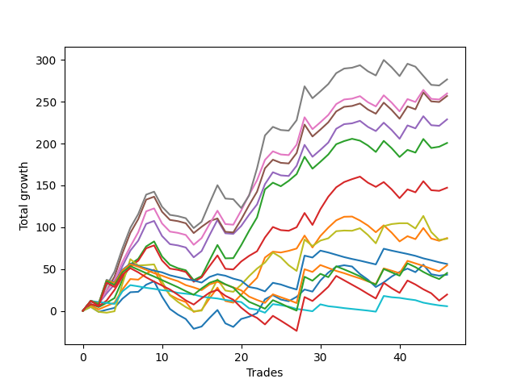

# Short Bulldog 003 
- Symbol: ESBIB
- Date Range: 03/18/2022 - 07/15/2022
- Trading Period: 7:20-12:30
- Number of Trades: 49



| Name | Win Percent | Profit | Avg Profit / Trade | Avg Time / Trade |      | Name | Win Percent | Profit | Avg Profit / Trade | Avg Time / Trade |
| ---- | ----------- | ------ | ------------------ | ---------------- | ---- | ---- | ----------- | ------ | ------------------ | ---------------- |
| Sorted By <br> Profit | | | | | | Sorted By <br> Win Percentage ||||
| Seven | 57.14 | 138000.00 | 2816.33 | 27:12 |     | Eighty-One | 85.71 | 4625.00 | 94.39 | 06:00 |
| Six | 61.22 | 129625.00 | 2645.41 | 24:58 |     | One Hundred Twenty-One | 79.59 | -20125.00 | -410.71 | 02:29 |
| Five | 61.22 | 128125.00 | 2614.80 | 25:32 |     | Eighty-Two | 77.55 | 13250.00 | 270.41 | 08:56 |
| Four | 61.22 | 114125.00 | 2329.08 | 23:11 |     | One Hundred Sixteen | 77.55 | -1625.00 | -33.16 | 01:45 |
| Two | 65.31 | 101625.00 | 2073.98 | 19:32 |     | One Hundred Eleven | 77.55 | -2750.00 | -56.12 | 01:44 |
| Three | 61.22 | 73250.00 | 1494.90 | 20:42 |     | One Hundred Twenty-Six | 77.55 | -25250.00 | -515.31 | 02:30 |
| Forty-Six | 42.86 | 63750.00 | 1301.02 | 12:28 |     | Eighty-Three | 73.47 | 12750.00 | 260.20 | 11:00 |
| Forty-Seven | 36.73 | 61750.00 | 1260.20 | 13:42 |     | Eighty-Five | 71.43 | 36875.00 | 752.55 | 14:25 |
| Thirty | 30.61 | 57250.00 | 1168.37 | 08:59 |     | Eighty-Four | 71.43 | 22375.00 | 456.63 | 13:10 |
| Forty-Two | 44.90 | 54000.00 | 1102.04 | 09:34 |     | One Hundred One | 71.43 | 2875.00 | 58.67 | 00:55 |
| Forty-Five | 40.82 | 53750.00 | 1096.94 | 13:17 |     | One Hundred Twenty-Two | 71.43 | -23000.00 | -469.39 | 03:37 |
| Fifteen | 20.41 | 53125.00 | 1084.18 | 08:01 |     | One Hundred Seventeen | 69.39 | 5250.00 | 107.14 | 02:20 |
| Forty-Four | 40.82 | 51625.00 | 1053.57 | 11:27 |     | One Hundred Twelve | 69.39 | 3250.00 | 66.33 | 02:21 |
| Seventy-One | 46.94 | 51500.00 | 1051.02 | 14:06 |     | One Hundred Six | 69.39 | 875.00 | 17.86 | 01:11 |
| Thirty-One | 24.49 | 50750.00 | 1035.71 | 10:06 |     | One Hundred Twenty-Seven | 69.39 | -26750.00 | -545.92 | 03:23 |
| Fourteen | 24.49 | 48750.00 | 994.90 | 07:03 |     | One Hundred Twenty-Three | 67.35 | -24500.00 | -500.00 | 04:42 |
| Thirteen | 24.49 | 47875.00 | 977.04 | 07:58 |     | Two | 65.31 | 101625.00 | 2073.98 | 19:32 |
| Ten | 28.57 | 47750.00 | 974.49 | 05:38 |     | One Hundred Twenty-Four | 65.31 | -13625.00 | -278.06 | 06:43 |
| Twenty-Nine | 28.57 | 46625.00 | 951.53 | 09:44 |     | One Hundred Two | 63.27 | 11250.00 | 229.59 | 01:25 |
| Twelve | 24.49 | 45000.00 | 918.37 | 06:26 |     | Ninety-One | 63.27 | 1000.00 | 20.41 | 00:35 |
| Twenty-Eight | 28.57 | 44625.00 | 910.71 | 07:56 |     | One Hundred Twenty-Five | 63.27 | -8625.00 | -176.02 | 07:55 |
| Twenty-Six | 32.65 | 42750.00 | 872.45 | 06:44 |     | One Hundred Twenty-Eight | 63.27 | -31750.00 | -647.96 | 04:22 |
| One | 59.18 | 41750.00 | 852.04 | 17:00 |     | Six | 61.22 | 129625.00 | 2645.41 | 24:58 |
| Eleven | 28.57 | 40000.00 | 816.33 | 04:55 |     | Five | 61.22 | 128125.00 | 2614.80 | 25:32 |
| Seventy-Three | 51.02 | 39750.00 | 811.22 | 14:32 |     | Four | 61.22 | 114125.00 | 2329.08 | 23:11 |
| Seventy | 46.94 | 39000.00 | 795.92 | 13:22 |     | Three | 61.22 | 73250.00 | 1494.90 | 20:42 |
| Sixty-Two | 51.02 | 38500.00 | 785.71 | 16:26 |     | One Hundred Seven | 61.22 | 8125.00 | 165.82 | 01:39 |
| Sixty-Nine | 46.94 | 37500.00 | 765.31 | 14:04 |     | One Hundred Thirteen | 61.22 | -4000.00 | -81.63 | 03:13 |
| Eighty-Five | 71.43 | 36875.00 | 752.55 | 14:25 |     | One Hundred Twenty-Nine | 61.22 | -23000.00 | -469.39 | 06:03 |
| twenty-Seven | 32.65 | 35625.00 | 727.04 | 06:10 |     | One | 59.18 | 41750.00 | 852.04 | 17:00 |
| Sixty | 51.02 | 33500.00 | 683.67 | 15:20 |     | Zero | 59.18 | 21875.00 | 446.43 | 12:15 |
| Nine | 30.61 | 32125.00 | 655.61 | 04:37 |     | One Hundred Eighteen | 59.18 | 1125.00 | 22.96 | 03:04 |
| Sixty-Eight | 46.94 | 30375.00 | 619.90 | 12:30 |     | One Hundred Thirty | 59.18 | -17250.00 | -352.04 | 07:13 |
| Fifty-Five | 40.82 | 30000.00 | 612.24 | 07:01 |     | Seven | 57.14 | 138000.00 | 2816.33 | 27:12 |
| Forty-Three | 42.86 | 29875.00 | 609.69 | 09:24 |     | Ninety-Six | 57.14 | -5000.00 | -102.04 | 00:37 |
| Sixty-Three | 44.90 | 26750.00 | 545.92 | 17:50 |     | Ninety-Two | 55.10 | 8750.00 | 178.57 | 01:02 |
| Twenty-Five | 34.69 | 26000.00 | 530.61 | 05:34 |     | One Hundred Fourteen | 55.10 | 375.00 | 7.65 | 04:35 |
| Sixty-One | 48.98 | 25250.00 | 515.31 | 17:21 |     | Fifty-Six | 55.10 | -7125.00 | -145.41 | 07:57 |
| Fifty-Three | 40.82 | 22625.00 | 461.73 | 06:59 |     | Fifty-Nine | 53.06 | 13125.00 | 267.86 | 13:10 |
| Eighty-Four | 71.43 | 22375.00 | 456.63 | 13:10 |     | One Hundred Three | 53.06 | 6500.00 | 132.65 | 02:09 |
| Zero | 59.18 | 21875.00 | 446.43 | 12:15 |     | One Hundred Fifteen | 53.06 | 5750.00 | 117.35 | 05:34 |
| Forty-One | 44.90 | 20500.00 | 418.37 | 08:06 |     | Fifty-Seven | 53.06 | -6875.00 | -140.31 | 11:21 |
| Fifty-Eight | 51.02 | 19375.00 | 395.41 | 12:58 |     | Seventy-Three | 51.02 | 39750.00 | 811.22 | 14:32 |
| Sixty-Six | 48.98 | 19125.00 | 390.31 | 10:13 |     | Sixty-Two | 51.02 | 38500.00 | 785.71 | 16:26 |
| Fifty-Four | 40.82 | 18875.00 | 385.20 | 06:43 |     | Sixty | 51.02 | 33500.00 | 683.67 | 15:20 |
| Fifty-Two | 40.82 | 18125.00 | 369.90 | 06:15 |     | Fifty-Eight | 51.02 | 19375.00 | 395.41 | 12:58 |
| Eight | 34.69 | 16500.00 | 336.73 | 03:22 |     | One Hundred Eight | 51.02 | 6000.00 | 122.45 | 02:11 |
| Sixty-Seven | 46.94 | 13625.00 | 278.06 | 11:12 |     | One Hundred Ninteen | 51.02 | 4000.00 | 81.63 | 03:47 |
| Eighty-Two | 77.55 | 13250.00 | 270.41 | 08:56 |     | Sixty-Four | 51.02 | -17375.00 | -354.59 | 06:53 |
| Fifty-Nine | 53.06 | 13125.00 | 267.86 | 13:10 |     | Sixty-One | 48.98 | 25250.00 | 515.31 | 17:21 |
| Fifty | 40.82 | 13000.00 | 265.31 | 05:55 |     | Sixty-Six | 48.98 | 19125.00 | 390.31 | 10:13 |
| Eighty-Three | 73.47 | 12750.00 | 260.20 | 11:00 |     | Sixty-Five | 48.98 | -14625.00 | -298.47 | 09:11 |
| One Hundred Two | 63.27 | 11250.00 | 229.59 | 01:25 |     | Seventy-One | 46.94 | 51500.00 | 1051.02 | 14:06 |
| Ninety-Four | 40.82 | 11000.00 | 224.49 | 02:15 |     | Seventy | 46.94 | 39000.00 | 795.92 | 13:22 |
| Fifty-One | 40.82 | 9750.00 | 198.98 | 05:53 |     | Sixty-Nine | 46.94 | 37500.00 | 765.31 | 14:04 |
| Twenty-Four | 38.78 | 9125.00 | 186.22 | 04:14 |     | Sixty-Eight | 46.94 | 30375.00 | 619.90 | 12:30 |
| Ninety-Two | 55.10 | 8750.00 | 178.57 | 01:02 |     | Sixty-Seven | 46.94 | 13625.00 | 278.06 | 11:12 |
| Ninety-Three | 46.94 | 8250.00 | 168.37 | 01:42 |     | Ninety-Three | 46.94 | 8250.00 | 168.37 | 01:42 |
| One Hundred Seven | 61.22 | 8125.00 | 165.82 | 01:39 |     | Forty | 46.94 | 5250.00 | 107.14 | 05:50 |
| Forty-Nine | 40.82 | 7000.00 | 142.86 | 05:22 |     | Ninety-Seven | 46.94 | -4000.00 | -81.63 | 00:49 |
| Forty-Eight | 40.82 | 6625.00 | 135.20 | 04:28 |     | Forty-Two | 44.90 | 54000.00 | 1102.04 | 09:34 |
| One Hundred Three | 53.06 | 6500.00 | 132.65 | 02:09 |     | Sixty-Three | 44.90 | 26750.00 | 545.92 | 17:50 |
| One Hundred Eight | 51.02 | 6000.00 | 122.45 | 02:11 |     | Forty-One | 44.90 | 20500.00 | 418.37 | 08:06 |
| One Hundred Ten | 44.90 | 6000.00 | 122.45 | 02:48 |     | One Hundred Ten | 44.90 | 6000.00 | 122.45 | 02:48 |
| One Hundred Fifteen | 53.06 | 5750.00 | 117.35 | 05:34 |     | One Hundred Four | 44.90 | 5625.00 | 114.80 | 02:57 |
| One Hundred Four | 44.90 | 5625.00 | 114.80 | 02:57 |     | Thirty-Three | 44.90 | 3875.00 | 79.08 | 03:11 |
| One Hundred Seventeen | 69.39 | 5250.00 | 107.14 | 02:20 |     | Thirty-Four | 44.90 | 2875.00 | 58.67 | 03:22 |
| Forty | 46.94 | 5250.00 | 107.14 | 05:50 |     | One Hundred Nine | 44.90 | 2750.00 | 56.12 | 02:36 |
| Ninety-Five | 34.69 | 5250.00 | 107.14 | 02:42 |     | One Hundred Twenty | 44.90 | 2625.00 | 53.57 | 04:05 |
| Eighty-One | 85.71 | 4625.00 | 94.39 | 06:00 |     | Thirty-Six | 44.90 | 2500.00 | 51.02 | 03:24 |
| One Hundred Ninteen | 51.02 | 4000.00 | 81.63 | 03:47 |     | Thirty-Nine | 44.90 | 1125.00 | 22.96 | 03:29 |
| Thirty-Three | 44.90 | 3875.00 | 79.08 | 03:11 |     | Thirty-Eight | 44.90 | 1125.00 | 22.96 | 03:29 |
| One Hundred Twelve | 69.39 | 3250.00 | 66.33 | 02:21 |     | Thirty-Seven | 44.90 | 1125.00 | 22.96 | 03:29 |
| One Hundred One | 71.43 | 2875.00 | 58.67 | 00:55 |     | Thirty-Five | 44.90 | 375.00 | 7.65 | 03:22 |
| Thirty-Four | 44.90 | 2875.00 | 58.67 | 03:22 |     | Thirty-Two | 44.90 | -750.00 | -15.31 | 02:55 |
| One Hundred Nine | 44.90 | 2750.00 | 56.12 | 02:36 |     | Forty-Six | 42.86 | 63750.00 | 1301.02 | 12:28 |
| One Hundred Twenty | 44.90 | 2625.00 | 53.57 | 04:05 |     | Forty-Three | 42.86 | 29875.00 | 609.69 | 09:24 |
| Thirty-Six | 44.90 | 2500.00 | 51.02 | 03:24 |     | Forty-Five | 40.82 | 53750.00 | 1096.94 | 13:17 |
| One Hundred Eighteen | 59.18 | 1125.00 | 22.96 | 03:04 |     | Forty-Four | 40.82 | 51625.00 | 1053.57 | 11:27 |
| Thirty-Nine | 44.90 | 1125.00 | 22.96 | 03:29 |     | Fifty-Five | 40.82 | 30000.00 | 612.24 | 07:01 |
| Thirty-Eight | 44.90 | 1125.00 | 22.96 | 03:29 |     | Fifty-Three | 40.82 | 22625.00 | 461.73 | 06:59 |
| Thirty-Seven | 44.90 | 1125.00 | 22.96 | 03:29 |     | Fifty-Four | 40.82 | 18875.00 | 385.20 | 06:43 |
| Ninety-One | 63.27 | 1000.00 | 20.41 | 00:35 |     | Fifty-Two | 40.82 | 18125.00 | 369.90 | 06:15 |
| One Hundred Six | 69.39 | 875.00 | 17.86 | 01:11 |     | Fifty | 40.82 | 13000.00 | 265.31 | 05:55 |
| One Hundred Fourteen | 55.10 | 375.00 | 7.65 | 04:35 |     | Ninety-Four | 40.82 | 11000.00 | 224.49 | 02:15 |
| Thirty-Five | 44.90 | 375.00 | 7.65 | 03:22 |     | Fifty-One | 40.82 | 9750.00 | 198.98 | 05:53 |
| One Hundred Five | 38.78 | -125.00 | -2.55 | 03:30 |     | Forty-Nine | 40.82 | 7000.00 | 142.86 | 05:22 |
| Thirty-Two | 44.90 | -750.00 | -15.31 | 02:55 |     | Forty-Eight | 40.82 | 6625.00 | 135.20 | 04:28 |
| One Hundred Sixteen | 77.55 | -1625.00 | -33.16 | 01:45 |     | Ninety-Eight | 40.82 | -9125.00 | -186.22 | 01:01 |
| One Hundred Eleven | 77.55 | -2750.00 | -56.12 | 01:44 |     | Twenty-Four | 38.78 | 9125.00 | 186.22 | 04:14 |
| One Hundred Thirteen | 61.22 | -4000.00 | -81.63 | 03:13 |     | One Hundred Five | 38.78 | -125.00 | -2.55 | 03:30 |
| Ninety-Seven | 46.94 | -4000.00 | -81.63 | 00:49 |     | One Hundred | 38.78 | -12500.00 | -255.10 | 01:06 |
| Ninety-Six | 57.14 | -5000.00 | -102.04 | 00:37 |     | Ninety-Nine | 38.78 | -14000.00 | -285.71 | 01:05 |
| Fifty-Seven | 53.06 | -6875.00 | -140.31 | 11:21 |     | Twenty-Three | 38.78 | -14875.00 | -303.57 | 01:07 |
| Fifty-Six | 55.10 | -7125.00 | -145.41 | 07:57 |     | Twenty-Two | 38.78 | -14875.00 | -303.57 | 01:07 |
| One Hundred Twenty-Five | 63.27 | -8625.00 | -176.02 | 07:55 |     | Twenty-One | 38.78 | -14875.00 | -303.57 | 01:07 |
| Ninety-Eight | 40.82 | -9125.00 | -186.22 | 01:01 |     | Twenty | 38.78 | -14875.00 | -303.57 | 01:07 |
| One Hundred | 38.78 | -12500.00 | -255.10 | 01:06 |     | Nineteen | 38.78 | -14875.00 | -303.57 | 01:07 |
| One Hundred Twenty-Four | 65.31 | -13625.00 | -278.06 | 06:43 |     | Eighteen | 38.78 | -14875.00 | -303.57 | 01:07 |
| Ninety-Nine | 38.78 | -14000.00 | -285.71 | 01:05 |     | Seventeen | 38.78 | -14875.00 | -303.57 | 01:07 |
| Sixty-Five | 48.98 | -14625.00 | -298.47 | 09:11 |     | Sixten | 38.78 | -14875.00 | -303.57 | 01:07 |
| Twenty-Three | 38.78 | -14875.00 | -303.57 | 01:07 |     | Forty-Seven | 36.73 | 61750.00 | 1260.20 | 13:42 |
| Twenty-Two | 38.78 | -14875.00 | -303.57 | 01:07 |     | Twenty-Five | 34.69 | 26000.00 | 530.61 | 05:34 |
| Twenty-One | 38.78 | -14875.00 | -303.57 | 01:07 |     | Eight | 34.69 | 16500.00 | 336.73 | 03:22 |
| Twenty | 38.78 | -14875.00 | -303.57 | 01:07 |     | Ninety-Five | 34.69 | 5250.00 | 107.14 | 02:42 |
| Nineteen | 38.78 | -14875.00 | -303.57 | 01:07 |     | Twenty-Six | 32.65 | 42750.00 | 872.45 | 06:44 |
| Eighteen | 38.78 | -14875.00 | -303.57 | 01:07 |     | twenty-Seven | 32.65 | 35625.00 | 727.04 | 06:10 |
| Seventeen | 38.78 | -14875.00 | -303.57 | 01:07 |     | Thirty | 30.61 | 57250.00 | 1168.37 | 08:59 |
| Sixten | 38.78 | -14875.00 | -303.57 | 01:07 |     | Nine | 30.61 | 32125.00 | 655.61 | 04:37 |
| One Hundred Thirty | 59.18 | -17250.00 | -352.04 | 07:13 |     | Ten | 28.57 | 47750.00 | 974.49 | 05:38 |
| Sixty-Four | 51.02 | -17375.00 | -354.59 | 06:53 |     | Twenty-Nine | 28.57 | 46625.00 | 951.53 | 09:44 |
| One Hundred Twenty-One | 79.59 | -20125.00 | -410.71 | 02:29 |     | Twenty-Eight | 28.57 | 44625.00 | 910.71 | 07:56 |
| One Hundred Twenty-Two | 71.43 | -23000.00 | -469.39 | 03:37 |     | Eleven | 28.57 | 40000.00 | 816.33 | 04:55 |
| One Hundred Twenty-Nine | 61.22 | -23000.00 | -469.39 | 06:03 |     | Thirty-One | 24.49 | 50750.00 | 1035.71 | 10:06 |
| One Hundred Twenty-Three | 67.35 | -24500.00 | -500.00 | 04:42 |     | Fourteen | 24.49 | 48750.00 | 994.90 | 07:03 |
| One Hundred Twenty-Six | 77.55 | -25250.00 | -515.31 | 02:30 |     | Thirteen | 24.49 | 47875.00 | 977.04 | 07:58 |
| One Hundred Twenty-Seven | 69.39 | -26750.00 | -545.92 | 03:23 |     | Twelve | 24.49 | 45000.00 | 918.37 | 06:26 |
| One Hundred Twenty-Eight | 63.27 | -31750.00 | -647.96 | 04:22 |     | Fifteen | 20.41 | 53125.00 | 1084.18 | 08:01 |

## NO STOPLOSS

### Test Zero
* Sell when price hits the middle line of the 20p bollinger
* No Stoploss
* Results:
```
Total Trades: 49
Percent Up: 40.82
Percent Down: 59.18
Total Points Moved Down: 43.75
Potential Profit: 21875.00
Total Points Ups: 136.75 Count Ups: 20
Total Points Downs: 180.50 Count Downs: 29
```

<details><summary>Trades</summary>

<code>In: 2022-03-24 08:44:00		Out: 2022-03-24 08:50:10		Total Position Time: 06:10		Total Move Down: 4.75		Total to Date: 4.75</code> <br />
<code>In: 2022-03-25 07:26:00		Out: 2022-03-25 07:51:05		Total Position Time: 25:05		Total Move Down: -6.00		Total to Date: -1.25</code> <br />
<code>In: 2022-03-25 07:44:00		Out: 2022-03-25 07:51:05		Total Position Time: 07:05		Total Move Down: 2.50		Total to Date: 1.25</code> <br />
<code>In: 2022-04-06 10:43:00		Out: 2022-04-06 10:55:45		Total Position Time: 12:45		Total Move Down: 2.25		Total to Date: 3.50</code> <br />
<code>In: 2022-04-06 11:04:00		Out: 2022-04-06 11:05:40		Total Position Time: 01:40		Total Move Down: 11.00		Total to Date: 14.50</code> <br />
<code>In: 2022-04-06 11:05:00		Out: 2022-04-06 11:05:40		Total Position Time: 00:40		Total Move Down: 7.75		Total to Date: 22.25</code> <br />
<code>In: 2022-04-06 11:57:00		Out: 2022-04-06 12:07:45		Total Position Time: 10:45		Total Move Down: 0.50		Total to Date: 22.75</code> <br />
<code>In: 2022-04-06 12:02:00		Out: 2022-04-06 12:07:45		Total Position Time: 05:45		Total Move Down: 8.50		Total to Date: 31.25</code> <br />
<code>In: 2022-04-07 11:03:00		Out: 2022-04-07 11:15:20		Total Position Time: 12:20		Total Move Down: 4.00		Total to Date: 35.25</code> <br />
<code>In: 2022-04-07 11:50:00		Out: 2022-04-07 12:19:10		Total Position Time: 29:10		Total Move Down: -18.25		Total to Date: 17.00</code> <br />
<code>In: 2022-04-07 11:54:00		Out: 2022-04-07 12:19:10		Total Position Time: 25:10		Total Move Down: -14.75		Total to Date: 2.25</code> <br />
<code>In: 2022-04-08 07:54:00		Out: 2022-04-08 08:15:35		Total Position Time: 21:35		Total Move Down: -6.75		Total to Date: -4.50</code> <br />
<code>In: 2022-04-08 07:57:00		Out: 2022-04-08 08:15:35		Total Position Time: 18:35		Total Move Down: -5.25		Total to Date: -9.75</code> <br />
<code>In: 2022-04-13 08:06:00		Out: 2022-04-13 08:35:55		Total Position Time: 29:55		Total Move Down: -11.75		Total to Date: -21.50</code> <br />
<code>In: 2022-04-18 07:27:00		Out: 2022-04-18 07:38:20		Total Position Time: 11:20		Total Move Down: 2.75		Total to Date: -18.75</code> <br />
<code>In: 2022-05-03 07:34:00		Out: 2022-05-03 07:38:45		Total Position Time: 04:45		Total Move Down: 10.25		Total to Date: -8.50</code> <br />
<code>In: 2022-05-03 07:35:00		Out: 2022-05-03 07:38:45		Total Position Time: 03:45		Total Move Down: 9.50		Total to Date: 1.00</code> <br />
<code>In: 2022-05-03 08:06:00		Out: 2022-05-03 08:35:55		Total Position Time: 29:55		Total Move Down: -16.00		Total to Date: -15.00</code> <br />
<code>In: 2022-05-03 08:10:00		Out: 2022-05-03 08:35:55		Total Position Time: 25:55		Total Move Down: -4.25		Total to Date: -19.25</code> <br />
<code>In: 2022-05-04 10:59:00		Out: 2022-05-04 11:00:25		Total Position Time: 01:25		Total Move Down: 9.50		Total to Date: -9.75</code> <br />
<code>In: 2022-05-04 11:03:00		Out: 2022-05-04 11:06:50		Total Position Time: 03:50		Total Move Down: 2.75		Total to Date: -7.00</code> <br />
<code>In: 2022-05-04 11:07:00		Out: 2022-05-04 11:07:10		Total Position Time: 00:10		Total Move Down: 4.25		Total to Date: -2.75</code> <br />
<code>In: 2022-05-04 11:30:00		Out: 2022-05-04 11:30:45		Total Position Time: 00:45		Total Move Down: 16.50		Total to Date: 13.75</code> <br />
<code>In: 2022-05-16 09:05:00		Out: 2022-05-16 09:06:00		Total Position Time: 01:00		Total Move Down: 5.00		Total to Date: 18.75</code> <br />
<code>In: 2022-05-16 10:25:00		Out: 2022-05-16 10:42:15		Total Position Time: 17:15		Total Move Down: -5.25		Total to Date: 13.50</code> <br />
<code>In: 2022-05-19 08:40:00		Out: 2022-05-19 08:53:40		Total Position Time: 13:40		Total Move Down: -2.00		Total to Date: 11.50</code> <br />
<code>In: 2022-05-19 11:52:00		Out: 2022-05-19 11:57:50		Total Position Time: 05:50		Total Move Down: 5.25		Total to Date: 16.75</code> <br />
<code>In: 2022-05-19 12:05:00		Out: 2022-05-19 12:09:45		Total Position Time: 04:45		Total Move Down: 8.75		Total to Date: 25.50</code> <br />
<code>In: 2022-05-23 08:07:00		Out: 2022-05-23 08:23:15		Total Position Time: 16:15		Total Move Down: -2.50		Total to Date: 23.00</code> <br />
<code>In: 2022-05-24 11:13:00		Out: 2022-05-24 11:18:25		Total Position Time: 05:25		Total Move Down: 13.25		Total to Date: 36.25</code> <br />
<code>In: 2022-05-24 11:14:00		Out: 2022-05-24 11:18:25		Total Position Time: 04:25		Total Move Down: 9.50		Total to Date: 45.75</code> <br />
<code>In: 2022-05-25 07:36:00		Out: 2022-05-25 07:42:00		Total Position Time: 06:00		Total Move Down: 7.00		Total to Date: 52.75</code> <br />
<code>In: 2022-05-25 12:05:00		Out: 2022-05-25 12:17:30		Total Position Time: 12:30		Total Move Down: 1.75		Total to Date: 54.50</code> <br />
<code>In: 2022-05-27 12:10:00		Out: 2022-05-27 12:35:00		Total Position Time: 25:00		Total Move Down: -1.50		Total to Date: 53.00</code> <br />
<code>In: 2022-05-31 08:53:00		Out: 2022-05-31 09:13:50		Total Position Time: 20:50		Total Move Down: -9.00		Total to Date: 44.00</code> <br />
<code>In: 2022-06-02 08:05:00		Out: 2022-06-02 08:27:20		Total Position Time: 22:20		Total Move Down: -6.75		Total to Date: 37.25</code> <br />
<code>In: 2022-06-02 08:06:00		Out: 2022-06-02 08:27:20		Total Position Time: 21:20		Total Move Down: -8.75		Total to Date: 28.50</code> <br />
<code>In: 2022-06-23 08:15:00		Out: 2022-06-23 08:21:05		Total Position Time: 06:05		Total Move Down: 5.50		Total to Date: 34.00</code> <br />
<code>In: 2022-06-30 08:29:00		Out: 2022-06-30 08:35:10		Total Position Time: 06:10		Total Move Down: 7.00		Total to Date: 41.00</code> <br />
<code>In: 2022-06-30 08:30:00		Out: 2022-06-30 08:35:10		Total Position Time: 05:10		Total Move Down: 5.50		Total to Date: 46.50</code> <br />
<code>In: 2022-07-05 09:27:00		Out: 2022-07-05 09:41:35		Total Position Time: 14:35		Total Move Down: 4.00		Total to Date: 50.50</code> <br />
<code>In: 2022-07-05 11:34:00		Out: 2022-07-05 11:48:10		Total Position Time: 14:10		Total Move Down: -4.25		Total to Date: 46.25</code> <br />
<code>In: 2022-07-06 11:09:00		Out: 2022-07-06 11:10:10		Total Position Time: 01:10		Total Move Down: 9.00		Total to Date: 55.25</code> <br />
<code>In: 2022-07-06 11:31:00		Out: 2022-07-06 11:50:05		Total Position Time: 19:05		Total Move Down: -11.50		Total to Date: 43.75</code> <br />
<code>In: 2022-07-06 11:35:00		Out: 2022-07-06 11:50:05		Total Position Time: 15:05		Total Move Down: -1.75		Total to Date: 42.00</code> <br />
<code>In: 2022-07-07 12:18:00		Out: 2022-07-07 12:24:15		Total Position Time: 06:15		Total Move Down: 1.25		Total to Date: 43.25</code> <br />
<code>In: 2022-07-11 10:09:00		Out: 2022-07-11 10:23:05		Total Position Time: 14:05		Total Move Down: -0.25		Total to Date: 43.00</code> <br />
<code>In: 2022-07-14 08:44:00		Out: 2022-07-14 09:01:10		Total Position Time: 17:10		Total Move Down: 1.00		Total to Date: 44.00</code> <br />
<code>In: 2022-07-14 08:45:00		Out: 2022-07-14 09:01:10		Total Position Time: 16:10		Total Move Down: -0.25		Total to Date: 43.75</code> <br />


</details>

### Test One
* Sell when the price hits the upper line of the 20p 1std bollinger
* No Stoploss
* Results:
```
Total Trades: 49
Percent Up: 40.82
Percent Down: 59.18
Total Points Moved Down: 83.50
Potential Profit: 41750.00
Total Points Ups: 153.00 Count Ups: 20
Total Points Downs: 236.50 Count Downs: 29
```

<details><summary>Trades</summary>

<code>In: 2022-03-24 08:44:00		Out: 2022-03-24 08:53:50		Total Position Time: 09:50		Total Move Down: 6.25		Total to Date: 6.25</code> <br />
<code>In: 2022-03-25 07:26:00		Out: 2022-03-25 07:53:50		Total Position Time: 27:50		Total Move Down: -4.50		Total to Date: 1.75</code> <br />
<code>In: 2022-03-25 07:44:00		Out: 2022-03-25 07:53:50		Total Position Time: 09:50		Total Move Down: 4.00		Total to Date: 5.75</code> <br />
<code>In: 2022-04-06 10:43:00		Out: 2022-04-06 10:56:55		Total Position Time: 13:55		Total Move Down: 4.00		Total to Date: 9.75</code> <br />
<code>In: 2022-04-06 11:04:00		Out: 2022-04-06 11:07:20		Total Position Time: 03:20		Total Move Down: 15.75		Total to Date: 25.50</code> <br />
<code>In: 2022-04-06 11:05:00		Out: 2022-04-06 11:07:20		Total Position Time: 02:20		Total Move Down: 12.50		Total to Date: 38.00</code> <br />
<code>In: 2022-04-06 11:57:00		Out: 2022-04-06 12:17:05		Total Position Time: 20:05		Total Move Down: -0.75		Total to Date: 37.25</code> <br />
<code>In: 2022-04-06 12:02:00		Out: 2022-04-06 12:17:05		Total Position Time: 15:05		Total Move Down: 7.25		Total to Date: 44.50</code> <br />
<code>In: 2022-04-07 11:03:00		Out: 2022-04-07 11:18:00		Total Position Time: 15:00		Total Move Down: 4.75		Total to Date: 49.25</code> <br />
<code>In: 2022-04-07 11:50:00		Out: 2022-04-07 12:19:55		Total Position Time: 29:55		Total Move Down: -18.00		Total to Date: 31.25</code> <br />
<code>In: 2022-04-07 11:54:00		Out: 2022-04-07 12:20:50		Total Position Time: 26:50		Total Move Down: -12.25		Total to Date: 19.00</code> <br />
<code>In: 2022-04-08 07:54:00		Out: 2022-04-08 08:17:05		Total Position Time: 23:05		Total Move Down: -5.00		Total to Date: 14.00</code> <br />
<code>In: 2022-04-08 07:57:00		Out: 2022-04-08 08:17:05		Total Position Time: 20:05		Total Move Down: -3.50		Total to Date: 10.50</code> <br />
<code>In: 2022-04-13 08:06:00		Out: 2022-04-13 08:35:55		Total Position Time: 29:55		Total Move Down: -11.75		Total to Date: -1.25</code> <br />
<code>In: 2022-04-18 07:27:00		Out: 2022-04-18 07:51:20		Total Position Time: 24:20		Total Move Down: 2.25		Total to Date: 1.00</code> <br />
<code>In: 2022-05-03 07:34:00		Out: 2022-05-03 07:42:05		Total Position Time: 08:05		Total Move Down: 13.75		Total to Date: 14.75</code> <br />
<code>In: 2022-05-03 07:35:00		Out: 2022-05-03 07:42:05		Total Position Time: 07:05		Total Move Down: 13.00		Total to Date: 27.75</code> <br />
<code>In: 2022-05-03 08:06:00		Out: 2022-05-03 08:35:55		Total Position Time: 29:55		Total Move Down: -16.00		Total to Date: 11.75</code> <br />
<code>In: 2022-05-03 08:10:00		Out: 2022-05-03 08:38:05		Total Position Time: 28:05		Total Move Down: -2.00		Total to Date: 9.75</code> <br />
<code>In: 2022-05-04 10:59:00		Out: 2022-05-04 11:00:25		Total Position Time: 01:25		Total Move Down: 9.50		Total to Date: 19.25</code> <br />
<code>In: 2022-05-04 11:03:00		Out: 2022-05-04 11:07:20		Total Position Time: 04:20		Total Move Down: 10.75		Total to Date: 30.00</code> <br />
<code>In: 2022-05-04 11:07:00		Out: 2022-05-04 11:07:20		Total Position Time: 00:20		Total Move Down: 9.50		Total to Date: 39.50</code> <br />
<code>In: 2022-05-04 11:30:00		Out: 2022-05-04 11:30:50		Total Position Time: 00:50		Total Move Down: 24.25		Total to Date: 63.75</code> <br />
<code>In: 2022-05-16 09:05:00		Out: 2022-05-16 09:06:10		Total Position Time: 01:10		Total Move Down: 7.00		Total to Date: 70.75</code> <br />
<code>In: 2022-05-16 10:25:00		Out: 2022-05-16 10:42:40		Total Position Time: 17:40		Total Move Down: -1.00		Total to Date: 69.75</code> <br />
<code>In: 2022-05-19 08:40:00		Out: 2022-05-19 08:55:05		Total Position Time: 15:05		Total Move Down: 2.00		Total to Date: 71.75</code> <br />
<code>In: 2022-05-19 11:52:00		Out: 2022-05-19 12:10:15		Total Position Time: 18:15		Total Move Down: 2.75		Total to Date: 74.50</code> <br />
<code>In: 2022-05-19 12:05:00		Out: 2022-05-19 12:10:15		Total Position Time: 05:15		Total Move Down: 15.50		Total to Date: 90.00</code> <br />
<code>In: 2022-05-23 08:07:00		Out: 2022-05-23 08:36:55		Total Position Time: 29:55		Total Move Down: -14.25		Total to Date: 75.75</code> <br />
<code>In: 2022-05-24 11:13:00		Out: 2022-05-24 11:31:25		Total Position Time: 18:25		Total Move Down: 13.75		Total to Date: 89.50</code> <br />
<code>In: 2022-05-24 11:14:00		Out: 2022-05-24 11:31:25		Total Position Time: 17:25		Total Move Down: 10.00		Total to Date: 99.50</code> <br />
<code>In: 2022-05-25 07:36:00		Out: 2022-05-25 07:46:50		Total Position Time: 10:50		Total Move Down: 8.75		Total to Date: 108.25</code> <br />
<code>In: 2022-05-25 12:05:00		Out: 2022-05-25 12:20:25		Total Position Time: 15:25		Total Move Down: 4.25		Total to Date: 112.50</code> <br />
<code>In: 2022-05-27 12:10:00		Out: 2022-05-27 12:35:40		Total Position Time: 25:40		Total Move Down: 0.25		Total to Date: 112.75</code> <br />
<code>In: 2022-05-31 08:53:00		Out: 2022-05-31 09:14:40		Total Position Time: 21:40		Total Move Down: -4.75		Total to Date: 108.00</code> <br />
<code>In: 2022-06-02 08:05:00		Out: 2022-06-02 08:28:15		Total Position Time: 23:15		Total Move Down: -6.00		Total to Date: 102.00</code> <br />
<code>In: 2022-06-02 08:06:00		Out: 2022-06-02 08:28:15		Total Position Time: 22:15		Total Move Down: -8.00		Total to Date: 94.00</code> <br />
<code>In: 2022-06-23 08:15:00		Out: 2022-06-23 08:23:30		Total Position Time: 08:30		Total Move Down: 8.25		Total to Date: 102.25</code> <br />
<code>In: 2022-06-30 08:29:00		Out: 2022-06-30 08:58:55		Total Position Time: 29:55		Total Move Down: -8.75		Total to Date: 93.50</code> <br />
<code>In: 2022-06-30 08:30:00		Out: 2022-06-30 08:59:55		Total Position Time: 29:55		Total Move Down: -10.50		Total to Date: 83.00</code> <br />
<code>In: 2022-07-05 09:27:00		Out: 2022-07-05 09:42:00		Total Position Time: 15:00		Total Move Down: 6.25		Total to Date: 89.25</code> <br />
<code>In: 2022-07-05 11:34:00		Out: 2022-07-05 11:53:40		Total Position Time: 19:40		Total Move Down: -3.50		Total to Date: 85.75</code> <br />
<code>In: 2022-07-06 11:09:00		Out: 2022-07-06 11:11:10		Total Position Time: 02:10		Total Move Down: 13.25		Total to Date: 99.00</code> <br />
<code>In: 2022-07-06 11:31:00		Out: 2022-07-06 12:00:45		Total Position Time: 29:45		Total Move Down: -12.50		Total to Date: 86.50</code> <br />
<code>In: 2022-07-06 11:35:00		Out: 2022-07-06 12:00:45		Total Position Time: 25:45		Total Move Down: -2.75		Total to Date: 83.75</code> <br />
<code>In: 2022-07-07 12:18:00		Out: 2022-07-07 12:25:10		Total Position Time: 07:10		Total Move Down: 3.25		Total to Date: 87.00</code> <br />
<code>In: 2022-07-11 10:09:00		Out: 2022-07-11 10:38:55		Total Position Time: 29:55		Total Move Down: -7.25		Total to Date: 79.75</code> <br />
<code>In: 2022-07-14 08:44:00		Out: 2022-07-14 09:05:15		Total Position Time: 21:15		Total Move Down: 2.50		Total to Date: 82.25</code> <br />
<code>In: 2022-07-14 08:45:00		Out: 2022-07-14 09:05:15		Total Position Time: 20:15		Total Move Down: 1.25		Total to Date: 83.50</code> <br />


</details>

### Test Two
* Sell when the price hits the upper line of the 20p 2std bollinger
* No Stoploss
* Results:
```
Total Trades: 49
Percent Up: 34.69
Percent Down: 65.31
Total Points Moved Down: 203.25
Potential Profit: 101625.00
Total Points Ups: 140.50 Count Ups: 17
Total Points Downs: 343.75 Count Downs: 32
```

<details><summary>Trades</summary>

<code>In: 2022-03-24 08:44:00		Out: 2022-03-24 09:03:10		Total Position Time: 19:10		Total Move Down: 8.00		Total to Date: 8.00</code> <br />
<code>In: 2022-03-25 07:26:00		Out: 2022-03-25 07:54:10		Total Position Time: 28:10		Total Move Down: -3.50		Total to Date: 4.50</code> <br />
<code>In: 2022-03-25 07:44:00		Out: 2022-03-25 07:54:10		Total Position Time: 10:10		Total Move Down: 5.00		Total to Date: 9.50</code> <br />
<code>In: 2022-04-06 10:43:00		Out: 2022-04-06 10:58:00		Total Position Time: 15:00		Total Move Down: 5.75		Total to Date: 15.25</code> <br />
<code>In: 2022-04-06 11:04:00		Out: 2022-04-06 11:08:10		Total Position Time: 04:10		Total Move Down: 21.75		Total to Date: 37.00</code> <br />
<code>In: 2022-04-06 11:05:00		Out: 2022-04-06 11:08:10		Total Position Time: 03:10		Total Move Down: 18.50		Total to Date: 55.50</code> <br />
<code>In: 2022-04-06 11:57:00		Out: 2022-04-06 12:20:25		Total Position Time: 23:25		Total Move Down: 6.75		Total to Date: 62.25</code> <br />
<code>In: 2022-04-06 12:02:00		Out: 2022-04-06 12:20:25		Total Position Time: 18:25		Total Move Down: 14.75		Total to Date: 77.00</code> <br />
<code>In: 2022-04-07 11:03:00		Out: 2022-04-07 11:18:20		Total Position Time: 15:20		Total Move Down: 6.00		Total to Date: 83.00</code> <br />
<code>In: 2022-04-07 11:50:00		Out: 2022-04-07 12:19:55		Total Position Time: 29:55		Total Move Down: -18.00		Total to Date: 65.00</code> <br />
<code>In: 2022-04-07 11:54:00		Out: 2022-04-07 12:21:20		Total Position Time: 27:20		Total Move Down: -10.00		Total to Date: 55.00</code> <br />
<code>In: 2022-04-08 07:54:00		Out: 2022-04-08 08:20:25		Total Position Time: 26:25		Total Move Down: -4.00		Total to Date: 51.00</code> <br />
<code>In: 2022-04-08 07:57:00		Out: 2022-04-08 08:20:25		Total Position Time: 23:25		Total Move Down: -2.50		Total to Date: 48.50</code> <br />
<code>In: 2022-04-13 08:06:00		Out: 2022-04-13 08:35:55		Total Position Time: 29:55		Total Move Down: -11.75		Total to Date: 36.75</code> <br />
<code>In: 2022-04-18 07:27:00		Out: 2022-04-18 07:51:45		Total Position Time: 24:45		Total Move Down: 4.75		Total to Date: 41.50</code> <br />
<code>In: 2022-05-03 07:34:00		Out: 2022-05-03 07:43:50		Total Position Time: 09:50		Total Move Down: 19.00		Total to Date: 60.50</code> <br />
<code>In: 2022-05-03 07:35:00		Out: 2022-05-03 07:43:50		Total Position Time: 08:50		Total Move Down: 18.25		Total to Date: 78.75</code> <br />
<code>In: 2022-05-03 08:06:00		Out: 2022-05-03 08:35:55		Total Position Time: 29:55		Total Move Down: -16.00		Total to Date: 62.75</code> <br />
<code>In: 2022-05-03 08:10:00		Out: 2022-05-03 08:39:10		Total Position Time: 29:10		Total Move Down: 0.25		Total to Date: 63.00</code> <br />
<code>In: 2022-05-04 10:59:00		Out: 2022-05-04 11:07:40		Total Position Time: 08:40		Total Move Down: 15.50		Total to Date: 78.50</code> <br />
<code>In: 2022-05-04 11:03:00		Out: 2022-05-04 11:07:40		Total Position Time: 04:40		Total Move Down: 17.25		Total to Date: 95.75</code> <br />
<code>In: 2022-05-04 11:07:00		Out: 2022-05-04 11:07:40		Total Position Time: 00:40		Total Move Down: 16.00		Total to Date: 111.75</code> <br />
<code>In: 2022-05-04 11:30:00		Out: 2022-05-04 11:33:55		Total Position Time: 03:55		Total Move Down: 33.50		Total to Date: 145.25</code> <br />
<code>In: 2022-05-16 09:05:00		Out: 2022-05-16 09:11:35		Total Position Time: 06:35		Total Move Down: 8.00		Total to Date: 153.25</code> <br />
<code>In: 2022-05-16 10:25:00		Out: 2022-05-16 10:49:00		Total Position Time: 24:00		Total Move Down: -4.25		Total to Date: 149.00</code> <br />
<code>In: 2022-05-19 08:40:00		Out: 2022-05-19 08:56:05		Total Position Time: 16:05		Total Move Down: 6.50		Total to Date: 155.50</code> <br />
<code>In: 2022-05-19 11:52:00		Out: 2022-05-19 12:14:05		Total Position Time: 22:05		Total Move Down: 8.00		Total to Date: 163.50</code> <br />
<code>In: 2022-05-19 12:05:00		Out: 2022-05-19 12:14:05		Total Position Time: 09:05		Total Move Down: 20.75		Total to Date: 184.25</code> <br />
<code>In: 2022-05-23 08:07:00		Out: 2022-05-23 08:36:55		Total Position Time: 29:55		Total Move Down: -14.25		Total to Date: 170.00</code> <br />
<code>In: 2022-05-24 11:13:00		Out: 2022-05-24 11:42:55		Total Position Time: 29:55		Total Move Down: 8.25		Total to Date: 178.25</code> <br />
<code>In: 2022-05-24 11:14:00		Out: 2022-05-24 11:43:55		Total Position Time: 29:55		Total Move Down: 8.75		Total to Date: 187.00</code> <br />
<code>In: 2022-05-25 07:36:00		Out: 2022-05-25 07:48:10		Total Position Time: 12:10		Total Move Down: 12.25		Total to Date: 199.25</code> <br />
<code>In: 2022-05-25 12:05:00		Out: 2022-05-25 12:22:50		Total Position Time: 17:50		Total Move Down: 3.75		Total to Date: 203.00</code> <br />
<code>In: 2022-05-27 12:10:00		Out: 2022-05-27 12:36:55		Total Position Time: 26:55		Total Move Down: 2.75		Total to Date: 205.75</code> <br />
<code>In: 2022-05-31 08:53:00		Out: 2022-05-31 09:15:10		Total Position Time: 22:10		Total Move Down: -2.25		Total to Date: 203.50</code> <br />
<code>In: 2022-06-02 08:05:00		Out: 2022-06-02 08:31:25		Total Position Time: 26:25		Total Move Down: -5.75		Total to Date: 197.75</code> <br />
<code>In: 2022-06-02 08:06:00		Out: 2022-06-02 08:31:25		Total Position Time: 25:25		Total Move Down: -7.75		Total to Date: 190.00</code> <br />
<code>In: 2022-06-23 08:15:00		Out: 2022-06-23 08:31:10		Total Position Time: 16:10		Total Move Down: 13.25		Total to Date: 203.25</code> <br />
<code>In: 2022-06-30 08:29:00		Out: 2022-06-30 08:58:55		Total Position Time: 29:55		Total Move Down: -8.75		Total to Date: 194.50</code> <br />
<code>In: 2022-06-30 08:30:00		Out: 2022-06-30 08:59:55		Total Position Time: 29:55		Total Move Down: -10.50		Total to Date: 184.00</code> <br />
<code>In: 2022-07-05 09:27:00		Out: 2022-07-05 09:42:40		Total Position Time: 15:40		Total Move Down: 8.50		Total to Date: 192.50</code> <br />
<code>In: 2022-07-05 11:34:00		Out: 2022-07-05 12:01:20		Total Position Time: 27:20		Total Move Down: -3.25		Total to Date: 189.25</code> <br />
<code>In: 2022-07-06 11:09:00		Out: 2022-07-06 11:11:45		Total Position Time: 02:45		Total Move Down: 16.25		Total to Date: 205.50</code> <br />
<code>In: 2022-07-06 11:31:00		Out: 2022-07-06 12:00:55		Total Position Time: 29:55		Total Move Down: -10.75		Total to Date: 194.75</code> <br />
<code>In: 2022-07-06 11:35:00		Out: 2022-07-06 12:01:30		Total Position Time: 26:30		Total Move Down: 1.50		Total to Date: 196.25</code> <br />
<code>In: 2022-07-07 12:18:00		Out: 2022-07-07 12:28:30		Total Position Time: 10:30		Total Move Down: 4.50		Total to Date: 200.75</code> <br />
<code>In: 2022-07-11 10:09:00		Out: 2022-07-11 10:38:55		Total Position Time: 29:55		Total Move Down: -7.25		Total to Date: 193.50</code> <br />
<code>In: 2022-07-14 08:44:00		Out: 2022-07-14 09:07:35		Total Position Time: 23:35		Total Move Down: 5.50		Total to Date: 199.00</code> <br />
<code>In: 2022-07-14 08:45:00		Out: 2022-07-14 09:07:35		Total Position Time: 22:35		Total Move Down: 4.25		Total to Date: 203.25</code> <br />


</details>

### Test Three
* Sell when price hits the middle line of the 50p bollinger
* No Stoploss
* Results:
```
Total Trades: 49
Percent Up: 38.78
Percent Down: 61.22
Total Points Moved Down: 146.50
Potential Profit: 73250.00
Total Points Ups: 135.25 Count Ups: 19
Total Points Downs: 281.75 Count Downs: 30
```

<details><summary>Trades</summary>

<code>In: 2022-03-24 08:44:00		Out: 2022-03-24 09:03:10		Total Position Time: 19:10		Total Move Down: 8.00		Total to Date: 8.00</code> <br />
<code>In: 2022-03-25 07:26:00		Out: 2022-03-25 07:55:55		Total Position Time: 29:55		Total Move Down: -2.50		Total to Date: 5.50</code> <br />
<code>In: 2022-03-25 07:44:00		Out: 2022-03-25 08:00:40		Total Position Time: 16:40		Total Move Down: 6.75		Total to Date: 12.25</code> <br />
<code>In: 2022-04-06 10:43:00		Out: 2022-04-06 11:00:10		Total Position Time: 17:10		Total Move Down: 12.75		Total to Date: 25.00</code> <br />
<code>In: 2022-04-06 11:04:00		Out: 2022-04-06 11:07:20		Total Position Time: 03:20		Total Move Down: 15.75		Total to Date: 40.75</code> <br />
<code>In: 2022-04-06 11:05:00		Out: 2022-04-06 11:07:20		Total Position Time: 02:20		Total Move Down: 12.50		Total to Date: 53.25</code> <br />
<code>In: 2022-04-06 11:57:00		Out: 2022-04-06 12:20:25		Total Position Time: 23:25		Total Move Down: 6.75		Total to Date: 60.00</code> <br />
<code>In: 2022-04-06 12:02:00		Out: 2022-04-06 12:20:25		Total Position Time: 18:25		Total Move Down: 14.75		Total to Date: 74.75</code> <br />
<code>In: 2022-04-07 11:03:00		Out: 2022-04-07 11:32:55		Total Position Time: 29:55		Total Move Down: 3.50		Total to Date: 78.25</code> <br />
<code>In: 2022-04-07 11:50:00		Out: 2022-04-07 12:19:55		Total Position Time: 29:55		Total Move Down: -18.00		Total to Date: 60.25</code> <br />
<code>In: 2022-04-07 11:54:00		Out: 2022-04-07 12:23:55		Total Position Time: 29:55		Total Move Down: -9.75		Total to Date: 50.50</code> <br />
<code>In: 2022-04-08 07:54:00		Out: 2022-04-08 08:23:55		Total Position Time: 29:55		Total Move Down: -1.50		Total to Date: 49.00</code> <br />
<code>In: 2022-04-08 07:57:00		Out: 2022-04-08 08:26:55		Total Position Time: 29:55		Total Move Down: -2.50		Total to Date: 46.50</code> <br />
<code>In: 2022-04-13 08:06:00		Out: 2022-04-13 08:35:55		Total Position Time: 29:55		Total Move Down: -11.75		Total to Date: 34.75</code> <br />
<code>In: 2022-04-18 07:27:00		Out: 2022-04-18 07:51:50		Total Position Time: 24:50		Total Move Down: 5.25		Total to Date: 40.00</code> <br />
<code>In: 2022-05-03 07:34:00		Out: 2022-05-03 07:40:40		Total Position Time: 06:40		Total Move Down: 13.50		Total to Date: 53.50</code> <br />
<code>In: 2022-05-03 07:35:00		Out: 2022-05-03 07:40:40		Total Position Time: 05:40		Total Move Down: 12.75		Total to Date: 66.25</code> <br />
<code>In: 2022-05-03 08:06:00		Out: 2022-05-03 08:35:55		Total Position Time: 29:55		Total Move Down: -16.00		Total to Date: 50.25</code> <br />
<code>In: 2022-05-03 08:10:00		Out: 2022-05-03 08:39:55		Total Position Time: 29:55		Total Move Down: -0.75		Total to Date: 49.50</code> <br />
<code>In: 2022-05-04 10:59:00		Out: 2022-05-04 11:00:25		Total Position Time: 01:25		Total Move Down: 9.50		Total to Date: 59.00</code> <br />
<code>In: 2022-05-04 11:03:00		Out: 2022-05-04 11:07:15		Total Position Time: 04:15		Total Move Down: 6.75		Total to Date: 65.75</code> <br />
<code>In: 2022-05-04 11:07:00		Out: 2022-05-04 11:07:15		Total Position Time: 00:15		Total Move Down: 5.50		Total to Date: 71.25</code> <br />
<code>In: 2022-05-04 11:30:00		Out: 2022-05-04 11:30:45		Total Position Time: 00:45		Total Move Down: 16.50		Total to Date: 87.75</code> <br />
<code>In: 2022-05-16 09:05:00		Out: 2022-05-16 09:15:55		Total Position Time: 10:55		Total Move Down: 12.50		Total to Date: 100.25</code> <br />
<code>In: 2022-05-16 10:25:00		Out: 2022-05-16 10:54:55		Total Position Time: 29:55		Total Move Down: -3.75		Total to Date: 96.50</code> <br />
<code>In: 2022-05-19 08:40:00		Out: 2022-05-19 09:09:55		Total Position Time: 29:55		Total Move Down: -0.75		Total to Date: 95.75</code> <br />
<code>In: 2022-05-19 11:52:00		Out: 2022-05-19 12:13:40		Total Position Time: 21:40		Total Move Down: 4.25		Total to Date: 100.00</code> <br />
<code>In: 2022-05-19 12:05:00		Out: 2022-05-19 12:13:40		Total Position Time: 08:40		Total Move Down: 17.00		Total to Date: 117.00</code> <br />
<code>In: 2022-05-23 08:07:00		Out: 2022-05-23 08:36:55		Total Position Time: 29:55		Total Move Down: -14.25		Total to Date: 102.75</code> <br />
<code>In: 2022-05-24 11:13:00		Out: 2022-05-24 11:20:25		Total Position Time: 07:25		Total Move Down: 18.75		Total to Date: 121.50</code> <br />
<code>In: 2022-05-24 11:14:00		Out: 2022-05-24 11:20:25		Total Position Time: 06:25		Total Move Down: 15.00		Total to Date: 136.50</code> <br />
<code>In: 2022-05-25 07:36:00		Out: 2022-05-25 08:02:10		Total Position Time: 26:10		Total Move Down: 11.25		Total to Date: 147.75</code> <br />
<code>In: 2022-05-25 12:05:00		Out: 2022-05-25 12:34:20		Total Position Time: 29:20		Total Move Down: 6.25		Total to Date: 154.00</code> <br />
<code>In: 2022-05-27 12:10:00		Out: 2022-05-27 12:38:10		Total Position Time: 28:10		Total Move Down: 3.50		Total to Date: 157.50</code> <br />
<code>In: 2022-05-31 08:53:00		Out: 2022-05-31 09:21:15		Total Position Time: 28:15		Total Move Down: 3.00		Total to Date: 160.50</code> <br />
<code>In: 2022-06-02 08:05:00		Out: 2022-06-02 08:34:55		Total Position Time: 29:55		Total Move Down: -7.25		Total to Date: 153.25</code> <br />
<code>In: 2022-06-02 08:06:00		Out: 2022-06-02 08:35:55		Total Position Time: 29:55		Total Move Down: -5.00		Total to Date: 148.25</code> <br />
<code>In: 2022-06-23 08:15:00		Out: 2022-06-23 08:22:20		Total Position Time: 07:20		Total Move Down: 5.75		Total to Date: 154.00</code> <br />
<code>In: 2022-06-30 08:29:00		Out: 2022-06-30 08:58:55		Total Position Time: 29:55		Total Move Down: -8.75		Total to Date: 145.25</code> <br />
<code>In: 2022-06-30 08:30:00		Out: 2022-06-30 08:59:55		Total Position Time: 29:55		Total Move Down: -10.50		Total to Date: 134.75</code> <br />
<code>In: 2022-07-05 09:27:00		Out: 2022-07-05 09:43:40		Total Position Time: 16:40		Total Move Down: 10.50		Total to Date: 145.25</code> <br />
<code>In: 2022-07-05 11:34:00		Out: 2022-07-05 12:03:55		Total Position Time: 29:55		Total Move Down: -3.50		Total to Date: 141.75</code> <br />
<code>In: 2022-07-06 11:09:00		Out: 2022-07-06 11:11:10		Total Position Time: 02:10		Total Move Down: 13.25		Total to Date: 155.00</code> <br />
<code>In: 2022-07-06 11:31:00		Out: 2022-07-06 12:00:55		Total Position Time: 29:55		Total Move Down: -10.75		Total to Date: 144.25</code> <br />
<code>In: 2022-07-06 11:35:00		Out: 2022-07-06 12:04:55		Total Position Time: 29:55		Total Move Down: -0.75		Total to Date: 143.50</code> <br />
<code>In: 2022-07-07 12:18:00		Out: 2022-07-07 12:37:25		Total Position Time: 19:25		Total Move Down: 3.75		Total to Date: 147.25</code> <br />
<code>In: 2022-07-11 10:09:00		Out: 2022-07-11 10:38:55		Total Position Time: 29:55		Total Move Down: -7.25		Total to Date: 140.00</code> <br />
<code>In: 2022-07-14 08:44:00		Out: 2022-07-14 09:13:55		Total Position Time: 29:55		Total Move Down: 5.25		Total to Date: 145.25</code> <br />
<code>In: 2022-07-14 08:45:00		Out: 2022-07-14 09:14:55		Total Position Time: 29:55		Total Move Down: 1.25		Total to Date: 146.50</code> <br />


</details>

### Test Four
* Sell when the price hits the upper line of the 50p 1std bollinger
* No Stoploss
* Results:
```
Total Trades: 49
Percent Up: 38.78
Percent Down: 61.22
Total Points Moved Down: 228.25
Potential Profit: 114125.00
Total Points Ups: 135.25 Count Ups: 19
Total Points Downs: 363.50 Count Downs: 30
```

<details><summary>Trades</summary>

<code>In: 2022-03-24 08:44:00		Out: 2022-03-24 09:08:25		Total Position Time: 24:25		Total Move Down: 11.00		Total to Date: 11.00</code> <br />
<code>In: 2022-03-25 07:26:00		Out: 2022-03-25 07:55:55		Total Position Time: 29:55		Total Move Down: -2.50		Total to Date: 8.50</code> <br />
<code>In: 2022-03-25 07:44:00		Out: 2022-03-25 08:01:45		Total Position Time: 17:45		Total Move Down: 12.25		Total to Date: 20.75</code> <br />
<code>In: 2022-04-06 10:43:00		Out: 2022-04-06 11:08:10		Total Position Time: 25:10		Total Move Down: 11.00		Total to Date: 31.75</code> <br />
<code>In: 2022-04-06 11:04:00		Out: 2022-04-06 11:08:10		Total Position Time: 04:10		Total Move Down: 21.75		Total to Date: 53.50</code> <br />
<code>In: 2022-04-06 11:05:00		Out: 2022-04-06 11:08:10		Total Position Time: 03:10		Total Move Down: 18.50		Total to Date: 72.00</code> <br />
<code>In: 2022-04-06 11:57:00		Out: 2022-04-06 12:23:20		Total Position Time: 26:20		Total Move Down: 12.00		Total to Date: 84.00</code> <br />
<code>In: 2022-04-06 12:02:00		Out: 2022-04-06 12:23:20		Total Position Time: 21:20		Total Move Down: 20.00		Total to Date: 104.00</code> <br />
<code>In: 2022-04-07 11:03:00		Out: 2022-04-07 11:32:55		Total Position Time: 29:55		Total Move Down: 3.50		Total to Date: 107.50</code> <br />
<code>In: 2022-04-07 11:50:00		Out: 2022-04-07 12:19:55		Total Position Time: 29:55		Total Move Down: -18.00		Total to Date: 89.50</code> <br />
<code>In: 2022-04-07 11:54:00		Out: 2022-04-07 12:23:55		Total Position Time: 29:55		Total Move Down: -9.75		Total to Date: 79.75</code> <br />
<code>In: 2022-04-08 07:54:00		Out: 2022-04-08 08:23:55		Total Position Time: 29:55		Total Move Down: -1.50		Total to Date: 78.25</code> <br />
<code>In: 2022-04-08 07:57:00		Out: 2022-04-08 08:26:55		Total Position Time: 29:55		Total Move Down: -2.50		Total to Date: 75.75</code> <br />
<code>In: 2022-04-13 08:06:00		Out: 2022-04-13 08:35:55		Total Position Time: 29:55		Total Move Down: -11.75		Total to Date: 64.00</code> <br />
<code>In: 2022-04-18 07:27:00		Out: 2022-04-18 07:56:55		Total Position Time: 29:55		Total Move Down: 7.50		Total to Date: 71.50</code> <br />
<code>In: 2022-05-03 07:34:00		Out: 2022-05-03 07:43:50		Total Position Time: 09:50		Total Move Down: 19.00		Total to Date: 90.50</code> <br />
<code>In: 2022-05-03 07:35:00		Out: 2022-05-03 07:43:50		Total Position Time: 08:50		Total Move Down: 18.25		Total to Date: 108.75</code> <br />
<code>In: 2022-05-03 08:06:00		Out: 2022-05-03 08:35:55		Total Position Time: 29:55		Total Move Down: -16.00		Total to Date: 92.75</code> <br />
<code>In: 2022-05-03 08:10:00		Out: 2022-05-03 08:39:55		Total Position Time: 29:55		Total Move Down: -0.75		Total to Date: 92.00</code> <br />
<code>In: 2022-05-04 10:59:00		Out: 2022-05-04 11:00:25		Total Position Time: 01:25		Total Move Down: 9.50		Total to Date: 101.50</code> <br />
<code>In: 2022-05-04 11:03:00		Out: 2022-05-04 11:07:25		Total Position Time: 04:25		Total Move Down: 13.50		Total to Date: 115.00</code> <br />
<code>In: 2022-05-04 11:07:00		Out: 2022-05-04 11:07:25		Total Position Time: 00:25		Total Move Down: 12.25		Total to Date: 127.25</code> <br />
<code>In: 2022-05-04 11:30:00		Out: 2022-05-04 11:30:50		Total Position Time: 00:50		Total Move Down: 24.25		Total to Date: 151.50</code> <br />
<code>In: 2022-05-16 09:05:00		Out: 2022-05-16 09:30:55		Total Position Time: 25:55		Total Move Down: 14.25		Total to Date: 165.75</code> <br />
<code>In: 2022-05-16 10:25:00		Out: 2022-05-16 10:54:55		Total Position Time: 29:55		Total Move Down: -3.75		Total to Date: 162.00</code> <br />
<code>In: 2022-05-19 08:40:00		Out: 2022-05-19 09:09:55		Total Position Time: 29:55		Total Move Down: -0.75		Total to Date: 161.25</code> <br />
<code>In: 2022-05-19 11:52:00		Out: 2022-05-19 12:18:25		Total Position Time: 26:25		Total Move Down: 12.25		Total to Date: 173.50</code> <br />
<code>In: 2022-05-19 12:05:00		Out: 2022-05-19 12:18:25		Total Position Time: 13:25		Total Move Down: 25.00		Total to Date: 198.50</code> <br />
<code>In: 2022-05-23 08:07:00		Out: 2022-05-23 08:36:55		Total Position Time: 29:55		Total Move Down: -14.25		Total to Date: 184.25</code> <br />
<code>In: 2022-05-24 11:13:00		Out: 2022-05-24 11:42:55		Total Position Time: 29:55		Total Move Down: 8.25		Total to Date: 192.50</code> <br />
<code>In: 2022-05-24 11:14:00		Out: 2022-05-24 11:43:55		Total Position Time: 29:55		Total Move Down: 8.75		Total to Date: 201.25</code> <br />
<code>In: 2022-05-25 07:36:00		Out: 2022-05-25 08:04:50		Total Position Time: 28:50		Total Move Down: 16.50		Total to Date: 217.75</code> <br />
<code>In: 2022-05-25 12:05:00		Out: 2022-05-25 12:34:55		Total Position Time: 29:55		Total Move Down: 5.50		Total to Date: 223.25</code> <br />
<code>In: 2022-05-27 12:10:00		Out: 2022-05-27 12:39:55		Total Position Time: 29:55		Total Move Down: 1.00		Total to Date: 224.25</code> <br />
<code>In: 2022-05-31 08:53:00		Out: 2022-05-31 09:22:55		Total Position Time: 29:55		Total Move Down: 3.00		Total to Date: 227.25</code> <br />
<code>In: 2022-06-02 08:05:00		Out: 2022-06-02 08:34:55		Total Position Time: 29:55		Total Move Down: -7.25		Total to Date: 220.00</code> <br />
<code>In: 2022-06-02 08:06:00		Out: 2022-06-02 08:35:55		Total Position Time: 29:55		Total Move Down: -5.00		Total to Date: 215.00</code> <br />
<code>In: 2022-06-23 08:15:00		Out: 2022-06-23 08:23:40		Total Position Time: 08:40		Total Move Down: 10.00		Total to Date: 225.00</code> <br />
<code>In: 2022-06-30 08:29:00		Out: 2022-06-30 08:58:55		Total Position Time: 29:55		Total Move Down: -8.75		Total to Date: 216.25</code> <br />
<code>In: 2022-06-30 08:30:00		Out: 2022-06-30 08:59:55		Total Position Time: 29:55		Total Move Down: -10.50		Total to Date: 205.75</code> <br />
<code>In: 2022-07-05 09:27:00		Out: 2022-07-05 09:51:05		Total Position Time: 24:05		Total Move Down: 16.00		Total to Date: 221.75</code> <br />
<code>In: 2022-07-05 11:34:00		Out: 2022-07-05 12:03:55		Total Position Time: 29:55		Total Move Down: -3.50		Total to Date: 218.25</code> <br />
<code>In: 2022-07-06 11:09:00		Out: 2022-07-06 11:11:35		Total Position Time: 02:35		Total Move Down: 14.50		Total to Date: 232.75</code> <br />
<code>In: 2022-07-06 11:31:00		Out: 2022-07-06 12:00:55		Total Position Time: 29:55		Total Move Down: -10.75		Total to Date: 222.00</code> <br />
<code>In: 2022-07-06 11:35:00		Out: 2022-07-06 12:04:55		Total Position Time: 29:55		Total Move Down: -0.75		Total to Date: 221.25</code> <br />
<code>In: 2022-07-07 12:18:00		Out: 2022-07-07 12:38:50		Total Position Time: 20:50		Total Move Down: 7.75		Total to Date: 229.00</code> <br />
<code>In: 2022-07-11 10:09:00		Out: 2022-07-11 10:38:55		Total Position Time: 29:55		Total Move Down: -7.25		Total to Date: 221.75</code> <br />
<code>In: 2022-07-14 08:44:00		Out: 2022-07-14 09:13:55		Total Position Time: 29:55		Total Move Down: 5.25		Total to Date: 227.00</code> <br />
<code>In: 2022-07-14 08:45:00		Out: 2022-07-14 09:14:55		Total Position Time: 29:55		Total Move Down: 1.25		Total to Date: 228.25</code> <br />


</details>

### Test Five
* Sell when the price hits the upper line of the 50p 2std bollinger
* No Stoploss
* Results:
```
Total Trades: 49
Percent Up: 38.78
Percent Down: 61.22
Total Points Moved Down: 256.25
Potential Profit: 128125.00
Total Points Ups: 135.25 Count Ups: 19
Total Points Downs: 391.50 Count Downs: 30
```

<details><summary>Trades</summary>

<code>In: 2022-03-24 08:44:00		Out: 2022-03-24 09:13:55		Total Position Time: 29:55		Total Move Down: 11.75		Total to Date: 11.75</code> <br />
<code>In: 2022-03-25 07:26:00		Out: 2022-03-25 07:55:55		Total Position Time: 29:55		Total Move Down: -2.50		Total to Date: 9.25</code> <br />
<code>In: 2022-03-25 07:44:00		Out: 2022-03-25 08:08:15		Total Position Time: 24:15		Total Move Down: 14.75		Total to Date: 24.00</code> <br />
<code>In: 2022-04-06 10:43:00		Out: 2022-04-06 11:09:40		Total Position Time: 26:40		Total Move Down: 17.00		Total to Date: 41.00</code> <br />
<code>In: 2022-04-06 11:04:00		Out: 2022-04-06 11:09:40		Total Position Time: 05:40		Total Move Down: 27.75		Total to Date: 68.75</code> <br />
<code>In: 2022-04-06 11:05:00		Out: 2022-04-06 11:09:40		Total Position Time: 04:40		Total Move Down: 24.50		Total to Date: 93.25</code> <br />
<code>In: 2022-04-06 11:57:00		Out: 2022-04-06 12:26:55		Total Position Time: 29:55		Total Move Down: 16.50		Total to Date: 109.75</code> <br />
<code>In: 2022-04-06 12:02:00		Out: 2022-04-06 12:31:55		Total Position Time: 29:55		Total Move Down: 23.25		Total to Date: 133.00</code> <br />
<code>In: 2022-04-07 11:03:00		Out: 2022-04-07 11:32:55		Total Position Time: 29:55		Total Move Down: 3.50		Total to Date: 136.50</code> <br />
<code>In: 2022-04-07 11:50:00		Out: 2022-04-07 12:19:55		Total Position Time: 29:55		Total Move Down: -18.00		Total to Date: 118.50</code> <br />
<code>In: 2022-04-07 11:54:00		Out: 2022-04-07 12:23:55		Total Position Time: 29:55		Total Move Down: -9.75		Total to Date: 108.75</code> <br />
<code>In: 2022-04-08 07:54:00		Out: 2022-04-08 08:23:55		Total Position Time: 29:55		Total Move Down: -1.50		Total to Date: 107.25</code> <br />
<code>In: 2022-04-08 07:57:00		Out: 2022-04-08 08:26:55		Total Position Time: 29:55		Total Move Down: -2.50		Total to Date: 104.75</code> <br />
<code>In: 2022-04-13 08:06:00		Out: 2022-04-13 08:35:55		Total Position Time: 29:55		Total Move Down: -11.75		Total to Date: 93.00</code> <br />
<code>In: 2022-04-18 07:27:00		Out: 2022-04-18 07:56:55		Total Position Time: 29:55		Total Move Down: 7.50		Total to Date: 100.50</code> <br />
<code>In: 2022-05-03 07:34:00		Out: 2022-05-03 08:03:55		Total Position Time: 29:55		Total Move Down: 6.75		Total to Date: 107.25</code> <br />
<code>In: 2022-05-03 07:35:00		Out: 2022-05-03 08:04:55		Total Position Time: 29:55		Total Move Down: 3.25		Total to Date: 110.50</code> <br />
<code>In: 2022-05-03 08:06:00		Out: 2022-05-03 08:35:55		Total Position Time: 29:55		Total Move Down: -16.00		Total to Date: 94.50</code> <br />
<code>In: 2022-05-03 08:10:00		Out: 2022-05-03 08:39:55		Total Position Time: 29:55		Total Move Down: -0.75		Total to Date: 93.75</code> <br />
<code>In: 2022-05-04 10:59:00		Out: 2022-05-04 11:07:40		Total Position Time: 08:40		Total Move Down: 15.50		Total to Date: 109.25</code> <br />
<code>In: 2022-05-04 11:03:00		Out: 2022-05-04 11:07:40		Total Position Time: 04:40		Total Move Down: 17.25		Total to Date: 126.50</code> <br />
<code>In: 2022-05-04 11:07:00		Out: 2022-05-04 11:07:40		Total Position Time: 00:40		Total Move Down: 16.00		Total to Date: 142.50</code> <br />
<code>In: 2022-05-04 11:30:00		Out: 2022-05-04 11:32:05		Total Position Time: 02:05		Total Move Down: 28.00		Total to Date: 170.50</code> <br />
<code>In: 2022-05-16 09:05:00		Out: 2022-05-16 09:34:55		Total Position Time: 29:55		Total Move Down: 10.25		Total to Date: 180.75</code> <br />
<code>In: 2022-05-16 10:25:00		Out: 2022-05-16 10:54:55		Total Position Time: 29:55		Total Move Down: -3.75		Total to Date: 177.00</code> <br />
<code>In: 2022-05-19 08:40:00		Out: 2022-05-19 09:09:55		Total Position Time: 29:55		Total Move Down: -0.75		Total to Date: 176.25</code> <br />
<code>In: 2022-05-19 11:52:00		Out: 2022-05-19 12:21:55		Total Position Time: 29:55		Total Move Down: 12.50		Total to Date: 188.75</code> <br />
<code>In: 2022-05-19 12:05:00		Out: 2022-05-19 12:24:45		Total Position Time: 19:45		Total Move Down: 34.00		Total to Date: 222.75</code> <br />
<code>In: 2022-05-23 08:07:00		Out: 2022-05-23 08:36:55		Total Position Time: 29:55		Total Move Down: -14.25		Total to Date: 208.50</code> <br />
<code>In: 2022-05-24 11:13:00		Out: 2022-05-24 11:42:55		Total Position Time: 29:55		Total Move Down: 8.25		Total to Date: 216.75</code> <br />
<code>In: 2022-05-24 11:14:00		Out: 2022-05-24 11:43:55		Total Position Time: 29:55		Total Move Down: 8.75		Total to Date: 225.50</code> <br />
<code>In: 2022-05-25 07:36:00		Out: 2022-05-25 08:05:55		Total Position Time: 29:55		Total Move Down: 13.00		Total to Date: 238.50</code> <br />
<code>In: 2022-05-25 12:05:00		Out: 2022-05-25 12:34:55		Total Position Time: 29:55		Total Move Down: 5.50		Total to Date: 244.00</code> <br />
<code>In: 2022-05-27 12:10:00		Out: 2022-05-27 12:39:55		Total Position Time: 29:55		Total Move Down: 1.00		Total to Date: 245.00</code> <br />
<code>In: 2022-05-31 08:53:00		Out: 2022-05-31 09:22:55		Total Position Time: 29:55		Total Move Down: 3.00		Total to Date: 248.00</code> <br />
<code>In: 2022-06-02 08:05:00		Out: 2022-06-02 08:34:55		Total Position Time: 29:55		Total Move Down: -7.25		Total to Date: 240.75</code> <br />
<code>In: 2022-06-02 08:06:00		Out: 2022-06-02 08:35:55		Total Position Time: 29:55		Total Move Down: -5.00		Total to Date: 235.75</code> <br />
<code>In: 2022-06-23 08:15:00		Out: 2022-06-23 08:31:10		Total Position Time: 16:10		Total Move Down: 13.25		Total to Date: 249.00</code> <br />
<code>In: 2022-06-30 08:29:00		Out: 2022-06-30 08:58:55		Total Position Time: 29:55		Total Move Down: -8.75		Total to Date: 240.25</code> <br />
<code>In: 2022-06-30 08:30:00		Out: 2022-06-30 08:59:55		Total Position Time: 29:55		Total Move Down: -10.50		Total to Date: 229.75</code> <br />
<code>In: 2022-07-05 09:27:00		Out: 2022-07-05 09:56:55		Total Position Time: 29:55		Total Move Down: 14.75		Total to Date: 244.50</code> <br />
<code>In: 2022-07-05 11:34:00		Out: 2022-07-05 12:03:55		Total Position Time: 29:55		Total Move Down: -3.50		Total to Date: 241.00</code> <br />
<code>In: 2022-07-06 11:09:00		Out: 2022-07-06 11:12:15		Total Position Time: 03:15		Total Move Down: 20.25		Total to Date: 261.25</code> <br />
<code>In: 2022-07-06 11:31:00		Out: 2022-07-06 12:00:55		Total Position Time: 29:55		Total Move Down: -10.75		Total to Date: 250.50</code> <br />
<code>In: 2022-07-06 11:35:00		Out: 2022-07-06 12:04:55		Total Position Time: 29:55		Total Move Down: -0.75		Total to Date: 249.75</code> <br />
<code>In: 2022-07-07 12:18:00		Out: 2022-07-07 12:46:00		Total Position Time: 28:00		Total Move Down: 7.25		Total to Date: 257.00</code> <br />
<code>In: 2022-07-11 10:09:00		Out: 2022-07-11 10:38:55		Total Position Time: 29:55		Total Move Down: -7.25		Total to Date: 249.75</code> <br />
<code>In: 2022-07-14 08:44:00		Out: 2022-07-14 09:13:55		Total Position Time: 29:55		Total Move Down: 5.25		Total to Date: 255.00</code> <br />
<code>In: 2022-07-14 08:45:00		Out: 2022-07-14 09:14:55		Total Position Time: 29:55		Total Move Down: 1.25		Total to Date: 256.25</code> <br />


</details>

### Test Six
* Sell when the price hits the middle line of the 1std VWAP
* No Stoploss
* Results:
```
Total Trades: 49
Percent Up: 38.78
Percent Down: 61.22
Total Points Moved Down: 259.25
Potential Profit: 129625.00
Total Points Ups: 135.25 Count Ups: 19
Total Points Downs: 394.50 Count Downs: 30
```

<details><summary>Trades</summary>

<code>In: 2022-03-24 08:44:00		Out: 2022-03-24 09:13:55		Total Position Time: 29:55		Total Move Down: 11.75		Total to Date: 11.75</code> <br />
<code>In: 2022-03-25 07:26:00		Out: 2022-03-25 07:55:55		Total Position Time: 29:55		Total Move Down: -2.50		Total to Date: 9.25</code> <br />
<code>In: 2022-03-25 07:44:00		Out: 2022-03-25 08:08:15		Total Position Time: 24:15		Total Move Down: 14.75		Total to Date: 24.00</code> <br />
<code>In: 2022-04-06 10:43:00		Out: 2022-04-06 11:00:10		Total Position Time: 17:10		Total Move Down: 12.75		Total to Date: 36.75</code> <br />
<code>In: 2022-04-06 11:04:00		Out: 2022-04-06 11:08:10		Total Position Time: 04:10		Total Move Down: 21.75		Total to Date: 58.50</code> <br />
<code>In: 2022-04-06 11:05:00		Out: 2022-04-06 11:08:10		Total Position Time: 03:10		Total Move Down: 18.50		Total to Date: 77.00</code> <br />
<code>In: 2022-04-06 11:57:00		Out: 2022-04-06 12:26:50		Total Position Time: 29:50		Total Move Down: 17.00		Total to Date: 94.00</code> <br />
<code>In: 2022-04-06 12:02:00		Out: 2022-04-06 12:26:50		Total Position Time: 24:50		Total Move Down: 25.00		Total to Date: 119.00</code> <br />
<code>In: 2022-04-07 11:03:00		Out: 2022-04-07 11:32:55		Total Position Time: 29:55		Total Move Down: 3.50		Total to Date: 122.50</code> <br />
<code>In: 2022-04-07 11:50:00		Out: 2022-04-07 12:19:55		Total Position Time: 29:55		Total Move Down: -18.00		Total to Date: 104.50</code> <br />
<code>In: 2022-04-07 11:54:00		Out: 2022-04-07 12:23:55		Total Position Time: 29:55		Total Move Down: -9.75		Total to Date: 94.75</code> <br />
<code>In: 2022-04-08 07:54:00		Out: 2022-04-08 08:23:55		Total Position Time: 29:55		Total Move Down: -1.50		Total to Date: 93.25</code> <br />
<code>In: 2022-04-08 07:57:00		Out: 2022-04-08 08:26:55		Total Position Time: 29:55		Total Move Down: -2.50		Total to Date: 90.75</code> <br />
<code>In: 2022-04-13 08:06:00		Out: 2022-04-13 08:35:55		Total Position Time: 29:55		Total Move Down: -11.75		Total to Date: 79.00</code> <br />
<code>In: 2022-04-18 07:27:00		Out: 2022-04-18 07:55:15		Total Position Time: 28:15		Total Move Down: 8.00		Total to Date: 87.00</code> <br />
<code>In: 2022-05-03 07:34:00		Out: 2022-05-03 07:42:15		Total Position Time: 08:15		Total Move Down: 16.75		Total to Date: 103.75</code> <br />
<code>In: 2022-05-03 07:35:00		Out: 2022-05-03 07:42:15		Total Position Time: 07:15		Total Move Down: 16.00		Total to Date: 119.75</code> <br />
<code>In: 2022-05-03 08:06:00		Out: 2022-05-03 08:35:55		Total Position Time: 29:55		Total Move Down: -16.00		Total to Date: 103.75</code> <br />
<code>In: 2022-05-03 08:10:00		Out: 2022-05-03 08:39:55		Total Position Time: 29:55		Total Move Down: -0.75		Total to Date: 103.00</code> <br />
<code>In: 2022-05-04 10:59:00		Out: 2022-05-04 11:20:20		Total Position Time: 21:20		Total Move Down: 17.00		Total to Date: 120.00</code> <br />
<code>In: 2022-05-04 11:03:00		Out: 2022-05-04 11:20:20		Total Position Time: 17:20		Total Move Down: 18.75		Total to Date: 138.75</code> <br />
<code>In: 2022-05-04 11:07:00		Out: 2022-05-04 11:20:20		Total Position Time: 13:20		Total Move Down: 17.50		Total to Date: 156.25</code> <br />
<code>In: 2022-05-04 11:30:00		Out: 2022-05-04 11:30:50		Total Position Time: 00:50		Total Move Down: 24.25		Total to Date: 180.50</code> <br />
<code>In: 2022-05-16 09:05:00		Out: 2022-05-16 09:34:55		Total Position Time: 29:55		Total Move Down: 10.25		Total to Date: 190.75</code> <br />
<code>In: 2022-05-16 10:25:00		Out: 2022-05-16 10:54:55		Total Position Time: 29:55		Total Move Down: -3.75		Total to Date: 187.00</code> <br />
<code>In: 2022-05-19 08:40:00		Out: 2022-05-19 09:09:55		Total Position Time: 29:55		Total Move Down: -0.75		Total to Date: 186.25</code> <br />
<code>In: 2022-05-19 11:52:00		Out: 2022-05-19 12:21:55		Total Position Time: 29:55		Total Move Down: 12.50		Total to Date: 198.75</code> <br />
<code>In: 2022-05-19 12:05:00		Out: 2022-05-19 12:24:40		Total Position Time: 19:40		Total Move Down: 32.75		Total to Date: 231.50</code> <br />
<code>In: 2022-05-23 08:07:00		Out: 2022-05-23 08:36:55		Total Position Time: 29:55		Total Move Down: -14.25		Total to Date: 217.25</code> <br />
<code>In: 2022-05-24 11:13:00		Out: 2022-05-24 11:42:55		Total Position Time: 29:55		Total Move Down: 8.25		Total to Date: 225.50</code> <br />
<code>In: 2022-05-24 11:14:00		Out: 2022-05-24 11:43:55		Total Position Time: 29:55		Total Move Down: 8.75		Total to Date: 234.25</code> <br />
<code>In: 2022-05-25 07:36:00		Out: 2022-05-25 08:05:55		Total Position Time: 29:55		Total Move Down: 13.00		Total to Date: 247.25</code> <br />
<code>In: 2022-05-25 12:05:00		Out: 2022-05-25 12:34:55		Total Position Time: 29:55		Total Move Down: 5.50		Total to Date: 252.75</code> <br />
<code>In: 2022-05-27 12:10:00		Out: 2022-05-27 12:39:55		Total Position Time: 29:55		Total Move Down: 1.00		Total to Date: 253.75</code> <br />
<code>In: 2022-05-31 08:53:00		Out: 2022-05-31 09:22:55		Total Position Time: 29:55		Total Move Down: 3.00		Total to Date: 256.75</code> <br />
<code>In: 2022-06-02 08:05:00		Out: 2022-06-02 08:34:55		Total Position Time: 29:55		Total Move Down: -7.25		Total to Date: 249.50</code> <br />
<code>In: 2022-06-02 08:06:00		Out: 2022-06-02 08:35:55		Total Position Time: 29:55		Total Move Down: -5.00		Total to Date: 244.50</code> <br />
<code>In: 2022-06-23 08:15:00		Out: 2022-06-23 08:31:10		Total Position Time: 16:10		Total Move Down: 13.25		Total to Date: 257.75</code> <br />
<code>In: 2022-06-30 08:29:00		Out: 2022-06-30 08:58:55		Total Position Time: 29:55		Total Move Down: -8.75		Total to Date: 249.00</code> <br />
<code>In: 2022-06-30 08:30:00		Out: 2022-06-30 08:59:55		Total Position Time: 29:55		Total Move Down: -10.50		Total to Date: 238.50</code> <br />
<code>In: 2022-07-05 09:27:00		Out: 2022-07-05 09:56:55		Total Position Time: 29:55		Total Move Down: 14.75		Total to Date: 253.25</code> <br />
<code>In: 2022-07-05 11:34:00		Out: 2022-07-05 12:03:55		Total Position Time: 29:55		Total Move Down: -3.50		Total to Date: 249.75</code> <br />
<code>In: 2022-07-06 11:09:00		Out: 2022-07-06 11:11:35		Total Position Time: 02:35		Total Move Down: 14.50		Total to Date: 264.25</code> <br />
<code>In: 2022-07-06 11:31:00		Out: 2022-07-06 12:00:55		Total Position Time: 29:55		Total Move Down: -10.75		Total to Date: 253.50</code> <br />
<code>In: 2022-07-06 11:35:00		Out: 2022-07-06 12:04:55		Total Position Time: 29:55		Total Move Down: -0.75		Total to Date: 252.75</code> <br />
<code>In: 2022-07-07 12:18:00		Out: 2022-07-07 12:46:00		Total Position Time: 28:00		Total Move Down: 7.25		Total to Date: 260.00</code> <br />
<code>In: 2022-07-11 10:09:00		Out: 2022-07-11 10:38:55		Total Position Time: 29:55		Total Move Down: -7.25		Total to Date: 252.75</code> <br />
<code>In: 2022-07-14 08:44:00		Out: 2022-07-14 09:13:55		Total Position Time: 29:55		Total Move Down: 5.25		Total to Date: 258.00</code> <br />
<code>In: 2022-07-14 08:45:00		Out: 2022-07-14 09:14:55		Total Position Time: 29:55		Total Move Down: 1.25		Total to Date: 259.25</code> <br />


</details>

### Test Seven
* Sell when the price hits the upper line of the 1std VWAP
* No Stoploss
* Results:
```
Total Trades: 49
Percent Up: 42.86
Percent Down: 57.14
Total Points Moved Down: 276.00
Potential Profit: 138000.00
Total Points Ups: 156.75 Count Ups: 21
Total Points Downs: 432.75 Count Downs: 28
```

<details><summary>Trades</summary>

<code>In: 2022-03-24 08:44:00		Out: 2022-03-24 09:13:55		Total Position Time: 29:55		Total Move Down: 11.75		Total to Date: 11.75</code> <br />
<code>In: 2022-03-25 07:26:00		Out: 2022-03-25 07:55:55		Total Position Time: 29:55		Total Move Down: -2.50		Total to Date: 9.25</code> <br />
<code>In: 2022-03-25 07:44:00		Out: 2022-03-25 08:09:20		Total Position Time: 25:20		Total Move Down: 20.75		Total to Date: 30.00</code> <br />
<code>In: 2022-04-06 10:43:00		Out: 2022-04-06 11:09:40		Total Position Time: 26:40		Total Move Down: 17.00		Total to Date: 47.00</code> <br />
<code>In: 2022-04-06 11:04:00		Out: 2022-04-06 11:09:40		Total Position Time: 05:40		Total Move Down: 27.75		Total to Date: 74.75</code> <br />
<code>In: 2022-04-06 11:05:00		Out: 2022-04-06 11:09:40		Total Position Time: 04:40		Total Move Down: 24.50		Total to Date: 99.25</code> <br />
<code>In: 2022-04-06 11:57:00		Out: 2022-04-06 12:26:55		Total Position Time: 29:55		Total Move Down: 16.50		Total to Date: 115.75</code> <br />
<code>In: 2022-04-06 12:02:00		Out: 2022-04-06 12:31:55		Total Position Time: 29:55		Total Move Down: 23.25		Total to Date: 139.00</code> <br />
<code>In: 2022-04-07 11:03:00		Out: 2022-04-07 11:32:55		Total Position Time: 29:55		Total Move Down: 3.50		Total to Date: 142.50</code> <br />
<code>In: 2022-04-07 11:50:00		Out: 2022-04-07 12:19:55		Total Position Time: 29:55		Total Move Down: -18.00		Total to Date: 124.50</code> <br />
<code>In: 2022-04-07 11:54:00		Out: 2022-04-07 12:23:55		Total Position Time: 29:55		Total Move Down: -9.75		Total to Date: 114.75</code> <br />
<code>In: 2022-04-08 07:54:00		Out: 2022-04-08 08:23:55		Total Position Time: 29:55		Total Move Down: -1.50		Total to Date: 113.25</code> <br />
<code>In: 2022-04-08 07:57:00		Out: 2022-04-08 08:26:55		Total Position Time: 29:55		Total Move Down: -2.50		Total to Date: 110.75</code> <br />
<code>In: 2022-04-13 08:06:00		Out: 2022-04-13 08:35:55		Total Position Time: 29:55		Total Move Down: -11.75		Total to Date: 99.00</code> <br />
<code>In: 2022-04-18 07:27:00		Out: 2022-04-18 07:56:55		Total Position Time: 29:55		Total Move Down: 7.50		Total to Date: 106.50</code> <br />
<code>In: 2022-05-03 07:34:00		Out: 2022-05-03 07:46:45		Total Position Time: 12:45		Total Move Down: 22.25		Total to Date: 128.75</code> <br />
<code>In: 2022-05-03 07:35:00		Out: 2022-05-03 07:46:45		Total Position Time: 11:45		Total Move Down: 21.50		Total to Date: 150.25</code> <br />
<code>In: 2022-05-03 08:06:00		Out: 2022-05-03 08:35:55		Total Position Time: 29:55		Total Move Down: -16.00		Total to Date: 134.25</code> <br />
<code>In: 2022-05-03 08:10:00		Out: 2022-05-03 08:39:55		Total Position Time: 29:55		Total Move Down: -0.75		Total to Date: 133.50</code> <br />
<code>In: 2022-05-04 10:59:00		Out: 2022-05-04 11:28:55		Total Position Time: 29:55		Total Move Down: -10.50		Total to Date: 123.00</code> <br />
<code>In: 2022-05-04 11:03:00		Out: 2022-05-04 11:32:55		Total Position Time: 29:55		Total Move Down: 15.00		Total to Date: 138.00</code> <br />
<code>In: 2022-05-04 11:07:00		Out: 2022-05-04 11:34:05		Total Position Time: 27:05		Total Move Down: 32.50		Total to Date: 170.50</code> <br />
<code>In: 2022-05-04 11:30:00		Out: 2022-05-04 11:34:05		Total Position Time: 04:05		Total Move Down: 39.25		Total to Date: 209.75</code> <br />
<code>In: 2022-05-16 09:05:00		Out: 2022-05-16 09:34:55		Total Position Time: 29:55		Total Move Down: 10.25		Total to Date: 220.00</code> <br />
<code>In: 2022-05-16 10:25:00		Out: 2022-05-16 10:54:55		Total Position Time: 29:55		Total Move Down: -3.75		Total to Date: 216.25</code> <br />
<code>In: 2022-05-19 08:40:00		Out: 2022-05-19 09:09:55		Total Position Time: 29:55		Total Move Down: -0.75		Total to Date: 215.50</code> <br />
<code>In: 2022-05-19 11:52:00		Out: 2022-05-19 12:21:55		Total Position Time: 29:55		Total Move Down: 12.50		Total to Date: 228.00</code> <br />
<code>In: 2022-05-19 12:05:00		Out: 2022-05-19 12:34:55		Total Position Time: 29:55		Total Move Down: 40.50		Total to Date: 268.50</code> <br />
<code>In: 2022-05-23 08:07:00		Out: 2022-05-23 08:36:55		Total Position Time: 29:55		Total Move Down: -14.25		Total to Date: 254.25</code> <br />
<code>In: 2022-05-24 11:13:00		Out: 2022-05-24 11:42:55		Total Position Time: 29:55		Total Move Down: 8.25		Total to Date: 262.50</code> <br />
<code>In: 2022-05-24 11:14:00		Out: 2022-05-24 11:43:55		Total Position Time: 29:55		Total Move Down: 8.75		Total to Date: 271.25</code> <br />
<code>In: 2022-05-25 07:36:00		Out: 2022-05-25 08:05:55		Total Position Time: 29:55		Total Move Down: 13.00		Total to Date: 284.25</code> <br />
<code>In: 2022-05-25 12:05:00		Out: 2022-05-25 12:34:55		Total Position Time: 29:55		Total Move Down: 5.50		Total to Date: 289.75</code> <br />
<code>In: 2022-05-27 12:10:00		Out: 2022-05-27 12:39:55		Total Position Time: 29:55		Total Move Down: 1.00		Total to Date: 290.75</code> <br />
<code>In: 2022-05-31 08:53:00		Out: 2022-05-31 09:22:55		Total Position Time: 29:55		Total Move Down: 3.00		Total to Date: 293.75</code> <br />
<code>In: 2022-06-02 08:05:00		Out: 2022-06-02 08:34:55		Total Position Time: 29:55		Total Move Down: -7.25		Total to Date: 286.50</code> <br />
<code>In: 2022-06-02 08:06:00		Out: 2022-06-02 08:35:55		Total Position Time: 29:55		Total Move Down: -5.00		Total to Date: 281.50</code> <br />
<code>In: 2022-06-23 08:15:00		Out: 2022-06-23 08:35:20		Total Position Time: 20:20		Total Move Down: 18.50		Total to Date: 300.00</code> <br />
<code>In: 2022-06-30 08:29:00		Out: 2022-06-30 08:58:55		Total Position Time: 29:55		Total Move Down: -8.75		Total to Date: 291.25</code> <br />
<code>In: 2022-06-30 08:30:00		Out: 2022-06-30 08:59:55		Total Position Time: 29:55		Total Move Down: -10.50		Total to Date: 280.75</code> <br />
<code>In: 2022-07-05 09:27:00		Out: 2022-07-05 09:56:55		Total Position Time: 29:55		Total Move Down: 14.75		Total to Date: 295.50</code> <br />
<code>In: 2022-07-05 11:34:00		Out: 2022-07-05 12:03:55		Total Position Time: 29:55		Total Move Down: -3.50		Total to Date: 292.00</code> <br />
<code>In: 2022-07-06 11:09:00		Out: 2022-07-06 11:38:55		Total Position Time: 29:55		Total Move Down: -11.00		Total to Date: 281.00</code> <br />
<code>In: 2022-07-06 11:31:00		Out: 2022-07-06 12:00:55		Total Position Time: 29:55		Total Move Down: -10.75		Total to Date: 270.25</code> <br />
<code>In: 2022-07-06 11:35:00		Out: 2022-07-06 12:04:55		Total Position Time: 29:55		Total Move Down: -0.75		Total to Date: 269.50</code> <br />
<code>In: 2022-07-07 12:18:00		Out: 2022-07-07 12:46:00		Total Position Time: 28:00		Total Move Down: 7.25		Total to Date: 276.75</code> <br />
<code>In: 2022-07-11 10:09:00		Out: 2022-07-11 10:38:55		Total Position Time: 29:55		Total Move Down: -7.25		Total to Date: 269.50</code> <br />
<code>In: 2022-07-14 08:44:00		Out: 2022-07-14 09:13:55		Total Position Time: 29:55		Total Move Down: 5.25		Total to Date: 274.75</code> <br />
<code>In: 2022-07-14 08:45:00		Out: 2022-07-14 09:14:55		Total Position Time: 29:55		Total Move Down: 1.25		Total to Date: 276.00</code> <br />


</details>

## STOPLOSS OF 2

### Test Eight
* Sell when price hits the middle line of the 20p bollinger
* Stoploss is -2 points
* Results:
```
Total Trades: 49
Percent Up: 65.31
Percent Down: 34.69
Total Points Moved Down: 33.00
Potential Profit: 16500.00
Total Points Ups: 82.50 Count Ups: 32
Total Points Downs: 115.50 Count Downs: 17
```

<details><summary>Trades</summary>

<code>In: 2022-03-24 08:44:00		Out: 2022-03-24 08:50:10		Total Position Time: 06:10		Total Move Down: 4.75		Total to Date: 4.75</code> <br />
<code>In: 2022-03-25 07:26:00		Out: 2022-03-25 07:33:35		Total Position Time: 07:35		Total Move Down: -2.75		Total to Date: 2.00</code> <br />
<code>In: 2022-03-25 07:44:00		Out: 2022-03-25 07:51:05		Total Position Time: 07:05		Total Move Down: 2.50		Total to Date: 4.50</code> <br />
<code>In: 2022-04-06 10:43:00		Out: 2022-04-06 10:55:45		Total Position Time: 12:45		Total Move Down: 2.25		Total to Date: 6.75</code> <br />
<code>In: 2022-04-06 11:04:00		Out: 2022-04-06 11:05:40		Total Position Time: 01:40		Total Move Down: 11.00		Total to Date: 17.75</code> <br />
<code>In: 2022-04-06 11:05:00		Out: 2022-04-06 11:05:40		Total Position Time: 00:40		Total Move Down: 7.75		Total to Date: 25.50</code> <br />
<code>In: 2022-04-06 11:57:00		Out: 2022-04-06 11:57:20		Total Position Time: 00:20		Total Move Down: -3.00		Total to Date: 22.50</code> <br />
<code>In: 2022-04-06 12:02:00		Out: 2022-04-06 12:02:15		Total Position Time: 00:15		Total Move Down: -2.75		Total to Date: 19.75</code> <br />
<code>In: 2022-04-07 11:03:00		Out: 2022-04-07 11:15:20		Total Position Time: 12:20		Total Move Down: 4.00		Total to Date: 23.75</code> <br />
<code>In: 2022-04-07 11:50:00		Out: 2022-04-07 11:51:25		Total Position Time: 01:25		Total Move Down: -2.00		Total to Date: 21.75</code> <br />
<code>In: 2022-04-07 11:54:00		Out: 2022-04-07 11:55:10		Total Position Time: 01:10		Total Move Down: -3.50		Total to Date: 18.25</code> <br />
<code>In: 2022-04-08 07:54:00		Out: 2022-04-08 07:55:55		Total Position Time: 01:55		Total Move Down: -2.25		Total to Date: 16.00</code> <br />
<code>In: 2022-04-08 07:57:00		Out: 2022-04-08 07:58:35		Total Position Time: 01:35		Total Move Down: -2.25		Total to Date: 13.75</code> <br />
<code>In: 2022-04-13 08:06:00		Out: 2022-04-13 08:08:45		Total Position Time: 02:45		Total Move Down: -1.75		Total to Date: 12.00</code> <br />
<code>In: 2022-04-18 07:27:00		Out: 2022-04-18 07:38:20		Total Position Time: 11:20		Total Move Down: 2.75		Total to Date: 14.75</code> <br />
<code>In: 2022-05-03 07:34:00		Out: 2022-05-03 07:38:45		Total Position Time: 04:45		Total Move Down: 10.25		Total to Date: 25.00</code> <br />
<code>In: 2022-05-03 07:35:00		Out: 2022-05-03 07:38:45		Total Position Time: 03:45		Total Move Down: 9.50		Total to Date: 34.50</code> <br />
<code>In: 2022-05-03 08:06:00		Out: 2022-05-03 08:06:10		Total Position Time: 00:10		Total Move Down: -1.75		Total to Date: 32.75</code> <br />
<code>In: 2022-05-03 08:10:00		Out: 2022-05-03 08:15:05		Total Position Time: 05:05		Total Move Down: -3.50		Total to Date: 29.25</code> <br />
<code>In: 2022-05-04 10:59:00		Out: 2022-05-04 10:59:20		Total Position Time: 00:20		Total Move Down: -2.50		Total to Date: 26.75</code> <br />
<code>In: 2022-05-04 11:03:00		Out: 2022-05-04 11:03:45		Total Position Time: 00:45		Total Move Down: -7.50		Total to Date: 19.25</code> <br />
<code>In: 2022-05-04 11:07:00		Out: 2022-05-04 11:07:10		Total Position Time: 00:10		Total Move Down: 4.25		Total to Date: 23.50</code> <br />
<code>In: 2022-05-04 11:30:00		Out: 2022-05-04 11:30:10		Total Position Time: 00:10		Total Move Down: -3.50		Total to Date: 20.00</code> <br />
<code>In: 2022-05-16 09:05:00		Out: 2022-05-16 09:06:00		Total Position Time: 01:00		Total Move Down: 5.00		Total to Date: 25.00</code> <br />
<code>In: 2022-05-16 10:25:00		Out: 2022-05-16 10:26:20		Total Position Time: 01:20		Total Move Down: -2.00		Total to Date: 23.00</code> <br />
<code>In: 2022-05-19 08:40:00		Out: 2022-05-19 08:40:20		Total Position Time: 00:20		Total Move Down: -3.25		Total to Date: 19.75</code> <br />
<code>In: 2022-05-19 11:52:00		Out: 2022-05-19 11:53:00		Total Position Time: 01:00		Total Move Down: -2.75		Total to Date: 17.00</code> <br />
<code>In: 2022-05-19 12:05:00		Out: 2022-05-19 12:09:45		Total Position Time: 04:45		Total Move Down: 8.75		Total to Date: 25.75</code> <br />
<code>In: 2022-05-23 08:07:00		Out: 2022-05-23 08:08:35		Total Position Time: 01:35		Total Move Down: -2.25		Total to Date: 23.50</code> <br />
<code>In: 2022-05-24 11:13:00		Out: 2022-05-24 11:18:25		Total Position Time: 05:25		Total Move Down: 13.25		Total to Date: 36.75</code> <br />
<code>In: 2022-05-24 11:14:00		Out: 2022-05-24 11:18:25		Total Position Time: 04:25		Total Move Down: 9.50		Total to Date: 46.25</code> <br />
<code>In: 2022-05-25 07:36:00		Out: 2022-05-25 07:38:40		Total Position Time: 02:40		Total Move Down: -2.75		Total to Date: 43.50</code> <br />
<code>In: 2022-05-25 12:05:00		Out: 2022-05-25 12:08:30		Total Position Time: 03:30		Total Move Down: -2.75		Total to Date: 40.75</code> <br />
<code>In: 2022-05-27 12:10:00		Out: 2022-05-27 12:23:35		Total Position Time: 13:35		Total Move Down: -2.25		Total to Date: 38.50</code> <br />
<code>In: 2022-05-31 08:53:00		Out: 2022-05-31 08:53:25		Total Position Time: 00:25		Total Move Down: -2.00		Total to Date: 36.50</code> <br />
<code>In: 2022-06-02 08:05:00		Out: 2022-06-02 08:08:45		Total Position Time: 03:45		Total Move Down: -2.25		Total to Date: 34.25</code> <br />
<code>In: 2022-06-02 08:06:00		Out: 2022-06-02 08:06:40		Total Position Time: 00:40		Total Move Down: -2.25		Total to Date: 32.00</code> <br />
<code>In: 2022-06-23 08:15:00		Out: 2022-06-23 08:21:05		Total Position Time: 06:05		Total Move Down: 5.50		Total to Date: 37.50</code> <br />
<code>In: 2022-06-30 08:29:00		Out: 2022-06-30 08:29:15		Total Position Time: 00:15		Total Move Down: -2.25		Total to Date: 35.25</code> <br />
<code>In: 2022-06-30 08:30:00		Out: 2022-06-30 08:35:10		Total Position Time: 05:10		Total Move Down: 5.50		Total to Date: 40.75</code> <br />
<code>In: 2022-07-05 09:27:00		Out: 2022-07-05 09:27:25		Total Position Time: 00:25		Total Move Down: -2.00		Total to Date: 38.75</code> <br />
<code>In: 2022-07-05 11:34:00		Out: 2022-07-05 11:34:45		Total Position Time: 00:45		Total Move Down: -2.25		Total to Date: 36.50</code> <br />
<code>In: 2022-07-06 11:09:00		Out: 2022-07-06 11:10:10		Total Position Time: 01:10		Total Move Down: 9.00		Total to Date: 45.50</code> <br />
<code>In: 2022-07-06 11:31:00		Out: 2022-07-06 11:31:35		Total Position Time: 00:35		Total Move Down: -2.25		Total to Date: 43.25</code> <br />
<code>In: 2022-07-06 11:35:00		Out: 2022-07-06 11:35:15		Total Position Time: 00:15		Total Move Down: -2.50		Total to Date: 40.75</code> <br />
<code>In: 2022-07-07 12:18:00		Out: 2022-07-07 12:19:15		Total Position Time: 01:15		Total Move Down: -2.00		Total to Date: 38.75</code> <br />
<code>In: 2022-07-11 10:09:00		Out: 2022-07-11 10:09:40		Total Position Time: 00:40		Total Move Down: -2.00		Total to Date: 36.75</code> <br />
<code>In: 2022-07-14 08:44:00		Out: 2022-07-14 08:57:40		Total Position Time: 13:40		Total Move Down: -2.00		Total to Date: 34.75</code> <br />
<code>In: 2022-07-14 08:45:00		Out: 2022-07-14 08:51:10		Total Position Time: 06:10		Total Move Down: -1.75		Total to Date: 33.00</code> <br />


</details>

### Test Nine
* Sell when the price hits the upper line of the 20p 1std bollinger
* Stoploss is -2 points
* Results:
```
Total Trades: 49
Percent Up: 69.39
Percent Down: 30.61
Total Points Moved Down: 64.25
Potential Profit: 32125.00
Total Points Ups: 87.00 Count Ups: 34
Total Points Downs: 151.25 Count Downs: 15
```

<details><summary>Trades</summary>

<code>In: 2022-03-24 08:44:00		Out: 2022-03-24 08:53:50		Total Position Time: 09:50		Total Move Down: 6.25		Total to Date: 6.25</code> <br />
<code>In: 2022-03-25 07:26:00		Out: 2022-03-25 07:33:35		Total Position Time: 07:35		Total Move Down: -2.75		Total to Date: 3.50</code> <br />
<code>In: 2022-03-25 07:44:00		Out: 2022-03-25 07:53:50		Total Position Time: 09:50		Total Move Down: 4.00		Total to Date: 7.50</code> <br />
<code>In: 2022-04-06 10:43:00		Out: 2022-04-06 10:56:55		Total Position Time: 13:55		Total Move Down: 4.00		Total to Date: 11.50</code> <br />
<code>In: 2022-04-06 11:04:00		Out: 2022-04-06 11:07:20		Total Position Time: 03:20		Total Move Down: 15.75		Total to Date: 27.25</code> <br />
<code>In: 2022-04-06 11:05:00		Out: 2022-04-06 11:07:20		Total Position Time: 02:20		Total Move Down: 12.50		Total to Date: 39.75</code> <br />
<code>In: 2022-04-06 11:57:00		Out: 2022-04-06 11:57:20		Total Position Time: 00:20		Total Move Down: -3.00		Total to Date: 36.75</code> <br />
<code>In: 2022-04-06 12:02:00		Out: 2022-04-06 12:02:15		Total Position Time: 00:15		Total Move Down: -2.75		Total to Date: 34.00</code> <br />
<code>In: 2022-04-07 11:03:00		Out: 2022-04-07 11:18:00		Total Position Time: 15:00		Total Move Down: 4.75		Total to Date: 38.75</code> <br />
<code>In: 2022-04-07 11:50:00		Out: 2022-04-07 11:51:25		Total Position Time: 01:25		Total Move Down: -2.00		Total to Date: 36.75</code> <br />
<code>In: 2022-04-07 11:54:00		Out: 2022-04-07 11:55:10		Total Position Time: 01:10		Total Move Down: -3.50		Total to Date: 33.25</code> <br />
<code>In: 2022-04-08 07:54:00		Out: 2022-04-08 07:55:55		Total Position Time: 01:55		Total Move Down: -2.25		Total to Date: 31.00</code> <br />
<code>In: 2022-04-08 07:57:00		Out: 2022-04-08 07:58:35		Total Position Time: 01:35		Total Move Down: -2.25		Total to Date: 28.75</code> <br />
<code>In: 2022-04-13 08:06:00		Out: 2022-04-13 08:08:45		Total Position Time: 02:45		Total Move Down: -1.75		Total to Date: 27.00</code> <br />
<code>In: 2022-04-18 07:27:00		Out: 2022-04-18 07:40:05		Total Position Time: 13:05		Total Move Down: -2.50		Total to Date: 24.50</code> <br />
<code>In: 2022-05-03 07:34:00		Out: 2022-05-03 07:42:05		Total Position Time: 08:05		Total Move Down: 13.75		Total to Date: 38.25</code> <br />
<code>In: 2022-05-03 07:35:00		Out: 2022-05-03 07:42:05		Total Position Time: 07:05		Total Move Down: 13.00		Total to Date: 51.25</code> <br />
<code>In: 2022-05-03 08:06:00		Out: 2022-05-03 08:06:10		Total Position Time: 00:10		Total Move Down: -1.75		Total to Date: 49.50</code> <br />
<code>In: 2022-05-03 08:10:00		Out: 2022-05-03 08:15:05		Total Position Time: 05:05		Total Move Down: -3.50		Total to Date: 46.00</code> <br />
<code>In: 2022-05-04 10:59:00		Out: 2022-05-04 10:59:20		Total Position Time: 00:20		Total Move Down: -2.50		Total to Date: 43.50</code> <br />
<code>In: 2022-05-04 11:03:00		Out: 2022-05-04 11:03:45		Total Position Time: 00:45		Total Move Down: -7.50		Total to Date: 36.00</code> <br />
<code>In: 2022-05-04 11:07:00		Out: 2022-05-04 11:07:20		Total Position Time: 00:20		Total Move Down: 9.50		Total to Date: 45.50</code> <br />
<code>In: 2022-05-04 11:30:00		Out: 2022-05-04 11:30:10		Total Position Time: 00:10		Total Move Down: -3.50		Total to Date: 42.00</code> <br />
<code>In: 2022-05-16 09:05:00		Out: 2022-05-16 09:06:10		Total Position Time: 01:10		Total Move Down: 7.00		Total to Date: 49.00</code> <br />
<code>In: 2022-05-16 10:25:00		Out: 2022-05-16 10:26:20		Total Position Time: 01:20		Total Move Down: -2.00		Total to Date: 47.00</code> <br />
<code>In: 2022-05-19 08:40:00		Out: 2022-05-19 08:40:20		Total Position Time: 00:20		Total Move Down: -3.25		Total to Date: 43.75</code> <br />
<code>In: 2022-05-19 11:52:00		Out: 2022-05-19 11:53:00		Total Position Time: 01:00		Total Move Down: -2.75		Total to Date: 41.00</code> <br />
<code>In: 2022-05-19 12:05:00		Out: 2022-05-19 12:10:15		Total Position Time: 05:15		Total Move Down: 15.50		Total to Date: 56.50</code> <br />
<code>In: 2022-05-23 08:07:00		Out: 2022-05-23 08:08:35		Total Position Time: 01:35		Total Move Down: -2.25		Total to Date: 54.25</code> <br />
<code>In: 2022-05-24 11:13:00		Out: 2022-05-24 11:31:25		Total Position Time: 18:25		Total Move Down: 13.75		Total to Date: 68.00</code> <br />
<code>In: 2022-05-24 11:14:00		Out: 2022-05-24 11:31:25		Total Position Time: 17:25		Total Move Down: 10.00		Total to Date: 78.00</code> <br />
<code>In: 2022-05-25 07:36:00		Out: 2022-05-25 07:38:40		Total Position Time: 02:40		Total Move Down: -2.75		Total to Date: 75.25</code> <br />
<code>In: 2022-05-25 12:05:00		Out: 2022-05-25 12:08:30		Total Position Time: 03:30		Total Move Down: -2.75		Total to Date: 72.50</code> <br />
<code>In: 2022-05-27 12:10:00		Out: 2022-05-27 12:23:35		Total Position Time: 13:35		Total Move Down: -2.25		Total to Date: 70.25</code> <br />
<code>In: 2022-05-31 08:53:00		Out: 2022-05-31 08:53:25		Total Position Time: 00:25		Total Move Down: -2.00		Total to Date: 68.25</code> <br />
<code>In: 2022-06-02 08:05:00		Out: 2022-06-02 08:08:45		Total Position Time: 03:45		Total Move Down: -2.25		Total to Date: 66.00</code> <br />
<code>In: 2022-06-02 08:06:00		Out: 2022-06-02 08:06:40		Total Position Time: 00:40		Total Move Down: -2.25		Total to Date: 63.75</code> <br />
<code>In: 2022-06-23 08:15:00		Out: 2022-06-23 08:23:30		Total Position Time: 08:30		Total Move Down: 8.25		Total to Date: 72.00</code> <br />
<code>In: 2022-06-30 08:29:00		Out: 2022-06-30 08:29:15		Total Position Time: 00:15		Total Move Down: -2.25		Total to Date: 69.75</code> <br />
<code>In: 2022-06-30 08:30:00		Out: 2022-06-30 08:44:50		Total Position Time: 14:50		Total Move Down: -2.00		Total to Date: 67.75</code> <br />
<code>In: 2022-07-05 09:27:00		Out: 2022-07-05 09:27:25		Total Position Time: 00:25		Total Move Down: -2.00		Total to Date: 65.75</code> <br />
<code>In: 2022-07-05 11:34:00		Out: 2022-07-05 11:34:45		Total Position Time: 00:45		Total Move Down: -2.25		Total to Date: 63.50</code> <br />
<code>In: 2022-07-06 11:09:00		Out: 2022-07-06 11:11:10		Total Position Time: 02:10		Total Move Down: 13.25		Total to Date: 76.75</code> <br />
<code>In: 2022-07-06 11:31:00		Out: 2022-07-06 11:31:35		Total Position Time: 00:35		Total Move Down: -2.25		Total to Date: 74.50</code> <br />
<code>In: 2022-07-06 11:35:00		Out: 2022-07-06 11:35:15		Total Position Time: 00:15		Total Move Down: -2.50		Total to Date: 72.00</code> <br />
<code>In: 2022-07-07 12:18:00		Out: 2022-07-07 12:19:15		Total Position Time: 01:15		Total Move Down: -2.00		Total to Date: 70.00</code> <br />
<code>In: 2022-07-11 10:09:00		Out: 2022-07-11 10:09:40		Total Position Time: 00:40		Total Move Down: -2.00		Total to Date: 68.00</code> <br />
<code>In: 2022-07-14 08:44:00		Out: 2022-07-14 08:57:40		Total Position Time: 13:40		Total Move Down: -2.00		Total to Date: 66.00</code> <br />
<code>In: 2022-07-14 08:45:00		Out: 2022-07-14 08:51:10		Total Position Time: 06:10		Total Move Down: -1.75		Total to Date: 64.25</code> <br />


</details>

### Test Ten
* Sell when the price hits the upper line of the 20p 2std bollinger
* Stoploss is -2 points
* Results:
```
Total Trades: 49
Percent Up: 71.43
Percent Down: 28.57
Total Points Moved Down: 95.50
Potential Profit: 47750.00
Total Points Ups: 89.25 Count Ups: 35
Total Points Downs: 184.75 Count Downs: 14
```

<details><summary>Trades</summary>

<code>In: 2022-03-24 08:44:00		Out: 2022-03-24 09:03:10		Total Position Time: 19:10		Total Move Down: 8.00		Total to Date: 8.00</code> <br />
<code>In: 2022-03-25 07:26:00		Out: 2022-03-25 07:33:35		Total Position Time: 07:35		Total Move Down: -2.75		Total to Date: 5.25</code> <br />
<code>In: 2022-03-25 07:44:00		Out: 2022-03-25 07:54:10		Total Position Time: 10:10		Total Move Down: 5.00		Total to Date: 10.25</code> <br />
<code>In: 2022-04-06 10:43:00		Out: 2022-04-06 10:58:00		Total Position Time: 15:00		Total Move Down: 5.75		Total to Date: 16.00</code> <br />
<code>In: 2022-04-06 11:04:00		Out: 2022-04-06 11:08:10		Total Position Time: 04:10		Total Move Down: 21.75		Total to Date: 37.75</code> <br />
<code>In: 2022-04-06 11:05:00		Out: 2022-04-06 11:08:10		Total Position Time: 03:10		Total Move Down: 18.50		Total to Date: 56.25</code> <br />
<code>In: 2022-04-06 11:57:00		Out: 2022-04-06 11:57:20		Total Position Time: 00:20		Total Move Down: -3.00		Total to Date: 53.25</code> <br />
<code>In: 2022-04-06 12:02:00		Out: 2022-04-06 12:02:15		Total Position Time: 00:15		Total Move Down: -2.75		Total to Date: 50.50</code> <br />
<code>In: 2022-04-07 11:03:00		Out: 2022-04-07 11:18:20		Total Position Time: 15:20		Total Move Down: 6.00		Total to Date: 56.50</code> <br />
<code>In: 2022-04-07 11:50:00		Out: 2022-04-07 11:51:25		Total Position Time: 01:25		Total Move Down: -2.00		Total to Date: 54.50</code> <br />
<code>In: 2022-04-07 11:54:00		Out: 2022-04-07 11:55:10		Total Position Time: 01:10		Total Move Down: -3.50		Total to Date: 51.00</code> <br />
<code>In: 2022-04-08 07:54:00		Out: 2022-04-08 07:55:55		Total Position Time: 01:55		Total Move Down: -2.25		Total to Date: 48.75</code> <br />
<code>In: 2022-04-08 07:57:00		Out: 2022-04-08 07:58:35		Total Position Time: 01:35		Total Move Down: -2.25		Total to Date: 46.50</code> <br />
<code>In: 2022-04-13 08:06:00		Out: 2022-04-13 08:08:45		Total Position Time: 02:45		Total Move Down: -1.75		Total to Date: 44.75</code> <br />
<code>In: 2022-04-18 07:27:00		Out: 2022-04-18 07:40:05		Total Position Time: 13:05		Total Move Down: -2.50		Total to Date: 42.25</code> <br />
<code>In: 2022-05-03 07:34:00		Out: 2022-05-03 07:43:50		Total Position Time: 09:50		Total Move Down: 19.00		Total to Date: 61.25</code> <br />
<code>In: 2022-05-03 07:35:00		Out: 2022-05-03 07:43:50		Total Position Time: 08:50		Total Move Down: 18.25		Total to Date: 79.50</code> <br />
<code>In: 2022-05-03 08:06:00		Out: 2022-05-03 08:06:10		Total Position Time: 00:10		Total Move Down: -1.75		Total to Date: 77.75</code> <br />
<code>In: 2022-05-03 08:10:00		Out: 2022-05-03 08:15:05		Total Position Time: 05:05		Total Move Down: -3.50		Total to Date: 74.25</code> <br />
<code>In: 2022-05-04 10:59:00		Out: 2022-05-04 10:59:20		Total Position Time: 00:20		Total Move Down: -2.50		Total to Date: 71.75</code> <br />
<code>In: 2022-05-04 11:03:00		Out: 2022-05-04 11:03:45		Total Position Time: 00:45		Total Move Down: -7.50		Total to Date: 64.25</code> <br />
<code>In: 2022-05-04 11:07:00		Out: 2022-05-04 11:07:40		Total Position Time: 00:40		Total Move Down: 16.00		Total to Date: 80.25</code> <br />
<code>In: 2022-05-04 11:30:00		Out: 2022-05-04 11:30:10		Total Position Time: 00:10		Total Move Down: -3.50		Total to Date: 76.75</code> <br />
<code>In: 2022-05-16 09:05:00		Out: 2022-05-16 09:11:35		Total Position Time: 06:35		Total Move Down: 8.00		Total to Date: 84.75</code> <br />
<code>In: 2022-05-16 10:25:00		Out: 2022-05-16 10:26:20		Total Position Time: 01:20		Total Move Down: -2.00		Total to Date: 82.75</code> <br />
<code>In: 2022-05-19 08:40:00		Out: 2022-05-19 08:40:20		Total Position Time: 00:20		Total Move Down: -3.25		Total to Date: 79.50</code> <br />
<code>In: 2022-05-19 11:52:00		Out: 2022-05-19 11:53:00		Total Position Time: 01:00		Total Move Down: -2.75		Total to Date: 76.75</code> <br />
<code>In: 2022-05-19 12:05:00		Out: 2022-05-19 12:14:05		Total Position Time: 09:05		Total Move Down: 20.75		Total to Date: 97.50</code> <br />
<code>In: 2022-05-23 08:07:00		Out: 2022-05-23 08:08:35		Total Position Time: 01:35		Total Move Down: -2.25		Total to Date: 95.25</code> <br />
<code>In: 2022-05-24 11:13:00		Out: 2022-05-24 11:42:55		Total Position Time: 29:55		Total Move Down: 8.25		Total to Date: 103.50</code> <br />
<code>In: 2022-05-24 11:14:00		Out: 2022-05-24 11:35:30		Total Position Time: 21:30		Total Move Down: -2.25		Total to Date: 101.25</code> <br />
<code>In: 2022-05-25 07:36:00		Out: 2022-05-25 07:38:40		Total Position Time: 02:40		Total Move Down: -2.75		Total to Date: 98.50</code> <br />
<code>In: 2022-05-25 12:05:00		Out: 2022-05-25 12:08:30		Total Position Time: 03:30		Total Move Down: -2.75		Total to Date: 95.75</code> <br />
<code>In: 2022-05-27 12:10:00		Out: 2022-05-27 12:23:35		Total Position Time: 13:35		Total Move Down: -2.25		Total to Date: 93.50</code> <br />
<code>In: 2022-05-31 08:53:00		Out: 2022-05-31 08:53:25		Total Position Time: 00:25		Total Move Down: -2.00		Total to Date: 91.50</code> <br />
<code>In: 2022-06-02 08:05:00		Out: 2022-06-02 08:08:45		Total Position Time: 03:45		Total Move Down: -2.25		Total to Date: 89.25</code> <br />
<code>In: 2022-06-02 08:06:00		Out: 2022-06-02 08:06:40		Total Position Time: 00:40		Total Move Down: -2.25		Total to Date: 87.00</code> <br />
<code>In: 2022-06-23 08:15:00		Out: 2022-06-23 08:31:10		Total Position Time: 16:10		Total Move Down: 13.25		Total to Date: 100.25</code> <br />
<code>In: 2022-06-30 08:29:00		Out: 2022-06-30 08:29:15		Total Position Time: 00:15		Total Move Down: -2.25		Total to Date: 98.00</code> <br />
<code>In: 2022-06-30 08:30:00		Out: 2022-06-30 08:44:50		Total Position Time: 14:50		Total Move Down: -2.00		Total to Date: 96.00</code> <br />
<code>In: 2022-07-05 09:27:00		Out: 2022-07-05 09:27:25		Total Position Time: 00:25		Total Move Down: -2.00		Total to Date: 94.00</code> <br />
<code>In: 2022-07-05 11:34:00		Out: 2022-07-05 11:34:45		Total Position Time: 00:45		Total Move Down: -2.25		Total to Date: 91.75</code> <br />
<code>In: 2022-07-06 11:09:00		Out: 2022-07-06 11:11:45		Total Position Time: 02:45		Total Move Down: 16.25		Total to Date: 108.00</code> <br />
<code>In: 2022-07-06 11:31:00		Out: 2022-07-06 11:31:35		Total Position Time: 00:35		Total Move Down: -2.25		Total to Date: 105.75</code> <br />
<code>In: 2022-07-06 11:35:00		Out: 2022-07-06 11:35:15		Total Position Time: 00:15		Total Move Down: -2.50		Total to Date: 103.25</code> <br />
<code>In: 2022-07-07 12:18:00		Out: 2022-07-07 12:19:15		Total Position Time: 01:15		Total Move Down: -2.00		Total to Date: 101.25</code> <br />
<code>In: 2022-07-11 10:09:00		Out: 2022-07-11 10:09:40		Total Position Time: 00:40		Total Move Down: -2.00		Total to Date: 99.25</code> <br />
<code>In: 2022-07-14 08:44:00		Out: 2022-07-14 08:57:40		Total Position Time: 13:40		Total Move Down: -2.00		Total to Date: 97.25</code> <br />
<code>In: 2022-07-14 08:45:00		Out: 2022-07-14 08:51:10		Total Position Time: 06:10		Total Move Down: -1.75		Total to Date: 95.50</code> <br />


</details>

### Test Eleven
* Sell when price hits the middle line of the 50p bollinger
* Stoploss is -2 points
* Results:
```
Total Trades: 49
Percent Up: 71.43
Percent Down: 28.57
Total Points Moved Down: 80.00
Potential Profit: 40000.00
Total Points Ups: 89.75 Count Ups: 35
Total Points Downs: 169.75 Count Downs: 14
```

<details><summary>Trades</summary>

<code>In: 2022-03-24 08:44:00		Out: 2022-03-24 09:03:10		Total Position Time: 19:10		Total Move Down: 8.00		Total to Date: 8.00</code> <br />
<code>In: 2022-03-25 07:26:00		Out: 2022-03-25 07:33:35		Total Position Time: 07:35		Total Move Down: -2.75		Total to Date: 5.25</code> <br />
<code>In: 2022-03-25 07:44:00		Out: 2022-03-25 08:00:40		Total Position Time: 16:40		Total Move Down: 6.75		Total to Date: 12.00</code> <br />
<code>In: 2022-04-06 10:43:00		Out: 2022-04-06 11:00:10		Total Position Time: 17:10		Total Move Down: 12.75		Total to Date: 24.75</code> <br />
<code>In: 2022-04-06 11:04:00		Out: 2022-04-06 11:07:20		Total Position Time: 03:20		Total Move Down: 15.75		Total to Date: 40.50</code> <br />
<code>In: 2022-04-06 11:05:00		Out: 2022-04-06 11:07:20		Total Position Time: 02:20		Total Move Down: 12.50		Total to Date: 53.00</code> <br />
<code>In: 2022-04-06 11:57:00		Out: 2022-04-06 11:57:20		Total Position Time: 00:20		Total Move Down: -3.00		Total to Date: 50.00</code> <br />
<code>In: 2022-04-06 12:02:00		Out: 2022-04-06 12:02:15		Total Position Time: 00:15		Total Move Down: -2.75		Total to Date: 47.25</code> <br />
<code>In: 2022-04-07 11:03:00		Out: 2022-04-07 11:26:10		Total Position Time: 23:10		Total Move Down: -2.75		Total to Date: 44.50</code> <br />
<code>In: 2022-04-07 11:50:00		Out: 2022-04-07 11:51:25		Total Position Time: 01:25		Total Move Down: -2.00		Total to Date: 42.50</code> <br />
<code>In: 2022-04-07 11:54:00		Out: 2022-04-07 11:55:10		Total Position Time: 01:10		Total Move Down: -3.50		Total to Date: 39.00</code> <br />
<code>In: 2022-04-08 07:54:00		Out: 2022-04-08 07:55:55		Total Position Time: 01:55		Total Move Down: -2.25		Total to Date: 36.75</code> <br />
<code>In: 2022-04-08 07:57:00		Out: 2022-04-08 07:58:35		Total Position Time: 01:35		Total Move Down: -2.25		Total to Date: 34.50</code> <br />
<code>In: 2022-04-13 08:06:00		Out: 2022-04-13 08:08:45		Total Position Time: 02:45		Total Move Down: -1.75		Total to Date: 32.75</code> <br />
<code>In: 2022-04-18 07:27:00		Out: 2022-04-18 07:40:05		Total Position Time: 13:05		Total Move Down: -2.50		Total to Date: 30.25</code> <br />
<code>In: 2022-05-03 07:34:00		Out: 2022-05-03 07:40:40		Total Position Time: 06:40		Total Move Down: 13.50		Total to Date: 43.75</code> <br />
<code>In: 2022-05-03 07:35:00		Out: 2022-05-03 07:40:40		Total Position Time: 05:40		Total Move Down: 12.75		Total to Date: 56.50</code> <br />
<code>In: 2022-05-03 08:06:00		Out: 2022-05-03 08:06:10		Total Position Time: 00:10		Total Move Down: -1.75		Total to Date: 54.75</code> <br />
<code>In: 2022-05-03 08:10:00		Out: 2022-05-03 08:15:05		Total Position Time: 05:05		Total Move Down: -3.50		Total to Date: 51.25</code> <br />
<code>In: 2022-05-04 10:59:00		Out: 2022-05-04 10:59:20		Total Position Time: 00:20		Total Move Down: -2.50		Total to Date: 48.75</code> <br />
<code>In: 2022-05-04 11:03:00		Out: 2022-05-04 11:03:45		Total Position Time: 00:45		Total Move Down: -7.50		Total to Date: 41.25</code> <br />
<code>In: 2022-05-04 11:07:00		Out: 2022-05-04 11:07:15		Total Position Time: 00:15		Total Move Down: 5.50		Total to Date: 46.75</code> <br />
<code>In: 2022-05-04 11:30:00		Out: 2022-05-04 11:30:10		Total Position Time: 00:10		Total Move Down: -3.50		Total to Date: 43.25</code> <br />
<code>In: 2022-05-16 09:05:00		Out: 2022-05-16 09:15:55		Total Position Time: 10:55		Total Move Down: 12.50		Total to Date: 55.75</code> <br />
<code>In: 2022-05-16 10:25:00		Out: 2022-05-16 10:26:20		Total Position Time: 01:20		Total Move Down: -2.00		Total to Date: 53.75</code> <br />
<code>In: 2022-05-19 08:40:00		Out: 2022-05-19 08:40:20		Total Position Time: 00:20		Total Move Down: -3.25		Total to Date: 50.50</code> <br />
<code>In: 2022-05-19 11:52:00		Out: 2022-05-19 11:53:00		Total Position Time: 01:00		Total Move Down: -2.75		Total to Date: 47.75</code> <br />
<code>In: 2022-05-19 12:05:00		Out: 2022-05-19 12:13:40		Total Position Time: 08:40		Total Move Down: 17.00		Total to Date: 64.75</code> <br />
<code>In: 2022-05-23 08:07:00		Out: 2022-05-23 08:08:35		Total Position Time: 01:35		Total Move Down: -2.25		Total to Date: 62.50</code> <br />
<code>In: 2022-05-24 11:13:00		Out: 2022-05-24 11:20:25		Total Position Time: 07:25		Total Move Down: 18.75		Total to Date: 81.25</code> <br />
<code>In: 2022-05-24 11:14:00		Out: 2022-05-24 11:20:25		Total Position Time: 06:25		Total Move Down: 15.00		Total to Date: 96.25</code> <br />
<code>In: 2022-05-25 07:36:00		Out: 2022-05-25 07:38:40		Total Position Time: 02:40		Total Move Down: -2.75		Total to Date: 93.50</code> <br />
<code>In: 2022-05-25 12:05:00		Out: 2022-05-25 12:08:30		Total Position Time: 03:30		Total Move Down: -2.75		Total to Date: 90.75</code> <br />
<code>In: 2022-05-27 12:10:00		Out: 2022-05-27 12:23:35		Total Position Time: 13:35		Total Move Down: -2.25		Total to Date: 88.50</code> <br />
<code>In: 2022-05-31 08:53:00		Out: 2022-05-31 08:53:25		Total Position Time: 00:25		Total Move Down: -2.00		Total to Date: 86.50</code> <br />
<code>In: 2022-06-02 08:05:00		Out: 2022-06-02 08:08:45		Total Position Time: 03:45		Total Move Down: -2.25		Total to Date: 84.25</code> <br />
<code>In: 2022-06-02 08:06:00		Out: 2022-06-02 08:06:40		Total Position Time: 00:40		Total Move Down: -2.25		Total to Date: 82.00</code> <br />
<code>In: 2022-06-23 08:15:00		Out: 2022-06-23 08:22:20		Total Position Time: 07:20		Total Move Down: 5.75		Total to Date: 87.75</code> <br />
<code>In: 2022-06-30 08:29:00		Out: 2022-06-30 08:29:15		Total Position Time: 00:15		Total Move Down: -2.25		Total to Date: 85.50</code> <br />
<code>In: 2022-06-30 08:30:00		Out: 2022-06-30 08:44:50		Total Position Time: 14:50		Total Move Down: -2.00		Total to Date: 83.50</code> <br />
<code>In: 2022-07-05 09:27:00		Out: 2022-07-05 09:27:25		Total Position Time: 00:25		Total Move Down: -2.00		Total to Date: 81.50</code> <br />
<code>In: 2022-07-05 11:34:00		Out: 2022-07-05 11:34:45		Total Position Time: 00:45		Total Move Down: -2.25		Total to Date: 79.25</code> <br />
<code>In: 2022-07-06 11:09:00		Out: 2022-07-06 11:11:10		Total Position Time: 02:10		Total Move Down: 13.25		Total to Date: 92.50</code> <br />
<code>In: 2022-07-06 11:31:00		Out: 2022-07-06 11:31:35		Total Position Time: 00:35		Total Move Down: -2.25		Total to Date: 90.25</code> <br />
<code>In: 2022-07-06 11:35:00		Out: 2022-07-06 11:35:15		Total Position Time: 00:15		Total Move Down: -2.50		Total to Date: 87.75</code> <br />
<code>In: 2022-07-07 12:18:00		Out: 2022-07-07 12:19:15		Total Position Time: 01:15		Total Move Down: -2.00		Total to Date: 85.75</code> <br />
<code>In: 2022-07-11 10:09:00		Out: 2022-07-11 10:09:40		Total Position Time: 00:40		Total Move Down: -2.00		Total to Date: 83.75</code> <br />
<code>In: 2022-07-14 08:44:00		Out: 2022-07-14 08:57:40		Total Position Time: 13:40		Total Move Down: -2.00		Total to Date: 81.75</code> <br />
<code>In: 2022-07-14 08:45:00		Out: 2022-07-14 08:51:10		Total Position Time: 06:10		Total Move Down: -1.75		Total to Date: 80.00</code> <br />


</details>

### Test Twelve
* Sell when the price hits the upper line of the 50p 1std bollinger
* Stoploss is -2 points
* Results:
```
Total Trades: 49
Percent Up: 75.51
Percent Down: 24.49
Total Points Moved Down: 90.00
Potential Profit: 45000.00
Total Points Ups: 95.00 Count Ups: 37
Total Points Downs: 185.00 Count Downs: 12
```

<details><summary>Trades</summary>

<code>In: 2022-03-24 08:44:00		Out: 2022-03-24 09:08:25		Total Position Time: 24:25		Total Move Down: 11.00		Total to Date: 11.00</code> <br />
<code>In: 2022-03-25 07:26:00		Out: 2022-03-25 07:33:35		Total Position Time: 07:35		Total Move Down: -2.75		Total to Date: 8.25</code> <br />
<code>In: 2022-03-25 07:44:00		Out: 2022-03-25 08:01:45		Total Position Time: 17:45		Total Move Down: 12.25		Total to Date: 20.50</code> <br />
<code>In: 2022-04-06 10:43:00		Out: 2022-04-06 11:00:55		Total Position Time: 17:55		Total Move Down: -3.00		Total to Date: 17.50</code> <br />
<code>In: 2022-04-06 11:04:00		Out: 2022-04-06 11:08:10		Total Position Time: 04:10		Total Move Down: 21.75		Total to Date: 39.25</code> <br />
<code>In: 2022-04-06 11:05:00		Out: 2022-04-06 11:08:10		Total Position Time: 03:10		Total Move Down: 18.50		Total to Date: 57.75</code> <br />
<code>In: 2022-04-06 11:57:00		Out: 2022-04-06 11:57:20		Total Position Time: 00:20		Total Move Down: -3.00		Total to Date: 54.75</code> <br />
<code>In: 2022-04-06 12:02:00		Out: 2022-04-06 12:02:15		Total Position Time: 00:15		Total Move Down: -2.75		Total to Date: 52.00</code> <br />
<code>In: 2022-04-07 11:03:00		Out: 2022-04-07 11:26:10		Total Position Time: 23:10		Total Move Down: -2.75		Total to Date: 49.25</code> <br />
<code>In: 2022-04-07 11:50:00		Out: 2022-04-07 11:51:25		Total Position Time: 01:25		Total Move Down: -2.00		Total to Date: 47.25</code> <br />
<code>In: 2022-04-07 11:54:00		Out: 2022-04-07 11:55:10		Total Position Time: 01:10		Total Move Down: -3.50		Total to Date: 43.75</code> <br />
<code>In: 2022-04-08 07:54:00		Out: 2022-04-08 07:55:55		Total Position Time: 01:55		Total Move Down: -2.25		Total to Date: 41.50</code> <br />
<code>In: 2022-04-08 07:57:00		Out: 2022-04-08 07:58:35		Total Position Time: 01:35		Total Move Down: -2.25		Total to Date: 39.25</code> <br />
<code>In: 2022-04-13 08:06:00		Out: 2022-04-13 08:08:45		Total Position Time: 02:45		Total Move Down: -1.75		Total to Date: 37.50</code> <br />
<code>In: 2022-04-18 07:27:00		Out: 2022-04-18 07:40:05		Total Position Time: 13:05		Total Move Down: -2.50		Total to Date: 35.00</code> <br />
<code>In: 2022-05-03 07:34:00		Out: 2022-05-03 07:43:50		Total Position Time: 09:50		Total Move Down: 19.00		Total to Date: 54.00</code> <br />
<code>In: 2022-05-03 07:35:00		Out: 2022-05-03 07:43:50		Total Position Time: 08:50		Total Move Down: 18.25		Total to Date: 72.25</code> <br />
<code>In: 2022-05-03 08:06:00		Out: 2022-05-03 08:06:10		Total Position Time: 00:10		Total Move Down: -1.75		Total to Date: 70.50</code> <br />
<code>In: 2022-05-03 08:10:00		Out: 2022-05-03 08:15:05		Total Position Time: 05:05		Total Move Down: -3.50		Total to Date: 67.00</code> <br />
<code>In: 2022-05-04 10:59:00		Out: 2022-05-04 10:59:20		Total Position Time: 00:20		Total Move Down: -2.50		Total to Date: 64.50</code> <br />
<code>In: 2022-05-04 11:03:00		Out: 2022-05-04 11:03:45		Total Position Time: 00:45		Total Move Down: -7.50		Total to Date: 57.00</code> <br />
<code>In: 2022-05-04 11:07:00		Out: 2022-05-04 11:07:25		Total Position Time: 00:25		Total Move Down: 12.25		Total to Date: 69.25</code> <br />
<code>In: 2022-05-04 11:30:00		Out: 2022-05-04 11:30:10		Total Position Time: 00:10		Total Move Down: -3.50		Total to Date: 65.75</code> <br />
<code>In: 2022-05-16 09:05:00		Out: 2022-05-16 09:30:55		Total Position Time: 25:55		Total Move Down: 14.25		Total to Date: 80.00</code> <br />
<code>In: 2022-05-16 10:25:00		Out: 2022-05-16 10:26:20		Total Position Time: 01:20		Total Move Down: -2.00		Total to Date: 78.00</code> <br />
<code>In: 2022-05-19 08:40:00		Out: 2022-05-19 08:40:20		Total Position Time: 00:20		Total Move Down: -3.25		Total to Date: 74.75</code> <br />
<code>In: 2022-05-19 11:52:00		Out: 2022-05-19 11:53:00		Total Position Time: 01:00		Total Move Down: -2.75		Total to Date: 72.00</code> <br />
<code>In: 2022-05-19 12:05:00		Out: 2022-05-19 12:18:25		Total Position Time: 13:25		Total Move Down: 25.00		Total to Date: 97.00</code> <br />
<code>In: 2022-05-23 08:07:00		Out: 2022-05-23 08:08:35		Total Position Time: 01:35		Total Move Down: -2.25		Total to Date: 94.75</code> <br />
<code>In: 2022-05-24 11:13:00		Out: 2022-05-24 11:42:55		Total Position Time: 29:55		Total Move Down: 8.25		Total to Date: 103.00</code> <br />
<code>In: 2022-05-24 11:14:00		Out: 2022-05-24 11:35:30		Total Position Time: 21:30		Total Move Down: -2.25		Total to Date: 100.75</code> <br />
<code>In: 2022-05-25 07:36:00		Out: 2022-05-25 07:38:40		Total Position Time: 02:40		Total Move Down: -2.75		Total to Date: 98.00</code> <br />
<code>In: 2022-05-25 12:05:00		Out: 2022-05-25 12:08:30		Total Position Time: 03:30		Total Move Down: -2.75		Total to Date: 95.25</code> <br />
<code>In: 2022-05-27 12:10:00		Out: 2022-05-27 12:23:35		Total Position Time: 13:35		Total Move Down: -2.25		Total to Date: 93.00</code> <br />
<code>In: 2022-05-31 08:53:00		Out: 2022-05-31 08:53:25		Total Position Time: 00:25		Total Move Down: -2.00		Total to Date: 91.00</code> <br />
<code>In: 2022-06-02 08:05:00		Out: 2022-06-02 08:08:45		Total Position Time: 03:45		Total Move Down: -2.25		Total to Date: 88.75</code> <br />
<code>In: 2022-06-02 08:06:00		Out: 2022-06-02 08:06:40		Total Position Time: 00:40		Total Move Down: -2.25		Total to Date: 86.50</code> <br />
<code>In: 2022-06-23 08:15:00		Out: 2022-06-23 08:23:40		Total Position Time: 08:40		Total Move Down: 10.00		Total to Date: 96.50</code> <br />
<code>In: 2022-06-30 08:29:00		Out: 2022-06-30 08:29:15		Total Position Time: 00:15		Total Move Down: -2.25		Total to Date: 94.25</code> <br />
<code>In: 2022-06-30 08:30:00		Out: 2022-06-30 08:44:50		Total Position Time: 14:50		Total Move Down: -2.00		Total to Date: 92.25</code> <br />
<code>In: 2022-07-05 09:27:00		Out: 2022-07-05 09:27:25		Total Position Time: 00:25		Total Move Down: -2.00		Total to Date: 90.25</code> <br />
<code>In: 2022-07-05 11:34:00		Out: 2022-07-05 11:34:45		Total Position Time: 00:45		Total Move Down: -2.25		Total to Date: 88.00</code> <br />
<code>In: 2022-07-06 11:09:00		Out: 2022-07-06 11:11:35		Total Position Time: 02:35		Total Move Down: 14.50		Total to Date: 102.50</code> <br />
<code>In: 2022-07-06 11:31:00		Out: 2022-07-06 11:31:35		Total Position Time: 00:35		Total Move Down: -2.25		Total to Date: 100.25</code> <br />
<code>In: 2022-07-06 11:35:00		Out: 2022-07-06 11:35:15		Total Position Time: 00:15		Total Move Down: -2.50		Total to Date: 97.75</code> <br />
<code>In: 2022-07-07 12:18:00		Out: 2022-07-07 12:19:15		Total Position Time: 01:15		Total Move Down: -2.00		Total to Date: 95.75</code> <br />
<code>In: 2022-07-11 10:09:00		Out: 2022-07-11 10:09:40		Total Position Time: 00:40		Total Move Down: -2.00		Total to Date: 93.75</code> <br />
<code>In: 2022-07-14 08:44:00		Out: 2022-07-14 08:57:40		Total Position Time: 13:40		Total Move Down: -2.00		Total to Date: 91.75</code> <br />
<code>In: 2022-07-14 08:45:00		Out: 2022-07-14 08:51:10		Total Position Time: 06:10		Total Move Down: -1.75		Total to Date: 90.00</code> <br />


</details>

### Test Thirteen
* Sell when the price hits the upper line of the 50p 2std bollinger
* Stoploss is -2 points
* Results:
```
Total Trades: 49
Percent Up: 75.51
Percent Down: 24.49
Total Points Moved Down: 95.75
Potential Profit: 47875.00
Total Points Ups: 95.00 Count Ups: 37
Total Points Downs: 190.75 Count Downs: 12
```

<details><summary>Trades</summary>

<code>In: 2022-03-24 08:44:00		Out: 2022-03-24 09:13:55		Total Position Time: 29:55		Total Move Down: 11.75		Total to Date: 11.75</code> <br />
<code>In: 2022-03-25 07:26:00		Out: 2022-03-25 07:33:35		Total Position Time: 07:35		Total Move Down: -2.75		Total to Date: 9.00</code> <br />
<code>In: 2022-03-25 07:44:00		Out: 2022-03-25 08:08:15		Total Position Time: 24:15		Total Move Down: 14.75		Total to Date: 23.75</code> <br />
<code>In: 2022-04-06 10:43:00		Out: 2022-04-06 11:00:55		Total Position Time: 17:55		Total Move Down: -3.00		Total to Date: 20.75</code> <br />
<code>In: 2022-04-06 11:04:00		Out: 2022-04-06 11:09:40		Total Position Time: 05:40		Total Move Down: 27.75		Total to Date: 48.50</code> <br />
<code>In: 2022-04-06 11:05:00		Out: 2022-04-06 11:09:40		Total Position Time: 04:40		Total Move Down: 24.50		Total to Date: 73.00</code> <br />
<code>In: 2022-04-06 11:57:00		Out: 2022-04-06 11:57:20		Total Position Time: 00:20		Total Move Down: -3.00		Total to Date: 70.00</code> <br />
<code>In: 2022-04-06 12:02:00		Out: 2022-04-06 12:02:15		Total Position Time: 00:15		Total Move Down: -2.75		Total to Date: 67.25</code> <br />
<code>In: 2022-04-07 11:03:00		Out: 2022-04-07 11:26:10		Total Position Time: 23:10		Total Move Down: -2.75		Total to Date: 64.50</code> <br />
<code>In: 2022-04-07 11:50:00		Out: 2022-04-07 11:51:25		Total Position Time: 01:25		Total Move Down: -2.00		Total to Date: 62.50</code> <br />
<code>In: 2022-04-07 11:54:00		Out: 2022-04-07 11:55:10		Total Position Time: 01:10		Total Move Down: -3.50		Total to Date: 59.00</code> <br />
<code>In: 2022-04-08 07:54:00		Out: 2022-04-08 07:55:55		Total Position Time: 01:55		Total Move Down: -2.25		Total to Date: 56.75</code> <br />
<code>In: 2022-04-08 07:57:00		Out: 2022-04-08 07:58:35		Total Position Time: 01:35		Total Move Down: -2.25		Total to Date: 54.50</code> <br />
<code>In: 2022-04-13 08:06:00		Out: 2022-04-13 08:08:45		Total Position Time: 02:45		Total Move Down: -1.75		Total to Date: 52.75</code> <br />
<code>In: 2022-04-18 07:27:00		Out: 2022-04-18 07:40:05		Total Position Time: 13:05		Total Move Down: -2.50		Total to Date: 50.25</code> <br />
<code>In: 2022-05-03 07:34:00		Out: 2022-05-03 08:03:55		Total Position Time: 29:55		Total Move Down: 6.75		Total to Date: 57.00</code> <br />
<code>In: 2022-05-03 07:35:00		Out: 2022-05-03 08:04:55		Total Position Time: 29:55		Total Move Down: 3.25		Total to Date: 60.25</code> <br />
<code>In: 2022-05-03 08:06:00		Out: 2022-05-03 08:06:10		Total Position Time: 00:10		Total Move Down: -1.75		Total to Date: 58.50</code> <br />
<code>In: 2022-05-03 08:10:00		Out: 2022-05-03 08:15:05		Total Position Time: 05:05		Total Move Down: -3.50		Total to Date: 55.00</code> <br />
<code>In: 2022-05-04 10:59:00		Out: 2022-05-04 10:59:20		Total Position Time: 00:20		Total Move Down: -2.50		Total to Date: 52.50</code> <br />
<code>In: 2022-05-04 11:03:00		Out: 2022-05-04 11:03:45		Total Position Time: 00:45		Total Move Down: -7.50		Total to Date: 45.00</code> <br />
<code>In: 2022-05-04 11:07:00		Out: 2022-05-04 11:07:40		Total Position Time: 00:40		Total Move Down: 16.00		Total to Date: 61.00</code> <br />
<code>In: 2022-05-04 11:30:00		Out: 2022-05-04 11:30:10		Total Position Time: 00:10		Total Move Down: -3.50		Total to Date: 57.50</code> <br />
<code>In: 2022-05-16 09:05:00		Out: 2022-05-16 09:34:55		Total Position Time: 29:55		Total Move Down: 10.25		Total to Date: 67.75</code> <br />
<code>In: 2022-05-16 10:25:00		Out: 2022-05-16 10:26:20		Total Position Time: 01:20		Total Move Down: -2.00		Total to Date: 65.75</code> <br />
<code>In: 2022-05-19 08:40:00		Out: 2022-05-19 08:40:20		Total Position Time: 00:20		Total Move Down: -3.25		Total to Date: 62.50</code> <br />
<code>In: 2022-05-19 11:52:00		Out: 2022-05-19 11:53:00		Total Position Time: 01:00		Total Move Down: -2.75		Total to Date: 59.75</code> <br />
<code>In: 2022-05-19 12:05:00		Out: 2022-05-19 12:24:45		Total Position Time: 19:45		Total Move Down: 34.00		Total to Date: 93.75</code> <br />
<code>In: 2022-05-23 08:07:00		Out: 2022-05-23 08:08:35		Total Position Time: 01:35		Total Move Down: -2.25		Total to Date: 91.50</code> <br />
<code>In: 2022-05-24 11:13:00		Out: 2022-05-24 11:42:55		Total Position Time: 29:55		Total Move Down: 8.25		Total to Date: 99.75</code> <br />
<code>In: 2022-05-24 11:14:00		Out: 2022-05-24 11:35:30		Total Position Time: 21:30		Total Move Down: -2.25		Total to Date: 97.50</code> <br />
<code>In: 2022-05-25 07:36:00		Out: 2022-05-25 07:38:40		Total Position Time: 02:40		Total Move Down: -2.75		Total to Date: 94.75</code> <br />
<code>In: 2022-05-25 12:05:00		Out: 2022-05-25 12:08:30		Total Position Time: 03:30		Total Move Down: -2.75		Total to Date: 92.00</code> <br />
<code>In: 2022-05-27 12:10:00		Out: 2022-05-27 12:23:35		Total Position Time: 13:35		Total Move Down: -2.25		Total to Date: 89.75</code> <br />
<code>In: 2022-05-31 08:53:00		Out: 2022-05-31 08:53:25		Total Position Time: 00:25		Total Move Down: -2.00		Total to Date: 87.75</code> <br />
<code>In: 2022-06-02 08:05:00		Out: 2022-06-02 08:08:45		Total Position Time: 03:45		Total Move Down: -2.25		Total to Date: 85.50</code> <br />
<code>In: 2022-06-02 08:06:00		Out: 2022-06-02 08:06:40		Total Position Time: 00:40		Total Move Down: -2.25		Total to Date: 83.25</code> <br />
<code>In: 2022-06-23 08:15:00		Out: 2022-06-23 08:31:10		Total Position Time: 16:10		Total Move Down: 13.25		Total to Date: 96.50</code> <br />
<code>In: 2022-06-30 08:29:00		Out: 2022-06-30 08:29:15		Total Position Time: 00:15		Total Move Down: -2.25		Total to Date: 94.25</code> <br />
<code>In: 2022-06-30 08:30:00		Out: 2022-06-30 08:44:50		Total Position Time: 14:50		Total Move Down: -2.00		Total to Date: 92.25</code> <br />
<code>In: 2022-07-05 09:27:00		Out: 2022-07-05 09:27:25		Total Position Time: 00:25		Total Move Down: -2.00		Total to Date: 90.25</code> <br />
<code>In: 2022-07-05 11:34:00		Out: 2022-07-05 11:34:45		Total Position Time: 00:45		Total Move Down: -2.25		Total to Date: 88.00</code> <br />
<code>In: 2022-07-06 11:09:00		Out: 2022-07-06 11:12:15		Total Position Time: 03:15		Total Move Down: 20.25		Total to Date: 108.25</code> <br />
<code>In: 2022-07-06 11:31:00		Out: 2022-07-06 11:31:35		Total Position Time: 00:35		Total Move Down: -2.25		Total to Date: 106.00</code> <br />
<code>In: 2022-07-06 11:35:00		Out: 2022-07-06 11:35:15		Total Position Time: 00:15		Total Move Down: -2.50		Total to Date: 103.50</code> <br />
<code>In: 2022-07-07 12:18:00		Out: 2022-07-07 12:19:15		Total Position Time: 01:15		Total Move Down: -2.00		Total to Date: 101.50</code> <br />
<code>In: 2022-07-11 10:09:00		Out: 2022-07-11 10:09:40		Total Position Time: 00:40		Total Move Down: -2.00		Total to Date: 99.50</code> <br />
<code>In: 2022-07-14 08:44:00		Out: 2022-07-14 08:57:40		Total Position Time: 13:40		Total Move Down: -2.00		Total to Date: 97.50</code> <br />
<code>In: 2022-07-14 08:45:00		Out: 2022-07-14 08:51:10		Total Position Time: 06:10		Total Move Down: -1.75		Total to Date: 95.75</code> <br />


</details>

### Test Fourteen
* Sell when the price hits the middle line of the 1std VWAP
* Stoploss is -2 points
* Results:
```
Total Trades: 49
Percent Up: 75.51
Percent Down: 24.49
Total Points Moved Down: 97.50
Potential Profit: 48750.00
Total Points Ups: 93.75 Count Ups: 37
Total Points Downs: 191.25 Count Downs: 12
```

<details><summary>Trades</summary>

<code>In: 2022-03-24 08:44:00		Out: 2022-03-24 09:13:55		Total Position Time: 29:55		Total Move Down: 11.75		Total to Date: 11.75</code> <br />
<code>In: 2022-03-25 07:26:00		Out: 2022-03-25 07:33:35		Total Position Time: 07:35		Total Move Down: -2.75		Total to Date: 9.00</code> <br />
<code>In: 2022-03-25 07:44:00		Out: 2022-03-25 08:08:15		Total Position Time: 24:15		Total Move Down: 14.75		Total to Date: 23.75</code> <br />
<code>In: 2022-04-06 10:43:00		Out: 2022-04-06 11:00:10		Total Position Time: 17:10		Total Move Down: 12.75		Total to Date: 36.50</code> <br />
<code>In: 2022-04-06 11:04:00		Out: 2022-04-06 11:08:10		Total Position Time: 04:10		Total Move Down: 21.75		Total to Date: 58.25</code> <br />
<code>In: 2022-04-06 11:05:00		Out: 2022-04-06 11:08:10		Total Position Time: 03:10		Total Move Down: 18.50		Total to Date: 76.75</code> <br />
<code>In: 2022-04-06 11:57:00		Out: 2022-04-06 11:57:20		Total Position Time: 00:20		Total Move Down: -3.00		Total to Date: 73.75</code> <br />
<code>In: 2022-04-06 12:02:00		Out: 2022-04-06 12:02:15		Total Position Time: 00:15		Total Move Down: -2.75		Total to Date: 71.00</code> <br />
<code>In: 2022-04-07 11:03:00		Out: 2022-04-07 11:26:10		Total Position Time: 23:10		Total Move Down: -2.75		Total to Date: 68.25</code> <br />
<code>In: 2022-04-07 11:50:00		Out: 2022-04-07 11:51:25		Total Position Time: 01:25		Total Move Down: -2.00		Total to Date: 66.25</code> <br />
<code>In: 2022-04-07 11:54:00		Out: 2022-04-07 11:55:10		Total Position Time: 01:10		Total Move Down: -3.50		Total to Date: 62.75</code> <br />
<code>In: 2022-04-08 07:54:00		Out: 2022-04-08 07:55:55		Total Position Time: 01:55		Total Move Down: -2.25		Total to Date: 60.50</code> <br />
<code>In: 2022-04-08 07:57:00		Out: 2022-04-08 07:58:35		Total Position Time: 01:35		Total Move Down: -2.25		Total to Date: 58.25</code> <br />
<code>In: 2022-04-13 08:06:00		Out: 2022-04-13 08:08:45		Total Position Time: 02:45		Total Move Down: -1.75		Total to Date: 56.50</code> <br />
<code>In: 2022-04-18 07:27:00		Out: 2022-04-18 07:40:05		Total Position Time: 13:05		Total Move Down: -2.50		Total to Date: 54.00</code> <br />
<code>In: 2022-05-03 07:34:00		Out: 2022-05-03 07:42:15		Total Position Time: 08:15		Total Move Down: 16.75		Total to Date: 70.75</code> <br />
<code>In: 2022-05-03 07:35:00		Out: 2022-05-03 07:42:15		Total Position Time: 07:15		Total Move Down: 16.00		Total to Date: 86.75</code> <br />
<code>In: 2022-05-03 08:06:00		Out: 2022-05-03 08:06:10		Total Position Time: 00:10		Total Move Down: -1.75		Total to Date: 85.00</code> <br />
<code>In: 2022-05-03 08:10:00		Out: 2022-05-03 08:15:05		Total Position Time: 05:05		Total Move Down: -3.50		Total to Date: 81.50</code> <br />
<code>In: 2022-05-04 10:59:00		Out: 2022-05-04 10:59:20		Total Position Time: 00:20		Total Move Down: -2.50		Total to Date: 79.00</code> <br />
<code>In: 2022-05-04 11:03:00		Out: 2022-05-04 11:03:45		Total Position Time: 00:45		Total Move Down: -7.50		Total to Date: 71.50</code> <br />
<code>In: 2022-05-04 11:07:00		Out: 2022-05-04 11:11:55		Total Position Time: 04:55		Total Move Down: -1.75		Total to Date: 69.75</code> <br />
<code>In: 2022-05-04 11:30:00		Out: 2022-05-04 11:30:10		Total Position Time: 00:10		Total Move Down: -3.50		Total to Date: 66.25</code> <br />
<code>In: 2022-05-16 09:05:00		Out: 2022-05-16 09:34:55		Total Position Time: 29:55		Total Move Down: 10.25		Total to Date: 76.50</code> <br />
<code>In: 2022-05-16 10:25:00		Out: 2022-05-16 10:26:20		Total Position Time: 01:20		Total Move Down: -2.00		Total to Date: 74.50</code> <br />
<code>In: 2022-05-19 08:40:00		Out: 2022-05-19 08:40:20		Total Position Time: 00:20		Total Move Down: -3.25		Total to Date: 71.25</code> <br />
<code>In: 2022-05-19 11:52:00		Out: 2022-05-19 11:53:00		Total Position Time: 01:00		Total Move Down: -2.75		Total to Date: 68.50</code> <br />
<code>In: 2022-05-19 12:05:00		Out: 2022-05-19 12:24:40		Total Position Time: 19:40		Total Move Down: 32.75		Total to Date: 101.25</code> <br />
<code>In: 2022-05-23 08:07:00		Out: 2022-05-23 08:08:35		Total Position Time: 01:35		Total Move Down: -2.25		Total to Date: 99.00</code> <br />
<code>In: 2022-05-24 11:13:00		Out: 2022-05-24 11:42:55		Total Position Time: 29:55		Total Move Down: 8.25		Total to Date: 107.25</code> <br />
<code>In: 2022-05-24 11:14:00		Out: 2022-05-24 11:35:30		Total Position Time: 21:30		Total Move Down: -2.25		Total to Date: 105.00</code> <br />
<code>In: 2022-05-25 07:36:00		Out: 2022-05-25 07:38:40		Total Position Time: 02:40		Total Move Down: -2.75		Total to Date: 102.25</code> <br />
<code>In: 2022-05-25 12:05:00		Out: 2022-05-25 12:08:30		Total Position Time: 03:30		Total Move Down: -2.75		Total to Date: 99.50</code> <br />
<code>In: 2022-05-27 12:10:00		Out: 2022-05-27 12:23:35		Total Position Time: 13:35		Total Move Down: -2.25		Total to Date: 97.25</code> <br />
<code>In: 2022-05-31 08:53:00		Out: 2022-05-31 08:53:25		Total Position Time: 00:25		Total Move Down: -2.00		Total to Date: 95.25</code> <br />
<code>In: 2022-06-02 08:05:00		Out: 2022-06-02 08:08:45		Total Position Time: 03:45		Total Move Down: -2.25		Total to Date: 93.00</code> <br />
<code>In: 2022-06-02 08:06:00		Out: 2022-06-02 08:06:40		Total Position Time: 00:40		Total Move Down: -2.25		Total to Date: 90.75</code> <br />
<code>In: 2022-06-23 08:15:00		Out: 2022-06-23 08:31:10		Total Position Time: 16:10		Total Move Down: 13.25		Total to Date: 104.00</code> <br />
<code>In: 2022-06-30 08:29:00		Out: 2022-06-30 08:29:15		Total Position Time: 00:15		Total Move Down: -2.25		Total to Date: 101.75</code> <br />
<code>In: 2022-06-30 08:30:00		Out: 2022-06-30 08:44:50		Total Position Time: 14:50		Total Move Down: -2.00		Total to Date: 99.75</code> <br />
<code>In: 2022-07-05 09:27:00		Out: 2022-07-05 09:27:25		Total Position Time: 00:25		Total Move Down: -2.00		Total to Date: 97.75</code> <br />
<code>In: 2022-07-05 11:34:00		Out: 2022-07-05 11:34:45		Total Position Time: 00:45		Total Move Down: -2.25		Total to Date: 95.50</code> <br />
<code>In: 2022-07-06 11:09:00		Out: 2022-07-06 11:11:35		Total Position Time: 02:35		Total Move Down: 14.50		Total to Date: 110.00</code> <br />
<code>In: 2022-07-06 11:31:00		Out: 2022-07-06 11:31:35		Total Position Time: 00:35		Total Move Down: -2.25		Total to Date: 107.75</code> <br />
<code>In: 2022-07-06 11:35:00		Out: 2022-07-06 11:35:15		Total Position Time: 00:15		Total Move Down: -2.50		Total to Date: 105.25</code> <br />
<code>In: 2022-07-07 12:18:00		Out: 2022-07-07 12:19:15		Total Position Time: 01:15		Total Move Down: -2.00		Total to Date: 103.25</code> <br />
<code>In: 2022-07-11 10:09:00		Out: 2022-07-11 10:09:40		Total Position Time: 00:40		Total Move Down: -2.00		Total to Date: 101.25</code> <br />
<code>In: 2022-07-14 08:44:00		Out: 2022-07-14 08:57:40		Total Position Time: 13:40		Total Move Down: -2.00		Total to Date: 99.25</code> <br />
<code>In: 2022-07-14 08:45:00		Out: 2022-07-14 08:51:10		Total Position Time: 06:10		Total Move Down: -1.75		Total to Date: 97.50</code> <br />


</details>

### Test Fifteen
* Sell when the price hits the upper line of the 1std VWAP
* Stoploss is -2 points
* Results:
```
Total Trades: 49
Percent Up: 79.59
Percent Down: 20.41
Total Points Moved Down: 106.25
Potential Profit: 53125.00
Total Points Ups: 99.75 Count Ups: 39
Total Points Downs: 206.00 Count Downs: 10
```

<details><summary>Trades</summary>

<code>In: 2022-03-24 08:44:00		Out: 2022-03-24 09:13:55		Total Position Time: 29:55		Total Move Down: 11.75		Total to Date: 11.75</code> <br />
<code>In: 2022-03-25 07:26:00		Out: 2022-03-25 07:33:35		Total Position Time: 07:35		Total Move Down: -2.75		Total to Date: 9.00</code> <br />
<code>In: 2022-03-25 07:44:00		Out: 2022-03-25 08:09:20		Total Position Time: 25:20		Total Move Down: 20.75		Total to Date: 29.75</code> <br />
<code>In: 2022-04-06 10:43:00		Out: 2022-04-06 11:00:55		Total Position Time: 17:55		Total Move Down: -3.00		Total to Date: 26.75</code> <br />
<code>In: 2022-04-06 11:04:00		Out: 2022-04-06 11:09:40		Total Position Time: 05:40		Total Move Down: 27.75		Total to Date: 54.50</code> <br />
<code>In: 2022-04-06 11:05:00		Out: 2022-04-06 11:09:40		Total Position Time: 04:40		Total Move Down: 24.50		Total to Date: 79.00</code> <br />
<code>In: 2022-04-06 11:57:00		Out: 2022-04-06 11:57:20		Total Position Time: 00:20		Total Move Down: -3.00		Total to Date: 76.00</code> <br />
<code>In: 2022-04-06 12:02:00		Out: 2022-04-06 12:02:15		Total Position Time: 00:15		Total Move Down: -2.75		Total to Date: 73.25</code> <br />
<code>In: 2022-04-07 11:03:00		Out: 2022-04-07 11:26:10		Total Position Time: 23:10		Total Move Down: -2.75		Total to Date: 70.50</code> <br />
<code>In: 2022-04-07 11:50:00		Out: 2022-04-07 11:51:25		Total Position Time: 01:25		Total Move Down: -2.00		Total to Date: 68.50</code> <br />
<code>In: 2022-04-07 11:54:00		Out: 2022-04-07 11:55:10		Total Position Time: 01:10		Total Move Down: -3.50		Total to Date: 65.00</code> <br />
<code>In: 2022-04-08 07:54:00		Out: 2022-04-08 07:55:55		Total Position Time: 01:55		Total Move Down: -2.25		Total to Date: 62.75</code> <br />
<code>In: 2022-04-08 07:57:00		Out: 2022-04-08 07:58:35		Total Position Time: 01:35		Total Move Down: -2.25		Total to Date: 60.50</code> <br />
<code>In: 2022-04-13 08:06:00		Out: 2022-04-13 08:08:45		Total Position Time: 02:45		Total Move Down: -1.75		Total to Date: 58.75</code> <br />
<code>In: 2022-04-18 07:27:00		Out: 2022-04-18 07:40:05		Total Position Time: 13:05		Total Move Down: -2.50		Total to Date: 56.25</code> <br />
<code>In: 2022-05-03 07:34:00		Out: 2022-05-03 07:46:45		Total Position Time: 12:45		Total Move Down: 22.25		Total to Date: 78.50</code> <br />
<code>In: 2022-05-03 07:35:00		Out: 2022-05-03 07:46:45		Total Position Time: 11:45		Total Move Down: 21.50		Total to Date: 100.00</code> <br />
<code>In: 2022-05-03 08:06:00		Out: 2022-05-03 08:06:10		Total Position Time: 00:10		Total Move Down: -1.75		Total to Date: 98.25</code> <br />
<code>In: 2022-05-03 08:10:00		Out: 2022-05-03 08:15:05		Total Position Time: 05:05		Total Move Down: -3.50		Total to Date: 94.75</code> <br />
<code>In: 2022-05-04 10:59:00		Out: 2022-05-04 10:59:20		Total Position Time: 00:20		Total Move Down: -2.50		Total to Date: 92.25</code> <br />
<code>In: 2022-05-04 11:03:00		Out: 2022-05-04 11:03:45		Total Position Time: 00:45		Total Move Down: -7.50		Total to Date: 84.75</code> <br />
<code>In: 2022-05-04 11:07:00		Out: 2022-05-04 11:11:55		Total Position Time: 04:55		Total Move Down: -1.75		Total to Date: 83.00</code> <br />
<code>In: 2022-05-04 11:30:00		Out: 2022-05-04 11:30:10		Total Position Time: 00:10		Total Move Down: -3.50		Total to Date: 79.50</code> <br />
<code>In: 2022-05-16 09:05:00		Out: 2022-05-16 09:34:55		Total Position Time: 29:55		Total Move Down: 10.25		Total to Date: 89.75</code> <br />
<code>In: 2022-05-16 10:25:00		Out: 2022-05-16 10:26:20		Total Position Time: 01:20		Total Move Down: -2.00		Total to Date: 87.75</code> <br />
<code>In: 2022-05-19 08:40:00		Out: 2022-05-19 08:40:20		Total Position Time: 00:20		Total Move Down: -3.25		Total to Date: 84.50</code> <br />
<code>In: 2022-05-19 11:52:00		Out: 2022-05-19 11:53:00		Total Position Time: 01:00		Total Move Down: -2.75		Total to Date: 81.75</code> <br />
<code>In: 2022-05-19 12:05:00		Out: 2022-05-19 12:34:55		Total Position Time: 29:55		Total Move Down: 40.50		Total to Date: 122.25</code> <br />
<code>In: 2022-05-23 08:07:00		Out: 2022-05-23 08:08:35		Total Position Time: 01:35		Total Move Down: -2.25		Total to Date: 120.00</code> <br />
<code>In: 2022-05-24 11:13:00		Out: 2022-05-24 11:42:55		Total Position Time: 29:55		Total Move Down: 8.25		Total to Date: 128.25</code> <br />
<code>In: 2022-05-24 11:14:00		Out: 2022-05-24 11:35:30		Total Position Time: 21:30		Total Move Down: -2.25		Total to Date: 126.00</code> <br />
<code>In: 2022-05-25 07:36:00		Out: 2022-05-25 07:38:40		Total Position Time: 02:40		Total Move Down: -2.75		Total to Date: 123.25</code> <br />
<code>In: 2022-05-25 12:05:00		Out: 2022-05-25 12:08:30		Total Position Time: 03:30		Total Move Down: -2.75		Total to Date: 120.50</code> <br />
<code>In: 2022-05-27 12:10:00		Out: 2022-05-27 12:23:35		Total Position Time: 13:35		Total Move Down: -2.25		Total to Date: 118.25</code> <br />
<code>In: 2022-05-31 08:53:00		Out: 2022-05-31 08:53:25		Total Position Time: 00:25		Total Move Down: -2.00		Total to Date: 116.25</code> <br />
<code>In: 2022-06-02 08:05:00		Out: 2022-06-02 08:08:45		Total Position Time: 03:45		Total Move Down: -2.25		Total to Date: 114.00</code> <br />
<code>In: 2022-06-02 08:06:00		Out: 2022-06-02 08:06:40		Total Position Time: 00:40		Total Move Down: -2.25		Total to Date: 111.75</code> <br />
<code>In: 2022-06-23 08:15:00		Out: 2022-06-23 08:35:20		Total Position Time: 20:20		Total Move Down: 18.50		Total to Date: 130.25</code> <br />
<code>In: 2022-06-30 08:29:00		Out: 2022-06-30 08:29:15		Total Position Time: 00:15		Total Move Down: -2.25		Total to Date: 128.00</code> <br />
<code>In: 2022-06-30 08:30:00		Out: 2022-06-30 08:44:50		Total Position Time: 14:50		Total Move Down: -2.00		Total to Date: 126.00</code> <br />
<code>In: 2022-07-05 09:27:00		Out: 2022-07-05 09:27:25		Total Position Time: 00:25		Total Move Down: -2.00		Total to Date: 124.00</code> <br />
<code>In: 2022-07-05 11:34:00		Out: 2022-07-05 11:34:45		Total Position Time: 00:45		Total Move Down: -2.25		Total to Date: 121.75</code> <br />
<code>In: 2022-07-06 11:09:00		Out: 2022-07-06 11:29:55		Total Position Time: 20:55		Total Move Down: -3.00		Total to Date: 118.75</code> <br />
<code>In: 2022-07-06 11:31:00		Out: 2022-07-06 11:31:35		Total Position Time: 00:35		Total Move Down: -2.25		Total to Date: 116.50</code> <br />
<code>In: 2022-07-06 11:35:00		Out: 2022-07-06 11:35:15		Total Position Time: 00:15		Total Move Down: -2.50		Total to Date: 114.00</code> <br />
<code>In: 2022-07-07 12:18:00		Out: 2022-07-07 12:19:15		Total Position Time: 01:15		Total Move Down: -2.00		Total to Date: 112.00</code> <br />
<code>In: 2022-07-11 10:09:00		Out: 2022-07-11 10:09:40		Total Position Time: 00:40		Total Move Down: -2.00		Total to Date: 110.00</code> <br />
<code>In: 2022-07-14 08:44:00		Out: 2022-07-14 08:57:40		Total Position Time: 13:40		Total Move Down: -2.00		Total to Date: 108.00</code> <br />
<code>In: 2022-07-14 08:45:00		Out: 2022-07-14 08:51:10		Total Position Time: 06:10		Total Move Down: -1.75		Total to Date: 106.25</code> <br />


</details>

## TRAIL STOP OF 2

### Test Sixten
* Sell when price hits the middle line of the 20p bollinger
* Trailing Stop is -2 points
* Results:
```
Total Trades: 49
Percent Up: 61.22
Percent Down: 38.78
Total Points Moved Down: -29.75
Potential Profit: -14875.00
Total Points Ups: 56.25 Count Ups: 30
Total Points Downs: 26.50 Count Downs: 19
```

<details><summary>Trades</summary>

<code>In: 2022-03-24 08:44:00		Out: 2022-03-24 08:46:40		Total Position Time: 02:40		Total Move Down: 0.50		Total to Date: 0.50</code> <br />
<code>In: 2022-03-25 07:26:00		Out: 2022-03-25 07:26:45		Total Position Time: 00:45		Total Move Down: -1.25		Total to Date: -0.75</code> <br />
<code>In: 2022-03-25 07:44:00		Out: 2022-03-25 07:47:45		Total Position Time: 03:45		Total Move Down: -1.00		Total to Date: -1.75</code> <br />
<code>In: 2022-04-06 10:43:00		Out: 2022-04-06 10:47:50		Total Position Time: 04:50		Total Move Down: 3.00		Total to Date: 1.25</code> <br />
<code>In: 2022-04-06 11:04:00		Out: 2022-04-06 11:04:55		Total Position Time: 00:55		Total Move Down: 3.75		Total to Date: 5.00</code> <br />
<code>In: 2022-04-06 11:05:00		Out: 2022-04-06 11:05:10		Total Position Time: 00:10		Total Move Down: 4.00		Total to Date: 9.00</code> <br />
<code>In: 2022-04-06 11:57:00		Out: 2022-04-06 11:57:20		Total Position Time: 00:20		Total Move Down: -3.00		Total to Date: 6.00</code> <br />
<code>In: 2022-04-06 12:02:00		Out: 2022-04-06 12:02:25		Total Position Time: 00:25		Total Move Down: -4.25		Total to Date: 1.75</code> <br />
<code>In: 2022-04-07 11:03:00		Out: 2022-04-07 11:05:20		Total Position Time: 02:20		Total Move Down: 1.25		Total to Date: 3.00</code> <br />
<code>In: 2022-04-07 11:50:00		Out: 2022-04-07 11:50:50		Total Position Time: 00:50		Total Move Down: -0.00		Total to Date: 3.00</code> <br />
<code>In: 2022-04-07 11:54:00		Out: 2022-04-07 11:55:10		Total Position Time: 01:10		Total Move Down: -3.50		Total to Date: -0.50</code> <br />
<code>In: 2022-04-08 07:54:00		Out: 2022-04-08 07:55:55		Total Position Time: 01:55		Total Move Down: -2.25		Total to Date: -2.75</code> <br />
<code>In: 2022-04-08 07:57:00		Out: 2022-04-08 07:58:25		Total Position Time: 01:25		Total Move Down: -1.50		Total to Date: -4.25</code> <br />
<code>In: 2022-04-13 08:06:00		Out: 2022-04-13 08:08:45		Total Position Time: 02:45		Total Move Down: -1.75		Total to Date: -6.00</code> <br />
<code>In: 2022-04-18 07:27:00		Out: 2022-04-18 07:27:10		Total Position Time: 00:10		Total Move Down: 0.25		Total to Date: -5.75</code> <br />
<code>In: 2022-05-03 07:34:00		Out: 2022-05-03 07:34:15		Total Position Time: 00:15		Total Move Down: -1.25		Total to Date: -7.00</code> <br />
<code>In: 2022-05-03 07:35:00		Out: 2022-05-03 07:35:10		Total Position Time: 00:10		Total Move Down: -1.00		Total to Date: -8.00</code> <br />
<code>In: 2022-05-03 08:06:00		Out: 2022-05-03 08:06:40		Total Position Time: 00:40		Total Move Down: -3.25		Total to Date: -11.25</code> <br />
<code>In: 2022-05-03 08:10:00		Out: 2022-05-03 08:10:25		Total Position Time: 00:25		Total Move Down: 1.00		Total to Date: -10.25</code> <br />
<code>In: 2022-05-04 10:59:00		Out: 2022-05-04 10:59:15		Total Position Time: 00:15		Total Move Down: -2.00		Total to Date: -12.25</code> <br />
<code>In: 2022-05-04 11:03:00		Out: 2022-05-04 11:03:15		Total Position Time: 00:15		Total Move Down: 0.75		Total to Date: -11.50</code> <br />
<code>In: 2022-05-04 11:07:00		Out: 2022-05-04 11:07:10		Total Position Time: 00:10		Total Move Down: 4.25		Total to Date: -7.25</code> <br />
<code>In: 2022-05-04 11:30:00		Out: 2022-05-04 11:30:10		Total Position Time: 00:10		Total Move Down: -3.50		Total to Date: -10.75</code> <br />
<code>In: 2022-05-16 09:05:00		Out: 2022-05-16 09:05:10		Total Position Time: 00:10		Total Move Down: 0.75		Total to Date: -10.00</code> <br />
<code>In: 2022-05-16 10:25:00		Out: 2022-05-16 10:26:00		Total Position Time: 01:00		Total Move Down: -0.50		Total to Date: -10.50</code> <br />
<code>In: 2022-05-19 08:40:00		Out: 2022-05-19 08:40:20		Total Position Time: 00:20		Total Move Down: -3.25		Total to Date: -13.75</code> <br />
<code>In: 2022-05-19 11:52:00		Out: 2022-05-19 11:52:55		Total Position Time: 00:55		Total Move Down: -0.75		Total to Date: -14.50</code> <br />
<code>In: 2022-05-19 12:05:00		Out: 2022-05-19 12:05:20		Total Position Time: 00:20		Total Move Down: -1.25		Total to Date: -15.75</code> <br />
<code>In: 2022-05-23 08:07:00		Out: 2022-05-23 08:08:35		Total Position Time: 01:35		Total Move Down: -2.25		Total to Date: -18.00</code> <br />
<code>In: 2022-05-24 11:13:00		Out: 2022-05-24 11:13:10		Total Position Time: 00:10		Total Move Down: 1.75		Total to Date: -16.25</code> <br />
<code>In: 2022-05-24 11:14:00		Out: 2022-05-24 11:14:10		Total Position Time: 00:10		Total Move Down: 1.25		Total to Date: -15.00</code> <br />
<code>In: 2022-05-25 07:36:00		Out: 2022-05-25 07:37:15		Total Position Time: 01:15		Total Move Down: -0.00		Total to Date: -15.00</code> <br />
<code>In: 2022-05-25 12:05:00		Out: 2022-05-25 12:05:55		Total Position Time: 00:55		Total Move Down: 0.50		Total to Date: -14.50</code> <br />
<code>In: 2022-05-27 12:10:00		Out: 2022-05-27 12:13:55		Total Position Time: 03:55		Total Move Down: 0.25		Total to Date: -14.25</code> <br />
<code>In: 2022-05-31 08:53:00		Out: 2022-05-31 08:53:55		Total Position Time: 00:55		Total Move Down: -3.00		Total to Date: -17.25</code> <br />
<code>In: 2022-06-02 08:05:00		Out: 2022-06-02 08:05:10		Total Position Time: 00:10		Total Move Down: -0.75		Total to Date: -18.00</code> <br />
<code>In: 2022-06-02 08:06:00		Out: 2022-06-02 08:08:35		Total Position Time: 02:35		Total Move Down: -3.25		Total to Date: -21.25</code> <br />
<code>In: 2022-06-23 08:15:00		Out: 2022-06-23 08:16:50		Total Position Time: 01:50		Total Move Down: 0.50		Total to Date: -20.75</code> <br />
<code>In: 2022-06-30 08:29:00		Out: 2022-06-30 08:29:10		Total Position Time: 00:10		Total Move Down: -1.50		Total to Date: -22.25</code> <br />
<code>In: 2022-06-30 08:30:00		Out: 2022-06-30 08:32:35		Total Position Time: 02:35		Total Move Down: -0.00		Total to Date: -22.25</code> <br />
<code>In: 2022-07-05 09:27:00		Out: 2022-07-05 09:30:15		Total Position Time: 03:15		Total Move Down: 0.50		Total to Date: -21.75</code> <br />
<code>In: 2022-07-05 11:34:00		Out: 2022-07-05 11:34:40		Total Position Time: 00:40		Total Move Down: -1.25		Total to Date: -23.00</code> <br />
<code>In: 2022-07-06 11:09:00		Out: 2022-07-06 11:09:10		Total Position Time: 00:10		Total Move Down: 0.50		Total to Date: -22.50</code> <br />
<code>In: 2022-07-06 11:31:00		Out: 2022-07-06 11:31:30		Total Position Time: 00:30		Total Move Down: -1.75		Total to Date: -24.25</code> <br />
<code>In: 2022-07-06 11:35:00		Out: 2022-07-06 11:35:15		Total Position Time: 00:15		Total Move Down: -2.50		Total to Date: -26.75</code> <br />
<code>In: 2022-07-07 12:18:00		Out: 2022-07-07 12:19:15		Total Position Time: 01:15		Total Move Down: -2.00		Total to Date: -28.75</code> <br />
<code>In: 2022-07-11 10:09:00		Out: 2022-07-11 10:09:45		Total Position Time: 00:45		Total Move Down: -2.75		Total to Date: -31.50</code> <br />
<code>In: 2022-07-14 08:44:00		Out: 2022-07-14 08:46:10		Total Position Time: 02:10		Total Move Down: 1.25		Total to Date: -30.25</code> <br />
<code>In: 2022-07-14 08:45:00		Out: 2022-07-14 08:45:10		Total Position Time: 00:10		Total Move Down: 0.50		Total to Date: -29.75</code> <br />


</details>

### Test Seventeen
* Sell when the price hits the upper line of the 20p 1std bollinger
* Trailing Stop is -2 points
* Results:
```
Total Trades: 49
Percent Up: 61.22
Percent Down: 38.78
Total Points Moved Down: -29.75
Potential Profit: -14875.00
Total Points Ups: 56.25 Count Ups: 30
Total Points Downs: 26.50 Count Downs: 19
```

<details><summary>Trades</summary>

<code>In: 2022-03-24 08:44:00		Out: 2022-03-24 08:46:40		Total Position Time: 02:40		Total Move Down: 0.50		Total to Date: 0.50</code> <br />
<code>In: 2022-03-25 07:26:00		Out: 2022-03-25 07:26:45		Total Position Time: 00:45		Total Move Down: -1.25		Total to Date: -0.75</code> <br />
<code>In: 2022-03-25 07:44:00		Out: 2022-03-25 07:47:45		Total Position Time: 03:45		Total Move Down: -1.00		Total to Date: -1.75</code> <br />
<code>In: 2022-04-06 10:43:00		Out: 2022-04-06 10:47:50		Total Position Time: 04:50		Total Move Down: 3.00		Total to Date: 1.25</code> <br />
<code>In: 2022-04-06 11:04:00		Out: 2022-04-06 11:04:55		Total Position Time: 00:55		Total Move Down: 3.75		Total to Date: 5.00</code> <br />
<code>In: 2022-04-06 11:05:00		Out: 2022-04-06 11:05:10		Total Position Time: 00:10		Total Move Down: 4.00		Total to Date: 9.00</code> <br />
<code>In: 2022-04-06 11:57:00		Out: 2022-04-06 11:57:20		Total Position Time: 00:20		Total Move Down: -3.00		Total to Date: 6.00</code> <br />
<code>In: 2022-04-06 12:02:00		Out: 2022-04-06 12:02:25		Total Position Time: 00:25		Total Move Down: -4.25		Total to Date: 1.75</code> <br />
<code>In: 2022-04-07 11:03:00		Out: 2022-04-07 11:05:20		Total Position Time: 02:20		Total Move Down: 1.25		Total to Date: 3.00</code> <br />
<code>In: 2022-04-07 11:50:00		Out: 2022-04-07 11:50:50		Total Position Time: 00:50		Total Move Down: -0.00		Total to Date: 3.00</code> <br />
<code>In: 2022-04-07 11:54:00		Out: 2022-04-07 11:55:10		Total Position Time: 01:10		Total Move Down: -3.50		Total to Date: -0.50</code> <br />
<code>In: 2022-04-08 07:54:00		Out: 2022-04-08 07:55:55		Total Position Time: 01:55		Total Move Down: -2.25		Total to Date: -2.75</code> <br />
<code>In: 2022-04-08 07:57:00		Out: 2022-04-08 07:58:25		Total Position Time: 01:25		Total Move Down: -1.50		Total to Date: -4.25</code> <br />
<code>In: 2022-04-13 08:06:00		Out: 2022-04-13 08:08:45		Total Position Time: 02:45		Total Move Down: -1.75		Total to Date: -6.00</code> <br />
<code>In: 2022-04-18 07:27:00		Out: 2022-04-18 07:27:10		Total Position Time: 00:10		Total Move Down: 0.25		Total to Date: -5.75</code> <br />
<code>In: 2022-05-03 07:34:00		Out: 2022-05-03 07:34:15		Total Position Time: 00:15		Total Move Down: -1.25		Total to Date: -7.00</code> <br />
<code>In: 2022-05-03 07:35:00		Out: 2022-05-03 07:35:10		Total Position Time: 00:10		Total Move Down: -1.00		Total to Date: -8.00</code> <br />
<code>In: 2022-05-03 08:06:00		Out: 2022-05-03 08:06:40		Total Position Time: 00:40		Total Move Down: -3.25		Total to Date: -11.25</code> <br />
<code>In: 2022-05-03 08:10:00		Out: 2022-05-03 08:10:25		Total Position Time: 00:25		Total Move Down: 1.00		Total to Date: -10.25</code> <br />
<code>In: 2022-05-04 10:59:00		Out: 2022-05-04 10:59:15		Total Position Time: 00:15		Total Move Down: -2.00		Total to Date: -12.25</code> <br />
<code>In: 2022-05-04 11:03:00		Out: 2022-05-04 11:03:15		Total Position Time: 00:15		Total Move Down: 0.75		Total to Date: -11.50</code> <br />
<code>In: 2022-05-04 11:07:00		Out: 2022-05-04 11:07:10		Total Position Time: 00:10		Total Move Down: 4.25		Total to Date: -7.25</code> <br />
<code>In: 2022-05-04 11:30:00		Out: 2022-05-04 11:30:10		Total Position Time: 00:10		Total Move Down: -3.50		Total to Date: -10.75</code> <br />
<code>In: 2022-05-16 09:05:00		Out: 2022-05-16 09:05:10		Total Position Time: 00:10		Total Move Down: 0.75		Total to Date: -10.00</code> <br />
<code>In: 2022-05-16 10:25:00		Out: 2022-05-16 10:26:00		Total Position Time: 01:00		Total Move Down: -0.50		Total to Date: -10.50</code> <br />
<code>In: 2022-05-19 08:40:00		Out: 2022-05-19 08:40:20		Total Position Time: 00:20		Total Move Down: -3.25		Total to Date: -13.75</code> <br />
<code>In: 2022-05-19 11:52:00		Out: 2022-05-19 11:52:55		Total Position Time: 00:55		Total Move Down: -0.75		Total to Date: -14.50</code> <br />
<code>In: 2022-05-19 12:05:00		Out: 2022-05-19 12:05:20		Total Position Time: 00:20		Total Move Down: -1.25		Total to Date: -15.75</code> <br />
<code>In: 2022-05-23 08:07:00		Out: 2022-05-23 08:08:35		Total Position Time: 01:35		Total Move Down: -2.25		Total to Date: -18.00</code> <br />
<code>In: 2022-05-24 11:13:00		Out: 2022-05-24 11:13:10		Total Position Time: 00:10		Total Move Down: 1.75		Total to Date: -16.25</code> <br />
<code>In: 2022-05-24 11:14:00		Out: 2022-05-24 11:14:10		Total Position Time: 00:10		Total Move Down: 1.25		Total to Date: -15.00</code> <br />
<code>In: 2022-05-25 07:36:00		Out: 2022-05-25 07:37:15		Total Position Time: 01:15		Total Move Down: -0.00		Total to Date: -15.00</code> <br />
<code>In: 2022-05-25 12:05:00		Out: 2022-05-25 12:05:55		Total Position Time: 00:55		Total Move Down: 0.50		Total to Date: -14.50</code> <br />
<code>In: 2022-05-27 12:10:00		Out: 2022-05-27 12:13:55		Total Position Time: 03:55		Total Move Down: 0.25		Total to Date: -14.25</code> <br />
<code>In: 2022-05-31 08:53:00		Out: 2022-05-31 08:53:55		Total Position Time: 00:55		Total Move Down: -3.00		Total to Date: -17.25</code> <br />
<code>In: 2022-06-02 08:05:00		Out: 2022-06-02 08:05:10		Total Position Time: 00:10		Total Move Down: -0.75		Total to Date: -18.00</code> <br />
<code>In: 2022-06-02 08:06:00		Out: 2022-06-02 08:08:35		Total Position Time: 02:35		Total Move Down: -3.25		Total to Date: -21.25</code> <br />
<code>In: 2022-06-23 08:15:00		Out: 2022-06-23 08:16:50		Total Position Time: 01:50		Total Move Down: 0.50		Total to Date: -20.75</code> <br />
<code>In: 2022-06-30 08:29:00		Out: 2022-06-30 08:29:10		Total Position Time: 00:10		Total Move Down: -1.50		Total to Date: -22.25</code> <br />
<code>In: 2022-06-30 08:30:00		Out: 2022-06-30 08:32:35		Total Position Time: 02:35		Total Move Down: -0.00		Total to Date: -22.25</code> <br />
<code>In: 2022-07-05 09:27:00		Out: 2022-07-05 09:30:15		Total Position Time: 03:15		Total Move Down: 0.50		Total to Date: -21.75</code> <br />
<code>In: 2022-07-05 11:34:00		Out: 2022-07-05 11:34:40		Total Position Time: 00:40		Total Move Down: -1.25		Total to Date: -23.00</code> <br />
<code>In: 2022-07-06 11:09:00		Out: 2022-07-06 11:09:10		Total Position Time: 00:10		Total Move Down: 0.50		Total to Date: -22.50</code> <br />
<code>In: 2022-07-06 11:31:00		Out: 2022-07-06 11:31:30		Total Position Time: 00:30		Total Move Down: -1.75		Total to Date: -24.25</code> <br />
<code>In: 2022-07-06 11:35:00		Out: 2022-07-06 11:35:15		Total Position Time: 00:15		Total Move Down: -2.50		Total to Date: -26.75</code> <br />
<code>In: 2022-07-07 12:18:00		Out: 2022-07-07 12:19:15		Total Position Time: 01:15		Total Move Down: -2.00		Total to Date: -28.75</code> <br />
<code>In: 2022-07-11 10:09:00		Out: 2022-07-11 10:09:45		Total Position Time: 00:45		Total Move Down: -2.75		Total to Date: -31.50</code> <br />
<code>In: 2022-07-14 08:44:00		Out: 2022-07-14 08:46:10		Total Position Time: 02:10		Total Move Down: 1.25		Total to Date: -30.25</code> <br />
<code>In: 2022-07-14 08:45:00		Out: 2022-07-14 08:45:10		Total Position Time: 00:10		Total Move Down: 0.50		Total to Date: -29.75</code> <br />


</details>

### Test Eighteen
* Sell when the price hits the upper line of the 20p 2std bollinger
* Trailing Stop is -2 points
* Results:
```
Total Trades: 49
Percent Up: 61.22
Percent Down: 38.78
Total Points Moved Down: -29.75
Potential Profit: -14875.00
Total Points Ups: 56.25 Count Ups: 30
Total Points Downs: 26.50 Count Downs: 19
```

<details><summary>Trades</summary>

<code>In: 2022-03-24 08:44:00		Out: 2022-03-24 08:46:40		Total Position Time: 02:40		Total Move Down: 0.50		Total to Date: 0.50</code> <br />
<code>In: 2022-03-25 07:26:00		Out: 2022-03-25 07:26:45		Total Position Time: 00:45		Total Move Down: -1.25		Total to Date: -0.75</code> <br />
<code>In: 2022-03-25 07:44:00		Out: 2022-03-25 07:47:45		Total Position Time: 03:45		Total Move Down: -1.00		Total to Date: -1.75</code> <br />
<code>In: 2022-04-06 10:43:00		Out: 2022-04-06 10:47:50		Total Position Time: 04:50		Total Move Down: 3.00		Total to Date: 1.25</code> <br />
<code>In: 2022-04-06 11:04:00		Out: 2022-04-06 11:04:55		Total Position Time: 00:55		Total Move Down: 3.75		Total to Date: 5.00</code> <br />
<code>In: 2022-04-06 11:05:00		Out: 2022-04-06 11:05:10		Total Position Time: 00:10		Total Move Down: 4.00		Total to Date: 9.00</code> <br />
<code>In: 2022-04-06 11:57:00		Out: 2022-04-06 11:57:20		Total Position Time: 00:20		Total Move Down: -3.00		Total to Date: 6.00</code> <br />
<code>In: 2022-04-06 12:02:00		Out: 2022-04-06 12:02:25		Total Position Time: 00:25		Total Move Down: -4.25		Total to Date: 1.75</code> <br />
<code>In: 2022-04-07 11:03:00		Out: 2022-04-07 11:05:20		Total Position Time: 02:20		Total Move Down: 1.25		Total to Date: 3.00</code> <br />
<code>In: 2022-04-07 11:50:00		Out: 2022-04-07 11:50:50		Total Position Time: 00:50		Total Move Down: -0.00		Total to Date: 3.00</code> <br />
<code>In: 2022-04-07 11:54:00		Out: 2022-04-07 11:55:10		Total Position Time: 01:10		Total Move Down: -3.50		Total to Date: -0.50</code> <br />
<code>In: 2022-04-08 07:54:00		Out: 2022-04-08 07:55:55		Total Position Time: 01:55		Total Move Down: -2.25		Total to Date: -2.75</code> <br />
<code>In: 2022-04-08 07:57:00		Out: 2022-04-08 07:58:25		Total Position Time: 01:25		Total Move Down: -1.50		Total to Date: -4.25</code> <br />
<code>In: 2022-04-13 08:06:00		Out: 2022-04-13 08:08:45		Total Position Time: 02:45		Total Move Down: -1.75		Total to Date: -6.00</code> <br />
<code>In: 2022-04-18 07:27:00		Out: 2022-04-18 07:27:10		Total Position Time: 00:10		Total Move Down: 0.25		Total to Date: -5.75</code> <br />
<code>In: 2022-05-03 07:34:00		Out: 2022-05-03 07:34:15		Total Position Time: 00:15		Total Move Down: -1.25		Total to Date: -7.00</code> <br />
<code>In: 2022-05-03 07:35:00		Out: 2022-05-03 07:35:10		Total Position Time: 00:10		Total Move Down: -1.00		Total to Date: -8.00</code> <br />
<code>In: 2022-05-03 08:06:00		Out: 2022-05-03 08:06:40		Total Position Time: 00:40		Total Move Down: -3.25		Total to Date: -11.25</code> <br />
<code>In: 2022-05-03 08:10:00		Out: 2022-05-03 08:10:25		Total Position Time: 00:25		Total Move Down: 1.00		Total to Date: -10.25</code> <br />
<code>In: 2022-05-04 10:59:00		Out: 2022-05-04 10:59:15		Total Position Time: 00:15		Total Move Down: -2.00		Total to Date: -12.25</code> <br />
<code>In: 2022-05-04 11:03:00		Out: 2022-05-04 11:03:15		Total Position Time: 00:15		Total Move Down: 0.75		Total to Date: -11.50</code> <br />
<code>In: 2022-05-04 11:07:00		Out: 2022-05-04 11:07:10		Total Position Time: 00:10		Total Move Down: 4.25		Total to Date: -7.25</code> <br />
<code>In: 2022-05-04 11:30:00		Out: 2022-05-04 11:30:10		Total Position Time: 00:10		Total Move Down: -3.50		Total to Date: -10.75</code> <br />
<code>In: 2022-05-16 09:05:00		Out: 2022-05-16 09:05:10		Total Position Time: 00:10		Total Move Down: 0.75		Total to Date: -10.00</code> <br />
<code>In: 2022-05-16 10:25:00		Out: 2022-05-16 10:26:00		Total Position Time: 01:00		Total Move Down: -0.50		Total to Date: -10.50</code> <br />
<code>In: 2022-05-19 08:40:00		Out: 2022-05-19 08:40:20		Total Position Time: 00:20		Total Move Down: -3.25		Total to Date: -13.75</code> <br />
<code>In: 2022-05-19 11:52:00		Out: 2022-05-19 11:52:55		Total Position Time: 00:55		Total Move Down: -0.75		Total to Date: -14.50</code> <br />
<code>In: 2022-05-19 12:05:00		Out: 2022-05-19 12:05:20		Total Position Time: 00:20		Total Move Down: -1.25		Total to Date: -15.75</code> <br />
<code>In: 2022-05-23 08:07:00		Out: 2022-05-23 08:08:35		Total Position Time: 01:35		Total Move Down: -2.25		Total to Date: -18.00</code> <br />
<code>In: 2022-05-24 11:13:00		Out: 2022-05-24 11:13:10		Total Position Time: 00:10		Total Move Down: 1.75		Total to Date: -16.25</code> <br />
<code>In: 2022-05-24 11:14:00		Out: 2022-05-24 11:14:10		Total Position Time: 00:10		Total Move Down: 1.25		Total to Date: -15.00</code> <br />
<code>In: 2022-05-25 07:36:00		Out: 2022-05-25 07:37:15		Total Position Time: 01:15		Total Move Down: -0.00		Total to Date: -15.00</code> <br />
<code>In: 2022-05-25 12:05:00		Out: 2022-05-25 12:05:55		Total Position Time: 00:55		Total Move Down: 0.50		Total to Date: -14.50</code> <br />
<code>In: 2022-05-27 12:10:00		Out: 2022-05-27 12:13:55		Total Position Time: 03:55		Total Move Down: 0.25		Total to Date: -14.25</code> <br />
<code>In: 2022-05-31 08:53:00		Out: 2022-05-31 08:53:55		Total Position Time: 00:55		Total Move Down: -3.00		Total to Date: -17.25</code> <br />
<code>In: 2022-06-02 08:05:00		Out: 2022-06-02 08:05:10		Total Position Time: 00:10		Total Move Down: -0.75		Total to Date: -18.00</code> <br />
<code>In: 2022-06-02 08:06:00		Out: 2022-06-02 08:08:35		Total Position Time: 02:35		Total Move Down: -3.25		Total to Date: -21.25</code> <br />
<code>In: 2022-06-23 08:15:00		Out: 2022-06-23 08:16:50		Total Position Time: 01:50		Total Move Down: 0.50		Total to Date: -20.75</code> <br />
<code>In: 2022-06-30 08:29:00		Out: 2022-06-30 08:29:10		Total Position Time: 00:10		Total Move Down: -1.50		Total to Date: -22.25</code> <br />
<code>In: 2022-06-30 08:30:00		Out: 2022-06-30 08:32:35		Total Position Time: 02:35		Total Move Down: -0.00		Total to Date: -22.25</code> <br />
<code>In: 2022-07-05 09:27:00		Out: 2022-07-05 09:30:15		Total Position Time: 03:15		Total Move Down: 0.50		Total to Date: -21.75</code> <br />
<code>In: 2022-07-05 11:34:00		Out: 2022-07-05 11:34:40		Total Position Time: 00:40		Total Move Down: -1.25		Total to Date: -23.00</code> <br />
<code>In: 2022-07-06 11:09:00		Out: 2022-07-06 11:09:10		Total Position Time: 00:10		Total Move Down: 0.50		Total to Date: -22.50</code> <br />
<code>In: 2022-07-06 11:31:00		Out: 2022-07-06 11:31:30		Total Position Time: 00:30		Total Move Down: -1.75		Total to Date: -24.25</code> <br />
<code>In: 2022-07-06 11:35:00		Out: 2022-07-06 11:35:15		Total Position Time: 00:15		Total Move Down: -2.50		Total to Date: -26.75</code> <br />
<code>In: 2022-07-07 12:18:00		Out: 2022-07-07 12:19:15		Total Position Time: 01:15		Total Move Down: -2.00		Total to Date: -28.75</code> <br />
<code>In: 2022-07-11 10:09:00		Out: 2022-07-11 10:09:45		Total Position Time: 00:45		Total Move Down: -2.75		Total to Date: -31.50</code> <br />
<code>In: 2022-07-14 08:44:00		Out: 2022-07-14 08:46:10		Total Position Time: 02:10		Total Move Down: 1.25		Total to Date: -30.25</code> <br />
<code>In: 2022-07-14 08:45:00		Out: 2022-07-14 08:45:10		Total Position Time: 00:10		Total Move Down: 0.50		Total to Date: -29.75</code> <br />


</details>

### Test Nineteen
* Sell when price hits the middle line of the 50p bollinger
* Trailing Stop is -2 points
* Results:
```
Total Trades: 49
Percent Up: 61.22
Percent Down: 38.78
Total Points Moved Down: -29.75
Potential Profit: -14875.00
Total Points Ups: 56.25 Count Ups: 30
Total Points Downs: 26.50 Count Downs: 19
```

<details><summary>Trades</summary>

<code>In: 2022-03-24 08:44:00		Out: 2022-03-24 08:46:40		Total Position Time: 02:40		Total Move Down: 0.50		Total to Date: 0.50</code> <br />
<code>In: 2022-03-25 07:26:00		Out: 2022-03-25 07:26:45		Total Position Time: 00:45		Total Move Down: -1.25		Total to Date: -0.75</code> <br />
<code>In: 2022-03-25 07:44:00		Out: 2022-03-25 07:47:45		Total Position Time: 03:45		Total Move Down: -1.00		Total to Date: -1.75</code> <br />
<code>In: 2022-04-06 10:43:00		Out: 2022-04-06 10:47:50		Total Position Time: 04:50		Total Move Down: 3.00		Total to Date: 1.25</code> <br />
<code>In: 2022-04-06 11:04:00		Out: 2022-04-06 11:04:55		Total Position Time: 00:55		Total Move Down: 3.75		Total to Date: 5.00</code> <br />
<code>In: 2022-04-06 11:05:00		Out: 2022-04-06 11:05:10		Total Position Time: 00:10		Total Move Down: 4.00		Total to Date: 9.00</code> <br />
<code>In: 2022-04-06 11:57:00		Out: 2022-04-06 11:57:20		Total Position Time: 00:20		Total Move Down: -3.00		Total to Date: 6.00</code> <br />
<code>In: 2022-04-06 12:02:00		Out: 2022-04-06 12:02:25		Total Position Time: 00:25		Total Move Down: -4.25		Total to Date: 1.75</code> <br />
<code>In: 2022-04-07 11:03:00		Out: 2022-04-07 11:05:20		Total Position Time: 02:20		Total Move Down: 1.25		Total to Date: 3.00</code> <br />
<code>In: 2022-04-07 11:50:00		Out: 2022-04-07 11:50:50		Total Position Time: 00:50		Total Move Down: -0.00		Total to Date: 3.00</code> <br />
<code>In: 2022-04-07 11:54:00		Out: 2022-04-07 11:55:10		Total Position Time: 01:10		Total Move Down: -3.50		Total to Date: -0.50</code> <br />
<code>In: 2022-04-08 07:54:00		Out: 2022-04-08 07:55:55		Total Position Time: 01:55		Total Move Down: -2.25		Total to Date: -2.75</code> <br />
<code>In: 2022-04-08 07:57:00		Out: 2022-04-08 07:58:25		Total Position Time: 01:25		Total Move Down: -1.50		Total to Date: -4.25</code> <br />
<code>In: 2022-04-13 08:06:00		Out: 2022-04-13 08:08:45		Total Position Time: 02:45		Total Move Down: -1.75		Total to Date: -6.00</code> <br />
<code>In: 2022-04-18 07:27:00		Out: 2022-04-18 07:27:10		Total Position Time: 00:10		Total Move Down: 0.25		Total to Date: -5.75</code> <br />
<code>In: 2022-05-03 07:34:00		Out: 2022-05-03 07:34:15		Total Position Time: 00:15		Total Move Down: -1.25		Total to Date: -7.00</code> <br />
<code>In: 2022-05-03 07:35:00		Out: 2022-05-03 07:35:10		Total Position Time: 00:10		Total Move Down: -1.00		Total to Date: -8.00</code> <br />
<code>In: 2022-05-03 08:06:00		Out: 2022-05-03 08:06:40		Total Position Time: 00:40		Total Move Down: -3.25		Total to Date: -11.25</code> <br />
<code>In: 2022-05-03 08:10:00		Out: 2022-05-03 08:10:25		Total Position Time: 00:25		Total Move Down: 1.00		Total to Date: -10.25</code> <br />
<code>In: 2022-05-04 10:59:00		Out: 2022-05-04 10:59:15		Total Position Time: 00:15		Total Move Down: -2.00		Total to Date: -12.25</code> <br />
<code>In: 2022-05-04 11:03:00		Out: 2022-05-04 11:03:15		Total Position Time: 00:15		Total Move Down: 0.75		Total to Date: -11.50</code> <br />
<code>In: 2022-05-04 11:07:00		Out: 2022-05-04 11:07:10		Total Position Time: 00:10		Total Move Down: 4.25		Total to Date: -7.25</code> <br />
<code>In: 2022-05-04 11:30:00		Out: 2022-05-04 11:30:10		Total Position Time: 00:10		Total Move Down: -3.50		Total to Date: -10.75</code> <br />
<code>In: 2022-05-16 09:05:00		Out: 2022-05-16 09:05:10		Total Position Time: 00:10		Total Move Down: 0.75		Total to Date: -10.00</code> <br />
<code>In: 2022-05-16 10:25:00		Out: 2022-05-16 10:26:00		Total Position Time: 01:00		Total Move Down: -0.50		Total to Date: -10.50</code> <br />
<code>In: 2022-05-19 08:40:00		Out: 2022-05-19 08:40:20		Total Position Time: 00:20		Total Move Down: -3.25		Total to Date: -13.75</code> <br />
<code>In: 2022-05-19 11:52:00		Out: 2022-05-19 11:52:55		Total Position Time: 00:55		Total Move Down: -0.75		Total to Date: -14.50</code> <br />
<code>In: 2022-05-19 12:05:00		Out: 2022-05-19 12:05:20		Total Position Time: 00:20		Total Move Down: -1.25		Total to Date: -15.75</code> <br />
<code>In: 2022-05-23 08:07:00		Out: 2022-05-23 08:08:35		Total Position Time: 01:35		Total Move Down: -2.25		Total to Date: -18.00</code> <br />
<code>In: 2022-05-24 11:13:00		Out: 2022-05-24 11:13:10		Total Position Time: 00:10		Total Move Down: 1.75		Total to Date: -16.25</code> <br />
<code>In: 2022-05-24 11:14:00		Out: 2022-05-24 11:14:10		Total Position Time: 00:10		Total Move Down: 1.25		Total to Date: -15.00</code> <br />
<code>In: 2022-05-25 07:36:00		Out: 2022-05-25 07:37:15		Total Position Time: 01:15		Total Move Down: -0.00		Total to Date: -15.00</code> <br />
<code>In: 2022-05-25 12:05:00		Out: 2022-05-25 12:05:55		Total Position Time: 00:55		Total Move Down: 0.50		Total to Date: -14.50</code> <br />
<code>In: 2022-05-27 12:10:00		Out: 2022-05-27 12:13:55		Total Position Time: 03:55		Total Move Down: 0.25		Total to Date: -14.25</code> <br />
<code>In: 2022-05-31 08:53:00		Out: 2022-05-31 08:53:55		Total Position Time: 00:55		Total Move Down: -3.00		Total to Date: -17.25</code> <br />
<code>In: 2022-06-02 08:05:00		Out: 2022-06-02 08:05:10		Total Position Time: 00:10		Total Move Down: -0.75		Total to Date: -18.00</code> <br />
<code>In: 2022-06-02 08:06:00		Out: 2022-06-02 08:08:35		Total Position Time: 02:35		Total Move Down: -3.25		Total to Date: -21.25</code> <br />
<code>In: 2022-06-23 08:15:00		Out: 2022-06-23 08:16:50		Total Position Time: 01:50		Total Move Down: 0.50		Total to Date: -20.75</code> <br />
<code>In: 2022-06-30 08:29:00		Out: 2022-06-30 08:29:10		Total Position Time: 00:10		Total Move Down: -1.50		Total to Date: -22.25</code> <br />
<code>In: 2022-06-30 08:30:00		Out: 2022-06-30 08:32:35		Total Position Time: 02:35		Total Move Down: -0.00		Total to Date: -22.25</code> <br />
<code>In: 2022-07-05 09:27:00		Out: 2022-07-05 09:30:15		Total Position Time: 03:15		Total Move Down: 0.50		Total to Date: -21.75</code> <br />
<code>In: 2022-07-05 11:34:00		Out: 2022-07-05 11:34:40		Total Position Time: 00:40		Total Move Down: -1.25		Total to Date: -23.00</code> <br />
<code>In: 2022-07-06 11:09:00		Out: 2022-07-06 11:09:10		Total Position Time: 00:10		Total Move Down: 0.50		Total to Date: -22.50</code> <br />
<code>In: 2022-07-06 11:31:00		Out: 2022-07-06 11:31:30		Total Position Time: 00:30		Total Move Down: -1.75		Total to Date: -24.25</code> <br />
<code>In: 2022-07-06 11:35:00		Out: 2022-07-06 11:35:15		Total Position Time: 00:15		Total Move Down: -2.50		Total to Date: -26.75</code> <br />
<code>In: 2022-07-07 12:18:00		Out: 2022-07-07 12:19:15		Total Position Time: 01:15		Total Move Down: -2.00		Total to Date: -28.75</code> <br />
<code>In: 2022-07-11 10:09:00		Out: 2022-07-11 10:09:45		Total Position Time: 00:45		Total Move Down: -2.75		Total to Date: -31.50</code> <br />
<code>In: 2022-07-14 08:44:00		Out: 2022-07-14 08:46:10		Total Position Time: 02:10		Total Move Down: 1.25		Total to Date: -30.25</code> <br />
<code>In: 2022-07-14 08:45:00		Out: 2022-07-14 08:45:10		Total Position Time: 00:10		Total Move Down: 0.50		Total to Date: -29.75</code> <br />


</details>

### Test Twenty
* Sell when the price hits the upper line of the 50p 1std bollinger
* Trailing Stop is -2 points
* Results:
```
Total Trades: 49
Percent Up: 61.22
Percent Down: 38.78
Total Points Moved Down: -29.75
Potential Profit: -14875.00
Total Points Ups: 56.25 Count Ups: 30
Total Points Downs: 26.50 Count Downs: 19
```

<details><summary>Trades</summary>

<code>In: 2022-03-24 08:44:00		Out: 2022-03-24 08:46:40		Total Position Time: 02:40		Total Move Down: 0.50		Total to Date: 0.50</code> <br />
<code>In: 2022-03-25 07:26:00		Out: 2022-03-25 07:26:45		Total Position Time: 00:45		Total Move Down: -1.25		Total to Date: -0.75</code> <br />
<code>In: 2022-03-25 07:44:00		Out: 2022-03-25 07:47:45		Total Position Time: 03:45		Total Move Down: -1.00		Total to Date: -1.75</code> <br />
<code>In: 2022-04-06 10:43:00		Out: 2022-04-06 10:47:50		Total Position Time: 04:50		Total Move Down: 3.00		Total to Date: 1.25</code> <br />
<code>In: 2022-04-06 11:04:00		Out: 2022-04-06 11:04:55		Total Position Time: 00:55		Total Move Down: 3.75		Total to Date: 5.00</code> <br />
<code>In: 2022-04-06 11:05:00		Out: 2022-04-06 11:05:10		Total Position Time: 00:10		Total Move Down: 4.00		Total to Date: 9.00</code> <br />
<code>In: 2022-04-06 11:57:00		Out: 2022-04-06 11:57:20		Total Position Time: 00:20		Total Move Down: -3.00		Total to Date: 6.00</code> <br />
<code>In: 2022-04-06 12:02:00		Out: 2022-04-06 12:02:25		Total Position Time: 00:25		Total Move Down: -4.25		Total to Date: 1.75</code> <br />
<code>In: 2022-04-07 11:03:00		Out: 2022-04-07 11:05:20		Total Position Time: 02:20		Total Move Down: 1.25		Total to Date: 3.00</code> <br />
<code>In: 2022-04-07 11:50:00		Out: 2022-04-07 11:50:50		Total Position Time: 00:50		Total Move Down: -0.00		Total to Date: 3.00</code> <br />
<code>In: 2022-04-07 11:54:00		Out: 2022-04-07 11:55:10		Total Position Time: 01:10		Total Move Down: -3.50		Total to Date: -0.50</code> <br />
<code>In: 2022-04-08 07:54:00		Out: 2022-04-08 07:55:55		Total Position Time: 01:55		Total Move Down: -2.25		Total to Date: -2.75</code> <br />
<code>In: 2022-04-08 07:57:00		Out: 2022-04-08 07:58:25		Total Position Time: 01:25		Total Move Down: -1.50		Total to Date: -4.25</code> <br />
<code>In: 2022-04-13 08:06:00		Out: 2022-04-13 08:08:45		Total Position Time: 02:45		Total Move Down: -1.75		Total to Date: -6.00</code> <br />
<code>In: 2022-04-18 07:27:00		Out: 2022-04-18 07:27:10		Total Position Time: 00:10		Total Move Down: 0.25		Total to Date: -5.75</code> <br />
<code>In: 2022-05-03 07:34:00		Out: 2022-05-03 07:34:15		Total Position Time: 00:15		Total Move Down: -1.25		Total to Date: -7.00</code> <br />
<code>In: 2022-05-03 07:35:00		Out: 2022-05-03 07:35:10		Total Position Time: 00:10		Total Move Down: -1.00		Total to Date: -8.00</code> <br />
<code>In: 2022-05-03 08:06:00		Out: 2022-05-03 08:06:40		Total Position Time: 00:40		Total Move Down: -3.25		Total to Date: -11.25</code> <br />
<code>In: 2022-05-03 08:10:00		Out: 2022-05-03 08:10:25		Total Position Time: 00:25		Total Move Down: 1.00		Total to Date: -10.25</code> <br />
<code>In: 2022-05-04 10:59:00		Out: 2022-05-04 10:59:15		Total Position Time: 00:15		Total Move Down: -2.00		Total to Date: -12.25</code> <br />
<code>In: 2022-05-04 11:03:00		Out: 2022-05-04 11:03:15		Total Position Time: 00:15		Total Move Down: 0.75		Total to Date: -11.50</code> <br />
<code>In: 2022-05-04 11:07:00		Out: 2022-05-04 11:07:10		Total Position Time: 00:10		Total Move Down: 4.25		Total to Date: -7.25</code> <br />
<code>In: 2022-05-04 11:30:00		Out: 2022-05-04 11:30:10		Total Position Time: 00:10		Total Move Down: -3.50		Total to Date: -10.75</code> <br />
<code>In: 2022-05-16 09:05:00		Out: 2022-05-16 09:05:10		Total Position Time: 00:10		Total Move Down: 0.75		Total to Date: -10.00</code> <br />
<code>In: 2022-05-16 10:25:00		Out: 2022-05-16 10:26:00		Total Position Time: 01:00		Total Move Down: -0.50		Total to Date: -10.50</code> <br />
<code>In: 2022-05-19 08:40:00		Out: 2022-05-19 08:40:20		Total Position Time: 00:20		Total Move Down: -3.25		Total to Date: -13.75</code> <br />
<code>In: 2022-05-19 11:52:00		Out: 2022-05-19 11:52:55		Total Position Time: 00:55		Total Move Down: -0.75		Total to Date: -14.50</code> <br />
<code>In: 2022-05-19 12:05:00		Out: 2022-05-19 12:05:20		Total Position Time: 00:20		Total Move Down: -1.25		Total to Date: -15.75</code> <br />
<code>In: 2022-05-23 08:07:00		Out: 2022-05-23 08:08:35		Total Position Time: 01:35		Total Move Down: -2.25		Total to Date: -18.00</code> <br />
<code>In: 2022-05-24 11:13:00		Out: 2022-05-24 11:13:10		Total Position Time: 00:10		Total Move Down: 1.75		Total to Date: -16.25</code> <br />
<code>In: 2022-05-24 11:14:00		Out: 2022-05-24 11:14:10		Total Position Time: 00:10		Total Move Down: 1.25		Total to Date: -15.00</code> <br />
<code>In: 2022-05-25 07:36:00		Out: 2022-05-25 07:37:15		Total Position Time: 01:15		Total Move Down: -0.00		Total to Date: -15.00</code> <br />
<code>In: 2022-05-25 12:05:00		Out: 2022-05-25 12:05:55		Total Position Time: 00:55		Total Move Down: 0.50		Total to Date: -14.50</code> <br />
<code>In: 2022-05-27 12:10:00		Out: 2022-05-27 12:13:55		Total Position Time: 03:55		Total Move Down: 0.25		Total to Date: -14.25</code> <br />
<code>In: 2022-05-31 08:53:00		Out: 2022-05-31 08:53:55		Total Position Time: 00:55		Total Move Down: -3.00		Total to Date: -17.25</code> <br />
<code>In: 2022-06-02 08:05:00		Out: 2022-06-02 08:05:10		Total Position Time: 00:10		Total Move Down: -0.75		Total to Date: -18.00</code> <br />
<code>In: 2022-06-02 08:06:00		Out: 2022-06-02 08:08:35		Total Position Time: 02:35		Total Move Down: -3.25		Total to Date: -21.25</code> <br />
<code>In: 2022-06-23 08:15:00		Out: 2022-06-23 08:16:50		Total Position Time: 01:50		Total Move Down: 0.50		Total to Date: -20.75</code> <br />
<code>In: 2022-06-30 08:29:00		Out: 2022-06-30 08:29:10		Total Position Time: 00:10		Total Move Down: -1.50		Total to Date: -22.25</code> <br />
<code>In: 2022-06-30 08:30:00		Out: 2022-06-30 08:32:35		Total Position Time: 02:35		Total Move Down: -0.00		Total to Date: -22.25</code> <br />
<code>In: 2022-07-05 09:27:00		Out: 2022-07-05 09:30:15		Total Position Time: 03:15		Total Move Down: 0.50		Total to Date: -21.75</code> <br />
<code>In: 2022-07-05 11:34:00		Out: 2022-07-05 11:34:40		Total Position Time: 00:40		Total Move Down: -1.25		Total to Date: -23.00</code> <br />
<code>In: 2022-07-06 11:09:00		Out: 2022-07-06 11:09:10		Total Position Time: 00:10		Total Move Down: 0.50		Total to Date: -22.50</code> <br />
<code>In: 2022-07-06 11:31:00		Out: 2022-07-06 11:31:30		Total Position Time: 00:30		Total Move Down: -1.75		Total to Date: -24.25</code> <br />
<code>In: 2022-07-06 11:35:00		Out: 2022-07-06 11:35:15		Total Position Time: 00:15		Total Move Down: -2.50		Total to Date: -26.75</code> <br />
<code>In: 2022-07-07 12:18:00		Out: 2022-07-07 12:19:15		Total Position Time: 01:15		Total Move Down: -2.00		Total to Date: -28.75</code> <br />
<code>In: 2022-07-11 10:09:00		Out: 2022-07-11 10:09:45		Total Position Time: 00:45		Total Move Down: -2.75		Total to Date: -31.50</code> <br />
<code>In: 2022-07-14 08:44:00		Out: 2022-07-14 08:46:10		Total Position Time: 02:10		Total Move Down: 1.25		Total to Date: -30.25</code> <br />
<code>In: 2022-07-14 08:45:00		Out: 2022-07-14 08:45:10		Total Position Time: 00:10		Total Move Down: 0.50		Total to Date: -29.75</code> <br />


</details>

### Test Twenty-One
* Sell when the price hits the upper line of the 50p 2std bollinger
* Trailing Stop is -2 points
* Results:
```
Total Trades: 49
Percent Up: 61.22
Percent Down: 38.78
Total Points Moved Down: -29.75
Potential Profit: -14875.00
Total Points Ups: 56.25 Count Ups: 30
Total Points Downs: 26.50 Count Downs: 19
```

<details><summary>Trades</summary>

<code>In: 2022-03-24 08:44:00		Out: 2022-03-24 08:46:40		Total Position Time: 02:40		Total Move Down: 0.50		Total to Date: 0.50</code> <br />
<code>In: 2022-03-25 07:26:00		Out: 2022-03-25 07:26:45		Total Position Time: 00:45		Total Move Down: -1.25		Total to Date: -0.75</code> <br />
<code>In: 2022-03-25 07:44:00		Out: 2022-03-25 07:47:45		Total Position Time: 03:45		Total Move Down: -1.00		Total to Date: -1.75</code> <br />
<code>In: 2022-04-06 10:43:00		Out: 2022-04-06 10:47:50		Total Position Time: 04:50		Total Move Down: 3.00		Total to Date: 1.25</code> <br />
<code>In: 2022-04-06 11:04:00		Out: 2022-04-06 11:04:55		Total Position Time: 00:55		Total Move Down: 3.75		Total to Date: 5.00</code> <br />
<code>In: 2022-04-06 11:05:00		Out: 2022-04-06 11:05:10		Total Position Time: 00:10		Total Move Down: 4.00		Total to Date: 9.00</code> <br />
<code>In: 2022-04-06 11:57:00		Out: 2022-04-06 11:57:20		Total Position Time: 00:20		Total Move Down: -3.00		Total to Date: 6.00</code> <br />
<code>In: 2022-04-06 12:02:00		Out: 2022-04-06 12:02:25		Total Position Time: 00:25		Total Move Down: -4.25		Total to Date: 1.75</code> <br />
<code>In: 2022-04-07 11:03:00		Out: 2022-04-07 11:05:20		Total Position Time: 02:20		Total Move Down: 1.25		Total to Date: 3.00</code> <br />
<code>In: 2022-04-07 11:50:00		Out: 2022-04-07 11:50:50		Total Position Time: 00:50		Total Move Down: -0.00		Total to Date: 3.00</code> <br />
<code>In: 2022-04-07 11:54:00		Out: 2022-04-07 11:55:10		Total Position Time: 01:10		Total Move Down: -3.50		Total to Date: -0.50</code> <br />
<code>In: 2022-04-08 07:54:00		Out: 2022-04-08 07:55:55		Total Position Time: 01:55		Total Move Down: -2.25		Total to Date: -2.75</code> <br />
<code>In: 2022-04-08 07:57:00		Out: 2022-04-08 07:58:25		Total Position Time: 01:25		Total Move Down: -1.50		Total to Date: -4.25</code> <br />
<code>In: 2022-04-13 08:06:00		Out: 2022-04-13 08:08:45		Total Position Time: 02:45		Total Move Down: -1.75		Total to Date: -6.00</code> <br />
<code>In: 2022-04-18 07:27:00		Out: 2022-04-18 07:27:10		Total Position Time: 00:10		Total Move Down: 0.25		Total to Date: -5.75</code> <br />
<code>In: 2022-05-03 07:34:00		Out: 2022-05-03 07:34:15		Total Position Time: 00:15		Total Move Down: -1.25		Total to Date: -7.00</code> <br />
<code>In: 2022-05-03 07:35:00		Out: 2022-05-03 07:35:10		Total Position Time: 00:10		Total Move Down: -1.00		Total to Date: -8.00</code> <br />
<code>In: 2022-05-03 08:06:00		Out: 2022-05-03 08:06:40		Total Position Time: 00:40		Total Move Down: -3.25		Total to Date: -11.25</code> <br />
<code>In: 2022-05-03 08:10:00		Out: 2022-05-03 08:10:25		Total Position Time: 00:25		Total Move Down: 1.00		Total to Date: -10.25</code> <br />
<code>In: 2022-05-04 10:59:00		Out: 2022-05-04 10:59:15		Total Position Time: 00:15		Total Move Down: -2.00		Total to Date: -12.25</code> <br />
<code>In: 2022-05-04 11:03:00		Out: 2022-05-04 11:03:15		Total Position Time: 00:15		Total Move Down: 0.75		Total to Date: -11.50</code> <br />
<code>In: 2022-05-04 11:07:00		Out: 2022-05-04 11:07:10		Total Position Time: 00:10		Total Move Down: 4.25		Total to Date: -7.25</code> <br />
<code>In: 2022-05-04 11:30:00		Out: 2022-05-04 11:30:10		Total Position Time: 00:10		Total Move Down: -3.50		Total to Date: -10.75</code> <br />
<code>In: 2022-05-16 09:05:00		Out: 2022-05-16 09:05:10		Total Position Time: 00:10		Total Move Down: 0.75		Total to Date: -10.00</code> <br />
<code>In: 2022-05-16 10:25:00		Out: 2022-05-16 10:26:00		Total Position Time: 01:00		Total Move Down: -0.50		Total to Date: -10.50</code> <br />
<code>In: 2022-05-19 08:40:00		Out: 2022-05-19 08:40:20		Total Position Time: 00:20		Total Move Down: -3.25		Total to Date: -13.75</code> <br />
<code>In: 2022-05-19 11:52:00		Out: 2022-05-19 11:52:55		Total Position Time: 00:55		Total Move Down: -0.75		Total to Date: -14.50</code> <br />
<code>In: 2022-05-19 12:05:00		Out: 2022-05-19 12:05:20		Total Position Time: 00:20		Total Move Down: -1.25		Total to Date: -15.75</code> <br />
<code>In: 2022-05-23 08:07:00		Out: 2022-05-23 08:08:35		Total Position Time: 01:35		Total Move Down: -2.25		Total to Date: -18.00</code> <br />
<code>In: 2022-05-24 11:13:00		Out: 2022-05-24 11:13:10		Total Position Time: 00:10		Total Move Down: 1.75		Total to Date: -16.25</code> <br />
<code>In: 2022-05-24 11:14:00		Out: 2022-05-24 11:14:10		Total Position Time: 00:10		Total Move Down: 1.25		Total to Date: -15.00</code> <br />
<code>In: 2022-05-25 07:36:00		Out: 2022-05-25 07:37:15		Total Position Time: 01:15		Total Move Down: -0.00		Total to Date: -15.00</code> <br />
<code>In: 2022-05-25 12:05:00		Out: 2022-05-25 12:05:55		Total Position Time: 00:55		Total Move Down: 0.50		Total to Date: -14.50</code> <br />
<code>In: 2022-05-27 12:10:00		Out: 2022-05-27 12:13:55		Total Position Time: 03:55		Total Move Down: 0.25		Total to Date: -14.25</code> <br />
<code>In: 2022-05-31 08:53:00		Out: 2022-05-31 08:53:55		Total Position Time: 00:55		Total Move Down: -3.00		Total to Date: -17.25</code> <br />
<code>In: 2022-06-02 08:05:00		Out: 2022-06-02 08:05:10		Total Position Time: 00:10		Total Move Down: -0.75		Total to Date: -18.00</code> <br />
<code>In: 2022-06-02 08:06:00		Out: 2022-06-02 08:08:35		Total Position Time: 02:35		Total Move Down: -3.25		Total to Date: -21.25</code> <br />
<code>In: 2022-06-23 08:15:00		Out: 2022-06-23 08:16:50		Total Position Time: 01:50		Total Move Down: 0.50		Total to Date: -20.75</code> <br />
<code>In: 2022-06-30 08:29:00		Out: 2022-06-30 08:29:10		Total Position Time: 00:10		Total Move Down: -1.50		Total to Date: -22.25</code> <br />
<code>In: 2022-06-30 08:30:00		Out: 2022-06-30 08:32:35		Total Position Time: 02:35		Total Move Down: -0.00		Total to Date: -22.25</code> <br />
<code>In: 2022-07-05 09:27:00		Out: 2022-07-05 09:30:15		Total Position Time: 03:15		Total Move Down: 0.50		Total to Date: -21.75</code> <br />
<code>In: 2022-07-05 11:34:00		Out: 2022-07-05 11:34:40		Total Position Time: 00:40		Total Move Down: -1.25		Total to Date: -23.00</code> <br />
<code>In: 2022-07-06 11:09:00		Out: 2022-07-06 11:09:10		Total Position Time: 00:10		Total Move Down: 0.50		Total to Date: -22.50</code> <br />
<code>In: 2022-07-06 11:31:00		Out: 2022-07-06 11:31:30		Total Position Time: 00:30		Total Move Down: -1.75		Total to Date: -24.25</code> <br />
<code>In: 2022-07-06 11:35:00		Out: 2022-07-06 11:35:15		Total Position Time: 00:15		Total Move Down: -2.50		Total to Date: -26.75</code> <br />
<code>In: 2022-07-07 12:18:00		Out: 2022-07-07 12:19:15		Total Position Time: 01:15		Total Move Down: -2.00		Total to Date: -28.75</code> <br />
<code>In: 2022-07-11 10:09:00		Out: 2022-07-11 10:09:45		Total Position Time: 00:45		Total Move Down: -2.75		Total to Date: -31.50</code> <br />
<code>In: 2022-07-14 08:44:00		Out: 2022-07-14 08:46:10		Total Position Time: 02:10		Total Move Down: 1.25		Total to Date: -30.25</code> <br />
<code>In: 2022-07-14 08:45:00		Out: 2022-07-14 08:45:10		Total Position Time: 00:10		Total Move Down: 0.50		Total to Date: -29.75</code> <br />


</details>

### Test Twenty-Two
* Sell when the price hits the middle line of the 1std VWAP
* Trailing Stop is -2 points
* Results:
```
Total Trades: 49
Percent Up: 61.22
Percent Down: 38.78
Total Points Moved Down: -29.75
Potential Profit: -14875.00
Total Points Ups: 56.25 Count Ups: 30
Total Points Downs: 26.50 Count Downs: 19
```

<details><summary>Trades</summary>

<code>In: 2022-03-24 08:44:00		Out: 2022-03-24 08:46:40		Total Position Time: 02:40		Total Move Down: 0.50		Total to Date: 0.50</code> <br />
<code>In: 2022-03-25 07:26:00		Out: 2022-03-25 07:26:45		Total Position Time: 00:45		Total Move Down: -1.25		Total to Date: -0.75</code> <br />
<code>In: 2022-03-25 07:44:00		Out: 2022-03-25 07:47:45		Total Position Time: 03:45		Total Move Down: -1.00		Total to Date: -1.75</code> <br />
<code>In: 2022-04-06 10:43:00		Out: 2022-04-06 10:47:50		Total Position Time: 04:50		Total Move Down: 3.00		Total to Date: 1.25</code> <br />
<code>In: 2022-04-06 11:04:00		Out: 2022-04-06 11:04:55		Total Position Time: 00:55		Total Move Down: 3.75		Total to Date: 5.00</code> <br />
<code>In: 2022-04-06 11:05:00		Out: 2022-04-06 11:05:10		Total Position Time: 00:10		Total Move Down: 4.00		Total to Date: 9.00</code> <br />
<code>In: 2022-04-06 11:57:00		Out: 2022-04-06 11:57:20		Total Position Time: 00:20		Total Move Down: -3.00		Total to Date: 6.00</code> <br />
<code>In: 2022-04-06 12:02:00		Out: 2022-04-06 12:02:25		Total Position Time: 00:25		Total Move Down: -4.25		Total to Date: 1.75</code> <br />
<code>In: 2022-04-07 11:03:00		Out: 2022-04-07 11:05:20		Total Position Time: 02:20		Total Move Down: 1.25		Total to Date: 3.00</code> <br />
<code>In: 2022-04-07 11:50:00		Out: 2022-04-07 11:50:50		Total Position Time: 00:50		Total Move Down: -0.00		Total to Date: 3.00</code> <br />
<code>In: 2022-04-07 11:54:00		Out: 2022-04-07 11:55:10		Total Position Time: 01:10		Total Move Down: -3.50		Total to Date: -0.50</code> <br />
<code>In: 2022-04-08 07:54:00		Out: 2022-04-08 07:55:55		Total Position Time: 01:55		Total Move Down: -2.25		Total to Date: -2.75</code> <br />
<code>In: 2022-04-08 07:57:00		Out: 2022-04-08 07:58:25		Total Position Time: 01:25		Total Move Down: -1.50		Total to Date: -4.25</code> <br />
<code>In: 2022-04-13 08:06:00		Out: 2022-04-13 08:08:45		Total Position Time: 02:45		Total Move Down: -1.75		Total to Date: -6.00</code> <br />
<code>In: 2022-04-18 07:27:00		Out: 2022-04-18 07:27:10		Total Position Time: 00:10		Total Move Down: 0.25		Total to Date: -5.75</code> <br />
<code>In: 2022-05-03 07:34:00		Out: 2022-05-03 07:34:15		Total Position Time: 00:15		Total Move Down: -1.25		Total to Date: -7.00</code> <br />
<code>In: 2022-05-03 07:35:00		Out: 2022-05-03 07:35:10		Total Position Time: 00:10		Total Move Down: -1.00		Total to Date: -8.00</code> <br />
<code>In: 2022-05-03 08:06:00		Out: 2022-05-03 08:06:40		Total Position Time: 00:40		Total Move Down: -3.25		Total to Date: -11.25</code> <br />
<code>In: 2022-05-03 08:10:00		Out: 2022-05-03 08:10:25		Total Position Time: 00:25		Total Move Down: 1.00		Total to Date: -10.25</code> <br />
<code>In: 2022-05-04 10:59:00		Out: 2022-05-04 10:59:15		Total Position Time: 00:15		Total Move Down: -2.00		Total to Date: -12.25</code> <br />
<code>In: 2022-05-04 11:03:00		Out: 2022-05-04 11:03:15		Total Position Time: 00:15		Total Move Down: 0.75		Total to Date: -11.50</code> <br />
<code>In: 2022-05-04 11:07:00		Out: 2022-05-04 11:07:10		Total Position Time: 00:10		Total Move Down: 4.25		Total to Date: -7.25</code> <br />
<code>In: 2022-05-04 11:30:00		Out: 2022-05-04 11:30:10		Total Position Time: 00:10		Total Move Down: -3.50		Total to Date: -10.75</code> <br />
<code>In: 2022-05-16 09:05:00		Out: 2022-05-16 09:05:10		Total Position Time: 00:10		Total Move Down: 0.75		Total to Date: -10.00</code> <br />
<code>In: 2022-05-16 10:25:00		Out: 2022-05-16 10:26:00		Total Position Time: 01:00		Total Move Down: -0.50		Total to Date: -10.50</code> <br />
<code>In: 2022-05-19 08:40:00		Out: 2022-05-19 08:40:20		Total Position Time: 00:20		Total Move Down: -3.25		Total to Date: -13.75</code> <br />
<code>In: 2022-05-19 11:52:00		Out: 2022-05-19 11:52:55		Total Position Time: 00:55		Total Move Down: -0.75		Total to Date: -14.50</code> <br />
<code>In: 2022-05-19 12:05:00		Out: 2022-05-19 12:05:20		Total Position Time: 00:20		Total Move Down: -1.25		Total to Date: -15.75</code> <br />
<code>In: 2022-05-23 08:07:00		Out: 2022-05-23 08:08:35		Total Position Time: 01:35		Total Move Down: -2.25		Total to Date: -18.00</code> <br />
<code>In: 2022-05-24 11:13:00		Out: 2022-05-24 11:13:10		Total Position Time: 00:10		Total Move Down: 1.75		Total to Date: -16.25</code> <br />
<code>In: 2022-05-24 11:14:00		Out: 2022-05-24 11:14:10		Total Position Time: 00:10		Total Move Down: 1.25		Total to Date: -15.00</code> <br />
<code>In: 2022-05-25 07:36:00		Out: 2022-05-25 07:37:15		Total Position Time: 01:15		Total Move Down: -0.00		Total to Date: -15.00</code> <br />
<code>In: 2022-05-25 12:05:00		Out: 2022-05-25 12:05:55		Total Position Time: 00:55		Total Move Down: 0.50		Total to Date: -14.50</code> <br />
<code>In: 2022-05-27 12:10:00		Out: 2022-05-27 12:13:55		Total Position Time: 03:55		Total Move Down: 0.25		Total to Date: -14.25</code> <br />
<code>In: 2022-05-31 08:53:00		Out: 2022-05-31 08:53:55		Total Position Time: 00:55		Total Move Down: -3.00		Total to Date: -17.25</code> <br />
<code>In: 2022-06-02 08:05:00		Out: 2022-06-02 08:05:10		Total Position Time: 00:10		Total Move Down: -0.75		Total to Date: -18.00</code> <br />
<code>In: 2022-06-02 08:06:00		Out: 2022-06-02 08:08:35		Total Position Time: 02:35		Total Move Down: -3.25		Total to Date: -21.25</code> <br />
<code>In: 2022-06-23 08:15:00		Out: 2022-06-23 08:16:50		Total Position Time: 01:50		Total Move Down: 0.50		Total to Date: -20.75</code> <br />
<code>In: 2022-06-30 08:29:00		Out: 2022-06-30 08:29:10		Total Position Time: 00:10		Total Move Down: -1.50		Total to Date: -22.25</code> <br />
<code>In: 2022-06-30 08:30:00		Out: 2022-06-30 08:32:35		Total Position Time: 02:35		Total Move Down: -0.00		Total to Date: -22.25</code> <br />
<code>In: 2022-07-05 09:27:00		Out: 2022-07-05 09:30:15		Total Position Time: 03:15		Total Move Down: 0.50		Total to Date: -21.75</code> <br />
<code>In: 2022-07-05 11:34:00		Out: 2022-07-05 11:34:40		Total Position Time: 00:40		Total Move Down: -1.25		Total to Date: -23.00</code> <br />
<code>In: 2022-07-06 11:09:00		Out: 2022-07-06 11:09:10		Total Position Time: 00:10		Total Move Down: 0.50		Total to Date: -22.50</code> <br />
<code>In: 2022-07-06 11:31:00		Out: 2022-07-06 11:31:30		Total Position Time: 00:30		Total Move Down: -1.75		Total to Date: -24.25</code> <br />
<code>In: 2022-07-06 11:35:00		Out: 2022-07-06 11:35:15		Total Position Time: 00:15		Total Move Down: -2.50		Total to Date: -26.75</code> <br />
<code>In: 2022-07-07 12:18:00		Out: 2022-07-07 12:19:15		Total Position Time: 01:15		Total Move Down: -2.00		Total to Date: -28.75</code> <br />
<code>In: 2022-07-11 10:09:00		Out: 2022-07-11 10:09:45		Total Position Time: 00:45		Total Move Down: -2.75		Total to Date: -31.50</code> <br />
<code>In: 2022-07-14 08:44:00		Out: 2022-07-14 08:46:10		Total Position Time: 02:10		Total Move Down: 1.25		Total to Date: -30.25</code> <br />
<code>In: 2022-07-14 08:45:00		Out: 2022-07-14 08:45:10		Total Position Time: 00:10		Total Move Down: 0.50		Total to Date: -29.75</code> <br />


</details>

### Test Twenty-Three
* Sell when the price hits the upper line of the 1std VWAP
* Trailing Stop is -2 points
* Results:
```
Total Trades: 49
Percent Up: 61.22
Percent Down: 38.78
Total Points Moved Down: -29.75
Potential Profit: -14875.00
Total Points Ups: 56.25 Count Ups: 30
Total Points Downs: 26.50 Count Downs: 19
```

<details><summary>Trades</summary>

<code>In: 2022-03-24 08:44:00		Out: 2022-03-24 08:46:40		Total Position Time: 02:40		Total Move Down: 0.50		Total to Date: 0.50</code> <br />
<code>In: 2022-03-25 07:26:00		Out: 2022-03-25 07:26:45		Total Position Time: 00:45		Total Move Down: -1.25		Total to Date: -0.75</code> <br />
<code>In: 2022-03-25 07:44:00		Out: 2022-03-25 07:47:45		Total Position Time: 03:45		Total Move Down: -1.00		Total to Date: -1.75</code> <br />
<code>In: 2022-04-06 10:43:00		Out: 2022-04-06 10:47:50		Total Position Time: 04:50		Total Move Down: 3.00		Total to Date: 1.25</code> <br />
<code>In: 2022-04-06 11:04:00		Out: 2022-04-06 11:04:55		Total Position Time: 00:55		Total Move Down: 3.75		Total to Date: 5.00</code> <br />
<code>In: 2022-04-06 11:05:00		Out: 2022-04-06 11:05:10		Total Position Time: 00:10		Total Move Down: 4.00		Total to Date: 9.00</code> <br />
<code>In: 2022-04-06 11:57:00		Out: 2022-04-06 11:57:20		Total Position Time: 00:20		Total Move Down: -3.00		Total to Date: 6.00</code> <br />
<code>In: 2022-04-06 12:02:00		Out: 2022-04-06 12:02:25		Total Position Time: 00:25		Total Move Down: -4.25		Total to Date: 1.75</code> <br />
<code>In: 2022-04-07 11:03:00		Out: 2022-04-07 11:05:20		Total Position Time: 02:20		Total Move Down: 1.25		Total to Date: 3.00</code> <br />
<code>In: 2022-04-07 11:50:00		Out: 2022-04-07 11:50:50		Total Position Time: 00:50		Total Move Down: -0.00		Total to Date: 3.00</code> <br />
<code>In: 2022-04-07 11:54:00		Out: 2022-04-07 11:55:10		Total Position Time: 01:10		Total Move Down: -3.50		Total to Date: -0.50</code> <br />
<code>In: 2022-04-08 07:54:00		Out: 2022-04-08 07:55:55		Total Position Time: 01:55		Total Move Down: -2.25		Total to Date: -2.75</code> <br />
<code>In: 2022-04-08 07:57:00		Out: 2022-04-08 07:58:25		Total Position Time: 01:25		Total Move Down: -1.50		Total to Date: -4.25</code> <br />
<code>In: 2022-04-13 08:06:00		Out: 2022-04-13 08:08:45		Total Position Time: 02:45		Total Move Down: -1.75		Total to Date: -6.00</code> <br />
<code>In: 2022-04-18 07:27:00		Out: 2022-04-18 07:27:10		Total Position Time: 00:10		Total Move Down: 0.25		Total to Date: -5.75</code> <br />
<code>In: 2022-05-03 07:34:00		Out: 2022-05-03 07:34:15		Total Position Time: 00:15		Total Move Down: -1.25		Total to Date: -7.00</code> <br />
<code>In: 2022-05-03 07:35:00		Out: 2022-05-03 07:35:10		Total Position Time: 00:10		Total Move Down: -1.00		Total to Date: -8.00</code> <br />
<code>In: 2022-05-03 08:06:00		Out: 2022-05-03 08:06:40		Total Position Time: 00:40		Total Move Down: -3.25		Total to Date: -11.25</code> <br />
<code>In: 2022-05-03 08:10:00		Out: 2022-05-03 08:10:25		Total Position Time: 00:25		Total Move Down: 1.00		Total to Date: -10.25</code> <br />
<code>In: 2022-05-04 10:59:00		Out: 2022-05-04 10:59:15		Total Position Time: 00:15		Total Move Down: -2.00		Total to Date: -12.25</code> <br />
<code>In: 2022-05-04 11:03:00		Out: 2022-05-04 11:03:15		Total Position Time: 00:15		Total Move Down: 0.75		Total to Date: -11.50</code> <br />
<code>In: 2022-05-04 11:07:00		Out: 2022-05-04 11:07:10		Total Position Time: 00:10		Total Move Down: 4.25		Total to Date: -7.25</code> <br />
<code>In: 2022-05-04 11:30:00		Out: 2022-05-04 11:30:10		Total Position Time: 00:10		Total Move Down: -3.50		Total to Date: -10.75</code> <br />
<code>In: 2022-05-16 09:05:00		Out: 2022-05-16 09:05:10		Total Position Time: 00:10		Total Move Down: 0.75		Total to Date: -10.00</code> <br />
<code>In: 2022-05-16 10:25:00		Out: 2022-05-16 10:26:00		Total Position Time: 01:00		Total Move Down: -0.50		Total to Date: -10.50</code> <br />
<code>In: 2022-05-19 08:40:00		Out: 2022-05-19 08:40:20		Total Position Time: 00:20		Total Move Down: -3.25		Total to Date: -13.75</code> <br />
<code>In: 2022-05-19 11:52:00		Out: 2022-05-19 11:52:55		Total Position Time: 00:55		Total Move Down: -0.75		Total to Date: -14.50</code> <br />
<code>In: 2022-05-19 12:05:00		Out: 2022-05-19 12:05:20		Total Position Time: 00:20		Total Move Down: -1.25		Total to Date: -15.75</code> <br />
<code>In: 2022-05-23 08:07:00		Out: 2022-05-23 08:08:35		Total Position Time: 01:35		Total Move Down: -2.25		Total to Date: -18.00</code> <br />
<code>In: 2022-05-24 11:13:00		Out: 2022-05-24 11:13:10		Total Position Time: 00:10		Total Move Down: 1.75		Total to Date: -16.25</code> <br />
<code>In: 2022-05-24 11:14:00		Out: 2022-05-24 11:14:10		Total Position Time: 00:10		Total Move Down: 1.25		Total to Date: -15.00</code> <br />
<code>In: 2022-05-25 07:36:00		Out: 2022-05-25 07:37:15		Total Position Time: 01:15		Total Move Down: -0.00		Total to Date: -15.00</code> <br />
<code>In: 2022-05-25 12:05:00		Out: 2022-05-25 12:05:55		Total Position Time: 00:55		Total Move Down: 0.50		Total to Date: -14.50</code> <br />
<code>In: 2022-05-27 12:10:00		Out: 2022-05-27 12:13:55		Total Position Time: 03:55		Total Move Down: 0.25		Total to Date: -14.25</code> <br />
<code>In: 2022-05-31 08:53:00		Out: 2022-05-31 08:53:55		Total Position Time: 00:55		Total Move Down: -3.00		Total to Date: -17.25</code> <br />
<code>In: 2022-06-02 08:05:00		Out: 2022-06-02 08:05:10		Total Position Time: 00:10		Total Move Down: -0.75		Total to Date: -18.00</code> <br />
<code>In: 2022-06-02 08:06:00		Out: 2022-06-02 08:08:35		Total Position Time: 02:35		Total Move Down: -3.25		Total to Date: -21.25</code> <br />
<code>In: 2022-06-23 08:15:00		Out: 2022-06-23 08:16:50		Total Position Time: 01:50		Total Move Down: 0.50		Total to Date: -20.75</code> <br />
<code>In: 2022-06-30 08:29:00		Out: 2022-06-30 08:29:10		Total Position Time: 00:10		Total Move Down: -1.50		Total to Date: -22.25</code> <br />
<code>In: 2022-06-30 08:30:00		Out: 2022-06-30 08:32:35		Total Position Time: 02:35		Total Move Down: -0.00		Total to Date: -22.25</code> <br />
<code>In: 2022-07-05 09:27:00		Out: 2022-07-05 09:30:15		Total Position Time: 03:15		Total Move Down: 0.50		Total to Date: -21.75</code> <br />
<code>In: 2022-07-05 11:34:00		Out: 2022-07-05 11:34:40		Total Position Time: 00:40		Total Move Down: -1.25		Total to Date: -23.00</code> <br />
<code>In: 2022-07-06 11:09:00		Out: 2022-07-06 11:09:10		Total Position Time: 00:10		Total Move Down: 0.50		Total to Date: -22.50</code> <br />
<code>In: 2022-07-06 11:31:00		Out: 2022-07-06 11:31:30		Total Position Time: 00:30		Total Move Down: -1.75		Total to Date: -24.25</code> <br />
<code>In: 2022-07-06 11:35:00		Out: 2022-07-06 11:35:15		Total Position Time: 00:15		Total Move Down: -2.50		Total to Date: -26.75</code> <br />
<code>In: 2022-07-07 12:18:00		Out: 2022-07-07 12:19:15		Total Position Time: 01:15		Total Move Down: -2.00		Total to Date: -28.75</code> <br />
<code>In: 2022-07-11 10:09:00		Out: 2022-07-11 10:09:45		Total Position Time: 00:45		Total Move Down: -2.75		Total to Date: -31.50</code> <br />
<code>In: 2022-07-14 08:44:00		Out: 2022-07-14 08:46:10		Total Position Time: 02:10		Total Move Down: 1.25		Total to Date: -30.25</code> <br />
<code>In: 2022-07-14 08:45:00		Out: 2022-07-14 08:45:10		Total Position Time: 00:10		Total Move Down: 0.50		Total to Date: -29.75</code> <br />


</details>

## STOPLOSS OF 3

### Test Twenty-Four
* Sell when price hits the middle line of the 20p bollinger
* Stoploss is -3 points
* Results:
```
Total Trades: 49
Percent Up: 61.22
Percent Down: 38.78
Total Points Moved Down: 18.25
Potential Profit: 9125.00
Total Points Ups: 102.50 Count Ups: 30
Total Points Downs: 120.75 Count Downs: 19
```

<details><summary>Trades</summary>

<code>In: 2022-03-24 08:44:00		Out: 2022-03-24 08:50:10		Total Position Time: 06:10		Total Move Down: 4.75		Total to Date: 4.75</code> <br />
<code>In: 2022-03-25 07:26:00		Out: 2022-03-25 07:34:35		Total Position Time: 08:35		Total Move Down: -3.25		Total to Date: 1.50</code> <br />
<code>In: 2022-03-25 07:44:00		Out: 2022-03-25 07:51:05		Total Position Time: 07:05		Total Move Down: 2.50		Total to Date: 4.00</code> <br />
<code>In: 2022-04-06 10:43:00		Out: 2022-04-06 10:55:45		Total Position Time: 12:45		Total Move Down: 2.25		Total to Date: 6.25</code> <br />
<code>In: 2022-04-06 11:04:00		Out: 2022-04-06 11:05:40		Total Position Time: 01:40		Total Move Down: 11.00		Total to Date: 17.25</code> <br />
<code>In: 2022-04-06 11:05:00		Out: 2022-04-06 11:05:40		Total Position Time: 00:40		Total Move Down: 7.75		Total to Date: 25.00</code> <br />
<code>In: 2022-04-06 11:57:00		Out: 2022-04-06 11:57:20		Total Position Time: 00:20		Total Move Down: -3.00		Total to Date: 22.00</code> <br />
<code>In: 2022-04-06 12:02:00		Out: 2022-04-06 12:02:20		Total Position Time: 00:20		Total Move Down: -3.75		Total to Date: 18.25</code> <br />
<code>In: 2022-04-07 11:03:00		Out: 2022-04-07 11:15:20		Total Position Time: 12:20		Total Move Down: 4.00		Total to Date: 22.25</code> <br />
<code>In: 2022-04-07 11:50:00		Out: 2022-04-07 11:51:55		Total Position Time: 01:55		Total Move Down: -3.00		Total to Date: 19.25</code> <br />
<code>In: 2022-04-07 11:54:00		Out: 2022-04-07 11:55:10		Total Position Time: 01:10		Total Move Down: -3.50		Total to Date: 15.75</code> <br />
<code>In: 2022-04-08 07:54:00		Out: 2022-04-08 07:56:05		Total Position Time: 02:05		Total Move Down: -3.00		Total to Date: 12.75</code> <br />
<code>In: 2022-04-08 07:57:00		Out: 2022-04-08 07:59:50		Total Position Time: 02:50		Total Move Down: -4.75		Total to Date: 8.00</code> <br />
<code>In: 2022-04-13 08:06:00		Out: 2022-04-13 08:11:10		Total Position Time: 05:10		Total Move Down: -2.75		Total to Date: 5.25</code> <br />
<code>In: 2022-04-18 07:27:00		Out: 2022-04-18 07:38:20		Total Position Time: 11:20		Total Move Down: 2.75		Total to Date: 8.00</code> <br />
<code>In: 2022-05-03 07:34:00		Out: 2022-05-03 07:38:45		Total Position Time: 04:45		Total Move Down: 10.25		Total to Date: 18.25</code> <br />
<code>In: 2022-05-03 07:35:00		Out: 2022-05-03 07:38:45		Total Position Time: 03:45		Total Move Down: 9.50		Total to Date: 27.75</code> <br />
<code>In: 2022-05-03 08:06:00		Out: 2022-05-03 08:06:40		Total Position Time: 00:40		Total Move Down: -3.25		Total to Date: 24.50</code> <br />
<code>In: 2022-05-03 08:10:00		Out: 2022-05-03 08:15:05		Total Position Time: 05:05		Total Move Down: -3.50		Total to Date: 21.00</code> <br />
<code>In: 2022-05-04 10:59:00		Out: 2022-05-04 11:00:05		Total Position Time: 01:05		Total Move Down: -3.50		Total to Date: 17.50</code> <br />
<code>In: 2022-05-04 11:03:00		Out: 2022-05-04 11:03:45		Total Position Time: 00:45		Total Move Down: -7.50		Total to Date: 10.00</code> <br />
<code>In: 2022-05-04 11:07:00		Out: 2022-05-04 11:07:10		Total Position Time: 00:10		Total Move Down: 4.25		Total to Date: 14.25</code> <br />
<code>In: 2022-05-04 11:30:00		Out: 2022-05-04 11:30:10		Total Position Time: 00:10		Total Move Down: -3.50		Total to Date: 10.75</code> <br />
<code>In: 2022-05-16 09:05:00		Out: 2022-05-16 09:06:00		Total Position Time: 01:00		Total Move Down: 5.00		Total to Date: 15.75</code> <br />
<code>In: 2022-05-16 10:25:00		Out: 2022-05-16 10:26:55		Total Position Time: 01:55		Total Move Down: -3.50		Total to Date: 12.25</code> <br />
<code>In: 2022-05-19 08:40:00		Out: 2022-05-19 08:40:20		Total Position Time: 00:20		Total Move Down: -3.25		Total to Date: 9.00</code> <br />
<code>In: 2022-05-19 11:52:00		Out: 2022-05-19 11:53:25		Total Position Time: 01:25		Total Move Down: -3.75		Total to Date: 5.25</code> <br />
<code>In: 2022-05-19 12:05:00		Out: 2022-05-19 12:09:45		Total Position Time: 04:45		Total Move Down: 8.75		Total to Date: 14.00</code> <br />
<code>In: 2022-05-23 08:07:00		Out: 2022-05-23 08:14:00		Total Position Time: 07:00		Total Move Down: -3.25		Total to Date: 10.75</code> <br />
<code>In: 2022-05-24 11:13:00		Out: 2022-05-24 11:18:25		Total Position Time: 05:25		Total Move Down: 13.25		Total to Date: 24.00</code> <br />
<code>In: 2022-05-24 11:14:00		Out: 2022-05-24 11:18:25		Total Position Time: 04:25		Total Move Down: 9.50		Total to Date: 33.50</code> <br />
<code>In: 2022-05-25 07:36:00		Out: 2022-05-25 07:38:55		Total Position Time: 02:55		Total Move Down: -3.50		Total to Date: 30.00</code> <br />
<code>In: 2022-05-25 12:05:00		Out: 2022-05-25 12:08:35		Total Position Time: 03:35		Total Move Down: -2.75		Total to Date: 27.25</code> <br />
<code>In: 2022-05-27 12:10:00		Out: 2022-05-27 12:24:35		Total Position Time: 14:35		Total Move Down: -3.25		Total to Date: 24.00</code> <br />
<code>In: 2022-05-31 08:53:00		Out: 2022-05-31 08:53:55		Total Position Time: 00:55		Total Move Down: -3.00		Total to Date: 21.00</code> <br />
<code>In: 2022-06-02 08:05:00		Out: 2022-06-02 08:09:35		Total Position Time: 04:35		Total Move Down: -3.50		Total to Date: 17.50</code> <br />
<code>In: 2022-06-02 08:06:00		Out: 2022-06-02 08:08:35		Total Position Time: 02:35		Total Move Down: -3.25		Total to Date: 14.25</code> <br />
<code>In: 2022-06-23 08:15:00		Out: 2022-06-23 08:21:05		Total Position Time: 06:05		Total Move Down: 5.50		Total to Date: 19.75</code> <br />
<code>In: 2022-06-30 08:29:00		Out: 2022-06-30 08:29:25		Total Position Time: 00:25		Total Move Down: -2.75		Total to Date: 17.00</code> <br />
<code>In: 2022-06-30 08:30:00		Out: 2022-06-30 08:35:10		Total Position Time: 05:10		Total Move Down: 5.50		Total to Date: 22.50</code> <br />
<code>In: 2022-07-05 09:27:00		Out: 2022-07-05 09:41:35		Total Position Time: 14:35		Total Move Down: 4.00		Total to Date: 26.50</code> <br />
<code>In: 2022-07-05 11:34:00		Out: 2022-07-05 11:35:00		Total Position Time: 01:00		Total Move Down: -3.00		Total to Date: 23.50</code> <br />
<code>In: 2022-07-06 11:09:00		Out: 2022-07-06 11:10:10		Total Position Time: 01:10		Total Move Down: 9.00		Total to Date: 32.50</code> <br />
<code>In: 2022-07-06 11:31:00		Out: 2022-07-06 11:31:40		Total Position Time: 00:40		Total Move Down: -3.50		Total to Date: 29.00</code> <br />
<code>In: 2022-07-06 11:35:00		Out: 2022-07-06 11:35:25		Total Position Time: 00:25		Total Move Down: -3.00		Total to Date: 26.00</code> <br />
<code>In: 2022-07-07 12:18:00		Out: 2022-07-07 12:24:15		Total Position Time: 06:15		Total Move Down: 1.25		Total to Date: 27.25</code> <br />
<code>In: 2022-07-11 10:09:00		Out: 2022-07-11 10:09:50		Total Position Time: 00:50		Total Move Down: -3.00		Total to Date: 24.25</code> <br />
<code>In: 2022-07-14 08:44:00		Out: 2022-07-14 09:00:30		Total Position Time: 16:30		Total Move Down: -3.25		Total to Date: 21.00</code> <br />
<code>In: 2022-07-14 08:45:00		Out: 2022-07-14 08:53:45		Total Position Time: 08:45		Total Move Down: -2.75		Total to Date: 18.25</code> <br />


</details>

### Test Twenty-Five
* Sell when the price hits the upper line of the 20p 1std bollinger
* Stoploss is -3 points
* Results:
```
Total Trades: 49
Percent Up: 65.31
Percent Down: 34.69
Total Points Moved Down: 52.00
Potential Profit: 26000.00
Total Points Ups: 108.75 Count Ups: 32
Total Points Downs: 160.75 Count Downs: 17
```

<details><summary>Trades</summary>

<code>In: 2022-03-24 08:44:00		Out: 2022-03-24 08:53:50		Total Position Time: 09:50		Total Move Down: 6.25		Total to Date: 6.25</code> <br />
<code>In: 2022-03-25 07:26:00		Out: 2022-03-25 07:34:35		Total Position Time: 08:35		Total Move Down: -3.25		Total to Date: 3.00</code> <br />
<code>In: 2022-03-25 07:44:00		Out: 2022-03-25 07:53:50		Total Position Time: 09:50		Total Move Down: 4.00		Total to Date: 7.00</code> <br />
<code>In: 2022-04-06 10:43:00		Out: 2022-04-06 10:56:55		Total Position Time: 13:55		Total Move Down: 4.00		Total to Date: 11.00</code> <br />
<code>In: 2022-04-06 11:04:00		Out: 2022-04-06 11:07:20		Total Position Time: 03:20		Total Move Down: 15.75		Total to Date: 26.75</code> <br />
<code>In: 2022-04-06 11:05:00		Out: 2022-04-06 11:07:20		Total Position Time: 02:20		Total Move Down: 12.50		Total to Date: 39.25</code> <br />
<code>In: 2022-04-06 11:57:00		Out: 2022-04-06 11:57:20		Total Position Time: 00:20		Total Move Down: -3.00		Total to Date: 36.25</code> <br />
<code>In: 2022-04-06 12:02:00		Out: 2022-04-06 12:02:20		Total Position Time: 00:20		Total Move Down: -3.75		Total to Date: 32.50</code> <br />
<code>In: 2022-04-07 11:03:00		Out: 2022-04-07 11:18:00		Total Position Time: 15:00		Total Move Down: 4.75		Total to Date: 37.25</code> <br />
<code>In: 2022-04-07 11:50:00		Out: 2022-04-07 11:51:55		Total Position Time: 01:55		Total Move Down: -3.00		Total to Date: 34.25</code> <br />
<code>In: 2022-04-07 11:54:00		Out: 2022-04-07 11:55:10		Total Position Time: 01:10		Total Move Down: -3.50		Total to Date: 30.75</code> <br />
<code>In: 2022-04-08 07:54:00		Out: 2022-04-08 07:56:05		Total Position Time: 02:05		Total Move Down: -3.00		Total to Date: 27.75</code> <br />
<code>In: 2022-04-08 07:57:00		Out: 2022-04-08 07:59:50		Total Position Time: 02:50		Total Move Down: -4.75		Total to Date: 23.00</code> <br />
<code>In: 2022-04-13 08:06:00		Out: 2022-04-13 08:11:10		Total Position Time: 05:10		Total Move Down: -2.75		Total to Date: 20.25</code> <br />
<code>In: 2022-04-18 07:27:00		Out: 2022-04-18 07:40:15		Total Position Time: 13:15		Total Move Down: -3.25		Total to Date: 17.00</code> <br />
<code>In: 2022-05-03 07:34:00		Out: 2022-05-03 07:42:05		Total Position Time: 08:05		Total Move Down: 13.75		Total to Date: 30.75</code> <br />
<code>In: 2022-05-03 07:35:00		Out: 2022-05-03 07:42:05		Total Position Time: 07:05		Total Move Down: 13.00		Total to Date: 43.75</code> <br />
<code>In: 2022-05-03 08:06:00		Out: 2022-05-03 08:06:40		Total Position Time: 00:40		Total Move Down: -3.25		Total to Date: 40.50</code> <br />
<code>In: 2022-05-03 08:10:00		Out: 2022-05-03 08:15:05		Total Position Time: 05:05		Total Move Down: -3.50		Total to Date: 37.00</code> <br />
<code>In: 2022-05-04 10:59:00		Out: 2022-05-04 11:00:05		Total Position Time: 01:05		Total Move Down: -3.50		Total to Date: 33.50</code> <br />
<code>In: 2022-05-04 11:03:00		Out: 2022-05-04 11:03:45		Total Position Time: 00:45		Total Move Down: -7.50		Total to Date: 26.00</code> <br />
<code>In: 2022-05-04 11:07:00		Out: 2022-05-04 11:07:20		Total Position Time: 00:20		Total Move Down: 9.50		Total to Date: 35.50</code> <br />
<code>In: 2022-05-04 11:30:00		Out: 2022-05-04 11:30:10		Total Position Time: 00:10		Total Move Down: -3.50		Total to Date: 32.00</code> <br />
<code>In: 2022-05-16 09:05:00		Out: 2022-05-16 09:06:10		Total Position Time: 01:10		Total Move Down: 7.00		Total to Date: 39.00</code> <br />
<code>In: 2022-05-16 10:25:00		Out: 2022-05-16 10:26:55		Total Position Time: 01:55		Total Move Down: -3.50		Total to Date: 35.50</code> <br />
<code>In: 2022-05-19 08:40:00		Out: 2022-05-19 08:40:20		Total Position Time: 00:20		Total Move Down: -3.25		Total to Date: 32.25</code> <br />
<code>In: 2022-05-19 11:52:00		Out: 2022-05-19 11:53:25		Total Position Time: 01:25		Total Move Down: -3.75		Total to Date: 28.50</code> <br />
<code>In: 2022-05-19 12:05:00		Out: 2022-05-19 12:10:15		Total Position Time: 05:15		Total Move Down: 15.50		Total to Date: 44.00</code> <br />
<code>In: 2022-05-23 08:07:00		Out: 2022-05-23 08:14:00		Total Position Time: 07:00		Total Move Down: -3.25		Total to Date: 40.75</code> <br />
<code>In: 2022-05-24 11:13:00		Out: 2022-05-24 11:31:25		Total Position Time: 18:25		Total Move Down: 13.75		Total to Date: 54.50</code> <br />
<code>In: 2022-05-24 11:14:00		Out: 2022-05-24 11:31:25		Total Position Time: 17:25		Total Move Down: 10.00		Total to Date: 64.50</code> <br />
<code>In: 2022-05-25 07:36:00		Out: 2022-05-25 07:38:55		Total Position Time: 02:55		Total Move Down: -3.50		Total to Date: 61.00</code> <br />
<code>In: 2022-05-25 12:05:00		Out: 2022-05-25 12:08:35		Total Position Time: 03:35		Total Move Down: -2.75		Total to Date: 58.25</code> <br />
<code>In: 2022-05-27 12:10:00		Out: 2022-05-27 12:24:35		Total Position Time: 14:35		Total Move Down: -3.25		Total to Date: 55.00</code> <br />
<code>In: 2022-05-31 08:53:00		Out: 2022-05-31 08:53:55		Total Position Time: 00:55		Total Move Down: -3.00		Total to Date: 52.00</code> <br />
<code>In: 2022-06-02 08:05:00		Out: 2022-06-02 08:09:35		Total Position Time: 04:35		Total Move Down: -3.50		Total to Date: 48.50</code> <br />
<code>In: 2022-06-02 08:06:00		Out: 2022-06-02 08:08:35		Total Position Time: 02:35		Total Move Down: -3.25		Total to Date: 45.25</code> <br />
<code>In: 2022-06-23 08:15:00		Out: 2022-06-23 08:23:30		Total Position Time: 08:30		Total Move Down: 8.25		Total to Date: 53.50</code> <br />
<code>In: 2022-06-30 08:29:00		Out: 2022-06-30 08:29:25		Total Position Time: 00:25		Total Move Down: -2.75		Total to Date: 50.75</code> <br />
<code>In: 2022-06-30 08:30:00		Out: 2022-06-30 08:46:50		Total Position Time: 16:50		Total Move Down: -3.00		Total to Date: 47.75</code> <br />
<code>In: 2022-07-05 09:27:00		Out: 2022-07-05 09:42:00		Total Position Time: 15:00		Total Move Down: 6.25		Total to Date: 54.00</code> <br />
<code>In: 2022-07-05 11:34:00		Out: 2022-07-05 11:35:00		Total Position Time: 01:00		Total Move Down: -3.00		Total to Date: 51.00</code> <br />
<code>In: 2022-07-06 11:09:00		Out: 2022-07-06 11:11:10		Total Position Time: 02:10		Total Move Down: 13.25		Total to Date: 64.25</code> <br />
<code>In: 2022-07-06 11:31:00		Out: 2022-07-06 11:31:40		Total Position Time: 00:40		Total Move Down: -3.50		Total to Date: 60.75</code> <br />
<code>In: 2022-07-06 11:35:00		Out: 2022-07-06 11:35:25		Total Position Time: 00:25		Total Move Down: -3.00		Total to Date: 57.75</code> <br />
<code>In: 2022-07-07 12:18:00		Out: 2022-07-07 12:25:10		Total Position Time: 07:10		Total Move Down: 3.25		Total to Date: 61.00</code> <br />
<code>In: 2022-07-11 10:09:00		Out: 2022-07-11 10:09:50		Total Position Time: 00:50		Total Move Down: -3.00		Total to Date: 58.00</code> <br />
<code>In: 2022-07-14 08:44:00		Out: 2022-07-14 09:00:30		Total Position Time: 16:30		Total Move Down: -3.25		Total to Date: 54.75</code> <br />
<code>In: 2022-07-14 08:45:00		Out: 2022-07-14 08:53:45		Total Position Time: 08:45		Total Move Down: -2.75		Total to Date: 52.00</code> <br />


</details>

### Test Twenty-Six
* Sell when the price hits the upper line of the 20p 2std bollinger
* Stoploss is -3 points
* Results:
```
Total Trades: 49
Percent Up: 67.35
Percent Down: 32.65
Total Points Moved Down: 85.50
Potential Profit: 42750.00
Total Points Ups: 112.25 Count Ups: 33
Total Points Downs: 197.75 Count Downs: 16
```

<details><summary>Trades</summary>

<code>In: 2022-03-24 08:44:00		Out: 2022-03-24 09:03:10		Total Position Time: 19:10		Total Move Down: 8.00		Total to Date: 8.00</code> <br />
<code>In: 2022-03-25 07:26:00		Out: 2022-03-25 07:34:35		Total Position Time: 08:35		Total Move Down: -3.25		Total to Date: 4.75</code> <br />
<code>In: 2022-03-25 07:44:00		Out: 2022-03-25 07:54:10		Total Position Time: 10:10		Total Move Down: 5.00		Total to Date: 9.75</code> <br />
<code>In: 2022-04-06 10:43:00		Out: 2022-04-06 10:58:00		Total Position Time: 15:00		Total Move Down: 5.75		Total to Date: 15.50</code> <br />
<code>In: 2022-04-06 11:04:00		Out: 2022-04-06 11:08:10		Total Position Time: 04:10		Total Move Down: 21.75		Total to Date: 37.25</code> <br />
<code>In: 2022-04-06 11:05:00		Out: 2022-04-06 11:08:10		Total Position Time: 03:10		Total Move Down: 18.50		Total to Date: 55.75</code> <br />
<code>In: 2022-04-06 11:57:00		Out: 2022-04-06 11:57:20		Total Position Time: 00:20		Total Move Down: -3.00		Total to Date: 52.75</code> <br />
<code>In: 2022-04-06 12:02:00		Out: 2022-04-06 12:02:20		Total Position Time: 00:20		Total Move Down: -3.75		Total to Date: 49.00</code> <br />
<code>In: 2022-04-07 11:03:00		Out: 2022-04-07 11:18:20		Total Position Time: 15:20		Total Move Down: 6.00		Total to Date: 55.00</code> <br />
<code>In: 2022-04-07 11:50:00		Out: 2022-04-07 11:51:55		Total Position Time: 01:55		Total Move Down: -3.00		Total to Date: 52.00</code> <br />
<code>In: 2022-04-07 11:54:00		Out: 2022-04-07 11:55:10		Total Position Time: 01:10		Total Move Down: -3.50		Total to Date: 48.50</code> <br />
<code>In: 2022-04-08 07:54:00		Out: 2022-04-08 07:56:05		Total Position Time: 02:05		Total Move Down: -3.00		Total to Date: 45.50</code> <br />
<code>In: 2022-04-08 07:57:00		Out: 2022-04-08 07:59:50		Total Position Time: 02:50		Total Move Down: -4.75		Total to Date: 40.75</code> <br />
<code>In: 2022-04-13 08:06:00		Out: 2022-04-13 08:11:10		Total Position Time: 05:10		Total Move Down: -2.75		Total to Date: 38.00</code> <br />
<code>In: 2022-04-18 07:27:00		Out: 2022-04-18 07:40:15		Total Position Time: 13:15		Total Move Down: -3.25		Total to Date: 34.75</code> <br />
<code>In: 2022-05-03 07:34:00		Out: 2022-05-03 07:43:50		Total Position Time: 09:50		Total Move Down: 19.00		Total to Date: 53.75</code> <br />
<code>In: 2022-05-03 07:35:00		Out: 2022-05-03 07:43:50		Total Position Time: 08:50		Total Move Down: 18.25		Total to Date: 72.00</code> <br />
<code>In: 2022-05-03 08:06:00		Out: 2022-05-03 08:06:40		Total Position Time: 00:40		Total Move Down: -3.25		Total to Date: 68.75</code> <br />
<code>In: 2022-05-03 08:10:00		Out: 2022-05-03 08:15:05		Total Position Time: 05:05		Total Move Down: -3.50		Total to Date: 65.25</code> <br />
<code>In: 2022-05-04 10:59:00		Out: 2022-05-04 11:00:05		Total Position Time: 01:05		Total Move Down: -3.50		Total to Date: 61.75</code> <br />
<code>In: 2022-05-04 11:03:00		Out: 2022-05-04 11:03:45		Total Position Time: 00:45		Total Move Down: -7.50		Total to Date: 54.25</code> <br />
<code>In: 2022-05-04 11:07:00		Out: 2022-05-04 11:07:40		Total Position Time: 00:40		Total Move Down: 16.00		Total to Date: 70.25</code> <br />
<code>In: 2022-05-04 11:30:00		Out: 2022-05-04 11:30:10		Total Position Time: 00:10		Total Move Down: -3.50		Total to Date: 66.75</code> <br />
<code>In: 2022-05-16 09:05:00		Out: 2022-05-16 09:11:35		Total Position Time: 06:35		Total Move Down: 8.00		Total to Date: 74.75</code> <br />
<code>In: 2022-05-16 10:25:00		Out: 2022-05-16 10:26:55		Total Position Time: 01:55		Total Move Down: -3.50		Total to Date: 71.25</code> <br />
<code>In: 2022-05-19 08:40:00		Out: 2022-05-19 08:40:20		Total Position Time: 00:20		Total Move Down: -3.25		Total to Date: 68.00</code> <br />
<code>In: 2022-05-19 11:52:00		Out: 2022-05-19 11:53:25		Total Position Time: 01:25		Total Move Down: -3.75		Total to Date: 64.25</code> <br />
<code>In: 2022-05-19 12:05:00		Out: 2022-05-19 12:14:05		Total Position Time: 09:05		Total Move Down: 20.75		Total to Date: 85.00</code> <br />
<code>In: 2022-05-23 08:07:00		Out: 2022-05-23 08:14:00		Total Position Time: 07:00		Total Move Down: -3.25		Total to Date: 81.75</code> <br />
<code>In: 2022-05-24 11:13:00		Out: 2022-05-24 11:42:55		Total Position Time: 29:55		Total Move Down: 8.25		Total to Date: 90.00</code> <br />
<code>In: 2022-05-24 11:14:00		Out: 2022-05-24 11:38:55		Total Position Time: 24:55		Total Move Down: -3.50		Total to Date: 86.50</code> <br />
<code>In: 2022-05-25 07:36:00		Out: 2022-05-25 07:38:55		Total Position Time: 02:55		Total Move Down: -3.50		Total to Date: 83.00</code> <br />
<code>In: 2022-05-25 12:05:00		Out: 2022-05-25 12:08:35		Total Position Time: 03:35		Total Move Down: -2.75		Total to Date: 80.25</code> <br />
<code>In: 2022-05-27 12:10:00		Out: 2022-05-27 12:24:35		Total Position Time: 14:35		Total Move Down: -3.25		Total to Date: 77.00</code> <br />
<code>In: 2022-05-31 08:53:00		Out: 2022-05-31 08:53:55		Total Position Time: 00:55		Total Move Down: -3.00		Total to Date: 74.00</code> <br />
<code>In: 2022-06-02 08:05:00		Out: 2022-06-02 08:09:35		Total Position Time: 04:35		Total Move Down: -3.50		Total to Date: 70.50</code> <br />
<code>In: 2022-06-02 08:06:00		Out: 2022-06-02 08:08:35		Total Position Time: 02:35		Total Move Down: -3.25		Total to Date: 67.25</code> <br />
<code>In: 2022-06-23 08:15:00		Out: 2022-06-23 08:31:10		Total Position Time: 16:10		Total Move Down: 13.25		Total to Date: 80.50</code> <br />
<code>In: 2022-06-30 08:29:00		Out: 2022-06-30 08:29:25		Total Position Time: 00:25		Total Move Down: -2.75		Total to Date: 77.75</code> <br />
<code>In: 2022-06-30 08:30:00		Out: 2022-06-30 08:46:50		Total Position Time: 16:50		Total Move Down: -3.00		Total to Date: 74.75</code> <br />
<code>In: 2022-07-05 09:27:00		Out: 2022-07-05 09:42:40		Total Position Time: 15:40		Total Move Down: 8.50		Total to Date: 83.25</code> <br />
<code>In: 2022-07-05 11:34:00		Out: 2022-07-05 11:35:00		Total Position Time: 01:00		Total Move Down: -3.00		Total to Date: 80.25</code> <br />
<code>In: 2022-07-06 11:09:00		Out: 2022-07-06 11:11:45		Total Position Time: 02:45		Total Move Down: 16.25		Total to Date: 96.50</code> <br />
<code>In: 2022-07-06 11:31:00		Out: 2022-07-06 11:31:40		Total Position Time: 00:40		Total Move Down: -3.50		Total to Date: 93.00</code> <br />
<code>In: 2022-07-06 11:35:00		Out: 2022-07-06 11:35:25		Total Position Time: 00:25		Total Move Down: -3.00		Total to Date: 90.00</code> <br />
<code>In: 2022-07-07 12:18:00		Out: 2022-07-07 12:28:30		Total Position Time: 10:30		Total Move Down: 4.50		Total to Date: 94.50</code> <br />
<code>In: 2022-07-11 10:09:00		Out: 2022-07-11 10:09:50		Total Position Time: 00:50		Total Move Down: -3.00		Total to Date: 91.50</code> <br />
<code>In: 2022-07-14 08:44:00		Out: 2022-07-14 09:00:30		Total Position Time: 16:30		Total Move Down: -3.25		Total to Date: 88.25</code> <br />
<code>In: 2022-07-14 08:45:00		Out: 2022-07-14 08:53:45		Total Position Time: 08:45		Total Move Down: -2.75		Total to Date: 85.50</code> <br />


</details>

### Test twenty-Seven
* Sell when price hits the middle line of the 50p bollinger
* Stoploss is -3 points
* Results:
```
Total Trades: 49
Percent Up: 67.35
Percent Down: 32.65
Total Points Moved Down: 71.25
Potential Profit: 35625.00
Total Points Ups: 112.75 Count Ups: 33
Total Points Downs: 184.00 Count Downs: 16
```

<details><summary>Trades</summary>

<code>In: 2022-03-24 08:44:00		Out: 2022-03-24 09:03:10		Total Position Time: 19:10		Total Move Down: 8.00		Total to Date: 8.00</code> <br />
<code>In: 2022-03-25 07:26:00		Out: 2022-03-25 07:34:35		Total Position Time: 08:35		Total Move Down: -3.25		Total to Date: 4.75</code> <br />
<code>In: 2022-03-25 07:44:00		Out: 2022-03-25 08:00:40		Total Position Time: 16:40		Total Move Down: 6.75		Total to Date: 11.50</code> <br />
<code>In: 2022-04-06 10:43:00		Out: 2022-04-06 11:00:10		Total Position Time: 17:10		Total Move Down: 12.75		Total to Date: 24.25</code> <br />
<code>In: 2022-04-06 11:04:00		Out: 2022-04-06 11:07:20		Total Position Time: 03:20		Total Move Down: 15.75		Total to Date: 40.00</code> <br />
<code>In: 2022-04-06 11:05:00		Out: 2022-04-06 11:07:20		Total Position Time: 02:20		Total Move Down: 12.50		Total to Date: 52.50</code> <br />
<code>In: 2022-04-06 11:57:00		Out: 2022-04-06 11:57:20		Total Position Time: 00:20		Total Move Down: -3.00		Total to Date: 49.50</code> <br />
<code>In: 2022-04-06 12:02:00		Out: 2022-04-06 12:02:20		Total Position Time: 00:20		Total Move Down: -3.75		Total to Date: 45.75</code> <br />
<code>In: 2022-04-07 11:03:00		Out: 2022-04-07 11:26:15		Total Position Time: 23:15		Total Move Down: -4.00		Total to Date: 41.75</code> <br />
<code>In: 2022-04-07 11:50:00		Out: 2022-04-07 11:51:55		Total Position Time: 01:55		Total Move Down: -3.00		Total to Date: 38.75</code> <br />
<code>In: 2022-04-07 11:54:00		Out: 2022-04-07 11:55:10		Total Position Time: 01:10		Total Move Down: -3.50		Total to Date: 35.25</code> <br />
<code>In: 2022-04-08 07:54:00		Out: 2022-04-08 07:56:05		Total Position Time: 02:05		Total Move Down: -3.00		Total to Date: 32.25</code> <br />
<code>In: 2022-04-08 07:57:00		Out: 2022-04-08 07:59:50		Total Position Time: 02:50		Total Move Down: -4.75		Total to Date: 27.50</code> <br />
<code>In: 2022-04-13 08:06:00		Out: 2022-04-13 08:11:10		Total Position Time: 05:10		Total Move Down: -2.75		Total to Date: 24.75</code> <br />
<code>In: 2022-04-18 07:27:00		Out: 2022-04-18 07:40:15		Total Position Time: 13:15		Total Move Down: -3.25		Total to Date: 21.50</code> <br />
<code>In: 2022-05-03 07:34:00		Out: 2022-05-03 07:40:40		Total Position Time: 06:40		Total Move Down: 13.50		Total to Date: 35.00</code> <br />
<code>In: 2022-05-03 07:35:00		Out: 2022-05-03 07:40:40		Total Position Time: 05:40		Total Move Down: 12.75		Total to Date: 47.75</code> <br />
<code>In: 2022-05-03 08:06:00		Out: 2022-05-03 08:06:40		Total Position Time: 00:40		Total Move Down: -3.25		Total to Date: 44.50</code> <br />
<code>In: 2022-05-03 08:10:00		Out: 2022-05-03 08:15:05		Total Position Time: 05:05		Total Move Down: -3.50		Total to Date: 41.00</code> <br />
<code>In: 2022-05-04 10:59:00		Out: 2022-05-04 11:00:05		Total Position Time: 01:05		Total Move Down: -3.50		Total to Date: 37.50</code> <br />
<code>In: 2022-05-04 11:03:00		Out: 2022-05-04 11:03:45		Total Position Time: 00:45		Total Move Down: -7.50		Total to Date: 30.00</code> <br />
<code>In: 2022-05-04 11:07:00		Out: 2022-05-04 11:07:15		Total Position Time: 00:15		Total Move Down: 5.50		Total to Date: 35.50</code> <br />
<code>In: 2022-05-04 11:30:00		Out: 2022-05-04 11:30:10		Total Position Time: 00:10		Total Move Down: -3.50		Total to Date: 32.00</code> <br />
<code>In: 2022-05-16 09:05:00		Out: 2022-05-16 09:15:55		Total Position Time: 10:55		Total Move Down: 12.50		Total to Date: 44.50</code> <br />
<code>In: 2022-05-16 10:25:00		Out: 2022-05-16 10:26:55		Total Position Time: 01:55		Total Move Down: -3.50		Total to Date: 41.00</code> <br />
<code>In: 2022-05-19 08:40:00		Out: 2022-05-19 08:40:20		Total Position Time: 00:20		Total Move Down: -3.25		Total to Date: 37.75</code> <br />
<code>In: 2022-05-19 11:52:00		Out: 2022-05-19 11:53:25		Total Position Time: 01:25		Total Move Down: -3.75		Total to Date: 34.00</code> <br />
<code>In: 2022-05-19 12:05:00		Out: 2022-05-19 12:13:40		Total Position Time: 08:40		Total Move Down: 17.00		Total to Date: 51.00</code> <br />
<code>In: 2022-05-23 08:07:00		Out: 2022-05-23 08:14:00		Total Position Time: 07:00		Total Move Down: -3.25		Total to Date: 47.75</code> <br />
<code>In: 2022-05-24 11:13:00		Out: 2022-05-24 11:20:25		Total Position Time: 07:25		Total Move Down: 18.75		Total to Date: 66.50</code> <br />
<code>In: 2022-05-24 11:14:00		Out: 2022-05-24 11:20:25		Total Position Time: 06:25		Total Move Down: 15.00		Total to Date: 81.50</code> <br />
<code>In: 2022-05-25 07:36:00		Out: 2022-05-25 07:38:55		Total Position Time: 02:55		Total Move Down: -3.50		Total to Date: 78.00</code> <br />
<code>In: 2022-05-25 12:05:00		Out: 2022-05-25 12:08:35		Total Position Time: 03:35		Total Move Down: -2.75		Total to Date: 75.25</code> <br />
<code>In: 2022-05-27 12:10:00		Out: 2022-05-27 12:24:35		Total Position Time: 14:35		Total Move Down: -3.25		Total to Date: 72.00</code> <br />
<code>In: 2022-05-31 08:53:00		Out: 2022-05-31 08:53:55		Total Position Time: 00:55		Total Move Down: -3.00		Total to Date: 69.00</code> <br />
<code>In: 2022-06-02 08:05:00		Out: 2022-06-02 08:09:35		Total Position Time: 04:35		Total Move Down: -3.50		Total to Date: 65.50</code> <br />
<code>In: 2022-06-02 08:06:00		Out: 2022-06-02 08:08:35		Total Position Time: 02:35		Total Move Down: -3.25		Total to Date: 62.25</code> <br />
<code>In: 2022-06-23 08:15:00		Out: 2022-06-23 08:22:20		Total Position Time: 07:20		Total Move Down: 5.75		Total to Date: 68.00</code> <br />
<code>In: 2022-06-30 08:29:00		Out: 2022-06-30 08:29:25		Total Position Time: 00:25		Total Move Down: -2.75		Total to Date: 65.25</code> <br />
<code>In: 2022-06-30 08:30:00		Out: 2022-06-30 08:46:50		Total Position Time: 16:50		Total Move Down: -3.00		Total to Date: 62.25</code> <br />
<code>In: 2022-07-05 09:27:00		Out: 2022-07-05 09:43:40		Total Position Time: 16:40		Total Move Down: 10.50		Total to Date: 72.75</code> <br />
<code>In: 2022-07-05 11:34:00		Out: 2022-07-05 11:35:00		Total Position Time: 01:00		Total Move Down: -3.00		Total to Date: 69.75</code> <br />
<code>In: 2022-07-06 11:09:00		Out: 2022-07-06 11:11:10		Total Position Time: 02:10		Total Move Down: 13.25		Total to Date: 83.00</code> <br />
<code>In: 2022-07-06 11:31:00		Out: 2022-07-06 11:31:40		Total Position Time: 00:40		Total Move Down: -3.50		Total to Date: 79.50</code> <br />
<code>In: 2022-07-06 11:35:00		Out: 2022-07-06 11:35:25		Total Position Time: 00:25		Total Move Down: -3.00		Total to Date: 76.50</code> <br />
<code>In: 2022-07-07 12:18:00		Out: 2022-07-07 12:37:25		Total Position Time: 19:25		Total Move Down: 3.75		Total to Date: 80.25</code> <br />
<code>In: 2022-07-11 10:09:00		Out: 2022-07-11 10:09:50		Total Position Time: 00:50		Total Move Down: -3.00		Total to Date: 77.25</code> <br />
<code>In: 2022-07-14 08:44:00		Out: 2022-07-14 09:00:30		Total Position Time: 16:30		Total Move Down: -3.25		Total to Date: 74.00</code> <br />
<code>In: 2022-07-14 08:45:00		Out: 2022-07-14 08:53:45		Total Position Time: 08:45		Total Move Down: -2.75		Total to Date: 71.25</code> <br />


</details>

### Test Twenty-Eight
* Sell when the price hits the upper line of the 50p 1std bollinger
* Stoploss is -3 points
* Results:
```
Total Trades: 49
Percent Up: 71.43
Percent Down: 28.57
Total Points Moved Down: 89.25
Potential Profit: 44625.00
Total Points Ups: 119.50 Count Ups: 35
Total Points Downs: 208.75 Count Downs: 14
```

<details><summary>Trades</summary>

<code>In: 2022-03-24 08:44:00		Out: 2022-03-24 09:08:25		Total Position Time: 24:25		Total Move Down: 11.00		Total to Date: 11.00</code> <br />
<code>In: 2022-03-25 07:26:00		Out: 2022-03-25 07:34:35		Total Position Time: 08:35		Total Move Down: -3.25		Total to Date: 7.75</code> <br />
<code>In: 2022-03-25 07:44:00		Out: 2022-03-25 08:01:45		Total Position Time: 17:45		Total Move Down: 12.25		Total to Date: 20.00</code> <br />
<code>In: 2022-04-06 10:43:00		Out: 2022-04-06 11:01:30		Total Position Time: 18:30		Total Move Down: -3.25		Total to Date: 16.75</code> <br />
<code>In: 2022-04-06 11:04:00		Out: 2022-04-06 11:08:10		Total Position Time: 04:10		Total Move Down: 21.75		Total to Date: 38.50</code> <br />
<code>In: 2022-04-06 11:05:00		Out: 2022-04-06 11:08:10		Total Position Time: 03:10		Total Move Down: 18.50		Total to Date: 57.00</code> <br />
<code>In: 2022-04-06 11:57:00		Out: 2022-04-06 11:57:20		Total Position Time: 00:20		Total Move Down: -3.00		Total to Date: 54.00</code> <br />
<code>In: 2022-04-06 12:02:00		Out: 2022-04-06 12:02:20		Total Position Time: 00:20		Total Move Down: -3.75		Total to Date: 50.25</code> <br />
<code>In: 2022-04-07 11:03:00		Out: 2022-04-07 11:26:15		Total Position Time: 23:15		Total Move Down: -4.00		Total to Date: 46.25</code> <br />
<code>In: 2022-04-07 11:50:00		Out: 2022-04-07 11:51:55		Total Position Time: 01:55		Total Move Down: -3.00		Total to Date: 43.25</code> <br />
<code>In: 2022-04-07 11:54:00		Out: 2022-04-07 11:55:10		Total Position Time: 01:10		Total Move Down: -3.50		Total to Date: 39.75</code> <br />
<code>In: 2022-04-08 07:54:00		Out: 2022-04-08 07:56:05		Total Position Time: 02:05		Total Move Down: -3.00		Total to Date: 36.75</code> <br />
<code>In: 2022-04-08 07:57:00		Out: 2022-04-08 07:59:50		Total Position Time: 02:50		Total Move Down: -4.75		Total to Date: 32.00</code> <br />
<code>In: 2022-04-13 08:06:00		Out: 2022-04-13 08:11:10		Total Position Time: 05:10		Total Move Down: -2.75		Total to Date: 29.25</code> <br />
<code>In: 2022-04-18 07:27:00		Out: 2022-04-18 07:40:15		Total Position Time: 13:15		Total Move Down: -3.25		Total to Date: 26.00</code> <br />
<code>In: 2022-05-03 07:34:00		Out: 2022-05-03 07:43:50		Total Position Time: 09:50		Total Move Down: 19.00		Total to Date: 45.00</code> <br />
<code>In: 2022-05-03 07:35:00		Out: 2022-05-03 07:43:50		Total Position Time: 08:50		Total Move Down: 18.25		Total to Date: 63.25</code> <br />
<code>In: 2022-05-03 08:06:00		Out: 2022-05-03 08:06:40		Total Position Time: 00:40		Total Move Down: -3.25		Total to Date: 60.00</code> <br />
<code>In: 2022-05-03 08:10:00		Out: 2022-05-03 08:15:05		Total Position Time: 05:05		Total Move Down: -3.50		Total to Date: 56.50</code> <br />
<code>In: 2022-05-04 10:59:00		Out: 2022-05-04 11:00:05		Total Position Time: 01:05		Total Move Down: -3.50		Total to Date: 53.00</code> <br />
<code>In: 2022-05-04 11:03:00		Out: 2022-05-04 11:03:45		Total Position Time: 00:45		Total Move Down: -7.50		Total to Date: 45.50</code> <br />
<code>In: 2022-05-04 11:07:00		Out: 2022-05-04 11:07:25		Total Position Time: 00:25		Total Move Down: 12.25		Total to Date: 57.75</code> <br />
<code>In: 2022-05-04 11:30:00		Out: 2022-05-04 11:30:10		Total Position Time: 00:10		Total Move Down: -3.50		Total to Date: 54.25</code> <br />
<code>In: 2022-05-16 09:05:00		Out: 2022-05-16 09:30:55		Total Position Time: 25:55		Total Move Down: 14.25		Total to Date: 68.50</code> <br />
<code>In: 2022-05-16 10:25:00		Out: 2022-05-16 10:26:55		Total Position Time: 01:55		Total Move Down: -3.50		Total to Date: 65.00</code> <br />
<code>In: 2022-05-19 08:40:00		Out: 2022-05-19 08:40:20		Total Position Time: 00:20		Total Move Down: -3.25		Total to Date: 61.75</code> <br />
<code>In: 2022-05-19 11:52:00		Out: 2022-05-19 11:53:25		Total Position Time: 01:25		Total Move Down: -3.75		Total to Date: 58.00</code> <br />
<code>In: 2022-05-19 12:05:00		Out: 2022-05-19 12:18:25		Total Position Time: 13:25		Total Move Down: 25.00		Total to Date: 83.00</code> <br />
<code>In: 2022-05-23 08:07:00		Out: 2022-05-23 08:14:00		Total Position Time: 07:00		Total Move Down: -3.25		Total to Date: 79.75</code> <br />
<code>In: 2022-05-24 11:13:00		Out: 2022-05-24 11:42:55		Total Position Time: 29:55		Total Move Down: 8.25		Total to Date: 88.00</code> <br />
<code>In: 2022-05-24 11:14:00		Out: 2022-05-24 11:38:55		Total Position Time: 24:55		Total Move Down: -3.50		Total to Date: 84.50</code> <br />
<code>In: 2022-05-25 07:36:00		Out: 2022-05-25 07:38:55		Total Position Time: 02:55		Total Move Down: -3.50		Total to Date: 81.00</code> <br />
<code>In: 2022-05-25 12:05:00		Out: 2022-05-25 12:08:35		Total Position Time: 03:35		Total Move Down: -2.75		Total to Date: 78.25</code> <br />
<code>In: 2022-05-27 12:10:00		Out: 2022-05-27 12:24:35		Total Position Time: 14:35		Total Move Down: -3.25		Total to Date: 75.00</code> <br />
<code>In: 2022-05-31 08:53:00		Out: 2022-05-31 08:53:55		Total Position Time: 00:55		Total Move Down: -3.00		Total to Date: 72.00</code> <br />
<code>In: 2022-06-02 08:05:00		Out: 2022-06-02 08:09:35		Total Position Time: 04:35		Total Move Down: -3.50		Total to Date: 68.50</code> <br />
<code>In: 2022-06-02 08:06:00		Out: 2022-06-02 08:08:35		Total Position Time: 02:35		Total Move Down: -3.25		Total to Date: 65.25</code> <br />
<code>In: 2022-06-23 08:15:00		Out: 2022-06-23 08:23:40		Total Position Time: 08:40		Total Move Down: 10.00		Total to Date: 75.25</code> <br />
<code>In: 2022-06-30 08:29:00		Out: 2022-06-30 08:29:25		Total Position Time: 00:25		Total Move Down: -2.75		Total to Date: 72.50</code> <br />
<code>In: 2022-06-30 08:30:00		Out: 2022-06-30 08:46:50		Total Position Time: 16:50		Total Move Down: -3.00		Total to Date: 69.50</code> <br />
<code>In: 2022-07-05 09:27:00		Out: 2022-07-05 09:51:05		Total Position Time: 24:05		Total Move Down: 16.00		Total to Date: 85.50</code> <br />
<code>In: 2022-07-05 11:34:00		Out: 2022-07-05 11:35:00		Total Position Time: 01:00		Total Move Down: -3.00		Total to Date: 82.50</code> <br />
<code>In: 2022-07-06 11:09:00		Out: 2022-07-06 11:11:35		Total Position Time: 02:35		Total Move Down: 14.50		Total to Date: 97.00</code> <br />
<code>In: 2022-07-06 11:31:00		Out: 2022-07-06 11:31:40		Total Position Time: 00:40		Total Move Down: -3.50		Total to Date: 93.50</code> <br />
<code>In: 2022-07-06 11:35:00		Out: 2022-07-06 11:35:25		Total Position Time: 00:25		Total Move Down: -3.00		Total to Date: 90.50</code> <br />
<code>In: 2022-07-07 12:18:00		Out: 2022-07-07 12:38:50		Total Position Time: 20:50		Total Move Down: 7.75		Total to Date: 98.25</code> <br />
<code>In: 2022-07-11 10:09:00		Out: 2022-07-11 10:09:50		Total Position Time: 00:50		Total Move Down: -3.00		Total to Date: 95.25</code> <br />
<code>In: 2022-07-14 08:44:00		Out: 2022-07-14 09:00:30		Total Position Time: 16:30		Total Move Down: -3.25		Total to Date: 92.00</code> <br />
<code>In: 2022-07-14 08:45:00		Out: 2022-07-14 08:53:45		Total Position Time: 08:45		Total Move Down: -2.75		Total to Date: 89.25</code> <br />


</details>

### Test Twenty-Nine
* Sell when the price hits the upper line of the 50p 2std bollinger
* Stoploss is -3 points
* Results:
```
Total Trades: 49
Percent Up: 71.43
Percent Down: 28.57
Total Points Moved Down: 93.25
Potential Profit: 46625.00
Total Points Ups: 119.50 Count Ups: 35
Total Points Downs: 212.75 Count Downs: 14
```

<details><summary>Trades</summary>

<code>In: 2022-03-24 08:44:00		Out: 2022-03-24 09:13:55		Total Position Time: 29:55		Total Move Down: 11.75		Total to Date: 11.75</code> <br />
<code>In: 2022-03-25 07:26:00		Out: 2022-03-25 07:34:35		Total Position Time: 08:35		Total Move Down: -3.25		Total to Date: 8.50</code> <br />
<code>In: 2022-03-25 07:44:00		Out: 2022-03-25 08:08:15		Total Position Time: 24:15		Total Move Down: 14.75		Total to Date: 23.25</code> <br />
<code>In: 2022-04-06 10:43:00		Out: 2022-04-06 11:01:30		Total Position Time: 18:30		Total Move Down: -3.25		Total to Date: 20.00</code> <br />
<code>In: 2022-04-06 11:04:00		Out: 2022-04-06 11:09:40		Total Position Time: 05:40		Total Move Down: 27.75		Total to Date: 47.75</code> <br />
<code>In: 2022-04-06 11:05:00		Out: 2022-04-06 11:09:40		Total Position Time: 04:40		Total Move Down: 24.50		Total to Date: 72.25</code> <br />
<code>In: 2022-04-06 11:57:00		Out: 2022-04-06 11:57:20		Total Position Time: 00:20		Total Move Down: -3.00		Total to Date: 69.25</code> <br />
<code>In: 2022-04-06 12:02:00		Out: 2022-04-06 12:02:20		Total Position Time: 00:20		Total Move Down: -3.75		Total to Date: 65.50</code> <br />
<code>In: 2022-04-07 11:03:00		Out: 2022-04-07 11:26:15		Total Position Time: 23:15		Total Move Down: -4.00		Total to Date: 61.50</code> <br />
<code>In: 2022-04-07 11:50:00		Out: 2022-04-07 11:51:55		Total Position Time: 01:55		Total Move Down: -3.00		Total to Date: 58.50</code> <br />
<code>In: 2022-04-07 11:54:00		Out: 2022-04-07 11:55:10		Total Position Time: 01:10		Total Move Down: -3.50		Total to Date: 55.00</code> <br />
<code>In: 2022-04-08 07:54:00		Out: 2022-04-08 07:56:05		Total Position Time: 02:05		Total Move Down: -3.00		Total to Date: 52.00</code> <br />
<code>In: 2022-04-08 07:57:00		Out: 2022-04-08 07:59:50		Total Position Time: 02:50		Total Move Down: -4.75		Total to Date: 47.25</code> <br />
<code>In: 2022-04-13 08:06:00		Out: 2022-04-13 08:11:10		Total Position Time: 05:10		Total Move Down: -2.75		Total to Date: 44.50</code> <br />
<code>In: 2022-04-18 07:27:00		Out: 2022-04-18 07:40:15		Total Position Time: 13:15		Total Move Down: -3.25		Total to Date: 41.25</code> <br />
<code>In: 2022-05-03 07:34:00		Out: 2022-05-03 08:03:55		Total Position Time: 29:55		Total Move Down: 6.75		Total to Date: 48.00</code> <br />
<code>In: 2022-05-03 07:35:00		Out: 2022-05-03 08:04:55		Total Position Time: 29:55		Total Move Down: 3.25		Total to Date: 51.25</code> <br />
<code>In: 2022-05-03 08:06:00		Out: 2022-05-03 08:06:40		Total Position Time: 00:40		Total Move Down: -3.25		Total to Date: 48.00</code> <br />
<code>In: 2022-05-03 08:10:00		Out: 2022-05-03 08:15:05		Total Position Time: 05:05		Total Move Down: -3.50		Total to Date: 44.50</code> <br />
<code>In: 2022-05-04 10:59:00		Out: 2022-05-04 11:00:05		Total Position Time: 01:05		Total Move Down: -3.50		Total to Date: 41.00</code> <br />
<code>In: 2022-05-04 11:03:00		Out: 2022-05-04 11:03:45		Total Position Time: 00:45		Total Move Down: -7.50		Total to Date: 33.50</code> <br />
<code>In: 2022-05-04 11:07:00		Out: 2022-05-04 11:07:40		Total Position Time: 00:40		Total Move Down: 16.00		Total to Date: 49.50</code> <br />
<code>In: 2022-05-04 11:30:00		Out: 2022-05-04 11:30:10		Total Position Time: 00:10		Total Move Down: -3.50		Total to Date: 46.00</code> <br />
<code>In: 2022-05-16 09:05:00		Out: 2022-05-16 09:34:55		Total Position Time: 29:55		Total Move Down: 10.25		Total to Date: 56.25</code> <br />
<code>In: 2022-05-16 10:25:00		Out: 2022-05-16 10:26:55		Total Position Time: 01:55		Total Move Down: -3.50		Total to Date: 52.75</code> <br />
<code>In: 2022-05-19 08:40:00		Out: 2022-05-19 08:40:20		Total Position Time: 00:20		Total Move Down: -3.25		Total to Date: 49.50</code> <br />
<code>In: 2022-05-19 11:52:00		Out: 2022-05-19 11:53:25		Total Position Time: 01:25		Total Move Down: -3.75		Total to Date: 45.75</code> <br />
<code>In: 2022-05-19 12:05:00		Out: 2022-05-19 12:24:45		Total Position Time: 19:45		Total Move Down: 34.00		Total to Date: 79.75</code> <br />
<code>In: 2022-05-23 08:07:00		Out: 2022-05-23 08:14:00		Total Position Time: 07:00		Total Move Down: -3.25		Total to Date: 76.50</code> <br />
<code>In: 2022-05-24 11:13:00		Out: 2022-05-24 11:42:55		Total Position Time: 29:55		Total Move Down: 8.25		Total to Date: 84.75</code> <br />
<code>In: 2022-05-24 11:14:00		Out: 2022-05-24 11:38:55		Total Position Time: 24:55		Total Move Down: -3.50		Total to Date: 81.25</code> <br />
<code>In: 2022-05-25 07:36:00		Out: 2022-05-25 07:38:55		Total Position Time: 02:55		Total Move Down: -3.50		Total to Date: 77.75</code> <br />
<code>In: 2022-05-25 12:05:00		Out: 2022-05-25 12:08:35		Total Position Time: 03:35		Total Move Down: -2.75		Total to Date: 75.00</code> <br />
<code>In: 2022-05-27 12:10:00		Out: 2022-05-27 12:24:35		Total Position Time: 14:35		Total Move Down: -3.25		Total to Date: 71.75</code> <br />
<code>In: 2022-05-31 08:53:00		Out: 2022-05-31 08:53:55		Total Position Time: 00:55		Total Move Down: -3.00		Total to Date: 68.75</code> <br />
<code>In: 2022-06-02 08:05:00		Out: 2022-06-02 08:09:35		Total Position Time: 04:35		Total Move Down: -3.50		Total to Date: 65.25</code> <br />
<code>In: 2022-06-02 08:06:00		Out: 2022-06-02 08:08:35		Total Position Time: 02:35		Total Move Down: -3.25		Total to Date: 62.00</code> <br />
<code>In: 2022-06-23 08:15:00		Out: 2022-06-23 08:31:10		Total Position Time: 16:10		Total Move Down: 13.25		Total to Date: 75.25</code> <br />
<code>In: 2022-06-30 08:29:00		Out: 2022-06-30 08:29:25		Total Position Time: 00:25		Total Move Down: -2.75		Total to Date: 72.50</code> <br />
<code>In: 2022-06-30 08:30:00		Out: 2022-06-30 08:46:50		Total Position Time: 16:50		Total Move Down: -3.00		Total to Date: 69.50</code> <br />
<code>In: 2022-07-05 09:27:00		Out: 2022-07-05 09:56:55		Total Position Time: 29:55		Total Move Down: 14.75		Total to Date: 84.25</code> <br />
<code>In: 2022-07-05 11:34:00		Out: 2022-07-05 11:35:00		Total Position Time: 01:00		Total Move Down: -3.00		Total to Date: 81.25</code> <br />
<code>In: 2022-07-06 11:09:00		Out: 2022-07-06 11:12:15		Total Position Time: 03:15		Total Move Down: 20.25		Total to Date: 101.50</code> <br />
<code>In: 2022-07-06 11:31:00		Out: 2022-07-06 11:31:40		Total Position Time: 00:40		Total Move Down: -3.50		Total to Date: 98.00</code> <br />
<code>In: 2022-07-06 11:35:00		Out: 2022-07-06 11:35:25		Total Position Time: 00:25		Total Move Down: -3.00		Total to Date: 95.00</code> <br />
<code>In: 2022-07-07 12:18:00		Out: 2022-07-07 12:46:00		Total Position Time: 28:00		Total Move Down: 7.25		Total to Date: 102.25</code> <br />
<code>In: 2022-07-11 10:09:00		Out: 2022-07-11 10:09:50		Total Position Time: 00:50		Total Move Down: -3.00		Total to Date: 99.25</code> <br />
<code>In: 2022-07-14 08:44:00		Out: 2022-07-14 09:00:30		Total Position Time: 16:30		Total Move Down: -3.25		Total to Date: 96.00</code> <br />
<code>In: 2022-07-14 08:45:00		Out: 2022-07-14 08:53:45		Total Position Time: 08:45		Total Move Down: -2.75		Total to Date: 93.25</code> <br />


</details>

### Test Thirty
* Sell when the price hits the middle line of the 1std VWAP
* Stoploss is -3 points
* Results:
```
Total Trades: 49
Percent Up: 69.39
Percent Down: 30.61
Total Points Moved Down: 114.50
Potential Profit: 57250.00
Total Points Ups: 116.25 Count Ups: 34
Total Points Downs: 230.75 Count Downs: 15
```

<details><summary>Trades</summary>

<code>In: 2022-03-24 08:44:00		Out: 2022-03-24 09:13:55		Total Position Time: 29:55		Total Move Down: 11.75		Total to Date: 11.75</code> <br />
<code>In: 2022-03-25 07:26:00		Out: 2022-03-25 07:34:35		Total Position Time: 08:35		Total Move Down: -3.25		Total to Date: 8.50</code> <br />
<code>In: 2022-03-25 07:44:00		Out: 2022-03-25 08:08:15		Total Position Time: 24:15		Total Move Down: 14.75		Total to Date: 23.25</code> <br />
<code>In: 2022-04-06 10:43:00		Out: 2022-04-06 11:00:10		Total Position Time: 17:10		Total Move Down: 12.75		Total to Date: 36.00</code> <br />
<code>In: 2022-04-06 11:04:00		Out: 2022-04-06 11:08:10		Total Position Time: 04:10		Total Move Down: 21.75		Total to Date: 57.75</code> <br />
<code>In: 2022-04-06 11:05:00		Out: 2022-04-06 11:08:10		Total Position Time: 03:10		Total Move Down: 18.50		Total to Date: 76.25</code> <br />
<code>In: 2022-04-06 11:57:00		Out: 2022-04-06 11:57:20		Total Position Time: 00:20		Total Move Down: -3.00		Total to Date: 73.25</code> <br />
<code>In: 2022-04-06 12:02:00		Out: 2022-04-06 12:02:20		Total Position Time: 00:20		Total Move Down: -3.75		Total to Date: 69.50</code> <br />
<code>In: 2022-04-07 11:03:00		Out: 2022-04-07 11:26:15		Total Position Time: 23:15		Total Move Down: -4.00		Total to Date: 65.50</code> <br />
<code>In: 2022-04-07 11:50:00		Out: 2022-04-07 11:51:55		Total Position Time: 01:55		Total Move Down: -3.00		Total to Date: 62.50</code> <br />
<code>In: 2022-04-07 11:54:00		Out: 2022-04-07 11:55:10		Total Position Time: 01:10		Total Move Down: -3.50		Total to Date: 59.00</code> <br />
<code>In: 2022-04-08 07:54:00		Out: 2022-04-08 07:56:05		Total Position Time: 02:05		Total Move Down: -3.00		Total to Date: 56.00</code> <br />
<code>In: 2022-04-08 07:57:00		Out: 2022-04-08 07:59:50		Total Position Time: 02:50		Total Move Down: -4.75		Total to Date: 51.25</code> <br />
<code>In: 2022-04-13 08:06:00		Out: 2022-04-13 08:11:10		Total Position Time: 05:10		Total Move Down: -2.75		Total to Date: 48.50</code> <br />
<code>In: 2022-04-18 07:27:00		Out: 2022-04-18 07:40:15		Total Position Time: 13:15		Total Move Down: -3.25		Total to Date: 45.25</code> <br />
<code>In: 2022-05-03 07:34:00		Out: 2022-05-03 07:42:15		Total Position Time: 08:15		Total Move Down: 16.75		Total to Date: 62.00</code> <br />
<code>In: 2022-05-03 07:35:00		Out: 2022-05-03 07:42:15		Total Position Time: 07:15		Total Move Down: 16.00		Total to Date: 78.00</code> <br />
<code>In: 2022-05-03 08:06:00		Out: 2022-05-03 08:06:40		Total Position Time: 00:40		Total Move Down: -3.25		Total to Date: 74.75</code> <br />
<code>In: 2022-05-03 08:10:00		Out: 2022-05-03 08:15:05		Total Position Time: 05:05		Total Move Down: -3.50		Total to Date: 71.25</code> <br />
<code>In: 2022-05-04 10:59:00		Out: 2022-05-04 11:00:05		Total Position Time: 01:05		Total Move Down: -3.50		Total to Date: 67.75</code> <br />
<code>In: 2022-05-04 11:03:00		Out: 2022-05-04 11:03:45		Total Position Time: 00:45		Total Move Down: -7.50		Total to Date: 60.25</code> <br />
<code>In: 2022-05-04 11:07:00		Out: 2022-05-04 11:20:20		Total Position Time: 13:20		Total Move Down: 17.50		Total to Date: 77.75</code> <br />
<code>In: 2022-05-04 11:30:00		Out: 2022-05-04 11:30:10		Total Position Time: 00:10		Total Move Down: -3.50		Total to Date: 74.25</code> <br />
<code>In: 2022-05-16 09:05:00		Out: 2022-05-16 09:34:55		Total Position Time: 29:55		Total Move Down: 10.25		Total to Date: 84.50</code> <br />
<code>In: 2022-05-16 10:25:00		Out: 2022-05-16 10:26:55		Total Position Time: 01:55		Total Move Down: -3.50		Total to Date: 81.00</code> <br />
<code>In: 2022-05-19 08:40:00		Out: 2022-05-19 08:40:20		Total Position Time: 00:20		Total Move Down: -3.25		Total to Date: 77.75</code> <br />
<code>In: 2022-05-19 11:52:00		Out: 2022-05-19 11:53:25		Total Position Time: 01:25		Total Move Down: -3.75		Total to Date: 74.00</code> <br />
<code>In: 2022-05-19 12:05:00		Out: 2022-05-19 12:24:40		Total Position Time: 19:40		Total Move Down: 32.75		Total to Date: 106.75</code> <br />
<code>In: 2022-05-23 08:07:00		Out: 2022-05-23 08:14:00		Total Position Time: 07:00		Total Move Down: -3.25		Total to Date: 103.50</code> <br />
<code>In: 2022-05-24 11:13:00		Out: 2022-05-24 11:42:55		Total Position Time: 29:55		Total Move Down: 8.25		Total to Date: 111.75</code> <br />
<code>In: 2022-05-24 11:14:00		Out: 2022-05-24 11:38:55		Total Position Time: 24:55		Total Move Down: -3.50		Total to Date: 108.25</code> <br />
<code>In: 2022-05-25 07:36:00		Out: 2022-05-25 07:38:55		Total Position Time: 02:55		Total Move Down: -3.50		Total to Date: 104.75</code> <br />
<code>In: 2022-05-25 12:05:00		Out: 2022-05-25 12:08:35		Total Position Time: 03:35		Total Move Down: -2.75		Total to Date: 102.00</code> <br />
<code>In: 2022-05-27 12:10:00		Out: 2022-05-27 12:24:35		Total Position Time: 14:35		Total Move Down: -3.25		Total to Date: 98.75</code> <br />
<code>In: 2022-05-31 08:53:00		Out: 2022-05-31 08:53:55		Total Position Time: 00:55		Total Move Down: -3.00		Total to Date: 95.75</code> <br />
<code>In: 2022-06-02 08:05:00		Out: 2022-06-02 08:09:35		Total Position Time: 04:35		Total Move Down: -3.50		Total to Date: 92.25</code> <br />
<code>In: 2022-06-02 08:06:00		Out: 2022-06-02 08:08:35		Total Position Time: 02:35		Total Move Down: -3.25		Total to Date: 89.00</code> <br />
<code>In: 2022-06-23 08:15:00		Out: 2022-06-23 08:31:10		Total Position Time: 16:10		Total Move Down: 13.25		Total to Date: 102.25</code> <br />
<code>In: 2022-06-30 08:29:00		Out: 2022-06-30 08:29:25		Total Position Time: 00:25		Total Move Down: -2.75		Total to Date: 99.50</code> <br />
<code>In: 2022-06-30 08:30:00		Out: 2022-06-30 08:46:50		Total Position Time: 16:50		Total Move Down: -3.00		Total to Date: 96.50</code> <br />
<code>In: 2022-07-05 09:27:00		Out: 2022-07-05 09:56:55		Total Position Time: 29:55		Total Move Down: 14.75		Total to Date: 111.25</code> <br />
<code>In: 2022-07-05 11:34:00		Out: 2022-07-05 11:35:00		Total Position Time: 01:00		Total Move Down: -3.00		Total to Date: 108.25</code> <br />
<code>In: 2022-07-06 11:09:00		Out: 2022-07-06 11:11:35		Total Position Time: 02:35		Total Move Down: 14.50		Total to Date: 122.75</code> <br />
<code>In: 2022-07-06 11:31:00		Out: 2022-07-06 11:31:40		Total Position Time: 00:40		Total Move Down: -3.50		Total to Date: 119.25</code> <br />
<code>In: 2022-07-06 11:35:00		Out: 2022-07-06 11:35:25		Total Position Time: 00:25		Total Move Down: -3.00		Total to Date: 116.25</code> <br />
<code>In: 2022-07-07 12:18:00		Out: 2022-07-07 12:46:00		Total Position Time: 28:00		Total Move Down: 7.25		Total to Date: 123.50</code> <br />
<code>In: 2022-07-11 10:09:00		Out: 2022-07-11 10:09:50		Total Position Time: 00:50		Total Move Down: -3.00		Total to Date: 120.50</code> <br />
<code>In: 2022-07-14 08:44:00		Out: 2022-07-14 09:00:30		Total Position Time: 16:30		Total Move Down: -3.25		Total to Date: 117.25</code> <br />
<code>In: 2022-07-14 08:45:00		Out: 2022-07-14 08:53:45		Total Position Time: 08:45		Total Move Down: -2.75		Total to Date: 114.50</code> <br />


</details>

### Test Thirty-One
* Sell when the price hits the upper line of the 1std VWAP
* Stoploss is -3 points
* Results:
```
Total Trades: 49
Percent Up: 75.51
Percent Down: 24.49
Total Points Moved Down: 101.50
Potential Profit: 50750.00
Total Points Ups: 126.50 Count Ups: 37
Total Points Downs: 228.00 Count Downs: 12
```

<details><summary>Trades</summary>

<code>In: 2022-03-24 08:44:00		Out: 2022-03-24 09:13:55		Total Position Time: 29:55		Total Move Down: 11.75		Total to Date: 11.75</code> <br />
<code>In: 2022-03-25 07:26:00		Out: 2022-03-25 07:34:35		Total Position Time: 08:35		Total Move Down: -3.25		Total to Date: 8.50</code> <br />
<code>In: 2022-03-25 07:44:00		Out: 2022-03-25 08:09:20		Total Position Time: 25:20		Total Move Down: 20.75		Total to Date: 29.25</code> <br />
<code>In: 2022-04-06 10:43:00		Out: 2022-04-06 11:01:30		Total Position Time: 18:30		Total Move Down: -3.25		Total to Date: 26.00</code> <br />
<code>In: 2022-04-06 11:04:00		Out: 2022-04-06 11:09:40		Total Position Time: 05:40		Total Move Down: 27.75		Total to Date: 53.75</code> <br />
<code>In: 2022-04-06 11:05:00		Out: 2022-04-06 11:09:40		Total Position Time: 04:40		Total Move Down: 24.50		Total to Date: 78.25</code> <br />
<code>In: 2022-04-06 11:57:00		Out: 2022-04-06 11:57:20		Total Position Time: 00:20		Total Move Down: -3.00		Total to Date: 75.25</code> <br />
<code>In: 2022-04-06 12:02:00		Out: 2022-04-06 12:02:20		Total Position Time: 00:20		Total Move Down: -3.75		Total to Date: 71.50</code> <br />
<code>In: 2022-04-07 11:03:00		Out: 2022-04-07 11:26:15		Total Position Time: 23:15		Total Move Down: -4.00		Total to Date: 67.50</code> <br />
<code>In: 2022-04-07 11:50:00		Out: 2022-04-07 11:51:55		Total Position Time: 01:55		Total Move Down: -3.00		Total to Date: 64.50</code> <br />
<code>In: 2022-04-07 11:54:00		Out: 2022-04-07 11:55:10		Total Position Time: 01:10		Total Move Down: -3.50		Total to Date: 61.00</code> <br />
<code>In: 2022-04-08 07:54:00		Out: 2022-04-08 07:56:05		Total Position Time: 02:05		Total Move Down: -3.00		Total to Date: 58.00</code> <br />
<code>In: 2022-04-08 07:57:00		Out: 2022-04-08 07:59:50		Total Position Time: 02:50		Total Move Down: -4.75		Total to Date: 53.25</code> <br />
<code>In: 2022-04-13 08:06:00		Out: 2022-04-13 08:11:10		Total Position Time: 05:10		Total Move Down: -2.75		Total to Date: 50.50</code> <br />
<code>In: 2022-04-18 07:27:00		Out: 2022-04-18 07:40:15		Total Position Time: 13:15		Total Move Down: -3.25		Total to Date: 47.25</code> <br />
<code>In: 2022-05-03 07:34:00		Out: 2022-05-03 07:46:45		Total Position Time: 12:45		Total Move Down: 22.25		Total to Date: 69.50</code> <br />
<code>In: 2022-05-03 07:35:00		Out: 2022-05-03 07:46:45		Total Position Time: 11:45		Total Move Down: 21.50		Total to Date: 91.00</code> <br />
<code>In: 2022-05-03 08:06:00		Out: 2022-05-03 08:06:40		Total Position Time: 00:40		Total Move Down: -3.25		Total to Date: 87.75</code> <br />
<code>In: 2022-05-03 08:10:00		Out: 2022-05-03 08:15:05		Total Position Time: 05:05		Total Move Down: -3.50		Total to Date: 84.25</code> <br />
<code>In: 2022-05-04 10:59:00		Out: 2022-05-04 11:00:05		Total Position Time: 01:05		Total Move Down: -3.50		Total to Date: 80.75</code> <br />
<code>In: 2022-05-04 11:03:00		Out: 2022-05-04 11:03:45		Total Position Time: 00:45		Total Move Down: -7.50		Total to Date: 73.25</code> <br />
<code>In: 2022-05-04 11:07:00		Out: 2022-05-04 11:27:35		Total Position Time: 20:35		Total Move Down: -4.00		Total to Date: 69.25</code> <br />
<code>In: 2022-05-04 11:30:00		Out: 2022-05-04 11:30:10		Total Position Time: 00:10		Total Move Down: -3.50		Total to Date: 65.75</code> <br />
<code>In: 2022-05-16 09:05:00		Out: 2022-05-16 09:34:55		Total Position Time: 29:55		Total Move Down: 10.25		Total to Date: 76.00</code> <br />
<code>In: 2022-05-16 10:25:00		Out: 2022-05-16 10:26:55		Total Position Time: 01:55		Total Move Down: -3.50		Total to Date: 72.50</code> <br />
<code>In: 2022-05-19 08:40:00		Out: 2022-05-19 08:40:20		Total Position Time: 00:20		Total Move Down: -3.25		Total to Date: 69.25</code> <br />
<code>In: 2022-05-19 11:52:00		Out: 2022-05-19 11:53:25		Total Position Time: 01:25		Total Move Down: -3.75		Total to Date: 65.50</code> <br />
<code>In: 2022-05-19 12:05:00		Out: 2022-05-19 12:34:55		Total Position Time: 29:55		Total Move Down: 40.50		Total to Date: 106.00</code> <br />
<code>In: 2022-05-23 08:07:00		Out: 2022-05-23 08:14:00		Total Position Time: 07:00		Total Move Down: -3.25		Total to Date: 102.75</code> <br />
<code>In: 2022-05-24 11:13:00		Out: 2022-05-24 11:42:55		Total Position Time: 29:55		Total Move Down: 8.25		Total to Date: 111.00</code> <br />
<code>In: 2022-05-24 11:14:00		Out: 2022-05-24 11:38:55		Total Position Time: 24:55		Total Move Down: -3.50		Total to Date: 107.50</code> <br />
<code>In: 2022-05-25 07:36:00		Out: 2022-05-25 07:38:55		Total Position Time: 02:55		Total Move Down: -3.50		Total to Date: 104.00</code> <br />
<code>In: 2022-05-25 12:05:00		Out: 2022-05-25 12:08:35		Total Position Time: 03:35		Total Move Down: -2.75		Total to Date: 101.25</code> <br />
<code>In: 2022-05-27 12:10:00		Out: 2022-05-27 12:24:35		Total Position Time: 14:35		Total Move Down: -3.25		Total to Date: 98.00</code> <br />
<code>In: 2022-05-31 08:53:00		Out: 2022-05-31 08:53:55		Total Position Time: 00:55		Total Move Down: -3.00		Total to Date: 95.00</code> <br />
<code>In: 2022-06-02 08:05:00		Out: 2022-06-02 08:09:35		Total Position Time: 04:35		Total Move Down: -3.50		Total to Date: 91.50</code> <br />
<code>In: 2022-06-02 08:06:00		Out: 2022-06-02 08:08:35		Total Position Time: 02:35		Total Move Down: -3.25		Total to Date: 88.25</code> <br />
<code>In: 2022-06-23 08:15:00		Out: 2022-06-23 08:35:20		Total Position Time: 20:20		Total Move Down: 18.50		Total to Date: 106.75</code> <br />
<code>In: 2022-06-30 08:29:00		Out: 2022-06-30 08:29:25		Total Position Time: 00:25		Total Move Down: -2.75		Total to Date: 104.00</code> <br />
<code>In: 2022-06-30 08:30:00		Out: 2022-06-30 08:46:50		Total Position Time: 16:50		Total Move Down: -3.00		Total to Date: 101.00</code> <br />
<code>In: 2022-07-05 09:27:00		Out: 2022-07-05 09:56:55		Total Position Time: 29:55		Total Move Down: 14.75		Total to Date: 115.75</code> <br />
<code>In: 2022-07-05 11:34:00		Out: 2022-07-05 11:35:00		Total Position Time: 01:00		Total Move Down: -3.00		Total to Date: 112.75</code> <br />
<code>In: 2022-07-06 11:09:00		Out: 2022-07-06 11:29:55		Total Position Time: 20:55		Total Move Down: -3.00		Total to Date: 109.75</code> <br />
<code>In: 2022-07-06 11:31:00		Out: 2022-07-06 11:31:40		Total Position Time: 00:40		Total Move Down: -3.50		Total to Date: 106.25</code> <br />
<code>In: 2022-07-06 11:35:00		Out: 2022-07-06 11:35:25		Total Position Time: 00:25		Total Move Down: -3.00		Total to Date: 103.25</code> <br />
<code>In: 2022-07-07 12:18:00		Out: 2022-07-07 12:46:00		Total Position Time: 28:00		Total Move Down: 7.25		Total to Date: 110.50</code> <br />
<code>In: 2022-07-11 10:09:00		Out: 2022-07-11 10:09:50		Total Position Time: 00:50		Total Move Down: -3.00		Total to Date: 107.50</code> <br />
<code>In: 2022-07-14 08:44:00		Out: 2022-07-14 09:00:30		Total Position Time: 16:30		Total Move Down: -3.25		Total to Date: 104.25</code> <br />
<code>In: 2022-07-14 08:45:00		Out: 2022-07-14 08:53:45		Total Position Time: 08:45		Total Move Down: -2.75		Total to Date: 101.50</code> <br />


</details>

## TRAIL STOP OF 3

### Test Thirty-Two
* Sell when price hits the middle line of the 20p bollinger
* Trailing Stop is -3 points
* Results:
```
Total Trades: 49
Percent Up: 55.10
Percent Down: 44.90
Total Points Moved Down: -1.50
Potential Profit: -750.00
Total Points Ups: 66.75 Count Ups: 27
Total Points Downs: 65.25 Count Downs: 22
```

<details><summary>Trades</summary>

<code>In: 2022-03-24 08:44:00		Out: 2022-03-24 08:50:10		Total Position Time: 06:10		Total Move Down: 4.75		Total to Date: 4.75</code> <br />
<code>In: 2022-03-25 07:26:00		Out: 2022-03-25 07:33:35		Total Position Time: 07:35		Total Move Down: -2.75		Total to Date: 2.00</code> <br />
<code>In: 2022-03-25 07:44:00		Out: 2022-03-25 07:51:05		Total Position Time: 07:05		Total Move Down: 2.50		Total to Date: 4.50</code> <br />
<code>In: 2022-04-06 10:43:00		Out: 2022-04-06 10:49:00		Total Position Time: 06:00		Total Move Down: 2.00		Total to Date: 6.50</code> <br />
<code>In: 2022-04-06 11:04:00		Out: 2022-04-06 11:05:00		Total Position Time: 01:00		Total Move Down: 3.25		Total to Date: 9.75</code> <br />
<code>In: 2022-04-06 11:05:00		Out: 2022-04-06 11:05:10		Total Position Time: 00:10		Total Move Down: 4.00		Total to Date: 13.75</code> <br />
<code>In: 2022-04-06 11:57:00		Out: 2022-04-06 11:58:45		Total Position Time: 01:45		Total Move Down: -4.25		Total to Date: 9.50</code> <br />
<code>In: 2022-04-06 12:02:00		Out: 2022-04-06 12:02:45		Total Position Time: 00:45		Total Move Down: -6.00		Total to Date: 3.50</code> <br />
<code>In: 2022-04-07 11:03:00		Out: 2022-04-07 11:09:10		Total Position Time: 06:10		Total Move Down: 2.25		Total to Date: 5.75</code> <br />
<code>In: 2022-04-07 11:50:00		Out: 2022-04-07 11:50:55		Total Position Time: 00:55		Total Move Down: -1.50		Total to Date: 4.25</code> <br />
<code>In: 2022-04-07 11:54:00		Out: 2022-04-07 11:55:10		Total Position Time: 01:10		Total Move Down: -3.50		Total to Date: 0.75</code> <br />
<code>In: 2022-04-08 07:54:00		Out: 2022-04-08 07:56:05		Total Position Time: 02:05		Total Move Down: -3.00		Total to Date: -2.25</code> <br />
<code>In: 2022-04-08 07:57:00		Out: 2022-04-08 07:58:40		Total Position Time: 01:40		Total Move Down: -2.75		Total to Date: -5.00</code> <br />
<code>In: 2022-04-13 08:06:00		Out: 2022-04-13 08:11:10		Total Position Time: 05:10		Total Move Down: -2.75		Total to Date: -7.75</code> <br />
<code>In: 2022-04-18 07:27:00		Out: 2022-04-18 07:34:30		Total Position Time: 07:30		Total Move Down: 0.75		Total to Date: -7.00</code> <br />
<code>In: 2022-05-03 07:34:00		Out: 2022-05-03 07:36:45		Total Position Time: 02:45		Total Move Down: 3.25		Total to Date: -3.75</code> <br />
<code>In: 2022-05-03 07:35:00		Out: 2022-05-03 07:35:10		Total Position Time: 00:10		Total Move Down: -1.00		Total to Date: -4.75</code> <br />
<code>In: 2022-05-03 08:06:00		Out: 2022-05-03 08:07:15		Total Position Time: 01:15		Total Move Down: -5.00		Total to Date: -9.75</code> <br />
<code>In: 2022-05-03 08:10:00		Out: 2022-05-03 08:11:50		Total Position Time: 01:50		Total Move Down: 3.25		Total to Date: -6.50</code> <br />
<code>In: 2022-05-04 10:59:00		Out: 2022-05-04 11:00:05		Total Position Time: 01:05		Total Move Down: -3.50		Total to Date: -10.00</code> <br />
<code>In: 2022-05-04 11:03:00		Out: 2022-05-04 11:03:35		Total Position Time: 00:35		Total Move Down: 0.75		Total to Date: -9.25</code> <br />
<code>In: 2022-05-04 11:07:00		Out: 2022-05-04 11:07:10		Total Position Time: 00:10		Total Move Down: 4.25		Total to Date: -5.00</code> <br />
<code>In: 2022-05-04 11:30:00		Out: 2022-05-04 11:30:10		Total Position Time: 00:10		Total Move Down: -3.50		Total to Date: -8.50</code> <br />
<code>In: 2022-05-16 09:05:00		Out: 2022-05-16 09:05:10		Total Position Time: 00:10		Total Move Down: 0.75		Total to Date: -7.75</code> <br />
<code>In: 2022-05-16 10:25:00		Out: 2022-05-16 10:26:05		Total Position Time: 01:05		Total Move Down: -1.25		Total to Date: -9.00</code> <br />
<code>In: 2022-05-19 08:40:00		Out: 2022-05-19 08:40:20		Total Position Time: 00:20		Total Move Down: -3.25		Total to Date: -12.25</code> <br />
<code>In: 2022-05-19 11:52:00		Out: 2022-05-19 11:53:00		Total Position Time: 01:00		Total Move Down: -2.75		Total to Date: -15.00</code> <br />
<code>In: 2022-05-19 12:05:00		Out: 2022-05-19 12:07:50		Total Position Time: 02:50		Total Move Down: 0.25		Total to Date: -14.75</code> <br />
<code>In: 2022-05-23 08:07:00		Out: 2022-05-23 08:12:15		Total Position Time: 05:15		Total Move Down: -0.25		Total to Date: -15.00</code> <br />
<code>In: 2022-05-24 11:13:00		Out: 2022-05-24 11:18:25		Total Position Time: 05:25		Total Move Down: 13.25		Total to Date: -1.75</code> <br />
<code>In: 2022-05-24 11:14:00		Out: 2022-05-24 11:18:25		Total Position Time: 04:25		Total Move Down: 9.50		Total to Date: 7.75</code> <br />
<code>In: 2022-05-25 07:36:00		Out: 2022-05-25 07:37:25		Total Position Time: 01:25		Total Move Down: -0.75		Total to Date: 7.00</code> <br />
<code>In: 2022-05-25 12:05:00		Out: 2022-05-25 12:08:00		Total Position Time: 03:00		Total Move Down: 0.25		Total to Date: 7.25</code> <br />
<code>In: 2022-05-27 12:10:00		Out: 2022-05-27 12:19:25		Total Position Time: 09:25		Total Move Down: -0.25		Total to Date: 7.00</code> <br />
<code>In: 2022-05-31 08:53:00		Out: 2022-05-31 08:55:20		Total Position Time: 02:20		Total Move Down: -4.25		Total to Date: 2.75</code> <br />
<code>In: 2022-06-02 08:05:00		Out: 2022-06-02 08:05:15		Total Position Time: 00:15		Total Move Down: -1.00		Total to Date: 1.75</code> <br />
<code>In: 2022-06-02 08:06:00		Out: 2022-06-02 08:08:45		Total Position Time: 02:45		Total Move Down: -4.25		Total to Date: -2.50</code> <br />
<code>In: 2022-06-23 08:15:00		Out: 2022-06-23 08:21:05		Total Position Time: 06:05		Total Move Down: 5.50		Total to Date: 3.00</code> <br />
<code>In: 2022-06-30 08:29:00		Out: 2022-06-30 08:29:10		Total Position Time: 00:10		Total Move Down: -1.50		Total to Date: 1.50</code> <br />
<code>In: 2022-06-30 08:30:00		Out: 2022-06-30 08:32:35		Total Position Time: 02:35		Total Move Down: -0.00		Total to Date: 1.50</code> <br />
<code>In: 2022-07-05 09:27:00		Out: 2022-07-05 09:30:25		Total Position Time: 03:25		Total Move Down: 0.25		Total to Date: 1.75</code> <br />
<code>In: 2022-07-05 11:34:00		Out: 2022-07-05 11:34:45		Total Position Time: 00:45		Total Move Down: -2.25		Total to Date: -0.50</code> <br />
<code>In: 2022-07-06 11:09:00		Out: 2022-07-06 11:09:10		Total Position Time: 00:10		Total Move Down: 0.50		Total to Date: 0.00</code> <br />
<code>In: 2022-07-06 11:31:00		Out: 2022-07-06 11:31:35		Total Position Time: 00:35		Total Move Down: -2.25		Total to Date: -2.25</code> <br />
<code>In: 2022-07-06 11:35:00		Out: 2022-07-06 11:37:40		Total Position Time: 02:40		Total Move Down: 2.25		Total to Date: 0.00</code> <br />
<code>In: 2022-07-07 12:18:00		Out: 2022-07-07 12:24:15		Total Position Time: 06:15		Total Move Down: 1.25		Total to Date: 1.25</code> <br />
<code>In: 2022-07-11 10:09:00		Out: 2022-07-11 10:21:20		Total Position Time: 12:20		Total Move Down: -2.50		Total to Date: -1.25</code> <br />
<code>In: 2022-07-14 08:44:00		Out: 2022-07-14 08:47:20		Total Position Time: 03:20		Total Move Down: 0.50		Total to Date: -0.75</code> <br />
<code>In: 2022-07-14 08:45:00		Out: 2022-07-14 08:47:20		Total Position Time: 02:20		Total Move Down: -0.75		Total to Date: -1.50</code> <br />


</details>

### Test Thirty-Three
* Sell when the price hits the upper line of the 20p 1std bollinger
* Trailing Stop is -3 points
* Results:
```
Total Trades: 49
Percent Up: 55.10
Percent Down: 44.90
Total Points Moved Down: 7.75
Potential Profit: 3875.00
Total Points Ups: 66.75 Count Ups: 27
Total Points Downs: 74.50 Count Downs: 22
```

<details><summary>Trades</summary>

<code>In: 2022-03-24 08:44:00		Out: 2022-03-24 08:53:50		Total Position Time: 09:50		Total Move Down: 6.25		Total to Date: 6.25</code> <br />
<code>In: 2022-03-25 07:26:00		Out: 2022-03-25 07:33:35		Total Position Time: 07:35		Total Move Down: -2.75		Total to Date: 3.50</code> <br />
<code>In: 2022-03-25 07:44:00		Out: 2022-03-25 07:53:50		Total Position Time: 09:50		Total Move Down: 4.00		Total to Date: 7.50</code> <br />
<code>In: 2022-04-06 10:43:00		Out: 2022-04-06 10:49:00		Total Position Time: 06:00		Total Move Down: 2.00		Total to Date: 9.50</code> <br />
<code>In: 2022-04-06 11:04:00		Out: 2022-04-06 11:05:00		Total Position Time: 01:00		Total Move Down: 3.25		Total to Date: 12.75</code> <br />
<code>In: 2022-04-06 11:05:00		Out: 2022-04-06 11:05:10		Total Position Time: 00:10		Total Move Down: 4.00		Total to Date: 16.75</code> <br />
<code>In: 2022-04-06 11:57:00		Out: 2022-04-06 11:58:45		Total Position Time: 01:45		Total Move Down: -4.25		Total to Date: 12.50</code> <br />
<code>In: 2022-04-06 12:02:00		Out: 2022-04-06 12:02:45		Total Position Time: 00:45		Total Move Down: -6.00		Total to Date: 6.50</code> <br />
<code>In: 2022-04-07 11:03:00		Out: 2022-04-07 11:09:10		Total Position Time: 06:10		Total Move Down: 2.25		Total to Date: 8.75</code> <br />
<code>In: 2022-04-07 11:50:00		Out: 2022-04-07 11:50:55		Total Position Time: 00:55		Total Move Down: -1.50		Total to Date: 7.25</code> <br />
<code>In: 2022-04-07 11:54:00		Out: 2022-04-07 11:55:10		Total Position Time: 01:10		Total Move Down: -3.50		Total to Date: 3.75</code> <br />
<code>In: 2022-04-08 07:54:00		Out: 2022-04-08 07:56:05		Total Position Time: 02:05		Total Move Down: -3.00		Total to Date: 0.75</code> <br />
<code>In: 2022-04-08 07:57:00		Out: 2022-04-08 07:58:40		Total Position Time: 01:40		Total Move Down: -2.75		Total to Date: -2.00</code> <br />
<code>In: 2022-04-13 08:06:00		Out: 2022-04-13 08:11:10		Total Position Time: 05:10		Total Move Down: -2.75		Total to Date: -4.75</code> <br />
<code>In: 2022-04-18 07:27:00		Out: 2022-04-18 07:34:30		Total Position Time: 07:30		Total Move Down: 0.75		Total to Date: -4.00</code> <br />
<code>In: 2022-05-03 07:34:00		Out: 2022-05-03 07:36:45		Total Position Time: 02:45		Total Move Down: 3.25		Total to Date: -0.75</code> <br />
<code>In: 2022-05-03 07:35:00		Out: 2022-05-03 07:35:10		Total Position Time: 00:10		Total Move Down: -1.00		Total to Date: -1.75</code> <br />
<code>In: 2022-05-03 08:06:00		Out: 2022-05-03 08:07:15		Total Position Time: 01:15		Total Move Down: -5.00		Total to Date: -6.75</code> <br />
<code>In: 2022-05-03 08:10:00		Out: 2022-05-03 08:11:50		Total Position Time: 01:50		Total Move Down: 3.25		Total to Date: -3.50</code> <br />
<code>In: 2022-05-04 10:59:00		Out: 2022-05-04 11:00:05		Total Position Time: 01:05		Total Move Down: -3.50		Total to Date: -7.00</code> <br />
<code>In: 2022-05-04 11:03:00		Out: 2022-05-04 11:03:35		Total Position Time: 00:35		Total Move Down: 0.75		Total to Date: -6.25</code> <br />
<code>In: 2022-05-04 11:07:00		Out: 2022-05-04 11:07:10		Total Position Time: 00:10		Total Move Down: 4.25		Total to Date: -2.00</code> <br />
<code>In: 2022-05-04 11:30:00		Out: 2022-05-04 11:30:10		Total Position Time: 00:10		Total Move Down: -3.50		Total to Date: -5.50</code> <br />
<code>In: 2022-05-16 09:05:00		Out: 2022-05-16 09:05:10		Total Position Time: 00:10		Total Move Down: 0.75		Total to Date: -4.75</code> <br />
<code>In: 2022-05-16 10:25:00		Out: 2022-05-16 10:26:05		Total Position Time: 01:05		Total Move Down: -1.25		Total to Date: -6.00</code> <br />
<code>In: 2022-05-19 08:40:00		Out: 2022-05-19 08:40:20		Total Position Time: 00:20		Total Move Down: -3.25		Total to Date: -9.25</code> <br />
<code>In: 2022-05-19 11:52:00		Out: 2022-05-19 11:53:00		Total Position Time: 01:00		Total Move Down: -2.75		Total to Date: -12.00</code> <br />
<code>In: 2022-05-19 12:05:00		Out: 2022-05-19 12:07:50		Total Position Time: 02:50		Total Move Down: 0.25		Total to Date: -11.75</code> <br />
<code>In: 2022-05-23 08:07:00		Out: 2022-05-23 08:12:15		Total Position Time: 05:15		Total Move Down: -0.25		Total to Date: -12.00</code> <br />
<code>In: 2022-05-24 11:13:00		Out: 2022-05-24 11:19:50		Total Position Time: 06:50		Total Move Down: 14.00		Total to Date: 2.00</code> <br />
<code>In: 2022-05-24 11:14:00		Out: 2022-05-24 11:19:50		Total Position Time: 05:50		Total Move Down: 10.25		Total to Date: 12.25</code> <br />
<code>In: 2022-05-25 07:36:00		Out: 2022-05-25 07:37:25		Total Position Time: 01:25		Total Move Down: -0.75		Total to Date: 11.50</code> <br />
<code>In: 2022-05-25 12:05:00		Out: 2022-05-25 12:08:00		Total Position Time: 03:00		Total Move Down: 0.25		Total to Date: 11.75</code> <br />
<code>In: 2022-05-27 12:10:00		Out: 2022-05-27 12:19:25		Total Position Time: 09:25		Total Move Down: -0.25		Total to Date: 11.50</code> <br />
<code>In: 2022-05-31 08:53:00		Out: 2022-05-31 08:55:20		Total Position Time: 02:20		Total Move Down: -4.25		Total to Date: 7.25</code> <br />
<code>In: 2022-06-02 08:05:00		Out: 2022-06-02 08:05:15		Total Position Time: 00:15		Total Move Down: -1.00		Total to Date: 6.25</code> <br />
<code>In: 2022-06-02 08:06:00		Out: 2022-06-02 08:08:45		Total Position Time: 02:45		Total Move Down: -4.25		Total to Date: 2.00</code> <br />
<code>In: 2022-06-23 08:15:00		Out: 2022-06-23 08:23:30		Total Position Time: 08:30		Total Move Down: 8.25		Total to Date: 10.25</code> <br />
<code>In: 2022-06-30 08:29:00		Out: 2022-06-30 08:29:10		Total Position Time: 00:10		Total Move Down: -1.50		Total to Date: 8.75</code> <br />
<code>In: 2022-06-30 08:30:00		Out: 2022-06-30 08:32:35		Total Position Time: 02:35		Total Move Down: -0.00		Total to Date: 8.75</code> <br />
<code>In: 2022-07-05 09:27:00		Out: 2022-07-05 09:30:25		Total Position Time: 03:25		Total Move Down: 0.25		Total to Date: 9.00</code> <br />
<code>In: 2022-07-05 11:34:00		Out: 2022-07-05 11:34:45		Total Position Time: 00:45		Total Move Down: -2.25		Total to Date: 6.75</code> <br />
<code>In: 2022-07-06 11:09:00		Out: 2022-07-06 11:09:10		Total Position Time: 00:10		Total Move Down: 0.50		Total to Date: 7.25</code> <br />
<code>In: 2022-07-06 11:31:00		Out: 2022-07-06 11:31:35		Total Position Time: 00:35		Total Move Down: -2.25		Total to Date: 5.00</code> <br />
<code>In: 2022-07-06 11:35:00		Out: 2022-07-06 11:37:40		Total Position Time: 02:40		Total Move Down: 2.25		Total to Date: 7.25</code> <br />
<code>In: 2022-07-07 12:18:00		Out: 2022-07-07 12:25:10		Total Position Time: 07:10		Total Move Down: 3.25		Total to Date: 10.50</code> <br />
<code>In: 2022-07-11 10:09:00		Out: 2022-07-11 10:21:20		Total Position Time: 12:20		Total Move Down: -2.50		Total to Date: 8.00</code> <br />
<code>In: 2022-07-14 08:44:00		Out: 2022-07-14 08:47:20		Total Position Time: 03:20		Total Move Down: 0.50		Total to Date: 8.50</code> <br />
<code>In: 2022-07-14 08:45:00		Out: 2022-07-14 08:47:20		Total Position Time: 02:20		Total Move Down: -0.75		Total to Date: 7.75</code> <br />


</details>

### Test Thirty-Four
* Sell when the price hits the upper line of the 20p 2std bollinger
* Trailing Stop is -3 points
* Results:
```
Total Trades: 49
Percent Up: 55.10
Percent Down: 44.90
Total Points Moved Down: 5.75
Potential Profit: 2875.00
Total Points Ups: 66.75 Count Ups: 27
Total Points Downs: 72.50 Count Downs: 22
```

<details><summary>Trades</summary>

<code>In: 2022-03-24 08:44:00		Out: 2022-03-24 08:55:35		Total Position Time: 11:35		Total Move Down: 3.00		Total to Date: 3.00</code> <br />
<code>In: 2022-03-25 07:26:00		Out: 2022-03-25 07:33:35		Total Position Time: 07:35		Total Move Down: -2.75		Total to Date: 0.25</code> <br />
<code>In: 2022-03-25 07:44:00		Out: 2022-03-25 07:54:10		Total Position Time: 10:10		Total Move Down: 5.00		Total to Date: 5.25</code> <br />
<code>In: 2022-04-06 10:43:00		Out: 2022-04-06 10:49:00		Total Position Time: 06:00		Total Move Down: 2.00		Total to Date: 7.25</code> <br />
<code>In: 2022-04-06 11:04:00		Out: 2022-04-06 11:05:00		Total Position Time: 01:00		Total Move Down: 3.25		Total to Date: 10.50</code> <br />
<code>In: 2022-04-06 11:05:00		Out: 2022-04-06 11:05:10		Total Position Time: 00:10		Total Move Down: 4.00		Total to Date: 14.50</code> <br />
<code>In: 2022-04-06 11:57:00		Out: 2022-04-06 11:58:45		Total Position Time: 01:45		Total Move Down: -4.25		Total to Date: 10.25</code> <br />
<code>In: 2022-04-06 12:02:00		Out: 2022-04-06 12:02:45		Total Position Time: 00:45		Total Move Down: -6.00		Total to Date: 4.25</code> <br />
<code>In: 2022-04-07 11:03:00		Out: 2022-04-07 11:09:10		Total Position Time: 06:10		Total Move Down: 2.25		Total to Date: 6.50</code> <br />
<code>In: 2022-04-07 11:50:00		Out: 2022-04-07 11:50:55		Total Position Time: 00:55		Total Move Down: -1.50		Total to Date: 5.00</code> <br />
<code>In: 2022-04-07 11:54:00		Out: 2022-04-07 11:55:10		Total Position Time: 01:10		Total Move Down: -3.50		Total to Date: 1.50</code> <br />
<code>In: 2022-04-08 07:54:00		Out: 2022-04-08 07:56:05		Total Position Time: 02:05		Total Move Down: -3.00		Total to Date: -1.50</code> <br />
<code>In: 2022-04-08 07:57:00		Out: 2022-04-08 07:58:40		Total Position Time: 01:40		Total Move Down: -2.75		Total to Date: -4.25</code> <br />
<code>In: 2022-04-13 08:06:00		Out: 2022-04-13 08:11:10		Total Position Time: 05:10		Total Move Down: -2.75		Total to Date: -7.00</code> <br />
<code>In: 2022-04-18 07:27:00		Out: 2022-04-18 07:34:30		Total Position Time: 07:30		Total Move Down: 0.75		Total to Date: -6.25</code> <br />
<code>In: 2022-05-03 07:34:00		Out: 2022-05-03 07:36:45		Total Position Time: 02:45		Total Move Down: 3.25		Total to Date: -3.00</code> <br />
<code>In: 2022-05-03 07:35:00		Out: 2022-05-03 07:35:10		Total Position Time: 00:10		Total Move Down: -1.00		Total to Date: -4.00</code> <br />
<code>In: 2022-05-03 08:06:00		Out: 2022-05-03 08:07:15		Total Position Time: 01:15		Total Move Down: -5.00		Total to Date: -9.00</code> <br />
<code>In: 2022-05-03 08:10:00		Out: 2022-05-03 08:11:50		Total Position Time: 01:50		Total Move Down: 3.25		Total to Date: -5.75</code> <br />
<code>In: 2022-05-04 10:59:00		Out: 2022-05-04 11:00:05		Total Position Time: 01:05		Total Move Down: -3.50		Total to Date: -9.25</code> <br />
<code>In: 2022-05-04 11:03:00		Out: 2022-05-04 11:03:35		Total Position Time: 00:35		Total Move Down: 0.75		Total to Date: -8.50</code> <br />
<code>In: 2022-05-04 11:07:00		Out: 2022-05-04 11:07:10		Total Position Time: 00:10		Total Move Down: 4.25		Total to Date: -4.25</code> <br />
<code>In: 2022-05-04 11:30:00		Out: 2022-05-04 11:30:10		Total Position Time: 00:10		Total Move Down: -3.50		Total to Date: -7.75</code> <br />
<code>In: 2022-05-16 09:05:00		Out: 2022-05-16 09:05:10		Total Position Time: 00:10		Total Move Down: 0.75		Total to Date: -7.00</code> <br />
<code>In: 2022-05-16 10:25:00		Out: 2022-05-16 10:26:05		Total Position Time: 01:05		Total Move Down: -1.25		Total to Date: -8.25</code> <br />
<code>In: 2022-05-19 08:40:00		Out: 2022-05-19 08:40:20		Total Position Time: 00:20		Total Move Down: -3.25		Total to Date: -11.50</code> <br />
<code>In: 2022-05-19 11:52:00		Out: 2022-05-19 11:53:00		Total Position Time: 01:00		Total Move Down: -2.75		Total to Date: -14.25</code> <br />
<code>In: 2022-05-19 12:05:00		Out: 2022-05-19 12:07:50		Total Position Time: 02:50		Total Move Down: 0.25		Total to Date: -14.00</code> <br />
<code>In: 2022-05-23 08:07:00		Out: 2022-05-23 08:12:15		Total Position Time: 05:15		Total Move Down: -0.25		Total to Date: -14.25</code> <br />
<code>In: 2022-05-24 11:13:00		Out: 2022-05-24 11:19:50		Total Position Time: 06:50		Total Move Down: 14.00		Total to Date: -0.25</code> <br />
<code>In: 2022-05-24 11:14:00		Out: 2022-05-24 11:19:50		Total Position Time: 05:50		Total Move Down: 10.25		Total to Date: 10.00</code> <br />
<code>In: 2022-05-25 07:36:00		Out: 2022-05-25 07:37:25		Total Position Time: 01:25		Total Move Down: -0.75		Total to Date: 9.25</code> <br />
<code>In: 2022-05-25 12:05:00		Out: 2022-05-25 12:08:00		Total Position Time: 03:00		Total Move Down: 0.25		Total to Date: 9.50</code> <br />
<code>In: 2022-05-27 12:10:00		Out: 2022-05-27 12:19:25		Total Position Time: 09:25		Total Move Down: -0.25		Total to Date: 9.25</code> <br />
<code>In: 2022-05-31 08:53:00		Out: 2022-05-31 08:55:20		Total Position Time: 02:20		Total Move Down: -4.25		Total to Date: 5.00</code> <br />
<code>In: 2022-06-02 08:05:00		Out: 2022-06-02 08:05:15		Total Position Time: 00:15		Total Move Down: -1.00		Total to Date: 4.00</code> <br />
<code>In: 2022-06-02 08:06:00		Out: 2022-06-02 08:08:45		Total Position Time: 02:45		Total Move Down: -4.25		Total to Date: -0.25</code> <br />
<code>In: 2022-06-23 08:15:00		Out: 2022-06-23 08:27:25		Total Position Time: 12:25		Total Move Down: 7.25		Total to Date: 7.00</code> <br />
<code>In: 2022-06-30 08:29:00		Out: 2022-06-30 08:29:10		Total Position Time: 00:10		Total Move Down: -1.50		Total to Date: 5.50</code> <br />
<code>In: 2022-06-30 08:30:00		Out: 2022-06-30 08:32:35		Total Position Time: 02:35		Total Move Down: -0.00		Total to Date: 5.50</code> <br />
<code>In: 2022-07-05 09:27:00		Out: 2022-07-05 09:30:25		Total Position Time: 03:25		Total Move Down: 0.25		Total to Date: 5.75</code> <br />
<code>In: 2022-07-05 11:34:00		Out: 2022-07-05 11:34:45		Total Position Time: 00:45		Total Move Down: -2.25		Total to Date: 3.50</code> <br />
<code>In: 2022-07-06 11:09:00		Out: 2022-07-06 11:09:10		Total Position Time: 00:10		Total Move Down: 0.50		Total to Date: 4.00</code> <br />
<code>In: 2022-07-06 11:31:00		Out: 2022-07-06 11:31:35		Total Position Time: 00:35		Total Move Down: -2.25		Total to Date: 1.75</code> <br />
<code>In: 2022-07-06 11:35:00		Out: 2022-07-06 11:37:40		Total Position Time: 02:40		Total Move Down: 2.25		Total to Date: 4.00</code> <br />
<code>In: 2022-07-07 12:18:00		Out: 2022-07-07 12:28:30		Total Position Time: 10:30		Total Move Down: 4.50		Total to Date: 8.50</code> <br />
<code>In: 2022-07-11 10:09:00		Out: 2022-07-11 10:21:20		Total Position Time: 12:20		Total Move Down: -2.50		Total to Date: 6.00</code> <br />
<code>In: 2022-07-14 08:44:00		Out: 2022-07-14 08:47:20		Total Position Time: 03:20		Total Move Down: 0.50		Total to Date: 6.50</code> <br />
<code>In: 2022-07-14 08:45:00		Out: 2022-07-14 08:47:20		Total Position Time: 02:20		Total Move Down: -0.75		Total to Date: 5.75</code> <br />


</details>

### Test Thirty-Five
* Sell when price hits the middle line of the 50p bollinger
* Trailing Stop is -3 points
* Results:
```
Total Trades: 49
Percent Up: 55.10
Percent Down: 44.90
Total Points Moved Down: 0.75
Potential Profit: 375.00
Total Points Ups: 66.75 Count Ups: 27
Total Points Downs: 67.50 Count Downs: 22
```

<details><summary>Trades</summary>

<code>In: 2022-03-24 08:44:00		Out: 2022-03-24 08:55:35		Total Position Time: 11:35		Total Move Down: 3.00		Total to Date: 3.00</code> <br />
<code>In: 2022-03-25 07:26:00		Out: 2022-03-25 07:33:35		Total Position Time: 07:35		Total Move Down: -2.75		Total to Date: 0.25</code> <br />
<code>In: 2022-03-25 07:44:00		Out: 2022-03-25 07:57:00		Total Position Time: 13:00		Total Move Down: 3.75		Total to Date: 4.00</code> <br />
<code>In: 2022-04-06 10:43:00		Out: 2022-04-06 10:49:00		Total Position Time: 06:00		Total Move Down: 2.00		Total to Date: 6.00</code> <br />
<code>In: 2022-04-06 11:04:00		Out: 2022-04-06 11:05:00		Total Position Time: 01:00		Total Move Down: 3.25		Total to Date: 9.25</code> <br />
<code>In: 2022-04-06 11:05:00		Out: 2022-04-06 11:05:10		Total Position Time: 00:10		Total Move Down: 4.00		Total to Date: 13.25</code> <br />
<code>In: 2022-04-06 11:57:00		Out: 2022-04-06 11:58:45		Total Position Time: 01:45		Total Move Down: -4.25		Total to Date: 9.00</code> <br />
<code>In: 2022-04-06 12:02:00		Out: 2022-04-06 12:02:45		Total Position Time: 00:45		Total Move Down: -6.00		Total to Date: 3.00</code> <br />
<code>In: 2022-04-07 11:03:00		Out: 2022-04-07 11:09:10		Total Position Time: 06:10		Total Move Down: 2.25		Total to Date: 5.25</code> <br />
<code>In: 2022-04-07 11:50:00		Out: 2022-04-07 11:50:55		Total Position Time: 00:55		Total Move Down: -1.50		Total to Date: 3.75</code> <br />
<code>In: 2022-04-07 11:54:00		Out: 2022-04-07 11:55:10		Total Position Time: 01:10		Total Move Down: -3.50		Total to Date: 0.25</code> <br />
<code>In: 2022-04-08 07:54:00		Out: 2022-04-08 07:56:05		Total Position Time: 02:05		Total Move Down: -3.00		Total to Date: -2.75</code> <br />
<code>In: 2022-04-08 07:57:00		Out: 2022-04-08 07:58:40		Total Position Time: 01:40		Total Move Down: -2.75		Total to Date: -5.50</code> <br />
<code>In: 2022-04-13 08:06:00		Out: 2022-04-13 08:11:10		Total Position Time: 05:10		Total Move Down: -2.75		Total to Date: -8.25</code> <br />
<code>In: 2022-04-18 07:27:00		Out: 2022-04-18 07:34:30		Total Position Time: 07:30		Total Move Down: 0.75		Total to Date: -7.50</code> <br />
<code>In: 2022-05-03 07:34:00		Out: 2022-05-03 07:36:45		Total Position Time: 02:45		Total Move Down: 3.25		Total to Date: -4.25</code> <br />
<code>In: 2022-05-03 07:35:00		Out: 2022-05-03 07:35:10		Total Position Time: 00:10		Total Move Down: -1.00		Total to Date: -5.25</code> <br />
<code>In: 2022-05-03 08:06:00		Out: 2022-05-03 08:07:15		Total Position Time: 01:15		Total Move Down: -5.00		Total to Date: -10.25</code> <br />
<code>In: 2022-05-03 08:10:00		Out: 2022-05-03 08:11:50		Total Position Time: 01:50		Total Move Down: 3.25		Total to Date: -7.00</code> <br />
<code>In: 2022-05-04 10:59:00		Out: 2022-05-04 11:00:05		Total Position Time: 01:05		Total Move Down: -3.50		Total to Date: -10.50</code> <br />
<code>In: 2022-05-04 11:03:00		Out: 2022-05-04 11:03:35		Total Position Time: 00:35		Total Move Down: 0.75		Total to Date: -9.75</code> <br />
<code>In: 2022-05-04 11:07:00		Out: 2022-05-04 11:07:10		Total Position Time: 00:10		Total Move Down: 4.25		Total to Date: -5.50</code> <br />
<code>In: 2022-05-04 11:30:00		Out: 2022-05-04 11:30:10		Total Position Time: 00:10		Total Move Down: -3.50		Total to Date: -9.00</code> <br />
<code>In: 2022-05-16 09:05:00		Out: 2022-05-16 09:05:10		Total Position Time: 00:10		Total Move Down: 0.75		Total to Date: -8.25</code> <br />
<code>In: 2022-05-16 10:25:00		Out: 2022-05-16 10:26:05		Total Position Time: 01:05		Total Move Down: -1.25		Total to Date: -9.50</code> <br />
<code>In: 2022-05-19 08:40:00		Out: 2022-05-19 08:40:20		Total Position Time: 00:20		Total Move Down: -3.25		Total to Date: -12.75</code> <br />
<code>In: 2022-05-19 11:52:00		Out: 2022-05-19 11:53:00		Total Position Time: 01:00		Total Move Down: -2.75		Total to Date: -15.50</code> <br />
<code>In: 2022-05-19 12:05:00		Out: 2022-05-19 12:07:50		Total Position Time: 02:50		Total Move Down: 0.25		Total to Date: -15.25</code> <br />
<code>In: 2022-05-23 08:07:00		Out: 2022-05-23 08:12:15		Total Position Time: 05:15		Total Move Down: -0.25		Total to Date: -15.50</code> <br />
<code>In: 2022-05-24 11:13:00		Out: 2022-05-24 11:19:50		Total Position Time: 06:50		Total Move Down: 14.00		Total to Date: -1.50</code> <br />
<code>In: 2022-05-24 11:14:00		Out: 2022-05-24 11:19:50		Total Position Time: 05:50		Total Move Down: 10.25		Total to Date: 8.75</code> <br />
<code>In: 2022-05-25 07:36:00		Out: 2022-05-25 07:37:25		Total Position Time: 01:25		Total Move Down: -0.75		Total to Date: 8.00</code> <br />
<code>In: 2022-05-25 12:05:00		Out: 2022-05-25 12:08:00		Total Position Time: 03:00		Total Move Down: 0.25		Total to Date: 8.25</code> <br />
<code>In: 2022-05-27 12:10:00		Out: 2022-05-27 12:19:25		Total Position Time: 09:25		Total Move Down: -0.25		Total to Date: 8.00</code> <br />
<code>In: 2022-05-31 08:53:00		Out: 2022-05-31 08:55:20		Total Position Time: 02:20		Total Move Down: -4.25		Total to Date: 3.75</code> <br />
<code>In: 2022-06-02 08:05:00		Out: 2022-06-02 08:05:15		Total Position Time: 00:15		Total Move Down: -1.00		Total to Date: 2.75</code> <br />
<code>In: 2022-06-02 08:06:00		Out: 2022-06-02 08:08:45		Total Position Time: 02:45		Total Move Down: -4.25		Total to Date: -1.50</code> <br />
<code>In: 2022-06-23 08:15:00		Out: 2022-06-23 08:22:20		Total Position Time: 07:20		Total Move Down: 5.75		Total to Date: 4.25</code> <br />
<code>In: 2022-06-30 08:29:00		Out: 2022-06-30 08:29:10		Total Position Time: 00:10		Total Move Down: -1.50		Total to Date: 2.75</code> <br />
<code>In: 2022-06-30 08:30:00		Out: 2022-06-30 08:32:35		Total Position Time: 02:35		Total Move Down: -0.00		Total to Date: 2.75</code> <br />
<code>In: 2022-07-05 09:27:00		Out: 2022-07-05 09:30:25		Total Position Time: 03:25		Total Move Down: 0.25		Total to Date: 3.00</code> <br />
<code>In: 2022-07-05 11:34:00		Out: 2022-07-05 11:34:45		Total Position Time: 00:45		Total Move Down: -2.25		Total to Date: 0.75</code> <br />
<code>In: 2022-07-06 11:09:00		Out: 2022-07-06 11:09:10		Total Position Time: 00:10		Total Move Down: 0.50		Total to Date: 1.25</code> <br />
<code>In: 2022-07-06 11:31:00		Out: 2022-07-06 11:31:35		Total Position Time: 00:35		Total Move Down: -2.25		Total to Date: -1.00</code> <br />
<code>In: 2022-07-06 11:35:00		Out: 2022-07-06 11:37:40		Total Position Time: 02:40		Total Move Down: 2.25		Total to Date: 1.25</code> <br />
<code>In: 2022-07-07 12:18:00		Out: 2022-07-07 12:31:05		Total Position Time: 13:05		Total Move Down: 2.25		Total to Date: 3.50</code> <br />
<code>In: 2022-07-11 10:09:00		Out: 2022-07-11 10:21:20		Total Position Time: 12:20		Total Move Down: -2.50		Total to Date: 1.00</code> <br />
<code>In: 2022-07-14 08:44:00		Out: 2022-07-14 08:47:20		Total Position Time: 03:20		Total Move Down: 0.50		Total to Date: 1.50</code> <br />
<code>In: 2022-07-14 08:45:00		Out: 2022-07-14 08:47:20		Total Position Time: 02:20		Total Move Down: -0.75		Total to Date: 0.75</code> <br />


</details>

### Test Thirty-Six
* Sell when the price hits the upper line of the 50p 1std bollinger
* Trailing Stop is -3 points
* Results:
```
Total Trades: 49
Percent Up: 55.10
Percent Down: 44.90
Total Points Moved Down: 5.00
Potential Profit: 2500.00
Total Points Ups: 66.75 Count Ups: 27
Total Points Downs: 71.75 Count Downs: 22
```

<details><summary>Trades</summary>

<code>In: 2022-03-24 08:44:00		Out: 2022-03-24 08:55:35		Total Position Time: 11:35		Total Move Down: 3.00		Total to Date: 3.00</code> <br />
<code>In: 2022-03-25 07:26:00		Out: 2022-03-25 07:33:35		Total Position Time: 07:35		Total Move Down: -2.75		Total to Date: 0.25</code> <br />
<code>In: 2022-03-25 07:44:00		Out: 2022-03-25 07:57:00		Total Position Time: 13:00		Total Move Down: 3.75		Total to Date: 4.00</code> <br />
<code>In: 2022-04-06 10:43:00		Out: 2022-04-06 10:49:00		Total Position Time: 06:00		Total Move Down: 2.00		Total to Date: 6.00</code> <br />
<code>In: 2022-04-06 11:04:00		Out: 2022-04-06 11:05:00		Total Position Time: 01:00		Total Move Down: 3.25		Total to Date: 9.25</code> <br />
<code>In: 2022-04-06 11:05:00		Out: 2022-04-06 11:05:10		Total Position Time: 00:10		Total Move Down: 4.00		Total to Date: 13.25</code> <br />
<code>In: 2022-04-06 11:57:00		Out: 2022-04-06 11:58:45		Total Position Time: 01:45		Total Move Down: -4.25		Total to Date: 9.00</code> <br />
<code>In: 2022-04-06 12:02:00		Out: 2022-04-06 12:02:45		Total Position Time: 00:45		Total Move Down: -6.00		Total to Date: 3.00</code> <br />
<code>In: 2022-04-07 11:03:00		Out: 2022-04-07 11:09:10		Total Position Time: 06:10		Total Move Down: 2.25		Total to Date: 5.25</code> <br />
<code>In: 2022-04-07 11:50:00		Out: 2022-04-07 11:50:55		Total Position Time: 00:55		Total Move Down: -1.50		Total to Date: 3.75</code> <br />
<code>In: 2022-04-07 11:54:00		Out: 2022-04-07 11:55:10		Total Position Time: 01:10		Total Move Down: -3.50		Total to Date: 0.25</code> <br />
<code>In: 2022-04-08 07:54:00		Out: 2022-04-08 07:56:05		Total Position Time: 02:05		Total Move Down: -3.00		Total to Date: -2.75</code> <br />
<code>In: 2022-04-08 07:57:00		Out: 2022-04-08 07:58:40		Total Position Time: 01:40		Total Move Down: -2.75		Total to Date: -5.50</code> <br />
<code>In: 2022-04-13 08:06:00		Out: 2022-04-13 08:11:10		Total Position Time: 05:10		Total Move Down: -2.75		Total to Date: -8.25</code> <br />
<code>In: 2022-04-18 07:27:00		Out: 2022-04-18 07:34:30		Total Position Time: 07:30		Total Move Down: 0.75		Total to Date: -7.50</code> <br />
<code>In: 2022-05-03 07:34:00		Out: 2022-05-03 07:36:45		Total Position Time: 02:45		Total Move Down: 3.25		Total to Date: -4.25</code> <br />
<code>In: 2022-05-03 07:35:00		Out: 2022-05-03 07:35:10		Total Position Time: 00:10		Total Move Down: -1.00		Total to Date: -5.25</code> <br />
<code>In: 2022-05-03 08:06:00		Out: 2022-05-03 08:07:15		Total Position Time: 01:15		Total Move Down: -5.00		Total to Date: -10.25</code> <br />
<code>In: 2022-05-03 08:10:00		Out: 2022-05-03 08:11:50		Total Position Time: 01:50		Total Move Down: 3.25		Total to Date: -7.00</code> <br />
<code>In: 2022-05-04 10:59:00		Out: 2022-05-04 11:00:05		Total Position Time: 01:05		Total Move Down: -3.50		Total to Date: -10.50</code> <br />
<code>In: 2022-05-04 11:03:00		Out: 2022-05-04 11:03:35		Total Position Time: 00:35		Total Move Down: 0.75		Total to Date: -9.75</code> <br />
<code>In: 2022-05-04 11:07:00		Out: 2022-05-04 11:07:10		Total Position Time: 00:10		Total Move Down: 4.25		Total to Date: -5.50</code> <br />
<code>In: 2022-05-04 11:30:00		Out: 2022-05-04 11:30:10		Total Position Time: 00:10		Total Move Down: -3.50		Total to Date: -9.00</code> <br />
<code>In: 2022-05-16 09:05:00		Out: 2022-05-16 09:05:10		Total Position Time: 00:10		Total Move Down: 0.75		Total to Date: -8.25</code> <br />
<code>In: 2022-05-16 10:25:00		Out: 2022-05-16 10:26:05		Total Position Time: 01:05		Total Move Down: -1.25		Total to Date: -9.50</code> <br />
<code>In: 2022-05-19 08:40:00		Out: 2022-05-19 08:40:20		Total Position Time: 00:20		Total Move Down: -3.25		Total to Date: -12.75</code> <br />
<code>In: 2022-05-19 11:52:00		Out: 2022-05-19 11:53:00		Total Position Time: 01:00		Total Move Down: -2.75		Total to Date: -15.50</code> <br />
<code>In: 2022-05-19 12:05:00		Out: 2022-05-19 12:07:50		Total Position Time: 02:50		Total Move Down: 0.25		Total to Date: -15.25</code> <br />
<code>In: 2022-05-23 08:07:00		Out: 2022-05-23 08:12:15		Total Position Time: 05:15		Total Move Down: -0.25		Total to Date: -15.50</code> <br />
<code>In: 2022-05-24 11:13:00		Out: 2022-05-24 11:19:50		Total Position Time: 06:50		Total Move Down: 14.00		Total to Date: -1.50</code> <br />
<code>In: 2022-05-24 11:14:00		Out: 2022-05-24 11:19:50		Total Position Time: 05:50		Total Move Down: 10.25		Total to Date: 8.75</code> <br />
<code>In: 2022-05-25 07:36:00		Out: 2022-05-25 07:37:25		Total Position Time: 01:25		Total Move Down: -0.75		Total to Date: 8.00</code> <br />
<code>In: 2022-05-25 12:05:00		Out: 2022-05-25 12:08:00		Total Position Time: 03:00		Total Move Down: 0.25		Total to Date: 8.25</code> <br />
<code>In: 2022-05-27 12:10:00		Out: 2022-05-27 12:19:25		Total Position Time: 09:25		Total Move Down: -0.25		Total to Date: 8.00</code> <br />
<code>In: 2022-05-31 08:53:00		Out: 2022-05-31 08:55:20		Total Position Time: 02:20		Total Move Down: -4.25		Total to Date: 3.75</code> <br />
<code>In: 2022-06-02 08:05:00		Out: 2022-06-02 08:05:15		Total Position Time: 00:15		Total Move Down: -1.00		Total to Date: 2.75</code> <br />
<code>In: 2022-06-02 08:06:00		Out: 2022-06-02 08:08:45		Total Position Time: 02:45		Total Move Down: -4.25		Total to Date: -1.50</code> <br />
<code>In: 2022-06-23 08:15:00		Out: 2022-06-23 08:23:40		Total Position Time: 08:40		Total Move Down: 10.00		Total to Date: 8.50</code> <br />
<code>In: 2022-06-30 08:29:00		Out: 2022-06-30 08:29:10		Total Position Time: 00:10		Total Move Down: -1.50		Total to Date: 7.00</code> <br />
<code>In: 2022-06-30 08:30:00		Out: 2022-06-30 08:32:35		Total Position Time: 02:35		Total Move Down: -0.00		Total to Date: 7.00</code> <br />
<code>In: 2022-07-05 09:27:00		Out: 2022-07-05 09:30:25		Total Position Time: 03:25		Total Move Down: 0.25		Total to Date: 7.25</code> <br />
<code>In: 2022-07-05 11:34:00		Out: 2022-07-05 11:34:45		Total Position Time: 00:45		Total Move Down: -2.25		Total to Date: 5.00</code> <br />
<code>In: 2022-07-06 11:09:00		Out: 2022-07-06 11:09:10		Total Position Time: 00:10		Total Move Down: 0.50		Total to Date: 5.50</code> <br />
<code>In: 2022-07-06 11:31:00		Out: 2022-07-06 11:31:35		Total Position Time: 00:35		Total Move Down: -2.25		Total to Date: 3.25</code> <br />
<code>In: 2022-07-06 11:35:00		Out: 2022-07-06 11:37:40		Total Position Time: 02:40		Total Move Down: 2.25		Total to Date: 5.50</code> <br />
<code>In: 2022-07-07 12:18:00		Out: 2022-07-07 12:31:05		Total Position Time: 13:05		Total Move Down: 2.25		Total to Date: 7.75</code> <br />
<code>In: 2022-07-11 10:09:00		Out: 2022-07-11 10:21:20		Total Position Time: 12:20		Total Move Down: -2.50		Total to Date: 5.25</code> <br />
<code>In: 2022-07-14 08:44:00		Out: 2022-07-14 08:47:20		Total Position Time: 03:20		Total Move Down: 0.50		Total to Date: 5.75</code> <br />
<code>In: 2022-07-14 08:45:00		Out: 2022-07-14 08:47:20		Total Position Time: 02:20		Total Move Down: -0.75		Total to Date: 5.00</code> <br />


</details>

### Test Thirty-Seven
* Sell when the price hits the upper line of the 50p 2std bollinger
* Trailing Stop is -3 points
* Results:
```
Total Trades: 49
Percent Up: 55.10
Percent Down: 44.90
Total Points Moved Down: 2.25
Potential Profit: 1125.00
Total Points Ups: 66.75 Count Ups: 27
Total Points Downs: 69.00 Count Downs: 22
```

<details><summary>Trades</summary>

<code>In: 2022-03-24 08:44:00		Out: 2022-03-24 08:55:35		Total Position Time: 11:35		Total Move Down: 3.00		Total to Date: 3.00</code> <br />
<code>In: 2022-03-25 07:26:00		Out: 2022-03-25 07:33:35		Total Position Time: 07:35		Total Move Down: -2.75		Total to Date: 0.25</code> <br />
<code>In: 2022-03-25 07:44:00		Out: 2022-03-25 07:57:00		Total Position Time: 13:00		Total Move Down: 3.75		Total to Date: 4.00</code> <br />
<code>In: 2022-04-06 10:43:00		Out: 2022-04-06 10:49:00		Total Position Time: 06:00		Total Move Down: 2.00		Total to Date: 6.00</code> <br />
<code>In: 2022-04-06 11:04:00		Out: 2022-04-06 11:05:00		Total Position Time: 01:00		Total Move Down: 3.25		Total to Date: 9.25</code> <br />
<code>In: 2022-04-06 11:05:00		Out: 2022-04-06 11:05:10		Total Position Time: 00:10		Total Move Down: 4.00		Total to Date: 13.25</code> <br />
<code>In: 2022-04-06 11:57:00		Out: 2022-04-06 11:58:45		Total Position Time: 01:45		Total Move Down: -4.25		Total to Date: 9.00</code> <br />
<code>In: 2022-04-06 12:02:00		Out: 2022-04-06 12:02:45		Total Position Time: 00:45		Total Move Down: -6.00		Total to Date: 3.00</code> <br />
<code>In: 2022-04-07 11:03:00		Out: 2022-04-07 11:09:10		Total Position Time: 06:10		Total Move Down: 2.25		Total to Date: 5.25</code> <br />
<code>In: 2022-04-07 11:50:00		Out: 2022-04-07 11:50:55		Total Position Time: 00:55		Total Move Down: -1.50		Total to Date: 3.75</code> <br />
<code>In: 2022-04-07 11:54:00		Out: 2022-04-07 11:55:10		Total Position Time: 01:10		Total Move Down: -3.50		Total to Date: 0.25</code> <br />
<code>In: 2022-04-08 07:54:00		Out: 2022-04-08 07:56:05		Total Position Time: 02:05		Total Move Down: -3.00		Total to Date: -2.75</code> <br />
<code>In: 2022-04-08 07:57:00		Out: 2022-04-08 07:58:40		Total Position Time: 01:40		Total Move Down: -2.75		Total to Date: -5.50</code> <br />
<code>In: 2022-04-13 08:06:00		Out: 2022-04-13 08:11:10		Total Position Time: 05:10		Total Move Down: -2.75		Total to Date: -8.25</code> <br />
<code>In: 2022-04-18 07:27:00		Out: 2022-04-18 07:34:30		Total Position Time: 07:30		Total Move Down: 0.75		Total to Date: -7.50</code> <br />
<code>In: 2022-05-03 07:34:00		Out: 2022-05-03 07:36:45		Total Position Time: 02:45		Total Move Down: 3.25		Total to Date: -4.25</code> <br />
<code>In: 2022-05-03 07:35:00		Out: 2022-05-03 07:35:10		Total Position Time: 00:10		Total Move Down: -1.00		Total to Date: -5.25</code> <br />
<code>In: 2022-05-03 08:06:00		Out: 2022-05-03 08:07:15		Total Position Time: 01:15		Total Move Down: -5.00		Total to Date: -10.25</code> <br />
<code>In: 2022-05-03 08:10:00		Out: 2022-05-03 08:11:50		Total Position Time: 01:50		Total Move Down: 3.25		Total to Date: -7.00</code> <br />
<code>In: 2022-05-04 10:59:00		Out: 2022-05-04 11:00:05		Total Position Time: 01:05		Total Move Down: -3.50		Total to Date: -10.50</code> <br />
<code>In: 2022-05-04 11:03:00		Out: 2022-05-04 11:03:35		Total Position Time: 00:35		Total Move Down: 0.75		Total to Date: -9.75</code> <br />
<code>In: 2022-05-04 11:07:00		Out: 2022-05-04 11:07:10		Total Position Time: 00:10		Total Move Down: 4.25		Total to Date: -5.50</code> <br />
<code>In: 2022-05-04 11:30:00		Out: 2022-05-04 11:30:10		Total Position Time: 00:10		Total Move Down: -3.50		Total to Date: -9.00</code> <br />
<code>In: 2022-05-16 09:05:00		Out: 2022-05-16 09:05:10		Total Position Time: 00:10		Total Move Down: 0.75		Total to Date: -8.25</code> <br />
<code>In: 2022-05-16 10:25:00		Out: 2022-05-16 10:26:05		Total Position Time: 01:05		Total Move Down: -1.25		Total to Date: -9.50</code> <br />
<code>In: 2022-05-19 08:40:00		Out: 2022-05-19 08:40:20		Total Position Time: 00:20		Total Move Down: -3.25		Total to Date: -12.75</code> <br />
<code>In: 2022-05-19 11:52:00		Out: 2022-05-19 11:53:00		Total Position Time: 01:00		Total Move Down: -2.75		Total to Date: -15.50</code> <br />
<code>In: 2022-05-19 12:05:00		Out: 2022-05-19 12:07:50		Total Position Time: 02:50		Total Move Down: 0.25		Total to Date: -15.25</code> <br />
<code>In: 2022-05-23 08:07:00		Out: 2022-05-23 08:12:15		Total Position Time: 05:15		Total Move Down: -0.25		Total to Date: -15.50</code> <br />
<code>In: 2022-05-24 11:13:00		Out: 2022-05-24 11:19:50		Total Position Time: 06:50		Total Move Down: 14.00		Total to Date: -1.50</code> <br />
<code>In: 2022-05-24 11:14:00		Out: 2022-05-24 11:19:50		Total Position Time: 05:50		Total Move Down: 10.25		Total to Date: 8.75</code> <br />
<code>In: 2022-05-25 07:36:00		Out: 2022-05-25 07:37:25		Total Position Time: 01:25		Total Move Down: -0.75		Total to Date: 8.00</code> <br />
<code>In: 2022-05-25 12:05:00		Out: 2022-05-25 12:08:00		Total Position Time: 03:00		Total Move Down: 0.25		Total to Date: 8.25</code> <br />
<code>In: 2022-05-27 12:10:00		Out: 2022-05-27 12:19:25		Total Position Time: 09:25		Total Move Down: -0.25		Total to Date: 8.00</code> <br />
<code>In: 2022-05-31 08:53:00		Out: 2022-05-31 08:55:20		Total Position Time: 02:20		Total Move Down: -4.25		Total to Date: 3.75</code> <br />
<code>In: 2022-06-02 08:05:00		Out: 2022-06-02 08:05:15		Total Position Time: 00:15		Total Move Down: -1.00		Total to Date: 2.75</code> <br />
<code>In: 2022-06-02 08:06:00		Out: 2022-06-02 08:08:45		Total Position Time: 02:45		Total Move Down: -4.25		Total to Date: -1.50</code> <br />
<code>In: 2022-06-23 08:15:00		Out: 2022-06-23 08:27:25		Total Position Time: 12:25		Total Move Down: 7.25		Total to Date: 5.75</code> <br />
<code>In: 2022-06-30 08:29:00		Out: 2022-06-30 08:29:10		Total Position Time: 00:10		Total Move Down: -1.50		Total to Date: 4.25</code> <br />
<code>In: 2022-06-30 08:30:00		Out: 2022-06-30 08:32:35		Total Position Time: 02:35		Total Move Down: -0.00		Total to Date: 4.25</code> <br />
<code>In: 2022-07-05 09:27:00		Out: 2022-07-05 09:30:25		Total Position Time: 03:25		Total Move Down: 0.25		Total to Date: 4.50</code> <br />
<code>In: 2022-07-05 11:34:00		Out: 2022-07-05 11:34:45		Total Position Time: 00:45		Total Move Down: -2.25		Total to Date: 2.25</code> <br />
<code>In: 2022-07-06 11:09:00		Out: 2022-07-06 11:09:10		Total Position Time: 00:10		Total Move Down: 0.50		Total to Date: 2.75</code> <br />
<code>In: 2022-07-06 11:31:00		Out: 2022-07-06 11:31:35		Total Position Time: 00:35		Total Move Down: -2.25		Total to Date: 0.50</code> <br />
<code>In: 2022-07-06 11:35:00		Out: 2022-07-06 11:37:40		Total Position Time: 02:40		Total Move Down: 2.25		Total to Date: 2.75</code> <br />
<code>In: 2022-07-07 12:18:00		Out: 2022-07-07 12:31:05		Total Position Time: 13:05		Total Move Down: 2.25		Total to Date: 5.00</code> <br />
<code>In: 2022-07-11 10:09:00		Out: 2022-07-11 10:21:20		Total Position Time: 12:20		Total Move Down: -2.50		Total to Date: 2.50</code> <br />
<code>In: 2022-07-14 08:44:00		Out: 2022-07-14 08:47:20		Total Position Time: 03:20		Total Move Down: 0.50		Total to Date: 3.00</code> <br />
<code>In: 2022-07-14 08:45:00		Out: 2022-07-14 08:47:20		Total Position Time: 02:20		Total Move Down: -0.75		Total to Date: 2.25</code> <br />


</details>

### Test Thirty-Eight
* Sell when the price hits the middle line of the 1std VWAP
* Trailing Stop is -3 points
* Results:
```
Total Trades: 49
Percent Up: 55.10
Percent Down: 44.90
Total Points Moved Down: 2.25
Potential Profit: 1125.00
Total Points Ups: 66.75 Count Ups: 27
Total Points Downs: 69.00 Count Downs: 22
```

<details><summary>Trades</summary>

<code>In: 2022-03-24 08:44:00		Out: 2022-03-24 08:55:35		Total Position Time: 11:35		Total Move Down: 3.00		Total to Date: 3.00</code> <br />
<code>In: 2022-03-25 07:26:00		Out: 2022-03-25 07:33:35		Total Position Time: 07:35		Total Move Down: -2.75		Total to Date: 0.25</code> <br />
<code>In: 2022-03-25 07:44:00		Out: 2022-03-25 07:57:00		Total Position Time: 13:00		Total Move Down: 3.75		Total to Date: 4.00</code> <br />
<code>In: 2022-04-06 10:43:00		Out: 2022-04-06 10:49:00		Total Position Time: 06:00		Total Move Down: 2.00		Total to Date: 6.00</code> <br />
<code>In: 2022-04-06 11:04:00		Out: 2022-04-06 11:05:00		Total Position Time: 01:00		Total Move Down: 3.25		Total to Date: 9.25</code> <br />
<code>In: 2022-04-06 11:05:00		Out: 2022-04-06 11:05:10		Total Position Time: 00:10		Total Move Down: 4.00		Total to Date: 13.25</code> <br />
<code>In: 2022-04-06 11:57:00		Out: 2022-04-06 11:58:45		Total Position Time: 01:45		Total Move Down: -4.25		Total to Date: 9.00</code> <br />
<code>In: 2022-04-06 12:02:00		Out: 2022-04-06 12:02:45		Total Position Time: 00:45		Total Move Down: -6.00		Total to Date: 3.00</code> <br />
<code>In: 2022-04-07 11:03:00		Out: 2022-04-07 11:09:10		Total Position Time: 06:10		Total Move Down: 2.25		Total to Date: 5.25</code> <br />
<code>In: 2022-04-07 11:50:00		Out: 2022-04-07 11:50:55		Total Position Time: 00:55		Total Move Down: -1.50		Total to Date: 3.75</code> <br />
<code>In: 2022-04-07 11:54:00		Out: 2022-04-07 11:55:10		Total Position Time: 01:10		Total Move Down: -3.50		Total to Date: 0.25</code> <br />
<code>In: 2022-04-08 07:54:00		Out: 2022-04-08 07:56:05		Total Position Time: 02:05		Total Move Down: -3.00		Total to Date: -2.75</code> <br />
<code>In: 2022-04-08 07:57:00		Out: 2022-04-08 07:58:40		Total Position Time: 01:40		Total Move Down: -2.75		Total to Date: -5.50</code> <br />
<code>In: 2022-04-13 08:06:00		Out: 2022-04-13 08:11:10		Total Position Time: 05:10		Total Move Down: -2.75		Total to Date: -8.25</code> <br />
<code>In: 2022-04-18 07:27:00		Out: 2022-04-18 07:34:30		Total Position Time: 07:30		Total Move Down: 0.75		Total to Date: -7.50</code> <br />
<code>In: 2022-05-03 07:34:00		Out: 2022-05-03 07:36:45		Total Position Time: 02:45		Total Move Down: 3.25		Total to Date: -4.25</code> <br />
<code>In: 2022-05-03 07:35:00		Out: 2022-05-03 07:35:10		Total Position Time: 00:10		Total Move Down: -1.00		Total to Date: -5.25</code> <br />
<code>In: 2022-05-03 08:06:00		Out: 2022-05-03 08:07:15		Total Position Time: 01:15		Total Move Down: -5.00		Total to Date: -10.25</code> <br />
<code>In: 2022-05-03 08:10:00		Out: 2022-05-03 08:11:50		Total Position Time: 01:50		Total Move Down: 3.25		Total to Date: -7.00</code> <br />
<code>In: 2022-05-04 10:59:00		Out: 2022-05-04 11:00:05		Total Position Time: 01:05		Total Move Down: -3.50		Total to Date: -10.50</code> <br />
<code>In: 2022-05-04 11:03:00		Out: 2022-05-04 11:03:35		Total Position Time: 00:35		Total Move Down: 0.75		Total to Date: -9.75</code> <br />
<code>In: 2022-05-04 11:07:00		Out: 2022-05-04 11:07:10		Total Position Time: 00:10		Total Move Down: 4.25		Total to Date: -5.50</code> <br />
<code>In: 2022-05-04 11:30:00		Out: 2022-05-04 11:30:10		Total Position Time: 00:10		Total Move Down: -3.50		Total to Date: -9.00</code> <br />
<code>In: 2022-05-16 09:05:00		Out: 2022-05-16 09:05:10		Total Position Time: 00:10		Total Move Down: 0.75		Total to Date: -8.25</code> <br />
<code>In: 2022-05-16 10:25:00		Out: 2022-05-16 10:26:05		Total Position Time: 01:05		Total Move Down: -1.25		Total to Date: -9.50</code> <br />
<code>In: 2022-05-19 08:40:00		Out: 2022-05-19 08:40:20		Total Position Time: 00:20		Total Move Down: -3.25		Total to Date: -12.75</code> <br />
<code>In: 2022-05-19 11:52:00		Out: 2022-05-19 11:53:00		Total Position Time: 01:00		Total Move Down: -2.75		Total to Date: -15.50</code> <br />
<code>In: 2022-05-19 12:05:00		Out: 2022-05-19 12:07:50		Total Position Time: 02:50		Total Move Down: 0.25		Total to Date: -15.25</code> <br />
<code>In: 2022-05-23 08:07:00		Out: 2022-05-23 08:12:15		Total Position Time: 05:15		Total Move Down: -0.25		Total to Date: -15.50</code> <br />
<code>In: 2022-05-24 11:13:00		Out: 2022-05-24 11:19:50		Total Position Time: 06:50		Total Move Down: 14.00		Total to Date: -1.50</code> <br />
<code>In: 2022-05-24 11:14:00		Out: 2022-05-24 11:19:50		Total Position Time: 05:50		Total Move Down: 10.25		Total to Date: 8.75</code> <br />
<code>In: 2022-05-25 07:36:00		Out: 2022-05-25 07:37:25		Total Position Time: 01:25		Total Move Down: -0.75		Total to Date: 8.00</code> <br />
<code>In: 2022-05-25 12:05:00		Out: 2022-05-25 12:08:00		Total Position Time: 03:00		Total Move Down: 0.25		Total to Date: 8.25</code> <br />
<code>In: 2022-05-27 12:10:00		Out: 2022-05-27 12:19:25		Total Position Time: 09:25		Total Move Down: -0.25		Total to Date: 8.00</code> <br />
<code>In: 2022-05-31 08:53:00		Out: 2022-05-31 08:55:20		Total Position Time: 02:20		Total Move Down: -4.25		Total to Date: 3.75</code> <br />
<code>In: 2022-06-02 08:05:00		Out: 2022-06-02 08:05:15		Total Position Time: 00:15		Total Move Down: -1.00		Total to Date: 2.75</code> <br />
<code>In: 2022-06-02 08:06:00		Out: 2022-06-02 08:08:45		Total Position Time: 02:45		Total Move Down: -4.25		Total to Date: -1.50</code> <br />
<code>In: 2022-06-23 08:15:00		Out: 2022-06-23 08:27:25		Total Position Time: 12:25		Total Move Down: 7.25		Total to Date: 5.75</code> <br />
<code>In: 2022-06-30 08:29:00		Out: 2022-06-30 08:29:10		Total Position Time: 00:10		Total Move Down: -1.50		Total to Date: 4.25</code> <br />
<code>In: 2022-06-30 08:30:00		Out: 2022-06-30 08:32:35		Total Position Time: 02:35		Total Move Down: -0.00		Total to Date: 4.25</code> <br />
<code>In: 2022-07-05 09:27:00		Out: 2022-07-05 09:30:25		Total Position Time: 03:25		Total Move Down: 0.25		Total to Date: 4.50</code> <br />
<code>In: 2022-07-05 11:34:00		Out: 2022-07-05 11:34:45		Total Position Time: 00:45		Total Move Down: -2.25		Total to Date: 2.25</code> <br />
<code>In: 2022-07-06 11:09:00		Out: 2022-07-06 11:09:10		Total Position Time: 00:10		Total Move Down: 0.50		Total to Date: 2.75</code> <br />
<code>In: 2022-07-06 11:31:00		Out: 2022-07-06 11:31:35		Total Position Time: 00:35		Total Move Down: -2.25		Total to Date: 0.50</code> <br />
<code>In: 2022-07-06 11:35:00		Out: 2022-07-06 11:37:40		Total Position Time: 02:40		Total Move Down: 2.25		Total to Date: 2.75</code> <br />
<code>In: 2022-07-07 12:18:00		Out: 2022-07-07 12:31:05		Total Position Time: 13:05		Total Move Down: 2.25		Total to Date: 5.00</code> <br />
<code>In: 2022-07-11 10:09:00		Out: 2022-07-11 10:21:20		Total Position Time: 12:20		Total Move Down: -2.50		Total to Date: 2.50</code> <br />
<code>In: 2022-07-14 08:44:00		Out: 2022-07-14 08:47:20		Total Position Time: 03:20		Total Move Down: 0.50		Total to Date: 3.00</code> <br />
<code>In: 2022-07-14 08:45:00		Out: 2022-07-14 08:47:20		Total Position Time: 02:20		Total Move Down: -0.75		Total to Date: 2.25</code> <br />


</details>

### Test Thirty-Nine
* Sell when the price hits the upper line of the 1std VWAP
* Trailing Stop is -3 points
* Results:
```
Total Trades: 49
Percent Up: 55.10
Percent Down: 44.90
Total Points Moved Down: 2.25
Potential Profit: 1125.00
Total Points Ups: 66.75 Count Ups: 27
Total Points Downs: 69.00 Count Downs: 22
```

<details><summary>Trades</summary>

<code>In: 2022-03-24 08:44:00		Out: 2022-03-24 08:55:35		Total Position Time: 11:35		Total Move Down: 3.00		Total to Date: 3.00</code> <br />
<code>In: 2022-03-25 07:26:00		Out: 2022-03-25 07:33:35		Total Position Time: 07:35		Total Move Down: -2.75		Total to Date: 0.25</code> <br />
<code>In: 2022-03-25 07:44:00		Out: 2022-03-25 07:57:00		Total Position Time: 13:00		Total Move Down: 3.75		Total to Date: 4.00</code> <br />
<code>In: 2022-04-06 10:43:00		Out: 2022-04-06 10:49:00		Total Position Time: 06:00		Total Move Down: 2.00		Total to Date: 6.00</code> <br />
<code>In: 2022-04-06 11:04:00		Out: 2022-04-06 11:05:00		Total Position Time: 01:00		Total Move Down: 3.25		Total to Date: 9.25</code> <br />
<code>In: 2022-04-06 11:05:00		Out: 2022-04-06 11:05:10		Total Position Time: 00:10		Total Move Down: 4.00		Total to Date: 13.25</code> <br />
<code>In: 2022-04-06 11:57:00		Out: 2022-04-06 11:58:45		Total Position Time: 01:45		Total Move Down: -4.25		Total to Date: 9.00</code> <br />
<code>In: 2022-04-06 12:02:00		Out: 2022-04-06 12:02:45		Total Position Time: 00:45		Total Move Down: -6.00		Total to Date: 3.00</code> <br />
<code>In: 2022-04-07 11:03:00		Out: 2022-04-07 11:09:10		Total Position Time: 06:10		Total Move Down: 2.25		Total to Date: 5.25</code> <br />
<code>In: 2022-04-07 11:50:00		Out: 2022-04-07 11:50:55		Total Position Time: 00:55		Total Move Down: -1.50		Total to Date: 3.75</code> <br />
<code>In: 2022-04-07 11:54:00		Out: 2022-04-07 11:55:10		Total Position Time: 01:10		Total Move Down: -3.50		Total to Date: 0.25</code> <br />
<code>In: 2022-04-08 07:54:00		Out: 2022-04-08 07:56:05		Total Position Time: 02:05		Total Move Down: -3.00		Total to Date: -2.75</code> <br />
<code>In: 2022-04-08 07:57:00		Out: 2022-04-08 07:58:40		Total Position Time: 01:40		Total Move Down: -2.75		Total to Date: -5.50</code> <br />
<code>In: 2022-04-13 08:06:00		Out: 2022-04-13 08:11:10		Total Position Time: 05:10		Total Move Down: -2.75		Total to Date: -8.25</code> <br />
<code>In: 2022-04-18 07:27:00		Out: 2022-04-18 07:34:30		Total Position Time: 07:30		Total Move Down: 0.75		Total to Date: -7.50</code> <br />
<code>In: 2022-05-03 07:34:00		Out: 2022-05-03 07:36:45		Total Position Time: 02:45		Total Move Down: 3.25		Total to Date: -4.25</code> <br />
<code>In: 2022-05-03 07:35:00		Out: 2022-05-03 07:35:10		Total Position Time: 00:10		Total Move Down: -1.00		Total to Date: -5.25</code> <br />
<code>In: 2022-05-03 08:06:00		Out: 2022-05-03 08:07:15		Total Position Time: 01:15		Total Move Down: -5.00		Total to Date: -10.25</code> <br />
<code>In: 2022-05-03 08:10:00		Out: 2022-05-03 08:11:50		Total Position Time: 01:50		Total Move Down: 3.25		Total to Date: -7.00</code> <br />
<code>In: 2022-05-04 10:59:00		Out: 2022-05-04 11:00:05		Total Position Time: 01:05		Total Move Down: -3.50		Total to Date: -10.50</code> <br />
<code>In: 2022-05-04 11:03:00		Out: 2022-05-04 11:03:35		Total Position Time: 00:35		Total Move Down: 0.75		Total to Date: -9.75</code> <br />
<code>In: 2022-05-04 11:07:00		Out: 2022-05-04 11:07:10		Total Position Time: 00:10		Total Move Down: 4.25		Total to Date: -5.50</code> <br />
<code>In: 2022-05-04 11:30:00		Out: 2022-05-04 11:30:10		Total Position Time: 00:10		Total Move Down: -3.50		Total to Date: -9.00</code> <br />
<code>In: 2022-05-16 09:05:00		Out: 2022-05-16 09:05:10		Total Position Time: 00:10		Total Move Down: 0.75		Total to Date: -8.25</code> <br />
<code>In: 2022-05-16 10:25:00		Out: 2022-05-16 10:26:05		Total Position Time: 01:05		Total Move Down: -1.25		Total to Date: -9.50</code> <br />
<code>In: 2022-05-19 08:40:00		Out: 2022-05-19 08:40:20		Total Position Time: 00:20		Total Move Down: -3.25		Total to Date: -12.75</code> <br />
<code>In: 2022-05-19 11:52:00		Out: 2022-05-19 11:53:00		Total Position Time: 01:00		Total Move Down: -2.75		Total to Date: -15.50</code> <br />
<code>In: 2022-05-19 12:05:00		Out: 2022-05-19 12:07:50		Total Position Time: 02:50		Total Move Down: 0.25		Total to Date: -15.25</code> <br />
<code>In: 2022-05-23 08:07:00		Out: 2022-05-23 08:12:15		Total Position Time: 05:15		Total Move Down: -0.25		Total to Date: -15.50</code> <br />
<code>In: 2022-05-24 11:13:00		Out: 2022-05-24 11:19:50		Total Position Time: 06:50		Total Move Down: 14.00		Total to Date: -1.50</code> <br />
<code>In: 2022-05-24 11:14:00		Out: 2022-05-24 11:19:50		Total Position Time: 05:50		Total Move Down: 10.25		Total to Date: 8.75</code> <br />
<code>In: 2022-05-25 07:36:00		Out: 2022-05-25 07:37:25		Total Position Time: 01:25		Total Move Down: -0.75		Total to Date: 8.00</code> <br />
<code>In: 2022-05-25 12:05:00		Out: 2022-05-25 12:08:00		Total Position Time: 03:00		Total Move Down: 0.25		Total to Date: 8.25</code> <br />
<code>In: 2022-05-27 12:10:00		Out: 2022-05-27 12:19:25		Total Position Time: 09:25		Total Move Down: -0.25		Total to Date: 8.00</code> <br />
<code>In: 2022-05-31 08:53:00		Out: 2022-05-31 08:55:20		Total Position Time: 02:20		Total Move Down: -4.25		Total to Date: 3.75</code> <br />
<code>In: 2022-06-02 08:05:00		Out: 2022-06-02 08:05:15		Total Position Time: 00:15		Total Move Down: -1.00		Total to Date: 2.75</code> <br />
<code>In: 2022-06-02 08:06:00		Out: 2022-06-02 08:08:45		Total Position Time: 02:45		Total Move Down: -4.25		Total to Date: -1.50</code> <br />
<code>In: 2022-06-23 08:15:00		Out: 2022-06-23 08:27:25		Total Position Time: 12:25		Total Move Down: 7.25		Total to Date: 5.75</code> <br />
<code>In: 2022-06-30 08:29:00		Out: 2022-06-30 08:29:10		Total Position Time: 00:10		Total Move Down: -1.50		Total to Date: 4.25</code> <br />
<code>In: 2022-06-30 08:30:00		Out: 2022-06-30 08:32:35		Total Position Time: 02:35		Total Move Down: -0.00		Total to Date: 4.25</code> <br />
<code>In: 2022-07-05 09:27:00		Out: 2022-07-05 09:30:25		Total Position Time: 03:25		Total Move Down: 0.25		Total to Date: 4.50</code> <br />
<code>In: 2022-07-05 11:34:00		Out: 2022-07-05 11:34:45		Total Position Time: 00:45		Total Move Down: -2.25		Total to Date: 2.25</code> <br />
<code>In: 2022-07-06 11:09:00		Out: 2022-07-06 11:09:10		Total Position Time: 00:10		Total Move Down: 0.50		Total to Date: 2.75</code> <br />
<code>In: 2022-07-06 11:31:00		Out: 2022-07-06 11:31:35		Total Position Time: 00:35		Total Move Down: -2.25		Total to Date: 0.50</code> <br />
<code>In: 2022-07-06 11:35:00		Out: 2022-07-06 11:37:40		Total Position Time: 02:40		Total Move Down: 2.25		Total to Date: 2.75</code> <br />
<code>In: 2022-07-07 12:18:00		Out: 2022-07-07 12:31:05		Total Position Time: 13:05		Total Move Down: 2.25		Total to Date: 5.00</code> <br />
<code>In: 2022-07-11 10:09:00		Out: 2022-07-11 10:21:20		Total Position Time: 12:20		Total Move Down: -2.50		Total to Date: 2.50</code> <br />
<code>In: 2022-07-14 08:44:00		Out: 2022-07-14 08:47:20		Total Position Time: 03:20		Total Move Down: 0.50		Total to Date: 3.00</code> <br />
<code>In: 2022-07-14 08:45:00		Out: 2022-07-14 08:47:20		Total Position Time: 02:20		Total Move Down: -0.75		Total to Date: 2.25</code> <br />


</details>

## STOPLOSS OF 5

### Test Forty
* Sell when price hits the middle line of the 20p bollinger
* Stoploss is -5 points
* Results:
```
Total Trades: 49
Percent Up: 53.06
Percent Down: 46.94
Total Points Moved Down: 10.50
Potential Profit: 5250.00
Total Points Ups: 141.75 Count Ups: 26
Total Points Downs: 152.25 Count Downs: 23
```

<details><summary>Trades</summary>

<code>In: 2022-03-24 08:44:00		Out: 2022-03-24 08:50:10		Total Position Time: 06:10		Total Move Down: 4.75		Total to Date: 4.75</code> <br />
<code>In: 2022-03-25 07:26:00		Out: 2022-03-25 07:35:05		Total Position Time: 09:05		Total Move Down: -6.00		Total to Date: -1.25</code> <br />
<code>In: 2022-03-25 07:44:00		Out: 2022-03-25 07:51:05		Total Position Time: 07:05		Total Move Down: 2.50		Total to Date: 1.25</code> <br />
<code>In: 2022-04-06 10:43:00		Out: 2022-04-06 10:55:45		Total Position Time: 12:45		Total Move Down: 2.25		Total to Date: 3.50</code> <br />
<code>In: 2022-04-06 11:04:00		Out: 2022-04-06 11:05:40		Total Position Time: 01:40		Total Move Down: 11.00		Total to Date: 14.50</code> <br />
<code>In: 2022-04-06 11:05:00		Out: 2022-04-06 11:05:40		Total Position Time: 00:40		Total Move Down: 7.75		Total to Date: 22.25</code> <br />
<code>In: 2022-04-06 11:57:00		Out: 2022-04-06 11:59:30		Total Position Time: 02:30		Total Move Down: -5.00		Total to Date: 17.25</code> <br />
<code>In: 2022-04-06 12:02:00		Out: 2022-04-06 12:02:45		Total Position Time: 00:45		Total Move Down: -6.00		Total to Date: 11.25</code> <br />
<code>In: 2022-04-07 11:03:00		Out: 2022-04-07 11:15:20		Total Position Time: 12:20		Total Move Down: 4.00		Total to Date: 15.25</code> <br />
<code>In: 2022-04-07 11:50:00		Out: 2022-04-07 11:53:35		Total Position Time: 03:35		Total Move Down: -4.75		Total to Date: 10.50</code> <br />
<code>In: 2022-04-07 11:54:00		Out: 2022-04-07 11:58:20		Total Position Time: 04:20		Total Move Down: -4.75		Total to Date: 5.75</code> <br />
<code>In: 2022-04-08 07:54:00		Out: 2022-04-08 07:59:50		Total Position Time: 05:50		Total Move Down: -6.25		Total to Date: -0.50</code> <br />
<code>In: 2022-04-08 07:57:00		Out: 2022-04-08 07:59:55		Total Position Time: 02:55		Total Move Down: -6.75		Total to Date: -7.25</code> <br />
<code>In: 2022-04-13 08:06:00		Out: 2022-04-13 08:14:45		Total Position Time: 08:45		Total Move Down: -5.00		Total to Date: -12.25</code> <br />
<code>In: 2022-04-18 07:27:00		Out: 2022-04-18 07:38:20		Total Position Time: 11:20		Total Move Down: 2.75		Total to Date: -9.50</code> <br />
<code>In: 2022-05-03 07:34:00		Out: 2022-05-03 07:38:45		Total Position Time: 04:45		Total Move Down: 10.25		Total to Date: 0.75</code> <br />
<code>In: 2022-05-03 07:35:00		Out: 2022-05-03 07:38:45		Total Position Time: 03:45		Total Move Down: 9.50		Total to Date: 10.25</code> <br />
<code>In: 2022-05-03 08:06:00		Out: 2022-05-03 08:07:20		Total Position Time: 01:20		Total Move Down: -7.00		Total to Date: 3.25</code> <br />
<code>In: 2022-05-03 08:10:00		Out: 2022-05-03 08:20:40		Total Position Time: 10:40		Total Move Down: -4.75		Total to Date: -1.50</code> <br />
<code>In: 2022-05-04 10:59:00		Out: 2022-05-04 11:00:10		Total Position Time: 01:10		Total Move Down: -9.50		Total to Date: -11.00</code> <br />
<code>In: 2022-05-04 11:03:00		Out: 2022-05-04 11:03:45		Total Position Time: 00:45		Total Move Down: -7.50		Total to Date: -18.50</code> <br />
<code>In: 2022-05-04 11:07:00		Out: 2022-05-04 11:07:10		Total Position Time: 00:10		Total Move Down: 4.25		Total to Date: -14.25</code> <br />
<code>In: 2022-05-04 11:30:00		Out: 2022-05-04 11:30:45		Total Position Time: 00:45		Total Move Down: 16.50		Total to Date: 2.25</code> <br />
<code>In: 2022-05-16 09:05:00		Out: 2022-05-16 09:06:00		Total Position Time: 01:00		Total Move Down: 5.00		Total to Date: 7.25</code> <br />
<code>In: 2022-05-16 10:25:00		Out: 2022-05-16 10:28:15		Total Position Time: 03:15		Total Move Down: -5.75		Total to Date: 1.50</code> <br />
<code>In: 2022-05-19 08:40:00		Out: 2022-05-19 08:40:55		Total Position Time: 00:55		Total Move Down: -6.00		Total to Date: -4.50</code> <br />
<code>In: 2022-05-19 11:52:00		Out: 2022-05-19 11:54:30		Total Position Time: 02:30		Total Move Down: -6.25		Total to Date: -10.75</code> <br />
<code>In: 2022-05-19 12:05:00		Out: 2022-05-19 12:09:45		Total Position Time: 04:45		Total Move Down: 8.75		Total to Date: -2.00</code> <br />
<code>In: 2022-05-23 08:07:00		Out: 2022-05-23 08:14:50		Total Position Time: 07:50		Total Move Down: -4.75		Total to Date: -6.75</code> <br />
<code>In: 2022-05-24 11:13:00		Out: 2022-05-24 11:18:25		Total Position Time: 05:25		Total Move Down: 13.25		Total to Date: 6.50</code> <br />
<code>In: 2022-05-24 11:14:00		Out: 2022-05-24 11:18:25		Total Position Time: 04:25		Total Move Down: 9.50		Total to Date: 16.00</code> <br />
<code>In: 2022-05-25 07:36:00		Out: 2022-05-25 07:42:00		Total Position Time: 06:00		Total Move Down: 7.00		Total to Date: 23.00</code> <br />
<code>In: 2022-05-25 12:05:00		Out: 2022-05-25 12:13:35		Total Position Time: 08:35		Total Move Down: -5.25		Total to Date: 17.75</code> <br />
<code>In: 2022-05-27 12:10:00		Out: 2022-05-27 12:31:30		Total Position Time: 21:30		Total Move Down: -5.25		Total to Date: 12.50</code> <br />
<code>In: 2022-05-31 08:53:00		Out: 2022-05-31 08:55:30		Total Position Time: 02:30		Total Move Down: -5.25		Total to Date: 7.25</code> <br />
<code>In: 2022-06-02 08:05:00		Out: 2022-06-02 08:10:20		Total Position Time: 05:20		Total Move Down: -5.75		Total to Date: 1.50</code> <br />
<code>In: 2022-06-02 08:06:00		Out: 2022-06-02 08:09:35		Total Position Time: 03:35		Total Move Down: -5.50		Total to Date: -4.00</code> <br />
<code>In: 2022-06-23 08:15:00		Out: 2022-06-23 08:21:05		Total Position Time: 06:05		Total Move Down: 5.50		Total to Date: 1.50</code> <br />
<code>In: 2022-06-30 08:29:00		Out: 2022-06-30 08:35:10		Total Position Time: 06:10		Total Move Down: 7.00		Total to Date: 8.50</code> <br />
<code>In: 2022-06-30 08:30:00		Out: 2022-06-30 08:35:10		Total Position Time: 05:10		Total Move Down: 5.50		Total to Date: 14.00</code> <br />
<code>In: 2022-07-05 09:27:00		Out: 2022-07-05 09:41:35		Total Position Time: 14:35		Total Move Down: 4.00		Total to Date: 18.00</code> <br />
<code>In: 2022-07-05 11:34:00		Out: 2022-07-05 11:36:05		Total Position Time: 02:05		Total Move Down: -4.75		Total to Date: 13.25</code> <br />
<code>In: 2022-07-06 11:09:00		Out: 2022-07-06 11:10:10		Total Position Time: 01:10		Total Move Down: 9.00		Total to Date: 22.25</code> <br />
<code>In: 2022-07-06 11:31:00		Out: 2022-07-06 11:32:45		Total Position Time: 01:45		Total Move Down: -4.75		Total to Date: 17.50</code> <br />
<code>In: 2022-07-06 11:35:00		Out: 2022-07-06 11:40:10		Total Position Time: 05:10		Total Move Down: -8.75		Total to Date: 8.75</code> <br />
<code>In: 2022-07-07 12:18:00		Out: 2022-07-07 12:24:15		Total Position Time: 06:15		Total Move Down: 1.25		Total to Date: 10.00</code> <br />
<code>In: 2022-07-11 10:09:00		Out: 2022-07-11 10:23:05		Total Position Time: 14:05		Total Move Down: -0.25		Total to Date: 9.75</code> <br />
<code>In: 2022-07-14 08:44:00		Out: 2022-07-14 09:01:10		Total Position Time: 17:10		Total Move Down: 1.00		Total to Date: 10.75</code> <br />
<code>In: 2022-07-14 08:45:00		Out: 2022-07-14 09:01:10		Total Position Time: 16:10		Total Move Down: -0.25		Total to Date: 10.50</code> <br />


</details>

### Test Forty-One
* Sell when the price hits the upper line of the 20p 1std bollinger
* Stoploss is -5 points
* Results:
```
Total Trades: 49
Percent Up: 55.10
Percent Down: 44.90
Total Points Moved Down: 41.00
Potential Profit: 20500.00
Total Points Ups: 158.75 Count Ups: 27
Total Points Downs: 199.75 Count Downs: 22
```

<details><summary>Trades</summary>

<code>In: 2022-03-24 08:44:00		Out: 2022-03-24 08:53:50		Total Position Time: 09:50		Total Move Down: 6.25		Total to Date: 6.25</code> <br />
<code>In: 2022-03-25 07:26:00		Out: 2022-03-25 07:35:05		Total Position Time: 09:05		Total Move Down: -6.00		Total to Date: 0.25</code> <br />
<code>In: 2022-03-25 07:44:00		Out: 2022-03-25 07:53:50		Total Position Time: 09:50		Total Move Down: 4.00		Total to Date: 4.25</code> <br />
<code>In: 2022-04-06 10:43:00		Out: 2022-04-06 10:56:55		Total Position Time: 13:55		Total Move Down: 4.00		Total to Date: 8.25</code> <br />
<code>In: 2022-04-06 11:04:00		Out: 2022-04-06 11:07:20		Total Position Time: 03:20		Total Move Down: 15.75		Total to Date: 24.00</code> <br />
<code>In: 2022-04-06 11:05:00		Out: 2022-04-06 11:07:20		Total Position Time: 02:20		Total Move Down: 12.50		Total to Date: 36.50</code> <br />
<code>In: 2022-04-06 11:57:00		Out: 2022-04-06 11:59:30		Total Position Time: 02:30		Total Move Down: -5.00		Total to Date: 31.50</code> <br />
<code>In: 2022-04-06 12:02:00		Out: 2022-04-06 12:02:45		Total Position Time: 00:45		Total Move Down: -6.00		Total to Date: 25.50</code> <br />
<code>In: 2022-04-07 11:03:00		Out: 2022-04-07 11:18:00		Total Position Time: 15:00		Total Move Down: 4.75		Total to Date: 30.25</code> <br />
<code>In: 2022-04-07 11:50:00		Out: 2022-04-07 11:53:35		Total Position Time: 03:35		Total Move Down: -4.75		Total to Date: 25.50</code> <br />
<code>In: 2022-04-07 11:54:00		Out: 2022-04-07 11:58:20		Total Position Time: 04:20		Total Move Down: -4.75		Total to Date: 20.75</code> <br />
<code>In: 2022-04-08 07:54:00		Out: 2022-04-08 07:59:50		Total Position Time: 05:50		Total Move Down: -6.25		Total to Date: 14.50</code> <br />
<code>In: 2022-04-08 07:57:00		Out: 2022-04-08 07:59:55		Total Position Time: 02:55		Total Move Down: -6.75		Total to Date: 7.75</code> <br />
<code>In: 2022-04-13 08:06:00		Out: 2022-04-13 08:14:45		Total Position Time: 08:45		Total Move Down: -5.00		Total to Date: 2.75</code> <br />
<code>In: 2022-04-18 07:27:00		Out: 2022-04-18 07:51:20		Total Position Time: 24:20		Total Move Down: 2.25		Total to Date: 5.00</code> <br />
<code>In: 2022-05-03 07:34:00		Out: 2022-05-03 07:42:05		Total Position Time: 08:05		Total Move Down: 13.75		Total to Date: 18.75</code> <br />
<code>In: 2022-05-03 07:35:00		Out: 2022-05-03 07:42:05		Total Position Time: 07:05		Total Move Down: 13.00		Total to Date: 31.75</code> <br />
<code>In: 2022-05-03 08:06:00		Out: 2022-05-03 08:07:20		Total Position Time: 01:20		Total Move Down: -7.00		Total to Date: 24.75</code> <br />
<code>In: 2022-05-03 08:10:00		Out: 2022-05-03 08:20:40		Total Position Time: 10:40		Total Move Down: -4.75		Total to Date: 20.00</code> <br />
<code>In: 2022-05-04 10:59:00		Out: 2022-05-04 11:00:10		Total Position Time: 01:10		Total Move Down: -9.50		Total to Date: 10.50</code> <br />
<code>In: 2022-05-04 11:03:00		Out: 2022-05-04 11:03:45		Total Position Time: 00:45		Total Move Down: -7.50		Total to Date: 3.00</code> <br />
<code>In: 2022-05-04 11:07:00		Out: 2022-05-04 11:07:20		Total Position Time: 00:20		Total Move Down: 9.50		Total to Date: 12.50</code> <br />
<code>In: 2022-05-04 11:30:00		Out: 2022-05-04 11:30:50		Total Position Time: 00:50		Total Move Down: 24.25		Total to Date: 36.75</code> <br />
<code>In: 2022-05-16 09:05:00		Out: 2022-05-16 09:06:10		Total Position Time: 01:10		Total Move Down: 7.00		Total to Date: 43.75</code> <br />
<code>In: 2022-05-16 10:25:00		Out: 2022-05-16 10:28:15		Total Position Time: 03:15		Total Move Down: -5.75		Total to Date: 38.00</code> <br />
<code>In: 2022-05-19 08:40:00		Out: 2022-05-19 08:40:55		Total Position Time: 00:55		Total Move Down: -6.00		Total to Date: 32.00</code> <br />
<code>In: 2022-05-19 11:52:00		Out: 2022-05-19 11:54:30		Total Position Time: 02:30		Total Move Down: -6.25		Total to Date: 25.75</code> <br />
<code>In: 2022-05-19 12:05:00		Out: 2022-05-19 12:10:15		Total Position Time: 05:15		Total Move Down: 15.50		Total to Date: 41.25</code> <br />
<code>In: 2022-05-23 08:07:00		Out: 2022-05-23 08:14:50		Total Position Time: 07:50		Total Move Down: -4.75		Total to Date: 36.50</code> <br />
<code>In: 2022-05-24 11:13:00		Out: 2022-05-24 11:31:25		Total Position Time: 18:25		Total Move Down: 13.75		Total to Date: 50.25</code> <br />
<code>In: 2022-05-24 11:14:00		Out: 2022-05-24 11:31:25		Total Position Time: 17:25		Total Move Down: 10.00		Total to Date: 60.25</code> <br />
<code>In: 2022-05-25 07:36:00		Out: 2022-05-25 07:46:50		Total Position Time: 10:50		Total Move Down: 8.75		Total to Date: 69.00</code> <br />
<code>In: 2022-05-25 12:05:00		Out: 2022-05-25 12:13:35		Total Position Time: 08:35		Total Move Down: -5.25		Total to Date: 63.75</code> <br />
<code>In: 2022-05-27 12:10:00		Out: 2022-05-27 12:31:30		Total Position Time: 21:30		Total Move Down: -5.25		Total to Date: 58.50</code> <br />
<code>In: 2022-05-31 08:53:00		Out: 2022-05-31 08:55:30		Total Position Time: 02:30		Total Move Down: -5.25		Total to Date: 53.25</code> <br />
<code>In: 2022-06-02 08:05:00		Out: 2022-06-02 08:10:20		Total Position Time: 05:20		Total Move Down: -5.75		Total to Date: 47.50</code> <br />
<code>In: 2022-06-02 08:06:00		Out: 2022-06-02 08:09:35		Total Position Time: 03:35		Total Move Down: -5.50		Total to Date: 42.00</code> <br />
<code>In: 2022-06-23 08:15:00		Out: 2022-06-23 08:23:30		Total Position Time: 08:30		Total Move Down: 8.25		Total to Date: 50.25</code> <br />
<code>In: 2022-06-30 08:29:00		Out: 2022-06-30 08:47:55		Total Position Time: 18:55		Total Move Down: -6.50		Total to Date: 43.75</code> <br />
<code>In: 2022-06-30 08:30:00		Out: 2022-06-30 08:47:25		Total Position Time: 17:25		Total Move Down: -5.50		Total to Date: 38.25</code> <br />
<code>In: 2022-07-05 09:27:00		Out: 2022-07-05 09:42:00		Total Position Time: 15:00		Total Move Down: 6.25		Total to Date: 44.50</code> <br />
<code>In: 2022-07-05 11:34:00		Out: 2022-07-05 11:36:05		Total Position Time: 02:05		Total Move Down: -4.75		Total to Date: 39.75</code> <br />
<code>In: 2022-07-06 11:09:00		Out: 2022-07-06 11:11:10		Total Position Time: 02:10		Total Move Down: 13.25		Total to Date: 53.00</code> <br />
<code>In: 2022-07-06 11:31:00		Out: 2022-07-06 11:32:45		Total Position Time: 01:45		Total Move Down: -4.75		Total to Date: 48.25</code> <br />
<code>In: 2022-07-06 11:35:00		Out: 2022-07-06 11:40:10		Total Position Time: 05:10		Total Move Down: -8.75		Total to Date: 39.50</code> <br />
<code>In: 2022-07-07 12:18:00		Out: 2022-07-07 12:25:10		Total Position Time: 07:10		Total Move Down: 3.25		Total to Date: 42.75</code> <br />
<code>In: 2022-07-11 10:09:00		Out: 2022-07-11 10:31:10		Total Position Time: 22:10		Total Move Down: -5.50		Total to Date: 37.25</code> <br />
<code>In: 2022-07-14 08:44:00		Out: 2022-07-14 09:05:15		Total Position Time: 21:15		Total Move Down: 2.50		Total to Date: 39.75</code> <br />
<code>In: 2022-07-14 08:45:00		Out: 2022-07-14 09:05:15		Total Position Time: 20:15		Total Move Down: 1.25		Total to Date: 41.00</code> <br />


</details>

### Test Forty-Two
* Sell when the price hits the upper line of the 20p 2std bollinger
* Stoploss is -5 points
* Results:
```
Total Trades: 49
Percent Up: 55.10
Percent Down: 44.90
Total Points Moved Down: 108.00
Potential Profit: 54000.00
Total Points Ups: 158.75 Count Ups: 27
Total Points Downs: 266.75 Count Downs: 22
```

<details><summary>Trades</summary>

<code>In: 2022-03-24 08:44:00		Out: 2022-03-24 09:03:10		Total Position Time: 19:10		Total Move Down: 8.00		Total to Date: 8.00</code> <br />
<code>In: 2022-03-25 07:26:00		Out: 2022-03-25 07:35:05		Total Position Time: 09:05		Total Move Down: -6.00		Total to Date: 2.00</code> <br />
<code>In: 2022-03-25 07:44:00		Out: 2022-03-25 07:54:10		Total Position Time: 10:10		Total Move Down: 5.00		Total to Date: 7.00</code> <br />
<code>In: 2022-04-06 10:43:00		Out: 2022-04-06 10:58:00		Total Position Time: 15:00		Total Move Down: 5.75		Total to Date: 12.75</code> <br />
<code>In: 2022-04-06 11:04:00		Out: 2022-04-06 11:08:10		Total Position Time: 04:10		Total Move Down: 21.75		Total to Date: 34.50</code> <br />
<code>In: 2022-04-06 11:05:00		Out: 2022-04-06 11:08:10		Total Position Time: 03:10		Total Move Down: 18.50		Total to Date: 53.00</code> <br />
<code>In: 2022-04-06 11:57:00		Out: 2022-04-06 11:59:30		Total Position Time: 02:30		Total Move Down: -5.00		Total to Date: 48.00</code> <br />
<code>In: 2022-04-06 12:02:00		Out: 2022-04-06 12:02:45		Total Position Time: 00:45		Total Move Down: -6.00		Total to Date: 42.00</code> <br />
<code>In: 2022-04-07 11:03:00		Out: 2022-04-07 11:18:20		Total Position Time: 15:20		Total Move Down: 6.00		Total to Date: 48.00</code> <br />
<code>In: 2022-04-07 11:50:00		Out: 2022-04-07 11:53:35		Total Position Time: 03:35		Total Move Down: -4.75		Total to Date: 43.25</code> <br />
<code>In: 2022-04-07 11:54:00		Out: 2022-04-07 11:58:20		Total Position Time: 04:20		Total Move Down: -4.75		Total to Date: 38.50</code> <br />
<code>In: 2022-04-08 07:54:00		Out: 2022-04-08 07:59:50		Total Position Time: 05:50		Total Move Down: -6.25		Total to Date: 32.25</code> <br />
<code>In: 2022-04-08 07:57:00		Out: 2022-04-08 07:59:55		Total Position Time: 02:55		Total Move Down: -6.75		Total to Date: 25.50</code> <br />
<code>In: 2022-04-13 08:06:00		Out: 2022-04-13 08:14:45		Total Position Time: 08:45		Total Move Down: -5.00		Total to Date: 20.50</code> <br />
<code>In: 2022-04-18 07:27:00		Out: 2022-04-18 07:51:45		Total Position Time: 24:45		Total Move Down: 4.75		Total to Date: 25.25</code> <br />
<code>In: 2022-05-03 07:34:00		Out: 2022-05-03 07:43:50		Total Position Time: 09:50		Total Move Down: 19.00		Total to Date: 44.25</code> <br />
<code>In: 2022-05-03 07:35:00		Out: 2022-05-03 07:43:50		Total Position Time: 08:50		Total Move Down: 18.25		Total to Date: 62.50</code> <br />
<code>In: 2022-05-03 08:06:00		Out: 2022-05-03 08:07:20		Total Position Time: 01:20		Total Move Down: -7.00		Total to Date: 55.50</code> <br />
<code>In: 2022-05-03 08:10:00		Out: 2022-05-03 08:20:40		Total Position Time: 10:40		Total Move Down: -4.75		Total to Date: 50.75</code> <br />
<code>In: 2022-05-04 10:59:00		Out: 2022-05-04 11:00:10		Total Position Time: 01:10		Total Move Down: -9.50		Total to Date: 41.25</code> <br />
<code>In: 2022-05-04 11:03:00		Out: 2022-05-04 11:03:45		Total Position Time: 00:45		Total Move Down: -7.50		Total to Date: 33.75</code> <br />
<code>In: 2022-05-04 11:07:00		Out: 2022-05-04 11:07:40		Total Position Time: 00:40		Total Move Down: 16.00		Total to Date: 49.75</code> <br />
<code>In: 2022-05-04 11:30:00		Out: 2022-05-04 11:33:55		Total Position Time: 03:55		Total Move Down: 33.50		Total to Date: 83.25</code> <br />
<code>In: 2022-05-16 09:05:00		Out: 2022-05-16 09:11:35		Total Position Time: 06:35		Total Move Down: 8.00		Total to Date: 91.25</code> <br />
<code>In: 2022-05-16 10:25:00		Out: 2022-05-16 10:28:15		Total Position Time: 03:15		Total Move Down: -5.75		Total to Date: 85.50</code> <br />
<code>In: 2022-05-19 08:40:00		Out: 2022-05-19 08:40:55		Total Position Time: 00:55		Total Move Down: -6.00		Total to Date: 79.50</code> <br />
<code>In: 2022-05-19 11:52:00		Out: 2022-05-19 11:54:30		Total Position Time: 02:30		Total Move Down: -6.25		Total to Date: 73.25</code> <br />
<code>In: 2022-05-19 12:05:00		Out: 2022-05-19 12:14:05		Total Position Time: 09:05		Total Move Down: 20.75		Total to Date: 94.00</code> <br />
<code>In: 2022-05-23 08:07:00		Out: 2022-05-23 08:14:50		Total Position Time: 07:50		Total Move Down: -4.75		Total to Date: 89.25</code> <br />
<code>In: 2022-05-24 11:13:00		Out: 2022-05-24 11:42:55		Total Position Time: 29:55		Total Move Down: 8.25		Total to Date: 97.50</code> <br />
<code>In: 2022-05-24 11:14:00		Out: 2022-05-24 11:43:55		Total Position Time: 29:55		Total Move Down: 8.75		Total to Date: 106.25</code> <br />
<code>In: 2022-05-25 07:36:00		Out: 2022-05-25 07:48:10		Total Position Time: 12:10		Total Move Down: 12.25		Total to Date: 118.50</code> <br />
<code>In: 2022-05-25 12:05:00		Out: 2022-05-25 12:13:35		Total Position Time: 08:35		Total Move Down: -5.25		Total to Date: 113.25</code> <br />
<code>In: 2022-05-27 12:10:00		Out: 2022-05-27 12:31:30		Total Position Time: 21:30		Total Move Down: -5.25		Total to Date: 108.00</code> <br />
<code>In: 2022-05-31 08:53:00		Out: 2022-05-31 08:55:30		Total Position Time: 02:30		Total Move Down: -5.25		Total to Date: 102.75</code> <br />
<code>In: 2022-06-02 08:05:00		Out: 2022-06-02 08:10:20		Total Position Time: 05:20		Total Move Down: -5.75		Total to Date: 97.00</code> <br />
<code>In: 2022-06-02 08:06:00		Out: 2022-06-02 08:09:35		Total Position Time: 03:35		Total Move Down: -5.50		Total to Date: 91.50</code> <br />
<code>In: 2022-06-23 08:15:00		Out: 2022-06-23 08:31:10		Total Position Time: 16:10		Total Move Down: 13.25		Total to Date: 104.75</code> <br />
<code>In: 2022-06-30 08:29:00		Out: 2022-06-30 08:47:55		Total Position Time: 18:55		Total Move Down: -6.50		Total to Date: 98.25</code> <br />
<code>In: 2022-06-30 08:30:00		Out: 2022-06-30 08:47:25		Total Position Time: 17:25		Total Move Down: -5.50		Total to Date: 92.75</code> <br />
<code>In: 2022-07-05 09:27:00		Out: 2022-07-05 09:42:40		Total Position Time: 15:40		Total Move Down: 8.50		Total to Date: 101.25</code> <br />
<code>In: 2022-07-05 11:34:00		Out: 2022-07-05 11:36:05		Total Position Time: 02:05		Total Move Down: -4.75		Total to Date: 96.50</code> <br />
<code>In: 2022-07-06 11:09:00		Out: 2022-07-06 11:11:45		Total Position Time: 02:45		Total Move Down: 16.25		Total to Date: 112.75</code> <br />
<code>In: 2022-07-06 11:31:00		Out: 2022-07-06 11:32:45		Total Position Time: 01:45		Total Move Down: -4.75		Total to Date: 108.00</code> <br />
<code>In: 2022-07-06 11:35:00		Out: 2022-07-06 11:40:10		Total Position Time: 05:10		Total Move Down: -8.75		Total to Date: 99.25</code> <br />
<code>In: 2022-07-07 12:18:00		Out: 2022-07-07 12:28:30		Total Position Time: 10:30		Total Move Down: 4.50		Total to Date: 103.75</code> <br />
<code>In: 2022-07-11 10:09:00		Out: 2022-07-11 10:31:10		Total Position Time: 22:10		Total Move Down: -5.50		Total to Date: 98.25</code> <br />
<code>In: 2022-07-14 08:44:00		Out: 2022-07-14 09:07:35		Total Position Time: 23:35		Total Move Down: 5.50		Total to Date: 103.75</code> <br />
<code>In: 2022-07-14 08:45:00		Out: 2022-07-14 09:07:35		Total Position Time: 22:35		Total Move Down: 4.25		Total to Date: 108.00</code> <br />


</details>

### Test Forty-Three
* Sell when price hits the middle line of the 50p bollinger
* Stoploss is -5 points
* Results:
```
Total Trades: 49
Percent Up: 57.14
Percent Down: 42.86
Total Points Moved Down: 59.75
Potential Profit: 29875.00
Total Points Ups: 163.75 Count Ups: 28
Total Points Downs: 223.50 Count Downs: 21
```

<details><summary>Trades</summary>

<code>In: 2022-03-24 08:44:00		Out: 2022-03-24 09:03:10		Total Position Time: 19:10		Total Move Down: 8.00		Total to Date: 8.00</code> <br />
<code>In: 2022-03-25 07:26:00		Out: 2022-03-25 07:35:05		Total Position Time: 09:05		Total Move Down: -6.00		Total to Date: 2.00</code> <br />
<code>In: 2022-03-25 07:44:00		Out: 2022-03-25 08:00:40		Total Position Time: 16:40		Total Move Down: 6.75		Total to Date: 8.75</code> <br />
<code>In: 2022-04-06 10:43:00		Out: 2022-04-06 11:00:10		Total Position Time: 17:10		Total Move Down: 12.75		Total to Date: 21.50</code> <br />
<code>In: 2022-04-06 11:04:00		Out: 2022-04-06 11:07:20		Total Position Time: 03:20		Total Move Down: 15.75		Total to Date: 37.25</code> <br />
<code>In: 2022-04-06 11:05:00		Out: 2022-04-06 11:07:20		Total Position Time: 02:20		Total Move Down: 12.50		Total to Date: 49.75</code> <br />
<code>In: 2022-04-06 11:57:00		Out: 2022-04-06 11:59:30		Total Position Time: 02:30		Total Move Down: -5.00		Total to Date: 44.75</code> <br />
<code>In: 2022-04-06 12:02:00		Out: 2022-04-06 12:02:45		Total Position Time: 00:45		Total Move Down: -6.00		Total to Date: 38.75</code> <br />
<code>In: 2022-04-07 11:03:00		Out: 2022-04-07 11:27:05		Total Position Time: 24:05		Total Move Down: -5.00		Total to Date: 33.75</code> <br />
<code>In: 2022-04-07 11:50:00		Out: 2022-04-07 11:53:35		Total Position Time: 03:35		Total Move Down: -4.75		Total to Date: 29.00</code> <br />
<code>In: 2022-04-07 11:54:00		Out: 2022-04-07 11:58:20		Total Position Time: 04:20		Total Move Down: -4.75		Total to Date: 24.25</code> <br />
<code>In: 2022-04-08 07:54:00		Out: 2022-04-08 07:59:50		Total Position Time: 05:50		Total Move Down: -6.25		Total to Date: 18.00</code> <br />
<code>In: 2022-04-08 07:57:00		Out: 2022-04-08 07:59:55		Total Position Time: 02:55		Total Move Down: -6.75		Total to Date: 11.25</code> <br />
<code>In: 2022-04-13 08:06:00		Out: 2022-04-13 08:14:45		Total Position Time: 08:45		Total Move Down: -5.00		Total to Date: 6.25</code> <br />
<code>In: 2022-04-18 07:27:00		Out: 2022-04-18 07:51:50		Total Position Time: 24:50		Total Move Down: 5.25		Total to Date: 11.50</code> <br />
<code>In: 2022-05-03 07:34:00		Out: 2022-05-03 07:40:40		Total Position Time: 06:40		Total Move Down: 13.50		Total to Date: 25.00</code> <br />
<code>In: 2022-05-03 07:35:00		Out: 2022-05-03 07:40:40		Total Position Time: 05:40		Total Move Down: 12.75		Total to Date: 37.75</code> <br />
<code>In: 2022-05-03 08:06:00		Out: 2022-05-03 08:07:20		Total Position Time: 01:20		Total Move Down: -7.00		Total to Date: 30.75</code> <br />
<code>In: 2022-05-03 08:10:00		Out: 2022-05-03 08:20:40		Total Position Time: 10:40		Total Move Down: -4.75		Total to Date: 26.00</code> <br />
<code>In: 2022-05-04 10:59:00		Out: 2022-05-04 11:00:10		Total Position Time: 01:10		Total Move Down: -9.50		Total to Date: 16.50</code> <br />
<code>In: 2022-05-04 11:03:00		Out: 2022-05-04 11:03:45		Total Position Time: 00:45		Total Move Down: -7.50		Total to Date: 9.00</code> <br />
<code>In: 2022-05-04 11:07:00		Out: 2022-05-04 11:07:15		Total Position Time: 00:15		Total Move Down: 5.50		Total to Date: 14.50</code> <br />
<code>In: 2022-05-04 11:30:00		Out: 2022-05-04 11:30:45		Total Position Time: 00:45		Total Move Down: 16.50		Total to Date: 31.00</code> <br />
<code>In: 2022-05-16 09:05:00		Out: 2022-05-16 09:15:55		Total Position Time: 10:55		Total Move Down: 12.50		Total to Date: 43.50</code> <br />
<code>In: 2022-05-16 10:25:00		Out: 2022-05-16 10:28:15		Total Position Time: 03:15		Total Move Down: -5.75		Total to Date: 37.75</code> <br />
<code>In: 2022-05-19 08:40:00		Out: 2022-05-19 08:40:55		Total Position Time: 00:55		Total Move Down: -6.00		Total to Date: 31.75</code> <br />
<code>In: 2022-05-19 11:52:00		Out: 2022-05-19 11:54:30		Total Position Time: 02:30		Total Move Down: -6.25		Total to Date: 25.50</code> <br />
<code>In: 2022-05-19 12:05:00		Out: 2022-05-19 12:13:40		Total Position Time: 08:40		Total Move Down: 17.00		Total to Date: 42.50</code> <br />
<code>In: 2022-05-23 08:07:00		Out: 2022-05-23 08:14:50		Total Position Time: 07:50		Total Move Down: -4.75		Total to Date: 37.75</code> <br />
<code>In: 2022-05-24 11:13:00		Out: 2022-05-24 11:20:25		Total Position Time: 07:25		Total Move Down: 18.75		Total to Date: 56.50</code> <br />
<code>In: 2022-05-24 11:14:00		Out: 2022-05-24 11:20:25		Total Position Time: 06:25		Total Move Down: 15.00		Total to Date: 71.50</code> <br />
<code>In: 2022-05-25 07:36:00		Out: 2022-05-25 08:02:10		Total Position Time: 26:10		Total Move Down: 11.25		Total to Date: 82.75</code> <br />
<code>In: 2022-05-25 12:05:00		Out: 2022-05-25 12:13:35		Total Position Time: 08:35		Total Move Down: -5.25		Total to Date: 77.50</code> <br />
<code>In: 2022-05-27 12:10:00		Out: 2022-05-27 12:31:30		Total Position Time: 21:30		Total Move Down: -5.25		Total to Date: 72.25</code> <br />
<code>In: 2022-05-31 08:53:00		Out: 2022-05-31 08:55:30		Total Position Time: 02:30		Total Move Down: -5.25		Total to Date: 67.00</code> <br />
<code>In: 2022-06-02 08:05:00		Out: 2022-06-02 08:10:20		Total Position Time: 05:20		Total Move Down: -5.75		Total to Date: 61.25</code> <br />
<code>In: 2022-06-02 08:06:00		Out: 2022-06-02 08:09:35		Total Position Time: 03:35		Total Move Down: -5.50		Total to Date: 55.75</code> <br />
<code>In: 2022-06-23 08:15:00		Out: 2022-06-23 08:22:20		Total Position Time: 07:20		Total Move Down: 5.75		Total to Date: 61.50</code> <br />
<code>In: 2022-06-30 08:29:00		Out: 2022-06-30 08:47:55		Total Position Time: 18:55		Total Move Down: -6.50		Total to Date: 55.00</code> <br />
<code>In: 2022-06-30 08:30:00		Out: 2022-06-30 08:47:25		Total Position Time: 17:25		Total Move Down: -5.50		Total to Date: 49.50</code> <br />
<code>In: 2022-07-05 09:27:00		Out: 2022-07-05 09:43:40		Total Position Time: 16:40		Total Move Down: 10.50		Total to Date: 60.00</code> <br />
<code>In: 2022-07-05 11:34:00		Out: 2022-07-05 11:36:05		Total Position Time: 02:05		Total Move Down: -4.75		Total to Date: 55.25</code> <br />
<code>In: 2022-07-06 11:09:00		Out: 2022-07-06 11:11:10		Total Position Time: 02:10		Total Move Down: 13.25		Total to Date: 68.50</code> <br />
<code>In: 2022-07-06 11:31:00		Out: 2022-07-06 11:32:45		Total Position Time: 01:45		Total Move Down: -4.75		Total to Date: 63.75</code> <br />
<code>In: 2022-07-06 11:35:00		Out: 2022-07-06 11:40:10		Total Position Time: 05:10		Total Move Down: -8.75		Total to Date: 55.00</code> <br />
<code>In: 2022-07-07 12:18:00		Out: 2022-07-07 12:37:25		Total Position Time: 19:25		Total Move Down: 3.75		Total to Date: 58.75</code> <br />
<code>In: 2022-07-11 10:09:00		Out: 2022-07-11 10:31:10		Total Position Time: 22:10		Total Move Down: -5.50		Total to Date: 53.25</code> <br />
<code>In: 2022-07-14 08:44:00		Out: 2022-07-14 09:13:55		Total Position Time: 29:55		Total Move Down: 5.25		Total to Date: 58.50</code> <br />
<code>In: 2022-07-14 08:45:00		Out: 2022-07-14 09:14:55		Total Position Time: 29:55		Total Move Down: 1.25		Total to Date: 59.75</code> <br />


</details>

### Test Forty-Four
* Sell when the price hits the upper line of the 50p 1std bollinger
* Stoploss is -5 points
* Results:
```
Total Trades: 49
Percent Up: 59.18
Percent Down: 40.82
Total Points Moved Down: 103.25
Potential Profit: 51625.00
Total Points Ups: 169.00 Count Ups: 29
Total Points Downs: 272.25 Count Downs: 20
```

<details><summary>Trades</summary>

<code>In: 2022-03-24 08:44:00		Out: 2022-03-24 09:08:25		Total Position Time: 24:25		Total Move Down: 11.00		Total to Date: 11.00</code> <br />
<code>In: 2022-03-25 07:26:00		Out: 2022-03-25 07:35:05		Total Position Time: 09:05		Total Move Down: -6.00		Total to Date: 5.00</code> <br />
<code>In: 2022-03-25 07:44:00		Out: 2022-03-25 08:01:45		Total Position Time: 17:45		Total Move Down: 12.25		Total to Date: 17.25</code> <br />
<code>In: 2022-04-06 10:43:00		Out: 2022-04-06 11:01:45		Total Position Time: 18:45		Total Move Down: -5.25		Total to Date: 12.00</code> <br />
<code>In: 2022-04-06 11:04:00		Out: 2022-04-06 11:08:10		Total Position Time: 04:10		Total Move Down: 21.75		Total to Date: 33.75</code> <br />
<code>In: 2022-04-06 11:05:00		Out: 2022-04-06 11:08:10		Total Position Time: 03:10		Total Move Down: 18.50		Total to Date: 52.25</code> <br />
<code>In: 2022-04-06 11:57:00		Out: 2022-04-06 11:59:30		Total Position Time: 02:30		Total Move Down: -5.00		Total to Date: 47.25</code> <br />
<code>In: 2022-04-06 12:02:00		Out: 2022-04-06 12:02:45		Total Position Time: 00:45		Total Move Down: -6.00		Total to Date: 41.25</code> <br />
<code>In: 2022-04-07 11:03:00		Out: 2022-04-07 11:27:05		Total Position Time: 24:05		Total Move Down: -5.00		Total to Date: 36.25</code> <br />
<code>In: 2022-04-07 11:50:00		Out: 2022-04-07 11:53:35		Total Position Time: 03:35		Total Move Down: -4.75		Total to Date: 31.50</code> <br />
<code>In: 2022-04-07 11:54:00		Out: 2022-04-07 11:58:20		Total Position Time: 04:20		Total Move Down: -4.75		Total to Date: 26.75</code> <br />
<code>In: 2022-04-08 07:54:00		Out: 2022-04-08 07:59:50		Total Position Time: 05:50		Total Move Down: -6.25		Total to Date: 20.50</code> <br />
<code>In: 2022-04-08 07:57:00		Out: 2022-04-08 07:59:55		Total Position Time: 02:55		Total Move Down: -6.75		Total to Date: 13.75</code> <br />
<code>In: 2022-04-13 08:06:00		Out: 2022-04-13 08:14:45		Total Position Time: 08:45		Total Move Down: -5.00		Total to Date: 8.75</code> <br />
<code>In: 2022-04-18 07:27:00		Out: 2022-04-18 07:56:55		Total Position Time: 29:55		Total Move Down: 7.50		Total to Date: 16.25</code> <br />
<code>In: 2022-05-03 07:34:00		Out: 2022-05-03 07:43:50		Total Position Time: 09:50		Total Move Down: 19.00		Total to Date: 35.25</code> <br />
<code>In: 2022-05-03 07:35:00		Out: 2022-05-03 07:43:50		Total Position Time: 08:50		Total Move Down: 18.25		Total to Date: 53.50</code> <br />
<code>In: 2022-05-03 08:06:00		Out: 2022-05-03 08:07:20		Total Position Time: 01:20		Total Move Down: -7.00		Total to Date: 46.50</code> <br />
<code>In: 2022-05-03 08:10:00		Out: 2022-05-03 08:20:40		Total Position Time: 10:40		Total Move Down: -4.75		Total to Date: 41.75</code> <br />
<code>In: 2022-05-04 10:59:00		Out: 2022-05-04 11:00:10		Total Position Time: 01:10		Total Move Down: -9.50		Total to Date: 32.25</code> <br />
<code>In: 2022-05-04 11:03:00		Out: 2022-05-04 11:03:45		Total Position Time: 00:45		Total Move Down: -7.50		Total to Date: 24.75</code> <br />
<code>In: 2022-05-04 11:07:00		Out: 2022-05-04 11:07:25		Total Position Time: 00:25		Total Move Down: 12.25		Total to Date: 37.00</code> <br />
<code>In: 2022-05-04 11:30:00		Out: 2022-05-04 11:30:50		Total Position Time: 00:50		Total Move Down: 24.25		Total to Date: 61.25</code> <br />
<code>In: 2022-05-16 09:05:00		Out: 2022-05-16 09:30:55		Total Position Time: 25:55		Total Move Down: 14.25		Total to Date: 75.50</code> <br />
<code>In: 2022-05-16 10:25:00		Out: 2022-05-16 10:28:15		Total Position Time: 03:15		Total Move Down: -5.75		Total to Date: 69.75</code> <br />
<code>In: 2022-05-19 08:40:00		Out: 2022-05-19 08:40:55		Total Position Time: 00:55		Total Move Down: -6.00		Total to Date: 63.75</code> <br />
<code>In: 2022-05-19 11:52:00		Out: 2022-05-19 11:54:30		Total Position Time: 02:30		Total Move Down: -6.25		Total to Date: 57.50</code> <br />
<code>In: 2022-05-19 12:05:00		Out: 2022-05-19 12:18:25		Total Position Time: 13:25		Total Move Down: 25.00		Total to Date: 82.50</code> <br />
<code>In: 2022-05-23 08:07:00		Out: 2022-05-23 08:14:50		Total Position Time: 07:50		Total Move Down: -4.75		Total to Date: 77.75</code> <br />
<code>In: 2022-05-24 11:13:00		Out: 2022-05-24 11:42:55		Total Position Time: 29:55		Total Move Down: 8.25		Total to Date: 86.00</code> <br />
<code>In: 2022-05-24 11:14:00		Out: 2022-05-24 11:43:55		Total Position Time: 29:55		Total Move Down: 8.75		Total to Date: 94.75</code> <br />
<code>In: 2022-05-25 07:36:00		Out: 2022-05-25 08:04:50		Total Position Time: 28:50		Total Move Down: 16.50		Total to Date: 111.25</code> <br />
<code>In: 2022-05-25 12:05:00		Out: 2022-05-25 12:13:35		Total Position Time: 08:35		Total Move Down: -5.25		Total to Date: 106.00</code> <br />
<code>In: 2022-05-27 12:10:00		Out: 2022-05-27 12:31:30		Total Position Time: 21:30		Total Move Down: -5.25		Total to Date: 100.75</code> <br />
<code>In: 2022-05-31 08:53:00		Out: 2022-05-31 08:55:30		Total Position Time: 02:30		Total Move Down: -5.25		Total to Date: 95.50</code> <br />
<code>In: 2022-06-02 08:05:00		Out: 2022-06-02 08:10:20		Total Position Time: 05:20		Total Move Down: -5.75		Total to Date: 89.75</code> <br />
<code>In: 2022-06-02 08:06:00		Out: 2022-06-02 08:09:35		Total Position Time: 03:35		Total Move Down: -5.50		Total to Date: 84.25</code> <br />
<code>In: 2022-06-23 08:15:00		Out: 2022-06-23 08:23:40		Total Position Time: 08:40		Total Move Down: 10.00		Total to Date: 94.25</code> <br />
<code>In: 2022-06-30 08:29:00		Out: 2022-06-30 08:47:55		Total Position Time: 18:55		Total Move Down: -6.50		Total to Date: 87.75</code> <br />
<code>In: 2022-06-30 08:30:00		Out: 2022-06-30 08:47:25		Total Position Time: 17:25		Total Move Down: -5.50		Total to Date: 82.25</code> <br />
<code>In: 2022-07-05 09:27:00		Out: 2022-07-05 09:51:05		Total Position Time: 24:05		Total Move Down: 16.00		Total to Date: 98.25</code> <br />
<code>In: 2022-07-05 11:34:00		Out: 2022-07-05 11:36:05		Total Position Time: 02:05		Total Move Down: -4.75		Total to Date: 93.50</code> <br />
<code>In: 2022-07-06 11:09:00		Out: 2022-07-06 11:11:35		Total Position Time: 02:35		Total Move Down: 14.50		Total to Date: 108.00</code> <br />
<code>In: 2022-07-06 11:31:00		Out: 2022-07-06 11:32:45		Total Position Time: 01:45		Total Move Down: -4.75		Total to Date: 103.25</code> <br />
<code>In: 2022-07-06 11:35:00		Out: 2022-07-06 11:40:10		Total Position Time: 05:10		Total Move Down: -8.75		Total to Date: 94.50</code> <br />
<code>In: 2022-07-07 12:18:00		Out: 2022-07-07 12:38:50		Total Position Time: 20:50		Total Move Down: 7.75		Total to Date: 102.25</code> <br />
<code>In: 2022-07-11 10:09:00		Out: 2022-07-11 10:31:10		Total Position Time: 22:10		Total Move Down: -5.50		Total to Date: 96.75</code> <br />
<code>In: 2022-07-14 08:44:00		Out: 2022-07-14 09:13:55		Total Position Time: 29:55		Total Move Down: 5.25		Total to Date: 102.00</code> <br />
<code>In: 2022-07-14 08:45:00		Out: 2022-07-14 09:14:55		Total Position Time: 29:55		Total Move Down: 1.25		Total to Date: 103.25</code> <br />


</details>

### Test Forty-Five
* Sell when the price hits the upper line of the 50p 2std bollinger
* Stoploss is -5 points
* Results:
```
Total Trades: 49
Percent Up: 59.18
Percent Down: 40.82
Total Points Moved Down: 107.50
Potential Profit: 53750.00
Total Points Ups: 169.00 Count Ups: 29
Total Points Downs: 276.50 Count Downs: 20
```

<details><summary>Trades</summary>

<code>In: 2022-03-24 08:44:00		Out: 2022-03-24 09:13:55		Total Position Time: 29:55		Total Move Down: 11.75		Total to Date: 11.75</code> <br />
<code>In: 2022-03-25 07:26:00		Out: 2022-03-25 07:35:05		Total Position Time: 09:05		Total Move Down: -6.00		Total to Date: 5.75</code> <br />
<code>In: 2022-03-25 07:44:00		Out: 2022-03-25 08:08:15		Total Position Time: 24:15		Total Move Down: 14.75		Total to Date: 20.50</code> <br />
<code>In: 2022-04-06 10:43:00		Out: 2022-04-06 11:01:45		Total Position Time: 18:45		Total Move Down: -5.25		Total to Date: 15.25</code> <br />
<code>In: 2022-04-06 11:04:00		Out: 2022-04-06 11:09:40		Total Position Time: 05:40		Total Move Down: 27.75		Total to Date: 43.00</code> <br />
<code>In: 2022-04-06 11:05:00		Out: 2022-04-06 11:09:40		Total Position Time: 04:40		Total Move Down: 24.50		Total to Date: 67.50</code> <br />
<code>In: 2022-04-06 11:57:00		Out: 2022-04-06 11:59:30		Total Position Time: 02:30		Total Move Down: -5.00		Total to Date: 62.50</code> <br />
<code>In: 2022-04-06 12:02:00		Out: 2022-04-06 12:02:45		Total Position Time: 00:45		Total Move Down: -6.00		Total to Date: 56.50</code> <br />
<code>In: 2022-04-07 11:03:00		Out: 2022-04-07 11:27:05		Total Position Time: 24:05		Total Move Down: -5.00		Total to Date: 51.50</code> <br />
<code>In: 2022-04-07 11:50:00		Out: 2022-04-07 11:53:35		Total Position Time: 03:35		Total Move Down: -4.75		Total to Date: 46.75</code> <br />
<code>In: 2022-04-07 11:54:00		Out: 2022-04-07 11:58:20		Total Position Time: 04:20		Total Move Down: -4.75		Total to Date: 42.00</code> <br />
<code>In: 2022-04-08 07:54:00		Out: 2022-04-08 07:59:50		Total Position Time: 05:50		Total Move Down: -6.25		Total to Date: 35.75</code> <br />
<code>In: 2022-04-08 07:57:00		Out: 2022-04-08 07:59:55		Total Position Time: 02:55		Total Move Down: -6.75		Total to Date: 29.00</code> <br />
<code>In: 2022-04-13 08:06:00		Out: 2022-04-13 08:14:45		Total Position Time: 08:45		Total Move Down: -5.00		Total to Date: 24.00</code> <br />
<code>In: 2022-04-18 07:27:00		Out: 2022-04-18 07:56:55		Total Position Time: 29:55		Total Move Down: 7.50		Total to Date: 31.50</code> <br />
<code>In: 2022-05-03 07:34:00		Out: 2022-05-03 08:03:55		Total Position Time: 29:55		Total Move Down: 6.75		Total to Date: 38.25</code> <br />
<code>In: 2022-05-03 07:35:00		Out: 2022-05-03 08:04:55		Total Position Time: 29:55		Total Move Down: 3.25		Total to Date: 41.50</code> <br />
<code>In: 2022-05-03 08:06:00		Out: 2022-05-03 08:07:20		Total Position Time: 01:20		Total Move Down: -7.00		Total to Date: 34.50</code> <br />
<code>In: 2022-05-03 08:10:00		Out: 2022-05-03 08:20:40		Total Position Time: 10:40		Total Move Down: -4.75		Total to Date: 29.75</code> <br />
<code>In: 2022-05-04 10:59:00		Out: 2022-05-04 11:00:10		Total Position Time: 01:10		Total Move Down: -9.50		Total to Date: 20.25</code> <br />
<code>In: 2022-05-04 11:03:00		Out: 2022-05-04 11:03:45		Total Position Time: 00:45		Total Move Down: -7.50		Total to Date: 12.75</code> <br />
<code>In: 2022-05-04 11:07:00		Out: 2022-05-04 11:07:40		Total Position Time: 00:40		Total Move Down: 16.00		Total to Date: 28.75</code> <br />
<code>In: 2022-05-04 11:30:00		Out: 2022-05-04 11:32:05		Total Position Time: 02:05		Total Move Down: 28.00		Total to Date: 56.75</code> <br />
<code>In: 2022-05-16 09:05:00		Out: 2022-05-16 09:34:55		Total Position Time: 29:55		Total Move Down: 10.25		Total to Date: 67.00</code> <br />
<code>In: 2022-05-16 10:25:00		Out: 2022-05-16 10:28:15		Total Position Time: 03:15		Total Move Down: -5.75		Total to Date: 61.25</code> <br />
<code>In: 2022-05-19 08:40:00		Out: 2022-05-19 08:40:55		Total Position Time: 00:55		Total Move Down: -6.00		Total to Date: 55.25</code> <br />
<code>In: 2022-05-19 11:52:00		Out: 2022-05-19 11:54:30		Total Position Time: 02:30		Total Move Down: -6.25		Total to Date: 49.00</code> <br />
<code>In: 2022-05-19 12:05:00		Out: 2022-05-19 12:24:45		Total Position Time: 19:45		Total Move Down: 34.00		Total to Date: 83.00</code> <br />
<code>In: 2022-05-23 08:07:00		Out: 2022-05-23 08:14:50		Total Position Time: 07:50		Total Move Down: -4.75		Total to Date: 78.25</code> <br />
<code>In: 2022-05-24 11:13:00		Out: 2022-05-24 11:42:55		Total Position Time: 29:55		Total Move Down: 8.25		Total to Date: 86.50</code> <br />
<code>In: 2022-05-24 11:14:00		Out: 2022-05-24 11:43:55		Total Position Time: 29:55		Total Move Down: 8.75		Total to Date: 95.25</code> <br />
<code>In: 2022-05-25 07:36:00		Out: 2022-05-25 08:05:55		Total Position Time: 29:55		Total Move Down: 13.00		Total to Date: 108.25</code> <br />
<code>In: 2022-05-25 12:05:00		Out: 2022-05-25 12:13:35		Total Position Time: 08:35		Total Move Down: -5.25		Total to Date: 103.00</code> <br />
<code>In: 2022-05-27 12:10:00		Out: 2022-05-27 12:31:30		Total Position Time: 21:30		Total Move Down: -5.25		Total to Date: 97.75</code> <br />
<code>In: 2022-05-31 08:53:00		Out: 2022-05-31 08:55:30		Total Position Time: 02:30		Total Move Down: -5.25		Total to Date: 92.50</code> <br />
<code>In: 2022-06-02 08:05:00		Out: 2022-06-02 08:10:20		Total Position Time: 05:20		Total Move Down: -5.75		Total to Date: 86.75</code> <br />
<code>In: 2022-06-02 08:06:00		Out: 2022-06-02 08:09:35		Total Position Time: 03:35		Total Move Down: -5.50		Total to Date: 81.25</code> <br />
<code>In: 2022-06-23 08:15:00		Out: 2022-06-23 08:31:10		Total Position Time: 16:10		Total Move Down: 13.25		Total to Date: 94.50</code> <br />
<code>In: 2022-06-30 08:29:00		Out: 2022-06-30 08:47:55		Total Position Time: 18:55		Total Move Down: -6.50		Total to Date: 88.00</code> <br />
<code>In: 2022-06-30 08:30:00		Out: 2022-06-30 08:47:25		Total Position Time: 17:25		Total Move Down: -5.50		Total to Date: 82.50</code> <br />
<code>In: 2022-07-05 09:27:00		Out: 2022-07-05 09:56:55		Total Position Time: 29:55		Total Move Down: 14.75		Total to Date: 97.25</code> <br />
<code>In: 2022-07-05 11:34:00		Out: 2022-07-05 11:36:05		Total Position Time: 02:05		Total Move Down: -4.75		Total to Date: 92.50</code> <br />
<code>In: 2022-07-06 11:09:00		Out: 2022-07-06 11:12:15		Total Position Time: 03:15		Total Move Down: 20.25		Total to Date: 112.75</code> <br />
<code>In: 2022-07-06 11:31:00		Out: 2022-07-06 11:32:45		Total Position Time: 01:45		Total Move Down: -4.75		Total to Date: 108.00</code> <br />
<code>In: 2022-07-06 11:35:00		Out: 2022-07-06 11:40:10		Total Position Time: 05:10		Total Move Down: -8.75		Total to Date: 99.25</code> <br />
<code>In: 2022-07-07 12:18:00		Out: 2022-07-07 12:46:00		Total Position Time: 28:00		Total Move Down: 7.25		Total to Date: 106.50</code> <br />
<code>In: 2022-07-11 10:09:00		Out: 2022-07-11 10:31:10		Total Position Time: 22:10		Total Move Down: -5.50		Total to Date: 101.00</code> <br />
<code>In: 2022-07-14 08:44:00		Out: 2022-07-14 09:13:55		Total Position Time: 29:55		Total Move Down: 5.25		Total to Date: 106.25</code> <br />
<code>In: 2022-07-14 08:45:00		Out: 2022-07-14 09:14:55		Total Position Time: 29:55		Total Move Down: 1.25		Total to Date: 107.50</code> <br />


</details>

### Test Forty-Six
* Sell when the price hits the middle line of the 1std VWAP
* Stoploss is -5 points
* Results:
```
Total Trades: 49
Percent Up: 57.14
Percent Down: 42.86
Total Points Moved Down: 127.50
Potential Profit: 63750.00
Total Points Ups: 163.75 Count Ups: 28
Total Points Downs: 291.25 Count Downs: 21
```

<details><summary>Trades</summary>

<code>In: 2022-03-24 08:44:00		Out: 2022-03-24 09:13:55		Total Position Time: 29:55		Total Move Down: 11.75		Total to Date: 11.75</code> <br />
<code>In: 2022-03-25 07:26:00		Out: 2022-03-25 07:35:05		Total Position Time: 09:05		Total Move Down: -6.00		Total to Date: 5.75</code> <br />
<code>In: 2022-03-25 07:44:00		Out: 2022-03-25 08:08:15		Total Position Time: 24:15		Total Move Down: 14.75		Total to Date: 20.50</code> <br />
<code>In: 2022-04-06 10:43:00		Out: 2022-04-06 11:00:10		Total Position Time: 17:10		Total Move Down: 12.75		Total to Date: 33.25</code> <br />
<code>In: 2022-04-06 11:04:00		Out: 2022-04-06 11:08:10		Total Position Time: 04:10		Total Move Down: 21.75		Total to Date: 55.00</code> <br />
<code>In: 2022-04-06 11:05:00		Out: 2022-04-06 11:08:10		Total Position Time: 03:10		Total Move Down: 18.50		Total to Date: 73.50</code> <br />
<code>In: 2022-04-06 11:57:00		Out: 2022-04-06 11:59:30		Total Position Time: 02:30		Total Move Down: -5.00		Total to Date: 68.50</code> <br />
<code>In: 2022-04-06 12:02:00		Out: 2022-04-06 12:02:45		Total Position Time: 00:45		Total Move Down: -6.00		Total to Date: 62.50</code> <br />
<code>In: 2022-04-07 11:03:00		Out: 2022-04-07 11:27:05		Total Position Time: 24:05		Total Move Down: -5.00		Total to Date: 57.50</code> <br />
<code>In: 2022-04-07 11:50:00		Out: 2022-04-07 11:53:35		Total Position Time: 03:35		Total Move Down: -4.75		Total to Date: 52.75</code> <br />
<code>In: 2022-04-07 11:54:00		Out: 2022-04-07 11:58:20		Total Position Time: 04:20		Total Move Down: -4.75		Total to Date: 48.00</code> <br />
<code>In: 2022-04-08 07:54:00		Out: 2022-04-08 07:59:50		Total Position Time: 05:50		Total Move Down: -6.25		Total to Date: 41.75</code> <br />
<code>In: 2022-04-08 07:57:00		Out: 2022-04-08 07:59:55		Total Position Time: 02:55		Total Move Down: -6.75		Total to Date: 35.00</code> <br />
<code>In: 2022-04-13 08:06:00		Out: 2022-04-13 08:14:45		Total Position Time: 08:45		Total Move Down: -5.00		Total to Date: 30.00</code> <br />
<code>In: 2022-04-18 07:27:00		Out: 2022-04-18 07:55:15		Total Position Time: 28:15		Total Move Down: 8.00		Total to Date: 38.00</code> <br />
<code>In: 2022-05-03 07:34:00		Out: 2022-05-03 07:42:15		Total Position Time: 08:15		Total Move Down: 16.75		Total to Date: 54.75</code> <br />
<code>In: 2022-05-03 07:35:00		Out: 2022-05-03 07:42:15		Total Position Time: 07:15		Total Move Down: 16.00		Total to Date: 70.75</code> <br />
<code>In: 2022-05-03 08:06:00		Out: 2022-05-03 08:07:20		Total Position Time: 01:20		Total Move Down: -7.00		Total to Date: 63.75</code> <br />
<code>In: 2022-05-03 08:10:00		Out: 2022-05-03 08:20:40		Total Position Time: 10:40		Total Move Down: -4.75		Total to Date: 59.00</code> <br />
<code>In: 2022-05-04 10:59:00		Out: 2022-05-04 11:00:10		Total Position Time: 01:10		Total Move Down: -9.50		Total to Date: 49.50</code> <br />
<code>In: 2022-05-04 11:03:00		Out: 2022-05-04 11:03:45		Total Position Time: 00:45		Total Move Down: -7.50		Total to Date: 42.00</code> <br />
<code>In: 2022-05-04 11:07:00		Out: 2022-05-04 11:20:20		Total Position Time: 13:20		Total Move Down: 17.50		Total to Date: 59.50</code> <br />
<code>In: 2022-05-04 11:30:00		Out: 2022-05-04 11:30:50		Total Position Time: 00:50		Total Move Down: 24.25		Total to Date: 83.75</code> <br />
<code>In: 2022-05-16 09:05:00		Out: 2022-05-16 09:34:55		Total Position Time: 29:55		Total Move Down: 10.25		Total to Date: 94.00</code> <br />
<code>In: 2022-05-16 10:25:00		Out: 2022-05-16 10:28:15		Total Position Time: 03:15		Total Move Down: -5.75		Total to Date: 88.25</code> <br />
<code>In: 2022-05-19 08:40:00		Out: 2022-05-19 08:40:55		Total Position Time: 00:55		Total Move Down: -6.00		Total to Date: 82.25</code> <br />
<code>In: 2022-05-19 11:52:00		Out: 2022-05-19 11:54:30		Total Position Time: 02:30		Total Move Down: -6.25		Total to Date: 76.00</code> <br />
<code>In: 2022-05-19 12:05:00		Out: 2022-05-19 12:24:40		Total Position Time: 19:40		Total Move Down: 32.75		Total to Date: 108.75</code> <br />
<code>In: 2022-05-23 08:07:00		Out: 2022-05-23 08:14:50		Total Position Time: 07:50		Total Move Down: -4.75		Total to Date: 104.00</code> <br />
<code>In: 2022-05-24 11:13:00		Out: 2022-05-24 11:42:55		Total Position Time: 29:55		Total Move Down: 8.25		Total to Date: 112.25</code> <br />
<code>In: 2022-05-24 11:14:00		Out: 2022-05-24 11:43:55		Total Position Time: 29:55		Total Move Down: 8.75		Total to Date: 121.00</code> <br />
<code>In: 2022-05-25 07:36:00		Out: 2022-05-25 08:05:55		Total Position Time: 29:55		Total Move Down: 13.00		Total to Date: 134.00</code> <br />
<code>In: 2022-05-25 12:05:00		Out: 2022-05-25 12:13:35		Total Position Time: 08:35		Total Move Down: -5.25		Total to Date: 128.75</code> <br />
<code>In: 2022-05-27 12:10:00		Out: 2022-05-27 12:31:30		Total Position Time: 21:30		Total Move Down: -5.25		Total to Date: 123.50</code> <br />
<code>In: 2022-05-31 08:53:00		Out: 2022-05-31 08:55:30		Total Position Time: 02:30		Total Move Down: -5.25		Total to Date: 118.25</code> <br />
<code>In: 2022-06-02 08:05:00		Out: 2022-06-02 08:10:20		Total Position Time: 05:20		Total Move Down: -5.75		Total to Date: 112.50</code> <br />
<code>In: 2022-06-02 08:06:00		Out: 2022-06-02 08:09:35		Total Position Time: 03:35		Total Move Down: -5.50		Total to Date: 107.00</code> <br />
<code>In: 2022-06-23 08:15:00		Out: 2022-06-23 08:31:10		Total Position Time: 16:10		Total Move Down: 13.25		Total to Date: 120.25</code> <br />
<code>In: 2022-06-30 08:29:00		Out: 2022-06-30 08:47:55		Total Position Time: 18:55		Total Move Down: -6.50		Total to Date: 113.75</code> <br />
<code>In: 2022-06-30 08:30:00		Out: 2022-06-30 08:47:25		Total Position Time: 17:25		Total Move Down: -5.50		Total to Date: 108.25</code> <br />
<code>In: 2022-07-05 09:27:00		Out: 2022-07-05 09:56:55		Total Position Time: 29:55		Total Move Down: 14.75		Total to Date: 123.00</code> <br />
<code>In: 2022-07-05 11:34:00		Out: 2022-07-05 11:36:05		Total Position Time: 02:05		Total Move Down: -4.75		Total to Date: 118.25</code> <br />
<code>In: 2022-07-06 11:09:00		Out: 2022-07-06 11:11:35		Total Position Time: 02:35		Total Move Down: 14.50		Total to Date: 132.75</code> <br />
<code>In: 2022-07-06 11:31:00		Out: 2022-07-06 11:32:45		Total Position Time: 01:45		Total Move Down: -4.75		Total to Date: 128.00</code> <br />
<code>In: 2022-07-06 11:35:00		Out: 2022-07-06 11:40:10		Total Position Time: 05:10		Total Move Down: -8.75		Total to Date: 119.25</code> <br />
<code>In: 2022-07-07 12:18:00		Out: 2022-07-07 12:46:00		Total Position Time: 28:00		Total Move Down: 7.25		Total to Date: 126.50</code> <br />
<code>In: 2022-07-11 10:09:00		Out: 2022-07-11 10:31:10		Total Position Time: 22:10		Total Move Down: -5.50		Total to Date: 121.00</code> <br />
<code>In: 2022-07-14 08:44:00		Out: 2022-07-14 09:13:55		Total Position Time: 29:55		Total Move Down: 5.25		Total to Date: 126.25</code> <br />
<code>In: 2022-07-14 08:45:00		Out: 2022-07-14 09:14:55		Total Position Time: 29:55		Total Move Down: 1.25		Total to Date: 127.50</code> <br />


</details>

### Test Forty-Seven
* Sell when the price hits the upper line of the 1std VWAP
* Stoploss is -5 points
* Results:
```
Total Trades: 49
Percent Up: 63.27
Percent Down: 36.73
Total Points Moved Down: 123.50
Potential Profit: 61750.00
Total Points Ups: 179.50 Count Ups: 31
Total Points Downs: 303.00 Count Downs: 18
```

<details><summary>Trades</summary>

<code>In: 2022-03-24 08:44:00		Out: 2022-03-24 09:13:55		Total Position Time: 29:55		Total Move Down: 11.75		Total to Date: 11.75</code> <br />
<code>In: 2022-03-25 07:26:00		Out: 2022-03-25 07:35:05		Total Position Time: 09:05		Total Move Down: -6.00		Total to Date: 5.75</code> <br />
<code>In: 2022-03-25 07:44:00		Out: 2022-03-25 08:09:20		Total Position Time: 25:20		Total Move Down: 20.75		Total to Date: 26.50</code> <br />
<code>In: 2022-04-06 10:43:00		Out: 2022-04-06 11:01:45		Total Position Time: 18:45		Total Move Down: -5.25		Total to Date: 21.25</code> <br />
<code>In: 2022-04-06 11:04:00		Out: 2022-04-06 11:09:40		Total Position Time: 05:40		Total Move Down: 27.75		Total to Date: 49.00</code> <br />
<code>In: 2022-04-06 11:05:00		Out: 2022-04-06 11:09:40		Total Position Time: 04:40		Total Move Down: 24.50		Total to Date: 73.50</code> <br />
<code>In: 2022-04-06 11:57:00		Out: 2022-04-06 11:59:30		Total Position Time: 02:30		Total Move Down: -5.00		Total to Date: 68.50</code> <br />
<code>In: 2022-04-06 12:02:00		Out: 2022-04-06 12:02:45		Total Position Time: 00:45		Total Move Down: -6.00		Total to Date: 62.50</code> <br />
<code>In: 2022-04-07 11:03:00		Out: 2022-04-07 11:27:05		Total Position Time: 24:05		Total Move Down: -5.00		Total to Date: 57.50</code> <br />
<code>In: 2022-04-07 11:50:00		Out: 2022-04-07 11:53:35		Total Position Time: 03:35		Total Move Down: -4.75		Total to Date: 52.75</code> <br />
<code>In: 2022-04-07 11:54:00		Out: 2022-04-07 11:58:20		Total Position Time: 04:20		Total Move Down: -4.75		Total to Date: 48.00</code> <br />
<code>In: 2022-04-08 07:54:00		Out: 2022-04-08 07:59:50		Total Position Time: 05:50		Total Move Down: -6.25		Total to Date: 41.75</code> <br />
<code>In: 2022-04-08 07:57:00		Out: 2022-04-08 07:59:55		Total Position Time: 02:55		Total Move Down: -6.75		Total to Date: 35.00</code> <br />
<code>In: 2022-04-13 08:06:00		Out: 2022-04-13 08:14:45		Total Position Time: 08:45		Total Move Down: -5.00		Total to Date: 30.00</code> <br />
<code>In: 2022-04-18 07:27:00		Out: 2022-04-18 07:56:55		Total Position Time: 29:55		Total Move Down: 7.50		Total to Date: 37.50</code> <br />
<code>In: 2022-05-03 07:34:00		Out: 2022-05-03 07:46:45		Total Position Time: 12:45		Total Move Down: 22.25		Total to Date: 59.75</code> <br />
<code>In: 2022-05-03 07:35:00		Out: 2022-05-03 07:46:45		Total Position Time: 11:45		Total Move Down: 21.50		Total to Date: 81.25</code> <br />
<code>In: 2022-05-03 08:06:00		Out: 2022-05-03 08:07:20		Total Position Time: 01:20		Total Move Down: -7.00		Total to Date: 74.25</code> <br />
<code>In: 2022-05-03 08:10:00		Out: 2022-05-03 08:20:40		Total Position Time: 10:40		Total Move Down: -4.75		Total to Date: 69.50</code> <br />
<code>In: 2022-05-04 10:59:00		Out: 2022-05-04 11:00:10		Total Position Time: 01:10		Total Move Down: -9.50		Total to Date: 60.00</code> <br />
<code>In: 2022-05-04 11:03:00		Out: 2022-05-04 11:03:45		Total Position Time: 00:45		Total Move Down: -7.50		Total to Date: 52.50</code> <br />
<code>In: 2022-05-04 11:07:00		Out: 2022-05-04 11:27:40		Total Position Time: 20:40		Total Move Down: -4.75		Total to Date: 47.75</code> <br />
<code>In: 2022-05-04 11:30:00		Out: 2022-05-04 11:34:05		Total Position Time: 04:05		Total Move Down: 39.25		Total to Date: 87.00</code> <br />
<code>In: 2022-05-16 09:05:00		Out: 2022-05-16 09:34:55		Total Position Time: 29:55		Total Move Down: 10.25		Total to Date: 97.25</code> <br />
<code>In: 2022-05-16 10:25:00		Out: 2022-05-16 10:28:15		Total Position Time: 03:15		Total Move Down: -5.75		Total to Date: 91.50</code> <br />
<code>In: 2022-05-19 08:40:00		Out: 2022-05-19 08:40:55		Total Position Time: 00:55		Total Move Down: -6.00		Total to Date: 85.50</code> <br />
<code>In: 2022-05-19 11:52:00		Out: 2022-05-19 11:54:30		Total Position Time: 02:30		Total Move Down: -6.25		Total to Date: 79.25</code> <br />
<code>In: 2022-05-19 12:05:00		Out: 2022-05-19 12:34:55		Total Position Time: 29:55		Total Move Down: 40.50		Total to Date: 119.75</code> <br />
<code>In: 2022-05-23 08:07:00		Out: 2022-05-23 08:14:50		Total Position Time: 07:50		Total Move Down: -4.75		Total to Date: 115.00</code> <br />
<code>In: 2022-05-24 11:13:00		Out: 2022-05-24 11:42:55		Total Position Time: 29:55		Total Move Down: 8.25		Total to Date: 123.25</code> <br />
<code>In: 2022-05-24 11:14:00		Out: 2022-05-24 11:43:55		Total Position Time: 29:55		Total Move Down: 8.75		Total to Date: 132.00</code> <br />
<code>In: 2022-05-25 07:36:00		Out: 2022-05-25 08:05:55		Total Position Time: 29:55		Total Move Down: 13.00		Total to Date: 145.00</code> <br />
<code>In: 2022-05-25 12:05:00		Out: 2022-05-25 12:13:35		Total Position Time: 08:35		Total Move Down: -5.25		Total to Date: 139.75</code> <br />
<code>In: 2022-05-27 12:10:00		Out: 2022-05-27 12:31:30		Total Position Time: 21:30		Total Move Down: -5.25		Total to Date: 134.50</code> <br />
<code>In: 2022-05-31 08:53:00		Out: 2022-05-31 08:55:30		Total Position Time: 02:30		Total Move Down: -5.25		Total to Date: 129.25</code> <br />
<code>In: 2022-06-02 08:05:00		Out: 2022-06-02 08:10:20		Total Position Time: 05:20		Total Move Down: -5.75		Total to Date: 123.50</code> <br />
<code>In: 2022-06-02 08:06:00		Out: 2022-06-02 08:09:35		Total Position Time: 03:35		Total Move Down: -5.50		Total to Date: 118.00</code> <br />
<code>In: 2022-06-23 08:15:00		Out: 2022-06-23 08:35:20		Total Position Time: 20:20		Total Move Down: 18.50		Total to Date: 136.50</code> <br />
<code>In: 2022-06-30 08:29:00		Out: 2022-06-30 08:47:55		Total Position Time: 18:55		Total Move Down: -6.50		Total to Date: 130.00</code> <br />
<code>In: 2022-06-30 08:30:00		Out: 2022-06-30 08:47:25		Total Position Time: 17:25		Total Move Down: -5.50		Total to Date: 124.50</code> <br />
<code>In: 2022-07-05 09:27:00		Out: 2022-07-05 09:56:55		Total Position Time: 29:55		Total Move Down: 14.75		Total to Date: 139.25</code> <br />
<code>In: 2022-07-05 11:34:00		Out: 2022-07-05 11:36:05		Total Position Time: 02:05		Total Move Down: -4.75		Total to Date: 134.50</code> <br />
<code>In: 2022-07-06 11:09:00		Out: 2022-07-06 11:30:05		Total Position Time: 21:05		Total Move Down: -5.75		Total to Date: 128.75</code> <br />
<code>In: 2022-07-06 11:31:00		Out: 2022-07-06 11:32:45		Total Position Time: 01:45		Total Move Down: -4.75		Total to Date: 124.00</code> <br />
<code>In: 2022-07-06 11:35:00		Out: 2022-07-06 11:40:10		Total Position Time: 05:10		Total Move Down: -8.75		Total to Date: 115.25</code> <br />
<code>In: 2022-07-07 12:18:00		Out: 2022-07-07 12:46:00		Total Position Time: 28:00		Total Move Down: 7.25		Total to Date: 122.50</code> <br />
<code>In: 2022-07-11 10:09:00		Out: 2022-07-11 10:31:10		Total Position Time: 22:10		Total Move Down: -5.50		Total to Date: 117.00</code> <br />
<code>In: 2022-07-14 08:44:00		Out: 2022-07-14 09:13:55		Total Position Time: 29:55		Total Move Down: 5.25		Total to Date: 122.25</code> <br />
<code>In: 2022-07-14 08:45:00		Out: 2022-07-14 09:14:55		Total Position Time: 29:55		Total Move Down: 1.25		Total to Date: 123.50</code> <br />


</details>

## TRAIL STOP OF 5

### Test Forty-Eight
* Sell when price hits the middle line of the 20p bollinger
* Trailing Stop is -5 points
* Results:
```
Total Trades: 49
Percent Up: 59.18
Percent Down: 40.82
Total Points Moved Down: 13.25
Potential Profit: 6625.00
Total Points Ups: 103.50 Count Ups: 29
Total Points Downs: 116.75 Count Downs: 20
```

<details><summary>Trades</summary>

<code>In: 2022-03-24 08:44:00		Out: 2022-03-24 08:50:10		Total Position Time: 06:10		Total Move Down: 4.75		Total to Date: 4.75</code> <br />
<code>In: 2022-03-25 07:26:00		Out: 2022-03-25 07:35:00		Total Position Time: 09:00		Total Move Down: -4.00		Total to Date: 0.75</code> <br />
<code>In: 2022-03-25 07:44:00		Out: 2022-03-25 07:51:05		Total Position Time: 07:05		Total Move Down: 2.50		Total to Date: 3.25</code> <br />
<code>In: 2022-04-06 10:43:00		Out: 2022-04-06 10:49:50		Total Position Time: 06:50		Total Move Down: -0.75		Total to Date: 2.50</code> <br />
<code>In: 2022-04-06 11:04:00		Out: 2022-04-06 11:05:40		Total Position Time: 01:40		Total Move Down: 11.00		Total to Date: 13.50</code> <br />
<code>In: 2022-04-06 11:05:00		Out: 2022-04-06 11:05:40		Total Position Time: 00:40		Total Move Down: 7.75		Total to Date: 21.25</code> <br />
<code>In: 2022-04-06 11:57:00		Out: 2022-04-06 12:00:05		Total Position Time: 03:05		Total Move Down: -5.50		Total to Date: 15.75</code> <br />
<code>In: 2022-04-06 12:02:00		Out: 2022-04-06 12:07:45		Total Position Time: 05:45		Total Move Down: 8.50		Total to Date: 24.25</code> <br />
<code>In: 2022-04-07 11:03:00		Out: 2022-04-07 11:09:45		Total Position Time: 06:45		Total Move Down: 0.75		Total to Date: 25.00</code> <br />
<code>In: 2022-04-07 11:50:00		Out: 2022-04-07 11:51:55		Total Position Time: 01:55		Total Move Down: -3.00		Total to Date: 22.00</code> <br />
<code>In: 2022-04-07 11:54:00		Out: 2022-04-07 11:56:00		Total Position Time: 02:00		Total Move Down: -4.25		Total to Date: 17.75</code> <br />
<code>In: 2022-04-08 07:54:00		Out: 2022-04-08 07:59:50		Total Position Time: 05:50		Total Move Down: -6.25		Total to Date: 11.50</code> <br />
<code>In: 2022-04-08 07:57:00		Out: 2022-04-08 07:59:50		Total Position Time: 02:50		Total Move Down: -4.75		Total to Date: 6.75</code> <br />
<code>In: 2022-04-13 08:06:00		Out: 2022-04-13 08:14:45		Total Position Time: 08:45		Total Move Down: -5.00		Total to Date: 1.75</code> <br />
<code>In: 2022-04-18 07:27:00		Out: 2022-04-18 07:35:00		Total Position Time: 08:00		Total Move Down: -0.25		Total to Date: 1.50</code> <br />
<code>In: 2022-05-03 07:34:00		Out: 2022-05-03 07:38:45		Total Position Time: 04:45		Total Move Down: 10.25		Total to Date: 11.75</code> <br />
<code>In: 2022-05-03 07:35:00		Out: 2022-05-03 07:38:45		Total Position Time: 03:45		Total Move Down: 9.50		Total to Date: 21.25</code> <br />
<code>In: 2022-05-03 08:06:00		Out: 2022-05-03 08:07:20		Total Position Time: 01:20		Total Move Down: -7.00		Total to Date: 14.25</code> <br />
<code>In: 2022-05-03 08:10:00		Out: 2022-05-03 08:14:55		Total Position Time: 04:55		Total Move Down: 0.50		Total to Date: 14.75</code> <br />
<code>In: 2022-05-04 10:59:00		Out: 2022-05-04 11:00:05		Total Position Time: 01:05		Total Move Down: -3.50		Total to Date: 11.25</code> <br />
<code>In: 2022-05-04 11:03:00		Out: 2022-05-04 11:03:45		Total Position Time: 00:45		Total Move Down: -7.50		Total to Date: 3.75</code> <br />
<code>In: 2022-05-04 11:07:00		Out: 2022-05-04 11:07:10		Total Position Time: 00:10		Total Move Down: 4.25		Total to Date: 8.00</code> <br />
<code>In: 2022-05-04 11:30:00		Out: 2022-05-04 11:30:10		Total Position Time: 00:10		Total Move Down: -3.50		Total to Date: 4.50</code> <br />
<code>In: 2022-05-16 09:05:00		Out: 2022-05-16 09:06:00		Total Position Time: 01:00		Total Move Down: 5.00		Total to Date: 9.50</code> <br />
<code>In: 2022-05-16 10:25:00		Out: 2022-05-16 10:26:55		Total Position Time: 01:55		Total Move Down: -3.50		Total to Date: 6.00</code> <br />
<code>In: 2022-05-19 08:40:00		Out: 2022-05-19 08:40:55		Total Position Time: 00:55		Total Move Down: -6.00		Total to Date: 0.00</code> <br />
<code>In: 2022-05-19 11:52:00		Out: 2022-05-19 11:53:25		Total Position Time: 01:25		Total Move Down: -3.75		Total to Date: -3.75</code> <br />
<code>In: 2022-05-19 12:05:00		Out: 2022-05-19 12:09:45		Total Position Time: 04:45		Total Move Down: 8.75		Total to Date: 5.00</code> <br />
<code>In: 2022-05-23 08:07:00		Out: 2022-05-23 08:13:25		Total Position Time: 06:25		Total Move Down: -1.75		Total to Date: 3.25</code> <br />
<code>In: 2022-05-24 11:13:00		Out: 2022-05-24 11:18:25		Total Position Time: 05:25		Total Move Down: 13.25		Total to Date: 16.50</code> <br />
<code>In: 2022-05-24 11:14:00		Out: 2022-05-24 11:18:25		Total Position Time: 04:25		Total Move Down: 9.50		Total to Date: 26.00</code> <br />
<code>In: 2022-05-25 07:36:00		Out: 2022-05-25 07:38:45		Total Position Time: 02:45		Total Move Down: -3.00		Total to Date: 23.00</code> <br />
<code>In: 2022-05-25 12:05:00		Out: 2022-05-25 12:08:20		Total Position Time: 03:20		Total Move Down: -1.25		Total to Date: 21.75</code> <br />
<code>In: 2022-05-27 12:10:00		Out: 2022-05-27 12:23:35		Total Position Time: 13:35		Total Move Down: -2.25		Total to Date: 19.50</code> <br />
<code>In: 2022-05-31 08:53:00		Out: 2022-05-31 08:56:15		Total Position Time: 03:15		Total Move Down: -6.00		Total to Date: 13.50</code> <br />
<code>In: 2022-06-02 08:05:00		Out: 2022-06-02 08:09:35		Total Position Time: 04:35		Total Move Down: -3.50		Total to Date: 10.00</code> <br />
<code>In: 2022-06-02 08:06:00		Out: 2022-06-02 08:09:35		Total Position Time: 03:35		Total Move Down: -5.50		Total to Date: 4.50</code> <br />
<code>In: 2022-06-23 08:15:00		Out: 2022-06-23 08:21:05		Total Position Time: 06:05		Total Move Down: 5.50		Total to Date: 10.00</code> <br />
<code>In: 2022-06-30 08:29:00		Out: 2022-06-30 08:35:10		Total Position Time: 06:10		Total Move Down: 7.00		Total to Date: 17.00</code> <br />
<code>In: 2022-06-30 08:30:00		Out: 2022-06-30 08:35:10		Total Position Time: 05:10		Total Move Down: 5.50		Total to Date: 22.50</code> <br />
<code>In: 2022-07-05 09:27:00		Out: 2022-07-05 09:38:50		Total Position Time: 11:50		Total Move Down: -0.00		Total to Date: 22.50</code> <br />
<code>In: 2022-07-05 11:34:00		Out: 2022-07-05 11:36:00		Total Position Time: 02:00		Total Move Down: -4.50		Total to Date: 18.00</code> <br />
<code>In: 2022-07-06 11:09:00		Out: 2022-07-06 11:09:10		Total Position Time: 00:10		Total Move Down: 0.50		Total to Date: 18.50</code> <br />
<code>In: 2022-07-06 11:31:00		Out: 2022-07-06 11:31:45		Total Position Time: 00:45		Total Move Down: -4.75		Total to Date: 13.75</code> <br />
<code>In: 2022-07-06 11:35:00		Out: 2022-07-06 11:38:15		Total Position Time: 03:15		Total Move Down: 0.75		Total to Date: 14.50</code> <br />
<code>In: 2022-07-07 12:18:00		Out: 2022-07-07 12:24:15		Total Position Time: 06:15		Total Move Down: 1.25		Total to Date: 15.75</code> <br />
<code>In: 2022-07-11 10:09:00		Out: 2022-07-11 10:23:05		Total Position Time: 14:05		Total Move Down: -0.25		Total to Date: 15.50</code> <br />
<code>In: 2022-07-14 08:44:00		Out: 2022-07-14 08:51:10		Total Position Time: 07:10		Total Move Down: -0.50		Total to Date: 15.00</code> <br />
<code>In: 2022-07-14 08:45:00		Out: 2022-07-14 08:51:10		Total Position Time: 06:10		Total Move Down: -1.75		Total to Date: 13.25</code> <br />


</details>

### Test Forty-Nine
* Sell when the price hits the upper line of the 20p 1std bollinger
* Trailing Stop is -5 points
* Results:
```
Total Trades: 49
Percent Up: 59.18
Percent Down: 40.82
Total Points Moved Down: 14.00
Potential Profit: 7000.00
Total Points Ups: 107.75 Count Ups: 29
Total Points Downs: 121.75 Count Downs: 20
```

<details><summary>Trades</summary>

<code>In: 2022-03-24 08:44:00		Out: 2022-03-24 08:53:50		Total Position Time: 09:50		Total Move Down: 6.25		Total to Date: 6.25</code> <br />
<code>In: 2022-03-25 07:26:00		Out: 2022-03-25 07:35:00		Total Position Time: 09:00		Total Move Down: -4.00		Total to Date: 2.25</code> <br />
<code>In: 2022-03-25 07:44:00		Out: 2022-03-25 07:53:50		Total Position Time: 09:50		Total Move Down: 4.00		Total to Date: 6.25</code> <br />
<code>In: 2022-04-06 10:43:00		Out: 2022-04-06 10:49:50		Total Position Time: 06:50		Total Move Down: -0.75		Total to Date: 5.50</code> <br />
<code>In: 2022-04-06 11:04:00		Out: 2022-04-06 11:06:30		Total Position Time: 02:30		Total Move Down: 6.50		Total to Date: 12.00</code> <br />
<code>In: 2022-04-06 11:05:00		Out: 2022-04-06 11:06:30		Total Position Time: 01:30		Total Move Down: 3.25		Total to Date: 15.25</code> <br />
<code>In: 2022-04-06 11:57:00		Out: 2022-04-06 12:00:05		Total Position Time: 03:05		Total Move Down: -5.50		Total to Date: 9.75</code> <br />
<code>In: 2022-04-06 12:02:00		Out: 2022-04-06 12:10:10		Total Position Time: 08:10		Total Move Down: 4.00		Total to Date: 13.75</code> <br />
<code>In: 2022-04-07 11:03:00		Out: 2022-04-07 11:09:45		Total Position Time: 06:45		Total Move Down: 0.75		Total to Date: 14.50</code> <br />
<code>In: 2022-04-07 11:50:00		Out: 2022-04-07 11:51:55		Total Position Time: 01:55		Total Move Down: -3.00		Total to Date: 11.50</code> <br />
<code>In: 2022-04-07 11:54:00		Out: 2022-04-07 11:56:00		Total Position Time: 02:00		Total Move Down: -4.25		Total to Date: 7.25</code> <br />
<code>In: 2022-04-08 07:54:00		Out: 2022-04-08 07:59:50		Total Position Time: 05:50		Total Move Down: -6.25		Total to Date: 1.00</code> <br />
<code>In: 2022-04-08 07:57:00		Out: 2022-04-08 07:59:50		Total Position Time: 02:50		Total Move Down: -4.75		Total to Date: -3.75</code> <br />
<code>In: 2022-04-13 08:06:00		Out: 2022-04-13 08:14:45		Total Position Time: 08:45		Total Move Down: -5.00		Total to Date: -8.75</code> <br />
<code>In: 2022-04-18 07:27:00		Out: 2022-04-18 07:35:00		Total Position Time: 08:00		Total Move Down: -0.25		Total to Date: -9.00</code> <br />
<code>In: 2022-05-03 07:34:00		Out: 2022-05-03 07:42:05		Total Position Time: 08:05		Total Move Down: 13.75		Total to Date: 4.75</code> <br />
<code>In: 2022-05-03 07:35:00		Out: 2022-05-03 07:42:05		Total Position Time: 07:05		Total Move Down: 13.00		Total to Date: 17.75</code> <br />
<code>In: 2022-05-03 08:06:00		Out: 2022-05-03 08:07:20		Total Position Time: 01:20		Total Move Down: -7.00		Total to Date: 10.75</code> <br />
<code>In: 2022-05-03 08:10:00		Out: 2022-05-03 08:14:55		Total Position Time: 04:55		Total Move Down: 0.50		Total to Date: 11.25</code> <br />
<code>In: 2022-05-04 10:59:00		Out: 2022-05-04 11:00:05		Total Position Time: 01:05		Total Move Down: -3.50		Total to Date: 7.75</code> <br />
<code>In: 2022-05-04 11:03:00		Out: 2022-05-04 11:03:45		Total Position Time: 00:45		Total Move Down: -7.50		Total to Date: 0.25</code> <br />
<code>In: 2022-05-04 11:07:00		Out: 2022-05-04 11:07:10		Total Position Time: 00:10		Total Move Down: 4.25		Total to Date: 4.50</code> <br />
<code>In: 2022-05-04 11:30:00		Out: 2022-05-04 11:30:10		Total Position Time: 00:10		Total Move Down: -3.50		Total to Date: 1.00</code> <br />
<code>In: 2022-05-16 09:05:00		Out: 2022-05-16 09:06:10		Total Position Time: 01:10		Total Move Down: 7.00		Total to Date: 8.00</code> <br />
<code>In: 2022-05-16 10:25:00		Out: 2022-05-16 10:26:55		Total Position Time: 01:55		Total Move Down: -3.50		Total to Date: 4.50</code> <br />
<code>In: 2022-05-19 08:40:00		Out: 2022-05-19 08:40:55		Total Position Time: 00:55		Total Move Down: -6.00		Total to Date: -1.50</code> <br />
<code>In: 2022-05-19 11:52:00		Out: 2022-05-19 11:53:25		Total Position Time: 01:25		Total Move Down: -3.75		Total to Date: -5.25</code> <br />
<code>In: 2022-05-19 12:05:00		Out: 2022-05-19 12:10:15		Total Position Time: 05:15		Total Move Down: 15.50		Total to Date: 10.25</code> <br />
<code>In: 2022-05-23 08:07:00		Out: 2022-05-23 08:13:25		Total Position Time: 06:25		Total Move Down: -1.75		Total to Date: 8.50</code> <br />
<code>In: 2022-05-24 11:13:00		Out: 2022-05-24 11:21:25		Total Position Time: 08:25		Total Move Down: 13.25		Total to Date: 21.75</code> <br />
<code>In: 2022-05-24 11:14:00		Out: 2022-05-24 11:21:25		Total Position Time: 07:25		Total Move Down: 9.50		Total to Date: 31.25</code> <br />
<code>In: 2022-05-25 07:36:00		Out: 2022-05-25 07:38:45		Total Position Time: 02:45		Total Move Down: -3.00		Total to Date: 28.25</code> <br />
<code>In: 2022-05-25 12:05:00		Out: 2022-05-25 12:08:20		Total Position Time: 03:20		Total Move Down: -1.25		Total to Date: 27.00</code> <br />
<code>In: 2022-05-27 12:10:00		Out: 2022-05-27 12:23:35		Total Position Time: 13:35		Total Move Down: -2.25		Total to Date: 24.75</code> <br />
<code>In: 2022-05-31 08:53:00		Out: 2022-05-31 08:56:15		Total Position Time: 03:15		Total Move Down: -6.00		Total to Date: 18.75</code> <br />
<code>In: 2022-06-02 08:05:00		Out: 2022-06-02 08:09:35		Total Position Time: 04:35		Total Move Down: -3.50		Total to Date: 15.25</code> <br />
<code>In: 2022-06-02 08:06:00		Out: 2022-06-02 08:09:35		Total Position Time: 03:35		Total Move Down: -5.50		Total to Date: 9.75</code> <br />
<code>In: 2022-06-23 08:15:00		Out: 2022-06-23 08:23:30		Total Position Time: 08:30		Total Move Down: 8.25		Total to Date: 18.00</code> <br />
<code>In: 2022-06-30 08:29:00		Out: 2022-06-30 08:39:30		Total Position Time: 10:30		Total Move Down: 4.50		Total to Date: 22.50</code> <br />
<code>In: 2022-06-30 08:30:00		Out: 2022-06-30 08:39:30		Total Position Time: 09:30		Total Move Down: 3.00		Total to Date: 25.50</code> <br />
<code>In: 2022-07-05 09:27:00		Out: 2022-07-05 09:38:50		Total Position Time: 11:50		Total Move Down: -0.00		Total to Date: 25.50</code> <br />
<code>In: 2022-07-05 11:34:00		Out: 2022-07-05 11:36:00		Total Position Time: 02:00		Total Move Down: -4.50		Total to Date: 21.00</code> <br />
<code>In: 2022-07-06 11:09:00		Out: 2022-07-06 11:09:10		Total Position Time: 00:10		Total Move Down: 0.50		Total to Date: 21.50</code> <br />
<code>In: 2022-07-06 11:31:00		Out: 2022-07-06 11:31:45		Total Position Time: 00:45		Total Move Down: -4.75		Total to Date: 16.75</code> <br />
<code>In: 2022-07-06 11:35:00		Out: 2022-07-06 11:38:15		Total Position Time: 03:15		Total Move Down: 0.75		Total to Date: 17.50</code> <br />
<code>In: 2022-07-07 12:18:00		Out: 2022-07-07 12:25:10		Total Position Time: 07:10		Total Move Down: 3.25		Total to Date: 20.75</code> <br />
<code>In: 2022-07-11 10:09:00		Out: 2022-07-11 10:31:05		Total Position Time: 22:05		Total Move Down: -4.50		Total to Date: 16.25</code> <br />
<code>In: 2022-07-14 08:44:00		Out: 2022-07-14 08:51:10		Total Position Time: 07:10		Total Move Down: -0.50		Total to Date: 15.75</code> <br />
<code>In: 2022-07-14 08:45:00		Out: 2022-07-14 08:51:10		Total Position Time: 06:10		Total Move Down: -1.75		Total to Date: 14.00</code> <br />


</details>

### Test Fifty
* Sell when the price hits the upper line of the 20p 2std bollinger
* Trailing Stop is -5 points
* Results:
```
Total Trades: 49
Percent Up: 59.18
Percent Down: 40.82
Total Points Moved Down: 26.00
Potential Profit: 13000.00
Total Points Ups: 107.75 Count Ups: 29
Total Points Downs: 133.75 Count Downs: 20
```

<details><summary>Trades</summary>

<code>In: 2022-03-24 08:44:00		Out: 2022-03-24 09:03:10		Total Position Time: 19:10		Total Move Down: 8.00		Total to Date: 8.00</code> <br />
<code>In: 2022-03-25 07:26:00		Out: 2022-03-25 07:35:00		Total Position Time: 09:00		Total Move Down: -4.00		Total to Date: 4.00</code> <br />
<code>In: 2022-03-25 07:44:00		Out: 2022-03-25 07:54:10		Total Position Time: 10:10		Total Move Down: 5.00		Total to Date: 9.00</code> <br />
<code>In: 2022-04-06 10:43:00		Out: 2022-04-06 10:49:50		Total Position Time: 06:50		Total Move Down: -0.75		Total to Date: 8.25</code> <br />
<code>In: 2022-04-06 11:04:00		Out: 2022-04-06 11:06:30		Total Position Time: 02:30		Total Move Down: 6.50		Total to Date: 14.75</code> <br />
<code>In: 2022-04-06 11:05:00		Out: 2022-04-06 11:06:30		Total Position Time: 01:30		Total Move Down: 3.25		Total to Date: 18.00</code> <br />
<code>In: 2022-04-06 11:57:00		Out: 2022-04-06 12:00:05		Total Position Time: 03:05		Total Move Down: -5.50		Total to Date: 12.50</code> <br />
<code>In: 2022-04-06 12:02:00		Out: 2022-04-06 12:10:10		Total Position Time: 08:10		Total Move Down: 4.00		Total to Date: 16.50</code> <br />
<code>In: 2022-04-07 11:03:00		Out: 2022-04-07 11:09:45		Total Position Time: 06:45		Total Move Down: 0.75		Total to Date: 17.25</code> <br />
<code>In: 2022-04-07 11:50:00		Out: 2022-04-07 11:51:55		Total Position Time: 01:55		Total Move Down: -3.00		Total to Date: 14.25</code> <br />
<code>In: 2022-04-07 11:54:00		Out: 2022-04-07 11:56:00		Total Position Time: 02:00		Total Move Down: -4.25		Total to Date: 10.00</code> <br />
<code>In: 2022-04-08 07:54:00		Out: 2022-04-08 07:59:50		Total Position Time: 05:50		Total Move Down: -6.25		Total to Date: 3.75</code> <br />
<code>In: 2022-04-08 07:57:00		Out: 2022-04-08 07:59:50		Total Position Time: 02:50		Total Move Down: -4.75		Total to Date: -1.00</code> <br />
<code>In: 2022-04-13 08:06:00		Out: 2022-04-13 08:14:45		Total Position Time: 08:45		Total Move Down: -5.00		Total to Date: -6.00</code> <br />
<code>In: 2022-04-18 07:27:00		Out: 2022-04-18 07:35:00		Total Position Time: 08:00		Total Move Down: -0.25		Total to Date: -6.25</code> <br />
<code>In: 2022-05-03 07:34:00		Out: 2022-05-03 07:43:50		Total Position Time: 09:50		Total Move Down: 19.00		Total to Date: 12.75</code> <br />
<code>In: 2022-05-03 07:35:00		Out: 2022-05-03 07:43:50		Total Position Time: 08:50		Total Move Down: 18.25		Total to Date: 31.00</code> <br />
<code>In: 2022-05-03 08:06:00		Out: 2022-05-03 08:07:20		Total Position Time: 01:20		Total Move Down: -7.00		Total to Date: 24.00</code> <br />
<code>In: 2022-05-03 08:10:00		Out: 2022-05-03 08:14:55		Total Position Time: 04:55		Total Move Down: 0.50		Total to Date: 24.50</code> <br />
<code>In: 2022-05-04 10:59:00		Out: 2022-05-04 11:00:05		Total Position Time: 01:05		Total Move Down: -3.50		Total to Date: 21.00</code> <br />
<code>In: 2022-05-04 11:03:00		Out: 2022-05-04 11:03:45		Total Position Time: 00:45		Total Move Down: -7.50		Total to Date: 13.50</code> <br />
<code>In: 2022-05-04 11:07:00		Out: 2022-05-04 11:07:10		Total Position Time: 00:10		Total Move Down: 4.25		Total to Date: 17.75</code> <br />
<code>In: 2022-05-04 11:30:00		Out: 2022-05-04 11:30:10		Total Position Time: 00:10		Total Move Down: -3.50		Total to Date: 14.25</code> <br />
<code>In: 2022-05-16 09:05:00		Out: 2022-05-16 09:07:50		Total Position Time: 02:50		Total Move Down: 4.00		Total to Date: 18.25</code> <br />
<code>In: 2022-05-16 10:25:00		Out: 2022-05-16 10:26:55		Total Position Time: 01:55		Total Move Down: -3.50		Total to Date: 14.75</code> <br />
<code>In: 2022-05-19 08:40:00		Out: 2022-05-19 08:40:55		Total Position Time: 00:55		Total Move Down: -6.00		Total to Date: 8.75</code> <br />
<code>In: 2022-05-19 11:52:00		Out: 2022-05-19 11:53:25		Total Position Time: 01:25		Total Move Down: -3.75		Total to Date: 5.00</code> <br />
<code>In: 2022-05-19 12:05:00		Out: 2022-05-19 12:11:30		Total Position Time: 06:30		Total Move Down: 11.00		Total to Date: 16.00</code> <br />
<code>In: 2022-05-23 08:07:00		Out: 2022-05-23 08:13:25		Total Position Time: 06:25		Total Move Down: -1.75		Total to Date: 14.25</code> <br />
<code>In: 2022-05-24 11:13:00		Out: 2022-05-24 11:21:25		Total Position Time: 08:25		Total Move Down: 13.25		Total to Date: 27.50</code> <br />
<code>In: 2022-05-24 11:14:00		Out: 2022-05-24 11:21:25		Total Position Time: 07:25		Total Move Down: 9.50		Total to Date: 37.00</code> <br />
<code>In: 2022-05-25 07:36:00		Out: 2022-05-25 07:38:45		Total Position Time: 02:45		Total Move Down: -3.00		Total to Date: 34.00</code> <br />
<code>In: 2022-05-25 12:05:00		Out: 2022-05-25 12:08:20		Total Position Time: 03:20		Total Move Down: -1.25		Total to Date: 32.75</code> <br />
<code>In: 2022-05-27 12:10:00		Out: 2022-05-27 12:23:35		Total Position Time: 13:35		Total Move Down: -2.25		Total to Date: 30.50</code> <br />
<code>In: 2022-05-31 08:53:00		Out: 2022-05-31 08:56:15		Total Position Time: 03:15		Total Move Down: -6.00		Total to Date: 24.50</code> <br />
<code>In: 2022-06-02 08:05:00		Out: 2022-06-02 08:09:35		Total Position Time: 04:35		Total Move Down: -3.50		Total to Date: 21.00</code> <br />
<code>In: 2022-06-02 08:06:00		Out: 2022-06-02 08:09:35		Total Position Time: 03:35		Total Move Down: -5.50		Total to Date: 15.50</code> <br />
<code>In: 2022-06-23 08:15:00		Out: 2022-06-23 08:31:10		Total Position Time: 16:10		Total Move Down: 13.25		Total to Date: 28.75</code> <br />
<code>In: 2022-06-30 08:29:00		Out: 2022-06-30 08:39:30		Total Position Time: 10:30		Total Move Down: 4.50		Total to Date: 33.25</code> <br />
<code>In: 2022-06-30 08:30:00		Out: 2022-06-30 08:39:30		Total Position Time: 09:30		Total Move Down: 3.00		Total to Date: 36.25</code> <br />
<code>In: 2022-07-05 09:27:00		Out: 2022-07-05 09:38:50		Total Position Time: 11:50		Total Move Down: -0.00		Total to Date: 36.25</code> <br />
<code>In: 2022-07-05 11:34:00		Out: 2022-07-05 11:36:00		Total Position Time: 02:00		Total Move Down: -4.50		Total to Date: 31.75</code> <br />
<code>In: 2022-07-06 11:09:00		Out: 2022-07-06 11:09:10		Total Position Time: 00:10		Total Move Down: 0.50		Total to Date: 32.25</code> <br />
<code>In: 2022-07-06 11:31:00		Out: 2022-07-06 11:31:45		Total Position Time: 00:45		Total Move Down: -4.75		Total to Date: 27.50</code> <br />
<code>In: 2022-07-06 11:35:00		Out: 2022-07-06 11:38:15		Total Position Time: 03:15		Total Move Down: 0.75		Total to Date: 28.25</code> <br />
<code>In: 2022-07-07 12:18:00		Out: 2022-07-07 12:28:30		Total Position Time: 10:30		Total Move Down: 4.50		Total to Date: 32.75</code> <br />
<code>In: 2022-07-11 10:09:00		Out: 2022-07-11 10:31:05		Total Position Time: 22:05		Total Move Down: -4.50		Total to Date: 28.25</code> <br />
<code>In: 2022-07-14 08:44:00		Out: 2022-07-14 08:51:10		Total Position Time: 07:10		Total Move Down: -0.50		Total to Date: 27.75</code> <br />
<code>In: 2022-07-14 08:45:00		Out: 2022-07-14 08:51:10		Total Position Time: 06:10		Total Move Down: -1.75		Total to Date: 26.00</code> <br />


</details>

### Test Fifty-One
* Sell when price hits the middle line of the 50p bollinger
* Trailing Stop is -5 points
* Results:
```
Total Trades: 49
Percent Up: 59.18
Percent Down: 40.82
Total Points Moved Down: 19.50
Potential Profit: 9750.00
Total Points Ups: 107.75 Count Ups: 29
Total Points Downs: 127.25 Count Downs: 20
```

<details><summary>Trades</summary>

<code>In: 2022-03-24 08:44:00		Out: 2022-03-24 09:03:10		Total Position Time: 19:10		Total Move Down: 8.00		Total to Date: 8.00</code> <br />
<code>In: 2022-03-25 07:26:00		Out: 2022-03-25 07:35:00		Total Position Time: 09:00		Total Move Down: -4.00		Total to Date: 4.00</code> <br />
<code>In: 2022-03-25 07:44:00		Out: 2022-03-25 08:00:40		Total Position Time: 16:40		Total Move Down: 6.75		Total to Date: 10.75</code> <br />
<code>In: 2022-04-06 10:43:00		Out: 2022-04-06 10:49:50		Total Position Time: 06:50		Total Move Down: -0.75		Total to Date: 10.00</code> <br />
<code>In: 2022-04-06 11:04:00		Out: 2022-04-06 11:06:30		Total Position Time: 02:30		Total Move Down: 6.50		Total to Date: 16.50</code> <br />
<code>In: 2022-04-06 11:05:00		Out: 2022-04-06 11:06:30		Total Position Time: 01:30		Total Move Down: 3.25		Total to Date: 19.75</code> <br />
<code>In: 2022-04-06 11:57:00		Out: 2022-04-06 12:00:05		Total Position Time: 03:05		Total Move Down: -5.50		Total to Date: 14.25</code> <br />
<code>In: 2022-04-06 12:02:00		Out: 2022-04-06 12:10:10		Total Position Time: 08:10		Total Move Down: 4.00		Total to Date: 18.25</code> <br />
<code>In: 2022-04-07 11:03:00		Out: 2022-04-07 11:09:45		Total Position Time: 06:45		Total Move Down: 0.75		Total to Date: 19.00</code> <br />
<code>In: 2022-04-07 11:50:00		Out: 2022-04-07 11:51:55		Total Position Time: 01:55		Total Move Down: -3.00		Total to Date: 16.00</code> <br />
<code>In: 2022-04-07 11:54:00		Out: 2022-04-07 11:56:00		Total Position Time: 02:00		Total Move Down: -4.25		Total to Date: 11.75</code> <br />
<code>In: 2022-04-08 07:54:00		Out: 2022-04-08 07:59:50		Total Position Time: 05:50		Total Move Down: -6.25		Total to Date: 5.50</code> <br />
<code>In: 2022-04-08 07:57:00		Out: 2022-04-08 07:59:50		Total Position Time: 02:50		Total Move Down: -4.75		Total to Date: 0.75</code> <br />
<code>In: 2022-04-13 08:06:00		Out: 2022-04-13 08:14:45		Total Position Time: 08:45		Total Move Down: -5.00		Total to Date: -4.25</code> <br />
<code>In: 2022-04-18 07:27:00		Out: 2022-04-18 07:35:00		Total Position Time: 08:00		Total Move Down: -0.25		Total to Date: -4.50</code> <br />
<code>In: 2022-05-03 07:34:00		Out: 2022-05-03 07:40:40		Total Position Time: 06:40		Total Move Down: 13.50		Total to Date: 9.00</code> <br />
<code>In: 2022-05-03 07:35:00		Out: 2022-05-03 07:40:40		Total Position Time: 05:40		Total Move Down: 12.75		Total to Date: 21.75</code> <br />
<code>In: 2022-05-03 08:06:00		Out: 2022-05-03 08:07:20		Total Position Time: 01:20		Total Move Down: -7.00		Total to Date: 14.75</code> <br />
<code>In: 2022-05-03 08:10:00		Out: 2022-05-03 08:14:55		Total Position Time: 04:55		Total Move Down: 0.50		Total to Date: 15.25</code> <br />
<code>In: 2022-05-04 10:59:00		Out: 2022-05-04 11:00:05		Total Position Time: 01:05		Total Move Down: -3.50		Total to Date: 11.75</code> <br />
<code>In: 2022-05-04 11:03:00		Out: 2022-05-04 11:03:45		Total Position Time: 00:45		Total Move Down: -7.50		Total to Date: 4.25</code> <br />
<code>In: 2022-05-04 11:07:00		Out: 2022-05-04 11:07:10		Total Position Time: 00:10		Total Move Down: 4.25		Total to Date: 8.50</code> <br />
<code>In: 2022-05-04 11:30:00		Out: 2022-05-04 11:30:10		Total Position Time: 00:10		Total Move Down: -3.50		Total to Date: 5.00</code> <br />
<code>In: 2022-05-16 09:05:00		Out: 2022-05-16 09:07:50		Total Position Time: 02:50		Total Move Down: 4.00		Total to Date: 9.00</code> <br />
<code>In: 2022-05-16 10:25:00		Out: 2022-05-16 10:26:55		Total Position Time: 01:55		Total Move Down: -3.50		Total to Date: 5.50</code> <br />
<code>In: 2022-05-19 08:40:00		Out: 2022-05-19 08:40:55		Total Position Time: 00:55		Total Move Down: -6.00		Total to Date: -0.50</code> <br />
<code>In: 2022-05-19 11:52:00		Out: 2022-05-19 11:53:25		Total Position Time: 01:25		Total Move Down: -3.75		Total to Date: -4.25</code> <br />
<code>In: 2022-05-19 12:05:00		Out: 2022-05-19 12:11:30		Total Position Time: 06:30		Total Move Down: 11.00		Total to Date: 6.75</code> <br />
<code>In: 2022-05-23 08:07:00		Out: 2022-05-23 08:13:25		Total Position Time: 06:25		Total Move Down: -1.75		Total to Date: 5.00</code> <br />
<code>In: 2022-05-24 11:13:00		Out: 2022-05-24 11:20:25		Total Position Time: 07:25		Total Move Down: 18.75		Total to Date: 23.75</code> <br />
<code>In: 2022-05-24 11:14:00		Out: 2022-05-24 11:20:25		Total Position Time: 06:25		Total Move Down: 15.00		Total to Date: 38.75</code> <br />
<code>In: 2022-05-25 07:36:00		Out: 2022-05-25 07:38:45		Total Position Time: 02:45		Total Move Down: -3.00		Total to Date: 35.75</code> <br />
<code>In: 2022-05-25 12:05:00		Out: 2022-05-25 12:08:20		Total Position Time: 03:20		Total Move Down: -1.25		Total to Date: 34.50</code> <br />
<code>In: 2022-05-27 12:10:00		Out: 2022-05-27 12:23:35		Total Position Time: 13:35		Total Move Down: -2.25		Total to Date: 32.25</code> <br />
<code>In: 2022-05-31 08:53:00		Out: 2022-05-31 08:56:15		Total Position Time: 03:15		Total Move Down: -6.00		Total to Date: 26.25</code> <br />
<code>In: 2022-06-02 08:05:00		Out: 2022-06-02 08:09:35		Total Position Time: 04:35		Total Move Down: -3.50		Total to Date: 22.75</code> <br />
<code>In: 2022-06-02 08:06:00		Out: 2022-06-02 08:09:35		Total Position Time: 03:35		Total Move Down: -5.50		Total to Date: 17.25</code> <br />
<code>In: 2022-06-23 08:15:00		Out: 2022-06-23 08:22:20		Total Position Time: 07:20		Total Move Down: 5.75		Total to Date: 23.00</code> <br />
<code>In: 2022-06-30 08:29:00		Out: 2022-06-30 08:39:30		Total Position Time: 10:30		Total Move Down: 4.50		Total to Date: 27.50</code> <br />
<code>In: 2022-06-30 08:30:00		Out: 2022-06-30 08:39:30		Total Position Time: 09:30		Total Move Down: 3.00		Total to Date: 30.50</code> <br />
<code>In: 2022-07-05 09:27:00		Out: 2022-07-05 09:38:50		Total Position Time: 11:50		Total Move Down: -0.00		Total to Date: 30.50</code> <br />
<code>In: 2022-07-05 11:34:00		Out: 2022-07-05 11:36:00		Total Position Time: 02:00		Total Move Down: -4.50		Total to Date: 26.00</code> <br />
<code>In: 2022-07-06 11:09:00		Out: 2022-07-06 11:09:10		Total Position Time: 00:10		Total Move Down: 0.50		Total to Date: 26.50</code> <br />
<code>In: 2022-07-06 11:31:00		Out: 2022-07-06 11:31:45		Total Position Time: 00:45		Total Move Down: -4.75		Total to Date: 21.75</code> <br />
<code>In: 2022-07-06 11:35:00		Out: 2022-07-06 11:38:15		Total Position Time: 03:15		Total Move Down: 0.75		Total to Date: 22.50</code> <br />
<code>In: 2022-07-07 12:18:00		Out: 2022-07-07 12:37:25		Total Position Time: 19:25		Total Move Down: 3.75		Total to Date: 26.25</code> <br />
<code>In: 2022-07-11 10:09:00		Out: 2022-07-11 10:31:05		Total Position Time: 22:05		Total Move Down: -4.50		Total to Date: 21.75</code> <br />
<code>In: 2022-07-14 08:44:00		Out: 2022-07-14 08:51:10		Total Position Time: 07:10		Total Move Down: -0.50		Total to Date: 21.25</code> <br />
<code>In: 2022-07-14 08:45:00		Out: 2022-07-14 08:51:10		Total Position Time: 06:10		Total Move Down: -1.75		Total to Date: 19.50</code> <br />


</details>

### Test Fifty-Two
* Sell when the price hits the upper line of the 50p 1std bollinger
* Trailing Stop is -5 points
* Results:
```
Total Trades: 49
Percent Up: 59.18
Percent Down: 40.82
Total Points Moved Down: 36.25
Potential Profit: 18125.00
Total Points Ups: 107.75 Count Ups: 29
Total Points Downs: 144.00 Count Downs: 20
```

<details><summary>Trades</summary>

<code>In: 2022-03-24 08:44:00		Out: 2022-03-24 09:08:25		Total Position Time: 24:25		Total Move Down: 11.00		Total to Date: 11.00</code> <br />
<code>In: 2022-03-25 07:26:00		Out: 2022-03-25 07:35:00		Total Position Time: 09:00		Total Move Down: -4.00		Total to Date: 7.00</code> <br />
<code>In: 2022-03-25 07:44:00		Out: 2022-03-25 08:01:45		Total Position Time: 17:45		Total Move Down: 12.25		Total to Date: 19.25</code> <br />
<code>In: 2022-04-06 10:43:00		Out: 2022-04-06 10:49:50		Total Position Time: 06:50		Total Move Down: -0.75		Total to Date: 18.50</code> <br />
<code>In: 2022-04-06 11:04:00		Out: 2022-04-06 11:06:30		Total Position Time: 02:30		Total Move Down: 6.50		Total to Date: 25.00</code> <br />
<code>In: 2022-04-06 11:05:00		Out: 2022-04-06 11:06:30		Total Position Time: 01:30		Total Move Down: 3.25		Total to Date: 28.25</code> <br />
<code>In: 2022-04-06 11:57:00		Out: 2022-04-06 12:00:05		Total Position Time: 03:05		Total Move Down: -5.50		Total to Date: 22.75</code> <br />
<code>In: 2022-04-06 12:02:00		Out: 2022-04-06 12:10:10		Total Position Time: 08:10		Total Move Down: 4.00		Total to Date: 26.75</code> <br />
<code>In: 2022-04-07 11:03:00		Out: 2022-04-07 11:09:45		Total Position Time: 06:45		Total Move Down: 0.75		Total to Date: 27.50</code> <br />
<code>In: 2022-04-07 11:50:00		Out: 2022-04-07 11:51:55		Total Position Time: 01:55		Total Move Down: -3.00		Total to Date: 24.50</code> <br />
<code>In: 2022-04-07 11:54:00		Out: 2022-04-07 11:56:00		Total Position Time: 02:00		Total Move Down: -4.25		Total to Date: 20.25</code> <br />
<code>In: 2022-04-08 07:54:00		Out: 2022-04-08 07:59:50		Total Position Time: 05:50		Total Move Down: -6.25		Total to Date: 14.00</code> <br />
<code>In: 2022-04-08 07:57:00		Out: 2022-04-08 07:59:50		Total Position Time: 02:50		Total Move Down: -4.75		Total to Date: 9.25</code> <br />
<code>In: 2022-04-13 08:06:00		Out: 2022-04-13 08:14:45		Total Position Time: 08:45		Total Move Down: -5.00		Total to Date: 4.25</code> <br />
<code>In: 2022-04-18 07:27:00		Out: 2022-04-18 07:35:00		Total Position Time: 08:00		Total Move Down: -0.25		Total to Date: 4.00</code> <br />
<code>In: 2022-05-03 07:34:00		Out: 2022-05-03 07:43:50		Total Position Time: 09:50		Total Move Down: 19.00		Total to Date: 23.00</code> <br />
<code>In: 2022-05-03 07:35:00		Out: 2022-05-03 07:43:50		Total Position Time: 08:50		Total Move Down: 18.25		Total to Date: 41.25</code> <br />
<code>In: 2022-05-03 08:06:00		Out: 2022-05-03 08:07:20		Total Position Time: 01:20		Total Move Down: -7.00		Total to Date: 34.25</code> <br />
<code>In: 2022-05-03 08:10:00		Out: 2022-05-03 08:14:55		Total Position Time: 04:55		Total Move Down: 0.50		Total to Date: 34.75</code> <br />
<code>In: 2022-05-04 10:59:00		Out: 2022-05-04 11:00:05		Total Position Time: 01:05		Total Move Down: -3.50		Total to Date: 31.25</code> <br />
<code>In: 2022-05-04 11:03:00		Out: 2022-05-04 11:03:45		Total Position Time: 00:45		Total Move Down: -7.50		Total to Date: 23.75</code> <br />
<code>In: 2022-05-04 11:07:00		Out: 2022-05-04 11:07:10		Total Position Time: 00:10		Total Move Down: 4.25		Total to Date: 28.00</code> <br />
<code>In: 2022-05-04 11:30:00		Out: 2022-05-04 11:30:10		Total Position Time: 00:10		Total Move Down: -3.50		Total to Date: 24.50</code> <br />
<code>In: 2022-05-16 09:05:00		Out: 2022-05-16 09:07:50		Total Position Time: 02:50		Total Move Down: 4.00		Total to Date: 28.50</code> <br />
<code>In: 2022-05-16 10:25:00		Out: 2022-05-16 10:26:55		Total Position Time: 01:55		Total Move Down: -3.50		Total to Date: 25.00</code> <br />
<code>In: 2022-05-19 08:40:00		Out: 2022-05-19 08:40:55		Total Position Time: 00:55		Total Move Down: -6.00		Total to Date: 19.00</code> <br />
<code>In: 2022-05-19 11:52:00		Out: 2022-05-19 11:53:25		Total Position Time: 01:25		Total Move Down: -3.75		Total to Date: 15.25</code> <br />
<code>In: 2022-05-19 12:05:00		Out: 2022-05-19 12:11:30		Total Position Time: 06:30		Total Move Down: 11.00		Total to Date: 26.25</code> <br />
<code>In: 2022-05-23 08:07:00		Out: 2022-05-23 08:13:25		Total Position Time: 06:25		Total Move Down: -1.75		Total to Date: 24.50</code> <br />
<code>In: 2022-05-24 11:13:00		Out: 2022-05-24 11:21:25		Total Position Time: 08:25		Total Move Down: 13.25		Total to Date: 37.75</code> <br />
<code>In: 2022-05-24 11:14:00		Out: 2022-05-24 11:21:25		Total Position Time: 07:25		Total Move Down: 9.50		Total to Date: 47.25</code> <br />
<code>In: 2022-05-25 07:36:00		Out: 2022-05-25 07:38:45		Total Position Time: 02:45		Total Move Down: -3.00		Total to Date: 44.25</code> <br />
<code>In: 2022-05-25 12:05:00		Out: 2022-05-25 12:08:20		Total Position Time: 03:20		Total Move Down: -1.25		Total to Date: 43.00</code> <br />
<code>In: 2022-05-27 12:10:00		Out: 2022-05-27 12:23:35		Total Position Time: 13:35		Total Move Down: -2.25		Total to Date: 40.75</code> <br />
<code>In: 2022-05-31 08:53:00		Out: 2022-05-31 08:56:15		Total Position Time: 03:15		Total Move Down: -6.00		Total to Date: 34.75</code> <br />
<code>In: 2022-06-02 08:05:00		Out: 2022-06-02 08:09:35		Total Position Time: 04:35		Total Move Down: -3.50		Total to Date: 31.25</code> <br />
<code>In: 2022-06-02 08:06:00		Out: 2022-06-02 08:09:35		Total Position Time: 03:35		Total Move Down: -5.50		Total to Date: 25.75</code> <br />
<code>In: 2022-06-23 08:15:00		Out: 2022-06-23 08:23:40		Total Position Time: 08:40		Total Move Down: 10.00		Total to Date: 35.75</code> <br />
<code>In: 2022-06-30 08:29:00		Out: 2022-06-30 08:39:30		Total Position Time: 10:30		Total Move Down: 4.50		Total to Date: 40.25</code> <br />
<code>In: 2022-06-30 08:30:00		Out: 2022-06-30 08:39:30		Total Position Time: 09:30		Total Move Down: 3.00		Total to Date: 43.25</code> <br />
<code>In: 2022-07-05 09:27:00		Out: 2022-07-05 09:38:50		Total Position Time: 11:50		Total Move Down: -0.00		Total to Date: 43.25</code> <br />
<code>In: 2022-07-05 11:34:00		Out: 2022-07-05 11:36:00		Total Position Time: 02:00		Total Move Down: -4.50		Total to Date: 38.75</code> <br />
<code>In: 2022-07-06 11:09:00		Out: 2022-07-06 11:09:10		Total Position Time: 00:10		Total Move Down: 0.50		Total to Date: 39.25</code> <br />
<code>In: 2022-07-06 11:31:00		Out: 2022-07-06 11:31:45		Total Position Time: 00:45		Total Move Down: -4.75		Total to Date: 34.50</code> <br />
<code>In: 2022-07-06 11:35:00		Out: 2022-07-06 11:38:15		Total Position Time: 03:15		Total Move Down: 0.75		Total to Date: 35.25</code> <br />
<code>In: 2022-07-07 12:18:00		Out: 2022-07-07 12:38:50		Total Position Time: 20:50		Total Move Down: 7.75		Total to Date: 43.00</code> <br />
<code>In: 2022-07-11 10:09:00		Out: 2022-07-11 10:31:05		Total Position Time: 22:05		Total Move Down: -4.50		Total to Date: 38.50</code> <br />
<code>In: 2022-07-14 08:44:00		Out: 2022-07-14 08:51:10		Total Position Time: 07:10		Total Move Down: -0.50		Total to Date: 38.00</code> <br />
<code>In: 2022-07-14 08:45:00		Out: 2022-07-14 08:51:10		Total Position Time: 06:10		Total Move Down: -1.75		Total to Date: 36.25</code> <br />


</details>

### Test Fifty-Three
* Sell when the price hits the upper line of the 50p 2std bollinger
* Trailing Stop is -5 points
* Results:
```
Total Trades: 49
Percent Up: 59.18
Percent Down: 40.82
Total Points Moved Down: 45.25
Potential Profit: 22625.00
Total Points Ups: 107.75 Count Ups: 29
Total Points Downs: 153.00 Count Downs: 20
```

<details><summary>Trades</summary>

<code>In: 2022-03-24 08:44:00		Out: 2022-03-24 09:13:55		Total Position Time: 29:55		Total Move Down: 11.75		Total to Date: 11.75</code> <br />
<code>In: 2022-03-25 07:26:00		Out: 2022-03-25 07:35:00		Total Position Time: 09:00		Total Move Down: -4.00		Total to Date: 7.75</code> <br />
<code>In: 2022-03-25 07:44:00		Out: 2022-03-25 08:08:15		Total Position Time: 24:15		Total Move Down: 14.75		Total to Date: 22.50</code> <br />
<code>In: 2022-04-06 10:43:00		Out: 2022-04-06 10:49:50		Total Position Time: 06:50		Total Move Down: -0.75		Total to Date: 21.75</code> <br />
<code>In: 2022-04-06 11:04:00		Out: 2022-04-06 11:06:30		Total Position Time: 02:30		Total Move Down: 6.50		Total to Date: 28.25</code> <br />
<code>In: 2022-04-06 11:05:00		Out: 2022-04-06 11:06:30		Total Position Time: 01:30		Total Move Down: 3.25		Total to Date: 31.50</code> <br />
<code>In: 2022-04-06 11:57:00		Out: 2022-04-06 12:00:05		Total Position Time: 03:05		Total Move Down: -5.50		Total to Date: 26.00</code> <br />
<code>In: 2022-04-06 12:02:00		Out: 2022-04-06 12:10:10		Total Position Time: 08:10		Total Move Down: 4.00		Total to Date: 30.00</code> <br />
<code>In: 2022-04-07 11:03:00		Out: 2022-04-07 11:09:45		Total Position Time: 06:45		Total Move Down: 0.75		Total to Date: 30.75</code> <br />
<code>In: 2022-04-07 11:50:00		Out: 2022-04-07 11:51:55		Total Position Time: 01:55		Total Move Down: -3.00		Total to Date: 27.75</code> <br />
<code>In: 2022-04-07 11:54:00		Out: 2022-04-07 11:56:00		Total Position Time: 02:00		Total Move Down: -4.25		Total to Date: 23.50</code> <br />
<code>In: 2022-04-08 07:54:00		Out: 2022-04-08 07:59:50		Total Position Time: 05:50		Total Move Down: -6.25		Total to Date: 17.25</code> <br />
<code>In: 2022-04-08 07:57:00		Out: 2022-04-08 07:59:50		Total Position Time: 02:50		Total Move Down: -4.75		Total to Date: 12.50</code> <br />
<code>In: 2022-04-13 08:06:00		Out: 2022-04-13 08:14:45		Total Position Time: 08:45		Total Move Down: -5.00		Total to Date: 7.50</code> <br />
<code>In: 2022-04-18 07:27:00		Out: 2022-04-18 07:35:00		Total Position Time: 08:00		Total Move Down: -0.25		Total to Date: 7.25</code> <br />
<code>In: 2022-05-03 07:34:00		Out: 2022-05-03 07:48:45		Total Position Time: 14:45		Total Move Down: 20.50		Total to Date: 27.75</code> <br />
<code>In: 2022-05-03 07:35:00		Out: 2022-05-03 07:48:45		Total Position Time: 13:45		Total Move Down: 19.75		Total to Date: 47.50</code> <br />
<code>In: 2022-05-03 08:06:00		Out: 2022-05-03 08:07:20		Total Position Time: 01:20		Total Move Down: -7.00		Total to Date: 40.50</code> <br />
<code>In: 2022-05-03 08:10:00		Out: 2022-05-03 08:14:55		Total Position Time: 04:55		Total Move Down: 0.50		Total to Date: 41.00</code> <br />
<code>In: 2022-05-04 10:59:00		Out: 2022-05-04 11:00:05		Total Position Time: 01:05		Total Move Down: -3.50		Total to Date: 37.50</code> <br />
<code>In: 2022-05-04 11:03:00		Out: 2022-05-04 11:03:45		Total Position Time: 00:45		Total Move Down: -7.50		Total to Date: 30.00</code> <br />
<code>In: 2022-05-04 11:07:00		Out: 2022-05-04 11:07:10		Total Position Time: 00:10		Total Move Down: 4.25		Total to Date: 34.25</code> <br />
<code>In: 2022-05-04 11:30:00		Out: 2022-05-04 11:30:10		Total Position Time: 00:10		Total Move Down: -3.50		Total to Date: 30.75</code> <br />
<code>In: 2022-05-16 09:05:00		Out: 2022-05-16 09:07:50		Total Position Time: 02:50		Total Move Down: 4.00		Total to Date: 34.75</code> <br />
<code>In: 2022-05-16 10:25:00		Out: 2022-05-16 10:26:55		Total Position Time: 01:55		Total Move Down: -3.50		Total to Date: 31.25</code> <br />
<code>In: 2022-05-19 08:40:00		Out: 2022-05-19 08:40:55		Total Position Time: 00:55		Total Move Down: -6.00		Total to Date: 25.25</code> <br />
<code>In: 2022-05-19 11:52:00		Out: 2022-05-19 11:53:25		Total Position Time: 01:25		Total Move Down: -3.75		Total to Date: 21.50</code> <br />
<code>In: 2022-05-19 12:05:00		Out: 2022-05-19 12:11:30		Total Position Time: 06:30		Total Move Down: 11.00		Total to Date: 32.50</code> <br />
<code>In: 2022-05-23 08:07:00		Out: 2022-05-23 08:13:25		Total Position Time: 06:25		Total Move Down: -1.75		Total to Date: 30.75</code> <br />
<code>In: 2022-05-24 11:13:00		Out: 2022-05-24 11:21:25		Total Position Time: 08:25		Total Move Down: 13.25		Total to Date: 44.00</code> <br />
<code>In: 2022-05-24 11:14:00		Out: 2022-05-24 11:21:25		Total Position Time: 07:25		Total Move Down: 9.50		Total to Date: 53.50</code> <br />
<code>In: 2022-05-25 07:36:00		Out: 2022-05-25 07:38:45		Total Position Time: 02:45		Total Move Down: -3.00		Total to Date: 50.50</code> <br />
<code>In: 2022-05-25 12:05:00		Out: 2022-05-25 12:08:20		Total Position Time: 03:20		Total Move Down: -1.25		Total to Date: 49.25</code> <br />
<code>In: 2022-05-27 12:10:00		Out: 2022-05-27 12:23:35		Total Position Time: 13:35		Total Move Down: -2.25		Total to Date: 47.00</code> <br />
<code>In: 2022-05-31 08:53:00		Out: 2022-05-31 08:56:15		Total Position Time: 03:15		Total Move Down: -6.00		Total to Date: 41.00</code> <br />
<code>In: 2022-06-02 08:05:00		Out: 2022-06-02 08:09:35		Total Position Time: 04:35		Total Move Down: -3.50		Total to Date: 37.50</code> <br />
<code>In: 2022-06-02 08:06:00		Out: 2022-06-02 08:09:35		Total Position Time: 03:35		Total Move Down: -5.50		Total to Date: 32.00</code> <br />
<code>In: 2022-06-23 08:15:00		Out: 2022-06-23 08:31:10		Total Position Time: 16:10		Total Move Down: 13.25		Total to Date: 45.25</code> <br />
<code>In: 2022-06-30 08:29:00		Out: 2022-06-30 08:39:30		Total Position Time: 10:30		Total Move Down: 4.50		Total to Date: 49.75</code> <br />
<code>In: 2022-06-30 08:30:00		Out: 2022-06-30 08:39:30		Total Position Time: 09:30		Total Move Down: 3.00		Total to Date: 52.75</code> <br />
<code>In: 2022-07-05 09:27:00		Out: 2022-07-05 09:38:50		Total Position Time: 11:50		Total Move Down: -0.00		Total to Date: 52.75</code> <br />
<code>In: 2022-07-05 11:34:00		Out: 2022-07-05 11:36:00		Total Position Time: 02:00		Total Move Down: -4.50		Total to Date: 48.25</code> <br />
<code>In: 2022-07-06 11:09:00		Out: 2022-07-06 11:09:10		Total Position Time: 00:10		Total Move Down: 0.50		Total to Date: 48.75</code> <br />
<code>In: 2022-07-06 11:31:00		Out: 2022-07-06 11:31:45		Total Position Time: 00:45		Total Move Down: -4.75		Total to Date: 44.00</code> <br />
<code>In: 2022-07-06 11:35:00		Out: 2022-07-06 11:38:15		Total Position Time: 03:15		Total Move Down: 0.75		Total to Date: 44.75</code> <br />
<code>In: 2022-07-07 12:18:00		Out: 2022-07-07 12:46:00		Total Position Time: 28:00		Total Move Down: 7.25		Total to Date: 52.00</code> <br />
<code>In: 2022-07-11 10:09:00		Out: 2022-07-11 10:31:05		Total Position Time: 22:05		Total Move Down: -4.50		Total to Date: 47.50</code> <br />
<code>In: 2022-07-14 08:44:00		Out: 2022-07-14 08:51:10		Total Position Time: 07:10		Total Move Down: -0.50		Total to Date: 47.00</code> <br />
<code>In: 2022-07-14 08:45:00		Out: 2022-07-14 08:51:10		Total Position Time: 06:10		Total Move Down: -1.75		Total to Date: 45.25</code> <br />


</details>

### Test Fifty-Four
* Sell when the price hits the middle line of the 1std VWAP
* Trailing Stop is -5 points
* Results:
```
Total Trades: 49
Percent Up: 59.18
Percent Down: 40.82
Total Points Moved Down: 37.75
Potential Profit: 18875.00
Total Points Ups: 107.75 Count Ups: 29
Total Points Downs: 145.50 Count Downs: 20
```

<details><summary>Trades</summary>

<code>In: 2022-03-24 08:44:00		Out: 2022-03-24 09:13:55		Total Position Time: 29:55		Total Move Down: 11.75		Total to Date: 11.75</code> <br />
<code>In: 2022-03-25 07:26:00		Out: 2022-03-25 07:35:00		Total Position Time: 09:00		Total Move Down: -4.00		Total to Date: 7.75</code> <br />
<code>In: 2022-03-25 07:44:00		Out: 2022-03-25 08:08:15		Total Position Time: 24:15		Total Move Down: 14.75		Total to Date: 22.50</code> <br />
<code>In: 2022-04-06 10:43:00		Out: 2022-04-06 10:49:50		Total Position Time: 06:50		Total Move Down: -0.75		Total to Date: 21.75</code> <br />
<code>In: 2022-04-06 11:04:00		Out: 2022-04-06 11:06:30		Total Position Time: 02:30		Total Move Down: 6.50		Total to Date: 28.25</code> <br />
<code>In: 2022-04-06 11:05:00		Out: 2022-04-06 11:06:30		Total Position Time: 01:30		Total Move Down: 3.25		Total to Date: 31.50</code> <br />
<code>In: 2022-04-06 11:57:00		Out: 2022-04-06 12:00:05		Total Position Time: 03:05		Total Move Down: -5.50		Total to Date: 26.00</code> <br />
<code>In: 2022-04-06 12:02:00		Out: 2022-04-06 12:10:10		Total Position Time: 08:10		Total Move Down: 4.00		Total to Date: 30.00</code> <br />
<code>In: 2022-04-07 11:03:00		Out: 2022-04-07 11:09:45		Total Position Time: 06:45		Total Move Down: 0.75		Total to Date: 30.75</code> <br />
<code>In: 2022-04-07 11:50:00		Out: 2022-04-07 11:51:55		Total Position Time: 01:55		Total Move Down: -3.00		Total to Date: 27.75</code> <br />
<code>In: 2022-04-07 11:54:00		Out: 2022-04-07 11:56:00		Total Position Time: 02:00		Total Move Down: -4.25		Total to Date: 23.50</code> <br />
<code>In: 2022-04-08 07:54:00		Out: 2022-04-08 07:59:50		Total Position Time: 05:50		Total Move Down: -6.25		Total to Date: 17.25</code> <br />
<code>In: 2022-04-08 07:57:00		Out: 2022-04-08 07:59:50		Total Position Time: 02:50		Total Move Down: -4.75		Total to Date: 12.50</code> <br />
<code>In: 2022-04-13 08:06:00		Out: 2022-04-13 08:14:45		Total Position Time: 08:45		Total Move Down: -5.00		Total to Date: 7.50</code> <br />
<code>In: 2022-04-18 07:27:00		Out: 2022-04-18 07:35:00		Total Position Time: 08:00		Total Move Down: -0.25		Total to Date: 7.25</code> <br />
<code>In: 2022-05-03 07:34:00		Out: 2022-05-03 07:42:15		Total Position Time: 08:15		Total Move Down: 16.75		Total to Date: 24.00</code> <br />
<code>In: 2022-05-03 07:35:00		Out: 2022-05-03 07:42:15		Total Position Time: 07:15		Total Move Down: 16.00		Total to Date: 40.00</code> <br />
<code>In: 2022-05-03 08:06:00		Out: 2022-05-03 08:07:20		Total Position Time: 01:20		Total Move Down: -7.00		Total to Date: 33.00</code> <br />
<code>In: 2022-05-03 08:10:00		Out: 2022-05-03 08:14:55		Total Position Time: 04:55		Total Move Down: 0.50		Total to Date: 33.50</code> <br />
<code>In: 2022-05-04 10:59:00		Out: 2022-05-04 11:00:05		Total Position Time: 01:05		Total Move Down: -3.50		Total to Date: 30.00</code> <br />
<code>In: 2022-05-04 11:03:00		Out: 2022-05-04 11:03:45		Total Position Time: 00:45		Total Move Down: -7.50		Total to Date: 22.50</code> <br />
<code>In: 2022-05-04 11:07:00		Out: 2022-05-04 11:07:10		Total Position Time: 00:10		Total Move Down: 4.25		Total to Date: 26.75</code> <br />
<code>In: 2022-05-04 11:30:00		Out: 2022-05-04 11:30:10		Total Position Time: 00:10		Total Move Down: -3.50		Total to Date: 23.25</code> <br />
<code>In: 2022-05-16 09:05:00		Out: 2022-05-16 09:07:50		Total Position Time: 02:50		Total Move Down: 4.00		Total to Date: 27.25</code> <br />
<code>In: 2022-05-16 10:25:00		Out: 2022-05-16 10:26:55		Total Position Time: 01:55		Total Move Down: -3.50		Total to Date: 23.75</code> <br />
<code>In: 2022-05-19 08:40:00		Out: 2022-05-19 08:40:55		Total Position Time: 00:55		Total Move Down: -6.00		Total to Date: 17.75</code> <br />
<code>In: 2022-05-19 11:52:00		Out: 2022-05-19 11:53:25		Total Position Time: 01:25		Total Move Down: -3.75		Total to Date: 14.00</code> <br />
<code>In: 2022-05-19 12:05:00		Out: 2022-05-19 12:11:30		Total Position Time: 06:30		Total Move Down: 11.00		Total to Date: 25.00</code> <br />
<code>In: 2022-05-23 08:07:00		Out: 2022-05-23 08:13:25		Total Position Time: 06:25		Total Move Down: -1.75		Total to Date: 23.25</code> <br />
<code>In: 2022-05-24 11:13:00		Out: 2022-05-24 11:21:25		Total Position Time: 08:25		Total Move Down: 13.25		Total to Date: 36.50</code> <br />
<code>In: 2022-05-24 11:14:00		Out: 2022-05-24 11:21:25		Total Position Time: 07:25		Total Move Down: 9.50		Total to Date: 46.00</code> <br />
<code>In: 2022-05-25 07:36:00		Out: 2022-05-25 07:38:45		Total Position Time: 02:45		Total Move Down: -3.00		Total to Date: 43.00</code> <br />
<code>In: 2022-05-25 12:05:00		Out: 2022-05-25 12:08:20		Total Position Time: 03:20		Total Move Down: -1.25		Total to Date: 41.75</code> <br />
<code>In: 2022-05-27 12:10:00		Out: 2022-05-27 12:23:35		Total Position Time: 13:35		Total Move Down: -2.25		Total to Date: 39.50</code> <br />
<code>In: 2022-05-31 08:53:00		Out: 2022-05-31 08:56:15		Total Position Time: 03:15		Total Move Down: -6.00		Total to Date: 33.50</code> <br />
<code>In: 2022-06-02 08:05:00		Out: 2022-06-02 08:09:35		Total Position Time: 04:35		Total Move Down: -3.50		Total to Date: 30.00</code> <br />
<code>In: 2022-06-02 08:06:00		Out: 2022-06-02 08:09:35		Total Position Time: 03:35		Total Move Down: -5.50		Total to Date: 24.50</code> <br />
<code>In: 2022-06-23 08:15:00		Out: 2022-06-23 08:31:10		Total Position Time: 16:10		Total Move Down: 13.25		Total to Date: 37.75</code> <br />
<code>In: 2022-06-30 08:29:00		Out: 2022-06-30 08:39:30		Total Position Time: 10:30		Total Move Down: 4.50		Total to Date: 42.25</code> <br />
<code>In: 2022-06-30 08:30:00		Out: 2022-06-30 08:39:30		Total Position Time: 09:30		Total Move Down: 3.00		Total to Date: 45.25</code> <br />
<code>In: 2022-07-05 09:27:00		Out: 2022-07-05 09:38:50		Total Position Time: 11:50		Total Move Down: -0.00		Total to Date: 45.25</code> <br />
<code>In: 2022-07-05 11:34:00		Out: 2022-07-05 11:36:00		Total Position Time: 02:00		Total Move Down: -4.50		Total to Date: 40.75</code> <br />
<code>In: 2022-07-06 11:09:00		Out: 2022-07-06 11:09:10		Total Position Time: 00:10		Total Move Down: 0.50		Total to Date: 41.25</code> <br />
<code>In: 2022-07-06 11:31:00		Out: 2022-07-06 11:31:45		Total Position Time: 00:45		Total Move Down: -4.75		Total to Date: 36.50</code> <br />
<code>In: 2022-07-06 11:35:00		Out: 2022-07-06 11:38:15		Total Position Time: 03:15		Total Move Down: 0.75		Total to Date: 37.25</code> <br />
<code>In: 2022-07-07 12:18:00		Out: 2022-07-07 12:46:00		Total Position Time: 28:00		Total Move Down: 7.25		Total to Date: 44.50</code> <br />
<code>In: 2022-07-11 10:09:00		Out: 2022-07-11 10:31:05		Total Position Time: 22:05		Total Move Down: -4.50		Total to Date: 40.00</code> <br />
<code>In: 2022-07-14 08:44:00		Out: 2022-07-14 08:51:10		Total Position Time: 07:10		Total Move Down: -0.50		Total to Date: 39.50</code> <br />
<code>In: 2022-07-14 08:45:00		Out: 2022-07-14 08:51:10		Total Position Time: 06:10		Total Move Down: -1.75		Total to Date: 37.75</code> <br />


</details>

### Test Fifty-Five
* Sell when the price hits the upper line of the 1std VWAP
* Trailing Stop is -5 points
* Results:
```
Total Trades: 49
Percent Up: 59.18
Percent Down: 40.82
Total Points Moved Down: 60.00
Potential Profit: 30000.00
Total Points Ups: 107.75 Count Ups: 29
Total Points Downs: 167.75 Count Downs: 20
```

<details><summary>Trades</summary>

<code>In: 2022-03-24 08:44:00		Out: 2022-03-24 09:13:55		Total Position Time: 29:55		Total Move Down: 11.75		Total to Date: 11.75</code> <br />
<code>In: 2022-03-25 07:26:00		Out: 2022-03-25 07:35:00		Total Position Time: 09:00		Total Move Down: -4.00		Total to Date: 7.75</code> <br />
<code>In: 2022-03-25 07:44:00		Out: 2022-03-25 08:09:20		Total Position Time: 25:20		Total Move Down: 20.75		Total to Date: 28.50</code> <br />
<code>In: 2022-04-06 10:43:00		Out: 2022-04-06 10:49:50		Total Position Time: 06:50		Total Move Down: -0.75		Total to Date: 27.75</code> <br />
<code>In: 2022-04-06 11:04:00		Out: 2022-04-06 11:06:30		Total Position Time: 02:30		Total Move Down: 6.50		Total to Date: 34.25</code> <br />
<code>In: 2022-04-06 11:05:00		Out: 2022-04-06 11:06:30		Total Position Time: 01:30		Total Move Down: 3.25		Total to Date: 37.50</code> <br />
<code>In: 2022-04-06 11:57:00		Out: 2022-04-06 12:00:05		Total Position Time: 03:05		Total Move Down: -5.50		Total to Date: 32.00</code> <br />
<code>In: 2022-04-06 12:02:00		Out: 2022-04-06 12:10:10		Total Position Time: 08:10		Total Move Down: 4.00		Total to Date: 36.00</code> <br />
<code>In: 2022-04-07 11:03:00		Out: 2022-04-07 11:09:45		Total Position Time: 06:45		Total Move Down: 0.75		Total to Date: 36.75</code> <br />
<code>In: 2022-04-07 11:50:00		Out: 2022-04-07 11:51:55		Total Position Time: 01:55		Total Move Down: -3.00		Total to Date: 33.75</code> <br />
<code>In: 2022-04-07 11:54:00		Out: 2022-04-07 11:56:00		Total Position Time: 02:00		Total Move Down: -4.25		Total to Date: 29.50</code> <br />
<code>In: 2022-04-08 07:54:00		Out: 2022-04-08 07:59:50		Total Position Time: 05:50		Total Move Down: -6.25		Total to Date: 23.25</code> <br />
<code>In: 2022-04-08 07:57:00		Out: 2022-04-08 07:59:50		Total Position Time: 02:50		Total Move Down: -4.75		Total to Date: 18.50</code> <br />
<code>In: 2022-04-13 08:06:00		Out: 2022-04-13 08:14:45		Total Position Time: 08:45		Total Move Down: -5.00		Total to Date: 13.50</code> <br />
<code>In: 2022-04-18 07:27:00		Out: 2022-04-18 07:35:00		Total Position Time: 08:00		Total Move Down: -0.25		Total to Date: 13.25</code> <br />
<code>In: 2022-05-03 07:34:00		Out: 2022-05-03 07:46:45		Total Position Time: 12:45		Total Move Down: 22.25		Total to Date: 35.50</code> <br />
<code>In: 2022-05-03 07:35:00		Out: 2022-05-03 07:46:45		Total Position Time: 11:45		Total Move Down: 21.50		Total to Date: 57.00</code> <br />
<code>In: 2022-05-03 08:06:00		Out: 2022-05-03 08:07:20		Total Position Time: 01:20		Total Move Down: -7.00		Total to Date: 50.00</code> <br />
<code>In: 2022-05-03 08:10:00		Out: 2022-05-03 08:14:55		Total Position Time: 04:55		Total Move Down: 0.50		Total to Date: 50.50</code> <br />
<code>In: 2022-05-04 10:59:00		Out: 2022-05-04 11:00:05		Total Position Time: 01:05		Total Move Down: -3.50		Total to Date: 47.00</code> <br />
<code>In: 2022-05-04 11:03:00		Out: 2022-05-04 11:03:45		Total Position Time: 00:45		Total Move Down: -7.50		Total to Date: 39.50</code> <br />
<code>In: 2022-05-04 11:07:00		Out: 2022-05-04 11:07:10		Total Position Time: 00:10		Total Move Down: 4.25		Total to Date: 43.75</code> <br />
<code>In: 2022-05-04 11:30:00		Out: 2022-05-04 11:30:10		Total Position Time: 00:10		Total Move Down: -3.50		Total to Date: 40.25</code> <br />
<code>In: 2022-05-16 09:05:00		Out: 2022-05-16 09:07:50		Total Position Time: 02:50		Total Move Down: 4.00		Total to Date: 44.25</code> <br />
<code>In: 2022-05-16 10:25:00		Out: 2022-05-16 10:26:55		Total Position Time: 01:55		Total Move Down: -3.50		Total to Date: 40.75</code> <br />
<code>In: 2022-05-19 08:40:00		Out: 2022-05-19 08:40:55		Total Position Time: 00:55		Total Move Down: -6.00		Total to Date: 34.75</code> <br />
<code>In: 2022-05-19 11:52:00		Out: 2022-05-19 11:53:25		Total Position Time: 01:25		Total Move Down: -3.75		Total to Date: 31.00</code> <br />
<code>In: 2022-05-19 12:05:00		Out: 2022-05-19 12:11:30		Total Position Time: 06:30		Total Move Down: 11.00		Total to Date: 42.00</code> <br />
<code>In: 2022-05-23 08:07:00		Out: 2022-05-23 08:13:25		Total Position Time: 06:25		Total Move Down: -1.75		Total to Date: 40.25</code> <br />
<code>In: 2022-05-24 11:13:00		Out: 2022-05-24 11:21:25		Total Position Time: 08:25		Total Move Down: 13.25		Total to Date: 53.50</code> <br />
<code>In: 2022-05-24 11:14:00		Out: 2022-05-24 11:21:25		Total Position Time: 07:25		Total Move Down: 9.50		Total to Date: 63.00</code> <br />
<code>In: 2022-05-25 07:36:00		Out: 2022-05-25 07:38:45		Total Position Time: 02:45		Total Move Down: -3.00		Total to Date: 60.00</code> <br />
<code>In: 2022-05-25 12:05:00		Out: 2022-05-25 12:08:20		Total Position Time: 03:20		Total Move Down: -1.25		Total to Date: 58.75</code> <br />
<code>In: 2022-05-27 12:10:00		Out: 2022-05-27 12:23:35		Total Position Time: 13:35		Total Move Down: -2.25		Total to Date: 56.50</code> <br />
<code>In: 2022-05-31 08:53:00		Out: 2022-05-31 08:56:15		Total Position Time: 03:15		Total Move Down: -6.00		Total to Date: 50.50</code> <br />
<code>In: 2022-06-02 08:05:00		Out: 2022-06-02 08:09:35		Total Position Time: 04:35		Total Move Down: -3.50		Total to Date: 47.00</code> <br />
<code>In: 2022-06-02 08:06:00		Out: 2022-06-02 08:09:35		Total Position Time: 03:35		Total Move Down: -5.50		Total to Date: 41.50</code> <br />
<code>In: 2022-06-23 08:15:00		Out: 2022-06-23 08:35:20		Total Position Time: 20:20		Total Move Down: 18.50		Total to Date: 60.00</code> <br />
<code>In: 2022-06-30 08:29:00		Out: 2022-06-30 08:39:30		Total Position Time: 10:30		Total Move Down: 4.50		Total to Date: 64.50</code> <br />
<code>In: 2022-06-30 08:30:00		Out: 2022-06-30 08:39:30		Total Position Time: 09:30		Total Move Down: 3.00		Total to Date: 67.50</code> <br />
<code>In: 2022-07-05 09:27:00		Out: 2022-07-05 09:38:50		Total Position Time: 11:50		Total Move Down: -0.00		Total to Date: 67.50</code> <br />
<code>In: 2022-07-05 11:34:00		Out: 2022-07-05 11:36:00		Total Position Time: 02:00		Total Move Down: -4.50		Total to Date: 63.00</code> <br />
<code>In: 2022-07-06 11:09:00		Out: 2022-07-06 11:09:10		Total Position Time: 00:10		Total Move Down: 0.50		Total to Date: 63.50</code> <br />
<code>In: 2022-07-06 11:31:00		Out: 2022-07-06 11:31:45		Total Position Time: 00:45		Total Move Down: -4.75		Total to Date: 58.75</code> <br />
<code>In: 2022-07-06 11:35:00		Out: 2022-07-06 11:38:15		Total Position Time: 03:15		Total Move Down: 0.75		Total to Date: 59.50</code> <br />
<code>In: 2022-07-07 12:18:00		Out: 2022-07-07 12:46:00		Total Position Time: 28:00		Total Move Down: 7.25		Total to Date: 66.75</code> <br />
<code>In: 2022-07-11 10:09:00		Out: 2022-07-11 10:31:05		Total Position Time: 22:05		Total Move Down: -4.50		Total to Date: 62.25</code> <br />
<code>In: 2022-07-14 08:44:00		Out: 2022-07-14 08:51:10		Total Position Time: 07:10		Total Move Down: -0.50		Total to Date: 61.75</code> <br />
<code>In: 2022-07-14 08:45:00		Out: 2022-07-14 08:51:10		Total Position Time: 06:10		Total Move Down: -1.75		Total to Date: 60.00</code> <br />


</details>

## STOPLOSS OF 10

### Test Fifty-Six
* Sell when price hits the middle line of the 20p bollinger
* Stoploss is -10 points
* Results:
```
Total Trades: 49
Percent Up: 44.90
Percent Down: 55.10
Total Points Moved Down: -14.25
Potential Profit: -7125.00
Total Points Ups: 191.50 Count Ups: 22
Total Points Downs: 177.25 Count Downs: 27
```

<details><summary>Trades</summary>

<code>In: 2022-03-24 08:44:00		Out: 2022-03-24 08:50:10		Total Position Time: 06:10		Total Move Down: 4.75		Total to Date: 4.75</code> <br />
<code>In: 2022-03-25 07:26:00		Out: 2022-03-25 07:43:10		Total Position Time: 17:10		Total Move Down: -10.00		Total to Date: -5.25</code> <br />
<code>In: 2022-03-25 07:44:00		Out: 2022-03-25 07:51:05		Total Position Time: 07:05		Total Move Down: 2.50		Total to Date: -2.75</code> <br />
<code>In: 2022-04-06 10:43:00		Out: 2022-04-06 10:55:45		Total Position Time: 12:45		Total Move Down: 2.25		Total to Date: -0.50</code> <br />
<code>In: 2022-04-06 11:04:00		Out: 2022-04-06 11:05:40		Total Position Time: 01:40		Total Move Down: 11.00		Total to Date: 10.50</code> <br />
<code>In: 2022-04-06 11:05:00		Out: 2022-04-06 11:05:40		Total Position Time: 00:40		Total Move Down: 7.75		Total to Date: 18.25</code> <br />
<code>In: 2022-04-06 11:57:00		Out: 2022-04-06 12:00:50		Total Position Time: 03:50		Total Move Down: -10.25		Total to Date: 8.00</code> <br />
<code>In: 2022-04-06 12:02:00		Out: 2022-04-06 12:07:45		Total Position Time: 05:45		Total Move Down: 8.50		Total to Date: 16.50</code> <br />
<code>In: 2022-04-07 11:03:00		Out: 2022-04-07 11:15:20		Total Position Time: 12:20		Total Move Down: 4.00		Total to Date: 20.50</code> <br />
<code>In: 2022-04-07 11:50:00		Out: 2022-04-07 11:59:55		Total Position Time: 09:55		Total Move Down: -13.50		Total to Date: 7.00</code> <br />
<code>In: 2022-04-07 11:54:00		Out: 2022-04-07 12:00:50		Total Position Time: 06:50		Total Move Down: -9.75		Total to Date: -2.75</code> <br />
<code>In: 2022-04-08 07:54:00		Out: 2022-04-08 08:01:35		Total Position Time: 07:35		Total Move Down: -11.00		Total to Date: -13.75</code> <br />
<code>In: 2022-04-08 07:57:00		Out: 2022-04-08 08:01:55		Total Position Time: 04:55		Total Move Down: -10.00		Total to Date: -23.75</code> <br />
<code>In: 2022-04-13 08:06:00		Out: 2022-04-13 08:25:30		Total Position Time: 19:30		Total Move Down: -10.00		Total to Date: -33.75</code> <br />
<code>In: 2022-04-18 07:27:00		Out: 2022-04-18 07:38:20		Total Position Time: 11:20		Total Move Down: 2.75		Total to Date: -31.00</code> <br />
<code>In: 2022-05-03 07:34:00		Out: 2022-05-03 07:38:45		Total Position Time: 04:45		Total Move Down: 10.25		Total to Date: -20.75</code> <br />
<code>In: 2022-05-03 07:35:00		Out: 2022-05-03 07:38:45		Total Position Time: 03:45		Total Move Down: 9.50		Total to Date: -11.25</code> <br />
<code>In: 2022-05-03 08:06:00		Out: 2022-05-03 08:07:40		Total Position Time: 01:40		Total Move Down: -10.25		Total to Date: -21.50</code> <br />
<code>In: 2022-05-03 08:10:00		Out: 2022-05-03 08:33:10		Total Position Time: 23:10		Total Move Down: -10.75		Total to Date: -32.25</code> <br />
<code>In: 2022-05-04 10:59:00		Out: 2022-05-04 11:00:25		Total Position Time: 01:25		Total Move Down: 9.50		Total to Date: -22.75</code> <br />
<code>In: 2022-05-04 11:03:00		Out: 2022-05-04 11:05:10		Total Position Time: 02:10		Total Move Down: -10.25		Total to Date: -33.00</code> <br />
<code>In: 2022-05-04 11:07:00		Out: 2022-05-04 11:07:10		Total Position Time: 00:10		Total Move Down: 4.25		Total to Date: -28.75</code> <br />
<code>In: 2022-05-04 11:30:00		Out: 2022-05-04 11:30:45		Total Position Time: 00:45		Total Move Down: 16.50		Total to Date: -12.25</code> <br />
<code>In: 2022-05-16 09:05:00		Out: 2022-05-16 09:06:00		Total Position Time: 01:00		Total Move Down: 5.00		Total to Date: -7.25</code> <br />
<code>In: 2022-05-16 10:25:00		Out: 2022-05-16 10:41:20		Total Position Time: 16:20		Total Move Down: -10.00		Total to Date: -17.25</code> <br />
<code>In: 2022-05-19 08:40:00		Out: 2022-05-19 08:41:45		Total Position Time: 01:45		Total Move Down: -10.75		Total to Date: -28.00</code> <br />
<code>In: 2022-05-19 11:52:00		Out: 2022-05-19 11:57:50		Total Position Time: 05:50		Total Move Down: 5.25		Total to Date: -22.75</code> <br />
<code>In: 2022-05-19 12:05:00		Out: 2022-05-19 12:09:45		Total Position Time: 04:45		Total Move Down: 8.75		Total to Date: -14.00</code> <br />
<code>In: 2022-05-23 08:07:00		Out: 2022-05-23 08:23:15		Total Position Time: 16:15		Total Move Down: -2.50		Total to Date: -16.50</code> <br />
<code>In: 2022-05-24 11:13:00		Out: 2022-05-24 11:18:25		Total Position Time: 05:25		Total Move Down: 13.25		Total to Date: -3.25</code> <br />
<code>In: 2022-05-24 11:14:00		Out: 2022-05-24 11:18:25		Total Position Time: 04:25		Total Move Down: 9.50		Total to Date: 6.25</code> <br />
<code>In: 2022-05-25 07:36:00		Out: 2022-05-25 07:42:00		Total Position Time: 06:00		Total Move Down: 7.00		Total to Date: 13.25</code> <br />
<code>In: 2022-05-25 12:05:00		Out: 2022-05-25 12:17:30		Total Position Time: 12:30		Total Move Down: 1.75		Total to Date: 15.00</code> <br />
<code>In: 2022-05-27 12:10:00		Out: 2022-05-27 12:35:00		Total Position Time: 25:00		Total Move Down: -1.50		Total to Date: 13.50</code> <br />
<code>In: 2022-05-31 08:53:00		Out: 2022-05-31 09:01:20		Total Position Time: 08:20		Total Move Down: -9.75		Total to Date: 3.75</code> <br />
<code>In: 2022-06-02 08:05:00		Out: 2022-06-02 08:11:50		Total Position Time: 06:50		Total Move Down: -10.00		Total to Date: -6.25</code> <br />
<code>In: 2022-06-02 08:06:00		Out: 2022-06-02 08:10:45		Total Position Time: 04:45		Total Move Down: -10.00		Total to Date: -16.25</code> <br />
<code>In: 2022-06-23 08:15:00		Out: 2022-06-23 08:21:05		Total Position Time: 06:05		Total Move Down: 5.50		Total to Date: -10.75</code> <br />
<code>In: 2022-06-30 08:29:00		Out: 2022-06-30 08:35:10		Total Position Time: 06:10		Total Move Down: 7.00		Total to Date: -3.75</code> <br />
<code>In: 2022-06-30 08:30:00		Out: 2022-06-30 08:35:10		Total Position Time: 05:10		Total Move Down: 5.50		Total to Date: 1.75</code> <br />
<code>In: 2022-07-05 09:27:00		Out: 2022-07-05 09:41:35		Total Position Time: 14:35		Total Move Down: 4.00		Total to Date: 5.75</code> <br />
<code>In: 2022-07-05 11:34:00		Out: 2022-07-05 11:39:15		Total Position Time: 05:15		Total Move Down: -10.00		Total to Date: -4.25</code> <br />
<code>In: 2022-07-06 11:09:00		Out: 2022-07-06 11:10:10		Total Position Time: 01:10		Total Move Down: 9.00		Total to Date: 4.75</code> <br />
<code>In: 2022-07-06 11:31:00		Out: 2022-07-06 11:33:05		Total Position Time: 02:05		Total Move Down: -10.50		Total to Date: -5.75</code> <br />
<code>In: 2022-07-06 11:35:00		Out: 2022-07-06 11:46:05		Total Position Time: 11:05		Total Move Down: -10.25		Total to Date: -16.00</code> <br />
<code>In: 2022-07-07 12:18:00		Out: 2022-07-07 12:24:15		Total Position Time: 06:15		Total Move Down: 1.25		Total to Date: -14.75</code> <br />
<code>In: 2022-07-11 10:09:00		Out: 2022-07-11 10:23:05		Total Position Time: 14:05		Total Move Down: -0.25		Total to Date: -15.00</code> <br />
<code>In: 2022-07-14 08:44:00		Out: 2022-07-14 09:01:10		Total Position Time: 17:10		Total Move Down: 1.00		Total to Date: -14.00</code> <br />
<code>In: 2022-07-14 08:45:00		Out: 2022-07-14 09:01:10		Total Position Time: 16:10		Total Move Down: -0.25		Total to Date: -14.25</code> <br />


</details>

### Test Fifty-Seven
* Sell when the price hits the upper line of the 20p 1std bollinger
* Stoploss is -10 points
* Results:
```
Total Trades: 49
Percent Up: 46.94
Percent Down: 53.06
Total Points Moved Down: -13.75
Potential Profit: -6875.00
Total Points Ups: 234.75 Count Ups: 23
Total Points Downs: 221.00 Count Downs: 26
```

<details><summary>Trades</summary>

<code>In: 2022-03-24 08:44:00		Out: 2022-03-24 08:53:50		Total Position Time: 09:50		Total Move Down: 6.25		Total to Date: 6.25</code> <br />
<code>In: 2022-03-25 07:26:00		Out: 2022-03-25 07:43:10		Total Position Time: 17:10		Total Move Down: -10.00		Total to Date: -3.75</code> <br />
<code>In: 2022-03-25 07:44:00		Out: 2022-03-25 07:53:50		Total Position Time: 09:50		Total Move Down: 4.00		Total to Date: 0.25</code> <br />
<code>In: 2022-04-06 10:43:00		Out: 2022-04-06 10:56:55		Total Position Time: 13:55		Total Move Down: 4.00		Total to Date: 4.25</code> <br />
<code>In: 2022-04-06 11:04:00		Out: 2022-04-06 11:07:20		Total Position Time: 03:20		Total Move Down: 15.75		Total to Date: 20.00</code> <br />
<code>In: 2022-04-06 11:05:00		Out: 2022-04-06 11:07:20		Total Position Time: 02:20		Total Move Down: 12.50		Total to Date: 32.50</code> <br />
<code>In: 2022-04-06 11:57:00		Out: 2022-04-06 12:00:50		Total Position Time: 03:50		Total Move Down: -10.25		Total to Date: 22.25</code> <br />
<code>In: 2022-04-06 12:02:00		Out: 2022-04-06 12:17:05		Total Position Time: 15:05		Total Move Down: 7.25		Total to Date: 29.50</code> <br />
<code>In: 2022-04-07 11:03:00		Out: 2022-04-07 11:18:00		Total Position Time: 15:00		Total Move Down: 4.75		Total to Date: 34.25</code> <br />
<code>In: 2022-04-07 11:50:00		Out: 2022-04-07 11:59:55		Total Position Time: 09:55		Total Move Down: -13.50		Total to Date: 20.75</code> <br />
<code>In: 2022-04-07 11:54:00		Out: 2022-04-07 12:00:50		Total Position Time: 06:50		Total Move Down: -9.75		Total to Date: 11.00</code> <br />
<code>In: 2022-04-08 07:54:00		Out: 2022-04-08 08:01:35		Total Position Time: 07:35		Total Move Down: -11.00		Total to Date: 0.00</code> <br />
<code>In: 2022-04-08 07:57:00		Out: 2022-04-08 08:01:55		Total Position Time: 04:55		Total Move Down: -10.00		Total to Date: -10.00</code> <br />
<code>In: 2022-04-13 08:06:00		Out: 2022-04-13 08:25:30		Total Position Time: 19:30		Total Move Down: -10.00		Total to Date: -20.00</code> <br />
<code>In: 2022-04-18 07:27:00		Out: 2022-04-18 07:51:20		Total Position Time: 24:20		Total Move Down: 2.25		Total to Date: -17.75</code> <br />
<code>In: 2022-05-03 07:34:00		Out: 2022-05-03 07:42:05		Total Position Time: 08:05		Total Move Down: 13.75		Total to Date: -4.00</code> <br />
<code>In: 2022-05-03 07:35:00		Out: 2022-05-03 07:42:05		Total Position Time: 07:05		Total Move Down: 13.00		Total to Date: 9.00</code> <br />
<code>In: 2022-05-03 08:06:00		Out: 2022-05-03 08:07:40		Total Position Time: 01:40		Total Move Down: -10.25		Total to Date: -1.25</code> <br />
<code>In: 2022-05-03 08:10:00		Out: 2022-05-03 08:33:10		Total Position Time: 23:10		Total Move Down: -10.75		Total to Date: -12.00</code> <br />
<code>In: 2022-05-04 10:59:00		Out: 2022-05-04 11:00:25		Total Position Time: 01:25		Total Move Down: 9.50		Total to Date: -2.50</code> <br />
<code>In: 2022-05-04 11:03:00		Out: 2022-05-04 11:05:10		Total Position Time: 02:10		Total Move Down: -10.25		Total to Date: -12.75</code> <br />
<code>In: 2022-05-04 11:07:00		Out: 2022-05-04 11:07:20		Total Position Time: 00:20		Total Move Down: 9.50		Total to Date: -3.25</code> <br />
<code>In: 2022-05-04 11:30:00		Out: 2022-05-04 11:30:50		Total Position Time: 00:50		Total Move Down: 24.25		Total to Date: 21.00</code> <br />
<code>In: 2022-05-16 09:05:00		Out: 2022-05-16 09:06:10		Total Position Time: 01:10		Total Move Down: 7.00		Total to Date: 28.00</code> <br />
<code>In: 2022-05-16 10:25:00		Out: 2022-05-16 10:41:20		Total Position Time: 16:20		Total Move Down: -10.00		Total to Date: 18.00</code> <br />
<code>In: 2022-05-19 08:40:00		Out: 2022-05-19 08:41:45		Total Position Time: 01:45		Total Move Down: -10.75		Total to Date: 7.25</code> <br />
<code>In: 2022-05-19 11:52:00		Out: 2022-05-19 12:02:40		Total Position Time: 10:40		Total Move Down: -11.50		Total to Date: -4.25</code> <br />
<code>In: 2022-05-19 12:05:00		Out: 2022-05-19 12:10:15		Total Position Time: 05:15		Total Move Down: 15.50		Total to Date: 11.25</code> <br />
<code>In: 2022-05-23 08:07:00		Out: 2022-05-23 08:31:05		Total Position Time: 24:05		Total Move Down: -10.25		Total to Date: 1.00</code> <br />
<code>In: 2022-05-24 11:13:00		Out: 2022-05-24 11:31:25		Total Position Time: 18:25		Total Move Down: 13.75		Total to Date: 14.75</code> <br />
<code>In: 2022-05-24 11:14:00		Out: 2022-05-24 11:31:25		Total Position Time: 17:25		Total Move Down: 10.00		Total to Date: 24.75</code> <br />
<code>In: 2022-05-25 07:36:00		Out: 2022-05-25 07:46:50		Total Position Time: 10:50		Total Move Down: 8.75		Total to Date: 33.50</code> <br />
<code>In: 2022-05-25 12:05:00		Out: 2022-05-25 12:20:25		Total Position Time: 15:25		Total Move Down: 4.25		Total to Date: 37.75</code> <br />
<code>In: 2022-05-27 12:10:00		Out: 2022-05-27 12:35:40		Total Position Time: 25:40		Total Move Down: 0.25		Total to Date: 38.00</code> <br />
<code>In: 2022-05-31 08:53:00		Out: 2022-05-31 09:01:20		Total Position Time: 08:20		Total Move Down: -9.75		Total to Date: 28.25</code> <br />
<code>In: 2022-06-02 08:05:00		Out: 2022-06-02 08:11:50		Total Position Time: 06:50		Total Move Down: -10.00		Total to Date: 18.25</code> <br />
<code>In: 2022-06-02 08:06:00		Out: 2022-06-02 08:10:45		Total Position Time: 04:45		Total Move Down: -10.00		Total to Date: 8.25</code> <br />
<code>In: 2022-06-23 08:15:00		Out: 2022-06-23 08:23:30		Total Position Time: 08:30		Total Move Down: 8.25		Total to Date: 16.50</code> <br />
<code>In: 2022-06-30 08:29:00		Out: 2022-06-30 08:58:55		Total Position Time: 29:55		Total Move Down: -8.75		Total to Date: 7.75</code> <br />
<code>In: 2022-06-30 08:30:00		Out: 2022-06-30 08:58:40		Total Position Time: 28:40		Total Move Down: -10.00		Total to Date: -2.25</code> <br />
<code>In: 2022-07-05 09:27:00		Out: 2022-07-05 09:42:00		Total Position Time: 15:00		Total Move Down: 6.25		Total to Date: 4.00</code> <br />
<code>In: 2022-07-05 11:34:00		Out: 2022-07-05 11:39:15		Total Position Time: 05:15		Total Move Down: -10.00		Total to Date: -6.00</code> <br />
<code>In: 2022-07-06 11:09:00		Out: 2022-07-06 11:11:10		Total Position Time: 02:10		Total Move Down: 13.25		Total to Date: 7.25</code> <br />
<code>In: 2022-07-06 11:31:00		Out: 2022-07-06 11:33:05		Total Position Time: 02:05		Total Move Down: -10.50		Total to Date: -3.25</code> <br />
<code>In: 2022-07-06 11:35:00		Out: 2022-07-06 11:46:05		Total Position Time: 11:05		Total Move Down: -10.25		Total to Date: -13.50</code> <br />
<code>In: 2022-07-07 12:18:00		Out: 2022-07-07 12:25:10		Total Position Time: 07:10		Total Move Down: 3.25		Total to Date: -10.25</code> <br />
<code>In: 2022-07-11 10:09:00		Out: 2022-07-11 10:38:55		Total Position Time: 29:55		Total Move Down: -7.25		Total to Date: -17.50</code> <br />
<code>In: 2022-07-14 08:44:00		Out: 2022-07-14 09:05:15		Total Position Time: 21:15		Total Move Down: 2.50		Total to Date: -15.00</code> <br />
<code>In: 2022-07-14 08:45:00		Out: 2022-07-14 09:05:15		Total Position Time: 20:15		Total Move Down: 1.25		Total to Date: -13.75</code> <br />


</details>

### Test Fifty-Eight
* Sell when the price hits the upper line of the 20p 2std bollinger
* Stoploss is -10 points
* Results:
```
Total Trades: 49
Percent Up: 48.98
Percent Down: 51.02
Total Points Moved Down: 38.75
Potential Profit: 19375.00
Total Points Ups: 249.25 Count Ups: 24
Total Points Downs: 288.00 Count Downs: 25
```

<details><summary>Trades</summary>

<code>In: 2022-03-24 08:44:00		Out: 2022-03-24 09:03:10		Total Position Time: 19:10		Total Move Down: 8.00		Total to Date: 8.00</code> <br />
<code>In: 2022-03-25 07:26:00		Out: 2022-03-25 07:43:10		Total Position Time: 17:10		Total Move Down: -10.00		Total to Date: -2.00</code> <br />
<code>In: 2022-03-25 07:44:00		Out: 2022-03-25 07:54:10		Total Position Time: 10:10		Total Move Down: 5.00		Total to Date: 3.00</code> <br />
<code>In: 2022-04-06 10:43:00		Out: 2022-04-06 10:58:00		Total Position Time: 15:00		Total Move Down: 5.75		Total to Date: 8.75</code> <br />
<code>In: 2022-04-06 11:04:00		Out: 2022-04-06 11:08:10		Total Position Time: 04:10		Total Move Down: 21.75		Total to Date: 30.50</code> <br />
<code>In: 2022-04-06 11:05:00		Out: 2022-04-06 11:08:10		Total Position Time: 03:10		Total Move Down: 18.50		Total to Date: 49.00</code> <br />
<code>In: 2022-04-06 11:57:00		Out: 2022-04-06 12:00:50		Total Position Time: 03:50		Total Move Down: -10.25		Total to Date: 38.75</code> <br />
<code>In: 2022-04-06 12:02:00		Out: 2022-04-06 12:20:25		Total Position Time: 18:25		Total Move Down: 14.75		Total to Date: 53.50</code> <br />
<code>In: 2022-04-07 11:03:00		Out: 2022-04-07 11:18:20		Total Position Time: 15:20		Total Move Down: 6.00		Total to Date: 59.50</code> <br />
<code>In: 2022-04-07 11:50:00		Out: 2022-04-07 11:59:55		Total Position Time: 09:55		Total Move Down: -13.50		Total to Date: 46.00</code> <br />
<code>In: 2022-04-07 11:54:00		Out: 2022-04-07 12:00:50		Total Position Time: 06:50		Total Move Down: -9.75		Total to Date: 36.25</code> <br />
<code>In: 2022-04-08 07:54:00		Out: 2022-04-08 08:01:35		Total Position Time: 07:35		Total Move Down: -11.00		Total to Date: 25.25</code> <br />
<code>In: 2022-04-08 07:57:00		Out: 2022-04-08 08:01:55		Total Position Time: 04:55		Total Move Down: -10.00		Total to Date: 15.25</code> <br />
<code>In: 2022-04-13 08:06:00		Out: 2022-04-13 08:25:30		Total Position Time: 19:30		Total Move Down: -10.00		Total to Date: 5.25</code> <br />
<code>In: 2022-04-18 07:27:00		Out: 2022-04-18 07:51:45		Total Position Time: 24:45		Total Move Down: 4.75		Total to Date: 10.00</code> <br />
<code>In: 2022-05-03 07:34:00		Out: 2022-05-03 07:43:50		Total Position Time: 09:50		Total Move Down: 19.00		Total to Date: 29.00</code> <br />
<code>In: 2022-05-03 07:35:00		Out: 2022-05-03 07:43:50		Total Position Time: 08:50		Total Move Down: 18.25		Total to Date: 47.25</code> <br />
<code>In: 2022-05-03 08:06:00		Out: 2022-05-03 08:07:40		Total Position Time: 01:40		Total Move Down: -10.25		Total to Date: 37.00</code> <br />
<code>In: 2022-05-03 08:10:00		Out: 2022-05-03 08:33:10		Total Position Time: 23:10		Total Move Down: -10.75		Total to Date: 26.25</code> <br />
<code>In: 2022-05-04 10:59:00		Out: 2022-05-04 11:01:05		Total Position Time: 02:05		Total Move Down: -14.50		Total to Date: 11.75</code> <br />
<code>In: 2022-05-04 11:03:00		Out: 2022-05-04 11:05:10		Total Position Time: 02:10		Total Move Down: -10.25		Total to Date: 1.50</code> <br />
<code>In: 2022-05-04 11:07:00		Out: 2022-05-04 11:07:40		Total Position Time: 00:40		Total Move Down: 16.00		Total to Date: 17.50</code> <br />
<code>In: 2022-05-04 11:30:00		Out: 2022-05-04 11:33:55		Total Position Time: 03:55		Total Move Down: 33.50		Total to Date: 51.00</code> <br />
<code>In: 2022-05-16 09:05:00		Out: 2022-05-16 09:11:35		Total Position Time: 06:35		Total Move Down: 8.00		Total to Date: 59.00</code> <br />
<code>In: 2022-05-16 10:25:00		Out: 2022-05-16 10:41:20		Total Position Time: 16:20		Total Move Down: -10.00		Total to Date: 49.00</code> <br />
<code>In: 2022-05-19 08:40:00		Out: 2022-05-19 08:41:45		Total Position Time: 01:45		Total Move Down: -10.75		Total to Date: 38.25</code> <br />
<code>In: 2022-05-19 11:52:00		Out: 2022-05-19 12:02:40		Total Position Time: 10:40		Total Move Down: -11.50		Total to Date: 26.75</code> <br />
<code>In: 2022-05-19 12:05:00		Out: 2022-05-19 12:14:05		Total Position Time: 09:05		Total Move Down: 20.75		Total to Date: 47.50</code> <br />
<code>In: 2022-05-23 08:07:00		Out: 2022-05-23 08:31:05		Total Position Time: 24:05		Total Move Down: -10.25		Total to Date: 37.25</code> <br />
<code>In: 2022-05-24 11:13:00		Out: 2022-05-24 11:42:55		Total Position Time: 29:55		Total Move Down: 8.25		Total to Date: 45.50</code> <br />
<code>In: 2022-05-24 11:14:00		Out: 2022-05-24 11:43:55		Total Position Time: 29:55		Total Move Down: 8.75		Total to Date: 54.25</code> <br />
<code>In: 2022-05-25 07:36:00		Out: 2022-05-25 07:48:10		Total Position Time: 12:10		Total Move Down: 12.25		Total to Date: 66.50</code> <br />
<code>In: 2022-05-25 12:05:00		Out: 2022-05-25 12:22:50		Total Position Time: 17:50		Total Move Down: 3.75		Total to Date: 70.25</code> <br />
<code>In: 2022-05-27 12:10:00		Out: 2022-05-27 12:36:55		Total Position Time: 26:55		Total Move Down: 2.75		Total to Date: 73.00</code> <br />
<code>In: 2022-05-31 08:53:00		Out: 2022-05-31 09:01:20		Total Position Time: 08:20		Total Move Down: -9.75		Total to Date: 63.25</code> <br />
<code>In: 2022-06-02 08:05:00		Out: 2022-06-02 08:11:50		Total Position Time: 06:50		Total Move Down: -10.00		Total to Date: 53.25</code> <br />
<code>In: 2022-06-02 08:06:00		Out: 2022-06-02 08:10:45		Total Position Time: 04:45		Total Move Down: -10.00		Total to Date: 43.25</code> <br />
<code>In: 2022-06-23 08:15:00		Out: 2022-06-23 08:31:10		Total Position Time: 16:10		Total Move Down: 13.25		Total to Date: 56.50</code> <br />
<code>In: 2022-06-30 08:29:00		Out: 2022-06-30 08:58:55		Total Position Time: 29:55		Total Move Down: -8.75		Total to Date: 47.75</code> <br />
<code>In: 2022-06-30 08:30:00		Out: 2022-06-30 08:58:40		Total Position Time: 28:40		Total Move Down: -10.00		Total to Date: 37.75</code> <br />
<code>In: 2022-07-05 09:27:00		Out: 2022-07-05 09:42:40		Total Position Time: 15:40		Total Move Down: 8.50		Total to Date: 46.25</code> <br />
<code>In: 2022-07-05 11:34:00		Out: 2022-07-05 11:39:15		Total Position Time: 05:15		Total Move Down: -10.00		Total to Date: 36.25</code> <br />
<code>In: 2022-07-06 11:09:00		Out: 2022-07-06 11:11:45		Total Position Time: 02:45		Total Move Down: 16.25		Total to Date: 52.50</code> <br />
<code>In: 2022-07-06 11:31:00		Out: 2022-07-06 11:33:05		Total Position Time: 02:05		Total Move Down: -10.50		Total to Date: 42.00</code> <br />
<code>In: 2022-07-06 11:35:00		Out: 2022-07-06 11:46:05		Total Position Time: 11:05		Total Move Down: -10.25		Total to Date: 31.75</code> <br />
<code>In: 2022-07-07 12:18:00		Out: 2022-07-07 12:28:30		Total Position Time: 10:30		Total Move Down: 4.50		Total to Date: 36.25</code> <br />
<code>In: 2022-07-11 10:09:00		Out: 2022-07-11 10:38:55		Total Position Time: 29:55		Total Move Down: -7.25		Total to Date: 29.00</code> <br />
<code>In: 2022-07-14 08:44:00		Out: 2022-07-14 09:07:35		Total Position Time: 23:35		Total Move Down: 5.50		Total to Date: 34.50</code> <br />
<code>In: 2022-07-14 08:45:00		Out: 2022-07-14 09:07:35		Total Position Time: 22:35		Total Move Down: 4.25		Total to Date: 38.75</code> <br />


</details>

### Test Fifty-Nine
* Sell when price hits the middle line of the 50p bollinger
* Stoploss is -10 points
* Results:
```
Total Trades: 49
Percent Up: 46.94
Percent Down: 53.06
Total Points Moved Down: 26.25
Potential Profit: 13125.00
Total Points Ups: 234.75 Count Ups: 23
Total Points Downs: 261.00 Count Downs: 26
```

<details><summary>Trades</summary>

<code>In: 2022-03-24 08:44:00		Out: 2022-03-24 09:03:10		Total Position Time: 19:10		Total Move Down: 8.00		Total to Date: 8.00</code> <br />
<code>In: 2022-03-25 07:26:00		Out: 2022-03-25 07:43:10		Total Position Time: 17:10		Total Move Down: -10.00		Total to Date: -2.00</code> <br />
<code>In: 2022-03-25 07:44:00		Out: 2022-03-25 08:00:40		Total Position Time: 16:40		Total Move Down: 6.75		Total to Date: 4.75</code> <br />
<code>In: 2022-04-06 10:43:00		Out: 2022-04-06 11:00:10		Total Position Time: 17:10		Total Move Down: 12.75		Total to Date: 17.50</code> <br />
<code>In: 2022-04-06 11:04:00		Out: 2022-04-06 11:07:20		Total Position Time: 03:20		Total Move Down: 15.75		Total to Date: 33.25</code> <br />
<code>In: 2022-04-06 11:05:00		Out: 2022-04-06 11:07:20		Total Position Time: 02:20		Total Move Down: 12.50		Total to Date: 45.75</code> <br />
<code>In: 2022-04-06 11:57:00		Out: 2022-04-06 12:00:50		Total Position Time: 03:50		Total Move Down: -10.25		Total to Date: 35.50</code> <br />
<code>In: 2022-04-06 12:02:00		Out: 2022-04-06 12:20:25		Total Position Time: 18:25		Total Move Down: 14.75		Total to Date: 50.25</code> <br />
<code>In: 2022-04-07 11:03:00		Out: 2022-04-07 11:32:55		Total Position Time: 29:55		Total Move Down: 3.50		Total to Date: 53.75</code> <br />
<code>In: 2022-04-07 11:50:00		Out: 2022-04-07 11:59:55		Total Position Time: 09:55		Total Move Down: -13.50		Total to Date: 40.25</code> <br />
<code>In: 2022-04-07 11:54:00		Out: 2022-04-07 12:00:50		Total Position Time: 06:50		Total Move Down: -9.75		Total to Date: 30.50</code> <br />
<code>In: 2022-04-08 07:54:00		Out: 2022-04-08 08:01:35		Total Position Time: 07:35		Total Move Down: -11.00		Total to Date: 19.50</code> <br />
<code>In: 2022-04-08 07:57:00		Out: 2022-04-08 08:01:55		Total Position Time: 04:55		Total Move Down: -10.00		Total to Date: 9.50</code> <br />
<code>In: 2022-04-13 08:06:00		Out: 2022-04-13 08:25:30		Total Position Time: 19:30		Total Move Down: -10.00		Total to Date: -0.50</code> <br />
<code>In: 2022-04-18 07:27:00		Out: 2022-04-18 07:51:50		Total Position Time: 24:50		Total Move Down: 5.25		Total to Date: 4.75</code> <br />
<code>In: 2022-05-03 07:34:00		Out: 2022-05-03 07:40:40		Total Position Time: 06:40		Total Move Down: 13.50		Total to Date: 18.25</code> <br />
<code>In: 2022-05-03 07:35:00		Out: 2022-05-03 07:40:40		Total Position Time: 05:40		Total Move Down: 12.75		Total to Date: 31.00</code> <br />
<code>In: 2022-05-03 08:06:00		Out: 2022-05-03 08:07:40		Total Position Time: 01:40		Total Move Down: -10.25		Total to Date: 20.75</code> <br />
<code>In: 2022-05-03 08:10:00		Out: 2022-05-03 08:33:10		Total Position Time: 23:10		Total Move Down: -10.75		Total to Date: 10.00</code> <br />
<code>In: 2022-05-04 10:59:00		Out: 2022-05-04 11:00:25		Total Position Time: 01:25		Total Move Down: 9.50		Total to Date: 19.50</code> <br />
<code>In: 2022-05-04 11:03:00		Out: 2022-05-04 11:05:10		Total Position Time: 02:10		Total Move Down: -10.25		Total to Date: 9.25</code> <br />
<code>In: 2022-05-04 11:07:00		Out: 2022-05-04 11:07:15		Total Position Time: 00:15		Total Move Down: 5.50		Total to Date: 14.75</code> <br />
<code>In: 2022-05-04 11:30:00		Out: 2022-05-04 11:30:45		Total Position Time: 00:45		Total Move Down: 16.50		Total to Date: 31.25</code> <br />
<code>In: 2022-05-16 09:05:00		Out: 2022-05-16 09:15:55		Total Position Time: 10:55		Total Move Down: 12.50		Total to Date: 43.75</code> <br />
<code>In: 2022-05-16 10:25:00		Out: 2022-05-16 10:41:20		Total Position Time: 16:20		Total Move Down: -10.00		Total to Date: 33.75</code> <br />
<code>In: 2022-05-19 08:40:00		Out: 2022-05-19 08:41:45		Total Position Time: 01:45		Total Move Down: -10.75		Total to Date: 23.00</code> <br />
<code>In: 2022-05-19 11:52:00		Out: 2022-05-19 12:02:40		Total Position Time: 10:40		Total Move Down: -11.50		Total to Date: 11.50</code> <br />
<code>In: 2022-05-19 12:05:00		Out: 2022-05-19 12:13:40		Total Position Time: 08:40		Total Move Down: 17.00		Total to Date: 28.50</code> <br />
<code>In: 2022-05-23 08:07:00		Out: 2022-05-23 08:31:05		Total Position Time: 24:05		Total Move Down: -10.25		Total to Date: 18.25</code> <br />
<code>In: 2022-05-24 11:13:00		Out: 2022-05-24 11:20:25		Total Position Time: 07:25		Total Move Down: 18.75		Total to Date: 37.00</code> <br />
<code>In: 2022-05-24 11:14:00		Out: 2022-05-24 11:20:25		Total Position Time: 06:25		Total Move Down: 15.00		Total to Date: 52.00</code> <br />
<code>In: 2022-05-25 07:36:00		Out: 2022-05-25 08:02:10		Total Position Time: 26:10		Total Move Down: 11.25		Total to Date: 63.25</code> <br />
<code>In: 2022-05-25 12:05:00		Out: 2022-05-25 12:34:20		Total Position Time: 29:20		Total Move Down: 6.25		Total to Date: 69.50</code> <br />
<code>In: 2022-05-27 12:10:00		Out: 2022-05-27 12:38:10		Total Position Time: 28:10		Total Move Down: 3.50		Total to Date: 73.00</code> <br />
<code>In: 2022-05-31 08:53:00		Out: 2022-05-31 09:01:20		Total Position Time: 08:20		Total Move Down: -9.75		Total to Date: 63.25</code> <br />
<code>In: 2022-06-02 08:05:00		Out: 2022-06-02 08:11:50		Total Position Time: 06:50		Total Move Down: -10.00		Total to Date: 53.25</code> <br />
<code>In: 2022-06-02 08:06:00		Out: 2022-06-02 08:10:45		Total Position Time: 04:45		Total Move Down: -10.00		Total to Date: 43.25</code> <br />
<code>In: 2022-06-23 08:15:00		Out: 2022-06-23 08:22:20		Total Position Time: 07:20		Total Move Down: 5.75		Total to Date: 49.00</code> <br />
<code>In: 2022-06-30 08:29:00		Out: 2022-06-30 08:58:55		Total Position Time: 29:55		Total Move Down: -8.75		Total to Date: 40.25</code> <br />
<code>In: 2022-06-30 08:30:00		Out: 2022-06-30 08:58:40		Total Position Time: 28:40		Total Move Down: -10.00		Total to Date: 30.25</code> <br />
<code>In: 2022-07-05 09:27:00		Out: 2022-07-05 09:43:40		Total Position Time: 16:40		Total Move Down: 10.50		Total to Date: 40.75</code> <br />
<code>In: 2022-07-05 11:34:00		Out: 2022-07-05 11:39:15		Total Position Time: 05:15		Total Move Down: -10.00		Total to Date: 30.75</code> <br />
<code>In: 2022-07-06 11:09:00		Out: 2022-07-06 11:11:10		Total Position Time: 02:10		Total Move Down: 13.25		Total to Date: 44.00</code> <br />
<code>In: 2022-07-06 11:31:00		Out: 2022-07-06 11:33:05		Total Position Time: 02:05		Total Move Down: -10.50		Total to Date: 33.50</code> <br />
<code>In: 2022-07-06 11:35:00		Out: 2022-07-06 11:46:05		Total Position Time: 11:05		Total Move Down: -10.25		Total to Date: 23.25</code> <br />
<code>In: 2022-07-07 12:18:00		Out: 2022-07-07 12:37:25		Total Position Time: 19:25		Total Move Down: 3.75		Total to Date: 27.00</code> <br />
<code>In: 2022-07-11 10:09:00		Out: 2022-07-11 10:38:55		Total Position Time: 29:55		Total Move Down: -7.25		Total to Date: 19.75</code> <br />
<code>In: 2022-07-14 08:44:00		Out: 2022-07-14 09:13:55		Total Position Time: 29:55		Total Move Down: 5.25		Total to Date: 25.00</code> <br />
<code>In: 2022-07-14 08:45:00		Out: 2022-07-14 09:14:55		Total Position Time: 29:55		Total Move Down: 1.25		Total to Date: 26.25</code> <br />


</details>

### Test Sixty
* Sell when the price hits the upper line of the 50p 1std bollinger
* Stoploss is -10 points
* Results:
```
Total Trades: 49
Percent Up: 48.98
Percent Down: 51.02
Total Points Moved Down: 67.00
Potential Profit: 33500.00
Total Points Ups: 244.75 Count Ups: 24
Total Points Downs: 311.75 Count Downs: 25
```

<details><summary>Trades</summary>

<code>In: 2022-03-24 08:44:00		Out: 2022-03-24 09:08:25		Total Position Time: 24:25		Total Move Down: 11.00		Total to Date: 11.00</code> <br />
<code>In: 2022-03-25 07:26:00		Out: 2022-03-25 07:43:10		Total Position Time: 17:10		Total Move Down: -10.00		Total to Date: 1.00</code> <br />
<code>In: 2022-03-25 07:44:00		Out: 2022-03-25 08:01:45		Total Position Time: 17:45		Total Move Down: 12.25		Total to Date: 13.25</code> <br />
<code>In: 2022-04-06 10:43:00		Out: 2022-04-06 11:02:05		Total Position Time: 19:05		Total Move Down: -10.00		Total to Date: 3.25</code> <br />
<code>In: 2022-04-06 11:04:00		Out: 2022-04-06 11:08:10		Total Position Time: 04:10		Total Move Down: 21.75		Total to Date: 25.00</code> <br />
<code>In: 2022-04-06 11:05:00		Out: 2022-04-06 11:08:10		Total Position Time: 03:10		Total Move Down: 18.50		Total to Date: 43.50</code> <br />
<code>In: 2022-04-06 11:57:00		Out: 2022-04-06 12:00:50		Total Position Time: 03:50		Total Move Down: -10.25		Total to Date: 33.25</code> <br />
<code>In: 2022-04-06 12:02:00		Out: 2022-04-06 12:23:20		Total Position Time: 21:20		Total Move Down: 20.00		Total to Date: 53.25</code> <br />
<code>In: 2022-04-07 11:03:00		Out: 2022-04-07 11:32:55		Total Position Time: 29:55		Total Move Down: 3.50		Total to Date: 56.75</code> <br />
<code>In: 2022-04-07 11:50:00		Out: 2022-04-07 11:59:55		Total Position Time: 09:55		Total Move Down: -13.50		Total to Date: 43.25</code> <br />
<code>In: 2022-04-07 11:54:00		Out: 2022-04-07 12:00:50		Total Position Time: 06:50		Total Move Down: -9.75		Total to Date: 33.50</code> <br />
<code>In: 2022-04-08 07:54:00		Out: 2022-04-08 08:01:35		Total Position Time: 07:35		Total Move Down: -11.00		Total to Date: 22.50</code> <br />
<code>In: 2022-04-08 07:57:00		Out: 2022-04-08 08:01:55		Total Position Time: 04:55		Total Move Down: -10.00		Total to Date: 12.50</code> <br />
<code>In: 2022-04-13 08:06:00		Out: 2022-04-13 08:25:30		Total Position Time: 19:30		Total Move Down: -10.00		Total to Date: 2.50</code> <br />
<code>In: 2022-04-18 07:27:00		Out: 2022-04-18 07:56:55		Total Position Time: 29:55		Total Move Down: 7.50		Total to Date: 10.00</code> <br />
<code>In: 2022-05-03 07:34:00		Out: 2022-05-03 07:43:50		Total Position Time: 09:50		Total Move Down: 19.00		Total to Date: 29.00</code> <br />
<code>In: 2022-05-03 07:35:00		Out: 2022-05-03 07:43:50		Total Position Time: 08:50		Total Move Down: 18.25		Total to Date: 47.25</code> <br />
<code>In: 2022-05-03 08:06:00		Out: 2022-05-03 08:07:40		Total Position Time: 01:40		Total Move Down: -10.25		Total to Date: 37.00</code> <br />
<code>In: 2022-05-03 08:10:00		Out: 2022-05-03 08:33:10		Total Position Time: 23:10		Total Move Down: -10.75		Total to Date: 26.25</code> <br />
<code>In: 2022-05-04 10:59:00		Out: 2022-05-04 11:00:25		Total Position Time: 01:25		Total Move Down: 9.50		Total to Date: 35.75</code> <br />
<code>In: 2022-05-04 11:03:00		Out: 2022-05-04 11:05:10		Total Position Time: 02:10		Total Move Down: -10.25		Total to Date: 25.50</code> <br />
<code>In: 2022-05-04 11:07:00		Out: 2022-05-04 11:07:25		Total Position Time: 00:25		Total Move Down: 12.25		Total to Date: 37.75</code> <br />
<code>In: 2022-05-04 11:30:00		Out: 2022-05-04 11:30:50		Total Position Time: 00:50		Total Move Down: 24.25		Total to Date: 62.00</code> <br />
<code>In: 2022-05-16 09:05:00		Out: 2022-05-16 09:30:55		Total Position Time: 25:55		Total Move Down: 14.25		Total to Date: 76.25</code> <br />
<code>In: 2022-05-16 10:25:00		Out: 2022-05-16 10:41:20		Total Position Time: 16:20		Total Move Down: -10.00		Total to Date: 66.25</code> <br />
<code>In: 2022-05-19 08:40:00		Out: 2022-05-19 08:41:45		Total Position Time: 01:45		Total Move Down: -10.75		Total to Date: 55.50</code> <br />
<code>In: 2022-05-19 11:52:00		Out: 2022-05-19 12:02:40		Total Position Time: 10:40		Total Move Down: -11.50		Total to Date: 44.00</code> <br />
<code>In: 2022-05-19 12:05:00		Out: 2022-05-19 12:18:25		Total Position Time: 13:25		Total Move Down: 25.00		Total to Date: 69.00</code> <br />
<code>In: 2022-05-23 08:07:00		Out: 2022-05-23 08:31:05		Total Position Time: 24:05		Total Move Down: -10.25		Total to Date: 58.75</code> <br />
<code>In: 2022-05-24 11:13:00		Out: 2022-05-24 11:42:55		Total Position Time: 29:55		Total Move Down: 8.25		Total to Date: 67.00</code> <br />
<code>In: 2022-05-24 11:14:00		Out: 2022-05-24 11:43:55		Total Position Time: 29:55		Total Move Down: 8.75		Total to Date: 75.75</code> <br />
<code>In: 2022-05-25 07:36:00		Out: 2022-05-25 08:04:50		Total Position Time: 28:50		Total Move Down: 16.50		Total to Date: 92.25</code> <br />
<code>In: 2022-05-25 12:05:00		Out: 2022-05-25 12:34:55		Total Position Time: 29:55		Total Move Down: 5.50		Total to Date: 97.75</code> <br />
<code>In: 2022-05-27 12:10:00		Out: 2022-05-27 12:39:55		Total Position Time: 29:55		Total Move Down: 1.00		Total to Date: 98.75</code> <br />
<code>In: 2022-05-31 08:53:00		Out: 2022-05-31 09:01:20		Total Position Time: 08:20		Total Move Down: -9.75		Total to Date: 89.00</code> <br />
<code>In: 2022-06-02 08:05:00		Out: 2022-06-02 08:11:50		Total Position Time: 06:50		Total Move Down: -10.00		Total to Date: 79.00</code> <br />
<code>In: 2022-06-02 08:06:00		Out: 2022-06-02 08:10:45		Total Position Time: 04:45		Total Move Down: -10.00		Total to Date: 69.00</code> <br />
<code>In: 2022-06-23 08:15:00		Out: 2022-06-23 08:23:40		Total Position Time: 08:40		Total Move Down: 10.00		Total to Date: 79.00</code> <br />
<code>In: 2022-06-30 08:29:00		Out: 2022-06-30 08:58:55		Total Position Time: 29:55		Total Move Down: -8.75		Total to Date: 70.25</code> <br />
<code>In: 2022-06-30 08:30:00		Out: 2022-06-30 08:58:40		Total Position Time: 28:40		Total Move Down: -10.00		Total to Date: 60.25</code> <br />
<code>In: 2022-07-05 09:27:00		Out: 2022-07-05 09:51:05		Total Position Time: 24:05		Total Move Down: 16.00		Total to Date: 76.25</code> <br />
<code>In: 2022-07-05 11:34:00		Out: 2022-07-05 11:39:15		Total Position Time: 05:15		Total Move Down: -10.00		Total to Date: 66.25</code> <br />
<code>In: 2022-07-06 11:09:00		Out: 2022-07-06 11:11:35		Total Position Time: 02:35		Total Move Down: 14.50		Total to Date: 80.75</code> <br />
<code>In: 2022-07-06 11:31:00		Out: 2022-07-06 11:33:05		Total Position Time: 02:05		Total Move Down: -10.50		Total to Date: 70.25</code> <br />
<code>In: 2022-07-06 11:35:00		Out: 2022-07-06 11:46:05		Total Position Time: 11:05		Total Move Down: -10.25		Total to Date: 60.00</code> <br />
<code>In: 2022-07-07 12:18:00		Out: 2022-07-07 12:38:50		Total Position Time: 20:50		Total Move Down: 7.75		Total to Date: 67.75</code> <br />
<code>In: 2022-07-11 10:09:00		Out: 2022-07-11 10:38:55		Total Position Time: 29:55		Total Move Down: -7.25		Total to Date: 60.50</code> <br />
<code>In: 2022-07-14 08:44:00		Out: 2022-07-14 09:13:55		Total Position Time: 29:55		Total Move Down: 5.25		Total to Date: 65.75</code> <br />
<code>In: 2022-07-14 08:45:00		Out: 2022-07-14 09:14:55		Total Position Time: 29:55		Total Move Down: 1.25		Total to Date: 67.00</code> <br />


</details>

### Test Sixty-One
* Sell when the price hits the upper line of the 50p 2std bollinger
* Stoploss is -10 points
* Results:
```
Total Trades: 49
Percent Up: 51.02
Percent Down: 48.98
Total Points Moved Down: 50.50
Potential Profit: 25250.00
Total Points Ups: 259.25 Count Ups: 25
Total Points Downs: 309.75 Count Downs: 24
```

<details><summary>Trades</summary>

<code>In: 2022-03-24 08:44:00		Out: 2022-03-24 09:13:55		Total Position Time: 29:55		Total Move Down: 11.75		Total to Date: 11.75</code> <br />
<code>In: 2022-03-25 07:26:00		Out: 2022-03-25 07:43:10		Total Position Time: 17:10		Total Move Down: -10.00		Total to Date: 1.75</code> <br />
<code>In: 2022-03-25 07:44:00		Out: 2022-03-25 08:08:15		Total Position Time: 24:15		Total Move Down: 14.75		Total to Date: 16.50</code> <br />
<code>In: 2022-04-06 10:43:00		Out: 2022-04-06 11:02:05		Total Position Time: 19:05		Total Move Down: -10.00		Total to Date: 6.50</code> <br />
<code>In: 2022-04-06 11:04:00		Out: 2022-04-06 11:09:40		Total Position Time: 05:40		Total Move Down: 27.75		Total to Date: 34.25</code> <br />
<code>In: 2022-04-06 11:05:00		Out: 2022-04-06 11:09:40		Total Position Time: 04:40		Total Move Down: 24.50		Total to Date: 58.75</code> <br />
<code>In: 2022-04-06 11:57:00		Out: 2022-04-06 12:00:50		Total Position Time: 03:50		Total Move Down: -10.25		Total to Date: 48.50</code> <br />
<code>In: 2022-04-06 12:02:00		Out: 2022-04-06 12:31:55		Total Position Time: 29:55		Total Move Down: 23.25		Total to Date: 71.75</code> <br />
<code>In: 2022-04-07 11:03:00		Out: 2022-04-07 11:32:55		Total Position Time: 29:55		Total Move Down: 3.50		Total to Date: 75.25</code> <br />
<code>In: 2022-04-07 11:50:00		Out: 2022-04-07 11:59:55		Total Position Time: 09:55		Total Move Down: -13.50		Total to Date: 61.75</code> <br />
<code>In: 2022-04-07 11:54:00		Out: 2022-04-07 12:00:50		Total Position Time: 06:50		Total Move Down: -9.75		Total to Date: 52.00</code> <br />
<code>In: 2022-04-08 07:54:00		Out: 2022-04-08 08:01:35		Total Position Time: 07:35		Total Move Down: -11.00		Total to Date: 41.00</code> <br />
<code>In: 2022-04-08 07:57:00		Out: 2022-04-08 08:01:55		Total Position Time: 04:55		Total Move Down: -10.00		Total to Date: 31.00</code> <br />
<code>In: 2022-04-13 08:06:00		Out: 2022-04-13 08:25:30		Total Position Time: 19:30		Total Move Down: -10.00		Total to Date: 21.00</code> <br />
<code>In: 2022-04-18 07:27:00		Out: 2022-04-18 07:56:55		Total Position Time: 29:55		Total Move Down: 7.50		Total to Date: 28.50</code> <br />
<code>In: 2022-05-03 07:34:00		Out: 2022-05-03 08:03:55		Total Position Time: 29:55		Total Move Down: 6.75		Total to Date: 35.25</code> <br />
<code>In: 2022-05-03 07:35:00		Out: 2022-05-03 08:04:55		Total Position Time: 29:55		Total Move Down: 3.25		Total to Date: 38.50</code> <br />
<code>In: 2022-05-03 08:06:00		Out: 2022-05-03 08:07:40		Total Position Time: 01:40		Total Move Down: -10.25		Total to Date: 28.25</code> <br />
<code>In: 2022-05-03 08:10:00		Out: 2022-05-03 08:33:10		Total Position Time: 23:10		Total Move Down: -10.75		Total to Date: 17.50</code> <br />
<code>In: 2022-05-04 10:59:00		Out: 2022-05-04 11:01:05		Total Position Time: 02:05		Total Move Down: -14.50		Total to Date: 3.00</code> <br />
<code>In: 2022-05-04 11:03:00		Out: 2022-05-04 11:05:10		Total Position Time: 02:10		Total Move Down: -10.25		Total to Date: -7.25</code> <br />
<code>In: 2022-05-04 11:07:00		Out: 2022-05-04 11:07:40		Total Position Time: 00:40		Total Move Down: 16.00		Total to Date: 8.75</code> <br />
<code>In: 2022-05-04 11:30:00		Out: 2022-05-04 11:32:05		Total Position Time: 02:05		Total Move Down: 28.00		Total to Date: 36.75</code> <br />
<code>In: 2022-05-16 09:05:00		Out: 2022-05-16 09:34:55		Total Position Time: 29:55		Total Move Down: 10.25		Total to Date: 47.00</code> <br />
<code>In: 2022-05-16 10:25:00		Out: 2022-05-16 10:41:20		Total Position Time: 16:20		Total Move Down: -10.00		Total to Date: 37.00</code> <br />
<code>In: 2022-05-19 08:40:00		Out: 2022-05-19 08:41:45		Total Position Time: 01:45		Total Move Down: -10.75		Total to Date: 26.25</code> <br />
<code>In: 2022-05-19 11:52:00		Out: 2022-05-19 12:02:40		Total Position Time: 10:40		Total Move Down: -11.50		Total to Date: 14.75</code> <br />
<code>In: 2022-05-19 12:05:00		Out: 2022-05-19 12:24:45		Total Position Time: 19:45		Total Move Down: 34.00		Total to Date: 48.75</code> <br />
<code>In: 2022-05-23 08:07:00		Out: 2022-05-23 08:31:05		Total Position Time: 24:05		Total Move Down: -10.25		Total to Date: 38.50</code> <br />
<code>In: 2022-05-24 11:13:00		Out: 2022-05-24 11:42:55		Total Position Time: 29:55		Total Move Down: 8.25		Total to Date: 46.75</code> <br />
<code>In: 2022-05-24 11:14:00		Out: 2022-05-24 11:43:55		Total Position Time: 29:55		Total Move Down: 8.75		Total to Date: 55.50</code> <br />
<code>In: 2022-05-25 07:36:00		Out: 2022-05-25 08:05:55		Total Position Time: 29:55		Total Move Down: 13.00		Total to Date: 68.50</code> <br />
<code>In: 2022-05-25 12:05:00		Out: 2022-05-25 12:34:55		Total Position Time: 29:55		Total Move Down: 5.50		Total to Date: 74.00</code> <br />
<code>In: 2022-05-27 12:10:00		Out: 2022-05-27 12:39:55		Total Position Time: 29:55		Total Move Down: 1.00		Total to Date: 75.00</code> <br />
<code>In: 2022-05-31 08:53:00		Out: 2022-05-31 09:01:20		Total Position Time: 08:20		Total Move Down: -9.75		Total to Date: 65.25</code> <br />
<code>In: 2022-06-02 08:05:00		Out: 2022-06-02 08:11:50		Total Position Time: 06:50		Total Move Down: -10.00		Total to Date: 55.25</code> <br />
<code>In: 2022-06-02 08:06:00		Out: 2022-06-02 08:10:45		Total Position Time: 04:45		Total Move Down: -10.00		Total to Date: 45.25</code> <br />
<code>In: 2022-06-23 08:15:00		Out: 2022-06-23 08:31:10		Total Position Time: 16:10		Total Move Down: 13.25		Total to Date: 58.50</code> <br />
<code>In: 2022-06-30 08:29:00		Out: 2022-06-30 08:58:55		Total Position Time: 29:55		Total Move Down: -8.75		Total to Date: 49.75</code> <br />
<code>In: 2022-06-30 08:30:00		Out: 2022-06-30 08:58:40		Total Position Time: 28:40		Total Move Down: -10.00		Total to Date: 39.75</code> <br />
<code>In: 2022-07-05 09:27:00		Out: 2022-07-05 09:56:55		Total Position Time: 29:55		Total Move Down: 14.75		Total to Date: 54.50</code> <br />
<code>In: 2022-07-05 11:34:00		Out: 2022-07-05 11:39:15		Total Position Time: 05:15		Total Move Down: -10.00		Total to Date: 44.50</code> <br />
<code>In: 2022-07-06 11:09:00		Out: 2022-07-06 11:12:15		Total Position Time: 03:15		Total Move Down: 20.25		Total to Date: 64.75</code> <br />
<code>In: 2022-07-06 11:31:00		Out: 2022-07-06 11:33:05		Total Position Time: 02:05		Total Move Down: -10.50		Total to Date: 54.25</code> <br />
<code>In: 2022-07-06 11:35:00		Out: 2022-07-06 11:46:05		Total Position Time: 11:05		Total Move Down: -10.25		Total to Date: 44.00</code> <br />
<code>In: 2022-07-07 12:18:00		Out: 2022-07-07 12:46:00		Total Position Time: 28:00		Total Move Down: 7.25		Total to Date: 51.25</code> <br />
<code>In: 2022-07-11 10:09:00		Out: 2022-07-11 10:38:55		Total Position Time: 29:55		Total Move Down: -7.25		Total to Date: 44.00</code> <br />
<code>In: 2022-07-14 08:44:00		Out: 2022-07-14 09:13:55		Total Position Time: 29:55		Total Move Down: 5.25		Total to Date: 49.25</code> <br />
<code>In: 2022-07-14 08:45:00		Out: 2022-07-14 09:14:55		Total Position Time: 29:55		Total Move Down: 1.25		Total to Date: 50.50</code> <br />


</details>

### Test Sixty-Two
* Sell when the price hits the middle line of the 1std VWAP
* Stoploss is -10 points
* Results:
```
Total Trades: 49
Percent Up: 48.98
Percent Down: 51.02
Total Points Moved Down: 77.00
Potential Profit: 38500.00
Total Points Ups: 249.25 Count Ups: 24
Total Points Downs: 326.25 Count Downs: 25
```

<details><summary>Trades</summary>

<code>In: 2022-03-24 08:44:00		Out: 2022-03-24 09:13:55		Total Position Time: 29:55		Total Move Down: 11.75		Total to Date: 11.75</code> <br />
<code>In: 2022-03-25 07:26:00		Out: 2022-03-25 07:43:10		Total Position Time: 17:10		Total Move Down: -10.00		Total to Date: 1.75</code> <br />
<code>In: 2022-03-25 07:44:00		Out: 2022-03-25 08:08:15		Total Position Time: 24:15		Total Move Down: 14.75		Total to Date: 16.50</code> <br />
<code>In: 2022-04-06 10:43:00		Out: 2022-04-06 11:00:10		Total Position Time: 17:10		Total Move Down: 12.75		Total to Date: 29.25</code> <br />
<code>In: 2022-04-06 11:04:00		Out: 2022-04-06 11:08:10		Total Position Time: 04:10		Total Move Down: 21.75		Total to Date: 51.00</code> <br />
<code>In: 2022-04-06 11:05:00		Out: 2022-04-06 11:08:10		Total Position Time: 03:10		Total Move Down: 18.50		Total to Date: 69.50</code> <br />
<code>In: 2022-04-06 11:57:00		Out: 2022-04-06 12:00:50		Total Position Time: 03:50		Total Move Down: -10.25		Total to Date: 59.25</code> <br />
<code>In: 2022-04-06 12:02:00		Out: 2022-04-06 12:26:50		Total Position Time: 24:50		Total Move Down: 25.00		Total to Date: 84.25</code> <br />
<code>In: 2022-04-07 11:03:00		Out: 2022-04-07 11:32:55		Total Position Time: 29:55		Total Move Down: 3.50		Total to Date: 87.75</code> <br />
<code>In: 2022-04-07 11:50:00		Out: 2022-04-07 11:59:55		Total Position Time: 09:55		Total Move Down: -13.50		Total to Date: 74.25</code> <br />
<code>In: 2022-04-07 11:54:00		Out: 2022-04-07 12:00:50		Total Position Time: 06:50		Total Move Down: -9.75		Total to Date: 64.50</code> <br />
<code>In: 2022-04-08 07:54:00		Out: 2022-04-08 08:01:35		Total Position Time: 07:35		Total Move Down: -11.00		Total to Date: 53.50</code> <br />
<code>In: 2022-04-08 07:57:00		Out: 2022-04-08 08:01:55		Total Position Time: 04:55		Total Move Down: -10.00		Total to Date: 43.50</code> <br />
<code>In: 2022-04-13 08:06:00		Out: 2022-04-13 08:25:30		Total Position Time: 19:30		Total Move Down: -10.00		Total to Date: 33.50</code> <br />
<code>In: 2022-04-18 07:27:00		Out: 2022-04-18 07:55:15		Total Position Time: 28:15		Total Move Down: 8.00		Total to Date: 41.50</code> <br />
<code>In: 2022-05-03 07:34:00		Out: 2022-05-03 07:42:15		Total Position Time: 08:15		Total Move Down: 16.75		Total to Date: 58.25</code> <br />
<code>In: 2022-05-03 07:35:00		Out: 2022-05-03 07:42:15		Total Position Time: 07:15		Total Move Down: 16.00		Total to Date: 74.25</code> <br />
<code>In: 2022-05-03 08:06:00		Out: 2022-05-03 08:07:40		Total Position Time: 01:40		Total Move Down: -10.25		Total to Date: 64.00</code> <br />
<code>In: 2022-05-03 08:10:00		Out: 2022-05-03 08:33:10		Total Position Time: 23:10		Total Move Down: -10.75		Total to Date: 53.25</code> <br />
<code>In: 2022-05-04 10:59:00		Out: 2022-05-04 11:01:05		Total Position Time: 02:05		Total Move Down: -14.50		Total to Date: 38.75</code> <br />
<code>In: 2022-05-04 11:03:00		Out: 2022-05-04 11:05:10		Total Position Time: 02:10		Total Move Down: -10.25		Total to Date: 28.50</code> <br />
<code>In: 2022-05-04 11:07:00		Out: 2022-05-04 11:20:20		Total Position Time: 13:20		Total Move Down: 17.50		Total to Date: 46.00</code> <br />
<code>In: 2022-05-04 11:30:00		Out: 2022-05-04 11:30:50		Total Position Time: 00:50		Total Move Down: 24.25		Total to Date: 70.25</code> <br />
<code>In: 2022-05-16 09:05:00		Out: 2022-05-16 09:34:55		Total Position Time: 29:55		Total Move Down: 10.25		Total to Date: 80.50</code> <br />
<code>In: 2022-05-16 10:25:00		Out: 2022-05-16 10:41:20		Total Position Time: 16:20		Total Move Down: -10.00		Total to Date: 70.50</code> <br />
<code>In: 2022-05-19 08:40:00		Out: 2022-05-19 08:41:45		Total Position Time: 01:45		Total Move Down: -10.75		Total to Date: 59.75</code> <br />
<code>In: 2022-05-19 11:52:00		Out: 2022-05-19 12:02:40		Total Position Time: 10:40		Total Move Down: -11.50		Total to Date: 48.25</code> <br />
<code>In: 2022-05-19 12:05:00		Out: 2022-05-19 12:24:40		Total Position Time: 19:40		Total Move Down: 32.75		Total to Date: 81.00</code> <br />
<code>In: 2022-05-23 08:07:00		Out: 2022-05-23 08:31:05		Total Position Time: 24:05		Total Move Down: -10.25		Total to Date: 70.75</code> <br />
<code>In: 2022-05-24 11:13:00		Out: 2022-05-24 11:42:55		Total Position Time: 29:55		Total Move Down: 8.25		Total to Date: 79.00</code> <br />
<code>In: 2022-05-24 11:14:00		Out: 2022-05-24 11:43:55		Total Position Time: 29:55		Total Move Down: 8.75		Total to Date: 87.75</code> <br />
<code>In: 2022-05-25 07:36:00		Out: 2022-05-25 08:05:55		Total Position Time: 29:55		Total Move Down: 13.00		Total to Date: 100.75</code> <br />
<code>In: 2022-05-25 12:05:00		Out: 2022-05-25 12:34:55		Total Position Time: 29:55		Total Move Down: 5.50		Total to Date: 106.25</code> <br />
<code>In: 2022-05-27 12:10:00		Out: 2022-05-27 12:39:55		Total Position Time: 29:55		Total Move Down: 1.00		Total to Date: 107.25</code> <br />
<code>In: 2022-05-31 08:53:00		Out: 2022-05-31 09:01:20		Total Position Time: 08:20		Total Move Down: -9.75		Total to Date: 97.50</code> <br />
<code>In: 2022-06-02 08:05:00		Out: 2022-06-02 08:11:50		Total Position Time: 06:50		Total Move Down: -10.00		Total to Date: 87.50</code> <br />
<code>In: 2022-06-02 08:06:00		Out: 2022-06-02 08:10:45		Total Position Time: 04:45		Total Move Down: -10.00		Total to Date: 77.50</code> <br />
<code>In: 2022-06-23 08:15:00		Out: 2022-06-23 08:31:10		Total Position Time: 16:10		Total Move Down: 13.25		Total to Date: 90.75</code> <br />
<code>In: 2022-06-30 08:29:00		Out: 2022-06-30 08:58:55		Total Position Time: 29:55		Total Move Down: -8.75		Total to Date: 82.00</code> <br />
<code>In: 2022-06-30 08:30:00		Out: 2022-06-30 08:58:40		Total Position Time: 28:40		Total Move Down: -10.00		Total to Date: 72.00</code> <br />
<code>In: 2022-07-05 09:27:00		Out: 2022-07-05 09:56:55		Total Position Time: 29:55		Total Move Down: 14.75		Total to Date: 86.75</code> <br />
<code>In: 2022-07-05 11:34:00		Out: 2022-07-05 11:39:15		Total Position Time: 05:15		Total Move Down: -10.00		Total to Date: 76.75</code> <br />
<code>In: 2022-07-06 11:09:00		Out: 2022-07-06 11:11:35		Total Position Time: 02:35		Total Move Down: 14.50		Total to Date: 91.25</code> <br />
<code>In: 2022-07-06 11:31:00		Out: 2022-07-06 11:33:05		Total Position Time: 02:05		Total Move Down: -10.50		Total to Date: 80.75</code> <br />
<code>In: 2022-07-06 11:35:00		Out: 2022-07-06 11:46:05		Total Position Time: 11:05		Total Move Down: -10.25		Total to Date: 70.50</code> <br />
<code>In: 2022-07-07 12:18:00		Out: 2022-07-07 12:46:00		Total Position Time: 28:00		Total Move Down: 7.25		Total to Date: 77.75</code> <br />
<code>In: 2022-07-11 10:09:00		Out: 2022-07-11 10:38:55		Total Position Time: 29:55		Total Move Down: -7.25		Total to Date: 70.50</code> <br />
<code>In: 2022-07-14 08:44:00		Out: 2022-07-14 09:13:55		Total Position Time: 29:55		Total Move Down: 5.25		Total to Date: 75.75</code> <br />
<code>In: 2022-07-14 08:45:00		Out: 2022-07-14 09:14:55		Total Position Time: 29:55		Total Move Down: 1.25		Total to Date: 77.00</code> <br />


</details>

### Test Sixty-Three
* Sell when the price hits the upper line of the 1std VWAP
* Stoploss is -10 points
* Results:
```
Total Trades: 49
Percent Up: 55.10
Percent Down: 44.90
Total Points Moved Down: 53.50
Potential Profit: 26750.00
Total Points Ups: 282.75 Count Ups: 27
Total Points Downs: 336.25 Count Downs: 22
```

<details><summary>Trades</summary>

<code>In: 2022-03-24 08:44:00		Out: 2022-03-24 09:13:55		Total Position Time: 29:55		Total Move Down: 11.75		Total to Date: 11.75</code> <br />
<code>In: 2022-03-25 07:26:00		Out: 2022-03-25 07:43:10		Total Position Time: 17:10		Total Move Down: -10.00		Total to Date: 1.75</code> <br />
<code>In: 2022-03-25 07:44:00		Out: 2022-03-25 08:09:20		Total Position Time: 25:20		Total Move Down: 20.75		Total to Date: 22.50</code> <br />
<code>In: 2022-04-06 10:43:00		Out: 2022-04-06 11:02:05		Total Position Time: 19:05		Total Move Down: -10.00		Total to Date: 12.50</code> <br />
<code>In: 2022-04-06 11:04:00		Out: 2022-04-06 11:09:40		Total Position Time: 05:40		Total Move Down: 27.75		Total to Date: 40.25</code> <br />
<code>In: 2022-04-06 11:05:00		Out: 2022-04-06 11:09:40		Total Position Time: 04:40		Total Move Down: 24.50		Total to Date: 64.75</code> <br />
<code>In: 2022-04-06 11:57:00		Out: 2022-04-06 12:00:50		Total Position Time: 03:50		Total Move Down: -10.25		Total to Date: 54.50</code> <br />
<code>In: 2022-04-06 12:02:00		Out: 2022-04-06 12:31:55		Total Position Time: 29:55		Total Move Down: 23.25		Total to Date: 77.75</code> <br />
<code>In: 2022-04-07 11:03:00		Out: 2022-04-07 11:32:55		Total Position Time: 29:55		Total Move Down: 3.50		Total to Date: 81.25</code> <br />
<code>In: 2022-04-07 11:50:00		Out: 2022-04-07 11:59:55		Total Position Time: 09:55		Total Move Down: -13.50		Total to Date: 67.75</code> <br />
<code>In: 2022-04-07 11:54:00		Out: 2022-04-07 12:00:50		Total Position Time: 06:50		Total Move Down: -9.75		Total to Date: 58.00</code> <br />
<code>In: 2022-04-08 07:54:00		Out: 2022-04-08 08:01:35		Total Position Time: 07:35		Total Move Down: -11.00		Total to Date: 47.00</code> <br />
<code>In: 2022-04-08 07:57:00		Out: 2022-04-08 08:01:55		Total Position Time: 04:55		Total Move Down: -10.00		Total to Date: 37.00</code> <br />
<code>In: 2022-04-13 08:06:00		Out: 2022-04-13 08:25:30		Total Position Time: 19:30		Total Move Down: -10.00		Total to Date: 27.00</code> <br />
<code>In: 2022-04-18 07:27:00		Out: 2022-04-18 07:56:55		Total Position Time: 29:55		Total Move Down: 7.50		Total to Date: 34.50</code> <br />
<code>In: 2022-05-03 07:34:00		Out: 2022-05-03 07:46:45		Total Position Time: 12:45		Total Move Down: 22.25		Total to Date: 56.75</code> <br />
<code>In: 2022-05-03 07:35:00		Out: 2022-05-03 07:46:45		Total Position Time: 11:45		Total Move Down: 21.50		Total to Date: 78.25</code> <br />
<code>In: 2022-05-03 08:06:00		Out: 2022-05-03 08:07:40		Total Position Time: 01:40		Total Move Down: -10.25		Total to Date: 68.00</code> <br />
<code>In: 2022-05-03 08:10:00		Out: 2022-05-03 08:33:10		Total Position Time: 23:10		Total Move Down: -10.75		Total to Date: 57.25</code> <br />
<code>In: 2022-05-04 10:59:00		Out: 2022-05-04 11:01:05		Total Position Time: 02:05		Total Move Down: -14.50		Total to Date: 42.75</code> <br />
<code>In: 2022-05-04 11:03:00		Out: 2022-05-04 11:05:10		Total Position Time: 02:10		Total Move Down: -10.25		Total to Date: 32.50</code> <br />
<code>In: 2022-05-04 11:07:00		Out: 2022-05-04 11:28:05		Total Position Time: 21:05		Total Move Down: -12.00		Total to Date: 20.50</code> <br />
<code>In: 2022-05-04 11:30:00		Out: 2022-05-04 11:34:05		Total Position Time: 04:05		Total Move Down: 39.25		Total to Date: 59.75</code> <br />
<code>In: 2022-05-16 09:05:00		Out: 2022-05-16 09:34:55		Total Position Time: 29:55		Total Move Down: 10.25		Total to Date: 70.00</code> <br />
<code>In: 2022-05-16 10:25:00		Out: 2022-05-16 10:41:20		Total Position Time: 16:20		Total Move Down: -10.00		Total to Date: 60.00</code> <br />
<code>In: 2022-05-19 08:40:00		Out: 2022-05-19 08:41:45		Total Position Time: 01:45		Total Move Down: -10.75		Total to Date: 49.25</code> <br />
<code>In: 2022-05-19 11:52:00		Out: 2022-05-19 12:02:40		Total Position Time: 10:40		Total Move Down: -11.50		Total to Date: 37.75</code> <br />
<code>In: 2022-05-19 12:05:00		Out: 2022-05-19 12:34:55		Total Position Time: 29:55		Total Move Down: 40.50		Total to Date: 78.25</code> <br />
<code>In: 2022-05-23 08:07:00		Out: 2022-05-23 08:31:05		Total Position Time: 24:05		Total Move Down: -10.25		Total to Date: 68.00</code> <br />
<code>In: 2022-05-24 11:13:00		Out: 2022-05-24 11:42:55		Total Position Time: 29:55		Total Move Down: 8.25		Total to Date: 76.25</code> <br />
<code>In: 2022-05-24 11:14:00		Out: 2022-05-24 11:43:55		Total Position Time: 29:55		Total Move Down: 8.75		Total to Date: 85.00</code> <br />
<code>In: 2022-05-25 07:36:00		Out: 2022-05-25 08:05:55		Total Position Time: 29:55		Total Move Down: 13.00		Total to Date: 98.00</code> <br />
<code>In: 2022-05-25 12:05:00		Out: 2022-05-25 12:34:55		Total Position Time: 29:55		Total Move Down: 5.50		Total to Date: 103.50</code> <br />
<code>In: 2022-05-27 12:10:00		Out: 2022-05-27 12:39:55		Total Position Time: 29:55		Total Move Down: 1.00		Total to Date: 104.50</code> <br />
<code>In: 2022-05-31 08:53:00		Out: 2022-05-31 09:01:20		Total Position Time: 08:20		Total Move Down: -9.75		Total to Date: 94.75</code> <br />
<code>In: 2022-06-02 08:05:00		Out: 2022-06-02 08:11:50		Total Position Time: 06:50		Total Move Down: -10.00		Total to Date: 84.75</code> <br />
<code>In: 2022-06-02 08:06:00		Out: 2022-06-02 08:10:45		Total Position Time: 04:45		Total Move Down: -10.00		Total to Date: 74.75</code> <br />
<code>In: 2022-06-23 08:15:00		Out: 2022-06-23 08:35:20		Total Position Time: 20:20		Total Move Down: 18.50		Total to Date: 93.25</code> <br />
<code>In: 2022-06-30 08:29:00		Out: 2022-06-30 08:58:55		Total Position Time: 29:55		Total Move Down: -8.75		Total to Date: 84.50</code> <br />
<code>In: 2022-06-30 08:30:00		Out: 2022-06-30 08:58:40		Total Position Time: 28:40		Total Move Down: -10.00		Total to Date: 74.50</code> <br />
<code>In: 2022-07-05 09:27:00		Out: 2022-07-05 09:56:55		Total Position Time: 29:55		Total Move Down: 14.75		Total to Date: 89.25</code> <br />
<code>In: 2022-07-05 11:34:00		Out: 2022-07-05 11:39:15		Total Position Time: 05:15		Total Move Down: -10.00		Total to Date: 79.25</code> <br />
<code>In: 2022-07-06 11:09:00		Out: 2022-07-06 11:33:05		Total Position Time: 24:05		Total Move Down: -11.50		Total to Date: 67.75</code> <br />
<code>In: 2022-07-06 11:31:00		Out: 2022-07-06 11:33:05		Total Position Time: 02:05		Total Move Down: -10.50		Total to Date: 57.25</code> <br />
<code>In: 2022-07-06 11:35:00		Out: 2022-07-06 11:46:05		Total Position Time: 11:05		Total Move Down: -10.25		Total to Date: 47.00</code> <br />
<code>In: 2022-07-07 12:18:00		Out: 2022-07-07 12:46:00		Total Position Time: 28:00		Total Move Down: 7.25		Total to Date: 54.25</code> <br />
<code>In: 2022-07-11 10:09:00		Out: 2022-07-11 10:38:55		Total Position Time: 29:55		Total Move Down: -7.25		Total to Date: 47.00</code> <br />
<code>In: 2022-07-14 08:44:00		Out: 2022-07-14 09:13:55		Total Position Time: 29:55		Total Move Down: 5.25		Total to Date: 52.25</code> <br />
<code>In: 2022-07-14 08:45:00		Out: 2022-07-14 09:14:55		Total Position Time: 29:55		Total Move Down: 1.25		Total to Date: 53.50</code> <br />


</details>

## TRAIL STOP OF 10

### Test Sixty-Four
* Sell when price hits the middle line of the 20p bollinger
* Trailing Stop is -10 points
* Results:
```
Total Trades: 49
Percent Up: 48.98
Percent Down: 51.02
Total Points Moved Down: -34.75
Potential Profit: -17375.00
Total Points Ups: 186.00 Count Ups: 24
Total Points Downs: 151.25 Count Downs: 25
```

<details><summary>Trades</summary>

<code>In: 2022-03-24 08:44:00		Out: 2022-03-24 08:50:10		Total Position Time: 06:10		Total Move Down: 4.75		Total to Date: 4.75</code> <br />
<code>In: 2022-03-25 07:26:00		Out: 2022-03-25 07:42:15		Total Position Time: 16:15		Total Move Down: -9.00		Total to Date: -4.25</code> <br />
<code>In: 2022-03-25 07:44:00		Out: 2022-03-25 07:51:05		Total Position Time: 07:05		Total Move Down: 2.50		Total to Date: -1.75</code> <br />
<code>In: 2022-04-06 10:43:00		Out: 2022-04-06 10:55:45		Total Position Time: 12:45		Total Move Down: 2.25		Total to Date: 0.50</code> <br />
<code>In: 2022-04-06 11:04:00		Out: 2022-04-06 11:05:40		Total Position Time: 01:40		Total Move Down: 11.00		Total to Date: 11.50</code> <br />
<code>In: 2022-04-06 11:05:00		Out: 2022-04-06 11:05:40		Total Position Time: 00:40		Total Move Down: 7.75		Total to Date: 19.25</code> <br />
<code>In: 2022-04-06 11:57:00		Out: 2022-04-06 12:00:55		Total Position Time: 03:55		Total Move Down: -10.75		Total to Date: 8.50</code> <br />
<code>In: 2022-04-06 12:02:00		Out: 2022-04-06 12:07:45		Total Position Time: 05:45		Total Move Down: 8.50		Total to Date: 17.00</code> <br />
<code>In: 2022-04-07 11:03:00		Out: 2022-04-07 11:15:20		Total Position Time: 12:20		Total Move Down: 4.00		Total to Date: 21.00</code> <br />
<code>In: 2022-04-07 11:50:00		Out: 2022-04-07 11:56:05		Total Position Time: 06:05		Total Move Down: -8.00		Total to Date: 13.00</code> <br />
<code>In: 2022-04-07 11:54:00		Out: 2022-04-07 11:59:55		Total Position Time: 05:55		Total Move Down: -10.00		Total to Date: 3.00</code> <br />
<code>In: 2022-04-08 07:54:00		Out: 2022-04-08 08:01:35		Total Position Time: 07:35		Total Move Down: -11.00		Total to Date: -8.00</code> <br />
<code>In: 2022-04-08 07:57:00		Out: 2022-04-08 08:01:35		Total Position Time: 04:35		Total Move Down: -9.50		Total to Date: -17.50</code> <br />
<code>In: 2022-04-13 08:06:00		Out: 2022-04-13 08:25:30		Total Position Time: 19:30		Total Move Down: -10.00		Total to Date: -27.50</code> <br />
<code>In: 2022-04-18 07:27:00		Out: 2022-04-18 07:38:20		Total Position Time: 11:20		Total Move Down: 2.75		Total to Date: -24.75</code> <br />
<code>In: 2022-05-03 07:34:00		Out: 2022-05-03 07:38:45		Total Position Time: 04:45		Total Move Down: 10.25		Total to Date: -14.50</code> <br />
<code>In: 2022-05-03 07:35:00		Out: 2022-05-03 07:38:45		Total Position Time: 03:45		Total Move Down: 9.50		Total to Date: -5.00</code> <br />
<code>In: 2022-05-03 08:06:00		Out: 2022-05-03 08:08:05		Total Position Time: 02:05		Total Move Down: -11.50		Total to Date: -16.50</code> <br />
<code>In: 2022-05-03 08:10:00		Out: 2022-05-03 08:15:05		Total Position Time: 05:05		Total Move Down: -3.50		Total to Date: -20.00</code> <br />
<code>In: 2022-05-04 10:59:00		Out: 2022-05-04 11:00:10		Total Position Time: 01:10		Total Move Down: -9.50		Total to Date: -29.50</code> <br />
<code>In: 2022-05-04 11:03:00		Out: 2022-05-04 11:03:45		Total Position Time: 00:45		Total Move Down: -7.50		Total to Date: -37.00</code> <br />
<code>In: 2022-05-04 11:07:00		Out: 2022-05-04 11:07:10		Total Position Time: 00:10		Total Move Down: 4.25		Total to Date: -32.75</code> <br />
<code>In: 2022-05-04 11:30:00		Out: 2022-05-04 11:30:10		Total Position Time: 00:10		Total Move Down: -3.50		Total to Date: -36.25</code> <br />
<code>In: 2022-05-16 09:05:00		Out: 2022-05-16 09:06:00		Total Position Time: 01:00		Total Move Down: 5.00		Total to Date: -31.25</code> <br />
<code>In: 2022-05-16 10:25:00		Out: 2022-05-16 10:30:30		Total Position Time: 05:30		Total Move Down: -8.75		Total to Date: -40.00</code> <br />
<code>In: 2022-05-19 08:40:00		Out: 2022-05-19 08:41:45		Total Position Time: 01:45		Total Move Down: -10.75		Total to Date: -50.75</code> <br />
<code>In: 2022-05-19 11:52:00		Out: 2022-05-19 11:57:50		Total Position Time: 05:50		Total Move Down: 5.25		Total to Date: -45.50</code> <br />
<code>In: 2022-05-19 12:05:00		Out: 2022-05-19 12:09:45		Total Position Time: 04:45		Total Move Down: 8.75		Total to Date: -36.75</code> <br />
<code>In: 2022-05-23 08:07:00		Out: 2022-05-23 08:14:55		Total Position Time: 07:55		Total Move Down: -7.25		Total to Date: -44.00</code> <br />
<code>In: 2022-05-24 11:13:00		Out: 2022-05-24 11:18:25		Total Position Time: 05:25		Total Move Down: 13.25		Total to Date: -30.75</code> <br />
<code>In: 2022-05-24 11:14:00		Out: 2022-05-24 11:18:25		Total Position Time: 04:25		Total Move Down: 9.50		Total to Date: -21.25</code> <br />
<code>In: 2022-05-25 07:36:00		Out: 2022-05-25 07:42:00		Total Position Time: 06:00		Total Move Down: 7.00		Total to Date: -14.25</code> <br />
<code>In: 2022-05-25 12:05:00		Out: 2022-05-25 12:17:30		Total Position Time: 12:30		Total Move Down: 1.75		Total to Date: -12.50</code> <br />
<code>In: 2022-05-27 12:10:00		Out: 2022-05-27 12:35:00		Total Position Time: 25:00		Total Move Down: -1.50		Total to Date: -14.00</code> <br />
<code>In: 2022-05-31 08:53:00		Out: 2022-05-31 09:02:30		Total Position Time: 09:30		Total Move Down: -11.00		Total to Date: -25.00</code> <br />
<code>In: 2022-06-02 08:05:00		Out: 2022-06-02 08:10:45		Total Position Time: 05:45		Total Move Down: -8.00		Total to Date: -33.00</code> <br />
<code>In: 2022-06-02 08:06:00		Out: 2022-06-02 08:11:05		Total Position Time: 05:05		Total Move Down: -10.75		Total to Date: -43.75</code> <br />
<code>In: 2022-06-23 08:15:00		Out: 2022-06-23 08:21:05		Total Position Time: 06:05		Total Move Down: 5.50		Total to Date: -38.25</code> <br />
<code>In: 2022-06-30 08:29:00		Out: 2022-06-30 08:35:10		Total Position Time: 06:10		Total Move Down: 7.00		Total to Date: -31.25</code> <br />
<code>In: 2022-06-30 08:30:00		Out: 2022-06-30 08:35:10		Total Position Time: 05:10		Total Move Down: 5.50		Total to Date: -25.75</code> <br />
<code>In: 2022-07-05 09:27:00		Out: 2022-07-05 09:41:35		Total Position Time: 14:35		Total Move Down: 4.00		Total to Date: -21.75</code> <br />
<code>In: 2022-07-05 11:34:00		Out: 2022-07-05 11:39:10		Total Position Time: 05:10		Total Move Down: -9.50		Total to Date: -31.25</code> <br />
<code>In: 2022-07-06 11:09:00		Out: 2022-07-06 11:10:10		Total Position Time: 01:10		Total Move Down: 9.00		Total to Date: -22.25</code> <br />
<code>In: 2022-07-06 11:31:00		Out: 2022-07-06 11:33:05		Total Position Time: 02:05		Total Move Down: -10.50		Total to Date: -32.75</code> <br />
<code>In: 2022-07-06 11:35:00		Out: 2022-07-06 11:39:05		Total Position Time: 04:05		Total Move Down: -3.75		Total to Date: -36.50</code> <br />
<code>In: 2022-07-07 12:18:00		Out: 2022-07-07 12:24:15		Total Position Time: 06:15		Total Move Down: 1.25		Total to Date: -35.25</code> <br />
<code>In: 2022-07-11 10:09:00		Out: 2022-07-11 10:23:05		Total Position Time: 14:05		Total Move Down: -0.25		Total to Date: -35.50</code> <br />
<code>In: 2022-07-14 08:44:00		Out: 2022-07-14 09:01:10		Total Position Time: 17:10		Total Move Down: 1.00		Total to Date: -34.50</code> <br />
<code>In: 2022-07-14 08:45:00		Out: 2022-07-14 09:01:10		Total Position Time: 16:10		Total Move Down: -0.25		Total to Date: -34.75</code> <br />


</details>

### Test Sixty-Five
* Sell when the price hits the upper line of the 20p 1std bollinger
* Trailing Stop is -10 points
* Results:
```
Total Trades: 49
Percent Up: 51.02
Percent Down: 48.98
Total Points Moved Down: -29.25
Potential Profit: -14625.00
Total Points Ups: 200.25 Count Ups: 25
Total Points Downs: 171.00 Count Downs: 24
```

<details><summary>Trades</summary>

<code>In: 2022-03-24 08:44:00		Out: 2022-03-24 08:53:50		Total Position Time: 09:50		Total Move Down: 6.25		Total to Date: 6.25</code> <br />
<code>In: 2022-03-25 07:26:00		Out: 2022-03-25 07:42:15		Total Position Time: 16:15		Total Move Down: -9.00		Total to Date: -2.75</code> <br />
<code>In: 2022-03-25 07:44:00		Out: 2022-03-25 07:53:50		Total Position Time: 09:50		Total Move Down: 4.00		Total to Date: 1.25</code> <br />
<code>In: 2022-04-06 10:43:00		Out: 2022-04-06 10:56:55		Total Position Time: 13:55		Total Move Down: 4.00		Total to Date: 5.25</code> <br />
<code>In: 2022-04-06 11:04:00		Out: 2022-04-06 11:07:20		Total Position Time: 03:20		Total Move Down: 15.75		Total to Date: 21.00</code> <br />
<code>In: 2022-04-06 11:05:00		Out: 2022-04-06 11:07:20		Total Position Time: 02:20		Total Move Down: 12.50		Total to Date: 33.50</code> <br />
<code>In: 2022-04-06 11:57:00		Out: 2022-04-06 12:00:55		Total Position Time: 03:55		Total Move Down: -10.75		Total to Date: 22.75</code> <br />
<code>In: 2022-04-06 12:02:00		Out: 2022-04-06 12:17:05		Total Position Time: 15:05		Total Move Down: 7.25		Total to Date: 30.00</code> <br />
<code>In: 2022-04-07 11:03:00		Out: 2022-04-07 11:18:00		Total Position Time: 15:00		Total Move Down: 4.75		Total to Date: 34.75</code> <br />
<code>In: 2022-04-07 11:50:00		Out: 2022-04-07 11:56:05		Total Position Time: 06:05		Total Move Down: -8.00		Total to Date: 26.75</code> <br />
<code>In: 2022-04-07 11:54:00		Out: 2022-04-07 11:59:55		Total Position Time: 05:55		Total Move Down: -10.00		Total to Date: 16.75</code> <br />
<code>In: 2022-04-08 07:54:00		Out: 2022-04-08 08:01:35		Total Position Time: 07:35		Total Move Down: -11.00		Total to Date: 5.75</code> <br />
<code>In: 2022-04-08 07:57:00		Out: 2022-04-08 08:01:35		Total Position Time: 04:35		Total Move Down: -9.50		Total to Date: -3.75</code> <br />
<code>In: 2022-04-13 08:06:00		Out: 2022-04-13 08:25:30		Total Position Time: 19:30		Total Move Down: -10.00		Total to Date: -13.75</code> <br />
<code>In: 2022-04-18 07:27:00		Out: 2022-04-18 07:51:20		Total Position Time: 24:20		Total Move Down: 2.25		Total to Date: -11.50</code> <br />
<code>In: 2022-05-03 07:34:00		Out: 2022-05-03 07:42:05		Total Position Time: 08:05		Total Move Down: 13.75		Total to Date: 2.25</code> <br />
<code>In: 2022-05-03 07:35:00		Out: 2022-05-03 07:42:05		Total Position Time: 07:05		Total Move Down: 13.00		Total to Date: 15.25</code> <br />
<code>In: 2022-05-03 08:06:00		Out: 2022-05-03 08:08:05		Total Position Time: 02:05		Total Move Down: -11.50		Total to Date: 3.75</code> <br />
<code>In: 2022-05-03 08:10:00		Out: 2022-05-03 08:15:05		Total Position Time: 05:05		Total Move Down: -3.50		Total to Date: 0.25</code> <br />
<code>In: 2022-05-04 10:59:00		Out: 2022-05-04 11:00:10		Total Position Time: 01:10		Total Move Down: -9.50		Total to Date: -9.25</code> <br />
<code>In: 2022-05-04 11:03:00		Out: 2022-05-04 11:03:45		Total Position Time: 00:45		Total Move Down: -7.50		Total to Date: -16.75</code> <br />
<code>In: 2022-05-04 11:07:00		Out: 2022-05-04 11:07:10		Total Position Time: 00:10		Total Move Down: 4.25		Total to Date: -12.50</code> <br />
<code>In: 2022-05-04 11:30:00		Out: 2022-05-04 11:30:10		Total Position Time: 00:10		Total Move Down: -3.50		Total to Date: -16.00</code> <br />
<code>In: 2022-05-16 09:05:00		Out: 2022-05-16 09:06:10		Total Position Time: 01:10		Total Move Down: 7.00		Total to Date: -9.00</code> <br />
<code>In: 2022-05-16 10:25:00		Out: 2022-05-16 10:30:30		Total Position Time: 05:30		Total Move Down: -8.75		Total to Date: -17.75</code> <br />
<code>In: 2022-05-19 08:40:00		Out: 2022-05-19 08:41:45		Total Position Time: 01:45		Total Move Down: -10.75		Total to Date: -28.50</code> <br />
<code>In: 2022-05-19 11:52:00		Out: 2022-05-19 12:00:15		Total Position Time: 08:15		Total Move Down: -6.50		Total to Date: -35.00</code> <br />
<code>In: 2022-05-19 12:05:00		Out: 2022-05-19 12:10:15		Total Position Time: 05:15		Total Move Down: 15.50		Total to Date: -19.50</code> <br />
<code>In: 2022-05-23 08:07:00		Out: 2022-05-23 08:14:55		Total Position Time: 07:55		Total Move Down: -7.25		Total to Date: -26.75</code> <br />
<code>In: 2022-05-24 11:13:00		Out: 2022-05-24 11:23:25		Total Position Time: 10:25		Total Move Down: 8.25		Total to Date: -18.50</code> <br />
<code>In: 2022-05-24 11:14:00		Out: 2022-05-24 11:23:25		Total Position Time: 09:25		Total Move Down: 4.50		Total to Date: -14.00</code> <br />
<code>In: 2022-05-25 07:36:00		Out: 2022-05-25 07:46:50		Total Position Time: 10:50		Total Move Down: 8.75		Total to Date: -5.25</code> <br />
<code>In: 2022-05-25 12:05:00		Out: 2022-05-25 12:20:25		Total Position Time: 15:25		Total Move Down: 4.25		Total to Date: -1.00</code> <br />
<code>In: 2022-05-27 12:10:00		Out: 2022-05-27 12:35:40		Total Position Time: 25:40		Total Move Down: 0.25		Total to Date: -0.75</code> <br />
<code>In: 2022-05-31 08:53:00		Out: 2022-05-31 09:02:30		Total Position Time: 09:30		Total Move Down: -11.00		Total to Date: -11.75</code> <br />
<code>In: 2022-06-02 08:05:00		Out: 2022-06-02 08:10:45		Total Position Time: 05:45		Total Move Down: -8.00		Total to Date: -19.75</code> <br />
<code>In: 2022-06-02 08:06:00		Out: 2022-06-02 08:11:05		Total Position Time: 05:05		Total Move Down: -10.75		Total to Date: -30.50</code> <br />
<code>In: 2022-06-23 08:15:00		Out: 2022-06-23 08:23:30		Total Position Time: 08:30		Total Move Down: 8.25		Total to Date: -22.25</code> <br />
<code>In: 2022-06-30 08:29:00		Out: 2022-06-30 08:44:50		Total Position Time: 15:50		Total Move Down: -0.50		Total to Date: -22.75</code> <br />
<code>In: 2022-06-30 08:30:00		Out: 2022-06-30 08:44:50		Total Position Time: 14:50		Total Move Down: -2.00		Total to Date: -24.75</code> <br />
<code>In: 2022-07-05 09:27:00		Out: 2022-07-05 09:42:00		Total Position Time: 15:00		Total Move Down: 6.25		Total to Date: -18.50</code> <br />
<code>In: 2022-07-05 11:34:00		Out: 2022-07-05 11:39:10		Total Position Time: 05:10		Total Move Down: -9.50		Total to Date: -28.00</code> <br />
<code>In: 2022-07-06 11:09:00		Out: 2022-07-06 11:11:10		Total Position Time: 02:10		Total Move Down: 13.25		Total to Date: -14.75</code> <br />
<code>In: 2022-07-06 11:31:00		Out: 2022-07-06 11:33:05		Total Position Time: 02:05		Total Move Down: -10.50		Total to Date: -25.25</code> <br />
<code>In: 2022-07-06 11:35:00		Out: 2022-07-06 11:39:05		Total Position Time: 04:05		Total Move Down: -3.75		Total to Date: -29.00</code> <br />
<code>In: 2022-07-07 12:18:00		Out: 2022-07-07 12:25:10		Total Position Time: 07:10		Total Move Down: 3.25		Total to Date: -25.75</code> <br />
<code>In: 2022-07-11 10:09:00		Out: 2022-07-11 10:38:55		Total Position Time: 29:55		Total Move Down: -7.25		Total to Date: -33.00</code> <br />
<code>In: 2022-07-14 08:44:00		Out: 2022-07-14 09:05:15		Total Position Time: 21:15		Total Move Down: 2.50		Total to Date: -30.50</code> <br />
<code>In: 2022-07-14 08:45:00		Out: 2022-07-14 09:05:15		Total Position Time: 20:15		Total Move Down: 1.25		Total to Date: -29.25</code> <br />


</details>

### Test Sixty-Six
* Sell when the price hits the upper line of the 20p 2std bollinger
* Trailing Stop is -10 points
* Results:
```
Total Trades: 49
Percent Up: 51.02
Percent Down: 48.98
Total Points Moved Down: 38.25
Potential Profit: 19125.00
Total Points Ups: 200.25 Count Ups: 25
Total Points Downs: 238.50 Count Downs: 24
```

<details><summary>Trades</summary>

<code>In: 2022-03-24 08:44:00		Out: 2022-03-24 09:03:10		Total Position Time: 19:10		Total Move Down: 8.00		Total to Date: 8.00</code> <br />
<code>In: 2022-03-25 07:26:00		Out: 2022-03-25 07:42:15		Total Position Time: 16:15		Total Move Down: -9.00		Total to Date: -1.00</code> <br />
<code>In: 2022-03-25 07:44:00		Out: 2022-03-25 07:54:10		Total Position Time: 10:10		Total Move Down: 5.00		Total to Date: 4.00</code> <br />
<code>In: 2022-04-06 10:43:00		Out: 2022-04-06 10:58:00		Total Position Time: 15:00		Total Move Down: 5.75		Total to Date: 9.75</code> <br />
<code>In: 2022-04-06 11:04:00		Out: 2022-04-06 11:08:10		Total Position Time: 04:10		Total Move Down: 21.75		Total to Date: 31.50</code> <br />
<code>In: 2022-04-06 11:05:00		Out: 2022-04-06 11:08:10		Total Position Time: 03:10		Total Move Down: 18.50		Total to Date: 50.00</code> <br />
<code>In: 2022-04-06 11:57:00		Out: 2022-04-06 12:00:55		Total Position Time: 03:55		Total Move Down: -10.75		Total to Date: 39.25</code> <br />
<code>In: 2022-04-06 12:02:00		Out: 2022-04-06 12:20:25		Total Position Time: 18:25		Total Move Down: 14.75		Total to Date: 54.00</code> <br />
<code>In: 2022-04-07 11:03:00		Out: 2022-04-07 11:18:20		Total Position Time: 15:20		Total Move Down: 6.00		Total to Date: 60.00</code> <br />
<code>In: 2022-04-07 11:50:00		Out: 2022-04-07 11:56:05		Total Position Time: 06:05		Total Move Down: -8.00		Total to Date: 52.00</code> <br />
<code>In: 2022-04-07 11:54:00		Out: 2022-04-07 11:59:55		Total Position Time: 05:55		Total Move Down: -10.00		Total to Date: 42.00</code> <br />
<code>In: 2022-04-08 07:54:00		Out: 2022-04-08 08:01:35		Total Position Time: 07:35		Total Move Down: -11.00		Total to Date: 31.00</code> <br />
<code>In: 2022-04-08 07:57:00		Out: 2022-04-08 08:01:35		Total Position Time: 04:35		Total Move Down: -9.50		Total to Date: 21.50</code> <br />
<code>In: 2022-04-13 08:06:00		Out: 2022-04-13 08:25:30		Total Position Time: 19:30		Total Move Down: -10.00		Total to Date: 11.50</code> <br />
<code>In: 2022-04-18 07:27:00		Out: 2022-04-18 07:51:45		Total Position Time: 24:45		Total Move Down: 4.75		Total to Date: 16.25</code> <br />
<code>In: 2022-05-03 07:34:00		Out: 2022-05-03 07:43:50		Total Position Time: 09:50		Total Move Down: 19.00		Total to Date: 35.25</code> <br />
<code>In: 2022-05-03 07:35:00		Out: 2022-05-03 07:43:50		Total Position Time: 08:50		Total Move Down: 18.25		Total to Date: 53.50</code> <br />
<code>In: 2022-05-03 08:06:00		Out: 2022-05-03 08:08:05		Total Position Time: 02:05		Total Move Down: -11.50		Total to Date: 42.00</code> <br />
<code>In: 2022-05-03 08:10:00		Out: 2022-05-03 08:15:05		Total Position Time: 05:05		Total Move Down: -3.50		Total to Date: 38.50</code> <br />
<code>In: 2022-05-04 10:59:00		Out: 2022-05-04 11:00:10		Total Position Time: 01:10		Total Move Down: -9.50		Total to Date: 29.00</code> <br />
<code>In: 2022-05-04 11:03:00		Out: 2022-05-04 11:03:45		Total Position Time: 00:45		Total Move Down: -7.50		Total to Date: 21.50</code> <br />
<code>In: 2022-05-04 11:07:00		Out: 2022-05-04 11:07:10		Total Position Time: 00:10		Total Move Down: 4.25		Total to Date: 25.75</code> <br />
<code>In: 2022-05-04 11:30:00		Out: 2022-05-04 11:30:10		Total Position Time: 00:10		Total Move Down: -3.50		Total to Date: 22.25</code> <br />
<code>In: 2022-05-16 09:05:00		Out: 2022-05-16 09:11:35		Total Position Time: 06:35		Total Move Down: 8.00		Total to Date: 30.25</code> <br />
<code>In: 2022-05-16 10:25:00		Out: 2022-05-16 10:30:30		Total Position Time: 05:30		Total Move Down: -8.75		Total to Date: 21.50</code> <br />
<code>In: 2022-05-19 08:40:00		Out: 2022-05-19 08:41:45		Total Position Time: 01:45		Total Move Down: -10.75		Total to Date: 10.75</code> <br />
<code>In: 2022-05-19 11:52:00		Out: 2022-05-19 12:00:15		Total Position Time: 08:15		Total Move Down: -6.50		Total to Date: 4.25</code> <br />
<code>In: 2022-05-19 12:05:00		Out: 2022-05-19 12:14:05		Total Position Time: 09:05		Total Move Down: 20.75		Total to Date: 25.00</code> <br />
<code>In: 2022-05-23 08:07:00		Out: 2022-05-23 08:14:55		Total Position Time: 07:55		Total Move Down: -7.25		Total to Date: 17.75</code> <br />
<code>In: 2022-05-24 11:13:00		Out: 2022-05-24 11:23:25		Total Position Time: 10:25		Total Move Down: 8.25		Total to Date: 26.00</code> <br />
<code>In: 2022-05-24 11:14:00		Out: 2022-05-24 11:23:25		Total Position Time: 09:25		Total Move Down: 4.50		Total to Date: 30.50</code> <br />
<code>In: 2022-05-25 07:36:00		Out: 2022-05-25 07:48:10		Total Position Time: 12:10		Total Move Down: 12.25		Total to Date: 42.75</code> <br />
<code>In: 2022-05-25 12:05:00		Out: 2022-05-25 12:22:50		Total Position Time: 17:50		Total Move Down: 3.75		Total to Date: 46.50</code> <br />
<code>In: 2022-05-27 12:10:00		Out: 2022-05-27 12:36:55		Total Position Time: 26:55		Total Move Down: 2.75		Total to Date: 49.25</code> <br />
<code>In: 2022-05-31 08:53:00		Out: 2022-05-31 09:02:30		Total Position Time: 09:30		Total Move Down: -11.00		Total to Date: 38.25</code> <br />
<code>In: 2022-06-02 08:05:00		Out: 2022-06-02 08:10:45		Total Position Time: 05:45		Total Move Down: -8.00		Total to Date: 30.25</code> <br />
<code>In: 2022-06-02 08:06:00		Out: 2022-06-02 08:11:05		Total Position Time: 05:05		Total Move Down: -10.75		Total to Date: 19.50</code> <br />
<code>In: 2022-06-23 08:15:00		Out: 2022-06-23 08:31:10		Total Position Time: 16:10		Total Move Down: 13.25		Total to Date: 32.75</code> <br />
<code>In: 2022-06-30 08:29:00		Out: 2022-06-30 08:44:50		Total Position Time: 15:50		Total Move Down: -0.50		Total to Date: 32.25</code> <br />
<code>In: 2022-06-30 08:30:00		Out: 2022-06-30 08:44:50		Total Position Time: 14:50		Total Move Down: -2.00		Total to Date: 30.25</code> <br />
<code>In: 2022-07-05 09:27:00		Out: 2022-07-05 09:42:40		Total Position Time: 15:40		Total Move Down: 8.50		Total to Date: 38.75</code> <br />
<code>In: 2022-07-05 11:34:00		Out: 2022-07-05 11:39:10		Total Position Time: 05:10		Total Move Down: -9.50		Total to Date: 29.25</code> <br />
<code>In: 2022-07-06 11:09:00		Out: 2022-07-06 11:11:45		Total Position Time: 02:45		Total Move Down: 16.25		Total to Date: 45.50</code> <br />
<code>In: 2022-07-06 11:31:00		Out: 2022-07-06 11:33:05		Total Position Time: 02:05		Total Move Down: -10.50		Total to Date: 35.00</code> <br />
<code>In: 2022-07-06 11:35:00		Out: 2022-07-06 11:39:05		Total Position Time: 04:05		Total Move Down: -3.75		Total to Date: 31.25</code> <br />
<code>In: 2022-07-07 12:18:00		Out: 2022-07-07 12:28:30		Total Position Time: 10:30		Total Move Down: 4.50		Total to Date: 35.75</code> <br />
<code>In: 2022-07-11 10:09:00		Out: 2022-07-11 10:38:55		Total Position Time: 29:55		Total Move Down: -7.25		Total to Date: 28.50</code> <br />
<code>In: 2022-07-14 08:44:00		Out: 2022-07-14 09:07:35		Total Position Time: 23:35		Total Move Down: 5.50		Total to Date: 34.00</code> <br />
<code>In: 2022-07-14 08:45:00		Out: 2022-07-14 09:07:35		Total Position Time: 22:35		Total Move Down: 4.25		Total to Date: 38.25</code> <br />


</details>

### Test Sixty-Seven
* Sell when price hits the middle line of the 50p bollinger
* Trailing Stop is -10 points
* Results:
```
Total Trades: 49
Percent Up: 53.06
Percent Down: 46.94
Total Points Moved Down: 27.25
Potential Profit: 13625.00
Total Points Ups: 203.00 Count Ups: 26
Total Points Downs: 230.25 Count Downs: 23
```

<details><summary>Trades</summary>

<code>In: 2022-03-24 08:44:00		Out: 2022-03-24 09:03:10		Total Position Time: 19:10		Total Move Down: 8.00		Total to Date: 8.00</code> <br />
<code>In: 2022-03-25 07:26:00		Out: 2022-03-25 07:42:15		Total Position Time: 16:15		Total Move Down: -9.00		Total to Date: -1.00</code> <br />
<code>In: 2022-03-25 07:44:00		Out: 2022-03-25 08:00:40		Total Position Time: 16:40		Total Move Down: 6.75		Total to Date: 5.75</code> <br />
<code>In: 2022-04-06 10:43:00		Out: 2022-04-06 11:00:10		Total Position Time: 17:10		Total Move Down: 12.75		Total to Date: 18.50</code> <br />
<code>In: 2022-04-06 11:04:00		Out: 2022-04-06 11:07:20		Total Position Time: 03:20		Total Move Down: 15.75		Total to Date: 34.25</code> <br />
<code>In: 2022-04-06 11:05:00		Out: 2022-04-06 11:07:20		Total Position Time: 02:20		Total Move Down: 12.50		Total to Date: 46.75</code> <br />
<code>In: 2022-04-06 11:57:00		Out: 2022-04-06 12:00:55		Total Position Time: 03:55		Total Move Down: -10.75		Total to Date: 36.00</code> <br />
<code>In: 2022-04-06 12:02:00		Out: 2022-04-06 12:20:25		Total Position Time: 18:25		Total Move Down: 14.75		Total to Date: 50.75</code> <br />
<code>In: 2022-04-07 11:03:00		Out: 2022-04-07 11:26:10		Total Position Time: 23:10		Total Move Down: -2.75		Total to Date: 48.00</code> <br />
<code>In: 2022-04-07 11:50:00		Out: 2022-04-07 11:56:05		Total Position Time: 06:05		Total Move Down: -8.00		Total to Date: 40.00</code> <br />
<code>In: 2022-04-07 11:54:00		Out: 2022-04-07 11:59:55		Total Position Time: 05:55		Total Move Down: -10.00		Total to Date: 30.00</code> <br />
<code>In: 2022-04-08 07:54:00		Out: 2022-04-08 08:01:35		Total Position Time: 07:35		Total Move Down: -11.00		Total to Date: 19.00</code> <br />
<code>In: 2022-04-08 07:57:00		Out: 2022-04-08 08:01:35		Total Position Time: 04:35		Total Move Down: -9.50		Total to Date: 9.50</code> <br />
<code>In: 2022-04-13 08:06:00		Out: 2022-04-13 08:25:30		Total Position Time: 19:30		Total Move Down: -10.00		Total to Date: -0.50</code> <br />
<code>In: 2022-04-18 07:27:00		Out: 2022-04-18 07:51:50		Total Position Time: 24:50		Total Move Down: 5.25		Total to Date: 4.75</code> <br />
<code>In: 2022-05-03 07:34:00		Out: 2022-05-03 07:40:40		Total Position Time: 06:40		Total Move Down: 13.50		Total to Date: 18.25</code> <br />
<code>In: 2022-05-03 07:35:00		Out: 2022-05-03 07:40:40		Total Position Time: 05:40		Total Move Down: 12.75		Total to Date: 31.00</code> <br />
<code>In: 2022-05-03 08:06:00		Out: 2022-05-03 08:08:05		Total Position Time: 02:05		Total Move Down: -11.50		Total to Date: 19.50</code> <br />
<code>In: 2022-05-03 08:10:00		Out: 2022-05-03 08:15:05		Total Position Time: 05:05		Total Move Down: -3.50		Total to Date: 16.00</code> <br />
<code>In: 2022-05-04 10:59:00		Out: 2022-05-04 11:00:10		Total Position Time: 01:10		Total Move Down: -9.50		Total to Date: 6.50</code> <br />
<code>In: 2022-05-04 11:03:00		Out: 2022-05-04 11:03:45		Total Position Time: 00:45		Total Move Down: -7.50		Total to Date: -1.00</code> <br />
<code>In: 2022-05-04 11:07:00		Out: 2022-05-04 11:07:10		Total Position Time: 00:10		Total Move Down: 4.25		Total to Date: 3.25</code> <br />
<code>In: 2022-05-04 11:30:00		Out: 2022-05-04 11:30:10		Total Position Time: 00:10		Total Move Down: -3.50		Total to Date: -0.25</code> <br />
<code>In: 2022-05-16 09:05:00		Out: 2022-05-16 09:15:55		Total Position Time: 10:55		Total Move Down: 12.50		Total to Date: 12.25</code> <br />
<code>In: 2022-05-16 10:25:00		Out: 2022-05-16 10:30:30		Total Position Time: 05:30		Total Move Down: -8.75		Total to Date: 3.50</code> <br />
<code>In: 2022-05-19 08:40:00		Out: 2022-05-19 08:41:45		Total Position Time: 01:45		Total Move Down: -10.75		Total to Date: -7.25</code> <br />
<code>In: 2022-05-19 11:52:00		Out: 2022-05-19 12:00:15		Total Position Time: 08:15		Total Move Down: -6.50		Total to Date: -13.75</code> <br />
<code>In: 2022-05-19 12:05:00		Out: 2022-05-19 12:13:40		Total Position Time: 08:40		Total Move Down: 17.00		Total to Date: 3.25</code> <br />
<code>In: 2022-05-23 08:07:00		Out: 2022-05-23 08:14:55		Total Position Time: 07:55		Total Move Down: -7.25		Total to Date: -4.00</code> <br />
<code>In: 2022-05-24 11:13:00		Out: 2022-05-24 11:20:25		Total Position Time: 07:25		Total Move Down: 18.75		Total to Date: 14.75</code> <br />
<code>In: 2022-05-24 11:14:00		Out: 2022-05-24 11:20:25		Total Position Time: 06:25		Total Move Down: 15.00		Total to Date: 29.75</code> <br />
<code>In: 2022-05-25 07:36:00		Out: 2022-05-25 08:02:10		Total Position Time: 26:10		Total Move Down: 11.25		Total to Date: 41.00</code> <br />
<code>In: 2022-05-25 12:05:00		Out: 2022-05-25 12:34:20		Total Position Time: 29:20		Total Move Down: 6.25		Total to Date: 47.25</code> <br />
<code>In: 2022-05-27 12:10:00		Out: 2022-05-27 12:38:10		Total Position Time: 28:10		Total Move Down: 3.50		Total to Date: 50.75</code> <br />
<code>In: 2022-05-31 08:53:00		Out: 2022-05-31 09:02:30		Total Position Time: 09:30		Total Move Down: -11.00		Total to Date: 39.75</code> <br />
<code>In: 2022-06-02 08:05:00		Out: 2022-06-02 08:10:45		Total Position Time: 05:45		Total Move Down: -8.00		Total to Date: 31.75</code> <br />
<code>In: 2022-06-02 08:06:00		Out: 2022-06-02 08:11:05		Total Position Time: 05:05		Total Move Down: -10.75		Total to Date: 21.00</code> <br />
<code>In: 2022-06-23 08:15:00		Out: 2022-06-23 08:22:20		Total Position Time: 07:20		Total Move Down: 5.75		Total to Date: 26.75</code> <br />
<code>In: 2022-06-30 08:29:00		Out: 2022-06-30 08:44:50		Total Position Time: 15:50		Total Move Down: -0.50		Total to Date: 26.25</code> <br />
<code>In: 2022-06-30 08:30:00		Out: 2022-06-30 08:44:50		Total Position Time: 14:50		Total Move Down: -2.00		Total to Date: 24.25</code> <br />
<code>In: 2022-07-05 09:27:00		Out: 2022-07-05 09:43:40		Total Position Time: 16:40		Total Move Down: 10.50		Total to Date: 34.75</code> <br />
<code>In: 2022-07-05 11:34:00		Out: 2022-07-05 11:39:10		Total Position Time: 05:10		Total Move Down: -9.50		Total to Date: 25.25</code> <br />
<code>In: 2022-07-06 11:09:00		Out: 2022-07-06 11:11:10		Total Position Time: 02:10		Total Move Down: 13.25		Total to Date: 38.50</code> <br />
<code>In: 2022-07-06 11:31:00		Out: 2022-07-06 11:33:05		Total Position Time: 02:05		Total Move Down: -10.50		Total to Date: 28.00</code> <br />
<code>In: 2022-07-06 11:35:00		Out: 2022-07-06 11:39:05		Total Position Time: 04:05		Total Move Down: -3.75		Total to Date: 24.25</code> <br />
<code>In: 2022-07-07 12:18:00		Out: 2022-07-07 12:37:25		Total Position Time: 19:25		Total Move Down: 3.75		Total to Date: 28.00</code> <br />
<code>In: 2022-07-11 10:09:00		Out: 2022-07-11 10:38:55		Total Position Time: 29:55		Total Move Down: -7.25		Total to Date: 20.75</code> <br />
<code>In: 2022-07-14 08:44:00		Out: 2022-07-14 09:13:55		Total Position Time: 29:55		Total Move Down: 5.25		Total to Date: 26.00</code> <br />
<code>In: 2022-07-14 08:45:00		Out: 2022-07-14 09:14:55		Total Position Time: 29:55		Total Move Down: 1.25		Total to Date: 27.25</code> <br />


</details>

### Test Sixty-Eight
* Sell when the price hits the upper line of the 50p 1std bollinger
* Trailing Stop is -10 points
* Results:
```
Total Trades: 49
Percent Up: 53.06
Percent Down: 46.94
Total Points Moved Down: 60.75
Potential Profit: 30375.00
Total Points Ups: 203.00 Count Ups: 26
Total Points Downs: 263.75 Count Downs: 23
```

<details><summary>Trades</summary>

<code>In: 2022-03-24 08:44:00		Out: 2022-03-24 09:08:25		Total Position Time: 24:25		Total Move Down: 11.00		Total to Date: 11.00</code> <br />
<code>In: 2022-03-25 07:26:00		Out: 2022-03-25 07:42:15		Total Position Time: 16:15		Total Move Down: -9.00		Total to Date: 2.00</code> <br />
<code>In: 2022-03-25 07:44:00		Out: 2022-03-25 08:01:45		Total Position Time: 17:45		Total Move Down: 12.25		Total to Date: 14.25</code> <br />
<code>In: 2022-04-06 10:43:00		Out: 2022-04-06 11:00:25		Total Position Time: 17:25		Total Move Down: 1.50		Total to Date: 15.75</code> <br />
<code>In: 2022-04-06 11:04:00		Out: 2022-04-06 11:08:10		Total Position Time: 04:10		Total Move Down: 21.75		Total to Date: 37.50</code> <br />
<code>In: 2022-04-06 11:05:00		Out: 2022-04-06 11:08:10		Total Position Time: 03:10		Total Move Down: 18.50		Total to Date: 56.00</code> <br />
<code>In: 2022-04-06 11:57:00		Out: 2022-04-06 12:00:55		Total Position Time: 03:55		Total Move Down: -10.75		Total to Date: 45.25</code> <br />
<code>In: 2022-04-06 12:02:00		Out: 2022-04-06 12:23:20		Total Position Time: 21:20		Total Move Down: 20.00		Total to Date: 65.25</code> <br />
<code>In: 2022-04-07 11:03:00		Out: 2022-04-07 11:26:10		Total Position Time: 23:10		Total Move Down: -2.75		Total to Date: 62.50</code> <br />
<code>In: 2022-04-07 11:50:00		Out: 2022-04-07 11:56:05		Total Position Time: 06:05		Total Move Down: -8.00		Total to Date: 54.50</code> <br />
<code>In: 2022-04-07 11:54:00		Out: 2022-04-07 11:59:55		Total Position Time: 05:55		Total Move Down: -10.00		Total to Date: 44.50</code> <br />
<code>In: 2022-04-08 07:54:00		Out: 2022-04-08 08:01:35		Total Position Time: 07:35		Total Move Down: -11.00		Total to Date: 33.50</code> <br />
<code>In: 2022-04-08 07:57:00		Out: 2022-04-08 08:01:35		Total Position Time: 04:35		Total Move Down: -9.50		Total to Date: 24.00</code> <br />
<code>In: 2022-04-13 08:06:00		Out: 2022-04-13 08:25:30		Total Position Time: 19:30		Total Move Down: -10.00		Total to Date: 14.00</code> <br />
<code>In: 2022-04-18 07:27:00		Out: 2022-04-18 07:56:55		Total Position Time: 29:55		Total Move Down: 7.50		Total to Date: 21.50</code> <br />
<code>In: 2022-05-03 07:34:00		Out: 2022-05-03 07:43:50		Total Position Time: 09:50		Total Move Down: 19.00		Total to Date: 40.50</code> <br />
<code>In: 2022-05-03 07:35:00		Out: 2022-05-03 07:43:50		Total Position Time: 08:50		Total Move Down: 18.25		Total to Date: 58.75</code> <br />
<code>In: 2022-05-03 08:06:00		Out: 2022-05-03 08:08:05		Total Position Time: 02:05		Total Move Down: -11.50		Total to Date: 47.25</code> <br />
<code>In: 2022-05-03 08:10:00		Out: 2022-05-03 08:15:05		Total Position Time: 05:05		Total Move Down: -3.50		Total to Date: 43.75</code> <br />
<code>In: 2022-05-04 10:59:00		Out: 2022-05-04 11:00:10		Total Position Time: 01:10		Total Move Down: -9.50		Total to Date: 34.25</code> <br />
<code>In: 2022-05-04 11:03:00		Out: 2022-05-04 11:03:45		Total Position Time: 00:45		Total Move Down: -7.50		Total to Date: 26.75</code> <br />
<code>In: 2022-05-04 11:07:00		Out: 2022-05-04 11:07:10		Total Position Time: 00:10		Total Move Down: 4.25		Total to Date: 31.00</code> <br />
<code>In: 2022-05-04 11:30:00		Out: 2022-05-04 11:30:10		Total Position Time: 00:10		Total Move Down: -3.50		Total to Date: 27.50</code> <br />
<code>In: 2022-05-16 09:05:00		Out: 2022-05-16 09:30:55		Total Position Time: 25:55		Total Move Down: 14.25		Total to Date: 41.75</code> <br />
<code>In: 2022-05-16 10:25:00		Out: 2022-05-16 10:30:30		Total Position Time: 05:30		Total Move Down: -8.75		Total to Date: 33.00</code> <br />
<code>In: 2022-05-19 08:40:00		Out: 2022-05-19 08:41:45		Total Position Time: 01:45		Total Move Down: -10.75		Total to Date: 22.25</code> <br />
<code>In: 2022-05-19 11:52:00		Out: 2022-05-19 12:00:15		Total Position Time: 08:15		Total Move Down: -6.50		Total to Date: 15.75</code> <br />
<code>In: 2022-05-19 12:05:00		Out: 2022-05-19 12:18:25		Total Position Time: 13:25		Total Move Down: 25.00		Total to Date: 40.75</code> <br />
<code>In: 2022-05-23 08:07:00		Out: 2022-05-23 08:14:55		Total Position Time: 07:55		Total Move Down: -7.25		Total to Date: 33.50</code> <br />
<code>In: 2022-05-24 11:13:00		Out: 2022-05-24 11:23:25		Total Position Time: 10:25		Total Move Down: 8.25		Total to Date: 41.75</code> <br />
<code>In: 2022-05-24 11:14:00		Out: 2022-05-24 11:23:25		Total Position Time: 09:25		Total Move Down: 4.50		Total to Date: 46.25</code> <br />
<code>In: 2022-05-25 07:36:00		Out: 2022-05-25 08:04:50		Total Position Time: 28:50		Total Move Down: 16.50		Total to Date: 62.75</code> <br />
<code>In: 2022-05-25 12:05:00		Out: 2022-05-25 12:34:55		Total Position Time: 29:55		Total Move Down: 5.50		Total to Date: 68.25</code> <br />
<code>In: 2022-05-27 12:10:00		Out: 2022-05-27 12:39:55		Total Position Time: 29:55		Total Move Down: 1.00		Total to Date: 69.25</code> <br />
<code>In: 2022-05-31 08:53:00		Out: 2022-05-31 09:02:30		Total Position Time: 09:30		Total Move Down: -11.00		Total to Date: 58.25</code> <br />
<code>In: 2022-06-02 08:05:00		Out: 2022-06-02 08:10:45		Total Position Time: 05:45		Total Move Down: -8.00		Total to Date: 50.25</code> <br />
<code>In: 2022-06-02 08:06:00		Out: 2022-06-02 08:11:05		Total Position Time: 05:05		Total Move Down: -10.75		Total to Date: 39.50</code> <br />
<code>In: 2022-06-23 08:15:00		Out: 2022-06-23 08:23:40		Total Position Time: 08:40		Total Move Down: 10.00		Total to Date: 49.50</code> <br />
<code>In: 2022-06-30 08:29:00		Out: 2022-06-30 08:44:50		Total Position Time: 15:50		Total Move Down: -0.50		Total to Date: 49.00</code> <br />
<code>In: 2022-06-30 08:30:00		Out: 2022-06-30 08:44:50		Total Position Time: 14:50		Total Move Down: -2.00		Total to Date: 47.00</code> <br />
<code>In: 2022-07-05 09:27:00		Out: 2022-07-05 09:51:05		Total Position Time: 24:05		Total Move Down: 16.00		Total to Date: 63.00</code> <br />
<code>In: 2022-07-05 11:34:00		Out: 2022-07-05 11:39:10		Total Position Time: 05:10		Total Move Down: -9.50		Total to Date: 53.50</code> <br />
<code>In: 2022-07-06 11:09:00		Out: 2022-07-06 11:11:35		Total Position Time: 02:35		Total Move Down: 14.50		Total to Date: 68.00</code> <br />
<code>In: 2022-07-06 11:31:00		Out: 2022-07-06 11:33:05		Total Position Time: 02:05		Total Move Down: -10.50		Total to Date: 57.50</code> <br />
<code>In: 2022-07-06 11:35:00		Out: 2022-07-06 11:39:05		Total Position Time: 04:05		Total Move Down: -3.75		Total to Date: 53.75</code> <br />
<code>In: 2022-07-07 12:18:00		Out: 2022-07-07 12:38:50		Total Position Time: 20:50		Total Move Down: 7.75		Total to Date: 61.50</code> <br />
<code>In: 2022-07-11 10:09:00		Out: 2022-07-11 10:38:55		Total Position Time: 29:55		Total Move Down: -7.25		Total to Date: 54.25</code> <br />
<code>In: 2022-07-14 08:44:00		Out: 2022-07-14 09:13:55		Total Position Time: 29:55		Total Move Down: 5.25		Total to Date: 59.50</code> <br />
<code>In: 2022-07-14 08:45:00		Out: 2022-07-14 09:14:55		Total Position Time: 29:55		Total Move Down: 1.25		Total to Date: 60.75</code> <br />


</details>

### Test Sixty-Nine
* Sell when the price hits the upper line of the 50p 2std bollinger
* Trailing Stop is -10 points
* Results:
```
Total Trades: 49
Percent Up: 53.06
Percent Down: 46.94
Total Points Moved Down: 75.00
Potential Profit: 37500.00
Total Points Ups: 203.00 Count Ups: 26
Total Points Downs: 278.00 Count Downs: 23
```

<details><summary>Trades</summary>

<code>In: 2022-03-24 08:44:00		Out: 2022-03-24 09:13:55		Total Position Time: 29:55		Total Move Down: 11.75		Total to Date: 11.75</code> <br />
<code>In: 2022-03-25 07:26:00		Out: 2022-03-25 07:42:15		Total Position Time: 16:15		Total Move Down: -9.00		Total to Date: 2.75</code> <br />
<code>In: 2022-03-25 07:44:00		Out: 2022-03-25 08:08:15		Total Position Time: 24:15		Total Move Down: 14.75		Total to Date: 17.50</code> <br />
<code>In: 2022-04-06 10:43:00		Out: 2022-04-06 11:00:25		Total Position Time: 17:25		Total Move Down: 1.50		Total to Date: 19.00</code> <br />
<code>In: 2022-04-06 11:04:00		Out: 2022-04-06 11:09:40		Total Position Time: 05:40		Total Move Down: 27.75		Total to Date: 46.75</code> <br />
<code>In: 2022-04-06 11:05:00		Out: 2022-04-06 11:09:40		Total Position Time: 04:40		Total Move Down: 24.50		Total to Date: 71.25</code> <br />
<code>In: 2022-04-06 11:57:00		Out: 2022-04-06 12:00:55		Total Position Time: 03:55		Total Move Down: -10.75		Total to Date: 60.50</code> <br />
<code>In: 2022-04-06 12:02:00		Out: 2022-04-06 12:31:55		Total Position Time: 29:55		Total Move Down: 23.25		Total to Date: 83.75</code> <br />
<code>In: 2022-04-07 11:03:00		Out: 2022-04-07 11:26:10		Total Position Time: 23:10		Total Move Down: -2.75		Total to Date: 81.00</code> <br />
<code>In: 2022-04-07 11:50:00		Out: 2022-04-07 11:56:05		Total Position Time: 06:05		Total Move Down: -8.00		Total to Date: 73.00</code> <br />
<code>In: 2022-04-07 11:54:00		Out: 2022-04-07 11:59:55		Total Position Time: 05:55		Total Move Down: -10.00		Total to Date: 63.00</code> <br />
<code>In: 2022-04-08 07:54:00		Out: 2022-04-08 08:01:35		Total Position Time: 07:35		Total Move Down: -11.00		Total to Date: 52.00</code> <br />
<code>In: 2022-04-08 07:57:00		Out: 2022-04-08 08:01:35		Total Position Time: 04:35		Total Move Down: -9.50		Total to Date: 42.50</code> <br />
<code>In: 2022-04-13 08:06:00		Out: 2022-04-13 08:25:30		Total Position Time: 19:30		Total Move Down: -10.00		Total to Date: 32.50</code> <br />
<code>In: 2022-04-18 07:27:00		Out: 2022-04-18 07:56:55		Total Position Time: 29:55		Total Move Down: 7.50		Total to Date: 40.00</code> <br />
<code>In: 2022-05-03 07:34:00		Out: 2022-05-03 07:54:05		Total Position Time: 20:05		Total Move Down: 12.50		Total to Date: 52.50</code> <br />
<code>In: 2022-05-03 07:35:00		Out: 2022-05-03 07:54:05		Total Position Time: 19:05		Total Move Down: 11.75		Total to Date: 64.25</code> <br />
<code>In: 2022-05-03 08:06:00		Out: 2022-05-03 08:08:05		Total Position Time: 02:05		Total Move Down: -11.50		Total to Date: 52.75</code> <br />
<code>In: 2022-05-03 08:10:00		Out: 2022-05-03 08:15:05		Total Position Time: 05:05		Total Move Down: -3.50		Total to Date: 49.25</code> <br />
<code>In: 2022-05-04 10:59:00		Out: 2022-05-04 11:00:10		Total Position Time: 01:10		Total Move Down: -9.50		Total to Date: 39.75</code> <br />
<code>In: 2022-05-04 11:03:00		Out: 2022-05-04 11:03:45		Total Position Time: 00:45		Total Move Down: -7.50		Total to Date: 32.25</code> <br />
<code>In: 2022-05-04 11:07:00		Out: 2022-05-04 11:07:10		Total Position Time: 00:10		Total Move Down: 4.25		Total to Date: 36.50</code> <br />
<code>In: 2022-05-04 11:30:00		Out: 2022-05-04 11:30:10		Total Position Time: 00:10		Total Move Down: -3.50		Total to Date: 33.00</code> <br />
<code>In: 2022-05-16 09:05:00		Out: 2022-05-16 09:34:55		Total Position Time: 29:55		Total Move Down: 10.25		Total to Date: 43.25</code> <br />
<code>In: 2022-05-16 10:25:00		Out: 2022-05-16 10:30:30		Total Position Time: 05:30		Total Move Down: -8.75		Total to Date: 34.50</code> <br />
<code>In: 2022-05-19 08:40:00		Out: 2022-05-19 08:41:45		Total Position Time: 01:45		Total Move Down: -10.75		Total to Date: 23.75</code> <br />
<code>In: 2022-05-19 11:52:00		Out: 2022-05-19 12:00:15		Total Position Time: 08:15		Total Move Down: -6.50		Total to Date: 17.25</code> <br />
<code>In: 2022-05-19 12:05:00		Out: 2022-05-19 12:24:45		Total Position Time: 19:45		Total Move Down: 34.00		Total to Date: 51.25</code> <br />
<code>In: 2022-05-23 08:07:00		Out: 2022-05-23 08:14:55		Total Position Time: 07:55		Total Move Down: -7.25		Total to Date: 44.00</code> <br />
<code>In: 2022-05-24 11:13:00		Out: 2022-05-24 11:23:25		Total Position Time: 10:25		Total Move Down: 8.25		Total to Date: 52.25</code> <br />
<code>In: 2022-05-24 11:14:00		Out: 2022-05-24 11:23:25		Total Position Time: 09:25		Total Move Down: 4.50		Total to Date: 56.75</code> <br />
<code>In: 2022-05-25 07:36:00		Out: 2022-05-25 08:05:55		Total Position Time: 29:55		Total Move Down: 13.00		Total to Date: 69.75</code> <br />
<code>In: 2022-05-25 12:05:00		Out: 2022-05-25 12:34:55		Total Position Time: 29:55		Total Move Down: 5.50		Total to Date: 75.25</code> <br />
<code>In: 2022-05-27 12:10:00		Out: 2022-05-27 12:39:55		Total Position Time: 29:55		Total Move Down: 1.00		Total to Date: 76.25</code> <br />
<code>In: 2022-05-31 08:53:00		Out: 2022-05-31 09:02:30		Total Position Time: 09:30		Total Move Down: -11.00		Total to Date: 65.25</code> <br />
<code>In: 2022-06-02 08:05:00		Out: 2022-06-02 08:10:45		Total Position Time: 05:45		Total Move Down: -8.00		Total to Date: 57.25</code> <br />
<code>In: 2022-06-02 08:06:00		Out: 2022-06-02 08:11:05		Total Position Time: 05:05		Total Move Down: -10.75		Total to Date: 46.50</code> <br />
<code>In: 2022-06-23 08:15:00		Out: 2022-06-23 08:31:10		Total Position Time: 16:10		Total Move Down: 13.25		Total to Date: 59.75</code> <br />
<code>In: 2022-06-30 08:29:00		Out: 2022-06-30 08:44:50		Total Position Time: 15:50		Total Move Down: -0.50		Total to Date: 59.25</code> <br />
<code>In: 2022-06-30 08:30:00		Out: 2022-06-30 08:44:50		Total Position Time: 14:50		Total Move Down: -2.00		Total to Date: 57.25</code> <br />
<code>In: 2022-07-05 09:27:00		Out: 2022-07-05 09:56:55		Total Position Time: 29:55		Total Move Down: 14.75		Total to Date: 72.00</code> <br />
<code>In: 2022-07-05 11:34:00		Out: 2022-07-05 11:39:10		Total Position Time: 05:10		Total Move Down: -9.50		Total to Date: 62.50</code> <br />
<code>In: 2022-07-06 11:09:00		Out: 2022-07-06 11:12:15		Total Position Time: 03:15		Total Move Down: 20.25		Total to Date: 82.75</code> <br />
<code>In: 2022-07-06 11:31:00		Out: 2022-07-06 11:33:05		Total Position Time: 02:05		Total Move Down: -10.50		Total to Date: 72.25</code> <br />
<code>In: 2022-07-06 11:35:00		Out: 2022-07-06 11:39:05		Total Position Time: 04:05		Total Move Down: -3.75		Total to Date: 68.50</code> <br />
<code>In: 2022-07-07 12:18:00		Out: 2022-07-07 12:46:00		Total Position Time: 28:00		Total Move Down: 7.25		Total to Date: 75.75</code> <br />
<code>In: 2022-07-11 10:09:00		Out: 2022-07-11 10:38:55		Total Position Time: 29:55		Total Move Down: -7.25		Total to Date: 68.50</code> <br />
<code>In: 2022-07-14 08:44:00		Out: 2022-07-14 09:13:55		Total Position Time: 29:55		Total Move Down: 5.25		Total to Date: 73.75</code> <br />
<code>In: 2022-07-14 08:45:00		Out: 2022-07-14 09:14:55		Total Position Time: 29:55		Total Move Down: 1.25		Total to Date: 75.00</code> <br />


</details>

### Test Seventy
* Sell when the price hits the middle line of the 1std VWAP
* Trailing Stop is -10 points
* Results:
```
Total Trades: 49
Percent Up: 53.06
Percent Down: 46.94
Total Points Moved Down: 78.00
Potential Profit: 39000.00
Total Points Ups: 203.00 Count Ups: 26
Total Points Downs: 281.00 Count Downs: 23
```

<details><summary>Trades</summary>

<code>In: 2022-03-24 08:44:00		Out: 2022-03-24 09:13:55		Total Position Time: 29:55		Total Move Down: 11.75		Total to Date: 11.75</code> <br />
<code>In: 2022-03-25 07:26:00		Out: 2022-03-25 07:42:15		Total Position Time: 16:15		Total Move Down: -9.00		Total to Date: 2.75</code> <br />
<code>In: 2022-03-25 07:44:00		Out: 2022-03-25 08:08:15		Total Position Time: 24:15		Total Move Down: 14.75		Total to Date: 17.50</code> <br />
<code>In: 2022-04-06 10:43:00		Out: 2022-04-06 11:00:10		Total Position Time: 17:10		Total Move Down: 12.75		Total to Date: 30.25</code> <br />
<code>In: 2022-04-06 11:04:00		Out: 2022-04-06 11:08:10		Total Position Time: 04:10		Total Move Down: 21.75		Total to Date: 52.00</code> <br />
<code>In: 2022-04-06 11:05:00		Out: 2022-04-06 11:08:10		Total Position Time: 03:10		Total Move Down: 18.50		Total to Date: 70.50</code> <br />
<code>In: 2022-04-06 11:57:00		Out: 2022-04-06 12:00:55		Total Position Time: 03:55		Total Move Down: -10.75		Total to Date: 59.75</code> <br />
<code>In: 2022-04-06 12:02:00		Out: 2022-04-06 12:26:50		Total Position Time: 24:50		Total Move Down: 25.00		Total to Date: 84.75</code> <br />
<code>In: 2022-04-07 11:03:00		Out: 2022-04-07 11:26:10		Total Position Time: 23:10		Total Move Down: -2.75		Total to Date: 82.00</code> <br />
<code>In: 2022-04-07 11:50:00		Out: 2022-04-07 11:56:05		Total Position Time: 06:05		Total Move Down: -8.00		Total to Date: 74.00</code> <br />
<code>In: 2022-04-07 11:54:00		Out: 2022-04-07 11:59:55		Total Position Time: 05:55		Total Move Down: -10.00		Total to Date: 64.00</code> <br />
<code>In: 2022-04-08 07:54:00		Out: 2022-04-08 08:01:35		Total Position Time: 07:35		Total Move Down: -11.00		Total to Date: 53.00</code> <br />
<code>In: 2022-04-08 07:57:00		Out: 2022-04-08 08:01:35		Total Position Time: 04:35		Total Move Down: -9.50		Total to Date: 43.50</code> <br />
<code>In: 2022-04-13 08:06:00		Out: 2022-04-13 08:25:30		Total Position Time: 19:30		Total Move Down: -10.00		Total to Date: 33.50</code> <br />
<code>In: 2022-04-18 07:27:00		Out: 2022-04-18 07:55:15		Total Position Time: 28:15		Total Move Down: 8.00		Total to Date: 41.50</code> <br />
<code>In: 2022-05-03 07:34:00		Out: 2022-05-03 07:42:15		Total Position Time: 08:15		Total Move Down: 16.75		Total to Date: 58.25</code> <br />
<code>In: 2022-05-03 07:35:00		Out: 2022-05-03 07:42:15		Total Position Time: 07:15		Total Move Down: 16.00		Total to Date: 74.25</code> <br />
<code>In: 2022-05-03 08:06:00		Out: 2022-05-03 08:08:05		Total Position Time: 02:05		Total Move Down: -11.50		Total to Date: 62.75</code> <br />
<code>In: 2022-05-03 08:10:00		Out: 2022-05-03 08:15:05		Total Position Time: 05:05		Total Move Down: -3.50		Total to Date: 59.25</code> <br />
<code>In: 2022-05-04 10:59:00		Out: 2022-05-04 11:00:10		Total Position Time: 01:10		Total Move Down: -9.50		Total to Date: 49.75</code> <br />
<code>In: 2022-05-04 11:03:00		Out: 2022-05-04 11:03:45		Total Position Time: 00:45		Total Move Down: -7.50		Total to Date: 42.25</code> <br />
<code>In: 2022-05-04 11:07:00		Out: 2022-05-04 11:07:10		Total Position Time: 00:10		Total Move Down: 4.25		Total to Date: 46.50</code> <br />
<code>In: 2022-05-04 11:30:00		Out: 2022-05-04 11:30:10		Total Position Time: 00:10		Total Move Down: -3.50		Total to Date: 43.00</code> <br />
<code>In: 2022-05-16 09:05:00		Out: 2022-05-16 09:34:55		Total Position Time: 29:55		Total Move Down: 10.25		Total to Date: 53.25</code> <br />
<code>In: 2022-05-16 10:25:00		Out: 2022-05-16 10:30:30		Total Position Time: 05:30		Total Move Down: -8.75		Total to Date: 44.50</code> <br />
<code>In: 2022-05-19 08:40:00		Out: 2022-05-19 08:41:45		Total Position Time: 01:45		Total Move Down: -10.75		Total to Date: 33.75</code> <br />
<code>In: 2022-05-19 11:52:00		Out: 2022-05-19 12:00:15		Total Position Time: 08:15		Total Move Down: -6.50		Total to Date: 27.25</code> <br />
<code>In: 2022-05-19 12:05:00		Out: 2022-05-19 12:24:40		Total Position Time: 19:40		Total Move Down: 32.75		Total to Date: 60.00</code> <br />
<code>In: 2022-05-23 08:07:00		Out: 2022-05-23 08:14:55		Total Position Time: 07:55		Total Move Down: -7.25		Total to Date: 52.75</code> <br />
<code>In: 2022-05-24 11:13:00		Out: 2022-05-24 11:23:25		Total Position Time: 10:25		Total Move Down: 8.25		Total to Date: 61.00</code> <br />
<code>In: 2022-05-24 11:14:00		Out: 2022-05-24 11:23:25		Total Position Time: 09:25		Total Move Down: 4.50		Total to Date: 65.50</code> <br />
<code>In: 2022-05-25 07:36:00		Out: 2022-05-25 08:05:55		Total Position Time: 29:55		Total Move Down: 13.00		Total to Date: 78.50</code> <br />
<code>In: 2022-05-25 12:05:00		Out: 2022-05-25 12:34:55		Total Position Time: 29:55		Total Move Down: 5.50		Total to Date: 84.00</code> <br />
<code>In: 2022-05-27 12:10:00		Out: 2022-05-27 12:39:55		Total Position Time: 29:55		Total Move Down: 1.00		Total to Date: 85.00</code> <br />
<code>In: 2022-05-31 08:53:00		Out: 2022-05-31 09:02:30		Total Position Time: 09:30		Total Move Down: -11.00		Total to Date: 74.00</code> <br />
<code>In: 2022-06-02 08:05:00		Out: 2022-06-02 08:10:45		Total Position Time: 05:45		Total Move Down: -8.00		Total to Date: 66.00</code> <br />
<code>In: 2022-06-02 08:06:00		Out: 2022-06-02 08:11:05		Total Position Time: 05:05		Total Move Down: -10.75		Total to Date: 55.25</code> <br />
<code>In: 2022-06-23 08:15:00		Out: 2022-06-23 08:31:10		Total Position Time: 16:10		Total Move Down: 13.25		Total to Date: 68.50</code> <br />
<code>In: 2022-06-30 08:29:00		Out: 2022-06-30 08:44:50		Total Position Time: 15:50		Total Move Down: -0.50		Total to Date: 68.00</code> <br />
<code>In: 2022-06-30 08:30:00		Out: 2022-06-30 08:44:50		Total Position Time: 14:50		Total Move Down: -2.00		Total to Date: 66.00</code> <br />
<code>In: 2022-07-05 09:27:00		Out: 2022-07-05 09:56:55		Total Position Time: 29:55		Total Move Down: 14.75		Total to Date: 80.75</code> <br />
<code>In: 2022-07-05 11:34:00		Out: 2022-07-05 11:39:10		Total Position Time: 05:10		Total Move Down: -9.50		Total to Date: 71.25</code> <br />
<code>In: 2022-07-06 11:09:00		Out: 2022-07-06 11:11:35		Total Position Time: 02:35		Total Move Down: 14.50		Total to Date: 85.75</code> <br />
<code>In: 2022-07-06 11:31:00		Out: 2022-07-06 11:33:05		Total Position Time: 02:05		Total Move Down: -10.50		Total to Date: 75.25</code> <br />
<code>In: 2022-07-06 11:35:00		Out: 2022-07-06 11:39:05		Total Position Time: 04:05		Total Move Down: -3.75		Total to Date: 71.50</code> <br />
<code>In: 2022-07-07 12:18:00		Out: 2022-07-07 12:46:00		Total Position Time: 28:00		Total Move Down: 7.25		Total to Date: 78.75</code> <br />
<code>In: 2022-07-11 10:09:00		Out: 2022-07-11 10:38:55		Total Position Time: 29:55		Total Move Down: -7.25		Total to Date: 71.50</code> <br />
<code>In: 2022-07-14 08:44:00		Out: 2022-07-14 09:13:55		Total Position Time: 29:55		Total Move Down: 5.25		Total to Date: 76.75</code> <br />
<code>In: 2022-07-14 08:45:00		Out: 2022-07-14 09:14:55		Total Position Time: 29:55		Total Move Down: 1.25		Total to Date: 78.00</code> <br />


</details>

### Test Seventy-One
* Sell when the price hits the upper line of the 1std VWAP
* Trailing Stop is -10 points
* Results:
```
Total Trades: 49
Percent Up: 53.06
Percent Down: 46.94
Total Points Moved Down: 103.00
Potential Profit: 51500.00
Total Points Ups: 203.00 Count Ups: 26
Total Points Downs: 306.00 Count Downs: 23
```

<details><summary>Trades</summary>

<code>In: 2022-03-24 08:44:00		Out: 2022-03-24 09:13:55		Total Position Time: 29:55		Total Move Down: 11.75		Total to Date: 11.75</code> <br />
<code>In: 2022-03-25 07:26:00		Out: 2022-03-25 07:42:15		Total Position Time: 16:15		Total Move Down: -9.00		Total to Date: 2.75</code> <br />
<code>In: 2022-03-25 07:44:00		Out: 2022-03-25 08:09:20		Total Position Time: 25:20		Total Move Down: 20.75		Total to Date: 23.50</code> <br />
<code>In: 2022-04-06 10:43:00		Out: 2022-04-06 11:00:25		Total Position Time: 17:25		Total Move Down: 1.50		Total to Date: 25.00</code> <br />
<code>In: 2022-04-06 11:04:00		Out: 2022-04-06 11:09:40		Total Position Time: 05:40		Total Move Down: 27.75		Total to Date: 52.75</code> <br />
<code>In: 2022-04-06 11:05:00		Out: 2022-04-06 11:09:40		Total Position Time: 04:40		Total Move Down: 24.50		Total to Date: 77.25</code> <br />
<code>In: 2022-04-06 11:57:00		Out: 2022-04-06 12:00:55		Total Position Time: 03:55		Total Move Down: -10.75		Total to Date: 66.50</code> <br />
<code>In: 2022-04-06 12:02:00		Out: 2022-04-06 12:31:55		Total Position Time: 29:55		Total Move Down: 23.25		Total to Date: 89.75</code> <br />
<code>In: 2022-04-07 11:03:00		Out: 2022-04-07 11:26:10		Total Position Time: 23:10		Total Move Down: -2.75		Total to Date: 87.00</code> <br />
<code>In: 2022-04-07 11:50:00		Out: 2022-04-07 11:56:05		Total Position Time: 06:05		Total Move Down: -8.00		Total to Date: 79.00</code> <br />
<code>In: 2022-04-07 11:54:00		Out: 2022-04-07 11:59:55		Total Position Time: 05:55		Total Move Down: -10.00		Total to Date: 69.00</code> <br />
<code>In: 2022-04-08 07:54:00		Out: 2022-04-08 08:01:35		Total Position Time: 07:35		Total Move Down: -11.00		Total to Date: 58.00</code> <br />
<code>In: 2022-04-08 07:57:00		Out: 2022-04-08 08:01:35		Total Position Time: 04:35		Total Move Down: -9.50		Total to Date: 48.50</code> <br />
<code>In: 2022-04-13 08:06:00		Out: 2022-04-13 08:25:30		Total Position Time: 19:30		Total Move Down: -10.00		Total to Date: 38.50</code> <br />
<code>In: 2022-04-18 07:27:00		Out: 2022-04-18 07:56:55		Total Position Time: 29:55		Total Move Down: 7.50		Total to Date: 46.00</code> <br />
<code>In: 2022-05-03 07:34:00		Out: 2022-05-03 07:46:45		Total Position Time: 12:45		Total Move Down: 22.25		Total to Date: 68.25</code> <br />
<code>In: 2022-05-03 07:35:00		Out: 2022-05-03 07:46:45		Total Position Time: 11:45		Total Move Down: 21.50		Total to Date: 89.75</code> <br />
<code>In: 2022-05-03 08:06:00		Out: 2022-05-03 08:08:05		Total Position Time: 02:05		Total Move Down: -11.50		Total to Date: 78.25</code> <br />
<code>In: 2022-05-03 08:10:00		Out: 2022-05-03 08:15:05		Total Position Time: 05:05		Total Move Down: -3.50		Total to Date: 74.75</code> <br />
<code>In: 2022-05-04 10:59:00		Out: 2022-05-04 11:00:10		Total Position Time: 01:10		Total Move Down: -9.50		Total to Date: 65.25</code> <br />
<code>In: 2022-05-04 11:03:00		Out: 2022-05-04 11:03:45		Total Position Time: 00:45		Total Move Down: -7.50		Total to Date: 57.75</code> <br />
<code>In: 2022-05-04 11:07:00		Out: 2022-05-04 11:07:10		Total Position Time: 00:10		Total Move Down: 4.25		Total to Date: 62.00</code> <br />
<code>In: 2022-05-04 11:30:00		Out: 2022-05-04 11:30:10		Total Position Time: 00:10		Total Move Down: -3.50		Total to Date: 58.50</code> <br />
<code>In: 2022-05-16 09:05:00		Out: 2022-05-16 09:34:55		Total Position Time: 29:55		Total Move Down: 10.25		Total to Date: 68.75</code> <br />
<code>In: 2022-05-16 10:25:00		Out: 2022-05-16 10:30:30		Total Position Time: 05:30		Total Move Down: -8.75		Total to Date: 60.00</code> <br />
<code>In: 2022-05-19 08:40:00		Out: 2022-05-19 08:41:45		Total Position Time: 01:45		Total Move Down: -10.75		Total to Date: 49.25</code> <br />
<code>In: 2022-05-19 11:52:00		Out: 2022-05-19 12:00:15		Total Position Time: 08:15		Total Move Down: -6.50		Total to Date: 42.75</code> <br />
<code>In: 2022-05-19 12:05:00		Out: 2022-05-19 12:34:55		Total Position Time: 29:55		Total Move Down: 40.50		Total to Date: 83.25</code> <br />
<code>In: 2022-05-23 08:07:00		Out: 2022-05-23 08:14:55		Total Position Time: 07:55		Total Move Down: -7.25		Total to Date: 76.00</code> <br />
<code>In: 2022-05-24 11:13:00		Out: 2022-05-24 11:23:25		Total Position Time: 10:25		Total Move Down: 8.25		Total to Date: 84.25</code> <br />
<code>In: 2022-05-24 11:14:00		Out: 2022-05-24 11:23:25		Total Position Time: 09:25		Total Move Down: 4.50		Total to Date: 88.75</code> <br />
<code>In: 2022-05-25 07:36:00		Out: 2022-05-25 08:05:55		Total Position Time: 29:55		Total Move Down: 13.00		Total to Date: 101.75</code> <br />
<code>In: 2022-05-25 12:05:00		Out: 2022-05-25 12:34:55		Total Position Time: 29:55		Total Move Down: 5.50		Total to Date: 107.25</code> <br />
<code>In: 2022-05-27 12:10:00		Out: 2022-05-27 12:39:55		Total Position Time: 29:55		Total Move Down: 1.00		Total to Date: 108.25</code> <br />
<code>In: 2022-05-31 08:53:00		Out: 2022-05-31 09:02:30		Total Position Time: 09:30		Total Move Down: -11.00		Total to Date: 97.25</code> <br />
<code>In: 2022-06-02 08:05:00		Out: 2022-06-02 08:10:45		Total Position Time: 05:45		Total Move Down: -8.00		Total to Date: 89.25</code> <br />
<code>In: 2022-06-02 08:06:00		Out: 2022-06-02 08:11:05		Total Position Time: 05:05		Total Move Down: -10.75		Total to Date: 78.50</code> <br />
<code>In: 2022-06-23 08:15:00		Out: 2022-06-23 08:35:20		Total Position Time: 20:20		Total Move Down: 18.50		Total to Date: 97.00</code> <br />
<code>In: 2022-06-30 08:29:00		Out: 2022-06-30 08:44:50		Total Position Time: 15:50		Total Move Down: -0.50		Total to Date: 96.50</code> <br />
<code>In: 2022-06-30 08:30:00		Out: 2022-06-30 08:44:50		Total Position Time: 14:50		Total Move Down: -2.00		Total to Date: 94.50</code> <br />
<code>In: 2022-07-05 09:27:00		Out: 2022-07-05 09:56:55		Total Position Time: 29:55		Total Move Down: 14.75		Total to Date: 109.25</code> <br />
<code>In: 2022-07-05 11:34:00		Out: 2022-07-05 11:39:10		Total Position Time: 05:10		Total Move Down: -9.50		Total to Date: 99.75</code> <br />
<code>In: 2022-07-06 11:09:00		Out: 2022-07-06 11:13:25		Total Position Time: 04:25		Total Move Down: 11.00		Total to Date: 110.75</code> <br />
<code>In: 2022-07-06 11:31:00		Out: 2022-07-06 11:33:05		Total Position Time: 02:05		Total Move Down: -10.50		Total to Date: 100.25</code> <br />
<code>In: 2022-07-06 11:35:00		Out: 2022-07-06 11:39:05		Total Position Time: 04:05		Total Move Down: -3.75		Total to Date: 96.50</code> <br />
<code>In: 2022-07-07 12:18:00		Out: 2022-07-07 12:46:00		Total Position Time: 28:00		Total Move Down: 7.25		Total to Date: 103.75</code> <br />
<code>In: 2022-07-11 10:09:00		Out: 2022-07-11 10:38:55		Total Position Time: 29:55		Total Move Down: -7.25		Total to Date: 96.50</code> <br />
<code>In: 2022-07-14 08:44:00		Out: 2022-07-14 09:13:55		Total Position Time: 29:55		Total Move Down: 5.25		Total to Date: 101.75</code> <br />
<code>In: 2022-07-14 08:45:00		Out: 2022-07-14 09:14:55		Total Position Time: 29:55		Total Move Down: 1.25		Total to Date: 103.00</code> <br />


</details>

## SPECIAL EXIT CONDITIONS 

### Test Seventy-Three
* Sell when the linear regression slope changes to negative
* No Stoploss
* Results:
```
Total Trades: 49
Percent Up: 48.98
Percent Down: 51.02
Total Points Moved Down: 79.50
Potential Profit: 39750.00
Total Points Ups: 175.00 Count Ups: 24
Total Points Downs: 254.50 Count Downs: 25
```

<details><summary>Trades</summary>

<code>In: 2022-03-24 08:44:00		Out: 2022-03-24 08:58:05		Total Position Time: 14:05		Total Move Down: 4.75		Total to Date: 4.75</code> <br />
<code>In: 2022-03-25 07:26:00		Out: 2022-03-25 07:36:05		Total Position Time: 10:05		Total Move Down: -6.00		Total to Date: -1.25</code> <br />
<code>In: 2022-03-25 07:44:00		Out: 2022-03-25 07:48:05		Total Position Time: 04:05		Total Move Down: -1.00		Total to Date: -2.25</code> <br />
<code>In: 2022-04-06 10:43:00		Out: 2022-04-06 10:51:05		Total Position Time: 08:05		Total Move Down: 1.75		Total to Date: -0.50</code> <br />
<code>In: 2022-04-06 11:04:00		Out: 2022-04-06 11:22:05		Total Position Time: 18:05		Total Move Down: 32.75		Total to Date: 32.25</code> <br />
<code>In: 2022-04-06 11:05:00		Out: 2022-04-06 11:22:05		Total Position Time: 17:05		Total Move Down: 29.50		Total to Date: 61.75</code> <br />
<code>In: 2022-04-06 11:57:00		Out: 2022-04-06 12:16:05		Total Position Time: 19:05		Total Move Down: -7.50		Total to Date: 54.25</code> <br />
<code>In: 2022-04-06 12:02:00		Out: 2022-04-06 12:16:05		Total Position Time: 14:05		Total Move Down: 0.50		Total to Date: 54.75</code> <br />
<code>In: 2022-04-07 11:03:00		Out: 2022-04-07 11:11:05		Total Position Time: 08:05		Total Move Down: 0.75		Total to Date: 55.50</code> <br />
<code>In: 2022-04-07 11:50:00		Out: 2022-04-07 12:11:05		Total Position Time: 21:05		Total Move Down: -20.25		Total to Date: 35.25</code> <br />
<code>In: 2022-04-07 11:54:00		Out: 2022-04-07 12:11:05		Total Position Time: 17:05		Total Move Down: -16.75		Total to Date: 18.50</code> <br />
<code>In: 2022-04-08 07:54:00		Out: 2022-04-08 08:07:05		Total Position Time: 13:05		Total Move Down: -7.75		Total to Date: 10.75</code> <br />
<code>In: 2022-04-08 07:57:00		Out: 2022-04-08 08:07:05		Total Position Time: 10:05		Total Move Down: -6.25		Total to Date: 4.50</code> <br />
<code>In: 2022-04-13 08:06:00		Out: 2022-04-13 08:15:05		Total Position Time: 09:05		Total Move Down: -5.00		Total to Date: -0.50</code> <br />
<code>In: 2022-04-18 07:27:00		Out: 2022-04-18 07:36:05		Total Position Time: 09:05		Total Move Down: 0.75		Total to Date: 0.25</code> <br />
<code>In: 2022-05-03 07:34:00		Out: 2022-05-03 07:52:05		Total Position Time: 18:05		Total Move Down: 19.00		Total to Date: 19.25</code> <br />
<code>In: 2022-05-03 07:35:00		Out: 2022-05-03 07:52:05		Total Position Time: 17:05		Total Move Down: 18.25		Total to Date: 37.50</code> <br />
<code>In: 2022-05-03 08:06:00		Out: 2022-05-03 08:16:05		Total Position Time: 10:05		Total Move Down: -13.25		Total to Date: 24.25</code> <br />
<code>In: 2022-05-03 08:10:00		Out: 2022-05-03 08:16:05		Total Position Time: 06:05		Total Move Down: -1.50		Total to Date: 22.75</code> <br />
<code>In: 2022-05-04 10:59:00		Out: 2022-05-04 11:25:05		Total Position Time: 26:05		Total Move Down: 8.50		Total to Date: 31.25</code> <br />
<code>In: 2022-05-04 11:03:00		Out: 2022-05-04 11:25:05		Total Position Time: 22:05		Total Move Down: 10.25		Total to Date: 41.50</code> <br />
<code>In: 2022-05-04 11:07:00		Out: 2022-05-04 11:25:05		Total Position Time: 18:05		Total Move Down: 9.00		Total to Date: 50.50</code> <br />
<code>In: 2022-05-04 11:30:00		Out: 2022-05-04 11:42:05		Total Position Time: 12:05		Total Move Down: 7.25		Total to Date: 57.75</code> <br />
<code>In: 2022-05-16 09:05:00		Out: 2022-05-16 09:24:05		Total Position Time: 19:05		Total Move Down: 12.00		Total to Date: 69.75</code> <br />
<code>In: 2022-05-16 10:25:00		Out: 2022-05-16 10:37:05		Total Position Time: 12:05		Total Move Down: -5.75		Total to Date: 64.00</code> <br />
<code>In: 2022-05-19 08:40:00		Out: 2022-05-19 08:50:05		Total Position Time: 10:05		Total Move Down: -9.50		Total to Date: 54.50</code> <br />
<code>In: 2022-05-19 11:52:00		Out: 2022-05-19 12:01:05		Total Position Time: 09:05		Total Move Down: -6.75		Total to Date: 47.75</code> <br />
<code>In: 2022-05-19 12:05:00		Out: 2022-05-19 12:33:05		Total Position Time: 28:05		Total Move Down: 37.50		Total to Date: 85.25</code> <br />
<code>In: 2022-05-23 08:07:00		Out: 2022-05-23 08:15:05		Total Position Time: 08:05		Total Move Down: -7.75		Total to Date: 77.50</code> <br />
<code>In: 2022-05-24 11:13:00		Out: 2022-05-24 11:26:05		Total Position Time: 13:05		Total Move Down: 6.50		Total to Date: 84.00</code> <br />
<code>In: 2022-05-24 11:14:00		Out: 2022-05-24 11:26:05		Total Position Time: 12:05		Total Move Down: 2.75		Total to Date: 86.75</code> <br />
<code>In: 2022-05-25 07:36:00		Out: 2022-05-25 07:53:05		Total Position Time: 17:05		Total Move Down: 8.50		Total to Date: 95.25</code> <br />
<code>In: 2022-05-25 12:05:00		Out: 2022-05-25 12:27:05		Total Position Time: 22:05		Total Move Down: 0.75		Total to Date: 96.00</code> <br />
<code>In: 2022-05-27 12:10:00		Out: 2022-05-27 12:21:05		Total Position Time: 11:05		Total Move Down: -0.25		Total to Date: 95.75</code> <br />
<code>In: 2022-05-31 08:53:00		Out: 2022-05-31 09:22:55		Total Position Time: 29:55		Total Move Down: 3.00		Total to Date: 98.75</code> <br />
<code>In: 2022-06-02 08:05:00		Out: 2022-06-02 08:20:05		Total Position Time: 15:05		Total Move Down: -8.00		Total to Date: 90.75</code> <br />
<code>In: 2022-06-02 08:06:00		Out: 2022-06-02 08:20:05		Total Position Time: 14:05		Total Move Down: -10.00		Total to Date: 80.75</code> <br />
<code>In: 2022-06-23 08:15:00		Out: 2022-06-23 08:44:05		Total Position Time: 29:05		Total Move Down: 20.50		Total to Date: 101.25</code> <br />
<code>In: 2022-06-30 08:29:00		Out: 2022-06-30 08:41:05		Total Position Time: 12:05		Total Move Down: 2.50		Total to Date: 103.75</code> <br />
<code>In: 2022-06-30 08:30:00		Out: 2022-06-30 08:41:05		Total Position Time: 11:05		Total Move Down: 1.00		Total to Date: 104.75</code> <br />
<code>In: 2022-07-05 09:27:00		Out: 2022-07-05 09:39:05		Total Position Time: 12:05		Total Move Down: -0.00		Total to Date: 104.75</code> <br />
<code>In: 2022-07-05 11:34:00		Out: 2022-07-05 11:56:05		Total Position Time: 22:05		Total Move Down: -6.25		Total to Date: 98.50</code> <br />
<code>In: 2022-07-06 11:09:00		Out: 2022-07-06 11:22:05		Total Position Time: 13:05		Total Move Down: 15.00		Total to Date: 113.50</code> <br />
<code>In: 2022-07-06 11:31:00		Out: 2022-07-06 11:42:05		Total Position Time: 11:05		Total Move Down: -19.25		Total to Date: 94.25</code> <br />
<code>In: 2022-07-06 11:35:00		Out: 2022-07-06 11:42:05		Total Position Time: 07:05		Total Move Down: -9.50		Total to Date: 84.75</code> <br />
<code>In: 2022-07-07 12:18:00		Out: 2022-07-07 12:33:05		Total Position Time: 15:05		Total Move Down: 1.50		Total to Date: 86.25</code> <br />
<code>In: 2022-07-11 10:09:00		Out: 2022-07-11 10:19:05		Total Position Time: 10:05		Total Move Down: -0.50		Total to Date: 85.75</code> <br />
<code>In: 2022-07-14 08:44:00		Out: 2022-07-14 08:58:05		Total Position Time: 14:05		Total Move Down: -2.50		Total to Date: 83.25</code> <br />
<code>In: 2022-07-14 08:45:00		Out: 2022-07-14 08:58:05		Total Position Time: 13:05		Total Move Down: -3.75		Total to Date: 79.50</code> <br />


</details>

## TAKE PROFIT

### Test Eighty-One
* Take Profit of 1 Point
* No Stoploss
* Results:
```
Total Trades: 49
Percent Up: 14.29
Percent Down: 85.71
Total Points Moved Down: 9.25
Potential Profit: 4625.00
Total Points Ups: 53.75 Count Ups: 7
Total Points Downs: 63.00 Count Downs: 42
```

<details><summary>Trades</summary>

<code>In: 2022-03-24 08:44:00		Out: 2022-03-24 08:44:10		Total Position Time: 00:10		Total Move Down: 1.00		Total to Date: 1.00</code> <br />
<code>In: 2022-03-25 07:26:00		Out: 2022-03-25 07:26:10		Total Position Time: 00:10		Total Move Down: 1.00		Total to Date: 2.00</code> <br />
<code>In: 2022-03-25 07:44:00		Out: 2022-03-25 07:44:50		Total Position Time: 00:50		Total Move Down: 0.75		Total to Date: 2.75</code> <br />
<code>In: 2022-04-06 10:43:00		Out: 2022-04-06 10:46:05		Total Position Time: 03:05		Total Move Down: 1.25		Total to Date: 4.00</code> <br />
<code>In: 2022-04-06 11:04:00		Out: 2022-04-06 11:04:10		Total Position Time: 00:10		Total Move Down: 3.25		Total to Date: 7.25</code> <br />
<code>In: 2022-04-06 11:05:00		Out: 2022-04-06 11:05:10		Total Position Time: 00:10		Total Move Down: 4.00		Total to Date: 11.25</code> <br />
<code>In: 2022-04-06 11:57:00		Out: 2022-04-06 12:08:05		Total Position Time: 11:05		Total Move Down: 1.75		Total to Date: 13.00</code> <br />
<code>In: 2022-04-06 12:02:00		Out: 2022-04-06 12:05:25		Total Position Time: 03:25		Total Move Down: 1.25		Total to Date: 14.25</code> <br />
<code>In: 2022-04-07 11:03:00		Out: 2022-04-07 11:04:00		Total Position Time: 01:00		Total Move Down: 0.75		Total to Date: 15.00</code> <br />
<code>In: 2022-04-07 11:50:00		Out: 2022-04-07 11:50:10		Total Position Time: 00:10		Total Move Down: 1.00		Total to Date: 16.00</code> <br />
<code>In: 2022-04-07 11:54:00		Out: 2022-04-07 12:23:55		Total Position Time: 29:55		Total Move Down: -9.75		Total to Date: 6.25</code> <br />
<code>In: 2022-04-08 07:54:00		Out: 2022-04-08 08:23:55		Total Position Time: 29:55		Total Move Down: -1.50		Total to Date: 4.75</code> <br />
<code>In: 2022-04-08 07:57:00		Out: 2022-04-08 08:26:55		Total Position Time: 29:55		Total Move Down: -2.50		Total to Date: 2.25</code> <br />
<code>In: 2022-04-13 08:06:00		Out: 2022-04-13 08:35:55		Total Position Time: 29:55		Total Move Down: -11.75		Total to Date: -9.50</code> <br />
<code>In: 2022-04-18 07:27:00		Out: 2022-04-18 07:27:20		Total Position Time: 00:20		Total Move Down: 1.50		Total to Date: -8.00</code> <br />
<code>In: 2022-05-03 07:34:00		Out: 2022-05-03 07:34:55		Total Position Time: 00:55		Total Move Down: 1.25		Total to Date: -6.75</code> <br />
<code>In: 2022-05-03 07:35:00		Out: 2022-05-03 07:35:40		Total Position Time: 00:40		Total Move Down: 0.75		Total to Date: -6.00</code> <br />
<code>In: 2022-05-03 08:06:00		Out: 2022-05-03 08:35:55		Total Position Time: 29:55		Total Move Down: -16.00		Total to Date: -22.00</code> <br />
<code>In: 2022-05-03 08:10:00		Out: 2022-05-03 08:10:10		Total Position Time: 00:10		Total Move Down: 2.25		Total to Date: -19.75</code> <br />
<code>In: 2022-05-04 10:59:00		Out: 2022-05-04 10:59:35		Total Position Time: 00:35		Total Move Down: 1.00		Total to Date: -18.75</code> <br />
<code>In: 2022-05-04 11:03:00		Out: 2022-05-04 11:03:10		Total Position Time: 00:10		Total Move Down: 3.25		Total to Date: -15.50</code> <br />
<code>In: 2022-05-04 11:07:00		Out: 2022-05-04 11:07:10		Total Position Time: 00:10		Total Move Down: 4.25		Total to Date: -11.25</code> <br />
<code>In: 2022-05-04 11:30:00		Out: 2022-05-04 11:30:30		Total Position Time: 00:30		Total Move Down: 3.25		Total to Date: -8.00</code> <br />
<code>In: 2022-05-16 09:05:00		Out: 2022-05-16 09:05:15		Total Position Time: 00:15		Total Move Down: 1.00		Total to Date: -7.00</code> <br />
<code>In: 2022-05-16 10:25:00		Out: 2022-05-16 10:25:20		Total Position Time: 00:20		Total Move Down: 0.75		Total to Date: -6.25</code> <br />
<code>In: 2022-05-19 08:40:00		Out: 2022-05-19 08:54:35		Total Position Time: 14:35		Total Move Down: 1.25		Total to Date: -5.00</code> <br />
<code>In: 2022-05-19 11:52:00		Out: 2022-05-19 11:52:15		Total Position Time: 00:15		Total Move Down: 1.75		Total to Date: -3.25</code> <br />
<code>In: 2022-05-19 12:05:00		Out: 2022-05-19 12:05:30		Total Position Time: 00:30		Total Move Down: 1.50		Total to Date: -1.75</code> <br />
<code>In: 2022-05-23 08:07:00		Out: 2022-05-23 08:11:05		Total Position Time: 04:05		Total Move Down: 2.00		Total to Date: 0.25</code> <br />
<code>In: 2022-05-24 11:13:00		Out: 2022-05-24 11:13:10		Total Position Time: 00:10		Total Move Down: 1.75		Total to Date: 2.00</code> <br />
<code>In: 2022-05-24 11:14:00		Out: 2022-05-24 11:14:10		Total Position Time: 00:10		Total Move Down: 1.25		Total to Date: 3.25</code> <br />
<code>In: 2022-05-25 07:36:00		Out: 2022-05-25 07:36:10		Total Position Time: 00:10		Total Move Down: 1.00		Total to Date: 4.25</code> <br />
<code>In: 2022-05-25 12:05:00		Out: 2022-05-25 12:05:25		Total Position Time: 00:25		Total Move Down: 1.00		Total to Date: 5.25</code> <br />
<code>In: 2022-05-27 12:10:00		Out: 2022-05-27 12:10:20		Total Position Time: 00:20		Total Move Down: 1.00		Total to Date: 6.25</code> <br />
<code>In: 2022-05-31 08:53:00		Out: 2022-05-31 09:18:55		Total Position Time: 25:55		Total Move Down: 1.25		Total to Date: 7.50</code> <br />
<code>In: 2022-06-02 08:05:00		Out: 2022-06-02 08:05:55		Total Position Time: 00:55		Total Move Down: 1.25		Total to Date: 8.75</code> <br />
<code>In: 2022-06-02 08:06:00		Out: 2022-06-02 08:35:55		Total Position Time: 29:55		Total Move Down: -5.00		Total to Date: 3.75</code> <br />
<code>In: 2022-06-23 08:15:00		Out: 2022-06-23 08:15:15		Total Position Time: 00:15		Total Move Down: 1.00		Total to Date: 4.75</code> <br />
<code>In: 2022-06-30 08:29:00		Out: 2022-06-30 08:29:55		Total Position Time: 00:55		Total Move Down: 1.25		Total to Date: 6.00</code> <br />
<code>In: 2022-06-30 08:30:00		Out: 2022-06-30 08:31:35		Total Position Time: 01:35		Total Move Down: 1.25		Total to Date: 7.25</code> <br />
<code>In: 2022-07-05 09:27:00		Out: 2022-07-05 09:28:25		Total Position Time: 01:25		Total Move Down: 1.50		Total to Date: 8.75</code> <br />
<code>In: 2022-07-05 11:34:00		Out: 2022-07-05 11:34:15		Total Position Time: 00:15		Total Move Down: 1.00		Total to Date: 9.75</code> <br />
<code>In: 2022-07-06 11:09:00		Out: 2022-07-06 11:09:15		Total Position Time: 00:15		Total Move Down: 1.00		Total to Date: 10.75</code> <br />
<code>In: 2022-07-06 11:31:00		Out: 2022-07-06 11:31:15		Total Position Time: 00:15		Total Move Down: 1.00		Total to Date: 11.75</code> <br />
<code>In: 2022-07-06 11:35:00		Out: 2022-07-06 11:36:10		Total Position Time: 01:10		Total Move Down: 1.50		Total to Date: 13.25</code> <br />
<code>In: 2022-07-07 12:18:00		Out: 2022-07-07 12:24:15		Total Position Time: 06:15		Total Move Down: 1.25		Total to Date: 14.50</code> <br />
<code>In: 2022-07-11 10:09:00		Out: 2022-07-11 10:38:55		Total Position Time: 29:55		Total Move Down: -7.25		Total to Date: 7.25</code> <br />
<code>In: 2022-07-14 08:44:00		Out: 2022-07-14 08:44:10		Total Position Time: 00:10		Total Move Down: 0.75		Total to Date: 8.00</code> <br />
<code>In: 2022-07-14 08:45:00		Out: 2022-07-14 08:45:15		Total Position Time: 00:15		Total Move Down: 1.25		Total to Date: 9.25</code> <br />


</details>

### Test Eighty-Two
* Take Profit of 2 Point
* No Stoploss
* Results:
```
Total Trades: 49
Percent Up: 22.45
Percent Down: 77.55
Total Points Moved Down: 26.50
Potential Profit: 13250.00
Total Points Ups: 74.25 Count Ups: 11
Total Points Downs: 100.75 Count Downs: 38
```

<details><summary>Trades</summary>

<code>In: 2022-03-24 08:44:00		Out: 2022-03-24 08:45:15		Total Position Time: 01:15		Total Move Down: 2.00		Total to Date: 2.00</code> <br />
<code>In: 2022-03-25 07:26:00		Out: 2022-03-25 07:55:55		Total Position Time: 29:55		Total Move Down: -2.50		Total to Date: -0.50</code> <br />
<code>In: 2022-03-25 07:44:00		Out: 2022-03-25 07:49:25		Total Position Time: 05:25		Total Move Down: 2.25		Total to Date: 1.75</code> <br />
<code>In: 2022-04-06 10:43:00		Out: 2022-04-06 10:46:40		Total Position Time: 03:40		Total Move Down: 2.00		Total to Date: 3.75</code> <br />
<code>In: 2022-04-06 11:04:00		Out: 2022-04-06 11:04:10		Total Position Time: 00:10		Total Move Down: 3.25		Total to Date: 7.00</code> <br />
<code>In: 2022-04-06 11:05:00		Out: 2022-04-06 11:05:10		Total Position Time: 00:10		Total Move Down: 4.00		Total to Date: 11.00</code> <br />
<code>In: 2022-04-06 11:57:00		Out: 2022-04-06 12:18:00		Total Position Time: 21:00		Total Move Down: 2.25		Total to Date: 13.25</code> <br />
<code>In: 2022-04-06 12:02:00		Out: 2022-04-06 12:05:35		Total Position Time: 03:35		Total Move Down: 2.75		Total to Date: 16.00</code> <br />
<code>In: 2022-04-07 11:03:00		Out: 2022-04-07 11:04:05		Total Position Time: 01:05		Total Move Down: 2.00		Total to Date: 18.00</code> <br />
<code>In: 2022-04-07 11:50:00		Out: 2022-04-07 11:50:25		Total Position Time: 00:25		Total Move Down: 1.75		Total to Date: 19.75</code> <br />
<code>In: 2022-04-07 11:54:00		Out: 2022-04-07 12:23:55		Total Position Time: 29:55		Total Move Down: -9.75		Total to Date: 10.00</code> <br />
<code>In: 2022-04-08 07:54:00		Out: 2022-04-08 08:23:55		Total Position Time: 29:55		Total Move Down: -1.50		Total to Date: 8.50</code> <br />
<code>In: 2022-04-08 07:57:00		Out: 2022-04-08 08:26:55		Total Position Time: 29:55		Total Move Down: -2.50		Total to Date: 6.00</code> <br />
<code>In: 2022-04-13 08:06:00		Out: 2022-04-13 08:35:55		Total Position Time: 29:55		Total Move Down: -11.75		Total to Date: -5.75</code> <br />
<code>In: 2022-04-18 07:27:00		Out: 2022-04-18 07:27:30		Total Position Time: 00:30		Total Move Down: 2.25		Total to Date: -3.50</code> <br />
<code>In: 2022-05-03 07:34:00		Out: 2022-05-03 07:35:45		Total Position Time: 01:45		Total Move Down: 2.75		Total to Date: -0.75</code> <br />
<code>In: 2022-05-03 07:35:00		Out: 2022-05-03 07:35:50		Total Position Time: 00:50		Total Move Down: 3.75		Total to Date: 3.00</code> <br />
<code>In: 2022-05-03 08:06:00		Out: 2022-05-03 08:35:55		Total Position Time: 29:55		Total Move Down: -16.00		Total to Date: -13.00</code> <br />
<code>In: 2022-05-03 08:10:00		Out: 2022-05-03 08:10:10		Total Position Time: 00:10		Total Move Down: 2.25		Total to Date: -10.75</code> <br />
<code>In: 2022-05-04 10:59:00		Out: 2022-05-04 10:59:40		Total Position Time: 00:40		Total Move Down: 2.25		Total to Date: -8.50</code> <br />
<code>In: 2022-05-04 11:03:00		Out: 2022-05-04 11:03:10		Total Position Time: 00:10		Total Move Down: 3.25		Total to Date: -5.25</code> <br />
<code>In: 2022-05-04 11:07:00		Out: 2022-05-04 11:07:10		Total Position Time: 00:10		Total Move Down: 4.25		Total to Date: -1.00</code> <br />
<code>In: 2022-05-04 11:30:00		Out: 2022-05-04 11:30:30		Total Position Time: 00:30		Total Move Down: 3.25		Total to Date: 2.25</code> <br />
<code>In: 2022-05-16 09:05:00		Out: 2022-05-16 09:05:20		Total Position Time: 00:20		Total Move Down: 2.25		Total to Date: 4.50</code> <br />
<code>In: 2022-05-16 10:25:00		Out: 2022-05-16 10:54:55		Total Position Time: 29:55		Total Move Down: -3.75		Total to Date: 0.75</code> <br />
<code>In: 2022-05-19 08:40:00		Out: 2022-05-19 08:54:40		Total Position Time: 14:40		Total Move Down: 2.50		Total to Date: 3.25</code> <br />
<code>In: 2022-05-19 11:52:00		Out: 2022-05-19 11:52:20		Total Position Time: 00:20		Total Move Down: 2.00		Total to Date: 5.25</code> <br />
<code>In: 2022-05-19 12:05:00		Out: 2022-05-19 12:06:25		Total Position Time: 01:25		Total Move Down: 2.50		Total to Date: 7.75</code> <br />
<code>In: 2022-05-23 08:07:00		Out: 2022-05-23 08:11:10		Total Position Time: 04:10		Total Move Down: 3.50		Total to Date: 11.25</code> <br />
<code>In: 2022-05-24 11:13:00		Out: 2022-05-24 11:13:15		Total Position Time: 00:15		Total Move Down: 2.75		Total to Date: 14.00</code> <br />
<code>In: 2022-05-24 11:14:00		Out: 2022-05-24 11:14:15		Total Position Time: 00:15		Total Move Down: 2.25		Total to Date: 16.25</code> <br />
<code>In: 2022-05-25 07:36:00		Out: 2022-05-25 07:36:15		Total Position Time: 00:15		Total Move Down: 2.25		Total to Date: 18.50</code> <br />
<code>In: 2022-05-25 12:05:00		Out: 2022-05-25 12:05:45		Total Position Time: 00:45		Total Move Down: 2.50		Total to Date: 21.00</code> <br />
<code>In: 2022-05-27 12:10:00		Out: 2022-05-27 12:10:25		Total Position Time: 00:25		Total Move Down: 1.75		Total to Date: 22.75</code> <br />
<code>In: 2022-05-31 08:53:00		Out: 2022-05-31 09:19:00		Total Position Time: 26:00		Total Move Down: 2.50		Total to Date: 25.25</code> <br />
<code>In: 2022-06-02 08:05:00		Out: 2022-06-02 08:06:00		Total Position Time: 01:00		Total Move Down: 2.00		Total to Date: 27.25</code> <br />
<code>In: 2022-06-02 08:06:00		Out: 2022-06-02 08:35:55		Total Position Time: 29:55		Total Move Down: -5.00		Total to Date: 22.25</code> <br />
<code>In: 2022-06-23 08:15:00		Out: 2022-06-23 08:16:00		Total Position Time: 01:00		Total Move Down: 2.00		Total to Date: 24.25</code> <br />
<code>In: 2022-06-30 08:29:00		Out: 2022-06-30 08:31:15		Total Position Time: 02:15		Total Move Down: 2.25		Total to Date: 26.50</code> <br />
<code>In: 2022-06-30 08:30:00		Out: 2022-06-30 08:32:00		Total Position Time: 02:00		Total Move Down: 2.50		Total to Date: 29.00</code> <br />
<code>In: 2022-07-05 09:27:00		Out: 2022-07-05 09:28:30		Total Position Time: 01:30		Total Move Down: 2.25		Total to Date: 31.25</code> <br />
<code>In: 2022-07-05 11:34:00		Out: 2022-07-05 12:03:55		Total Position Time: 29:55		Total Move Down: -3.50		Total to Date: 27.75</code> <br />
<code>In: 2022-07-06 11:09:00		Out: 2022-07-06 11:09:25		Total Position Time: 00:25		Total Move Down: 5.25		Total to Date: 33.00</code> <br />
<code>In: 2022-07-06 11:31:00		Out: 2022-07-06 12:00:55		Total Position Time: 29:55		Total Move Down: -10.75		Total to Date: 22.25</code> <br />
<code>In: 2022-07-06 11:35:00		Out: 2022-07-06 11:36:35		Total Position Time: 01:35		Total Move Down: 3.75		Total to Date: 26.00</code> <br />
<code>In: 2022-07-07 12:18:00		Out: 2022-07-07 12:25:05		Total Position Time: 07:05		Total Move Down: 3.00		Total to Date: 29.00</code> <br />
<code>In: 2022-07-11 10:09:00		Out: 2022-07-11 10:38:55		Total Position Time: 29:55		Total Move Down: -7.25		Total to Date: 21.75</code> <br />
<code>In: 2022-07-14 08:44:00		Out: 2022-07-14 08:45:15		Total Position Time: 01:15		Total Move Down: 2.50		Total to Date: 24.25</code> <br />
<code>In: 2022-07-14 08:45:00		Out: 2022-07-14 08:45:55		Total Position Time: 00:55		Total Move Down: 2.25		Total to Date: 26.50</code> <br />


</details>

### Test Eighty-Three
* Take Profit of 3 Point
* No Stoploss
* Results:
```
Total Trades: 49
Percent Up: 26.53
Percent Down: 73.47
Total Points Moved Down: 25.50
Potential Profit: 12750.00
Total Points Ups: 99.50 Count Ups: 13
Total Points Downs: 125.00 Count Downs: 36
```

<details><summary>Trades</summary>

<code>In: 2022-03-24 08:44:00		Out: 2022-03-24 08:49:40		Total Position Time: 05:40		Total Move Down: 3.00		Total to Date: 3.00</code> <br />
<code>In: 2022-03-25 07:26:00		Out: 2022-03-25 07:55:55		Total Position Time: 29:55		Total Move Down: -2.50		Total to Date: 0.50</code> <br />
<code>In: 2022-03-25 07:44:00		Out: 2022-03-25 07:51:10		Total Position Time: 07:10		Total Move Down: 3.00		Total to Date: 3.50</code> <br />
<code>In: 2022-04-06 10:43:00		Out: 2022-04-06 10:47:00		Total Position Time: 04:00		Total Move Down: 2.75		Total to Date: 6.25</code> <br />
<code>In: 2022-04-06 11:04:00		Out: 2022-04-06 11:04:10		Total Position Time: 00:10		Total Move Down: 3.25		Total to Date: 9.50</code> <br />
<code>In: 2022-04-06 11:05:00		Out: 2022-04-06 11:05:10		Total Position Time: 00:10		Total Move Down: 4.00		Total to Date: 13.50</code> <br />
<code>In: 2022-04-06 11:57:00		Out: 2022-04-06 12:20:00		Total Position Time: 23:00		Total Move Down: 4.00		Total to Date: 17.50</code> <br />
<code>In: 2022-04-06 12:02:00		Out: 2022-04-06 12:05:45		Total Position Time: 03:45		Total Move Down: 2.75		Total to Date: 20.25</code> <br />
<code>In: 2022-04-07 11:03:00		Out: 2022-04-07 11:04:20		Total Position Time: 01:20		Total Move Down: 3.00		Total to Date: 23.25</code> <br />
<code>In: 2022-04-07 11:50:00		Out: 2022-04-07 12:19:55		Total Position Time: 29:55		Total Move Down: -18.00		Total to Date: 5.25</code> <br />
<code>In: 2022-04-07 11:54:00		Out: 2022-04-07 12:23:55		Total Position Time: 29:55		Total Move Down: -9.75		Total to Date: -4.50</code> <br />
<code>In: 2022-04-08 07:54:00		Out: 2022-04-08 08:23:55		Total Position Time: 29:55		Total Move Down: -1.50		Total to Date: -6.00</code> <br />
<code>In: 2022-04-08 07:57:00		Out: 2022-04-08 08:26:55		Total Position Time: 29:55		Total Move Down: -2.50		Total to Date: -8.50</code> <br />
<code>In: 2022-04-13 08:06:00		Out: 2022-04-13 08:35:55		Total Position Time: 29:55		Total Move Down: -11.75		Total to Date: -20.25</code> <br />
<code>In: 2022-04-18 07:27:00		Out: 2022-04-18 07:27:45		Total Position Time: 00:45		Total Move Down: 2.75		Total to Date: -17.50</code> <br />
<code>In: 2022-05-03 07:34:00		Out: 2022-05-03 07:35:50		Total Position Time: 01:50		Total Move Down: 4.50		Total to Date: -13.00</code> <br />
<code>In: 2022-05-03 07:35:00		Out: 2022-05-03 07:35:50		Total Position Time: 00:50		Total Move Down: 3.75		Total to Date: -9.25</code> <br />
<code>In: 2022-05-03 08:06:00		Out: 2022-05-03 08:35:55		Total Position Time: 29:55		Total Move Down: -16.00		Total to Date: -25.25</code> <br />
<code>In: 2022-05-03 08:10:00		Out: 2022-05-03 08:10:55		Total Position Time: 00:55		Total Move Down: 3.00		Total to Date: -22.25</code> <br />
<code>In: 2022-05-04 10:59:00		Out: 2022-05-04 11:00:20		Total Position Time: 01:20		Total Move Down: 5.00		Total to Date: -17.25</code> <br />
<code>In: 2022-05-04 11:03:00		Out: 2022-05-04 11:03:10		Total Position Time: 00:10		Total Move Down: 3.25		Total to Date: -14.00</code> <br />
<code>In: 2022-05-04 11:07:00		Out: 2022-05-04 11:07:10		Total Position Time: 00:10		Total Move Down: 4.25		Total to Date: -9.75</code> <br />
<code>In: 2022-05-04 11:30:00		Out: 2022-05-04 11:30:30		Total Position Time: 00:30		Total Move Down: 3.25		Total to Date: -6.50</code> <br />
<code>In: 2022-05-16 09:05:00		Out: 2022-05-16 09:05:45		Total Position Time: 00:45		Total Move Down: 3.50		Total to Date: -3.00</code> <br />
<code>In: 2022-05-16 10:25:00		Out: 2022-05-16 10:54:55		Total Position Time: 29:55		Total Move Down: -3.75		Total to Date: -6.75</code> <br />
<code>In: 2022-05-19 08:40:00		Out: 2022-05-19 08:55:10		Total Position Time: 15:10		Total Move Down: 4.00		Total to Date: -2.75</code> <br />
<code>In: 2022-05-19 11:52:00		Out: 2022-05-19 11:57:40		Total Position Time: 05:40		Total Move Down: 3.75		Total to Date: 1.00</code> <br />
<code>In: 2022-05-19 12:05:00		Out: 2022-05-19 12:06:45		Total Position Time: 01:45		Total Move Down: 3.25		Total to Date: 4.25</code> <br />
<code>In: 2022-05-23 08:07:00		Out: 2022-05-23 08:11:10		Total Position Time: 04:10		Total Move Down: 3.50		Total to Date: 7.75</code> <br />
<code>In: 2022-05-24 11:13:00		Out: 2022-05-24 11:13:40		Total Position Time: 00:40		Total Move Down: 3.00		Total to Date: 10.75</code> <br />
<code>In: 2022-05-24 11:14:00		Out: 2022-05-24 11:14:20		Total Position Time: 00:20		Total Move Down: 3.75		Total to Date: 14.50</code> <br />
<code>In: 2022-05-25 07:36:00		Out: 2022-05-25 07:41:15		Total Position Time: 05:15		Total Move Down: 3.25		Total to Date: 17.75</code> <br />
<code>In: 2022-05-25 12:05:00		Out: 2022-05-25 12:06:15		Total Position Time: 01:15		Total Move Down: 3.25		Total to Date: 21.00</code> <br />
<code>In: 2022-05-27 12:10:00		Out: 2022-05-27 12:16:40		Total Position Time: 06:40		Total Move Down: 3.00		Total to Date: 24.00</code> <br />
<code>In: 2022-05-31 08:53:00		Out: 2022-05-31 09:21:15		Total Position Time: 28:15		Total Move Down: 3.00		Total to Date: 27.00</code> <br />
<code>In: 2022-06-02 08:05:00		Out: 2022-06-02 08:34:55		Total Position Time: 29:55		Total Move Down: -7.25		Total to Date: 19.75</code> <br />
<code>In: 2022-06-02 08:06:00		Out: 2022-06-02 08:35:55		Total Position Time: 29:55		Total Move Down: -5.00		Total to Date: 14.75</code> <br />
<code>In: 2022-06-23 08:15:00		Out: 2022-06-23 08:21:00		Total Position Time: 06:00		Total Move Down: 3.75		Total to Date: 18.50</code> <br />
<code>In: 2022-06-30 08:29:00		Out: 2022-06-30 08:31:45		Total Position Time: 02:45		Total Move Down: 3.00		Total to Date: 21.50</code> <br />
<code>In: 2022-06-30 08:30:00		Out: 2022-06-30 08:32:10		Total Position Time: 02:10		Total Move Down: 3.00		Total to Date: 24.50</code> <br />
<code>In: 2022-07-05 09:27:00		Out: 2022-07-05 09:28:45		Total Position Time: 01:45		Total Move Down: 3.25		Total to Date: 27.75</code> <br />
<code>In: 2022-07-05 11:34:00		Out: 2022-07-05 12:03:55		Total Position Time: 29:55		Total Move Down: -3.50		Total to Date: 24.25</code> <br />
<code>In: 2022-07-06 11:09:00		Out: 2022-07-06 11:09:25		Total Position Time: 00:25		Total Move Down: 5.25		Total to Date: 29.50</code> <br />
<code>In: 2022-07-06 11:31:00		Out: 2022-07-06 12:00:55		Total Position Time: 29:55		Total Move Down: -10.75		Total to Date: 18.75</code> <br />
<code>In: 2022-07-06 11:35:00		Out: 2022-07-06 11:36:35		Total Position Time: 01:35		Total Move Down: 3.75		Total to Date: 22.50</code> <br />
<code>In: 2022-07-07 12:18:00		Out: 2022-07-07 12:25:10		Total Position Time: 07:10		Total Move Down: 3.25		Total to Date: 25.75</code> <br />
<code>In: 2022-07-11 10:09:00		Out: 2022-07-11 10:38:55		Total Position Time: 29:55		Total Move Down: -7.25		Total to Date: 18.50</code> <br />
<code>In: 2022-07-14 08:44:00		Out: 2022-07-14 08:45:55		Total Position Time: 01:55		Total Move Down: 3.50		Total to Date: 22.00</code> <br />
<code>In: 2022-07-14 08:45:00		Out: 2022-07-14 08:50:15		Total Position Time: 05:15		Total Move Down: 3.50		Total to Date: 25.50</code> <br />


</details>

### Test Eighty-Four
* Take Profit of 4 Point
* No Stoploss
* Results:
```
Total Trades: 49
Percent Up: 28.57
Percent Down: 71.43
Total Points Moved Down: 44.75
Potential Profit: 22375.00
Total Points Ups: 113.75 Count Ups: 14
Total Points Downs: 158.50 Count Downs: 35
```

<details><summary>Trades</summary>

<code>In: 2022-03-24 08:44:00		Out: 2022-03-24 08:50:10		Total Position Time: 06:10		Total Move Down: 4.75		Total to Date: 4.75</code> <br />
<code>In: 2022-03-25 07:26:00		Out: 2022-03-25 07:55:55		Total Position Time: 29:55		Total Move Down: -2.50		Total to Date: 2.25</code> <br />
<code>In: 2022-03-25 07:44:00		Out: 2022-03-25 07:53:55		Total Position Time: 09:55		Total Move Down: 4.25		Total to Date: 6.50</code> <br />
<code>In: 2022-04-06 10:43:00		Out: 2022-04-06 10:47:10		Total Position Time: 04:10		Total Move Down: 4.50		Total to Date: 11.00</code> <br />
<code>In: 2022-04-06 11:04:00		Out: 2022-04-06 11:04:25		Total Position Time: 00:25		Total Move Down: 4.00		Total to Date: 15.00</code> <br />
<code>In: 2022-04-06 11:05:00		Out: 2022-04-06 11:05:25		Total Position Time: 00:25		Total Move Down: 5.00		Total to Date: 20.00</code> <br />
<code>In: 2022-04-06 11:57:00		Out: 2022-04-06 12:20:15		Total Position Time: 23:15		Total Move Down: 4.00		Total to Date: 24.00</code> <br />
<code>In: 2022-04-06 12:02:00		Out: 2022-04-06 12:05:55		Total Position Time: 03:55		Total Move Down: 4.00		Total to Date: 28.00</code> <br />
<code>In: 2022-04-07 11:03:00		Out: 2022-04-07 11:06:10		Total Position Time: 03:10		Total Move Down: 4.50		Total to Date: 32.50</code> <br />
<code>In: 2022-04-07 11:50:00		Out: 2022-04-07 12:19:55		Total Position Time: 29:55		Total Move Down: -18.00		Total to Date: 14.50</code> <br />
<code>In: 2022-04-07 11:54:00		Out: 2022-04-07 12:23:55		Total Position Time: 29:55		Total Move Down: -9.75		Total to Date: 4.75</code> <br />
<code>In: 2022-04-08 07:54:00		Out: 2022-04-08 08:23:55		Total Position Time: 29:55		Total Move Down: -1.50		Total to Date: 3.25</code> <br />
<code>In: 2022-04-08 07:57:00		Out: 2022-04-08 08:26:55		Total Position Time: 29:55		Total Move Down: -2.50		Total to Date: 0.75</code> <br />
<code>In: 2022-04-13 08:06:00		Out: 2022-04-13 08:35:55		Total Position Time: 29:55		Total Move Down: -11.75		Total to Date: -11.00</code> <br />
<code>In: 2022-04-18 07:27:00		Out: 2022-04-18 07:28:45		Total Position Time: 01:45		Total Move Down: 4.25		Total to Date: -6.75</code> <br />
<code>In: 2022-05-03 07:34:00		Out: 2022-05-03 07:35:50		Total Position Time: 01:50		Total Move Down: 4.50		Total to Date: -2.25</code> <br />
<code>In: 2022-05-03 07:35:00		Out: 2022-05-03 07:36:10		Total Position Time: 01:10		Total Move Down: 5.25		Total to Date: 3.00</code> <br />
<code>In: 2022-05-03 08:06:00		Out: 2022-05-03 08:35:55		Total Position Time: 29:55		Total Move Down: -16.00		Total to Date: -13.00</code> <br />
<code>In: 2022-05-03 08:10:00		Out: 2022-05-03 08:11:05		Total Position Time: 01:05		Total Move Down: 6.75		Total to Date: -6.25</code> <br />
<code>In: 2022-05-04 10:59:00		Out: 2022-05-04 11:00:20		Total Position Time: 01:20		Total Move Down: 5.00		Total to Date: -1.25</code> <br />
<code>In: 2022-05-04 11:03:00		Out: 2022-05-04 11:03:20		Total Position Time: 00:20		Total Move Down: 4.00		Total to Date: 2.75</code> <br />
<code>In: 2022-05-04 11:07:00		Out: 2022-05-04 11:07:10		Total Position Time: 00:10		Total Move Down: 4.25		Total to Date: 7.00</code> <br />
<code>In: 2022-05-04 11:30:00		Out: 2022-05-04 11:30:35		Total Position Time: 00:35		Total Move Down: 10.50		Total to Date: 17.50</code> <br />
<code>In: 2022-05-16 09:05:00		Out: 2022-05-16 09:06:00		Total Position Time: 01:00		Total Move Down: 5.00		Total to Date: 22.50</code> <br />
<code>In: 2022-05-16 10:25:00		Out: 2022-05-16 10:54:55		Total Position Time: 29:55		Total Move Down: -3.75		Total to Date: 18.75</code> <br />
<code>In: 2022-05-19 08:40:00		Out: 2022-05-19 08:55:20		Total Position Time: 15:20		Total Move Down: 4.50		Total to Date: 23.25</code> <br />
<code>In: 2022-05-19 11:52:00		Out: 2022-05-19 11:57:50		Total Position Time: 05:50		Total Move Down: 5.25		Total to Date: 28.50</code> <br />
<code>In: 2022-05-19 12:05:00		Out: 2022-05-19 12:09:20		Total Position Time: 04:20		Total Move Down: 4.25		Total to Date: 32.75</code> <br />
<code>In: 2022-05-23 08:07:00		Out: 2022-05-23 08:36:55		Total Position Time: 29:55		Total Move Down: -14.25		Total to Date: 18.50</code> <br />
<code>In: 2022-05-24 11:13:00		Out: 2022-05-24 11:13:55		Total Position Time: 00:55		Total Move Down: 4.25		Total to Date: 22.75</code> <br />
<code>In: 2022-05-24 11:14:00		Out: 2022-05-24 11:14:25		Total Position Time: 00:25		Total Move Down: 4.00		Total to Date: 26.75</code> <br />
<code>In: 2022-05-25 07:36:00		Out: 2022-05-25 07:41:45		Total Position Time: 05:45		Total Move Down: 4.25		Total to Date: 31.00</code> <br />
<code>In: 2022-05-25 12:05:00		Out: 2022-05-25 12:20:25		Total Position Time: 15:25		Total Move Down: 4.25		Total to Date: 35.25</code> <br />
<code>In: 2022-05-27 12:10:00		Out: 2022-05-27 12:39:55		Total Position Time: 29:55		Total Move Down: 1.00		Total to Date: 36.25</code> <br />
<code>In: 2022-05-31 08:53:00		Out: 2022-05-31 09:22:35		Total Position Time: 29:35		Total Move Down: 4.00		Total to Date: 40.25</code> <br />
<code>In: 2022-06-02 08:05:00		Out: 2022-06-02 08:34:55		Total Position Time: 29:55		Total Move Down: -7.25		Total to Date: 33.00</code> <br />
<code>In: 2022-06-02 08:06:00		Out: 2022-06-02 08:35:55		Total Position Time: 29:55		Total Move Down: -5.00		Total to Date: 28.00</code> <br />
<code>In: 2022-06-23 08:15:00		Out: 2022-06-23 08:21:00		Total Position Time: 06:00		Total Move Down: 3.75		Total to Date: 31.75</code> <br />
<code>In: 2022-06-30 08:29:00		Out: 2022-06-30 08:32:05		Total Position Time: 03:05		Total Move Down: 4.25		Total to Date: 36.00</code> <br />
<code>In: 2022-06-30 08:30:00		Out: 2022-06-30 08:33:55		Total Position Time: 03:55		Total Move Down: 4.25		Total to Date: 40.25</code> <br />
<code>In: 2022-07-05 09:27:00		Out: 2022-07-05 09:31:30		Total Position Time: 04:30		Total Move Down: 3.75		Total to Date: 44.00</code> <br />
<code>In: 2022-07-05 11:34:00		Out: 2022-07-05 12:03:55		Total Position Time: 29:55		Total Move Down: -3.50		Total to Date: 40.50</code> <br />
<code>In: 2022-07-06 11:09:00		Out: 2022-07-06 11:09:25		Total Position Time: 00:25		Total Move Down: 5.25		Total to Date: 45.75</code> <br />
<code>In: 2022-07-06 11:31:00		Out: 2022-07-06 12:00:55		Total Position Time: 29:55		Total Move Down: -10.75		Total to Date: 35.00</code> <br />
<code>In: 2022-07-06 11:35:00		Out: 2022-07-06 11:36:45		Total Position Time: 01:45		Total Move Down: 3.75		Total to Date: 38.75</code> <br />
<code>In: 2022-07-07 12:18:00		Out: 2022-07-07 12:28:25		Total Position Time: 10:25		Total Move Down: 4.25		Total to Date: 43.00</code> <br />
<code>In: 2022-07-11 10:09:00		Out: 2022-07-11 10:38:55		Total Position Time: 29:55		Total Move Down: -7.25		Total to Date: 35.75</code> <br />
<code>In: 2022-07-14 08:44:00		Out: 2022-07-14 08:50:15		Total Position Time: 06:15		Total Move Down: 4.75		Total to Date: 40.50</code> <br />
<code>In: 2022-07-14 08:45:00		Out: 2022-07-14 09:07:35		Total Position Time: 22:35		Total Move Down: 4.25		Total to Date: 44.75</code> <br />


</details>

### Test Eighty-Five
* Take Profit of 5 Point
* No Stoploss
* Results:
```
Total Trades: 49
Percent Up: 28.57
Percent Down: 71.43
Total Points Moved Down: 73.75
Potential Profit: 36875.00
Total Points Ups: 113.75 Count Ups: 14
Total Points Downs: 187.50 Count Downs: 35
```

<details><summary>Trades</summary>

<code>In: 2022-03-24 08:44:00		Out: 2022-03-24 08:50:40		Total Position Time: 06:40		Total Move Down: 5.25		Total to Date: 5.25</code> <br />
<code>In: 2022-03-25 07:26:00		Out: 2022-03-25 07:55:55		Total Position Time: 29:55		Total Move Down: -2.50		Total to Date: 2.75</code> <br />
<code>In: 2022-03-25 07:44:00		Out: 2022-03-25 07:54:10		Total Position Time: 10:10		Total Move Down: 5.00		Total to Date: 7.75</code> <br />
<code>In: 2022-04-06 10:43:00		Out: 2022-04-06 10:47:20		Total Position Time: 04:20		Total Move Down: 5.00		Total to Date: 12.75</code> <br />
<code>In: 2022-04-06 11:04:00		Out: 2022-04-06 11:04:35		Total Position Time: 00:35		Total Move Down: 6.50		Total to Date: 19.25</code> <br />
<code>In: 2022-04-06 11:05:00		Out: 2022-04-06 11:05:25		Total Position Time: 00:25		Total Move Down: 5.00		Total to Date: 24.25</code> <br />
<code>In: 2022-04-06 11:57:00		Out: 2022-04-06 12:20:25		Total Position Time: 23:25		Total Move Down: 6.75		Total to Date: 31.00</code> <br />
<code>In: 2022-04-06 12:02:00		Out: 2022-04-06 12:06:05		Total Position Time: 04:05		Total Move Down: 5.25		Total to Date: 36.25</code> <br />
<code>In: 2022-04-07 11:03:00		Out: 2022-04-07 11:06:15		Total Position Time: 03:15		Total Move Down: 4.75		Total to Date: 41.00</code> <br />
<code>In: 2022-04-07 11:50:00		Out: 2022-04-07 12:19:55		Total Position Time: 29:55		Total Move Down: -18.00		Total to Date: 23.00</code> <br />
<code>In: 2022-04-07 11:54:00		Out: 2022-04-07 12:23:55		Total Position Time: 29:55		Total Move Down: -9.75		Total to Date: 13.25</code> <br />
<code>In: 2022-04-08 07:54:00		Out: 2022-04-08 08:23:55		Total Position Time: 29:55		Total Move Down: -1.50		Total to Date: 11.75</code> <br />
<code>In: 2022-04-08 07:57:00		Out: 2022-04-08 08:26:55		Total Position Time: 29:55		Total Move Down: -2.50		Total to Date: 9.25</code> <br />
<code>In: 2022-04-13 08:06:00		Out: 2022-04-13 08:35:55		Total Position Time: 29:55		Total Move Down: -11.75		Total to Date: -2.50</code> <br />
<code>In: 2022-04-18 07:27:00		Out: 2022-04-18 07:51:50		Total Position Time: 24:50		Total Move Down: 5.25		Total to Date: 2.75</code> <br />
<code>In: 2022-05-03 07:34:00		Out: 2022-05-03 07:36:10		Total Position Time: 02:10		Total Move Down: 6.00		Total to Date: 8.75</code> <br />
<code>In: 2022-05-03 07:35:00		Out: 2022-05-03 07:36:10		Total Position Time: 01:10		Total Move Down: 5.25		Total to Date: 14.00</code> <br />
<code>In: 2022-05-03 08:06:00		Out: 2022-05-03 08:35:55		Total Position Time: 29:55		Total Move Down: -16.00		Total to Date: -2.00</code> <br />
<code>In: 2022-05-03 08:10:00		Out: 2022-05-03 08:11:05		Total Position Time: 01:05		Total Move Down: 6.75		Total to Date: 4.75</code> <br />
<code>In: 2022-05-04 10:59:00		Out: 2022-05-04 11:00:20		Total Position Time: 01:20		Total Move Down: 5.00		Total to Date: 9.75</code> <br />
<code>In: 2022-05-04 11:03:00		Out: 2022-05-04 11:07:05		Total Position Time: 04:05		Total Move Down: 5.75		Total to Date: 15.50</code> <br />
<code>In: 2022-05-04 11:07:00		Out: 2022-05-04 11:07:15		Total Position Time: 00:15		Total Move Down: 5.50		Total to Date: 21.00</code> <br />
<code>In: 2022-05-04 11:30:00		Out: 2022-05-04 11:30:35		Total Position Time: 00:35		Total Move Down: 10.50		Total to Date: 31.50</code> <br />
<code>In: 2022-05-16 09:05:00		Out: 2022-05-16 09:06:00		Total Position Time: 01:00		Total Move Down: 5.00		Total to Date: 36.50</code> <br />
<code>In: 2022-05-16 10:25:00		Out: 2022-05-16 10:54:55		Total Position Time: 29:55		Total Move Down: -3.75		Total to Date: 32.75</code> <br />
<code>In: 2022-05-19 08:40:00		Out: 2022-05-19 08:55:25		Total Position Time: 15:25		Total Move Down: 5.75		Total to Date: 38.50</code> <br />
<code>In: 2022-05-19 11:52:00		Out: 2022-05-19 11:57:50		Total Position Time: 05:50		Total Move Down: 5.25		Total to Date: 43.75</code> <br />
<code>In: 2022-05-19 12:05:00		Out: 2022-05-19 12:09:25		Total Position Time: 04:25		Total Move Down: 5.75		Total to Date: 49.50</code> <br />
<code>In: 2022-05-23 08:07:00		Out: 2022-05-23 08:36:55		Total Position Time: 29:55		Total Move Down: -14.25		Total to Date: 35.25</code> <br />
<code>In: 2022-05-24 11:13:00		Out: 2022-05-24 11:14:10		Total Position Time: 01:10		Total Move Down: 5.00		Total to Date: 40.25</code> <br />
<code>In: 2022-05-24 11:14:00		Out: 2022-05-24 11:15:30		Total Position Time: 01:30		Total Move Down: 5.50		Total to Date: 45.75</code> <br />
<code>In: 2022-05-25 07:36:00		Out: 2022-05-25 07:41:50		Total Position Time: 05:50		Total Move Down: 5.50		Total to Date: 51.25</code> <br />
<code>In: 2022-05-25 12:05:00		Out: 2022-05-25 12:28:50		Total Position Time: 23:50		Total Move Down: 5.00		Total to Date: 56.25</code> <br />
<code>In: 2022-05-27 12:10:00		Out: 2022-05-27 12:39:55		Total Position Time: 29:55		Total Move Down: 1.00		Total to Date: 57.25</code> <br />
<code>In: 2022-05-31 08:53:00		Out: 2022-05-31 09:22:55		Total Position Time: 29:55		Total Move Down: 3.00		Total to Date: 60.25</code> <br />
<code>In: 2022-06-02 08:05:00		Out: 2022-06-02 08:34:55		Total Position Time: 29:55		Total Move Down: -7.25		Total to Date: 53.00</code> <br />
<code>In: 2022-06-02 08:06:00		Out: 2022-06-02 08:35:55		Total Position Time: 29:55		Total Move Down: -5.00		Total to Date: 48.00</code> <br />
<code>In: 2022-06-23 08:15:00		Out: 2022-06-23 08:21:05		Total Position Time: 06:05		Total Move Down: 5.50		Total to Date: 53.50</code> <br />
<code>In: 2022-06-30 08:29:00		Out: 2022-06-30 08:33:45		Total Position Time: 04:45		Total Move Down: 4.75		Total to Date: 58.25</code> <br />
<code>In: 2022-06-30 08:30:00		Out: 2022-06-30 08:34:00		Total Position Time: 04:00		Total Move Down: 5.00		Total to Date: 63.25</code> <br />
<code>In: 2022-07-05 09:27:00		Out: 2022-07-05 09:33:05		Total Position Time: 06:05		Total Move Down: 5.00		Total to Date: 68.25</code> <br />
<code>In: 2022-07-05 11:34:00		Out: 2022-07-05 12:03:55		Total Position Time: 29:55		Total Move Down: -3.50		Total to Date: 64.75</code> <br />
<code>In: 2022-07-06 11:09:00		Out: 2022-07-06 11:09:25		Total Position Time: 00:25		Total Move Down: 5.25		Total to Date: 70.00</code> <br />
<code>In: 2022-07-06 11:31:00		Out: 2022-07-06 12:00:55		Total Position Time: 29:55		Total Move Down: -10.75		Total to Date: 59.25</code> <br />
<code>In: 2022-07-06 11:35:00		Out: 2022-07-06 11:37:10		Total Position Time: 02:10		Total Move Down: 6.25		Total to Date: 65.50</code> <br />
<code>In: 2022-07-07 12:18:00		Out: 2022-07-07 12:28:40		Total Position Time: 10:40		Total Move Down: 5.00		Total to Date: 70.50</code> <br />
<code>In: 2022-07-11 10:09:00		Out: 2022-07-11 10:38:55		Total Position Time: 29:55		Total Move Down: -7.25		Total to Date: 63.25</code> <br />
<code>In: 2022-07-14 08:44:00		Out: 2022-07-14 09:07:35		Total Position Time: 23:35		Total Move Down: 5.50		Total to Date: 68.75</code> <br />
<code>In: 2022-07-14 08:45:00		Out: 2022-07-14 09:08:00		Total Position Time: 23:00		Total Move Down: 5.00		Total to Date: 73.75</code> <br />


</details>

## TAKE PROFIT Stoploss of Two

### Test Ninety-One
* Take Profit of 1 Point
* Stoploss is -2 points
* Results:
```
Total Trades: 49
Percent Up: 36.73
Percent Down: 63.27
Total Points Moved Down: 2.00
Potential Profit: 1000.00
Total Points Ups: 43.75 Count Ups: 18
Total Points Downs: 45.75 Count Downs: 31
```

<details><summary>Trades</summary>

<code>In: 2022-03-24 08:44:00		Out: 2022-03-24 08:44:10		Total Position Time: 00:10		Total Move Down: 1.00		Total to Date: 1.00</code> <br />
<code>In: 2022-03-25 07:26:00		Out: 2022-03-25 07:26:10		Total Position Time: 00:10		Total Move Down: 1.00		Total to Date: 2.00</code> <br />
<code>In: 2022-03-25 07:44:00		Out: 2022-03-25 07:44:50		Total Position Time: 00:50		Total Move Down: 0.75		Total to Date: 2.75</code> <br />
<code>In: 2022-04-06 10:43:00		Out: 2022-04-06 10:46:05		Total Position Time: 03:05		Total Move Down: 1.25		Total to Date: 4.00</code> <br />
<code>In: 2022-04-06 11:04:00		Out: 2022-04-06 11:04:10		Total Position Time: 00:10		Total Move Down: 3.25		Total to Date: 7.25</code> <br />
<code>In: 2022-04-06 11:05:00		Out: 2022-04-06 11:05:10		Total Position Time: 00:10		Total Move Down: 4.00		Total to Date: 11.25</code> <br />
<code>In: 2022-04-06 11:57:00		Out: 2022-04-06 11:57:20		Total Position Time: 00:20		Total Move Down: -3.00		Total to Date: 8.25</code> <br />
<code>In: 2022-04-06 12:02:00		Out: 2022-04-06 12:02:15		Total Position Time: 00:15		Total Move Down: -2.75		Total to Date: 5.50</code> <br />
<code>In: 2022-04-07 11:03:00		Out: 2022-04-07 11:04:00		Total Position Time: 01:00		Total Move Down: 0.75		Total to Date: 6.25</code> <br />
<code>In: 2022-04-07 11:50:00		Out: 2022-04-07 11:50:10		Total Position Time: 00:10		Total Move Down: 1.00		Total to Date: 7.25</code> <br />
<code>In: 2022-04-07 11:54:00		Out: 2022-04-07 11:55:10		Total Position Time: 01:10		Total Move Down: -3.50		Total to Date: 3.75</code> <br />
<code>In: 2022-04-08 07:54:00		Out: 2022-04-08 07:55:55		Total Position Time: 01:55		Total Move Down: -2.25		Total to Date: 1.50</code> <br />
<code>In: 2022-04-08 07:57:00		Out: 2022-04-08 07:58:35		Total Position Time: 01:35		Total Move Down: -2.25		Total to Date: -0.75</code> <br />
<code>In: 2022-04-13 08:06:00		Out: 2022-04-13 08:08:45		Total Position Time: 02:45		Total Move Down: -1.75		Total to Date: -2.50</code> <br />
<code>In: 2022-04-18 07:27:00		Out: 2022-04-18 07:27:20		Total Position Time: 00:20		Total Move Down: 1.50		Total to Date: -1.00</code> <br />
<code>In: 2022-05-03 07:34:00		Out: 2022-05-03 07:34:55		Total Position Time: 00:55		Total Move Down: 1.25		Total to Date: 0.25</code> <br />
<code>In: 2022-05-03 07:35:00		Out: 2022-05-03 07:35:40		Total Position Time: 00:40		Total Move Down: 0.75		Total to Date: 1.00</code> <br />
<code>In: 2022-05-03 08:06:00		Out: 2022-05-03 08:06:10		Total Position Time: 00:10		Total Move Down: -1.75		Total to Date: -0.75</code> <br />
<code>In: 2022-05-03 08:10:00		Out: 2022-05-03 08:10:10		Total Position Time: 00:10		Total Move Down: 2.25		Total to Date: 1.50</code> <br />
<code>In: 2022-05-04 10:59:00		Out: 2022-05-04 10:59:20		Total Position Time: 00:20		Total Move Down: -2.50		Total to Date: -1.00</code> <br />
<code>In: 2022-05-04 11:03:00		Out: 2022-05-04 11:03:10		Total Position Time: 00:10		Total Move Down: 3.25		Total to Date: 2.25</code> <br />
<code>In: 2022-05-04 11:07:00		Out: 2022-05-04 11:07:10		Total Position Time: 00:10		Total Move Down: 4.25		Total to Date: 6.50</code> <br />
<code>In: 2022-05-04 11:30:00		Out: 2022-05-04 11:30:10		Total Position Time: 00:10		Total Move Down: -3.50		Total to Date: 3.00</code> <br />
<code>In: 2022-05-16 09:05:00		Out: 2022-05-16 09:05:15		Total Position Time: 00:15		Total Move Down: 1.00		Total to Date: 4.00</code> <br />
<code>In: 2022-05-16 10:25:00		Out: 2022-05-16 10:25:20		Total Position Time: 00:20		Total Move Down: 0.75		Total to Date: 4.75</code> <br />
<code>In: 2022-05-19 08:40:00		Out: 2022-05-19 08:40:20		Total Position Time: 00:20		Total Move Down: -3.25		Total to Date: 1.50</code> <br />
<code>In: 2022-05-19 11:52:00		Out: 2022-05-19 11:52:15		Total Position Time: 00:15		Total Move Down: 1.75		Total to Date: 3.25</code> <br />
<code>In: 2022-05-19 12:05:00		Out: 2022-05-19 12:05:30		Total Position Time: 00:30		Total Move Down: 1.50		Total to Date: 4.75</code> <br />
<code>In: 2022-05-23 08:07:00		Out: 2022-05-23 08:08:35		Total Position Time: 01:35		Total Move Down: -2.25		Total to Date: 2.50</code> <br />
<code>In: 2022-05-24 11:13:00		Out: 2022-05-24 11:13:10		Total Position Time: 00:10		Total Move Down: 1.75		Total to Date: 4.25</code> <br />
<code>In: 2022-05-24 11:14:00		Out: 2022-05-24 11:14:10		Total Position Time: 00:10		Total Move Down: 1.25		Total to Date: 5.50</code> <br />
<code>In: 2022-05-25 07:36:00		Out: 2022-05-25 07:36:10		Total Position Time: 00:10		Total Move Down: 1.00		Total to Date: 6.50</code> <br />
<code>In: 2022-05-25 12:05:00		Out: 2022-05-25 12:05:25		Total Position Time: 00:25		Total Move Down: 1.00		Total to Date: 7.50</code> <br />
<code>In: 2022-05-27 12:10:00		Out: 2022-05-27 12:10:20		Total Position Time: 00:20		Total Move Down: 1.00		Total to Date: 8.50</code> <br />
<code>In: 2022-05-31 08:53:00		Out: 2022-05-31 08:53:25		Total Position Time: 00:25		Total Move Down: -2.00		Total to Date: 6.50</code> <br />
<code>In: 2022-06-02 08:05:00		Out: 2022-06-02 08:05:55		Total Position Time: 00:55		Total Move Down: 1.25		Total to Date: 7.75</code> <br />
<code>In: 2022-06-02 08:06:00		Out: 2022-06-02 08:06:40		Total Position Time: 00:40		Total Move Down: -2.25		Total to Date: 5.50</code> <br />
<code>In: 2022-06-23 08:15:00		Out: 2022-06-23 08:15:15		Total Position Time: 00:15		Total Move Down: 1.00		Total to Date: 6.50</code> <br />
<code>In: 2022-06-30 08:29:00		Out: 2022-06-30 08:29:15		Total Position Time: 00:15		Total Move Down: -2.25		Total to Date: 4.25</code> <br />
<code>In: 2022-06-30 08:30:00		Out: 2022-06-30 08:31:35		Total Position Time: 01:35		Total Move Down: 1.25		Total to Date: 5.50</code> <br />
<code>In: 2022-07-05 09:27:00		Out: 2022-07-05 09:27:25		Total Position Time: 00:25		Total Move Down: -2.00		Total to Date: 3.50</code> <br />
<code>In: 2022-07-05 11:34:00		Out: 2022-07-05 11:34:15		Total Position Time: 00:15		Total Move Down: 1.00		Total to Date: 4.50</code> <br />
<code>In: 2022-07-06 11:09:00		Out: 2022-07-06 11:09:15		Total Position Time: 00:15		Total Move Down: 1.00		Total to Date: 5.50</code> <br />
<code>In: 2022-07-06 11:31:00		Out: 2022-07-06 11:31:15		Total Position Time: 00:15		Total Move Down: 1.00		Total to Date: 6.50</code> <br />
<code>In: 2022-07-06 11:35:00		Out: 2022-07-06 11:35:15		Total Position Time: 00:15		Total Move Down: -2.50		Total to Date: 4.00</code> <br />
<code>In: 2022-07-07 12:18:00		Out: 2022-07-07 12:19:15		Total Position Time: 01:15		Total Move Down: -2.00		Total to Date: 2.00</code> <br />
<code>In: 2022-07-11 10:09:00		Out: 2022-07-11 10:09:40		Total Position Time: 00:40		Total Move Down: -2.00		Total to Date: 0.00</code> <br />
<code>In: 2022-07-14 08:44:00		Out: 2022-07-14 08:44:10		Total Position Time: 00:10		Total Move Down: 0.75		Total to Date: 0.75</code> <br />
<code>In: 2022-07-14 08:45:00		Out: 2022-07-14 08:45:15		Total Position Time: 00:15		Total Move Down: 1.25		Total to Date: 2.00</code> <br />


</details>

### Test Ninety-Two
* Take Profit of 2 Point
* Stoploss is -2 points
* Results:
```
Total Trades: 49
Percent Up: 44.90
Percent Down: 55.10
Total Points Moved Down: 17.50
Potential Profit: 8750.00
Total Points Ups: 53.00 Count Ups: 22
Total Points Downs: 70.50 Count Downs: 27
```

<details><summary>Trades</summary>

<code>In: 2022-03-24 08:44:00		Out: 2022-03-24 08:45:15		Total Position Time: 01:15		Total Move Down: 2.00		Total to Date: 2.00</code> <br />
<code>In: 2022-03-25 07:26:00		Out: 2022-03-25 07:33:35		Total Position Time: 07:35		Total Move Down: -2.75		Total to Date: -0.75</code> <br />
<code>In: 2022-03-25 07:44:00		Out: 2022-03-25 07:49:25		Total Position Time: 05:25		Total Move Down: 2.25		Total to Date: 1.50</code> <br />
<code>In: 2022-04-06 10:43:00		Out: 2022-04-06 10:46:40		Total Position Time: 03:40		Total Move Down: 2.00		Total to Date: 3.50</code> <br />
<code>In: 2022-04-06 11:04:00		Out: 2022-04-06 11:04:10		Total Position Time: 00:10		Total Move Down: 3.25		Total to Date: 6.75</code> <br />
<code>In: 2022-04-06 11:05:00		Out: 2022-04-06 11:05:10		Total Position Time: 00:10		Total Move Down: 4.00		Total to Date: 10.75</code> <br />
<code>In: 2022-04-06 11:57:00		Out: 2022-04-06 11:57:20		Total Position Time: 00:20		Total Move Down: -3.00		Total to Date: 7.75</code> <br />
<code>In: 2022-04-06 12:02:00		Out: 2022-04-06 12:02:15		Total Position Time: 00:15		Total Move Down: -2.75		Total to Date: 5.00</code> <br />
<code>In: 2022-04-07 11:03:00		Out: 2022-04-07 11:04:05		Total Position Time: 01:05		Total Move Down: 2.00		Total to Date: 7.00</code> <br />
<code>In: 2022-04-07 11:50:00		Out: 2022-04-07 11:50:25		Total Position Time: 00:25		Total Move Down: 1.75		Total to Date: 8.75</code> <br />
<code>In: 2022-04-07 11:54:00		Out: 2022-04-07 11:55:10		Total Position Time: 01:10		Total Move Down: -3.50		Total to Date: 5.25</code> <br />
<code>In: 2022-04-08 07:54:00		Out: 2022-04-08 07:55:55		Total Position Time: 01:55		Total Move Down: -2.25		Total to Date: 3.00</code> <br />
<code>In: 2022-04-08 07:57:00		Out: 2022-04-08 07:58:35		Total Position Time: 01:35		Total Move Down: -2.25		Total to Date: 0.75</code> <br />
<code>In: 2022-04-13 08:06:00		Out: 2022-04-13 08:08:45		Total Position Time: 02:45		Total Move Down: -1.75		Total to Date: -1.00</code> <br />
<code>In: 2022-04-18 07:27:00		Out: 2022-04-18 07:27:30		Total Position Time: 00:30		Total Move Down: 2.25		Total to Date: 1.25</code> <br />
<code>In: 2022-05-03 07:34:00		Out: 2022-05-03 07:35:45		Total Position Time: 01:45		Total Move Down: 2.75		Total to Date: 4.00</code> <br />
<code>In: 2022-05-03 07:35:00		Out: 2022-05-03 07:35:50		Total Position Time: 00:50		Total Move Down: 3.75		Total to Date: 7.75</code> <br />
<code>In: 2022-05-03 08:06:00		Out: 2022-05-03 08:06:10		Total Position Time: 00:10		Total Move Down: -1.75		Total to Date: 6.00</code> <br />
<code>In: 2022-05-03 08:10:00		Out: 2022-05-03 08:10:10		Total Position Time: 00:10		Total Move Down: 2.25		Total to Date: 8.25</code> <br />
<code>In: 2022-05-04 10:59:00		Out: 2022-05-04 10:59:20		Total Position Time: 00:20		Total Move Down: -2.50		Total to Date: 5.75</code> <br />
<code>In: 2022-05-04 11:03:00		Out: 2022-05-04 11:03:10		Total Position Time: 00:10		Total Move Down: 3.25		Total to Date: 9.00</code> <br />
<code>In: 2022-05-04 11:07:00		Out: 2022-05-04 11:07:10		Total Position Time: 00:10		Total Move Down: 4.25		Total to Date: 13.25</code> <br />
<code>In: 2022-05-04 11:30:00		Out: 2022-05-04 11:30:10		Total Position Time: 00:10		Total Move Down: -3.50		Total to Date: 9.75</code> <br />
<code>In: 2022-05-16 09:05:00		Out: 2022-05-16 09:05:20		Total Position Time: 00:20		Total Move Down: 2.25		Total to Date: 12.00</code> <br />
<code>In: 2022-05-16 10:25:00		Out: 2022-05-16 10:26:20		Total Position Time: 01:20		Total Move Down: -2.00		Total to Date: 10.00</code> <br />
<code>In: 2022-05-19 08:40:00		Out: 2022-05-19 08:40:20		Total Position Time: 00:20		Total Move Down: -3.25		Total to Date: 6.75</code> <br />
<code>In: 2022-05-19 11:52:00		Out: 2022-05-19 11:52:20		Total Position Time: 00:20		Total Move Down: 2.00		Total to Date: 8.75</code> <br />
<code>In: 2022-05-19 12:05:00		Out: 2022-05-19 12:06:25		Total Position Time: 01:25		Total Move Down: 2.50		Total to Date: 11.25</code> <br />
<code>In: 2022-05-23 08:07:00		Out: 2022-05-23 08:08:35		Total Position Time: 01:35		Total Move Down: -2.25		Total to Date: 9.00</code> <br />
<code>In: 2022-05-24 11:13:00		Out: 2022-05-24 11:13:15		Total Position Time: 00:15		Total Move Down: 2.75		Total to Date: 11.75</code> <br />
<code>In: 2022-05-24 11:14:00		Out: 2022-05-24 11:14:15		Total Position Time: 00:15		Total Move Down: 2.25		Total to Date: 14.00</code> <br />
<code>In: 2022-05-25 07:36:00		Out: 2022-05-25 07:36:15		Total Position Time: 00:15		Total Move Down: 2.25		Total to Date: 16.25</code> <br />
<code>In: 2022-05-25 12:05:00		Out: 2022-05-25 12:05:45		Total Position Time: 00:45		Total Move Down: 2.50		Total to Date: 18.75</code> <br />
<code>In: 2022-05-27 12:10:00		Out: 2022-05-27 12:10:25		Total Position Time: 00:25		Total Move Down: 1.75		Total to Date: 20.50</code> <br />
<code>In: 2022-05-31 08:53:00		Out: 2022-05-31 08:53:25		Total Position Time: 00:25		Total Move Down: -2.00		Total to Date: 18.50</code> <br />
<code>In: 2022-06-02 08:05:00		Out: 2022-06-02 08:06:00		Total Position Time: 01:00		Total Move Down: 2.00		Total to Date: 20.50</code> <br />
<code>In: 2022-06-02 08:06:00		Out: 2022-06-02 08:06:40		Total Position Time: 00:40		Total Move Down: -2.25		Total to Date: 18.25</code> <br />
<code>In: 2022-06-23 08:15:00		Out: 2022-06-23 08:16:00		Total Position Time: 01:00		Total Move Down: 2.00		Total to Date: 20.25</code> <br />
<code>In: 2022-06-30 08:29:00		Out: 2022-06-30 08:29:15		Total Position Time: 00:15		Total Move Down: -2.25		Total to Date: 18.00</code> <br />
<code>In: 2022-06-30 08:30:00		Out: 2022-06-30 08:32:00		Total Position Time: 02:00		Total Move Down: 2.50		Total to Date: 20.50</code> <br />
<code>In: 2022-07-05 09:27:00		Out: 2022-07-05 09:27:25		Total Position Time: 00:25		Total Move Down: -2.00		Total to Date: 18.50</code> <br />
<code>In: 2022-07-05 11:34:00		Out: 2022-07-05 11:34:45		Total Position Time: 00:45		Total Move Down: -2.25		Total to Date: 16.25</code> <br />
<code>In: 2022-07-06 11:09:00		Out: 2022-07-06 11:09:25		Total Position Time: 00:25		Total Move Down: 5.25		Total to Date: 21.50</code> <br />
<code>In: 2022-07-06 11:31:00		Out: 2022-07-06 11:31:35		Total Position Time: 00:35		Total Move Down: -2.25		Total to Date: 19.25</code> <br />
<code>In: 2022-07-06 11:35:00		Out: 2022-07-06 11:35:15		Total Position Time: 00:15		Total Move Down: -2.50		Total to Date: 16.75</code> <br />
<code>In: 2022-07-07 12:18:00		Out: 2022-07-07 12:19:15		Total Position Time: 01:15		Total Move Down: -2.00		Total to Date: 14.75</code> <br />
<code>In: 2022-07-11 10:09:00		Out: 2022-07-11 10:09:40		Total Position Time: 00:40		Total Move Down: -2.00		Total to Date: 12.75</code> <br />
<code>In: 2022-07-14 08:44:00		Out: 2022-07-14 08:45:15		Total Position Time: 01:15		Total Move Down: 2.50		Total to Date: 15.25</code> <br />
<code>In: 2022-07-14 08:45:00		Out: 2022-07-14 08:45:55		Total Position Time: 00:55		Total Move Down: 2.25		Total to Date: 17.50</code> <br />


</details>

### Test Ninety-Three
* Take Profit of 3 Point
* Stoploss is -2 points
* Results:
```
Total Trades: 49
Percent Up: 53.06
Percent Down: 46.94
Total Points Moved Down: 16.50
Potential Profit: 8250.00
Total Points Ups: 62.75 Count Ups: 26
Total Points Downs: 79.25 Count Downs: 23
```

<details><summary>Trades</summary>

<code>In: 2022-03-24 08:44:00		Out: 2022-03-24 08:49:40		Total Position Time: 05:40		Total Move Down: 3.00		Total to Date: 3.00</code> <br />
<code>In: 2022-03-25 07:26:00		Out: 2022-03-25 07:33:35		Total Position Time: 07:35		Total Move Down: -2.75		Total to Date: 0.25</code> <br />
<code>In: 2022-03-25 07:44:00		Out: 2022-03-25 07:51:10		Total Position Time: 07:10		Total Move Down: 3.00		Total to Date: 3.25</code> <br />
<code>In: 2022-04-06 10:43:00		Out: 2022-04-06 10:47:00		Total Position Time: 04:00		Total Move Down: 2.75		Total to Date: 6.00</code> <br />
<code>In: 2022-04-06 11:04:00		Out: 2022-04-06 11:04:10		Total Position Time: 00:10		Total Move Down: 3.25		Total to Date: 9.25</code> <br />
<code>In: 2022-04-06 11:05:00		Out: 2022-04-06 11:05:10		Total Position Time: 00:10		Total Move Down: 4.00		Total to Date: 13.25</code> <br />
<code>In: 2022-04-06 11:57:00		Out: 2022-04-06 11:57:20		Total Position Time: 00:20		Total Move Down: -3.00		Total to Date: 10.25</code> <br />
<code>In: 2022-04-06 12:02:00		Out: 2022-04-06 12:02:15		Total Position Time: 00:15		Total Move Down: -2.75		Total to Date: 7.50</code> <br />
<code>In: 2022-04-07 11:03:00		Out: 2022-04-07 11:04:20		Total Position Time: 01:20		Total Move Down: 3.00		Total to Date: 10.50</code> <br />
<code>In: 2022-04-07 11:50:00		Out: 2022-04-07 11:51:25		Total Position Time: 01:25		Total Move Down: -2.00		Total to Date: 8.50</code> <br />
<code>In: 2022-04-07 11:54:00		Out: 2022-04-07 11:55:10		Total Position Time: 01:10		Total Move Down: -3.50		Total to Date: 5.00</code> <br />
<code>In: 2022-04-08 07:54:00		Out: 2022-04-08 07:55:55		Total Position Time: 01:55		Total Move Down: -2.25		Total to Date: 2.75</code> <br />
<code>In: 2022-04-08 07:57:00		Out: 2022-04-08 07:58:35		Total Position Time: 01:35		Total Move Down: -2.25		Total to Date: 0.50</code> <br />
<code>In: 2022-04-13 08:06:00		Out: 2022-04-13 08:08:45		Total Position Time: 02:45		Total Move Down: -1.75		Total to Date: -1.25</code> <br />
<code>In: 2022-04-18 07:27:00		Out: 2022-04-18 07:27:45		Total Position Time: 00:45		Total Move Down: 2.75		Total to Date: 1.50</code> <br />
<code>In: 2022-05-03 07:34:00		Out: 2022-05-03 07:35:50		Total Position Time: 01:50		Total Move Down: 4.50		Total to Date: 6.00</code> <br />
<code>In: 2022-05-03 07:35:00		Out: 2022-05-03 07:35:50		Total Position Time: 00:50		Total Move Down: 3.75		Total to Date: 9.75</code> <br />
<code>In: 2022-05-03 08:06:00		Out: 2022-05-03 08:06:10		Total Position Time: 00:10		Total Move Down: -1.75		Total to Date: 8.00</code> <br />
<code>In: 2022-05-03 08:10:00		Out: 2022-05-03 08:10:55		Total Position Time: 00:55		Total Move Down: 3.00		Total to Date: 11.00</code> <br />
<code>In: 2022-05-04 10:59:00		Out: 2022-05-04 10:59:20		Total Position Time: 00:20		Total Move Down: -2.50		Total to Date: 8.50</code> <br />
<code>In: 2022-05-04 11:03:00		Out: 2022-05-04 11:03:10		Total Position Time: 00:10		Total Move Down: 3.25		Total to Date: 11.75</code> <br />
<code>In: 2022-05-04 11:07:00		Out: 2022-05-04 11:07:10		Total Position Time: 00:10		Total Move Down: 4.25		Total to Date: 16.00</code> <br />
<code>In: 2022-05-04 11:30:00		Out: 2022-05-04 11:30:10		Total Position Time: 00:10		Total Move Down: -3.50		Total to Date: 12.50</code> <br />
<code>In: 2022-05-16 09:05:00		Out: 2022-05-16 09:05:45		Total Position Time: 00:45		Total Move Down: 3.50		Total to Date: 16.00</code> <br />
<code>In: 2022-05-16 10:25:00		Out: 2022-05-16 10:26:20		Total Position Time: 01:20		Total Move Down: -2.00		Total to Date: 14.00</code> <br />
<code>In: 2022-05-19 08:40:00		Out: 2022-05-19 08:40:20		Total Position Time: 00:20		Total Move Down: -3.25		Total to Date: 10.75</code> <br />
<code>In: 2022-05-19 11:52:00		Out: 2022-05-19 11:53:00		Total Position Time: 01:00		Total Move Down: -2.75		Total to Date: 8.00</code> <br />
<code>In: 2022-05-19 12:05:00		Out: 2022-05-19 12:06:45		Total Position Time: 01:45		Total Move Down: 3.25		Total to Date: 11.25</code> <br />
<code>In: 2022-05-23 08:07:00		Out: 2022-05-23 08:08:35		Total Position Time: 01:35		Total Move Down: -2.25		Total to Date: 9.00</code> <br />
<code>In: 2022-05-24 11:13:00		Out: 2022-05-24 11:13:40		Total Position Time: 00:40		Total Move Down: 3.00		Total to Date: 12.00</code> <br />
<code>In: 2022-05-24 11:14:00		Out: 2022-05-24 11:14:20		Total Position Time: 00:20		Total Move Down: 3.75		Total to Date: 15.75</code> <br />
<code>In: 2022-05-25 07:36:00		Out: 2022-05-25 07:38:40		Total Position Time: 02:40		Total Move Down: -2.75		Total to Date: 13.00</code> <br />
<code>In: 2022-05-25 12:05:00		Out: 2022-05-25 12:06:15		Total Position Time: 01:15		Total Move Down: 3.25		Total to Date: 16.25</code> <br />
<code>In: 2022-05-27 12:10:00		Out: 2022-05-27 12:16:40		Total Position Time: 06:40		Total Move Down: 3.00		Total to Date: 19.25</code> <br />
<code>In: 2022-05-31 08:53:00		Out: 2022-05-31 08:53:25		Total Position Time: 00:25		Total Move Down: -2.00		Total to Date: 17.25</code> <br />
<code>In: 2022-06-02 08:05:00		Out: 2022-06-02 08:08:45		Total Position Time: 03:45		Total Move Down: -2.25		Total to Date: 15.00</code> <br />
<code>In: 2022-06-02 08:06:00		Out: 2022-06-02 08:06:40		Total Position Time: 00:40		Total Move Down: -2.25		Total to Date: 12.75</code> <br />
<code>In: 2022-06-23 08:15:00		Out: 2022-06-23 08:21:00		Total Position Time: 06:00		Total Move Down: 3.75		Total to Date: 16.50</code> <br />
<code>In: 2022-06-30 08:29:00		Out: 2022-06-30 08:29:15		Total Position Time: 00:15		Total Move Down: -2.25		Total to Date: 14.25</code> <br />
<code>In: 2022-06-30 08:30:00		Out: 2022-06-30 08:32:10		Total Position Time: 02:10		Total Move Down: 3.00		Total to Date: 17.25</code> <br />
<code>In: 2022-07-05 09:27:00		Out: 2022-07-05 09:27:25		Total Position Time: 00:25		Total Move Down: -2.00		Total to Date: 15.25</code> <br />
<code>In: 2022-07-05 11:34:00		Out: 2022-07-05 11:34:45		Total Position Time: 00:45		Total Move Down: -2.25		Total to Date: 13.00</code> <br />
<code>In: 2022-07-06 11:09:00		Out: 2022-07-06 11:09:25		Total Position Time: 00:25		Total Move Down: 5.25		Total to Date: 18.25</code> <br />
<code>In: 2022-07-06 11:31:00		Out: 2022-07-06 11:31:35		Total Position Time: 00:35		Total Move Down: -2.25		Total to Date: 16.00</code> <br />
<code>In: 2022-07-06 11:35:00		Out: 2022-07-06 11:35:15		Total Position Time: 00:15		Total Move Down: -2.50		Total to Date: 13.50</code> <br />
<code>In: 2022-07-07 12:18:00		Out: 2022-07-07 12:19:15		Total Position Time: 01:15		Total Move Down: -2.00		Total to Date: 11.50</code> <br />
<code>In: 2022-07-11 10:09:00		Out: 2022-07-11 10:09:40		Total Position Time: 00:40		Total Move Down: -2.00		Total to Date: 9.50</code> <br />
<code>In: 2022-07-14 08:44:00		Out: 2022-07-14 08:45:55		Total Position Time: 01:55		Total Move Down: 3.50		Total to Date: 13.00</code> <br />
<code>In: 2022-07-14 08:45:00		Out: 2022-07-14 08:50:15		Total Position Time: 05:15		Total Move Down: 3.50		Total to Date: 16.50</code> <br />


</details>

### Test Ninety-Four
* Take Profit of 4 Point
* Stoploss is -2 points
* Results:
```
Total Trades: 49
Percent Up: 59.18
Percent Down: 40.82
Total Points Moved Down: 22.00
Potential Profit: 11000.00
Total Points Ups: 69.50 Count Ups: 29
Total Points Downs: 91.50 Count Downs: 20
```

<details><summary>Trades</summary>

<code>In: 2022-03-24 08:44:00		Out: 2022-03-24 08:50:10		Total Position Time: 06:10		Total Move Down: 4.75		Total to Date: 4.75</code> <br />
<code>In: 2022-03-25 07:26:00		Out: 2022-03-25 07:33:35		Total Position Time: 07:35		Total Move Down: -2.75		Total to Date: 2.00</code> <br />
<code>In: 2022-03-25 07:44:00		Out: 2022-03-25 07:53:55		Total Position Time: 09:55		Total Move Down: 4.25		Total to Date: 6.25</code> <br />
<code>In: 2022-04-06 10:43:00		Out: 2022-04-06 10:47:10		Total Position Time: 04:10		Total Move Down: 4.50		Total to Date: 10.75</code> <br />
<code>In: 2022-04-06 11:04:00		Out: 2022-04-06 11:04:25		Total Position Time: 00:25		Total Move Down: 4.00		Total to Date: 14.75</code> <br />
<code>In: 2022-04-06 11:05:00		Out: 2022-04-06 11:05:25		Total Position Time: 00:25		Total Move Down: 5.00		Total to Date: 19.75</code> <br />
<code>In: 2022-04-06 11:57:00		Out: 2022-04-06 11:57:20		Total Position Time: 00:20		Total Move Down: -3.00		Total to Date: 16.75</code> <br />
<code>In: 2022-04-06 12:02:00		Out: 2022-04-06 12:02:15		Total Position Time: 00:15		Total Move Down: -2.75		Total to Date: 14.00</code> <br />
<code>In: 2022-04-07 11:03:00		Out: 2022-04-07 11:06:10		Total Position Time: 03:10		Total Move Down: 4.50		Total to Date: 18.50</code> <br />
<code>In: 2022-04-07 11:50:00		Out: 2022-04-07 11:51:25		Total Position Time: 01:25		Total Move Down: -2.00		Total to Date: 16.50</code> <br />
<code>In: 2022-04-07 11:54:00		Out: 2022-04-07 11:55:10		Total Position Time: 01:10		Total Move Down: -3.50		Total to Date: 13.00</code> <br />
<code>In: 2022-04-08 07:54:00		Out: 2022-04-08 07:55:55		Total Position Time: 01:55		Total Move Down: -2.25		Total to Date: 10.75</code> <br />
<code>In: 2022-04-08 07:57:00		Out: 2022-04-08 07:58:35		Total Position Time: 01:35		Total Move Down: -2.25		Total to Date: 8.50</code> <br />
<code>In: 2022-04-13 08:06:00		Out: 2022-04-13 08:08:45		Total Position Time: 02:45		Total Move Down: -1.75		Total to Date: 6.75</code> <br />
<code>In: 2022-04-18 07:27:00		Out: 2022-04-18 07:28:45		Total Position Time: 01:45		Total Move Down: 4.25		Total to Date: 11.00</code> <br />
<code>In: 2022-05-03 07:34:00		Out: 2022-05-03 07:35:50		Total Position Time: 01:50		Total Move Down: 4.50		Total to Date: 15.50</code> <br />
<code>In: 2022-05-03 07:35:00		Out: 2022-05-03 07:36:10		Total Position Time: 01:10		Total Move Down: 5.25		Total to Date: 20.75</code> <br />
<code>In: 2022-05-03 08:06:00		Out: 2022-05-03 08:06:10		Total Position Time: 00:10		Total Move Down: -1.75		Total to Date: 19.00</code> <br />
<code>In: 2022-05-03 08:10:00		Out: 2022-05-03 08:11:05		Total Position Time: 01:05		Total Move Down: 6.75		Total to Date: 25.75</code> <br />
<code>In: 2022-05-04 10:59:00		Out: 2022-05-04 10:59:20		Total Position Time: 00:20		Total Move Down: -2.50		Total to Date: 23.25</code> <br />
<code>In: 2022-05-04 11:03:00		Out: 2022-05-04 11:03:20		Total Position Time: 00:20		Total Move Down: 4.00		Total to Date: 27.25</code> <br />
<code>In: 2022-05-04 11:07:00		Out: 2022-05-04 11:07:10		Total Position Time: 00:10		Total Move Down: 4.25		Total to Date: 31.50</code> <br />
<code>In: 2022-05-04 11:30:00		Out: 2022-05-04 11:30:10		Total Position Time: 00:10		Total Move Down: -3.50		Total to Date: 28.00</code> <br />
<code>In: 2022-05-16 09:05:00		Out: 2022-05-16 09:06:00		Total Position Time: 01:00		Total Move Down: 5.00		Total to Date: 33.00</code> <br />
<code>In: 2022-05-16 10:25:00		Out: 2022-05-16 10:26:20		Total Position Time: 01:20		Total Move Down: -2.00		Total to Date: 31.00</code> <br />
<code>In: 2022-05-19 08:40:00		Out: 2022-05-19 08:40:20		Total Position Time: 00:20		Total Move Down: -3.25		Total to Date: 27.75</code> <br />
<code>In: 2022-05-19 11:52:00		Out: 2022-05-19 11:53:00		Total Position Time: 01:00		Total Move Down: -2.75		Total to Date: 25.00</code> <br />
<code>In: 2022-05-19 12:05:00		Out: 2022-05-19 12:09:20		Total Position Time: 04:20		Total Move Down: 4.25		Total to Date: 29.25</code> <br />
<code>In: 2022-05-23 08:07:00		Out: 2022-05-23 08:08:35		Total Position Time: 01:35		Total Move Down: -2.25		Total to Date: 27.00</code> <br />
<code>In: 2022-05-24 11:13:00		Out: 2022-05-24 11:13:55		Total Position Time: 00:55		Total Move Down: 4.25		Total to Date: 31.25</code> <br />
<code>In: 2022-05-24 11:14:00		Out: 2022-05-24 11:14:25		Total Position Time: 00:25		Total Move Down: 4.00		Total to Date: 35.25</code> <br />
<code>In: 2022-05-25 07:36:00		Out: 2022-05-25 07:38:40		Total Position Time: 02:40		Total Move Down: -2.75		Total to Date: 32.50</code> <br />
<code>In: 2022-05-25 12:05:00		Out: 2022-05-25 12:08:30		Total Position Time: 03:30		Total Move Down: -2.75		Total to Date: 29.75</code> <br />
<code>In: 2022-05-27 12:10:00		Out: 2022-05-27 12:23:35		Total Position Time: 13:35		Total Move Down: -2.25		Total to Date: 27.50</code> <br />
<code>In: 2022-05-31 08:53:00		Out: 2022-05-31 08:53:25		Total Position Time: 00:25		Total Move Down: -2.00		Total to Date: 25.50</code> <br />
<code>In: 2022-06-02 08:05:00		Out: 2022-06-02 08:08:45		Total Position Time: 03:45		Total Move Down: -2.25		Total to Date: 23.25</code> <br />
<code>In: 2022-06-02 08:06:00		Out: 2022-06-02 08:06:40		Total Position Time: 00:40		Total Move Down: -2.25		Total to Date: 21.00</code> <br />
<code>In: 2022-06-23 08:15:00		Out: 2022-06-23 08:21:00		Total Position Time: 06:00		Total Move Down: 3.75		Total to Date: 24.75</code> <br />
<code>In: 2022-06-30 08:29:00		Out: 2022-06-30 08:29:15		Total Position Time: 00:15		Total Move Down: -2.25		Total to Date: 22.50</code> <br />
<code>In: 2022-06-30 08:30:00		Out: 2022-06-30 08:33:55		Total Position Time: 03:55		Total Move Down: 4.25		Total to Date: 26.75</code> <br />
<code>In: 2022-07-05 09:27:00		Out: 2022-07-05 09:27:25		Total Position Time: 00:25		Total Move Down: -2.00		Total to Date: 24.75</code> <br />
<code>In: 2022-07-05 11:34:00		Out: 2022-07-05 11:34:45		Total Position Time: 00:45		Total Move Down: -2.25		Total to Date: 22.50</code> <br />
<code>In: 2022-07-06 11:09:00		Out: 2022-07-06 11:09:25		Total Position Time: 00:25		Total Move Down: 5.25		Total to Date: 27.75</code> <br />
<code>In: 2022-07-06 11:31:00		Out: 2022-07-06 11:31:35		Total Position Time: 00:35		Total Move Down: -2.25		Total to Date: 25.50</code> <br />
<code>In: 2022-07-06 11:35:00		Out: 2022-07-06 11:35:15		Total Position Time: 00:15		Total Move Down: -2.50		Total to Date: 23.00</code> <br />
<code>In: 2022-07-07 12:18:00		Out: 2022-07-07 12:19:15		Total Position Time: 01:15		Total Move Down: -2.00		Total to Date: 21.00</code> <br />
<code>In: 2022-07-11 10:09:00		Out: 2022-07-11 10:09:40		Total Position Time: 00:40		Total Move Down: -2.00		Total to Date: 19.00</code> <br />
<code>In: 2022-07-14 08:44:00		Out: 2022-07-14 08:50:15		Total Position Time: 06:15		Total Move Down: 4.75		Total to Date: 23.75</code> <br />
<code>In: 2022-07-14 08:45:00		Out: 2022-07-14 08:51:10		Total Position Time: 06:10		Total Move Down: -1.75		Total to Date: 22.00</code> <br />


</details>

### Test Ninety-Five
* Take Profit of 5 Point
* Stoploss is -2 points
* Results:
```
Total Trades: 49
Percent Up: 65.31
Percent Down: 34.69
Total Points Moved Down: 10.50
Potential Profit: 5250.00
Total Points Ups: 81.50 Count Ups: 32
Total Points Downs: 92.00 Count Downs: 17
```

<details><summary>Trades</summary>

<code>In: 2022-03-24 08:44:00		Out: 2022-03-24 08:50:40		Total Position Time: 06:40		Total Move Down: 5.25		Total to Date: 5.25</code> <br />
<code>In: 2022-03-25 07:26:00		Out: 2022-03-25 07:33:35		Total Position Time: 07:35		Total Move Down: -2.75		Total to Date: 2.50</code> <br />
<code>In: 2022-03-25 07:44:00		Out: 2022-03-25 07:54:10		Total Position Time: 10:10		Total Move Down: 5.00		Total to Date: 7.50</code> <br />
<code>In: 2022-04-06 10:43:00		Out: 2022-04-06 10:47:20		Total Position Time: 04:20		Total Move Down: 5.00		Total to Date: 12.50</code> <br />
<code>In: 2022-04-06 11:04:00		Out: 2022-04-06 11:04:35		Total Position Time: 00:35		Total Move Down: 6.50		Total to Date: 19.00</code> <br />
<code>In: 2022-04-06 11:05:00		Out: 2022-04-06 11:05:25		Total Position Time: 00:25		Total Move Down: 5.00		Total to Date: 24.00</code> <br />
<code>In: 2022-04-06 11:57:00		Out: 2022-04-06 11:57:20		Total Position Time: 00:20		Total Move Down: -3.00		Total to Date: 21.00</code> <br />
<code>In: 2022-04-06 12:02:00		Out: 2022-04-06 12:02:15		Total Position Time: 00:15		Total Move Down: -2.75		Total to Date: 18.25</code> <br />
<code>In: 2022-04-07 11:03:00		Out: 2022-04-07 11:06:15		Total Position Time: 03:15		Total Move Down: 4.75		Total to Date: 23.00</code> <br />
<code>In: 2022-04-07 11:50:00		Out: 2022-04-07 11:51:25		Total Position Time: 01:25		Total Move Down: -2.00		Total to Date: 21.00</code> <br />
<code>In: 2022-04-07 11:54:00		Out: 2022-04-07 11:55:10		Total Position Time: 01:10		Total Move Down: -3.50		Total to Date: 17.50</code> <br />
<code>In: 2022-04-08 07:54:00		Out: 2022-04-08 07:55:55		Total Position Time: 01:55		Total Move Down: -2.25		Total to Date: 15.25</code> <br />
<code>In: 2022-04-08 07:57:00		Out: 2022-04-08 07:58:35		Total Position Time: 01:35		Total Move Down: -2.25		Total to Date: 13.00</code> <br />
<code>In: 2022-04-13 08:06:00		Out: 2022-04-13 08:08:45		Total Position Time: 02:45		Total Move Down: -1.75		Total to Date: 11.25</code> <br />
<code>In: 2022-04-18 07:27:00		Out: 2022-04-18 07:40:05		Total Position Time: 13:05		Total Move Down: -2.50		Total to Date: 8.75</code> <br />
<code>In: 2022-05-03 07:34:00		Out: 2022-05-03 07:36:10		Total Position Time: 02:10		Total Move Down: 6.00		Total to Date: 14.75</code> <br />
<code>In: 2022-05-03 07:35:00		Out: 2022-05-03 07:36:10		Total Position Time: 01:10		Total Move Down: 5.25		Total to Date: 20.00</code> <br />
<code>In: 2022-05-03 08:06:00		Out: 2022-05-03 08:06:10		Total Position Time: 00:10		Total Move Down: -1.75		Total to Date: 18.25</code> <br />
<code>In: 2022-05-03 08:10:00		Out: 2022-05-03 08:11:05		Total Position Time: 01:05		Total Move Down: 6.75		Total to Date: 25.00</code> <br />
<code>In: 2022-05-04 10:59:00		Out: 2022-05-04 10:59:20		Total Position Time: 00:20		Total Move Down: -2.50		Total to Date: 22.50</code> <br />
<code>In: 2022-05-04 11:03:00		Out: 2022-05-04 11:03:45		Total Position Time: 00:45		Total Move Down: -7.50		Total to Date: 15.00</code> <br />
<code>In: 2022-05-04 11:07:00		Out: 2022-05-04 11:07:15		Total Position Time: 00:15		Total Move Down: 5.50		Total to Date: 20.50</code> <br />
<code>In: 2022-05-04 11:30:00		Out: 2022-05-04 11:30:10		Total Position Time: 00:10		Total Move Down: -3.50		Total to Date: 17.00</code> <br />
<code>In: 2022-05-16 09:05:00		Out: 2022-05-16 09:06:00		Total Position Time: 01:00		Total Move Down: 5.00		Total to Date: 22.00</code> <br />
<code>In: 2022-05-16 10:25:00		Out: 2022-05-16 10:26:20		Total Position Time: 01:20		Total Move Down: -2.00		Total to Date: 20.00</code> <br />
<code>In: 2022-05-19 08:40:00		Out: 2022-05-19 08:40:20		Total Position Time: 00:20		Total Move Down: -3.25		Total to Date: 16.75</code> <br />
<code>In: 2022-05-19 11:52:00		Out: 2022-05-19 11:53:00		Total Position Time: 01:00		Total Move Down: -2.75		Total to Date: 14.00</code> <br />
<code>In: 2022-05-19 12:05:00		Out: 2022-05-19 12:09:25		Total Position Time: 04:25		Total Move Down: 5.75		Total to Date: 19.75</code> <br />
<code>In: 2022-05-23 08:07:00		Out: 2022-05-23 08:08:35		Total Position Time: 01:35		Total Move Down: -2.25		Total to Date: 17.50</code> <br />
<code>In: 2022-05-24 11:13:00		Out: 2022-05-24 11:14:10		Total Position Time: 01:10		Total Move Down: 5.00		Total to Date: 22.50</code> <br />
<code>In: 2022-05-24 11:14:00		Out: 2022-05-24 11:15:30		Total Position Time: 01:30		Total Move Down: 5.50		Total to Date: 28.00</code> <br />
<code>In: 2022-05-25 07:36:00		Out: 2022-05-25 07:38:40		Total Position Time: 02:40		Total Move Down: -2.75		Total to Date: 25.25</code> <br />
<code>In: 2022-05-25 12:05:00		Out: 2022-05-25 12:08:30		Total Position Time: 03:30		Total Move Down: -2.75		Total to Date: 22.50</code> <br />
<code>In: 2022-05-27 12:10:00		Out: 2022-05-27 12:23:35		Total Position Time: 13:35		Total Move Down: -2.25		Total to Date: 20.25</code> <br />
<code>In: 2022-05-31 08:53:00		Out: 2022-05-31 08:53:25		Total Position Time: 00:25		Total Move Down: -2.00		Total to Date: 18.25</code> <br />
<code>In: 2022-06-02 08:05:00		Out: 2022-06-02 08:08:45		Total Position Time: 03:45		Total Move Down: -2.25		Total to Date: 16.00</code> <br />
<code>In: 2022-06-02 08:06:00		Out: 2022-06-02 08:06:40		Total Position Time: 00:40		Total Move Down: -2.25		Total to Date: 13.75</code> <br />
<code>In: 2022-06-23 08:15:00		Out: 2022-06-23 08:21:05		Total Position Time: 06:05		Total Move Down: 5.50		Total to Date: 19.25</code> <br />
<code>In: 2022-06-30 08:29:00		Out: 2022-06-30 08:29:15		Total Position Time: 00:15		Total Move Down: -2.25		Total to Date: 17.00</code> <br />
<code>In: 2022-06-30 08:30:00		Out: 2022-06-30 08:34:00		Total Position Time: 04:00		Total Move Down: 5.00		Total to Date: 22.00</code> <br />
<code>In: 2022-07-05 09:27:00		Out: 2022-07-05 09:27:25		Total Position Time: 00:25		Total Move Down: -2.00		Total to Date: 20.00</code> <br />
<code>In: 2022-07-05 11:34:00		Out: 2022-07-05 11:34:45		Total Position Time: 00:45		Total Move Down: -2.25		Total to Date: 17.75</code> <br />
<code>In: 2022-07-06 11:09:00		Out: 2022-07-06 11:09:25		Total Position Time: 00:25		Total Move Down: 5.25		Total to Date: 23.00</code> <br />
<code>In: 2022-07-06 11:31:00		Out: 2022-07-06 11:31:35		Total Position Time: 00:35		Total Move Down: -2.25		Total to Date: 20.75</code> <br />
<code>In: 2022-07-06 11:35:00		Out: 2022-07-06 11:35:15		Total Position Time: 00:15		Total Move Down: -2.50		Total to Date: 18.25</code> <br />
<code>In: 2022-07-07 12:18:00		Out: 2022-07-07 12:19:15		Total Position Time: 01:15		Total Move Down: -2.00		Total to Date: 16.25</code> <br />
<code>In: 2022-07-11 10:09:00		Out: 2022-07-11 10:09:40		Total Position Time: 00:40		Total Move Down: -2.00		Total to Date: 14.25</code> <br />
<code>In: 2022-07-14 08:44:00		Out: 2022-07-14 08:57:40		Total Position Time: 13:40		Total Move Down: -2.00		Total to Date: 12.25</code> <br />
<code>In: 2022-07-14 08:45:00		Out: 2022-07-14 08:51:10		Total Position Time: 06:10		Total Move Down: -1.75		Total to Date: 10.50</code> <br />


</details>

## TAKE PROFIT Trailstop of Two

### Test Ninety-Six
* Take Profit of 1 Point
* Trailing stop is -2 points
* Results:
```
Total Trades: 49
Percent Up: 42.86
Percent Down: 57.14
Total Points Moved Down: -10.00
Potential Profit: -5000.00
Total Points Ups: 49.75 Count Ups: 21
Total Points Downs: 39.75 Count Downs: 28
```

<details><summary>Trades</summary>

<code>In: 2022-03-24 08:44:00		Out: 2022-03-24 08:44:10		Total Position Time: 00:10		Total Move Down: 1.00		Total to Date: 1.00</code> <br />
<code>In: 2022-03-25 07:26:00		Out: 2022-03-25 07:26:10		Total Position Time: 00:10		Total Move Down: 1.00		Total to Date: 2.00</code> <br />
<code>In: 2022-03-25 07:44:00		Out: 2022-03-25 07:44:50		Total Position Time: 00:50		Total Move Down: 0.75		Total to Date: 2.75</code> <br />
<code>In: 2022-04-06 10:43:00		Out: 2022-04-06 10:46:05		Total Position Time: 03:05		Total Move Down: 1.25		Total to Date: 4.00</code> <br />
<code>In: 2022-04-06 11:04:00		Out: 2022-04-06 11:04:10		Total Position Time: 00:10		Total Move Down: 3.25		Total to Date: 7.25</code> <br />
<code>In: 2022-04-06 11:05:00		Out: 2022-04-06 11:05:10		Total Position Time: 00:10		Total Move Down: 4.00		Total to Date: 11.25</code> <br />
<code>In: 2022-04-06 11:57:00		Out: 2022-04-06 11:57:20		Total Position Time: 00:20		Total Move Down: -3.00		Total to Date: 8.25</code> <br />
<code>In: 2022-04-06 12:02:00		Out: 2022-04-06 12:02:25		Total Position Time: 00:25		Total Move Down: -4.25		Total to Date: 4.00</code> <br />
<code>In: 2022-04-07 11:03:00		Out: 2022-04-07 11:04:00		Total Position Time: 01:00		Total Move Down: 0.75		Total to Date: 4.75</code> <br />
<code>In: 2022-04-07 11:50:00		Out: 2022-04-07 11:50:10		Total Position Time: 00:10		Total Move Down: 1.00		Total to Date: 5.75</code> <br />
<code>In: 2022-04-07 11:54:00		Out: 2022-04-07 11:55:10		Total Position Time: 01:10		Total Move Down: -3.50		Total to Date: 2.25</code> <br />
<code>In: 2022-04-08 07:54:00		Out: 2022-04-08 07:55:55		Total Position Time: 01:55		Total Move Down: -2.25		Total to Date: 0.00</code> <br />
<code>In: 2022-04-08 07:57:00		Out: 2022-04-08 07:58:25		Total Position Time: 01:25		Total Move Down: -1.50		Total to Date: -1.50</code> <br />
<code>In: 2022-04-13 08:06:00		Out: 2022-04-13 08:08:45		Total Position Time: 02:45		Total Move Down: -1.75		Total to Date: -3.25</code> <br />
<code>In: 2022-04-18 07:27:00		Out: 2022-04-18 07:27:10		Total Position Time: 00:10		Total Move Down: 0.25		Total to Date: -3.00</code> <br />
<code>In: 2022-05-03 07:34:00		Out: 2022-05-03 07:34:15		Total Position Time: 00:15		Total Move Down: -1.25		Total to Date: -4.25</code> <br />
<code>In: 2022-05-03 07:35:00		Out: 2022-05-03 07:35:10		Total Position Time: 00:10		Total Move Down: -1.00		Total to Date: -5.25</code> <br />
<code>In: 2022-05-03 08:06:00		Out: 2022-05-03 08:06:40		Total Position Time: 00:40		Total Move Down: -3.25		Total to Date: -8.50</code> <br />
<code>In: 2022-05-03 08:10:00		Out: 2022-05-03 08:10:10		Total Position Time: 00:10		Total Move Down: 2.25		Total to Date: -6.25</code> <br />
<code>In: 2022-05-04 10:59:00		Out: 2022-05-04 10:59:15		Total Position Time: 00:15		Total Move Down: -2.00		Total to Date: -8.25</code> <br />
<code>In: 2022-05-04 11:03:00		Out: 2022-05-04 11:03:10		Total Position Time: 00:10		Total Move Down: 3.25		Total to Date: -5.00</code> <br />
<code>In: 2022-05-04 11:07:00		Out: 2022-05-04 11:07:10		Total Position Time: 00:10		Total Move Down: 4.25		Total to Date: -0.75</code> <br />
<code>In: 2022-05-04 11:30:00		Out: 2022-05-04 11:30:10		Total Position Time: 00:10		Total Move Down: -3.50		Total to Date: -4.25</code> <br />
<code>In: 2022-05-16 09:05:00		Out: 2022-05-16 09:05:10		Total Position Time: 00:10		Total Move Down: 0.75		Total to Date: -3.50</code> <br />
<code>In: 2022-05-16 10:25:00		Out: 2022-05-16 10:25:20		Total Position Time: 00:20		Total Move Down: 0.75		Total to Date: -2.75</code> <br />
<code>In: 2022-05-19 08:40:00		Out: 2022-05-19 08:40:20		Total Position Time: 00:20		Total Move Down: -3.25		Total to Date: -6.00</code> <br />
<code>In: 2022-05-19 11:52:00		Out: 2022-05-19 11:52:15		Total Position Time: 00:15		Total Move Down: 1.75		Total to Date: -4.25</code> <br />
<code>In: 2022-05-19 12:05:00		Out: 2022-05-19 12:05:20		Total Position Time: 00:20		Total Move Down: -1.25		Total to Date: -5.50</code> <br />
<code>In: 2022-05-23 08:07:00		Out: 2022-05-23 08:08:35		Total Position Time: 01:35		Total Move Down: -2.25		Total to Date: -7.75</code> <br />
<code>In: 2022-05-24 11:13:00		Out: 2022-05-24 11:13:10		Total Position Time: 00:10		Total Move Down: 1.75		Total to Date: -6.00</code> <br />
<code>In: 2022-05-24 11:14:00		Out: 2022-05-24 11:14:10		Total Position Time: 00:10		Total Move Down: 1.25		Total to Date: -4.75</code> <br />
<code>In: 2022-05-25 07:36:00		Out: 2022-05-25 07:36:10		Total Position Time: 00:10		Total Move Down: 1.00		Total to Date: -3.75</code> <br />
<code>In: 2022-05-25 12:05:00		Out: 2022-05-25 12:05:25		Total Position Time: 00:25		Total Move Down: 1.00		Total to Date: -2.75</code> <br />
<code>In: 2022-05-27 12:10:00		Out: 2022-05-27 12:10:20		Total Position Time: 00:20		Total Move Down: 1.00		Total to Date: -1.75</code> <br />
<code>In: 2022-05-31 08:53:00		Out: 2022-05-31 08:53:55		Total Position Time: 00:55		Total Move Down: -3.00		Total to Date: -4.75</code> <br />
<code>In: 2022-06-02 08:05:00		Out: 2022-06-02 08:05:10		Total Position Time: 00:10		Total Move Down: -0.75		Total to Date: -5.50</code> <br />
<code>In: 2022-06-02 08:06:00		Out: 2022-06-02 08:08:35		Total Position Time: 02:35		Total Move Down: -3.25		Total to Date: -8.75</code> <br />
<code>In: 2022-06-23 08:15:00		Out: 2022-06-23 08:15:15		Total Position Time: 00:15		Total Move Down: 1.00		Total to Date: -7.75</code> <br />
<code>In: 2022-06-30 08:29:00		Out: 2022-06-30 08:29:10		Total Position Time: 00:10		Total Move Down: -1.50		Total to Date: -9.25</code> <br />
<code>In: 2022-06-30 08:30:00		Out: 2022-06-30 08:31:35		Total Position Time: 01:35		Total Move Down: 1.25		Total to Date: -8.00</code> <br />
<code>In: 2022-07-05 09:27:00		Out: 2022-07-05 09:28:25		Total Position Time: 01:25		Total Move Down: 1.50		Total to Date: -6.50</code> <br />
<code>In: 2022-07-05 11:34:00		Out: 2022-07-05 11:34:15		Total Position Time: 00:15		Total Move Down: 1.00		Total to Date: -5.50</code> <br />
<code>In: 2022-07-06 11:09:00		Out: 2022-07-06 11:09:10		Total Position Time: 00:10		Total Move Down: 0.50		Total to Date: -5.00</code> <br />
<code>In: 2022-07-06 11:31:00		Out: 2022-07-06 11:31:15		Total Position Time: 00:15		Total Move Down: 1.00		Total to Date: -4.00</code> <br />
<code>In: 2022-07-06 11:35:00		Out: 2022-07-06 11:35:15		Total Position Time: 00:15		Total Move Down: -2.50		Total to Date: -6.50</code> <br />
<code>In: 2022-07-07 12:18:00		Out: 2022-07-07 12:19:15		Total Position Time: 01:15		Total Move Down: -2.00		Total to Date: -8.50</code> <br />
<code>In: 2022-07-11 10:09:00		Out: 2022-07-11 10:09:45		Total Position Time: 00:45		Total Move Down: -2.75		Total to Date: -11.25</code> <br />
<code>In: 2022-07-14 08:44:00		Out: 2022-07-14 08:44:10		Total Position Time: 00:10		Total Move Down: 0.75		Total to Date: -10.50</code> <br />
<code>In: 2022-07-14 08:45:00		Out: 2022-07-14 08:45:10		Total Position Time: 00:10		Total Move Down: 0.50		Total to Date: -10.00</code> <br />


</details>

### Test Ninety-Seven
* Take Profit of 2 Point
* Trailing stop is -2 points
* Results:
```
Total Trades: 49
Percent Up: 53.06
Percent Down: 46.94
Total Points Moved Down: -8.00
Potential Profit: -4000.00
Total Points Ups: 55.50 Count Ups: 26
Total Points Downs: 47.50 Count Downs: 23
```

<details><summary>Trades</summary>

<code>In: 2022-03-24 08:44:00		Out: 2022-03-24 08:45:15		Total Position Time: 01:15		Total Move Down: 2.00		Total to Date: 2.00</code> <br />
<code>In: 2022-03-25 07:26:00		Out: 2022-03-25 07:26:45		Total Position Time: 00:45		Total Move Down: -1.25		Total to Date: 0.75</code> <br />
<code>In: 2022-03-25 07:44:00		Out: 2022-03-25 07:47:45		Total Position Time: 03:45		Total Move Down: -1.00		Total to Date: -0.25</code> <br />
<code>In: 2022-04-06 10:43:00		Out: 2022-04-06 10:46:40		Total Position Time: 03:40		Total Move Down: 2.00		Total to Date: 1.75</code> <br />
<code>In: 2022-04-06 11:04:00		Out: 2022-04-06 11:04:10		Total Position Time: 00:10		Total Move Down: 3.25		Total to Date: 5.00</code> <br />
<code>In: 2022-04-06 11:05:00		Out: 2022-04-06 11:05:10		Total Position Time: 00:10		Total Move Down: 4.00		Total to Date: 9.00</code> <br />
<code>In: 2022-04-06 11:57:00		Out: 2022-04-06 11:57:20		Total Position Time: 00:20		Total Move Down: -3.00		Total to Date: 6.00</code> <br />
<code>In: 2022-04-06 12:02:00		Out: 2022-04-06 12:02:25		Total Position Time: 00:25		Total Move Down: -4.25		Total to Date: 1.75</code> <br />
<code>In: 2022-04-07 11:03:00		Out: 2022-04-07 11:04:05		Total Position Time: 01:05		Total Move Down: 2.00		Total to Date: 3.75</code> <br />
<code>In: 2022-04-07 11:50:00		Out: 2022-04-07 11:50:25		Total Position Time: 00:25		Total Move Down: 1.75		Total to Date: 5.50</code> <br />
<code>In: 2022-04-07 11:54:00		Out: 2022-04-07 11:55:10		Total Position Time: 01:10		Total Move Down: -3.50		Total to Date: 2.00</code> <br />
<code>In: 2022-04-08 07:54:00		Out: 2022-04-08 07:55:55		Total Position Time: 01:55		Total Move Down: -2.25		Total to Date: -0.25</code> <br />
<code>In: 2022-04-08 07:57:00		Out: 2022-04-08 07:58:25		Total Position Time: 01:25		Total Move Down: -1.50		Total to Date: -1.75</code> <br />
<code>In: 2022-04-13 08:06:00		Out: 2022-04-13 08:08:45		Total Position Time: 02:45		Total Move Down: -1.75		Total to Date: -3.50</code> <br />
<code>In: 2022-04-18 07:27:00		Out: 2022-04-18 07:27:10		Total Position Time: 00:10		Total Move Down: 0.25		Total to Date: -3.25</code> <br />
<code>In: 2022-05-03 07:34:00		Out: 2022-05-03 07:34:15		Total Position Time: 00:15		Total Move Down: -1.25		Total to Date: -4.50</code> <br />
<code>In: 2022-05-03 07:35:00		Out: 2022-05-03 07:35:10		Total Position Time: 00:10		Total Move Down: -1.00		Total to Date: -5.50</code> <br />
<code>In: 2022-05-03 08:06:00		Out: 2022-05-03 08:06:40		Total Position Time: 00:40		Total Move Down: -3.25		Total to Date: -8.75</code> <br />
<code>In: 2022-05-03 08:10:00		Out: 2022-05-03 08:10:10		Total Position Time: 00:10		Total Move Down: 2.25		Total to Date: -6.50</code> <br />
<code>In: 2022-05-04 10:59:00		Out: 2022-05-04 10:59:15		Total Position Time: 00:15		Total Move Down: -2.00		Total to Date: -8.50</code> <br />
<code>In: 2022-05-04 11:03:00		Out: 2022-05-04 11:03:10		Total Position Time: 00:10		Total Move Down: 3.25		Total to Date: -5.25</code> <br />
<code>In: 2022-05-04 11:07:00		Out: 2022-05-04 11:07:10		Total Position Time: 00:10		Total Move Down: 4.25		Total to Date: -1.00</code> <br />
<code>In: 2022-05-04 11:30:00		Out: 2022-05-04 11:30:10		Total Position Time: 00:10		Total Move Down: -3.50		Total to Date: -4.50</code> <br />
<code>In: 2022-05-16 09:05:00		Out: 2022-05-16 09:05:10		Total Position Time: 00:10		Total Move Down: 0.75		Total to Date: -3.75</code> <br />
<code>In: 2022-05-16 10:25:00		Out: 2022-05-16 10:26:00		Total Position Time: 01:00		Total Move Down: -0.50		Total to Date: -4.25</code> <br />
<code>In: 2022-05-19 08:40:00		Out: 2022-05-19 08:40:20		Total Position Time: 00:20		Total Move Down: -3.25		Total to Date: -7.50</code> <br />
<code>In: 2022-05-19 11:52:00		Out: 2022-05-19 11:52:20		Total Position Time: 00:20		Total Move Down: 2.00		Total to Date: -5.50</code> <br />
<code>In: 2022-05-19 12:05:00		Out: 2022-05-19 12:05:20		Total Position Time: 00:20		Total Move Down: -1.25		Total to Date: -6.75</code> <br />
<code>In: 2022-05-23 08:07:00		Out: 2022-05-23 08:08:35		Total Position Time: 01:35		Total Move Down: -2.25		Total to Date: -9.00</code> <br />
<code>In: 2022-05-24 11:13:00		Out: 2022-05-24 11:13:10		Total Position Time: 00:10		Total Move Down: 1.75		Total to Date: -7.25</code> <br />
<code>In: 2022-05-24 11:14:00		Out: 2022-05-24 11:14:10		Total Position Time: 00:10		Total Move Down: 1.25		Total to Date: -6.00</code> <br />
<code>In: 2022-05-25 07:36:00		Out: 2022-05-25 07:36:15		Total Position Time: 00:15		Total Move Down: 2.25		Total to Date: -3.75</code> <br />
<code>In: 2022-05-25 12:05:00		Out: 2022-05-25 12:05:45		Total Position Time: 00:45		Total Move Down: 2.50		Total to Date: -1.25</code> <br />
<code>In: 2022-05-27 12:10:00		Out: 2022-05-27 12:10:25		Total Position Time: 00:25		Total Move Down: 1.75		Total to Date: 0.50</code> <br />
<code>In: 2022-05-31 08:53:00		Out: 2022-05-31 08:53:55		Total Position Time: 00:55		Total Move Down: -3.00		Total to Date: -2.50</code> <br />
<code>In: 2022-06-02 08:05:00		Out: 2022-06-02 08:05:10		Total Position Time: 00:10		Total Move Down: -0.75		Total to Date: -3.25</code> <br />
<code>In: 2022-06-02 08:06:00		Out: 2022-06-02 08:08:35		Total Position Time: 02:35		Total Move Down: -3.25		Total to Date: -6.50</code> <br />
<code>In: 2022-06-23 08:15:00		Out: 2022-06-23 08:16:00		Total Position Time: 01:00		Total Move Down: 2.00		Total to Date: -4.50</code> <br />
<code>In: 2022-06-30 08:29:00		Out: 2022-06-30 08:29:10		Total Position Time: 00:10		Total Move Down: -1.50		Total to Date: -6.00</code> <br />
<code>In: 2022-06-30 08:30:00		Out: 2022-06-30 08:32:00		Total Position Time: 02:00		Total Move Down: 2.50		Total to Date: -3.50</code> <br />
<code>In: 2022-07-05 09:27:00		Out: 2022-07-05 09:28:30		Total Position Time: 01:30		Total Move Down: 2.25		Total to Date: -1.25</code> <br />
<code>In: 2022-07-05 11:34:00		Out: 2022-07-05 11:34:40		Total Position Time: 00:40		Total Move Down: -1.25		Total to Date: -2.50</code> <br />
<code>In: 2022-07-06 11:09:00		Out: 2022-07-06 11:09:10		Total Position Time: 00:10		Total Move Down: 0.50		Total to Date: -2.00</code> <br />
<code>In: 2022-07-06 11:31:00		Out: 2022-07-06 11:31:30		Total Position Time: 00:30		Total Move Down: -1.75		Total to Date: -3.75</code> <br />
<code>In: 2022-07-06 11:35:00		Out: 2022-07-06 11:35:15		Total Position Time: 00:15		Total Move Down: -2.50		Total to Date: -6.25</code> <br />
<code>In: 2022-07-07 12:18:00		Out: 2022-07-07 12:19:15		Total Position Time: 01:15		Total Move Down: -2.00		Total to Date: -8.25</code> <br />
<code>In: 2022-07-11 10:09:00		Out: 2022-07-11 10:09:45		Total Position Time: 00:45		Total Move Down: -2.75		Total to Date: -11.00</code> <br />
<code>In: 2022-07-14 08:44:00		Out: 2022-07-14 08:45:15		Total Position Time: 01:15		Total Move Down: 2.50		Total to Date: -8.50</code> <br />
<code>In: 2022-07-14 08:45:00		Out: 2022-07-14 08:45:10		Total Position Time: 00:10		Total Move Down: 0.50		Total to Date: -8.00</code> <br />


</details>

### Test Ninety-Eight
* Take Profit of 3 Point
* Trailing stop is -2 points
* Results:
```
Total Trades: 49
Percent Up: 59.18
Percent Down: 40.82
Total Points Moved Down: -18.25
Potential Profit: -9125.00
Total Points Ups: 56.25 Count Ups: 29
Total Points Downs: 38.00 Count Downs: 20
```

<details><summary>Trades</summary>

<code>In: 2022-03-24 08:44:00		Out: 2022-03-24 08:46:40		Total Position Time: 02:40		Total Move Down: 0.50		Total to Date: 0.50</code> <br />
<code>In: 2022-03-25 07:26:00		Out: 2022-03-25 07:26:45		Total Position Time: 00:45		Total Move Down: -1.25		Total to Date: -0.75</code> <br />
<code>In: 2022-03-25 07:44:00		Out: 2022-03-25 07:47:45		Total Position Time: 03:45		Total Move Down: -1.00		Total to Date: -1.75</code> <br />
<code>In: 2022-04-06 10:43:00		Out: 2022-04-06 10:47:00		Total Position Time: 04:00		Total Move Down: 2.75		Total to Date: 1.00</code> <br />
<code>In: 2022-04-06 11:04:00		Out: 2022-04-06 11:04:10		Total Position Time: 00:10		Total Move Down: 3.25		Total to Date: 4.25</code> <br />
<code>In: 2022-04-06 11:05:00		Out: 2022-04-06 11:05:10		Total Position Time: 00:10		Total Move Down: 4.00		Total to Date: 8.25</code> <br />
<code>In: 2022-04-06 11:57:00		Out: 2022-04-06 11:57:20		Total Position Time: 00:20		Total Move Down: -3.00		Total to Date: 5.25</code> <br />
<code>In: 2022-04-06 12:02:00		Out: 2022-04-06 12:02:25		Total Position Time: 00:25		Total Move Down: -4.25		Total to Date: 1.00</code> <br />
<code>In: 2022-04-07 11:03:00		Out: 2022-04-07 11:04:20		Total Position Time: 01:20		Total Move Down: 3.00		Total to Date: 4.00</code> <br />
<code>In: 2022-04-07 11:50:00		Out: 2022-04-07 11:50:50		Total Position Time: 00:50		Total Move Down: -0.00		Total to Date: 4.00</code> <br />
<code>In: 2022-04-07 11:54:00		Out: 2022-04-07 11:55:10		Total Position Time: 01:10		Total Move Down: -3.50		Total to Date: 0.50</code> <br />
<code>In: 2022-04-08 07:54:00		Out: 2022-04-08 07:55:55		Total Position Time: 01:55		Total Move Down: -2.25		Total to Date: -1.75</code> <br />
<code>In: 2022-04-08 07:57:00		Out: 2022-04-08 07:58:25		Total Position Time: 01:25		Total Move Down: -1.50		Total to Date: -3.25</code> <br />
<code>In: 2022-04-13 08:06:00		Out: 2022-04-13 08:08:45		Total Position Time: 02:45		Total Move Down: -1.75		Total to Date: -5.00</code> <br />
<code>In: 2022-04-18 07:27:00		Out: 2022-04-18 07:27:10		Total Position Time: 00:10		Total Move Down: 0.25		Total to Date: -4.75</code> <br />
<code>In: 2022-05-03 07:34:00		Out: 2022-05-03 07:34:15		Total Position Time: 00:15		Total Move Down: -1.25		Total to Date: -6.00</code> <br />
<code>In: 2022-05-03 07:35:00		Out: 2022-05-03 07:35:10		Total Position Time: 00:10		Total Move Down: -1.00		Total to Date: -7.00</code> <br />
<code>In: 2022-05-03 08:06:00		Out: 2022-05-03 08:06:40		Total Position Time: 00:40		Total Move Down: -3.25		Total to Date: -10.25</code> <br />
<code>In: 2022-05-03 08:10:00		Out: 2022-05-03 08:10:25		Total Position Time: 00:25		Total Move Down: 1.00		Total to Date: -9.25</code> <br />
<code>In: 2022-05-04 10:59:00		Out: 2022-05-04 10:59:15		Total Position Time: 00:15		Total Move Down: -2.00		Total to Date: -11.25</code> <br />
<code>In: 2022-05-04 11:03:00		Out: 2022-05-04 11:03:10		Total Position Time: 00:10		Total Move Down: 3.25		Total to Date: -8.00</code> <br />
<code>In: 2022-05-04 11:07:00		Out: 2022-05-04 11:07:10		Total Position Time: 00:10		Total Move Down: 4.25		Total to Date: -3.75</code> <br />
<code>In: 2022-05-04 11:30:00		Out: 2022-05-04 11:30:10		Total Position Time: 00:10		Total Move Down: -3.50		Total to Date: -7.25</code> <br />
<code>In: 2022-05-16 09:05:00		Out: 2022-05-16 09:05:10		Total Position Time: 00:10		Total Move Down: 0.75		Total to Date: -6.50</code> <br />
<code>In: 2022-05-16 10:25:00		Out: 2022-05-16 10:26:00		Total Position Time: 01:00		Total Move Down: -0.50		Total to Date: -7.00</code> <br />
<code>In: 2022-05-19 08:40:00		Out: 2022-05-19 08:40:20		Total Position Time: 00:20		Total Move Down: -3.25		Total to Date: -10.25</code> <br />
<code>In: 2022-05-19 11:52:00		Out: 2022-05-19 11:52:55		Total Position Time: 00:55		Total Move Down: -0.75		Total to Date: -11.00</code> <br />
<code>In: 2022-05-19 12:05:00		Out: 2022-05-19 12:05:20		Total Position Time: 00:20		Total Move Down: -1.25		Total to Date: -12.25</code> <br />
<code>In: 2022-05-23 08:07:00		Out: 2022-05-23 08:08:35		Total Position Time: 01:35		Total Move Down: -2.25		Total to Date: -14.50</code> <br />
<code>In: 2022-05-24 11:13:00		Out: 2022-05-24 11:13:10		Total Position Time: 00:10		Total Move Down: 1.75		Total to Date: -12.75</code> <br />
<code>In: 2022-05-24 11:14:00		Out: 2022-05-24 11:14:10		Total Position Time: 00:10		Total Move Down: 1.25		Total to Date: -11.50</code> <br />
<code>In: 2022-05-25 07:36:00		Out: 2022-05-25 07:37:15		Total Position Time: 01:15		Total Move Down: -0.00		Total to Date: -11.50</code> <br />
<code>In: 2022-05-25 12:05:00		Out: 2022-05-25 12:05:55		Total Position Time: 00:55		Total Move Down: 0.50		Total to Date: -11.00</code> <br />
<code>In: 2022-05-27 12:10:00		Out: 2022-05-27 12:13:55		Total Position Time: 03:55		Total Move Down: 0.25		Total to Date: -10.75</code> <br />
<code>In: 2022-05-31 08:53:00		Out: 2022-05-31 08:53:55		Total Position Time: 00:55		Total Move Down: -3.00		Total to Date: -13.75</code> <br />
<code>In: 2022-06-02 08:05:00		Out: 2022-06-02 08:05:10		Total Position Time: 00:10		Total Move Down: -0.75		Total to Date: -14.50</code> <br />
<code>In: 2022-06-02 08:06:00		Out: 2022-06-02 08:08:35		Total Position Time: 02:35		Total Move Down: -3.25		Total to Date: -17.75</code> <br />
<code>In: 2022-06-23 08:15:00		Out: 2022-06-23 08:16:50		Total Position Time: 01:50		Total Move Down: 0.50		Total to Date: -17.25</code> <br />
<code>In: 2022-06-30 08:29:00		Out: 2022-06-30 08:29:10		Total Position Time: 00:10		Total Move Down: -1.50		Total to Date: -18.75</code> <br />
<code>In: 2022-06-30 08:30:00		Out: 2022-06-30 08:32:10		Total Position Time: 02:10		Total Move Down: 3.00		Total to Date: -15.75</code> <br />
<code>In: 2022-07-05 09:27:00		Out: 2022-07-05 09:28:45		Total Position Time: 01:45		Total Move Down: 3.25		Total to Date: -12.50</code> <br />
<code>In: 2022-07-05 11:34:00		Out: 2022-07-05 11:34:40		Total Position Time: 00:40		Total Move Down: -1.25		Total to Date: -13.75</code> <br />
<code>In: 2022-07-06 11:09:00		Out: 2022-07-06 11:09:10		Total Position Time: 00:10		Total Move Down: 0.50		Total to Date: -13.25</code> <br />
<code>In: 2022-07-06 11:31:00		Out: 2022-07-06 11:31:30		Total Position Time: 00:30		Total Move Down: -1.75		Total to Date: -15.00</code> <br />
<code>In: 2022-07-06 11:35:00		Out: 2022-07-06 11:35:15		Total Position Time: 00:15		Total Move Down: -2.50		Total to Date: -17.50</code> <br />
<code>In: 2022-07-07 12:18:00		Out: 2022-07-07 12:19:15		Total Position Time: 01:15		Total Move Down: -2.00		Total to Date: -19.50</code> <br />
<code>In: 2022-07-11 10:09:00		Out: 2022-07-11 10:09:45		Total Position Time: 00:45		Total Move Down: -2.75		Total to Date: -22.25</code> <br />
<code>In: 2022-07-14 08:44:00		Out: 2022-07-14 08:45:55		Total Position Time: 01:55		Total Move Down: 3.50		Total to Date: -18.75</code> <br />
<code>In: 2022-07-14 08:45:00		Out: 2022-07-14 08:45:10		Total Position Time: 00:10		Total Move Down: 0.50		Total to Date: -18.25</code> <br />


</details>

### Test Ninety-Nine
* Take Profit of 4 Point
* Trailing stop is -2 points
* Results:
```
Total Trades: 49
Percent Up: 61.22
Percent Down: 38.78
Total Points Moved Down: -28.00
Potential Profit: -14000.00
Total Points Ups: 56.25 Count Ups: 30
Total Points Downs: 28.25 Count Downs: 19
```

<details><summary>Trades</summary>

<code>In: 2022-03-24 08:44:00		Out: 2022-03-24 08:46:40		Total Position Time: 02:40		Total Move Down: 0.50		Total to Date: 0.50</code> <br />
<code>In: 2022-03-25 07:26:00		Out: 2022-03-25 07:26:45		Total Position Time: 00:45		Total Move Down: -1.25		Total to Date: -0.75</code> <br />
<code>In: 2022-03-25 07:44:00		Out: 2022-03-25 07:47:45		Total Position Time: 03:45		Total Move Down: -1.00		Total to Date: -1.75</code> <br />
<code>In: 2022-04-06 10:43:00		Out: 2022-04-06 10:47:10		Total Position Time: 04:10		Total Move Down: 4.50		Total to Date: 2.75</code> <br />
<code>In: 2022-04-06 11:04:00		Out: 2022-04-06 11:04:25		Total Position Time: 00:25		Total Move Down: 4.00		Total to Date: 6.75</code> <br />
<code>In: 2022-04-06 11:05:00		Out: 2022-04-06 11:05:10		Total Position Time: 00:10		Total Move Down: 4.00		Total to Date: 10.75</code> <br />
<code>In: 2022-04-06 11:57:00		Out: 2022-04-06 11:57:20		Total Position Time: 00:20		Total Move Down: -3.00		Total to Date: 7.75</code> <br />
<code>In: 2022-04-06 12:02:00		Out: 2022-04-06 12:02:25		Total Position Time: 00:25		Total Move Down: -4.25		Total to Date: 3.50</code> <br />
<code>In: 2022-04-07 11:03:00		Out: 2022-04-07 11:05:20		Total Position Time: 02:20		Total Move Down: 1.25		Total to Date: 4.75</code> <br />
<code>In: 2022-04-07 11:50:00		Out: 2022-04-07 11:50:50		Total Position Time: 00:50		Total Move Down: -0.00		Total to Date: 4.75</code> <br />
<code>In: 2022-04-07 11:54:00		Out: 2022-04-07 11:55:10		Total Position Time: 01:10		Total Move Down: -3.50		Total to Date: 1.25</code> <br />
<code>In: 2022-04-08 07:54:00		Out: 2022-04-08 07:55:55		Total Position Time: 01:55		Total Move Down: -2.25		Total to Date: -1.00</code> <br />
<code>In: 2022-04-08 07:57:00		Out: 2022-04-08 07:58:25		Total Position Time: 01:25		Total Move Down: -1.50		Total to Date: -2.50</code> <br />
<code>In: 2022-04-13 08:06:00		Out: 2022-04-13 08:08:45		Total Position Time: 02:45		Total Move Down: -1.75		Total to Date: -4.25</code> <br />
<code>In: 2022-04-18 07:27:00		Out: 2022-04-18 07:27:10		Total Position Time: 00:10		Total Move Down: 0.25		Total to Date: -4.00</code> <br />
<code>In: 2022-05-03 07:34:00		Out: 2022-05-03 07:34:15		Total Position Time: 00:15		Total Move Down: -1.25		Total to Date: -5.25</code> <br />
<code>In: 2022-05-03 07:35:00		Out: 2022-05-03 07:35:10		Total Position Time: 00:10		Total Move Down: -1.00		Total to Date: -6.25</code> <br />
<code>In: 2022-05-03 08:06:00		Out: 2022-05-03 08:06:40		Total Position Time: 00:40		Total Move Down: -3.25		Total to Date: -9.50</code> <br />
<code>In: 2022-05-03 08:10:00		Out: 2022-05-03 08:10:25		Total Position Time: 00:25		Total Move Down: 1.00		Total to Date: -8.50</code> <br />
<code>In: 2022-05-04 10:59:00		Out: 2022-05-04 10:59:15		Total Position Time: 00:15		Total Move Down: -2.00		Total to Date: -10.50</code> <br />
<code>In: 2022-05-04 11:03:00		Out: 2022-05-04 11:03:15		Total Position Time: 00:15		Total Move Down: 0.75		Total to Date: -9.75</code> <br />
<code>In: 2022-05-04 11:07:00		Out: 2022-05-04 11:07:10		Total Position Time: 00:10		Total Move Down: 4.25		Total to Date: -5.50</code> <br />
<code>In: 2022-05-04 11:30:00		Out: 2022-05-04 11:30:10		Total Position Time: 00:10		Total Move Down: -3.50		Total to Date: -9.00</code> <br />
<code>In: 2022-05-16 09:05:00		Out: 2022-05-16 09:05:10		Total Position Time: 00:10		Total Move Down: 0.75		Total to Date: -8.25</code> <br />
<code>In: 2022-05-16 10:25:00		Out: 2022-05-16 10:26:00		Total Position Time: 01:00		Total Move Down: -0.50		Total to Date: -8.75</code> <br />
<code>In: 2022-05-19 08:40:00		Out: 2022-05-19 08:40:20		Total Position Time: 00:20		Total Move Down: -3.25		Total to Date: -12.00</code> <br />
<code>In: 2022-05-19 11:52:00		Out: 2022-05-19 11:52:55		Total Position Time: 00:55		Total Move Down: -0.75		Total to Date: -12.75</code> <br />
<code>In: 2022-05-19 12:05:00		Out: 2022-05-19 12:05:20		Total Position Time: 00:20		Total Move Down: -1.25		Total to Date: -14.00</code> <br />
<code>In: 2022-05-23 08:07:00		Out: 2022-05-23 08:08:35		Total Position Time: 01:35		Total Move Down: -2.25		Total to Date: -16.25</code> <br />
<code>In: 2022-05-24 11:13:00		Out: 2022-05-24 11:13:10		Total Position Time: 00:10		Total Move Down: 1.75		Total to Date: -14.50</code> <br />
<code>In: 2022-05-24 11:14:00		Out: 2022-05-24 11:14:10		Total Position Time: 00:10		Total Move Down: 1.25		Total to Date: -13.25</code> <br />
<code>In: 2022-05-25 07:36:00		Out: 2022-05-25 07:37:15		Total Position Time: 01:15		Total Move Down: -0.00		Total to Date: -13.25</code> <br />
<code>In: 2022-05-25 12:05:00		Out: 2022-05-25 12:05:55		Total Position Time: 00:55		Total Move Down: 0.50		Total to Date: -12.75</code> <br />
<code>In: 2022-05-27 12:10:00		Out: 2022-05-27 12:13:55		Total Position Time: 03:55		Total Move Down: 0.25		Total to Date: -12.50</code> <br />
<code>In: 2022-05-31 08:53:00		Out: 2022-05-31 08:53:55		Total Position Time: 00:55		Total Move Down: -3.00		Total to Date: -15.50</code> <br />
<code>In: 2022-06-02 08:05:00		Out: 2022-06-02 08:05:10		Total Position Time: 00:10		Total Move Down: -0.75		Total to Date: -16.25</code> <br />
<code>In: 2022-06-02 08:06:00		Out: 2022-06-02 08:08:35		Total Position Time: 02:35		Total Move Down: -3.25		Total to Date: -19.50</code> <br />
<code>In: 2022-06-23 08:15:00		Out: 2022-06-23 08:16:50		Total Position Time: 01:50		Total Move Down: 0.50		Total to Date: -19.00</code> <br />
<code>In: 2022-06-30 08:29:00		Out: 2022-06-30 08:29:10		Total Position Time: 00:10		Total Move Down: -1.50		Total to Date: -20.50</code> <br />
<code>In: 2022-06-30 08:30:00		Out: 2022-06-30 08:32:35		Total Position Time: 02:35		Total Move Down: -0.00		Total to Date: -20.50</code> <br />
<code>In: 2022-07-05 09:27:00		Out: 2022-07-05 09:30:15		Total Position Time: 03:15		Total Move Down: 0.50		Total to Date: -20.00</code> <br />
<code>In: 2022-07-05 11:34:00		Out: 2022-07-05 11:34:40		Total Position Time: 00:40		Total Move Down: -1.25		Total to Date: -21.25</code> <br />
<code>In: 2022-07-06 11:09:00		Out: 2022-07-06 11:09:10		Total Position Time: 00:10		Total Move Down: 0.50		Total to Date: -20.75</code> <br />
<code>In: 2022-07-06 11:31:00		Out: 2022-07-06 11:31:30		Total Position Time: 00:30		Total Move Down: -1.75		Total to Date: -22.50</code> <br />
<code>In: 2022-07-06 11:35:00		Out: 2022-07-06 11:35:15		Total Position Time: 00:15		Total Move Down: -2.50		Total to Date: -25.00</code> <br />
<code>In: 2022-07-07 12:18:00		Out: 2022-07-07 12:19:15		Total Position Time: 01:15		Total Move Down: -2.00		Total to Date: -27.00</code> <br />
<code>In: 2022-07-11 10:09:00		Out: 2022-07-11 10:09:45		Total Position Time: 00:45		Total Move Down: -2.75		Total to Date: -29.75</code> <br />
<code>In: 2022-07-14 08:44:00		Out: 2022-07-14 08:46:10		Total Position Time: 02:10		Total Move Down: 1.25		Total to Date: -28.50</code> <br />
<code>In: 2022-07-14 08:45:00		Out: 2022-07-14 08:45:10		Total Position Time: 00:10		Total Move Down: 0.50		Total to Date: -28.00</code> <br />


</details>

### Test One Hundred
* Take Profit of 5 Point
* Trailing stop is -2 points
* Results:
```
Total Trades: 49
Percent Up: 61.22
Percent Down: 38.78
Total Points Moved Down: -25.00
Potential Profit: -12500.00
Total Points Ups: 56.25 Count Ups: 30
Total Points Downs: 31.25 Count Downs: 19
```

<details><summary>Trades</summary>

<code>In: 2022-03-24 08:44:00		Out: 2022-03-24 08:46:40		Total Position Time: 02:40		Total Move Down: 0.50		Total to Date: 0.50</code> <br />
<code>In: 2022-03-25 07:26:00		Out: 2022-03-25 07:26:45		Total Position Time: 00:45		Total Move Down: -1.25		Total to Date: -0.75</code> <br />
<code>In: 2022-03-25 07:44:00		Out: 2022-03-25 07:47:45		Total Position Time: 03:45		Total Move Down: -1.00		Total to Date: -1.75</code> <br />
<code>In: 2022-04-06 10:43:00		Out: 2022-04-06 10:47:20		Total Position Time: 04:20		Total Move Down: 5.00		Total to Date: 3.25</code> <br />
<code>In: 2022-04-06 11:04:00		Out: 2022-04-06 11:04:35		Total Position Time: 00:35		Total Move Down: 6.50		Total to Date: 9.75</code> <br />
<code>In: 2022-04-06 11:05:00		Out: 2022-04-06 11:05:10		Total Position Time: 00:10		Total Move Down: 4.00		Total to Date: 13.75</code> <br />
<code>In: 2022-04-06 11:57:00		Out: 2022-04-06 11:57:20		Total Position Time: 00:20		Total Move Down: -3.00		Total to Date: 10.75</code> <br />
<code>In: 2022-04-06 12:02:00		Out: 2022-04-06 12:02:25		Total Position Time: 00:25		Total Move Down: -4.25		Total to Date: 6.50</code> <br />
<code>In: 2022-04-07 11:03:00		Out: 2022-04-07 11:05:20		Total Position Time: 02:20		Total Move Down: 1.25		Total to Date: 7.75</code> <br />
<code>In: 2022-04-07 11:50:00		Out: 2022-04-07 11:50:50		Total Position Time: 00:50		Total Move Down: -0.00		Total to Date: 7.75</code> <br />
<code>In: 2022-04-07 11:54:00		Out: 2022-04-07 11:55:10		Total Position Time: 01:10		Total Move Down: -3.50		Total to Date: 4.25</code> <br />
<code>In: 2022-04-08 07:54:00		Out: 2022-04-08 07:55:55		Total Position Time: 01:55		Total Move Down: -2.25		Total to Date: 2.00</code> <br />
<code>In: 2022-04-08 07:57:00		Out: 2022-04-08 07:58:25		Total Position Time: 01:25		Total Move Down: -1.50		Total to Date: 0.50</code> <br />
<code>In: 2022-04-13 08:06:00		Out: 2022-04-13 08:08:45		Total Position Time: 02:45		Total Move Down: -1.75		Total to Date: -1.25</code> <br />
<code>In: 2022-04-18 07:27:00		Out: 2022-04-18 07:27:10		Total Position Time: 00:10		Total Move Down: 0.25		Total to Date: -1.00</code> <br />
<code>In: 2022-05-03 07:34:00		Out: 2022-05-03 07:34:15		Total Position Time: 00:15		Total Move Down: -1.25		Total to Date: -2.25</code> <br />
<code>In: 2022-05-03 07:35:00		Out: 2022-05-03 07:35:10		Total Position Time: 00:10		Total Move Down: -1.00		Total to Date: -3.25</code> <br />
<code>In: 2022-05-03 08:06:00		Out: 2022-05-03 08:06:40		Total Position Time: 00:40		Total Move Down: -3.25		Total to Date: -6.50</code> <br />
<code>In: 2022-05-03 08:10:00		Out: 2022-05-03 08:10:25		Total Position Time: 00:25		Total Move Down: 1.00		Total to Date: -5.50</code> <br />
<code>In: 2022-05-04 10:59:00		Out: 2022-05-04 10:59:15		Total Position Time: 00:15		Total Move Down: -2.00		Total to Date: -7.50</code> <br />
<code>In: 2022-05-04 11:03:00		Out: 2022-05-04 11:03:15		Total Position Time: 00:15		Total Move Down: 0.75		Total to Date: -6.75</code> <br />
<code>In: 2022-05-04 11:07:00		Out: 2022-05-04 11:07:10		Total Position Time: 00:10		Total Move Down: 4.25		Total to Date: -2.50</code> <br />
<code>In: 2022-05-04 11:30:00		Out: 2022-05-04 11:30:10		Total Position Time: 00:10		Total Move Down: -3.50		Total to Date: -6.00</code> <br />
<code>In: 2022-05-16 09:05:00		Out: 2022-05-16 09:05:10		Total Position Time: 00:10		Total Move Down: 0.75		Total to Date: -5.25</code> <br />
<code>In: 2022-05-16 10:25:00		Out: 2022-05-16 10:26:00		Total Position Time: 01:00		Total Move Down: -0.50		Total to Date: -5.75</code> <br />
<code>In: 2022-05-19 08:40:00		Out: 2022-05-19 08:40:20		Total Position Time: 00:20		Total Move Down: -3.25		Total to Date: -9.00</code> <br />
<code>In: 2022-05-19 11:52:00		Out: 2022-05-19 11:52:55		Total Position Time: 00:55		Total Move Down: -0.75		Total to Date: -9.75</code> <br />
<code>In: 2022-05-19 12:05:00		Out: 2022-05-19 12:05:20		Total Position Time: 00:20		Total Move Down: -1.25		Total to Date: -11.00</code> <br />
<code>In: 2022-05-23 08:07:00		Out: 2022-05-23 08:08:35		Total Position Time: 01:35		Total Move Down: -2.25		Total to Date: -13.25</code> <br />
<code>In: 2022-05-24 11:13:00		Out: 2022-05-24 11:13:10		Total Position Time: 00:10		Total Move Down: 1.75		Total to Date: -11.50</code> <br />
<code>In: 2022-05-24 11:14:00		Out: 2022-05-24 11:14:10		Total Position Time: 00:10		Total Move Down: 1.25		Total to Date: -10.25</code> <br />
<code>In: 2022-05-25 07:36:00		Out: 2022-05-25 07:37:15		Total Position Time: 01:15		Total Move Down: -0.00		Total to Date: -10.25</code> <br />
<code>In: 2022-05-25 12:05:00		Out: 2022-05-25 12:05:55		Total Position Time: 00:55		Total Move Down: 0.50		Total to Date: -9.75</code> <br />
<code>In: 2022-05-27 12:10:00		Out: 2022-05-27 12:13:55		Total Position Time: 03:55		Total Move Down: 0.25		Total to Date: -9.50</code> <br />
<code>In: 2022-05-31 08:53:00		Out: 2022-05-31 08:53:55		Total Position Time: 00:55		Total Move Down: -3.00		Total to Date: -12.50</code> <br />
<code>In: 2022-06-02 08:05:00		Out: 2022-06-02 08:05:10		Total Position Time: 00:10		Total Move Down: -0.75		Total to Date: -13.25</code> <br />
<code>In: 2022-06-02 08:06:00		Out: 2022-06-02 08:08:35		Total Position Time: 02:35		Total Move Down: -3.25		Total to Date: -16.50</code> <br />
<code>In: 2022-06-23 08:15:00		Out: 2022-06-23 08:16:50		Total Position Time: 01:50		Total Move Down: 0.50		Total to Date: -16.00</code> <br />
<code>In: 2022-06-30 08:29:00		Out: 2022-06-30 08:29:10		Total Position Time: 00:10		Total Move Down: -1.50		Total to Date: -17.50</code> <br />
<code>In: 2022-06-30 08:30:00		Out: 2022-06-30 08:32:35		Total Position Time: 02:35		Total Move Down: -0.00		Total to Date: -17.50</code> <br />
<code>In: 2022-07-05 09:27:00		Out: 2022-07-05 09:30:15		Total Position Time: 03:15		Total Move Down: 0.50		Total to Date: -17.00</code> <br />
<code>In: 2022-07-05 11:34:00		Out: 2022-07-05 11:34:40		Total Position Time: 00:40		Total Move Down: -1.25		Total to Date: -18.25</code> <br />
<code>In: 2022-07-06 11:09:00		Out: 2022-07-06 11:09:10		Total Position Time: 00:10		Total Move Down: 0.50		Total to Date: -17.75</code> <br />
<code>In: 2022-07-06 11:31:00		Out: 2022-07-06 11:31:30		Total Position Time: 00:30		Total Move Down: -1.75		Total to Date: -19.50</code> <br />
<code>In: 2022-07-06 11:35:00		Out: 2022-07-06 11:35:15		Total Position Time: 00:15		Total Move Down: -2.50		Total to Date: -22.00</code> <br />
<code>In: 2022-07-07 12:18:00		Out: 2022-07-07 12:19:15		Total Position Time: 01:15		Total Move Down: -2.00		Total to Date: -24.00</code> <br />
<code>In: 2022-07-11 10:09:00		Out: 2022-07-11 10:09:45		Total Position Time: 00:45		Total Move Down: -2.75		Total to Date: -26.75</code> <br />
<code>In: 2022-07-14 08:44:00		Out: 2022-07-14 08:46:10		Total Position Time: 02:10		Total Move Down: 1.25		Total to Date: -25.50</code> <br />
<code>In: 2022-07-14 08:45:00		Out: 2022-07-14 08:45:10		Total Position Time: 00:10		Total Move Down: 0.50		Total to Date: -25.00</code> <br />


</details>

## TAKE PROFIT Stoploss of Three

### Test One Hundred One
* Take Profit of 1 Point
* Stoploss is -3 points
* Results:
```
Total Trades: 49
Percent Up: 28.57
Percent Down: 71.43
Total Points Moved Down: 5.75
Potential Profit: 2875.00
Total Points Ups: 45.75 Count Ups: 14
Total Points Downs: 51.50 Count Downs: 35
```

<details><summary>Trades</summary>

<code>In: 2022-03-24 08:44:00		Out: 2022-03-24 08:44:10		Total Position Time: 00:10		Total Move Down: 1.00		Total to Date: 1.00</code> <br />
<code>In: 2022-03-25 07:26:00		Out: 2022-03-25 07:26:10		Total Position Time: 00:10		Total Move Down: 1.00		Total to Date: 2.00</code> <br />
<code>In: 2022-03-25 07:44:00		Out: 2022-03-25 07:44:50		Total Position Time: 00:50		Total Move Down: 0.75		Total to Date: 2.75</code> <br />
<code>In: 2022-04-06 10:43:00		Out: 2022-04-06 10:46:05		Total Position Time: 03:05		Total Move Down: 1.25		Total to Date: 4.00</code> <br />
<code>In: 2022-04-06 11:04:00		Out: 2022-04-06 11:04:10		Total Position Time: 00:10		Total Move Down: 3.25		Total to Date: 7.25</code> <br />
<code>In: 2022-04-06 11:05:00		Out: 2022-04-06 11:05:10		Total Position Time: 00:10		Total Move Down: 4.00		Total to Date: 11.25</code> <br />
<code>In: 2022-04-06 11:57:00		Out: 2022-04-06 11:57:20		Total Position Time: 00:20		Total Move Down: -3.00		Total to Date: 8.25</code> <br />
<code>In: 2022-04-06 12:02:00		Out: 2022-04-06 12:02:20		Total Position Time: 00:20		Total Move Down: -3.75		Total to Date: 4.50</code> <br />
<code>In: 2022-04-07 11:03:00		Out: 2022-04-07 11:04:00		Total Position Time: 01:00		Total Move Down: 0.75		Total to Date: 5.25</code> <br />
<code>In: 2022-04-07 11:50:00		Out: 2022-04-07 11:50:10		Total Position Time: 00:10		Total Move Down: 1.00		Total to Date: 6.25</code> <br />
<code>In: 2022-04-07 11:54:00		Out: 2022-04-07 11:55:10		Total Position Time: 01:10		Total Move Down: -3.50		Total to Date: 2.75</code> <br />
<code>In: 2022-04-08 07:54:00		Out: 2022-04-08 07:56:05		Total Position Time: 02:05		Total Move Down: -3.00		Total to Date: -0.25</code> <br />
<code>In: 2022-04-08 07:57:00		Out: 2022-04-08 07:59:50		Total Position Time: 02:50		Total Move Down: -4.75		Total to Date: -5.00</code> <br />
<code>In: 2022-04-13 08:06:00		Out: 2022-04-13 08:11:10		Total Position Time: 05:10		Total Move Down: -2.75		Total to Date: -7.75</code> <br />
<code>In: 2022-04-18 07:27:00		Out: 2022-04-18 07:27:20		Total Position Time: 00:20		Total Move Down: 1.50		Total to Date: -6.25</code> <br />
<code>In: 2022-05-03 07:34:00		Out: 2022-05-03 07:34:55		Total Position Time: 00:55		Total Move Down: 1.25		Total to Date: -5.00</code> <br />
<code>In: 2022-05-03 07:35:00		Out: 2022-05-03 07:35:40		Total Position Time: 00:40		Total Move Down: 0.75		Total to Date: -4.25</code> <br />
<code>In: 2022-05-03 08:06:00		Out: 2022-05-03 08:06:40		Total Position Time: 00:40		Total Move Down: -3.25		Total to Date: -7.50</code> <br />
<code>In: 2022-05-03 08:10:00		Out: 2022-05-03 08:10:10		Total Position Time: 00:10		Total Move Down: 2.25		Total to Date: -5.25</code> <br />
<code>In: 2022-05-04 10:59:00		Out: 2022-05-04 10:59:35		Total Position Time: 00:35		Total Move Down: 1.00		Total to Date: -4.25</code> <br />
<code>In: 2022-05-04 11:03:00		Out: 2022-05-04 11:03:10		Total Position Time: 00:10		Total Move Down: 3.25		Total to Date: -1.00</code> <br />
<code>In: 2022-05-04 11:07:00		Out: 2022-05-04 11:07:10		Total Position Time: 00:10		Total Move Down: 4.25		Total to Date: 3.25</code> <br />
<code>In: 2022-05-04 11:30:00		Out: 2022-05-04 11:30:10		Total Position Time: 00:10		Total Move Down: -3.50		Total to Date: -0.25</code> <br />
<code>In: 2022-05-16 09:05:00		Out: 2022-05-16 09:05:15		Total Position Time: 00:15		Total Move Down: 1.00		Total to Date: 0.75</code> <br />
<code>In: 2022-05-16 10:25:00		Out: 2022-05-16 10:25:20		Total Position Time: 00:20		Total Move Down: 0.75		Total to Date: 1.50</code> <br />
<code>In: 2022-05-19 08:40:00		Out: 2022-05-19 08:40:20		Total Position Time: 00:20		Total Move Down: -3.25		Total to Date: -1.75</code> <br />
<code>In: 2022-05-19 11:52:00		Out: 2022-05-19 11:52:15		Total Position Time: 00:15		Total Move Down: 1.75		Total to Date: 0.00</code> <br />
<code>In: 2022-05-19 12:05:00		Out: 2022-05-19 12:05:30		Total Position Time: 00:30		Total Move Down: 1.50		Total to Date: 1.50</code> <br />
<code>In: 2022-05-23 08:07:00		Out: 2022-05-23 08:11:05		Total Position Time: 04:05		Total Move Down: 2.00		Total to Date: 3.50</code> <br />
<code>In: 2022-05-24 11:13:00		Out: 2022-05-24 11:13:10		Total Position Time: 00:10		Total Move Down: 1.75		Total to Date: 5.25</code> <br />
<code>In: 2022-05-24 11:14:00		Out: 2022-05-24 11:14:10		Total Position Time: 00:10		Total Move Down: 1.25		Total to Date: 6.50</code> <br />
<code>In: 2022-05-25 07:36:00		Out: 2022-05-25 07:36:10		Total Position Time: 00:10		Total Move Down: 1.00		Total to Date: 7.50</code> <br />
<code>In: 2022-05-25 12:05:00		Out: 2022-05-25 12:05:25		Total Position Time: 00:25		Total Move Down: 1.00		Total to Date: 8.50</code> <br />
<code>In: 2022-05-27 12:10:00		Out: 2022-05-27 12:10:20		Total Position Time: 00:20		Total Move Down: 1.00		Total to Date: 9.50</code> <br />
<code>In: 2022-05-31 08:53:00		Out: 2022-05-31 08:53:55		Total Position Time: 00:55		Total Move Down: -3.00		Total to Date: 6.50</code> <br />
<code>In: 2022-06-02 08:05:00		Out: 2022-06-02 08:05:55		Total Position Time: 00:55		Total Move Down: 1.25		Total to Date: 7.75</code> <br />
<code>In: 2022-06-02 08:06:00		Out: 2022-06-02 08:08:35		Total Position Time: 02:35		Total Move Down: -3.25		Total to Date: 4.50</code> <br />
<code>In: 2022-06-23 08:15:00		Out: 2022-06-23 08:15:15		Total Position Time: 00:15		Total Move Down: 1.00		Total to Date: 5.50</code> <br />
<code>In: 2022-06-30 08:29:00		Out: 2022-06-30 08:29:25		Total Position Time: 00:25		Total Move Down: -2.75		Total to Date: 2.75</code> <br />
<code>In: 2022-06-30 08:30:00		Out: 2022-06-30 08:31:35		Total Position Time: 01:35		Total Move Down: 1.25		Total to Date: 4.00</code> <br />
<code>In: 2022-07-05 09:27:00		Out: 2022-07-05 09:28:25		Total Position Time: 01:25		Total Move Down: 1.50		Total to Date: 5.50</code> <br />
<code>In: 2022-07-05 11:34:00		Out: 2022-07-05 11:34:15		Total Position Time: 00:15		Total Move Down: 1.00		Total to Date: 6.50</code> <br />
<code>In: 2022-07-06 11:09:00		Out: 2022-07-06 11:09:15		Total Position Time: 00:15		Total Move Down: 1.00		Total to Date: 7.50</code> <br />
<code>In: 2022-07-06 11:31:00		Out: 2022-07-06 11:31:15		Total Position Time: 00:15		Total Move Down: 1.00		Total to Date: 8.50</code> <br />
<code>In: 2022-07-06 11:35:00		Out: 2022-07-06 11:35:25		Total Position Time: 00:25		Total Move Down: -3.00		Total to Date: 5.50</code> <br />
<code>In: 2022-07-07 12:18:00		Out: 2022-07-07 12:24:15		Total Position Time: 06:15		Total Move Down: 1.25		Total to Date: 6.75</code> <br />
<code>In: 2022-07-11 10:09:00		Out: 2022-07-11 10:09:50		Total Position Time: 00:50		Total Move Down: -3.00		Total to Date: 3.75</code> <br />
<code>In: 2022-07-14 08:44:00		Out: 2022-07-14 08:44:10		Total Position Time: 00:10		Total Move Down: 0.75		Total to Date: 4.50</code> <br />
<code>In: 2022-07-14 08:45:00		Out: 2022-07-14 08:45:15		Total Position Time: 00:15		Total Move Down: 1.25		Total to Date: 5.75</code> <br />


</details>

### Test One Hundred Two
* Take Profit of 2 Point
* Stoploss is -3 points
* Results:
```
Total Trades: 49
Percent Up: 36.73
Percent Down: 63.27
Total Points Moved Down: 22.50
Potential Profit: 11250.00
Total Points Ups: 59.00 Count Ups: 18
Total Points Downs: 81.50 Count Downs: 31
```

<details><summary>Trades</summary>

<code>In: 2022-03-24 08:44:00		Out: 2022-03-24 08:45:15		Total Position Time: 01:15		Total Move Down: 2.00		Total to Date: 2.00</code> <br />
<code>In: 2022-03-25 07:26:00		Out: 2022-03-25 07:34:35		Total Position Time: 08:35		Total Move Down: -3.25		Total to Date: -1.25</code> <br />
<code>In: 2022-03-25 07:44:00		Out: 2022-03-25 07:49:25		Total Position Time: 05:25		Total Move Down: 2.25		Total to Date: 1.00</code> <br />
<code>In: 2022-04-06 10:43:00		Out: 2022-04-06 10:46:40		Total Position Time: 03:40		Total Move Down: 2.00		Total to Date: 3.00</code> <br />
<code>In: 2022-04-06 11:04:00		Out: 2022-04-06 11:04:10		Total Position Time: 00:10		Total Move Down: 3.25		Total to Date: 6.25</code> <br />
<code>In: 2022-04-06 11:05:00		Out: 2022-04-06 11:05:10		Total Position Time: 00:10		Total Move Down: 4.00		Total to Date: 10.25</code> <br />
<code>In: 2022-04-06 11:57:00		Out: 2022-04-06 11:57:20		Total Position Time: 00:20		Total Move Down: -3.00		Total to Date: 7.25</code> <br />
<code>In: 2022-04-06 12:02:00		Out: 2022-04-06 12:02:20		Total Position Time: 00:20		Total Move Down: -3.75		Total to Date: 3.50</code> <br />
<code>In: 2022-04-07 11:03:00		Out: 2022-04-07 11:04:05		Total Position Time: 01:05		Total Move Down: 2.00		Total to Date: 5.50</code> <br />
<code>In: 2022-04-07 11:50:00		Out: 2022-04-07 11:50:25		Total Position Time: 00:25		Total Move Down: 1.75		Total to Date: 7.25</code> <br />
<code>In: 2022-04-07 11:54:00		Out: 2022-04-07 11:55:10		Total Position Time: 01:10		Total Move Down: -3.50		Total to Date: 3.75</code> <br />
<code>In: 2022-04-08 07:54:00		Out: 2022-04-08 07:56:05		Total Position Time: 02:05		Total Move Down: -3.00		Total to Date: 0.75</code> <br />
<code>In: 2022-04-08 07:57:00		Out: 2022-04-08 07:59:50		Total Position Time: 02:50		Total Move Down: -4.75		Total to Date: -4.00</code> <br />
<code>In: 2022-04-13 08:06:00		Out: 2022-04-13 08:11:10		Total Position Time: 05:10		Total Move Down: -2.75		Total to Date: -6.75</code> <br />
<code>In: 2022-04-18 07:27:00		Out: 2022-04-18 07:27:30		Total Position Time: 00:30		Total Move Down: 2.25		Total to Date: -4.50</code> <br />
<code>In: 2022-05-03 07:34:00		Out: 2022-05-03 07:35:45		Total Position Time: 01:45		Total Move Down: 2.75		Total to Date: -1.75</code> <br />
<code>In: 2022-05-03 07:35:00		Out: 2022-05-03 07:35:50		Total Position Time: 00:50		Total Move Down: 3.75		Total to Date: 2.00</code> <br />
<code>In: 2022-05-03 08:06:00		Out: 2022-05-03 08:06:40		Total Position Time: 00:40		Total Move Down: -3.25		Total to Date: -1.25</code> <br />
<code>In: 2022-05-03 08:10:00		Out: 2022-05-03 08:10:10		Total Position Time: 00:10		Total Move Down: 2.25		Total to Date: 1.00</code> <br />
<code>In: 2022-05-04 10:59:00		Out: 2022-05-04 10:59:40		Total Position Time: 00:40		Total Move Down: 2.25		Total to Date: 3.25</code> <br />
<code>In: 2022-05-04 11:03:00		Out: 2022-05-04 11:03:10		Total Position Time: 00:10		Total Move Down: 3.25		Total to Date: 6.50</code> <br />
<code>In: 2022-05-04 11:07:00		Out: 2022-05-04 11:07:10		Total Position Time: 00:10		Total Move Down: 4.25		Total to Date: 10.75</code> <br />
<code>In: 2022-05-04 11:30:00		Out: 2022-05-04 11:30:10		Total Position Time: 00:10		Total Move Down: -3.50		Total to Date: 7.25</code> <br />
<code>In: 2022-05-16 09:05:00		Out: 2022-05-16 09:05:20		Total Position Time: 00:20		Total Move Down: 2.25		Total to Date: 9.50</code> <br />
<code>In: 2022-05-16 10:25:00		Out: 2022-05-16 10:26:55		Total Position Time: 01:55		Total Move Down: -3.50		Total to Date: 6.00</code> <br />
<code>In: 2022-05-19 08:40:00		Out: 2022-05-19 08:40:20		Total Position Time: 00:20		Total Move Down: -3.25		Total to Date: 2.75</code> <br />
<code>In: 2022-05-19 11:52:00		Out: 2022-05-19 11:52:20		Total Position Time: 00:20		Total Move Down: 2.00		Total to Date: 4.75</code> <br />
<code>In: 2022-05-19 12:05:00		Out: 2022-05-19 12:06:25		Total Position Time: 01:25		Total Move Down: 2.50		Total to Date: 7.25</code> <br />
<code>In: 2022-05-23 08:07:00		Out: 2022-05-23 08:11:10		Total Position Time: 04:10		Total Move Down: 3.50		Total to Date: 10.75</code> <br />
<code>In: 2022-05-24 11:13:00		Out: 2022-05-24 11:13:15		Total Position Time: 00:15		Total Move Down: 2.75		Total to Date: 13.50</code> <br />
<code>In: 2022-05-24 11:14:00		Out: 2022-05-24 11:14:15		Total Position Time: 00:15		Total Move Down: 2.25		Total to Date: 15.75</code> <br />
<code>In: 2022-05-25 07:36:00		Out: 2022-05-25 07:36:15		Total Position Time: 00:15		Total Move Down: 2.25		Total to Date: 18.00</code> <br />
<code>In: 2022-05-25 12:05:00		Out: 2022-05-25 12:05:45		Total Position Time: 00:45		Total Move Down: 2.50		Total to Date: 20.50</code> <br />
<code>In: 2022-05-27 12:10:00		Out: 2022-05-27 12:10:25		Total Position Time: 00:25		Total Move Down: 1.75		Total to Date: 22.25</code> <br />
<code>In: 2022-05-31 08:53:00		Out: 2022-05-31 08:53:55		Total Position Time: 00:55		Total Move Down: -3.00		Total to Date: 19.25</code> <br />
<code>In: 2022-06-02 08:05:00		Out: 2022-06-02 08:06:00		Total Position Time: 01:00		Total Move Down: 2.00		Total to Date: 21.25</code> <br />
<code>In: 2022-06-02 08:06:00		Out: 2022-06-02 08:08:35		Total Position Time: 02:35		Total Move Down: -3.25		Total to Date: 18.00</code> <br />
<code>In: 2022-06-23 08:15:00		Out: 2022-06-23 08:16:00		Total Position Time: 01:00		Total Move Down: 2.00		Total to Date: 20.00</code> <br />
<code>In: 2022-06-30 08:29:00		Out: 2022-06-30 08:29:25		Total Position Time: 00:25		Total Move Down: -2.75		Total to Date: 17.25</code> <br />
<code>In: 2022-06-30 08:30:00		Out: 2022-06-30 08:32:00		Total Position Time: 02:00		Total Move Down: 2.50		Total to Date: 19.75</code> <br />
<code>In: 2022-07-05 09:27:00		Out: 2022-07-05 09:28:30		Total Position Time: 01:30		Total Move Down: 2.25		Total to Date: 22.00</code> <br />
<code>In: 2022-07-05 11:34:00		Out: 2022-07-05 11:35:00		Total Position Time: 01:00		Total Move Down: -3.00		Total to Date: 19.00</code> <br />
<code>In: 2022-07-06 11:09:00		Out: 2022-07-06 11:09:25		Total Position Time: 00:25		Total Move Down: 5.25		Total to Date: 24.25</code> <br />
<code>In: 2022-07-06 11:31:00		Out: 2022-07-06 11:31:40		Total Position Time: 00:40		Total Move Down: -3.50		Total to Date: 20.75</code> <br />
<code>In: 2022-07-06 11:35:00		Out: 2022-07-06 11:35:25		Total Position Time: 00:25		Total Move Down: -3.00		Total to Date: 17.75</code> <br />
<code>In: 2022-07-07 12:18:00		Out: 2022-07-07 12:25:05		Total Position Time: 07:05		Total Move Down: 3.00		Total to Date: 20.75</code> <br />
<code>In: 2022-07-11 10:09:00		Out: 2022-07-11 10:09:50		Total Position Time: 00:50		Total Move Down: -3.00		Total to Date: 17.75</code> <br />
<code>In: 2022-07-14 08:44:00		Out: 2022-07-14 08:45:15		Total Position Time: 01:15		Total Move Down: 2.50		Total to Date: 20.25</code> <br />
<code>In: 2022-07-14 08:45:00		Out: 2022-07-14 08:45:55		Total Position Time: 00:55		Total Move Down: 2.25		Total to Date: 22.50</code> <br />


</details>

### Test One Hundred Three
* Take Profit of 3 Point
* Stoploss is -3 points
* Results:
```
Total Trades: 49
Percent Up: 46.94
Percent Down: 53.06
Total Points Moved Down: 13.00
Potential Profit: 6500.00
Total Points Ups: 76.25 Count Ups: 23
Total Points Downs: 89.25 Count Downs: 26
```

<details><summary>Trades</summary>

<code>In: 2022-03-24 08:44:00		Out: 2022-03-24 08:49:40		Total Position Time: 05:40		Total Move Down: 3.00		Total to Date: 3.00</code> <br />
<code>In: 2022-03-25 07:26:00		Out: 2022-03-25 07:34:35		Total Position Time: 08:35		Total Move Down: -3.25		Total to Date: -0.25</code> <br />
<code>In: 2022-03-25 07:44:00		Out: 2022-03-25 07:51:10		Total Position Time: 07:10		Total Move Down: 3.00		Total to Date: 2.75</code> <br />
<code>In: 2022-04-06 10:43:00		Out: 2022-04-06 10:47:00		Total Position Time: 04:00		Total Move Down: 2.75		Total to Date: 5.50</code> <br />
<code>In: 2022-04-06 11:04:00		Out: 2022-04-06 11:04:10		Total Position Time: 00:10		Total Move Down: 3.25		Total to Date: 8.75</code> <br />
<code>In: 2022-04-06 11:05:00		Out: 2022-04-06 11:05:10		Total Position Time: 00:10		Total Move Down: 4.00		Total to Date: 12.75</code> <br />
<code>In: 2022-04-06 11:57:00		Out: 2022-04-06 11:57:20		Total Position Time: 00:20		Total Move Down: -3.00		Total to Date: 9.75</code> <br />
<code>In: 2022-04-06 12:02:00		Out: 2022-04-06 12:02:20		Total Position Time: 00:20		Total Move Down: -3.75		Total to Date: 6.00</code> <br />
<code>In: 2022-04-07 11:03:00		Out: 2022-04-07 11:04:20		Total Position Time: 01:20		Total Move Down: 3.00		Total to Date: 9.00</code> <br />
<code>In: 2022-04-07 11:50:00		Out: 2022-04-07 11:51:55		Total Position Time: 01:55		Total Move Down: -3.00		Total to Date: 6.00</code> <br />
<code>In: 2022-04-07 11:54:00		Out: 2022-04-07 11:55:10		Total Position Time: 01:10		Total Move Down: -3.50		Total to Date: 2.50</code> <br />
<code>In: 2022-04-08 07:54:00		Out: 2022-04-08 07:56:05		Total Position Time: 02:05		Total Move Down: -3.00		Total to Date: -0.50</code> <br />
<code>In: 2022-04-08 07:57:00		Out: 2022-04-08 07:59:50		Total Position Time: 02:50		Total Move Down: -4.75		Total to Date: -5.25</code> <br />
<code>In: 2022-04-13 08:06:00		Out: 2022-04-13 08:11:10		Total Position Time: 05:10		Total Move Down: -2.75		Total to Date: -8.00</code> <br />
<code>In: 2022-04-18 07:27:00		Out: 2022-04-18 07:27:45		Total Position Time: 00:45		Total Move Down: 2.75		Total to Date: -5.25</code> <br />
<code>In: 2022-05-03 07:34:00		Out: 2022-05-03 07:35:50		Total Position Time: 01:50		Total Move Down: 4.50		Total to Date: -0.75</code> <br />
<code>In: 2022-05-03 07:35:00		Out: 2022-05-03 07:35:50		Total Position Time: 00:50		Total Move Down: 3.75		Total to Date: 3.00</code> <br />
<code>In: 2022-05-03 08:06:00		Out: 2022-05-03 08:06:40		Total Position Time: 00:40		Total Move Down: -3.25		Total to Date: -0.25</code> <br />
<code>In: 2022-05-03 08:10:00		Out: 2022-05-03 08:10:55		Total Position Time: 00:55		Total Move Down: 3.00		Total to Date: 2.75</code> <br />
<code>In: 2022-05-04 10:59:00		Out: 2022-05-04 11:00:05		Total Position Time: 01:05		Total Move Down: -3.50		Total to Date: -0.75</code> <br />
<code>In: 2022-05-04 11:03:00		Out: 2022-05-04 11:03:10		Total Position Time: 00:10		Total Move Down: 3.25		Total to Date: 2.50</code> <br />
<code>In: 2022-05-04 11:07:00		Out: 2022-05-04 11:07:10		Total Position Time: 00:10		Total Move Down: 4.25		Total to Date: 6.75</code> <br />
<code>In: 2022-05-04 11:30:00		Out: 2022-05-04 11:30:10		Total Position Time: 00:10		Total Move Down: -3.50		Total to Date: 3.25</code> <br />
<code>In: 2022-05-16 09:05:00		Out: 2022-05-16 09:05:45		Total Position Time: 00:45		Total Move Down: 3.50		Total to Date: 6.75</code> <br />
<code>In: 2022-05-16 10:25:00		Out: 2022-05-16 10:26:55		Total Position Time: 01:55		Total Move Down: -3.50		Total to Date: 3.25</code> <br />
<code>In: 2022-05-19 08:40:00		Out: 2022-05-19 08:40:20		Total Position Time: 00:20		Total Move Down: -3.25		Total to Date: 0.00</code> <br />
<code>In: 2022-05-19 11:52:00		Out: 2022-05-19 11:53:25		Total Position Time: 01:25		Total Move Down: -3.75		Total to Date: -3.75</code> <br />
<code>In: 2022-05-19 12:05:00		Out: 2022-05-19 12:06:45		Total Position Time: 01:45		Total Move Down: 3.25		Total to Date: -0.50</code> <br />
<code>In: 2022-05-23 08:07:00		Out: 2022-05-23 08:11:10		Total Position Time: 04:10		Total Move Down: 3.50		Total to Date: 3.00</code> <br />
<code>In: 2022-05-24 11:13:00		Out: 2022-05-24 11:13:40		Total Position Time: 00:40		Total Move Down: 3.00		Total to Date: 6.00</code> <br />
<code>In: 2022-05-24 11:14:00		Out: 2022-05-24 11:14:20		Total Position Time: 00:20		Total Move Down: 3.75		Total to Date: 9.75</code> <br />
<code>In: 2022-05-25 07:36:00		Out: 2022-05-25 07:38:55		Total Position Time: 02:55		Total Move Down: -3.50		Total to Date: 6.25</code> <br />
<code>In: 2022-05-25 12:05:00		Out: 2022-05-25 12:06:15		Total Position Time: 01:15		Total Move Down: 3.25		Total to Date: 9.50</code> <br />
<code>In: 2022-05-27 12:10:00		Out: 2022-05-27 12:16:40		Total Position Time: 06:40		Total Move Down: 3.00		Total to Date: 12.50</code> <br />
<code>In: 2022-05-31 08:53:00		Out: 2022-05-31 08:53:55		Total Position Time: 00:55		Total Move Down: -3.00		Total to Date: 9.50</code> <br />
<code>In: 2022-06-02 08:05:00		Out: 2022-06-02 08:09:35		Total Position Time: 04:35		Total Move Down: -3.50		Total to Date: 6.00</code> <br />
<code>In: 2022-06-02 08:06:00		Out: 2022-06-02 08:08:35		Total Position Time: 02:35		Total Move Down: -3.25		Total to Date: 2.75</code> <br />
<code>In: 2022-06-23 08:15:00		Out: 2022-06-23 08:21:00		Total Position Time: 06:00		Total Move Down: 3.75		Total to Date: 6.50</code> <br />
<code>In: 2022-06-30 08:29:00		Out: 2022-06-30 08:29:25		Total Position Time: 00:25		Total Move Down: -2.75		Total to Date: 3.75</code> <br />
<code>In: 2022-06-30 08:30:00		Out: 2022-06-30 08:32:10		Total Position Time: 02:10		Total Move Down: 3.00		Total to Date: 6.75</code> <br />
<code>In: 2022-07-05 09:27:00		Out: 2022-07-05 09:28:45		Total Position Time: 01:45		Total Move Down: 3.25		Total to Date: 10.00</code> <br />
<code>In: 2022-07-05 11:34:00		Out: 2022-07-05 11:35:00		Total Position Time: 01:00		Total Move Down: -3.00		Total to Date: 7.00</code> <br />
<code>In: 2022-07-06 11:09:00		Out: 2022-07-06 11:09:25		Total Position Time: 00:25		Total Move Down: 5.25		Total to Date: 12.25</code> <br />
<code>In: 2022-07-06 11:31:00		Out: 2022-07-06 11:31:40		Total Position Time: 00:40		Total Move Down: -3.50		Total to Date: 8.75</code> <br />
<code>In: 2022-07-06 11:35:00		Out: 2022-07-06 11:35:25		Total Position Time: 00:25		Total Move Down: -3.00		Total to Date: 5.75</code> <br />
<code>In: 2022-07-07 12:18:00		Out: 2022-07-07 12:25:10		Total Position Time: 07:10		Total Move Down: 3.25		Total to Date: 9.00</code> <br />
<code>In: 2022-07-11 10:09:00		Out: 2022-07-11 10:09:50		Total Position Time: 00:50		Total Move Down: -3.00		Total to Date: 6.00</code> <br />
<code>In: 2022-07-14 08:44:00		Out: 2022-07-14 08:45:55		Total Position Time: 01:55		Total Move Down: 3.50		Total to Date: 9.50</code> <br />
<code>In: 2022-07-14 08:45:00		Out: 2022-07-14 08:50:15		Total Position Time: 05:15		Total Move Down: 3.50		Total to Date: 13.00</code> <br />


</details>

### Test One Hundred Four
* Take Profit of 4 Point
* Stoploss is -3 points
* Results:
```
Total Trades: 49
Percent Up: 55.10
Percent Down: 44.90
Total Points Moved Down: 11.25
Potential Profit: 5625.00
Total Points Ups: 88.25 Count Ups: 27
Total Points Downs: 99.50 Count Downs: 22
```

<details><summary>Trades</summary>

<code>In: 2022-03-24 08:44:00		Out: 2022-03-24 08:50:10		Total Position Time: 06:10		Total Move Down: 4.75		Total to Date: 4.75</code> <br />
<code>In: 2022-03-25 07:26:00		Out: 2022-03-25 07:34:35		Total Position Time: 08:35		Total Move Down: -3.25		Total to Date: 1.50</code> <br />
<code>In: 2022-03-25 07:44:00		Out: 2022-03-25 07:53:55		Total Position Time: 09:55		Total Move Down: 4.25		Total to Date: 5.75</code> <br />
<code>In: 2022-04-06 10:43:00		Out: 2022-04-06 10:47:10		Total Position Time: 04:10		Total Move Down: 4.50		Total to Date: 10.25</code> <br />
<code>In: 2022-04-06 11:04:00		Out: 2022-04-06 11:04:25		Total Position Time: 00:25		Total Move Down: 4.00		Total to Date: 14.25</code> <br />
<code>In: 2022-04-06 11:05:00		Out: 2022-04-06 11:05:25		Total Position Time: 00:25		Total Move Down: 5.00		Total to Date: 19.25</code> <br />
<code>In: 2022-04-06 11:57:00		Out: 2022-04-06 11:57:20		Total Position Time: 00:20		Total Move Down: -3.00		Total to Date: 16.25</code> <br />
<code>In: 2022-04-06 12:02:00		Out: 2022-04-06 12:02:20		Total Position Time: 00:20		Total Move Down: -3.75		Total to Date: 12.50</code> <br />
<code>In: 2022-04-07 11:03:00		Out: 2022-04-07 11:06:10		Total Position Time: 03:10		Total Move Down: 4.50		Total to Date: 17.00</code> <br />
<code>In: 2022-04-07 11:50:00		Out: 2022-04-07 11:51:55		Total Position Time: 01:55		Total Move Down: -3.00		Total to Date: 14.00</code> <br />
<code>In: 2022-04-07 11:54:00		Out: 2022-04-07 11:55:10		Total Position Time: 01:10		Total Move Down: -3.50		Total to Date: 10.50</code> <br />
<code>In: 2022-04-08 07:54:00		Out: 2022-04-08 07:56:05		Total Position Time: 02:05		Total Move Down: -3.00		Total to Date: 7.50</code> <br />
<code>In: 2022-04-08 07:57:00		Out: 2022-04-08 07:59:50		Total Position Time: 02:50		Total Move Down: -4.75		Total to Date: 2.75</code> <br />
<code>In: 2022-04-13 08:06:00		Out: 2022-04-13 08:11:10		Total Position Time: 05:10		Total Move Down: -2.75		Total to Date: 0.00</code> <br />
<code>In: 2022-04-18 07:27:00		Out: 2022-04-18 07:28:45		Total Position Time: 01:45		Total Move Down: 4.25		Total to Date: 4.25</code> <br />
<code>In: 2022-05-03 07:34:00		Out: 2022-05-03 07:35:50		Total Position Time: 01:50		Total Move Down: 4.50		Total to Date: 8.75</code> <br />
<code>In: 2022-05-03 07:35:00		Out: 2022-05-03 07:36:10		Total Position Time: 01:10		Total Move Down: 5.25		Total to Date: 14.00</code> <br />
<code>In: 2022-05-03 08:06:00		Out: 2022-05-03 08:06:40		Total Position Time: 00:40		Total Move Down: -3.25		Total to Date: 10.75</code> <br />
<code>In: 2022-05-03 08:10:00		Out: 2022-05-03 08:11:05		Total Position Time: 01:05		Total Move Down: 6.75		Total to Date: 17.50</code> <br />
<code>In: 2022-05-04 10:59:00		Out: 2022-05-04 11:00:05		Total Position Time: 01:05		Total Move Down: -3.50		Total to Date: 14.00</code> <br />
<code>In: 2022-05-04 11:03:00		Out: 2022-05-04 11:03:20		Total Position Time: 00:20		Total Move Down: 4.00		Total to Date: 18.00</code> <br />
<code>In: 2022-05-04 11:07:00		Out: 2022-05-04 11:07:10		Total Position Time: 00:10		Total Move Down: 4.25		Total to Date: 22.25</code> <br />
<code>In: 2022-05-04 11:30:00		Out: 2022-05-04 11:30:10		Total Position Time: 00:10		Total Move Down: -3.50		Total to Date: 18.75</code> <br />
<code>In: 2022-05-16 09:05:00		Out: 2022-05-16 09:06:00		Total Position Time: 01:00		Total Move Down: 5.00		Total to Date: 23.75</code> <br />
<code>In: 2022-05-16 10:25:00		Out: 2022-05-16 10:26:55		Total Position Time: 01:55		Total Move Down: -3.50		Total to Date: 20.25</code> <br />
<code>In: 2022-05-19 08:40:00		Out: 2022-05-19 08:40:20		Total Position Time: 00:20		Total Move Down: -3.25		Total to Date: 17.00</code> <br />
<code>In: 2022-05-19 11:52:00		Out: 2022-05-19 11:53:25		Total Position Time: 01:25		Total Move Down: -3.75		Total to Date: 13.25</code> <br />
<code>In: 2022-05-19 12:05:00		Out: 2022-05-19 12:09:20		Total Position Time: 04:20		Total Move Down: 4.25		Total to Date: 17.50</code> <br />
<code>In: 2022-05-23 08:07:00		Out: 2022-05-23 08:14:00		Total Position Time: 07:00		Total Move Down: -3.25		Total to Date: 14.25</code> <br />
<code>In: 2022-05-24 11:13:00		Out: 2022-05-24 11:13:55		Total Position Time: 00:55		Total Move Down: 4.25		Total to Date: 18.50</code> <br />
<code>In: 2022-05-24 11:14:00		Out: 2022-05-24 11:14:25		Total Position Time: 00:25		Total Move Down: 4.00		Total to Date: 22.50</code> <br />
<code>In: 2022-05-25 07:36:00		Out: 2022-05-25 07:38:55		Total Position Time: 02:55		Total Move Down: -3.50		Total to Date: 19.00</code> <br />
<code>In: 2022-05-25 12:05:00		Out: 2022-05-25 12:08:35		Total Position Time: 03:35		Total Move Down: -2.75		Total to Date: 16.25</code> <br />
<code>In: 2022-05-27 12:10:00		Out: 2022-05-27 12:24:35		Total Position Time: 14:35		Total Move Down: -3.25		Total to Date: 13.00</code> <br />
<code>In: 2022-05-31 08:53:00		Out: 2022-05-31 08:53:55		Total Position Time: 00:55		Total Move Down: -3.00		Total to Date: 10.00</code> <br />
<code>In: 2022-06-02 08:05:00		Out: 2022-06-02 08:09:35		Total Position Time: 04:35		Total Move Down: -3.50		Total to Date: 6.50</code> <br />
<code>In: 2022-06-02 08:06:00		Out: 2022-06-02 08:08:35		Total Position Time: 02:35		Total Move Down: -3.25		Total to Date: 3.25</code> <br />
<code>In: 2022-06-23 08:15:00		Out: 2022-06-23 08:21:00		Total Position Time: 06:00		Total Move Down: 3.75		Total to Date: 7.00</code> <br />
<code>In: 2022-06-30 08:29:00		Out: 2022-06-30 08:29:25		Total Position Time: 00:25		Total Move Down: -2.75		Total to Date: 4.25</code> <br />
<code>In: 2022-06-30 08:30:00		Out: 2022-06-30 08:33:55		Total Position Time: 03:55		Total Move Down: 4.25		Total to Date: 8.50</code> <br />
<code>In: 2022-07-05 09:27:00		Out: 2022-07-05 09:31:30		Total Position Time: 04:30		Total Move Down: 3.75		Total to Date: 12.25</code> <br />
<code>In: 2022-07-05 11:34:00		Out: 2022-07-05 11:35:00		Total Position Time: 01:00		Total Move Down: -3.00		Total to Date: 9.25</code> <br />
<code>In: 2022-07-06 11:09:00		Out: 2022-07-06 11:09:25		Total Position Time: 00:25		Total Move Down: 5.25		Total to Date: 14.50</code> <br />
<code>In: 2022-07-06 11:31:00		Out: 2022-07-06 11:31:40		Total Position Time: 00:40		Total Move Down: -3.50		Total to Date: 11.00</code> <br />
<code>In: 2022-07-06 11:35:00		Out: 2022-07-06 11:35:25		Total Position Time: 00:25		Total Move Down: -3.00		Total to Date: 8.00</code> <br />
<code>In: 2022-07-07 12:18:00		Out: 2022-07-07 12:28:25		Total Position Time: 10:25		Total Move Down: 4.25		Total to Date: 12.25</code> <br />
<code>In: 2022-07-11 10:09:00		Out: 2022-07-11 10:09:50		Total Position Time: 00:50		Total Move Down: -3.00		Total to Date: 9.25</code> <br />
<code>In: 2022-07-14 08:44:00		Out: 2022-07-14 08:50:15		Total Position Time: 06:15		Total Move Down: 4.75		Total to Date: 14.00</code> <br />
<code>In: 2022-07-14 08:45:00		Out: 2022-07-14 08:53:45		Total Position Time: 08:45		Total Move Down: -2.75		Total to Date: 11.25</code> <br />


</details>

### Test One Hundred Five
* Take Profit of 5 Point
* Stoploss is -3 points
* Results:
```
Total Trades: 49
Percent Up: 61.22
Percent Down: 38.78
Total Points Moved Down: -0.25
Potential Profit: -125.00
Total Points Ups: 102.25 Count Ups: 30
Total Points Downs: 102.00 Count Downs: 19
```

<details><summary>Trades</summary>

<code>In: 2022-03-24 08:44:00		Out: 2022-03-24 08:50:40		Total Position Time: 06:40		Total Move Down: 5.25		Total to Date: 5.25</code> <br />
<code>In: 2022-03-25 07:26:00		Out: 2022-03-25 07:34:35		Total Position Time: 08:35		Total Move Down: -3.25		Total to Date: 2.00</code> <br />
<code>In: 2022-03-25 07:44:00		Out: 2022-03-25 07:54:10		Total Position Time: 10:10		Total Move Down: 5.00		Total to Date: 7.00</code> <br />
<code>In: 2022-04-06 10:43:00		Out: 2022-04-06 10:47:20		Total Position Time: 04:20		Total Move Down: 5.00		Total to Date: 12.00</code> <br />
<code>In: 2022-04-06 11:04:00		Out: 2022-04-06 11:04:35		Total Position Time: 00:35		Total Move Down: 6.50		Total to Date: 18.50</code> <br />
<code>In: 2022-04-06 11:05:00		Out: 2022-04-06 11:05:25		Total Position Time: 00:25		Total Move Down: 5.00		Total to Date: 23.50</code> <br />
<code>In: 2022-04-06 11:57:00		Out: 2022-04-06 11:57:20		Total Position Time: 00:20		Total Move Down: -3.00		Total to Date: 20.50</code> <br />
<code>In: 2022-04-06 12:02:00		Out: 2022-04-06 12:02:20		Total Position Time: 00:20		Total Move Down: -3.75		Total to Date: 16.75</code> <br />
<code>In: 2022-04-07 11:03:00		Out: 2022-04-07 11:06:15		Total Position Time: 03:15		Total Move Down: 4.75		Total to Date: 21.50</code> <br />
<code>In: 2022-04-07 11:50:00		Out: 2022-04-07 11:51:55		Total Position Time: 01:55		Total Move Down: -3.00		Total to Date: 18.50</code> <br />
<code>In: 2022-04-07 11:54:00		Out: 2022-04-07 11:55:10		Total Position Time: 01:10		Total Move Down: -3.50		Total to Date: 15.00</code> <br />
<code>In: 2022-04-08 07:54:00		Out: 2022-04-08 07:56:05		Total Position Time: 02:05		Total Move Down: -3.00		Total to Date: 12.00</code> <br />
<code>In: 2022-04-08 07:57:00		Out: 2022-04-08 07:59:50		Total Position Time: 02:50		Total Move Down: -4.75		Total to Date: 7.25</code> <br />
<code>In: 2022-04-13 08:06:00		Out: 2022-04-13 08:11:10		Total Position Time: 05:10		Total Move Down: -2.75		Total to Date: 4.50</code> <br />
<code>In: 2022-04-18 07:27:00		Out: 2022-04-18 07:40:15		Total Position Time: 13:15		Total Move Down: -3.25		Total to Date: 1.25</code> <br />
<code>In: 2022-05-03 07:34:00		Out: 2022-05-03 07:36:10		Total Position Time: 02:10		Total Move Down: 6.00		Total to Date: 7.25</code> <br />
<code>In: 2022-05-03 07:35:00		Out: 2022-05-03 07:36:10		Total Position Time: 01:10		Total Move Down: 5.25		Total to Date: 12.50</code> <br />
<code>In: 2022-05-03 08:06:00		Out: 2022-05-03 08:06:40		Total Position Time: 00:40		Total Move Down: -3.25		Total to Date: 9.25</code> <br />
<code>In: 2022-05-03 08:10:00		Out: 2022-05-03 08:11:05		Total Position Time: 01:05		Total Move Down: 6.75		Total to Date: 16.00</code> <br />
<code>In: 2022-05-04 10:59:00		Out: 2022-05-04 11:00:05		Total Position Time: 01:05		Total Move Down: -3.50		Total to Date: 12.50</code> <br />
<code>In: 2022-05-04 11:03:00		Out: 2022-05-04 11:03:45		Total Position Time: 00:45		Total Move Down: -7.50		Total to Date: 5.00</code> <br />
<code>In: 2022-05-04 11:07:00		Out: 2022-05-04 11:07:15		Total Position Time: 00:15		Total Move Down: 5.50		Total to Date: 10.50</code> <br />
<code>In: 2022-05-04 11:30:00		Out: 2022-05-04 11:30:10		Total Position Time: 00:10		Total Move Down: -3.50		Total to Date: 7.00</code> <br />
<code>In: 2022-05-16 09:05:00		Out: 2022-05-16 09:06:00		Total Position Time: 01:00		Total Move Down: 5.00		Total to Date: 12.00</code> <br />
<code>In: 2022-05-16 10:25:00		Out: 2022-05-16 10:26:55		Total Position Time: 01:55		Total Move Down: -3.50		Total to Date: 8.50</code> <br />
<code>In: 2022-05-19 08:40:00		Out: 2022-05-19 08:40:20		Total Position Time: 00:20		Total Move Down: -3.25		Total to Date: 5.25</code> <br />
<code>In: 2022-05-19 11:52:00		Out: 2022-05-19 11:53:25		Total Position Time: 01:25		Total Move Down: -3.75		Total to Date: 1.50</code> <br />
<code>In: 2022-05-19 12:05:00		Out: 2022-05-19 12:09:25		Total Position Time: 04:25		Total Move Down: 5.75		Total to Date: 7.25</code> <br />
<code>In: 2022-05-23 08:07:00		Out: 2022-05-23 08:14:00		Total Position Time: 07:00		Total Move Down: -3.25		Total to Date: 4.00</code> <br />
<code>In: 2022-05-24 11:13:00		Out: 2022-05-24 11:14:10		Total Position Time: 01:10		Total Move Down: 5.00		Total to Date: 9.00</code> <br />
<code>In: 2022-05-24 11:14:00		Out: 2022-05-24 11:15:30		Total Position Time: 01:30		Total Move Down: 5.50		Total to Date: 14.50</code> <br />
<code>In: 2022-05-25 07:36:00		Out: 2022-05-25 07:38:55		Total Position Time: 02:55		Total Move Down: -3.50		Total to Date: 11.00</code> <br />
<code>In: 2022-05-25 12:05:00		Out: 2022-05-25 12:08:35		Total Position Time: 03:35		Total Move Down: -2.75		Total to Date: 8.25</code> <br />
<code>In: 2022-05-27 12:10:00		Out: 2022-05-27 12:24:35		Total Position Time: 14:35		Total Move Down: -3.25		Total to Date: 5.00</code> <br />
<code>In: 2022-05-31 08:53:00		Out: 2022-05-31 08:53:55		Total Position Time: 00:55		Total Move Down: -3.00		Total to Date: 2.00</code> <br />
<code>In: 2022-06-02 08:05:00		Out: 2022-06-02 08:09:35		Total Position Time: 04:35		Total Move Down: -3.50		Total to Date: -1.50</code> <br />
<code>In: 2022-06-02 08:06:00		Out: 2022-06-02 08:08:35		Total Position Time: 02:35		Total Move Down: -3.25		Total to Date: -4.75</code> <br />
<code>In: 2022-06-23 08:15:00		Out: 2022-06-23 08:21:05		Total Position Time: 06:05		Total Move Down: 5.50		Total to Date: 0.75</code> <br />
<code>In: 2022-06-30 08:29:00		Out: 2022-06-30 08:29:25		Total Position Time: 00:25		Total Move Down: -2.75		Total to Date: -2.00</code> <br />
<code>In: 2022-06-30 08:30:00		Out: 2022-06-30 08:34:00		Total Position Time: 04:00		Total Move Down: 5.00		Total to Date: 3.00</code> <br />
<code>In: 2022-07-05 09:27:00		Out: 2022-07-05 09:33:05		Total Position Time: 06:05		Total Move Down: 5.00		Total to Date: 8.00</code> <br />
<code>In: 2022-07-05 11:34:00		Out: 2022-07-05 11:35:00		Total Position Time: 01:00		Total Move Down: -3.00		Total to Date: 5.00</code> <br />
<code>In: 2022-07-06 11:09:00		Out: 2022-07-06 11:09:25		Total Position Time: 00:25		Total Move Down: 5.25		Total to Date: 10.25</code> <br />
<code>In: 2022-07-06 11:31:00		Out: 2022-07-06 11:31:40		Total Position Time: 00:40		Total Move Down: -3.50		Total to Date: 6.75</code> <br />
<code>In: 2022-07-06 11:35:00		Out: 2022-07-06 11:35:25		Total Position Time: 00:25		Total Move Down: -3.00		Total to Date: 3.75</code> <br />
<code>In: 2022-07-07 12:18:00		Out: 2022-07-07 12:28:40		Total Position Time: 10:40		Total Move Down: 5.00		Total to Date: 8.75</code> <br />
<code>In: 2022-07-11 10:09:00		Out: 2022-07-11 10:09:50		Total Position Time: 00:50		Total Move Down: -3.00		Total to Date: 5.75</code> <br />
<code>In: 2022-07-14 08:44:00		Out: 2022-07-14 09:00:30		Total Position Time: 16:30		Total Move Down: -3.25		Total to Date: 2.50</code> <br />
<code>In: 2022-07-14 08:45:00		Out: 2022-07-14 08:53:45		Total Position Time: 08:45		Total Move Down: -2.75		Total to Date: -0.25</code> <br />


</details>

## TAKE PROFIT Trailstop of Three

### Test One Hundred Six
* Take Profit of 1 Point
* Trailing stop is -3 points
* Results:
```
Total Trades: 49
Percent Up: 30.61
Percent Down: 69.39
Total Points Moved Down: 1.75
Potential Profit: 875.00
Total Points Ups: 48.50 Count Ups: 15
Total Points Downs: 50.25 Count Downs: 34
```

<details><summary>Trades</summary>

<code>In: 2022-03-24 08:44:00		Out: 2022-03-24 08:44:10		Total Position Time: 00:10		Total Move Down: 1.00		Total to Date: 1.00</code> <br />
<code>In: 2022-03-25 07:26:00		Out: 2022-03-25 07:26:10		Total Position Time: 00:10		Total Move Down: 1.00		Total to Date: 2.00</code> <br />
<code>In: 2022-03-25 07:44:00		Out: 2022-03-25 07:44:50		Total Position Time: 00:50		Total Move Down: 0.75		Total to Date: 2.75</code> <br />
<code>In: 2022-04-06 10:43:00		Out: 2022-04-06 10:46:05		Total Position Time: 03:05		Total Move Down: 1.25		Total to Date: 4.00</code> <br />
<code>In: 2022-04-06 11:04:00		Out: 2022-04-06 11:04:10		Total Position Time: 00:10		Total Move Down: 3.25		Total to Date: 7.25</code> <br />
<code>In: 2022-04-06 11:05:00		Out: 2022-04-06 11:05:10		Total Position Time: 00:10		Total Move Down: 4.00		Total to Date: 11.25</code> <br />
<code>In: 2022-04-06 11:57:00		Out: 2022-04-06 11:58:45		Total Position Time: 01:45		Total Move Down: -4.25		Total to Date: 7.00</code> <br />
<code>In: 2022-04-06 12:02:00		Out: 2022-04-06 12:02:45		Total Position Time: 00:45		Total Move Down: -6.00		Total to Date: 1.00</code> <br />
<code>In: 2022-04-07 11:03:00		Out: 2022-04-07 11:04:00		Total Position Time: 01:00		Total Move Down: 0.75		Total to Date: 1.75</code> <br />
<code>In: 2022-04-07 11:50:00		Out: 2022-04-07 11:50:10		Total Position Time: 00:10		Total Move Down: 1.00		Total to Date: 2.75</code> <br />
<code>In: 2022-04-07 11:54:00		Out: 2022-04-07 11:55:10		Total Position Time: 01:10		Total Move Down: -3.50		Total to Date: -0.75</code> <br />
<code>In: 2022-04-08 07:54:00		Out: 2022-04-08 07:56:05		Total Position Time: 02:05		Total Move Down: -3.00		Total to Date: -3.75</code> <br />
<code>In: 2022-04-08 07:57:00		Out: 2022-04-08 07:58:40		Total Position Time: 01:40		Total Move Down: -2.75		Total to Date: -6.50</code> <br />
<code>In: 2022-04-13 08:06:00		Out: 2022-04-13 08:11:10		Total Position Time: 05:10		Total Move Down: -2.75		Total to Date: -9.25</code> <br />
<code>In: 2022-04-18 07:27:00		Out: 2022-04-18 07:27:20		Total Position Time: 00:20		Total Move Down: 1.50		Total to Date: -7.75</code> <br />
<code>In: 2022-05-03 07:34:00		Out: 2022-05-03 07:34:55		Total Position Time: 00:55		Total Move Down: 1.25		Total to Date: -6.50</code> <br />
<code>In: 2022-05-03 07:35:00		Out: 2022-05-03 07:35:10		Total Position Time: 00:10		Total Move Down: -1.00		Total to Date: -7.50</code> <br />
<code>In: 2022-05-03 08:06:00		Out: 2022-05-03 08:07:15		Total Position Time: 01:15		Total Move Down: -5.00		Total to Date: -12.50</code> <br />
<code>In: 2022-05-03 08:10:00		Out: 2022-05-03 08:10:10		Total Position Time: 00:10		Total Move Down: 2.25		Total to Date: -10.25</code> <br />
<code>In: 2022-05-04 10:59:00		Out: 2022-05-04 10:59:35		Total Position Time: 00:35		Total Move Down: 1.00		Total to Date: -9.25</code> <br />
<code>In: 2022-05-04 11:03:00		Out: 2022-05-04 11:03:10		Total Position Time: 00:10		Total Move Down: 3.25		Total to Date: -6.00</code> <br />
<code>In: 2022-05-04 11:07:00		Out: 2022-05-04 11:07:10		Total Position Time: 00:10		Total Move Down: 4.25		Total to Date: -1.75</code> <br />
<code>In: 2022-05-04 11:30:00		Out: 2022-05-04 11:30:10		Total Position Time: 00:10		Total Move Down: -3.50		Total to Date: -5.25</code> <br />
<code>In: 2022-05-16 09:05:00		Out: 2022-05-16 09:05:10		Total Position Time: 00:10		Total Move Down: 0.75		Total to Date: -4.50</code> <br />
<code>In: 2022-05-16 10:25:00		Out: 2022-05-16 10:25:20		Total Position Time: 00:20		Total Move Down: 0.75		Total to Date: -3.75</code> <br />
<code>In: 2022-05-19 08:40:00		Out: 2022-05-19 08:40:20		Total Position Time: 00:20		Total Move Down: -3.25		Total to Date: -7.00</code> <br />
<code>In: 2022-05-19 11:52:00		Out: 2022-05-19 11:52:15		Total Position Time: 00:15		Total Move Down: 1.75		Total to Date: -5.25</code> <br />
<code>In: 2022-05-19 12:05:00		Out: 2022-05-19 12:05:30		Total Position Time: 00:30		Total Move Down: 1.50		Total to Date: -3.75</code> <br />
<code>In: 2022-05-23 08:07:00		Out: 2022-05-23 08:11:05		Total Position Time: 04:05		Total Move Down: 2.00		Total to Date: -1.75</code> <br />
<code>In: 2022-05-24 11:13:00		Out: 2022-05-24 11:13:10		Total Position Time: 00:10		Total Move Down: 1.75		Total to Date: 0.00</code> <br />
<code>In: 2022-05-24 11:14:00		Out: 2022-05-24 11:14:10		Total Position Time: 00:10		Total Move Down: 1.25		Total to Date: 1.25</code> <br />
<code>In: 2022-05-25 07:36:00		Out: 2022-05-25 07:36:10		Total Position Time: 00:10		Total Move Down: 1.00		Total to Date: 2.25</code> <br />
<code>In: 2022-05-25 12:05:00		Out: 2022-05-25 12:05:25		Total Position Time: 00:25		Total Move Down: 1.00		Total to Date: 3.25</code> <br />
<code>In: 2022-05-27 12:10:00		Out: 2022-05-27 12:10:20		Total Position Time: 00:20		Total Move Down: 1.00		Total to Date: 4.25</code> <br />
<code>In: 2022-05-31 08:53:00		Out: 2022-05-31 08:55:20		Total Position Time: 02:20		Total Move Down: -4.25		Total to Date: 0.00</code> <br />
<code>In: 2022-06-02 08:05:00		Out: 2022-06-02 08:05:15		Total Position Time: 00:15		Total Move Down: -1.00		Total to Date: -1.00</code> <br />
<code>In: 2022-06-02 08:06:00		Out: 2022-06-02 08:08:45		Total Position Time: 02:45		Total Move Down: -4.25		Total to Date: -5.25</code> <br />
<code>In: 2022-06-23 08:15:00		Out: 2022-06-23 08:15:15		Total Position Time: 00:15		Total Move Down: 1.00		Total to Date: -4.25</code> <br />
<code>In: 2022-06-30 08:29:00		Out: 2022-06-30 08:29:10		Total Position Time: 00:10		Total Move Down: -1.50		Total to Date: -5.75</code> <br />
<code>In: 2022-06-30 08:30:00		Out: 2022-06-30 08:31:35		Total Position Time: 01:35		Total Move Down: 1.25		Total to Date: -4.50</code> <br />
<code>In: 2022-07-05 09:27:00		Out: 2022-07-05 09:28:25		Total Position Time: 01:25		Total Move Down: 1.50		Total to Date: -3.00</code> <br />
<code>In: 2022-07-05 11:34:00		Out: 2022-07-05 11:34:15		Total Position Time: 00:15		Total Move Down: 1.00		Total to Date: -2.00</code> <br />
<code>In: 2022-07-06 11:09:00		Out: 2022-07-06 11:09:10		Total Position Time: 00:10		Total Move Down: 0.50		Total to Date: -1.50</code> <br />
<code>In: 2022-07-06 11:31:00		Out: 2022-07-06 11:31:15		Total Position Time: 00:15		Total Move Down: 1.00		Total to Date: -0.50</code> <br />
<code>In: 2022-07-06 11:35:00		Out: 2022-07-06 11:36:10		Total Position Time: 01:10		Total Move Down: 1.50		Total to Date: 1.00</code> <br />
<code>In: 2022-07-07 12:18:00		Out: 2022-07-07 12:24:15		Total Position Time: 06:15		Total Move Down: 1.25		Total to Date: 2.25</code> <br />
<code>In: 2022-07-11 10:09:00		Out: 2022-07-11 10:21:20		Total Position Time: 12:20		Total Move Down: -2.50		Total to Date: -0.25</code> <br />
<code>In: 2022-07-14 08:44:00		Out: 2022-07-14 08:44:10		Total Position Time: 00:10		Total Move Down: 0.75		Total to Date: 0.50</code> <br />
<code>In: 2022-07-14 08:45:00		Out: 2022-07-14 08:45:15		Total Position Time: 00:15		Total Move Down: 1.25		Total to Date: 1.75</code> <br />


</details>

### Test One Hundred Seven
* Take Profit of 2 Point
* Trailing stop is -3 points
* Results:
```
Total Trades: 49
Percent Up: 38.78
Percent Down: 61.22
Total Points Moved Down: 16.25
Potential Profit: 8125.00
Total Points Ups: 57.00 Count Ups: 19
Total Points Downs: 73.25 Count Downs: 30
```

<details><summary>Trades</summary>

<code>In: 2022-03-24 08:44:00		Out: 2022-03-24 08:45:15		Total Position Time: 01:15		Total Move Down: 2.00		Total to Date: 2.00</code> <br />
<code>In: 2022-03-25 07:26:00		Out: 2022-03-25 07:33:35		Total Position Time: 07:35		Total Move Down: -2.75		Total to Date: -0.75</code> <br />
<code>In: 2022-03-25 07:44:00		Out: 2022-03-25 07:49:25		Total Position Time: 05:25		Total Move Down: 2.25		Total to Date: 1.50</code> <br />
<code>In: 2022-04-06 10:43:00		Out: 2022-04-06 10:46:40		Total Position Time: 03:40		Total Move Down: 2.00		Total to Date: 3.50</code> <br />
<code>In: 2022-04-06 11:04:00		Out: 2022-04-06 11:04:10		Total Position Time: 00:10		Total Move Down: 3.25		Total to Date: 6.75</code> <br />
<code>In: 2022-04-06 11:05:00		Out: 2022-04-06 11:05:10		Total Position Time: 00:10		Total Move Down: 4.00		Total to Date: 10.75</code> <br />
<code>In: 2022-04-06 11:57:00		Out: 2022-04-06 11:58:45		Total Position Time: 01:45		Total Move Down: -4.25		Total to Date: 6.50</code> <br />
<code>In: 2022-04-06 12:02:00		Out: 2022-04-06 12:02:45		Total Position Time: 00:45		Total Move Down: -6.00		Total to Date: 0.50</code> <br />
<code>In: 2022-04-07 11:03:00		Out: 2022-04-07 11:04:05		Total Position Time: 01:05		Total Move Down: 2.00		Total to Date: 2.50</code> <br />
<code>In: 2022-04-07 11:50:00		Out: 2022-04-07 11:50:25		Total Position Time: 00:25		Total Move Down: 1.75		Total to Date: 4.25</code> <br />
<code>In: 2022-04-07 11:54:00		Out: 2022-04-07 11:55:10		Total Position Time: 01:10		Total Move Down: -3.50		Total to Date: 0.75</code> <br />
<code>In: 2022-04-08 07:54:00		Out: 2022-04-08 07:56:05		Total Position Time: 02:05		Total Move Down: -3.00		Total to Date: -2.25</code> <br />
<code>In: 2022-04-08 07:57:00		Out: 2022-04-08 07:58:40		Total Position Time: 01:40		Total Move Down: -2.75		Total to Date: -5.00</code> <br />
<code>In: 2022-04-13 08:06:00		Out: 2022-04-13 08:11:10		Total Position Time: 05:10		Total Move Down: -2.75		Total to Date: -7.75</code> <br />
<code>In: 2022-04-18 07:27:00		Out: 2022-04-18 07:27:30		Total Position Time: 00:30		Total Move Down: 2.25		Total to Date: -5.50</code> <br />
<code>In: 2022-05-03 07:34:00		Out: 2022-05-03 07:35:45		Total Position Time: 01:45		Total Move Down: 2.75		Total to Date: -2.75</code> <br />
<code>In: 2022-05-03 07:35:00		Out: 2022-05-03 07:35:10		Total Position Time: 00:10		Total Move Down: -1.00		Total to Date: -3.75</code> <br />
<code>In: 2022-05-03 08:06:00		Out: 2022-05-03 08:07:15		Total Position Time: 01:15		Total Move Down: -5.00		Total to Date: -8.75</code> <br />
<code>In: 2022-05-03 08:10:00		Out: 2022-05-03 08:10:10		Total Position Time: 00:10		Total Move Down: 2.25		Total to Date: -6.50</code> <br />
<code>In: 2022-05-04 10:59:00		Out: 2022-05-04 10:59:40		Total Position Time: 00:40		Total Move Down: 2.25		Total to Date: -4.25</code> <br />
<code>In: 2022-05-04 11:03:00		Out: 2022-05-04 11:03:10		Total Position Time: 00:10		Total Move Down: 3.25		Total to Date: -1.00</code> <br />
<code>In: 2022-05-04 11:07:00		Out: 2022-05-04 11:07:10		Total Position Time: 00:10		Total Move Down: 4.25		Total to Date: 3.25</code> <br />
<code>In: 2022-05-04 11:30:00		Out: 2022-05-04 11:30:10		Total Position Time: 00:10		Total Move Down: -3.50		Total to Date: -0.25</code> <br />
<code>In: 2022-05-16 09:05:00		Out: 2022-05-16 09:05:10		Total Position Time: 00:10		Total Move Down: 0.75		Total to Date: 0.50</code> <br />
<code>In: 2022-05-16 10:25:00		Out: 2022-05-16 10:26:05		Total Position Time: 01:05		Total Move Down: -1.25		Total to Date: -0.75</code> <br />
<code>In: 2022-05-19 08:40:00		Out: 2022-05-19 08:40:20		Total Position Time: 00:20		Total Move Down: -3.25		Total to Date: -4.00</code> <br />
<code>In: 2022-05-19 11:52:00		Out: 2022-05-19 11:52:20		Total Position Time: 00:20		Total Move Down: 2.00		Total to Date: -2.00</code> <br />
<code>In: 2022-05-19 12:05:00		Out: 2022-05-19 12:06:25		Total Position Time: 01:25		Total Move Down: 2.50		Total to Date: 0.50</code> <br />
<code>In: 2022-05-23 08:07:00		Out: 2022-05-23 08:11:10		Total Position Time: 04:10		Total Move Down: 3.50		Total to Date: 4.00</code> <br />
<code>In: 2022-05-24 11:13:00		Out: 2022-05-24 11:13:15		Total Position Time: 00:15		Total Move Down: 2.75		Total to Date: 6.75</code> <br />
<code>In: 2022-05-24 11:14:00		Out: 2022-05-24 11:14:15		Total Position Time: 00:15		Total Move Down: 2.25		Total to Date: 9.00</code> <br />
<code>In: 2022-05-25 07:36:00		Out: 2022-05-25 07:36:15		Total Position Time: 00:15		Total Move Down: 2.25		Total to Date: 11.25</code> <br />
<code>In: 2022-05-25 12:05:00		Out: 2022-05-25 12:05:45		Total Position Time: 00:45		Total Move Down: 2.50		Total to Date: 13.75</code> <br />
<code>In: 2022-05-27 12:10:00		Out: 2022-05-27 12:10:25		Total Position Time: 00:25		Total Move Down: 1.75		Total to Date: 15.50</code> <br />
<code>In: 2022-05-31 08:53:00		Out: 2022-05-31 08:55:20		Total Position Time: 02:20		Total Move Down: -4.25		Total to Date: 11.25</code> <br />
<code>In: 2022-06-02 08:05:00		Out: 2022-06-02 08:05:15		Total Position Time: 00:15		Total Move Down: -1.00		Total to Date: 10.25</code> <br />
<code>In: 2022-06-02 08:06:00		Out: 2022-06-02 08:08:45		Total Position Time: 02:45		Total Move Down: -4.25		Total to Date: 6.00</code> <br />
<code>In: 2022-06-23 08:15:00		Out: 2022-06-23 08:16:00		Total Position Time: 01:00		Total Move Down: 2.00		Total to Date: 8.00</code> <br />
<code>In: 2022-06-30 08:29:00		Out: 2022-06-30 08:29:10		Total Position Time: 00:10		Total Move Down: -1.50		Total to Date: 6.50</code> <br />
<code>In: 2022-06-30 08:30:00		Out: 2022-06-30 08:32:00		Total Position Time: 02:00		Total Move Down: 2.50		Total to Date: 9.00</code> <br />
<code>In: 2022-07-05 09:27:00		Out: 2022-07-05 09:28:30		Total Position Time: 01:30		Total Move Down: 2.25		Total to Date: 11.25</code> <br />
<code>In: 2022-07-05 11:34:00		Out: 2022-07-05 11:34:45		Total Position Time: 00:45		Total Move Down: -2.25		Total to Date: 9.00</code> <br />
<code>In: 2022-07-06 11:09:00		Out: 2022-07-06 11:09:10		Total Position Time: 00:10		Total Move Down: 0.50		Total to Date: 9.50</code> <br />
<code>In: 2022-07-06 11:31:00		Out: 2022-07-06 11:31:35		Total Position Time: 00:35		Total Move Down: -2.25		Total to Date: 7.25</code> <br />
<code>In: 2022-07-06 11:35:00		Out: 2022-07-06 11:36:35		Total Position Time: 01:35		Total Move Down: 3.75		Total to Date: 11.00</code> <br />
<code>In: 2022-07-07 12:18:00		Out: 2022-07-07 12:25:05		Total Position Time: 07:05		Total Move Down: 3.00		Total to Date: 14.00</code> <br />
<code>In: 2022-07-11 10:09:00		Out: 2022-07-11 10:21:20		Total Position Time: 12:20		Total Move Down: -2.50		Total to Date: 11.50</code> <br />
<code>In: 2022-07-14 08:44:00		Out: 2022-07-14 08:45:15		Total Position Time: 01:15		Total Move Down: 2.50		Total to Date: 14.00</code> <br />
<code>In: 2022-07-14 08:45:00		Out: 2022-07-14 08:45:55		Total Position Time: 00:55		Total Move Down: 2.25		Total to Date: 16.25</code> <br />


</details>

### Test One Hundred Eight
* Take Profit of 3 Point
* Trailing stop is -3 points
* Results:
```
Total Trades: 49
Percent Up: 48.98
Percent Down: 51.02
Total Points Moved Down: 12.00
Potential Profit: 6000.00
Total Points Ups: 66.25 Count Ups: 24
Total Points Downs: 78.25 Count Downs: 25
```

<details><summary>Trades</summary>

<code>In: 2022-03-24 08:44:00		Out: 2022-03-24 08:49:40		Total Position Time: 05:40		Total Move Down: 3.00		Total to Date: 3.00</code> <br />
<code>In: 2022-03-25 07:26:00		Out: 2022-03-25 07:33:35		Total Position Time: 07:35		Total Move Down: -2.75		Total to Date: 0.25</code> <br />
<code>In: 2022-03-25 07:44:00		Out: 2022-03-25 07:51:10		Total Position Time: 07:10		Total Move Down: 3.00		Total to Date: 3.25</code> <br />
<code>In: 2022-04-06 10:43:00		Out: 2022-04-06 10:47:00		Total Position Time: 04:00		Total Move Down: 2.75		Total to Date: 6.00</code> <br />
<code>In: 2022-04-06 11:04:00		Out: 2022-04-06 11:04:10		Total Position Time: 00:10		Total Move Down: 3.25		Total to Date: 9.25</code> <br />
<code>In: 2022-04-06 11:05:00		Out: 2022-04-06 11:05:10		Total Position Time: 00:10		Total Move Down: 4.00		Total to Date: 13.25</code> <br />
<code>In: 2022-04-06 11:57:00		Out: 2022-04-06 11:58:45		Total Position Time: 01:45		Total Move Down: -4.25		Total to Date: 9.00</code> <br />
<code>In: 2022-04-06 12:02:00		Out: 2022-04-06 12:02:45		Total Position Time: 00:45		Total Move Down: -6.00		Total to Date: 3.00</code> <br />
<code>In: 2022-04-07 11:03:00		Out: 2022-04-07 11:04:20		Total Position Time: 01:20		Total Move Down: 3.00		Total to Date: 6.00</code> <br />
<code>In: 2022-04-07 11:50:00		Out: 2022-04-07 11:50:55		Total Position Time: 00:55		Total Move Down: -1.50		Total to Date: 4.50</code> <br />
<code>In: 2022-04-07 11:54:00		Out: 2022-04-07 11:55:10		Total Position Time: 01:10		Total Move Down: -3.50		Total to Date: 1.00</code> <br />
<code>In: 2022-04-08 07:54:00		Out: 2022-04-08 07:56:05		Total Position Time: 02:05		Total Move Down: -3.00		Total to Date: -2.00</code> <br />
<code>In: 2022-04-08 07:57:00		Out: 2022-04-08 07:58:40		Total Position Time: 01:40		Total Move Down: -2.75		Total to Date: -4.75</code> <br />
<code>In: 2022-04-13 08:06:00		Out: 2022-04-13 08:11:10		Total Position Time: 05:10		Total Move Down: -2.75		Total to Date: -7.50</code> <br />
<code>In: 2022-04-18 07:27:00		Out: 2022-04-18 07:27:45		Total Position Time: 00:45		Total Move Down: 2.75		Total to Date: -4.75</code> <br />
<code>In: 2022-05-03 07:34:00		Out: 2022-05-03 07:35:50		Total Position Time: 01:50		Total Move Down: 4.50		Total to Date: -0.25</code> <br />
<code>In: 2022-05-03 07:35:00		Out: 2022-05-03 07:35:10		Total Position Time: 00:10		Total Move Down: -1.00		Total to Date: -1.25</code> <br />
<code>In: 2022-05-03 08:06:00		Out: 2022-05-03 08:07:15		Total Position Time: 01:15		Total Move Down: -5.00		Total to Date: -6.25</code> <br />
<code>In: 2022-05-03 08:10:00		Out: 2022-05-03 08:10:55		Total Position Time: 00:55		Total Move Down: 3.00		Total to Date: -3.25</code> <br />
<code>In: 2022-05-04 10:59:00		Out: 2022-05-04 11:00:05		Total Position Time: 01:05		Total Move Down: -3.50		Total to Date: -6.75</code> <br />
<code>In: 2022-05-04 11:03:00		Out: 2022-05-04 11:03:10		Total Position Time: 00:10		Total Move Down: 3.25		Total to Date: -3.50</code> <br />
<code>In: 2022-05-04 11:07:00		Out: 2022-05-04 11:07:10		Total Position Time: 00:10		Total Move Down: 4.25		Total to Date: 0.75</code> <br />
<code>In: 2022-05-04 11:30:00		Out: 2022-05-04 11:30:10		Total Position Time: 00:10		Total Move Down: -3.50		Total to Date: -2.75</code> <br />
<code>In: 2022-05-16 09:05:00		Out: 2022-05-16 09:05:10		Total Position Time: 00:10		Total Move Down: 0.75		Total to Date: -2.00</code> <br />
<code>In: 2022-05-16 10:25:00		Out: 2022-05-16 10:26:05		Total Position Time: 01:05		Total Move Down: -1.25		Total to Date: -3.25</code> <br />
<code>In: 2022-05-19 08:40:00		Out: 2022-05-19 08:40:20		Total Position Time: 00:20		Total Move Down: -3.25		Total to Date: -6.50</code> <br />
<code>In: 2022-05-19 11:52:00		Out: 2022-05-19 11:53:00		Total Position Time: 01:00		Total Move Down: -2.75		Total to Date: -9.25</code> <br />
<code>In: 2022-05-19 12:05:00		Out: 2022-05-19 12:06:45		Total Position Time: 01:45		Total Move Down: 3.25		Total to Date: -6.00</code> <br />
<code>In: 2022-05-23 08:07:00		Out: 2022-05-23 08:11:10		Total Position Time: 04:10		Total Move Down: 3.50		Total to Date: -2.50</code> <br />
<code>In: 2022-05-24 11:13:00		Out: 2022-05-24 11:13:40		Total Position Time: 00:40		Total Move Down: 3.00		Total to Date: 0.50</code> <br />
<code>In: 2022-05-24 11:14:00		Out: 2022-05-24 11:14:20		Total Position Time: 00:20		Total Move Down: 3.75		Total to Date: 4.25</code> <br />
<code>In: 2022-05-25 07:36:00		Out: 2022-05-25 07:37:25		Total Position Time: 01:25		Total Move Down: -0.75		Total to Date: 3.50</code> <br />
<code>In: 2022-05-25 12:05:00		Out: 2022-05-25 12:06:15		Total Position Time: 01:15		Total Move Down: 3.25		Total to Date: 6.75</code> <br />
<code>In: 2022-05-27 12:10:00		Out: 2022-05-27 12:16:40		Total Position Time: 06:40		Total Move Down: 3.00		Total to Date: 9.75</code> <br />
<code>In: 2022-05-31 08:53:00		Out: 2022-05-31 08:55:20		Total Position Time: 02:20		Total Move Down: -4.25		Total to Date: 5.50</code> <br />
<code>In: 2022-06-02 08:05:00		Out: 2022-06-02 08:05:15		Total Position Time: 00:15		Total Move Down: -1.00		Total to Date: 4.50</code> <br />
<code>In: 2022-06-02 08:06:00		Out: 2022-06-02 08:08:45		Total Position Time: 02:45		Total Move Down: -4.25		Total to Date: 0.25</code> <br />
<code>In: 2022-06-23 08:15:00		Out: 2022-06-23 08:21:00		Total Position Time: 06:00		Total Move Down: 3.75		Total to Date: 4.00</code> <br />
<code>In: 2022-06-30 08:29:00		Out: 2022-06-30 08:29:10		Total Position Time: 00:10		Total Move Down: -1.50		Total to Date: 2.50</code> <br />
<code>In: 2022-06-30 08:30:00		Out: 2022-06-30 08:32:10		Total Position Time: 02:10		Total Move Down: 3.00		Total to Date: 5.50</code> <br />
<code>In: 2022-07-05 09:27:00		Out: 2022-07-05 09:28:45		Total Position Time: 01:45		Total Move Down: 3.25		Total to Date: 8.75</code> <br />
<code>In: 2022-07-05 11:34:00		Out: 2022-07-05 11:34:45		Total Position Time: 00:45		Total Move Down: -2.25		Total to Date: 6.50</code> <br />
<code>In: 2022-07-06 11:09:00		Out: 2022-07-06 11:09:10		Total Position Time: 00:10		Total Move Down: 0.50		Total to Date: 7.00</code> <br />
<code>In: 2022-07-06 11:31:00		Out: 2022-07-06 11:31:35		Total Position Time: 00:35		Total Move Down: -2.25		Total to Date: 4.75</code> <br />
<code>In: 2022-07-06 11:35:00		Out: 2022-07-06 11:36:35		Total Position Time: 01:35		Total Move Down: 3.75		Total to Date: 8.50</code> <br />
<code>In: 2022-07-07 12:18:00		Out: 2022-07-07 12:25:10		Total Position Time: 07:10		Total Move Down: 3.25		Total to Date: 11.75</code> <br />
<code>In: 2022-07-11 10:09:00		Out: 2022-07-11 10:21:20		Total Position Time: 12:20		Total Move Down: -2.50		Total to Date: 9.25</code> <br />
<code>In: 2022-07-14 08:44:00		Out: 2022-07-14 08:45:55		Total Position Time: 01:55		Total Move Down: 3.50		Total to Date: 12.75</code> <br />
<code>In: 2022-07-14 08:45:00		Out: 2022-07-14 08:47:20		Total Position Time: 02:20		Total Move Down: -0.75		Total to Date: 12.00</code> <br />


</details>

### Test One Hundred Nine
* Take Profit of 4 Point
* Trailing stop is -3 points
* Results:
```
Total Trades: 49
Percent Up: 55.10
Percent Down: 44.90
Total Points Moved Down: 5.50
Potential Profit: 2750.00
Total Points Ups: 66.75 Count Ups: 27
Total Points Downs: 72.25 Count Downs: 22
```

<details><summary>Trades</summary>

<code>In: 2022-03-24 08:44:00		Out: 2022-03-24 08:50:10		Total Position Time: 06:10		Total Move Down: 4.75		Total to Date: 4.75</code> <br />
<code>In: 2022-03-25 07:26:00		Out: 2022-03-25 07:33:35		Total Position Time: 07:35		Total Move Down: -2.75		Total to Date: 2.00</code> <br />
<code>In: 2022-03-25 07:44:00		Out: 2022-03-25 07:53:55		Total Position Time: 09:55		Total Move Down: 4.25		Total to Date: 6.25</code> <br />
<code>In: 2022-04-06 10:43:00		Out: 2022-04-06 10:47:10		Total Position Time: 04:10		Total Move Down: 4.50		Total to Date: 10.75</code> <br />
<code>In: 2022-04-06 11:04:00		Out: 2022-04-06 11:04:25		Total Position Time: 00:25		Total Move Down: 4.00		Total to Date: 14.75</code> <br />
<code>In: 2022-04-06 11:05:00		Out: 2022-04-06 11:05:10		Total Position Time: 00:10		Total Move Down: 4.00		Total to Date: 18.75</code> <br />
<code>In: 2022-04-06 11:57:00		Out: 2022-04-06 11:58:45		Total Position Time: 01:45		Total Move Down: -4.25		Total to Date: 14.50</code> <br />
<code>In: 2022-04-06 12:02:00		Out: 2022-04-06 12:02:45		Total Position Time: 00:45		Total Move Down: -6.00		Total to Date: 8.50</code> <br />
<code>In: 2022-04-07 11:03:00		Out: 2022-04-07 11:06:10		Total Position Time: 03:10		Total Move Down: 4.50		Total to Date: 13.00</code> <br />
<code>In: 2022-04-07 11:50:00		Out: 2022-04-07 11:50:55		Total Position Time: 00:55		Total Move Down: -1.50		Total to Date: 11.50</code> <br />
<code>In: 2022-04-07 11:54:00		Out: 2022-04-07 11:55:10		Total Position Time: 01:10		Total Move Down: -3.50		Total to Date: 8.00</code> <br />
<code>In: 2022-04-08 07:54:00		Out: 2022-04-08 07:56:05		Total Position Time: 02:05		Total Move Down: -3.00		Total to Date: 5.00</code> <br />
<code>In: 2022-04-08 07:57:00		Out: 2022-04-08 07:58:40		Total Position Time: 01:40		Total Move Down: -2.75		Total to Date: 2.25</code> <br />
<code>In: 2022-04-13 08:06:00		Out: 2022-04-13 08:11:10		Total Position Time: 05:10		Total Move Down: -2.75		Total to Date: -0.50</code> <br />
<code>In: 2022-04-18 07:27:00		Out: 2022-04-18 07:28:45		Total Position Time: 01:45		Total Move Down: 4.25		Total to Date: 3.75</code> <br />
<code>In: 2022-05-03 07:34:00		Out: 2022-05-03 07:35:50		Total Position Time: 01:50		Total Move Down: 4.50		Total to Date: 8.25</code> <br />
<code>In: 2022-05-03 07:35:00		Out: 2022-05-03 07:35:10		Total Position Time: 00:10		Total Move Down: -1.00		Total to Date: 7.25</code> <br />
<code>In: 2022-05-03 08:06:00		Out: 2022-05-03 08:07:15		Total Position Time: 01:15		Total Move Down: -5.00		Total to Date: 2.25</code> <br />
<code>In: 2022-05-03 08:10:00		Out: 2022-05-03 08:11:05		Total Position Time: 01:05		Total Move Down: 6.75		Total to Date: 9.00</code> <br />
<code>In: 2022-05-04 10:59:00		Out: 2022-05-04 11:00:05		Total Position Time: 01:05		Total Move Down: -3.50		Total to Date: 5.50</code> <br />
<code>In: 2022-05-04 11:03:00		Out: 2022-05-04 11:03:20		Total Position Time: 00:20		Total Move Down: 4.00		Total to Date: 9.50</code> <br />
<code>In: 2022-05-04 11:07:00		Out: 2022-05-04 11:07:10		Total Position Time: 00:10		Total Move Down: 4.25		Total to Date: 13.75</code> <br />
<code>In: 2022-05-04 11:30:00		Out: 2022-05-04 11:30:10		Total Position Time: 00:10		Total Move Down: -3.50		Total to Date: 10.25</code> <br />
<code>In: 2022-05-16 09:05:00		Out: 2022-05-16 09:05:10		Total Position Time: 00:10		Total Move Down: 0.75		Total to Date: 11.00</code> <br />
<code>In: 2022-05-16 10:25:00		Out: 2022-05-16 10:26:05		Total Position Time: 01:05		Total Move Down: -1.25		Total to Date: 9.75</code> <br />
<code>In: 2022-05-19 08:40:00		Out: 2022-05-19 08:40:20		Total Position Time: 00:20		Total Move Down: -3.25		Total to Date: 6.50</code> <br />
<code>In: 2022-05-19 11:52:00		Out: 2022-05-19 11:53:00		Total Position Time: 01:00		Total Move Down: -2.75		Total to Date: 3.75</code> <br />
<code>In: 2022-05-19 12:05:00		Out: 2022-05-19 12:07:50		Total Position Time: 02:50		Total Move Down: 0.25		Total to Date: 4.00</code> <br />
<code>In: 2022-05-23 08:07:00		Out: 2022-05-23 08:12:15		Total Position Time: 05:15		Total Move Down: -0.25		Total to Date: 3.75</code> <br />
<code>In: 2022-05-24 11:13:00		Out: 2022-05-24 11:13:55		Total Position Time: 00:55		Total Move Down: 4.25		Total to Date: 8.00</code> <br />
<code>In: 2022-05-24 11:14:00		Out: 2022-05-24 11:14:25		Total Position Time: 00:25		Total Move Down: 4.00		Total to Date: 12.00</code> <br />
<code>In: 2022-05-25 07:36:00		Out: 2022-05-25 07:37:25		Total Position Time: 01:25		Total Move Down: -0.75		Total to Date: 11.25</code> <br />
<code>In: 2022-05-25 12:05:00		Out: 2022-05-25 12:08:00		Total Position Time: 03:00		Total Move Down: 0.25		Total to Date: 11.50</code> <br />
<code>In: 2022-05-27 12:10:00		Out: 2022-05-27 12:19:25		Total Position Time: 09:25		Total Move Down: -0.25		Total to Date: 11.25</code> <br />
<code>In: 2022-05-31 08:53:00		Out: 2022-05-31 08:55:20		Total Position Time: 02:20		Total Move Down: -4.25		Total to Date: 7.00</code> <br />
<code>In: 2022-06-02 08:05:00		Out: 2022-06-02 08:05:15		Total Position Time: 00:15		Total Move Down: -1.00		Total to Date: 6.00</code> <br />
<code>In: 2022-06-02 08:06:00		Out: 2022-06-02 08:08:45		Total Position Time: 02:45		Total Move Down: -4.25		Total to Date: 1.75</code> <br />
<code>In: 2022-06-23 08:15:00		Out: 2022-06-23 08:21:00		Total Position Time: 06:00		Total Move Down: 3.75		Total to Date: 5.50</code> <br />
<code>In: 2022-06-30 08:29:00		Out: 2022-06-30 08:29:10		Total Position Time: 00:10		Total Move Down: -1.50		Total to Date: 4.00</code> <br />
<code>In: 2022-06-30 08:30:00		Out: 2022-06-30 08:32:35		Total Position Time: 02:35		Total Move Down: -0.00		Total to Date: 4.00</code> <br />
<code>In: 2022-07-05 09:27:00		Out: 2022-07-05 09:30:25		Total Position Time: 03:25		Total Move Down: 0.25		Total to Date: 4.25</code> <br />
<code>In: 2022-07-05 11:34:00		Out: 2022-07-05 11:34:45		Total Position Time: 00:45		Total Move Down: -2.25		Total to Date: 2.00</code> <br />
<code>In: 2022-07-06 11:09:00		Out: 2022-07-06 11:09:10		Total Position Time: 00:10		Total Move Down: 0.50		Total to Date: 2.50</code> <br />
<code>In: 2022-07-06 11:31:00		Out: 2022-07-06 11:31:35		Total Position Time: 00:35		Total Move Down: -2.25		Total to Date: 0.25</code> <br />
<code>In: 2022-07-06 11:35:00		Out: 2022-07-06 11:36:45		Total Position Time: 01:45		Total Move Down: 3.75		Total to Date: 4.00</code> <br />
<code>In: 2022-07-07 12:18:00		Out: 2022-07-07 12:28:25		Total Position Time: 10:25		Total Move Down: 4.25		Total to Date: 8.25</code> <br />
<code>In: 2022-07-11 10:09:00		Out: 2022-07-11 10:21:20		Total Position Time: 12:20		Total Move Down: -2.50		Total to Date: 5.75</code> <br />
<code>In: 2022-07-14 08:44:00		Out: 2022-07-14 08:47:20		Total Position Time: 03:20		Total Move Down: 0.50		Total to Date: 6.25</code> <br />
<code>In: 2022-07-14 08:45:00		Out: 2022-07-14 08:47:20		Total Position Time: 02:20		Total Move Down: -0.75		Total to Date: 5.50</code> <br />


</details>

### Test One Hundred Ten
* Take Profit of 5 Point
* Trailing stop is -3 points
* Results:
```
Total Trades: 49
Percent Up: 55.10
Percent Down: 44.90
Total Points Moved Down: 12.00
Potential Profit: 6000.00
Total Points Ups: 66.75 Count Ups: 27
Total Points Downs: 78.75 Count Downs: 22
```

<details><summary>Trades</summary>

<code>In: 2022-03-24 08:44:00		Out: 2022-03-24 08:50:40		Total Position Time: 06:40		Total Move Down: 5.25		Total to Date: 5.25</code> <br />
<code>In: 2022-03-25 07:26:00		Out: 2022-03-25 07:33:35		Total Position Time: 07:35		Total Move Down: -2.75		Total to Date: 2.50</code> <br />
<code>In: 2022-03-25 07:44:00		Out: 2022-03-25 07:54:10		Total Position Time: 10:10		Total Move Down: 5.00		Total to Date: 7.50</code> <br />
<code>In: 2022-04-06 10:43:00		Out: 2022-04-06 10:47:20		Total Position Time: 04:20		Total Move Down: 5.00		Total to Date: 12.50</code> <br />
<code>In: 2022-04-06 11:04:00		Out: 2022-04-06 11:04:35		Total Position Time: 00:35		Total Move Down: 6.50		Total to Date: 19.00</code> <br />
<code>In: 2022-04-06 11:05:00		Out: 2022-04-06 11:05:10		Total Position Time: 00:10		Total Move Down: 4.00		Total to Date: 23.00</code> <br />
<code>In: 2022-04-06 11:57:00		Out: 2022-04-06 11:58:45		Total Position Time: 01:45		Total Move Down: -4.25		Total to Date: 18.75</code> <br />
<code>In: 2022-04-06 12:02:00		Out: 2022-04-06 12:02:45		Total Position Time: 00:45		Total Move Down: -6.00		Total to Date: 12.75</code> <br />
<code>In: 2022-04-07 11:03:00		Out: 2022-04-07 11:06:15		Total Position Time: 03:15		Total Move Down: 4.75		Total to Date: 17.50</code> <br />
<code>In: 2022-04-07 11:50:00		Out: 2022-04-07 11:50:55		Total Position Time: 00:55		Total Move Down: -1.50		Total to Date: 16.00</code> <br />
<code>In: 2022-04-07 11:54:00		Out: 2022-04-07 11:55:10		Total Position Time: 01:10		Total Move Down: -3.50		Total to Date: 12.50</code> <br />
<code>In: 2022-04-08 07:54:00		Out: 2022-04-08 07:56:05		Total Position Time: 02:05		Total Move Down: -3.00		Total to Date: 9.50</code> <br />
<code>In: 2022-04-08 07:57:00		Out: 2022-04-08 07:58:40		Total Position Time: 01:40		Total Move Down: -2.75		Total to Date: 6.75</code> <br />
<code>In: 2022-04-13 08:06:00		Out: 2022-04-13 08:11:10		Total Position Time: 05:10		Total Move Down: -2.75		Total to Date: 4.00</code> <br />
<code>In: 2022-04-18 07:27:00		Out: 2022-04-18 07:34:30		Total Position Time: 07:30		Total Move Down: 0.75		Total to Date: 4.75</code> <br />
<code>In: 2022-05-03 07:34:00		Out: 2022-05-03 07:36:10		Total Position Time: 02:10		Total Move Down: 6.00		Total to Date: 10.75</code> <br />
<code>In: 2022-05-03 07:35:00		Out: 2022-05-03 07:35:10		Total Position Time: 00:10		Total Move Down: -1.00		Total to Date: 9.75</code> <br />
<code>In: 2022-05-03 08:06:00		Out: 2022-05-03 08:07:15		Total Position Time: 01:15		Total Move Down: -5.00		Total to Date: 4.75</code> <br />
<code>In: 2022-05-03 08:10:00		Out: 2022-05-03 08:11:05		Total Position Time: 01:05		Total Move Down: 6.75		Total to Date: 11.50</code> <br />
<code>In: 2022-05-04 10:59:00		Out: 2022-05-04 11:00:05		Total Position Time: 01:05		Total Move Down: -3.50		Total to Date: 8.00</code> <br />
<code>In: 2022-05-04 11:03:00		Out: 2022-05-04 11:03:35		Total Position Time: 00:35		Total Move Down: 0.75		Total to Date: 8.75</code> <br />
<code>In: 2022-05-04 11:07:00		Out: 2022-05-04 11:07:10		Total Position Time: 00:10		Total Move Down: 4.25		Total to Date: 13.00</code> <br />
<code>In: 2022-05-04 11:30:00		Out: 2022-05-04 11:30:10		Total Position Time: 00:10		Total Move Down: -3.50		Total to Date: 9.50</code> <br />
<code>In: 2022-05-16 09:05:00		Out: 2022-05-16 09:05:10		Total Position Time: 00:10		Total Move Down: 0.75		Total to Date: 10.25</code> <br />
<code>In: 2022-05-16 10:25:00		Out: 2022-05-16 10:26:05		Total Position Time: 01:05		Total Move Down: -1.25		Total to Date: 9.00</code> <br />
<code>In: 2022-05-19 08:40:00		Out: 2022-05-19 08:40:20		Total Position Time: 00:20		Total Move Down: -3.25		Total to Date: 5.75</code> <br />
<code>In: 2022-05-19 11:52:00		Out: 2022-05-19 11:53:00		Total Position Time: 01:00		Total Move Down: -2.75		Total to Date: 3.00</code> <br />
<code>In: 2022-05-19 12:05:00		Out: 2022-05-19 12:07:50		Total Position Time: 02:50		Total Move Down: 0.25		Total to Date: 3.25</code> <br />
<code>In: 2022-05-23 08:07:00		Out: 2022-05-23 08:12:15		Total Position Time: 05:15		Total Move Down: -0.25		Total to Date: 3.00</code> <br />
<code>In: 2022-05-24 11:13:00		Out: 2022-05-24 11:14:10		Total Position Time: 01:10		Total Move Down: 5.00		Total to Date: 8.00</code> <br />
<code>In: 2022-05-24 11:14:00		Out: 2022-05-24 11:15:30		Total Position Time: 01:30		Total Move Down: 5.50		Total to Date: 13.50</code> <br />
<code>In: 2022-05-25 07:36:00		Out: 2022-05-25 07:37:25		Total Position Time: 01:25		Total Move Down: -0.75		Total to Date: 12.75</code> <br />
<code>In: 2022-05-25 12:05:00		Out: 2022-05-25 12:08:00		Total Position Time: 03:00		Total Move Down: 0.25		Total to Date: 13.00</code> <br />
<code>In: 2022-05-27 12:10:00		Out: 2022-05-27 12:19:25		Total Position Time: 09:25		Total Move Down: -0.25		Total to Date: 12.75</code> <br />
<code>In: 2022-05-31 08:53:00		Out: 2022-05-31 08:55:20		Total Position Time: 02:20		Total Move Down: -4.25		Total to Date: 8.50</code> <br />
<code>In: 2022-06-02 08:05:00		Out: 2022-06-02 08:05:15		Total Position Time: 00:15		Total Move Down: -1.00		Total to Date: 7.50</code> <br />
<code>In: 2022-06-02 08:06:00		Out: 2022-06-02 08:08:45		Total Position Time: 02:45		Total Move Down: -4.25		Total to Date: 3.25</code> <br />
<code>In: 2022-06-23 08:15:00		Out: 2022-06-23 08:21:05		Total Position Time: 06:05		Total Move Down: 5.50		Total to Date: 8.75</code> <br />
<code>In: 2022-06-30 08:29:00		Out: 2022-06-30 08:29:10		Total Position Time: 00:10		Total Move Down: -1.50		Total to Date: 7.25</code> <br />
<code>In: 2022-06-30 08:30:00		Out: 2022-06-30 08:32:35		Total Position Time: 02:35		Total Move Down: -0.00		Total to Date: 7.25</code> <br />
<code>In: 2022-07-05 09:27:00		Out: 2022-07-05 09:30:25		Total Position Time: 03:25		Total Move Down: 0.25		Total to Date: 7.50</code> <br />
<code>In: 2022-07-05 11:34:00		Out: 2022-07-05 11:34:45		Total Position Time: 00:45		Total Move Down: -2.25		Total to Date: 5.25</code> <br />
<code>In: 2022-07-06 11:09:00		Out: 2022-07-06 11:09:10		Total Position Time: 00:10		Total Move Down: 0.50		Total to Date: 5.75</code> <br />
<code>In: 2022-07-06 11:31:00		Out: 2022-07-06 11:31:35		Total Position Time: 00:35		Total Move Down: -2.25		Total to Date: 3.50</code> <br />
<code>In: 2022-07-06 11:35:00		Out: 2022-07-06 11:37:10		Total Position Time: 02:10		Total Move Down: 6.25		Total to Date: 9.75</code> <br />
<code>In: 2022-07-07 12:18:00		Out: 2022-07-07 12:28:40		Total Position Time: 10:40		Total Move Down: 5.00		Total to Date: 14.75</code> <br />
<code>In: 2022-07-11 10:09:00		Out: 2022-07-11 10:21:20		Total Position Time: 12:20		Total Move Down: -2.50		Total to Date: 12.25</code> <br />
<code>In: 2022-07-14 08:44:00		Out: 2022-07-14 08:47:20		Total Position Time: 03:20		Total Move Down: 0.50		Total to Date: 12.75</code> <br />
<code>In: 2022-07-14 08:45:00		Out: 2022-07-14 08:47:20		Total Position Time: 02:20		Total Move Down: -0.75		Total to Date: 12.00</code> <br />


</details>

## TAKE PROFIT Stoploss of Five

### Test One Hundred Eleven
* Take Profit of 1 Point
* Stoploss is -5 points
* Results:
```
Total Trades: 49
Percent Up: 22.45
Percent Down: 77.55
Total Points Moved Down: -5.50
Potential Profit: -2750.00
Total Points Ups: 63.00 Count Ups: 11
Total Points Downs: 57.50 Count Downs: 38
```

<details><summary>Trades</summary>

<code>In: 2022-03-24 08:44:00		Out: 2022-03-24 08:44:10		Total Position Time: 00:10		Total Move Down: 1.00		Total to Date: 1.00</code> <br />
<code>In: 2022-03-25 07:26:00		Out: 2022-03-25 07:26:10		Total Position Time: 00:10		Total Move Down: 1.00		Total to Date: 2.00</code> <br />
<code>In: 2022-03-25 07:44:00		Out: 2022-03-25 07:44:50		Total Position Time: 00:50		Total Move Down: 0.75		Total to Date: 2.75</code> <br />
<code>In: 2022-04-06 10:43:00		Out: 2022-04-06 10:46:05		Total Position Time: 03:05		Total Move Down: 1.25		Total to Date: 4.00</code> <br />
<code>In: 2022-04-06 11:04:00		Out: 2022-04-06 11:04:10		Total Position Time: 00:10		Total Move Down: 3.25		Total to Date: 7.25</code> <br />
<code>In: 2022-04-06 11:05:00		Out: 2022-04-06 11:05:10		Total Position Time: 00:10		Total Move Down: 4.00		Total to Date: 11.25</code> <br />
<code>In: 2022-04-06 11:57:00		Out: 2022-04-06 11:59:30		Total Position Time: 02:30		Total Move Down: -5.00		Total to Date: 6.25</code> <br />
<code>In: 2022-04-06 12:02:00		Out: 2022-04-06 12:02:45		Total Position Time: 00:45		Total Move Down: -6.00		Total to Date: 0.25</code> <br />
<code>In: 2022-04-07 11:03:00		Out: 2022-04-07 11:04:00		Total Position Time: 01:00		Total Move Down: 0.75		Total to Date: 1.00</code> <br />
<code>In: 2022-04-07 11:50:00		Out: 2022-04-07 11:50:10		Total Position Time: 00:10		Total Move Down: 1.00		Total to Date: 2.00</code> <br />
<code>In: 2022-04-07 11:54:00		Out: 2022-04-07 11:58:20		Total Position Time: 04:20		Total Move Down: -4.75		Total to Date: -2.75</code> <br />
<code>In: 2022-04-08 07:54:00		Out: 2022-04-08 07:59:50		Total Position Time: 05:50		Total Move Down: -6.25		Total to Date: -9.00</code> <br />
<code>In: 2022-04-08 07:57:00		Out: 2022-04-08 07:59:55		Total Position Time: 02:55		Total Move Down: -6.75		Total to Date: -15.75</code> <br />
<code>In: 2022-04-13 08:06:00		Out: 2022-04-13 08:14:45		Total Position Time: 08:45		Total Move Down: -5.00		Total to Date: -20.75</code> <br />
<code>In: 2022-04-18 07:27:00		Out: 2022-04-18 07:27:20		Total Position Time: 00:20		Total Move Down: 1.50		Total to Date: -19.25</code> <br />
<code>In: 2022-05-03 07:34:00		Out: 2022-05-03 07:34:55		Total Position Time: 00:55		Total Move Down: 1.25		Total to Date: -18.00</code> <br />
<code>In: 2022-05-03 07:35:00		Out: 2022-05-03 07:35:40		Total Position Time: 00:40		Total Move Down: 0.75		Total to Date: -17.25</code> <br />
<code>In: 2022-05-03 08:06:00		Out: 2022-05-03 08:07:20		Total Position Time: 01:20		Total Move Down: -7.00		Total to Date: -24.25</code> <br />
<code>In: 2022-05-03 08:10:00		Out: 2022-05-03 08:10:10		Total Position Time: 00:10		Total Move Down: 2.25		Total to Date: -22.00</code> <br />
<code>In: 2022-05-04 10:59:00		Out: 2022-05-04 10:59:35		Total Position Time: 00:35		Total Move Down: 1.00		Total to Date: -21.00</code> <br />
<code>In: 2022-05-04 11:03:00		Out: 2022-05-04 11:03:10		Total Position Time: 00:10		Total Move Down: 3.25		Total to Date: -17.75</code> <br />
<code>In: 2022-05-04 11:07:00		Out: 2022-05-04 11:07:10		Total Position Time: 00:10		Total Move Down: 4.25		Total to Date: -13.50</code> <br />
<code>In: 2022-05-04 11:30:00		Out: 2022-05-04 11:30:30		Total Position Time: 00:30		Total Move Down: 3.25		Total to Date: -10.25</code> <br />
<code>In: 2022-05-16 09:05:00		Out: 2022-05-16 09:05:15		Total Position Time: 00:15		Total Move Down: 1.00		Total to Date: -9.25</code> <br />
<code>In: 2022-05-16 10:25:00		Out: 2022-05-16 10:25:20		Total Position Time: 00:20		Total Move Down: 0.75		Total to Date: -8.50</code> <br />
<code>In: 2022-05-19 08:40:00		Out: 2022-05-19 08:40:55		Total Position Time: 00:55		Total Move Down: -6.00		Total to Date: -14.50</code> <br />
<code>In: 2022-05-19 11:52:00		Out: 2022-05-19 11:52:15		Total Position Time: 00:15		Total Move Down: 1.75		Total to Date: -12.75</code> <br />
<code>In: 2022-05-19 12:05:00		Out: 2022-05-19 12:05:30		Total Position Time: 00:30		Total Move Down: 1.50		Total to Date: -11.25</code> <br />
<code>In: 2022-05-23 08:07:00		Out: 2022-05-23 08:11:05		Total Position Time: 04:05		Total Move Down: 2.00		Total to Date: -9.25</code> <br />
<code>In: 2022-05-24 11:13:00		Out: 2022-05-24 11:13:10		Total Position Time: 00:10		Total Move Down: 1.75		Total to Date: -7.50</code> <br />
<code>In: 2022-05-24 11:14:00		Out: 2022-05-24 11:14:10		Total Position Time: 00:10		Total Move Down: 1.25		Total to Date: -6.25</code> <br />
<code>In: 2022-05-25 07:36:00		Out: 2022-05-25 07:36:10		Total Position Time: 00:10		Total Move Down: 1.00		Total to Date: -5.25</code> <br />
<code>In: 2022-05-25 12:05:00		Out: 2022-05-25 12:05:25		Total Position Time: 00:25		Total Move Down: 1.00		Total to Date: -4.25</code> <br />
<code>In: 2022-05-27 12:10:00		Out: 2022-05-27 12:10:20		Total Position Time: 00:20		Total Move Down: 1.00		Total to Date: -3.25</code> <br />
<code>In: 2022-05-31 08:53:00		Out: 2022-05-31 08:55:30		Total Position Time: 02:30		Total Move Down: -5.25		Total to Date: -8.50</code> <br />
<code>In: 2022-06-02 08:05:00		Out: 2022-06-02 08:05:55		Total Position Time: 00:55		Total Move Down: 1.25		Total to Date: -7.25</code> <br />
<code>In: 2022-06-02 08:06:00		Out: 2022-06-02 08:09:35		Total Position Time: 03:35		Total Move Down: -5.50		Total to Date: -12.75</code> <br />
<code>In: 2022-06-23 08:15:00		Out: 2022-06-23 08:15:15		Total Position Time: 00:15		Total Move Down: 1.00		Total to Date: -11.75</code> <br />
<code>In: 2022-06-30 08:29:00		Out: 2022-06-30 08:29:55		Total Position Time: 00:55		Total Move Down: 1.25		Total to Date: -10.50</code> <br />
<code>In: 2022-06-30 08:30:00		Out: 2022-06-30 08:31:35		Total Position Time: 01:35		Total Move Down: 1.25		Total to Date: -9.25</code> <br />
<code>In: 2022-07-05 09:27:00		Out: 2022-07-05 09:28:25		Total Position Time: 01:25		Total Move Down: 1.50		Total to Date: -7.75</code> <br />
<code>In: 2022-07-05 11:34:00		Out: 2022-07-05 11:34:15		Total Position Time: 00:15		Total Move Down: 1.00		Total to Date: -6.75</code> <br />
<code>In: 2022-07-06 11:09:00		Out: 2022-07-06 11:09:15		Total Position Time: 00:15		Total Move Down: 1.00		Total to Date: -5.75</code> <br />
<code>In: 2022-07-06 11:31:00		Out: 2022-07-06 11:31:15		Total Position Time: 00:15		Total Move Down: 1.00		Total to Date: -4.75</code> <br />
<code>In: 2022-07-06 11:35:00		Out: 2022-07-06 11:36:10		Total Position Time: 01:10		Total Move Down: 1.50		Total to Date: -3.25</code> <br />
<code>In: 2022-07-07 12:18:00		Out: 2022-07-07 12:24:15		Total Position Time: 06:15		Total Move Down: 1.25		Total to Date: -2.00</code> <br />
<code>In: 2022-07-11 10:09:00		Out: 2022-07-11 10:31:10		Total Position Time: 22:10		Total Move Down: -5.50		Total to Date: -7.50</code> <br />
<code>In: 2022-07-14 08:44:00		Out: 2022-07-14 08:44:10		Total Position Time: 00:10		Total Move Down: 0.75		Total to Date: -6.75</code> <br />
<code>In: 2022-07-14 08:45:00		Out: 2022-07-14 08:45:15		Total Position Time: 00:15		Total Move Down: 1.25		Total to Date: -5.50</code> <br />


</details>

### Test One Hundred Twelve
* Take Profit of 2 Point
* Stoploss is -5 points
* Results:
```
Total Trades: 49
Percent Up: 30.61
Percent Down: 69.39
Total Points Moved Down: 6.50
Potential Profit: 3250.00
Total Points Ups: 84.25 Count Ups: 15
Total Points Downs: 90.75 Count Downs: 34
```

<details><summary>Trades</summary>

<code>In: 2022-03-24 08:44:00		Out: 2022-03-24 08:45:15		Total Position Time: 01:15		Total Move Down: 2.00		Total to Date: 2.00</code> <br />
<code>In: 2022-03-25 07:26:00		Out: 2022-03-25 07:35:05		Total Position Time: 09:05		Total Move Down: -6.00		Total to Date: -4.00</code> <br />
<code>In: 2022-03-25 07:44:00		Out: 2022-03-25 07:49:25		Total Position Time: 05:25		Total Move Down: 2.25		Total to Date: -1.75</code> <br />
<code>In: 2022-04-06 10:43:00		Out: 2022-04-06 10:46:40		Total Position Time: 03:40		Total Move Down: 2.00		Total to Date: 0.25</code> <br />
<code>In: 2022-04-06 11:04:00		Out: 2022-04-06 11:04:10		Total Position Time: 00:10		Total Move Down: 3.25		Total to Date: 3.50</code> <br />
<code>In: 2022-04-06 11:05:00		Out: 2022-04-06 11:05:10		Total Position Time: 00:10		Total Move Down: 4.00		Total to Date: 7.50</code> <br />
<code>In: 2022-04-06 11:57:00		Out: 2022-04-06 11:59:30		Total Position Time: 02:30		Total Move Down: -5.00		Total to Date: 2.50</code> <br />
<code>In: 2022-04-06 12:02:00		Out: 2022-04-06 12:02:45		Total Position Time: 00:45		Total Move Down: -6.00		Total to Date: -3.50</code> <br />
<code>In: 2022-04-07 11:03:00		Out: 2022-04-07 11:04:05		Total Position Time: 01:05		Total Move Down: 2.00		Total to Date: -1.50</code> <br />
<code>In: 2022-04-07 11:50:00		Out: 2022-04-07 11:50:25		Total Position Time: 00:25		Total Move Down: 1.75		Total to Date: 0.25</code> <br />
<code>In: 2022-04-07 11:54:00		Out: 2022-04-07 11:58:20		Total Position Time: 04:20		Total Move Down: -4.75		Total to Date: -4.50</code> <br />
<code>In: 2022-04-08 07:54:00		Out: 2022-04-08 07:59:50		Total Position Time: 05:50		Total Move Down: -6.25		Total to Date: -10.75</code> <br />
<code>In: 2022-04-08 07:57:00		Out: 2022-04-08 07:59:55		Total Position Time: 02:55		Total Move Down: -6.75		Total to Date: -17.50</code> <br />
<code>In: 2022-04-13 08:06:00		Out: 2022-04-13 08:14:45		Total Position Time: 08:45		Total Move Down: -5.00		Total to Date: -22.50</code> <br />
<code>In: 2022-04-18 07:27:00		Out: 2022-04-18 07:27:30		Total Position Time: 00:30		Total Move Down: 2.25		Total to Date: -20.25</code> <br />
<code>In: 2022-05-03 07:34:00		Out: 2022-05-03 07:35:45		Total Position Time: 01:45		Total Move Down: 2.75		Total to Date: -17.50</code> <br />
<code>In: 2022-05-03 07:35:00		Out: 2022-05-03 07:35:50		Total Position Time: 00:50		Total Move Down: 3.75		Total to Date: -13.75</code> <br />
<code>In: 2022-05-03 08:06:00		Out: 2022-05-03 08:07:20		Total Position Time: 01:20		Total Move Down: -7.00		Total to Date: -20.75</code> <br />
<code>In: 2022-05-03 08:10:00		Out: 2022-05-03 08:10:10		Total Position Time: 00:10		Total Move Down: 2.25		Total to Date: -18.50</code> <br />
<code>In: 2022-05-04 10:59:00		Out: 2022-05-04 10:59:40		Total Position Time: 00:40		Total Move Down: 2.25		Total to Date: -16.25</code> <br />
<code>In: 2022-05-04 11:03:00		Out: 2022-05-04 11:03:10		Total Position Time: 00:10		Total Move Down: 3.25		Total to Date: -13.00</code> <br />
<code>In: 2022-05-04 11:07:00		Out: 2022-05-04 11:07:10		Total Position Time: 00:10		Total Move Down: 4.25		Total to Date: -8.75</code> <br />
<code>In: 2022-05-04 11:30:00		Out: 2022-05-04 11:30:30		Total Position Time: 00:30		Total Move Down: 3.25		Total to Date: -5.50</code> <br />
<code>In: 2022-05-16 09:05:00		Out: 2022-05-16 09:05:20		Total Position Time: 00:20		Total Move Down: 2.25		Total to Date: -3.25</code> <br />
<code>In: 2022-05-16 10:25:00		Out: 2022-05-16 10:28:15		Total Position Time: 03:15		Total Move Down: -5.75		Total to Date: -9.00</code> <br />
<code>In: 2022-05-19 08:40:00		Out: 2022-05-19 08:40:55		Total Position Time: 00:55		Total Move Down: -6.00		Total to Date: -15.00</code> <br />
<code>In: 2022-05-19 11:52:00		Out: 2022-05-19 11:52:20		Total Position Time: 00:20		Total Move Down: 2.00		Total to Date: -13.00</code> <br />
<code>In: 2022-05-19 12:05:00		Out: 2022-05-19 12:06:25		Total Position Time: 01:25		Total Move Down: 2.50		Total to Date: -10.50</code> <br />
<code>In: 2022-05-23 08:07:00		Out: 2022-05-23 08:11:10		Total Position Time: 04:10		Total Move Down: 3.50		Total to Date: -7.00</code> <br />
<code>In: 2022-05-24 11:13:00		Out: 2022-05-24 11:13:15		Total Position Time: 00:15		Total Move Down: 2.75		Total to Date: -4.25</code> <br />
<code>In: 2022-05-24 11:14:00		Out: 2022-05-24 11:14:15		Total Position Time: 00:15		Total Move Down: 2.25		Total to Date: -2.00</code> <br />
<code>In: 2022-05-25 07:36:00		Out: 2022-05-25 07:36:15		Total Position Time: 00:15		Total Move Down: 2.25		Total to Date: 0.25</code> <br />
<code>In: 2022-05-25 12:05:00		Out: 2022-05-25 12:05:45		Total Position Time: 00:45		Total Move Down: 2.50		Total to Date: 2.75</code> <br />
<code>In: 2022-05-27 12:10:00		Out: 2022-05-27 12:10:25		Total Position Time: 00:25		Total Move Down: 1.75		Total to Date: 4.50</code> <br />
<code>In: 2022-05-31 08:53:00		Out: 2022-05-31 08:55:30		Total Position Time: 02:30		Total Move Down: -5.25		Total to Date: -0.75</code> <br />
<code>In: 2022-06-02 08:05:00		Out: 2022-06-02 08:06:00		Total Position Time: 01:00		Total Move Down: 2.00		Total to Date: 1.25</code> <br />
<code>In: 2022-06-02 08:06:00		Out: 2022-06-02 08:09:35		Total Position Time: 03:35		Total Move Down: -5.50		Total to Date: -4.25</code> <br />
<code>In: 2022-06-23 08:15:00		Out: 2022-06-23 08:16:00		Total Position Time: 01:00		Total Move Down: 2.00		Total to Date: -2.25</code> <br />
<code>In: 2022-06-30 08:29:00		Out: 2022-06-30 08:31:15		Total Position Time: 02:15		Total Move Down: 2.25		Total to Date: 0.00</code> <br />
<code>In: 2022-06-30 08:30:00		Out: 2022-06-30 08:32:00		Total Position Time: 02:00		Total Move Down: 2.50		Total to Date: 2.50</code> <br />
<code>In: 2022-07-05 09:27:00		Out: 2022-07-05 09:28:30		Total Position Time: 01:30		Total Move Down: 2.25		Total to Date: 4.75</code> <br />
<code>In: 2022-07-05 11:34:00		Out: 2022-07-05 11:36:05		Total Position Time: 02:05		Total Move Down: -4.75		Total to Date: 0.00</code> <br />
<code>In: 2022-07-06 11:09:00		Out: 2022-07-06 11:09:25		Total Position Time: 00:25		Total Move Down: 5.25		Total to Date: 5.25</code> <br />
<code>In: 2022-07-06 11:31:00		Out: 2022-07-06 11:32:45		Total Position Time: 01:45		Total Move Down: -4.75		Total to Date: 0.50</code> <br />
<code>In: 2022-07-06 11:35:00		Out: 2022-07-06 11:36:35		Total Position Time: 01:35		Total Move Down: 3.75		Total to Date: 4.25</code> <br />
<code>In: 2022-07-07 12:18:00		Out: 2022-07-07 12:25:05		Total Position Time: 07:05		Total Move Down: 3.00		Total to Date: 7.25</code> <br />
<code>In: 2022-07-11 10:09:00		Out: 2022-07-11 10:31:10		Total Position Time: 22:10		Total Move Down: -5.50		Total to Date: 1.75</code> <br />
<code>In: 2022-07-14 08:44:00		Out: 2022-07-14 08:45:15		Total Position Time: 01:15		Total Move Down: 2.50		Total to Date: 4.25</code> <br />
<code>In: 2022-07-14 08:45:00		Out: 2022-07-14 08:45:55		Total Position Time: 00:55		Total Move Down: 2.25		Total to Date: 6.50</code> <br />


</details>

### Test One Hundred Thirteen
* Take Profit of 3 Point
* Stoploss is -5 points
* Results:
```
Total Trades: 49
Percent Up: 38.78
Percent Down: 61.22
Total Points Moved Down: -8.00
Potential Profit: -4000.00
Total Points Ups: 110.50 Count Ups: 19
Total Points Downs: 102.50 Count Downs: 30
```

<details><summary>Trades</summary>

<code>In: 2022-03-24 08:44:00		Out: 2022-03-24 08:49:40		Total Position Time: 05:40		Total Move Down: 3.00		Total to Date: 3.00</code> <br />
<code>In: 2022-03-25 07:26:00		Out: 2022-03-25 07:35:05		Total Position Time: 09:05		Total Move Down: -6.00		Total to Date: -3.00</code> <br />
<code>In: 2022-03-25 07:44:00		Out: 2022-03-25 07:51:10		Total Position Time: 07:10		Total Move Down: 3.00		Total to Date: 0.00</code> <br />
<code>In: 2022-04-06 10:43:00		Out: 2022-04-06 10:47:00		Total Position Time: 04:00		Total Move Down: 2.75		Total to Date: 2.75</code> <br />
<code>In: 2022-04-06 11:04:00		Out: 2022-04-06 11:04:10		Total Position Time: 00:10		Total Move Down: 3.25		Total to Date: 6.00</code> <br />
<code>In: 2022-04-06 11:05:00		Out: 2022-04-06 11:05:10		Total Position Time: 00:10		Total Move Down: 4.00		Total to Date: 10.00</code> <br />
<code>In: 2022-04-06 11:57:00		Out: 2022-04-06 11:59:30		Total Position Time: 02:30		Total Move Down: -5.00		Total to Date: 5.00</code> <br />
<code>In: 2022-04-06 12:02:00		Out: 2022-04-06 12:02:45		Total Position Time: 00:45		Total Move Down: -6.00		Total to Date: -1.00</code> <br />
<code>In: 2022-04-07 11:03:00		Out: 2022-04-07 11:04:20		Total Position Time: 01:20		Total Move Down: 3.00		Total to Date: 2.00</code> <br />
<code>In: 2022-04-07 11:50:00		Out: 2022-04-07 11:53:35		Total Position Time: 03:35		Total Move Down: -4.75		Total to Date: -2.75</code> <br />
<code>In: 2022-04-07 11:54:00		Out: 2022-04-07 11:58:20		Total Position Time: 04:20		Total Move Down: -4.75		Total to Date: -7.50</code> <br />
<code>In: 2022-04-08 07:54:00		Out: 2022-04-08 07:59:50		Total Position Time: 05:50		Total Move Down: -6.25		Total to Date: -13.75</code> <br />
<code>In: 2022-04-08 07:57:00		Out: 2022-04-08 07:59:55		Total Position Time: 02:55		Total Move Down: -6.75		Total to Date: -20.50</code> <br />
<code>In: 2022-04-13 08:06:00		Out: 2022-04-13 08:14:45		Total Position Time: 08:45		Total Move Down: -5.00		Total to Date: -25.50</code> <br />
<code>In: 2022-04-18 07:27:00		Out: 2022-04-18 07:27:45		Total Position Time: 00:45		Total Move Down: 2.75		Total to Date: -22.75</code> <br />
<code>In: 2022-05-03 07:34:00		Out: 2022-05-03 07:35:50		Total Position Time: 01:50		Total Move Down: 4.50		Total to Date: -18.25</code> <br />
<code>In: 2022-05-03 07:35:00		Out: 2022-05-03 07:35:50		Total Position Time: 00:50		Total Move Down: 3.75		Total to Date: -14.50</code> <br />
<code>In: 2022-05-03 08:06:00		Out: 2022-05-03 08:07:20		Total Position Time: 01:20		Total Move Down: -7.00		Total to Date: -21.50</code> <br />
<code>In: 2022-05-03 08:10:00		Out: 2022-05-03 08:10:55		Total Position Time: 00:55		Total Move Down: 3.00		Total to Date: -18.50</code> <br />
<code>In: 2022-05-04 10:59:00		Out: 2022-05-04 11:00:10		Total Position Time: 01:10		Total Move Down: -9.50		Total to Date: -28.00</code> <br />
<code>In: 2022-05-04 11:03:00		Out: 2022-05-04 11:03:10		Total Position Time: 00:10		Total Move Down: 3.25		Total to Date: -24.75</code> <br />
<code>In: 2022-05-04 11:07:00		Out: 2022-05-04 11:07:10		Total Position Time: 00:10		Total Move Down: 4.25		Total to Date: -20.50</code> <br />
<code>In: 2022-05-04 11:30:00		Out: 2022-05-04 11:30:30		Total Position Time: 00:30		Total Move Down: 3.25		Total to Date: -17.25</code> <br />
<code>In: 2022-05-16 09:05:00		Out: 2022-05-16 09:05:45		Total Position Time: 00:45		Total Move Down: 3.50		Total to Date: -13.75</code> <br />
<code>In: 2022-05-16 10:25:00		Out: 2022-05-16 10:28:15		Total Position Time: 03:15		Total Move Down: -5.75		Total to Date: -19.50</code> <br />
<code>In: 2022-05-19 08:40:00		Out: 2022-05-19 08:40:55		Total Position Time: 00:55		Total Move Down: -6.00		Total to Date: -25.50</code> <br />
<code>In: 2022-05-19 11:52:00		Out: 2022-05-19 11:54:30		Total Position Time: 02:30		Total Move Down: -6.25		Total to Date: -31.75</code> <br />
<code>In: 2022-05-19 12:05:00		Out: 2022-05-19 12:06:45		Total Position Time: 01:45		Total Move Down: 3.25		Total to Date: -28.50</code> <br />
<code>In: 2022-05-23 08:07:00		Out: 2022-05-23 08:11:10		Total Position Time: 04:10		Total Move Down: 3.50		Total to Date: -25.00</code> <br />
<code>In: 2022-05-24 11:13:00		Out: 2022-05-24 11:13:40		Total Position Time: 00:40		Total Move Down: 3.00		Total to Date: -22.00</code> <br />
<code>In: 2022-05-24 11:14:00		Out: 2022-05-24 11:14:20		Total Position Time: 00:20		Total Move Down: 3.75		Total to Date: -18.25</code> <br />
<code>In: 2022-05-25 07:36:00		Out: 2022-05-25 07:41:15		Total Position Time: 05:15		Total Move Down: 3.25		Total to Date: -15.00</code> <br />
<code>In: 2022-05-25 12:05:00		Out: 2022-05-25 12:06:15		Total Position Time: 01:15		Total Move Down: 3.25		Total to Date: -11.75</code> <br />
<code>In: 2022-05-27 12:10:00		Out: 2022-05-27 12:16:40		Total Position Time: 06:40		Total Move Down: 3.00		Total to Date: -8.75</code> <br />
<code>In: 2022-05-31 08:53:00		Out: 2022-05-31 08:55:30		Total Position Time: 02:30		Total Move Down: -5.25		Total to Date: -14.00</code> <br />
<code>In: 2022-06-02 08:05:00		Out: 2022-06-02 08:10:20		Total Position Time: 05:20		Total Move Down: -5.75		Total to Date: -19.75</code> <br />
<code>In: 2022-06-02 08:06:00		Out: 2022-06-02 08:09:35		Total Position Time: 03:35		Total Move Down: -5.50		Total to Date: -25.25</code> <br />
<code>In: 2022-06-23 08:15:00		Out: 2022-06-23 08:21:00		Total Position Time: 06:00		Total Move Down: 3.75		Total to Date: -21.50</code> <br />
<code>In: 2022-06-30 08:29:00		Out: 2022-06-30 08:31:45		Total Position Time: 02:45		Total Move Down: 3.00		Total to Date: -18.50</code> <br />
<code>In: 2022-06-30 08:30:00		Out: 2022-06-30 08:32:10		Total Position Time: 02:10		Total Move Down: 3.00		Total to Date: -15.50</code> <br />
<code>In: 2022-07-05 09:27:00		Out: 2022-07-05 09:28:45		Total Position Time: 01:45		Total Move Down: 3.25		Total to Date: -12.25</code> <br />
<code>In: 2022-07-05 11:34:00		Out: 2022-07-05 11:36:05		Total Position Time: 02:05		Total Move Down: -4.75		Total to Date: -17.00</code> <br />
<code>In: 2022-07-06 11:09:00		Out: 2022-07-06 11:09:25		Total Position Time: 00:25		Total Move Down: 5.25		Total to Date: -11.75</code> <br />
<code>In: 2022-07-06 11:31:00		Out: 2022-07-06 11:32:45		Total Position Time: 01:45		Total Move Down: -4.75		Total to Date: -16.50</code> <br />
<code>In: 2022-07-06 11:35:00		Out: 2022-07-06 11:36:35		Total Position Time: 01:35		Total Move Down: 3.75		Total to Date: -12.75</code> <br />
<code>In: 2022-07-07 12:18:00		Out: 2022-07-07 12:25:10		Total Position Time: 07:10		Total Move Down: 3.25		Total to Date: -9.50</code> <br />
<code>In: 2022-07-11 10:09:00		Out: 2022-07-11 10:31:10		Total Position Time: 22:10		Total Move Down: -5.50		Total to Date: -15.00</code> <br />
<code>In: 2022-07-14 08:44:00		Out: 2022-07-14 08:45:55		Total Position Time: 01:55		Total Move Down: 3.50		Total to Date: -11.50</code> <br />
<code>In: 2022-07-14 08:45:00		Out: 2022-07-14 08:50:15		Total Position Time: 05:15		Total Move Down: 3.50		Total to Date: -8.00</code> <br />


</details>

### Test One Hundred Fourteen
* Take Profit of 4 Point
* Stoploss is -5 points
* Results:
```
Total Trades: 49
Percent Up: 44.90
Percent Down: 55.10
Total Points Moved Down: 0.75
Potential Profit: 375.00
Total Points Ups: 125.75 Count Ups: 22
Total Points Downs: 126.50 Count Downs: 27
```

<details><summary>Trades</summary>

<code>In: 2022-03-24 08:44:00		Out: 2022-03-24 08:50:10		Total Position Time: 06:10		Total Move Down: 4.75		Total to Date: 4.75</code> <br />
<code>In: 2022-03-25 07:26:00		Out: 2022-03-25 07:35:05		Total Position Time: 09:05		Total Move Down: -6.00		Total to Date: -1.25</code> <br />
<code>In: 2022-03-25 07:44:00		Out: 2022-03-25 07:53:55		Total Position Time: 09:55		Total Move Down: 4.25		Total to Date: 3.00</code> <br />
<code>In: 2022-04-06 10:43:00		Out: 2022-04-06 10:47:10		Total Position Time: 04:10		Total Move Down: 4.50		Total to Date: 7.50</code> <br />
<code>In: 2022-04-06 11:04:00		Out: 2022-04-06 11:04:25		Total Position Time: 00:25		Total Move Down: 4.00		Total to Date: 11.50</code> <br />
<code>In: 2022-04-06 11:05:00		Out: 2022-04-06 11:05:25		Total Position Time: 00:25		Total Move Down: 5.00		Total to Date: 16.50</code> <br />
<code>In: 2022-04-06 11:57:00		Out: 2022-04-06 11:59:30		Total Position Time: 02:30		Total Move Down: -5.00		Total to Date: 11.50</code> <br />
<code>In: 2022-04-06 12:02:00		Out: 2022-04-06 12:02:45		Total Position Time: 00:45		Total Move Down: -6.00		Total to Date: 5.50</code> <br />
<code>In: 2022-04-07 11:03:00		Out: 2022-04-07 11:06:10		Total Position Time: 03:10		Total Move Down: 4.50		Total to Date: 10.00</code> <br />
<code>In: 2022-04-07 11:50:00		Out: 2022-04-07 11:53:35		Total Position Time: 03:35		Total Move Down: -4.75		Total to Date: 5.25</code> <br />
<code>In: 2022-04-07 11:54:00		Out: 2022-04-07 11:58:20		Total Position Time: 04:20		Total Move Down: -4.75		Total to Date: 0.50</code> <br />
<code>In: 2022-04-08 07:54:00		Out: 2022-04-08 07:59:50		Total Position Time: 05:50		Total Move Down: -6.25		Total to Date: -5.75</code> <br />
<code>In: 2022-04-08 07:57:00		Out: 2022-04-08 07:59:55		Total Position Time: 02:55		Total Move Down: -6.75		Total to Date: -12.50</code> <br />
<code>In: 2022-04-13 08:06:00		Out: 2022-04-13 08:14:45		Total Position Time: 08:45		Total Move Down: -5.00		Total to Date: -17.50</code> <br />
<code>In: 2022-04-18 07:27:00		Out: 2022-04-18 07:28:45		Total Position Time: 01:45		Total Move Down: 4.25		Total to Date: -13.25</code> <br />
<code>In: 2022-05-03 07:34:00		Out: 2022-05-03 07:35:50		Total Position Time: 01:50		Total Move Down: 4.50		Total to Date: -8.75</code> <br />
<code>In: 2022-05-03 07:35:00		Out: 2022-05-03 07:36:10		Total Position Time: 01:10		Total Move Down: 5.25		Total to Date: -3.50</code> <br />
<code>In: 2022-05-03 08:06:00		Out: 2022-05-03 08:07:20		Total Position Time: 01:20		Total Move Down: -7.00		Total to Date: -10.50</code> <br />
<code>In: 2022-05-03 08:10:00		Out: 2022-05-03 08:11:05		Total Position Time: 01:05		Total Move Down: 6.75		Total to Date: -3.75</code> <br />
<code>In: 2022-05-04 10:59:00		Out: 2022-05-04 11:00:10		Total Position Time: 01:10		Total Move Down: -9.50		Total to Date: -13.25</code> <br />
<code>In: 2022-05-04 11:03:00		Out: 2022-05-04 11:03:20		Total Position Time: 00:20		Total Move Down: 4.00		Total to Date: -9.25</code> <br />
<code>In: 2022-05-04 11:07:00		Out: 2022-05-04 11:07:10		Total Position Time: 00:10		Total Move Down: 4.25		Total to Date: -5.00</code> <br />
<code>In: 2022-05-04 11:30:00		Out: 2022-05-04 11:30:35		Total Position Time: 00:35		Total Move Down: 10.50		Total to Date: 5.50</code> <br />
<code>In: 2022-05-16 09:05:00		Out: 2022-05-16 09:06:00		Total Position Time: 01:00		Total Move Down: 5.00		Total to Date: 10.50</code> <br />
<code>In: 2022-05-16 10:25:00		Out: 2022-05-16 10:28:15		Total Position Time: 03:15		Total Move Down: -5.75		Total to Date: 4.75</code> <br />
<code>In: 2022-05-19 08:40:00		Out: 2022-05-19 08:40:55		Total Position Time: 00:55		Total Move Down: -6.00		Total to Date: -1.25</code> <br />
<code>In: 2022-05-19 11:52:00		Out: 2022-05-19 11:54:30		Total Position Time: 02:30		Total Move Down: -6.25		Total to Date: -7.50</code> <br />
<code>In: 2022-05-19 12:05:00		Out: 2022-05-19 12:09:20		Total Position Time: 04:20		Total Move Down: 4.25		Total to Date: -3.25</code> <br />
<code>In: 2022-05-23 08:07:00		Out: 2022-05-23 08:14:50		Total Position Time: 07:50		Total Move Down: -4.75		Total to Date: -8.00</code> <br />
<code>In: 2022-05-24 11:13:00		Out: 2022-05-24 11:13:55		Total Position Time: 00:55		Total Move Down: 4.25		Total to Date: -3.75</code> <br />
<code>In: 2022-05-24 11:14:00		Out: 2022-05-24 11:14:25		Total Position Time: 00:25		Total Move Down: 4.00		Total to Date: 0.25</code> <br />
<code>In: 2022-05-25 07:36:00		Out: 2022-05-25 07:41:45		Total Position Time: 05:45		Total Move Down: 4.25		Total to Date: 4.50</code> <br />
<code>In: 2022-05-25 12:05:00		Out: 2022-05-25 12:13:35		Total Position Time: 08:35		Total Move Down: -5.25		Total to Date: -0.75</code> <br />
<code>In: 2022-05-27 12:10:00		Out: 2022-05-27 12:31:30		Total Position Time: 21:30		Total Move Down: -5.25		Total to Date: -6.00</code> <br />
<code>In: 2022-05-31 08:53:00		Out: 2022-05-31 08:55:30		Total Position Time: 02:30		Total Move Down: -5.25		Total to Date: -11.25</code> <br />
<code>In: 2022-06-02 08:05:00		Out: 2022-06-02 08:10:20		Total Position Time: 05:20		Total Move Down: -5.75		Total to Date: -17.00</code> <br />
<code>In: 2022-06-02 08:06:00		Out: 2022-06-02 08:09:35		Total Position Time: 03:35		Total Move Down: -5.50		Total to Date: -22.50</code> <br />
<code>In: 2022-06-23 08:15:00		Out: 2022-06-23 08:21:00		Total Position Time: 06:00		Total Move Down: 3.75		Total to Date: -18.75</code> <br />
<code>In: 2022-06-30 08:29:00		Out: 2022-06-30 08:32:05		Total Position Time: 03:05		Total Move Down: 4.25		Total to Date: -14.50</code> <br />
<code>In: 2022-06-30 08:30:00		Out: 2022-06-30 08:33:55		Total Position Time: 03:55		Total Move Down: 4.25		Total to Date: -10.25</code> <br />
<code>In: 2022-07-05 09:27:00		Out: 2022-07-05 09:31:30		Total Position Time: 04:30		Total Move Down: 3.75		Total to Date: -6.50</code> <br />
<code>In: 2022-07-05 11:34:00		Out: 2022-07-05 11:36:05		Total Position Time: 02:05		Total Move Down: -4.75		Total to Date: -11.25</code> <br />
<code>In: 2022-07-06 11:09:00		Out: 2022-07-06 11:09:25		Total Position Time: 00:25		Total Move Down: 5.25		Total to Date: -6.00</code> <br />
<code>In: 2022-07-06 11:31:00		Out: 2022-07-06 11:32:45		Total Position Time: 01:45		Total Move Down: -4.75		Total to Date: -10.75</code> <br />
<code>In: 2022-07-06 11:35:00		Out: 2022-07-06 11:36:45		Total Position Time: 01:45		Total Move Down: 3.75		Total to Date: -7.00</code> <br />
<code>In: 2022-07-07 12:18:00		Out: 2022-07-07 12:28:25		Total Position Time: 10:25		Total Move Down: 4.25		Total to Date: -2.75</code> <br />
<code>In: 2022-07-11 10:09:00		Out: 2022-07-11 10:31:10		Total Position Time: 22:10		Total Move Down: -5.50		Total to Date: -8.25</code> <br />
<code>In: 2022-07-14 08:44:00		Out: 2022-07-14 08:50:15		Total Position Time: 06:15		Total Move Down: 4.75		Total to Date: -3.50</code> <br />
<code>In: 2022-07-14 08:45:00		Out: 2022-07-14 09:07:35		Total Position Time: 22:35		Total Move Down: 4.25		Total to Date: 0.75</code> <br />


</details>

### Test One Hundred Fifteen
* Take Profit of 5 Point
* Stoploss is -5 points
* Results:
```
Total Trades: 49
Percent Up: 46.94
Percent Down: 53.06
Total Points Moved Down: 11.50
Potential Profit: 5750.00
Total Points Ups: 133.25 Count Ups: 23
Total Points Downs: 144.75 Count Downs: 26
```

<details><summary>Trades</summary>

<code>In: 2022-03-24 08:44:00		Out: 2022-03-24 08:50:40		Total Position Time: 06:40		Total Move Down: 5.25		Total to Date: 5.25</code> <br />
<code>In: 2022-03-25 07:26:00		Out: 2022-03-25 07:35:05		Total Position Time: 09:05		Total Move Down: -6.00		Total to Date: -0.75</code> <br />
<code>In: 2022-03-25 07:44:00		Out: 2022-03-25 07:54:10		Total Position Time: 10:10		Total Move Down: 5.00		Total to Date: 4.25</code> <br />
<code>In: 2022-04-06 10:43:00		Out: 2022-04-06 10:47:20		Total Position Time: 04:20		Total Move Down: 5.00		Total to Date: 9.25</code> <br />
<code>In: 2022-04-06 11:04:00		Out: 2022-04-06 11:04:35		Total Position Time: 00:35		Total Move Down: 6.50		Total to Date: 15.75</code> <br />
<code>In: 2022-04-06 11:05:00		Out: 2022-04-06 11:05:25		Total Position Time: 00:25		Total Move Down: 5.00		Total to Date: 20.75</code> <br />
<code>In: 2022-04-06 11:57:00		Out: 2022-04-06 11:59:30		Total Position Time: 02:30		Total Move Down: -5.00		Total to Date: 15.75</code> <br />
<code>In: 2022-04-06 12:02:00		Out: 2022-04-06 12:02:45		Total Position Time: 00:45		Total Move Down: -6.00		Total to Date: 9.75</code> <br />
<code>In: 2022-04-07 11:03:00		Out: 2022-04-07 11:06:15		Total Position Time: 03:15		Total Move Down: 4.75		Total to Date: 14.50</code> <br />
<code>In: 2022-04-07 11:50:00		Out: 2022-04-07 11:53:35		Total Position Time: 03:35		Total Move Down: -4.75		Total to Date: 9.75</code> <br />
<code>In: 2022-04-07 11:54:00		Out: 2022-04-07 11:58:20		Total Position Time: 04:20		Total Move Down: -4.75		Total to Date: 5.00</code> <br />
<code>In: 2022-04-08 07:54:00		Out: 2022-04-08 07:59:50		Total Position Time: 05:50		Total Move Down: -6.25		Total to Date: -1.25</code> <br />
<code>In: 2022-04-08 07:57:00		Out: 2022-04-08 07:59:55		Total Position Time: 02:55		Total Move Down: -6.75		Total to Date: -8.00</code> <br />
<code>In: 2022-04-13 08:06:00		Out: 2022-04-13 08:14:45		Total Position Time: 08:45		Total Move Down: -5.00		Total to Date: -13.00</code> <br />
<code>In: 2022-04-18 07:27:00		Out: 2022-04-18 07:51:50		Total Position Time: 24:50		Total Move Down: 5.25		Total to Date: -7.75</code> <br />
<code>In: 2022-05-03 07:34:00		Out: 2022-05-03 07:36:10		Total Position Time: 02:10		Total Move Down: 6.00		Total to Date: -1.75</code> <br />
<code>In: 2022-05-03 07:35:00		Out: 2022-05-03 07:36:10		Total Position Time: 01:10		Total Move Down: 5.25		Total to Date: 3.50</code> <br />
<code>In: 2022-05-03 08:06:00		Out: 2022-05-03 08:07:20		Total Position Time: 01:20		Total Move Down: -7.00		Total to Date: -3.50</code> <br />
<code>In: 2022-05-03 08:10:00		Out: 2022-05-03 08:11:05		Total Position Time: 01:05		Total Move Down: 6.75		Total to Date: 3.25</code> <br />
<code>In: 2022-05-04 10:59:00		Out: 2022-05-04 11:00:10		Total Position Time: 01:10		Total Move Down: -9.50		Total to Date: -6.25</code> <br />
<code>In: 2022-05-04 11:03:00		Out: 2022-05-04 11:03:45		Total Position Time: 00:45		Total Move Down: -7.50		Total to Date: -13.75</code> <br />
<code>In: 2022-05-04 11:07:00		Out: 2022-05-04 11:07:15		Total Position Time: 00:15		Total Move Down: 5.50		Total to Date: -8.25</code> <br />
<code>In: 2022-05-04 11:30:00		Out: 2022-05-04 11:30:35		Total Position Time: 00:35		Total Move Down: 10.50		Total to Date: 2.25</code> <br />
<code>In: 2022-05-16 09:05:00		Out: 2022-05-16 09:06:00		Total Position Time: 01:00		Total Move Down: 5.00		Total to Date: 7.25</code> <br />
<code>In: 2022-05-16 10:25:00		Out: 2022-05-16 10:28:15		Total Position Time: 03:15		Total Move Down: -5.75		Total to Date: 1.50</code> <br />
<code>In: 2022-05-19 08:40:00		Out: 2022-05-19 08:40:55		Total Position Time: 00:55		Total Move Down: -6.00		Total to Date: -4.50</code> <br />
<code>In: 2022-05-19 11:52:00		Out: 2022-05-19 11:54:30		Total Position Time: 02:30		Total Move Down: -6.25		Total to Date: -10.75</code> <br />
<code>In: 2022-05-19 12:05:00		Out: 2022-05-19 12:09:25		Total Position Time: 04:25		Total Move Down: 5.75		Total to Date: -5.00</code> <br />
<code>In: 2022-05-23 08:07:00		Out: 2022-05-23 08:14:50		Total Position Time: 07:50		Total Move Down: -4.75		Total to Date: -9.75</code> <br />
<code>In: 2022-05-24 11:13:00		Out: 2022-05-24 11:14:10		Total Position Time: 01:10		Total Move Down: 5.00		Total to Date: -4.75</code> <br />
<code>In: 2022-05-24 11:14:00		Out: 2022-05-24 11:15:30		Total Position Time: 01:30		Total Move Down: 5.50		Total to Date: 0.75</code> <br />
<code>In: 2022-05-25 07:36:00		Out: 2022-05-25 07:41:50		Total Position Time: 05:50		Total Move Down: 5.50		Total to Date: 6.25</code> <br />
<code>In: 2022-05-25 12:05:00		Out: 2022-05-25 12:13:35		Total Position Time: 08:35		Total Move Down: -5.25		Total to Date: 1.00</code> <br />
<code>In: 2022-05-27 12:10:00		Out: 2022-05-27 12:31:30		Total Position Time: 21:30		Total Move Down: -5.25		Total to Date: -4.25</code> <br />
<code>In: 2022-05-31 08:53:00		Out: 2022-05-31 08:55:30		Total Position Time: 02:30		Total Move Down: -5.25		Total to Date: -9.50</code> <br />
<code>In: 2022-06-02 08:05:00		Out: 2022-06-02 08:10:20		Total Position Time: 05:20		Total Move Down: -5.75		Total to Date: -15.25</code> <br />
<code>In: 2022-06-02 08:06:00		Out: 2022-06-02 08:09:35		Total Position Time: 03:35		Total Move Down: -5.50		Total to Date: -20.75</code> <br />
<code>In: 2022-06-23 08:15:00		Out: 2022-06-23 08:21:05		Total Position Time: 06:05		Total Move Down: 5.50		Total to Date: -15.25</code> <br />
<code>In: 2022-06-30 08:29:00		Out: 2022-06-30 08:33:45		Total Position Time: 04:45		Total Move Down: 4.75		Total to Date: -10.50</code> <br />
<code>In: 2022-06-30 08:30:00		Out: 2022-06-30 08:34:00		Total Position Time: 04:00		Total Move Down: 5.00		Total to Date: -5.50</code> <br />
<code>In: 2022-07-05 09:27:00		Out: 2022-07-05 09:33:05		Total Position Time: 06:05		Total Move Down: 5.00		Total to Date: -0.50</code> <br />
<code>In: 2022-07-05 11:34:00		Out: 2022-07-05 11:36:05		Total Position Time: 02:05		Total Move Down: -4.75		Total to Date: -5.25</code> <br />
<code>In: 2022-07-06 11:09:00		Out: 2022-07-06 11:09:25		Total Position Time: 00:25		Total Move Down: 5.25		Total to Date: 0.00</code> <br />
<code>In: 2022-07-06 11:31:00		Out: 2022-07-06 11:32:45		Total Position Time: 01:45		Total Move Down: -4.75		Total to Date: -4.75</code> <br />
<code>In: 2022-07-06 11:35:00		Out: 2022-07-06 11:37:10		Total Position Time: 02:10		Total Move Down: 6.25		Total to Date: 1.50</code> <br />
<code>In: 2022-07-07 12:18:00		Out: 2022-07-07 12:28:40		Total Position Time: 10:40		Total Move Down: 5.00		Total to Date: 6.50</code> <br />
<code>In: 2022-07-11 10:09:00		Out: 2022-07-11 10:31:10		Total Position Time: 22:10		Total Move Down: -5.50		Total to Date: 1.00</code> <br />
<code>In: 2022-07-14 08:44:00		Out: 2022-07-14 09:07:35		Total Position Time: 23:35		Total Move Down: 5.50		Total to Date: 6.50</code> <br />
<code>In: 2022-07-14 08:45:00		Out: 2022-07-14 09:08:00		Total Position Time: 23:00		Total Move Down: 5.00		Total to Date: 11.50</code> <br />


</details>

## TAKE PROFIT Trailstop of Five

### Test One Hundred Sixteen
* Take Profit of 1 Point
* Trailing stop is -5 points
* Results:
```
Total Trades: 49
Percent Up: 22.45
Percent Down: 77.55
Total Points Moved Down: -3.25
Potential Profit: -1625.00
Total Points Ups: 58.25 Count Ups: 11
Total Points Downs: 55.00 Count Downs: 38
```

<details><summary>Trades</summary>

<code>In: 2022-03-24 08:44:00		Out: 2022-03-24 08:44:10		Total Position Time: 00:10		Total Move Down: 1.00		Total to Date: 1.00</code> <br />
<code>In: 2022-03-25 07:26:00		Out: 2022-03-25 07:26:10		Total Position Time: 00:10		Total Move Down: 1.00		Total to Date: 2.00</code> <br />
<code>In: 2022-03-25 07:44:00		Out: 2022-03-25 07:44:50		Total Position Time: 00:50		Total Move Down: 0.75		Total to Date: 2.75</code> <br />
<code>In: 2022-04-06 10:43:00		Out: 2022-04-06 10:46:05		Total Position Time: 03:05		Total Move Down: 1.25		Total to Date: 4.00</code> <br />
<code>In: 2022-04-06 11:04:00		Out: 2022-04-06 11:04:10		Total Position Time: 00:10		Total Move Down: 3.25		Total to Date: 7.25</code> <br />
<code>In: 2022-04-06 11:05:00		Out: 2022-04-06 11:05:10		Total Position Time: 00:10		Total Move Down: 4.00		Total to Date: 11.25</code> <br />
<code>In: 2022-04-06 11:57:00		Out: 2022-04-06 12:00:05		Total Position Time: 03:05		Total Move Down: -5.50		Total to Date: 5.75</code> <br />
<code>In: 2022-04-06 12:02:00		Out: 2022-04-06 12:05:25		Total Position Time: 03:25		Total Move Down: 1.25		Total to Date: 7.00</code> <br />
<code>In: 2022-04-07 11:03:00		Out: 2022-04-07 11:04:00		Total Position Time: 01:00		Total Move Down: 0.75		Total to Date: 7.75</code> <br />
<code>In: 2022-04-07 11:50:00		Out: 2022-04-07 11:50:10		Total Position Time: 00:10		Total Move Down: 1.00		Total to Date: 8.75</code> <br />
<code>In: 2022-04-07 11:54:00		Out: 2022-04-07 11:56:00		Total Position Time: 02:00		Total Move Down: -4.25		Total to Date: 4.50</code> <br />
<code>In: 2022-04-08 07:54:00		Out: 2022-04-08 07:59:50		Total Position Time: 05:50		Total Move Down: -6.25		Total to Date: -1.75</code> <br />
<code>In: 2022-04-08 07:57:00		Out: 2022-04-08 07:59:50		Total Position Time: 02:50		Total Move Down: -4.75		Total to Date: -6.50</code> <br />
<code>In: 2022-04-13 08:06:00		Out: 2022-04-13 08:14:45		Total Position Time: 08:45		Total Move Down: -5.00		Total to Date: -11.50</code> <br />
<code>In: 2022-04-18 07:27:00		Out: 2022-04-18 07:27:20		Total Position Time: 00:20		Total Move Down: 1.50		Total to Date: -10.00</code> <br />
<code>In: 2022-05-03 07:34:00		Out: 2022-05-03 07:34:55		Total Position Time: 00:55		Total Move Down: 1.25		Total to Date: -8.75</code> <br />
<code>In: 2022-05-03 07:35:00		Out: 2022-05-03 07:35:40		Total Position Time: 00:40		Total Move Down: 0.75		Total to Date: -8.00</code> <br />
<code>In: 2022-05-03 08:06:00		Out: 2022-05-03 08:07:20		Total Position Time: 01:20		Total Move Down: -7.00		Total to Date: -15.00</code> <br />
<code>In: 2022-05-03 08:10:00		Out: 2022-05-03 08:10:10		Total Position Time: 00:10		Total Move Down: 2.25		Total to Date: -12.75</code> <br />
<code>In: 2022-05-04 10:59:00		Out: 2022-05-04 10:59:35		Total Position Time: 00:35		Total Move Down: 1.00		Total to Date: -11.75</code> <br />
<code>In: 2022-05-04 11:03:00		Out: 2022-05-04 11:03:10		Total Position Time: 00:10		Total Move Down: 3.25		Total to Date: -8.50</code> <br />
<code>In: 2022-05-04 11:07:00		Out: 2022-05-04 11:07:10		Total Position Time: 00:10		Total Move Down: 4.25		Total to Date: -4.25</code> <br />
<code>In: 2022-05-04 11:30:00		Out: 2022-05-04 11:30:10		Total Position Time: 00:10		Total Move Down: -3.50		Total to Date: -7.75</code> <br />
<code>In: 2022-05-16 09:05:00		Out: 2022-05-16 09:05:15		Total Position Time: 00:15		Total Move Down: 1.00		Total to Date: -6.75</code> <br />
<code>In: 2022-05-16 10:25:00		Out: 2022-05-16 10:25:20		Total Position Time: 00:20		Total Move Down: 0.75		Total to Date: -6.00</code> <br />
<code>In: 2022-05-19 08:40:00		Out: 2022-05-19 08:40:55		Total Position Time: 00:55		Total Move Down: -6.00		Total to Date: -12.00</code> <br />
<code>In: 2022-05-19 11:52:00		Out: 2022-05-19 11:52:15		Total Position Time: 00:15		Total Move Down: 1.75		Total to Date: -10.25</code> <br />
<code>In: 2022-05-19 12:05:00		Out: 2022-05-19 12:05:30		Total Position Time: 00:30		Total Move Down: 1.50		Total to Date: -8.75</code> <br />
<code>In: 2022-05-23 08:07:00		Out: 2022-05-23 08:11:05		Total Position Time: 04:05		Total Move Down: 2.00		Total to Date: -6.75</code> <br />
<code>In: 2022-05-24 11:13:00		Out: 2022-05-24 11:13:10		Total Position Time: 00:10		Total Move Down: 1.75		Total to Date: -5.00</code> <br />
<code>In: 2022-05-24 11:14:00		Out: 2022-05-24 11:14:10		Total Position Time: 00:10		Total Move Down: 1.25		Total to Date: -3.75</code> <br />
<code>In: 2022-05-25 07:36:00		Out: 2022-05-25 07:36:10		Total Position Time: 00:10		Total Move Down: 1.00		Total to Date: -2.75</code> <br />
<code>In: 2022-05-25 12:05:00		Out: 2022-05-25 12:05:25		Total Position Time: 00:25		Total Move Down: 1.00		Total to Date: -1.75</code> <br />
<code>In: 2022-05-27 12:10:00		Out: 2022-05-27 12:10:20		Total Position Time: 00:20		Total Move Down: 1.00		Total to Date: -0.75</code> <br />
<code>In: 2022-05-31 08:53:00		Out: 2022-05-31 08:56:15		Total Position Time: 03:15		Total Move Down: -6.00		Total to Date: -6.75</code> <br />
<code>In: 2022-06-02 08:05:00		Out: 2022-06-02 08:05:55		Total Position Time: 00:55		Total Move Down: 1.25		Total to Date: -5.50</code> <br />
<code>In: 2022-06-02 08:06:00		Out: 2022-06-02 08:09:35		Total Position Time: 03:35		Total Move Down: -5.50		Total to Date: -11.00</code> <br />
<code>In: 2022-06-23 08:15:00		Out: 2022-06-23 08:15:15		Total Position Time: 00:15		Total Move Down: 1.00		Total to Date: -10.00</code> <br />
<code>In: 2022-06-30 08:29:00		Out: 2022-06-30 08:29:55		Total Position Time: 00:55		Total Move Down: 1.25		Total to Date: -8.75</code> <br />
<code>In: 2022-06-30 08:30:00		Out: 2022-06-30 08:31:35		Total Position Time: 01:35		Total Move Down: 1.25		Total to Date: -7.50</code> <br />
<code>In: 2022-07-05 09:27:00		Out: 2022-07-05 09:28:25		Total Position Time: 01:25		Total Move Down: 1.50		Total to Date: -6.00</code> <br />
<code>In: 2022-07-05 11:34:00		Out: 2022-07-05 11:34:15		Total Position Time: 00:15		Total Move Down: 1.00		Total to Date: -5.00</code> <br />
<code>In: 2022-07-06 11:09:00		Out: 2022-07-06 11:09:10		Total Position Time: 00:10		Total Move Down: 0.50		Total to Date: -4.50</code> <br />
<code>In: 2022-07-06 11:31:00		Out: 2022-07-06 11:31:15		Total Position Time: 00:15		Total Move Down: 1.00		Total to Date: -3.50</code> <br />
<code>In: 2022-07-06 11:35:00		Out: 2022-07-06 11:36:10		Total Position Time: 01:10		Total Move Down: 1.50		Total to Date: -2.00</code> <br />
<code>In: 2022-07-07 12:18:00		Out: 2022-07-07 12:24:15		Total Position Time: 06:15		Total Move Down: 1.25		Total to Date: -0.75</code> <br />
<code>In: 2022-07-11 10:09:00		Out: 2022-07-11 10:31:05		Total Position Time: 22:05		Total Move Down: -4.50		Total to Date: -5.25</code> <br />
<code>In: 2022-07-14 08:44:00		Out: 2022-07-14 08:44:10		Total Position Time: 00:10		Total Move Down: 0.75		Total to Date: -4.50</code> <br />
<code>In: 2022-07-14 08:45:00		Out: 2022-07-14 08:45:15		Total Position Time: 00:15		Total Move Down: 1.25		Total to Date: -3.25</code> <br />


</details>

### Test One Hundred Seventeen
* Take Profit of 2 Point
* Trailing stop is -5 points
* Results:
```
Total Trades: 49
Percent Up: 30.61
Percent Down: 69.39
Total Points Moved Down: 10.50
Potential Profit: 5250.00
Total Points Ups: 75.00 Count Ups: 15
Total Points Downs: 85.50 Count Downs: 34
```

<details><summary>Trades</summary>

<code>In: 2022-03-24 08:44:00		Out: 2022-03-24 08:45:15		Total Position Time: 01:15		Total Move Down: 2.00		Total to Date: 2.00</code> <br />
<code>In: 2022-03-25 07:26:00		Out: 2022-03-25 07:35:00		Total Position Time: 09:00		Total Move Down: -4.00		Total to Date: -2.00</code> <br />
<code>In: 2022-03-25 07:44:00		Out: 2022-03-25 07:49:25		Total Position Time: 05:25		Total Move Down: 2.25		Total to Date: 0.25</code> <br />
<code>In: 2022-04-06 10:43:00		Out: 2022-04-06 10:46:40		Total Position Time: 03:40		Total Move Down: 2.00		Total to Date: 2.25</code> <br />
<code>In: 2022-04-06 11:04:00		Out: 2022-04-06 11:04:10		Total Position Time: 00:10		Total Move Down: 3.25		Total to Date: 5.50</code> <br />
<code>In: 2022-04-06 11:05:00		Out: 2022-04-06 11:05:10		Total Position Time: 00:10		Total Move Down: 4.00		Total to Date: 9.50</code> <br />
<code>In: 2022-04-06 11:57:00		Out: 2022-04-06 12:00:05		Total Position Time: 03:05		Total Move Down: -5.50		Total to Date: 4.00</code> <br />
<code>In: 2022-04-06 12:02:00		Out: 2022-04-06 12:05:35		Total Position Time: 03:35		Total Move Down: 2.75		Total to Date: 6.75</code> <br />
<code>In: 2022-04-07 11:03:00		Out: 2022-04-07 11:04:05		Total Position Time: 01:05		Total Move Down: 2.00		Total to Date: 8.75</code> <br />
<code>In: 2022-04-07 11:50:00		Out: 2022-04-07 11:50:25		Total Position Time: 00:25		Total Move Down: 1.75		Total to Date: 10.50</code> <br />
<code>In: 2022-04-07 11:54:00		Out: 2022-04-07 11:56:00		Total Position Time: 02:00		Total Move Down: -4.25		Total to Date: 6.25</code> <br />
<code>In: 2022-04-08 07:54:00		Out: 2022-04-08 07:59:50		Total Position Time: 05:50		Total Move Down: -6.25		Total to Date: 0.00</code> <br />
<code>In: 2022-04-08 07:57:00		Out: 2022-04-08 07:59:50		Total Position Time: 02:50		Total Move Down: -4.75		Total to Date: -4.75</code> <br />
<code>In: 2022-04-13 08:06:00		Out: 2022-04-13 08:14:45		Total Position Time: 08:45		Total Move Down: -5.00		Total to Date: -9.75</code> <br />
<code>In: 2022-04-18 07:27:00		Out: 2022-04-18 07:27:30		Total Position Time: 00:30		Total Move Down: 2.25		Total to Date: -7.50</code> <br />
<code>In: 2022-05-03 07:34:00		Out: 2022-05-03 07:35:45		Total Position Time: 01:45		Total Move Down: 2.75		Total to Date: -4.75</code> <br />
<code>In: 2022-05-03 07:35:00		Out: 2022-05-03 07:35:50		Total Position Time: 00:50		Total Move Down: 3.75		Total to Date: -1.00</code> <br />
<code>In: 2022-05-03 08:06:00		Out: 2022-05-03 08:07:20		Total Position Time: 01:20		Total Move Down: -7.00		Total to Date: -8.00</code> <br />
<code>In: 2022-05-03 08:10:00		Out: 2022-05-03 08:10:10		Total Position Time: 00:10		Total Move Down: 2.25		Total to Date: -5.75</code> <br />
<code>In: 2022-05-04 10:59:00		Out: 2022-05-04 10:59:40		Total Position Time: 00:40		Total Move Down: 2.25		Total to Date: -3.50</code> <br />
<code>In: 2022-05-04 11:03:00		Out: 2022-05-04 11:03:10		Total Position Time: 00:10		Total Move Down: 3.25		Total to Date: -0.25</code> <br />
<code>In: 2022-05-04 11:07:00		Out: 2022-05-04 11:07:10		Total Position Time: 00:10		Total Move Down: 4.25		Total to Date: 4.00</code> <br />
<code>In: 2022-05-04 11:30:00		Out: 2022-05-04 11:30:10		Total Position Time: 00:10		Total Move Down: -3.50		Total to Date: 0.50</code> <br />
<code>In: 2022-05-16 09:05:00		Out: 2022-05-16 09:05:20		Total Position Time: 00:20		Total Move Down: 2.25		Total to Date: 2.75</code> <br />
<code>In: 2022-05-16 10:25:00		Out: 2022-05-16 10:26:55		Total Position Time: 01:55		Total Move Down: -3.50		Total to Date: -0.75</code> <br />
<code>In: 2022-05-19 08:40:00		Out: 2022-05-19 08:40:55		Total Position Time: 00:55		Total Move Down: -6.00		Total to Date: -6.75</code> <br />
<code>In: 2022-05-19 11:52:00		Out: 2022-05-19 11:52:20		Total Position Time: 00:20		Total Move Down: 2.00		Total to Date: -4.75</code> <br />
<code>In: 2022-05-19 12:05:00		Out: 2022-05-19 12:06:25		Total Position Time: 01:25		Total Move Down: 2.50		Total to Date: -2.25</code> <br />
<code>In: 2022-05-23 08:07:00		Out: 2022-05-23 08:11:10		Total Position Time: 04:10		Total Move Down: 3.50		Total to Date: 1.25</code> <br />
<code>In: 2022-05-24 11:13:00		Out: 2022-05-24 11:13:15		Total Position Time: 00:15		Total Move Down: 2.75		Total to Date: 4.00</code> <br />
<code>In: 2022-05-24 11:14:00		Out: 2022-05-24 11:14:15		Total Position Time: 00:15		Total Move Down: 2.25		Total to Date: 6.25</code> <br />
<code>In: 2022-05-25 07:36:00		Out: 2022-05-25 07:36:15		Total Position Time: 00:15		Total Move Down: 2.25		Total to Date: 8.50</code> <br />
<code>In: 2022-05-25 12:05:00		Out: 2022-05-25 12:05:45		Total Position Time: 00:45		Total Move Down: 2.50		Total to Date: 11.00</code> <br />
<code>In: 2022-05-27 12:10:00		Out: 2022-05-27 12:10:25		Total Position Time: 00:25		Total Move Down: 1.75		Total to Date: 12.75</code> <br />
<code>In: 2022-05-31 08:53:00		Out: 2022-05-31 08:56:15		Total Position Time: 03:15		Total Move Down: -6.00		Total to Date: 6.75</code> <br />
<code>In: 2022-06-02 08:05:00		Out: 2022-06-02 08:06:00		Total Position Time: 01:00		Total Move Down: 2.00		Total to Date: 8.75</code> <br />
<code>In: 2022-06-02 08:06:00		Out: 2022-06-02 08:09:35		Total Position Time: 03:35		Total Move Down: -5.50		Total to Date: 3.25</code> <br />
<code>In: 2022-06-23 08:15:00		Out: 2022-06-23 08:16:00		Total Position Time: 01:00		Total Move Down: 2.00		Total to Date: 5.25</code> <br />
<code>In: 2022-06-30 08:29:00		Out: 2022-06-30 08:31:15		Total Position Time: 02:15		Total Move Down: 2.25		Total to Date: 7.50</code> <br />
<code>In: 2022-06-30 08:30:00		Out: 2022-06-30 08:32:00		Total Position Time: 02:00		Total Move Down: 2.50		Total to Date: 10.00</code> <br />
<code>In: 2022-07-05 09:27:00		Out: 2022-07-05 09:28:30		Total Position Time: 01:30		Total Move Down: 2.25		Total to Date: 12.25</code> <br />
<code>In: 2022-07-05 11:34:00		Out: 2022-07-05 11:36:00		Total Position Time: 02:00		Total Move Down: -4.50		Total to Date: 7.75</code> <br />
<code>In: 2022-07-06 11:09:00		Out: 2022-07-06 11:09:10		Total Position Time: 00:10		Total Move Down: 0.50		Total to Date: 8.25</code> <br />
<code>In: 2022-07-06 11:31:00		Out: 2022-07-06 11:31:45		Total Position Time: 00:45		Total Move Down: -4.75		Total to Date: 3.50</code> <br />
<code>In: 2022-07-06 11:35:00		Out: 2022-07-06 11:36:35		Total Position Time: 01:35		Total Move Down: 3.75		Total to Date: 7.25</code> <br />
<code>In: 2022-07-07 12:18:00		Out: 2022-07-07 12:25:05		Total Position Time: 07:05		Total Move Down: 3.00		Total to Date: 10.25</code> <br />
<code>In: 2022-07-11 10:09:00		Out: 2022-07-11 10:31:05		Total Position Time: 22:05		Total Move Down: -4.50		Total to Date: 5.75</code> <br />
<code>In: 2022-07-14 08:44:00		Out: 2022-07-14 08:45:15		Total Position Time: 01:15		Total Move Down: 2.50		Total to Date: 8.25</code> <br />
<code>In: 2022-07-14 08:45:00		Out: 2022-07-14 08:45:55		Total Position Time: 00:55		Total Move Down: 2.25		Total to Date: 10.50</code> <br />


</details>

### Test One Hundred Eighteen
* Take Profit of 3 Point
* Trailing stop is -5 points
* Results:
```
Total Trades: 49
Percent Up: 40.82
Percent Down: 59.18
Total Points Moved Down: 2.25
Potential Profit: 1125.00
Total Points Ups: 91.75 Count Ups: 20
Total Points Downs: 94.00 Count Downs: 29
```

<details><summary>Trades</summary>

<code>In: 2022-03-24 08:44:00		Out: 2022-03-24 08:49:40		Total Position Time: 05:40		Total Move Down: 3.00		Total to Date: 3.00</code> <br />
<code>In: 2022-03-25 07:26:00		Out: 2022-03-25 07:35:00		Total Position Time: 09:00		Total Move Down: -4.00		Total to Date: -1.00</code> <br />
<code>In: 2022-03-25 07:44:00		Out: 2022-03-25 07:51:10		Total Position Time: 07:10		Total Move Down: 3.00		Total to Date: 2.00</code> <br />
<code>In: 2022-04-06 10:43:00		Out: 2022-04-06 10:47:00		Total Position Time: 04:00		Total Move Down: 2.75		Total to Date: 4.75</code> <br />
<code>In: 2022-04-06 11:04:00		Out: 2022-04-06 11:04:10		Total Position Time: 00:10		Total Move Down: 3.25		Total to Date: 8.00</code> <br />
<code>In: 2022-04-06 11:05:00		Out: 2022-04-06 11:05:10		Total Position Time: 00:10		Total Move Down: 4.00		Total to Date: 12.00</code> <br />
<code>In: 2022-04-06 11:57:00		Out: 2022-04-06 12:00:05		Total Position Time: 03:05		Total Move Down: -5.50		Total to Date: 6.50</code> <br />
<code>In: 2022-04-06 12:02:00		Out: 2022-04-06 12:05:45		Total Position Time: 03:45		Total Move Down: 2.75		Total to Date: 9.25</code> <br />
<code>In: 2022-04-07 11:03:00		Out: 2022-04-07 11:04:20		Total Position Time: 01:20		Total Move Down: 3.00		Total to Date: 12.25</code> <br />
<code>In: 2022-04-07 11:50:00		Out: 2022-04-07 11:51:55		Total Position Time: 01:55		Total Move Down: -3.00		Total to Date: 9.25</code> <br />
<code>In: 2022-04-07 11:54:00		Out: 2022-04-07 11:56:00		Total Position Time: 02:00		Total Move Down: -4.25		Total to Date: 5.00</code> <br />
<code>In: 2022-04-08 07:54:00		Out: 2022-04-08 07:59:50		Total Position Time: 05:50		Total Move Down: -6.25		Total to Date: -1.25</code> <br />
<code>In: 2022-04-08 07:57:00		Out: 2022-04-08 07:59:50		Total Position Time: 02:50		Total Move Down: -4.75		Total to Date: -6.00</code> <br />
<code>In: 2022-04-13 08:06:00		Out: 2022-04-13 08:14:45		Total Position Time: 08:45		Total Move Down: -5.00		Total to Date: -11.00</code> <br />
<code>In: 2022-04-18 07:27:00		Out: 2022-04-18 07:27:45		Total Position Time: 00:45		Total Move Down: 2.75		Total to Date: -8.25</code> <br />
<code>In: 2022-05-03 07:34:00		Out: 2022-05-03 07:35:50		Total Position Time: 01:50		Total Move Down: 4.50		Total to Date: -3.75</code> <br />
<code>In: 2022-05-03 07:35:00		Out: 2022-05-03 07:35:50		Total Position Time: 00:50		Total Move Down: 3.75		Total to Date: 0.00</code> <br />
<code>In: 2022-05-03 08:06:00		Out: 2022-05-03 08:07:20		Total Position Time: 01:20		Total Move Down: -7.00		Total to Date: -7.00</code> <br />
<code>In: 2022-05-03 08:10:00		Out: 2022-05-03 08:10:55		Total Position Time: 00:55		Total Move Down: 3.00		Total to Date: -4.00</code> <br />
<code>In: 2022-05-04 10:59:00		Out: 2022-05-04 11:00:05		Total Position Time: 01:05		Total Move Down: -3.50		Total to Date: -7.50</code> <br />
<code>In: 2022-05-04 11:03:00		Out: 2022-05-04 11:03:10		Total Position Time: 00:10		Total Move Down: 3.25		Total to Date: -4.25</code> <br />
<code>In: 2022-05-04 11:07:00		Out: 2022-05-04 11:07:10		Total Position Time: 00:10		Total Move Down: 4.25		Total to Date: 0.00</code> <br />
<code>In: 2022-05-04 11:30:00		Out: 2022-05-04 11:30:10		Total Position Time: 00:10		Total Move Down: -3.50		Total to Date: -3.50</code> <br />
<code>In: 2022-05-16 09:05:00		Out: 2022-05-16 09:05:45		Total Position Time: 00:45		Total Move Down: 3.50		Total to Date: 0.00</code> <br />
<code>In: 2022-05-16 10:25:00		Out: 2022-05-16 10:26:55		Total Position Time: 01:55		Total Move Down: -3.50		Total to Date: -3.50</code> <br />
<code>In: 2022-05-19 08:40:00		Out: 2022-05-19 08:40:55		Total Position Time: 00:55		Total Move Down: -6.00		Total to Date: -9.50</code> <br />
<code>In: 2022-05-19 11:52:00		Out: 2022-05-19 11:53:25		Total Position Time: 01:25		Total Move Down: -3.75		Total to Date: -13.25</code> <br />
<code>In: 2022-05-19 12:05:00		Out: 2022-05-19 12:06:45		Total Position Time: 01:45		Total Move Down: 3.25		Total to Date: -10.00</code> <br />
<code>In: 2022-05-23 08:07:00		Out: 2022-05-23 08:11:10		Total Position Time: 04:10		Total Move Down: 3.50		Total to Date: -6.50</code> <br />
<code>In: 2022-05-24 11:13:00		Out: 2022-05-24 11:13:40		Total Position Time: 00:40		Total Move Down: 3.00		Total to Date: -3.50</code> <br />
<code>In: 2022-05-24 11:14:00		Out: 2022-05-24 11:14:20		Total Position Time: 00:20		Total Move Down: 3.75		Total to Date: 0.25</code> <br />
<code>In: 2022-05-25 07:36:00		Out: 2022-05-25 07:38:45		Total Position Time: 02:45		Total Move Down: -3.00		Total to Date: -2.75</code> <br />
<code>In: 2022-05-25 12:05:00		Out: 2022-05-25 12:06:15		Total Position Time: 01:15		Total Move Down: 3.25		Total to Date: 0.50</code> <br />
<code>In: 2022-05-27 12:10:00		Out: 2022-05-27 12:16:40		Total Position Time: 06:40		Total Move Down: 3.00		Total to Date: 3.50</code> <br />
<code>In: 2022-05-31 08:53:00		Out: 2022-05-31 08:56:15		Total Position Time: 03:15		Total Move Down: -6.00		Total to Date: -2.50</code> <br />
<code>In: 2022-06-02 08:05:00		Out: 2022-06-02 08:09:35		Total Position Time: 04:35		Total Move Down: -3.50		Total to Date: -6.00</code> <br />
<code>In: 2022-06-02 08:06:00		Out: 2022-06-02 08:09:35		Total Position Time: 03:35		Total Move Down: -5.50		Total to Date: -11.50</code> <br />
<code>In: 2022-06-23 08:15:00		Out: 2022-06-23 08:21:00		Total Position Time: 06:00		Total Move Down: 3.75		Total to Date: -7.75</code> <br />
<code>In: 2022-06-30 08:29:00		Out: 2022-06-30 08:31:45		Total Position Time: 02:45		Total Move Down: 3.00		Total to Date: -4.75</code> <br />
<code>In: 2022-06-30 08:30:00		Out: 2022-06-30 08:32:10		Total Position Time: 02:10		Total Move Down: 3.00		Total to Date: -1.75</code> <br />
<code>In: 2022-07-05 09:27:00		Out: 2022-07-05 09:28:45		Total Position Time: 01:45		Total Move Down: 3.25		Total to Date: 1.50</code> <br />
<code>In: 2022-07-05 11:34:00		Out: 2022-07-05 11:36:00		Total Position Time: 02:00		Total Move Down: -4.50		Total to Date: -3.00</code> <br />
<code>In: 2022-07-06 11:09:00		Out: 2022-07-06 11:09:10		Total Position Time: 00:10		Total Move Down: 0.50		Total to Date: -2.50</code> <br />
<code>In: 2022-07-06 11:31:00		Out: 2022-07-06 11:31:45		Total Position Time: 00:45		Total Move Down: -4.75		Total to Date: -7.25</code> <br />
<code>In: 2022-07-06 11:35:00		Out: 2022-07-06 11:36:35		Total Position Time: 01:35		Total Move Down: 3.75		Total to Date: -3.50</code> <br />
<code>In: 2022-07-07 12:18:00		Out: 2022-07-07 12:25:10		Total Position Time: 07:10		Total Move Down: 3.25		Total to Date: -0.25</code> <br />
<code>In: 2022-07-11 10:09:00		Out: 2022-07-11 10:31:05		Total Position Time: 22:05		Total Move Down: -4.50		Total to Date: -4.75</code> <br />
<code>In: 2022-07-14 08:44:00		Out: 2022-07-14 08:45:55		Total Position Time: 01:55		Total Move Down: 3.50		Total to Date: -1.25</code> <br />
<code>In: 2022-07-14 08:45:00		Out: 2022-07-14 08:50:15		Total Position Time: 05:15		Total Move Down: 3.50		Total to Date: 2.25</code> <br />


</details>

### Test One Hundred Ninteen
* Take Profit of 4 Point
* Trailing stop is -5 points
* Results:
```
Total Trades: 49
Percent Up: 48.98
Percent Down: 51.02
Total Points Moved Down: 8.00
Potential Profit: 4000.00
Total Points Ups: 98.75 Count Ups: 24
Total Points Downs: 106.75 Count Downs: 25
```

<details><summary>Trades</summary>

<code>In: 2022-03-24 08:44:00		Out: 2022-03-24 08:50:10		Total Position Time: 06:10		Total Move Down: 4.75		Total to Date: 4.75</code> <br />
<code>In: 2022-03-25 07:26:00		Out: 2022-03-25 07:35:00		Total Position Time: 09:00		Total Move Down: -4.00		Total to Date: 0.75</code> <br />
<code>In: 2022-03-25 07:44:00		Out: 2022-03-25 07:53:55		Total Position Time: 09:55		Total Move Down: 4.25		Total to Date: 5.00</code> <br />
<code>In: 2022-04-06 10:43:00		Out: 2022-04-06 10:47:10		Total Position Time: 04:10		Total Move Down: 4.50		Total to Date: 9.50</code> <br />
<code>In: 2022-04-06 11:04:00		Out: 2022-04-06 11:04:25		Total Position Time: 00:25		Total Move Down: 4.00		Total to Date: 13.50</code> <br />
<code>In: 2022-04-06 11:05:00		Out: 2022-04-06 11:05:25		Total Position Time: 00:25		Total Move Down: 5.00		Total to Date: 18.50</code> <br />
<code>In: 2022-04-06 11:57:00		Out: 2022-04-06 12:00:05		Total Position Time: 03:05		Total Move Down: -5.50		Total to Date: 13.00</code> <br />
<code>In: 2022-04-06 12:02:00		Out: 2022-04-06 12:05:55		Total Position Time: 03:55		Total Move Down: 4.00		Total to Date: 17.00</code> <br />
<code>In: 2022-04-07 11:03:00		Out: 2022-04-07 11:06:10		Total Position Time: 03:10		Total Move Down: 4.50		Total to Date: 21.50</code> <br />
<code>In: 2022-04-07 11:50:00		Out: 2022-04-07 11:51:55		Total Position Time: 01:55		Total Move Down: -3.00		Total to Date: 18.50</code> <br />
<code>In: 2022-04-07 11:54:00		Out: 2022-04-07 11:56:00		Total Position Time: 02:00		Total Move Down: -4.25		Total to Date: 14.25</code> <br />
<code>In: 2022-04-08 07:54:00		Out: 2022-04-08 07:59:50		Total Position Time: 05:50		Total Move Down: -6.25		Total to Date: 8.00</code> <br />
<code>In: 2022-04-08 07:57:00		Out: 2022-04-08 07:59:50		Total Position Time: 02:50		Total Move Down: -4.75		Total to Date: 3.25</code> <br />
<code>In: 2022-04-13 08:06:00		Out: 2022-04-13 08:14:45		Total Position Time: 08:45		Total Move Down: -5.00		Total to Date: -1.75</code> <br />
<code>In: 2022-04-18 07:27:00		Out: 2022-04-18 07:28:45		Total Position Time: 01:45		Total Move Down: 4.25		Total to Date: 2.50</code> <br />
<code>In: 2022-05-03 07:34:00		Out: 2022-05-03 07:35:50		Total Position Time: 01:50		Total Move Down: 4.50		Total to Date: 7.00</code> <br />
<code>In: 2022-05-03 07:35:00		Out: 2022-05-03 07:36:10		Total Position Time: 01:10		Total Move Down: 5.25		Total to Date: 12.25</code> <br />
<code>In: 2022-05-03 08:06:00		Out: 2022-05-03 08:07:20		Total Position Time: 01:20		Total Move Down: -7.00		Total to Date: 5.25</code> <br />
<code>In: 2022-05-03 08:10:00		Out: 2022-05-03 08:11:05		Total Position Time: 01:05		Total Move Down: 6.75		Total to Date: 12.00</code> <br />
<code>In: 2022-05-04 10:59:00		Out: 2022-05-04 11:00:05		Total Position Time: 01:05		Total Move Down: -3.50		Total to Date: 8.50</code> <br />
<code>In: 2022-05-04 11:03:00		Out: 2022-05-04 11:03:20		Total Position Time: 00:20		Total Move Down: 4.00		Total to Date: 12.50</code> <br />
<code>In: 2022-05-04 11:07:00		Out: 2022-05-04 11:07:10		Total Position Time: 00:10		Total Move Down: 4.25		Total to Date: 16.75</code> <br />
<code>In: 2022-05-04 11:30:00		Out: 2022-05-04 11:30:10		Total Position Time: 00:10		Total Move Down: -3.50		Total to Date: 13.25</code> <br />
<code>In: 2022-05-16 09:05:00		Out: 2022-05-16 09:06:00		Total Position Time: 01:00		Total Move Down: 5.00		Total to Date: 18.25</code> <br />
<code>In: 2022-05-16 10:25:00		Out: 2022-05-16 10:26:55		Total Position Time: 01:55		Total Move Down: -3.50		Total to Date: 14.75</code> <br />
<code>In: 2022-05-19 08:40:00		Out: 2022-05-19 08:40:55		Total Position Time: 00:55		Total Move Down: -6.00		Total to Date: 8.75</code> <br />
<code>In: 2022-05-19 11:52:00		Out: 2022-05-19 11:53:25		Total Position Time: 01:25		Total Move Down: -3.75		Total to Date: 5.00</code> <br />
<code>In: 2022-05-19 12:05:00		Out: 2022-05-19 12:09:20		Total Position Time: 04:20		Total Move Down: 4.25		Total to Date: 9.25</code> <br />
<code>In: 2022-05-23 08:07:00		Out: 2022-05-23 08:13:25		Total Position Time: 06:25		Total Move Down: -1.75		Total to Date: 7.50</code> <br />
<code>In: 2022-05-24 11:13:00		Out: 2022-05-24 11:13:55		Total Position Time: 00:55		Total Move Down: 4.25		Total to Date: 11.75</code> <br />
<code>In: 2022-05-24 11:14:00		Out: 2022-05-24 11:14:25		Total Position Time: 00:25		Total Move Down: 4.00		Total to Date: 15.75</code> <br />
<code>In: 2022-05-25 07:36:00		Out: 2022-05-25 07:38:45		Total Position Time: 02:45		Total Move Down: -3.00		Total to Date: 12.75</code> <br />
<code>In: 2022-05-25 12:05:00		Out: 2022-05-25 12:08:20		Total Position Time: 03:20		Total Move Down: -1.25		Total to Date: 11.50</code> <br />
<code>In: 2022-05-27 12:10:00		Out: 2022-05-27 12:23:35		Total Position Time: 13:35		Total Move Down: -2.25		Total to Date: 9.25</code> <br />
<code>In: 2022-05-31 08:53:00		Out: 2022-05-31 08:56:15		Total Position Time: 03:15		Total Move Down: -6.00		Total to Date: 3.25</code> <br />
<code>In: 2022-06-02 08:05:00		Out: 2022-06-02 08:09:35		Total Position Time: 04:35		Total Move Down: -3.50		Total to Date: -0.25</code> <br />
<code>In: 2022-06-02 08:06:00		Out: 2022-06-02 08:09:35		Total Position Time: 03:35		Total Move Down: -5.50		Total to Date: -5.75</code> <br />
<code>In: 2022-06-23 08:15:00		Out: 2022-06-23 08:21:00		Total Position Time: 06:00		Total Move Down: 3.75		Total to Date: -2.00</code> <br />
<code>In: 2022-06-30 08:29:00		Out: 2022-06-30 08:32:05		Total Position Time: 03:05		Total Move Down: 4.25		Total to Date: 2.25</code> <br />
<code>In: 2022-06-30 08:30:00		Out: 2022-06-30 08:33:55		Total Position Time: 03:55		Total Move Down: 4.25		Total to Date: 6.50</code> <br />
<code>In: 2022-07-05 09:27:00		Out: 2022-07-05 09:31:30		Total Position Time: 04:30		Total Move Down: 3.75		Total to Date: 10.25</code> <br />
<code>In: 2022-07-05 11:34:00		Out: 2022-07-05 11:36:00		Total Position Time: 02:00		Total Move Down: -4.50		Total to Date: 5.75</code> <br />
<code>In: 2022-07-06 11:09:00		Out: 2022-07-06 11:09:10		Total Position Time: 00:10		Total Move Down: 0.50		Total to Date: 6.25</code> <br />
<code>In: 2022-07-06 11:31:00		Out: 2022-07-06 11:31:45		Total Position Time: 00:45		Total Move Down: -4.75		Total to Date: 1.50</code> <br />
<code>In: 2022-07-06 11:35:00		Out: 2022-07-06 11:36:45		Total Position Time: 01:45		Total Move Down: 3.75		Total to Date: 5.25</code> <br />
<code>In: 2022-07-07 12:18:00		Out: 2022-07-07 12:28:25		Total Position Time: 10:25		Total Move Down: 4.25		Total to Date: 9.50</code> <br />
<code>In: 2022-07-11 10:09:00		Out: 2022-07-11 10:31:05		Total Position Time: 22:05		Total Move Down: -4.50		Total to Date: 5.00</code> <br />
<code>In: 2022-07-14 08:44:00		Out: 2022-07-14 08:50:15		Total Position Time: 06:15		Total Move Down: 4.75		Total to Date: 9.75</code> <br />
<code>In: 2022-07-14 08:45:00		Out: 2022-07-14 08:51:10		Total Position Time: 06:10		Total Move Down: -1.75		Total to Date: 8.00</code> <br />


</details>

### Test One Hundred Twenty
* Take Profit of 5 Point
* Trailing stop is -5 points
* Results:
```
Total Trades: 49
Percent Up: 55.10
Percent Down: 44.90
Total Points Moved Down: 5.25
Potential Profit: 2625.00
Total Points Ups: 107.00 Count Ups: 27
Total Points Downs: 112.25 Count Downs: 22
```

<details><summary>Trades</summary>

<code>In: 2022-03-24 08:44:00		Out: 2022-03-24 08:50:40		Total Position Time: 06:40		Total Move Down: 5.25		Total to Date: 5.25</code> <br />
<code>In: 2022-03-25 07:26:00		Out: 2022-03-25 07:35:00		Total Position Time: 09:00		Total Move Down: -4.00		Total to Date: 1.25</code> <br />
<code>In: 2022-03-25 07:44:00		Out: 2022-03-25 07:54:10		Total Position Time: 10:10		Total Move Down: 5.00		Total to Date: 6.25</code> <br />
<code>In: 2022-04-06 10:43:00		Out: 2022-04-06 10:47:20		Total Position Time: 04:20		Total Move Down: 5.00		Total to Date: 11.25</code> <br />
<code>In: 2022-04-06 11:04:00		Out: 2022-04-06 11:04:35		Total Position Time: 00:35		Total Move Down: 6.50		Total to Date: 17.75</code> <br />
<code>In: 2022-04-06 11:05:00		Out: 2022-04-06 11:05:25		Total Position Time: 00:25		Total Move Down: 5.00		Total to Date: 22.75</code> <br />
<code>In: 2022-04-06 11:57:00		Out: 2022-04-06 12:00:05		Total Position Time: 03:05		Total Move Down: -5.50		Total to Date: 17.25</code> <br />
<code>In: 2022-04-06 12:02:00		Out: 2022-04-06 12:06:05		Total Position Time: 04:05		Total Move Down: 5.25		Total to Date: 22.50</code> <br />
<code>In: 2022-04-07 11:03:00		Out: 2022-04-07 11:06:15		Total Position Time: 03:15		Total Move Down: 4.75		Total to Date: 27.25</code> <br />
<code>In: 2022-04-07 11:50:00		Out: 2022-04-07 11:51:55		Total Position Time: 01:55		Total Move Down: -3.00		Total to Date: 24.25</code> <br />
<code>In: 2022-04-07 11:54:00		Out: 2022-04-07 11:56:00		Total Position Time: 02:00		Total Move Down: -4.25		Total to Date: 20.00</code> <br />
<code>In: 2022-04-08 07:54:00		Out: 2022-04-08 07:59:50		Total Position Time: 05:50		Total Move Down: -6.25		Total to Date: 13.75</code> <br />
<code>In: 2022-04-08 07:57:00		Out: 2022-04-08 07:59:50		Total Position Time: 02:50		Total Move Down: -4.75		Total to Date: 9.00</code> <br />
<code>In: 2022-04-13 08:06:00		Out: 2022-04-13 08:14:45		Total Position Time: 08:45		Total Move Down: -5.00		Total to Date: 4.00</code> <br />
<code>In: 2022-04-18 07:27:00		Out: 2022-04-18 07:35:00		Total Position Time: 08:00		Total Move Down: -0.25		Total to Date: 3.75</code> <br />
<code>In: 2022-05-03 07:34:00		Out: 2022-05-03 07:36:10		Total Position Time: 02:10		Total Move Down: 6.00		Total to Date: 9.75</code> <br />
<code>In: 2022-05-03 07:35:00		Out: 2022-05-03 07:36:10		Total Position Time: 01:10		Total Move Down: 5.25		Total to Date: 15.00</code> <br />
<code>In: 2022-05-03 08:06:00		Out: 2022-05-03 08:07:20		Total Position Time: 01:20		Total Move Down: -7.00		Total to Date: 8.00</code> <br />
<code>In: 2022-05-03 08:10:00		Out: 2022-05-03 08:11:05		Total Position Time: 01:05		Total Move Down: 6.75		Total to Date: 14.75</code> <br />
<code>In: 2022-05-04 10:59:00		Out: 2022-05-04 11:00:05		Total Position Time: 01:05		Total Move Down: -3.50		Total to Date: 11.25</code> <br />
<code>In: 2022-05-04 11:03:00		Out: 2022-05-04 11:03:45		Total Position Time: 00:45		Total Move Down: -7.50		Total to Date: 3.75</code> <br />
<code>In: 2022-05-04 11:07:00		Out: 2022-05-04 11:07:10		Total Position Time: 00:10		Total Move Down: 4.25		Total to Date: 8.00</code> <br />
<code>In: 2022-05-04 11:30:00		Out: 2022-05-04 11:30:10		Total Position Time: 00:10		Total Move Down: -3.50		Total to Date: 4.50</code> <br />
<code>In: 2022-05-16 09:05:00		Out: 2022-05-16 09:06:00		Total Position Time: 01:00		Total Move Down: 5.00		Total to Date: 9.50</code> <br />
<code>In: 2022-05-16 10:25:00		Out: 2022-05-16 10:26:55		Total Position Time: 01:55		Total Move Down: -3.50		Total to Date: 6.00</code> <br />
<code>In: 2022-05-19 08:40:00		Out: 2022-05-19 08:40:55		Total Position Time: 00:55		Total Move Down: -6.00		Total to Date: 0.00</code> <br />
<code>In: 2022-05-19 11:52:00		Out: 2022-05-19 11:53:25		Total Position Time: 01:25		Total Move Down: -3.75		Total to Date: -3.75</code> <br />
<code>In: 2022-05-19 12:05:00		Out: 2022-05-19 12:09:25		Total Position Time: 04:25		Total Move Down: 5.75		Total to Date: 2.00</code> <br />
<code>In: 2022-05-23 08:07:00		Out: 2022-05-23 08:13:25		Total Position Time: 06:25		Total Move Down: -1.75		Total to Date: 0.25</code> <br />
<code>In: 2022-05-24 11:13:00		Out: 2022-05-24 11:14:10		Total Position Time: 01:10		Total Move Down: 5.00		Total to Date: 5.25</code> <br />
<code>In: 2022-05-24 11:14:00		Out: 2022-05-24 11:15:30		Total Position Time: 01:30		Total Move Down: 5.50		Total to Date: 10.75</code> <br />
<code>In: 2022-05-25 07:36:00		Out: 2022-05-25 07:38:45		Total Position Time: 02:45		Total Move Down: -3.00		Total to Date: 7.75</code> <br />
<code>In: 2022-05-25 12:05:00		Out: 2022-05-25 12:08:20		Total Position Time: 03:20		Total Move Down: -1.25		Total to Date: 6.50</code> <br />
<code>In: 2022-05-27 12:10:00		Out: 2022-05-27 12:23:35		Total Position Time: 13:35		Total Move Down: -2.25		Total to Date: 4.25</code> <br />
<code>In: 2022-05-31 08:53:00		Out: 2022-05-31 08:56:15		Total Position Time: 03:15		Total Move Down: -6.00		Total to Date: -1.75</code> <br />
<code>In: 2022-06-02 08:05:00		Out: 2022-06-02 08:09:35		Total Position Time: 04:35		Total Move Down: -3.50		Total to Date: -5.25</code> <br />
<code>In: 2022-06-02 08:06:00		Out: 2022-06-02 08:09:35		Total Position Time: 03:35		Total Move Down: -5.50		Total to Date: -10.75</code> <br />
<code>In: 2022-06-23 08:15:00		Out: 2022-06-23 08:21:05		Total Position Time: 06:05		Total Move Down: 5.50		Total to Date: -5.25</code> <br />
<code>In: 2022-06-30 08:29:00		Out: 2022-06-30 08:33:45		Total Position Time: 04:45		Total Move Down: 4.75		Total to Date: -0.50</code> <br />
<code>In: 2022-06-30 08:30:00		Out: 2022-06-30 08:34:00		Total Position Time: 04:00		Total Move Down: 5.00		Total to Date: 4.50</code> <br />
<code>In: 2022-07-05 09:27:00		Out: 2022-07-05 09:33:05		Total Position Time: 06:05		Total Move Down: 5.00		Total to Date: 9.50</code> <br />
<code>In: 2022-07-05 11:34:00		Out: 2022-07-05 11:36:00		Total Position Time: 02:00		Total Move Down: -4.50		Total to Date: 5.00</code> <br />
<code>In: 2022-07-06 11:09:00		Out: 2022-07-06 11:09:10		Total Position Time: 00:10		Total Move Down: 0.50		Total to Date: 5.50</code> <br />
<code>In: 2022-07-06 11:31:00		Out: 2022-07-06 11:31:45		Total Position Time: 00:45		Total Move Down: -4.75		Total to Date: 0.75</code> <br />
<code>In: 2022-07-06 11:35:00		Out: 2022-07-06 11:37:10		Total Position Time: 02:10		Total Move Down: 6.25		Total to Date: 7.00</code> <br />
<code>In: 2022-07-07 12:18:00		Out: 2022-07-07 12:28:40		Total Position Time: 10:40		Total Move Down: 5.00		Total to Date: 12.00</code> <br />
<code>In: 2022-07-11 10:09:00		Out: 2022-07-11 10:31:05		Total Position Time: 22:05		Total Move Down: -4.50		Total to Date: 7.50</code> <br />
<code>In: 2022-07-14 08:44:00		Out: 2022-07-14 08:51:10		Total Position Time: 07:10		Total Move Down: -0.50		Total to Date: 7.00</code> <br />
<code>In: 2022-07-14 08:45:00		Out: 2022-07-14 08:51:10		Total Position Time: 06:10		Total Move Down: -1.75		Total to Date: 5.25</code> <br />


</details>

## TAKE PROFIT Stoploss of Ten

### Test One Hundred Twenty-One
* Take Profit of 1 Point
* Stoploss is -10 points
* Results:
```
Total Trades: 49
Percent Up: 20.41
Percent Down: 79.59
Total Points Moved Down: -40.25
Potential Profit: -20125.00
Total Points Ups: 99.00 Count Ups: 10
Total Points Downs: 58.75 Count Downs: 39
```

<details><summary>Trades</summary>

<code>In: 2022-03-24 08:44:00		Out: 2022-03-24 08:44:10		Total Position Time: 00:10		Total Move Down: 1.00		Total to Date: 1.00</code> <br />
<code>In: 2022-03-25 07:26:00		Out: 2022-03-25 07:26:10		Total Position Time: 00:10		Total Move Down: 1.00		Total to Date: 2.00</code> <br />
<code>In: 2022-03-25 07:44:00		Out: 2022-03-25 07:44:50		Total Position Time: 00:50		Total Move Down: 0.75		Total to Date: 2.75</code> <br />
<code>In: 2022-04-06 10:43:00		Out: 2022-04-06 10:46:05		Total Position Time: 03:05		Total Move Down: 1.25		Total to Date: 4.00</code> <br />
<code>In: 2022-04-06 11:04:00		Out: 2022-04-06 11:04:10		Total Position Time: 00:10		Total Move Down: 3.25		Total to Date: 7.25</code> <br />
<code>In: 2022-04-06 11:05:00		Out: 2022-04-06 11:05:10		Total Position Time: 00:10		Total Move Down: 4.00		Total to Date: 11.25</code> <br />
<code>In: 2022-04-06 11:57:00		Out: 2022-04-06 12:00:50		Total Position Time: 03:50		Total Move Down: -10.25		Total to Date: 1.00</code> <br />
<code>In: 2022-04-06 12:02:00		Out: 2022-04-06 12:05:25		Total Position Time: 03:25		Total Move Down: 1.25		Total to Date: 2.25</code> <br />
<code>In: 2022-04-07 11:03:00		Out: 2022-04-07 11:04:00		Total Position Time: 01:00		Total Move Down: 0.75		Total to Date: 3.00</code> <br />
<code>In: 2022-04-07 11:50:00		Out: 2022-04-07 11:50:10		Total Position Time: 00:10		Total Move Down: 1.00		Total to Date: 4.00</code> <br />
<code>In: 2022-04-07 11:54:00		Out: 2022-04-07 12:00:50		Total Position Time: 06:50		Total Move Down: -9.75		Total to Date: -5.75</code> <br />
<code>In: 2022-04-08 07:54:00		Out: 2022-04-08 08:01:35		Total Position Time: 07:35		Total Move Down: -11.00		Total to Date: -16.75</code> <br />
<code>In: 2022-04-08 07:57:00		Out: 2022-04-08 08:01:55		Total Position Time: 04:55		Total Move Down: -10.00		Total to Date: -26.75</code> <br />
<code>In: 2022-04-13 08:06:00		Out: 2022-04-13 08:25:30		Total Position Time: 19:30		Total Move Down: -10.00		Total to Date: -36.75</code> <br />
<code>In: 2022-04-18 07:27:00		Out: 2022-04-18 07:27:20		Total Position Time: 00:20		Total Move Down: 1.50		Total to Date: -35.25</code> <br />
<code>In: 2022-05-03 07:34:00		Out: 2022-05-03 07:34:55		Total Position Time: 00:55		Total Move Down: 1.25		Total to Date: -34.00</code> <br />
<code>In: 2022-05-03 07:35:00		Out: 2022-05-03 07:35:40		Total Position Time: 00:40		Total Move Down: 0.75		Total to Date: -33.25</code> <br />
<code>In: 2022-05-03 08:06:00		Out: 2022-05-03 08:07:40		Total Position Time: 01:40		Total Move Down: -10.25		Total to Date: -43.50</code> <br />
<code>In: 2022-05-03 08:10:00		Out: 2022-05-03 08:10:10		Total Position Time: 00:10		Total Move Down: 2.25		Total to Date: -41.25</code> <br />
<code>In: 2022-05-04 10:59:00		Out: 2022-05-04 10:59:35		Total Position Time: 00:35		Total Move Down: 1.00		Total to Date: -40.25</code> <br />
<code>In: 2022-05-04 11:03:00		Out: 2022-05-04 11:03:10		Total Position Time: 00:10		Total Move Down: 3.25		Total to Date: -37.00</code> <br />
<code>In: 2022-05-04 11:07:00		Out: 2022-05-04 11:07:10		Total Position Time: 00:10		Total Move Down: 4.25		Total to Date: -32.75</code> <br />
<code>In: 2022-05-04 11:30:00		Out: 2022-05-04 11:30:30		Total Position Time: 00:30		Total Move Down: 3.25		Total to Date: -29.50</code> <br />
<code>In: 2022-05-16 09:05:00		Out: 2022-05-16 09:05:15		Total Position Time: 00:15		Total Move Down: 1.00		Total to Date: -28.50</code> <br />
<code>In: 2022-05-16 10:25:00		Out: 2022-05-16 10:25:20		Total Position Time: 00:20		Total Move Down: 0.75		Total to Date: -27.75</code> <br />
<code>In: 2022-05-19 08:40:00		Out: 2022-05-19 08:41:45		Total Position Time: 01:45		Total Move Down: -10.75		Total to Date: -38.50</code> <br />
<code>In: 2022-05-19 11:52:00		Out: 2022-05-19 11:52:15		Total Position Time: 00:15		Total Move Down: 1.75		Total to Date: -36.75</code> <br />
<code>In: 2022-05-19 12:05:00		Out: 2022-05-19 12:05:30		Total Position Time: 00:30		Total Move Down: 1.50		Total to Date: -35.25</code> <br />
<code>In: 2022-05-23 08:07:00		Out: 2022-05-23 08:11:05		Total Position Time: 04:05		Total Move Down: 2.00		Total to Date: -33.25</code> <br />
<code>In: 2022-05-24 11:13:00		Out: 2022-05-24 11:13:10		Total Position Time: 00:10		Total Move Down: 1.75		Total to Date: -31.50</code> <br />
<code>In: 2022-05-24 11:14:00		Out: 2022-05-24 11:14:10		Total Position Time: 00:10		Total Move Down: 1.25		Total to Date: -30.25</code> <br />
<code>In: 2022-05-25 07:36:00		Out: 2022-05-25 07:36:10		Total Position Time: 00:10		Total Move Down: 1.00		Total to Date: -29.25</code> <br />
<code>In: 2022-05-25 12:05:00		Out: 2022-05-25 12:05:25		Total Position Time: 00:25		Total Move Down: 1.00		Total to Date: -28.25</code> <br />
<code>In: 2022-05-27 12:10:00		Out: 2022-05-27 12:10:20		Total Position Time: 00:20		Total Move Down: 1.00		Total to Date: -27.25</code> <br />
<code>In: 2022-05-31 08:53:00		Out: 2022-05-31 09:01:20		Total Position Time: 08:20		Total Move Down: -9.75		Total to Date: -37.00</code> <br />
<code>In: 2022-06-02 08:05:00		Out: 2022-06-02 08:05:55		Total Position Time: 00:55		Total Move Down: 1.25		Total to Date: -35.75</code> <br />
<code>In: 2022-06-02 08:06:00		Out: 2022-06-02 08:10:45		Total Position Time: 04:45		Total Move Down: -10.00		Total to Date: -45.75</code> <br />
<code>In: 2022-06-23 08:15:00		Out: 2022-06-23 08:15:15		Total Position Time: 00:15		Total Move Down: 1.00		Total to Date: -44.75</code> <br />
<code>In: 2022-06-30 08:29:00		Out: 2022-06-30 08:29:55		Total Position Time: 00:55		Total Move Down: 1.25		Total to Date: -43.50</code> <br />
<code>In: 2022-06-30 08:30:00		Out: 2022-06-30 08:31:35		Total Position Time: 01:35		Total Move Down: 1.25		Total to Date: -42.25</code> <br />
<code>In: 2022-07-05 09:27:00		Out: 2022-07-05 09:28:25		Total Position Time: 01:25		Total Move Down: 1.50		Total to Date: -40.75</code> <br />
<code>In: 2022-07-05 11:34:00		Out: 2022-07-05 11:34:15		Total Position Time: 00:15		Total Move Down: 1.00		Total to Date: -39.75</code> <br />
<code>In: 2022-07-06 11:09:00		Out: 2022-07-06 11:09:15		Total Position Time: 00:15		Total Move Down: 1.00		Total to Date: -38.75</code> <br />
<code>In: 2022-07-06 11:31:00		Out: 2022-07-06 11:31:15		Total Position Time: 00:15		Total Move Down: 1.00		Total to Date: -37.75</code> <br />
<code>In: 2022-07-06 11:35:00		Out: 2022-07-06 11:36:10		Total Position Time: 01:10		Total Move Down: 1.50		Total to Date: -36.25</code> <br />
<code>In: 2022-07-07 12:18:00		Out: 2022-07-07 12:24:15		Total Position Time: 06:15		Total Move Down: 1.25		Total to Date: -35.00</code> <br />
<code>In: 2022-07-11 10:09:00		Out: 2022-07-11 10:38:55		Total Position Time: 29:55		Total Move Down: -7.25		Total to Date: -42.25</code> <br />
<code>In: 2022-07-14 08:44:00		Out: 2022-07-14 08:44:10		Total Position Time: 00:10		Total Move Down: 0.75		Total to Date: -41.50</code> <br />
<code>In: 2022-07-14 08:45:00		Out: 2022-07-14 08:45:15		Total Position Time: 00:15		Total Move Down: 1.25		Total to Date: -40.25</code> <br />


</details>

### Test One Hundred Twenty-Two
* Take Profit of 2 Point
* Stoploss is -10 points
* Results:
```
Total Trades: 49
Percent Up: 28.57
Percent Down: 71.43
Total Points Moved Down: -46.00
Potential Profit: -23000.00
Total Points Ups: 139.50 Count Ups: 14
Total Points Downs: 93.50 Count Downs: 35
```

<details><summary>Trades</summary>

<code>In: 2022-03-24 08:44:00		Out: 2022-03-24 08:45:15		Total Position Time: 01:15		Total Move Down: 2.00		Total to Date: 2.00</code> <br />
<code>In: 2022-03-25 07:26:00		Out: 2022-03-25 07:43:10		Total Position Time: 17:10		Total Move Down: -10.00		Total to Date: -8.00</code> <br />
<code>In: 2022-03-25 07:44:00		Out: 2022-03-25 07:49:25		Total Position Time: 05:25		Total Move Down: 2.25		Total to Date: -5.75</code> <br />
<code>In: 2022-04-06 10:43:00		Out: 2022-04-06 10:46:40		Total Position Time: 03:40		Total Move Down: 2.00		Total to Date: -3.75</code> <br />
<code>In: 2022-04-06 11:04:00		Out: 2022-04-06 11:04:10		Total Position Time: 00:10		Total Move Down: 3.25		Total to Date: -0.50</code> <br />
<code>In: 2022-04-06 11:05:00		Out: 2022-04-06 11:05:10		Total Position Time: 00:10		Total Move Down: 4.00		Total to Date: 3.50</code> <br />
<code>In: 2022-04-06 11:57:00		Out: 2022-04-06 12:00:50		Total Position Time: 03:50		Total Move Down: -10.25		Total to Date: -6.75</code> <br />
<code>In: 2022-04-06 12:02:00		Out: 2022-04-06 12:05:35		Total Position Time: 03:35		Total Move Down: 2.75		Total to Date: -4.00</code> <br />
<code>In: 2022-04-07 11:03:00		Out: 2022-04-07 11:04:05		Total Position Time: 01:05		Total Move Down: 2.00		Total to Date: -2.00</code> <br />
<code>In: 2022-04-07 11:50:00		Out: 2022-04-07 11:50:25		Total Position Time: 00:25		Total Move Down: 1.75		Total to Date: -0.25</code> <br />
<code>In: 2022-04-07 11:54:00		Out: 2022-04-07 12:00:50		Total Position Time: 06:50		Total Move Down: -9.75		Total to Date: -10.00</code> <br />
<code>In: 2022-04-08 07:54:00		Out: 2022-04-08 08:01:35		Total Position Time: 07:35		Total Move Down: -11.00		Total to Date: -21.00</code> <br />
<code>In: 2022-04-08 07:57:00		Out: 2022-04-08 08:01:55		Total Position Time: 04:55		Total Move Down: -10.00		Total to Date: -31.00</code> <br />
<code>In: 2022-04-13 08:06:00		Out: 2022-04-13 08:25:30		Total Position Time: 19:30		Total Move Down: -10.00		Total to Date: -41.00</code> <br />
<code>In: 2022-04-18 07:27:00		Out: 2022-04-18 07:27:30		Total Position Time: 00:30		Total Move Down: 2.25		Total to Date: -38.75</code> <br />
<code>In: 2022-05-03 07:34:00		Out: 2022-05-03 07:35:45		Total Position Time: 01:45		Total Move Down: 2.75		Total to Date: -36.00</code> <br />
<code>In: 2022-05-03 07:35:00		Out: 2022-05-03 07:35:50		Total Position Time: 00:50		Total Move Down: 3.75		Total to Date: -32.25</code> <br />
<code>In: 2022-05-03 08:06:00		Out: 2022-05-03 08:07:40		Total Position Time: 01:40		Total Move Down: -10.25		Total to Date: -42.50</code> <br />
<code>In: 2022-05-03 08:10:00		Out: 2022-05-03 08:10:10		Total Position Time: 00:10		Total Move Down: 2.25		Total to Date: -40.25</code> <br />
<code>In: 2022-05-04 10:59:00		Out: 2022-05-04 10:59:40		Total Position Time: 00:40		Total Move Down: 2.25		Total to Date: -38.00</code> <br />
<code>In: 2022-05-04 11:03:00		Out: 2022-05-04 11:03:10		Total Position Time: 00:10		Total Move Down: 3.25		Total to Date: -34.75</code> <br />
<code>In: 2022-05-04 11:07:00		Out: 2022-05-04 11:07:10		Total Position Time: 00:10		Total Move Down: 4.25		Total to Date: -30.50</code> <br />
<code>In: 2022-05-04 11:30:00		Out: 2022-05-04 11:30:30		Total Position Time: 00:30		Total Move Down: 3.25		Total to Date: -27.25</code> <br />
<code>In: 2022-05-16 09:05:00		Out: 2022-05-16 09:05:20		Total Position Time: 00:20		Total Move Down: 2.25		Total to Date: -25.00</code> <br />
<code>In: 2022-05-16 10:25:00		Out: 2022-05-16 10:41:20		Total Position Time: 16:20		Total Move Down: -10.00		Total to Date: -35.00</code> <br />
<code>In: 2022-05-19 08:40:00		Out: 2022-05-19 08:41:45		Total Position Time: 01:45		Total Move Down: -10.75		Total to Date: -45.75</code> <br />
<code>In: 2022-05-19 11:52:00		Out: 2022-05-19 11:52:20		Total Position Time: 00:20		Total Move Down: 2.00		Total to Date: -43.75</code> <br />
<code>In: 2022-05-19 12:05:00		Out: 2022-05-19 12:06:25		Total Position Time: 01:25		Total Move Down: 2.50		Total to Date: -41.25</code> <br />
<code>In: 2022-05-23 08:07:00		Out: 2022-05-23 08:11:10		Total Position Time: 04:10		Total Move Down: 3.50		Total to Date: -37.75</code> <br />
<code>In: 2022-05-24 11:13:00		Out: 2022-05-24 11:13:15		Total Position Time: 00:15		Total Move Down: 2.75		Total to Date: -35.00</code> <br />
<code>In: 2022-05-24 11:14:00		Out: 2022-05-24 11:14:15		Total Position Time: 00:15		Total Move Down: 2.25		Total to Date: -32.75</code> <br />
<code>In: 2022-05-25 07:36:00		Out: 2022-05-25 07:36:15		Total Position Time: 00:15		Total Move Down: 2.25		Total to Date: -30.50</code> <br />
<code>In: 2022-05-25 12:05:00		Out: 2022-05-25 12:05:45		Total Position Time: 00:45		Total Move Down: 2.50		Total to Date: -28.00</code> <br />
<code>In: 2022-05-27 12:10:00		Out: 2022-05-27 12:10:25		Total Position Time: 00:25		Total Move Down: 1.75		Total to Date: -26.25</code> <br />
<code>In: 2022-05-31 08:53:00		Out: 2022-05-31 09:01:20		Total Position Time: 08:20		Total Move Down: -9.75		Total to Date: -36.00</code> <br />
<code>In: 2022-06-02 08:05:00		Out: 2022-06-02 08:06:00		Total Position Time: 01:00		Total Move Down: 2.00		Total to Date: -34.00</code> <br />
<code>In: 2022-06-02 08:06:00		Out: 2022-06-02 08:10:45		Total Position Time: 04:45		Total Move Down: -10.00		Total to Date: -44.00</code> <br />
<code>In: 2022-06-23 08:15:00		Out: 2022-06-23 08:16:00		Total Position Time: 01:00		Total Move Down: 2.00		Total to Date: -42.00</code> <br />
<code>In: 2022-06-30 08:29:00		Out: 2022-06-30 08:31:15		Total Position Time: 02:15		Total Move Down: 2.25		Total to Date: -39.75</code> <br />
<code>In: 2022-06-30 08:30:00		Out: 2022-06-30 08:32:00		Total Position Time: 02:00		Total Move Down: 2.50		Total to Date: -37.25</code> <br />
<code>In: 2022-07-05 09:27:00		Out: 2022-07-05 09:28:30		Total Position Time: 01:30		Total Move Down: 2.25		Total to Date: -35.00</code> <br />
<code>In: 2022-07-05 11:34:00		Out: 2022-07-05 11:39:15		Total Position Time: 05:15		Total Move Down: -10.00		Total to Date: -45.00</code> <br />
<code>In: 2022-07-06 11:09:00		Out: 2022-07-06 11:09:25		Total Position Time: 00:25		Total Move Down: 5.25		Total to Date: -39.75</code> <br />
<code>In: 2022-07-06 11:31:00		Out: 2022-07-06 11:33:05		Total Position Time: 02:05		Total Move Down: -10.50		Total to Date: -50.25</code> <br />
<code>In: 2022-07-06 11:35:00		Out: 2022-07-06 11:36:35		Total Position Time: 01:35		Total Move Down: 3.75		Total to Date: -46.50</code> <br />
<code>In: 2022-07-07 12:18:00		Out: 2022-07-07 12:25:05		Total Position Time: 07:05		Total Move Down: 3.00		Total to Date: -43.50</code> <br />
<code>In: 2022-07-11 10:09:00		Out: 2022-07-11 10:38:55		Total Position Time: 29:55		Total Move Down: -7.25		Total to Date: -50.75</code> <br />
<code>In: 2022-07-14 08:44:00		Out: 2022-07-14 08:45:15		Total Position Time: 01:15		Total Move Down: 2.50		Total to Date: -48.25</code> <br />
<code>In: 2022-07-14 08:45:00		Out: 2022-07-14 08:45:55		Total Position Time: 00:55		Total Move Down: 2.25		Total to Date: -46.00</code> <br />


</details>

### Test One Hundred Twenty-Three
* Take Profit of 3 Point
* Stoploss is -10 points
* Results:
```
Total Trades: 49
Percent Up: 32.65
Percent Down: 67.35
Total Points Moved Down: -49.00
Potential Profit: -24500.00
Total Points Ups: 163.00 Count Ups: 16
Total Points Downs: 114.00 Count Downs: 33
```

<details><summary>Trades</summary>

<code>In: 2022-03-24 08:44:00		Out: 2022-03-24 08:49:40		Total Position Time: 05:40		Total Move Down: 3.00		Total to Date: 3.00</code> <br />
<code>In: 2022-03-25 07:26:00		Out: 2022-03-25 07:43:10		Total Position Time: 17:10		Total Move Down: -10.00		Total to Date: -7.00</code> <br />
<code>In: 2022-03-25 07:44:00		Out: 2022-03-25 07:51:10		Total Position Time: 07:10		Total Move Down: 3.00		Total to Date: -4.00</code> <br />
<code>In: 2022-04-06 10:43:00		Out: 2022-04-06 10:47:00		Total Position Time: 04:00		Total Move Down: 2.75		Total to Date: -1.25</code> <br />
<code>In: 2022-04-06 11:04:00		Out: 2022-04-06 11:04:10		Total Position Time: 00:10		Total Move Down: 3.25		Total to Date: 2.00</code> <br />
<code>In: 2022-04-06 11:05:00		Out: 2022-04-06 11:05:10		Total Position Time: 00:10		Total Move Down: 4.00		Total to Date: 6.00</code> <br />
<code>In: 2022-04-06 11:57:00		Out: 2022-04-06 12:00:50		Total Position Time: 03:50		Total Move Down: -10.25		Total to Date: -4.25</code> <br />
<code>In: 2022-04-06 12:02:00		Out: 2022-04-06 12:05:45		Total Position Time: 03:45		Total Move Down: 2.75		Total to Date: -1.50</code> <br />
<code>In: 2022-04-07 11:03:00		Out: 2022-04-07 11:04:20		Total Position Time: 01:20		Total Move Down: 3.00		Total to Date: 1.50</code> <br />
<code>In: 2022-04-07 11:50:00		Out: 2022-04-07 11:59:55		Total Position Time: 09:55		Total Move Down: -13.50		Total to Date: -12.00</code> <br />
<code>In: 2022-04-07 11:54:00		Out: 2022-04-07 12:00:50		Total Position Time: 06:50		Total Move Down: -9.75		Total to Date: -21.75</code> <br />
<code>In: 2022-04-08 07:54:00		Out: 2022-04-08 08:01:35		Total Position Time: 07:35		Total Move Down: -11.00		Total to Date: -32.75</code> <br />
<code>In: 2022-04-08 07:57:00		Out: 2022-04-08 08:01:55		Total Position Time: 04:55		Total Move Down: -10.00		Total to Date: -42.75</code> <br />
<code>In: 2022-04-13 08:06:00		Out: 2022-04-13 08:25:30		Total Position Time: 19:30		Total Move Down: -10.00		Total to Date: -52.75</code> <br />
<code>In: 2022-04-18 07:27:00		Out: 2022-04-18 07:27:45		Total Position Time: 00:45		Total Move Down: 2.75		Total to Date: -50.00</code> <br />
<code>In: 2022-05-03 07:34:00		Out: 2022-05-03 07:35:50		Total Position Time: 01:50		Total Move Down: 4.50		Total to Date: -45.50</code> <br />
<code>In: 2022-05-03 07:35:00		Out: 2022-05-03 07:35:50		Total Position Time: 00:50		Total Move Down: 3.75		Total to Date: -41.75</code> <br />
<code>In: 2022-05-03 08:06:00		Out: 2022-05-03 08:07:40		Total Position Time: 01:40		Total Move Down: -10.25		Total to Date: -52.00</code> <br />
<code>In: 2022-05-03 08:10:00		Out: 2022-05-03 08:10:55		Total Position Time: 00:55		Total Move Down: 3.00		Total to Date: -49.00</code> <br />
<code>In: 2022-05-04 10:59:00		Out: 2022-05-04 11:00:20		Total Position Time: 01:20		Total Move Down: 5.00		Total to Date: -44.00</code> <br />
<code>In: 2022-05-04 11:03:00		Out: 2022-05-04 11:03:10		Total Position Time: 00:10		Total Move Down: 3.25		Total to Date: -40.75</code> <br />
<code>In: 2022-05-04 11:07:00		Out: 2022-05-04 11:07:10		Total Position Time: 00:10		Total Move Down: 4.25		Total to Date: -36.50</code> <br />
<code>In: 2022-05-04 11:30:00		Out: 2022-05-04 11:30:30		Total Position Time: 00:30		Total Move Down: 3.25		Total to Date: -33.25</code> <br />
<code>In: 2022-05-16 09:05:00		Out: 2022-05-16 09:05:45		Total Position Time: 00:45		Total Move Down: 3.50		Total to Date: -29.75</code> <br />
<code>In: 2022-05-16 10:25:00		Out: 2022-05-16 10:41:20		Total Position Time: 16:20		Total Move Down: -10.00		Total to Date: -39.75</code> <br />
<code>In: 2022-05-19 08:40:00		Out: 2022-05-19 08:41:45		Total Position Time: 01:45		Total Move Down: -10.75		Total to Date: -50.50</code> <br />
<code>In: 2022-05-19 11:52:00		Out: 2022-05-19 11:57:40		Total Position Time: 05:40		Total Move Down: 3.75		Total to Date: -46.75</code> <br />
<code>In: 2022-05-19 12:05:00		Out: 2022-05-19 12:06:45		Total Position Time: 01:45		Total Move Down: 3.25		Total to Date: -43.50</code> <br />
<code>In: 2022-05-23 08:07:00		Out: 2022-05-23 08:11:10		Total Position Time: 04:10		Total Move Down: 3.50		Total to Date: -40.00</code> <br />
<code>In: 2022-05-24 11:13:00		Out: 2022-05-24 11:13:40		Total Position Time: 00:40		Total Move Down: 3.00		Total to Date: -37.00</code> <br />
<code>In: 2022-05-24 11:14:00		Out: 2022-05-24 11:14:20		Total Position Time: 00:20		Total Move Down: 3.75		Total to Date: -33.25</code> <br />
<code>In: 2022-05-25 07:36:00		Out: 2022-05-25 07:41:15		Total Position Time: 05:15		Total Move Down: 3.25		Total to Date: -30.00</code> <br />
<code>In: 2022-05-25 12:05:00		Out: 2022-05-25 12:06:15		Total Position Time: 01:15		Total Move Down: 3.25		Total to Date: -26.75</code> <br />
<code>In: 2022-05-27 12:10:00		Out: 2022-05-27 12:16:40		Total Position Time: 06:40		Total Move Down: 3.00		Total to Date: -23.75</code> <br />
<code>In: 2022-05-31 08:53:00		Out: 2022-05-31 09:01:20		Total Position Time: 08:20		Total Move Down: -9.75		Total to Date: -33.50</code> <br />
<code>In: 2022-06-02 08:05:00		Out: 2022-06-02 08:11:50		Total Position Time: 06:50		Total Move Down: -10.00		Total to Date: -43.50</code> <br />
<code>In: 2022-06-02 08:06:00		Out: 2022-06-02 08:10:45		Total Position Time: 04:45		Total Move Down: -10.00		Total to Date: -53.50</code> <br />
<code>In: 2022-06-23 08:15:00		Out: 2022-06-23 08:21:00		Total Position Time: 06:00		Total Move Down: 3.75		Total to Date: -49.75</code> <br />
<code>In: 2022-06-30 08:29:00		Out: 2022-06-30 08:31:45		Total Position Time: 02:45		Total Move Down: 3.00		Total to Date: -46.75</code> <br />
<code>In: 2022-06-30 08:30:00		Out: 2022-06-30 08:32:10		Total Position Time: 02:10		Total Move Down: 3.00		Total to Date: -43.75</code> <br />
<code>In: 2022-07-05 09:27:00		Out: 2022-07-05 09:28:45		Total Position Time: 01:45		Total Move Down: 3.25		Total to Date: -40.50</code> <br />
<code>In: 2022-07-05 11:34:00		Out: 2022-07-05 11:39:15		Total Position Time: 05:15		Total Move Down: -10.00		Total to Date: -50.50</code> <br />
<code>In: 2022-07-06 11:09:00		Out: 2022-07-06 11:09:25		Total Position Time: 00:25		Total Move Down: 5.25		Total to Date: -45.25</code> <br />
<code>In: 2022-07-06 11:31:00		Out: 2022-07-06 11:33:05		Total Position Time: 02:05		Total Move Down: -10.50		Total to Date: -55.75</code> <br />
<code>In: 2022-07-06 11:35:00		Out: 2022-07-06 11:36:35		Total Position Time: 01:35		Total Move Down: 3.75		Total to Date: -52.00</code> <br />
<code>In: 2022-07-07 12:18:00		Out: 2022-07-07 12:25:10		Total Position Time: 07:10		Total Move Down: 3.25		Total to Date: -48.75</code> <br />
<code>In: 2022-07-11 10:09:00		Out: 2022-07-11 10:38:55		Total Position Time: 29:55		Total Move Down: -7.25		Total to Date: -56.00</code> <br />
<code>In: 2022-07-14 08:44:00		Out: 2022-07-14 08:45:55		Total Position Time: 01:55		Total Move Down: 3.50		Total to Date: -52.50</code> <br />
<code>In: 2022-07-14 08:45:00		Out: 2022-07-14 08:50:15		Total Position Time: 05:15		Total Move Down: 3.50		Total to Date: -49.00</code> <br />


</details>

### Test One Hundred Twenty-Four
* Take Profit of 4 Point
* Stoploss is -10 points
* Results:
```
Total Trades: 49
Percent Up: 34.69
Percent Down: 65.31
Total Points Moved Down: -27.25
Potential Profit: -13625.00
Total Points Ups: 173.25 Count Ups: 17
Total Points Downs: 146.00 Count Downs: 32
```

<details><summary>Trades</summary>

<code>In: 2022-03-24 08:44:00		Out: 2022-03-24 08:50:10		Total Position Time: 06:10		Total Move Down: 4.75		Total to Date: 4.75</code> <br />
<code>In: 2022-03-25 07:26:00		Out: 2022-03-25 07:43:10		Total Position Time: 17:10		Total Move Down: -10.00		Total to Date: -5.25</code> <br />
<code>In: 2022-03-25 07:44:00		Out: 2022-03-25 07:53:55		Total Position Time: 09:55		Total Move Down: 4.25		Total to Date: -1.00</code> <br />
<code>In: 2022-04-06 10:43:00		Out: 2022-04-06 10:47:10		Total Position Time: 04:10		Total Move Down: 4.50		Total to Date: 3.50</code> <br />
<code>In: 2022-04-06 11:04:00		Out: 2022-04-06 11:04:25		Total Position Time: 00:25		Total Move Down: 4.00		Total to Date: 7.50</code> <br />
<code>In: 2022-04-06 11:05:00		Out: 2022-04-06 11:05:25		Total Position Time: 00:25		Total Move Down: 5.00		Total to Date: 12.50</code> <br />
<code>In: 2022-04-06 11:57:00		Out: 2022-04-06 12:00:50		Total Position Time: 03:50		Total Move Down: -10.25		Total to Date: 2.25</code> <br />
<code>In: 2022-04-06 12:02:00		Out: 2022-04-06 12:05:55		Total Position Time: 03:55		Total Move Down: 4.00		Total to Date: 6.25</code> <br />
<code>In: 2022-04-07 11:03:00		Out: 2022-04-07 11:06:10		Total Position Time: 03:10		Total Move Down: 4.50		Total to Date: 10.75</code> <br />
<code>In: 2022-04-07 11:50:00		Out: 2022-04-07 11:59:55		Total Position Time: 09:55		Total Move Down: -13.50		Total to Date: -2.75</code> <br />
<code>In: 2022-04-07 11:54:00		Out: 2022-04-07 12:00:50		Total Position Time: 06:50		Total Move Down: -9.75		Total to Date: -12.50</code> <br />
<code>In: 2022-04-08 07:54:00		Out: 2022-04-08 08:01:35		Total Position Time: 07:35		Total Move Down: -11.00		Total to Date: -23.50</code> <br />
<code>In: 2022-04-08 07:57:00		Out: 2022-04-08 08:01:55		Total Position Time: 04:55		Total Move Down: -10.00		Total to Date: -33.50</code> <br />
<code>In: 2022-04-13 08:06:00		Out: 2022-04-13 08:25:30		Total Position Time: 19:30		Total Move Down: -10.00		Total to Date: -43.50</code> <br />
<code>In: 2022-04-18 07:27:00		Out: 2022-04-18 07:28:45		Total Position Time: 01:45		Total Move Down: 4.25		Total to Date: -39.25</code> <br />
<code>In: 2022-05-03 07:34:00		Out: 2022-05-03 07:35:50		Total Position Time: 01:50		Total Move Down: 4.50		Total to Date: -34.75</code> <br />
<code>In: 2022-05-03 07:35:00		Out: 2022-05-03 07:36:10		Total Position Time: 01:10		Total Move Down: 5.25		Total to Date: -29.50</code> <br />
<code>In: 2022-05-03 08:06:00		Out: 2022-05-03 08:07:40		Total Position Time: 01:40		Total Move Down: -10.25		Total to Date: -39.75</code> <br />
<code>In: 2022-05-03 08:10:00		Out: 2022-05-03 08:11:05		Total Position Time: 01:05		Total Move Down: 6.75		Total to Date: -33.00</code> <br />
<code>In: 2022-05-04 10:59:00		Out: 2022-05-04 11:00:20		Total Position Time: 01:20		Total Move Down: 5.00		Total to Date: -28.00</code> <br />
<code>In: 2022-05-04 11:03:00		Out: 2022-05-04 11:03:20		Total Position Time: 00:20		Total Move Down: 4.00		Total to Date: -24.00</code> <br />
<code>In: 2022-05-04 11:07:00		Out: 2022-05-04 11:07:10		Total Position Time: 00:10		Total Move Down: 4.25		Total to Date: -19.75</code> <br />
<code>In: 2022-05-04 11:30:00		Out: 2022-05-04 11:30:35		Total Position Time: 00:35		Total Move Down: 10.50		Total to Date: -9.25</code> <br />
<code>In: 2022-05-16 09:05:00		Out: 2022-05-16 09:06:00		Total Position Time: 01:00		Total Move Down: 5.00		Total to Date: -4.25</code> <br />
<code>In: 2022-05-16 10:25:00		Out: 2022-05-16 10:41:20		Total Position Time: 16:20		Total Move Down: -10.00		Total to Date: -14.25</code> <br />
<code>In: 2022-05-19 08:40:00		Out: 2022-05-19 08:41:45		Total Position Time: 01:45		Total Move Down: -10.75		Total to Date: -25.00</code> <br />
<code>In: 2022-05-19 11:52:00		Out: 2022-05-19 11:57:50		Total Position Time: 05:50		Total Move Down: 5.25		Total to Date: -19.75</code> <br />
<code>In: 2022-05-19 12:05:00		Out: 2022-05-19 12:09:20		Total Position Time: 04:20		Total Move Down: 4.25		Total to Date: -15.50</code> <br />
<code>In: 2022-05-23 08:07:00		Out: 2022-05-23 08:31:05		Total Position Time: 24:05		Total Move Down: -10.25		Total to Date: -25.75</code> <br />
<code>In: 2022-05-24 11:13:00		Out: 2022-05-24 11:13:55		Total Position Time: 00:55		Total Move Down: 4.25		Total to Date: -21.50</code> <br />
<code>In: 2022-05-24 11:14:00		Out: 2022-05-24 11:14:25		Total Position Time: 00:25		Total Move Down: 4.00		Total to Date: -17.50</code> <br />
<code>In: 2022-05-25 07:36:00		Out: 2022-05-25 07:41:45		Total Position Time: 05:45		Total Move Down: 4.25		Total to Date: -13.25</code> <br />
<code>In: 2022-05-25 12:05:00		Out: 2022-05-25 12:20:25		Total Position Time: 15:25		Total Move Down: 4.25		Total to Date: -9.00</code> <br />
<code>In: 2022-05-27 12:10:00		Out: 2022-05-27 12:39:55		Total Position Time: 29:55		Total Move Down: 1.00		Total to Date: -8.00</code> <br />
<code>In: 2022-05-31 08:53:00		Out: 2022-05-31 09:01:20		Total Position Time: 08:20		Total Move Down: -9.75		Total to Date: -17.75</code> <br />
<code>In: 2022-06-02 08:05:00		Out: 2022-06-02 08:11:50		Total Position Time: 06:50		Total Move Down: -10.00		Total to Date: -27.75</code> <br />
<code>In: 2022-06-02 08:06:00		Out: 2022-06-02 08:10:45		Total Position Time: 04:45		Total Move Down: -10.00		Total to Date: -37.75</code> <br />
<code>In: 2022-06-23 08:15:00		Out: 2022-06-23 08:21:00		Total Position Time: 06:00		Total Move Down: 3.75		Total to Date: -34.00</code> <br />
<code>In: 2022-06-30 08:29:00		Out: 2022-06-30 08:32:05		Total Position Time: 03:05		Total Move Down: 4.25		Total to Date: -29.75</code> <br />
<code>In: 2022-06-30 08:30:00		Out: 2022-06-30 08:33:55		Total Position Time: 03:55		Total Move Down: 4.25		Total to Date: -25.50</code> <br />
<code>In: 2022-07-05 09:27:00		Out: 2022-07-05 09:31:30		Total Position Time: 04:30		Total Move Down: 3.75		Total to Date: -21.75</code> <br />
<code>In: 2022-07-05 11:34:00		Out: 2022-07-05 11:39:15		Total Position Time: 05:15		Total Move Down: -10.00		Total to Date: -31.75</code> <br />
<code>In: 2022-07-06 11:09:00		Out: 2022-07-06 11:09:25		Total Position Time: 00:25		Total Move Down: 5.25		Total to Date: -26.50</code> <br />
<code>In: 2022-07-06 11:31:00		Out: 2022-07-06 11:33:05		Total Position Time: 02:05		Total Move Down: -10.50		Total to Date: -37.00</code> <br />
<code>In: 2022-07-06 11:35:00		Out: 2022-07-06 11:36:45		Total Position Time: 01:45		Total Move Down: 3.75		Total to Date: -33.25</code> <br />
<code>In: 2022-07-07 12:18:00		Out: 2022-07-07 12:28:25		Total Position Time: 10:25		Total Move Down: 4.25		Total to Date: -29.00</code> <br />
<code>In: 2022-07-11 10:09:00		Out: 2022-07-11 10:38:55		Total Position Time: 29:55		Total Move Down: -7.25		Total to Date: -36.25</code> <br />
<code>In: 2022-07-14 08:44:00		Out: 2022-07-14 08:50:15		Total Position Time: 06:15		Total Move Down: 4.75		Total to Date: -31.50</code> <br />
<code>In: 2022-07-14 08:45:00		Out: 2022-07-14 09:07:35		Total Position Time: 22:35		Total Move Down: 4.25		Total to Date: -27.25</code> <br />


</details>

### Test One Hundred Twenty-Five
* Take Profit of 5 Point
* Stoploss is -10 points
* Results:
```
Total Trades: 49
Percent Up: 36.73
Percent Down: 63.27
Total Points Moved Down: -17.25
Potential Profit: -8625.00
Total Points Ups: 183.50 Count Ups: 18
Total Points Downs: 166.25 Count Downs: 31
```

<details><summary>Trades</summary>

<code>In: 2022-03-24 08:44:00		Out: 2022-03-24 08:50:40		Total Position Time: 06:40		Total Move Down: 5.25		Total to Date: 5.25</code> <br />
<code>In: 2022-03-25 07:26:00		Out: 2022-03-25 07:43:10		Total Position Time: 17:10		Total Move Down: -10.00		Total to Date: -4.75</code> <br />
<code>In: 2022-03-25 07:44:00		Out: 2022-03-25 07:54:10		Total Position Time: 10:10		Total Move Down: 5.00		Total to Date: 0.25</code> <br />
<code>In: 2022-04-06 10:43:00		Out: 2022-04-06 10:47:20		Total Position Time: 04:20		Total Move Down: 5.00		Total to Date: 5.25</code> <br />
<code>In: 2022-04-06 11:04:00		Out: 2022-04-06 11:04:35		Total Position Time: 00:35		Total Move Down: 6.50		Total to Date: 11.75</code> <br />
<code>In: 2022-04-06 11:05:00		Out: 2022-04-06 11:05:25		Total Position Time: 00:25		Total Move Down: 5.00		Total to Date: 16.75</code> <br />
<code>In: 2022-04-06 11:57:00		Out: 2022-04-06 12:00:50		Total Position Time: 03:50		Total Move Down: -10.25		Total to Date: 6.50</code> <br />
<code>In: 2022-04-06 12:02:00		Out: 2022-04-06 12:06:05		Total Position Time: 04:05		Total Move Down: 5.25		Total to Date: 11.75</code> <br />
<code>In: 2022-04-07 11:03:00		Out: 2022-04-07 11:06:15		Total Position Time: 03:15		Total Move Down: 4.75		Total to Date: 16.50</code> <br />
<code>In: 2022-04-07 11:50:00		Out: 2022-04-07 11:59:55		Total Position Time: 09:55		Total Move Down: -13.50		Total to Date: 3.00</code> <br />
<code>In: 2022-04-07 11:54:00		Out: 2022-04-07 12:00:50		Total Position Time: 06:50		Total Move Down: -9.75		Total to Date: -6.75</code> <br />
<code>In: 2022-04-08 07:54:00		Out: 2022-04-08 08:01:35		Total Position Time: 07:35		Total Move Down: -11.00		Total to Date: -17.75</code> <br />
<code>In: 2022-04-08 07:57:00		Out: 2022-04-08 08:01:55		Total Position Time: 04:55		Total Move Down: -10.00		Total to Date: -27.75</code> <br />
<code>In: 2022-04-13 08:06:00		Out: 2022-04-13 08:25:30		Total Position Time: 19:30		Total Move Down: -10.00		Total to Date: -37.75</code> <br />
<code>In: 2022-04-18 07:27:00		Out: 2022-04-18 07:51:50		Total Position Time: 24:50		Total Move Down: 5.25		Total to Date: -32.50</code> <br />
<code>In: 2022-05-03 07:34:00		Out: 2022-05-03 07:36:10		Total Position Time: 02:10		Total Move Down: 6.00		Total to Date: -26.50</code> <br />
<code>In: 2022-05-03 07:35:00		Out: 2022-05-03 07:36:10		Total Position Time: 01:10		Total Move Down: 5.25		Total to Date: -21.25</code> <br />
<code>In: 2022-05-03 08:06:00		Out: 2022-05-03 08:07:40		Total Position Time: 01:40		Total Move Down: -10.25		Total to Date: -31.50</code> <br />
<code>In: 2022-05-03 08:10:00		Out: 2022-05-03 08:11:05		Total Position Time: 01:05		Total Move Down: 6.75		Total to Date: -24.75</code> <br />
<code>In: 2022-05-04 10:59:00		Out: 2022-05-04 11:00:20		Total Position Time: 01:20		Total Move Down: 5.00		Total to Date: -19.75</code> <br />
<code>In: 2022-05-04 11:03:00		Out: 2022-05-04 11:05:10		Total Position Time: 02:10		Total Move Down: -10.25		Total to Date: -30.00</code> <br />
<code>In: 2022-05-04 11:07:00		Out: 2022-05-04 11:07:15		Total Position Time: 00:15		Total Move Down: 5.50		Total to Date: -24.50</code> <br />
<code>In: 2022-05-04 11:30:00		Out: 2022-05-04 11:30:35		Total Position Time: 00:35		Total Move Down: 10.50		Total to Date: -14.00</code> <br />
<code>In: 2022-05-16 09:05:00		Out: 2022-05-16 09:06:00		Total Position Time: 01:00		Total Move Down: 5.00		Total to Date: -9.00</code> <br />
<code>In: 2022-05-16 10:25:00		Out: 2022-05-16 10:41:20		Total Position Time: 16:20		Total Move Down: -10.00		Total to Date: -19.00</code> <br />
<code>In: 2022-05-19 08:40:00		Out: 2022-05-19 08:41:45		Total Position Time: 01:45		Total Move Down: -10.75		Total to Date: -29.75</code> <br />
<code>In: 2022-05-19 11:52:00		Out: 2022-05-19 11:57:50		Total Position Time: 05:50		Total Move Down: 5.25		Total to Date: -24.50</code> <br />
<code>In: 2022-05-19 12:05:00		Out: 2022-05-19 12:09:25		Total Position Time: 04:25		Total Move Down: 5.75		Total to Date: -18.75</code> <br />
<code>In: 2022-05-23 08:07:00		Out: 2022-05-23 08:31:05		Total Position Time: 24:05		Total Move Down: -10.25		Total to Date: -29.00</code> <br />
<code>In: 2022-05-24 11:13:00		Out: 2022-05-24 11:14:10		Total Position Time: 01:10		Total Move Down: 5.00		Total to Date: -24.00</code> <br />
<code>In: 2022-05-24 11:14:00		Out: 2022-05-24 11:15:30		Total Position Time: 01:30		Total Move Down: 5.50		Total to Date: -18.50</code> <br />
<code>In: 2022-05-25 07:36:00		Out: 2022-05-25 07:41:50		Total Position Time: 05:50		Total Move Down: 5.50		Total to Date: -13.00</code> <br />
<code>In: 2022-05-25 12:05:00		Out: 2022-05-25 12:28:50		Total Position Time: 23:50		Total Move Down: 5.00		Total to Date: -8.00</code> <br />
<code>In: 2022-05-27 12:10:00		Out: 2022-05-27 12:39:55		Total Position Time: 29:55		Total Move Down: 1.00		Total to Date: -7.00</code> <br />
<code>In: 2022-05-31 08:53:00		Out: 2022-05-31 09:01:20		Total Position Time: 08:20		Total Move Down: -9.75		Total to Date: -16.75</code> <br />
<code>In: 2022-06-02 08:05:00		Out: 2022-06-02 08:11:50		Total Position Time: 06:50		Total Move Down: -10.00		Total to Date: -26.75</code> <br />
<code>In: 2022-06-02 08:06:00		Out: 2022-06-02 08:10:45		Total Position Time: 04:45		Total Move Down: -10.00		Total to Date: -36.75</code> <br />
<code>In: 2022-06-23 08:15:00		Out: 2022-06-23 08:21:05		Total Position Time: 06:05		Total Move Down: 5.50		Total to Date: -31.25</code> <br />
<code>In: 2022-06-30 08:29:00		Out: 2022-06-30 08:33:45		Total Position Time: 04:45		Total Move Down: 4.75		Total to Date: -26.50</code> <br />
<code>In: 2022-06-30 08:30:00		Out: 2022-06-30 08:34:00		Total Position Time: 04:00		Total Move Down: 5.00		Total to Date: -21.50</code> <br />
<code>In: 2022-07-05 09:27:00		Out: 2022-07-05 09:33:05		Total Position Time: 06:05		Total Move Down: 5.00		Total to Date: -16.50</code> <br />
<code>In: 2022-07-05 11:34:00		Out: 2022-07-05 11:39:15		Total Position Time: 05:15		Total Move Down: -10.00		Total to Date: -26.50</code> <br />
<code>In: 2022-07-06 11:09:00		Out: 2022-07-06 11:09:25		Total Position Time: 00:25		Total Move Down: 5.25		Total to Date: -21.25</code> <br />
<code>In: 2022-07-06 11:31:00		Out: 2022-07-06 11:33:05		Total Position Time: 02:05		Total Move Down: -10.50		Total to Date: -31.75</code> <br />
<code>In: 2022-07-06 11:35:00		Out: 2022-07-06 11:37:10		Total Position Time: 02:10		Total Move Down: 6.25		Total to Date: -25.50</code> <br />
<code>In: 2022-07-07 12:18:00		Out: 2022-07-07 12:28:40		Total Position Time: 10:40		Total Move Down: 5.00		Total to Date: -20.50</code> <br />
<code>In: 2022-07-11 10:09:00		Out: 2022-07-11 10:38:55		Total Position Time: 29:55		Total Move Down: -7.25		Total to Date: -27.75</code> <br />
<code>In: 2022-07-14 08:44:00		Out: 2022-07-14 09:07:35		Total Position Time: 23:35		Total Move Down: 5.50		Total to Date: -22.25</code> <br />
<code>In: 2022-07-14 08:45:00		Out: 2022-07-14 09:08:00		Total Position Time: 23:00		Total Move Down: 5.00		Total to Date: -17.25</code> <br />


</details>

## TAKE PROFIT Trailstop of Ten

### Test One Hundred Twenty-Six
* Take Profit of 1 Point
* Trailing stop is -10 points
* Results:
```
Total Trades: 49
Percent Up: 22.45
Percent Down: 77.55
Total Points Moved Down: -50.50
Potential Profit: -25250.00
Total Points Ups: 106.00 Count Ups: 11
Total Points Downs: 55.50 Count Downs: 38
```

<details><summary>Trades</summary>

<code>In: 2022-03-24 08:44:00		Out: 2022-03-24 08:44:10		Total Position Time: 00:10		Total Move Down: 1.00		Total to Date: 1.00</code> <br />
<code>In: 2022-03-25 07:26:00		Out: 2022-03-25 07:26:10		Total Position Time: 00:10		Total Move Down: 1.00		Total to Date: 2.00</code> <br />
<code>In: 2022-03-25 07:44:00		Out: 2022-03-25 07:44:50		Total Position Time: 00:50		Total Move Down: 0.75		Total to Date: 2.75</code> <br />
<code>In: 2022-04-06 10:43:00		Out: 2022-04-06 10:46:05		Total Position Time: 03:05		Total Move Down: 1.25		Total to Date: 4.00</code> <br />
<code>In: 2022-04-06 11:04:00		Out: 2022-04-06 11:04:10		Total Position Time: 00:10		Total Move Down: 3.25		Total to Date: 7.25</code> <br />
<code>In: 2022-04-06 11:05:00		Out: 2022-04-06 11:05:10		Total Position Time: 00:10		Total Move Down: 4.00		Total to Date: 11.25</code> <br />
<code>In: 2022-04-06 11:57:00		Out: 2022-04-06 12:00:55		Total Position Time: 03:55		Total Move Down: -10.75		Total to Date: 0.50</code> <br />
<code>In: 2022-04-06 12:02:00		Out: 2022-04-06 12:05:25		Total Position Time: 03:25		Total Move Down: 1.25		Total to Date: 1.75</code> <br />
<code>In: 2022-04-07 11:03:00		Out: 2022-04-07 11:04:00		Total Position Time: 01:00		Total Move Down: 0.75		Total to Date: 2.50</code> <br />
<code>In: 2022-04-07 11:50:00		Out: 2022-04-07 11:50:10		Total Position Time: 00:10		Total Move Down: 1.00		Total to Date: 3.50</code> <br />
<code>In: 2022-04-07 11:54:00		Out: 2022-04-07 11:59:55		Total Position Time: 05:55		Total Move Down: -10.00		Total to Date: -6.50</code> <br />
<code>In: 2022-04-08 07:54:00		Out: 2022-04-08 08:01:35		Total Position Time: 07:35		Total Move Down: -11.00		Total to Date: -17.50</code> <br />
<code>In: 2022-04-08 07:57:00		Out: 2022-04-08 08:01:35		Total Position Time: 04:35		Total Move Down: -9.50		Total to Date: -27.00</code> <br />
<code>In: 2022-04-13 08:06:00		Out: 2022-04-13 08:25:30		Total Position Time: 19:30		Total Move Down: -10.00		Total to Date: -37.00</code> <br />
<code>In: 2022-04-18 07:27:00		Out: 2022-04-18 07:27:20		Total Position Time: 00:20		Total Move Down: 1.50		Total to Date: -35.50</code> <br />
<code>In: 2022-05-03 07:34:00		Out: 2022-05-03 07:34:55		Total Position Time: 00:55		Total Move Down: 1.25		Total to Date: -34.25</code> <br />
<code>In: 2022-05-03 07:35:00		Out: 2022-05-03 07:35:40		Total Position Time: 00:40		Total Move Down: 0.75		Total to Date: -33.50</code> <br />
<code>In: 2022-05-03 08:06:00		Out: 2022-05-03 08:08:05		Total Position Time: 02:05		Total Move Down: -11.50		Total to Date: -45.00</code> <br />
<code>In: 2022-05-03 08:10:00		Out: 2022-05-03 08:10:10		Total Position Time: 00:10		Total Move Down: 2.25		Total to Date: -42.75</code> <br />
<code>In: 2022-05-04 10:59:00		Out: 2022-05-04 10:59:35		Total Position Time: 00:35		Total Move Down: 1.00		Total to Date: -41.75</code> <br />
<code>In: 2022-05-04 11:03:00		Out: 2022-05-04 11:03:10		Total Position Time: 00:10		Total Move Down: 3.25		Total to Date: -38.50</code> <br />
<code>In: 2022-05-04 11:07:00		Out: 2022-05-04 11:07:10		Total Position Time: 00:10		Total Move Down: 4.25		Total to Date: -34.25</code> <br />
<code>In: 2022-05-04 11:30:00		Out: 2022-05-04 11:30:10		Total Position Time: 00:10		Total Move Down: -3.50		Total to Date: -37.75</code> <br />
<code>In: 2022-05-16 09:05:00		Out: 2022-05-16 09:05:15		Total Position Time: 00:15		Total Move Down: 1.00		Total to Date: -36.75</code> <br />
<code>In: 2022-05-16 10:25:00		Out: 2022-05-16 10:25:20		Total Position Time: 00:20		Total Move Down: 0.75		Total to Date: -36.00</code> <br />
<code>In: 2022-05-19 08:40:00		Out: 2022-05-19 08:41:45		Total Position Time: 01:45		Total Move Down: -10.75		Total to Date: -46.75</code> <br />
<code>In: 2022-05-19 11:52:00		Out: 2022-05-19 11:52:15		Total Position Time: 00:15		Total Move Down: 1.75		Total to Date: -45.00</code> <br />
<code>In: 2022-05-19 12:05:00		Out: 2022-05-19 12:05:30		Total Position Time: 00:30		Total Move Down: 1.50		Total to Date: -43.50</code> <br />
<code>In: 2022-05-23 08:07:00		Out: 2022-05-23 08:11:05		Total Position Time: 04:05		Total Move Down: 2.00		Total to Date: -41.50</code> <br />
<code>In: 2022-05-24 11:13:00		Out: 2022-05-24 11:13:10		Total Position Time: 00:10		Total Move Down: 1.75		Total to Date: -39.75</code> <br />
<code>In: 2022-05-24 11:14:00		Out: 2022-05-24 11:14:10		Total Position Time: 00:10		Total Move Down: 1.25		Total to Date: -38.50</code> <br />
<code>In: 2022-05-25 07:36:00		Out: 2022-05-25 07:36:10		Total Position Time: 00:10		Total Move Down: 1.00		Total to Date: -37.50</code> <br />
<code>In: 2022-05-25 12:05:00		Out: 2022-05-25 12:05:25		Total Position Time: 00:25		Total Move Down: 1.00		Total to Date: -36.50</code> <br />
<code>In: 2022-05-27 12:10:00		Out: 2022-05-27 12:10:20		Total Position Time: 00:20		Total Move Down: 1.00		Total to Date: -35.50</code> <br />
<code>In: 2022-05-31 08:53:00		Out: 2022-05-31 09:02:30		Total Position Time: 09:30		Total Move Down: -11.00		Total to Date: -46.50</code> <br />
<code>In: 2022-06-02 08:05:00		Out: 2022-06-02 08:05:55		Total Position Time: 00:55		Total Move Down: 1.25		Total to Date: -45.25</code> <br />
<code>In: 2022-06-02 08:06:00		Out: 2022-06-02 08:11:05		Total Position Time: 05:05		Total Move Down: -10.75		Total to Date: -56.00</code> <br />
<code>In: 2022-06-23 08:15:00		Out: 2022-06-23 08:15:15		Total Position Time: 00:15		Total Move Down: 1.00		Total to Date: -55.00</code> <br />
<code>In: 2022-06-30 08:29:00		Out: 2022-06-30 08:29:55		Total Position Time: 00:55		Total Move Down: 1.25		Total to Date: -53.75</code> <br />
<code>In: 2022-06-30 08:30:00		Out: 2022-06-30 08:31:35		Total Position Time: 01:35		Total Move Down: 1.25		Total to Date: -52.50</code> <br />
<code>In: 2022-07-05 09:27:00		Out: 2022-07-05 09:28:25		Total Position Time: 01:25		Total Move Down: 1.50		Total to Date: -51.00</code> <br />
<code>In: 2022-07-05 11:34:00		Out: 2022-07-05 11:34:15		Total Position Time: 00:15		Total Move Down: 1.00		Total to Date: -50.00</code> <br />
<code>In: 2022-07-06 11:09:00		Out: 2022-07-06 11:09:15		Total Position Time: 00:15		Total Move Down: 1.00		Total to Date: -49.00</code> <br />
<code>In: 2022-07-06 11:31:00		Out: 2022-07-06 11:31:15		Total Position Time: 00:15		Total Move Down: 1.00		Total to Date: -48.00</code> <br />
<code>In: 2022-07-06 11:35:00		Out: 2022-07-06 11:36:10		Total Position Time: 01:10		Total Move Down: 1.50		Total to Date: -46.50</code> <br />
<code>In: 2022-07-07 12:18:00		Out: 2022-07-07 12:24:15		Total Position Time: 06:15		Total Move Down: 1.25		Total to Date: -45.25</code> <br />
<code>In: 2022-07-11 10:09:00		Out: 2022-07-11 10:38:55		Total Position Time: 29:55		Total Move Down: -7.25		Total to Date: -52.50</code> <br />
<code>In: 2022-07-14 08:44:00		Out: 2022-07-14 08:44:10		Total Position Time: 00:10		Total Move Down: 0.75		Total to Date: -51.75</code> <br />
<code>In: 2022-07-14 08:45:00		Out: 2022-07-14 08:45:15		Total Position Time: 00:15		Total Move Down: 1.25		Total to Date: -50.50</code> <br />


</details>

### Test One Hundred Twenty-Seven
* Take Profit of 2 Point
* Trailing stop is -10 points
* Results:
```
Total Trades: 49
Percent Up: 30.61
Percent Down: 69.39
Total Points Moved Down: -53.50
Potential Profit: -26750.00
Total Points Ups: 143.75 Count Ups: 15
Total Points Downs: 90.25 Count Downs: 34
```

<details><summary>Trades</summary>

<code>In: 2022-03-24 08:44:00		Out: 2022-03-24 08:45:15		Total Position Time: 01:15		Total Move Down: 2.00		Total to Date: 2.00</code> <br />
<code>In: 2022-03-25 07:26:00		Out: 2022-03-25 07:42:15		Total Position Time: 16:15		Total Move Down: -9.00		Total to Date: -7.00</code> <br />
<code>In: 2022-03-25 07:44:00		Out: 2022-03-25 07:49:25		Total Position Time: 05:25		Total Move Down: 2.25		Total to Date: -4.75</code> <br />
<code>In: 2022-04-06 10:43:00		Out: 2022-04-06 10:46:40		Total Position Time: 03:40		Total Move Down: 2.00		Total to Date: -2.75</code> <br />
<code>In: 2022-04-06 11:04:00		Out: 2022-04-06 11:04:10		Total Position Time: 00:10		Total Move Down: 3.25		Total to Date: 0.50</code> <br />
<code>In: 2022-04-06 11:05:00		Out: 2022-04-06 11:05:10		Total Position Time: 00:10		Total Move Down: 4.00		Total to Date: 4.50</code> <br />
<code>In: 2022-04-06 11:57:00		Out: 2022-04-06 12:00:55		Total Position Time: 03:55		Total Move Down: -10.75		Total to Date: -6.25</code> <br />
<code>In: 2022-04-06 12:02:00		Out: 2022-04-06 12:05:35		Total Position Time: 03:35		Total Move Down: 2.75		Total to Date: -3.50</code> <br />
<code>In: 2022-04-07 11:03:00		Out: 2022-04-07 11:04:05		Total Position Time: 01:05		Total Move Down: 2.00		Total to Date: -1.50</code> <br />
<code>In: 2022-04-07 11:50:00		Out: 2022-04-07 11:50:25		Total Position Time: 00:25		Total Move Down: 1.75		Total to Date: 0.25</code> <br />
<code>In: 2022-04-07 11:54:00		Out: 2022-04-07 11:59:55		Total Position Time: 05:55		Total Move Down: -10.00		Total to Date: -9.75</code> <br />
<code>In: 2022-04-08 07:54:00		Out: 2022-04-08 08:01:35		Total Position Time: 07:35		Total Move Down: -11.00		Total to Date: -20.75</code> <br />
<code>In: 2022-04-08 07:57:00		Out: 2022-04-08 08:01:35		Total Position Time: 04:35		Total Move Down: -9.50		Total to Date: -30.25</code> <br />
<code>In: 2022-04-13 08:06:00		Out: 2022-04-13 08:25:30		Total Position Time: 19:30		Total Move Down: -10.00		Total to Date: -40.25</code> <br />
<code>In: 2022-04-18 07:27:00		Out: 2022-04-18 07:27:30		Total Position Time: 00:30		Total Move Down: 2.25		Total to Date: -38.00</code> <br />
<code>In: 2022-05-03 07:34:00		Out: 2022-05-03 07:35:45		Total Position Time: 01:45		Total Move Down: 2.75		Total to Date: -35.25</code> <br />
<code>In: 2022-05-03 07:35:00		Out: 2022-05-03 07:35:50		Total Position Time: 00:50		Total Move Down: 3.75		Total to Date: -31.50</code> <br />
<code>In: 2022-05-03 08:06:00		Out: 2022-05-03 08:08:05		Total Position Time: 02:05		Total Move Down: -11.50		Total to Date: -43.00</code> <br />
<code>In: 2022-05-03 08:10:00		Out: 2022-05-03 08:10:10		Total Position Time: 00:10		Total Move Down: 2.25		Total to Date: -40.75</code> <br />
<code>In: 2022-05-04 10:59:00		Out: 2022-05-04 10:59:40		Total Position Time: 00:40		Total Move Down: 2.25		Total to Date: -38.50</code> <br />
<code>In: 2022-05-04 11:03:00		Out: 2022-05-04 11:03:10		Total Position Time: 00:10		Total Move Down: 3.25		Total to Date: -35.25</code> <br />
<code>In: 2022-05-04 11:07:00		Out: 2022-05-04 11:07:10		Total Position Time: 00:10		Total Move Down: 4.25		Total to Date: -31.00</code> <br />
<code>In: 2022-05-04 11:30:00		Out: 2022-05-04 11:30:10		Total Position Time: 00:10		Total Move Down: -3.50		Total to Date: -34.50</code> <br />
<code>In: 2022-05-16 09:05:00		Out: 2022-05-16 09:05:20		Total Position Time: 00:20		Total Move Down: 2.25		Total to Date: -32.25</code> <br />
<code>In: 2022-05-16 10:25:00		Out: 2022-05-16 10:30:30		Total Position Time: 05:30		Total Move Down: -8.75		Total to Date: -41.00</code> <br />
<code>In: 2022-05-19 08:40:00		Out: 2022-05-19 08:41:45		Total Position Time: 01:45		Total Move Down: -10.75		Total to Date: -51.75</code> <br />
<code>In: 2022-05-19 11:52:00		Out: 2022-05-19 11:52:20		Total Position Time: 00:20		Total Move Down: 2.00		Total to Date: -49.75</code> <br />
<code>In: 2022-05-19 12:05:00		Out: 2022-05-19 12:06:25		Total Position Time: 01:25		Total Move Down: 2.50		Total to Date: -47.25</code> <br />
<code>In: 2022-05-23 08:07:00		Out: 2022-05-23 08:11:10		Total Position Time: 04:10		Total Move Down: 3.50		Total to Date: -43.75</code> <br />
<code>In: 2022-05-24 11:13:00		Out: 2022-05-24 11:13:15		Total Position Time: 00:15		Total Move Down: 2.75		Total to Date: -41.00</code> <br />
<code>In: 2022-05-24 11:14:00		Out: 2022-05-24 11:14:15		Total Position Time: 00:15		Total Move Down: 2.25		Total to Date: -38.75</code> <br />
<code>In: 2022-05-25 07:36:00		Out: 2022-05-25 07:36:15		Total Position Time: 00:15		Total Move Down: 2.25		Total to Date: -36.50</code> <br />
<code>In: 2022-05-25 12:05:00		Out: 2022-05-25 12:05:45		Total Position Time: 00:45		Total Move Down: 2.50		Total to Date: -34.00</code> <br />
<code>In: 2022-05-27 12:10:00		Out: 2022-05-27 12:10:25		Total Position Time: 00:25		Total Move Down: 1.75		Total to Date: -32.25</code> <br />
<code>In: 2022-05-31 08:53:00		Out: 2022-05-31 09:02:30		Total Position Time: 09:30		Total Move Down: -11.00		Total to Date: -43.25</code> <br />
<code>In: 2022-06-02 08:05:00		Out: 2022-06-02 08:06:00		Total Position Time: 01:00		Total Move Down: 2.00		Total to Date: -41.25</code> <br />
<code>In: 2022-06-02 08:06:00		Out: 2022-06-02 08:11:05		Total Position Time: 05:05		Total Move Down: -10.75		Total to Date: -52.00</code> <br />
<code>In: 2022-06-23 08:15:00		Out: 2022-06-23 08:16:00		Total Position Time: 01:00		Total Move Down: 2.00		Total to Date: -50.00</code> <br />
<code>In: 2022-06-30 08:29:00		Out: 2022-06-30 08:31:15		Total Position Time: 02:15		Total Move Down: 2.25		Total to Date: -47.75</code> <br />
<code>In: 2022-06-30 08:30:00		Out: 2022-06-30 08:32:00		Total Position Time: 02:00		Total Move Down: 2.50		Total to Date: -45.25</code> <br />
<code>In: 2022-07-05 09:27:00		Out: 2022-07-05 09:28:30		Total Position Time: 01:30		Total Move Down: 2.25		Total to Date: -43.00</code> <br />
<code>In: 2022-07-05 11:34:00		Out: 2022-07-05 11:39:10		Total Position Time: 05:10		Total Move Down: -9.50		Total to Date: -52.50</code> <br />
<code>In: 2022-07-06 11:09:00		Out: 2022-07-06 11:09:25		Total Position Time: 00:25		Total Move Down: 5.25		Total to Date: -47.25</code> <br />
<code>In: 2022-07-06 11:31:00		Out: 2022-07-06 11:33:05		Total Position Time: 02:05		Total Move Down: -10.50		Total to Date: -57.75</code> <br />
<code>In: 2022-07-06 11:35:00		Out: 2022-07-06 11:36:35		Total Position Time: 01:35		Total Move Down: 3.75		Total to Date: -54.00</code> <br />
<code>In: 2022-07-07 12:18:00		Out: 2022-07-07 12:25:05		Total Position Time: 07:05		Total Move Down: 3.00		Total to Date: -51.00</code> <br />
<code>In: 2022-07-11 10:09:00		Out: 2022-07-11 10:38:55		Total Position Time: 29:55		Total Move Down: -7.25		Total to Date: -58.25</code> <br />
<code>In: 2022-07-14 08:44:00		Out: 2022-07-14 08:45:15		Total Position Time: 01:15		Total Move Down: 2.50		Total to Date: -55.75</code> <br />
<code>In: 2022-07-14 08:45:00		Out: 2022-07-14 08:45:55		Total Position Time: 00:55		Total Move Down: 2.25		Total to Date: -53.50</code> <br />


</details>

### Test One Hundred Twenty-Eight
* Take Profit of 3 Point
* Trailing stop is -10 points
* Results:
```
Total Trades: 49
Percent Up: 36.73
Percent Down: 63.27
Total Points Moved Down: -63.50
Potential Profit: -31750.00
Total Points Ups: 169.25 Count Ups: 18
Total Points Downs: 105.75 Count Downs: 31
```

<details><summary>Trades</summary>

<code>In: 2022-03-24 08:44:00		Out: 2022-03-24 08:49:40		Total Position Time: 05:40		Total Move Down: 3.00		Total to Date: 3.00</code> <br />
<code>In: 2022-03-25 07:26:00		Out: 2022-03-25 07:42:15		Total Position Time: 16:15		Total Move Down: -9.00		Total to Date: -6.00</code> <br />
<code>In: 2022-03-25 07:44:00		Out: 2022-03-25 07:51:10		Total Position Time: 07:10		Total Move Down: 3.00		Total to Date: -3.00</code> <br />
<code>In: 2022-04-06 10:43:00		Out: 2022-04-06 10:47:00		Total Position Time: 04:00		Total Move Down: 2.75		Total to Date: -0.25</code> <br />
<code>In: 2022-04-06 11:04:00		Out: 2022-04-06 11:04:10		Total Position Time: 00:10		Total Move Down: 3.25		Total to Date: 3.00</code> <br />
<code>In: 2022-04-06 11:05:00		Out: 2022-04-06 11:05:10		Total Position Time: 00:10		Total Move Down: 4.00		Total to Date: 7.00</code> <br />
<code>In: 2022-04-06 11:57:00		Out: 2022-04-06 12:00:55		Total Position Time: 03:55		Total Move Down: -10.75		Total to Date: -3.75</code> <br />
<code>In: 2022-04-06 12:02:00		Out: 2022-04-06 12:05:45		Total Position Time: 03:45		Total Move Down: 2.75		Total to Date: -1.00</code> <br />
<code>In: 2022-04-07 11:03:00		Out: 2022-04-07 11:04:20		Total Position Time: 01:20		Total Move Down: 3.00		Total to Date: 2.00</code> <br />
<code>In: 2022-04-07 11:50:00		Out: 2022-04-07 11:56:05		Total Position Time: 06:05		Total Move Down: -8.00		Total to Date: -6.00</code> <br />
<code>In: 2022-04-07 11:54:00		Out: 2022-04-07 11:59:55		Total Position Time: 05:55		Total Move Down: -10.00		Total to Date: -16.00</code> <br />
<code>In: 2022-04-08 07:54:00		Out: 2022-04-08 08:01:35		Total Position Time: 07:35		Total Move Down: -11.00		Total to Date: -27.00</code> <br />
<code>In: 2022-04-08 07:57:00		Out: 2022-04-08 08:01:35		Total Position Time: 04:35		Total Move Down: -9.50		Total to Date: -36.50</code> <br />
<code>In: 2022-04-13 08:06:00		Out: 2022-04-13 08:25:30		Total Position Time: 19:30		Total Move Down: -10.00		Total to Date: -46.50</code> <br />
<code>In: 2022-04-18 07:27:00		Out: 2022-04-18 07:27:45		Total Position Time: 00:45		Total Move Down: 2.75		Total to Date: -43.75</code> <br />
<code>In: 2022-05-03 07:34:00		Out: 2022-05-03 07:35:50		Total Position Time: 01:50		Total Move Down: 4.50		Total to Date: -39.25</code> <br />
<code>In: 2022-05-03 07:35:00		Out: 2022-05-03 07:35:50		Total Position Time: 00:50		Total Move Down: 3.75		Total to Date: -35.50</code> <br />
<code>In: 2022-05-03 08:06:00		Out: 2022-05-03 08:08:05		Total Position Time: 02:05		Total Move Down: -11.50		Total to Date: -47.00</code> <br />
<code>In: 2022-05-03 08:10:00		Out: 2022-05-03 08:10:55		Total Position Time: 00:55		Total Move Down: 3.00		Total to Date: -44.00</code> <br />
<code>In: 2022-05-04 10:59:00		Out: 2022-05-04 11:00:10		Total Position Time: 01:10		Total Move Down: -9.50		Total to Date: -53.50</code> <br />
<code>In: 2022-05-04 11:03:00		Out: 2022-05-04 11:03:10		Total Position Time: 00:10		Total Move Down: 3.25		Total to Date: -50.25</code> <br />
<code>In: 2022-05-04 11:07:00		Out: 2022-05-04 11:07:10		Total Position Time: 00:10		Total Move Down: 4.25		Total to Date: -46.00</code> <br />
<code>In: 2022-05-04 11:30:00		Out: 2022-05-04 11:30:10		Total Position Time: 00:10		Total Move Down: -3.50		Total to Date: -49.50</code> <br />
<code>In: 2022-05-16 09:05:00		Out: 2022-05-16 09:05:45		Total Position Time: 00:45		Total Move Down: 3.50		Total to Date: -46.00</code> <br />
<code>In: 2022-05-16 10:25:00		Out: 2022-05-16 10:30:30		Total Position Time: 05:30		Total Move Down: -8.75		Total to Date: -54.75</code> <br />
<code>In: 2022-05-19 08:40:00		Out: 2022-05-19 08:41:45		Total Position Time: 01:45		Total Move Down: -10.75		Total to Date: -65.50</code> <br />
<code>In: 2022-05-19 11:52:00		Out: 2022-05-19 11:57:40		Total Position Time: 05:40		Total Move Down: 3.75		Total to Date: -61.75</code> <br />
<code>In: 2022-05-19 12:05:00		Out: 2022-05-19 12:06:45		Total Position Time: 01:45		Total Move Down: 3.25		Total to Date: -58.50</code> <br />
<code>In: 2022-05-23 08:07:00		Out: 2022-05-23 08:11:10		Total Position Time: 04:10		Total Move Down: 3.50		Total to Date: -55.00</code> <br />
<code>In: 2022-05-24 11:13:00		Out: 2022-05-24 11:13:40		Total Position Time: 00:40		Total Move Down: 3.00		Total to Date: -52.00</code> <br />
<code>In: 2022-05-24 11:14:00		Out: 2022-05-24 11:14:20		Total Position Time: 00:20		Total Move Down: 3.75		Total to Date: -48.25</code> <br />
<code>In: 2022-05-25 07:36:00		Out: 2022-05-25 07:41:15		Total Position Time: 05:15		Total Move Down: 3.25		Total to Date: -45.00</code> <br />
<code>In: 2022-05-25 12:05:00		Out: 2022-05-25 12:06:15		Total Position Time: 01:15		Total Move Down: 3.25		Total to Date: -41.75</code> <br />
<code>In: 2022-05-27 12:10:00		Out: 2022-05-27 12:16:40		Total Position Time: 06:40		Total Move Down: 3.00		Total to Date: -38.75</code> <br />
<code>In: 2022-05-31 08:53:00		Out: 2022-05-31 09:02:30		Total Position Time: 09:30		Total Move Down: -11.00		Total to Date: -49.75</code> <br />
<code>In: 2022-06-02 08:05:00		Out: 2022-06-02 08:10:45		Total Position Time: 05:45		Total Move Down: -8.00		Total to Date: -57.75</code> <br />
<code>In: 2022-06-02 08:06:00		Out: 2022-06-02 08:11:05		Total Position Time: 05:05		Total Move Down: -10.75		Total to Date: -68.50</code> <br />
<code>In: 2022-06-23 08:15:00		Out: 2022-06-23 08:21:00		Total Position Time: 06:00		Total Move Down: 3.75		Total to Date: -64.75</code> <br />
<code>In: 2022-06-30 08:29:00		Out: 2022-06-30 08:31:45		Total Position Time: 02:45		Total Move Down: 3.00		Total to Date: -61.75</code> <br />
<code>In: 2022-06-30 08:30:00		Out: 2022-06-30 08:32:10		Total Position Time: 02:10		Total Move Down: 3.00		Total to Date: -58.75</code> <br />
<code>In: 2022-07-05 09:27:00		Out: 2022-07-05 09:28:45		Total Position Time: 01:45		Total Move Down: 3.25		Total to Date: -55.50</code> <br />
<code>In: 2022-07-05 11:34:00		Out: 2022-07-05 11:39:10		Total Position Time: 05:10		Total Move Down: -9.50		Total to Date: -65.00</code> <br />
<code>In: 2022-07-06 11:09:00		Out: 2022-07-06 11:09:25		Total Position Time: 00:25		Total Move Down: 5.25		Total to Date: -59.75</code> <br />
<code>In: 2022-07-06 11:31:00		Out: 2022-07-06 11:33:05		Total Position Time: 02:05		Total Move Down: -10.50		Total to Date: -70.25</code> <br />
<code>In: 2022-07-06 11:35:00		Out: 2022-07-06 11:36:35		Total Position Time: 01:35		Total Move Down: 3.75		Total to Date: -66.50</code> <br />
<code>In: 2022-07-07 12:18:00		Out: 2022-07-07 12:25:10		Total Position Time: 07:10		Total Move Down: 3.25		Total to Date: -63.25</code> <br />
<code>In: 2022-07-11 10:09:00		Out: 2022-07-11 10:38:55		Total Position Time: 29:55		Total Move Down: -7.25		Total to Date: -70.50</code> <br />
<code>In: 2022-07-14 08:44:00		Out: 2022-07-14 08:45:55		Total Position Time: 01:55		Total Move Down: 3.50		Total to Date: -67.00</code> <br />
<code>In: 2022-07-14 08:45:00		Out: 2022-07-14 08:50:15		Total Position Time: 05:15		Total Move Down: 3.50		Total to Date: -63.50</code> <br />


</details>

### Test One Hundred Twenty-Nine
* Take Profit of 4 Point
* Trailing stop is -10 points
* Results:
```
Total Trades: 49
Percent Up: 38.78
Percent Down: 61.22
Total Points Moved Down: -46.00
Potential Profit: -23000.00
Total Points Ups: 176.50 Count Ups: 19
Total Points Downs: 130.50 Count Downs: 30
```

<details><summary>Trades</summary>

<code>In: 2022-03-24 08:44:00		Out: 2022-03-24 08:50:10		Total Position Time: 06:10		Total Move Down: 4.75		Total to Date: 4.75</code> <br />
<code>In: 2022-03-25 07:26:00		Out: 2022-03-25 07:42:15		Total Position Time: 16:15		Total Move Down: -9.00		Total to Date: -4.25</code> <br />
<code>In: 2022-03-25 07:44:00		Out: 2022-03-25 07:53:55		Total Position Time: 09:55		Total Move Down: 4.25		Total to Date: 0.00</code> <br />
<code>In: 2022-04-06 10:43:00		Out: 2022-04-06 10:47:10		Total Position Time: 04:10		Total Move Down: 4.50		Total to Date: 4.50</code> <br />
<code>In: 2022-04-06 11:04:00		Out: 2022-04-06 11:04:25		Total Position Time: 00:25		Total Move Down: 4.00		Total to Date: 8.50</code> <br />
<code>In: 2022-04-06 11:05:00		Out: 2022-04-06 11:05:25		Total Position Time: 00:25		Total Move Down: 5.00		Total to Date: 13.50</code> <br />
<code>In: 2022-04-06 11:57:00		Out: 2022-04-06 12:00:55		Total Position Time: 03:55		Total Move Down: -10.75		Total to Date: 2.75</code> <br />
<code>In: 2022-04-06 12:02:00		Out: 2022-04-06 12:05:55		Total Position Time: 03:55		Total Move Down: 4.00		Total to Date: 6.75</code> <br />
<code>In: 2022-04-07 11:03:00		Out: 2022-04-07 11:06:10		Total Position Time: 03:10		Total Move Down: 4.50		Total to Date: 11.25</code> <br />
<code>In: 2022-04-07 11:50:00		Out: 2022-04-07 11:56:05		Total Position Time: 06:05		Total Move Down: -8.00		Total to Date: 3.25</code> <br />
<code>In: 2022-04-07 11:54:00		Out: 2022-04-07 11:59:55		Total Position Time: 05:55		Total Move Down: -10.00		Total to Date: -6.75</code> <br />
<code>In: 2022-04-08 07:54:00		Out: 2022-04-08 08:01:35		Total Position Time: 07:35		Total Move Down: -11.00		Total to Date: -17.75</code> <br />
<code>In: 2022-04-08 07:57:00		Out: 2022-04-08 08:01:35		Total Position Time: 04:35		Total Move Down: -9.50		Total to Date: -27.25</code> <br />
<code>In: 2022-04-13 08:06:00		Out: 2022-04-13 08:25:30		Total Position Time: 19:30		Total Move Down: -10.00		Total to Date: -37.25</code> <br />
<code>In: 2022-04-18 07:27:00		Out: 2022-04-18 07:28:45		Total Position Time: 01:45		Total Move Down: 4.25		Total to Date: -33.00</code> <br />
<code>In: 2022-05-03 07:34:00		Out: 2022-05-03 07:35:50		Total Position Time: 01:50		Total Move Down: 4.50		Total to Date: -28.50</code> <br />
<code>In: 2022-05-03 07:35:00		Out: 2022-05-03 07:36:10		Total Position Time: 01:10		Total Move Down: 5.25		Total to Date: -23.25</code> <br />
<code>In: 2022-05-03 08:06:00		Out: 2022-05-03 08:08:05		Total Position Time: 02:05		Total Move Down: -11.50		Total to Date: -34.75</code> <br />
<code>In: 2022-05-03 08:10:00		Out: 2022-05-03 08:11:05		Total Position Time: 01:05		Total Move Down: 6.75		Total to Date: -28.00</code> <br />
<code>In: 2022-05-04 10:59:00		Out: 2022-05-04 11:00:10		Total Position Time: 01:10		Total Move Down: -9.50		Total to Date: -37.50</code> <br />
<code>In: 2022-05-04 11:03:00		Out: 2022-05-04 11:03:20		Total Position Time: 00:20		Total Move Down: 4.00		Total to Date: -33.50</code> <br />
<code>In: 2022-05-04 11:07:00		Out: 2022-05-04 11:07:10		Total Position Time: 00:10		Total Move Down: 4.25		Total to Date: -29.25</code> <br />
<code>In: 2022-05-04 11:30:00		Out: 2022-05-04 11:30:10		Total Position Time: 00:10		Total Move Down: -3.50		Total to Date: -32.75</code> <br />
<code>In: 2022-05-16 09:05:00		Out: 2022-05-16 09:06:00		Total Position Time: 01:00		Total Move Down: 5.00		Total to Date: -27.75</code> <br />
<code>In: 2022-05-16 10:25:00		Out: 2022-05-16 10:30:30		Total Position Time: 05:30		Total Move Down: -8.75		Total to Date: -36.50</code> <br />
<code>In: 2022-05-19 08:40:00		Out: 2022-05-19 08:41:45		Total Position Time: 01:45		Total Move Down: -10.75		Total to Date: -47.25</code> <br />
<code>In: 2022-05-19 11:52:00		Out: 2022-05-19 11:57:50		Total Position Time: 05:50		Total Move Down: 5.25		Total to Date: -42.00</code> <br />
<code>In: 2022-05-19 12:05:00		Out: 2022-05-19 12:09:20		Total Position Time: 04:20		Total Move Down: 4.25		Total to Date: -37.75</code> <br />
<code>In: 2022-05-23 08:07:00		Out: 2022-05-23 08:14:55		Total Position Time: 07:55		Total Move Down: -7.25		Total to Date: -45.00</code> <br />
<code>In: 2022-05-24 11:13:00		Out: 2022-05-24 11:13:55		Total Position Time: 00:55		Total Move Down: 4.25		Total to Date: -40.75</code> <br />
<code>In: 2022-05-24 11:14:00		Out: 2022-05-24 11:14:25		Total Position Time: 00:25		Total Move Down: 4.00		Total to Date: -36.75</code> <br />
<code>In: 2022-05-25 07:36:00		Out: 2022-05-25 07:41:45		Total Position Time: 05:45		Total Move Down: 4.25		Total to Date: -32.50</code> <br />
<code>In: 2022-05-25 12:05:00		Out: 2022-05-25 12:20:25		Total Position Time: 15:25		Total Move Down: 4.25		Total to Date: -28.25</code> <br />
<code>In: 2022-05-27 12:10:00		Out: 2022-05-27 12:39:55		Total Position Time: 29:55		Total Move Down: 1.00		Total to Date: -27.25</code> <br />
<code>In: 2022-05-31 08:53:00		Out: 2022-05-31 09:02:30		Total Position Time: 09:30		Total Move Down: -11.00		Total to Date: -38.25</code> <br />
<code>In: 2022-06-02 08:05:00		Out: 2022-06-02 08:10:45		Total Position Time: 05:45		Total Move Down: -8.00		Total to Date: -46.25</code> <br />
<code>In: 2022-06-02 08:06:00		Out: 2022-06-02 08:11:05		Total Position Time: 05:05		Total Move Down: -10.75		Total to Date: -57.00</code> <br />
<code>In: 2022-06-23 08:15:00		Out: 2022-06-23 08:21:00		Total Position Time: 06:00		Total Move Down: 3.75		Total to Date: -53.25</code> <br />
<code>In: 2022-06-30 08:29:00		Out: 2022-06-30 08:32:05		Total Position Time: 03:05		Total Move Down: 4.25		Total to Date: -49.00</code> <br />
<code>In: 2022-06-30 08:30:00		Out: 2022-06-30 08:33:55		Total Position Time: 03:55		Total Move Down: 4.25		Total to Date: -44.75</code> <br />
<code>In: 2022-07-05 09:27:00		Out: 2022-07-05 09:31:30		Total Position Time: 04:30		Total Move Down: 3.75		Total to Date: -41.00</code> <br />
<code>In: 2022-07-05 11:34:00		Out: 2022-07-05 11:39:10		Total Position Time: 05:10		Total Move Down: -9.50		Total to Date: -50.50</code> <br />
<code>In: 2022-07-06 11:09:00		Out: 2022-07-06 11:09:25		Total Position Time: 00:25		Total Move Down: 5.25		Total to Date: -45.25</code> <br />
<code>In: 2022-07-06 11:31:00		Out: 2022-07-06 11:33:05		Total Position Time: 02:05		Total Move Down: -10.50		Total to Date: -55.75</code> <br />
<code>In: 2022-07-06 11:35:00		Out: 2022-07-06 11:36:45		Total Position Time: 01:45		Total Move Down: 3.75		Total to Date: -52.00</code> <br />
<code>In: 2022-07-07 12:18:00		Out: 2022-07-07 12:28:25		Total Position Time: 10:25		Total Move Down: 4.25		Total to Date: -47.75</code> <br />
<code>In: 2022-07-11 10:09:00		Out: 2022-07-11 10:38:55		Total Position Time: 29:55		Total Move Down: -7.25		Total to Date: -55.00</code> <br />
<code>In: 2022-07-14 08:44:00		Out: 2022-07-14 08:50:15		Total Position Time: 06:15		Total Move Down: 4.75		Total to Date: -50.25</code> <br />
<code>In: 2022-07-14 08:45:00		Out: 2022-07-14 09:07:35		Total Position Time: 22:35		Total Move Down: 4.25		Total to Date: -46.00</code> <br />


</details>

### Test One Hundred Thirty
* Take Profit of 5 Point
* Trailing stop is -10 points
* Results:
```
Total Trades: 49
Percent Up: 40.82
Percent Down: 59.18
Total Points Moved Down: -34.50
Potential Profit: -17250.00
Total Points Ups: 184.00 Count Ups: 20
Total Points Downs: 149.50 Count Downs: 29
```

<details><summary>Trades</summary>

<code>In: 2022-03-24 08:44:00		Out: 2022-03-24 08:50:40		Total Position Time: 06:40		Total Move Down: 5.25		Total to Date: 5.25</code> <br />
<code>In: 2022-03-25 07:26:00		Out: 2022-03-25 07:42:15		Total Position Time: 16:15		Total Move Down: -9.00		Total to Date: -3.75</code> <br />
<code>In: 2022-03-25 07:44:00		Out: 2022-03-25 07:54:10		Total Position Time: 10:10		Total Move Down: 5.00		Total to Date: 1.25</code> <br />
<code>In: 2022-04-06 10:43:00		Out: 2022-04-06 10:47:20		Total Position Time: 04:20		Total Move Down: 5.00		Total to Date: 6.25</code> <br />
<code>In: 2022-04-06 11:04:00		Out: 2022-04-06 11:04:35		Total Position Time: 00:35		Total Move Down: 6.50		Total to Date: 12.75</code> <br />
<code>In: 2022-04-06 11:05:00		Out: 2022-04-06 11:05:25		Total Position Time: 00:25		Total Move Down: 5.00		Total to Date: 17.75</code> <br />
<code>In: 2022-04-06 11:57:00		Out: 2022-04-06 12:00:55		Total Position Time: 03:55		Total Move Down: -10.75		Total to Date: 7.00</code> <br />
<code>In: 2022-04-06 12:02:00		Out: 2022-04-06 12:06:05		Total Position Time: 04:05		Total Move Down: 5.25		Total to Date: 12.25</code> <br />
<code>In: 2022-04-07 11:03:00		Out: 2022-04-07 11:06:15		Total Position Time: 03:15		Total Move Down: 4.75		Total to Date: 17.00</code> <br />
<code>In: 2022-04-07 11:50:00		Out: 2022-04-07 11:56:05		Total Position Time: 06:05		Total Move Down: -8.00		Total to Date: 9.00</code> <br />
<code>In: 2022-04-07 11:54:00		Out: 2022-04-07 11:59:55		Total Position Time: 05:55		Total Move Down: -10.00		Total to Date: -1.00</code> <br />
<code>In: 2022-04-08 07:54:00		Out: 2022-04-08 08:01:35		Total Position Time: 07:35		Total Move Down: -11.00		Total to Date: -12.00</code> <br />
<code>In: 2022-04-08 07:57:00		Out: 2022-04-08 08:01:35		Total Position Time: 04:35		Total Move Down: -9.50		Total to Date: -21.50</code> <br />
<code>In: 2022-04-13 08:06:00		Out: 2022-04-13 08:25:30		Total Position Time: 19:30		Total Move Down: -10.00		Total to Date: -31.50</code> <br />
<code>In: 2022-04-18 07:27:00		Out: 2022-04-18 07:51:50		Total Position Time: 24:50		Total Move Down: 5.25		Total to Date: -26.25</code> <br />
<code>In: 2022-05-03 07:34:00		Out: 2022-05-03 07:36:10		Total Position Time: 02:10		Total Move Down: 6.00		Total to Date: -20.25</code> <br />
<code>In: 2022-05-03 07:35:00		Out: 2022-05-03 07:36:10		Total Position Time: 01:10		Total Move Down: 5.25		Total to Date: -15.00</code> <br />
<code>In: 2022-05-03 08:06:00		Out: 2022-05-03 08:08:05		Total Position Time: 02:05		Total Move Down: -11.50		Total to Date: -26.50</code> <br />
<code>In: 2022-05-03 08:10:00		Out: 2022-05-03 08:11:05		Total Position Time: 01:05		Total Move Down: 6.75		Total to Date: -19.75</code> <br />
<code>In: 2022-05-04 10:59:00		Out: 2022-05-04 11:00:10		Total Position Time: 01:10		Total Move Down: -9.50		Total to Date: -29.25</code> <br />
<code>In: 2022-05-04 11:03:00		Out: 2022-05-04 11:03:45		Total Position Time: 00:45		Total Move Down: -7.50		Total to Date: -36.75</code> <br />
<code>In: 2022-05-04 11:07:00		Out: 2022-05-04 11:07:10		Total Position Time: 00:10		Total Move Down: 4.25		Total to Date: -32.50</code> <br />
<code>In: 2022-05-04 11:30:00		Out: 2022-05-04 11:30:10		Total Position Time: 00:10		Total Move Down: -3.50		Total to Date: -36.00</code> <br />
<code>In: 2022-05-16 09:05:00		Out: 2022-05-16 09:06:00		Total Position Time: 01:00		Total Move Down: 5.00		Total to Date: -31.00</code> <br />
<code>In: 2022-05-16 10:25:00		Out: 2022-05-16 10:30:30		Total Position Time: 05:30		Total Move Down: -8.75		Total to Date: -39.75</code> <br />
<code>In: 2022-05-19 08:40:00		Out: 2022-05-19 08:41:45		Total Position Time: 01:45		Total Move Down: -10.75		Total to Date: -50.50</code> <br />
<code>In: 2022-05-19 11:52:00		Out: 2022-05-19 11:57:50		Total Position Time: 05:50		Total Move Down: 5.25		Total to Date: -45.25</code> <br />
<code>In: 2022-05-19 12:05:00		Out: 2022-05-19 12:09:25		Total Position Time: 04:25		Total Move Down: 5.75		Total to Date: -39.50</code> <br />
<code>In: 2022-05-23 08:07:00		Out: 2022-05-23 08:14:55		Total Position Time: 07:55		Total Move Down: -7.25		Total to Date: -46.75</code> <br />
<code>In: 2022-05-24 11:13:00		Out: 2022-05-24 11:14:10		Total Position Time: 01:10		Total Move Down: 5.00		Total to Date: -41.75</code> <br />
<code>In: 2022-05-24 11:14:00		Out: 2022-05-24 11:15:30		Total Position Time: 01:30		Total Move Down: 5.50		Total to Date: -36.25</code> <br />
<code>In: 2022-05-25 07:36:00		Out: 2022-05-25 07:41:50		Total Position Time: 05:50		Total Move Down: 5.50		Total to Date: -30.75</code> <br />
<code>In: 2022-05-25 12:05:00		Out: 2022-05-25 12:28:50		Total Position Time: 23:50		Total Move Down: 5.00		Total to Date: -25.75</code> <br />
<code>In: 2022-05-27 12:10:00		Out: 2022-05-27 12:39:55		Total Position Time: 29:55		Total Move Down: 1.00		Total to Date: -24.75</code> <br />
<code>In: 2022-05-31 08:53:00		Out: 2022-05-31 09:02:30		Total Position Time: 09:30		Total Move Down: -11.00		Total to Date: -35.75</code> <br />
<code>In: 2022-06-02 08:05:00		Out: 2022-06-02 08:10:45		Total Position Time: 05:45		Total Move Down: -8.00		Total to Date: -43.75</code> <br />
<code>In: 2022-06-02 08:06:00		Out: 2022-06-02 08:11:05		Total Position Time: 05:05		Total Move Down: -10.75		Total to Date: -54.50</code> <br />
<code>In: 2022-06-23 08:15:00		Out: 2022-06-23 08:21:05		Total Position Time: 06:05		Total Move Down: 5.50		Total to Date: -49.00</code> <br />
<code>In: 2022-06-30 08:29:00		Out: 2022-06-30 08:33:45		Total Position Time: 04:45		Total Move Down: 4.75		Total to Date: -44.25</code> <br />
<code>In: 2022-06-30 08:30:00		Out: 2022-06-30 08:34:00		Total Position Time: 04:00		Total Move Down: 5.00		Total to Date: -39.25</code> <br />
<code>In: 2022-07-05 09:27:00		Out: 2022-07-05 09:33:05		Total Position Time: 06:05		Total Move Down: 5.00		Total to Date: -34.25</code> <br />
<code>In: 2022-07-05 11:34:00		Out: 2022-07-05 11:39:10		Total Position Time: 05:10		Total Move Down: -9.50		Total to Date: -43.75</code> <br />
<code>In: 2022-07-06 11:09:00		Out: 2022-07-06 11:09:25		Total Position Time: 00:25		Total Move Down: 5.25		Total to Date: -38.50</code> <br />
<code>In: 2022-07-06 11:31:00		Out: 2022-07-06 11:33:05		Total Position Time: 02:05		Total Move Down: -10.50		Total to Date: -49.00</code> <br />
<code>In: 2022-07-06 11:35:00		Out: 2022-07-06 11:37:10		Total Position Time: 02:10		Total Move Down: 6.25		Total to Date: -42.75</code> <br />
<code>In: 2022-07-07 12:18:00		Out: 2022-07-07 12:28:40		Total Position Time: 10:40		Total Move Down: 5.00		Total to Date: -37.75</code> <br />
<code>In: 2022-07-11 10:09:00		Out: 2022-07-11 10:38:55		Total Position Time: 29:55		Total Move Down: -7.25		Total to Date: -45.00</code> <br />
<code>In: 2022-07-14 08:44:00		Out: 2022-07-14 09:07:35		Total Position Time: 23:35		Total Move Down: 5.50		Total to Date: -39.50</code> <br />
<code>In: 2022-07-14 08:45:00		Out: 2022-07-14 09:08:00		Total Position Time: 23:00		Total Move Down: 5.00		Total to Date: -34.50</code> <br />


</details>