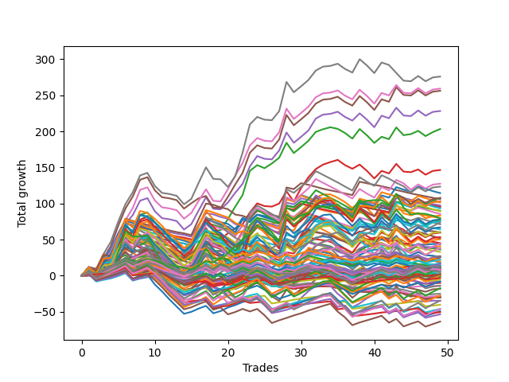

# Short Bulldog 003 
- Symbol: ESBIB
- Date Range: 03/18/2022 - 07/08/2022
- Trading Period: 7:20-12:30
- Number of Trades: 46



| Name | Win Percent | Profit | Avg Profit / Trade |     | Name | Win Percent | Profit | Avg Profit / Trade |
| ---- | ----------- | ------ | ------------------ | --- | ---- | ----------- | ------ | ------------------ |
| Sorted By <br> Profit | | | | | Sorted By <br> Win Percentage ||||
| Seven | 56.52 | 138375.00 | 3008.15 |     | Two | 65.22 | 100375.00 | 2182.07 |
| Six | 60.87 | 130000.00 | 2826.09 |     | Six | 60.87 | 130000.00 | 2826.09 |
| Five | 60.87 | 128500.00 | 2793.48 |     | Five | 60.87 | 128500.00 | 2793.48 |
| Four | 60.87 | 114500.00 | 2489.13 |     | Four | 60.87 | 114500.00 | 2489.13 |
| Two | 65.22 | 100375.00 | 2182.07 |     | Three | 60.87 | 73625.00 | 1600.54 |
| Three | 60.87 | 73625.00 | 1600.54 |     | Zero | 60.87 | 21625.00 | 470.11 |
| One | 58.70 | 43500.00 | 945.65 |     | One | 58.70 | 43500.00 | 945.65 |
| Seventy-Three | 54.35 | 43125.00 | 937.50 |     | Seven | 56.52 | 138375.00 | 3008.15 |
| Seventy-Seven | 21.74 | 28000.00 | 608.70 |     | Seventy-Three | 54.35 | 43125.00 | 937.50 |
| Seventy-Eight | 26.09 | 27250.00 | 592.39 |     | Eighty | 32.61 | 9750.00 | 211.96 |
| Seventy-Nine | 30.43 | 22625.00 | 491.85 |     | Seventy-Nine | 30.43 | 22625.00 | 491.85 |
| Zero | 60.87 | 21625.00 | 470.11 |     | Seventy-Eight | 26.09 | 27250.00 | 592.39 |
| Eighty | 32.61 | 9750.00 | 211.96 |     | Seventy-Seven | 21.74 | 28000.00 | 608.70 |
| Seventy-Six | 13.04 | 2750.00 | 59.78 |     | Seventy-Six | 13.04 | 2750.00 | 59.78 |

## NO STOPLOSS

### Test Zero
* Sell when price hits the middle line of the 20p bollinger
* No Stoploss
* Results:
```
Total Trades: 46
Percent Up: 39.13
Percent Down: 60.87
Total Points Moved Down: 43.25
Potential Profit: 21625.00
Total Points Ups: 136.25 Count Ups: 18
Total Points Downs: 179.50 Count Downs: 28
```

<details><summary>Trades</summary>

<code>In: 2022-03-24 08:44:00		Out: 2022-03-24 08:50:10		Total Position Time: 06:10		Total Move Down: 4.75		Total to Date: 4.75</code> <br />
<code>In: 2022-03-25 07:26:00		Out: 2022-03-25 07:51:05		Total Position Time: 25:05		Total Move Down: -6.00		Total to Date: -1.25</code> <br />
<code>In: 2022-03-25 07:44:00		Out: 2022-03-25 07:51:05		Total Position Time: 07:05		Total Move Down: 2.50		Total to Date: 1.25</code> <br />
<code>In: 2022-04-06 10:43:00		Out: 2022-04-06 10:55:45		Total Position Time: 12:45		Total Move Down: 2.25		Total to Date: 3.50</code> <br />
<code>In: 2022-04-06 11:04:00		Out: 2022-04-06 11:05:40		Total Position Time: 01:40		Total Move Down: 11.00		Total to Date: 14.50</code> <br />
<code>In: 2022-04-06 11:05:00		Out: 2022-04-06 11:05:40		Total Position Time: 00:40		Total Move Down: 7.75		Total to Date: 22.25</code> <br />
<code>In: 2022-04-06 11:57:00		Out: 2022-04-06 12:07:45		Total Position Time: 10:45		Total Move Down: 0.50		Total to Date: 22.75</code> <br />
<code>In: 2022-04-06 12:02:00		Out: 2022-04-06 12:07:45		Total Position Time: 05:45		Total Move Down: 8.50		Total to Date: 31.25</code> <br />
<code>In: 2022-04-07 11:03:00		Out: 2022-04-07 11:15:20		Total Position Time: 12:20		Total Move Down: 4.00		Total to Date: 35.25</code> <br />
<code>In: 2022-04-07 11:50:00		Out: 2022-04-07 12:19:10		Total Position Time: 29:10		Total Move Down: -18.25		Total to Date: 17.00</code> <br />
<code>In: 2022-04-07 11:54:00		Out: 2022-04-07 12:19:10		Total Position Time: 25:10		Total Move Down: -14.75		Total to Date: 2.25</code> <br />
<code>In: 2022-04-08 07:54:00		Out: 2022-04-08 08:15:35		Total Position Time: 21:35		Total Move Down: -6.75		Total to Date: -4.50</code> <br />
<code>In: 2022-04-08 07:57:00		Out: 2022-04-08 08:15:35		Total Position Time: 18:35		Total Move Down: -5.25		Total to Date: -9.75</code> <br />
<code>In: 2022-04-13 08:06:00		Out: 2022-04-13 08:35:55		Total Position Time: 29:55		Total Move Down: -11.75		Total to Date: -21.50</code> <br />
<code>In: 2022-04-18 07:27:00		Out: 2022-04-18 07:38:20		Total Position Time: 11:20		Total Move Down: 2.75		Total to Date: -18.75</code> <br />
<code>In: 2022-05-03 07:34:00		Out: 2022-05-03 07:38:45		Total Position Time: 04:45		Total Move Down: 10.25		Total to Date: -8.50</code> <br />
<code>In: 2022-05-03 07:35:00		Out: 2022-05-03 07:38:45		Total Position Time: 03:45		Total Move Down: 9.50		Total to Date: 1.00</code> <br />
<code>In: 2022-05-03 08:06:00		Out: 2022-05-03 08:35:55		Total Position Time: 29:55		Total Move Down: -16.00		Total to Date: -15.00</code> <br />
<code>In: 2022-05-03 08:10:00		Out: 2022-05-03 08:35:55		Total Position Time: 25:55		Total Move Down: -4.25		Total to Date: -19.25</code> <br />
<code>In: 2022-05-04 10:59:00		Out: 2022-05-04 11:00:25		Total Position Time: 01:25		Total Move Down: 9.50		Total to Date: -9.75</code> <br />
<code>In: 2022-05-04 11:03:00		Out: 2022-05-04 11:06:50		Total Position Time: 03:50		Total Move Down: 2.75		Total to Date: -7.00</code> <br />
<code>In: 2022-05-04 11:07:00		Out: 2022-05-04 11:07:10		Total Position Time: 00:10		Total Move Down: 4.25		Total to Date: -2.75</code> <br />
<code>In: 2022-05-04 11:30:00		Out: 2022-05-04 11:30:45		Total Position Time: 00:45		Total Move Down: 16.50		Total to Date: 13.75</code> <br />
<code>In: 2022-05-16 09:05:00		Out: 2022-05-16 09:06:00		Total Position Time: 01:00		Total Move Down: 5.00		Total to Date: 18.75</code> <br />
<code>In: 2022-05-16 10:25:00		Out: 2022-05-16 10:42:15		Total Position Time: 17:15		Total Move Down: -5.25		Total to Date: 13.50</code> <br />
<code>In: 2022-05-19 08:40:00		Out: 2022-05-19 08:53:40		Total Position Time: 13:40		Total Move Down: -2.00		Total to Date: 11.50</code> <br />
<code>In: 2022-05-19 11:52:00		Out: 2022-05-19 11:57:50		Total Position Time: 05:50		Total Move Down: 5.25		Total to Date: 16.75</code> <br />
<code>In: 2022-05-19 12:05:00		Out: 2022-05-19 12:09:45		Total Position Time: 04:45		Total Move Down: 8.75		Total to Date: 25.50</code> <br />
<code>In: 2022-05-23 08:07:00		Out: 2022-05-23 08:23:15		Total Position Time: 16:15		Total Move Down: -2.50		Total to Date: 23.00</code> <br />
<code>In: 2022-05-24 11:13:00		Out: 2022-05-24 11:18:25		Total Position Time: 05:25		Total Move Down: 13.25		Total to Date: 36.25</code> <br />
<code>In: 2022-05-24 11:14:00		Out: 2022-05-24 11:18:25		Total Position Time: 04:25		Total Move Down: 9.50		Total to Date: 45.75</code> <br />
<code>In: 2022-05-25 07:36:00		Out: 2022-05-25 07:42:00		Total Position Time: 06:00		Total Move Down: 7.00		Total to Date: 52.75</code> <br />
<code>In: 2022-05-25 12:05:00		Out: 2022-05-25 12:17:30		Total Position Time: 12:30		Total Move Down: 1.75		Total to Date: 54.50</code> <br />
<code>In: 2022-05-27 12:10:00		Out: 2022-05-27 12:35:00		Total Position Time: 25:00		Total Move Down: -1.50		Total to Date: 53.00</code> <br />
<code>In: 2022-05-31 08:53:00		Out: 2022-05-31 09:13:50		Total Position Time: 20:50		Total Move Down: -9.00		Total to Date: 44.00</code> <br />
<code>In: 2022-06-02 08:05:00		Out: 2022-06-02 08:27:20		Total Position Time: 22:20		Total Move Down: -6.75		Total to Date: 37.25</code> <br />
<code>In: 2022-06-02 08:06:00		Out: 2022-06-02 08:27:20		Total Position Time: 21:20		Total Move Down: -8.75		Total to Date: 28.50</code> <br />
<code>In: 2022-06-23 08:15:00		Out: 2022-06-23 08:21:05		Total Position Time: 06:05		Total Move Down: 5.50		Total to Date: 34.00</code> <br />
<code>In: 2022-06-30 08:29:00		Out: 2022-06-30 08:35:10		Total Position Time: 06:10		Total Move Down: 7.00		Total to Date: 41.00</code> <br />
<code>In: 2022-06-30 08:30:00		Out: 2022-06-30 08:35:10		Total Position Time: 05:10		Total Move Down: 5.50		Total to Date: 46.50</code> <br />
<code>In: 2022-07-05 09:27:00		Out: 2022-07-05 09:41:35		Total Position Time: 14:35		Total Move Down: 4.00		Total to Date: 50.50</code> <br />
<code>In: 2022-07-05 11:34:00		Out: 2022-07-05 11:48:10		Total Position Time: 14:10		Total Move Down: -4.25		Total to Date: 46.25</code> <br />
<code>In: 2022-07-06 11:09:00		Out: 2022-07-06 11:10:10		Total Position Time: 01:10		Total Move Down: 9.00		Total to Date: 55.25</code> <br />
<code>In: 2022-07-06 11:31:00		Out: 2022-07-06 11:50:05		Total Position Time: 19:05		Total Move Down: -11.50		Total to Date: 43.75</code> <br />
<code>In: 2022-07-06 11:35:00		Out: 2022-07-06 11:50:05		Total Position Time: 15:05		Total Move Down: -1.75		Total to Date: 42.00</code> <br />
<code>In: 2022-07-07 12:18:00		Out: 2022-07-07 12:24:15		Total Position Time: 06:15		Total Move Down: 1.25		Total to Date: 43.25</code> <br />


</details>

### Test One
* Sell when the price hits the upper line of the 20p 1std bollinger
* No Stoploss
* Results:
```
Total Trades: 46
Percent Up: 41.30
Percent Down: 58.70
Total Points Moved Down: 87.00
Potential Profit: 43500.00
Total Points Ups: 145.75 Count Ups: 19
Total Points Downs: 232.75 Count Downs: 27
```

<details><summary>Trades</summary>

<code>In: 2022-03-24 08:44:00		Out: 2022-03-24 08:53:50		Total Position Time: 09:50		Total Move Down: 6.25		Total to Date: 6.25</code> <br />
<code>In: 2022-03-25 07:26:00		Out: 2022-03-25 07:53:50		Total Position Time: 27:50		Total Move Down: -4.50		Total to Date: 1.75</code> <br />
<code>In: 2022-03-25 07:44:00		Out: 2022-03-25 07:53:50		Total Position Time: 09:50		Total Move Down: 4.00		Total to Date: 5.75</code> <br />
<code>In: 2022-04-06 10:43:00		Out: 2022-04-06 10:56:55		Total Position Time: 13:55		Total Move Down: 4.00		Total to Date: 9.75</code> <br />
<code>In: 2022-04-06 11:04:00		Out: 2022-04-06 11:07:20		Total Position Time: 03:20		Total Move Down: 15.75		Total to Date: 25.50</code> <br />
<code>In: 2022-04-06 11:05:00		Out: 2022-04-06 11:07:20		Total Position Time: 02:20		Total Move Down: 12.50		Total to Date: 38.00</code> <br />
<code>In: 2022-04-06 11:57:00		Out: 2022-04-06 12:17:05		Total Position Time: 20:05		Total Move Down: -0.75		Total to Date: 37.25</code> <br />
<code>In: 2022-04-06 12:02:00		Out: 2022-04-06 12:17:05		Total Position Time: 15:05		Total Move Down: 7.25		Total to Date: 44.50</code> <br />
<code>In: 2022-04-07 11:03:00		Out: 2022-04-07 11:18:00		Total Position Time: 15:00		Total Move Down: 4.75		Total to Date: 49.25</code> <br />
<code>In: 2022-04-07 11:50:00		Out: 2022-04-07 12:19:55		Total Position Time: 29:55		Total Move Down: -18.00		Total to Date: 31.25</code> <br />
<code>In: 2022-04-07 11:54:00		Out: 2022-04-07 12:20:50		Total Position Time: 26:50		Total Move Down: -12.25		Total to Date: 19.00</code> <br />
<code>In: 2022-04-08 07:54:00		Out: 2022-04-08 08:17:05		Total Position Time: 23:05		Total Move Down: -5.00		Total to Date: 14.00</code> <br />
<code>In: 2022-04-08 07:57:00		Out: 2022-04-08 08:17:05		Total Position Time: 20:05		Total Move Down: -3.50		Total to Date: 10.50</code> <br />
<code>In: 2022-04-13 08:06:00		Out: 2022-04-13 08:35:55		Total Position Time: 29:55		Total Move Down: -11.75		Total to Date: -1.25</code> <br />
<code>In: 2022-04-18 07:27:00		Out: 2022-04-18 07:51:20		Total Position Time: 24:20		Total Move Down: 2.25		Total to Date: 1.00</code> <br />
<code>In: 2022-05-03 07:34:00		Out: 2022-05-03 07:42:05		Total Position Time: 08:05		Total Move Down: 13.75		Total to Date: 14.75</code> <br />
<code>In: 2022-05-03 07:35:00		Out: 2022-05-03 07:42:05		Total Position Time: 07:05		Total Move Down: 13.00		Total to Date: 27.75</code> <br />
<code>In: 2022-05-03 08:06:00		Out: 2022-05-03 08:35:55		Total Position Time: 29:55		Total Move Down: -16.00		Total to Date: 11.75</code> <br />
<code>In: 2022-05-03 08:10:00		Out: 2022-05-03 08:38:05		Total Position Time: 28:05		Total Move Down: -2.00		Total to Date: 9.75</code> <br />
<code>In: 2022-05-04 10:59:00		Out: 2022-05-04 11:00:25		Total Position Time: 01:25		Total Move Down: 9.50		Total to Date: 19.25</code> <br />
<code>In: 2022-05-04 11:03:00		Out: 2022-05-04 11:07:20		Total Position Time: 04:20		Total Move Down: 10.75		Total to Date: 30.00</code> <br />
<code>In: 2022-05-04 11:07:00		Out: 2022-05-04 11:07:20		Total Position Time: 00:20		Total Move Down: 9.50		Total to Date: 39.50</code> <br />
<code>In: 2022-05-04 11:30:00		Out: 2022-05-04 11:30:50		Total Position Time: 00:50		Total Move Down: 24.25		Total to Date: 63.75</code> <br />
<code>In: 2022-05-16 09:05:00		Out: 2022-05-16 09:06:10		Total Position Time: 01:10		Total Move Down: 7.00		Total to Date: 70.75</code> <br />
<code>In: 2022-05-16 10:25:00		Out: 2022-05-16 10:42:40		Total Position Time: 17:40		Total Move Down: -1.00		Total to Date: 69.75</code> <br />
<code>In: 2022-05-19 08:40:00		Out: 2022-05-19 08:55:05		Total Position Time: 15:05		Total Move Down: 2.00		Total to Date: 71.75</code> <br />
<code>In: 2022-05-19 11:52:00		Out: 2022-05-19 12:10:15		Total Position Time: 18:15		Total Move Down: 2.75		Total to Date: 74.50</code> <br />
<code>In: 2022-05-19 12:05:00		Out: 2022-05-19 12:10:15		Total Position Time: 05:15		Total Move Down: 15.50		Total to Date: 90.00</code> <br />
<code>In: 2022-05-23 08:07:00		Out: 2022-05-23 08:36:55		Total Position Time: 29:55		Total Move Down: -14.25		Total to Date: 75.75</code> <br />
<code>In: 2022-05-24 11:13:00		Out: 2022-05-24 11:31:25		Total Position Time: 18:25		Total Move Down: 13.75		Total to Date: 89.50</code> <br />
<code>In: 2022-05-24 11:14:00		Out: 2022-05-24 11:31:25		Total Position Time: 17:25		Total Move Down: 10.00		Total to Date: 99.50</code> <br />
<code>In: 2022-05-25 07:36:00		Out: 2022-05-25 07:46:50		Total Position Time: 10:50		Total Move Down: 8.75		Total to Date: 108.25</code> <br />
<code>In: 2022-05-25 12:05:00		Out: 2022-05-25 12:20:25		Total Position Time: 15:25		Total Move Down: 4.25		Total to Date: 112.50</code> <br />
<code>In: 2022-05-27 12:10:00		Out: 2022-05-27 12:35:40		Total Position Time: 25:40		Total Move Down: 0.25		Total to Date: 112.75</code> <br />
<code>In: 2022-05-31 08:53:00		Out: 2022-05-31 09:14:40		Total Position Time: 21:40		Total Move Down: -4.75		Total to Date: 108.00</code> <br />
<code>In: 2022-06-02 08:05:00		Out: 2022-06-02 08:28:15		Total Position Time: 23:15		Total Move Down: -6.00		Total to Date: 102.00</code> <br />
<code>In: 2022-06-02 08:06:00		Out: 2022-06-02 08:28:15		Total Position Time: 22:15		Total Move Down: -8.00		Total to Date: 94.00</code> <br />
<code>In: 2022-06-23 08:15:00		Out: 2022-06-23 08:23:30		Total Position Time: 08:30		Total Move Down: 8.25		Total to Date: 102.25</code> <br />
<code>In: 2022-06-30 08:29:00		Out: 2022-06-30 08:58:55		Total Position Time: 29:55		Total Move Down: -8.75		Total to Date: 93.50</code> <br />
<code>In: 2022-06-30 08:30:00		Out: 2022-06-30 08:59:55		Total Position Time: 29:55		Total Move Down: -10.50		Total to Date: 83.00</code> <br />
<code>In: 2022-07-05 09:27:00		Out: 2022-07-05 09:42:00		Total Position Time: 15:00		Total Move Down: 6.25		Total to Date: 89.25</code> <br />
<code>In: 2022-07-05 11:34:00		Out: 2022-07-05 11:53:40		Total Position Time: 19:40		Total Move Down: -3.50		Total to Date: 85.75</code> <br />
<code>In: 2022-07-06 11:09:00		Out: 2022-07-06 11:11:10		Total Position Time: 02:10		Total Move Down: 13.25		Total to Date: 99.00</code> <br />
<code>In: 2022-07-06 11:31:00		Out: 2022-07-06 12:00:45		Total Position Time: 29:45		Total Move Down: -12.50		Total to Date: 86.50</code> <br />
<code>In: 2022-07-06 11:35:00		Out: 2022-07-06 12:00:45		Total Position Time: 25:45		Total Move Down: -2.75		Total to Date: 83.75</code> <br />
<code>In: 2022-07-07 12:18:00		Out: 2022-07-07 12:25:10		Total Position Time: 07:10		Total Move Down: 3.25		Total to Date: 87.00</code> <br />


</details>

### Test Two
* Sell when the price hits the upper line of the 20p 2std bollinger
* No Stoploss
* Results:
```
Total Trades: 46
Percent Up: 34.78
Percent Down: 65.22
Total Points Moved Down: 200.75
Potential Profit: 100375.00
Total Points Ups: 133.25 Count Ups: 16
Total Points Downs: 334.00 Count Downs: 30
```

<details><summary>Trades</summary>

<code>In: 2022-03-24 08:44:00		Out: 2022-03-24 09:03:10		Total Position Time: 19:10		Total Move Down: 8.00		Total to Date: 8.00</code> <br />
<code>In: 2022-03-25 07:26:00		Out: 2022-03-25 07:54:10		Total Position Time: 28:10		Total Move Down: -3.50		Total to Date: 4.50</code> <br />
<code>In: 2022-03-25 07:44:00		Out: 2022-03-25 07:54:10		Total Position Time: 10:10		Total Move Down: 5.00		Total to Date: 9.50</code> <br />
<code>In: 2022-04-06 10:43:00		Out: 2022-04-06 10:58:00		Total Position Time: 15:00		Total Move Down: 5.75		Total to Date: 15.25</code> <br />
<code>In: 2022-04-06 11:04:00		Out: 2022-04-06 11:08:10		Total Position Time: 04:10		Total Move Down: 21.75		Total to Date: 37.00</code> <br />
<code>In: 2022-04-06 11:05:00		Out: 2022-04-06 11:08:10		Total Position Time: 03:10		Total Move Down: 18.50		Total to Date: 55.50</code> <br />
<code>In: 2022-04-06 11:57:00		Out: 2022-04-06 12:20:25		Total Position Time: 23:25		Total Move Down: 6.75		Total to Date: 62.25</code> <br />
<code>In: 2022-04-06 12:02:00		Out: 2022-04-06 12:20:25		Total Position Time: 18:25		Total Move Down: 14.75		Total to Date: 77.00</code> <br />
<code>In: 2022-04-07 11:03:00		Out: 2022-04-07 11:18:20		Total Position Time: 15:20		Total Move Down: 6.00		Total to Date: 83.00</code> <br />
<code>In: 2022-04-07 11:50:00		Out: 2022-04-07 12:19:55		Total Position Time: 29:55		Total Move Down: -18.00		Total to Date: 65.00</code> <br />
<code>In: 2022-04-07 11:54:00		Out: 2022-04-07 12:21:20		Total Position Time: 27:20		Total Move Down: -10.00		Total to Date: 55.00</code> <br />
<code>In: 2022-04-08 07:54:00		Out: 2022-04-08 08:20:25		Total Position Time: 26:25		Total Move Down: -4.00		Total to Date: 51.00</code> <br />
<code>In: 2022-04-08 07:57:00		Out: 2022-04-08 08:20:25		Total Position Time: 23:25		Total Move Down: -2.50		Total to Date: 48.50</code> <br />
<code>In: 2022-04-13 08:06:00		Out: 2022-04-13 08:35:55		Total Position Time: 29:55		Total Move Down: -11.75		Total to Date: 36.75</code> <br />
<code>In: 2022-04-18 07:27:00		Out: 2022-04-18 07:51:45		Total Position Time: 24:45		Total Move Down: 4.75		Total to Date: 41.50</code> <br />
<code>In: 2022-05-03 07:34:00		Out: 2022-05-03 07:43:50		Total Position Time: 09:50		Total Move Down: 19.00		Total to Date: 60.50</code> <br />
<code>In: 2022-05-03 07:35:00		Out: 2022-05-03 07:43:50		Total Position Time: 08:50		Total Move Down: 18.25		Total to Date: 78.75</code> <br />
<code>In: 2022-05-03 08:06:00		Out: 2022-05-03 08:35:55		Total Position Time: 29:55		Total Move Down: -16.00		Total to Date: 62.75</code> <br />
<code>In: 2022-05-03 08:10:00		Out: 2022-05-03 08:39:10		Total Position Time: 29:10		Total Move Down: 0.25		Total to Date: 63.00</code> <br />
<code>In: 2022-05-04 10:59:00		Out: 2022-05-04 11:07:40		Total Position Time: 08:40		Total Move Down: 15.50		Total to Date: 78.50</code> <br />
<code>In: 2022-05-04 11:03:00		Out: 2022-05-04 11:07:40		Total Position Time: 04:40		Total Move Down: 17.25		Total to Date: 95.75</code> <br />
<code>In: 2022-05-04 11:07:00		Out: 2022-05-04 11:07:40		Total Position Time: 00:40		Total Move Down: 16.00		Total to Date: 111.75</code> <br />
<code>In: 2022-05-04 11:30:00		Out: 2022-05-04 11:33:55		Total Position Time: 03:55		Total Move Down: 33.50		Total to Date: 145.25</code> <br />
<code>In: 2022-05-16 09:05:00		Out: 2022-05-16 09:11:35		Total Position Time: 06:35		Total Move Down: 8.00		Total to Date: 153.25</code> <br />
<code>In: 2022-05-16 10:25:00		Out: 2022-05-16 10:49:00		Total Position Time: 24:00		Total Move Down: -4.25		Total to Date: 149.00</code> <br />
<code>In: 2022-05-19 08:40:00		Out: 2022-05-19 08:56:05		Total Position Time: 16:05		Total Move Down: 6.50		Total to Date: 155.50</code> <br />
<code>In: 2022-05-19 11:52:00		Out: 2022-05-19 12:14:05		Total Position Time: 22:05		Total Move Down: 8.00		Total to Date: 163.50</code> <br />
<code>In: 2022-05-19 12:05:00		Out: 2022-05-19 12:14:05		Total Position Time: 09:05		Total Move Down: 20.75		Total to Date: 184.25</code> <br />
<code>In: 2022-05-23 08:07:00		Out: 2022-05-23 08:36:55		Total Position Time: 29:55		Total Move Down: -14.25		Total to Date: 170.00</code> <br />
<code>In: 2022-05-24 11:13:00		Out: 2022-05-24 11:42:55		Total Position Time: 29:55		Total Move Down: 8.25		Total to Date: 178.25</code> <br />
<code>In: 2022-05-24 11:14:00		Out: 2022-05-24 11:43:55		Total Position Time: 29:55		Total Move Down: 8.75		Total to Date: 187.00</code> <br />
<code>In: 2022-05-25 07:36:00		Out: 2022-05-25 07:48:10		Total Position Time: 12:10		Total Move Down: 12.25		Total to Date: 199.25</code> <br />
<code>In: 2022-05-25 12:05:00		Out: 2022-05-25 12:22:50		Total Position Time: 17:50		Total Move Down: 3.75		Total to Date: 203.00</code> <br />
<code>In: 2022-05-27 12:10:00		Out: 2022-05-27 12:36:55		Total Position Time: 26:55		Total Move Down: 2.75		Total to Date: 205.75</code> <br />
<code>In: 2022-05-31 08:53:00		Out: 2022-05-31 09:15:10		Total Position Time: 22:10		Total Move Down: -2.25		Total to Date: 203.50</code> <br />
<code>In: 2022-06-02 08:05:00		Out: 2022-06-02 08:31:25		Total Position Time: 26:25		Total Move Down: -5.75		Total to Date: 197.75</code> <br />
<code>In: 2022-06-02 08:06:00		Out: 2022-06-02 08:31:25		Total Position Time: 25:25		Total Move Down: -7.75		Total to Date: 190.00</code> <br />
<code>In: 2022-06-23 08:15:00		Out: 2022-06-23 08:31:10		Total Position Time: 16:10		Total Move Down: 13.25		Total to Date: 203.25</code> <br />
<code>In: 2022-06-30 08:29:00		Out: 2022-06-30 08:58:55		Total Position Time: 29:55		Total Move Down: -8.75		Total to Date: 194.50</code> <br />
<code>In: 2022-06-30 08:30:00		Out: 2022-06-30 08:59:55		Total Position Time: 29:55		Total Move Down: -10.50		Total to Date: 184.00</code> <br />
<code>In: 2022-07-05 09:27:00		Out: 2022-07-05 09:42:40		Total Position Time: 15:40		Total Move Down: 8.50		Total to Date: 192.50</code> <br />
<code>In: 2022-07-05 11:34:00		Out: 2022-07-05 12:01:20		Total Position Time: 27:20		Total Move Down: -3.25		Total to Date: 189.25</code> <br />
<code>In: 2022-07-06 11:09:00		Out: 2022-07-06 11:11:45		Total Position Time: 02:45		Total Move Down: 16.25		Total to Date: 205.50</code> <br />
<code>In: 2022-07-06 11:31:00		Out: 2022-07-06 12:00:55		Total Position Time: 29:55		Total Move Down: -10.75		Total to Date: 194.75</code> <br />
<code>In: 2022-07-06 11:35:00		Out: 2022-07-06 12:01:30		Total Position Time: 26:30		Total Move Down: 1.50		Total to Date: 196.25</code> <br />
<code>In: 2022-07-07 12:18:00		Out: 2022-07-07 12:28:30		Total Position Time: 10:30		Total Move Down: 4.50		Total to Date: 200.75</code> <br />


</details>

### Test Three
* Sell when price hits the middle line of the 50p bollinger
* No Stoploss
* Results:
```
Total Trades: 46
Percent Up: 39.13
Percent Down: 60.87
Total Points Moved Down: 147.25
Potential Profit: 73625.00
Total Points Ups: 128.00 Count Ups: 18
Total Points Downs: 275.25 Count Downs: 28
```

<details><summary>Trades</summary>

<code>In: 2022-03-24 08:44:00		Out: 2022-03-24 09:03:10		Total Position Time: 19:10		Total Move Down: 8.00		Total to Date: 8.00</code> <br />
<code>In: 2022-03-25 07:26:00		Out: 2022-03-25 07:55:55		Total Position Time: 29:55		Total Move Down: -2.50		Total to Date: 5.50</code> <br />
<code>In: 2022-03-25 07:44:00		Out: 2022-03-25 08:00:40		Total Position Time: 16:40		Total Move Down: 6.75		Total to Date: 12.25</code> <br />
<code>In: 2022-04-06 10:43:00		Out: 2022-04-06 11:00:10		Total Position Time: 17:10		Total Move Down: 12.75		Total to Date: 25.00</code> <br />
<code>In: 2022-04-06 11:04:00		Out: 2022-04-06 11:07:20		Total Position Time: 03:20		Total Move Down: 15.75		Total to Date: 40.75</code> <br />
<code>In: 2022-04-06 11:05:00		Out: 2022-04-06 11:07:20		Total Position Time: 02:20		Total Move Down: 12.50		Total to Date: 53.25</code> <br />
<code>In: 2022-04-06 11:57:00		Out: 2022-04-06 12:20:25		Total Position Time: 23:25		Total Move Down: 6.75		Total to Date: 60.00</code> <br />
<code>In: 2022-04-06 12:02:00		Out: 2022-04-06 12:20:25		Total Position Time: 18:25		Total Move Down: 14.75		Total to Date: 74.75</code> <br />
<code>In: 2022-04-07 11:03:00		Out: 2022-04-07 11:32:55		Total Position Time: 29:55		Total Move Down: 3.50		Total to Date: 78.25</code> <br />
<code>In: 2022-04-07 11:50:00		Out: 2022-04-07 12:19:55		Total Position Time: 29:55		Total Move Down: -18.00		Total to Date: 60.25</code> <br />
<code>In: 2022-04-07 11:54:00		Out: 2022-04-07 12:23:55		Total Position Time: 29:55		Total Move Down: -9.75		Total to Date: 50.50</code> <br />
<code>In: 2022-04-08 07:54:00		Out: 2022-04-08 08:23:55		Total Position Time: 29:55		Total Move Down: -1.50		Total to Date: 49.00</code> <br />
<code>In: 2022-04-08 07:57:00		Out: 2022-04-08 08:26:55		Total Position Time: 29:55		Total Move Down: -2.50		Total to Date: 46.50</code> <br />
<code>In: 2022-04-13 08:06:00		Out: 2022-04-13 08:35:55		Total Position Time: 29:55		Total Move Down: -11.75		Total to Date: 34.75</code> <br />
<code>In: 2022-04-18 07:27:00		Out: 2022-04-18 07:51:50		Total Position Time: 24:50		Total Move Down: 5.25		Total to Date: 40.00</code> <br />
<code>In: 2022-05-03 07:34:00		Out: 2022-05-03 07:40:40		Total Position Time: 06:40		Total Move Down: 13.50		Total to Date: 53.50</code> <br />
<code>In: 2022-05-03 07:35:00		Out: 2022-05-03 07:40:40		Total Position Time: 05:40		Total Move Down: 12.75		Total to Date: 66.25</code> <br />
<code>In: 2022-05-03 08:06:00		Out: 2022-05-03 08:35:55		Total Position Time: 29:55		Total Move Down: -16.00		Total to Date: 50.25</code> <br />
<code>In: 2022-05-03 08:10:00		Out: 2022-05-03 08:39:55		Total Position Time: 29:55		Total Move Down: -0.75		Total to Date: 49.50</code> <br />
<code>In: 2022-05-04 10:59:00		Out: 2022-05-04 11:00:25		Total Position Time: 01:25		Total Move Down: 9.50		Total to Date: 59.00</code> <br />
<code>In: 2022-05-04 11:03:00		Out: 2022-05-04 11:07:15		Total Position Time: 04:15		Total Move Down: 6.75		Total to Date: 65.75</code> <br />
<code>In: 2022-05-04 11:07:00		Out: 2022-05-04 11:07:15		Total Position Time: 00:15		Total Move Down: 5.50		Total to Date: 71.25</code> <br />
<code>In: 2022-05-04 11:30:00		Out: 2022-05-04 11:30:45		Total Position Time: 00:45		Total Move Down: 16.50		Total to Date: 87.75</code> <br />
<code>In: 2022-05-16 09:05:00		Out: 2022-05-16 09:15:55		Total Position Time: 10:55		Total Move Down: 12.50		Total to Date: 100.25</code> <br />
<code>In: 2022-05-16 10:25:00		Out: 2022-05-16 10:54:55		Total Position Time: 29:55		Total Move Down: -3.75		Total to Date: 96.50</code> <br />
<code>In: 2022-05-19 08:40:00		Out: 2022-05-19 09:09:55		Total Position Time: 29:55		Total Move Down: -0.75		Total to Date: 95.75</code> <br />
<code>In: 2022-05-19 11:52:00		Out: 2022-05-19 12:13:40		Total Position Time: 21:40		Total Move Down: 4.25		Total to Date: 100.00</code> <br />
<code>In: 2022-05-19 12:05:00		Out: 2022-05-19 12:13:40		Total Position Time: 08:40		Total Move Down: 17.00		Total to Date: 117.00</code> <br />
<code>In: 2022-05-23 08:07:00		Out: 2022-05-23 08:36:55		Total Position Time: 29:55		Total Move Down: -14.25		Total to Date: 102.75</code> <br />
<code>In: 2022-05-24 11:13:00		Out: 2022-05-24 11:20:25		Total Position Time: 07:25		Total Move Down: 18.75		Total to Date: 121.50</code> <br />
<code>In: 2022-05-24 11:14:00		Out: 2022-05-24 11:20:25		Total Position Time: 06:25		Total Move Down: 15.00		Total to Date: 136.50</code> <br />
<code>In: 2022-05-25 07:36:00		Out: 2022-05-25 08:02:10		Total Position Time: 26:10		Total Move Down: 11.25		Total to Date: 147.75</code> <br />
<code>In: 2022-05-25 12:05:00		Out: 2022-05-25 12:34:20		Total Position Time: 29:20		Total Move Down: 6.25		Total to Date: 154.00</code> <br />
<code>In: 2022-05-27 12:10:00		Out: 2022-05-27 12:38:10		Total Position Time: 28:10		Total Move Down: 3.50		Total to Date: 157.50</code> <br />
<code>In: 2022-05-31 08:53:00		Out: 2022-05-31 09:21:15		Total Position Time: 28:15		Total Move Down: 3.00		Total to Date: 160.50</code> <br />
<code>In: 2022-06-02 08:05:00		Out: 2022-06-02 08:34:55		Total Position Time: 29:55		Total Move Down: -7.25		Total to Date: 153.25</code> <br />
<code>In: 2022-06-02 08:06:00		Out: 2022-06-02 08:35:55		Total Position Time: 29:55		Total Move Down: -5.00		Total to Date: 148.25</code> <br />
<code>In: 2022-06-23 08:15:00		Out: 2022-06-23 08:22:20		Total Position Time: 07:20		Total Move Down: 5.75		Total to Date: 154.00</code> <br />
<code>In: 2022-06-30 08:29:00		Out: 2022-06-30 08:58:55		Total Position Time: 29:55		Total Move Down: -8.75		Total to Date: 145.25</code> <br />
<code>In: 2022-06-30 08:30:00		Out: 2022-06-30 08:59:55		Total Position Time: 29:55		Total Move Down: -10.50		Total to Date: 134.75</code> <br />
<code>In: 2022-07-05 09:27:00		Out: 2022-07-05 09:43:40		Total Position Time: 16:40		Total Move Down: 10.50		Total to Date: 145.25</code> <br />
<code>In: 2022-07-05 11:34:00		Out: 2022-07-05 12:03:55		Total Position Time: 29:55		Total Move Down: -3.50		Total to Date: 141.75</code> <br />
<code>In: 2022-07-06 11:09:00		Out: 2022-07-06 11:11:10		Total Position Time: 02:10		Total Move Down: 13.25		Total to Date: 155.00</code> <br />
<code>In: 2022-07-06 11:31:00		Out: 2022-07-06 12:00:55		Total Position Time: 29:55		Total Move Down: -10.75		Total to Date: 144.25</code> <br />
<code>In: 2022-07-06 11:35:00		Out: 2022-07-06 12:04:55		Total Position Time: 29:55		Total Move Down: -0.75		Total to Date: 143.50</code> <br />
<code>In: 2022-07-07 12:18:00		Out: 2022-07-07 12:37:25		Total Position Time: 19:25		Total Move Down: 3.75		Total to Date: 147.25</code> <br />


</details>

### Test Four
* Sell when the price hits the upper line of the 50p 1std bollinger
* No Stoploss
* Results:
```
Total Trades: 46
Percent Up: 39.13
Percent Down: 60.87
Total Points Moved Down: 229.00
Potential Profit: 114500.00
Total Points Ups: 128.00 Count Ups: 18
Total Points Downs: 357.00 Count Downs: 28
```

<details><summary>Trades</summary>

<code>In: 2022-03-24 08:44:00		Out: 2022-03-24 09:08:25		Total Position Time: 24:25		Total Move Down: 11.00		Total to Date: 11.00</code> <br />
<code>In: 2022-03-25 07:26:00		Out: 2022-03-25 07:55:55		Total Position Time: 29:55		Total Move Down: -2.50		Total to Date: 8.50</code> <br />
<code>In: 2022-03-25 07:44:00		Out: 2022-03-25 08:01:45		Total Position Time: 17:45		Total Move Down: 12.25		Total to Date: 20.75</code> <br />
<code>In: 2022-04-06 10:43:00		Out: 2022-04-06 11:08:10		Total Position Time: 25:10		Total Move Down: 11.00		Total to Date: 31.75</code> <br />
<code>In: 2022-04-06 11:04:00		Out: 2022-04-06 11:08:10		Total Position Time: 04:10		Total Move Down: 21.75		Total to Date: 53.50</code> <br />
<code>In: 2022-04-06 11:05:00		Out: 2022-04-06 11:08:10		Total Position Time: 03:10		Total Move Down: 18.50		Total to Date: 72.00</code> <br />
<code>In: 2022-04-06 11:57:00		Out: 2022-04-06 12:23:20		Total Position Time: 26:20		Total Move Down: 12.00		Total to Date: 84.00</code> <br />
<code>In: 2022-04-06 12:02:00		Out: 2022-04-06 12:23:20		Total Position Time: 21:20		Total Move Down: 20.00		Total to Date: 104.00</code> <br />
<code>In: 2022-04-07 11:03:00		Out: 2022-04-07 11:32:55		Total Position Time: 29:55		Total Move Down: 3.50		Total to Date: 107.50</code> <br />
<code>In: 2022-04-07 11:50:00		Out: 2022-04-07 12:19:55		Total Position Time: 29:55		Total Move Down: -18.00		Total to Date: 89.50</code> <br />
<code>In: 2022-04-07 11:54:00		Out: 2022-04-07 12:23:55		Total Position Time: 29:55		Total Move Down: -9.75		Total to Date: 79.75</code> <br />
<code>In: 2022-04-08 07:54:00		Out: 2022-04-08 08:23:55		Total Position Time: 29:55		Total Move Down: -1.50		Total to Date: 78.25</code> <br />
<code>In: 2022-04-08 07:57:00		Out: 2022-04-08 08:26:55		Total Position Time: 29:55		Total Move Down: -2.50		Total to Date: 75.75</code> <br />
<code>In: 2022-04-13 08:06:00		Out: 2022-04-13 08:35:55		Total Position Time: 29:55		Total Move Down: -11.75		Total to Date: 64.00</code> <br />
<code>In: 2022-04-18 07:27:00		Out: 2022-04-18 07:56:55		Total Position Time: 29:55		Total Move Down: 7.50		Total to Date: 71.50</code> <br />
<code>In: 2022-05-03 07:34:00		Out: 2022-05-03 07:43:50		Total Position Time: 09:50		Total Move Down: 19.00		Total to Date: 90.50</code> <br />
<code>In: 2022-05-03 07:35:00		Out: 2022-05-03 07:43:50		Total Position Time: 08:50		Total Move Down: 18.25		Total to Date: 108.75</code> <br />
<code>In: 2022-05-03 08:06:00		Out: 2022-05-03 08:35:55		Total Position Time: 29:55		Total Move Down: -16.00		Total to Date: 92.75</code> <br />
<code>In: 2022-05-03 08:10:00		Out: 2022-05-03 08:39:55		Total Position Time: 29:55		Total Move Down: -0.75		Total to Date: 92.00</code> <br />
<code>In: 2022-05-04 10:59:00		Out: 2022-05-04 11:00:25		Total Position Time: 01:25		Total Move Down: 9.50		Total to Date: 101.50</code> <br />
<code>In: 2022-05-04 11:03:00		Out: 2022-05-04 11:07:25		Total Position Time: 04:25		Total Move Down: 13.50		Total to Date: 115.00</code> <br />
<code>In: 2022-05-04 11:07:00		Out: 2022-05-04 11:07:25		Total Position Time: 00:25		Total Move Down: 12.25		Total to Date: 127.25</code> <br />
<code>In: 2022-05-04 11:30:00		Out: 2022-05-04 11:30:50		Total Position Time: 00:50		Total Move Down: 24.25		Total to Date: 151.50</code> <br />
<code>In: 2022-05-16 09:05:00		Out: 2022-05-16 09:30:55		Total Position Time: 25:55		Total Move Down: 14.25		Total to Date: 165.75</code> <br />
<code>In: 2022-05-16 10:25:00		Out: 2022-05-16 10:54:55		Total Position Time: 29:55		Total Move Down: -3.75		Total to Date: 162.00</code> <br />
<code>In: 2022-05-19 08:40:00		Out: 2022-05-19 09:09:55		Total Position Time: 29:55		Total Move Down: -0.75		Total to Date: 161.25</code> <br />
<code>In: 2022-05-19 11:52:00		Out: 2022-05-19 12:18:25		Total Position Time: 26:25		Total Move Down: 12.25		Total to Date: 173.50</code> <br />
<code>In: 2022-05-19 12:05:00		Out: 2022-05-19 12:18:25		Total Position Time: 13:25		Total Move Down: 25.00		Total to Date: 198.50</code> <br />
<code>In: 2022-05-23 08:07:00		Out: 2022-05-23 08:36:55		Total Position Time: 29:55		Total Move Down: -14.25		Total to Date: 184.25</code> <br />
<code>In: 2022-05-24 11:13:00		Out: 2022-05-24 11:42:55		Total Position Time: 29:55		Total Move Down: 8.25		Total to Date: 192.50</code> <br />
<code>In: 2022-05-24 11:14:00		Out: 2022-05-24 11:43:55		Total Position Time: 29:55		Total Move Down: 8.75		Total to Date: 201.25</code> <br />
<code>In: 2022-05-25 07:36:00		Out: 2022-05-25 08:04:50		Total Position Time: 28:50		Total Move Down: 16.50		Total to Date: 217.75</code> <br />
<code>In: 2022-05-25 12:05:00		Out: 2022-05-25 12:34:55		Total Position Time: 29:55		Total Move Down: 5.50		Total to Date: 223.25</code> <br />
<code>In: 2022-05-27 12:10:00		Out: 2022-05-27 12:39:55		Total Position Time: 29:55		Total Move Down: 1.00		Total to Date: 224.25</code> <br />
<code>In: 2022-05-31 08:53:00		Out: 2022-05-31 09:22:55		Total Position Time: 29:55		Total Move Down: 3.00		Total to Date: 227.25</code> <br />
<code>In: 2022-06-02 08:05:00		Out: 2022-06-02 08:34:55		Total Position Time: 29:55		Total Move Down: -7.25		Total to Date: 220.00</code> <br />
<code>In: 2022-06-02 08:06:00		Out: 2022-06-02 08:35:55		Total Position Time: 29:55		Total Move Down: -5.00		Total to Date: 215.00</code> <br />
<code>In: 2022-06-23 08:15:00		Out: 2022-06-23 08:23:40		Total Position Time: 08:40		Total Move Down: 10.00		Total to Date: 225.00</code> <br />
<code>In: 2022-06-30 08:29:00		Out: 2022-06-30 08:58:55		Total Position Time: 29:55		Total Move Down: -8.75		Total to Date: 216.25</code> <br />
<code>In: 2022-06-30 08:30:00		Out: 2022-06-30 08:59:55		Total Position Time: 29:55		Total Move Down: -10.50		Total to Date: 205.75</code> <br />
<code>In: 2022-07-05 09:27:00		Out: 2022-07-05 09:51:05		Total Position Time: 24:05		Total Move Down: 16.00		Total to Date: 221.75</code> <br />
<code>In: 2022-07-05 11:34:00		Out: 2022-07-05 12:03:55		Total Position Time: 29:55		Total Move Down: -3.50		Total to Date: 218.25</code> <br />
<code>In: 2022-07-06 11:09:00		Out: 2022-07-06 11:11:35		Total Position Time: 02:35		Total Move Down: 14.50		Total to Date: 232.75</code> <br />
<code>In: 2022-07-06 11:31:00		Out: 2022-07-06 12:00:55		Total Position Time: 29:55		Total Move Down: -10.75		Total to Date: 222.00</code> <br />
<code>In: 2022-07-06 11:35:00		Out: 2022-07-06 12:04:55		Total Position Time: 29:55		Total Move Down: -0.75		Total to Date: 221.25</code> <br />
<code>In: 2022-07-07 12:18:00		Out: 2022-07-07 12:38:50		Total Position Time: 20:50		Total Move Down: 7.75		Total to Date: 229.00</code> <br />


</details>

### Test Five
* Sell when the price hits the upper line of the 50p 2std bollinger
* No Stoploss
* Results:
```
Total Trades: 46
Percent Up: 39.13
Percent Down: 60.87
Total Points Moved Down: 257.00
Potential Profit: 128500.00
Total Points Ups: 128.00 Count Ups: 18
Total Points Downs: 385.00 Count Downs: 28
```

<details><summary>Trades</summary>

<code>In: 2022-03-24 08:44:00		Out: 2022-03-24 09:13:55		Total Position Time: 29:55		Total Move Down: 11.75		Total to Date: 11.75</code> <br />
<code>In: 2022-03-25 07:26:00		Out: 2022-03-25 07:55:55		Total Position Time: 29:55		Total Move Down: -2.50		Total to Date: 9.25</code> <br />
<code>In: 2022-03-25 07:44:00		Out: 2022-03-25 08:08:15		Total Position Time: 24:15		Total Move Down: 14.75		Total to Date: 24.00</code> <br />
<code>In: 2022-04-06 10:43:00		Out: 2022-04-06 11:09:40		Total Position Time: 26:40		Total Move Down: 17.00		Total to Date: 41.00</code> <br />
<code>In: 2022-04-06 11:04:00		Out: 2022-04-06 11:09:40		Total Position Time: 05:40		Total Move Down: 27.75		Total to Date: 68.75</code> <br />
<code>In: 2022-04-06 11:05:00		Out: 2022-04-06 11:09:40		Total Position Time: 04:40		Total Move Down: 24.50		Total to Date: 93.25</code> <br />
<code>In: 2022-04-06 11:57:00		Out: 2022-04-06 12:26:55		Total Position Time: 29:55		Total Move Down: 16.50		Total to Date: 109.75</code> <br />
<code>In: 2022-04-06 12:02:00		Out: 2022-04-06 12:31:55		Total Position Time: 29:55		Total Move Down: 23.25		Total to Date: 133.00</code> <br />
<code>In: 2022-04-07 11:03:00		Out: 2022-04-07 11:32:55		Total Position Time: 29:55		Total Move Down: 3.50		Total to Date: 136.50</code> <br />
<code>In: 2022-04-07 11:50:00		Out: 2022-04-07 12:19:55		Total Position Time: 29:55		Total Move Down: -18.00		Total to Date: 118.50</code> <br />
<code>In: 2022-04-07 11:54:00		Out: 2022-04-07 12:23:55		Total Position Time: 29:55		Total Move Down: -9.75		Total to Date: 108.75</code> <br />
<code>In: 2022-04-08 07:54:00		Out: 2022-04-08 08:23:55		Total Position Time: 29:55		Total Move Down: -1.50		Total to Date: 107.25</code> <br />
<code>In: 2022-04-08 07:57:00		Out: 2022-04-08 08:26:55		Total Position Time: 29:55		Total Move Down: -2.50		Total to Date: 104.75</code> <br />
<code>In: 2022-04-13 08:06:00		Out: 2022-04-13 08:35:55		Total Position Time: 29:55		Total Move Down: -11.75		Total to Date: 93.00</code> <br />
<code>In: 2022-04-18 07:27:00		Out: 2022-04-18 07:56:55		Total Position Time: 29:55		Total Move Down: 7.50		Total to Date: 100.50</code> <br />
<code>In: 2022-05-03 07:34:00		Out: 2022-05-03 08:03:55		Total Position Time: 29:55		Total Move Down: 6.75		Total to Date: 107.25</code> <br />
<code>In: 2022-05-03 07:35:00		Out: 2022-05-03 08:04:55		Total Position Time: 29:55		Total Move Down: 3.25		Total to Date: 110.50</code> <br />
<code>In: 2022-05-03 08:06:00		Out: 2022-05-03 08:35:55		Total Position Time: 29:55		Total Move Down: -16.00		Total to Date: 94.50</code> <br />
<code>In: 2022-05-03 08:10:00		Out: 2022-05-03 08:39:55		Total Position Time: 29:55		Total Move Down: -0.75		Total to Date: 93.75</code> <br />
<code>In: 2022-05-04 10:59:00		Out: 2022-05-04 11:07:40		Total Position Time: 08:40		Total Move Down: 15.50		Total to Date: 109.25</code> <br />
<code>In: 2022-05-04 11:03:00		Out: 2022-05-04 11:07:40		Total Position Time: 04:40		Total Move Down: 17.25		Total to Date: 126.50</code> <br />
<code>In: 2022-05-04 11:07:00		Out: 2022-05-04 11:07:40		Total Position Time: 00:40		Total Move Down: 16.00		Total to Date: 142.50</code> <br />
<code>In: 2022-05-04 11:30:00		Out: 2022-05-04 11:32:05		Total Position Time: 02:05		Total Move Down: 28.00		Total to Date: 170.50</code> <br />
<code>In: 2022-05-16 09:05:00		Out: 2022-05-16 09:34:55		Total Position Time: 29:55		Total Move Down: 10.25		Total to Date: 180.75</code> <br />
<code>In: 2022-05-16 10:25:00		Out: 2022-05-16 10:54:55		Total Position Time: 29:55		Total Move Down: -3.75		Total to Date: 177.00</code> <br />
<code>In: 2022-05-19 08:40:00		Out: 2022-05-19 09:09:55		Total Position Time: 29:55		Total Move Down: -0.75		Total to Date: 176.25</code> <br />
<code>In: 2022-05-19 11:52:00		Out: 2022-05-19 12:21:55		Total Position Time: 29:55		Total Move Down: 12.50		Total to Date: 188.75</code> <br />
<code>In: 2022-05-19 12:05:00		Out: 2022-05-19 12:24:45		Total Position Time: 19:45		Total Move Down: 34.00		Total to Date: 222.75</code> <br />
<code>In: 2022-05-23 08:07:00		Out: 2022-05-23 08:36:55		Total Position Time: 29:55		Total Move Down: -14.25		Total to Date: 208.50</code> <br />
<code>In: 2022-05-24 11:13:00		Out: 2022-05-24 11:42:55		Total Position Time: 29:55		Total Move Down: 8.25		Total to Date: 216.75</code> <br />
<code>In: 2022-05-24 11:14:00		Out: 2022-05-24 11:43:55		Total Position Time: 29:55		Total Move Down: 8.75		Total to Date: 225.50</code> <br />
<code>In: 2022-05-25 07:36:00		Out: 2022-05-25 08:05:55		Total Position Time: 29:55		Total Move Down: 13.00		Total to Date: 238.50</code> <br />
<code>In: 2022-05-25 12:05:00		Out: 2022-05-25 12:34:55		Total Position Time: 29:55		Total Move Down: 5.50		Total to Date: 244.00</code> <br />
<code>In: 2022-05-27 12:10:00		Out: 2022-05-27 12:39:55		Total Position Time: 29:55		Total Move Down: 1.00		Total to Date: 245.00</code> <br />
<code>In: 2022-05-31 08:53:00		Out: 2022-05-31 09:22:55		Total Position Time: 29:55		Total Move Down: 3.00		Total to Date: 248.00</code> <br />
<code>In: 2022-06-02 08:05:00		Out: 2022-06-02 08:34:55		Total Position Time: 29:55		Total Move Down: -7.25		Total to Date: 240.75</code> <br />
<code>In: 2022-06-02 08:06:00		Out: 2022-06-02 08:35:55		Total Position Time: 29:55		Total Move Down: -5.00		Total to Date: 235.75</code> <br />
<code>In: 2022-06-23 08:15:00		Out: 2022-06-23 08:31:10		Total Position Time: 16:10		Total Move Down: 13.25		Total to Date: 249.00</code> <br />
<code>In: 2022-06-30 08:29:00		Out: 2022-06-30 08:58:55		Total Position Time: 29:55		Total Move Down: -8.75		Total to Date: 240.25</code> <br />
<code>In: 2022-06-30 08:30:00		Out: 2022-06-30 08:59:55		Total Position Time: 29:55		Total Move Down: -10.50		Total to Date: 229.75</code> <br />
<code>In: 2022-07-05 09:27:00		Out: 2022-07-05 09:56:55		Total Position Time: 29:55		Total Move Down: 14.75		Total to Date: 244.50</code> <br />
<code>In: 2022-07-05 11:34:00		Out: 2022-07-05 12:03:55		Total Position Time: 29:55		Total Move Down: -3.50		Total to Date: 241.00</code> <br />
<code>In: 2022-07-06 11:09:00		Out: 2022-07-06 11:12:15		Total Position Time: 03:15		Total Move Down: 20.25		Total to Date: 261.25</code> <br />
<code>In: 2022-07-06 11:31:00		Out: 2022-07-06 12:00:55		Total Position Time: 29:55		Total Move Down: -10.75		Total to Date: 250.50</code> <br />
<code>In: 2022-07-06 11:35:00		Out: 2022-07-06 12:04:55		Total Position Time: 29:55		Total Move Down: -0.75		Total to Date: 249.75</code> <br />
<code>In: 2022-07-07 12:18:00		Out: 2022-07-07 12:46:00		Total Position Time: 28:00		Total Move Down: 7.25		Total to Date: 257.00</code> <br />


</details>

### Test Six
* Sell when the price hits the middle line of the 1std VWAP
* No Stoploss
* Results:
```
Total Trades: 46
Percent Up: 39.13
Percent Down: 60.87
Total Points Moved Down: 260.00
Potential Profit: 130000.00
Total Points Ups: 128.00 Count Ups: 18
Total Points Downs: 388.00 Count Downs: 28
```

<details><summary>Trades</summary>

<code>In: 2022-03-24 08:44:00		Out: 2022-03-24 09:13:55		Total Position Time: 29:55		Total Move Down: 11.75		Total to Date: 11.75</code> <br />
<code>In: 2022-03-25 07:26:00		Out: 2022-03-25 07:55:55		Total Position Time: 29:55		Total Move Down: -2.50		Total to Date: 9.25</code> <br />
<code>In: 2022-03-25 07:44:00		Out: 2022-03-25 08:08:15		Total Position Time: 24:15		Total Move Down: 14.75		Total to Date: 24.00</code> <br />
<code>In: 2022-04-06 10:43:00		Out: 2022-04-06 11:00:10		Total Position Time: 17:10		Total Move Down: 12.75		Total to Date: 36.75</code> <br />
<code>In: 2022-04-06 11:04:00		Out: 2022-04-06 11:08:10		Total Position Time: 04:10		Total Move Down: 21.75		Total to Date: 58.50</code> <br />
<code>In: 2022-04-06 11:05:00		Out: 2022-04-06 11:08:10		Total Position Time: 03:10		Total Move Down: 18.50		Total to Date: 77.00</code> <br />
<code>In: 2022-04-06 11:57:00		Out: 2022-04-06 12:26:50		Total Position Time: 29:50		Total Move Down: 17.00		Total to Date: 94.00</code> <br />
<code>In: 2022-04-06 12:02:00		Out: 2022-04-06 12:26:50		Total Position Time: 24:50		Total Move Down: 25.00		Total to Date: 119.00</code> <br />
<code>In: 2022-04-07 11:03:00		Out: 2022-04-07 11:32:55		Total Position Time: 29:55		Total Move Down: 3.50		Total to Date: 122.50</code> <br />
<code>In: 2022-04-07 11:50:00		Out: 2022-04-07 12:19:55		Total Position Time: 29:55		Total Move Down: -18.00		Total to Date: 104.50</code> <br />
<code>In: 2022-04-07 11:54:00		Out: 2022-04-07 12:23:55		Total Position Time: 29:55		Total Move Down: -9.75		Total to Date: 94.75</code> <br />
<code>In: 2022-04-08 07:54:00		Out: 2022-04-08 08:23:55		Total Position Time: 29:55		Total Move Down: -1.50		Total to Date: 93.25</code> <br />
<code>In: 2022-04-08 07:57:00		Out: 2022-04-08 08:26:55		Total Position Time: 29:55		Total Move Down: -2.50		Total to Date: 90.75</code> <br />
<code>In: 2022-04-13 08:06:00		Out: 2022-04-13 08:35:55		Total Position Time: 29:55		Total Move Down: -11.75		Total to Date: 79.00</code> <br />
<code>In: 2022-04-18 07:27:00		Out: 2022-04-18 07:55:15		Total Position Time: 28:15		Total Move Down: 8.00		Total to Date: 87.00</code> <br />
<code>In: 2022-05-03 07:34:00		Out: 2022-05-03 07:42:15		Total Position Time: 08:15		Total Move Down: 16.75		Total to Date: 103.75</code> <br />
<code>In: 2022-05-03 07:35:00		Out: 2022-05-03 07:42:15		Total Position Time: 07:15		Total Move Down: 16.00		Total to Date: 119.75</code> <br />
<code>In: 2022-05-03 08:06:00		Out: 2022-05-03 08:35:55		Total Position Time: 29:55		Total Move Down: -16.00		Total to Date: 103.75</code> <br />
<code>In: 2022-05-03 08:10:00		Out: 2022-05-03 08:39:55		Total Position Time: 29:55		Total Move Down: -0.75		Total to Date: 103.00</code> <br />
<code>In: 2022-05-04 10:59:00		Out: 2022-05-04 11:20:20		Total Position Time: 21:20		Total Move Down: 17.00		Total to Date: 120.00</code> <br />
<code>In: 2022-05-04 11:03:00		Out: 2022-05-04 11:20:20		Total Position Time: 17:20		Total Move Down: 18.75		Total to Date: 138.75</code> <br />
<code>In: 2022-05-04 11:07:00		Out: 2022-05-04 11:20:20		Total Position Time: 13:20		Total Move Down: 17.50		Total to Date: 156.25</code> <br />
<code>In: 2022-05-04 11:30:00		Out: 2022-05-04 11:30:50		Total Position Time: 00:50		Total Move Down: 24.25		Total to Date: 180.50</code> <br />
<code>In: 2022-05-16 09:05:00		Out: 2022-05-16 09:34:55		Total Position Time: 29:55		Total Move Down: 10.25		Total to Date: 190.75</code> <br />
<code>In: 2022-05-16 10:25:00		Out: 2022-05-16 10:54:55		Total Position Time: 29:55		Total Move Down: -3.75		Total to Date: 187.00</code> <br />
<code>In: 2022-05-19 08:40:00		Out: 2022-05-19 09:09:55		Total Position Time: 29:55		Total Move Down: -0.75		Total to Date: 186.25</code> <br />
<code>In: 2022-05-19 11:52:00		Out: 2022-05-19 12:21:55		Total Position Time: 29:55		Total Move Down: 12.50		Total to Date: 198.75</code> <br />
<code>In: 2022-05-19 12:05:00		Out: 2022-05-19 12:24:40		Total Position Time: 19:40		Total Move Down: 32.75		Total to Date: 231.50</code> <br />
<code>In: 2022-05-23 08:07:00		Out: 2022-05-23 08:36:55		Total Position Time: 29:55		Total Move Down: -14.25		Total to Date: 217.25</code> <br />
<code>In: 2022-05-24 11:13:00		Out: 2022-05-24 11:42:55		Total Position Time: 29:55		Total Move Down: 8.25		Total to Date: 225.50</code> <br />
<code>In: 2022-05-24 11:14:00		Out: 2022-05-24 11:43:55		Total Position Time: 29:55		Total Move Down: 8.75		Total to Date: 234.25</code> <br />
<code>In: 2022-05-25 07:36:00		Out: 2022-05-25 08:05:55		Total Position Time: 29:55		Total Move Down: 13.00		Total to Date: 247.25</code> <br />
<code>In: 2022-05-25 12:05:00		Out: 2022-05-25 12:34:55		Total Position Time: 29:55		Total Move Down: 5.50		Total to Date: 252.75</code> <br />
<code>In: 2022-05-27 12:10:00		Out: 2022-05-27 12:39:55		Total Position Time: 29:55		Total Move Down: 1.00		Total to Date: 253.75</code> <br />
<code>In: 2022-05-31 08:53:00		Out: 2022-05-31 09:22:55		Total Position Time: 29:55		Total Move Down: 3.00		Total to Date: 256.75</code> <br />
<code>In: 2022-06-02 08:05:00		Out: 2022-06-02 08:34:55		Total Position Time: 29:55		Total Move Down: -7.25		Total to Date: 249.50</code> <br />
<code>In: 2022-06-02 08:06:00		Out: 2022-06-02 08:35:55		Total Position Time: 29:55		Total Move Down: -5.00		Total to Date: 244.50</code> <br />
<code>In: 2022-06-23 08:15:00		Out: 2022-06-23 08:31:10		Total Position Time: 16:10		Total Move Down: 13.25		Total to Date: 257.75</code> <br />
<code>In: 2022-06-30 08:29:00		Out: 2022-06-30 08:58:55		Total Position Time: 29:55		Total Move Down: -8.75		Total to Date: 249.00</code> <br />
<code>In: 2022-06-30 08:30:00		Out: 2022-06-30 08:59:55		Total Position Time: 29:55		Total Move Down: -10.50		Total to Date: 238.50</code> <br />
<code>In: 2022-07-05 09:27:00		Out: 2022-07-05 09:56:55		Total Position Time: 29:55		Total Move Down: 14.75		Total to Date: 253.25</code> <br />
<code>In: 2022-07-05 11:34:00		Out: 2022-07-05 12:03:55		Total Position Time: 29:55		Total Move Down: -3.50		Total to Date: 249.75</code> <br />
<code>In: 2022-07-06 11:09:00		Out: 2022-07-06 11:11:35		Total Position Time: 02:35		Total Move Down: 14.50		Total to Date: 264.25</code> <br />
<code>In: 2022-07-06 11:31:00		Out: 2022-07-06 12:00:55		Total Position Time: 29:55		Total Move Down: -10.75		Total to Date: 253.50</code> <br />
<code>In: 2022-07-06 11:35:00		Out: 2022-07-06 12:04:55		Total Position Time: 29:55		Total Move Down: -0.75		Total to Date: 252.75</code> <br />
<code>In: 2022-07-07 12:18:00		Out: 2022-07-07 12:46:00		Total Position Time: 28:00		Total Move Down: 7.25		Total to Date: 260.00</code> <br />


</details>

### Test Seven
* Sell when the price hits the upper line of the 1std VWAP
* No Stoploss
* Results:
```
Total Trades: 46
Percent Up: 43.48
Percent Down: 56.52
Total Points Moved Down: 276.75
Potential Profit: 138375.00
Total Points Ups: 149.50 Count Ups: 20
Total Points Downs: 426.25 Count Downs: 26
```

<details><summary>Trades</summary>

<code>In: 2022-03-24 08:44:00		Out: 2022-03-24 09:13:55		Total Position Time: 29:55		Total Move Down: 11.75		Total to Date: 11.75</code> <br />
<code>In: 2022-03-25 07:26:00		Out: 2022-03-25 07:55:55		Total Position Time: 29:55		Total Move Down: -2.50		Total to Date: 9.25</code> <br />
<code>In: 2022-03-25 07:44:00		Out: 2022-03-25 08:09:20		Total Position Time: 25:20		Total Move Down: 20.75		Total to Date: 30.00</code> <br />
<code>In: 2022-04-06 10:43:00		Out: 2022-04-06 11:09:40		Total Position Time: 26:40		Total Move Down: 17.00		Total to Date: 47.00</code> <br />
<code>In: 2022-04-06 11:04:00		Out: 2022-04-06 11:09:40		Total Position Time: 05:40		Total Move Down: 27.75		Total to Date: 74.75</code> <br />
<code>In: 2022-04-06 11:05:00		Out: 2022-04-06 11:09:40		Total Position Time: 04:40		Total Move Down: 24.50		Total to Date: 99.25</code> <br />
<code>In: 2022-04-06 11:57:00		Out: 2022-04-06 12:26:55		Total Position Time: 29:55		Total Move Down: 16.50		Total to Date: 115.75</code> <br />
<code>In: 2022-04-06 12:02:00		Out: 2022-04-06 12:31:55		Total Position Time: 29:55		Total Move Down: 23.25		Total to Date: 139.00</code> <br />
<code>In: 2022-04-07 11:03:00		Out: 2022-04-07 11:32:55		Total Position Time: 29:55		Total Move Down: 3.50		Total to Date: 142.50</code> <br />
<code>In: 2022-04-07 11:50:00		Out: 2022-04-07 12:19:55		Total Position Time: 29:55		Total Move Down: -18.00		Total to Date: 124.50</code> <br />
<code>In: 2022-04-07 11:54:00		Out: 2022-04-07 12:23:55		Total Position Time: 29:55		Total Move Down: -9.75		Total to Date: 114.75</code> <br />
<code>In: 2022-04-08 07:54:00		Out: 2022-04-08 08:23:55		Total Position Time: 29:55		Total Move Down: -1.50		Total to Date: 113.25</code> <br />
<code>In: 2022-04-08 07:57:00		Out: 2022-04-08 08:26:55		Total Position Time: 29:55		Total Move Down: -2.50		Total to Date: 110.75</code> <br />
<code>In: 2022-04-13 08:06:00		Out: 2022-04-13 08:35:55		Total Position Time: 29:55		Total Move Down: -11.75		Total to Date: 99.00</code> <br />
<code>In: 2022-04-18 07:27:00		Out: 2022-04-18 07:56:55		Total Position Time: 29:55		Total Move Down: 7.50		Total to Date: 106.50</code> <br />
<code>In: 2022-05-03 07:34:00		Out: 2022-05-03 07:46:45		Total Position Time: 12:45		Total Move Down: 22.25		Total to Date: 128.75</code> <br />
<code>In: 2022-05-03 07:35:00		Out: 2022-05-03 07:46:45		Total Position Time: 11:45		Total Move Down: 21.50		Total to Date: 150.25</code> <br />
<code>In: 2022-05-03 08:06:00		Out: 2022-05-03 08:35:55		Total Position Time: 29:55		Total Move Down: -16.00		Total to Date: 134.25</code> <br />
<code>In: 2022-05-03 08:10:00		Out: 2022-05-03 08:39:55		Total Position Time: 29:55		Total Move Down: -0.75		Total to Date: 133.50</code> <br />
<code>In: 2022-05-04 10:59:00		Out: 2022-05-04 11:28:55		Total Position Time: 29:55		Total Move Down: -10.50		Total to Date: 123.00</code> <br />
<code>In: 2022-05-04 11:03:00		Out: 2022-05-04 11:32:55		Total Position Time: 29:55		Total Move Down: 15.00		Total to Date: 138.00</code> <br />
<code>In: 2022-05-04 11:07:00		Out: 2022-05-04 11:34:05		Total Position Time: 27:05		Total Move Down: 32.50		Total to Date: 170.50</code> <br />
<code>In: 2022-05-04 11:30:00		Out: 2022-05-04 11:34:05		Total Position Time: 04:05		Total Move Down: 39.25		Total to Date: 209.75</code> <br />
<code>In: 2022-05-16 09:05:00		Out: 2022-05-16 09:34:55		Total Position Time: 29:55		Total Move Down: 10.25		Total to Date: 220.00</code> <br />
<code>In: 2022-05-16 10:25:00		Out: 2022-05-16 10:54:55		Total Position Time: 29:55		Total Move Down: -3.75		Total to Date: 216.25</code> <br />
<code>In: 2022-05-19 08:40:00		Out: 2022-05-19 09:09:55		Total Position Time: 29:55		Total Move Down: -0.75		Total to Date: 215.50</code> <br />
<code>In: 2022-05-19 11:52:00		Out: 2022-05-19 12:21:55		Total Position Time: 29:55		Total Move Down: 12.50		Total to Date: 228.00</code> <br />
<code>In: 2022-05-19 12:05:00		Out: 2022-05-19 12:34:55		Total Position Time: 29:55		Total Move Down: 40.50		Total to Date: 268.50</code> <br />
<code>In: 2022-05-23 08:07:00		Out: 2022-05-23 08:36:55		Total Position Time: 29:55		Total Move Down: -14.25		Total to Date: 254.25</code> <br />
<code>In: 2022-05-24 11:13:00		Out: 2022-05-24 11:42:55		Total Position Time: 29:55		Total Move Down: 8.25		Total to Date: 262.50</code> <br />
<code>In: 2022-05-24 11:14:00		Out: 2022-05-24 11:43:55		Total Position Time: 29:55		Total Move Down: 8.75		Total to Date: 271.25</code> <br />
<code>In: 2022-05-25 07:36:00		Out: 2022-05-25 08:05:55		Total Position Time: 29:55		Total Move Down: 13.00		Total to Date: 284.25</code> <br />
<code>In: 2022-05-25 12:05:00		Out: 2022-05-25 12:34:55		Total Position Time: 29:55		Total Move Down: 5.50		Total to Date: 289.75</code> <br />
<code>In: 2022-05-27 12:10:00		Out: 2022-05-27 12:39:55		Total Position Time: 29:55		Total Move Down: 1.00		Total to Date: 290.75</code> <br />
<code>In: 2022-05-31 08:53:00		Out: 2022-05-31 09:22:55		Total Position Time: 29:55		Total Move Down: 3.00		Total to Date: 293.75</code> <br />
<code>In: 2022-06-02 08:05:00		Out: 2022-06-02 08:34:55		Total Position Time: 29:55		Total Move Down: -7.25		Total to Date: 286.50</code> <br />
<code>In: 2022-06-02 08:06:00		Out: 2022-06-02 08:35:55		Total Position Time: 29:55		Total Move Down: -5.00		Total to Date: 281.50</code> <br />
<code>In: 2022-06-23 08:15:00		Out: 2022-06-23 08:35:20		Total Position Time: 20:20		Total Move Down: 18.50		Total to Date: 300.00</code> <br />
<code>In: 2022-06-30 08:29:00		Out: 2022-06-30 08:58:55		Total Position Time: 29:55		Total Move Down: -8.75		Total to Date: 291.25</code> <br />
<code>In: 2022-06-30 08:30:00		Out: 2022-06-30 08:59:55		Total Position Time: 29:55		Total Move Down: -10.50		Total to Date: 280.75</code> <br />
<code>In: 2022-07-05 09:27:00		Out: 2022-07-05 09:56:55		Total Position Time: 29:55		Total Move Down: 14.75		Total to Date: 295.50</code> <br />
<code>In: 2022-07-05 11:34:00		Out: 2022-07-05 12:03:55		Total Position Time: 29:55		Total Move Down: -3.50		Total to Date: 292.00</code> <br />
<code>In: 2022-07-06 11:09:00		Out: 2022-07-06 11:38:55		Total Position Time: 29:55		Total Move Down: -11.00		Total to Date: 281.00</code> <br />
<code>In: 2022-07-06 11:31:00		Out: 2022-07-06 12:00:55		Total Position Time: 29:55		Total Move Down: -10.75		Total to Date: 270.25</code> <br />
<code>In: 2022-07-06 11:35:00		Out: 2022-07-06 12:04:55		Total Position Time: 29:55		Total Move Down: -0.75		Total to Date: 269.50</code> <br />
<code>In: 2022-07-07 12:18:00		Out: 2022-07-07 12:46:00		Total Position Time: 28:00		Total Move Down: 7.25		Total to Date: 276.75</code> <br />


</details>

## SPECIAL EXIT CONDITIONS 

### Test Seventy-Three
* Sell when the linear regression slope changes to negative
* No Stoploss
* Results:
```
Total Trades: 46
Percent Up: 45.65
Percent Down: 54.35
Total Points Moved Down: 86.25
Potential Profit: 43125.00
Total Points Ups: 168.25 Count Ups: 21
Total Points Downs: 254.50 Count Downs: 25
```

<details><summary>Trades</summary>

<code>In: 2022-03-24 08:44:00		Out: 2022-03-24 08:58:05		Total Position Time: 14:05		Total Move Down: 4.75		Total to Date: 4.75</code> <br />
<code>In: 2022-03-25 07:26:00		Out: 2022-03-25 07:36:05		Total Position Time: 10:05		Total Move Down: -6.00		Total to Date: -1.25</code> <br />
<code>In: 2022-03-25 07:44:00		Out: 2022-03-25 07:48:05		Total Position Time: 04:05		Total Move Down: -1.00		Total to Date: -2.25</code> <br />
<code>In: 2022-04-06 10:43:00		Out: 2022-04-06 10:51:05		Total Position Time: 08:05		Total Move Down: 1.75		Total to Date: -0.50</code> <br />
<code>In: 2022-04-06 11:04:00		Out: 2022-04-06 11:22:05		Total Position Time: 18:05		Total Move Down: 32.75		Total to Date: 32.25</code> <br />
<code>In: 2022-04-06 11:05:00		Out: 2022-04-06 11:22:05		Total Position Time: 17:05		Total Move Down: 29.50		Total to Date: 61.75</code> <br />
<code>In: 2022-04-06 11:57:00		Out: 2022-04-06 12:16:05		Total Position Time: 19:05		Total Move Down: -7.50		Total to Date: 54.25</code> <br />
<code>In: 2022-04-06 12:02:00		Out: 2022-04-06 12:16:05		Total Position Time: 14:05		Total Move Down: 0.50		Total to Date: 54.75</code> <br />
<code>In: 2022-04-07 11:03:00		Out: 2022-04-07 11:11:05		Total Position Time: 08:05		Total Move Down: 0.75		Total to Date: 55.50</code> <br />
<code>In: 2022-04-07 11:50:00		Out: 2022-04-07 12:11:05		Total Position Time: 21:05		Total Move Down: -20.25		Total to Date: 35.25</code> <br />
<code>In: 2022-04-07 11:54:00		Out: 2022-04-07 12:11:05		Total Position Time: 17:05		Total Move Down: -16.75		Total to Date: 18.50</code> <br />
<code>In: 2022-04-08 07:54:00		Out: 2022-04-08 08:07:05		Total Position Time: 13:05		Total Move Down: -7.75		Total to Date: 10.75</code> <br />
<code>In: 2022-04-08 07:57:00		Out: 2022-04-08 08:07:05		Total Position Time: 10:05		Total Move Down: -6.25		Total to Date: 4.50</code> <br />
<code>In: 2022-04-13 08:06:00		Out: 2022-04-13 08:15:05		Total Position Time: 09:05		Total Move Down: -5.00		Total to Date: -0.50</code> <br />
<code>In: 2022-04-18 07:27:00		Out: 2022-04-18 07:36:05		Total Position Time: 09:05		Total Move Down: 0.75		Total to Date: 0.25</code> <br />
<code>In: 2022-05-03 07:34:00		Out: 2022-05-03 07:52:05		Total Position Time: 18:05		Total Move Down: 19.00		Total to Date: 19.25</code> <br />
<code>In: 2022-05-03 07:35:00		Out: 2022-05-03 07:52:05		Total Position Time: 17:05		Total Move Down: 18.25		Total to Date: 37.50</code> <br />
<code>In: 2022-05-03 08:06:00		Out: 2022-05-03 08:16:05		Total Position Time: 10:05		Total Move Down: -13.25		Total to Date: 24.25</code> <br />
<code>In: 2022-05-03 08:10:00		Out: 2022-05-03 08:16:05		Total Position Time: 06:05		Total Move Down: -1.50		Total to Date: 22.75</code> <br />
<code>In: 2022-05-04 10:59:00		Out: 2022-05-04 11:25:05		Total Position Time: 26:05		Total Move Down: 8.50		Total to Date: 31.25</code> <br />
<code>In: 2022-05-04 11:03:00		Out: 2022-05-04 11:25:05		Total Position Time: 22:05		Total Move Down: 10.25		Total to Date: 41.50</code> <br />
<code>In: 2022-05-04 11:07:00		Out: 2022-05-04 11:25:05		Total Position Time: 18:05		Total Move Down: 9.00		Total to Date: 50.50</code> <br />
<code>In: 2022-05-04 11:30:00		Out: 2022-05-04 11:42:05		Total Position Time: 12:05		Total Move Down: 7.25		Total to Date: 57.75</code> <br />
<code>In: 2022-05-16 09:05:00		Out: 2022-05-16 09:24:05		Total Position Time: 19:05		Total Move Down: 12.00		Total to Date: 69.75</code> <br />
<code>In: 2022-05-16 10:25:00		Out: 2022-05-16 10:37:05		Total Position Time: 12:05		Total Move Down: -5.75		Total to Date: 64.00</code> <br />
<code>In: 2022-05-19 08:40:00		Out: 2022-05-19 08:50:05		Total Position Time: 10:05		Total Move Down: -9.50		Total to Date: 54.50</code> <br />
<code>In: 2022-05-19 11:52:00		Out: 2022-05-19 12:01:05		Total Position Time: 09:05		Total Move Down: -6.75		Total to Date: 47.75</code> <br />
<code>In: 2022-05-19 12:05:00		Out: 2022-05-19 12:33:05		Total Position Time: 28:05		Total Move Down: 37.50		Total to Date: 85.25</code> <br />
<code>In: 2022-05-23 08:07:00		Out: 2022-05-23 08:15:05		Total Position Time: 08:05		Total Move Down: -7.75		Total to Date: 77.50</code> <br />
<code>In: 2022-05-24 11:13:00		Out: 2022-05-24 11:26:05		Total Position Time: 13:05		Total Move Down: 6.50		Total to Date: 84.00</code> <br />
<code>In: 2022-05-24 11:14:00		Out: 2022-05-24 11:26:05		Total Position Time: 12:05		Total Move Down: 2.75		Total to Date: 86.75</code> <br />
<code>In: 2022-05-25 07:36:00		Out: 2022-05-25 07:53:05		Total Position Time: 17:05		Total Move Down: 8.50		Total to Date: 95.25</code> <br />
<code>In: 2022-05-25 12:05:00		Out: 2022-05-25 12:27:05		Total Position Time: 22:05		Total Move Down: 0.75		Total to Date: 96.00</code> <br />
<code>In: 2022-05-27 12:10:00		Out: 2022-05-27 12:21:05		Total Position Time: 11:05		Total Move Down: -0.25		Total to Date: 95.75</code> <br />
<code>In: 2022-05-31 08:53:00		Out: 2022-05-31 09:22:55		Total Position Time: 29:55		Total Move Down: 3.00		Total to Date: 98.75</code> <br />
<code>In: 2022-06-02 08:05:00		Out: 2022-06-02 08:20:05		Total Position Time: 15:05		Total Move Down: -8.00		Total to Date: 90.75</code> <br />
<code>In: 2022-06-02 08:06:00		Out: 2022-06-02 08:20:05		Total Position Time: 14:05		Total Move Down: -10.00		Total to Date: 80.75</code> <br />
<code>In: 2022-06-23 08:15:00		Out: 2022-06-23 08:44:05		Total Position Time: 29:05		Total Move Down: 20.50		Total to Date: 101.25</code> <br />
<code>In: 2022-06-30 08:29:00		Out: 2022-06-30 08:41:05		Total Position Time: 12:05		Total Move Down: 2.50		Total to Date: 103.75</code> <br />
<code>In: 2022-06-30 08:30:00		Out: 2022-06-30 08:41:05		Total Position Time: 11:05		Total Move Down: 1.00		Total to Date: 104.75</code> <br />
<code>In: 2022-07-05 09:27:00		Out: 2022-07-05 09:39:05		Total Position Time: 12:05		Total Move Down: -0.00		Total to Date: 104.75</code> <br />
<code>In: 2022-07-05 11:34:00		Out: 2022-07-05 11:56:05		Total Position Time: 22:05		Total Move Down: -6.25		Total to Date: 98.50</code> <br />
<code>In: 2022-07-06 11:09:00		Out: 2022-07-06 11:22:05		Total Position Time: 13:05		Total Move Down: 15.00		Total to Date: 113.50</code> <br />
<code>In: 2022-07-06 11:31:00		Out: 2022-07-06 11:42:05		Total Position Time: 11:05		Total Move Down: -19.25		Total to Date: 94.25</code> <br />
<code>In: 2022-07-06 11:35:00		Out: 2022-07-06 11:42:05		Total Position Time: 07:05		Total Move Down: -9.50		Total to Date: 84.75</code> <br />
<code>In: 2022-07-07 12:18:00		Out: 2022-07-07 12:33:05		Total Position Time: 15:05		Total Move Down: 1.50		Total to Date: 86.25</code> <br />


</details>

## TAKE PROFIT

### Test Seventy-Six
* Take Profit of 1 Point
* No Stoploss
* Results:
```
Total Trades: 46
Percent Up: 86.96
Percent Down: 13.04
Total Points Moved Down: 5.50
Potential Profit: 2750.00
Total Points Ups: 66.00 Count Ups: 40
Total Points Downs: 71.50 Count Downs: 6
```

<details><summary>Trades</summary>

<code>In: 2022-03-24 08:44:00		Out: 2022-03-24 09:13:55		Total Position Time: 29:55		Total Move Down: 11.75		Total to Date: 11.75</code> <br />
<code>In: 2022-03-25 07:26:00		Out: 2022-03-25 07:26:45		Total Position Time: 00:45		Total Move Down: -1.25		Total to Date: 10.50</code> <br />
<code>In: 2022-03-25 07:44:00		Out: 2022-03-25 07:47:45		Total Position Time: 03:45		Total Move Down: -1.00		Total to Date: 9.50</code> <br />
<code>In: 2022-04-06 10:43:00		Out: 2022-04-06 10:43:30		Total Position Time: 00:30		Total Move Down: -1.25		Total to Date: 8.25</code> <br />
<code>In: 2022-04-06 11:04:00		Out: 2022-04-06 11:33:55		Total Position Time: 29:55		Total Move Down: 15.00		Total to Date: 23.25</code> <br />
<code>In: 2022-04-06 11:05:00		Out: 2022-04-06 11:34:55		Total Position Time: 29:55		Total Move Down: 7.50		Total to Date: 30.75</code> <br />
<code>In: 2022-04-06 11:57:00		Out: 2022-04-06 11:57:15		Total Position Time: 00:15		Total Move Down: -1.50		Total to Date: 29.25</code> <br />
<code>In: 2022-04-06 12:02:00		Out: 2022-04-06 12:02:10		Total Position Time: 00:10		Total Move Down: -1.75		Total to Date: 27.50</code> <br />
<code>In: 2022-04-07 11:03:00		Out: 2022-04-07 11:14:15		Total Position Time: 11:15		Total Move Down: -1.25		Total to Date: 26.25</code> <br />
<code>In: 2022-04-07 11:50:00		Out: 2022-04-07 11:50:55		Total Position Time: 00:55		Total Move Down: -1.50		Total to Date: 24.75</code> <br />
<code>In: 2022-04-07 11:54:00		Out: 2022-04-07 11:54:40		Total Position Time: 00:40		Total Move Down: -1.00		Total to Date: 23.75</code> <br />
<code>In: 2022-04-08 07:54:00		Out: 2022-04-08 07:55:55		Total Position Time: 01:55		Total Move Down: -2.25		Total to Date: 21.50</code> <br />
<code>In: 2022-04-08 07:57:00		Out: 2022-04-08 07:57:10		Total Position Time: 00:10		Total Move Down: -1.00		Total to Date: 20.50</code> <br />
<code>In: 2022-04-13 08:06:00		Out: 2022-04-13 08:06:25		Total Position Time: 00:25		Total Move Down: -1.00		Total to Date: 19.50</code> <br />
<code>In: 2022-04-18 07:27:00		Out: 2022-04-18 07:40:05		Total Position Time: 13:05		Total Move Down: -2.50		Total to Date: 17.00</code> <br />
<code>In: 2022-05-03 07:34:00		Out: 2022-05-03 07:34:15		Total Position Time: 00:15		Total Move Down: -1.25		Total to Date: 15.75</code> <br />
<code>In: 2022-05-03 07:35:00		Out: 2022-05-03 07:35:10		Total Position Time: 00:10		Total Move Down: -1.00		Total to Date: 14.75</code> <br />
<code>In: 2022-05-03 08:06:00		Out: 2022-05-03 08:06:10		Total Position Time: 00:10		Total Move Down: -1.75		Total to Date: 13.00</code> <br />
<code>In: 2022-05-03 08:10:00		Out: 2022-05-03 08:15:00		Total Position Time: 05:00		Total Move Down: -1.25		Total to Date: 11.75</code> <br />
<code>In: 2022-05-04 10:59:00		Out: 2022-05-04 10:59:10		Total Position Time: 00:10		Total Move Down: -1.25		Total to Date: 10.50</code> <br />
<code>In: 2022-05-04 11:03:00		Out: 2022-05-04 11:03:45		Total Position Time: 00:45		Total Move Down: -7.50		Total to Date: 3.00</code> <br />
<code>In: 2022-05-04 11:07:00		Out: 2022-05-04 11:11:45		Total Position Time: 04:45		Total Move Down: -1.75		Total to Date: 1.25</code> <br />
<code>In: 2022-05-04 11:30:00		Out: 2022-05-04 11:30:10		Total Position Time: 00:10		Total Move Down: -3.50		Total to Date: -2.25</code> <br />
<code>In: 2022-05-16 09:05:00		Out: 2022-05-16 09:34:55		Total Position Time: 29:55		Total Move Down: 10.25		Total to Date: 8.00</code> <br />
<code>In: 2022-05-16 10:25:00		Out: 2022-05-16 10:26:05		Total Position Time: 01:05		Total Move Down: -1.25		Total to Date: 6.75</code> <br />
<code>In: 2022-05-19 08:40:00		Out: 2022-05-19 08:40:15		Total Position Time: 00:15		Total Move Down: -1.75		Total to Date: 5.00</code> <br />
<code>In: 2022-05-19 11:52:00		Out: 2022-05-19 11:53:00		Total Position Time: 01:00		Total Move Down: -2.75		Total to Date: 2.25</code> <br />
<code>In: 2022-05-19 12:05:00		Out: 2022-05-19 12:05:20		Total Position Time: 00:20		Total Move Down: -1.25		Total to Date: 1.00</code> <br />
<code>In: 2022-05-23 08:07:00		Out: 2022-05-23 08:07:15		Total Position Time: 00:15		Total Move Down: -1.50		Total to Date: -0.50</code> <br />
<code>In: 2022-05-24 11:13:00		Out: 2022-05-24 11:42:55		Total Position Time: 29:55		Total Move Down: 8.25		Total to Date: 7.75</code> <br />
<code>In: 2022-05-24 11:14:00		Out: 2022-05-24 11:35:30		Total Position Time: 21:30		Total Move Down: -2.25		Total to Date: 5.50</code> <br />
<code>In: 2022-05-25 07:36:00		Out: 2022-05-25 07:38:05		Total Position Time: 02:05		Total Move Down: -1.00		Total to Date: 4.50</code> <br />
<code>In: 2022-05-25 12:05:00		Out: 2022-05-25 12:08:20		Total Position Time: 03:20		Total Move Down: -1.25		Total to Date: 3.25</code> <br />
<code>In: 2022-05-27 12:10:00		Out: 2022-05-27 12:22:25		Total Position Time: 12:25		Total Move Down: -1.00		Total to Date: 2.25</code> <br />
<code>In: 2022-05-31 08:53:00		Out: 2022-05-31 08:53:10		Total Position Time: 00:10		Total Move Down: -1.00		Total to Date: 1.25</code> <br />
<code>In: 2022-06-02 08:05:00		Out: 2022-06-02 08:05:15		Total Position Time: 00:15		Total Move Down: -1.00		Total to Date: 0.25</code> <br />
<code>In: 2022-06-02 08:06:00		Out: 2022-06-02 08:06:15		Total Position Time: 00:15		Total Move Down: -1.25		Total to Date: -1.00</code> <br />
<code>In: 2022-06-23 08:15:00		Out: 2022-06-23 08:44:55		Total Position Time: 29:55		Total Move Down: 18.75		Total to Date: 17.75</code> <br />
<code>In: 2022-06-30 08:29:00		Out: 2022-06-30 08:29:10		Total Position Time: 00:10		Total Move Down: -1.50		Total to Date: 16.25</code> <br />
<code>In: 2022-06-30 08:30:00		Out: 2022-06-30 08:30:10		Total Position Time: 00:10		Total Move Down: -0.75		Total to Date: 15.50</code> <br />
<code>In: 2022-07-05 09:27:00		Out: 2022-07-05 09:27:20		Total Position Time: 00:20		Total Move Down: -1.50		Total to Date: 14.00</code> <br />
<code>In: 2022-07-05 11:34:00		Out: 2022-07-05 11:34:40		Total Position Time: 00:40		Total Move Down: -1.25		Total to Date: 12.75</code> <br />
<code>In: 2022-07-06 11:09:00		Out: 2022-07-06 11:29:55		Total Position Time: 20:55		Total Move Down: -3.00		Total to Date: 9.75</code> <br />
<code>In: 2022-07-06 11:31:00		Out: 2022-07-06 11:31:30		Total Position Time: 00:30		Total Move Down: -1.75		Total to Date: 8.00</code> <br />
<code>In: 2022-07-06 11:35:00		Out: 2022-07-06 11:35:10		Total Position Time: 00:10		Total Move Down: -1.50		Total to Date: 6.50</code> <br />
<code>In: 2022-07-07 12:18:00		Out: 2022-07-07 12:18:35		Total Position Time: 00:35		Total Move Down: -1.00		Total to Date: 5.50</code> <br />


</details>

### Test Seventy-Seven
* Take Profit of 2 Point
* No Stoploss
* Results:
```
Total Trades: 46
Percent Up: 78.26
Percent Down: 21.74
Total Points Moved Down: 56.00
Potential Profit: 28000.00
Total Points Ups: 94.00 Count Ups: 36
Total Points Downs: 150.00 Count Downs: 10
```

<details><summary>Trades</summary>

<code>In: 2022-03-24 08:44:00		Out: 2022-03-24 09:13:55		Total Position Time: 29:55		Total Move Down: 11.75		Total to Date: 11.75</code> <br />
<code>In: 2022-03-25 07:26:00		Out: 2022-03-25 07:33:35		Total Position Time: 07:35		Total Move Down: -2.75		Total to Date: 9.00</code> <br />
<code>In: 2022-03-25 07:44:00		Out: 2022-03-25 08:13:55		Total Position Time: 29:55		Total Move Down: 28.00		Total to Date: 37.00</code> <br />
<code>In: 2022-04-06 10:43:00		Out: 2022-04-06 11:00:55		Total Position Time: 17:55		Total Move Down: -3.00		Total to Date: 34.00</code> <br />
<code>In: 2022-04-06 11:04:00		Out: 2022-04-06 11:33:55		Total Position Time: 29:55		Total Move Down: 15.00		Total to Date: 49.00</code> <br />
<code>In: 2022-04-06 11:05:00		Out: 2022-04-06 11:34:55		Total Position Time: 29:55		Total Move Down: 7.50		Total to Date: 56.50</code> <br />
<code>In: 2022-04-06 11:57:00		Out: 2022-04-06 11:57:20		Total Position Time: 00:20		Total Move Down: -3.00		Total to Date: 53.50</code> <br />
<code>In: 2022-04-06 12:02:00		Out: 2022-04-06 12:02:15		Total Position Time: 00:15		Total Move Down: -2.75		Total to Date: 50.75</code> <br />
<code>In: 2022-04-07 11:03:00		Out: 2022-04-07 11:26:10		Total Position Time: 23:10		Total Move Down: -2.75		Total to Date: 48.00</code> <br />
<code>In: 2022-04-07 11:50:00		Out: 2022-04-07 11:51:25		Total Position Time: 01:25		Total Move Down: -2.00		Total to Date: 46.00</code> <br />
<code>In: 2022-04-07 11:54:00		Out: 2022-04-07 11:55:10		Total Position Time: 01:10		Total Move Down: -3.50		Total to Date: 42.50</code> <br />
<code>In: 2022-04-08 07:54:00		Out: 2022-04-08 07:55:55		Total Position Time: 01:55		Total Move Down: -2.25		Total to Date: 40.25</code> <br />
<code>In: 2022-04-08 07:57:00		Out: 2022-04-08 07:58:35		Total Position Time: 01:35		Total Move Down: -2.25		Total to Date: 38.00</code> <br />
<code>In: 2022-04-13 08:06:00		Out: 2022-04-13 08:08:45		Total Position Time: 02:45		Total Move Down: -1.75		Total to Date: 36.25</code> <br />
<code>In: 2022-04-18 07:27:00		Out: 2022-04-18 07:40:05		Total Position Time: 13:05		Total Move Down: -2.50		Total to Date: 33.75</code> <br />
<code>In: 2022-05-03 07:34:00		Out: 2022-05-03 08:03:55		Total Position Time: 29:55		Total Move Down: 6.75		Total to Date: 40.50</code> <br />
<code>In: 2022-05-03 07:35:00		Out: 2022-05-03 08:04:55		Total Position Time: 29:55		Total Move Down: 3.25		Total to Date: 43.75</code> <br />
<code>In: 2022-05-03 08:06:00		Out: 2022-05-03 08:06:10		Total Position Time: 00:10		Total Move Down: -1.75		Total to Date: 42.00</code> <br />
<code>In: 2022-05-03 08:10:00		Out: 2022-05-03 08:15:05		Total Position Time: 05:05		Total Move Down: -3.50		Total to Date: 38.50</code> <br />
<code>In: 2022-05-04 10:59:00		Out: 2022-05-04 10:59:20		Total Position Time: 00:20		Total Move Down: -2.50		Total to Date: 36.00</code> <br />
<code>In: 2022-05-04 11:03:00		Out: 2022-05-04 11:03:45		Total Position Time: 00:45		Total Move Down: -7.50		Total to Date: 28.50</code> <br />
<code>In: 2022-05-04 11:07:00		Out: 2022-05-04 11:11:55		Total Position Time: 04:55		Total Move Down: -1.75		Total to Date: 26.75</code> <br />
<code>In: 2022-05-04 11:30:00		Out: 2022-05-04 11:30:10		Total Position Time: 00:10		Total Move Down: -3.50		Total to Date: 23.25</code> <br />
<code>In: 2022-05-16 09:05:00		Out: 2022-05-16 09:34:55		Total Position Time: 29:55		Total Move Down: 10.25		Total to Date: 33.50</code> <br />
<code>In: 2022-05-16 10:25:00		Out: 2022-05-16 10:26:20		Total Position Time: 01:20		Total Move Down: -2.00		Total to Date: 31.50</code> <br />
<code>In: 2022-05-19 08:40:00		Out: 2022-05-19 08:40:20		Total Position Time: 00:20		Total Move Down: -3.25		Total to Date: 28.25</code> <br />
<code>In: 2022-05-19 11:52:00		Out: 2022-05-19 11:53:00		Total Position Time: 01:00		Total Move Down: -2.75		Total to Date: 25.50</code> <br />
<code>In: 2022-05-19 12:05:00		Out: 2022-05-19 12:34:55		Total Position Time: 29:55		Total Move Down: 40.50		Total to Date: 66.00</code> <br />
<code>In: 2022-05-23 08:07:00		Out: 2022-05-23 08:08:35		Total Position Time: 01:35		Total Move Down: -2.25		Total to Date: 63.75</code> <br />
<code>In: 2022-05-24 11:13:00		Out: 2022-05-24 11:42:55		Total Position Time: 29:55		Total Move Down: 8.25		Total to Date: 72.00</code> <br />
<code>In: 2022-05-24 11:14:00		Out: 2022-05-24 11:35:30		Total Position Time: 21:30		Total Move Down: -2.25		Total to Date: 69.75</code> <br />
<code>In: 2022-05-25 07:36:00		Out: 2022-05-25 07:38:40		Total Position Time: 02:40		Total Move Down: -2.75		Total to Date: 67.00</code> <br />
<code>In: 2022-05-25 12:05:00		Out: 2022-05-25 12:08:30		Total Position Time: 03:30		Total Move Down: -2.75		Total to Date: 64.25</code> <br />
<code>In: 2022-05-27 12:10:00		Out: 2022-05-27 12:23:35		Total Position Time: 13:35		Total Move Down: -2.25		Total to Date: 62.00</code> <br />
<code>In: 2022-05-31 08:53:00		Out: 2022-05-31 08:53:25		Total Position Time: 00:25		Total Move Down: -2.00		Total to Date: 60.00</code> <br />
<code>In: 2022-06-02 08:05:00		Out: 2022-06-02 08:08:45		Total Position Time: 03:45		Total Move Down: -2.25		Total to Date: 57.75</code> <br />
<code>In: 2022-06-02 08:06:00		Out: 2022-06-02 08:06:40		Total Position Time: 00:40		Total Move Down: -2.25		Total to Date: 55.50</code> <br />
<code>In: 2022-06-23 08:15:00		Out: 2022-06-23 08:44:55		Total Position Time: 29:55		Total Move Down: 18.75		Total to Date: 74.25</code> <br />
<code>In: 2022-06-30 08:29:00		Out: 2022-06-30 08:29:15		Total Position Time: 00:15		Total Move Down: -2.25		Total to Date: 72.00</code> <br />
<code>In: 2022-06-30 08:30:00		Out: 2022-06-30 08:44:50		Total Position Time: 14:50		Total Move Down: -2.00		Total to Date: 70.00</code> <br />
<code>In: 2022-07-05 09:27:00		Out: 2022-07-05 09:27:25		Total Position Time: 00:25		Total Move Down: -2.00		Total to Date: 68.00</code> <br />
<code>In: 2022-07-05 11:34:00		Out: 2022-07-05 11:34:45		Total Position Time: 00:45		Total Move Down: -2.25		Total to Date: 65.75</code> <br />
<code>In: 2022-07-06 11:09:00		Out: 2022-07-06 11:29:55		Total Position Time: 20:55		Total Move Down: -3.00		Total to Date: 62.75</code> <br />
<code>In: 2022-07-06 11:31:00		Out: 2022-07-06 11:31:35		Total Position Time: 00:35		Total Move Down: -2.25		Total to Date: 60.50</code> <br />
<code>In: 2022-07-06 11:35:00		Out: 2022-07-06 11:35:15		Total Position Time: 00:15		Total Move Down: -2.50		Total to Date: 58.00</code> <br />
<code>In: 2022-07-07 12:18:00		Out: 2022-07-07 12:19:15		Total Position Time: 01:15		Total Move Down: -2.00		Total to Date: 56.00</code> <br />


</details>

### Test Seventy-Eight
* Take Profit of 3 Point
* No Stoploss
* Results:
```
Total Trades: 46
Percent Up: 73.91
Percent Down: 26.09
Total Points Moved Down: 54.50
Potential Profit: 27250.00
Total Points Ups: 117.50 Count Ups: 34
Total Points Downs: 172.00 Count Downs: 12
```

<details><summary>Trades</summary>

<code>In: 2022-03-24 08:44:00		Out: 2022-03-24 09:13:55		Total Position Time: 29:55		Total Move Down: 11.75		Total to Date: 11.75</code> <br />
<code>In: 2022-03-25 07:26:00		Out: 2022-03-25 07:34:35		Total Position Time: 08:35		Total Move Down: -3.25		Total to Date: 8.50</code> <br />
<code>In: 2022-03-25 07:44:00		Out: 2022-03-25 08:13:55		Total Position Time: 29:55		Total Move Down: 28.00		Total to Date: 36.50</code> <br />
<code>In: 2022-04-06 10:43:00		Out: 2022-04-06 11:01:30		Total Position Time: 18:30		Total Move Down: -3.25		Total to Date: 33.25</code> <br />
<code>In: 2022-04-06 11:04:00		Out: 2022-04-06 11:33:55		Total Position Time: 29:55		Total Move Down: 15.00		Total to Date: 48.25</code> <br />
<code>In: 2022-04-06 11:05:00		Out: 2022-04-06 11:34:55		Total Position Time: 29:55		Total Move Down: 7.50		Total to Date: 55.75</code> <br />
<code>In: 2022-04-06 11:57:00		Out: 2022-04-06 11:57:20		Total Position Time: 00:20		Total Move Down: -3.00		Total to Date: 52.75</code> <br />
<code>In: 2022-04-06 12:02:00		Out: 2022-04-06 12:02:20		Total Position Time: 00:20		Total Move Down: -3.75		Total to Date: 49.00</code> <br />
<code>In: 2022-04-07 11:03:00		Out: 2022-04-07 11:26:15		Total Position Time: 23:15		Total Move Down: -4.00		Total to Date: 45.00</code> <br />
<code>In: 2022-04-07 11:50:00		Out: 2022-04-07 11:51:55		Total Position Time: 01:55		Total Move Down: -3.00		Total to Date: 42.00</code> <br />
<code>In: 2022-04-07 11:54:00		Out: 2022-04-07 11:55:10		Total Position Time: 01:10		Total Move Down: -3.50		Total to Date: 38.50</code> <br />
<code>In: 2022-04-08 07:54:00		Out: 2022-04-08 07:56:05		Total Position Time: 02:05		Total Move Down: -3.00		Total to Date: 35.50</code> <br />
<code>In: 2022-04-08 07:57:00		Out: 2022-04-08 07:59:50		Total Position Time: 02:50		Total Move Down: -4.75		Total to Date: 30.75</code> <br />
<code>In: 2022-04-13 08:06:00		Out: 2022-04-13 08:11:10		Total Position Time: 05:10		Total Move Down: -2.75		Total to Date: 28.00</code> <br />
<code>In: 2022-04-18 07:27:00		Out: 2022-04-18 07:40:15		Total Position Time: 13:15		Total Move Down: -3.25		Total to Date: 24.75</code> <br />
<code>In: 2022-05-03 07:34:00		Out: 2022-05-03 08:03:55		Total Position Time: 29:55		Total Move Down: 6.75		Total to Date: 31.50</code> <br />
<code>In: 2022-05-03 07:35:00		Out: 2022-05-03 08:04:55		Total Position Time: 29:55		Total Move Down: 3.25		Total to Date: 34.75</code> <br />
<code>In: 2022-05-03 08:06:00		Out: 2022-05-03 08:06:40		Total Position Time: 00:40		Total Move Down: -3.25		Total to Date: 31.50</code> <br />
<code>In: 2022-05-03 08:10:00		Out: 2022-05-03 08:15:05		Total Position Time: 05:05		Total Move Down: -3.50		Total to Date: 28.00</code> <br />
<code>In: 2022-05-04 10:59:00		Out: 2022-05-04 11:00:05		Total Position Time: 01:05		Total Move Down: -3.50		Total to Date: 24.50</code> <br />
<code>In: 2022-05-04 11:03:00		Out: 2022-05-04 11:03:45		Total Position Time: 00:45		Total Move Down: -7.50		Total to Date: 17.00</code> <br />
<code>In: 2022-05-04 11:07:00		Out: 2022-05-04 11:27:35		Total Position Time: 20:35		Total Move Down: -4.00		Total to Date: 13.00</code> <br />
<code>In: 2022-05-04 11:30:00		Out: 2022-05-04 11:30:10		Total Position Time: 00:10		Total Move Down: -3.50		Total to Date: 9.50</code> <br />
<code>In: 2022-05-16 09:05:00		Out: 2022-05-16 09:34:55		Total Position Time: 29:55		Total Move Down: 10.25		Total to Date: 19.75</code> <br />
<code>In: 2022-05-16 10:25:00		Out: 2022-05-16 10:26:55		Total Position Time: 01:55		Total Move Down: -3.50		Total to Date: 16.25</code> <br />
<code>In: 2022-05-19 08:40:00		Out: 2022-05-19 08:40:20		Total Position Time: 00:20		Total Move Down: -3.25		Total to Date: 13.00</code> <br />
<code>In: 2022-05-19 11:52:00		Out: 2022-05-19 11:53:25		Total Position Time: 01:25		Total Move Down: -3.75		Total to Date: 9.25</code> <br />
<code>In: 2022-05-19 12:05:00		Out: 2022-05-19 12:34:55		Total Position Time: 29:55		Total Move Down: 40.50		Total to Date: 49.75</code> <br />
<code>In: 2022-05-23 08:07:00		Out: 2022-05-23 08:14:00		Total Position Time: 07:00		Total Move Down: -3.25		Total to Date: 46.50</code> <br />
<code>In: 2022-05-24 11:13:00		Out: 2022-05-24 11:42:55		Total Position Time: 29:55		Total Move Down: 8.25		Total to Date: 54.75</code> <br />
<code>In: 2022-05-24 11:14:00		Out: 2022-05-24 11:38:55		Total Position Time: 24:55		Total Move Down: -3.50		Total to Date: 51.25</code> <br />
<code>In: 2022-05-25 07:36:00		Out: 2022-05-25 07:38:55		Total Position Time: 02:55		Total Move Down: -3.50		Total to Date: 47.75</code> <br />
<code>In: 2022-05-25 12:05:00		Out: 2022-05-25 12:08:35		Total Position Time: 03:35		Total Move Down: -2.75		Total to Date: 45.00</code> <br />
<code>In: 2022-05-27 12:10:00		Out: 2022-05-27 12:24:35		Total Position Time: 14:35		Total Move Down: -3.25		Total to Date: 41.75</code> <br />
<code>In: 2022-05-31 08:53:00		Out: 2022-05-31 08:53:55		Total Position Time: 00:55		Total Move Down: -3.00		Total to Date: 38.75</code> <br />
<code>In: 2022-06-02 08:05:00		Out: 2022-06-02 08:09:35		Total Position Time: 04:35		Total Move Down: -3.50		Total to Date: 35.25</code> <br />
<code>In: 2022-06-02 08:06:00		Out: 2022-06-02 08:08:35		Total Position Time: 02:35		Total Move Down: -3.25		Total to Date: 32.00</code> <br />
<code>In: 2022-06-23 08:15:00		Out: 2022-06-23 08:44:55		Total Position Time: 29:55		Total Move Down: 18.75		Total to Date: 50.75</code> <br />
<code>In: 2022-06-30 08:29:00		Out: 2022-06-30 08:29:25		Total Position Time: 00:25		Total Move Down: -2.75		Total to Date: 48.00</code> <br />
<code>In: 2022-06-30 08:30:00		Out: 2022-06-30 08:46:50		Total Position Time: 16:50		Total Move Down: -3.00		Total to Date: 45.00</code> <br />
<code>In: 2022-07-05 09:27:00		Out: 2022-07-05 09:56:55		Total Position Time: 29:55		Total Move Down: 14.75		Total to Date: 59.75</code> <br />
<code>In: 2022-07-05 11:34:00		Out: 2022-07-05 11:35:00		Total Position Time: 01:00		Total Move Down: -3.00		Total to Date: 56.75</code> <br />
<code>In: 2022-07-06 11:09:00		Out: 2022-07-06 11:29:55		Total Position Time: 20:55		Total Move Down: -3.00		Total to Date: 53.75</code> <br />
<code>In: 2022-07-06 11:31:00		Out: 2022-07-06 11:31:40		Total Position Time: 00:40		Total Move Down: -3.50		Total to Date: 50.25</code> <br />
<code>In: 2022-07-06 11:35:00		Out: 2022-07-06 11:35:25		Total Position Time: 00:25		Total Move Down: -3.00		Total to Date: 47.25</code> <br />
<code>In: 2022-07-07 12:18:00		Out: 2022-07-07 12:46:00		Total Position Time: 28:00		Total Move Down: 7.25		Total to Date: 54.50</code> <br />


</details>

### Test Seventy-Nine
* Take Profit of 4 Point
* No Stoploss
* Results:
```
Total Trades: 46
Percent Up: 69.57
Percent Down: 30.43
Total Points Moved Down: 45.25
Potential Profit: 22625.00
Total Points Ups: 147.25 Count Ups: 32
Total Points Downs: 192.50 Count Downs: 14
```

<details><summary>Trades</summary>

<code>In: 2022-03-24 08:44:00		Out: 2022-03-24 09:13:55		Total Position Time: 29:55		Total Move Down: 11.75		Total to Date: 11.75</code> <br />
<code>In: 2022-03-25 07:26:00		Out: 2022-03-25 07:35:00		Total Position Time: 09:00		Total Move Down: -4.00		Total to Date: 7.75</code> <br />
<code>In: 2022-03-25 07:44:00		Out: 2022-03-25 08:13:55		Total Position Time: 29:55		Total Move Down: 28.00		Total to Date: 35.75</code> <br />
<code>In: 2022-04-06 10:43:00		Out: 2022-04-06 11:01:40		Total Position Time: 18:40		Total Move Down: -4.75		Total to Date: 31.00</code> <br />
<code>In: 2022-04-06 11:04:00		Out: 2022-04-06 11:33:55		Total Position Time: 29:55		Total Move Down: 15.00		Total to Date: 46.00</code> <br />
<code>In: 2022-04-06 11:05:00		Out: 2022-04-06 11:34:55		Total Position Time: 29:55		Total Move Down: 7.50		Total to Date: 53.50</code> <br />
<code>In: 2022-04-06 11:57:00		Out: 2022-04-06 11:58:45		Total Position Time: 01:45		Total Move Down: -4.25		Total to Date: 49.25</code> <br />
<code>In: 2022-04-06 12:02:00		Out: 2022-04-06 12:02:25		Total Position Time: 00:25		Total Move Down: -4.25		Total to Date: 45.00</code> <br />
<code>In: 2022-04-07 11:03:00		Out: 2022-04-07 11:26:15		Total Position Time: 23:15		Total Move Down: -4.00		Total to Date: 41.00</code> <br />
<code>In: 2022-04-07 11:50:00		Out: 2022-04-07 11:53:10		Total Position Time: 03:10		Total Move Down: -4.25		Total to Date: 36.75</code> <br />
<code>In: 2022-04-07 11:54:00		Out: 2022-04-07 11:56:00		Total Position Time: 02:00		Total Move Down: -4.25		Total to Date: 32.50</code> <br />
<code>In: 2022-04-08 07:54:00		Out: 2022-04-08 07:58:40		Total Position Time: 04:40		Total Move Down: -4.25		Total to Date: 28.25</code> <br />
<code>In: 2022-04-08 07:57:00		Out: 2022-04-08 07:59:50		Total Position Time: 02:50		Total Move Down: -4.75		Total to Date: 23.50</code> <br />
<code>In: 2022-04-13 08:06:00		Out: 2022-04-13 08:14:00		Total Position Time: 08:00		Total Move Down: -4.25		Total to Date: 19.25</code> <br />
<code>In: 2022-04-18 07:27:00		Out: 2022-04-18 07:56:55		Total Position Time: 29:55		Total Move Down: 7.50		Total to Date: 26.75</code> <br />
<code>In: 2022-05-03 07:34:00		Out: 2022-05-03 08:03:55		Total Position Time: 29:55		Total Move Down: 6.75		Total to Date: 33.50</code> <br />
<code>In: 2022-05-03 07:35:00		Out: 2022-05-03 08:04:55		Total Position Time: 29:55		Total Move Down: 3.25		Total to Date: 36.75</code> <br />
<code>In: 2022-05-03 08:06:00		Out: 2022-05-03 08:07:15		Total Position Time: 01:15		Total Move Down: -5.00		Total to Date: 31.75</code> <br />
<code>In: 2022-05-03 08:10:00		Out: 2022-05-03 08:15:10		Total Position Time: 05:10		Total Move Down: -4.00		Total to Date: 27.75</code> <br />
<code>In: 2022-05-04 10:59:00		Out: 2022-05-04 11:00:10		Total Position Time: 01:10		Total Move Down: -9.50		Total to Date: 18.25</code> <br />
<code>In: 2022-05-04 11:03:00		Out: 2022-05-04 11:03:45		Total Position Time: 00:45		Total Move Down: -7.50		Total to Date: 10.75</code> <br />
<code>In: 2022-05-04 11:07:00		Out: 2022-05-04 11:27:35		Total Position Time: 20:35		Total Move Down: -4.00		Total to Date: 6.75</code> <br />
<code>In: 2022-05-04 11:30:00		Out: 2022-05-04 11:43:50		Total Position Time: 13:50		Total Move Down: -4.25		Total to Date: 2.50</code> <br />
<code>In: 2022-05-16 09:05:00		Out: 2022-05-16 09:34:55		Total Position Time: 29:55		Total Move Down: 10.25		Total to Date: 12.75</code> <br />
<code>In: 2022-05-16 10:25:00		Out: 2022-05-16 10:27:40		Total Position Time: 02:40		Total Move Down: -4.00		Total to Date: 8.75</code> <br />
<code>In: 2022-05-19 08:40:00		Out: 2022-05-19 08:40:40		Total Position Time: 00:40		Total Move Down: -4.50		Total to Date: 4.25</code> <br />
<code>In: 2022-05-19 11:52:00		Out: 2022-05-19 11:53:40		Total Position Time: 01:40		Total Move Down: -4.00		Total to Date: 0.25</code> <br />
<code>In: 2022-05-19 12:05:00		Out: 2022-05-19 12:34:55		Total Position Time: 29:55		Total Move Down: 40.50		Total to Date: 40.75</code> <br />
<code>In: 2022-05-23 08:07:00		Out: 2022-05-23 08:14:50		Total Position Time: 07:50		Total Move Down: -4.75		Total to Date: 36.00</code> <br />
<code>In: 2022-05-24 11:13:00		Out: 2022-05-24 11:42:55		Total Position Time: 29:55		Total Move Down: 8.25		Total to Date: 44.25</code> <br />
<code>In: 2022-05-24 11:14:00		Out: 2022-05-24 11:40:30		Total Position Time: 26:30		Total Move Down: -4.00		Total to Date: 40.25</code> <br />
<code>In: 2022-05-25 07:36:00		Out: 2022-05-25 08:05:55		Total Position Time: 29:55		Total Move Down: 13.00		Total to Date: 53.25</code> <br />
<code>In: 2022-05-25 12:05:00		Out: 2022-05-25 12:11:15		Total Position Time: 06:15		Total Move Down: -3.75		Total to Date: 49.50</code> <br />
<code>In: 2022-05-27 12:10:00		Out: 2022-05-27 12:25:40		Total Position Time: 15:40		Total Move Down: -4.00		Total to Date: 45.50</code> <br />
<code>In: 2022-05-31 08:53:00		Out: 2022-05-31 08:55:20		Total Position Time: 02:20		Total Move Down: -4.25		Total to Date: 41.25</code> <br />
<code>In: 2022-06-02 08:05:00		Out: 2022-06-02 08:10:20		Total Position Time: 05:20		Total Move Down: -5.75		Total to Date: 35.50</code> <br />
<code>In: 2022-06-02 08:06:00		Out: 2022-06-02 08:08:45		Total Position Time: 02:45		Total Move Down: -4.25		Total to Date: 31.25</code> <br />
<code>In: 2022-06-23 08:15:00		Out: 2022-06-23 08:44:55		Total Position Time: 29:55		Total Move Down: 18.75		Total to Date: 50.00</code> <br />
<code>In: 2022-06-30 08:29:00		Out: 2022-06-30 08:47:25		Total Position Time: 18:25		Total Move Down: -4.00		Total to Date: 46.00</code> <br />
<code>In: 2022-06-30 08:30:00		Out: 2022-06-30 08:47:15		Total Position Time: 17:15		Total Move Down: -4.00		Total to Date: 42.00</code> <br />
<code>In: 2022-07-05 09:27:00		Out: 2022-07-05 09:56:55		Total Position Time: 29:55		Total Move Down: 14.75		Total to Date: 56.75</code> <br />
<code>In: 2022-07-05 11:34:00		Out: 2022-07-05 11:36:00		Total Position Time: 02:00		Total Move Down: -4.50		Total to Date: 52.25</code> <br />
<code>In: 2022-07-06 11:09:00		Out: 2022-07-06 11:30:05		Total Position Time: 21:05		Total Move Down: -5.75		Total to Date: 46.50</code> <br />
<code>In: 2022-07-06 11:31:00		Out: 2022-07-06 11:31:45		Total Position Time: 00:45		Total Move Down: -4.75		Total to Date: 41.75</code> <br />
<code>In: 2022-07-06 11:35:00		Out: 2022-07-06 11:39:05		Total Position Time: 04:05		Total Move Down: -3.75		Total to Date: 38.00</code> <br />
<code>In: 2022-07-07 12:18:00		Out: 2022-07-07 12:46:00		Total Position Time: 28:00		Total Move Down: 7.25		Total to Date: 45.25</code> <br />


</details>

### Test Eighty
* Take Profit of 5 Point
* No Stoploss
* Results:
```
Total Trades: 46
Percent Up: 67.39
Percent Down: 32.61
Total Points Moved Down: 19.50
Potential Profit: 9750.00
Total Points Ups: 181.75 Count Ups: 31
Total Points Downs: 201.25 Count Downs: 15
```

<details><summary>Trades</summary>

<code>In: 2022-03-24 08:44:00		Out: 2022-03-24 09:13:55		Total Position Time: 29:55		Total Move Down: 11.75		Total to Date: 11.75</code> <br />
<code>In: 2022-03-25 07:26:00		Out: 2022-03-25 07:35:05		Total Position Time: 09:05		Total Move Down: -6.00		Total to Date: 5.75</code> <br />
<code>In: 2022-03-25 07:44:00		Out: 2022-03-25 08:13:55		Total Position Time: 29:55		Total Move Down: 28.00		Total to Date: 33.75</code> <br />
<code>In: 2022-04-06 10:43:00		Out: 2022-04-06 11:01:45		Total Position Time: 18:45		Total Move Down: -5.25		Total to Date: 28.50</code> <br />
<code>In: 2022-04-06 11:04:00		Out: 2022-04-06 11:33:55		Total Position Time: 29:55		Total Move Down: 15.00		Total to Date: 43.50</code> <br />
<code>In: 2022-04-06 11:05:00		Out: 2022-04-06 11:34:55		Total Position Time: 29:55		Total Move Down: 7.50		Total to Date: 51.00</code> <br />
<code>In: 2022-04-06 11:57:00		Out: 2022-04-06 11:59:30		Total Position Time: 02:30		Total Move Down: -5.00		Total to Date: 46.00</code> <br />
<code>In: 2022-04-06 12:02:00		Out: 2022-04-06 12:02:45		Total Position Time: 00:45		Total Move Down: -6.00		Total to Date: 40.00</code> <br />
<code>In: 2022-04-07 11:03:00		Out: 2022-04-07 11:27:05		Total Position Time: 24:05		Total Move Down: -5.00		Total to Date: 35.00</code> <br />
<code>In: 2022-04-07 11:50:00		Out: 2022-04-07 11:53:35		Total Position Time: 03:35		Total Move Down: -4.75		Total to Date: 30.25</code> <br />
<code>In: 2022-04-07 11:54:00		Out: 2022-04-07 11:58:20		Total Position Time: 04:20		Total Move Down: -4.75		Total to Date: 25.50</code> <br />
<code>In: 2022-04-08 07:54:00		Out: 2022-04-08 07:59:50		Total Position Time: 05:50		Total Move Down: -6.25		Total to Date: 19.25</code> <br />
<code>In: 2022-04-08 07:57:00		Out: 2022-04-08 07:59:55		Total Position Time: 02:55		Total Move Down: -6.75		Total to Date: 12.50</code> <br />
<code>In: 2022-04-13 08:06:00		Out: 2022-04-13 08:14:45		Total Position Time: 08:45		Total Move Down: -5.00		Total to Date: 7.50</code> <br />
<code>In: 2022-04-18 07:27:00		Out: 2022-04-18 07:56:55		Total Position Time: 29:55		Total Move Down: 7.50		Total to Date: 15.00</code> <br />
<code>In: 2022-05-03 07:34:00		Out: 2022-05-03 08:03:55		Total Position Time: 29:55		Total Move Down: 6.75		Total to Date: 21.75</code> <br />
<code>In: 2022-05-03 07:35:00		Out: 2022-05-03 08:04:55		Total Position Time: 29:55		Total Move Down: 3.25		Total to Date: 25.00</code> <br />
<code>In: 2022-05-03 08:06:00		Out: 2022-05-03 08:07:20		Total Position Time: 01:20		Total Move Down: -7.00		Total to Date: 18.00</code> <br />
<code>In: 2022-05-03 08:10:00		Out: 2022-05-03 08:20:40		Total Position Time: 10:40		Total Move Down: -4.75		Total to Date: 13.25</code> <br />
<code>In: 2022-05-04 10:59:00		Out: 2022-05-04 11:00:10		Total Position Time: 01:10		Total Move Down: -9.50		Total to Date: 3.75</code> <br />
<code>In: 2022-05-04 11:03:00		Out: 2022-05-04 11:03:45		Total Position Time: 00:45		Total Move Down: -7.50		Total to Date: -3.75</code> <br />
<code>In: 2022-05-04 11:07:00		Out: 2022-05-04 11:27:40		Total Position Time: 20:40		Total Move Down: -4.75		Total to Date: -8.50</code> <br />
<code>In: 2022-05-04 11:30:00		Out: 2022-05-04 11:43:55		Total Position Time: 13:55		Total Move Down: -7.75		Total to Date: -16.25</code> <br />
<code>In: 2022-05-16 09:05:00		Out: 2022-05-16 09:34:55		Total Position Time: 29:55		Total Move Down: 10.25		Total to Date: -6.00</code> <br />
<code>In: 2022-05-16 10:25:00		Out: 2022-05-16 10:28:15		Total Position Time: 03:15		Total Move Down: -5.75		Total to Date: -11.75</code> <br />
<code>In: 2022-05-19 08:40:00		Out: 2022-05-19 08:40:55		Total Position Time: 00:55		Total Move Down: -6.00		Total to Date: -17.75</code> <br />
<code>In: 2022-05-19 11:52:00		Out: 2022-05-19 11:54:30		Total Position Time: 02:30		Total Move Down: -6.25		Total to Date: -24.00</code> <br />
<code>In: 2022-05-19 12:05:00		Out: 2022-05-19 12:34:55		Total Position Time: 29:55		Total Move Down: 40.50		Total to Date: 16.50</code> <br />
<code>In: 2022-05-23 08:07:00		Out: 2022-05-23 08:14:50		Total Position Time: 07:50		Total Move Down: -4.75		Total to Date: 11.75</code> <br />
<code>In: 2022-05-24 11:13:00		Out: 2022-05-24 11:42:55		Total Position Time: 29:55		Total Move Down: 8.25		Total to Date: 20.00</code> <br />
<code>In: 2022-05-24 11:14:00		Out: 2022-05-24 11:43:55		Total Position Time: 29:55		Total Move Down: 8.75		Total to Date: 28.75</code> <br />
<code>In: 2022-05-25 07:36:00		Out: 2022-05-25 08:05:55		Total Position Time: 29:55		Total Move Down: 13.00		Total to Date: 41.75</code> <br />
<code>In: 2022-05-25 12:05:00		Out: 2022-05-25 12:13:35		Total Position Time: 08:35		Total Move Down: -5.25		Total to Date: 36.50</code> <br />
<code>In: 2022-05-27 12:10:00		Out: 2022-05-27 12:31:30		Total Position Time: 21:30		Total Move Down: -5.25		Total to Date: 31.25</code> <br />
<code>In: 2022-05-31 08:53:00		Out: 2022-05-31 08:55:30		Total Position Time: 02:30		Total Move Down: -5.25		Total to Date: 26.00</code> <br />
<code>In: 2022-06-02 08:05:00		Out: 2022-06-02 08:10:20		Total Position Time: 05:20		Total Move Down: -5.75		Total to Date: 20.25</code> <br />
<code>In: 2022-06-02 08:06:00		Out: 2022-06-02 08:09:35		Total Position Time: 03:35		Total Move Down: -5.50		Total to Date: 14.75</code> <br />
<code>In: 2022-06-23 08:15:00		Out: 2022-06-23 08:44:55		Total Position Time: 29:55		Total Move Down: 18.75		Total to Date: 33.50</code> <br />
<code>In: 2022-06-30 08:29:00		Out: 2022-06-30 08:47:55		Total Position Time: 18:55		Total Move Down: -6.50		Total to Date: 27.00</code> <br />
<code>In: 2022-06-30 08:30:00		Out: 2022-06-30 08:47:25		Total Position Time: 17:25		Total Move Down: -5.50		Total to Date: 21.50</code> <br />
<code>In: 2022-07-05 09:27:00		Out: 2022-07-05 09:56:55		Total Position Time: 29:55		Total Move Down: 14.75		Total to Date: 36.25</code> <br />
<code>In: 2022-07-05 11:34:00		Out: 2022-07-05 11:36:05		Total Position Time: 02:05		Total Move Down: -4.75		Total to Date: 31.50</code> <br />
<code>In: 2022-07-06 11:09:00		Out: 2022-07-06 11:30:05		Total Position Time: 21:05		Total Move Down: -5.75		Total to Date: 25.75</code> <br />
<code>In: 2022-07-06 11:31:00		Out: 2022-07-06 11:32:45		Total Position Time: 01:45		Total Move Down: -4.75		Total to Date: 21.00</code> <br />
<code>In: 2022-07-06 11:35:00		Out: 2022-07-06 11:40:10		Total Position Time: 05:10		Total Move Down: -8.75		Total to Date: 12.25</code> <br />
<code>In: 2022-07-07 12:18:00		Out: 2022-07-07 12:46:00		Total Position Time: 28:00		Total Move Down: 7.25		Total to Date: 19.50</code> <br />


</details>