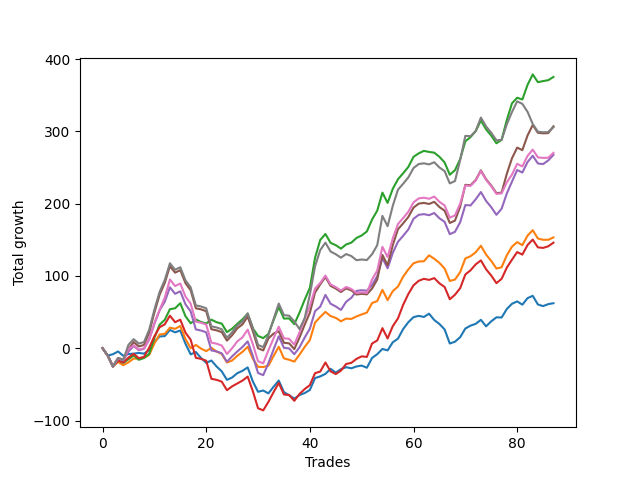

# Short Bulldog 005 
- Symbol: ES90d
- Date Range: 03/15/2022 - 07/08/2022
- Trading Period: 7:20-12:30
- Number of Trades: 87



| Name | Win Percent | Profit | Avg Profit / Trade |     | Name | Win Percent | Profit | Avg Profit / Trade |
| ---- | ----------- | ------ | ------------------ | --- | ---- | ----------- | ------ | ------------------ |
| Sorted By <br> Profit | | | | | Sorted By <br> Win Percentage ||||
| Two | 65.52 | 187625.00 | 2156.61 |     | Two | 65.52 | 187625.00 | 2156.61 |
| Five | 56.32 | 153500.00 | 1764.37 |     | Zero | 64.37 | 31125.00 | 357.76 |
| Seven | 52.87 | 152875.00 | 1757.18 |     | One | 60.92 | 76625.00 | 880.75 |
| Six | 56.32 | 135125.00 | 1553.16 |     | Three | 60.92 | 73000.00 | 839.08 |
| Four | 58.62 | 133750.00 | 1537.36 |     | Four | 58.62 | 133750.00 | 1537.36 |
| One | 60.92 | 76625.00 | 880.75 |     | Five | 56.32 | 153500.00 | 1764.37 |
| Three | 60.92 | 73000.00 | 839.08 |     | Six | 56.32 | 135125.00 | 1553.16 |
| Zero | 64.37 | 31125.00 | 357.76 |     | Seven | 52.87 | 152875.00 | 1757.18 |

### Test Zero
* Sell when price hits the middle line of the 20p bollinger
* No Stoploss
* Results:
```
Total Trades: 87
Percent Up: 35.63
Percent Down: 64.37
Total Points Moved Down: 62.25
Potential Profit: 31125.00
Total Points Ups: 240.50 Count Ups: 31
Total Points Downs: 302.75 Count Downs: 56
```

<details><summary>Trades</summary>

<code>In: 2022-03-17 09:25:00		Out: 2022-03-17 09:54:55		Total Position Time: 29:55		Total Move Down: -10.25		Total to Date: -10.25</code> <br />
<code>In: 2022-03-24 08:03:00		Out: 2022-03-24 08:04:30		Total Position Time: 01:30		Total Move Down: 2.00		Total to Date: -8.25</code> <br />
<code>In: 2022-03-24 08:44:00		Out: 2022-03-24 08:50:05		Total Position Time: 06:05		Total Move Down: 3.75		Total to Date: -4.50</code> <br />
<code>In: 2022-03-25 07:26:00		Out: 2022-03-25 07:51:05		Total Position Time: 25:05		Total Move Down: -6.00		Total to Date: -10.50</code> <br />
<code>In: 2022-03-25 07:44:00		Out: 2022-03-25 07:51:05		Total Position Time: 07:05		Total Move Down: 2.50		Total to Date: -8.00</code> <br />
<code>In: 2022-03-28 07:50:00		Out: 2022-03-28 08:00:15		Total Position Time: 10:15		Total Move Down: 0.50		Total to Date: -7.50</code> <br />
<code>In: 2022-03-29 11:38:00		Out: 2022-03-29 11:50:50		Total Position Time: 12:50		Total Move Down: 1.00		Total to Date: -6.50</code> <br />
<code>In: 2022-03-31 07:48:00		Out: 2022-03-31 08:03:05		Total Position Time: 15:05		Total Move Down: -1.00		Total to Date: -7.50</code> <br />
<code>In: 2022-04-06 10:43:00		Out: 2022-04-06 10:47:15		Total Position Time: 04:15		Total Move Down: 5.00		Total to Date: -2.50</code> <br />
<code>In: 2022-04-06 11:04:00		Out: 2022-04-06 11:05:40		Total Position Time: 01:40		Total Move Down: 11.00		Total to Date: 8.50</code> <br />
<code>In: 2022-04-06 11:05:00		Out: 2022-04-06 11:05:40		Total Position Time: 00:40		Total Move Down: 7.75		Total to Date: 16.25</code> <br />
<code>In: 2022-04-06 11:57:00		Out: 2022-04-06 12:07:45		Total Position Time: 10:45		Total Move Down: 0.50		Total to Date: 16.75</code> <br />
<code>In: 2022-04-06 12:02:00		Out: 2022-04-06 12:07:45		Total Position Time: 05:45		Total Move Down: 8.50		Total to Date: 25.25</code> <br />
<code>In: 2022-04-07 10:58:00		Out: 2022-04-07 11:15:15		Total Position Time: 17:15		Total Move Down: -3.25		Total to Date: 22.00</code> <br />
<code>In: 2022-04-07 11:03:00		Out: 2022-04-07 11:15:15		Total Position Time: 12:15		Total Move Down: 2.50		Total to Date: 24.50</code> <br />
<code>In: 2022-04-07 11:50:00		Out: 2022-04-07 12:19:10		Total Position Time: 29:10		Total Move Down: -18.25		Total to Date: 6.25</code> <br />
<code>In: 2022-04-07 11:54:00		Out: 2022-04-07 12:19:10		Total Position Time: 25:10		Total Move Down: -14.75		Total to Date: -8.50</code> <br />
<code>In: 2022-04-08 07:33:00		Out: 2022-04-08 07:44:35		Total Position Time: 11:35		Total Move Down: 3.25		Total to Date: -5.25</code> <br />
<code>In: 2022-04-08 07:54:00		Out: 2022-04-08 08:15:30		Total Position Time: 21:30		Total Move Down: -8.25		Total to Date: -13.50</code> <br />
<code>In: 2022-04-08 07:57:00		Out: 2022-04-08 08:15:30		Total Position Time: 18:30		Total Move Down: -6.75		Total to Date: -20.25</code> <br />
<code>In: 2022-04-08 07:33:00		Out: 2022-04-08 07:44:35		Total Position Time: 11:35		Total Move Down: 3.25		Total to Date: -17.00</code> <br />
<code>In: 2022-04-08 07:54:00		Out: 2022-04-08 08:15:30		Total Position Time: 21:30		Total Move Down: -8.25		Total to Date: -25.25</code> <br />
<code>In: 2022-04-08 07:57:00		Out: 2022-04-08 08:15:30		Total Position Time: 18:30		Total Move Down: -6.75		Total to Date: -32.00</code> <br />
<code>In: 2022-04-13 08:06:00		Out: 2022-04-13 08:35:55		Total Position Time: 29:55		Total Move Down: -11.75		Total to Date: -43.75</code> <br />
<code>In: 2022-04-18 07:27:00		Out: 2022-04-18 07:36:40		Total Position Time: 09:40		Total Move Down: 3.25		Total to Date: -40.50</code> <br />
<code>In: 2022-04-18 11:26:00		Out: 2022-04-18 11:28:05		Total Position Time: 02:05		Total Move Down: 6.00		Total to Date: -34.50</code> <br />
<code>In: 2022-04-20 10:46:00		Out: 2022-04-20 10:50:05		Total Position Time: 04:05		Total Move Down: 3.25		Total to Date: -31.25</code> <br />
<code>In: 2022-04-20 10:49:00		Out: 2022-04-20 10:50:05		Total Position Time: 01:05		Total Move Down: 4.75		Total to Date: -26.50</code> <br />
<code>In: 2022-04-25 11:11:00		Out: 2022-04-25 11:39:45		Total Position Time: 28:45		Total Move Down: -19.50		Total to Date: -46.00</code> <br />
<code>In: 2022-04-25 11:17:00		Out: 2022-04-25 11:39:45		Total Position Time: 22:45		Total Move Down: -14.25		Total to Date: -60.25</code> <br />
<code>In: 2022-04-27 09:25:00		Out: 2022-04-27 09:37:00		Total Position Time: 12:00		Total Move Down: 1.75		Total to Date: -58.50</code> <br />
<code>In: 2022-05-02 07:28:00		Out: 2022-05-02 07:44:10		Total Position Time: 16:10		Total Move Down: -4.00		Total to Date: -62.50</code> <br />
<code>In: 2022-05-03 07:34:00		Out: 2022-05-03 07:37:55		Total Position Time: 03:55		Total Move Down: 9.25		Total to Date: -53.25</code> <br />
<code>In: 2022-05-03 07:35:00		Out: 2022-05-03 07:37:55		Total Position Time: 02:55		Total Move Down: 8.50		Total to Date: -44.75</code> <br />
<code>In: 2022-05-03 08:06:00		Out: 2022-05-03 08:35:55		Total Position Time: 29:55		Total Move Down: -16.00		Total to Date: -60.75</code> <br />
<code>In: 2022-05-03 08:10:00		Out: 2022-05-03 08:35:55		Total Position Time: 25:55		Total Move Down: -4.25		Total to Date: -65.00</code> <br />
<code>In: 2022-05-04 09:24:00		Out: 2022-05-04 09:45:25		Total Position Time: 21:25		Total Move Down: -4.75		Total to Date: -69.75</code> <br />
<code>In: 2022-05-04 10:59:00		Out: 2022-05-04 11:00:20		Total Position Time: 01:20		Total Move Down: 5.00		Total to Date: -64.75</code> <br />
<code>In: 2022-05-04 11:03:00		Out: 2022-05-04 11:06:50		Total Position Time: 03:50		Total Move Down: 2.75		Total to Date: -62.00</code> <br />
<code>In: 2022-05-04 11:07:00		Out: 2022-05-04 11:07:10		Total Position Time: 00:10		Total Move Down: 4.25		Total to Date: -57.75</code> <br />
<code>In: 2022-05-04 11:30:00		Out: 2022-05-04 11:30:45		Total Position Time: 00:45		Total Move Down: 16.50		Total to Date: -41.25</code> <br />
<code>In: 2022-05-04 11:31:00		Out: 2022-05-04 11:31:10		Total Position Time: 00:10		Total Move Down: 2.25		Total to Date: -39.00</code> <br />
<code>In: 2022-05-16 09:05:00		Out: 2022-05-16 09:05:45		Total Position Time: 00:45		Total Move Down: 3.50		Total to Date: -35.50</code> <br />
<code>In: 2022-05-16 10:15:00		Out: 2022-05-16 10:18:20		Total Position Time: 03:20		Total Move Down: 7.00		Total to Date: -28.50</code> <br />
<code>In: 2022-05-16 10:25:00		Out: 2022-05-16 10:42:15		Total Position Time: 17:15		Total Move Down: -5.25		Total to Date: -33.75</code> <br />
<code>In: 2022-05-16 11:07:00		Out: 2022-05-16 11:12:00		Total Position Time: 05:00		Total Move Down: 4.75		Total to Date: -29.00</code> <br />
<code>In: 2022-05-16 11:32:00		Out: 2022-05-16 11:41:50		Total Position Time: 09:50		Total Move Down: 2.75		Total to Date: -26.25</code> <br />
<code>In: 2022-05-17 09:37:00		Out: 2022-05-17 09:51:20		Total Position Time: 14:20		Total Move Down: -1.50		Total to Date: -27.75</code> <br />
<code>In: 2022-05-17 09:48:00		Out: 2022-05-17 09:51:20		Total Position Time: 03:20		Total Move Down: 2.50		Total to Date: -25.25</code> <br />
<code>In: 2022-05-17 10:15:00		Out: 2022-05-17 10:23:15		Total Position Time: 08:15		Total Move Down: 1.25		Total to Date: -24.00</code> <br />
<code>In: 2022-05-19 08:40:00		Out: 2022-05-19 08:53:35		Total Position Time: 13:35		Total Move Down: -3.00		Total to Date: -27.00</code> <br />
<code>In: 2022-05-19 10:59:00		Out: 2022-05-19 11:06:05		Total Position Time: 07:05		Total Move Down: 13.50		Total to Date: -13.50</code> <br />
<code>In: 2022-05-19 11:52:00		Out: 2022-05-19 11:57:50		Total Position Time: 05:50		Total Move Down: 5.25		Total to Date: -8.25</code> <br />
<code>In: 2022-05-19 12:05:00		Out: 2022-05-19 12:09:40		Total Position Time: 04:40		Total Move Down: 7.25		Total to Date: -1.00</code> <br />
<code>In: 2022-05-23 08:07:00		Out: 2022-05-23 08:21:15		Total Position Time: 14:15		Total Move Down: -2.00		Total to Date: -3.00</code> <br />
<code>In: 2022-05-24 09:17:00		Out: 2022-05-24 09:21:30		Total Position Time: 04:30		Total Move Down: 11.25		Total to Date: 8.25</code> <br />
<code>In: 2022-05-24 09:18:00		Out: 2022-05-24 09:21:30		Total Position Time: 03:30		Total Move Down: 5.00		Total to Date: 13.25</code> <br />
<code>In: 2022-05-24 11:13:00		Out: 2022-05-24 11:18:25		Total Position Time: 05:25		Total Move Down: 13.25		Total to Date: 26.50</code> <br />
<code>In: 2022-05-24 11:14:00		Out: 2022-05-24 11:18:25		Total Position Time: 04:25		Total Move Down: 9.50		Total to Date: 36.00</code> <br />
<code>In: 2022-05-25 07:36:00		Out: 2022-05-25 07:42:00		Total Position Time: 06:00		Total Move Down: 7.00		Total to Date: 43.00</code> <br />
<code>In: 2022-05-25 12:05:00		Out: 2022-05-25 12:17:30		Total Position Time: 12:30		Total Move Down: 1.75		Total to Date: 44.75</code> <br />
<code>In: 2022-05-27 12:10:00		Out: 2022-05-27 12:35:00		Total Position Time: 25:00		Total Move Down: -1.50		Total to Date: 43.25</code> <br />
<code>In: 2022-05-31 07:23:00		Out: 2022-05-31 07:36:40		Total Position Time: 13:40		Total Move Down: 4.50		Total to Date: 47.75</code> <br />
<code>In: 2022-05-31 08:53:00		Out: 2022-05-31 09:13:00		Total Position Time: 20:00		Total Move Down: -8.75		Total to Date: 39.00</code> <br />
<code>In: 2022-06-02 08:05:00		Out: 2022-06-02 08:22:05		Total Position Time: 17:05		Total Move Down: -5.50		Total to Date: 33.50</code> <br />
<code>In: 2022-06-02 08:06:00		Out: 2022-06-02 08:22:05		Total Position Time: 16:05		Total Move Down: -7.50		Total to Date: 26.00</code> <br />
<code>In: 2022-06-07 07:31:00		Out: 2022-06-07 07:56:25		Total Position Time: 25:25		Total Move Down: -19.50		Total to Date: 6.50</code> <br />
<code>In: 2022-06-08 08:19:00		Out: 2022-06-08 08:31:10		Total Position Time: 12:10		Total Move Down: 2.50		Total to Date: 9.00</code> <br />
<code>In: 2022-06-10 12:29:00		Out: 2022-06-10 12:30:30		Total Position Time: 01:30		Total Move Down: 6.25		Total to Date: 15.25</code> <br />
<code>In: 2022-06-13 09:40:00		Out: 2022-06-13 09:43:15		Total Position Time: 03:15		Total Move Down: 12.00		Total to Date: 27.25</code> <br />
<code>In: 2022-06-23 07:42:00		Out: 2022-06-23 07:51:10		Total Position Time: 09:10		Total Move Down: 4.00		Total to Date: 31.25</code> <br />
<code>In: 2022-06-23 07:58:00		Out: 2022-06-23 08:00:30		Total Position Time: 02:30		Total Move Down: 2.50		Total to Date: 33.75</code> <br />
<code>In: 2022-06-23 08:15:00		Out: 2022-06-23 08:21:05		Total Position Time: 06:05		Total Move Down: 5.50		Total to Date: 39.25</code> <br />
<code>In: 2022-06-30 08:12:00		Out: 2022-06-30 08:35:10		Total Position Time: 23:10		Total Move Down: -9.00		Total to Date: 30.25</code> <br />
<code>In: 2022-06-30 08:29:00		Out: 2022-06-30 08:35:10		Total Position Time: 06:10		Total Move Down: 7.00		Total to Date: 37.25</code> <br />
<code>In: 2022-06-30 08:30:00		Out: 2022-06-30 08:35:10		Total Position Time: 05:10		Total Move Down: 5.50		Total to Date: 42.75</code> <br />
<code>In: 2022-06-30 08:49:00		Out: 2022-06-30 09:03:10		Total Position Time: 14:10		Total Move Down: -0.25		Total to Date: 42.50</code> <br />
<code>In: 2022-07-05 07:40:00		Out: 2022-07-05 07:44:30		Total Position Time: 04:30		Total Move Down: 11.75		Total to Date: 54.25</code> <br />
<code>In: 2022-07-05 07:41:00		Out: 2022-07-05 07:44:30		Total Position Time: 03:30		Total Move Down: 7.25		Total to Date: 61.50</code> <br />
<code>In: 2022-07-05 09:27:00		Out: 2022-07-05 09:40:05		Total Position Time: 13:05		Total Move Down: 3.25		Total to Date: 64.75</code> <br />
<code>In: 2022-07-05 11:34:00		Out: 2022-07-05 11:48:05		Total Position Time: 14:05		Total Move Down: -4.50		Total to Date: 60.25</code> <br />
<code>In: 2022-07-06 11:09:00		Out: 2022-07-06 11:10:10		Total Position Time: 01:10		Total Move Down: 9.00		Total to Date: 69.25</code> <br />
<code>In: 2022-07-06 11:10:00		Out: 2022-07-06 11:10:10		Total Position Time: 00:10		Total Move Down: 3.25		Total to Date: 72.50</code> <br />
<code>In: 2022-07-06 11:31:00		Out: 2022-07-06 11:48:45		Total Position Time: 17:45		Total Move Down: -12.00		Total to Date: 60.50</code> <br />
<code>In: 2022-07-06 11:35:00		Out: 2022-07-06 11:48:45		Total Position Time: 13:45		Total Move Down: -2.25		Total to Date: 58.25</code> <br />
<code>In: 2022-07-07 07:56:00		Out: 2022-07-07 08:01:05		Total Position Time: 05:05		Total Move Down: 2.75		Total to Date: 61.00</code> <br />
<code>In: 2022-07-07 12:18:00		Out: 2022-07-07 12:24:15		Total Position Time: 06:15		Total Move Down: 1.25		Total to Date: 62.25</code> <br />


</details>

### Test One
* Sell when the price hits the upper line of the 20p 1std bollinger
* No Stoploss
* Results:
```
Total Trades: 87
Percent Up: 39.08
Percent Down: 60.92
Total Points Moved Down: 153.25
Potential Profit: 76625.00
Total Points Ups: 252.00 Count Ups: 34
Total Points Downs: 405.25 Count Downs: 53
```

<details><summary>Trades</summary>

<code>In: 2022-03-17 09:25:00		Out: 2022-03-17 09:54:55		Total Position Time: 29:55		Total Move Down: -10.25		Total to Date: -10.25</code> <br />
<code>In: 2022-03-24 08:03:00		Out: 2022-03-24 08:32:55		Total Position Time: 29:55		Total Move Down: -15.00		Total to Date: -25.25</code> <br />
<code>In: 2022-03-24 08:44:00		Out: 2022-03-24 08:53:50		Total Position Time: 09:50		Total Move Down: 6.25		Total to Date: -19.00</code> <br />
<code>In: 2022-03-25 07:26:00		Out: 2022-03-25 07:53:50		Total Position Time: 27:50		Total Move Down: -4.50		Total to Date: -23.50</code> <br />
<code>In: 2022-03-25 07:44:00		Out: 2022-03-25 07:53:50		Total Position Time: 09:50		Total Move Down: 4.00		Total to Date: -19.50</code> <br />
<code>In: 2022-03-28 07:50:00		Out: 2022-03-28 08:01:35		Total Position Time: 11:35		Total Move Down: 5.25		Total to Date: -14.25</code> <br />
<code>In: 2022-03-29 11:38:00		Out: 2022-03-29 12:00:20		Total Position Time: 22:20		Total Move Down: -0.25		Total to Date: -14.50</code> <br />
<code>In: 2022-03-31 07:48:00		Out: 2022-03-31 08:03:25		Total Position Time: 15:25		Total Move Down: 1.25		Total to Date: -13.25</code> <br />
<code>In: 2022-04-06 10:43:00		Out: 2022-04-06 10:56:55		Total Position Time: 13:55		Total Move Down: 4.00		Total to Date: -9.25</code> <br />
<code>In: 2022-04-06 11:04:00		Out: 2022-04-06 11:07:20		Total Position Time: 03:20		Total Move Down: 15.75		Total to Date: 6.50</code> <br />
<code>In: 2022-04-06 11:05:00		Out: 2022-04-06 11:07:20		Total Position Time: 02:20		Total Move Down: 12.50		Total to Date: 19.00</code> <br />
<code>In: 2022-04-06 11:57:00		Out: 2022-04-06 12:13:35		Total Position Time: 16:35		Total Move Down: 0.75		Total to Date: 19.75</code> <br />
<code>In: 2022-04-06 12:02:00		Out: 2022-04-06 12:13:35		Total Position Time: 11:35		Total Move Down: 8.75		Total to Date: 28.50</code> <br />
<code>In: 2022-04-07 10:58:00		Out: 2022-04-07 11:16:10		Total Position Time: 18:10		Total Move Down: -1.75		Total to Date: 26.75</code> <br />
<code>In: 2022-04-07 11:03:00		Out: 2022-04-07 11:16:10		Total Position Time: 13:10		Total Move Down: 4.00		Total to Date: 30.75</code> <br />
<code>In: 2022-04-07 11:50:00		Out: 2022-04-07 12:19:55		Total Position Time: 29:55		Total Move Down: -18.00		Total to Date: 12.75</code> <br />
<code>In: 2022-04-07 11:54:00		Out: 2022-04-07 12:20:20		Total Position Time: 26:20		Total Move Down: -12.75		Total to Date: 0.00</code> <br />
<code>In: 2022-04-08 07:33:00		Out: 2022-04-08 07:45:55		Total Position Time: 12:55		Total Move Down: 4.50		Total to Date: 4.50</code> <br />
<code>In: 2022-04-08 07:54:00		Out: 2022-04-08 08:17:05		Total Position Time: 23:05		Total Move Down: -5.00		Total to Date: -0.50</code> <br />
<code>In: 2022-04-08 07:57:00		Out: 2022-04-08 08:17:05		Total Position Time: 20:05		Total Move Down: -3.50		Total to Date: -4.00</code> <br />
<code>In: 2022-04-08 07:33:00		Out: 2022-04-08 07:45:55		Total Position Time: 12:55		Total Move Down: 4.50		Total to Date: 0.50</code> <br />
<code>In: 2022-04-08 07:54:00		Out: 2022-04-08 08:17:05		Total Position Time: 23:05		Total Move Down: -5.00		Total to Date: -4.50</code> <br />
<code>In: 2022-04-08 07:57:00		Out: 2022-04-08 08:17:05		Total Position Time: 20:05		Total Move Down: -3.50		Total to Date: -8.00</code> <br />
<code>In: 2022-04-13 08:06:00		Out: 2022-04-13 08:35:55		Total Position Time: 29:55		Total Move Down: -11.75		Total to Date: -19.75</code> <br />
<code>In: 2022-04-18 07:27:00		Out: 2022-04-18 07:51:30		Total Position Time: 24:30		Total Move Down: 2.75		Total to Date: -17.00</code> <br />
<code>In: 2022-04-18 11:26:00		Out: 2022-04-18 11:41:15		Total Position Time: 15:15		Total Move Down: 6.50		Total to Date: -10.50</code> <br />
<code>In: 2022-04-20 10:46:00		Out: 2022-04-20 10:54:05		Total Position Time: 08:05		Total Move Down: 5.50		Total to Date: -5.00</code> <br />
<code>In: 2022-04-20 10:49:00		Out: 2022-04-20 10:54:05		Total Position Time: 05:05		Total Move Down: 7.00		Total to Date: 2.00</code> <br />
<code>In: 2022-04-25 11:11:00		Out: 2022-04-25 11:40:10		Total Position Time: 29:10		Total Move Down: -16.50		Total to Date: -14.50</code> <br />
<code>In: 2022-04-25 11:17:00		Out: 2022-04-25 11:40:10		Total Position Time: 23:10		Total Move Down: -11.25		Total to Date: -25.75</code> <br />
<code>In: 2022-04-27 09:25:00		Out: 2022-04-27 09:51:25		Total Position Time: 26:25		Total Move Down: -0.25		Total to Date: -26.00</code> <br />
<code>In: 2022-05-02 07:28:00		Out: 2022-05-02 07:44:50		Total Position Time: 16:50		Total Move Down: 1.75		Total to Date: -24.25</code> <br />
<code>In: 2022-05-03 07:34:00		Out: 2022-05-03 07:41:20		Total Position Time: 07:20		Total Move Down: 13.50		Total to Date: -10.75</code> <br />
<code>In: 2022-05-03 07:35:00		Out: 2022-05-03 07:41:20		Total Position Time: 06:20		Total Move Down: 12.75		Total to Date: 2.00</code> <br />
<code>In: 2022-05-03 08:06:00		Out: 2022-05-03 08:35:55		Total Position Time: 29:55		Total Move Down: -16.00		Total to Date: -14.00</code> <br />
<code>In: 2022-05-03 08:10:00		Out: 2022-05-03 08:38:05		Total Position Time: 28:05		Total Move Down: -2.00		Total to Date: -16.00</code> <br />
<code>In: 2022-05-04 09:24:00		Out: 2022-05-04 09:46:30		Total Position Time: 22:30		Total Move Down: -2.50		Total to Date: -18.50</code> <br />
<code>In: 2022-05-04 10:59:00		Out: 2022-05-04 11:00:25		Total Position Time: 01:25		Total Move Down: 9.50		Total to Date: -9.00</code> <br />
<code>In: 2022-05-04 11:03:00		Out: 2022-05-04 11:07:20		Total Position Time: 04:20		Total Move Down: 10.75		Total to Date: 1.75</code> <br />
<code>In: 2022-05-04 11:07:00		Out: 2022-05-04 11:07:20		Total Position Time: 00:20		Total Move Down: 9.50		Total to Date: 11.25</code> <br />
<code>In: 2022-05-04 11:30:00		Out: 2022-05-04 11:30:50		Total Position Time: 00:50		Total Move Down: 24.25		Total to Date: 35.50</code> <br />
<code>In: 2022-05-04 11:31:00		Out: 2022-05-04 11:31:25		Total Position Time: 00:25		Total Move Down: 7.75		Total to Date: 43.25</code> <br />
<code>In: 2022-05-16 09:05:00		Out: 2022-05-16 09:06:10		Total Position Time: 01:10		Total Move Down: 7.00		Total to Date: 50.25</code> <br />
<code>In: 2022-05-16 10:15:00		Out: 2022-05-16 10:42:30		Total Position Time: 27:30		Total Move Down: -5.75		Total to Date: 44.50</code> <br />
<code>In: 2022-05-16 10:25:00		Out: 2022-05-16 10:42:30		Total Position Time: 17:30		Total Move Down: -2.50		Total to Date: 42.00</code> <br />
<code>In: 2022-05-16 11:07:00		Out: 2022-05-16 11:36:55		Total Position Time: 29:55		Total Move Down: -4.75		Total to Date: 37.25</code> <br />
<code>In: 2022-05-16 11:32:00		Out: 2022-05-16 11:44:50		Total Position Time: 12:50		Total Move Down: 3.75		Total to Date: 41.00</code> <br />
<code>In: 2022-05-17 09:37:00		Out: 2022-05-17 09:54:40		Total Position Time: 17:40		Total Move Down: -0.50		Total to Date: 40.50</code> <br />
<code>In: 2022-05-17 09:48:00		Out: 2022-05-17 09:54:40		Total Position Time: 06:40		Total Move Down: 3.50		Total to Date: 44.00</code> <br />
<code>In: 2022-05-17 10:15:00		Out: 2022-05-17 10:28:15		Total Position Time: 13:15		Total Move Down: 2.75		Total to Date: 46.75</code> <br />
<code>In: 2022-05-19 08:40:00		Out: 2022-05-19 08:54:40		Total Position Time: 14:40		Total Move Down: 2.50		Total to Date: 49.25</code> <br />
<code>In: 2022-05-19 10:59:00		Out: 2022-05-19 11:14:00		Total Position Time: 15:00		Total Move Down: 13.25		Total to Date: 62.50</code> <br />
<code>In: 2022-05-19 11:52:00		Out: 2022-05-19 12:10:15		Total Position Time: 18:15		Total Move Down: 2.75		Total to Date: 65.25</code> <br />
<code>In: 2022-05-19 12:05:00		Out: 2022-05-19 12:10:15		Total Position Time: 05:15		Total Move Down: 15.50		Total to Date: 80.75</code> <br />
<code>In: 2022-05-23 08:07:00		Out: 2022-05-23 08:36:55		Total Position Time: 29:55		Total Move Down: -14.25		Total to Date: 66.50</code> <br />
<code>In: 2022-05-24 09:17:00		Out: 2022-05-24 09:29:00		Total Position Time: 12:00		Total Move Down: 12.50		Total to Date: 79.00</code> <br />
<code>In: 2022-05-24 09:18:00		Out: 2022-05-24 09:29:00		Total Position Time: 11:00		Total Move Down: 6.25		Total to Date: 85.25</code> <br />
<code>In: 2022-05-24 11:13:00		Out: 2022-05-24 11:31:25		Total Position Time: 18:25		Total Move Down: 13.75		Total to Date: 99.00</code> <br />
<code>In: 2022-05-24 11:14:00		Out: 2022-05-24 11:31:25		Total Position Time: 17:25		Total Move Down: 10.00		Total to Date: 109.00</code> <br />
<code>In: 2022-05-25 07:36:00		Out: 2022-05-25 07:46:40		Total Position Time: 10:40		Total Move Down: 8.50		Total to Date: 117.50</code> <br />
<code>In: 2022-05-25 12:05:00		Out: 2022-05-25 12:20:15		Total Position Time: 15:15		Total Move Down: 2.50		Total to Date: 120.00</code> <br />
<code>In: 2022-05-27 12:10:00		Out: 2022-05-27 12:35:40		Total Position Time: 25:40		Total Move Down: 0.25		Total to Date: 120.25</code> <br />
<code>In: 2022-05-31 07:23:00		Out: 2022-05-31 07:38:00		Total Position Time: 15:00		Total Move Down: 8.25		Total to Date: 128.50</code> <br />
<code>In: 2022-05-31 08:53:00		Out: 2022-05-31 09:14:40		Total Position Time: 21:40		Total Move Down: -4.75		Total to Date: 123.75</code> <br />
<code>In: 2022-06-02 08:05:00		Out: 2022-06-02 08:27:30		Total Position Time: 22:30		Total Move Down: -5.75		Total to Date: 118.00</code> <br />
<code>In: 2022-06-02 08:06:00		Out: 2022-06-02 08:27:30		Total Position Time: 21:30		Total Move Down: -7.75		Total to Date: 110.25</code> <br />
<code>In: 2022-06-07 07:31:00		Out: 2022-06-07 07:57:55		Total Position Time: 26:55		Total Move Down: -17.25		Total to Date: 93.00</code> <br />
<code>In: 2022-06-08 08:19:00		Out: 2022-06-08 08:43:05		Total Position Time: 24:05		Total Move Down: 2.00		Total to Date: 95.00</code> <br />
<code>In: 2022-06-10 12:29:00		Out: 2022-06-10 12:35:55		Total Position Time: 06:55		Total Move Down: 10.25		Total to Date: 105.25</code> <br />
<code>In: 2022-06-13 09:40:00		Out: 2022-06-13 09:47:55		Total Position Time: 07:55		Total Move Down: 19.00		Total to Date: 124.25</code> <br />
<code>In: 2022-06-23 07:42:00		Out: 2022-06-23 08:01:10		Total Position Time: 19:10		Total Move Down: 3.00		Total to Date: 127.25</code> <br />
<code>In: 2022-06-23 07:58:00		Out: 2022-06-23 08:01:10		Total Position Time: 03:10		Total Move Down: 5.50		Total to Date: 132.75</code> <br />
<code>In: 2022-06-23 08:15:00		Out: 2022-06-23 08:23:35		Total Position Time: 08:35		Total Move Down: 9.00		Total to Date: 141.75</code> <br />
<code>In: 2022-06-30 08:12:00		Out: 2022-06-30 08:41:55		Total Position Time: 29:55		Total Move Down: -12.25		Total to Date: 129.50</code> <br />
<code>In: 2022-06-30 08:29:00		Out: 2022-06-30 08:58:55		Total Position Time: 29:55		Total Move Down: -8.75		Total to Date: 120.75</code> <br />
<code>In: 2022-06-30 08:30:00		Out: 2022-06-30 08:59:55		Total Position Time: 29:55		Total Move Down: -10.50		Total to Date: 110.25</code> <br />
<code>In: 2022-06-30 08:49:00		Out: 2022-06-30 09:05:45		Total Position Time: 16:45		Total Move Down: 1.75		Total to Date: 112.00</code> <br />
<code>In: 2022-07-05 07:40:00		Out: 2022-07-05 07:45:55		Total Position Time: 05:55		Total Move Down: 16.50		Total to Date: 128.50</code> <br />
<code>In: 2022-07-05 07:41:00		Out: 2022-07-05 07:45:55		Total Position Time: 04:55		Total Move Down: 12.00		Total to Date: 140.50</code> <br />
<code>In: 2022-07-05 09:27:00		Out: 2022-07-05 09:42:00		Total Position Time: 15:00		Total Move Down: 6.25		Total to Date: 146.75</code> <br />
<code>In: 2022-07-05 11:34:00		Out: 2022-07-05 11:53:20		Total Position Time: 19:20		Total Move Down: -4.25		Total to Date: 142.50</code> <br />
<code>In: 2022-07-06 11:09:00		Out: 2022-07-06 11:11:10		Total Position Time: 02:10		Total Move Down: 13.25		Total to Date: 155.75</code> <br />
<code>In: 2022-07-06 11:10:00		Out: 2022-07-06 11:11:10		Total Position Time: 01:10		Total Move Down: 7.50		Total to Date: 163.25</code> <br />
<code>In: 2022-07-06 11:31:00		Out: 2022-07-06 12:00:50		Total Position Time: 29:50		Total Move Down: -11.50		Total to Date: 151.75</code> <br />
<code>In: 2022-07-06 11:35:00		Out: 2022-07-06 12:00:50		Total Position Time: 25:50		Total Move Down: -1.75		Total to Date: 150.00</code> <br />
<code>In: 2022-07-07 07:56:00		Out: 2022-07-07 08:20:00		Total Position Time: 24:00		Total Move Down: -0.00		Total to Date: 150.00</code> <br />
<code>In: 2022-07-07 12:18:00		Out: 2022-07-07 12:25:10		Total Position Time: 07:10		Total Move Down: 3.25		Total to Date: 153.25</code> <br />


</details>

### Test Two
* Sell when the price hits the upper line of the 20p 2std bollinger
* No Stoploss
* Results:
```
Total Trades: 87
Percent Up: 34.48
Percent Down: 65.52
Total Points Moved Down: 375.25
Potential Profit: 187625.00
Total Points Ups: 255.25 Count Ups: 30
Total Points Downs: 630.50 Count Downs: 57
```

<details><summary>Trades</summary>

<code>In: 2022-03-17 09:25:00		Out: 2022-03-17 09:54:55		Total Position Time: 29:55		Total Move Down: -10.25		Total to Date: -10.25</code> <br />
<code>In: 2022-03-24 08:03:00		Out: 2022-03-24 08:32:55		Total Position Time: 29:55		Total Move Down: -15.00		Total to Date: -25.25</code> <br />
<code>In: 2022-03-24 08:44:00		Out: 2022-03-24 09:03:15		Total Position Time: 19:15		Total Move Down: 8.50		Total to Date: -16.75</code> <br />
<code>In: 2022-03-25 07:26:00		Out: 2022-03-25 07:54:10		Total Position Time: 28:10		Total Move Down: -3.50		Total to Date: -20.25</code> <br />
<code>In: 2022-03-25 07:44:00		Out: 2022-03-25 07:54:10		Total Position Time: 10:10		Total Move Down: 5.00		Total to Date: -15.25</code> <br />
<code>In: 2022-03-28 07:50:00		Out: 2022-03-28 08:01:35		Total Position Time: 11:35		Total Move Down: 5.25		Total to Date: -10.00</code> <br />
<code>In: 2022-03-29 11:38:00		Out: 2022-03-29 12:07:55		Total Position Time: 29:55		Total Move Down: -6.00		Total to Date: -16.00</code> <br />
<code>In: 2022-03-31 07:48:00		Out: 2022-03-31 08:08:30		Total Position Time: 20:30		Total Move Down: 2.50		Total to Date: -13.50</code> <br />
<code>In: 2022-04-06 10:43:00		Out: 2022-04-06 10:58:00		Total Position Time: 15:00		Total Move Down: 5.75		Total to Date: -7.75</code> <br />
<code>In: 2022-04-06 11:04:00		Out: 2022-04-06 11:08:20		Total Position Time: 04:20		Total Move Down: 21.75		Total to Date: 14.00</code> <br />
<code>In: 2022-04-06 11:05:00		Out: 2022-04-06 11:08:20		Total Position Time: 03:20		Total Move Down: 18.50		Total to Date: 32.50</code> <br />
<code>In: 2022-04-06 11:57:00		Out: 2022-04-06 12:20:25		Total Position Time: 23:25		Total Move Down: 6.75		Total to Date: 39.25</code> <br />
<code>In: 2022-04-06 12:02:00		Out: 2022-04-06 12:20:25		Total Position Time: 18:25		Total Move Down: 14.75		Total to Date: 54.00</code> <br />
<code>In: 2022-04-07 10:58:00		Out: 2022-04-07 11:18:40		Total Position Time: 20:40		Total Move Down: 1.25		Total to Date: 55.25</code> <br />
<code>In: 2022-04-07 11:03:00		Out: 2022-04-07 11:18:40		Total Position Time: 15:40		Total Move Down: 7.00		Total to Date: 62.25</code> <br />
<code>In: 2022-04-07 11:50:00		Out: 2022-04-07 12:19:55		Total Position Time: 29:55		Total Move Down: -18.00		Total to Date: 44.25</code> <br />
<code>In: 2022-04-07 11:54:00		Out: 2022-04-07 12:23:55		Total Position Time: 29:55		Total Move Down: -9.75		Total to Date: 34.50</code> <br />
<code>In: 2022-04-08 07:33:00		Out: 2022-04-08 07:49:20		Total Position Time: 16:20		Total Move Down: 5.25		Total to Date: 39.75</code> <br />
<code>In: 2022-04-08 07:54:00		Out: 2022-04-08 08:20:35		Total Position Time: 26:35		Total Move Down: -3.50		Total to Date: 36.25</code> <br />
<code>In: 2022-04-08 07:57:00		Out: 2022-04-08 08:20:35		Total Position Time: 23:35		Total Move Down: -2.00		Total to Date: 34.25</code> <br />
<code>In: 2022-04-08 07:33:00		Out: 2022-04-08 07:49:20		Total Position Time: 16:20		Total Move Down: 5.25		Total to Date: 39.50</code> <br />
<code>In: 2022-04-08 07:54:00		Out: 2022-04-08 08:20:35		Total Position Time: 26:35		Total Move Down: -3.50		Total to Date: 36.00</code> <br />
<code>In: 2022-04-08 07:57:00		Out: 2022-04-08 08:20:35		Total Position Time: 23:35		Total Move Down: -2.00		Total to Date: 34.00</code> <br />
<code>In: 2022-04-13 08:06:00		Out: 2022-04-13 08:35:55		Total Position Time: 29:55		Total Move Down: -11.75		Total to Date: 22.25</code> <br />
<code>In: 2022-04-18 07:27:00		Out: 2022-04-18 07:51:45		Total Position Time: 24:45		Total Move Down: 4.75		Total to Date: 27.00</code> <br />
<code>In: 2022-04-18 11:26:00		Out: 2022-04-18 11:44:10		Total Position Time: 18:10		Total Move Down: 6.75		Total to Date: 33.75</code> <br />
<code>In: 2022-04-20 10:46:00		Out: 2022-04-20 11:13:55		Total Position Time: 27:55		Total Move Down: 6.25		Total to Date: 40.00</code> <br />
<code>In: 2022-04-20 10:49:00		Out: 2022-04-20 11:13:55		Total Position Time: 24:55		Total Move Down: 7.75		Total to Date: 47.75</code> <br />
<code>In: 2022-04-25 11:11:00		Out: 2022-04-25 11:40:55		Total Position Time: 29:55		Total Move Down: -20.25		Total to Date: 27.50</code> <br />
<code>In: 2022-04-25 11:17:00		Out: 2022-04-25 11:45:15		Total Position Time: 28:15		Total Move Down: -10.50		Total to Date: 17.00</code> <br />
<code>In: 2022-04-27 09:25:00		Out: 2022-04-27 09:54:55		Total Position Time: 29:55		Total Move Down: -3.00		Total to Date: 14.00</code> <br />
<code>In: 2022-05-02 07:28:00		Out: 2022-05-02 07:47:35		Total Position Time: 19:35		Total Move Down: 5.75		Total to Date: 19.75</code> <br />
<code>In: 2022-05-03 07:34:00		Out: 2022-05-03 07:43:50		Total Position Time: 09:50		Total Move Down: 19.00		Total to Date: 38.75</code> <br />
<code>In: 2022-05-03 07:35:00		Out: 2022-05-03 07:43:50		Total Position Time: 08:50		Total Move Down: 18.25		Total to Date: 57.00</code> <br />
<code>In: 2022-05-03 08:06:00		Out: 2022-05-03 08:35:55		Total Position Time: 29:55		Total Move Down: -16.00		Total to Date: 41.00</code> <br />
<code>In: 2022-05-03 08:10:00		Out: 2022-05-03 08:39:10		Total Position Time: 29:10		Total Move Down: 0.25		Total to Date: 41.25</code> <br />
<code>In: 2022-05-04 09:24:00		Out: 2022-05-04 09:53:55		Total Position Time: 29:55		Total Move Down: -8.00		Total to Date: 33.25</code> <br />
<code>In: 2022-05-04 10:59:00		Out: 2022-05-04 11:08:05		Total Position Time: 09:05		Total Move Down: 16.00		Total to Date: 49.25</code> <br />
<code>In: 2022-05-04 11:03:00		Out: 2022-05-04 11:08:05		Total Position Time: 05:05		Total Move Down: 17.75		Total to Date: 67.00</code> <br />
<code>In: 2022-05-04 11:07:00		Out: 2022-05-04 11:08:05		Total Position Time: 01:05		Total Move Down: 16.50		Total to Date: 83.50</code> <br />
<code>In: 2022-05-04 11:30:00		Out: 2022-05-04 11:34:15		Total Position Time: 04:15		Total Move Down: 41.50		Total to Date: 125.00</code> <br />
<code>In: 2022-05-04 11:31:00		Out: 2022-05-04 11:34:15		Total Position Time: 03:15		Total Move Down: 24.75		Total to Date: 149.75</code> <br />
<code>In: 2022-05-16 09:05:00		Out: 2022-05-16 09:11:40		Total Position Time: 06:40		Total Move Down: 8.25		Total to Date: 158.00</code> <br />
<code>In: 2022-05-16 10:15:00		Out: 2022-05-16 10:44:55		Total Position Time: 29:55		Total Move Down: -12.25		Total to Date: 145.75</code> <br />
<code>In: 2022-05-16 10:25:00		Out: 2022-05-16 10:46:35		Total Position Time: 21:35		Total Move Down: -3.25		Total to Date: 142.50</code> <br />
<code>In: 2022-05-16 11:07:00		Out: 2022-05-16 11:36:55		Total Position Time: 29:55		Total Move Down: -4.75		Total to Date: 137.75</code> <br />
<code>In: 2022-05-16 11:32:00		Out: 2022-05-16 11:45:40		Total Position Time: 13:40		Total Move Down: 5.75		Total to Date: 143.50</code> <br />
<code>In: 2022-05-17 09:37:00		Out: 2022-05-17 10:01:50		Total Position Time: 24:50		Total Move Down: 2.50		Total to Date: 146.00</code> <br />
<code>In: 2022-05-17 09:48:00		Out: 2022-05-17 10:01:50		Total Position Time: 13:50		Total Move Down: 6.50		Total to Date: 152.50</code> <br />
<code>In: 2022-05-17 10:15:00		Out: 2022-05-17 10:42:05		Total Position Time: 27:05		Total Move Down: 3.50		Total to Date: 156.00</code> <br />
<code>In: 2022-05-19 08:40:00		Out: 2022-05-19 08:55:35		Total Position Time: 15:35		Total Move Down: 5.50		Total to Date: 161.50</code> <br />
<code>In: 2022-05-19 10:59:00		Out: 2022-05-19 11:20:05		Total Position Time: 21:05		Total Move Down: 16.50		Total to Date: 178.00</code> <br />
<code>In: 2022-05-19 11:52:00		Out: 2022-05-19 12:18:25		Total Position Time: 26:25		Total Move Down: 12.25		Total to Date: 190.25</code> <br />
<code>In: 2022-05-19 12:05:00		Out: 2022-05-19 12:18:25		Total Position Time: 13:25		Total Move Down: 25.00		Total to Date: 215.25</code> <br />
<code>In: 2022-05-23 08:07:00		Out: 2022-05-23 08:36:55		Total Position Time: 29:55		Total Move Down: -14.25		Total to Date: 201.00</code> <br />
<code>In: 2022-05-24 09:17:00		Out: 2022-05-24 09:32:35		Total Position Time: 15:35		Total Move Down: 19.50		Total to Date: 220.50</code> <br />
<code>In: 2022-05-24 09:18:00		Out: 2022-05-24 09:32:35		Total Position Time: 14:35		Total Move Down: 13.25		Total to Date: 233.75</code> <br />
<code>In: 2022-05-24 11:13:00		Out: 2022-05-24 11:42:55		Total Position Time: 29:55		Total Move Down: 8.25		Total to Date: 242.00</code> <br />
<code>In: 2022-05-24 11:14:00		Out: 2022-05-24 11:43:55		Total Position Time: 29:55		Total Move Down: 8.75		Total to Date: 250.75</code> <br />
<code>In: 2022-05-25 07:36:00		Out: 2022-05-25 07:48:20		Total Position Time: 12:20		Total Move Down: 14.00		Total to Date: 264.75</code> <br />
<code>In: 2022-05-25 12:05:00		Out: 2022-05-25 12:23:00		Total Position Time: 18:00		Total Move Down: 4.75		Total to Date: 269.50</code> <br />
<code>In: 2022-05-27 12:10:00		Out: 2022-05-27 12:38:10		Total Position Time: 28:10		Total Move Down: 3.50		Total to Date: 273.00</code> <br />
<code>In: 2022-05-31 07:23:00		Out: 2022-05-31 07:52:55		Total Position Time: 29:55		Total Move Down: -1.50		Total to Date: 271.50</code> <br />
<code>In: 2022-05-31 08:53:00		Out: 2022-05-31 09:15:55		Total Position Time: 22:55		Total Move Down: -1.00		Total to Date: 270.50</code> <br />
<code>In: 2022-06-02 08:05:00		Out: 2022-06-02 08:29:05		Total Position Time: 24:05		Total Move Down: -5.75		Total to Date: 264.75</code> <br />
<code>In: 2022-06-02 08:06:00		Out: 2022-06-02 08:29:05		Total Position Time: 23:05		Total Move Down: -7.75		Total to Date: 257.00</code> <br />
<code>In: 2022-06-07 07:31:00		Out: 2022-06-07 08:00:55		Total Position Time: 29:55		Total Move Down: -17.00		Total to Date: 240.00</code> <br />
<code>In: 2022-06-08 08:19:00		Out: 2022-06-08 08:44:45		Total Position Time: 25:45		Total Move Down: 6.25		Total to Date: 246.25</code> <br />
<code>In: 2022-06-10 12:29:00		Out: 2022-06-10 12:43:25		Total Position Time: 14:25		Total Move Down: 15.25		Total to Date: 261.50</code> <br />
<code>In: 2022-06-13 09:40:00		Out: 2022-06-13 09:54:45		Total Position Time: 14:45		Total Move Down: 24.75		Total to Date: 286.25</code> <br />
<code>In: 2022-06-23 07:42:00		Out: 2022-06-23 08:04:35		Total Position Time: 22:35		Total Move Down: 5.75		Total to Date: 292.00</code> <br />
<code>In: 2022-06-23 07:58:00		Out: 2022-06-23 08:04:35		Total Position Time: 06:35		Total Move Down: 8.25		Total to Date: 300.25</code> <br />
<code>In: 2022-06-23 08:15:00		Out: 2022-06-23 08:31:25		Total Position Time: 16:25		Total Move Down: 14.75		Total to Date: 315.00</code> <br />
<code>In: 2022-06-30 08:12:00		Out: 2022-06-30 08:41:55		Total Position Time: 29:55		Total Move Down: -12.25		Total to Date: 302.75</code> <br />
<code>In: 2022-06-30 08:29:00		Out: 2022-06-30 08:58:55		Total Position Time: 29:55		Total Move Down: -8.75		Total to Date: 294.00</code> <br />
<code>In: 2022-06-30 08:30:00		Out: 2022-06-30 08:59:55		Total Position Time: 29:55		Total Move Down: -10.50		Total to Date: 283.50</code> <br />
<code>In: 2022-06-30 08:49:00		Out: 2022-06-30 09:06:15		Total Position Time: 17:15		Total Move Down: 4.75		Total to Date: 288.25</code> <br />
<code>In: 2022-07-05 07:40:00		Out: 2022-07-05 08:01:10		Total Position Time: 21:10		Total Move Down: 27.50		Total to Date: 315.75</code> <br />
<code>In: 2022-07-05 07:41:00		Out: 2022-07-05 08:01:10		Total Position Time: 20:10		Total Move Down: 23.00		Total to Date: 338.75</code> <br />
<code>In: 2022-07-05 09:27:00		Out: 2022-07-05 09:42:35		Total Position Time: 15:35		Total Move Down: 7.75		Total to Date: 346.50</code> <br />
<code>In: 2022-07-05 11:34:00		Out: 2022-07-05 12:01:50		Total Position Time: 27:50		Total Move Down: -2.50		Total to Date: 344.00</code> <br />
<code>In: 2022-07-06 11:09:00		Out: 2022-07-06 11:12:15		Total Position Time: 03:15		Total Move Down: 20.25		Total to Date: 364.25</code> <br />
<code>In: 2022-07-06 11:10:00		Out: 2022-07-06 11:12:15		Total Position Time: 02:15		Total Move Down: 14.50		Total to Date: 378.75</code> <br />
<code>In: 2022-07-06 11:31:00		Out: 2022-07-06 12:00:55		Total Position Time: 29:55		Total Move Down: -10.75		Total to Date: 368.00</code> <br />
<code>In: 2022-07-06 11:35:00		Out: 2022-07-06 12:01:30		Total Position Time: 26:30		Total Move Down: 1.50		Total to Date: 369.50</code> <br />
<code>In: 2022-07-07 07:56:00		Out: 2022-07-07 08:21:00		Total Position Time: 25:00		Total Move Down: 1.25		Total to Date: 370.75</code> <br />
<code>In: 2022-07-07 12:18:00		Out: 2022-07-07 12:28:30		Total Position Time: 10:30		Total Move Down: 4.50		Total to Date: 375.25</code> <br />


</details>

### Test Three
* Sell when price hits the middle line of the 50p bollinger
* No Stoploss
* Results:
```
Total Trades: 87
Percent Up: 39.08
Percent Down: 60.92
Total Points Moved Down: 146.00
Potential Profit: 73000.00
Total Points Ups: 320.00 Count Ups: 34
Total Points Downs: 466.00 Count Downs: 53
```

<details><summary>Trades</summary>

<code>In: 2022-03-17 09:25:00		Out: 2022-03-17 09:54:55		Total Position Time: 29:55		Total Move Down: -10.25		Total to Date: -10.25</code> <br />
<code>In: 2022-03-24 08:03:00		Out: 2022-03-24 08:32:55		Total Position Time: 29:55		Total Move Down: -15.00		Total to Date: -25.25</code> <br />
<code>In: 2022-03-24 08:44:00		Out: 2022-03-24 09:03:10		Total Position Time: 19:10		Total Move Down: 8.00		Total to Date: -17.25</code> <br />
<code>In: 2022-03-25 07:26:00		Out: 2022-03-25 07:55:55		Total Position Time: 29:55		Total Move Down: -2.50		Total to Date: -19.75</code> <br />
<code>In: 2022-03-25 07:44:00		Out: 2022-03-25 08:00:25		Total Position Time: 16:25		Total Move Down: 6.75		Total to Date: -13.00</code> <br />
<code>In: 2022-03-28 07:50:00		Out: 2022-03-28 08:01:35		Total Position Time: 11:35		Total Move Down: 5.25		Total to Date: -7.75</code> <br />
<code>In: 2022-03-29 11:38:00		Out: 2022-03-29 12:07:55		Total Position Time: 29:55		Total Move Down: -6.00		Total to Date: -13.75</code> <br />
<code>In: 2022-03-31 07:48:00		Out: 2022-03-31 08:15:35		Total Position Time: 27:35		Total Move Down: 1.75		Total to Date: -12.00</code> <br />
<code>In: 2022-04-06 10:43:00		Out: 2022-04-06 11:00:10		Total Position Time: 17:10		Total Move Down: 12.75		Total to Date: 0.75</code> <br />
<code>In: 2022-04-06 11:04:00		Out: 2022-04-06 11:07:20		Total Position Time: 03:20		Total Move Down: 15.75		Total to Date: 16.50</code> <br />
<code>In: 2022-04-06 11:05:00		Out: 2022-04-06 11:07:20		Total Position Time: 02:20		Total Move Down: 12.50		Total to Date: 29.00</code> <br />
<code>In: 2022-04-06 11:57:00		Out: 2022-04-06 12:20:15		Total Position Time: 23:15		Total Move Down: 4.00		Total to Date: 33.00</code> <br />
<code>In: 2022-04-06 12:02:00		Out: 2022-04-06 12:20:15		Total Position Time: 18:15		Total Move Down: 12.00		Total to Date: 45.00</code> <br />
<code>In: 2022-04-07 10:58:00		Out: 2022-04-07 11:27:55		Total Position Time: 29:55		Total Move Down: -9.00		Total to Date: 36.00</code> <br />
<code>In: 2022-04-07 11:03:00		Out: 2022-04-07 11:32:55		Total Position Time: 29:55		Total Move Down: 3.50		Total to Date: 39.50</code> <br />
<code>In: 2022-04-07 11:50:00		Out: 2022-04-07 12:19:55		Total Position Time: 29:55		Total Move Down: -18.00		Total to Date: 21.50</code> <br />
<code>In: 2022-04-07 11:54:00		Out: 2022-04-07 12:23:55		Total Position Time: 29:55		Total Move Down: -9.75		Total to Date: 11.75</code> <br />
<code>In: 2022-04-08 07:33:00		Out: 2022-04-08 08:02:55		Total Position Time: 29:55		Total Move Down: -25.00		Total to Date: -13.25</code> <br />
<code>In: 2022-04-08 07:54:00		Out: 2022-04-08 08:23:55		Total Position Time: 29:55		Total Move Down: -1.50		Total to Date: -14.75</code> <br />
<code>In: 2022-04-08 07:57:00		Out: 2022-04-08 08:26:55		Total Position Time: 29:55		Total Move Down: -2.50		Total to Date: -17.25</code> <br />
<code>In: 2022-04-08 07:33:00		Out: 2022-04-08 08:02:55		Total Position Time: 29:55		Total Move Down: -25.00		Total to Date: -42.25</code> <br />
<code>In: 2022-04-08 07:54:00		Out: 2022-04-08 08:23:55		Total Position Time: 29:55		Total Move Down: -1.50		Total to Date: -43.75</code> <br />
<code>In: 2022-04-08 07:57:00		Out: 2022-04-08 08:26:55		Total Position Time: 29:55		Total Move Down: -2.50		Total to Date: -46.25</code> <br />
<code>In: 2022-04-13 08:06:00		Out: 2022-04-13 08:35:55		Total Position Time: 29:55		Total Move Down: -11.75		Total to Date: -58.00</code> <br />
<code>In: 2022-04-18 07:27:00		Out: 2022-04-18 07:51:50		Total Position Time: 24:50		Total Move Down: 5.25		Total to Date: -52.75</code> <br />
<code>In: 2022-04-18 11:26:00		Out: 2022-04-18 11:27:55		Total Position Time: 01:55		Total Move Down: 4.00		Total to Date: -48.75</code> <br />
<code>In: 2022-04-20 10:46:00		Out: 2022-04-20 10:50:20		Total Position Time: 04:20		Total Move Down: 4.00		Total to Date: -44.75</code> <br />
<code>In: 2022-04-20 10:49:00		Out: 2022-04-20 10:50:20		Total Position Time: 01:20		Total Move Down: 5.50		Total to Date: -39.25</code> <br />
<code>In: 2022-04-25 11:11:00		Out: 2022-04-25 11:40:55		Total Position Time: 29:55		Total Move Down: -20.25		Total to Date: -59.50</code> <br />
<code>In: 2022-04-25 11:17:00		Out: 2022-04-25 11:46:55		Total Position Time: 29:55		Total Move Down: -23.50		Total to Date: -83.00</code> <br />
<code>In: 2022-04-27 09:25:00		Out: 2022-04-27 09:54:55		Total Position Time: 29:55		Total Move Down: -3.00		Total to Date: -86.00</code> <br />
<code>In: 2022-05-02 07:28:00		Out: 2022-05-02 07:54:10		Total Position Time: 26:10		Total Move Down: 11.75		Total to Date: -74.25</code> <br />
<code>In: 2022-05-03 07:34:00		Out: 2022-05-03 07:40:40		Total Position Time: 06:40		Total Move Down: 13.50		Total to Date: -60.75</code> <br />
<code>In: 2022-05-03 07:35:00		Out: 2022-05-03 07:40:40		Total Position Time: 05:40		Total Move Down: 12.75		Total to Date: -48.00</code> <br />
<code>In: 2022-05-03 08:06:00		Out: 2022-05-03 08:35:55		Total Position Time: 29:55		Total Move Down: -16.00		Total to Date: -64.00</code> <br />
<code>In: 2022-05-03 08:10:00		Out: 2022-05-03 08:39:55		Total Position Time: 29:55		Total Move Down: -0.75		Total to Date: -64.75</code> <br />
<code>In: 2022-05-04 09:24:00		Out: 2022-05-04 09:53:55		Total Position Time: 29:55		Total Move Down: -8.00		Total to Date: -72.75</code> <br />
<code>In: 2022-05-04 10:59:00		Out: 2022-05-04 11:00:25		Total Position Time: 01:25		Total Move Down: 9.50		Total to Date: -63.25</code> <br />
<code>In: 2022-05-04 11:03:00		Out: 2022-05-04 11:07:15		Total Position Time: 04:15		Total Move Down: 6.75		Total to Date: -56.50</code> <br />
<code>In: 2022-05-04 11:07:00		Out: 2022-05-04 11:07:15		Total Position Time: 00:15		Total Move Down: 5.50		Total to Date: -51.00</code> <br />
<code>In: 2022-05-04 11:30:00		Out: 2022-05-04 11:30:45		Total Position Time: 00:45		Total Move Down: 16.50		Total to Date: -34.50</code> <br />
<code>In: 2022-05-04 11:31:00		Out: 2022-05-04 11:31:10		Total Position Time: 00:10		Total Move Down: 2.25		Total to Date: -32.25</code> <br />
<code>In: 2022-05-16 09:05:00		Out: 2022-05-16 09:15:55		Total Position Time: 10:55		Total Move Down: 12.50		Total to Date: -19.75</code> <br />
<code>In: 2022-05-16 10:15:00		Out: 2022-05-16 10:44:55		Total Position Time: 29:55		Total Move Down: -12.25		Total to Date: -32.00</code> <br />
<code>In: 2022-05-16 10:25:00		Out: 2022-05-16 10:54:55		Total Position Time: 29:55		Total Move Down: -3.75		Total to Date: -35.75</code> <br />
<code>In: 2022-05-16 11:07:00		Out: 2022-05-16 11:17:30		Total Position Time: 10:30		Total Move Down: 4.75		Total to Date: -31.00</code> <br />
<code>In: 2022-05-16 11:32:00		Out: 2022-05-16 11:49:00		Total Position Time: 17:00		Total Move Down: 9.25		Total to Date: -21.75</code> <br />
<code>In: 2022-05-17 09:37:00		Out: 2022-05-17 10:01:25		Total Position Time: 24:25		Total Move Down: 1.50		Total to Date: -20.25</code> <br />
<code>In: 2022-05-17 09:48:00		Out: 2022-05-17 10:01:25		Total Position Time: 13:25		Total Move Down: 5.50		Total to Date: -14.75</code> <br />
<code>In: 2022-05-17 10:15:00		Out: 2022-05-17 10:29:30		Total Position Time: 14:30		Total Move Down: 3.50		Total to Date: -11.25</code> <br />
<code>In: 2022-05-19 08:40:00		Out: 2022-05-19 09:09:55		Total Position Time: 29:55		Total Move Down: -0.75		Total to Date: -12.00</code> <br />
<code>In: 2022-05-19 10:59:00		Out: 2022-05-19 11:06:55		Total Position Time: 07:55		Total Move Down: 18.50		Total to Date: 6.50</code> <br />
<code>In: 2022-05-19 11:52:00		Out: 2022-05-19 12:13:40		Total Position Time: 21:40		Total Move Down: 4.25		Total to Date: 10.75</code> <br />
<code>In: 2022-05-19 12:05:00		Out: 2022-05-19 12:13:40		Total Position Time: 08:40		Total Move Down: 17.00		Total to Date: 27.75</code> <br />
<code>In: 2022-05-23 08:07:00		Out: 2022-05-23 08:36:55		Total Position Time: 29:55		Total Move Down: -14.25		Total to Date: 13.50</code> <br />
<code>In: 2022-05-24 09:17:00		Out: 2022-05-24 09:31:20		Total Position Time: 14:20		Total Move Down: 17.00		Total to Date: 30.50</code> <br />
<code>In: 2022-05-24 09:18:00		Out: 2022-05-24 09:31:20		Total Position Time: 13:20		Total Move Down: 10.75		Total to Date: 41.25</code> <br />
<code>In: 2022-05-24 11:13:00		Out: 2022-05-24 11:20:25		Total Position Time: 07:25		Total Move Down: 18.75		Total to Date: 60.00</code> <br />
<code>In: 2022-05-24 11:14:00		Out: 2022-05-24 11:20:25		Total Position Time: 06:25		Total Move Down: 15.00		Total to Date: 75.00</code> <br />
<code>In: 2022-05-25 07:36:00		Out: 2022-05-25 07:57:20		Total Position Time: 21:20		Total Move Down: 12.00		Total to Date: 87.00</code> <br />
<code>In: 2022-05-25 12:05:00		Out: 2022-05-25 12:34:20		Total Position Time: 29:20		Total Move Down: 6.25		Total to Date: 93.25</code> <br />
<code>In: 2022-05-27 12:10:00		Out: 2022-05-27 12:38:05		Total Position Time: 28:05		Total Move Down: 2.75		Total to Date: 96.00</code> <br />
<code>In: 2022-05-31 07:23:00		Out: 2022-05-31 07:52:55		Total Position Time: 29:55		Total Move Down: -1.50		Total to Date: 94.50</code> <br />
<code>In: 2022-05-31 08:53:00		Out: 2022-05-31 09:19:05		Total Position Time: 26:05		Total Move Down: 2.50		Total to Date: 97.00</code> <br />
<code>In: 2022-06-02 08:05:00		Out: 2022-06-02 08:34:55		Total Position Time: 29:55		Total Move Down: -7.25		Total to Date: 89.75</code> <br />
<code>In: 2022-06-02 08:06:00		Out: 2022-06-02 08:35:55		Total Position Time: 29:55		Total Move Down: -5.00		Total to Date: 84.75</code> <br />
<code>In: 2022-06-07 07:31:00		Out: 2022-06-07 08:00:55		Total Position Time: 29:55		Total Move Down: -17.00		Total to Date: 67.75</code> <br />
<code>In: 2022-06-08 08:19:00		Out: 2022-06-08 08:44:45		Total Position Time: 25:45		Total Move Down: 6.25		Total to Date: 74.00</code> <br />
<code>In: 2022-06-10 12:29:00		Out: 2022-06-10 12:33:40		Total Position Time: 04:40		Total Move Down: 9.00		Total to Date: 83.00</code> <br />
<code>In: 2022-06-13 09:40:00		Out: 2022-06-13 09:47:55		Total Position Time: 07:55		Total Move Down: 19.00		Total to Date: 102.00</code> <br />
<code>In: 2022-06-23 07:42:00		Out: 2022-06-23 08:04:35		Total Position Time: 22:35		Total Move Down: 5.75		Total to Date: 107.75</code> <br />
<code>In: 2022-06-23 07:58:00		Out: 2022-06-23 08:04:35		Total Position Time: 06:35		Total Move Down: 8.25		Total to Date: 116.00</code> <br />
<code>In: 2022-06-23 08:15:00		Out: 2022-06-23 08:21:05		Total Position Time: 06:05		Total Move Down: 5.50		Total to Date: 121.50</code> <br />
<code>In: 2022-06-30 08:12:00		Out: 2022-06-30 08:41:55		Total Position Time: 29:55		Total Move Down: -12.25		Total to Date: 109.25</code> <br />
<code>In: 2022-06-30 08:29:00		Out: 2022-06-30 08:58:55		Total Position Time: 29:55		Total Move Down: -8.75		Total to Date: 100.50</code> <br />
<code>In: 2022-06-30 08:30:00		Out: 2022-06-30 08:59:55		Total Position Time: 29:55		Total Move Down: -10.50		Total to Date: 90.00</code> <br />
<code>In: 2022-06-30 08:49:00		Out: 2022-06-30 09:06:20		Total Position Time: 17:20		Total Move Down: 6.00		Total to Date: 96.00</code> <br />
<code>In: 2022-07-05 07:40:00		Out: 2022-07-05 07:45:30		Total Position Time: 05:30		Total Move Down: 15.50		Total to Date: 111.50</code> <br />
<code>In: 2022-07-05 07:41:00		Out: 2022-07-05 07:45:30		Total Position Time: 04:30		Total Move Down: 11.00		Total to Date: 122.50</code> <br />
<code>In: 2022-07-05 09:27:00		Out: 2022-07-05 09:43:40		Total Position Time: 16:40		Total Move Down: 10.50		Total to Date: 133.00</code> <br />
<code>In: 2022-07-05 11:34:00		Out: 2022-07-05 12:03:55		Total Position Time: 29:55		Total Move Down: -3.50		Total to Date: 129.50</code> <br />
<code>In: 2022-07-06 11:09:00		Out: 2022-07-06 11:11:10		Total Position Time: 02:10		Total Move Down: 13.25		Total to Date: 142.75</code> <br />
<code>In: 2022-07-06 11:10:00		Out: 2022-07-06 11:11:10		Total Position Time: 01:10		Total Move Down: 7.50		Total to Date: 150.25</code> <br />
<code>In: 2022-07-06 11:31:00		Out: 2022-07-06 12:00:55		Total Position Time: 29:55		Total Move Down: -10.75		Total to Date: 139.50</code> <br />
<code>In: 2022-07-06 11:35:00		Out: 2022-07-06 12:04:55		Total Position Time: 29:55		Total Move Down: -0.75		Total to Date: 138.75</code> <br />
<code>In: 2022-07-07 07:56:00		Out: 2022-07-07 08:22:45		Total Position Time: 26:45		Total Move Down: 2.25		Total to Date: 141.00</code> <br />
<code>In: 2022-07-07 12:18:00		Out: 2022-07-07 12:28:40		Total Position Time: 10:40		Total Move Down: 5.00		Total to Date: 146.00</code> <br />


</details>

### Test Four
* Sell when the price hits the upper line of the 50p 1std bollinger
* No Stoploss
* Results:
```
Total Trades: 87
Percent Up: 41.38
Percent Down: 58.62
Total Points Moved Down: 267.50
Potential Profit: 133750.00
Total Points Ups: 325.25 Count Ups: 36
Total Points Downs: 592.75 Count Downs: 51
```

<details><summary>Trades</summary>

<code>In: 2022-03-17 09:25:00		Out: 2022-03-17 09:54:55		Total Position Time: 29:55		Total Move Down: -10.25		Total to Date: -10.25</code> <br />
<code>In: 2022-03-24 08:03:00		Out: 2022-03-24 08:32:55		Total Position Time: 29:55		Total Move Down: -15.00		Total to Date: -25.25</code> <br />
<code>In: 2022-03-24 08:44:00		Out: 2022-03-24 09:06:25		Total Position Time: 22:25		Total Move Down: 11.00		Total to Date: -14.25</code> <br />
<code>In: 2022-03-25 07:26:00		Out: 2022-03-25 07:55:55		Total Position Time: 29:55		Total Move Down: -2.50		Total to Date: -16.75</code> <br />
<code>In: 2022-03-25 07:44:00		Out: 2022-03-25 08:01:45		Total Position Time: 17:45		Total Move Down: 12.25		Total to Date: -4.50</code> <br />
<code>In: 2022-03-28 07:50:00		Out: 2022-03-28 08:01:40		Total Position Time: 11:40		Total Move Down: 7.75		Total to Date: 3.25</code> <br />
<code>In: 2022-03-29 11:38:00		Out: 2022-03-29 12:07:55		Total Position Time: 29:55		Total Move Down: -6.00		Total to Date: -2.75</code> <br />
<code>In: 2022-03-31 07:48:00		Out: 2022-03-31 08:17:55		Total Position Time: 29:55		Total Move Down: 2.00		Total to Date: -0.75</code> <br />
<code>In: 2022-04-06 10:43:00		Out: 2022-04-06 11:00:10		Total Position Time: 17:10		Total Move Down: 12.75		Total to Date: 12.00</code> <br />
<code>In: 2022-04-06 11:04:00		Out: 2022-04-06 11:08:10		Total Position Time: 04:10		Total Move Down: 21.75		Total to Date: 33.75</code> <br />
<code>In: 2022-04-06 11:05:00		Out: 2022-04-06 11:08:10		Total Position Time: 03:10		Total Move Down: 18.50		Total to Date: 52.25</code> <br />
<code>In: 2022-04-06 11:57:00		Out: 2022-04-06 12:23:20		Total Position Time: 26:20		Total Move Down: 12.00		Total to Date: 64.25</code> <br />
<code>In: 2022-04-06 12:02:00		Out: 2022-04-06 12:23:20		Total Position Time: 21:20		Total Move Down: 20.00		Total to Date: 84.25</code> <br />
<code>In: 2022-04-07 10:58:00		Out: 2022-04-07 11:27:55		Total Position Time: 29:55		Total Move Down: -9.00		Total to Date: 75.25</code> <br />
<code>In: 2022-04-07 11:03:00		Out: 2022-04-07 11:32:55		Total Position Time: 29:55		Total Move Down: 3.50		Total to Date: 78.75</code> <br />
<code>In: 2022-04-07 11:50:00		Out: 2022-04-07 12:19:55		Total Position Time: 29:55		Total Move Down: -18.00		Total to Date: 60.75</code> <br />
<code>In: 2022-04-07 11:54:00		Out: 2022-04-07 12:23:55		Total Position Time: 29:55		Total Move Down: -9.75		Total to Date: 51.00</code> <br />
<code>In: 2022-04-08 07:33:00		Out: 2022-04-08 08:02:55		Total Position Time: 29:55		Total Move Down: -25.00		Total to Date: 26.00</code> <br />
<code>In: 2022-04-08 07:54:00		Out: 2022-04-08 08:23:55		Total Position Time: 29:55		Total Move Down: -1.50		Total to Date: 24.50</code> <br />
<code>In: 2022-04-08 07:57:00		Out: 2022-04-08 08:26:55		Total Position Time: 29:55		Total Move Down: -2.50		Total to Date: 22.00</code> <br />
<code>In: 2022-04-08 07:33:00		Out: 2022-04-08 08:02:55		Total Position Time: 29:55		Total Move Down: -25.00		Total to Date: -3.00</code> <br />
<code>In: 2022-04-08 07:54:00		Out: 2022-04-08 08:23:55		Total Position Time: 29:55		Total Move Down: -1.50		Total to Date: -4.50</code> <br />
<code>In: 2022-04-08 07:57:00		Out: 2022-04-08 08:26:55		Total Position Time: 29:55		Total Move Down: -2.50		Total to Date: -7.00</code> <br />
<code>In: 2022-04-13 08:06:00		Out: 2022-04-13 08:35:55		Total Position Time: 29:55		Total Move Down: -11.75		Total to Date: -18.75</code> <br />
<code>In: 2022-04-18 07:27:00		Out: 2022-04-18 07:56:55		Total Position Time: 29:55		Total Move Down: 7.50		Total to Date: -11.25</code> <br />
<code>In: 2022-04-18 11:26:00		Out: 2022-04-18 11:44:10		Total Position Time: 18:10		Total Move Down: 6.75		Total to Date: -4.50</code> <br />
<code>In: 2022-04-20 10:46:00		Out: 2022-04-20 11:14:05		Total Position Time: 28:05		Total Move Down: 6.25		Total to Date: 1.75</code> <br />
<code>In: 2022-04-20 10:49:00		Out: 2022-04-20 11:14:05		Total Position Time: 25:05		Total Move Down: 7.75		Total to Date: 9.50</code> <br />
<code>In: 2022-04-25 11:11:00		Out: 2022-04-25 11:40:55		Total Position Time: 29:55		Total Move Down: -20.25		Total to Date: -10.75</code> <br />
<code>In: 2022-04-25 11:17:00		Out: 2022-04-25 11:46:55		Total Position Time: 29:55		Total Move Down: -23.50		Total to Date: -34.25</code> <br />
<code>In: 2022-04-27 09:25:00		Out: 2022-04-27 09:54:55		Total Position Time: 29:55		Total Move Down: -3.00		Total to Date: -37.25</code> <br />
<code>In: 2022-05-02 07:28:00		Out: 2022-05-02 07:57:55		Total Position Time: 29:55		Total Move Down: 16.50		Total to Date: -20.75</code> <br />
<code>In: 2022-05-03 07:34:00		Out: 2022-05-03 07:43:50		Total Position Time: 09:50		Total Move Down: 19.00		Total to Date: -1.75</code> <br />
<code>In: 2022-05-03 07:35:00		Out: 2022-05-03 07:43:50		Total Position Time: 08:50		Total Move Down: 18.25		Total to Date: 16.50</code> <br />
<code>In: 2022-05-03 08:06:00		Out: 2022-05-03 08:35:55		Total Position Time: 29:55		Total Move Down: -16.00		Total to Date: 0.50</code> <br />
<code>In: 2022-05-03 08:10:00		Out: 2022-05-03 08:39:55		Total Position Time: 29:55		Total Move Down: -0.75		Total to Date: -0.25</code> <br />
<code>In: 2022-05-04 09:24:00		Out: 2022-05-04 09:53:55		Total Position Time: 29:55		Total Move Down: -8.00		Total to Date: -8.25</code> <br />
<code>In: 2022-05-04 10:59:00		Out: 2022-05-04 11:00:25		Total Position Time: 01:25		Total Move Down: 9.50		Total to Date: 1.25</code> <br />
<code>In: 2022-05-04 11:03:00		Out: 2022-05-04 11:07:25		Total Position Time: 04:25		Total Move Down: 13.50		Total to Date: 14.75</code> <br />
<code>In: 2022-05-04 11:07:00		Out: 2022-05-04 11:07:25		Total Position Time: 00:25		Total Move Down: 12.25		Total to Date: 27.00</code> <br />
<code>In: 2022-05-04 11:30:00		Out: 2022-05-04 11:30:50		Total Position Time: 00:50		Total Move Down: 24.25		Total to Date: 51.25</code> <br />
<code>In: 2022-05-04 11:31:00		Out: 2022-05-04 11:31:20		Total Position Time: 00:20		Total Move Down: 6.25		Total to Date: 57.50</code> <br />
<code>In: 2022-05-16 09:05:00		Out: 2022-05-16 09:25:35		Total Position Time: 20:35		Total Move Down: 16.25		Total to Date: 73.75</code> <br />
<code>In: 2022-05-16 10:15:00		Out: 2022-05-16 10:44:55		Total Position Time: 29:55		Total Move Down: -12.25		Total to Date: 61.50</code> <br />
<code>In: 2022-05-16 10:25:00		Out: 2022-05-16 10:54:55		Total Position Time: 29:55		Total Move Down: -3.75		Total to Date: 57.75</code> <br />
<code>In: 2022-05-16 11:07:00		Out: 2022-05-16 11:36:55		Total Position Time: 29:55		Total Move Down: -4.75		Total to Date: 53.00</code> <br />
<code>In: 2022-05-16 11:32:00		Out: 2022-05-16 11:51:05		Total Position Time: 19:05		Total Move Down: 11.25		Total to Date: 64.25</code> <br />
<code>In: 2022-05-17 09:37:00		Out: 2022-05-17 10:02:15		Total Position Time: 25:15		Total Move Down: 5.50		Total to Date: 69.75</code> <br />
<code>In: 2022-05-17 09:48:00		Out: 2022-05-17 10:02:15		Total Position Time: 14:15		Total Move Down: 9.50		Total to Date: 79.25</code> <br />
<code>In: 2022-05-17 10:15:00		Out: 2022-05-17 10:44:55		Total Position Time: 29:55		Total Move Down: 1.00		Total to Date: 80.25</code> <br />
<code>In: 2022-05-19 08:40:00		Out: 2022-05-19 09:09:55		Total Position Time: 29:55		Total Move Down: -0.75		Total to Date: 79.50</code> <br />
<code>In: 2022-05-19 10:59:00		Out: 2022-05-19 11:28:55		Total Position Time: 29:55		Total Move Down: 8.00		Total to Date: 87.50</code> <br />
<code>In: 2022-05-19 11:52:00		Out: 2022-05-19 12:18:25		Total Position Time: 26:25		Total Move Down: 12.25		Total to Date: 99.75</code> <br />
<code>In: 2022-05-19 12:05:00		Out: 2022-05-19 12:18:25		Total Position Time: 13:25		Total Move Down: 25.00		Total to Date: 124.75</code> <br />
<code>In: 2022-05-23 08:07:00		Out: 2022-05-23 08:36:55		Total Position Time: 29:55		Total Move Down: -14.25		Total to Date: 110.50</code> <br />
<code>In: 2022-05-24 09:17:00		Out: 2022-05-24 09:33:15		Total Position Time: 16:15		Total Move Down: 21.50		Total to Date: 132.00</code> <br />
<code>In: 2022-05-24 09:18:00		Out: 2022-05-24 09:33:15		Total Position Time: 15:15		Total Move Down: 15.25		Total to Date: 147.25</code> <br />
<code>In: 2022-05-24 11:13:00		Out: 2022-05-24 11:42:55		Total Position Time: 29:55		Total Move Down: 8.25		Total to Date: 155.50</code> <br />
<code>In: 2022-05-24 11:14:00		Out: 2022-05-24 11:43:55		Total Position Time: 29:55		Total Move Down: 8.75		Total to Date: 164.25</code> <br />
<code>In: 2022-05-25 07:36:00		Out: 2022-05-25 08:04:45		Total Position Time: 28:45		Total Move Down: 14.75		Total to Date: 179.00</code> <br />
<code>In: 2022-05-25 12:05:00		Out: 2022-05-25 12:34:55		Total Position Time: 29:55		Total Move Down: 5.50		Total to Date: 184.50</code> <br />
<code>In: 2022-05-27 12:10:00		Out: 2022-05-27 12:39:55		Total Position Time: 29:55		Total Move Down: 1.00		Total to Date: 185.50</code> <br />
<code>In: 2022-05-31 07:23:00		Out: 2022-05-31 07:52:55		Total Position Time: 29:55		Total Move Down: -1.50		Total to Date: 184.00</code> <br />
<code>In: 2022-05-31 08:53:00		Out: 2022-05-31 09:22:55		Total Position Time: 29:55		Total Move Down: 3.00		Total to Date: 187.00</code> <br />
<code>In: 2022-06-02 08:05:00		Out: 2022-06-02 08:34:55		Total Position Time: 29:55		Total Move Down: -7.25		Total to Date: 179.75</code> <br />
<code>In: 2022-06-02 08:06:00		Out: 2022-06-02 08:35:55		Total Position Time: 29:55		Total Move Down: -5.00		Total to Date: 174.75</code> <br />
<code>In: 2022-06-07 07:31:00		Out: 2022-06-07 08:00:55		Total Position Time: 29:55		Total Move Down: -17.00		Total to Date: 157.75</code> <br />
<code>In: 2022-06-08 08:19:00		Out: 2022-06-08 08:48:55		Total Position Time: 29:55		Total Move Down: 3.25		Total to Date: 161.00</code> <br />
<code>In: 2022-06-10 12:29:00		Out: 2022-06-10 12:42:40		Total Position Time: 13:40		Total Move Down: 13.25		Total to Date: 174.25</code> <br />
<code>In: 2022-06-13 09:40:00		Out: 2022-06-13 09:54:40		Total Position Time: 14:40		Total Move Down: 23.75		Total to Date: 198.00</code> <br />
<code>In: 2022-06-23 07:42:00		Out: 2022-06-23 08:11:55		Total Position Time: 29:55		Total Move Down: -0.50		Total to Date: 197.50</code> <br />
<code>In: 2022-06-23 07:58:00		Out: 2022-06-23 08:23:40		Total Position Time: 25:40		Total Move Down: 8.50		Total to Date: 206.00</code> <br />
<code>In: 2022-06-23 08:15:00		Out: 2022-06-23 08:23:40		Total Position Time: 08:40		Total Move Down: 10.00		Total to Date: 216.00</code> <br />
<code>In: 2022-06-30 08:12:00		Out: 2022-06-30 08:41:55		Total Position Time: 29:55		Total Move Down: -12.25		Total to Date: 203.75</code> <br />
<code>In: 2022-06-30 08:29:00		Out: 2022-06-30 08:58:55		Total Position Time: 29:55		Total Move Down: -8.75		Total to Date: 195.00</code> <br />
<code>In: 2022-06-30 08:30:00		Out: 2022-06-30 08:59:55		Total Position Time: 29:55		Total Move Down: -10.50		Total to Date: 184.50</code> <br />
<code>In: 2022-06-30 08:49:00		Out: 2022-06-30 09:13:40		Total Position Time: 24:40		Total Move Down: 8.50		Total to Date: 193.00</code> <br />
<code>In: 2022-07-05 07:40:00		Out: 2022-07-05 07:55:15		Total Position Time: 15:15		Total Move Down: 21.00		Total to Date: 214.00</code> <br />
<code>In: 2022-07-05 07:41:00		Out: 2022-07-05 07:55:15		Total Position Time: 14:15		Total Move Down: 16.50		Total to Date: 230.50</code> <br />
<code>In: 2022-07-05 09:27:00		Out: 2022-07-05 09:51:05		Total Position Time: 24:05		Total Move Down: 16.00		Total to Date: 246.50</code> <br />
<code>In: 2022-07-05 11:34:00		Out: 2022-07-05 12:03:55		Total Position Time: 29:55		Total Move Down: -3.50		Total to Date: 243.00</code> <br />
<code>In: 2022-07-06 11:09:00		Out: 2022-07-06 11:11:35		Total Position Time: 02:35		Total Move Down: 14.50		Total to Date: 257.50</code> <br />
<code>In: 2022-07-06 11:10:00		Out: 2022-07-06 11:11:35		Total Position Time: 01:35		Total Move Down: 8.75		Total to Date: 266.25</code> <br />
<code>In: 2022-07-06 11:31:00		Out: 2022-07-06 12:00:55		Total Position Time: 29:55		Total Move Down: -10.75		Total to Date: 255.50</code> <br />
<code>In: 2022-07-06 11:35:00		Out: 2022-07-06 12:04:55		Total Position Time: 29:55		Total Move Down: -0.75		Total to Date: 254.75</code> <br />
<code>In: 2022-07-07 07:56:00		Out: 2022-07-07 08:23:20		Total Position Time: 27:20		Total Move Down: 5.00		Total to Date: 259.75</code> <br />
<code>In: 2022-07-07 12:18:00		Out: 2022-07-07 12:38:50		Total Position Time: 20:50		Total Move Down: 7.75		Total to Date: 267.50</code> <br />


</details>

### Test Five
* Sell when the price hits the upper line of the 50p 2std bollinger
* No Stoploss
* Results:
```
Total Trades: 87
Percent Up: 43.68
Percent Down: 56.32
Total Points Moved Down: 307.00
Potential Profit: 153500.00
Total Points Ups: 333.75 Count Ups: 38
Total Points Downs: 640.75 Count Downs: 49
```

<details><summary>Trades</summary>

<code>In: 2022-03-17 09:25:00		Out: 2022-03-17 09:54:55		Total Position Time: 29:55		Total Move Down: -10.25		Total to Date: -10.25</code> <br />
<code>In: 2022-03-24 08:03:00		Out: 2022-03-24 08:32:55		Total Position Time: 29:55		Total Move Down: -15.00		Total to Date: -25.25</code> <br />
<code>In: 2022-03-24 08:44:00		Out: 2022-03-24 09:13:55		Total Position Time: 29:55		Total Move Down: 11.75		Total to Date: -13.50</code> <br />
<code>In: 2022-03-25 07:26:00		Out: 2022-03-25 07:55:55		Total Position Time: 29:55		Total Move Down: -2.50		Total to Date: -16.00</code> <br />
<code>In: 2022-03-25 07:44:00		Out: 2022-03-25 08:08:15		Total Position Time: 24:15		Total Move Down: 14.75		Total to Date: -1.25</code> <br />
<code>In: 2022-03-28 07:50:00		Out: 2022-03-28 08:01:45		Total Position Time: 11:45		Total Move Down: 9.75		Total to Date: 8.50</code> <br />
<code>In: 2022-03-29 11:38:00		Out: 2022-03-29 12:07:55		Total Position Time: 29:55		Total Move Down: -6.00		Total to Date: 2.50</code> <br />
<code>In: 2022-03-31 07:48:00		Out: 2022-03-31 08:17:55		Total Position Time: 29:55		Total Move Down: 2.00		Total to Date: 4.50</code> <br />
<code>In: 2022-04-06 10:43:00		Out: 2022-04-06 11:09:40		Total Position Time: 26:40		Total Move Down: 17.00		Total to Date: 21.50</code> <br />
<code>In: 2022-04-06 11:04:00		Out: 2022-04-06 11:09:40		Total Position Time: 05:40		Total Move Down: 27.75		Total to Date: 49.25</code> <br />
<code>In: 2022-04-06 11:05:00		Out: 2022-04-06 11:09:40		Total Position Time: 04:40		Total Move Down: 24.50		Total to Date: 73.75</code> <br />
<code>In: 2022-04-06 11:57:00		Out: 2022-04-06 12:26:55		Total Position Time: 29:55		Total Move Down: 16.50		Total to Date: 90.25</code> <br />
<code>In: 2022-04-06 12:02:00		Out: 2022-04-06 12:31:55		Total Position Time: 29:55		Total Move Down: 23.25		Total to Date: 113.50</code> <br />
<code>In: 2022-04-07 10:58:00		Out: 2022-04-07 11:27:55		Total Position Time: 29:55		Total Move Down: -9.00		Total to Date: 104.50</code> <br />
<code>In: 2022-04-07 11:03:00		Out: 2022-04-07 11:32:55		Total Position Time: 29:55		Total Move Down: 3.50		Total to Date: 108.00</code> <br />
<code>In: 2022-04-07 11:50:00		Out: 2022-04-07 12:19:55		Total Position Time: 29:55		Total Move Down: -18.00		Total to Date: 90.00</code> <br />
<code>In: 2022-04-07 11:54:00		Out: 2022-04-07 12:23:55		Total Position Time: 29:55		Total Move Down: -9.75		Total to Date: 80.25</code> <br />
<code>In: 2022-04-08 07:33:00		Out: 2022-04-08 08:02:55		Total Position Time: 29:55		Total Move Down: -25.00		Total to Date: 55.25</code> <br />
<code>In: 2022-04-08 07:54:00		Out: 2022-04-08 08:23:55		Total Position Time: 29:55		Total Move Down: -1.50		Total to Date: 53.75</code> <br />
<code>In: 2022-04-08 07:57:00		Out: 2022-04-08 08:26:55		Total Position Time: 29:55		Total Move Down: -2.50		Total to Date: 51.25</code> <br />
<code>In: 2022-04-08 07:33:00		Out: 2022-04-08 08:02:55		Total Position Time: 29:55		Total Move Down: -25.00		Total to Date: 26.25</code> <br />
<code>In: 2022-04-08 07:54:00		Out: 2022-04-08 08:23:55		Total Position Time: 29:55		Total Move Down: -1.50		Total to Date: 24.75</code> <br />
<code>In: 2022-04-08 07:57:00		Out: 2022-04-08 08:26:55		Total Position Time: 29:55		Total Move Down: -2.50		Total to Date: 22.25</code> <br />
<code>In: 2022-04-13 08:06:00		Out: 2022-04-13 08:35:55		Total Position Time: 29:55		Total Move Down: -11.75		Total to Date: 10.50</code> <br />
<code>In: 2022-04-18 07:27:00		Out: 2022-04-18 07:56:55		Total Position Time: 29:55		Total Move Down: 7.50		Total to Date: 18.00</code> <br />
<code>In: 2022-04-18 11:26:00		Out: 2022-04-18 11:55:55		Total Position Time: 29:55		Total Move Down: 9.50		Total to Date: 27.50</code> <br />
<code>In: 2022-04-20 10:46:00		Out: 2022-04-20 11:15:55		Total Position Time: 29:55		Total Move Down: 5.50		Total to Date: 33.00</code> <br />
<code>In: 2022-04-20 10:49:00		Out: 2022-04-20 11:18:20		Total Position Time: 29:20		Total Move Down: 10.75		Total to Date: 43.75</code> <br />
<code>In: 2022-04-25 11:11:00		Out: 2022-04-25 11:40:55		Total Position Time: 29:55		Total Move Down: -20.25		Total to Date: 23.50</code> <br />
<code>In: 2022-04-25 11:17:00		Out: 2022-04-25 11:46:55		Total Position Time: 29:55		Total Move Down: -23.50		Total to Date: 0.00</code> <br />
<code>In: 2022-04-27 09:25:00		Out: 2022-04-27 09:54:55		Total Position Time: 29:55		Total Move Down: -3.00		Total to Date: -3.00</code> <br />
<code>In: 2022-05-02 07:28:00		Out: 2022-05-02 07:57:55		Total Position Time: 29:55		Total Move Down: 16.50		Total to Date: 13.50</code> <br />
<code>In: 2022-05-03 07:34:00		Out: 2022-05-03 08:03:55		Total Position Time: 29:55		Total Move Down: 6.75		Total to Date: 20.25</code> <br />
<code>In: 2022-05-03 07:35:00		Out: 2022-05-03 08:04:55		Total Position Time: 29:55		Total Move Down: 3.25		Total to Date: 23.50</code> <br />
<code>In: 2022-05-03 08:06:00		Out: 2022-05-03 08:35:55		Total Position Time: 29:55		Total Move Down: -16.00		Total to Date: 7.50</code> <br />
<code>In: 2022-05-03 08:10:00		Out: 2022-05-03 08:39:55		Total Position Time: 29:55		Total Move Down: -0.75		Total to Date: 6.75</code> <br />
<code>In: 2022-05-04 09:24:00		Out: 2022-05-04 09:53:55		Total Position Time: 29:55		Total Move Down: -8.00		Total to Date: -1.25</code> <br />
<code>In: 2022-05-04 10:59:00		Out: 2022-05-04 11:08:05		Total Position Time: 09:05		Total Move Down: 16.00		Total to Date: 14.75</code> <br />
<code>In: 2022-05-04 11:03:00		Out: 2022-05-04 11:08:05		Total Position Time: 05:05		Total Move Down: 17.75		Total to Date: 32.50</code> <br />
<code>In: 2022-05-04 11:07:00		Out: 2022-05-04 11:08:05		Total Position Time: 01:05		Total Move Down: 16.50		Total to Date: 49.00</code> <br />
<code>In: 2022-05-04 11:30:00		Out: 2022-05-04 11:32:05		Total Position Time: 02:05		Total Move Down: 28.00		Total to Date: 77.00</code> <br />
<code>In: 2022-05-04 11:31:00		Out: 2022-05-04 11:32:05		Total Position Time: 01:05		Total Move Down: 11.25		Total to Date: 88.25</code> <br />
<code>In: 2022-05-16 09:05:00		Out: 2022-05-16 09:34:55		Total Position Time: 29:55		Total Move Down: 10.25		Total to Date: 98.50</code> <br />
<code>In: 2022-05-16 10:15:00		Out: 2022-05-16 10:44:55		Total Position Time: 29:55		Total Move Down: -12.25		Total to Date: 86.25</code> <br />
<code>In: 2022-05-16 10:25:00		Out: 2022-05-16 10:54:55		Total Position Time: 29:55		Total Move Down: -3.75		Total to Date: 82.50</code> <br />
<code>In: 2022-05-16 11:07:00		Out: 2022-05-16 11:36:55		Total Position Time: 29:55		Total Move Down: -4.75		Total to Date: 77.75</code> <br />
<code>In: 2022-05-16 11:32:00		Out: 2022-05-16 12:01:55		Total Position Time: 29:55		Total Move Down: 5.00		Total to Date: 82.75</code> <br />
<code>In: 2022-05-17 09:37:00		Out: 2022-05-17 10:06:55		Total Position Time: 29:55		Total Move Down: -2.75		Total to Date: 80.00</code> <br />
<code>In: 2022-05-17 09:48:00		Out: 2022-05-17 10:17:55		Total Position Time: 29:55		Total Move Down: -5.75		Total to Date: 74.25</code> <br />
<code>In: 2022-05-17 10:15:00		Out: 2022-05-17 10:44:55		Total Position Time: 29:55		Total Move Down: 1.00		Total to Date: 75.25</code> <br />
<code>In: 2022-05-19 08:40:00		Out: 2022-05-19 09:09:55		Total Position Time: 29:55		Total Move Down: -0.75		Total to Date: 74.50</code> <br />
<code>In: 2022-05-19 10:59:00		Out: 2022-05-19 11:28:55		Total Position Time: 29:55		Total Move Down: 8.00		Total to Date: 82.50</code> <br />
<code>In: 2022-05-19 11:52:00		Out: 2022-05-19 12:21:55		Total Position Time: 29:55		Total Move Down: 12.50		Total to Date: 95.00</code> <br />
<code>In: 2022-05-19 12:05:00		Out: 2022-05-19 12:24:45		Total Position Time: 19:45		Total Move Down: 34.00		Total to Date: 129.00</code> <br />
<code>In: 2022-05-23 08:07:00		Out: 2022-05-23 08:36:55		Total Position Time: 29:55		Total Move Down: -14.25		Total to Date: 114.75</code> <br />
<code>In: 2022-05-24 09:17:00		Out: 2022-05-24 09:37:10		Total Position Time: 20:10		Total Move Down: 28.00		Total to Date: 142.75</code> <br />
<code>In: 2022-05-24 09:18:00		Out: 2022-05-24 09:37:10		Total Position Time: 19:10		Total Move Down: 21.75		Total to Date: 164.50</code> <br />
<code>In: 2022-05-24 11:13:00		Out: 2022-05-24 11:42:55		Total Position Time: 29:55		Total Move Down: 8.25		Total to Date: 172.75</code> <br />
<code>In: 2022-05-24 11:14:00		Out: 2022-05-24 11:43:55		Total Position Time: 29:55		Total Move Down: 8.75		Total to Date: 181.50</code> <br />
<code>In: 2022-05-25 07:36:00		Out: 2022-05-25 08:05:55		Total Position Time: 29:55		Total Move Down: 13.00		Total to Date: 194.50</code> <br />
<code>In: 2022-05-25 12:05:00		Out: 2022-05-25 12:34:55		Total Position Time: 29:55		Total Move Down: 5.50		Total to Date: 200.00</code> <br />
<code>In: 2022-05-27 12:10:00		Out: 2022-05-27 12:39:55		Total Position Time: 29:55		Total Move Down: 1.00		Total to Date: 201.00</code> <br />
<code>In: 2022-05-31 07:23:00		Out: 2022-05-31 07:52:55		Total Position Time: 29:55		Total Move Down: -1.50		Total to Date: 199.50</code> <br />
<code>In: 2022-05-31 08:53:00		Out: 2022-05-31 09:22:55		Total Position Time: 29:55		Total Move Down: 3.00		Total to Date: 202.50</code> <br />
<code>In: 2022-06-02 08:05:00		Out: 2022-06-02 08:34:55		Total Position Time: 29:55		Total Move Down: -7.25		Total to Date: 195.25</code> <br />
<code>In: 2022-06-02 08:06:00		Out: 2022-06-02 08:35:55		Total Position Time: 29:55		Total Move Down: -5.00		Total to Date: 190.25</code> <br />
<code>In: 2022-06-07 07:31:00		Out: 2022-06-07 08:00:55		Total Position Time: 29:55		Total Move Down: -17.00		Total to Date: 173.25</code> <br />
<code>In: 2022-06-08 08:19:00		Out: 2022-06-08 08:48:55		Total Position Time: 29:55		Total Move Down: 3.25		Total to Date: 176.50</code> <br />
<code>In: 2022-06-10 12:29:00		Out: 2022-06-10 12:45:50		Total Position Time: 16:50		Total Move Down: 19.25		Total to Date: 195.75</code> <br />
<code>In: 2022-06-13 09:40:00		Out: 2022-06-13 09:58:15		Total Position Time: 18:15		Total Move Down: 30.25		Total to Date: 226.00</code> <br />
<code>In: 2022-06-23 07:42:00		Out: 2022-06-23 08:11:55		Total Position Time: 29:55		Total Move Down: -0.50		Total to Date: 225.50</code> <br />
<code>In: 2022-06-23 07:58:00		Out: 2022-06-23 08:27:55		Total Position Time: 29:55		Total Move Down: 7.25		Total to Date: 232.75</code> <br />
<code>In: 2022-06-23 08:15:00		Out: 2022-06-23 08:31:10		Total Position Time: 16:10		Total Move Down: 13.25		Total to Date: 246.00</code> <br />
<code>In: 2022-06-30 08:12:00		Out: 2022-06-30 08:41:55		Total Position Time: 29:55		Total Move Down: -12.25		Total to Date: 233.75</code> <br />
<code>In: 2022-06-30 08:29:00		Out: 2022-06-30 08:58:55		Total Position Time: 29:55		Total Move Down: -8.75		Total to Date: 225.00</code> <br />
<code>In: 2022-06-30 08:30:00		Out: 2022-06-30 08:59:55		Total Position Time: 29:55		Total Move Down: -10.50		Total to Date: 214.50</code> <br />
<code>In: 2022-06-30 08:49:00		Out: 2022-06-30 09:18:55		Total Position Time: 29:55		Total Move Down: 0.75		Total to Date: 215.25</code> <br />
<code>In: 2022-07-05 07:40:00		Out: 2022-07-05 08:01:05		Total Position Time: 21:05		Total Move Down: 26.00		Total to Date: 241.25</code> <br />
<code>In: 2022-07-05 07:41:00		Out: 2022-07-05 08:01:05		Total Position Time: 20:05		Total Move Down: 21.50		Total to Date: 262.75</code> <br />
<code>In: 2022-07-05 09:27:00		Out: 2022-07-05 09:56:55		Total Position Time: 29:55		Total Move Down: 14.75		Total to Date: 277.50</code> <br />
<code>In: 2022-07-05 11:34:00		Out: 2022-07-05 12:03:55		Total Position Time: 29:55		Total Move Down: -3.50		Total to Date: 274.00</code> <br />
<code>In: 2022-07-06 11:09:00		Out: 2022-07-06 11:12:15		Total Position Time: 03:15		Total Move Down: 20.25		Total to Date: 294.25</code> <br />
<code>In: 2022-07-06 11:10:00		Out: 2022-07-06 11:12:15		Total Position Time: 02:15		Total Move Down: 14.50		Total to Date: 308.75</code> <br />
<code>In: 2022-07-06 11:31:00		Out: 2022-07-06 12:00:55		Total Position Time: 29:55		Total Move Down: -10.75		Total to Date: 298.00</code> <br />
<code>In: 2022-07-06 11:35:00		Out: 2022-07-06 12:04:55		Total Position Time: 29:55		Total Move Down: -0.75		Total to Date: 297.25</code> <br />
<code>In: 2022-07-07 07:56:00		Out: 2022-07-07 08:25:55		Total Position Time: 29:55		Total Move Down: 0.25		Total to Date: 297.50</code> <br />
<code>In: 2022-07-07 12:18:00		Out: 2022-07-07 12:46:45		Total Position Time: 28:45		Total Move Down: 9.50		Total to Date: 307.00</code> <br />


</details>

### Test Six
* Sell when the price hits the middle line of the 1std VWAP
* No Stoploss
* Results:
```
Total Trades: 87
Percent Up: 43.68
Percent Down: 56.32
Total Points Moved Down: 270.25
Potential Profit: 135125.00
Total Points Ups: 333.75 Count Ups: 38
Total Points Downs: 604.00 Count Downs: 49
```

<details><summary>Trades</summary>

<code>In: 2022-03-17 09:25:00		Out: 2022-03-17 09:54:55		Total Position Time: 29:55		Total Move Down: -10.25		Total to Date: -10.25</code> <br />
<code>In: 2022-03-24 08:03:00		Out: 2022-03-24 08:32:55		Total Position Time: 29:55		Total Move Down: -15.00		Total to Date: -25.25</code> <br />
<code>In: 2022-03-24 08:44:00		Out: 2022-03-24 09:13:55		Total Position Time: 29:55		Total Move Down: 11.75		Total to Date: -13.50</code> <br />
<code>In: 2022-03-25 07:26:00		Out: 2022-03-25 07:55:55		Total Position Time: 29:55		Total Move Down: -2.50		Total to Date: -16.00</code> <br />
<code>In: 2022-03-25 07:44:00		Out: 2022-03-25 08:08:15		Total Position Time: 24:15		Total Move Down: 14.75		Total to Date: -1.25</code> <br />
<code>In: 2022-03-28 07:50:00		Out: 2022-03-28 08:01:35		Total Position Time: 11:35		Total Move Down: 5.25		Total to Date: 4.00</code> <br />
<code>In: 2022-03-29 11:38:00		Out: 2022-03-29 12:07:55		Total Position Time: 29:55		Total Move Down: -6.00		Total to Date: -2.00</code> <br />
<code>In: 2022-03-31 07:48:00		Out: 2022-03-31 08:17:55		Total Position Time: 29:55		Total Move Down: 2.00		Total to Date: 0.00</code> <br />
<code>In: 2022-04-06 10:43:00		Out: 2022-04-06 11:00:10		Total Position Time: 17:10		Total Move Down: 12.75		Total to Date: 12.75</code> <br />
<code>In: 2022-04-06 11:04:00		Out: 2022-04-06 11:08:10		Total Position Time: 04:10		Total Move Down: 21.75		Total to Date: 34.50</code> <br />
<code>In: 2022-04-06 11:05:00		Out: 2022-04-06 11:08:10		Total Position Time: 03:10		Total Move Down: 18.50		Total to Date: 53.00</code> <br />
<code>In: 2022-04-06 11:57:00		Out: 2022-04-06 12:26:50		Total Position Time: 29:50		Total Move Down: 17.00		Total to Date: 70.00</code> <br />
<code>In: 2022-04-06 12:02:00		Out: 2022-04-06 12:26:50		Total Position Time: 24:50		Total Move Down: 25.00		Total to Date: 95.00</code> <br />
<code>In: 2022-04-07 10:58:00		Out: 2022-04-07 11:27:55		Total Position Time: 29:55		Total Move Down: -9.00		Total to Date: 86.00</code> <br />
<code>In: 2022-04-07 11:03:00		Out: 2022-04-07 11:32:55		Total Position Time: 29:55		Total Move Down: 3.50		Total to Date: 89.50</code> <br />
<code>In: 2022-04-07 11:50:00		Out: 2022-04-07 12:19:55		Total Position Time: 29:55		Total Move Down: -18.00		Total to Date: 71.50</code> <br />
<code>In: 2022-04-07 11:54:00		Out: 2022-04-07 12:23:55		Total Position Time: 29:55		Total Move Down: -9.75		Total to Date: 61.75</code> <br />
<code>In: 2022-04-08 07:33:00		Out: 2022-04-08 08:02:55		Total Position Time: 29:55		Total Move Down: -25.00		Total to Date: 36.75</code> <br />
<code>In: 2022-04-08 07:54:00		Out: 2022-04-08 08:23:55		Total Position Time: 29:55		Total Move Down: -1.50		Total to Date: 35.25</code> <br />
<code>In: 2022-04-08 07:57:00		Out: 2022-04-08 08:26:55		Total Position Time: 29:55		Total Move Down: -2.50		Total to Date: 32.75</code> <br />
<code>In: 2022-04-08 07:33:00		Out: 2022-04-08 08:02:55		Total Position Time: 29:55		Total Move Down: -25.00		Total to Date: 7.75</code> <br />
<code>In: 2022-04-08 07:54:00		Out: 2022-04-08 08:23:55		Total Position Time: 29:55		Total Move Down: -1.50		Total to Date: 6.25</code> <br />
<code>In: 2022-04-08 07:57:00		Out: 2022-04-08 08:26:55		Total Position Time: 29:55		Total Move Down: -2.50		Total to Date: 3.75</code> <br />
<code>In: 2022-04-13 08:06:00		Out: 2022-04-13 08:35:55		Total Position Time: 29:55		Total Move Down: -11.75		Total to Date: -8.00</code> <br />
<code>In: 2022-04-18 07:27:00		Out: 2022-04-18 07:55:15		Total Position Time: 28:15		Total Move Down: 8.00		Total to Date: 0.00</code> <br />
<code>In: 2022-04-18 11:26:00		Out: 2022-04-18 11:55:55		Total Position Time: 29:55		Total Move Down: 9.50		Total to Date: 9.50</code> <br />
<code>In: 2022-04-20 10:46:00		Out: 2022-04-20 11:15:55		Total Position Time: 29:55		Total Move Down: 5.50		Total to Date: 15.00</code> <br />
<code>In: 2022-04-20 10:49:00		Out: 2022-04-20 11:18:20		Total Position Time: 29:20		Total Move Down: 10.75		Total to Date: 25.75</code> <br />
<code>In: 2022-04-25 11:11:00		Out: 2022-04-25 11:40:55		Total Position Time: 29:55		Total Move Down: -20.25		Total to Date: 5.50</code> <br />
<code>In: 2022-04-25 11:17:00		Out: 2022-04-25 11:46:55		Total Position Time: 29:55		Total Move Down: -23.50		Total to Date: -18.00</code> <br />
<code>In: 2022-04-27 09:25:00		Out: 2022-04-27 09:54:55		Total Position Time: 29:55		Total Move Down: -3.00		Total to Date: -21.00</code> <br />
<code>In: 2022-05-02 07:28:00		Out: 2022-05-02 07:57:15		Total Position Time: 29:15		Total Move Down: 18.00		Total to Date: -3.00</code> <br />
<code>In: 2022-05-03 07:34:00		Out: 2022-05-03 07:42:15		Total Position Time: 08:15		Total Move Down: 16.75		Total to Date: 13.75</code> <br />
<code>In: 2022-05-03 07:35:00		Out: 2022-05-03 07:42:15		Total Position Time: 07:15		Total Move Down: 16.00		Total to Date: 29.75</code> <br />
<code>In: 2022-05-03 08:06:00		Out: 2022-05-03 08:35:55		Total Position Time: 29:55		Total Move Down: -16.00		Total to Date: 13.75</code> <br />
<code>In: 2022-05-03 08:10:00		Out: 2022-05-03 08:39:55		Total Position Time: 29:55		Total Move Down: -0.75		Total to Date: 13.00</code> <br />
<code>In: 2022-05-04 09:24:00		Out: 2022-05-04 09:53:55		Total Position Time: 29:55		Total Move Down: -8.00		Total to Date: 5.00</code> <br />
<code>In: 2022-05-04 10:59:00		Out: 2022-05-04 11:20:20		Total Position Time: 21:20		Total Move Down: 17.00		Total to Date: 22.00</code> <br />
<code>In: 2022-05-04 11:03:00		Out: 2022-05-04 11:20:20		Total Position Time: 17:20		Total Move Down: 18.75		Total to Date: 40.75</code> <br />
<code>In: 2022-05-04 11:07:00		Out: 2022-05-04 11:20:20		Total Position Time: 13:20		Total Move Down: 17.50		Total to Date: 58.25</code> <br />
<code>In: 2022-05-04 11:30:00		Out: 2022-05-04 11:30:50		Total Position Time: 00:50		Total Move Down: 24.25		Total to Date: 82.50</code> <br />
<code>In: 2022-05-04 11:31:00		Out: 2022-05-04 11:31:25		Total Position Time: 00:25		Total Move Down: 7.75		Total to Date: 90.25</code> <br />
<code>In: 2022-05-16 09:05:00		Out: 2022-05-16 09:34:55		Total Position Time: 29:55		Total Move Down: 10.25		Total to Date: 100.50</code> <br />
<code>In: 2022-05-16 10:15:00		Out: 2022-05-16 10:44:55		Total Position Time: 29:55		Total Move Down: -12.25		Total to Date: 88.25</code> <br />
<code>In: 2022-05-16 10:25:00		Out: 2022-05-16 10:54:55		Total Position Time: 29:55		Total Move Down: -3.75		Total to Date: 84.50</code> <br />
<code>In: 2022-05-16 11:07:00		Out: 2022-05-16 11:36:55		Total Position Time: 29:55		Total Move Down: -4.75		Total to Date: 79.75</code> <br />
<code>In: 2022-05-16 11:32:00		Out: 2022-05-16 12:01:55		Total Position Time: 29:55		Total Move Down: 5.00		Total to Date: 84.75</code> <br />
<code>In: 2022-05-17 09:37:00		Out: 2022-05-17 10:06:55		Total Position Time: 29:55		Total Move Down: -2.75		Total to Date: 82.00</code> <br />
<code>In: 2022-05-17 09:48:00		Out: 2022-05-17 10:17:55		Total Position Time: 29:55		Total Move Down: -5.75		Total to Date: 76.25</code> <br />
<code>In: 2022-05-17 10:15:00		Out: 2022-05-17 10:44:55		Total Position Time: 29:55		Total Move Down: 1.00		Total to Date: 77.25</code> <br />
<code>In: 2022-05-19 08:40:00		Out: 2022-05-19 09:09:55		Total Position Time: 29:55		Total Move Down: -0.75		Total to Date: 76.50</code> <br />
<code>In: 2022-05-19 10:59:00		Out: 2022-05-19 11:06:55		Total Position Time: 07:55		Total Move Down: 18.50		Total to Date: 95.00</code> <br />
<code>In: 2022-05-19 11:52:00		Out: 2022-05-19 12:21:55		Total Position Time: 29:55		Total Move Down: 12.50		Total to Date: 107.50</code> <br />
<code>In: 2022-05-19 12:05:00		Out: 2022-05-19 12:24:40		Total Position Time: 19:40		Total Move Down: 32.75		Total to Date: 140.25</code> <br />
<code>In: 2022-05-23 08:07:00		Out: 2022-05-23 08:36:55		Total Position Time: 29:55		Total Move Down: -14.25		Total to Date: 126.00</code> <br />
<code>In: 2022-05-24 09:17:00		Out: 2022-05-24 09:36:45		Total Position Time: 19:45		Total Move Down: 26.00		Total to Date: 152.00</code> <br />
<code>In: 2022-05-24 09:18:00		Out: 2022-05-24 09:36:45		Total Position Time: 18:45		Total Move Down: 19.75		Total to Date: 171.75</code> <br />
<code>In: 2022-05-24 11:13:00		Out: 2022-05-24 11:42:55		Total Position Time: 29:55		Total Move Down: 8.25		Total to Date: 180.00</code> <br />
<code>In: 2022-05-24 11:14:00		Out: 2022-05-24 11:43:55		Total Position Time: 29:55		Total Move Down: 8.75		Total to Date: 188.75</code> <br />
<code>In: 2022-05-25 07:36:00		Out: 2022-05-25 08:05:55		Total Position Time: 29:55		Total Move Down: 13.00		Total to Date: 201.75</code> <br />
<code>In: 2022-05-25 12:05:00		Out: 2022-05-25 12:34:55		Total Position Time: 29:55		Total Move Down: 5.50		Total to Date: 207.25</code> <br />
<code>In: 2022-05-27 12:10:00		Out: 2022-05-27 12:39:55		Total Position Time: 29:55		Total Move Down: 1.00		Total to Date: 208.25</code> <br />
<code>In: 2022-05-31 07:23:00		Out: 2022-05-31 07:52:55		Total Position Time: 29:55		Total Move Down: -1.50		Total to Date: 206.75</code> <br />
<code>In: 2022-05-31 08:53:00		Out: 2022-05-31 09:22:55		Total Position Time: 29:55		Total Move Down: 3.00		Total to Date: 209.75</code> <br />
<code>In: 2022-06-02 08:05:00		Out: 2022-06-02 08:34:55		Total Position Time: 29:55		Total Move Down: -7.25		Total to Date: 202.50</code> <br />
<code>In: 2022-06-02 08:06:00		Out: 2022-06-02 08:35:55		Total Position Time: 29:55		Total Move Down: -5.00		Total to Date: 197.50</code> <br />
<code>In: 2022-06-07 07:31:00		Out: 2022-06-07 08:00:55		Total Position Time: 29:55		Total Move Down: -17.00		Total to Date: 180.50</code> <br />
<code>In: 2022-06-08 08:19:00		Out: 2022-06-08 08:48:55		Total Position Time: 29:55		Total Move Down: 3.25		Total to Date: 183.75</code> <br />
<code>In: 2022-06-10 12:29:00		Out: 2022-06-10 12:44:00		Total Position Time: 15:00		Total Move Down: 16.25		Total to Date: 200.00</code> <br />
<code>In: 2022-06-13 09:40:00		Out: 2022-06-13 09:55:05		Total Position Time: 15:05		Total Move Down: 25.00		Total to Date: 225.00</code> <br />
<code>In: 2022-06-23 07:42:00		Out: 2022-06-23 08:11:55		Total Position Time: 29:55		Total Move Down: -0.50		Total to Date: 224.50</code> <br />
<code>In: 2022-06-23 07:58:00		Out: 2022-06-23 08:27:55		Total Position Time: 29:55		Total Move Down: 7.25		Total to Date: 231.75</code> <br />
<code>In: 2022-06-23 08:15:00		Out: 2022-06-23 08:31:10		Total Position Time: 16:10		Total Move Down: 13.25		Total to Date: 245.00</code> <br />
<code>In: 2022-06-30 08:12:00		Out: 2022-06-30 08:41:55		Total Position Time: 29:55		Total Move Down: -12.25		Total to Date: 232.75</code> <br />
<code>In: 2022-06-30 08:29:00		Out: 2022-06-30 08:58:55		Total Position Time: 29:55		Total Move Down: -8.75		Total to Date: 224.00</code> <br />
<code>In: 2022-06-30 08:30:00		Out: 2022-06-30 08:59:55		Total Position Time: 29:55		Total Move Down: -10.50		Total to Date: 213.50</code> <br />
<code>In: 2022-06-30 08:49:00		Out: 2022-06-30 09:18:55		Total Position Time: 29:55		Total Move Down: 0.75		Total to Date: 214.25</code> <br />
<code>In: 2022-07-05 07:40:00		Out: 2022-07-05 07:45:25		Total Position Time: 05:25		Total Move Down: 15.25		Total to Date: 229.50</code> <br />
<code>In: 2022-07-05 07:41:00		Out: 2022-07-05 07:45:25		Total Position Time: 04:25		Total Move Down: 10.75		Total to Date: 240.25</code> <br />
<code>In: 2022-07-05 09:27:00		Out: 2022-07-05 09:56:55		Total Position Time: 29:55		Total Move Down: 14.75		Total to Date: 255.00</code> <br />
<code>In: 2022-07-05 11:34:00		Out: 2022-07-05 12:03:55		Total Position Time: 29:55		Total Move Down: -3.50		Total to Date: 251.50</code> <br />
<code>In: 2022-07-06 11:09:00		Out: 2022-07-06 11:11:35		Total Position Time: 02:35		Total Move Down: 14.50		Total to Date: 266.00</code> <br />
<code>In: 2022-07-06 11:10:00		Out: 2022-07-06 11:11:35		Total Position Time: 01:35		Total Move Down: 8.75		Total to Date: 274.75</code> <br />
<code>In: 2022-07-06 11:31:00		Out: 2022-07-06 12:00:55		Total Position Time: 29:55		Total Move Down: -10.75		Total to Date: 264.00</code> <br />
<code>In: 2022-07-06 11:35:00		Out: 2022-07-06 12:04:55		Total Position Time: 29:55		Total Move Down: -0.75		Total to Date: 263.25</code> <br />
<code>In: 2022-07-07 07:56:00		Out: 2022-07-07 08:25:55		Total Position Time: 29:55		Total Move Down: 0.25		Total to Date: 263.50</code> <br />
<code>In: 2022-07-07 12:18:00		Out: 2022-07-07 12:47:55		Total Position Time: 29:55		Total Move Down: 6.75		Total to Date: 270.25</code> <br />


</details>

### Test Seven
* Sell when the price hits the upper line of the 1std VWAP
* No Stoploss
* Results:
```
Total Trades: 87
Percent Up: 47.13
Percent Down: 52.87
Total Points Moved Down: 305.75
Potential Profit: 152875.00
Total Points Ups: 372.00 Count Ups: 41
Total Points Downs: 677.75 Count Downs: 46
```

<details><summary>Trades</summary>

<code>In: 2022-03-17 09:25:00		Out: 2022-03-17 09:54:55		Total Position Time: 29:55		Total Move Down: -10.25		Total to Date: -10.25</code> <br />
<code>In: 2022-03-24 08:03:00		Out: 2022-03-24 08:32:55		Total Position Time: 29:55		Total Move Down: -15.00		Total to Date: -25.25</code> <br />
<code>In: 2022-03-24 08:44:00		Out: 2022-03-24 09:13:55		Total Position Time: 29:55		Total Move Down: 11.75		Total to Date: -13.50</code> <br />
<code>In: 2022-03-25 07:26:00		Out: 2022-03-25 07:55:55		Total Position Time: 29:55		Total Move Down: -2.50		Total to Date: -16.00</code> <br />
<code>In: 2022-03-25 07:44:00		Out: 2022-03-25 08:09:20		Total Position Time: 25:20		Total Move Down: 20.75		Total to Date: 4.75</code> <br />
<code>In: 2022-03-28 07:50:00		Out: 2022-03-28 08:01:40		Total Position Time: 11:40		Total Move Down: 7.75		Total to Date: 12.50</code> <br />
<code>In: 2022-03-29 11:38:00		Out: 2022-03-29 12:07:55		Total Position Time: 29:55		Total Move Down: -6.00		Total to Date: 6.50</code> <br />
<code>In: 2022-03-31 07:48:00		Out: 2022-03-31 08:17:55		Total Position Time: 29:55		Total Move Down: 2.00		Total to Date: 8.50</code> <br />
<code>In: 2022-04-06 10:43:00		Out: 2022-04-06 11:09:40		Total Position Time: 26:40		Total Move Down: 17.00		Total to Date: 25.50</code> <br />
<code>In: 2022-04-06 11:04:00		Out: 2022-04-06 11:09:40		Total Position Time: 05:40		Total Move Down: 27.75		Total to Date: 53.25</code> <br />
<code>In: 2022-04-06 11:05:00		Out: 2022-04-06 11:09:40		Total Position Time: 04:40		Total Move Down: 24.50		Total to Date: 77.75</code> <br />
<code>In: 2022-04-06 11:57:00		Out: 2022-04-06 12:26:55		Total Position Time: 29:55		Total Move Down: 16.50		Total to Date: 94.25</code> <br />
<code>In: 2022-04-06 12:02:00		Out: 2022-04-06 12:31:55		Total Position Time: 29:55		Total Move Down: 23.25		Total to Date: 117.50</code> <br />
<code>In: 2022-04-07 10:58:00		Out: 2022-04-07 11:27:55		Total Position Time: 29:55		Total Move Down: -9.00		Total to Date: 108.50</code> <br />
<code>In: 2022-04-07 11:03:00		Out: 2022-04-07 11:32:55		Total Position Time: 29:55		Total Move Down: 3.50		Total to Date: 112.00</code> <br />
<code>In: 2022-04-07 11:50:00		Out: 2022-04-07 12:19:55		Total Position Time: 29:55		Total Move Down: -18.00		Total to Date: 94.00</code> <br />
<code>In: 2022-04-07 11:54:00		Out: 2022-04-07 12:23:55		Total Position Time: 29:55		Total Move Down: -9.75		Total to Date: 84.25</code> <br />
<code>In: 2022-04-08 07:33:00		Out: 2022-04-08 08:02:55		Total Position Time: 29:55		Total Move Down: -25.00		Total to Date: 59.25</code> <br />
<code>In: 2022-04-08 07:54:00		Out: 2022-04-08 08:23:55		Total Position Time: 29:55		Total Move Down: -1.50		Total to Date: 57.75</code> <br />
<code>In: 2022-04-08 07:57:00		Out: 2022-04-08 08:26:55		Total Position Time: 29:55		Total Move Down: -2.50		Total to Date: 55.25</code> <br />
<code>In: 2022-04-08 07:33:00		Out: 2022-04-08 08:02:55		Total Position Time: 29:55		Total Move Down: -25.00		Total to Date: 30.25</code> <br />
<code>In: 2022-04-08 07:54:00		Out: 2022-04-08 08:23:55		Total Position Time: 29:55		Total Move Down: -1.50		Total to Date: 28.75</code> <br />
<code>In: 2022-04-08 07:57:00		Out: 2022-04-08 08:26:55		Total Position Time: 29:55		Total Move Down: -2.50		Total to Date: 26.25</code> <br />
<code>In: 2022-04-13 08:06:00		Out: 2022-04-13 08:35:55		Total Position Time: 29:55		Total Move Down: -11.75		Total to Date: 14.50</code> <br />
<code>In: 2022-04-18 07:27:00		Out: 2022-04-18 07:56:55		Total Position Time: 29:55		Total Move Down: 7.50		Total to Date: 22.00</code> <br />
<code>In: 2022-04-18 11:26:00		Out: 2022-04-18 11:55:55		Total Position Time: 29:55		Total Move Down: 9.50		Total to Date: 31.50</code> <br />
<code>In: 2022-04-20 10:46:00		Out: 2022-04-20 11:15:55		Total Position Time: 29:55		Total Move Down: 5.50		Total to Date: 37.00</code> <br />
<code>In: 2022-04-20 10:49:00		Out: 2022-04-20 11:18:55		Total Position Time: 29:55		Total Move Down: 11.25		Total to Date: 48.25</code> <br />
<code>In: 2022-04-25 11:11:00		Out: 2022-04-25 11:40:55		Total Position Time: 29:55		Total Move Down: -20.25		Total to Date: 28.00</code> <br />
<code>In: 2022-04-25 11:17:00		Out: 2022-04-25 11:46:55		Total Position Time: 29:55		Total Move Down: -23.50		Total to Date: 4.50</code> <br />
<code>In: 2022-04-27 09:25:00		Out: 2022-04-27 09:54:55		Total Position Time: 29:55		Total Move Down: -3.00		Total to Date: 1.50</code> <br />
<code>In: 2022-05-02 07:28:00		Out: 2022-05-02 07:57:55		Total Position Time: 29:55		Total Move Down: 16.50		Total to Date: 18.00</code> <br />
<code>In: 2022-05-03 07:34:00		Out: 2022-05-03 07:46:45		Total Position Time: 12:45		Total Move Down: 22.25		Total to Date: 40.25</code> <br />
<code>In: 2022-05-03 07:35:00		Out: 2022-05-03 07:46:45		Total Position Time: 11:45		Total Move Down: 21.50		Total to Date: 61.75</code> <br />
<code>In: 2022-05-03 08:06:00		Out: 2022-05-03 08:35:55		Total Position Time: 29:55		Total Move Down: -16.00		Total to Date: 45.75</code> <br />
<code>In: 2022-05-03 08:10:00		Out: 2022-05-03 08:39:55		Total Position Time: 29:55		Total Move Down: -0.75		Total to Date: 45.00</code> <br />
<code>In: 2022-05-04 09:24:00		Out: 2022-05-04 09:53:55		Total Position Time: 29:55		Total Move Down: -8.00		Total to Date: 37.00</code> <br />
<code>In: 2022-05-04 10:59:00		Out: 2022-05-04 11:28:55		Total Position Time: 29:55		Total Move Down: -10.50		Total to Date: 26.50</code> <br />
<code>In: 2022-05-04 11:03:00		Out: 2022-05-04 11:32:55		Total Position Time: 29:55		Total Move Down: 15.00		Total to Date: 41.50</code> <br />
<code>In: 2022-05-04 11:07:00		Out: 2022-05-04 11:34:05		Total Position Time: 27:05		Total Move Down: 32.50		Total to Date: 74.00</code> <br />
<code>In: 2022-05-04 11:30:00		Out: 2022-05-04 11:34:05		Total Position Time: 04:05		Total Move Down: 39.25		Total to Date: 113.25</code> <br />
<code>In: 2022-05-04 11:31:00		Out: 2022-05-04 11:34:05		Total Position Time: 03:05		Total Move Down: 22.50		Total to Date: 135.75</code> <br />
<code>In: 2022-05-16 09:05:00		Out: 2022-05-16 09:34:55		Total Position Time: 29:55		Total Move Down: 10.25		Total to Date: 146.00</code> <br />
<code>In: 2022-05-16 10:15:00		Out: 2022-05-16 10:44:55		Total Position Time: 29:55		Total Move Down: -12.25		Total to Date: 133.75</code> <br />
<code>In: 2022-05-16 10:25:00		Out: 2022-05-16 10:54:55		Total Position Time: 29:55		Total Move Down: -3.75		Total to Date: 130.00</code> <br />
<code>In: 2022-05-16 11:07:00		Out: 2022-05-16 11:36:55		Total Position Time: 29:55		Total Move Down: -4.75		Total to Date: 125.25</code> <br />
<code>In: 2022-05-16 11:32:00		Out: 2022-05-16 12:01:55		Total Position Time: 29:55		Total Move Down: 5.00		Total to Date: 130.25</code> <br />
<code>In: 2022-05-17 09:37:00		Out: 2022-05-17 10:06:55		Total Position Time: 29:55		Total Move Down: -2.75		Total to Date: 127.50</code> <br />
<code>In: 2022-05-17 09:48:00		Out: 2022-05-17 10:17:55		Total Position Time: 29:55		Total Move Down: -5.75		Total to Date: 121.75</code> <br />
<code>In: 2022-05-17 10:15:00		Out: 2022-05-17 10:44:55		Total Position Time: 29:55		Total Move Down: 1.00		Total to Date: 122.75</code> <br />
<code>In: 2022-05-19 08:40:00		Out: 2022-05-19 09:09:55		Total Position Time: 29:55		Total Move Down: -0.75		Total to Date: 122.00</code> <br />
<code>In: 2022-05-19 10:59:00		Out: 2022-05-19 11:28:55		Total Position Time: 29:55		Total Move Down: 8.00		Total to Date: 130.00</code> <br />
<code>In: 2022-05-19 11:52:00		Out: 2022-05-19 12:21:55		Total Position Time: 29:55		Total Move Down: 12.50		Total to Date: 142.50</code> <br />
<code>In: 2022-05-19 12:05:00		Out: 2022-05-19 12:34:55		Total Position Time: 29:55		Total Move Down: 40.50		Total to Date: 183.00</code> <br />
<code>In: 2022-05-23 08:07:00		Out: 2022-05-23 08:36:55		Total Position Time: 29:55		Total Move Down: -14.25		Total to Date: 168.75</code> <br />
<code>In: 2022-05-24 09:17:00		Out: 2022-05-24 09:46:55		Total Position Time: 29:55		Total Move Down: 28.25		Total to Date: 197.00</code> <br />
<code>In: 2022-05-24 09:18:00		Out: 2022-05-24 09:47:55		Total Position Time: 29:55		Total Move Down: 22.25		Total to Date: 219.25</code> <br />
<code>In: 2022-05-24 11:13:00		Out: 2022-05-24 11:42:55		Total Position Time: 29:55		Total Move Down: 8.25		Total to Date: 227.50</code> <br />
<code>In: 2022-05-24 11:14:00		Out: 2022-05-24 11:43:55		Total Position Time: 29:55		Total Move Down: 8.75		Total to Date: 236.25</code> <br />
<code>In: 2022-05-25 07:36:00		Out: 2022-05-25 08:05:55		Total Position Time: 29:55		Total Move Down: 13.00		Total to Date: 249.25</code> <br />
<code>In: 2022-05-25 12:05:00		Out: 2022-05-25 12:34:55		Total Position Time: 29:55		Total Move Down: 5.50		Total to Date: 254.75</code> <br />
<code>In: 2022-05-27 12:10:00		Out: 2022-05-27 12:39:55		Total Position Time: 29:55		Total Move Down: 1.00		Total to Date: 255.75</code> <br />
<code>In: 2022-05-31 07:23:00		Out: 2022-05-31 07:52:55		Total Position Time: 29:55		Total Move Down: -1.50		Total to Date: 254.25</code> <br />
<code>In: 2022-05-31 08:53:00		Out: 2022-05-31 09:22:55		Total Position Time: 29:55		Total Move Down: 3.00		Total to Date: 257.25</code> <br />
<code>In: 2022-06-02 08:05:00		Out: 2022-06-02 08:34:55		Total Position Time: 29:55		Total Move Down: -7.25		Total to Date: 250.00</code> <br />
<code>In: 2022-06-02 08:06:00		Out: 2022-06-02 08:35:55		Total Position Time: 29:55		Total Move Down: -5.00		Total to Date: 245.00</code> <br />
<code>In: 2022-06-07 07:31:00		Out: 2022-06-07 08:00:55		Total Position Time: 29:55		Total Move Down: -17.00		Total to Date: 228.00</code> <br />
<code>In: 2022-06-08 08:19:00		Out: 2022-06-08 08:48:55		Total Position Time: 29:55		Total Move Down: 3.25		Total to Date: 231.25</code> <br />
<code>In: 2022-06-10 12:29:00		Out: 2022-06-10 12:58:55		Total Position Time: 29:55		Total Move Down: 29.00		Total to Date: 260.25</code> <br />
<code>In: 2022-06-13 09:40:00		Out: 2022-06-13 10:09:55		Total Position Time: 29:55		Total Move Down: 33.50		Total to Date: 293.75</code> <br />
<code>In: 2022-06-23 07:42:00		Out: 2022-06-23 08:11:55		Total Position Time: 29:55		Total Move Down: -0.50		Total to Date: 293.25</code> <br />
<code>In: 2022-06-23 07:58:00		Out: 2022-06-23 08:27:55		Total Position Time: 29:55		Total Move Down: 7.25		Total to Date: 300.50</code> <br />
<code>In: 2022-06-23 08:15:00		Out: 2022-06-23 08:35:20		Total Position Time: 20:20		Total Move Down: 18.50		Total to Date: 319.00</code> <br />
<code>In: 2022-06-30 08:12:00		Out: 2022-06-30 08:41:55		Total Position Time: 29:55		Total Move Down: -12.25		Total to Date: 306.75</code> <br />
<code>In: 2022-06-30 08:29:00		Out: 2022-06-30 08:58:55		Total Position Time: 29:55		Total Move Down: -8.75		Total to Date: 298.00</code> <br />
<code>In: 2022-06-30 08:30:00		Out: 2022-06-30 08:59:55		Total Position Time: 29:55		Total Move Down: -10.50		Total to Date: 287.50</code> <br />
<code>In: 2022-06-30 08:49:00		Out: 2022-06-30 09:18:55		Total Position Time: 29:55		Total Move Down: 0.75		Total to Date: 288.25</code> <br />
<code>In: 2022-07-05 07:40:00		Out: 2022-07-05 07:57:05		Total Position Time: 17:05		Total Move Down: 21.50		Total to Date: 309.75</code> <br />
<code>In: 2022-07-05 07:41:00		Out: 2022-07-05 07:57:05		Total Position Time: 16:05		Total Move Down: 17.00		Total to Date: 326.75</code> <br />
<code>In: 2022-07-05 09:27:00		Out: 2022-07-05 09:56:55		Total Position Time: 29:55		Total Move Down: 14.75		Total to Date: 341.50</code> <br />
<code>In: 2022-07-05 11:34:00		Out: 2022-07-05 12:03:55		Total Position Time: 29:55		Total Move Down: -3.50		Total to Date: 338.00</code> <br />
<code>In: 2022-07-06 11:09:00		Out: 2022-07-06 11:38:55		Total Position Time: 29:55		Total Move Down: -11.00		Total to Date: 327.00</code> <br />
<code>In: 2022-07-06 11:10:00		Out: 2022-07-06 11:39:55		Total Position Time: 29:55		Total Move Down: -16.75		Total to Date: 310.25</code> <br />
<code>In: 2022-07-06 11:31:00		Out: 2022-07-06 12:00:55		Total Position Time: 29:55		Total Move Down: -10.75		Total to Date: 299.50</code> <br />
<code>In: 2022-07-06 11:35:00		Out: 2022-07-06 12:04:55		Total Position Time: 29:55		Total Move Down: -0.75		Total to Date: 298.75</code> <br />
<code>In: 2022-07-07 07:56:00		Out: 2022-07-07 08:25:55		Total Position Time: 29:55		Total Move Down: 0.25		Total to Date: 299.00</code> <br />
<code>In: 2022-07-07 12:18:00		Out: 2022-07-07 12:47:55		Total Position Time: 29:55		Total Move Down: 6.75		Total to Date: 305.75</code> <br />


</details>