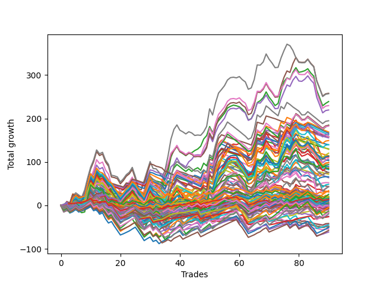

# Short Bulldog 005 
- Symbol: ESBIB
- Date Range: 03/18/2022 - 07/08/2022
- Trading Period: 7:20-12:30
- Number of Trades: 83



| Name | Win Percent | Profit | Avg Profit / Trade |     | Name | Win Percent | Profit | Avg Profit / Trade |
| ---- | ----------- | ------ | ------------------ | --- | ---- | ----------- | ------ | ------------------ |
| Sorted By <br> Profit | | | | | Sorted By <br> Win Percentage ||||
| Five | 59.04 | 168375.00 | 2028.61 |     | Two | 67.47 | 157250.00 | 1894.58 |
| Seven | 55.42 | 167875.00 | 2022.59 |     | Zero | 65.06 | 52000.00 | 626.51 |
| Two | 67.47 | 157250.00 | 1894.58 |     | Three | 63.86 | 95375.00 | 1149.10 |
| Six | 59.04 | 154250.00 | 1858.43 |     | One | 62.65 | 77375.00 | 932.23 |
| Four | 61.45 | 149125.00 | 1796.69 |     | Four | 61.45 | 149125.00 | 1796.69 |
| Three | 63.86 | 95375.00 | 1149.10 |     | Five | 59.04 | 168375.00 | 2028.61 |
| One | 62.65 | 77375.00 | 932.23 |     | Six | 59.04 | 154250.00 | 1858.43 |
| Seventy-Seven | 20.48 | 58625.00 | 706.33 |     | Seven | 55.42 | 167875.00 | 2022.59 |
| Seventy-Nine | 31.33 | 54875.00 | 661.14 |     | Seventy-Three | 53.01 | 50125.00 | 603.92 |
| Seventy-Eight | 24.10 | 54625.00 | 658.13 |     | Eighty | 36.14 | 39625.00 | 477.41 |
| Zero | 65.06 | 52000.00 | 626.51 |     | Seventy-Nine | 31.33 | 54875.00 | 661.14 |
| Seventy-Three | 53.01 | 50125.00 | 603.92 |     | Seventy-Eight | 24.10 | 54625.00 | 658.13 |
| Eighty | 36.14 | 39625.00 | 477.41 |     | Seventy-Seven | 20.48 | 58625.00 | 706.33 |
| Seventy-Six | 14.46 | 35625.00 | 429.22 |     | Seventy-Six | 14.46 | 35625.00 | 429.22 |

## NO STOPLOSS

### Test Zero
* Sell when price hits the middle line of the 20p bollinger
* No Stoploss
* Results:
```
Total Trades: 83
Percent Up: 34.94
Percent Down: 65.06
Total Points Moved Down: 104.00
Potential Profit: 52000.00
Total Points Ups: 210.50 Count Ups: 29
Total Points Downs: 314.50 Count Downs: 54
```

<details><summary>Trades</summary>

<code>In: 2022-03-24 08:03:00		Out: 2022-03-24 08:04:35		Total Position Time: 01:35		Total Move Down: 2.25		Total to Date: 2.25</code> <br />
<code>In: 2022-03-24 08:44:00		Out: 2022-03-24 08:50:10		Total Position Time: 06:10		Total Move Down: 4.75		Total to Date: 7.00</code> <br />
<code>In: 2022-03-25 07:26:00		Out: 2022-03-25 07:51:05		Total Position Time: 25:05		Total Move Down: -6.00		Total to Date: 1.00</code> <br />
<code>In: 2022-03-25 07:44:00		Out: 2022-03-25 07:51:05		Total Position Time: 07:05		Total Move Down: 2.50		Total to Date: 3.50</code> <br />
<code>In: 2022-03-28 07:50:00		Out: 2022-03-28 08:01:35		Total Position Time: 11:35		Total Move Down: 5.25		Total to Date: 8.75</code> <br />
<code>In: 2022-03-29 11:38:00		Out: 2022-03-29 11:51:10		Total Position Time: 13:10		Total Move Down: 0.75		Total to Date: 9.50</code> <br />
<code>In: 2022-03-31 07:48:00		Out: 2022-03-31 08:03:05		Total Position Time: 15:05		Total Move Down: -1.00		Total to Date: 8.50</code> <br />
<code>In: 2022-04-06 10:43:00		Out: 2022-04-06 10:55:45		Total Position Time: 12:45		Total Move Down: 2.25		Total to Date: 10.75</code> <br />
<code>In: 2022-04-06 11:04:00		Out: 2022-04-06 11:05:40		Total Position Time: 01:40		Total Move Down: 11.00		Total to Date: 21.75</code> <br />
<code>In: 2022-04-06 11:05:00		Out: 2022-04-06 11:05:40		Total Position Time: 00:40		Total Move Down: 7.75		Total to Date: 29.50</code> <br />
<code>In: 2022-04-06 11:57:00		Out: 2022-04-06 12:07:45		Total Position Time: 10:45		Total Move Down: 0.50		Total to Date: 30.00</code> <br />
<code>In: 2022-04-06 12:02:00		Out: 2022-04-06 12:07:45		Total Position Time: 05:45		Total Move Down: 8.50		Total to Date: 38.50</code> <br />
<code>In: 2022-04-07 10:58:00		Out: 2022-04-07 11:15:20		Total Position Time: 17:20		Total Move Down: -1.75		Total to Date: 36.75</code> <br />
<code>In: 2022-04-07 11:03:00		Out: 2022-04-07 11:15:20		Total Position Time: 12:20		Total Move Down: 4.00		Total to Date: 40.75</code> <br />
<code>In: 2022-04-07 11:50:00		Out: 2022-04-07 12:19:10		Total Position Time: 29:10		Total Move Down: -18.25		Total to Date: 22.50</code> <br />
<code>In: 2022-04-07 11:54:00		Out: 2022-04-07 12:19:10		Total Position Time: 25:10		Total Move Down: -14.75		Total to Date: 7.75</code> <br />
<code>In: 2022-04-08 07:33:00		Out: 2022-04-08 07:44:35		Total Position Time: 11:35		Total Move Down: 3.25		Total to Date: 11.00</code> <br />
<code>In: 2022-04-08 07:54:00		Out: 2022-04-08 08:15:35		Total Position Time: 21:35		Total Move Down: -6.75		Total to Date: 4.25</code> <br />
<code>In: 2022-04-08 07:57:00		Out: 2022-04-08 08:15:35		Total Position Time: 18:35		Total Move Down: -5.25		Total to Date: -1.00</code> <br />
<code>In: 2022-04-13 08:06:00		Out: 2022-04-13 08:35:55		Total Position Time: 29:55		Total Move Down: -11.75		Total to Date: -12.75</code> <br />
<code>In: 2022-04-18 07:27:00		Out: 2022-04-18 07:38:20		Total Position Time: 11:20		Total Move Down: 2.75		Total to Date: -10.00</code> <br />
<code>In: 2022-04-18 11:26:00		Out: 2022-04-18 11:28:05		Total Position Time: 02:05		Total Move Down: 6.00		Total to Date: -4.00</code> <br />
<code>In: 2022-04-20 10:46:00		Out: 2022-04-20 10:50:05		Total Position Time: 04:05		Total Move Down: 3.25		Total to Date: -0.75</code> <br />
<code>In: 2022-04-20 10:49:00		Out: 2022-04-20 10:50:05		Total Position Time: 01:05		Total Move Down: 4.75		Total to Date: 4.00</code> <br />
<code>In: 2022-04-25 11:11:00		Out: 2022-04-25 11:39:45		Total Position Time: 28:45		Total Move Down: -19.50		Total to Date: -15.50</code> <br />
<code>In: 2022-04-25 11:17:00		Out: 2022-04-25 11:39:45		Total Position Time: 22:45		Total Move Down: -14.25		Total to Date: -29.75</code> <br />
<code>In: 2022-04-27 09:25:00		Out: 2022-04-27 09:37:00		Total Position Time: 12:00		Total Move Down: 1.75		Total to Date: -28.00</code> <br />
<code>In: 2022-05-02 07:28:00		Out: 2022-05-02 07:44:10		Total Position Time: 16:10		Total Move Down: -4.00		Total to Date: -32.00</code> <br />
<code>In: 2022-05-03 07:34:00		Out: 2022-05-03 07:38:45		Total Position Time: 04:45		Total Move Down: 10.25		Total to Date: -21.75</code> <br />
<code>In: 2022-05-03 07:35:00		Out: 2022-05-03 07:38:45		Total Position Time: 03:45		Total Move Down: 9.50		Total to Date: -12.25</code> <br />
<code>In: 2022-05-03 08:06:00		Out: 2022-05-03 08:35:55		Total Position Time: 29:55		Total Move Down: -16.00		Total to Date: -28.25</code> <br />
<code>In: 2022-05-03 08:10:00		Out: 2022-05-03 08:35:55		Total Position Time: 25:55		Total Move Down: -4.25		Total to Date: -32.50</code> <br />
<code>In: 2022-05-04 09:24:00		Out: 2022-05-04 09:45:30		Total Position Time: 21:30		Total Move Down: -4.00		Total to Date: -36.50</code> <br />
<code>In: 2022-05-04 10:59:00		Out: 2022-05-04 11:00:25		Total Position Time: 01:25		Total Move Down: 9.50		Total to Date: -27.00</code> <br />
<code>In: 2022-05-04 11:03:00		Out: 2022-05-04 11:06:50		Total Position Time: 03:50		Total Move Down: 2.75		Total to Date: -24.25</code> <br />
<code>In: 2022-05-04 11:07:00		Out: 2022-05-04 11:07:10		Total Position Time: 00:10		Total Move Down: 4.25		Total to Date: -20.00</code> <br />
<code>In: 2022-05-04 11:30:00		Out: 2022-05-04 11:30:45		Total Position Time: 00:45		Total Move Down: 16.50		Total to Date: -3.50</code> <br />
<code>In: 2022-05-04 11:31:00		Out: 2022-05-04 11:31:10		Total Position Time: 00:10		Total Move Down: 2.25		Total to Date: -1.25</code> <br />
<code>In: 2022-05-16 09:05:00		Out: 2022-05-16 09:06:00		Total Position Time: 01:00		Total Move Down: 5.00		Total to Date: 3.75</code> <br />
<code>In: 2022-05-16 10:15:00		Out: 2022-05-16 10:18:25		Total Position Time: 03:25		Total Move Down: 7.50		Total to Date: 11.25</code> <br />
<code>In: 2022-05-16 10:25:00		Out: 2022-05-16 10:42:15		Total Position Time: 17:15		Total Move Down: -5.25		Total to Date: 6.00</code> <br />
<code>In: 2022-05-16 11:07:00		Out: 2022-05-16 11:12:00		Total Position Time: 05:00		Total Move Down: 4.75		Total to Date: 10.75</code> <br />
<code>In: 2022-05-16 11:32:00		Out: 2022-05-16 11:41:50		Total Position Time: 09:50		Total Move Down: 2.75		Total to Date: 13.50</code> <br />
<code>In: 2022-05-17 09:37:00		Out: 2022-05-17 09:51:25		Total Position Time: 14:25		Total Move Down: -1.25		Total to Date: 12.25</code> <br />
<code>In: 2022-05-17 09:48:00		Out: 2022-05-17 09:51:25		Total Position Time: 03:25		Total Move Down: 2.75		Total to Date: 15.00</code> <br />
<code>In: 2022-05-17 10:15:00		Out: 2022-05-17 10:23:25		Total Position Time: 08:25		Total Move Down: 1.75		Total to Date: 16.75</code> <br />
<code>In: 2022-05-19 08:40:00		Out: 2022-05-19 08:53:40		Total Position Time: 13:40		Total Move Down: -2.00		Total to Date: 14.75</code> <br />
<code>In: 2022-05-19 10:59:00		Out: 2022-05-19 11:06:05		Total Position Time: 07:05		Total Move Down: 13.50		Total to Date: 28.25</code> <br />
<code>In: 2022-05-19 11:52:00		Out: 2022-05-19 11:57:50		Total Position Time: 05:50		Total Move Down: 5.25		Total to Date: 33.50</code> <br />
<code>In: 2022-05-19 12:05:00		Out: 2022-05-19 12:09:45		Total Position Time: 04:45		Total Move Down: 8.75		Total to Date: 42.25</code> <br />
<code>In: 2022-05-23 08:07:00		Out: 2022-05-23 08:23:15		Total Position Time: 16:15		Total Move Down: -2.50		Total to Date: 39.75</code> <br />
<code>In: 2022-05-24 09:17:00		Out: 2022-05-24 09:21:40		Total Position Time: 04:40		Total Move Down: 12.00		Total to Date: 51.75</code> <br />
<code>In: 2022-05-24 09:18:00		Out: 2022-05-24 09:21:40		Total Position Time: 03:40		Total Move Down: 5.75		Total to Date: 57.50</code> <br />
<code>In: 2022-05-24 11:13:00		Out: 2022-05-24 11:18:25		Total Position Time: 05:25		Total Move Down: 13.25		Total to Date: 70.75</code> <br />
<code>In: 2022-05-24 11:14:00		Out: 2022-05-24 11:18:25		Total Position Time: 04:25		Total Move Down: 9.50		Total to Date: 80.25</code> <br />
<code>In: 2022-05-25 07:36:00		Out: 2022-05-25 07:42:00		Total Position Time: 06:00		Total Move Down: 7.00		Total to Date: 87.25</code> <br />
<code>In: 2022-05-25 12:05:00		Out: 2022-05-25 12:17:30		Total Position Time: 12:30		Total Move Down: 1.75		Total to Date: 89.00</code> <br />
<code>In: 2022-05-27 12:10:00		Out: 2022-05-27 12:35:00		Total Position Time: 25:00		Total Move Down: -1.50		Total to Date: 87.50</code> <br />
<code>In: 2022-05-31 07:23:00		Out: 2022-05-31 07:37:15		Total Position Time: 14:15		Total Move Down: 5.00		Total to Date: 92.50</code> <br />
<code>In: 2022-05-31 08:53:00		Out: 2022-05-31 09:13:50		Total Position Time: 20:50		Total Move Down: -9.00		Total to Date: 83.50</code> <br />
<code>In: 2022-06-02 08:05:00		Out: 2022-06-02 08:27:20		Total Position Time: 22:20		Total Move Down: -6.75		Total to Date: 76.75</code> <br />
<code>In: 2022-06-02 08:06:00		Out: 2022-06-02 08:27:20		Total Position Time: 21:20		Total Move Down: -8.75		Total to Date: 68.00</code> <br />
<code>In: 2022-06-07 07:31:00		Out: 2022-06-07 07:56:30		Total Position Time: 25:30		Total Move Down: -18.75		Total to Date: 49.25</code> <br />
<code>In: 2022-06-08 08:19:00		Out: 2022-06-08 08:31:15		Total Position Time: 12:15		Total Move Down: 2.50		Total to Date: 51.75</code> <br />
<code>In: 2022-06-10 12:29:00		Out: 2022-06-10 12:30:30		Total Position Time: 01:30		Total Move Down: 6.25		Total to Date: 58.00</code> <br />
<code>In: 2022-06-13 09:40:00		Out: 2022-06-13 09:43:20		Total Position Time: 03:20		Total Move Down: 12.25		Total to Date: 70.25</code> <br />
<code>In: 2022-06-23 07:42:00		Out: 2022-06-23 07:51:10		Total Position Time: 09:10		Total Move Down: 4.00		Total to Date: 74.25</code> <br />
<code>In: 2022-06-23 07:58:00		Out: 2022-06-23 08:00:30		Total Position Time: 02:30		Total Move Down: 2.50		Total to Date: 76.75</code> <br />
<code>In: 2022-06-23 08:15:00		Out: 2022-06-23 08:21:05		Total Position Time: 06:05		Total Move Down: 5.50		Total to Date: 82.25</code> <br />
<code>In: 2022-06-30 08:12:00		Out: 2022-06-30 08:35:10		Total Position Time: 23:10		Total Move Down: -9.00		Total to Date: 73.25</code> <br />
<code>In: 2022-06-30 08:29:00		Out: 2022-06-30 08:35:10		Total Position Time: 06:10		Total Move Down: 7.00		Total to Date: 80.25</code> <br />
<code>In: 2022-06-30 08:30:00		Out: 2022-06-30 08:35:10		Total Position Time: 05:10		Total Move Down: 5.50		Total to Date: 85.75</code> <br />
<code>In: 2022-06-30 08:49:00		Out: 2022-06-30 09:03:10		Total Position Time: 14:10		Total Move Down: -0.25		Total to Date: 85.50</code> <br />
<code>In: 2022-07-05 07:40:00		Out: 2022-07-05 07:44:30		Total Position Time: 04:30		Total Move Down: 11.75		Total to Date: 97.25</code> <br />
<code>In: 2022-07-05 07:41:00		Out: 2022-07-05 07:44:30		Total Position Time: 03:30		Total Move Down: 7.25		Total to Date: 104.50</code> <br />
<code>In: 2022-07-05 09:27:00		Out: 2022-07-05 09:41:35		Total Position Time: 14:35		Total Move Down: 4.00		Total to Date: 108.50</code> <br />
<code>In: 2022-07-05 11:34:00		Out: 2022-07-05 11:48:10		Total Position Time: 14:10		Total Move Down: -4.25		Total to Date: 104.25</code> <br />
<code>In: 2022-07-06 11:09:00		Out: 2022-07-06 11:10:10		Total Position Time: 01:10		Total Move Down: 9.00		Total to Date: 113.25</code> <br />
<code>In: 2022-07-06 11:10:00		Out: 2022-07-06 11:10:10		Total Position Time: 00:10		Total Move Down: 3.25		Total to Date: 116.50</code> <br />
<code>In: 2022-07-06 11:31:00		Out: 2022-07-06 11:50:05		Total Position Time: 19:05		Total Move Down: -11.50		Total to Date: 105.00</code> <br />
<code>In: 2022-07-06 11:35:00		Out: 2022-07-06 11:50:05		Total Position Time: 15:05		Total Move Down: -1.75		Total to Date: 103.25</code> <br />
<code>In: 2022-07-07 07:56:00		Out: 2022-07-07 08:11:10		Total Position Time: 15:10		Total Move Down: -0.50		Total to Date: 102.75</code> <br />
<code>In: 2022-07-07 12:18:00		Out: 2022-07-07 12:24:15		Total Position Time: 06:15		Total Move Down: 1.25		Total to Date: 104.00</code> <br />


</details>

### Test One
* Sell when the price hits the upper line of the 20p 1std bollinger
* No Stoploss
* Results:
```
Total Trades: 83
Percent Up: 37.35
Percent Down: 62.65
Total Points Moved Down: 154.75
Potential Profit: 77375.00
Total Points Ups: 235.75 Count Ups: 31
Total Points Downs: 390.50 Count Downs: 52
```

<details><summary>Trades</summary>

<code>In: 2022-03-24 08:03:00		Out: 2022-03-24 08:32:55		Total Position Time: 29:55		Total Move Down: -15.00		Total to Date: -15.00</code> <br />
<code>In: 2022-03-24 08:44:00		Out: 2022-03-24 08:53:50		Total Position Time: 09:50		Total Move Down: 6.25		Total to Date: -8.75</code> <br />
<code>In: 2022-03-25 07:26:00		Out: 2022-03-25 07:53:50		Total Position Time: 27:50		Total Move Down: -4.50		Total to Date: -13.25</code> <br />
<code>In: 2022-03-25 07:44:00		Out: 2022-03-25 07:53:50		Total Position Time: 09:50		Total Move Down: 4.00		Total to Date: -9.25</code> <br />
<code>In: 2022-03-28 07:50:00		Out: 2022-03-28 08:01:35		Total Position Time: 11:35		Total Move Down: 5.25		Total to Date: -4.00</code> <br />
<code>In: 2022-03-29 11:38:00		Out: 2022-03-29 12:00:25		Total Position Time: 22:25		Total Move Down: 0.25		Total to Date: -3.75</code> <br />
<code>In: 2022-03-31 07:48:00		Out: 2022-03-31 08:08:00		Total Position Time: 20:00		Total Move Down: 0.25		Total to Date: -3.50</code> <br />
<code>In: 2022-04-06 10:43:00		Out: 2022-04-06 10:56:55		Total Position Time: 13:55		Total Move Down: 4.00		Total to Date: 0.50</code> <br />
<code>In: 2022-04-06 11:04:00		Out: 2022-04-06 11:07:20		Total Position Time: 03:20		Total Move Down: 15.75		Total to Date: 16.25</code> <br />
<code>In: 2022-04-06 11:05:00		Out: 2022-04-06 11:07:20		Total Position Time: 02:20		Total Move Down: 12.50		Total to Date: 28.75</code> <br />
<code>In: 2022-04-06 11:57:00		Out: 2022-04-06 12:17:05		Total Position Time: 20:05		Total Move Down: -0.75		Total to Date: 28.00</code> <br />
<code>In: 2022-04-06 12:02:00		Out: 2022-04-06 12:17:05		Total Position Time: 15:05		Total Move Down: 7.25		Total to Date: 35.25</code> <br />
<code>In: 2022-04-07 10:58:00		Out: 2022-04-07 11:18:00		Total Position Time: 20:00		Total Move Down: -1.00		Total to Date: 34.25</code> <br />
<code>In: 2022-04-07 11:03:00		Out: 2022-04-07 11:18:00		Total Position Time: 15:00		Total Move Down: 4.75		Total to Date: 39.00</code> <br />
<code>In: 2022-04-07 11:50:00		Out: 2022-04-07 12:19:55		Total Position Time: 29:55		Total Move Down: -18.00		Total to Date: 21.00</code> <br />
<code>In: 2022-04-07 11:54:00		Out: 2022-04-07 12:20:50		Total Position Time: 26:50		Total Move Down: -12.25		Total to Date: 8.75</code> <br />
<code>In: 2022-04-08 07:33:00		Out: 2022-04-08 07:49:05		Total Position Time: 16:05		Total Move Down: 3.50		Total to Date: 12.25</code> <br />
<code>In: 2022-04-08 07:54:00		Out: 2022-04-08 08:17:05		Total Position Time: 23:05		Total Move Down: -5.00		Total to Date: 7.25</code> <br />
<code>In: 2022-04-08 07:57:00		Out: 2022-04-08 08:17:05		Total Position Time: 20:05		Total Move Down: -3.50		Total to Date: 3.75</code> <br />
<code>In: 2022-04-13 08:06:00		Out: 2022-04-13 08:35:55		Total Position Time: 29:55		Total Move Down: -11.75		Total to Date: -8.00</code> <br />
<code>In: 2022-04-18 07:27:00		Out: 2022-04-18 07:51:20		Total Position Time: 24:20		Total Move Down: 2.25		Total to Date: -5.75</code> <br />
<code>In: 2022-04-18 11:26:00		Out: 2022-04-18 11:41:15		Total Position Time: 15:15		Total Move Down: 6.50		Total to Date: 0.75</code> <br />
<code>In: 2022-04-20 10:46:00		Out: 2022-04-20 10:54:15		Total Position Time: 08:15		Total Move Down: 5.50		Total to Date: 6.25</code> <br />
<code>In: 2022-04-20 10:49:00		Out: 2022-04-20 10:54:15		Total Position Time: 05:15		Total Move Down: 7.00		Total to Date: 13.25</code> <br />
<code>In: 2022-04-25 11:11:00		Out: 2022-04-25 11:40:55		Total Position Time: 29:55		Total Move Down: -20.25		Total to Date: -7.00</code> <br />
<code>In: 2022-04-25 11:17:00		Out: 2022-04-25 11:44:45		Total Position Time: 27:45		Total Move Down: -11.50		Total to Date: -18.50</code> <br />
<code>In: 2022-04-27 09:25:00		Out: 2022-04-27 09:51:25		Total Position Time: 26:25		Total Move Down: -0.25		Total to Date: -18.75</code> <br />
<code>In: 2022-05-02 07:28:00		Out: 2022-05-02 07:44:50		Total Position Time: 16:50		Total Move Down: 1.75		Total to Date: -17.00</code> <br />
<code>In: 2022-05-03 07:34:00		Out: 2022-05-03 07:42:05		Total Position Time: 08:05		Total Move Down: 13.75		Total to Date: -3.25</code> <br />
<code>In: 2022-05-03 07:35:00		Out: 2022-05-03 07:42:05		Total Position Time: 07:05		Total Move Down: 13.00		Total to Date: 9.75</code> <br />
<code>In: 2022-05-03 08:06:00		Out: 2022-05-03 08:35:55		Total Position Time: 29:55		Total Move Down: -16.00		Total to Date: -6.25</code> <br />
<code>In: 2022-05-03 08:10:00		Out: 2022-05-03 08:38:05		Total Position Time: 28:05		Total Move Down: -2.00		Total to Date: -8.25</code> <br />
<code>In: 2022-05-04 09:24:00		Out: 2022-05-04 09:46:30		Total Position Time: 22:30		Total Move Down: -2.50		Total to Date: -10.75</code> <br />
<code>In: 2022-05-04 10:59:00		Out: 2022-05-04 11:00:25		Total Position Time: 01:25		Total Move Down: 9.50		Total to Date: -1.25</code> <br />
<code>In: 2022-05-04 11:03:00		Out: 2022-05-04 11:07:20		Total Position Time: 04:20		Total Move Down: 10.75		Total to Date: 9.50</code> <br />
<code>In: 2022-05-04 11:07:00		Out: 2022-05-04 11:07:20		Total Position Time: 00:20		Total Move Down: 9.50		Total to Date: 19.00</code> <br />
<code>In: 2022-05-04 11:30:00		Out: 2022-05-04 11:30:50		Total Position Time: 00:50		Total Move Down: 24.25		Total to Date: 43.25</code> <br />
<code>In: 2022-05-04 11:31:00		Out: 2022-05-04 11:31:20		Total Position Time: 00:20		Total Move Down: 6.25		Total to Date: 49.50</code> <br />
<code>In: 2022-05-16 09:05:00		Out: 2022-05-16 09:06:10		Total Position Time: 01:10		Total Move Down: 7.00		Total to Date: 56.50</code> <br />
<code>In: 2022-05-16 10:15:00		Out: 2022-05-16 10:42:40		Total Position Time: 27:40		Total Move Down: -4.25		Total to Date: 52.25</code> <br />
<code>In: 2022-05-16 10:25:00		Out: 2022-05-16 10:42:40		Total Position Time: 17:40		Total Move Down: -1.00		Total to Date: 51.25</code> <br />
<code>In: 2022-05-16 11:07:00		Out: 2022-05-16 11:36:55		Total Position Time: 29:55		Total Move Down: -4.75		Total to Date: 46.50</code> <br />
<code>In: 2022-05-16 11:32:00		Out: 2022-05-16 11:44:55		Total Position Time: 12:55		Total Move Down: 4.25		Total to Date: 50.75</code> <br />
<code>In: 2022-05-17 09:37:00		Out: 2022-05-17 09:56:30		Total Position Time: 19:30		Total Move Down: -0.00		Total to Date: 50.75</code> <br />
<code>In: 2022-05-17 09:48:00		Out: 2022-05-17 09:56:30		Total Position Time: 08:30		Total Move Down: 4.00		Total to Date: 54.75</code> <br />
<code>In: 2022-05-17 10:15:00		Out: 2022-05-17 10:28:15		Total Position Time: 13:15		Total Move Down: 2.75		Total to Date: 57.50</code> <br />
<code>In: 2022-05-19 08:40:00		Out: 2022-05-19 08:55:05		Total Position Time: 15:05		Total Move Down: 2.00		Total to Date: 59.50</code> <br />
<code>In: 2022-05-19 10:59:00		Out: 2022-05-19 11:14:05		Total Position Time: 15:05		Total Move Down: 14.25		Total to Date: 73.75</code> <br />
<code>In: 2022-05-19 11:52:00		Out: 2022-05-19 12:10:15		Total Position Time: 18:15		Total Move Down: 2.75		Total to Date: 76.50</code> <br />
<code>In: 2022-05-19 12:05:00		Out: 2022-05-19 12:10:15		Total Position Time: 05:15		Total Move Down: 15.50		Total to Date: 92.00</code> <br />
<code>In: 2022-05-23 08:07:00		Out: 2022-05-23 08:36:55		Total Position Time: 29:55		Total Move Down: -14.25		Total to Date: 77.75</code> <br />
<code>In: 2022-05-24 09:17:00		Out: 2022-05-24 09:29:00		Total Position Time: 12:00		Total Move Down: 12.50		Total to Date: 90.25</code> <br />
<code>In: 2022-05-24 09:18:00		Out: 2022-05-24 09:29:00		Total Position Time: 11:00		Total Move Down: 6.25		Total to Date: 96.50</code> <br />
<code>In: 2022-05-24 11:13:00		Out: 2022-05-24 11:31:25		Total Position Time: 18:25		Total Move Down: 13.75		Total to Date: 110.25</code> <br />
<code>In: 2022-05-24 11:14:00		Out: 2022-05-24 11:31:25		Total Position Time: 17:25		Total Move Down: 10.00		Total to Date: 120.25</code> <br />
<code>In: 2022-05-25 07:36:00		Out: 2022-05-25 07:46:50		Total Position Time: 10:50		Total Move Down: 8.75		Total to Date: 129.00</code> <br />
<code>In: 2022-05-25 12:05:00		Out: 2022-05-25 12:20:25		Total Position Time: 15:25		Total Move Down: 4.25		Total to Date: 133.25</code> <br />
<code>In: 2022-05-27 12:10:00		Out: 2022-05-27 12:35:40		Total Position Time: 25:40		Total Move Down: 0.25		Total to Date: 133.50</code> <br />
<code>In: 2022-05-31 07:23:00		Out: 2022-05-31 07:52:55		Total Position Time: 29:55		Total Move Down: -1.50		Total to Date: 132.00</code> <br />
<code>In: 2022-05-31 08:53:00		Out: 2022-05-31 09:14:40		Total Position Time: 21:40		Total Move Down: -4.75		Total to Date: 127.25</code> <br />
<code>In: 2022-06-02 08:05:00		Out: 2022-06-02 08:28:15		Total Position Time: 23:15		Total Move Down: -6.00		Total to Date: 121.25</code> <br />
<code>In: 2022-06-02 08:06:00		Out: 2022-06-02 08:28:15		Total Position Time: 22:15		Total Move Down: -8.00		Total to Date: 113.25</code> <br />
<code>In: 2022-06-07 07:31:00		Out: 2022-06-07 07:58:15		Total Position Time: 27:15		Total Move Down: -16.75		Total to Date: 96.50</code> <br />
<code>In: 2022-06-08 08:19:00		Out: 2022-06-08 08:43:05		Total Position Time: 24:05		Total Move Down: 2.00		Total to Date: 98.50</code> <br />
<code>In: 2022-06-10 12:29:00		Out: 2022-06-10 12:35:45		Total Position Time: 06:45		Total Move Down: 9.75		Total to Date: 108.25</code> <br />
<code>In: 2022-06-13 09:40:00		Out: 2022-06-13 09:47:55		Total Position Time: 07:55		Total Move Down: 19.00		Total to Date: 127.25</code> <br />
<code>In: 2022-06-23 07:42:00		Out: 2022-06-23 08:01:10		Total Position Time: 19:10		Total Move Down: 3.00		Total to Date: 130.25</code> <br />
<code>In: 2022-06-23 07:58:00		Out: 2022-06-23 08:01:10		Total Position Time: 03:10		Total Move Down: 5.50		Total to Date: 135.75</code> <br />
<code>In: 2022-06-23 08:15:00		Out: 2022-06-23 08:23:30		Total Position Time: 08:30		Total Move Down: 8.25		Total to Date: 144.00</code> <br />
<code>In: 2022-06-30 08:12:00		Out: 2022-06-30 08:41:55		Total Position Time: 29:55		Total Move Down: -12.25		Total to Date: 131.75</code> <br />
<code>In: 2022-06-30 08:29:00		Out: 2022-06-30 08:58:55		Total Position Time: 29:55		Total Move Down: -8.75		Total to Date: 123.00</code> <br />
<code>In: 2022-06-30 08:30:00		Out: 2022-06-30 08:59:55		Total Position Time: 29:55		Total Move Down: -10.50		Total to Date: 112.50</code> <br />
<code>In: 2022-06-30 08:49:00		Out: 2022-06-30 09:05:45		Total Position Time: 16:45		Total Move Down: 1.75		Total to Date: 114.25</code> <br />
<code>In: 2022-07-05 07:40:00		Out: 2022-07-05 07:45:55		Total Position Time: 05:55		Total Move Down: 16.50		Total to Date: 130.75</code> <br />
<code>In: 2022-07-05 07:41:00		Out: 2022-07-05 07:45:55		Total Position Time: 04:55		Total Move Down: 12.00		Total to Date: 142.75</code> <br />
<code>In: 2022-07-05 09:27:00		Out: 2022-07-05 09:42:00		Total Position Time: 15:00		Total Move Down: 6.25		Total to Date: 149.00</code> <br />
<code>In: 2022-07-05 11:34:00		Out: 2022-07-05 11:53:40		Total Position Time: 19:40		Total Move Down: -3.50		Total to Date: 145.50</code> <br />
<code>In: 2022-07-06 11:09:00		Out: 2022-07-06 11:11:10		Total Position Time: 02:10		Total Move Down: 13.25		Total to Date: 158.75</code> <br />
<code>In: 2022-07-06 11:10:00		Out: 2022-07-06 11:11:10		Total Position Time: 01:10		Total Move Down: 7.50		Total to Date: 166.25</code> <br />
<code>In: 2022-07-06 11:31:00		Out: 2022-07-06 12:00:45		Total Position Time: 29:45		Total Move Down: -12.50		Total to Date: 153.75</code> <br />
<code>In: 2022-07-06 11:35:00		Out: 2022-07-06 12:00:45		Total Position Time: 25:45		Total Move Down: -2.75		Total to Date: 151.00</code> <br />
<code>In: 2022-07-07 07:56:00		Out: 2022-07-07 08:20:05		Total Position Time: 24:05		Total Move Down: 0.50		Total to Date: 151.50</code> <br />
<code>In: 2022-07-07 12:18:00		Out: 2022-07-07 12:25:10		Total Position Time: 07:10		Total Move Down: 3.25		Total to Date: 154.75</code> <br />


</details>

### Test Two
* Sell when the price hits the upper line of the 20p 2std bollinger
* No Stoploss
* Results:
```
Total Trades: 83
Percent Up: 32.53
Percent Down: 67.47
Total Points Moved Down: 314.50
Potential Profit: 157250.00
Total Points Ups: 256.75 Count Ups: 27
Total Points Downs: 571.25 Count Downs: 56
```

<details><summary>Trades</summary>

<code>In: 2022-03-24 08:03:00		Out: 2022-03-24 08:32:55		Total Position Time: 29:55		Total Move Down: -15.00		Total to Date: -15.00</code> <br />
<code>In: 2022-03-24 08:44:00		Out: 2022-03-24 09:03:10		Total Position Time: 19:10		Total Move Down: 8.00		Total to Date: -7.00</code> <br />
<code>In: 2022-03-25 07:26:00		Out: 2022-03-25 07:54:10		Total Position Time: 28:10		Total Move Down: -3.50		Total to Date: -10.50</code> <br />
<code>In: 2022-03-25 07:44:00		Out: 2022-03-25 07:54:10		Total Position Time: 10:10		Total Move Down: 5.00		Total to Date: -5.50</code> <br />
<code>In: 2022-03-28 07:50:00		Out: 2022-03-28 08:01:40		Total Position Time: 11:40		Total Move Down: 7.75		Total to Date: 2.25</code> <br />
<code>In: 2022-03-29 11:38:00		Out: 2022-03-29 12:07:55		Total Position Time: 29:55		Total Move Down: -6.00		Total to Date: -3.75</code> <br />
<code>In: 2022-03-31 07:48:00		Out: 2022-03-31 08:08:30		Total Position Time: 20:30		Total Move Down: 2.50		Total to Date: -1.25</code> <br />
<code>In: 2022-04-06 10:43:00		Out: 2022-04-06 10:58:00		Total Position Time: 15:00		Total Move Down: 5.75		Total to Date: 4.50</code> <br />
<code>In: 2022-04-06 11:04:00		Out: 2022-04-06 11:08:10		Total Position Time: 04:10		Total Move Down: 21.75		Total to Date: 26.25</code> <br />
<code>In: 2022-04-06 11:05:00		Out: 2022-04-06 11:08:10		Total Position Time: 03:10		Total Move Down: 18.50		Total to Date: 44.75</code> <br />
<code>In: 2022-04-06 11:57:00		Out: 2022-04-06 12:20:25		Total Position Time: 23:25		Total Move Down: 6.75		Total to Date: 51.50</code> <br />
<code>In: 2022-04-06 12:02:00		Out: 2022-04-06 12:20:25		Total Position Time: 18:25		Total Move Down: 14.75		Total to Date: 66.25</code> <br />
<code>In: 2022-04-07 10:58:00		Out: 2022-04-07 11:18:20		Total Position Time: 20:20		Total Move Down: 0.25		Total to Date: 66.50</code> <br />
<code>In: 2022-04-07 11:03:00		Out: 2022-04-07 11:18:20		Total Position Time: 15:20		Total Move Down: 6.00		Total to Date: 72.50</code> <br />
<code>In: 2022-04-07 11:50:00		Out: 2022-04-07 12:19:55		Total Position Time: 29:55		Total Move Down: -18.00		Total to Date: 54.50</code> <br />
<code>In: 2022-04-07 11:54:00		Out: 2022-04-07 12:21:20		Total Position Time: 27:20		Total Move Down: -10.00		Total to Date: 44.50</code> <br />
<code>In: 2022-04-08 07:33:00		Out: 2022-04-08 07:49:20		Total Position Time: 16:20		Total Move Down: 5.25		Total to Date: 49.75</code> <br />
<code>In: 2022-04-08 07:54:00		Out: 2022-04-08 08:20:25		Total Position Time: 26:25		Total Move Down: -4.00		Total to Date: 45.75</code> <br />
<code>In: 2022-04-08 07:57:00		Out: 2022-04-08 08:20:25		Total Position Time: 23:25		Total Move Down: -2.50		Total to Date: 43.25</code> <br />
<code>In: 2022-04-13 08:06:00		Out: 2022-04-13 08:35:55		Total Position Time: 29:55		Total Move Down: -11.75		Total to Date: 31.50</code> <br />
<code>In: 2022-04-18 07:27:00		Out: 2022-04-18 07:51:45		Total Position Time: 24:45		Total Move Down: 4.75		Total to Date: 36.25</code> <br />
<code>In: 2022-04-18 11:26:00		Out: 2022-04-18 11:44:10		Total Position Time: 18:10		Total Move Down: 6.75		Total to Date: 43.00</code> <br />
<code>In: 2022-04-20 10:46:00		Out: 2022-04-20 11:13:55		Total Position Time: 27:55		Total Move Down: 6.25		Total to Date: 49.25</code> <br />
<code>In: 2022-04-20 10:49:00		Out: 2022-04-20 11:13:55		Total Position Time: 24:55		Total Move Down: 7.75		Total to Date: 57.00</code> <br />
<code>In: 2022-04-25 11:11:00		Out: 2022-04-25 11:40:55		Total Position Time: 29:55		Total Move Down: -20.25		Total to Date: 36.75</code> <br />
<code>In: 2022-04-25 11:17:00		Out: 2022-04-25 11:46:55		Total Position Time: 29:55		Total Move Down: -23.50		Total to Date: 13.25</code> <br />
<code>In: 2022-04-27 09:25:00		Out: 2022-04-27 09:54:55		Total Position Time: 29:55		Total Move Down: -3.00		Total to Date: 10.25</code> <br />
<code>In: 2022-05-02 07:28:00		Out: 2022-05-02 07:47:20		Total Position Time: 19:20		Total Move Down: 5.00		Total to Date: 15.25</code> <br />
<code>In: 2022-05-03 07:34:00		Out: 2022-05-03 07:43:50		Total Position Time: 09:50		Total Move Down: 19.00		Total to Date: 34.25</code> <br />
<code>In: 2022-05-03 07:35:00		Out: 2022-05-03 07:43:50		Total Position Time: 08:50		Total Move Down: 18.25		Total to Date: 52.50</code> <br />
<code>In: 2022-05-03 08:06:00		Out: 2022-05-03 08:35:55		Total Position Time: 29:55		Total Move Down: -16.00		Total to Date: 36.50</code> <br />
<code>In: 2022-05-03 08:10:00		Out: 2022-05-03 08:39:10		Total Position Time: 29:10		Total Move Down: 0.25		Total to Date: 36.75</code> <br />
<code>In: 2022-05-04 09:24:00		Out: 2022-05-04 09:53:55		Total Position Time: 29:55		Total Move Down: -8.00		Total to Date: 28.75</code> <br />
<code>In: 2022-05-04 10:59:00		Out: 2022-05-04 11:07:40		Total Position Time: 08:40		Total Move Down: 15.50		Total to Date: 44.25</code> <br />
<code>In: 2022-05-04 11:03:00		Out: 2022-05-04 11:07:40		Total Position Time: 04:40		Total Move Down: 17.25		Total to Date: 61.50</code> <br />
<code>In: 2022-05-04 11:07:00		Out: 2022-05-04 11:07:40		Total Position Time: 00:40		Total Move Down: 16.00		Total to Date: 77.50</code> <br />
<code>In: 2022-05-04 11:30:00		Out: 2022-05-04 11:33:55		Total Position Time: 03:55		Total Move Down: 33.50		Total to Date: 111.00</code> <br />
<code>In: 2022-05-04 11:31:00		Out: 2022-05-04 11:33:55		Total Position Time: 02:55		Total Move Down: 16.75		Total to Date: 127.75</code> <br />
<code>In: 2022-05-16 09:05:00		Out: 2022-05-16 09:11:35		Total Position Time: 06:35		Total Move Down: 8.00		Total to Date: 135.75</code> <br />
<code>In: 2022-05-16 10:15:00		Out: 2022-05-16 10:44:55		Total Position Time: 29:55		Total Move Down: -12.25		Total to Date: 123.50</code> <br />
<code>In: 2022-05-16 10:25:00		Out: 2022-05-16 10:49:00		Total Position Time: 24:00		Total Move Down: -4.25		Total to Date: 119.25</code> <br />
<code>In: 2022-05-16 11:07:00		Out: 2022-05-16 11:36:55		Total Position Time: 29:55		Total Move Down: -4.75		Total to Date: 114.50</code> <br />
<code>In: 2022-05-16 11:32:00		Out: 2022-05-16 11:45:40		Total Position Time: 13:40		Total Move Down: 5.75		Total to Date: 120.25</code> <br />
<code>In: 2022-05-17 09:37:00		Out: 2022-05-17 10:01:10		Total Position Time: 24:10		Total Move Down: 1.00		Total to Date: 121.25</code> <br />
<code>In: 2022-05-17 09:48:00		Out: 2022-05-17 10:01:10		Total Position Time: 13:10		Total Move Down: 5.00		Total to Date: 126.25</code> <br />
<code>In: 2022-05-17 10:15:00		Out: 2022-05-17 10:42:05		Total Position Time: 27:05		Total Move Down: 3.50		Total to Date: 129.75</code> <br />
<code>In: 2022-05-19 08:40:00		Out: 2022-05-19 08:56:05		Total Position Time: 16:05		Total Move Down: 6.50		Total to Date: 136.25</code> <br />
<code>In: 2022-05-19 10:59:00		Out: 2022-05-19 11:20:05		Total Position Time: 21:05		Total Move Down: 16.50		Total to Date: 152.75</code> <br />
<code>In: 2022-05-19 11:52:00		Out: 2022-05-19 12:14:05		Total Position Time: 22:05		Total Move Down: 8.00		Total to Date: 160.75</code> <br />
<code>In: 2022-05-19 12:05:00		Out: 2022-05-19 12:14:05		Total Position Time: 09:05		Total Move Down: 20.75		Total to Date: 181.50</code> <br />
<code>In: 2022-05-23 08:07:00		Out: 2022-05-23 08:36:55		Total Position Time: 29:55		Total Move Down: -14.25		Total to Date: 167.25</code> <br />
<code>In: 2022-05-24 09:17:00		Out: 2022-05-24 09:31:35		Total Position Time: 14:35		Total Move Down: 17.00		Total to Date: 184.25</code> <br />
<code>In: 2022-05-24 09:18:00		Out: 2022-05-24 09:31:35		Total Position Time: 13:35		Total Move Down: 10.75		Total to Date: 195.00</code> <br />
<code>In: 2022-05-24 11:13:00		Out: 2022-05-24 11:42:55		Total Position Time: 29:55		Total Move Down: 8.25		Total to Date: 203.25</code> <br />
<code>In: 2022-05-24 11:14:00		Out: 2022-05-24 11:43:55		Total Position Time: 29:55		Total Move Down: 8.75		Total to Date: 212.00</code> <br />
<code>In: 2022-05-25 07:36:00		Out: 2022-05-25 07:48:10		Total Position Time: 12:10		Total Move Down: 12.25		Total to Date: 224.25</code> <br />
<code>In: 2022-05-25 12:05:00		Out: 2022-05-25 12:22:50		Total Position Time: 17:50		Total Move Down: 3.75		Total to Date: 228.00</code> <br />
<code>In: 2022-05-27 12:10:00		Out: 2022-05-27 12:36:55		Total Position Time: 26:55		Total Move Down: 2.75		Total to Date: 230.75</code> <br />
<code>In: 2022-05-31 07:23:00		Out: 2022-05-31 07:52:55		Total Position Time: 29:55		Total Move Down: -1.50		Total to Date: 229.25</code> <br />
<code>In: 2022-05-31 08:53:00		Out: 2022-05-31 09:15:10		Total Position Time: 22:10		Total Move Down: -2.25		Total to Date: 227.00</code> <br />
<code>In: 2022-06-02 08:05:00		Out: 2022-06-02 08:31:25		Total Position Time: 26:25		Total Move Down: -5.75		Total to Date: 221.25</code> <br />
<code>In: 2022-06-02 08:06:00		Out: 2022-06-02 08:31:25		Total Position Time: 25:25		Total Move Down: -7.75		Total to Date: 213.50</code> <br />
<code>In: 2022-06-07 07:31:00		Out: 2022-06-07 08:00:55		Total Position Time: 29:55		Total Move Down: -17.00		Total to Date: 196.50</code> <br />
<code>In: 2022-06-08 08:19:00		Out: 2022-06-08 08:44:40		Total Position Time: 25:40		Total Move Down: 3.25		Total to Date: 199.75</code> <br />
<code>In: 2022-06-10 12:29:00		Out: 2022-06-10 12:43:10		Total Position Time: 14:10		Total Move Down: 14.00		Total to Date: 213.75</code> <br />
<code>In: 2022-06-13 09:40:00		Out: 2022-06-13 09:54:35		Total Position Time: 14:35		Total Move Down: 22.75		Total to Date: 236.50</code> <br />
<code>In: 2022-06-23 07:42:00		Out: 2022-06-23 08:04:25		Total Position Time: 22:25		Total Move Down: 4.50		Total to Date: 241.00</code> <br />
<code>In: 2022-06-23 07:58:00		Out: 2022-06-23 08:04:25		Total Position Time: 06:25		Total Move Down: 7.00		Total to Date: 248.00</code> <br />
<code>In: 2022-06-23 08:15:00		Out: 2022-06-23 08:31:10		Total Position Time: 16:10		Total Move Down: 13.25		Total to Date: 261.25</code> <br />
<code>In: 2022-06-30 08:12:00		Out: 2022-06-30 08:41:55		Total Position Time: 29:55		Total Move Down: -12.25		Total to Date: 249.00</code> <br />
<code>In: 2022-06-30 08:29:00		Out: 2022-06-30 08:58:55		Total Position Time: 29:55		Total Move Down: -8.75		Total to Date: 240.25</code> <br />
<code>In: 2022-06-30 08:30:00		Out: 2022-06-30 08:59:55		Total Position Time: 29:55		Total Move Down: -10.50		Total to Date: 229.75</code> <br />
<code>In: 2022-06-30 08:49:00		Out: 2022-06-30 09:06:15		Total Position Time: 17:15		Total Move Down: 4.75		Total to Date: 234.50</code> <br />
<code>In: 2022-07-05 07:40:00		Out: 2022-07-05 08:01:10		Total Position Time: 21:10		Total Move Down: 27.50		Total to Date: 262.00</code> <br />
<code>In: 2022-07-05 07:41:00		Out: 2022-07-05 08:01:10		Total Position Time: 20:10		Total Move Down: 23.00		Total to Date: 285.00</code> <br />
<code>In: 2022-07-05 09:27:00		Out: 2022-07-05 09:42:40		Total Position Time: 15:40		Total Move Down: 8.50		Total to Date: 293.50</code> <br />
<code>In: 2022-07-05 11:34:00		Out: 2022-07-05 12:01:20		Total Position Time: 27:20		Total Move Down: -3.25		Total to Date: 290.25</code> <br />
<code>In: 2022-07-06 11:09:00		Out: 2022-07-06 11:11:45		Total Position Time: 02:45		Total Move Down: 16.25		Total to Date: 306.50</code> <br />
<code>In: 2022-07-06 11:10:00		Out: 2022-07-06 11:11:45		Total Position Time: 01:45		Total Move Down: 10.50		Total to Date: 317.00</code> <br />
<code>In: 2022-07-06 11:31:00		Out: 2022-07-06 12:00:55		Total Position Time: 29:55		Total Move Down: -10.75		Total to Date: 306.25</code> <br />
<code>In: 2022-07-06 11:35:00		Out: 2022-07-06 12:01:30		Total Position Time: 26:30		Total Move Down: 1.50		Total to Date: 307.75</code> <br />
<code>In: 2022-07-07 07:56:00		Out: 2022-07-07 08:22:45		Total Position Time: 26:45		Total Move Down: 2.25		Total to Date: 310.00</code> <br />
<code>In: 2022-07-07 12:18:00		Out: 2022-07-07 12:28:30		Total Position Time: 10:30		Total Move Down: 4.50		Total to Date: 314.50</code> <br />


</details>

### Test Three
* Sell when price hits the middle line of the 50p bollinger
* No Stoploss
* Results:
```
Total Trades: 83
Percent Up: 36.14
Percent Down: 63.86
Total Points Moved Down: 190.75
Potential Profit: 95375.00
Total Points Ups: 280.75 Count Ups: 30
Total Points Downs: 471.50 Count Downs: 53
```

<details><summary>Trades</summary>

<code>In: 2022-03-24 08:03:00		Out: 2022-03-24 08:32:55		Total Position Time: 29:55		Total Move Down: -15.00		Total to Date: -15.00</code> <br />
<code>In: 2022-03-24 08:44:00		Out: 2022-03-24 09:03:10		Total Position Time: 19:10		Total Move Down: 8.00		Total to Date: -7.00</code> <br />
<code>In: 2022-03-25 07:26:00		Out: 2022-03-25 07:55:55		Total Position Time: 29:55		Total Move Down: -2.50		Total to Date: -9.50</code> <br />
<code>In: 2022-03-25 07:44:00		Out: 2022-03-25 08:00:40		Total Position Time: 16:40		Total Move Down: 6.75		Total to Date: -2.75</code> <br />
<code>In: 2022-03-28 07:50:00		Out: 2022-03-28 08:01:35		Total Position Time: 11:35		Total Move Down: 5.25		Total to Date: 2.50</code> <br />
<code>In: 2022-03-29 11:38:00		Out: 2022-03-29 12:07:55		Total Position Time: 29:55		Total Move Down: -6.00		Total to Date: -3.50</code> <br />
<code>In: 2022-03-31 07:48:00		Out: 2022-03-31 08:15:35		Total Position Time: 27:35		Total Move Down: 1.75		Total to Date: -1.75</code> <br />
<code>In: 2022-04-06 10:43:00		Out: 2022-04-06 11:00:10		Total Position Time: 17:10		Total Move Down: 12.75		Total to Date: 11.00</code> <br />
<code>In: 2022-04-06 11:04:00		Out: 2022-04-06 11:07:20		Total Position Time: 03:20		Total Move Down: 15.75		Total to Date: 26.75</code> <br />
<code>In: 2022-04-06 11:05:00		Out: 2022-04-06 11:07:20		Total Position Time: 02:20		Total Move Down: 12.50		Total to Date: 39.25</code> <br />
<code>In: 2022-04-06 11:57:00		Out: 2022-04-06 12:20:25		Total Position Time: 23:25		Total Move Down: 6.75		Total to Date: 46.00</code> <br />
<code>In: 2022-04-06 12:02:00		Out: 2022-04-06 12:20:25		Total Position Time: 18:25		Total Move Down: 14.75		Total to Date: 60.75</code> <br />
<code>In: 2022-04-07 10:58:00		Out: 2022-04-07 11:27:55		Total Position Time: 29:55		Total Move Down: -9.00		Total to Date: 51.75</code> <br />
<code>In: 2022-04-07 11:03:00		Out: 2022-04-07 11:32:55		Total Position Time: 29:55		Total Move Down: 3.50		Total to Date: 55.25</code> <br />
<code>In: 2022-04-07 11:50:00		Out: 2022-04-07 12:19:55		Total Position Time: 29:55		Total Move Down: -18.00		Total to Date: 37.25</code> <br />
<code>In: 2022-04-07 11:54:00		Out: 2022-04-07 12:23:55		Total Position Time: 29:55		Total Move Down: -9.75		Total to Date: 27.50</code> <br />
<code>In: 2022-04-08 07:33:00		Out: 2022-04-08 08:02:55		Total Position Time: 29:55		Total Move Down: -25.00		Total to Date: 2.50</code> <br />
<code>In: 2022-04-08 07:54:00		Out: 2022-04-08 08:23:55		Total Position Time: 29:55		Total Move Down: -1.50		Total to Date: 1.00</code> <br />
<code>In: 2022-04-08 07:57:00		Out: 2022-04-08 08:26:55		Total Position Time: 29:55		Total Move Down: -2.50		Total to Date: -1.50</code> <br />
<code>In: 2022-04-13 08:06:00		Out: 2022-04-13 08:35:55		Total Position Time: 29:55		Total Move Down: -11.75		Total to Date: -13.25</code> <br />
<code>In: 2022-04-18 07:27:00		Out: 2022-04-18 07:51:50		Total Position Time: 24:50		Total Move Down: 5.25		Total to Date: -8.00</code> <br />
<code>In: 2022-04-18 11:26:00		Out: 2022-04-18 11:27:55		Total Position Time: 01:55		Total Move Down: 4.00		Total to Date: -4.00</code> <br />
<code>In: 2022-04-20 10:46:00		Out: 2022-04-20 10:50:20		Total Position Time: 04:20		Total Move Down: 4.00		Total to Date: 0.00</code> <br />
<code>In: 2022-04-20 10:49:00		Out: 2022-04-20 10:50:20		Total Position Time: 01:20		Total Move Down: 5.50		Total to Date: 5.50</code> <br />
<code>In: 2022-04-25 11:11:00		Out: 2022-04-25 11:40:55		Total Position Time: 29:55		Total Move Down: -20.25		Total to Date: -14.75</code> <br />
<code>In: 2022-04-25 11:17:00		Out: 2022-04-25 11:46:55		Total Position Time: 29:55		Total Move Down: -23.50		Total to Date: -38.25</code> <br />
<code>In: 2022-04-27 09:25:00		Out: 2022-04-27 09:54:55		Total Position Time: 29:55		Total Move Down: -3.00		Total to Date: -41.25</code> <br />
<code>In: 2022-05-02 07:28:00		Out: 2022-05-02 07:54:10		Total Position Time: 26:10		Total Move Down: 11.75		Total to Date: -29.50</code> <br />
<code>In: 2022-05-03 07:34:00		Out: 2022-05-03 07:40:40		Total Position Time: 06:40		Total Move Down: 13.50		Total to Date: -16.00</code> <br />
<code>In: 2022-05-03 07:35:00		Out: 2022-05-03 07:40:40		Total Position Time: 05:40		Total Move Down: 12.75		Total to Date: -3.25</code> <br />
<code>In: 2022-05-03 08:06:00		Out: 2022-05-03 08:35:55		Total Position Time: 29:55		Total Move Down: -16.00		Total to Date: -19.25</code> <br />
<code>In: 2022-05-03 08:10:00		Out: 2022-05-03 08:39:55		Total Position Time: 29:55		Total Move Down: -0.75		Total to Date: -20.00</code> <br />
<code>In: 2022-05-04 09:24:00		Out: 2022-05-04 09:53:55		Total Position Time: 29:55		Total Move Down: -8.00		Total to Date: -28.00</code> <br />
<code>In: 2022-05-04 10:59:00		Out: 2022-05-04 11:00:25		Total Position Time: 01:25		Total Move Down: 9.50		Total to Date: -18.50</code> <br />
<code>In: 2022-05-04 11:03:00		Out: 2022-05-04 11:07:15		Total Position Time: 04:15		Total Move Down: 6.75		Total to Date: -11.75</code> <br />
<code>In: 2022-05-04 11:07:00		Out: 2022-05-04 11:07:15		Total Position Time: 00:15		Total Move Down: 5.50		Total to Date: -6.25</code> <br />
<code>In: 2022-05-04 11:30:00		Out: 2022-05-04 11:30:45		Total Position Time: 00:45		Total Move Down: 16.50		Total to Date: 10.25</code> <br />
<code>In: 2022-05-04 11:31:00		Out: 2022-05-04 11:31:10		Total Position Time: 00:10		Total Move Down: 2.25		Total to Date: 12.50</code> <br />
<code>In: 2022-05-16 09:05:00		Out: 2022-05-16 09:15:55		Total Position Time: 10:55		Total Move Down: 12.50		Total to Date: 25.00</code> <br />
<code>In: 2022-05-16 10:15:00		Out: 2022-05-16 10:44:55		Total Position Time: 29:55		Total Move Down: -12.25		Total to Date: 12.75</code> <br />
<code>In: 2022-05-16 10:25:00		Out: 2022-05-16 10:54:55		Total Position Time: 29:55		Total Move Down: -3.75		Total to Date: 9.00</code> <br />
<code>In: 2022-05-16 11:07:00		Out: 2022-05-16 11:17:30		Total Position Time: 10:30		Total Move Down: 4.75		Total to Date: 13.75</code> <br />
<code>In: 2022-05-16 11:32:00		Out: 2022-05-16 11:49:00		Total Position Time: 17:00		Total Move Down: 9.25		Total to Date: 23.00</code> <br />
<code>In: 2022-05-17 09:37:00		Out: 2022-05-17 10:01:30		Total Position Time: 24:30		Total Move Down: 1.75		Total to Date: 24.75</code> <br />
<code>In: 2022-05-17 09:48:00		Out: 2022-05-17 10:01:30		Total Position Time: 13:30		Total Move Down: 5.75		Total to Date: 30.50</code> <br />
<code>In: 2022-05-17 10:15:00		Out: 2022-05-17 10:29:30		Total Position Time: 14:30		Total Move Down: 3.50		Total to Date: 34.00</code> <br />
<code>In: 2022-05-19 08:40:00		Out: 2022-05-19 09:09:55		Total Position Time: 29:55		Total Move Down: -0.75		Total to Date: 33.25</code> <br />
<code>In: 2022-05-19 10:59:00		Out: 2022-05-19 11:06:55		Total Position Time: 07:55		Total Move Down: 18.50		Total to Date: 51.75</code> <br />
<code>In: 2022-05-19 11:52:00		Out: 2022-05-19 12:13:40		Total Position Time: 21:40		Total Move Down: 4.25		Total to Date: 56.00</code> <br />
<code>In: 2022-05-19 12:05:00		Out: 2022-05-19 12:13:40		Total Position Time: 08:40		Total Move Down: 17.00		Total to Date: 73.00</code> <br />
<code>In: 2022-05-23 08:07:00		Out: 2022-05-23 08:36:55		Total Position Time: 29:55		Total Move Down: -14.25		Total to Date: 58.75</code> <br />
<code>In: 2022-05-24 09:17:00		Out: 2022-05-24 09:31:20		Total Position Time: 14:20		Total Move Down: 17.00		Total to Date: 75.75</code> <br />
<code>In: 2022-05-24 09:18:00		Out: 2022-05-24 09:31:20		Total Position Time: 13:20		Total Move Down: 10.75		Total to Date: 86.50</code> <br />
<code>In: 2022-05-24 11:13:00		Out: 2022-05-24 11:20:25		Total Position Time: 07:25		Total Move Down: 18.75		Total to Date: 105.25</code> <br />
<code>In: 2022-05-24 11:14:00		Out: 2022-05-24 11:20:25		Total Position Time: 06:25		Total Move Down: 15.00		Total to Date: 120.25</code> <br />
<code>In: 2022-05-25 07:36:00		Out: 2022-05-25 08:02:10		Total Position Time: 26:10		Total Move Down: 11.25		Total to Date: 131.50</code> <br />
<code>In: 2022-05-25 12:05:00		Out: 2022-05-25 12:34:20		Total Position Time: 29:20		Total Move Down: 6.25		Total to Date: 137.75</code> <br />
<code>In: 2022-05-27 12:10:00		Out: 2022-05-27 12:38:10		Total Position Time: 28:10		Total Move Down: 3.50		Total to Date: 141.25</code> <br />
<code>In: 2022-05-31 07:23:00		Out: 2022-05-31 07:52:55		Total Position Time: 29:55		Total Move Down: -1.50		Total to Date: 139.75</code> <br />
<code>In: 2022-05-31 08:53:00		Out: 2022-05-31 09:21:15		Total Position Time: 28:15		Total Move Down: 3.00		Total to Date: 142.75</code> <br />
<code>In: 2022-06-02 08:05:00		Out: 2022-06-02 08:34:55		Total Position Time: 29:55		Total Move Down: -7.25		Total to Date: 135.50</code> <br />
<code>In: 2022-06-02 08:06:00		Out: 2022-06-02 08:35:55		Total Position Time: 29:55		Total Move Down: -5.00		Total to Date: 130.50</code> <br />
<code>In: 2022-06-07 07:31:00		Out: 2022-06-07 08:00:55		Total Position Time: 29:55		Total Move Down: -17.00		Total to Date: 113.50</code> <br />
<code>In: 2022-06-08 08:19:00		Out: 2022-06-08 08:44:45		Total Position Time: 25:45		Total Move Down: 6.25		Total to Date: 119.75</code> <br />
<code>In: 2022-06-10 12:29:00		Out: 2022-06-10 12:33:40		Total Position Time: 04:40		Total Move Down: 9.00		Total to Date: 128.75</code> <br />
<code>In: 2022-06-13 09:40:00		Out: 2022-06-13 09:47:55		Total Position Time: 07:55		Total Move Down: 19.00		Total to Date: 147.75</code> <br />
<code>In: 2022-06-23 07:42:00		Out: 2022-06-23 08:04:35		Total Position Time: 22:35		Total Move Down: 5.75		Total to Date: 153.50</code> <br />
<code>In: 2022-06-23 07:58:00		Out: 2022-06-23 08:04:35		Total Position Time: 06:35		Total Move Down: 8.25		Total to Date: 161.75</code> <br />
<code>In: 2022-06-23 08:15:00		Out: 2022-06-23 08:22:20		Total Position Time: 07:20		Total Move Down: 5.75		Total to Date: 167.50</code> <br />
<code>In: 2022-06-30 08:12:00		Out: 2022-06-30 08:41:55		Total Position Time: 29:55		Total Move Down: -12.25		Total to Date: 155.25</code> <br />
<code>In: 2022-06-30 08:29:00		Out: 2022-06-30 08:58:55		Total Position Time: 29:55		Total Move Down: -8.75		Total to Date: 146.50</code> <br />
<code>In: 2022-06-30 08:30:00		Out: 2022-06-30 08:59:55		Total Position Time: 29:55		Total Move Down: -10.50		Total to Date: 136.00</code> <br />
<code>In: 2022-06-30 08:49:00		Out: 2022-06-30 09:06:20		Total Position Time: 17:20		Total Move Down: 6.00		Total to Date: 142.00</code> <br />
<code>In: 2022-07-05 07:40:00		Out: 2022-07-05 07:45:30		Total Position Time: 05:30		Total Move Down: 15.50		Total to Date: 157.50</code> <br />
<code>In: 2022-07-05 07:41:00		Out: 2022-07-05 07:45:30		Total Position Time: 04:30		Total Move Down: 11.00		Total to Date: 168.50</code> <br />
<code>In: 2022-07-05 09:27:00		Out: 2022-07-05 09:43:40		Total Position Time: 16:40		Total Move Down: 10.50		Total to Date: 179.00</code> <br />
<code>In: 2022-07-05 11:34:00		Out: 2022-07-05 12:03:55		Total Position Time: 29:55		Total Move Down: -3.50		Total to Date: 175.50</code> <br />
<code>In: 2022-07-06 11:09:00		Out: 2022-07-06 11:11:10		Total Position Time: 02:10		Total Move Down: 13.25		Total to Date: 188.75</code> <br />
<code>In: 2022-07-06 11:10:00		Out: 2022-07-06 11:11:10		Total Position Time: 01:10		Total Move Down: 7.50		Total to Date: 196.25</code> <br />
<code>In: 2022-07-06 11:31:00		Out: 2022-07-06 12:00:55		Total Position Time: 29:55		Total Move Down: -10.75		Total to Date: 185.50</code> <br />
<code>In: 2022-07-06 11:35:00		Out: 2022-07-06 12:04:55		Total Position Time: 29:55		Total Move Down: -0.75		Total to Date: 184.75</code> <br />
<code>In: 2022-07-07 07:56:00		Out: 2022-07-07 08:22:45		Total Position Time: 26:45		Total Move Down: 2.25		Total to Date: 187.00</code> <br />
<code>In: 2022-07-07 12:18:00		Out: 2022-07-07 12:37:25		Total Position Time: 19:25		Total Move Down: 3.75		Total to Date: 190.75</code> <br />


</details>

### Test Four
* Sell when the price hits the upper line of the 50p 1std bollinger
* No Stoploss
* Results:
```
Total Trades: 83
Percent Up: 38.55
Percent Down: 61.45
Total Points Moved Down: 298.25
Potential Profit: 149125.00
Total Points Ups: 286.00 Count Ups: 32
Total Points Downs: 584.25 Count Downs: 51
```

<details><summary>Trades</summary>

<code>In: 2022-03-24 08:03:00		Out: 2022-03-24 08:32:55		Total Position Time: 29:55		Total Move Down: -15.00		Total to Date: -15.00</code> <br />
<code>In: 2022-03-24 08:44:00		Out: 2022-03-24 09:08:25		Total Position Time: 24:25		Total Move Down: 11.00		Total to Date: -4.00</code> <br />
<code>In: 2022-03-25 07:26:00		Out: 2022-03-25 07:55:55		Total Position Time: 29:55		Total Move Down: -2.50		Total to Date: -6.50</code> <br />
<code>In: 2022-03-25 07:44:00		Out: 2022-03-25 08:01:45		Total Position Time: 17:45		Total Move Down: 12.25		Total to Date: 5.75</code> <br />
<code>In: 2022-03-28 07:50:00		Out: 2022-03-28 08:01:40		Total Position Time: 11:40		Total Move Down: 7.75		Total to Date: 13.50</code> <br />
<code>In: 2022-03-29 11:38:00		Out: 2022-03-29 12:07:55		Total Position Time: 29:55		Total Move Down: -6.00		Total to Date: 7.50</code> <br />
<code>In: 2022-03-31 07:48:00		Out: 2022-03-31 08:17:55		Total Position Time: 29:55		Total Move Down: 2.00		Total to Date: 9.50</code> <br />
<code>In: 2022-04-06 10:43:00		Out: 2022-04-06 11:08:10		Total Position Time: 25:10		Total Move Down: 11.00		Total to Date: 20.50</code> <br />
<code>In: 2022-04-06 11:04:00		Out: 2022-04-06 11:08:10		Total Position Time: 04:10		Total Move Down: 21.75		Total to Date: 42.25</code> <br />
<code>In: 2022-04-06 11:05:00		Out: 2022-04-06 11:08:10		Total Position Time: 03:10		Total Move Down: 18.50		Total to Date: 60.75</code> <br />
<code>In: 2022-04-06 11:57:00		Out: 2022-04-06 12:23:20		Total Position Time: 26:20		Total Move Down: 12.00		Total to Date: 72.75</code> <br />
<code>In: 2022-04-06 12:02:00		Out: 2022-04-06 12:23:20		Total Position Time: 21:20		Total Move Down: 20.00		Total to Date: 92.75</code> <br />
<code>In: 2022-04-07 10:58:00		Out: 2022-04-07 11:27:55		Total Position Time: 29:55		Total Move Down: -9.00		Total to Date: 83.75</code> <br />
<code>In: 2022-04-07 11:03:00		Out: 2022-04-07 11:32:55		Total Position Time: 29:55		Total Move Down: 3.50		Total to Date: 87.25</code> <br />
<code>In: 2022-04-07 11:50:00		Out: 2022-04-07 12:19:55		Total Position Time: 29:55		Total Move Down: -18.00		Total to Date: 69.25</code> <br />
<code>In: 2022-04-07 11:54:00		Out: 2022-04-07 12:23:55		Total Position Time: 29:55		Total Move Down: -9.75		Total to Date: 59.50</code> <br />
<code>In: 2022-04-08 07:33:00		Out: 2022-04-08 08:02:55		Total Position Time: 29:55		Total Move Down: -25.00		Total to Date: 34.50</code> <br />
<code>In: 2022-04-08 07:54:00		Out: 2022-04-08 08:23:55		Total Position Time: 29:55		Total Move Down: -1.50		Total to Date: 33.00</code> <br />
<code>In: 2022-04-08 07:57:00		Out: 2022-04-08 08:26:55		Total Position Time: 29:55		Total Move Down: -2.50		Total to Date: 30.50</code> <br />
<code>In: 2022-04-13 08:06:00		Out: 2022-04-13 08:35:55		Total Position Time: 29:55		Total Move Down: -11.75		Total to Date: 18.75</code> <br />
<code>In: 2022-04-18 07:27:00		Out: 2022-04-18 07:56:55		Total Position Time: 29:55		Total Move Down: 7.50		Total to Date: 26.25</code> <br />
<code>In: 2022-04-18 11:26:00		Out: 2022-04-18 11:44:10		Total Position Time: 18:10		Total Move Down: 6.75		Total to Date: 33.00</code> <br />
<code>In: 2022-04-20 10:46:00		Out: 2022-04-20 11:14:05		Total Position Time: 28:05		Total Move Down: 6.25		Total to Date: 39.25</code> <br />
<code>In: 2022-04-20 10:49:00		Out: 2022-04-20 11:14:05		Total Position Time: 25:05		Total Move Down: 7.75		Total to Date: 47.00</code> <br />
<code>In: 2022-04-25 11:11:00		Out: 2022-04-25 11:40:55		Total Position Time: 29:55		Total Move Down: -20.25		Total to Date: 26.75</code> <br />
<code>In: 2022-04-25 11:17:00		Out: 2022-04-25 11:46:55		Total Position Time: 29:55		Total Move Down: -23.50		Total to Date: 3.25</code> <br />
<code>In: 2022-04-27 09:25:00		Out: 2022-04-27 09:54:55		Total Position Time: 29:55		Total Move Down: -3.00		Total to Date: 0.25</code> <br />
<code>In: 2022-05-02 07:28:00		Out: 2022-05-02 07:57:55		Total Position Time: 29:55		Total Move Down: 16.50		Total to Date: 16.75</code> <br />
<code>In: 2022-05-03 07:34:00		Out: 2022-05-03 07:43:50		Total Position Time: 09:50		Total Move Down: 19.00		Total to Date: 35.75</code> <br />
<code>In: 2022-05-03 07:35:00		Out: 2022-05-03 07:43:50		Total Position Time: 08:50		Total Move Down: 18.25		Total to Date: 54.00</code> <br />
<code>In: 2022-05-03 08:06:00		Out: 2022-05-03 08:35:55		Total Position Time: 29:55		Total Move Down: -16.00		Total to Date: 38.00</code> <br />
<code>In: 2022-05-03 08:10:00		Out: 2022-05-03 08:39:55		Total Position Time: 29:55		Total Move Down: -0.75		Total to Date: 37.25</code> <br />
<code>In: 2022-05-04 09:24:00		Out: 2022-05-04 09:53:55		Total Position Time: 29:55		Total Move Down: -8.00		Total to Date: 29.25</code> <br />
<code>In: 2022-05-04 10:59:00		Out: 2022-05-04 11:00:25		Total Position Time: 01:25		Total Move Down: 9.50		Total to Date: 38.75</code> <br />
<code>In: 2022-05-04 11:03:00		Out: 2022-05-04 11:07:25		Total Position Time: 04:25		Total Move Down: 13.50		Total to Date: 52.25</code> <br />
<code>In: 2022-05-04 11:07:00		Out: 2022-05-04 11:07:25		Total Position Time: 00:25		Total Move Down: 12.25		Total to Date: 64.50</code> <br />
<code>In: 2022-05-04 11:30:00		Out: 2022-05-04 11:30:50		Total Position Time: 00:50		Total Move Down: 24.25		Total to Date: 88.75</code> <br />
<code>In: 2022-05-04 11:31:00		Out: 2022-05-04 11:31:20		Total Position Time: 00:20		Total Move Down: 6.25		Total to Date: 95.00</code> <br />
<code>In: 2022-05-16 09:05:00		Out: 2022-05-16 09:30:55		Total Position Time: 25:55		Total Move Down: 14.25		Total to Date: 109.25</code> <br />
<code>In: 2022-05-16 10:15:00		Out: 2022-05-16 10:44:55		Total Position Time: 29:55		Total Move Down: -12.25		Total to Date: 97.00</code> <br />
<code>In: 2022-05-16 10:25:00		Out: 2022-05-16 10:54:55		Total Position Time: 29:55		Total Move Down: -3.75		Total to Date: 93.25</code> <br />
<code>In: 2022-05-16 11:07:00		Out: 2022-05-16 11:36:55		Total Position Time: 29:55		Total Move Down: -4.75		Total to Date: 88.50</code> <br />
<code>In: 2022-05-16 11:32:00		Out: 2022-05-16 11:52:30		Total Position Time: 20:30		Total Move Down: 12.00		Total to Date: 100.50</code> <br />
<code>In: 2022-05-17 09:37:00		Out: 2022-05-17 10:02:15		Total Position Time: 25:15		Total Move Down: 5.50		Total to Date: 106.00</code> <br />
<code>In: 2022-05-17 09:48:00		Out: 2022-05-17 10:02:15		Total Position Time: 14:15		Total Move Down: 9.50		Total to Date: 115.50</code> <br />
<code>In: 2022-05-17 10:15:00		Out: 2022-05-17 10:44:55		Total Position Time: 29:55		Total Move Down: 1.00		Total to Date: 116.50</code> <br />
<code>In: 2022-05-19 08:40:00		Out: 2022-05-19 09:09:55		Total Position Time: 29:55		Total Move Down: -0.75		Total to Date: 115.75</code> <br />
<code>In: 2022-05-19 10:59:00		Out: 2022-05-19 11:28:55		Total Position Time: 29:55		Total Move Down: 8.00		Total to Date: 123.75</code> <br />
<code>In: 2022-05-19 11:52:00		Out: 2022-05-19 12:18:25		Total Position Time: 26:25		Total Move Down: 12.25		Total to Date: 136.00</code> <br />
<code>In: 2022-05-19 12:05:00		Out: 2022-05-19 12:18:25		Total Position Time: 13:25		Total Move Down: 25.00		Total to Date: 161.00</code> <br />
<code>In: 2022-05-23 08:07:00		Out: 2022-05-23 08:36:55		Total Position Time: 29:55		Total Move Down: -14.25		Total to Date: 146.75</code> <br />
<code>In: 2022-05-24 09:17:00		Out: 2022-05-24 09:34:20		Total Position Time: 17:20		Total Move Down: 21.50		Total to Date: 168.25</code> <br />
<code>In: 2022-05-24 09:18:00		Out: 2022-05-24 09:34:20		Total Position Time: 16:20		Total Move Down: 15.25		Total to Date: 183.50</code> <br />
<code>In: 2022-05-24 11:13:00		Out: 2022-05-24 11:42:55		Total Position Time: 29:55		Total Move Down: 8.25		Total to Date: 191.75</code> <br />
<code>In: 2022-05-24 11:14:00		Out: 2022-05-24 11:43:55		Total Position Time: 29:55		Total Move Down: 8.75		Total to Date: 200.50</code> <br />
<code>In: 2022-05-25 07:36:00		Out: 2022-05-25 08:04:50		Total Position Time: 28:50		Total Move Down: 16.50		Total to Date: 217.00</code> <br />
<code>In: 2022-05-25 12:05:00		Out: 2022-05-25 12:34:55		Total Position Time: 29:55		Total Move Down: 5.50		Total to Date: 222.50</code> <br />
<code>In: 2022-05-27 12:10:00		Out: 2022-05-27 12:39:55		Total Position Time: 29:55		Total Move Down: 1.00		Total to Date: 223.50</code> <br />
<code>In: 2022-05-31 07:23:00		Out: 2022-05-31 07:52:55		Total Position Time: 29:55		Total Move Down: -1.50		Total to Date: 222.00</code> <br />
<code>In: 2022-05-31 08:53:00		Out: 2022-05-31 09:22:55		Total Position Time: 29:55		Total Move Down: 3.00		Total to Date: 225.00</code> <br />
<code>In: 2022-06-02 08:05:00		Out: 2022-06-02 08:34:55		Total Position Time: 29:55		Total Move Down: -7.25		Total to Date: 217.75</code> <br />
<code>In: 2022-06-02 08:06:00		Out: 2022-06-02 08:35:55		Total Position Time: 29:55		Total Move Down: -5.00		Total to Date: 212.75</code> <br />
<code>In: 2022-06-07 07:31:00		Out: 2022-06-07 08:00:55		Total Position Time: 29:55		Total Move Down: -17.00		Total to Date: 195.75</code> <br />
<code>In: 2022-06-08 08:19:00		Out: 2022-06-08 08:48:55		Total Position Time: 29:55		Total Move Down: 3.25		Total to Date: 199.00</code> <br />
<code>In: 2022-06-10 12:29:00		Out: 2022-06-10 12:42:40		Total Position Time: 13:40		Total Move Down: 13.25		Total to Date: 212.25</code> <br />
<code>In: 2022-06-13 09:40:00		Out: 2022-06-13 09:54:40		Total Position Time: 14:40		Total Move Down: 23.75		Total to Date: 236.00</code> <br />
<code>In: 2022-06-23 07:42:00		Out: 2022-06-23 08:11:55		Total Position Time: 29:55		Total Move Down: -0.50		Total to Date: 235.50</code> <br />
<code>In: 2022-06-23 07:58:00		Out: 2022-06-23 08:23:40		Total Position Time: 25:40		Total Move Down: 8.50		Total to Date: 244.00</code> <br />
<code>In: 2022-06-23 08:15:00		Out: 2022-06-23 08:23:40		Total Position Time: 08:40		Total Move Down: 10.00		Total to Date: 254.00</code> <br />
<code>In: 2022-06-30 08:12:00		Out: 2022-06-30 08:41:55		Total Position Time: 29:55		Total Move Down: -12.25		Total to Date: 241.75</code> <br />
<code>In: 2022-06-30 08:29:00		Out: 2022-06-30 08:58:55		Total Position Time: 29:55		Total Move Down: -8.75		Total to Date: 233.00</code> <br />
<code>In: 2022-06-30 08:30:00		Out: 2022-06-30 08:59:55		Total Position Time: 29:55		Total Move Down: -10.50		Total to Date: 222.50</code> <br />
<code>In: 2022-06-30 08:49:00		Out: 2022-06-30 09:18:55		Total Position Time: 29:55		Total Move Down: 0.75		Total to Date: 223.25</code> <br />
<code>In: 2022-07-05 07:40:00		Out: 2022-07-05 07:56:40		Total Position Time: 16:40		Total Move Down: 21.25		Total to Date: 244.50</code> <br />
<code>In: 2022-07-05 07:41:00		Out: 2022-07-05 07:56:40		Total Position Time: 15:40		Total Move Down: 16.75		Total to Date: 261.25</code> <br />
<code>In: 2022-07-05 09:27:00		Out: 2022-07-05 09:51:05		Total Position Time: 24:05		Total Move Down: 16.00		Total to Date: 277.25</code> <br />
<code>In: 2022-07-05 11:34:00		Out: 2022-07-05 12:03:55		Total Position Time: 29:55		Total Move Down: -3.50		Total to Date: 273.75</code> <br />
<code>In: 2022-07-06 11:09:00		Out: 2022-07-06 11:11:35		Total Position Time: 02:35		Total Move Down: 14.50		Total to Date: 288.25</code> <br />
<code>In: 2022-07-06 11:10:00		Out: 2022-07-06 11:11:35		Total Position Time: 01:35		Total Move Down: 8.75		Total to Date: 297.00</code> <br />
<code>In: 2022-07-06 11:31:00		Out: 2022-07-06 12:00:55		Total Position Time: 29:55		Total Move Down: -10.75		Total to Date: 286.25</code> <br />
<code>In: 2022-07-06 11:35:00		Out: 2022-07-06 12:04:55		Total Position Time: 29:55		Total Move Down: -0.75		Total to Date: 285.50</code> <br />
<code>In: 2022-07-07 07:56:00		Out: 2022-07-07 08:23:20		Total Position Time: 27:20		Total Move Down: 5.00		Total to Date: 290.50</code> <br />
<code>In: 2022-07-07 12:18:00		Out: 2022-07-07 12:38:50		Total Position Time: 20:50		Total Move Down: 7.75		Total to Date: 298.25</code> <br />


</details>

### Test Five
* Sell when the price hits the upper line of the 50p 2std bollinger
* No Stoploss
* Results:
```
Total Trades: 83
Percent Up: 40.96
Percent Down: 59.04
Total Points Moved Down: 336.75
Potential Profit: 168375.00
Total Points Ups: 294.50 Count Ups: 34
Total Points Downs: 631.25 Count Downs: 49
```

<details><summary>Trades</summary>

<code>In: 2022-03-24 08:03:00		Out: 2022-03-24 08:32:55		Total Position Time: 29:55		Total Move Down: -15.00		Total to Date: -15.00</code> <br />
<code>In: 2022-03-24 08:44:00		Out: 2022-03-24 09:13:55		Total Position Time: 29:55		Total Move Down: 11.75		Total to Date: -3.25</code> <br />
<code>In: 2022-03-25 07:26:00		Out: 2022-03-25 07:55:55		Total Position Time: 29:55		Total Move Down: -2.50		Total to Date: -5.75</code> <br />
<code>In: 2022-03-25 07:44:00		Out: 2022-03-25 08:08:15		Total Position Time: 24:15		Total Move Down: 14.75		Total to Date: 9.00</code> <br />
<code>In: 2022-03-28 07:50:00		Out: 2022-03-28 08:01:45		Total Position Time: 11:45		Total Move Down: 9.75		Total to Date: 18.75</code> <br />
<code>In: 2022-03-29 11:38:00		Out: 2022-03-29 12:07:55		Total Position Time: 29:55		Total Move Down: -6.00		Total to Date: 12.75</code> <br />
<code>In: 2022-03-31 07:48:00		Out: 2022-03-31 08:17:55		Total Position Time: 29:55		Total Move Down: 2.00		Total to Date: 14.75</code> <br />
<code>In: 2022-04-06 10:43:00		Out: 2022-04-06 11:09:40		Total Position Time: 26:40		Total Move Down: 17.00		Total to Date: 31.75</code> <br />
<code>In: 2022-04-06 11:04:00		Out: 2022-04-06 11:09:40		Total Position Time: 05:40		Total Move Down: 27.75		Total to Date: 59.50</code> <br />
<code>In: 2022-04-06 11:05:00		Out: 2022-04-06 11:09:40		Total Position Time: 04:40		Total Move Down: 24.50		Total to Date: 84.00</code> <br />
<code>In: 2022-04-06 11:57:00		Out: 2022-04-06 12:26:55		Total Position Time: 29:55		Total Move Down: 16.50		Total to Date: 100.50</code> <br />
<code>In: 2022-04-06 12:02:00		Out: 2022-04-06 12:31:55		Total Position Time: 29:55		Total Move Down: 23.25		Total to Date: 123.75</code> <br />
<code>In: 2022-04-07 10:58:00		Out: 2022-04-07 11:27:55		Total Position Time: 29:55		Total Move Down: -9.00		Total to Date: 114.75</code> <br />
<code>In: 2022-04-07 11:03:00		Out: 2022-04-07 11:32:55		Total Position Time: 29:55		Total Move Down: 3.50		Total to Date: 118.25</code> <br />
<code>In: 2022-04-07 11:50:00		Out: 2022-04-07 12:19:55		Total Position Time: 29:55		Total Move Down: -18.00		Total to Date: 100.25</code> <br />
<code>In: 2022-04-07 11:54:00		Out: 2022-04-07 12:23:55		Total Position Time: 29:55		Total Move Down: -9.75		Total to Date: 90.50</code> <br />
<code>In: 2022-04-08 07:33:00		Out: 2022-04-08 08:02:55		Total Position Time: 29:55		Total Move Down: -25.00		Total to Date: 65.50</code> <br />
<code>In: 2022-04-08 07:54:00		Out: 2022-04-08 08:23:55		Total Position Time: 29:55		Total Move Down: -1.50		Total to Date: 64.00</code> <br />
<code>In: 2022-04-08 07:57:00		Out: 2022-04-08 08:26:55		Total Position Time: 29:55		Total Move Down: -2.50		Total to Date: 61.50</code> <br />
<code>In: 2022-04-13 08:06:00		Out: 2022-04-13 08:35:55		Total Position Time: 29:55		Total Move Down: -11.75		Total to Date: 49.75</code> <br />
<code>In: 2022-04-18 07:27:00		Out: 2022-04-18 07:56:55		Total Position Time: 29:55		Total Move Down: 7.50		Total to Date: 57.25</code> <br />
<code>In: 2022-04-18 11:26:00		Out: 2022-04-18 11:47:00		Total Position Time: 21:00		Total Move Down: 10.00		Total to Date: 67.25</code> <br />
<code>In: 2022-04-20 10:46:00		Out: 2022-04-20 11:15:55		Total Position Time: 29:55		Total Move Down: 5.50		Total to Date: 72.75</code> <br />
<code>In: 2022-04-20 10:49:00		Out: 2022-04-20 11:18:05		Total Position Time: 29:05		Total Move Down: 10.00		Total to Date: 82.75</code> <br />
<code>In: 2022-04-25 11:11:00		Out: 2022-04-25 11:40:55		Total Position Time: 29:55		Total Move Down: -20.25		Total to Date: 62.50</code> <br />
<code>In: 2022-04-25 11:17:00		Out: 2022-04-25 11:46:55		Total Position Time: 29:55		Total Move Down: -23.50		Total to Date: 39.00</code> <br />
<code>In: 2022-04-27 09:25:00		Out: 2022-04-27 09:54:55		Total Position Time: 29:55		Total Move Down: -3.00		Total to Date: 36.00</code> <br />
<code>In: 2022-05-02 07:28:00		Out: 2022-05-02 07:57:55		Total Position Time: 29:55		Total Move Down: 16.50		Total to Date: 52.50</code> <br />
<code>In: 2022-05-03 07:34:00		Out: 2022-05-03 08:03:55		Total Position Time: 29:55		Total Move Down: 6.75		Total to Date: 59.25</code> <br />
<code>In: 2022-05-03 07:35:00		Out: 2022-05-03 08:04:55		Total Position Time: 29:55		Total Move Down: 3.25		Total to Date: 62.50</code> <br />
<code>In: 2022-05-03 08:06:00		Out: 2022-05-03 08:35:55		Total Position Time: 29:55		Total Move Down: -16.00		Total to Date: 46.50</code> <br />
<code>In: 2022-05-03 08:10:00		Out: 2022-05-03 08:39:55		Total Position Time: 29:55		Total Move Down: -0.75		Total to Date: 45.75</code> <br />
<code>In: 2022-05-04 09:24:00		Out: 2022-05-04 09:53:55		Total Position Time: 29:55		Total Move Down: -8.00		Total to Date: 37.75</code> <br />
<code>In: 2022-05-04 10:59:00		Out: 2022-05-04 11:07:40		Total Position Time: 08:40		Total Move Down: 15.50		Total to Date: 53.25</code> <br />
<code>In: 2022-05-04 11:03:00		Out: 2022-05-04 11:07:40		Total Position Time: 04:40		Total Move Down: 17.25		Total to Date: 70.50</code> <br />
<code>In: 2022-05-04 11:07:00		Out: 2022-05-04 11:07:40		Total Position Time: 00:40		Total Move Down: 16.00		Total to Date: 86.50</code> <br />
<code>In: 2022-05-04 11:30:00		Out: 2022-05-04 11:32:05		Total Position Time: 02:05		Total Move Down: 28.00		Total to Date: 114.50</code> <br />
<code>In: 2022-05-04 11:31:00		Out: 2022-05-04 11:32:05		Total Position Time: 01:05		Total Move Down: 11.25		Total to Date: 125.75</code> <br />
<code>In: 2022-05-16 09:05:00		Out: 2022-05-16 09:34:55		Total Position Time: 29:55		Total Move Down: 10.25		Total to Date: 136.00</code> <br />
<code>In: 2022-05-16 10:15:00		Out: 2022-05-16 10:44:55		Total Position Time: 29:55		Total Move Down: -12.25		Total to Date: 123.75</code> <br />
<code>In: 2022-05-16 10:25:00		Out: 2022-05-16 10:54:55		Total Position Time: 29:55		Total Move Down: -3.75		Total to Date: 120.00</code> <br />
<code>In: 2022-05-16 11:07:00		Out: 2022-05-16 11:36:55		Total Position Time: 29:55		Total Move Down: -4.75		Total to Date: 115.25</code> <br />
<code>In: 2022-05-16 11:32:00		Out: 2022-05-16 12:01:55		Total Position Time: 29:55		Total Move Down: 5.00		Total to Date: 120.25</code> <br />
<code>In: 2022-05-17 09:37:00		Out: 2022-05-17 10:06:55		Total Position Time: 29:55		Total Move Down: -2.75		Total to Date: 117.50</code> <br />
<code>In: 2022-05-17 09:48:00		Out: 2022-05-17 10:17:55		Total Position Time: 29:55		Total Move Down: -5.75		Total to Date: 111.75</code> <br />
<code>In: 2022-05-17 10:15:00		Out: 2022-05-17 10:44:55		Total Position Time: 29:55		Total Move Down: 1.00		Total to Date: 112.75</code> <br />
<code>In: 2022-05-19 08:40:00		Out: 2022-05-19 09:09:55		Total Position Time: 29:55		Total Move Down: -0.75		Total to Date: 112.00</code> <br />
<code>In: 2022-05-19 10:59:00		Out: 2022-05-19 11:28:55		Total Position Time: 29:55		Total Move Down: 8.00		Total to Date: 120.00</code> <br />
<code>In: 2022-05-19 11:52:00		Out: 2022-05-19 12:21:55		Total Position Time: 29:55		Total Move Down: 12.50		Total to Date: 132.50</code> <br />
<code>In: 2022-05-19 12:05:00		Out: 2022-05-19 12:24:45		Total Position Time: 19:45		Total Move Down: 34.00		Total to Date: 166.50</code> <br />
<code>In: 2022-05-23 08:07:00		Out: 2022-05-23 08:36:55		Total Position Time: 29:55		Total Move Down: -14.25		Total to Date: 152.25</code> <br />
<code>In: 2022-05-24 09:17:00		Out: 2022-05-24 09:37:00		Total Position Time: 20:00		Total Move Down: 27.00		Total to Date: 179.25</code> <br />
<code>In: 2022-05-24 09:18:00		Out: 2022-05-24 09:37:00		Total Position Time: 19:00		Total Move Down: 20.75		Total to Date: 200.00</code> <br />
<code>In: 2022-05-24 11:13:00		Out: 2022-05-24 11:42:55		Total Position Time: 29:55		Total Move Down: 8.25		Total to Date: 208.25</code> <br />
<code>In: 2022-05-24 11:14:00		Out: 2022-05-24 11:43:55		Total Position Time: 29:55		Total Move Down: 8.75		Total to Date: 217.00</code> <br />
<code>In: 2022-05-25 07:36:00		Out: 2022-05-25 08:05:55		Total Position Time: 29:55		Total Move Down: 13.00		Total to Date: 230.00</code> <br />
<code>In: 2022-05-25 12:05:00		Out: 2022-05-25 12:34:55		Total Position Time: 29:55		Total Move Down: 5.50		Total to Date: 235.50</code> <br />
<code>In: 2022-05-27 12:10:00		Out: 2022-05-27 12:39:55		Total Position Time: 29:55		Total Move Down: 1.00		Total to Date: 236.50</code> <br />
<code>In: 2022-05-31 07:23:00		Out: 2022-05-31 07:52:55		Total Position Time: 29:55		Total Move Down: -1.50		Total to Date: 235.00</code> <br />
<code>In: 2022-05-31 08:53:00		Out: 2022-05-31 09:22:55		Total Position Time: 29:55		Total Move Down: 3.00		Total to Date: 238.00</code> <br />
<code>In: 2022-06-02 08:05:00		Out: 2022-06-02 08:34:55		Total Position Time: 29:55		Total Move Down: -7.25		Total to Date: 230.75</code> <br />
<code>In: 2022-06-02 08:06:00		Out: 2022-06-02 08:35:55		Total Position Time: 29:55		Total Move Down: -5.00		Total to Date: 225.75</code> <br />
<code>In: 2022-06-07 07:31:00		Out: 2022-06-07 08:00:55		Total Position Time: 29:55		Total Move Down: -17.00		Total to Date: 208.75</code> <br />
<code>In: 2022-06-08 08:19:00		Out: 2022-06-08 08:48:55		Total Position Time: 29:55		Total Move Down: 3.25		Total to Date: 212.00</code> <br />
<code>In: 2022-06-10 12:29:00		Out: 2022-06-10 12:45:40		Total Position Time: 16:40		Total Move Down: 18.25		Total to Date: 230.25</code> <br />
<code>In: 2022-06-13 09:40:00		Out: 2022-06-13 09:58:15		Total Position Time: 18:15		Total Move Down: 30.25		Total to Date: 260.50</code> <br />
<code>In: 2022-06-23 07:42:00		Out: 2022-06-23 08:11:55		Total Position Time: 29:55		Total Move Down: -0.50		Total to Date: 260.00</code> <br />
<code>In: 2022-06-23 07:58:00		Out: 2022-06-23 08:27:55		Total Position Time: 29:55		Total Move Down: 7.25		Total to Date: 267.25</code> <br />
<code>In: 2022-06-23 08:15:00		Out: 2022-06-23 08:31:10		Total Position Time: 16:10		Total Move Down: 13.25		Total to Date: 280.50</code> <br />
<code>In: 2022-06-30 08:12:00		Out: 2022-06-30 08:41:55		Total Position Time: 29:55		Total Move Down: -12.25		Total to Date: 268.25</code> <br />
<code>In: 2022-06-30 08:29:00		Out: 2022-06-30 08:58:55		Total Position Time: 29:55		Total Move Down: -8.75		Total to Date: 259.50</code> <br />
<code>In: 2022-06-30 08:30:00		Out: 2022-06-30 08:59:55		Total Position Time: 29:55		Total Move Down: -10.50		Total to Date: 249.00</code> <br />
<code>In: 2022-06-30 08:49:00		Out: 2022-06-30 09:18:55		Total Position Time: 29:55		Total Move Down: 0.75		Total to Date: 249.75</code> <br />
<code>In: 2022-07-05 07:40:00		Out: 2022-07-05 08:00:55		Total Position Time: 20:55		Total Move Down: 24.75		Total to Date: 274.50</code> <br />
<code>In: 2022-07-05 07:41:00		Out: 2022-07-05 08:00:55		Total Position Time: 19:55		Total Move Down: 20.25		Total to Date: 294.75</code> <br />
<code>In: 2022-07-05 09:27:00		Out: 2022-07-05 09:56:55		Total Position Time: 29:55		Total Move Down: 14.75		Total to Date: 309.50</code> <br />
<code>In: 2022-07-05 11:34:00		Out: 2022-07-05 12:03:55		Total Position Time: 29:55		Total Move Down: -3.50		Total to Date: 306.00</code> <br />
<code>In: 2022-07-06 11:09:00		Out: 2022-07-06 11:12:15		Total Position Time: 03:15		Total Move Down: 20.25		Total to Date: 326.25</code> <br />
<code>In: 2022-07-06 11:10:00		Out: 2022-07-06 11:12:15		Total Position Time: 02:15		Total Move Down: 14.50		Total to Date: 340.75</code> <br />
<code>In: 2022-07-06 11:31:00		Out: 2022-07-06 12:00:55		Total Position Time: 29:55		Total Move Down: -10.75		Total to Date: 330.00</code> <br />
<code>In: 2022-07-06 11:35:00		Out: 2022-07-06 12:04:55		Total Position Time: 29:55		Total Move Down: -0.75		Total to Date: 329.25</code> <br />
<code>In: 2022-07-07 07:56:00		Out: 2022-07-07 08:25:55		Total Position Time: 29:55		Total Move Down: 0.25		Total to Date: 329.50</code> <br />
<code>In: 2022-07-07 12:18:00		Out: 2022-07-07 12:46:00		Total Position Time: 28:00		Total Move Down: 7.25		Total to Date: 336.75</code> <br />


</details>

### Test Six
* Sell when the price hits the middle line of the 1std VWAP
* No Stoploss
* Results:
```
Total Trades: 83
Percent Up: 40.96
Percent Down: 59.04
Total Points Moved Down: 308.50
Potential Profit: 154250.00
Total Points Ups: 294.50 Count Ups: 34
Total Points Downs: 603.00 Count Downs: 49
```

<details><summary>Trades</summary>

<code>In: 2022-03-24 08:03:00		Out: 2022-03-24 08:32:55		Total Position Time: 29:55		Total Move Down: -15.00		Total to Date: -15.00</code> <br />
<code>In: 2022-03-24 08:44:00		Out: 2022-03-24 09:13:55		Total Position Time: 29:55		Total Move Down: 11.75		Total to Date: -3.25</code> <br />
<code>In: 2022-03-25 07:26:00		Out: 2022-03-25 07:55:55		Total Position Time: 29:55		Total Move Down: -2.50		Total to Date: -5.75</code> <br />
<code>In: 2022-03-25 07:44:00		Out: 2022-03-25 08:08:15		Total Position Time: 24:15		Total Move Down: 14.75		Total to Date: 9.00</code> <br />
<code>In: 2022-03-28 07:50:00		Out: 2022-03-28 08:01:35		Total Position Time: 11:35		Total Move Down: 5.25		Total to Date: 14.25</code> <br />
<code>In: 2022-03-29 11:38:00		Out: 2022-03-29 12:07:55		Total Position Time: 29:55		Total Move Down: -6.00		Total to Date: 8.25</code> <br />
<code>In: 2022-03-31 07:48:00		Out: 2022-03-31 08:17:55		Total Position Time: 29:55		Total Move Down: 2.00		Total to Date: 10.25</code> <br />
<code>In: 2022-04-06 10:43:00		Out: 2022-04-06 11:00:10		Total Position Time: 17:10		Total Move Down: 12.75		Total to Date: 23.00</code> <br />
<code>In: 2022-04-06 11:04:00		Out: 2022-04-06 11:08:10		Total Position Time: 04:10		Total Move Down: 21.75		Total to Date: 44.75</code> <br />
<code>In: 2022-04-06 11:05:00		Out: 2022-04-06 11:08:10		Total Position Time: 03:10		Total Move Down: 18.50		Total to Date: 63.25</code> <br />
<code>In: 2022-04-06 11:57:00		Out: 2022-04-06 12:26:50		Total Position Time: 29:50		Total Move Down: 17.00		Total to Date: 80.25</code> <br />
<code>In: 2022-04-06 12:02:00		Out: 2022-04-06 12:26:50		Total Position Time: 24:50		Total Move Down: 25.00		Total to Date: 105.25</code> <br />
<code>In: 2022-04-07 10:58:00		Out: 2022-04-07 11:27:55		Total Position Time: 29:55		Total Move Down: -9.00		Total to Date: 96.25</code> <br />
<code>In: 2022-04-07 11:03:00		Out: 2022-04-07 11:32:55		Total Position Time: 29:55		Total Move Down: 3.50		Total to Date: 99.75</code> <br />
<code>In: 2022-04-07 11:50:00		Out: 2022-04-07 12:19:55		Total Position Time: 29:55		Total Move Down: -18.00		Total to Date: 81.75</code> <br />
<code>In: 2022-04-07 11:54:00		Out: 2022-04-07 12:23:55		Total Position Time: 29:55		Total Move Down: -9.75		Total to Date: 72.00</code> <br />
<code>In: 2022-04-08 07:33:00		Out: 2022-04-08 08:02:55		Total Position Time: 29:55		Total Move Down: -25.00		Total to Date: 47.00</code> <br />
<code>In: 2022-04-08 07:54:00		Out: 2022-04-08 08:23:55		Total Position Time: 29:55		Total Move Down: -1.50		Total to Date: 45.50</code> <br />
<code>In: 2022-04-08 07:57:00		Out: 2022-04-08 08:26:55		Total Position Time: 29:55		Total Move Down: -2.50		Total to Date: 43.00</code> <br />
<code>In: 2022-04-13 08:06:00		Out: 2022-04-13 08:35:55		Total Position Time: 29:55		Total Move Down: -11.75		Total to Date: 31.25</code> <br />
<code>In: 2022-04-18 07:27:00		Out: 2022-04-18 07:55:15		Total Position Time: 28:15		Total Move Down: 8.00		Total to Date: 39.25</code> <br />
<code>In: 2022-04-18 11:26:00		Out: 2022-04-18 11:55:55		Total Position Time: 29:55		Total Move Down: 9.50		Total to Date: 48.75</code> <br />
<code>In: 2022-04-20 10:46:00		Out: 2022-04-20 11:15:55		Total Position Time: 29:55		Total Move Down: 5.50		Total to Date: 54.25</code> <br />
<code>In: 2022-04-20 10:49:00		Out: 2022-04-20 11:18:20		Total Position Time: 29:20		Total Move Down: 10.75		Total to Date: 65.00</code> <br />
<code>In: 2022-04-25 11:11:00		Out: 2022-04-25 11:40:55		Total Position Time: 29:55		Total Move Down: -20.25		Total to Date: 44.75</code> <br />
<code>In: 2022-04-25 11:17:00		Out: 2022-04-25 11:46:55		Total Position Time: 29:55		Total Move Down: -23.50		Total to Date: 21.25</code> <br />
<code>In: 2022-04-27 09:25:00		Out: 2022-04-27 09:54:55		Total Position Time: 29:55		Total Move Down: -3.00		Total to Date: 18.25</code> <br />
<code>In: 2022-05-02 07:28:00		Out: 2022-05-02 07:57:55		Total Position Time: 29:55		Total Move Down: 16.50		Total to Date: 34.75</code> <br />
<code>In: 2022-05-03 07:34:00		Out: 2022-05-03 07:42:15		Total Position Time: 08:15		Total Move Down: 16.75		Total to Date: 51.50</code> <br />
<code>In: 2022-05-03 07:35:00		Out: 2022-05-03 07:42:15		Total Position Time: 07:15		Total Move Down: 16.00		Total to Date: 67.50</code> <br />
<code>In: 2022-05-03 08:06:00		Out: 2022-05-03 08:35:55		Total Position Time: 29:55		Total Move Down: -16.00		Total to Date: 51.50</code> <br />
<code>In: 2022-05-03 08:10:00		Out: 2022-05-03 08:39:55		Total Position Time: 29:55		Total Move Down: -0.75		Total to Date: 50.75</code> <br />
<code>In: 2022-05-04 09:24:00		Out: 2022-05-04 09:53:55		Total Position Time: 29:55		Total Move Down: -8.00		Total to Date: 42.75</code> <br />
<code>In: 2022-05-04 10:59:00		Out: 2022-05-04 11:20:20		Total Position Time: 21:20		Total Move Down: 17.00		Total to Date: 59.75</code> <br />
<code>In: 2022-05-04 11:03:00		Out: 2022-05-04 11:20:20		Total Position Time: 17:20		Total Move Down: 18.75		Total to Date: 78.50</code> <br />
<code>In: 2022-05-04 11:07:00		Out: 2022-05-04 11:20:20		Total Position Time: 13:20		Total Move Down: 17.50		Total to Date: 96.00</code> <br />
<code>In: 2022-05-04 11:30:00		Out: 2022-05-04 11:30:50		Total Position Time: 00:50		Total Move Down: 24.25		Total to Date: 120.25</code> <br />
<code>In: 2022-05-04 11:31:00		Out: 2022-05-04 11:31:25		Total Position Time: 00:25		Total Move Down: 7.75		Total to Date: 128.00</code> <br />
<code>In: 2022-05-16 09:05:00		Out: 2022-05-16 09:34:55		Total Position Time: 29:55		Total Move Down: 10.25		Total to Date: 138.25</code> <br />
<code>In: 2022-05-16 10:15:00		Out: 2022-05-16 10:44:55		Total Position Time: 29:55		Total Move Down: -12.25		Total to Date: 126.00</code> <br />
<code>In: 2022-05-16 10:25:00		Out: 2022-05-16 10:54:55		Total Position Time: 29:55		Total Move Down: -3.75		Total to Date: 122.25</code> <br />
<code>In: 2022-05-16 11:07:00		Out: 2022-05-16 11:36:55		Total Position Time: 29:55		Total Move Down: -4.75		Total to Date: 117.50</code> <br />
<code>In: 2022-05-16 11:32:00		Out: 2022-05-16 12:01:55		Total Position Time: 29:55		Total Move Down: 5.00		Total to Date: 122.50</code> <br />
<code>In: 2022-05-17 09:37:00		Out: 2022-05-17 10:06:55		Total Position Time: 29:55		Total Move Down: -2.75		Total to Date: 119.75</code> <br />
<code>In: 2022-05-17 09:48:00		Out: 2022-05-17 10:17:55		Total Position Time: 29:55		Total Move Down: -5.75		Total to Date: 114.00</code> <br />
<code>In: 2022-05-17 10:15:00		Out: 2022-05-17 10:44:55		Total Position Time: 29:55		Total Move Down: 1.00		Total to Date: 115.00</code> <br />
<code>In: 2022-05-19 08:40:00		Out: 2022-05-19 09:09:55		Total Position Time: 29:55		Total Move Down: -0.75		Total to Date: 114.25</code> <br />
<code>In: 2022-05-19 10:59:00		Out: 2022-05-19 11:06:55		Total Position Time: 07:55		Total Move Down: 18.50		Total to Date: 132.75</code> <br />
<code>In: 2022-05-19 11:52:00		Out: 2022-05-19 12:21:55		Total Position Time: 29:55		Total Move Down: 12.50		Total to Date: 145.25</code> <br />
<code>In: 2022-05-19 12:05:00		Out: 2022-05-19 12:24:40		Total Position Time: 19:40		Total Move Down: 32.75		Total to Date: 178.00</code> <br />
<code>In: 2022-05-23 08:07:00		Out: 2022-05-23 08:36:55		Total Position Time: 29:55		Total Move Down: -14.25		Total to Date: 163.75</code> <br />
<code>In: 2022-05-24 09:17:00		Out: 2022-05-24 09:36:45		Total Position Time: 19:45		Total Move Down: 26.00		Total to Date: 189.75</code> <br />
<code>In: 2022-05-24 09:18:00		Out: 2022-05-24 09:36:45		Total Position Time: 18:45		Total Move Down: 19.75		Total to Date: 209.50</code> <br />
<code>In: 2022-05-24 11:13:00		Out: 2022-05-24 11:42:55		Total Position Time: 29:55		Total Move Down: 8.25		Total to Date: 217.75</code> <br />
<code>In: 2022-05-24 11:14:00		Out: 2022-05-24 11:43:55		Total Position Time: 29:55		Total Move Down: 8.75		Total to Date: 226.50</code> <br />
<code>In: 2022-05-25 07:36:00		Out: 2022-05-25 08:05:55		Total Position Time: 29:55		Total Move Down: 13.00		Total to Date: 239.50</code> <br />
<code>In: 2022-05-25 12:05:00		Out: 2022-05-25 12:34:55		Total Position Time: 29:55		Total Move Down: 5.50		Total to Date: 245.00</code> <br />
<code>In: 2022-05-27 12:10:00		Out: 2022-05-27 12:39:55		Total Position Time: 29:55		Total Move Down: 1.00		Total to Date: 246.00</code> <br />
<code>In: 2022-05-31 07:23:00		Out: 2022-05-31 07:52:55		Total Position Time: 29:55		Total Move Down: -1.50		Total to Date: 244.50</code> <br />
<code>In: 2022-05-31 08:53:00		Out: 2022-05-31 09:22:55		Total Position Time: 29:55		Total Move Down: 3.00		Total to Date: 247.50</code> <br />
<code>In: 2022-06-02 08:05:00		Out: 2022-06-02 08:34:55		Total Position Time: 29:55		Total Move Down: -7.25		Total to Date: 240.25</code> <br />
<code>In: 2022-06-02 08:06:00		Out: 2022-06-02 08:35:55		Total Position Time: 29:55		Total Move Down: -5.00		Total to Date: 235.25</code> <br />
<code>In: 2022-06-07 07:31:00		Out: 2022-06-07 08:00:55		Total Position Time: 29:55		Total Move Down: -17.00		Total to Date: 218.25</code> <br />
<code>In: 2022-06-08 08:19:00		Out: 2022-06-08 08:48:55		Total Position Time: 29:55		Total Move Down: 3.25		Total to Date: 221.50</code> <br />
<code>In: 2022-06-10 12:29:00		Out: 2022-06-10 12:44:00		Total Position Time: 15:00		Total Move Down: 16.25		Total to Date: 237.75</code> <br />
<code>In: 2022-06-13 09:40:00		Out: 2022-06-13 09:55:05		Total Position Time: 15:05		Total Move Down: 25.00		Total to Date: 262.75</code> <br />
<code>In: 2022-06-23 07:42:00		Out: 2022-06-23 08:11:55		Total Position Time: 29:55		Total Move Down: -0.50		Total to Date: 262.25</code> <br />
<code>In: 2022-06-23 07:58:00		Out: 2022-06-23 08:27:55		Total Position Time: 29:55		Total Move Down: 7.25		Total to Date: 269.50</code> <br />
<code>In: 2022-06-23 08:15:00		Out: 2022-06-23 08:31:10		Total Position Time: 16:10		Total Move Down: 13.25		Total to Date: 282.75</code> <br />
<code>In: 2022-06-30 08:12:00		Out: 2022-06-30 08:41:55		Total Position Time: 29:55		Total Move Down: -12.25		Total to Date: 270.50</code> <br />
<code>In: 2022-06-30 08:29:00		Out: 2022-06-30 08:58:55		Total Position Time: 29:55		Total Move Down: -8.75		Total to Date: 261.75</code> <br />
<code>In: 2022-06-30 08:30:00		Out: 2022-06-30 08:59:55		Total Position Time: 29:55		Total Move Down: -10.50		Total to Date: 251.25</code> <br />
<code>In: 2022-06-30 08:49:00		Out: 2022-06-30 09:18:55		Total Position Time: 29:55		Total Move Down: 0.75		Total to Date: 252.00</code> <br />
<code>In: 2022-07-05 07:40:00		Out: 2022-07-05 07:45:25		Total Position Time: 05:25		Total Move Down: 15.25		Total to Date: 267.25</code> <br />
<code>In: 2022-07-05 07:41:00		Out: 2022-07-05 07:45:25		Total Position Time: 04:25		Total Move Down: 10.75		Total to Date: 278.00</code> <br />
<code>In: 2022-07-05 09:27:00		Out: 2022-07-05 09:56:55		Total Position Time: 29:55		Total Move Down: 14.75		Total to Date: 292.75</code> <br />
<code>In: 2022-07-05 11:34:00		Out: 2022-07-05 12:03:55		Total Position Time: 29:55		Total Move Down: -3.50		Total to Date: 289.25</code> <br />
<code>In: 2022-07-06 11:09:00		Out: 2022-07-06 11:11:35		Total Position Time: 02:35		Total Move Down: 14.50		Total to Date: 303.75</code> <br />
<code>In: 2022-07-06 11:10:00		Out: 2022-07-06 11:11:35		Total Position Time: 01:35		Total Move Down: 8.75		Total to Date: 312.50</code> <br />
<code>In: 2022-07-06 11:31:00		Out: 2022-07-06 12:00:55		Total Position Time: 29:55		Total Move Down: -10.75		Total to Date: 301.75</code> <br />
<code>In: 2022-07-06 11:35:00		Out: 2022-07-06 12:04:55		Total Position Time: 29:55		Total Move Down: -0.75		Total to Date: 301.00</code> <br />
<code>In: 2022-07-07 07:56:00		Out: 2022-07-07 08:25:55		Total Position Time: 29:55		Total Move Down: 0.25		Total to Date: 301.25</code> <br />
<code>In: 2022-07-07 12:18:00		Out: 2022-07-07 12:46:00		Total Position Time: 28:00		Total Move Down: 7.25		Total to Date: 308.50</code> <br />


</details>

### Test Seven
* Sell when the price hits the upper line of the 1std VWAP
* No Stoploss
* Results:
```
Total Trades: 83
Percent Up: 44.58
Percent Down: 55.42
Total Points Moved Down: 335.75
Potential Profit: 167875.00
Total Points Ups: 332.75 Count Ups: 37
Total Points Downs: 668.50 Count Downs: 46
```

<details><summary>Trades</summary>

<code>In: 2022-03-24 08:03:00		Out: 2022-03-24 08:32:55		Total Position Time: 29:55		Total Move Down: -15.00		Total to Date: -15.00</code> <br />
<code>In: 2022-03-24 08:44:00		Out: 2022-03-24 09:13:55		Total Position Time: 29:55		Total Move Down: 11.75		Total to Date: -3.25</code> <br />
<code>In: 2022-03-25 07:26:00		Out: 2022-03-25 07:55:55		Total Position Time: 29:55		Total Move Down: -2.50		Total to Date: -5.75</code> <br />
<code>In: 2022-03-25 07:44:00		Out: 2022-03-25 08:09:20		Total Position Time: 25:20		Total Move Down: 20.75		Total to Date: 15.00</code> <br />
<code>In: 2022-03-28 07:50:00		Out: 2022-03-28 08:01:40		Total Position Time: 11:40		Total Move Down: 7.75		Total to Date: 22.75</code> <br />
<code>In: 2022-03-29 11:38:00		Out: 2022-03-29 12:07:55		Total Position Time: 29:55		Total Move Down: -6.00		Total to Date: 16.75</code> <br />
<code>In: 2022-03-31 07:48:00		Out: 2022-03-31 08:17:55		Total Position Time: 29:55		Total Move Down: 2.00		Total to Date: 18.75</code> <br />
<code>In: 2022-04-06 10:43:00		Out: 2022-04-06 11:09:40		Total Position Time: 26:40		Total Move Down: 17.00		Total to Date: 35.75</code> <br />
<code>In: 2022-04-06 11:04:00		Out: 2022-04-06 11:09:40		Total Position Time: 05:40		Total Move Down: 27.75		Total to Date: 63.50</code> <br />
<code>In: 2022-04-06 11:05:00		Out: 2022-04-06 11:09:40		Total Position Time: 04:40		Total Move Down: 24.50		Total to Date: 88.00</code> <br />
<code>In: 2022-04-06 11:57:00		Out: 2022-04-06 12:26:55		Total Position Time: 29:55		Total Move Down: 16.50		Total to Date: 104.50</code> <br />
<code>In: 2022-04-06 12:02:00		Out: 2022-04-06 12:31:55		Total Position Time: 29:55		Total Move Down: 23.25		Total to Date: 127.75</code> <br />
<code>In: 2022-04-07 10:58:00		Out: 2022-04-07 11:27:55		Total Position Time: 29:55		Total Move Down: -9.00		Total to Date: 118.75</code> <br />
<code>In: 2022-04-07 11:03:00		Out: 2022-04-07 11:32:55		Total Position Time: 29:55		Total Move Down: 3.50		Total to Date: 122.25</code> <br />
<code>In: 2022-04-07 11:50:00		Out: 2022-04-07 12:19:55		Total Position Time: 29:55		Total Move Down: -18.00		Total to Date: 104.25</code> <br />
<code>In: 2022-04-07 11:54:00		Out: 2022-04-07 12:23:55		Total Position Time: 29:55		Total Move Down: -9.75		Total to Date: 94.50</code> <br />
<code>In: 2022-04-08 07:33:00		Out: 2022-04-08 08:02:55		Total Position Time: 29:55		Total Move Down: -25.00		Total to Date: 69.50</code> <br />
<code>In: 2022-04-08 07:54:00		Out: 2022-04-08 08:23:55		Total Position Time: 29:55		Total Move Down: -1.50		Total to Date: 68.00</code> <br />
<code>In: 2022-04-08 07:57:00		Out: 2022-04-08 08:26:55		Total Position Time: 29:55		Total Move Down: -2.50		Total to Date: 65.50</code> <br />
<code>In: 2022-04-13 08:06:00		Out: 2022-04-13 08:35:55		Total Position Time: 29:55		Total Move Down: -11.75		Total to Date: 53.75</code> <br />
<code>In: 2022-04-18 07:27:00		Out: 2022-04-18 07:56:55		Total Position Time: 29:55		Total Move Down: 7.50		Total to Date: 61.25</code> <br />
<code>In: 2022-04-18 11:26:00		Out: 2022-04-18 11:55:55		Total Position Time: 29:55		Total Move Down: 9.50		Total to Date: 70.75</code> <br />
<code>In: 2022-04-20 10:46:00		Out: 2022-04-20 11:15:55		Total Position Time: 29:55		Total Move Down: 5.50		Total to Date: 76.25</code> <br />
<code>In: 2022-04-20 10:49:00		Out: 2022-04-20 11:18:55		Total Position Time: 29:55		Total Move Down: 11.25		Total to Date: 87.50</code> <br />
<code>In: 2022-04-25 11:11:00		Out: 2022-04-25 11:40:55		Total Position Time: 29:55		Total Move Down: -20.25		Total to Date: 67.25</code> <br />
<code>In: 2022-04-25 11:17:00		Out: 2022-04-25 11:46:55		Total Position Time: 29:55		Total Move Down: -23.50		Total to Date: 43.75</code> <br />
<code>In: 2022-04-27 09:25:00		Out: 2022-04-27 09:54:55		Total Position Time: 29:55		Total Move Down: -3.00		Total to Date: 40.75</code> <br />
<code>In: 2022-05-02 07:28:00		Out: 2022-05-02 07:57:55		Total Position Time: 29:55		Total Move Down: 16.50		Total to Date: 57.25</code> <br />
<code>In: 2022-05-03 07:34:00		Out: 2022-05-03 07:46:45		Total Position Time: 12:45		Total Move Down: 22.25		Total to Date: 79.50</code> <br />
<code>In: 2022-05-03 07:35:00		Out: 2022-05-03 07:46:45		Total Position Time: 11:45		Total Move Down: 21.50		Total to Date: 101.00</code> <br />
<code>In: 2022-05-03 08:06:00		Out: 2022-05-03 08:35:55		Total Position Time: 29:55		Total Move Down: -16.00		Total to Date: 85.00</code> <br />
<code>In: 2022-05-03 08:10:00		Out: 2022-05-03 08:39:55		Total Position Time: 29:55		Total Move Down: -0.75		Total to Date: 84.25</code> <br />
<code>In: 2022-05-04 09:24:00		Out: 2022-05-04 09:53:55		Total Position Time: 29:55		Total Move Down: -8.00		Total to Date: 76.25</code> <br />
<code>In: 2022-05-04 10:59:00		Out: 2022-05-04 11:28:55		Total Position Time: 29:55		Total Move Down: -10.50		Total to Date: 65.75</code> <br />
<code>In: 2022-05-04 11:03:00		Out: 2022-05-04 11:32:55		Total Position Time: 29:55		Total Move Down: 15.00		Total to Date: 80.75</code> <br />
<code>In: 2022-05-04 11:07:00		Out: 2022-05-04 11:34:05		Total Position Time: 27:05		Total Move Down: 32.50		Total to Date: 113.25</code> <br />
<code>In: 2022-05-04 11:30:00		Out: 2022-05-04 11:34:05		Total Position Time: 04:05		Total Move Down: 39.25		Total to Date: 152.50</code> <br />
<code>In: 2022-05-04 11:31:00		Out: 2022-05-04 11:34:05		Total Position Time: 03:05		Total Move Down: 22.50		Total to Date: 175.00</code> <br />
<code>In: 2022-05-16 09:05:00		Out: 2022-05-16 09:34:55		Total Position Time: 29:55		Total Move Down: 10.25		Total to Date: 185.25</code> <br />
<code>In: 2022-05-16 10:15:00		Out: 2022-05-16 10:44:55		Total Position Time: 29:55		Total Move Down: -12.25		Total to Date: 173.00</code> <br />
<code>In: 2022-05-16 10:25:00		Out: 2022-05-16 10:54:55		Total Position Time: 29:55		Total Move Down: -3.75		Total to Date: 169.25</code> <br />
<code>In: 2022-05-16 11:07:00		Out: 2022-05-16 11:36:55		Total Position Time: 29:55		Total Move Down: -4.75		Total to Date: 164.50</code> <br />
<code>In: 2022-05-16 11:32:00		Out: 2022-05-16 12:01:55		Total Position Time: 29:55		Total Move Down: 5.00		Total to Date: 169.50</code> <br />
<code>In: 2022-05-17 09:37:00		Out: 2022-05-17 10:06:55		Total Position Time: 29:55		Total Move Down: -2.75		Total to Date: 166.75</code> <br />
<code>In: 2022-05-17 09:48:00		Out: 2022-05-17 10:17:55		Total Position Time: 29:55		Total Move Down: -5.75		Total to Date: 161.00</code> <br />
<code>In: 2022-05-17 10:15:00		Out: 2022-05-17 10:44:55		Total Position Time: 29:55		Total Move Down: 1.00		Total to Date: 162.00</code> <br />
<code>In: 2022-05-19 08:40:00		Out: 2022-05-19 09:09:55		Total Position Time: 29:55		Total Move Down: -0.75		Total to Date: 161.25</code> <br />
<code>In: 2022-05-19 10:59:00		Out: 2022-05-19 11:28:55		Total Position Time: 29:55		Total Move Down: 8.00		Total to Date: 169.25</code> <br />
<code>In: 2022-05-19 11:52:00		Out: 2022-05-19 12:21:55		Total Position Time: 29:55		Total Move Down: 12.50		Total to Date: 181.75</code> <br />
<code>In: 2022-05-19 12:05:00		Out: 2022-05-19 12:34:55		Total Position Time: 29:55		Total Move Down: 40.50		Total to Date: 222.25</code> <br />
<code>In: 2022-05-23 08:07:00		Out: 2022-05-23 08:36:55		Total Position Time: 29:55		Total Move Down: -14.25		Total to Date: 208.00</code> <br />
<code>In: 2022-05-24 09:17:00		Out: 2022-05-24 09:46:55		Total Position Time: 29:55		Total Move Down: 28.25		Total to Date: 236.25</code> <br />
<code>In: 2022-05-24 09:18:00		Out: 2022-05-24 09:47:55		Total Position Time: 29:55		Total Move Down: 22.25		Total to Date: 258.50</code> <br />
<code>In: 2022-05-24 11:13:00		Out: 2022-05-24 11:42:55		Total Position Time: 29:55		Total Move Down: 8.25		Total to Date: 266.75</code> <br />
<code>In: 2022-05-24 11:14:00		Out: 2022-05-24 11:43:55		Total Position Time: 29:55		Total Move Down: 8.75		Total to Date: 275.50</code> <br />
<code>In: 2022-05-25 07:36:00		Out: 2022-05-25 08:05:55		Total Position Time: 29:55		Total Move Down: 13.00		Total to Date: 288.50</code> <br />
<code>In: 2022-05-25 12:05:00		Out: 2022-05-25 12:34:55		Total Position Time: 29:55		Total Move Down: 5.50		Total to Date: 294.00</code> <br />
<code>In: 2022-05-27 12:10:00		Out: 2022-05-27 12:39:55		Total Position Time: 29:55		Total Move Down: 1.00		Total to Date: 295.00</code> <br />
<code>In: 2022-05-31 07:23:00		Out: 2022-05-31 07:52:55		Total Position Time: 29:55		Total Move Down: -1.50		Total to Date: 293.50</code> <br />
<code>In: 2022-05-31 08:53:00		Out: 2022-05-31 09:22:55		Total Position Time: 29:55		Total Move Down: 3.00		Total to Date: 296.50</code> <br />
<code>In: 2022-06-02 08:05:00		Out: 2022-06-02 08:34:55		Total Position Time: 29:55		Total Move Down: -7.25		Total to Date: 289.25</code> <br />
<code>In: 2022-06-02 08:06:00		Out: 2022-06-02 08:35:55		Total Position Time: 29:55		Total Move Down: -5.00		Total to Date: 284.25</code> <br />
<code>In: 2022-06-07 07:31:00		Out: 2022-06-07 08:00:55		Total Position Time: 29:55		Total Move Down: -17.00		Total to Date: 267.25</code> <br />
<code>In: 2022-06-08 08:19:00		Out: 2022-06-08 08:48:55		Total Position Time: 29:55		Total Move Down: 3.25		Total to Date: 270.50</code> <br />
<code>In: 2022-06-10 12:29:00		Out: 2022-06-10 12:46:00		Total Position Time: 17:00		Total Move Down: 19.25		Total to Date: 289.75</code> <br />
<code>In: 2022-06-13 09:40:00		Out: 2022-06-13 10:09:55		Total Position Time: 29:55		Total Move Down: 33.50		Total to Date: 323.25</code> <br />
<code>In: 2022-06-23 07:42:00		Out: 2022-06-23 08:11:55		Total Position Time: 29:55		Total Move Down: -0.50		Total to Date: 322.75</code> <br />
<code>In: 2022-06-23 07:58:00		Out: 2022-06-23 08:27:55		Total Position Time: 29:55		Total Move Down: 7.25		Total to Date: 330.00</code> <br />
<code>In: 2022-06-23 08:15:00		Out: 2022-06-23 08:35:20		Total Position Time: 20:20		Total Move Down: 18.50		Total to Date: 348.50</code> <br />
<code>In: 2022-06-30 08:12:00		Out: 2022-06-30 08:41:55		Total Position Time: 29:55		Total Move Down: -12.25		Total to Date: 336.25</code> <br />
<code>In: 2022-06-30 08:29:00		Out: 2022-06-30 08:58:55		Total Position Time: 29:55		Total Move Down: -8.75		Total to Date: 327.50</code> <br />
<code>In: 2022-06-30 08:30:00		Out: 2022-06-30 08:59:55		Total Position Time: 29:55		Total Move Down: -10.50		Total to Date: 317.00</code> <br />
<code>In: 2022-06-30 08:49:00		Out: 2022-06-30 09:18:55		Total Position Time: 29:55		Total Move Down: 0.75		Total to Date: 317.75</code> <br />
<code>In: 2022-07-05 07:40:00		Out: 2022-07-05 07:57:05		Total Position Time: 17:05		Total Move Down: 21.50		Total to Date: 339.25</code> <br />
<code>In: 2022-07-05 07:41:00		Out: 2022-07-05 07:57:05		Total Position Time: 16:05		Total Move Down: 17.00		Total to Date: 356.25</code> <br />
<code>In: 2022-07-05 09:27:00		Out: 2022-07-05 09:56:55		Total Position Time: 29:55		Total Move Down: 14.75		Total to Date: 371.00</code> <br />
<code>In: 2022-07-05 11:34:00		Out: 2022-07-05 12:03:55		Total Position Time: 29:55		Total Move Down: -3.50		Total to Date: 367.50</code> <br />
<code>In: 2022-07-06 11:09:00		Out: 2022-07-06 11:38:55		Total Position Time: 29:55		Total Move Down: -11.00		Total to Date: 356.50</code> <br />
<code>In: 2022-07-06 11:10:00		Out: 2022-07-06 11:39:55		Total Position Time: 29:55		Total Move Down: -16.75		Total to Date: 339.75</code> <br />
<code>In: 2022-07-06 11:31:00		Out: 2022-07-06 12:00:55		Total Position Time: 29:55		Total Move Down: -10.75		Total to Date: 329.00</code> <br />
<code>In: 2022-07-06 11:35:00		Out: 2022-07-06 12:04:55		Total Position Time: 29:55		Total Move Down: -0.75		Total to Date: 328.25</code> <br />
<code>In: 2022-07-07 07:56:00		Out: 2022-07-07 08:25:55		Total Position Time: 29:55		Total Move Down: 0.25		Total to Date: 328.50</code> <br />
<code>In: 2022-07-07 12:18:00		Out: 2022-07-07 12:46:00		Total Position Time: 28:00		Total Move Down: 7.25		Total to Date: 335.75</code> <br />


</details>

## SPECIAL EXIT CONDITIONS 

### Test Seventy-Three
* Sell when the linear regression slope changes to negative
* No Stoploss
* Results:
```
Total Trades: 83
Percent Up: 46.99
Percent Down: 53.01
Total Points Moved Down: 100.25
Potential Profit: 50125.00
Total Points Ups: 284.50 Count Ups: 39
Total Points Downs: 384.75 Count Downs: 44
```

<details><summary>Trades</summary>

<code>In: 2022-03-24 08:03:00		Out: 2022-03-24 08:14:05		Total Position Time: 11:05		Total Move Down: -4.25		Total to Date: -4.25</code> <br />
<code>In: 2022-03-24 08:44:00		Out: 2022-03-24 08:58:05		Total Position Time: 14:05		Total Move Down: 4.75		Total to Date: 0.50</code> <br />
<code>In: 2022-03-25 07:26:00		Out: 2022-03-25 07:36:05		Total Position Time: 10:05		Total Move Down: -6.00		Total to Date: -5.50</code> <br />
<code>In: 2022-03-25 07:44:00		Out: 2022-03-25 07:48:05		Total Position Time: 04:05		Total Move Down: -1.00		Total to Date: -6.50</code> <br />
<code>In: 2022-03-28 07:50:00		Out: 2022-03-28 08:01:05		Total Position Time: 11:05		Total Move Down: -3.50		Total to Date: -10.00</code> <br />
<code>In: 2022-03-29 11:38:00		Out: 2022-03-29 11:45:05		Total Position Time: 07:05		Total Move Down: -1.75		Total to Date: -11.75</code> <br />
<code>In: 2022-03-31 07:48:00		Out: 2022-03-31 07:58:05		Total Position Time: 10:05		Total Move Down: -5.00		Total to Date: -16.75</code> <br />
<code>In: 2022-04-06 10:43:00		Out: 2022-04-06 10:51:05		Total Position Time: 08:05		Total Move Down: 1.75		Total to Date: -15.00</code> <br />
<code>In: 2022-04-06 11:04:00		Out: 2022-04-06 11:22:05		Total Position Time: 18:05		Total Move Down: 32.75		Total to Date: 17.75</code> <br />
<code>In: 2022-04-06 11:05:00		Out: 2022-04-06 11:22:05		Total Position Time: 17:05		Total Move Down: 29.50		Total to Date: 47.25</code> <br />
<code>In: 2022-04-06 11:57:00		Out: 2022-04-06 12:16:05		Total Position Time: 19:05		Total Move Down: -7.50		Total to Date: 39.75</code> <br />
<code>In: 2022-04-06 12:02:00		Out: 2022-04-06 12:16:05		Total Position Time: 14:05		Total Move Down: 0.50		Total to Date: 40.25</code> <br />
<code>In: 2022-04-07 10:58:00		Out: 2022-04-07 11:11:05		Total Position Time: 13:05		Total Move Down: -5.00		Total to Date: 35.25</code> <br />
<code>In: 2022-04-07 11:03:00		Out: 2022-04-07 11:11:05		Total Position Time: 08:05		Total Move Down: 0.75		Total to Date: 36.00</code> <br />
<code>In: 2022-04-07 11:50:00		Out: 2022-04-07 12:11:05		Total Position Time: 21:05		Total Move Down: -20.25		Total to Date: 15.75</code> <br />
<code>In: 2022-04-07 11:54:00		Out: 2022-04-07 12:11:05		Total Position Time: 17:05		Total Move Down: -16.75		Total to Date: -1.00</code> <br />
<code>In: 2022-04-08 07:33:00		Out: 2022-04-08 07:48:05		Total Position Time: 15:05		Total Move Down: 0.75		Total to Date: -0.25</code> <br />
<code>In: 2022-04-08 07:54:00		Out: 2022-04-08 08:07:05		Total Position Time: 13:05		Total Move Down: -7.75		Total to Date: -8.00</code> <br />
<code>In: 2022-04-08 07:57:00		Out: 2022-04-08 08:07:05		Total Position Time: 10:05		Total Move Down: -6.25		Total to Date: -14.25</code> <br />
<code>In: 2022-04-13 08:06:00		Out: 2022-04-13 08:15:05		Total Position Time: 09:05		Total Move Down: -5.00		Total to Date: -19.25</code> <br />
<code>In: 2022-04-18 07:27:00		Out: 2022-04-18 07:36:05		Total Position Time: 09:05		Total Move Down: 0.75		Total to Date: -18.50</code> <br />
<code>In: 2022-04-18 11:26:00		Out: 2022-04-18 11:35:05		Total Position Time: 09:05		Total Move Down: 2.00		Total to Date: -16.50</code> <br />
<code>In: 2022-04-20 10:46:00		Out: 2022-04-20 10:59:05		Total Position Time: 13:05		Total Move Down: 2.75		Total to Date: -13.75</code> <br />
<code>In: 2022-04-20 10:49:00		Out: 2022-04-20 10:59:05		Total Position Time: 10:05		Total Move Down: 4.25		Total to Date: -9.50</code> <br />
<code>In: 2022-04-25 11:11:00		Out: 2022-04-25 11:29:05		Total Position Time: 18:05		Total Move Down: -20.50		Total to Date: -30.00</code> <br />
<code>In: 2022-04-25 11:17:00		Out: 2022-04-25 11:29:05		Total Position Time: 12:05		Total Move Down: -15.25		Total to Date: -45.25</code> <br />
<code>In: 2022-04-27 09:25:00		Out: 2022-04-27 09:43:05		Total Position Time: 18:05		Total Move Down: -6.25		Total to Date: -51.50</code> <br />
<code>In: 2022-05-02 07:28:00		Out: 2022-05-02 07:44:05		Total Position Time: 16:05		Total Move Down: -4.50		Total to Date: -56.00</code> <br />
<code>In: 2022-05-03 07:34:00		Out: 2022-05-03 07:52:05		Total Position Time: 18:05		Total Move Down: 19.00		Total to Date: -37.00</code> <br />
<code>In: 2022-05-03 07:35:00		Out: 2022-05-03 07:52:05		Total Position Time: 17:05		Total Move Down: 18.25		Total to Date: -18.75</code> <br />
<code>In: 2022-05-03 08:06:00		Out: 2022-05-03 08:16:05		Total Position Time: 10:05		Total Move Down: -13.25		Total to Date: -32.00</code> <br />
<code>In: 2022-05-03 08:10:00		Out: 2022-05-03 08:16:05		Total Position Time: 06:05		Total Move Down: -1.50		Total to Date: -33.50</code> <br />
<code>In: 2022-05-04 09:24:00		Out: 2022-05-04 09:37:05		Total Position Time: 13:05		Total Move Down: -4.75		Total to Date: -38.25</code> <br />
<code>In: 2022-05-04 10:59:00		Out: 2022-05-04 11:25:05		Total Position Time: 26:05		Total Move Down: 8.50		Total to Date: -29.75</code> <br />
<code>In: 2022-05-04 11:03:00		Out: 2022-05-04 11:25:05		Total Position Time: 22:05		Total Move Down: 10.25		Total to Date: -19.50</code> <br />
<code>In: 2022-05-04 11:07:00		Out: 2022-05-04 11:25:05		Total Position Time: 18:05		Total Move Down: 9.00		Total to Date: -10.50</code> <br />
<code>In: 2022-05-04 11:30:00		Out: 2022-05-04 11:42:05		Total Position Time: 12:05		Total Move Down: 7.25		Total to Date: -3.25</code> <br />
<code>In: 2022-05-04 11:31:00		Out: 2022-05-04 11:42:05		Total Position Time: 11:05		Total Move Down: -9.50		Total to Date: -12.75</code> <br />
<code>In: 2022-05-16 09:05:00		Out: 2022-05-16 09:24:05		Total Position Time: 19:05		Total Move Down: 12.00		Total to Date: -0.75</code> <br />
<code>In: 2022-05-16 10:15:00		Out: 2022-05-16 10:24:05		Total Position Time: 09:05		Total Move Down: -5.25		Total to Date: -6.00</code> <br />
<code>In: 2022-05-16 10:25:00		Out: 2022-05-16 10:37:05		Total Position Time: 12:05		Total Move Down: -5.75		Total to Date: -11.75</code> <br />
<code>In: 2022-05-16 11:07:00		Out: 2022-05-16 11:21:05		Total Position Time: 14:05		Total Move Down: 2.50		Total to Date: -9.25</code> <br />
<code>In: 2022-05-16 11:32:00		Out: 2022-05-16 11:45:05		Total Position Time: 13:05		Total Move Down: 4.00		Total to Date: -5.25</code> <br />
<code>In: 2022-05-17 09:37:00		Out: 2022-05-17 10:02:05		Total Position Time: 25:05		Total Move Down: 5.00		Total to Date: -0.25</code> <br />
<code>In: 2022-05-17 09:48:00		Out: 2022-05-17 10:02:05		Total Position Time: 14:05		Total Move Down: 9.00		Total to Date: 8.75</code> <br />
<code>In: 2022-05-17 10:15:00		Out: 2022-05-17 10:33:05		Total Position Time: 18:05		Total Move Down: 1.25		Total to Date: 10.00</code> <br />
<code>In: 2022-05-19 08:40:00		Out: 2022-05-19 08:50:05		Total Position Time: 10:05		Total Move Down: -9.50		Total to Date: 0.50</code> <br />
<code>In: 2022-05-19 10:59:00		Out: 2022-05-19 11:12:05		Total Position Time: 13:05		Total Move Down: 6.25		Total to Date: 6.75</code> <br />
<code>In: 2022-05-19 11:52:00		Out: 2022-05-19 12:01:05		Total Position Time: 09:05		Total Move Down: -6.75		Total to Date: 0.00</code> <br />
<code>In: 2022-05-19 12:05:00		Out: 2022-05-19 12:33:05		Total Position Time: 28:05		Total Move Down: 37.50		Total to Date: 37.50</code> <br />
<code>In: 2022-05-23 08:07:00		Out: 2022-05-23 08:15:05		Total Position Time: 08:05		Total Move Down: -7.75		Total to Date: 29.75</code> <br />
<code>In: 2022-05-24 09:17:00		Out: 2022-05-24 09:31:05		Total Position Time: 14:05		Total Move Down: 12.75		Total to Date: 42.50</code> <br />
<code>In: 2022-05-24 09:18:00		Out: 2022-05-24 09:31:05		Total Position Time: 13:05		Total Move Down: 6.50		Total to Date: 49.00</code> <br />
<code>In: 2022-05-24 11:13:00		Out: 2022-05-24 11:26:05		Total Position Time: 13:05		Total Move Down: 6.50		Total to Date: 55.50</code> <br />
<code>In: 2022-05-24 11:14:00		Out: 2022-05-24 11:26:05		Total Position Time: 12:05		Total Move Down: 2.75		Total to Date: 58.25</code> <br />
<code>In: 2022-05-25 07:36:00		Out: 2022-05-25 07:53:05		Total Position Time: 17:05		Total Move Down: 8.50		Total to Date: 66.75</code> <br />
<code>In: 2022-05-25 12:05:00		Out: 2022-05-25 12:27:05		Total Position Time: 22:05		Total Move Down: 0.75		Total to Date: 67.50</code> <br />
<code>In: 2022-05-27 12:10:00		Out: 2022-05-27 12:21:05		Total Position Time: 11:05		Total Move Down: -0.25		Total to Date: 67.25</code> <br />
<code>In: 2022-05-31 07:23:00		Out: 2022-05-31 07:33:05		Total Position Time: 10:05		Total Move Down: 1.00		Total to Date: 68.25</code> <br />
<code>In: 2022-05-31 08:53:00		Out: 2022-05-31 09:22:55		Total Position Time: 29:55		Total Move Down: 3.00		Total to Date: 71.25</code> <br />
<code>In: 2022-06-02 08:05:00		Out: 2022-06-02 08:20:05		Total Position Time: 15:05		Total Move Down: -8.00		Total to Date: 63.25</code> <br />
<code>In: 2022-06-02 08:06:00		Out: 2022-06-02 08:20:05		Total Position Time: 14:05		Total Move Down: -10.00		Total to Date: 53.25</code> <br />
<code>In: 2022-06-07 07:31:00		Out: 2022-06-07 07:48:05		Total Position Time: 17:05		Total Move Down: -21.50		Total to Date: 31.75</code> <br />
<code>In: 2022-06-08 08:19:00		Out: 2022-06-08 08:33:05		Total Position Time: 14:05		Total Move Down: -0.50		Total to Date: 31.25</code> <br />
<code>In: 2022-06-10 12:29:00		Out: 2022-06-10 12:40:05		Total Position Time: 11:05		Total Move Down: 5.00		Total to Date: 36.25</code> <br />
<code>In: 2022-06-13 09:40:00		Out: 2022-06-13 09:54:05		Total Position Time: 14:05		Total Move Down: 20.25		Total to Date: 56.50</code> <br />
<code>In: 2022-06-23 07:42:00		Out: 2022-06-23 07:56:05		Total Position Time: 14:05		Total Move Down: -2.50		Total to Date: 54.00</code> <br />
<code>In: 2022-06-23 07:58:00		Out: 2022-06-23 08:11:05		Total Position Time: 13:05		Total Move Down: 3.75		Total to Date: 57.75</code> <br />
<code>In: 2022-06-23 08:15:00		Out: 2022-06-23 08:44:05		Total Position Time: 29:05		Total Move Down: 20.50		Total to Date: 78.25</code> <br />
<code>In: 2022-06-30 08:12:00		Out: 2022-06-30 08:22:05		Total Position Time: 10:05		Total Move Down: -3.25		Total to Date: 75.00</code> <br />
<code>In: 2022-06-30 08:29:00		Out: 2022-06-30 08:41:05		Total Position Time: 12:05		Total Move Down: 2.50		Total to Date: 77.50</code> <br />
<code>In: 2022-06-30 08:30:00		Out: 2022-06-30 08:41:05		Total Position Time: 11:05		Total Move Down: 1.00		Total to Date: 78.50</code> <br />
<code>In: 2022-06-30 08:49:00		Out: 2022-06-30 08:53:05		Total Position Time: 04:05		Total Move Down: -0.00		Total to Date: 78.50</code> <br />
<code>In: 2022-07-05 07:40:00		Out: 2022-07-05 07:55:05		Total Position Time: 15:05		Total Move Down: 19.25		Total to Date: 97.75</code> <br />
<code>In: 2022-07-05 07:41:00		Out: 2022-07-05 07:55:05		Total Position Time: 14:05		Total Move Down: 14.75		Total to Date: 112.50</code> <br />
<code>In: 2022-07-05 09:27:00		Out: 2022-07-05 09:39:05		Total Position Time: 12:05		Total Move Down: -0.00		Total to Date: 112.50</code> <br />
<code>In: 2022-07-05 11:34:00		Out: 2022-07-05 11:56:05		Total Position Time: 22:05		Total Move Down: -6.25		Total to Date: 106.25</code> <br />
<code>In: 2022-07-06 11:09:00		Out: 2022-07-06 11:22:05		Total Position Time: 13:05		Total Move Down: 15.00		Total to Date: 121.25</code> <br />
<code>In: 2022-07-06 11:10:00		Out: 2022-07-06 11:22:05		Total Position Time: 12:05		Total Move Down: 9.25		Total to Date: 130.50</code> <br />
<code>In: 2022-07-06 11:31:00		Out: 2022-07-06 11:42:05		Total Position Time: 11:05		Total Move Down: -19.25		Total to Date: 111.25</code> <br />
<code>In: 2022-07-06 11:35:00		Out: 2022-07-06 11:42:05		Total Position Time: 07:05		Total Move Down: -9.50		Total to Date: 101.75</code> <br />
<code>In: 2022-07-07 07:56:00		Out: 2022-07-07 08:05:05		Total Position Time: 09:05		Total Move Down: -3.00		Total to Date: 98.75</code> <br />
<code>In: 2022-07-07 12:18:00		Out: 2022-07-07 12:33:05		Total Position Time: 15:05		Total Move Down: 1.50		Total to Date: 100.25</code> <br />


</details>

## TAKE PROFIT

### Test Seventy-Six
* Take Profit of 1 Point
* No Stoploss
* Results:
```
Total Trades: 83
Percent Up: 85.54
Percent Down: 14.46
Total Points Moved Down: 71.25
Potential Profit: 35625.00
Total Points Ups: 110.00 Count Ups: 71
Total Points Downs: 181.25 Count Downs: 12
```

<details><summary>Trades</summary>

<code>In: 2022-03-24 08:03:00		Out: 2022-03-24 08:03:15		Total Position Time: 00:15		Total Move Down: -1.00		Total to Date: -1.00</code> <br />
<code>In: 2022-03-24 08:44:00		Out: 2022-03-24 09:13:55		Total Position Time: 29:55		Total Move Down: 11.75		Total to Date: 10.75</code> <br />
<code>In: 2022-03-25 07:26:00		Out: 2022-03-25 07:26:45		Total Position Time: 00:45		Total Move Down: -1.25		Total to Date: 9.50</code> <br />
<code>In: 2022-03-25 07:44:00		Out: 2022-03-25 07:47:45		Total Position Time: 03:45		Total Move Down: -1.00		Total to Date: 8.50</code> <br />
<code>In: 2022-03-28 07:50:00		Out: 2022-03-28 07:50:55		Total Position Time: 00:55		Total Move Down: -1.00		Total to Date: 7.50</code> <br />
<code>In: 2022-03-29 11:38:00		Out: 2022-03-29 11:43:40		Total Position Time: 05:40		Total Move Down: -1.00		Total to Date: 6.50</code> <br />
<code>In: 2022-03-31 07:48:00		Out: 2022-03-31 07:48:15		Total Position Time: 00:15		Total Move Down: -1.25		Total to Date: 5.25</code> <br />
<code>In: 2022-04-06 10:43:00		Out: 2022-04-06 10:43:30		Total Position Time: 00:30		Total Move Down: -1.25		Total to Date: 4.00</code> <br />
<code>In: 2022-04-06 11:04:00		Out: 2022-04-06 11:33:55		Total Position Time: 29:55		Total Move Down: 15.00		Total to Date: 19.00</code> <br />
<code>In: 2022-04-06 11:05:00		Out: 2022-04-06 11:34:55		Total Position Time: 29:55		Total Move Down: 7.50		Total to Date: 26.50</code> <br />
<code>In: 2022-04-06 11:57:00		Out: 2022-04-06 11:57:15		Total Position Time: 00:15		Total Move Down: -1.50		Total to Date: 25.00</code> <br />
<code>In: 2022-04-06 12:02:00		Out: 2022-04-06 12:02:10		Total Position Time: 00:10		Total Move Down: -1.75		Total to Date: 23.25</code> <br />
<code>In: 2022-04-07 10:58:00		Out: 2022-04-07 10:58:15		Total Position Time: 00:15		Total Move Down: -1.25		Total to Date: 22.00</code> <br />
<code>In: 2022-04-07 11:03:00		Out: 2022-04-07 11:14:15		Total Position Time: 11:15		Total Move Down: -1.25		Total to Date: 20.75</code> <br />
<code>In: 2022-04-07 11:50:00		Out: 2022-04-07 11:50:55		Total Position Time: 00:55		Total Move Down: -1.50		Total to Date: 19.25</code> <br />
<code>In: 2022-04-07 11:54:00		Out: 2022-04-07 11:54:40		Total Position Time: 00:40		Total Move Down: -1.00		Total to Date: 18.25</code> <br />
<code>In: 2022-04-08 07:33:00		Out: 2022-04-08 07:34:05		Total Position Time: 01:05		Total Move Down: -1.25		Total to Date: 17.00</code> <br />
<code>In: 2022-04-08 07:54:00		Out: 2022-04-08 07:55:55		Total Position Time: 01:55		Total Move Down: -2.25		Total to Date: 14.75</code> <br />
<code>In: 2022-04-08 07:57:00		Out: 2022-04-08 07:57:10		Total Position Time: 00:10		Total Move Down: -1.00		Total to Date: 13.75</code> <br />
<code>In: 2022-04-13 08:06:00		Out: 2022-04-13 08:06:25		Total Position Time: 00:25		Total Move Down: -1.00		Total to Date: 12.75</code> <br />
<code>In: 2022-04-18 07:27:00		Out: 2022-04-18 07:40:05		Total Position Time: 13:05		Total Move Down: -2.50		Total to Date: 10.25</code> <br />
<code>In: 2022-04-18 11:26:00		Out: 2022-04-18 11:55:55		Total Position Time: 29:55		Total Move Down: 9.50		Total to Date: 19.75</code> <br />
<code>In: 2022-04-20 10:46:00		Out: 2022-04-20 10:46:30		Total Position Time: 00:30		Total Move Down: -1.00		Total to Date: 18.75</code> <br />
<code>In: 2022-04-20 10:49:00		Out: 2022-04-20 11:18:55		Total Position Time: 29:55		Total Move Down: 11.25		Total to Date: 30.00</code> <br />
<code>In: 2022-04-25 11:11:00		Out: 2022-04-25 11:13:35		Total Position Time: 02:35		Total Move Down: -1.75		Total to Date: 28.25</code> <br />
<code>In: 2022-04-25 11:17:00		Out: 2022-04-25 11:17:10		Total Position Time: 00:10		Total Move Down: -1.50		Total to Date: 26.75</code> <br />
<code>In: 2022-04-27 09:25:00		Out: 2022-04-27 09:26:00		Total Position Time: 01:00		Total Move Down: -1.25		Total to Date: 25.50</code> <br />
<code>In: 2022-05-02 07:28:00		Out: 2022-05-02 07:28:50		Total Position Time: 00:50		Total Move Down: -1.75		Total to Date: 23.75</code> <br />
<code>In: 2022-05-03 07:34:00		Out: 2022-05-03 07:34:15		Total Position Time: 00:15		Total Move Down: -1.25		Total to Date: 22.50</code> <br />
<code>In: 2022-05-03 07:35:00		Out: 2022-05-03 07:35:10		Total Position Time: 00:10		Total Move Down: -1.00		Total to Date: 21.50</code> <br />
<code>In: 2022-05-03 08:06:00		Out: 2022-05-03 08:06:10		Total Position Time: 00:10		Total Move Down: -1.75		Total to Date: 19.75</code> <br />
<code>In: 2022-05-03 08:10:00		Out: 2022-05-03 08:15:00		Total Position Time: 05:00		Total Move Down: -1.25		Total to Date: 18.50</code> <br />
<code>In: 2022-05-04 09:24:00		Out: 2022-05-04 09:26:25		Total Position Time: 02:25		Total Move Down: -1.25		Total to Date: 17.25</code> <br />
<code>In: 2022-05-04 10:59:00		Out: 2022-05-04 10:59:10		Total Position Time: 00:10		Total Move Down: -1.25		Total to Date: 16.00</code> <br />
<code>In: 2022-05-04 11:03:00		Out: 2022-05-04 11:03:45		Total Position Time: 00:45		Total Move Down: -7.50		Total to Date: 8.50</code> <br />
<code>In: 2022-05-04 11:07:00		Out: 2022-05-04 11:11:45		Total Position Time: 04:45		Total Move Down: -1.75		Total to Date: 6.75</code> <br />
<code>In: 2022-05-04 11:30:00		Out: 2022-05-04 11:30:10		Total Position Time: 00:10		Total Move Down: -3.50		Total to Date: 3.25</code> <br />
<code>In: 2022-05-04 11:31:00		Out: 2022-05-04 11:31:15		Total Position Time: 00:15		Total Move Down: -2.75		Total to Date: 0.50</code> <br />
<code>In: 2022-05-16 09:05:00		Out: 2022-05-16 09:34:55		Total Position Time: 29:55		Total Move Down: 10.25		Total to Date: 10.75</code> <br />
<code>In: 2022-05-16 10:15:00		Out: 2022-05-16 10:15:10		Total Position Time: 00:10		Total Move Down: -1.00		Total to Date: 9.75</code> <br />
<code>In: 2022-05-16 10:25:00		Out: 2022-05-16 10:26:05		Total Position Time: 01:05		Total Move Down: -1.25		Total to Date: 8.50</code> <br />
<code>In: 2022-05-16 11:07:00		Out: 2022-05-16 11:07:25		Total Position Time: 00:25		Total Move Down: -1.50		Total to Date: 7.00</code> <br />
<code>In: 2022-05-16 11:32:00		Out: 2022-05-16 11:32:25		Total Position Time: 00:25		Total Move Down: -1.50		Total to Date: 5.50</code> <br />
<code>In: 2022-05-17 09:37:00		Out: 2022-05-17 09:37:20		Total Position Time: 00:20		Total Move Down: -1.00		Total to Date: 4.50</code> <br />
<code>In: 2022-05-17 09:48:00		Out: 2022-05-17 09:49:15		Total Position Time: 01:15		Total Move Down: -1.25		Total to Date: 3.25</code> <br />
<code>In: 2022-05-17 10:15:00		Out: 2022-05-17 10:15:10		Total Position Time: 00:10		Total Move Down: -1.25		Total to Date: 2.00</code> <br />
<code>In: 2022-05-19 08:40:00		Out: 2022-05-19 08:40:15		Total Position Time: 00:15		Total Move Down: -1.75		Total to Date: 0.25</code> <br />
<code>In: 2022-05-19 10:59:00		Out: 2022-05-19 11:28:55		Total Position Time: 29:55		Total Move Down: 8.00		Total to Date: 8.25</code> <br />
<code>In: 2022-05-19 11:52:00		Out: 2022-05-19 11:53:00		Total Position Time: 01:00		Total Move Down: -2.75		Total to Date: 5.50</code> <br />
<code>In: 2022-05-19 12:05:00		Out: 2022-05-19 12:05:20		Total Position Time: 00:20		Total Move Down: -1.25		Total to Date: 4.25</code> <br />
<code>In: 2022-05-23 08:07:00		Out: 2022-05-23 08:07:15		Total Position Time: 00:15		Total Move Down: -1.50		Total to Date: 2.75</code> <br />
<code>In: 2022-05-24 09:17:00		Out: 2022-05-24 09:46:55		Total Position Time: 29:55		Total Move Down: 28.25		Total to Date: 31.00</code> <br />
<code>In: 2022-05-24 09:18:00		Out: 2022-05-24 09:18:20		Total Position Time: 00:20		Total Move Down: -1.75		Total to Date: 29.25</code> <br />
<code>In: 2022-05-24 11:13:00		Out: 2022-05-24 11:42:55		Total Position Time: 29:55		Total Move Down: 8.25		Total to Date: 37.50</code> <br />
<code>In: 2022-05-24 11:14:00		Out: 2022-05-24 11:35:30		Total Position Time: 21:30		Total Move Down: -2.25		Total to Date: 35.25</code> <br />
<code>In: 2022-05-25 07:36:00		Out: 2022-05-25 07:38:05		Total Position Time: 02:05		Total Move Down: -1.00		Total to Date: 34.25</code> <br />
<code>In: 2022-05-25 12:05:00		Out: 2022-05-25 12:08:20		Total Position Time: 03:20		Total Move Down: -1.25		Total to Date: 33.00</code> <br />
<code>In: 2022-05-27 12:10:00		Out: 2022-05-27 12:22:25		Total Position Time: 12:25		Total Move Down: -1.00		Total to Date: 32.00</code> <br />
<code>In: 2022-05-31 07:23:00		Out: 2022-05-31 07:31:25		Total Position Time: 08:25		Total Move Down: -2.00		Total to Date: 30.00</code> <br />
<code>In: 2022-05-31 08:53:00		Out: 2022-05-31 08:53:10		Total Position Time: 00:10		Total Move Down: -1.00		Total to Date: 29.00</code> <br />
<code>In: 2022-06-02 08:05:00		Out: 2022-06-02 08:05:15		Total Position Time: 00:15		Total Move Down: -1.00		Total to Date: 28.00</code> <br />
<code>In: 2022-06-02 08:06:00		Out: 2022-06-02 08:06:15		Total Position Time: 00:15		Total Move Down: -1.25		Total to Date: 26.75</code> <br />
<code>In: 2022-06-07 07:31:00		Out: 2022-06-07 07:31:10		Total Position Time: 00:10		Total Move Down: -2.50		Total to Date: 24.25</code> <br />
<code>In: 2022-06-08 08:19:00		Out: 2022-06-08 08:19:10		Total Position Time: 00:10		Total Move Down: -0.75		Total to Date: 23.50</code> <br />
<code>In: 2022-06-10 12:29:00		Out: 2022-06-10 12:46:00		Total Position Time: 17:00		Total Move Down: 19.25		Total to Date: 42.75</code> <br />
<code>In: 2022-06-13 09:40:00		Out: 2022-06-13 10:09:55		Total Position Time: 29:55		Total Move Down: 33.50		Total to Date: 76.25</code> <br />
<code>In: 2022-06-23 07:42:00		Out: 2022-06-23 07:42:15		Total Position Time: 00:15		Total Move Down: -1.00		Total to Date: 75.25</code> <br />
<code>In: 2022-06-23 07:58:00		Out: 2022-06-23 07:58:55		Total Position Time: 00:55		Total Move Down: -0.75		Total to Date: 74.50</code> <br />
<code>In: 2022-06-23 08:15:00		Out: 2022-06-23 08:44:55		Total Position Time: 29:55		Total Move Down: 18.75		Total to Date: 93.25</code> <br />
<code>In: 2022-06-30 08:12:00		Out: 2022-06-30 08:12:25		Total Position Time: 00:25		Total Move Down: -2.00		Total to Date: 91.25</code> <br />
<code>In: 2022-06-30 08:29:00		Out: 2022-06-30 08:29:10		Total Position Time: 00:10		Total Move Down: -1.50		Total to Date: 89.75</code> <br />
<code>In: 2022-06-30 08:30:00		Out: 2022-06-30 08:30:10		Total Position Time: 00:10		Total Move Down: -0.75		Total to Date: 89.00</code> <br />
<code>In: 2022-06-30 08:49:00		Out: 2022-06-30 08:49:10		Total Position Time: 00:10		Total Move Down: -1.00		Total to Date: 88.00</code> <br />
<code>In: 2022-07-05 07:40:00		Out: 2022-07-05 07:41:50		Total Position Time: 01:50		Total Move Down: -1.00		Total to Date: 87.00</code> <br />
<code>In: 2022-07-05 07:41:00		Out: 2022-07-05 07:41:10		Total Position Time: 00:10		Total Move Down: -2.00		Total to Date: 85.00</code> <br />
<code>In: 2022-07-05 09:27:00		Out: 2022-07-05 09:27:20		Total Position Time: 00:20		Total Move Down: -1.50		Total to Date: 83.50</code> <br />
<code>In: 2022-07-05 11:34:00		Out: 2022-07-05 11:34:40		Total Position Time: 00:40		Total Move Down: -1.25		Total to Date: 82.25</code> <br />
<code>In: 2022-07-06 11:09:00		Out: 2022-07-06 11:29:55		Total Position Time: 20:55		Total Move Down: -3.00		Total to Date: 79.25</code> <br />
<code>In: 2022-07-06 11:10:00		Out: 2022-07-06 11:28:20		Total Position Time: 18:20		Total Move Down: -3.00		Total to Date: 76.25</code> <br />
<code>In: 2022-07-06 11:31:00		Out: 2022-07-06 11:31:30		Total Position Time: 00:30		Total Move Down: -1.75		Total to Date: 74.50</code> <br />
<code>In: 2022-07-06 11:35:00		Out: 2022-07-06 11:35:10		Total Position Time: 00:10		Total Move Down: -1.50		Total to Date: 73.00</code> <br />
<code>In: 2022-07-07 07:56:00		Out: 2022-07-07 08:03:10		Total Position Time: 07:10		Total Move Down: -0.75		Total to Date: 72.25</code> <br />
<code>In: 2022-07-07 12:18:00		Out: 2022-07-07 12:18:35		Total Position Time: 00:35		Total Move Down: -1.00		Total to Date: 71.25</code> <br />


</details>

### Test Seventy-Seven
* Take Profit of 2 Point
* No Stoploss
* Results:
```
Total Trades: 83
Percent Up: 79.52
Percent Down: 20.48
Total Points Moved Down: 117.25
Potential Profit: 58625.00
Total Points Ups: 164.75 Count Ups: 66
Total Points Downs: 282.00 Count Downs: 17
```

<details><summary>Trades</summary>

<code>In: 2022-03-24 08:03:00		Out: 2022-03-24 08:05:30		Total Position Time: 02:30		Total Move Down: -3.25		Total to Date: -3.25</code> <br />
<code>In: 2022-03-24 08:44:00		Out: 2022-03-24 09:13:55		Total Position Time: 29:55		Total Move Down: 11.75		Total to Date: 8.50</code> <br />
<code>In: 2022-03-25 07:26:00		Out: 2022-03-25 07:33:35		Total Position Time: 07:35		Total Move Down: -2.75		Total to Date: 5.75</code> <br />
<code>In: 2022-03-25 07:44:00		Out: 2022-03-25 08:13:55		Total Position Time: 29:55		Total Move Down: 28.00		Total to Date: 33.75</code> <br />
<code>In: 2022-03-28 07:50:00		Out: 2022-03-28 07:53:50		Total Position Time: 03:50		Total Move Down: -2.25		Total to Date: 31.50</code> <br />
<code>In: 2022-03-29 11:38:00		Out: 2022-03-29 11:48:10		Total Position Time: 10:10		Total Move Down: -2.00		Total to Date: 29.50</code> <br />
<code>In: 2022-03-31 07:48:00		Out: 2022-03-31 07:48:20		Total Position Time: 00:20		Total Move Down: -2.25		Total to Date: 27.25</code> <br />
<code>In: 2022-04-06 10:43:00		Out: 2022-04-06 11:00:55		Total Position Time: 17:55		Total Move Down: -3.00		Total to Date: 24.25</code> <br />
<code>In: 2022-04-06 11:04:00		Out: 2022-04-06 11:33:55		Total Position Time: 29:55		Total Move Down: 15.00		Total to Date: 39.25</code> <br />
<code>In: 2022-04-06 11:05:00		Out: 2022-04-06 11:34:55		Total Position Time: 29:55		Total Move Down: 7.50		Total to Date: 46.75</code> <br />
<code>In: 2022-04-06 11:57:00		Out: 2022-04-06 11:57:20		Total Position Time: 00:20		Total Move Down: -3.00		Total to Date: 43.75</code> <br />
<code>In: 2022-04-06 12:02:00		Out: 2022-04-06 12:02:15		Total Position Time: 00:15		Total Move Down: -2.75		Total to Date: 41.00</code> <br />
<code>In: 2022-04-07 10:58:00		Out: 2022-04-07 10:59:25		Total Position Time: 01:25		Total Move Down: -2.00		Total to Date: 39.00</code> <br />
<code>In: 2022-04-07 11:03:00		Out: 2022-04-07 11:26:10		Total Position Time: 23:10		Total Move Down: -2.75		Total to Date: 36.25</code> <br />
<code>In: 2022-04-07 11:50:00		Out: 2022-04-07 11:51:25		Total Position Time: 01:25		Total Move Down: -2.00		Total to Date: 34.25</code> <br />
<code>In: 2022-04-07 11:54:00		Out: 2022-04-07 11:55:10		Total Position Time: 01:10		Total Move Down: -3.50		Total to Date: 30.75</code> <br />
<code>In: 2022-04-08 07:33:00		Out: 2022-04-08 07:51:25		Total Position Time: 18:25		Total Move Down: -2.25		Total to Date: 28.50</code> <br />
<code>In: 2022-04-08 07:54:00		Out: 2022-04-08 07:55:55		Total Position Time: 01:55		Total Move Down: -2.25		Total to Date: 26.25</code> <br />
<code>In: 2022-04-08 07:57:00		Out: 2022-04-08 07:58:35		Total Position Time: 01:35		Total Move Down: -2.25		Total to Date: 24.00</code> <br />
<code>In: 2022-04-13 08:06:00		Out: 2022-04-13 08:08:45		Total Position Time: 02:45		Total Move Down: -1.75		Total to Date: 22.25</code> <br />
<code>In: 2022-04-18 07:27:00		Out: 2022-04-18 07:40:05		Total Position Time: 13:05		Total Move Down: -2.50		Total to Date: 19.75</code> <br />
<code>In: 2022-04-18 11:26:00		Out: 2022-04-18 11:55:55		Total Position Time: 29:55		Total Move Down: 9.50		Total to Date: 29.25</code> <br />
<code>In: 2022-04-20 10:46:00		Out: 2022-04-20 10:47:05		Total Position Time: 01:05		Total Move Down: -2.50		Total to Date: 26.75</code> <br />
<code>In: 2022-04-20 10:49:00		Out: 2022-04-20 11:18:55		Total Position Time: 29:55		Total Move Down: 11.25		Total to Date: 38.00</code> <br />
<code>In: 2022-04-25 11:11:00		Out: 2022-04-25 11:13:35		Total Position Time: 02:35		Total Move Down: -1.75		Total to Date: 36.25</code> <br />
<code>In: 2022-04-25 11:17:00		Out: 2022-04-25 11:17:45		Total Position Time: 00:45		Total Move Down: -2.25		Total to Date: 34.00</code> <br />
<code>In: 2022-04-27 09:25:00		Out: 2022-04-27 09:27:30		Total Position Time: 02:30		Total Move Down: -2.50		Total to Date: 31.50</code> <br />
<code>In: 2022-05-02 07:28:00		Out: 2022-05-02 07:29:20		Total Position Time: 01:20		Total Move Down: -2.25		Total to Date: 29.25</code> <br />
<code>In: 2022-05-03 07:34:00		Out: 2022-05-03 08:03:55		Total Position Time: 29:55		Total Move Down: 6.75		Total to Date: 36.00</code> <br />
<code>In: 2022-05-03 07:35:00		Out: 2022-05-03 08:04:55		Total Position Time: 29:55		Total Move Down: 3.25		Total to Date: 39.25</code> <br />
<code>In: 2022-05-03 08:06:00		Out: 2022-05-03 08:06:10		Total Position Time: 00:10		Total Move Down: -1.75		Total to Date: 37.50</code> <br />
<code>In: 2022-05-03 08:10:00		Out: 2022-05-03 08:15:05		Total Position Time: 05:05		Total Move Down: -3.50		Total to Date: 34.00</code> <br />
<code>In: 2022-05-04 09:24:00		Out: 2022-05-04 09:26:55		Total Position Time: 02:55		Total Move Down: -1.75		Total to Date: 32.25</code> <br />
<code>In: 2022-05-04 10:59:00		Out: 2022-05-04 10:59:20		Total Position Time: 00:20		Total Move Down: -2.50		Total to Date: 29.75</code> <br />
<code>In: 2022-05-04 11:03:00		Out: 2022-05-04 11:03:45		Total Position Time: 00:45		Total Move Down: -7.50		Total to Date: 22.25</code> <br />
<code>In: 2022-05-04 11:07:00		Out: 2022-05-04 11:11:55		Total Position Time: 04:55		Total Move Down: -1.75		Total to Date: 20.50</code> <br />
<code>In: 2022-05-04 11:30:00		Out: 2022-05-04 11:30:10		Total Position Time: 00:10		Total Move Down: -3.50		Total to Date: 17.00</code> <br />
<code>In: 2022-05-04 11:31:00		Out: 2022-05-04 11:31:15		Total Position Time: 00:15		Total Move Down: -2.75		Total to Date: 14.25</code> <br />
<code>In: 2022-05-16 09:05:00		Out: 2022-05-16 09:34:55		Total Position Time: 29:55		Total Move Down: 10.25		Total to Date: 24.50</code> <br />
<code>In: 2022-05-16 10:15:00		Out: 2022-05-16 10:23:50		Total Position Time: 08:50		Total Move Down: -3.25		Total to Date: 21.25</code> <br />
<code>In: 2022-05-16 10:25:00		Out: 2022-05-16 10:26:20		Total Position Time: 01:20		Total Move Down: -2.00		Total to Date: 19.25</code> <br />
<code>In: 2022-05-16 11:07:00		Out: 2022-05-16 11:22:45		Total Position Time: 15:45		Total Move Down: -2.25		Total to Date: 17.00</code> <br />
<code>In: 2022-05-16 11:32:00		Out: 2022-05-16 11:32:40		Total Position Time: 00:40		Total Move Down: -3.25		Total to Date: 13.75</code> <br />
<code>In: 2022-05-17 09:37:00		Out: 2022-05-17 09:42:15		Total Position Time: 05:15		Total Move Down: -2.00		Total to Date: 11.75</code> <br />
<code>In: 2022-05-17 09:48:00		Out: 2022-05-17 10:13:05		Total Position Time: 25:05		Total Move Down: -2.00		Total to Date: 9.75</code> <br />
<code>In: 2022-05-17 10:15:00		Out: 2022-05-17 10:15:45		Total Position Time: 00:45		Total Move Down: -2.50		Total to Date: 7.25</code> <br />
<code>In: 2022-05-19 08:40:00		Out: 2022-05-19 08:40:20		Total Position Time: 00:20		Total Move Down: -3.25		Total to Date: 4.00</code> <br />
<code>In: 2022-05-19 10:59:00		Out: 2022-05-19 11:28:55		Total Position Time: 29:55		Total Move Down: 8.00		Total to Date: 12.00</code> <br />
<code>In: 2022-05-19 11:52:00		Out: 2022-05-19 11:53:00		Total Position Time: 01:00		Total Move Down: -2.75		Total to Date: 9.25</code> <br />
<code>In: 2022-05-19 12:05:00		Out: 2022-05-19 12:34:55		Total Position Time: 29:55		Total Move Down: 40.50		Total to Date: 49.75</code> <br />
<code>In: 2022-05-23 08:07:00		Out: 2022-05-23 08:08:35		Total Position Time: 01:35		Total Move Down: -2.25		Total to Date: 47.50</code> <br />
<code>In: 2022-05-24 09:17:00		Out: 2022-05-24 09:46:55		Total Position Time: 29:55		Total Move Down: 28.25		Total to Date: 75.75</code> <br />
<code>In: 2022-05-24 09:18:00		Out: 2022-05-24 09:47:55		Total Position Time: 29:55		Total Move Down: 22.25		Total to Date: 98.00</code> <br />
<code>In: 2022-05-24 11:13:00		Out: 2022-05-24 11:42:55		Total Position Time: 29:55		Total Move Down: 8.25		Total to Date: 106.25</code> <br />
<code>In: 2022-05-24 11:14:00		Out: 2022-05-24 11:35:30		Total Position Time: 21:30		Total Move Down: -2.25		Total to Date: 104.00</code> <br />
<code>In: 2022-05-25 07:36:00		Out: 2022-05-25 07:38:40		Total Position Time: 02:40		Total Move Down: -2.75		Total to Date: 101.25</code> <br />
<code>In: 2022-05-25 12:05:00		Out: 2022-05-25 12:08:30		Total Position Time: 03:30		Total Move Down: -2.75		Total to Date: 98.50</code> <br />
<code>In: 2022-05-27 12:10:00		Out: 2022-05-27 12:23:35		Total Position Time: 13:35		Total Move Down: -2.25		Total to Date: 96.25</code> <br />
<code>In: 2022-05-31 07:23:00		Out: 2022-05-31 07:31:25		Total Position Time: 08:25		Total Move Down: -2.00		Total to Date: 94.25</code> <br />
<code>In: 2022-05-31 08:53:00		Out: 2022-05-31 08:53:25		Total Position Time: 00:25		Total Move Down: -2.00		Total to Date: 92.25</code> <br />
<code>In: 2022-06-02 08:05:00		Out: 2022-06-02 08:08:45		Total Position Time: 03:45		Total Move Down: -2.25		Total to Date: 90.00</code> <br />
<code>In: 2022-06-02 08:06:00		Out: 2022-06-02 08:06:40		Total Position Time: 00:40		Total Move Down: -2.25		Total to Date: 87.75</code> <br />
<code>In: 2022-06-07 07:31:00		Out: 2022-06-07 07:31:10		Total Position Time: 00:10		Total Move Down: -2.50		Total to Date: 85.25</code> <br />
<code>In: 2022-06-08 08:19:00		Out: 2022-06-08 08:40:20		Total Position Time: 21:20		Total Move Down: -2.75		Total to Date: 82.50</code> <br />
<code>In: 2022-06-10 12:29:00		Out: 2022-06-10 12:46:00		Total Position Time: 17:00		Total Move Down: 19.25		Total to Date: 101.75</code> <br />
<code>In: 2022-06-13 09:40:00		Out: 2022-06-13 10:09:55		Total Position Time: 29:55		Total Move Down: 33.50		Total to Date: 135.25</code> <br />
<code>In: 2022-06-23 07:42:00		Out: 2022-06-23 07:47:05		Total Position Time: 05:05		Total Move Down: -2.25		Total to Date: 133.00</code> <br />
<code>In: 2022-06-23 07:58:00		Out: 2022-06-23 07:59:35		Total Position Time: 01:35		Total Move Down: -2.00		Total to Date: 131.00</code> <br />
<code>In: 2022-06-23 08:15:00		Out: 2022-06-23 08:44:55		Total Position Time: 29:55		Total Move Down: 18.75		Total to Date: 149.75</code> <br />
<code>In: 2022-06-30 08:12:00		Out: 2022-06-30 08:12:25		Total Position Time: 00:25		Total Move Down: -2.00		Total to Date: 147.75</code> <br />
<code>In: 2022-06-30 08:29:00		Out: 2022-06-30 08:29:15		Total Position Time: 00:15		Total Move Down: -2.25		Total to Date: 145.50</code> <br />
<code>In: 2022-06-30 08:30:00		Out: 2022-06-30 08:44:50		Total Position Time: 14:50		Total Move Down: -2.00		Total to Date: 143.50</code> <br />
<code>In: 2022-06-30 08:49:00		Out: 2022-06-30 08:49:25		Total Position Time: 00:25		Total Move Down: -2.75		Total to Date: 140.75</code> <br />
<code>In: 2022-07-05 07:40:00		Out: 2022-07-05 07:42:05		Total Position Time: 02:05		Total Move Down: -2.50		Total to Date: 138.25</code> <br />
<code>In: 2022-07-05 07:41:00		Out: 2022-07-05 07:41:10		Total Position Time: 00:10		Total Move Down: -2.00		Total to Date: 136.25</code> <br />
<code>In: 2022-07-05 09:27:00		Out: 2022-07-05 09:27:25		Total Position Time: 00:25		Total Move Down: -2.00		Total to Date: 134.25</code> <br />
<code>In: 2022-07-05 11:34:00		Out: 2022-07-05 11:34:45		Total Position Time: 00:45		Total Move Down: -2.25		Total to Date: 132.00</code> <br />
<code>In: 2022-07-06 11:09:00		Out: 2022-07-06 11:29:55		Total Position Time: 20:55		Total Move Down: -3.00		Total to Date: 129.00</code> <br />
<code>In: 2022-07-06 11:10:00		Out: 2022-07-06 11:28:20		Total Position Time: 18:20		Total Move Down: -3.00		Total to Date: 126.00</code> <br />
<code>In: 2022-07-06 11:31:00		Out: 2022-07-06 11:31:35		Total Position Time: 00:35		Total Move Down: -2.25		Total to Date: 123.75</code> <br />
<code>In: 2022-07-06 11:35:00		Out: 2022-07-06 11:35:15		Total Position Time: 00:15		Total Move Down: -2.50		Total to Date: 121.25</code> <br />
<code>In: 2022-07-07 07:56:00		Out: 2022-07-07 08:04:30		Total Position Time: 08:30		Total Move Down: -2.00		Total to Date: 119.25</code> <br />
<code>In: 2022-07-07 12:18:00		Out: 2022-07-07 12:19:15		Total Position Time: 01:15		Total Move Down: -2.00		Total to Date: 117.25</code> <br />


</details>

### Test Seventy-Eight
* Take Profit of 3 Point
* No Stoploss
* Results:
```
Total Trades: 83
Percent Up: 75.90
Percent Down: 24.10
Total Points Moved Down: 109.25
Potential Profit: 54625.00
Total Points Ups: 216.75 Count Ups: 63
Total Points Downs: 326.00 Count Downs: 20
```

<details><summary>Trades</summary>

<code>In: 2022-03-24 08:03:00		Out: 2022-03-24 08:05:30		Total Position Time: 02:30		Total Move Down: -3.25		Total to Date: -3.25</code> <br />
<code>In: 2022-03-24 08:44:00		Out: 2022-03-24 09:13:55		Total Position Time: 29:55		Total Move Down: 11.75		Total to Date: 8.50</code> <br />
<code>In: 2022-03-25 07:26:00		Out: 2022-03-25 07:34:35		Total Position Time: 08:35		Total Move Down: -3.25		Total to Date: 5.25</code> <br />
<code>In: 2022-03-25 07:44:00		Out: 2022-03-25 08:13:55		Total Position Time: 29:55		Total Move Down: 28.00		Total to Date: 33.25</code> <br />
<code>In: 2022-03-28 07:50:00		Out: 2022-03-28 08:00:05		Total Position Time: 10:05		Total Move Down: -3.00		Total to Date: 30.25</code> <br />
<code>In: 2022-03-29 11:38:00		Out: 2022-03-29 11:48:45		Total Position Time: 10:45		Total Move Down: -3.00		Total to Date: 27.25</code> <br />
<code>In: 2022-03-31 07:48:00		Out: 2022-03-31 07:56:50		Total Position Time: 08:50		Total Move Down: -3.50		Total to Date: 23.75</code> <br />
<code>In: 2022-04-06 10:43:00		Out: 2022-04-06 11:01:30		Total Position Time: 18:30		Total Move Down: -3.25		Total to Date: 20.50</code> <br />
<code>In: 2022-04-06 11:04:00		Out: 2022-04-06 11:33:55		Total Position Time: 29:55		Total Move Down: 15.00		Total to Date: 35.50</code> <br />
<code>In: 2022-04-06 11:05:00		Out: 2022-04-06 11:34:55		Total Position Time: 29:55		Total Move Down: 7.50		Total to Date: 43.00</code> <br />
<code>In: 2022-04-06 11:57:00		Out: 2022-04-06 11:57:20		Total Position Time: 00:20		Total Move Down: -3.00		Total to Date: 40.00</code> <br />
<code>In: 2022-04-06 12:02:00		Out: 2022-04-06 12:02:20		Total Position Time: 00:20		Total Move Down: -3.75		Total to Date: 36.25</code> <br />
<code>In: 2022-04-07 10:58:00		Out: 2022-04-07 10:59:35		Total Position Time: 01:35		Total Move Down: -3.50		Total to Date: 32.75</code> <br />
<code>In: 2022-04-07 11:03:00		Out: 2022-04-07 11:26:15		Total Position Time: 23:15		Total Move Down: -4.00		Total to Date: 28.75</code> <br />
<code>In: 2022-04-07 11:50:00		Out: 2022-04-07 11:51:55		Total Position Time: 01:55		Total Move Down: -3.00		Total to Date: 25.75</code> <br />
<code>In: 2022-04-07 11:54:00		Out: 2022-04-07 11:55:10		Total Position Time: 01:10		Total Move Down: -3.50		Total to Date: 22.25</code> <br />
<code>In: 2022-04-08 07:33:00		Out: 2022-04-08 07:51:40		Total Position Time: 18:40		Total Move Down: -4.75		Total to Date: 17.50</code> <br />
<code>In: 2022-04-08 07:54:00		Out: 2022-04-08 07:56:05		Total Position Time: 02:05		Total Move Down: -3.00		Total to Date: 14.50</code> <br />
<code>In: 2022-04-08 07:57:00		Out: 2022-04-08 07:59:50		Total Position Time: 02:50		Total Move Down: -4.75		Total to Date: 9.75</code> <br />
<code>In: 2022-04-13 08:06:00		Out: 2022-04-13 08:11:10		Total Position Time: 05:10		Total Move Down: -2.75		Total to Date: 7.00</code> <br />
<code>In: 2022-04-18 07:27:00		Out: 2022-04-18 07:40:15		Total Position Time: 13:15		Total Move Down: -3.25		Total to Date: 3.75</code> <br />
<code>In: 2022-04-18 11:26:00		Out: 2022-04-18 11:55:55		Total Position Time: 29:55		Total Move Down: 9.50		Total to Date: 13.25</code> <br />
<code>In: 2022-04-20 10:46:00		Out: 2022-04-20 10:47:10		Total Position Time: 01:10		Total Move Down: -3.75		Total to Date: 9.50</code> <br />
<code>In: 2022-04-20 10:49:00		Out: 2022-04-20 11:18:55		Total Position Time: 29:55		Total Move Down: 11.25		Total to Date: 20.75</code> <br />
<code>In: 2022-04-25 11:11:00		Out: 2022-04-25 11:15:25		Total Position Time: 04:25		Total Move Down: -4.50		Total to Date: 16.25</code> <br />
<code>In: 2022-04-25 11:17:00		Out: 2022-04-25 11:18:10		Total Position Time: 01:10		Total Move Down: -4.25		Total to Date: 12.00</code> <br />
<code>In: 2022-04-27 09:25:00		Out: 2022-04-27 09:27:35		Total Position Time: 02:35		Total Move Down: -3.25		Total to Date: 8.75</code> <br />
<code>In: 2022-05-02 07:28:00		Out: 2022-05-02 07:29:25		Total Position Time: 01:25		Total Move Down: -2.75		Total to Date: 6.00</code> <br />
<code>In: 2022-05-03 07:34:00		Out: 2022-05-03 08:03:55		Total Position Time: 29:55		Total Move Down: 6.75		Total to Date: 12.75</code> <br />
<code>In: 2022-05-03 07:35:00		Out: 2022-05-03 08:04:55		Total Position Time: 29:55		Total Move Down: 3.25		Total to Date: 16.00</code> <br />
<code>In: 2022-05-03 08:06:00		Out: 2022-05-03 08:06:40		Total Position Time: 00:40		Total Move Down: -3.25		Total to Date: 12.75</code> <br />
<code>In: 2022-05-03 08:10:00		Out: 2022-05-03 08:15:05		Total Position Time: 05:05		Total Move Down: -3.50		Total to Date: 9.25</code> <br />
<code>In: 2022-05-04 09:24:00		Out: 2022-05-04 09:28:05		Total Position Time: 04:05		Total Move Down: -3.25		Total to Date: 6.00</code> <br />
<code>In: 2022-05-04 10:59:00		Out: 2022-05-04 11:00:05		Total Position Time: 01:05		Total Move Down: -3.50		Total to Date: 2.50</code> <br />
<code>In: 2022-05-04 11:03:00		Out: 2022-05-04 11:03:45		Total Position Time: 00:45		Total Move Down: -7.50		Total to Date: -5.00</code> <br />
<code>In: 2022-05-04 11:07:00		Out: 2022-05-04 11:27:35		Total Position Time: 20:35		Total Move Down: -4.00		Total to Date: -9.00</code> <br />
<code>In: 2022-05-04 11:30:00		Out: 2022-05-04 11:30:10		Total Position Time: 00:10		Total Move Down: -3.50		Total to Date: -12.50</code> <br />
<code>In: 2022-05-04 11:31:00		Out: 2022-05-04 11:41:15		Total Position Time: 10:15		Total Move Down: -4.00		Total to Date: -16.50</code> <br />
<code>In: 2022-05-16 09:05:00		Out: 2022-05-16 09:34:55		Total Position Time: 29:55		Total Move Down: 10.25		Total to Date: -6.25</code> <br />
<code>In: 2022-05-16 10:15:00		Out: 2022-05-16 10:23:50		Total Position Time: 08:50		Total Move Down: -3.25		Total to Date: -9.50</code> <br />
<code>In: 2022-05-16 10:25:00		Out: 2022-05-16 10:26:55		Total Position Time: 01:55		Total Move Down: -3.50		Total to Date: -13.00</code> <br />
<code>In: 2022-05-16 11:07:00		Out: 2022-05-16 11:25:30		Total Position Time: 18:30		Total Move Down: -3.50		Total to Date: -16.50</code> <br />
<code>In: 2022-05-16 11:32:00		Out: 2022-05-16 11:32:40		Total Position Time: 00:40		Total Move Down: -3.25		Total to Date: -19.75</code> <br />
<code>In: 2022-05-17 09:37:00		Out: 2022-05-17 09:43:30		Total Position Time: 06:30		Total Move Down: -3.25		Total to Date: -23.00</code> <br />
<code>In: 2022-05-17 09:48:00		Out: 2022-05-17 10:14:00		Total Position Time: 26:00		Total Move Down: -3.25		Total to Date: -26.25</code> <br />
<code>In: 2022-05-17 10:15:00		Out: 2022-05-17 10:17:30		Total Position Time: 02:30		Total Move Down: -3.25		Total to Date: -29.50</code> <br />
<code>In: 2022-05-19 08:40:00		Out: 2022-05-19 08:40:20		Total Position Time: 00:20		Total Move Down: -3.25		Total to Date: -32.75</code> <br />
<code>In: 2022-05-19 10:59:00		Out: 2022-05-19 11:28:55		Total Position Time: 29:55		Total Move Down: 8.00		Total to Date: -24.75</code> <br />
<code>In: 2022-05-19 11:52:00		Out: 2022-05-19 11:53:25		Total Position Time: 01:25		Total Move Down: -3.75		Total to Date: -28.50</code> <br />
<code>In: 2022-05-19 12:05:00		Out: 2022-05-19 12:34:55		Total Position Time: 29:55		Total Move Down: 40.50		Total to Date: 12.00</code> <br />
<code>In: 2022-05-23 08:07:00		Out: 2022-05-23 08:14:00		Total Position Time: 07:00		Total Move Down: -3.25		Total to Date: 8.75</code> <br />
<code>In: 2022-05-24 09:17:00		Out: 2022-05-24 09:46:55		Total Position Time: 29:55		Total Move Down: 28.25		Total to Date: 37.00</code> <br />
<code>In: 2022-05-24 09:18:00		Out: 2022-05-24 09:47:55		Total Position Time: 29:55		Total Move Down: 22.25		Total to Date: 59.25</code> <br />
<code>In: 2022-05-24 11:13:00		Out: 2022-05-24 11:42:55		Total Position Time: 29:55		Total Move Down: 8.25		Total to Date: 67.50</code> <br />
<code>In: 2022-05-24 11:14:00		Out: 2022-05-24 11:38:55		Total Position Time: 24:55		Total Move Down: -3.50		Total to Date: 64.00</code> <br />
<code>In: 2022-05-25 07:36:00		Out: 2022-05-25 07:38:55		Total Position Time: 02:55		Total Move Down: -3.50		Total to Date: 60.50</code> <br />
<code>In: 2022-05-25 12:05:00		Out: 2022-05-25 12:08:35		Total Position Time: 03:35		Total Move Down: -2.75		Total to Date: 57.75</code> <br />
<code>In: 2022-05-27 12:10:00		Out: 2022-05-27 12:24:35		Total Position Time: 14:35		Total Move Down: -3.25		Total to Date: 54.50</code> <br />
<code>In: 2022-05-31 07:23:00		Out: 2022-05-31 07:43:35		Total Position Time: 20:35		Total Move Down: -3.25		Total to Date: 51.25</code> <br />
<code>In: 2022-05-31 08:53:00		Out: 2022-05-31 08:53:55		Total Position Time: 00:55		Total Move Down: -3.00		Total to Date: 48.25</code> <br />
<code>In: 2022-06-02 08:05:00		Out: 2022-06-02 08:09:35		Total Position Time: 04:35		Total Move Down: -3.50		Total to Date: 44.75</code> <br />
<code>In: 2022-06-02 08:06:00		Out: 2022-06-02 08:08:35		Total Position Time: 02:35		Total Move Down: -3.25		Total to Date: 41.50</code> <br />
<code>In: 2022-06-07 07:31:00		Out: 2022-06-07 07:32:30		Total Position Time: 01:30		Total Move Down: -4.25		Total to Date: 37.25</code> <br />
<code>In: 2022-06-08 08:19:00		Out: 2022-06-08 08:40:30		Total Position Time: 21:30		Total Move Down: -3.00		Total to Date: 34.25</code> <br />
<code>In: 2022-06-10 12:29:00		Out: 2022-06-10 12:46:00		Total Position Time: 17:00		Total Move Down: 19.25		Total to Date: 53.50</code> <br />
<code>In: 2022-06-13 09:40:00		Out: 2022-06-13 10:09:55		Total Position Time: 29:55		Total Move Down: 33.50		Total to Date: 87.00</code> <br />
<code>In: 2022-06-23 07:42:00		Out: 2022-06-23 07:55:55		Total Position Time: 13:55		Total Move Down: -3.00		Total to Date: 84.00</code> <br />
<code>In: 2022-06-23 07:58:00		Out: 2022-06-23 08:13:45		Total Position Time: 15:45		Total Move Down: -2.75		Total to Date: 81.25</code> <br />
<code>In: 2022-06-23 08:15:00		Out: 2022-06-23 08:44:55		Total Position Time: 29:55		Total Move Down: 18.75		Total to Date: 100.00</code> <br />
<code>In: 2022-06-30 08:12:00		Out: 2022-06-30 08:13:55		Total Position Time: 01:55		Total Move Down: -3.25		Total to Date: 96.75</code> <br />
<code>In: 2022-06-30 08:29:00		Out: 2022-06-30 08:29:25		Total Position Time: 00:25		Total Move Down: -2.75		Total to Date: 94.00</code> <br />
<code>In: 2022-06-30 08:30:00		Out: 2022-06-30 08:46:50		Total Position Time: 16:50		Total Move Down: -3.00		Total to Date: 91.00</code> <br />
<code>In: 2022-06-30 08:49:00		Out: 2022-06-30 08:49:30		Total Position Time: 00:30		Total Move Down: -3.25		Total to Date: 87.75</code> <br />
<code>In: 2022-07-05 07:40:00		Out: 2022-07-05 08:09:55		Total Position Time: 29:55		Total Move Down: 22.00		Total to Date: 109.75</code> <br />
<code>In: 2022-07-05 07:41:00		Out: 2022-07-05 07:41:40		Total Position Time: 00:40		Total Move Down: -4.00		Total to Date: 105.75</code> <br />
<code>In: 2022-07-05 09:27:00		Out: 2022-07-05 09:56:55		Total Position Time: 29:55		Total Move Down: 14.75		Total to Date: 120.50</code> <br />
<code>In: 2022-07-05 11:34:00		Out: 2022-07-05 11:35:00		Total Position Time: 01:00		Total Move Down: -3.00		Total to Date: 117.50</code> <br />
<code>In: 2022-07-06 11:09:00		Out: 2022-07-06 11:29:55		Total Position Time: 20:55		Total Move Down: -3.00		Total to Date: 114.50</code> <br />
<code>In: 2022-07-06 11:10:00		Out: 2022-07-06 11:28:20		Total Position Time: 18:20		Total Move Down: -3.00		Total to Date: 111.50</code> <br />
<code>In: 2022-07-06 11:31:00		Out: 2022-07-06 11:31:40		Total Position Time: 00:40		Total Move Down: -3.50		Total to Date: 108.00</code> <br />
<code>In: 2022-07-06 11:35:00		Out: 2022-07-06 11:35:25		Total Position Time: 00:25		Total Move Down: -3.00		Total to Date: 105.00</code> <br />
<code>In: 2022-07-07 07:56:00		Out: 2022-07-07 08:04:50		Total Position Time: 08:50		Total Move Down: -3.00		Total to Date: 102.00</code> <br />
<code>In: 2022-07-07 12:18:00		Out: 2022-07-07 12:46:00		Total Position Time: 28:00		Total Move Down: 7.25		Total to Date: 109.25</code> <br />


</details>

### Test Seventy-Nine
* Take Profit of 4 Point
* No Stoploss
* Results:
```
Total Trades: 83
Percent Up: 68.67
Percent Down: 31.33
Total Points Moved Down: 109.75
Potential Profit: 54875.00
Total Points Ups: 251.50 Count Ups: 57
Total Points Downs: 361.25 Count Downs: 26
```

<details><summary>Trades</summary>

<code>In: 2022-03-24 08:03:00		Out: 2022-03-24 08:05:55		Total Position Time: 02:55		Total Move Down: -3.75		Total to Date: -3.75</code> <br />
<code>In: 2022-03-24 08:44:00		Out: 2022-03-24 09:13:55		Total Position Time: 29:55		Total Move Down: 11.75		Total to Date: 8.00</code> <br />
<code>In: 2022-03-25 07:26:00		Out: 2022-03-25 07:35:00		Total Position Time: 09:00		Total Move Down: -4.00		Total to Date: 4.00</code> <br />
<code>In: 2022-03-25 07:44:00		Out: 2022-03-25 08:13:55		Total Position Time: 29:55		Total Move Down: 28.00		Total to Date: 32.00</code> <br />
<code>In: 2022-03-28 07:50:00		Out: 2022-03-28 08:01:15		Total Position Time: 11:15		Total Move Down: -4.00		Total to Date: 28.00</code> <br />
<code>In: 2022-03-29 11:38:00		Out: 2022-03-29 11:56:55		Total Position Time: 18:55		Total Move Down: -4.25		Total to Date: 23.75</code> <br />
<code>In: 2022-03-31 07:48:00		Out: 2022-03-31 07:57:05		Total Position Time: 09:05		Total Move Down: -4.25		Total to Date: 19.50</code> <br />
<code>In: 2022-04-06 10:43:00		Out: 2022-04-06 11:01:40		Total Position Time: 18:40		Total Move Down: -4.75		Total to Date: 14.75</code> <br />
<code>In: 2022-04-06 11:04:00		Out: 2022-04-06 11:33:55		Total Position Time: 29:55		Total Move Down: 15.00		Total to Date: 29.75</code> <br />
<code>In: 2022-04-06 11:05:00		Out: 2022-04-06 11:34:55		Total Position Time: 29:55		Total Move Down: 7.50		Total to Date: 37.25</code> <br />
<code>In: 2022-04-06 11:57:00		Out: 2022-04-06 11:58:45		Total Position Time: 01:45		Total Move Down: -4.25		Total to Date: 33.00</code> <br />
<code>In: 2022-04-06 12:02:00		Out: 2022-04-06 12:02:25		Total Position Time: 00:25		Total Move Down: -4.25		Total to Date: 28.75</code> <br />
<code>In: 2022-04-07 10:58:00		Out: 2022-04-07 10:59:55		Total Position Time: 01:55		Total Move Down: -4.25		Total to Date: 24.50</code> <br />
<code>In: 2022-04-07 11:03:00		Out: 2022-04-07 11:26:15		Total Position Time: 23:15		Total Move Down: -4.00		Total to Date: 20.50</code> <br />
<code>In: 2022-04-07 11:50:00		Out: 2022-04-07 11:53:10		Total Position Time: 03:10		Total Move Down: -4.25		Total to Date: 16.25</code> <br />
<code>In: 2022-04-07 11:54:00		Out: 2022-04-07 11:56:00		Total Position Time: 02:00		Total Move Down: -4.25		Total to Date: 12.00</code> <br />
<code>In: 2022-04-08 07:33:00		Out: 2022-04-08 07:51:40		Total Position Time: 18:40		Total Move Down: -4.75		Total to Date: 7.25</code> <br />
<code>In: 2022-04-08 07:54:00		Out: 2022-04-08 07:58:40		Total Position Time: 04:40		Total Move Down: -4.25		Total to Date: 3.00</code> <br />
<code>In: 2022-04-08 07:57:00		Out: 2022-04-08 07:59:50		Total Position Time: 02:50		Total Move Down: -4.75		Total to Date: -1.75</code> <br />
<code>In: 2022-04-13 08:06:00		Out: 2022-04-13 08:14:00		Total Position Time: 08:00		Total Move Down: -4.25		Total to Date: -6.00</code> <br />
<code>In: 2022-04-18 07:27:00		Out: 2022-04-18 07:56:55		Total Position Time: 29:55		Total Move Down: 7.50		Total to Date: 1.50</code> <br />
<code>In: 2022-04-18 11:26:00		Out: 2022-04-18 11:55:55		Total Position Time: 29:55		Total Move Down: 9.50		Total to Date: 11.00</code> <br />
<code>In: 2022-04-20 10:46:00		Out: 2022-04-20 11:15:55		Total Position Time: 29:55		Total Move Down: 5.50		Total to Date: 16.50</code> <br />
<code>In: 2022-04-20 10:49:00		Out: 2022-04-20 11:18:55		Total Position Time: 29:55		Total Move Down: 11.25		Total to Date: 27.75</code> <br />
<code>In: 2022-04-25 11:11:00		Out: 2022-04-25 11:15:25		Total Position Time: 04:25		Total Move Down: -4.50		Total to Date: 23.25</code> <br />
<code>In: 2022-04-25 11:17:00		Out: 2022-04-25 11:18:10		Total Position Time: 01:10		Total Move Down: -4.25		Total to Date: 19.00</code> <br />
<code>In: 2022-04-27 09:25:00		Out: 2022-04-27 09:27:40		Total Position Time: 02:40		Total Move Down: -4.50		Total to Date: 14.50</code> <br />
<code>In: 2022-05-02 07:28:00		Out: 2022-05-02 07:29:35		Total Position Time: 01:35		Total Move Down: -4.50		Total to Date: 10.00</code> <br />
<code>In: 2022-05-03 07:34:00		Out: 2022-05-03 08:03:55		Total Position Time: 29:55		Total Move Down: 6.75		Total to Date: 16.75</code> <br />
<code>In: 2022-05-03 07:35:00		Out: 2022-05-03 08:04:55		Total Position Time: 29:55		Total Move Down: 3.25		Total to Date: 20.00</code> <br />
<code>In: 2022-05-03 08:06:00		Out: 2022-05-03 08:07:15		Total Position Time: 01:15		Total Move Down: -5.00		Total to Date: 15.00</code> <br />
<code>In: 2022-05-03 08:10:00		Out: 2022-05-03 08:15:10		Total Position Time: 05:10		Total Move Down: -4.00		Total to Date: 11.00</code> <br />
<code>In: 2022-05-04 09:24:00		Out: 2022-05-04 09:28:20		Total Position Time: 04:20		Total Move Down: -4.00		Total to Date: 7.00</code> <br />
<code>In: 2022-05-04 10:59:00		Out: 2022-05-04 11:00:10		Total Position Time: 01:10		Total Move Down: -9.50		Total to Date: -2.50</code> <br />
<code>In: 2022-05-04 11:03:00		Out: 2022-05-04 11:03:45		Total Position Time: 00:45		Total Move Down: -7.50		Total to Date: -10.00</code> <br />
<code>In: 2022-05-04 11:07:00		Out: 2022-05-04 11:27:35		Total Position Time: 20:35		Total Move Down: -4.00		Total to Date: -14.00</code> <br />
<code>In: 2022-05-04 11:30:00		Out: 2022-05-04 11:43:50		Total Position Time: 13:50		Total Move Down: -4.25		Total to Date: -18.25</code> <br />
<code>In: 2022-05-04 11:31:00		Out: 2022-05-04 11:41:15		Total Position Time: 10:15		Total Move Down: -4.00		Total to Date: -22.25</code> <br />
<code>In: 2022-05-16 09:05:00		Out: 2022-05-16 09:34:55		Total Position Time: 29:55		Total Move Down: 10.25		Total to Date: -12.00</code> <br />
<code>In: 2022-05-16 10:15:00		Out: 2022-05-16 10:24:00		Total Position Time: 09:00		Total Move Down: -4.50		Total to Date: -16.50</code> <br />
<code>In: 2022-05-16 10:25:00		Out: 2022-05-16 10:27:40		Total Position Time: 02:40		Total Move Down: -4.00		Total to Date: -20.50</code> <br />
<code>In: 2022-05-16 11:07:00		Out: 2022-05-16 11:25:35		Total Position Time: 18:35		Total Move Down: -4.25		Total to Date: -24.75</code> <br />
<code>In: 2022-05-16 11:32:00		Out: 2022-05-16 12:01:55		Total Position Time: 29:55		Total Move Down: 5.00		Total to Date: -19.75</code> <br />
<code>In: 2022-05-17 09:37:00		Out: 2022-05-17 09:44:05		Total Position Time: 07:05		Total Move Down: -4.00		Total to Date: -23.75</code> <br />
<code>In: 2022-05-17 09:48:00		Out: 2022-05-17 10:15:15		Total Position Time: 27:15		Total Move Down: -4.00		Total to Date: -27.75</code> <br />
<code>In: 2022-05-17 10:15:00		Out: 2022-05-17 10:44:55		Total Position Time: 29:55		Total Move Down: 1.00		Total to Date: -26.75</code> <br />
<code>In: 2022-05-19 08:40:00		Out: 2022-05-19 08:40:40		Total Position Time: 00:40		Total Move Down: -4.50		Total to Date: -31.25</code> <br />
<code>In: 2022-05-19 10:59:00		Out: 2022-05-19 11:28:55		Total Position Time: 29:55		Total Move Down: 8.00		Total to Date: -23.25</code> <br />
<code>In: 2022-05-19 11:52:00		Out: 2022-05-19 11:53:40		Total Position Time: 01:40		Total Move Down: -4.00		Total to Date: -27.25</code> <br />
<code>In: 2022-05-19 12:05:00		Out: 2022-05-19 12:34:55		Total Position Time: 29:55		Total Move Down: 40.50		Total to Date: 13.25</code> <br />
<code>In: 2022-05-23 08:07:00		Out: 2022-05-23 08:14:50		Total Position Time: 07:50		Total Move Down: -4.75		Total to Date: 8.50</code> <br />
<code>In: 2022-05-24 09:17:00		Out: 2022-05-24 09:46:55		Total Position Time: 29:55		Total Move Down: 28.25		Total to Date: 36.75</code> <br />
<code>In: 2022-05-24 09:18:00		Out: 2022-05-24 09:47:55		Total Position Time: 29:55		Total Move Down: 22.25		Total to Date: 59.00</code> <br />
<code>In: 2022-05-24 11:13:00		Out: 2022-05-24 11:42:55		Total Position Time: 29:55		Total Move Down: 8.25		Total to Date: 67.25</code> <br />
<code>In: 2022-05-24 11:14:00		Out: 2022-05-24 11:40:30		Total Position Time: 26:30		Total Move Down: -4.00		Total to Date: 63.25</code> <br />
<code>In: 2022-05-25 07:36:00		Out: 2022-05-25 08:05:55		Total Position Time: 29:55		Total Move Down: 13.00		Total to Date: 76.25</code> <br />
<code>In: 2022-05-25 12:05:00		Out: 2022-05-25 12:11:15		Total Position Time: 06:15		Total Move Down: -3.75		Total to Date: 72.50</code> <br />
<code>In: 2022-05-27 12:10:00		Out: 2022-05-27 12:25:40		Total Position Time: 15:40		Total Move Down: -4.00		Total to Date: 68.50</code> <br />
<code>In: 2022-05-31 07:23:00		Out: 2022-05-31 07:43:40		Total Position Time: 20:40		Total Move Down: -4.00		Total to Date: 64.50</code> <br />
<code>In: 2022-05-31 08:53:00		Out: 2022-05-31 08:55:20		Total Position Time: 02:20		Total Move Down: -4.25		Total to Date: 60.25</code> <br />
<code>In: 2022-06-02 08:05:00		Out: 2022-06-02 08:10:20		Total Position Time: 05:20		Total Move Down: -5.75		Total to Date: 54.50</code> <br />
<code>In: 2022-06-02 08:06:00		Out: 2022-06-02 08:08:45		Total Position Time: 02:45		Total Move Down: -4.25		Total to Date: 50.25</code> <br />
<code>In: 2022-06-07 07:31:00		Out: 2022-06-07 07:32:30		Total Position Time: 01:30		Total Move Down: -4.25		Total to Date: 46.00</code> <br />
<code>In: 2022-06-08 08:19:00		Out: 2022-06-08 08:48:55		Total Position Time: 29:55		Total Move Down: 3.25		Total to Date: 49.25</code> <br />
<code>In: 2022-06-10 12:29:00		Out: 2022-06-10 12:46:00		Total Position Time: 17:00		Total Move Down: 19.25		Total to Date: 68.50</code> <br />
<code>In: 2022-06-13 09:40:00		Out: 2022-06-13 10:09:55		Total Position Time: 29:55		Total Move Down: 33.50		Total to Date: 102.00</code> <br />
<code>In: 2022-06-23 07:42:00		Out: 2022-06-23 07:57:00		Total Position Time: 15:00		Total Move Down: -3.75		Total to Date: 98.25</code> <br />
<code>In: 2022-06-23 07:58:00		Out: 2022-06-23 08:14:15		Total Position Time: 16:15		Total Move Down: -3.75		Total to Date: 94.50</code> <br />
<code>In: 2022-06-23 08:15:00		Out: 2022-06-23 08:44:55		Total Position Time: 29:55		Total Move Down: 18.75		Total to Date: 113.25</code> <br />
<code>In: 2022-06-30 08:12:00		Out: 2022-06-30 08:16:10		Total Position Time: 04:10		Total Move Down: -4.00		Total to Date: 109.25</code> <br />
<code>In: 2022-06-30 08:29:00		Out: 2022-06-30 08:47:25		Total Position Time: 18:25		Total Move Down: -4.00		Total to Date: 105.25</code> <br />
<code>In: 2022-06-30 08:30:00		Out: 2022-06-30 08:47:15		Total Position Time: 17:15		Total Move Down: -4.00		Total to Date: 101.25</code> <br />
<code>In: 2022-06-30 08:49:00		Out: 2022-06-30 08:58:30		Total Position Time: 09:30		Total Move Down: -4.25		Total to Date: 97.00</code> <br />
<code>In: 2022-07-05 07:40:00		Out: 2022-07-05 08:09:55		Total Position Time: 29:55		Total Move Down: 22.00		Total to Date: 119.00</code> <br />
<code>In: 2022-07-05 07:41:00		Out: 2022-07-05 07:41:40		Total Position Time: 00:40		Total Move Down: -4.00		Total to Date: 115.00</code> <br />
<code>In: 2022-07-05 09:27:00		Out: 2022-07-05 09:56:55		Total Position Time: 29:55		Total Move Down: 14.75		Total to Date: 129.75</code> <br />
<code>In: 2022-07-05 11:34:00		Out: 2022-07-05 11:36:00		Total Position Time: 02:00		Total Move Down: -4.50		Total to Date: 125.25</code> <br />
<code>In: 2022-07-06 11:09:00		Out: 2022-07-06 11:30:05		Total Position Time: 21:05		Total Move Down: -5.75		Total to Date: 119.50</code> <br />
<code>In: 2022-07-06 11:10:00		Out: 2022-07-06 11:28:25		Total Position Time: 18:25		Total Move Down: -4.50		Total to Date: 115.00</code> <br />
<code>In: 2022-07-06 11:31:00		Out: 2022-07-06 11:31:45		Total Position Time: 00:45		Total Move Down: -4.75		Total to Date: 110.25</code> <br />
<code>In: 2022-07-06 11:35:00		Out: 2022-07-06 11:39:05		Total Position Time: 04:05		Total Move Down: -3.75		Total to Date: 106.50</code> <br />
<code>In: 2022-07-07 07:56:00		Out: 2022-07-07 08:05:15		Total Position Time: 09:15		Total Move Down: -4.00		Total to Date: 102.50</code> <br />
<code>In: 2022-07-07 12:18:00		Out: 2022-07-07 12:46:00		Total Position Time: 28:00		Total Move Down: 7.25		Total to Date: 109.75</code> <br />


</details>

### Test Eighty
* Take Profit of 5 Point
* No Stoploss
* Results:
```
Total Trades: 83
Percent Up: 63.86
Percent Down: 36.14
Total Points Moved Down: 79.25
Potential Profit: 39625.00
Total Points Ups: 300.50 Count Ups: 53
Total Points Downs: 379.75 Count Downs: 30
```

<details><summary>Trades</summary>

<code>In: 2022-03-24 08:03:00		Out: 2022-03-24 08:06:25		Total Position Time: 03:25		Total Move Down: -5.25		Total to Date: -5.25</code> <br />
<code>In: 2022-03-24 08:44:00		Out: 2022-03-24 09:13:55		Total Position Time: 29:55		Total Move Down: 11.75		Total to Date: 6.50</code> <br />
<code>In: 2022-03-25 07:26:00		Out: 2022-03-25 07:35:05		Total Position Time: 09:05		Total Move Down: -6.00		Total to Date: 0.50</code> <br />
<code>In: 2022-03-25 07:44:00		Out: 2022-03-25 08:13:55		Total Position Time: 29:55		Total Move Down: 28.00		Total to Date: 28.50</code> <br />
<code>In: 2022-03-28 07:50:00		Out: 2022-03-28 08:19:55		Total Position Time: 29:55		Total Move Down: 2.25		Total to Date: 30.75</code> <br />
<code>In: 2022-03-29 11:38:00		Out: 2022-03-29 12:04:35		Total Position Time: 26:35		Total Move Down: -5.00		Total to Date: 25.75</code> <br />
<code>In: 2022-03-31 07:48:00		Out: 2022-03-31 07:57:20		Total Position Time: 09:20		Total Move Down: -5.75		Total to Date: 20.00</code> <br />
<code>In: 2022-04-06 10:43:00		Out: 2022-04-06 11:01:45		Total Position Time: 18:45		Total Move Down: -5.25		Total to Date: 14.75</code> <br />
<code>In: 2022-04-06 11:04:00		Out: 2022-04-06 11:33:55		Total Position Time: 29:55		Total Move Down: 15.00		Total to Date: 29.75</code> <br />
<code>In: 2022-04-06 11:05:00		Out: 2022-04-06 11:34:55		Total Position Time: 29:55		Total Move Down: 7.50		Total to Date: 37.25</code> <br />
<code>In: 2022-04-06 11:57:00		Out: 2022-04-06 11:59:30		Total Position Time: 02:30		Total Move Down: -5.00		Total to Date: 32.25</code> <br />
<code>In: 2022-04-06 12:02:00		Out: 2022-04-06 12:02:45		Total Position Time: 00:45		Total Move Down: -6.00		Total to Date: 26.25</code> <br />
<code>In: 2022-04-07 10:58:00		Out: 2022-04-07 11:01:05		Total Position Time: 03:05		Total Move Down: -5.25		Total to Date: 21.00</code> <br />
<code>In: 2022-04-07 11:03:00		Out: 2022-04-07 11:27:05		Total Position Time: 24:05		Total Move Down: -5.00		Total to Date: 16.00</code> <br />
<code>In: 2022-04-07 11:50:00		Out: 2022-04-07 11:53:35		Total Position Time: 03:35		Total Move Down: -4.75		Total to Date: 11.25</code> <br />
<code>In: 2022-04-07 11:54:00		Out: 2022-04-07 11:58:20		Total Position Time: 04:20		Total Move Down: -4.75		Total to Date: 6.50</code> <br />
<code>In: 2022-04-08 07:33:00		Out: 2022-04-08 07:51:45		Total Position Time: 18:45		Total Move Down: -5.25		Total to Date: 1.25</code> <br />
<code>In: 2022-04-08 07:54:00		Out: 2022-04-08 07:59:50		Total Position Time: 05:50		Total Move Down: -6.25		Total to Date: -5.00</code> <br />
<code>In: 2022-04-08 07:57:00		Out: 2022-04-08 07:59:55		Total Position Time: 02:55		Total Move Down: -6.75		Total to Date: -11.75</code> <br />
<code>In: 2022-04-13 08:06:00		Out: 2022-04-13 08:14:45		Total Position Time: 08:45		Total Move Down: -5.00		Total to Date: -16.75</code> <br />
<code>In: 2022-04-18 07:27:00		Out: 2022-04-18 07:56:55		Total Position Time: 29:55		Total Move Down: 7.50		Total to Date: -9.25</code> <br />
<code>In: 2022-04-18 11:26:00		Out: 2022-04-18 11:55:55		Total Position Time: 29:55		Total Move Down: 9.50		Total to Date: 0.25</code> <br />
<code>In: 2022-04-20 10:46:00		Out: 2022-04-20 11:15:55		Total Position Time: 29:55		Total Move Down: 5.50		Total to Date: 5.75</code> <br />
<code>In: 2022-04-20 10:49:00		Out: 2022-04-20 11:18:55		Total Position Time: 29:55		Total Move Down: 11.25		Total to Date: 17.00</code> <br />
<code>In: 2022-04-25 11:11:00		Out: 2022-04-25 11:15:40		Total Position Time: 04:40		Total Move Down: -5.75		Total to Date: 11.25</code> <br />
<code>In: 2022-04-25 11:17:00		Out: 2022-04-25 11:18:35		Total Position Time: 01:35		Total Move Down: -5.75		Total to Date: 5.50</code> <br />
<code>In: 2022-04-27 09:25:00		Out: 2022-04-27 09:28:10		Total Position Time: 03:10		Total Move Down: -5.00		Total to Date: 0.50</code> <br />
<code>In: 2022-05-02 07:28:00		Out: 2022-05-02 07:29:40		Total Position Time: 01:40		Total Move Down: -5.00		Total to Date: -4.50</code> <br />
<code>In: 2022-05-03 07:34:00		Out: 2022-05-03 08:03:55		Total Position Time: 29:55		Total Move Down: 6.75		Total to Date: 2.25</code> <br />
<code>In: 2022-05-03 07:35:00		Out: 2022-05-03 08:04:55		Total Position Time: 29:55		Total Move Down: 3.25		Total to Date: 5.50</code> <br />
<code>In: 2022-05-03 08:06:00		Out: 2022-05-03 08:07:20		Total Position Time: 01:20		Total Move Down: -7.00		Total to Date: -1.50</code> <br />
<code>In: 2022-05-03 08:10:00		Out: 2022-05-03 08:20:40		Total Position Time: 10:40		Total Move Down: -4.75		Total to Date: -6.25</code> <br />
<code>In: 2022-05-04 09:24:00		Out: 2022-05-04 09:35:55		Total Position Time: 11:55		Total Move Down: -4.75		Total to Date: -11.00</code> <br />
<code>In: 2022-05-04 10:59:00		Out: 2022-05-04 11:00:10		Total Position Time: 01:10		Total Move Down: -9.50		Total to Date: -20.50</code> <br />
<code>In: 2022-05-04 11:03:00		Out: 2022-05-04 11:03:45		Total Position Time: 00:45		Total Move Down: -7.50		Total to Date: -28.00</code> <br />
<code>In: 2022-05-04 11:07:00		Out: 2022-05-04 11:27:40		Total Position Time: 20:40		Total Move Down: -4.75		Total to Date: -32.75</code> <br />
<code>In: 2022-05-04 11:30:00		Out: 2022-05-04 11:43:55		Total Position Time: 13:55		Total Move Down: -7.75		Total to Date: -40.50</code> <br />
<code>In: 2022-05-04 11:31:00		Out: 2022-05-04 11:41:30		Total Position Time: 10:30		Total Move Down: -6.00		Total to Date: -46.50</code> <br />
<code>In: 2022-05-16 09:05:00		Out: 2022-05-16 09:34:55		Total Position Time: 29:55		Total Move Down: 10.25		Total to Date: -36.25</code> <br />
<code>In: 2022-05-16 10:15:00		Out: 2022-05-16 10:24:05		Total Position Time: 09:05		Total Move Down: -5.25		Total to Date: -41.50</code> <br />
<code>In: 2022-05-16 10:25:00		Out: 2022-05-16 10:28:15		Total Position Time: 03:15		Total Move Down: -5.75		Total to Date: -47.25</code> <br />
<code>In: 2022-05-16 11:07:00		Out: 2022-05-16 11:27:35		Total Position Time: 20:35		Total Move Down: -5.00		Total to Date: -52.25</code> <br />
<code>In: 2022-05-16 11:32:00		Out: 2022-05-16 12:01:55		Total Position Time: 29:55		Total Move Down: 5.00		Total to Date: -47.25</code> <br />
<code>In: 2022-05-17 09:37:00		Out: 2022-05-17 09:46:15		Total Position Time: 09:15		Total Move Down: -5.75		Total to Date: -53.00</code> <br />
<code>In: 2022-05-17 09:48:00		Out: 2022-05-17 10:15:45		Total Position Time: 27:45		Total Move Down: -5.25		Total to Date: -58.25</code> <br />
<code>In: 2022-05-17 10:15:00		Out: 2022-05-17 10:44:55		Total Position Time: 29:55		Total Move Down: 1.00		Total to Date: -57.25</code> <br />
<code>In: 2022-05-19 08:40:00		Out: 2022-05-19 08:40:55		Total Position Time: 00:55		Total Move Down: -6.00		Total to Date: -63.25</code> <br />
<code>In: 2022-05-19 10:59:00		Out: 2022-05-19 11:28:55		Total Position Time: 29:55		Total Move Down: 8.00		Total to Date: -55.25</code> <br />
<code>In: 2022-05-19 11:52:00		Out: 2022-05-19 11:54:30		Total Position Time: 02:30		Total Move Down: -6.25		Total to Date: -61.50</code> <br />
<code>In: 2022-05-19 12:05:00		Out: 2022-05-19 12:34:55		Total Position Time: 29:55		Total Move Down: 40.50		Total to Date: -21.00</code> <br />
<code>In: 2022-05-23 08:07:00		Out: 2022-05-23 08:14:50		Total Position Time: 07:50		Total Move Down: -4.75		Total to Date: -25.75</code> <br />
<code>In: 2022-05-24 09:17:00		Out: 2022-05-24 09:46:55		Total Position Time: 29:55		Total Move Down: 28.25		Total to Date: 2.50</code> <br />
<code>In: 2022-05-24 09:18:00		Out: 2022-05-24 09:47:55		Total Position Time: 29:55		Total Move Down: 22.25		Total to Date: 24.75</code> <br />
<code>In: 2022-05-24 11:13:00		Out: 2022-05-24 11:42:55		Total Position Time: 29:55		Total Move Down: 8.25		Total to Date: 33.00</code> <br />
<code>In: 2022-05-24 11:14:00		Out: 2022-05-24 11:43:55		Total Position Time: 29:55		Total Move Down: 8.75		Total to Date: 41.75</code> <br />
<code>In: 2022-05-25 07:36:00		Out: 2022-05-25 08:05:55		Total Position Time: 29:55		Total Move Down: 13.00		Total to Date: 54.75</code> <br />
<code>In: 2022-05-25 12:05:00		Out: 2022-05-25 12:13:35		Total Position Time: 08:35		Total Move Down: -5.25		Total to Date: 49.50</code> <br />
<code>In: 2022-05-27 12:10:00		Out: 2022-05-27 12:31:30		Total Position Time: 21:30		Total Move Down: -5.25		Total to Date: 44.25</code> <br />
<code>In: 2022-05-31 07:23:00		Out: 2022-05-31 07:46:50		Total Position Time: 23:50		Total Move Down: -5.50		Total to Date: 38.75</code> <br />
<code>In: 2022-05-31 08:53:00		Out: 2022-05-31 08:55:30		Total Position Time: 02:30		Total Move Down: -5.25		Total to Date: 33.50</code> <br />
<code>In: 2022-06-02 08:05:00		Out: 2022-06-02 08:10:20		Total Position Time: 05:20		Total Move Down: -5.75		Total to Date: 27.75</code> <br />
<code>In: 2022-06-02 08:06:00		Out: 2022-06-02 08:09:35		Total Position Time: 03:35		Total Move Down: -5.50		Total to Date: 22.25</code> <br />
<code>In: 2022-06-07 07:31:00		Out: 2022-06-07 07:32:40		Total Position Time: 01:40		Total Move Down: -7.25		Total to Date: 15.00</code> <br />
<code>In: 2022-06-08 08:19:00		Out: 2022-06-08 08:48:55		Total Position Time: 29:55		Total Move Down: 3.25		Total to Date: 18.25</code> <br />
<code>In: 2022-06-10 12:29:00		Out: 2022-06-10 12:46:00		Total Position Time: 17:00		Total Move Down: 19.25		Total to Date: 37.50</code> <br />
<code>In: 2022-06-13 09:40:00		Out: 2022-06-13 10:09:55		Total Position Time: 29:55		Total Move Down: 33.50		Total to Date: 71.00</code> <br />
<code>In: 2022-06-23 07:42:00		Out: 2022-06-23 07:57:15		Total Position Time: 15:15		Total Move Down: -5.00		Total to Date: 66.00</code> <br />
<code>In: 2022-06-23 07:58:00		Out: 2022-06-23 08:27:55		Total Position Time: 29:55		Total Move Down: 7.25		Total to Date: 73.25</code> <br />
<code>In: 2022-06-23 08:15:00		Out: 2022-06-23 08:44:55		Total Position Time: 29:55		Total Move Down: 18.75		Total to Date: 92.00</code> <br />
<code>In: 2022-06-30 08:12:00		Out: 2022-06-30 08:17:35		Total Position Time: 05:35		Total Move Down: -5.25		Total to Date: 86.75</code> <br />
<code>In: 2022-06-30 08:29:00		Out: 2022-06-30 08:47:55		Total Position Time: 18:55		Total Move Down: -6.50		Total to Date: 80.25</code> <br />
<code>In: 2022-06-30 08:30:00		Out: 2022-06-30 08:47:25		Total Position Time: 17:25		Total Move Down: -5.50		Total to Date: 74.75</code> <br />
<code>In: 2022-06-30 08:49:00		Out: 2022-06-30 08:58:45		Total Position Time: 09:45		Total Move Down: -5.50		Total to Date: 69.25</code> <br />
<code>In: 2022-07-05 07:40:00		Out: 2022-07-05 08:09:55		Total Position Time: 29:55		Total Move Down: 22.00		Total to Date: 91.25</code> <br />
<code>In: 2022-07-05 07:41:00		Out: 2022-07-05 07:41:50		Total Position Time: 00:50		Total Move Down: -5.50		Total to Date: 85.75</code> <br />
<code>In: 2022-07-05 09:27:00		Out: 2022-07-05 09:56:55		Total Position Time: 29:55		Total Move Down: 14.75		Total to Date: 100.50</code> <br />
<code>In: 2022-07-05 11:34:00		Out: 2022-07-05 11:36:05		Total Position Time: 02:05		Total Move Down: -4.75		Total to Date: 95.75</code> <br />
<code>In: 2022-07-06 11:09:00		Out: 2022-07-06 11:30:05		Total Position Time: 21:05		Total Move Down: -5.75		Total to Date: 90.00</code> <br />
<code>In: 2022-07-06 11:10:00		Out: 2022-07-06 11:28:30		Total Position Time: 18:30		Total Move Down: -4.75		Total to Date: 85.25</code> <br />
<code>In: 2022-07-06 11:31:00		Out: 2022-07-06 11:32:45		Total Position Time: 01:45		Total Move Down: -4.75		Total to Date: 80.50</code> <br />
<code>In: 2022-07-06 11:35:00		Out: 2022-07-06 11:40:10		Total Position Time: 05:10		Total Move Down: -8.75		Total to Date: 71.75</code> <br />
<code>In: 2022-07-07 07:56:00		Out: 2022-07-07 08:25:55		Total Position Time: 29:55		Total Move Down: 0.25		Total to Date: 72.00</code> <br />
<code>In: 2022-07-07 12:18:00		Out: 2022-07-07 12:46:00		Total Position Time: 28:00		Total Move Down: 7.25		Total to Date: 79.25</code> <br />


</details>