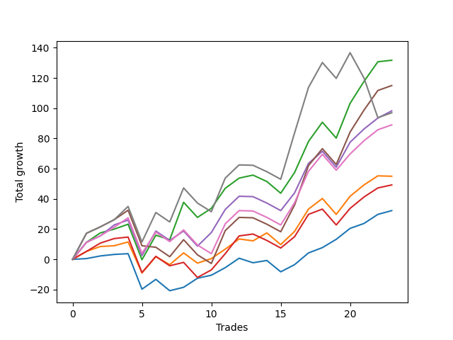

# Short Bulldog 006 
- Symbol: ES90d
- Date Range: 03/15/2022 - 07/08/2022
- Trading Period: 7:20-12:30
- Number of Trades: 23



| Name | Win Percent | Profit | Avg Profit / Trade |     | Name | Win Percent | Profit | Avg Profit / Trade |
| ---- | ----------- | ------ | ------------------ | --- | ---- | ----------- | ------ | ------------------ |
| Sorted By <br> Profit | | | | | Sorted By <br> Win Percentage ||||
| Two | 73.91 | 65875.00 | 2864.13 |     | Zero | 82.61 | 16125.00 | 701.09 |
| Five | 60.87 | 57500.00 | 2500.00 |     | Two | 73.91 | 65875.00 | 2864.13 |
| Four | 69.57 | 49125.00 | 2135.87 |     | Three | 73.91 | 24625.00 | 1070.65 |
| Seven | 56.52 | 48500.00 | 2108.70 |     | Four | 69.57 | 49125.00 | 2135.87 |
| Six | 65.22 | 44500.00 | 1934.78 |     | One | 69.57 | 27500.00 | 1195.65 |
| One | 69.57 | 27500.00 | 1195.65 |     | Six | 65.22 | 44500.00 | 1934.78 |
| Three | 73.91 | 24625.00 | 1070.65 |     | Five | 60.87 | 57500.00 | 2500.00 |
| Zero | 82.61 | 16125.00 | 701.09 |     | Seven | 56.52 | 48500.00 | 2108.70 |

### Test Zero
* Sell when price hits the middle line of the 20p bollinger
* No Stoploss
* Results:
```
Total Trades: 23
Percent Up: 17.39
Percent Down: 82.61
Total Points Moved Down: 32.25
Potential Profit: 16125.00
Total Points Ups: 41.50 Count Ups: 4
Total Points Downs: 73.75 Count Downs: 19
```

<details><summary>Trades</summary>

<code>In: 2022-04-06 11:06:00		Out: 2022-04-06 11:06:10		Total Position Time: 00:10		Total Move Down: 0.50		Total to Date: 0.50</code> <br />
<code>In: 2022-04-07 11:04:00		Out: 2022-04-07 11:15:15		Total Position Time: 11:15		Total Move Down: 1.75		Total to Date: 2.25</code> <br />
<code>In: 2022-04-18 07:28:00		Out: 2022-04-18 07:36:40		Total Position Time: 08:40		Total Move Down: 1.00		Total to Date: 3.25</code> <br />
<code>In: 2022-04-20 10:50:00		Out: 2022-04-20 10:50:10		Total Position Time: 00:10		Total Move Down: 0.50		Total to Date: 3.75</code> <br />
<code>In: 2022-04-25 11:12:00		Out: 2022-04-25 11:39:45		Total Position Time: 27:45		Total Move Down: -23.50		Total to Date: -19.75</code> <br />
<code>In: 2022-05-03 07:36:00		Out: 2022-05-03 07:37:55		Total Position Time: 01:55		Total Move Down: 6.50		Total to Date: -13.25</code> <br />
<code>In: 2022-05-03 08:11:00		Out: 2022-05-03 08:35:55		Total Position Time: 24:55		Total Move Down: -7.50		Total to Date: -20.75</code> <br />
<code>In: 2022-05-04 11:31:00		Out: 2022-05-04 11:31:10		Total Position Time: 00:10		Total Move Down: 2.25		Total to Date: -18.50</code> <br />
<code>In: 2022-05-16 10:16:00		Out: 2022-05-16 10:18:20		Total Position Time: 02:20		Total Move Down: 6.00		Total to Date: -12.50</code> <br />
<code>In: 2022-05-17 09:49:00		Out: 2022-05-17 09:51:20		Total Position Time: 02:20		Total Move Down: 2.00		Total to Date: -10.50</code> <br />
<code>In: 2022-05-24 09:18:00		Out: 2022-05-24 09:21:30		Total Position Time: 03:30		Total Move Down: 5.00		Total to Date: -5.50</code> <br />
<code>In: 2022-05-24 11:15:00		Out: 2022-05-24 11:18:25		Total Position Time: 03:25		Total Move Down: 6.25		Total to Date: 0.75</code> <br />
<code>In: 2022-05-27 12:11:00		Out: 2022-05-27 12:35:00		Total Position Time: 24:00		Total Move Down: -3.00		Total to Date: -2.25</code> <br />
<code>In: 2022-05-31 07:24:00		Out: 2022-05-31 07:36:40		Total Position Time: 12:40		Total Move Down: 1.50		Total to Date: -0.75</code> <br />
<code>In: 2022-06-02 08:06:00		Out: 2022-06-02 08:22:05		Total Position Time: 16:05		Total Move Down: -7.50		Total to Date: -8.25</code> <br />
<code>In: 2022-06-10 12:30:00		Out: 2022-06-10 12:30:30		Total Position Time: 00:30		Total Move Down: 4.75		Total to Date: -3.50</code> <br />
<code>In: 2022-06-13 09:41:00		Out: 2022-06-13 09:43:15		Total Position Time: 02:15		Total Move Down: 7.75		Total to Date: 4.25</code> <br />
<code>In: 2022-06-23 08:16:00		Out: 2022-06-23 08:21:05		Total Position Time: 05:05		Total Move Down: 3.50		Total to Date: 7.75</code> <br />
<code>In: 2022-06-30 08:30:00		Out: 2022-06-30 08:35:10		Total Position Time: 05:10		Total Move Down: 5.50		Total to Date: 13.25</code> <br />
<code>In: 2022-07-05 07:41:00		Out: 2022-07-05 07:44:30		Total Position Time: 03:30		Total Move Down: 7.25		Total to Date: 20.50</code> <br />
<code>In: 2022-07-06 11:10:00		Out: 2022-07-06 11:10:10		Total Position Time: 00:10		Total Move Down: 3.25		Total to Date: 23.75</code> <br />
<code>In: 2022-07-06 11:11:00		Out: 2022-07-06 11:11:10		Total Position Time: 00:10		Total Move Down: 6.00		Total to Date: 29.75</code> <br />
<code>In: 2022-07-07 07:57:00		Out: 2022-07-07 08:01:05		Total Position Time: 04:05		Total Move Down: 2.50		Total to Date: 32.25</code> <br />


</details>

### Test One
* Sell when the price hits the upper line of the 20p 1std bollinger
* No Stoploss
* Results:
```
Total Trades: 23
Percent Up: 30.43
Percent Down: 69.57
Total Points Moved Down: 55.00
Potential Profit: 27500.00
Total Points Ups: 52.25 Count Ups: 7
Total Points Downs: 107.25 Count Downs: 16
```

<details><summary>Trades</summary>

<code>In: 2022-04-06 11:06:00		Out: 2022-04-06 11:07:20		Total Position Time: 01:20		Total Move Down: 5.25		Total to Date: 5.25</code> <br />
<code>In: 2022-04-07 11:04:00		Out: 2022-04-07 11:16:10		Total Position Time: 12:10		Total Move Down: 3.25		Total to Date: 8.50</code> <br />
<code>In: 2022-04-18 07:28:00		Out: 2022-04-18 07:51:30		Total Position Time: 23:30		Total Move Down: 0.50		Total to Date: 9.00</code> <br />
<code>In: 2022-04-20 10:50:00		Out: 2022-04-20 10:54:05		Total Position Time: 04:05		Total Move Down: 2.50		Total to Date: 11.50</code> <br />
<code>In: 2022-04-25 11:12:00		Out: 2022-04-25 11:40:10		Total Position Time: 28:10		Total Move Down: -20.50		Total to Date: -9.00</code> <br />
<code>In: 2022-05-03 07:36:00		Out: 2022-05-03 07:41:20		Total Position Time: 05:20		Total Move Down: 10.75		Total to Date: 1.75</code> <br />
<code>In: 2022-05-03 08:11:00		Out: 2022-05-03 08:38:05		Total Position Time: 27:05		Total Move Down: -5.25		Total to Date: -3.50</code> <br />
<code>In: 2022-05-04 11:31:00		Out: 2022-05-04 11:31:25		Total Position Time: 00:25		Total Move Down: 7.75		Total to Date: 4.25</code> <br />
<code>In: 2022-05-16 10:16:00		Out: 2022-05-16 10:42:30		Total Position Time: 26:30		Total Move Down: -6.75		Total to Date: -2.50</code> <br />
<code>In: 2022-05-17 09:49:00		Out: 2022-05-17 09:54:40		Total Position Time: 05:40		Total Move Down: 3.00		Total to Date: 0.50</code> <br />
<code>In: 2022-05-24 09:18:00		Out: 2022-05-24 09:29:00		Total Position Time: 11:00		Total Move Down: 6.25		Total to Date: 6.75</code> <br />
<code>In: 2022-05-24 11:15:00		Out: 2022-05-24 11:31:25		Total Position Time: 16:25		Total Move Down: 6.75		Total to Date: 13.50</code> <br />
<code>In: 2022-05-27 12:11:00		Out: 2022-05-27 12:35:40		Total Position Time: 24:40		Total Move Down: -1.25		Total to Date: 12.25</code> <br />
<code>In: 2022-05-31 07:24:00		Out: 2022-05-31 07:38:00		Total Position Time: 14:00		Total Move Down: 5.25		Total to Date: 17.50</code> <br />
<code>In: 2022-06-02 08:06:00		Out: 2022-06-02 08:27:30		Total Position Time: 21:30		Total Move Down: -7.75		Total to Date: 9.75</code> <br />
<code>In: 2022-06-10 12:30:00		Out: 2022-06-10 12:35:55		Total Position Time: 05:55		Total Move Down: 8.75		Total to Date: 18.50</code> <br />
<code>In: 2022-06-13 09:41:00		Out: 2022-06-13 09:47:55		Total Position Time: 06:55		Total Move Down: 14.75		Total to Date: 33.25</code> <br />
<code>In: 2022-06-23 08:16:00		Out: 2022-06-23 08:23:35		Total Position Time: 07:35		Total Move Down: 7.00		Total to Date: 40.25</code> <br />
<code>In: 2022-06-30 08:30:00		Out: 2022-06-30 08:59:55		Total Position Time: 29:55		Total Move Down: -10.50		Total to Date: 29.75</code> <br />
<code>In: 2022-07-05 07:41:00		Out: 2022-07-05 07:45:55		Total Position Time: 04:55		Total Move Down: 12.00		Total to Date: 41.75</code> <br />
<code>In: 2022-07-06 11:10:00		Out: 2022-07-06 11:11:10		Total Position Time: 01:10		Total Move Down: 7.50		Total to Date: 49.25</code> <br />
<code>In: 2022-07-06 11:11:00		Out: 2022-07-06 11:11:10		Total Position Time: 00:10		Total Move Down: 6.00		Total to Date: 55.25</code> <br />
<code>In: 2022-07-07 07:57:00		Out: 2022-07-07 08:20:00		Total Position Time: 23:00		Total Move Down: -0.25		Total to Date: 55.00</code> <br />


</details>

### Test Two
* Sell when the price hits the upper line of the 20p 2std bollinger
* No Stoploss
* Results:
```
Total Trades: 23
Percent Up: 26.09
Percent Down: 73.91
Total Points Moved Down: 131.75
Potential Profit: 65875.00
Total Points Ups: 59.00 Count Ups: 6
Total Points Downs: 190.75 Count Downs: 17
```

<details><summary>Trades</summary>

<code>In: 2022-04-06 11:06:00		Out: 2022-04-06 11:08:20		Total Position Time: 02:20		Total Move Down: 11.25		Total to Date: 11.25</code> <br />
<code>In: 2022-04-07 11:04:00		Out: 2022-04-07 11:18:40		Total Position Time: 14:40		Total Move Down: 6.25		Total to Date: 17.50</code> <br />
<code>In: 2022-04-18 07:28:00		Out: 2022-04-18 07:51:45		Total Position Time: 23:45		Total Move Down: 2.50		Total to Date: 20.00</code> <br />
<code>In: 2022-04-20 10:50:00		Out: 2022-04-20 11:13:55		Total Position Time: 23:55		Total Move Down: 3.25		Total to Date: 23.25</code> <br />
<code>In: 2022-04-25 11:12:00		Out: 2022-04-25 11:41:55		Total Position Time: 29:55		Total Move Down: -23.50		Total to Date: -0.25</code> <br />
<code>In: 2022-05-03 07:36:00		Out: 2022-05-03 07:43:50		Total Position Time: 07:50		Total Move Down: 16.25		Total to Date: 16.00</code> <br />
<code>In: 2022-05-03 08:11:00		Out: 2022-05-03 08:39:10		Total Position Time: 28:10		Total Move Down: -3.00		Total to Date: 13.00</code> <br />
<code>In: 2022-05-04 11:31:00		Out: 2022-05-04 11:34:15		Total Position Time: 03:15		Total Move Down: 24.75		Total to Date: 37.75</code> <br />
<code>In: 2022-05-16 10:16:00		Out: 2022-05-16 10:45:55		Total Position Time: 29:55		Total Move Down: -10.00		Total to Date: 27.75</code> <br />
<code>In: 2022-05-17 09:49:00		Out: 2022-05-17 10:01:50		Total Position Time: 12:50		Total Move Down: 6.00		Total to Date: 33.75</code> <br />
<code>In: 2022-05-24 09:18:00		Out: 2022-05-24 09:32:35		Total Position Time: 14:35		Total Move Down: 13.25		Total to Date: 47.00</code> <br />
<code>In: 2022-05-24 11:15:00		Out: 2022-05-24 11:44:00		Total Position Time: 29:00		Total Move Down: 6.75		Total to Date: 53.75</code> <br />
<code>In: 2022-05-27 12:11:00		Out: 2022-05-27 12:38:10		Total Position Time: 27:10		Total Move Down: 2.00		Total to Date: 55.75</code> <br />
<code>In: 2022-05-31 07:24:00		Out: 2022-05-31 07:53:55		Total Position Time: 29:55		Total Move Down: -4.25		Total to Date: 51.50</code> <br />
<code>In: 2022-06-02 08:06:00		Out: 2022-06-02 08:29:05		Total Position Time: 23:05		Total Move Down: -7.75		Total to Date: 43.75</code> <br />
<code>In: 2022-06-10 12:30:00		Out: 2022-06-10 12:43:25		Total Position Time: 13:25		Total Move Down: 13.75		Total to Date: 57.50</code> <br />
<code>In: 2022-06-13 09:41:00		Out: 2022-06-13 09:54:45		Total Position Time: 13:45		Total Move Down: 20.50		Total to Date: 78.00</code> <br />
<code>In: 2022-06-23 08:16:00		Out: 2022-06-23 08:31:25		Total Position Time: 15:25		Total Move Down: 12.75		Total to Date: 90.75</code> <br />
<code>In: 2022-06-30 08:30:00		Out: 2022-06-30 08:59:55		Total Position Time: 29:55		Total Move Down: -10.50		Total to Date: 80.25</code> <br />
<code>In: 2022-07-05 07:41:00		Out: 2022-07-05 08:01:10		Total Position Time: 20:10		Total Move Down: 23.00		Total to Date: 103.25</code> <br />
<code>In: 2022-07-06 11:10:00		Out: 2022-07-06 11:12:15		Total Position Time: 02:15		Total Move Down: 14.50		Total to Date: 117.75</code> <br />
<code>In: 2022-07-06 11:11:00		Out: 2022-07-06 11:12:15		Total Position Time: 01:15		Total Move Down: 13.00		Total to Date: 130.75</code> <br />
<code>In: 2022-07-07 07:57:00		Out: 2022-07-07 08:21:00		Total Position Time: 24:00		Total Move Down: 1.00		Total to Date: 131.75</code> <br />


</details>

### Test Three
* Sell when price hits the middle line of the 50p bollinger
* No Stoploss
* Results:
```
Total Trades: 23
Percent Up: 26.09
Percent Down: 73.91
Total Points Moved Down: 49.25
Potential Profit: 24625.00
Total Points Ups: 59.50 Count Ups: 6
Total Points Downs: 108.75 Count Downs: 17
```

<details><summary>Trades</summary>

<code>In: 2022-04-06 11:06:00		Out: 2022-04-06 11:07:20		Total Position Time: 01:20		Total Move Down: 5.25		Total to Date: 5.25</code> <br />
<code>In: 2022-04-07 11:04:00		Out: 2022-04-07 11:33:40		Total Position Time: 29:40		Total Move Down: 5.50		Total to Date: 10.75</code> <br />
<code>In: 2022-04-18 07:28:00		Out: 2022-04-18 07:51:50		Total Position Time: 23:50		Total Move Down: 3.00		Total to Date: 13.75</code> <br />
<code>In: 2022-04-20 10:50:00		Out: 2022-04-20 10:50:20		Total Position Time: 00:20		Total Move Down: 1.00		Total to Date: 14.75</code> <br />
<code>In: 2022-04-25 11:12:00		Out: 2022-04-25 11:41:55		Total Position Time: 29:55		Total Move Down: -23.50		Total to Date: -8.75</code> <br />
<code>In: 2022-05-03 07:36:00		Out: 2022-05-03 07:40:40		Total Position Time: 04:40		Total Move Down: 10.75		Total to Date: 2.00</code> <br />
<code>In: 2022-05-03 08:11:00		Out: 2022-05-03 08:40:55		Total Position Time: 29:55		Total Move Down: -6.25		Total to Date: -4.25</code> <br />
<code>In: 2022-05-04 11:31:00		Out: 2022-05-04 11:31:10		Total Position Time: 00:10		Total Move Down: 2.25		Total to Date: -2.00</code> <br />
<code>In: 2022-05-16 10:16:00		Out: 2022-05-16 10:45:55		Total Position Time: 29:55		Total Move Down: -10.00		Total to Date: -12.00</code> <br />
<code>In: 2022-05-17 09:49:00		Out: 2022-05-17 10:01:25		Total Position Time: 12:25		Total Move Down: 5.00		Total to Date: -7.00</code> <br />
<code>In: 2022-05-24 09:18:00		Out: 2022-05-24 09:31:20		Total Position Time: 13:20		Total Move Down: 10.75		Total to Date: 3.75</code> <br />
<code>In: 2022-05-24 11:15:00		Out: 2022-05-24 11:20:25		Total Position Time: 05:25		Total Move Down: 11.75		Total to Date: 15.50</code> <br />
<code>In: 2022-05-27 12:11:00		Out: 2022-05-27 12:38:05		Total Position Time: 27:05		Total Move Down: 1.25		Total to Date: 16.75</code> <br />
<code>In: 2022-05-31 07:24:00		Out: 2022-05-31 07:53:55		Total Position Time: 29:55		Total Move Down: -4.25		Total to Date: 12.50</code> <br />
<code>In: 2022-06-02 08:06:00		Out: 2022-06-02 08:35:55		Total Position Time: 29:55		Total Move Down: -5.00		Total to Date: 7.50</code> <br />
<code>In: 2022-06-10 12:30:00		Out: 2022-06-10 12:33:40		Total Position Time: 03:40		Total Move Down: 7.50		Total to Date: 15.00</code> <br />
<code>In: 2022-06-13 09:41:00		Out: 2022-06-13 09:47:55		Total Position Time: 06:55		Total Move Down: 14.75		Total to Date: 29.75</code> <br />
<code>In: 2022-06-23 08:16:00		Out: 2022-06-23 08:21:05		Total Position Time: 05:05		Total Move Down: 3.50		Total to Date: 33.25</code> <br />
<code>In: 2022-06-30 08:30:00		Out: 2022-06-30 08:59:55		Total Position Time: 29:55		Total Move Down: -10.50		Total to Date: 22.75</code> <br />
<code>In: 2022-07-05 07:41:00		Out: 2022-07-05 07:45:30		Total Position Time: 04:30		Total Move Down: 11.00		Total to Date: 33.75</code> <br />
<code>In: 2022-07-06 11:10:00		Out: 2022-07-06 11:11:10		Total Position Time: 01:10		Total Move Down: 7.50		Total to Date: 41.25</code> <br />
<code>In: 2022-07-06 11:11:00		Out: 2022-07-06 11:11:10		Total Position Time: 00:10		Total Move Down: 6.00		Total to Date: 47.25</code> <br />
<code>In: 2022-07-07 07:57:00		Out: 2022-07-07 08:22:45		Total Position Time: 25:45		Total Move Down: 2.00		Total to Date: 49.25</code> <br />


</details>

### Test Four
* Sell when the price hits the upper line of the 50p 1std bollinger
* No Stoploss
* Results:
```
Total Trades: 23
Percent Up: 30.43
Percent Down: 69.57
Total Points Moved Down: 98.25
Potential Profit: 49125.00
Total Points Ups: 59.75 Count Ups: 7
Total Points Downs: 158.00 Count Downs: 16
```

<details><summary>Trades</summary>

<code>In: 2022-04-06 11:06:00		Out: 2022-04-06 11:08:10		Total Position Time: 02:10		Total Move Down: 11.25		Total to Date: 11.25</code> <br />
<code>In: 2022-04-07 11:04:00		Out: 2022-04-07 11:33:55		Total Position Time: 29:55		Total Move Down: 4.25		Total to Date: 15.50</code> <br />
<code>In: 2022-04-18 07:28:00		Out: 2022-04-18 07:57:05		Total Position Time: 29:05		Total Move Down: 7.25		Total to Date: 22.75</code> <br />
<code>In: 2022-04-20 10:50:00		Out: 2022-04-20 11:14:05		Total Position Time: 24:05		Total Move Down: 3.25		Total to Date: 26.00</code> <br />
<code>In: 2022-04-25 11:12:00		Out: 2022-04-25 11:41:55		Total Position Time: 29:55		Total Move Down: -23.50		Total to Date: 2.50</code> <br />
<code>In: 2022-05-03 07:36:00		Out: 2022-05-03 07:43:50		Total Position Time: 07:50		Total Move Down: 16.25		Total to Date: 18.75</code> <br />
<code>In: 2022-05-03 08:11:00		Out: 2022-05-03 08:40:55		Total Position Time: 29:55		Total Move Down: -6.25		Total to Date: 12.50</code> <br />
<code>In: 2022-05-04 11:31:00		Out: 2022-05-04 11:31:20		Total Position Time: 00:20		Total Move Down: 6.25		Total to Date: 18.75</code> <br />
<code>In: 2022-05-16 10:16:00		Out: 2022-05-16 10:45:55		Total Position Time: 29:55		Total Move Down: -10.00		Total to Date: 8.75</code> <br />
<code>In: 2022-05-17 09:49:00		Out: 2022-05-17 10:02:15		Total Position Time: 13:15		Total Move Down: 9.00		Total to Date: 17.75</code> <br />
<code>In: 2022-05-24 09:18:00		Out: 2022-05-24 09:33:15		Total Position Time: 15:15		Total Move Down: 15.25		Total to Date: 33.00</code> <br />
<code>In: 2022-05-24 11:15:00		Out: 2022-05-24 11:44:55		Total Position Time: 29:55		Total Move Down: 8.75		Total to Date: 41.75</code> <br />
<code>In: 2022-05-27 12:11:00		Out: 2022-05-27 12:40:55		Total Position Time: 29:55		Total Move Down: -0.25		Total to Date: 41.50</code> <br />
<code>In: 2022-05-31 07:24:00		Out: 2022-05-31 07:53:55		Total Position Time: 29:55		Total Move Down: -4.25		Total to Date: 37.25</code> <br />
<code>In: 2022-06-02 08:06:00		Out: 2022-06-02 08:35:55		Total Position Time: 29:55		Total Move Down: -5.00		Total to Date: 32.25</code> <br />
<code>In: 2022-06-10 12:30:00		Out: 2022-06-10 12:42:40		Total Position Time: 12:40		Total Move Down: 11.75		Total to Date: 44.00</code> <br />
<code>In: 2022-06-13 09:41:00		Out: 2022-06-13 09:54:40		Total Position Time: 13:40		Total Move Down: 19.50		Total to Date: 63.50</code> <br />
<code>In: 2022-06-23 08:16:00		Out: 2022-06-23 08:23:40		Total Position Time: 07:40		Total Move Down: 8.00		Total to Date: 71.50</code> <br />
<code>In: 2022-06-30 08:30:00		Out: 2022-06-30 08:59:55		Total Position Time: 29:55		Total Move Down: -10.50		Total to Date: 61.00</code> <br />
<code>In: 2022-07-05 07:41:00		Out: 2022-07-05 07:55:15		Total Position Time: 14:15		Total Move Down: 16.50		Total to Date: 77.50</code> <br />
<code>In: 2022-07-06 11:10:00		Out: 2022-07-06 11:11:35		Total Position Time: 01:35		Total Move Down: 8.75		Total to Date: 86.25</code> <br />
<code>In: 2022-07-06 11:11:00		Out: 2022-07-06 11:11:35		Total Position Time: 00:35		Total Move Down: 7.25		Total to Date: 93.50</code> <br />
<code>In: 2022-07-07 07:57:00		Out: 2022-07-07 08:23:20		Total Position Time: 26:20		Total Move Down: 4.75		Total to Date: 98.25</code> <br />


</details>

### Test Five
* Sell when the price hits the upper line of the 50p 2std bollinger
* No Stoploss
* Results:
```
Total Trades: 23
Percent Up: 39.13
Percent Down: 60.87
Total Points Moved Down: 115.00
Potential Profit: 57500.00
Total Points Ups: 66.50 Count Ups: 9
Total Points Downs: 181.50 Count Downs: 14
```

<details><summary>Trades</summary>

<code>In: 2022-04-06 11:06:00		Out: 2022-04-06 11:09:40		Total Position Time: 03:40		Total Move Down: 17.25		Total to Date: 17.25</code> <br />
<code>In: 2022-04-07 11:04:00		Out: 2022-04-07 11:33:55		Total Position Time: 29:55		Total Move Down: 4.25		Total to Date: 21.50</code> <br />
<code>In: 2022-04-18 07:28:00		Out: 2022-04-18 07:57:55		Total Position Time: 29:55		Total Move Down: 4.75		Total to Date: 26.25</code> <br />
<code>In: 2022-04-20 10:50:00		Out: 2022-04-20 11:18:20		Total Position Time: 28:20		Total Move Down: 6.25		Total to Date: 32.50</code> <br />
<code>In: 2022-04-25 11:12:00		Out: 2022-04-25 11:41:55		Total Position Time: 29:55		Total Move Down: -23.50		Total to Date: 9.00</code> <br />
<code>In: 2022-05-03 07:36:00		Out: 2022-05-03 08:05:55		Total Position Time: 29:55		Total Move Down: -1.00		Total to Date: 8.00</code> <br />
<code>In: 2022-05-03 08:11:00		Out: 2022-05-03 08:40:55		Total Position Time: 29:55		Total Move Down: -6.25		Total to Date: 1.75</code> <br />
<code>In: 2022-05-04 11:31:00		Out: 2022-05-04 11:32:05		Total Position Time: 01:05		Total Move Down: 11.25		Total to Date: 13.00</code> <br />
<code>In: 2022-05-16 10:16:00		Out: 2022-05-16 10:45:55		Total Position Time: 29:55		Total Move Down: -10.00		Total to Date: 3.00</code> <br />
<code>In: 2022-05-17 09:49:00		Out: 2022-05-17 10:18:55		Total Position Time: 29:55		Total Move Down: -5.75		Total to Date: -2.75</code> <br />
<code>In: 2022-05-24 09:18:00		Out: 2022-05-24 09:37:10		Total Position Time: 19:10		Total Move Down: 21.75		Total to Date: 19.00</code> <br />
<code>In: 2022-05-24 11:15:00		Out: 2022-05-24 11:44:55		Total Position Time: 29:55		Total Move Down: 8.75		Total to Date: 27.75</code> <br />
<code>In: 2022-05-27 12:11:00		Out: 2022-05-27 12:40:55		Total Position Time: 29:55		Total Move Down: -0.25		Total to Date: 27.50</code> <br />
<code>In: 2022-05-31 07:24:00		Out: 2022-05-31 07:53:55		Total Position Time: 29:55		Total Move Down: -4.25		Total to Date: 23.25</code> <br />
<code>In: 2022-06-02 08:06:00		Out: 2022-06-02 08:35:55		Total Position Time: 29:55		Total Move Down: -5.00		Total to Date: 18.25</code> <br />
<code>In: 2022-06-10 12:30:00		Out: 2022-06-10 12:45:50		Total Position Time: 15:50		Total Move Down: 17.75		Total to Date: 36.00</code> <br />
<code>In: 2022-06-13 09:41:00		Out: 2022-06-13 09:58:15		Total Position Time: 17:15		Total Move Down: 26.00		Total to Date: 62.00</code> <br />
<code>In: 2022-06-23 08:16:00		Out: 2022-06-23 08:31:10		Total Position Time: 15:10		Total Move Down: 11.25		Total to Date: 73.25</code> <br />
<code>In: 2022-06-30 08:30:00		Out: 2022-06-30 08:59:55		Total Position Time: 29:55		Total Move Down: -10.50		Total to Date: 62.75</code> <br />
<code>In: 2022-07-05 07:41:00		Out: 2022-07-05 08:01:05		Total Position Time: 20:05		Total Move Down: 21.50		Total to Date: 84.25</code> <br />
<code>In: 2022-07-06 11:10:00		Out: 2022-07-06 11:12:15		Total Position Time: 02:15		Total Move Down: 14.50		Total to Date: 98.75</code> <br />
<code>In: 2022-07-06 11:11:00		Out: 2022-07-06 11:12:15		Total Position Time: 01:15		Total Move Down: 13.00		Total to Date: 111.75</code> <br />
<code>In: 2022-07-07 07:57:00		Out: 2022-07-07 08:26:55		Total Position Time: 29:55		Total Move Down: 3.25		Total to Date: 115.00</code> <br />


</details>

### Test Six
* Sell when the price hits the middle line of the 1std VWAP
* No Stoploss
* Results:
```
Total Trades: 23
Percent Up: 34.78
Percent Down: 65.22
Total Points Moved Down: 89.00
Potential Profit: 44500.00
Total Points Ups: 65.50 Count Ups: 8
Total Points Downs: 154.50 Count Downs: 15
```

<details><summary>Trades</summary>

<code>In: 2022-04-06 11:06:00		Out: 2022-04-06 11:08:10		Total Position Time: 02:10		Total Move Down: 11.25		Total to Date: 11.25</code> <br />
<code>In: 2022-04-07 11:04:00		Out: 2022-04-07 11:33:55		Total Position Time: 29:55		Total Move Down: 4.25		Total to Date: 15.50</code> <br />
<code>In: 2022-04-18 07:28:00		Out: 2022-04-18 07:55:15		Total Position Time: 27:15		Total Move Down: 5.75		Total to Date: 21.25</code> <br />
<code>In: 2022-04-20 10:50:00		Out: 2022-04-20 11:18:20		Total Position Time: 28:20		Total Move Down: 6.25		Total to Date: 27.50</code> <br />
<code>In: 2022-04-25 11:12:00		Out: 2022-04-25 11:41:55		Total Position Time: 29:55		Total Move Down: -23.50		Total to Date: 4.00</code> <br />
<code>In: 2022-05-03 07:36:00		Out: 2022-05-03 07:42:15		Total Position Time: 06:15		Total Move Down: 14.00		Total to Date: 18.00</code> <br />
<code>In: 2022-05-03 08:11:00		Out: 2022-05-03 08:40:55		Total Position Time: 29:55		Total Move Down: -6.25		Total to Date: 11.75</code> <br />
<code>In: 2022-05-04 11:31:00		Out: 2022-05-04 11:31:25		Total Position Time: 00:25		Total Move Down: 7.75		Total to Date: 19.50</code> <br />
<code>In: 2022-05-16 10:16:00		Out: 2022-05-16 10:45:55		Total Position Time: 29:55		Total Move Down: -10.00		Total to Date: 9.50</code> <br />
<code>In: 2022-05-17 09:49:00		Out: 2022-05-17 10:18:55		Total Position Time: 29:55		Total Move Down: -5.75		Total to Date: 3.75</code> <br />
<code>In: 2022-05-24 09:18:00		Out: 2022-05-24 09:36:45		Total Position Time: 18:45		Total Move Down: 19.75		Total to Date: 23.50</code> <br />
<code>In: 2022-05-24 11:15:00		Out: 2022-05-24 11:44:55		Total Position Time: 29:55		Total Move Down: 8.75		Total to Date: 32.25</code> <br />
<code>In: 2022-05-27 12:11:00		Out: 2022-05-27 12:40:55		Total Position Time: 29:55		Total Move Down: -0.25		Total to Date: 32.00</code> <br />
<code>In: 2022-05-31 07:24:00		Out: 2022-05-31 07:53:55		Total Position Time: 29:55		Total Move Down: -4.25		Total to Date: 27.75</code> <br />
<code>In: 2022-06-02 08:06:00		Out: 2022-06-02 08:35:55		Total Position Time: 29:55		Total Move Down: -5.00		Total to Date: 22.75</code> <br />
<code>In: 2022-06-10 12:30:00		Out: 2022-06-10 12:44:00		Total Position Time: 14:00		Total Move Down: 14.75		Total to Date: 37.50</code> <br />
<code>In: 2022-06-13 09:41:00		Out: 2022-06-13 09:55:05		Total Position Time: 14:05		Total Move Down: 20.75		Total to Date: 58.25</code> <br />
<code>In: 2022-06-23 08:16:00		Out: 2022-06-23 08:31:10		Total Position Time: 15:10		Total Move Down: 11.25		Total to Date: 69.50</code> <br />
<code>In: 2022-06-30 08:30:00		Out: 2022-06-30 08:59:55		Total Position Time: 29:55		Total Move Down: -10.50		Total to Date: 59.00</code> <br />
<code>In: 2022-07-05 07:41:00		Out: 2022-07-05 07:45:25		Total Position Time: 04:25		Total Move Down: 10.75		Total to Date: 69.75</code> <br />
<code>In: 2022-07-06 11:10:00		Out: 2022-07-06 11:11:35		Total Position Time: 01:35		Total Move Down: 8.75		Total to Date: 78.50</code> <br />
<code>In: 2022-07-06 11:11:00		Out: 2022-07-06 11:11:35		Total Position Time: 00:35		Total Move Down: 7.25		Total to Date: 85.75</code> <br />
<code>In: 2022-07-07 07:57:00		Out: 2022-07-07 08:26:55		Total Position Time: 29:55		Total Move Down: 3.25		Total to Date: 89.00</code> <br />


</details>

### Test Seven
* Sell when the price hits the upper line of the 1std VWAP
* No Stoploss
* Results:
```
Total Trades: 23
Percent Up: 43.48
Percent Down: 56.52
Total Points Moved Down: 97.00
Potential Profit: 48500.00
Total Points Ups: 108.50 Count Ups: 10
Total Points Downs: 205.50 Count Downs: 13
```

<details><summary>Trades</summary>

<code>In: 2022-04-06 11:06:00		Out: 2022-04-06 11:09:40		Total Position Time: 03:40		Total Move Down: 17.25		Total to Date: 17.25</code> <br />
<code>In: 2022-04-07 11:04:00		Out: 2022-04-07 11:33:55		Total Position Time: 29:55		Total Move Down: 4.25		Total to Date: 21.50</code> <br />
<code>In: 2022-04-18 07:28:00		Out: 2022-04-18 07:57:55		Total Position Time: 29:55		Total Move Down: 4.75		Total to Date: 26.25</code> <br />
<code>In: 2022-04-20 10:50:00		Out: 2022-04-20 11:19:55		Total Position Time: 29:55		Total Move Down: 8.75		Total to Date: 35.00</code> <br />
<code>In: 2022-04-25 11:12:00		Out: 2022-04-25 11:41:55		Total Position Time: 29:55		Total Move Down: -23.50		Total to Date: 11.50</code> <br />
<code>In: 2022-05-03 07:36:00		Out: 2022-05-03 07:46:45		Total Position Time: 10:45		Total Move Down: 19.50		Total to Date: 31.00</code> <br />
<code>In: 2022-05-03 08:11:00		Out: 2022-05-03 08:40:55		Total Position Time: 29:55		Total Move Down: -6.25		Total to Date: 24.75</code> <br />
<code>In: 2022-05-04 11:31:00		Out: 2022-05-04 11:34:05		Total Position Time: 03:05		Total Move Down: 22.50		Total to Date: 47.25</code> <br />
<code>In: 2022-05-16 10:16:00		Out: 2022-05-16 10:45:55		Total Position Time: 29:55		Total Move Down: -10.00		Total to Date: 37.25</code> <br />
<code>In: 2022-05-17 09:49:00		Out: 2022-05-17 10:18:55		Total Position Time: 29:55		Total Move Down: -5.75		Total to Date: 31.50</code> <br />
<code>In: 2022-05-24 09:18:00		Out: 2022-05-24 09:47:55		Total Position Time: 29:55		Total Move Down: 22.25		Total to Date: 53.75</code> <br />
<code>In: 2022-05-24 11:15:00		Out: 2022-05-24 11:44:55		Total Position Time: 29:55		Total Move Down: 8.75		Total to Date: 62.50</code> <br />
<code>In: 2022-05-27 12:11:00		Out: 2022-05-27 12:40:55		Total Position Time: 29:55		Total Move Down: -0.25		Total to Date: 62.25</code> <br />
<code>In: 2022-05-31 07:24:00		Out: 2022-05-31 07:53:55		Total Position Time: 29:55		Total Move Down: -4.25		Total to Date: 58.00</code> <br />
<code>In: 2022-06-02 08:06:00		Out: 2022-06-02 08:35:55		Total Position Time: 29:55		Total Move Down: -5.00		Total to Date: 53.00</code> <br />
<code>In: 2022-06-10 12:30:00		Out: 2022-06-10 12:59:20		Total Position Time: 29:20		Total Move Down: 30.75		Total to Date: 83.75</code> <br />
<code>In: 2022-06-13 09:41:00		Out: 2022-06-13 10:10:55		Total Position Time: 29:55		Total Move Down: 30.00		Total to Date: 113.75</code> <br />
<code>In: 2022-06-23 08:16:00		Out: 2022-06-23 08:35:20		Total Position Time: 19:20		Total Move Down: 16.50		Total to Date: 130.25</code> <br />
<code>In: 2022-06-30 08:30:00		Out: 2022-06-30 08:59:55		Total Position Time: 29:55		Total Move Down: -10.50		Total to Date: 119.75</code> <br />
<code>In: 2022-07-05 07:41:00		Out: 2022-07-05 07:57:05		Total Position Time: 16:05		Total Move Down: 17.00		Total to Date: 136.75</code> <br />
<code>In: 2022-07-06 11:10:00		Out: 2022-07-06 11:39:55		Total Position Time: 29:55		Total Move Down: -16.75		Total to Date: 120.00</code> <br />
<code>In: 2022-07-06 11:11:00		Out: 2022-07-06 11:40:55		Total Position Time: 29:55		Total Move Down: -26.25		Total to Date: 93.75</code> <br />
<code>In: 2022-07-07 07:57:00		Out: 2022-07-07 08:26:55		Total Position Time: 29:55		Total Move Down: 3.25		Total to Date: 97.00</code> <br />


</details>