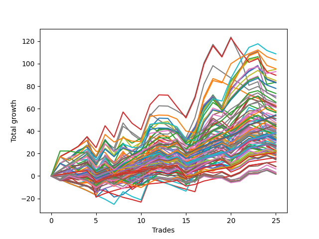

# Short Bulldog 006 
- Symbol: ESBIB
- Date Range: 03/18/2022 - 07/08/2022
- Trading Period: 7:20-12:30
- Number of Trades: 23



| Name | Win Percent | Profit | Avg Profit / Trade |     | Name | Win Percent | Profit | Avg Profit / Trade |
| ---- | ----------- | ------ | ------------------ | --- | ---- | ----------- | ------ | ------------------ |
| Sorted By <br> Profit | | | | | Sorted By <br> Win Percentage ||||
| Five | 60.87 | 55500.00 | 2413.04 |     | Zero | 78.26 | 16000.00 | 695.65 |
| Two | 73.91 | 53125.00 | 2309.78 |     | Two | 73.91 | 53125.00 | 2309.78 |
| Four | 69.57 | 49250.00 | 2141.30 |     | Three | 73.91 | 25250.00 | 1097.83 |
| Six | 65.22 | 44500.00 | 1934.78 |     | Four | 69.57 | 49250.00 | 2141.30 |
| Seven | 56.52 | 42000.00 | 1826.09 |     | Six | 65.22 | 44500.00 | 1934.78 |
| Seventy-Three | 47.83 | 30000.00 | 1304.35 |     | One | 65.22 | 21250.00 | 923.91 |
| Three | 73.91 | 25250.00 | 1097.83 |     | Five | 60.87 | 55500.00 | 2413.04 |
| One | 65.22 | 21250.00 | 923.91 |     | Seven | 56.52 | 42000.00 | 1826.09 |
| Zero | 78.26 | 16000.00 | 695.65 |     | Seventy-Three | 47.83 | 30000.00 | 1304.35 |
| Seventy-Nine | 21.74 | 10625.00 | 461.96 |     | Eighty | 26.09 | 7250.00 | 315.22 |
| Seventy-Eight | 17.39 | 10375.00 | 451.09 |     | Seventy-Nine | 21.74 | 10625.00 | 461.96 |
| Eighty | 26.09 | 7250.00 | 315.22 |     | Seventy-Eight | 17.39 | 10375.00 | 451.09 |
| Seventy-Seven | 8.70 | 1000.00 | 43.48 |     | Seventy-Seven | 8.70 | 1000.00 | 43.48 |
| Seventy-Six | 4.35 | -2000.00 | -86.96 |     | Seventy-Six | 4.35 | -2000.00 | -86.96 |

## NO STOPLOSS

### Test Zero
* Sell when price hits the middle line of the 20p bollinger
* No Stoploss
* Results:
```
Total Trades: 23
Percent Up: 21.74
Percent Down: 78.26
Total Points Moved Down: 32.00
Potential Profit: 16000.00
Total Points Ups: 43.50 Count Ups: 5
Total Points Downs: 75.50 Count Downs: 18
```

<details><summary>Trades</summary>

<code>In: 2022-04-06 11:06:00		Out: 2022-04-06 11:06:10		Total Position Time: 00:10		Total Move Down: 0.50		Total to Date: 0.50</code> <br />
<code>In: 2022-04-07 11:04:00		Out: 2022-04-07 11:15:20		Total Position Time: 11:20		Total Move Down: 3.25		Total to Date: 3.75</code> <br />
<code>In: 2022-04-18 07:28:00		Out: 2022-04-18 07:38:20		Total Position Time: 10:20		Total Move Down: 0.50		Total to Date: 4.25</code> <br />
<code>In: 2022-04-20 10:50:00		Out: 2022-04-20 10:50:10		Total Position Time: 00:10		Total Move Down: 0.50		Total to Date: 4.75</code> <br />
<code>In: 2022-04-25 11:12:00		Out: 2022-04-25 11:39:45		Total Position Time: 27:45		Total Move Down: -23.50		Total to Date: -18.75</code> <br />
<code>In: 2022-05-03 07:36:00		Out: 2022-05-03 07:38:45		Total Position Time: 02:45		Total Move Down: 7.50		Total to Date: -11.25</code> <br />
<code>In: 2022-05-03 08:11:00		Out: 2022-05-03 08:35:55		Total Position Time: 24:55		Total Move Down: -7.50		Total to Date: -18.75</code> <br />
<code>In: 2022-05-04 11:31:00		Out: 2022-05-04 11:31:10		Total Position Time: 00:10		Total Move Down: 2.25		Total to Date: -16.50</code> <br />
<code>In: 2022-05-16 10:16:00		Out: 2022-05-16 10:18:25		Total Position Time: 02:25		Total Move Down: 6.50		Total to Date: -10.00</code> <br />
<code>In: 2022-05-17 09:49:00		Out: 2022-05-17 09:51:25		Total Position Time: 02:25		Total Move Down: 2.25		Total to Date: -7.75</code> <br />
<code>In: 2022-05-24 09:18:00		Out: 2022-05-24 09:21:40		Total Position Time: 03:40		Total Move Down: 5.75		Total to Date: -2.00</code> <br />
<code>In: 2022-05-24 11:15:00		Out: 2022-05-24 11:18:25		Total Position Time: 03:25		Total Move Down: 6.25		Total to Date: 4.25</code> <br />
<code>In: 2022-05-27 12:11:00		Out: 2022-05-27 12:35:00		Total Position Time: 24:00		Total Move Down: -3.00		Total to Date: 1.25</code> <br />
<code>In: 2022-05-31 07:24:00		Out: 2022-05-31 07:37:15		Total Position Time: 13:15		Total Move Down: 2.00		Total to Date: 3.25</code> <br />
<code>In: 2022-06-02 08:06:00		Out: 2022-06-02 08:27:20		Total Position Time: 21:20		Total Move Down: -8.75		Total to Date: -5.50</code> <br />
<code>In: 2022-06-10 12:30:00		Out: 2022-06-10 12:30:30		Total Position Time: 00:30		Total Move Down: 4.75		Total to Date: -0.75</code> <br />
<code>In: 2022-06-13 09:41:00		Out: 2022-06-13 09:43:20		Total Position Time: 02:20		Total Move Down: 8.00		Total to Date: 7.25</code> <br />
<code>In: 2022-06-23 08:16:00		Out: 2022-06-23 08:21:05		Total Position Time: 05:05		Total Move Down: 3.50		Total to Date: 10.75</code> <br />
<code>In: 2022-06-30 08:30:00		Out: 2022-06-30 08:35:10		Total Position Time: 05:10		Total Move Down: 5.50		Total to Date: 16.25</code> <br />
<code>In: 2022-07-05 07:41:00		Out: 2022-07-05 07:44:30		Total Position Time: 03:30		Total Move Down: 7.25		Total to Date: 23.50</code> <br />
<code>In: 2022-07-06 11:10:00		Out: 2022-07-06 11:10:10		Total Position Time: 00:10		Total Move Down: 3.25		Total to Date: 26.75</code> <br />
<code>In: 2022-07-06 11:11:00		Out: 2022-07-06 11:11:10		Total Position Time: 00:10		Total Move Down: 6.00		Total to Date: 32.75</code> <br />
<code>In: 2022-07-07 07:57:00		Out: 2022-07-07 08:11:10		Total Position Time: 14:10		Total Move Down: -0.75		Total to Date: 32.00</code> <br />


</details>

### Test One
* Sell when the price hits the upper line of the 20p 1std bollinger
* No Stoploss
* Results:
```
Total Trades: 23
Percent Up: 34.78
Percent Down: 65.22
Total Points Moved Down: 42.50
Potential Profit: 21250.00
Total Points Ups: 58.00 Count Ups: 8
Total Points Downs: 100.50 Count Downs: 15
```

<details><summary>Trades</summary>

<code>In: 2022-04-06 11:06:00		Out: 2022-04-06 11:07:20		Total Position Time: 01:20		Total Move Down: 5.25		Total to Date: 5.25</code> <br />
<code>In: 2022-04-07 11:04:00		Out: 2022-04-07 11:18:00		Total Position Time: 14:00		Total Move Down: 4.00		Total to Date: 9.25</code> <br />
<code>In: 2022-04-18 07:28:00		Out: 2022-04-18 07:51:20		Total Position Time: 23:20		Total Move Down: -0.00		Total to Date: 9.25</code> <br />
<code>In: 2022-04-20 10:50:00		Out: 2022-04-20 10:54:15		Total Position Time: 04:15		Total Move Down: 2.50		Total to Date: 11.75</code> <br />
<code>In: 2022-04-25 11:12:00		Out: 2022-04-25 11:41:55		Total Position Time: 29:55		Total Move Down: -23.50		Total to Date: -11.75</code> <br />
<code>In: 2022-05-03 07:36:00		Out: 2022-05-03 07:42:05		Total Position Time: 06:05		Total Move Down: 11.00		Total to Date: -0.75</code> <br />
<code>In: 2022-05-03 08:11:00		Out: 2022-05-03 08:38:05		Total Position Time: 27:05		Total Move Down: -5.25		Total to Date: -6.00</code> <br />
<code>In: 2022-05-04 11:31:00		Out: 2022-05-04 11:31:20		Total Position Time: 00:20		Total Move Down: 6.25		Total to Date: 0.25</code> <br />
<code>In: 2022-05-16 10:16:00		Out: 2022-05-16 10:42:40		Total Position Time: 26:40		Total Move Down: -5.25		Total to Date: -5.00</code> <br />
<code>In: 2022-05-17 09:49:00		Out: 2022-05-17 09:56:30		Total Position Time: 07:30		Total Move Down: 3.50		Total to Date: -1.50</code> <br />
<code>In: 2022-05-24 09:18:00		Out: 2022-05-24 09:29:00		Total Position Time: 11:00		Total Move Down: 6.25		Total to Date: 4.75</code> <br />
<code>In: 2022-05-24 11:15:00		Out: 2022-05-24 11:31:25		Total Position Time: 16:25		Total Move Down: 6.75		Total to Date: 11.50</code> <br />
<code>In: 2022-05-27 12:11:00		Out: 2022-05-27 12:35:40		Total Position Time: 24:40		Total Move Down: -1.25		Total to Date: 10.25</code> <br />
<code>In: 2022-05-31 07:24:00		Out: 2022-05-31 07:53:55		Total Position Time: 29:55		Total Move Down: -4.25		Total to Date: 6.00</code> <br />
<code>In: 2022-06-02 08:06:00		Out: 2022-06-02 08:28:15		Total Position Time: 22:15		Total Move Down: -8.00		Total to Date: -2.00</code> <br />
<code>In: 2022-06-10 12:30:00		Out: 2022-06-10 12:35:45		Total Position Time: 05:45		Total Move Down: 8.25		Total to Date: 6.25</code> <br />
<code>In: 2022-06-13 09:41:00		Out: 2022-06-13 09:47:55		Total Position Time: 06:55		Total Move Down: 14.75		Total to Date: 21.00</code> <br />
<code>In: 2022-06-23 08:16:00		Out: 2022-06-23 08:23:30		Total Position Time: 07:30		Total Move Down: 6.25		Total to Date: 27.25</code> <br />
<code>In: 2022-06-30 08:30:00		Out: 2022-06-30 08:59:55		Total Position Time: 29:55		Total Move Down: -10.50		Total to Date: 16.75</code> <br />
<code>In: 2022-07-05 07:41:00		Out: 2022-07-05 07:45:55		Total Position Time: 04:55		Total Move Down: 12.00		Total to Date: 28.75</code> <br />
<code>In: 2022-07-06 11:10:00		Out: 2022-07-06 11:11:10		Total Position Time: 01:10		Total Move Down: 7.50		Total to Date: 36.25</code> <br />
<code>In: 2022-07-06 11:11:00		Out: 2022-07-06 11:11:10		Total Position Time: 00:10		Total Move Down: 6.00		Total to Date: 42.25</code> <br />
<code>In: 2022-07-07 07:57:00		Out: 2022-07-07 08:20:05		Total Position Time: 23:05		Total Move Down: 0.25		Total to Date: 42.50</code> <br />


</details>

### Test Two
* Sell when the price hits the upper line of the 20p 2std bollinger
* No Stoploss
* Results:
```
Total Trades: 23
Percent Up: 26.09
Percent Down: 73.91
Total Points Moved Down: 106.25
Potential Profit: 53125.00
Total Points Ups: 59.00 Count Ups: 6
Total Points Downs: 165.25 Count Downs: 17
```

<details><summary>Trades</summary>

<code>In: 2022-04-06 11:06:00		Out: 2022-04-06 11:08:10		Total Position Time: 02:10		Total Move Down: 11.25		Total to Date: 11.25</code> <br />
<code>In: 2022-04-07 11:04:00		Out: 2022-04-07 11:18:20		Total Position Time: 14:20		Total Move Down: 5.25		Total to Date: 16.50</code> <br />
<code>In: 2022-04-18 07:28:00		Out: 2022-04-18 07:51:45		Total Position Time: 23:45		Total Move Down: 2.50		Total to Date: 19.00</code> <br />
<code>In: 2022-04-20 10:50:00		Out: 2022-04-20 11:13:55		Total Position Time: 23:55		Total Move Down: 3.25		Total to Date: 22.25</code> <br />
<code>In: 2022-04-25 11:12:00		Out: 2022-04-25 11:41:55		Total Position Time: 29:55		Total Move Down: -23.50		Total to Date: -1.25</code> <br />
<code>In: 2022-05-03 07:36:00		Out: 2022-05-03 07:43:50		Total Position Time: 07:50		Total Move Down: 16.25		Total to Date: 15.00</code> <br />
<code>In: 2022-05-03 08:11:00		Out: 2022-05-03 08:39:10		Total Position Time: 28:10		Total Move Down: -3.00		Total to Date: 12.00</code> <br />
<code>In: 2022-05-04 11:31:00		Out: 2022-05-04 11:33:55		Total Position Time: 02:55		Total Move Down: 16.75		Total to Date: 28.75</code> <br />
<code>In: 2022-05-16 10:16:00		Out: 2022-05-16 10:45:55		Total Position Time: 29:55		Total Move Down: -10.00		Total to Date: 18.75</code> <br />
<code>In: 2022-05-17 09:49:00		Out: 2022-05-17 10:01:10		Total Position Time: 12:10		Total Move Down: 4.50		Total to Date: 23.25</code> <br />
<code>In: 2022-05-24 09:18:00		Out: 2022-05-24 09:31:35		Total Position Time: 13:35		Total Move Down: 10.75		Total to Date: 34.00</code> <br />
<code>In: 2022-05-24 11:15:00		Out: 2022-05-24 11:44:00		Total Position Time: 29:00		Total Move Down: 6.75		Total to Date: 40.75</code> <br />
<code>In: 2022-05-27 12:11:00		Out: 2022-05-27 12:36:55		Total Position Time: 25:55		Total Move Down: 1.25		Total to Date: 42.00</code> <br />
<code>In: 2022-05-31 07:24:00		Out: 2022-05-31 07:53:55		Total Position Time: 29:55		Total Move Down: -4.25		Total to Date: 37.75</code> <br />
<code>In: 2022-06-02 08:06:00		Out: 2022-06-02 08:31:25		Total Position Time: 25:25		Total Move Down: -7.75		Total to Date: 30.00</code> <br />
<code>In: 2022-06-10 12:30:00		Out: 2022-06-10 12:43:10		Total Position Time: 13:10		Total Move Down: 12.50		Total to Date: 42.50</code> <br />
<code>In: 2022-06-13 09:41:00		Out: 2022-06-13 09:54:35		Total Position Time: 13:35		Total Move Down: 18.50		Total to Date: 61.00</code> <br />
<code>In: 2022-06-23 08:16:00		Out: 2022-06-23 08:31:10		Total Position Time: 15:10		Total Move Down: 11.25		Total to Date: 72.25</code> <br />
<code>In: 2022-06-30 08:30:00		Out: 2022-06-30 08:59:55		Total Position Time: 29:55		Total Move Down: -10.50		Total to Date: 61.75</code> <br />
<code>In: 2022-07-05 07:41:00		Out: 2022-07-05 08:01:10		Total Position Time: 20:10		Total Move Down: 23.00		Total to Date: 84.75</code> <br />
<code>In: 2022-07-06 11:10:00		Out: 2022-07-06 11:11:45		Total Position Time: 01:45		Total Move Down: 10.50		Total to Date: 95.25</code> <br />
<code>In: 2022-07-06 11:11:00		Out: 2022-07-06 11:11:45		Total Position Time: 00:45		Total Move Down: 9.00		Total to Date: 104.25</code> <br />
<code>In: 2022-07-07 07:57:00		Out: 2022-07-07 08:22:45		Total Position Time: 25:45		Total Move Down: 2.00		Total to Date: 106.25</code> <br />


</details>

### Test Three
* Sell when price hits the middle line of the 50p bollinger
* No Stoploss
* Results:
```
Total Trades: 23
Percent Up: 26.09
Percent Down: 73.91
Total Points Moved Down: 50.50
Potential Profit: 25250.00
Total Points Ups: 59.50 Count Ups: 6
Total Points Downs: 110.00 Count Downs: 17
```

<details><summary>Trades</summary>

<code>In: 2022-04-06 11:06:00		Out: 2022-04-06 11:07:20		Total Position Time: 01:20		Total Move Down: 5.25		Total to Date: 5.25</code> <br />
<code>In: 2022-04-07 11:04:00		Out: 2022-04-07 11:33:40		Total Position Time: 29:40		Total Move Down: 5.50		Total to Date: 10.75</code> <br />
<code>In: 2022-04-18 07:28:00		Out: 2022-04-18 07:51:50		Total Position Time: 23:50		Total Move Down: 3.00		Total to Date: 13.75</code> <br />
<code>In: 2022-04-20 10:50:00		Out: 2022-04-20 10:50:20		Total Position Time: 00:20		Total Move Down: 1.00		Total to Date: 14.75</code> <br />
<code>In: 2022-04-25 11:12:00		Out: 2022-04-25 11:41:55		Total Position Time: 29:55		Total Move Down: -23.50		Total to Date: -8.75</code> <br />
<code>In: 2022-05-03 07:36:00		Out: 2022-05-03 07:40:40		Total Position Time: 04:40		Total Move Down: 10.75		Total to Date: 2.00</code> <br />
<code>In: 2022-05-03 08:11:00		Out: 2022-05-03 08:40:55		Total Position Time: 29:55		Total Move Down: -6.25		Total to Date: -4.25</code> <br />
<code>In: 2022-05-04 11:31:00		Out: 2022-05-04 11:31:10		Total Position Time: 00:10		Total Move Down: 2.25		Total to Date: -2.00</code> <br />
<code>In: 2022-05-16 10:16:00		Out: 2022-05-16 10:45:55		Total Position Time: 29:55		Total Move Down: -10.00		Total to Date: -12.00</code> <br />
<code>In: 2022-05-17 09:49:00		Out: 2022-05-17 10:01:30		Total Position Time: 12:30		Total Move Down: 5.25		Total to Date: -6.75</code> <br />
<code>In: 2022-05-24 09:18:00		Out: 2022-05-24 09:31:20		Total Position Time: 13:20		Total Move Down: 10.75		Total to Date: 4.00</code> <br />
<code>In: 2022-05-24 11:15:00		Out: 2022-05-24 11:20:25		Total Position Time: 05:25		Total Move Down: 11.75		Total to Date: 15.75</code> <br />
<code>In: 2022-05-27 12:11:00		Out: 2022-05-27 12:38:10		Total Position Time: 27:10		Total Move Down: 2.00		Total to Date: 17.75</code> <br />
<code>In: 2022-05-31 07:24:00		Out: 2022-05-31 07:53:55		Total Position Time: 29:55		Total Move Down: -4.25		Total to Date: 13.50</code> <br />
<code>In: 2022-06-02 08:06:00		Out: 2022-06-02 08:35:55		Total Position Time: 29:55		Total Move Down: -5.00		Total to Date: 8.50</code> <br />
<code>In: 2022-06-10 12:30:00		Out: 2022-06-10 12:33:40		Total Position Time: 03:40		Total Move Down: 7.50		Total to Date: 16.00</code> <br />
<code>In: 2022-06-13 09:41:00		Out: 2022-06-13 09:47:55		Total Position Time: 06:55		Total Move Down: 14.75		Total to Date: 30.75</code> <br />
<code>In: 2022-06-23 08:16:00		Out: 2022-06-23 08:22:20		Total Position Time: 06:20		Total Move Down: 3.75		Total to Date: 34.50</code> <br />
<code>In: 2022-06-30 08:30:00		Out: 2022-06-30 08:59:55		Total Position Time: 29:55		Total Move Down: -10.50		Total to Date: 24.00</code> <br />
<code>In: 2022-07-05 07:41:00		Out: 2022-07-05 07:45:30		Total Position Time: 04:30		Total Move Down: 11.00		Total to Date: 35.00</code> <br />
<code>In: 2022-07-06 11:10:00		Out: 2022-07-06 11:11:10		Total Position Time: 01:10		Total Move Down: 7.50		Total to Date: 42.50</code> <br />
<code>In: 2022-07-06 11:11:00		Out: 2022-07-06 11:11:10		Total Position Time: 00:10		Total Move Down: 6.00		Total to Date: 48.50</code> <br />
<code>In: 2022-07-07 07:57:00		Out: 2022-07-07 08:22:45		Total Position Time: 25:45		Total Move Down: 2.00		Total to Date: 50.50</code> <br />


</details>

### Test Four
* Sell when the price hits the upper line of the 50p 1std bollinger
* No Stoploss
* Results:
```
Total Trades: 23
Percent Up: 30.43
Percent Down: 69.57
Total Points Moved Down: 98.50
Potential Profit: 49250.00
Total Points Ups: 59.75 Count Ups: 7
Total Points Downs: 158.25 Count Downs: 16
```

<details><summary>Trades</summary>

<code>In: 2022-04-06 11:06:00		Out: 2022-04-06 11:08:10		Total Position Time: 02:10		Total Move Down: 11.25		Total to Date: 11.25</code> <br />
<code>In: 2022-04-07 11:04:00		Out: 2022-04-07 11:33:55		Total Position Time: 29:55		Total Move Down: 4.25		Total to Date: 15.50</code> <br />
<code>In: 2022-04-18 07:28:00		Out: 2022-04-18 07:57:05		Total Position Time: 29:05		Total Move Down: 7.25		Total to Date: 22.75</code> <br />
<code>In: 2022-04-20 10:50:00		Out: 2022-04-20 11:14:05		Total Position Time: 24:05		Total Move Down: 3.25		Total to Date: 26.00</code> <br />
<code>In: 2022-04-25 11:12:00		Out: 2022-04-25 11:41:55		Total Position Time: 29:55		Total Move Down: -23.50		Total to Date: 2.50</code> <br />
<code>In: 2022-05-03 07:36:00		Out: 2022-05-03 07:43:50		Total Position Time: 07:50		Total Move Down: 16.25		Total to Date: 18.75</code> <br />
<code>In: 2022-05-03 08:11:00		Out: 2022-05-03 08:40:55		Total Position Time: 29:55		Total Move Down: -6.25		Total to Date: 12.50</code> <br />
<code>In: 2022-05-04 11:31:00		Out: 2022-05-04 11:31:20		Total Position Time: 00:20		Total Move Down: 6.25		Total to Date: 18.75</code> <br />
<code>In: 2022-05-16 10:16:00		Out: 2022-05-16 10:45:55		Total Position Time: 29:55		Total Move Down: -10.00		Total to Date: 8.75</code> <br />
<code>In: 2022-05-17 09:49:00		Out: 2022-05-17 10:02:15		Total Position Time: 13:15		Total Move Down: 9.00		Total to Date: 17.75</code> <br />
<code>In: 2022-05-24 09:18:00		Out: 2022-05-24 09:34:20		Total Position Time: 16:20		Total Move Down: 15.25		Total to Date: 33.00</code> <br />
<code>In: 2022-05-24 11:15:00		Out: 2022-05-24 11:44:55		Total Position Time: 29:55		Total Move Down: 8.75		Total to Date: 41.75</code> <br />
<code>In: 2022-05-27 12:11:00		Out: 2022-05-27 12:40:55		Total Position Time: 29:55		Total Move Down: -0.25		Total to Date: 41.50</code> <br />
<code>In: 2022-05-31 07:24:00		Out: 2022-05-31 07:53:55		Total Position Time: 29:55		Total Move Down: -4.25		Total to Date: 37.25</code> <br />
<code>In: 2022-06-02 08:06:00		Out: 2022-06-02 08:35:55		Total Position Time: 29:55		Total Move Down: -5.00		Total to Date: 32.25</code> <br />
<code>In: 2022-06-10 12:30:00		Out: 2022-06-10 12:42:40		Total Position Time: 12:40		Total Move Down: 11.75		Total to Date: 44.00</code> <br />
<code>In: 2022-06-13 09:41:00		Out: 2022-06-13 09:54:40		Total Position Time: 13:40		Total Move Down: 19.50		Total to Date: 63.50</code> <br />
<code>In: 2022-06-23 08:16:00		Out: 2022-06-23 08:23:40		Total Position Time: 07:40		Total Move Down: 8.00		Total to Date: 71.50</code> <br />
<code>In: 2022-06-30 08:30:00		Out: 2022-06-30 08:59:55		Total Position Time: 29:55		Total Move Down: -10.50		Total to Date: 61.00</code> <br />
<code>In: 2022-07-05 07:41:00		Out: 2022-07-05 07:56:40		Total Position Time: 15:40		Total Move Down: 16.75		Total to Date: 77.75</code> <br />
<code>In: 2022-07-06 11:10:00		Out: 2022-07-06 11:11:35		Total Position Time: 01:35		Total Move Down: 8.75		Total to Date: 86.50</code> <br />
<code>In: 2022-07-06 11:11:00		Out: 2022-07-06 11:11:35		Total Position Time: 00:35		Total Move Down: 7.25		Total to Date: 93.75</code> <br />
<code>In: 2022-07-07 07:57:00		Out: 2022-07-07 08:23:20		Total Position Time: 26:20		Total Move Down: 4.75		Total to Date: 98.50</code> <br />


</details>

### Test Five
* Sell when the price hits the upper line of the 50p 2std bollinger
* No Stoploss
* Results:
```
Total Trades: 23
Percent Up: 39.13
Percent Down: 60.87
Total Points Moved Down: 111.00
Potential Profit: 55500.00
Total Points Ups: 66.50 Count Ups: 9
Total Points Downs: 177.50 Count Downs: 14
```

<details><summary>Trades</summary>

<code>In: 2022-04-06 11:06:00		Out: 2022-04-06 11:09:40		Total Position Time: 03:40		Total Move Down: 17.25		Total to Date: 17.25</code> <br />
<code>In: 2022-04-07 11:04:00		Out: 2022-04-07 11:33:55		Total Position Time: 29:55		Total Move Down: 4.25		Total to Date: 21.50</code> <br />
<code>In: 2022-04-18 07:28:00		Out: 2022-04-18 07:57:55		Total Position Time: 29:55		Total Move Down: 4.75		Total to Date: 26.25</code> <br />
<code>In: 2022-04-20 10:50:00		Out: 2022-04-20 11:18:05		Total Position Time: 28:05		Total Move Down: 5.50		Total to Date: 31.75</code> <br />
<code>In: 2022-04-25 11:12:00		Out: 2022-04-25 11:41:55		Total Position Time: 29:55		Total Move Down: -23.50		Total to Date: 8.25</code> <br />
<code>In: 2022-05-03 07:36:00		Out: 2022-05-03 08:05:55		Total Position Time: 29:55		Total Move Down: -1.00		Total to Date: 7.25</code> <br />
<code>In: 2022-05-03 08:11:00		Out: 2022-05-03 08:40:55		Total Position Time: 29:55		Total Move Down: -6.25		Total to Date: 1.00</code> <br />
<code>In: 2022-05-04 11:31:00		Out: 2022-05-04 11:32:05		Total Position Time: 01:05		Total Move Down: 11.25		Total to Date: 12.25</code> <br />
<code>In: 2022-05-16 10:16:00		Out: 2022-05-16 10:45:55		Total Position Time: 29:55		Total Move Down: -10.00		Total to Date: 2.25</code> <br />
<code>In: 2022-05-17 09:49:00		Out: 2022-05-17 10:18:55		Total Position Time: 29:55		Total Move Down: -5.75		Total to Date: -3.50</code> <br />
<code>In: 2022-05-24 09:18:00		Out: 2022-05-24 09:37:00		Total Position Time: 19:00		Total Move Down: 20.75		Total to Date: 17.25</code> <br />
<code>In: 2022-05-24 11:15:00		Out: 2022-05-24 11:44:55		Total Position Time: 29:55		Total Move Down: 8.75		Total to Date: 26.00</code> <br />
<code>In: 2022-05-27 12:11:00		Out: 2022-05-27 12:40:55		Total Position Time: 29:55		Total Move Down: -0.25		Total to Date: 25.75</code> <br />
<code>In: 2022-05-31 07:24:00		Out: 2022-05-31 07:53:55		Total Position Time: 29:55		Total Move Down: -4.25		Total to Date: 21.50</code> <br />
<code>In: 2022-06-02 08:06:00		Out: 2022-06-02 08:35:55		Total Position Time: 29:55		Total Move Down: -5.00		Total to Date: 16.50</code> <br />
<code>In: 2022-06-10 12:30:00		Out: 2022-06-10 12:45:40		Total Position Time: 15:40		Total Move Down: 16.75		Total to Date: 33.25</code> <br />
<code>In: 2022-06-13 09:41:00		Out: 2022-06-13 09:58:15		Total Position Time: 17:15		Total Move Down: 26.00		Total to Date: 59.25</code> <br />
<code>In: 2022-06-23 08:16:00		Out: 2022-06-23 08:31:10		Total Position Time: 15:10		Total Move Down: 11.25		Total to Date: 70.50</code> <br />
<code>In: 2022-06-30 08:30:00		Out: 2022-06-30 08:59:55		Total Position Time: 29:55		Total Move Down: -10.50		Total to Date: 60.00</code> <br />
<code>In: 2022-07-05 07:41:00		Out: 2022-07-05 08:00:55		Total Position Time: 19:55		Total Move Down: 20.25		Total to Date: 80.25</code> <br />
<code>In: 2022-07-06 11:10:00		Out: 2022-07-06 11:12:15		Total Position Time: 02:15		Total Move Down: 14.50		Total to Date: 94.75</code> <br />
<code>In: 2022-07-06 11:11:00		Out: 2022-07-06 11:12:15		Total Position Time: 01:15		Total Move Down: 13.00		Total to Date: 107.75</code> <br />
<code>In: 2022-07-07 07:57:00		Out: 2022-07-07 08:26:55		Total Position Time: 29:55		Total Move Down: 3.25		Total to Date: 111.00</code> <br />


</details>

### Test Six
* Sell when the price hits the middle line of the 1std VWAP
* No Stoploss
* Results:
```
Total Trades: 23
Percent Up: 34.78
Percent Down: 65.22
Total Points Moved Down: 89.00
Potential Profit: 44500.00
Total Points Ups: 65.50 Count Ups: 8
Total Points Downs: 154.50 Count Downs: 15
```

<details><summary>Trades</summary>

<code>In: 2022-04-06 11:06:00		Out: 2022-04-06 11:08:10		Total Position Time: 02:10		Total Move Down: 11.25		Total to Date: 11.25</code> <br />
<code>In: 2022-04-07 11:04:00		Out: 2022-04-07 11:33:55		Total Position Time: 29:55		Total Move Down: 4.25		Total to Date: 15.50</code> <br />
<code>In: 2022-04-18 07:28:00		Out: 2022-04-18 07:55:15		Total Position Time: 27:15		Total Move Down: 5.75		Total to Date: 21.25</code> <br />
<code>In: 2022-04-20 10:50:00		Out: 2022-04-20 11:18:20		Total Position Time: 28:20		Total Move Down: 6.25		Total to Date: 27.50</code> <br />
<code>In: 2022-04-25 11:12:00		Out: 2022-04-25 11:41:55		Total Position Time: 29:55		Total Move Down: -23.50		Total to Date: 4.00</code> <br />
<code>In: 2022-05-03 07:36:00		Out: 2022-05-03 07:42:15		Total Position Time: 06:15		Total Move Down: 14.00		Total to Date: 18.00</code> <br />
<code>In: 2022-05-03 08:11:00		Out: 2022-05-03 08:40:55		Total Position Time: 29:55		Total Move Down: -6.25		Total to Date: 11.75</code> <br />
<code>In: 2022-05-04 11:31:00		Out: 2022-05-04 11:31:25		Total Position Time: 00:25		Total Move Down: 7.75		Total to Date: 19.50</code> <br />
<code>In: 2022-05-16 10:16:00		Out: 2022-05-16 10:45:55		Total Position Time: 29:55		Total Move Down: -10.00		Total to Date: 9.50</code> <br />
<code>In: 2022-05-17 09:49:00		Out: 2022-05-17 10:18:55		Total Position Time: 29:55		Total Move Down: -5.75		Total to Date: 3.75</code> <br />
<code>In: 2022-05-24 09:18:00		Out: 2022-05-24 09:36:45		Total Position Time: 18:45		Total Move Down: 19.75		Total to Date: 23.50</code> <br />
<code>In: 2022-05-24 11:15:00		Out: 2022-05-24 11:44:55		Total Position Time: 29:55		Total Move Down: 8.75		Total to Date: 32.25</code> <br />
<code>In: 2022-05-27 12:11:00		Out: 2022-05-27 12:40:55		Total Position Time: 29:55		Total Move Down: -0.25		Total to Date: 32.00</code> <br />
<code>In: 2022-05-31 07:24:00		Out: 2022-05-31 07:53:55		Total Position Time: 29:55		Total Move Down: -4.25		Total to Date: 27.75</code> <br />
<code>In: 2022-06-02 08:06:00		Out: 2022-06-02 08:35:55		Total Position Time: 29:55		Total Move Down: -5.00		Total to Date: 22.75</code> <br />
<code>In: 2022-06-10 12:30:00		Out: 2022-06-10 12:44:00		Total Position Time: 14:00		Total Move Down: 14.75		Total to Date: 37.50</code> <br />
<code>In: 2022-06-13 09:41:00		Out: 2022-06-13 09:55:05		Total Position Time: 14:05		Total Move Down: 20.75		Total to Date: 58.25</code> <br />
<code>In: 2022-06-23 08:16:00		Out: 2022-06-23 08:31:10		Total Position Time: 15:10		Total Move Down: 11.25		Total to Date: 69.50</code> <br />
<code>In: 2022-06-30 08:30:00		Out: 2022-06-30 08:59:55		Total Position Time: 29:55		Total Move Down: -10.50		Total to Date: 59.00</code> <br />
<code>In: 2022-07-05 07:41:00		Out: 2022-07-05 07:45:25		Total Position Time: 04:25		Total Move Down: 10.75		Total to Date: 69.75</code> <br />
<code>In: 2022-07-06 11:10:00		Out: 2022-07-06 11:11:35		Total Position Time: 01:35		Total Move Down: 8.75		Total to Date: 78.50</code> <br />
<code>In: 2022-07-06 11:11:00		Out: 2022-07-06 11:11:35		Total Position Time: 00:35		Total Move Down: 7.25		Total to Date: 85.75</code> <br />
<code>In: 2022-07-07 07:57:00		Out: 2022-07-07 08:26:55		Total Position Time: 29:55		Total Move Down: 3.25		Total to Date: 89.00</code> <br />


</details>

### Test Seven
* Sell when the price hits the upper line of the 1std VWAP
* No Stoploss
* Results:
```
Total Trades: 23
Percent Up: 43.48
Percent Down: 56.52
Total Points Moved Down: 84.00
Potential Profit: 42000.00
Total Points Ups: 108.50 Count Ups: 10
Total Points Downs: 192.50 Count Downs: 13
```

<details><summary>Trades</summary>

<code>In: 2022-04-06 11:06:00		Out: 2022-04-06 11:09:40		Total Position Time: 03:40		Total Move Down: 17.25		Total to Date: 17.25</code> <br />
<code>In: 2022-04-07 11:04:00		Out: 2022-04-07 11:33:55		Total Position Time: 29:55		Total Move Down: 4.25		Total to Date: 21.50</code> <br />
<code>In: 2022-04-18 07:28:00		Out: 2022-04-18 07:57:55		Total Position Time: 29:55		Total Move Down: 4.75		Total to Date: 26.25</code> <br />
<code>In: 2022-04-20 10:50:00		Out: 2022-04-20 11:19:55		Total Position Time: 29:55		Total Move Down: 8.75		Total to Date: 35.00</code> <br />
<code>In: 2022-04-25 11:12:00		Out: 2022-04-25 11:41:55		Total Position Time: 29:55		Total Move Down: -23.50		Total to Date: 11.50</code> <br />
<code>In: 2022-05-03 07:36:00		Out: 2022-05-03 07:46:45		Total Position Time: 10:45		Total Move Down: 19.50		Total to Date: 31.00</code> <br />
<code>In: 2022-05-03 08:11:00		Out: 2022-05-03 08:40:55		Total Position Time: 29:55		Total Move Down: -6.25		Total to Date: 24.75</code> <br />
<code>In: 2022-05-04 11:31:00		Out: 2022-05-04 11:34:05		Total Position Time: 03:05		Total Move Down: 22.50		Total to Date: 47.25</code> <br />
<code>In: 2022-05-16 10:16:00		Out: 2022-05-16 10:45:55		Total Position Time: 29:55		Total Move Down: -10.00		Total to Date: 37.25</code> <br />
<code>In: 2022-05-17 09:49:00		Out: 2022-05-17 10:18:55		Total Position Time: 29:55		Total Move Down: -5.75		Total to Date: 31.50</code> <br />
<code>In: 2022-05-24 09:18:00		Out: 2022-05-24 09:47:55		Total Position Time: 29:55		Total Move Down: 22.25		Total to Date: 53.75</code> <br />
<code>In: 2022-05-24 11:15:00		Out: 2022-05-24 11:44:55		Total Position Time: 29:55		Total Move Down: 8.75		Total to Date: 62.50</code> <br />
<code>In: 2022-05-27 12:11:00		Out: 2022-05-27 12:40:55		Total Position Time: 29:55		Total Move Down: -0.25		Total to Date: 62.25</code> <br />
<code>In: 2022-05-31 07:24:00		Out: 2022-05-31 07:53:55		Total Position Time: 29:55		Total Move Down: -4.25		Total to Date: 58.00</code> <br />
<code>In: 2022-06-02 08:06:00		Out: 2022-06-02 08:35:55		Total Position Time: 29:55		Total Move Down: -5.00		Total to Date: 53.00</code> <br />
<code>In: 2022-06-10 12:30:00		Out: 2022-06-10 12:46:00		Total Position Time: 16:00		Total Move Down: 17.75		Total to Date: 70.75</code> <br />
<code>In: 2022-06-13 09:41:00		Out: 2022-06-13 10:10:55		Total Position Time: 29:55		Total Move Down: 30.00		Total to Date: 100.75</code> <br />
<code>In: 2022-06-23 08:16:00		Out: 2022-06-23 08:35:20		Total Position Time: 19:20		Total Move Down: 16.50		Total to Date: 117.25</code> <br />
<code>In: 2022-06-30 08:30:00		Out: 2022-06-30 08:59:55		Total Position Time: 29:55		Total Move Down: -10.50		Total to Date: 106.75</code> <br />
<code>In: 2022-07-05 07:41:00		Out: 2022-07-05 07:57:05		Total Position Time: 16:05		Total Move Down: 17.00		Total to Date: 123.75</code> <br />
<code>In: 2022-07-06 11:10:00		Out: 2022-07-06 11:39:55		Total Position Time: 29:55		Total Move Down: -16.75		Total to Date: 107.00</code> <br />
<code>In: 2022-07-06 11:11:00		Out: 2022-07-06 11:40:55		Total Position Time: 29:55		Total Move Down: -26.25		Total to Date: 80.75</code> <br />
<code>In: 2022-07-07 07:57:00		Out: 2022-07-07 08:26:55		Total Position Time: 29:55		Total Move Down: 3.25		Total to Date: 84.00</code> <br />


</details>

## SPECIAL EXIT CONDITIONS 

### Test Seventy-Three
* Sell when the linear regression slope changes to negative
* No Stoploss
* Results:
```
Total Trades: 23
Percent Up: 52.17
Percent Down: 47.83
Total Points Moved Down: 60.00
Potential Profit: 30000.00
Total Points Ups: 64.25 Count Ups: 12
Total Points Downs: 124.25 Count Downs: 11
```

<details><summary>Trades</summary>

<code>In: 2022-04-06 11:06:00		Out: 2022-04-06 11:22:05		Total Position Time: 16:05		Total Move Down: 22.25		Total to Date: 22.25</code> <br />
<code>In: 2022-04-07 11:04:00		Out: 2022-04-07 11:11:05		Total Position Time: 07:05		Total Move Down: -0.00		Total to Date: 22.25</code> <br />
<code>In: 2022-04-18 07:28:00		Out: 2022-04-18 07:36:05		Total Position Time: 08:05		Total Move Down: -1.50		Total to Date: 20.75</code> <br />
<code>In: 2022-04-20 10:50:00		Out: 2022-04-20 10:59:05		Total Position Time: 09:05		Total Move Down: -0.25		Total to Date: 20.50</code> <br />
<code>In: 2022-04-25 11:12:00		Out: 2022-04-25 11:29:05		Total Position Time: 17:05		Total Move Down: -24.50		Total to Date: -4.00</code> <br />
<code>In: 2022-05-03 07:36:00		Out: 2022-05-03 07:52:05		Total Position Time: 16:05		Total Move Down: 16.25		Total to Date: 12.25</code> <br />
<code>In: 2022-05-03 08:11:00		Out: 2022-05-03 08:16:05		Total Position Time: 05:05		Total Move Down: -4.75		Total to Date: 7.50</code> <br />
<code>In: 2022-05-04 11:31:00		Out: 2022-05-04 11:42:05		Total Position Time: 11:05		Total Move Down: -9.50		Total to Date: -2.00</code> <br />
<code>In: 2022-05-16 10:16:00		Out: 2022-05-16 10:24:05		Total Position Time: 08:05		Total Move Down: -6.25		Total to Date: -8.25</code> <br />
<code>In: 2022-05-17 09:49:00		Out: 2022-05-17 10:02:05		Total Position Time: 13:05		Total Move Down: 8.50		Total to Date: 0.25</code> <br />
<code>In: 2022-05-24 09:18:00		Out: 2022-05-24 09:31:05		Total Position Time: 13:05		Total Move Down: 6.50		Total to Date: 6.75</code> <br />
<code>In: 2022-05-24 11:15:00		Out: 2022-05-24 11:26:05		Total Position Time: 11:05		Total Move Down: -0.50		Total to Date: 6.25</code> <br />
<code>In: 2022-05-27 12:11:00		Out: 2022-05-27 12:21:05		Total Position Time: 10:05		Total Move Down: -1.75		Total to Date: 4.50</code> <br />
<code>In: 2022-05-31 07:24:00		Out: 2022-05-31 07:33:05		Total Position Time: 09:05		Total Move Down: -2.00		Total to Date: 2.50</code> <br />
<code>In: 2022-06-02 08:06:00		Out: 2022-06-02 08:20:05		Total Position Time: 14:05		Total Move Down: -10.00		Total to Date: -7.50</code> <br />
<code>In: 2022-06-10 12:30:00		Out: 2022-06-10 12:40:05		Total Position Time: 10:05		Total Move Down: 3.50		Total to Date: -4.00</code> <br />
<code>In: 2022-06-13 09:41:00		Out: 2022-06-13 09:54:05		Total Position Time: 13:05		Total Move Down: 16.00		Total to Date: 12.00</code> <br />
<code>In: 2022-06-23 08:16:00		Out: 2022-06-23 08:44:05		Total Position Time: 28:05		Total Move Down: 18.50		Total to Date: 30.50</code> <br />
<code>In: 2022-06-30 08:30:00		Out: 2022-06-30 08:41:05		Total Position Time: 11:05		Total Move Down: 1.00		Total to Date: 31.50</code> <br />
<code>In: 2022-07-05 07:41:00		Out: 2022-07-05 07:55:05		Total Position Time: 14:05		Total Move Down: 14.75		Total to Date: 46.25</code> <br />
<code>In: 2022-07-06 11:10:00		Out: 2022-07-06 11:22:05		Total Position Time: 12:05		Total Move Down: 9.25		Total to Date: 55.50</code> <br />
<code>In: 2022-07-06 11:11:00		Out: 2022-07-06 11:22:05		Total Position Time: 11:05		Total Move Down: 7.75		Total to Date: 63.25</code> <br />
<code>In: 2022-07-07 07:57:00		Out: 2022-07-07 08:05:05		Total Position Time: 08:05		Total Move Down: -3.25		Total to Date: 60.00</code> <br />


</details>

## TAKE PROFIT

### Test Seventy-Six
* Take Profit of 1 Point
* No Stoploss
* Results:
```
Total Trades: 23
Percent Up: 95.65
Percent Down: 4.35
Total Points Moved Down: -4.00
Potential Profit: -2000.00
Total Points Ups: 34.00 Count Ups: 22
Total Points Downs: 30.00 Count Downs: 1
```

<details><summary>Trades</summary>

<code>In: 2022-04-06 11:06:00		Out: 2022-04-06 11:06:20		Total Position Time: 00:20		Total Move Down: -3.00		Total to Date: -3.00</code> <br />
<code>In: 2022-04-07 11:04:00		Out: 2022-04-07 11:14:15		Total Position Time: 10:15		Total Move Down: -2.00		Total to Date: -5.00</code> <br />
<code>In: 2022-04-18 07:28:00		Out: 2022-04-18 07:34:30		Total Position Time: 06:30		Total Move Down: -1.50		Total to Date: -6.50</code> <br />
<code>In: 2022-04-20 10:50:00		Out: 2022-04-20 10:59:45		Total Position Time: 09:45		Total Move Down: -1.00		Total to Date: -7.50</code> <br />
<code>In: 2022-04-25 11:12:00		Out: 2022-04-25 11:12:20		Total Position Time: 00:20		Total Move Down: -1.50		Total to Date: -9.00</code> <br />
<code>In: 2022-05-03 07:36:00		Out: 2022-05-03 08:05:00		Total Position Time: 29:00		Total Move Down: -2.25		Total to Date: -11.25</code> <br />
<code>In: 2022-05-03 08:11:00		Out: 2022-05-03 08:12:25		Total Position Time: 01:25		Total Move Down: -1.25		Total to Date: -12.50</code> <br />
<code>In: 2022-05-04 11:31:00		Out: 2022-05-04 11:31:15		Total Position Time: 00:15		Total Move Down: -2.75		Total to Date: -15.25</code> <br />
<code>In: 2022-05-16 10:16:00		Out: 2022-05-16 10:16:25		Total Position Time: 00:25		Total Move Down: -1.00		Total to Date: -16.25</code> <br />
<code>In: 2022-05-17 09:49:00		Out: 2022-05-17 09:49:10		Total Position Time: 00:10		Total Move Down: -1.00		Total to Date: -17.25</code> <br />
<code>In: 2022-05-24 09:18:00		Out: 2022-05-24 09:18:20		Total Position Time: 00:20		Total Move Down: -1.75		Total to Date: -19.00</code> <br />
<code>In: 2022-05-24 11:15:00		Out: 2022-05-24 11:25:20		Total Position Time: 10:20		Total Move Down: -1.00		Total to Date: -20.00</code> <br />
<code>In: 2022-05-27 12:11:00		Out: 2022-05-27 12:13:55		Total Position Time: 02:55		Total Move Down: -1.25		Total to Date: -21.25</code> <br />
<code>In: 2022-05-31 07:24:00		Out: 2022-05-31 07:28:15		Total Position Time: 04:15		Total Move Down: -1.00		Total to Date: -22.25</code> <br />
<code>In: 2022-06-02 08:06:00		Out: 2022-06-02 08:06:15		Total Position Time: 00:15		Total Move Down: -1.25		Total to Date: -23.50</code> <br />
<code>In: 2022-06-10 12:30:00		Out: 2022-06-10 12:37:20		Total Position Time: 07:20		Total Move Down: -1.50		Total to Date: -25.00</code> <br />
<code>In: 2022-06-13 09:41:00		Out: 2022-06-13 10:10:55		Total Position Time: 29:55		Total Move Down: 30.00		Total to Date: 5.00</code> <br />
<code>In: 2022-06-23 08:16:00		Out: 2022-06-23 08:16:35		Total Position Time: 00:35		Total Move Down: -1.25		Total to Date: 3.75</code> <br />
<code>In: 2022-06-30 08:30:00		Out: 2022-06-30 08:30:10		Total Position Time: 00:10		Total Move Down: -0.75		Total to Date: 3.00</code> <br />
<code>In: 2022-07-05 07:41:00		Out: 2022-07-05 07:41:10		Total Position Time: 00:10		Total Move Down: -2.00		Total to Date: 1.00</code> <br />
<code>In: 2022-07-06 11:10:00		Out: 2022-07-06 11:28:20		Total Position Time: 18:20		Total Move Down: -3.00		Total to Date: -2.00</code> <br />
<code>In: 2022-07-06 11:11:00		Out: 2022-07-06 11:27:50		Total Position Time: 16:50		Total Move Down: -1.00		Total to Date: -3.00</code> <br />
<code>In: 2022-07-07 07:57:00		Out: 2022-07-07 08:02:45		Total Position Time: 05:45		Total Move Down: -1.00		Total to Date: -4.00</code> <br />


</details>

### Test Seventy-Seven
* Take Profit of 2 Point
* No Stoploss
* Results:
```
Total Trades: 23
Percent Up: 91.30
Percent Down: 8.70
Total Points Moved Down: 2.00
Potential Profit: 1000.00
Total Points Ups: 50.25 Count Ups: 21
Total Points Downs: 52.25 Count Downs: 2
```

<details><summary>Trades</summary>

<code>In: 2022-04-06 11:06:00		Out: 2022-04-06 11:06:20		Total Position Time: 00:20		Total Move Down: -3.00		Total to Date: -3.00</code> <br />
<code>In: 2022-04-07 11:04:00		Out: 2022-04-07 11:14:15		Total Position Time: 10:15		Total Move Down: -2.00		Total to Date: -5.00</code> <br />
<code>In: 2022-04-18 07:28:00		Out: 2022-04-18 07:34:45		Total Position Time: 06:45		Total Move Down: -2.00		Total to Date: -7.00</code> <br />
<code>In: 2022-04-20 10:50:00		Out: 2022-04-20 11:01:40		Total Position Time: 11:40		Total Move Down: -2.25		Total to Date: -9.25</code> <br />
<code>In: 2022-04-25 11:12:00		Out: 2022-04-25 11:13:20		Total Position Time: 01:20		Total Move Down: -2.00		Total to Date: -11.25</code> <br />
<code>In: 2022-05-03 07:36:00		Out: 2022-05-03 08:05:00		Total Position Time: 29:00		Total Move Down: -2.25		Total to Date: -13.50</code> <br />
<code>In: 2022-05-03 08:11:00		Out: 2022-05-03 08:14:55		Total Position Time: 03:55		Total Move Down: -2.75		Total to Date: -16.25</code> <br />
<code>In: 2022-05-04 11:31:00		Out: 2022-05-04 11:31:15		Total Position Time: 00:15		Total Move Down: -2.75		Total to Date: -19.00</code> <br />
<code>In: 2022-05-16 10:16:00		Out: 2022-05-16 10:17:05		Total Position Time: 01:05		Total Move Down: -2.00		Total to Date: -21.00</code> <br />
<code>In: 2022-05-17 09:49:00		Out: 2022-05-17 09:49:20		Total Position Time: 00:20		Total Move Down: -2.25		Total to Date: -23.25</code> <br />
<code>In: 2022-05-24 09:18:00		Out: 2022-05-24 09:47:55		Total Position Time: 29:55		Total Move Down: 22.25		Total to Date: -1.00</code> <br />
<code>In: 2022-05-24 11:15:00		Out: 2022-05-24 11:25:30		Total Position Time: 10:30		Total Move Down: -2.00		Total to Date: -3.00</code> <br />
<code>In: 2022-05-27 12:11:00		Out: 2022-05-27 12:20:25		Total Position Time: 09:25		Total Move Down: -2.50		Total to Date: -5.50</code> <br />
<code>In: 2022-05-31 07:24:00		Out: 2022-05-31 07:31:15		Total Position Time: 07:15		Total Move Down: -2.50		Total to Date: -8.00</code> <br />
<code>In: 2022-06-02 08:06:00		Out: 2022-06-02 08:06:40		Total Position Time: 00:40		Total Move Down: -2.25		Total to Date: -10.25</code> <br />
<code>In: 2022-06-10 12:30:00		Out: 2022-06-10 12:37:40		Total Position Time: 07:40		Total Move Down: -2.25		Total to Date: -12.50</code> <br />
<code>In: 2022-06-13 09:41:00		Out: 2022-06-13 10:10:55		Total Position Time: 29:55		Total Move Down: 30.00		Total to Date: 17.50</code> <br />
<code>In: 2022-06-23 08:16:00		Out: 2022-06-23 08:20:45		Total Position Time: 04:45		Total Move Down: -2.00		Total to Date: 15.50</code> <br />
<code>In: 2022-06-30 08:30:00		Out: 2022-06-30 08:44:50		Total Position Time: 14:50		Total Move Down: -2.00		Total to Date: 13.50</code> <br />
<code>In: 2022-07-05 07:41:00		Out: 2022-07-05 07:41:10		Total Position Time: 00:10		Total Move Down: -2.00		Total to Date: 11.50</code> <br />
<code>In: 2022-07-06 11:10:00		Out: 2022-07-06 11:28:20		Total Position Time: 18:20		Total Move Down: -3.00		Total to Date: 8.50</code> <br />
<code>In: 2022-07-06 11:11:00		Out: 2022-07-06 11:28:20		Total Position Time: 17:20		Total Move Down: -4.50		Total to Date: 4.00</code> <br />
<code>In: 2022-07-07 07:57:00		Out: 2022-07-07 08:04:00		Total Position Time: 07:00		Total Move Down: -2.00		Total to Date: 2.00</code> <br />


</details>

### Test Seventy-Eight
* Take Profit of 3 Point
* No Stoploss
* Results:
```
Total Trades: 23
Percent Up: 82.61
Percent Down: 17.39
Total Points Moved Down: 20.75
Potential Profit: 10375.00
Total Points Ups: 67.25 Count Ups: 19
Total Points Downs: 88.00 Count Downs: 4
```

<details><summary>Trades</summary>

<code>In: 2022-04-06 11:06:00		Out: 2022-04-06 11:06:20		Total Position Time: 00:20		Total Move Down: -3.00		Total to Date: -3.00</code> <br />
<code>In: 2022-04-07 11:04:00		Out: 2022-04-07 11:26:10		Total Position Time: 22:10		Total Move Down: -3.50		Total to Date: -6.50</code> <br />
<code>In: 2022-04-18 07:28:00		Out: 2022-04-18 07:40:00		Total Position Time: 12:00		Total Move Down: -3.00		Total to Date: -9.50</code> <br />
<code>In: 2022-04-20 10:50:00		Out: 2022-04-20 11:01:45		Total Position Time: 11:45		Total Move Down: -3.50		Total to Date: -13.00</code> <br />
<code>In: 2022-04-25 11:12:00		Out: 2022-04-25 11:13:25		Total Position Time: 01:25		Total Move Down: -4.00		Total to Date: -17.00</code> <br />
<code>In: 2022-05-03 07:36:00		Out: 2022-05-03 08:05:05		Total Position Time: 29:05		Total Move Down: -3.75		Total to Date: -20.75</code> <br />
<code>In: 2022-05-03 08:11:00		Out: 2022-05-03 08:15:00		Total Position Time: 04:00		Total Move Down: -4.50		Total to Date: -25.25</code> <br />
<code>In: 2022-05-04 11:31:00		Out: 2022-05-04 11:41:15		Total Position Time: 10:15		Total Move Down: -4.00		Total to Date: -29.25</code> <br />
<code>In: 2022-05-16 10:16:00		Out: 2022-05-16 10:23:50		Total Position Time: 07:50		Total Move Down: -4.25		Total to Date: -33.50</code> <br />
<code>In: 2022-05-17 09:49:00		Out: 2022-05-17 10:13:40		Total Position Time: 24:40		Total Move Down: -3.00		Total to Date: -36.50</code> <br />
<code>In: 2022-05-24 09:18:00		Out: 2022-05-24 09:47:55		Total Position Time: 29:55		Total Move Down: 22.25		Total to Date: -14.25</code> <br />
<code>In: 2022-05-24 11:15:00		Out: 2022-05-24 11:25:35		Total Position Time: 10:35		Total Move Down: -3.25		Total to Date: -17.50</code> <br />
<code>In: 2022-05-27 12:11:00		Out: 2022-05-27 12:22:50		Total Position Time: 11:50		Total Move Down: -3.25		Total to Date: -20.75</code> <br />
<code>In: 2022-05-31 07:24:00		Out: 2022-05-31 07:31:20		Total Position Time: 07:20		Total Move Down: -3.25		Total to Date: -24.00</code> <br />
<code>In: 2022-06-02 08:06:00		Out: 2022-06-02 08:08:35		Total Position Time: 02:35		Total Move Down: -3.25		Total to Date: -27.25</code> <br />
<code>In: 2022-06-10 12:30:00		Out: 2022-06-10 12:46:00		Total Position Time: 16:00		Total Move Down: 17.75		Total to Date: -9.50</code> <br />
<code>In: 2022-06-13 09:41:00		Out: 2022-06-13 10:10:55		Total Position Time: 29:55		Total Move Down: 30.00		Total to Date: 20.50</code> <br />
<code>In: 2022-06-23 08:16:00		Out: 2022-06-23 08:45:55		Total Position Time: 29:55		Total Move Down: 18.00		Total to Date: 38.50</code> <br />
<code>In: 2022-06-30 08:30:00		Out: 2022-06-30 08:46:50		Total Position Time: 16:50		Total Move Down: -3.00		Total to Date: 35.50</code> <br />
<code>In: 2022-07-05 07:41:00		Out: 2022-07-05 07:41:40		Total Position Time: 00:40		Total Move Down: -4.00		Total to Date: 31.50</code> <br />
<code>In: 2022-07-06 11:10:00		Out: 2022-07-06 11:28:20		Total Position Time: 18:20		Total Move Down: -3.00		Total to Date: 28.50</code> <br />
<code>In: 2022-07-06 11:11:00		Out: 2022-07-06 11:28:20		Total Position Time: 17:20		Total Move Down: -4.50		Total to Date: 24.00</code> <br />
<code>In: 2022-07-07 07:57:00		Out: 2022-07-07 08:04:50		Total Position Time: 07:50		Total Move Down: -3.25		Total to Date: 20.75</code> <br />


</details>

### Test Seventy-Nine
* Take Profit of 4 Point
* No Stoploss
* Results:
```
Total Trades: 23
Percent Up: 78.26
Percent Down: 21.74
Total Points Moved Down: 21.25
Potential Profit: 10625.00
Total Points Ups: 75.50 Count Ups: 18
Total Points Downs: 96.75 Count Downs: 5
```

<details><summary>Trades</summary>

<code>In: 2022-04-06 11:06:00		Out: 2022-04-06 11:06:30		Total Position Time: 00:30		Total Move Down: -4.00		Total to Date: -4.00</code> <br />
<code>In: 2022-04-07 11:04:00		Out: 2022-04-07 11:26:15		Total Position Time: 22:15		Total Move Down: -4.75		Total to Date: -8.75</code> <br />
<code>In: 2022-04-18 07:28:00		Out: 2022-04-18 07:40:05		Total Position Time: 12:05		Total Move Down: -4.75		Total to Date: -13.50</code> <br />
<code>In: 2022-04-20 10:50:00		Out: 2022-04-20 11:19:55		Total Position Time: 29:55		Total Move Down: 8.75		Total to Date: -4.75</code> <br />
<code>In: 2022-04-25 11:12:00		Out: 2022-04-25 11:13:25		Total Position Time: 01:25		Total Move Down: -4.00		Total to Date: -8.75</code> <br />
<code>In: 2022-05-03 07:36:00		Out: 2022-05-03 08:05:55		Total Position Time: 29:55		Total Move Down: -1.00		Total to Date: -9.75</code> <br />
<code>In: 2022-05-03 08:11:00		Out: 2022-05-03 08:15:00		Total Position Time: 04:00		Total Move Down: -4.50		Total to Date: -14.25</code> <br />
<code>In: 2022-05-04 11:31:00		Out: 2022-05-04 11:41:15		Total Position Time: 10:15		Total Move Down: -4.00		Total to Date: -18.25</code> <br />
<code>In: 2022-05-16 10:16:00		Out: 2022-05-16 10:23:50		Total Position Time: 07:50		Total Move Down: -4.25		Total to Date: -22.50</code> <br />
<code>In: 2022-05-17 09:49:00		Out: 2022-05-17 10:14:05		Total Position Time: 25:05		Total Move Down: -4.25		Total to Date: -26.75</code> <br />
<code>In: 2022-05-24 09:18:00		Out: 2022-05-24 09:47:55		Total Position Time: 29:55		Total Move Down: 22.25		Total to Date: -4.50</code> <br />
<code>In: 2022-05-24 11:15:00		Out: 2022-05-24 11:35:30		Total Position Time: 20:30		Total Move Down: -5.50		Total to Date: -10.00</code> <br />
<code>In: 2022-05-27 12:11:00		Out: 2022-05-27 12:23:55		Total Position Time: 12:55		Total Move Down: -4.00		Total to Date: -14.00</code> <br />
<code>In: 2022-05-31 07:24:00		Out: 2022-05-31 07:31:25		Total Position Time: 07:25		Total Move Down: -5.00		Total to Date: -19.00</code> <br />
<code>In: 2022-06-02 08:06:00		Out: 2022-06-02 08:08:45		Total Position Time: 02:45		Total Move Down: -4.25		Total to Date: -23.25</code> <br />
<code>In: 2022-06-10 12:30:00		Out: 2022-06-10 12:46:00		Total Position Time: 16:00		Total Move Down: 17.75		Total to Date: -5.50</code> <br />
<code>In: 2022-06-13 09:41:00		Out: 2022-06-13 10:10:55		Total Position Time: 29:55		Total Move Down: 30.00		Total to Date: 24.50</code> <br />
<code>In: 2022-06-23 08:16:00		Out: 2022-06-23 08:45:55		Total Position Time: 29:55		Total Move Down: 18.00		Total to Date: 42.50</code> <br />
<code>In: 2022-06-30 08:30:00		Out: 2022-06-30 08:47:15		Total Position Time: 17:15		Total Move Down: -4.00		Total to Date: 38.50</code> <br />
<code>In: 2022-07-05 07:41:00		Out: 2022-07-05 07:41:40		Total Position Time: 00:40		Total Move Down: -4.00		Total to Date: 34.50</code> <br />
<code>In: 2022-07-06 11:10:00		Out: 2022-07-06 11:28:25		Total Position Time: 18:25		Total Move Down: -4.50		Total to Date: 30.00</code> <br />
<code>In: 2022-07-06 11:11:00		Out: 2022-07-06 11:28:20		Total Position Time: 17:20		Total Move Down: -4.50		Total to Date: 25.50</code> <br />
<code>In: 2022-07-07 07:57:00		Out: 2022-07-07 08:05:15		Total Position Time: 08:15		Total Move Down: -4.25		Total to Date: 21.25</code> <br />


</details>

### Test Eighty
* Take Profit of 5 Point
* No Stoploss
* Results:
```
Total Trades: 23
Percent Up: 73.91
Percent Down: 26.09
Total Points Moved Down: 14.50
Potential Profit: 7250.00
Total Points Ups: 85.50 Count Ups: 17
Total Points Downs: 100.00 Count Downs: 6
```

<details><summary>Trades</summary>

<code>In: 2022-04-06 11:06:00		Out: 2022-04-06 11:35:55		Total Position Time: 29:55		Total Move Down: -0.50		Total to Date: -0.50</code> <br />
<code>In: 2022-04-07 11:04:00		Out: 2022-04-07 11:27:05		Total Position Time: 23:05		Total Move Down: -5.75		Total to Date: -6.25</code> <br />
<code>In: 2022-04-18 07:28:00		Out: 2022-04-18 07:40:15		Total Position Time: 12:15		Total Move Down: -5.50		Total to Date: -11.75</code> <br />
<code>In: 2022-04-20 10:50:00		Out: 2022-04-20 11:19:55		Total Position Time: 29:55		Total Move Down: 8.75		Total to Date: -3.00</code> <br />
<code>In: 2022-04-25 11:12:00		Out: 2022-04-25 11:13:35		Total Position Time: 01:35		Total Move Down: -5.75		Total to Date: -8.75</code> <br />
<code>In: 2022-05-03 07:36:00		Out: 2022-05-03 08:05:55		Total Position Time: 29:55		Total Move Down: -1.00		Total to Date: -9.75</code> <br />
<code>In: 2022-05-03 08:11:00		Out: 2022-05-03 08:15:05		Total Position Time: 04:05		Total Move Down: -6.75		Total to Date: -16.50</code> <br />
<code>In: 2022-05-04 11:31:00		Out: 2022-05-04 11:41:30		Total Position Time: 10:30		Total Move Down: -6.00		Total to Date: -22.50</code> <br />
<code>In: 2022-05-16 10:16:00		Out: 2022-05-16 10:24:00		Total Position Time: 08:00		Total Move Down: -5.50		Total to Date: -28.00</code> <br />
<code>In: 2022-05-17 09:49:00		Out: 2022-05-17 10:15:45		Total Position Time: 26:45		Total Move Down: -5.75		Total to Date: -33.75</code> <br />
<code>In: 2022-05-24 09:18:00		Out: 2022-05-24 09:47:55		Total Position Time: 29:55		Total Move Down: 22.25		Total to Date: -11.50</code> <br />
<code>In: 2022-05-24 11:15:00		Out: 2022-05-24 11:35:30		Total Position Time: 20:30		Total Move Down: -5.50		Total to Date: -17.00</code> <br />
<code>In: 2022-05-27 12:11:00		Out: 2022-05-27 12:25:25		Total Position Time: 14:25		Total Move Down: -5.25		Total to Date: -22.25</code> <br />
<code>In: 2022-05-31 07:24:00		Out: 2022-05-31 07:31:25		Total Position Time: 07:25		Total Move Down: -5.00		Total to Date: -27.25</code> <br />
<code>In: 2022-06-02 08:06:00		Out: 2022-06-02 08:09:35		Total Position Time: 03:35		Total Move Down: -5.50		Total to Date: -32.75</code> <br />
<code>In: 2022-06-10 12:30:00		Out: 2022-06-10 12:46:00		Total Position Time: 16:00		Total Move Down: 17.75		Total to Date: -15.00</code> <br />
<code>In: 2022-06-13 09:41:00		Out: 2022-06-13 10:10:55		Total Position Time: 29:55		Total Move Down: 30.00		Total to Date: 15.00</code> <br />
<code>In: 2022-06-23 08:16:00		Out: 2022-06-23 08:45:55		Total Position Time: 29:55		Total Move Down: 18.00		Total to Date: 33.00</code> <br />
<code>In: 2022-06-30 08:30:00		Out: 2022-06-30 08:47:25		Total Position Time: 17:25		Total Move Down: -5.50		Total to Date: 27.50</code> <br />
<code>In: 2022-07-05 07:41:00		Out: 2022-07-05 07:41:50		Total Position Time: 00:50		Total Move Down: -5.50		Total to Date: 22.00</code> <br />
<code>In: 2022-07-06 11:10:00		Out: 2022-07-06 11:28:30		Total Position Time: 18:30		Total Move Down: -4.75		Total to Date: 17.25</code> <br />
<code>In: 2022-07-06 11:11:00		Out: 2022-07-06 11:28:25		Total Position Time: 17:25		Total Move Down: -6.00		Total to Date: 11.25</code> <br />
<code>In: 2022-07-07 07:57:00		Out: 2022-07-07 08:26:55		Total Position Time: 29:55		Total Move Down: 3.25		Total to Date: 14.50</code> <br />


</details>