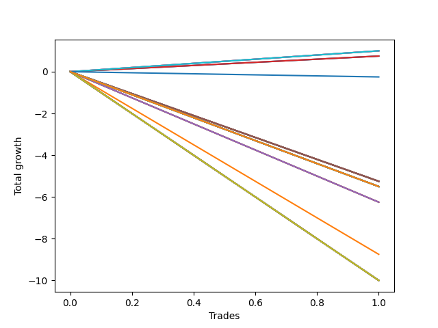

# Long Pointer 003 DB 
- Symbol: ES_1000-1030
- Date Range: 12/22/2022 - 12/30/2022
- Trading Period: 10:0-10:30
- Number of Trades: 1



| Name | Win Percent | Profit | Avg Profit / Trade | Avg Time / Trade |      | Name | Win Percent | Profit | Avg Profit / Trade | Avg Time / Trade |
| ---- | ----------- | ------ | ------------------ | ---------------- | ---- | ---- | ----------- | ------ | ------------------ | ---------------- |
| Sorted By <br> Profit | | | | | | Sorted By <br> Win Percentage ||||
| TP-1 | 100.00 | 500.00 | 500.00 | 01:25 |     | TP-1 | 100.00 | 500.00 | 500.00 | 01:25 |
| BB-20 Mid SL-10 | 100.00 | 500.00 | 500.00 | 01:25 |     | BB-20 Mid SL-10 | 100.00 | 500.00 | 500.00 | 01:25 |
| BB-20 Mid SL-5 | 100.00 | 500.00 | 500.00 | 01:25 |     | BB-20 Mid SL-5 | 100.00 | 500.00 | 500.00 | 01:25 |
| BB-20 Mid | 100.00 | 500.00 | 500.00 | 01:25 |     | BB-20 Mid | 100.00 | 500.00 | 500.00 | 01:25 |
| V Mid SL-10 | 100.00 | 375.00 | 375.00 | 01:20 |     | V Mid SL-10 | 100.00 | 375.00 | 375.00 | 01:20 |
| V Mid SL-5 | 100.00 | 375.00 | 375.00 | 01:20 |     | V Mid SL-5 | 100.00 | 375.00 | 375.00 | 01:20 |
| V Mid | 100.00 | 375.00 | 375.00 | 01:20 |     | V Mid | 100.00 | 375.00 | 375.00 | 01:20 |
| NEWFI 0000 | 0.00 | -125.00 | -125.00 | 01:05 |     | NEWFI 0000 | 0.00 | -125.00 | -125.00 | 01:05 |
| BB-200 U/L 2SD SL-5 | 0.00 | -2625.00 | -2625.00 | 07:45 |     | BB-200 U/L 2SD SL-5 | 0.00 | -2625.00 | -2625.00 | 07:45 |
| BB-200 Mid SL-5 | 0.00 | -2625.00 | -2625.00 | 07:45 |     | BB-200 Mid SL-5 | 0.00 | -2625.00 | -2625.00 | 07:45 |
| BB-100 U/L 2SD SL-5 | 0.00 | -2625.00 | -2625.00 | 07:45 |     | BB-100 U/L 2SD SL-5 | 0.00 | -2625.00 | -2625.00 | 07:45 |
| BB-100 Mid SL-5 | 0.00 | -2625.00 | -2625.00 | 07:45 |     | BB-100 Mid SL-5 | 0.00 | -2625.00 | -2625.00 | 07:45 |
| V U/L 1SD SL-5 | 0.00 | -2625.00 | -2625.00 | 07:45 |     | V U/L 1SD SL-5 | 0.00 | -2625.00 | -2625.00 | 07:45 |
| BB-50 U/L 2SD SL-5 | 0.00 | -2625.00 | -2625.00 | 07:45 |     | BB-50 U/L 2SD SL-5 | 0.00 | -2625.00 | -2625.00 | 07:45 |
| BB-50 U/L 1SD SL-5 | 0.00 | -2625.00 | -2625.00 | 07:45 |     | BB-50 U/L 1SD SL-5 | 0.00 | -2625.00 | -2625.00 | 07:45 |
| BB-50 Mid SL-5 | 0.00 | -2625.00 | -2625.00 | 07:45 |     | BB-50 Mid SL-5 | 0.00 | -2625.00 | -2625.00 | 07:45 |
| BB-20 U/L 2SD C SL-5 | 0.00 | -2625.00 | -2625.00 | 07:45 |     | BB-20 U/L 2SD C SL-5 | 0.00 | -2625.00 | -2625.00 | 07:45 |
| BB-20 U/L 2SD SL-5 | 0.00 | -2625.00 | -2625.00 | 07:45 |     | BB-20 U/L 2SD SL-5 | 0.00 | -2625.00 | -2625.00 | 07:45 |
| BB-20 U/L 1SD SL-5 | 0.00 | -2625.00 | -2625.00 | 07:45 |     | BB-20 U/L 1SD SL-5 | 0.00 | -2625.00 | -2625.00 | 07:45 |
| NEWFI 06 | 0.00 | -2750.00 | -2750.00 | 60:55 |     | NEWFI 06 | 0.00 | -2750.00 | -2750.00 | 60:55 |
| NEWFI 000 | 0.00 | -2750.00 | -2750.00 | 60:55 |     | NEWFI 000 | 0.00 | -2750.00 | -2750.00 | 60:55 |
| TP-10 | 0.00 | -2750.00 | -2750.00 | 60:55 |     | TP-10 | 0.00 | -2750.00 | -2750.00 | 60:55 |
| TP-9 | 0.00 | -2750.00 | -2750.00 | 60:55 |     | TP-9 | 0.00 | -2750.00 | -2750.00 | 60:55 |
| TP-8 | 0.00 | -2750.00 | -2750.00 | 60:55 |     | TP-8 | 0.00 | -2750.00 | -2750.00 | 60:55 |
| TP-7 | 0.00 | -2750.00 | -2750.00 | 60:55 |     | TP-7 | 0.00 | -2750.00 | -2750.00 | 60:55 |
| TP-6 | 0.00 | -2750.00 | -2750.00 | 60:55 |     | TP-6 | 0.00 | -2750.00 | -2750.00 | 60:55 |
| TP-5 | 0.00 | -2750.00 | -2750.00 | 60:55 |     | TP-5 | 0.00 | -2750.00 | -2750.00 | 60:55 |
| TP-4 | 0.00 | -2750.00 | -2750.00 | 60:55 |     | TP-4 | 0.00 | -2750.00 | -2750.00 | 60:55 |
| TP-3 | 0.00 | -2750.00 | -2750.00 | 60:55 |     | TP-3 | 0.00 | -2750.00 | -2750.00 | 60:55 |
| TP-2 | 0.00 | -2750.00 | -2750.00 | 60:55 |     | TP-2 | 0.00 | -2750.00 | -2750.00 | 60:55 |
| BB-200 U/L 2SD | 0.00 | -2750.00 | -2750.00 | 60:55 |     | BB-200 U/L 2SD | 0.00 | -2750.00 | -2750.00 | 60:55 |
| BB-200 Mid | 0.00 | -2750.00 | -2750.00 | 60:55 |     | BB-200 Mid | 0.00 | -2750.00 | -2750.00 | 60:55 |
| BB-100 U/L 2SD | 0.00 | -2750.00 | -2750.00 | 60:55 |     | BB-100 U/L 2SD | 0.00 | -2750.00 | -2750.00 | 60:55 |
| BB-100 Mid | 0.00 | -2750.00 | -2750.00 | 60:55 |     | BB-100 Mid | 0.00 | -2750.00 | -2750.00 | 60:55 |
| V U/L 1SD | 0.00 | -2750.00 | -2750.00 | 60:55 |     | V U/L 1SD | 0.00 | -2750.00 | -2750.00 | 60:55 |
| BB-50 U/L 2SD | 0.00 | -2750.00 | -2750.00 | 60:55 |     | BB-50 U/L 2SD | 0.00 | -2750.00 | -2750.00 | 60:55 |
| BB-50 U/L 1SD | 0.00 | -2750.00 | -2750.00 | 60:55 |     | BB-50 U/L 1SD | 0.00 | -2750.00 | -2750.00 | 60:55 |
| BB-50 Mid | 0.00 | -3125.00 | -3125.00 | 58:20 |     | BB-50 Mid | 0.00 | -3125.00 | -3125.00 | 58:20 |
| BB-20 U/L 2SD C | 0.00 | -3125.00 | -3125.00 | 58:20 |     | BB-20 U/L 2SD C | 0.00 | -3125.00 | -3125.00 | 58:20 |
| BB-20 U/L 2SD | 0.00 | -3125.00 | -3125.00 | 58:20 |     | BB-20 U/L 2SD | 0.00 | -3125.00 | -3125.00 | 58:20 |
| BB-20 U/L 1SD | 0.00 | -4375.00 | -4375.00 | 57:40 |     | BB-20 U/L 1SD | 0.00 | -4375.00 | -4375.00 | 57:40 |
| BB-200 U/L 2SD SL-10 | 0.00 | -5000.00 | -5000.00 | 39:45 |     | BB-200 U/L 2SD SL-10 | 0.00 | -5000.00 | -5000.00 | 39:45 |
| BB-200 Mid SL-10 | 0.00 | -5000.00 | -5000.00 | 39:45 |     | BB-200 Mid SL-10 | 0.00 | -5000.00 | -5000.00 | 39:45 |
| BB-100 U/L 2SD SL-10 | 0.00 | -5000.00 | -5000.00 | 39:45 |     | BB-100 U/L 2SD SL-10 | 0.00 | -5000.00 | -5000.00 | 39:45 |
| BB-100 Mid SL-10 | 0.00 | -5000.00 | -5000.00 | 39:45 |     | BB-100 Mid SL-10 | 0.00 | -5000.00 | -5000.00 | 39:45 |
| V U/L 1SD SL-10 | 0.00 | -5000.00 | -5000.00 | 39:45 |     | V U/L 1SD SL-10 | 0.00 | -5000.00 | -5000.00 | 39:45 |
| BB-50 U/L 2SD SL-10 | 0.00 | -5000.00 | -5000.00 | 39:45 |     | BB-50 U/L 2SD SL-10 | 0.00 | -5000.00 | -5000.00 | 39:45 |
| BB-50 U/L 1SD SL-10 | 0.00 | -5000.00 | -5000.00 | 39:45 |     | BB-50 U/L 1SD SL-10 | 0.00 | -5000.00 | -5000.00 | 39:45 |
| BB-50 Mid SL-10 | 0.00 | -5000.00 | -5000.00 | 39:45 |     | BB-50 Mid SL-10 | 0.00 | -5000.00 | -5000.00 | 39:45 |
| BB-20 U/L 2SD C SL-10 | 0.00 | -5000.00 | -5000.00 | 39:45 |     | BB-20 U/L 2SD C SL-10 | 0.00 | -5000.00 | -5000.00 | 39:45 |
| BB-20 U/L 2SD SL-10 | 0.00 | -5000.00 | -5000.00 | 39:45 |     | BB-20 U/L 2SD SL-10 | 0.00 | -5000.00 | -5000.00 | 39:45 |
| BB-20 U/L 1SD SL-10 | 0.00 | -5000.00 | -5000.00 | 39:45 |     | BB-20 U/L 1SD SL-10 | 0.00 | -5000.00 | -5000.00 | 39:45 |

## NO STOPLOSS

### Test BB-20 Mid
* Sell when price hits the middle line of the 20p bollinger
* No Stoploss
* Results:
```
Total Trades: 1
Percent Up: 100.00
Percent Down: 0.00
Total Points Moved Up: 1.00
Potential Profit: 500.00
Total Points Ups: 1.00 Count Ups: 1
Total Points Downs: 0.00 Count Downs: 0
```

<details><summary>Trades</summary>

<code>In: 2022-12-27 10:48:00		Out: 2022-12-27 10:49:25		Total Position Time: 01:25		Total Move Up: 1.00		Total to Date: 1.00</code> <br />


</details>

### Test BB-20 U/L 1SD
* Sell when the price hits the upper line of the 20p 1std bollinger
* No Stoploss
* Results:
```
Total Trades: 1
Percent Up: 0.00
Percent Down: 100.00
Total Points Moved Up: -8.75
Potential Profit: -4375.00
Total Points Ups: 0.00 Count Ups: 0
Total Points Downs: -8.75 Count Downs: 1
```

<details><summary>Trades</summary>

<code>In: 2022-12-27 10:48:00		Out: 2022-12-27 11:45:40		Total Position Time: 57:40		Total Move Up: -8.75		Total to Date: -8.75</code> <br />


</details>

### Test BB-20 U/L 2SD
* Sell when the price hits the upper line of the 20p 2std bollinger
* No Stoploss
* Results:
```
Total Trades: 1
Percent Up: 0.00
Percent Down: 100.00
Total Points Moved Up: -6.25
Potential Profit: -3125.00
Total Points Ups: 0.00 Count Ups: 0
Total Points Downs: -6.25 Count Downs: 1
```

<details><summary>Trades</summary>

<code>In: 2022-12-27 10:48:00		Out: 2022-12-27 11:46:20		Total Position Time: 58:20		Total Move Up: -6.25		Total to Date: -6.25</code> <br />


</details>

### Test BB-20 U/L 2SD C
* Sell when the price hits the upper line of the 20p 2std bollinger
* No Stoploss
* Results:
```
Total Trades: 1
Percent Up: 0.00
Percent Down: 100.00
Total Points Moved Up: -6.25
Potential Profit: -3125.00
Total Points Ups: 0.00 Count Ups: 0
Total Points Downs: -6.25 Count Downs: 1
```

<details><summary>Trades</summary>

<code>In: 2022-12-27 10:48:00		Out: 2022-12-27 11:46:20		Total Position Time: 58:20		Total Move Up: -6.25		Total to Date: -6.25</code> <br />


</details>

### Test BB-50 Mid
* Sell when price hits the middle line of the 50p bollinger
* No Stoploss
* Results:
```
Total Trades: 1
Percent Up: 0.00
Percent Down: 100.00
Total Points Moved Up: -6.25
Potential Profit: -3125.00
Total Points Ups: 0.00 Count Ups: 0
Total Points Downs: -6.25 Count Downs: 1
```

<details><summary>Trades</summary>

<code>In: 2022-12-27 10:48:00		Out: 2022-12-27 11:46:20		Total Position Time: 58:20		Total Move Up: -6.25		Total to Date: -6.25</code> <br />


</details>

### Test BB-50 U/L 1SD
* Sell when the price hits the upper line of the 50p 1std bollinger
* No Stoploss
* Results:
```
Total Trades: 1
Percent Up: 0.00
Percent Down: 100.00
Total Points Moved Up: -5.50
Potential Profit: -2750.00
Total Points Ups: 0.00 Count Ups: 0
Total Points Downs: -5.50 Count Downs: 1
```

<details><summary>Trades</summary>

<code>In: 2022-12-27 10:48:00		Out: 2022-12-27 11:48:55		Total Position Time: 60:55		Total Move Up: -5.50		Total to Date: -5.50</code> <br />


</details>

### Test BB-50 U/L 2SD
* Sell when the price hits the upper line of the 50p 2std bollinger
* No Stoploss
* Results:
```
Total Trades: 1
Percent Up: 0.00
Percent Down: 100.00
Total Points Moved Up: -5.50
Potential Profit: -2750.00
Total Points Ups: 0.00 Count Ups: 0
Total Points Downs: -5.50 Count Downs: 1
```

<details><summary>Trades</summary>

<code>In: 2022-12-27 10:48:00		Out: 2022-12-27 11:48:55		Total Position Time: 60:55		Total Move Up: -5.50		Total to Date: -5.50</code> <br />


</details>

### Test V Mid
* Sell when the price hits the middle line of the 1std VWAP
* No Stoploss
* Results:
```
Total Trades: 1
Percent Up: 100.00
Percent Down: 0.00
Total Points Moved Up: 0.75
Potential Profit: 375.00
Total Points Ups: 0.75 Count Ups: 1
Total Points Downs: 0.00 Count Downs: 0
```

<details><summary>Trades</summary>

<code>In: 2022-12-27 10:48:00		Out: 2022-12-27 10:49:20		Total Position Time: 01:20		Total Move Up: 0.75		Total to Date: 0.75</code> <br />


</details>

### Test V U/L 1SD
* Sell when the price hits the upper line of the 1std VWAP
* No Stoploss
* Results:
```
Total Trades: 1
Percent Up: 0.00
Percent Down: 100.00
Total Points Moved Up: -5.50
Potential Profit: -2750.00
Total Points Ups: 0.00 Count Ups: 0
Total Points Downs: -5.50 Count Downs: 1
```

<details><summary>Trades</summary>

<code>In: 2022-12-27 10:48:00		Out: 2022-12-27 11:48:55		Total Position Time: 60:55		Total Move Up: -5.50		Total to Date: -5.50</code> <br />


</details>

### Test BB-100 Mid
* Move to BB100 Mid
* No Stoploss
* Results:
```
Total Trades: 1
Percent Up: 0.00
Percent Down: 100.00
Total Points Moved Up: -5.50
Potential Profit: -2750.00
Total Points Ups: 0.00 Count Ups: 0
Total Points Downs: -5.50 Count Downs: 1
```

<details><summary>Trades</summary>

<code>In: 2022-12-27 10:48:00		Out: 2022-12-27 11:48:55		Total Position Time: 60:55		Total Move Up: -5.50		Total to Date: -5.50</code> <br />


</details>

### Test BB-100 U/L 2SD
* Move to BB100 Upper Band
* No Stoploss
* Results:
```
Total Trades: 1
Percent Up: 0.00
Percent Down: 100.00
Total Points Moved Up: -5.50
Potential Profit: -2750.00
Total Points Ups: 0.00 Count Ups: 0
Total Points Downs: -5.50 Count Downs: 1
```

<details><summary>Trades</summary>

<code>In: 2022-12-27 10:48:00		Out: 2022-12-27 11:48:55		Total Position Time: 60:55		Total Move Up: -5.50		Total to Date: -5.50</code> <br />


</details>

### Test BB-200 Mid
* Move to BB200 Mid
* No Stoploss
* Results:
```
Total Trades: 1
Percent Up: 0.00
Percent Down: 100.00
Total Points Moved Up: -5.50
Potential Profit: -2750.00
Total Points Ups: 0.00 Count Ups: 0
Total Points Downs: -5.50 Count Downs: 1
```

<details><summary>Trades</summary>

<code>In: 2022-12-27 10:48:00		Out: 2022-12-27 11:48:55		Total Position Time: 60:55		Total Move Up: -5.50		Total to Date: -5.50</code> <br />


</details>

### Test BB-200 U/L 2SD
* Move to BB200 Upper Band
* No Stoploss
* Results:
```
Total Trades: 1
Percent Up: 0.00
Percent Down: 100.00
Total Points Moved Up: -5.50
Potential Profit: -2750.00
Total Points Ups: 0.00 Count Ups: 0
Total Points Downs: -5.50 Count Downs: 1
```

<details><summary>Trades</summary>

<code>In: 2022-12-27 10:48:00		Out: 2022-12-27 11:48:55		Total Position Time: 60:55		Total Move Up: -5.50		Total to Date: -5.50</code> <br />


</details>

## STOPLOSS OF 5

### Test BB-20 Mid SL-5
* Sell when price hits the middle line of the 20p bollinger
* Stoploss is 5 points
* Results:
```
Total Trades: 1
Percent Up: 100.00
Percent Down: 0.00
Total Points Moved Up: 1.00
Potential Profit: 500.00
Total Points Ups: 1.00 Count Ups: 1
Total Points Downs: 0.00 Count Downs: 0
```

<details><summary>Trades</summary>

<code>In: 2022-12-27 10:48:00		Out: 2022-12-27 10:49:25		Total Position Time: 01:25		Total Move Up: 1.00		Total to Date: 1.00</code> <br />


</details>

### Test BB-20 U/L 1SD SL-5
* Sell when the price hits the upper line of the 20p 1std bollinger
* Stoploss is 5 points
* Results:
```
Total Trades: 1
Percent Up: 0.00
Percent Down: 100.00
Total Points Moved Up: -5.25
Potential Profit: -2625.00
Total Points Ups: 0.00 Count Ups: 0
Total Points Downs: -5.25 Count Downs: 1
```

<details><summary>Trades</summary>

<code>In: 2022-12-27 10:48:00		Out: 2022-12-27 10:55:45		Total Position Time: 07:45		Total Move Up: -5.25		Total to Date: -5.25</code> <br />


</details>

### Test BB-20 U/L 2SD SL-5
* Sell when the price hits the upper line of the 20p 2std bollinger
* Stoploss is 5 points
* Results:
```
Total Trades: 1
Percent Up: 0.00
Percent Down: 100.00
Total Points Moved Up: -5.25
Potential Profit: -2625.00
Total Points Ups: 0.00 Count Ups: 0
Total Points Downs: -5.25 Count Downs: 1
```

<details><summary>Trades</summary>

<code>In: 2022-12-27 10:48:00		Out: 2022-12-27 10:55:45		Total Position Time: 07:45		Total Move Up: -5.25		Total to Date: -5.25</code> <br />


</details>

### Test BB-20 U/L 2SD C SL-5
* Sell when the price hits the upper line of the 20p 2std bollinger
* Stoploss is 5 points
* Results:
```
Total Trades: 1
Percent Up: 0.00
Percent Down: 100.00
Total Points Moved Up: -5.25
Potential Profit: -2625.00
Total Points Ups: 0.00 Count Ups: 0
Total Points Downs: -5.25 Count Downs: 1
```

<details><summary>Trades</summary>

<code>In: 2022-12-27 10:48:00		Out: 2022-12-27 10:55:45		Total Position Time: 07:45		Total Move Up: -5.25		Total to Date: -5.25</code> <br />


</details>

### Test BB-50 Mid SL-5
* Sell when price hits the middle line of the 50p bollinger
* Stoploss is 5 points
* Results:
```
Total Trades: 1
Percent Up: 0.00
Percent Down: 100.00
Total Points Moved Up: -5.25
Potential Profit: -2625.00
Total Points Ups: 0.00 Count Ups: 0
Total Points Downs: -5.25 Count Downs: 1
```

<details><summary>Trades</summary>

<code>In: 2022-12-27 10:48:00		Out: 2022-12-27 10:55:45		Total Position Time: 07:45		Total Move Up: -5.25		Total to Date: -5.25</code> <br />


</details>

### Test BB-50 U/L 1SD SL-5
* Sell when the price hits the upper line of the 50p 1std bollinger
* Stoploss is 5 points
* Results:
```
Total Trades: 1
Percent Up: 0.00
Percent Down: 100.00
Total Points Moved Up: -5.25
Potential Profit: -2625.00
Total Points Ups: 0.00 Count Ups: 0
Total Points Downs: -5.25 Count Downs: 1
```

<details><summary>Trades</summary>

<code>In: 2022-12-27 10:48:00		Out: 2022-12-27 10:55:45		Total Position Time: 07:45		Total Move Up: -5.25		Total to Date: -5.25</code> <br />


</details>

### Test BB-50 U/L 2SD SL-5
* Sell when the price hits the upper line of the 50p 2std bollinger
* Stoploss is 5 points
* Results:
```
Total Trades: 1
Percent Up: 0.00
Percent Down: 100.00
Total Points Moved Up: -5.25
Potential Profit: -2625.00
Total Points Ups: 0.00 Count Ups: 0
Total Points Downs: -5.25 Count Downs: 1
```

<details><summary>Trades</summary>

<code>In: 2022-12-27 10:48:00		Out: 2022-12-27 10:55:45		Total Position Time: 07:45		Total Move Up: -5.25		Total to Date: -5.25</code> <br />


</details>

### Test V Mid SL-5
* Sell when the price hits the middle line of the 1std VWAP
* Stoploss is 5 points
* Results:
```
Total Trades: 1
Percent Up: 100.00
Percent Down: 0.00
Total Points Moved Up: 0.75
Potential Profit: 375.00
Total Points Ups: 0.75 Count Ups: 1
Total Points Downs: 0.00 Count Downs: 0
```

<details><summary>Trades</summary>

<code>In: 2022-12-27 10:48:00		Out: 2022-12-27 10:49:20		Total Position Time: 01:20		Total Move Up: 0.75		Total to Date: 0.75</code> <br />


</details>

### Test V U/L 1SD SL-5
* Sell when the price hits the upper line of the 1std VWAP
* Stoploss is 5 points
* Results:
```
Total Trades: 1
Percent Up: 0.00
Percent Down: 100.00
Total Points Moved Up: -5.25
Potential Profit: -2625.00
Total Points Ups: 0.00 Count Ups: 0
Total Points Downs: -5.25 Count Downs: 1
```

<details><summary>Trades</summary>

<code>In: 2022-12-27 10:48:00		Out: 2022-12-27 10:55:45		Total Position Time: 07:45		Total Move Up: -5.25		Total to Date: -5.25</code> <br />


</details>

### Test BB-100 Mid SL-5
* Move to BB100 Mid
* Stoploss is 5 points
* Results:
```
Total Trades: 1
Percent Up: 0.00
Percent Down: 100.00
Total Points Moved Up: -5.25
Potential Profit: -2625.00
Total Points Ups: 0.00 Count Ups: 0
Total Points Downs: -5.25 Count Downs: 1
```

<details><summary>Trades</summary>

<code>In: 2022-12-27 10:48:00		Out: 2022-12-27 10:55:45		Total Position Time: 07:45		Total Move Up: -5.25		Total to Date: -5.25</code> <br />


</details>

### Test BB-100 U/L 2SD SL-5
* Move to BB100 Upper Band
* Stoploss is 5 points
* Results:
```
Total Trades: 1
Percent Up: 0.00
Percent Down: 100.00
Total Points Moved Up: -5.25
Potential Profit: -2625.00
Total Points Ups: 0.00 Count Ups: 0
Total Points Downs: -5.25 Count Downs: 1
```

<details><summary>Trades</summary>

<code>In: 2022-12-27 10:48:00		Out: 2022-12-27 10:55:45		Total Position Time: 07:45		Total Move Up: -5.25		Total to Date: -5.25</code> <br />


</details>

### Test BB-200 Mid SL-5
* Move to BB200 Mid
* Stoploss is 5 points
* Results:
```
Total Trades: 1
Percent Up: 0.00
Percent Down: 100.00
Total Points Moved Up: -5.25
Potential Profit: -2625.00
Total Points Ups: 0.00 Count Ups: 0
Total Points Downs: -5.25 Count Downs: 1
```

<details><summary>Trades</summary>

<code>In: 2022-12-27 10:48:00		Out: 2022-12-27 10:55:45		Total Position Time: 07:45		Total Move Up: -5.25		Total to Date: -5.25</code> <br />


</details>

### Test BB-200 U/L 2SD SL-5
* Move to BB200 Upper Band
* Stoploss is 5 points
* Results:
```
Total Trades: 1
Percent Up: 0.00
Percent Down: 100.00
Total Points Moved Up: -5.25
Potential Profit: -2625.00
Total Points Ups: 0.00 Count Ups: 0
Total Points Downs: -5.25 Count Downs: 1
```

<details><summary>Trades</summary>

<code>In: 2022-12-27 10:48:00		Out: 2022-12-27 10:55:45		Total Position Time: 07:45		Total Move Up: -5.25		Total to Date: -5.25</code> <br />


</details>

## STOPLOSS OF 10

### Test BB-20 Mid SL-10
* Sell when price hits the middle line of the 20p bollinger
* Stoploss is 10 points
* Results:
```
Total Trades: 1
Percent Up: 100.00
Percent Down: 0.00
Total Points Moved Up: 1.00
Potential Profit: 500.00
Total Points Ups: 1.00 Count Ups: 1
Total Points Downs: 0.00 Count Downs: 0
```

<details><summary>Trades</summary>

<code>In: 2022-12-27 10:48:00		Out: 2022-12-27 10:49:25		Total Position Time: 01:25		Total Move Up: 1.00		Total to Date: 1.00</code> <br />


</details>

### Test BB-20 U/L 1SD SL-10
* Sell when the price hits the upper line of the 20p 1std bollinger
* Stoploss is 10 points
* Results:
```
Total Trades: 1
Percent Up: 0.00
Percent Down: 100.00
Total Points Moved Up: -10.00
Potential Profit: -5000.00
Total Points Ups: 0.00 Count Ups: 0
Total Points Downs: -10.00 Count Downs: 1
```

<details><summary>Trades</summary>

<code>In: 2022-12-27 10:48:00		Out: 2022-12-27 11:27:45		Total Position Time: 39:45		Total Move Up: -10.00		Total to Date: -10.00</code> <br />


</details>

### Test BB-20 U/L 2SD SL-10
* Sell when the price hits the upper line of the 20p 2std bollinger
* Stoploss is 10 points
* Results:
```
Total Trades: 1
Percent Up: 0.00
Percent Down: 100.00
Total Points Moved Up: -10.00
Potential Profit: -5000.00
Total Points Ups: 0.00 Count Ups: 0
Total Points Downs: -10.00 Count Downs: 1
```

<details><summary>Trades</summary>

<code>In: 2022-12-27 10:48:00		Out: 2022-12-27 11:27:45		Total Position Time: 39:45		Total Move Up: -10.00		Total to Date: -10.00</code> <br />


</details>

### Test BB-20 U/L 2SD C SL-10
* Sell when the price hits the upper line of the 20p 2std bollinger
* Stoploss is 10 points
* Results:
```
Total Trades: 1
Percent Up: 0.00
Percent Down: 100.00
Total Points Moved Up: -10.00
Potential Profit: -5000.00
Total Points Ups: 0.00 Count Ups: 0
Total Points Downs: -10.00 Count Downs: 1
```

<details><summary>Trades</summary>

<code>In: 2022-12-27 10:48:00		Out: 2022-12-27 11:27:45		Total Position Time: 39:45		Total Move Up: -10.00		Total to Date: -10.00</code> <br />


</details>

### Test BB-50 Mid SL-10
* Sell when price hits the middle line of the 50p bollinger
* Stoploss is 10 points
* Results:
```
Total Trades: 1
Percent Up: 0.00
Percent Down: 100.00
Total Points Moved Up: -10.00
Potential Profit: -5000.00
Total Points Ups: 0.00 Count Ups: 0
Total Points Downs: -10.00 Count Downs: 1
```

<details><summary>Trades</summary>

<code>In: 2022-12-27 10:48:00		Out: 2022-12-27 11:27:45		Total Position Time: 39:45		Total Move Up: -10.00		Total to Date: -10.00</code> <br />


</details>

### Test BB-50 U/L 1SD SL-10
* Sell when the price hits the upper line of the 50p 1std bollinger
* Stoploss is 10 points
* Results:
```
Total Trades: 1
Percent Up: 0.00
Percent Down: 100.00
Total Points Moved Up: -10.00
Potential Profit: -5000.00
Total Points Ups: 0.00 Count Ups: 0
Total Points Downs: -10.00 Count Downs: 1
```

<details><summary>Trades</summary>

<code>In: 2022-12-27 10:48:00		Out: 2022-12-27 11:27:45		Total Position Time: 39:45		Total Move Up: -10.00		Total to Date: -10.00</code> <br />


</details>

### Test BB-50 U/L 2SD SL-10
* Sell when the price hits the upper line of the 50p 2std bollinger
* Stoploss is 10 points
* Results:
```
Total Trades: 1
Percent Up: 0.00
Percent Down: 100.00
Total Points Moved Up: -10.00
Potential Profit: -5000.00
Total Points Ups: 0.00 Count Ups: 0
Total Points Downs: -10.00 Count Downs: 1
```

<details><summary>Trades</summary>

<code>In: 2022-12-27 10:48:00		Out: 2022-12-27 11:27:45		Total Position Time: 39:45		Total Move Up: -10.00		Total to Date: -10.00</code> <br />


</details>

### Test V Mid SL-10
* Sell when the price hits the middle line of the 1std VWAP
* Stoploss is 10 points
* Results:
```
Total Trades: 1
Percent Up: 100.00
Percent Down: 0.00
Total Points Moved Up: 0.75
Potential Profit: 375.00
Total Points Ups: 0.75 Count Ups: 1
Total Points Downs: 0.00 Count Downs: 0
```

<details><summary>Trades</summary>

<code>In: 2022-12-27 10:48:00		Out: 2022-12-27 10:49:20		Total Position Time: 01:20		Total Move Up: 0.75		Total to Date: 0.75</code> <br />


</details>

### Test V U/L 1SD SL-10
* Sell when the price hits the upper line of the 1std VWAP
* Stoploss is 10 points
* Results:
```
Total Trades: 1
Percent Up: 0.00
Percent Down: 100.00
Total Points Moved Up: -10.00
Potential Profit: -5000.00
Total Points Ups: 0.00 Count Ups: 0
Total Points Downs: -10.00 Count Downs: 1
```

<details><summary>Trades</summary>

<code>In: 2022-12-27 10:48:00		Out: 2022-12-27 11:27:45		Total Position Time: 39:45		Total Move Up: -10.00		Total to Date: -10.00</code> <br />


</details>

### Test BB-100 Mid SL-10
* Move to BB100 Mid
* Stoploss is 10 points
* Results:
```
Total Trades: 1
Percent Up: 0.00
Percent Down: 100.00
Total Points Moved Up: -10.00
Potential Profit: -5000.00
Total Points Ups: 0.00 Count Ups: 0
Total Points Downs: -10.00 Count Downs: 1
```

<details><summary>Trades</summary>

<code>In: 2022-12-27 10:48:00		Out: 2022-12-27 11:27:45		Total Position Time: 39:45		Total Move Up: -10.00		Total to Date: -10.00</code> <br />


</details>

### Test BB-100 U/L 2SD SL-10
* Move to BB100 Upper Band
* Stoploss is 10 points
* Results:
```
Total Trades: 1
Percent Up: 0.00
Percent Down: 100.00
Total Points Moved Up: -10.00
Potential Profit: -5000.00
Total Points Ups: 0.00 Count Ups: 0
Total Points Downs: -10.00 Count Downs: 1
```

<details><summary>Trades</summary>

<code>In: 2022-12-27 10:48:00		Out: 2022-12-27 11:27:45		Total Position Time: 39:45		Total Move Up: -10.00		Total to Date: -10.00</code> <br />


</details>

### Test BB-200 Mid SL-10
* Move to BB200 Mid
* Stoploss is 10 points
* Results:
```
Total Trades: 1
Percent Up: 0.00
Percent Down: 100.00
Total Points Moved Up: -10.00
Potential Profit: -5000.00
Total Points Ups: 0.00 Count Ups: 0
Total Points Downs: -10.00 Count Downs: 1
```

<details><summary>Trades</summary>

<code>In: 2022-12-27 10:48:00		Out: 2022-12-27 11:27:45		Total Position Time: 39:45		Total Move Up: -10.00		Total to Date: -10.00</code> <br />


</details>

### Test BB-200 U/L 2SD SL-10
* Move to BB200 Upper Band
* Stoploss is 10 points
* Results:
```
Total Trades: 1
Percent Up: 0.00
Percent Down: 100.00
Total Points Moved Up: -10.00
Potential Profit: -5000.00
Total Points Ups: 0.00 Count Ups: 0
Total Points Downs: -10.00 Count Downs: 1
```

<details><summary>Trades</summary>

<code>In: 2022-12-27 10:48:00		Out: 2022-12-27 11:27:45		Total Position Time: 39:45		Total Move Up: -10.00		Total to Date: -10.00</code> <br />


</details>

## TAKE PROFIT

### Test TP-1
* Take Profit of 1 Point
* No Stoploss
* Results:
```
Total Trades: 1
Percent Up: 100.00
Percent Down: 0.00
Total Points Moved Up: 1.00
Potential Profit: 500.00
Total Points Ups: 1.00 Count Ups: 1
Total Points Downs: 0.00 Count Downs: 0
```

<details><summary>Trades</summary>

<code>In: 2022-12-27 10:48:00		Out: 2022-12-27 10:49:25		Total Position Time: 01:25		Total Move Up: 1.00		Total to Date: 1.00</code> <br />


</details>

### Test TP-2
* Take Profit of 2 Point
* No Stoploss
* Results:
```
Total Trades: 1
Percent Up: 0.00
Percent Down: 100.00
Total Points Moved Up: -5.50
Potential Profit: -2750.00
Total Points Ups: 0.00 Count Ups: 0
Total Points Downs: -5.50 Count Downs: 1
```

<details><summary>Trades</summary>

<code>In: 2022-12-27 10:48:00		Out: 2022-12-27 11:48:55		Total Position Time: 60:55		Total Move Up: -5.50		Total to Date: -5.50</code> <br />


</details>

### Test TP-3
* Take Profit of 3 Point
* No Stoploss
* Results:
```
Total Trades: 1
Percent Up: 0.00
Percent Down: 100.00
Total Points Moved Up: -5.50
Potential Profit: -2750.00
Total Points Ups: 0.00 Count Ups: 0
Total Points Downs: -5.50 Count Downs: 1
```

<details><summary>Trades</summary>

<code>In: 2022-12-27 10:48:00		Out: 2022-12-27 11:48:55		Total Position Time: 60:55		Total Move Up: -5.50		Total to Date: -5.50</code> <br />


</details>

### Test TP-4
* Take Profit of 4 Point
* No Stoploss
* Results:
```
Total Trades: 1
Percent Up: 0.00
Percent Down: 100.00
Total Points Moved Up: -5.50
Potential Profit: -2750.00
Total Points Ups: 0.00 Count Ups: 0
Total Points Downs: -5.50 Count Downs: 1
```

<details><summary>Trades</summary>

<code>In: 2022-12-27 10:48:00		Out: 2022-12-27 11:48:55		Total Position Time: 60:55		Total Move Up: -5.50		Total to Date: -5.50</code> <br />


</details>

### Test TP-5
* Take Profit of 5 Point
* No Stoploss
* Results:
```
Total Trades: 1
Percent Up: 0.00
Percent Down: 100.00
Total Points Moved Up: -5.50
Potential Profit: -2750.00
Total Points Ups: 0.00 Count Ups: 0
Total Points Downs: -5.50 Count Downs: 1
```

<details><summary>Trades</summary>

<code>In: 2022-12-27 10:48:00		Out: 2022-12-27 11:48:55		Total Position Time: 60:55		Total Move Up: -5.50		Total to Date: -5.50</code> <br />


</details>

### Test TP-6
* Take Profit of 6 Point
* No Stoploss
* Results:
```
Total Trades: 1
Percent Up: 0.00
Percent Down: 100.00
Total Points Moved Up: -5.50
Potential Profit: -2750.00
Total Points Ups: 0.00 Count Ups: 0
Total Points Downs: -5.50 Count Downs: 1
```

<details><summary>Trades</summary>

<code>In: 2022-12-27 10:48:00		Out: 2022-12-27 11:48:55		Total Position Time: 60:55		Total Move Up: -5.50		Total to Date: -5.50</code> <br />


</details>

### Test TP-7
* Take Profit of 7 Point
* No Stoploss
* Results:
```
Total Trades: 1
Percent Up: 0.00
Percent Down: 100.00
Total Points Moved Up: -5.50
Potential Profit: -2750.00
Total Points Ups: 0.00 Count Ups: 0
Total Points Downs: -5.50 Count Downs: 1
```

<details><summary>Trades</summary>

<code>In: 2022-12-27 10:48:00		Out: 2022-12-27 11:48:55		Total Position Time: 60:55		Total Move Up: -5.50		Total to Date: -5.50</code> <br />


</details>

### Test TP-8
* Take Profit of 8 Point
* No Stoploss
* Results:
```
Total Trades: 1
Percent Up: 0.00
Percent Down: 100.00
Total Points Moved Up: -5.50
Potential Profit: -2750.00
Total Points Ups: 0.00 Count Ups: 0
Total Points Downs: -5.50 Count Downs: 1
```

<details><summary>Trades</summary>

<code>In: 2022-12-27 10:48:00		Out: 2022-12-27 11:48:55		Total Position Time: 60:55		Total Move Up: -5.50		Total to Date: -5.50</code> <br />


</details>

### Test TP-9
* Take Profit of 9 Point
* No Stoploss
* Results:
```
Total Trades: 1
Percent Up: 0.00
Percent Down: 100.00
Total Points Moved Up: -5.50
Potential Profit: -2750.00
Total Points Ups: 0.00 Count Ups: 0
Total Points Downs: -5.50 Count Downs: 1
```

<details><summary>Trades</summary>

<code>In: 2022-12-27 10:48:00		Out: 2022-12-27 11:48:55		Total Position Time: 60:55		Total Move Up: -5.50		Total to Date: -5.50</code> <br />


</details>

### Test TP-10
* Take Profit of 10 Point
* No Stoploss
* Results:
```
Total Trades: 1
Percent Up: 0.00
Percent Down: 100.00
Total Points Moved Up: -5.50
Potential Profit: -2750.00
Total Points Ups: 0.00 Count Ups: 0
Total Points Downs: -5.50 Count Downs: 1
```

<details><summary>Trades</summary>

<code>In: 2022-12-27 10:48:00		Out: 2022-12-27 11:48:55		Total Position Time: 60:55		Total Move Up: -5.50		Total to Date: -5.50</code> <br />


</details>

## Indicator Exits

### Test NEWFI 000
* Newfi 0000
* No Stoploss
* Results:
```
Total Trades: 1
Percent Up: 0.00
Percent Down: 100.00
Total Points Moved Up: -5.50
Potential Profit: -2750.00
Total Points Ups: 0.00 Count Ups: 0
Total Points Downs: -5.50 Count Downs: 1
```

<details><summary>Trades</summary>

<code>In: 2022-12-27 10:48:00		Out: 2022-12-27 11:48:55		Total Position Time: 60:55		Total Move Up: -5.50		Total to Date: -5.50</code> <br />


</details>

### Test NEWFI 0000
* Newfi 0000
* No Stoploss
* Results:
```
Total Trades: 1
Percent Up: 0.00
Percent Down: 100.00
Total Points Moved Up: -0.25
Potential Profit: -125.00
Total Points Ups: 0.00 Count Ups: 0
Total Points Downs: -0.25 Count Downs: 1
```

<details><summary>Trades</summary>

<code>In: 2022-12-27 10:48:00		Out: 2022-12-27 10:49:05		Total Position Time: 01:05		Total Move Up: -0.25		Total to Date: -0.25</code> <br />


</details>

### Test NEWFI 06
* Newfi 06
* No Stoploss
* Results:
```
Total Trades: 1
Percent Up: 0.00
Percent Down: 100.00
Total Points Moved Up: -5.50
Potential Profit: -2750.00
Total Points Ups: 0.00 Count Ups: 0
Total Points Downs: -5.50 Count Downs: 1
```

<details><summary>Trades</summary>

<code>In: 2022-12-27 10:48:00		Out: 2022-12-27 11:48:55		Total Position Time: 60:55		Total Move Up: -5.50		Total to Date: -5.50</code> <br />


</details>