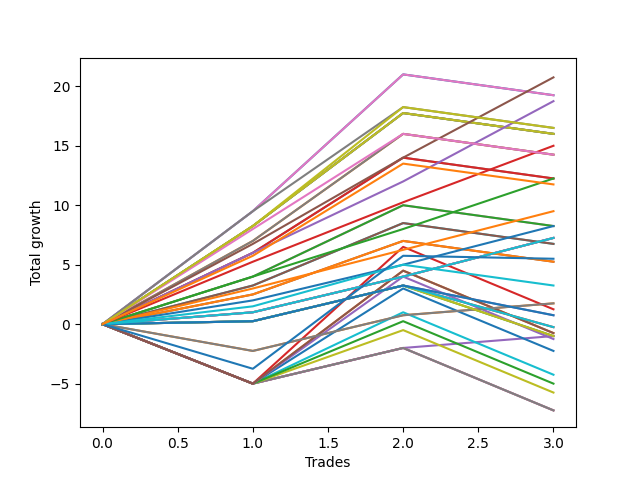

# Long Shepard 003 SD 
- Symbol: ES_1000-1030
- Date Range: 12/22/2022 - 12/30/2022
- Trading Period: 10:0-10:30
- Number of Trades: 3



| Name | Win Percent | Profit | Avg Profit / Trade | Avg Time / Trade |      | Name | Win Percent | Profit | Avg Profit / Trade | Avg Time / Trade |
| ---- | ----------- | ------ | ------------------ | ---------------- | ---- | ---- | ----------- | ------ | ------------------ | ---------------- |
| Sorted By <br> Profit | | | | | | Sorted By <br> Win Percentage ||||
| TP-7 | 100.00 | 10375.00 | 3458.33 | 26:13 |     | TP-7 | 100.00 | 10375.00 | 3458.33 | 26:13 |
| BB-100 U/L 2SD SL-10 | 66.67 | 9625.00 | 3208.33 | 48:01 |     | TP-6 | 100.00 | 9375.00 | 3125.00 | 21:40 |
| BB-100 U/L 2SD | 66.67 | 9625.00 | 3208.33 | 48:01 |     | TP-5 | 100.00 | 7500.00 | 2500.00 | 17:15 |
| TP-6 | 100.00 | 9375.00 | 3125.00 | 21:40 |     | TP-4 | 100.00 | 6125.00 | 2041.67 | 14:28 |
| TP-10 | 66.67 | 8250.00 | 2750.00 | 50:21 |     | TP-3 | 100.00 | 4750.00 | 1583.33 | 09:55 |
| TP-9 | 66.67 | 8250.00 | 2750.00 | 47:28 |     | TP-2 | 100.00 | 4125.00 | 1375.00 | 09:46 |
| BB-200 U/L 2SD SL-10 | 66.67 | 8000.00 | 2666.67 | 60:55 |     | TP-1 | 100.00 | 3625.00 | 1208.33 | 01:13 |
| V U/L 1SD SL-10 | 66.67 | 8000.00 | 2666.67 | 60:55 |     | BB-20 Mid SL-10 | 100.00 | 3625.00 | 1208.33 | 01:13 |
| BB-200 U/L 2SD | 66.67 | 8000.00 | 2666.67 | 60:55 |     | BB-20 Mid SL-5 | 100.00 | 3625.00 | 1208.33 | 01:13 |
| V U/L 1SD | 66.67 | 8000.00 | 2666.67 | 60:55 |     | BB-20 Mid | 100.00 | 3625.00 | 1208.33 | 01:13 |
| TP-5 | 100.00 | 7500.00 | 2500.00 | 17:15 |     | BB-100 U/L 2SD SL-10 | 66.67 | 9625.00 | 3208.33 | 48:01 |
| TP-8 | 66.67 | 7125.00 | 2375.00 | 44:56 |     | BB-100 U/L 2SD | 66.67 | 9625.00 | 3208.33 | 48:01 |
| BB-200 Mid SL-10 | 66.67 | 7125.00 | 2375.00 | 45:15 |     | TP-10 | 66.67 | 8250.00 | 2750.00 | 50:21 |
| BB-200 Mid | 66.67 | 7125.00 | 2375.00 | 45:15 |     | TP-9 | 66.67 | 8250.00 | 2750.00 | 47:28 |
| TP-4 | 100.00 | 6125.00 | 2041.67 | 14:28 |     | BB-200 U/L 2SD SL-10 | 66.67 | 8000.00 | 2666.67 | 60:55 |
| V Mid SL-10 | 66.67 | 6125.00 | 2041.67 | 42:45 |     | V U/L 1SD SL-10 | 66.67 | 8000.00 | 2666.67 | 60:55 |
| V Mid | 66.67 | 6125.00 | 2041.67 | 42:45 |     | BB-200 U/L 2SD | 66.67 | 8000.00 | 2666.67 | 60:55 |
| NEWFI 06 | 66.67 | 5875.00 | 1958.33 | 51:41 |     | V U/L 1SD | 66.67 | 8000.00 | 2666.67 | 60:55 |
| TP-3 | 100.00 | 4750.00 | 1583.33 | 09:55 |     | TP-8 | 66.67 | 7125.00 | 2375.00 | 44:56 |
| TP-2 | 100.00 | 4125.00 | 1375.00 | 09:46 |     | BB-200 Mid SL-10 | 66.67 | 7125.00 | 2375.00 | 45:15 |
| BB-50 U/L 2SD SL-10 | 66.67 | 4125.00 | 1375.00 | 37:45 |     | BB-200 Mid | 66.67 | 7125.00 | 2375.00 | 45:15 |
| BB-50 U/L 2SD | 66.67 | 4125.00 | 1375.00 | 37:45 |     | V Mid SL-10 | 66.67 | 6125.00 | 2041.67 | 42:45 |
| TP-1 | 100.00 | 3625.00 | 1208.33 | 01:13 |     | V Mid | 66.67 | 6125.00 | 2041.67 | 42:45 |
| BB-20 Mid SL-10 | 100.00 | 3625.00 | 1208.33 | 01:13 |     | NEWFI 06 | 66.67 | 5875.00 | 1958.33 | 51:41 |
| BB-20 Mid SL-5 | 100.00 | 3625.00 | 1208.33 | 01:13 |     | BB-50 U/L 2SD SL-10 | 66.67 | 4125.00 | 1375.00 | 37:45 |
| BB-20 Mid | 100.00 | 3625.00 | 1208.33 | 01:13 |     | BB-50 U/L 2SD | 66.67 | 4125.00 | 1375.00 | 37:45 |
| BB-100 Mid SL-10 | 66.67 | 3375.00 | 1125.00 | 31:31 |     | BB-100 Mid SL-10 | 66.67 | 3375.00 | 1125.00 | 31:31 |
| BB-100 Mid | 66.67 | 3375.00 | 1125.00 | 31:31 |     | BB-100 Mid | 66.67 | 3375.00 | 1125.00 | 31:31 |
| NEWFI 0000 | 33.33 | 2750.00 | 916.67 | 29:41 |     | BB-50 U/L 1SD SL-10 | 66.67 | 2625.00 | 875.00 | 31:01 |
| BB-50 U/L 1SD SL-10 | 66.67 | 2625.00 | 875.00 | 31:01 |     | BB-50 U/L 1SD | 66.67 | 2625.00 | 875.00 | 31:01 |
| BB-50 U/L 1SD | 66.67 | 2625.00 | 875.00 | 31:01 |     | NEWFI 000 | 66.67 | 1625.00 | 541.67 | 40:21 |
| NEWFI 000 | 66.67 | 1625.00 | 541.67 | 40:21 |     | BB-20 U/L 1SD SL-10 | 66.67 | 875.00 | 291.67 | 18:36 |
| BB-20 U/L 1SD SL-10 | 66.67 | 875.00 | 291.67 | 18:36 |     | BB-20 U/L 1SD | 66.67 | 875.00 | 291.67 | 18:36 |
| BB-20 U/L 1SD | 66.67 | 875.00 | 291.67 | 18:36 |     | BB-50 Mid SL-10 | 66.67 | 375.00 | 125.00 | 27:36 |
| BB-100 U/L 2SD SL-5 | 33.33 | 625.00 | 208.33 | 24:31 |     | BB-50 Mid | 66.67 | 375.00 | 125.00 | 27:36 |
| BB-50 Mid SL-10 | 66.67 | 375.00 | 125.00 | 27:36 |     | BB-20 U/L 2SD C SL-10 | 66.67 | -125.00 | -41.67 | 27:25 |
| BB-50 Mid | 66.67 | 375.00 | 125.00 | 27:36 |     | BB-20 U/L 2SD C | 66.67 | -125.00 | -41.67 | 27:25 |
| BB-20 U/L 2SD C SL-10 | 66.67 | -125.00 | -41.67 | 27:25 |     | BB-20 U/L 2SD SL-10 | 66.67 | -500.00 | -166.67 | 27:21 |
| BB-20 U/L 2SD C | 66.67 | -125.00 | -41.67 | 27:25 |     | BB-20 U/L 1SD SL-5 | 66.67 | -500.00 | -166.67 | 13:51 |
| BB-200 U/L 2SD SL-5 | 33.33 | -375.00 | -125.00 | 34:38 |     | BB-20 U/L 2SD | 66.67 | -500.00 | -166.67 | 27:21 |
| V U/L 1SD SL-5 | 33.33 | -375.00 | -125.00 | 34:38 |     | NEWFI 0000 | 33.33 | 2750.00 | 916.67 | 29:41 |
| BB-20 U/L 2SD SL-10 | 66.67 | -500.00 | -166.67 | 27:21 |     | BB-100 U/L 2SD SL-5 | 33.33 | 625.00 | 208.33 | 24:31 |
| BB-20 U/L 1SD SL-5 | 66.67 | -500.00 | -166.67 | 13:51 |     | BB-200 U/L 2SD SL-5 | 33.33 | -375.00 | -125.00 | 34:38 |
| BB-20 U/L 2SD | 66.67 | -500.00 | -166.67 | 27:21 |     | V U/L 1SD SL-5 | 33.33 | -375.00 | -125.00 | 34:38 |
| BB-200 Mid SL-5 | 33.33 | -625.00 | -208.33 | 23:08 |     | BB-200 Mid SL-5 | 33.33 | -625.00 | -208.33 | 23:08 |
| V Mid SL-5 | 33.33 | -1125.00 | -375.00 | 21:53 |     | V Mid SL-5 | 33.33 | -1125.00 | -375.00 | 21:53 |
| BB-50 U/L 2SD SL-5 | 33.33 | -2125.00 | -708.33 | 19:23 |     | BB-50 U/L 2SD SL-5 | 33.33 | -2125.00 | -708.33 | 19:23 |
| BB-100 Mid SL-5 | 33.33 | -2500.00 | -833.33 | 16:16 |     | BB-100 Mid SL-5 | 33.33 | -2500.00 | -833.33 | 16:16 |
| BB-50 U/L 1SD SL-5 | 33.33 | -2875.00 | -958.33 | 16:01 |     | BB-50 U/L 1SD SL-5 | 33.33 | -2875.00 | -958.33 | 16:01 |
| BB-50 Mid SL-5 | 33.33 | -3625.00 | -1208.33 | 14:43 |     | BB-50 Mid SL-5 | 33.33 | -3625.00 | -1208.33 | 14:43 |
| BB-20 U/L 2SD C SL-5 | 33.33 | -3625.00 | -1208.33 | 14:43 |     | BB-20 U/L 2SD C SL-5 | 33.33 | -3625.00 | -1208.33 | 14:43 |
| BB-20 U/L 2SD SL-5 | 33.33 | -3625.00 | -1208.33 | 14:43 |     | BB-20 U/L 2SD SL-5 | 33.33 | -3625.00 | -1208.33 | 14:43 |

## NO STOPLOSS

### Test BB-20 Mid
* Sell when price hits the middle line of the 20p bollinger
* No Stoploss
* Results:
```
Total Trades: 3
Percent Up: 100.00
Percent Down: 0.00
Total Points Moved Up: 7.25
Potential Profit: 3625.00
Total Points Ups: 7.25 Count Ups: 3
Total Points Downs: 0.00 Count Downs: 0
```

<details><summary>Trades</summary>

<code>In: 2022-12-27 11:24:00		Out: 2022-12-27 11:25:20		Total Position Time: 01:20		Total Move Up: 1.00		Total to Date: 1.00</code> <br />
<code>In: 2022-12-27 11:46:00		Out: 2022-12-27 11:47:10		Total Position Time: 01:10		Total Move Up: 3.00		Total to Date: 4.00</code> <br />
<code>In: 2022-12-30 10:30:00		Out: 2022-12-30 10:31:10		Total Position Time: 01:10		Total Move Up: 3.25		Total to Date: 7.25</code> <br />


</details>

### Test BB-20 U/L 1SD
* Sell when the price hits the upper line of the 20p 1std bollinger
* No Stoploss
* Results:
```
Total Trades: 3
Percent Up: 66.67
Percent Down: 33.33
Total Points Moved Up: 1.75
Potential Profit: 875.00
Total Points Ups: 4.00 Count Ups: 2
Total Points Downs: -2.25 Count Downs: 1
```

<details><summary>Trades</summary>

<code>In: 2022-12-27 11:24:00		Out: 2022-12-27 11:45:40		Total Position Time: 21:40		Total Move Up: -2.25		Total to Date: -2.25</code> <br />
<code>In: 2022-12-27 11:46:00		Out: 2022-12-27 11:47:10		Total Position Time: 01:10		Total Move Up: 3.00		Total to Date: 0.75</code> <br />
<code>In: 2022-12-30 10:30:00		Out: 2022-12-30 11:03:00		Total Position Time: 33:00		Total Move Up: 1.00		Total to Date: 1.75</code> <br />


</details>

### Test BB-20 U/L 2SD
* Sell when the price hits the upper line of the 20p 2std bollinger
* No Stoploss
* Results:
```
Total Trades: 3
Percent Up: 66.67
Percent Down: 33.33
Total Points Moved Up: -1.00
Potential Profit: -500.00
Total Points Ups: 3.25 Count Ups: 2
Total Points Downs: -4.25 Count Downs: 1
```

<details><summary>Trades</summary>

<code>In: 2022-12-27 11:24:00		Out: 2022-12-27 11:46:20		Total Position Time: 22:20		Total Move Up: 0.25		Total to Date: 0.25</code> <br />
<code>In: 2022-12-27 11:46:00		Out: 2022-12-27 11:47:10		Total Position Time: 01:10		Total Move Up: 3.00		Total to Date: 3.25</code> <br />
<code>In: 2022-12-30 10:30:00		Out: 2022-12-30 11:28:35		Total Position Time: 58:35		Total Move Up: -4.25		Total to Date: -1.00</code> <br />


</details>

### Test BB-20 U/L 2SD C
* Sell when the price hits the upper line of the 20p 2std bollinger
* No Stoploss
* Results:
```
Total Trades: 3
Percent Up: 66.67
Percent Down: 33.33
Total Points Moved Up: -0.25
Potential Profit: -125.00
Total Points Ups: 3.25 Count Ups: 2
Total Points Downs: -3.50 Count Downs: 1
```

<details><summary>Trades</summary>

<code>In: 2022-12-27 11:24:00		Out: 2022-12-27 11:46:20		Total Position Time: 22:20		Total Move Up: 0.25		Total to Date: 0.25</code> <br />
<code>In: 2022-12-27 11:46:00		Out: 2022-12-27 11:47:10		Total Position Time: 01:10		Total Move Up: 3.00		Total to Date: 3.25</code> <br />
<code>In: 2022-12-30 10:30:00		Out: 2022-12-30 11:28:45		Total Position Time: 58:45		Total Move Up: -3.50		Total to Date: -0.25</code> <br />


</details>

### Test BB-50 Mid
* Sell when price hits the middle line of the 50p bollinger
* No Stoploss
* Results:
```
Total Trades: 3
Percent Up: 66.67
Percent Down: 33.33
Total Points Moved Up: 0.75
Potential Profit: 375.00
Total Points Ups: 3.25 Count Ups: 2
Total Points Downs: -2.50 Count Downs: 1
```

<details><summary>Trades</summary>

<code>In: 2022-12-27 11:24:00		Out: 2022-12-27 11:46:20		Total Position Time: 22:20		Total Move Up: 0.25		Total to Date: 0.25</code> <br />
<code>In: 2022-12-27 11:46:00		Out: 2022-12-27 11:47:10		Total Position Time: 01:10		Total Move Up: 3.00		Total to Date: 3.25</code> <br />
<code>In: 2022-12-30 10:30:00		Out: 2022-12-30 11:29:20		Total Position Time: 59:20		Total Move Up: -2.50		Total to Date: 0.75</code> <br />


</details>

### Test BB-50 U/L 1SD
* Sell when the price hits the upper line of the 50p 1std bollinger
* No Stoploss
* Results:
```
Total Trades: 3
Percent Up: 66.67
Percent Down: 33.33
Total Points Moved Up: 5.25
Potential Profit: 2625.00
Total Points Ups: 7.00 Count Ups: 2
Total Points Downs: -1.75 Count Downs: 1
```

<details><summary>Trades</summary>

<code>In: 2022-12-27 11:24:00		Out: 2022-12-27 11:51:05		Total Position Time: 27:05		Total Move Up: 2.50		Total to Date: 2.50</code> <br />
<code>In: 2022-12-27 11:46:00		Out: 2022-12-27 11:51:05		Total Position Time: 05:05		Total Move Up: 4.50		Total to Date: 7.00</code> <br />
<code>In: 2022-12-30 10:30:00		Out: 2022-12-30 11:30:55		Total Position Time: 60:55		Total Move Up: -1.75		Total to Date: 5.25</code> <br />


</details>

### Test BB-50 U/L 2SD
* Sell when the price hits the upper line of the 50p 2std bollinger
* No Stoploss
* Results:
```
Total Trades: 3
Percent Up: 66.67
Percent Down: 33.33
Total Points Moved Up: 8.25
Potential Profit: 4125.00
Total Points Ups: 10.00 Count Ups: 2
Total Points Downs: -1.75 Count Downs: 1
```

<details><summary>Trades</summary>

<code>In: 2022-12-27 11:24:00		Out: 2022-12-27 12:01:10		Total Position Time: 37:10		Total Move Up: 4.00		Total to Date: 4.00</code> <br />
<code>In: 2022-12-27 11:46:00		Out: 2022-12-27 12:01:10		Total Position Time: 15:10		Total Move Up: 6.00		Total to Date: 10.00</code> <br />
<code>In: 2022-12-30 10:30:00		Out: 2022-12-30 11:30:55		Total Position Time: 60:55		Total Move Up: -1.75		Total to Date: 8.25</code> <br />


</details>

### Test V Mid
* Sell when the price hits the middle line of the 1std VWAP
* No Stoploss
* Results:
```
Total Trades: 3
Percent Up: 66.67
Percent Down: 33.33
Total Points Moved Up: 12.25
Potential Profit: 6125.00
Total Points Ups: 14.00 Count Ups: 2
Total Points Downs: -1.75 Count Downs: 1
```

<details><summary>Trades</summary>

<code>In: 2022-12-27 11:24:00		Out: 2022-12-27 12:08:40		Total Position Time: 44:40		Total Move Up: 6.00		Total to Date: 6.00</code> <br />
<code>In: 2022-12-27 11:46:00		Out: 2022-12-27 12:08:40		Total Position Time: 22:40		Total Move Up: 8.00		Total to Date: 14.00</code> <br />
<code>In: 2022-12-30 10:30:00		Out: 2022-12-30 11:30:55		Total Position Time: 60:55		Total Move Up: -1.75		Total to Date: 12.25</code> <br />


</details>

### Test V U/L 1SD
* Sell when the price hits the upper line of the 1std VWAP
* No Stoploss
* Results:
```
Total Trades: 3
Percent Up: 66.67
Percent Down: 33.33
Total Points Moved Up: 16.00
Potential Profit: 8000.00
Total Points Ups: 17.75 Count Ups: 2
Total Points Downs: -1.75 Count Downs: 1
```

<details><summary>Trades</summary>

<code>In: 2022-12-27 11:24:00		Out: 2022-12-27 12:24:55		Total Position Time: 60:55		Total Move Up: 8.25		Total to Date: 8.25</code> <br />
<code>In: 2022-12-27 11:46:00		Out: 2022-12-27 12:46:55		Total Position Time: 60:55		Total Move Up: 9.50		Total to Date: 17.75</code> <br />
<code>In: 2022-12-30 10:30:00		Out: 2022-12-30 11:30:55		Total Position Time: 60:55		Total Move Up: -1.75		Total to Date: 16.00</code> <br />


</details>

### Test BB-100 Mid
* Move to BB100 Mid
* No Stoploss
* Results:
```
Total Trades: 3
Percent Up: 66.67
Percent Down: 33.33
Total Points Moved Up: 6.75
Potential Profit: 3375.00
Total Points Ups: 8.50 Count Ups: 2
Total Points Downs: -1.75 Count Downs: 1
```

<details><summary>Trades</summary>

<code>In: 2022-12-27 11:24:00		Out: 2022-12-27 11:51:50		Total Position Time: 27:50		Total Move Up: 3.25		Total to Date: 3.25</code> <br />
<code>In: 2022-12-27 11:46:00		Out: 2022-12-27 11:51:50		Total Position Time: 05:50		Total Move Up: 5.25		Total to Date: 8.50</code> <br />
<code>In: 2022-12-30 10:30:00		Out: 2022-12-30 11:30:55		Total Position Time: 60:55		Total Move Up: -1.75		Total to Date: 6.75</code> <br />


</details>

### Test BB-100 U/L 2SD
* Move to BB100 Upper Band
* No Stoploss
* Results:
```
Total Trades: 3
Percent Up: 66.67
Percent Down: 33.33
Total Points Moved Up: 19.25
Potential Profit: 9625.00
Total Points Ups: 21.00 Count Ups: 2
Total Points Downs: -1.75 Count Downs: 1
```

<details><summary>Trades</summary>

<code>In: 2022-12-27 11:24:00		Out: 2022-12-27 12:16:35		Total Position Time: 52:35		Total Move Up: 9.50		Total to Date: 9.50</code> <br />
<code>In: 2022-12-27 11:46:00		Out: 2022-12-27 12:16:35		Total Position Time: 30:35		Total Move Up: 11.50		Total to Date: 21.00</code> <br />
<code>In: 2022-12-30 10:30:00		Out: 2022-12-30 11:30:55		Total Position Time: 60:55		Total Move Up: -1.75		Total to Date: 19.25</code> <br />


</details>

### Test BB-200 Mid
* Move to BB200 Mid
* No Stoploss
* Results:
```
Total Trades: 3
Percent Up: 66.67
Percent Down: 33.33
Total Points Moved Up: 14.25
Potential Profit: 7125.00
Total Points Ups: 16.00 Count Ups: 2
Total Points Downs: -1.75 Count Downs: 1
```

<details><summary>Trades</summary>

<code>In: 2022-12-27 11:24:00		Out: 2022-12-27 12:12:25		Total Position Time: 48:25		Total Move Up: 7.00		Total to Date: 7.00</code> <br />
<code>In: 2022-12-27 11:46:00		Out: 2022-12-27 12:12:25		Total Position Time: 26:25		Total Move Up: 9.00		Total to Date: 16.00</code> <br />
<code>In: 2022-12-30 10:30:00		Out: 2022-12-30 11:30:55		Total Position Time: 60:55		Total Move Up: -1.75		Total to Date: 14.25</code> <br />


</details>

### Test BB-200 U/L 2SD
* Move to BB200 Upper Band
* No Stoploss
* Results:
```
Total Trades: 3
Percent Up: 66.67
Percent Down: 33.33
Total Points Moved Up: 16.00
Potential Profit: 8000.00
Total Points Ups: 17.75 Count Ups: 2
Total Points Downs: -1.75 Count Downs: 1
```

<details><summary>Trades</summary>

<code>In: 2022-12-27 11:24:00		Out: 2022-12-27 12:24:55		Total Position Time: 60:55		Total Move Up: 8.25		Total to Date: 8.25</code> <br />
<code>In: 2022-12-27 11:46:00		Out: 2022-12-27 12:46:55		Total Position Time: 60:55		Total Move Up: 9.50		Total to Date: 17.75</code> <br />
<code>In: 2022-12-30 10:30:00		Out: 2022-12-30 11:30:55		Total Position Time: 60:55		Total Move Up: -1.75		Total to Date: 16.00</code> <br />


</details>

## STOPLOSS OF 5

### Test BB-20 Mid SL-5
* Sell when price hits the middle line of the 20p bollinger
* Stoploss is 5 points
* Results:
```
Total Trades: 3
Percent Up: 100.00
Percent Down: 0.00
Total Points Moved Up: 7.25
Potential Profit: 3625.00
Total Points Ups: 7.25 Count Ups: 3
Total Points Downs: 0.00 Count Downs: 0
```

<details><summary>Trades</summary>

<code>In: 2022-12-27 11:24:00		Out: 2022-12-27 11:25:20		Total Position Time: 01:20		Total Move Up: 1.00		Total to Date: 1.00</code> <br />
<code>In: 2022-12-27 11:46:00		Out: 2022-12-27 11:47:10		Total Position Time: 01:10		Total Move Up: 3.00		Total to Date: 4.00</code> <br />
<code>In: 2022-12-30 10:30:00		Out: 2022-12-30 10:31:10		Total Position Time: 01:10		Total Move Up: 3.25		Total to Date: 7.25</code> <br />


</details>

### Test BB-20 U/L 1SD SL-5
* Sell when the price hits the upper line of the 20p 1std bollinger
* Stoploss is 5 points
* Results:
```
Total Trades: 3
Percent Up: 66.67
Percent Down: 33.33
Total Points Moved Up: -1.00
Potential Profit: -500.00
Total Points Ups: 4.00 Count Ups: 2
Total Points Downs: -5.00 Count Downs: 1
```

<details><summary>Trades</summary>

<code>In: 2022-12-27 11:24:00		Out: 2022-12-27 11:31:25		Total Position Time: 07:25		Total Move Up: -5.00		Total to Date: -5.00</code> <br />
<code>In: 2022-12-27 11:46:00		Out: 2022-12-27 11:47:10		Total Position Time: 01:10		Total Move Up: 3.00		Total to Date: -2.00</code> <br />
<code>In: 2022-12-30 10:30:00		Out: 2022-12-30 11:03:00		Total Position Time: 33:00		Total Move Up: 1.00		Total to Date: -1.00</code> <br />


</details>

### Test BB-20 U/L 2SD SL-5
* Sell when the price hits the upper line of the 20p 2std bollinger
* Stoploss is 5 points
* Results:
```
Total Trades: 3
Percent Up: 33.33
Percent Down: 66.67
Total Points Moved Up: -7.25
Potential Profit: -3625.00
Total Points Ups: 3.00 Count Ups: 1
Total Points Downs: -10.25 Count Downs: 2
```

<details><summary>Trades</summary>

<code>In: 2022-12-27 11:24:00		Out: 2022-12-27 11:31:25		Total Position Time: 07:25		Total Move Up: -5.00		Total to Date: -5.00</code> <br />
<code>In: 2022-12-27 11:46:00		Out: 2022-12-27 11:47:10		Total Position Time: 01:10		Total Move Up: 3.00		Total to Date: -2.00</code> <br />
<code>In: 2022-12-30 10:30:00		Out: 2022-12-30 11:05:35		Total Position Time: 35:35		Total Move Up: -5.25		Total to Date: -7.25</code> <br />


</details>

### Test BB-20 U/L 2SD C SL-5
* Sell when the price hits the upper line of the 20p 2std bollinger
* Stoploss is 5 points
* Results:
```
Total Trades: 3
Percent Up: 33.33
Percent Down: 66.67
Total Points Moved Up: -7.25
Potential Profit: -3625.00
Total Points Ups: 3.00 Count Ups: 1
Total Points Downs: -10.25 Count Downs: 2
```

<details><summary>Trades</summary>

<code>In: 2022-12-27 11:24:00		Out: 2022-12-27 11:31:25		Total Position Time: 07:25		Total Move Up: -5.00		Total to Date: -5.00</code> <br />
<code>In: 2022-12-27 11:46:00		Out: 2022-12-27 11:47:10		Total Position Time: 01:10		Total Move Up: 3.00		Total to Date: -2.00</code> <br />
<code>In: 2022-12-30 10:30:00		Out: 2022-12-30 11:05:35		Total Position Time: 35:35		Total Move Up: -5.25		Total to Date: -7.25</code> <br />


</details>

### Test BB-50 Mid SL-5
* Sell when price hits the middle line of the 50p bollinger
* Stoploss is 5 points
* Results:
```
Total Trades: 3
Percent Up: 33.33
Percent Down: 66.67
Total Points Moved Up: -7.25
Potential Profit: -3625.00
Total Points Ups: 3.00 Count Ups: 1
Total Points Downs: -10.25 Count Downs: 2
```

<details><summary>Trades</summary>

<code>In: 2022-12-27 11:24:00		Out: 2022-12-27 11:31:25		Total Position Time: 07:25		Total Move Up: -5.00		Total to Date: -5.00</code> <br />
<code>In: 2022-12-27 11:46:00		Out: 2022-12-27 11:47:10		Total Position Time: 01:10		Total Move Up: 3.00		Total to Date: -2.00</code> <br />
<code>In: 2022-12-30 10:30:00		Out: 2022-12-30 11:05:35		Total Position Time: 35:35		Total Move Up: -5.25		Total to Date: -7.25</code> <br />


</details>

### Test BB-50 U/L 1SD SL-5
* Sell when the price hits the upper line of the 50p 1std bollinger
* Stoploss is 5 points
* Results:
```
Total Trades: 3
Percent Up: 33.33
Percent Down: 66.67
Total Points Moved Up: -5.75
Potential Profit: -2875.00
Total Points Ups: 4.50 Count Ups: 1
Total Points Downs: -10.25 Count Downs: 2
```

<details><summary>Trades</summary>

<code>In: 2022-12-27 11:24:00		Out: 2022-12-27 11:31:25		Total Position Time: 07:25		Total Move Up: -5.00		Total to Date: -5.00</code> <br />
<code>In: 2022-12-27 11:46:00		Out: 2022-12-27 11:51:05		Total Position Time: 05:05		Total Move Up: 4.50		Total to Date: -0.50</code> <br />
<code>In: 2022-12-30 10:30:00		Out: 2022-12-30 11:05:35		Total Position Time: 35:35		Total Move Up: -5.25		Total to Date: -5.75</code> <br />


</details>

### Test BB-50 U/L 2SD SL-5
* Sell when the price hits the upper line of the 50p 2std bollinger
* Stoploss is 5 points
* Results:
```
Total Trades: 3
Percent Up: 33.33
Percent Down: 66.67
Total Points Moved Up: -4.25
Potential Profit: -2125.00
Total Points Ups: 6.00 Count Ups: 1
Total Points Downs: -10.25 Count Downs: 2
```

<details><summary>Trades</summary>

<code>In: 2022-12-27 11:24:00		Out: 2022-12-27 11:31:25		Total Position Time: 07:25		Total Move Up: -5.00		Total to Date: -5.00</code> <br />
<code>In: 2022-12-27 11:46:00		Out: 2022-12-27 12:01:10		Total Position Time: 15:10		Total Move Up: 6.00		Total to Date: 1.00</code> <br />
<code>In: 2022-12-30 10:30:00		Out: 2022-12-30 11:05:35		Total Position Time: 35:35		Total Move Up: -5.25		Total to Date: -4.25</code> <br />


</details>

### Test V Mid SL-5
* Sell when the price hits the middle line of the 1std VWAP
* Stoploss is 5 points
* Results:
```
Total Trades: 3
Percent Up: 33.33
Percent Down: 66.67
Total Points Moved Up: -2.25
Potential Profit: -1125.00
Total Points Ups: 8.00 Count Ups: 1
Total Points Downs: -10.25 Count Downs: 2
```

<details><summary>Trades</summary>

<code>In: 2022-12-27 11:24:00		Out: 2022-12-27 11:31:25		Total Position Time: 07:25		Total Move Up: -5.00		Total to Date: -5.00</code> <br />
<code>In: 2022-12-27 11:46:00		Out: 2022-12-27 12:08:40		Total Position Time: 22:40		Total Move Up: 8.00		Total to Date: 3.00</code> <br />
<code>In: 2022-12-30 10:30:00		Out: 2022-12-30 11:05:35		Total Position Time: 35:35		Total Move Up: -5.25		Total to Date: -2.25</code> <br />


</details>

### Test V U/L 1SD SL-5
* Sell when the price hits the upper line of the 1std VWAP
* Stoploss is 5 points
* Results:
```
Total Trades: 3
Percent Up: 33.33
Percent Down: 66.67
Total Points Moved Up: -0.75
Potential Profit: -375.00
Total Points Ups: 9.50 Count Ups: 1
Total Points Downs: -10.25 Count Downs: 2
```

<details><summary>Trades</summary>

<code>In: 2022-12-27 11:24:00		Out: 2022-12-27 11:31:25		Total Position Time: 07:25		Total Move Up: -5.00		Total to Date: -5.00</code> <br />
<code>In: 2022-12-27 11:46:00		Out: 2022-12-27 12:46:55		Total Position Time: 60:55		Total Move Up: 9.50		Total to Date: 4.50</code> <br />
<code>In: 2022-12-30 10:30:00		Out: 2022-12-30 11:05:35		Total Position Time: 35:35		Total Move Up: -5.25		Total to Date: -0.75</code> <br />


</details>

### Test BB-100 Mid SL-5
* Move to BB100 Mid
* Stoploss is 5 points
* Results:
```
Total Trades: 3
Percent Up: 33.33
Percent Down: 66.67
Total Points Moved Up: -5.00
Potential Profit: -2500.00
Total Points Ups: 5.25 Count Ups: 1
Total Points Downs: -10.25 Count Downs: 2
```

<details><summary>Trades</summary>

<code>In: 2022-12-27 11:24:00		Out: 2022-12-27 11:31:25		Total Position Time: 07:25		Total Move Up: -5.00		Total to Date: -5.00</code> <br />
<code>In: 2022-12-27 11:46:00		Out: 2022-12-27 11:51:50		Total Position Time: 05:50		Total Move Up: 5.25		Total to Date: 0.25</code> <br />
<code>In: 2022-12-30 10:30:00		Out: 2022-12-30 11:05:35		Total Position Time: 35:35		Total Move Up: -5.25		Total to Date: -5.00</code> <br />


</details>

### Test BB-100 U/L 2SD SL-5
* Move to BB100 Upper Band
* Stoploss is 5 points
* Results:
```
Total Trades: 3
Percent Up: 33.33
Percent Down: 66.67
Total Points Moved Up: 1.25
Potential Profit: 625.00
Total Points Ups: 11.50 Count Ups: 1
Total Points Downs: -10.25 Count Downs: 2
```

<details><summary>Trades</summary>

<code>In: 2022-12-27 11:24:00		Out: 2022-12-27 11:31:25		Total Position Time: 07:25		Total Move Up: -5.00		Total to Date: -5.00</code> <br />
<code>In: 2022-12-27 11:46:00		Out: 2022-12-27 12:16:35		Total Position Time: 30:35		Total Move Up: 11.50		Total to Date: 6.50</code> <br />
<code>In: 2022-12-30 10:30:00		Out: 2022-12-30 11:05:35		Total Position Time: 35:35		Total Move Up: -5.25		Total to Date: 1.25</code> <br />


</details>

### Test BB-200 Mid SL-5
* Move to BB200 Mid
* Stoploss is 5 points
* Results:
```
Total Trades: 3
Percent Up: 33.33
Percent Down: 66.67
Total Points Moved Up: -1.25
Potential Profit: -625.00
Total Points Ups: 9.00 Count Ups: 1
Total Points Downs: -10.25 Count Downs: 2
```

<details><summary>Trades</summary>

<code>In: 2022-12-27 11:24:00		Out: 2022-12-27 11:31:25		Total Position Time: 07:25		Total Move Up: -5.00		Total to Date: -5.00</code> <br />
<code>In: 2022-12-27 11:46:00		Out: 2022-12-27 12:12:25		Total Position Time: 26:25		Total Move Up: 9.00		Total to Date: 4.00</code> <br />
<code>In: 2022-12-30 10:30:00		Out: 2022-12-30 11:05:35		Total Position Time: 35:35		Total Move Up: -5.25		Total to Date: -1.25</code> <br />


</details>

### Test BB-200 U/L 2SD SL-5
* Move to BB200 Upper Band
* Stoploss is 5 points
* Results:
```
Total Trades: 3
Percent Up: 33.33
Percent Down: 66.67
Total Points Moved Up: -0.75
Potential Profit: -375.00
Total Points Ups: 9.50 Count Ups: 1
Total Points Downs: -10.25 Count Downs: 2
```

<details><summary>Trades</summary>

<code>In: 2022-12-27 11:24:00		Out: 2022-12-27 11:31:25		Total Position Time: 07:25		Total Move Up: -5.00		Total to Date: -5.00</code> <br />
<code>In: 2022-12-27 11:46:00		Out: 2022-12-27 12:46:55		Total Position Time: 60:55		Total Move Up: 9.50		Total to Date: 4.50</code> <br />
<code>In: 2022-12-30 10:30:00		Out: 2022-12-30 11:05:35		Total Position Time: 35:35		Total Move Up: -5.25		Total to Date: -0.75</code> <br />


</details>

## STOPLOSS OF 10

### Test BB-20 Mid SL-10
* Sell when price hits the middle line of the 20p bollinger
* Stoploss is 10 points
* Results:
```
Total Trades: 3
Percent Up: 100.00
Percent Down: 0.00
Total Points Moved Up: 7.25
Potential Profit: 3625.00
Total Points Ups: 7.25 Count Ups: 3
Total Points Downs: 0.00 Count Downs: 0
```

<details><summary>Trades</summary>

<code>In: 2022-12-27 11:24:00		Out: 2022-12-27 11:25:20		Total Position Time: 01:20		Total Move Up: 1.00		Total to Date: 1.00</code> <br />
<code>In: 2022-12-27 11:46:00		Out: 2022-12-27 11:47:10		Total Position Time: 01:10		Total Move Up: 3.00		Total to Date: 4.00</code> <br />
<code>In: 2022-12-30 10:30:00		Out: 2022-12-30 10:31:10		Total Position Time: 01:10		Total Move Up: 3.25		Total to Date: 7.25</code> <br />


</details>

### Test BB-20 U/L 1SD SL-10
* Sell when the price hits the upper line of the 20p 1std bollinger
* Stoploss is 10 points
* Results:
```
Total Trades: 3
Percent Up: 66.67
Percent Down: 33.33
Total Points Moved Up: 1.75
Potential Profit: 875.00
Total Points Ups: 4.00 Count Ups: 2
Total Points Downs: -2.25 Count Downs: 1
```

<details><summary>Trades</summary>

<code>In: 2022-12-27 11:24:00		Out: 2022-12-27 11:45:40		Total Position Time: 21:40		Total Move Up: -2.25		Total to Date: -2.25</code> <br />
<code>In: 2022-12-27 11:46:00		Out: 2022-12-27 11:47:10		Total Position Time: 01:10		Total Move Up: 3.00		Total to Date: 0.75</code> <br />
<code>In: 2022-12-30 10:30:00		Out: 2022-12-30 11:03:00		Total Position Time: 33:00		Total Move Up: 1.00		Total to Date: 1.75</code> <br />


</details>

### Test BB-20 U/L 2SD SL-10
* Sell when the price hits the upper line of the 20p 2std bollinger
* Stoploss is 10 points
* Results:
```
Total Trades: 3
Percent Up: 66.67
Percent Down: 33.33
Total Points Moved Up: -1.00
Potential Profit: -500.00
Total Points Ups: 3.25 Count Ups: 2
Total Points Downs: -4.25 Count Downs: 1
```

<details><summary>Trades</summary>

<code>In: 2022-12-27 11:24:00		Out: 2022-12-27 11:46:20		Total Position Time: 22:20		Total Move Up: 0.25		Total to Date: 0.25</code> <br />
<code>In: 2022-12-27 11:46:00		Out: 2022-12-27 11:47:10		Total Position Time: 01:10		Total Move Up: 3.00		Total to Date: 3.25</code> <br />
<code>In: 2022-12-30 10:30:00		Out: 2022-12-30 11:28:35		Total Position Time: 58:35		Total Move Up: -4.25		Total to Date: -1.00</code> <br />


</details>

### Test BB-20 U/L 2SD C SL-10
* Sell when the price hits the upper line of the 20p 2std bollinger
* Stoploss is 10 points
* Results:
```
Total Trades: 3
Percent Up: 66.67
Percent Down: 33.33
Total Points Moved Up: -0.25
Potential Profit: -125.00
Total Points Ups: 3.25 Count Ups: 2
Total Points Downs: -3.50 Count Downs: 1
```

<details><summary>Trades</summary>

<code>In: 2022-12-27 11:24:00		Out: 2022-12-27 11:46:20		Total Position Time: 22:20		Total Move Up: 0.25		Total to Date: 0.25</code> <br />
<code>In: 2022-12-27 11:46:00		Out: 2022-12-27 11:47:10		Total Position Time: 01:10		Total Move Up: 3.00		Total to Date: 3.25</code> <br />
<code>In: 2022-12-30 10:30:00		Out: 2022-12-30 11:28:45		Total Position Time: 58:45		Total Move Up: -3.50		Total to Date: -0.25</code> <br />


</details>

### Test BB-50 Mid SL-10
* Sell when price hits the middle line of the 50p bollinger
* Stoploss is 10 points
* Results:
```
Total Trades: 3
Percent Up: 66.67
Percent Down: 33.33
Total Points Moved Up: 0.75
Potential Profit: 375.00
Total Points Ups: 3.25 Count Ups: 2
Total Points Downs: -2.50 Count Downs: 1
```

<details><summary>Trades</summary>

<code>In: 2022-12-27 11:24:00		Out: 2022-12-27 11:46:20		Total Position Time: 22:20		Total Move Up: 0.25		Total to Date: 0.25</code> <br />
<code>In: 2022-12-27 11:46:00		Out: 2022-12-27 11:47:10		Total Position Time: 01:10		Total Move Up: 3.00		Total to Date: 3.25</code> <br />
<code>In: 2022-12-30 10:30:00		Out: 2022-12-30 11:29:20		Total Position Time: 59:20		Total Move Up: -2.50		Total to Date: 0.75</code> <br />


</details>

### Test BB-50 U/L 1SD SL-10
* Sell when the price hits the upper line of the 50p 1std bollinger
* Stoploss is 10 points
* Results:
```
Total Trades: 3
Percent Up: 66.67
Percent Down: 33.33
Total Points Moved Up: 5.25
Potential Profit: 2625.00
Total Points Ups: 7.00 Count Ups: 2
Total Points Downs: -1.75 Count Downs: 1
```

<details><summary>Trades</summary>

<code>In: 2022-12-27 11:24:00		Out: 2022-12-27 11:51:05		Total Position Time: 27:05		Total Move Up: 2.50		Total to Date: 2.50</code> <br />
<code>In: 2022-12-27 11:46:00		Out: 2022-12-27 11:51:05		Total Position Time: 05:05		Total Move Up: 4.50		Total to Date: 7.00</code> <br />
<code>In: 2022-12-30 10:30:00		Out: 2022-12-30 11:30:55		Total Position Time: 60:55		Total Move Up: -1.75		Total to Date: 5.25</code> <br />


</details>

### Test BB-50 U/L 2SD SL-10
* Sell when the price hits the upper line of the 50p 2std bollinger
* Stoploss is 10 points
* Results:
```
Total Trades: 3
Percent Up: 66.67
Percent Down: 33.33
Total Points Moved Up: 8.25
Potential Profit: 4125.00
Total Points Ups: 10.00 Count Ups: 2
Total Points Downs: -1.75 Count Downs: 1
```

<details><summary>Trades</summary>

<code>In: 2022-12-27 11:24:00		Out: 2022-12-27 12:01:10		Total Position Time: 37:10		Total Move Up: 4.00		Total to Date: 4.00</code> <br />
<code>In: 2022-12-27 11:46:00		Out: 2022-12-27 12:01:10		Total Position Time: 15:10		Total Move Up: 6.00		Total to Date: 10.00</code> <br />
<code>In: 2022-12-30 10:30:00		Out: 2022-12-30 11:30:55		Total Position Time: 60:55		Total Move Up: -1.75		Total to Date: 8.25</code> <br />


</details>

### Test V Mid SL-10
* Sell when the price hits the middle line of the 1std VWAP
* Stoploss is 10 points
* Results:
```
Total Trades: 3
Percent Up: 66.67
Percent Down: 33.33
Total Points Moved Up: 12.25
Potential Profit: 6125.00
Total Points Ups: 14.00 Count Ups: 2
Total Points Downs: -1.75 Count Downs: 1
```

<details><summary>Trades</summary>

<code>In: 2022-12-27 11:24:00		Out: 2022-12-27 12:08:40		Total Position Time: 44:40		Total Move Up: 6.00		Total to Date: 6.00</code> <br />
<code>In: 2022-12-27 11:46:00		Out: 2022-12-27 12:08:40		Total Position Time: 22:40		Total Move Up: 8.00		Total to Date: 14.00</code> <br />
<code>In: 2022-12-30 10:30:00		Out: 2022-12-30 11:30:55		Total Position Time: 60:55		Total Move Up: -1.75		Total to Date: 12.25</code> <br />


</details>

### Test V U/L 1SD SL-10
* Sell when the price hits the upper line of the 1std VWAP
* Stoploss is 10 points
* Results:
```
Total Trades: 3
Percent Up: 66.67
Percent Down: 33.33
Total Points Moved Up: 16.00
Potential Profit: 8000.00
Total Points Ups: 17.75 Count Ups: 2
Total Points Downs: -1.75 Count Downs: 1
```

<details><summary>Trades</summary>

<code>In: 2022-12-27 11:24:00		Out: 2022-12-27 12:24:55		Total Position Time: 60:55		Total Move Up: 8.25		Total to Date: 8.25</code> <br />
<code>In: 2022-12-27 11:46:00		Out: 2022-12-27 12:46:55		Total Position Time: 60:55		Total Move Up: 9.50		Total to Date: 17.75</code> <br />
<code>In: 2022-12-30 10:30:00		Out: 2022-12-30 11:30:55		Total Position Time: 60:55		Total Move Up: -1.75		Total to Date: 16.00</code> <br />


</details>

### Test BB-100 Mid SL-10
* Move to BB100 Mid
* Stoploss is 10 points
* Results:
```
Total Trades: 3
Percent Up: 66.67
Percent Down: 33.33
Total Points Moved Up: 6.75
Potential Profit: 3375.00
Total Points Ups: 8.50 Count Ups: 2
Total Points Downs: -1.75 Count Downs: 1
```

<details><summary>Trades</summary>

<code>In: 2022-12-27 11:24:00		Out: 2022-12-27 11:51:50		Total Position Time: 27:50		Total Move Up: 3.25		Total to Date: 3.25</code> <br />
<code>In: 2022-12-27 11:46:00		Out: 2022-12-27 11:51:50		Total Position Time: 05:50		Total Move Up: 5.25		Total to Date: 8.50</code> <br />
<code>In: 2022-12-30 10:30:00		Out: 2022-12-30 11:30:55		Total Position Time: 60:55		Total Move Up: -1.75		Total to Date: 6.75</code> <br />


</details>

### Test BB-100 U/L 2SD SL-10
* Move to BB100 Upper Band
* Stoploss is 10 points
* Results:
```
Total Trades: 3
Percent Up: 66.67
Percent Down: 33.33
Total Points Moved Up: 19.25
Potential Profit: 9625.00
Total Points Ups: 21.00 Count Ups: 2
Total Points Downs: -1.75 Count Downs: 1
```

<details><summary>Trades</summary>

<code>In: 2022-12-27 11:24:00		Out: 2022-12-27 12:16:35		Total Position Time: 52:35		Total Move Up: 9.50		Total to Date: 9.50</code> <br />
<code>In: 2022-12-27 11:46:00		Out: 2022-12-27 12:16:35		Total Position Time: 30:35		Total Move Up: 11.50		Total to Date: 21.00</code> <br />
<code>In: 2022-12-30 10:30:00		Out: 2022-12-30 11:30:55		Total Position Time: 60:55		Total Move Up: -1.75		Total to Date: 19.25</code> <br />


</details>

### Test BB-200 Mid SL-10
* Move to BB200 Mid
* Stoploss is 10 points
* Results:
```
Total Trades: 3
Percent Up: 66.67
Percent Down: 33.33
Total Points Moved Up: 14.25
Potential Profit: 7125.00
Total Points Ups: 16.00 Count Ups: 2
Total Points Downs: -1.75 Count Downs: 1
```

<details><summary>Trades</summary>

<code>In: 2022-12-27 11:24:00		Out: 2022-12-27 12:12:25		Total Position Time: 48:25		Total Move Up: 7.00		Total to Date: 7.00</code> <br />
<code>In: 2022-12-27 11:46:00		Out: 2022-12-27 12:12:25		Total Position Time: 26:25		Total Move Up: 9.00		Total to Date: 16.00</code> <br />
<code>In: 2022-12-30 10:30:00		Out: 2022-12-30 11:30:55		Total Position Time: 60:55		Total Move Up: -1.75		Total to Date: 14.25</code> <br />


</details>

### Test BB-200 U/L 2SD SL-10
* Move to BB200 Upper Band
* Stoploss is 10 points
* Results:
```
Total Trades: 3
Percent Up: 66.67
Percent Down: 33.33
Total Points Moved Up: 16.00
Potential Profit: 8000.00
Total Points Ups: 17.75 Count Ups: 2
Total Points Downs: -1.75 Count Downs: 1
```

<details><summary>Trades</summary>

<code>In: 2022-12-27 11:24:00		Out: 2022-12-27 12:24:55		Total Position Time: 60:55		Total Move Up: 8.25		Total to Date: 8.25</code> <br />
<code>In: 2022-12-27 11:46:00		Out: 2022-12-27 12:46:55		Total Position Time: 60:55		Total Move Up: 9.50		Total to Date: 17.75</code> <br />
<code>In: 2022-12-30 10:30:00		Out: 2022-12-30 11:30:55		Total Position Time: 60:55		Total Move Up: -1.75		Total to Date: 16.00</code> <br />


</details>

## TAKE PROFIT

### Test TP-1
* Take Profit of 1 Point
* No Stoploss
* Results:
```
Total Trades: 3
Percent Up: 100.00
Percent Down: 0.00
Total Points Moved Up: 7.25
Potential Profit: 3625.00
Total Points Ups: 7.25 Count Ups: 3
Total Points Downs: 0.00 Count Downs: 0
```

<details><summary>Trades</summary>

<code>In: 2022-12-27 11:24:00		Out: 2022-12-27 11:25:20		Total Position Time: 01:20		Total Move Up: 1.00		Total to Date: 1.00</code> <br />
<code>In: 2022-12-27 11:46:00		Out: 2022-12-27 11:47:10		Total Position Time: 01:10		Total Move Up: 3.00		Total to Date: 4.00</code> <br />
<code>In: 2022-12-30 10:30:00		Out: 2022-12-30 10:31:10		Total Position Time: 01:10		Total Move Up: 3.25		Total to Date: 7.25</code> <br />


</details>

### Test TP-2
* Take Profit of 2 Point
* No Stoploss
* Results:
```
Total Trades: 3
Percent Up: 100.00
Percent Down: 0.00
Total Points Moved Up: 8.25
Potential Profit: 4125.00
Total Points Ups: 8.25 Count Ups: 3
Total Points Downs: 0.00 Count Downs: 0
```

<details><summary>Trades</summary>

<code>In: 2022-12-27 11:24:00		Out: 2022-12-27 11:51:00		Total Position Time: 27:00		Total Move Up: 2.00		Total to Date: 2.00</code> <br />
<code>In: 2022-12-27 11:46:00		Out: 2022-12-27 11:47:10		Total Position Time: 01:10		Total Move Up: 3.00		Total to Date: 5.00</code> <br />
<code>In: 2022-12-30 10:30:00		Out: 2022-12-30 10:31:10		Total Position Time: 01:10		Total Move Up: 3.25		Total to Date: 8.25</code> <br />


</details>

### Test TP-3
* Take Profit of 3 Point
* No Stoploss
* Results:
```
Total Trades: 3
Percent Up: 100.00
Percent Down: 0.00
Total Points Moved Up: 9.50
Potential Profit: 4750.00
Total Points Ups: 9.50 Count Ups: 3
Total Points Downs: 0.00 Count Downs: 0
```

<details><summary>Trades</summary>

<code>In: 2022-12-27 11:24:00		Out: 2022-12-27 11:51:20		Total Position Time: 27:20		Total Move Up: 3.00		Total to Date: 3.00</code> <br />
<code>In: 2022-12-27 11:46:00		Out: 2022-12-27 11:47:15		Total Position Time: 01:15		Total Move Up: 3.25		Total to Date: 6.25</code> <br />
<code>In: 2022-12-30 10:30:00		Out: 2022-12-30 10:31:10		Total Position Time: 01:10		Total Move Up: 3.25		Total to Date: 9.50</code> <br />


</details>

### Test TP-4
* Take Profit of 4 Point
* No Stoploss
* Results:
```
Total Trades: 3
Percent Up: 100.00
Percent Down: 0.00
Total Points Moved Up: 12.25
Potential Profit: 6125.00
Total Points Ups: 12.25 Count Ups: 3
Total Points Downs: 0.00 Count Downs: 0
```

<details><summary>Trades</summary>

<code>In: 2022-12-27 11:24:00		Out: 2022-12-27 12:01:10		Total Position Time: 37:10		Total Move Up: 4.00		Total to Date: 4.00</code> <br />
<code>In: 2022-12-27 11:46:00		Out: 2022-12-27 11:51:00		Total Position Time: 05:00		Total Move Up: 4.00		Total to Date: 8.00</code> <br />
<code>In: 2022-12-30 10:30:00		Out: 2022-12-30 10:31:15		Total Position Time: 01:15		Total Move Up: 4.25		Total to Date: 12.25</code> <br />


</details>

### Test TP-5
* Take Profit of 5 Point
* No Stoploss
* Results:
```
Total Trades: 3
Percent Up: 100.00
Percent Down: 0.00
Total Points Moved Up: 15.00
Potential Profit: 7500.00
Total Points Ups: 15.00 Count Ups: 3
Total Points Downs: 0.00 Count Downs: 0
```

<details><summary>Trades</summary>

<code>In: 2022-12-27 11:24:00		Out: 2022-12-27 12:08:35		Total Position Time: 44:35		Total Move Up: 5.25		Total to Date: 5.25</code> <br />
<code>In: 2022-12-27 11:46:00		Out: 2022-12-27 11:51:20		Total Position Time: 05:20		Total Move Up: 5.00		Total to Date: 10.25</code> <br />
<code>In: 2022-12-30 10:30:00		Out: 2022-12-30 10:31:50		Total Position Time: 01:50		Total Move Up: 4.75		Total to Date: 15.00</code> <br />


</details>

### Test TP-6
* Take Profit of 6 Point
* No Stoploss
* Results:
```
Total Trades: 3
Percent Up: 100.00
Percent Down: 0.00
Total Points Moved Up: 18.75
Potential Profit: 9375.00
Total Points Ups: 18.75 Count Ups: 3
Total Points Downs: 0.00 Count Downs: 0
```

<details><summary>Trades</summary>

<code>In: 2022-12-27 11:24:00		Out: 2022-12-27 12:08:40		Total Position Time: 44:40		Total Move Up: 6.00		Total to Date: 6.00</code> <br />
<code>In: 2022-12-27 11:46:00		Out: 2022-12-27 12:01:10		Total Position Time: 15:10		Total Move Up: 6.00		Total to Date: 12.00</code> <br />
<code>In: 2022-12-30 10:30:00		Out: 2022-12-30 10:35:10		Total Position Time: 05:10		Total Move Up: 6.75		Total to Date: 18.75</code> <br />


</details>

### Test TP-7
* Take Profit of 7 Point
* No Stoploss
* Results:
```
Total Trades: 3
Percent Up: 100.00
Percent Down: 0.00
Total Points Moved Up: 20.75
Potential Profit: 10375.00
Total Points Ups: 20.75 Count Ups: 3
Total Points Downs: 0.00 Count Downs: 0
```

<details><summary>Trades</summary>

<code>In: 2022-12-27 11:24:00		Out: 2022-12-27 12:14:55		Total Position Time: 50:55		Total Move Up: 6.75		Total to Date: 6.75</code> <br />
<code>In: 2022-12-27 11:46:00		Out: 2022-12-27 12:08:35		Total Position Time: 22:35		Total Move Up: 7.25		Total to Date: 14.00</code> <br />
<code>In: 2022-12-30 10:30:00		Out: 2022-12-30 10:35:10		Total Position Time: 05:10		Total Move Up: 6.75		Total to Date: 20.75</code> <br />


</details>

### Test TP-8
* Take Profit of 8 Point
* No Stoploss
* Results:
```
Total Trades: 3
Percent Up: 66.67
Percent Down: 33.33
Total Points Moved Up: 14.25
Potential Profit: 7125.00
Total Points Ups: 16.00 Count Ups: 2
Total Points Downs: -1.75 Count Downs: 1
```

<details><summary>Trades</summary>

<code>In: 2022-12-27 11:24:00		Out: 2022-12-27 12:15:15		Total Position Time: 51:15		Total Move Up: 8.00		Total to Date: 8.00</code> <br />
<code>In: 2022-12-27 11:46:00		Out: 2022-12-27 12:08:40		Total Position Time: 22:40		Total Move Up: 8.00		Total to Date: 16.00</code> <br />
<code>In: 2022-12-30 10:30:00		Out: 2022-12-30 11:30:55		Total Position Time: 60:55		Total Move Up: -1.75		Total to Date: 14.25</code> <br />


</details>

### Test TP-9
* Take Profit of 9 Point
* No Stoploss
* Results:
```
Total Trades: 3
Percent Up: 66.67
Percent Down: 33.33
Total Points Moved Up: 16.50
Potential Profit: 8250.00
Total Points Ups: 18.25 Count Ups: 2
Total Points Downs: -1.75 Count Downs: 1
```

<details><summary>Trades</summary>

<code>In: 2022-12-27 11:24:00		Out: 2022-12-27 12:16:35		Total Position Time: 52:35		Total Move Up: 9.50		Total to Date: 9.50</code> <br />
<code>In: 2022-12-27 11:46:00		Out: 2022-12-27 12:14:55		Total Position Time: 28:55		Total Move Up: 8.75		Total to Date: 18.25</code> <br />
<code>In: 2022-12-30 10:30:00		Out: 2022-12-30 11:30:55		Total Position Time: 60:55		Total Move Up: -1.75		Total to Date: 16.50</code> <br />


</details>

### Test TP-10
* Take Profit of 10 Point
* No Stoploss
* Results:
```
Total Trades: 3
Percent Up: 66.67
Percent Down: 33.33
Total Points Moved Up: 16.50
Potential Profit: 8250.00
Total Points Ups: 18.25 Count Ups: 2
Total Points Downs: -1.75 Count Downs: 1
```

<details><summary>Trades</summary>

<code>In: 2022-12-27 11:24:00		Out: 2022-12-27 12:24:55		Total Position Time: 60:55		Total Move Up: 8.25		Total to Date: 8.25</code> <br />
<code>In: 2022-12-27 11:46:00		Out: 2022-12-27 12:15:15		Total Position Time: 29:15		Total Move Up: 10.00		Total to Date: 18.25</code> <br />
<code>In: 2022-12-30 10:30:00		Out: 2022-12-30 11:30:55		Total Position Time: 60:55		Total Move Up: -1.75		Total to Date: 16.50</code> <br />


</details>

## Indicator Exits

### Test NEWFI 000
* Newfi 0000
* No Stoploss
* Results:
```
Total Trades: 3
Percent Up: 66.67
Percent Down: 33.33
Total Points Moved Up: 3.25
Potential Profit: 1625.00
Total Points Ups: 5.00 Count Ups: 2
Total Points Downs: -1.75 Count Downs: 1
```

<details><summary>Trades</summary>

<code>In: 2022-12-27 11:24:00		Out: 2022-12-27 12:05:05		Total Position Time: 41:05		Total Move Up: 1.50		Total to Date: 1.50</code> <br />
<code>In: 2022-12-27 11:46:00		Out: 2022-12-27 12:05:05		Total Position Time: 19:05		Total Move Up: 3.50		Total to Date: 5.00</code> <br />
<code>In: 2022-12-30 10:30:00		Out: 2022-12-30 11:30:55		Total Position Time: 60:55		Total Move Up: -1.75		Total to Date: 3.25</code> <br />


</details>

### Test NEWFI 0000
* Newfi 0000
* No Stoploss
* Results:
```
Total Trades: 3
Percent Up: 33.33
Percent Down: 66.67
Total Points Moved Up: 5.50
Potential Profit: 2750.00
Total Points Ups: 9.50 Count Ups: 1
Total Points Downs: -4.00 Count Downs: 2
```

<details><summary>Trades</summary>

<code>In: 2022-12-27 11:24:00		Out: 2022-12-27 11:31:05		Total Position Time: 07:05		Total Move Up: -3.75		Total to Date: -3.75</code> <br />
<code>In: 2022-12-27 11:46:00		Out: 2022-12-27 12:46:55		Total Position Time: 60:55		Total Move Up: 9.50		Total to Date: 5.75</code> <br />
<code>In: 2022-12-30 10:30:00		Out: 2022-12-30 10:51:05		Total Position Time: 21:05		Total Move Up: -0.25		Total to Date: 5.50</code> <br />


</details>

### Test NEWFI 06
* Newfi 06
* No Stoploss
* Results:
```
Total Trades: 3
Percent Up: 66.67
Percent Down: 33.33
Total Points Moved Up: 11.75
Potential Profit: 5875.00
Total Points Ups: 13.50 Count Ups: 2
Total Points Downs: -1.75 Count Downs: 1
```

<details><summary>Trades</summary>

<code>In: 2022-12-27 11:24:00		Out: 2022-12-27 12:22:05		Total Position Time: 58:05		Total Move Up: 5.75		Total to Date: 5.75</code> <br />
<code>In: 2022-12-27 11:46:00		Out: 2022-12-27 12:22:05		Total Position Time: 36:05		Total Move Up: 7.75		Total to Date: 13.50</code> <br />
<code>In: 2022-12-30 10:30:00		Out: 2022-12-30 11:30:55		Total Position Time: 60:55		Total Move Up: -1.75		Total to Date: 11.75</code> <br />


</details>