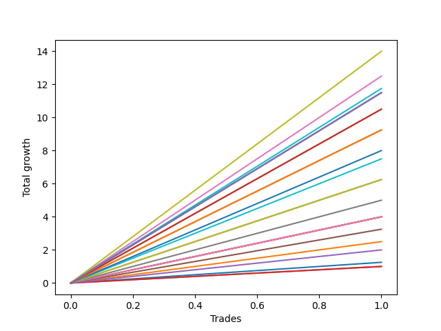

# Short Labrador 005 
- Symbol: ES_1000-1030
- Date Range: 12/22/2022 - 12/30/2022
- Trading Period: 10:0-10:30
- Number of Trades: 1



| Name | Win Percent | Profit | Avg Profit / Trade | Avg Time / Trade |      | Name | Win Percent | Profit | Avg Profit / Trade | Avg Time / Trade |
| ---- | ----------- | ------ | ------------------ | ---------------- | ---- | ---- | ----------- | ------ | ------------------ | ---------------- |
| Sorted By <br> Profit | | | | | | Sorted By <br> Win Percentage ||||
| V U/L 1SD SL-10 | 100.00 | 7000.00 | 7000.00 | 55:30 |     | V U/L 1SD SL-10 | 100.00 | 7000.00 | 7000.00 | 55:30 |
| V U/L 1SD SL-5 | 100.00 | 7000.00 | 7000.00 | 55:30 |     | V U/L 1SD SL-5 | 100.00 | 7000.00 | 7000.00 | 55:30 |
| V U/L 1SD | 100.00 | 7000.00 | 7000.00 | 55:30 |     | V U/L 1SD | 100.00 | 7000.00 | 7000.00 | 55:30 |
| BB-50 U/L 2SD SL-10 | 100.00 | 6250.00 | 6250.00 | 38:15 |     | BB-50 U/L 2SD SL-10 | 100.00 | 6250.00 | 6250.00 | 38:15 |
| BB-50 U/L 2SD SL-5 | 100.00 | 6250.00 | 6250.00 | 38:15 |     | BB-50 U/L 2SD SL-5 | 100.00 | 6250.00 | 6250.00 | 38:15 |
| BB-50 U/L 2SD | 100.00 | 6250.00 | 6250.00 | 38:15 |     | BB-50 U/L 2SD | 100.00 | 6250.00 | 6250.00 | 38:15 |
| BB-100 Mid SL-10 | 100.00 | 5875.00 | 5875.00 | 25:30 |     | BB-100 Mid SL-10 | 100.00 | 5875.00 | 5875.00 | 25:30 |
| BB-100 Mid SL-5 | 100.00 | 5875.00 | 5875.00 | 25:30 |     | BB-100 Mid SL-5 | 100.00 | 5875.00 | 5875.00 | 25:30 |
| BB-100 Mid | 100.00 | 5875.00 | 5875.00 | 25:30 |     | BB-100 Mid | 100.00 | 5875.00 | 5875.00 | 25:30 |
| NEWFI 06 | 100.00 | 5750.00 | 5750.00 | 60:55 |     | NEWFI 06 | 100.00 | 5750.00 | 5750.00 | 60:55 |
| NEWFI 0000 | 100.00 | 5750.00 | 5750.00 | 60:55 |     | NEWFI 0000 | 100.00 | 5750.00 | 5750.00 | 60:55 |
| BB-200 U/L 2SD SL-10 | 100.00 | 5750.00 | 5750.00 | 60:55 |     | BB-200 U/L 2SD SL-10 | 100.00 | 5750.00 | 5750.00 | 60:55 |
| BB-100 U/L 2SD SL-10 | 100.00 | 5750.00 | 5750.00 | 60:55 |     | BB-100 U/L 2SD SL-10 | 100.00 | 5750.00 | 5750.00 | 60:55 |
| BB-200 U/L 2SD SL-5 | 100.00 | 5750.00 | 5750.00 | 60:55 |     | BB-200 U/L 2SD SL-5 | 100.00 | 5750.00 | 5750.00 | 60:55 |
| BB-100 U/L 2SD SL-5 | 100.00 | 5750.00 | 5750.00 | 60:55 |     | BB-100 U/L 2SD SL-5 | 100.00 | 5750.00 | 5750.00 | 60:55 |
| BB-200 U/L 2SD | 100.00 | 5750.00 | 5750.00 | 60:55 |     | BB-200 U/L 2SD | 100.00 | 5750.00 | 5750.00 | 60:55 |
| BB-100 U/L 2SD | 100.00 | 5750.00 | 5750.00 | 60:55 |     | BB-100 U/L 2SD | 100.00 | 5750.00 | 5750.00 | 60:55 |
| NEWFI 000 | 100.00 | 5250.00 | 5250.00 | 24:05 |     | NEWFI 000 | 100.00 | 5250.00 | 5250.00 | 24:05 |
| TP-10 | 100.00 | 5250.00 | 5250.00 | 23:05 |     | TP-10 | 100.00 | 5250.00 | 5250.00 | 23:05 |
| TP-9 | 100.00 | 4625.00 | 4625.00 | 18:00 |     | TP-9 | 100.00 | 4625.00 | 4625.00 | 18:00 |
| BB-50 U/L 1SD SL-10 | 100.00 | 4625.00 | 4625.00 | 21:05 |     | BB-50 U/L 1SD SL-10 | 100.00 | 4625.00 | 4625.00 | 21:05 |
| BB-50 U/L 1SD SL-5 | 100.00 | 4625.00 | 4625.00 | 21:05 |     | BB-50 U/L 1SD SL-5 | 100.00 | 4625.00 | 4625.00 | 21:05 |
| BB-50 U/L 1SD | 100.00 | 4625.00 | 4625.00 | 21:05 |     | BB-50 U/L 1SD | 100.00 | 4625.00 | 4625.00 | 21:05 |
| TP-8 | 100.00 | 4000.00 | 4000.00 | 17:40 |     | TP-8 | 100.00 | 4000.00 | 4000.00 | 17:40 |
| TP-7 | 100.00 | 3750.00 | 3750.00 | 17:25 |     | TP-7 | 100.00 | 3750.00 | 3750.00 | 17:25 |
| TP-6 | 100.00 | 3125.00 | 3125.00 | 09:40 |     | TP-6 | 100.00 | 3125.00 | 3125.00 | 09:40 |
| BB-50 Mid SL-10 | 100.00 | 3125.00 | 3125.00 | 10:50 |     | BB-50 Mid SL-10 | 100.00 | 3125.00 | 3125.00 | 10:50 |
| BB-50 Mid SL-5 | 100.00 | 3125.00 | 3125.00 | 10:50 |     | BB-50 Mid SL-5 | 100.00 | 3125.00 | 3125.00 | 10:50 |
| BB-50 Mid | 100.00 | 3125.00 | 3125.00 | 10:50 |     | BB-50 Mid | 100.00 | 3125.00 | 3125.00 | 10:50 |
| TP-5 | 100.00 | 2500.00 | 2500.00 | 09:05 |     | TP-5 | 100.00 | 2500.00 | 2500.00 | 09:05 |
| TP-4 | 100.00 | 2000.00 | 2000.00 | 07:35 |     | TP-4 | 100.00 | 2000.00 | 2000.00 | 07:35 |
| BB-200 Mid SL-10 | 100.00 | 2000.00 | 2000.00 | 07:35 |     | BB-200 Mid SL-10 | 100.00 | 2000.00 | 2000.00 | 07:35 |
| BB-20 U/L 2SD C SL-10 | 100.00 | 2000.00 | 2000.00 | 07:35 |     | BB-20 U/L 2SD C SL-10 | 100.00 | 2000.00 | 2000.00 | 07:35 |
| BB-20 U/L 2SD SL-10 | 100.00 | 2000.00 | 2000.00 | 07:35 |     | BB-20 U/L 2SD SL-10 | 100.00 | 2000.00 | 2000.00 | 07:35 |
| BB-200 Mid SL-5 | 100.00 | 2000.00 | 2000.00 | 07:35 |     | BB-200 Mid SL-5 | 100.00 | 2000.00 | 2000.00 | 07:35 |
| BB-20 U/L 2SD C SL-5 | 100.00 | 2000.00 | 2000.00 | 07:35 |     | BB-20 U/L 2SD C SL-5 | 100.00 | 2000.00 | 2000.00 | 07:35 |
| BB-20 U/L 2SD SL-5 | 100.00 | 2000.00 | 2000.00 | 07:35 |     | BB-20 U/L 2SD SL-5 | 100.00 | 2000.00 | 2000.00 | 07:35 |
| BB-200 Mid | 100.00 | 2000.00 | 2000.00 | 07:35 |     | BB-200 Mid | 100.00 | 2000.00 | 2000.00 | 07:35 |
| BB-20 U/L 2SD C | 100.00 | 2000.00 | 2000.00 | 07:35 |     | BB-20 U/L 2SD C | 100.00 | 2000.00 | 2000.00 | 07:35 |
| BB-20 U/L 2SD | 100.00 | 2000.00 | 2000.00 | 07:35 |     | BB-20 U/L 2SD | 100.00 | 2000.00 | 2000.00 | 07:35 |
| TP-3 | 100.00 | 1625.00 | 1625.00 | 07:15 |     | TP-3 | 100.00 | 1625.00 | 1625.00 | 07:15 |
| BB-20 U/L 1SD SL-10 | 100.00 | 1250.00 | 1250.00 | 07:00 |     | BB-20 U/L 1SD SL-10 | 100.00 | 1250.00 | 1250.00 | 07:00 |
| BB-20 U/L 1SD SL-5 | 100.00 | 1250.00 | 1250.00 | 07:00 |     | BB-20 U/L 1SD SL-5 | 100.00 | 1250.00 | 1250.00 | 07:00 |
| BB-20 U/L 1SD | 100.00 | 1250.00 | 1250.00 | 07:00 |     | BB-20 U/L 1SD | 100.00 | 1250.00 | 1250.00 | 07:00 |
| TP-2 | 100.00 | 1000.00 | 1000.00 | 02:45 |     | TP-2 | 100.00 | 1000.00 | 1000.00 | 02:45 |
| BB-20 Mid SL-10 | 100.00 | 625.00 | 625.00 | 02:25 |     | BB-20 Mid SL-10 | 100.00 | 625.00 | 625.00 | 02:25 |
| BB-20 Mid SL-5 | 100.00 | 625.00 | 625.00 | 02:25 |     | BB-20 Mid SL-5 | 100.00 | 625.00 | 625.00 | 02:25 |
| BB-20 Mid | 100.00 | 625.00 | 625.00 | 02:25 |     | BB-20 Mid | 100.00 | 625.00 | 625.00 | 02:25 |
| TP-1 | 100.00 | 500.00 | 500.00 | 01:10 |     | TP-1 | 100.00 | 500.00 | 500.00 | 01:10 |
| V Mid SL-10 | 100.00 | 500.00 | 500.00 | 01:10 |     | V Mid SL-10 | 100.00 | 500.00 | 500.00 | 01:10 |
| V Mid SL-5 | 100.00 | 500.00 | 500.00 | 01:10 |     | V Mid SL-5 | 100.00 | 500.00 | 500.00 | 01:10 |
| V Mid | 100.00 | 500.00 | 500.00 | 01:10 |     | V Mid | 100.00 | 500.00 | 500.00 | 01:10 |

## NO STOPLOSS

### Test BB-20 Mid
* Sell when price hits the middle line of the 20p bollinger
* No Stoploss
* Results:
```
Total Trades: 1
Percent Up: 0.00
Percent Down: 100.00
Total Points Moved Down: 1.25
Potential Profit: 625.00
Total Points Ups: 0.00 Count Ups: 0
Total Points Downs: 1.25 Count Downs: 1
```

<details><summary>Trades</summary>

<code>In: 2022-12-28 10:14:00		Out: 2022-12-28 10:16:25		Total Position Time: 02:25		Total Move Down: 1.25		Total to Date: 1.25</code> <br />


</details>

### Test BB-20 U/L 1SD
* Sell when the price hits the lower line of the 20p 1std bollinger
* No Stoploss
* Results:
```
Total Trades: 1
Percent Up: 0.00
Percent Down: 100.00
Total Points Moved Down: 2.50
Potential Profit: 1250.00
Total Points Ups: 0.00 Count Ups: 0
Total Points Downs: 2.50 Count Downs: 1
```

<details><summary>Trades</summary>

<code>In: 2022-12-28 10:14:00		Out: 2022-12-28 10:21:00		Total Position Time: 07:00		Total Move Down: 2.50		Total to Date: 2.50</code> <br />


</details>

### Test BB-20 U/L 2SD
* Sell when the price hits the lower line of the 20p 2std bollinger
* No Stoploss
* Results:
```
Total Trades: 1
Percent Up: 0.00
Percent Down: 100.00
Total Points Moved Down: 4.00
Potential Profit: 2000.00
Total Points Ups: 0.00 Count Ups: 0
Total Points Downs: 4.00 Count Downs: 1
```

<details><summary>Trades</summary>

<code>In: 2022-12-28 10:14:00		Out: 2022-12-28 10:21:35		Total Position Time: 07:35		Total Move Down: 4.00		Total to Date: 4.00</code> <br />


</details>

### Test BB-20 U/L 2SD C
* Sell when the price hits the lower line of the 20p 2std bollinger
* No Stoploss
* Results:
```
Total Trades: 1
Percent Up: 0.00
Percent Down: 100.00
Total Points Moved Down: 4.00
Potential Profit: 2000.00
Total Points Ups: 0.00 Count Ups: 0
Total Points Downs: 4.00 Count Downs: 1
```

<details><summary>Trades</summary>

<code>In: 2022-12-28 10:14:00		Out: 2022-12-28 10:21:35		Total Position Time: 07:35		Total Move Down: 4.00		Total to Date: 4.00</code> <br />


</details>

### Test BB-50 Mid
* Sell when price hits the middle line of the 50p bollinger
* No Stoploss
* Results:
```
Total Trades: 1
Percent Up: 0.00
Percent Down: 100.00
Total Points Moved Down: 6.25
Potential Profit: 3125.00
Total Points Ups: 0.00 Count Ups: 0
Total Points Downs: 6.25 Count Downs: 1
```

<details><summary>Trades</summary>

<code>In: 2022-12-28 10:14:00		Out: 2022-12-28 10:24:50		Total Position Time: 10:50		Total Move Down: 6.25		Total to Date: 6.25</code> <br />


</details>

### Test BB-50 U/L 1SD
* Sell when the price hits the lower line of the 50p 1std bollinger
* No Stoploss
* Results:
```
Total Trades: 1
Percent Up: 0.00
Percent Down: 100.00
Total Points Moved Down: 9.25
Potential Profit: 4625.00
Total Points Ups: 0.00 Count Ups: 0
Total Points Downs: 9.25 Count Downs: 1
```

<details><summary>Trades</summary>

<code>In: 2022-12-28 10:14:00		Out: 2022-12-28 10:35:05		Total Position Time: 21:05		Total Move Down: 9.25		Total to Date: 9.25</code> <br />


</details>

### Test BB-50 U/L 2SD
* Sell when the price hits the lower line of the 50p 2std bollinger
* No Stoploss
* Results:
```
Total Trades: 1
Percent Up: 0.00
Percent Down: 100.00
Total Points Moved Down: 12.50
Potential Profit: 6250.00
Total Points Ups: 0.00 Count Ups: 0
Total Points Downs: 12.50 Count Downs: 1
```

<details><summary>Trades</summary>

<code>In: 2022-12-28 10:14:00		Out: 2022-12-28 10:52:15		Total Position Time: 38:15		Total Move Down: 12.50		Total to Date: 12.50</code> <br />


</details>

### Test V Mid
* Sell when the price hits the middle line of the 1std VWAP
* No Stoploss
* Results:
```
Total Trades: 1
Percent Up: 0.00
Percent Down: 100.00
Total Points Moved Down: 1.00
Potential Profit: 500.00
Total Points Ups: 0.00 Count Ups: 0
Total Points Downs: 1.00 Count Downs: 1
```

<details><summary>Trades</summary>

<code>In: 2022-12-28 10:14:00		Out: 2022-12-28 10:15:10		Total Position Time: 01:10		Total Move Down: 1.00		Total to Date: 1.00</code> <br />


</details>

### Test V U/L 1SD
* Sell when the price hits the lower line of the 1std VWAP
* No Stoploss
* Results:
```
Total Trades: 1
Percent Up: 0.00
Percent Down: 100.00
Total Points Moved Down: 14.00
Potential Profit: 7000.00
Total Points Ups: 0.00 Count Ups: 0
Total Points Downs: 14.00 Count Downs: 1
```

<details><summary>Trades</summary>

<code>In: 2022-12-28 10:14:00		Out: 2022-12-28 11:09:30		Total Position Time: 55:30		Total Move Down: 14.00		Total to Date: 14.00</code> <br />


</details>

### Test BB-100 Mid
* Move to BB100 Mid
* No Stoploss
* Results:
```
Total Trades: 1
Percent Up: 0.00
Percent Down: 100.00
Total Points Moved Down: 11.75
Potential Profit: 5875.00
Total Points Ups: 0.00 Count Ups: 0
Total Points Downs: 11.75 Count Downs: 1
```

<details><summary>Trades</summary>

<code>In: 2022-12-28 10:14:00		Out: 2022-12-28 10:39:30		Total Position Time: 25:30		Total Move Down: 11.75		Total to Date: 11.75</code> <br />


</details>

### Test BB-100 U/L 2SD
* Move to BB100 Upper Band
* No Stoploss
* Results:
```
Total Trades: 1
Percent Up: 0.00
Percent Down: 100.00
Total Points Moved Down: 11.50
Potential Profit: 5750.00
Total Points Ups: 0.00 Count Ups: 0
Total Points Downs: 11.50 Count Downs: 1
```

<details><summary>Trades</summary>

<code>In: 2022-12-28 10:14:00		Out: 2022-12-28 11:14:55		Total Position Time: 60:55		Total Move Down: 11.50		Total to Date: 11.50</code> <br />


</details>

### Test BB-200 Mid
* Move to BB200 Mid
* No Stoploss
* Results:
```
Total Trades: 1
Percent Up: 0.00
Percent Down: 100.00
Total Points Moved Down: 4.00
Potential Profit: 2000.00
Total Points Ups: 0.00 Count Ups: 0
Total Points Downs: 4.00 Count Downs: 1
```

<details><summary>Trades</summary>

<code>In: 2022-12-28 10:14:00		Out: 2022-12-28 10:21:35		Total Position Time: 07:35		Total Move Down: 4.00		Total to Date: 4.00</code> <br />


</details>

### Test BB-200 U/L 2SD
* Move to BB200 Upper Band
* No Stoploss
* Results:
```
Total Trades: 1
Percent Up: 0.00
Percent Down: 100.00
Total Points Moved Down: 11.50
Potential Profit: 5750.00
Total Points Ups: 0.00 Count Ups: 0
Total Points Downs: 11.50 Count Downs: 1
```

<details><summary>Trades</summary>

<code>In: 2022-12-28 10:14:00		Out: 2022-12-28 11:14:55		Total Position Time: 60:55		Total Move Down: 11.50		Total to Date: 11.50</code> <br />


</details>

## STOPLOSS OF 5

### Test BB-20 Mid SL-5
* Sell when price hits the middle line of the 20p bollinger
* Stoploss is -5 points
* Results:
```
Total Trades: 1
Percent Up: 0.00
Percent Down: 100.00
Total Points Moved Down: 1.25
Potential Profit: 625.00
Total Points Ups: 0.00 Count Ups: 0
Total Points Downs: 1.25 Count Downs: 1
```

<details><summary>Trades</summary>

<code>In: 2022-12-28 10:14:00		Out: 2022-12-28 10:16:25		Total Position Time: 02:25		Total Move Down: 1.25		Total to Date: 1.25</code> <br />


</details>

### Test BB-20 U/L 1SD SL-5
* Sell when the price hits the lower line of the 20p 1std bollinger
* Stoploss is -5 points
* Results:
```
Total Trades: 1
Percent Up: 0.00
Percent Down: 100.00
Total Points Moved Down: 2.50
Potential Profit: 1250.00
Total Points Ups: 0.00 Count Ups: 0
Total Points Downs: 2.50 Count Downs: 1
```

<details><summary>Trades</summary>

<code>In: 2022-12-28 10:14:00		Out: 2022-12-28 10:21:00		Total Position Time: 07:00		Total Move Down: 2.50		Total to Date: 2.50</code> <br />


</details>

### Test BB-20 U/L 2SD SL-5
* Sell when the price hits the lower line of the 20p 2std bollinger
* Stoploss is -5 points
* Results:
```
Total Trades: 1
Percent Up: 0.00
Percent Down: 100.00
Total Points Moved Down: 4.00
Potential Profit: 2000.00
Total Points Ups: 0.00 Count Ups: 0
Total Points Downs: 4.00 Count Downs: 1
```

<details><summary>Trades</summary>

<code>In: 2022-12-28 10:14:00		Out: 2022-12-28 10:21:35		Total Position Time: 07:35		Total Move Down: 4.00		Total to Date: 4.00</code> <br />


</details>

### Test BB-20 U/L 2SD C SL-5
* Sell when the price hits the lower line of the 20p 2std bollinger
* Stoploss is -5 points
* Results:
```
Total Trades: 1
Percent Up: 0.00
Percent Down: 100.00
Total Points Moved Down: 4.00
Potential Profit: 2000.00
Total Points Ups: 0.00 Count Ups: 0
Total Points Downs: 4.00 Count Downs: 1
```

<details><summary>Trades</summary>

<code>In: 2022-12-28 10:14:00		Out: 2022-12-28 10:21:35		Total Position Time: 07:35		Total Move Down: 4.00		Total to Date: 4.00</code> <br />


</details>

### Test BB-50 Mid SL-5
* Sell when price hits the middle line of the 50p bollinger
* Stoploss is -5 points
* Results:
```
Total Trades: 1
Percent Up: 0.00
Percent Down: 100.00
Total Points Moved Down: 6.25
Potential Profit: 3125.00
Total Points Ups: 0.00 Count Ups: 0
Total Points Downs: 6.25 Count Downs: 1
```

<details><summary>Trades</summary>

<code>In: 2022-12-28 10:14:00		Out: 2022-12-28 10:24:50		Total Position Time: 10:50		Total Move Down: 6.25		Total to Date: 6.25</code> <br />


</details>

### Test BB-50 U/L 1SD SL-5
* Sell when the price hits the lower line of the 50p 1std bollinger
* Stoploss is -5 points
* Results:
```
Total Trades: 1
Percent Up: 0.00
Percent Down: 100.00
Total Points Moved Down: 9.25
Potential Profit: 4625.00
Total Points Ups: 0.00 Count Ups: 0
Total Points Downs: 9.25 Count Downs: 1
```

<details><summary>Trades</summary>

<code>In: 2022-12-28 10:14:00		Out: 2022-12-28 10:35:05		Total Position Time: 21:05		Total Move Down: 9.25		Total to Date: 9.25</code> <br />


</details>

### Test BB-50 U/L 2SD SL-5
* Sell when the price hits the lower line of the 50p 2std bollinger
* Stoploss is -5 points
* Results:
```
Total Trades: 1
Percent Up: 0.00
Percent Down: 100.00
Total Points Moved Down: 12.50
Potential Profit: 6250.00
Total Points Ups: 0.00 Count Ups: 0
Total Points Downs: 12.50 Count Downs: 1
```

<details><summary>Trades</summary>

<code>In: 2022-12-28 10:14:00		Out: 2022-12-28 10:52:15		Total Position Time: 38:15		Total Move Down: 12.50		Total to Date: 12.50</code> <br />


</details>

### Test V Mid SL-5
* Sell when the price hits the middle line of the 1std VWAP
* Stoploss is -5 points
* Results:
```
Total Trades: 1
Percent Up: 0.00
Percent Down: 100.00
Total Points Moved Down: 1.00
Potential Profit: 500.00
Total Points Ups: 0.00 Count Ups: 0
Total Points Downs: 1.00 Count Downs: 1
```

<details><summary>Trades</summary>

<code>In: 2022-12-28 10:14:00		Out: 2022-12-28 10:15:10		Total Position Time: 01:10		Total Move Down: 1.00		Total to Date: 1.00</code> <br />


</details>

### Test V U/L 1SD SL-5
* Sell when the price hits the lower line of the 1std VWAP
* Stoploss is -5 points
* Results:
```
Total Trades: 1
Percent Up: 0.00
Percent Down: 100.00
Total Points Moved Down: 14.00
Potential Profit: 7000.00
Total Points Ups: 0.00 Count Ups: 0
Total Points Downs: 14.00 Count Downs: 1
```

<details><summary>Trades</summary>

<code>In: 2022-12-28 10:14:00		Out: 2022-12-28 11:09:30		Total Position Time: 55:30		Total Move Down: 14.00		Total to Date: 14.00</code> <br />


</details>

### Test BB-100 Mid SL-5
* Move to BB100 Mid
* Stoploss is -5 points
* Results:
```
Total Trades: 1
Percent Up: 0.00
Percent Down: 100.00
Total Points Moved Down: 11.75
Potential Profit: 5875.00
Total Points Ups: 0.00 Count Ups: 0
Total Points Downs: 11.75 Count Downs: 1
```

<details><summary>Trades</summary>

<code>In: 2022-12-28 10:14:00		Out: 2022-12-28 10:39:30		Total Position Time: 25:30		Total Move Down: 11.75		Total to Date: 11.75</code> <br />


</details>

### Test BB-100 U/L 2SD SL-5
* Move to BB100 Upper Band
* Stoploss is -5 points
* Results:
```
Total Trades: 1
Percent Up: 0.00
Percent Down: 100.00
Total Points Moved Down: 11.50
Potential Profit: 5750.00
Total Points Ups: 0.00 Count Ups: 0
Total Points Downs: 11.50 Count Downs: 1
```

<details><summary>Trades</summary>

<code>In: 2022-12-28 10:14:00		Out: 2022-12-28 11:14:55		Total Position Time: 60:55		Total Move Down: 11.50		Total to Date: 11.50</code> <br />


</details>

### Test BB-200 Mid SL-5
* Move to BB200 Mid
* Stoploss is -5 points
* Results:
```
Total Trades: 1
Percent Up: 0.00
Percent Down: 100.00
Total Points Moved Down: 4.00
Potential Profit: 2000.00
Total Points Ups: 0.00 Count Ups: 0
Total Points Downs: 4.00 Count Downs: 1
```

<details><summary>Trades</summary>

<code>In: 2022-12-28 10:14:00		Out: 2022-12-28 10:21:35		Total Position Time: 07:35		Total Move Down: 4.00		Total to Date: 4.00</code> <br />


</details>

### Test BB-200 U/L 2SD SL-5
* Move to BB200 Upper Band
* Stoploss is -5 points
* Results:
```
Total Trades: 1
Percent Up: 0.00
Percent Down: 100.00
Total Points Moved Down: 11.50
Potential Profit: 5750.00
Total Points Ups: 0.00 Count Ups: 0
Total Points Downs: 11.50 Count Downs: 1
```

<details><summary>Trades</summary>

<code>In: 2022-12-28 10:14:00		Out: 2022-12-28 11:14:55		Total Position Time: 60:55		Total Move Down: 11.50		Total to Date: 11.50</code> <br />


</details>

## STOPLOSS OF 10

### Test BB-20 Mid SL-10
* Sell when price hits the middle line of the 20p bollinger
* Stoploss is -10 points
* Results:
```
Total Trades: 1
Percent Up: 0.00
Percent Down: 100.00
Total Points Moved Down: 1.25
Potential Profit: 625.00
Total Points Ups: 0.00 Count Ups: 0
Total Points Downs: 1.25 Count Downs: 1
```

<details><summary>Trades</summary>

<code>In: 2022-12-28 10:14:00		Out: 2022-12-28 10:16:25		Total Position Time: 02:25		Total Move Down: 1.25		Total to Date: 1.25</code> <br />


</details>

### Test BB-20 U/L 1SD SL-10
* Sell when the price hits the lower line of the 20p 1std bollinger
* Stoploss is -10 points
* Results:
```
Total Trades: 1
Percent Up: 0.00
Percent Down: 100.00
Total Points Moved Down: 2.50
Potential Profit: 1250.00
Total Points Ups: 0.00 Count Ups: 0
Total Points Downs: 2.50 Count Downs: 1
```

<details><summary>Trades</summary>

<code>In: 2022-12-28 10:14:00		Out: 2022-12-28 10:21:00		Total Position Time: 07:00		Total Move Down: 2.50		Total to Date: 2.50</code> <br />


</details>

### Test BB-20 U/L 2SD SL-10
* Sell when the price hits the lower line of the 20p 2std bollinger
* Stoploss is -10 points
* Results:
```
Total Trades: 1
Percent Up: 0.00
Percent Down: 100.00
Total Points Moved Down: 4.00
Potential Profit: 2000.00
Total Points Ups: 0.00 Count Ups: 0
Total Points Downs: 4.00 Count Downs: 1
```

<details><summary>Trades</summary>

<code>In: 2022-12-28 10:14:00		Out: 2022-12-28 10:21:35		Total Position Time: 07:35		Total Move Down: 4.00		Total to Date: 4.00</code> <br />


</details>

### Test BB-20 U/L 2SD C SL-10
* Sell when the price hits the lower line of the 20p 2std bollinger
* Stoploss is -10 points
* Results:
```
Total Trades: 1
Percent Up: 0.00
Percent Down: 100.00
Total Points Moved Down: 4.00
Potential Profit: 2000.00
Total Points Ups: 0.00 Count Ups: 0
Total Points Downs: 4.00 Count Downs: 1
```

<details><summary>Trades</summary>

<code>In: 2022-12-28 10:14:00		Out: 2022-12-28 10:21:35		Total Position Time: 07:35		Total Move Down: 4.00		Total to Date: 4.00</code> <br />


</details>

### Test BB-50 Mid SL-10
* Sell when price hits the middle line of the 50p bollinger
* Stoploss is -10 points
* Results:
```
Total Trades: 1
Percent Up: 0.00
Percent Down: 100.00
Total Points Moved Down: 6.25
Potential Profit: 3125.00
Total Points Ups: 0.00 Count Ups: 0
Total Points Downs: 6.25 Count Downs: 1
```

<details><summary>Trades</summary>

<code>In: 2022-12-28 10:14:00		Out: 2022-12-28 10:24:50		Total Position Time: 10:50		Total Move Down: 6.25		Total to Date: 6.25</code> <br />


</details>

### Test BB-50 U/L 1SD SL-10
* Sell when the price hits the lower line of the 50p 1std bollinger
* Stoploss is -10 points
* Results:
```
Total Trades: 1
Percent Up: 0.00
Percent Down: 100.00
Total Points Moved Down: 9.25
Potential Profit: 4625.00
Total Points Ups: 0.00 Count Ups: 0
Total Points Downs: 9.25 Count Downs: 1
```

<details><summary>Trades</summary>

<code>In: 2022-12-28 10:14:00		Out: 2022-12-28 10:35:05		Total Position Time: 21:05		Total Move Down: 9.25		Total to Date: 9.25</code> <br />


</details>

### Test BB-50 U/L 2SD SL-10
* Sell when the price hits the lower line of the 50p 2std bollinger
* Stoploss is -10 points
* Results:
```
Total Trades: 1
Percent Up: 0.00
Percent Down: 100.00
Total Points Moved Down: 12.50
Potential Profit: 6250.00
Total Points Ups: 0.00 Count Ups: 0
Total Points Downs: 12.50 Count Downs: 1
```

<details><summary>Trades</summary>

<code>In: 2022-12-28 10:14:00		Out: 2022-12-28 10:52:15		Total Position Time: 38:15		Total Move Down: 12.50		Total to Date: 12.50</code> <br />


</details>

### Test V Mid SL-10
* Sell when the price hits the middle line of the 1std VWAP
* Stoploss is -10 points
* Results:
```
Total Trades: 1
Percent Up: 0.00
Percent Down: 100.00
Total Points Moved Down: 1.00
Potential Profit: 500.00
Total Points Ups: 0.00 Count Ups: 0
Total Points Downs: 1.00 Count Downs: 1
```

<details><summary>Trades</summary>

<code>In: 2022-12-28 10:14:00		Out: 2022-12-28 10:15:10		Total Position Time: 01:10		Total Move Down: 1.00		Total to Date: 1.00</code> <br />


</details>

### Test V U/L 1SD SL-10
* Sell when the price hits the lower line of the 1std VWAP
* Stoploss is -10 points
* Results:
```
Total Trades: 1
Percent Up: 0.00
Percent Down: 100.00
Total Points Moved Down: 14.00
Potential Profit: 7000.00
Total Points Ups: 0.00 Count Ups: 0
Total Points Downs: 14.00 Count Downs: 1
```

<details><summary>Trades</summary>

<code>In: 2022-12-28 10:14:00		Out: 2022-12-28 11:09:30		Total Position Time: 55:30		Total Move Down: 14.00		Total to Date: 14.00</code> <br />


</details>

### Test BB-100 Mid SL-10
* Move to BB100 Mid
* Stoploss is -10 points
* Results:
```
Total Trades: 1
Percent Up: 0.00
Percent Down: 100.00
Total Points Moved Down: 11.75
Potential Profit: 5875.00
Total Points Ups: 0.00 Count Ups: 0
Total Points Downs: 11.75 Count Downs: 1
```

<details><summary>Trades</summary>

<code>In: 2022-12-28 10:14:00		Out: 2022-12-28 10:39:30		Total Position Time: 25:30		Total Move Down: 11.75		Total to Date: 11.75</code> <br />


</details>

### Test BB-100 U/L 2SD SL-10
* Move to BB100 Upper Band
* Stoploss is -10 points
* Results:
```
Total Trades: 1
Percent Up: 0.00
Percent Down: 100.00
Total Points Moved Down: 11.50
Potential Profit: 5750.00
Total Points Ups: 0.00 Count Ups: 0
Total Points Downs: 11.50 Count Downs: 1
```

<details><summary>Trades</summary>

<code>In: 2022-12-28 10:14:00		Out: 2022-12-28 11:14:55		Total Position Time: 60:55		Total Move Down: 11.50		Total to Date: 11.50</code> <br />


</details>

### Test BB-200 Mid SL-10
* Move to BB200 Mid
* Stoploss is -10 points
* Results:
```
Total Trades: 1
Percent Up: 0.00
Percent Down: 100.00
Total Points Moved Down: 4.00
Potential Profit: 2000.00
Total Points Ups: 0.00 Count Ups: 0
Total Points Downs: 4.00 Count Downs: 1
```

<details><summary>Trades</summary>

<code>In: 2022-12-28 10:14:00		Out: 2022-12-28 10:21:35		Total Position Time: 07:35		Total Move Down: 4.00		Total to Date: 4.00</code> <br />


</details>

### Test BB-200 U/L 2SD SL-10
* Move to BB200 Upper Band
* Stoploss is -10 points
* Results:
```
Total Trades: 1
Percent Up: 0.00
Percent Down: 100.00
Total Points Moved Down: 11.50
Potential Profit: 5750.00
Total Points Ups: 0.00 Count Ups: 0
Total Points Downs: 11.50 Count Downs: 1
```

<details><summary>Trades</summary>

<code>In: 2022-12-28 10:14:00		Out: 2022-12-28 11:14:55		Total Position Time: 60:55		Total Move Down: 11.50		Total to Date: 11.50</code> <br />


</details>

## TAKE PROFIT

### Test TP-1
* Take Profit of 1 Point
* No Stoploss
* Results:
```
Total Trades: 1
Percent Up: 0.00
Percent Down: 100.00
Total Points Moved Down: 1.00
Potential Profit: 500.00
Total Points Ups: 0.00 Count Ups: 0
Total Points Downs: 1.00 Count Downs: 1
```

<details><summary>Trades</summary>

<code>In: 2022-12-28 10:14:00		Out: 2022-12-28 10:15:10		Total Position Time: 01:10		Total Move Down: 1.00		Total to Date: 1.00</code> <br />


</details>

### Test TP-2
* Take Profit of 2 Point
* No Stoploss
* Results:
```
Total Trades: 1
Percent Up: 0.00
Percent Down: 100.00
Total Points Moved Down: 2.00
Potential Profit: 1000.00
Total Points Ups: 0.00 Count Ups: 0
Total Points Downs: 2.00 Count Downs: 1
```

<details><summary>Trades</summary>

<code>In: 2022-12-28 10:14:00		Out: 2022-12-28 10:16:45		Total Position Time: 02:45		Total Move Down: 2.00		Total to Date: 2.00</code> <br />


</details>

### Test TP-3
* Take Profit of 3 Point
* No Stoploss
* Results:
```
Total Trades: 1
Percent Up: 0.00
Percent Down: 100.00
Total Points Moved Down: 3.25
Potential Profit: 1625.00
Total Points Ups: 0.00 Count Ups: 0
Total Points Downs: 3.25 Count Downs: 1
```

<details><summary>Trades</summary>

<code>In: 2022-12-28 10:14:00		Out: 2022-12-28 10:21:15		Total Position Time: 07:15		Total Move Down: 3.25		Total to Date: 3.25</code> <br />


</details>

### Test TP-4
* Take Profit of 4 Point
* No Stoploss
* Results:
```
Total Trades: 1
Percent Up: 0.00
Percent Down: 100.00
Total Points Moved Down: 4.00
Potential Profit: 2000.00
Total Points Ups: 0.00 Count Ups: 0
Total Points Downs: 4.00 Count Downs: 1
```

<details><summary>Trades</summary>

<code>In: 2022-12-28 10:14:00		Out: 2022-12-28 10:21:35		Total Position Time: 07:35		Total Move Down: 4.00		Total to Date: 4.00</code> <br />


</details>

### Test TP-5
* Take Profit of 5 Point
* No Stoploss
* Results:
```
Total Trades: 1
Percent Up: 0.00
Percent Down: 100.00
Total Points Moved Down: 5.00
Potential Profit: 2500.00
Total Points Ups: 0.00 Count Ups: 0
Total Points Downs: 5.00 Count Downs: 1
```

<details><summary>Trades</summary>

<code>In: 2022-12-28 10:14:00		Out: 2022-12-28 10:23:05		Total Position Time: 09:05		Total Move Down: 5.00		Total to Date: 5.00</code> <br />


</details>

### Test TP-6
* Take Profit of 6 Point
* No Stoploss
* Results:
```
Total Trades: 1
Percent Up: 0.00
Percent Down: 100.00
Total Points Moved Down: 6.25
Potential Profit: 3125.00
Total Points Ups: 0.00 Count Ups: 0
Total Points Downs: 6.25 Count Downs: 1
```

<details><summary>Trades</summary>

<code>In: 2022-12-28 10:14:00		Out: 2022-12-28 10:23:40		Total Position Time: 09:40		Total Move Down: 6.25		Total to Date: 6.25</code> <br />


</details>

### Test TP-7
* Take Profit of 7 Point
* No Stoploss
* Results:
```
Total Trades: 1
Percent Up: 0.00
Percent Down: 100.00
Total Points Moved Down: 7.50
Potential Profit: 3750.00
Total Points Ups: 0.00 Count Ups: 0
Total Points Downs: 7.50 Count Downs: 1
```

<details><summary>Trades</summary>

<code>In: 2022-12-28 10:14:00		Out: 2022-12-28 10:31:25		Total Position Time: 17:25		Total Move Down: 7.50		Total to Date: 7.50</code> <br />


</details>

### Test TP-8
* Take Profit of 8 Point
* No Stoploss
* Results:
```
Total Trades: 1
Percent Up: 0.00
Percent Down: 100.00
Total Points Moved Down: 8.00
Potential Profit: 4000.00
Total Points Ups: 0.00 Count Ups: 0
Total Points Downs: 8.00 Count Downs: 1
```

<details><summary>Trades</summary>

<code>In: 2022-12-28 10:14:00		Out: 2022-12-28 10:31:40		Total Position Time: 17:40		Total Move Down: 8.00		Total to Date: 8.00</code> <br />


</details>

### Test TP-9
* Take Profit of 9 Point
* No Stoploss
* Results:
```
Total Trades: 1
Percent Up: 0.00
Percent Down: 100.00
Total Points Moved Down: 9.25
Potential Profit: 4625.00
Total Points Ups: 0.00 Count Ups: 0
Total Points Downs: 9.25 Count Downs: 1
```

<details><summary>Trades</summary>

<code>In: 2022-12-28 10:14:00		Out: 2022-12-28 10:32:00		Total Position Time: 18:00		Total Move Down: 9.25		Total to Date: 9.25</code> <br />


</details>

### Test TP-10
* Take Profit of 10 Point
* No Stoploss
* Results:
```
Total Trades: 1
Percent Up: 0.00
Percent Down: 100.00
Total Points Moved Down: 10.50
Potential Profit: 5250.00
Total Points Ups: 0.00 Count Ups: 0
Total Points Downs: 10.50 Count Downs: 1
```

<details><summary>Trades</summary>

<code>In: 2022-12-28 10:14:00		Out: 2022-12-28 10:37:05		Total Position Time: 23:05		Total Move Down: 10.50		Total to Date: 10.50</code> <br />


</details>

## Indicator Exits

### Test NEWFI 000
* Newfi 0000
* No Stoploss
* Results:
```
Total Trades: 1
Percent Up: 0.00
Percent Down: 100.00
Total Points Moved Down: 10.50
Potential Profit: 5250.00
Total Points Ups: 0.00 Count Ups: 0
Total Points Downs: 10.50 Count Downs: 1
```

<details><summary>Trades</summary>

<code>In: 2022-12-28 10:14:00		Out: 2022-12-28 10:38:05		Total Position Time: 24:05		Total Move Down: 10.50		Total to Date: 10.50</code> <br />


</details>

### Test NEWFI 0000
* Newfi 0000
* No Stoploss
* Results:
```
Total Trades: 1
Percent Up: 0.00
Percent Down: 100.00
Total Points Moved Down: 11.50
Potential Profit: 5750.00
Total Points Ups: 0.00 Count Ups: 0
Total Points Downs: 11.50 Count Downs: 1
```

<details><summary>Trades</summary>

<code>In: 2022-12-28 10:14:00		Out: 2022-12-28 11:14:55		Total Position Time: 60:55		Total Move Down: 11.50		Total to Date: 11.50</code> <br />


</details>

### Test NEWFI 06
* Newfi 06
* No Stoploss
* Results:
```
Total Trades: 1
Percent Up: 0.00
Percent Down: 100.00
Total Points Moved Down: 11.50
Potential Profit: 5750.00
Total Points Ups: 0.00 Count Ups: 0
Total Points Downs: 11.50 Count Downs: 1
```

<details><summary>Trades</summary>

<code>In: 2022-12-28 10:14:00		Out: 2022-12-28 11:14:55		Total Position Time: 60:55		Total Move Down: 11.50		Total to Date: 11.50</code> <br />


</details>