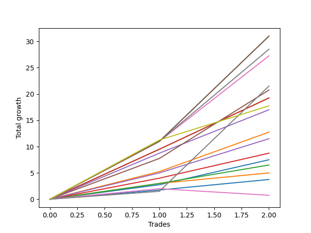

# Long Bernese 001 50 SB 
- Symbol: ES_1W
- Date Range: 03/18/2022 - 07/29/2022
- Trading Period: 7:20-12:30
- Number of Trades: 2



| Name | Win Percent | Profit | Avg Profit / Trade | Avg Time / Trade |      | Name | Win Percent | Profit | Avg Profit / Trade | Avg Time / Trade |
| ---- | ----------- | ------ | ------------------ | ---------------- | ---- | ---- | ----------- | ------ | ------------------ | ---------------- |
| Sorted By <br> Profit | | | | | | Sorted By <br> Win Percentage ||||
| NEWFI 000 | 100.00 | 15500.00 | 7750.00 | 54:57 |     | NEWFI 000 | 100.00 | 15500.00 | 7750.00 | 54:57 |
| BB100 | 100.00 | 15500.00 | 7750.00 | 54:57 |     | BB100 | 100.00 | 15500.00 | 7750.00 | 54:57 |
| Seven | 100.00 | 15500.00 | 7750.00 | 54:57 |     | Seven | 100.00 | 15500.00 | 7750.00 | 54:57 |
| Six | 100.00 | 14250.00 | 7125.00 | 44:22 |     | Six | 100.00 | 14250.00 | 7125.00 | 44:22 |
| Five | 100.00 | 13625.00 | 6812.50 | 34:42 |     | Five | 100.00 | 13625.00 | 6812.50 | 34:42 |
| MALAMUTE 001 | 100.00 | 10750.00 | 5375.00 | 41:32 |     | MALAMUTE 001 | 100.00 | 10750.00 | 5375.00 | 41:32 |
| Four | 100.00 | 10375.00 | 5187.50 | 26:25 |     | Four | 100.00 | 10375.00 | 5187.50 | 26:25 |
| Two_C | 100.00 | 9625.00 | 4812.50 | 13:15 |     | Two_C | 100.00 | 9625.00 | 4812.50 | 13:15 |
| Two | 100.00 | 9625.00 | 4812.50 | 13:15 |     | Two | 100.00 | 9625.00 | 4812.50 | 13:15 |
| MALAMUTE 002 | 100.00 | 8875.00 | 4437.50 | 60:05 |     | MALAMUTE 002 | 100.00 | 8875.00 | 4437.50 | 60:05 |
| Three | 100.00 | 8500.00 | 4250.00 | 17:35 |     | Three | 100.00 | 8500.00 | 4250.00 | 17:35 |
| One | 100.00 | 6375.00 | 3187.50 | 08:42 |     | One | 100.00 | 6375.00 | 3187.50 | 08:42 |
| Eighty-Five | 100.00 | 5750.00 | 2875.00 | 07:00 |     | Eighty-Five | 100.00 | 5750.00 | 2875.00 | 07:00 |
| Eighty-Four | 100.00 | 4375.00 | 2187.50 | 05:05 |     | Eighty-Four | 100.00 | 4375.00 | 2187.50 | 05:05 |
| Zero | 100.00 | 3750.00 | 1875.00 | 05:00 |     | Zero | 100.00 | 3750.00 | 1875.00 | 05:00 |
| Eighty-Three | 100.00 | 3250.00 | 1625.00 | 04:07 |     | Eighty-Three | 100.00 | 3250.00 | 1625.00 | 04:07 |
| Eighty-Two | 100.00 | 2500.00 | 1250.00 | 03:40 |     | Eighty-Two | 100.00 | 2500.00 | 1250.00 | 03:40 |
| Eighty-One | 100.00 | 1875.00 | 937.50 | 01:42 |     | Eighty-One | 100.00 | 1875.00 | 937.50 | 01:42 |
| NEWFI 0000 | 50.00 | 375.00 | 187.50 | 01:05 |     | NEWFI 0000 | 50.00 | 375.00 | 187.50 | 01:05 |

## NO STOPLOSS

### Test Zero
* Sell when price hits the middle line of the 20p bollinger
* No Stoploss
* Results:
```
Total Trades: 2
Percent Up: 100.00
Percent Down: 0.00
Total Points Moved Up: 7.50
Potential Profit: 3750.00
Total Points Ups: 7.50 Count Ups: 2
Total Points Downs: 0.00 Count Downs: 0
```

<details><summary>Trades</summary>

<code>In: 2022-03-25 08:30:00		Out: 2022-03-25 08:36:45		Total Position Time: 06:45		Total Move Up: 2.75		Total to Date: 2.75</code> <br />
<code>In: 2022-04-20 11:58:00		Out: 2022-04-20 12:01:15		Total Position Time: 03:15		Total Move Up: 4.75		Total to Date: 7.50</code> <br />


</details>

### Test One
* Sell when the price hits the upper line of the 20p 1std bollinger
* No Stoploss
* Results:
```
Total Trades: 2
Percent Up: 100.00
Percent Down: 0.00
Total Points Moved Up: 12.75
Potential Profit: 6375.00
Total Points Ups: 12.75 Count Ups: 2
Total Points Downs: 0.00 Count Downs: 0
```

<details><summary>Trades</summary>

<code>In: 2022-03-25 08:30:00		Out: 2022-03-25 08:41:05		Total Position Time: 11:05		Total Move Up: 5.25		Total to Date: 5.25</code> <br />
<code>In: 2022-04-20 11:58:00		Out: 2022-04-20 12:04:20		Total Position Time: 06:20		Total Move Up: 7.50		Total to Date: 12.75</code> <br />


</details>

### Test Two
* Sell when the price hits the upper line of the 20p 2std bollinger
* No Stoploss
* Results:
```
Total Trades: 2
Percent Up: 100.00
Percent Down: 0.00
Total Points Moved Up: 19.25
Potential Profit: 9625.00
Total Points Ups: 19.25 Count Ups: 2
Total Points Downs: 0.00 Count Downs: 0
```

<details><summary>Trades</summary>

<code>In: 2022-03-25 08:30:00		Out: 2022-03-25 08:41:55		Total Position Time: 11:55		Total Move Up: 9.50		Total to Date: 9.50</code> <br />
<code>In: 2022-04-20 11:58:00		Out: 2022-04-20 12:12:35		Total Position Time: 14:35		Total Move Up: 9.75		Total to Date: 19.25</code> <br />


</details>

### Test Two_C
* Sell when the price hits the upper line of the 20p 2std bollinger
* No Stoploss
* Results:
```
Total Trades: 2
Percent Up: 100.00
Percent Down: 0.00
Total Points Moved Up: 19.25
Potential Profit: 9625.00
Total Points Ups: 19.25 Count Ups: 2
Total Points Downs: 0.00 Count Downs: 0
```

<details><summary>Trades</summary>

<code>In: 2022-03-25 08:30:00		Out: 2022-03-25 08:41:55		Total Position Time: 11:55		Total Move Up: 9.50		Total to Date: 9.50</code> <br />
<code>In: 2022-04-20 11:58:00		Out: 2022-04-20 12:12:35		Total Position Time: 14:35		Total Move Up: 9.75		Total to Date: 19.25</code> <br />


</details>

### Test Three
* Sell when price hits the middle line of the 50p bollinger
* No Stoploss
* Results:
```
Total Trades: 2
Percent Up: 100.00
Percent Down: 0.00
Total Points Moved Up: 17.00
Potential Profit: 8500.00
Total Points Ups: 17.00 Count Ups: 2
Total Points Downs: 0.00 Count Downs: 0
```

<details><summary>Trades</summary>

<code>In: 2022-03-25 08:30:00		Out: 2022-03-25 08:53:00		Total Position Time: 23:00		Total Move Up: 8.75		Total to Date: 8.75</code> <br />
<code>In: 2022-04-20 11:58:00		Out: 2022-04-20 12:10:10		Total Position Time: 12:10		Total Move Up: 8.25		Total to Date: 17.00</code> <br />


</details>

### Test Four
* Sell when the price hits the upper line of the 50p 1std bollinger
* No Stoploss
* Results:
```
Total Trades: 2
Percent Up: 100.00
Percent Down: 0.00
Total Points Moved Up: 20.75
Potential Profit: 10375.00
Total Points Ups: 20.75 Count Ups: 2
Total Points Downs: 0.00 Count Downs: 0
```

<details><summary>Trades</summary>

<code>In: 2022-03-25 08:30:00		Out: 2022-03-25 09:07:15		Total Position Time: 37:15		Total Move Up: 7.75		Total to Date: 7.75</code> <br />
<code>In: 2022-04-20 11:58:00		Out: 2022-04-20 12:13:35		Total Position Time: 15:35		Total Move Up: 13.00		Total to Date: 20.75</code> <br />


</details>

### Test Five
* Sell when the price hits the upper line of the 50p 2std bollinger
* No Stoploss
* Results:
```
Total Trades: 2
Percent Up: 100.00
Percent Down: 0.00
Total Points Moved Up: 27.25
Potential Profit: 13625.00
Total Points Ups: 27.25 Count Ups: 2
Total Points Downs: 0.00 Count Downs: 0
```

<details><summary>Trades</summary>

<code>In: 2022-03-25 08:30:00		Out: 2022-03-25 09:11:40		Total Position Time: 41:40		Total Move Up: 11.00		Total to Date: 11.00</code> <br />
<code>In: 2022-04-20 11:58:00		Out: 2022-04-20 12:25:45		Total Position Time: 27:45		Total Move Up: 16.25		Total to Date: 27.25</code> <br />


</details>

### Test Six
* Sell when the price hits the middle line of the 1std VWAP
* No Stoploss
* Results:
```
Total Trades: 2
Percent Up: 100.00
Percent Down: 0.00
Total Points Moved Up: 28.50
Potential Profit: 14250.00
Total Points Ups: 28.50 Count Ups: 2
Total Points Downs: 0.00 Count Downs: 0
```

<details><summary>Trades</summary>

<code>In: 2022-03-25 08:30:00		Out: 2022-03-25 09:30:55		Total Position Time: 60:55		Total Move Up: 11.00		Total to Date: 11.00</code> <br />
<code>In: 2022-04-20 11:58:00		Out: 2022-04-20 12:25:50		Total Position Time: 27:50		Total Move Up: 17.50		Total to Date: 28.50</code> <br />


</details>

### Test Seven
* Sell when the price hits the upper line of the 1std VWAP
* No Stoploss
* Results:
```
Total Trades: 2
Percent Up: 100.00
Percent Down: 0.00
Total Points Moved Up: 31.00
Potential Profit: 15500.00
Total Points Ups: 31.00 Count Ups: 2
Total Points Downs: 0.00 Count Downs: 0
```

<details><summary>Trades</summary>

<code>In: 2022-03-25 08:30:00		Out: 2022-03-25 09:30:55		Total Position Time: 60:55		Total Move Up: 11.00		Total to Date: 11.00</code> <br />
<code>In: 2022-04-20 11:58:00		Out: 2022-04-20 12:47:00		Total Position Time: 49:00		Total Move Up: 20.00		Total to Date: 31.00</code> <br />


</details>

### Test BB100
* Sell when the price hits the upper line of the 1std VWAP
* No Stoploss
* Results:
```
Total Trades: 2
Percent Up: 100.00
Percent Down: 0.00
Total Points Moved Up: 31.00
Potential Profit: 15500.00
Total Points Ups: 31.00 Count Ups: 2
Total Points Downs: 0.00 Count Downs: 0
```

<details><summary>Trades</summary>

<code>In: 2022-03-25 08:30:00		Out: 2022-03-25 09:30:55		Total Position Time: 60:55		Total Move Up: 11.00		Total to Date: 11.00</code> <br />
<code>In: 2022-04-20 11:58:00		Out: 2022-04-20 12:47:00		Total Position Time: 49:00		Total Move Up: 20.00		Total to Date: 31.00</code> <br />


</details>

## TAKE PROFIT

### Test Eighty-One
* Take Profit of 1 Point
* No Stoploss
* Results:
```
Total Trades: 2
Percent Up: 100.00
Percent Down: 0.00
Total Points Moved Up: 3.75
Potential Profit: 1875.00
Total Points Ups: 3.75 Count Ups: 2
Total Points Downs: 0.00 Count Downs: 0
```

<details><summary>Trades</summary>

<code>In: 2022-03-25 08:30:00		Out: 2022-03-25 08:31:10		Total Position Time: 01:10		Total Move Up: 1.75		Total to Date: 1.75</code> <br />
<code>In: 2022-04-20 11:58:00		Out: 2022-04-20 12:00:15		Total Position Time: 02:15		Total Move Up: 2.00		Total to Date: 3.75</code> <br />


</details>

### Test Eighty-Two
* Take Profit of 2 Point
* No Stoploss
* Results:
```
Total Trades: 2
Percent Up: 100.00
Percent Down: 0.00
Total Points Moved Up: 5.00
Potential Profit: 2500.00
Total Points Ups: 5.00 Count Ups: 2
Total Points Downs: 0.00 Count Downs: 0
```

<details><summary>Trades</summary>

<code>In: 2022-03-25 08:30:00		Out: 2022-03-25 08:35:05		Total Position Time: 05:05		Total Move Up: 3.00		Total to Date: 3.00</code> <br />
<code>In: 2022-04-20 11:58:00		Out: 2022-04-20 12:00:15		Total Position Time: 02:15		Total Move Up: 2.00		Total to Date: 5.00</code> <br />


</details>

### Test Eighty-Three
* Take Profit of 3 Point
* No Stoploss
* Results:
```
Total Trades: 2
Percent Up: 100.00
Percent Down: 0.00
Total Points Moved Up: 6.50
Potential Profit: 3250.00
Total Points Ups: 6.50 Count Ups: 2
Total Points Downs: 0.00 Count Downs: 0
```

<details><summary>Trades</summary>

<code>In: 2022-03-25 08:30:00		Out: 2022-03-25 08:35:05		Total Position Time: 05:05		Total Move Up: 3.00		Total to Date: 3.00</code> <br />
<code>In: 2022-04-20 11:58:00		Out: 2022-04-20 12:01:10		Total Position Time: 03:10		Total Move Up: 3.50		Total to Date: 6.50</code> <br />


</details>

### Test Eighty-Four
* Take Profit of 4 Point
* No Stoploss
* Results:
```
Total Trades: 2
Percent Up: 100.00
Percent Down: 0.00
Total Points Moved Up: 8.75
Potential Profit: 4375.00
Total Points Ups: 8.75 Count Ups: 2
Total Points Downs: 0.00 Count Downs: 0
```

<details><summary>Trades</summary>

<code>In: 2022-03-25 08:30:00		Out: 2022-03-25 08:36:55		Total Position Time: 06:55		Total Move Up: 4.00		Total to Date: 4.00</code> <br />
<code>In: 2022-04-20 11:58:00		Out: 2022-04-20 12:01:15		Total Position Time: 03:15		Total Move Up: 4.75		Total to Date: 8.75</code> <br />


</details>

### Test Eighty-Five
* Take Profit of 5 Point
* No Stoploss
* Results:
```
Total Trades: 2
Percent Up: 100.00
Percent Down: 0.00
Total Points Moved Up: 11.50
Potential Profit: 5750.00
Total Points Ups: 11.50 Count Ups: 2
Total Points Downs: 0.00 Count Downs: 0
```

<details><summary>Trades</summary>

<code>In: 2022-03-25 08:30:00		Out: 2022-03-25 08:40:40		Total Position Time: 10:40		Total Move Up: 5.00		Total to Date: 5.00</code> <br />
<code>In: 2022-04-20 11:58:00		Out: 2022-04-20 12:01:20		Total Position Time: 03:20		Total Move Up: 6.50		Total to Date: 11.50</code> <br />


</details>

## Indicator Exits

### Test NEWFI 000
* Newfi 0000
* No Stoploss
* Results:
```
Total Trades: 2
Percent Up: 100.00
Percent Down: 0.00
Total Points Moved Up: 31.00
Potential Profit: 15500.00
Total Points Ups: 31.00 Count Ups: 2
Total Points Downs: 0.00 Count Downs: 0
```

<details><summary>Trades</summary>

<code>In: 2022-03-25 08:30:00		Out: 2022-03-25 09:30:55		Total Position Time: 60:55		Total Move Up: 11.00		Total to Date: 11.00</code> <br />
<code>In: 2022-04-20 11:58:00		Out: 2022-04-20 12:47:00		Total Position Time: 49:00		Total Move Up: 20.00		Total to Date: 31.00</code> <br />


</details>

### Test NEWFI 0000
* Newfi 0000
* No Stoploss
* Results:
```
Total Trades: 2
Percent Up: 50.00
Percent Down: 50.00
Total Points Moved Up: 0.75
Potential Profit: 375.00
Total Points Ups: 2.00 Count Ups: 1
Total Points Downs: -1.25 Count Downs: 1
```

<details><summary>Trades</summary>

<code>In: 2022-03-25 08:30:00		Out: 2022-03-25 08:31:05		Total Position Time: 01:05		Total Move Up: 2.00		Total to Date: 2.00</code> <br />
<code>In: 2022-04-20 11:58:00		Out: 2022-04-20 11:59:05		Total Position Time: 01:05		Total Move Up: -1.25		Total to Date: 0.75</code> <br />


</details>

### Test MALAMUTE 001
* Malamute 001
* No Stoploss
* Results:
```
Total Trades: 2
Percent Up: 100.00
Percent Down: 0.00
Total Points Moved Up: 21.50
Potential Profit: 10750.00
Total Points Ups: 21.50 Count Ups: 2
Total Points Downs: 0.00 Count Downs: 0
```

<details><summary>Trades</summary>

<code>In: 2022-03-25 08:30:00		Out: 2022-03-25 09:04:05		Total Position Time: 34:05		Total Move Up: 1.50		Total to Date: 1.50</code> <br />
<code>In: 2022-04-20 11:58:00		Out: 2022-04-20 12:47:00		Total Position Time: 49:00		Total Move Up: 20.00		Total to Date: 21.50</code> <br />


</details>

### Test MALAMUTE 002
* Malamute 001
* No Stoploss
* Results:
```
Total Trades: 2
Percent Up: 100.00
Percent Down: 0.00
Total Points Moved Up: 17.75
Potential Profit: 8875.00
Total Points Ups: 17.75 Count Ups: 2
Total Points Downs: 0.00 Count Downs: 0
```

<details><summary>Trades</summary>

<code>In: 2022-03-25 08:30:00		Out: 2022-03-25 09:30:05		Total Position Time: 60:05		Total Move Up: 11.25		Total to Date: 11.25</code> <br />
<code>In: 2022-04-20 11:58:00		Out: 2022-04-20 12:58:05		Total Position Time: 60:05		Total Move Up: 6.50		Total to Date: 17.75</code> <br />


</details>