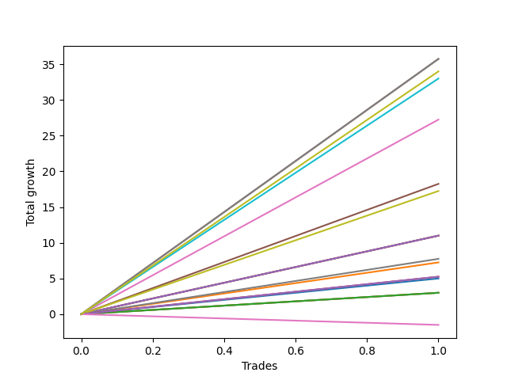

# Long Bernese 002 50 SB 
- Symbol: ES_1W
- Date Range: 03/18/2022 - 07/29/2022
- Trading Period: 7:20-12:30
- Number of Trades: 1



| Name | Win Percent | Profit | Avg Profit / Trade | Avg Time / Trade |      | Name | Win Percent | Profit | Avg Profit / Trade | Avg Time / Trade |
| ---- | ----------- | ------ | ------------------ | ---------------- | ---- | ---- | ----------- | ------ | ------------------ | ---------------- |
| Sorted By <br> Profit | | | | | | Sorted By <br> Win Percentage ||||
| MALAMUTE 001 | 100.00 | 17875.00 | 17875.00 | 60:55 |     | MALAMUTE 001 | 100.00 | 17875.00 | 17875.00 | 60:55 |
| NEWFI 000 | 100.00 | 17875.00 | 17875.00 | 60:55 |     | NEWFI 000 | 100.00 | 17875.00 | 17875.00 | 60:55 |
| MALAMUTE 002 | 100.00 | 17000.00 | 17000.00 | 60:05 |     | MALAMUTE 002 | 100.00 | 17000.00 | 17000.00 | 60:05 |
| BB100 | 100.00 | 16500.00 | 16500.00 | 37:20 |     | BB100 | 100.00 | 16500.00 | 16500.00 | 37:20 |
| Five | 100.00 | 13625.00 | 13625.00 | 23:40 |     | Five | 100.00 | 13625.00 | 13625.00 | 23:40 |
| Four | 100.00 | 9125.00 | 9125.00 | 19:30 |     | Four | 100.00 | 9125.00 | 9125.00 | 19:30 |
| Seven | 100.00 | 8625.00 | 8625.00 | 15:20 |     | Seven | 100.00 | 8625.00 | 8625.00 | 15:20 |
| Three | 100.00 | 5500.00 | 5500.00 | 15:05 |     | Three | 100.00 | 5500.00 | 5500.00 | 15:05 |
| Two_C | 100.00 | 5500.00 | 5500.00 | 15:05 |     | Two_C | 100.00 | 5500.00 | 5500.00 | 15:05 |
| Two | 100.00 | 5500.00 | 5500.00 | 15:05 |     | Two | 100.00 | 5500.00 | 5500.00 | 15:05 |
| Six | 100.00 | 3875.00 | 3875.00 | 02:25 |     | Six | 100.00 | 3875.00 | 3875.00 | 02:25 |
| One | 100.00 | 3625.00 | 3625.00 | 14:45 |     | One | 100.00 | 3625.00 | 3625.00 | 14:45 |
| Eighty-Five | 100.00 | 2625.00 | 2625.00 | 02:05 |     | Eighty-Five | 100.00 | 2625.00 | 2625.00 | 02:05 |
| Eighty-Four | 100.00 | 2625.00 | 2625.00 | 02:05 |     | Eighty-Four | 100.00 | 2625.00 | 2625.00 | 02:05 |
| Zero | 100.00 | 2500.00 | 2500.00 | 06:35 |     | Zero | 100.00 | 2500.00 | 2500.00 | 06:35 |
| Eighty-Three | 100.00 | 1500.00 | 1500.00 | 01:40 |     | Eighty-Three | 100.00 | 1500.00 | 1500.00 | 01:40 |
| Eighty-Two | 100.00 | 1500.00 | 1500.00 | 01:40 |     | Eighty-Two | 100.00 | 1500.00 | 1500.00 | 01:40 |
| Eighty-One | 100.00 | 1500.00 | 1500.00 | 01:40 |     | Eighty-One | 100.00 | 1500.00 | 1500.00 | 01:40 |
| NEWFI 0000 | 0.00 | -750.00 | -750.00 | 01:05 |     | NEWFI 0000 | 0.00 | -750.00 | -750.00 | 01:05 |

## NO STOPLOSS

### Test Zero
* Sell when price hits the middle line of the 20p bollinger
* No Stoploss
* Results:
```
Total Trades: 1
Percent Up: 100.00
Percent Down: 0.00
Total Points Moved Up: 5.00
Potential Profit: 2500.00
Total Points Ups: 5.00 Count Ups: 1
Total Points Downs: 0.00 Count Downs: 0
```

<details><summary>Trades</summary>

<code>In: 2022-05-17 11:25:00		Out: 2022-05-17 11:31:35		Total Position Time: 06:35		Total Move Up: 5.00		Total to Date: 5.00</code> <br />


</details>

### Test One
* Sell when the price hits the upper line of the 20p 1std bollinger
* No Stoploss
* Results:
```
Total Trades: 1
Percent Up: 100.00
Percent Down: 0.00
Total Points Moved Up: 7.25
Potential Profit: 3625.00
Total Points Ups: 7.25 Count Ups: 1
Total Points Downs: 0.00 Count Downs: 0
```

<details><summary>Trades</summary>

<code>In: 2022-05-17 11:25:00		Out: 2022-05-17 11:39:45		Total Position Time: 14:45		Total Move Up: 7.25		Total to Date: 7.25</code> <br />


</details>

### Test Two
* Sell when the price hits the upper line of the 20p 2std bollinger
* No Stoploss
* Results:
```
Total Trades: 1
Percent Up: 100.00
Percent Down: 0.00
Total Points Moved Up: 11.00
Potential Profit: 5500.00
Total Points Ups: 11.00 Count Ups: 1
Total Points Downs: 0.00 Count Downs: 0
```

<details><summary>Trades</summary>

<code>In: 2022-05-17 11:25:00		Out: 2022-05-17 11:40:05		Total Position Time: 15:05		Total Move Up: 11.00		Total to Date: 11.00</code> <br />


</details>

### Test Two_C
* Sell when the price hits the upper line of the 20p 2std bollinger
* No Stoploss
* Results:
```
Total Trades: 1
Percent Up: 100.00
Percent Down: 0.00
Total Points Moved Up: 11.00
Potential Profit: 5500.00
Total Points Ups: 11.00 Count Ups: 1
Total Points Downs: 0.00 Count Downs: 0
```

<details><summary>Trades</summary>

<code>In: 2022-05-17 11:25:00		Out: 2022-05-17 11:40:05		Total Position Time: 15:05		Total Move Up: 11.00		Total to Date: 11.00</code> <br />


</details>

### Test Three
* Sell when price hits the middle line of the 50p bollinger
* No Stoploss
* Results:
```
Total Trades: 1
Percent Up: 100.00
Percent Down: 0.00
Total Points Moved Up: 11.00
Potential Profit: 5500.00
Total Points Ups: 11.00 Count Ups: 1
Total Points Downs: 0.00 Count Downs: 0
```

<details><summary>Trades</summary>

<code>In: 2022-05-17 11:25:00		Out: 2022-05-17 11:40:05		Total Position Time: 15:05		Total Move Up: 11.00		Total to Date: 11.00</code> <br />


</details>

### Test Four
* Sell when the price hits the upper line of the 50p 1std bollinger
* No Stoploss
* Results:
```
Total Trades: 1
Percent Up: 100.00
Percent Down: 0.00
Total Points Moved Up: 18.25
Potential Profit: 9125.00
Total Points Ups: 18.25 Count Ups: 1
Total Points Downs: 0.00 Count Downs: 0
```

<details><summary>Trades</summary>

<code>In: 2022-05-17 11:25:00		Out: 2022-05-17 11:44:30		Total Position Time: 19:30		Total Move Up: 18.25		Total to Date: 18.25</code> <br />


</details>

### Test Five
* Sell when the price hits the upper line of the 50p 2std bollinger
* No Stoploss
* Results:
```
Total Trades: 1
Percent Up: 100.00
Percent Down: 0.00
Total Points Moved Up: 27.25
Potential Profit: 13625.00
Total Points Ups: 27.25 Count Ups: 1
Total Points Downs: 0.00 Count Downs: 0
```

<details><summary>Trades</summary>

<code>In: 2022-05-17 11:25:00		Out: 2022-05-17 11:48:40		Total Position Time: 23:40		Total Move Up: 27.25		Total to Date: 27.25</code> <br />


</details>

### Test Six
* Sell when the price hits the middle line of the 1std VWAP
* No Stoploss
* Results:
```
Total Trades: 1
Percent Up: 100.00
Percent Down: 0.00
Total Points Moved Up: 7.75
Potential Profit: 3875.00
Total Points Ups: 7.75 Count Ups: 1
Total Points Downs: 0.00 Count Downs: 0
```

<details><summary>Trades</summary>

<code>In: 2022-05-17 11:25:00		Out: 2022-05-17 11:27:25		Total Position Time: 02:25		Total Move Up: 7.75		Total to Date: 7.75</code> <br />


</details>

### Test Seven
* Sell when the price hits the upper line of the 1std VWAP
* No Stoploss
* Results:
```
Total Trades: 1
Percent Up: 100.00
Percent Down: 0.00
Total Points Moved Up: 17.25
Potential Profit: 8625.00
Total Points Ups: 17.25 Count Ups: 1
Total Points Downs: 0.00 Count Downs: 0
```

<details><summary>Trades</summary>

<code>In: 2022-05-17 11:25:00		Out: 2022-05-17 11:40:20		Total Position Time: 15:20		Total Move Up: 17.25		Total to Date: 17.25</code> <br />


</details>

### Test BB100
* Sell when the price hits the upper line of the 1std VWAP
* No Stoploss
* Results:
```
Total Trades: 1
Percent Up: 100.00
Percent Down: 0.00
Total Points Moved Up: 33.00
Potential Profit: 16500.00
Total Points Ups: 33.00 Count Ups: 1
Total Points Downs: 0.00 Count Downs: 0
```

<details><summary>Trades</summary>

<code>In: 2022-05-17 11:25:00		Out: 2022-05-17 12:02:20		Total Position Time: 37:20		Total Move Up: 33.00		Total to Date: 33.00</code> <br />


</details>

## TAKE PROFIT

### Test Eighty-One
* Take Profit of 1 Point
* No Stoploss
* Results:
```
Total Trades: 1
Percent Up: 100.00
Percent Down: 0.00
Total Points Moved Up: 3.00
Potential Profit: 1500.00
Total Points Ups: 3.00 Count Ups: 1
Total Points Downs: 0.00 Count Downs: 0
```

<details><summary>Trades</summary>

<code>In: 2022-05-17 11:25:00		Out: 2022-05-17 11:26:40		Total Position Time: 01:40		Total Move Up: 3.00		Total to Date: 3.00</code> <br />


</details>

### Test Eighty-Two
* Take Profit of 2 Point
* No Stoploss
* Results:
```
Total Trades: 1
Percent Up: 100.00
Percent Down: 0.00
Total Points Moved Up: 3.00
Potential Profit: 1500.00
Total Points Ups: 3.00 Count Ups: 1
Total Points Downs: 0.00 Count Downs: 0
```

<details><summary>Trades</summary>

<code>In: 2022-05-17 11:25:00		Out: 2022-05-17 11:26:40		Total Position Time: 01:40		Total Move Up: 3.00		Total to Date: 3.00</code> <br />


</details>

### Test Eighty-Three
* Take Profit of 3 Point
* No Stoploss
* Results:
```
Total Trades: 1
Percent Up: 100.00
Percent Down: 0.00
Total Points Moved Up: 3.00
Potential Profit: 1500.00
Total Points Ups: 3.00 Count Ups: 1
Total Points Downs: 0.00 Count Downs: 0
```

<details><summary>Trades</summary>

<code>In: 2022-05-17 11:25:00		Out: 2022-05-17 11:26:40		Total Position Time: 01:40		Total Move Up: 3.00		Total to Date: 3.00</code> <br />


</details>

### Test Eighty-Four
* Take Profit of 4 Point
* No Stoploss
* Results:
```
Total Trades: 1
Percent Up: 100.00
Percent Down: 0.00
Total Points Moved Up: 5.25
Potential Profit: 2625.00
Total Points Ups: 5.25 Count Ups: 1
Total Points Downs: 0.00 Count Downs: 0
```

<details><summary>Trades</summary>

<code>In: 2022-05-17 11:25:00		Out: 2022-05-17 11:27:05		Total Position Time: 02:05		Total Move Up: 5.25		Total to Date: 5.25</code> <br />


</details>

### Test Eighty-Five
* Take Profit of 5 Point
* No Stoploss
* Results:
```
Total Trades: 1
Percent Up: 100.00
Percent Down: 0.00
Total Points Moved Up: 5.25
Potential Profit: 2625.00
Total Points Ups: 5.25 Count Ups: 1
Total Points Downs: 0.00 Count Downs: 0
```

<details><summary>Trades</summary>

<code>In: 2022-05-17 11:25:00		Out: 2022-05-17 11:27:05		Total Position Time: 02:05		Total Move Up: 5.25		Total to Date: 5.25</code> <br />


</details>

## Indicator Exits

### Test NEWFI 000
* Newfi 0000
* No Stoploss
* Results:
```
Total Trades: 1
Percent Up: 100.00
Percent Down: 0.00
Total Points Moved Up: 35.75
Potential Profit: 17875.00
Total Points Ups: 35.75 Count Ups: 1
Total Points Downs: 0.00 Count Downs: 0
```

<details><summary>Trades</summary>

<code>In: 2022-05-17 11:25:00		Out: 2022-05-17 12:25:55		Total Position Time: 60:55		Total Move Up: 35.75		Total to Date: 35.75</code> <br />


</details>

### Test NEWFI 0000
* Newfi 0000
* No Stoploss
* Results:
```
Total Trades: 1
Percent Up: 0.00
Percent Down: 100.00
Total Points Moved Up: -1.50
Potential Profit: -750.00
Total Points Ups: 0.00 Count Ups: 0
Total Points Downs: -1.50 Count Downs: 1
```

<details><summary>Trades</summary>

<code>In: 2022-05-17 11:25:00		Out: 2022-05-17 11:26:05		Total Position Time: 01:05		Total Move Up: -1.50		Total to Date: -1.50</code> <br />


</details>

### Test MALAMUTE 001
* Malamute 001
* No Stoploss
* Results:
```
Total Trades: 1
Percent Up: 100.00
Percent Down: 0.00
Total Points Moved Up: 35.75
Potential Profit: 17875.00
Total Points Ups: 35.75 Count Ups: 1
Total Points Downs: 0.00 Count Downs: 0
```

<details><summary>Trades</summary>

<code>In: 2022-05-17 11:25:00		Out: 2022-05-17 12:25:55		Total Position Time: 60:55		Total Move Up: 35.75		Total to Date: 35.75</code> <br />


</details>

### Test MALAMUTE 002
* Malamute 001
* No Stoploss
* Results:
```
Total Trades: 1
Percent Up: 100.00
Percent Down: 0.00
Total Points Moved Up: 34.00
Potential Profit: 17000.00
Total Points Ups: 34.00 Count Ups: 1
Total Points Downs: 0.00 Count Downs: 0
```

<details><summary>Trades</summary>

<code>In: 2022-05-17 11:25:00		Out: 2022-05-17 12:25:05		Total Position Time: 60:05		Total Move Up: 34.00		Total to Date: 34.00</code> <br />


</details>