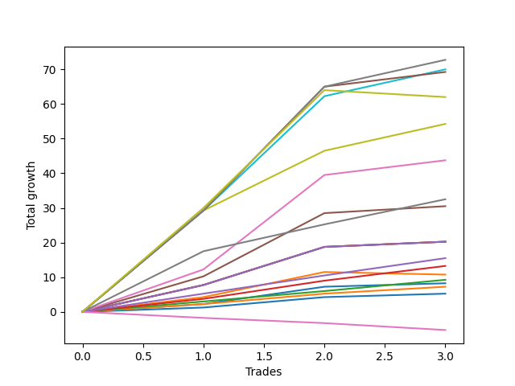

# Long Bernese 003 1v 
- Symbol: ES_1W
- Date Range: 03/18/2022 - 07/29/2022
- Trading Period: 7:20-12:30
- Number of Trades: 3



| Name | Win Percent | Profit | Avg Profit / Trade | Avg Time / Trade |      | Name | Win Percent | Profit | Avg Profit / Trade | Avg Time / Trade |
| ---- | ----------- | ------ | ------------------ | ---------------- | ---- | ---- | ----------- | ------ | ------------------ | ---------------- |
| Sorted By <br> Profit | | | | | | Sorted By <br> Win Percentage ||||
| MALAMUTE 001 | 100.00 | 36375.00 | 12125.00 | 60:55 |     | MALAMUTE 001 | 100.00 | 36375.00 | 12125.00 | 60:55 |
| BB100 | 100.00 | 35000.00 | 11666.67 | 53:03 |     | BB100 | 100.00 | 35000.00 | 11666.67 | 53:03 |
| NEWFI 000 | 100.00 | 34625.00 | 11541.67 | 57:58 |     | NEWFI 000 | 100.00 | 34625.00 | 11541.67 | 57:58 |
| MALAMUTE 002 | 66.67 | 31000.00 | 10333.33 | 40:25 |     | Seven | 100.00 | 27125.00 | 9041.67 | 45:43 |
| Seven | 100.00 | 27125.00 | 9041.67 | 45:43 |     | Five | 100.00 | 21875.00 | 7291.67 | 36:36 |
| Five | 100.00 | 21875.00 | 7291.67 | 36:36 |     | Six | 100.00 | 16250.00 | 5416.67 | 30:40 |
| Six | 100.00 | 16250.00 | 5416.67 | 30:40 |     | Four | 100.00 | 15250.00 | 5083.33 | 32:21 |
| Four | 100.00 | 15250.00 | 5083.33 | 32:21 |     | Three | 100.00 | 10125.00 | 3375.00 | 21:51 |
| Three | 100.00 | 10125.00 | 3375.00 | 21:51 |     | Two_C | 100.00 | 10125.00 | 3375.00 | 21:50 |
| Two_C | 100.00 | 10125.00 | 3375.00 | 21:50 |     | Two | 100.00 | 10125.00 | 3375.00 | 21:50 |
| Two | 100.00 | 10125.00 | 3375.00 | 21:50 |     | Eighty-Five | 100.00 | 7750.00 | 2583.33 | 16:21 |
| Eighty-Five | 100.00 | 7750.00 | 2583.33 | 16:21 |     | Eighty-Four | 100.00 | 6625.00 | 2208.33 | 15:48 |
| Eighty-Four | 100.00 | 6625.00 | 2208.33 | 15:48 |     | Eighty-Three | 100.00 | 4625.00 | 1541.67 | 10:33 |
| One | 66.67 | 5375.00 | 1791.67 | 16:35 |     | Zero | 100.00 | 4125.00 | 1375.00 | 07:38 |
| Eighty-Three | 100.00 | 4625.00 | 1541.67 | 10:33 |     | Eighty-Two | 100.00 | 3625.00 | 1208.33 | 02:58 |
| Zero | 100.00 | 4125.00 | 1375.00 | 07:38 |     | Eighty-One | 100.00 | 2625.00 | 875.00 | 02:35 |
| Eighty-Two | 100.00 | 3625.00 | 1208.33 | 02:58 |     | MALAMUTE 002 | 66.67 | 31000.00 | 10333.33 | 40:25 |
| Eighty-One | 100.00 | 2625.00 | 875.00 | 02:35 |     | One | 66.67 | 5375.00 | 1791.67 | 16:35 |
| NEWFI 0000 | 0.00 | -2625.00 | -875.00 | 01:05 |     | NEWFI 0000 | 0.00 | -2625.00 | -875.00 | 01:05 |

## NO STOPLOSS

### Test Zero
* Sell when price hits the middle line of the 20p bollinger
* No Stoploss
* Results:
```
Total Trades: 3
Percent Up: 100.00
Percent Down: 0.00
Total Points Moved Up: 8.25
Potential Profit: 4125.00
Total Points Ups: 8.25 Count Ups: 3
Total Points Downs: 0.00 Count Downs: 0
```

<details><summary>Trades</summary>

<code>In: 2022-05-13 11:07:00		Out: 2022-05-13 11:19:15		Total Position Time: 12:15		Total Move Up: 2.25		Total to Date: 2.25</code> <br />
<code>In: 2022-05-17 11:25:00		Out: 2022-05-17 11:31:35		Total Position Time: 06:35		Total Move Up: 5.00		Total to Date: 7.25</code> <br />
<code>In: 2022-07-08 09:45:00		Out: 2022-07-08 09:49:05		Total Position Time: 04:05		Total Move Up: 1.00		Total to Date: 8.25</code> <br />


</details>

### Test One
* Sell when the price hits the upper line of the 20p 1std bollinger
* No Stoploss
* Results:
```
Total Trades: 3
Percent Up: 66.67
Percent Down: 33.33
Total Points Moved Up: 10.75
Potential Profit: 5375.00
Total Points Ups: 11.50 Count Ups: 2
Total Points Downs: -0.75 Count Downs: 1
```

<details><summary>Trades</summary>

<code>In: 2022-05-13 11:07:00		Out: 2022-05-13 11:20:05		Total Position Time: 13:05		Total Move Up: 4.25		Total to Date: 4.25</code> <br />
<code>In: 2022-05-17 11:25:00		Out: 2022-05-17 11:39:45		Total Position Time: 14:45		Total Move Up: 7.25		Total to Date: 11.50</code> <br />
<code>In: 2022-07-08 09:45:00		Out: 2022-07-08 10:06:55		Total Position Time: 21:55		Total Move Up: -0.75		Total to Date: 10.75</code> <br />


</details>

### Test Two
* Sell when the price hits the upper line of the 20p 2std bollinger
* No Stoploss
* Results:
```
Total Trades: 3
Percent Up: 100.00
Percent Down: 0.00
Total Points Moved Up: 20.25
Potential Profit: 10125.00
Total Points Ups: 20.25 Count Ups: 3
Total Points Downs: 0.00 Count Downs: 0
```

<details><summary>Trades</summary>

<code>In: 2022-05-13 11:07:00		Out: 2022-05-13 11:31:20		Total Position Time: 24:20		Total Move Up: 7.75		Total to Date: 7.75</code> <br />
<code>In: 2022-05-17 11:25:00		Out: 2022-05-17 11:40:05		Total Position Time: 15:05		Total Move Up: 11.00		Total to Date: 18.75</code> <br />
<code>In: 2022-07-08 09:45:00		Out: 2022-07-08 10:11:05		Total Position Time: 26:05		Total Move Up: 1.50		Total to Date: 20.25</code> <br />


</details>

### Test Two_C
* Sell when the price hits the upper line of the 20p 2std bollinger
* No Stoploss
* Results:
```
Total Trades: 3
Percent Up: 100.00
Percent Down: 0.00
Total Points Moved Up: 20.25
Potential Profit: 10125.00
Total Points Ups: 20.25 Count Ups: 3
Total Points Downs: 0.00 Count Downs: 0
```

<details><summary>Trades</summary>

<code>In: 2022-05-13 11:07:00		Out: 2022-05-13 11:31:20		Total Position Time: 24:20		Total Move Up: 7.75		Total to Date: 7.75</code> <br />
<code>In: 2022-05-17 11:25:00		Out: 2022-05-17 11:40:05		Total Position Time: 15:05		Total Move Up: 11.00		Total to Date: 18.75</code> <br />
<code>In: 2022-07-08 09:45:00		Out: 2022-07-08 10:11:05		Total Position Time: 26:05		Total Move Up: 1.50		Total to Date: 20.25</code> <br />


</details>

### Test Three
* Sell when price hits the middle line of the 50p bollinger
* No Stoploss
* Results:
```
Total Trades: 3
Percent Up: 100.00
Percent Down: 0.00
Total Points Moved Up: 20.25
Potential Profit: 10125.00
Total Points Ups: 20.25 Count Ups: 3
Total Points Downs: 0.00 Count Downs: 0
```

<details><summary>Trades</summary>

<code>In: 2022-05-13 11:07:00		Out: 2022-05-13 11:31:20		Total Position Time: 24:20		Total Move Up: 7.75		Total to Date: 7.75</code> <br />
<code>In: 2022-05-17 11:25:00		Out: 2022-05-17 11:40:05		Total Position Time: 15:05		Total Move Up: 11.00		Total to Date: 18.75</code> <br />
<code>In: 2022-07-08 09:45:00		Out: 2022-07-08 10:11:10		Total Position Time: 26:10		Total Move Up: 1.50		Total to Date: 20.25</code> <br />


</details>

### Test Four
* Sell when the price hits the upper line of the 50p 1std bollinger
* No Stoploss
* Results:
```
Total Trades: 3
Percent Up: 100.00
Percent Down: 0.00
Total Points Moved Up: 30.50
Potential Profit: 15250.00
Total Points Ups: 30.50 Count Ups: 3
Total Points Downs: 0.00 Count Downs: 0
```

<details><summary>Trades</summary>

<code>In: 2022-05-13 11:07:00		Out: 2022-05-13 11:43:05		Total Position Time: 36:05		Total Move Up: 10.25		Total to Date: 10.25</code> <br />
<code>In: 2022-05-17 11:25:00		Out: 2022-05-17 11:44:30		Total Position Time: 19:30		Total Move Up: 18.25		Total to Date: 28.50</code> <br />
<code>In: 2022-07-08 09:45:00		Out: 2022-07-08 10:26:30		Total Position Time: 41:30		Total Move Up: 2.00		Total to Date: 30.50</code> <br />


</details>

### Test Five
* Sell when the price hits the upper line of the 50p 2std bollinger
* No Stoploss
* Results:
```
Total Trades: 3
Percent Up: 100.00
Percent Down: 0.00
Total Points Moved Up: 43.75
Potential Profit: 21875.00
Total Points Ups: 43.75 Count Ups: 3
Total Points Downs: 0.00 Count Downs: 0
```

<details><summary>Trades</summary>

<code>In: 2022-05-13 11:07:00		Out: 2022-05-13 11:51:10		Total Position Time: 44:10		Total Move Up: 12.25		Total to Date: 12.25</code> <br />
<code>In: 2022-05-17 11:25:00		Out: 2022-05-17 11:48:40		Total Position Time: 23:40		Total Move Up: 27.25		Total to Date: 39.50</code> <br />
<code>In: 2022-07-08 09:45:00		Out: 2022-07-08 10:27:00		Total Position Time: 42:00		Total Move Up: 4.25		Total to Date: 43.75</code> <br />


</details>

### Test Six
* Sell when the price hits the middle line of the 1std VWAP
* No Stoploss
* Results:
```
Total Trades: 3
Percent Up: 100.00
Percent Down: 0.00
Total Points Moved Up: 32.50
Potential Profit: 16250.00
Total Points Ups: 32.50 Count Ups: 3
Total Points Downs: 0.00 Count Downs: 0
```

<details><summary>Trades</summary>

<code>In: 2022-05-13 11:07:00		Out: 2022-05-13 11:52:25		Total Position Time: 45:25		Total Move Up: 17.50		Total to Date: 17.50</code> <br />
<code>In: 2022-05-17 11:25:00		Out: 2022-05-17 11:27:25		Total Position Time: 02:25		Total Move Up: 7.75		Total to Date: 25.25</code> <br />
<code>In: 2022-07-08 09:45:00		Out: 2022-07-08 10:29:10		Total Position Time: 44:10		Total Move Up: 7.25		Total to Date: 32.50</code> <br />


</details>

### Test Seven
* Sell when the price hits the upper line of the 1std VWAP
* No Stoploss
* Results:
```
Total Trades: 3
Percent Up: 100.00
Percent Down: 0.00
Total Points Moved Up: 54.25
Potential Profit: 27125.00
Total Points Ups: 54.25 Count Ups: 3
Total Points Downs: 0.00 Count Downs: 0
```

<details><summary>Trades</summary>

<code>In: 2022-05-13 11:07:00		Out: 2022-05-13 12:07:55		Total Position Time: 60:55		Total Move Up: 29.25		Total to Date: 29.25</code> <br />
<code>In: 2022-05-17 11:25:00		Out: 2022-05-17 11:40:20		Total Position Time: 15:20		Total Move Up: 17.25		Total to Date: 46.50</code> <br />
<code>In: 2022-07-08 09:45:00		Out: 2022-07-08 10:45:55		Total Position Time: 60:55		Total Move Up: 7.75		Total to Date: 54.25</code> <br />


</details>

### Test BB100
* Sell when the price hits the upper line of the 1std VWAP
* No Stoploss
* Results:
```
Total Trades: 3
Percent Up: 100.00
Percent Down: 0.00
Total Points Moved Up: 70.00
Potential Profit: 35000.00
Total Points Ups: 70.00 Count Ups: 3
Total Points Downs: 0.00 Count Downs: 0
```

<details><summary>Trades</summary>

<code>In: 2022-05-13 11:07:00		Out: 2022-05-13 12:07:55		Total Position Time: 60:55		Total Move Up: 29.25		Total to Date: 29.25</code> <br />
<code>In: 2022-05-17 11:25:00		Out: 2022-05-17 12:02:20		Total Position Time: 37:20		Total Move Up: 33.00		Total to Date: 62.25</code> <br />
<code>In: 2022-07-08 09:45:00		Out: 2022-07-08 10:45:55		Total Position Time: 60:55		Total Move Up: 7.75		Total to Date: 70.00</code> <br />


</details>

## TAKE PROFIT

### Test Eighty-One
* Take Profit of 1 Point
* No Stoploss
* Results:
```
Total Trades: 3
Percent Up: 100.00
Percent Down: 0.00
Total Points Moved Up: 5.25
Potential Profit: 2625.00
Total Points Ups: 5.25 Count Ups: 3
Total Points Downs: 0.00 Count Downs: 0
```

<details><summary>Trades</summary>

<code>In: 2022-05-13 11:07:00		Out: 2022-05-13 11:09:25		Total Position Time: 02:25		Total Move Up: 1.25		Total to Date: 1.25</code> <br />
<code>In: 2022-05-17 11:25:00		Out: 2022-05-17 11:26:40		Total Position Time: 01:40		Total Move Up: 3.00		Total to Date: 4.25</code> <br />
<code>In: 2022-07-08 09:45:00		Out: 2022-07-08 09:48:40		Total Position Time: 03:40		Total Move Up: 1.00		Total to Date: 5.25</code> <br />


</details>

### Test Eighty-Two
* Take Profit of 2 Point
* No Stoploss
* Results:
```
Total Trades: 3
Percent Up: 100.00
Percent Down: 0.00
Total Points Moved Up: 7.25
Potential Profit: 3625.00
Total Points Ups: 7.25 Count Ups: 3
Total Points Downs: 0.00 Count Downs: 0
```

<details><summary>Trades</summary>

<code>In: 2022-05-13 11:07:00		Out: 2022-05-13 11:09:30		Total Position Time: 02:30		Total Move Up: 2.25		Total to Date: 2.25</code> <br />
<code>In: 2022-05-17 11:25:00		Out: 2022-05-17 11:26:40		Total Position Time: 01:40		Total Move Up: 3.00		Total to Date: 5.25</code> <br />
<code>In: 2022-07-08 09:45:00		Out: 2022-07-08 09:49:45		Total Position Time: 04:45		Total Move Up: 2.00		Total to Date: 7.25</code> <br />


</details>

### Test Eighty-Three
* Take Profit of 3 Point
* No Stoploss
* Results:
```
Total Trades: 3
Percent Up: 100.00
Percent Down: 0.00
Total Points Moved Up: 9.25
Potential Profit: 4625.00
Total Points Ups: 9.25 Count Ups: 3
Total Points Downs: 0.00 Count Downs: 0
```

<details><summary>Trades</summary>

<code>In: 2022-05-13 11:07:00		Out: 2022-05-13 11:09:35		Total Position Time: 02:35		Total Move Up: 3.00		Total to Date: 3.00</code> <br />
<code>In: 2022-05-17 11:25:00		Out: 2022-05-17 11:26:40		Total Position Time: 01:40		Total Move Up: 3.00		Total to Date: 6.00</code> <br />
<code>In: 2022-07-08 09:45:00		Out: 2022-07-08 10:12:25		Total Position Time: 27:25		Total Move Up: 3.25		Total to Date: 9.25</code> <br />


</details>

### Test Eighty-Four
* Take Profit of 4 Point
* No Stoploss
* Results:
```
Total Trades: 3
Percent Up: 100.00
Percent Down: 0.00
Total Points Moved Up: 13.25
Potential Profit: 6625.00
Total Points Ups: 13.25 Count Ups: 3
Total Points Downs: 0.00 Count Downs: 0
```

<details><summary>Trades</summary>

<code>In: 2022-05-13 11:07:00		Out: 2022-05-13 11:10:20		Total Position Time: 03:20		Total Move Up: 3.75		Total to Date: 3.75</code> <br />
<code>In: 2022-05-17 11:25:00		Out: 2022-05-17 11:27:05		Total Position Time: 02:05		Total Move Up: 5.25		Total to Date: 9.00</code> <br />
<code>In: 2022-07-08 09:45:00		Out: 2022-07-08 10:27:00		Total Position Time: 42:00		Total Move Up: 4.25		Total to Date: 13.25</code> <br />


</details>

### Test Eighty-Five
* Take Profit of 5 Point
* No Stoploss
* Results:
```
Total Trades: 3
Percent Up: 100.00
Percent Down: 0.00
Total Points Moved Up: 15.50
Potential Profit: 7750.00
Total Points Ups: 15.50 Count Ups: 3
Total Points Downs: 0.00 Count Downs: 0
```

<details><summary>Trades</summary>

<code>In: 2022-05-13 11:07:00		Out: 2022-05-13 11:10:50		Total Position Time: 03:50		Total Move Up: 5.25		Total to Date: 5.25</code> <br />
<code>In: 2022-05-17 11:25:00		Out: 2022-05-17 11:27:05		Total Position Time: 02:05		Total Move Up: 5.25		Total to Date: 10.50</code> <br />
<code>In: 2022-07-08 09:45:00		Out: 2022-07-08 10:28:10		Total Position Time: 43:10		Total Move Up: 5.00		Total to Date: 15.50</code> <br />


</details>

## Indicator Exits

### Test NEWFI 000
* Newfi 0000
* No Stoploss
* Results:
```
Total Trades: 3
Percent Up: 100.00
Percent Down: 0.00
Total Points Moved Up: 69.25
Potential Profit: 34625.00
Total Points Ups: 69.25 Count Ups: 3
Total Points Downs: 0.00 Count Downs: 0
```

<details><summary>Trades</summary>

<code>In: 2022-05-13 11:07:00		Out: 2022-05-13 12:07:55		Total Position Time: 60:55		Total Move Up: 29.25		Total to Date: 29.25</code> <br />
<code>In: 2022-05-17 11:25:00		Out: 2022-05-17 12:25:55		Total Position Time: 60:55		Total Move Up: 35.75		Total to Date: 65.00</code> <br />
<code>In: 2022-07-08 09:45:00		Out: 2022-07-08 10:37:05		Total Position Time: 52:05		Total Move Up: 4.25		Total to Date: 69.25</code> <br />


</details>

### Test NEWFI 0000
* Newfi 0000
* No Stoploss
* Results:
```
Total Trades: 3
Percent Up: 0.00
Percent Down: 100.00
Total Points Moved Up: -5.25
Potential Profit: -2625.00
Total Points Ups: 0.00 Count Ups: 0
Total Points Downs: -5.25 Count Downs: 3
```

<details><summary>Trades</summary>

<code>In: 2022-05-13 11:07:00		Out: 2022-05-13 11:08:05		Total Position Time: 01:05		Total Move Up: -1.75		Total to Date: -1.75</code> <br />
<code>In: 2022-05-17 11:25:00		Out: 2022-05-17 11:26:05		Total Position Time: 01:05		Total Move Up: -1.50		Total to Date: -3.25</code> <br />
<code>In: 2022-07-08 09:45:00		Out: 2022-07-08 09:46:05		Total Position Time: 01:05		Total Move Up: -2.00		Total to Date: -5.25</code> <br />


</details>

### Test MALAMUTE 001
* Malamute 001
* No Stoploss
* Results:
```
Total Trades: 3
Percent Up: 100.00
Percent Down: 0.00
Total Points Moved Up: 72.75
Potential Profit: 36375.00
Total Points Ups: 72.75 Count Ups: 3
Total Points Downs: 0.00 Count Downs: 0
```

<details><summary>Trades</summary>

<code>In: 2022-05-13 11:07:00		Out: 2022-05-13 12:07:55		Total Position Time: 60:55		Total Move Up: 29.25		Total to Date: 29.25</code> <br />
<code>In: 2022-05-17 11:25:00		Out: 2022-05-17 12:25:55		Total Position Time: 60:55		Total Move Up: 35.75		Total to Date: 65.00</code> <br />
<code>In: 2022-07-08 09:45:00		Out: 2022-07-08 10:45:55		Total Position Time: 60:55		Total Move Up: 7.75		Total to Date: 72.75</code> <br />


</details>

### Test MALAMUTE 002
* Malamute 001
* No Stoploss
* Results:
```
Total Trades: 3
Percent Up: 66.67
Percent Down: 33.33
Total Points Moved Up: 62.00
Potential Profit: 31000.00
Total Points Ups: 64.00 Count Ups: 2
Total Points Downs: -2.00 Count Downs: 1
```

<details><summary>Trades</summary>

<code>In: 2022-05-13 11:07:00		Out: 2022-05-13 12:07:05		Total Position Time: 60:05		Total Move Up: 30.00		Total to Date: 30.00</code> <br />
<code>In: 2022-05-17 11:25:00		Out: 2022-05-17 12:25:05		Total Position Time: 60:05		Total Move Up: 34.00		Total to Date: 64.00</code> <br />
<code>In: 2022-07-08 09:45:00		Out: 2022-07-08 09:46:05		Total Position Time: 01:05		Total Move Up: -2.00		Total to Date: 62.00</code> <br />


</details>