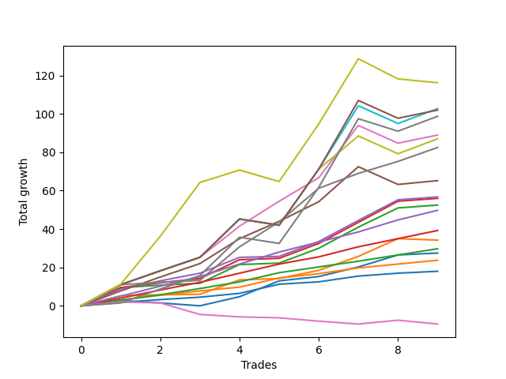

# Long Bernese 003 50 SB 
- Symbol: ES_1W
- Date Range: 03/18/2022 - 07/29/2022
- Trading Period: 7:20-12:30
- Number of Trades: 9



| Name | Win Percent | Profit | Avg Profit / Trade | Avg Time / Trade |      | Name | Win Percent | Profit | Avg Profit / Trade | Avg Time / Trade |
| ---- | ----------- | ------ | ------------------ | ---------------- | ---- | ---- | ----------- | ------ | ------------------ | ---------------- |
| Sorted By <br> Profit | | | | | | Sorted By <br> Win Percentage ||||
| MALAMUTE 002 | 66.67 | 58125.00 | 6458.33 | 286:51 |     | Six | 100.00 | 41250.00 | 4583.33 | 28:28 |
| BB100 | 77.78 | 51375.00 | 5708.33 | 48:12 |     | Three | 100.00 | 28375.00 | 3152.78 | 21:18 |
| NEWFI 000 | 77.78 | 51000.00 | 5666.67 | 49:51 |     | Two_C | 100.00 | 28000.00 | 3111.11 | 20:36 |
| MALAMUTE 001 | 77.78 | 49375.00 | 5486.11 | 45:45 |     | Two | 100.00 | 26250.00 | 2916.67 | 20:31 |
| Five | 88.89 | 44500.00 | 4944.44 | 35:51 |     | Eighty-Five | 100.00 | 24875.00 | 2763.89 | 11:30 |
| Seven | 77.78 | 43500.00 | 4833.33 | 45:46 |     | Eighty-Four | 100.00 | 19625.00 | 2180.56 | 10:47 |
| Six | 100.00 | 41250.00 | 4583.33 | 28:28 |     | Eighty-Three | 100.00 | 14875.00 | 1652.78 | 08:25 |
| Four | 88.89 | 32625.00 | 3625.00 | 32:33 |     | Eighty-Two | 100.00 | 11875.00 | 1319.44 | 05:43 |
| Three | 100.00 | 28375.00 | 3152.78 | 21:18 |     | Eighty-One | 100.00 | 9000.00 | 1000.00 | 05:03 |
| Two_C | 100.00 | 28000.00 | 3111.11 | 20:36 |     | Five | 88.89 | 44500.00 | 4944.44 | 35:51 |
| Two | 100.00 | 26250.00 | 2916.67 | 20:31 |     | Four | 88.89 | 32625.00 | 3625.00 | 32:33 |
| Eighty-Five | 100.00 | 24875.00 | 2763.89 | 11:30 |     | One | 88.89 | 17125.00 | 1902.78 | 16:20 |
| Eighty-Four | 100.00 | 19625.00 | 2180.56 | 10:47 |     | BB100 | 77.78 | 51375.00 | 5708.33 | 48:12 |
| One | 88.89 | 17125.00 | 1902.78 | 16:20 |     | NEWFI 000 | 77.78 | 51000.00 | 5666.67 | 49:51 |
| Eighty-Three | 100.00 | 14875.00 | 1652.78 | 08:25 |     | MALAMUTE 001 | 77.78 | 49375.00 | 5486.11 | 45:45 |
| Zero | 77.78 | 13750.00 | 1527.78 | 06:51 |     | Seven | 77.78 | 43500.00 | 4833.33 | 45:46 |
| Eighty-Two | 100.00 | 11875.00 | 1319.44 | 05:43 |     | Zero | 77.78 | 13750.00 | 1527.78 | 06:51 |
| Eighty-One | 100.00 | 9000.00 | 1000.00 | 05:03 |     | MALAMUTE 002 | 66.67 | 58125.00 | 6458.33 | 286:51 |
| NEWFI 0000 | 22.22 | -4750.00 | -527.78 | 03:31 |     | NEWFI 0000 | 22.22 | -4750.00 | -527.78 | 03:31 |

## NO STOPLOSS

### Test Zero
* Sell when price hits the middle line of the 20p bollinger
* No Stoploss
* Results:
```
Total Trades: 9
Percent Up: 77.78
Percent Down: 22.22
Total Points Moved Up: 27.50
Potential Profit: 13750.00
Total Points Ups: 30.25 Count Ups: 7
Total Points Downs: -2.75 Count Downs: 2
```

<details><summary>Trades</summary>

<code>In: 2022-03-25 08:30:00		Out: 2022-03-25 08:36:45		Total Position Time: 06:45		Total Move Up: 2.75		Total to Date: 2.75</code> <br />
<code>In: 2022-03-25 12:25:00		Out: 2022-03-25 12:37:10		Total Position Time: 12:10		Total Move Up: -1.25		Total to Date: 1.50</code> <br />
<code>In: 2022-03-25 12:26:00		Out: 2022-03-25 12:37:10		Total Position Time: 11:10		Total Move Up: -1.50		Total to Date: 0.00</code> <br />
<code>In: 2022-04-20 11:58:00		Out: 2022-04-20 12:01:15		Total Position Time: 03:15		Total Move Up: 4.75		Total to Date: 4.75</code> <br />
<code>In: 2022-05-06 11:11:00		Out: 2022-05-06 11:12:20		Total Position Time: 01:20		Total Move Up: 8.25		Total to Date: 13.00</code> <br />
<code>In: 2022-05-13 11:07:00		Out: 2022-05-13 11:19:15		Total Position Time: 12:15		Total Move Up: 2.25		Total to Date: 15.25</code> <br />
<code>In: 2022-05-17 11:25:00		Out: 2022-05-17 11:31:35		Total Position Time: 06:35		Total Move Up: 5.00		Total to Date: 20.25</code> <br />
<code>In: 2022-05-25 08:40:00		Out: 2022-05-25 08:44:05		Total Position Time: 04:05		Total Move Up: 6.25		Total to Date: 26.50</code> <br />
<code>In: 2022-07-08 09:45:00		Out: 2022-07-08 09:49:05		Total Position Time: 04:05		Total Move Up: 1.00		Total to Date: 27.50</code> <br />


</details>

### Test One
* Sell when the price hits the upper line of the 20p 1std bollinger
* No Stoploss
* Results:
```
Total Trades: 9
Percent Up: 88.89
Percent Down: 11.11
Total Points Moved Up: 34.25
Potential Profit: 17125.00
Total Points Ups: 35.00 Count Ups: 8
Total Points Downs: -0.75 Count Downs: 1
```

<details><summary>Trades</summary>

<code>In: 2022-03-25 08:30:00		Out: 2022-03-25 08:41:05		Total Position Time: 11:05		Total Move Up: 5.25		Total to Date: 5.25</code> <br />
<code>In: 2022-03-25 12:25:00		Out: 2022-03-25 12:40:55		Total Position Time: 15:55		Total Move Up: 0.50		Total to Date: 5.75</code> <br />
<code>In: 2022-03-25 12:26:00		Out: 2022-03-25 12:40:55		Total Position Time: 14:55		Total Move Up: 0.25		Total to Date: 6.00</code> <br />
<code>In: 2022-04-20 11:58:00		Out: 2022-04-20 12:04:20		Total Position Time: 06:20		Total Move Up: 7.50		Total to Date: 13.50</code> <br />
<code>In: 2022-05-06 11:11:00		Out: 2022-05-06 11:49:10		Total Position Time: 38:10		Total Move Up: 0.75		Total to Date: 14.25</code> <br />
<code>In: 2022-05-13 11:07:00		Out: 2022-05-13 11:20:05		Total Position Time: 13:05		Total Move Up: 4.25		Total to Date: 18.50</code> <br />
<code>In: 2022-05-17 11:25:00		Out: 2022-05-17 11:39:45		Total Position Time: 14:45		Total Move Up: 7.25		Total to Date: 25.75</code> <br />
<code>In: 2022-05-25 08:40:00		Out: 2022-05-25 08:50:50		Total Position Time: 10:50		Total Move Up: 9.25		Total to Date: 35.00</code> <br />
<code>In: 2022-07-08 09:45:00		Out: 2022-07-08 10:06:55		Total Position Time: 21:55		Total Move Up: -0.75		Total to Date: 34.25</code> <br />


</details>

### Test Two
* Sell when the price hits the upper line of the 20p 2std bollinger
* No Stoploss
* Results:
```
Total Trades: 9
Percent Up: 100.00
Percent Down: 0.00
Total Points Moved Up: 52.50
Potential Profit: 26250.00
Total Points Ups: 52.50 Count Ups: 9
Total Points Downs: 0.00 Count Downs: 0
```

<details><summary>Trades</summary>

<code>In: 2022-03-25 08:30:00		Out: 2022-03-25 08:41:55		Total Position Time: 11:55		Total Move Up: 9.50		Total to Date: 9.50</code> <br />
<code>In: 2022-03-25 12:25:00		Out: 2022-03-25 12:41:35		Total Position Time: 16:35		Total Move Up: 1.25		Total to Date: 10.75</code> <br />
<code>In: 2022-03-25 12:26:00		Out: 2022-03-25 12:41:35		Total Position Time: 15:35		Total Move Up: 1.00		Total to Date: 11.75</code> <br />
<code>In: 2022-04-20 11:58:00		Out: 2022-04-20 12:12:35		Total Position Time: 14:35		Total Move Up: 9.75		Total to Date: 21.50</code> <br />
<code>In: 2022-05-06 11:11:00		Out: 2022-05-06 11:49:10		Total Position Time: 38:10		Total Move Up: 0.75		Total to Date: 22.25</code> <br />
<code>In: 2022-05-13 11:07:00		Out: 2022-05-13 11:31:20		Total Position Time: 24:20		Total Move Up: 7.75		Total to Date: 30.00</code> <br />
<code>In: 2022-05-17 11:25:00		Out: 2022-05-17 11:40:05		Total Position Time: 15:05		Total Move Up: 11.00		Total to Date: 41.00</code> <br />
<code>In: 2022-05-25 08:40:00		Out: 2022-05-25 09:02:20		Total Position Time: 22:20		Total Move Up: 10.00		Total to Date: 51.00</code> <br />
<code>In: 2022-07-08 09:45:00		Out: 2022-07-08 10:11:05		Total Position Time: 26:05		Total Move Up: 1.50		Total to Date: 52.50</code> <br />


</details>

### Test Two_C
* Sell when the price hits the upper line of the 20p 2std bollinger
* No Stoploss
* Results:
```
Total Trades: 9
Percent Up: 100.00
Percent Down: 0.00
Total Points Moved Up: 56.00
Potential Profit: 28000.00
Total Points Ups: 56.00 Count Ups: 9
Total Points Downs: 0.00 Count Downs: 0
```

<details><summary>Trades</summary>

<code>In: 2022-03-25 08:30:00		Out: 2022-03-25 08:41:55		Total Position Time: 11:55		Total Move Up: 9.50		Total to Date: 9.50</code> <br />
<code>In: 2022-03-25 12:25:00		Out: 2022-03-25 12:41:55		Total Position Time: 16:55		Total Move Up: 2.50		Total to Date: 12.00</code> <br />
<code>In: 2022-03-25 12:26:00		Out: 2022-03-25 12:41:55		Total Position Time: 15:55		Total Move Up: 2.25		Total to Date: 14.25</code> <br />
<code>In: 2022-04-20 11:58:00		Out: 2022-04-20 12:12:35		Total Position Time: 14:35		Total Move Up: 9.75		Total to Date: 24.00</code> <br />
<code>In: 2022-05-06 11:11:00		Out: 2022-05-06 11:49:10		Total Position Time: 38:10		Total Move Up: 0.75		Total to Date: 24.75</code> <br />
<code>In: 2022-05-13 11:07:00		Out: 2022-05-13 11:31:20		Total Position Time: 24:20		Total Move Up: 7.75		Total to Date: 32.50</code> <br />
<code>In: 2022-05-17 11:25:00		Out: 2022-05-17 11:40:05		Total Position Time: 15:05		Total Move Up: 11.00		Total to Date: 43.50</code> <br />
<code>In: 2022-05-25 08:40:00		Out: 2022-05-25 09:02:30		Total Position Time: 22:30		Total Move Up: 11.00		Total to Date: 54.50</code> <br />
<code>In: 2022-07-08 09:45:00		Out: 2022-07-08 10:11:05		Total Position Time: 26:05		Total Move Up: 1.50		Total to Date: 56.00</code> <br />


</details>

### Test Three
* Sell when price hits the middle line of the 50p bollinger
* No Stoploss
* Results:
```
Total Trades: 9
Percent Up: 100.00
Percent Down: 0.00
Total Points Moved Up: 56.75
Potential Profit: 28375.00
Total Points Ups: 56.75 Count Ups: 9
Total Points Downs: 0.00 Count Downs: 0
```

<details><summary>Trades</summary>

<code>In: 2022-03-25 08:30:00		Out: 2022-03-25 08:53:00		Total Position Time: 23:00		Total Move Up: 8.75		Total to Date: 8.75</code> <br />
<code>In: 2022-03-25 12:25:00		Out: 2022-03-25 12:42:40		Total Position Time: 17:40		Total Move Up: 4.25		Total to Date: 13.00</code> <br />
<code>In: 2022-03-25 12:26:00		Out: 2022-03-25 12:42:40		Total Position Time: 16:40		Total Move Up: 4.00		Total to Date: 17.00</code> <br />
<code>In: 2022-04-20 11:58:00		Out: 2022-04-20 12:10:10		Total Position Time: 12:10		Total Move Up: 8.25		Total to Date: 25.25</code> <br />
<code>In: 2022-05-06 11:11:00		Out: 2022-05-06 11:49:15		Total Position Time: 38:15		Total Move Up: 0.50		Total to Date: 25.75</code> <br />
<code>In: 2022-05-13 11:07:00		Out: 2022-05-13 11:31:20		Total Position Time: 24:20		Total Move Up: 7.75		Total to Date: 33.50</code> <br />
<code>In: 2022-05-17 11:25:00		Out: 2022-05-17 11:40:05		Total Position Time: 15:05		Total Move Up: 11.00		Total to Date: 44.50</code> <br />
<code>In: 2022-05-25 08:40:00		Out: 2022-05-25 08:58:25		Total Position Time: 18:25		Total Move Up: 10.75		Total to Date: 55.25</code> <br />
<code>In: 2022-07-08 09:45:00		Out: 2022-07-08 10:11:10		Total Position Time: 26:10		Total Move Up: 1.50		Total to Date: 56.75</code> <br />


</details>

### Test Four
* Sell when the price hits the upper line of the 50p 1std bollinger
* No Stoploss
* Results:
```
Total Trades: 9
Percent Up: 88.89
Percent Down: 11.11
Total Points Moved Up: 65.25
Potential Profit: 32625.00
Total Points Ups: 74.50 Count Ups: 8
Total Points Downs: -9.25 Count Downs: 1
```

<details><summary>Trades</summary>

<code>In: 2022-03-25 08:30:00		Out: 2022-03-25 09:07:15		Total Position Time: 37:15		Total Move Up: 7.75		Total to Date: 7.75</code> <br />
<code>In: 2022-03-25 12:25:00		Out: 2022-03-25 12:47:00		Total Position Time: 22:00		Total Move Up: 7.25		Total to Date: 15.00</code> <br />
<code>In: 2022-03-25 12:26:00		Out: 2022-03-25 12:47:00		Total Position Time: 21:00		Total Move Up: 7.00		Total to Date: 22.00</code> <br />
<code>In: 2022-04-20 11:58:00		Out: 2022-04-20 12:13:35		Total Position Time: 15:35		Total Move Up: 13.00		Total to Date: 35.00</code> <br />
<code>In: 2022-05-06 11:11:00		Out: 2022-05-06 11:50:10		Total Position Time: 39:10		Total Move Up: 9.00		Total to Date: 44.00</code> <br />
<code>In: 2022-05-13 11:07:00		Out: 2022-05-13 11:43:05		Total Position Time: 36:05		Total Move Up: 10.25		Total to Date: 54.25</code> <br />
<code>In: 2022-05-17 11:25:00		Out: 2022-05-17 11:44:30		Total Position Time: 19:30		Total Move Up: 18.25		Total to Date: 72.50</code> <br />
<code>In: 2022-05-25 08:40:00		Out: 2022-05-25 09:40:55		Total Position Time: 60:55		Total Move Up: -9.25		Total to Date: 63.25</code> <br />
<code>In: 2022-07-08 09:45:00		Out: 2022-07-08 10:26:30		Total Position Time: 41:30		Total Move Up: 2.00		Total to Date: 65.25</code> <br />


</details>

### Test Five
* Sell when the price hits the upper line of the 50p 2std bollinger
* No Stoploss
* Results:
```
Total Trades: 9
Percent Up: 88.89
Percent Down: 11.11
Total Points Moved Up: 89.00
Potential Profit: 44500.00
Total Points Ups: 98.25 Count Ups: 8
Total Points Downs: -9.25 Count Downs: 1
```

<details><summary>Trades</summary>

<code>In: 2022-03-25 08:30:00		Out: 2022-03-25 09:11:40		Total Position Time: 41:40		Total Move Up: 11.00		Total to Date: 11.00</code> <br />
<code>In: 2022-03-25 12:25:00		Out: 2022-03-25 12:47:00		Total Position Time: 22:00		Total Move Up: 7.25		Total to Date: 18.25</code> <br />
<code>In: 2022-03-25 12:26:00		Out: 2022-03-25 12:47:00		Total Position Time: 21:00		Total Move Up: 7.00		Total to Date: 25.25</code> <br />
<code>In: 2022-04-20 11:58:00		Out: 2022-04-20 12:25:45		Total Position Time: 27:45		Total Move Up: 16.25		Total to Date: 41.50</code> <br />
<code>In: 2022-05-06 11:11:00		Out: 2022-05-06 11:50:35		Total Position Time: 39:35		Total Move Up: 13.00		Total to Date: 54.50</code> <br />
<code>In: 2022-05-13 11:07:00		Out: 2022-05-13 11:51:10		Total Position Time: 44:10		Total Move Up: 12.25		Total to Date: 66.75</code> <br />
<code>In: 2022-05-17 11:25:00		Out: 2022-05-17 11:48:40		Total Position Time: 23:40		Total Move Up: 27.25		Total to Date: 94.00</code> <br />
<code>In: 2022-05-25 08:40:00		Out: 2022-05-25 09:40:55		Total Position Time: 60:55		Total Move Up: -9.25		Total to Date: 84.75</code> <br />
<code>In: 2022-07-08 09:45:00		Out: 2022-07-08 10:27:00		Total Position Time: 42:00		Total Move Up: 4.25		Total to Date: 89.00</code> <br />


</details>

### Test Six
* Sell when the price hits the middle line of the 1std VWAP
* No Stoploss
* Results:
```
Total Trades: 9
Percent Up: 100.00
Percent Down: 0.00
Total Points Moved Up: 82.50
Potential Profit: 41250.00
Total Points Ups: 82.50 Count Ups: 9
Total Points Downs: 0.00 Count Downs: 0
```

<details><summary>Trades</summary>

<code>In: 2022-03-25 08:30:00		Out: 2022-03-25 09:30:55		Total Position Time: 60:55		Total Move Up: 11.00		Total to Date: 11.00</code> <br />
<code>In: 2022-03-25 12:25:00		Out: 2022-03-25 12:41:35		Total Position Time: 16:35		Total Move Up: 1.25		Total to Date: 12.25</code> <br />
<code>In: 2022-03-25 12:26:00		Out: 2022-03-25 12:41:35		Total Position Time: 15:35		Total Move Up: 1.00		Total to Date: 13.25</code> <br />
<code>In: 2022-04-20 11:58:00		Out: 2022-04-20 12:25:50		Total Position Time: 27:50		Total Move Up: 17.50		Total to Date: 30.75</code> <br />
<code>In: 2022-05-06 11:11:00		Out: 2022-05-06 11:50:20		Total Position Time: 39:20		Total Move Up: 13.00		Total to Date: 43.75</code> <br />
<code>In: 2022-05-13 11:07:00		Out: 2022-05-13 11:52:25		Total Position Time: 45:25		Total Move Up: 17.50		Total to Date: 61.25</code> <br />
<code>In: 2022-05-17 11:25:00		Out: 2022-05-17 11:27:25		Total Position Time: 02:25		Total Move Up: 7.75		Total to Date: 69.00</code> <br />
<code>In: 2022-05-25 08:40:00		Out: 2022-05-25 08:44:05		Total Position Time: 04:05		Total Move Up: 6.25		Total to Date: 75.25</code> <br />
<code>In: 2022-07-08 09:45:00		Out: 2022-07-08 10:29:10		Total Position Time: 44:10		Total Move Up: 7.25		Total to Date: 82.50</code> <br />


</details>

### Test Seven
* Sell when the price hits the upper line of the 1std VWAP
* No Stoploss
* Results:
```
Total Trades: 9
Percent Up: 77.78
Percent Down: 22.22
Total Points Moved Up: 87.00
Potential Profit: 43500.00
Total Points Ups: 99.50 Count Ups: 7
Total Points Downs: -12.50 Count Downs: 2
```

<details><summary>Trades</summary>

<code>In: 2022-03-25 08:30:00		Out: 2022-03-25 09:30:55		Total Position Time: 60:55		Total Move Up: 11.00		Total to Date: 11.00</code> <br />
<code>In: 2022-03-25 12:25:00		Out: 2022-03-25 12:47:00		Total Position Time: 22:00		Total Move Up: 7.25		Total to Date: 18.25</code> <br />
<code>In: 2022-03-25 12:26:00		Out: 2022-03-25 12:47:00		Total Position Time: 21:00		Total Move Up: 7.00		Total to Date: 25.25</code> <br />
<code>In: 2022-04-20 11:58:00		Out: 2022-04-20 12:47:00		Total Position Time: 49:00		Total Move Up: 20.00		Total to Date: 45.25</code> <br />
<code>In: 2022-05-06 11:11:00		Out: 2022-05-06 12:11:55		Total Position Time: 60:55		Total Move Up: -3.25		Total to Date: 42.00</code> <br />
<code>In: 2022-05-13 11:07:00		Out: 2022-05-13 12:07:55		Total Position Time: 60:55		Total Move Up: 29.25		Total to Date: 71.25</code> <br />
<code>In: 2022-05-17 11:25:00		Out: 2022-05-17 11:40:20		Total Position Time: 15:20		Total Move Up: 17.25		Total to Date: 88.50</code> <br />
<code>In: 2022-05-25 08:40:00		Out: 2022-05-25 09:40:55		Total Position Time: 60:55		Total Move Up: -9.25		Total to Date: 79.25</code> <br />
<code>In: 2022-07-08 09:45:00		Out: 2022-07-08 10:45:55		Total Position Time: 60:55		Total Move Up: 7.75		Total to Date: 87.00</code> <br />


</details>

### Test BB100
* Sell when the price hits the upper line of the 1std VWAP
* No Stoploss
* Results:
```
Total Trades: 9
Percent Up: 77.78
Percent Down: 22.22
Total Points Moved Up: 102.75
Potential Profit: 51375.00
Total Points Ups: 115.25 Count Ups: 7
Total Points Downs: -12.50 Count Downs: 2
```

<details><summary>Trades</summary>

<code>In: 2022-03-25 08:30:00		Out: 2022-03-25 09:30:55		Total Position Time: 60:55		Total Move Up: 11.00		Total to Date: 11.00</code> <br />
<code>In: 2022-03-25 12:25:00		Out: 2022-03-25 12:47:00		Total Position Time: 22:00		Total Move Up: 7.25		Total to Date: 18.25</code> <br />
<code>In: 2022-03-25 12:26:00		Out: 2022-03-25 12:47:00		Total Position Time: 21:00		Total Move Up: 7.00		Total to Date: 25.25</code> <br />
<code>In: 2022-04-20 11:58:00		Out: 2022-04-20 12:47:00		Total Position Time: 49:00		Total Move Up: 20.00		Total to Date: 45.25</code> <br />
<code>In: 2022-05-06 11:11:00		Out: 2022-05-06 12:11:55		Total Position Time: 60:55		Total Move Up: -3.25		Total to Date: 42.00</code> <br />
<code>In: 2022-05-13 11:07:00		Out: 2022-05-13 12:07:55		Total Position Time: 60:55		Total Move Up: 29.25		Total to Date: 71.25</code> <br />
<code>In: 2022-05-17 11:25:00		Out: 2022-05-17 12:02:20		Total Position Time: 37:20		Total Move Up: 33.00		Total to Date: 104.25</code> <br />
<code>In: 2022-05-25 08:40:00		Out: 2022-05-25 09:40:55		Total Position Time: 60:55		Total Move Up: -9.25		Total to Date: 95.00</code> <br />
<code>In: 2022-07-08 09:45:00		Out: 2022-07-08 10:45:55		Total Position Time: 60:55		Total Move Up: 7.75		Total to Date: 102.75</code> <br />


</details>

## TAKE PROFIT

### Test Eighty-One
* Take Profit of 1 Point
* No Stoploss
* Results:
```
Total Trades: 9
Percent Up: 100.00
Percent Down: 0.00
Total Points Moved Up: 18.00
Potential Profit: 9000.00
Total Points Ups: 18.00 Count Ups: 9
Total Points Downs: 0.00 Count Downs: 0
```

<details><summary>Trades</summary>

<code>In: 2022-03-25 08:30:00		Out: 2022-03-25 08:31:10		Total Position Time: 01:10		Total Move Up: 1.75		Total to Date: 1.75</code> <br />
<code>In: 2022-03-25 12:25:00		Out: 2022-03-25 12:41:30		Total Position Time: 16:30		Total Move Up: 1.50		Total to Date: 3.25</code> <br />
<code>In: 2022-03-25 12:26:00		Out: 2022-03-25 12:41:30		Total Position Time: 15:30		Total Move Up: 1.25		Total to Date: 4.50</code> <br />
<code>In: 2022-04-20 11:58:00		Out: 2022-04-20 12:00:15		Total Position Time: 02:15		Total Move Up: 2.00		Total to Date: 6.50</code> <br />
<code>In: 2022-05-06 11:11:00		Out: 2022-05-06 11:12:10		Total Position Time: 01:10		Total Move Up: 4.75		Total to Date: 11.25</code> <br />
<code>In: 2022-05-13 11:07:00		Out: 2022-05-13 11:09:25		Total Position Time: 02:25		Total Move Up: 1.25		Total to Date: 12.50</code> <br />
<code>In: 2022-05-17 11:25:00		Out: 2022-05-17 11:26:40		Total Position Time: 01:40		Total Move Up: 3.00		Total to Date: 15.50</code> <br />
<code>In: 2022-05-25 08:40:00		Out: 2022-05-25 08:41:10		Total Position Time: 01:10		Total Move Up: 1.50		Total to Date: 17.00</code> <br />
<code>In: 2022-07-08 09:45:00		Out: 2022-07-08 09:48:40		Total Position Time: 03:40		Total Move Up: 1.00		Total to Date: 18.00</code> <br />


</details>

### Test Eighty-Two
* Take Profit of 2 Point
* No Stoploss
* Results:
```
Total Trades: 9
Percent Up: 100.00
Percent Down: 0.00
Total Points Moved Up: 23.75
Potential Profit: 11875.00
Total Points Ups: 23.75 Count Ups: 9
Total Points Downs: 0.00 Count Downs: 0
```

<details><summary>Trades</summary>

<code>In: 2022-03-25 08:30:00		Out: 2022-03-25 08:35:05		Total Position Time: 05:05		Total Move Up: 3.00		Total to Date: 3.00</code> <br />
<code>In: 2022-03-25 12:25:00		Out: 2022-03-25 12:41:55		Total Position Time: 16:55		Total Move Up: 2.50		Total to Date: 5.50</code> <br />
<code>In: 2022-03-25 12:26:00		Out: 2022-03-25 12:41:55		Total Position Time: 15:55		Total Move Up: 2.25		Total to Date: 7.75</code> <br />
<code>In: 2022-04-20 11:58:00		Out: 2022-04-20 12:00:15		Total Position Time: 02:15		Total Move Up: 2.00		Total to Date: 9.75</code> <br />
<code>In: 2022-05-06 11:11:00		Out: 2022-05-06 11:12:10		Total Position Time: 01:10		Total Move Up: 4.75		Total to Date: 14.50</code> <br />
<code>In: 2022-05-13 11:07:00		Out: 2022-05-13 11:09:30		Total Position Time: 02:30		Total Move Up: 2.25		Total to Date: 16.75</code> <br />
<code>In: 2022-05-17 11:25:00		Out: 2022-05-17 11:26:40		Total Position Time: 01:40		Total Move Up: 3.00		Total to Date: 19.75</code> <br />
<code>In: 2022-05-25 08:40:00		Out: 2022-05-25 08:41:15		Total Position Time: 01:15		Total Move Up: 2.00		Total to Date: 21.75</code> <br />
<code>In: 2022-07-08 09:45:00		Out: 2022-07-08 09:49:45		Total Position Time: 04:45		Total Move Up: 2.00		Total to Date: 23.75</code> <br />


</details>

### Test Eighty-Three
* Take Profit of 3 Point
* No Stoploss
* Results:
```
Total Trades: 9
Percent Up: 100.00
Percent Down: 0.00
Total Points Moved Up: 29.75
Potential Profit: 14875.00
Total Points Ups: 29.75 Count Ups: 9
Total Points Downs: 0.00 Count Downs: 0
```

<details><summary>Trades</summary>

<code>In: 2022-03-25 08:30:00		Out: 2022-03-25 08:35:05		Total Position Time: 05:05		Total Move Up: 3.00		Total to Date: 3.00</code> <br />
<code>In: 2022-03-25 12:25:00		Out: 2022-03-25 12:42:00		Total Position Time: 17:00		Total Move Up: 2.75		Total to Date: 5.75</code> <br />
<code>In: 2022-03-25 12:26:00		Out: 2022-03-25 12:42:05		Total Position Time: 16:05		Total Move Up: 3.25		Total to Date: 9.00</code> <br />
<code>In: 2022-04-20 11:58:00		Out: 2022-04-20 12:01:10		Total Position Time: 03:10		Total Move Up: 3.50		Total to Date: 12.50</code> <br />
<code>In: 2022-05-06 11:11:00		Out: 2022-05-06 11:12:10		Total Position Time: 01:10		Total Move Up: 4.75		Total to Date: 17.25</code> <br />
<code>In: 2022-05-13 11:07:00		Out: 2022-05-13 11:09:35		Total Position Time: 02:35		Total Move Up: 3.00		Total to Date: 20.25</code> <br />
<code>In: 2022-05-17 11:25:00		Out: 2022-05-17 11:26:40		Total Position Time: 01:40		Total Move Up: 3.00		Total to Date: 23.25</code> <br />
<code>In: 2022-05-25 08:40:00		Out: 2022-05-25 08:41:40		Total Position Time: 01:40		Total Move Up: 3.25		Total to Date: 26.50</code> <br />
<code>In: 2022-07-08 09:45:00		Out: 2022-07-08 10:12:25		Total Position Time: 27:25		Total Move Up: 3.25		Total to Date: 29.75</code> <br />


</details>

### Test Eighty-Four
* Take Profit of 4 Point
* No Stoploss
* Results:
```
Total Trades: 9
Percent Up: 100.00
Percent Down: 0.00
Total Points Moved Up: 39.25
Potential Profit: 19625.00
Total Points Ups: 39.25 Count Ups: 9
Total Points Downs: 0.00 Count Downs: 0
```

<details><summary>Trades</summary>

<code>In: 2022-03-25 08:30:00		Out: 2022-03-25 08:36:55		Total Position Time: 06:55		Total Move Up: 4.00		Total to Date: 4.00</code> <br />
<code>In: 2022-03-25 12:25:00		Out: 2022-03-25 12:42:40		Total Position Time: 17:40		Total Move Up: 4.25		Total to Date: 8.25</code> <br />
<code>In: 2022-03-25 12:26:00		Out: 2022-03-25 12:42:40		Total Position Time: 16:40		Total Move Up: 4.00		Total to Date: 12.25</code> <br />
<code>In: 2022-04-20 11:58:00		Out: 2022-04-20 12:01:15		Total Position Time: 03:15		Total Move Up: 4.75		Total to Date: 17.00</code> <br />
<code>In: 2022-05-06 11:11:00		Out: 2022-05-06 11:12:10		Total Position Time: 01:10		Total Move Up: 4.75		Total to Date: 21.75</code> <br />
<code>In: 2022-05-13 11:07:00		Out: 2022-05-13 11:10:20		Total Position Time: 03:20		Total Move Up: 3.75		Total to Date: 25.50</code> <br />
<code>In: 2022-05-17 11:25:00		Out: 2022-05-17 11:27:05		Total Position Time: 02:05		Total Move Up: 5.25		Total to Date: 30.75</code> <br />
<code>In: 2022-05-25 08:40:00		Out: 2022-05-25 08:44:00		Total Position Time: 04:00		Total Move Up: 4.25		Total to Date: 35.00</code> <br />
<code>In: 2022-07-08 09:45:00		Out: 2022-07-08 10:27:00		Total Position Time: 42:00		Total Move Up: 4.25		Total to Date: 39.25</code> <br />


</details>

### Test Eighty-Five
* Take Profit of 5 Point
* No Stoploss
* Results:
```
Total Trades: 9
Percent Up: 100.00
Percent Down: 0.00
Total Points Moved Up: 49.75
Potential Profit: 24875.00
Total Points Ups: 49.75 Count Ups: 9
Total Points Downs: 0.00 Count Downs: 0
```

<details><summary>Trades</summary>

<code>In: 2022-03-25 08:30:00		Out: 2022-03-25 08:40:40		Total Position Time: 10:40		Total Move Up: 5.00		Total to Date: 5.00</code> <br />
<code>In: 2022-03-25 12:25:00		Out: 2022-03-25 12:43:05		Total Position Time: 18:05		Total Move Up: 5.25		Total to Date: 10.25</code> <br />
<code>In: 2022-03-25 12:26:00		Out: 2022-03-25 12:43:05		Total Position Time: 17:05		Total Move Up: 5.00		Total to Date: 15.25</code> <br />
<code>In: 2022-04-20 11:58:00		Out: 2022-04-20 12:01:20		Total Position Time: 03:20		Total Move Up: 6.50		Total to Date: 21.75</code> <br />
<code>In: 2022-05-06 11:11:00		Out: 2022-05-06 11:12:15		Total Position Time: 01:15		Total Move Up: 6.25		Total to Date: 28.00</code> <br />
<code>In: 2022-05-13 11:07:00		Out: 2022-05-13 11:10:50		Total Position Time: 03:50		Total Move Up: 5.25		Total to Date: 33.25</code> <br />
<code>In: 2022-05-17 11:25:00		Out: 2022-05-17 11:27:05		Total Position Time: 02:05		Total Move Up: 5.25		Total to Date: 38.50</code> <br />
<code>In: 2022-05-25 08:40:00		Out: 2022-05-25 08:44:05		Total Position Time: 04:05		Total Move Up: 6.25		Total to Date: 44.75</code> <br />
<code>In: 2022-07-08 09:45:00		Out: 2022-07-08 10:28:10		Total Position Time: 43:10		Total Move Up: 5.00		Total to Date: 49.75</code> <br />


</details>

## Indicator Exits

### Test NEWFI 000
* Newfi 0000
* No Stoploss
* Results:
```
Total Trades: 9
Percent Up: 77.78
Percent Down: 22.22
Total Points Moved Up: 102.00
Potential Profit: 51000.00
Total Points Ups: 114.50 Count Ups: 7
Total Points Downs: -12.50 Count Downs: 2
```

<details><summary>Trades</summary>

<code>In: 2022-03-25 08:30:00		Out: 2022-03-25 09:30:55		Total Position Time: 60:55		Total Move Up: 11.00		Total to Date: 11.00</code> <br />
<code>In: 2022-03-25 12:25:00		Out: 2022-03-25 12:47:00		Total Position Time: 22:00		Total Move Up: 7.25		Total to Date: 18.25</code> <br />
<code>In: 2022-03-25 12:26:00		Out: 2022-03-25 12:47:00		Total Position Time: 21:00		Total Move Up: 7.00		Total to Date: 25.25</code> <br />
<code>In: 2022-04-20 11:58:00		Out: 2022-04-20 12:47:00		Total Position Time: 49:00		Total Move Up: 20.00		Total to Date: 45.25</code> <br />
<code>In: 2022-05-06 11:11:00		Out: 2022-05-06 12:11:55		Total Position Time: 60:55		Total Move Up: -3.25		Total to Date: 42.00</code> <br />
<code>In: 2022-05-13 11:07:00		Out: 2022-05-13 12:07:55		Total Position Time: 60:55		Total Move Up: 29.25		Total to Date: 71.25</code> <br />
<code>In: 2022-05-17 11:25:00		Out: 2022-05-17 12:25:55		Total Position Time: 60:55		Total Move Up: 35.75		Total to Date: 107.00</code> <br />
<code>In: 2022-05-25 08:40:00		Out: 2022-05-25 09:40:55		Total Position Time: 60:55		Total Move Up: -9.25		Total to Date: 97.75</code> <br />
<code>In: 2022-07-08 09:45:00		Out: 2022-07-08 10:37:05		Total Position Time: 52:05		Total Move Up: 4.25		Total to Date: 102.00</code> <br />


</details>

### Test NEWFI 0000
* Newfi 0000
* No Stoploss
* Results:
```
Total Trades: 9
Percent Up: 22.22
Percent Down: 77.78
Total Points Moved Up: -9.50
Potential Profit: -4750.00
Total Points Ups: 4.00 Count Ups: 2
Total Points Downs: -13.50 Count Downs: 7
```

<details><summary>Trades</summary>

<code>In: 2022-03-25 08:30:00		Out: 2022-03-25 08:31:05		Total Position Time: 01:05		Total Move Up: 2.00		Total to Date: 2.00</code> <br />
<code>In: 2022-03-25 12:25:00		Out: 2022-03-25 12:26:05		Total Position Time: 01:05		Total Move Up: -0.50		Total to Date: 1.50</code> <br />
<code>In: 2022-03-25 12:26:00		Out: 2022-03-25 12:32:05		Total Position Time: 06:05		Total Move Up: -6.00		Total to Date: -4.50</code> <br />
<code>In: 2022-04-20 11:58:00		Out: 2022-04-20 11:59:05		Total Position Time: 01:05		Total Move Up: -1.25		Total to Date: -5.75</code> <br />
<code>In: 2022-05-06 11:11:00		Out: 2022-05-06 11:29:05		Total Position Time: 18:05		Total Move Up: -0.50		Total to Date: -6.25</code> <br />
<code>In: 2022-05-13 11:07:00		Out: 2022-05-13 11:08:05		Total Position Time: 01:05		Total Move Up: -1.75		Total to Date: -8.00</code> <br />
<code>In: 2022-05-17 11:25:00		Out: 2022-05-17 11:26:05		Total Position Time: 01:05		Total Move Up: -1.50		Total to Date: -9.50</code> <br />
<code>In: 2022-05-25 08:40:00		Out: 2022-05-25 08:41:05		Total Position Time: 01:05		Total Move Up: 2.00		Total to Date: -7.50</code> <br />
<code>In: 2022-07-08 09:45:00		Out: 2022-07-08 09:46:05		Total Position Time: 01:05		Total Move Up: -2.00		Total to Date: -9.50</code> <br />


</details>

### Test MALAMUTE 001
* Malamute 001
* No Stoploss
* Results:
```
Total Trades: 9
Percent Up: 77.78
Percent Down: 22.22
Total Points Moved Up: 98.75
Potential Profit: 49375.00
Total Points Ups: 108.50 Count Ups: 7
Total Points Downs: -9.75 Count Downs: 2
```

<details><summary>Trades</summary>

<code>In: 2022-03-25 08:30:00		Out: 2022-03-25 09:04:05		Total Position Time: 34:05		Total Move Up: 1.50		Total to Date: 1.50</code> <br />
<code>In: 2022-03-25 12:25:00		Out: 2022-03-25 12:47:00		Total Position Time: 22:00		Total Move Up: 7.25		Total to Date: 8.75</code> <br />
<code>In: 2022-03-25 12:26:00		Out: 2022-03-25 12:47:00		Total Position Time: 21:00		Total Move Up: 7.00		Total to Date: 15.75</code> <br />
<code>In: 2022-04-20 11:58:00		Out: 2022-04-20 12:47:00		Total Position Time: 49:00		Total Move Up: 20.00		Total to Date: 35.75</code> <br />
<code>In: 2022-05-06 11:11:00		Out: 2022-05-06 12:11:55		Total Position Time: 60:55		Total Move Up: -3.25		Total to Date: 32.50</code> <br />
<code>In: 2022-05-13 11:07:00		Out: 2022-05-13 12:07:55		Total Position Time: 60:55		Total Move Up: 29.25		Total to Date: 61.75</code> <br />
<code>In: 2022-05-17 11:25:00		Out: 2022-05-17 12:25:55		Total Position Time: 60:55		Total Move Up: 35.75		Total to Date: 97.50</code> <br />
<code>In: 2022-05-25 08:40:00		Out: 2022-05-25 09:22:05		Total Position Time: 42:05		Total Move Up: -6.50		Total to Date: 91.00</code> <br />
<code>In: 2022-07-08 09:45:00		Out: 2022-07-08 10:45:55		Total Position Time: 60:55		Total Move Up: 7.75		Total to Date: 98.75</code> <br />


</details>

### Test MALAMUTE 002
* Malamute 001
* No Stoploss
* Results:
```
Total Trades: 9
Percent Up: 66.67
Percent Down: 33.33
Total Points Moved Up: 116.25
Potential Profit: 58125.00
Total Points Ups: 134.75 Count Ups: 6
Total Points Downs: -18.50 Count Downs: 3
```

<details><summary>Trades</summary>

<code>In: 2022-03-25 08:30:00		Out: 2022-03-25 09:30:05		Total Position Time: 60:05		Total Move Up: 11.25		Total to Date: 11.25</code> <br />
<code>In: 2022-03-25 12:25:00		Out: 2022-03-28 06:55:05		Total Position Time: 1110:05		Total Move Up: 25.00		Total to Date: 36.25</code> <br />
<code>In: 2022-03-25 12:26:00		Out: 2022-03-28 06:56:05		Total Position Time: 1110:05		Total Move Up: 28.00		Total to Date: 64.25</code> <br />
<code>In: 2022-04-20 11:58:00		Out: 2022-04-20 12:58:05		Total Position Time: 60:05		Total Move Up: 6.50		Total to Date: 70.75</code> <br />
<code>In: 2022-05-06 11:11:00		Out: 2022-05-06 12:11:05		Total Position Time: 60:05		Total Move Up: -6.00		Total to Date: 64.75</code> <br />
<code>In: 2022-05-13 11:07:00		Out: 2022-05-13 12:07:05		Total Position Time: 60:05		Total Move Up: 30.00		Total to Date: 94.75</code> <br />
<code>In: 2022-05-17 11:25:00		Out: 2022-05-17 12:25:05		Total Position Time: 60:05		Total Move Up: 34.00		Total to Date: 128.75</code> <br />
<code>In: 2022-05-25 08:40:00		Out: 2022-05-25 09:40:05		Total Position Time: 60:05		Total Move Up: -10.50		Total to Date: 118.25</code> <br />
<code>In: 2022-07-08 09:45:00		Out: 2022-07-08 09:46:05		Total Position Time: 01:05		Total Move Up: -2.00		Total to Date: 116.25</code> <br />


</details>