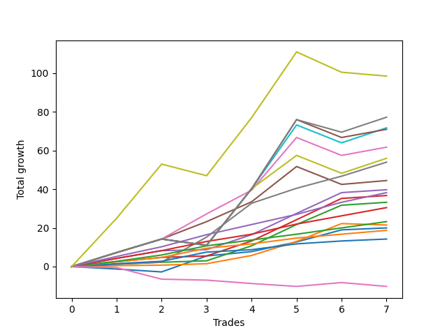

# Long Bernese 003 50 
- Symbol: ES_1W
- Date Range: 03/18/2022 - 07/29/2022
- Trading Period: 7:20-12:30
- Number of Trades: 7



| Name | Win Percent | Profit | Avg Profit / Trade | Avg Time / Trade |      | Name | Win Percent | Profit | Avg Profit / Trade | Avg Time / Trade |
| ---- | ----------- | ------ | ------------------ | ---------------- | ---- | ---- | ----------- | ------ | ------------------ | ---------------- |
| Sorted By <br> Profit | | | | | | Sorted By <br> Win Percentage ||||
| MALAMUTE 002 | 57.14 | 49250.00 | 7035.71 | 351:39 |     | Six | 100.00 | 27000.00 | 3857.14 | 23:56 |
| MALAMUTE 001 | 71.43 | 38625.00 | 5517.86 | 46:57 |     | Three | 100.00 | 19875.00 | 2839.29 | 22:22 |
| BB100 | 71.43 | 35875.00 | 5125.00 | 46:17 |     | Eighty-Five | 100.00 | 19125.00 | 2732.14 | 12:47 |
| NEWFI 000 | 71.43 | 35500.00 | 5071.43 | 48:23 |     | Two_C | 100.00 | 18375.00 | 2625.00 | 22:42 |
| Five | 85.71 | 30875.00 | 4410.71 | 36:11 |     | Two | 100.00 | 16625.00 | 2375.00 | 22:35 |
| Seven | 71.43 | 28000.00 | 4000.00 | 43:08 |     | Eighty-Four | 100.00 | 15250.00 | 2178.57 | 12:25 |
| Six | 100.00 | 27000.00 | 3857.14 | 23:56 |     | Eighty-Three | 100.00 | 11625.00 | 1660.71 | 09:39 |
| Four | 85.71 | 22250.00 | 3178.57 | 34:18 |     | Eighty-Two | 100.00 | 9375.00 | 1339.29 | 06:18 |
| Three | 100.00 | 19875.00 | 2839.29 | 22:22 |     | Eighty-One | 100.00 | 7125.00 | 1017.86 | 06:00 |
| Eighty-Five | 100.00 | 19125.00 | 2732.14 | 12:47 |     | Five | 85.71 | 30875.00 | 4410.71 | 36:11 |
| Two_C | 100.00 | 18375.00 | 2625.00 | 22:42 |     | Four | 85.71 | 22250.00 | 3178.57 | 34:18 |
| Two | 100.00 | 16625.00 | 2375.00 | 22:35 |     | One | 85.71 | 10750.00 | 1535.71 | 18:30 |
| Eighty-Four | 100.00 | 15250.00 | 2178.57 | 12:25 |     | MALAMUTE 001 | 71.43 | 38625.00 | 5517.86 | 46:57 |
| Eighty-Three | 100.00 | 11625.00 | 1660.71 | 09:39 |     | BB100 | 71.43 | 35875.00 | 5125.00 | 46:17 |
| One | 85.71 | 10750.00 | 1535.71 | 18:30 |     | NEWFI 000 | 71.43 | 35500.00 | 5071.43 | 48:23 |
| Zero | 71.43 | 10000.00 | 1428.57 | 07:22 |     | Seven | 71.43 | 28000.00 | 4000.00 | 43:08 |
| Eighty-Two | 100.00 | 9375.00 | 1339.29 | 06:18 |     | Zero | 71.43 | 10000.00 | 1428.57 | 07:22 |
| Eighty-One | 100.00 | 7125.00 | 1017.86 | 06:00 |     | MALAMUTE 002 | 57.14 | 49250.00 | 7035.71 | 351:39 |
| NEWFI 0000 | 14.29 | -5125.00 | -732.14 | 04:13 |     | NEWFI 0000 | 14.29 | -5125.00 | -732.14 | 04:13 |

## NO STOPLOSS

### Test Zero
* Sell when price hits the middle line of the 20p bollinger
* No Stoploss
* Results:
```
Total Trades: 7
Percent Up: 71.43
Percent Down: 28.57
Total Points Moved Up: 20.00
Potential Profit: 10000.00
Total Points Ups: 22.75 Count Ups: 5
Total Points Downs: -2.75 Count Downs: 2
```

<details><summary>Trades</summary>

<code>In: 2022-03-25 12:25:00		Out: 2022-03-25 12:37:10		Total Position Time: 12:10		Total Move Up: -1.25		Total to Date: -1.25</code> <br />
<code>In: 2022-03-25 12:26:00		Out: 2022-03-25 12:37:10		Total Position Time: 11:10		Total Move Up: -1.50		Total to Date: -2.75</code> <br />
<code>In: 2022-05-06 11:11:00		Out: 2022-05-06 11:12:20		Total Position Time: 01:20		Total Move Up: 8.25		Total to Date: 5.50</code> <br />
<code>In: 2022-05-13 11:07:00		Out: 2022-05-13 11:19:15		Total Position Time: 12:15		Total Move Up: 2.25		Total to Date: 7.75</code> <br />
<code>In: 2022-05-17 11:25:00		Out: 2022-05-17 11:31:35		Total Position Time: 06:35		Total Move Up: 5.00		Total to Date: 12.75</code> <br />
<code>In: 2022-05-25 08:40:00		Out: 2022-05-25 08:44:05		Total Position Time: 04:05		Total Move Up: 6.25		Total to Date: 19.00</code> <br />
<code>In: 2022-07-08 09:45:00		Out: 2022-07-08 09:49:05		Total Position Time: 04:05		Total Move Up: 1.00		Total to Date: 20.00</code> <br />


</details>

### Test One
* Sell when the price hits the upper line of the 20p 1std bollinger
* No Stoploss
* Results:
```
Total Trades: 7
Percent Up: 85.71
Percent Down: 14.29
Total Points Moved Up: 21.50
Potential Profit: 10750.00
Total Points Ups: 22.25 Count Ups: 6
Total Points Downs: -0.75 Count Downs: 1
```

<details><summary>Trades</summary>

<code>In: 2022-03-25 12:25:00		Out: 2022-03-25 12:40:55		Total Position Time: 15:55		Total Move Up: 0.50		Total to Date: 0.50</code> <br />
<code>In: 2022-03-25 12:26:00		Out: 2022-03-25 12:40:55		Total Position Time: 14:55		Total Move Up: 0.25		Total to Date: 0.75</code> <br />
<code>In: 2022-05-06 11:11:00		Out: 2022-05-06 11:49:10		Total Position Time: 38:10		Total Move Up: 0.75		Total to Date: 1.50</code> <br />
<code>In: 2022-05-13 11:07:00		Out: 2022-05-13 11:20:05		Total Position Time: 13:05		Total Move Up: 4.25		Total to Date: 5.75</code> <br />
<code>In: 2022-05-17 11:25:00		Out: 2022-05-17 11:39:45		Total Position Time: 14:45		Total Move Up: 7.25		Total to Date: 13.00</code> <br />
<code>In: 2022-05-25 08:40:00		Out: 2022-05-25 08:50:50		Total Position Time: 10:50		Total Move Up: 9.25		Total to Date: 22.25</code> <br />
<code>In: 2022-07-08 09:45:00		Out: 2022-07-08 10:06:55		Total Position Time: 21:55		Total Move Up: -0.75		Total to Date: 21.50</code> <br />


</details>

### Test Two
* Sell when the price hits the upper line of the 20p 2std bollinger
* No Stoploss
* Results:
```
Total Trades: 7
Percent Up: 100.00
Percent Down: 0.00
Total Points Moved Up: 33.25
Potential Profit: 16625.00
Total Points Ups: 33.25 Count Ups: 7
Total Points Downs: 0.00 Count Downs: 0
```

<details><summary>Trades</summary>

<code>In: 2022-03-25 12:25:00		Out: 2022-03-25 12:41:35		Total Position Time: 16:35		Total Move Up: 1.25		Total to Date: 1.25</code> <br />
<code>In: 2022-03-25 12:26:00		Out: 2022-03-25 12:41:35		Total Position Time: 15:35		Total Move Up: 1.00		Total to Date: 2.25</code> <br />
<code>In: 2022-05-06 11:11:00		Out: 2022-05-06 11:49:10		Total Position Time: 38:10		Total Move Up: 0.75		Total to Date: 3.00</code> <br />
<code>In: 2022-05-13 11:07:00		Out: 2022-05-13 11:31:20		Total Position Time: 24:20		Total Move Up: 7.75		Total to Date: 10.75</code> <br />
<code>In: 2022-05-17 11:25:00		Out: 2022-05-17 11:40:05		Total Position Time: 15:05		Total Move Up: 11.00		Total to Date: 21.75</code> <br />
<code>In: 2022-05-25 08:40:00		Out: 2022-05-25 09:02:20		Total Position Time: 22:20		Total Move Up: 10.00		Total to Date: 31.75</code> <br />
<code>In: 2022-07-08 09:45:00		Out: 2022-07-08 10:11:05		Total Position Time: 26:05		Total Move Up: 1.50		Total to Date: 33.25</code> <br />


</details>

### Test Two_C
* Sell when the price hits the upper line of the 20p 2std bollinger
* No Stoploss
* Results:
```
Total Trades: 7
Percent Up: 100.00
Percent Down: 0.00
Total Points Moved Up: 36.75
Potential Profit: 18375.00
Total Points Ups: 36.75 Count Ups: 7
Total Points Downs: 0.00 Count Downs: 0
```

<details><summary>Trades</summary>

<code>In: 2022-03-25 12:25:00		Out: 2022-03-25 12:41:55		Total Position Time: 16:55		Total Move Up: 2.50		Total to Date: 2.50</code> <br />
<code>In: 2022-03-25 12:26:00		Out: 2022-03-25 12:41:55		Total Position Time: 15:55		Total Move Up: 2.25		Total to Date: 4.75</code> <br />
<code>In: 2022-05-06 11:11:00		Out: 2022-05-06 11:49:10		Total Position Time: 38:10		Total Move Up: 0.75		Total to Date: 5.50</code> <br />
<code>In: 2022-05-13 11:07:00		Out: 2022-05-13 11:31:20		Total Position Time: 24:20		Total Move Up: 7.75		Total to Date: 13.25</code> <br />
<code>In: 2022-05-17 11:25:00		Out: 2022-05-17 11:40:05		Total Position Time: 15:05		Total Move Up: 11.00		Total to Date: 24.25</code> <br />
<code>In: 2022-05-25 08:40:00		Out: 2022-05-25 09:02:30		Total Position Time: 22:30		Total Move Up: 11.00		Total to Date: 35.25</code> <br />
<code>In: 2022-07-08 09:45:00		Out: 2022-07-08 10:11:05		Total Position Time: 26:05		Total Move Up: 1.50		Total to Date: 36.75</code> <br />


</details>

### Test Three
* Sell when price hits the middle line of the 50p bollinger
* No Stoploss
* Results:
```
Total Trades: 7
Percent Up: 100.00
Percent Down: 0.00
Total Points Moved Up: 39.75
Potential Profit: 19875.00
Total Points Ups: 39.75 Count Ups: 7
Total Points Downs: 0.00 Count Downs: 0
```

<details><summary>Trades</summary>

<code>In: 2022-03-25 12:25:00		Out: 2022-03-25 12:42:40		Total Position Time: 17:40		Total Move Up: 4.25		Total to Date: 4.25</code> <br />
<code>In: 2022-03-25 12:26:00		Out: 2022-03-25 12:42:40		Total Position Time: 16:40		Total Move Up: 4.00		Total to Date: 8.25</code> <br />
<code>In: 2022-05-06 11:11:00		Out: 2022-05-06 11:49:15		Total Position Time: 38:15		Total Move Up: 0.50		Total to Date: 8.75</code> <br />
<code>In: 2022-05-13 11:07:00		Out: 2022-05-13 11:31:20		Total Position Time: 24:20		Total Move Up: 7.75		Total to Date: 16.50</code> <br />
<code>In: 2022-05-17 11:25:00		Out: 2022-05-17 11:40:05		Total Position Time: 15:05		Total Move Up: 11.00		Total to Date: 27.50</code> <br />
<code>In: 2022-05-25 08:40:00		Out: 2022-05-25 08:58:25		Total Position Time: 18:25		Total Move Up: 10.75		Total to Date: 38.25</code> <br />
<code>In: 2022-07-08 09:45:00		Out: 2022-07-08 10:11:10		Total Position Time: 26:10		Total Move Up: 1.50		Total to Date: 39.75</code> <br />


</details>

### Test Four
* Sell when the price hits the upper line of the 50p 1std bollinger
* No Stoploss
* Results:
```
Total Trades: 7
Percent Up: 85.71
Percent Down: 14.29
Total Points Moved Up: 44.50
Potential Profit: 22250.00
Total Points Ups: 53.75 Count Ups: 6
Total Points Downs: -9.25 Count Downs: 1
```

<details><summary>Trades</summary>

<code>In: 2022-03-25 12:25:00		Out: 2022-03-25 12:47:00		Total Position Time: 22:00		Total Move Up: 7.25		Total to Date: 7.25</code> <br />
<code>In: 2022-03-25 12:26:00		Out: 2022-03-25 12:47:00		Total Position Time: 21:00		Total Move Up: 7.00		Total to Date: 14.25</code> <br />
<code>In: 2022-05-06 11:11:00		Out: 2022-05-06 11:50:10		Total Position Time: 39:10		Total Move Up: 9.00		Total to Date: 23.25</code> <br />
<code>In: 2022-05-13 11:07:00		Out: 2022-05-13 11:43:05		Total Position Time: 36:05		Total Move Up: 10.25		Total to Date: 33.50</code> <br />
<code>In: 2022-05-17 11:25:00		Out: 2022-05-17 11:44:30		Total Position Time: 19:30		Total Move Up: 18.25		Total to Date: 51.75</code> <br />
<code>In: 2022-05-25 08:40:00		Out: 2022-05-25 09:40:55		Total Position Time: 60:55		Total Move Up: -9.25		Total to Date: 42.50</code> <br />
<code>In: 2022-07-08 09:45:00		Out: 2022-07-08 10:26:30		Total Position Time: 41:30		Total Move Up: 2.00		Total to Date: 44.50</code> <br />


</details>

### Test Five
* Sell when the price hits the upper line of the 50p 2std bollinger
* No Stoploss
* Results:
```
Total Trades: 7
Percent Up: 85.71
Percent Down: 14.29
Total Points Moved Up: 61.75
Potential Profit: 30875.00
Total Points Ups: 71.00 Count Ups: 6
Total Points Downs: -9.25 Count Downs: 1
```

<details><summary>Trades</summary>

<code>In: 2022-03-25 12:25:00		Out: 2022-03-25 12:47:00		Total Position Time: 22:00		Total Move Up: 7.25		Total to Date: 7.25</code> <br />
<code>In: 2022-03-25 12:26:00		Out: 2022-03-25 12:47:00		Total Position Time: 21:00		Total Move Up: 7.00		Total to Date: 14.25</code> <br />
<code>In: 2022-05-06 11:11:00		Out: 2022-05-06 11:50:35		Total Position Time: 39:35		Total Move Up: 13.00		Total to Date: 27.25</code> <br />
<code>In: 2022-05-13 11:07:00		Out: 2022-05-13 11:51:10		Total Position Time: 44:10		Total Move Up: 12.25		Total to Date: 39.50</code> <br />
<code>In: 2022-05-17 11:25:00		Out: 2022-05-17 11:48:40		Total Position Time: 23:40		Total Move Up: 27.25		Total to Date: 66.75</code> <br />
<code>In: 2022-05-25 08:40:00		Out: 2022-05-25 09:40:55		Total Position Time: 60:55		Total Move Up: -9.25		Total to Date: 57.50</code> <br />
<code>In: 2022-07-08 09:45:00		Out: 2022-07-08 10:27:00		Total Position Time: 42:00		Total Move Up: 4.25		Total to Date: 61.75</code> <br />


</details>

### Test Six
* Sell when the price hits the middle line of the 1std VWAP
* No Stoploss
* Results:
```
Total Trades: 7
Percent Up: 100.00
Percent Down: 0.00
Total Points Moved Up: 54.00
Potential Profit: 27000.00
Total Points Ups: 54.00 Count Ups: 7
Total Points Downs: 0.00 Count Downs: 0
```

<details><summary>Trades</summary>

<code>In: 2022-03-25 12:25:00		Out: 2022-03-25 12:41:35		Total Position Time: 16:35		Total Move Up: 1.25		Total to Date: 1.25</code> <br />
<code>In: 2022-03-25 12:26:00		Out: 2022-03-25 12:41:35		Total Position Time: 15:35		Total Move Up: 1.00		Total to Date: 2.25</code> <br />
<code>In: 2022-05-06 11:11:00		Out: 2022-05-06 11:50:20		Total Position Time: 39:20		Total Move Up: 13.00		Total to Date: 15.25</code> <br />
<code>In: 2022-05-13 11:07:00		Out: 2022-05-13 11:52:25		Total Position Time: 45:25		Total Move Up: 17.50		Total to Date: 32.75</code> <br />
<code>In: 2022-05-17 11:25:00		Out: 2022-05-17 11:27:25		Total Position Time: 02:25		Total Move Up: 7.75		Total to Date: 40.50</code> <br />
<code>In: 2022-05-25 08:40:00		Out: 2022-05-25 08:44:05		Total Position Time: 04:05		Total Move Up: 6.25		Total to Date: 46.75</code> <br />
<code>In: 2022-07-08 09:45:00		Out: 2022-07-08 10:29:10		Total Position Time: 44:10		Total Move Up: 7.25		Total to Date: 54.00</code> <br />


</details>

### Test Seven
* Sell when the price hits the upper line of the 1std VWAP
* No Stoploss
* Results:
```
Total Trades: 7
Percent Up: 71.43
Percent Down: 28.57
Total Points Moved Up: 56.00
Potential Profit: 28000.00
Total Points Ups: 68.50 Count Ups: 5
Total Points Downs: -12.50 Count Downs: 2
```

<details><summary>Trades</summary>

<code>In: 2022-03-25 12:25:00		Out: 2022-03-25 12:47:00		Total Position Time: 22:00		Total Move Up: 7.25		Total to Date: 7.25</code> <br />
<code>In: 2022-03-25 12:26:00		Out: 2022-03-25 12:47:00		Total Position Time: 21:00		Total Move Up: 7.00		Total to Date: 14.25</code> <br />
<code>In: 2022-05-06 11:11:00		Out: 2022-05-06 12:11:55		Total Position Time: 60:55		Total Move Up: -3.25		Total to Date: 11.00</code> <br />
<code>In: 2022-05-13 11:07:00		Out: 2022-05-13 12:07:55		Total Position Time: 60:55		Total Move Up: 29.25		Total to Date: 40.25</code> <br />
<code>In: 2022-05-17 11:25:00		Out: 2022-05-17 11:40:20		Total Position Time: 15:20		Total Move Up: 17.25		Total to Date: 57.50</code> <br />
<code>In: 2022-05-25 08:40:00		Out: 2022-05-25 09:40:55		Total Position Time: 60:55		Total Move Up: -9.25		Total to Date: 48.25</code> <br />
<code>In: 2022-07-08 09:45:00		Out: 2022-07-08 10:45:55		Total Position Time: 60:55		Total Move Up: 7.75		Total to Date: 56.00</code> <br />


</details>

### Test BB100
* Sell when the price hits the upper line of the 1std VWAP
* No Stoploss
* Results:
```
Total Trades: 7
Percent Up: 71.43
Percent Down: 28.57
Total Points Moved Up: 71.75
Potential Profit: 35875.00
Total Points Ups: 84.25 Count Ups: 5
Total Points Downs: -12.50 Count Downs: 2
```

<details><summary>Trades</summary>

<code>In: 2022-03-25 12:25:00		Out: 2022-03-25 12:47:00		Total Position Time: 22:00		Total Move Up: 7.25		Total to Date: 7.25</code> <br />
<code>In: 2022-03-25 12:26:00		Out: 2022-03-25 12:47:00		Total Position Time: 21:00		Total Move Up: 7.00		Total to Date: 14.25</code> <br />
<code>In: 2022-05-06 11:11:00		Out: 2022-05-06 12:11:55		Total Position Time: 60:55		Total Move Up: -3.25		Total to Date: 11.00</code> <br />
<code>In: 2022-05-13 11:07:00		Out: 2022-05-13 12:07:55		Total Position Time: 60:55		Total Move Up: 29.25		Total to Date: 40.25</code> <br />
<code>In: 2022-05-17 11:25:00		Out: 2022-05-17 12:02:20		Total Position Time: 37:20		Total Move Up: 33.00		Total to Date: 73.25</code> <br />
<code>In: 2022-05-25 08:40:00		Out: 2022-05-25 09:40:55		Total Position Time: 60:55		Total Move Up: -9.25		Total to Date: 64.00</code> <br />
<code>In: 2022-07-08 09:45:00		Out: 2022-07-08 10:45:55		Total Position Time: 60:55		Total Move Up: 7.75		Total to Date: 71.75</code> <br />


</details>

## TAKE PROFIT

### Test Eighty-One
* Take Profit of 1 Point
* No Stoploss
* Results:
```
Total Trades: 7
Percent Up: 100.00
Percent Down: 0.00
Total Points Moved Up: 14.25
Potential Profit: 7125.00
Total Points Ups: 14.25 Count Ups: 7
Total Points Downs: 0.00 Count Downs: 0
```

<details><summary>Trades</summary>

<code>In: 2022-03-25 12:25:00		Out: 2022-03-25 12:41:30		Total Position Time: 16:30		Total Move Up: 1.50		Total to Date: 1.50</code> <br />
<code>In: 2022-03-25 12:26:00		Out: 2022-03-25 12:41:30		Total Position Time: 15:30		Total Move Up: 1.25		Total to Date: 2.75</code> <br />
<code>In: 2022-05-06 11:11:00		Out: 2022-05-06 11:12:10		Total Position Time: 01:10		Total Move Up: 4.75		Total to Date: 7.50</code> <br />
<code>In: 2022-05-13 11:07:00		Out: 2022-05-13 11:09:25		Total Position Time: 02:25		Total Move Up: 1.25		Total to Date: 8.75</code> <br />
<code>In: 2022-05-17 11:25:00		Out: 2022-05-17 11:26:40		Total Position Time: 01:40		Total Move Up: 3.00		Total to Date: 11.75</code> <br />
<code>In: 2022-05-25 08:40:00		Out: 2022-05-25 08:41:10		Total Position Time: 01:10		Total Move Up: 1.50		Total to Date: 13.25</code> <br />
<code>In: 2022-07-08 09:45:00		Out: 2022-07-08 09:48:40		Total Position Time: 03:40		Total Move Up: 1.00		Total to Date: 14.25</code> <br />


</details>

### Test Eighty-Two
* Take Profit of 2 Point
* No Stoploss
* Results:
```
Total Trades: 7
Percent Up: 100.00
Percent Down: 0.00
Total Points Moved Up: 18.75
Potential Profit: 9375.00
Total Points Ups: 18.75 Count Ups: 7
Total Points Downs: 0.00 Count Downs: 0
```

<details><summary>Trades</summary>

<code>In: 2022-03-25 12:25:00		Out: 2022-03-25 12:41:55		Total Position Time: 16:55		Total Move Up: 2.50		Total to Date: 2.50</code> <br />
<code>In: 2022-03-25 12:26:00		Out: 2022-03-25 12:41:55		Total Position Time: 15:55		Total Move Up: 2.25		Total to Date: 4.75</code> <br />
<code>In: 2022-05-06 11:11:00		Out: 2022-05-06 11:12:10		Total Position Time: 01:10		Total Move Up: 4.75		Total to Date: 9.50</code> <br />
<code>In: 2022-05-13 11:07:00		Out: 2022-05-13 11:09:30		Total Position Time: 02:30		Total Move Up: 2.25		Total to Date: 11.75</code> <br />
<code>In: 2022-05-17 11:25:00		Out: 2022-05-17 11:26:40		Total Position Time: 01:40		Total Move Up: 3.00		Total to Date: 14.75</code> <br />
<code>In: 2022-05-25 08:40:00		Out: 2022-05-25 08:41:15		Total Position Time: 01:15		Total Move Up: 2.00		Total to Date: 16.75</code> <br />
<code>In: 2022-07-08 09:45:00		Out: 2022-07-08 09:49:45		Total Position Time: 04:45		Total Move Up: 2.00		Total to Date: 18.75</code> <br />


</details>

### Test Eighty-Three
* Take Profit of 3 Point
* No Stoploss
* Results:
```
Total Trades: 7
Percent Up: 100.00
Percent Down: 0.00
Total Points Moved Up: 23.25
Potential Profit: 11625.00
Total Points Ups: 23.25 Count Ups: 7
Total Points Downs: 0.00 Count Downs: 0
```

<details><summary>Trades</summary>

<code>In: 2022-03-25 12:25:00		Out: 2022-03-25 12:42:00		Total Position Time: 17:00		Total Move Up: 2.75		Total to Date: 2.75</code> <br />
<code>In: 2022-03-25 12:26:00		Out: 2022-03-25 12:42:05		Total Position Time: 16:05		Total Move Up: 3.25		Total to Date: 6.00</code> <br />
<code>In: 2022-05-06 11:11:00		Out: 2022-05-06 11:12:10		Total Position Time: 01:10		Total Move Up: 4.75		Total to Date: 10.75</code> <br />
<code>In: 2022-05-13 11:07:00		Out: 2022-05-13 11:09:35		Total Position Time: 02:35		Total Move Up: 3.00		Total to Date: 13.75</code> <br />
<code>In: 2022-05-17 11:25:00		Out: 2022-05-17 11:26:40		Total Position Time: 01:40		Total Move Up: 3.00		Total to Date: 16.75</code> <br />
<code>In: 2022-05-25 08:40:00		Out: 2022-05-25 08:41:40		Total Position Time: 01:40		Total Move Up: 3.25		Total to Date: 20.00</code> <br />
<code>In: 2022-07-08 09:45:00		Out: 2022-07-08 10:12:25		Total Position Time: 27:25		Total Move Up: 3.25		Total to Date: 23.25</code> <br />


</details>

### Test Eighty-Four
* Take Profit of 4 Point
* No Stoploss
* Results:
```
Total Trades: 7
Percent Up: 100.00
Percent Down: 0.00
Total Points Moved Up: 30.50
Potential Profit: 15250.00
Total Points Ups: 30.50 Count Ups: 7
Total Points Downs: 0.00 Count Downs: 0
```

<details><summary>Trades</summary>

<code>In: 2022-03-25 12:25:00		Out: 2022-03-25 12:42:40		Total Position Time: 17:40		Total Move Up: 4.25		Total to Date: 4.25</code> <br />
<code>In: 2022-03-25 12:26:00		Out: 2022-03-25 12:42:40		Total Position Time: 16:40		Total Move Up: 4.00		Total to Date: 8.25</code> <br />
<code>In: 2022-05-06 11:11:00		Out: 2022-05-06 11:12:10		Total Position Time: 01:10		Total Move Up: 4.75		Total to Date: 13.00</code> <br />
<code>In: 2022-05-13 11:07:00		Out: 2022-05-13 11:10:20		Total Position Time: 03:20		Total Move Up: 3.75		Total to Date: 16.75</code> <br />
<code>In: 2022-05-17 11:25:00		Out: 2022-05-17 11:27:05		Total Position Time: 02:05		Total Move Up: 5.25		Total to Date: 22.00</code> <br />
<code>In: 2022-05-25 08:40:00		Out: 2022-05-25 08:44:00		Total Position Time: 04:00		Total Move Up: 4.25		Total to Date: 26.25</code> <br />
<code>In: 2022-07-08 09:45:00		Out: 2022-07-08 10:27:00		Total Position Time: 42:00		Total Move Up: 4.25		Total to Date: 30.50</code> <br />


</details>

### Test Eighty-Five
* Take Profit of 5 Point
* No Stoploss
* Results:
```
Total Trades: 7
Percent Up: 100.00
Percent Down: 0.00
Total Points Moved Up: 38.25
Potential Profit: 19125.00
Total Points Ups: 38.25 Count Ups: 7
Total Points Downs: 0.00 Count Downs: 0
```

<details><summary>Trades</summary>

<code>In: 2022-03-25 12:25:00		Out: 2022-03-25 12:43:05		Total Position Time: 18:05		Total Move Up: 5.25		Total to Date: 5.25</code> <br />
<code>In: 2022-03-25 12:26:00		Out: 2022-03-25 12:43:05		Total Position Time: 17:05		Total Move Up: 5.00		Total to Date: 10.25</code> <br />
<code>In: 2022-05-06 11:11:00		Out: 2022-05-06 11:12:15		Total Position Time: 01:15		Total Move Up: 6.25		Total to Date: 16.50</code> <br />
<code>In: 2022-05-13 11:07:00		Out: 2022-05-13 11:10:50		Total Position Time: 03:50		Total Move Up: 5.25		Total to Date: 21.75</code> <br />
<code>In: 2022-05-17 11:25:00		Out: 2022-05-17 11:27:05		Total Position Time: 02:05		Total Move Up: 5.25		Total to Date: 27.00</code> <br />
<code>In: 2022-05-25 08:40:00		Out: 2022-05-25 08:44:05		Total Position Time: 04:05		Total Move Up: 6.25		Total to Date: 33.25</code> <br />
<code>In: 2022-07-08 09:45:00		Out: 2022-07-08 10:28:10		Total Position Time: 43:10		Total Move Up: 5.00		Total to Date: 38.25</code> <br />


</details>

## Indicator Exits

### Test NEWFI 000
* Newfi 0000
* No Stoploss
* Results:
```
Total Trades: 7
Percent Up: 71.43
Percent Down: 28.57
Total Points Moved Up: 71.00
Potential Profit: 35500.00
Total Points Ups: 83.50 Count Ups: 5
Total Points Downs: -12.50 Count Downs: 2
```

<details><summary>Trades</summary>

<code>In: 2022-03-25 12:25:00		Out: 2022-03-25 12:47:00		Total Position Time: 22:00		Total Move Up: 7.25		Total to Date: 7.25</code> <br />
<code>In: 2022-03-25 12:26:00		Out: 2022-03-25 12:47:00		Total Position Time: 21:00		Total Move Up: 7.00		Total to Date: 14.25</code> <br />
<code>In: 2022-05-06 11:11:00		Out: 2022-05-06 12:11:55		Total Position Time: 60:55		Total Move Up: -3.25		Total to Date: 11.00</code> <br />
<code>In: 2022-05-13 11:07:00		Out: 2022-05-13 12:07:55		Total Position Time: 60:55		Total Move Up: 29.25		Total to Date: 40.25</code> <br />
<code>In: 2022-05-17 11:25:00		Out: 2022-05-17 12:25:55		Total Position Time: 60:55		Total Move Up: 35.75		Total to Date: 76.00</code> <br />
<code>In: 2022-05-25 08:40:00		Out: 2022-05-25 09:40:55		Total Position Time: 60:55		Total Move Up: -9.25		Total to Date: 66.75</code> <br />
<code>In: 2022-07-08 09:45:00		Out: 2022-07-08 10:37:05		Total Position Time: 52:05		Total Move Up: 4.25		Total to Date: 71.00</code> <br />


</details>

### Test NEWFI 0000
* Newfi 0000
* No Stoploss
* Results:
```
Total Trades: 7
Percent Up: 14.29
Percent Down: 85.71
Total Points Moved Up: -10.25
Potential Profit: -5125.00
Total Points Ups: 2.00 Count Ups: 1
Total Points Downs: -12.25 Count Downs: 6
```

<details><summary>Trades</summary>

<code>In: 2022-03-25 12:25:00		Out: 2022-03-25 12:26:05		Total Position Time: 01:05		Total Move Up: -0.50		Total to Date: -0.50</code> <br />
<code>In: 2022-03-25 12:26:00		Out: 2022-03-25 12:32:05		Total Position Time: 06:05		Total Move Up: -6.00		Total to Date: -6.50</code> <br />
<code>In: 2022-05-06 11:11:00		Out: 2022-05-06 11:29:05		Total Position Time: 18:05		Total Move Up: -0.50		Total to Date: -7.00</code> <br />
<code>In: 2022-05-13 11:07:00		Out: 2022-05-13 11:08:05		Total Position Time: 01:05		Total Move Up: -1.75		Total to Date: -8.75</code> <br />
<code>In: 2022-05-17 11:25:00		Out: 2022-05-17 11:26:05		Total Position Time: 01:05		Total Move Up: -1.50		Total to Date: -10.25</code> <br />
<code>In: 2022-05-25 08:40:00		Out: 2022-05-25 08:41:05		Total Position Time: 01:05		Total Move Up: 2.00		Total to Date: -8.25</code> <br />
<code>In: 2022-07-08 09:45:00		Out: 2022-07-08 09:46:05		Total Position Time: 01:05		Total Move Up: -2.00		Total to Date: -10.25</code> <br />


</details>

### Test MALAMUTE 001
* Malamute 001
* No Stoploss
* Results:
```
Total Trades: 7
Percent Up: 71.43
Percent Down: 28.57
Total Points Moved Up: 77.25
Potential Profit: 38625.00
Total Points Ups: 87.00 Count Ups: 5
Total Points Downs: -9.75 Count Downs: 2
```

<details><summary>Trades</summary>

<code>In: 2022-03-25 12:25:00		Out: 2022-03-25 12:47:00		Total Position Time: 22:00		Total Move Up: 7.25		Total to Date: 7.25</code> <br />
<code>In: 2022-03-25 12:26:00		Out: 2022-03-25 12:47:00		Total Position Time: 21:00		Total Move Up: 7.00		Total to Date: 14.25</code> <br />
<code>In: 2022-05-06 11:11:00		Out: 2022-05-06 12:11:55		Total Position Time: 60:55		Total Move Up: -3.25		Total to Date: 11.00</code> <br />
<code>In: 2022-05-13 11:07:00		Out: 2022-05-13 12:07:55		Total Position Time: 60:55		Total Move Up: 29.25		Total to Date: 40.25</code> <br />
<code>In: 2022-05-17 11:25:00		Out: 2022-05-17 12:25:55		Total Position Time: 60:55		Total Move Up: 35.75		Total to Date: 76.00</code> <br />
<code>In: 2022-05-25 08:40:00		Out: 2022-05-25 09:22:05		Total Position Time: 42:05		Total Move Up: -6.50		Total to Date: 69.50</code> <br />
<code>In: 2022-07-08 09:45:00		Out: 2022-07-08 10:45:55		Total Position Time: 60:55		Total Move Up: 7.75		Total to Date: 77.25</code> <br />


</details>

### Test MALAMUTE 002
* Malamute 001
* No Stoploss
* Results:
```
Total Trades: 7
Percent Up: 57.14
Percent Down: 42.86
Total Points Moved Up: 98.50
Potential Profit: 49250.00
Total Points Ups: 117.00 Count Ups: 4
Total Points Downs: -18.50 Count Downs: 3
```

<details><summary>Trades</summary>

<code>In: 2022-03-25 12:25:00		Out: 2022-03-28 06:55:05		Total Position Time: 1110:05		Total Move Up: 25.00		Total to Date: 25.00</code> <br />
<code>In: 2022-03-25 12:26:00		Out: 2022-03-28 06:56:05		Total Position Time: 1110:05		Total Move Up: 28.00		Total to Date: 53.00</code> <br />
<code>In: 2022-05-06 11:11:00		Out: 2022-05-06 12:11:05		Total Position Time: 60:05		Total Move Up: -6.00		Total to Date: 47.00</code> <br />
<code>In: 2022-05-13 11:07:00		Out: 2022-05-13 12:07:05		Total Position Time: 60:05		Total Move Up: 30.00		Total to Date: 77.00</code> <br />
<code>In: 2022-05-17 11:25:00		Out: 2022-05-17 12:25:05		Total Position Time: 60:05		Total Move Up: 34.00		Total to Date: 111.00</code> <br />
<code>In: 2022-05-25 08:40:00		Out: 2022-05-25 09:40:05		Total Position Time: 60:05		Total Move Up: -10.50		Total to Date: 100.50</code> <br />
<code>In: 2022-07-08 09:45:00		Out: 2022-07-08 09:46:05		Total Position Time: 01:05		Total Move Up: -2.00		Total to Date: 98.50</code> <br />


</details>