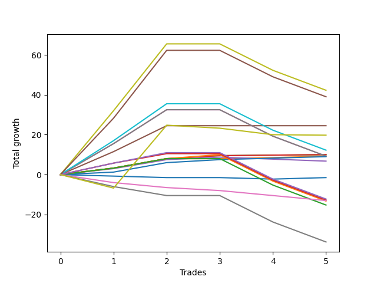

# Long Bernese 005 1v SB 
- Symbol: ES_1W
- Date Range: 03/18/2022 - 07/29/2022
- Trading Period: 7:20-12:30
- Number of Trades: 5



| Name | Win Percent | Profit | Avg Profit / Trade | Avg Time / Trade |      | Name | Win Percent | Profit | Avg Profit / Trade | Avg Time / Trade |
| ---- | ----------- | ------ | ------------------ | ---------------- | ---- | ---- | ----------- | ------ | ------------------ | ---------------- |
| Sorted By <br> Profit | | | | | | Sorted By <br> Win Percentage ||||
| Seven | 60.00 | 21125.00 | 4225.00 | 53:10 |     | Four | 100.00 | 12250.00 | 2450.00 | 21:40 |
| NEWFI 000 | 60.00 | 19500.00 | 3900.00 | 54:57 |     | Two_C | 100.00 | 5000.00 | 1000.00 | 15:44 |
| Four | 100.00 | 12250.00 | 2450.00 | 21:40 |     | Two | 100.00 | 5000.00 | 1000.00 | 15:44 |
| MALAMUTE 002 | 20.00 | 9875.00 | 1975.00 | 14:17 |     | One | 100.00 | 4625.00 | 925.00 | 06:06 |
| BB100 | 60.00 | 6125.00 | 1225.00 | 52:02 |     | Eighty-One | 100.00 | 4500.00 | 900.00 | 10:46 |
| Two_C | 100.00 | 5000.00 | 1000.00 | 15:44 |     | Seven | 60.00 | 21125.00 | 4225.00 | 53:10 |
| Two | 100.00 | 5000.00 | 1000.00 | 15:44 |     | NEWFI 000 | 60.00 | 19500.00 | 3900.00 | 54:57 |
| One | 100.00 | 4625.00 | 925.00 | 06:06 |     | BB100 | 60.00 | 6125.00 | 1225.00 | 52:02 |
| Six | 60.00 | 4625.00 | 925.00 | 33:18 |     | Six | 60.00 | 4625.00 | 925.00 | 33:18 |
| Five | 60.00 | 4625.00 | 925.00 | 33:24 |     | Five | 60.00 | 4625.00 | 925.00 | 33:24 |
| Eighty-One | 100.00 | 4500.00 | 900.00 | 10:46 |     | Three | 60.00 | 3375.00 | 675.00 | 17:55 |
| Three | 60.00 | 3375.00 | 675.00 | 17:55 |     | Eighty-Five | 60.00 | -6125.00 | -1225.00 | 32:55 |
| Zero | 40.00 | -750.00 | -150.00 | 02:53 |     | Eighty-Four | 60.00 | -6375.00 | -1275.00 | 32:53 |
| Eighty-Five | 60.00 | -6125.00 | -1225.00 | 32:55 |     | Eighty-Two | 60.00 | -6625.00 | -1325.00 | 29:40 |
| Eighty-Four | 60.00 | -6375.00 | -1275.00 | 32:53 |     | Eighty-Three | 60.00 | -7625.00 | -1525.00 | 32:50 |
| NEWFI 0000 | 0.00 | -6500.00 | -1300.00 | 07:53 |     | Zero | 40.00 | -750.00 | -150.00 | 02:53 |
| Eighty-Two | 60.00 | -6625.00 | -1325.00 | 29:40 |     | MALAMUTE 002 | 20.00 | 9875.00 | 1975.00 | 14:17 |
| Eighty-Three | 60.00 | -7625.00 | -1525.00 | 32:50 |     | MALAMUTE 001 | 20.00 | -16875.00 | -3375.00 | 44:00 |
| MALAMUTE 001 | 20.00 | -16875.00 | -3375.00 | 44:00 |     | NEWFI 0000 | 0.00 | -6500.00 | -1300.00 | 07:53 |

## NO STOPLOSS

### Test Zero
* Sell when price hits the middle line of the 20p bollinger
* No Stoploss
* Results:
```
Total Trades: 5
Percent Up: 40.00
Percent Down: 60.00
Total Points Moved Up: -1.50
Potential Profit: -750.00
Total Points Ups: 0.75 Count Ups: 2
Total Points Downs: -2.25 Count Downs: 3
```

<details><summary>Trades</summary>

<code>In: 2022-05-06 11:41:00		Out: 2022-05-06 11:42:10		Total Position Time: 01:10		Total Move Up: -0.75		Total to Date: -0.75</code> <br />
<code>In: 2022-05-06 11:47:00		Out: 2022-05-06 11:48:15		Total Position Time: 01:15		Total Move Up: -0.75		Total to Date: -1.50</code> <br />
<code>In: 2022-07-11 12:15:00		Out: 2022-07-11 12:22:10		Total Position Time: 07:10		Total Move Up: 0.00		Total to Date: -1.50</code> <br />
<code>In: 2022-07-25 11:07:00		Out: 2022-07-25 11:10:40		Total Position Time: 03:40		Total Move Up: -0.75		Total to Date: -2.25</code> <br />
<code>In: 2022-07-25 11:11:00		Out: 2022-07-25 11:12:10		Total Position Time: 01:10		Total Move Up: 0.75		Total to Date: -1.50</code> <br />


</details>

### Test One
* Sell when the price hits the upper line of the 20p 1std bollinger
* No Stoploss
* Results:
```
Total Trades: 5
Percent Up: 100.00
Percent Down: 0.00
Total Points Moved Up: 9.25
Potential Profit: 4625.00
Total Points Ups: 9.25 Count Ups: 5
Total Points Downs: 0.00 Count Downs: 0
```

<details><summary>Trades</summary>

<code>In: 2022-05-06 11:41:00		Out: 2022-05-06 11:49:10		Total Position Time: 08:10		Total Move Up: 3.25		Total to Date: 3.25</code> <br />
<code>In: 2022-05-06 11:47:00		Out: 2022-05-06 11:49:10		Total Position Time: 02:10		Total Move Up: 4.75		Total to Date: 8.00</code> <br />
<code>In: 2022-07-11 12:15:00		Out: 2022-07-11 12:29:20		Total Position Time: 14:20		Total Move Up: 0.00		Total to Date: 8.00</code> <br />
<code>In: 2022-07-25 11:07:00		Out: 2022-07-25 11:11:40		Total Position Time: 04:40		Total Move Up: 0.50		Total to Date: 8.50</code> <br />
<code>In: 2022-07-25 11:11:00		Out: 2022-07-25 11:12:10		Total Position Time: 01:10		Total Move Up: 0.75		Total to Date: 9.25</code> <br />


</details>

### Test Two
* Sell when the price hits the upper line of the 20p 2std bollinger
* No Stoploss
* Results:
```
Total Trades: 5
Percent Up: 100.00
Percent Down: 0.00
Total Points Moved Up: 10.00
Potential Profit: 5000.00
Total Points Ups: 10.00 Count Ups: 5
Total Points Downs: 0.00 Count Downs: 0
```

<details><summary>Trades</summary>

<code>In: 2022-05-06 11:41:00		Out: 2022-05-06 11:49:10		Total Position Time: 08:10		Total Move Up: 3.25		Total to Date: 3.25</code> <br />
<code>In: 2022-05-06 11:47:00		Out: 2022-05-06 11:49:10		Total Position Time: 02:10		Total Move Up: 4.75		Total to Date: 8.00</code> <br />
<code>In: 2022-07-11 12:15:00		Out: 2022-07-11 12:29:40		Total Position Time: 14:40		Total Move Up: 1.50		Total to Date: 9.50</code> <br />
<code>In: 2022-07-25 11:07:00		Out: 2022-07-25 11:35:50		Total Position Time: 28:50		Total Move Up: 0.25		Total to Date: 9.75</code> <br />
<code>In: 2022-07-25 11:11:00		Out: 2022-07-25 11:35:50		Total Position Time: 24:50		Total Move Up: 0.25		Total to Date: 10.00</code> <br />


</details>

### Test Two_C
* Sell when the price hits the upper line of the 20p 2std bollinger
* No Stoploss
* Results:
```
Total Trades: 5
Percent Up: 100.00
Percent Down: 0.00
Total Points Moved Up: 10.00
Potential Profit: 5000.00
Total Points Ups: 10.00 Count Ups: 5
Total Points Downs: 0.00 Count Downs: 0
```

<details><summary>Trades</summary>

<code>In: 2022-05-06 11:41:00		Out: 2022-05-06 11:49:10		Total Position Time: 08:10		Total Move Up: 3.25		Total to Date: 3.25</code> <br />
<code>In: 2022-05-06 11:47:00		Out: 2022-05-06 11:49:10		Total Position Time: 02:10		Total Move Up: 4.75		Total to Date: 8.00</code> <br />
<code>In: 2022-07-11 12:15:00		Out: 2022-07-11 12:29:40		Total Position Time: 14:40		Total Move Up: 1.50		Total to Date: 9.50</code> <br />
<code>In: 2022-07-25 11:07:00		Out: 2022-07-25 11:35:50		Total Position Time: 28:50		Total Move Up: 0.25		Total to Date: 9.75</code> <br />
<code>In: 2022-07-25 11:11:00		Out: 2022-07-25 11:35:50		Total Position Time: 24:50		Total Move Up: 0.25		Total to Date: 10.00</code> <br />


</details>

### Test Three
* Sell when price hits the middle line of the 50p bollinger
* No Stoploss
* Results:
```
Total Trades: 5
Percent Up: 60.00
Percent Down: 40.00
Total Points Moved Up: 6.75
Potential Profit: 3375.00
Total Points Ups: 8.75 Count Ups: 3
Total Points Downs: -2.00 Count Downs: 2
```

<details><summary>Trades</summary>

<code>In: 2022-05-06 11:41:00		Out: 2022-05-06 11:49:15		Total Position Time: 08:15		Total Move Up: 3.00		Total to Date: 3.00</code> <br />
<code>In: 2022-05-06 11:47:00		Out: 2022-05-06 11:49:15		Total Position Time: 02:15		Total Move Up: 4.50		Total to Date: 7.50</code> <br />
<code>In: 2022-07-11 12:15:00		Out: 2022-07-11 12:40:35		Total Position Time: 25:35		Total Move Up: 1.25		Total to Date: 8.75</code> <br />
<code>In: 2022-07-25 11:07:00		Out: 2022-07-25 11:35:45		Total Position Time: 28:45		Total Move Up: -1.00		Total to Date: 7.75</code> <br />
<code>In: 2022-07-25 11:11:00		Out: 2022-07-25 11:35:45		Total Position Time: 24:45		Total Move Up: -1.00		Total to Date: 6.75</code> <br />


</details>

### Test Four
* Sell when the price hits the upper line of the 50p 1std bollinger
* No Stoploss
* Results:
```
Total Trades: 5
Percent Up: 100.00
Percent Down: 0.00
Total Points Moved Up: 24.50
Potential Profit: 12250.00
Total Points Ups: 24.50 Count Ups: 5
Total Points Downs: 0.00 Count Downs: 0
```

<details><summary>Trades</summary>

<code>In: 2022-05-06 11:41:00		Out: 2022-05-06 11:50:10		Total Position Time: 09:10		Total Move Up: 11.50		Total to Date: 11.50</code> <br />
<code>In: 2022-05-06 11:47:00		Out: 2022-05-06 11:50:10		Total Position Time: 03:10		Total Move Up: 13.00		Total to Date: 24.50</code> <br />
<code>In: 2022-07-11 12:15:00		Out: 2022-07-11 12:47:00		Total Position Time: 32:00		Total Move Up: 0.00		Total to Date: 24.50</code> <br />
<code>In: 2022-07-25 11:07:00		Out: 2022-07-25 11:41:00		Total Position Time: 34:00		Total Move Up: 0.00		Total to Date: 24.50</code> <br />
<code>In: 2022-07-25 11:11:00		Out: 2022-07-25 11:41:00		Total Position Time: 30:00		Total Move Up: 0.00		Total to Date: 24.50</code> <br />


</details>

### Test Five
* Sell when the price hits the upper line of the 50p 2std bollinger
* No Stoploss
* Results:
```
Total Trades: 5
Percent Up: 60.00
Percent Down: 40.00
Total Points Moved Up: 9.25
Potential Profit: 4625.00
Total Points Ups: 32.50 Count Ups: 3
Total Points Downs: -23.25 Count Downs: 2
```

<details><summary>Trades</summary>

<code>In: 2022-05-06 11:41:00		Out: 2022-05-06 11:50:35		Total Position Time: 09:35		Total Move Up: 15.50		Total to Date: 15.50</code> <br />
<code>In: 2022-05-06 11:47:00		Out: 2022-05-06 11:50:35		Total Position Time: 03:35		Total Move Up: 17.00		Total to Date: 32.50</code> <br />
<code>In: 2022-07-11 12:15:00		Out: 2022-07-11 12:47:00		Total Position Time: 32:00		Total Move Up: 0.00		Total to Date: 32.50</code> <br />
<code>In: 2022-07-25 11:07:00		Out: 2022-07-25 12:07:55		Total Position Time: 60:55		Total Move Up: -13.25		Total to Date: 19.25</code> <br />
<code>In: 2022-07-25 11:11:00		Out: 2022-07-25 12:11:55		Total Position Time: 60:55		Total Move Up: -10.00		Total to Date: 9.25</code> <br />


</details>

### Test Six
* Sell when the price hits the middle line of the 1std VWAP
* No Stoploss
* Results:
```
Total Trades: 5
Percent Up: 60.00
Percent Down: 40.00
Total Points Moved Up: 9.25
Potential Profit: 4625.00
Total Points Ups: 32.50 Count Ups: 3
Total Points Downs: -23.25 Count Downs: 2
```

<details><summary>Trades</summary>

<code>In: 2022-05-06 11:41:00		Out: 2022-05-06 11:50:20		Total Position Time: 09:20		Total Move Up: 15.50		Total to Date: 15.50</code> <br />
<code>In: 2022-05-06 11:47:00		Out: 2022-05-06 11:50:20		Total Position Time: 03:20		Total Move Up: 17.00		Total to Date: 32.50</code> <br />
<code>In: 2022-07-11 12:15:00		Out: 2022-07-11 12:47:00		Total Position Time: 32:00		Total Move Up: 0.00		Total to Date: 32.50</code> <br />
<code>In: 2022-07-25 11:07:00		Out: 2022-07-25 12:07:55		Total Position Time: 60:55		Total Move Up: -13.25		Total to Date: 19.25</code> <br />
<code>In: 2022-07-25 11:11:00		Out: 2022-07-25 12:11:55		Total Position Time: 60:55		Total Move Up: -10.00		Total to Date: 9.25</code> <br />


</details>

### Test Seven
* Sell when the price hits the upper line of the 1std VWAP
* No Stoploss
* Results:
```
Total Trades: 5
Percent Up: 60.00
Percent Down: 40.00
Total Points Moved Up: 42.25
Potential Profit: 21125.00
Total Points Ups: 65.50 Count Ups: 3
Total Points Downs: -23.25 Count Downs: 2
```

<details><summary>Trades</summary>

<code>In: 2022-05-06 11:41:00		Out: 2022-05-06 12:40:00		Total Position Time: 59:00		Total Move Up: 32.00		Total to Date: 32.00</code> <br />
<code>In: 2022-05-06 11:47:00		Out: 2022-05-06 12:40:00		Total Position Time: 53:00		Total Move Up: 33.50		Total to Date: 65.50</code> <br />
<code>In: 2022-07-11 12:15:00		Out: 2022-07-11 12:47:00		Total Position Time: 32:00		Total Move Up: 0.00		Total to Date: 65.50</code> <br />
<code>In: 2022-07-25 11:07:00		Out: 2022-07-25 12:07:55		Total Position Time: 60:55		Total Move Up: -13.25		Total to Date: 52.25</code> <br />
<code>In: 2022-07-25 11:11:00		Out: 2022-07-25 12:11:55		Total Position Time: 60:55		Total Move Up: -10.00		Total to Date: 42.25</code> <br />


</details>

### Test BB100
* Sell when the price hits the upper line of the 1std VWAP
* No Stoploss
* Results:
```
Total Trades: 5
Percent Up: 60.00
Percent Down: 40.00
Total Points Moved Up: 12.25
Potential Profit: 6125.00
Total Points Ups: 35.50 Count Ups: 3
Total Points Downs: -23.25 Count Downs: 2
```

<details><summary>Trades</summary>

<code>In: 2022-05-06 11:41:00		Out: 2022-05-06 12:37:10		Total Position Time: 56:10		Total Move Up: 17.00		Total to Date: 17.00</code> <br />
<code>In: 2022-05-06 11:47:00		Out: 2022-05-06 12:37:10		Total Position Time: 50:10		Total Move Up: 18.50		Total to Date: 35.50</code> <br />
<code>In: 2022-07-11 12:15:00		Out: 2022-07-11 12:47:00		Total Position Time: 32:00		Total Move Up: 0.00		Total to Date: 35.50</code> <br />
<code>In: 2022-07-25 11:07:00		Out: 2022-07-25 12:07:55		Total Position Time: 60:55		Total Move Up: -13.25		Total to Date: 22.25</code> <br />
<code>In: 2022-07-25 11:11:00		Out: 2022-07-25 12:11:55		Total Position Time: 60:55		Total Move Up: -10.00		Total to Date: 12.25</code> <br />


</details>

## TAKE PROFIT

### Test Eighty-One
* Take Profit of 1 Point
* No Stoploss
* Results:
```
Total Trades: 5
Percent Up: 100.00
Percent Down: 0.00
Total Points Moved Up: 9.00
Potential Profit: 4500.00
Total Points Ups: 9.00 Count Ups: 5
Total Points Downs: 0.00 Count Downs: 0
```

<details><summary>Trades</summary>

<code>In: 2022-05-06 11:41:00		Out: 2022-05-06 11:42:45		Total Position Time: 01:45		Total Move Up: 1.25		Total to Date: 1.25</code> <br />
<code>In: 2022-05-06 11:47:00		Out: 2022-05-06 11:49:10		Total Position Time: 02:10		Total Move Up: 4.75		Total to Date: 6.00</code> <br />
<code>In: 2022-07-11 12:15:00		Out: 2022-07-11 12:29:40		Total Position Time: 14:40		Total Move Up: 1.50		Total to Date: 7.50</code> <br />
<code>In: 2022-07-25 11:07:00		Out: 2022-07-25 11:11:45		Total Position Time: 04:45		Total Move Up: 0.75		Total to Date: 8.25</code> <br />
<code>In: 2022-07-25 11:11:00		Out: 2022-07-25 11:41:30		Total Position Time: 30:30		Total Move Up: 0.75		Total to Date: 9.00</code> <br />


</details>

### Test Eighty-Two
* Take Profit of 2 Point
* No Stoploss
* Results:
```
Total Trades: 5
Percent Up: 60.00
Percent Down: 40.00
Total Points Moved Up: -13.25
Potential Profit: -6625.00
Total Points Ups: 10.00 Count Ups: 3
Total Points Downs: -23.25 Count Downs: 2
```

<details><summary>Trades</summary>

<code>In: 2022-05-06 11:41:00		Out: 2022-05-06 11:49:10		Total Position Time: 08:10		Total Move Up: 3.25		Total to Date: 3.25</code> <br />
<code>In: 2022-05-06 11:47:00		Out: 2022-05-06 11:49:10		Total Position Time: 02:10		Total Move Up: 4.75		Total to Date: 8.00</code> <br />
<code>In: 2022-07-11 12:15:00		Out: 2022-07-11 12:31:10		Total Position Time: 16:10		Total Move Up: 2.00		Total to Date: 10.00</code> <br />
<code>In: 2022-07-25 11:07:00		Out: 2022-07-25 12:07:55		Total Position Time: 60:55		Total Move Up: -13.25		Total to Date: -3.25</code> <br />
<code>In: 2022-07-25 11:11:00		Out: 2022-07-25 12:11:55		Total Position Time: 60:55		Total Move Up: -10.00		Total to Date: -13.25</code> <br />


</details>

### Test Eighty-Three
* Take Profit of 3 Point
* No Stoploss
* Results:
```
Total Trades: 5
Percent Up: 60.00
Percent Down: 40.00
Total Points Moved Up: -15.25
Potential Profit: -7625.00
Total Points Ups: 8.00 Count Ups: 3
Total Points Downs: -23.25 Count Downs: 2
```

<details><summary>Trades</summary>

<code>In: 2022-05-06 11:41:00		Out: 2022-05-06 11:49:10		Total Position Time: 08:10		Total Move Up: 3.25		Total to Date: 3.25</code> <br />
<code>In: 2022-05-06 11:47:00		Out: 2022-05-06 11:49:10		Total Position Time: 02:10		Total Move Up: 4.75		Total to Date: 8.00</code> <br />
<code>In: 2022-07-11 12:15:00		Out: 2022-07-11 12:47:00		Total Position Time: 32:00		Total Move Up: 0.00		Total to Date: 8.00</code> <br />
<code>In: 2022-07-25 11:07:00		Out: 2022-07-25 12:07:55		Total Position Time: 60:55		Total Move Up: -13.25		Total to Date: -5.25</code> <br />
<code>In: 2022-07-25 11:11:00		Out: 2022-07-25 12:11:55		Total Position Time: 60:55		Total Move Up: -10.00		Total to Date: -15.25</code> <br />


</details>

### Test Eighty-Four
* Take Profit of 4 Point
* No Stoploss
* Results:
```
Total Trades: 5
Percent Up: 60.00
Percent Down: 40.00
Total Points Moved Up: -12.75
Potential Profit: -6375.00
Total Points Ups: 10.50 Count Ups: 3
Total Points Downs: -23.25 Count Downs: 2
```

<details><summary>Trades</summary>

<code>In: 2022-05-06 11:41:00		Out: 2022-05-06 11:49:25		Total Position Time: 08:25		Total Move Up: 5.75		Total to Date: 5.75</code> <br />
<code>In: 2022-05-06 11:47:00		Out: 2022-05-06 11:49:10		Total Position Time: 02:10		Total Move Up: 4.75		Total to Date: 10.50</code> <br />
<code>In: 2022-07-11 12:15:00		Out: 2022-07-11 12:47:00		Total Position Time: 32:00		Total Move Up: 0.00		Total to Date: 10.50</code> <br />
<code>In: 2022-07-25 11:07:00		Out: 2022-07-25 12:07:55		Total Position Time: 60:55		Total Move Up: -13.25		Total to Date: -2.75</code> <br />
<code>In: 2022-07-25 11:11:00		Out: 2022-07-25 12:11:55		Total Position Time: 60:55		Total Move Up: -10.00		Total to Date: -12.75</code> <br />


</details>

### Test Eighty-Five
* Take Profit of 5 Point
* No Stoploss
* Results:
```
Total Trades: 5
Percent Up: 60.00
Percent Down: 40.00
Total Points Moved Up: -12.25
Potential Profit: -6125.00
Total Points Ups: 11.00 Count Ups: 3
Total Points Downs: -23.25 Count Downs: 2
```

<details><summary>Trades</summary>

<code>In: 2022-05-06 11:41:00		Out: 2022-05-06 11:49:25		Total Position Time: 08:25		Total Move Up: 5.75		Total to Date: 5.75</code> <br />
<code>In: 2022-05-06 11:47:00		Out: 2022-05-06 11:49:20		Total Position Time: 02:20		Total Move Up: 5.25		Total to Date: 11.00</code> <br />
<code>In: 2022-07-11 12:15:00		Out: 2022-07-11 12:47:00		Total Position Time: 32:00		Total Move Up: 0.00		Total to Date: 11.00</code> <br />
<code>In: 2022-07-25 11:07:00		Out: 2022-07-25 12:07:55		Total Position Time: 60:55		Total Move Up: -13.25		Total to Date: -2.25</code> <br />
<code>In: 2022-07-25 11:11:00		Out: 2022-07-25 12:11:55		Total Position Time: 60:55		Total Move Up: -10.00		Total to Date: -12.25</code> <br />


</details>

## Indicator Exits

### Test NEWFI 000
* Newfi 0000
* No Stoploss
* Results:
```
Total Trades: 5
Percent Up: 60.00
Percent Down: 40.00
Total Points Moved Up: 39.00
Potential Profit: 19500.00
Total Points Ups: 62.25 Count Ups: 3
Total Points Downs: -23.25 Count Downs: 2
```

<details><summary>Trades</summary>

<code>In: 2022-05-06 11:41:00		Out: 2022-05-06 12:41:55		Total Position Time: 60:55		Total Move Up: 28.25		Total to Date: 28.25</code> <br />
<code>In: 2022-05-06 11:47:00		Out: 2022-05-06 12:47:00		Total Position Time: 60:00		Total Move Up: 34.00		Total to Date: 62.25</code> <br />
<code>In: 2022-07-11 12:15:00		Out: 2022-07-11 12:47:00		Total Position Time: 32:00		Total Move Up: 0.00		Total to Date: 62.25</code> <br />
<code>In: 2022-07-25 11:07:00		Out: 2022-07-25 12:07:55		Total Position Time: 60:55		Total Move Up: -13.25		Total to Date: 49.00</code> <br />
<code>In: 2022-07-25 11:11:00		Out: 2022-07-25 12:11:55		Total Position Time: 60:55		Total Move Up: -10.00		Total to Date: 39.00</code> <br />


</details>

### Test NEWFI 0000
* Newfi 0000
* No Stoploss
* Results:
```
Total Trades: 5
Percent Up: 0.00
Percent Down: 100.00
Total Points Moved Up: -13.00
Potential Profit: -6500.00
Total Points Ups: 0.00 Count Ups: 0
Total Points Downs: -13.00 Count Downs: 5
```

<details><summary>Trades</summary>

<code>In: 2022-05-06 11:41:00		Out: 2022-05-06 11:48:05		Total Position Time: 07:05		Total Move Up: -4.00		Total to Date: -4.00</code> <br />
<code>In: 2022-05-06 11:47:00		Out: 2022-05-06 11:48:05		Total Position Time: 01:05		Total Move Up: -2.50		Total to Date: -6.50</code> <br />
<code>In: 2022-07-11 12:15:00		Out: 2022-07-11 12:16:05		Total Position Time: 01:05		Total Move Up: -1.50		Total to Date: -8.00</code> <br />
<code>In: 2022-07-25 11:07:00		Out: 2022-07-25 11:24:05		Total Position Time: 17:05		Total Move Up: -2.50		Total to Date: -10.50</code> <br />
<code>In: 2022-07-25 11:11:00		Out: 2022-07-25 11:24:05		Total Position Time: 13:05		Total Move Up: -2.50		Total to Date: -13.00</code> <br />


</details>

### Test MALAMUTE 001
* Malamute 001
* No Stoploss
* Results:
```
Total Trades: 5
Percent Up: 20.00
Percent Down: 80.00
Total Points Moved Up: -33.75
Potential Profit: -16875.00
Total Points Ups: 0.00 Count Ups: 1
Total Points Downs: -33.75 Count Downs: 4
```

<details><summary>Trades</summary>

<code>In: 2022-05-06 11:41:00		Out: 2022-05-06 12:17:05		Total Position Time: 36:05		Total Move Up: -6.00		Total to Date: -6.00</code> <br />
<code>In: 2022-05-06 11:47:00		Out: 2022-05-06 12:17:05		Total Position Time: 30:05		Total Move Up: -4.50		Total to Date: -10.50</code> <br />
<code>In: 2022-07-11 12:15:00		Out: 2022-07-11 12:47:00		Total Position Time: 32:00		Total Move Up: 0.00		Total to Date: -10.50</code> <br />
<code>In: 2022-07-25 11:07:00		Out: 2022-07-25 12:07:55		Total Position Time: 60:55		Total Move Up: -13.25		Total to Date: -23.75</code> <br />
<code>In: 2022-07-25 11:11:00		Out: 2022-07-25 12:11:55		Total Position Time: 60:55		Total Move Up: -10.00		Total to Date: -33.75</code> <br />


</details>

### Test MALAMUTE 002
* Malamute 001
* No Stoploss
* Results:
```
Total Trades: 5
Percent Up: 20.00
Percent Down: 80.00
Total Points Moved Up: 19.75
Potential Profit: 9875.00
Total Points Ups: 31.50 Count Ups: 1
Total Points Downs: -11.75 Count Downs: 4
```

<details><summary>Trades</summary>

<code>In: 2022-05-06 11:41:00		Out: 2022-05-06 11:45:05		Total Position Time: 04:05		Total Move Up: -6.75		Total to Date: -6.75</code> <br />
<code>In: 2022-05-06 11:47:00		Out: 2022-05-06 12:47:05		Total Position Time: 60:05		Total Move Up: 31.50		Total to Date: 24.75</code> <br />
<code>In: 2022-07-11 12:15:00		Out: 2022-07-11 12:16:05		Total Position Time: 01:05		Total Move Up: -1.50		Total to Date: 23.25</code> <br />
<code>In: 2022-07-25 11:07:00		Out: 2022-07-25 11:08:05		Total Position Time: 01:05		Total Move Up: -3.25		Total to Date: 20.00</code> <br />
<code>In: 2022-07-25 11:11:00		Out: 2022-07-25 11:16:05		Total Position Time: 05:05		Total Move Up: -0.25		Total to Date: 19.75</code> <br />


</details>