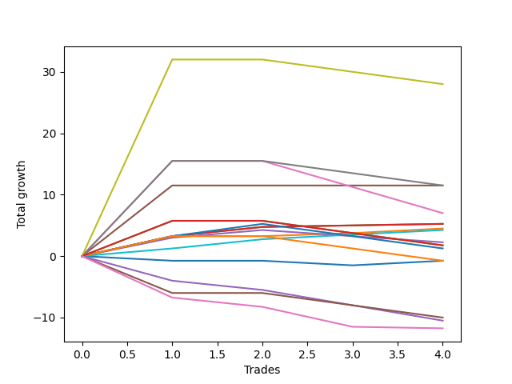

# Long Bernese 005 1v 
- Symbol: ES_1W
- Date Range: 03/18/2022 - 07/29/2022
- Trading Period: 7:20-12:30
- Number of Trades: 4



| Name | Win Percent | Profit | Avg Profit / Trade | Avg Time / Trade |      | Name | Win Percent | Profit | Avg Profit / Trade | Avg Time / Trade |
| ---- | ----------- | ------ | ------------------ | ---------------- | ---- | ---- | ----------- | ------ | ------------------ | ---------------- |
| Sorted By <br> Profit | | | | | | Sorted By <br> Win Percentage ||||
| Seven | 50.00 | 14000.00 | 3500.00 | 71:45 |     | Four | 100.00 | 5750.00 | 1437.50 | 26:17 |
| Four | 100.00 | 5750.00 | 1437.50 | 26:17 |     | Two_C | 100.00 | 2625.00 | 656.25 | 19:07 |
| Six | 50.00 | 5750.00 | 1437.50 | 59:20 |     | Two | 100.00 | 2625.00 | 656.25 | 19:07 |
| Five | 50.00 | 3500.00 | 875.00 | 55:28 |     | One | 100.00 | 2250.00 | 562.50 | 07:05 |
| Two_C | 100.00 | 2625.00 | 656.25 | 19:07 |     | Eighty-One | 100.00 | 2125.00 | 531.25 | 12:55 |
| Two | 100.00 | 2625.00 | 656.25 | 19:07 |     | Seven | 50.00 | 14000.00 | 3500.00 | 71:45 |
| One | 100.00 | 2250.00 | 562.50 | 07:05 |     | Six | 50.00 | 5750.00 | 1437.50 | 59:20 |
| Eighty-One | 100.00 | 2125.00 | 531.25 | 12:55 |     | Five | 50.00 | 3500.00 | 875.00 | 55:28 |
| Three | 50.00 | 1125.00 | 281.25 | 21:50 |     | Three | 50.00 | 1125.00 | 281.25 | 21:50 |
| Eighty-Five | 50.00 | 875.00 | 218.75 | 59:06 |     | Eighty-Five | 50.00 | 875.00 | 218.75 | 59:06 |
| Eighty-Four | 50.00 | 875.00 | 218.75 | 59:06 |     | Eighty-Four | 50.00 | 875.00 | 218.75 | 59:06 |
| Eighty-Two | 50.00 | 625.00 | 156.25 | 55:05 |     | Eighty-Two | 50.00 | 625.00 | 156.25 | 55:05 |
| Eighty-Three | 50.00 | -375.00 | -93.75 | 59:02 |     | Eighty-Three | 50.00 | -375.00 | -93.75 | 59:02 |
| Zero | 50.00 | -375.00 | -93.75 | 03:17 |     | Zero | 50.00 | -375.00 | -93.75 | 03:17 |
| MALAMUTE 001 | 25.00 | -5000.00 | -1250.00 | 66:01 |     | MALAMUTE 001 | 25.00 | -5000.00 | -1250.00 | 66:01 |
| NEWFI 0000 | 0.00 | -5250.00 | -1312.50 | 09:35 |     | NEWFI 0000 | 0.00 | -5250.00 | -1312.50 | 09:35 |
| MALAMUTE 002 | 0.00 | -5875.00 | -1468.75 | 02:50 |     | MALAMUTE 002 | 0.00 | -5875.00 | -1468.75 | 02:50 |

## NO STOPLOSS

### Test Zero
* Sell when price hits the middle line of the 20p bollinger
* No Stoploss
* Results:
```
Total Trades: 4
Percent Up: 50.00
Percent Down: 50.00
Total Points Moved Up: -0.75
Potential Profit: -375.00
Total Points Ups: 0.75 Count Ups: 2
Total Points Downs: -1.50 Count Downs: 2
```

<details><summary>Trades</summary>

<code>In: 2022-05-06 11:41:00		Out: 2022-05-06 11:42:10		Total Position Time: 01:10		Total Move Up: -0.75		Total to Date: -0.75</code> <br />
<code>In: 2022-07-11 12:15:00		Out: 2022-07-11 12:22:10		Total Position Time: 07:10		Total Move Up: 0.00		Total to Date: -0.75</code> <br />
<code>In: 2022-07-25 11:07:00		Out: 2022-07-25 11:10:40		Total Position Time: 03:40		Total Move Up: -0.75		Total to Date: -1.50</code> <br />
<code>In: 2022-07-25 11:11:00		Out: 2022-07-25 11:12:10		Total Position Time: 01:10		Total Move Up: 0.75		Total to Date: -0.75</code> <br />


</details>

### Test One
* Sell when the price hits the upper line of the 20p 1std bollinger
* No Stoploss
* Results:
```
Total Trades: 4
Percent Up: 100.00
Percent Down: 0.00
Total Points Moved Up: 4.50
Potential Profit: 2250.00
Total Points Ups: 4.50 Count Ups: 4
Total Points Downs: 0.00 Count Downs: 0
```

<details><summary>Trades</summary>

<code>In: 2022-05-06 11:41:00		Out: 2022-05-06 11:49:10		Total Position Time: 08:10		Total Move Up: 3.25		Total to Date: 3.25</code> <br />
<code>In: 2022-07-11 12:15:00		Out: 2022-07-11 12:29:20		Total Position Time: 14:20		Total Move Up: 0.00		Total to Date: 3.25</code> <br />
<code>In: 2022-07-25 11:07:00		Out: 2022-07-25 11:11:40		Total Position Time: 04:40		Total Move Up: 0.50		Total to Date: 3.75</code> <br />
<code>In: 2022-07-25 11:11:00		Out: 2022-07-25 11:12:10		Total Position Time: 01:10		Total Move Up: 0.75		Total to Date: 4.50</code> <br />


</details>

### Test Two
* Sell when the price hits the upper line of the 20p 2std bollinger
* No Stoploss
* Results:
```
Total Trades: 4
Percent Up: 100.00
Percent Down: 0.00
Total Points Moved Up: 5.25
Potential Profit: 2625.00
Total Points Ups: 5.25 Count Ups: 4
Total Points Downs: 0.00 Count Downs: 0
```

<details><summary>Trades</summary>

<code>In: 2022-05-06 11:41:00		Out: 2022-05-06 11:49:10		Total Position Time: 08:10		Total Move Up: 3.25		Total to Date: 3.25</code> <br />
<code>In: 2022-07-11 12:15:00		Out: 2022-07-11 12:29:40		Total Position Time: 14:40		Total Move Up: 1.50		Total to Date: 4.75</code> <br />
<code>In: 2022-07-25 11:07:00		Out: 2022-07-25 11:35:50		Total Position Time: 28:50		Total Move Up: 0.25		Total to Date: 5.00</code> <br />
<code>In: 2022-07-25 11:11:00		Out: 2022-07-25 11:35:50		Total Position Time: 24:50		Total Move Up: 0.25		Total to Date: 5.25</code> <br />


</details>

### Test Two_C
* Sell when the price hits the upper line of the 20p 2std bollinger
* No Stoploss
* Results:
```
Total Trades: 4
Percent Up: 100.00
Percent Down: 0.00
Total Points Moved Up: 5.25
Potential Profit: 2625.00
Total Points Ups: 5.25 Count Ups: 4
Total Points Downs: 0.00 Count Downs: 0
```

<details><summary>Trades</summary>

<code>In: 2022-05-06 11:41:00		Out: 2022-05-06 11:49:10		Total Position Time: 08:10		Total Move Up: 3.25		Total to Date: 3.25</code> <br />
<code>In: 2022-07-11 12:15:00		Out: 2022-07-11 12:29:40		Total Position Time: 14:40		Total Move Up: 1.50		Total to Date: 4.75</code> <br />
<code>In: 2022-07-25 11:07:00		Out: 2022-07-25 11:35:50		Total Position Time: 28:50		Total Move Up: 0.25		Total to Date: 5.00</code> <br />
<code>In: 2022-07-25 11:11:00		Out: 2022-07-25 11:35:50		Total Position Time: 24:50		Total Move Up: 0.25		Total to Date: 5.25</code> <br />


</details>

### Test Three
* Sell when price hits the middle line of the 50p bollinger
* No Stoploss
* Results:
```
Total Trades: 4
Percent Up: 50.00
Percent Down: 50.00
Total Points Moved Up: 2.25
Potential Profit: 1125.00
Total Points Ups: 4.25 Count Ups: 2
Total Points Downs: -2.00 Count Downs: 2
```

<details><summary>Trades</summary>

<code>In: 2022-05-06 11:41:00		Out: 2022-05-06 11:49:15		Total Position Time: 08:15		Total Move Up: 3.00		Total to Date: 3.00</code> <br />
<code>In: 2022-07-11 12:15:00		Out: 2022-07-11 12:40:35		Total Position Time: 25:35		Total Move Up: 1.25		Total to Date: 4.25</code> <br />
<code>In: 2022-07-25 11:07:00		Out: 2022-07-25 11:35:45		Total Position Time: 28:45		Total Move Up: -1.00		Total to Date: 3.25</code> <br />
<code>In: 2022-07-25 11:11:00		Out: 2022-07-25 11:35:45		Total Position Time: 24:45		Total Move Up: -1.00		Total to Date: 2.25</code> <br />


</details>

### Test Four
* Sell when the price hits the upper line of the 50p 1std bollinger
* No Stoploss
* Results:
```
Total Trades: 4
Percent Up: 100.00
Percent Down: 0.00
Total Points Moved Up: 11.50
Potential Profit: 5750.00
Total Points Ups: 11.50 Count Ups: 4
Total Points Downs: 0.00 Count Downs: 0
```

<details><summary>Trades</summary>

<code>In: 2022-05-06 11:41:00		Out: 2022-05-06 11:50:10		Total Position Time: 09:10		Total Move Up: 11.50		Total to Date: 11.50</code> <br />
<code>In: 2022-07-11 12:15:00		Out: 2022-07-11 12:47:00		Total Position Time: 32:00		Total Move Up: 0.00		Total to Date: 11.50</code> <br />
<code>In: 2022-07-25 11:07:00		Out: 2022-07-25 11:41:00		Total Position Time: 34:00		Total Move Up: 0.00		Total to Date: 11.50</code> <br />
<code>In: 2022-07-25 11:11:00		Out: 2022-07-25 11:41:00		Total Position Time: 30:00		Total Move Up: 0.00		Total to Date: 11.50</code> <br />


</details>

### Test Five
* Sell when the price hits the upper line of the 50p 2std bollinger
* No Stoploss
* Results:
```
Total Trades: 4
Percent Up: 50.00
Percent Down: 50.00
Total Points Moved Up: 7.00
Potential Profit: 3500.00
Total Points Ups: 15.50 Count Ups: 2
Total Points Downs: -8.50 Count Downs: 2
```

<details><summary>Trades</summary>

<code>In: 2022-05-06 11:41:00		Out: 2022-05-06 11:50:35		Total Position Time: 09:35		Total Move Up: 15.50		Total to Date: 15.50</code> <br />
<code>In: 2022-07-11 12:15:00		Out: 2022-07-11 12:47:00		Total Position Time: 32:00		Total Move Up: 0.00		Total to Date: 15.50</code> <br />
<code>In: 2022-07-25 11:07:00		Out: 2022-07-25 12:39:10		Total Position Time: 92:10		Total Move Up: -4.25		Total to Date: 11.25</code> <br />
<code>In: 2022-07-25 11:11:00		Out: 2022-07-25 12:39:10		Total Position Time: 88:10		Total Move Up: -4.25		Total to Date: 7.00</code> <br />


</details>

### Test Six
* Sell when the price hits the middle line of the 1std VWAP
* No Stoploss
* Results:
```
Total Trades: 4
Percent Up: 50.00
Percent Down: 50.00
Total Points Moved Up: 11.50
Potential Profit: 5750.00
Total Points Ups: 15.50 Count Ups: 2
Total Points Downs: -4.00 Count Downs: 2
```

<details><summary>Trades</summary>

<code>In: 2022-05-06 11:41:00		Out: 2022-05-06 11:50:20		Total Position Time: 09:20		Total Move Up: 15.50		Total to Date: 15.50</code> <br />
<code>In: 2022-07-11 12:15:00		Out: 2022-07-11 12:47:00		Total Position Time: 32:00		Total Move Up: 0.00		Total to Date: 15.50</code> <br />
<code>In: 2022-07-25 11:07:00		Out: 2022-07-25 12:47:00		Total Position Time: 100:00		Total Move Up: -2.00		Total to Date: 13.50</code> <br />
<code>In: 2022-07-25 11:11:00		Out: 2022-07-25 12:47:00		Total Position Time: 96:00		Total Move Up: -2.00		Total to Date: 11.50</code> <br />


</details>

### Test Seven
* Sell when the price hits the upper line of the 1std VWAP
* No Stoploss
* Results:
```
Total Trades: 4
Percent Up: 50.00
Percent Down: 50.00
Total Points Moved Up: 28.00
Potential Profit: 14000.00
Total Points Ups: 32.00 Count Ups: 2
Total Points Downs: -4.00 Count Downs: 2
```

<details><summary>Trades</summary>

<code>In: 2022-05-06 11:41:00		Out: 2022-05-06 12:40:00		Total Position Time: 59:00		Total Move Up: 32.00		Total to Date: 32.00</code> <br />
<code>In: 2022-07-11 12:15:00		Out: 2022-07-11 12:47:00		Total Position Time: 32:00		Total Move Up: 0.00		Total to Date: 32.00</code> <br />
<code>In: 2022-07-25 11:07:00		Out: 2022-07-25 12:47:00		Total Position Time: 100:00		Total Move Up: -2.00		Total to Date: 30.00</code> <br />
<code>In: 2022-07-25 11:11:00		Out: 2022-07-25 12:47:00		Total Position Time: 96:00		Total Move Up: -2.00		Total to Date: 28.00</code> <br />


</details>

## TAKE PROFIT

### Test Eighty-One
* Take Profit of 1 Point
* No Stoploss
* Results:
```
Total Trades: 4
Percent Up: 100.00
Percent Down: 0.00
Total Points Moved Up: 4.25
Potential Profit: 2125.00
Total Points Ups: 4.25 Count Ups: 4
Total Points Downs: 0.00 Count Downs: 0
```

<details><summary>Trades</summary>

<code>In: 2022-05-06 11:41:00		Out: 2022-05-06 11:42:45		Total Position Time: 01:45		Total Move Up: 1.25		Total to Date: 1.25</code> <br />
<code>In: 2022-07-11 12:15:00		Out: 2022-07-11 12:29:40		Total Position Time: 14:40		Total Move Up: 1.50		Total to Date: 2.75</code> <br />
<code>In: 2022-07-25 11:07:00		Out: 2022-07-25 11:11:45		Total Position Time: 04:45		Total Move Up: 0.75		Total to Date: 3.50</code> <br />
<code>In: 2022-07-25 11:11:00		Out: 2022-07-25 11:41:30		Total Position Time: 30:30		Total Move Up: 0.75		Total to Date: 4.25</code> <br />


</details>

### Test Eighty-Two
* Take Profit of 2 Point
* No Stoploss
* Results:
```
Total Trades: 4
Percent Up: 50.00
Percent Down: 50.00
Total Points Moved Up: 1.25
Potential Profit: 625.00
Total Points Ups: 5.25 Count Ups: 2
Total Points Downs: -4.00 Count Downs: 2
```

<details><summary>Trades</summary>

<code>In: 2022-05-06 11:41:00		Out: 2022-05-06 11:49:10		Total Position Time: 08:10		Total Move Up: 3.25		Total to Date: 3.25</code> <br />
<code>In: 2022-07-11 12:15:00		Out: 2022-07-11 12:31:10		Total Position Time: 16:10		Total Move Up: 2.00		Total to Date: 5.25</code> <br />
<code>In: 2022-07-25 11:07:00		Out: 2022-07-25 12:47:00		Total Position Time: 100:00		Total Move Up: -2.00		Total to Date: 3.25</code> <br />
<code>In: 2022-07-25 11:11:00		Out: 2022-07-25 12:47:00		Total Position Time: 96:00		Total Move Up: -2.00		Total to Date: 1.25</code> <br />


</details>

### Test Eighty-Three
* Take Profit of 3 Point
* No Stoploss
* Results:
```
Total Trades: 4
Percent Up: 50.00
Percent Down: 50.00
Total Points Moved Up: -0.75
Potential Profit: -375.00
Total Points Ups: 3.25 Count Ups: 2
Total Points Downs: -4.00 Count Downs: 2
```

<details><summary>Trades</summary>

<code>In: 2022-05-06 11:41:00		Out: 2022-05-06 11:49:10		Total Position Time: 08:10		Total Move Up: 3.25		Total to Date: 3.25</code> <br />
<code>In: 2022-07-11 12:15:00		Out: 2022-07-11 12:47:00		Total Position Time: 32:00		Total Move Up: 0.00		Total to Date: 3.25</code> <br />
<code>In: 2022-07-25 11:07:00		Out: 2022-07-25 12:47:00		Total Position Time: 100:00		Total Move Up: -2.00		Total to Date: 1.25</code> <br />
<code>In: 2022-07-25 11:11:00		Out: 2022-07-25 12:47:00		Total Position Time: 96:00		Total Move Up: -2.00		Total to Date: -0.75</code> <br />


</details>

### Test Eighty-Four
* Take Profit of 4 Point
* No Stoploss
* Results:
```
Total Trades: 4
Percent Up: 50.00
Percent Down: 50.00
Total Points Moved Up: 1.75
Potential Profit: 875.00
Total Points Ups: 5.75 Count Ups: 2
Total Points Downs: -4.00 Count Downs: 2
```

<details><summary>Trades</summary>

<code>In: 2022-05-06 11:41:00		Out: 2022-05-06 11:49:25		Total Position Time: 08:25		Total Move Up: 5.75		Total to Date: 5.75</code> <br />
<code>In: 2022-07-11 12:15:00		Out: 2022-07-11 12:47:00		Total Position Time: 32:00		Total Move Up: 0.00		Total to Date: 5.75</code> <br />
<code>In: 2022-07-25 11:07:00		Out: 2022-07-25 12:47:00		Total Position Time: 100:00		Total Move Up: -2.00		Total to Date: 3.75</code> <br />
<code>In: 2022-07-25 11:11:00		Out: 2022-07-25 12:47:00		Total Position Time: 96:00		Total Move Up: -2.00		Total to Date: 1.75</code> <br />


</details>

### Test Eighty-Five
* Take Profit of 5 Point
* No Stoploss
* Results:
```
Total Trades: 4
Percent Up: 50.00
Percent Down: 50.00
Total Points Moved Up: 1.75
Potential Profit: 875.00
Total Points Ups: 5.75 Count Ups: 2
Total Points Downs: -4.00 Count Downs: 2
```

<details><summary>Trades</summary>

<code>In: 2022-05-06 11:41:00		Out: 2022-05-06 11:49:25		Total Position Time: 08:25		Total Move Up: 5.75		Total to Date: 5.75</code> <br />
<code>In: 2022-07-11 12:15:00		Out: 2022-07-11 12:47:00		Total Position Time: 32:00		Total Move Up: 0.00		Total to Date: 5.75</code> <br />
<code>In: 2022-07-25 11:07:00		Out: 2022-07-25 12:47:00		Total Position Time: 100:00		Total Move Up: -2.00		Total to Date: 3.75</code> <br />
<code>In: 2022-07-25 11:11:00		Out: 2022-07-25 12:47:00		Total Position Time: 96:00		Total Move Up: -2.00		Total to Date: 1.75</code> <br />


</details>

## Indicator Exits

### Test NEWFI 0000
* Newfi 0000
* No Stoploss
* Results:
```
Total Trades: 4
Percent Up: 0.00
Percent Down: 100.00
Total Points Moved Up: -10.50
Potential Profit: -5250.00
Total Points Ups: 0.00 Count Ups: 0
Total Points Downs: -10.50 Count Downs: 4
```

<details><summary>Trades</summary>

<code>In: 2022-05-06 11:41:00		Out: 2022-05-06 11:48:05		Total Position Time: 07:05		Total Move Up: -4.00		Total to Date: -4.00</code> <br />
<code>In: 2022-07-11 12:15:00		Out: 2022-07-11 12:16:05		Total Position Time: 01:05		Total Move Up: -1.50		Total to Date: -5.50</code> <br />
<code>In: 2022-07-25 11:07:00		Out: 2022-07-25 11:24:05		Total Position Time: 17:05		Total Move Up: -2.50		Total to Date: -8.00</code> <br />
<code>In: 2022-07-25 11:11:00		Out: 2022-07-25 11:24:05		Total Position Time: 13:05		Total Move Up: -2.50		Total to Date: -10.50</code> <br />


</details>

### Test MALAMUTE 001
* Malamute 001
* No Stoploss
* Results:
```
Total Trades: 4
Percent Up: 25.00
Percent Down: 75.00
Total Points Moved Up: -10.00
Potential Profit: -5000.00
Total Points Ups: 0.00 Count Ups: 1
Total Points Downs: -10.00 Count Downs: 3
```

<details><summary>Trades</summary>

<code>In: 2022-05-06 11:41:00		Out: 2022-05-06 12:17:05		Total Position Time: 36:05		Total Move Up: -6.00		Total to Date: -6.00</code> <br />
<code>In: 2022-07-11 12:15:00		Out: 2022-07-11 12:47:00		Total Position Time: 32:00		Total Move Up: 0.00		Total to Date: -6.00</code> <br />
<code>In: 2022-07-25 11:07:00		Out: 2022-07-25 12:47:00		Total Position Time: 100:00		Total Move Up: -2.00		Total to Date: -8.00</code> <br />
<code>In: 2022-07-25 11:11:00		Out: 2022-07-25 12:47:00		Total Position Time: 96:00		Total Move Up: -2.00		Total to Date: -10.00</code> <br />


</details>

### Test MALAMUTE 002
* Malamute 001
* No Stoploss
* Results:
```
Total Trades: 4
Percent Up: 0.00
Percent Down: 100.00
Total Points Moved Up: -11.75
Potential Profit: -5875.00
Total Points Ups: 0.00 Count Ups: 0
Total Points Downs: -11.75 Count Downs: 4
```

<details><summary>Trades</summary>

<code>In: 2022-05-06 11:41:00		Out: 2022-05-06 11:45:05		Total Position Time: 04:05		Total Move Up: -6.75		Total to Date: -6.75</code> <br />
<code>In: 2022-07-11 12:15:00		Out: 2022-07-11 12:16:05		Total Position Time: 01:05		Total Move Up: -1.50		Total to Date: -8.25</code> <br />
<code>In: 2022-07-25 11:07:00		Out: 2022-07-25 11:08:05		Total Position Time: 01:05		Total Move Up: -3.25		Total to Date: -11.50</code> <br />
<code>In: 2022-07-25 11:11:00		Out: 2022-07-25 11:16:05		Total Position Time: 05:05		Total Move Up: -0.25		Total to Date: -11.75</code> <br />


</details>