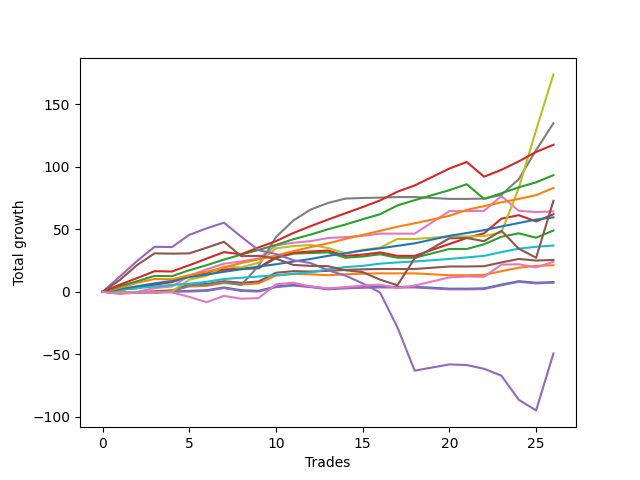

# Long Malamute 001 
- Symbol: ES_1W
- Date Range: 10/28/2022 - 11/04/2022
- Trading Period: 7:20-12:30
- Number of Trades: 26



| Name | Win Percent | Profit | Avg Profit / Trade | Avg Time / Trade |      | Name | Win Percent | Profit | Avg Profit / Trade | Avg Time / Trade |
| ---- | ----------- | ------ | ------------------ | ---------------- | ---- | ---- | ----------- | ------ | ------------------ | ---------------- |
| Sorted By <br> Profit | | | | | | Sorted By <br> Win Percentage ||||
| Seven | 80.77 | 84500.00 | 3250.00 | 76:16 |     | Eighty-One | 100.00 | 17500.00 | 673.08 | 05:56 |
| Six | 84.62 | 64500.00 | 2480.77 | 28:14 |     | Eighty-Two | 96.15 | 11000.00 | 423.08 | 24:52 |
| MALAMUTE 001 | 46.15 | 42875.00 | 1649.04 | 43:53 |     | Eighty-Three | 92.31 | 23250.00 | 894.23 | 30:18 |
| Eighty-Five | 84.62 | 38375.00 | 1475.96 | 49:42 |     | Eighty-Four | 88.46 | 27625.00 | 1062.50 | 45:15 |
| Five | 84.62 | 29125.00 | 1120.19 | 19:11 |     | Six | 84.62 | 64500.00 | 2480.77 | 28:14 |
| Eighty-Four | 88.46 | 27625.00 | 1062.50 | 45:15 |     | Eighty-Five | 84.62 | 38375.00 | 1475.96 | 49:42 |
| Two_C | 84.62 | 27375.00 | 1052.88 | 12:26 |     | Five | 84.62 | 29125.00 | 1120.19 | 19:11 |
| Two | 84.62 | 23500.00 | 903.85 | 11:20 |     | Two_C | 84.62 | 27375.00 | 1052.88 | 12:26 |
| Eighty-Three | 92.31 | 23250.00 | 894.23 | 30:18 |     | Two | 84.62 | 23500.00 | 903.85 | 11:20 |
| Eighty-One | 100.00 | 17500.00 | 673.08 | 05:56 |     | Seven | 80.77 | 84500.00 | 3250.00 | 76:16 |
| Eighty-Two | 96.15 | 11000.00 | 423.08 | 24:52 |     | Four | 80.77 | 1750.00 | 67.31 | 07:00 |
| One | 76.92 | 9125.00 | 350.96 | 04:00 |     | One | 76.92 | 9125.00 | 350.96 | 04:00 |
| Three | 69.23 | 2375.00 | 91.35 | 01:46 |     | Three | 69.23 | 2375.00 | 91.35 | 01:46 |
| Four | 80.77 | 1750.00 | 67.31 | 07:00 |     | Zero | 69.23 | -1125.00 | -43.27 | 03:04 |
| Zero | 69.23 | -1125.00 | -43.27 | 03:04 |     | MALAMUTE 001 | 46.15 | 42875.00 | 1649.04 | 43:53 |
| NEWFI 0000 | 34.62 | -20250.00 | -778.85 | 62:15 |     | NEWFI 0000 | 34.62 | -20250.00 | -778.85 | 62:15 |

## NO STOPLOSS

### Test Zero
* Sell when price hits the middle line of the 20p bollinger
* No Stoploss
* Results:
```
Total Trades: 26
Percent Up: 69.23
Percent Down: 30.77
Total Points Moved Up: -2.25
Potential Profit: -1125.00
Total Points Ups: 28.00 Count Ups: 18
Total Points Downs: -30.25 Count Downs: 8
```

<details><summary>Trades</summary>

<code>In: 2022-10-28 07:29:00		Out: 2022-10-28 07:30:10		Total Position Time: 01:10		Total Move Up: -0.75		Total to Date: -0.75</code> <br />
<code>In: 2022-10-28 08:49:00		Out: 2022-10-28 08:50:10		Total Position Time: 01:10		Total Move Up: 0.25		Total to Date: -0.50</code> <br />
<code>In: 2022-10-28 11:29:00		Out: 2022-10-28 11:30:10		Total Position Time: 01:10		Total Move Up: 0.00		Total to Date: -0.50</code> <br />
<code>In: 2022-10-28 12:27:00		Out: 2022-10-28 12:28:10		Total Position Time: 01:10		Total Move Up: 0.75		Total to Date: 0.25</code> <br />
<code>In: 2022-10-31 07:30:00		Out: 2022-10-31 07:41:15		Total Position Time: 11:15		Total Move Up: 0.50		Total to Date: 0.75</code> <br />
<code>In: 2022-10-31 07:52:00		Out: 2022-10-31 07:53:10		Total Position Time: 01:10		Total Move Up: 0.50		Total to Date: 1.25</code> <br />
<code>In: 2022-10-31 10:16:00		Out: 2022-10-31 10:17:10		Total Position Time: 01:10		Total Move Up: 2.25		Total to Date: 3.50</code> <br />
<code>In: 2022-10-31 11:28:00		Out: 2022-10-31 11:29:10		Total Position Time: 01:10		Total Move Up: -2.25		Total to Date: 1.25</code> <br />
<code>In: 2022-11-01 06:51:00		Out: 2022-11-01 07:21:30		Total Position Time: 30:30		Total Move Up: -21.75		Total to Date: -20.50</code> <br />
<code>In: 2022-11-01 08:36:00		Out: 2022-11-01 08:37:10		Total Position Time: 01:10		Total Move Up: -0.50		Total to Date: -21.00</code> <br />
<code>In: 2022-11-01 08:41:00		Out: 2022-11-01 08:48:25		Total Position Time: 07:25		Total Move Up: 3.50		Total to Date: -17.50</code> <br />
<code>In: 2022-11-01 09:04:00		Out: 2022-11-01 09:05:10		Total Position Time: 01:10		Total Move Up: 1.25		Total to Date: -16.25</code> <br />
<code>In: 2022-11-01 10:00:00		Out: 2022-11-01 10:01:10		Total Position Time: 01:10		Total Move Up: -1.25		Total to Date: -17.50</code> <br />
<code>In: 2022-11-01 11:03:00		Out: 2022-11-01 11:04:10		Total Position Time: 01:10		Total Move Up: -1.75		Total to Date: -19.25</code> <br />
<code>In: 2022-11-01 12:04:00		Out: 2022-11-01 12:05:10		Total Position Time: 01:10		Total Move Up: 0.75		Total to Date: -18.50</code> <br />
<code>In: 2022-11-02 07:53:00		Out: 2022-11-02 07:54:10		Total Position Time: 01:10		Total Move Up: 0.50		Total to Date: -18.00</code> <br />
<code>In: 2022-11-02 08:47:00		Out: 2022-11-02 08:48:10		Total Position Time: 01:10		Total Move Up: 0.25		Total to Date: -17.75</code> <br />
<code>In: 2022-11-02 09:58:00		Out: 2022-11-02 09:59:10		Total Position Time: 01:10		Total Move Up: 0.00		Total to Date: -17.75</code> <br />
<code>In: 2022-11-02 10:41:00		Out: 2022-11-02 10:42:10		Total Position Time: 01:10		Total Move Up: 0.00		Total to Date: -17.75</code> <br />
<code>In: 2022-11-03 07:21:00		Out: 2022-11-03 07:22:10		Total Position Time: 01:10		Total Move Up: -0.75		Total to Date: -18.50</code> <br />
<code>In: 2022-11-03 09:12:00		Out: 2022-11-03 09:13:10		Total Position Time: 01:10		Total Move Up: 0.00		Total to Date: -18.50</code> <br />
<code>In: 2022-11-03 11:29:00		Out: 2022-11-03 11:30:10		Total Position Time: 01:10		Total Move Up: 0.25		Total to Date: -18.25</code> <br />
<code>In: 2022-11-04 06:51:00		Out: 2022-11-04 06:56:15		Total Position Time: 05:15		Total Move Up: 14.00		Total to Date: -4.25</code> <br />
<code>In: 2022-11-04 09:28:00		Out: 2022-11-04 09:29:10		Total Position Time: 01:10		Total Move Up: 2.75		Total to Date: -1.50</code> <br />
<code>In: 2022-11-04 10:23:00		Out: 2022-11-04 10:24:10		Total Position Time: 01:10		Total Move Up: -1.25		Total to Date: -2.75</code> <br />
<code>In: 2022-11-04 11:26:00		Out: 2022-11-04 11:27:10		Total Position Time: 01:10		Total Move Up: 0.50		Total to Date: -2.25</code> <br />


</details>

### Test One
* Sell when the price hits the upper line of the 20p 1std bollinger
* No Stoploss
* Results:
```
Total Trades: 26
Percent Up: 76.92
Percent Down: 23.08
Total Points Moved Up: 18.25
Potential Profit: 9125.00
Total Points Ups: 40.50 Count Ups: 20
Total Points Downs: -22.25 Count Downs: 6
```

<details><summary>Trades</summary>

<code>In: 2022-10-28 07:29:00		Out: 2022-10-28 07:30:10		Total Position Time: 01:10		Total Move Up: -0.75		Total to Date: -0.75</code> <br />
<code>In: 2022-10-28 08:49:00		Out: 2022-10-28 08:50:10		Total Position Time: 01:10		Total Move Up: 0.25		Total to Date: -0.50</code> <br />
<code>In: 2022-10-28 11:29:00		Out: 2022-10-28 11:32:05		Total Position Time: 03:05		Total Move Up: 1.00		Total to Date: 0.50</code> <br />
<code>In: 2022-10-28 12:27:00		Out: 2022-10-28 12:28:10		Total Position Time: 01:10		Total Move Up: 0.75		Total to Date: 1.25</code> <br />
<code>In: 2022-10-31 07:30:00		Out: 2022-10-31 07:41:35		Total Position Time: 11:35		Total Move Up: 3.00		Total to Date: 4.25</code> <br />
<code>In: 2022-10-31 07:52:00		Out: 2022-10-31 07:53:10		Total Position Time: 01:10		Total Move Up: 0.50		Total to Date: 4.75</code> <br />
<code>In: 2022-10-31 10:16:00		Out: 2022-10-31 10:17:10		Total Position Time: 01:10		Total Move Up: 2.25		Total to Date: 7.00</code> <br />
<code>In: 2022-10-31 11:28:00		Out: 2022-10-31 11:31:25		Total Position Time: 03:25		Total Move Up: -1.25		Total to Date: 5.75</code> <br />
<code>In: 2022-11-01 06:51:00		Out: 2022-11-01 07:23:40		Total Position Time: 32:40		Total Move Up: -18.50		Total to Date: -12.75</code> <br />
<code>In: 2022-11-01 08:36:00		Out: 2022-11-01 08:37:40		Total Position Time: 01:40		Total Move Up: 1.00		Total to Date: -11.75</code> <br />
<code>In: 2022-11-01 08:41:00		Out: 2022-11-01 08:55:00		Total Position Time: 14:00		Total Move Up: 6.25		Total to Date: -5.50</code> <br />
<code>In: 2022-11-01 09:04:00		Out: 2022-11-01 09:05:10		Total Position Time: 01:10		Total Move Up: 1.25		Total to Date: -4.25</code> <br />
<code>In: 2022-11-01 10:00:00		Out: 2022-11-01 10:05:45		Total Position Time: 05:45		Total Move Up: -0.25		Total to Date: -4.50</code> <br />
<code>In: 2022-11-01 11:03:00		Out: 2022-11-01 11:08:40		Total Position Time: 05:40		Total Move Up: -0.75		Total to Date: -5.25</code> <br />
<code>In: 2022-11-01 12:04:00		Out: 2022-11-01 12:05:10		Total Position Time: 01:10		Total Move Up: 0.75		Total to Date: -4.50</code> <br />
<code>In: 2022-11-02 07:53:00		Out: 2022-11-02 07:54:10		Total Position Time: 01:10		Total Move Up: 0.50		Total to Date: -4.00</code> <br />
<code>In: 2022-11-02 08:47:00		Out: 2022-11-02 08:48:10		Total Position Time: 01:10		Total Move Up: 0.25		Total to Date: -3.75</code> <br />
<code>In: 2022-11-02 09:58:00		Out: 2022-11-02 09:59:10		Total Position Time: 01:10		Total Move Up: 0.00		Total to Date: -3.75</code> <br />
<code>In: 2022-11-02 10:41:00		Out: 2022-11-02 10:42:10		Total Position Time: 01:10		Total Move Up: 0.00		Total to Date: -3.75</code> <br />
<code>In: 2022-11-03 07:21:00		Out: 2022-11-03 07:22:10		Total Position Time: 01:10		Total Move Up: -0.75		Total to Date: -4.50</code> <br />
<code>In: 2022-11-03 09:12:00		Out: 2022-11-03 09:13:10		Total Position Time: 01:10		Total Move Up: 0.00		Total to Date: -4.50</code> <br />
<code>In: 2022-11-03 11:29:00		Out: 2022-11-03 11:30:10		Total Position Time: 01:10		Total Move Up: 0.25		Total to Date: -4.25</code> <br />
<code>In: 2022-11-04 06:51:00		Out: 2022-11-04 06:57:10		Total Position Time: 06:10		Total Move Up: 17.75		Total to Date: 13.50</code> <br />
<code>In: 2022-11-04 09:28:00		Out: 2022-11-04 09:29:10		Total Position Time: 01:10		Total Move Up: 2.75		Total to Date: 16.25</code> <br />
<code>In: 2022-11-04 10:23:00		Out: 2022-11-04 10:24:45		Total Position Time: 01:45		Total Move Up: 1.50		Total to Date: 17.75</code> <br />
<code>In: 2022-11-04 11:26:00		Out: 2022-11-04 11:27:10		Total Position Time: 01:10		Total Move Up: 0.50		Total to Date: 18.25</code> <br />


</details>

### Test Two
* Sell when the price hits the upper line of the 20p 2std bollinger
* No Stoploss
* Results:
```
Total Trades: 26
Percent Up: 84.62
Percent Down: 15.38
Total Points Moved Up: 47.00
Potential Profit: 23500.00
Total Points Ups: 77.50 Count Ups: 22
Total Points Downs: -30.50 Count Downs: 4
```

<details><summary>Trades</summary>

<code>In: 2022-10-28 07:29:00		Out: 2022-10-28 07:30:20		Total Position Time: 01:20		Total Move Up: 1.75		Total to Date: 1.75</code> <br />
<code>In: 2022-10-28 08:49:00		Out: 2022-10-28 09:15:15		Total Position Time: 26:15		Total Move Up: 1.25		Total to Date: 3.00</code> <br />
<code>In: 2022-10-28 11:29:00		Out: 2022-10-28 11:33:45		Total Position Time: 04:45		Total Move Up: 2.75		Total to Date: 5.75</code> <br />
<code>In: 2022-10-28 12:27:00		Out: 2022-10-28 12:28:50		Total Position Time: 01:50		Total Move Up: 2.00		Total to Date: 7.75</code> <br />
<code>In: 2022-10-31 07:30:00		Out: 2022-10-31 07:43:30		Total Position Time: 13:30		Total Move Up: 4.75		Total to Date: 12.50</code> <br />
<code>In: 2022-10-31 07:52:00		Out: 2022-10-31 08:02:10		Total Position Time: 10:10		Total Move Up: 2.75		Total to Date: 15.25</code> <br />
<code>In: 2022-10-31 10:16:00		Out: 2022-10-31 10:17:10		Total Position Time: 01:10		Total Move Up: 2.25		Total to Date: 17.50</code> <br />
<code>In: 2022-10-31 11:28:00		Out: 2022-10-31 11:33:10		Total Position Time: 05:10		Total Move Up: 0.75		Total to Date: 18.25</code> <br />
<code>In: 2022-11-01 06:51:00		Out: 2022-11-01 07:29:40		Total Position Time: 38:40		Total Move Up: -20.00		Total to Date: -1.75</code> <br />
<code>In: 2022-11-01 08:36:00		Out: 2022-11-01 08:58:05		Total Position Time: 22:05		Total Move Up: 0.50		Total to Date: -1.25</code> <br />
<code>In: 2022-11-01 08:41:00		Out: 2022-11-01 08:58:05		Total Position Time: 17:05		Total Move Up: 8.25		Total to Date: 7.00</code> <br />
<code>In: 2022-11-01 09:04:00		Out: 2022-11-01 09:05:50		Total Position Time: 01:50		Total Move Up: 3.50		Total to Date: 10.50</code> <br />
<code>In: 2022-11-01 10:00:00		Out: 2022-11-01 10:11:05		Total Position Time: 11:05		Total Move Up: 0.50		Total to Date: 11.00</code> <br />
<code>In: 2022-11-01 11:03:00		Out: 2022-11-01 11:09:05		Total Position Time: 06:05		Total Move Up: 0.50		Total to Date: 11.50</code> <br />
<code>In: 2022-11-01 12:04:00		Out: 2022-11-01 12:47:00		Total Position Time: 43:00		Total Move Up: -4.25		Total to Date: 7.25</code> <br />
<code>In: 2022-11-02 07:53:00		Out: 2022-11-02 07:54:15		Total Position Time: 01:15		Total Move Up: 1.00		Total to Date: 8.25</code> <br />
<code>In: 2022-11-02 08:47:00		Out: 2022-11-02 08:48:45		Total Position Time: 01:45		Total Move Up: 1.75		Total to Date: 10.00</code> <br />
<code>In: 2022-11-02 09:58:00		Out: 2022-11-02 10:34:25		Total Position Time: 36:25		Total Move Up: -2.75		Total to Date: 7.25</code> <br />
<code>In: 2022-11-02 10:41:00		Out: 2022-11-02 10:42:10		Total Position Time: 01:10		Total Move Up: 0.00		Total to Date: 7.25</code> <br />
<code>In: 2022-11-03 07:21:00		Out: 2022-11-03 07:22:40		Total Position Time: 01:40		Total Move Up: 3.50		Total to Date: 10.75</code> <br />
<code>In: 2022-11-03 09:12:00		Out: 2022-11-03 09:13:10		Total Position Time: 01:10		Total Move Up: 0.00		Total to Date: 10.75</code> <br />
<code>In: 2022-11-03 11:29:00		Out: 2022-11-03 11:32:50		Total Position Time: 03:50		Total Move Up: 3.75		Total to Date: 14.50</code> <br />
<code>In: 2022-11-04 06:51:00		Out: 2022-11-04 07:00:05		Total Position Time: 09:05		Total Move Up: 27.50		Total to Date: 42.00</code> <br />
<code>In: 2022-11-04 09:28:00		Out: 2022-11-04 09:29:10		Total Position Time: 01:10		Total Move Up: 2.75		Total to Date: 44.75</code> <br />
<code>In: 2022-11-04 10:23:00		Out: 2022-11-04 10:53:55		Total Position Time: 30:55		Total Move Up: -3.50		Total to Date: 41.25</code> <br />
<code>In: 2022-11-04 11:26:00		Out: 2022-11-04 11:28:15		Total Position Time: 02:15		Total Move Up: 5.75		Total to Date: 47.00</code> <br />


</details>

### Test Two_C
* Sell when the price hits the upper line of the 20p 2std bollinger
* No Stoploss
* Results:
```
Total Trades: 26
Percent Up: 84.62
Percent Down: 15.38
Total Points Moved Up: 54.75
Potential Profit: 27375.00
Total Points Ups: 85.00 Count Ups: 22
Total Points Downs: -30.25 Count Downs: 4
```

<details><summary>Trades</summary>

<code>In: 2022-10-28 07:29:00		Out: 2022-10-28 07:30:20		Total Position Time: 01:20		Total Move Up: 1.75		Total to Date: 1.75</code> <br />
<code>In: 2022-10-28 08:49:00		Out: 2022-10-28 09:15:15		Total Position Time: 26:15		Total Move Up: 1.25		Total to Date: 3.00</code> <br />
<code>In: 2022-10-28 11:29:00		Out: 2022-10-28 11:33:50		Total Position Time: 04:50		Total Move Up: 3.00		Total to Date: 6.00</code> <br />
<code>In: 2022-10-28 12:27:00		Out: 2022-10-28 12:28:50		Total Position Time: 01:50		Total Move Up: 2.00		Total to Date: 8.00</code> <br />
<code>In: 2022-10-31 07:30:00		Out: 2022-10-31 07:43:30		Total Position Time: 13:30		Total Move Up: 4.75		Total to Date: 12.75</code> <br />
<code>In: 2022-10-31 07:52:00		Out: 2022-10-31 08:02:10		Total Position Time: 10:10		Total Move Up: 2.75		Total to Date: 15.50</code> <br />
<code>In: 2022-10-31 10:16:00		Out: 2022-10-31 10:17:10		Total Position Time: 01:10		Total Move Up: 2.25		Total to Date: 17.75</code> <br />
<code>In: 2022-10-31 11:28:00		Out: 2022-10-31 11:33:10		Total Position Time: 05:10		Total Move Up: 0.75		Total to Date: 18.50</code> <br />
<code>In: 2022-11-01 06:51:00		Out: 2022-11-01 07:30:00		Total Position Time: 39:00		Total Move Up: -18.25		Total to Date: 0.25</code> <br />
<code>In: 2022-11-01 08:36:00		Out: 2022-11-01 08:58:15		Total Position Time: 22:15		Total Move Up: 0.75		Total to Date: 1.00</code> <br />
<code>In: 2022-11-01 08:41:00		Out: 2022-11-01 08:58:15		Total Position Time: 17:15		Total Move Up: 8.50		Total to Date: 9.50</code> <br />
<code>In: 2022-11-01 09:04:00		Out: 2022-11-01 09:05:50		Total Position Time: 01:50		Total Move Up: 3.50		Total to Date: 13.00</code> <br />
<code>In: 2022-11-01 10:00:00		Out: 2022-11-01 10:11:20		Total Position Time: 11:20		Total Move Up: 1.00		Total to Date: 14.00</code> <br />
<code>In: 2022-11-01 11:03:00		Out: 2022-11-01 11:09:10		Total Position Time: 06:10		Total Move Up: 0.75		Total to Date: 14.75</code> <br />
<code>In: 2022-11-01 12:04:00		Out: 2022-11-01 12:47:00		Total Position Time: 43:00		Total Move Up: -4.25		Total to Date: 10.50</code> <br />
<code>In: 2022-11-02 07:53:00		Out: 2022-11-02 07:54:15		Total Position Time: 01:15		Total Move Up: 1.00		Total to Date: 11.50</code> <br />
<code>In: 2022-11-02 08:47:00		Out: 2022-11-02 08:48:45		Total Position Time: 01:45		Total Move Up: 1.75		Total to Date: 13.25</code> <br />
<code>In: 2022-11-02 09:58:00		Out: 2022-11-02 10:34:25		Total Position Time: 36:25		Total Move Up: -2.75		Total to Date: 10.50</code> <br />
<code>In: 2022-11-02 10:41:00		Out: 2022-11-02 10:42:10		Total Position Time: 01:10		Total Move Up: 0.00		Total to Date: 10.50</code> <br />
<code>In: 2022-11-03 07:21:00		Out: 2022-11-03 07:23:00		Total Position Time: 02:00		Total Move Up: 4.75		Total to Date: 15.25</code> <br />
<code>In: 2022-11-03 09:12:00		Out: 2022-11-03 09:16:10		Total Position Time: 04:10		Total Move Up: 4.75		Total to Date: 20.00</code> <br />
<code>In: 2022-11-03 11:29:00		Out: 2022-11-03 11:32:50		Total Position Time: 03:50		Total Move Up: 3.75		Total to Date: 23.75</code> <br />
<code>In: 2022-11-04 06:51:00		Out: 2022-11-04 07:00:05		Total Position Time: 09:05		Total Move Up: 27.50		Total to Date: 51.25</code> <br />
<code>In: 2022-11-04 09:28:00		Out: 2022-11-04 09:29:10		Total Position Time: 01:10		Total Move Up: 2.75		Total to Date: 54.00</code> <br />
<code>In: 2022-11-04 10:23:00		Out: 2022-11-04 11:18:15		Total Position Time: 55:15		Total Move Up: -5.00		Total to Date: 49.00</code> <br />
<code>In: 2022-11-04 11:26:00		Out: 2022-11-04 11:28:15		Total Position Time: 02:15		Total Move Up: 5.75		Total to Date: 54.75</code> <br />


</details>

### Test Three
* Sell when price hits the middle line of the 50p bollinger
* No Stoploss
* Results:
```
Total Trades: 26
Percent Up: 69.23
Percent Down: 30.77
Total Points Moved Up: 4.75
Potential Profit: 2375.00
Total Points Ups: 14.50 Count Ups: 18
Total Points Downs: -9.75 Count Downs: 8
```

<details><summary>Trades</summary>

<code>In: 2022-10-28 07:29:00		Out: 2022-10-28 07:30:10		Total Position Time: 01:10		Total Move Up: -0.75		Total to Date: -0.75</code> <br />
<code>In: 2022-10-28 08:49:00		Out: 2022-10-28 08:50:10		Total Position Time: 01:10		Total Move Up: 0.25		Total to Date: -0.50</code> <br />
<code>In: 2022-10-28 11:29:00		Out: 2022-10-28 11:30:10		Total Position Time: 01:10		Total Move Up: 0.00		Total to Date: -0.50</code> <br />
<code>In: 2022-10-28 12:27:00		Out: 2022-10-28 12:28:10		Total Position Time: 01:10		Total Move Up: 0.75		Total to Date: 0.25</code> <br />
<code>In: 2022-10-31 07:30:00		Out: 2022-10-31 07:40:55		Total Position Time: 10:55		Total Move Up: 0.00		Total to Date: 0.25</code> <br />
<code>In: 2022-10-31 07:52:00		Out: 2022-10-31 07:53:10		Total Position Time: 01:10		Total Move Up: 0.50		Total to Date: 0.75</code> <br />
<code>In: 2022-10-31 10:16:00		Out: 2022-10-31 10:17:10		Total Position Time: 01:10		Total Move Up: 2.25		Total to Date: 3.00</code> <br />
<code>In: 2022-10-31 11:28:00		Out: 2022-10-31 11:29:10		Total Position Time: 01:10		Total Move Up: -2.25		Total to Date: 0.75</code> <br />
<code>In: 2022-11-01 06:51:00		Out: 2022-11-01 06:52:10		Total Position Time: 01:10		Total Move Up: -1.25		Total to Date: -0.50</code> <br />
<code>In: 2022-11-01 08:36:00		Out: 2022-11-01 08:37:10		Total Position Time: 01:10		Total Move Up: -0.50		Total to Date: -1.00</code> <br />
<code>In: 2022-11-01 08:41:00		Out: 2022-11-01 08:48:25		Total Position Time: 07:25		Total Move Up: 3.50		Total to Date: 2.50</code> <br />
<code>In: 2022-11-01 09:04:00		Out: 2022-11-01 09:05:10		Total Position Time: 01:10		Total Move Up: 1.25		Total to Date: 3.75</code> <br />
<code>In: 2022-11-01 10:00:00		Out: 2022-11-01 10:01:10		Total Position Time: 01:10		Total Move Up: -1.25		Total to Date: 2.50</code> <br />
<code>In: 2022-11-01 11:03:00		Out: 2022-11-01 11:04:10		Total Position Time: 01:10		Total Move Up: -1.75		Total to Date: 0.75</code> <br />
<code>In: 2022-11-01 12:04:00		Out: 2022-11-01 12:05:10		Total Position Time: 01:10		Total Move Up: 0.75		Total to Date: 1.50</code> <br />
<code>In: 2022-11-02 07:53:00		Out: 2022-11-02 07:54:10		Total Position Time: 01:10		Total Move Up: 0.50		Total to Date: 2.00</code> <br />
<code>In: 2022-11-02 08:47:00		Out: 2022-11-02 08:48:10		Total Position Time: 01:10		Total Move Up: 0.25		Total to Date: 2.25</code> <br />
<code>In: 2022-11-02 09:58:00		Out: 2022-11-02 09:59:10		Total Position Time: 01:10		Total Move Up: 0.00		Total to Date: 2.25</code> <br />
<code>In: 2022-11-02 10:41:00		Out: 2022-11-02 10:42:10		Total Position Time: 01:10		Total Move Up: 0.00		Total to Date: 2.25</code> <br />
<code>In: 2022-11-03 07:21:00		Out: 2022-11-03 07:22:10		Total Position Time: 01:10		Total Move Up: -0.75		Total to Date: 1.50</code> <br />
<code>In: 2022-11-03 09:12:00		Out: 2022-11-03 09:13:10		Total Position Time: 01:10		Total Move Up: 0.00		Total to Date: 1.50</code> <br />
<code>In: 2022-11-03 11:29:00		Out: 2022-11-03 11:30:10		Total Position Time: 01:10		Total Move Up: 0.25		Total to Date: 1.75</code> <br />
<code>In: 2022-11-04 06:51:00		Out: 2022-11-04 06:52:10		Total Position Time: 01:10		Total Move Up: 1.00		Total to Date: 2.75</code> <br />
<code>In: 2022-11-04 09:28:00		Out: 2022-11-04 09:29:10		Total Position Time: 01:10		Total Move Up: 2.75		Total to Date: 5.50</code> <br />
<code>In: 2022-11-04 10:23:00		Out: 2022-11-04 10:24:10		Total Position Time: 01:10		Total Move Up: -1.25		Total to Date: 4.25</code> <br />
<code>In: 2022-11-04 11:26:00		Out: 2022-11-04 11:27:10		Total Position Time: 01:10		Total Move Up: 0.50		Total to Date: 4.75</code> <br />


</details>

### Test Four
* Sell when the price hits the upper line of the 50p 1std bollinger
* No Stoploss
* Results:
```
Total Trades: 26
Percent Up: 80.77
Percent Down: 19.23
Total Points Moved Up: 3.50
Potential Profit: 1750.00
Total Points Ups: 42.75 Count Ups: 21
Total Points Downs: -39.25 Count Downs: 5
```

<details><summary>Trades</summary>

<code>In: 2022-10-28 07:29:00		Out: 2022-10-28 07:30:10		Total Position Time: 01:10		Total Move Up: -0.75		Total to Date: -0.75</code> <br />
<code>In: 2022-10-28 08:49:00		Out: 2022-10-28 08:50:10		Total Position Time: 01:10		Total Move Up: 0.25		Total to Date: -0.50</code> <br />
<code>In: 2022-10-28 11:29:00		Out: 2022-10-28 11:30:40		Total Position Time: 01:40		Total Move Up: 0.75		Total to Date: 0.25</code> <br />
<code>In: 2022-10-28 12:27:00		Out: 2022-10-28 12:28:10		Total Position Time: 01:10		Total Move Up: 0.75		Total to Date: 1.00</code> <br />
<code>In: 2022-10-31 07:30:00		Out: 2022-10-31 07:43:30		Total Position Time: 13:30		Total Move Up: 4.75		Total to Date: 5.75</code> <br />
<code>In: 2022-10-31 07:52:00		Out: 2022-10-31 07:53:10		Total Position Time: 01:10		Total Move Up: 0.50		Total to Date: 6.25</code> <br />
<code>In: 2022-10-31 10:16:00		Out: 2022-10-31 10:17:10		Total Position Time: 01:10		Total Move Up: 2.25		Total to Date: 8.50</code> <br />
<code>In: 2022-10-31 11:28:00		Out: 2022-10-31 11:31:25		Total Position Time: 03:25		Total Move Up: -1.25		Total to Date: 7.25</code> <br />
<code>In: 2022-11-01 06:51:00		Out: 2022-11-01 08:30:45		Total Position Time: 99:45		Total Move Up: -35.75		Total to Date: -28.50</code> <br />
<code>In: 2022-11-01 08:36:00		Out: 2022-11-01 08:37:40		Total Position Time: 01:40		Total Move Up: 1.00		Total to Date: -27.50</code> <br />
<code>In: 2022-11-01 08:41:00		Out: 2022-11-01 08:57:30		Total Position Time: 16:30		Total Move Up: 7.00		Total to Date: -20.50</code> <br />
<code>In: 2022-11-01 09:04:00		Out: 2022-11-01 09:05:10		Total Position Time: 01:10		Total Move Up: 1.25		Total to Date: -19.25</code> <br />
<code>In: 2022-11-01 10:00:00		Out: 2022-11-01 10:05:45		Total Position Time: 05:45		Total Move Up: -0.25		Total to Date: -19.50</code> <br />
<code>In: 2022-11-01 11:03:00		Out: 2022-11-01 11:09:05		Total Position Time: 06:05		Total Move Up: 0.50		Total to Date: -19.00</code> <br />
<code>In: 2022-11-01 12:04:00		Out: 2022-11-01 12:05:10		Total Position Time: 01:10		Total Move Up: 0.75		Total to Date: -18.25</code> <br />
<code>In: 2022-11-02 07:53:00		Out: 2022-11-02 07:54:10		Total Position Time: 01:10		Total Move Up: 0.50		Total to Date: -17.75</code> <br />
<code>In: 2022-11-02 08:47:00		Out: 2022-11-02 08:48:10		Total Position Time: 01:10		Total Move Up: 0.25		Total to Date: -17.50</code> <br />
<code>In: 2022-11-02 09:58:00		Out: 2022-11-02 09:59:10		Total Position Time: 01:10		Total Move Up: 0.00		Total to Date: -17.50</code> <br />
<code>In: 2022-11-02 10:41:00		Out: 2022-11-02 10:42:10		Total Position Time: 01:10		Total Move Up: 0.00		Total to Date: -17.50</code> <br />
<code>In: 2022-11-03 07:21:00		Out: 2022-11-03 07:22:25		Total Position Time: 01:25		Total Move Up: 1.00		Total to Date: -16.50</code> <br />
<code>In: 2022-11-03 09:12:00		Out: 2022-11-03 09:13:10		Total Position Time: 01:10		Total Move Up: 0.00		Total to Date: -16.50</code> <br />
<code>In: 2022-11-03 11:29:00		Out: 2022-11-03 11:30:10		Total Position Time: 01:10		Total Move Up: 0.25		Total to Date: -16.25</code> <br />
<code>In: 2022-11-04 06:51:00		Out: 2022-11-04 06:57:10		Total Position Time: 06:10		Total Move Up: 17.75		Total to Date: 1.50</code> <br />
<code>In: 2022-11-04 09:28:00		Out: 2022-11-04 09:29:10		Total Position Time: 01:10		Total Move Up: 2.75		Total to Date: 4.25</code> <br />
<code>In: 2022-11-04 10:23:00		Out: 2022-11-04 10:32:00		Total Position Time: 09:00		Total Move Up: -1.25		Total to Date: 3.00</code> <br />
<code>In: 2022-11-04 11:26:00		Out: 2022-11-04 11:27:10		Total Position Time: 01:10		Total Move Up: 0.50		Total to Date: 3.50</code> <br />


</details>

### Test Five
* Sell when the price hits the upper line of the 50p 2std bollinger
* No Stoploss
* Results:
```
Total Trades: 26
Percent Up: 84.62
Percent Down: 15.38
Total Points Moved Up: 58.25
Potential Profit: 29125.00
Total Points Ups: 106.75 Count Ups: 22
Total Points Downs: -48.50 Count Downs: 4
```

<details><summary>Trades</summary>

<code>In: 2022-10-28 07:29:00		Out: 2022-10-28 07:30:10		Total Position Time: 01:10		Total Move Up: -0.75		Total to Date: -0.75</code> <br />
<code>In: 2022-10-28 08:49:00		Out: 2022-10-28 08:53:00		Total Position Time: 04:00		Total Move Up: 0.75		Total to Date: 0.00</code> <br />
<code>In: 2022-10-28 11:29:00		Out: 2022-10-28 11:33:50		Total Position Time: 04:50		Total Move Up: 3.00		Total to Date: 3.00</code> <br />
<code>In: 2022-10-28 12:27:00		Out: 2022-10-28 12:28:15		Total Position Time: 01:15		Total Move Up: 1.25		Total to Date: 4.25</code> <br />
<code>In: 2022-10-31 07:30:00		Out: 2022-10-31 07:46:10		Total Position Time: 16:10		Total Move Up: 8.50		Total to Date: 12.75</code> <br />
<code>In: 2022-10-31 07:52:00		Out: 2022-10-31 08:04:40		Total Position Time: 12:40		Total Move Up: 5.25		Total to Date: 18.00</code> <br />
<code>In: 2022-10-31 10:16:00		Out: 2022-10-31 10:17:40		Total Position Time: 01:40		Total Move Up: 4.50		Total to Date: 22.50</code> <br />
<code>In: 2022-10-31 11:28:00		Out: 2022-10-31 11:36:25		Total Position Time: 08:25		Total Move Up: 1.75		Total to Date: 24.25</code> <br />
<code>In: 2022-11-01 06:51:00		Out: 2022-11-01 08:58:40		Total Position Time: 127:40		Total Move Up: -35.00		Total to Date: -10.75</code> <br />
<code>In: 2022-11-01 08:36:00		Out: 2022-11-01 08:58:40		Total Position Time: 22:40		Total Move Up: 2.50		Total to Date: -8.25</code> <br />
<code>In: 2022-11-01 08:41:00		Out: 2022-11-01 08:58:40		Total Position Time: 17:40		Total Move Up: 10.25		Total to Date: 2.00</code> <br />
<code>In: 2022-11-01 09:04:00		Out: 2022-11-01 09:05:30		Total Position Time: 01:30		Total Move Up: 2.25		Total to Date: 4.25</code> <br />
<code>In: 2022-11-01 10:00:00		Out: 2022-11-01 10:11:50		Total Position Time: 11:50		Total Move Up: 1.25		Total to Date: 5.50</code> <br />
<code>In: 2022-11-01 11:03:00		Out: 2022-11-01 11:56:15		Total Position Time: 53:15		Total Move Up: 2.50		Total to Date: 8.00</code> <br />
<code>In: 2022-11-01 12:04:00		Out: 2022-11-01 12:05:15		Total Position Time: 01:15		Total Move Up: 0.75		Total to Date: 8.75</code> <br />
<code>In: 2022-11-02 07:53:00		Out: 2022-11-02 07:54:20		Total Position Time: 01:20		Total Move Up: 1.00		Total to Date: 9.75</code> <br />
<code>In: 2022-11-02 08:47:00		Out: 2022-11-02 08:48:45		Total Position Time: 01:45		Total Move Up: 1.75		Total to Date: 11.50</code> <br />
<code>In: 2022-11-02 09:58:00		Out: 2022-11-02 09:59:10		Total Position Time: 01:10		Total Move Up: 0.00		Total to Date: 11.50</code> <br />
<code>In: 2022-11-02 10:41:00		Out: 2022-11-02 10:42:10		Total Position Time: 01:10		Total Move Up: 0.00		Total to Date: 11.50</code> <br />
<code>In: 2022-11-03 07:21:00		Out: 2022-11-03 07:26:00		Total Position Time: 05:00		Total Move Up: 9.00		Total to Date: 20.50</code> <br />
<code>In: 2022-11-03 09:12:00		Out: 2022-11-03 09:13:10		Total Position Time: 01:10		Total Move Up: 0.00		Total to Date: 20.50</code> <br />
<code>In: 2022-11-03 11:29:00		Out: 2022-11-03 11:30:10		Total Position Time: 01:10		Total Move Up: 0.25		Total to Date: 20.75</code> <br />
<code>In: 2022-11-04 06:51:00		Out: 2022-11-04 07:23:50		Total Position Time: 32:50		Total Move Up: 49.75		Total to Date: 70.50</code> <br />
<code>In: 2022-11-04 09:28:00		Out: 2022-11-04 11:18:40		Total Position Time: 110:40		Total Move Up: -11.75		Total to Date: 58.75</code> <br />
<code>In: 2022-11-04 10:23:00		Out: 2022-11-04 11:18:40		Total Position Time: 55:40		Total Move Up: -1.00		Total to Date: 57.75</code> <br />
<code>In: 2022-11-04 11:26:00		Out: 2022-11-04 11:27:10		Total Position Time: 01:10		Total Move Up: 0.50		Total to Date: 58.25</code> <br />


</details>

### Test Six
* Sell when the price hits the middle line of the 1std VWAP
* No Stoploss
* Results:
```
Total Trades: 26
Percent Up: 84.62
Percent Down: 15.38
Total Points Moved Up: 129.00
Potential Profit: 64500.00
Total Points Ups: 155.00 Count Ups: 22
Total Points Downs: -26.00 Count Downs: 4
```

<details><summary>Trades</summary>

<code>In: 2022-10-28 07:29:00		Out: 2022-10-28 07:30:10		Total Position Time: 01:10		Total Move Up: -0.75		Total to Date: -0.75</code> <br />
<code>In: 2022-10-28 08:49:00		Out: 2022-10-28 08:50:10		Total Position Time: 01:10		Total Move Up: 0.25		Total to Date: -0.50</code> <br />
<code>In: 2022-10-28 11:29:00		Out: 2022-10-28 11:30:10		Total Position Time: 01:10		Total Move Up: 0.00		Total to Date: -0.50</code> <br />
<code>In: 2022-10-28 12:27:00		Out: 2022-10-28 12:28:10		Total Position Time: 01:10		Total Move Up: 0.75		Total to Date: 0.25</code> <br />
<code>In: 2022-10-31 07:30:00		Out: 2022-10-31 07:43:30		Total Position Time: 13:30		Total Move Up: 4.75		Total to Date: 5.00</code> <br />
<code>In: 2022-10-31 07:52:00		Out: 2022-10-31 07:53:10		Total Position Time: 01:10		Total Move Up: 0.50		Total to Date: 5.50</code> <br />
<code>In: 2022-10-31 10:16:00		Out: 2022-10-31 10:17:10		Total Position Time: 01:10		Total Move Up: 2.25		Total to Date: 7.75</code> <br />
<code>In: 2022-10-31 11:28:00		Out: 2022-10-31 11:29:10		Total Position Time: 01:10		Total Move Up: -2.25		Total to Date: 5.50</code> <br />
<code>In: 2022-11-01 06:51:00		Out: 2022-11-01 09:06:40		Total Position Time: 135:40		Total Move Up: -22.25		Total to Date: -16.75</code> <br />
<code>In: 2022-11-01 08:36:00		Out: 2022-11-01 09:06:40		Total Position Time: 30:40		Total Move Up: 15.25		Total to Date: -1.50</code> <br />
<code>In: 2022-11-01 08:41:00		Out: 2022-11-01 09:06:40		Total Position Time: 25:40		Total Move Up: 23.00		Total to Date: 21.50</code> <br />
<code>In: 2022-11-01 09:04:00		Out: 2022-11-01 09:06:40		Total Position Time: 02:40		Total Move Up: 13.25		Total to Date: 34.75</code> <br />
<code>In: 2022-11-01 10:00:00		Out: 2022-11-01 12:06:45		Total Position Time: 126:45		Total Move Up: 8.75		Total to Date: 43.50</code> <br />
<code>In: 2022-11-01 11:03:00		Out: 2022-11-01 12:06:45		Total Position Time: 63:45		Total Move Up: 5.25		Total to Date: 48.75</code> <br />
<code>In: 2022-11-01 12:04:00		Out: 2022-11-01 12:06:45		Total Position Time: 02:45		Total Move Up: 3.50		Total to Date: 52.25</code> <br />
<code>In: 2022-11-02 07:53:00		Out: 2022-11-02 07:54:10		Total Position Time: 01:10		Total Move Up: 0.50		Total to Date: 52.75</code> <br />
<code>In: 2022-11-02 08:47:00		Out: 2022-11-02 08:48:10		Total Position Time: 01:10		Total Move Up: 0.25		Total to Date: 53.00</code> <br />
<code>In: 2022-11-02 09:58:00		Out: 2022-11-02 10:38:20		Total Position Time: 40:20		Total Move Up: 0.50		Total to Date: 53.50</code> <br />
<code>In: 2022-11-02 10:41:00		Out: 2022-11-02 10:42:10		Total Position Time: 01:10		Total Move Up: 0.00		Total to Date: 53.50</code> <br />
<code>In: 2022-11-03 07:21:00		Out: 2022-11-03 07:22:10		Total Position Time: 01:10		Total Move Up: -0.75		Total to Date: 52.75</code> <br />
<code>In: 2022-11-03 09:12:00		Out: 2022-11-03 09:13:10		Total Position Time: 01:10		Total Move Up: 0.00		Total to Date: 52.75</code> <br />
<code>In: 2022-11-03 11:29:00		Out: 2022-11-03 11:30:10		Total Position Time: 01:10		Total Move Up: 0.25		Total to Date: 53.00</code> <br />
<code>In: 2022-11-04 06:51:00		Out: 2022-11-04 06:56:40		Total Position Time: 05:40		Total Move Up: 18.75		Total to Date: 71.75</code> <br />
<code>In: 2022-11-04 09:28:00		Out: 2022-11-04 11:56:10		Total Position Time: 148:10		Total Move Up: 12.50		Total to Date: 84.25</code> <br />
<code>In: 2022-11-04 10:23:00		Out: 2022-11-04 11:56:10		Total Position Time: 93:10		Total Move Up: 23.25		Total to Date: 107.50</code> <br />
<code>In: 2022-11-04 11:26:00		Out: 2022-11-04 11:56:10		Total Position Time: 30:10		Total Move Up: 21.50		Total to Date: 129.00</code> <br />


</details>

### Test Seven
* Sell when the price hits the upper line of the 1std VWAP
* No Stoploss
* Results:
```
Total Trades: 26
Percent Up: 80.77
Percent Down: 19.23
Total Points Moved Up: 169.00
Potential Profit: 84500.00
Total Points Ups: 211.00 Count Ups: 21
Total Points Downs: -42.00 Count Downs: 5
```

<details><summary>Trades</summary>

<code>In: 2022-10-28 07:29:00		Out: 2022-10-28 07:30:10		Total Position Time: 01:10		Total Move Up: -0.75		Total to Date: -0.75</code> <br />
<code>In: 2022-10-28 08:49:00		Out: 2022-10-28 08:50:10		Total Position Time: 01:10		Total Move Up: 0.25		Total to Date: -0.50</code> <br />
<code>In: 2022-10-28 11:29:00		Out: 2022-10-28 11:30:10		Total Position Time: 01:10		Total Move Up: 0.00		Total to Date: -0.50</code> <br />
<code>In: 2022-10-28 12:27:00		Out: 2022-10-28 12:28:10		Total Position Time: 01:10		Total Move Up: 0.75		Total to Date: 0.25</code> <br />
<code>In: 2022-10-31 07:30:00		Out: 2022-10-31 07:46:15		Total Position Time: 16:15		Total Move Up: 9.50		Total to Date: 9.75</code> <br />
<code>In: 2022-10-31 07:52:00		Out: 2022-10-31 08:03:05		Total Position Time: 11:05		Total Move Up: 3.00		Total to Date: 12.75</code> <br />
<code>In: 2022-10-31 10:16:00		Out: 2022-10-31 10:24:00		Total Position Time: 08:00		Total Move Up: 7.50		Total to Date: 20.25</code> <br />
<code>In: 2022-10-31 11:28:00		Out: 2022-10-31 11:32:15		Total Position Time: 04:15		Total Move Up: -0.75		Total to Date: 19.50</code> <br />
<code>In: 2022-11-01 06:51:00		Out: 2022-11-01 12:47:00		Total Position Time: 356:00		Total Move Up: -33.75		Total to Date: -14.25</code> <br />
<code>In: 2022-11-01 08:36:00		Out: 2022-11-01 12:47:00		Total Position Time: 251:00		Total Move Up: 3.75		Total to Date: -10.50</code> <br />
<code>In: 2022-11-01 08:41:00		Out: 2022-11-01 12:47:00		Total Position Time: 246:00		Total Move Up: 11.50		Total to Date: 1.00</code> <br />
<code>In: 2022-11-01 09:04:00		Out: 2022-11-01 12:47:00		Total Position Time: 223:00		Total Move Up: 1.75		Total to Date: 2.75</code> <br />
<code>In: 2022-11-01 10:00:00		Out: 2022-11-01 12:47:00		Total Position Time: 167:00		Total Move Up: 1.00		Total to Date: 3.75</code> <br />
<code>In: 2022-11-01 11:03:00		Out: 2022-11-01 12:47:00		Total Position Time: 104:00		Total Move Up: -2.50		Total to Date: 1.25</code> <br />
<code>In: 2022-11-01 12:04:00		Out: 2022-11-01 12:47:00		Total Position Time: 43:00		Total Move Up: -4.25		Total to Date: -3.00</code> <br />
<code>In: 2022-11-02 07:53:00		Out: 2022-11-02 08:48:45		Total Position Time: 55:45		Total Move Up: 2.75		Total to Date: -0.25</code> <br />
<code>In: 2022-11-02 08:47:00		Out: 2022-11-02 08:48:45		Total Position Time: 01:45		Total Move Up: 1.75		Total to Date: 1.50</code> <br />
<code>In: 2022-11-02 09:58:00		Out: 2022-11-02 10:41:00		Total Position Time: 43:00		Total Move Up: 7.00		Total to Date: 8.50</code> <br />
<code>In: 2022-11-02 10:41:00		Out: 2022-11-02 10:42:10		Total Position Time: 01:10		Total Move Up: 0.00		Total to Date: 8.50</code> <br />
<code>In: 2022-11-03 07:21:00		Out: 2022-11-03 07:22:25		Total Position Time: 01:25		Total Move Up: 1.00		Total to Date: 9.50</code> <br />
<code>In: 2022-11-03 09:12:00		Out: 2022-11-03 09:13:10		Total Position Time: 01:10		Total Move Up: 0.00		Total to Date: 9.50</code> <br />
<code>In: 2022-11-03 11:29:00		Out: 2022-11-03 11:30:10		Total Position Time: 01:10		Total Move Up: 0.25		Total to Date: 9.75</code> <br />
<code>In: 2022-11-04 06:51:00		Out: 2022-11-04 07:11:35		Total Position Time: 20:35		Total Move Up: 33.00		Total to Date: 42.75</code> <br />
<code>In: 2022-11-04 09:28:00		Out: 2022-11-04 12:46:35		Total Position Time: 198:35		Total Move Up: 35.50		Total to Date: 78.25</code> <br />
<code>In: 2022-11-04 10:23:00		Out: 2022-11-04 12:46:35		Total Position Time: 143:35		Total Move Up: 46.25		Total to Date: 124.50</code> <br />
<code>In: 2022-11-04 11:26:00		Out: 2022-11-04 12:46:35		Total Position Time: 80:35		Total Move Up: 44.50		Total to Date: 169.00</code> <br />


</details>

## TAKE PROFIT

### Test Eighty-One
* Take Profit of 1 Point
* No Stoploss
* Results:
```
Total Trades: 26
Percent Up: 100.00
Percent Down: 0.00
Total Points Moved Up: 35.00
Potential Profit: 17500.00
Total Points Ups: 35.00 Count Ups: 26
Total Points Downs: 0.00 Count Downs: 0
```

<details><summary>Trades</summary>

<code>In: 2022-10-28 07:29:00		Out: 2022-10-28 07:30:20		Total Position Time: 01:20		Total Move Up: 1.75		Total to Date: 1.75</code> <br />
<code>In: 2022-10-28 08:49:00		Out: 2022-10-28 08:53:05		Total Position Time: 04:05		Total Move Up: 1.25		Total to Date: 3.00</code> <br />
<code>In: 2022-10-28 11:29:00		Out: 2022-10-28 11:31:50		Total Position Time: 02:50		Total Move Up: 1.25		Total to Date: 4.25</code> <br />
<code>In: 2022-10-28 12:27:00		Out: 2022-10-28 12:28:15		Total Position Time: 01:15		Total Move Up: 1.25		Total to Date: 5.50</code> <br />
<code>In: 2022-10-31 07:30:00		Out: 2022-10-31 07:32:00		Total Position Time: 02:00		Total Move Up: 1.00		Total to Date: 6.50</code> <br />
<code>In: 2022-10-31 07:52:00		Out: 2022-10-31 07:53:15		Total Position Time: 01:15		Total Move Up: 1.50		Total to Date: 8.00</code> <br />
<code>In: 2022-10-31 10:16:00		Out: 2022-10-31 10:17:10		Total Position Time: 01:10		Total Move Up: 2.25		Total to Date: 10.25</code> <br />
<code>In: 2022-10-31 11:28:00		Out: 2022-10-31 11:33:15		Total Position Time: 05:15		Total Move Up: 1.00		Total to Date: 11.25</code> <br />
<code>In: 2022-11-01 06:51:00		Out: 2022-11-01 06:52:55		Total Position Time: 01:55		Total Move Up: 1.00		Total to Date: 12.25</code> <br />
<code>In: 2022-11-01 08:36:00		Out: 2022-11-01 08:37:40		Total Position Time: 01:40		Total Move Up: 1.00		Total to Date: 13.25</code> <br />
<code>In: 2022-11-01 08:41:00		Out: 2022-11-01 08:42:25		Total Position Time: 01:25		Total Move Up: 1.00		Total to Date: 14.25</code> <br />
<code>In: 2022-11-01 09:04:00		Out: 2022-11-01 09:05:10		Total Position Time: 01:10		Total Move Up: 1.25		Total to Date: 15.50</code> <br />
<code>In: 2022-11-01 10:00:00		Out: 2022-11-01 10:11:25		Total Position Time: 11:25		Total Move Up: 1.00		Total to Date: 16.50</code> <br />
<code>In: 2022-11-01 11:03:00		Out: 2022-11-01 11:56:15		Total Position Time: 53:15		Total Move Up: 2.50		Total to Date: 19.00</code> <br />
<code>In: 2022-11-01 12:04:00		Out: 2022-11-01 12:05:20		Total Position Time: 01:20		Total Move Up: 1.75		Total to Date: 20.75</code> <br />
<code>In: 2022-11-02 07:53:00		Out: 2022-11-02 07:54:15		Total Position Time: 01:15		Total Move Up: 1.00		Total to Date: 21.75</code> <br />
<code>In: 2022-11-02 08:47:00		Out: 2022-11-02 08:48:45		Total Position Time: 01:45		Total Move Up: 1.75		Total to Date: 23.50</code> <br />
<code>In: 2022-11-02 09:58:00		Out: 2022-11-02 10:38:50		Total Position Time: 40:50		Total Move Up: 1.00		Total to Date: 24.50</code> <br />
<code>In: 2022-11-02 10:41:00		Out: 2022-11-02 10:46:35		Total Position Time: 05:35		Total Move Up: 0.75		Total to Date: 25.25</code> <br />
<code>In: 2022-11-03 07:21:00		Out: 2022-11-03 07:22:25		Total Position Time: 01:25		Total Move Up: 1.00		Total to Date: 26.25</code> <br />
<code>In: 2022-11-03 09:12:00		Out: 2022-11-03 09:15:55		Total Position Time: 03:55		Total Move Up: 1.25		Total to Date: 27.50</code> <br />
<code>In: 2022-11-03 11:29:00		Out: 2022-11-03 11:32:15		Total Position Time: 03:15		Total Move Up: 1.25		Total to Date: 28.75</code> <br />
<code>In: 2022-11-04 06:51:00		Out: 2022-11-04 06:52:10		Total Position Time: 01:10		Total Move Up: 1.00		Total to Date: 29.75</code> <br />
<code>In: 2022-11-04 09:28:00		Out: 2022-11-04 09:29:10		Total Position Time: 01:10		Total Move Up: 2.75		Total to Date: 32.50</code> <br />
<code>In: 2022-11-04 10:23:00		Out: 2022-11-04 10:24:45		Total Position Time: 01:45		Total Move Up: 1.50		Total to Date: 34.00</code> <br />
<code>In: 2022-11-04 11:26:00		Out: 2022-11-04 11:27:15		Total Position Time: 01:15		Total Move Up: 1.00		Total to Date: 35.00</code> <br />


</details>

### Test Eighty-Two
* Take Profit of 2 Point
* No Stoploss
* Results:
```
Total Trades: 26
Percent Up: 96.15
Percent Down: 3.85
Total Points Moved Up: 22.00
Potential Profit: 11000.00
Total Points Ups: 55.75 Count Ups: 25
Total Points Downs: -33.75 Count Downs: 1
```

<details><summary>Trades</summary>

<code>In: 2022-10-28 07:29:00		Out: 2022-10-28 07:30:40		Total Position Time: 01:40		Total Move Up: 2.25		Total to Date: 2.25</code> <br />
<code>In: 2022-10-28 08:49:00		Out: 2022-10-28 09:15:50		Total Position Time: 26:50		Total Move Up: 2.25		Total to Date: 4.50</code> <br />
<code>In: 2022-10-28 11:29:00		Out: 2022-10-28 11:33:05		Total Position Time: 04:05		Total Move Up: 2.25		Total to Date: 6.75</code> <br />
<code>In: 2022-10-28 12:27:00		Out: 2022-10-28 12:28:50		Total Position Time: 01:50		Total Move Up: 2.00		Total to Date: 8.75</code> <br />
<code>In: 2022-10-31 07:30:00		Out: 2022-10-31 07:41:35		Total Position Time: 11:35		Total Move Up: 3.00		Total to Date: 11.75</code> <br />
<code>In: 2022-10-31 07:52:00		Out: 2022-10-31 08:01:45		Total Position Time: 09:45		Total Move Up: 2.00		Total to Date: 13.75</code> <br />
<code>In: 2022-10-31 10:16:00		Out: 2022-10-31 10:17:10		Total Position Time: 01:10		Total Move Up: 2.25		Total to Date: 16.00</code> <br />
<code>In: 2022-10-31 11:28:00		Out: 2022-10-31 11:36:35		Total Position Time: 08:35		Total Move Up: 2.00		Total to Date: 18.00</code> <br />
<code>In: 2022-11-01 06:51:00		Out: 2022-11-01 12:47:00		Total Position Time: 356:00		Total Move Up: -33.75		Total to Date: -15.75</code> <br />
<code>In: 2022-11-01 08:36:00		Out: 2022-11-01 08:58:35		Total Position Time: 22:35		Total Move Up: 2.25		Total to Date: -13.50</code> <br />
<code>In: 2022-11-01 08:41:00		Out: 2022-11-01 08:47:55		Total Position Time: 06:55		Total Move Up: 1.75		Total to Date: -11.75</code> <br />
<code>In: 2022-11-01 09:04:00		Out: 2022-11-01 09:05:20		Total Position Time: 01:20		Total Move Up: 2.25		Total to Date: -9.50</code> <br />
<code>In: 2022-11-01 10:00:00		Out: 2022-11-01 10:11:55		Total Position Time: 11:55		Total Move Up: 2.00		Total to Date: -7.50</code> <br />
<code>In: 2022-11-01 11:03:00		Out: 2022-11-01 11:56:15		Total Position Time: 53:15		Total Move Up: 2.50		Total to Date: -5.00</code> <br />
<code>In: 2022-11-01 12:04:00		Out: 2022-11-01 12:05:30		Total Position Time: 01:30		Total Move Up: 2.00		Total to Date: -3.00</code> <br />
<code>In: 2022-11-02 07:53:00		Out: 2022-11-02 07:54:40		Total Position Time: 01:40		Total Move Up: 2.25		Total to Date: -0.75</code> <br />
<code>In: 2022-11-02 08:47:00		Out: 2022-11-02 08:50:25		Total Position Time: 03:25		Total Move Up: 1.75		Total to Date: 1.00</code> <br />
<code>In: 2022-11-02 09:58:00		Out: 2022-11-02 10:40:00		Total Position Time: 42:00		Total Move Up: 2.00		Total to Date: 3.00</code> <br />
<code>In: 2022-11-02 10:41:00		Out: 2022-11-02 10:47:05		Total Position Time: 06:05		Total Move Up: 2.00		Total to Date: 5.00</code> <br />
<code>In: 2022-11-03 07:21:00		Out: 2022-11-03 07:22:30		Total Position Time: 01:30		Total Move Up: 3.00		Total to Date: 8.00</code> <br />
<code>In: 2022-11-03 09:12:00		Out: 2022-11-03 09:16:05		Total Position Time: 04:05		Total Move Up: 2.25		Total to Date: 10.25</code> <br />
<code>In: 2022-11-03 11:29:00		Out: 2022-11-03 11:32:35		Total Position Time: 03:35		Total Move Up: 2.25		Total to Date: 12.50</code> <br />
<code>In: 2022-11-04 06:51:00		Out: 2022-11-04 06:53:30		Total Position Time: 02:30		Total Move Up: 2.25		Total to Date: 14.75</code> <br />
<code>In: 2022-11-04 09:28:00		Out: 2022-11-04 09:29:10		Total Position Time: 01:10		Total Move Up: 2.75		Total to Date: 17.50</code> <br />
<code>In: 2022-11-04 10:23:00		Out: 2022-11-04 11:22:45		Total Position Time: 59:45		Total Move Up: 2.75		Total to Date: 20.25</code> <br />
<code>In: 2022-11-04 11:26:00		Out: 2022-11-04 11:28:00		Total Position Time: 02:00		Total Move Up: 1.75		Total to Date: 22.00</code> <br />


</details>

### Test Eighty-Three
* Take Profit of 3 Point
* No Stoploss
* Results:
```
Total Trades: 26
Percent Up: 92.31
Percent Down: 7.69
Total Points Moved Up: 46.50
Potential Profit: 23250.00
Total Points Ups: 80.50 Count Ups: 24
Total Points Downs: -34.00 Count Downs: 2
```

<details><summary>Trades</summary>

<code>In: 2022-10-28 07:29:00		Out: 2022-10-28 07:30:50		Total Position Time: 01:50		Total Move Up: 3.25		Total to Date: 3.25</code> <br />
<code>In: 2022-10-28 08:49:00		Out: 2022-10-28 09:16:25		Total Position Time: 27:25		Total Move Up: 4.00		Total to Date: 7.25</code> <br />
<code>In: 2022-10-28 11:29:00		Out: 2022-10-28 11:33:50		Total Position Time: 04:50		Total Move Up: 3.00		Total to Date: 10.25</code> <br />
<code>In: 2022-10-28 12:27:00		Out: 2022-10-28 12:47:00		Total Position Time: 20:00		Total Move Up: -0.25		Total to Date: 10.00</code> <br />
<code>In: 2022-10-31 07:30:00		Out: 2022-10-31 07:41:40		Total Position Time: 11:40		Total Move Up: 3.25		Total to Date: 13.25</code> <br />
<code>In: 2022-10-31 07:52:00		Out: 2022-10-31 08:02:10		Total Position Time: 10:10		Total Move Up: 2.75		Total to Date: 16.00</code> <br />
<code>In: 2022-10-31 10:16:00		Out: 2022-10-31 10:17:20		Total Position Time: 01:20		Total Move Up: 3.50		Total to Date: 19.50</code> <br />
<code>In: 2022-10-31 11:28:00		Out: 2022-10-31 11:37:30		Total Position Time: 09:30		Total Move Up: 3.50		Total to Date: 23.00</code> <br />
<code>In: 2022-11-01 06:51:00		Out: 2022-11-01 12:47:00		Total Position Time: 356:00		Total Move Up: -33.75		Total to Date: -10.75</code> <br />
<code>In: 2022-11-01 08:36:00		Out: 2022-11-01 09:01:05		Total Position Time: 25:05		Total Move Up: 3.00		Total to Date: -7.75</code> <br />
<code>In: 2022-11-01 08:41:00		Out: 2022-11-01 08:48:15		Total Position Time: 07:15		Total Move Up: 3.00		Total to Date: -4.75</code> <br />
<code>In: 2022-11-01 09:04:00		Out: 2022-11-01 09:05:50		Total Position Time: 01:50		Total Move Up: 3.50		Total to Date: -1.25</code> <br />
<code>In: 2022-11-01 10:00:00		Out: 2022-11-01 10:12:00		Total Position Time: 12:00		Total Move Up: 3.25		Total to Date: 2.00</code> <br />
<code>In: 2022-11-01 11:03:00		Out: 2022-11-01 11:59:20		Total Position Time: 56:20		Total Move Up: 3.00		Total to Date: 5.00</code> <br />
<code>In: 2022-11-01 12:04:00		Out: 2022-11-01 12:06:45		Total Position Time: 02:45		Total Move Up: 3.50		Total to Date: 8.50</code> <br />
<code>In: 2022-11-02 07:53:00		Out: 2022-11-02 07:54:45		Total Position Time: 01:45		Total Move Up: 3.25		Total to Date: 11.75</code> <br />
<code>In: 2022-11-02 08:47:00		Out: 2022-11-02 10:41:00		Total Position Time: 114:00		Total Move Up: 3.25		Total to Date: 15.00</code> <br />
<code>In: 2022-11-02 09:58:00		Out: 2022-11-02 10:40:35		Total Position Time: 42:35		Total Move Up: 3.25		Total to Date: 18.25</code> <br />
<code>In: 2022-11-02 10:41:00		Out: 2022-11-02 10:47:20		Total Position Time: 06:20		Total Move Up: 2.75		Total to Date: 21.00</code> <br />
<code>In: 2022-11-03 07:21:00		Out: 2022-11-03 07:22:30		Total Position Time: 01:30		Total Move Up: 3.00		Total to Date: 24.00</code> <br />
<code>In: 2022-11-03 09:12:00		Out: 2022-11-03 09:16:10		Total Position Time: 04:10		Total Move Up: 4.75		Total to Date: 28.75</code> <br />
<code>In: 2022-11-03 11:29:00		Out: 2022-11-03 11:32:45		Total Position Time: 03:45		Total Move Up: 3.00		Total to Date: 31.75</code> <br />
<code>In: 2022-11-04 06:51:00		Out: 2022-11-04 06:53:35		Total Position Time: 02:35		Total Move Up: 3.25		Total to Date: 35.00</code> <br />
<code>In: 2022-11-04 09:28:00		Out: 2022-11-04 09:29:10		Total Position Time: 01:10		Total Move Up: 2.75		Total to Date: 37.75</code> <br />
<code>In: 2022-11-04 10:23:00		Out: 2022-11-04 11:22:50		Total Position Time: 59:50		Total Move Up: 3.00		Total to Date: 40.75</code> <br />
<code>In: 2022-11-04 11:26:00		Out: 2022-11-04 11:28:15		Total Position Time: 02:15		Total Move Up: 5.75		Total to Date: 46.50</code> <br />


</details>

### Test Eighty-Four
* Take Profit of 4 Point
* No Stoploss
* Results:
```
Total Trades: 26
Percent Up: 88.46
Percent Down: 11.54
Total Points Moved Up: 55.25
Potential Profit: 27625.00
Total Points Ups: 101.00 Count Ups: 23
Total Points Downs: -45.75 Count Downs: 3
```

<details><summary>Trades</summary>

<code>In: 2022-10-28 07:29:00		Out: 2022-10-28 07:31:30		Total Position Time: 02:30		Total Move Up: 4.50		Total to Date: 4.50</code> <br />
<code>In: 2022-10-28 08:49:00		Out: 2022-10-28 09:16:25		Total Position Time: 27:25		Total Move Up: 4.00		Total to Date: 8.50</code> <br />
<code>In: 2022-10-28 11:29:00		Out: 2022-10-28 11:34:20		Total Position Time: 05:20		Total Move Up: 4.25		Total to Date: 12.75</code> <br />
<code>In: 2022-10-28 12:27:00		Out: 2022-10-28 12:47:00		Total Position Time: 20:00		Total Move Up: -0.25		Total to Date: 12.50</code> <br />
<code>In: 2022-10-31 07:30:00		Out: 2022-10-31 07:43:30		Total Position Time: 13:30		Total Move Up: 4.75		Total to Date: 17.25</code> <br />
<code>In: 2022-10-31 07:52:00		Out: 2022-10-31 08:03:00		Total Position Time: 11:00		Total Move Up: 4.00		Total to Date: 21.25</code> <br />
<code>In: 2022-10-31 10:16:00		Out: 2022-10-31 10:17:40		Total Position Time: 01:40		Total Move Up: 4.50		Total to Date: 25.75</code> <br />
<code>In: 2022-10-31 11:28:00		Out: 2022-10-31 11:37:40		Total Position Time: 09:40		Total Move Up: 4.00		Total to Date: 29.75</code> <br />
<code>In: 2022-11-01 06:51:00		Out: 2022-11-01 12:47:00		Total Position Time: 356:00		Total Move Up: -33.75		Total to Date: -4.00</code> <br />
<code>In: 2022-11-01 08:36:00		Out: 2022-11-01 09:02:05		Total Position Time: 26:05		Total Move Up: 3.75		Total to Date: -0.25</code> <br />
<code>In: 2022-11-01 08:41:00		Out: 2022-11-01 08:48:55		Total Position Time: 07:55		Total Move Up: 4.00		Total to Date: 3.75</code> <br />
<code>In: 2022-11-01 09:04:00		Out: 2022-11-01 09:05:55		Total Position Time: 01:55		Total Move Up: 4.50		Total to Date: 8.25</code> <br />
<code>In: 2022-11-01 10:00:00		Out: 2022-11-01 10:12:05		Total Position Time: 12:05		Total Move Up: 3.75		Total to Date: 12.00</code> <br />
<code>In: 2022-11-01 11:03:00		Out: 2022-11-01 11:59:35		Total Position Time: 56:35		Total Move Up: 4.25		Total to Date: 16.25</code> <br />
<code>In: 2022-11-01 12:04:00		Out: 2022-11-01 12:08:35		Total Position Time: 04:35		Total Move Up: 3.75		Total to Date: 20.00</code> <br />
<code>In: 2022-11-02 07:53:00		Out: 2022-11-02 10:41:00		Total Position Time: 168:00		Total Move Up: 4.25		Total to Date: 24.25</code> <br />
<code>In: 2022-11-02 08:47:00		Out: 2022-11-02 10:43:05		Total Position Time: 116:05		Total Move Up: 4.00		Total to Date: 28.25</code> <br />
<code>In: 2022-11-02 09:58:00		Out: 2022-11-02 10:41:00		Total Position Time: 43:00		Total Move Up: 7.00		Total to Date: 35.25</code> <br />
<code>In: 2022-11-02 10:41:00		Out: 2022-11-02 10:48:40		Total Position Time: 07:40		Total Move Up: 4.25		Total to Date: 39.50</code> <br />
<code>In: 2022-11-03 07:21:00		Out: 2022-11-03 07:22:35		Total Position Time: 01:35		Total Move Up: 4.00		Total to Date: 43.50</code> <br />
<code>In: 2022-11-03 09:12:00		Out: 2022-11-03 09:16:10		Total Position Time: 04:10		Total Move Up: 4.75		Total to Date: 48.25</code> <br />
<code>In: 2022-11-03 11:29:00		Out: 2022-11-03 12:47:00		Total Position Time: 78:00		Total Move Up: -11.75		Total to Date: 36.50</code> <br />
<code>In: 2022-11-04 06:51:00		Out: 2022-11-04 06:53:45		Total Position Time: 02:45		Total Move Up: 4.25		Total to Date: 40.75</code> <br />
<code>In: 2022-11-04 09:28:00		Out: 2022-11-04 11:43:05		Total Position Time: 135:05		Total Move Up: 4.75		Total to Date: 45.50</code> <br />
<code>In: 2022-11-04 10:23:00		Out: 2022-11-04 11:24:50		Total Position Time: 61:50		Total Move Up: 4.00		Total to Date: 49.50</code> <br />
<code>In: 2022-11-04 11:26:00		Out: 2022-11-04 11:28:15		Total Position Time: 02:15		Total Move Up: 5.75		Total to Date: 55.25</code> <br />


</details>

### Test Eighty-Five
* Take Profit of 5 Point
* No Stoploss
* Results:
```
Total Trades: 26
Percent Up: 84.62
Percent Down: 15.38
Total Points Moved Up: 76.75
Potential Profit: 38375.00
Total Points Ups: 124.25 Count Ups: 22
Total Points Downs: -47.50 Count Downs: 4
```

<details><summary>Trades</summary>

<code>In: 2022-10-28 07:29:00		Out: 2022-10-28 07:44:00		Total Position Time: 15:00		Total Move Up: 5.75		Total to Date: 5.75</code> <br />
<code>In: 2022-10-28 08:49:00		Out: 2022-10-28 09:17:30		Total Position Time: 28:30		Total Move Up: 5.25		Total to Date: 11.00</code> <br />
<code>In: 2022-10-28 11:29:00		Out: 2022-10-28 11:34:30		Total Position Time: 05:30		Total Move Up: 5.50		Total to Date: 16.50</code> <br />
<code>In: 2022-10-28 12:27:00		Out: 2022-10-28 12:47:00		Total Position Time: 20:00		Total Move Up: -0.25		Total to Date: 16.25</code> <br />
<code>In: 2022-10-31 07:30:00		Out: 2022-10-31 07:45:30		Total Position Time: 15:30		Total Move Up: 5.00		Total to Date: 21.25</code> <br />
<code>In: 2022-10-31 07:52:00		Out: 2022-10-31 08:04:40		Total Position Time: 12:40		Total Move Up: 5.25		Total to Date: 26.50</code> <br />
<code>In: 2022-10-31 10:16:00		Out: 2022-10-31 10:20:00		Total Position Time: 04:00		Total Move Up: 5.25		Total to Date: 31.75</code> <br />
<code>In: 2022-10-31 11:28:00		Out: 2022-10-31 12:47:00		Total Position Time: 79:00		Total Move Up: -1.75		Total to Date: 30.00</code> <br />
<code>In: 2022-11-01 06:51:00		Out: 2022-11-01 12:47:00		Total Position Time: 356:00		Total Move Up: -33.75		Total to Date: -3.75</code> <br />
<code>In: 2022-11-01 08:36:00		Out: 2022-11-01 09:05:50		Total Position Time: 29:50		Total Move Up: 5.50		Total to Date: 1.75</code> <br />
<code>In: 2022-11-01 08:41:00		Out: 2022-11-01 08:49:35		Total Position Time: 08:35		Total Move Up: 5.00		Total to Date: 6.75</code> <br />
<code>In: 2022-11-01 09:04:00		Out: 2022-11-01 09:06:00		Total Position Time: 02:00		Total Move Up: 6.50		Total to Date: 13.25</code> <br />
<code>In: 2022-11-01 10:00:00		Out: 2022-11-01 10:12:40		Total Position Time: 12:40		Total Move Up: 5.50		Total to Date: 18.75</code> <br />
<code>In: 2022-11-01 11:03:00		Out: 2022-11-01 12:06:45		Total Position Time: 63:45		Total Move Up: 5.25		Total to Date: 24.00</code> <br />
<code>In: 2022-11-01 12:04:00		Out: 2022-11-01 12:08:50		Total Position Time: 04:50		Total Move Up: 5.00		Total to Date: 29.00</code> <br />
<code>In: 2022-11-02 07:53:00		Out: 2022-11-02 10:43:05		Total Position Time: 170:05		Total Move Up: 5.00		Total to Date: 34.00</code> <br />
<code>In: 2022-11-02 08:47:00		Out: 2022-11-02 10:47:05		Total Position Time: 120:05		Total Move Up: 5.25		Total to Date: 39.25</code> <br />
<code>In: 2022-11-02 09:58:00		Out: 2022-11-02 10:41:00		Total Position Time: 43:00		Total Move Up: 7.00		Total to Date: 46.25</code> <br />
<code>In: 2022-11-02 10:41:00		Out: 2022-11-02 10:50:45		Total Position Time: 09:45		Total Move Up: 5.00		Total to Date: 51.25</code> <br />
<code>In: 2022-11-03 07:21:00		Out: 2022-11-03 07:23:25		Total Position Time: 02:25		Total Move Up: 6.75		Total to Date: 58.00</code> <br />
<code>In: 2022-11-03 09:12:00		Out: 2022-11-03 09:17:45		Total Position Time: 05:45		Total Move Up: 5.25		Total to Date: 63.25</code> <br />
<code>In: 2022-11-03 11:29:00		Out: 2022-11-03 12:47:00		Total Position Time: 78:00		Total Move Up: -11.75		Total to Date: 51.50</code> <br />
<code>In: 2022-11-04 06:51:00		Out: 2022-11-04 06:53:50		Total Position Time: 02:50		Total Move Up: 5.25		Total to Date: 56.75</code> <br />
<code>In: 2022-11-04 09:28:00		Out: 2022-11-04 11:43:15		Total Position Time: 135:15		Total Move Up: 6.75		Total to Date: 63.50</code> <br />
<code>In: 2022-11-04 10:23:00		Out: 2022-11-04 11:28:15		Total Position Time: 65:15		Total Move Up: 7.50		Total to Date: 71.00</code> <br />
<code>In: 2022-11-04 11:26:00		Out: 2022-11-04 11:28:15		Total Position Time: 02:15		Total Move Up: 5.75		Total to Date: 76.75</code> <br />


</details>

## Indicator Exits

### Test NEWFI 0000
* Newfi 0000
* No Stoploss
* Results:
```
Total Trades: 26
Percent Up: 34.62
Percent Down: 65.38
Total Points Moved Up: -40.50
Potential Profit: -20250.00
Total Points Ups: 136.00 Count Ups: 9
Total Points Downs: -176.50 Count Downs: 17
```

<details><summary>Trades</summary>

<code>In: 2022-10-28 07:29:00		Out: 2022-10-28 08:39:05		Total Position Time: 70:05		Total Move Up: 12.25		Total to Date: 12.25</code> <br />
<code>In: 2022-10-28 08:49:00		Out: 2022-10-28 11:12:05		Total Position Time: 143:05		Total Move Up: 12.50		Total to Date: 24.75</code> <br />
<code>In: 2022-10-28 11:29:00		Out: 2022-10-28 12:47:00		Total Position Time: 78:00		Total Move Up: 11.25		Total to Date: 36.00</code> <br />
<code>In: 2022-10-28 12:27:00		Out: 2022-10-28 12:47:00		Total Position Time: 20:00		Total Move Up: -0.25		Total to Date: 35.75</code> <br />
<code>In: 2022-10-31 07:30:00		Out: 2022-10-31 09:12:05		Total Position Time: 102:05		Total Move Up: 9.75		Total to Date: 45.50</code> <br />
<code>In: 2022-10-31 07:52:00		Out: 2022-10-31 09:12:05		Total Position Time: 80:05		Total Move Up: 5.25		Total to Date: 50.75</code> <br />
<code>In: 2022-10-31 10:16:00		Out: 2022-10-31 11:14:05		Total Position Time: 58:05		Total Move Up: 4.50		Total to Date: 55.25</code> <br />
<code>In: 2022-10-31 11:28:00		Out: 2022-10-31 12:07:05		Total Position Time: 39:05		Total Move Up: -11.25		Total to Date: 44.00</code> <br />
<code>In: 2022-11-01 06:51:00		Out: 2022-11-01 07:12:05		Total Position Time: 21:05		Total Move Up: -26.75		Total to Date: 17.25</code> <br />
<code>In: 2022-11-01 08:36:00		Out: 2022-11-01 08:45:05		Total Position Time: 09:05		Total Move Up: -10.75		Total to Date: 6.50</code> <br />
<code>In: 2022-11-01 08:41:00		Out: 2022-11-01 08:45:05		Total Position Time: 04:05		Total Move Up: -3.00		Total to Date: 3.50</code> <br />
<code>In: 2022-11-01 09:04:00		Out: 2022-11-01 09:39:05		Total Position Time: 35:05		Total Move Up: -5.00		Total to Date: -1.50</code> <br />
<code>In: 2022-11-01 10:00:00		Out: 2022-11-01 11:46:05		Total Position Time: 106:05		Total Move Up: -2.25		Total to Date: -3.75</code> <br />
<code>In: 2022-11-01 11:03:00		Out: 2022-11-01 11:46:05		Total Position Time: 43:05		Total Move Up: -5.75		Total to Date: -9.50</code> <br />
<code>In: 2022-11-01 12:04:00		Out: 2022-11-01 12:47:00		Total Position Time: 43:00		Total Move Up: -4.25		Total to Date: -13.75</code> <br />
<code>In: 2022-11-02 07:53:00		Out: 2022-11-02 09:14:05		Total Position Time: 81:05		Total Move Up: -6.25		Total to Date: -20.00</code> <br />
<code>In: 2022-11-02 08:47:00		Out: 2022-11-02 09:14:05		Total Position Time: 27:05		Total Move Up: -7.25		Total to Date: -27.25</code> <br />
<code>In: 2022-11-02 09:58:00		Out: 2022-11-02 11:56:05		Total Position Time: 118:05		Total Move Up: -27.75		Total to Date: -55.00</code> <br />
<code>In: 2022-11-02 10:41:00		Out: 2022-11-02 11:56:05		Total Position Time: 75:05		Total Move Up: -34.75		Total to Date: -89.75</code> <br />
<code>In: 2022-11-03 07:21:00		Out: 2022-11-03 08:36:05		Total Position Time: 75:05		Total Move Up: 2.50		Total to Date: -87.25</code> <br />
<code>In: 2022-11-03 09:12:00		Out: 2022-11-03 10:25:05		Total Position Time: 73:05		Total Move Up: -0.50		Total to Date: -87.75</code> <br />
<code>In: 2022-11-03 11:29:00		Out: 2022-11-03 12:22:05		Total Position Time: 53:05		Total Move Up: -3.00		Total to Date: -90.75</code> <br />
<code>In: 2022-11-04 06:51:00		Out: 2022-11-04 08:15:05		Total Position Time: 84:05		Total Move Up: 32.50		Total to Date: -58.25</code> <br />
<code>In: 2022-11-04 09:28:00		Out: 2022-11-04 10:45:05		Total Position Time: 77:05		Total Move Up: -19.25		Total to Date: -77.50</code> <br />
<code>In: 2022-11-04 10:23:00		Out: 2022-11-04 10:45:05		Total Position Time: 22:05		Total Move Up: -8.50		Total to Date: -86.00</code> <br />
<code>In: 2022-11-04 11:26:00		Out: 2022-11-04 12:47:00		Total Position Time: 81:00		Total Move Up: 45.50		Total to Date: -40.50</code> <br />


</details>

### Test MALAMUTE 001
* Malamute 001
* No Stoploss
* Results:
```
Total Trades: 26
Percent Up: 46.15
Percent Down: 53.85
Total Points Moved Up: 85.75
Potential Profit: 42875.00
Total Points Ups: 162.00 Count Ups: 12
Total Points Downs: -76.25 Count Downs: 14
```

<details><summary>Trades</summary>

<code>In: 2022-10-28 07:29:00		Out: 2022-10-28 08:34:05		Total Position Time: 65:05		Total Move Up: 9.50		Total to Date: 9.50</code> <br />
<code>In: 2022-10-28 08:49:00		Out: 2022-10-28 11:11:05		Total Position Time: 142:05		Total Move Up: 12.00		Total to Date: 21.50</code> <br />
<code>In: 2022-10-28 11:29:00		Out: 2022-10-28 12:25:05		Total Position Time: 56:05		Total Move Up: 9.25		Total to Date: 30.75</code> <br />
<code>In: 2022-10-28 12:27:00		Out: 2022-10-28 12:47:00		Total Position Time: 20:00		Total Move Up: -0.25		Total to Date: 30.50</code> <br />
<code>In: 2022-10-31 07:30:00		Out: 2022-10-31 07:41:05		Total Position Time: 11:05		Total Move Up: 0.25		Total to Date: 30.75</code> <br />
<code>In: 2022-10-31 07:52:00		Out: 2022-10-31 09:11:05		Total Position Time: 79:05		Total Move Up: 4.50		Total to Date: 35.25</code> <br />
<code>In: 2022-10-31 10:16:00		Out: 2022-10-31 10:59:05		Total Position Time: 43:05		Total Move Up: 4.75		Total to Date: 40.00</code> <br />
<code>In: 2022-10-31 11:28:00		Out: 2022-10-31 12:04:05		Total Position Time: 36:05		Total Move Up: -11.50		Total to Date: 28.50</code> <br />
<code>In: 2022-11-01 06:51:00		Out: 2022-11-01 07:06:05		Total Position Time: 15:05		Total Move Up: -17.00		Total to Date: 11.50</code> <br />
<code>In: 2022-11-01 08:36:00		Out: 2022-11-01 08:38:05		Total Position Time: 02:05		Total Move Up: 0.25		Total to Date: 11.75</code> <br />
<code>In: 2022-11-01 08:41:00		Out: 2022-11-01 08:43:05		Total Position Time: 02:05		Total Move Up: -2.25		Total to Date: 9.50</code> <br />
<code>In: 2022-11-01 09:04:00		Out: 2022-11-01 09:36:05		Total Position Time: 32:05		Total Move Up: -5.00		Total to Date: 4.50</code> <br />
<code>In: 2022-11-01 10:00:00		Out: 2022-11-01 10:43:05		Total Position Time: 43:05		Total Move Up: -0.75		Total to Date: 3.75</code> <br />
<code>In: 2022-11-01 11:03:00		Out: 2022-11-01 11:32:05		Total Position Time: 29:05		Total Move Up: -0.25		Total to Date: 3.50</code> <br />
<code>In: 2022-11-01 12:04:00		Out: 2022-11-01 12:35:05		Total Position Time: 31:05		Total Move Up: -3.25		Total to Date: 0.25</code> <br />
<code>In: 2022-11-02 07:53:00		Out: 2022-11-02 08:23:05		Total Position Time: 30:05		Total Move Up: -1.50		Total to Date: -1.25</code> <br />
<code>In: 2022-11-02 08:47:00		Out: 2022-11-02 09:11:05		Total Position Time: 24:05		Total Move Up: -6.00		Total to Date: -7.25</code> <br />
<code>In: 2022-11-02 09:58:00		Out: 2022-11-02 10:32:05		Total Position Time: 34:05		Total Move Up: -4.50		Total to Date: -11.75</code> <br />
<code>In: 2022-11-02 10:41:00		Out: 2022-11-02 11:46:05		Total Position Time: 65:05		Total Move Up: 21.50		Total to Date: 9.75</code> <br />
<code>In: 2022-11-03 07:21:00		Out: 2022-11-03 08:23:05		Total Position Time: 62:05		Total Move Up: 8.00		Total to Date: 17.75</code> <br />
<code>In: 2022-11-03 09:12:00		Out: 2022-11-03 10:23:05		Total Position Time: 71:05		Total Move Up: 0.25		Total to Date: 18.00</code> <br />
<code>In: 2022-11-03 11:29:00		Out: 2022-11-03 12:21:05		Total Position Time: 52:05		Total Move Up: -2.50		Total to Date: 15.50</code> <br />
<code>In: 2022-11-04 06:51:00		Out: 2022-11-04 08:04:05		Total Position Time: 73:05		Total Move Up: 46.25		Total to Date: 61.75</code> <br />
<code>In: 2022-11-04 09:28:00		Out: 2022-11-04 09:51:05		Total Position Time: 23:05		Total Move Up: -14.25		Total to Date: 47.50</code> <br />
<code>In: 2022-11-04 10:23:00		Out: 2022-11-04 10:41:05		Total Position Time: 18:05		Total Move Up: -7.25		Total to Date: 40.25</code> <br />
<code>In: 2022-11-04 11:26:00		Out: 2022-11-04 12:47:00		Total Position Time: 81:00		Total Move Up: 45.50		Total to Date: 85.75</code> <br />


</details>