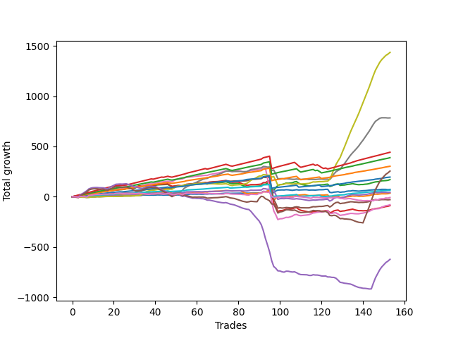

# Long Malamute 002 
- Symbol: ES_1W
- Date Range: 10/28/2022 - 11/04/2022
- Trading Period: 7:20-12:30
- Number of Trades: 153



| Name | Win Percent | Profit | Avg Profit / Trade | Avg Time / Trade |      | Name | Win Percent | Profit | Avg Profit / Trade | Avg Time / Trade |
| ---- | ----------- | ------ | ------------------ | ---------------- | ---- | ---- | ----------- | ------ | ------------------ | ---------------- |
| Sorted By <br> Profit | | | | | | Sorted By <br> Win Percentage ||||
| Seven | 76.47 | 717875.00 | 4691.99 | 57:22 |     | Eighty-One | 96.73 | 31875.00 | 208.33 | 10:36 |
| Six | 73.86 | 392000.00 | 2562.09 | 31:39 |     | Eighty-Two | 96.08 | 97500.00 | 637.25 | 16:05 |
| Eighty-Five | 88.24 | 221125.00 | 1445.26 | 33:32 |     | Eighty-Three | 94.12 | 151375.00 | 989.38 | 21:08 |
| Eighty-Four | 91.50 | 194250.00 | 1269.61 | 27:54 |     | Eighty-Four | 91.50 | 194250.00 | 1269.61 | 27:54 |
| Eighty-Three | 94.12 | 151375.00 | 989.38 | 21:08 |     | Eighty-Five | 88.24 | 221125.00 | 1445.26 | 33:32 |
| MALAMUTE 001 | 45.10 | 127500.00 | 833.33 | 43:52 |     | Two | 81.70 | 85000.00 | 555.56 | 13:17 |
| Eighty-Two | 96.08 | 97500.00 | 637.25 | 16:05 |     | Five | 79.08 | -40000.00 | -261.44 | 29:53 |
| Two | 81.70 | 85000.00 | 555.56 | 13:17 |     | Two_C | 78.43 | -44250.00 | -289.22 | 16:01 |
| Zero | 67.32 | 36250.00 | 236.93 | 02:43 |     | Seven | 76.47 | 717875.00 | 4691.99 | 57:22 |
| Eighty-One | 96.73 | 31875.00 | 208.33 | 10:36 |     | Six | 73.86 | 392000.00 | 2562.09 | 31:39 |
| Three | 64.71 | 21125.00 | 138.07 | 04:52 |     | Four | 72.55 | -14625.00 | -95.59 | 12:00 |
| One | 71.24 | 17875.00 | 116.83 | 07:06 |     | One | 71.24 | 17875.00 | 116.83 | 07:06 |
| MALAMUTE 002 | 39.87 | -4000.00 | -26.14 | 05:26 |     | Zero | 67.32 | 36250.00 | 236.93 | 02:43 |
| Four | 72.55 | -14625.00 | -95.59 | 12:00 |     | Three | 64.71 | 21125.00 | 138.07 | 04:52 |
| Five | 79.08 | -40000.00 | -261.44 | 29:53 |     | MALAMUTE 001 | 45.10 | 127500.00 | 833.33 | 43:52 |
| Two_C | 78.43 | -44250.00 | -289.22 | 16:01 |     | MALAMUTE 002 | 39.87 | -4000.00 | -26.14 | 05:26 |
| NEWFI 0000 | 29.41 | -311500.00 | -2035.95 | 45:01 |     | NEWFI 0000 | 29.41 | -311500.00 | -2035.95 | 45:01 |

## NO STOPLOSS

### Test Zero
* Sell when price hits the middle line of the 20p bollinger
* No Stoploss
* Results:
```
Total Trades: 153
Percent Up: 67.32
Percent Down: 32.68
Total Points Moved Up: 72.50
Potential Profit: 36250.00
Total Points Ups: 195.00 Count Ups: 103
Total Points Downs: -122.50 Count Downs: 50
```

<details><summary>Trades</summary>

<code>In: 2022-10-28 08:31:00		Out: 2022-10-28 08:39:05		Total Position Time: 08:05		Total Move Up: -0.50		Total to Date: -0.50</code> <br />
<code>In: 2022-10-28 08:31:00		Out: 2022-10-28 08:39:05		Total Position Time: 08:05		Total Move Up: -0.50		Total to Date: -1.00</code> <br />
<code>In: 2022-10-28 08:33:00		Out: 2022-10-28 08:39:05		Total Position Time: 06:05		Total Move Up: 0.00		Total to Date: -1.00</code> <br />
<code>In: 2022-10-28 08:39:00		Out: 2022-10-28 08:40:10		Total Position Time: 01:10		Total Move Up: 1.75		Total to Date: 0.75</code> <br />
<code>In: 2022-10-28 08:53:00		Out: 2022-10-28 08:54:10		Total Position Time: 01:10		Total Move Up: -2.25		Total to Date: -1.50</code> <br />
<code>In: 2022-10-28 08:56:00		Out: 2022-10-28 08:57:10		Total Position Time: 01:10		Total Move Up: 0.00		Total to Date: -1.50</code> <br />
<code>In: 2022-10-28 09:03:00		Out: 2022-10-28 09:13:15		Total Position Time: 10:15		Total Move Up: -3.00		Total to Date: -4.50</code> <br />
<code>In: 2022-10-28 09:11:00		Out: 2022-10-28 09:13:15		Total Position Time: 02:15		Total Move Up: 1.75		Total to Date: -2.75</code> <br />
<code>In: 2022-10-28 09:24:00		Out: 2022-10-28 09:25:10		Total Position Time: 01:10		Total Move Up: 2.25		Total to Date: -0.50</code> <br />
<code>In: 2022-10-28 09:50:00		Out: 2022-10-28 09:51:10		Total Position Time: 01:10		Total Move Up: 1.25		Total to Date: 0.75</code> <br />
<code>In: 2022-10-28 10:03:00		Out: 2022-10-28 10:04:10		Total Position Time: 01:10		Total Move Up: 0.25		Total to Date: 1.00</code> <br />
<code>In: 2022-10-28 10:07:00		Out: 2022-10-28 10:08:10		Total Position Time: 01:10		Total Move Up: 2.50		Total to Date: 3.50</code> <br />
<code>In: 2022-10-28 10:23:00		Out: 2022-10-28 10:24:10		Total Position Time: 01:10		Total Move Up: -1.00		Total to Date: 2.50</code> <br />
<code>In: 2022-10-28 10:27:00		Out: 2022-10-28 10:28:15		Total Position Time: 01:15		Total Move Up: 1.50		Total to Date: 4.00</code> <br />
<code>In: 2022-10-28 10:31:00		Out: 2022-10-28 10:32:10		Total Position Time: 01:10		Total Move Up: 1.00		Total to Date: 5.00</code> <br />
<code>In: 2022-10-28 10:46:00		Out: 2022-10-28 10:47:10		Total Position Time: 01:10		Total Move Up: 1.00		Total to Date: 6.00</code> <br />
<code>In: 2022-10-28 10:54:00		Out: 2022-10-28 10:55:10		Total Position Time: 01:10		Total Move Up: 0.50		Total to Date: 6.50</code> <br />
<code>In: 2022-10-28 11:14:00		Out: 2022-10-28 11:15:10		Total Position Time: 01:10		Total Move Up: 0.25		Total to Date: 6.75</code> <br />
<code>In: 2022-10-28 11:25:00		Out: 2022-10-28 11:26:10		Total Position Time: 01:10		Total Move Up: -0.25		Total to Date: 6.50</code> <br />
<code>In: 2022-10-28 11:28:00		Out: 2022-10-28 11:29:10		Total Position Time: 01:10		Total Move Up: -0.25		Total to Date: 6.25</code> <br />
<code>In: 2022-10-28 11:32:00		Out: 2022-10-28 11:33:10		Total Position Time: 01:10		Total Move Up: 1.00		Total to Date: 7.25</code> <br />
<code>In: 2022-10-28 11:43:00		Out: 2022-10-28 11:44:10		Total Position Time: 01:10		Total Move Up: -0.25		Total to Date: 7.00</code> <br />
<code>In: 2022-10-28 11:58:00		Out: 2022-10-28 11:59:10		Total Position Time: 01:10		Total Move Up: 0.50		Total to Date: 7.50</code> <br />
<code>In: 2022-10-28 12:02:00		Out: 2022-10-28 12:03:10		Total Position Time: 01:10		Total Move Up: 0.75		Total to Date: 8.25</code> <br />
<code>In: 2022-10-28 12:11:00		Out: 2022-10-28 12:12:10		Total Position Time: 01:10		Total Move Up: 2.25		Total to Date: 10.50</code> <br />
<code>In: 2022-10-28 12:25:00		Out: 2022-10-28 12:26:10		Total Position Time: 01:10		Total Move Up: 0.50		Total to Date: 11.00</code> <br />
<code>In: 2022-10-31 08:33:00		Out: 2022-10-31 08:34:10		Total Position Time: 01:10		Total Move Up: 0.00		Total to Date: 11.00</code> <br />
<code>In: 2022-10-31 08:35:00		Out: 2022-10-31 08:36:10		Total Position Time: 01:10		Total Move Up: -0.25		Total to Date: 10.75</code> <br />
<code>In: 2022-10-31 08:42:00		Out: 2022-10-31 08:43:10		Total Position Time: 01:10		Total Move Up: 1.25		Total to Date: 12.00</code> <br />
<code>In: 2022-10-31 08:49:00		Out: 2022-10-31 08:50:10		Total Position Time: 01:10		Total Move Up: 0.25		Total to Date: 12.25</code> <br />
<code>In: 2022-10-31 09:04:00		Out: 2022-10-31 09:13:50		Total Position Time: 09:50		Total Move Up: 3.50		Total to Date: 15.75</code> <br />
<code>In: 2022-10-31 09:13:00		Out: 2022-10-31 09:14:10		Total Position Time: 01:10		Total Move Up: 0.00		Total to Date: 15.75</code> <br />
<code>In: 2022-10-31 09:41:00		Out: 2022-10-31 09:51:10		Total Position Time: 10:10		Total Move Up: -2.00		Total to Date: 13.75</code> <br />
<code>In: 2022-10-31 09:49:00		Out: 2022-10-31 09:51:10		Total Position Time: 02:10		Total Move Up: 2.00		Total to Date: 15.75</code> <br />
<code>In: 2022-10-31 09:51:00		Out: 2022-10-31 09:52:10		Total Position Time: 01:10		Total Move Up: 0.75		Total to Date: 16.50</code> <br />
<code>In: 2022-10-31 09:59:00		Out: 2022-10-31 10:00:10		Total Position Time: 01:10		Total Move Up: 0.00		Total to Date: 16.50</code> <br />
<code>In: 2022-10-31 10:09:00		Out: 2022-10-31 10:10:10		Total Position Time: 01:10		Total Move Up: -1.25		Total to Date: 15.25</code> <br />
<code>In: 2022-10-31 10:17:00		Out: 2022-10-31 10:18:10		Total Position Time: 01:10		Total Move Up: 1.00		Total to Date: 16.25</code> <br />
<code>In: 2022-10-31 10:30:00		Out: 2022-10-31 10:31:10		Total Position Time: 01:10		Total Move Up: -0.75		Total to Date: 15.50</code> <br />
<code>In: 2022-10-31 10:56:00		Out: 2022-10-31 10:58:15		Total Position Time: 02:15		Total Move Up: 0.75		Total to Date: 16.25</code> <br />
<code>In: 2022-10-31 11:15:00		Out: 2022-10-31 11:16:10		Total Position Time: 01:10		Total Move Up: 1.75		Total to Date: 18.00</code> <br />
<code>In: 2022-10-31 11:19:00		Out: 2022-10-31 11:20:10		Total Position Time: 01:10		Total Move Up: -0.75		Total to Date: 17.25</code> <br />
<code>In: 2022-10-31 11:26:00		Out: 2022-10-31 11:27:10		Total Position Time: 01:10		Total Move Up: 0.50		Total to Date: 17.75</code> <br />
<code>In: 2022-10-31 11:28:00		Out: 2022-10-31 11:29:10		Total Position Time: 01:10		Total Move Up: -2.25		Total to Date: 15.50</code> <br />
<code>In: 2022-10-31 11:32:00		Out: 2022-10-31 11:33:10		Total Position Time: 01:10		Total Move Up: 1.50		Total to Date: 17.00</code> <br />
<code>In: 2022-10-31 11:34:00		Out: 2022-10-31 11:35:10		Total Position Time: 01:10		Total Move Up: -0.25		Total to Date: 16.75</code> <br />
<code>In: 2022-10-31 11:46:00		Out: 2022-10-31 11:47:10		Total Position Time: 01:10		Total Move Up: -0.25		Total to Date: 16.50</code> <br />
<code>In: 2022-10-31 11:54:00		Out: 2022-10-31 11:55:10		Total Position Time: 01:10		Total Move Up: 0.75		Total to Date: 17.25</code> <br />
<code>In: 2022-10-31 12:14:00		Out: 2022-10-31 12:19:35		Total Position Time: 05:35		Total Move Up: 0.50		Total to Date: 17.75</code> <br />
<code>In: 2022-10-31 12:20:00		Out: 2022-10-31 12:21:10		Total Position Time: 01:10		Total Move Up: -0.50		Total to Date: 17.25</code> <br />
<code>In: 2022-10-31 12:30:00		Out: 2022-10-31 12:31:10		Total Position Time: 01:10		Total Move Up: 0.75		Total to Date: 18.00</code> <br />
<code>In: 2022-11-01 08:31:00		Out: 2022-11-01 08:32:10		Total Position Time: 01:10		Total Move Up: -3.00		Total to Date: 15.00</code> <br />
<code>In: 2022-11-01 08:38:00		Out: 2022-11-01 08:48:25		Total Position Time: 10:25		Total Move Up: -4.75		Total to Date: 10.25</code> <br />
<code>In: 2022-11-01 08:47:00		Out: 2022-11-01 08:48:25		Total Position Time: 01:25		Total Move Up: 3.00		Total to Date: 13.25</code> <br />
<code>In: 2022-11-01 09:05:00		Out: 2022-11-01 09:06:10		Total Position Time: 01:10		Total Move Up: 6.75		Total to Date: 20.00</code> <br />
<code>In: 2022-11-01 09:19:00		Out: 2022-11-01 09:23:45		Total Position Time: 04:45		Total Move Up: 3.00		Total to Date: 23.00</code> <br />
<code>In: 2022-11-01 09:22:00		Out: 2022-11-01 09:23:45		Total Position Time: 01:45		Total Move Up: 3.25		Total to Date: 26.25</code> <br />
<code>In: 2022-11-01 09:26:00		Out: 2022-11-01 09:33:50		Total Position Time: 07:50		Total Move Up: -1.25		Total to Date: 25.00</code> <br />
<code>In: 2022-11-01 09:40:00		Out: 2022-11-01 09:41:10		Total Position Time: 01:10		Total Move Up: 0.75		Total to Date: 25.75</code> <br />
<code>In: 2022-11-01 09:48:00		Out: 2022-11-01 09:49:10		Total Position Time: 01:10		Total Move Up: -0.75		Total to Date: 25.00</code> <br />
<code>In: 2022-11-01 09:57:00		Out: 2022-11-01 09:58:10		Total Position Time: 01:10		Total Move Up: 1.00		Total to Date: 26.00</code> <br />
<code>In: 2022-11-01 10:06:00		Out: 2022-11-01 10:07:10		Total Position Time: 01:10		Total Move Up: -1.25		Total to Date: 24.75</code> <br />
<code>In: 2022-11-01 10:08:00		Out: 2022-11-01 10:10:30		Total Position Time: 02:30		Total Move Up: 0.00		Total to Date: 24.75</code> <br />
<code>In: 2022-11-01 10:12:00		Out: 2022-11-01 10:13:10		Total Position Time: 01:10		Total Move Up: 2.00		Total to Date: 26.75</code> <br />
<code>In: 2022-11-01 10:21:00		Out: 2022-11-01 10:22:10		Total Position Time: 01:10		Total Move Up: -1.00		Total to Date: 25.75</code> <br />
<code>In: 2022-11-01 10:41:00		Out: 2022-11-01 10:42:10		Total Position Time: 01:10		Total Move Up: 2.75		Total to Date: 28.50</code> <br />
<code>In: 2022-11-01 10:52:00		Out: 2022-11-01 10:53:10		Total Position Time: 01:10		Total Move Up: -1.50		Total to Date: 27.00</code> <br />
<code>In: 2022-11-01 10:59:00		Out: 2022-11-01 11:00:10		Total Position Time: 01:10		Total Move Up: 1.00		Total to Date: 28.00</code> <br />
<code>In: 2022-11-01 11:09:00		Out: 2022-11-01 11:10:10		Total Position Time: 01:10		Total Move Up: 1.00		Total to Date: 29.00</code> <br />
<code>In: 2022-11-01 11:18:00		Out: 2022-11-01 11:22:30		Total Position Time: 04:30		Total Move Up: 0.25		Total to Date: 29.25</code> <br />
<code>In: 2022-11-01 11:24:00		Out: 2022-11-01 11:28:40		Total Position Time: 04:40		Total Move Up: 0.50		Total to Date: 29.75</code> <br />
<code>In: 2022-11-01 11:29:00		Out: 2022-11-01 11:30:10		Total Position Time: 01:10		Total Move Up: 1.75		Total to Date: 31.50</code> <br />
<code>In: 2022-11-01 11:39:00		Out: 2022-11-01 11:40:10		Total Position Time: 01:10		Total Move Up: 1.75		Total to Date: 33.25</code> <br />
<code>In: 2022-11-01 11:53:00		Out: 2022-11-01 11:54:10		Total Position Time: 01:10		Total Move Up: 1.75		Total to Date: 35.00</code> <br />
<code>In: 2022-11-01 12:06:00		Out: 2022-11-01 12:07:10		Total Position Time: 01:10		Total Move Up: -0.50		Total to Date: 34.50</code> <br />
<code>In: 2022-11-01 12:09:00		Out: 2022-11-01 12:10:10		Total Position Time: 01:10		Total Move Up: -1.50		Total to Date: 33.00</code> <br />
<code>In: 2022-11-01 12:20:00		Out: 2022-11-01 12:21:10		Total Position Time: 01:10		Total Move Up: 0.50		Total to Date: 33.50</code> <br />
<code>In: 2022-11-02 08:34:00		Out: 2022-11-02 08:35:10		Total Position Time: 01:10		Total Move Up: 1.25		Total to Date: 34.75</code> <br />
<code>In: 2022-11-02 08:43:00		Out: 2022-11-02 08:44:10		Total Position Time: 01:10		Total Move Up: 0.25		Total to Date: 35.00</code> <br />
<code>In: 2022-11-02 08:49:00		Out: 2022-11-02 08:50:10		Total Position Time: 01:10		Total Move Up: 0.75		Total to Date: 35.75</code> <br />
<code>In: 2022-11-02 08:53:00		Out: 2022-11-02 08:54:10		Total Position Time: 01:10		Total Move Up: -0.75		Total to Date: 35.00</code> <br />
<code>In: 2022-11-02 08:56:00		Out: 2022-11-02 09:06:00		Total Position Time: 10:00		Total Move Up: -1.75		Total to Date: 33.25</code> <br />
<code>In: 2022-11-02 09:03:00		Out: 2022-11-02 09:06:00		Total Position Time: 03:00		Total Move Up: 1.00		Total to Date: 34.25</code> <br />
<code>In: 2022-11-02 09:05:00		Out: 2022-11-02 09:06:10		Total Position Time: 01:10		Total Move Up: 1.00		Total to Date: 35.25</code> <br />
<code>In: 2022-11-02 09:34:00		Out: 2022-11-02 09:43:40		Total Position Time: 09:40		Total Move Up: -0.75		Total to Date: 34.50</code> <br />
<code>In: 2022-11-02 09:42:00		Out: 2022-11-02 09:43:40		Total Position Time: 01:40		Total Move Up: 1.50		Total to Date: 36.00</code> <br />
<code>In: 2022-11-02 10:12:00		Out: 2022-11-02 10:18:35		Total Position Time: 06:35		Total Move Up: -0.25		Total to Date: 35.75</code> <br />
<code>In: 2022-11-02 10:19:00		Out: 2022-11-02 10:20:30		Total Position Time: 01:30		Total Move Up: 0.50		Total to Date: 36.25</code> <br />
<code>In: 2022-11-02 10:30:00		Out: 2022-11-02 10:32:20		Total Position Time: 02:20		Total Move Up: 0.25		Total to Date: 36.50</code> <br />
<code>In: 2022-11-02 10:32:00		Out: 2022-11-02 10:33:10		Total Position Time: 01:10		Total Move Up: 1.25		Total to Date: 37.75</code> <br />
<code>In: 2022-11-02 10:47:00		Out: 2022-11-02 10:48:10		Total Position Time: 01:10		Total Move Up: 1.25		Total to Date: 39.00</code> <br />
<code>In: 2022-11-02 11:01:00		Out: 2022-11-02 11:02:10		Total Position Time: 01:10		Total Move Up: 14.00		Total to Date: 53.00</code> <br />
<code>In: 2022-11-02 11:09:00		Out: 2022-11-02 11:10:10		Total Position Time: 01:10		Total Move Up: -2.00		Total to Date: 51.00</code> <br />
<code>In: 2022-11-02 11:17:00		Out: 2022-11-02 11:20:25		Total Position Time: 03:25		Total Move Up: 2.75		Total to Date: 53.75</code> <br />
<code>In: 2022-11-02 11:23:00		Out: 2022-11-02 11:24:10		Total Position Time: 01:10		Total Move Up: 1.00		Total to Date: 54.75</code> <br />
<code>In: 2022-11-02 11:36:00		Out: 2022-11-02 11:42:10		Total Position Time: 06:10		Total Move Up: -19.50		Total to Date: 35.25</code> <br />
<code>In: 2022-11-02 11:42:00		Out: 2022-11-02 11:43:10		Total Position Time: 01:10		Total Move Up: 6.00		Total to Date: 41.25</code> <br />
<code>In: 2022-11-02 11:57:00		Out: 2022-11-02 12:05:40		Total Position Time: 08:40		Total Move Up: 16.00		Total to Date: 57.25</code> <br />
<code>In: 2022-11-02 11:59:00		Out: 2022-11-02 12:05:40		Total Position Time: 06:40		Total Move Up: 8.50		Total to Date: 65.75</code> <br />
<code>In: 2022-11-03 08:37:00		Out: 2022-11-03 08:38:10		Total Position Time: 01:10		Total Move Up: 1.00		Total to Date: 66.75</code> <br />
<code>In: 2022-11-03 08:46:00		Out: 2022-11-03 08:47:10		Total Position Time: 01:10		Total Move Up: 0.75		Total to Date: 67.50</code> <br />
<code>In: 2022-11-03 08:50:00		Out: 2022-11-03 09:02:10		Total Position Time: 12:10		Total Move Up: -0.75		Total to Date: 66.75</code> <br />
<code>In: 2022-11-03 09:02:00		Out: 2022-11-03 09:03:10		Total Position Time: 01:10		Total Move Up: 2.75		Total to Date: 69.50</code> <br />
<code>In: 2022-11-03 09:11:00		Out: 2022-11-03 09:12:10		Total Position Time: 01:10		Total Move Up: -1.25		Total to Date: 68.25</code> <br />
<code>In: 2022-11-03 09:28:00		Out: 2022-11-03 09:29:10		Total Position Time: 01:10		Total Move Up: -2.50		Total to Date: 65.75</code> <br />
<code>In: 2022-11-03 09:34:00		Out: 2022-11-03 09:43:05		Total Position Time: 09:05		Total Move Up: -2.50		Total to Date: 63.25</code> <br />
<code>In: 2022-11-03 09:41:00		Out: 2022-11-03 09:43:05		Total Position Time: 02:05		Total Move Up: 3.00		Total to Date: 66.25</code> <br />
<code>In: 2022-11-03 09:51:00		Out: 2022-11-03 09:52:10		Total Position Time: 01:10		Total Move Up: 3.25		Total to Date: 69.50</code> <br />
<code>In: 2022-11-03 10:01:00		Out: 2022-11-03 10:02:10		Total Position Time: 01:10		Total Move Up: -3.00		Total to Date: 66.50</code> <br />
<code>In: 2022-11-03 10:16:00		Out: 2022-11-03 10:17:45		Total Position Time: 01:45		Total Move Up: 1.00		Total to Date: 67.50</code> <br />
<code>In: 2022-11-03 10:30:00		Out: 2022-11-03 10:38:55		Total Position Time: 08:55		Total Move Up: 0.50		Total to Date: 68.00</code> <br />
<code>In: 2022-11-03 10:39:00		Out: 2022-11-03 10:40:10		Total Position Time: 01:10		Total Move Up: 1.25		Total to Date: 69.25</code> <br />
<code>In: 2022-11-03 10:48:00		Out: 2022-11-03 10:49:10		Total Position Time: 01:10		Total Move Up: -0.25		Total to Date: 69.00</code> <br />
<code>In: 2022-11-03 10:56:00		Out: 2022-11-03 11:08:10		Total Position Time: 12:10		Total Move Up: -3.75		Total to Date: 65.25</code> <br />
<code>In: 2022-11-03 11:07:00		Out: 2022-11-03 11:08:10		Total Position Time: 01:10		Total Move Up: 1.25		Total to Date: 66.50</code> <br />
<code>In: 2022-11-03 11:16:00		Out: 2022-11-03 11:17:10		Total Position Time: 01:10		Total Move Up: 0.00		Total to Date: 66.50</code> <br />
<code>In: 2022-11-03 11:36:00		Out: 2022-11-03 11:37:10		Total Position Time: 01:10		Total Move Up: -1.00		Total to Date: 65.50</code> <br />
<code>In: 2022-11-03 11:47:00		Out: 2022-11-03 11:48:10		Total Position Time: 01:10		Total Move Up: 2.25		Total to Date: 67.75</code> <br />
<code>In: 2022-11-03 11:57:00		Out: 2022-11-03 11:58:10		Total Position Time: 01:10		Total Move Up: 1.75		Total to Date: 69.50</code> <br />
<code>In: 2022-11-03 12:00:00		Out: 2022-11-03 12:01:10		Total Position Time: 01:10		Total Move Up: -0.25		Total to Date: 69.25</code> <br />
<code>In: 2022-11-03 12:12:00		Out: 2022-11-03 12:21:15		Total Position Time: 09:15		Total Move Up: 1.00		Total to Date: 70.25</code> <br />
<code>In: 2022-11-03 12:19:00		Out: 2022-11-03 12:21:15		Total Position Time: 02:15		Total Move Up: 3.00		Total to Date: 73.25</code> <br />
<code>In: 2022-11-03 12:23:00		Out: 2022-11-03 12:24:30		Total Position Time: 01:30		Total Move Up: 0.00		Total to Date: 73.25</code> <br />
<code>In: 2022-11-04 08:35:00		Out: 2022-11-04 09:09:10		Total Position Time: 34:10		Total Move Up: -30.50		Total to Date: 42.75</code> <br />
<code>In: 2022-11-04 08:59:00		Out: 2022-11-04 09:09:10		Total Position Time: 10:10		Total Move Up: -2.25		Total to Date: 40.50</code> <br />
<code>In: 2022-11-04 09:08:00		Out: 2022-11-04 09:09:10		Total Position Time: 01:10		Total Move Up: 4.75		Total to Date: 45.25</code> <br />
<code>In: 2022-11-04 09:16:00		Out: 2022-11-04 09:17:10		Total Position Time: 01:10		Total Move Up: 1.75		Total to Date: 47.00</code> <br />
<code>In: 2022-11-04 09:28:00		Out: 2022-11-04 09:29:10		Total Position Time: 01:10		Total Move Up: 2.75		Total to Date: 49.75</code> <br />
<code>In: 2022-11-04 09:35:00		Out: 2022-11-04 09:36:55		Total Position Time: 01:55		Total Move Up: -6.25		Total to Date: 43.50</code> <br />
<code>In: 2022-11-04 09:46:00		Out: 2022-11-04 09:54:50		Total Position Time: 08:50		Total Move Up: 3.25		Total to Date: 46.75</code> <br />
<code>In: 2022-11-04 09:51:00		Out: 2022-11-04 09:54:50		Total Position Time: 03:50		Total Move Up: 1.00		Total to Date: 47.75</code> <br />
<code>In: 2022-11-04 09:54:00		Out: 2022-11-04 09:55:10		Total Position Time: 01:10		Total Move Up: 5.50		Total to Date: 53.25</code> <br />
<code>In: 2022-11-04 09:58:00		Out: 2022-11-04 09:59:10		Total Position Time: 01:10		Total Move Up: 3.25		Total to Date: 56.50</code> <br />
<code>In: 2022-11-04 10:03:00		Out: 2022-11-04 10:04:10		Total Position Time: 01:10		Total Move Up: 0.00		Total to Date: 56.50</code> <br />
<code>In: 2022-11-04 10:05:00		Out: 2022-11-04 10:06:10		Total Position Time: 01:10		Total Move Up: 4.00		Total to Date: 60.50</code> <br />
<code>In: 2022-11-04 10:13:00		Out: 2022-11-04 10:14:10		Total Position Time: 01:10		Total Move Up: -2.00		Total to Date: 58.50</code> <br />
<code>In: 2022-11-04 10:23:00		Out: 2022-11-04 10:24:10		Total Position Time: 01:10		Total Move Up: -1.25		Total to Date: 57.25</code> <br />
<code>In: 2022-11-04 10:32:00		Out: 2022-11-04 10:38:10		Total Position Time: 06:10		Total Move Up: -2.00		Total to Date: 55.25</code> <br />
<code>In: 2022-11-04 10:36:00		Out: 2022-11-04 10:38:10		Total Position Time: 02:10		Total Move Up: 2.25		Total to Date: 57.50</code> <br />
<code>In: 2022-11-04 10:38:00		Out: 2022-11-04 10:39:10		Total Position Time: 01:10		Total Move Up: 2.00		Total to Date: 59.50</code> <br />
<code>In: 2022-11-04 10:47:00		Out: 2022-11-04 10:48:40		Total Position Time: 01:40		Total Move Up: 0.75		Total to Date: 60.25</code> <br />
<code>In: 2022-11-04 10:53:00		Out: 2022-11-04 10:54:10		Total Position Time: 01:10		Total Move Up: 2.00		Total to Date: 62.25</code> <br />
<code>In: 2022-11-04 11:02:00		Out: 2022-11-04 11:03:10		Total Position Time: 01:10		Total Move Up: 3.00		Total to Date: 65.25</code> <br />
<code>In: 2022-11-04 11:11:00		Out: 2022-11-04 11:14:45		Total Position Time: 03:45		Total Move Up: 1.75		Total to Date: 67.00</code> <br />
<code>In: 2022-11-04 11:14:00		Out: 2022-11-04 11:15:10		Total Position Time: 01:10		Total Move Up: 0.75		Total to Date: 67.75</code> <br />
<code>In: 2022-11-04 11:18:00		Out: 2022-11-04 11:19:10		Total Position Time: 01:10		Total Move Up: 4.75		Total to Date: 72.50</code> <br />
<code>In: 2022-11-04 11:36:00		Out: 2022-11-04 11:37:10		Total Position Time: 01:10		Total Move Up: -3.75		Total to Date: 68.75</code> <br />
<code>In: 2022-11-04 11:38:00		Out: 2022-11-04 11:39:10		Total Position Time: 01:10		Total Move Up: 2.25		Total to Date: 71.00</code> <br />
<code>In: 2022-11-04 11:54:00		Out: 2022-11-04 11:55:10		Total Position Time: 01:10		Total Move Up: 2.00		Total to Date: 73.00</code> <br />
<code>In: 2022-11-04 12:02:00		Out: 2022-11-04 12:03:10		Total Position Time: 01:10		Total Move Up: -0.25		Total to Date: 72.75</code> <br />
<code>In: 2022-11-04 12:04:00		Out: 2022-11-04 12:05:10		Total Position Time: 01:10		Total Move Up: 0.00		Total to Date: 72.75</code> <br />
<code>In: 2022-11-04 12:19:00		Out: 2022-11-04 12:20:10		Total Position Time: 01:10		Total Move Up: -2.25		Total to Date: 70.50</code> <br />
<code>In: 2022-11-04 12:27:00		Out: 2022-11-04 12:28:15		Total Position Time: 01:15		Total Move Up: 2.00		Total to Date: 72.50</code> <br />


</details>

### Test One
* Sell when the price hits the upper line of the 20p 1std bollinger
* No Stoploss
* Results:
```
Total Trades: 153
Percent Up: 71.24
Percent Down: 28.76
Total Points Moved Up: 35.75
Potential Profit: 17875.00
Total Points Ups: 264.25 Count Ups: 109
Total Points Downs: -228.50 Count Downs: 44
```

<details><summary>Trades</summary>

<code>In: 2022-10-28 08:31:00		Out: 2022-10-28 08:39:40		Total Position Time: 08:40		Total Move Up: 0.50		Total to Date: 0.50</code> <br />
<code>In: 2022-10-28 08:31:00		Out: 2022-10-28 08:39:40		Total Position Time: 08:40		Total Move Up: 0.50		Total to Date: 1.00</code> <br />
<code>In: 2022-10-28 08:33:00		Out: 2022-10-28 08:39:40		Total Position Time: 06:40		Total Move Up: 1.00		Total to Date: 2.00</code> <br />
<code>In: 2022-10-28 08:39:00		Out: 2022-10-28 08:40:20		Total Position Time: 01:20		Total Move Up: 2.75		Total to Date: 4.75</code> <br />
<code>In: 2022-10-28 08:53:00		Out: 2022-10-28 09:14:05		Total Position Time: 21:05		Total Move Up: -2.50		Total to Date: 2.25</code> <br />
<code>In: 2022-10-28 08:56:00		Out: 2022-10-28 09:14:05		Total Position Time: 18:05		Total Move Up: -0.75		Total to Date: 1.50</code> <br />
<code>In: 2022-10-28 09:03:00		Out: 2022-10-28 09:14:05		Total Position Time: 11:05		Total Move Up: -0.25		Total to Date: 1.25</code> <br />
<code>In: 2022-10-28 09:11:00		Out: 2022-10-28 09:14:05		Total Position Time: 03:05		Total Move Up: 4.50		Total to Date: 5.75</code> <br />
<code>In: 2022-10-28 09:24:00		Out: 2022-10-28 09:25:10		Total Position Time: 01:10		Total Move Up: 2.25		Total to Date: 8.00</code> <br />
<code>In: 2022-10-28 09:50:00		Out: 2022-10-28 09:53:40		Total Position Time: 03:40		Total Move Up: 3.00		Total to Date: 11.00</code> <br />
<code>In: 2022-10-28 10:03:00		Out: 2022-10-28 10:04:10		Total Position Time: 01:10		Total Move Up: 0.25		Total to Date: 11.25</code> <br />
<code>In: 2022-10-28 10:07:00		Out: 2022-10-28 10:08:10		Total Position Time: 01:10		Total Move Up: 2.50		Total to Date: 13.75</code> <br />
<code>In: 2022-10-28 10:23:00		Out: 2022-10-28 10:33:50		Total Position Time: 10:50		Total Move Up: 0.00		Total to Date: 13.75</code> <br />
<code>In: 2022-10-28 10:27:00		Out: 2022-10-28 10:33:50		Total Position Time: 06:50		Total Move Up: 2.00		Total to Date: 15.75</code> <br />
<code>In: 2022-10-28 10:31:00		Out: 2022-10-28 10:33:50		Total Position Time: 02:50		Total Move Up: 1.50		Total to Date: 17.25</code> <br />
<code>In: 2022-10-28 10:46:00		Out: 2022-10-28 10:47:10		Total Position Time: 01:10		Total Move Up: 1.00		Total to Date: 18.25</code> <br />
<code>In: 2022-10-28 10:54:00		Out: 2022-10-28 10:55:10		Total Position Time: 01:10		Total Move Up: 0.50		Total to Date: 18.75</code> <br />
<code>In: 2022-10-28 11:14:00		Out: 2022-10-28 11:16:05		Total Position Time: 02:05		Total Move Up: 2.25		Total to Date: 21.00</code> <br />
<code>In: 2022-10-28 11:25:00		Out: 2022-10-28 11:32:05		Total Position Time: 07:05		Total Move Up: 0.25		Total to Date: 21.25</code> <br />
<code>In: 2022-10-28 11:28:00		Out: 2022-10-28 11:32:05		Total Position Time: 04:05		Total Move Up: 0.75		Total to Date: 22.00</code> <br />
<code>In: 2022-10-28 11:32:00		Out: 2022-10-28 11:33:10		Total Position Time: 01:10		Total Move Up: 1.00		Total to Date: 23.00</code> <br />
<code>In: 2022-10-28 11:43:00		Out: 2022-10-28 11:44:10		Total Position Time: 01:10		Total Move Up: -0.25		Total to Date: 22.75</code> <br />
<code>In: 2022-10-28 11:58:00		Out: 2022-10-28 11:59:10		Total Position Time: 01:10		Total Move Up: 0.50		Total to Date: 23.25</code> <br />
<code>In: 2022-10-28 12:02:00		Out: 2022-10-28 12:03:10		Total Position Time: 01:10		Total Move Up: 0.75		Total to Date: 24.00</code> <br />
<code>In: 2022-10-28 12:11:00		Out: 2022-10-28 12:12:10		Total Position Time: 01:10		Total Move Up: 2.25		Total to Date: 26.25</code> <br />
<code>In: 2022-10-28 12:25:00		Out: 2022-10-28 12:26:20		Total Position Time: 01:20		Total Move Up: 1.00		Total to Date: 27.25</code> <br />
<code>In: 2022-10-31 08:33:00		Out: 2022-10-31 08:34:10		Total Position Time: 01:10		Total Move Up: 0.00		Total to Date: 27.25</code> <br />
<code>In: 2022-10-31 08:35:00		Out: 2022-10-31 08:36:10		Total Position Time: 01:10		Total Move Up: -0.25		Total to Date: 27.00</code> <br />
<code>In: 2022-10-31 08:42:00		Out: 2022-10-31 08:43:10		Total Position Time: 01:10		Total Move Up: 1.25		Total to Date: 28.25</code> <br />
<code>In: 2022-10-31 08:49:00		Out: 2022-10-31 08:50:10		Total Position Time: 01:10		Total Move Up: 0.25		Total to Date: 28.50</code> <br />
<code>In: 2022-10-31 09:04:00		Out: 2022-10-31 09:16:05		Total Position Time: 12:05		Total Move Up: 7.25		Total to Date: 35.75</code> <br />
<code>In: 2022-10-31 09:13:00		Out: 2022-10-31 09:16:05		Total Position Time: 03:05		Total Move Up: 4.25		Total to Date: 40.00</code> <br />
<code>In: 2022-10-31 09:41:00		Out: 2022-10-31 09:57:05		Total Position Time: 16:05		Total Move Up: -1.50		Total to Date: 38.50</code> <br />
<code>In: 2022-10-31 09:49:00		Out: 2022-10-31 09:57:05		Total Position Time: 08:05		Total Move Up: 2.50		Total to Date: 41.00</code> <br />
<code>In: 2022-10-31 09:51:00		Out: 2022-10-31 09:57:05		Total Position Time: 06:05		Total Move Up: 1.00		Total to Date: 42.00</code> <br />
<code>In: 2022-10-31 09:59:00		Out: 2022-10-31 10:00:10		Total Position Time: 01:10		Total Move Up: 0.00		Total to Date: 42.00</code> <br />
<code>In: 2022-10-31 10:09:00		Out: 2022-10-31 10:10:10		Total Position Time: 01:10		Total Move Up: -1.25		Total to Date: 40.75</code> <br />
<code>In: 2022-10-31 10:17:00		Out: 2022-10-31 10:18:10		Total Position Time: 01:10		Total Move Up: 1.00		Total to Date: 41.75</code> <br />
<code>In: 2022-10-31 10:30:00		Out: 2022-10-31 10:31:10		Total Position Time: 01:10		Total Move Up: -0.75		Total to Date: 41.00</code> <br />
<code>In: 2022-10-31 10:56:00		Out: 2022-10-31 11:01:30		Total Position Time: 05:30		Total Move Up: 2.00		Total to Date: 43.00</code> <br />
<code>In: 2022-10-31 11:15:00		Out: 2022-10-31 11:19:10		Total Position Time: 04:10		Total Move Up: 3.25		Total to Date: 46.25</code> <br />
<code>In: 2022-10-31 11:19:00		Out: 2022-10-31 11:25:35		Total Position Time: 06:35		Total Move Up: 0.00		Total to Date: 46.25</code> <br />
<code>In: 2022-10-31 11:26:00		Out: 2022-10-31 11:27:10		Total Position Time: 01:10		Total Move Up: 0.50		Total to Date: 46.75</code> <br />
<code>In: 2022-10-31 11:28:00		Out: 2022-10-31 11:31:25		Total Position Time: 03:25		Total Move Up: -1.25		Total to Date: 45.50</code> <br />
<code>In: 2022-10-31 11:32:00		Out: 2022-10-31 11:33:10		Total Position Time: 01:10		Total Move Up: 1.50		Total to Date: 47.00</code> <br />
<code>In: 2022-10-31 11:34:00		Out: 2022-10-31 11:35:10		Total Position Time: 01:10		Total Move Up: -0.25		Total to Date: 46.75</code> <br />
<code>In: 2022-10-31 11:46:00		Out: 2022-10-31 11:47:10		Total Position Time: 01:10		Total Move Up: -0.25		Total to Date: 46.50</code> <br />
<code>In: 2022-10-31 11:54:00		Out: 2022-10-31 12:21:30		Total Position Time: 27:30		Total Move Up: -12.25		Total to Date: 34.25</code> <br />
<code>In: 2022-10-31 12:14:00		Out: 2022-10-31 12:21:30		Total Position Time: 07:30		Total Move Up: 1.25		Total to Date: 35.50</code> <br />
<code>In: 2022-10-31 12:20:00		Out: 2022-10-31 12:21:30		Total Position Time: 01:30		Total Move Up: 1.00		Total to Date: 36.50</code> <br />
<code>In: 2022-10-31 12:30:00		Out: 2022-10-31 12:31:10		Total Position Time: 01:10		Total Move Up: 0.75		Total to Date: 37.25</code> <br />
<code>In: 2022-11-01 08:31:00		Out: 2022-11-01 08:32:15		Total Position Time: 01:15		Total Move Up: -2.50		Total to Date: 34.75</code> <br />
<code>In: 2022-11-01 08:38:00		Out: 2022-11-01 08:55:00		Total Position Time: 17:00		Total Move Up: -2.00		Total to Date: 32.75</code> <br />
<code>In: 2022-11-01 08:47:00		Out: 2022-11-01 08:55:00		Total Position Time: 08:00		Total Move Up: 5.75		Total to Date: 38.50</code> <br />
<code>In: 2022-11-01 09:05:00		Out: 2022-11-01 09:06:10		Total Position Time: 01:10		Total Move Up: 6.75		Total to Date: 45.25</code> <br />
<code>In: 2022-11-01 09:19:00		Out: 2022-11-01 09:42:15		Total Position Time: 23:15		Total Move Up: -0.50		Total to Date: 44.75</code> <br />
<code>In: 2022-11-01 09:22:00		Out: 2022-11-01 09:42:15		Total Position Time: 20:15		Total Move Up: -0.25		Total to Date: 44.50</code> <br />
<code>In: 2022-11-01 09:26:00		Out: 2022-11-01 09:42:15		Total Position Time: 16:15		Total Move Up: -1.50		Total to Date: 43.00</code> <br />
<code>In: 2022-11-01 09:40:00		Out: 2022-11-01 09:42:15		Total Position Time: 02:15		Total Move Up: 1.50		Total to Date: 44.50</code> <br />
<code>In: 2022-11-01 09:48:00		Out: 2022-11-01 09:49:10		Total Position Time: 01:10		Total Move Up: -0.75		Total to Date: 43.75</code> <br />
<code>In: 2022-11-01 09:57:00		Out: 2022-11-01 09:58:35		Total Position Time: 01:35		Total Move Up: 1.25		Total to Date: 45.00</code> <br />
<code>In: 2022-11-01 10:06:00		Out: 2022-11-01 10:07:10		Total Position Time: 01:10		Total Move Up: -1.25		Total to Date: 43.75</code> <br />
<code>In: 2022-11-01 10:08:00		Out: 2022-11-01 10:11:05		Total Position Time: 03:05		Total Move Up: 2.00		Total to Date: 45.75</code> <br />
<code>In: 2022-11-01 10:12:00		Out: 2022-11-01 10:13:10		Total Position Time: 01:10		Total Move Up: 2.00		Total to Date: 47.75</code> <br />
<code>In: 2022-11-01 10:21:00		Out: 2022-11-01 10:22:10		Total Position Time: 01:10		Total Move Up: -1.00		Total to Date: 46.75</code> <br />
<code>In: 2022-11-01 10:41:00		Out: 2022-11-01 10:45:55		Total Position Time: 04:55		Total Move Up: 4.25		Total to Date: 51.00</code> <br />
<code>In: 2022-11-01 10:52:00		Out: 2022-11-01 10:58:45		Total Position Time: 06:45		Total Move Up: 0.25		Total to Date: 51.25</code> <br />
<code>In: 2022-11-01 10:59:00		Out: 2022-11-01 11:00:10		Total Position Time: 01:10		Total Move Up: 1.00		Total to Date: 52.25</code> <br />
<code>In: 2022-11-01 11:09:00		Out: 2022-11-01 11:10:10		Total Position Time: 01:10		Total Move Up: 1.00		Total to Date: 53.25</code> <br />
<code>In: 2022-11-01 11:18:00		Out: 2022-11-01 11:29:50		Total Position Time: 11:50		Total Move Up: 0.50		Total to Date: 53.75</code> <br />
<code>In: 2022-11-01 11:24:00		Out: 2022-11-01 11:29:50		Total Position Time: 05:50		Total Move Up: 1.50		Total to Date: 55.25</code> <br />
<code>In: 2022-11-01 11:29:00		Out: 2022-11-01 11:30:10		Total Position Time: 01:10		Total Move Up: 1.75		Total to Date: 57.00</code> <br />
<code>In: 2022-11-01 11:39:00		Out: 2022-11-01 11:40:30		Total Position Time: 01:30		Total Move Up: 2.25		Total to Date: 59.25</code> <br />
<code>In: 2022-11-01 11:53:00		Out: 2022-11-01 11:54:15		Total Position Time: 01:15		Total Move Up: 1.75		Total to Date: 61.00</code> <br />
<code>In: 2022-11-01 12:06:00		Out: 2022-11-01 12:07:10		Total Position Time: 01:10		Total Move Up: -0.50		Total to Date: 60.50</code> <br />
<code>In: 2022-11-01 12:09:00		Out: 2022-11-01 12:10:10		Total Position Time: 01:10		Total Move Up: -1.50		Total to Date: 59.00</code> <br />
<code>In: 2022-11-01 12:20:00		Out: 2022-11-01 12:46:15		Total Position Time: 26:15		Total Move Up: -2.25		Total to Date: 56.75</code> <br />
<code>In: 2022-11-02 08:34:00		Out: 2022-11-02 08:35:10		Total Position Time: 01:10		Total Move Up: 1.25		Total to Date: 58.00</code> <br />
<code>In: 2022-11-02 08:43:00		Out: 2022-11-02 08:44:10		Total Position Time: 01:10		Total Move Up: 0.25		Total to Date: 58.25</code> <br />
<code>In: 2022-11-02 08:49:00		Out: 2022-11-02 08:50:10		Total Position Time: 01:10		Total Move Up: 0.75		Total to Date: 59.00</code> <br />
<code>In: 2022-11-02 08:53:00		Out: 2022-11-02 08:55:10		Total Position Time: 02:10		Total Move Up: -0.25		Total to Date: 58.75</code> <br />
<code>In: 2022-11-02 08:56:00		Out: 2022-11-02 09:45:00		Total Position Time: 49:00		Total Move Up: -11.50		Total to Date: 47.25</code> <br />
<code>In: 2022-11-02 09:03:00		Out: 2022-11-02 09:45:00		Total Position Time: 42:00		Total Move Up: -8.75		Total to Date: 38.50</code> <br />
<code>In: 2022-11-02 09:05:00		Out: 2022-11-02 09:45:00		Total Position Time: 40:00		Total Move Up: -9.00		Total to Date: 29.50</code> <br />
<code>In: 2022-11-02 09:34:00		Out: 2022-11-02 09:45:00		Total Position Time: 11:00		Total Move Up: 0.75		Total to Date: 30.25</code> <br />
<code>In: 2022-11-02 09:42:00		Out: 2022-11-02 09:45:00		Total Position Time: 03:00		Total Move Up: 3.00		Total to Date: 33.25</code> <br />
<code>In: 2022-11-02 10:12:00		Out: 2022-11-02 10:33:05		Total Position Time: 21:05		Total Move Up: -0.75		Total to Date: 32.50</code> <br />
<code>In: 2022-11-02 10:19:00		Out: 2022-11-02 10:33:05		Total Position Time: 14:05		Total Move Up: 0.00		Total to Date: 32.50</code> <br />
<code>In: 2022-11-02 10:30:00		Out: 2022-11-02 10:33:05		Total Position Time: 03:05		Total Move Up: 1.00		Total to Date: 33.50</code> <br />
<code>In: 2022-11-02 10:32:00		Out: 2022-11-02 10:33:10		Total Position Time: 01:10		Total Move Up: 1.25		Total to Date: 34.75</code> <br />
<code>In: 2022-11-02 10:47:00		Out: 2022-11-02 10:48:10		Total Position Time: 01:10		Total Move Up: 1.25		Total to Date: 36.00</code> <br />
<code>In: 2022-11-02 11:01:00		Out: 2022-11-02 11:02:10		Total Position Time: 01:10		Total Move Up: 14.00		Total to Date: 50.00</code> <br />
<code>In: 2022-11-02 11:09:00		Out: 2022-11-02 11:10:10		Total Position Time: 01:10		Total Move Up: -2.00		Total to Date: 48.00</code> <br />
<code>In: 2022-11-02 11:17:00		Out: 2022-11-02 11:27:45		Total Position Time: 10:45		Total Move Up: 8.75		Total to Date: 56.75</code> <br />
<code>In: 2022-11-02 11:23:00		Out: 2022-11-02 11:27:45		Total Position Time: 04:45		Total Move Up: 4.75		Total to Date: 61.50</code> <br />
<code>In: 2022-11-02 11:36:00		Out: 2022-11-02 12:08:50		Total Position Time: 32:50		Total Move Up: -63.25		Total to Date: -1.75</code> <br />
<code>In: 2022-11-02 11:42:00		Out: 2022-11-02 12:08:50		Total Position Time: 26:50		Total Move Up: -34.75		Total to Date: -36.50</code> <br />
<code>In: 2022-11-02 11:57:00		Out: 2022-11-02 12:08:50		Total Position Time: 11:50		Total Move Up: 20.50		Total to Date: -16.00</code> <br />
<code>In: 2022-11-02 11:59:00		Out: 2022-11-02 12:08:50		Total Position Time: 09:50		Total Move Up: 13.00		Total to Date: -3.00</code> <br />
<code>In: 2022-11-03 08:37:00		Out: 2022-11-03 08:40:30		Total Position Time: 03:30		Total Move Up: 5.25		Total to Date: 2.25</code> <br />
<code>In: 2022-11-03 08:46:00		Out: 2022-11-03 08:47:10		Total Position Time: 01:10		Total Move Up: 0.75		Total to Date: 3.00</code> <br />
<code>In: 2022-11-03 08:50:00		Out: 2022-11-03 09:03:20		Total Position Time: 13:20		Total Move Up: 2.00		Total to Date: 5.00</code> <br />
<code>In: 2022-11-03 09:02:00		Out: 2022-11-03 09:03:20		Total Position Time: 01:20		Total Move Up: 4.00		Total to Date: 9.00</code> <br />
<code>In: 2022-11-03 09:11:00		Out: 2022-11-03 09:12:10		Total Position Time: 01:10		Total Move Up: -1.25		Total to Date: 7.75</code> <br />
<code>In: 2022-11-03 09:28:00		Out: 2022-11-03 09:44:15		Total Position Time: 16:15		Total Move Up: -0.25		Total to Date: 7.50</code> <br />
<code>In: 2022-11-03 09:34:00		Out: 2022-11-03 09:44:15		Total Position Time: 10:15		Total Move Up: 1.00		Total to Date: 8.50</code> <br />
<code>In: 2022-11-03 09:41:00		Out: 2022-11-03 09:44:15		Total Position Time: 03:15		Total Move Up: 6.50		Total to Date: 15.00</code> <br />
<code>In: 2022-11-03 09:51:00		Out: 2022-11-03 09:52:10		Total Position Time: 01:10		Total Move Up: 3.25		Total to Date: 18.25</code> <br />
<code>In: 2022-11-03 10:01:00		Out: 2022-11-03 10:18:10		Total Position Time: 17:10		Total Move Up: -3.00		Total to Date: 15.25</code> <br />
<code>In: 2022-11-03 10:16:00		Out: 2022-11-03 10:18:10		Total Position Time: 02:10		Total Move Up: 2.00		Total to Date: 17.25</code> <br />
<code>In: 2022-11-03 10:30:00		Out: 2022-11-03 10:39:20		Total Position Time: 09:20		Total Move Up: 1.75		Total to Date: 19.00</code> <br />
<code>In: 2022-11-03 10:39:00		Out: 2022-11-03 10:40:10		Total Position Time: 01:10		Total Move Up: 1.25		Total to Date: 20.25</code> <br />
<code>In: 2022-11-03 10:48:00		Out: 2022-11-03 11:19:35		Total Position Time: 31:35		Total Move Up: -5.00		Total to Date: 15.25</code> <br />
<code>In: 2022-11-03 10:56:00		Out: 2022-11-03 11:19:35		Total Position Time: 23:35		Total Move Up: -4.75		Total to Date: 10.50</code> <br />
<code>In: 2022-11-03 11:07:00		Out: 2022-11-03 11:19:35		Total Position Time: 12:35		Total Move Up: 0.25		Total to Date: 10.75</code> <br />
<code>In: 2022-11-03 11:16:00		Out: 2022-11-03 11:19:35		Total Position Time: 03:35		Total Move Up: 1.00		Total to Date: 11.75</code> <br />
<code>In: 2022-11-03 11:36:00		Out: 2022-11-03 11:49:50		Total Position Time: 13:50		Total Move Up: 0.00		Total to Date: 11.75</code> <br />
<code>In: 2022-11-03 11:47:00		Out: 2022-11-03 11:49:50		Total Position Time: 02:50		Total Move Up: 2.50		Total to Date: 14.25</code> <br />
<code>In: 2022-11-03 11:57:00		Out: 2022-11-03 11:58:10		Total Position Time: 01:10		Total Move Up: 1.75		Total to Date: 16.00</code> <br />
<code>In: 2022-11-03 12:00:00		Out: 2022-11-03 12:01:10		Total Position Time: 01:10		Total Move Up: -0.25		Total to Date: 15.75</code> <br />
<code>In: 2022-11-03 12:12:00		Out: 2022-11-03 12:24:45		Total Position Time: 12:45		Total Move Up: 0.00		Total to Date: 15.75</code> <br />
<code>In: 2022-11-03 12:19:00		Out: 2022-11-03 12:24:45		Total Position Time: 05:45		Total Move Up: 2.00		Total to Date: 17.75</code> <br />
<code>In: 2022-11-03 12:23:00		Out: 2022-11-03 12:24:45		Total Position Time: 01:45		Total Move Up: 0.50		Total to Date: 18.25</code> <br />
<code>In: 2022-11-04 08:35:00		Out: 2022-11-04 09:11:10		Total Position Time: 36:10		Total Move Up: -26.75		Total to Date: -8.50</code> <br />
<code>In: 2022-11-04 08:59:00		Out: 2022-11-04 09:11:10		Total Position Time: 12:10		Total Move Up: 1.50		Total to Date: -7.00</code> <br />
<code>In: 2022-11-04 09:08:00		Out: 2022-11-04 09:11:10		Total Position Time: 03:10		Total Move Up: 8.50		Total to Date: 1.50</code> <br />
<code>In: 2022-11-04 09:16:00		Out: 2022-11-04 09:17:10		Total Position Time: 01:10		Total Move Up: 1.75		Total to Date: 3.25</code> <br />
<code>In: 2022-11-04 09:28:00		Out: 2022-11-04 09:29:10		Total Position Time: 01:10		Total Move Up: 2.75		Total to Date: 6.00</code> <br />
<code>In: 2022-11-04 09:35:00		Out: 2022-11-04 09:58:40		Total Position Time: 23:40		Total Move Up: -15.00		Total to Date: -9.00</code> <br />
<code>In: 2022-11-04 09:46:00		Out: 2022-11-04 09:58:40		Total Position Time: 12:40		Total Move Up: 2.75		Total to Date: -6.25</code> <br />
<code>In: 2022-11-04 09:51:00		Out: 2022-11-04 09:58:40		Total Position Time: 07:40		Total Move Up: 0.50		Total to Date: -5.75</code> <br />
<code>In: 2022-11-04 09:54:00		Out: 2022-11-04 09:58:40		Total Position Time: 04:40		Total Move Up: 3.75		Total to Date: -2.00</code> <br />
<code>In: 2022-11-04 09:58:00		Out: 2022-11-04 09:59:10		Total Position Time: 01:10		Total Move Up: 3.25		Total to Date: 1.25</code> <br />
<code>In: 2022-11-04 10:03:00		Out: 2022-11-04 10:04:30		Total Position Time: 01:30		Total Move Up: 1.75		Total to Date: 3.00</code> <br />
<code>In: 2022-11-04 10:05:00		Out: 2022-11-04 10:06:10		Total Position Time: 01:10		Total Move Up: 4.00		Total to Date: 7.00</code> <br />
<code>In: 2022-11-04 10:13:00		Out: 2022-11-04 10:14:15		Total Position Time: 01:15		Total Move Up: -1.50		Total to Date: 5.50</code> <br />
<code>In: 2022-11-04 10:23:00		Out: 2022-11-04 10:24:45		Total Position Time: 01:45		Total Move Up: 1.50		Total to Date: 7.00</code> <br />
<code>In: 2022-11-04 10:32:00		Out: 2022-11-04 10:49:25		Total Position Time: 17:25		Total Move Up: -3.00		Total to Date: 4.00</code> <br />
<code>In: 2022-11-04 10:36:00		Out: 2022-11-04 10:49:25		Total Position Time: 13:25		Total Move Up: 1.25		Total to Date: 5.25</code> <br />
<code>In: 2022-11-04 10:38:00		Out: 2022-11-04 10:49:25		Total Position Time: 11:25		Total Move Up: -0.75		Total to Date: 4.50</code> <br />
<code>In: 2022-11-04 10:47:00		Out: 2022-11-04 10:49:25		Total Position Time: 02:25		Total Move Up: 2.25		Total to Date: 6.75</code> <br />
<code>In: 2022-11-04 10:53:00		Out: 2022-11-04 10:54:10		Total Position Time: 01:10		Total Move Up: 2.00		Total to Date: 8.75</code> <br />
<code>In: 2022-11-04 11:02:00		Out: 2022-11-04 11:03:10		Total Position Time: 01:10		Total Move Up: 3.00		Total to Date: 11.75</code> <br />
<code>In: 2022-11-04 11:11:00		Out: 2022-11-04 11:17:30		Total Position Time: 06:30		Total Move Up: 5.25		Total to Date: 17.00</code> <br />
<code>In: 2022-11-04 11:14:00		Out: 2022-11-04 11:17:30		Total Position Time: 03:30		Total Move Up: 4.00		Total to Date: 21.00</code> <br />
<code>In: 2022-11-04 11:18:00		Out: 2022-11-04 11:19:10		Total Position Time: 01:10		Total Move Up: 4.75		Total to Date: 25.75</code> <br />
<code>In: 2022-11-04 11:36:00		Out: 2022-11-04 11:38:00		Total Position Time: 02:00		Total Move Up: -1.00		Total to Date: 24.75</code> <br />
<code>In: 2022-11-04 11:38:00		Out: 2022-11-04 11:39:10		Total Position Time: 01:10		Total Move Up: 2.25		Total to Date: 27.00</code> <br />
<code>In: 2022-11-04 11:54:00		Out: 2022-11-04 11:55:10		Total Position Time: 01:10		Total Move Up: 2.00		Total to Date: 29.00</code> <br />
<code>In: 2022-11-04 12:02:00		Out: 2022-11-04 12:03:10		Total Position Time: 01:10		Total Move Up: -0.25		Total to Date: 28.75</code> <br />
<code>In: 2022-11-04 12:04:00		Out: 2022-11-04 12:05:10		Total Position Time: 01:10		Total Move Up: 0.00		Total to Date: 28.75</code> <br />
<code>In: 2022-11-04 12:19:00		Out: 2022-11-04 12:34:05		Total Position Time: 15:05		Total Move Up: 1.25		Total to Date: 30.00</code> <br />
<code>In: 2022-11-04 12:27:00		Out: 2022-11-04 12:34:05		Total Position Time: 07:05		Total Move Up: 5.75		Total to Date: 35.75</code> <br />


</details>

### Test Two
* Sell when the price hits the upper line of the 20p 2std bollinger
* No Stoploss
* Results:
```
Total Trades: 153
Percent Up: 81.70
Percent Down: 18.30
Total Points Moved Up: 170.00
Potential Profit: 85000.00
Total Points Ups: 430.00 Count Ups: 125
Total Points Downs: -260.00 Count Downs: 28
```

<details><summary>Trades</summary>

<code>In: 2022-10-28 08:31:00		Out: 2022-10-28 08:41:20		Total Position Time: 10:20		Total Move Up: 3.25		Total to Date: 3.25</code> <br />
<code>In: 2022-10-28 08:31:00		Out: 2022-10-28 08:41:20		Total Position Time: 10:20		Total Move Up: 3.25		Total to Date: 6.50</code> <br />
<code>In: 2022-10-28 08:33:00		Out: 2022-10-28 08:41:20		Total Position Time: 08:20		Total Move Up: 3.75		Total to Date: 10.25</code> <br />
<code>In: 2022-10-28 08:39:00		Out: 2022-10-28 08:41:20		Total Position Time: 02:20		Total Move Up: 5.00		Total to Date: 15.25</code> <br />
<code>In: 2022-10-28 08:53:00		Out: 2022-10-28 09:15:15		Total Position Time: 22:15		Total Move Up: 0.50		Total to Date: 15.75</code> <br />
<code>In: 2022-10-28 08:56:00		Out: 2022-10-28 09:15:15		Total Position Time: 19:15		Total Move Up: 2.25		Total to Date: 18.00</code> <br />
<code>In: 2022-10-28 09:03:00		Out: 2022-10-28 09:15:15		Total Position Time: 12:15		Total Move Up: 2.75		Total to Date: 20.75</code> <br />
<code>In: 2022-10-28 09:11:00		Out: 2022-10-28 09:15:15		Total Position Time: 04:15		Total Move Up: 7.50		Total to Date: 28.25</code> <br />
<code>In: 2022-10-28 09:24:00		Out: 2022-10-28 10:07:20		Total Position Time: 43:20		Total Move Up: 9.50		Total to Date: 37.75</code> <br />
<code>In: 2022-10-28 09:50:00		Out: 2022-10-28 10:07:20		Total Position Time: 17:20		Total Move Up: 6.00		Total to Date: 43.75</code> <br />
<code>In: 2022-10-28 10:03:00		Out: 2022-10-28 10:07:20		Total Position Time: 04:20		Total Move Up: 3.00		Total to Date: 46.75</code> <br />
<code>In: 2022-10-28 10:07:00		Out: 2022-10-28 10:08:10		Total Position Time: 01:10		Total Move Up: 2.50		Total to Date: 49.25</code> <br />
<code>In: 2022-10-28 10:23:00		Out: 2022-10-28 10:34:35		Total Position Time: 11:35		Total Move Up: 0.50		Total to Date: 49.75</code> <br />
<code>In: 2022-10-28 10:27:00		Out: 2022-10-28 10:34:35		Total Position Time: 07:35		Total Move Up: 2.50		Total to Date: 52.25</code> <br />
<code>In: 2022-10-28 10:31:00		Out: 2022-10-28 10:34:35		Total Position Time: 03:35		Total Move Up: 2.00		Total to Date: 54.25</code> <br />
<code>In: 2022-10-28 10:46:00		Out: 2022-10-28 10:47:55		Total Position Time: 01:55		Total Move Up: 2.00		Total to Date: 56.25</code> <br />
<code>In: 2022-10-28 10:54:00		Out: 2022-10-28 11:17:20		Total Position Time: 23:20		Total Move Up: 0.00		Total to Date: 56.25</code> <br />
<code>In: 2022-10-28 11:14:00		Out: 2022-10-28 11:17:20		Total Position Time: 03:20		Total Move Up: 3.75		Total to Date: 60.00</code> <br />
<code>In: 2022-10-28 11:25:00		Out: 2022-10-28 11:33:45		Total Position Time: 08:45		Total Move Up: 2.00		Total to Date: 62.00</code> <br />
<code>In: 2022-10-28 11:28:00		Out: 2022-10-28 11:33:45		Total Position Time: 05:45		Total Move Up: 2.50		Total to Date: 64.50</code> <br />
<code>In: 2022-10-28 11:32:00		Out: 2022-10-28 11:33:45		Total Position Time: 01:45		Total Move Up: 1.50		Total to Date: 66.00</code> <br />
<code>In: 2022-10-28 11:43:00		Out: 2022-10-28 12:01:55		Total Position Time: 18:55		Total Move Up: 2.25		Total to Date: 68.25</code> <br />
<code>In: 2022-10-28 11:58:00		Out: 2022-10-28 12:01:55		Total Position Time: 03:55		Total Move Up: 2.00		Total to Date: 70.25</code> <br />
<code>In: 2022-10-28 12:02:00		Out: 2022-10-28 12:03:10		Total Position Time: 01:10		Total Move Up: 0.75		Total to Date: 71.00</code> <br />
<code>In: 2022-10-28 12:11:00		Out: 2022-10-28 12:28:50		Total Position Time: 17:50		Total Move Up: 4.00		Total to Date: 75.00</code> <br />
<code>In: 2022-10-28 12:25:00		Out: 2022-10-28 12:28:50		Total Position Time: 03:50		Total Move Up: 3.75		Total to Date: 78.75</code> <br />
<code>In: 2022-10-31 08:33:00		Out: 2022-10-31 08:42:05		Total Position Time: 09:05		Total Move Up: 1.25		Total to Date: 80.00</code> <br />
<code>In: 2022-10-31 08:35:00		Out: 2022-10-31 08:42:05		Total Position Time: 07:05		Total Move Up: 1.75		Total to Date: 81.75</code> <br />
<code>In: 2022-10-31 08:42:00		Out: 2022-10-31 08:43:10		Total Position Time: 01:10		Total Move Up: 1.25		Total to Date: 83.00</code> <br />
<code>In: 2022-10-31 08:49:00		Out: 2022-10-31 08:50:50		Total Position Time: 01:50		Total Move Up: 0.75		Total to Date: 83.75</code> <br />
<code>In: 2022-10-31 09:04:00		Out: 2022-10-31 09:17:05		Total Position Time: 13:05		Total Move Up: 10.00		Total to Date: 93.75</code> <br />
<code>In: 2022-10-31 09:13:00		Out: 2022-10-31 09:17:05		Total Position Time: 04:05		Total Move Up: 7.00		Total to Date: 100.75</code> <br />
<code>In: 2022-10-31 09:41:00		Out: 2022-10-31 10:02:05		Total Position Time: 21:05		Total Move Up: -0.50		Total to Date: 100.25</code> <br />
<code>In: 2022-10-31 09:49:00		Out: 2022-10-31 10:02:05		Total Position Time: 13:05		Total Move Up: 3.50		Total to Date: 103.75</code> <br />
<code>In: 2022-10-31 09:51:00		Out: 2022-10-31 10:02:05		Total Position Time: 11:05		Total Move Up: 2.00		Total to Date: 105.75</code> <br />
<code>In: 2022-10-31 09:59:00		Out: 2022-10-31 10:02:05		Total Position Time: 03:05		Total Move Up: 1.50		Total to Date: 107.25</code> <br />
<code>In: 2022-10-31 10:09:00		Out: 2022-10-31 10:10:20		Total Position Time: 01:20		Total Move Up: -0.25		Total to Date: 107.00</code> <br />
<code>In: 2022-10-31 10:17:00		Out: 2022-10-31 10:18:10		Total Position Time: 01:10		Total Move Up: 1.00		Total to Date: 108.00</code> <br />
<code>In: 2022-10-31 10:30:00		Out: 2022-10-31 10:33:00		Total Position Time: 03:00		Total Move Up: 1.50		Total to Date: 109.50</code> <br />
<code>In: 2022-10-31 10:56:00		Out: 2022-10-31 11:02:45		Total Position Time: 06:45		Total Move Up: 4.00		Total to Date: 113.50</code> <br />
<code>In: 2022-10-31 11:15:00		Out: 2022-10-31 11:27:15		Total Position Time: 12:15		Total Move Up: 3.75		Total to Date: 117.25</code> <br />
<code>In: 2022-10-31 11:19:00		Out: 2022-10-31 11:27:15		Total Position Time: 08:15		Total Move Up: 1.00		Total to Date: 118.25</code> <br />
<code>In: 2022-10-31 11:26:00		Out: 2022-10-31 11:27:15		Total Position Time: 01:15		Total Move Up: 0.50		Total to Date: 118.75</code> <br />
<code>In: 2022-10-31 11:28:00		Out: 2022-10-31 11:33:10		Total Position Time: 05:10		Total Move Up: 0.75		Total to Date: 119.50</code> <br />
<code>In: 2022-10-31 11:32:00		Out: 2022-10-31 11:33:10		Total Position Time: 01:10		Total Move Up: 1.50		Total to Date: 121.00</code> <br />
<code>In: 2022-10-31 11:34:00		Out: 2022-10-31 11:36:15		Total Position Time: 02:15		Total Move Up: 1.75		Total to Date: 122.75</code> <br />
<code>In: 2022-10-31 11:46:00		Out: 2022-10-31 12:22:10		Total Position Time: 36:10		Total Move Up: -13.25		Total to Date: 109.50</code> <br />
<code>In: 2022-10-31 11:54:00		Out: 2022-10-31 12:22:10		Total Position Time: 28:10		Total Move Up: -11.00		Total to Date: 98.50</code> <br />
<code>In: 2022-10-31 12:14:00		Out: 2022-10-31 12:22:10		Total Position Time: 08:10		Total Move Up: 2.50		Total to Date: 101.00</code> <br />
<code>In: 2022-10-31 12:20:00		Out: 2022-10-31 12:22:10		Total Position Time: 02:10		Total Move Up: 2.25		Total to Date: 103.25</code> <br />
<code>In: 2022-10-31 12:30:00		Out: 2022-10-31 12:32:20		Total Position Time: 02:20		Total Move Up: 1.25		Total to Date: 104.50</code> <br />
<code>In: 2022-11-01 08:31:00		Out: 2022-11-01 08:58:05		Total Position Time: 27:05		Total Move Up: -2.50		Total to Date: 102.00</code> <br />
<code>In: 2022-11-01 08:38:00		Out: 2022-11-01 08:58:05		Total Position Time: 20:05		Total Move Up: 0.00		Total to Date: 102.00</code> <br />
<code>In: 2022-11-01 08:47:00		Out: 2022-11-01 08:58:05		Total Position Time: 11:05		Total Move Up: 7.75		Total to Date: 109.75</code> <br />
<code>In: 2022-11-01 09:05:00		Out: 2022-11-01 09:06:10		Total Position Time: 01:10		Total Move Up: 6.75		Total to Date: 116.50</code> <br />
<code>In: 2022-11-01 09:19:00		Out: 2022-11-01 09:45:25		Total Position Time: 26:25		Total Move Up: 1.00		Total to Date: 117.50</code> <br />
<code>In: 2022-11-01 09:22:00		Out: 2022-11-01 09:45:25		Total Position Time: 23:25		Total Move Up: 1.25		Total to Date: 118.75</code> <br />
<code>In: 2022-11-01 09:26:00		Out: 2022-11-01 09:45:25		Total Position Time: 19:25		Total Move Up: 0.00		Total to Date: 118.75</code> <br />
<code>In: 2022-11-01 09:40:00		Out: 2022-11-01 09:45:25		Total Position Time: 05:25		Total Move Up: 3.00		Total to Date: 121.75</code> <br />
<code>In: 2022-11-01 09:48:00		Out: 2022-11-01 10:11:05		Total Position Time: 23:05		Total Move Up: 0.50		Total to Date: 122.25</code> <br />
<code>In: 2022-11-01 09:57:00		Out: 2022-11-01 10:11:05		Total Position Time: 14:05		Total Move Up: 2.50		Total to Date: 124.75</code> <br />
<code>In: 2022-11-01 10:06:00		Out: 2022-11-01 10:11:05		Total Position Time: 05:05		Total Move Up: 0.25		Total to Date: 125.00</code> <br />
<code>In: 2022-11-01 10:08:00		Out: 2022-11-01 10:11:05		Total Position Time: 03:05		Total Move Up: 2.00		Total to Date: 127.00</code> <br />
<code>In: 2022-11-01 10:12:00		Out: 2022-11-01 10:13:10		Total Position Time: 01:10		Total Move Up: 2.00		Total to Date: 129.00</code> <br />
<code>In: 2022-11-01 10:21:00		Out: 2022-11-01 11:00:05		Total Position Time: 39:05		Total Move Up: -3.25		Total to Date: 125.75</code> <br />
<code>In: 2022-11-01 10:41:00		Out: 2022-11-01 11:00:05		Total Position Time: 19:05		Total Move Up: 5.50		Total to Date: 131.25</code> <br />
<code>In: 2022-11-01 10:52:00		Out: 2022-11-01 11:00:05		Total Position Time: 08:05		Total Move Up: 1.50		Total to Date: 132.75</code> <br />
<code>In: 2022-11-01 10:59:00		Out: 2022-11-01 11:00:10		Total Position Time: 01:10		Total Move Up: 1.00		Total to Date: 133.75</code> <br />
<code>In: 2022-11-01 11:09:00		Out: 2022-11-01 11:10:15		Total Position Time: 01:15		Total Move Up: 0.75		Total to Date: 134.50</code> <br />
<code>In: 2022-11-01 11:18:00		Out: 2022-11-01 11:30:35		Total Position Time: 12:35		Total Move Up: 1.75		Total to Date: 136.25</code> <br />
<code>In: 2022-11-01 11:24:00		Out: 2022-11-01 11:30:35		Total Position Time: 06:35		Total Move Up: 2.75		Total to Date: 139.00</code> <br />
<code>In: 2022-11-01 11:29:00		Out: 2022-11-01 11:30:35		Total Position Time: 01:35		Total Move Up: 2.75		Total to Date: 141.75</code> <br />
<code>In: 2022-11-01 11:39:00		Out: 2022-11-01 11:56:00		Total Position Time: 17:00		Total Move Up: 3.00		Total to Date: 144.75</code> <br />
<code>In: 2022-11-01 11:53:00		Out: 2022-11-01 11:56:00		Total Position Time: 03:00		Total Move Up: 3.75		Total to Date: 148.50</code> <br />
<code>In: 2022-11-01 12:06:00		Out: 2022-11-01 12:47:00		Total Position Time: 41:00		Total Move Up: -6.25		Total to Date: 142.25</code> <br />
<code>In: 2022-11-01 12:09:00		Out: 2022-11-01 12:47:00		Total Position Time: 38:00		Total Move Up: -8.25		Total to Date: 134.00</code> <br />
<code>In: 2022-11-01 12:20:00		Out: 2022-11-01 12:47:00		Total Position Time: 27:00		Total Move Up: -3.75		Total to Date: 130.25</code> <br />
<code>In: 2022-11-02 08:34:00		Out: 2022-11-02 08:35:10		Total Position Time: 01:10		Total Move Up: 1.25		Total to Date: 131.50</code> <br />
<code>In: 2022-11-02 08:43:00		Out: 2022-11-02 08:44:10		Total Position Time: 01:10		Total Move Up: 0.25		Total to Date: 131.75</code> <br />
<code>In: 2022-11-02 08:49:00		Out: 2022-11-02 08:50:15		Total Position Time: 01:15		Total Move Up: 0.50		Total to Date: 132.25</code> <br />
<code>In: 2022-11-02 08:53:00		Out: 2022-11-02 09:45:15		Total Position Time: 52:15		Total Move Up: -10.25		Total to Date: 122.00</code> <br />
<code>In: 2022-11-02 08:56:00		Out: 2022-11-02 09:45:15		Total Position Time: 49:15		Total Move Up: -10.25		Total to Date: 111.75</code> <br />
<code>In: 2022-11-02 09:03:00		Out: 2022-11-02 09:45:15		Total Position Time: 42:15		Total Move Up: -7.50		Total to Date: 104.25</code> <br />
<code>In: 2022-11-02 09:05:00		Out: 2022-11-02 09:45:15		Total Position Time: 40:15		Total Move Up: -7.75		Total to Date: 96.50</code> <br />
<code>In: 2022-11-02 09:34:00		Out: 2022-11-02 09:45:15		Total Position Time: 11:15		Total Move Up: 2.00		Total to Date: 98.50</code> <br />
<code>In: 2022-11-02 09:42:00		Out: 2022-11-02 09:45:15		Total Position Time: 03:15		Total Move Up: 4.25		Total to Date: 102.75</code> <br />
<code>In: 2022-11-02 10:12:00		Out: 2022-11-02 10:34:25		Total Position Time: 22:25		Total Move Up: -0.50		Total to Date: 102.25</code> <br />
<code>In: 2022-11-02 10:19:00		Out: 2022-11-02 10:34:25		Total Position Time: 15:25		Total Move Up: 0.25		Total to Date: 102.50</code> <br />
<code>In: 2022-11-02 10:30:00		Out: 2022-11-02 10:34:25		Total Position Time: 04:25		Total Move Up: 1.25		Total to Date: 103.75</code> <br />
<code>In: 2022-11-02 10:32:00		Out: 2022-11-02 10:34:25		Total Position Time: 02:25		Total Move Up: 1.75		Total to Date: 105.50</code> <br />
<code>In: 2022-11-02 10:47:00		Out: 2022-11-02 10:48:35		Total Position Time: 01:35		Total Move Up: 3.00		Total to Date: 108.50</code> <br />
<code>In: 2022-11-02 11:01:00		Out: 2022-11-02 11:02:10		Total Position Time: 01:10		Total Move Up: 14.00		Total to Date: 122.50</code> <br />
<code>In: 2022-11-02 11:09:00		Out: 2022-11-02 11:28:15		Total Position Time: 19:15		Total Move Up: 0.00		Total to Date: 122.50</code> <br />
<code>In: 2022-11-02 11:17:00		Out: 2022-11-02 11:28:15		Total Position Time: 11:15		Total Move Up: 12.00		Total to Date: 134.50</code> <br />
<code>In: 2022-11-02 11:23:00		Out: 2022-11-02 11:28:15		Total Position Time: 05:15		Total Move Up: 8.00		Total to Date: 142.50</code> <br />
<code>In: 2022-11-02 11:36:00		Out: 2022-11-02 12:09:50		Total Position Time: 33:50		Total Move Up: -54.75		Total to Date: 87.75</code> <br />
<code>In: 2022-11-02 11:42:00		Out: 2022-11-02 12:09:50		Total Position Time: 27:50		Total Move Up: -26.25		Total to Date: 61.50</code> <br />
<code>In: 2022-11-02 11:57:00		Out: 2022-11-02 12:09:50		Total Position Time: 12:50		Total Move Up: 29.00		Total to Date: 90.50</code> <br />
<code>In: 2022-11-02 11:59:00		Out: 2022-11-02 12:09:50		Total Position Time: 10:50		Total Move Up: 21.50		Total to Date: 112.00</code> <br />
<code>In: 2022-11-03 08:37:00		Out: 2022-11-03 08:46:35		Total Position Time: 09:35		Total Move Up: 9.00		Total to Date: 121.00</code> <br />
<code>In: 2022-11-03 08:46:00		Out: 2022-11-03 09:06:40		Total Position Time: 20:40		Total Move Up: 0.75		Total to Date: 121.75</code> <br />
<code>In: 2022-11-03 08:50:00		Out: 2022-11-03 09:06:40		Total Position Time: 16:40		Total Move Up: 5.75		Total to Date: 127.50</code> <br />
<code>In: 2022-11-03 09:02:00		Out: 2022-11-03 09:06:40		Total Position Time: 04:40		Total Move Up: 7.75		Total to Date: 135.25</code> <br />
<code>In: 2022-11-03 09:11:00		Out: 2022-11-03 09:12:10		Total Position Time: 01:10		Total Move Up: -1.25		Total to Date: 134.00</code> <br />
<code>In: 2022-11-03 09:28:00		Out: 2022-11-03 09:44:45		Total Position Time: 16:45		Total Move Up: 1.75		Total to Date: 135.75</code> <br />
<code>In: 2022-11-03 09:34:00		Out: 2022-11-03 09:44:45		Total Position Time: 10:45		Total Move Up: 3.00		Total to Date: 138.75</code> <br />
<code>In: 2022-11-03 09:41:00		Out: 2022-11-03 09:44:45		Total Position Time: 03:45		Total Move Up: 8.50		Total to Date: 147.25</code> <br />
<code>In: 2022-11-03 09:51:00		Out: 2022-11-03 09:52:10		Total Position Time: 01:10		Total Move Up: 3.25		Total to Date: 150.50</code> <br />
<code>In: 2022-11-03 10:01:00		Out: 2022-11-03 11:19:55		Total Position Time: 78:55		Total Move Up: -15.75		Total to Date: 134.75</code> <br />
<code>In: 2022-11-03 10:16:00		Out: 2022-11-03 11:19:55		Total Position Time: 63:55		Total Move Up: -10.75		Total to Date: 124.00</code> <br />
<code>In: 2022-11-03 10:30:00		Out: 2022-11-03 11:19:55		Total Position Time: 49:55		Total Move Up: -4.75		Total to Date: 119.25</code> <br />
<code>In: 2022-11-03 10:39:00		Out: 2022-11-03 11:19:55		Total Position Time: 40:55		Total Move Up: -4.75		Total to Date: 114.50</code> <br />
<code>In: 2022-11-03 10:48:00		Out: 2022-11-03 11:19:55		Total Position Time: 31:55		Total Move Up: -4.25		Total to Date: 110.25</code> <br />
<code>In: 2022-11-03 10:56:00		Out: 2022-11-03 11:19:55		Total Position Time: 23:55		Total Move Up: -4.00		Total to Date: 106.25</code> <br />
<code>In: 2022-11-03 11:07:00		Out: 2022-11-03 11:19:55		Total Position Time: 12:55		Total Move Up: 1.00		Total to Date: 107.25</code> <br />
<code>In: 2022-11-03 11:16:00		Out: 2022-11-03 11:19:55		Total Position Time: 03:55		Total Move Up: 1.75		Total to Date: 109.00</code> <br />
<code>In: 2022-11-03 11:36:00		Out: 2022-11-03 11:57:25		Total Position Time: 21:25		Total Move Up: 2.25		Total to Date: 111.25</code> <br />
<code>In: 2022-11-03 11:47:00		Out: 2022-11-03 11:57:25		Total Position Time: 10:25		Total Move Up: 4.75		Total to Date: 116.00</code> <br />
<code>In: 2022-11-03 11:57:00		Out: 2022-11-03 11:58:10		Total Position Time: 01:10		Total Move Up: 1.75		Total to Date: 117.75</code> <br />
<code>In: 2022-11-03 12:00:00		Out: 2022-11-03 12:01:55		Total Position Time: 01:55		Total Move Up: 0.00		Total to Date: 117.75</code> <br />
<code>In: 2022-11-03 12:12:00		Out: 2022-11-03 12:25:25		Total Position Time: 13:25		Total Move Up: 1.50		Total to Date: 119.25</code> <br />
<code>In: 2022-11-03 12:19:00		Out: 2022-11-03 12:25:25		Total Position Time: 06:25		Total Move Up: 3.50		Total to Date: 122.75</code> <br />
<code>In: 2022-11-03 12:23:00		Out: 2022-11-03 12:25:25		Total Position Time: 02:25		Total Move Up: 2.00		Total to Date: 124.75</code> <br />
<code>In: 2022-11-04 08:35:00		Out: 2022-11-04 09:17:15		Total Position Time: 42:15		Total Move Up: -22.75		Total to Date: 102.00</code> <br />
<code>In: 2022-11-04 08:59:00		Out: 2022-11-04 09:17:15		Total Position Time: 18:15		Total Move Up: 5.50		Total to Date: 107.50</code> <br />
<code>In: 2022-11-04 09:08:00		Out: 2022-11-04 09:17:15		Total Position Time: 09:15		Total Move Up: 12.50		Total to Date: 120.00</code> <br />
<code>In: 2022-11-04 09:16:00		Out: 2022-11-04 09:17:15		Total Position Time: 01:15		Total Move Up: 4.25		Total to Date: 124.25</code> <br />
<code>In: 2022-11-04 09:28:00		Out: 2022-11-04 09:29:10		Total Position Time: 01:10		Total Move Up: 2.75		Total to Date: 127.00</code> <br />
<code>In: 2022-11-04 09:35:00		Out: 2022-11-04 10:04:35		Total Position Time: 29:35		Total Move Up: -14.75		Total to Date: 112.25</code> <br />
<code>In: 2022-11-04 09:46:00		Out: 2022-11-04 10:04:35		Total Position Time: 18:35		Total Move Up: 3.00		Total to Date: 115.25</code> <br />
<code>In: 2022-11-04 09:51:00		Out: 2022-11-04 10:04:35		Total Position Time: 13:35		Total Move Up: 0.75		Total to Date: 116.00</code> <br />
<code>In: 2022-11-04 09:54:00		Out: 2022-11-04 10:04:35		Total Position Time: 10:35		Total Move Up: 4.00		Total to Date: 120.00</code> <br />
<code>In: 2022-11-04 09:58:00		Out: 2022-11-04 10:04:35		Total Position Time: 06:35		Total Move Up: 3.00		Total to Date: 123.00</code> <br />
<code>In: 2022-11-04 10:03:00		Out: 2022-11-04 10:04:35		Total Position Time: 01:35		Total Move Up: 3.00		Total to Date: 126.00</code> <br />
<code>In: 2022-11-04 10:05:00		Out: 2022-11-04 10:06:10		Total Position Time: 01:10		Total Move Up: 4.00		Total to Date: 130.00</code> <br />
<code>In: 2022-11-04 10:13:00		Out: 2022-11-04 10:53:55		Total Position Time: 40:55		Total Move Up: -5.00		Total to Date: 125.00</code> <br />
<code>In: 2022-11-04 10:23:00		Out: 2022-11-04 10:53:55		Total Position Time: 30:55		Total Move Up: -3.50		Total to Date: 121.50</code> <br />
<code>In: 2022-11-04 10:32:00		Out: 2022-11-04 10:53:55		Total Position Time: 21:55		Total Move Up: -2.25		Total to Date: 119.25</code> <br />
<code>In: 2022-11-04 10:36:00		Out: 2022-11-04 10:53:55		Total Position Time: 17:55		Total Move Up: 2.00		Total to Date: 121.25</code> <br />
<code>In: 2022-11-04 10:38:00		Out: 2022-11-04 10:53:55		Total Position Time: 15:55		Total Move Up: 0.00		Total to Date: 121.25</code> <br />
<code>In: 2022-11-04 10:47:00		Out: 2022-11-04 10:53:55		Total Position Time: 06:55		Total Move Up: 3.00		Total to Date: 124.25</code> <br />
<code>In: 2022-11-04 10:53:00		Out: 2022-11-04 11:03:25		Total Position Time: 10:25		Total Move Up: 1.75		Total to Date: 126.00</code> <br />
<code>In: 2022-11-04 11:02:00		Out: 2022-11-04 11:03:25		Total Position Time: 01:25		Total Move Up: 4.25		Total to Date: 130.25</code> <br />
<code>In: 2022-11-04 11:11:00		Out: 2022-11-04 11:17:55		Total Position Time: 06:55		Total Move Up: 6.75		Total to Date: 137.00</code> <br />
<code>In: 2022-11-04 11:14:00		Out: 2022-11-04 11:17:55		Total Position Time: 03:55		Total Move Up: 5.50		Total to Date: 142.50</code> <br />
<code>In: 2022-11-04 11:18:00		Out: 2022-11-04 11:19:10		Total Position Time: 01:10		Total Move Up: 4.75		Total to Date: 147.25</code> <br />
<code>In: 2022-11-04 11:36:00		Out: 2022-11-04 11:39:00		Total Position Time: 03:00		Total Move Up: 1.75		Total to Date: 149.00</code> <br />
<code>In: 2022-11-04 11:38:00		Out: 2022-11-04 11:39:10		Total Position Time: 01:10		Total Move Up: 2.25		Total to Date: 151.25</code> <br />
<code>In: 2022-11-04 11:54:00		Out: 2022-11-04 11:56:20		Total Position Time: 02:20		Total Move Up: 6.75		Total to Date: 158.00</code> <br />
<code>In: 2022-11-04 12:02:00		Out: 2022-11-04 12:04:30		Total Position Time: 02:30		Total Move Up: 1.00		Total to Date: 159.00</code> <br />
<code>In: 2022-11-04 12:04:00		Out: 2022-11-04 12:05:30		Total Position Time: 01:30		Total Move Up: 1.50		Total to Date: 160.50</code> <br />
<code>In: 2022-11-04 12:19:00		Out: 2022-11-04 12:34:15		Total Position Time: 15:15		Total Move Up: 2.50		Total to Date: 163.00</code> <br />
<code>In: 2022-11-04 12:27:00		Out: 2022-11-04 12:34:15		Total Position Time: 07:15		Total Move Up: 7.00		Total to Date: 170.00</code> <br />


</details>

### Test Two_C
* Sell when the price hits the upper line of the 20p 2std bollinger
* No Stoploss
* Results:
```
Total Trades: 153
Percent Up: 78.43
Percent Down: 21.57
Total Points Moved Up: -88.50
Potential Profit: -44250.00
Total Points Ups: 403.00 Count Ups: 120
Total Points Downs: -491.50 Count Downs: 33
```

<details><summary>Trades</summary>

<code>In: 2022-10-28 08:31:00		Out: 2022-10-28 08:41:20		Total Position Time: 10:20		Total Move Up: 3.25		Total to Date: 3.25</code> <br />
<code>In: 2022-10-28 08:31:00		Out: 2022-10-28 08:41:20		Total Position Time: 10:20		Total Move Up: 3.25		Total to Date: 6.50</code> <br />
<code>In: 2022-10-28 08:33:00		Out: 2022-10-28 08:41:20		Total Position Time: 08:20		Total Move Up: 3.75		Total to Date: 10.25</code> <br />
<code>In: 2022-10-28 08:39:00		Out: 2022-10-28 08:41:20		Total Position Time: 02:20		Total Move Up: 5.00		Total to Date: 15.25</code> <br />
<code>In: 2022-10-28 08:53:00		Out: 2022-10-28 09:15:15		Total Position Time: 22:15		Total Move Up: 0.50		Total to Date: 15.75</code> <br />
<code>In: 2022-10-28 08:56:00		Out: 2022-10-28 09:15:15		Total Position Time: 19:15		Total Move Up: 2.25		Total to Date: 18.00</code> <br />
<code>In: 2022-10-28 09:03:00		Out: 2022-10-28 09:15:15		Total Position Time: 12:15		Total Move Up: 2.75		Total to Date: 20.75</code> <br />
<code>In: 2022-10-28 09:11:00		Out: 2022-10-28 09:15:15		Total Position Time: 04:15		Total Move Up: 7.50		Total to Date: 28.25</code> <br />
<code>In: 2022-10-28 09:24:00		Out: 2022-10-28 10:07:20		Total Position Time: 43:20		Total Move Up: 9.50		Total to Date: 37.75</code> <br />
<code>In: 2022-10-28 09:50:00		Out: 2022-10-28 10:07:20		Total Position Time: 17:20		Total Move Up: 6.00		Total to Date: 43.75</code> <br />
<code>In: 2022-10-28 10:03:00		Out: 2022-10-28 10:07:20		Total Position Time: 04:20		Total Move Up: 3.00		Total to Date: 46.75</code> <br />
<code>In: 2022-10-28 10:07:00		Out: 2022-10-28 10:08:10		Total Position Time: 01:10		Total Move Up: 2.50		Total to Date: 49.25</code> <br />
<code>In: 2022-10-28 10:23:00		Out: 2022-10-28 10:34:35		Total Position Time: 11:35		Total Move Up: 0.50		Total to Date: 49.75</code> <br />
<code>In: 2022-10-28 10:27:00		Out: 2022-10-28 10:34:35		Total Position Time: 07:35		Total Move Up: 2.50		Total to Date: 52.25</code> <br />
<code>In: 2022-10-28 10:31:00		Out: 2022-10-28 10:34:35		Total Position Time: 03:35		Total Move Up: 2.00		Total to Date: 54.25</code> <br />
<code>In: 2022-10-28 10:46:00		Out: 2022-10-28 10:47:55		Total Position Time: 01:55		Total Move Up: 2.00		Total to Date: 56.25</code> <br />
<code>In: 2022-10-28 10:54:00		Out: 2022-10-28 11:17:20		Total Position Time: 23:20		Total Move Up: 0.00		Total to Date: 56.25</code> <br />
<code>In: 2022-10-28 11:14:00		Out: 2022-10-28 11:17:20		Total Position Time: 03:20		Total Move Up: 3.75		Total to Date: 60.00</code> <br />
<code>In: 2022-10-28 11:25:00		Out: 2022-10-28 11:33:50		Total Position Time: 08:50		Total Move Up: 2.25		Total to Date: 62.25</code> <br />
<code>In: 2022-10-28 11:28:00		Out: 2022-10-28 11:33:50		Total Position Time: 05:50		Total Move Up: 2.75		Total to Date: 65.00</code> <br />
<code>In: 2022-10-28 11:32:00		Out: 2022-10-28 11:33:50		Total Position Time: 01:50		Total Move Up: 1.75		Total to Date: 66.75</code> <br />
<code>In: 2022-10-28 11:43:00		Out: 2022-10-28 12:01:55		Total Position Time: 18:55		Total Move Up: 2.25		Total to Date: 69.00</code> <br />
<code>In: 2022-10-28 11:58:00		Out: 2022-10-28 12:01:55		Total Position Time: 03:55		Total Move Up: 2.00		Total to Date: 71.00</code> <br />
<code>In: 2022-10-28 12:02:00		Out: 2022-10-28 12:03:10		Total Position Time: 01:10		Total Move Up: 0.75		Total to Date: 71.75</code> <br />
<code>In: 2022-10-28 12:11:00		Out: 2022-10-28 12:28:50		Total Position Time: 17:50		Total Move Up: 4.00		Total to Date: 75.75</code> <br />
<code>In: 2022-10-28 12:25:00		Out: 2022-10-28 12:28:50		Total Position Time: 03:50		Total Move Up: 3.75		Total to Date: 79.50</code> <br />
<code>In: 2022-10-31 08:33:00		Out: 2022-10-31 08:42:15		Total Position Time: 09:15		Total Move Up: 3.00		Total to Date: 82.50</code> <br />
<code>In: 2022-10-31 08:35:00		Out: 2022-10-31 08:42:15		Total Position Time: 07:15		Total Move Up: 3.50		Total to Date: 86.00</code> <br />
<code>In: 2022-10-31 08:42:00		Out: 2022-10-31 08:43:10		Total Position Time: 01:10		Total Move Up: 1.25		Total to Date: 87.25</code> <br />
<code>In: 2022-10-31 08:49:00		Out: 2022-10-31 08:50:55		Total Position Time: 01:55		Total Move Up: 2.00		Total to Date: 89.25</code> <br />
<code>In: 2022-10-31 09:04:00		Out: 2022-10-31 09:17:10		Total Position Time: 13:10		Total Move Up: 10.50		Total to Date: 99.75</code> <br />
<code>In: 2022-10-31 09:13:00		Out: 2022-10-31 09:17:10		Total Position Time: 04:10		Total Move Up: 7.50		Total to Date: 107.25</code> <br />
<code>In: 2022-10-31 09:41:00		Out: 2022-10-31 10:02:05		Total Position Time: 21:05		Total Move Up: -0.50		Total to Date: 106.75</code> <br />
<code>In: 2022-10-31 09:49:00		Out: 2022-10-31 10:02:05		Total Position Time: 13:05		Total Move Up: 3.50		Total to Date: 110.25</code> <br />
<code>In: 2022-10-31 09:51:00		Out: 2022-10-31 10:02:05		Total Position Time: 11:05		Total Move Up: 2.00		Total to Date: 112.25</code> <br />
<code>In: 2022-10-31 09:59:00		Out: 2022-10-31 10:02:05		Total Position Time: 03:05		Total Move Up: 1.50		Total to Date: 113.75</code> <br />
<code>In: 2022-10-31 10:09:00		Out: 2022-10-31 10:10:20		Total Position Time: 01:20		Total Move Up: -0.25		Total to Date: 113.50</code> <br />
<code>In: 2022-10-31 10:17:00		Out: 2022-10-31 10:18:10		Total Position Time: 01:10		Total Move Up: 1.00		Total to Date: 114.50</code> <br />
<code>In: 2022-10-31 10:30:00		Out: 2022-10-31 11:02:45		Total Position Time: 32:45		Total Move Up: -0.25		Total to Date: 114.25</code> <br />
<code>In: 2022-10-31 10:56:00		Out: 2022-10-31 11:02:45		Total Position Time: 06:45		Total Move Up: 4.00		Total to Date: 118.25</code> <br />
<code>In: 2022-10-31 11:15:00		Out: 2022-10-31 11:27:50		Total Position Time: 12:50		Total Move Up: 4.00		Total to Date: 122.25</code> <br />
<code>In: 2022-10-31 11:19:00		Out: 2022-10-31 11:27:50		Total Position Time: 08:50		Total Move Up: 1.25		Total to Date: 123.50</code> <br />
<code>In: 2022-10-31 11:26:00		Out: 2022-10-31 11:27:50		Total Position Time: 01:50		Total Move Up: 0.75		Total to Date: 124.25</code> <br />
<code>In: 2022-10-31 11:28:00		Out: 2022-10-31 11:33:10		Total Position Time: 05:10		Total Move Up: 0.75		Total to Date: 125.00</code> <br />
<code>In: 2022-10-31 11:32:00		Out: 2022-10-31 11:33:10		Total Position Time: 01:10		Total Move Up: 1.50		Total to Date: 126.50</code> <br />
<code>In: 2022-10-31 11:34:00		Out: 2022-10-31 11:36:15		Total Position Time: 02:15		Total Move Up: 1.75		Total to Date: 128.25</code> <br />
<code>In: 2022-10-31 11:46:00		Out: 2022-10-31 12:22:10		Total Position Time: 36:10		Total Move Up: -13.25		Total to Date: 115.00</code> <br />
<code>In: 2022-10-31 11:54:00		Out: 2022-10-31 12:22:10		Total Position Time: 28:10		Total Move Up: -11.00		Total to Date: 104.00</code> <br />
<code>In: 2022-10-31 12:14:00		Out: 2022-10-31 12:22:10		Total Position Time: 08:10		Total Move Up: 2.50		Total to Date: 106.50</code> <br />
<code>In: 2022-10-31 12:20:00		Out: 2022-10-31 12:22:10		Total Position Time: 02:10		Total Move Up: 2.25		Total to Date: 108.75</code> <br />
<code>In: 2022-10-31 12:30:00		Out: 2022-10-31 12:32:35		Total Position Time: 02:35		Total Move Up: 2.00		Total to Date: 110.75</code> <br />
<code>In: 2022-11-01 08:31:00		Out: 2022-11-01 08:58:15		Total Position Time: 27:15		Total Move Up: -2.25		Total to Date: 108.50</code> <br />
<code>In: 2022-11-01 08:38:00		Out: 2022-11-01 08:58:15		Total Position Time: 20:15		Total Move Up: 0.25		Total to Date: 108.75</code> <br />
<code>In: 2022-11-01 08:47:00		Out: 2022-11-01 08:58:15		Total Position Time: 11:15		Total Move Up: 8.00		Total to Date: 116.75</code> <br />
<code>In: 2022-11-01 09:05:00		Out: 2022-11-01 09:06:10		Total Position Time: 01:10		Total Move Up: 6.75		Total to Date: 123.50</code> <br />
<code>In: 2022-11-01 09:19:00		Out: 2022-11-01 09:45:35		Total Position Time: 26:35		Total Move Up: 2.00		Total to Date: 125.50</code> <br />
<code>In: 2022-11-01 09:22:00		Out: 2022-11-01 09:45:35		Total Position Time: 23:35		Total Move Up: 2.25		Total to Date: 127.75</code> <br />
<code>In: 2022-11-01 09:26:00		Out: 2022-11-01 09:45:35		Total Position Time: 19:35		Total Move Up: 1.00		Total to Date: 128.75</code> <br />
<code>In: 2022-11-01 09:40:00		Out: 2022-11-01 09:45:35		Total Position Time: 05:35		Total Move Up: 4.00		Total to Date: 132.75</code> <br />
<code>In: 2022-11-01 09:48:00		Out: 2022-11-01 10:11:20		Total Position Time: 23:20		Total Move Up: 1.00		Total to Date: 133.75</code> <br />
<code>In: 2022-11-01 09:57:00		Out: 2022-11-01 10:11:20		Total Position Time: 14:20		Total Move Up: 3.00		Total to Date: 136.75</code> <br />
<code>In: 2022-11-01 10:06:00		Out: 2022-11-01 10:11:20		Total Position Time: 05:20		Total Move Up: 0.75		Total to Date: 137.50</code> <br />
<code>In: 2022-11-01 10:08:00		Out: 2022-11-01 10:11:20		Total Position Time: 03:20		Total Move Up: 2.50		Total to Date: 140.00</code> <br />
<code>In: 2022-11-01 10:12:00		Out: 2022-11-01 10:13:10		Total Position Time: 01:10		Total Move Up: 2.00		Total to Date: 142.00</code> <br />
<code>In: 2022-11-01 10:21:00		Out: 2022-11-01 11:00:15		Total Position Time: 39:15		Total Move Up: -2.75		Total to Date: 139.25</code> <br />
<code>In: 2022-11-01 10:41:00		Out: 2022-11-01 11:00:15		Total Position Time: 19:15		Total Move Up: 6.00		Total to Date: 145.25</code> <br />
<code>In: 2022-11-01 10:52:00		Out: 2022-11-01 11:00:15		Total Position Time: 08:15		Total Move Up: 2.00		Total to Date: 147.25</code> <br />
<code>In: 2022-11-01 10:59:00		Out: 2022-11-01 11:00:15		Total Position Time: 01:15		Total Move Up: 1.75		Total to Date: 149.00</code> <br />
<code>In: 2022-11-01 11:09:00		Out: 2022-11-01 11:32:25		Total Position Time: 23:25		Total Move Up: 0.50		Total to Date: 149.50</code> <br />
<code>In: 2022-11-01 11:18:00		Out: 2022-11-01 11:32:25		Total Position Time: 14:25		Total Move Up: 1.25		Total to Date: 150.75</code> <br />
<code>In: 2022-11-01 11:24:00		Out: 2022-11-01 11:32:25		Total Position Time: 08:25		Total Move Up: 2.25		Total to Date: 153.00</code> <br />
<code>In: 2022-11-01 11:29:00		Out: 2022-11-01 11:32:25		Total Position Time: 03:25		Total Move Up: 2.25		Total to Date: 155.25</code> <br />
<code>In: 2022-11-01 11:39:00		Out: 2022-11-01 11:56:00		Total Position Time: 17:00		Total Move Up: 3.00		Total to Date: 158.25</code> <br />
<code>In: 2022-11-01 11:53:00		Out: 2022-11-01 11:56:00		Total Position Time: 03:00		Total Move Up: 3.75		Total to Date: 162.00</code> <br />
<code>In: 2022-11-01 12:06:00		Out: 2022-11-01 12:47:00		Total Position Time: 41:00		Total Move Up: -6.25		Total to Date: 155.75</code> <br />
<code>In: 2022-11-01 12:09:00		Out: 2022-11-01 12:47:00		Total Position Time: 38:00		Total Move Up: -8.25		Total to Date: 147.50</code> <br />
<code>In: 2022-11-01 12:20:00		Out: 2022-11-01 12:47:00		Total Position Time: 27:00		Total Move Up: -3.75		Total to Date: 143.75</code> <br />
<code>In: 2022-11-02 08:34:00		Out: 2022-11-02 08:35:35		Total Position Time: 01:35		Total Move Up: 1.75		Total to Date: 145.50</code> <br />
<code>In: 2022-11-02 08:43:00		Out: 2022-11-02 08:44:10		Total Position Time: 01:10		Total Move Up: 0.25		Total to Date: 145.75</code> <br />
<code>In: 2022-11-02 08:49:00		Out: 2022-11-02 08:50:25		Total Position Time: 01:25		Total Move Up: 0.75		Total to Date: 146.50</code> <br />
<code>In: 2022-11-02 08:53:00		Out: 2022-11-02 09:46:05		Total Position Time: 53:05		Total Move Up: -9.75		Total to Date: 136.75</code> <br />
<code>In: 2022-11-02 08:56:00		Out: 2022-11-02 09:46:05		Total Position Time: 50:05		Total Move Up: -9.75		Total to Date: 127.00</code> <br />
<code>In: 2022-11-02 09:03:00		Out: 2022-11-02 09:46:05		Total Position Time: 43:05		Total Move Up: -7.00		Total to Date: 120.00</code> <br />
<code>In: 2022-11-02 09:05:00		Out: 2022-11-02 09:46:05		Total Position Time: 41:05		Total Move Up: -7.25		Total to Date: 112.75</code> <br />
<code>In: 2022-11-02 09:34:00		Out: 2022-11-02 09:46:05		Total Position Time: 12:05		Total Move Up: 2.50		Total to Date: 115.25</code> <br />
<code>In: 2022-11-02 09:42:00		Out: 2022-11-02 09:46:05		Total Position Time: 04:05		Total Move Up: 4.75		Total to Date: 120.00</code> <br />
<code>In: 2022-11-02 10:12:00		Out: 2022-11-02 10:34:25		Total Position Time: 22:25		Total Move Up: -0.50		Total to Date: 119.50</code> <br />
<code>In: 2022-11-02 10:19:00		Out: 2022-11-02 10:34:25		Total Position Time: 15:25		Total Move Up: 0.25		Total to Date: 119.75</code> <br />
<code>In: 2022-11-02 10:30:00		Out: 2022-11-02 10:34:25		Total Position Time: 04:25		Total Move Up: 1.25		Total to Date: 121.00</code> <br />
<code>In: 2022-11-02 10:32:00		Out: 2022-11-02 10:34:25		Total Position Time: 02:25		Total Move Up: 1.75		Total to Date: 122.75</code> <br />
<code>In: 2022-11-02 10:47:00		Out: 2022-11-02 10:48:35		Total Position Time: 01:35		Total Move Up: 3.00		Total to Date: 125.75</code> <br />
<code>In: 2022-11-02 11:01:00		Out: 2022-11-02 11:02:10		Total Position Time: 01:10		Total Move Up: 14.00		Total to Date: 139.75</code> <br />
<code>In: 2022-11-02 11:09:00		Out: 2022-11-02 11:28:15		Total Position Time: 19:15		Total Move Up: 0.00		Total to Date: 139.75</code> <br />
<code>In: 2022-11-02 11:17:00		Out: 2022-11-02 11:28:15		Total Position Time: 11:15		Total Move Up: 12.00		Total to Date: 151.75</code> <br />
<code>In: 2022-11-02 11:23:00		Out: 2022-11-02 11:28:15		Total Position Time: 05:15		Total Move Up: 8.00		Total to Date: 159.75</code> <br />
<code>In: 2022-11-02 11:36:00		Out: 2022-11-02 12:47:00		Total Position Time: 71:00		Total Move Up: -124.00		Total to Date: 35.75</code> <br />
<code>In: 2022-11-02 11:42:00		Out: 2022-11-02 12:47:00		Total Position Time: 65:00		Total Move Up: -95.50		Total to Date: -59.75</code> <br />
<code>In: 2022-11-02 11:57:00		Out: 2022-11-02 12:47:00		Total Position Time: 50:00		Total Move Up: -40.25		Total to Date: -100.00</code> <br />
<code>In: 2022-11-02 11:59:00		Out: 2022-11-02 12:47:00		Total Position Time: 48:00		Total Move Up: -47.75		Total to Date: -147.75</code> <br />
<code>In: 2022-11-03 08:37:00		Out: 2022-11-03 08:46:35		Total Position Time: 09:35		Total Move Up: 9.00		Total to Date: -138.75</code> <br />
<code>In: 2022-11-03 08:46:00		Out: 2022-11-03 09:06:40		Total Position Time: 20:40		Total Move Up: 0.75		Total to Date: -138.00</code> <br />
<code>In: 2022-11-03 08:50:00		Out: 2022-11-03 09:06:40		Total Position Time: 16:40		Total Move Up: 5.75		Total to Date: -132.25</code> <br />
<code>In: 2022-11-03 09:02:00		Out: 2022-11-03 09:06:40		Total Position Time: 04:40		Total Move Up: 7.75		Total to Date: -124.50</code> <br />
<code>In: 2022-11-03 09:11:00		Out: 2022-11-03 09:12:10		Total Position Time: 01:10		Total Move Up: -1.25		Total to Date: -125.75</code> <br />
<code>In: 2022-11-03 09:28:00		Out: 2022-11-03 09:44:50		Total Position Time: 16:50		Total Move Up: 2.00		Total to Date: -123.75</code> <br />
<code>In: 2022-11-03 09:34:00		Out: 2022-11-03 09:44:50		Total Position Time: 10:50		Total Move Up: 3.25		Total to Date: -120.50</code> <br />
<code>In: 2022-11-03 09:41:00		Out: 2022-11-03 09:44:50		Total Position Time: 03:50		Total Move Up: 8.75		Total to Date: -111.75</code> <br />
<code>In: 2022-11-03 09:51:00		Out: 2022-11-03 09:52:10		Total Position Time: 01:10		Total Move Up: 3.25		Total to Date: -108.50</code> <br />
<code>In: 2022-11-03 10:01:00		Out: 2022-11-03 11:19:55		Total Position Time: 78:55		Total Move Up: -15.75		Total to Date: -124.25</code> <br />
<code>In: 2022-11-03 10:16:00		Out: 2022-11-03 11:19:55		Total Position Time: 63:55		Total Move Up: -10.75		Total to Date: -135.00</code> <br />
<code>In: 2022-11-03 10:30:00		Out: 2022-11-03 11:19:55		Total Position Time: 49:55		Total Move Up: -4.75		Total to Date: -139.75</code> <br />
<code>In: 2022-11-03 10:39:00		Out: 2022-11-03 11:19:55		Total Position Time: 40:55		Total Move Up: -4.75		Total to Date: -144.50</code> <br />
<code>In: 2022-11-03 10:48:00		Out: 2022-11-03 11:19:55		Total Position Time: 31:55		Total Move Up: -4.25		Total to Date: -148.75</code> <br />
<code>In: 2022-11-03 10:56:00		Out: 2022-11-03 11:19:55		Total Position Time: 23:55		Total Move Up: -4.00		Total to Date: -152.75</code> <br />
<code>In: 2022-11-03 11:07:00		Out: 2022-11-03 11:19:55		Total Position Time: 12:55		Total Move Up: 1.00		Total to Date: -151.75</code> <br />
<code>In: 2022-11-03 11:16:00		Out: 2022-11-03 11:19:55		Total Position Time: 03:55		Total Move Up: 1.75		Total to Date: -150.00</code> <br />
<code>In: 2022-11-03 11:36:00		Out: 2022-11-03 11:57:25		Total Position Time: 21:25		Total Move Up: 2.25		Total to Date: -147.75</code> <br />
<code>In: 2022-11-03 11:47:00		Out: 2022-11-03 11:57:25		Total Position Time: 10:25		Total Move Up: 4.75		Total to Date: -143.00</code> <br />
<code>In: 2022-11-03 11:57:00		Out: 2022-11-03 11:58:10		Total Position Time: 01:10		Total Move Up: 1.75		Total to Date: -141.25</code> <br />
<code>In: 2022-11-03 12:00:00		Out: 2022-11-03 12:25:25		Total Position Time: 25:25		Total Move Up: -3.00		Total to Date: -144.25</code> <br />
<code>In: 2022-11-03 12:12:00		Out: 2022-11-03 12:25:25		Total Position Time: 13:25		Total Move Up: 1.50		Total to Date: -142.75</code> <br />
<code>In: 2022-11-03 12:19:00		Out: 2022-11-03 12:25:25		Total Position Time: 06:25		Total Move Up: 3.50		Total to Date: -139.25</code> <br />
<code>In: 2022-11-03 12:23:00		Out: 2022-11-03 12:25:25		Total Position Time: 02:25		Total Move Up: 2.00		Total to Date: -137.25</code> <br />
<code>In: 2022-11-04 08:35:00		Out: 2022-11-04 09:17:20		Total Position Time: 42:20		Total Move Up: -22.25		Total to Date: -159.50</code> <br />
<code>In: 2022-11-04 08:59:00		Out: 2022-11-04 09:17:20		Total Position Time: 18:20		Total Move Up: 6.00		Total to Date: -153.50</code> <br />
<code>In: 2022-11-04 09:08:00		Out: 2022-11-04 09:17:20		Total Position Time: 09:20		Total Move Up: 13.00		Total to Date: -140.50</code> <br />
<code>In: 2022-11-04 09:16:00		Out: 2022-11-04 09:17:20		Total Position Time: 01:20		Total Move Up: 4.75		Total to Date: -135.75</code> <br />
<code>In: 2022-11-04 09:28:00		Out: 2022-11-04 09:29:10		Total Position Time: 01:10		Total Move Up: 2.75		Total to Date: -133.00</code> <br />
<code>In: 2022-11-04 09:35:00		Out: 2022-11-04 10:04:40		Total Position Time: 29:40		Total Move Up: -13.75		Total to Date: -146.75</code> <br />
<code>In: 2022-11-04 09:46:00		Out: 2022-11-04 10:04:40		Total Position Time: 18:40		Total Move Up: 4.00		Total to Date: -142.75</code> <br />
<code>In: 2022-11-04 09:51:00		Out: 2022-11-04 10:04:40		Total Position Time: 13:40		Total Move Up: 1.75		Total to Date: -141.00</code> <br />
<code>In: 2022-11-04 09:54:00		Out: 2022-11-04 10:04:40		Total Position Time: 10:40		Total Move Up: 5.00		Total to Date: -136.00</code> <br />
<code>In: 2022-11-04 09:58:00		Out: 2022-11-04 10:04:40		Total Position Time: 06:40		Total Move Up: 4.00		Total to Date: -132.00</code> <br />
<code>In: 2022-11-04 10:03:00		Out: 2022-11-04 10:04:40		Total Position Time: 01:40		Total Move Up: 4.00		Total to Date: -128.00</code> <br />
<code>In: 2022-11-04 10:05:00		Out: 2022-11-04 10:06:10		Total Position Time: 01:10		Total Move Up: 4.00		Total to Date: -124.00</code> <br />
<code>In: 2022-11-04 10:13:00		Out: 2022-11-04 11:18:15		Total Position Time: 65:15		Total Move Up: -6.50		Total to Date: -130.50</code> <br />
<code>In: 2022-11-04 10:23:00		Out: 2022-11-04 11:18:15		Total Position Time: 55:15		Total Move Up: -5.00		Total to Date: -135.50</code> <br />
<code>In: 2022-11-04 10:32:00		Out: 2022-11-04 11:18:15		Total Position Time: 46:15		Total Move Up: -3.75		Total to Date: -139.25</code> <br />
<code>In: 2022-11-04 10:36:00		Out: 2022-11-04 11:18:15		Total Position Time: 42:15		Total Move Up: 0.50		Total to Date: -138.75</code> <br />
<code>In: 2022-11-04 10:38:00		Out: 2022-11-04 11:18:15		Total Position Time: 40:15		Total Move Up: -1.50		Total to Date: -140.25</code> <br />
<code>In: 2022-11-04 10:47:00		Out: 2022-11-04 11:18:15		Total Position Time: 31:15		Total Move Up: 1.50		Total to Date: -138.75</code> <br />
<code>In: 2022-11-04 10:53:00		Out: 2022-11-04 11:18:15		Total Position Time: 25:15		Total Move Up: 0.75		Total to Date: -138.00</code> <br />
<code>In: 2022-11-04 11:02:00		Out: 2022-11-04 11:18:15		Total Position Time: 16:15		Total Move Up: 3.25		Total to Date: -134.75</code> <br />
<code>In: 2022-11-04 11:11:00		Out: 2022-11-04 11:18:15		Total Position Time: 07:15		Total Move Up: 6.75		Total to Date: -128.00</code> <br />
<code>In: 2022-11-04 11:14:00		Out: 2022-11-04 11:18:15		Total Position Time: 04:15		Total Move Up: 5.50		Total to Date: -122.50</code> <br />
<code>In: 2022-11-04 11:18:00		Out: 2022-11-04 11:19:10		Total Position Time: 01:10		Total Move Up: 4.75		Total to Date: -117.75</code> <br />
<code>In: 2022-11-04 11:36:00		Out: 2022-11-04 11:39:00		Total Position Time: 03:00		Total Move Up: 1.75		Total to Date: -116.00</code> <br />
<code>In: 2022-11-04 11:38:00		Out: 2022-11-04 11:39:10		Total Position Time: 01:10		Total Move Up: 2.25		Total to Date: -113.75</code> <br />
<code>In: 2022-11-04 11:54:00		Out: 2022-11-04 11:56:25		Total Position Time: 02:25		Total Move Up: 6.75		Total to Date: -107.00</code> <br />
<code>In: 2022-11-04 12:02:00		Out: 2022-11-04 12:05:35		Total Position Time: 03:35		Total Move Up: 4.75		Total to Date: -102.25</code> <br />
<code>In: 2022-11-04 12:04:00		Out: 2022-11-04 12:05:35		Total Position Time: 01:35		Total Move Up: 4.25		Total to Date: -98.00</code> <br />
<code>In: 2022-11-04 12:19:00		Out: 2022-11-04 12:34:15		Total Position Time: 15:15		Total Move Up: 2.50		Total to Date: -95.50</code> <br />
<code>In: 2022-11-04 12:27:00		Out: 2022-11-04 12:34:15		Total Position Time: 07:15		Total Move Up: 7.00		Total to Date: -88.50</code> <br />


</details>

### Test Three
* Sell when price hits the middle line of the 50p bollinger
* No Stoploss
* Results:
```
Total Trades: 153
Percent Up: 64.71
Percent Down: 35.29
Total Points Moved Up: 42.25
Potential Profit: 21125.00
Total Points Ups: 255.00 Count Ups: 99
Total Points Downs: -212.75 Count Downs: 54
```

<details><summary>Trades</summary>

<code>In: 2022-10-28 08:31:00		Out: 2022-10-28 08:33:00		Total Position Time: 02:00		Total Move Up: -0.50		Total to Date: -0.50</code> <br />
<code>In: 2022-10-28 08:31:00		Out: 2022-10-28 08:33:00		Total Position Time: 02:00		Total Move Up: -0.50		Total to Date: -1.00</code> <br />
<code>In: 2022-10-28 08:33:00		Out: 2022-10-28 08:39:35		Total Position Time: 06:35		Total Move Up: 1.25		Total to Date: 0.25</code> <br />
<code>In: 2022-10-28 08:39:00		Out: 2022-10-28 08:40:10		Total Position Time: 01:10		Total Move Up: 1.75		Total to Date: 2.00</code> <br />
<code>In: 2022-10-28 08:53:00		Out: 2022-10-28 08:54:10		Total Position Time: 01:10		Total Move Up: -2.25		Total to Date: -0.25</code> <br />
<code>In: 2022-10-28 08:56:00		Out: 2022-10-28 08:57:10		Total Position Time: 01:10		Total Move Up: 0.00		Total to Date: -0.25</code> <br />
<code>In: 2022-10-28 09:03:00		Out: 2022-10-28 09:04:10		Total Position Time: 01:10		Total Move Up: -2.50		Total to Date: -2.75</code> <br />
<code>In: 2022-10-28 09:11:00		Out: 2022-10-28 09:12:10		Total Position Time: 01:10		Total Move Up: 1.25		Total to Date: -1.50</code> <br />
<code>In: 2022-10-28 09:24:00		Out: 2022-10-28 09:25:10		Total Position Time: 01:10		Total Move Up: 2.25		Total to Date: 0.75</code> <br />
<code>In: 2022-10-28 09:50:00		Out: 2022-10-28 09:51:10		Total Position Time: 01:10		Total Move Up: 1.25		Total to Date: 2.00</code> <br />
<code>In: 2022-10-28 10:03:00		Out: 2022-10-28 10:04:10		Total Position Time: 01:10		Total Move Up: 0.25		Total to Date: 2.25</code> <br />
<code>In: 2022-10-28 10:07:00		Out: 2022-10-28 10:08:10		Total Position Time: 01:10		Total Move Up: 2.50		Total to Date: 4.75</code> <br />
<code>In: 2022-10-28 10:23:00		Out: 2022-10-28 10:24:10		Total Position Time: 01:10		Total Move Up: -1.00		Total to Date: 3.75</code> <br />
<code>In: 2022-10-28 10:27:00		Out: 2022-10-28 10:28:10		Total Position Time: 01:10		Total Move Up: 1.25		Total to Date: 5.00</code> <br />
<code>In: 2022-10-28 10:31:00		Out: 2022-10-28 10:32:10		Total Position Time: 01:10		Total Move Up: 1.00		Total to Date: 6.00</code> <br />
<code>In: 2022-10-28 10:46:00		Out: 2022-10-28 10:47:10		Total Position Time: 01:10		Total Move Up: 1.00		Total to Date: 7.00</code> <br />
<code>In: 2022-10-28 10:54:00		Out: 2022-10-28 10:55:10		Total Position Time: 01:10		Total Move Up: 0.50		Total to Date: 7.50</code> <br />
<code>In: 2022-10-28 11:14:00		Out: 2022-10-28 11:15:40		Total Position Time: 01:40		Total Move Up: 1.75		Total to Date: 9.25</code> <br />
<code>In: 2022-10-28 11:25:00		Out: 2022-10-28 11:26:10		Total Position Time: 01:10		Total Move Up: -0.25		Total to Date: 9.00</code> <br />
<code>In: 2022-10-28 11:28:00		Out: 2022-10-28 11:29:10		Total Position Time: 01:10		Total Move Up: -0.25		Total to Date: 8.75</code> <br />
<code>In: 2022-10-28 11:32:00		Out: 2022-10-28 11:33:10		Total Position Time: 01:10		Total Move Up: 1.00		Total to Date: 9.75</code> <br />
<code>In: 2022-10-28 11:43:00		Out: 2022-10-28 11:44:10		Total Position Time: 01:10		Total Move Up: -0.25		Total to Date: 9.50</code> <br />
<code>In: 2022-10-28 11:58:00		Out: 2022-10-28 11:59:10		Total Position Time: 01:10		Total Move Up: 0.50		Total to Date: 10.00</code> <br />
<code>In: 2022-10-28 12:02:00		Out: 2022-10-28 12:03:10		Total Position Time: 01:10		Total Move Up: 0.75		Total to Date: 10.75</code> <br />
<code>In: 2022-10-28 12:11:00		Out: 2022-10-28 12:12:10		Total Position Time: 01:10		Total Move Up: 2.25		Total to Date: 13.00</code> <br />
<code>In: 2022-10-28 12:25:00		Out: 2022-10-28 12:26:10		Total Position Time: 01:10		Total Move Up: 0.50		Total to Date: 13.50</code> <br />
<code>In: 2022-10-31 08:33:00		Out: 2022-10-31 08:34:10		Total Position Time: 01:10		Total Move Up: 0.00		Total to Date: 13.50</code> <br />
<code>In: 2022-10-31 08:35:00		Out: 2022-10-31 08:36:10		Total Position Time: 01:10		Total Move Up: -0.25		Total to Date: 13.25</code> <br />
<code>In: 2022-10-31 08:42:00		Out: 2022-10-31 08:43:10		Total Position Time: 01:10		Total Move Up: 1.25		Total to Date: 14.50</code> <br />
<code>In: 2022-10-31 08:49:00		Out: 2022-10-31 08:50:10		Total Position Time: 01:10		Total Move Up: 0.25		Total to Date: 14.75</code> <br />
<code>In: 2022-10-31 09:04:00		Out: 2022-10-31 09:15:35		Total Position Time: 11:35		Total Move Up: 5.00		Total to Date: 19.75</code> <br />
<code>In: 2022-10-31 09:13:00		Out: 2022-10-31 09:15:35		Total Position Time: 02:35		Total Move Up: 2.00		Total to Date: 21.75</code> <br />
<code>In: 2022-10-31 09:41:00		Out: 2022-10-31 10:08:30		Total Position Time: 27:30		Total Move Up: 1.00		Total to Date: 22.75</code> <br />
<code>In: 2022-10-31 09:49:00		Out: 2022-10-31 10:08:30		Total Position Time: 19:30		Total Move Up: 5.00		Total to Date: 27.75</code> <br />
<code>In: 2022-10-31 09:51:00		Out: 2022-10-31 10:08:30		Total Position Time: 17:30		Total Move Up: 3.50		Total to Date: 31.25</code> <br />
<code>In: 2022-10-31 09:59:00		Out: 2022-10-31 10:08:30		Total Position Time: 09:30		Total Move Up: 3.00		Total to Date: 34.25</code> <br />
<code>In: 2022-10-31 10:09:00		Out: 2022-10-31 10:10:10		Total Position Time: 01:10		Total Move Up: -1.25		Total to Date: 33.00</code> <br />
<code>In: 2022-10-31 10:17:00		Out: 2022-10-31 10:18:10		Total Position Time: 01:10		Total Move Up: 1.00		Total to Date: 34.00</code> <br />
<code>In: 2022-10-31 10:30:00		Out: 2022-10-31 10:31:10		Total Position Time: 01:10		Total Move Up: -0.75		Total to Date: 33.25</code> <br />
<code>In: 2022-10-31 10:56:00		Out: 2022-10-31 10:57:15		Total Position Time: 01:15		Total Move Up: 0.00		Total to Date: 33.25</code> <br />
<code>In: 2022-10-31 11:15:00		Out: 2022-10-31 11:16:15		Total Position Time: 01:15		Total Move Up: 1.25		Total to Date: 34.50</code> <br />
<code>In: 2022-10-31 11:19:00		Out: 2022-10-31 11:20:10		Total Position Time: 01:10		Total Move Up: -0.75		Total to Date: 33.75</code> <br />
<code>In: 2022-10-31 11:26:00		Out: 2022-10-31 11:27:10		Total Position Time: 01:10		Total Move Up: 0.50		Total to Date: 34.25</code> <br />
<code>In: 2022-10-31 11:28:00		Out: 2022-10-31 11:29:10		Total Position Time: 01:10		Total Move Up: -2.25		Total to Date: 32.00</code> <br />
<code>In: 2022-10-31 11:32:00		Out: 2022-10-31 11:33:10		Total Position Time: 01:10		Total Move Up: 1.50		Total to Date: 33.50</code> <br />
<code>In: 2022-10-31 11:34:00		Out: 2022-10-31 11:35:10		Total Position Time: 01:10		Total Move Up: -0.25		Total to Date: 33.25</code> <br />
<code>In: 2022-10-31 11:46:00		Out: 2022-10-31 11:47:10		Total Position Time: 01:10		Total Move Up: -0.25		Total to Date: 33.00</code> <br />
<code>In: 2022-10-31 11:54:00		Out: 2022-10-31 11:55:10		Total Position Time: 01:10		Total Move Up: 0.75		Total to Date: 33.75</code> <br />
<code>In: 2022-10-31 12:14:00		Out: 2022-10-31 12:29:45		Total Position Time: 15:45		Total Move Up: 6.00		Total to Date: 39.75</code> <br />
<code>In: 2022-10-31 12:20:00		Out: 2022-10-31 12:29:45		Total Position Time: 09:45		Total Move Up: 5.75		Total to Date: 45.50</code> <br />
<code>In: 2022-10-31 12:30:00		Out: 2022-10-31 12:31:10		Total Position Time: 01:10		Total Move Up: 0.75		Total to Date: 46.25</code> <br />
<code>In: 2022-11-01 08:31:00		Out: 2022-11-01 08:32:10		Total Position Time: 01:10		Total Move Up: -3.00		Total to Date: 43.25</code> <br />
<code>In: 2022-11-01 08:38:00		Out: 2022-11-01 08:48:25		Total Position Time: 10:25		Total Move Up: -4.75		Total to Date: 38.50</code> <br />
<code>In: 2022-11-01 08:47:00		Out: 2022-11-01 08:48:25		Total Position Time: 01:25		Total Move Up: 3.00		Total to Date: 41.50</code> <br />
<code>In: 2022-11-01 09:05:00		Out: 2022-11-01 09:06:10		Total Position Time: 01:10		Total Move Up: 6.75		Total to Date: 48.25</code> <br />
<code>In: 2022-11-01 09:19:00		Out: 2022-11-01 09:20:10		Total Position Time: 01:10		Total Move Up: 0.25		Total to Date: 48.50</code> <br />
<code>In: 2022-11-01 09:22:00		Out: 2022-11-01 09:23:10		Total Position Time: 01:10		Total Move Up: 1.00		Total to Date: 49.50</code> <br />
<code>In: 2022-11-01 09:26:00		Out: 2022-11-01 09:27:10		Total Position Time: 01:10		Total Move Up: -1.25		Total to Date: 48.25</code> <br />
<code>In: 2022-11-01 09:40:00		Out: 2022-11-01 09:41:40		Total Position Time: 01:40		Total Move Up: 1.75		Total to Date: 50.00</code> <br />
<code>In: 2022-11-01 09:48:00		Out: 2022-11-01 09:49:10		Total Position Time: 01:10		Total Move Up: -0.75		Total to Date: 49.25</code> <br />
<code>In: 2022-11-01 09:57:00		Out: 2022-11-01 09:58:10		Total Position Time: 01:10		Total Move Up: 1.00		Total to Date: 50.25</code> <br />
<code>In: 2022-11-01 10:06:00		Out: 2022-11-01 10:07:10		Total Position Time: 01:10		Total Move Up: -1.25		Total to Date: 49.00</code> <br />
<code>In: 2022-11-01 10:08:00		Out: 2022-11-01 10:10:30		Total Position Time: 02:30		Total Move Up: 0.00		Total to Date: 49.00</code> <br />
<code>In: 2022-11-01 10:12:00		Out: 2022-11-01 10:13:10		Total Position Time: 01:10		Total Move Up: 2.00		Total to Date: 51.00</code> <br />
<code>In: 2022-11-01 10:21:00		Out: 2022-11-01 10:22:10		Total Position Time: 01:10		Total Move Up: -1.00		Total to Date: 50.00</code> <br />
<code>In: 2022-11-01 10:41:00		Out: 2022-11-01 10:42:10		Total Position Time: 01:10		Total Move Up: 2.75		Total to Date: 52.75</code> <br />
<code>In: 2022-11-01 10:52:00		Out: 2022-11-01 10:53:20		Total Position Time: 01:20		Total Move Up: -0.75		Total to Date: 52.00</code> <br />
<code>In: 2022-11-01 10:59:00		Out: 2022-11-01 11:00:10		Total Position Time: 01:10		Total Move Up: 1.00		Total to Date: 53.00</code> <br />
<code>In: 2022-11-01 11:09:00		Out: 2022-11-01 11:10:10		Total Position Time: 01:10		Total Move Up: 1.00		Total to Date: 54.00</code> <br />
<code>In: 2022-11-01 11:18:00		Out: 2022-11-01 11:19:10		Total Position Time: 01:10		Total Move Up: -0.75		Total to Date: 53.25</code> <br />
<code>In: 2022-11-01 11:24:00		Out: 2022-11-01 11:28:35		Total Position Time: 04:35		Total Move Up: 0.00		Total to Date: 53.25</code> <br />
<code>In: 2022-11-01 11:29:00		Out: 2022-11-01 11:30:10		Total Position Time: 01:10		Total Move Up: 1.75		Total to Date: 55.00</code> <br />
<code>In: 2022-11-01 11:39:00		Out: 2022-11-01 11:40:15		Total Position Time: 01:15		Total Move Up: 2.50		Total to Date: 57.50</code> <br />
<code>In: 2022-11-01 11:53:00		Out: 2022-11-01 11:54:10		Total Position Time: 01:10		Total Move Up: 1.75		Total to Date: 59.25</code> <br />
<code>In: 2022-11-01 12:06:00		Out: 2022-11-01 12:07:10		Total Position Time: 01:10		Total Move Up: -0.50		Total to Date: 58.75</code> <br />
<code>In: 2022-11-01 12:09:00		Out: 2022-11-01 12:10:10		Total Position Time: 01:10		Total Move Up: -1.50		Total to Date: 57.25</code> <br />
<code>In: 2022-11-01 12:20:00		Out: 2022-11-01 12:21:10		Total Position Time: 01:10		Total Move Up: 0.50		Total to Date: 57.75</code> <br />
<code>In: 2022-11-02 08:34:00		Out: 2022-11-02 08:35:10		Total Position Time: 01:10		Total Move Up: 1.25		Total to Date: 59.00</code> <br />
<code>In: 2022-11-02 08:43:00		Out: 2022-11-02 08:44:10		Total Position Time: 01:10		Total Move Up: 0.25		Total to Date: 59.25</code> <br />
<code>In: 2022-11-02 08:49:00		Out: 2022-11-02 08:50:10		Total Position Time: 01:10		Total Move Up: 0.75		Total to Date: 60.00</code> <br />
<code>In: 2022-11-02 08:53:00		Out: 2022-11-02 08:54:10		Total Position Time: 01:10		Total Move Up: -0.75		Total to Date: 59.25</code> <br />
<code>In: 2022-11-02 08:56:00		Out: 2022-11-02 08:57:10		Total Position Time: 01:10		Total Move Up: -2.25		Total to Date: 57.00</code> <br />
<code>In: 2022-11-02 09:03:00		Out: 2022-11-02 09:04:50		Total Position Time: 01:50		Total Move Up: -0.50		Total to Date: 56.50</code> <br />
<code>In: 2022-11-02 09:05:00		Out: 2022-11-02 09:06:10		Total Position Time: 01:10		Total Move Up: 1.00		Total to Date: 57.50</code> <br />
<code>In: 2022-11-02 09:34:00		Out: 2022-11-02 09:49:30		Total Position Time: 15:30		Total Move Up: 2.50		Total to Date: 60.00</code> <br />
<code>In: 2022-11-02 09:42:00		Out: 2022-11-02 09:49:30		Total Position Time: 07:30		Total Move Up: 4.75		Total to Date: 64.75</code> <br />
<code>In: 2022-11-02 10:12:00		Out: 2022-11-02 10:13:10		Total Position Time: 01:10		Total Move Up: -1.25		Total to Date: 63.50</code> <br />
<code>In: 2022-11-02 10:19:00		Out: 2022-11-02 10:20:10		Total Position Time: 01:10		Total Move Up: 0.00		Total to Date: 63.50</code> <br />
<code>In: 2022-11-02 10:30:00		Out: 2022-11-02 10:32:25		Total Position Time: 02:25		Total Move Up: 0.75		Total to Date: 64.25</code> <br />
<code>In: 2022-11-02 10:32:00		Out: 2022-11-02 10:33:10		Total Position Time: 01:10		Total Move Up: 1.25		Total to Date: 65.50</code> <br />
<code>In: 2022-11-02 10:47:00		Out: 2022-11-02 10:48:10		Total Position Time: 01:10		Total Move Up: 1.25		Total to Date: 66.75</code> <br />
<code>In: 2022-11-02 11:01:00		Out: 2022-11-02 11:02:10		Total Position Time: 01:10		Total Move Up: 14.00		Total to Date: 80.75</code> <br />
<code>In: 2022-11-02 11:09:00		Out: 2022-11-02 11:10:10		Total Position Time: 01:10		Total Move Up: -2.00		Total to Date: 78.75</code> <br />
<code>In: 2022-11-02 11:17:00		Out: 2022-11-02 11:18:10		Total Position Time: 01:10		Total Move Up: -4.75		Total to Date: 74.00</code> <br />
<code>In: 2022-11-02 11:23:00		Out: 2022-11-02 11:24:10		Total Position Time: 01:10		Total Move Up: 1.00		Total to Date: 75.00</code> <br />
<code>In: 2022-11-02 11:36:00		Out: 2022-11-02 11:42:10		Total Position Time: 06:10		Total Move Up: -19.50		Total to Date: 55.50</code> <br />
<code>In: 2022-11-02 11:42:00		Out: 2022-11-02 11:43:10		Total Position Time: 01:10		Total Move Up: 6.00		Total to Date: 61.50</code> <br />
<code>In: 2022-11-02 11:57:00		Out: 2022-11-02 12:47:00		Total Position Time: 50:00		Total Move Up: -40.25		Total to Date: 21.25</code> <br />
<code>In: 2022-11-02 11:59:00		Out: 2022-11-02 12:47:00		Total Position Time: 48:00		Total Move Up: -47.75		Total to Date: -26.50</code> <br />
<code>In: 2022-11-03 08:37:00		Out: 2022-11-03 08:45:50		Total Position Time: 08:50		Total Move Up: 7.00		Total to Date: -19.50</code> <br />
<code>In: 2022-11-03 08:46:00		Out: 2022-11-03 08:47:10		Total Position Time: 01:10		Total Move Up: 0.75		Total to Date: -18.75</code> <br />
<code>In: 2022-11-03 08:50:00		Out: 2022-11-03 09:02:10		Total Position Time: 12:10		Total Move Up: -0.75		Total to Date: -19.50</code> <br />
<code>In: 2022-11-03 09:02:00		Out: 2022-11-03 09:03:10		Total Position Time: 01:10		Total Move Up: 2.75		Total to Date: -16.75</code> <br />
<code>In: 2022-11-03 09:11:00		Out: 2022-11-03 09:12:10		Total Position Time: 01:10		Total Move Up: -1.25		Total to Date: -18.00</code> <br />
<code>In: 2022-11-03 09:28:00		Out: 2022-11-03 09:29:10		Total Position Time: 01:10		Total Move Up: -2.50		Total to Date: -20.50</code> <br />
<code>In: 2022-11-03 09:34:00		Out: 2022-11-03 09:35:10		Total Position Time: 01:10		Total Move Up: -2.50		Total to Date: -23.00</code> <br />
<code>In: 2022-11-03 09:41:00		Out: 2022-11-03 09:42:15		Total Position Time: 01:15		Total Move Up: 0.00		Total to Date: -23.00</code> <br />
<code>In: 2022-11-03 09:51:00		Out: 2022-11-03 09:52:10		Total Position Time: 01:10		Total Move Up: 3.25		Total to Date: -19.75</code> <br />
<code>In: 2022-11-03 10:01:00		Out: 2022-11-03 10:02:10		Total Position Time: 01:10		Total Move Up: -3.00		Total to Date: -22.75</code> <br />
<code>In: 2022-11-03 10:16:00		Out: 2022-11-03 10:17:10		Total Position Time: 01:10		Total Move Up: -1.25		Total to Date: -24.00</code> <br />
<code>In: 2022-11-03 10:30:00		Out: 2022-11-03 11:20:10		Total Position Time: 50:10		Total Move Up: -3.75		Total to Date: -27.75</code> <br />
<code>In: 2022-11-03 10:39:00		Out: 2022-11-03 11:20:10		Total Position Time: 41:10		Total Move Up: -3.75		Total to Date: -31.50</code> <br />
<code>In: 2022-11-03 10:48:00		Out: 2022-11-03 11:20:10		Total Position Time: 32:10		Total Move Up: -3.25		Total to Date: -34.75</code> <br />
<code>In: 2022-11-03 10:56:00		Out: 2022-11-03 11:20:10		Total Position Time: 24:10		Total Move Up: -3.00		Total to Date: -37.75</code> <br />
<code>In: 2022-11-03 11:07:00		Out: 2022-11-03 11:20:10		Total Position Time: 13:10		Total Move Up: 2.00		Total to Date: -35.75</code> <br />
<code>In: 2022-11-03 11:16:00		Out: 2022-11-03 11:20:10		Total Position Time: 04:10		Total Move Up: 2.75		Total to Date: -33.00</code> <br />
<code>In: 2022-11-03 11:36:00		Out: 2022-11-03 11:37:10		Total Position Time: 01:10		Total Move Up: -1.00		Total to Date: -34.00</code> <br />
<code>In: 2022-11-03 11:47:00		Out: 2022-11-03 11:48:10		Total Position Time: 01:10		Total Move Up: 2.25		Total to Date: -31.75</code> <br />
<code>In: 2022-11-03 11:57:00		Out: 2022-11-03 11:58:10		Total Position Time: 01:10		Total Move Up: 1.75		Total to Date: -30.00</code> <br />
<code>In: 2022-11-03 12:00:00		Out: 2022-11-03 12:01:10		Total Position Time: 01:10		Total Move Up: -0.25		Total to Date: -30.25</code> <br />
<code>In: 2022-11-03 12:12:00		Out: 2022-11-03 12:21:15		Total Position Time: 09:15		Total Move Up: 1.00		Total to Date: -29.25</code> <br />
<code>In: 2022-11-03 12:19:00		Out: 2022-11-03 12:21:15		Total Position Time: 02:15		Total Move Up: 3.00		Total to Date: -26.25</code> <br />
<code>In: 2022-11-03 12:23:00		Out: 2022-11-03 12:24:40		Total Position Time: 01:40		Total Move Up: 0.75		Total to Date: -25.50</code> <br />
<code>In: 2022-11-04 08:35:00		Out: 2022-11-04 09:18:00		Total Position Time: 43:00		Total Move Up: -18.25		Total to Date: -43.75</code> <br />
<code>In: 2022-11-04 08:59:00		Out: 2022-11-04 09:18:00		Total Position Time: 19:00		Total Move Up: 10.00		Total to Date: -33.75</code> <br />
<code>In: 2022-11-04 09:08:00		Out: 2022-11-04 09:18:00		Total Position Time: 10:00		Total Move Up: 17.00		Total to Date: -16.75</code> <br />
<code>In: 2022-11-04 09:16:00		Out: 2022-11-04 09:18:00		Total Position Time: 02:00		Total Move Up: 8.75		Total to Date: -8.00</code> <br />
<code>In: 2022-11-04 09:28:00		Out: 2022-11-04 09:29:10		Total Position Time: 01:10		Total Move Up: 2.75		Total to Date: -5.25</code> <br />
<code>In: 2022-11-04 09:35:00		Out: 2022-11-04 09:36:10		Total Position Time: 01:10		Total Move Up: -8.75		Total to Date: -14.00</code> <br />
<code>In: 2022-11-04 09:46:00		Out: 2022-11-04 10:05:15		Total Position Time: 19:15		Total Move Up: 6.50		Total to Date: -7.50</code> <br />
<code>In: 2022-11-04 09:51:00		Out: 2022-11-04 10:05:15		Total Position Time: 14:15		Total Move Up: 4.25		Total to Date: -3.25</code> <br />
<code>In: 2022-11-04 09:54:00		Out: 2022-11-04 10:05:15		Total Position Time: 11:15		Total Move Up: 7.50		Total to Date: 4.25</code> <br />
<code>In: 2022-11-04 09:58:00		Out: 2022-11-04 10:05:15		Total Position Time: 07:15		Total Move Up: 6.50		Total to Date: 10.75</code> <br />
<code>In: 2022-11-04 10:03:00		Out: 2022-11-04 10:05:15		Total Position Time: 02:15		Total Move Up: 6.50		Total to Date: 17.25</code> <br />
<code>In: 2022-11-04 10:05:00		Out: 2022-11-04 10:06:10		Total Position Time: 01:10		Total Move Up: 4.00		Total to Date: 21.25</code> <br />
<code>In: 2022-11-04 10:13:00		Out: 2022-11-04 10:14:10		Total Position Time: 01:10		Total Move Up: -2.00		Total to Date: 19.25</code> <br />
<code>In: 2022-11-04 10:23:00		Out: 2022-11-04 10:24:10		Total Position Time: 01:10		Total Move Up: -1.25		Total to Date: 18.00</code> <br />
<code>In: 2022-11-04 10:32:00		Out: 2022-11-04 10:37:30		Total Position Time: 05:30		Total Move Up: -2.25		Total to Date: 15.75</code> <br />
<code>In: 2022-11-04 10:36:00		Out: 2022-11-04 10:37:30		Total Position Time: 01:30		Total Move Up: 2.00		Total to Date: 17.75</code> <br />
<code>In: 2022-11-04 10:38:00		Out: 2022-11-04 10:39:10		Total Position Time: 01:10		Total Move Up: 2.00		Total to Date: 19.75</code> <br />
<code>In: 2022-11-04 10:47:00		Out: 2022-11-04 10:49:10		Total Position Time: 02:10		Total Move Up: 2.75		Total to Date: 22.50</code> <br />
<code>In: 2022-11-04 10:53:00		Out: 2022-11-04 10:54:10		Total Position Time: 01:10		Total Move Up: 2.00		Total to Date: 24.50</code> <br />
<code>In: 2022-11-04 11:02:00		Out: 2022-11-04 11:03:20		Total Position Time: 01:20		Total Move Up: 4.50		Total to Date: 29.00</code> <br />
<code>In: 2022-11-04 11:11:00		Out: 2022-11-04 11:17:30		Total Position Time: 06:30		Total Move Up: 5.25		Total to Date: 34.25</code> <br />
<code>In: 2022-11-04 11:14:00		Out: 2022-11-04 11:17:30		Total Position Time: 03:30		Total Move Up: 4.00		Total to Date: 38.25</code> <br />
<code>In: 2022-11-04 11:18:00		Out: 2022-11-04 11:19:10		Total Position Time: 01:10		Total Move Up: 4.75		Total to Date: 43.00</code> <br />
<code>In: 2022-11-04 11:36:00		Out: 2022-11-04 11:37:10		Total Position Time: 01:10		Total Move Up: -3.75		Total to Date: 39.25</code> <br />
<code>In: 2022-11-04 11:38:00		Out: 2022-11-04 11:39:10		Total Position Time: 01:10		Total Move Up: 2.25		Total to Date: 41.50</code> <br />
<code>In: 2022-11-04 11:54:00		Out: 2022-11-04 11:55:10		Total Position Time: 01:10		Total Move Up: 2.00		Total to Date: 43.50</code> <br />
<code>In: 2022-11-04 12:02:00		Out: 2022-11-04 12:03:10		Total Position Time: 01:10		Total Move Up: -0.25		Total to Date: 43.25</code> <br />
<code>In: 2022-11-04 12:04:00		Out: 2022-11-04 12:05:10		Total Position Time: 01:10		Total Move Up: 0.00		Total to Date: 43.25</code> <br />
<code>In: 2022-11-04 12:19:00		Out: 2022-11-04 12:20:10		Total Position Time: 01:10		Total Move Up: -2.25		Total to Date: 41.00</code> <br />
<code>In: 2022-11-04 12:27:00		Out: 2022-11-04 12:28:10		Total Position Time: 01:10		Total Move Up: 1.25		Total to Date: 42.25</code> <br />


</details>

### Test Four
* Sell when the price hits the upper line of the 50p 1std bollinger
* No Stoploss
* Results:
```
Total Trades: 153
Percent Up: 72.55
Percent Down: 27.45
Total Points Moved Up: -29.25
Potential Profit: -14625.00
Total Points Ups: 357.75 Count Ups: 111
Total Points Downs: -387.00 Count Downs: 42
```

<details><summary>Trades</summary>

<code>In: 2022-10-28 08:31:00		Out: 2022-10-28 08:41:20		Total Position Time: 10:20		Total Move Up: 3.25		Total to Date: 3.25</code> <br />
<code>In: 2022-10-28 08:31:00		Out: 2022-10-28 08:41:20		Total Position Time: 10:20		Total Move Up: 3.25		Total to Date: 6.50</code> <br />
<code>In: 2022-10-28 08:33:00		Out: 2022-10-28 08:41:20		Total Position Time: 08:20		Total Move Up: 3.75		Total to Date: 10.25</code> <br />
<code>In: 2022-10-28 08:39:00		Out: 2022-10-28 08:41:20		Total Position Time: 02:20		Total Move Up: 5.00		Total to Date: 15.25</code> <br />
<code>In: 2022-10-28 08:53:00		Out: 2022-10-28 08:54:10		Total Position Time: 01:10		Total Move Up: -2.25		Total to Date: 13.00</code> <br />
<code>In: 2022-10-28 08:56:00		Out: 2022-10-28 08:57:10		Total Position Time: 01:10		Total Move Up: 0.00		Total to Date: 13.00</code> <br />
<code>In: 2022-10-28 09:03:00		Out: 2022-10-28 09:14:00		Total Position Time: 11:00		Total Move Up: -0.25		Total to Date: 12.75</code> <br />
<code>In: 2022-10-28 09:11:00		Out: 2022-10-28 09:14:00		Total Position Time: 03:00		Total Move Up: 4.50		Total to Date: 17.25</code> <br />
<code>In: 2022-10-28 09:24:00		Out: 2022-10-28 09:25:10		Total Position Time: 01:10		Total Move Up: 2.25		Total to Date: 19.50</code> <br />
<code>In: 2022-10-28 09:50:00		Out: 2022-10-28 09:51:25		Total Position Time: 01:25		Total Move Up: 1.75		Total to Date: 21.25</code> <br />
<code>In: 2022-10-28 10:03:00		Out: 2022-10-28 10:04:10		Total Position Time: 01:10		Total Move Up: 0.25		Total to Date: 21.50</code> <br />
<code>In: 2022-10-28 10:07:00		Out: 2022-10-28 10:08:10		Total Position Time: 01:10		Total Move Up: 2.50		Total to Date: 24.00</code> <br />
<code>In: 2022-10-28 10:23:00		Out: 2022-10-28 10:24:10		Total Position Time: 01:10		Total Move Up: -1.00		Total to Date: 23.00</code> <br />
<code>In: 2022-10-28 10:27:00		Out: 2022-10-28 10:28:15		Total Position Time: 01:15		Total Move Up: 1.50		Total to Date: 24.50</code> <br />
<code>In: 2022-10-28 10:31:00		Out: 2022-10-28 10:33:45		Total Position Time: 02:45		Total Move Up: 1.50		Total to Date: 26.00</code> <br />
<code>In: 2022-10-28 10:46:00		Out: 2022-10-28 10:47:10		Total Position Time: 01:10		Total Move Up: 1.00		Total to Date: 27.00</code> <br />
<code>In: 2022-10-28 10:54:00		Out: 2022-10-28 10:55:10		Total Position Time: 01:10		Total Move Up: 0.50		Total to Date: 27.50</code> <br />
<code>In: 2022-10-28 11:14:00		Out: 2022-10-28 11:16:30		Total Position Time: 02:30		Total Move Up: 3.25		Total to Date: 30.75</code> <br />
<code>In: 2022-10-28 11:25:00		Out: 2022-10-28 11:30:40		Total Position Time: 05:40		Total Move Up: 0.00		Total to Date: 30.75</code> <br />
<code>In: 2022-10-28 11:28:00		Out: 2022-10-28 11:30:40		Total Position Time: 02:40		Total Move Up: 0.50		Total to Date: 31.25</code> <br />
<code>In: 2022-10-28 11:32:00		Out: 2022-10-28 11:33:10		Total Position Time: 01:10		Total Move Up: 1.00		Total to Date: 32.25</code> <br />
<code>In: 2022-10-28 11:43:00		Out: 2022-10-28 11:44:10		Total Position Time: 01:10		Total Move Up: -0.25		Total to Date: 32.00</code> <br />
<code>In: 2022-10-28 11:58:00		Out: 2022-10-28 11:59:10		Total Position Time: 01:10		Total Move Up: 0.50		Total to Date: 32.50</code> <br />
<code>In: 2022-10-28 12:02:00		Out: 2022-10-28 12:03:10		Total Position Time: 01:10		Total Move Up: 0.75		Total to Date: 33.25</code> <br />
<code>In: 2022-10-28 12:11:00		Out: 2022-10-28 12:12:10		Total Position Time: 01:10		Total Move Up: 2.25		Total to Date: 35.50</code> <br />
<code>In: 2022-10-28 12:25:00		Out: 2022-10-28 12:26:30		Total Position Time: 01:30		Total Move Up: 1.50		Total to Date: 37.00</code> <br />
<code>In: 2022-10-31 08:33:00		Out: 2022-10-31 08:34:10		Total Position Time: 01:10		Total Move Up: 0.00		Total to Date: 37.00</code> <br />
<code>In: 2022-10-31 08:35:00		Out: 2022-10-31 08:36:10		Total Position Time: 01:10		Total Move Up: -0.25		Total to Date: 36.75</code> <br />
<code>In: 2022-10-31 08:42:00		Out: 2022-10-31 08:43:10		Total Position Time: 01:10		Total Move Up: 1.25		Total to Date: 38.00</code> <br />
<code>In: 2022-10-31 08:49:00		Out: 2022-10-31 08:50:10		Total Position Time: 01:10		Total Move Up: 0.25		Total to Date: 38.25</code> <br />
<code>In: 2022-10-31 09:04:00		Out: 2022-10-31 09:16:50		Total Position Time: 12:50		Total Move Up: 10.25		Total to Date: 48.50</code> <br />
<code>In: 2022-10-31 09:13:00		Out: 2022-10-31 09:16:50		Total Position Time: 03:50		Total Move Up: 7.25		Total to Date: 55.75</code> <br />
<code>In: 2022-10-31 09:41:00		Out: 2022-10-31 10:16:15		Total Position Time: 35:15		Total Move Up: 2.00		Total to Date: 57.75</code> <br />
<code>In: 2022-10-31 09:49:00		Out: 2022-10-31 10:16:15		Total Position Time: 27:15		Total Move Up: 6.00		Total to Date: 63.75</code> <br />
<code>In: 2022-10-31 09:51:00		Out: 2022-10-31 10:16:15		Total Position Time: 25:15		Total Move Up: 4.50		Total to Date: 68.25</code> <br />
<code>In: 2022-10-31 09:59:00		Out: 2022-10-31 10:16:15		Total Position Time: 17:15		Total Move Up: 4.00		Total to Date: 72.25</code> <br />
<code>In: 2022-10-31 10:09:00		Out: 2022-10-31 10:16:15		Total Position Time: 07:15		Total Move Up: 0.75		Total to Date: 73.00</code> <br />
<code>In: 2022-10-31 10:17:00		Out: 2022-10-31 10:18:10		Total Position Time: 01:10		Total Move Up: 1.00		Total to Date: 74.00</code> <br />
<code>In: 2022-10-31 10:30:00		Out: 2022-10-31 10:31:10		Total Position Time: 01:10		Total Move Up: -0.75		Total to Date: 73.25</code> <br />
<code>In: 2022-10-31 10:56:00		Out: 2022-10-31 11:02:45		Total Position Time: 06:45		Total Move Up: 4.00		Total to Date: 77.25</code> <br />
<code>In: 2022-10-31 11:15:00		Out: 2022-10-31 11:27:10		Total Position Time: 12:10		Total Move Up: 3.75		Total to Date: 81.00</code> <br />
<code>In: 2022-10-31 11:19:00		Out: 2022-10-31 11:27:10		Total Position Time: 08:10		Total Move Up: 1.00		Total to Date: 82.00</code> <br />
<code>In: 2022-10-31 11:26:00		Out: 2022-10-31 11:27:10		Total Position Time: 01:10		Total Move Up: 0.50		Total to Date: 82.50</code> <br />
<code>In: 2022-10-31 11:28:00		Out: 2022-10-31 11:31:25		Total Position Time: 03:25		Total Move Up: -1.25		Total to Date: 81.25</code> <br />
<code>In: 2022-10-31 11:32:00		Out: 2022-10-31 11:33:10		Total Position Time: 01:10		Total Move Up: 1.50		Total to Date: 82.75</code> <br />
<code>In: 2022-10-31 11:34:00		Out: 2022-10-31 11:35:10		Total Position Time: 01:10		Total Move Up: -0.25		Total to Date: 82.50</code> <br />
<code>In: 2022-10-31 11:46:00		Out: 2022-10-31 11:47:10		Total Position Time: 01:10		Total Move Up: -0.25		Total to Date: 82.25</code> <br />
<code>In: 2022-10-31 11:54:00		Out: 2022-10-31 11:55:10		Total Position Time: 01:10		Total Move Up: 0.75		Total to Date: 83.00</code> <br />
<code>In: 2022-10-31 12:14:00		Out: 2022-10-31 12:36:15		Total Position Time: 22:15		Total Move Up: 11.25		Total to Date: 94.25</code> <br />
<code>In: 2022-10-31 12:20:00		Out: 2022-10-31 12:36:15		Total Position Time: 16:15		Total Move Up: 11.00		Total to Date: 105.25</code> <br />
<code>In: 2022-10-31 12:30:00		Out: 2022-10-31 12:36:15		Total Position Time: 06:15		Total Move Up: 5.25		Total to Date: 110.50</code> <br />
<code>In: 2022-11-01 08:31:00		Out: 2022-11-01 08:34:35		Total Position Time: 03:35		Total Move Up: -2.00		Total to Date: 108.50</code> <br />
<code>In: 2022-11-01 08:38:00		Out: 2022-11-01 08:57:30		Total Position Time: 19:30		Total Move Up: -1.25		Total to Date: 107.25</code> <br />
<code>In: 2022-11-01 08:47:00		Out: 2022-11-01 08:57:30		Total Position Time: 10:30		Total Move Up: 6.50		Total to Date: 113.75</code> <br />
<code>In: 2022-11-01 09:05:00		Out: 2022-11-01 09:06:10		Total Position Time: 01:10		Total Move Up: 6.75		Total to Date: 120.50</code> <br />
<code>In: 2022-11-01 09:19:00		Out: 2022-11-01 09:23:45		Total Position Time: 04:45		Total Move Up: 3.00		Total to Date: 123.50</code> <br />
<code>In: 2022-11-01 09:22:00		Out: 2022-11-01 09:23:45		Total Position Time: 01:45		Total Move Up: 3.25		Total to Date: 126.75</code> <br />
<code>In: 2022-11-01 09:26:00		Out: 2022-11-01 10:05:45		Total Position Time: 39:45		Total Move Up: -0.50		Total to Date: 126.25</code> <br />
<code>In: 2022-11-01 09:40:00		Out: 2022-11-01 10:05:45		Total Position Time: 25:45		Total Move Up: 2.50		Total to Date: 128.75</code> <br />
<code>In: 2022-11-01 09:48:00		Out: 2022-11-01 10:05:45		Total Position Time: 17:45		Total Move Up: -0.25		Total to Date: 128.50</code> <br />
<code>In: 2022-11-01 09:57:00		Out: 2022-11-01 10:05:45		Total Position Time: 08:45		Total Move Up: 1.75		Total to Date: 130.25</code> <br />
<code>In: 2022-11-01 10:06:00		Out: 2022-11-01 10:11:05		Total Position Time: 05:05		Total Move Up: 0.25		Total to Date: 130.50</code> <br />
<code>In: 2022-11-01 10:08:00		Out: 2022-11-01 10:11:05		Total Position Time: 03:05		Total Move Up: 2.00		Total to Date: 132.50</code> <br />
<code>In: 2022-11-01 10:12:00		Out: 2022-11-01 10:13:10		Total Position Time: 01:10		Total Move Up: 2.00		Total to Date: 134.50</code> <br />
<code>In: 2022-11-01 10:21:00		Out: 2022-11-01 10:22:10		Total Position Time: 01:10		Total Move Up: -1.00		Total to Date: 133.50</code> <br />
<code>In: 2022-11-01 10:41:00		Out: 2022-11-01 11:00:30		Total Position Time: 19:30		Total Move Up: 6.50		Total to Date: 140.00</code> <br />
<code>In: 2022-11-01 10:52:00		Out: 2022-11-01 11:00:30		Total Position Time: 08:30		Total Move Up: 2.50		Total to Date: 142.50</code> <br />
<code>In: 2022-11-01 10:59:00		Out: 2022-11-01 11:00:30		Total Position Time: 01:30		Total Move Up: 2.25		Total to Date: 144.75</code> <br />
<code>In: 2022-11-01 11:09:00		Out: 2022-11-01 11:10:10		Total Position Time: 01:10		Total Move Up: 1.00		Total to Date: 145.75</code> <br />
<code>In: 2022-11-01 11:18:00		Out: 2022-11-01 11:22:50		Total Position Time: 04:50		Total Move Up: 0.25		Total to Date: 146.00</code> <br />
<code>In: 2022-11-01 11:24:00		Out: 2022-11-01 11:29:50		Total Position Time: 05:50		Total Move Up: 1.50		Total to Date: 147.50</code> <br />
<code>In: 2022-11-01 11:29:00		Out: 2022-11-01 11:30:10		Total Position Time: 01:10		Total Move Up: 1.75		Total to Date: 149.25</code> <br />
<code>In: 2022-11-01 11:39:00		Out: 2022-11-01 11:56:00		Total Position Time: 17:00		Total Move Up: 3.00		Total to Date: 152.25</code> <br />
<code>In: 2022-11-01 11:53:00		Out: 2022-11-01 11:56:00		Total Position Time: 03:00		Total Move Up: 3.75		Total to Date: 156.00</code> <br />
<code>In: 2022-11-01 12:06:00		Out: 2022-11-01 12:07:10		Total Position Time: 01:10		Total Move Up: -0.50		Total to Date: 155.50</code> <br />
<code>In: 2022-11-01 12:09:00		Out: 2022-11-01 12:10:10		Total Position Time: 01:10		Total Move Up: -1.50		Total to Date: 154.00</code> <br />
<code>In: 2022-11-01 12:20:00		Out: 2022-11-01 12:21:10		Total Position Time: 01:10		Total Move Up: 0.50		Total to Date: 154.50</code> <br />
<code>In: 2022-11-02 08:34:00		Out: 2022-11-02 08:36:40		Total Position Time: 02:40		Total Move Up: 2.50		Total to Date: 157.00</code> <br />
<code>In: 2022-11-02 08:43:00		Out: 2022-11-02 08:44:10		Total Position Time: 01:10		Total Move Up: 0.25		Total to Date: 157.25</code> <br />
<code>In: 2022-11-02 08:49:00		Out: 2022-11-02 08:50:10		Total Position Time: 01:10		Total Move Up: 0.75		Total to Date: 158.00</code> <br />
<code>In: 2022-11-02 08:53:00		Out: 2022-11-02 08:54:10		Total Position Time: 01:10		Total Move Up: -0.75		Total to Date: 157.25</code> <br />
<code>In: 2022-11-02 08:56:00		Out: 2022-11-02 09:06:25		Total Position Time: 10:25		Total Move Up: -1.25		Total to Date: 156.00</code> <br />
<code>In: 2022-11-02 09:03:00		Out: 2022-11-02 09:06:25		Total Position Time: 03:25		Total Move Up: 1.50		Total to Date: 157.50</code> <br />
<code>In: 2022-11-02 09:05:00		Out: 2022-11-02 09:06:25		Total Position Time: 01:25		Total Move Up: 1.25		Total to Date: 158.75</code> <br />
<code>In: 2022-11-02 09:34:00		Out: 2022-11-02 09:55:50		Total Position Time: 21:50		Total Move Up: 5.25		Total to Date: 164.00</code> <br />
<code>In: 2022-11-02 09:42:00		Out: 2022-11-02 09:55:50		Total Position Time: 13:50		Total Move Up: 7.50		Total to Date: 171.50</code> <br />
<code>In: 2022-11-02 10:12:00		Out: 2022-11-02 10:34:45		Total Position Time: 22:45		Total Move Up: 0.50		Total to Date: 172.00</code> <br />
<code>In: 2022-11-02 10:19:00		Out: 2022-11-02 10:34:45		Total Position Time: 15:45		Total Move Up: 1.25		Total to Date: 173.25</code> <br />
<code>In: 2022-11-02 10:30:00		Out: 2022-11-02 10:34:45		Total Position Time: 04:45		Total Move Up: 2.25		Total to Date: 175.50</code> <br />
<code>In: 2022-11-02 10:32:00		Out: 2022-11-02 10:34:45		Total Position Time: 02:45		Total Move Up: 2.75		Total to Date: 178.25</code> <br />
<code>In: 2022-11-02 10:47:00		Out: 2022-11-02 10:48:10		Total Position Time: 01:10		Total Move Up: 1.25		Total to Date: 179.50</code> <br />
<code>In: 2022-11-02 11:01:00		Out: 2022-11-02 11:02:10		Total Position Time: 01:10		Total Move Up: 14.00		Total to Date: 193.50</code> <br />
<code>In: 2022-11-02 11:09:00		Out: 2022-11-02 11:10:10		Total Position Time: 01:10		Total Move Up: -2.00		Total to Date: 191.50</code> <br />
<code>In: 2022-11-02 11:17:00		Out: 2022-11-02 11:20:00		Total Position Time: 03:00		Total Move Up: 0.75		Total to Date: 192.25</code> <br />
<code>In: 2022-11-02 11:23:00		Out: 2022-11-02 11:24:10		Total Position Time: 01:10		Total Move Up: 1.00		Total to Date: 193.25</code> <br />
<code>In: 2022-11-02 11:36:00		Out: 2022-11-02 12:47:00		Total Position Time: 71:00		Total Move Up: -124.00		Total to Date: 69.25</code> <br />
<code>In: 2022-11-02 11:42:00		Out: 2022-11-02 12:47:00		Total Position Time: 65:00		Total Move Up: -95.50		Total to Date: -26.25</code> <br />
<code>In: 2022-11-02 11:57:00		Out: 2022-11-02 12:47:00		Total Position Time: 50:00		Total Move Up: -40.25		Total to Date: -66.50</code> <br />
<code>In: 2022-11-02 11:59:00		Out: 2022-11-02 12:47:00		Total Position Time: 48:00		Total Move Up: -47.75		Total to Date: -114.25</code> <br />
<code>In: 2022-11-03 08:37:00		Out: 2022-11-03 09:03:25		Total Position Time: 26:25		Total Move Up: 4.50		Total to Date: -109.75</code> <br />
<code>In: 2022-11-03 08:46:00		Out: 2022-11-03 09:03:25		Total Position Time: 17:25		Total Move Up: -3.25		Total to Date: -113.00</code> <br />
<code>In: 2022-11-03 08:50:00		Out: 2022-11-03 09:03:25		Total Position Time: 13:25		Total Move Up: 1.75		Total to Date: -111.25</code> <br />
<code>In: 2022-11-03 09:02:00		Out: 2022-11-03 09:03:25		Total Position Time: 01:25		Total Move Up: 3.75		Total to Date: -107.50</code> <br />
<code>In: 2022-11-03 09:11:00		Out: 2022-11-03 09:12:10		Total Position Time: 01:10		Total Move Up: -1.25		Total to Date: -108.75</code> <br />
<code>In: 2022-11-03 09:28:00		Out: 2022-11-03 09:29:10		Total Position Time: 01:10		Total Move Up: -2.50		Total to Date: -111.25</code> <br />
<code>In: 2022-11-03 09:34:00		Out: 2022-11-03 09:44:15		Total Position Time: 10:15		Total Move Up: 1.00		Total to Date: -110.25</code> <br />
<code>In: 2022-11-03 09:41:00		Out: 2022-11-03 09:44:15		Total Position Time: 03:15		Total Move Up: 6.50		Total to Date: -103.75</code> <br />
<code>In: 2022-11-03 09:51:00		Out: 2022-11-03 09:52:10		Total Position Time: 01:10		Total Move Up: 3.25		Total to Date: -100.50</code> <br />
<code>In: 2022-11-03 10:01:00		Out: 2022-11-03 10:02:10		Total Position Time: 01:10		Total Move Up: -3.00		Total to Date: -103.50</code> <br />
<code>In: 2022-11-03 10:16:00		Out: 2022-11-03 11:22:10		Total Position Time: 66:10		Total Move Up: -6.50		Total to Date: -110.00</code> <br />
<code>In: 2022-11-03 10:30:00		Out: 2022-11-03 11:22:10		Total Position Time: 52:10		Total Move Up: -0.50		Total to Date: -110.50</code> <br />
<code>In: 2022-11-03 10:39:00		Out: 2022-11-03 11:22:10		Total Position Time: 43:10		Total Move Up: -0.50		Total to Date: -111.00</code> <br />
<code>In: 2022-11-03 10:48:00		Out: 2022-11-03 11:22:10		Total Position Time: 34:10		Total Move Up: 0.00		Total to Date: -111.00</code> <br />
<code>In: 2022-11-03 10:56:00		Out: 2022-11-03 11:22:10		Total Position Time: 26:10		Total Move Up: 0.25		Total to Date: -110.75</code> <br />
<code>In: 2022-11-03 11:07:00		Out: 2022-11-03 11:22:10		Total Position Time: 15:10		Total Move Up: 5.25		Total to Date: -105.50</code> <br />
<code>In: 2022-11-03 11:16:00		Out: 2022-11-03 11:22:10		Total Position Time: 06:10		Total Move Up: 6.00		Total to Date: -99.50</code> <br />
<code>In: 2022-11-03 11:36:00		Out: 2022-11-03 11:37:10		Total Position Time: 01:10		Total Move Up: -1.00		Total to Date: -100.50</code> <br />
<code>In: 2022-11-03 11:47:00		Out: 2022-11-03 11:48:10		Total Position Time: 01:10		Total Move Up: 2.25		Total to Date: -98.25</code> <br />
<code>In: 2022-11-03 11:57:00		Out: 2022-11-03 11:58:10		Total Position Time: 01:10		Total Move Up: 1.75		Total to Date: -96.50</code> <br />
<code>In: 2022-11-03 12:00:00		Out: 2022-11-03 12:01:10		Total Position Time: 01:10		Total Move Up: -0.25		Total to Date: -96.75</code> <br />
<code>In: 2022-11-03 12:12:00		Out: 2022-11-03 12:25:45		Total Position Time: 13:45		Total Move Up: 2.25		Total to Date: -94.50</code> <br />
<code>In: 2022-11-03 12:19:00		Out: 2022-11-03 12:25:45		Total Position Time: 06:45		Total Move Up: 4.25		Total to Date: -90.25</code> <br />
<code>In: 2022-11-03 12:23:00		Out: 2022-11-03 12:25:45		Total Position Time: 02:45		Total Move Up: 2.75		Total to Date: -87.50</code> <br />
<code>In: 2022-11-04 08:35:00		Out: 2022-11-04 09:28:10		Total Position Time: 53:10		Total Move Up: -15.25		Total to Date: -102.75</code> <br />
<code>In: 2022-11-04 08:59:00		Out: 2022-11-04 09:28:10		Total Position Time: 29:10		Total Move Up: 13.00		Total to Date: -89.75</code> <br />
<code>In: 2022-11-04 09:08:00		Out: 2022-11-04 09:28:10		Total Position Time: 20:10		Total Move Up: 20.00		Total to Date: -69.75</code> <br />
<code>In: 2022-11-04 09:16:00		Out: 2022-11-04 09:28:10		Total Position Time: 12:10		Total Move Up: 11.75		Total to Date: -58.00</code> <br />
<code>In: 2022-11-04 09:28:00		Out: 2022-11-04 09:29:10		Total Position Time: 01:10		Total Move Up: 2.75		Total to Date: -55.25</code> <br />
<code>In: 2022-11-04 09:35:00		Out: 2022-11-04 10:32:00		Total Position Time: 57:00		Total Move Up: -13.75		Total to Date: -69.00</code> <br />
<code>In: 2022-11-04 09:46:00		Out: 2022-11-04 10:32:00		Total Position Time: 46:00		Total Move Up: 4.00		Total to Date: -65.00</code> <br />
<code>In: 2022-11-04 09:51:00		Out: 2022-11-04 10:32:00		Total Position Time: 41:00		Total Move Up: 1.75		Total to Date: -63.25</code> <br />
<code>In: 2022-11-04 09:54:00		Out: 2022-11-04 10:32:00		Total Position Time: 38:00		Total Move Up: 5.00		Total to Date: -58.25</code> <br />
<code>In: 2022-11-04 09:58:00		Out: 2022-11-04 10:32:00		Total Position Time: 34:00		Total Move Up: 4.00		Total to Date: -54.25</code> <br />
<code>In: 2022-11-04 10:03:00		Out: 2022-11-04 10:32:00		Total Position Time: 29:00		Total Move Up: 4.00		Total to Date: -50.25</code> <br />
<code>In: 2022-11-04 10:05:00		Out: 2022-11-04 10:32:00		Total Position Time: 27:00		Total Move Up: -0.75		Total to Date: -51.00</code> <br />
<code>In: 2022-11-04 10:13:00		Out: 2022-11-04 10:32:00		Total Position Time: 19:00		Total Move Up: -2.75		Total to Date: -53.75</code> <br />
<code>In: 2022-11-04 10:23:00		Out: 2022-11-04 10:32:00		Total Position Time: 09:00		Total Move Up: -1.25		Total to Date: -55.00</code> <br />
<code>In: 2022-11-04 10:32:00		Out: 2022-11-04 11:18:30		Total Position Time: 46:30		Total Move Up: -2.75		Total to Date: -57.75</code> <br />
<code>In: 2022-11-04 10:36:00		Out: 2022-11-04 11:18:30		Total Position Time: 42:30		Total Move Up: 1.50		Total to Date: -56.25</code> <br />
<code>In: 2022-11-04 10:38:00		Out: 2022-11-04 11:18:30		Total Position Time: 40:30		Total Move Up: -0.50		Total to Date: -56.75</code> <br />
<code>In: 2022-11-04 10:47:00		Out: 2022-11-04 11:18:30		Total Position Time: 31:30		Total Move Up: 2.50		Total to Date: -54.25</code> <br />
<code>In: 2022-11-04 10:53:00		Out: 2022-11-04 11:18:30		Total Position Time: 25:30		Total Move Up: 1.75		Total to Date: -52.50</code> <br />
<code>In: 2022-11-04 11:02:00		Out: 2022-11-04 11:18:30		Total Position Time: 16:30		Total Move Up: 4.25		Total to Date: -48.25</code> <br />
<code>In: 2022-11-04 11:11:00		Out: 2022-11-04 11:18:30		Total Position Time: 07:30		Total Move Up: 7.75		Total to Date: -40.50</code> <br />
<code>In: 2022-11-04 11:14:00		Out: 2022-11-04 11:18:30		Total Position Time: 04:30		Total Move Up: 6.50		Total to Date: -34.00</code> <br />
<code>In: 2022-11-04 11:18:00		Out: 2022-11-04 11:19:10		Total Position Time: 01:10		Total Move Up: 4.75		Total to Date: -29.25</code> <br />
<code>In: 2022-11-04 11:36:00		Out: 2022-11-04 11:37:10		Total Position Time: 01:10		Total Move Up: -3.75		Total to Date: -33.00</code> <br />
<code>In: 2022-11-04 11:38:00		Out: 2022-11-04 11:39:10		Total Position Time: 01:10		Total Move Up: 2.25		Total to Date: -30.75</code> <br />
<code>In: 2022-11-04 11:54:00		Out: 2022-11-04 11:55:10		Total Position Time: 01:10		Total Move Up: 2.00		Total to Date: -28.75</code> <br />
<code>In: 2022-11-04 12:02:00		Out: 2022-11-04 12:03:10		Total Position Time: 01:10		Total Move Up: -0.25		Total to Date: -29.00</code> <br />
<code>In: 2022-11-04 12:04:00		Out: 2022-11-04 12:05:10		Total Position Time: 01:10		Total Move Up: 0.00		Total to Date: -29.00</code> <br />
<code>In: 2022-11-04 12:19:00		Out: 2022-11-04 12:20:10		Total Position Time: 01:10		Total Move Up: -2.25		Total to Date: -31.25</code> <br />
<code>In: 2022-11-04 12:27:00		Out: 2022-11-04 12:28:15		Total Position Time: 01:15		Total Move Up: 2.00		Total to Date: -29.25</code> <br />


</details>

### Test Five
* Sell when the price hits the upper line of the 50p 2std bollinger
* No Stoploss
* Results:
```
Total Trades: 153
Percent Up: 79.08
Percent Down: 20.92
Total Points Moved Up: -80.00
Potential Profit: -40000.00
Total Points Ups: 538.00 Count Ups: 121
Total Points Downs: -618.00 Count Downs: 32
```

<details><summary>Trades</summary>

<code>In: 2022-10-28 08:31:00		Out: 2022-10-28 08:42:45		Total Position Time: 11:45		Total Move Up: 5.00		Total to Date: 5.00</code> <br />
<code>In: 2022-10-28 08:31:00		Out: 2022-10-28 08:42:45		Total Position Time: 11:45		Total Move Up: 5.00		Total to Date: 10.00</code> <br />
<code>In: 2022-10-28 08:33:00		Out: 2022-10-28 08:42:45		Total Position Time: 09:45		Total Move Up: 5.50		Total to Date: 15.50</code> <br />
<code>In: 2022-10-28 08:39:00		Out: 2022-10-28 08:42:45		Total Position Time: 03:45		Total Move Up: 6.75		Total to Date: 22.25</code> <br />
<code>In: 2022-10-28 08:53:00		Out: 2022-10-28 09:15:50		Total Position Time: 22:50		Total Move Up: 1.50		Total to Date: 23.75</code> <br />
<code>In: 2022-10-28 08:56:00		Out: 2022-10-28 09:15:50		Total Position Time: 19:50		Total Move Up: 3.25		Total to Date: 27.00</code> <br />
<code>In: 2022-10-28 09:03:00		Out: 2022-10-28 09:15:50		Total Position Time: 12:50		Total Move Up: 3.75		Total to Date: 30.75</code> <br />
<code>In: 2022-10-28 09:11:00		Out: 2022-10-28 09:15:50		Total Position Time: 04:50		Total Move Up: 8.50		Total to Date: 39.25</code> <br />
<code>In: 2022-10-28 09:24:00		Out: 2022-10-28 09:25:10		Total Position Time: 01:10		Total Move Up: 2.25		Total to Date: 41.50</code> <br />
<code>In: 2022-10-28 09:50:00		Out: 2022-10-28 10:07:20		Total Position Time: 17:20		Total Move Up: 6.00		Total to Date: 47.50</code> <br />
<code>In: 2022-10-28 10:03:00		Out: 2022-10-28 10:07:20		Total Position Time: 04:20		Total Move Up: 3.00		Total to Date: 50.50</code> <br />
<code>In: 2022-10-28 10:07:00		Out: 2022-10-28 10:08:10		Total Position Time: 01:10		Total Move Up: 2.50		Total to Date: 53.00</code> <br />
<code>In: 2022-10-28 10:23:00		Out: 2022-10-28 10:36:45		Total Position Time: 13:45		Total Move Up: 2.50		Total to Date: 55.50</code> <br />
<code>In: 2022-10-28 10:27:00		Out: 2022-10-28 10:36:45		Total Position Time: 09:45		Total Move Up: 4.50		Total to Date: 60.00</code> <br />
<code>In: 2022-10-28 10:31:00		Out: 2022-10-28 10:36:45		Total Position Time: 05:45		Total Move Up: 4.00		Total to Date: 64.00</code> <br />
<code>In: 2022-10-28 10:46:00		Out: 2022-10-28 10:47:10		Total Position Time: 01:10		Total Move Up: 1.00		Total to Date: 65.00</code> <br />
<code>In: 2022-10-28 10:54:00		Out: 2022-10-28 11:18:30		Total Position Time: 24:30		Total Move Up: 1.50		Total to Date: 66.50</code> <br />
<code>In: 2022-10-28 11:14:00		Out: 2022-10-28 11:18:30		Total Position Time: 04:30		Total Move Up: 5.25		Total to Date: 71.75</code> <br />
<code>In: 2022-10-28 11:25:00		Out: 2022-10-28 11:33:50		Total Position Time: 08:50		Total Move Up: 2.25		Total to Date: 74.00</code> <br />
<code>In: 2022-10-28 11:28:00		Out: 2022-10-28 11:33:50		Total Position Time: 05:50		Total Move Up: 2.75		Total to Date: 76.75</code> <br />
<code>In: 2022-10-28 11:32:00		Out: 2022-10-28 11:33:50		Total Position Time: 01:50		Total Move Up: 1.75		Total to Date: 78.50</code> <br />
<code>In: 2022-10-28 11:43:00		Out: 2022-10-28 11:44:10		Total Position Time: 01:10		Total Move Up: -0.25		Total to Date: 78.25</code> <br />
<code>In: 2022-10-28 11:58:00		Out: 2022-10-28 12:02:50		Total Position Time: 04:50		Total Move Up: 3.75		Total to Date: 82.00</code> <br />
<code>In: 2022-10-28 12:02:00		Out: 2022-10-28 12:28:15		Total Position Time: 26:15		Total Move Up: 0.50		Total to Date: 82.50</code> <br />
<code>In: 2022-10-28 12:11:00		Out: 2022-10-28 12:28:15		Total Position Time: 17:15		Total Move Up: 3.25		Total to Date: 85.75</code> <br />
<code>In: 2022-10-28 12:25:00		Out: 2022-10-28 12:28:15		Total Position Time: 03:15		Total Move Up: 3.00		Total to Date: 88.75</code> <br />
<code>In: 2022-10-31 08:33:00		Out: 2022-10-31 08:42:35		Total Position Time: 09:35		Total Move Up: 3.25		Total to Date: 92.00</code> <br />
<code>In: 2022-10-31 08:35:00		Out: 2022-10-31 08:42:35		Total Position Time: 07:35		Total Move Up: 3.75		Total to Date: 95.75</code> <br />
<code>In: 2022-10-31 08:42:00		Out: 2022-10-31 08:44:50		Total Position Time: 02:50		Total Move Up: 2.00		Total to Date: 97.75</code> <br />
<code>In: 2022-10-31 08:49:00		Out: 2022-10-31 08:50:35		Total Position Time: 01:35		Total Move Up: 1.00		Total to Date: 98.75</code> <br />
<code>In: 2022-10-31 09:04:00		Out: 2022-10-31 10:17:40		Total Position Time: 73:40		Total Move Up: 0.50		Total to Date: 99.25</code> <br />
<code>In: 2022-10-31 09:13:00		Out: 2022-10-31 10:17:40		Total Position Time: 64:40		Total Move Up: -2.50		Total to Date: 96.75</code> <br />
<code>In: 2022-10-31 09:41:00		Out: 2022-10-31 10:17:40		Total Position Time: 36:40		Total Move Up: 5.00		Total to Date: 101.75</code> <br />
<code>In: 2022-10-31 09:49:00		Out: 2022-10-31 10:17:40		Total Position Time: 28:40		Total Move Up: 9.00		Total to Date: 110.75</code> <br />
<code>In: 2022-10-31 09:51:00		Out: 2022-10-31 10:17:40		Total Position Time: 26:40		Total Move Up: 7.50		Total to Date: 118.25</code> <br />
<code>In: 2022-10-31 09:59:00		Out: 2022-10-31 10:17:40		Total Position Time: 18:40		Total Move Up: 7.00		Total to Date: 125.25</code> <br />
<code>In: 2022-10-31 10:09:00		Out: 2022-10-31 10:17:40		Total Position Time: 08:40		Total Move Up: 3.75		Total to Date: 129.00</code> <br />
<code>In: 2022-10-31 10:17:00		Out: 2022-10-31 10:18:30		Total Position Time: 01:30		Total Move Up: 2.25		Total to Date: 131.25</code> <br />
<code>In: 2022-10-31 10:30:00		Out: 2022-10-31 10:31:10		Total Position Time: 01:10		Total Move Up: -0.75		Total to Date: 130.50</code> <br />
<code>In: 2022-10-31 10:56:00		Out: 2022-10-31 11:36:25		Total Position Time: 40:25		Total Move Up: 5.50		Total to Date: 136.00</code> <br />
<code>In: 2022-10-31 11:15:00		Out: 2022-10-31 11:36:25		Total Position Time: 21:25		Total Move Up: 5.75		Total to Date: 141.75</code> <br />
<code>In: 2022-10-31 11:19:00		Out: 2022-10-31 11:36:25		Total Position Time: 17:25		Total Move Up: 3.00		Total to Date: 144.75</code> <br />
<code>In: 2022-10-31 11:26:00		Out: 2022-10-31 11:36:25		Total Position Time: 10:25		Total Move Up: 2.50		Total to Date: 147.25</code> <br />
<code>In: 2022-10-31 11:28:00		Out: 2022-10-31 11:36:25		Total Position Time: 08:25		Total Move Up: 1.75		Total to Date: 149.00</code> <br />
<code>In: 2022-10-31 11:32:00		Out: 2022-10-31 11:36:25		Total Position Time: 04:25		Total Move Up: 2.50		Total to Date: 151.50</code> <br />
<code>In: 2022-10-31 11:34:00		Out: 2022-10-31 11:36:25		Total Position Time: 02:25		Total Move Up: 2.50		Total to Date: 154.00</code> <br />
<code>In: 2022-10-31 11:46:00		Out: 2022-10-31 11:47:10		Total Position Time: 01:10		Total Move Up: -0.25		Total to Date: 153.75</code> <br />
<code>In: 2022-10-31 11:54:00		Out: 2022-10-31 12:47:00		Total Position Time: 53:00		Total Move Up: -3.25		Total to Date: 150.50</code> <br />
<code>In: 2022-10-31 12:14:00		Out: 2022-10-31 12:47:00		Total Position Time: 33:00		Total Move Up: 10.25		Total to Date: 160.75</code> <br />
<code>In: 2022-10-31 12:20:00		Out: 2022-10-31 12:47:00		Total Position Time: 27:00		Total Move Up: 10.00		Total to Date: 170.75</code> <br />
<code>In: 2022-10-31 12:30:00		Out: 2022-10-31 12:47:00		Total Position Time: 17:00		Total Move Up: 4.25		Total to Date: 175.00</code> <br />
<code>In: 2022-11-01 08:31:00		Out: 2022-11-01 08:58:40		Total Position Time: 27:40		Total Move Up: -0.50		Total to Date: 174.50</code> <br />
<code>In: 2022-11-01 08:38:00		Out: 2022-11-01 08:58:40		Total Position Time: 20:40		Total Move Up: 2.00		Total to Date: 176.50</code> <br />
<code>In: 2022-11-01 08:47:00		Out: 2022-11-01 08:58:40		Total Position Time: 11:40		Total Move Up: 9.75		Total to Date: 186.25</code> <br />
<code>In: 2022-11-01 09:05:00		Out: 2022-11-01 09:06:10		Total Position Time: 01:10		Total Move Up: 6.75		Total to Date: 193.00</code> <br />
<code>In: 2022-11-01 09:19:00		Out: 2022-11-01 10:11:50		Total Position Time: 52:50		Total Move Up: 2.00		Total to Date: 195.00</code> <br />
<code>In: 2022-11-01 09:22:00		Out: 2022-11-01 10:11:50		Total Position Time: 49:50		Total Move Up: 2.25		Total to Date: 197.25</code> <br />
<code>In: 2022-11-01 09:26:00		Out: 2022-11-01 10:11:50		Total Position Time: 45:50		Total Move Up: 1.00		Total to Date: 198.25</code> <br />
<code>In: 2022-11-01 09:40:00		Out: 2022-11-01 10:11:50		Total Position Time: 31:50		Total Move Up: 4.00		Total to Date: 202.25</code> <br />
<code>In: 2022-11-01 09:48:00		Out: 2022-11-01 10:11:50		Total Position Time: 23:50		Total Move Up: 1.25		Total to Date: 203.50</code> <br />
<code>In: 2022-11-01 09:57:00		Out: 2022-11-01 10:11:50		Total Position Time: 14:50		Total Move Up: 3.25		Total to Date: 206.75</code> <br />
<code>In: 2022-11-01 10:06:00		Out: 2022-11-01 10:11:50		Total Position Time: 05:50		Total Move Up: 1.00		Total to Date: 207.75</code> <br />
<code>In: 2022-11-01 10:08:00		Out: 2022-11-01 10:11:50		Total Position Time: 03:50		Total Move Up: 2.75		Total to Date: 210.50</code> <br />
<code>In: 2022-11-01 10:12:00		Out: 2022-11-01 10:13:10		Total Position Time: 01:10		Total Move Up: 2.00		Total to Date: 212.50</code> <br />
<code>In: 2022-11-01 10:21:00		Out: 2022-11-01 10:22:10		Total Position Time: 01:10		Total Move Up: -1.00		Total to Date: 211.50</code> <br />
<code>In: 2022-11-01 10:41:00		Out: 2022-11-01 11:56:15		Total Position Time: 75:15		Total Move Up: 8.25		Total to Date: 219.75</code> <br />
<code>In: 2022-11-01 10:52:00		Out: 2022-11-01 11:56:15		Total Position Time: 64:15		Total Move Up: 4.25		Total to Date: 224.00</code> <br />
<code>In: 2022-11-01 10:59:00		Out: 2022-11-01 11:56:15		Total Position Time: 57:15		Total Move Up: 4.00		Total to Date: 228.00</code> <br />
<code>In: 2022-11-01 11:09:00		Out: 2022-11-01 11:56:15		Total Position Time: 47:15		Total Move Up: 3.00		Total to Date: 231.00</code> <br />
<code>In: 2022-11-01 11:18:00		Out: 2022-11-01 11:56:15		Total Position Time: 38:15		Total Move Up: 3.75		Total to Date: 234.75</code> <br />
<code>In: 2022-11-01 11:24:00		Out: 2022-11-01 11:56:15		Total Position Time: 32:15		Total Move Up: 4.75		Total to Date: 239.50</code> <br />
<code>In: 2022-11-01 11:29:00		Out: 2022-11-01 11:56:15		Total Position Time: 27:15		Total Move Up: 4.75		Total to Date: 244.25</code> <br />
<code>In: 2022-11-01 11:39:00		Out: 2022-11-01 11:56:15		Total Position Time: 17:15		Total Move Up: 6.50		Total to Date: 250.75</code> <br />
<code>In: 2022-11-01 11:53:00		Out: 2022-11-01 11:56:15		Total Position Time: 03:15		Total Move Up: 7.25		Total to Date: 258.00</code> <br />
<code>In: 2022-11-01 12:06:00		Out: 2022-11-01 12:07:10		Total Position Time: 01:10		Total Move Up: -0.50		Total to Date: 257.50</code> <br />
<code>In: 2022-11-01 12:09:00		Out: 2022-11-01 12:10:10		Total Position Time: 01:10		Total Move Up: -1.50		Total to Date: 256.00</code> <br />
<code>In: 2022-11-01 12:20:00		Out: 2022-11-01 12:47:00		Total Position Time: 27:00		Total Move Up: -3.75		Total to Date: 252.25</code> <br />
<code>In: 2022-11-02 08:34:00		Out: 2022-11-02 08:48:45		Total Position Time: 14:45		Total Move Up: 4.75		Total to Date: 257.00</code> <br />
<code>In: 2022-11-02 08:43:00		Out: 2022-11-02 08:48:45		Total Position Time: 05:45		Total Move Up: 1.25		Total to Date: 258.25</code> <br />
<code>In: 2022-11-02 08:49:00		Out: 2022-11-02 08:50:10		Total Position Time: 01:10		Total Move Up: 0.75		Total to Date: 259.00</code> <br />
<code>In: 2022-11-02 08:53:00		Out: 2022-11-02 09:57:50		Total Position Time: 64:50		Total Move Up: -5.00		Total to Date: 254.00</code> <br />
<code>In: 2022-11-02 08:56:00		Out: 2022-11-02 09:57:50		Total Position Time: 61:50		Total Move Up: -5.00		Total to Date: 249.00</code> <br />
<code>In: 2022-11-02 09:03:00		Out: 2022-11-02 09:57:50		Total Position Time: 54:50		Total Move Up: -2.25		Total to Date: 246.75</code> <br />
<code>In: 2022-11-02 09:05:00		Out: 2022-11-02 09:57:50		Total Position Time: 52:50		Total Move Up: -2.50		Total to Date: 244.25</code> <br />
<code>In: 2022-11-02 09:34:00		Out: 2022-11-02 09:57:50		Total Position Time: 23:50		Total Move Up: 7.25		Total to Date: 251.50</code> <br />
<code>In: 2022-11-02 09:42:00		Out: 2022-11-02 09:57:50		Total Position Time: 15:50		Total Move Up: 9.50		Total to Date: 261.00</code> <br />
<code>In: 2022-11-02 10:12:00		Out: 2022-11-02 10:37:05		Total Position Time: 25:05		Total Move Up: 1.75		Total to Date: 262.75</code> <br />
<code>In: 2022-11-02 10:19:00		Out: 2022-11-02 10:37:05		Total Position Time: 18:05		Total Move Up: 2.50		Total to Date: 265.25</code> <br />
<code>In: 2022-11-02 10:30:00		Out: 2022-11-02 10:37:05		Total Position Time: 07:05		Total Move Up: 3.50		Total to Date: 268.75</code> <br />
<code>In: 2022-11-02 10:32:00		Out: 2022-11-02 10:37:05		Total Position Time: 05:05		Total Move Up: 4.00		Total to Date: 272.75</code> <br />
<code>In: 2022-11-02 10:47:00		Out: 2022-11-02 10:48:10		Total Position Time: 01:10		Total Move Up: 1.25		Total to Date: 274.00</code> <br />
<code>In: 2022-11-02 11:01:00		Out: 2022-11-02 11:02:10		Total Position Time: 01:10		Total Move Up: 14.00		Total to Date: 288.00</code> <br />
<code>In: 2022-11-02 11:09:00		Out: 2022-11-02 11:10:10		Total Position Time: 01:10		Total Move Up: -2.00		Total to Date: 286.00</code> <br />
<code>In: 2022-11-02 11:17:00		Out: 2022-11-02 12:47:00		Total Position Time: 90:00		Total Move Up: -101.25		Total to Date: 184.75</code> <br />
<code>In: 2022-11-02 11:23:00		Out: 2022-11-02 12:47:00		Total Position Time: 84:00		Total Move Up: -105.25		Total to Date: 79.50</code> <br />
<code>In: 2022-11-02 11:36:00		Out: 2022-11-02 12:47:00		Total Position Time: 71:00		Total Move Up: -124.00		Total to Date: -44.50</code> <br />
<code>In: 2022-11-02 11:42:00		Out: 2022-11-02 12:47:00		Total Position Time: 65:00		Total Move Up: -95.50		Total to Date: -140.00</code> <br />
<code>In: 2022-11-02 11:57:00		Out: 2022-11-02 12:47:00		Total Position Time: 50:00		Total Move Up: -40.25		Total to Date: -180.25</code> <br />
<code>In: 2022-11-02 11:59:00		Out: 2022-11-02 12:47:00		Total Position Time: 48:00		Total Move Up: -47.75		Total to Date: -228.00</code> <br />
<code>In: 2022-11-03 08:37:00		Out: 2022-11-03 09:06:40		Total Position Time: 29:40		Total Move Up: 8.50		Total to Date: -219.50</code> <br />
<code>In: 2022-11-03 08:46:00		Out: 2022-11-03 09:06:40		Total Position Time: 20:40		Total Move Up: 0.75		Total to Date: -218.75</code> <br />
<code>In: 2022-11-03 08:50:00		Out: 2022-11-03 09:06:40		Total Position Time: 16:40		Total Move Up: 5.75		Total to Date: -213.00</code> <br />
<code>In: 2022-11-03 09:02:00		Out: 2022-11-03 09:06:40		Total Position Time: 04:40		Total Move Up: 7.75		Total to Date: -205.25</code> <br />
<code>In: 2022-11-03 09:11:00		Out: 2022-11-03 09:12:10		Total Position Time: 01:10		Total Move Up: -1.25		Total to Date: -206.50</code> <br />
<code>In: 2022-11-03 09:28:00		Out: 2022-11-03 09:51:40		Total Position Time: 23:40		Total Move Up: 6.25		Total to Date: -200.25</code> <br />
<code>In: 2022-11-03 09:34:00		Out: 2022-11-03 09:51:40		Total Position Time: 17:40		Total Move Up: 7.50		Total to Date: -192.75</code> <br />
<code>In: 2022-11-03 09:41:00		Out: 2022-11-03 09:51:40		Total Position Time: 10:40		Total Move Up: 13.00		Total to Date: -179.75</code> <br />
<code>In: 2022-11-03 09:51:00		Out: 2022-11-03 09:52:10		Total Position Time: 01:10		Total Move Up: 3.25		Total to Date: -176.50</code> <br />
<code>In: 2022-11-03 10:01:00		Out: 2022-11-03 11:24:35		Total Position Time: 83:35		Total Move Up: -8.75		Total to Date: -185.25</code> <br />
<code>In: 2022-11-03 10:16:00		Out: 2022-11-03 11:24:35		Total Position Time: 68:35		Total Move Up: -3.75		Total to Date: -189.00</code> <br />
<code>In: 2022-11-03 10:30:00		Out: 2022-11-03 11:24:35		Total Position Time: 54:35		Total Move Up: 2.25		Total to Date: -186.75</code> <br />
<code>In: 2022-11-03 10:39:00		Out: 2022-11-03 11:24:35		Total Position Time: 45:35		Total Move Up: 2.25		Total to Date: -184.50</code> <br />
<code>In: 2022-11-03 10:48:00		Out: 2022-11-03 11:24:35		Total Position Time: 36:35		Total Move Up: 2.75		Total to Date: -181.75</code> <br />
<code>In: 2022-11-03 10:56:00		Out: 2022-11-03 11:24:35		Total Position Time: 28:35		Total Move Up: 3.00		Total to Date: -178.75</code> <br />
<code>In: 2022-11-03 11:07:00		Out: 2022-11-03 11:24:35		Total Position Time: 17:35		Total Move Up: 8.00		Total to Date: -170.75</code> <br />
<code>In: 2022-11-03 11:16:00		Out: 2022-11-03 11:24:35		Total Position Time: 08:35		Total Move Up: 8.75		Total to Date: -162.00</code> <br />
<code>In: 2022-11-03 11:36:00		Out: 2022-11-03 12:34:45		Total Position Time: 58:45		Total Move Up: 2.50		Total to Date: -159.50</code> <br />
<code>In: 2022-11-03 11:47:00		Out: 2022-11-03 12:34:45		Total Position Time: 47:45		Total Move Up: 5.00		Total to Date: -154.50</code> <br />
<code>In: 2022-11-03 11:57:00		Out: 2022-11-03 12:34:45		Total Position Time: 37:45		Total Move Up: 2.00		Total to Date: -152.50</code> <br />
<code>In: 2022-11-03 12:00:00		Out: 2022-11-03 12:34:45		Total Position Time: 34:45		Total Move Up: -0.50		Total to Date: -153.00</code> <br />
<code>In: 2022-11-03 12:12:00		Out: 2022-11-03 12:34:45		Total Position Time: 22:45		Total Move Up: 4.00		Total to Date: -149.00</code> <br />
<code>In: 2022-11-03 12:19:00		Out: 2022-11-03 12:34:45		Total Position Time: 15:45		Total Move Up: 6.00		Total to Date: -143.00</code> <br />
<code>In: 2022-11-03 12:23:00		Out: 2022-11-03 12:34:45		Total Position Time: 11:45		Total Move Up: 4.50		Total to Date: -138.50</code> <br />
<code>In: 2022-11-04 08:35:00		Out: 2022-11-04 11:18:40		Total Position Time: 163:40		Total Move Up: -28.25		Total to Date: -166.75</code> <br />
<code>In: 2022-11-04 08:59:00		Out: 2022-11-04 11:18:40		Total Position Time: 139:40		Total Move Up: 0.00		Total to Date: -166.75</code> <br />
<code>In: 2022-11-04 09:08:00		Out: 2022-11-04 11:18:40		Total Position Time: 130:40		Total Move Up: 7.00		Total to Date: -159.75</code> <br />
<code>In: 2022-11-04 09:16:00		Out: 2022-11-04 11:18:40		Total Position Time: 122:40		Total Move Up: -1.25		Total to Date: -161.00</code> <br />
<code>In: 2022-11-04 09:28:00		Out: 2022-11-04 11:18:40		Total Position Time: 110:40		Total Move Up: -11.75		Total to Date: -172.75</code> <br />
<code>In: 2022-11-04 09:35:00		Out: 2022-11-04 11:18:40		Total Position Time: 103:40		Total Move Up: -13.50		Total to Date: -186.25</code> <br />
<code>In: 2022-11-04 09:46:00		Out: 2022-11-04 11:18:40		Total Position Time: 92:40		Total Move Up: 4.25		Total to Date: -182.00</code> <br />
<code>In: 2022-11-04 09:51:00		Out: 2022-11-04 11:18:40		Total Position Time: 87:40		Total Move Up: 2.00		Total to Date: -180.00</code> <br />
<code>In: 2022-11-04 09:54:00		Out: 2022-11-04 11:18:40		Total Position Time: 84:40		Total Move Up: 5.25		Total to Date: -174.75</code> <br />
<code>In: 2022-11-04 09:58:00		Out: 2022-11-04 11:18:40		Total Position Time: 80:40		Total Move Up: 4.25		Total to Date: -170.50</code> <br />
<code>In: 2022-11-04 10:03:00		Out: 2022-11-04 11:18:40		Total Position Time: 75:40		Total Move Up: 4.25		Total to Date: -166.25</code> <br />
<code>In: 2022-11-04 10:05:00		Out: 2022-11-04 11:18:40		Total Position Time: 73:40		Total Move Up: -0.50		Total to Date: -166.75</code> <br />
<code>In: 2022-11-04 10:13:00		Out: 2022-11-04 11:18:40		Total Position Time: 65:40		Total Move Up: -2.50		Total to Date: -169.25</code> <br />
<code>In: 2022-11-04 10:23:00		Out: 2022-11-04 11:18:40		Total Position Time: 55:40		Total Move Up: -1.00		Total to Date: -170.25</code> <br />
<code>In: 2022-11-04 10:32:00		Out: 2022-11-04 11:18:40		Total Position Time: 46:40		Total Move Up: 0.25		Total to Date: -170.00</code> <br />
<code>In: 2022-11-04 10:36:00		Out: 2022-11-04 11:18:40		Total Position Time: 42:40		Total Move Up: 4.50		Total to Date: -165.50</code> <br />
<code>In: 2022-11-04 10:38:00		Out: 2022-11-04 11:18:40		Total Position Time: 40:40		Total Move Up: 2.50		Total to Date: -163.00</code> <br />
<code>In: 2022-11-04 10:47:00		Out: 2022-11-04 11:18:40		Total Position Time: 31:40		Total Move Up: 5.50		Total to Date: -157.50</code> <br />
<code>In: 2022-11-04 10:53:00		Out: 2022-11-04 11:18:40		Total Position Time: 25:40		Total Move Up: 4.75		Total to Date: -152.75</code> <br />
<code>In: 2022-11-04 11:02:00		Out: 2022-11-04 11:18:40		Total Position Time: 16:40		Total Move Up: 7.25		Total to Date: -145.50</code> <br />
<code>In: 2022-11-04 11:11:00		Out: 2022-11-04 11:18:40		Total Position Time: 07:40		Total Move Up: 10.75		Total to Date: -134.75</code> <br />
<code>In: 2022-11-04 11:14:00		Out: 2022-11-04 11:18:40		Total Position Time: 04:40		Total Move Up: 9.50		Total to Date: -125.25</code> <br />
<code>In: 2022-11-04 11:18:00		Out: 2022-11-04 11:19:10		Total Position Time: 01:10		Total Move Up: 4.75		Total to Date: -120.50</code> <br />
<code>In: 2022-11-04 11:36:00		Out: 2022-11-04 11:38:40		Total Position Time: 02:40		Total Move Up: 0.75		Total to Date: -119.75</code> <br />
<code>In: 2022-11-04 11:38:00		Out: 2022-11-04 11:39:20		Total Position Time: 01:20		Total Move Up: 2.25		Total to Date: -117.50</code> <br />
<code>In: 2022-11-04 11:54:00		Out: 2022-11-04 12:09:15		Total Position Time: 15:15		Total Move Up: 14.00		Total to Date: -103.50</code> <br />
<code>In: 2022-11-04 12:02:00		Out: 2022-11-04 12:09:15		Total Position Time: 07:15		Total Move Up: 7.25		Total to Date: -96.25</code> <br />
<code>In: 2022-11-04 12:04:00		Out: 2022-11-04 12:09:15		Total Position Time: 05:15		Total Move Up: 6.75		Total to Date: -89.50</code> <br />
<code>In: 2022-11-04 12:19:00		Out: 2022-11-04 12:34:15		Total Position Time: 15:15		Total Move Up: 2.50		Total to Date: -87.00</code> <br />
<code>In: 2022-11-04 12:27:00		Out: 2022-11-04 12:34:15		Total Position Time: 07:15		Total Move Up: 7.00		Total to Date: -80.00</code> <br />


</details>

### Test Six
* Sell when the price hits the middle line of the 1std VWAP
* No Stoploss
* Results:
```
Total Trades: 153
Percent Up: 73.86
Percent Down: 26.14
Total Points Moved Up: 784.00
Potential Profit: 392000.00
Total Points Ups: 964.75 Count Ups: 113
Total Points Downs: -180.75 Count Downs: 40
```

<details><summary>Trades</summary>

<code>In: 2022-10-28 08:31:00		Out: 2022-10-28 08:32:10		Total Position Time: 01:10		Total Move Up: -1.00		Total to Date: -1.00</code> <br />
<code>In: 2022-10-28 08:31:00		Out: 2022-10-28 08:32:10		Total Position Time: 01:10		Total Move Up: -1.00		Total to Date: -2.00</code> <br />
<code>In: 2022-10-28 08:33:00		Out: 2022-10-28 08:34:10		Total Position Time: 01:10		Total Move Up: -2.50		Total to Date: -4.50</code> <br />
<code>In: 2022-10-28 08:39:00		Out: 2022-10-28 08:40:10		Total Position Time: 01:10		Total Move Up: 1.75		Total to Date: -2.75</code> <br />
<code>In: 2022-10-28 08:53:00		Out: 2022-10-28 08:54:10		Total Position Time: 01:10		Total Move Up: -2.25		Total to Date: -5.00</code> <br />
<code>In: 2022-10-28 08:56:00		Out: 2022-10-28 08:57:10		Total Position Time: 01:10		Total Move Up: 0.00		Total to Date: -5.00</code> <br />
<code>In: 2022-10-28 09:03:00		Out: 2022-10-28 09:04:10		Total Position Time: 01:10		Total Move Up: -2.50		Total to Date: -7.50</code> <br />
<code>In: 2022-10-28 09:11:00		Out: 2022-10-28 09:12:10		Total Position Time: 01:10		Total Move Up: 1.25		Total to Date: -6.25</code> <br />
<code>In: 2022-10-28 09:24:00		Out: 2022-10-28 09:25:10		Total Position Time: 01:10		Total Move Up: 2.25		Total to Date: -4.00</code> <br />
<code>In: 2022-10-28 09:50:00		Out: 2022-10-28 09:51:10		Total Position Time: 01:10		Total Move Up: 1.25		Total to Date: -2.75</code> <br />
<code>In: 2022-10-28 10:03:00		Out: 2022-10-28 10:04:10		Total Position Time: 01:10		Total Move Up: 0.25		Total to Date: -2.50</code> <br />
<code>In: 2022-10-28 10:07:00		Out: 2022-10-28 10:08:10		Total Position Time: 01:10		Total Move Up: 2.50		Total to Date: 0.00</code> <br />
<code>In: 2022-10-28 10:23:00		Out: 2022-10-28 10:24:10		Total Position Time: 01:10		Total Move Up: -1.00		Total to Date: -1.00</code> <br />
<code>In: 2022-10-28 10:27:00		Out: 2022-10-28 10:28:10		Total Position Time: 01:10		Total Move Up: 1.25		Total to Date: 0.25</code> <br />
<code>In: 2022-10-28 10:31:00		Out: 2022-10-28 10:32:10		Total Position Time: 01:10		Total Move Up: 1.00		Total to Date: 1.25</code> <br />
<code>In: 2022-10-28 10:46:00		Out: 2022-10-28 10:47:10		Total Position Time: 01:10		Total Move Up: 1.00		Total to Date: 2.25</code> <br />
<code>In: 2022-10-28 10:54:00		Out: 2022-10-28 10:55:10		Total Position Time: 01:10		Total Move Up: 0.50		Total to Date: 2.75</code> <br />
<code>In: 2022-10-28 11:14:00		Out: 2022-10-28 11:15:10		Total Position Time: 01:10		Total Move Up: 0.25		Total to Date: 3.00</code> <br />
<code>In: 2022-10-28 11:25:00		Out: 2022-10-28 11:26:10		Total Position Time: 01:10		Total Move Up: -0.25		Total to Date: 2.75</code> <br />
<code>In: 2022-10-28 11:28:00		Out: 2022-10-28 11:29:10		Total Position Time: 01:10		Total Move Up: -0.25		Total to Date: 2.50</code> <br />
<code>In: 2022-10-28 11:32:00		Out: 2022-10-28 11:33:10		Total Position Time: 01:10		Total Move Up: 1.00		Total to Date: 3.50</code> <br />
<code>In: 2022-10-28 11:43:00		Out: 2022-10-28 11:44:10		Total Position Time: 01:10		Total Move Up: -0.25		Total to Date: 3.25</code> <br />
<code>In: 2022-10-28 11:58:00		Out: 2022-10-28 11:59:10		Total Position Time: 01:10		Total Move Up: 0.50		Total to Date: 3.75</code> <br />
<code>In: 2022-10-28 12:02:00		Out: 2022-10-28 12:03:10		Total Position Time: 01:10		Total Move Up: 0.75		Total to Date: 4.50</code> <br />
<code>In: 2022-10-28 12:11:00		Out: 2022-10-28 12:12:10		Total Position Time: 01:10		Total Move Up: 2.25		Total to Date: 6.75</code> <br />
<code>In: 2022-10-28 12:25:00		Out: 2022-10-28 12:26:10		Total Position Time: 01:10		Total Move Up: 0.50		Total to Date: 7.25</code> <br />
<code>In: 2022-10-31 08:33:00		Out: 2022-10-31 08:34:10		Total Position Time: 01:10		Total Move Up: 0.00		Total to Date: 7.25</code> <br />
<code>In: 2022-10-31 08:35:00		Out: 2022-10-31 08:36:10		Total Position Time: 01:10		Total Move Up: -0.25		Total to Date: 7.00</code> <br />
<code>In: 2022-10-31 08:42:00		Out: 2022-10-31 08:43:10		Total Position Time: 01:10		Total Move Up: 1.25		Total to Date: 8.25</code> <br />
<code>In: 2022-10-31 08:49:00		Out: 2022-10-31 08:50:10		Total Position Time: 01:10		Total Move Up: 0.25		Total to Date: 8.50</code> <br />
<code>In: 2022-10-31 09:04:00		Out: 2022-10-31 09:05:10		Total Position Time: 01:10		Total Move Up: 3.00		Total to Date: 11.50</code> <br />
<code>In: 2022-10-31 09:13:00		Out: 2022-10-31 09:14:10		Total Position Time: 01:10		Total Move Up: 0.00		Total to Date: 11.50</code> <br />
<code>In: 2022-10-31 09:41:00		Out: 2022-10-31 10:08:30		Total Position Time: 27:30		Total Move Up: 1.00		Total to Date: 12.50</code> <br />
<code>In: 2022-10-31 09:49:00		Out: 2022-10-31 10:08:30		Total Position Time: 19:30		Total Move Up: 5.00		Total to Date: 17.50</code> <br />
<code>In: 2022-10-31 09:51:00		Out: 2022-10-31 10:08:30		Total Position Time: 17:30		Total Move Up: 3.50		Total to Date: 21.00</code> <br />
<code>In: 2022-10-31 09:59:00		Out: 2022-10-31 10:08:30		Total Position Time: 09:30		Total Move Up: 3.00		Total to Date: 24.00</code> <br />
<code>In: 2022-10-31 10:09:00		Out: 2022-10-31 10:10:45		Total Position Time: 01:45		Total Move Up: 0.25		Total to Date: 24.25</code> <br />
<code>In: 2022-10-31 10:17:00		Out: 2022-10-31 10:18:10		Total Position Time: 01:10		Total Move Up: 1.00		Total to Date: 25.25</code> <br />
<code>In: 2022-10-31 10:30:00		Out: 2022-10-31 10:31:10		Total Position Time: 01:10		Total Move Up: -0.75		Total to Date: 24.50</code> <br />
<code>In: 2022-10-31 10:56:00		Out: 2022-10-31 10:57:10		Total Position Time: 01:10		Total Move Up: 0.00		Total to Date: 24.50</code> <br />
<code>In: 2022-10-31 11:15:00		Out: 2022-10-31 11:16:10		Total Position Time: 01:10		Total Move Up: 1.75		Total to Date: 26.25</code> <br />
<code>In: 2022-10-31 11:19:00		Out: 2022-10-31 11:20:10		Total Position Time: 01:10		Total Move Up: -0.75		Total to Date: 25.50</code> <br />
<code>In: 2022-10-31 11:26:00		Out: 2022-10-31 11:27:10		Total Position Time: 01:10		Total Move Up: 0.50		Total to Date: 26.00</code> <br />
<code>In: 2022-10-31 11:28:00		Out: 2022-10-31 11:29:10		Total Position Time: 01:10		Total Move Up: -2.25		Total to Date: 23.75</code> <br />
<code>In: 2022-10-31 11:32:00		Out: 2022-10-31 11:33:10		Total Position Time: 01:10		Total Move Up: 1.50		Total to Date: 25.25</code> <br />
<code>In: 2022-10-31 11:34:00		Out: 2022-10-31 11:35:10		Total Position Time: 01:10		Total Move Up: -0.25		Total to Date: 25.00</code> <br />
<code>In: 2022-10-31 11:46:00		Out: 2022-10-31 11:47:10		Total Position Time: 01:10		Total Move Up: -0.25		Total to Date: 24.75</code> <br />
<code>In: 2022-10-31 11:54:00		Out: 2022-10-31 11:55:10		Total Position Time: 01:10		Total Move Up: 0.75		Total to Date: 25.50</code> <br />
<code>In: 2022-10-31 12:14:00		Out: 2022-10-31 12:26:10		Total Position Time: 12:10		Total Move Up: 4.75		Total to Date: 30.25</code> <br />
<code>In: 2022-10-31 12:20:00		Out: 2022-10-31 12:26:10		Total Position Time: 06:10		Total Move Up: 4.50		Total to Date: 34.75</code> <br />
<code>In: 2022-10-31 12:30:00		Out: 2022-10-31 12:31:10		Total Position Time: 01:10		Total Move Up: 0.75		Total to Date: 35.50</code> <br />
<code>In: 2022-11-01 08:31:00		Out: 2022-11-01 09:06:40		Total Position Time: 35:40		Total Move Up: 12.25		Total to Date: 47.75</code> <br />
<code>In: 2022-11-01 08:38:00		Out: 2022-11-01 09:06:40		Total Position Time: 28:40		Total Move Up: 14.75		Total to Date: 62.50</code> <br />
<code>In: 2022-11-01 08:47:00		Out: 2022-11-01 09:06:40		Total Position Time: 19:40		Total Move Up: 22.50		Total to Date: 85.00</code> <br />
<code>In: 2022-11-01 09:05:00		Out: 2022-11-01 09:06:40		Total Position Time: 01:40		Total Move Up: 12.25		Total to Date: 97.25</code> <br />
<code>In: 2022-11-01 09:19:00		Out: 2022-11-01 12:06:45		Total Position Time: 167:45		Total Move Up: 9.50		Total to Date: 106.75</code> <br />
<code>In: 2022-11-01 09:22:00		Out: 2022-11-01 12:06:45		Total Position Time: 164:45		Total Move Up: 9.75		Total to Date: 116.50</code> <br />
<code>In: 2022-11-01 09:26:00		Out: 2022-11-01 12:06:45		Total Position Time: 160:45		Total Move Up: 8.50		Total to Date: 125.00</code> <br />
<code>In: 2022-11-01 09:40:00		Out: 2022-11-01 12:06:45		Total Position Time: 146:45		Total Move Up: 11.50		Total to Date: 136.50</code> <br />
<code>In: 2022-11-01 09:48:00		Out: 2022-11-01 12:06:45		Total Position Time: 138:45		Total Move Up: 8.75		Total to Date: 145.25</code> <br />
<code>In: 2022-11-01 09:57:00		Out: 2022-11-01 12:06:45		Total Position Time: 129:45		Total Move Up: 10.75		Total to Date: 156.00</code> <br />
<code>In: 2022-11-01 10:06:00		Out: 2022-11-01 12:06:45		Total Position Time: 120:45		Total Move Up: 8.50		Total to Date: 164.50</code> <br />
<code>In: 2022-11-01 10:08:00		Out: 2022-11-01 12:06:45		Total Position Time: 118:45		Total Move Up: 10.25		Total to Date: 174.75</code> <br />
<code>In: 2022-11-01 10:12:00		Out: 2022-11-01 12:06:45		Total Position Time: 114:45		Total Move Up: 5.50		Total to Date: 180.25</code> <br />
<code>In: 2022-11-01 10:21:00		Out: 2022-11-01 12:06:45		Total Position Time: 105:45		Total Move Up: 2.25		Total to Date: 182.50</code> <br />
<code>In: 2022-11-01 10:41:00		Out: 2022-11-01 12:06:45		Total Position Time: 85:45		Total Move Up: 11.00		Total to Date: 193.50</code> <br />
<code>In: 2022-11-01 10:52:00		Out: 2022-11-01 12:06:45		Total Position Time: 74:45		Total Move Up: 7.00		Total to Date: 200.50</code> <br />
<code>In: 2022-11-01 10:59:00		Out: 2022-11-01 12:06:45		Total Position Time: 67:45		Total Move Up: 6.75		Total to Date: 207.25</code> <br />
<code>In: 2022-11-01 11:09:00		Out: 2022-11-01 12:06:45		Total Position Time: 57:45		Total Move Up: 5.75		Total to Date: 213.00</code> <br />
<code>In: 2022-11-01 11:18:00		Out: 2022-11-01 12:06:45		Total Position Time: 48:45		Total Move Up: 6.50		Total to Date: 219.50</code> <br />
<code>In: 2022-11-01 11:24:00		Out: 2022-11-01 12:06:45		Total Position Time: 42:45		Total Move Up: 7.50		Total to Date: 227.00</code> <br />
<code>In: 2022-11-01 11:29:00		Out: 2022-11-01 12:06:45		Total Position Time: 37:45		Total Move Up: 7.50		Total to Date: 234.50</code> <br />
<code>In: 2022-11-01 11:39:00		Out: 2022-11-01 12:06:45		Total Position Time: 27:45		Total Move Up: 9.25		Total to Date: 243.75</code> <br />
<code>In: 2022-11-01 11:53:00		Out: 2022-11-01 12:06:45		Total Position Time: 13:45		Total Move Up: 10.00		Total to Date: 253.75</code> <br />
<code>In: 2022-11-01 12:06:00		Out: 2022-11-01 12:08:25		Total Position Time: 02:25		Total Move Up: 1.25		Total to Date: 255.00</code> <br />
<code>In: 2022-11-01 12:09:00		Out: 2022-11-01 12:10:10		Total Position Time: 01:10		Total Move Up: -1.50		Total to Date: 253.50</code> <br />
<code>In: 2022-11-01 12:20:00		Out: 2022-11-01 12:47:00		Total Position Time: 27:00		Total Move Up: -3.75		Total to Date: 249.75</code> <br />
<code>In: 2022-11-02 08:34:00		Out: 2022-11-02 08:35:10		Total Position Time: 01:10		Total Move Up: 1.25		Total to Date: 251.00</code> <br />
<code>In: 2022-11-02 08:43:00		Out: 2022-11-02 08:44:10		Total Position Time: 01:10		Total Move Up: 0.25		Total to Date: 251.25</code> <br />
<code>In: 2022-11-02 08:49:00		Out: 2022-11-02 08:50:10		Total Position Time: 01:10		Total Move Up: 0.75		Total to Date: 252.00</code> <br />
<code>In: 2022-11-02 08:53:00		Out: 2022-11-02 08:54:10		Total Position Time: 01:10		Total Move Up: -0.75		Total to Date: 251.25</code> <br />
<code>In: 2022-11-02 08:56:00		Out: 2022-11-02 08:57:20		Total Position Time: 01:20		Total Move Up: -2.75		Total to Date: 248.50</code> <br />
<code>In: 2022-11-02 09:03:00		Out: 2022-11-02 09:05:55		Total Position Time: 02:55		Total Move Up: 0.75		Total to Date: 249.25</code> <br />
<code>In: 2022-11-02 09:05:00		Out: 2022-11-02 09:06:10		Total Position Time: 01:10		Total Move Up: 1.00		Total to Date: 250.25</code> <br />
<code>In: 2022-11-02 09:34:00		Out: 2022-11-02 09:58:20		Total Position Time: 24:20		Total Move Up: 8.75		Total to Date: 259.00</code> <br />
<code>In: 2022-11-02 09:42:00		Out: 2022-11-02 09:58:20		Total Position Time: 16:20		Total Move Up: 11.00		Total to Date: 270.00</code> <br />
<code>In: 2022-11-02 10:12:00		Out: 2022-11-02 10:38:20		Total Position Time: 26:20		Total Move Up: 2.75		Total to Date: 272.75</code> <br />
<code>In: 2022-11-02 10:19:00		Out: 2022-11-02 10:38:20		Total Position Time: 19:20		Total Move Up: 3.50		Total to Date: 276.25</code> <br />
<code>In: 2022-11-02 10:30:00		Out: 2022-11-02 10:38:20		Total Position Time: 08:20		Total Move Up: 4.50		Total to Date: 280.75</code> <br />
<code>In: 2022-11-02 10:32:00		Out: 2022-11-02 10:38:20		Total Position Time: 06:20		Total Move Up: 5.00		Total to Date: 285.75</code> <br />
<code>In: 2022-11-02 10:47:00		Out: 2022-11-02 10:48:10		Total Position Time: 01:10		Total Move Up: 1.25		Total to Date: 287.00</code> <br />
<code>In: 2022-11-02 11:01:00		Out: 2022-11-02 11:02:10		Total Position Time: 01:10		Total Move Up: 14.00		Total to Date: 301.00</code> <br />
<code>In: 2022-11-02 11:09:00		Out: 2022-11-02 11:10:10		Total Position Time: 01:10		Total Move Up: -2.00		Total to Date: 299.00</code> <br />
<code>In: 2022-11-02 11:17:00		Out: 2022-11-02 11:18:10		Total Position Time: 01:10		Total Move Up: -4.75		Total to Date: 294.25</code> <br />
<code>In: 2022-11-02 11:23:00		Out: 2022-11-02 11:24:10		Total Position Time: 01:10		Total Move Up: 1.00		Total to Date: 295.25</code> <br />
<code>In: 2022-11-02 11:36:00		Out: 2022-11-02 11:37:10		Total Position Time: 01:10		Total Move Up: -35.25		Total to Date: 260.00</code> <br />
<code>In: 2022-11-02 11:42:00		Out: 2022-11-02 11:43:10		Total Position Time: 01:10		Total Move Up: 6.00		Total to Date: 266.00</code> <br />
<code>In: 2022-11-02 11:57:00		Out: 2022-11-02 12:47:00		Total Position Time: 50:00		Total Move Up: -40.25		Total to Date: 225.75</code> <br />
<code>In: 2022-11-02 11:59:00		Out: 2022-11-02 12:47:00		Total Position Time: 48:00		Total Move Up: -47.75		Total to Date: 178.00</code> <br />
<code>In: 2022-11-03 08:37:00		Out: 2022-11-03 08:38:10		Total Position Time: 01:10		Total Move Up: 1.00		Total to Date: 179.00</code> <br />
<code>In: 2022-11-03 08:46:00		Out: 2022-11-03 08:47:10		Total Position Time: 01:10		Total Move Up: 0.75		Total to Date: 179.75</code> <br />
<code>In: 2022-11-03 08:50:00		Out: 2022-11-03 08:51:10		Total Position Time: 01:10		Total Move Up: -3.00		Total to Date: 176.75</code> <br />
<code>In: 2022-11-03 09:02:00		Out: 2022-11-03 09:03:10		Total Position Time: 01:10		Total Move Up: 2.75		Total to Date: 179.50</code> <br />
<code>In: 2022-11-03 09:11:00		Out: 2022-11-03 09:12:10		Total Position Time: 01:10		Total Move Up: -1.25		Total to Date: 178.25</code> <br />
<code>In: 2022-11-03 09:28:00		Out: 2022-11-03 09:29:10		Total Position Time: 01:10		Total Move Up: -2.50		Total to Date: 175.75</code> <br />
<code>In: 2022-11-03 09:34:00		Out: 2022-11-03 09:35:10		Total Position Time: 01:10		Total Move Up: -2.50		Total to Date: 173.25</code> <br />
<code>In: 2022-11-03 09:41:00		Out: 2022-11-03 09:42:10		Total Position Time: 01:10		Total Move Up: -0.25		Total to Date: 173.00</code> <br />
<code>In: 2022-11-03 09:51:00		Out: 2022-11-03 09:52:10		Total Position Time: 01:10		Total Move Up: 3.25		Total to Date: 176.25</code> <br />
<code>In: 2022-11-03 10:01:00		Out: 2022-11-03 10:02:10		Total Position Time: 01:10		Total Move Up: -3.00		Total to Date: 173.25</code> <br />
<code>In: 2022-11-03 10:16:00		Out: 2022-11-03 10:17:10		Total Position Time: 01:10		Total Move Up: -1.25		Total to Date: 172.00</code> <br />
<code>In: 2022-11-03 10:30:00		Out: 2022-11-03 10:31:10		Total Position Time: 01:10		Total Move Up: 1.00		Total to Date: 173.00</code> <br />
<code>In: 2022-11-03 10:39:00		Out: 2022-11-03 10:40:10		Total Position Time: 01:10		Total Move Up: 1.25		Total to Date: 174.25</code> <br />
<code>In: 2022-11-03 10:48:00		Out: 2022-11-03 10:49:10		Total Position Time: 01:10		Total Move Up: -0.25		Total to Date: 174.00</code> <br />
<code>In: 2022-11-03 10:56:00		Out: 2022-11-03 10:57:10		Total Position Time: 01:10		Total Move Up: -2.75		Total to Date: 171.25</code> <br />
<code>In: 2022-11-03 11:07:00		Out: 2022-11-03 11:08:10		Total Position Time: 01:10		Total Move Up: 1.25		Total to Date: 172.50</code> <br />
<code>In: 2022-11-03 11:16:00		Out: 2022-11-03 11:17:10		Total Position Time: 01:10		Total Move Up: 0.00		Total to Date: 172.50</code> <br />
<code>In: 2022-11-03 11:36:00		Out: 2022-11-03 11:37:10		Total Position Time: 01:10		Total Move Up: -1.00		Total to Date: 171.50</code> <br />
<code>In: 2022-11-03 11:47:00		Out: 2022-11-03 11:48:10		Total Position Time: 01:10		Total Move Up: 2.25		Total to Date: 173.75</code> <br />
<code>In: 2022-11-03 11:57:00		Out: 2022-11-03 11:58:10		Total Position Time: 01:10		Total Move Up: 1.75		Total to Date: 175.50</code> <br />
<code>In: 2022-11-03 12:00:00		Out: 2022-11-03 12:01:10		Total Position Time: 01:10		Total Move Up: -0.25		Total to Date: 175.25</code> <br />
<code>In: 2022-11-03 12:12:00		Out: 2022-11-03 12:13:10		Total Position Time: 01:10		Total Move Up: -1.50		Total to Date: 173.75</code> <br />
<code>In: 2022-11-03 12:19:00		Out: 2022-11-03 12:20:10		Total Position Time: 01:10		Total Move Up: 1.25		Total to Date: 175.00</code> <br />
<code>In: 2022-11-03 12:23:00		Out: 2022-11-03 12:24:10		Total Position Time: 01:10		Total Move Up: -0.50		Total to Date: 174.50</code> <br />
<code>In: 2022-11-04 08:35:00		Out: 2022-11-04 11:56:10		Total Position Time: 201:10		Total Move Up: -4.00		Total to Date: 170.50</code> <br />
<code>In: 2022-11-04 08:59:00		Out: 2022-11-04 11:56:10		Total Position Time: 177:10		Total Move Up: 24.25		Total to Date: 194.75</code> <br />
<code>In: 2022-11-04 09:08:00		Out: 2022-11-04 11:56:10		Total Position Time: 168:10		Total Move Up: 31.25		Total to Date: 226.00</code> <br />
<code>In: 2022-11-04 09:16:00		Out: 2022-11-04 11:56:10		Total Position Time: 160:10		Total Move Up: 23.00		Total to Date: 249.00</code> <br />
<code>In: 2022-11-04 09:28:00		Out: 2022-11-04 11:56:10		Total Position Time: 148:10		Total Move Up: 12.50		Total to Date: 261.50</code> <br />
<code>In: 2022-11-04 09:35:00		Out: 2022-11-04 11:56:10		Total Position Time: 141:10		Total Move Up: 10.75		Total to Date: 272.25</code> <br />
<code>In: 2022-11-04 09:46:00		Out: 2022-11-04 11:56:10		Total Position Time: 130:10		Total Move Up: 28.50		Total to Date: 300.75</code> <br />
<code>In: 2022-11-04 09:51:00		Out: 2022-11-04 11:56:10		Total Position Time: 125:10		Total Move Up: 26.25		Total to Date: 327.00</code> <br />
<code>In: 2022-11-04 09:54:00		Out: 2022-11-04 11:56:10		Total Position Time: 122:10		Total Move Up: 29.50		Total to Date: 356.50</code> <br />
<code>In: 2022-11-04 09:58:00		Out: 2022-11-04 11:56:10		Total Position Time: 118:10		Total Move Up: 28.50		Total to Date: 385.00</code> <br />
<code>In: 2022-11-04 10:03:00		Out: 2022-11-04 11:56:10		Total Position Time: 113:10		Total Move Up: 28.50		Total to Date: 413.50</code> <br />
<code>In: 2022-11-04 10:05:00		Out: 2022-11-04 11:56:10		Total Position Time: 111:10		Total Move Up: 23.75		Total to Date: 437.25</code> <br />
<code>In: 2022-11-04 10:13:00		Out: 2022-11-04 11:56:10		Total Position Time: 103:10		Total Move Up: 21.75		Total to Date: 459.00</code> <br />
<code>In: 2022-11-04 10:23:00		Out: 2022-11-04 11:56:10		Total Position Time: 93:10		Total Move Up: 23.25		Total to Date: 482.25</code> <br />
<code>In: 2022-11-04 10:32:00		Out: 2022-11-04 11:56:10		Total Position Time: 84:10		Total Move Up: 24.50		Total to Date: 506.75</code> <br />
<code>In: 2022-11-04 10:36:00		Out: 2022-11-04 11:56:10		Total Position Time: 80:10		Total Move Up: 28.75		Total to Date: 535.50</code> <br />
<code>In: 2022-11-04 10:38:00		Out: 2022-11-04 11:56:10		Total Position Time: 78:10		Total Move Up: 26.75		Total to Date: 562.25</code> <br />
<code>In: 2022-11-04 10:47:00		Out: 2022-11-04 11:56:10		Total Position Time: 69:10		Total Move Up: 29.75		Total to Date: 592.00</code> <br />
<code>In: 2022-11-04 10:53:00		Out: 2022-11-04 11:56:10		Total Position Time: 63:10		Total Move Up: 29.00		Total to Date: 621.00</code> <br />
<code>In: 2022-11-04 11:02:00		Out: 2022-11-04 11:56:10		Total Position Time: 54:10		Total Move Up: 31.50		Total to Date: 652.50</code> <br />
<code>In: 2022-11-04 11:11:00		Out: 2022-11-04 11:56:10		Total Position Time: 45:10		Total Move Up: 35.00		Total to Date: 687.50</code> <br />
<code>In: 2022-11-04 11:14:00		Out: 2022-11-04 11:56:10		Total Position Time: 42:10		Total Move Up: 33.75		Total to Date: 721.25</code> <br />
<code>In: 2022-11-04 11:18:00		Out: 2022-11-04 11:56:10		Total Position Time: 38:10		Total Move Up: 28.75		Total to Date: 750.00</code> <br />
<code>In: 2022-11-04 11:36:00		Out: 2022-11-04 11:56:10		Total Position Time: 20:10		Total Move Up: 14.50		Total to Date: 764.50</code> <br />
<code>In: 2022-11-04 11:38:00		Out: 2022-11-04 11:56:10		Total Position Time: 18:10		Total Move Up: 15.50		Total to Date: 780.00</code> <br />
<code>In: 2022-11-04 11:54:00		Out: 2022-11-04 11:56:10		Total Position Time: 02:10		Total Move Up: 5.25		Total to Date: 785.25</code> <br />
<code>In: 2022-11-04 12:02:00		Out: 2022-11-04 12:03:10		Total Position Time: 01:10		Total Move Up: -0.25		Total to Date: 785.00</code> <br />
<code>In: 2022-11-04 12:04:00		Out: 2022-11-04 12:05:10		Total Position Time: 01:10		Total Move Up: 0.00		Total to Date: 785.00</code> <br />
<code>In: 2022-11-04 12:19:00		Out: 2022-11-04 12:20:10		Total Position Time: 01:10		Total Move Up: -2.25		Total to Date: 782.75</code> <br />
<code>In: 2022-11-04 12:27:00		Out: 2022-11-04 12:28:10		Total Position Time: 01:10		Total Move Up: 1.25		Total to Date: 784.00</code> <br />


</details>

### Test Seven
* Sell when the price hits the upper line of the 1std VWAP
* No Stoploss
* Results:
```
Total Trades: 153
Percent Up: 76.47
Percent Down: 23.53
Total Points Moved Up: 1435.75
Potential Profit: 717875.00
Total Points Ups: 1606.25 Count Ups: 117
Total Points Downs: -170.50 Count Downs: 36
```

<details><summary>Trades</summary>

<code>In: 2022-10-28 08:31:00		Out: 2022-10-28 08:32:10		Total Position Time: 01:10		Total Move Up: -1.00		Total to Date: -1.00</code> <br />
<code>In: 2022-10-28 08:31:00		Out: 2022-10-28 08:32:10		Total Position Time: 01:10		Total Move Up: -1.00		Total to Date: -2.00</code> <br />
<code>In: 2022-10-28 08:33:00		Out: 2022-10-28 08:34:10		Total Position Time: 01:10		Total Move Up: -2.50		Total to Date: -4.50</code> <br />
<code>In: 2022-10-28 08:39:00		Out: 2022-10-28 08:40:10		Total Position Time: 01:10		Total Move Up: 1.75		Total to Date: -2.75</code> <br />
<code>In: 2022-10-28 08:53:00		Out: 2022-10-28 08:54:10		Total Position Time: 01:10		Total Move Up: -2.25		Total to Date: -5.00</code> <br />
<code>In: 2022-10-28 08:56:00		Out: 2022-10-28 08:57:10		Total Position Time: 01:10		Total Move Up: 0.00		Total to Date: -5.00</code> <br />
<code>In: 2022-10-28 09:03:00		Out: 2022-10-28 09:04:10		Total Position Time: 01:10		Total Move Up: -2.50		Total to Date: -7.50</code> <br />
<code>In: 2022-10-28 09:11:00		Out: 2022-10-28 09:12:10		Total Position Time: 01:10		Total Move Up: 1.25		Total to Date: -6.25</code> <br />
<code>In: 2022-10-28 09:24:00		Out: 2022-10-28 09:25:10		Total Position Time: 01:10		Total Move Up: 2.25		Total to Date: -4.00</code> <br />
<code>In: 2022-10-28 09:50:00		Out: 2022-10-28 09:51:10		Total Position Time: 01:10		Total Move Up: 1.25		Total to Date: -2.75</code> <br />
<code>In: 2022-10-28 10:03:00		Out: 2022-10-28 10:04:10		Total Position Time: 01:10		Total Move Up: 0.25		Total to Date: -2.50</code> <br />
<code>In: 2022-10-28 10:07:00		Out: 2022-10-28 10:08:10		Total Position Time: 01:10		Total Move Up: 2.50		Total to Date: 0.00</code> <br />
<code>In: 2022-10-28 10:23:00		Out: 2022-10-28 10:24:10		Total Position Time: 01:10		Total Move Up: -1.00		Total to Date: -1.00</code> <br />
<code>In: 2022-10-28 10:27:00		Out: 2022-10-28 10:28:10		Total Position Time: 01:10		Total Move Up: 1.25		Total to Date: 0.25</code> <br />
<code>In: 2022-10-28 10:31:00		Out: 2022-10-28 10:32:10		Total Position Time: 01:10		Total Move Up: 1.00		Total to Date: 1.25</code> <br />
<code>In: 2022-10-28 10:46:00		Out: 2022-10-28 10:47:10		Total Position Time: 01:10		Total Move Up: 1.00		Total to Date: 2.25</code> <br />
<code>In: 2022-10-28 10:54:00		Out: 2022-10-28 10:55:10		Total Position Time: 01:10		Total Move Up: 0.50		Total to Date: 2.75</code> <br />
<code>In: 2022-10-28 11:14:00		Out: 2022-10-28 11:15:10		Total Position Time: 01:10		Total Move Up: 0.25		Total to Date: 3.00</code> <br />
<code>In: 2022-10-28 11:25:00		Out: 2022-10-28 11:26:10		Total Position Time: 01:10		Total Move Up: -0.25		Total to Date: 2.75</code> <br />
<code>In: 2022-10-28 11:28:00		Out: 2022-10-28 11:29:10		Total Position Time: 01:10		Total Move Up: -0.25		Total to Date: 2.50</code> <br />
<code>In: 2022-10-28 11:32:00		Out: 2022-10-28 11:33:10		Total Position Time: 01:10		Total Move Up: 1.00		Total to Date: 3.50</code> <br />
<code>In: 2022-10-28 11:43:00		Out: 2022-10-28 11:44:10		Total Position Time: 01:10		Total Move Up: -0.25		Total to Date: 3.25</code> <br />
<code>In: 2022-10-28 11:58:00		Out: 2022-10-28 11:59:10		Total Position Time: 01:10		Total Move Up: 0.50		Total to Date: 3.75</code> <br />
<code>In: 2022-10-28 12:02:00		Out: 2022-10-28 12:03:10		Total Position Time: 01:10		Total Move Up: 0.75		Total to Date: 4.50</code> <br />
<code>In: 2022-10-28 12:11:00		Out: 2022-10-28 12:12:10		Total Position Time: 01:10		Total Move Up: 2.25		Total to Date: 6.75</code> <br />
<code>In: 2022-10-28 12:25:00		Out: 2022-10-28 12:26:10		Total Position Time: 01:10		Total Move Up: 0.50		Total to Date: 7.25</code> <br />
<code>In: 2022-10-31 08:33:00		Out: 2022-10-31 08:34:10		Total Position Time: 01:10		Total Move Up: 0.00		Total to Date: 7.25</code> <br />
<code>In: 2022-10-31 08:35:00		Out: 2022-10-31 08:36:10		Total Position Time: 01:10		Total Move Up: -0.25		Total to Date: 7.00</code> <br />
<code>In: 2022-10-31 08:42:00		Out: 2022-10-31 08:43:10		Total Position Time: 01:10		Total Move Up: 1.25		Total to Date: 8.25</code> <br />
<code>In: 2022-10-31 08:49:00		Out: 2022-10-31 08:50:10		Total Position Time: 01:10		Total Move Up: 0.25		Total to Date: 8.50</code> <br />
<code>In: 2022-10-31 09:04:00		Out: 2022-10-31 09:05:15		Total Position Time: 01:15		Total Move Up: 3.25		Total to Date: 11.75</code> <br />
<code>In: 2022-10-31 09:13:00		Out: 2022-10-31 09:14:10		Total Position Time: 01:10		Total Move Up: 0.00		Total to Date: 11.75</code> <br />
<code>In: 2022-10-31 09:41:00		Out: 2022-10-31 10:24:00		Total Position Time: 43:00		Total Move Up: 8.00		Total to Date: 19.75</code> <br />
<code>In: 2022-10-31 09:49:00		Out: 2022-10-31 10:24:00		Total Position Time: 35:00		Total Move Up: 12.00		Total to Date: 31.75</code> <br />
<code>In: 2022-10-31 09:51:00		Out: 2022-10-31 10:24:00		Total Position Time: 33:00		Total Move Up: 10.50		Total to Date: 42.25</code> <br />
<code>In: 2022-10-31 09:59:00		Out: 2022-10-31 10:24:00		Total Position Time: 25:00		Total Move Up: 10.00		Total to Date: 52.25</code> <br />
<code>In: 2022-10-31 10:09:00		Out: 2022-10-31 10:24:00		Total Position Time: 15:00		Total Move Up: 6.75		Total to Date: 59.00</code> <br />
<code>In: 2022-10-31 10:17:00		Out: 2022-10-31 10:24:00		Total Position Time: 07:00		Total Move Up: 6.00		Total to Date: 65.00</code> <br />
<code>In: 2022-10-31 10:30:00		Out: 2022-10-31 10:31:10		Total Position Time: 01:10		Total Move Up: -0.75		Total to Date: 64.25</code> <br />
<code>In: 2022-10-31 10:56:00		Out: 2022-10-31 11:02:05		Total Position Time: 06:05		Total Move Up: 3.25		Total to Date: 67.50</code> <br />
<code>In: 2022-10-31 11:15:00		Out: 2022-10-31 11:27:10		Total Position Time: 12:10		Total Move Up: 3.75		Total to Date: 71.25</code> <br />
<code>In: 2022-10-31 11:19:00		Out: 2022-10-31 11:27:10		Total Position Time: 08:10		Total Move Up: 1.00		Total to Date: 72.25</code> <br />
<code>In: 2022-10-31 11:26:00		Out: 2022-10-31 11:27:10		Total Position Time: 01:10		Total Move Up: 0.50		Total to Date: 72.75</code> <br />
<code>In: 2022-10-31 11:28:00		Out: 2022-10-31 11:32:15		Total Position Time: 04:15		Total Move Up: -0.75		Total to Date: 72.00</code> <br />
<code>In: 2022-10-31 11:32:00		Out: 2022-10-31 11:33:10		Total Position Time: 01:10		Total Move Up: 1.50		Total to Date: 73.50</code> <br />
<code>In: 2022-10-31 11:34:00		Out: 2022-10-31 11:35:50		Total Position Time: 01:50		Total Move Up: 0.50		Total to Date: 74.00</code> <br />
<code>In: 2022-10-31 11:46:00		Out: 2022-10-31 11:47:10		Total Position Time: 01:10		Total Move Up: -0.25		Total to Date: 73.75</code> <br />
<code>In: 2022-10-31 11:54:00		Out: 2022-10-31 11:55:10		Total Position Time: 01:10		Total Move Up: 0.75		Total to Date: 74.50</code> <br />
<code>In: 2022-10-31 12:14:00		Out: 2022-10-31 12:36:30		Total Position Time: 22:30		Total Move Up: 12.00		Total to Date: 86.50</code> <br />
<code>In: 2022-10-31 12:20:00		Out: 2022-10-31 12:36:30		Total Position Time: 16:30		Total Move Up: 11.75		Total to Date: 98.25</code> <br />
<code>In: 2022-10-31 12:30:00		Out: 2022-10-31 12:36:30		Total Position Time: 06:30		Total Move Up: 6.00		Total to Date: 104.25</code> <br />
<code>In: 2022-11-01 08:31:00		Out: 2022-11-01 12:47:00		Total Position Time: 256:00		Total Move Up: 0.75		Total to Date: 105.00</code> <br />
<code>In: 2022-11-01 08:38:00		Out: 2022-11-01 12:47:00		Total Position Time: 249:00		Total Move Up: 3.25		Total to Date: 108.25</code> <br />
<code>In: 2022-11-01 08:47:00		Out: 2022-11-01 12:47:00		Total Position Time: 240:00		Total Move Up: 11.00		Total to Date: 119.25</code> <br />
<code>In: 2022-11-01 09:05:00		Out: 2022-11-01 12:47:00		Total Position Time: 222:00		Total Move Up: 0.75		Total to Date: 120.00</code> <br />
<code>In: 2022-11-01 09:19:00		Out: 2022-11-01 12:47:00		Total Position Time: 208:00		Total Move Up: 1.75		Total to Date: 121.75</code> <br />
<code>In: 2022-11-01 09:22:00		Out: 2022-11-01 12:47:00		Total Position Time: 205:00		Total Move Up: 2.00		Total to Date: 123.75</code> <br />
<code>In: 2022-11-01 09:26:00		Out: 2022-11-01 12:47:00		Total Position Time: 201:00		Total Move Up: 0.75		Total to Date: 124.50</code> <br />
<code>In: 2022-11-01 09:40:00		Out: 2022-11-01 12:47:00		Total Position Time: 187:00		Total Move Up: 3.75		Total to Date: 128.25</code> <br />
<code>In: 2022-11-01 09:48:00		Out: 2022-11-01 12:47:00		Total Position Time: 179:00		Total Move Up: 1.00		Total to Date: 129.25</code> <br />
<code>In: 2022-11-01 09:57:00		Out: 2022-11-01 12:47:00		Total Position Time: 170:00		Total Move Up: 3.00		Total to Date: 132.25</code> <br />
<code>In: 2022-11-01 10:06:00		Out: 2022-11-01 12:47:00		Total Position Time: 161:00		Total Move Up: 0.75		Total to Date: 133.00</code> <br />
<code>In: 2022-11-01 10:08:00		Out: 2022-11-01 12:47:00		Total Position Time: 159:00		Total Move Up: 2.50		Total to Date: 135.50</code> <br />
<code>In: 2022-11-01 10:12:00		Out: 2022-11-01 12:47:00		Total Position Time: 155:00		Total Move Up: -2.25		Total to Date: 133.25</code> <br />
<code>In: 2022-11-01 10:21:00		Out: 2022-11-01 12:47:00		Total Position Time: 146:00		Total Move Up: -5.50		Total to Date: 127.75</code> <br />
<code>In: 2022-11-01 10:41:00		Out: 2022-11-01 12:47:00		Total Position Time: 126:00		Total Move Up: 3.25		Total to Date: 131.00</code> <br />
<code>In: 2022-11-01 10:52:00		Out: 2022-11-01 12:47:00		Total Position Time: 115:00		Total Move Up: -0.75		Total to Date: 130.25</code> <br />
<code>In: 2022-11-01 10:59:00		Out: 2022-11-01 12:47:00		Total Position Time: 108:00		Total Move Up: -1.00		Total to Date: 129.25</code> <br />
<code>In: 2022-11-01 11:09:00		Out: 2022-11-01 12:47:00		Total Position Time: 98:00		Total Move Up: -2.00		Total to Date: 127.25</code> <br />
<code>In: 2022-11-01 11:18:00		Out: 2022-11-01 12:47:00		Total Position Time: 89:00		Total Move Up: -1.25		Total to Date: 126.00</code> <br />
<code>In: 2022-11-01 11:24:00		Out: 2022-11-01 12:47:00		Total Position Time: 83:00		Total Move Up: -0.25		Total to Date: 125.75</code> <br />
<code>In: 2022-11-01 11:29:00		Out: 2022-11-01 12:47:00		Total Position Time: 78:00		Total Move Up: -0.25		Total to Date: 125.50</code> <br />
<code>In: 2022-11-01 11:39:00		Out: 2022-11-01 12:47:00		Total Position Time: 68:00		Total Move Up: 1.50		Total to Date: 127.00</code> <br />
<code>In: 2022-11-01 11:53:00		Out: 2022-11-01 12:47:00		Total Position Time: 54:00		Total Move Up: 2.25		Total to Date: 129.25</code> <br />
<code>In: 2022-11-01 12:06:00		Out: 2022-11-01 12:47:00		Total Position Time: 41:00		Total Move Up: -6.25		Total to Date: 123.00</code> <br />
<code>In: 2022-11-01 12:09:00		Out: 2022-11-01 12:47:00		Total Position Time: 38:00		Total Move Up: -8.25		Total to Date: 114.75</code> <br />
<code>In: 2022-11-01 12:20:00		Out: 2022-11-01 12:47:00		Total Position Time: 27:00		Total Move Up: -3.75		Total to Date: 111.00</code> <br />
<code>In: 2022-11-02 08:34:00		Out: 2022-11-02 08:48:45		Total Position Time: 14:45		Total Move Up: 4.75		Total to Date: 115.75</code> <br />
<code>In: 2022-11-02 08:43:00		Out: 2022-11-02 08:48:45		Total Position Time: 05:45		Total Move Up: 1.25		Total to Date: 117.00</code> <br />
<code>In: 2022-11-02 08:49:00		Out: 2022-11-02 08:50:15		Total Position Time: 01:15		Total Move Up: 0.50		Total to Date: 117.50</code> <br />
<code>In: 2022-11-02 08:53:00		Out: 2022-11-02 10:41:00		Total Position Time: 108:00		Total Move Up: 2.25		Total to Date: 119.75</code> <br />
<code>In: 2022-11-02 08:56:00		Out: 2022-11-02 10:41:00		Total Position Time: 105:00		Total Move Up: 2.25		Total to Date: 122.00</code> <br />
<code>In: 2022-11-02 09:03:00		Out: 2022-11-02 10:41:00		Total Position Time: 98:00		Total Move Up: 5.00		Total to Date: 127.00</code> <br />
<code>In: 2022-11-02 09:05:00		Out: 2022-11-02 10:41:00		Total Position Time: 96:00		Total Move Up: 4.75		Total to Date: 131.75</code> <br />
<code>In: 2022-11-02 09:34:00		Out: 2022-11-02 10:41:00		Total Position Time: 67:00		Total Move Up: 14.50		Total to Date: 146.25</code> <br />
<code>In: 2022-11-02 09:42:00		Out: 2022-11-02 10:41:00		Total Position Time: 59:00		Total Move Up: 16.75		Total to Date: 163.00</code> <br />
<code>In: 2022-11-02 10:12:00		Out: 2022-11-02 10:41:00		Total Position Time: 29:00		Total Move Up: 9.25		Total to Date: 172.25</code> <br />
<code>In: 2022-11-02 10:19:00		Out: 2022-11-02 10:41:00		Total Position Time: 22:00		Total Move Up: 10.00		Total to Date: 182.25</code> <br />
<code>In: 2022-11-02 10:30:00		Out: 2022-11-02 10:41:00		Total Position Time: 11:00		Total Move Up: 11.00		Total to Date: 193.25</code> <br />
<code>In: 2022-11-02 10:32:00		Out: 2022-11-02 10:41:00		Total Position Time: 09:00		Total Move Up: 11.50		Total to Date: 204.75</code> <br />
<code>In: 2022-11-02 10:47:00		Out: 2022-11-02 10:48:10		Total Position Time: 01:10		Total Move Up: 1.25		Total to Date: 206.00</code> <br />
<code>In: 2022-11-02 11:01:00		Out: 2022-11-02 11:02:10		Total Position Time: 01:10		Total Move Up: 14.00		Total to Date: 220.00</code> <br />
<code>In: 2022-11-02 11:09:00		Out: 2022-11-02 11:10:10		Total Position Time: 01:10		Total Move Up: -2.00		Total to Date: 218.00</code> <br />
<code>In: 2022-11-02 11:17:00		Out: 2022-11-02 11:18:10		Total Position Time: 01:10		Total Move Up: -4.75		Total to Date: 213.25</code> <br />
<code>In: 2022-11-02 11:23:00		Out: 2022-11-02 11:24:10		Total Position Time: 01:10		Total Move Up: 1.00		Total to Date: 214.25</code> <br />
<code>In: 2022-11-02 11:36:00		Out: 2022-11-02 11:42:10		Total Position Time: 06:10		Total Move Up: -19.50		Total to Date: 194.75</code> <br />
<code>In: 2022-11-02 11:42:00		Out: 2022-11-02 11:43:10		Total Position Time: 01:10		Total Move Up: 6.00		Total to Date: 200.75</code> <br />
<code>In: 2022-11-02 11:57:00		Out: 2022-11-02 12:47:00		Total Position Time: 50:00		Total Move Up: -40.25		Total to Date: 160.50</code> <br />
<code>In: 2022-11-02 11:59:00		Out: 2022-11-02 12:47:00		Total Position Time: 48:00		Total Move Up: -47.75		Total to Date: 112.75</code> <br />
<code>In: 2022-11-03 08:37:00		Out: 2022-11-03 08:45:50		Total Position Time: 08:50		Total Move Up: 7.00		Total to Date: 119.75</code> <br />
<code>In: 2022-11-03 08:46:00		Out: 2022-11-03 08:47:10		Total Position Time: 01:10		Total Move Up: 0.75		Total to Date: 120.50</code> <br />
<code>In: 2022-11-03 08:50:00		Out: 2022-11-03 09:06:30		Total Position Time: 16:30		Total Move Up: 4.50		Total to Date: 125.00</code> <br />
<code>In: 2022-11-03 09:02:00		Out: 2022-11-03 09:06:30		Total Position Time: 04:30		Total Move Up: 6.50		Total to Date: 131.50</code> <br />
<code>In: 2022-11-03 09:11:00		Out: 2022-11-03 09:12:10		Total Position Time: 01:10		Total Move Up: -1.25		Total to Date: 130.25</code> <br />
<code>In: 2022-11-03 09:28:00		Out: 2022-11-03 09:29:10		Total Position Time: 01:10		Total Move Up: -2.50		Total to Date: 127.75</code> <br />
<code>In: 2022-11-03 09:34:00		Out: 2022-11-03 09:35:10		Total Position Time: 01:10		Total Move Up: -2.50		Total to Date: 125.25</code> <br />
<code>In: 2022-11-03 09:41:00		Out: 2022-11-03 09:42:30		Total Position Time: 01:30		Total Move Up: 2.25		Total to Date: 127.50</code> <br />
<code>In: 2022-11-03 09:51:00		Out: 2022-11-03 09:52:10		Total Position Time: 01:10		Total Move Up: 3.25		Total to Date: 130.75</code> <br />
<code>In: 2022-11-03 10:01:00		Out: 2022-11-03 10:02:10		Total Position Time: 01:10		Total Move Up: -3.00		Total to Date: 127.75</code> <br />
<code>In: 2022-11-03 10:16:00		Out: 2022-11-03 10:17:10		Total Position Time: 01:10		Total Move Up: -1.25		Total to Date: 126.50</code> <br />
<code>In: 2022-11-03 10:30:00		Out: 2022-11-03 10:31:10		Total Position Time: 01:10		Total Move Up: 1.00		Total to Date: 127.50</code> <br />
<code>In: 2022-11-03 10:39:00		Out: 2022-11-03 10:40:10		Total Position Time: 01:10		Total Move Up: 1.25		Total to Date: 128.75</code> <br />
<code>In: 2022-11-03 10:48:00		Out: 2022-11-03 11:23:40		Total Position Time: 35:40		Total Move Up: 1.75		Total to Date: 130.50</code> <br />
<code>In: 2022-11-03 10:56:00		Out: 2022-11-03 11:23:40		Total Position Time: 27:40		Total Move Up: 2.00		Total to Date: 132.50</code> <br />
<code>In: 2022-11-03 11:07:00		Out: 2022-11-03 11:23:40		Total Position Time: 16:40		Total Move Up: 7.00		Total to Date: 139.50</code> <br />
<code>In: 2022-11-03 11:16:00		Out: 2022-11-03 11:23:40		Total Position Time: 07:40		Total Move Up: 7.75		Total to Date: 147.25</code> <br />
<code>In: 2022-11-03 11:36:00		Out: 2022-11-03 11:37:10		Total Position Time: 01:10		Total Move Up: -1.00		Total to Date: 146.25</code> <br />
<code>In: 2022-11-03 11:47:00		Out: 2022-11-03 11:48:10		Total Position Time: 01:10		Total Move Up: 2.25		Total to Date: 148.50</code> <br />
<code>In: 2022-11-03 11:57:00		Out: 2022-11-03 11:58:10		Total Position Time: 01:10		Total Move Up: 1.75		Total to Date: 150.25</code> <br />
<code>In: 2022-11-03 12:00:00		Out: 2022-11-03 12:01:10		Total Position Time: 01:10		Total Move Up: -0.25		Total to Date: 150.00</code> <br />
<code>In: 2022-11-03 12:12:00		Out: 2022-11-03 12:21:15		Total Position Time: 09:15		Total Move Up: 1.00		Total to Date: 151.00</code> <br />
<code>In: 2022-11-03 12:19:00		Out: 2022-11-03 12:21:15		Total Position Time: 02:15		Total Move Up: 3.00		Total to Date: 154.00</code> <br />
<code>In: 2022-11-03 12:23:00		Out: 2022-11-03 12:24:45		Total Position Time: 01:45		Total Move Up: 0.50		Total to Date: 154.50</code> <br />
<code>In: 2022-11-04 08:35:00		Out: 2022-11-04 12:46:35		Total Position Time: 251:35		Total Move Up: 19.00		Total to Date: 173.50</code> <br />
<code>In: 2022-11-04 08:59:00		Out: 2022-11-04 12:46:35		Total Position Time: 227:35		Total Move Up: 47.25		Total to Date: 220.75</code> <br />
<code>In: 2022-11-04 09:08:00		Out: 2022-11-04 12:46:35		Total Position Time: 218:35		Total Move Up: 54.25		Total to Date: 275.00</code> <br />
<code>In: 2022-11-04 09:16:00		Out: 2022-11-04 12:46:35		Total Position Time: 210:35		Total Move Up: 46.00		Total to Date: 321.00</code> <br />
<code>In: 2022-11-04 09:28:00		Out: 2022-11-04 12:46:35		Total Position Time: 198:35		Total Move Up: 35.50		Total to Date: 356.50</code> <br />
<code>In: 2022-11-04 09:35:00		Out: 2022-11-04 12:46:35		Total Position Time: 191:35		Total Move Up: 33.75		Total to Date: 390.25</code> <br />
<code>In: 2022-11-04 09:46:00		Out: 2022-11-04 12:46:35		Total Position Time: 180:35		Total Move Up: 51.50		Total to Date: 441.75</code> <br />
<code>In: 2022-11-04 09:51:00		Out: 2022-11-04 12:46:35		Total Position Time: 175:35		Total Move Up: 49.25		Total to Date: 491.00</code> <br />
<code>In: 2022-11-04 09:54:00		Out: 2022-11-04 12:46:35		Total Position Time: 172:35		Total Move Up: 52.50		Total to Date: 543.50</code> <br />
<code>In: 2022-11-04 09:58:00		Out: 2022-11-04 12:46:35		Total Position Time: 168:35		Total Move Up: 51.50		Total to Date: 595.00</code> <br />
<code>In: 2022-11-04 10:03:00		Out: 2022-11-04 12:46:35		Total Position Time: 163:35		Total Move Up: 51.50		Total to Date: 646.50</code> <br />
<code>In: 2022-11-04 10:05:00		Out: 2022-11-04 12:46:35		Total Position Time: 161:35		Total Move Up: 46.75		Total to Date: 693.25</code> <br />
<code>In: 2022-11-04 10:13:00		Out: 2022-11-04 12:46:35		Total Position Time: 153:35		Total Move Up: 44.75		Total to Date: 738.00</code> <br />
<code>In: 2022-11-04 10:23:00		Out: 2022-11-04 12:46:35		Total Position Time: 143:35		Total Move Up: 46.25		Total to Date: 784.25</code> <br />
<code>In: 2022-11-04 10:32:00		Out: 2022-11-04 12:46:35		Total Position Time: 134:35		Total Move Up: 47.50		Total to Date: 831.75</code> <br />
<code>In: 2022-11-04 10:36:00		Out: 2022-11-04 12:46:35		Total Position Time: 130:35		Total Move Up: 51.75		Total to Date: 883.50</code> <br />
<code>In: 2022-11-04 10:38:00		Out: 2022-11-04 12:46:35		Total Position Time: 128:35		Total Move Up: 49.75		Total to Date: 933.25</code> <br />
<code>In: 2022-11-04 10:47:00		Out: 2022-11-04 12:46:35		Total Position Time: 119:35		Total Move Up: 52.75		Total to Date: 986.00</code> <br />
<code>In: 2022-11-04 10:53:00		Out: 2022-11-04 12:46:35		Total Position Time: 113:35		Total Move Up: 52.00		Total to Date: 1038.00</code> <br />
<code>In: 2022-11-04 11:02:00		Out: 2022-11-04 12:46:35		Total Position Time: 104:35		Total Move Up: 54.50		Total to Date: 1092.50</code> <br />
<code>In: 2022-11-04 11:11:00		Out: 2022-11-04 12:46:35		Total Position Time: 95:35		Total Move Up: 58.00		Total to Date: 1150.50</code> <br />
<code>In: 2022-11-04 11:14:00		Out: 2022-11-04 12:46:35		Total Position Time: 92:35		Total Move Up: 56.75		Total to Date: 1207.25</code> <br />
<code>In: 2022-11-04 11:18:00		Out: 2022-11-04 12:46:35		Total Position Time: 88:35		Total Move Up: 51.75		Total to Date: 1259.00</code> <br />
<code>In: 2022-11-04 11:36:00		Out: 2022-11-04 12:46:35		Total Position Time: 70:35		Total Move Up: 37.50		Total to Date: 1296.50</code> <br />
<code>In: 2022-11-04 11:38:00		Out: 2022-11-04 12:46:35		Total Position Time: 68:35		Total Move Up: 38.50		Total to Date: 1335.00</code> <br />
<code>In: 2022-11-04 11:54:00		Out: 2022-11-04 12:46:35		Total Position Time: 52:35		Total Move Up: 28.25		Total to Date: 1363.25</code> <br />
<code>In: 2022-11-04 12:02:00		Out: 2022-11-04 12:46:35		Total Position Time: 44:35		Total Move Up: 21.50		Total to Date: 1384.75</code> <br />
<code>In: 2022-11-04 12:04:00		Out: 2022-11-04 12:46:35		Total Position Time: 42:35		Total Move Up: 21.00		Total to Date: 1405.75</code> <br />
<code>In: 2022-11-04 12:19:00		Out: 2022-11-04 12:46:35		Total Position Time: 27:35		Total Move Up: 12.75		Total to Date: 1418.50</code> <br />
<code>In: 2022-11-04 12:27:00		Out: 2022-11-04 12:46:35		Total Position Time: 19:35		Total Move Up: 17.25		Total to Date: 1435.75</code> <br />


</details>

## TAKE PROFIT

### Test Eighty-One
* Take Profit of 1 Point
* No Stoploss
* Results:
```
Total Trades: 153
Percent Up: 96.73
Percent Down: 3.27
Total Points Moved Up: 63.75
Potential Profit: 31875.00
Total Points Ups: 235.00 Count Ups: 148
Total Points Downs: -171.25 Count Downs: 5
```

<details><summary>Trades</summary>

<code>In: 2022-10-28 08:31:00		Out: 2022-10-28 08:40:20		Total Position Time: 09:20		Total Move Up: 1.00		Total to Date: 1.00</code> <br />
<code>In: 2022-10-28 08:31:00		Out: 2022-10-28 08:40:20		Total Position Time: 09:20		Total Move Up: 1.00		Total to Date: 2.00</code> <br />
<code>In: 2022-10-28 08:33:00		Out: 2022-10-28 08:39:35		Total Position Time: 06:35		Total Move Up: 1.25		Total to Date: 3.25</code> <br />
<code>In: 2022-10-28 08:39:00		Out: 2022-10-28 08:40:10		Total Position Time: 01:10		Total Move Up: 1.75		Total to Date: 5.00</code> <br />
<code>In: 2022-10-28 08:53:00		Out: 2022-10-28 09:15:50		Total Position Time: 22:50		Total Move Up: 1.50		Total to Date: 6.50</code> <br />
<code>In: 2022-10-28 08:56:00		Out: 2022-10-28 09:15:00		Total Position Time: 19:00		Total Move Up: 1.25		Total to Date: 7.75</code> <br />
<code>In: 2022-10-28 09:03:00		Out: 2022-10-28 09:14:50		Total Position Time: 11:50		Total Move Up: 0.75		Total to Date: 8.50</code> <br />
<code>In: 2022-10-28 09:11:00		Out: 2022-10-28 09:12:10		Total Position Time: 01:10		Total Move Up: 1.25		Total to Date: 9.75</code> <br />
<code>In: 2022-10-28 09:24:00		Out: 2022-10-28 09:25:10		Total Position Time: 01:10		Total Move Up: 2.25		Total to Date: 12.00</code> <br />
<code>In: 2022-10-28 09:50:00		Out: 2022-10-28 09:51:10		Total Position Time: 01:10		Total Move Up: 1.25		Total to Date: 13.25</code> <br />
<code>In: 2022-10-28 10:03:00		Out: 2022-10-28 10:06:50		Total Position Time: 03:50		Total Move Up: 0.75		Total to Date: 14.00</code> <br />
<code>In: 2022-10-28 10:07:00		Out: 2022-10-28 10:08:10		Total Position Time: 01:10		Total Move Up: 2.50		Total to Date: 16.50</code> <br />
<code>In: 2022-10-28 10:23:00		Out: 2022-10-28 10:35:15		Total Position Time: 12:15		Total Move Up: 0.75		Total to Date: 17.25</code> <br />
<code>In: 2022-10-28 10:27:00		Out: 2022-10-28 10:28:10		Total Position Time: 01:10		Total Move Up: 1.25		Total to Date: 18.50</code> <br />
<code>In: 2022-10-28 10:31:00		Out: 2022-10-28 10:32:15		Total Position Time: 01:15		Total Move Up: 0.75		Total to Date: 19.25</code> <br />
<code>In: 2022-10-28 10:46:00		Out: 2022-10-28 10:47:15		Total Position Time: 01:15		Total Move Up: 1.25		Total to Date: 20.50</code> <br />
<code>In: 2022-10-28 10:54:00		Out: 2022-10-28 11:18:00		Total Position Time: 24:00		Total Move Up: 1.00		Total to Date: 21.50</code> <br />
<code>In: 2022-10-28 11:14:00		Out: 2022-10-28 11:15:35		Total Position Time: 01:35		Total Move Up: 0.75		Total to Date: 22.25</code> <br />
<code>In: 2022-10-28 11:25:00		Out: 2022-10-28 11:33:00		Total Position Time: 08:00		Total Move Up: 1.00		Total to Date: 23.25</code> <br />
<code>In: 2022-10-28 11:28:00		Out: 2022-10-28 11:31:50		Total Position Time: 03:50		Total Move Up: 1.00		Total to Date: 24.25</code> <br />
<code>In: 2022-10-28 11:32:00		Out: 2022-10-28 11:33:30		Total Position Time: 01:30		Total Move Up: 1.00		Total to Date: 25.25</code> <br />
<code>In: 2022-10-28 11:43:00		Out: 2022-10-28 11:46:35		Total Position Time: 03:35		Total Move Up: 1.25		Total to Date: 26.50</code> <br />
<code>In: 2022-10-28 11:58:00		Out: 2022-10-28 12:00:20		Total Position Time: 02:20		Total Move Up: 1.00		Total to Date: 27.50</code> <br />
<code>In: 2022-10-28 12:02:00		Out: 2022-10-28 12:28:50		Total Position Time: 26:50		Total Move Up: 1.25		Total to Date: 28.75</code> <br />
<code>In: 2022-10-28 12:11:00		Out: 2022-10-28 12:12:10		Total Position Time: 01:10		Total Move Up: 2.25		Total to Date: 31.00</code> <br />
<code>In: 2022-10-28 12:25:00		Out: 2022-10-28 12:26:20		Total Position Time: 01:20		Total Move Up: 1.00		Total to Date: 32.00</code> <br />
<code>In: 2022-10-31 08:33:00		Out: 2022-10-31 08:41:55		Total Position Time: 08:55		Total Move Up: 1.50		Total to Date: 33.50</code> <br />
<code>In: 2022-10-31 08:35:00		Out: 2022-10-31 08:41:35		Total Position Time: 06:35		Total Move Up: 1.25		Total to Date: 34.75</code> <br />
<code>In: 2022-10-31 08:42:00		Out: 2022-10-31 08:43:10		Total Position Time: 01:10		Total Move Up: 1.25		Total to Date: 36.00</code> <br />
<code>In: 2022-10-31 08:49:00		Out: 2022-10-31 08:50:55		Total Position Time: 01:55		Total Move Up: 2.00		Total to Date: 38.00</code> <br />
<code>In: 2022-10-31 09:04:00		Out: 2022-10-31 09:05:10		Total Position Time: 01:10		Total Move Up: 3.00		Total to Date: 41.00</code> <br />
<code>In: 2022-10-31 09:13:00		Out: 2022-10-31 09:15:00		Total Position Time: 02:00		Total Move Up: 1.00		Total to Date: 42.00</code> <br />
<code>In: 2022-10-31 09:41:00		Out: 2022-10-31 10:02:30		Total Position Time: 21:30		Total Move Up: 0.75		Total to Date: 42.75</code> <br />
<code>In: 2022-10-31 09:49:00		Out: 2022-10-31 09:50:55		Total Position Time: 01:55		Total Move Up: 1.00		Total to Date: 43.75</code> <br />
<code>In: 2022-10-31 09:51:00		Out: 2022-10-31 09:52:15		Total Position Time: 01:15		Total Move Up: 1.00		Total to Date: 44.75</code> <br />
<code>In: 2022-10-31 09:59:00		Out: 2022-10-31 10:01:55		Total Position Time: 02:55		Total Move Up: 1.25		Total to Date: 46.00</code> <br />
<code>In: 2022-10-31 10:09:00		Out: 2022-10-31 10:11:00		Total Position Time: 02:00		Total Move Up: 1.00		Total to Date: 47.00</code> <br />
<code>In: 2022-10-31 10:17:00		Out: 2022-10-31 10:18:10		Total Position Time: 01:10		Total Move Up: 1.00		Total to Date: 48.00</code> <br />
<code>In: 2022-10-31 10:30:00		Out: 2022-10-31 10:32:25		Total Position Time: 02:25		Total Move Up: 0.75		Total to Date: 48.75</code> <br />
<code>In: 2022-10-31 10:56:00		Out: 2022-10-31 10:58:20		Total Position Time: 02:20		Total Move Up: 0.75		Total to Date: 49.50</code> <br />
<code>In: 2022-10-31 11:15:00		Out: 2022-10-31 11:16:10		Total Position Time: 01:10		Total Move Up: 1.75		Total to Date: 51.25</code> <br />
<code>In: 2022-10-31 11:19:00		Out: 2022-10-31 11:27:10		Total Position Time: 08:10		Total Move Up: 1.00		Total to Date: 52.25</code> <br />
<code>In: 2022-10-31 11:26:00		Out: 2022-10-31 11:27:50		Total Position Time: 01:50		Total Move Up: 0.75		Total to Date: 53.00</code> <br />
<code>In: 2022-10-31 11:28:00		Out: 2022-10-31 11:33:15		Total Position Time: 05:15		Total Move Up: 1.00		Total to Date: 54.00</code> <br />
<code>In: 2022-10-31 11:32:00		Out: 2022-10-31 11:33:10		Total Position Time: 01:10		Total Move Up: 1.50		Total to Date: 55.50</code> <br />
<code>In: 2022-10-31 11:34:00		Out: 2022-10-31 11:36:10		Total Position Time: 02:10		Total Move Up: 1.50		Total to Date: 57.00</code> <br />
<code>In: 2022-10-31 11:46:00		Out: 2022-10-31 12:47:00		Total Position Time: 61:00		Total Move Up: -5.50		Total to Date: 51.50</code> <br />
<code>In: 2022-10-31 11:54:00		Out: 2022-10-31 11:55:25		Total Position Time: 01:25		Total Move Up: 1.00		Total to Date: 52.50</code> <br />
<code>In: 2022-10-31 12:14:00		Out: 2022-10-31 12:19:45		Total Position Time: 05:45		Total Move Up: 1.25		Total to Date: 53.75</code> <br />
<code>In: 2022-10-31 12:20:00		Out: 2022-10-31 12:21:30		Total Position Time: 01:30		Total Move Up: 1.00		Total to Date: 54.75</code> <br />
<code>In: 2022-10-31 12:30:00		Out: 2022-10-31 12:32:15		Total Position Time: 02:15		Total Move Up: 0.75		Total to Date: 55.50</code> <br />
<code>In: 2022-11-01 08:31:00		Out: 2022-11-01 09:02:05		Total Position Time: 31:05		Total Move Up: 0.75		Total to Date: 56.25</code> <br />
<code>In: 2022-11-01 08:38:00		Out: 2022-11-01 08:58:30		Total Position Time: 20:30		Total Move Up: 1.25		Total to Date: 57.50</code> <br />
<code>In: 2022-11-01 08:47:00		Out: 2022-11-01 08:48:10		Total Position Time: 01:10		Total Move Up: 2.25		Total to Date: 59.75</code> <br />
<code>In: 2022-11-01 09:05:00		Out: 2022-11-01 09:06:10		Total Position Time: 01:10		Total Move Up: 6.75		Total to Date: 66.50</code> <br />
<code>In: 2022-11-01 09:19:00		Out: 2022-11-01 09:21:45		Total Position Time: 02:45		Total Move Up: 1.00		Total to Date: 67.50</code> <br />
<code>In: 2022-11-01 09:22:00		Out: 2022-11-01 09:23:10		Total Position Time: 01:10		Total Move Up: 1.00		Total to Date: 68.50</code> <br />
<code>In: 2022-11-01 09:26:00		Out: 2022-11-01 09:45:50		Total Position Time: 19:50		Total Move Up: 1.25		Total to Date: 69.75</code> <br />
<code>In: 2022-11-01 09:40:00		Out: 2022-11-01 09:41:40		Total Position Time: 01:40		Total Move Up: 1.75		Total to Date: 71.50</code> <br />
<code>In: 2022-11-01 09:48:00		Out: 2022-11-01 10:11:25		Total Position Time: 23:25		Total Move Up: 1.00		Total to Date: 72.50</code> <br />
<code>In: 2022-11-01 09:57:00		Out: 2022-11-01 09:58:20		Total Position Time: 01:20		Total Move Up: 1.00		Total to Date: 73.50</code> <br />
<code>In: 2022-11-01 10:06:00		Out: 2022-11-01 10:11:45		Total Position Time: 05:45		Total Move Up: 1.50		Total to Date: 75.00</code> <br />
<code>In: 2022-11-01 10:08:00		Out: 2022-11-01 10:11:00		Total Position Time: 03:00		Total Move Up: 1.00		Total to Date: 76.00</code> <br />
<code>In: 2022-11-01 10:12:00		Out: 2022-11-01 10:13:10		Total Position Time: 01:10		Total Move Up: 2.00		Total to Date: 78.00</code> <br />
<code>In: 2022-11-01 10:21:00		Out: 2022-11-01 11:59:35		Total Position Time: 98:35		Total Move Up: 1.25		Total to Date: 79.25</code> <br />
<code>In: 2022-11-01 10:41:00		Out: 2022-11-01 10:42:10		Total Position Time: 01:10		Total Move Up: 2.75		Total to Date: 82.00</code> <br />
<code>In: 2022-11-01 10:52:00		Out: 2022-11-01 10:59:35		Total Position Time: 07:35		Total Move Up: 1.25		Total to Date: 83.25</code> <br />
<code>In: 2022-11-01 10:59:00		Out: 2022-11-01 11:00:10		Total Position Time: 01:10		Total Move Up: 1.00		Total to Date: 84.25</code> <br />
<code>In: 2022-11-01 11:09:00		Out: 2022-11-01 11:11:10		Total Position Time: 02:10		Total Move Up: 1.00		Total to Date: 85.25</code> <br />
<code>In: 2022-11-01 11:18:00		Out: 2022-11-01 11:29:55		Total Position Time: 11:55		Total Move Up: 1.00		Total to Date: 86.25</code> <br />
<code>In: 2022-11-01 11:24:00		Out: 2022-11-01 11:29:40		Total Position Time: 05:40		Total Move Up: 1.00		Total to Date: 87.25</code> <br />
<code>In: 2022-11-01 11:29:00		Out: 2022-11-01 11:30:10		Total Position Time: 01:10		Total Move Up: 1.75		Total to Date: 89.00</code> <br />
<code>In: 2022-11-01 11:39:00		Out: 2022-11-01 11:40:10		Total Position Time: 01:10		Total Move Up: 1.75		Total to Date: 90.75</code> <br />
<code>In: 2022-11-01 11:53:00		Out: 2022-11-01 11:54:10		Total Position Time: 01:10		Total Move Up: 1.75		Total to Date: 92.50</code> <br />
<code>In: 2022-11-01 12:06:00		Out: 2022-11-01 12:08:25		Total Position Time: 02:25		Total Move Up: 1.25		Total to Date: 93.75</code> <br />
<code>In: 2022-11-01 12:09:00		Out: 2022-11-01 12:47:00		Total Position Time: 38:00		Total Move Up: -8.25		Total to Date: 85.50</code> <br />
<code>In: 2022-11-01 12:20:00		Out: 2022-11-01 12:23:55		Total Position Time: 03:55		Total Move Up: 1.25		Total to Date: 86.75</code> <br />
<code>In: 2022-11-02 08:34:00		Out: 2022-11-02 08:35:10		Total Position Time: 01:10		Total Move Up: 1.25		Total to Date: 88.00</code> <br />
<code>In: 2022-11-02 08:43:00		Out: 2022-11-02 08:48:45		Total Position Time: 05:45		Total Move Up: 1.25		Total to Date: 89.25</code> <br />
<code>In: 2022-11-02 08:49:00		Out: 2022-11-02 08:50:25		Total Position Time: 01:25		Total Move Up: 0.75		Total to Date: 90.00</code> <br />
<code>In: 2022-11-02 08:53:00		Out: 2022-11-02 10:41:00		Total Position Time: 108:00		Total Move Up: 2.25		Total to Date: 92.25</code> <br />
<code>In: 2022-11-02 08:56:00		Out: 2022-11-02 10:41:00		Total Position Time: 105:00		Total Move Up: 2.25		Total to Date: 94.50</code> <br />
<code>In: 2022-11-02 09:03:00		Out: 2022-11-02 09:06:00		Total Position Time: 03:00		Total Move Up: 1.00		Total to Date: 95.50</code> <br />
<code>In: 2022-11-02 09:05:00		Out: 2022-11-02 09:06:10		Total Position Time: 01:10		Total Move Up: 1.00		Total to Date: 96.50</code> <br />
<code>In: 2022-11-02 09:34:00		Out: 2022-11-02 09:45:05		Total Position Time: 11:05		Total Move Up: 1.00		Total to Date: 97.50</code> <br />
<code>In: 2022-11-02 09:42:00		Out: 2022-11-02 09:43:15		Total Position Time: 01:15		Total Move Up: 1.00		Total to Date: 98.50</code> <br />
<code>In: 2022-11-02 10:12:00		Out: 2022-11-02 10:36:05		Total Position Time: 24:05		Total Move Up: 0.75		Total to Date: 99.25</code> <br />
<code>In: 2022-11-02 10:19:00		Out: 2022-11-02 10:34:40		Total Position Time: 15:40		Total Move Up: 0.75		Total to Date: 100.00</code> <br />
<code>In: 2022-11-02 10:30:00		Out: 2022-11-02 10:33:10		Total Position Time: 03:10		Total Move Up: 0.75		Total to Date: 100.75</code> <br />
<code>In: 2022-11-02 10:32:00		Out: 2022-11-02 10:33:10		Total Position Time: 01:10		Total Move Up: 1.25		Total to Date: 102.00</code> <br />
<code>In: 2022-11-02 10:47:00		Out: 2022-11-02 10:48:10		Total Position Time: 01:10		Total Move Up: 1.25		Total to Date: 103.25</code> <br />
<code>In: 2022-11-02 11:01:00		Out: 2022-11-02 11:02:10		Total Position Time: 01:10		Total Move Up: 14.00		Total to Date: 117.25</code> <br />
<code>In: 2022-11-02 11:09:00		Out: 2022-11-02 11:28:30		Total Position Time: 19:30		Total Move Up: 1.00		Total to Date: 118.25</code> <br />
<code>In: 2022-11-02 11:17:00		Out: 2022-11-02 11:20:05		Total Position Time: 03:05		Total Move Up: 1.00		Total to Date: 119.25</code> <br />
<code>In: 2022-11-02 11:23:00		Out: 2022-11-02 11:24:15		Total Position Time: 01:15		Total Move Up: 1.50		Total to Date: 120.75</code> <br />
<code>In: 2022-11-02 11:36:00		Out: 2022-11-02 12:47:00		Total Position Time: 71:00		Total Move Up: -124.00		Total to Date: -3.25</code> <br />
<code>In: 2022-11-02 11:42:00		Out: 2022-11-02 11:43:10		Total Position Time: 01:10		Total Move Up: 6.00		Total to Date: 2.75</code> <br />
<code>In: 2022-11-02 11:57:00		Out: 2022-11-02 11:58:10		Total Position Time: 01:10		Total Move Up: 2.50		Total to Date: 5.25</code> <br />
<code>In: 2022-11-02 11:59:00		Out: 2022-11-02 12:00:55		Total Position Time: 01:55		Total Move Up: 1.25		Total to Date: 6.50</code> <br />
<code>In: 2022-11-03 08:37:00		Out: 2022-11-03 08:38:10		Total Position Time: 01:10		Total Move Up: 1.00		Total to Date: 7.50</code> <br />
<code>In: 2022-11-03 08:46:00		Out: 2022-11-03 09:06:45		Total Position Time: 20:45		Total Move Up: 0.75		Total to Date: 8.25</code> <br />
<code>In: 2022-11-03 08:50:00		Out: 2022-11-03 09:03:20		Total Position Time: 13:20		Total Move Up: 2.00		Total to Date: 10.25</code> <br />
<code>In: 2022-11-03 09:02:00		Out: 2022-11-03 09:03:10		Total Position Time: 01:10		Total Move Up: 2.75		Total to Date: 13.00</code> <br />
<code>In: 2022-11-03 09:11:00		Out: 2022-11-03 09:15:55		Total Position Time: 04:55		Total Move Up: 1.25		Total to Date: 14.25</code> <br />
<code>In: 2022-11-03 09:28:00		Out: 2022-11-03 09:44:25		Total Position Time: 16:25		Total Move Up: 1.00		Total to Date: 15.25</code> <br />
<code>In: 2022-11-03 09:34:00		Out: 2022-11-03 09:44:15		Total Position Time: 10:15		Total Move Up: 1.00		Total to Date: 16.25</code> <br />
<code>In: 2022-11-03 09:41:00		Out: 2022-11-03 09:42:30		Total Position Time: 01:30		Total Move Up: 2.25		Total to Date: 18.50</code> <br />
<code>In: 2022-11-03 09:51:00		Out: 2022-11-03 09:52:10		Total Position Time: 01:10		Total Move Up: 3.25		Total to Date: 21.75</code> <br />
<code>In: 2022-11-03 10:01:00		Out: 2022-11-03 12:47:00		Total Position Time: 166:00		Total Move Up: -19.00		Total to Date: 2.75</code> <br />
<code>In: 2022-11-03 10:16:00		Out: 2022-11-03 10:17:45		Total Position Time: 01:45		Total Move Up: 1.00		Total to Date: 3.75</code> <br />
<code>In: 2022-11-03 10:30:00		Out: 2022-11-03 10:31:10		Total Position Time: 01:10		Total Move Up: 1.00		Total to Date: 4.75</code> <br />
<code>In: 2022-11-03 10:39:00		Out: 2022-11-03 10:40:10		Total Position Time: 01:10		Total Move Up: 1.25		Total to Date: 6.00</code> <br />
<code>In: 2022-11-03 10:48:00		Out: 2022-11-03 11:22:15		Total Position Time: 34:15		Total Move Up: 0.75		Total to Date: 6.75</code> <br />
<code>In: 2022-11-03 10:56:00		Out: 2022-11-03 11:22:15		Total Position Time: 26:15		Total Move Up: 1.00		Total to Date: 7.75</code> <br />
<code>In: 2022-11-03 11:07:00		Out: 2022-11-03 11:08:10		Total Position Time: 01:10		Total Move Up: 1.25		Total to Date: 9.00</code> <br />
<code>In: 2022-11-03 11:16:00		Out: 2022-11-03 11:19:35		Total Position Time: 03:35		Total Move Up: 1.00		Total to Date: 10.00</code> <br />
<code>In: 2022-11-03 11:36:00		Out: 2022-11-03 11:53:05		Total Position Time: 17:05		Total Move Up: 1.00		Total to Date: 11.00</code> <br />
<code>In: 2022-11-03 11:47:00		Out: 2022-11-03 11:48:10		Total Position Time: 01:10		Total Move Up: 2.25		Total to Date: 13.25</code> <br />
<code>In: 2022-11-03 11:57:00		Out: 2022-11-03 11:58:10		Total Position Time: 01:10		Total Move Up: 1.75		Total to Date: 15.00</code> <br />
<code>In: 2022-11-03 12:00:00		Out: 2022-11-03 12:47:00		Total Position Time: 47:00		Total Move Up: -14.50		Total to Date: 0.50</code> <br />
<code>In: 2022-11-03 12:12:00		Out: 2022-11-03 12:21:15		Total Position Time: 09:15		Total Move Up: 1.00		Total to Date: 1.50</code> <br />
<code>In: 2022-11-03 12:19:00		Out: 2022-11-03 12:20:10		Total Position Time: 01:10		Total Move Up: 1.25		Total to Date: 2.75</code> <br />
<code>In: 2022-11-03 12:23:00		Out: 2022-11-03 12:24:50		Total Position Time: 01:50		Total Move Up: 1.25		Total to Date: 4.00</code> <br />
<code>In: 2022-11-04 08:35:00		Out: 2022-11-04 08:36:10		Total Position Time: 01:10		Total Move Up: 2.00		Total to Date: 6.00</code> <br />
<code>In: 2022-11-04 08:59:00		Out: 2022-11-04 09:09:55		Total Position Time: 10:55		Total Move Up: 1.00		Total to Date: 7.00</code> <br />
<code>In: 2022-11-04 09:08:00		Out: 2022-11-04 09:09:10		Total Position Time: 01:10		Total Move Up: 4.75		Total to Date: 11.75</code> <br />
<code>In: 2022-11-04 09:16:00		Out: 2022-11-04 09:17:10		Total Position Time: 01:10		Total Move Up: 1.75		Total to Date: 13.50</code> <br />
<code>In: 2022-11-04 09:28:00		Out: 2022-11-04 09:29:10		Total Position Time: 01:10		Total Move Up: 2.75		Total to Date: 16.25</code> <br />
<code>In: 2022-11-04 09:35:00		Out: 2022-11-04 11:42:25		Total Position Time: 127:25		Total Move Up: 1.00		Total to Date: 17.25</code> <br />
<code>In: 2022-11-04 09:46:00		Out: 2022-11-04 09:47:10		Total Position Time: 01:10		Total Move Up: 1.00		Total to Date: 18.25</code> <br />
<code>In: 2022-11-04 09:51:00		Out: 2022-11-04 09:54:50		Total Position Time: 03:50		Total Move Up: 1.00		Total to Date: 19.25</code> <br />
<code>In: 2022-11-04 09:54:00		Out: 2022-11-04 09:55:10		Total Position Time: 01:10		Total Move Up: 5.50		Total to Date: 24.75</code> <br />
<code>In: 2022-11-04 09:58:00		Out: 2022-11-04 09:59:10		Total Position Time: 01:10		Total Move Up: 3.25		Total to Date: 28.00</code> <br />
<code>In: 2022-11-04 10:03:00		Out: 2022-11-04 10:04:20		Total Position Time: 01:20		Total Move Up: 0.75		Total to Date: 28.75</code> <br />
<code>In: 2022-11-04 10:05:00		Out: 2022-11-04 10:06:10		Total Position Time: 01:10		Total Move Up: 4.00		Total to Date: 32.75</code> <br />
<code>In: 2022-11-04 10:13:00		Out: 2022-11-04 10:15:00		Total Position Time: 02:00		Total Move Up: 1.00		Total to Date: 33.75</code> <br />
<code>In: 2022-11-04 10:23:00		Out: 2022-11-04 10:24:45		Total Position Time: 01:45		Total Move Up: 1.50		Total to Date: 35.25</code> <br />
<code>In: 2022-11-04 10:32:00		Out: 2022-11-04 11:18:45		Total Position Time: 46:45		Total Move Up: 1.25		Total to Date: 36.50</code> <br />
<code>In: 2022-11-04 10:36:00		Out: 2022-11-04 10:37:30		Total Position Time: 01:30		Total Move Up: 2.00		Total to Date: 38.50</code> <br />
<code>In: 2022-11-04 10:38:00		Out: 2022-11-04 10:39:10		Total Position Time: 01:10		Total Move Up: 2.00		Total to Date: 40.50</code> <br />
<code>In: 2022-11-04 10:47:00		Out: 2022-11-04 10:48:50		Total Position Time: 01:50		Total Move Up: 1.50		Total to Date: 42.00</code> <br />
<code>In: 2022-11-04 10:53:00		Out: 2022-11-04 10:54:10		Total Position Time: 01:10		Total Move Up: 2.00		Total to Date: 44.00</code> <br />
<code>In: 2022-11-04 11:02:00		Out: 2022-11-04 11:03:10		Total Position Time: 01:10		Total Move Up: 3.00		Total to Date: 47.00</code> <br />
<code>In: 2022-11-04 11:11:00		Out: 2022-11-04 11:12:10		Total Position Time: 01:10		Total Move Up: 1.50		Total to Date: 48.50</code> <br />
<code>In: 2022-11-04 11:14:00		Out: 2022-11-04 11:15:10		Total Position Time: 01:10		Total Move Up: 0.75		Total to Date: 49.25</code> <br />
<code>In: 2022-11-04 11:18:00		Out: 2022-11-04 11:19:10		Total Position Time: 01:10		Total Move Up: 4.75		Total to Date: 54.00</code> <br />
<code>In: 2022-11-04 11:36:00		Out: 2022-11-04 11:38:40		Total Position Time: 02:40		Total Move Up: 0.75		Total to Date: 54.75</code> <br />
<code>In: 2022-11-04 11:38:00		Out: 2022-11-04 11:39:10		Total Position Time: 01:10		Total Move Up: 2.25		Total to Date: 57.00</code> <br />
<code>In: 2022-11-04 11:54:00		Out: 2022-11-04 11:55:10		Total Position Time: 01:10		Total Move Up: 2.00		Total to Date: 59.00</code> <br />
<code>In: 2022-11-04 12:02:00		Out: 2022-11-04 12:04:25		Total Position Time: 02:25		Total Move Up: 1.25		Total to Date: 60.25</code> <br />
<code>In: 2022-11-04 12:04:00		Out: 2022-11-04 12:05:20		Total Position Time: 01:20		Total Move Up: 1.00		Total to Date: 61.25</code> <br />
<code>In: 2022-11-04 12:19:00		Out: 2022-11-04 12:34:05		Total Position Time: 15:05		Total Move Up: 1.25		Total to Date: 62.50</code> <br />
<code>In: 2022-11-04 12:27:00		Out: 2022-11-04 12:28:10		Total Position Time: 01:10		Total Move Up: 1.25		Total to Date: 63.75</code> <br />


</details>

### Test Eighty-Two
* Take Profit of 2 Point
* No Stoploss
* Results:
```
Total Trades: 153
Percent Up: 96.08
Percent Down: 3.92
Total Points Moved Up: 195.00
Potential Profit: 97500.00
Total Points Ups: 367.25 Count Ups: 147
Total Points Downs: -172.25 Count Downs: 6
```

<details><summary>Trades</summary>

<code>In: 2022-10-28 08:31:00		Out: 2022-10-28 08:41:00		Total Position Time: 10:00		Total Move Up: 2.00		Total to Date: 2.00</code> <br />
<code>In: 2022-10-28 08:31:00		Out: 2022-10-28 08:41:00		Total Position Time: 10:00		Total Move Up: 2.00		Total to Date: 4.00</code> <br />
<code>In: 2022-10-28 08:33:00		Out: 2022-10-28 08:40:30		Total Position Time: 07:30		Total Move Up: 1.75		Total to Date: 5.75</code> <br />
<code>In: 2022-10-28 08:39:00		Out: 2022-10-28 08:40:20		Total Position Time: 01:20		Total Move Up: 2.75		Total to Date: 8.50</code> <br />
<code>In: 2022-10-28 08:53:00		Out: 2022-10-28 09:16:15		Total Position Time: 23:15		Total Move Up: 2.00		Total to Date: 10.50</code> <br />
<code>In: 2022-10-28 08:56:00		Out: 2022-10-28 09:15:15		Total Position Time: 19:15		Total Move Up: 2.25		Total to Date: 12.75</code> <br />
<code>In: 2022-10-28 09:03:00		Out: 2022-10-28 09:15:00		Total Position Time: 12:00		Total Move Up: 1.75		Total to Date: 14.50</code> <br />
<code>In: 2022-10-28 09:11:00		Out: 2022-10-28 09:13:25		Total Position Time: 02:25		Total Move Up: 2.75		Total to Date: 17.25</code> <br />
<code>In: 2022-10-28 09:24:00		Out: 2022-10-28 09:25:10		Total Position Time: 01:10		Total Move Up: 2.25		Total to Date: 19.50</code> <br />
<code>In: 2022-10-28 09:50:00		Out: 2022-10-28 09:51:25		Total Position Time: 01:25		Total Move Up: 1.75		Total to Date: 21.25</code> <br />
<code>In: 2022-10-28 10:03:00		Out: 2022-10-28 10:07:20		Total Position Time: 04:20		Total Move Up: 3.00		Total to Date: 24.25</code> <br />
<code>In: 2022-10-28 10:07:00		Out: 2022-10-28 10:08:10		Total Position Time: 01:10		Total Move Up: 2.50		Total to Date: 26.75</code> <br />
<code>In: 2022-10-28 10:23:00		Out: 2022-10-28 10:36:10		Total Position Time: 13:10		Total Move Up: 2.25		Total to Date: 29.00</code> <br />
<code>In: 2022-10-28 10:27:00		Out: 2022-10-28 10:28:25		Total Position Time: 01:25		Total Move Up: 2.00		Total to Date: 31.00</code> <br />
<code>In: 2022-10-28 10:31:00		Out: 2022-10-28 10:34:20		Total Position Time: 03:20		Total Move Up: 2.00		Total to Date: 33.00</code> <br />
<code>In: 2022-10-28 10:46:00		Out: 2022-10-28 10:47:55		Total Position Time: 01:55		Total Move Up: 2.00		Total to Date: 35.00</code> <br />
<code>In: 2022-10-28 10:54:00		Out: 2022-10-28 11:33:45		Total Position Time: 39:45		Total Move Up: 2.00		Total to Date: 37.00</code> <br />
<code>In: 2022-10-28 11:14:00		Out: 2022-10-28 11:15:45		Total Position Time: 01:45		Total Move Up: 2.00		Total to Date: 39.00</code> <br />
<code>In: 2022-10-28 11:25:00		Out: 2022-10-28 11:33:45		Total Position Time: 08:45		Total Move Up: 2.00		Total to Date: 41.00</code> <br />
<code>In: 2022-10-28 11:28:00		Out: 2022-10-28 11:33:05		Total Position Time: 05:05		Total Move Up: 2.00		Total to Date: 43.00</code> <br />
<code>In: 2022-10-28 11:32:00		Out: 2022-10-28 11:34:05		Total Position Time: 02:05		Total Move Up: 2.00		Total to Date: 45.00</code> <br />
<code>In: 2022-10-28 11:43:00		Out: 2022-10-28 11:51:30		Total Position Time: 08:30		Total Move Up: 2.00		Total to Date: 47.00</code> <br />
<code>In: 2022-10-28 11:58:00		Out: 2022-10-28 12:01:55		Total Position Time: 03:55		Total Move Up: 2.00		Total to Date: 49.00</code> <br />
<code>In: 2022-10-28 12:02:00		Out: 2022-10-28 12:47:00		Total Position Time: 45:00		Total Move Up: -1.00		Total to Date: 48.00</code> <br />
<code>In: 2022-10-28 12:11:00		Out: 2022-10-28 12:12:10		Total Position Time: 01:10		Total Move Up: 2.25		Total to Date: 50.25</code> <br />
<code>In: 2022-10-28 12:25:00		Out: 2022-10-28 12:28:05		Total Position Time: 03:05		Total Move Up: 2.25		Total to Date: 52.50</code> <br />
<code>In: 2022-10-31 08:33:00		Out: 2022-10-31 08:42:00		Total Position Time: 09:00		Total Move Up: 2.00		Total to Date: 54.50</code> <br />
<code>In: 2022-10-31 08:35:00		Out: 2022-10-31 08:41:55		Total Position Time: 06:55		Total Move Up: 2.00		Total to Date: 56.50</code> <br />
<code>In: 2022-10-31 08:42:00		Out: 2022-10-31 08:44:50		Total Position Time: 02:50		Total Move Up: 2.00		Total to Date: 58.50</code> <br />
<code>In: 2022-10-31 08:49:00		Out: 2022-10-31 08:50:55		Total Position Time: 01:55		Total Move Up: 2.00		Total to Date: 60.50</code> <br />
<code>In: 2022-10-31 09:04:00		Out: 2022-10-31 09:05:10		Total Position Time: 01:10		Total Move Up: 3.00		Total to Date: 63.50</code> <br />
<code>In: 2022-10-31 09:13:00		Out: 2022-10-31 09:15:30		Total Position Time: 02:30		Total Move Up: 1.75		Total to Date: 65.25</code> <br />
<code>In: 2022-10-31 09:41:00		Out: 2022-10-31 10:11:00		Total Position Time: 30:00		Total Move Up: 2.25		Total to Date: 67.50</code> <br />
<code>In: 2022-10-31 09:49:00		Out: 2022-10-31 09:51:10		Total Position Time: 02:10		Total Move Up: 2.00		Total to Date: 69.50</code> <br />
<code>In: 2022-10-31 09:51:00		Out: 2022-10-31 10:02:15		Total Position Time: 11:15		Total Move Up: 2.50		Total to Date: 72.00</code> <br />
<code>In: 2022-10-31 09:59:00		Out: 2022-10-31 10:02:15		Total Position Time: 03:15		Total Move Up: 2.00		Total to Date: 74.00</code> <br />
<code>In: 2022-10-31 10:09:00		Out: 2022-10-31 10:16:35		Total Position Time: 07:35		Total Move Up: 1.75		Total to Date: 75.75</code> <br />
<code>In: 2022-10-31 10:17:00		Out: 2022-10-31 10:18:30		Total Position Time: 01:30		Total Move Up: 2.25		Total to Date: 78.00</code> <br />
<code>In: 2022-10-31 10:30:00		Out: 2022-10-31 10:36:45		Total Position Time: 06:45		Total Move Up: 2.00		Total to Date: 80.00</code> <br />
<code>In: 2022-10-31 10:56:00		Out: 2022-10-31 11:00:15		Total Position Time: 04:15		Total Move Up: 2.00		Total to Date: 82.00</code> <br />
<code>In: 2022-10-31 11:15:00		Out: 2022-10-31 11:18:40		Total Position Time: 03:40		Total Move Up: 2.00		Total to Date: 84.00</code> <br />
<code>In: 2022-10-31 11:19:00		Out: 2022-10-31 11:33:15		Total Position Time: 14:15		Total Move Up: 2.25		Total to Date: 86.25</code> <br />
<code>In: 2022-10-31 11:26:00		Out: 2022-10-31 11:36:25		Total Position Time: 10:25		Total Move Up: 2.50		Total to Date: 88.75</code> <br />
<code>In: 2022-10-31 11:28:00		Out: 2022-10-31 11:36:35		Total Position Time: 08:35		Total Move Up: 2.00		Total to Date: 90.75</code> <br />
<code>In: 2022-10-31 11:32:00		Out: 2022-10-31 11:36:25		Total Position Time: 04:25		Total Move Up: 2.50		Total to Date: 93.25</code> <br />
<code>In: 2022-10-31 11:34:00		Out: 2022-10-31 11:36:25		Total Position Time: 02:25		Total Move Up: 2.50		Total to Date: 95.75</code> <br />
<code>In: 2022-10-31 11:46:00		Out: 2022-10-31 12:47:00		Total Position Time: 61:00		Total Move Up: -5.50		Total to Date: 90.25</code> <br />
<code>In: 2022-10-31 11:54:00		Out: 2022-10-31 11:56:40		Total Position Time: 02:40		Total Move Up: 2.00		Total to Date: 92.25</code> <br />
<code>In: 2022-10-31 12:14:00		Out: 2022-10-31 12:22:05		Total Position Time: 08:05		Total Move Up: 1.75		Total to Date: 94.00</code> <br />
<code>In: 2022-10-31 12:20:00		Out: 2022-10-31 12:22:10		Total Position Time: 02:10		Total Move Up: 2.25		Total to Date: 96.25</code> <br />
<code>In: 2022-10-31 12:30:00		Out: 2022-10-31 12:32:35		Total Position Time: 02:35		Total Move Up: 2.00		Total to Date: 98.25</code> <br />
<code>In: 2022-11-01 08:31:00		Out: 2022-11-01 09:05:50		Total Position Time: 34:50		Total Move Up: 2.50		Total to Date: 100.75</code> <br />
<code>In: 2022-11-01 08:38:00		Out: 2022-11-01 08:58:40		Total Position Time: 20:40		Total Move Up: 2.00		Total to Date: 102.75</code> <br />
<code>In: 2022-11-01 08:47:00		Out: 2022-11-01 08:48:10		Total Position Time: 01:10		Total Move Up: 2.25		Total to Date: 105.00</code> <br />
<code>In: 2022-11-01 09:05:00		Out: 2022-11-01 09:06:10		Total Position Time: 01:10		Total Move Up: 6.75		Total to Date: 111.75</code> <br />
<code>In: 2022-11-01 09:19:00		Out: 2022-11-01 09:23:35		Total Position Time: 04:35		Total Move Up: 2.25		Total to Date: 114.00</code> <br />
<code>In: 2022-11-01 09:22:00		Out: 2022-11-01 09:23:35		Total Position Time: 01:35		Total Move Up: 2.50		Total to Date: 116.50</code> <br />
<code>In: 2022-11-01 09:26:00		Out: 2022-11-01 10:11:55		Total Position Time: 45:55		Total Move Up: 1.75		Total to Date: 118.25</code> <br />
<code>In: 2022-11-01 09:40:00		Out: 2022-11-01 09:42:10		Total Position Time: 02:10		Total Move Up: 2.00		Total to Date: 120.25</code> <br />
<code>In: 2022-11-01 09:48:00		Out: 2022-11-01 10:11:55		Total Position Time: 23:55		Total Move Up: 2.00		Total to Date: 122.25</code> <br />
<code>In: 2022-11-01 09:57:00		Out: 2022-11-01 09:58:40		Total Position Time: 01:40		Total Move Up: 2.00		Total to Date: 124.25</code> <br />
<code>In: 2022-11-01 10:06:00		Out: 2022-11-01 10:11:55		Total Position Time: 05:55		Total Move Up: 1.75		Total to Date: 126.00</code> <br />
<code>In: 2022-11-01 10:08:00		Out: 2022-11-01 10:11:05		Total Position Time: 03:05		Total Move Up: 2.00		Total to Date: 128.00</code> <br />
<code>In: 2022-11-01 10:12:00		Out: 2022-11-01 10:13:10		Total Position Time: 01:10		Total Move Up: 2.00		Total to Date: 130.00</code> <br />
<code>In: 2022-11-01 10:21:00		Out: 2022-11-01 12:06:45		Total Position Time: 105:45		Total Move Up: 2.25		Total to Date: 132.25</code> <br />
<code>In: 2022-11-01 10:41:00		Out: 2022-11-01 10:42:10		Total Position Time: 01:10		Total Move Up: 2.75		Total to Date: 135.00</code> <br />
<code>In: 2022-11-01 10:52:00		Out: 2022-11-01 11:00:15		Total Position Time: 08:15		Total Move Up: 2.00		Total to Date: 137.00</code> <br />
<code>In: 2022-11-01 10:59:00		Out: 2022-11-01 11:00:30		Total Position Time: 01:30		Total Move Up: 2.25		Total to Date: 139.25</code> <br />
<code>In: 2022-11-01 11:09:00		Out: 2022-11-01 11:56:15		Total Position Time: 47:15		Total Move Up: 3.00		Total to Date: 142.25</code> <br />
<code>In: 2022-11-01 11:18:00		Out: 2022-11-01 11:56:15		Total Position Time: 38:15		Total Move Up: 3.75		Total to Date: 146.00</code> <br />
<code>In: 2022-11-01 11:24:00		Out: 2022-11-01 11:29:55		Total Position Time: 05:55		Total Move Up: 2.00		Total to Date: 148.00</code> <br />
<code>In: 2022-11-01 11:29:00		Out: 2022-11-01 11:30:15		Total Position Time: 01:15		Total Move Up: 1.75		Total to Date: 149.75</code> <br />
<code>In: 2022-11-01 11:39:00		Out: 2022-11-01 11:40:15		Total Position Time: 01:15		Total Move Up: 2.50		Total to Date: 152.25</code> <br />
<code>In: 2022-11-01 11:53:00		Out: 2022-11-01 11:55:40		Total Position Time: 02:40		Total Move Up: 2.25		Total to Date: 154.50</code> <br />
<code>In: 2022-11-01 12:06:00		Out: 2022-11-01 12:08:35		Total Position Time: 02:35		Total Move Up: 1.75		Total to Date: 156.25</code> <br />
<code>In: 2022-11-01 12:09:00		Out: 2022-11-01 12:47:00		Total Position Time: 38:00		Total Move Up: -8.25		Total to Date: 148.00</code> <br />
<code>In: 2022-11-01 12:20:00		Out: 2022-11-01 12:24:20		Total Position Time: 04:20		Total Move Up: 1.75		Total to Date: 149.75</code> <br />
<code>In: 2022-11-02 08:34:00		Out: 2022-11-02 08:36:35		Total Position Time: 02:35		Total Move Up: 2.00		Total to Date: 151.75</code> <br />
<code>In: 2022-11-02 08:43:00		Out: 2022-11-02 10:41:00		Total Position Time: 118:00		Total Move Up: 2.75		Total to Date: 154.50</code> <br />
<code>In: 2022-11-02 08:49:00		Out: 2022-11-02 10:41:00		Total Position Time: 112:00		Total Move Up: 2.25		Total to Date: 156.75</code> <br />
<code>In: 2022-11-02 08:53:00		Out: 2022-11-02 10:41:00		Total Position Time: 108:00		Total Move Up: 2.25		Total to Date: 159.00</code> <br />
<code>In: 2022-11-02 08:56:00		Out: 2022-11-02 10:41:00		Total Position Time: 105:00		Total Move Up: 2.25		Total to Date: 161.25</code> <br />
<code>In: 2022-11-02 09:03:00		Out: 2022-11-02 10:41:00		Total Position Time: 98:00		Total Move Up: 5.00		Total to Date: 166.25</code> <br />
<code>In: 2022-11-02 09:05:00		Out: 2022-11-02 10:41:00		Total Position Time: 96:00		Total Move Up: 4.75		Total to Date: 171.00</code> <br />
<code>In: 2022-11-02 09:34:00		Out: 2022-11-02 09:45:10		Total Position Time: 11:10		Total Move Up: 2.25		Total to Date: 173.25</code> <br />
<code>In: 2022-11-02 09:42:00		Out: 2022-11-02 09:44:05		Total Position Time: 02:05		Total Move Up: 1.75		Total to Date: 175.00</code> <br />
<code>In: 2022-11-02 10:12:00		Out: 2022-11-02 10:37:05		Total Position Time: 25:05		Total Move Up: 1.75		Total to Date: 176.75</code> <br />
<code>In: 2022-11-02 10:19:00		Out: 2022-11-02 10:37:00		Total Position Time: 18:00		Total Move Up: 2.25		Total to Date: 179.00</code> <br />
<code>In: 2022-11-02 10:30:00		Out: 2022-11-02 10:34:40		Total Position Time: 04:40		Total Move Up: 1.75		Total to Date: 180.75</code> <br />
<code>In: 2022-11-02 10:32:00		Out: 2022-11-02 10:34:25		Total Position Time: 02:25		Total Move Up: 1.75		Total to Date: 182.50</code> <br />
<code>In: 2022-11-02 10:47:00		Out: 2022-11-02 10:48:30		Total Position Time: 01:30		Total Move Up: 2.50		Total to Date: 185.00</code> <br />
<code>In: 2022-11-02 11:01:00		Out: 2022-11-02 11:02:10		Total Position Time: 01:10		Total Move Up: 14.00		Total to Date: 199.00</code> <br />
<code>In: 2022-11-02 11:09:00		Out: 2022-11-02 11:29:05		Total Position Time: 20:05		Total Move Up: 2.25		Total to Date: 201.25</code> <br />
<code>In: 2022-11-02 11:17:00		Out: 2022-11-02 11:20:25		Total Position Time: 03:25		Total Move Up: 2.75		Total to Date: 204.00</code> <br />
<code>In: 2022-11-02 11:23:00		Out: 2022-11-02 11:25:25		Total Position Time: 02:25		Total Move Up: 2.25		Total to Date: 206.25</code> <br />
<code>In: 2022-11-02 11:36:00		Out: 2022-11-02 12:47:00		Total Position Time: 71:00		Total Move Up: -124.00		Total to Date: 82.25</code> <br />
<code>In: 2022-11-02 11:42:00		Out: 2022-11-02 11:43:10		Total Position Time: 01:10		Total Move Up: 6.00		Total to Date: 88.25</code> <br />
<code>In: 2022-11-02 11:57:00		Out: 2022-11-02 11:58:10		Total Position Time: 01:10		Total Move Up: 2.50		Total to Date: 90.75</code> <br />
<code>In: 2022-11-02 11:59:00		Out: 2022-11-02 12:01:00		Total Position Time: 02:00		Total Move Up: 3.00		Total to Date: 93.75</code> <br />
<code>In: 2022-11-03 08:37:00		Out: 2022-11-03 08:38:45		Total Position Time: 01:45		Total Move Up: 1.75		Total to Date: 95.50</code> <br />
<code>In: 2022-11-03 08:46:00		Out: 2022-11-03 09:10:50		Total Position Time: 24:50		Total Move Up: 2.00		Total to Date: 97.50</code> <br />
<code>In: 2022-11-03 08:50:00		Out: 2022-11-03 09:03:20		Total Position Time: 13:20		Total Move Up: 2.00		Total to Date: 99.50</code> <br />
<code>In: 2022-11-03 09:02:00		Out: 2022-11-03 09:03:10		Total Position Time: 01:10		Total Move Up: 2.75		Total to Date: 102.25</code> <br />
<code>In: 2022-11-03 09:11:00		Out: 2022-11-03 09:16:05		Total Position Time: 05:05		Total Move Up: 2.25		Total to Date: 104.50</code> <br />
<code>In: 2022-11-03 09:28:00		Out: 2022-11-03 09:44:50		Total Position Time: 16:50		Total Move Up: 2.00		Total to Date: 106.50</code> <br />
<code>In: 2022-11-03 09:34:00		Out: 2022-11-03 09:44:25		Total Position Time: 10:25		Total Move Up: 2.25		Total to Date: 108.75</code> <br />
<code>In: 2022-11-03 09:41:00		Out: 2022-11-03 09:42:30		Total Position Time: 01:30		Total Move Up: 2.25		Total to Date: 111.00</code> <br />
<code>In: 2022-11-03 09:51:00		Out: 2022-11-03 09:52:10		Total Position Time: 01:10		Total Move Up: 3.25		Total to Date: 114.25</code> <br />
<code>In: 2022-11-03 10:01:00		Out: 2022-11-03 12:47:00		Total Position Time: 166:00		Total Move Up: -19.00		Total to Date: 95.25</code> <br />
<code>In: 2022-11-03 10:16:00		Out: 2022-11-03 10:18:15		Total Position Time: 02:15		Total Move Up: 2.00		Total to Date: 97.25</code> <br />
<code>In: 2022-11-03 10:30:00		Out: 2022-11-03 10:40:45		Total Position Time: 10:45		Total Move Up: 2.25		Total to Date: 99.50</code> <br />
<code>In: 2022-11-03 10:39:00		Out: 2022-11-03 10:40:45		Total Position Time: 01:45		Total Move Up: 2.25		Total to Date: 101.75</code> <br />
<code>In: 2022-11-03 10:48:00		Out: 2022-11-03 11:24:25		Total Position Time: 36:25		Total Move Up: 1.75		Total to Date: 103.50</code> <br />
<code>In: 2022-11-03 10:56:00		Out: 2022-11-03 11:23:50		Total Position Time: 27:50		Total Move Up: 1.75		Total to Date: 105.25</code> <br />
<code>In: 2022-11-03 11:07:00		Out: 2022-11-03 11:20:10		Total Position Time: 13:10		Total Move Up: 2.00		Total to Date: 107.25</code> <br />
<code>In: 2022-11-03 11:16:00		Out: 2022-11-03 11:19:55		Total Position Time: 03:55		Total Move Up: 1.75		Total to Date: 109.00</code> <br />
<code>In: 2022-11-03 11:36:00		Out: 2022-11-03 11:53:35		Total Position Time: 17:35		Total Move Up: 1.75		Total to Date: 110.75</code> <br />
<code>In: 2022-11-03 11:47:00		Out: 2022-11-03 11:48:10		Total Position Time: 01:10		Total Move Up: 2.25		Total to Date: 113.00</code> <br />
<code>In: 2022-11-03 11:57:00		Out: 2022-11-03 11:59:20		Total Position Time: 02:20		Total Move Up: 2.00		Total to Date: 115.00</code> <br />
<code>In: 2022-11-03 12:00:00		Out: 2022-11-03 12:47:00		Total Position Time: 47:00		Total Move Up: -14.50		Total to Date: 100.50</code> <br />
<code>In: 2022-11-03 12:12:00		Out: 2022-11-03 12:25:45		Total Position Time: 13:45		Total Move Up: 2.25		Total to Date: 102.75</code> <br />
<code>In: 2022-11-03 12:19:00		Out: 2022-11-03 12:21:15		Total Position Time: 02:15		Total Move Up: 3.00		Total to Date: 105.75</code> <br />
<code>In: 2022-11-03 12:23:00		Out: 2022-11-03 12:25:25		Total Position Time: 02:25		Total Move Up: 2.00		Total to Date: 107.75</code> <br />
<code>In: 2022-11-04 08:35:00		Out: 2022-11-04 08:36:30		Total Position Time: 01:30		Total Move Up: 2.00		Total to Date: 109.75</code> <br />
<code>In: 2022-11-04 08:59:00		Out: 2022-11-04 09:11:40		Total Position Time: 12:40		Total Move Up: 2.00		Total to Date: 111.75</code> <br />
<code>In: 2022-11-04 09:08:00		Out: 2022-11-04 09:09:10		Total Position Time: 01:10		Total Move Up: 4.75		Total to Date: 116.50</code> <br />
<code>In: 2022-11-04 09:16:00		Out: 2022-11-04 09:17:15		Total Position Time: 01:15		Total Move Up: 4.25		Total to Date: 120.75</code> <br />
<code>In: 2022-11-04 09:28:00		Out: 2022-11-04 09:29:10		Total Position Time: 01:10		Total Move Up: 2.75		Total to Date: 123.50</code> <br />
<code>In: 2022-11-04 09:35:00		Out: 2022-11-04 11:43:05		Total Position Time: 128:05		Total Move Up: 3.00		Total to Date: 126.50</code> <br />
<code>In: 2022-11-04 09:46:00		Out: 2022-11-04 09:50:50		Total Position Time: 04:50		Total Move Up: 2.75		Total to Date: 129.25</code> <br />
<code>In: 2022-11-04 09:51:00		Out: 2022-11-04 09:55:05		Total Position Time: 04:05		Total Move Up: 3.00		Total to Date: 132.25</code> <br />
<code>In: 2022-11-04 09:54:00		Out: 2022-11-04 09:55:10		Total Position Time: 01:10		Total Move Up: 5.50		Total to Date: 137.75</code> <br />
<code>In: 2022-11-04 09:58:00		Out: 2022-11-04 09:59:10		Total Position Time: 01:10		Total Move Up: 3.25		Total to Date: 141.00</code> <br />
<code>In: 2022-11-04 10:03:00		Out: 2022-11-04 10:04:30		Total Position Time: 01:30		Total Move Up: 1.75		Total to Date: 142.75</code> <br />
<code>In: 2022-11-04 10:05:00		Out: 2022-11-04 10:06:10		Total Position Time: 01:10		Total Move Up: 4.00		Total to Date: 146.75</code> <br />
<code>In: 2022-11-04 10:13:00		Out: 2022-11-04 11:24:45		Total Position Time: 71:45		Total Move Up: 1.75		Total to Date: 148.50</code> <br />
<code>In: 2022-11-04 10:23:00		Out: 2022-11-04 11:22:45		Total Position Time: 59:45		Total Move Up: 2.75		Total to Date: 151.25</code> <br />
<code>In: 2022-11-04 10:32:00		Out: 2022-11-04 11:19:55		Total Position Time: 47:55		Total Move Up: 2.50		Total to Date: 153.75</code> <br />
<code>In: 2022-11-04 10:36:00		Out: 2022-11-04 10:37:30		Total Position Time: 01:30		Total Move Up: 2.00		Total to Date: 155.75</code> <br />
<code>In: 2022-11-04 10:38:00		Out: 2022-11-04 10:39:10		Total Position Time: 01:10		Total Move Up: 2.00		Total to Date: 157.75</code> <br />
<code>In: 2022-11-04 10:47:00		Out: 2022-11-04 10:49:10		Total Position Time: 02:10		Total Move Up: 2.75		Total to Date: 160.50</code> <br />
<code>In: 2022-11-04 10:53:00		Out: 2022-11-04 10:54:10		Total Position Time: 01:10		Total Move Up: 2.00		Total to Date: 162.50</code> <br />
<code>In: 2022-11-04 11:02:00		Out: 2022-11-04 11:03:10		Total Position Time: 01:10		Total Move Up: 3.00		Total to Date: 165.50</code> <br />
<code>In: 2022-11-04 11:11:00		Out: 2022-11-04 11:13:50		Total Position Time: 02:50		Total Move Up: 1.75		Total to Date: 167.25</code> <br />
<code>In: 2022-11-04 11:14:00		Out: 2022-11-04 11:17:25		Total Position Time: 03:25		Total Move Up: 2.50		Total to Date: 169.75</code> <br />
<code>In: 2022-11-04 11:18:00		Out: 2022-11-04 11:19:10		Total Position Time: 01:10		Total Move Up: 4.75		Total to Date: 174.50</code> <br />
<code>In: 2022-11-04 11:36:00		Out: 2022-11-04 11:39:30		Total Position Time: 03:30		Total Move Up: 2.75		Total to Date: 177.25</code> <br />
<code>In: 2022-11-04 11:38:00		Out: 2022-11-04 11:39:10		Total Position Time: 01:10		Total Move Up: 2.25		Total to Date: 179.50</code> <br />
<code>In: 2022-11-04 11:54:00		Out: 2022-11-04 11:55:10		Total Position Time: 01:10		Total Move Up: 2.00		Total to Date: 181.50</code> <br />
<code>In: 2022-11-04 12:02:00		Out: 2022-11-04 12:05:35		Total Position Time: 03:35		Total Move Up: 4.75		Total to Date: 186.25</code> <br />
<code>In: 2022-11-04 12:04:00		Out: 2022-11-04 12:05:35		Total Position Time: 01:35		Total Move Up: 4.25		Total to Date: 190.50</code> <br />
<code>In: 2022-11-04 12:19:00		Out: 2022-11-04 12:34:15		Total Position Time: 15:15		Total Move Up: 2.50		Total to Date: 193.00</code> <br />
<code>In: 2022-11-04 12:27:00		Out: 2022-11-04 12:28:15		Total Position Time: 01:15		Total Move Up: 2.00		Total to Date: 195.00</code> <br />


</details>

### Test Eighty-Three
* Take Profit of 3 Point
* No Stoploss
* Results:
```
Total Trades: 153
Percent Up: 94.12
Percent Down: 5.88
Total Points Moved Up: 302.75
Potential Profit: 151375.00
Total Points Ups: 496.00 Count Ups: 144
Total Points Downs: -193.25 Count Downs: 9
```

<details><summary>Trades</summary>

<code>In: 2022-10-28 08:31:00		Out: 2022-10-28 08:41:20		Total Position Time: 10:20		Total Move Up: 3.25		Total to Date: 3.25</code> <br />
<code>In: 2022-10-28 08:31:00		Out: 2022-10-28 08:41:20		Total Position Time: 10:20		Total Move Up: 3.25		Total to Date: 6.50</code> <br />
<code>In: 2022-10-28 08:33:00		Out: 2022-10-28 08:41:20		Total Position Time: 08:20		Total Move Up: 3.75		Total to Date: 10.25</code> <br />
<code>In: 2022-10-28 08:39:00		Out: 2022-10-28 08:40:30		Total Position Time: 01:30		Total Move Up: 3.00		Total to Date: 13.25</code> <br />
<code>In: 2022-10-28 08:53:00		Out: 2022-10-28 09:16:25		Total Position Time: 23:25		Total Move Up: 3.25		Total to Date: 16.50</code> <br />
<code>In: 2022-10-28 08:56:00		Out: 2022-10-28 09:15:50		Total Position Time: 19:50		Total Move Up: 3.25		Total to Date: 19.75</code> <br />
<code>In: 2022-10-28 09:03:00		Out: 2022-10-28 09:15:40		Total Position Time: 12:40		Total Move Up: 2.75		Total to Date: 22.50</code> <br />
<code>In: 2022-10-28 09:11:00		Out: 2022-10-28 09:13:40		Total Position Time: 02:40		Total Move Up: 3.50		Total to Date: 26.00</code> <br />
<code>In: 2022-10-28 09:24:00		Out: 2022-10-28 09:25:40		Total Position Time: 01:40		Total Move Up: 3.00		Total to Date: 29.00</code> <br />
<code>In: 2022-10-28 09:50:00		Out: 2022-10-28 09:53:40		Total Position Time: 03:40		Total Move Up: 3.00		Total to Date: 32.00</code> <br />
<code>In: 2022-10-28 10:03:00		Out: 2022-10-28 10:07:25		Total Position Time: 04:25		Total Move Up: 3.00		Total to Date: 35.00</code> <br />
<code>In: 2022-10-28 10:07:00		Out: 2022-10-28 10:09:20		Total Position Time: 02:20		Total Move Up: 3.50		Total to Date: 38.50</code> <br />
<code>In: 2022-10-28 10:23:00		Out: 2022-10-28 10:37:55		Total Position Time: 14:55		Total Move Up: 4.00		Total to Date: 42.50</code> <br />
<code>In: 2022-10-28 10:27:00		Out: 2022-10-28 10:35:15		Total Position Time: 08:15		Total Move Up: 2.75		Total to Date: 45.25</code> <br />
<code>In: 2022-10-28 10:31:00		Out: 2022-10-28 10:36:05		Total Position Time: 05:05		Total Move Up: 3.25		Total to Date: 48.50</code> <br />
<code>In: 2022-10-28 10:46:00		Out: 2022-10-28 11:34:10		Total Position Time: 48:10		Total Move Up: 2.75		Total to Date: 51.25</code> <br />
<code>In: 2022-10-28 10:54:00		Out: 2022-10-28 11:34:20		Total Position Time: 40:20		Total Move Up: 3.50		Total to Date: 54.75</code> <br />
<code>In: 2022-10-28 11:14:00		Out: 2022-10-28 11:16:15		Total Position Time: 02:15		Total Move Up: 3.00		Total to Date: 57.75</code> <br />
<code>In: 2022-10-28 11:25:00		Out: 2022-10-28 11:34:20		Total Position Time: 09:20		Total Move Up: 3.50		Total to Date: 61.25</code> <br />
<code>In: 2022-10-28 11:28:00		Out: 2022-10-28 11:34:05		Total Position Time: 06:05		Total Move Up: 3.00		Total to Date: 64.25</code> <br />
<code>In: 2022-10-28 11:32:00		Out: 2022-10-28 11:34:20		Total Position Time: 02:20		Total Move Up: 3.00		Total to Date: 67.25</code> <br />
<code>In: 2022-10-28 11:43:00		Out: 2022-10-28 12:02:10		Total Position Time: 19:10		Total Move Up: 3.25		Total to Date: 70.50</code> <br />
<code>In: 2022-10-28 11:58:00		Out: 2022-10-28 12:02:15		Total Position Time: 04:15		Total Move Up: 3.25		Total to Date: 73.75</code> <br />
<code>In: 2022-10-28 12:02:00		Out: 2022-10-28 12:47:00		Total Position Time: 45:00		Total Move Up: -1.00		Total to Date: 72.75</code> <br />
<code>In: 2022-10-28 12:11:00		Out: 2022-10-28 12:28:15		Total Position Time: 17:15		Total Move Up: 3.25		Total to Date: 76.00</code> <br />
<code>In: 2022-10-28 12:25:00		Out: 2022-10-28 12:28:45		Total Position Time: 03:45		Total Move Up: 3.25		Total to Date: 79.25</code> <br />
<code>In: 2022-10-31 08:33:00		Out: 2022-10-31 08:42:15		Total Position Time: 09:15		Total Move Up: 3.00		Total to Date: 82.25</code> <br />
<code>In: 2022-10-31 08:35:00		Out: 2022-10-31 08:42:15		Total Position Time: 07:15		Total Move Up: 3.50		Total to Date: 85.75</code> <br />
<code>In: 2022-10-31 08:42:00		Out: 2022-10-31 08:49:10		Total Position Time: 07:10		Total Move Up: 3.00		Total to Date: 88.75</code> <br />
<code>In: 2022-10-31 08:49:00		Out: 2022-10-31 08:51:05		Total Position Time: 02:05		Total Move Up: 3.00		Total to Date: 91.75</code> <br />
<code>In: 2022-10-31 09:04:00		Out: 2022-10-31 09:05:10		Total Position Time: 01:10		Total Move Up: 3.00		Total to Date: 94.75</code> <br />
<code>In: 2022-10-31 09:13:00		Out: 2022-10-31 09:15:55		Total Position Time: 02:55		Total Move Up: 3.50		Total to Date: 98.25</code> <br />
<code>In: 2022-10-31 09:41:00		Out: 2022-10-31 10:16:30		Total Position Time: 35:30		Total Move Up: 3.25		Total to Date: 101.50</code> <br />
<code>In: 2022-10-31 09:49:00		Out: 2022-10-31 10:01:55		Total Position Time: 12:55		Total Move Up: 3.25		Total to Date: 104.75</code> <br />
<code>In: 2022-10-31 09:51:00		Out: 2022-10-31 10:02:25		Total Position Time: 11:25		Total Move Up: 3.50		Total to Date: 108.25</code> <br />
<code>In: 2022-10-31 09:59:00		Out: 2022-10-31 10:02:30		Total Position Time: 03:30		Total Move Up: 2.75		Total to Date: 111.00</code> <br />
<code>In: 2022-10-31 10:09:00		Out: 2022-10-31 10:17:20		Total Position Time: 08:20		Total Move Up: 2.75		Total to Date: 113.75</code> <br />
<code>In: 2022-10-31 10:17:00		Out: 2022-10-31 10:19:35		Total Position Time: 02:35		Total Move Up: 3.00		Total to Date: 116.75</code> <br />
<code>In: 2022-10-31 10:30:00		Out: 2022-10-31 11:37:40		Total Position Time: 67:40		Total Move Up: 3.50		Total to Date: 120.25</code> <br />
<code>In: 2022-10-31 10:56:00		Out: 2022-10-31 11:02:00		Total Position Time: 06:00		Total Move Up: 3.00		Total to Date: 123.25</code> <br />
<code>In: 2022-10-31 11:15:00		Out: 2022-10-31 11:19:10		Total Position Time: 04:10		Total Move Up: 3.25		Total to Date: 126.50</code> <br />
<code>In: 2022-10-31 11:19:00		Out: 2022-10-31 11:36:25		Total Position Time: 17:25		Total Move Up: 3.00		Total to Date: 129.50</code> <br />
<code>In: 2022-10-31 11:26:00		Out: 2022-10-31 11:36:40		Total Position Time: 10:40		Total Move Up: 2.75		Total to Date: 132.25</code> <br />
<code>In: 2022-10-31 11:28:00		Out: 2022-10-31 11:37:30		Total Position Time: 09:30		Total Move Up: 3.50		Total to Date: 135.75</code> <br />
<code>In: 2022-10-31 11:32:00		Out: 2022-10-31 11:36:40		Total Position Time: 04:40		Total Move Up: 2.75		Total to Date: 138.50</code> <br />
<code>In: 2022-10-31 11:34:00		Out: 2022-10-31 11:36:40		Total Position Time: 02:40		Total Move Up: 2.75		Total to Date: 141.25</code> <br />
<code>In: 2022-10-31 11:46:00		Out: 2022-10-31 12:47:00		Total Position Time: 61:00		Total Move Up: -5.50		Total to Date: 135.75</code> <br />
<code>In: 2022-10-31 11:54:00		Out: 2022-10-31 12:47:00		Total Position Time: 53:00		Total Move Up: -3.25		Total to Date: 132.50</code> <br />
<code>In: 2022-10-31 12:14:00		Out: 2022-10-31 12:22:15		Total Position Time: 08:15		Total Move Up: 3.50		Total to Date: 136.00</code> <br />
<code>In: 2022-10-31 12:20:00		Out: 2022-10-31 12:22:15		Total Position Time: 02:15		Total Move Up: 3.25		Total to Date: 139.25</code> <br />
<code>In: 2022-10-31 12:30:00		Out: 2022-10-31 12:33:05		Total Position Time: 03:05		Total Move Up: 3.00		Total to Date: 142.25</code> <br />
<code>In: 2022-11-01 08:31:00		Out: 2022-11-01 09:05:55		Total Position Time: 34:55		Total Move Up: 3.50		Total to Date: 145.75</code> <br />
<code>In: 2022-11-01 08:38:00		Out: 2022-11-01 09:02:05		Total Position Time: 24:05		Total Move Up: 3.25		Total to Date: 149.00</code> <br />
<code>In: 2022-11-01 08:47:00		Out: 2022-11-01 08:48:25		Total Position Time: 01:25		Total Move Up: 3.00		Total to Date: 152.00</code> <br />
<code>In: 2022-11-01 09:05:00		Out: 2022-11-01 09:06:10		Total Position Time: 01:10		Total Move Up: 6.75		Total to Date: 158.75</code> <br />
<code>In: 2022-11-01 09:19:00		Out: 2022-11-01 09:23:45		Total Position Time: 04:45		Total Move Up: 3.00		Total to Date: 161.75</code> <br />
<code>In: 2022-11-01 09:22:00		Out: 2022-11-01 09:23:45		Total Position Time: 01:45		Total Move Up: 3.25		Total to Date: 165.00</code> <br />
<code>In: 2022-11-01 09:26:00		Out: 2022-11-01 10:12:00		Total Position Time: 46:00		Total Move Up: 3.00		Total to Date: 168.00</code> <br />
<code>In: 2022-11-01 09:40:00		Out: 2022-11-01 09:45:00		Total Position Time: 05:00		Total Move Up: 3.00		Total to Date: 171.00</code> <br />
<code>In: 2022-11-01 09:48:00		Out: 2022-11-01 10:12:00		Total Position Time: 24:00		Total Move Up: 3.25		Total to Date: 174.25</code> <br />
<code>In: 2022-11-01 09:57:00		Out: 2022-11-01 10:11:25		Total Position Time: 14:25		Total Move Up: 3.00		Total to Date: 177.25</code> <br />
<code>In: 2022-11-01 10:06:00		Out: 2022-11-01 10:12:00		Total Position Time: 06:00		Total Move Up: 3.00		Total to Date: 180.25</code> <br />
<code>In: 2022-11-01 10:08:00		Out: 2022-11-01 10:11:45		Total Position Time: 03:45		Total Move Up: 3.25		Total to Date: 183.50</code> <br />
<code>In: 2022-11-01 10:12:00		Out: 2022-11-01 10:13:25		Total Position Time: 01:25		Total Move Up: 3.00		Total to Date: 186.50</code> <br />
<code>In: 2022-11-01 10:21:00		Out: 2022-11-01 12:08:40		Total Position Time: 107:40		Total Move Up: 3.25		Total to Date: 189.75</code> <br />
<code>In: 2022-11-01 10:41:00		Out: 2022-11-01 10:42:15		Total Position Time: 01:15		Total Move Up: 3.00		Total to Date: 192.75</code> <br />
<code>In: 2022-11-01 10:52:00		Out: 2022-11-01 11:00:35		Total Position Time: 08:35		Total Move Up: 2.75		Total to Date: 195.50</code> <br />
<code>In: 2022-11-01 10:59:00		Out: 2022-11-01 11:56:15		Total Position Time: 57:15		Total Move Up: 4.00		Total to Date: 199.50</code> <br />
<code>In: 2022-11-01 11:09:00		Out: 2022-11-01 11:56:15		Total Position Time: 47:15		Total Move Up: 3.00		Total to Date: 202.50</code> <br />
<code>In: 2022-11-01 11:18:00		Out: 2022-11-01 11:56:15		Total Position Time: 38:15		Total Move Up: 3.75		Total to Date: 206.25</code> <br />
<code>In: 2022-11-01 11:24:00		Out: 2022-11-01 11:56:15		Total Position Time: 32:15		Total Move Up: 4.75		Total to Date: 211.00</code> <br />
<code>In: 2022-11-01 11:29:00		Out: 2022-11-01 11:56:15		Total Position Time: 27:15		Total Move Up: 4.75		Total to Date: 215.75</code> <br />
<code>In: 2022-11-01 11:39:00		Out: 2022-11-01 11:56:00		Total Position Time: 17:00		Total Move Up: 3.00		Total to Date: 218.75</code> <br />
<code>In: 2022-11-01 11:53:00		Out: 2022-11-01 11:55:50		Total Position Time: 02:50		Total Move Up: 3.00		Total to Date: 221.75</code> <br />
<code>In: 2022-11-01 12:06:00		Out: 2022-11-01 12:08:50		Total Position Time: 02:50		Total Move Up: 3.00		Total to Date: 224.75</code> <br />
<code>In: 2022-11-01 12:09:00		Out: 2022-11-01 12:47:00		Total Position Time: 38:00		Total Move Up: -8.25		Total to Date: 216.50</code> <br />
<code>In: 2022-11-01 12:20:00		Out: 2022-11-01 12:47:00		Total Position Time: 27:00		Total Move Up: -3.75		Total to Date: 212.75</code> <br />
<code>In: 2022-11-02 08:34:00		Out: 2022-11-02 08:36:45		Total Position Time: 02:45		Total Move Up: 3.25		Total to Date: 216.00</code> <br />
<code>In: 2022-11-02 08:43:00		Out: 2022-11-02 10:41:15		Total Position Time: 118:15		Total Move Up: 3.00		Total to Date: 219.00</code> <br />
<code>In: 2022-11-02 08:49:00		Out: 2022-11-02 10:43:05		Total Position Time: 114:05		Total Move Up: 3.00		Total to Date: 222.00</code> <br />
<code>In: 2022-11-02 08:53:00		Out: 2022-11-02 10:43:05		Total Position Time: 110:05		Total Move Up: 3.00		Total to Date: 225.00</code> <br />
<code>In: 2022-11-02 08:56:00		Out: 2022-11-02 10:43:05		Total Position Time: 107:05		Total Move Up: 3.00		Total to Date: 228.00</code> <br />
<code>In: 2022-11-02 09:03:00		Out: 2022-11-02 10:41:00		Total Position Time: 98:00		Total Move Up: 5.00		Total to Date: 233.00</code> <br />
<code>In: 2022-11-02 09:05:00		Out: 2022-11-02 10:41:00		Total Position Time: 96:00		Total Move Up: 4.75		Total to Date: 237.75</code> <br />
<code>In: 2022-11-02 09:34:00		Out: 2022-11-02 09:50:10		Total Position Time: 16:10		Total Move Up: 3.25		Total to Date: 241.00</code> <br />
<code>In: 2022-11-02 09:42:00		Out: 2022-11-02 09:44:55		Total Position Time: 02:55		Total Move Up: 3.00		Total to Date: 244.00</code> <br />
<code>In: 2022-11-02 10:12:00		Out: 2022-11-02 10:38:25		Total Position Time: 26:25		Total Move Up: 3.00		Total to Date: 247.00</code> <br />
<code>In: 2022-11-02 10:19:00		Out: 2022-11-02 10:37:15		Total Position Time: 18:15		Total Move Up: 3.00		Total to Date: 250.00</code> <br />
<code>In: 2022-11-02 10:30:00		Out: 2022-11-02 10:37:00		Total Position Time: 07:00		Total Move Up: 3.25		Total to Date: 253.25</code> <br />
<code>In: 2022-11-02 10:32:00		Out: 2022-11-02 10:36:00		Total Position Time: 04:00		Total Move Up: 3.00		Total to Date: 256.25</code> <br />
<code>In: 2022-11-02 10:47:00		Out: 2022-11-02 10:48:35		Total Position Time: 01:35		Total Move Up: 3.00		Total to Date: 259.25</code> <br />
<code>In: 2022-11-02 11:01:00		Out: 2022-11-02 11:02:10		Total Position Time: 01:10		Total Move Up: 14.00		Total to Date: 273.25</code> <br />
<code>In: 2022-11-02 11:09:00		Out: 2022-11-02 11:29:10		Total Position Time: 20:10		Total Move Up: 3.75		Total to Date: 277.00</code> <br />
<code>In: 2022-11-02 11:17:00		Out: 2022-11-02 11:22:20		Total Position Time: 05:20		Total Move Up: 3.50		Total to Date: 280.50</code> <br />
<code>In: 2022-11-02 11:23:00		Out: 2022-11-02 11:26:55		Total Position Time: 03:55		Total Move Up: 3.00		Total to Date: 283.50</code> <br />
<code>In: 2022-11-02 11:36:00		Out: 2022-11-02 12:47:00		Total Position Time: 71:00		Total Move Up: -124.00		Total to Date: 159.50</code> <br />
<code>In: 2022-11-02 11:42:00		Out: 2022-11-02 11:43:10		Total Position Time: 01:10		Total Move Up: 6.00		Total to Date: 165.50</code> <br />
<code>In: 2022-11-02 11:57:00		Out: 2022-11-02 11:58:15		Total Position Time: 01:15		Total Move Up: 3.00		Total to Date: 168.50</code> <br />
<code>In: 2022-11-02 11:59:00		Out: 2022-11-02 12:01:00		Total Position Time: 02:00		Total Move Up: 3.00		Total to Date: 171.50</code> <br />
<code>In: 2022-11-03 08:37:00		Out: 2022-11-03 08:39:40		Total Position Time: 02:40		Total Move Up: 3.25		Total to Date: 174.75</code> <br />
<code>In: 2022-11-03 08:46:00		Out: 2022-11-03 09:12:00		Total Position Time: 26:00		Total Move Up: 3.00		Total to Date: 177.75</code> <br />
<code>In: 2022-11-03 08:50:00		Out: 2022-11-03 09:04:20		Total Position Time: 14:20		Total Move Up: 2.75		Total to Date: 180.50</code> <br />
<code>In: 2022-11-03 09:02:00		Out: 2022-11-03 09:03:20		Total Position Time: 01:20		Total Move Up: 4.00		Total to Date: 184.50</code> <br />
<code>In: 2022-11-03 09:11:00		Out: 2022-11-03 09:16:10		Total Position Time: 05:10		Total Move Up: 4.75		Total to Date: 189.25</code> <br />
<code>In: 2022-11-03 09:28:00		Out: 2022-11-03 09:47:00		Total Position Time: 19:00		Total Move Up: 3.25		Total to Date: 192.50</code> <br />
<code>In: 2022-11-03 09:34:00		Out: 2022-11-03 09:44:50		Total Position Time: 10:50		Total Move Up: 3.25		Total to Date: 195.75</code> <br />
<code>In: 2022-11-03 09:41:00		Out: 2022-11-03 09:43:05		Total Position Time: 02:05		Total Move Up: 3.00		Total to Date: 198.75</code> <br />
<code>In: 2022-11-03 09:51:00		Out: 2022-11-03 09:52:10		Total Position Time: 01:10		Total Move Up: 3.25		Total to Date: 202.00</code> <br />
<code>In: 2022-11-03 10:01:00		Out: 2022-11-03 12:47:00		Total Position Time: 166:00		Total Move Up: -19.00		Total to Date: 183.00</code> <br />
<code>In: 2022-11-03 10:16:00		Out: 2022-11-03 12:47:00		Total Position Time: 151:00		Total Move Up: -14.00		Total to Date: 169.00</code> <br />
<code>In: 2022-11-03 10:30:00		Out: 2022-11-03 11:25:55		Total Position Time: 55:55		Total Move Up: 3.00		Total to Date: 172.00</code> <br />
<code>In: 2022-11-03 10:39:00		Out: 2022-11-03 11:25:55		Total Position Time: 46:55		Total Move Up: 3.00		Total to Date: 175.00</code> <br />
<code>In: 2022-11-03 10:48:00		Out: 2022-11-03 11:24:40		Total Position Time: 36:40		Total Move Up: 2.75		Total to Date: 177.75</code> <br />
<code>In: 2022-11-03 10:56:00		Out: 2022-11-03 11:24:35		Total Position Time: 28:35		Total Move Up: 3.00		Total to Date: 180.75</code> <br />
<code>In: 2022-11-03 11:07:00		Out: 2022-11-03 11:20:25		Total Position Time: 13:25		Total Move Up: 3.00		Total to Date: 183.75</code> <br />
<code>In: 2022-11-03 11:16:00		Out: 2022-11-03 11:20:15		Total Position Time: 04:15		Total Move Up: 3.25		Total to Date: 187.00</code> <br />
<code>In: 2022-11-03 11:36:00		Out: 2022-11-03 11:57:30		Total Position Time: 21:30		Total Move Up: 3.00		Total to Date: 190.00</code> <br />
<code>In: 2022-11-03 11:47:00		Out: 2022-11-03 11:50:55		Total Position Time: 03:55		Total Move Up: 2.75		Total to Date: 192.75</code> <br />
<code>In: 2022-11-03 11:57:00		Out: 2022-11-03 12:00:05		Total Position Time: 03:05		Total Move Up: 3.00		Total to Date: 195.75</code> <br />
<code>In: 2022-11-03 12:00:00		Out: 2022-11-03 12:47:00		Total Position Time: 47:00		Total Move Up: -14.50		Total to Date: 181.25</code> <br />
<code>In: 2022-11-03 12:12:00		Out: 2022-11-03 12:33:00		Total Position Time: 21:00		Total Move Up: 2.75		Total to Date: 184.00</code> <br />
<code>In: 2022-11-03 12:19:00		Out: 2022-11-03 12:21:15		Total Position Time: 02:15		Total Move Up: 3.00		Total to Date: 187.00</code> <br />
<code>In: 2022-11-03 12:23:00		Out: 2022-11-03 12:25:45		Total Position Time: 02:45		Total Move Up: 2.75		Total to Date: 189.75</code> <br />
<code>In: 2022-11-04 08:35:00		Out: 2022-11-04 08:36:35		Total Position Time: 01:35		Total Move Up: 3.50		Total to Date: 193.25</code> <br />
<code>In: 2022-11-04 08:59:00		Out: 2022-11-04 09:17:15		Total Position Time: 18:15		Total Move Up: 5.50		Total to Date: 198.75</code> <br />
<code>In: 2022-11-04 09:08:00		Out: 2022-11-04 09:09:10		Total Position Time: 01:10		Total Move Up: 4.75		Total to Date: 203.50</code> <br />
<code>In: 2022-11-04 09:16:00		Out: 2022-11-04 09:17:15		Total Position Time: 01:15		Total Move Up: 4.25		Total to Date: 207.75</code> <br />
<code>In: 2022-11-04 09:28:00		Out: 2022-11-04 09:29:10		Total Position Time: 01:10		Total Move Up: 2.75		Total to Date: 210.50</code> <br />
<code>In: 2022-11-04 09:35:00		Out: 2022-11-04 11:43:05		Total Position Time: 128:05		Total Move Up: 3.00		Total to Date: 213.50</code> <br />
<code>In: 2022-11-04 09:46:00		Out: 2022-11-04 09:50:55		Total Position Time: 04:55		Total Move Up: 3.00		Total to Date: 216.50</code> <br />
<code>In: 2022-11-04 09:51:00		Out: 2022-11-04 09:55:05		Total Position Time: 04:05		Total Move Up: 3.00		Total to Date: 219.50</code> <br />
<code>In: 2022-11-04 09:54:00		Out: 2022-11-04 09:55:10		Total Position Time: 01:10		Total Move Up: 5.50		Total to Date: 225.00</code> <br />
<code>In: 2022-11-04 09:58:00		Out: 2022-11-04 09:59:10		Total Position Time: 01:10		Total Move Up: 3.25		Total to Date: 228.25</code> <br />
<code>In: 2022-11-04 10:03:00		Out: 2022-11-04 10:04:35		Total Position Time: 01:35		Total Move Up: 3.00		Total to Date: 231.25</code> <br />
<code>In: 2022-11-04 10:05:00		Out: 2022-11-04 10:06:10		Total Position Time: 01:10		Total Move Up: 4.00		Total to Date: 235.25</code> <br />
<code>In: 2022-11-04 10:13:00		Out: 2022-11-04 11:28:15		Total Position Time: 75:15		Total Move Up: 6.00		Total to Date: 241.25</code> <br />
<code>In: 2022-11-04 10:23:00		Out: 2022-11-04 11:22:50		Total Position Time: 59:50		Total Move Up: 3.00		Total to Date: 244.25</code> <br />
<code>In: 2022-11-04 10:32:00		Out: 2022-11-04 11:20:00		Total Position Time: 48:00		Total Move Up: 2.75		Total to Date: 247.00</code> <br />
<code>In: 2022-11-04 10:36:00		Out: 2022-11-04 10:38:20		Total Position Time: 02:20		Total Move Up: 3.25		Total to Date: 250.25</code> <br />
<code>In: 2022-11-04 10:38:00		Out: 2022-11-04 11:18:45		Total Position Time: 40:45		Total Move Up: 3.50		Total to Date: 253.75</code> <br />
<code>In: 2022-11-04 10:47:00		Out: 2022-11-04 10:49:50		Total Position Time: 02:50		Total Move Up: 3.25		Total to Date: 257.00</code> <br />
<code>In: 2022-11-04 10:53:00		Out: 2022-11-04 11:18:40		Total Position Time: 25:40		Total Move Up: 4.75		Total to Date: 261.75</code> <br />
<code>In: 2022-11-04 11:02:00		Out: 2022-11-04 11:03:10		Total Position Time: 01:10		Total Move Up: 3.00		Total to Date: 264.75</code> <br />
<code>In: 2022-11-04 11:11:00		Out: 2022-11-04 11:17:20		Total Position Time: 06:20		Total Move Up: 3.00		Total to Date: 267.75</code> <br />
<code>In: 2022-11-04 11:14:00		Out: 2022-11-04 11:17:30		Total Position Time: 03:30		Total Move Up: 4.00		Total to Date: 271.75</code> <br />
<code>In: 2022-11-04 11:18:00		Out: 2022-11-04 11:19:10		Total Position Time: 01:10		Total Move Up: 4.75		Total to Date: 276.50</code> <br />
<code>In: 2022-11-04 11:36:00		Out: 2022-11-04 11:39:35		Total Position Time: 03:35		Total Move Up: 3.25		Total to Date: 279.75</code> <br />
<code>In: 2022-11-04 11:38:00		Out: 2022-11-04 11:39:30		Total Position Time: 01:30		Total Move Up: 3.75		Total to Date: 283.50</code> <br />
<code>In: 2022-11-04 11:54:00		Out: 2022-11-04 11:55:45		Total Position Time: 01:45		Total Move Up: 3.25		Total to Date: 286.75</code> <br />
<code>In: 2022-11-04 12:02:00		Out: 2022-11-04 12:05:35		Total Position Time: 03:35		Total Move Up: 4.75		Total to Date: 291.50</code> <br />
<code>In: 2022-11-04 12:04:00		Out: 2022-11-04 12:05:35		Total Position Time: 01:35		Total Move Up: 4.25		Total to Date: 295.75</code> <br />
<code>In: 2022-11-04 12:19:00		Out: 2022-11-04 12:34:30		Total Position Time: 15:30		Total Move Up: 3.50		Total to Date: 299.25</code> <br />
<code>In: 2022-11-04 12:27:00		Out: 2022-11-04 12:28:30		Total Position Time: 01:30		Total Move Up: 3.50		Total to Date: 302.75</code> <br />


</details>

### Test Eighty-Four
* Take Profit of 4 Point
* No Stoploss
* Results:
```
Total Trades: 153
Percent Up: 91.50
Percent Down: 8.50
Total Points Moved Up: 388.50
Potential Profit: 194250.00
Total Points Ups: 613.75 Count Ups: 140
Total Points Downs: -225.25 Count Downs: 13
```

<details><summary>Trades</summary>

<code>In: 2022-10-28 08:31:00		Out: 2022-10-28 08:41:40		Total Position Time: 10:40		Total Move Up: 3.75		Total to Date: 3.75</code> <br />
<code>In: 2022-10-28 08:31:00		Out: 2022-10-28 08:41:40		Total Position Time: 10:40		Total Move Up: 3.75		Total to Date: 7.50</code> <br />
<code>In: 2022-10-28 08:33:00		Out: 2022-10-28 08:41:25		Total Position Time: 08:25		Total Move Up: 4.00		Total to Date: 11.50</code> <br />
<code>In: 2022-10-28 08:39:00		Out: 2022-10-28 08:41:20		Total Position Time: 02:20		Total Move Up: 5.00		Total to Date: 16.50</code> <br />
<code>In: 2022-10-28 08:53:00		Out: 2022-10-28 09:16:40		Total Position Time: 23:40		Total Move Up: 4.00		Total to Date: 20.50</code> <br />
<code>In: 2022-10-28 08:56:00		Out: 2022-10-28 09:16:25		Total Position Time: 20:25		Total Move Up: 5.00		Total to Date: 25.50</code> <br />
<code>In: 2022-10-28 09:03:00		Out: 2022-10-28 09:15:50		Total Position Time: 12:50		Total Move Up: 3.75		Total to Date: 29.25</code> <br />
<code>In: 2022-10-28 09:11:00		Out: 2022-10-28 09:13:45		Total Position Time: 02:45		Total Move Up: 4.00		Total to Date: 33.25</code> <br />
<code>In: 2022-10-28 09:24:00		Out: 2022-10-28 09:26:50		Total Position Time: 02:50		Total Move Up: 4.00		Total to Date: 37.25</code> <br />
<code>In: 2022-10-28 09:50:00		Out: 2022-10-28 09:54:25		Total Position Time: 04:25		Total Move Up: 3.75		Total to Date: 41.00</code> <br />
<code>In: 2022-10-28 10:03:00		Out: 2022-10-28 10:09:20		Total Position Time: 06:20		Total Move Up: 4.50		Total to Date: 45.50</code> <br />
<code>In: 2022-10-28 10:07:00		Out: 2022-10-28 10:12:35		Total Position Time: 05:35		Total Move Up: 4.00		Total to Date: 49.50</code> <br />
<code>In: 2022-10-28 10:23:00		Out: 2022-10-28 10:37:55		Total Position Time: 14:55		Total Move Up: 4.00		Total to Date: 53.50</code> <br />
<code>In: 2022-10-28 10:27:00		Out: 2022-10-28 10:36:10		Total Position Time: 09:10		Total Move Up: 4.25		Total to Date: 57.75</code> <br />
<code>In: 2022-10-28 10:31:00		Out: 2022-10-28 10:37:45		Total Position Time: 06:45		Total Move Up: 4.00		Total to Date: 61.75</code> <br />
<code>In: 2022-10-28 10:46:00		Out: 2022-10-28 11:34:25		Total Position Time: 48:25		Total Move Up: 4.00		Total to Date: 65.75</code> <br />
<code>In: 2022-10-28 10:54:00		Out: 2022-10-28 11:34:25		Total Position Time: 40:25		Total Move Up: 3.75		Total to Date: 69.50</code> <br />
<code>In: 2022-10-28 11:14:00		Out: 2022-10-28 11:17:35		Total Position Time: 03:35		Total Move Up: 3.75		Total to Date: 73.25</code> <br />
<code>In: 2022-10-28 11:25:00		Out: 2022-10-28 11:34:25		Total Position Time: 09:25		Total Move Up: 3.75		Total to Date: 77.00</code> <br />
<code>In: 2022-10-28 11:28:00		Out: 2022-10-28 11:34:20		Total Position Time: 06:20		Total Move Up: 4.00		Total to Date: 81.00</code> <br />
<code>In: 2022-10-28 11:32:00		Out: 2022-10-28 11:34:30		Total Position Time: 02:30		Total Move Up: 4.25		Total to Date: 85.25</code> <br />
<code>In: 2022-10-28 11:43:00		Out: 2022-10-28 12:02:30		Total Position Time: 19:30		Total Move Up: 4.25		Total to Date: 89.50</code> <br />
<code>In: 2022-10-28 11:58:00		Out: 2022-10-28 12:02:35		Total Position Time: 04:35		Total Move Up: 3.75		Total to Date: 93.25</code> <br />
<code>In: 2022-10-28 12:02:00		Out: 2022-10-28 12:47:00		Total Position Time: 45:00		Total Move Up: -1.00		Total to Date: 92.25</code> <br />
<code>In: 2022-10-28 12:11:00		Out: 2022-10-28 12:28:50		Total Position Time: 17:50		Total Move Up: 4.00		Total to Date: 96.25</code> <br />
<code>In: 2022-10-28 12:25:00		Out: 2022-10-28 12:47:00		Total Position Time: 22:00		Total Move Up: 1.50		Total to Date: 97.75</code> <br />
<code>In: 2022-10-31 08:33:00		Out: 2022-10-31 08:44:50		Total Position Time: 11:50		Total Move Up: 4.00		Total to Date: 101.75</code> <br />
<code>In: 2022-10-31 08:35:00		Out: 2022-10-31 08:42:50		Total Position Time: 07:50		Total Move Up: 4.50		Total to Date: 106.25</code> <br />
<code>In: 2022-10-31 08:42:00		Out: 2022-10-31 08:50:55		Total Position Time: 08:55		Total Move Up: 4.50		Total to Date: 110.75</code> <br />
<code>In: 2022-10-31 08:49:00		Out: 2022-10-31 08:54:25		Total Position Time: 05:25		Total Move Up: 3.75		Total to Date: 114.50</code> <br />
<code>In: 2022-10-31 09:04:00		Out: 2022-10-31 09:06:10		Total Position Time: 02:10		Total Move Up: 4.00		Total to Date: 118.50</code> <br />
<code>In: 2022-10-31 09:13:00		Out: 2022-10-31 09:16:00		Total Position Time: 03:00		Total Move Up: 4.00		Total to Date: 122.50</code> <br />
<code>In: 2022-10-31 09:41:00		Out: 2022-10-31 10:17:20		Total Position Time: 36:20		Total Move Up: 4.00		Total to Date: 126.50</code> <br />
<code>In: 2022-10-31 09:49:00		Out: 2022-10-31 10:02:15		Total Position Time: 13:15		Total Move Up: 4.00		Total to Date: 130.50</code> <br />
<code>In: 2022-10-31 09:51:00		Out: 2022-10-31 10:08:40		Total Position Time: 17:40		Total Move Up: 4.25		Total to Date: 134.75</code> <br />
<code>In: 2022-10-31 09:59:00		Out: 2022-10-31 10:11:00		Total Position Time: 12:00		Total Move Up: 4.25		Total to Date: 139.00</code> <br />
<code>In: 2022-10-31 10:09:00		Out: 2022-10-31 10:19:35		Total Position Time: 10:35		Total Move Up: 3.75		Total to Date: 142.75</code> <br />
<code>In: 2022-10-31 10:17:00		Out: 2022-10-31 10:20:50		Total Position Time: 03:50		Total Move Up: 4.00		Total to Date: 146.75</code> <br />
<code>In: 2022-10-31 10:30:00		Out: 2022-10-31 12:47:00		Total Position Time: 137:00		Total Move Up: -2.25		Total to Date: 144.50</code> <br />
<code>In: 2022-10-31 10:56:00		Out: 2022-10-31 11:02:45		Total Position Time: 06:45		Total Move Up: 4.00		Total to Date: 148.50</code> <br />
<code>In: 2022-10-31 11:15:00		Out: 2022-10-31 11:27:50		Total Position Time: 12:50		Total Move Up: 4.00		Total to Date: 152.50</code> <br />
<code>In: 2022-10-31 11:19:00		Out: 2022-10-31 11:37:30		Total Position Time: 18:30		Total Move Up: 4.75		Total to Date: 157.25</code> <br />
<code>In: 2022-10-31 11:26:00		Out: 2022-10-31 11:37:30		Total Position Time: 11:30		Total Move Up: 4.25		Total to Date: 161.50</code> <br />
<code>In: 2022-10-31 11:28:00		Out: 2022-10-31 11:37:40		Total Position Time: 09:40		Total Move Up: 4.00		Total to Date: 165.50</code> <br />
<code>In: 2022-10-31 11:32:00		Out: 2022-10-31 11:37:30		Total Position Time: 05:30		Total Move Up: 4.25		Total to Date: 169.75</code> <br />
<code>In: 2022-10-31 11:34:00		Out: 2022-10-31 11:37:30		Total Position Time: 03:30		Total Move Up: 4.25		Total to Date: 174.00</code> <br />
<code>In: 2022-10-31 11:46:00		Out: 2022-10-31 12:47:00		Total Position Time: 61:00		Total Move Up: -5.50		Total to Date: 168.50</code> <br />
<code>In: 2022-10-31 11:54:00		Out: 2022-10-31 12:47:00		Total Position Time: 53:00		Total Move Up: -3.25		Total to Date: 165.25</code> <br />
<code>In: 2022-10-31 12:14:00		Out: 2022-10-31 12:22:50		Total Position Time: 08:50		Total Move Up: 4.00		Total to Date: 169.25</code> <br />
<code>In: 2022-10-31 12:20:00		Out: 2022-10-31 12:22:50		Total Position Time: 02:50		Total Move Up: 3.75		Total to Date: 173.00</code> <br />
<code>In: 2022-10-31 12:30:00		Out: 2022-10-31 12:33:25		Total Position Time: 03:25		Total Move Up: 4.00		Total to Date: 177.00</code> <br />
<code>In: 2022-11-01 08:31:00		Out: 2022-11-01 09:06:00		Total Position Time: 35:00		Total Move Up: 5.50		Total to Date: 182.50</code> <br />
<code>In: 2022-11-01 08:38:00		Out: 2022-11-01 09:05:30		Total Position Time: 27:30		Total Move Up: 3.75		Total to Date: 186.25</code> <br />
<code>In: 2022-11-01 08:47:00		Out: 2022-11-01 08:49:00		Total Position Time: 02:00		Total Move Up: 4.00		Total to Date: 190.25</code> <br />
<code>In: 2022-11-01 09:05:00		Out: 2022-11-01 09:06:10		Total Position Time: 01:10		Total Move Up: 6.75		Total to Date: 197.00</code> <br />
<code>In: 2022-11-01 09:19:00		Out: 2022-11-01 10:12:00		Total Position Time: 53:00		Total Move Up: 4.00		Total to Date: 201.00</code> <br />
<code>In: 2022-11-01 09:22:00		Out: 2022-11-01 10:12:00		Total Position Time: 50:00		Total Move Up: 4.25		Total to Date: 205.25</code> <br />
<code>In: 2022-11-01 09:26:00		Out: 2022-11-01 10:12:40		Total Position Time: 46:40		Total Move Up: 5.25		Total to Date: 210.50</code> <br />
<code>In: 2022-11-01 09:40:00		Out: 2022-11-01 09:45:50		Total Position Time: 05:50		Total Move Up: 4.25		Total to Date: 214.75</code> <br />
<code>In: 2022-11-01 09:48:00		Out: 2022-11-01 10:12:05		Total Position Time: 24:05		Total Move Up: 3.75		Total to Date: 218.50</code> <br />
<code>In: 2022-11-01 09:57:00		Out: 2022-11-01 10:11:55		Total Position Time: 14:55		Total Move Up: 4.00		Total to Date: 222.50</code> <br />
<code>In: 2022-11-01 10:06:00		Out: 2022-11-01 10:12:40		Total Position Time: 06:40		Total Move Up: 5.25		Total to Date: 227.75</code> <br />
<code>In: 2022-11-01 10:08:00		Out: 2022-11-01 10:12:00		Total Position Time: 04:00		Total Move Up: 4.75		Total to Date: 232.50</code> <br />
<code>In: 2022-11-01 10:12:00		Out: 2022-11-01 11:59:35		Total Position Time: 107:35		Total Move Up: 4.50		Total to Date: 237.00</code> <br />
<code>In: 2022-11-01 10:21:00		Out: 2022-11-01 12:08:50		Total Position Time: 107:50		Total Move Up: 3.75		Total to Date: 240.75</code> <br />
<code>In: 2022-11-01 10:41:00		Out: 2022-11-01 10:45:55		Total Position Time: 04:55		Total Move Up: 4.25		Total to Date: 245.00</code> <br />
<code>In: 2022-11-01 10:52:00		Out: 2022-11-01 11:56:15		Total Position Time: 64:15		Total Move Up: 4.25		Total to Date: 249.25</code> <br />
<code>In: 2022-11-01 10:59:00		Out: 2022-11-01 11:56:15		Total Position Time: 57:15		Total Move Up: 4.00		Total to Date: 253.25</code> <br />
<code>In: 2022-11-01 11:09:00		Out: 2022-11-01 11:59:25		Total Position Time: 50:25		Total Move Up: 4.00		Total to Date: 257.25</code> <br />
<code>In: 2022-11-01 11:18:00		Out: 2022-11-01 11:59:20		Total Position Time: 41:20		Total Move Up: 4.25		Total to Date: 261.50</code> <br />
<code>In: 2022-11-01 11:24:00		Out: 2022-11-01 11:56:15		Total Position Time: 32:15		Total Move Up: 4.75		Total to Date: 266.25</code> <br />
<code>In: 2022-11-01 11:29:00		Out: 2022-11-01 11:56:15		Total Position Time: 27:15		Total Move Up: 4.75		Total to Date: 271.00</code> <br />
<code>In: 2022-11-01 11:39:00		Out: 2022-11-01 11:56:10		Total Position Time: 17:10		Total Move Up: 4.50		Total to Date: 275.50</code> <br />
<code>In: 2022-11-01 11:53:00		Out: 2022-11-01 11:56:05		Total Position Time: 03:05		Total Move Up: 4.25		Total to Date: 279.75</code> <br />
<code>In: 2022-11-01 12:06:00		Out: 2022-11-01 12:47:00		Total Position Time: 41:00		Total Move Up: -6.25		Total to Date: 273.50</code> <br />
<code>In: 2022-11-01 12:09:00		Out: 2022-11-01 12:47:00		Total Position Time: 38:00		Total Move Up: -8.25		Total to Date: 265.25</code> <br />
<code>In: 2022-11-01 12:20:00		Out: 2022-11-01 12:47:00		Total Position Time: 27:00		Total Move Up: -3.75		Total to Date: 261.50</code> <br />
<code>In: 2022-11-02 08:34:00		Out: 2022-11-02 08:37:05		Total Position Time: 03:05		Total Move Up: 4.00		Total to Date: 265.50</code> <br />
<code>In: 2022-11-02 08:43:00		Out: 2022-11-02 10:46:55		Total Position Time: 123:55		Total Move Up: 4.25		Total to Date: 269.75</code> <br />
<code>In: 2022-11-02 08:49:00		Out: 2022-11-02 10:47:05		Total Position Time: 118:05		Total Move Up: 4.25		Total to Date: 274.00</code> <br />
<code>In: 2022-11-02 08:53:00		Out: 2022-11-02 10:47:05		Total Position Time: 114:05		Total Move Up: 4.25		Total to Date: 278.25</code> <br />
<code>In: 2022-11-02 08:56:00		Out: 2022-11-02 10:47:05		Total Position Time: 111:05		Total Move Up: 4.25		Total to Date: 282.50</code> <br />
<code>In: 2022-11-02 09:03:00		Out: 2022-11-02 10:41:00		Total Position Time: 98:00		Total Move Up: 5.00		Total to Date: 287.50</code> <br />
<code>In: 2022-11-02 09:05:00		Out: 2022-11-02 10:41:00		Total Position Time: 96:00		Total Move Up: 4.75		Total to Date: 292.25</code> <br />
<code>In: 2022-11-02 09:34:00		Out: 2022-11-02 09:51:15		Total Position Time: 17:15		Total Move Up: 4.00		Total to Date: 296.25</code> <br />
<code>In: 2022-11-02 09:42:00		Out: 2022-11-02 09:45:10		Total Position Time: 03:10		Total Move Up: 4.50		Total to Date: 300.75</code> <br />
<code>In: 2022-11-02 10:12:00		Out: 2022-11-02 10:39:30		Total Position Time: 27:30		Total Move Up: 4.00		Total to Date: 304.75</code> <br />
<code>In: 2022-11-02 10:19:00		Out: 2022-11-02 10:38:50		Total Position Time: 19:50		Total Move Up: 4.00		Total to Date: 308.75</code> <br />
<code>In: 2022-11-02 10:30:00		Out: 2022-11-02 10:37:15		Total Position Time: 07:15		Total Move Up: 4.00		Total to Date: 312.75</code> <br />
<code>In: 2022-11-02 10:32:00		Out: 2022-11-02 10:37:05		Total Position Time: 05:05		Total Move Up: 4.00		Total to Date: 316.75</code> <br />
<code>In: 2022-11-02 10:47:00		Out: 2022-11-02 10:50:35		Total Position Time: 03:35		Total Move Up: 4.00		Total to Date: 320.75</code> <br />
<code>In: 2022-11-02 11:01:00		Out: 2022-11-02 11:02:10		Total Position Time: 01:10		Total Move Up: 14.00		Total to Date: 334.75</code> <br />
<code>In: 2022-11-02 11:09:00		Out: 2022-11-02 11:29:20		Total Position Time: 20:20		Total Move Up: 4.00		Total to Date: 338.75</code> <br />
<code>In: 2022-11-02 11:17:00		Out: 2022-11-02 11:22:25		Total Position Time: 05:25		Total Move Up: 4.25		Total to Date: 343.00</code> <br />
<code>In: 2022-11-02 11:23:00		Out: 2022-11-02 11:27:45		Total Position Time: 04:45		Total Move Up: 4.75		Total to Date: 347.75</code> <br />
<code>In: 2022-11-02 11:36:00		Out: 2022-11-02 12:47:00		Total Position Time: 71:00		Total Move Up: -124.00		Total to Date: 223.75</code> <br />
<code>In: 2022-11-02 11:42:00		Out: 2022-11-02 11:43:10		Total Position Time: 01:10		Total Move Up: 6.00		Total to Date: 229.75</code> <br />
<code>In: 2022-11-02 11:57:00		Out: 2022-11-02 11:58:45		Total Position Time: 01:45		Total Move Up: 4.25		Total to Date: 234.00</code> <br />
<code>In: 2022-11-02 11:59:00		Out: 2022-11-02 12:04:20		Total Position Time: 05:20		Total Move Up: 6.00		Total to Date: 240.00</code> <br />
<code>In: 2022-11-03 08:37:00		Out: 2022-11-03 08:39:45		Total Position Time: 02:45		Total Move Up: 4.50		Total to Date: 244.50</code> <br />
<code>In: 2022-11-03 08:46:00		Out: 2022-11-03 09:15:55		Total Position Time: 29:55		Total Move Up: 4.25		Total to Date: 248.75</code> <br />
<code>In: 2022-11-03 08:50:00		Out: 2022-11-03 09:06:20		Total Position Time: 16:20		Total Move Up: 3.75		Total to Date: 252.50</code> <br />
<code>In: 2022-11-03 09:02:00		Out: 2022-11-03 09:03:20		Total Position Time: 01:20		Total Move Up: 4.00		Total to Date: 256.50</code> <br />
<code>In: 2022-11-03 09:11:00		Out: 2022-11-03 09:16:10		Total Position Time: 05:10		Total Move Up: 4.75		Total to Date: 261.25</code> <br />
<code>In: 2022-11-03 09:28:00		Out: 2022-11-03 09:50:55		Total Position Time: 22:55		Total Move Up: 4.25		Total to Date: 265.50</code> <br />
<code>In: 2022-11-03 09:34:00		Out: 2022-11-03 09:46:55		Total Position Time: 12:55		Total Move Up: 4.25		Total to Date: 269.75</code> <br />
<code>In: 2022-11-03 09:41:00		Out: 2022-11-03 09:43:25		Total Position Time: 02:25		Total Move Up: 4.00		Total to Date: 273.75</code> <br />
<code>In: 2022-11-03 09:51:00		Out: 2022-11-03 09:52:25		Total Position Time: 01:25		Total Move Up: 4.50		Total to Date: 278.25</code> <br />
<code>In: 2022-11-03 10:01:00		Out: 2022-11-03 12:47:00		Total Position Time: 166:00		Total Move Up: -19.00		Total to Date: 259.25</code> <br />
<code>In: 2022-11-03 10:16:00		Out: 2022-11-03 12:47:00		Total Position Time: 151:00		Total Move Up: -14.00		Total to Date: 245.25</code> <br />
<code>In: 2022-11-03 10:30:00		Out: 2022-11-03 11:27:30		Total Position Time: 57:30		Total Move Up: 4.50		Total to Date: 249.75</code> <br />
<code>In: 2022-11-03 10:39:00		Out: 2022-11-03 11:27:30		Total Position Time: 48:30		Total Move Up: 4.50		Total to Date: 254.25</code> <br />
<code>In: 2022-11-03 10:48:00		Out: 2022-11-03 11:27:25		Total Position Time: 39:25		Total Move Up: 4.25		Total to Date: 258.50</code> <br />
<code>In: 2022-11-03 10:56:00		Out: 2022-11-03 11:27:25		Total Position Time: 31:25		Total Move Up: 4.50		Total to Date: 263.00</code> <br />
<code>In: 2022-11-03 11:07:00		Out: 2022-11-03 11:20:45		Total Position Time: 13:45		Total Move Up: 4.00		Total to Date: 267.00</code> <br />
<code>In: 2022-11-03 11:16:00		Out: 2022-11-03 11:20:25		Total Position Time: 04:25		Total Move Up: 3.75		Total to Date: 270.75</code> <br />
<code>In: 2022-11-03 11:36:00		Out: 2022-11-03 12:47:00		Total Position Time: 71:00		Total Move Up: -11.50		Total to Date: 259.25</code> <br />
<code>In: 2022-11-03 11:47:00		Out: 2022-11-03 11:53:25		Total Position Time: 06:25		Total Move Up: 4.00		Total to Date: 263.25</code> <br />
<code>In: 2022-11-03 11:57:00		Out: 2022-11-03 12:47:00		Total Position Time: 50:00		Total Move Up: -12.00		Total to Date: 251.25</code> <br />
<code>In: 2022-11-03 12:00:00		Out: 2022-11-03 12:47:00		Total Position Time: 47:00		Total Move Up: -14.50		Total to Date: 236.75</code> <br />
<code>In: 2022-11-03 12:12:00		Out: 2022-11-03 12:33:20		Total Position Time: 21:20		Total Move Up: 4.00		Total to Date: 240.75</code> <br />
<code>In: 2022-11-03 12:19:00		Out: 2022-11-03 12:25:45		Total Position Time: 06:45		Total Move Up: 4.25		Total to Date: 245.00</code> <br />
<code>In: 2022-11-03 12:23:00		Out: 2022-11-03 12:33:15		Total Position Time: 10:15		Total Move Up: 3.75		Total to Date: 248.75</code> <br />
<code>In: 2022-11-04 08:35:00		Out: 2022-11-04 12:09:15		Total Position Time: 214:15		Total Move Up: 4.75		Total to Date: 253.50</code> <br />
<code>In: 2022-11-04 08:59:00		Out: 2022-11-04 09:17:15		Total Position Time: 18:15		Total Move Up: 5.50		Total to Date: 259.00</code> <br />
<code>In: 2022-11-04 09:08:00		Out: 2022-11-04 09:09:10		Total Position Time: 01:10		Total Move Up: 4.75		Total to Date: 263.75</code> <br />
<code>In: 2022-11-04 09:16:00		Out: 2022-11-04 09:17:15		Total Position Time: 01:15		Total Move Up: 4.25		Total to Date: 268.00</code> <br />
<code>In: 2022-11-04 09:28:00		Out: 2022-11-04 11:43:05		Total Position Time: 135:05		Total Move Up: 4.75		Total to Date: 272.75</code> <br />
<code>In: 2022-11-04 09:35:00		Out: 2022-11-04 11:43:15		Total Position Time: 128:15		Total Move Up: 5.00		Total to Date: 277.75</code> <br />
<code>In: 2022-11-04 09:46:00		Out: 2022-11-04 09:55:05		Total Position Time: 09:05		Total Move Up: 5.25		Total to Date: 283.00</code> <br />
<code>In: 2022-11-04 09:51:00		Out: 2022-11-04 10:05:15		Total Position Time: 14:15		Total Move Up: 4.25		Total to Date: 287.25</code> <br />
<code>In: 2022-11-04 09:54:00		Out: 2022-11-04 09:55:10		Total Position Time: 01:10		Total Move Up: 5.50		Total to Date: 292.75</code> <br />
<code>In: 2022-11-04 09:58:00		Out: 2022-11-04 10:04:40		Total Position Time: 06:40		Total Move Up: 4.00		Total to Date: 296.75</code> <br />
<code>In: 2022-11-04 10:03:00		Out: 2022-11-04 10:04:40		Total Position Time: 01:40		Total Move Up: 4.00		Total to Date: 300.75</code> <br />
<code>In: 2022-11-04 10:05:00		Out: 2022-11-04 10:06:10		Total Position Time: 01:10		Total Move Up: 4.00		Total to Date: 304.75</code> <br />
<code>In: 2022-11-04 10:13:00		Out: 2022-11-04 11:28:15		Total Position Time: 75:15		Total Move Up: 6.00		Total to Date: 310.75</code> <br />
<code>In: 2022-11-04 10:23:00		Out: 2022-11-04 11:24:50		Total Position Time: 61:50		Total Move Up: 4.00		Total to Date: 314.75</code> <br />
<code>In: 2022-11-04 10:32:00		Out: 2022-11-04 11:22:45		Total Position Time: 50:45		Total Move Up: 4.00		Total to Date: 318.75</code> <br />
<code>In: 2022-11-04 10:36:00		Out: 2022-11-04 10:38:35		Total Position Time: 02:35		Total Move Up: 4.50		Total to Date: 323.25</code> <br />
<code>In: 2022-11-04 10:38:00		Out: 2022-11-04 11:19:55		Total Position Time: 41:55		Total Move Up: 4.75		Total to Date: 328.00</code> <br />
<code>In: 2022-11-04 10:47:00		Out: 2022-11-04 11:18:40		Total Position Time: 31:40		Total Move Up: 5.50		Total to Date: 333.50</code> <br />
<code>In: 2022-11-04 10:53:00		Out: 2022-11-04 11:18:40		Total Position Time: 25:40		Total Move Up: 4.75		Total to Date: 338.25</code> <br />
<code>In: 2022-11-04 11:02:00		Out: 2022-11-04 11:03:20		Total Position Time: 01:20		Total Move Up: 4.50		Total to Date: 342.75</code> <br />
<code>In: 2022-11-04 11:11:00		Out: 2022-11-04 11:17:25		Total Position Time: 06:25		Total Move Up: 3.75		Total to Date: 346.50</code> <br />
<code>In: 2022-11-04 11:14:00		Out: 2022-11-04 11:17:50		Total Position Time: 03:50		Total Move Up: 5.50		Total to Date: 352.00</code> <br />
<code>In: 2022-11-04 11:18:00		Out: 2022-11-04 11:19:10		Total Position Time: 01:10		Total Move Up: 4.75		Total to Date: 356.75</code> <br />
<code>In: 2022-11-04 11:36:00		Out: 2022-11-04 11:42:25		Total Position Time: 06:25		Total Move Up: 4.75		Total to Date: 361.50</code> <br />
<code>In: 2022-11-04 11:38:00		Out: 2022-11-04 11:39:35		Total Position Time: 01:35		Total Move Up: 4.25		Total to Date: 365.75</code> <br />
<code>In: 2022-11-04 11:54:00		Out: 2022-11-04 11:56:05		Total Position Time: 02:05		Total Move Up: 4.00		Total to Date: 369.75</code> <br />
<code>In: 2022-11-04 12:02:00		Out: 2022-11-04 12:05:35		Total Position Time: 03:35		Total Move Up: 4.75		Total to Date: 374.50</code> <br />
<code>In: 2022-11-04 12:04:00		Out: 2022-11-04 12:05:35		Total Position Time: 01:35		Total Move Up: 4.25		Total to Date: 378.75</code> <br />
<code>In: 2022-11-04 12:19:00		Out: 2022-11-04 12:34:35		Total Position Time: 15:35		Total Move Up: 4.00		Total to Date: 382.75</code> <br />
<code>In: 2022-11-04 12:27:00		Out: 2022-11-04 12:34:05		Total Position Time: 07:05		Total Move Up: 5.75		Total to Date: 388.50</code> <br />


</details>

### Test Eighty-Five
* Take Profit of 5 Point
* No Stoploss
* Results:
```
Total Trades: 153
Percent Up: 88.24
Percent Down: 11.76
Total Points Moved Up: 442.25
Potential Profit: 221125.00
Total Points Ups: 710.50 Count Ups: 135
Total Points Downs: -268.25 Count Downs: 18
```

<details><summary>Trades</summary>

<code>In: 2022-10-28 08:31:00		Out: 2022-10-28 08:42:40		Total Position Time: 11:40		Total Move Up: 5.25		Total to Date: 5.25</code> <br />
<code>In: 2022-10-28 08:31:00		Out: 2022-10-28 08:42:40		Total Position Time: 11:40		Total Move Up: 5.25		Total to Date: 10.50</code> <br />
<code>In: 2022-10-28 08:33:00		Out: 2022-10-28 08:42:40		Total Position Time: 09:40		Total Move Up: 5.75		Total to Date: 16.25</code> <br />
<code>In: 2022-10-28 08:39:00		Out: 2022-10-28 08:41:25		Total Position Time: 02:25		Total Move Up: 5.25		Total to Date: 21.50</code> <br />
<code>In: 2022-10-28 08:53:00		Out: 2022-10-28 09:24:20		Total Position Time: 31:20		Total Move Up: 6.00		Total to Date: 27.50</code> <br />
<code>In: 2022-10-28 08:56:00		Out: 2022-10-28 09:16:25		Total Position Time: 20:25		Total Move Up: 5.00		Total to Date: 32.50</code> <br />
<code>In: 2022-10-28 09:03:00		Out: 2022-10-28 09:16:25		Total Position Time: 13:25		Total Move Up: 5.50		Total to Date: 38.00</code> <br />
<code>In: 2022-10-28 09:11:00		Out: 2022-10-28 09:14:10		Total Position Time: 03:10		Total Move Up: 5.00		Total to Date: 43.00</code> <br />
<code>In: 2022-10-28 09:24:00		Out: 2022-10-28 09:31:40		Total Position Time: 07:40		Total Move Up: 5.25		Total to Date: 48.25</code> <br />
<code>In: 2022-10-28 09:50:00		Out: 2022-10-28 10:07:20		Total Position Time: 17:20		Total Move Up: 6.00		Total to Date: 54.25</code> <br />
<code>In: 2022-10-28 10:03:00		Out: 2022-10-28 10:12:35		Total Position Time: 09:35		Total Move Up: 5.00		Total to Date: 59.25</code> <br />
<code>In: 2022-10-28 10:07:00		Out: 2022-10-28 10:37:45		Total Position Time: 30:45		Total Move Up: 5.00		Total to Date: 64.25</code> <br />
<code>In: 2022-10-28 10:23:00		Out: 2022-10-28 11:33:45		Total Position Time: 70:45		Total Move Up: 5.00		Total to Date: 69.25</code> <br />
<code>In: 2022-10-28 10:27:00		Out: 2022-10-28 10:37:55		Total Position Time: 10:55		Total Move Up: 6.00		Total to Date: 75.25</code> <br />
<code>In: 2022-10-28 10:31:00		Out: 2022-10-28 10:37:55		Total Position Time: 06:55		Total Move Up: 5.50		Total to Date: 80.75</code> <br />
<code>In: 2022-10-28 10:46:00		Out: 2022-10-28 11:34:30		Total Position Time: 48:30		Total Move Up: 5.00		Total to Date: 85.75</code> <br />
<code>In: 2022-10-28 10:54:00		Out: 2022-10-28 11:34:50		Total Position Time: 40:50		Total Move Up: 5.00		Total to Date: 90.75</code> <br />
<code>In: 2022-10-28 11:14:00		Out: 2022-10-28 11:18:20		Total Position Time: 04:20		Total Move Up: 5.00		Total to Date: 95.75</code> <br />
<code>In: 2022-10-28 11:25:00		Out: 2022-10-28 11:34:50		Total Position Time: 09:50		Total Move Up: 5.00		Total to Date: 100.75</code> <br />
<code>In: 2022-10-28 11:28:00		Out: 2022-10-28 11:34:30		Total Position Time: 06:30		Total Move Up: 5.25		Total to Date: 106.00</code> <br />
<code>In: 2022-10-28 11:32:00		Out: 2022-10-28 11:35:15		Total Position Time: 03:15		Total Move Up: 5.00		Total to Date: 111.00</code> <br />
<code>In: 2022-10-28 11:43:00		Out: 2022-10-28 12:47:00		Total Position Time: 64:00		Total Move Up: 1.50		Total to Date: 112.50</code> <br />
<code>In: 2022-10-28 11:58:00		Out: 2022-10-28 12:47:00		Total Position Time: 49:00		Total Move Up: 1.25		Total to Date: 113.75</code> <br />
<code>In: 2022-10-28 12:02:00		Out: 2022-10-28 12:47:00		Total Position Time: 45:00		Total Move Up: -1.00		Total to Date: 112.75</code> <br />
<code>In: 2022-10-28 12:11:00		Out: 2022-10-28 12:47:00		Total Position Time: 36:00		Total Move Up: 1.75		Total to Date: 114.50</code> <br />
<code>In: 2022-10-28 12:25:00		Out: 2022-10-28 12:47:00		Total Position Time: 22:00		Total Move Up: 1.50		Total to Date: 116.00</code> <br />
<code>In: 2022-10-31 08:33:00		Out: 2022-10-31 08:49:10		Total Position Time: 16:10		Total Move Up: 5.00		Total to Date: 121.00</code> <br />
<code>In: 2022-10-31 08:35:00		Out: 2022-10-31 08:45:00		Total Position Time: 10:00		Total Move Up: 5.00		Total to Date: 126.00</code> <br />
<code>In: 2022-10-31 08:42:00		Out: 2022-10-31 08:51:00		Total Position Time: 09:00		Total Move Up: 5.25		Total to Date: 131.25</code> <br />
<code>In: 2022-10-31 08:49:00		Out: 2022-10-31 08:55:50		Total Position Time: 06:50		Total Move Up: 5.00		Total to Date: 136.25</code> <br />
<code>In: 2022-10-31 09:04:00		Out: 2022-10-31 09:15:30		Total Position Time: 11:30		Total Move Up: 4.75		Total to Date: 141.00</code> <br />
<code>In: 2022-10-31 09:13:00		Out: 2022-10-31 09:16:40		Total Position Time: 03:40		Total Move Up: 5.00		Total to Date: 146.00</code> <br />
<code>In: 2022-10-31 09:41:00		Out: 2022-10-31 10:19:35		Total Position Time: 38:35		Total Move Up: 5.00		Total to Date: 151.00</code> <br />
<code>In: 2022-10-31 09:49:00		Out: 2022-10-31 10:02:30		Total Position Time: 13:30		Total Move Up: 4.75		Total to Date: 155.75</code> <br />
<code>In: 2022-10-31 09:51:00		Out: 2022-10-31 10:16:30		Total Position Time: 25:30		Total Move Up: 5.75		Total to Date: 161.50</code> <br />
<code>In: 2022-10-31 09:59:00		Out: 2022-10-31 10:16:30		Total Position Time: 17:30		Total Move Up: 5.25		Total to Date: 166.75</code> <br />
<code>In: 2022-10-31 10:09:00		Out: 2022-10-31 10:21:00		Total Position Time: 12:00		Total Move Up: 5.25		Total to Date: 172.00</code> <br />
<code>In: 2022-10-31 10:17:00		Out: 2022-10-31 10:21:25		Total Position Time: 04:25		Total Move Up: 5.00		Total to Date: 177.00</code> <br />
<code>In: 2022-10-31 10:30:00		Out: 2022-10-31 12:47:00		Total Position Time: 137:00		Total Move Up: -2.25		Total to Date: 174.75</code> <br />
<code>In: 2022-10-31 10:56:00		Out: 2022-10-31 11:04:00		Total Position Time: 08:00		Total Move Up: 5.00		Total to Date: 179.75</code> <br />
<code>In: 2022-10-31 11:15:00		Out: 2022-10-31 11:33:15		Total Position Time: 18:15		Total Move Up: 5.00		Total to Date: 184.75</code> <br />
<code>In: 2022-10-31 11:19:00		Out: 2022-10-31 11:37:40		Total Position Time: 18:40		Total Move Up: 5.25		Total to Date: 190.00</code> <br />
<code>In: 2022-10-31 11:26:00		Out: 2022-10-31 11:38:35		Total Position Time: 12:35		Total Move Up: 5.00		Total to Date: 195.00</code> <br />
<code>In: 2022-10-31 11:28:00		Out: 2022-10-31 12:47:00		Total Position Time: 79:00		Total Move Up: -1.75		Total to Date: 193.25</code> <br />
<code>In: 2022-10-31 11:32:00		Out: 2022-10-31 11:38:35		Total Position Time: 06:35		Total Move Up: 5.00		Total to Date: 198.25</code> <br />
<code>In: 2022-10-31 11:34:00		Out: 2022-10-31 11:38:35		Total Position Time: 04:35		Total Move Up: 5.00		Total to Date: 203.25</code> <br />
<code>In: 2022-10-31 11:46:00		Out: 2022-10-31 12:47:00		Total Position Time: 61:00		Total Move Up: -5.50		Total to Date: 197.75</code> <br />
<code>In: 2022-10-31 11:54:00		Out: 2022-10-31 12:47:00		Total Position Time: 53:00		Total Move Up: -3.25		Total to Date: 194.50</code> <br />
<code>In: 2022-10-31 12:14:00		Out: 2022-10-31 12:23:05		Total Position Time: 09:05		Total Move Up: 5.00		Total to Date: 199.50</code> <br />
<code>In: 2022-10-31 12:20:00		Out: 2022-10-31 12:23:20		Total Position Time: 03:20		Total Move Up: 5.00		Total to Date: 204.50</code> <br />
<code>In: 2022-10-31 12:30:00		Out: 2022-10-31 12:35:10		Total Position Time: 05:10		Total Move Up: 4.75		Total to Date: 209.25</code> <br />
<code>In: 2022-11-01 08:31:00		Out: 2022-11-01 09:06:00		Total Position Time: 35:00		Total Move Up: 5.50		Total to Date: 214.75</code> <br />
<code>In: 2022-11-01 08:38:00		Out: 2022-11-01 09:05:55		Total Position Time: 27:55		Total Move Up: 6.00		Total to Date: 220.75</code> <br />
<code>In: 2022-11-01 08:47:00		Out: 2022-11-01 08:54:30		Total Position Time: 07:30		Total Move Up: 4.75		Total to Date: 225.50</code> <br />
<code>In: 2022-11-01 09:05:00		Out: 2022-11-01 09:06:10		Total Position Time: 01:10		Total Move Up: 6.75		Total to Date: 232.25</code> <br />
<code>In: 2022-11-01 09:19:00		Out: 2022-11-01 10:12:40		Total Position Time: 53:40		Total Move Up: 6.25		Total to Date: 238.50</code> <br />
<code>In: 2022-11-01 09:22:00		Out: 2022-11-01 10:12:05		Total Position Time: 50:05		Total Move Up: 4.75		Total to Date: 243.25</code> <br />
<code>In: 2022-11-01 09:26:00		Out: 2022-11-01 10:12:40		Total Position Time: 46:40		Total Move Up: 5.25		Total to Date: 248.50</code> <br />
<code>In: 2022-11-01 09:40:00		Out: 2022-11-01 10:11:55		Total Position Time: 31:55		Total Move Up: 4.75		Total to Date: 253.25</code> <br />
<code>In: 2022-11-01 09:48:00		Out: 2022-11-01 10:12:40		Total Position Time: 24:40		Total Move Up: 5.50		Total to Date: 258.75</code> <br />
<code>In: 2022-11-01 09:57:00		Out: 2022-11-01 10:12:00		Total Position Time: 15:00		Total Move Up: 5.25		Total to Date: 264.00</code> <br />
<code>In: 2022-11-01 10:06:00		Out: 2022-11-01 10:12:40		Total Position Time: 06:40		Total Move Up: 5.25		Total to Date: 269.25</code> <br />
<code>In: 2022-11-01 10:08:00		Out: 2022-11-01 10:12:00		Total Position Time: 04:00		Total Move Up: 4.75		Total to Date: 274.00</code> <br />
<code>In: 2022-11-01 10:12:00		Out: 2022-11-01 12:06:45		Total Position Time: 114:45		Total Move Up: 5.50		Total to Date: 279.50</code> <br />
<code>In: 2022-11-01 10:21:00		Out: 2022-11-01 12:47:00		Total Position Time: 146:00		Total Move Up: -5.50		Total to Date: 274.00</code> <br />
<code>In: 2022-11-01 10:41:00		Out: 2022-11-01 10:46:20		Total Position Time: 05:20		Total Move Up: 5.25		Total to Date: 279.25</code> <br />
<code>In: 2022-11-01 10:52:00		Out: 2022-11-01 11:59:25		Total Position Time: 67:25		Total Move Up: 5.25		Total to Date: 284.50</code> <br />
<code>In: 2022-11-01 10:59:00		Out: 2022-11-01 11:59:25		Total Position Time: 60:25		Total Move Up: 5.00		Total to Date: 289.50</code> <br />
<code>In: 2022-11-01 11:09:00		Out: 2022-11-01 12:06:40		Total Position Time: 57:40		Total Move Up: 4.75		Total to Date: 294.25</code> <br />
<code>In: 2022-11-01 11:18:00		Out: 2022-11-01 11:59:35		Total Position Time: 41:35		Total Move Up: 5.50		Total to Date: 299.75</code> <br />
<code>In: 2022-11-01 11:24:00		Out: 2022-11-01 11:59:20		Total Position Time: 35:20		Total Move Up: 5.25		Total to Date: 305.00</code> <br />
<code>In: 2022-11-01 11:29:00		Out: 2022-11-01 11:59:20		Total Position Time: 30:20		Total Move Up: 5.25		Total to Date: 310.25</code> <br />
<code>In: 2022-11-01 11:39:00		Out: 2022-11-01 11:56:15		Total Position Time: 17:15		Total Move Up: 6.50		Total to Date: 316.75</code> <br />
<code>In: 2022-11-01 11:53:00		Out: 2022-11-01 11:56:10		Total Position Time: 03:10		Total Move Up: 5.25		Total to Date: 322.00</code> <br />
<code>In: 2022-11-01 12:06:00		Out: 2022-11-01 12:47:00		Total Position Time: 41:00		Total Move Up: -6.25		Total to Date: 315.75</code> <br />
<code>In: 2022-11-01 12:09:00		Out: 2022-11-01 12:47:00		Total Position Time: 38:00		Total Move Up: -8.25		Total to Date: 307.50</code> <br />
<code>In: 2022-11-01 12:20:00		Out: 2022-11-01 12:47:00		Total Position Time: 27:00		Total Move Up: -3.75		Total to Date: 303.75</code> <br />
<code>In: 2022-11-02 08:34:00		Out: 2022-11-02 08:50:25		Total Position Time: 16:25		Total Move Up: 4.75		Total to Date: 308.50</code> <br />
<code>In: 2022-11-02 08:43:00		Out: 2022-11-02 10:47:10		Total Position Time: 124:10		Total Move Up: 5.00		Total to Date: 313.50</code> <br />
<code>In: 2022-11-02 08:49:00		Out: 2022-11-02 10:47:20		Total Position Time: 118:20		Total Move Up: 5.00		Total to Date: 318.50</code> <br />
<code>In: 2022-11-02 08:53:00		Out: 2022-11-02 10:47:20		Total Position Time: 114:20		Total Move Up: 5.00		Total to Date: 323.50</code> <br />
<code>In: 2022-11-02 08:56:00		Out: 2022-11-02 10:47:20		Total Position Time: 111:20		Total Move Up: 5.00		Total to Date: 328.50</code> <br />
<code>In: 2022-11-02 09:03:00		Out: 2022-11-02 10:41:00		Total Position Time: 98:00		Total Move Up: 5.00		Total to Date: 333.50</code> <br />
<code>In: 2022-11-02 09:05:00		Out: 2022-11-02 10:41:15		Total Position Time: 96:15		Total Move Up: 5.00		Total to Date: 338.50</code> <br />
<code>In: 2022-11-02 09:34:00		Out: 2022-11-02 09:54:55		Total Position Time: 20:55		Total Move Up: 4.75		Total to Date: 343.25</code> <br />
<code>In: 2022-11-02 09:42:00		Out: 2022-11-02 09:49:35		Total Position Time: 07:35		Total Move Up: 4.75		Total to Date: 348.00</code> <br />
<code>In: 2022-11-02 10:12:00		Out: 2022-11-02 10:40:10		Total Position Time: 28:10		Total Move Up: 5.00		Total to Date: 353.00</code> <br />
<code>In: 2022-11-02 10:19:00		Out: 2022-11-02 10:40:00		Total Position Time: 21:00		Total Move Up: 5.00		Total to Date: 358.00</code> <br />
<code>In: 2022-11-02 10:30:00		Out: 2022-11-02 10:38:50		Total Position Time: 08:50		Total Move Up: 5.00		Total to Date: 363.00</code> <br />
<code>In: 2022-11-02 10:32:00		Out: 2022-11-02 10:38:20		Total Position Time: 06:20		Total Move Up: 5.00		Total to Date: 368.00</code> <br />
<code>In: 2022-11-02 10:47:00		Out: 2022-11-02 10:51:05		Total Position Time: 04:05		Total Move Up: 5.75		Total to Date: 373.75</code> <br />
<code>In: 2022-11-02 11:01:00		Out: 2022-11-02 11:02:10		Total Position Time: 01:10		Total Move Up: 14.00		Total to Date: 387.75</code> <br />
<code>In: 2022-11-02 11:09:00		Out: 2022-11-02 11:29:50		Total Position Time: 20:50		Total Move Up: 4.75		Total to Date: 392.50</code> <br />
<code>In: 2022-11-02 11:17:00		Out: 2022-11-02 11:23:05		Total Position Time: 06:05		Total Move Up: 4.75		Total to Date: 397.25</code> <br />
<code>In: 2022-11-02 11:23:00		Out: 2022-11-02 11:27:50		Total Position Time: 04:50		Total Move Up: 6.00		Total to Date: 403.25</code> <br />
<code>In: 2022-11-02 11:36:00		Out: 2022-11-02 12:47:00		Total Position Time: 71:00		Total Move Up: -124.00		Total to Date: 279.25</code> <br />
<code>In: 2022-11-02 11:42:00		Out: 2022-11-02 11:43:10		Total Position Time: 01:10		Total Move Up: 6.00		Total to Date: 285.25</code> <br />
<code>In: 2022-11-02 11:57:00		Out: 2022-11-02 11:58:50		Total Position Time: 01:50		Total Move Up: 7.00		Total to Date: 292.25</code> <br />
<code>In: 2022-11-02 11:59:00		Out: 2022-11-02 12:04:20		Total Position Time: 05:20		Total Move Up: 6.00		Total to Date: 298.25</code> <br />
<code>In: 2022-11-03 08:37:00		Out: 2022-11-03 08:40:30		Total Position Time: 03:30		Total Move Up: 5.25		Total to Date: 303.50</code> <br />
<code>In: 2022-11-03 08:46:00		Out: 2022-11-03 09:16:05		Total Position Time: 30:05		Total Move Up: 5.25		Total to Date: 308.75</code> <br />
<code>In: 2022-11-03 08:50:00		Out: 2022-11-03 09:06:40		Total Position Time: 16:40		Total Move Up: 5.75		Total to Date: 314.50</code> <br />
<code>In: 2022-11-03 09:02:00		Out: 2022-11-03 09:04:20		Total Position Time: 02:20		Total Move Up: 4.75		Total to Date: 319.25</code> <br />
<code>In: 2022-11-03 09:11:00		Out: 2022-11-03 09:17:45		Total Position Time: 06:45		Total Move Up: 5.25		Total to Date: 324.50</code> <br />
<code>In: 2022-11-03 09:28:00		Out: 2022-11-03 09:51:40		Total Position Time: 23:40		Total Move Up: 6.25		Total to Date: 330.75</code> <br />
<code>In: 2022-11-03 09:34:00		Out: 2022-11-03 09:50:55		Total Position Time: 16:55		Total Move Up: 5.50		Total to Date: 336.25</code> <br />
<code>In: 2022-11-03 09:41:00		Out: 2022-11-03 09:43:50		Total Position Time: 02:50		Total Move Up: 5.25		Total to Date: 341.50</code> <br />
<code>In: 2022-11-03 09:51:00		Out: 2022-11-03 12:47:00		Total Position Time: 176:00		Total Move Up: -16.25		Total to Date: 325.25</code> <br />
<code>In: 2022-11-03 10:01:00		Out: 2022-11-03 12:47:00		Total Position Time: 166:00		Total Move Up: -19.00		Total to Date: 306.25</code> <br />
<code>In: 2022-11-03 10:16:00		Out: 2022-11-03 12:47:00		Total Position Time: 151:00		Total Move Up: -14.00		Total to Date: 292.25</code> <br />
<code>In: 2022-11-03 10:30:00		Out: 2022-11-03 11:27:35		Total Position Time: 57:35		Total Move Up: 5.00		Total to Date: 297.25</code> <br />
<code>In: 2022-11-03 10:39:00		Out: 2022-11-03 11:27:35		Total Position Time: 48:35		Total Move Up: 5.00		Total to Date: 302.25</code> <br />
<code>In: 2022-11-03 10:48:00		Out: 2022-11-03 11:27:35		Total Position Time: 39:35		Total Move Up: 5.50		Total to Date: 307.75</code> <br />
<code>In: 2022-11-03 10:56:00		Out: 2022-11-03 11:27:30		Total Position Time: 31:30		Total Move Up: 5.25		Total to Date: 313.00</code> <br />
<code>In: 2022-11-03 11:07:00		Out: 2022-11-03 11:22:10		Total Position Time: 15:10		Total Move Up: 5.25		Total to Date: 318.25</code> <br />
<code>In: 2022-11-03 11:16:00		Out: 2022-11-03 11:20:55		Total Position Time: 04:55		Total Move Up: 5.00		Total to Date: 323.25</code> <br />
<code>In: 2022-11-03 11:36:00		Out: 2022-11-03 12:47:00		Total Position Time: 71:00		Total Move Up: -11.50		Total to Date: 311.75</code> <br />
<code>In: 2022-11-03 11:47:00		Out: 2022-11-03 11:57:30		Total Position Time: 10:30		Total Move Up: 5.50		Total to Date: 317.25</code> <br />
<code>In: 2022-11-03 11:57:00		Out: 2022-11-03 12:47:00		Total Position Time: 50:00		Total Move Up: -12.00		Total to Date: 305.25</code> <br />
<code>In: 2022-11-03 12:00:00		Out: 2022-11-03 12:47:00		Total Position Time: 47:00		Total Move Up: -14.50		Total to Date: 290.75</code> <br />
<code>In: 2022-11-03 12:12:00		Out: 2022-11-03 12:47:00		Total Position Time: 35:00		Total Move Up: -10.00		Total to Date: 280.75</code> <br />
<code>In: 2022-11-03 12:19:00		Out: 2022-11-03 12:33:00		Total Position Time: 14:00		Total Move Up: 4.75		Total to Date: 285.50</code> <br />
<code>In: 2022-11-03 12:23:00		Out: 2022-11-03 12:47:00		Total Position Time: 24:00		Total Move Up: -9.50		Total to Date: 276.00</code> <br />
<code>In: 2022-11-04 08:35:00		Out: 2022-11-04 12:09:35		Total Position Time: 214:35		Total Move Up: 5.25		Total to Date: 281.25</code> <br />
<code>In: 2022-11-04 08:59:00		Out: 2022-11-04 09:17:15		Total Position Time: 18:15		Total Move Up: 5.50		Total to Date: 286.75</code> <br />
<code>In: 2022-11-04 09:08:00		Out: 2022-11-04 09:09:15		Total Position Time: 01:15		Total Move Up: 5.00		Total to Date: 291.75</code> <br />
<code>In: 2022-11-04 09:16:00		Out: 2022-11-04 09:17:30		Total Position Time: 01:30		Total Move Up: 5.50		Total to Date: 297.25</code> <br />
<code>In: 2022-11-04 09:28:00		Out: 2022-11-04 11:43:15		Total Position Time: 135:15		Total Move Up: 6.75		Total to Date: 304.00</code> <br />
<code>In: 2022-11-04 09:35:00		Out: 2022-11-04 11:43:30		Total Position Time: 128:30		Total Move Up: 5.25		Total to Date: 309.25</code> <br />
<code>In: 2022-11-04 09:46:00		Out: 2022-11-04 09:55:05		Total Position Time: 09:05		Total Move Up: 5.25		Total to Date: 314.50</code> <br />
<code>In: 2022-11-04 09:51:00		Out: 2022-11-04 10:05:35		Total Position Time: 14:35		Total Move Up: 5.75		Total to Date: 320.25</code> <br />
<code>In: 2022-11-04 09:54:00		Out: 2022-11-04 09:55:10		Total Position Time: 01:10		Total Move Up: 5.50		Total to Date: 325.75</code> <br />
<code>In: 2022-11-04 09:58:00		Out: 2022-11-04 10:05:05		Total Position Time: 07:05		Total Move Up: 5.00		Total to Date: 330.75</code> <br />
<code>In: 2022-11-04 10:03:00		Out: 2022-11-04 10:05:05		Total Position Time: 02:05		Total Move Up: 5.00		Total to Date: 335.75</code> <br />
<code>In: 2022-11-04 10:05:00		Out: 2022-11-04 11:28:15		Total Position Time: 83:15		Total Move Up: 8.00		Total to Date: 343.75</code> <br />
<code>In: 2022-11-04 10:13:00		Out: 2022-11-04 11:28:15		Total Position Time: 75:15		Total Move Up: 6.00		Total to Date: 349.75</code> <br />
<code>In: 2022-11-04 10:23:00		Out: 2022-11-04 11:28:15		Total Position Time: 65:15		Total Move Up: 7.50		Total to Date: 357.25</code> <br />
<code>In: 2022-11-04 10:32:00		Out: 2022-11-04 11:24:50		Total Position Time: 52:50		Total Move Up: 5.25		Total to Date: 362.50</code> <br />
<code>In: 2022-11-04 10:36:00		Out: 2022-11-04 11:18:45		Total Position Time: 42:45		Total Move Up: 5.50		Total to Date: 368.00</code> <br />
<code>In: 2022-11-04 10:38:00		Out: 2022-11-04 11:20:00		Total Position Time: 42:00		Total Move Up: 5.00		Total to Date: 373.00</code> <br />
<code>In: 2022-11-04 10:47:00		Out: 2022-11-04 11:18:40		Total Position Time: 31:40		Total Move Up: 5.50		Total to Date: 378.50</code> <br />
<code>In: 2022-11-04 10:53:00		Out: 2022-11-04 11:18:45		Total Position Time: 25:45		Total Move Up: 5.75		Total to Date: 384.25</code> <br />
<code>In: 2022-11-04 11:02:00		Out: 2022-11-04 11:18:35		Total Position Time: 16:35		Total Move Up: 5.25		Total to Date: 389.50</code> <br />
<code>In: 2022-11-04 11:11:00		Out: 2022-11-04 11:17:30		Total Position Time: 06:30		Total Move Up: 5.25		Total to Date: 394.75</code> <br />
<code>In: 2022-11-04 11:14:00		Out: 2022-11-04 11:17:50		Total Position Time: 03:50		Total Move Up: 5.50		Total to Date: 400.25</code> <br />
<code>In: 2022-11-04 11:18:00		Out: 2022-11-04 11:19:45		Total Position Time: 01:45		Total Move Up: 5.00		Total to Date: 405.25</code> <br />
<code>In: 2022-11-04 11:36:00		Out: 2022-11-04 11:42:40		Total Position Time: 06:40		Total Move Up: 4.75		Total to Date: 410.00</code> <br />
<code>In: 2022-11-04 11:38:00		Out: 2022-11-04 11:42:25		Total Position Time: 04:25		Total Move Up: 5.75		Total to Date: 415.75</code> <br />
<code>In: 2022-11-04 11:54:00		Out: 2022-11-04 11:56:10		Total Position Time: 02:10		Total Move Up: 5.25		Total to Date: 421.00</code> <br />
<code>In: 2022-11-04 12:02:00		Out: 2022-11-04 12:09:00		Total Position Time: 07:00		Total Move Up: 5.25		Total to Date: 426.25</code> <br />
<code>In: 2022-11-04 12:04:00		Out: 2022-11-04 12:09:05		Total Position Time: 05:05		Total Move Up: 5.00		Total to Date: 431.25</code> <br />
<code>In: 2022-11-04 12:19:00		Out: 2022-11-04 12:44:15		Total Position Time: 25:15		Total Move Up: 5.25		Total to Date: 436.50</code> <br />
<code>In: 2022-11-04 12:27:00		Out: 2022-11-04 12:34:05		Total Position Time: 07:05		Total Move Up: 5.75		Total to Date: 442.25</code> <br />


</details>

## Indicator Exits

### Test NEWFI 0000
* Newfi 0000
* No Stoploss
* Results:
```
Total Trades: 153
Percent Up: 29.41
Percent Down: 70.59
Total Points Moved Up: -623.00
Potential Profit: -311500.00
Total Points Ups: 502.50 Count Ups: 45
Total Points Downs: -1125.50 Count Downs: 108
```

<details><summary>Trades</summary>

<code>In: 2022-10-28 08:31:00		Out: 2022-10-28 08:39:05		Total Position Time: 08:05		Total Move Up: -0.50		Total to Date: -0.50</code> <br />
<code>In: 2022-10-28 08:31:00		Out: 2022-10-28 08:39:05		Total Position Time: 08:05		Total Move Up: -0.50		Total to Date: -1.00</code> <br />
<code>In: 2022-10-28 08:33:00		Out: 2022-10-28 08:39:05		Total Position Time: 06:05		Total Move Up: 0.00		Total to Date: -1.00</code> <br />
<code>In: 2022-10-28 08:39:00		Out: 2022-10-28 11:12:05		Total Position Time: 153:05		Total Move Up: 20.75		Total to Date: 19.75</code> <br />
<code>In: 2022-10-28 08:53:00		Out: 2022-10-28 11:12:05		Total Position Time: 139:05		Total Move Up: 11.75		Total to Date: 31.50</code> <br />
<code>In: 2022-10-28 08:56:00		Out: 2022-10-28 11:12:05		Total Position Time: 136:05		Total Move Up: 13.50		Total to Date: 45.00</code> <br />
<code>In: 2022-10-28 09:03:00		Out: 2022-10-28 11:12:05		Total Position Time: 129:05		Total Move Up: 14.00		Total to Date: 59.00</code> <br />
<code>In: 2022-10-28 09:11:00		Out: 2022-10-28 11:12:05		Total Position Time: 121:05		Total Move Up: 18.75		Total to Date: 77.75</code> <br />
<code>In: 2022-10-28 09:24:00		Out: 2022-10-28 11:12:05		Total Position Time: 108:05		Total Move Up: 7.75		Total to Date: 85.50</code> <br />
<code>In: 2022-10-28 09:50:00		Out: 2022-10-28 11:12:05		Total Position Time: 82:05		Total Move Up: 4.25		Total to Date: 89.75</code> <br />
<code>In: 2022-10-28 10:03:00		Out: 2022-10-28 11:12:05		Total Position Time: 69:05		Total Move Up: 1.25		Total to Date: 91.00</code> <br />
<code>In: 2022-10-28 10:07:00		Out: 2022-10-28 11:12:05		Total Position Time: 65:05		Total Move Up: 0.25		Total to Date: 91.25</code> <br />
<code>In: 2022-10-28 10:23:00		Out: 2022-10-28 11:12:05		Total Position Time: 49:05		Total Move Up: -2.25		Total to Date: 89.00</code> <br />
<code>In: 2022-10-28 10:27:00		Out: 2022-10-28 11:12:05		Total Position Time: 45:05		Total Move Up: -0.25		Total to Date: 88.75</code> <br />
<code>In: 2022-10-28 10:31:00		Out: 2022-10-28 11:12:05		Total Position Time: 41:05		Total Move Up: -0.75		Total to Date: 88.00</code> <br />
<code>In: 2022-10-28 10:46:00		Out: 2022-10-28 11:12:05		Total Position Time: 26:05		Total Move Up: -5.00		Total to Date: 83.00</code> <br />
<code>In: 2022-10-28 10:54:00		Out: 2022-10-28 11:12:05		Total Position Time: 18:05		Total Move Up: -5.25		Total to Date: 77.75</code> <br />
<code>In: 2022-10-28 11:14:00		Out: 2022-10-28 12:47:00		Total Position Time: 93:00		Total Move Up: 14.25		Total to Date: 92.00</code> <br />
<code>In: 2022-10-28 11:25:00		Out: 2022-10-28 12:47:00		Total Position Time: 82:00		Total Move Up: 10.50		Total to Date: 102.50</code> <br />
<code>In: 2022-10-28 11:28:00		Out: 2022-10-28 12:47:00		Total Position Time: 79:00		Total Move Up: 11.00		Total to Date: 113.50</code> <br />
<code>In: 2022-10-28 11:32:00		Out: 2022-10-28 12:47:00		Total Position Time: 75:00		Total Move Up: 10.00		Total to Date: 123.50</code> <br />
<code>In: 2022-10-28 11:43:00		Out: 2022-10-28 12:47:00		Total Position Time: 64:00		Total Move Up: 1.50		Total to Date: 125.00</code> <br />
<code>In: 2022-10-28 11:58:00		Out: 2022-10-28 12:47:00		Total Position Time: 49:00		Total Move Up: 1.25		Total to Date: 126.25</code> <br />
<code>In: 2022-10-28 12:02:00		Out: 2022-10-28 12:47:00		Total Position Time: 45:00		Total Move Up: -1.00		Total to Date: 125.25</code> <br />
<code>In: 2022-10-28 12:11:00		Out: 2022-10-28 12:47:00		Total Position Time: 36:00		Total Move Up: 1.75		Total to Date: 127.00</code> <br />
<code>In: 2022-10-28 12:25:00		Out: 2022-10-28 12:47:00		Total Position Time: 22:00		Total Move Up: 1.50		Total to Date: 128.50</code> <br />
<code>In: 2022-10-31 08:33:00		Out: 2022-10-31 09:12:05		Total Position Time: 39:05		Total Move Up: -6.75		Total to Date: 121.75</code> <br />
<code>In: 2022-10-31 08:35:00		Out: 2022-10-31 09:12:05		Total Position Time: 37:05		Total Move Up: -6.25		Total to Date: 115.50</code> <br />
<code>In: 2022-10-31 08:42:00		Out: 2022-10-31 09:12:05		Total Position Time: 30:05		Total Move Up: -8.75		Total to Date: 106.75</code> <br />
<code>In: 2022-10-31 08:49:00		Out: 2022-10-31 09:12:05		Total Position Time: 23:05		Total Move Up: -11.25		Total to Date: 95.50</code> <br />
<code>In: 2022-10-31 09:04:00		Out: 2022-10-31 09:12:05		Total Position Time: 08:05		Total Move Up: -1.25		Total to Date: 94.25</code> <br />
<code>In: 2022-10-31 09:13:00		Out: 2022-10-31 09:34:05		Total Position Time: 21:05		Total Move Up: -5.75		Total to Date: 88.50</code> <br />
<code>In: 2022-10-31 09:41:00		Out: 2022-10-31 09:46:05		Total Position Time: 05:05		Total Move Up: -4.75		Total to Date: 83.75</code> <br />
<code>In: 2022-10-31 09:49:00		Out: 2022-10-31 09:50:05		Total Position Time: 01:05		Total Move Up: -0.75		Total to Date: 83.00</code> <br />
<code>In: 2022-10-31 09:51:00		Out: 2022-10-31 11:14:05		Total Position Time: 83:05		Total Move Up: 7.50		Total to Date: 90.50</code> <br />
<code>In: 2022-10-31 09:59:00		Out: 2022-10-31 11:14:05		Total Position Time: 75:05		Total Move Up: 7.00		Total to Date: 97.50</code> <br />
<code>In: 2022-10-31 10:09:00		Out: 2022-10-31 11:14:05		Total Position Time: 65:05		Total Move Up: 3.75		Total to Date: 101.25</code> <br />
<code>In: 2022-10-31 10:17:00		Out: 2022-10-31 11:14:05		Total Position Time: 57:05		Total Move Up: 3.00		Total to Date: 104.25</code> <br />
<code>In: 2022-10-31 10:30:00		Out: 2022-10-31 11:14:05		Total Position Time: 44:05		Total Move Up: -4.00		Total to Date: 100.25</code> <br />
<code>In: 2022-10-31 10:56:00		Out: 2022-10-31 11:14:05		Total Position Time: 18:05		Total Move Up: 0.25		Total to Date: 100.50</code> <br />
<code>In: 2022-10-31 11:15:00		Out: 2022-10-31 12:07:05		Total Position Time: 52:05		Total Move Up: -7.25		Total to Date: 93.25</code> <br />
<code>In: 2022-10-31 11:19:00		Out: 2022-10-31 12:07:05		Total Position Time: 48:05		Total Move Up: -10.00		Total to Date: 83.25</code> <br />
<code>In: 2022-10-31 11:26:00		Out: 2022-10-31 12:07:05		Total Position Time: 41:05		Total Move Up: -10.50		Total to Date: 72.75</code> <br />
<code>In: 2022-10-31 11:28:00		Out: 2022-10-31 12:07:05		Total Position Time: 39:05		Total Move Up: -11.25		Total to Date: 61.50</code> <br />
<code>In: 2022-10-31 11:32:00		Out: 2022-10-31 12:07:05		Total Position Time: 35:05		Total Move Up: -10.50		Total to Date: 51.00</code> <br />
<code>In: 2022-10-31 11:34:00		Out: 2022-10-31 12:07:05		Total Position Time: 33:05		Total Move Up: -10.50		Total to Date: 40.50</code> <br />
<code>In: 2022-10-31 11:46:00		Out: 2022-10-31 12:07:05		Total Position Time: 21:05		Total Move Up: -15.00		Total to Date: 25.50</code> <br />
<code>In: 2022-10-31 11:54:00		Out: 2022-10-31 12:07:05		Total Position Time: 13:05		Total Move Up: -12.75		Total to Date: 12.75</code> <br />
<code>In: 2022-10-31 12:14:00		Out: 2022-10-31 12:20:05		Total Position Time: 06:05		Total Move Up: 0.75		Total to Date: 13.50</code> <br />
<code>In: 2022-10-31 12:20:00		Out: 2022-10-31 12:47:00		Total Position Time: 27:00		Total Move Up: 10.00		Total to Date: 23.50</code> <br />
<code>In: 2022-10-31 12:30:00		Out: 2022-10-31 12:47:00		Total Position Time: 17:00		Total Move Up: 4.25		Total to Date: 27.75</code> <br />
<code>In: 2022-11-01 08:31:00		Out: 2022-11-01 08:45:05		Total Position Time: 14:05		Total Move Up: -13.75		Total to Date: 14.00</code> <br />
<code>In: 2022-11-01 08:38:00		Out: 2022-11-01 08:45:05		Total Position Time: 07:05		Total Move Up: -11.25		Total to Date: 2.75</code> <br />
<code>In: 2022-11-01 08:47:00		Out: 2022-11-01 09:39:05		Total Position Time: 52:05		Total Move Up: 4.25		Total to Date: 7.00</code> <br />
<code>In: 2022-11-01 09:05:00		Out: 2022-11-01 09:39:05		Total Position Time: 34:05		Total Move Up: -6.00		Total to Date: 1.00</code> <br />
<code>In: 2022-11-01 09:19:00		Out: 2022-11-01 09:39:05		Total Position Time: 20:05		Total Move Up: -5.00		Total to Date: -4.00</code> <br />
<code>In: 2022-11-01 09:22:00		Out: 2022-11-01 09:39:05		Total Position Time: 17:05		Total Move Up: -4.75		Total to Date: -8.75</code> <br />
<code>In: 2022-11-01 09:26:00		Out: 2022-11-01 09:39:05		Total Position Time: 13:05		Total Move Up: -6.00		Total to Date: -14.75</code> <br />
<code>In: 2022-11-01 09:40:00		Out: 2022-11-01 11:46:05		Total Position Time: 126:05		Total Move Up: 0.50		Total to Date: -14.25</code> <br />
<code>In: 2022-11-01 09:48:00		Out: 2022-11-01 11:46:05		Total Position Time: 118:05		Total Move Up: -2.25		Total to Date: -16.50</code> <br />
<code>In: 2022-11-01 09:57:00		Out: 2022-11-01 11:46:05		Total Position Time: 109:05		Total Move Up: -0.25		Total to Date: -16.75</code> <br />
<code>In: 2022-11-01 10:06:00		Out: 2022-11-01 11:46:05		Total Position Time: 100:05		Total Move Up: -2.50		Total to Date: -19.25</code> <br />
<code>In: 2022-11-01 10:08:00		Out: 2022-11-01 11:46:05		Total Position Time: 98:05		Total Move Up: -0.75		Total to Date: -20.00</code> <br />
<code>In: 2022-11-01 10:12:00		Out: 2022-11-01 11:46:05		Total Position Time: 94:05		Total Move Up: -5.50		Total to Date: -25.50</code> <br />
<code>In: 2022-11-01 10:21:00		Out: 2022-11-01 11:46:05		Total Position Time: 85:05		Total Move Up: -8.75		Total to Date: -34.25</code> <br />
<code>In: 2022-11-01 10:41:00		Out: 2022-11-01 11:46:05		Total Position Time: 65:05		Total Move Up: 0.00		Total to Date: -34.25</code> <br />
<code>In: 2022-11-01 10:52:00		Out: 2022-11-01 11:46:05		Total Position Time: 54:05		Total Move Up: -4.00		Total to Date: -38.25</code> <br />
<code>In: 2022-11-01 10:59:00		Out: 2022-11-01 11:46:05		Total Position Time: 47:05		Total Move Up: -4.25		Total to Date: -42.50</code> <br />
<code>In: 2022-11-01 11:09:00		Out: 2022-11-01 11:46:05		Total Position Time: 37:05		Total Move Up: -5.25		Total to Date: -47.75</code> <br />
<code>In: 2022-11-01 11:18:00		Out: 2022-11-01 11:46:05		Total Position Time: 28:05		Total Move Up: -4.50		Total to Date: -52.25</code> <br />
<code>In: 2022-11-01 11:24:00		Out: 2022-11-01 11:46:05		Total Position Time: 22:05		Total Move Up: -3.50		Total to Date: -55.75</code> <br />
<code>In: 2022-11-01 11:29:00		Out: 2022-11-01 11:46:05		Total Position Time: 17:05		Total Move Up: -3.50		Total to Date: -59.25</code> <br />
<code>In: 2022-11-01 11:39:00		Out: 2022-11-01 11:46:05		Total Position Time: 07:05		Total Move Up: -1.75		Total to Date: -61.00</code> <br />
<code>In: 2022-11-01 11:53:00		Out: 2022-11-01 12:47:00		Total Position Time: 54:00		Total Move Up: 2.25		Total to Date: -58.75</code> <br />
<code>In: 2022-11-01 12:06:00		Out: 2022-11-01 12:47:00		Total Position Time: 41:00		Total Move Up: -6.25		Total to Date: -65.00</code> <br />
<code>In: 2022-11-01 12:09:00		Out: 2022-11-01 12:47:00		Total Position Time: 38:00		Total Move Up: -8.25		Total to Date: -73.25</code> <br />
<code>In: 2022-11-01 12:20:00		Out: 2022-11-01 12:47:00		Total Position Time: 27:00		Total Move Up: -3.75		Total to Date: -77.00</code> <br />
<code>In: 2022-11-02 08:34:00		Out: 2022-11-02 09:14:05		Total Position Time: 40:05		Total Move Up: -4.25		Total to Date: -81.25</code> <br />
<code>In: 2022-11-02 08:43:00		Out: 2022-11-02 09:14:05		Total Position Time: 31:05		Total Move Up: -7.75		Total to Date: -89.00</code> <br />
<code>In: 2022-11-02 08:49:00		Out: 2022-11-02 09:14:05		Total Position Time: 25:05		Total Move Up: -8.25		Total to Date: -97.25</code> <br />
<code>In: 2022-11-02 08:53:00		Out: 2022-11-02 09:14:05		Total Position Time: 21:05		Total Move Up: -8.25		Total to Date: -105.50</code> <br />
<code>In: 2022-11-02 08:56:00		Out: 2022-11-02 09:14:05		Total Position Time: 18:05		Total Move Up: -8.25		Total to Date: -113.75</code> <br />
<code>In: 2022-11-02 09:03:00		Out: 2022-11-02 09:14:05		Total Position Time: 11:05		Total Move Up: -5.50		Total to Date: -119.25</code> <br />
<code>In: 2022-11-02 09:05:00		Out: 2022-11-02 09:14:05		Total Position Time: 09:05		Total Move Up: -5.75		Total to Date: -125.00</code> <br />
<code>In: 2022-11-02 09:34:00		Out: 2022-11-02 09:42:05		Total Position Time: 08:05		Total Move Up: -2.25		Total to Date: -127.25</code> <br />
<code>In: 2022-11-02 09:42:00		Out: 2022-11-02 11:56:05		Total Position Time: 134:05		Total Move Up: -18.00		Total to Date: -145.25</code> <br />
<code>In: 2022-11-02 10:12:00		Out: 2022-11-02 11:56:05		Total Position Time: 104:05		Total Move Up: -25.50		Total to Date: -170.75</code> <br />
<code>In: 2022-11-02 10:19:00		Out: 2022-11-02 11:56:05		Total Position Time: 97:05		Total Move Up: -24.75		Total to Date: -195.50</code> <br />
<code>In: 2022-11-02 10:30:00		Out: 2022-11-02 11:56:05		Total Position Time: 86:05		Total Move Up: -23.75		Total to Date: -219.25</code> <br />
<code>In: 2022-11-02 10:32:00		Out: 2022-11-02 11:56:05		Total Position Time: 84:05		Total Move Up: -23.25		Total to Date: -242.50</code> <br />
<code>In: 2022-11-02 10:47:00		Out: 2022-11-02 11:56:05		Total Position Time: 69:05		Total Move Up: -35.50		Total to Date: -278.00</code> <br />
<code>In: 2022-11-02 11:01:00		Out: 2022-11-02 11:56:05		Total Position Time: 55:05		Total Move Up: -60.50		Total to Date: -338.50</code> <br />
<code>In: 2022-11-02 11:09:00		Out: 2022-11-02 11:56:05		Total Position Time: 47:05		Total Move Up: -76.50		Total to Date: -415.00</code> <br />
<code>In: 2022-11-02 11:17:00		Out: 2022-11-02 11:56:05		Total Position Time: 39:05		Total Move Up: -64.50		Total to Date: -479.50</code> <br />
<code>In: 2022-11-02 11:23:00		Out: 2022-11-02 11:56:05		Total Position Time: 33:05		Total Move Up: -68.50		Total to Date: -548.00</code> <br />
<code>In: 2022-11-02 11:36:00		Out: 2022-11-02 11:56:05		Total Position Time: 20:05		Total Move Up: -87.25		Total to Date: -635.25</code> <br />
<code>In: 2022-11-02 11:42:00		Out: 2022-11-02 11:56:05		Total Position Time: 14:05		Total Move Up: -58.75		Total to Date: -694.00</code> <br />
<code>In: 2022-11-02 11:57:00		Out: 2022-11-02 12:24:05		Total Position Time: 27:05		Total Move Up: -18.25		Total to Date: -712.25</code> <br />
<code>In: 2022-11-02 11:59:00		Out: 2022-11-02 12:24:05		Total Position Time: 25:05		Total Move Up: -25.75		Total to Date: -738.00</code> <br />
<code>In: 2022-11-03 08:37:00		Out: 2022-11-03 08:59:05		Total Position Time: 22:05		Total Move Up: -0.75		Total to Date: -738.75</code> <br />
<code>In: 2022-11-03 08:46:00		Out: 2022-11-03 08:59:05		Total Position Time: 13:05		Total Move Up: -8.50		Total to Date: -747.25</code> <br />
<code>In: 2022-11-03 08:50:00		Out: 2022-11-03 08:59:05		Total Position Time: 09:05		Total Move Up: -3.50		Total to Date: -750.75</code> <br />
<code>In: 2022-11-03 09:02:00		Out: 2022-11-03 10:25:05		Total Position Time: 83:05		Total Move Up: 9.50		Total to Date: -741.25</code> <br />
<code>In: 2022-11-03 09:11:00		Out: 2022-11-03 10:25:05		Total Position Time: 74:05		Total Move Up: -0.50		Total to Date: -741.75</code> <br />
<code>In: 2022-11-03 09:28:00		Out: 2022-11-03 10:25:05		Total Position Time: 57:05		Total Move Up: -4.50		Total to Date: -746.25</code> <br />
<code>In: 2022-11-03 09:34:00		Out: 2022-11-03 10:25:05		Total Position Time: 51:05		Total Move Up: -3.25		Total to Date: -749.50</code> <br />
<code>In: 2022-11-03 09:41:00		Out: 2022-11-03 10:25:05		Total Position Time: 44:05		Total Move Up: 2.25		Total to Date: -747.25</code> <br />
<code>In: 2022-11-03 09:51:00		Out: 2022-11-03 10:25:05		Total Position Time: 34:05		Total Move Up: -9.00		Total to Date: -756.25</code> <br />
<code>In: 2022-11-03 10:01:00		Out: 2022-11-03 10:25:05		Total Position Time: 24:05		Total Move Up: -11.75		Total to Date: -768.00</code> <br />
<code>In: 2022-11-03 10:16:00		Out: 2022-11-03 10:25:05		Total Position Time: 09:05		Total Move Up: -6.75		Total to Date: -774.75</code> <br />
<code>In: 2022-11-03 10:30:00		Out: 2022-11-03 10:55:05		Total Position Time: 25:05		Total Move Up: -1.00		Total to Date: -775.75</code> <br />
<code>In: 2022-11-03 10:39:00		Out: 2022-11-03 10:55:05		Total Position Time: 16:05		Total Move Up: -1.00		Total to Date: -776.75</code> <br />
<code>In: 2022-11-03 10:48:00		Out: 2022-11-03 10:55:05		Total Position Time: 07:05		Total Move Up: -0.50		Total to Date: -777.25</code> <br />
<code>In: 2022-11-03 10:56:00		Out: 2022-11-03 11:16:05		Total Position Time: 20:05		Total Move Up: -5.75		Total to Date: -783.00</code> <br />
<code>In: 2022-11-03 11:07:00		Out: 2022-11-03 11:16:05		Total Position Time: 09:05		Total Move Up: -0.75		Total to Date: -783.75</code> <br />
<code>In: 2022-11-03 11:16:00		Out: 2022-11-03 12:22:05		Total Position Time: 66:05		Total Move Up: 7.25		Total to Date: -776.50</code> <br />
<code>In: 2022-11-03 11:36:00		Out: 2022-11-03 12:22:05		Total Position Time: 46:05		Total Move Up: -2.75		Total to Date: -779.25</code> <br />
<code>In: 2022-11-03 11:47:00		Out: 2022-11-03 12:22:05		Total Position Time: 35:05		Total Move Up: -0.25		Total to Date: -779.50</code> <br />
<code>In: 2022-11-03 11:57:00		Out: 2022-11-03 12:22:05		Total Position Time: 25:05		Total Move Up: -3.25		Total to Date: -782.75</code> <br />
<code>In: 2022-11-03 12:00:00		Out: 2022-11-03 12:22:05		Total Position Time: 22:05		Total Move Up: -5.75		Total to Date: -788.50</code> <br />
<code>In: 2022-11-03 12:12:00		Out: 2022-11-03 12:22:05		Total Position Time: 10:05		Total Move Up: -1.25		Total to Date: -789.75</code> <br />
<code>In: 2022-11-03 12:19:00		Out: 2022-11-03 12:22:05		Total Position Time: 03:05		Total Move Up: 0.75		Total to Date: -789.00</code> <br />
<code>In: 2022-11-03 12:23:00		Out: 2022-11-03 12:47:00		Total Position Time: 24:00		Total Move Up: -9.50		Total to Date: -798.50</code> <br />
<code>In: 2022-11-04 08:35:00		Out: 2022-11-04 08:37:05		Total Position Time: 02:05		Total Move Up: 0.00		Total to Date: -798.50</code> <br />
<code>In: 2022-11-04 08:59:00		Out: 2022-11-04 09:02:05		Total Position Time: 03:05		Total Move Up: -4.00		Total to Date: -802.50</code> <br />
<code>In: 2022-11-04 09:08:00		Out: 2022-11-04 10:45:05		Total Position Time: 97:05		Total Move Up: -0.50		Total to Date: -803.00</code> <br />
<code>In: 2022-11-04 09:16:00		Out: 2022-11-04 10:45:05		Total Position Time: 89:05		Total Move Up: -8.75		Total to Date: -811.75</code> <br />
<code>In: 2022-11-04 09:28:00		Out: 2022-11-04 10:45:05		Total Position Time: 77:05		Total Move Up: -19.25		Total to Date: -831.00</code> <br />
<code>In: 2022-11-04 09:35:00		Out: 2022-11-04 10:45:05		Total Position Time: 70:05		Total Move Up: -21.00		Total to Date: -852.00</code> <br />
<code>In: 2022-11-04 09:46:00		Out: 2022-11-04 10:45:05		Total Position Time: 59:05		Total Move Up: -3.25		Total to Date: -855.25</code> <br />
<code>In: 2022-11-04 09:51:00		Out: 2022-11-04 10:45:05		Total Position Time: 54:05		Total Move Up: -5.50		Total to Date: -860.75</code> <br />
<code>In: 2022-11-04 09:54:00		Out: 2022-11-04 10:45:05		Total Position Time: 51:05		Total Move Up: -2.25		Total to Date: -863.00</code> <br />
<code>In: 2022-11-04 09:58:00		Out: 2022-11-04 10:45:05		Total Position Time: 47:05		Total Move Up: -3.25		Total to Date: -866.25</code> <br />
<code>In: 2022-11-04 10:03:00		Out: 2022-11-04 10:45:05		Total Position Time: 42:05		Total Move Up: -3.25		Total to Date: -869.50</code> <br />
<code>In: 2022-11-04 10:05:00		Out: 2022-11-04 10:45:05		Total Position Time: 40:05		Total Move Up: -8.00		Total to Date: -877.50</code> <br />
<code>In: 2022-11-04 10:13:00		Out: 2022-11-04 10:45:05		Total Position Time: 32:05		Total Move Up: -10.00		Total to Date: -887.50</code> <br />
<code>In: 2022-11-04 10:23:00		Out: 2022-11-04 10:45:05		Total Position Time: 22:05		Total Move Up: -8.50		Total to Date: -896.00</code> <br />
<code>In: 2022-11-04 10:32:00		Out: 2022-11-04 10:45:05		Total Position Time: 13:05		Total Move Up: -7.25		Total to Date: -903.25</code> <br />
<code>In: 2022-11-04 10:36:00		Out: 2022-11-04 10:45:05		Total Position Time: 09:05		Total Move Up: -3.00		Total to Date: -906.25</code> <br />
<code>In: 2022-11-04 10:38:00		Out: 2022-11-04 10:45:05		Total Position Time: 07:05		Total Move Up: -5.00		Total to Date: -911.25</code> <br />
<code>In: 2022-11-04 10:47:00		Out: 2022-11-04 10:48:05		Total Position Time: 01:05		Total Move Up: -0.75		Total to Date: -912.00</code> <br />
<code>In: 2022-11-04 10:53:00		Out: 2022-11-04 11:01:05		Total Position Time: 08:05		Total Move Up: -2.50		Total to Date: -914.50</code> <br />
<code>In: 2022-11-04 11:02:00		Out: 2022-11-04 11:09:05		Total Position Time: 07:05		Total Move Up: -3.75		Total to Date: -918.25</code> <br />
<code>In: 2022-11-04 11:11:00		Out: 2022-11-04 11:13:05		Total Position Time: 02:05		Total Move Up: 1.00		Total to Date: -917.25</code> <br />
<code>In: 2022-11-04 11:14:00		Out: 2022-11-04 12:47:00		Total Position Time: 93:00		Total Move Up: 57.75		Total to Date: -859.50</code> <br />
<code>In: 2022-11-04 11:18:00		Out: 2022-11-04 12:47:00		Total Position Time: 89:00		Total Move Up: 52.75		Total to Date: -806.75</code> <br />
<code>In: 2022-11-04 11:36:00		Out: 2022-11-04 12:47:00		Total Position Time: 71:00		Total Move Up: 38.50		Total to Date: -768.25</code> <br />
<code>In: 2022-11-04 11:38:00		Out: 2022-11-04 12:47:00		Total Position Time: 69:00		Total Move Up: 39.50		Total to Date: -728.75</code> <br />
<code>In: 2022-11-04 11:54:00		Out: 2022-11-04 12:47:00		Total Position Time: 53:00		Total Move Up: 29.25		Total to Date: -699.50</code> <br />
<code>In: 2022-11-04 12:02:00		Out: 2022-11-04 12:47:00		Total Position Time: 45:00		Total Move Up: 22.50		Total to Date: -677.00</code> <br />
<code>In: 2022-11-04 12:04:00		Out: 2022-11-04 12:47:00		Total Position Time: 43:00		Total Move Up: 22.00		Total to Date: -655.00</code> <br />
<code>In: 2022-11-04 12:19:00		Out: 2022-11-04 12:47:00		Total Position Time: 28:00		Total Move Up: 13.75		Total to Date: -641.25</code> <br />
<code>In: 2022-11-04 12:27:00		Out: 2022-11-04 12:47:00		Total Position Time: 20:00		Total Move Up: 18.25		Total to Date: -623.00</code> <br />


</details>

### Test MALAMUTE 001
* Malamute 001
* No Stoploss
* Results:
```
Total Trades: 153
Percent Up: 45.10
Percent Down: 54.90
Total Points Moved Up: 255.00
Potential Profit: 127500.00
Total Points Ups: 854.75 Count Ups: 69
Total Points Downs: -599.75 Count Downs: 84
```

<details><summary>Trades</summary>

<code>In: 2022-10-28 08:31:00		Out: 2022-10-28 08:34:05		Total Position Time: 03:05		Total Move Up: -3.25		Total to Date: -3.25</code> <br />
<code>In: 2022-10-28 08:31:00		Out: 2022-10-28 08:34:05		Total Position Time: 03:05		Total Move Up: -3.25		Total to Date: -6.50</code> <br />
<code>In: 2022-10-28 08:33:00		Out: 2022-10-28 08:34:05		Total Position Time: 01:05		Total Move Up: -2.75		Total to Date: -9.25</code> <br />
<code>In: 2022-10-28 08:39:00		Out: 2022-10-28 11:11:05		Total Position Time: 152:05		Total Move Up: 20.25		Total to Date: 11.00</code> <br />
<code>In: 2022-10-28 08:53:00		Out: 2022-10-28 11:11:05		Total Position Time: 138:05		Total Move Up: 11.25		Total to Date: 22.25</code> <br />
<code>In: 2022-10-28 08:56:00		Out: 2022-10-28 11:11:05		Total Position Time: 135:05		Total Move Up: 13.00		Total to Date: 35.25</code> <br />
<code>In: 2022-10-28 09:03:00		Out: 2022-10-28 11:11:05		Total Position Time: 128:05		Total Move Up: 13.50		Total to Date: 48.75</code> <br />
<code>In: 2022-10-28 09:11:00		Out: 2022-10-28 11:11:05		Total Position Time: 120:05		Total Move Up: 18.25		Total to Date: 67.00</code> <br />
<code>In: 2022-10-28 09:24:00		Out: 2022-10-28 11:11:05		Total Position Time: 107:05		Total Move Up: 7.25		Total to Date: 74.25</code> <br />
<code>In: 2022-10-28 09:50:00		Out: 2022-10-28 11:11:05		Total Position Time: 81:05		Total Move Up: 3.75		Total to Date: 78.00</code> <br />
<code>In: 2022-10-28 10:03:00		Out: 2022-10-28 11:11:05		Total Position Time: 68:05		Total Move Up: 0.75		Total to Date: 78.75</code> <br />
<code>In: 2022-10-28 10:07:00		Out: 2022-10-28 11:11:05		Total Position Time: 64:05		Total Move Up: -0.25		Total to Date: 78.50</code> <br />
<code>In: 2022-10-28 10:23:00		Out: 2022-10-28 11:11:05		Total Position Time: 48:05		Total Move Up: -2.75		Total to Date: 75.75</code> <br />
<code>In: 2022-10-28 10:27:00		Out: 2022-10-28 11:11:05		Total Position Time: 44:05		Total Move Up: -0.75		Total to Date: 75.00</code> <br />
<code>In: 2022-10-28 10:31:00		Out: 2022-10-28 11:11:05		Total Position Time: 40:05		Total Move Up: -1.25		Total to Date: 73.75</code> <br />
<code>In: 2022-10-28 10:46:00		Out: 2022-10-28 11:11:05		Total Position Time: 25:05		Total Move Up: -5.50		Total to Date: 68.25</code> <br />
<code>In: 2022-10-28 10:54:00		Out: 2022-10-28 11:11:05		Total Position Time: 17:05		Total Move Up: -5.75		Total to Date: 62.50</code> <br />
<code>In: 2022-10-28 11:14:00		Out: 2022-10-28 12:25:05		Total Position Time: 71:05		Total Move Up: 12.25		Total to Date: 74.75</code> <br />
<code>In: 2022-10-28 11:25:00		Out: 2022-10-28 12:25:05		Total Position Time: 60:05		Total Move Up: 8.50		Total to Date: 83.25</code> <br />
<code>In: 2022-10-28 11:28:00		Out: 2022-10-28 12:25:05		Total Position Time: 57:05		Total Move Up: 9.00		Total to Date: 92.25</code> <br />
<code>In: 2022-10-28 11:32:00		Out: 2022-10-28 12:25:05		Total Position Time: 53:05		Total Move Up: 8.00		Total to Date: 100.25</code> <br />
<code>In: 2022-10-28 11:43:00		Out: 2022-10-28 12:25:05		Total Position Time: 42:05		Total Move Up: -0.50		Total to Date: 99.75</code> <br />
<code>In: 2022-10-28 11:58:00		Out: 2022-10-28 12:25:05		Total Position Time: 27:05		Total Move Up: -0.75		Total to Date: 99.00</code> <br />
<code>In: 2022-10-28 12:02:00		Out: 2022-10-28 12:25:05		Total Position Time: 23:05		Total Move Up: -3.00		Total to Date: 96.00</code> <br />
<code>In: 2022-10-28 12:11:00		Out: 2022-10-28 12:25:05		Total Position Time: 14:05		Total Move Up: -0.25		Total to Date: 95.75</code> <br />
<code>In: 2022-10-28 12:25:00		Out: 2022-10-28 12:47:00		Total Position Time: 22:00		Total Move Up: 1.50		Total to Date: 97.25</code> <br />
<code>In: 2022-10-31 08:33:00		Out: 2022-10-31 09:11:05		Total Position Time: 38:05		Total Move Up: -7.50		Total to Date: 89.75</code> <br />
<code>In: 2022-10-31 08:35:00		Out: 2022-10-31 09:11:05		Total Position Time: 36:05		Total Move Up: -7.00		Total to Date: 82.75</code> <br />
<code>In: 2022-10-31 08:42:00		Out: 2022-10-31 09:11:05		Total Position Time: 29:05		Total Move Up: -9.50		Total to Date: 73.25</code> <br />
<code>In: 2022-10-31 08:49:00		Out: 2022-10-31 09:11:05		Total Position Time: 22:05		Total Move Up: -12.00		Total to Date: 61.25</code> <br />
<code>In: 2022-10-31 09:04:00		Out: 2022-10-31 09:11:05		Total Position Time: 07:05		Total Move Up: -2.00		Total to Date: 59.25</code> <br />
<code>In: 2022-10-31 09:13:00		Out: 2022-10-31 10:59:05		Total Position Time: 106:05		Total Move Up: -2.25		Total to Date: 57.00</code> <br />
<code>In: 2022-10-31 09:41:00		Out: 2022-10-31 10:59:05		Total Position Time: 78:05		Total Move Up: 5.25		Total to Date: 62.25</code> <br />
<code>In: 2022-10-31 09:49:00		Out: 2022-10-31 10:59:05		Total Position Time: 70:05		Total Move Up: 9.25		Total to Date: 71.50</code> <br />
<code>In: 2022-10-31 09:51:00		Out: 2022-10-31 10:59:05		Total Position Time: 68:05		Total Move Up: 7.75		Total to Date: 79.25</code> <br />
<code>In: 2022-10-31 09:59:00		Out: 2022-10-31 10:59:05		Total Position Time: 60:05		Total Move Up: 7.25		Total to Date: 86.50</code> <br />
<code>In: 2022-10-31 10:09:00		Out: 2022-10-31 10:59:05		Total Position Time: 50:05		Total Move Up: 4.00		Total to Date: 90.50</code> <br />
<code>In: 2022-10-31 10:17:00		Out: 2022-10-31 10:59:05		Total Position Time: 42:05		Total Move Up: 3.25		Total to Date: 93.75</code> <br />
<code>In: 2022-10-31 10:30:00		Out: 2022-10-31 10:59:05		Total Position Time: 29:05		Total Move Up: -3.75		Total to Date: 90.00</code> <br />
<code>In: 2022-10-31 10:56:00		Out: 2022-10-31 10:59:05		Total Position Time: 03:05		Total Move Up: 0.50		Total to Date: 90.50</code> <br />
<code>In: 2022-10-31 11:15:00		Out: 2022-10-31 12:04:05		Total Position Time: 49:05		Total Move Up: -7.50		Total to Date: 83.00</code> <br />
<code>In: 2022-10-31 11:19:00		Out: 2022-10-31 12:04:05		Total Position Time: 45:05		Total Move Up: -10.25		Total to Date: 72.75</code> <br />
<code>In: 2022-10-31 11:26:00		Out: 2022-10-31 12:04:05		Total Position Time: 38:05		Total Move Up: -10.75		Total to Date: 62.00</code> <br />
<code>In: 2022-10-31 11:28:00		Out: 2022-10-31 12:04:05		Total Position Time: 36:05		Total Move Up: -11.50		Total to Date: 50.50</code> <br />
<code>In: 2022-10-31 11:32:00		Out: 2022-10-31 12:04:05		Total Position Time: 32:05		Total Move Up: -10.75		Total to Date: 39.75</code> <br />
<code>In: 2022-10-31 11:34:00		Out: 2022-10-31 12:04:05		Total Position Time: 30:05		Total Move Up: -10.75		Total to Date: 29.00</code> <br />
<code>In: 2022-10-31 11:46:00		Out: 2022-10-31 12:04:05		Total Position Time: 18:05		Total Move Up: -15.25		Total to Date: 13.75</code> <br />
<code>In: 2022-10-31 11:54:00		Out: 2022-10-31 12:04:05		Total Position Time: 10:05		Total Move Up: -13.00		Total to Date: 0.75</code> <br />
<code>In: 2022-10-31 12:14:00		Out: 2022-10-31 12:47:00		Total Position Time: 33:00		Total Move Up: 10.25		Total to Date: 11.00</code> <br />
<code>In: 2022-10-31 12:20:00		Out: 2022-10-31 12:47:00		Total Position Time: 27:00		Total Move Up: 10.00		Total to Date: 21.00</code> <br />
<code>In: 2022-10-31 12:30:00		Out: 2022-10-31 12:47:00		Total Position Time: 17:00		Total Move Up: 4.25		Total to Date: 25.25</code> <br />
<code>In: 2022-11-01 08:31:00		Out: 2022-11-01 08:38:05		Total Position Time: 07:05		Total Move Up: -2.75		Total to Date: 22.50</code> <br />
<code>In: 2022-11-01 08:38:00		Out: 2022-11-01 08:43:05		Total Position Time: 05:05		Total Move Up: -10.50		Total to Date: 12.00</code> <br />
<code>In: 2022-11-01 08:47:00		Out: 2022-11-01 09:36:05		Total Position Time: 49:05		Total Move Up: 4.25		Total to Date: 16.25</code> <br />
<code>In: 2022-11-01 09:05:00		Out: 2022-11-01 09:36:05		Total Position Time: 31:05		Total Move Up: -6.00		Total to Date: 10.25</code> <br />
<code>In: 2022-11-01 09:19:00		Out: 2022-11-01 09:36:05		Total Position Time: 17:05		Total Move Up: -5.00		Total to Date: 5.25</code> <br />
<code>In: 2022-11-01 09:22:00		Out: 2022-11-01 09:36:05		Total Position Time: 14:05		Total Move Up: -4.75		Total to Date: 0.50</code> <br />
<code>In: 2022-11-01 09:26:00		Out: 2022-11-01 09:36:05		Total Position Time: 10:05		Total Move Up: -6.00		Total to Date: -5.50</code> <br />
<code>In: 2022-11-01 09:40:00		Out: 2022-11-01 10:43:05		Total Position Time: 63:05		Total Move Up: 2.00		Total to Date: -3.50</code> <br />
<code>In: 2022-11-01 09:48:00		Out: 2022-11-01 10:43:05		Total Position Time: 55:05		Total Move Up: -0.75		Total to Date: -4.25</code> <br />
<code>In: 2022-11-01 09:57:00		Out: 2022-11-01 10:43:05		Total Position Time: 46:05		Total Move Up: 1.25		Total to Date: -3.00</code> <br />
<code>In: 2022-11-01 10:06:00		Out: 2022-11-01 10:43:05		Total Position Time: 37:05		Total Move Up: -1.00		Total to Date: -4.00</code> <br />
<code>In: 2022-11-01 10:08:00		Out: 2022-11-01 10:43:05		Total Position Time: 35:05		Total Move Up: 0.75		Total to Date: -3.25</code> <br />
<code>In: 2022-11-01 10:12:00		Out: 2022-11-01 10:43:05		Total Position Time: 31:05		Total Move Up: -4.00		Total to Date: -7.25</code> <br />
<code>In: 2022-11-01 10:21:00		Out: 2022-11-01 10:43:05		Total Position Time: 22:05		Total Move Up: -7.25		Total to Date: -14.50</code> <br />
<code>In: 2022-11-01 10:41:00		Out: 2022-11-01 10:43:05		Total Position Time: 02:05		Total Move Up: 1.50		Total to Date: -13.00</code> <br />
<code>In: 2022-11-01 10:52:00		Out: 2022-11-01 11:32:05		Total Position Time: 40:05		Total Move Up: 1.50		Total to Date: -11.50</code> <br />
<code>In: 2022-11-01 10:59:00		Out: 2022-11-01 11:32:05		Total Position Time: 33:05		Total Move Up: 1.25		Total to Date: -10.25</code> <br />
<code>In: 2022-11-01 11:09:00		Out: 2022-11-01 11:32:05		Total Position Time: 23:05		Total Move Up: 0.25		Total to Date: -10.00</code> <br />
<code>In: 2022-11-01 11:18:00		Out: 2022-11-01 11:32:05		Total Position Time: 14:05		Total Move Up: 1.00		Total to Date: -9.00</code> <br />
<code>In: 2022-11-01 11:24:00		Out: 2022-11-01 11:32:05		Total Position Time: 08:05		Total Move Up: 2.00		Total to Date: -7.00</code> <br />
<code>In: 2022-11-01 11:29:00		Out: 2022-11-01 11:32:05		Total Position Time: 03:05		Total Move Up: 2.00		Total to Date: -5.00</code> <br />
<code>In: 2022-11-01 11:39:00		Out: 2022-11-01 12:35:05		Total Position Time: 56:05		Total Move Up: 2.50		Total to Date: -2.50</code> <br />
<code>In: 2022-11-01 11:53:00		Out: 2022-11-01 12:35:05		Total Position Time: 42:05		Total Move Up: 3.25		Total to Date: 0.75</code> <br />
<code>In: 2022-11-01 12:06:00		Out: 2022-11-01 12:35:05		Total Position Time: 29:05		Total Move Up: -5.25		Total to Date: -4.50</code> <br />
<code>In: 2022-11-01 12:09:00		Out: 2022-11-01 12:35:05		Total Position Time: 26:05		Total Move Up: -7.25		Total to Date: -11.75</code> <br />
<code>In: 2022-11-01 12:20:00		Out: 2022-11-01 12:35:05		Total Position Time: 15:05		Total Move Up: -2.75		Total to Date: -14.50</code> <br />
<code>In: 2022-11-02 08:34:00		Out: 2022-11-02 09:11:05		Total Position Time: 37:05		Total Move Up: -3.00		Total to Date: -17.50</code> <br />
<code>In: 2022-11-02 08:43:00		Out: 2022-11-02 09:11:05		Total Position Time: 28:05		Total Move Up: -6.50		Total to Date: -24.00</code> <br />
<code>In: 2022-11-02 08:49:00		Out: 2022-11-02 09:11:05		Total Position Time: 22:05		Total Move Up: -7.00		Total to Date: -31.00</code> <br />
<code>In: 2022-11-02 08:53:00		Out: 2022-11-02 09:11:05		Total Position Time: 18:05		Total Move Up: -7.00		Total to Date: -38.00</code> <br />
<code>In: 2022-11-02 08:56:00		Out: 2022-11-02 09:11:05		Total Position Time: 15:05		Total Move Up: -7.00		Total to Date: -45.00</code> <br />
<code>In: 2022-11-02 09:03:00		Out: 2022-11-02 09:11:05		Total Position Time: 08:05		Total Move Up: -4.25		Total to Date: -49.25</code> <br />
<code>In: 2022-11-02 09:05:00		Out: 2022-11-02 09:11:05		Total Position Time: 06:05		Total Move Up: -4.50		Total to Date: -53.75</code> <br />
<code>In: 2022-11-02 09:34:00		Out: 2022-11-02 10:32:05		Total Position Time: 58:05		Total Move Up: 3.00		Total to Date: -50.75</code> <br />
<code>In: 2022-11-02 09:42:00		Out: 2022-11-02 10:32:05		Total Position Time: 50:05		Total Move Up: 5.25		Total to Date: -45.50</code> <br />
<code>In: 2022-11-02 10:12:00		Out: 2022-11-02 10:32:05		Total Position Time: 20:05		Total Move Up: -2.25		Total to Date: -47.75</code> <br />
<code>In: 2022-11-02 10:19:00		Out: 2022-11-02 10:32:05		Total Position Time: 13:05		Total Move Up: -1.50		Total to Date: -49.25</code> <br />
<code>In: 2022-11-02 10:30:00		Out: 2022-11-02 10:32:05		Total Position Time: 02:05		Total Move Up: -0.50		Total to Date: -49.75</code> <br />
<code>In: 2022-11-02 10:32:00		Out: 2022-11-02 11:46:05		Total Position Time: 74:05		Total Move Up: 33.00		Total to Date: -16.75</code> <br />
<code>In: 2022-11-02 10:47:00		Out: 2022-11-02 11:46:05		Total Position Time: 59:05		Total Move Up: 20.75		Total to Date: 4.00</code> <br />
<code>In: 2022-11-02 11:01:00		Out: 2022-11-02 11:46:05		Total Position Time: 45:05		Total Move Up: -4.25		Total to Date: -0.25</code> <br />
<code>In: 2022-11-02 11:09:00		Out: 2022-11-02 11:46:05		Total Position Time: 37:05		Total Move Up: -20.25		Total to Date: -20.50</code> <br />
<code>In: 2022-11-02 11:17:00		Out: 2022-11-02 11:46:05		Total Position Time: 29:05		Total Move Up: -8.25		Total to Date: -28.75</code> <br />
<code>In: 2022-11-02 11:23:00		Out: 2022-11-02 11:46:05		Total Position Time: 23:05		Total Move Up: -12.25		Total to Date: -41.00</code> <br />
<code>In: 2022-11-02 11:36:00		Out: 2022-11-02 11:46:05		Total Position Time: 10:05		Total Move Up: -31.00		Total to Date: -72.00</code> <br />
<code>In: 2022-11-02 11:42:00		Out: 2022-11-02 11:46:05		Total Position Time: 04:05		Total Move Up: -2.50		Total to Date: -74.50</code> <br />
<code>In: 2022-11-02 11:57:00		Out: 2022-11-02 12:47:00		Total Position Time: 50:00		Total Move Up: -40.25		Total to Date: -114.75</code> <br />
<code>In: 2022-11-02 11:59:00		Out: 2022-11-02 12:47:00		Total Position Time: 48:00		Total Move Up: -47.75		Total to Date: -162.50</code> <br />
<code>In: 2022-11-03 08:37:00		Out: 2022-11-03 10:23:05		Total Position Time: 106:05		Total Move Up: 11.00		Total to Date: -151.50</code> <br />
<code>In: 2022-11-03 08:46:00		Out: 2022-11-03 10:23:05		Total Position Time: 97:05		Total Move Up: 3.25		Total to Date: -148.25</code> <br />
<code>In: 2022-11-03 08:50:00		Out: 2022-11-03 10:23:05		Total Position Time: 93:05		Total Move Up: 8.25		Total to Date: -140.00</code> <br />
<code>In: 2022-11-03 09:02:00		Out: 2022-11-03 10:23:05		Total Position Time: 81:05		Total Move Up: 10.25		Total to Date: -129.75</code> <br />
<code>In: 2022-11-03 09:11:00		Out: 2022-11-03 10:23:05		Total Position Time: 72:05		Total Move Up: 0.25		Total to Date: -129.50</code> <br />
<code>In: 2022-11-03 09:28:00		Out: 2022-11-03 10:23:05		Total Position Time: 55:05		Total Move Up: -3.75		Total to Date: -133.25</code> <br />
<code>In: 2022-11-03 09:34:00		Out: 2022-11-03 10:23:05		Total Position Time: 49:05		Total Move Up: -2.50		Total to Date: -135.75</code> <br />
<code>In: 2022-11-03 09:41:00		Out: 2022-11-03 10:23:05		Total Position Time: 42:05		Total Move Up: 3.00		Total to Date: -132.75</code> <br />
<code>In: 2022-11-03 09:51:00		Out: 2022-11-03 10:23:05		Total Position Time: 32:05		Total Move Up: -8.25		Total to Date: -141.00</code> <br />
<code>In: 2022-11-03 10:01:00		Out: 2022-11-03 10:23:05		Total Position Time: 22:05		Total Move Up: -11.00		Total to Date: -152.00</code> <br />
<code>In: 2022-11-03 10:16:00		Out: 2022-11-03 10:23:05		Total Position Time: 07:05		Total Move Up: -6.00		Total to Date: -158.00</code> <br />
<code>In: 2022-11-03 10:30:00		Out: 2022-11-03 12:21:05		Total Position Time: 111:05		Total Move Up: 1.25		Total to Date: -156.75</code> <br />
<code>In: 2022-11-03 10:39:00		Out: 2022-11-03 12:21:05		Total Position Time: 102:05		Total Move Up: 1.25		Total to Date: -155.50</code> <br />
<code>In: 2022-11-03 10:48:00		Out: 2022-11-03 12:21:05		Total Position Time: 93:05		Total Move Up: 1.75		Total to Date: -153.75</code> <br />
<code>In: 2022-11-03 10:56:00		Out: 2022-11-03 12:21:05		Total Position Time: 85:05		Total Move Up: 2.00		Total to Date: -151.75</code> <br />
<code>In: 2022-11-03 11:07:00		Out: 2022-11-03 12:21:05		Total Position Time: 74:05		Total Move Up: 7.00		Total to Date: -144.75</code> <br />
<code>In: 2022-11-03 11:16:00		Out: 2022-11-03 12:21:05		Total Position Time: 65:05		Total Move Up: 7.75		Total to Date: -137.00</code> <br />
<code>In: 2022-11-03 11:36:00		Out: 2022-11-03 12:21:05		Total Position Time: 45:05		Total Move Up: -2.25		Total to Date: -139.25</code> <br />
<code>In: 2022-11-03 11:47:00		Out: 2022-11-03 12:21:05		Total Position Time: 34:05		Total Move Up: 0.25		Total to Date: -139.00</code> <br />
<code>In: 2022-11-03 11:57:00		Out: 2022-11-03 12:21:05		Total Position Time: 24:05		Total Move Up: -2.75		Total to Date: -141.75</code> <br />
<code>In: 2022-11-03 12:00:00		Out: 2022-11-03 12:21:05		Total Position Time: 21:05		Total Move Up: -5.25		Total to Date: -147.00</code> <br />
<code>In: 2022-11-03 12:12:00		Out: 2022-11-03 12:21:05		Total Position Time: 09:05		Total Move Up: -0.75		Total to Date: -147.75</code> <br />
<code>In: 2022-11-03 12:19:00		Out: 2022-11-03 12:21:05		Total Position Time: 02:05		Total Move Up: 1.25		Total to Date: -146.50</code> <br />
<code>In: 2022-11-03 12:23:00		Out: 2022-11-03 12:47:00		Total Position Time: 24:00		Total Move Up: -9.50		Total to Date: -156.00</code> <br />
<code>In: 2022-11-04 08:35:00		Out: 2022-11-04 09:51:05		Total Position Time: 76:05		Total Move Up: -30.75		Total to Date: -186.75</code> <br />
<code>In: 2022-11-04 08:59:00		Out: 2022-11-04 09:51:05		Total Position Time: 52:05		Total Move Up: -2.50		Total to Date: -189.25</code> <br />
<code>In: 2022-11-04 09:08:00		Out: 2022-11-04 09:51:05		Total Position Time: 43:05		Total Move Up: 4.50		Total to Date: -184.75</code> <br />
<code>In: 2022-11-04 09:16:00		Out: 2022-11-04 09:51:05		Total Position Time: 35:05		Total Move Up: -3.75		Total to Date: -188.50</code> <br />
<code>In: 2022-11-04 09:28:00		Out: 2022-11-04 09:51:05		Total Position Time: 23:05		Total Move Up: -14.25		Total to Date: -202.75</code> <br />
<code>In: 2022-11-04 09:35:00		Out: 2022-11-04 09:51:05		Total Position Time: 16:05		Total Move Up: -16.00		Total to Date: -218.75</code> <br />
<code>In: 2022-11-04 09:46:00		Out: 2022-11-04 09:51:05		Total Position Time: 05:05		Total Move Up: 1.75		Total to Date: -217.00</code> <br />
<code>In: 2022-11-04 09:51:00		Out: 2022-11-04 10:41:05		Total Position Time: 50:05		Total Move Up: -4.25		Total to Date: -221.25</code> <br />
<code>In: 2022-11-04 09:54:00		Out: 2022-11-04 10:41:05		Total Position Time: 47:05		Total Move Up: -1.00		Total to Date: -222.25</code> <br />
<code>In: 2022-11-04 09:58:00		Out: 2022-11-04 10:41:05		Total Position Time: 43:05		Total Move Up: -2.00		Total to Date: -224.25</code> <br />
<code>In: 2022-11-04 10:03:00		Out: 2022-11-04 10:41:05		Total Position Time: 38:05		Total Move Up: -2.00		Total to Date: -226.25</code> <br />
<code>In: 2022-11-04 10:05:00		Out: 2022-11-04 10:41:05		Total Position Time: 36:05		Total Move Up: -6.75		Total to Date: -233.00</code> <br />
<code>In: 2022-11-04 10:13:00		Out: 2022-11-04 10:41:05		Total Position Time: 28:05		Total Move Up: -8.75		Total to Date: -241.75</code> <br />
<code>In: 2022-11-04 10:23:00		Out: 2022-11-04 10:41:05		Total Position Time: 18:05		Total Move Up: -7.25		Total to Date: -249.00</code> <br />
<code>In: 2022-11-04 10:32:00		Out: 2022-11-04 10:41:05		Total Position Time: 09:05		Total Move Up: -6.00		Total to Date: -255.00</code> <br />
<code>In: 2022-11-04 10:36:00		Out: 2022-11-04 10:41:05		Total Position Time: 05:05		Total Move Up: -1.75		Total to Date: -256.75</code> <br />
<code>In: 2022-11-04 10:38:00		Out: 2022-11-04 10:41:05		Total Position Time: 03:05		Total Move Up: -3.75		Total to Date: -260.50</code> <br />
<code>In: 2022-11-04 10:47:00		Out: 2022-11-04 12:47:00		Total Position Time: 120:00		Total Move Up: 53.75		Total to Date: -206.75</code> <br />
<code>In: 2022-11-04 10:53:00		Out: 2022-11-04 12:47:00		Total Position Time: 114:00		Total Move Up: 53.00		Total to Date: -153.75</code> <br />
<code>In: 2022-11-04 11:02:00		Out: 2022-11-04 12:47:00		Total Position Time: 105:00		Total Move Up: 55.50		Total to Date: -98.25</code> <br />
<code>In: 2022-11-04 11:11:00		Out: 2022-11-04 12:47:00		Total Position Time: 96:00		Total Move Up: 59.00		Total to Date: -39.25</code> <br />
<code>In: 2022-11-04 11:14:00		Out: 2022-11-04 12:47:00		Total Position Time: 93:00		Total Move Up: 57.75		Total to Date: 18.50</code> <br />
<code>In: 2022-11-04 11:18:00		Out: 2022-11-04 12:47:00		Total Position Time: 89:00		Total Move Up: 52.75		Total to Date: 71.25</code> <br />
<code>In: 2022-11-04 11:36:00		Out: 2022-11-04 12:47:00		Total Position Time: 71:00		Total Move Up: 38.50		Total to Date: 109.75</code> <br />
<code>In: 2022-11-04 11:38:00		Out: 2022-11-04 12:47:00		Total Position Time: 69:00		Total Move Up: 39.50		Total to Date: 149.25</code> <br />
<code>In: 2022-11-04 11:54:00		Out: 2022-11-04 12:47:00		Total Position Time: 53:00		Total Move Up: 29.25		Total to Date: 178.50</code> <br />
<code>In: 2022-11-04 12:02:00		Out: 2022-11-04 12:47:00		Total Position Time: 45:00		Total Move Up: 22.50		Total to Date: 201.00</code> <br />
<code>In: 2022-11-04 12:04:00		Out: 2022-11-04 12:47:00		Total Position Time: 43:00		Total Move Up: 22.00		Total to Date: 223.00</code> <br />
<code>In: 2022-11-04 12:19:00		Out: 2022-11-04 12:47:00		Total Position Time: 28:00		Total Move Up: 13.75		Total to Date: 236.75</code> <br />
<code>In: 2022-11-04 12:27:00		Out: 2022-11-04 12:47:00		Total Position Time: 20:00		Total Move Up: 18.25		Total to Date: 255.00</code> <br />


</details>

### Test MALAMUTE 002
* Malamute 001
* No Stoploss
* Results:
```
Total Trades: 153
Percent Up: 39.87
Percent Down: 60.13
Total Points Moved Up: -8.00
Potential Profit: -4000.00
Total Points Ups: 230.75 Count Ups: 61
Total Points Downs: -238.75 Count Downs: 92
```

<details><summary>Trades</summary>

<code>In: 2022-10-28 08:31:00		Out: 2022-10-28 08:32:05		Total Position Time: 01:05		Total Move Up: -1.00		Total to Date: -1.00</code> <br />
<code>In: 2022-10-28 08:31:00		Out: 2022-10-28 08:32:05		Total Position Time: 01:05		Total Move Up: -1.00		Total to Date: -2.00</code> <br />
<code>In: 2022-10-28 08:33:00		Out: 2022-10-28 08:34:05		Total Position Time: 01:05		Total Move Up: -2.75		Total to Date: -4.75</code> <br />
<code>In: 2022-10-28 08:39:00		Out: 2022-10-28 08:52:05		Total Position Time: 13:05		Total Move Up: 8.00		Total to Date: 3.25</code> <br />
<code>In: 2022-10-28 08:53:00		Out: 2022-10-28 08:54:05		Total Position Time: 01:05		Total Move Up: -2.50		Total to Date: 0.75</code> <br />
<code>In: 2022-10-28 08:56:00		Out: 2022-10-28 08:57:05		Total Position Time: 01:05		Total Move Up: 0.50		Total to Date: 1.25</code> <br />
<code>In: 2022-10-28 09:03:00		Out: 2022-10-28 09:05:05		Total Position Time: 02:05		Total Move Up: -4.25		Total to Date: -3.00</code> <br />
<code>In: 2022-10-28 09:11:00		Out: 2022-10-28 09:40:05		Total Position Time: 29:05		Total Move Up: 14.75		Total to Date: 11.75</code> <br />
<code>In: 2022-10-28 09:24:00		Out: 2022-10-28 09:40:05		Total Position Time: 16:05		Total Move Up: 3.75		Total to Date: 15.50</code> <br />
<code>In: 2022-10-28 09:50:00		Out: 2022-10-28 09:58:05		Total Position Time: 08:05		Total Move Up: 2.00		Total to Date: 17.50</code> <br />
<code>In: 2022-10-28 10:03:00		Out: 2022-10-28 10:16:05		Total Position Time: 13:05		Total Move Up: 3.25		Total to Date: 20.75</code> <br />
<code>In: 2022-10-28 10:07:00		Out: 2022-10-28 10:16:05		Total Position Time: 09:05		Total Move Up: 2.25		Total to Date: 23.00</code> <br />
<code>In: 2022-10-28 10:23:00		Out: 2022-10-28 10:28:05		Total Position Time: 05:05		Total Move Up: -1.00		Total to Date: 22.00</code> <br />
<code>In: 2022-10-28 10:27:00		Out: 2022-10-28 10:28:05		Total Position Time: 01:05		Total Move Up: 1.00		Total to Date: 23.00</code> <br />
<code>In: 2022-10-28 10:31:00		Out: 2022-10-28 10:43:05		Total Position Time: 12:05		Total Move Up: 3.25		Total to Date: 26.25</code> <br />
<code>In: 2022-10-28 10:46:00		Out: 2022-10-28 10:51:05		Total Position Time: 05:05		Total Move Up: -0.50		Total to Date: 25.75</code> <br />
<code>In: 2022-10-28 10:54:00		Out: 2022-10-28 10:58:05		Total Position Time: 04:05		Total Move Up: -1.00		Total to Date: 24.75</code> <br />
<code>In: 2022-10-28 11:14:00		Out: 2022-10-28 11:23:05		Total Position Time: 09:05		Total Move Up: 3.25		Total to Date: 28.00</code> <br />
<code>In: 2022-10-28 11:25:00		Out: 2022-10-28 11:26:05		Total Position Time: 01:05		Total Move Up: 0.00		Total to Date: 28.00</code> <br />
<code>In: 2022-10-28 11:28:00		Out: 2022-10-28 11:29:05		Total Position Time: 01:05		Total Move Up: -0.75		Total to Date: 27.25</code> <br />
<code>In: 2022-10-28 11:32:00		Out: 2022-10-28 11:42:05		Total Position Time: 10:05		Total Move Up: 6.00		Total to Date: 33.25</code> <br />
<code>In: 2022-10-28 11:43:00		Out: 2022-10-28 11:52:05		Total Position Time: 09:05		Total Move Up: -0.25		Total to Date: 33.00</code> <br />
<code>In: 2022-10-28 11:58:00		Out: 2022-10-28 12:01:05		Total Position Time: 03:05		Total Move Up: 0.00		Total to Date: 33.00</code> <br />
<code>In: 2022-10-28 12:02:00		Out: 2022-10-28 12:05:05		Total Position Time: 03:05		Total Move Up: -2.75		Total to Date: 30.25</code> <br />
<code>In: 2022-10-28 12:11:00		Out: 2022-10-28 12:17:05		Total Position Time: 06:05		Total Move Up: 0.50		Total to Date: 30.75</code> <br />
<code>In: 2022-10-28 12:25:00		Out: 2022-10-28 12:34:05		Total Position Time: 09:05		Total Move Up: 3.25		Total to Date: 34.00</code> <br />
<code>In: 2022-10-31 08:33:00		Out: 2022-10-31 08:34:05		Total Position Time: 01:05		Total Move Up: -0.50		Total to Date: 33.50</code> <br />
<code>In: 2022-10-31 08:35:00		Out: 2022-10-31 08:38:05		Total Position Time: 03:05		Total Move Up: -0.50		Total to Date: 33.00</code> <br />
<code>In: 2022-10-31 08:42:00		Out: 2022-10-31 08:58:05		Total Position Time: 16:05		Total Move Up: 0.50		Total to Date: 33.50</code> <br />
<code>In: 2022-10-31 08:49:00		Out: 2022-10-31 08:58:05		Total Position Time: 09:05		Total Move Up: -2.00		Total to Date: 31.50</code> <br />
<code>In: 2022-10-31 09:04:00		Out: 2022-10-31 09:08:05		Total Position Time: 04:05		Total Move Up: -0.50		Total to Date: 31.00</code> <br />
<code>In: 2022-10-31 09:13:00		Out: 2022-10-31 09:21:05		Total Position Time: 08:05		Total Move Up: 4.00		Total to Date: 35.00</code> <br />
<code>In: 2022-10-31 09:41:00		Out: 2022-10-31 09:42:05		Total Position Time: 01:05		Total Move Up: -2.75		Total to Date: 32.25</code> <br />
<code>In: 2022-10-31 09:49:00		Out: 2022-10-31 09:50:05		Total Position Time: 01:05		Total Move Up: -0.75		Total to Date: 31.50</code> <br />
<code>In: 2022-10-31 09:51:00		Out: 2022-10-31 09:54:05		Total Position Time: 03:05		Total Move Up: -3.50		Total to Date: 28.00</code> <br />
<code>In: 2022-10-31 09:59:00		Out: 2022-10-31 10:05:05		Total Position Time: 06:05		Total Move Up: -3.00		Total to Date: 25.00</code> <br />
<code>In: 2022-10-31 10:09:00		Out: 2022-10-31 10:14:05		Total Position Time: 05:05		Total Move Up: -2.25		Total to Date: 22.75</code> <br />
<code>In: 2022-10-31 10:17:00		Out: 2022-10-31 10:26:05		Total Position Time: 09:05		Total Move Up: 4.00		Total to Date: 26.75</code> <br />
<code>In: 2022-10-31 10:30:00		Out: 2022-10-31 10:40:05		Total Position Time: 10:05		Total Move Up: 0.00		Total to Date: 26.75</code> <br />
<code>In: 2022-10-31 10:56:00		Out: 2022-10-31 11:07:05		Total Position Time: 11:05		Total Move Up: 2.50		Total to Date: 29.25</code> <br />
<code>In: 2022-10-31 11:15:00		Out: 2022-10-31 11:24:05		Total Position Time: 09:05		Total Move Up: 2.00		Total to Date: 31.25</code> <br />
<code>In: 2022-10-31 11:19:00		Out: 2022-10-31 11:24:05		Total Position Time: 05:05		Total Move Up: -0.75		Total to Date: 30.50</code> <br />
<code>In: 2022-10-31 11:26:00		Out: 2022-10-31 11:30:05		Total Position Time: 04:05		Total Move Up: -2.50		Total to Date: 28.00</code> <br />
<code>In: 2022-10-31 11:28:00		Out: 2022-10-31 11:30:05		Total Position Time: 02:05		Total Move Up: -3.25		Total to Date: 24.75</code> <br />
<code>In: 2022-10-31 11:32:00		Out: 2022-10-31 11:44:05		Total Position Time: 12:05		Total Move Up: 3.25		Total to Date: 28.00</code> <br />
<code>In: 2022-10-31 11:34:00		Out: 2022-10-31 11:44:05		Total Position Time: 10:05		Total Move Up: 3.25		Total to Date: 31.25</code> <br />
<code>In: 2022-10-31 11:46:00		Out: 2022-10-31 11:49:05		Total Position Time: 03:05		Total Move Up: -4.00		Total to Date: 27.25</code> <br />
<code>In: 2022-10-31 11:54:00		Out: 2022-10-31 11:58:05		Total Position Time: 04:05		Total Move Up: -3.75		Total to Date: 23.50</code> <br />
<code>In: 2022-10-31 12:14:00		Out: 2022-10-31 12:17:05		Total Position Time: 03:05		Total Move Up: -3.50		Total to Date: 20.00</code> <br />
<code>In: 2022-10-31 12:20:00		Out: 2022-10-31 12:28:05		Total Position Time: 08:05		Total Move Up: 4.25		Total to Date: 24.25</code> <br />
<code>In: 2022-10-31 12:30:00		Out: 2022-10-31 12:47:00		Total Position Time: 17:00		Total Move Up: 4.25		Total to Date: 28.50</code> <br />
<code>In: 2022-11-01 08:31:00		Out: 2022-11-01 08:36:05		Total Position Time: 05:05		Total Move Up: -2.50		Total to Date: 26.00</code> <br />
<code>In: 2022-11-01 08:38:00		Out: 2022-11-01 08:39:05		Total Position Time: 01:05		Total Move Up: -6.50		Total to Date: 19.50</code> <br />
<code>In: 2022-11-01 08:47:00		Out: 2022-11-01 09:04:05		Total Position Time: 17:05		Total Move Up: 10.00		Total to Date: 29.50</code> <br />
<code>In: 2022-11-01 09:05:00		Out: 2022-11-01 09:11:05		Total Position Time: 06:05		Total Move Up: 5.00		Total to Date: 34.50</code> <br />
<code>In: 2022-11-01 09:19:00		Out: 2022-11-01 09:20:05		Total Position Time: 01:05		Total Move Up: -0.75		Total to Date: 33.75</code> <br />
<code>In: 2022-11-01 09:22:00		Out: 2022-11-01 09:25:05		Total Position Time: 03:05		Total Move Up: 0.25		Total to Date: 34.00</code> <br />
<code>In: 2022-11-01 09:26:00		Out: 2022-11-01 09:28:05		Total Position Time: 02:05		Total Move Up: -2.75		Total to Date: 31.25</code> <br />
<code>In: 2022-11-01 09:40:00		Out: 2022-11-01 09:50:05		Total Position Time: 10:05		Total Move Up: 2.50		Total to Date: 33.75</code> <br />
<code>In: 2022-11-01 09:48:00		Out: 2022-11-01 09:50:05		Total Position Time: 02:05		Total Move Up: -0.25		Total to Date: 33.50</code> <br />
<code>In: 2022-11-01 09:57:00		Out: 2022-11-01 10:03:05		Total Position Time: 06:05		Total Move Up: 0.25		Total to Date: 33.75</code> <br />
<code>In: 2022-11-01 10:06:00		Out: 2022-11-01 10:07:05		Total Position Time: 01:05		Total Move Up: -0.50		Total to Date: 33.25</code> <br />
<code>In: 2022-11-01 10:08:00		Out: 2022-11-01 10:09:05		Total Position Time: 01:05		Total Move Up: -2.00		Total to Date: 31.25</code> <br />
<code>In: 2022-11-01 10:12:00		Out: 2022-11-01 10:17:05		Total Position Time: 05:05		Total Move Up: -0.50		Total to Date: 30.75</code> <br />
<code>In: 2022-11-01 10:21:00		Out: 2022-11-01 10:24:05		Total Position Time: 03:05		Total Move Up: -3.00		Total to Date: 27.75</code> <br />
<code>In: 2022-11-01 10:41:00		Out: 2022-11-01 10:51:05		Total Position Time: 10:05		Total Move Up: 4.25		Total to Date: 32.00</code> <br />
<code>In: 2022-11-01 10:52:00		Out: 2022-11-01 10:53:05		Total Position Time: 01:05		Total Move Up: -1.25		Total to Date: 30.75</code> <br />
<code>In: 2022-11-01 10:59:00		Out: 2022-11-01 11:05:05		Total Position Time: 06:05		Total Move Up: 0.00		Total to Date: 30.75</code> <br />
<code>In: 2022-11-01 11:09:00		Out: 2022-11-01 11:14:05		Total Position Time: 05:05		Total Move Up: -0.75		Total to Date: 30.00</code> <br />
<code>In: 2022-11-01 11:18:00		Out: 2022-11-01 11:19:05		Total Position Time: 01:05		Total Move Up: -1.00		Total to Date: 29.00</code> <br />
<code>In: 2022-11-01 11:24:00		Out: 2022-11-01 11:25:05		Total Position Time: 01:05		Total Move Up: -1.00		Total to Date: 28.00</code> <br />
<code>In: 2022-11-01 11:29:00		Out: 2022-11-01 11:34:05		Total Position Time: 05:05		Total Move Up: -1.75		Total to Date: 26.25</code> <br />
<code>In: 2022-11-01 11:39:00		Out: 2022-11-01 11:41:05		Total Position Time: 02:05		Total Move Up: 1.00		Total to Date: 27.25</code> <br />
<code>In: 2022-11-01 11:53:00		Out: 2022-11-01 12:04:05		Total Position Time: 11:05		Total Move Up: 6.75		Total to Date: 34.00</code> <br />
<code>In: 2022-11-01 12:06:00		Out: 2022-11-01 12:11:05		Total Position Time: 05:05		Total Move Up: -2.00		Total to Date: 32.00</code> <br />
<code>In: 2022-11-01 12:09:00		Out: 2022-11-01 12:11:05		Total Position Time: 02:05		Total Move Up: -4.00		Total to Date: 28.00</code> <br />
<code>In: 2022-11-01 12:20:00		Out: 2022-11-01 12:26:05		Total Position Time: 06:05		Total Move Up: -1.50		Total to Date: 26.50</code> <br />
<code>In: 2022-11-02 08:34:00		Out: 2022-11-02 08:40:05		Total Position Time: 06:05		Total Move Up: -0.25		Total to Date: 26.25</code> <br />
<code>In: 2022-11-02 08:43:00		Out: 2022-11-02 08:48:05		Total Position Time: 05:05		Total Move Up: -0.25		Total to Date: 26.00</code> <br />
<code>In: 2022-11-02 08:49:00		Out: 2022-11-02 08:51:05		Total Position Time: 02:05		Total Move Up: -1.00		Total to Date: 25.00</code> <br />
<code>In: 2022-11-02 08:53:00		Out: 2022-11-02 08:54:05		Total Position Time: 01:05		Total Move Up: -0.50		Total to Date: 24.50</code> <br />
<code>In: 2022-11-02 08:56:00		Out: 2022-11-02 08:57:05		Total Position Time: 01:05		Total Move Up: -2.50		Total to Date: 22.00</code> <br />
<code>In: 2022-11-02 09:03:00		Out: 2022-11-02 09:04:05		Total Position Time: 01:05		Total Move Up: -0.75		Total to Date: 21.25</code> <br />
<code>In: 2022-11-02 09:05:00		Out: 2022-11-02 09:08:05		Total Position Time: 03:05		Total Move Up: -3.75		Total to Date: 17.50</code> <br />
<code>In: 2022-11-02 09:34:00		Out: 2022-11-02 09:35:05		Total Position Time: 01:05		Total Move Up: -1.00		Total to Date: 16.50</code> <br />
<code>In: 2022-11-02 09:42:00		Out: 2022-11-02 10:03:05		Total Position Time: 21:05		Total Move Up: 8.25		Total to Date: 24.75</code> <br />
<code>In: 2022-11-02 10:12:00		Out: 2022-11-02 10:13:05		Total Position Time: 01:05		Total Move Up: -1.25		Total to Date: 23.50</code> <br />
<code>In: 2022-11-02 10:19:00		Out: 2022-11-02 10:23:05		Total Position Time: 04:05		Total Move Up: -0.75		Total to Date: 22.75</code> <br />
<code>In: 2022-11-02 10:30:00		Out: 2022-11-02 10:31:05		Total Position Time: 01:05		Total Move Up: -0.75		Total to Date: 22.00</code> <br />
<code>In: 2022-11-02 10:32:00		Out: 2022-11-02 10:46:05		Total Position Time: 14:05		Total Move Up: 11.25		Total to Date: 33.25</code> <br />
<code>In: 2022-11-02 10:47:00		Out: 2022-11-02 10:56:05		Total Position Time: 09:05		Total Move Up: 1.75		Total to Date: 35.00</code> <br />
<code>In: 2022-11-02 11:01:00		Out: 2022-11-02 11:08:05		Total Position Time: 07:05		Total Move Up: 14.75		Total to Date: 49.75</code> <br />
<code>In: 2022-11-02 11:09:00		Out: 2022-11-02 11:10:05		Total Position Time: 01:05		Total Move Up: -0.50		Total to Date: 49.25</code> <br />
<code>In: 2022-11-02 11:17:00		Out: 2022-11-02 11:18:05		Total Position Time: 01:05		Total Move Up: -5.50		Total to Date: 43.75</code> <br />
<code>In: 2022-11-02 11:23:00		Out: 2022-11-02 11:32:05		Total Position Time: 09:05		Total Move Up: -0.50		Total to Date: 43.25</code> <br />
<code>In: 2022-11-02 11:36:00		Out: 2022-11-02 11:37:05		Total Position Time: 01:05		Total Move Up: -38.00		Total to Date: 5.25</code> <br />
<code>In: 2022-11-02 11:42:00		Out: 2022-11-02 11:47:05		Total Position Time: 05:05		Total Move Up: -13.75		Total to Date: -8.50</code> <br />
<code>In: 2022-11-02 11:57:00		Out: 2022-11-02 11:58:05		Total Position Time: 01:05		Total Move Up: -0.25		Total to Date: -8.75</code> <br />
<code>In: 2022-11-02 11:59:00		Out: 2022-11-02 12:14:05		Total Position Time: 15:05		Total Move Up: 4.75		Total to Date: -4.00</code> <br />
<code>In: 2022-11-03 08:37:00		Out: 2022-11-03 08:45:05		Total Position Time: 08:05		Total Move Up: 2.00		Total to Date: -2.00</code> <br />
<code>In: 2022-11-03 08:46:00		Out: 2022-11-03 08:49:05		Total Position Time: 03:05		Total Move Up: -3.25		Total to Date: -5.25</code> <br />
<code>In: 2022-11-03 08:50:00		Out: 2022-11-03 08:51:05		Total Position Time: 01:05		Total Move Up: -2.25		Total to Date: -7.50</code> <br />
<code>In: 2022-11-03 09:02:00		Out: 2022-11-03 09:10:05		Total Position Time: 08:05		Total Move Up: 4.00		Total to Date: -3.50</code> <br />
<code>In: 2022-11-03 09:11:00		Out: 2022-11-03 09:23:05		Total Position Time: 12:05		Total Move Up: 0.75		Total to Date: -2.75</code> <br />
<code>In: 2022-11-03 09:28:00		Out: 2022-11-03 09:32:05		Total Position Time: 04:05		Total Move Up: -2.75		Total to Date: -5.50</code> <br />
<code>In: 2022-11-03 09:34:00		Out: 2022-11-03 09:35:05		Total Position Time: 01:05		Total Move Up: -2.00		Total to Date: -7.50</code> <br />
<code>In: 2022-11-03 09:41:00		Out: 2022-11-03 09:50:05		Total Position Time: 09:05		Total Move Up: 8.25		Total to Date: 0.75</code> <br />
<code>In: 2022-11-03 09:51:00		Out: 2022-11-03 09:58:05		Total Position Time: 07:05		Total Move Up: 2.00		Total to Date: 2.75</code> <br />
<code>In: 2022-11-03 10:01:00		Out: 2022-11-03 10:02:05		Total Position Time: 01:05		Total Move Up: -2.75		Total to Date: 0.00</code> <br />
<code>In: 2022-11-03 10:16:00		Out: 2022-11-03 10:20:05		Total Position Time: 04:05		Total Move Up: -1.25		Total to Date: -1.25</code> <br />
<code>In: 2022-11-03 10:30:00		Out: 2022-11-03 10:34:05		Total Position Time: 04:05		Total Move Up: -2.25		Total to Date: -3.50</code> <br />
<code>In: 2022-11-03 10:39:00		Out: 2022-11-03 10:44:05		Total Position Time: 05:05		Total Move Up: -2.25		Total to Date: -5.75</code> <br />
<code>In: 2022-11-03 10:48:00		Out: 2022-11-03 10:52:05		Total Position Time: 04:05		Total Move Up: -3.25		Total to Date: -9.00</code> <br />
<code>In: 2022-11-03 10:56:00		Out: 2022-11-03 10:58:05		Total Position Time: 02:05		Total Move Up: -3.75		Total to Date: -12.75</code> <br />
<code>In: 2022-11-03 11:07:00		Out: 2022-11-03 11:12:05		Total Position Time: 05:05		Total Move Up: -2.75		Total to Date: -15.50</code> <br />
<code>In: 2022-11-03 11:16:00		Out: 2022-11-03 11:35:05		Total Position Time: 19:05		Total Move Up: 10.00		Total to Date: -5.50</code> <br />
<code>In: 2022-11-03 11:36:00		Out: 2022-11-03 11:38:05		Total Position Time: 02:05		Total Move Up: -3.00		Total to Date: -8.50</code> <br />
<code>In: 2022-11-03 11:47:00		Out: 2022-11-03 11:56:05		Total Position Time: 09:05		Total Move Up: 1.00		Total to Date: -7.50</code> <br />
<code>In: 2022-11-03 11:57:00		Out: 2022-11-03 12:03:05		Total Position Time: 06:05		Total Move Up: -0.25		Total to Date: -7.75</code> <br />
<code>In: 2022-11-03 12:00:00		Out: 2022-11-03 12:03:05		Total Position Time: 03:05		Total Move Up: -2.75		Total to Date: -10.50</code> <br />
<code>In: 2022-11-03 12:12:00		Out: 2022-11-03 12:14:05		Total Position Time: 02:05		Total Move Up: -2.00		Total to Date: -12.50</code> <br />
<code>In: 2022-11-03 12:19:00		Out: 2022-11-03 12:20:05		Total Position Time: 01:05		Total Move Up: 0.25		Total to Date: -12.25</code> <br />
<code>In: 2022-11-03 12:23:00		Out: 2022-11-03 12:31:05		Total Position Time: 08:05		Total Move Up: 1.50		Total to Date: -10.75</code> <br />
<code>In: 2022-11-04 08:35:00		Out: 2022-11-04 08:36:05		Total Position Time: 01:05		Total Move Up: 1.25		Total to Date: -9.50</code> <br />
<code>In: 2022-11-04 08:59:00		Out: 2022-11-04 09:00:05		Total Position Time: 01:05		Total Move Up: -1.75		Total to Date: -11.25</code> <br />
<code>In: 2022-11-04 09:08:00		Out: 2022-11-04 09:14:05		Total Position Time: 06:05		Total Move Up: 1.75		Total to Date: -9.50</code> <br />
<code>In: 2022-11-04 09:16:00		Out: 2022-11-04 09:23:05		Total Position Time: 07:05		Total Move Up: 3.75		Total to Date: -5.75</code> <br />
<code>In: 2022-11-04 09:28:00		Out: 2022-11-04 09:33:05		Total Position Time: 05:05		Total Move Up: -3.00		Total to Date: -8.75</code> <br />
<code>In: 2022-11-04 09:35:00		Out: 2022-11-04 09:37:05		Total Position Time: 02:05		Total Move Up: -8.25		Total to Date: -17.00</code> <br />
<code>In: 2022-11-04 09:46:00		Out: 2022-11-04 09:47:05		Total Position Time: 01:05		Total Move Up: -1.00		Total to Date: -18.00</code> <br />
<code>In: 2022-11-04 09:51:00		Out: 2022-11-04 09:53:05		Total Position Time: 02:05		Total Move Up: -3.75		Total to Date: -21.75</code> <br />
<code>In: 2022-11-04 09:54:00		Out: 2022-11-04 09:57:05		Total Position Time: 03:05		Total Move Up: 0.50		Total to Date: -21.25</code> <br />
<code>In: 2022-11-04 09:58:00		Out: 2022-11-04 10:01:05		Total Position Time: 03:05		Total Move Up: 3.25		Total to Date: -18.00</code> <br />
<code>In: 2022-11-04 10:03:00		Out: 2022-11-04 10:04:05		Total Position Time: 01:05		Total Move Up: -1.00		Total to Date: -19.00</code> <br />
<code>In: 2022-11-04 10:05:00		Out: 2022-11-04 10:08:05		Total Position Time: 03:05		Total Move Up: -5.00		Total to Date: -24.00</code> <br />
<code>In: 2022-11-04 10:13:00		Out: 2022-11-04 10:17:05		Total Position Time: 04:05		Total Move Up: -3.75		Total to Date: -27.75</code> <br />
<code>In: 2022-11-04 10:23:00		Out: 2022-11-04 10:28:05		Total Position Time: 05:05		Total Move Up: -5.00		Total to Date: -32.75</code> <br />
<code>In: 2022-11-04 10:32:00		Out: 2022-11-04 10:33:05		Total Position Time: 01:05		Total Move Up: -3.50		Total to Date: -36.25</code> <br />
<code>In: 2022-11-04 10:36:00		Out: 2022-11-04 10:37:05		Total Position Time: 01:05		Total Move Up: -0.25		Total to Date: -36.50</code> <br />
<code>In: 2022-11-04 10:38:00		Out: 2022-11-04 10:41:05		Total Position Time: 03:05		Total Move Up: -3.75		Total to Date: -40.25</code> <br />
<code>In: 2022-11-04 10:47:00		Out: 2022-11-04 10:52:05		Total Position Time: 05:05		Total Move Up: -0.25		Total to Date: -40.50</code> <br />
<code>In: 2022-11-04 10:53:00		Out: 2022-11-04 10:55:05		Total Position Time: 02:05		Total Move Up: 1.75		Total to Date: -38.75</code> <br />
<code>In: 2022-11-04 11:02:00		Out: 2022-11-04 11:05:05		Total Position Time: 03:05		Total Move Up: -1.00		Total to Date: -39.75</code> <br />
<code>In: 2022-11-04 11:11:00		Out: 2022-11-04 11:13:05		Total Position Time: 02:05		Total Move Up: 1.00		Total to Date: -38.75</code> <br />
<code>In: 2022-11-04 11:14:00		Out: 2022-11-04 11:16:05		Total Position Time: 02:05		Total Move Up: -1.50		Total to Date: -40.25</code> <br />
<code>In: 2022-11-04 11:18:00		Out: 2022-11-04 11:34:05		Total Position Time: 16:05		Total Move Up: 11.75		Total to Date: -28.50</code> <br />
<code>In: 2022-11-04 11:36:00		Out: 2022-11-04 11:37:05		Total Position Time: 01:05		Total Move Up: -3.25		Total to Date: -31.75</code> <br />
<code>In: 2022-11-04 11:38:00		Out: 2022-11-04 11:49:05		Total Position Time: 11:05		Total Move Up: 8.75		Total to Date: -23.00</code> <br />
<code>In: 2022-11-04 11:54:00		Out: 2022-11-04 12:01:05		Total Position Time: 07:05		Total Move Up: 2.75		Total to Date: -20.25</code> <br />
<code>In: 2022-11-04 12:02:00		Out: 2022-11-04 12:03:05		Total Position Time: 01:05		Total Move Up: 0.00		Total to Date: -20.25</code> <br />
<code>In: 2022-11-04 12:04:00		Out: 2022-11-04 12:17:05		Total Position Time: 13:05		Total Move Up: 7.75		Total to Date: -12.50</code> <br />
<code>In: 2022-11-04 12:19:00		Out: 2022-11-04 12:20:05		Total Position Time: 01:05		Total Move Up: -1.75		Total to Date: -14.25</code> <br />
<code>In: 2022-11-04 12:27:00		Out: 2022-11-04 12:40:05		Total Position Time: 13:05		Total Move Up: 6.25		Total to Date: -8.00</code> <br />


</details>