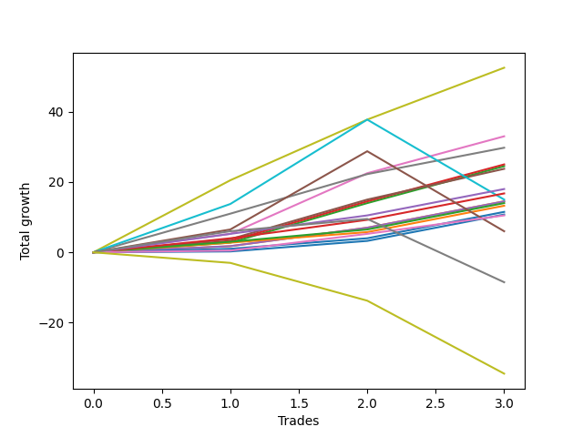

# Short Bernese 001 1v SB 
- Symbol: ES_1W
- Date Range: 03/18/2022 - 07/29/2022
- Trading Period: 7:20-12:30
- Number of Trades: 3



| Name | Win Percent | Profit | Avg Profit / Trade | Avg Time / Trade |      | Name | Win Percent | Profit | Avg Profit / Trade | Avg Time / Trade |
| ---- | ----------- | ------ | ------------------ | ---------------- | ---- | ---- | ----------- | ------ | ------------------ | ---------------- |
| Sorted By <br> Profit | | | | | | Sorted By <br> Win Percentage ||||
| Seven | 100.00 | 26250.00 | 8750.00 | 14:03 |     | Seven | 100.00 | 26250.00 | 8750.00 | 14:03 |
| Five | 100.00 | 16500.00 | 5500.00 | 03:28 |     | Five | 100.00 | 16500.00 | 5500.00 | 03:28 |
| Six | 100.00 | 14875.00 | 4958.33 | 04:38 |     | Six | 100.00 | 14875.00 | 4958.33 | 04:38 |
| Two_C | 100.00 | 12500.00 | 4166.67 | 02:43 |     | Two_C | 100.00 | 12500.00 | 4166.67 | 02:43 |
| Two | 100.00 | 12250.00 | 4083.33 | 02:36 |     | Two | 100.00 | 12250.00 | 4083.33 | 02:36 |
| Four | 100.00 | 11875.00 | 3958.33 | 02:46 |     | Four | 100.00 | 11875.00 | 3958.33 | 02:46 |
| Eighty-Five | 100.00 | 9000.00 | 3000.00 | 02:28 |     | Eighty-Five | 100.00 | 9000.00 | 3000.00 | 02:28 |
| Eighty-Four | 100.00 | 8375.00 | 2791.67 | 02:25 |     | Eighty-Four | 100.00 | 8375.00 | 2791.67 | 02:25 |
| BB100 | 66.67 | 7500.00 | 2500.00 | 31:28 |     | Three | 100.00 | 7250.00 | 2416.67 | 02:05 |
| Three | 100.00 | 7250.00 | 2416.67 | 02:05 |     | One | 100.00 | 7250.00 | 2416.67 | 02:05 |
| One | 100.00 | 7250.00 | 2416.67 | 02:05 |     | Eighty-Three | 100.00 | 7000.00 | 2333.33 | 02:08 |
| Eighty-Three | 100.00 | 7000.00 | 2333.33 | 02:08 |     | Eighty-Two | 100.00 | 6625.00 | 2208.33 | 02:03 |
| Eighty-Two | 100.00 | 6625.00 | 2208.33 | 02:03 |     | Eighty-One | 100.00 | 5750.00 | 1916.67 | 01:21 |
| Eighty-One | 100.00 | 5750.00 | 1916.67 | 01:21 |     | Zero | 100.00 | 5375.00 | 1791.67 | 01:10 |
| Zero | 100.00 | 5375.00 | 1791.67 | 01:10 |     | NEWFI 0000 | 100.00 | 5250.00 | 1750.00 | 14:45 |
| NEWFI 0000 | 100.00 | 5250.00 | 1750.00 | 14:45 |     | BB100 | 66.67 | 7500.00 | 2500.00 | 31:28 |
| NEWFI 000 | 66.67 | 3000.00 | 1000.00 | 31:01 |     | NEWFI 000 | 66.67 | 3000.00 | 1000.00 | 31:01 |
| MALAMUTE 001 | 66.67 | -4250.00 | -1416.67 | 37:43 |     | MALAMUTE 001 | 66.67 | -4250.00 | -1416.67 | 37:43 |
| MALAMUTE 002 | 0.00 | -17250.00 | -5750.00 | 60:05 |     | MALAMUTE 002 | 0.00 | -17250.00 | -5750.00 | 60:05 |

## NO STOPLOSS

### Test Zero
* Sell when price hits the middle line of the 20p bollinger
* No Stoploss
* Results:
```
Total Trades: 3
Percent Up: 0.00
Percent Down: 100.00
Total Points Moved Down: 10.75
Potential Profit: 5375.00
Total Points Ups: 0.00 Count Ups: 0
Total Points Downs: 10.75 Count Downs: 3
```

<details><summary>Trades</summary>

<code>In: 2022-03-25 11:57:00		Out: 2022-03-25 11:58:10		Total Position Time: 01:10		Total Move Down: 0.25		Total to Date: 0.25</code> <br />
<code>In: 2022-04-06 11:06:00		Out: 2022-04-06 11:07:10		Total Position Time: 01:10		Total Move Down: 3.00		Total to Date: 3.25</code> <br />
<code>In: 2022-07-06 11:10:00		Out: 2022-07-06 11:11:10		Total Position Time: 01:10		Total Move Down: 7.50		Total to Date: 10.75</code> <br />


</details>

### Test One
* Sell when the price hits the upper line of the 20p 1std bollinger
* No Stoploss
* Results:
```
Total Trades: 3
Percent Up: 0.00
Percent Down: 100.00
Total Points Moved Down: 14.50
Potential Profit: 7250.00
Total Points Ups: 0.00 Count Ups: 0
Total Points Downs: 14.50 Count Downs: 3
```

<details><summary>Trades</summary>

<code>In: 2022-03-25 11:57:00		Out: 2022-03-25 12:00:45		Total Position Time: 03:45		Total Move Down: 1.75		Total to Date: 1.75</code> <br />
<code>In: 2022-04-06 11:06:00		Out: 2022-04-06 11:07:20		Total Position Time: 01:20		Total Move Down: 5.25		Total to Date: 7.00</code> <br />
<code>In: 2022-07-06 11:10:00		Out: 2022-07-06 11:11:10		Total Position Time: 01:10		Total Move Down: 7.50		Total to Date: 14.50</code> <br />


</details>

### Test Two
* Sell when the price hits the upper line of the 20p 2std bollinger
* No Stoploss
* Results:
```
Total Trades: 3
Percent Up: 0.00
Percent Down: 100.00
Total Points Moved Down: 24.50
Potential Profit: 12250.00
Total Points Ups: 0.00 Count Ups: 0
Total Points Downs: 24.50 Count Downs: 3
```

<details><summary>Trades</summary>

<code>In: 2022-03-25 11:57:00		Out: 2022-03-25 12:00:55		Total Position Time: 03:55		Total Move Down: 2.75		Total to Date: 2.75</code> <br />
<code>In: 2022-04-06 11:06:00		Out: 2022-04-06 11:08:10		Total Position Time: 02:10		Total Move Down: 11.25		Total to Date: 14.00</code> <br />
<code>In: 2022-07-06 11:10:00		Out: 2022-07-06 11:11:45		Total Position Time: 01:45		Total Move Down: 10.50		Total to Date: 24.50</code> <br />


</details>

### Test Two_C
* Sell when the price hits the upper line of the 20p 2std bollinger
* No Stoploss
* Results:
```
Total Trades: 3
Percent Up: 0.00
Percent Down: 100.00
Total Points Moved Down: 25.00
Potential Profit: 12500.00
Total Points Ups: 0.00 Count Ups: 0
Total Points Downs: 25.00 Count Downs: 3
```

<details><summary>Trades</summary>

<code>In: 2022-03-25 11:57:00		Out: 2022-03-25 12:01:15		Total Position Time: 04:15		Total Move Down: 3.25		Total to Date: 3.25</code> <br />
<code>In: 2022-04-06 11:06:00		Out: 2022-04-06 11:08:10		Total Position Time: 02:10		Total Move Down: 11.25		Total to Date: 14.50</code> <br />
<code>In: 2022-07-06 11:10:00		Out: 2022-07-06 11:11:45		Total Position Time: 01:45		Total Move Down: 10.50		Total to Date: 25.00</code> <br />


</details>

### Test Three
* Sell when price hits the middle line of the 50p bollinger
* No Stoploss
* Results:
```
Total Trades: 3
Percent Up: 0.00
Percent Down: 100.00
Total Points Moved Down: 14.50
Potential Profit: 7250.00
Total Points Ups: 0.00 Count Ups: 0
Total Points Downs: 14.50 Count Downs: 3
```

<details><summary>Trades</summary>

<code>In: 2022-03-25 11:57:00		Out: 2022-03-25 12:00:45		Total Position Time: 03:45		Total Move Down: 1.75		Total to Date: 1.75</code> <br />
<code>In: 2022-04-06 11:06:00		Out: 2022-04-06 11:07:20		Total Position Time: 01:20		Total Move Down: 5.25		Total to Date: 7.00</code> <br />
<code>In: 2022-07-06 11:10:00		Out: 2022-07-06 11:11:10		Total Position Time: 01:10		Total Move Down: 7.50		Total to Date: 14.50</code> <br />


</details>

### Test Four
* Sell when the price hits the upper line of the 50p 1std bollinger
* No Stoploss
* Results:
```
Total Trades: 3
Percent Up: 0.00
Percent Down: 100.00
Total Points Moved Down: 23.75
Potential Profit: 11875.00
Total Points Ups: 0.00 Count Ups: 0
Total Points Downs: 23.75 Count Downs: 3
```

<details><summary>Trades</summary>

<code>In: 2022-03-25 11:57:00		Out: 2022-03-25 12:01:35		Total Position Time: 04:35		Total Move Down: 3.75		Total to Date: 3.75</code> <br />
<code>In: 2022-04-06 11:06:00		Out: 2022-04-06 11:08:10		Total Position Time: 02:10		Total Move Down: 11.25		Total to Date: 15.00</code> <br />
<code>In: 2022-07-06 11:10:00		Out: 2022-07-06 11:11:35		Total Position Time: 01:35		Total Move Down: 8.75		Total to Date: 23.75</code> <br />


</details>

### Test Five
* Sell when the price hits the upper line of the 50p 2std bollinger
* No Stoploss
* Results:
```
Total Trades: 3
Percent Up: 0.00
Percent Down: 100.00
Total Points Moved Down: 33.00
Potential Profit: 16500.00
Total Points Ups: 0.00 Count Ups: 0
Total Points Downs: 33.00 Count Downs: 3
```

<details><summary>Trades</summary>

<code>In: 2022-03-25 11:57:00		Out: 2022-03-25 12:01:55		Total Position Time: 04:55		Total Move Down: 5.25		Total to Date: 5.25</code> <br />
<code>In: 2022-04-06 11:06:00		Out: 2022-04-06 11:09:40		Total Position Time: 03:40		Total Move Down: 17.25		Total to Date: 22.50</code> <br />
<code>In: 2022-07-06 11:10:00		Out: 2022-07-06 11:11:50		Total Position Time: 01:50		Total Move Down: 10.50		Total to Date: 33.00</code> <br />


</details>

### Test Six
* Sell when the price hits the middle line of the 1std VWAP
* No Stoploss
* Results:
```
Total Trades: 3
Percent Up: 0.00
Percent Down: 100.00
Total Points Moved Down: 29.75
Potential Profit: 14875.00
Total Points Ups: 0.00 Count Ups: 0
Total Points Downs: 29.75 Count Downs: 3
```

<details><summary>Trades</summary>

<code>In: 2022-03-25 11:57:00		Out: 2022-03-25 12:07:35		Total Position Time: 10:35		Total Move Down: 11.00		Total to Date: 11.00</code> <br />
<code>In: 2022-04-06 11:06:00		Out: 2022-04-06 11:08:10		Total Position Time: 02:10		Total Move Down: 11.25		Total to Date: 22.25</code> <br />
<code>In: 2022-07-06 11:10:00		Out: 2022-07-06 11:11:10		Total Position Time: 01:10		Total Move Down: 7.50		Total to Date: 29.75</code> <br />


</details>

### Test Seven
* Sell when the price hits the upper line of the 1std VWAP
* No Stoploss
* Results:
```
Total Trades: 3
Percent Up: 0.00
Percent Down: 100.00
Total Points Moved Down: 52.50
Potential Profit: 26250.00
Total Points Ups: 0.00 Count Ups: 0
Total Points Downs: 52.50 Count Downs: 3
```

<details><summary>Trades</summary>

<code>In: 2022-03-25 11:57:00		Out: 2022-03-25 12:33:10		Total Position Time: 36:10		Total Move Down: 20.50		Total to Date: 20.50</code> <br />
<code>In: 2022-04-06 11:06:00		Out: 2022-04-06 11:09:40		Total Position Time: 03:40		Total Move Down: 17.25		Total to Date: 37.75</code> <br />
<code>In: 2022-07-06 11:10:00		Out: 2022-07-06 11:12:20		Total Position Time: 02:20		Total Move Down: 14.75		Total to Date: 52.50</code> <br />


</details>

### Test BB100
* Sell when the price hits the upper line of the 1std VWAP
* No Stoploss
* Results:
```
Total Trades: 3
Percent Up: 33.33
Percent Down: 66.67
Total Points Moved Down: 15.00
Potential Profit: 7500.00
Total Points Ups: 22.75 Count Ups: 1
Total Points Downs: 37.75 Count Downs: 2
```

<details><summary>Trades</summary>

<code>In: 2022-03-25 11:57:00		Out: 2022-03-25 12:21:35		Total Position Time: 24:35		Total Move Down: 13.75		Total to Date: 13.75</code> <br />
<code>In: 2022-04-06 11:06:00		Out: 2022-04-06 11:14:55		Total Position Time: 08:55		Total Move Down: 24.00		Total to Date: 37.75</code> <br />
<code>In: 2022-07-06 11:10:00		Out: 2022-07-06 12:10:55		Total Position Time: 60:55		Total Move Down: -22.75		Total to Date: 15.00</code> <br />


</details>

## TAKE PROFIT

### Test Eighty-One
* Take Profit of 1 Point
* No Stoploss
* Results:
```
Total Trades: 3
Percent Up: 0.00
Percent Down: 100.00
Total Points Moved Down: 11.50
Potential Profit: 5750.00
Total Points Ups: 0.00 Count Ups: 0
Total Points Downs: 11.50 Count Downs: 3
```

<details><summary>Trades</summary>

<code>In: 2022-03-25 11:57:00		Out: 2022-03-25 11:58:45		Total Position Time: 01:45		Total Move Down: 1.00		Total to Date: 1.00</code> <br />
<code>In: 2022-04-06 11:06:00		Out: 2022-04-06 11:07:10		Total Position Time: 01:10		Total Move Down: 3.00		Total to Date: 4.00</code> <br />
<code>In: 2022-07-06 11:10:00		Out: 2022-07-06 11:11:10		Total Position Time: 01:10		Total Move Down: 7.50		Total to Date: 11.50</code> <br />


</details>

### Test Eighty-Two
* Take Profit of 2 Point
* No Stoploss
* Results:
```
Total Trades: 3
Percent Up: 0.00
Percent Down: 100.00
Total Points Moved Down: 13.25
Potential Profit: 6625.00
Total Points Ups: 0.00 Count Ups: 0
Total Points Downs: 13.25 Count Downs: 3
```

<details><summary>Trades</summary>

<code>In: 2022-03-25 11:57:00		Out: 2022-03-25 12:00:50		Total Position Time: 03:50		Total Move Down: 2.75		Total to Date: 2.75</code> <br />
<code>In: 2022-04-06 11:06:00		Out: 2022-04-06 11:07:10		Total Position Time: 01:10		Total Move Down: 3.00		Total to Date: 5.75</code> <br />
<code>In: 2022-07-06 11:10:00		Out: 2022-07-06 11:11:10		Total Position Time: 01:10		Total Move Down: 7.50		Total to Date: 13.25</code> <br />


</details>

### Test Eighty-Three
* Take Profit of 3 Point
* No Stoploss
* Results:
```
Total Trades: 3
Percent Up: 0.00
Percent Down: 100.00
Total Points Moved Down: 14.00
Potential Profit: 7000.00
Total Points Ups: 0.00 Count Ups: 0
Total Points Downs: 14.00 Count Downs: 3
```

<details><summary>Trades</summary>

<code>In: 2022-03-25 11:57:00		Out: 2022-03-25 12:01:00		Total Position Time: 04:00		Total Move Down: 3.00		Total to Date: 3.00</code> <br />
<code>In: 2022-04-06 11:06:00		Out: 2022-04-06 11:07:15		Total Position Time: 01:15		Total Move Down: 3.50		Total to Date: 6.50</code> <br />
<code>In: 2022-07-06 11:10:00		Out: 2022-07-06 11:11:10		Total Position Time: 01:10		Total Move Down: 7.50		Total to Date: 14.00</code> <br />


</details>

### Test Eighty-Four
* Take Profit of 4 Point
* No Stoploss
* Results:
```
Total Trades: 3
Percent Up: 0.00
Percent Down: 100.00
Total Points Moved Down: 16.75
Potential Profit: 8375.00
Total Points Ups: 0.00 Count Ups: 0
Total Points Downs: 16.75 Count Downs: 3
```

<details><summary>Trades</summary>

<code>In: 2022-03-25 11:57:00		Out: 2022-03-25 12:01:45		Total Position Time: 04:45		Total Move Down: 4.00		Total to Date: 4.00</code> <br />
<code>In: 2022-04-06 11:06:00		Out: 2022-04-06 11:07:20		Total Position Time: 01:20		Total Move Down: 5.25		Total to Date: 9.25</code> <br />
<code>In: 2022-07-06 11:10:00		Out: 2022-07-06 11:11:10		Total Position Time: 01:10		Total Move Down: 7.50		Total to Date: 16.75</code> <br />


</details>

### Test Eighty-Five
* Take Profit of 5 Point
* No Stoploss
* Results:
```
Total Trades: 3
Percent Up: 0.00
Percent Down: 100.00
Total Points Moved Down: 18.00
Potential Profit: 9000.00
Total Points Ups: 0.00 Count Ups: 0
Total Points Downs: 18.00 Count Downs: 3
```

<details><summary>Trades</summary>

<code>In: 2022-03-25 11:57:00		Out: 2022-03-25 12:01:55		Total Position Time: 04:55		Total Move Down: 5.25		Total to Date: 5.25</code> <br />
<code>In: 2022-04-06 11:06:00		Out: 2022-04-06 11:07:20		Total Position Time: 01:20		Total Move Down: 5.25		Total to Date: 10.50</code> <br />
<code>In: 2022-07-06 11:10:00		Out: 2022-07-06 11:11:10		Total Position Time: 01:10		Total Move Down: 7.50		Total to Date: 18.00</code> <br />


</details>

## Indicator Exits

### Test NEWFI 000
* Newfi 0000
* No Stoploss
* Results:
```
Total Trades: 3
Percent Up: 33.33
Percent Down: 66.67
Total Points Moved Down: 6.00
Potential Profit: 3000.00
Total Points Ups: 22.75 Count Ups: 1
Total Points Downs: 28.75 Count Downs: 2
```

<details><summary>Trades</summary>

<code>In: 2022-03-25 11:57:00		Out: 2022-03-25 12:13:05		Total Position Time: 16:05		Total Move Down: 6.50		Total to Date: 6.50</code> <br />
<code>In: 2022-04-06 11:06:00		Out: 2022-04-06 11:22:05		Total Position Time: 16:05		Total Move Down: 22.25		Total to Date: 28.75</code> <br />
<code>In: 2022-07-06 11:10:00		Out: 2022-07-06 12:10:55		Total Position Time: 60:55		Total Move Down: -22.75		Total to Date: 6.00</code> <br />


</details>

### Test NEWFI 0000
* Newfi 0000
* No Stoploss
* Results:
```
Total Trades: 3
Percent Up: 0.00
Percent Down: 100.00
Total Points Moved Down: 10.50
Potential Profit: 5250.00
Total Points Ups: 0.00 Count Ups: 0
Total Points Downs: 10.50 Count Downs: 3
```

<details><summary>Trades</summary>

<code>In: 2022-03-25 11:57:00		Out: 2022-03-25 11:58:05		Total Position Time: 01:05		Total Move Down: 0.50		Total to Date: 0.50</code> <br />
<code>In: 2022-04-06 11:06:00		Out: 2022-04-06 11:48:05		Total Position Time: 42:05		Total Move Down: 4.75		Total to Date: 5.25</code> <br />
<code>In: 2022-07-06 11:10:00		Out: 2022-07-06 11:11:05		Total Position Time: 01:05		Total Move Down: 5.25		Total to Date: 10.50</code> <br />


</details>

### Test MALAMUTE 001
* Malamute 001
* No Stoploss
* Results:
```
Total Trades: 3
Percent Up: 33.33
Percent Down: 66.67
Total Points Moved Down: -8.50
Potential Profit: -4250.00
Total Points Ups: 18.00 Count Ups: 1
Total Points Downs: 9.50 Count Downs: 2
```

<details><summary>Trades</summary>

<code>In: 2022-03-25 11:57:00		Out: 2022-03-25 12:47:00		Total Position Time: 50:00		Total Move Down: 6.00		Total to Date: 6.00</code> <br />
<code>In: 2022-04-06 11:06:00		Out: 2022-04-06 11:45:05		Total Position Time: 39:05		Total Move Down: 3.50		Total to Date: 9.50</code> <br />
<code>In: 2022-07-06 11:10:00		Out: 2022-07-06 11:34:05		Total Position Time: 24:05		Total Move Down: -18.00		Total to Date: -8.50</code> <br />


</details>

### Test MALAMUTE 002
* Malamute 001
* No Stoploss
* Results:
```
Total Trades: 3
Percent Up: 100.00
Percent Down: 0.00
Total Points Moved Down: -34.50
Potential Profit: -17250.00
Total Points Ups: 34.50 Count Ups: 3
Total Points Downs: 0.00 Count Downs: 0
```

<details><summary>Trades</summary>

<code>In: 2022-03-25 11:57:00		Out: 2022-03-25 12:57:05		Total Position Time: 60:05		Total Move Down: -3.00		Total to Date: -3.00</code> <br />
<code>In: 2022-04-06 11:06:00		Out: 2022-04-06 12:06:05		Total Position Time: 60:05		Total Move Down: -10.75		Total to Date: -13.75</code> <br />
<code>In: 2022-07-06 11:10:00		Out: 2022-07-06 12:10:05		Total Position Time: 60:05		Total Move Down: -20.75		Total to Date: -34.50</code> <br />


</details>