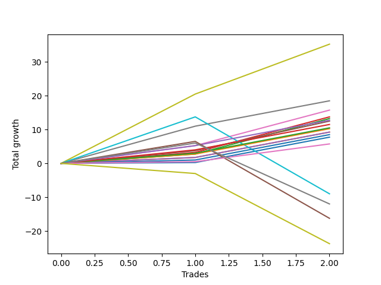

# Short Bernese 001 1v 
- Symbol: ES_1W
- Date Range: 03/18/2022 - 07/29/2022
- Trading Period: 7:20-12:30
- Number of Trades: 2



| Name | Win Percent | Profit | Avg Profit / Trade | Avg Time / Trade |      | Name | Win Percent | Profit | Avg Profit / Trade | Avg Time / Trade |
| ---- | ----------- | ------ | ------------------ | ---------------- | ---- | ---- | ----------- | ------ | ------------------ | ---------------- |
| Sorted By <br> Profit | | | | | | Sorted By <br> Win Percentage ||||
| Seven | 100.00 | 17625.00 | 8812.50 | 19:15 |     | Seven | 100.00 | 17625.00 | 8812.50 | 19:15 |
| Six | 100.00 | 9250.00 | 4625.00 | 05:52 |     | Six | 100.00 | 9250.00 | 4625.00 | 05:52 |
| Five | 100.00 | 7875.00 | 3937.50 | 03:22 |     | Five | 100.00 | 7875.00 | 3937.50 | 03:22 |
| Two_C | 100.00 | 6875.00 | 3437.50 | 03:00 |     | Two_C | 100.00 | 6875.00 | 3437.50 | 03:00 |
| Two | 100.00 | 6625.00 | 3312.50 | 02:50 |     | Two | 100.00 | 6625.00 | 3312.50 | 02:50 |
| Eighty-Five | 100.00 | 6375.00 | 3187.50 | 03:02 |     | Eighty-Five | 100.00 | 6375.00 | 3187.50 | 03:02 |
| Four | 100.00 | 6250.00 | 3125.00 | 03:05 |     | Four | 100.00 | 6250.00 | 3125.00 | 03:05 |
| Eighty-Four | 100.00 | 5750.00 | 2875.00 | 02:57 |     | Eighty-Four | 100.00 | 5750.00 | 2875.00 | 02:57 |
| Eighty-Three | 100.00 | 5250.00 | 2625.00 | 02:35 |     | Eighty-Three | 100.00 | 5250.00 | 2625.00 | 02:35 |
| Eighty-Two | 100.00 | 5125.00 | 2562.50 | 02:30 |     | Eighty-Two | 100.00 | 5125.00 | 2562.50 | 02:30 |
| Three | 100.00 | 4625.00 | 2312.50 | 02:27 |     | Three | 100.00 | 4625.00 | 2312.50 | 02:27 |
| One | 100.00 | 4625.00 | 2312.50 | 02:27 |     | One | 100.00 | 4625.00 | 2312.50 | 02:27 |
| Eighty-One | 100.00 | 4250.00 | 2125.00 | 01:27 |     | Eighty-One | 100.00 | 4250.00 | 2125.00 | 01:27 |
| Zero | 100.00 | 3875.00 | 1937.50 | 01:10 |     | Zero | 100.00 | 3875.00 | 1937.50 | 01:10 |
| NEWFI 0000 | 100.00 | 2875.00 | 1437.50 | 01:05 |     | NEWFI 0000 | 100.00 | 2875.00 | 1437.50 | 01:05 |
| BB100 | 50.00 | -4500.00 | -2250.00 | 42:45 |     | BB100 | 50.00 | -4500.00 | -2250.00 | 42:45 |
| MALAMUTE 001 | 50.00 | -6000.00 | -3000.00 | 37:02 |     | MALAMUTE 001 | 50.00 | -6000.00 | -3000.00 | 37:02 |
| NEWFI 000 | 50.00 | -8125.00 | -4062.50 | 38:30 |     | NEWFI 000 | 50.00 | -8125.00 | -4062.50 | 38:30 |
| MALAMUTE 002 | 0.00 | -11875.00 | -5937.50 | 60:05 |     | MALAMUTE 002 | 0.00 | -11875.00 | -5937.50 | 60:05 |

## NO STOPLOSS

### Test Zero
* Sell when price hits the middle line of the 20p bollinger
* No Stoploss
* Results:
```
Total Trades: 2
Percent Up: 0.00
Percent Down: 100.00
Total Points Moved Down: 7.75
Potential Profit: 3875.00
Total Points Ups: 0.00 Count Ups: 0
Total Points Downs: 7.75 Count Downs: 2
```

<details><summary>Trades</summary>

<code>In: 2022-03-25 11:57:00		Out: 2022-03-25 11:58:10		Total Position Time: 01:10		Total Move Down: 0.25		Total to Date: 0.25</code> <br />
<code>In: 2022-07-06 11:10:00		Out: 2022-07-06 11:11:10		Total Position Time: 01:10		Total Move Down: 7.50		Total to Date: 7.75</code> <br />


</details>

### Test One
* Sell when the price hits the upper line of the 20p 1std bollinger
* No Stoploss
* Results:
```
Total Trades: 2
Percent Up: 0.00
Percent Down: 100.00
Total Points Moved Down: 9.25
Potential Profit: 4625.00
Total Points Ups: 0.00 Count Ups: 0
Total Points Downs: 9.25 Count Downs: 2
```

<details><summary>Trades</summary>

<code>In: 2022-03-25 11:57:00		Out: 2022-03-25 12:00:45		Total Position Time: 03:45		Total Move Down: 1.75		Total to Date: 1.75</code> <br />
<code>In: 2022-07-06 11:10:00		Out: 2022-07-06 11:11:10		Total Position Time: 01:10		Total Move Down: 7.50		Total to Date: 9.25</code> <br />


</details>

### Test Two
* Sell when the price hits the upper line of the 20p 2std bollinger
* No Stoploss
* Results:
```
Total Trades: 2
Percent Up: 0.00
Percent Down: 100.00
Total Points Moved Down: 13.25
Potential Profit: 6625.00
Total Points Ups: 0.00 Count Ups: 0
Total Points Downs: 13.25 Count Downs: 2
```

<details><summary>Trades</summary>

<code>In: 2022-03-25 11:57:00		Out: 2022-03-25 12:00:55		Total Position Time: 03:55		Total Move Down: 2.75		Total to Date: 2.75</code> <br />
<code>In: 2022-07-06 11:10:00		Out: 2022-07-06 11:11:45		Total Position Time: 01:45		Total Move Down: 10.50		Total to Date: 13.25</code> <br />


</details>

### Test Two_C
* Sell when the price hits the upper line of the 20p 2std bollinger
* No Stoploss
* Results:
```
Total Trades: 2
Percent Up: 0.00
Percent Down: 100.00
Total Points Moved Down: 13.75
Potential Profit: 6875.00
Total Points Ups: 0.00 Count Ups: 0
Total Points Downs: 13.75 Count Downs: 2
```

<details><summary>Trades</summary>

<code>In: 2022-03-25 11:57:00		Out: 2022-03-25 12:01:15		Total Position Time: 04:15		Total Move Down: 3.25		Total to Date: 3.25</code> <br />
<code>In: 2022-07-06 11:10:00		Out: 2022-07-06 11:11:45		Total Position Time: 01:45		Total Move Down: 10.50		Total to Date: 13.75</code> <br />


</details>

### Test Three
* Sell when price hits the middle line of the 50p bollinger
* No Stoploss
* Results:
```
Total Trades: 2
Percent Up: 0.00
Percent Down: 100.00
Total Points Moved Down: 9.25
Potential Profit: 4625.00
Total Points Ups: 0.00 Count Ups: 0
Total Points Downs: 9.25 Count Downs: 2
```

<details><summary>Trades</summary>

<code>In: 2022-03-25 11:57:00		Out: 2022-03-25 12:00:45		Total Position Time: 03:45		Total Move Down: 1.75		Total to Date: 1.75</code> <br />
<code>In: 2022-07-06 11:10:00		Out: 2022-07-06 11:11:10		Total Position Time: 01:10		Total Move Down: 7.50		Total to Date: 9.25</code> <br />


</details>

### Test Four
* Sell when the price hits the upper line of the 50p 1std bollinger
* No Stoploss
* Results:
```
Total Trades: 2
Percent Up: 0.00
Percent Down: 100.00
Total Points Moved Down: 12.50
Potential Profit: 6250.00
Total Points Ups: 0.00 Count Ups: 0
Total Points Downs: 12.50 Count Downs: 2
```

<details><summary>Trades</summary>

<code>In: 2022-03-25 11:57:00		Out: 2022-03-25 12:01:35		Total Position Time: 04:35		Total Move Down: 3.75		Total to Date: 3.75</code> <br />
<code>In: 2022-07-06 11:10:00		Out: 2022-07-06 11:11:35		Total Position Time: 01:35		Total Move Down: 8.75		Total to Date: 12.50</code> <br />


</details>

### Test Five
* Sell when the price hits the upper line of the 50p 2std bollinger
* No Stoploss
* Results:
```
Total Trades: 2
Percent Up: 0.00
Percent Down: 100.00
Total Points Moved Down: 15.75
Potential Profit: 7875.00
Total Points Ups: 0.00 Count Ups: 0
Total Points Downs: 15.75 Count Downs: 2
```

<details><summary>Trades</summary>

<code>In: 2022-03-25 11:57:00		Out: 2022-03-25 12:01:55		Total Position Time: 04:55		Total Move Down: 5.25		Total to Date: 5.25</code> <br />
<code>In: 2022-07-06 11:10:00		Out: 2022-07-06 11:11:50		Total Position Time: 01:50		Total Move Down: 10.50		Total to Date: 15.75</code> <br />


</details>

### Test Six
* Sell when the price hits the middle line of the 1std VWAP
* No Stoploss
* Results:
```
Total Trades: 2
Percent Up: 0.00
Percent Down: 100.00
Total Points Moved Down: 18.50
Potential Profit: 9250.00
Total Points Ups: 0.00 Count Ups: 0
Total Points Downs: 18.50 Count Downs: 2
```

<details><summary>Trades</summary>

<code>In: 2022-03-25 11:57:00		Out: 2022-03-25 12:07:35		Total Position Time: 10:35		Total Move Down: 11.00		Total to Date: 11.00</code> <br />
<code>In: 2022-07-06 11:10:00		Out: 2022-07-06 11:11:10		Total Position Time: 01:10		Total Move Down: 7.50		Total to Date: 18.50</code> <br />


</details>

### Test Seven
* Sell when the price hits the upper line of the 1std VWAP
* No Stoploss
* Results:
```
Total Trades: 2
Percent Up: 0.00
Percent Down: 100.00
Total Points Moved Down: 35.25
Potential Profit: 17625.00
Total Points Ups: 0.00 Count Ups: 0
Total Points Downs: 35.25 Count Downs: 2
```

<details><summary>Trades</summary>

<code>In: 2022-03-25 11:57:00		Out: 2022-03-25 12:33:10		Total Position Time: 36:10		Total Move Down: 20.50		Total to Date: 20.50</code> <br />
<code>In: 2022-07-06 11:10:00		Out: 2022-07-06 11:12:20		Total Position Time: 02:20		Total Move Down: 14.75		Total to Date: 35.25</code> <br />


</details>

### Test BB100
* Sell when the price hits the upper line of the 1std VWAP
* No Stoploss
* Results:
```
Total Trades: 2
Percent Up: 50.00
Percent Down: 50.00
Total Points Moved Down: -9.00
Potential Profit: -4500.00
Total Points Ups: 22.75 Count Ups: 1
Total Points Downs: 13.75 Count Downs: 1
```

<details><summary>Trades</summary>

<code>In: 2022-03-25 11:57:00		Out: 2022-03-25 12:21:35		Total Position Time: 24:35		Total Move Down: 13.75		Total to Date: 13.75</code> <br />
<code>In: 2022-07-06 11:10:00		Out: 2022-07-06 12:10:55		Total Position Time: 60:55		Total Move Down: -22.75		Total to Date: -9.00</code> <br />


</details>

## TAKE PROFIT

### Test Eighty-One
* Take Profit of 1 Point
* No Stoploss
* Results:
```
Total Trades: 2
Percent Up: 0.00
Percent Down: 100.00
Total Points Moved Down: 8.50
Potential Profit: 4250.00
Total Points Ups: 0.00 Count Ups: 0
Total Points Downs: 8.50 Count Downs: 2
```

<details><summary>Trades</summary>

<code>In: 2022-03-25 11:57:00		Out: 2022-03-25 11:58:45		Total Position Time: 01:45		Total Move Down: 1.00		Total to Date: 1.00</code> <br />
<code>In: 2022-07-06 11:10:00		Out: 2022-07-06 11:11:10		Total Position Time: 01:10		Total Move Down: 7.50		Total to Date: 8.50</code> <br />


</details>

### Test Eighty-Two
* Take Profit of 2 Point
* No Stoploss
* Results:
```
Total Trades: 2
Percent Up: 0.00
Percent Down: 100.00
Total Points Moved Down: 10.25
Potential Profit: 5125.00
Total Points Ups: 0.00 Count Ups: 0
Total Points Downs: 10.25 Count Downs: 2
```

<details><summary>Trades</summary>

<code>In: 2022-03-25 11:57:00		Out: 2022-03-25 12:00:50		Total Position Time: 03:50		Total Move Down: 2.75		Total to Date: 2.75</code> <br />
<code>In: 2022-07-06 11:10:00		Out: 2022-07-06 11:11:10		Total Position Time: 01:10		Total Move Down: 7.50		Total to Date: 10.25</code> <br />


</details>

### Test Eighty-Three
* Take Profit of 3 Point
* No Stoploss
* Results:
```
Total Trades: 2
Percent Up: 0.00
Percent Down: 100.00
Total Points Moved Down: 10.50
Potential Profit: 5250.00
Total Points Ups: 0.00 Count Ups: 0
Total Points Downs: 10.50 Count Downs: 2
```

<details><summary>Trades</summary>

<code>In: 2022-03-25 11:57:00		Out: 2022-03-25 12:01:00		Total Position Time: 04:00		Total Move Down: 3.00		Total to Date: 3.00</code> <br />
<code>In: 2022-07-06 11:10:00		Out: 2022-07-06 11:11:10		Total Position Time: 01:10		Total Move Down: 7.50		Total to Date: 10.50</code> <br />


</details>

### Test Eighty-Four
* Take Profit of 4 Point
* No Stoploss
* Results:
```
Total Trades: 2
Percent Up: 0.00
Percent Down: 100.00
Total Points Moved Down: 11.50
Potential Profit: 5750.00
Total Points Ups: 0.00 Count Ups: 0
Total Points Downs: 11.50 Count Downs: 2
```

<details><summary>Trades</summary>

<code>In: 2022-03-25 11:57:00		Out: 2022-03-25 12:01:45		Total Position Time: 04:45		Total Move Down: 4.00		Total to Date: 4.00</code> <br />
<code>In: 2022-07-06 11:10:00		Out: 2022-07-06 11:11:10		Total Position Time: 01:10		Total Move Down: 7.50		Total to Date: 11.50</code> <br />


</details>

### Test Eighty-Five
* Take Profit of 5 Point
* No Stoploss
* Results:
```
Total Trades: 2
Percent Up: 0.00
Percent Down: 100.00
Total Points Moved Down: 12.75
Potential Profit: 6375.00
Total Points Ups: 0.00 Count Ups: 0
Total Points Downs: 12.75 Count Downs: 2
```

<details><summary>Trades</summary>

<code>In: 2022-03-25 11:57:00		Out: 2022-03-25 12:01:55		Total Position Time: 04:55		Total Move Down: 5.25		Total to Date: 5.25</code> <br />
<code>In: 2022-07-06 11:10:00		Out: 2022-07-06 11:11:10		Total Position Time: 01:10		Total Move Down: 7.50		Total to Date: 12.75</code> <br />


</details>

## Indicator Exits

### Test NEWFI 000
* Newfi 0000
* No Stoploss
* Results:
```
Total Trades: 2
Percent Up: 50.00
Percent Down: 50.00
Total Points Moved Down: -16.25
Potential Profit: -8125.00
Total Points Ups: 22.75 Count Ups: 1
Total Points Downs: 6.50 Count Downs: 1
```

<details><summary>Trades</summary>

<code>In: 2022-03-25 11:57:00		Out: 2022-03-25 12:13:05		Total Position Time: 16:05		Total Move Down: 6.50		Total to Date: 6.50</code> <br />
<code>In: 2022-07-06 11:10:00		Out: 2022-07-06 12:10:55		Total Position Time: 60:55		Total Move Down: -22.75		Total to Date: -16.25</code> <br />


</details>

### Test NEWFI 0000
* Newfi 0000
* No Stoploss
* Results:
```
Total Trades: 2
Percent Up: 0.00
Percent Down: 100.00
Total Points Moved Down: 5.75
Potential Profit: 2875.00
Total Points Ups: 0.00 Count Ups: 0
Total Points Downs: 5.75 Count Downs: 2
```

<details><summary>Trades</summary>

<code>In: 2022-03-25 11:57:00		Out: 2022-03-25 11:58:05		Total Position Time: 01:05		Total Move Down: 0.50		Total to Date: 0.50</code> <br />
<code>In: 2022-07-06 11:10:00		Out: 2022-07-06 11:11:05		Total Position Time: 01:05		Total Move Down: 5.25		Total to Date: 5.75</code> <br />


</details>

### Test MALAMUTE 001
* Malamute 001
* No Stoploss
* Results:
```
Total Trades: 2
Percent Up: 50.00
Percent Down: 50.00
Total Points Moved Down: -12.00
Potential Profit: -6000.00
Total Points Ups: 18.00 Count Ups: 1
Total Points Downs: 6.00 Count Downs: 1
```

<details><summary>Trades</summary>

<code>In: 2022-03-25 11:57:00		Out: 2022-03-25 12:47:00		Total Position Time: 50:00		Total Move Down: 6.00		Total to Date: 6.00</code> <br />
<code>In: 2022-07-06 11:10:00		Out: 2022-07-06 11:34:05		Total Position Time: 24:05		Total Move Down: -18.00		Total to Date: -12.00</code> <br />


</details>

### Test MALAMUTE 002
* Malamute 001
* No Stoploss
* Results:
```
Total Trades: 2
Percent Up: 100.00
Percent Down: 0.00
Total Points Moved Down: -23.75
Potential Profit: -11875.00
Total Points Ups: 23.75 Count Ups: 2
Total Points Downs: 0.00 Count Downs: 0
```

<details><summary>Trades</summary>

<code>In: 2022-03-25 11:57:00		Out: 2022-03-25 12:57:05		Total Position Time: 60:05		Total Move Down: -3.00		Total to Date: -3.00</code> <br />
<code>In: 2022-07-06 11:10:00		Out: 2022-07-06 12:10:05		Total Position Time: 60:05		Total Move Down: -20.75		Total to Date: -23.75</code> <br />


</details>