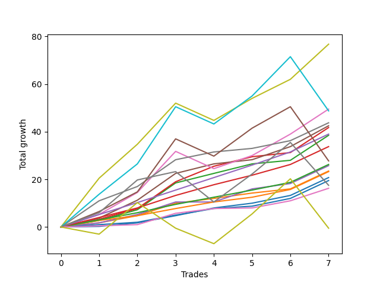

# Short Bernese 001 50 SB 
- Symbol: ES_1W
- Date Range: 03/18/2022 - 07/29/2022
- Trading Period: 7:20-12:30
- Number of Trades: 7



| Name | Win Percent | Profit | Avg Profit / Trade | Avg Time / Trade |      | Name | Win Percent | Profit | Avg Profit / Trade | Avg Time / Trade |
| ---- | ----------- | ------ | ------------------ | ---------------- | ---- | ---- | ----------- | ------ | ------------------ | ---------------- |
| Sorted By <br> Profit | | | | | | Sorted By <br> Win Percentage ||||
| Seven | 85.71 | 38375.00 | 5482.14 | 29:27 |     | Six | 100.00 | 21875.00 | 3125.00 | 04:22 |
| Five | 85.71 | 24750.00 | 3535.71 | 22:04 |     | Four | 100.00 | 21250.00 | 3035.71 | 15:49 |
| BB100 | 71.43 | 24375.00 | 3482.14 | 40:52 |     | Two_C | 100.00 | 20875.00 | 2982.14 | 10:50 |
| Six | 100.00 | 21875.00 | 3125.00 | 04:22 |     | Eighty-Five | 100.00 | 19500.00 | 2785.71 | 07:07 |
| Four | 100.00 | 21250.00 | 3035.71 | 15:49 |     | Two | 100.00 | 19250.00 | 2750.00 | 10:46 |
| Two_C | 100.00 | 20875.00 | 2982.14 | 10:50 |     | Eighty-Four | 100.00 | 16875.00 | 2410.71 | 06:35 |
| Eighty-Five | 100.00 | 19500.00 | 2785.71 | 07:07 |     | Eighty-Three | 100.00 | 13125.00 | 1875.00 | 03:44 |
| Two | 100.00 | 19250.00 | 2750.00 | 10:46 |     | One | 100.00 | 11750.00 | 1678.57 | 06:51 |
| Eighty-Four | 100.00 | 16875.00 | 2410.71 | 06:35 |     | Eighty-Two | 100.00 | 11625.00 | 1660.71 | 02:30 |
| NEWFI 000 | 71.43 | 13875.00 | 1982.14 | 37:19 |     | Zero | 100.00 | 10375.00 | 1482.14 | 02:12 |
| Eighty-Three | 100.00 | 13125.00 | 1875.00 | 03:44 |     | Eighty-One | 100.00 | 9750.00 | 1392.86 | 01:42 |
| Three | 85.71 | 12875.00 | 1839.29 | 09:50 |     | NEWFI 0000 | 100.00 | 8125.00 | 1160.71 | 06:56 |
| One | 100.00 | 11750.00 | 1678.57 | 06:51 |     | Seven | 85.71 | 38375.00 | 5482.14 | 29:27 |
| Eighty-Two | 100.00 | 11625.00 | 1660.71 | 02:30 |     | Five | 85.71 | 24750.00 | 3535.71 | 22:04 |
| Zero | 100.00 | 10375.00 | 1482.14 | 02:12 |     | Three | 85.71 | 12875.00 | 1839.29 | 09:50 |
| Eighty-One | 100.00 | 9750.00 | 1392.86 | 01:42 |     | BB100 | 71.43 | 24375.00 | 3482.14 | 40:52 |
| MALAMUTE 001 | 71.43 | 8750.00 | 1250.00 | 49:34 |     | NEWFI 000 | 71.43 | 13875.00 | 1982.14 | 37:19 |
| NEWFI 0000 | 100.00 | 8125.00 | 1160.71 | 06:56 |     | MALAMUTE 001 | 71.43 | 8750.00 | 1250.00 | 49:34 |
| MALAMUTE 002 | 42.86 | -250.00 | -35.71 | 60:05 |     | MALAMUTE 002 | 42.86 | -250.00 | -35.71 | 60:05 |

## NO STOPLOSS

### Test Zero
* Sell when price hits the middle line of the 20p bollinger
* No Stoploss
* Results:
```
Total Trades: 7
Percent Up: 0.00
Percent Down: 100.00
Total Points Moved Down: 20.75
Potential Profit: 10375.00
Total Points Ups: 0.00 Count Ups: 0
Total Points Downs: 20.75 Count Downs: 7
```

<details><summary>Trades</summary>

<code>In: 2022-03-25 11:57:00		Out: 2022-03-25 11:58:10		Total Position Time: 01:10		Total Move Down: 0.25		Total to Date: 0.25</code> <br />
<code>In: 2022-03-29 08:52:00		Out: 2022-03-29 08:56:20		Total Position Time: 04:20		Total Move Down: 1.50		Total to Date: 1.75</code> <br />
<code>In: 2022-04-06 11:06:00		Out: 2022-04-06 11:07:10		Total Position Time: 01:10		Total Move Down: 3.00		Total to Date: 4.75</code> <br />
<code>In: 2022-04-25 09:28:00		Out: 2022-04-25 09:31:05		Total Position Time: 03:05		Total Move Down: 3.25		Total to Date: 8.00</code> <br />
<code>In: 2022-06-09 09:46:00		Out: 2022-06-09 09:49:20		Total Position Time: 03:20		Total Move Down: 2.00		Total to Date: 10.00</code> <br />
<code>In: 2022-06-15 09:19:00		Out: 2022-06-15 09:20:10		Total Position Time: 01:10		Total Move Down: 3.25		Total to Date: 13.25</code> <br />
<code>In: 2022-07-06 11:10:00		Out: 2022-07-06 11:11:10		Total Position Time: 01:10		Total Move Down: 7.50		Total to Date: 20.75</code> <br />


</details>

### Test One
* Sell when the price hits the upper line of the 20p 1std bollinger
* No Stoploss
* Results:
```
Total Trades: 7
Percent Up: 0.00
Percent Down: 100.00
Total Points Moved Down: 23.50
Potential Profit: 11750.00
Total Points Ups: 0.00 Count Ups: 0
Total Points Downs: 23.50 Count Downs: 7
```

<details><summary>Trades</summary>

<code>In: 2022-03-25 11:57:00		Out: 2022-03-25 12:00:45		Total Position Time: 03:45		Total Move Down: 1.75		Total to Date: 1.75</code> <br />
<code>In: 2022-03-29 08:52:00		Out: 2022-03-29 08:58:40		Total Position Time: 06:40		Total Move Down: 3.00		Total to Date: 4.75</code> <br />
<code>In: 2022-04-06 11:06:00		Out: 2022-04-06 11:07:20		Total Position Time: 01:20		Total Move Down: 5.25		Total to Date: 10.00</code> <br />
<code>In: 2022-04-25 09:28:00		Out: 2022-04-25 09:42:45		Total Position Time: 14:45		Total Move Down: 2.00		Total to Date: 12.00</code> <br />
<code>In: 2022-06-09 09:46:00		Out: 2022-06-09 09:54:45		Total Position Time: 08:45		Total Move Down: 2.25		Total to Date: 14.25</code> <br />
<code>In: 2022-06-15 09:19:00		Out: 2022-06-15 09:30:35		Total Position Time: 11:35		Total Move Down: 1.75		Total to Date: 16.00</code> <br />
<code>In: 2022-07-06 11:10:00		Out: 2022-07-06 11:11:10		Total Position Time: 01:10		Total Move Down: 7.50		Total to Date: 23.50</code> <br />


</details>

### Test Two
* Sell when the price hits the upper line of the 20p 2std bollinger
* No Stoploss
* Results:
```
Total Trades: 7
Percent Up: 0.00
Percent Down: 100.00
Total Points Moved Down: 38.50
Potential Profit: 19250.00
Total Points Ups: 0.00 Count Ups: 0
Total Points Downs: 38.50 Count Downs: 7
```

<details><summary>Trades</summary>

<code>In: 2022-03-25 11:57:00		Out: 2022-03-25 12:00:55		Total Position Time: 03:55		Total Move Down: 2.75		Total to Date: 2.75</code> <br />
<code>In: 2022-03-29 08:52:00		Out: 2022-03-29 09:01:40		Total Position Time: 09:40		Total Move Down: 4.50		Total to Date: 7.25</code> <br />
<code>In: 2022-04-06 11:06:00		Out: 2022-04-06 11:08:10		Total Position Time: 02:10		Total Move Down: 11.25		Total to Date: 18.50</code> <br />
<code>In: 2022-04-25 09:28:00		Out: 2022-04-25 10:01:15		Total Position Time: 33:15		Total Move Down: 4.00		Total to Date: 22.50</code> <br />
<code>In: 2022-06-09 09:46:00		Out: 2022-06-09 09:55:00		Total Position Time: 09:00		Total Move Down: 4.00		Total to Date: 26.50</code> <br />
<code>In: 2022-06-15 09:19:00		Out: 2022-06-15 09:34:40		Total Position Time: 15:40		Total Move Down: 1.50		Total to Date: 28.00</code> <br />
<code>In: 2022-07-06 11:10:00		Out: 2022-07-06 11:11:45		Total Position Time: 01:45		Total Move Down: 10.50		Total to Date: 38.50</code> <br />


</details>

### Test Two_C
* Sell when the price hits the upper line of the 20p 2std bollinger
* No Stoploss
* Results:
```
Total Trades: 7
Percent Up: 0.00
Percent Down: 100.00
Total Points Moved Down: 41.75
Potential Profit: 20875.00
Total Points Ups: 0.00 Count Ups: 0
Total Points Downs: 41.75 Count Downs: 7
```

<details><summary>Trades</summary>

<code>In: 2022-03-25 11:57:00		Out: 2022-03-25 12:01:15		Total Position Time: 04:15		Total Move Down: 3.25		Total to Date: 3.25</code> <br />
<code>In: 2022-03-29 08:52:00		Out: 2022-03-29 09:01:40		Total Position Time: 09:40		Total Move Down: 4.50		Total to Date: 7.75</code> <br />
<code>In: 2022-04-06 11:06:00		Out: 2022-04-06 11:08:10		Total Position Time: 02:10		Total Move Down: 11.25		Total to Date: 19.00</code> <br />
<code>In: 2022-04-25 09:28:00		Out: 2022-04-25 10:01:20		Total Position Time: 33:20		Total Move Down: 6.50		Total to Date: 25.50</code> <br />
<code>In: 2022-06-09 09:46:00		Out: 2022-06-09 09:55:00		Total Position Time: 09:00		Total Move Down: 4.00		Total to Date: 29.50</code> <br />
<code>In: 2022-06-15 09:19:00		Out: 2022-06-15 09:34:45		Total Position Time: 15:45		Total Move Down: 1.75		Total to Date: 31.25</code> <br />
<code>In: 2022-07-06 11:10:00		Out: 2022-07-06 11:11:45		Total Position Time: 01:45		Total Move Down: 10.50		Total to Date: 41.75</code> <br />


</details>

### Test Three
* Sell when price hits the middle line of the 50p bollinger
* No Stoploss
* Results:
```
Total Trades: 7
Percent Up: 14.29
Percent Down: 85.71
Total Points Moved Down: 25.75
Potential Profit: 12875.00
Total Points Ups: 0.00 Count Ups: 1
Total Points Downs: 25.75 Count Downs: 6
```

<details><summary>Trades</summary>

<code>In: 2022-03-25 11:57:00		Out: 2022-03-25 12:00:45		Total Position Time: 03:45		Total Move Down: 1.75		Total to Date: 1.75</code> <br />
<code>In: 2022-03-29 08:52:00		Out: 2022-03-29 09:01:25		Total Position Time: 09:25		Total Move Down: 3.50		Total to Date: 5.25</code> <br />
<code>In: 2022-04-06 11:06:00		Out: 2022-04-06 11:07:20		Total Position Time: 01:20		Total Move Down: 5.25		Total to Date: 10.50</code> <br />
<code>In: 2022-04-25 09:28:00		Out: 2022-04-25 09:55:05		Total Position Time: 27:05		Total Move Down: -0.00		Total to Date: 10.50</code> <br />
<code>In: 2022-06-09 09:46:00		Out: 2022-06-09 09:55:50		Total Position Time: 09:50		Total Move Down: 5.50		Total to Date: 16.00</code> <br />
<code>In: 2022-06-15 09:19:00		Out: 2022-06-15 09:35:15		Total Position Time: 16:15		Total Move Down: 2.25		Total to Date: 18.25</code> <br />
<code>In: 2022-07-06 11:10:00		Out: 2022-07-06 11:11:10		Total Position Time: 01:10		Total Move Down: 7.50		Total to Date: 25.75</code> <br />


</details>

### Test Four
* Sell when the price hits the upper line of the 50p 1std bollinger
* No Stoploss
* Results:
```
Total Trades: 7
Percent Up: 0.00
Percent Down: 100.00
Total Points Moved Down: 42.50
Potential Profit: 21250.00
Total Points Ups: 0.00 Count Ups: 0
Total Points Downs: 42.50 Count Downs: 7
```

<details><summary>Trades</summary>

<code>In: 2022-03-25 11:57:00		Out: 2022-03-25 12:01:35		Total Position Time: 04:35		Total Move Down: 3.75		Total to Date: 3.75</code> <br />
<code>In: 2022-03-29 08:52:00		Out: 2022-03-29 09:02:15		Total Position Time: 10:15		Total Move Down: 7.50		Total to Date: 11.25</code> <br />
<code>In: 2022-04-06 11:06:00		Out: 2022-04-06 11:08:10		Total Position Time: 02:10		Total Move Down: 11.25		Total to Date: 22.50</code> <br />
<code>In: 2022-04-25 09:28:00		Out: 2022-04-25 10:01:15		Total Position Time: 33:15		Total Move Down: 4.00		Total to Date: 26.50</code> <br />
<code>In: 2022-06-09 09:46:00		Out: 2022-06-09 10:24:05		Total Position Time: 38:05		Total Move Down: 1.75		Total to Date: 28.25</code> <br />
<code>In: 2022-06-15 09:19:00		Out: 2022-06-15 09:39:50		Total Position Time: 20:50		Total Move Down: 5.50		Total to Date: 33.75</code> <br />
<code>In: 2022-07-06 11:10:00		Out: 2022-07-06 11:11:35		Total Position Time: 01:35		Total Move Down: 8.75		Total to Date: 42.50</code> <br />


</details>

### Test Five
* Sell when the price hits the upper line of the 50p 2std bollinger
* No Stoploss
* Results:
```
Total Trades: 7
Percent Up: 14.29
Percent Down: 85.71
Total Points Moved Down: 49.50
Potential Profit: 24750.00
Total Points Ups: 7.25 Count Ups: 1
Total Points Downs: 56.75 Count Downs: 6
```

<details><summary>Trades</summary>

<code>In: 2022-03-25 11:57:00		Out: 2022-03-25 12:01:55		Total Position Time: 04:55		Total Move Down: 5.25		Total to Date: 5.25</code> <br />
<code>In: 2022-03-29 08:52:00		Out: 2022-03-29 09:10:45		Total Position Time: 18:45		Total Move Down: 9.25		Total to Date: 14.50</code> <br />
<code>In: 2022-04-06 11:06:00		Out: 2022-04-06 11:09:40		Total Position Time: 03:40		Total Move Down: 17.25		Total to Date: 31.75</code> <br />
<code>In: 2022-04-25 09:28:00		Out: 2022-04-25 10:28:55		Total Position Time: 60:55		Total Move Down: -7.25		Total to Date: 24.50</code> <br />
<code>In: 2022-06-09 09:46:00		Out: 2022-06-09 10:27:20		Total Position Time: 41:20		Total Move Down: 5.50		Total to Date: 30.00</code> <br />
<code>In: 2022-06-15 09:19:00		Out: 2022-06-15 09:42:05		Total Position Time: 23:05		Total Move Down: 9.00		Total to Date: 39.00</code> <br />
<code>In: 2022-07-06 11:10:00		Out: 2022-07-06 11:11:50		Total Position Time: 01:50		Total Move Down: 10.50		Total to Date: 49.50</code> <br />


</details>

### Test Six
* Sell when the price hits the middle line of the 1std VWAP
* No Stoploss
* Results:
```
Total Trades: 7
Percent Up: 0.00
Percent Down: 100.00
Total Points Moved Down: 43.75
Potential Profit: 21875.00
Total Points Ups: 0.00 Count Ups: 0
Total Points Downs: 43.75 Count Downs: 7
```

<details><summary>Trades</summary>

<code>In: 2022-03-25 11:57:00		Out: 2022-03-25 12:07:35		Total Position Time: 10:35		Total Move Down: 11.00		Total to Date: 11.00</code> <br />
<code>In: 2022-03-29 08:52:00		Out: 2022-03-29 09:02:10		Total Position Time: 10:10		Total Move Down: 6.00		Total to Date: 17.00</code> <br />
<code>In: 2022-04-06 11:06:00		Out: 2022-04-06 11:08:10		Total Position Time: 02:10		Total Move Down: 11.25		Total to Date: 28.25</code> <br />
<code>In: 2022-04-25 09:28:00		Out: 2022-04-25 09:31:05		Total Position Time: 03:05		Total Move Down: 3.25		Total to Date: 31.50</code> <br />
<code>In: 2022-06-09 09:46:00		Out: 2022-06-09 09:48:20		Total Position Time: 02:20		Total Move Down: 1.50		Total to Date: 33.00</code> <br />
<code>In: 2022-06-15 09:19:00		Out: 2022-06-15 09:20:10		Total Position Time: 01:10		Total Move Down: 3.25		Total to Date: 36.25</code> <br />
<code>In: 2022-07-06 11:10:00		Out: 2022-07-06 11:11:10		Total Position Time: 01:10		Total Move Down: 7.50		Total to Date: 43.75</code> <br />


</details>

### Test Seven
* Sell when the price hits the upper line of the 1std VWAP
* No Stoploss
* Results:
```
Total Trades: 7
Percent Up: 14.29
Percent Down: 85.71
Total Points Moved Down: 76.75
Potential Profit: 38375.00
Total Points Ups: 7.25 Count Ups: 1
Total Points Downs: 84.00 Count Downs: 6
```

<details><summary>Trades</summary>

<code>In: 2022-03-25 11:57:00		Out: 2022-03-25 12:33:10		Total Position Time: 36:10		Total Move Down: 20.50		Total to Date: 20.50</code> <br />
<code>In: 2022-03-29 08:52:00		Out: 2022-03-29 09:27:55		Total Position Time: 35:55		Total Move Down: 14.25		Total to Date: 34.75</code> <br />
<code>In: 2022-04-06 11:06:00		Out: 2022-04-06 11:09:40		Total Position Time: 03:40		Total Move Down: 17.25		Total to Date: 52.00</code> <br />
<code>In: 2022-04-25 09:28:00		Out: 2022-04-25 10:28:55		Total Position Time: 60:55		Total Move Down: -7.25		Total to Date: 44.75</code> <br />
<code>In: 2022-06-09 09:46:00		Out: 2022-06-09 10:30:30		Total Position Time: 44:30		Total Move Down: 9.25		Total to Date: 54.00</code> <br />
<code>In: 2022-06-15 09:19:00		Out: 2022-06-15 09:41:40		Total Position Time: 22:40		Total Move Down: 8.00		Total to Date: 62.00</code> <br />
<code>In: 2022-07-06 11:10:00		Out: 2022-07-06 11:12:20		Total Position Time: 02:20		Total Move Down: 14.75		Total to Date: 76.75</code> <br />


</details>

### Test BB100
* Sell when the price hits the upper line of the 1std VWAP
* No Stoploss
* Results:
```
Total Trades: 7
Percent Up: 28.57
Percent Down: 71.43
Total Points Moved Down: 48.75
Potential Profit: 24375.00
Total Points Ups: 30.00 Count Ups: 2
Total Points Downs: 78.75 Count Downs: 5
```

<details><summary>Trades</summary>

<code>In: 2022-03-25 11:57:00		Out: 2022-03-25 12:21:35		Total Position Time: 24:35		Total Move Down: 13.75		Total to Date: 13.75</code> <br />
<code>In: 2022-03-29 08:52:00		Out: 2022-03-29 09:26:35		Total Position Time: 34:35		Total Move Down: 12.75		Total to Date: 26.50</code> <br />
<code>In: 2022-04-06 11:06:00		Out: 2022-04-06 11:14:55		Total Position Time: 08:55		Total Move Down: 24.00		Total to Date: 50.50</code> <br />
<code>In: 2022-04-25 09:28:00		Out: 2022-04-25 10:28:55		Total Position Time: 60:55		Total Move Down: -7.25		Total to Date: 43.25</code> <br />
<code>In: 2022-06-09 09:46:00		Out: 2022-06-09 10:46:55		Total Position Time: 60:55		Total Move Down: 11.75		Total to Date: 55.00</code> <br />
<code>In: 2022-06-15 09:19:00		Out: 2022-06-15 09:54:15		Total Position Time: 35:15		Total Move Down: 16.50		Total to Date: 71.50</code> <br />
<code>In: 2022-07-06 11:10:00		Out: 2022-07-06 12:10:55		Total Position Time: 60:55		Total Move Down: -22.75		Total to Date: 48.75</code> <br />


</details>

## TAKE PROFIT

### Test Eighty-One
* Take Profit of 1 Point
* No Stoploss
* Results:
```
Total Trades: 7
Percent Up: 0.00
Percent Down: 100.00
Total Points Moved Down: 19.50
Potential Profit: 9750.00
Total Points Ups: 0.00 Count Ups: 0
Total Points Downs: 19.50 Count Downs: 7
```

<details><summary>Trades</summary>

<code>In: 2022-03-25 11:57:00		Out: 2022-03-25 11:58:45		Total Position Time: 01:45		Total Move Down: 1.00		Total to Date: 1.00</code> <br />
<code>In: 2022-03-29 08:52:00		Out: 2022-03-29 08:56:10		Total Position Time: 04:10		Total Move Down: 1.00		Total to Date: 2.00</code> <br />
<code>In: 2022-04-06 11:06:00		Out: 2022-04-06 11:07:10		Total Position Time: 01:10		Total Move Down: 3.00		Total to Date: 5.00</code> <br />
<code>In: 2022-04-25 09:28:00		Out: 2022-04-25 09:29:10		Total Position Time: 01:10		Total Move Down: 2.75		Total to Date: 7.75</code> <br />
<code>In: 2022-06-09 09:46:00		Out: 2022-06-09 09:47:25		Total Position Time: 01:25		Total Move Down: 1.00		Total to Date: 8.75</code> <br />
<code>In: 2022-06-15 09:19:00		Out: 2022-06-15 09:20:10		Total Position Time: 01:10		Total Move Down: 3.25		Total to Date: 12.00</code> <br />
<code>In: 2022-07-06 11:10:00		Out: 2022-07-06 11:11:10		Total Position Time: 01:10		Total Move Down: 7.50		Total to Date: 19.50</code> <br />


</details>

### Test Eighty-Two
* Take Profit of 2 Point
* No Stoploss
* Results:
```
Total Trades: 7
Percent Up: 0.00
Percent Down: 100.00
Total Points Moved Down: 23.25
Potential Profit: 11625.00
Total Points Ups: 0.00 Count Ups: 0
Total Points Downs: 23.25 Count Downs: 7
```

<details><summary>Trades</summary>

<code>In: 2022-03-25 11:57:00		Out: 2022-03-25 12:00:50		Total Position Time: 03:50		Total Move Down: 2.75		Total to Date: 2.75</code> <br />
<code>In: 2022-03-29 08:52:00		Out: 2022-03-29 08:57:40		Total Position Time: 05:40		Total Move Down: 2.00		Total to Date: 4.75</code> <br />
<code>In: 2022-04-06 11:06:00		Out: 2022-04-06 11:07:10		Total Position Time: 01:10		Total Move Down: 3.00		Total to Date: 7.75</code> <br />
<code>In: 2022-04-25 09:28:00		Out: 2022-04-25 09:29:10		Total Position Time: 01:10		Total Move Down: 2.75		Total to Date: 10.50</code> <br />
<code>In: 2022-06-09 09:46:00		Out: 2022-06-09 09:49:20		Total Position Time: 03:20		Total Move Down: 2.00		Total to Date: 12.50</code> <br />
<code>In: 2022-06-15 09:19:00		Out: 2022-06-15 09:20:10		Total Position Time: 01:10		Total Move Down: 3.25		Total to Date: 15.75</code> <br />
<code>In: 2022-07-06 11:10:00		Out: 2022-07-06 11:11:10		Total Position Time: 01:10		Total Move Down: 7.50		Total to Date: 23.25</code> <br />


</details>

### Test Eighty-Three
* Take Profit of 3 Point
* No Stoploss
* Results:
```
Total Trades: 7
Percent Up: 0.00
Percent Down: 100.00
Total Points Moved Down: 26.25
Potential Profit: 13125.00
Total Points Ups: 0.00 Count Ups: 0
Total Points Downs: 26.25 Count Downs: 7
```

<details><summary>Trades</summary>

<code>In: 2022-03-25 11:57:00		Out: 2022-03-25 12:01:00		Total Position Time: 04:00		Total Move Down: 3.00		Total to Date: 3.00</code> <br />
<code>In: 2022-03-29 08:52:00		Out: 2022-03-29 08:58:40		Total Position Time: 06:40		Total Move Down: 3.00		Total to Date: 6.00</code> <br />
<code>In: 2022-04-06 11:06:00		Out: 2022-04-06 11:07:15		Total Position Time: 01:15		Total Move Down: 3.50		Total to Date: 9.50</code> <br />
<code>In: 2022-04-25 09:28:00		Out: 2022-04-25 09:31:00		Total Position Time: 03:00		Total Move Down: 3.00		Total to Date: 12.50</code> <br />
<code>In: 2022-06-09 09:46:00		Out: 2022-06-09 09:54:55		Total Position Time: 08:55		Total Move Down: 3.00		Total to Date: 15.50</code> <br />
<code>In: 2022-06-15 09:19:00		Out: 2022-06-15 09:20:10		Total Position Time: 01:10		Total Move Down: 3.25		Total to Date: 18.75</code> <br />
<code>In: 2022-07-06 11:10:00		Out: 2022-07-06 11:11:10		Total Position Time: 01:10		Total Move Down: 7.50		Total to Date: 26.25</code> <br />


</details>

### Test Eighty-Four
* Take Profit of 4 Point
* No Stoploss
* Results:
```
Total Trades: 7
Percent Up: 0.00
Percent Down: 100.00
Total Points Moved Down: 33.75
Potential Profit: 16875.00
Total Points Ups: 0.00 Count Ups: 0
Total Points Downs: 33.75 Count Downs: 7
```

<details><summary>Trades</summary>

<code>In: 2022-03-25 11:57:00		Out: 2022-03-25 12:01:45		Total Position Time: 04:45		Total Move Down: 4.00		Total to Date: 4.00</code> <br />
<code>In: 2022-03-29 08:52:00		Out: 2022-03-29 09:01:35		Total Position Time: 09:35		Total Move Down: 4.00		Total to Date: 8.00</code> <br />
<code>In: 2022-04-06 11:06:00		Out: 2022-04-06 11:07:20		Total Position Time: 01:20		Total Move Down: 5.25		Total to Date: 13.25</code> <br />
<code>In: 2022-04-25 09:28:00		Out: 2022-04-25 09:31:10		Total Position Time: 03:10		Total Move Down: 4.50		Total to Date: 17.75</code> <br />
<code>In: 2022-06-09 09:46:00		Out: 2022-06-09 09:55:00		Total Position Time: 09:00		Total Move Down: 4.00		Total to Date: 21.75</code> <br />
<code>In: 2022-06-15 09:19:00		Out: 2022-06-15 09:36:10		Total Position Time: 17:10		Total Move Down: 4.50		Total to Date: 26.25</code> <br />
<code>In: 2022-07-06 11:10:00		Out: 2022-07-06 11:11:10		Total Position Time: 01:10		Total Move Down: 7.50		Total to Date: 33.75</code> <br />


</details>

### Test Eighty-Five
* Take Profit of 5 Point
* No Stoploss
* Results:
```
Total Trades: 7
Percent Up: 0.00
Percent Down: 100.00
Total Points Moved Down: 39.00
Potential Profit: 19500.00
Total Points Ups: 0.00 Count Ups: 0
Total Points Downs: 39.00 Count Downs: 7
```

<details><summary>Trades</summary>

<code>In: 2022-03-25 11:57:00		Out: 2022-03-25 12:01:55		Total Position Time: 04:55		Total Move Down: 5.25		Total to Date: 5.25</code> <br />
<code>In: 2022-03-29 08:52:00		Out: 2022-03-29 09:01:45		Total Position Time: 09:45		Total Move Down: 5.00		Total to Date: 10.25</code> <br />
<code>In: 2022-04-06 11:06:00		Out: 2022-04-06 11:07:20		Total Position Time: 01:20		Total Move Down: 5.25		Total to Date: 15.50</code> <br />
<code>In: 2022-04-25 09:28:00		Out: 2022-04-25 09:31:15		Total Position Time: 03:15		Total Move Down: 5.25		Total to Date: 20.75</code> <br />
<code>In: 2022-06-09 09:46:00		Out: 2022-06-09 09:55:45		Total Position Time: 09:45		Total Move Down: 5.25		Total to Date: 26.00</code> <br />
<code>In: 2022-06-15 09:19:00		Out: 2022-06-15 09:38:40		Total Position Time: 19:40		Total Move Down: 5.50		Total to Date: 31.50</code> <br />
<code>In: 2022-07-06 11:10:00		Out: 2022-07-06 11:11:10		Total Position Time: 01:10		Total Move Down: 7.50		Total to Date: 39.00</code> <br />


</details>

## Indicator Exits

### Test NEWFI 000
* Newfi 0000
* No Stoploss
* Results:
```
Total Trades: 7
Percent Up: 28.57
Percent Down: 71.43
Total Points Moved Down: 27.75
Potential Profit: 13875.00
Total Points Ups: 30.00 Count Ups: 2
Total Points Downs: 57.75 Count Downs: 5
```

<details><summary>Trades</summary>

<code>In: 2022-03-25 11:57:00		Out: 2022-03-25 12:13:05		Total Position Time: 16:05		Total Move Down: 6.50		Total to Date: 6.50</code> <br />
<code>In: 2022-03-29 08:52:00		Out: 2022-03-29 09:14:05		Total Position Time: 22:05		Total Move Down: 8.25		Total to Date: 14.75</code> <br />
<code>In: 2022-04-06 11:06:00		Out: 2022-04-06 11:22:05		Total Position Time: 16:05		Total Move Down: 22.25		Total to Date: 37.00</code> <br />
<code>In: 2022-04-25 09:28:00		Out: 2022-04-25 10:28:55		Total Position Time: 60:55		Total Move Down: -7.25		Total to Date: 29.75</code> <br />
<code>In: 2022-06-09 09:46:00		Out: 2022-06-09 10:40:05		Total Position Time: 54:05		Total Move Down: 11.75		Total to Date: 41.50</code> <br />
<code>In: 2022-06-15 09:19:00		Out: 2022-06-15 09:50:05		Total Position Time: 31:05		Total Move Down: 9.00		Total to Date: 50.50</code> <br />
<code>In: 2022-07-06 11:10:00		Out: 2022-07-06 12:10:55		Total Position Time: 60:55		Total Move Down: -22.75		Total to Date: 27.75</code> <br />


</details>

### Test NEWFI 0000
* Newfi 0000
* No Stoploss
* Results:
```
Total Trades: 7
Percent Up: 0.00
Percent Down: 100.00
Total Points Moved Down: 16.25
Potential Profit: 8125.00
Total Points Ups: 0.00 Count Ups: 0
Total Points Downs: 16.25 Count Downs: 7
```

<details><summary>Trades</summary>

<code>In: 2022-03-25 11:57:00		Out: 2022-03-25 11:58:05		Total Position Time: 01:05		Total Move Down: 0.50		Total to Date: 0.50</code> <br />
<code>In: 2022-03-29 08:52:00		Out: 2022-03-29 08:53:05		Total Position Time: 01:05		Total Move Down: 0.50		Total to Date: 1.00</code> <br />
<code>In: 2022-04-06 11:06:00		Out: 2022-04-06 11:48:05		Total Position Time: 42:05		Total Move Down: 4.75		Total to Date: 5.75</code> <br />
<code>In: 2022-04-25 09:28:00		Out: 2022-04-25 09:29:05		Total Position Time: 01:05		Total Move Down: 2.00		Total to Date: 7.75</code> <br />
<code>In: 2022-06-09 09:46:00		Out: 2022-06-09 09:47:05		Total Position Time: 01:05		Total Move Down: 0.25		Total to Date: 8.00</code> <br />
<code>In: 2022-06-15 09:19:00		Out: 2022-06-15 09:20:05		Total Position Time: 01:05		Total Move Down: 3.00		Total to Date: 11.00</code> <br />
<code>In: 2022-07-06 11:10:00		Out: 2022-07-06 11:11:05		Total Position Time: 01:05		Total Move Down: 5.25		Total to Date: 16.25</code> <br />


</details>

### Test MALAMUTE 001
* Malamute 001
* No Stoploss
* Results:
```
Total Trades: 7
Percent Up: 28.57
Percent Down: 71.43
Total Points Moved Down: 17.50
Potential Profit: 8750.00
Total Points Ups: 30.75 Count Ups: 2
Total Points Downs: 48.25 Count Downs: 5
```

<details><summary>Trades</summary>

<code>In: 2022-03-25 11:57:00		Out: 2022-03-25 12:47:00		Total Position Time: 50:00		Total Move Down: 6.00		Total to Date: 6.00</code> <br />
<code>In: 2022-03-29 08:52:00		Out: 2022-03-29 09:52:55		Total Position Time: 60:55		Total Move Down: 13.75		Total to Date: 19.75</code> <br />
<code>In: 2022-04-06 11:06:00		Out: 2022-04-06 11:45:05		Total Position Time: 39:05		Total Move Down: 3.50		Total to Date: 23.25</code> <br />
<code>In: 2022-04-25 09:28:00		Out: 2022-04-25 10:19:05		Total Position Time: 51:05		Total Move Down: -12.75		Total to Date: 10.50</code> <br />
<code>In: 2022-06-09 09:46:00		Out: 2022-06-09 10:46:55		Total Position Time: 60:55		Total Move Down: 11.75		Total to Date: 22.25</code> <br />
<code>In: 2022-06-15 09:19:00		Out: 2022-06-15 10:19:55		Total Position Time: 60:55		Total Move Down: 13.25		Total to Date: 35.50</code> <br />
<code>In: 2022-07-06 11:10:00		Out: 2022-07-06 11:34:05		Total Position Time: 24:05		Total Move Down: -18.00		Total to Date: 17.50</code> <br />


</details>

### Test MALAMUTE 002
* Malamute 001
* No Stoploss
* Results:
```
Total Trades: 7
Percent Up: 57.14
Percent Down: 42.86
Total Points Moved Down: -0.50
Potential Profit: -250.00
Total Points Ups: 41.00 Count Ups: 4
Total Points Downs: 40.50 Count Downs: 3
```

<details><summary>Trades</summary>

<code>In: 2022-03-25 11:57:00		Out: 2022-03-25 12:57:05		Total Position Time: 60:05		Total Move Down: -3.00		Total to Date: -3.00</code> <br />
<code>In: 2022-03-29 08:52:00		Out: 2022-03-29 09:52:05		Total Position Time: 60:05		Total Move Down: 13.25		Total to Date: 10.25</code> <br />
<code>In: 2022-04-06 11:06:00		Out: 2022-04-06 12:06:05		Total Position Time: 60:05		Total Move Down: -10.75		Total to Date: -0.50</code> <br />
<code>In: 2022-04-25 09:28:00		Out: 2022-04-25 10:28:05		Total Position Time: 60:05		Total Move Down: -6.50		Total to Date: -7.00</code> <br />
<code>In: 2022-06-09 09:46:00		Out: 2022-06-09 10:46:05		Total Position Time: 60:05		Total Move Down: 12.50		Total to Date: 5.50</code> <br />
<code>In: 2022-06-15 09:19:00		Out: 2022-06-15 10:19:05		Total Position Time: 60:05		Total Move Down: 14.75		Total to Date: 20.25</code> <br />
<code>In: 2022-07-06 11:10:00		Out: 2022-07-06 12:10:05		Total Position Time: 60:05		Total Move Down: -20.75		Total to Date: -0.50</code> <br />


</details>