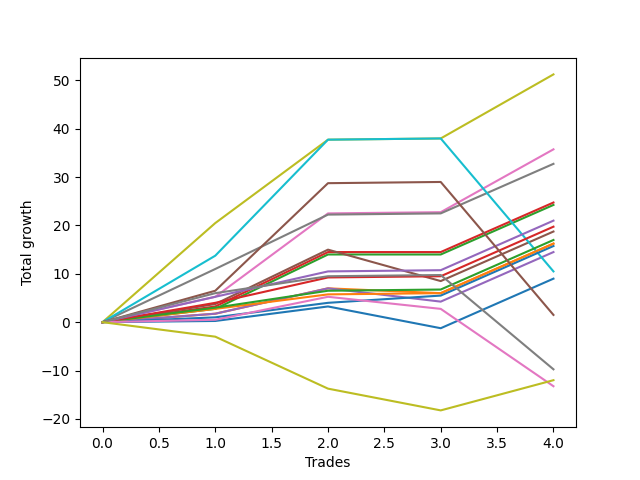

# Short Bernese 002 1v SB 
- Symbol: ES_1W
- Date Range: 03/18/2022 - 07/29/2022
- Trading Period: 7:20-12:30
- Number of Trades: 4



| Name | Win Percent | Profit | Avg Profit / Trade | Avg Time / Trade |      | Name | Win Percent | Profit | Avg Profit / Trade | Avg Time / Trade |
| ---- | ----------- | ------ | ------------------ | ---------------- | ---- | ---- | ----------- | ------ | ------------------ | ---------------- |
| Sorted By <br> Profit | | | | | | Sorted By <br> Win Percentage ||||
| Seven | 100.00 | 25625.00 | 6406.25 | 25:31 |     | Seven | 100.00 | 25625.00 | 6406.25 | 25:31 |
| Five | 100.00 | 17875.00 | 4468.75 | 17:41 |     | Five | 100.00 | 17875.00 | 4468.75 | 17:41 |
| Six | 100.00 | 16375.00 | 4093.75 | 18:42 |     | Six | 100.00 | 16375.00 | 4093.75 | 18:42 |
| Two_C | 75.00 | 12375.00 | 3093.75 | 05:21 |     | Eighty-Five | 100.00 | 10500.00 | 2625.00 | 17:05 |
| Two | 75.00 | 12125.00 | 3031.25 | 05:16 |     | Eighty-Four | 100.00 | 9875.00 | 2468.75 | 17:02 |
| Eighty-Five | 100.00 | 10500.00 | 2625.00 | 17:05 |     | Eighty-Three | 100.00 | 8500.00 | 2125.00 | 16:50 |
| Eighty-Four | 100.00 | 9875.00 | 2468.75 | 17:02 |     | Eighty-Two | 100.00 | 8125.00 | 2031.25 | 16:46 |
| Four | 75.00 | 9375.00 | 2343.75 | 16:02 |     | Eighty-One | 100.00 | 7875.00 | 1968.75 | 05:16 |
| Eighty-Three | 100.00 | 8500.00 | 2125.00 | 16:50 |     | Two_C | 75.00 | 12375.00 | 3093.75 | 05:21 |
| Eighty-Two | 100.00 | 8125.00 | 2031.25 | 16:46 |     | Two | 75.00 | 12125.00 | 3031.25 | 05:16 |
| One | 75.00 | 8125.00 | 2031.25 | 04:58 |     | Four | 75.00 | 9375.00 | 2343.75 | 16:02 |
| Eighty-One | 100.00 | 7875.00 | 1968.75 | 05:16 |     | One | 75.00 | 8125.00 | 2031.25 | 04:58 |
| Three | 75.00 | 7250.00 | 1812.50 | 09:40 |     | Three | 75.00 | 7250.00 | 1812.50 | 09:40 |
| BB100 | 75.00 | 5250.00 | 1312.50 | 38:50 |     | BB100 | 75.00 | 5250.00 | 1312.50 | 38:50 |
| Zero | 75.00 | 4500.00 | 1125.00 | 04:11 |     | Zero | 75.00 | 4500.00 | 1125.00 | 04:11 |
| NEWFI 000 | 75.00 | 750.00 | 187.50 | 38:30 |     | NEWFI 000 | 75.00 | 750.00 | 187.50 | 38:30 |
| MALAMUTE 001 | 75.00 | -4875.00 | -1218.75 | 43:16 |     | MALAMUTE 001 | 75.00 | -4875.00 | -1218.75 | 43:16 |
| MALAMUTE 002 | 25.00 | -6000.00 | -1500.00 | 32:20 |     | NEWFI 0000 | 50.00 | -6625.00 | -1656.25 | 17:50 |
| NEWFI 0000 | 50.00 | -6625.00 | -1656.25 | 17:50 |     | MALAMUTE 002 | 25.00 | -6000.00 | -1500.00 | 32:20 |

## NO STOPLOSS

### Test Zero
* Sell when price hits the middle line of the 20p bollinger
* No Stoploss
* Results:
```
Total Trades: 4
Percent Up: 25.00
Percent Down: 75.00
Total Points Moved Down: 9.00
Potential Profit: 4500.00
Total Points Ups: 4.50 Count Ups: 1
Total Points Downs: 13.50 Count Downs: 3
```

<details><summary>Trades</summary>

<code>In: 2022-03-25 11:57:00		Out: 2022-03-25 11:58:10		Total Position Time: 01:10		Total Move Down: 0.25		Total to Date: 0.25</code> <br />
<code>In: 2022-04-06 11:06:00		Out: 2022-04-06 11:07:10		Total Position Time: 01:10		Total Move Down: 3.00		Total to Date: 3.25</code> <br />
<code>In: 2022-05-24 10:48:00		Out: 2022-05-24 11:01:15		Total Position Time: 13:15		Total Move Down: -4.50		Total to Date: -1.25</code> <br />
<code>In: 2022-07-06 11:11:00		Out: 2022-07-06 11:12:10		Total Position Time: 01:10		Total Move Down: 10.25		Total to Date: 9.00</code> <br />


</details>

### Test One
* Sell when the price hits the upper line of the 20p 1std bollinger
* No Stoploss
* Results:
```
Total Trades: 4
Percent Up: 25.00
Percent Down: 75.00
Total Points Moved Down: 16.25
Potential Profit: 8125.00
Total Points Ups: 1.00 Count Ups: 1
Total Points Downs: 17.25 Count Downs: 3
```

<details><summary>Trades</summary>

<code>In: 2022-03-25 11:57:00		Out: 2022-03-25 12:00:45		Total Position Time: 03:45		Total Move Down: 1.75		Total to Date: 1.75</code> <br />
<code>In: 2022-04-06 11:06:00		Out: 2022-04-06 11:07:20		Total Position Time: 01:20		Total Move Down: 5.25		Total to Date: 7.00</code> <br />
<code>In: 2022-05-24 10:48:00		Out: 2022-05-24 11:01:40		Total Position Time: 13:40		Total Move Down: -1.00		Total to Date: 6.00</code> <br />
<code>In: 2022-07-06 11:11:00		Out: 2022-07-06 11:12:10		Total Position Time: 01:10		Total Move Down: 10.25		Total to Date: 16.25</code> <br />


</details>

### Test Two
* Sell when the price hits the upper line of the 20p 2std bollinger
* No Stoploss
* Results:
```
Total Trades: 4
Percent Up: 25.00
Percent Down: 75.00
Total Points Moved Down: 24.25
Potential Profit: 12125.00
Total Points Ups: 0.00 Count Ups: 1
Total Points Downs: 24.25 Count Downs: 3
```

<details><summary>Trades</summary>

<code>In: 2022-03-25 11:57:00		Out: 2022-03-25 12:00:55		Total Position Time: 03:55		Total Move Down: 2.75		Total to Date: 2.75</code> <br />
<code>In: 2022-04-06 11:06:00		Out: 2022-04-06 11:08:10		Total Position Time: 02:10		Total Move Down: 11.25		Total to Date: 14.00</code> <br />
<code>In: 2022-05-24 10:48:00		Out: 2022-05-24 11:01:50		Total Position Time: 13:50		Total Move Down: -0.00		Total to Date: 14.00</code> <br />
<code>In: 2022-07-06 11:11:00		Out: 2022-07-06 11:12:10		Total Position Time: 01:10		Total Move Down: 10.25		Total to Date: 24.25</code> <br />


</details>

### Test Two_C
* Sell when the price hits the upper line of the 20p 2std bollinger
* No Stoploss
* Results:
```
Total Trades: 4
Percent Up: 25.00
Percent Down: 75.00
Total Points Moved Down: 24.75
Potential Profit: 12375.00
Total Points Ups: 0.00 Count Ups: 1
Total Points Downs: 24.75 Count Downs: 3
```

<details><summary>Trades</summary>

<code>In: 2022-03-25 11:57:00		Out: 2022-03-25 12:01:15		Total Position Time: 04:15		Total Move Down: 3.25		Total to Date: 3.25</code> <br />
<code>In: 2022-04-06 11:06:00		Out: 2022-04-06 11:08:10		Total Position Time: 02:10		Total Move Down: 11.25		Total to Date: 14.50</code> <br />
<code>In: 2022-05-24 10:48:00		Out: 2022-05-24 11:01:50		Total Position Time: 13:50		Total Move Down: -0.00		Total to Date: 14.50</code> <br />
<code>In: 2022-07-06 11:11:00		Out: 2022-07-06 11:12:10		Total Position Time: 01:10		Total Move Down: 10.25		Total to Date: 24.75</code> <br />


</details>

### Test Three
* Sell when price hits the middle line of the 50p bollinger
* No Stoploss
* Results:
```
Total Trades: 4
Percent Up: 25.00
Percent Down: 75.00
Total Points Moved Down: 14.50
Potential Profit: 7250.00
Total Points Ups: 2.75 Count Ups: 1
Total Points Downs: 17.25 Count Downs: 3
```

<details><summary>Trades</summary>

<code>In: 2022-03-25 11:57:00		Out: 2022-03-25 12:00:45		Total Position Time: 03:45		Total Move Down: 1.75		Total to Date: 1.75</code> <br />
<code>In: 2022-04-06 11:06:00		Out: 2022-04-06 11:07:20		Total Position Time: 01:20		Total Move Down: 5.25		Total to Date: 7.00</code> <br />
<code>In: 2022-05-24 10:48:00		Out: 2022-05-24 11:20:25		Total Position Time: 32:25		Total Move Down: -2.75		Total to Date: 4.25</code> <br />
<code>In: 2022-07-06 11:11:00		Out: 2022-07-06 11:12:10		Total Position Time: 01:10		Total Move Down: 10.25		Total to Date: 14.50</code> <br />


</details>

### Test Four
* Sell when the price hits the upper line of the 50p 1std bollinger
* No Stoploss
* Results:
```
Total Trades: 4
Percent Up: 25.00
Percent Down: 75.00
Total Points Moved Down: 18.75
Potential Profit: 9375.00
Total Points Ups: 6.50 Count Ups: 1
Total Points Downs: 25.25 Count Downs: 3
```

<details><summary>Trades</summary>

<code>In: 2022-03-25 11:57:00		Out: 2022-03-25 12:01:35		Total Position Time: 04:35		Total Move Down: 3.75		Total to Date: 3.75</code> <br />
<code>In: 2022-04-06 11:06:00		Out: 2022-04-06 11:08:10		Total Position Time: 02:10		Total Move Down: 11.25		Total to Date: 15.00</code> <br />
<code>In: 2022-05-24 10:48:00		Out: 2022-05-24 11:44:15		Total Position Time: 56:15		Total Move Down: -6.50		Total to Date: 8.50</code> <br />
<code>In: 2022-07-06 11:11:00		Out: 2022-07-06 11:12:10		Total Position Time: 01:10		Total Move Down: 10.25		Total to Date: 18.75</code> <br />


</details>

### Test Five
* Sell when the price hits the upper line of the 50p 2std bollinger
* No Stoploss
* Results:
```
Total Trades: 4
Percent Up: 0.00
Percent Down: 100.00
Total Points Moved Down: 35.75
Potential Profit: 17875.00
Total Points Ups: 0.00 Count Ups: 0
Total Points Downs: 35.75 Count Downs: 4
```

<details><summary>Trades</summary>

<code>In: 2022-03-25 11:57:00		Out: 2022-03-25 12:01:55		Total Position Time: 04:55		Total Move Down: 5.25		Total to Date: 5.25</code> <br />
<code>In: 2022-04-06 11:06:00		Out: 2022-04-06 11:09:40		Total Position Time: 03:40		Total Move Down: 17.25		Total to Date: 22.50</code> <br />
<code>In: 2022-05-24 10:48:00		Out: 2022-05-24 11:48:55		Total Position Time: 60:55		Total Move Down: 0.25		Total to Date: 22.75</code> <br />
<code>In: 2022-07-06 11:11:00		Out: 2022-07-06 11:12:15		Total Position Time: 01:15		Total Move Down: 13.00		Total to Date: 35.75</code> <br />


</details>

### Test Six
* Sell when the price hits the middle line of the 1std VWAP
* No Stoploss
* Results:
```
Total Trades: 4
Percent Up: 0.00
Percent Down: 100.00
Total Points Moved Down: 32.75
Potential Profit: 16375.00
Total Points Ups: 0.00 Count Ups: 0
Total Points Downs: 32.75 Count Downs: 4
```

<details><summary>Trades</summary>

<code>In: 2022-03-25 11:57:00		Out: 2022-03-25 12:07:35		Total Position Time: 10:35		Total Move Down: 11.00		Total to Date: 11.00</code> <br />
<code>In: 2022-04-06 11:06:00		Out: 2022-04-06 11:08:10		Total Position Time: 02:10		Total Move Down: 11.25		Total to Date: 22.25</code> <br />
<code>In: 2022-05-24 10:48:00		Out: 2022-05-24 11:48:55		Total Position Time: 60:55		Total Move Down: 0.25		Total to Date: 22.50</code> <br />
<code>In: 2022-07-06 11:11:00		Out: 2022-07-06 11:12:10		Total Position Time: 01:10		Total Move Down: 10.25		Total to Date: 32.75</code> <br />


</details>

### Test Seven
* Sell when the price hits the upper line of the 1std VWAP
* No Stoploss
* Results:
```
Total Trades: 4
Percent Up: 0.00
Percent Down: 100.00
Total Points Moved Down: 51.25
Potential Profit: 25625.00
Total Points Ups: 0.00 Count Ups: 0
Total Points Downs: 51.25 Count Downs: 4
```

<details><summary>Trades</summary>

<code>In: 2022-03-25 11:57:00		Out: 2022-03-25 12:33:10		Total Position Time: 36:10		Total Move Down: 20.50		Total to Date: 20.50</code> <br />
<code>In: 2022-04-06 11:06:00		Out: 2022-04-06 11:09:40		Total Position Time: 03:40		Total Move Down: 17.25		Total to Date: 37.75</code> <br />
<code>In: 2022-05-24 10:48:00		Out: 2022-05-24 11:48:55		Total Position Time: 60:55		Total Move Down: 0.25		Total to Date: 38.00</code> <br />
<code>In: 2022-07-06 11:11:00		Out: 2022-07-06 11:12:20		Total Position Time: 01:20		Total Move Down: 13.25		Total to Date: 51.25</code> <br />


</details>

### Test BB100
* Sell when the price hits the upper line of the 1std VWAP
* No Stoploss
* Results:
```
Total Trades: 4
Percent Up: 25.00
Percent Down: 75.00
Total Points Moved Down: 10.50
Potential Profit: 5250.00
Total Points Ups: 27.50 Count Ups: 1
Total Points Downs: 38.00 Count Downs: 3
```

<details><summary>Trades</summary>

<code>In: 2022-03-25 11:57:00		Out: 2022-03-25 12:21:35		Total Position Time: 24:35		Total Move Down: 13.75		Total to Date: 13.75</code> <br />
<code>In: 2022-04-06 11:06:00		Out: 2022-04-06 11:14:55		Total Position Time: 08:55		Total Move Down: 24.00		Total to Date: 37.75</code> <br />
<code>In: 2022-05-24 10:48:00		Out: 2022-05-24 11:48:55		Total Position Time: 60:55		Total Move Down: 0.25		Total to Date: 38.00</code> <br />
<code>In: 2022-07-06 11:11:00		Out: 2022-07-06 12:11:55		Total Position Time: 60:55		Total Move Down: -27.50		Total to Date: 10.50</code> <br />


</details>

## TAKE PROFIT

### Test Eighty-One
* Take Profit of 1 Point
* No Stoploss
* Results:
```
Total Trades: 4
Percent Up: 0.00
Percent Down: 100.00
Total Points Moved Down: 15.75
Potential Profit: 7875.00
Total Points Ups: 0.00 Count Ups: 0
Total Points Downs: 15.75 Count Downs: 4
```

<details><summary>Trades</summary>

<code>In: 2022-03-25 11:57:00		Out: 2022-03-25 11:58:45		Total Position Time: 01:45		Total Move Down: 1.00		Total to Date: 1.00</code> <br />
<code>In: 2022-04-06 11:06:00		Out: 2022-04-06 11:07:10		Total Position Time: 01:10		Total Move Down: 3.00		Total to Date: 4.00</code> <br />
<code>In: 2022-05-24 10:48:00		Out: 2022-05-24 11:05:00		Total Position Time: 17:00		Total Move Down: 1.50		Total to Date: 5.50</code> <br />
<code>In: 2022-07-06 11:11:00		Out: 2022-07-06 11:12:10		Total Position Time: 01:10		Total Move Down: 10.25		Total to Date: 15.75</code> <br />


</details>

### Test Eighty-Two
* Take Profit of 2 Point
* No Stoploss
* Results:
```
Total Trades: 4
Percent Up: 0.00
Percent Down: 100.00
Total Points Moved Down: 16.25
Potential Profit: 8125.00
Total Points Ups: 0.00 Count Ups: 0
Total Points Downs: 16.25 Count Downs: 4
```

<details><summary>Trades</summary>

<code>In: 2022-03-25 11:57:00		Out: 2022-03-25 12:00:50		Total Position Time: 03:50		Total Move Down: 2.75		Total to Date: 2.75</code> <br />
<code>In: 2022-04-06 11:06:00		Out: 2022-04-06 11:07:10		Total Position Time: 01:10		Total Move Down: 3.00		Total to Date: 5.75</code> <br />
<code>In: 2022-05-24 10:48:00		Out: 2022-05-24 11:48:55		Total Position Time: 60:55		Total Move Down: 0.25		Total to Date: 6.00</code> <br />
<code>In: 2022-07-06 11:11:00		Out: 2022-07-06 11:12:10		Total Position Time: 01:10		Total Move Down: 10.25		Total to Date: 16.25</code> <br />


</details>

### Test Eighty-Three
* Take Profit of 3 Point
* No Stoploss
* Results:
```
Total Trades: 4
Percent Up: 0.00
Percent Down: 100.00
Total Points Moved Down: 17.00
Potential Profit: 8500.00
Total Points Ups: 0.00 Count Ups: 0
Total Points Downs: 17.00 Count Downs: 4
```

<details><summary>Trades</summary>

<code>In: 2022-03-25 11:57:00		Out: 2022-03-25 12:01:00		Total Position Time: 04:00		Total Move Down: 3.00		Total to Date: 3.00</code> <br />
<code>In: 2022-04-06 11:06:00		Out: 2022-04-06 11:07:15		Total Position Time: 01:15		Total Move Down: 3.50		Total to Date: 6.50</code> <br />
<code>In: 2022-05-24 10:48:00		Out: 2022-05-24 11:48:55		Total Position Time: 60:55		Total Move Down: 0.25		Total to Date: 6.75</code> <br />
<code>In: 2022-07-06 11:11:00		Out: 2022-07-06 11:12:10		Total Position Time: 01:10		Total Move Down: 10.25		Total to Date: 17.00</code> <br />


</details>

### Test Eighty-Four
* Take Profit of 4 Point
* No Stoploss
* Results:
```
Total Trades: 4
Percent Up: 0.00
Percent Down: 100.00
Total Points Moved Down: 19.75
Potential Profit: 9875.00
Total Points Ups: 0.00 Count Ups: 0
Total Points Downs: 19.75 Count Downs: 4
```

<details><summary>Trades</summary>

<code>In: 2022-03-25 11:57:00		Out: 2022-03-25 12:01:45		Total Position Time: 04:45		Total Move Down: 4.00		Total to Date: 4.00</code> <br />
<code>In: 2022-04-06 11:06:00		Out: 2022-04-06 11:07:20		Total Position Time: 01:20		Total Move Down: 5.25		Total to Date: 9.25</code> <br />
<code>In: 2022-05-24 10:48:00		Out: 2022-05-24 11:48:55		Total Position Time: 60:55		Total Move Down: 0.25		Total to Date: 9.50</code> <br />
<code>In: 2022-07-06 11:11:00		Out: 2022-07-06 11:12:10		Total Position Time: 01:10		Total Move Down: 10.25		Total to Date: 19.75</code> <br />


</details>

### Test Eighty-Five
* Take Profit of 5 Point
* No Stoploss
* Results:
```
Total Trades: 4
Percent Up: 0.00
Percent Down: 100.00
Total Points Moved Down: 21.00
Potential Profit: 10500.00
Total Points Ups: 0.00 Count Ups: 0
Total Points Downs: 21.00 Count Downs: 4
```

<details><summary>Trades</summary>

<code>In: 2022-03-25 11:57:00		Out: 2022-03-25 12:01:55		Total Position Time: 04:55		Total Move Down: 5.25		Total to Date: 5.25</code> <br />
<code>In: 2022-04-06 11:06:00		Out: 2022-04-06 11:07:20		Total Position Time: 01:20		Total Move Down: 5.25		Total to Date: 10.50</code> <br />
<code>In: 2022-05-24 10:48:00		Out: 2022-05-24 11:48:55		Total Position Time: 60:55		Total Move Down: 0.25		Total to Date: 10.75</code> <br />
<code>In: 2022-07-06 11:11:00		Out: 2022-07-06 11:12:10		Total Position Time: 01:10		Total Move Down: 10.25		Total to Date: 21.00</code> <br />


</details>

## Indicator Exits

### Test NEWFI 000
* Newfi 0000
* No Stoploss
* Results:
```
Total Trades: 4
Percent Up: 25.00
Percent Down: 75.00
Total Points Moved Down: 1.50
Potential Profit: 750.00
Total Points Ups: 27.50 Count Ups: 1
Total Points Downs: 29.00 Count Downs: 3
```

<details><summary>Trades</summary>

<code>In: 2022-03-25 11:57:00		Out: 2022-03-25 12:13:05		Total Position Time: 16:05		Total Move Down: 6.50		Total to Date: 6.50</code> <br />
<code>In: 2022-04-06 11:06:00		Out: 2022-04-06 11:22:05		Total Position Time: 16:05		Total Move Down: 22.25		Total to Date: 28.75</code> <br />
<code>In: 2022-05-24 10:48:00		Out: 2022-05-24 11:48:55		Total Position Time: 60:55		Total Move Down: 0.25		Total to Date: 29.00</code> <br />
<code>In: 2022-07-06 11:11:00		Out: 2022-07-06 12:11:55		Total Position Time: 60:55		Total Move Down: -27.50		Total to Date: 1.50</code> <br />


</details>

### Test NEWFI 0000
* Newfi 0000
* No Stoploss
* Results:
```
Total Trades: 4
Percent Up: 50.00
Percent Down: 50.00
Total Points Moved Down: -13.25
Potential Profit: -6625.00
Total Points Ups: 18.50 Count Ups: 2
Total Points Downs: 5.25 Count Downs: 2
```

<details><summary>Trades</summary>

<code>In: 2022-03-25 11:57:00		Out: 2022-03-25 11:58:05		Total Position Time: 01:05		Total Move Down: 0.50		Total to Date: 0.50</code> <br />
<code>In: 2022-04-06 11:06:00		Out: 2022-04-06 11:48:05		Total Position Time: 42:05		Total Move Down: 4.75		Total to Date: 5.25</code> <br />
<code>In: 2022-05-24 10:48:00		Out: 2022-05-24 10:49:05		Total Position Time: 01:05		Total Move Down: -2.50		Total to Date: 2.75</code> <br />
<code>In: 2022-07-06 11:11:00		Out: 2022-07-06 11:38:05		Total Position Time: 27:05		Total Move Down: -16.00		Total to Date: -13.25</code> <br />


</details>

### Test MALAMUTE 001
* Malamute 001
* No Stoploss
* Results:
```
Total Trades: 4
Percent Up: 25.00
Percent Down: 75.00
Total Points Moved Down: -9.75
Potential Profit: -4875.00
Total Points Ups: 19.50 Count Ups: 1
Total Points Downs: 9.75 Count Downs: 3
```

<details><summary>Trades</summary>

<code>In: 2022-03-25 11:57:00		Out: 2022-03-25 12:47:00		Total Position Time: 50:00		Total Move Down: 6.00		Total to Date: 6.00</code> <br />
<code>In: 2022-04-06 11:06:00		Out: 2022-04-06 11:45:05		Total Position Time: 39:05		Total Move Down: 3.50		Total to Date: 9.50</code> <br />
<code>In: 2022-05-24 10:48:00		Out: 2022-05-24 11:48:55		Total Position Time: 60:55		Total Move Down: 0.25		Total to Date: 9.75</code> <br />
<code>In: 2022-07-06 11:11:00		Out: 2022-07-06 11:34:05		Total Position Time: 23:05		Total Move Down: -19.50		Total to Date: -9.75</code> <br />


</details>

### Test MALAMUTE 002
* Malamute 001
* No Stoploss
* Results:
```
Total Trades: 4
Percent Up: 75.00
Percent Down: 25.00
Total Points Moved Down: -12.00
Potential Profit: -6000.00
Total Points Ups: 18.25 Count Ups: 3
Total Points Downs: 6.25 Count Downs: 1
```

<details><summary>Trades</summary>

<code>In: 2022-03-25 11:57:00		Out: 2022-03-25 12:57:05		Total Position Time: 60:05		Total Move Down: -3.00		Total to Date: -3.00</code> <br />
<code>In: 2022-04-06 11:06:00		Out: 2022-04-06 12:06:05		Total Position Time: 60:05		Total Move Down: -10.75		Total to Date: -13.75</code> <br />
<code>In: 2022-05-24 10:48:00		Out: 2022-05-24 10:50:05		Total Position Time: 02:05		Total Move Down: -4.50		Total to Date: -18.25</code> <br />
<code>In: 2022-07-06 11:11:00		Out: 2022-07-06 11:18:05		Total Position Time: 07:05		Total Move Down: 6.25		Total to Date: -12.00</code> <br />


</details>