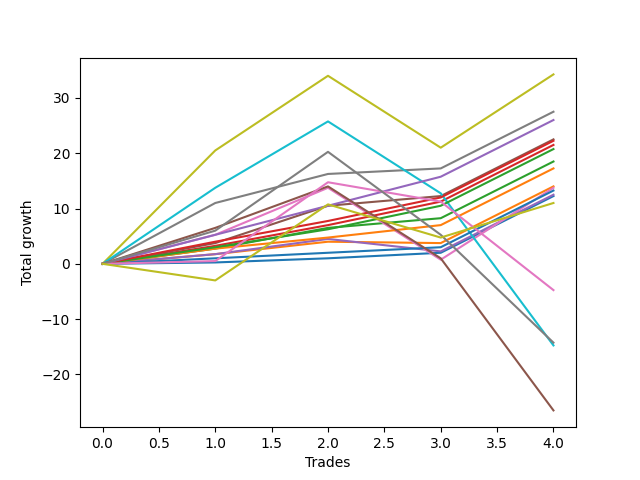

# Short Bernese 002 50 
- Symbol: ES_1W
- Date Range: 03/18/2022 - 07/29/2022
- Trading Period: 7:20-12:30
- Number of Trades: 2



| Name | Win Percent | Profit | Avg Profit / Trade | Avg Time / Trade |      | Name | Win Percent | Profit | Avg Profit / Trade | Avg Time / Trade |
| ---- | ----------- | ------ | ------------------ | ---------------- | ---- | ---- | ----------- | ------ | ------------------ | ---------------- |
| Sorted By <br> Profit | | | | | | Sorted By <br> Win Percentage ||||
| Eighty-Five | 100.00 | 7750.00 | 3875.00 | 16:55 |     | Eighty-Five | 100.00 | 7750.00 | 3875.00 | 16:55 |
| Eighty-Four | 100.00 | 7250.00 | 3625.00 | 16:45 |     | Eighty-Four | 100.00 | 7250.00 | 3625.00 | 16:45 |
| Eighty-Three | 100.00 | 7250.00 | 3625.00 | 16:45 |     | Eighty-Three | 100.00 | 7250.00 | 3625.00 | 16:45 |
| Two_C | 100.00 | 7250.00 | 3625.00 | 16:45 |     | Two_C | 100.00 | 7250.00 | 3625.00 | 16:45 |
| Eighty-Two | 100.00 | 6250.00 | 3125.00 | 01:40 |     | Eighty-Two | 100.00 | 6250.00 | 3125.00 | 01:40 |
| Four | 100.00 | 6000.00 | 3000.00 | 16:42 |     | Four | 100.00 | 6000.00 | 3000.00 | 16:42 |
| Two | 100.00 | 6000.00 | 3000.00 | 16:42 |     | Two | 100.00 | 6000.00 | 3000.00 | 16:42 |
| Eighty-One | 100.00 | 5625.00 | 2812.50 | 01:37 |     | Eighty-One | 100.00 | 5625.00 | 2812.50 | 01:37 |
| Six | 100.00 | 5625.00 | 2812.50 | 01:37 |     | Six | 100.00 | 5625.00 | 2812.50 | 01:37 |
| Zero | 100.00 | 5625.00 | 2812.50 | 01:37 |     | Zero | 100.00 | 5625.00 | 2812.50 | 01:37 |
| Five | 50.00 | 5250.00 | 2625.00 | 46:55 |     | Five | 50.00 | 5250.00 | 2625.00 | 46:55 |
| One | 50.00 | 5000.00 | 2500.00 | 07:27 |     | One | 50.00 | 5000.00 | 2500.00 | 07:27 |
| Three | 50.00 | 4000.00 | 2000.00 | 13:37 |     | Three | 50.00 | 4000.00 | 2000.00 | 13:37 |
| MALAMUTE 002 | 50.00 | 125.00 | 62.50 | 05:35 |     | MALAMUTE 002 | 50.00 | 125.00 | 62.50 | 05:35 |
| NEWFI 0000 | 0.00 | -9750.00 | -4875.00 | 19:35 |     | Seven | 50.00 | -26375.00 | -13187.50 | 99:40 |
| MALAMUTE 001 | 0.00 | -17250.00 | -8625.00 | 36:35 |     | NEWFI 0000 | 0.00 | -9750.00 | -4875.00 | 19:35 |
| Seven | 50.00 | -26375.00 | -13187.50 | 99:40 |     | MALAMUTE 001 | 0.00 | -17250.00 | -8625.00 | 36:35 |

## NO STOPLOSS

### Test Zero
* Sell when price hits the middle line of the 20p bollinger
* No Stoploss
* Results:
```
Total Trades: 2
Percent Up: 0.00
Percent Down: 100.00
Total Points Moved Down: 11.25
Potential Profit: 5625.00
Total Points Ups: 0.00 Count Ups: 0
Total Points Downs: 11.25 Count Downs: 2
```

<details><summary>Trades</summary>

<code>In: 2022-04-25 09:29:00		Out: 2022-04-25 09:31:05		Total Position Time: 02:05		Total Move Down: 1.00		Total to Date: 1.00</code> <br />
<code>In: 2022-07-06 11:11:00		Out: 2022-07-06 11:12:10		Total Position Time: 01:10		Total Move Down: 10.25		Total to Date: 11.25</code> <br />


</details>

### Test One
* Sell when the price hits the upper line of the 20p 1std bollinger
* No Stoploss
* Results:
```
Total Trades: 2
Percent Up: 50.00
Percent Down: 50.00
Total Points Moved Down: 10.00
Potential Profit: 5000.00
Total Points Ups: 0.25 Count Ups: 1
Total Points Downs: 10.25 Count Downs: 1
```

<details><summary>Trades</summary>

<code>In: 2022-04-25 09:29:00		Out: 2022-04-25 09:42:45		Total Position Time: 13:45		Total Move Down: -0.25		Total to Date: -0.25</code> <br />
<code>In: 2022-07-06 11:11:00		Out: 2022-07-06 11:12:10		Total Position Time: 01:10		Total Move Down: 10.25		Total to Date: 10.00</code> <br />


</details>

### Test Two
* Sell when the price hits the upper line of the 20p 2std bollinger
* No Stoploss
* Results:
```
Total Trades: 2
Percent Up: 0.00
Percent Down: 100.00
Total Points Moved Down: 12.00
Potential Profit: 6000.00
Total Points Ups: 0.00 Count Ups: 0
Total Points Downs: 12.00 Count Downs: 2
```

<details><summary>Trades</summary>

<code>In: 2022-04-25 09:29:00		Out: 2022-04-25 10:01:15		Total Position Time: 32:15		Total Move Down: 1.75		Total to Date: 1.75</code> <br />
<code>In: 2022-07-06 11:11:00		Out: 2022-07-06 11:12:10		Total Position Time: 01:10		Total Move Down: 10.25		Total to Date: 12.00</code> <br />


</details>

### Test Two_C
* Sell when the price hits the upper line of the 20p 2std bollinger
* No Stoploss
* Results:
```
Total Trades: 2
Percent Up: 0.00
Percent Down: 100.00
Total Points Moved Down: 14.50
Potential Profit: 7250.00
Total Points Ups: 0.00 Count Ups: 0
Total Points Downs: 14.50 Count Downs: 2
```

<details><summary>Trades</summary>

<code>In: 2022-04-25 09:29:00		Out: 2022-04-25 10:01:20		Total Position Time: 32:20		Total Move Down: 4.25		Total to Date: 4.25</code> <br />
<code>In: 2022-07-06 11:11:00		Out: 2022-07-06 11:12:10		Total Position Time: 01:10		Total Move Down: 10.25		Total to Date: 14.50</code> <br />


</details>

### Test Three
* Sell when price hits the middle line of the 50p bollinger
* No Stoploss
* Results:
```
Total Trades: 2
Percent Up: 50.00
Percent Down: 50.00
Total Points Moved Down: 8.00
Potential Profit: 4000.00
Total Points Ups: 2.25 Count Ups: 1
Total Points Downs: 10.25 Count Downs: 1
```

<details><summary>Trades</summary>

<code>In: 2022-04-25 09:29:00		Out: 2022-04-25 09:55:05		Total Position Time: 26:05		Total Move Down: -2.25		Total to Date: -2.25</code> <br />
<code>In: 2022-07-06 11:11:00		Out: 2022-07-06 11:12:10		Total Position Time: 01:10		Total Move Down: 10.25		Total to Date: 8.00</code> <br />


</details>

### Test Four
* Sell when the price hits the upper line of the 50p 1std bollinger
* No Stoploss
* Results:
```
Total Trades: 2
Percent Up: 0.00
Percent Down: 100.00
Total Points Moved Down: 12.00
Potential Profit: 6000.00
Total Points Ups: 0.00 Count Ups: 0
Total Points Downs: 12.00 Count Downs: 2
```

<details><summary>Trades</summary>

<code>In: 2022-04-25 09:29:00		Out: 2022-04-25 10:01:15		Total Position Time: 32:15		Total Move Down: 1.75		Total to Date: 1.75</code> <br />
<code>In: 2022-07-06 11:11:00		Out: 2022-07-06 11:12:10		Total Position Time: 01:10		Total Move Down: 10.25		Total to Date: 12.00</code> <br />


</details>

### Test Five
* Sell when the price hits the upper line of the 50p 2std bollinger
* No Stoploss
* Results:
```
Total Trades: 2
Percent Up: 50.00
Percent Down: 50.00
Total Points Moved Down: 10.50
Potential Profit: 5250.00
Total Points Ups: 2.50 Count Ups: 1
Total Points Downs: 13.00 Count Downs: 1
```

<details><summary>Trades</summary>

<code>In: 2022-04-25 09:29:00		Out: 2022-04-25 11:01:35		Total Position Time: 92:35		Total Move Down: -2.50		Total to Date: -2.50</code> <br />
<code>In: 2022-07-06 11:11:00		Out: 2022-07-06 11:12:15		Total Position Time: 01:15		Total Move Down: 13.00		Total to Date: 10.50</code> <br />


</details>

### Test Six
* Sell when the price hits the middle line of the 1std VWAP
* No Stoploss
* Results:
```
Total Trades: 2
Percent Up: 0.00
Percent Down: 100.00
Total Points Moved Down: 11.25
Potential Profit: 5625.00
Total Points Ups: 0.00 Count Ups: 0
Total Points Downs: 11.25 Count Downs: 2
```

<details><summary>Trades</summary>

<code>In: 2022-04-25 09:29:00		Out: 2022-04-25 09:31:05		Total Position Time: 02:05		Total Move Down: 1.00		Total to Date: 1.00</code> <br />
<code>In: 2022-07-06 11:11:00		Out: 2022-07-06 11:12:10		Total Position Time: 01:10		Total Move Down: 10.25		Total to Date: 11.25</code> <br />


</details>

### Test Seven
* Sell when the price hits the upper line of the 1std VWAP
* No Stoploss
* Results:
```
Total Trades: 2
Percent Up: 50.00
Percent Down: 50.00
Total Points Moved Down: -52.75
Potential Profit: -26375.00
Total Points Ups: 66.00 Count Ups: 1
Total Points Downs: 13.25 Count Downs: 1
```

<details><summary>Trades</summary>

<code>In: 2022-04-25 09:29:00		Out: 2022-04-25 12:47:00		Total Position Time: 198:00		Total Move Down: -66.00		Total to Date: -66.00</code> <br />
<code>In: 2022-07-06 11:11:00		Out: 2022-07-06 11:12:20		Total Position Time: 01:20		Total Move Down: 13.25		Total to Date: -52.75</code> <br />


</details>

## TAKE PROFIT

### Test Eighty-One
* Take Profit of 1 Point
* No Stoploss
* Results:
```
Total Trades: 2
Percent Up: 0.00
Percent Down: 100.00
Total Points Moved Down: 11.25
Potential Profit: 5625.00
Total Points Ups: 0.00 Count Ups: 0
Total Points Downs: 11.25 Count Downs: 2
```

<details><summary>Trades</summary>

<code>In: 2022-04-25 09:29:00		Out: 2022-04-25 09:31:05		Total Position Time: 02:05		Total Move Down: 1.00		Total to Date: 1.00</code> <br />
<code>In: 2022-07-06 11:11:00		Out: 2022-07-06 11:12:10		Total Position Time: 01:10		Total Move Down: 10.25		Total to Date: 11.25</code> <br />


</details>

### Test Eighty-Two
* Take Profit of 2 Point
* No Stoploss
* Results:
```
Total Trades: 2
Percent Up: 0.00
Percent Down: 100.00
Total Points Moved Down: 12.50
Potential Profit: 6250.00
Total Points Ups: 0.00 Count Ups: 0
Total Points Downs: 12.50 Count Downs: 2
```

<details><summary>Trades</summary>

<code>In: 2022-04-25 09:29:00		Out: 2022-04-25 09:31:10		Total Position Time: 02:10		Total Move Down: 2.25		Total to Date: 2.25</code> <br />
<code>In: 2022-07-06 11:11:00		Out: 2022-07-06 11:12:10		Total Position Time: 01:10		Total Move Down: 10.25		Total to Date: 12.50</code> <br />


</details>

### Test Eighty-Three
* Take Profit of 3 Point
* No Stoploss
* Results:
```
Total Trades: 2
Percent Up: 0.00
Percent Down: 100.00
Total Points Moved Down: 14.50
Potential Profit: 7250.00
Total Points Ups: 0.00 Count Ups: 0
Total Points Downs: 14.50 Count Downs: 2
```

<details><summary>Trades</summary>

<code>In: 2022-04-25 09:29:00		Out: 2022-04-25 10:01:20		Total Position Time: 32:20		Total Move Down: 4.25		Total to Date: 4.25</code> <br />
<code>In: 2022-07-06 11:11:00		Out: 2022-07-06 11:12:10		Total Position Time: 01:10		Total Move Down: 10.25		Total to Date: 14.50</code> <br />


</details>

### Test Eighty-Four
* Take Profit of 4 Point
* No Stoploss
* Results:
```
Total Trades: 2
Percent Up: 0.00
Percent Down: 100.00
Total Points Moved Down: 14.50
Potential Profit: 7250.00
Total Points Ups: 0.00 Count Ups: 0
Total Points Downs: 14.50 Count Downs: 2
```

<details><summary>Trades</summary>

<code>In: 2022-04-25 09:29:00		Out: 2022-04-25 10:01:20		Total Position Time: 32:20		Total Move Down: 4.25		Total to Date: 4.25</code> <br />
<code>In: 2022-07-06 11:11:00		Out: 2022-07-06 11:12:10		Total Position Time: 01:10		Total Move Down: 10.25		Total to Date: 14.50</code> <br />


</details>

### Test Eighty-Five
* Take Profit of 5 Point
* No Stoploss
* Results:
```
Total Trades: 2
Percent Up: 0.00
Percent Down: 100.00
Total Points Moved Down: 15.50
Potential Profit: 7750.00
Total Points Ups: 0.00 Count Ups: 0
Total Points Downs: 15.50 Count Downs: 2
```

<details><summary>Trades</summary>

<code>In: 2022-04-25 09:29:00		Out: 2022-04-25 10:01:40		Total Position Time: 32:40		Total Move Down: 5.25		Total to Date: 5.25</code> <br />
<code>In: 2022-07-06 11:11:00		Out: 2022-07-06 11:12:10		Total Position Time: 01:10		Total Move Down: 10.25		Total to Date: 15.50</code> <br />


</details>

## Indicator Exits

### Test NEWFI 0000
* Newfi 0000
* No Stoploss
* Results:
```
Total Trades: 2
Percent Up: 100.00
Percent Down: 0.00
Total Points Moved Down: -19.50
Potential Profit: -9750.00
Total Points Ups: 19.50 Count Ups: 2
Total Points Downs: 0.00 Count Downs: 0
```

<details><summary>Trades</summary>

<code>In: 2022-04-25 09:29:00		Out: 2022-04-25 09:41:05		Total Position Time: 12:05		Total Move Down: -3.50		Total to Date: -3.50</code> <br />
<code>In: 2022-07-06 11:11:00		Out: 2022-07-06 11:38:05		Total Position Time: 27:05		Total Move Down: -16.00		Total to Date: -19.50</code> <br />


</details>

### Test MALAMUTE 001
* Malamute 001
* No Stoploss
* Results:
```
Total Trades: 2
Percent Up: 100.00
Percent Down: 0.00
Total Points Moved Down: -34.50
Potential Profit: -17250.00
Total Points Ups: 34.50 Count Ups: 2
Total Points Downs: 0.00 Count Downs: 0
```

<details><summary>Trades</summary>

<code>In: 2022-04-25 09:29:00		Out: 2022-04-25 10:19:05		Total Position Time: 50:05		Total Move Down: -15.00		Total to Date: -15.00</code> <br />
<code>In: 2022-07-06 11:11:00		Out: 2022-07-06 11:34:05		Total Position Time: 23:05		Total Move Down: -19.50		Total to Date: -34.50</code> <br />


</details>

### Test MALAMUTE 002
* Malamute 001
* No Stoploss
* Results:
```
Total Trades: 2
Percent Up: 50.00
Percent Down: 50.00
Total Points Moved Down: 0.25
Potential Profit: 125.00
Total Points Ups: 6.00 Count Ups: 1
Total Points Downs: 6.25 Count Downs: 1
```

<details><summary>Trades</summary>

<code>In: 2022-04-25 09:29:00		Out: 2022-04-25 09:33:05		Total Position Time: 04:05		Total Move Down: -6.00		Total to Date: -6.00</code> <br />
<code>In: 2022-07-06 11:11:00		Out: 2022-07-06 11:18:05		Total Position Time: 07:05		Total Move Down: 6.25		Total to Date: 0.25</code> <br />


</details>