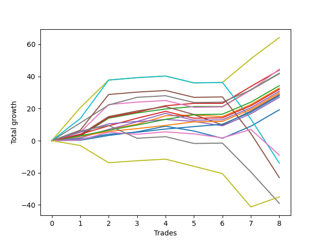

# Short Bernese 003 1v SB 
- Symbol: ES_1W
- Date Range: 03/18/2022 - 07/29/2022
- Trading Period: 7:20-12:30
- Number of Trades: 8



| Name | Win Percent | Profit | Avg Profit / Trade | Avg Time / Trade |      | Name | Win Percent | Profit | Avg Profit / Trade | Avg Time / Trade |
| ---- | ----------- | ------ | ------------------ | ---------------- | ---- | ---- | ----------- | ------ | ------------------ | ---------------- |
| Sorted By <br> Profit | | | | | | Sorted By <br> Win Percentage ||||
| Seven | 87.50 | 32125.00 | 4015.62 | 35:53 |     | Eighty-Three | 100.00 | 17125.00 | 2140.62 | 13:16 |
| Five | 87.50 | 22250.00 | 2781.25 | 31:55 |     | Eighty-Two | 100.00 | 14875.00 | 1859.38 | 11:48 |
| Two_C | 87.50 | 22000.00 | 2750.00 | 10:28 |     | Eighty-One | 100.00 | 14000.00 | 1750.00 | 03:42 |
| Two | 87.50 | 21000.00 | 2625.00 | 10:23 |     | Seven | 87.50 | 32125.00 | 4015.62 | 35:53 |
| Six | 87.50 | 20875.00 | 2609.38 | 26:25 |     | Five | 87.50 | 22250.00 | 2781.25 | 31:55 |
| Eighty-Three | 100.00 | 17125.00 | 2140.62 | 13:16 |     | Two_C | 87.50 | 22000.00 | 2750.00 | 10:28 |
| One | 87.50 | 16375.00 | 2046.88 | 07:05 |     | Two | 87.50 | 21000.00 | 2625.00 | 10:23 |
| Eighty-Four | 87.50 | 16000.00 | 2000.00 | 18:30 |     | Six | 87.50 | 20875.00 | 2609.38 | 26:25 |
| Eighty-Five | 87.50 | 15375.00 | 1921.88 | 24:28 |     | One | 87.50 | 16375.00 | 2046.88 | 07:05 |
| Eighty-Two | 100.00 | 14875.00 | 1859.38 | 11:48 |     | Eighty-Four | 87.50 | 16000.00 | 2000.00 | 18:30 |
| Four | 75.00 | 14375.00 | 1796.88 | 25:45 |     | Eighty-Five | 87.50 | 15375.00 | 1921.88 | 24:28 |
| Eighty-One | 100.00 | 14000.00 | 1750.00 | 03:42 |     | Four | 75.00 | 14375.00 | 1796.88 | 25:45 |
| Three | 75.00 | 13500.00 | 1687.50 | 14:51 |     | Three | 75.00 | 13500.00 | 1687.50 | 14:51 |
| Zero | 75.00 | 9625.00 | 1203.12 | 05:21 |     | Zero | 75.00 | 9625.00 | 1203.12 | 05:21 |
| NEWFI 0000 | 50.00 | -4500.00 | -562.50 | 09:27 |     | BB100 | 62.50 | -7000.00 | -875.00 | 49:52 |
| BB100 | 62.50 | -7000.00 | -875.00 | 49:52 |     | NEWFI 000 | 62.50 | -11500.00 | -1437.50 | 49:42 |
| NEWFI 000 | 62.50 | -11500.00 | -1437.50 | 49:42 |     | NEWFI 0000 | 50.00 | -4500.00 | -562.50 | 09:27 |
| MALAMUTE 002 | 37.50 | -17500.00 | -2187.50 | 46:12 |     | MALAMUTE 001 | 50.00 | -19500.00 | -2437.50 | 46:30 |
| MALAMUTE 001 | 50.00 | -19500.00 | -2437.50 | 46:30 |     | MALAMUTE 002 | 37.50 | -17500.00 | -2187.50 | 46:12 |

## NO STOPLOSS

### Test Zero
* Sell when price hits the middle line of the 20p bollinger
* No Stoploss
* Results:
```
Total Trades: 8
Percent Up: 25.00
Percent Down: 75.00
Total Points Moved Down: 19.25
Potential Profit: 9625.00
Total Points Ups: 7.50 Count Ups: 2
Total Points Downs: 26.75 Count Downs: 6
```

<details><summary>Trades</summary>

<code>In: 2022-03-25 11:57:00		Out: 2022-03-25 11:58:10		Total Position Time: 01:10		Total Move Down: 0.25		Total to Date: 0.25</code> <br />
<code>In: 2022-04-06 11:06:00		Out: 2022-04-06 11:07:10		Total Position Time: 01:10		Total Move Down: 3.00		Total to Date: 3.25</code> <br />
<code>In: 2022-04-20 09:55:00		Out: 2022-04-20 09:59:15		Total Position Time: 04:15		Total Move Down: 2.25		Total to Date: 5.50</code> <br />
<code>In: 2022-05-04 09:42:00		Out: 2022-05-04 09:45:30		Total Position Time: 03:30		Total Move Down: 3.50		Total to Date: 9.00</code> <br />
<code>In: 2022-05-24 10:44:00		Out: 2022-05-24 11:01:15		Total Position Time: 17:15		Total Move Down: -3.00		Total to Date: 6.00</code> <br />
<code>In: 2022-05-24 10:48:00		Out: 2022-05-24 11:01:15		Total Position Time: 13:15		Total Move Down: -4.50		Total to Date: 1.50</code> <br />
<code>In: 2022-07-06 11:10:00		Out: 2022-07-06 11:11:10		Total Position Time: 01:10		Total Move Down: 7.50		Total to Date: 9.00</code> <br />
<code>In: 2022-07-06 11:11:00		Out: 2022-07-06 11:12:10		Total Position Time: 01:10		Total Move Down: 10.25		Total to Date: 19.25</code> <br />


</details>

### Test One
* Sell when the price hits the upper line of the 20p 1std bollinger
* No Stoploss
* Results:
```
Total Trades: 8
Percent Up: 12.50
Percent Down: 87.50
Total Points Moved Down: 32.75
Potential Profit: 16375.00
Total Points Ups: 1.00 Count Ups: 1
Total Points Downs: 33.75 Count Downs: 7
```

<details><summary>Trades</summary>

<code>In: 2022-03-25 11:57:00		Out: 2022-03-25 12:00:45		Total Position Time: 03:45		Total Move Down: 1.75		Total to Date: 1.75</code> <br />
<code>In: 2022-04-06 11:06:00		Out: 2022-04-06 11:07:20		Total Position Time: 01:20		Total Move Down: 5.25		Total to Date: 7.00</code> <br />
<code>In: 2022-04-20 09:55:00		Out: 2022-04-20 10:08:15		Total Position Time: 13:15		Total Move Down: 3.25		Total to Date: 10.25</code> <br />
<code>In: 2022-05-04 09:42:00		Out: 2022-05-04 09:46:40		Total Position Time: 04:40		Total Move Down: 5.25		Total to Date: 15.50</code> <br />
<code>In: 2022-05-24 10:44:00		Out: 2022-05-24 11:01:40		Total Position Time: 17:40		Total Move Down: 0.50		Total to Date: 16.00</code> <br />
<code>In: 2022-05-24 10:48:00		Out: 2022-05-24 11:01:40		Total Position Time: 13:40		Total Move Down: -1.00		Total to Date: 15.00</code> <br />
<code>In: 2022-07-06 11:10:00		Out: 2022-07-06 11:11:10		Total Position Time: 01:10		Total Move Down: 7.50		Total to Date: 22.50</code> <br />
<code>In: 2022-07-06 11:11:00		Out: 2022-07-06 11:12:10		Total Position Time: 01:10		Total Move Down: 10.25		Total to Date: 32.75</code> <br />


</details>

### Test Two
* Sell when the price hits the upper line of the 20p 2std bollinger
* No Stoploss
* Results:
```
Total Trades: 8
Percent Up: 12.50
Percent Down: 87.50
Total Points Moved Down: 42.00
Potential Profit: 21000.00
Total Points Ups: 0.00 Count Ups: 1
Total Points Downs: 42.00 Count Downs: 7
```

<details><summary>Trades</summary>

<code>In: 2022-03-25 11:57:00		Out: 2022-03-25 12:00:55		Total Position Time: 03:55		Total Move Down: 2.75		Total to Date: 2.75</code> <br />
<code>In: 2022-04-06 11:06:00		Out: 2022-04-06 11:08:10		Total Position Time: 02:10		Total Move Down: 11.25		Total to Date: 14.00</code> <br />
<code>In: 2022-04-20 09:55:00		Out: 2022-04-20 10:08:15		Total Position Time: 13:15		Total Move Down: 3.25		Total to Date: 17.25</code> <br />
<code>In: 2022-05-04 09:42:00		Out: 2022-05-04 10:11:15		Total Position Time: 29:15		Total Move Down: 2.50		Total to Date: 19.75</code> <br />
<code>In: 2022-05-24 10:44:00		Out: 2022-05-24 11:01:50		Total Position Time: 17:50		Total Move Down: 1.50		Total to Date: 21.25</code> <br />
<code>In: 2022-05-24 10:48:00		Out: 2022-05-24 11:01:50		Total Position Time: 13:50		Total Move Down: -0.00		Total to Date: 21.25</code> <br />
<code>In: 2022-07-06 11:10:00		Out: 2022-07-06 11:11:45		Total Position Time: 01:45		Total Move Down: 10.50		Total to Date: 31.75</code> <br />
<code>In: 2022-07-06 11:11:00		Out: 2022-07-06 11:12:10		Total Position Time: 01:10		Total Move Down: 10.25		Total to Date: 42.00</code> <br />


</details>

### Test Two_C
* Sell when the price hits the upper line of the 20p 2std bollinger
* No Stoploss
* Results:
```
Total Trades: 8
Percent Up: 12.50
Percent Down: 87.50
Total Points Moved Down: 44.00
Potential Profit: 22000.00
Total Points Ups: 0.00 Count Ups: 1
Total Points Downs: 44.00 Count Downs: 7
```

<details><summary>Trades</summary>

<code>In: 2022-03-25 11:57:00		Out: 2022-03-25 12:01:15		Total Position Time: 04:15		Total Move Down: 3.25		Total to Date: 3.25</code> <br />
<code>In: 2022-04-06 11:06:00		Out: 2022-04-06 11:08:10		Total Position Time: 02:10		Total Move Down: 11.25		Total to Date: 14.50</code> <br />
<code>In: 2022-04-20 09:55:00		Out: 2022-04-20 10:08:15		Total Position Time: 13:15		Total Move Down: 3.25		Total to Date: 17.75</code> <br />
<code>In: 2022-05-04 09:42:00		Out: 2022-05-04 10:11:30		Total Position Time: 29:30		Total Move Down: 4.00		Total to Date: 21.75</code> <br />
<code>In: 2022-05-24 10:44:00		Out: 2022-05-24 11:01:50		Total Position Time: 17:50		Total Move Down: 1.50		Total to Date: 23.25</code> <br />
<code>In: 2022-05-24 10:48:00		Out: 2022-05-24 11:01:50		Total Position Time: 13:50		Total Move Down: -0.00		Total to Date: 23.25</code> <br />
<code>In: 2022-07-06 11:10:00		Out: 2022-07-06 11:11:45		Total Position Time: 01:45		Total Move Down: 10.50		Total to Date: 33.75</code> <br />
<code>In: 2022-07-06 11:11:00		Out: 2022-07-06 11:12:10		Total Position Time: 01:10		Total Move Down: 10.25		Total to Date: 44.00</code> <br />


</details>

### Test Three
* Sell when price hits the middle line of the 50p bollinger
* No Stoploss
* Results:
```
Total Trades: 8
Percent Up: 25.00
Percent Down: 75.00
Total Points Moved Down: 27.00
Potential Profit: 13500.00
Total Points Ups: 4.00 Count Ups: 2
Total Points Downs: 31.00 Count Downs: 6
```

<details><summary>Trades</summary>

<code>In: 2022-03-25 11:57:00		Out: 2022-03-25 12:00:45		Total Position Time: 03:45		Total Move Down: 1.75		Total to Date: 1.75</code> <br />
<code>In: 2022-04-06 11:06:00		Out: 2022-04-06 11:07:20		Total Position Time: 01:20		Total Move Down: 5.25		Total to Date: 7.00</code> <br />
<code>In: 2022-04-20 09:55:00		Out: 2022-04-20 10:08:35		Total Position Time: 13:35		Total Move Down: 4.75		Total to Date: 11.75</code> <br />
<code>In: 2022-05-04 09:42:00		Out: 2022-05-04 10:11:05		Total Position Time: 29:05		Total Move Down: 1.50		Total to Date: 13.25</code> <br />
<code>In: 2022-05-24 10:44:00		Out: 2022-05-24 11:20:25		Total Position Time: 36:25		Total Move Down: -1.25		Total to Date: 12.00</code> <br />
<code>In: 2022-05-24 10:48:00		Out: 2022-05-24 11:20:25		Total Position Time: 32:25		Total Move Down: -2.75		Total to Date: 9.25</code> <br />
<code>In: 2022-07-06 11:10:00		Out: 2022-07-06 11:11:10		Total Position Time: 01:10		Total Move Down: 7.50		Total to Date: 16.75</code> <br />
<code>In: 2022-07-06 11:11:00		Out: 2022-07-06 11:12:10		Total Position Time: 01:10		Total Move Down: 10.25		Total to Date: 27.00</code> <br />


</details>

### Test Four
* Sell when the price hits the upper line of the 50p 1std bollinger
* No Stoploss
* Results:
```
Total Trades: 8
Percent Up: 25.00
Percent Down: 75.00
Total Points Moved Down: 28.75
Potential Profit: 14375.00
Total Points Ups: 11.50 Count Ups: 2
Total Points Downs: 40.25 Count Downs: 6
```

<details><summary>Trades</summary>

<code>In: 2022-03-25 11:57:00		Out: 2022-03-25 12:01:35		Total Position Time: 04:35		Total Move Down: 3.75		Total to Date: 3.75</code> <br />
<code>In: 2022-04-06 11:06:00		Out: 2022-04-06 11:08:10		Total Position Time: 02:10		Total Move Down: 11.25		Total to Date: 15.00</code> <br />
<code>In: 2022-04-20 09:55:00		Out: 2022-04-20 10:26:35		Total Position Time: 31:35		Total Move Down: 3.50		Total to Date: 18.50</code> <br />
<code>In: 2022-05-04 09:42:00		Out: 2022-05-04 10:30:25		Total Position Time: 48:25		Total Move Down: 2.75		Total to Date: 21.25</code> <br />
<code>In: 2022-05-24 10:44:00		Out: 2022-05-24 11:44:15		Total Position Time: 60:15		Total Move Down: -5.00		Total to Date: 16.25</code> <br />
<code>In: 2022-05-24 10:48:00		Out: 2022-05-24 11:44:15		Total Position Time: 56:15		Total Move Down: -6.50		Total to Date: 9.75</code> <br />
<code>In: 2022-07-06 11:10:00		Out: 2022-07-06 11:11:35		Total Position Time: 01:35		Total Move Down: 8.75		Total to Date: 18.50</code> <br />
<code>In: 2022-07-06 11:11:00		Out: 2022-07-06 11:12:10		Total Position Time: 01:10		Total Move Down: 10.25		Total to Date: 28.75</code> <br />


</details>

### Test Five
* Sell when the price hits the upper line of the 50p 2std bollinger
* No Stoploss
* Results:
```
Total Trades: 8
Percent Up: 12.50
Percent Down: 87.50
Total Points Moved Down: 44.50
Potential Profit: 22250.00
Total Points Ups: 4.25 Count Ups: 1
Total Points Downs: 48.75 Count Downs: 7
```

<details><summary>Trades</summary>

<code>In: 2022-03-25 11:57:00		Out: 2022-03-25 12:01:55		Total Position Time: 04:55		Total Move Down: 5.25		Total to Date: 5.25</code> <br />
<code>In: 2022-04-06 11:06:00		Out: 2022-04-06 11:09:40		Total Position Time: 03:40		Total Move Down: 17.25		Total to Date: 22.50</code> <br />
<code>In: 2022-04-20 09:55:00		Out: 2022-04-20 10:55:55		Total Position Time: 60:55		Total Move Down: 1.50		Total to Date: 24.00</code> <br />
<code>In: 2022-05-04 09:42:00		Out: 2022-05-04 10:42:55		Total Position Time: 60:55		Total Move Down: 1.00		Total to Date: 25.00</code> <br />
<code>In: 2022-05-24 10:44:00		Out: 2022-05-24 11:44:55		Total Position Time: 60:55		Total Move Down: -4.25		Total to Date: 20.75</code> <br />
<code>In: 2022-05-24 10:48:00		Out: 2022-05-24 11:48:55		Total Position Time: 60:55		Total Move Down: 0.25		Total to Date: 21.00</code> <br />
<code>In: 2022-07-06 11:10:00		Out: 2022-07-06 11:11:50		Total Position Time: 01:50		Total Move Down: 10.50		Total to Date: 31.50</code> <br />
<code>In: 2022-07-06 11:11:00		Out: 2022-07-06 11:12:15		Total Position Time: 01:15		Total Move Down: 13.00		Total to Date: 44.50</code> <br />


</details>

### Test Six
* Sell when the price hits the middle line of the 1std VWAP
* No Stoploss
* Results:
```
Total Trades: 8
Percent Up: 12.50
Percent Down: 87.50
Total Points Moved Down: 41.75
Potential Profit: 20875.00
Total Points Ups: 4.25 Count Ups: 1
Total Points Downs: 46.00 Count Downs: 7
```

<details><summary>Trades</summary>

<code>In: 2022-03-25 11:57:00		Out: 2022-03-25 12:07:35		Total Position Time: 10:35		Total Move Down: 11.00		Total to Date: 11.00</code> <br />
<code>In: 2022-04-06 11:06:00		Out: 2022-04-06 11:08:10		Total Position Time: 02:10		Total Move Down: 11.25		Total to Date: 22.25</code> <br />
<code>In: 2022-04-20 09:55:00		Out: 2022-04-20 10:08:35		Total Position Time: 13:35		Total Move Down: 4.75		Total to Date: 27.00</code> <br />
<code>In: 2022-05-04 09:42:00		Out: 2022-05-04 10:42:55		Total Position Time: 60:55		Total Move Down: 1.00		Total to Date: 28.00</code> <br />
<code>In: 2022-05-24 10:44:00		Out: 2022-05-24 11:44:55		Total Position Time: 60:55		Total Move Down: -4.25		Total to Date: 23.75</code> <br />
<code>In: 2022-05-24 10:48:00		Out: 2022-05-24 11:48:55		Total Position Time: 60:55		Total Move Down: 0.25		Total to Date: 24.00</code> <br />
<code>In: 2022-07-06 11:10:00		Out: 2022-07-06 11:11:10		Total Position Time: 01:10		Total Move Down: 7.50		Total to Date: 31.50</code> <br />
<code>In: 2022-07-06 11:11:00		Out: 2022-07-06 11:12:10		Total Position Time: 01:10		Total Move Down: 10.25		Total to Date: 41.75</code> <br />


</details>

### Test Seven
* Sell when the price hits the upper line of the 1std VWAP
* No Stoploss
* Results:
```
Total Trades: 8
Percent Up: 12.50
Percent Down: 87.50
Total Points Moved Down: 64.25
Potential Profit: 32125.00
Total Points Ups: 4.25 Count Ups: 1
Total Points Downs: 68.50 Count Downs: 7
```

<details><summary>Trades</summary>

<code>In: 2022-03-25 11:57:00		Out: 2022-03-25 12:33:10		Total Position Time: 36:10		Total Move Down: 20.50		Total to Date: 20.50</code> <br />
<code>In: 2022-04-06 11:06:00		Out: 2022-04-06 11:09:40		Total Position Time: 03:40		Total Move Down: 17.25		Total to Date: 37.75</code> <br />
<code>In: 2022-04-20 09:55:00		Out: 2022-04-20 10:55:55		Total Position Time: 60:55		Total Move Down: 1.50		Total to Date: 39.25</code> <br />
<code>In: 2022-05-04 09:42:00		Out: 2022-05-04 10:42:55		Total Position Time: 60:55		Total Move Down: 1.00		Total to Date: 40.25</code> <br />
<code>In: 2022-05-24 10:44:00		Out: 2022-05-24 11:44:55		Total Position Time: 60:55		Total Move Down: -4.25		Total to Date: 36.00</code> <br />
<code>In: 2022-05-24 10:48:00		Out: 2022-05-24 11:48:55		Total Position Time: 60:55		Total Move Down: 0.25		Total to Date: 36.25</code> <br />
<code>In: 2022-07-06 11:10:00		Out: 2022-07-06 11:12:20		Total Position Time: 02:20		Total Move Down: 14.75		Total to Date: 51.00</code> <br />
<code>In: 2022-07-06 11:11:00		Out: 2022-07-06 11:12:20		Total Position Time: 01:20		Total Move Down: 13.25		Total to Date: 64.25</code> <br />


</details>

### Test BB100
* Sell when the price hits the upper line of the 1std VWAP
* No Stoploss
* Results:
```
Total Trades: 8
Percent Up: 37.50
Percent Down: 62.50
Total Points Moved Down: -14.00
Potential Profit: -7000.00
Total Points Ups: 54.50 Count Ups: 3
Total Points Downs: 40.50 Count Downs: 5
```

<details><summary>Trades</summary>

<code>In: 2022-03-25 11:57:00		Out: 2022-03-25 12:21:35		Total Position Time: 24:35		Total Move Down: 13.75		Total to Date: 13.75</code> <br />
<code>In: 2022-04-06 11:06:00		Out: 2022-04-06 11:14:55		Total Position Time: 08:55		Total Move Down: 24.00		Total to Date: 37.75</code> <br />
<code>In: 2022-04-20 09:55:00		Out: 2022-04-20 10:55:55		Total Position Time: 60:55		Total Move Down: 1.50		Total to Date: 39.25</code> <br />
<code>In: 2022-05-04 09:42:00		Out: 2022-05-04 10:42:55		Total Position Time: 60:55		Total Move Down: 1.00		Total to Date: 40.25</code> <br />
<code>In: 2022-05-24 10:44:00		Out: 2022-05-24 11:44:55		Total Position Time: 60:55		Total Move Down: -4.25		Total to Date: 36.00</code> <br />
<code>In: 2022-05-24 10:48:00		Out: 2022-05-24 11:48:55		Total Position Time: 60:55		Total Move Down: 0.25		Total to Date: 36.25</code> <br />
<code>In: 2022-07-06 11:10:00		Out: 2022-07-06 12:10:55		Total Position Time: 60:55		Total Move Down: -22.75		Total to Date: 13.50</code> <br />
<code>In: 2022-07-06 11:11:00		Out: 2022-07-06 12:11:55		Total Position Time: 60:55		Total Move Down: -27.50		Total to Date: -14.00</code> <br />


</details>

## TAKE PROFIT

### Test Eighty-One
* Take Profit of 1 Point
* No Stoploss
* Results:
```
Total Trades: 8
Percent Up: 0.00
Percent Down: 100.00
Total Points Moved Down: 28.00
Potential Profit: 14000.00
Total Points Ups: 0.00 Count Ups: 0
Total Points Downs: 28.00 Count Downs: 8
```

<details><summary>Trades</summary>

<code>In: 2022-03-25 11:57:00		Out: 2022-03-25 11:58:45		Total Position Time: 01:45		Total Move Down: 1.00		Total to Date: 1.00</code> <br />
<code>In: 2022-04-06 11:06:00		Out: 2022-04-06 11:07:10		Total Position Time: 01:10		Total Move Down: 3.00		Total to Date: 4.00</code> <br />
<code>In: 2022-04-20 09:55:00		Out: 2022-04-20 09:57:25		Total Position Time: 02:25		Total Move Down: 1.25		Total to Date: 5.25</code> <br />
<code>In: 2022-05-04 09:42:00		Out: 2022-05-04 09:43:10		Total Position Time: 01:10		Total Move Down: 2.00		Total to Date: 7.25</code> <br />
<code>In: 2022-05-24 10:44:00		Out: 2022-05-24 10:47:50		Total Position Time: 03:50		Total Move Down: 1.50		Total to Date: 8.75</code> <br />
<code>In: 2022-05-24 10:48:00		Out: 2022-05-24 11:05:00		Total Position Time: 17:00		Total Move Down: 1.50		Total to Date: 10.25</code> <br />
<code>In: 2022-07-06 11:10:00		Out: 2022-07-06 11:11:10		Total Position Time: 01:10		Total Move Down: 7.50		Total to Date: 17.75</code> <br />
<code>In: 2022-07-06 11:11:00		Out: 2022-07-06 11:12:10		Total Position Time: 01:10		Total Move Down: 10.25		Total to Date: 28.00</code> <br />


</details>

### Test Eighty-Two
* Take Profit of 2 Point
* No Stoploss
* Results:
```
Total Trades: 8
Percent Up: 0.00
Percent Down: 100.00
Total Points Moved Down: 29.75
Potential Profit: 14875.00
Total Points Ups: 0.00 Count Ups: 0
Total Points Downs: 29.75 Count Downs: 8
```

<details><summary>Trades</summary>

<code>In: 2022-03-25 11:57:00		Out: 2022-03-25 12:00:50		Total Position Time: 03:50		Total Move Down: 2.75		Total to Date: 2.75</code> <br />
<code>In: 2022-04-06 11:06:00		Out: 2022-04-06 11:07:10		Total Position Time: 01:10		Total Move Down: 3.00		Total to Date: 5.75</code> <br />
<code>In: 2022-04-20 09:55:00		Out: 2022-04-20 09:59:05		Total Position Time: 04:05		Total Move Down: 1.75		Total to Date: 7.50</code> <br />
<code>In: 2022-05-04 09:42:00		Out: 2022-05-04 09:43:10		Total Position Time: 01:10		Total Move Down: 2.00		Total to Date: 9.50</code> <br />
<code>In: 2022-05-24 10:44:00		Out: 2022-05-24 11:04:55		Total Position Time: 20:55		Total Move Down: 2.25		Total to Date: 11.75</code> <br />
<code>In: 2022-05-24 10:48:00		Out: 2022-05-24 11:48:55		Total Position Time: 60:55		Total Move Down: 0.25		Total to Date: 12.00</code> <br />
<code>In: 2022-07-06 11:10:00		Out: 2022-07-06 11:11:10		Total Position Time: 01:10		Total Move Down: 7.50		Total to Date: 19.50</code> <br />
<code>In: 2022-07-06 11:11:00		Out: 2022-07-06 11:12:10		Total Position Time: 01:10		Total Move Down: 10.25		Total to Date: 29.75</code> <br />


</details>

### Test Eighty-Three
* Take Profit of 3 Point
* No Stoploss
* Results:
```
Total Trades: 8
Percent Up: 0.00
Percent Down: 100.00
Total Points Moved Down: 34.25
Potential Profit: 17125.00
Total Points Ups: 0.00 Count Ups: 0
Total Points Downs: 34.25 Count Downs: 8
```

<details><summary>Trades</summary>

<code>In: 2022-03-25 11:57:00		Out: 2022-03-25 12:01:00		Total Position Time: 04:00		Total Move Down: 3.00		Total to Date: 3.00</code> <br />
<code>In: 2022-04-06 11:06:00		Out: 2022-04-06 11:07:15		Total Position Time: 01:15		Total Move Down: 3.50		Total to Date: 6.50</code> <br />
<code>In: 2022-04-20 09:55:00		Out: 2022-04-20 10:08:15		Total Position Time: 13:15		Total Move Down: 3.25		Total to Date: 9.75</code> <br />
<code>In: 2022-05-04 09:42:00		Out: 2022-05-04 09:45:30		Total Position Time: 03:30		Total Move Down: 3.50		Total to Date: 13.25</code> <br />
<code>In: 2022-05-24 10:44:00		Out: 2022-05-24 11:05:00		Total Position Time: 21:00		Total Move Down: 3.00		Total to Date: 16.25</code> <br />
<code>In: 2022-05-24 10:48:00		Out: 2022-05-24 11:48:55		Total Position Time: 60:55		Total Move Down: 0.25		Total to Date: 16.50</code> <br />
<code>In: 2022-07-06 11:10:00		Out: 2022-07-06 11:11:10		Total Position Time: 01:10		Total Move Down: 7.50		Total to Date: 24.00</code> <br />
<code>In: 2022-07-06 11:11:00		Out: 2022-07-06 11:12:10		Total Position Time: 01:10		Total Move Down: 10.25		Total to Date: 34.25</code> <br />


</details>

### Test Eighty-Four
* Take Profit of 4 Point
* No Stoploss
* Results:
```
Total Trades: 8
Percent Up: 12.50
Percent Down: 87.50
Total Points Moved Down: 32.00
Potential Profit: 16000.00
Total Points Ups: 4.25 Count Ups: 1
Total Points Downs: 36.25 Count Downs: 7
```

<details><summary>Trades</summary>

<code>In: 2022-03-25 11:57:00		Out: 2022-03-25 12:01:45		Total Position Time: 04:45		Total Move Down: 4.00		Total to Date: 4.00</code> <br />
<code>In: 2022-04-06 11:06:00		Out: 2022-04-06 11:07:20		Total Position Time: 01:20		Total Move Down: 5.25		Total to Date: 9.25</code> <br />
<code>In: 2022-04-20 09:55:00		Out: 2022-04-20 10:08:35		Total Position Time: 13:35		Total Move Down: 4.75		Total to Date: 14.00</code> <br />
<code>In: 2022-05-04 09:42:00		Out: 2022-05-04 09:46:15		Total Position Time: 04:15		Total Move Down: 4.25		Total to Date: 18.25</code> <br />
<code>In: 2022-05-24 10:44:00		Out: 2022-05-24 11:44:55		Total Position Time: 60:55		Total Move Down: -4.25		Total to Date: 14.00</code> <br />
<code>In: 2022-05-24 10:48:00		Out: 2022-05-24 11:48:55		Total Position Time: 60:55		Total Move Down: 0.25		Total to Date: 14.25</code> <br />
<code>In: 2022-07-06 11:10:00		Out: 2022-07-06 11:11:10		Total Position Time: 01:10		Total Move Down: 7.50		Total to Date: 21.75</code> <br />
<code>In: 2022-07-06 11:11:00		Out: 2022-07-06 11:12:10		Total Position Time: 01:10		Total Move Down: 10.25		Total to Date: 32.00</code> <br />


</details>

### Test Eighty-Five
* Take Profit of 5 Point
* No Stoploss
* Results:
```
Total Trades: 8
Percent Up: 12.50
Percent Down: 87.50
Total Points Moved Down: 30.75
Potential Profit: 15375.00
Total Points Ups: 4.25 Count Ups: 1
Total Points Downs: 35.00 Count Downs: 7
```

<details><summary>Trades</summary>

<code>In: 2022-03-25 11:57:00		Out: 2022-03-25 12:01:55		Total Position Time: 04:55		Total Move Down: 5.25		Total to Date: 5.25</code> <br />
<code>In: 2022-04-06 11:06:00		Out: 2022-04-06 11:07:20		Total Position Time: 01:20		Total Move Down: 5.25		Total to Date: 10.50</code> <br />
<code>In: 2022-04-20 09:55:00		Out: 2022-04-20 10:55:55		Total Position Time: 60:55		Total Move Down: 1.50		Total to Date: 12.00</code> <br />
<code>In: 2022-05-04 09:42:00		Out: 2022-05-04 09:46:30		Total Position Time: 04:30		Total Move Down: 5.00		Total to Date: 17.00</code> <br />
<code>In: 2022-05-24 10:44:00		Out: 2022-05-24 11:44:55		Total Position Time: 60:55		Total Move Down: -4.25		Total to Date: 12.75</code> <br />
<code>In: 2022-05-24 10:48:00		Out: 2022-05-24 11:48:55		Total Position Time: 60:55		Total Move Down: 0.25		Total to Date: 13.00</code> <br />
<code>In: 2022-07-06 11:10:00		Out: 2022-07-06 11:11:10		Total Position Time: 01:10		Total Move Down: 7.50		Total to Date: 20.50</code> <br />
<code>In: 2022-07-06 11:11:00		Out: 2022-07-06 11:12:10		Total Position Time: 01:10		Total Move Down: 10.25		Total to Date: 30.75</code> <br />


</details>

## Indicator Exits

### Test NEWFI 000
* Newfi 0000
* No Stoploss
* Results:
```
Total Trades: 8
Percent Up: 37.50
Percent Down: 62.50
Total Points Moved Down: -23.00
Potential Profit: -11500.00
Total Points Ups: 54.50 Count Ups: 3
Total Points Downs: 31.50 Count Downs: 5
```

<details><summary>Trades</summary>

<code>In: 2022-03-25 11:57:00		Out: 2022-03-25 12:13:05		Total Position Time: 16:05		Total Move Down: 6.50		Total to Date: 6.50</code> <br />
<code>In: 2022-04-06 11:06:00		Out: 2022-04-06 11:22:05		Total Position Time: 16:05		Total Move Down: 22.25		Total to Date: 28.75</code> <br />
<code>In: 2022-04-20 09:55:00		Out: 2022-04-20 10:55:55		Total Position Time: 60:55		Total Move Down: 1.50		Total to Date: 30.25</code> <br />
<code>In: 2022-05-04 09:42:00		Out: 2022-05-04 10:42:55		Total Position Time: 60:55		Total Move Down: 1.00		Total to Date: 31.25</code> <br />
<code>In: 2022-05-24 10:44:00		Out: 2022-05-24 11:44:55		Total Position Time: 60:55		Total Move Down: -4.25		Total to Date: 27.00</code> <br />
<code>In: 2022-05-24 10:48:00		Out: 2022-05-24 11:48:55		Total Position Time: 60:55		Total Move Down: 0.25		Total to Date: 27.25</code> <br />
<code>In: 2022-07-06 11:10:00		Out: 2022-07-06 12:10:55		Total Position Time: 60:55		Total Move Down: -22.75		Total to Date: 4.50</code> <br />
<code>In: 2022-07-06 11:11:00		Out: 2022-07-06 12:11:55		Total Position Time: 60:55		Total Move Down: -27.50		Total to Date: -23.00</code> <br />


</details>

### Test NEWFI 0000
* Newfi 0000
* No Stoploss
* Results:
```
Total Trades: 8
Percent Up: 50.00
Percent Down: 50.00
Total Points Moved Down: -9.00
Potential Profit: -4500.00
Total Points Ups: 21.00 Count Ups: 4
Total Points Downs: 12.00 Count Downs: 4
```

<details><summary>Trades</summary>

<code>In: 2022-03-25 11:57:00		Out: 2022-03-25 11:58:05		Total Position Time: 01:05		Total Move Down: 0.50		Total to Date: 0.50</code> <br />
<code>In: 2022-04-06 11:06:00		Out: 2022-04-06 11:48:05		Total Position Time: 42:05		Total Move Down: 4.75		Total to Date: 5.25</code> <br />
<code>In: 2022-04-20 09:55:00		Out: 2022-04-20 09:56:05		Total Position Time: 01:05		Total Move Down: -1.25		Total to Date: 4.00</code> <br />
<code>In: 2022-05-04 09:42:00		Out: 2022-05-04 09:43:05		Total Position Time: 01:05		Total Move Down: 1.50		Total to Date: 5.50</code> <br />
<code>In: 2022-05-24 10:44:00		Out: 2022-05-24 10:45:05		Total Position Time: 01:05		Total Move Down: -1.25		Total to Date: 4.25</code> <br />
<code>In: 2022-05-24 10:48:00		Out: 2022-05-24 10:49:05		Total Position Time: 01:05		Total Move Down: -2.50		Total to Date: 1.75</code> <br />
<code>In: 2022-07-06 11:10:00		Out: 2022-07-06 11:11:05		Total Position Time: 01:05		Total Move Down: 5.25		Total to Date: 7.00</code> <br />
<code>In: 2022-07-06 11:11:00		Out: 2022-07-06 11:38:05		Total Position Time: 27:05		Total Move Down: -16.00		Total to Date: -9.00</code> <br />


</details>

### Test MALAMUTE 001
* Malamute 001
* No Stoploss
* Results:
```
Total Trades: 8
Percent Up: 50.00
Percent Down: 50.00
Total Points Moved Down: -39.00
Potential Profit: -19500.00
Total Points Ups: 49.75 Count Ups: 4
Total Points Downs: 10.75 Count Downs: 4
```

<details><summary>Trades</summary>

<code>In: 2022-03-25 11:57:00		Out: 2022-03-25 12:47:00		Total Position Time: 50:00		Total Move Down: 6.00		Total to Date: 6.00</code> <br />
<code>In: 2022-04-06 11:06:00		Out: 2022-04-06 11:45:05		Total Position Time: 39:05		Total Move Down: 3.50		Total to Date: 9.50</code> <br />
<code>In: 2022-04-20 09:55:00		Out: 2022-04-20 10:48:05		Total Position Time: 53:05		Total Move Down: -8.00		Total to Date: 1.50</code> <br />
<code>In: 2022-05-04 09:42:00		Out: 2022-05-04 10:42:55		Total Position Time: 60:55		Total Move Down: 1.00		Total to Date: 2.50</code> <br />
<code>In: 2022-05-24 10:44:00		Out: 2022-05-24 11:44:55		Total Position Time: 60:55		Total Move Down: -4.25		Total to Date: -1.75</code> <br />
<code>In: 2022-05-24 10:48:00		Out: 2022-05-24 11:48:55		Total Position Time: 60:55		Total Move Down: 0.25		Total to Date: -1.50</code> <br />
<code>In: 2022-07-06 11:10:00		Out: 2022-07-06 11:34:05		Total Position Time: 24:05		Total Move Down: -18.00		Total to Date: -19.50</code> <br />
<code>In: 2022-07-06 11:11:00		Out: 2022-07-06 11:34:05		Total Position Time: 23:05		Total Move Down: -19.50		Total to Date: -39.00</code> <br />


</details>

### Test MALAMUTE 002
* Malamute 001
* No Stoploss
* Results:
```
Total Trades: 8
Percent Up: 62.50
Percent Down: 37.50
Total Points Moved Down: -35.00
Potential Profit: -17500.00
Total Points Ups: 43.50 Count Ups: 5
Total Points Downs: 8.50 Count Downs: 3
```

<details><summary>Trades</summary>

<code>In: 2022-03-25 11:57:00		Out: 2022-03-25 12:57:05		Total Position Time: 60:05		Total Move Down: -3.00		Total to Date: -3.00</code> <br />
<code>In: 2022-04-06 11:06:00		Out: 2022-04-06 12:06:05		Total Position Time: 60:05		Total Move Down: -10.75		Total to Date: -13.75</code> <br />
<code>In: 2022-04-20 09:55:00		Out: 2022-04-20 10:55:05		Total Position Time: 60:05		Total Move Down: 1.25		Total to Date: -12.50</code> <br />
<code>In: 2022-05-04 09:42:00		Out: 2022-05-04 10:42:05		Total Position Time: 60:05		Total Move Down: 1.00		Total to Date: -11.50</code> <br />
<code>In: 2022-05-24 10:44:00		Out: 2022-05-24 11:44:05		Total Position Time: 60:05		Total Move Down: -4.50		Total to Date: -16.00</code> <br />
<code>In: 2022-05-24 10:48:00		Out: 2022-05-24 10:50:05		Total Position Time: 02:05		Total Move Down: -4.50		Total to Date: -20.50</code> <br />
<code>In: 2022-07-06 11:10:00		Out: 2022-07-06 12:10:05		Total Position Time: 60:05		Total Move Down: -20.75		Total to Date: -41.25</code> <br />
<code>In: 2022-07-06 11:11:00		Out: 2022-07-06 11:18:05		Total Position Time: 07:05		Total Move Down: 6.25		Total to Date: -35.00</code> <br />


</details>