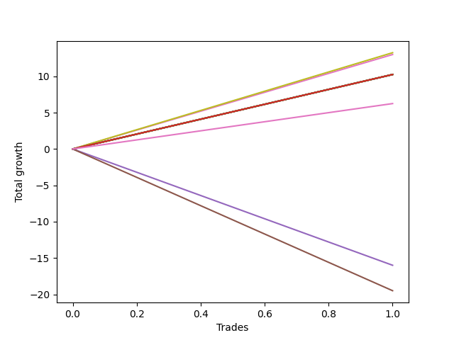

# Short Bernese 003 1v 
- Symbol: ES_1W
- Date Range: 03/18/2022 - 07/29/2022
- Trading Period: 7:20-12:30
- Number of Trades: 6



| Name | Win Percent | Profit | Avg Profit / Trade | Avg Time / Trade |      | Name | Win Percent | Profit | Avg Profit / Trade | Avg Time / Trade |
| ---- | ----------- | ------ | ------------------ | ---------------- | ---- | ---- | ----------- | ------ | ------------------ | ---------------- |
| Sorted By <br> Profit | | | | | | Sorted By <br> Win Percentage ||||
| Seven | 83.33 | 23375.00 | 3895.83 | 37:05 |     | Two_C | 100.00 | 16375.00 | 2729.17 | 11:17 |
| Two_C | 100.00 | 16375.00 | 2729.17 | 11:17 |     | Two | 100.00 | 15375.00 | 2562.50 | 11:11 |
| Two | 100.00 | 15375.00 | 2562.50 | 11:11 |     | Eighty-Three | 100.00 | 15250.00 | 2541.67 | 07:20 |
| Eighty-Three | 100.00 | 15250.00 | 2541.67 | 07:20 |     | One | 100.00 | 14250.00 | 2375.00 | 06:56 |
| Six | 83.33 | 15125.00 | 2520.83 | 24:43 |     | Eighty-Two | 100.00 | 13250.00 | 2208.33 | 05:23 |
| One | 100.00 | 14250.00 | 2375.00 | 06:56 |     | Eighty-One | 100.00 | 11750.00 | 1958.33 | 01:55 |
| Five | 83.33 | 13500.00 | 2250.00 | 31:47 |     | Seven | 83.33 | 23375.00 | 3895.83 | 37:05 |
| Eighty-Two | 100.00 | 13250.00 | 2208.33 | 05:23 |     | Six | 83.33 | 15125.00 | 2520.83 | 24:43 |
| Eighty-Four | 83.33 | 13250.00 | 2208.33 | 14:18 |     | Five | 83.33 | 13500.00 | 2250.00 | 31:47 |
| Eighty-Five | 83.33 | 12625.00 | 2104.17 | 22:15 |     | Eighty-Four | 83.33 | 13250.00 | 2208.33 | 14:18 |
| Three | 83.33 | 12250.00 | 2041.67 | 14:11 |     | Eighty-Five | 83.33 | 12625.00 | 2104.17 | 22:15 |
| Four | 83.33 | 12000.00 | 2000.00 | 24:35 |     | Three | 83.33 | 12250.00 | 2041.67 | 14:11 |
| Eighty-One | 100.00 | 11750.00 | 1958.33 | 01:55 |     | Four | 83.33 | 12000.00 | 2000.00 | 24:35 |
| Zero | 83.33 | 10375.00 | 1729.17 | 04:45 |     | Zero | 83.33 | 10375.00 | 1729.17 | 04:45 |
| NEWFI 0000 | 50.00 | -5625.00 | -937.50 | 05:25 |     | NEWFI 0000 | 50.00 | -5625.00 | -937.50 | 05:25 |
| MALAMUTE 002 | 50.00 | -9875.00 | -1645.83 | 51:15 |     | MALAMUTE 002 | 50.00 | -9875.00 | -1645.83 | 51:15 |
| BB100 | 50.00 | -19125.00 | -3187.50 | 54:51 |     | BB100 | 50.00 | -19125.00 | -3187.50 | 54:51 |
| MALAMUTE 001 | 33.33 | -21375.00 | -3562.50 | 45:20 |     | NEWFI 000 | 50.00 | -22750.00 | -3791.67 | 53:26 |
| NEWFI 000 | 50.00 | -22750.00 | -3791.67 | 53:26 |     | MALAMUTE 001 | 33.33 | -21375.00 | -3562.50 | 45:20 |

## NO STOPLOSS

### Test Zero
* Sell when price hits the middle line of the 20p bollinger
* No Stoploss
* Results:
```
Total Trades: 6
Percent Up: 16.67
Percent Down: 83.33
Total Points Moved Down: 20.75
Potential Profit: 10375.00
Total Points Ups: 3.00 Count Ups: 1
Total Points Downs: 23.75 Count Downs: 5
```

<details><summary>Trades</summary>

<code>In: 2022-03-25 11:57:00		Out: 2022-03-25 11:58:10		Total Position Time: 01:10		Total Move Down: 0.25		Total to Date: 0.25</code> <br />
<code>In: 2022-04-20 09:55:00		Out: 2022-04-20 09:59:15		Total Position Time: 04:15		Total Move Down: 2.25		Total to Date: 2.50</code> <br />
<code>In: 2022-05-04 09:42:00		Out: 2022-05-04 09:45:30		Total Position Time: 03:30		Total Move Down: 3.50		Total to Date: 6.00</code> <br />
<code>In: 2022-05-24 10:44:00		Out: 2022-05-24 11:01:15		Total Position Time: 17:15		Total Move Down: -3.00		Total to Date: 3.00</code> <br />
<code>In: 2022-07-06 11:10:00		Out: 2022-07-06 11:11:10		Total Position Time: 01:10		Total Move Down: 7.50		Total to Date: 10.50</code> <br />
<code>In: 2022-07-06 11:11:00		Out: 2022-07-06 11:12:10		Total Position Time: 01:10		Total Move Down: 10.25		Total to Date: 20.75</code> <br />


</details>

### Test One
* Sell when the price hits the upper line of the 20p 1std bollinger
* No Stoploss
* Results:
```
Total Trades: 6
Percent Up: 0.00
Percent Down: 100.00
Total Points Moved Down: 28.50
Potential Profit: 14250.00
Total Points Ups: 0.00 Count Ups: 0
Total Points Downs: 28.50 Count Downs: 6
```

<details><summary>Trades</summary>

<code>In: 2022-03-25 11:57:00		Out: 2022-03-25 12:00:45		Total Position Time: 03:45		Total Move Down: 1.75		Total to Date: 1.75</code> <br />
<code>In: 2022-04-20 09:55:00		Out: 2022-04-20 10:08:15		Total Position Time: 13:15		Total Move Down: 3.25		Total to Date: 5.00</code> <br />
<code>In: 2022-05-04 09:42:00		Out: 2022-05-04 09:46:40		Total Position Time: 04:40		Total Move Down: 5.25		Total to Date: 10.25</code> <br />
<code>In: 2022-05-24 10:44:00		Out: 2022-05-24 11:01:40		Total Position Time: 17:40		Total Move Down: 0.50		Total to Date: 10.75</code> <br />
<code>In: 2022-07-06 11:10:00		Out: 2022-07-06 11:11:10		Total Position Time: 01:10		Total Move Down: 7.50		Total to Date: 18.25</code> <br />
<code>In: 2022-07-06 11:11:00		Out: 2022-07-06 11:12:10		Total Position Time: 01:10		Total Move Down: 10.25		Total to Date: 28.50</code> <br />


</details>

### Test Two
* Sell when the price hits the upper line of the 20p 2std bollinger
* No Stoploss
* Results:
```
Total Trades: 6
Percent Up: 0.00
Percent Down: 100.00
Total Points Moved Down: 30.75
Potential Profit: 15375.00
Total Points Ups: 0.00 Count Ups: 0
Total Points Downs: 30.75 Count Downs: 6
```

<details><summary>Trades</summary>

<code>In: 2022-03-25 11:57:00		Out: 2022-03-25 12:00:55		Total Position Time: 03:55		Total Move Down: 2.75		Total to Date: 2.75</code> <br />
<code>In: 2022-04-20 09:55:00		Out: 2022-04-20 10:08:15		Total Position Time: 13:15		Total Move Down: 3.25		Total to Date: 6.00</code> <br />
<code>In: 2022-05-04 09:42:00		Out: 2022-05-04 10:11:15		Total Position Time: 29:15		Total Move Down: 2.50		Total to Date: 8.50</code> <br />
<code>In: 2022-05-24 10:44:00		Out: 2022-05-24 11:01:50		Total Position Time: 17:50		Total Move Down: 1.50		Total to Date: 10.00</code> <br />
<code>In: 2022-07-06 11:10:00		Out: 2022-07-06 11:11:45		Total Position Time: 01:45		Total Move Down: 10.50		Total to Date: 20.50</code> <br />
<code>In: 2022-07-06 11:11:00		Out: 2022-07-06 11:12:10		Total Position Time: 01:10		Total Move Down: 10.25		Total to Date: 30.75</code> <br />


</details>

### Test Two_C
* Sell when the price hits the upper line of the 20p 2std bollinger
* No Stoploss
* Results:
```
Total Trades: 6
Percent Up: 0.00
Percent Down: 100.00
Total Points Moved Down: 32.75
Potential Profit: 16375.00
Total Points Ups: 0.00 Count Ups: 0
Total Points Downs: 32.75 Count Downs: 6
```

<details><summary>Trades</summary>

<code>In: 2022-03-25 11:57:00		Out: 2022-03-25 12:01:15		Total Position Time: 04:15		Total Move Down: 3.25		Total to Date: 3.25</code> <br />
<code>In: 2022-04-20 09:55:00		Out: 2022-04-20 10:08:15		Total Position Time: 13:15		Total Move Down: 3.25		Total to Date: 6.50</code> <br />
<code>In: 2022-05-04 09:42:00		Out: 2022-05-04 10:11:30		Total Position Time: 29:30		Total Move Down: 4.00		Total to Date: 10.50</code> <br />
<code>In: 2022-05-24 10:44:00		Out: 2022-05-24 11:01:50		Total Position Time: 17:50		Total Move Down: 1.50		Total to Date: 12.00</code> <br />
<code>In: 2022-07-06 11:10:00		Out: 2022-07-06 11:11:45		Total Position Time: 01:45		Total Move Down: 10.50		Total to Date: 22.50</code> <br />
<code>In: 2022-07-06 11:11:00		Out: 2022-07-06 11:12:10		Total Position Time: 01:10		Total Move Down: 10.25		Total to Date: 32.75</code> <br />


</details>

### Test Three
* Sell when price hits the middle line of the 50p bollinger
* No Stoploss
* Results:
```
Total Trades: 6
Percent Up: 16.67
Percent Down: 83.33
Total Points Moved Down: 24.50
Potential Profit: 12250.00
Total Points Ups: 1.25 Count Ups: 1
Total Points Downs: 25.75 Count Downs: 5
```

<details><summary>Trades</summary>

<code>In: 2022-03-25 11:57:00		Out: 2022-03-25 12:00:45		Total Position Time: 03:45		Total Move Down: 1.75		Total to Date: 1.75</code> <br />
<code>In: 2022-04-20 09:55:00		Out: 2022-04-20 10:08:35		Total Position Time: 13:35		Total Move Down: 4.75		Total to Date: 6.50</code> <br />
<code>In: 2022-05-04 09:42:00		Out: 2022-05-04 10:11:05		Total Position Time: 29:05		Total Move Down: 1.50		Total to Date: 8.00</code> <br />
<code>In: 2022-05-24 10:44:00		Out: 2022-05-24 11:20:25		Total Position Time: 36:25		Total Move Down: -1.25		Total to Date: 6.75</code> <br />
<code>In: 2022-07-06 11:10:00		Out: 2022-07-06 11:11:10		Total Position Time: 01:10		Total Move Down: 7.50		Total to Date: 14.25</code> <br />
<code>In: 2022-07-06 11:11:00		Out: 2022-07-06 11:12:10		Total Position Time: 01:10		Total Move Down: 10.25		Total to Date: 24.50</code> <br />


</details>

### Test Four
* Sell when the price hits the upper line of the 50p 1std bollinger
* No Stoploss
* Results:
```
Total Trades: 6
Percent Up: 16.67
Percent Down: 83.33
Total Points Moved Down: 24.00
Potential Profit: 12000.00
Total Points Ups: 5.00 Count Ups: 1
Total Points Downs: 29.00 Count Downs: 5
```

<details><summary>Trades</summary>

<code>In: 2022-03-25 11:57:00		Out: 2022-03-25 12:01:35		Total Position Time: 04:35		Total Move Down: 3.75		Total to Date: 3.75</code> <br />
<code>In: 2022-04-20 09:55:00		Out: 2022-04-20 10:26:35		Total Position Time: 31:35		Total Move Down: 3.50		Total to Date: 7.25</code> <br />
<code>In: 2022-05-04 09:42:00		Out: 2022-05-04 10:30:25		Total Position Time: 48:25		Total Move Down: 2.75		Total to Date: 10.00</code> <br />
<code>In: 2022-05-24 10:44:00		Out: 2022-05-24 11:44:15		Total Position Time: 60:15		Total Move Down: -5.00		Total to Date: 5.00</code> <br />
<code>In: 2022-07-06 11:10:00		Out: 2022-07-06 11:11:35		Total Position Time: 01:35		Total Move Down: 8.75		Total to Date: 13.75</code> <br />
<code>In: 2022-07-06 11:11:00		Out: 2022-07-06 11:12:10		Total Position Time: 01:10		Total Move Down: 10.25		Total to Date: 24.00</code> <br />


</details>

### Test Five
* Sell when the price hits the upper line of the 50p 2std bollinger
* No Stoploss
* Results:
```
Total Trades: 6
Percent Up: 16.67
Percent Down: 83.33
Total Points Moved Down: 27.00
Potential Profit: 13500.00
Total Points Ups: 4.25 Count Ups: 1
Total Points Downs: 31.25 Count Downs: 5
```

<details><summary>Trades</summary>

<code>In: 2022-03-25 11:57:00		Out: 2022-03-25 12:01:55		Total Position Time: 04:55		Total Move Down: 5.25		Total to Date: 5.25</code> <br />
<code>In: 2022-04-20 09:55:00		Out: 2022-04-20 10:55:55		Total Position Time: 60:55		Total Move Down: 1.50		Total to Date: 6.75</code> <br />
<code>In: 2022-05-04 09:42:00		Out: 2022-05-04 10:42:55		Total Position Time: 60:55		Total Move Down: 1.00		Total to Date: 7.75</code> <br />
<code>In: 2022-05-24 10:44:00		Out: 2022-05-24 11:44:55		Total Position Time: 60:55		Total Move Down: -4.25		Total to Date: 3.50</code> <br />
<code>In: 2022-07-06 11:10:00		Out: 2022-07-06 11:11:50		Total Position Time: 01:50		Total Move Down: 10.50		Total to Date: 14.00</code> <br />
<code>In: 2022-07-06 11:11:00		Out: 2022-07-06 11:12:15		Total Position Time: 01:15		Total Move Down: 13.00		Total to Date: 27.00</code> <br />


</details>

### Test Six
* Sell when the price hits the middle line of the 1std VWAP
* No Stoploss
* Results:
```
Total Trades: 6
Percent Up: 16.67
Percent Down: 83.33
Total Points Moved Down: 30.25
Potential Profit: 15125.00
Total Points Ups: 4.25 Count Ups: 1
Total Points Downs: 34.50 Count Downs: 5
```

<details><summary>Trades</summary>

<code>In: 2022-03-25 11:57:00		Out: 2022-03-25 12:07:35		Total Position Time: 10:35		Total Move Down: 11.00		Total to Date: 11.00</code> <br />
<code>In: 2022-04-20 09:55:00		Out: 2022-04-20 10:08:35		Total Position Time: 13:35		Total Move Down: 4.75		Total to Date: 15.75</code> <br />
<code>In: 2022-05-04 09:42:00		Out: 2022-05-04 10:42:55		Total Position Time: 60:55		Total Move Down: 1.00		Total to Date: 16.75</code> <br />
<code>In: 2022-05-24 10:44:00		Out: 2022-05-24 11:44:55		Total Position Time: 60:55		Total Move Down: -4.25		Total to Date: 12.50</code> <br />
<code>In: 2022-07-06 11:10:00		Out: 2022-07-06 11:11:10		Total Position Time: 01:10		Total Move Down: 7.50		Total to Date: 20.00</code> <br />
<code>In: 2022-07-06 11:11:00		Out: 2022-07-06 11:12:10		Total Position Time: 01:10		Total Move Down: 10.25		Total to Date: 30.25</code> <br />


</details>

### Test Seven
* Sell when the price hits the upper line of the 1std VWAP
* No Stoploss
* Results:
```
Total Trades: 6
Percent Up: 16.67
Percent Down: 83.33
Total Points Moved Down: 46.75
Potential Profit: 23375.00
Total Points Ups: 4.25 Count Ups: 1
Total Points Downs: 51.00 Count Downs: 5
```

<details><summary>Trades</summary>

<code>In: 2022-03-25 11:57:00		Out: 2022-03-25 12:33:10		Total Position Time: 36:10		Total Move Down: 20.50		Total to Date: 20.50</code> <br />
<code>In: 2022-04-20 09:55:00		Out: 2022-04-20 10:55:55		Total Position Time: 60:55		Total Move Down: 1.50		Total to Date: 22.00</code> <br />
<code>In: 2022-05-04 09:42:00		Out: 2022-05-04 10:42:55		Total Position Time: 60:55		Total Move Down: 1.00		Total to Date: 23.00</code> <br />
<code>In: 2022-05-24 10:44:00		Out: 2022-05-24 11:44:55		Total Position Time: 60:55		Total Move Down: -4.25		Total to Date: 18.75</code> <br />
<code>In: 2022-07-06 11:10:00		Out: 2022-07-06 11:12:20		Total Position Time: 02:20		Total Move Down: 14.75		Total to Date: 33.50</code> <br />
<code>In: 2022-07-06 11:11:00		Out: 2022-07-06 11:12:20		Total Position Time: 01:20		Total Move Down: 13.25		Total to Date: 46.75</code> <br />


</details>

### Test BB100
* Sell when the price hits the upper line of the 1std VWAP
* No Stoploss
* Results:
```
Total Trades: 6
Percent Up: 50.00
Percent Down: 50.00
Total Points Moved Down: -38.25
Potential Profit: -19125.00
Total Points Ups: 54.50 Count Ups: 3
Total Points Downs: 16.25 Count Downs: 3
```

<details><summary>Trades</summary>

<code>In: 2022-03-25 11:57:00		Out: 2022-03-25 12:21:35		Total Position Time: 24:35		Total Move Down: 13.75		Total to Date: 13.75</code> <br />
<code>In: 2022-04-20 09:55:00		Out: 2022-04-20 10:55:55		Total Position Time: 60:55		Total Move Down: 1.50		Total to Date: 15.25</code> <br />
<code>In: 2022-05-04 09:42:00		Out: 2022-05-04 10:42:55		Total Position Time: 60:55		Total Move Down: 1.00		Total to Date: 16.25</code> <br />
<code>In: 2022-05-24 10:44:00		Out: 2022-05-24 11:44:55		Total Position Time: 60:55		Total Move Down: -4.25		Total to Date: 12.00</code> <br />
<code>In: 2022-07-06 11:10:00		Out: 2022-07-06 12:10:55		Total Position Time: 60:55		Total Move Down: -22.75		Total to Date: -10.75</code> <br />
<code>In: 2022-07-06 11:11:00		Out: 2022-07-06 12:11:55		Total Position Time: 60:55		Total Move Down: -27.50		Total to Date: -38.25</code> <br />


</details>

## TAKE PROFIT

### Test Eighty-One
* Take Profit of 1 Point
* No Stoploss
* Results:
```
Total Trades: 6
Percent Up: 0.00
Percent Down: 100.00
Total Points Moved Down: 23.50
Potential Profit: 11750.00
Total Points Ups: 0.00 Count Ups: 0
Total Points Downs: 23.50 Count Downs: 6
```

<details><summary>Trades</summary>

<code>In: 2022-03-25 11:57:00		Out: 2022-03-25 11:58:45		Total Position Time: 01:45		Total Move Down: 1.00		Total to Date: 1.00</code> <br />
<code>In: 2022-04-20 09:55:00		Out: 2022-04-20 09:57:25		Total Position Time: 02:25		Total Move Down: 1.25		Total to Date: 2.25</code> <br />
<code>In: 2022-05-04 09:42:00		Out: 2022-05-04 09:43:10		Total Position Time: 01:10		Total Move Down: 2.00		Total to Date: 4.25</code> <br />
<code>In: 2022-05-24 10:44:00		Out: 2022-05-24 10:47:50		Total Position Time: 03:50		Total Move Down: 1.50		Total to Date: 5.75</code> <br />
<code>In: 2022-07-06 11:10:00		Out: 2022-07-06 11:11:10		Total Position Time: 01:10		Total Move Down: 7.50		Total to Date: 13.25</code> <br />
<code>In: 2022-07-06 11:11:00		Out: 2022-07-06 11:12:10		Total Position Time: 01:10		Total Move Down: 10.25		Total to Date: 23.50</code> <br />


</details>

### Test Eighty-Two
* Take Profit of 2 Point
* No Stoploss
* Results:
```
Total Trades: 6
Percent Up: 0.00
Percent Down: 100.00
Total Points Moved Down: 26.50
Potential Profit: 13250.00
Total Points Ups: 0.00 Count Ups: 0
Total Points Downs: 26.50 Count Downs: 6
```

<details><summary>Trades</summary>

<code>In: 2022-03-25 11:57:00		Out: 2022-03-25 12:00:50		Total Position Time: 03:50		Total Move Down: 2.75		Total to Date: 2.75</code> <br />
<code>In: 2022-04-20 09:55:00		Out: 2022-04-20 09:59:05		Total Position Time: 04:05		Total Move Down: 1.75		Total to Date: 4.50</code> <br />
<code>In: 2022-05-04 09:42:00		Out: 2022-05-04 09:43:10		Total Position Time: 01:10		Total Move Down: 2.00		Total to Date: 6.50</code> <br />
<code>In: 2022-05-24 10:44:00		Out: 2022-05-24 11:04:55		Total Position Time: 20:55		Total Move Down: 2.25		Total to Date: 8.75</code> <br />
<code>In: 2022-07-06 11:10:00		Out: 2022-07-06 11:11:10		Total Position Time: 01:10		Total Move Down: 7.50		Total to Date: 16.25</code> <br />
<code>In: 2022-07-06 11:11:00		Out: 2022-07-06 11:12:10		Total Position Time: 01:10		Total Move Down: 10.25		Total to Date: 26.50</code> <br />


</details>

### Test Eighty-Three
* Take Profit of 3 Point
* No Stoploss
* Results:
```
Total Trades: 6
Percent Up: 0.00
Percent Down: 100.00
Total Points Moved Down: 30.50
Potential Profit: 15250.00
Total Points Ups: 0.00 Count Ups: 0
Total Points Downs: 30.50 Count Downs: 6
```

<details><summary>Trades</summary>

<code>In: 2022-03-25 11:57:00		Out: 2022-03-25 12:01:00		Total Position Time: 04:00		Total Move Down: 3.00		Total to Date: 3.00</code> <br />
<code>In: 2022-04-20 09:55:00		Out: 2022-04-20 10:08:15		Total Position Time: 13:15		Total Move Down: 3.25		Total to Date: 6.25</code> <br />
<code>In: 2022-05-04 09:42:00		Out: 2022-05-04 09:45:30		Total Position Time: 03:30		Total Move Down: 3.50		Total to Date: 9.75</code> <br />
<code>In: 2022-05-24 10:44:00		Out: 2022-05-24 11:05:00		Total Position Time: 21:00		Total Move Down: 3.00		Total to Date: 12.75</code> <br />
<code>In: 2022-07-06 11:10:00		Out: 2022-07-06 11:11:10		Total Position Time: 01:10		Total Move Down: 7.50		Total to Date: 20.25</code> <br />
<code>In: 2022-07-06 11:11:00		Out: 2022-07-06 11:12:10		Total Position Time: 01:10		Total Move Down: 10.25		Total to Date: 30.50</code> <br />


</details>

### Test Eighty-Four
* Take Profit of 4 Point
* No Stoploss
* Results:
```
Total Trades: 6
Percent Up: 16.67
Percent Down: 83.33
Total Points Moved Down: 26.50
Potential Profit: 13250.00
Total Points Ups: 4.25 Count Ups: 1
Total Points Downs: 30.75 Count Downs: 5
```

<details><summary>Trades</summary>

<code>In: 2022-03-25 11:57:00		Out: 2022-03-25 12:01:45		Total Position Time: 04:45		Total Move Down: 4.00		Total to Date: 4.00</code> <br />
<code>In: 2022-04-20 09:55:00		Out: 2022-04-20 10:08:35		Total Position Time: 13:35		Total Move Down: 4.75		Total to Date: 8.75</code> <br />
<code>In: 2022-05-04 09:42:00		Out: 2022-05-04 09:46:15		Total Position Time: 04:15		Total Move Down: 4.25		Total to Date: 13.00</code> <br />
<code>In: 2022-05-24 10:44:00		Out: 2022-05-24 11:44:55		Total Position Time: 60:55		Total Move Down: -4.25		Total to Date: 8.75</code> <br />
<code>In: 2022-07-06 11:10:00		Out: 2022-07-06 11:11:10		Total Position Time: 01:10		Total Move Down: 7.50		Total to Date: 16.25</code> <br />
<code>In: 2022-07-06 11:11:00		Out: 2022-07-06 11:12:10		Total Position Time: 01:10		Total Move Down: 10.25		Total to Date: 26.50</code> <br />


</details>

### Test Eighty-Five
* Take Profit of 5 Point
* No Stoploss
* Results:
```
Total Trades: 6
Percent Up: 16.67
Percent Down: 83.33
Total Points Moved Down: 25.25
Potential Profit: 12625.00
Total Points Ups: 4.25 Count Ups: 1
Total Points Downs: 29.50 Count Downs: 5
```

<details><summary>Trades</summary>

<code>In: 2022-03-25 11:57:00		Out: 2022-03-25 12:01:55		Total Position Time: 04:55		Total Move Down: 5.25		Total to Date: 5.25</code> <br />
<code>In: 2022-04-20 09:55:00		Out: 2022-04-20 10:55:55		Total Position Time: 60:55		Total Move Down: 1.50		Total to Date: 6.75</code> <br />
<code>In: 2022-05-04 09:42:00		Out: 2022-05-04 09:46:30		Total Position Time: 04:30		Total Move Down: 5.00		Total to Date: 11.75</code> <br />
<code>In: 2022-05-24 10:44:00		Out: 2022-05-24 11:44:55		Total Position Time: 60:55		Total Move Down: -4.25		Total to Date: 7.50</code> <br />
<code>In: 2022-07-06 11:10:00		Out: 2022-07-06 11:11:10		Total Position Time: 01:10		Total Move Down: 7.50		Total to Date: 15.00</code> <br />
<code>In: 2022-07-06 11:11:00		Out: 2022-07-06 11:12:10		Total Position Time: 01:10		Total Move Down: 10.25		Total to Date: 25.25</code> <br />


</details>

## Indicator Exits

### Test NEWFI 000
* Newfi 0000
* No Stoploss
* Results:
```
Total Trades: 6
Percent Up: 50.00
Percent Down: 50.00
Total Points Moved Down: -45.50
Potential Profit: -22750.00
Total Points Ups: 54.50 Count Ups: 3
Total Points Downs: 9.00 Count Downs: 3
```

<details><summary>Trades</summary>

<code>In: 2022-03-25 11:57:00		Out: 2022-03-25 12:13:05		Total Position Time: 16:05		Total Move Down: 6.50		Total to Date: 6.50</code> <br />
<code>In: 2022-04-20 09:55:00		Out: 2022-04-20 10:55:55		Total Position Time: 60:55		Total Move Down: 1.50		Total to Date: 8.00</code> <br />
<code>In: 2022-05-04 09:42:00		Out: 2022-05-04 10:42:55		Total Position Time: 60:55		Total Move Down: 1.00		Total to Date: 9.00</code> <br />
<code>In: 2022-05-24 10:44:00		Out: 2022-05-24 11:44:55		Total Position Time: 60:55		Total Move Down: -4.25		Total to Date: 4.75</code> <br />
<code>In: 2022-07-06 11:10:00		Out: 2022-07-06 12:10:55		Total Position Time: 60:55		Total Move Down: -22.75		Total to Date: -18.00</code> <br />
<code>In: 2022-07-06 11:11:00		Out: 2022-07-06 12:11:55		Total Position Time: 60:55		Total Move Down: -27.50		Total to Date: -45.50</code> <br />


</details>

### Test NEWFI 0000
* Newfi 0000
* No Stoploss
* Results:
```
Total Trades: 6
Percent Up: 50.00
Percent Down: 50.00
Total Points Moved Down: -11.25
Potential Profit: -5625.00
Total Points Ups: 18.50 Count Ups: 3
Total Points Downs: 7.25 Count Downs: 3
```

<details><summary>Trades</summary>

<code>In: 2022-03-25 11:57:00		Out: 2022-03-25 11:58:05		Total Position Time: 01:05		Total Move Down: 0.50		Total to Date: 0.50</code> <br />
<code>In: 2022-04-20 09:55:00		Out: 2022-04-20 09:56:05		Total Position Time: 01:05		Total Move Down: -1.25		Total to Date: -0.75</code> <br />
<code>In: 2022-05-04 09:42:00		Out: 2022-05-04 09:43:05		Total Position Time: 01:05		Total Move Down: 1.50		Total to Date: 0.75</code> <br />
<code>In: 2022-05-24 10:44:00		Out: 2022-05-24 10:45:05		Total Position Time: 01:05		Total Move Down: -1.25		Total to Date: -0.50</code> <br />
<code>In: 2022-07-06 11:10:00		Out: 2022-07-06 11:11:05		Total Position Time: 01:05		Total Move Down: 5.25		Total to Date: 4.75</code> <br />
<code>In: 2022-07-06 11:11:00		Out: 2022-07-06 11:38:05		Total Position Time: 27:05		Total Move Down: -16.00		Total to Date: -11.25</code> <br />


</details>

### Test MALAMUTE 001
* Malamute 001
* No Stoploss
* Results:
```
Total Trades: 6
Percent Up: 66.67
Percent Down: 33.33
Total Points Moved Down: -42.75
Potential Profit: -21375.00
Total Points Ups: 49.75 Count Ups: 4
Total Points Downs: 7.00 Count Downs: 2
```

<details><summary>Trades</summary>

<code>In: 2022-03-25 11:57:00		Out: 2022-03-25 12:47:00		Total Position Time: 50:00		Total Move Down: 6.00		Total to Date: 6.00</code> <br />
<code>In: 2022-04-20 09:55:00		Out: 2022-04-20 10:48:05		Total Position Time: 53:05		Total Move Down: -8.00		Total to Date: -2.00</code> <br />
<code>In: 2022-05-04 09:42:00		Out: 2022-05-04 10:42:55		Total Position Time: 60:55		Total Move Down: 1.00		Total to Date: -1.00</code> <br />
<code>In: 2022-05-24 10:44:00		Out: 2022-05-24 11:44:55		Total Position Time: 60:55		Total Move Down: -4.25		Total to Date: -5.25</code> <br />
<code>In: 2022-07-06 11:10:00		Out: 2022-07-06 11:34:05		Total Position Time: 24:05		Total Move Down: -18.00		Total to Date: -23.25</code> <br />
<code>In: 2022-07-06 11:11:00		Out: 2022-07-06 11:34:05		Total Position Time: 23:05		Total Move Down: -19.50		Total to Date: -42.75</code> <br />


</details>

### Test MALAMUTE 002
* Malamute 001
* No Stoploss
* Results:
```
Total Trades: 6
Percent Up: 50.00
Percent Down: 50.00
Total Points Moved Down: -19.75
Potential Profit: -9875.00
Total Points Ups: 28.25 Count Ups: 3
Total Points Downs: 8.50 Count Downs: 3
```

<details><summary>Trades</summary>

<code>In: 2022-03-25 11:57:00		Out: 2022-03-25 12:57:05		Total Position Time: 60:05		Total Move Down: -3.00		Total to Date: -3.00</code> <br />
<code>In: 2022-04-20 09:55:00		Out: 2022-04-20 10:55:05		Total Position Time: 60:05		Total Move Down: 1.25		Total to Date: -1.75</code> <br />
<code>In: 2022-05-04 09:42:00		Out: 2022-05-04 10:42:05		Total Position Time: 60:05		Total Move Down: 1.00		Total to Date: -0.75</code> <br />
<code>In: 2022-05-24 10:44:00		Out: 2022-05-24 11:44:05		Total Position Time: 60:05		Total Move Down: -4.50		Total to Date: -5.25</code> <br />
<code>In: 2022-07-06 11:10:00		Out: 2022-07-06 12:10:05		Total Position Time: 60:05		Total Move Down: -20.75		Total to Date: -26.00</code> <br />
<code>In: 2022-07-06 11:11:00		Out: 2022-07-06 11:18:05		Total Position Time: 07:05		Total Move Down: 6.25		Total to Date: -19.75</code> <br />


</details>