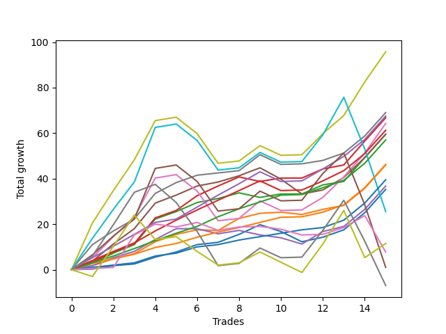

# Short Bernese 003 50 SB 
- Symbol: ES_1W
- Date Range: 03/18/2022 - 07/29/2022
- Trading Period: 7:20-12:30
- Number of Trades: 15



| Name | Win Percent | Profit | Avg Profit / Trade | Avg Time / Trade |      | Name | Win Percent | Profit | Avg Profit / Trade | Avg Time / Trade |
| ---- | ----------- | ------ | ------------------ | ---------------- | ---- | ---- | ----------- | ------ | ------------------ | ---------------- |
| Sorted By <br> Profit | | | | | | Sorted By <br> Win Percentage ||||
| Seven | 80.00 | 47875.00 | 3191.67 | 40:31 |     | Eighty-Three | 100.00 | 28500.00 | 1900.00 | 11:23 |
| Six | 93.33 | 34500.00 | 2300.00 | 19:00 |     | Eighty-Two | 100.00 | 23125.00 | 1541.67 | 07:49 |
| Eighty-Five | 93.33 | 33750.00 | 2250.00 | 19:21 |     | Eighty-One | 100.00 | 19750.00 | 1316.67 | 03:03 |
| Two_C | 86.67 | 33375.00 | 2225.00 | 15:31 |     | Six | 93.33 | 34500.00 | 2300.00 | 19:00 |
| Five | 80.00 | 32125.00 | 2141.67 | 34:55 |     | Eighty-Five | 93.33 | 33750.00 | 2250.00 | 19:21 |
| Eighty-Four | 93.33 | 30625.00 | 2041.67 | 15:52 |     | Eighty-Four | 93.33 | 30625.00 | 2041.67 | 15:52 |
| Four | 86.67 | 29750.00 | 1983.33 | 26:14 |     | Two_C | 86.67 | 33375.00 | 2225.00 | 15:31 |
| Two | 86.67 | 29750.00 | 1983.33 | 15:28 |     | Four | 86.67 | 29750.00 | 1983.33 | 26:14 |
| Eighty-Three | 100.00 | 28500.00 | 1900.00 | 11:23 |     | Two | 86.67 | 29750.00 | 1983.33 | 15:28 |
| Eighty-Two | 100.00 | 23125.00 | 1541.67 | 07:49 |     | One | 86.67 | 23000.00 | 1533.33 | 08:52 |
| One | 86.67 | 23000.00 | 1533.33 | 08:52 |     | Zero | 86.67 | 17625.00 | 1175.00 | 04:41 |
| Eighty-One | 100.00 | 19750.00 | 1316.67 | 03:03 |     | Seven | 80.00 | 47875.00 | 3191.67 | 40:31 |
| Three | 66.67 | 18375.00 | 1225.00 | 17:05 |     | Five | 80.00 | 32125.00 | 2141.67 | 34:55 |
| Zero | 86.67 | 17625.00 | 1175.00 | 04:41 |     | Three | 66.67 | 18375.00 | 1225.00 | 17:05 |
| BB100 | 66.67 | 12750.00 | 850.00 | 49:44 |     | BB100 | 66.67 | 12750.00 | 850.00 | 49:44 |
| MALAMUTE 002 | 53.33 | 5750.00 | 383.33 | 48:57 |     | NEWFI 0000 | 66.67 | 3875.00 | 258.33 | 10:16 |
| NEWFI 0000 | 66.67 | 3875.00 | 258.33 | 10:16 |     | NEWFI 000 | 66.67 | 500.00 | 33.33 | 46:39 |
| NEWFI 000 | 66.67 | 500.00 | 33.33 | 46:39 |     | MALAMUTE 001 | 60.00 | -3500.00 | -233.33 | 51:51 |
| MALAMUTE 001 | 60.00 | -3500.00 | -233.33 | 51:51 |     | MALAMUTE 002 | 53.33 | 5750.00 | 383.33 | 48:57 |

## NO STOPLOSS

### Test Zero
* Sell when price hits the middle line of the 20p bollinger
* No Stoploss
* Results:
```
Total Trades: 15
Percent Up: 13.33
Percent Down: 86.67
Total Points Moved Down: 35.25
Potential Profit: 17625.00
Total Points Ups: 7.50 Count Ups: 2
Total Points Downs: 42.75 Count Downs: 13
```

<details><summary>Trades</summary>

<code>In: 2022-03-25 11:57:00		Out: 2022-03-25 11:58:10		Total Position Time: 01:10		Total Move Down: 0.25		Total to Date: 0.25</code> <br />
<code>In: 2022-03-29 08:52:00		Out: 2022-03-29 08:56:20		Total Position Time: 04:20		Total Move Down: 1.50		Total to Date: 1.75</code> <br />
<code>In: 2022-03-29 08:53:00		Out: 2022-03-29 08:56:20		Total Position Time: 03:20		Total Move Down: 0.75		Total to Date: 2.50</code> <br />
<code>In: 2022-04-06 11:06:00		Out: 2022-04-06 11:07:10		Total Position Time: 01:10		Total Move Down: 3.00		Total to Date: 5.50</code> <br />
<code>In: 2022-04-20 09:55:00		Out: 2022-04-20 09:59:15		Total Position Time: 04:15		Total Move Down: 2.25		Total to Date: 7.75</code> <br />
<code>In: 2022-04-25 09:28:00		Out: 2022-04-25 09:31:05		Total Position Time: 03:05		Total Move Down: 3.25		Total to Date: 11.00</code> <br />
<code>In: 2022-04-25 09:29:00		Out: 2022-04-25 09:31:05		Total Position Time: 02:05		Total Move Down: 1.00		Total to Date: 12.00</code> <br />
<code>In: 2022-05-04 09:42:00		Out: 2022-05-04 09:45:30		Total Position Time: 03:30		Total Move Down: 3.50		Total to Date: 15.50</code> <br />
<code>In: 2022-05-24 08:51:00		Out: 2022-05-24 09:01:05		Total Position Time: 10:05		Total Move Down: 4.25		Total to Date: 19.75</code> <br />
<code>In: 2022-05-24 10:44:00		Out: 2022-05-24 11:01:15		Total Position Time: 17:15		Total Move Down: -3.00		Total to Date: 16.75</code> <br />
<code>In: 2022-05-24 10:48:00		Out: 2022-05-24 11:01:15		Total Position Time: 13:15		Total Move Down: -4.50		Total to Date: 12.25</code> <br />
<code>In: 2022-06-09 09:46:00		Out: 2022-06-09 09:49:20		Total Position Time: 03:20		Total Move Down: 2.00		Total to Date: 14.25</code> <br />
<code>In: 2022-06-15 09:19:00		Out: 2022-06-15 09:20:10		Total Position Time: 01:10		Total Move Down: 3.25		Total to Date: 17.50</code> <br />
<code>In: 2022-07-06 11:10:00		Out: 2022-07-06 11:11:10		Total Position Time: 01:10		Total Move Down: 7.50		Total to Date: 25.00</code> <br />
<code>In: 2022-07-06 11:11:00		Out: 2022-07-06 11:12:10		Total Position Time: 01:10		Total Move Down: 10.25		Total to Date: 35.25</code> <br />


</details>

### Test One
* Sell when the price hits the upper line of the 20p 1std bollinger
* No Stoploss
* Results:
```
Total Trades: 15
Percent Up: 13.33
Percent Down: 86.67
Total Points Moved Down: 46.00
Potential Profit: 23000.00
Total Points Ups: 1.25 Count Ups: 2
Total Points Downs: 47.25 Count Downs: 13
```

<details><summary>Trades</summary>

<code>In: 2022-03-25 11:57:00		Out: 2022-03-25 12:00:45		Total Position Time: 03:45		Total Move Down: 1.75		Total to Date: 1.75</code> <br />
<code>In: 2022-03-29 08:52:00		Out: 2022-03-29 08:58:40		Total Position Time: 06:40		Total Move Down: 3.00		Total to Date: 4.75</code> <br />
<code>In: 2022-03-29 08:53:00		Out: 2022-03-29 08:58:40		Total Position Time: 05:40		Total Move Down: 2.25		Total to Date: 7.00</code> <br />
<code>In: 2022-04-06 11:06:00		Out: 2022-04-06 11:07:20		Total Position Time: 01:20		Total Move Down: 5.25		Total to Date: 12.25</code> <br />
<code>In: 2022-04-20 09:55:00		Out: 2022-04-20 10:08:15		Total Position Time: 13:15		Total Move Down: 3.25		Total to Date: 15.50</code> <br />
<code>In: 2022-04-25 09:28:00		Out: 2022-04-25 09:42:45		Total Position Time: 14:45		Total Move Down: 2.00		Total to Date: 17.50</code> <br />
<code>In: 2022-04-25 09:29:00		Out: 2022-04-25 09:42:45		Total Position Time: 13:45		Total Move Down: -0.25		Total to Date: 17.25</code> <br />
<code>In: 2022-05-04 09:42:00		Out: 2022-05-04 09:46:40		Total Position Time: 04:40		Total Move Down: 5.25		Total to Date: 22.50</code> <br />
<code>In: 2022-05-24 08:51:00		Out: 2022-05-24 09:06:20		Total Position Time: 15:20		Total Move Down: 2.25		Total to Date: 24.75</code> <br />
<code>In: 2022-05-24 10:44:00		Out: 2022-05-24 11:01:40		Total Position Time: 17:40		Total Move Down: 0.50		Total to Date: 25.25</code> <br />
<code>In: 2022-05-24 10:48:00		Out: 2022-05-24 11:01:40		Total Position Time: 13:40		Total Move Down: -1.00		Total to Date: 24.25</code> <br />
<code>In: 2022-06-09 09:46:00		Out: 2022-06-09 09:54:45		Total Position Time: 08:45		Total Move Down: 2.25		Total to Date: 26.50</code> <br />
<code>In: 2022-06-15 09:19:00		Out: 2022-06-15 09:30:35		Total Position Time: 11:35		Total Move Down: 1.75		Total to Date: 28.25</code> <br />
<code>In: 2022-07-06 11:10:00		Out: 2022-07-06 11:11:10		Total Position Time: 01:10		Total Move Down: 7.50		Total to Date: 35.75</code> <br />
<code>In: 2022-07-06 11:11:00		Out: 2022-07-06 11:12:10		Total Position Time: 01:10		Total Move Down: 10.25		Total to Date: 46.00</code> <br />


</details>

### Test Two
* Sell when the price hits the upper line of the 20p 2std bollinger
* No Stoploss
* Results:
```
Total Trades: 15
Percent Up: 13.33
Percent Down: 86.67
Total Points Moved Down: 59.50
Potential Profit: 29750.00
Total Points Ups: 2.00 Count Ups: 2
Total Points Downs: 61.50 Count Downs: 13
```

<details><summary>Trades</summary>

<code>In: 2022-03-25 11:57:00		Out: 2022-03-25 12:00:55		Total Position Time: 03:55		Total Move Down: 2.75		Total to Date: 2.75</code> <br />
<code>In: 2022-03-29 08:52:00		Out: 2022-03-29 09:01:40		Total Position Time: 09:40		Total Move Down: 4.50		Total to Date: 7.25</code> <br />
<code>In: 2022-03-29 08:53:00		Out: 2022-03-29 09:01:40		Total Position Time: 08:40		Total Move Down: 3.75		Total to Date: 11.00</code> <br />
<code>In: 2022-04-06 11:06:00		Out: 2022-04-06 11:08:10		Total Position Time: 02:10		Total Move Down: 11.25		Total to Date: 22.25</code> <br />
<code>In: 2022-04-20 09:55:00		Out: 2022-04-20 10:08:15		Total Position Time: 13:15		Total Move Down: 3.25		Total to Date: 25.50</code> <br />
<code>In: 2022-04-25 09:28:00		Out: 2022-04-25 10:01:15		Total Position Time: 33:15		Total Move Down: 4.00		Total to Date: 29.50</code> <br />
<code>In: 2022-04-25 09:29:00		Out: 2022-04-25 10:01:15		Total Position Time: 32:15		Total Move Down: 1.75		Total to Date: 31.25</code> <br />
<code>In: 2022-05-04 09:42:00		Out: 2022-05-04 10:11:15		Total Position Time: 29:15		Total Move Down: 2.50		Total to Date: 33.75</code> <br />
<code>In: 2022-05-24 08:51:00		Out: 2022-05-24 09:31:20		Total Position Time: 40:20		Total Move Down: -2.00		Total to Date: 31.75</code> <br />
<code>In: 2022-05-24 10:44:00		Out: 2022-05-24 11:01:50		Total Position Time: 17:50		Total Move Down: 1.50		Total to Date: 33.25</code> <br />
<code>In: 2022-05-24 10:48:00		Out: 2022-05-24 11:01:50		Total Position Time: 13:50		Total Move Down: -0.00		Total to Date: 33.25</code> <br />
<code>In: 2022-06-09 09:46:00		Out: 2022-06-09 09:55:00		Total Position Time: 09:00		Total Move Down: 4.00		Total to Date: 37.25</code> <br />
<code>In: 2022-06-15 09:19:00		Out: 2022-06-15 09:34:40		Total Position Time: 15:40		Total Move Down: 1.50		Total to Date: 38.75</code> <br />
<code>In: 2022-07-06 11:10:00		Out: 2022-07-06 11:11:45		Total Position Time: 01:45		Total Move Down: 10.50		Total to Date: 49.25</code> <br />
<code>In: 2022-07-06 11:11:00		Out: 2022-07-06 11:12:10		Total Position Time: 01:10		Total Move Down: 10.25		Total to Date: 59.50</code> <br />


</details>

### Test Two_C
* Sell when the price hits the upper line of the 20p 2std bollinger
* No Stoploss
* Results:
```
Total Trades: 15
Percent Up: 13.33
Percent Down: 86.67
Total Points Moved Down: 66.75
Potential Profit: 33375.00
Total Points Ups: 2.00 Count Ups: 2
Total Points Downs: 68.75 Count Downs: 13
```

<details><summary>Trades</summary>

<code>In: 2022-03-25 11:57:00		Out: 2022-03-25 12:01:15		Total Position Time: 04:15		Total Move Down: 3.25		Total to Date: 3.25</code> <br />
<code>In: 2022-03-29 08:52:00		Out: 2022-03-29 09:01:40		Total Position Time: 09:40		Total Move Down: 4.50		Total to Date: 7.75</code> <br />
<code>In: 2022-03-29 08:53:00		Out: 2022-03-29 09:01:40		Total Position Time: 08:40		Total Move Down: 3.75		Total to Date: 11.50</code> <br />
<code>In: 2022-04-06 11:06:00		Out: 2022-04-06 11:08:10		Total Position Time: 02:10		Total Move Down: 11.25		Total to Date: 22.75</code> <br />
<code>In: 2022-04-20 09:55:00		Out: 2022-04-20 10:08:15		Total Position Time: 13:15		Total Move Down: 3.25		Total to Date: 26.00</code> <br />
<code>In: 2022-04-25 09:28:00		Out: 2022-04-25 10:01:20		Total Position Time: 33:20		Total Move Down: 6.50		Total to Date: 32.50</code> <br />
<code>In: 2022-04-25 09:29:00		Out: 2022-04-25 10:01:20		Total Position Time: 32:20		Total Move Down: 4.25		Total to Date: 36.75</code> <br />
<code>In: 2022-05-04 09:42:00		Out: 2022-05-04 10:11:30		Total Position Time: 29:30		Total Move Down: 4.00		Total to Date: 40.75</code> <br />
<code>In: 2022-05-24 08:51:00		Out: 2022-05-24 09:31:25		Total Position Time: 40:25		Total Move Down: -2.00		Total to Date: 38.75</code> <br />
<code>In: 2022-05-24 10:44:00		Out: 2022-05-24 11:01:50		Total Position Time: 17:50		Total Move Down: 1.50		Total to Date: 40.25</code> <br />
<code>In: 2022-05-24 10:48:00		Out: 2022-05-24 11:01:50		Total Position Time: 13:50		Total Move Down: -0.00		Total to Date: 40.25</code> <br />
<code>In: 2022-06-09 09:46:00		Out: 2022-06-09 09:55:00		Total Position Time: 09:00		Total Move Down: 4.00		Total to Date: 44.25</code> <br />
<code>In: 2022-06-15 09:19:00		Out: 2022-06-15 09:34:45		Total Position Time: 15:45		Total Move Down: 1.75		Total to Date: 46.00</code> <br />
<code>In: 2022-07-06 11:10:00		Out: 2022-07-06 11:11:45		Total Position Time: 01:45		Total Move Down: 10.50		Total to Date: 56.50</code> <br />
<code>In: 2022-07-06 11:11:00		Out: 2022-07-06 11:12:10		Total Position Time: 01:10		Total Move Down: 10.25		Total to Date: 66.75</code> <br />


</details>

### Test Three
* Sell when price hits the middle line of the 50p bollinger
* No Stoploss
* Results:
```
Total Trades: 15
Percent Up: 33.33
Percent Down: 66.67
Total Points Moved Down: 36.75
Potential Profit: 18375.00
Total Points Ups: 8.25 Count Ups: 5
Total Points Downs: 45.00 Count Downs: 10
```

<details><summary>Trades</summary>

<code>In: 2022-03-25 11:57:00		Out: 2022-03-25 12:00:45		Total Position Time: 03:45		Total Move Down: 1.75		Total to Date: 1.75</code> <br />
<code>In: 2022-03-29 08:52:00		Out: 2022-03-29 09:01:25		Total Position Time: 09:25		Total Move Down: 3.50		Total to Date: 5.25</code> <br />
<code>In: 2022-03-29 08:53:00		Out: 2022-03-29 09:01:25		Total Position Time: 08:25		Total Move Down: 2.75		Total to Date: 8.00</code> <br />
<code>In: 2022-04-06 11:06:00		Out: 2022-04-06 11:07:20		Total Position Time: 01:20		Total Move Down: 5.25		Total to Date: 13.25</code> <br />
<code>In: 2022-04-20 09:55:00		Out: 2022-04-20 10:08:35		Total Position Time: 13:35		Total Move Down: 4.75		Total to Date: 18.00</code> <br />
<code>In: 2022-04-25 09:28:00		Out: 2022-04-25 09:55:05		Total Position Time: 27:05		Total Move Down: -0.00		Total to Date: 18.00</code> <br />
<code>In: 2022-04-25 09:29:00		Out: 2022-04-25 09:55:05		Total Position Time: 26:05		Total Move Down: -2.25		Total to Date: 15.75</code> <br />
<code>In: 2022-05-04 09:42:00		Out: 2022-05-04 10:11:05		Total Position Time: 29:05		Total Move Down: 1.50		Total to Date: 17.25</code> <br />
<code>In: 2022-05-24 08:51:00		Out: 2022-05-24 09:31:20		Total Position Time: 40:20		Total Move Down: -2.00		Total to Date: 15.25</code> <br />
<code>In: 2022-05-24 10:44:00		Out: 2022-05-24 11:20:25		Total Position Time: 36:25		Total Move Down: -1.25		Total to Date: 14.00</code> <br />
<code>In: 2022-05-24 10:48:00		Out: 2022-05-24 11:20:25		Total Position Time: 32:25		Total Move Down: -2.75		Total to Date: 11.25</code> <br />
<code>In: 2022-06-09 09:46:00		Out: 2022-06-09 09:55:50		Total Position Time: 09:50		Total Move Down: 5.50		Total to Date: 16.75</code> <br />
<code>In: 2022-06-15 09:19:00		Out: 2022-06-15 09:35:15		Total Position Time: 16:15		Total Move Down: 2.25		Total to Date: 19.00</code> <br />
<code>In: 2022-07-06 11:10:00		Out: 2022-07-06 11:11:10		Total Position Time: 01:10		Total Move Down: 7.50		Total to Date: 26.50</code> <br />
<code>In: 2022-07-06 11:11:00		Out: 2022-07-06 11:12:10		Total Position Time: 01:10		Total Move Down: 10.25		Total to Date: 36.75</code> <br />


</details>

### Test Four
* Sell when the price hits the upper line of the 50p 1std bollinger
* No Stoploss
* Results:
```
Total Trades: 15
Percent Up: 13.33
Percent Down: 86.67
Total Points Moved Down: 59.50
Potential Profit: 29750.00
Total Points Ups: 11.50 Count Ups: 2
Total Points Downs: 71.00 Count Downs: 13
```

<details><summary>Trades</summary>

<code>In: 2022-03-25 11:57:00		Out: 2022-03-25 12:01:35		Total Position Time: 04:35		Total Move Down: 3.75		Total to Date: 3.75</code> <br />
<code>In: 2022-03-29 08:52:00		Out: 2022-03-29 09:02:15		Total Position Time: 10:15		Total Move Down: 7.50		Total to Date: 11.25</code> <br />
<code>In: 2022-03-29 08:53:00		Out: 2022-03-29 09:02:15		Total Position Time: 09:15		Total Move Down: 6.75		Total to Date: 18.00</code> <br />
<code>In: 2022-04-06 11:06:00		Out: 2022-04-06 11:08:10		Total Position Time: 02:10		Total Move Down: 11.25		Total to Date: 29.25</code> <br />
<code>In: 2022-04-20 09:55:00		Out: 2022-04-20 10:26:35		Total Position Time: 31:35		Total Move Down: 3.50		Total to Date: 32.75</code> <br />
<code>In: 2022-04-25 09:28:00		Out: 2022-04-25 10:01:15		Total Position Time: 33:15		Total Move Down: 4.00		Total to Date: 36.75</code> <br />
<code>In: 2022-04-25 09:29:00		Out: 2022-04-25 10:01:15		Total Position Time: 32:15		Total Move Down: 1.75		Total to Date: 38.50</code> <br />
<code>In: 2022-05-04 09:42:00		Out: 2022-05-04 10:30:25		Total Position Time: 48:25		Total Move Down: 2.75		Total to Date: 41.25</code> <br />
<code>In: 2022-05-24 08:51:00		Out: 2022-05-24 09:34:40		Total Position Time: 43:40		Total Move Down: 3.50		Total to Date: 44.75</code> <br />
<code>In: 2022-05-24 10:44:00		Out: 2022-05-24 11:44:15		Total Position Time: 60:15		Total Move Down: -5.00		Total to Date: 39.75</code> <br />
<code>In: 2022-05-24 10:48:00		Out: 2022-05-24 11:44:15		Total Position Time: 56:15		Total Move Down: -6.50		Total to Date: 33.25</code> <br />
<code>In: 2022-06-09 09:46:00		Out: 2022-06-09 10:24:05		Total Position Time: 38:05		Total Move Down: 1.75		Total to Date: 35.00</code> <br />
<code>In: 2022-06-15 09:19:00		Out: 2022-06-15 09:39:50		Total Position Time: 20:50		Total Move Down: 5.50		Total to Date: 40.50</code> <br />
<code>In: 2022-07-06 11:10:00		Out: 2022-07-06 11:11:35		Total Position Time: 01:35		Total Move Down: 8.75		Total to Date: 49.25</code> <br />
<code>In: 2022-07-06 11:11:00		Out: 2022-07-06 11:12:10		Total Position Time: 01:10		Total Move Down: 10.25		Total to Date: 59.50</code> <br />


</details>

### Test Five
* Sell when the price hits the upper line of the 50p 2std bollinger
* No Stoploss
* Results:
```
Total Trades: 15
Percent Up: 20.00
Percent Down: 80.00
Total Points Moved Down: 64.25
Potential Profit: 32125.00
Total Points Ups: 24.50 Count Ups: 3
Total Points Downs: 88.75 Count Downs: 12
```

<details><summary>Trades</summary>

<code>In: 2022-03-25 11:57:00		Out: 2022-03-25 12:01:55		Total Position Time: 04:55		Total Move Down: 5.25		Total to Date: 5.25</code> <br />
<code>In: 2022-03-29 08:52:00		Out: 2022-03-29 09:10:45		Total Position Time: 18:45		Total Move Down: 9.25		Total to Date: 14.50</code> <br />
<code>In: 2022-03-29 08:53:00		Out: 2022-03-29 09:10:45		Total Position Time: 17:45		Total Move Down: 8.50		Total to Date: 23.00</code> <br />
<code>In: 2022-04-06 11:06:00		Out: 2022-04-06 11:09:40		Total Position Time: 03:40		Total Move Down: 17.25		Total to Date: 40.25</code> <br />
<code>In: 2022-04-20 09:55:00		Out: 2022-04-20 10:55:55		Total Position Time: 60:55		Total Move Down: 1.50		Total to Date: 41.75</code> <br />
<code>In: 2022-04-25 09:28:00		Out: 2022-04-25 10:28:55		Total Position Time: 60:55		Total Move Down: -7.25		Total to Date: 34.50</code> <br />
<code>In: 2022-04-25 09:29:00		Out: 2022-04-25 10:29:55		Total Position Time: 60:55		Total Move Down: -13.00		Total to Date: 21.50</code> <br />
<code>In: 2022-05-04 09:42:00		Out: 2022-05-04 10:42:55		Total Position Time: 60:55		Total Move Down: 1.00		Total to Date: 22.50</code> <br />
<code>In: 2022-05-24 08:51:00		Out: 2022-05-24 09:36:50		Total Position Time: 45:50		Total Move Down: 7.75		Total to Date: 30.25</code> <br />
<code>In: 2022-05-24 10:44:00		Out: 2022-05-24 11:44:55		Total Position Time: 60:55		Total Move Down: -4.25		Total to Date: 26.00</code> <br />
<code>In: 2022-05-24 10:48:00		Out: 2022-05-24 11:48:55		Total Position Time: 60:55		Total Move Down: 0.25		Total to Date: 26.25</code> <br />
<code>In: 2022-06-09 09:46:00		Out: 2022-06-09 10:27:20		Total Position Time: 41:20		Total Move Down: 5.50		Total to Date: 31.75</code> <br />
<code>In: 2022-06-15 09:19:00		Out: 2022-06-15 09:42:05		Total Position Time: 23:05		Total Move Down: 9.00		Total to Date: 40.75</code> <br />
<code>In: 2022-07-06 11:10:00		Out: 2022-07-06 11:11:50		Total Position Time: 01:50		Total Move Down: 10.50		Total to Date: 51.25</code> <br />
<code>In: 2022-07-06 11:11:00		Out: 2022-07-06 11:12:15		Total Position Time: 01:15		Total Move Down: 13.00		Total to Date: 64.25</code> <br />


</details>

### Test Six
* Sell when the price hits the middle line of the 1std VWAP
* No Stoploss
* Results:
```
Total Trades: 15
Percent Up: 6.67
Percent Down: 93.33
Total Points Moved Down: 69.00
Potential Profit: 34500.00
Total Points Ups: 4.25 Count Ups: 1
Total Points Downs: 73.25 Count Downs: 14
```

<details><summary>Trades</summary>

<code>In: 2022-03-25 11:57:00		Out: 2022-03-25 12:07:35		Total Position Time: 10:35		Total Move Down: 11.00		Total to Date: 11.00</code> <br />
<code>In: 2022-03-29 08:52:00		Out: 2022-03-29 09:02:10		Total Position Time: 10:10		Total Move Down: 6.00		Total to Date: 17.00</code> <br />
<code>In: 2022-03-29 08:53:00		Out: 2022-03-29 09:02:10		Total Position Time: 09:10		Total Move Down: 5.25		Total to Date: 22.25</code> <br />
<code>In: 2022-04-06 11:06:00		Out: 2022-04-06 11:08:10		Total Position Time: 02:10		Total Move Down: 11.25		Total to Date: 33.50</code> <br />
<code>In: 2022-04-20 09:55:00		Out: 2022-04-20 10:08:35		Total Position Time: 13:35		Total Move Down: 4.75		Total to Date: 38.25</code> <br />
<code>In: 2022-04-25 09:28:00		Out: 2022-04-25 09:31:05		Total Position Time: 03:05		Total Move Down: 3.25		Total to Date: 41.50</code> <br />
<code>In: 2022-04-25 09:29:00		Out: 2022-04-25 09:31:05		Total Position Time: 02:05		Total Move Down: 1.00		Total to Date: 42.50</code> <br />
<code>In: 2022-05-04 09:42:00		Out: 2022-05-04 10:42:55		Total Position Time: 60:55		Total Move Down: 1.00		Total to Date: 43.50</code> <br />
<code>In: 2022-05-24 08:51:00		Out: 2022-05-24 09:36:45		Total Position Time: 45:45		Total Move Down: 7.00		Total to Date: 50.50</code> <br />
<code>In: 2022-05-24 10:44:00		Out: 2022-05-24 11:44:55		Total Position Time: 60:55		Total Move Down: -4.25		Total to Date: 46.25</code> <br />
<code>In: 2022-05-24 10:48:00		Out: 2022-05-24 11:48:55		Total Position Time: 60:55		Total Move Down: 0.25		Total to Date: 46.50</code> <br />
<code>In: 2022-06-09 09:46:00		Out: 2022-06-09 09:48:20		Total Position Time: 02:20		Total Move Down: 1.50		Total to Date: 48.00</code> <br />
<code>In: 2022-06-15 09:19:00		Out: 2022-06-15 09:20:10		Total Position Time: 01:10		Total Move Down: 3.25		Total to Date: 51.25</code> <br />
<code>In: 2022-07-06 11:10:00		Out: 2022-07-06 11:11:10		Total Position Time: 01:10		Total Move Down: 7.50		Total to Date: 58.75</code> <br />
<code>In: 2022-07-06 11:11:00		Out: 2022-07-06 11:12:10		Total Position Time: 01:10		Total Move Down: 10.25		Total to Date: 69.00</code> <br />


</details>

### Test Seven
* Sell when the price hits the upper line of the 1std VWAP
* No Stoploss
* Results:
```
Total Trades: 15
Percent Up: 20.00
Percent Down: 80.00
Total Points Moved Down: 95.75
Potential Profit: 47875.00
Total Points Ups: 24.50 Count Ups: 3
Total Points Downs: 120.25 Count Downs: 12
```

<details><summary>Trades</summary>

<code>In: 2022-03-25 11:57:00		Out: 2022-03-25 12:33:10		Total Position Time: 36:10		Total Move Down: 20.50		Total to Date: 20.50</code> <br />
<code>In: 2022-03-29 08:52:00		Out: 2022-03-29 09:27:55		Total Position Time: 35:55		Total Move Down: 14.25		Total to Date: 34.75</code> <br />
<code>In: 2022-03-29 08:53:00		Out: 2022-03-29 09:27:55		Total Position Time: 34:55		Total Move Down: 13.50		Total to Date: 48.25</code> <br />
<code>In: 2022-04-06 11:06:00		Out: 2022-04-06 11:09:40		Total Position Time: 03:40		Total Move Down: 17.25		Total to Date: 65.50</code> <br />
<code>In: 2022-04-20 09:55:00		Out: 2022-04-20 10:55:55		Total Position Time: 60:55		Total Move Down: 1.50		Total to Date: 67.00</code> <br />
<code>In: 2022-04-25 09:28:00		Out: 2022-04-25 10:28:55		Total Position Time: 60:55		Total Move Down: -7.25		Total to Date: 59.75</code> <br />
<code>In: 2022-04-25 09:29:00		Out: 2022-04-25 10:29:55		Total Position Time: 60:55		Total Move Down: -13.00		Total to Date: 46.75</code> <br />
<code>In: 2022-05-04 09:42:00		Out: 2022-05-04 10:42:55		Total Position Time: 60:55		Total Move Down: 1.00		Total to Date: 47.75</code> <br />
<code>In: 2022-05-24 08:51:00		Out: 2022-05-24 09:51:55		Total Position Time: 60:55		Total Move Down: 6.75		Total to Date: 54.50</code> <br />
<code>In: 2022-05-24 10:44:00		Out: 2022-05-24 11:44:55		Total Position Time: 60:55		Total Move Down: -4.25		Total to Date: 50.25</code> <br />
<code>In: 2022-05-24 10:48:00		Out: 2022-05-24 11:48:55		Total Position Time: 60:55		Total Move Down: 0.25		Total to Date: 50.50</code> <br />
<code>In: 2022-06-09 09:46:00		Out: 2022-06-09 10:30:30		Total Position Time: 44:30		Total Move Down: 9.25		Total to Date: 59.75</code> <br />
<code>In: 2022-06-15 09:19:00		Out: 2022-06-15 09:41:40		Total Position Time: 22:40		Total Move Down: 8.00		Total to Date: 67.75</code> <br />
<code>In: 2022-07-06 11:10:00		Out: 2022-07-06 11:12:20		Total Position Time: 02:20		Total Move Down: 14.75		Total to Date: 82.50</code> <br />
<code>In: 2022-07-06 11:11:00		Out: 2022-07-06 11:12:20		Total Position Time: 01:20		Total Move Down: 13.25		Total to Date: 95.75</code> <br />


</details>

### Test BB100
* Sell when the price hits the upper line of the 1std VWAP
* No Stoploss
* Results:
```
Total Trades: 15
Percent Up: 33.33
Percent Down: 66.67
Total Points Moved Down: 25.50
Potential Profit: 12750.00
Total Points Ups: 74.75 Count Ups: 5
Total Points Downs: 100.25 Count Downs: 10
```

<details><summary>Trades</summary>

<code>In: 2022-03-25 11:57:00		Out: 2022-03-25 12:21:35		Total Position Time: 24:35		Total Move Down: 13.75		Total to Date: 13.75</code> <br />
<code>In: 2022-03-29 08:52:00		Out: 2022-03-29 09:26:35		Total Position Time: 34:35		Total Move Down: 12.75		Total to Date: 26.50</code> <br />
<code>In: 2022-03-29 08:53:00		Out: 2022-03-29 09:26:35		Total Position Time: 33:35		Total Move Down: 12.00		Total to Date: 38.50</code> <br />
<code>In: 2022-04-06 11:06:00		Out: 2022-04-06 11:14:55		Total Position Time: 08:55		Total Move Down: 24.00		Total to Date: 62.50</code> <br />
<code>In: 2022-04-20 09:55:00		Out: 2022-04-20 10:55:55		Total Position Time: 60:55		Total Move Down: 1.50		Total to Date: 64.00</code> <br />
<code>In: 2022-04-25 09:28:00		Out: 2022-04-25 10:28:55		Total Position Time: 60:55		Total Move Down: -7.25		Total to Date: 56.75</code> <br />
<code>In: 2022-04-25 09:29:00		Out: 2022-04-25 10:29:55		Total Position Time: 60:55		Total Move Down: -13.00		Total to Date: 43.75</code> <br />
<code>In: 2022-05-04 09:42:00		Out: 2022-05-04 10:42:55		Total Position Time: 60:55		Total Move Down: 1.00		Total to Date: 44.75</code> <br />
<code>In: 2022-05-24 08:51:00		Out: 2022-05-24 09:51:55		Total Position Time: 60:55		Total Move Down: 6.75		Total to Date: 51.50</code> <br />
<code>In: 2022-05-24 10:44:00		Out: 2022-05-24 11:44:55		Total Position Time: 60:55		Total Move Down: -4.25		Total to Date: 47.25</code> <br />
<code>In: 2022-05-24 10:48:00		Out: 2022-05-24 11:48:55		Total Position Time: 60:55		Total Move Down: 0.25		Total to Date: 47.50</code> <br />
<code>In: 2022-06-09 09:46:00		Out: 2022-06-09 10:46:55		Total Position Time: 60:55		Total Move Down: 11.75		Total to Date: 59.25</code> <br />
<code>In: 2022-06-15 09:19:00		Out: 2022-06-15 09:54:15		Total Position Time: 35:15		Total Move Down: 16.50		Total to Date: 75.75</code> <br />
<code>In: 2022-07-06 11:10:00		Out: 2022-07-06 12:10:55		Total Position Time: 60:55		Total Move Down: -22.75		Total to Date: 53.00</code> <br />
<code>In: 2022-07-06 11:11:00		Out: 2022-07-06 12:11:55		Total Position Time: 60:55		Total Move Down: -27.50		Total to Date: 25.50</code> <br />


</details>

## TAKE PROFIT

### Test Eighty-One
* Take Profit of 1 Point
* No Stoploss
* Results:
```
Total Trades: 15
Percent Up: 0.00
Percent Down: 100.00
Total Points Moved Down: 39.50
Potential Profit: 19750.00
Total Points Ups: 0.00 Count Ups: 0
Total Points Downs: 39.50 Count Downs: 15
```

<details><summary>Trades</summary>

<code>In: 2022-03-25 11:57:00		Out: 2022-03-25 11:58:45		Total Position Time: 01:45		Total Move Down: 1.00		Total to Date: 1.00</code> <br />
<code>In: 2022-03-29 08:52:00		Out: 2022-03-29 08:56:10		Total Position Time: 04:10		Total Move Down: 1.00		Total to Date: 2.00</code> <br />
<code>In: 2022-03-29 08:53:00		Out: 2022-03-29 08:57:35		Total Position Time: 04:35		Total Move Down: 1.00		Total to Date: 3.00</code> <br />
<code>In: 2022-04-06 11:06:00		Out: 2022-04-06 11:07:10		Total Position Time: 01:10		Total Move Down: 3.00		Total to Date: 6.00</code> <br />
<code>In: 2022-04-20 09:55:00		Out: 2022-04-20 09:57:25		Total Position Time: 02:25		Total Move Down: 1.25		Total to Date: 7.25</code> <br />
<code>In: 2022-04-25 09:28:00		Out: 2022-04-25 09:29:10		Total Position Time: 01:10		Total Move Down: 2.75		Total to Date: 10.00</code> <br />
<code>In: 2022-04-25 09:29:00		Out: 2022-04-25 09:31:05		Total Position Time: 02:05		Total Move Down: 1.00		Total to Date: 11.00</code> <br />
<code>In: 2022-05-04 09:42:00		Out: 2022-05-04 09:43:10		Total Position Time: 01:10		Total Move Down: 2.00		Total to Date: 13.00</code> <br />
<code>In: 2022-05-24 08:51:00		Out: 2022-05-24 08:52:30		Total Position Time: 01:30		Total Move Down: 1.50		Total to Date: 14.50</code> <br />
<code>In: 2022-05-24 10:44:00		Out: 2022-05-24 10:47:50		Total Position Time: 03:50		Total Move Down: 1.50		Total to Date: 16.00</code> <br />
<code>In: 2022-05-24 10:48:00		Out: 2022-05-24 11:05:00		Total Position Time: 17:00		Total Move Down: 1.50		Total to Date: 17.50</code> <br />
<code>In: 2022-06-09 09:46:00		Out: 2022-06-09 09:47:25		Total Position Time: 01:25		Total Move Down: 1.00		Total to Date: 18.50</code> <br />
<code>In: 2022-06-15 09:19:00		Out: 2022-06-15 09:20:10		Total Position Time: 01:10		Total Move Down: 3.25		Total to Date: 21.75</code> <br />
<code>In: 2022-07-06 11:10:00		Out: 2022-07-06 11:11:10		Total Position Time: 01:10		Total Move Down: 7.50		Total to Date: 29.25</code> <br />
<code>In: 2022-07-06 11:11:00		Out: 2022-07-06 11:12:10		Total Position Time: 01:10		Total Move Down: 10.25		Total to Date: 39.50</code> <br />


</details>

### Test Eighty-Two
* Take Profit of 2 Point
* No Stoploss
* Results:
```
Total Trades: 15
Percent Up: 0.00
Percent Down: 100.00
Total Points Moved Down: 46.25
Potential Profit: 23125.00
Total Points Ups: 0.00 Count Ups: 0
Total Points Downs: 46.25 Count Downs: 15
```

<details><summary>Trades</summary>

<code>In: 2022-03-25 11:57:00		Out: 2022-03-25 12:00:50		Total Position Time: 03:50		Total Move Down: 2.75		Total to Date: 2.75</code> <br />
<code>In: 2022-03-29 08:52:00		Out: 2022-03-29 08:57:40		Total Position Time: 05:40		Total Move Down: 2.00		Total to Date: 4.75</code> <br />
<code>In: 2022-03-29 08:53:00		Out: 2022-03-29 08:58:35		Total Position Time: 05:35		Total Move Down: 2.00		Total to Date: 6.75</code> <br />
<code>In: 2022-04-06 11:06:00		Out: 2022-04-06 11:07:10		Total Position Time: 01:10		Total Move Down: 3.00		Total to Date: 9.75</code> <br />
<code>In: 2022-04-20 09:55:00		Out: 2022-04-20 09:59:05		Total Position Time: 04:05		Total Move Down: 1.75		Total to Date: 11.50</code> <br />
<code>In: 2022-04-25 09:28:00		Out: 2022-04-25 09:29:10		Total Position Time: 01:10		Total Move Down: 2.75		Total to Date: 14.25</code> <br />
<code>In: 2022-04-25 09:29:00		Out: 2022-04-25 09:31:10		Total Position Time: 02:10		Total Move Down: 2.25		Total to Date: 16.50</code> <br />
<code>In: 2022-05-04 09:42:00		Out: 2022-05-04 09:43:10		Total Position Time: 01:10		Total Move Down: 2.00		Total to Date: 18.50</code> <br />
<code>In: 2022-05-24 08:51:00		Out: 2022-05-24 08:54:45		Total Position Time: 03:45		Total Move Down: 2.25		Total to Date: 20.75</code> <br />
<code>In: 2022-05-24 10:44:00		Out: 2022-05-24 11:04:55		Total Position Time: 20:55		Total Move Down: 2.25		Total to Date: 23.00</code> <br />
<code>In: 2022-05-24 10:48:00		Out: 2022-05-24 11:48:55		Total Position Time: 60:55		Total Move Down: 0.25		Total to Date: 23.25</code> <br />
<code>In: 2022-06-09 09:46:00		Out: 2022-06-09 09:49:20		Total Position Time: 03:20		Total Move Down: 2.00		Total to Date: 25.25</code> <br />
<code>In: 2022-06-15 09:19:00		Out: 2022-06-15 09:20:10		Total Position Time: 01:10		Total Move Down: 3.25		Total to Date: 28.50</code> <br />
<code>In: 2022-07-06 11:10:00		Out: 2022-07-06 11:11:10		Total Position Time: 01:10		Total Move Down: 7.50		Total to Date: 36.00</code> <br />
<code>In: 2022-07-06 11:11:00		Out: 2022-07-06 11:12:10		Total Position Time: 01:10		Total Move Down: 10.25		Total to Date: 46.25</code> <br />


</details>

### Test Eighty-Three
* Take Profit of 3 Point
* No Stoploss
* Results:
```
Total Trades: 15
Percent Up: 0.00
Percent Down: 100.00
Total Points Moved Down: 57.00
Potential Profit: 28500.00
Total Points Ups: 0.00 Count Ups: 0
Total Points Downs: 57.00 Count Downs: 15
```

<details><summary>Trades</summary>

<code>In: 2022-03-25 11:57:00		Out: 2022-03-25 12:01:00		Total Position Time: 04:00		Total Move Down: 3.00		Total to Date: 3.00</code> <br />
<code>In: 2022-03-29 08:52:00		Out: 2022-03-29 08:58:40		Total Position Time: 06:40		Total Move Down: 3.00		Total to Date: 6.00</code> <br />
<code>In: 2022-03-29 08:53:00		Out: 2022-03-29 09:01:35		Total Position Time: 08:35		Total Move Down: 3.25		Total to Date: 9.25</code> <br />
<code>In: 2022-04-06 11:06:00		Out: 2022-04-06 11:07:15		Total Position Time: 01:15		Total Move Down: 3.50		Total to Date: 12.75</code> <br />
<code>In: 2022-04-20 09:55:00		Out: 2022-04-20 10:08:15		Total Position Time: 13:15		Total Move Down: 3.25		Total to Date: 16.00</code> <br />
<code>In: 2022-04-25 09:28:00		Out: 2022-04-25 09:31:00		Total Position Time: 03:00		Total Move Down: 3.00		Total to Date: 19.00</code> <br />
<code>In: 2022-04-25 09:29:00		Out: 2022-04-25 10:01:20		Total Position Time: 32:20		Total Move Down: 4.25		Total to Date: 23.25</code> <br />
<code>In: 2022-05-04 09:42:00		Out: 2022-05-04 09:45:30		Total Position Time: 03:30		Total Move Down: 3.50		Total to Date: 26.75</code> <br />
<code>In: 2022-05-24 08:51:00		Out: 2022-05-24 08:54:50		Total Position Time: 03:50		Total Move Down: 3.00		Total to Date: 29.75</code> <br />
<code>In: 2022-05-24 10:44:00		Out: 2022-05-24 11:05:00		Total Position Time: 21:00		Total Move Down: 3.00		Total to Date: 32.75</code> <br />
<code>In: 2022-05-24 10:48:00		Out: 2022-05-24 11:48:55		Total Position Time: 60:55		Total Move Down: 0.25		Total to Date: 33.00</code> <br />
<code>In: 2022-06-09 09:46:00		Out: 2022-06-09 09:54:55		Total Position Time: 08:55		Total Move Down: 3.00		Total to Date: 36.00</code> <br />
<code>In: 2022-06-15 09:19:00		Out: 2022-06-15 09:20:10		Total Position Time: 01:10		Total Move Down: 3.25		Total to Date: 39.25</code> <br />
<code>In: 2022-07-06 11:10:00		Out: 2022-07-06 11:11:10		Total Position Time: 01:10		Total Move Down: 7.50		Total to Date: 46.75</code> <br />
<code>In: 2022-07-06 11:11:00		Out: 2022-07-06 11:12:10		Total Position Time: 01:10		Total Move Down: 10.25		Total to Date: 57.00</code> <br />


</details>

### Test Eighty-Four
* Take Profit of 4 Point
* No Stoploss
* Results:
```
Total Trades: 15
Percent Up: 6.67
Percent Down: 93.33
Total Points Moved Down: 61.25
Potential Profit: 30625.00
Total Points Ups: 4.25 Count Ups: 1
Total Points Downs: 65.50 Count Downs: 14
```

<details><summary>Trades</summary>

<code>In: 2022-03-25 11:57:00		Out: 2022-03-25 12:01:45		Total Position Time: 04:45		Total Move Down: 4.00		Total to Date: 4.00</code> <br />
<code>In: 2022-03-29 08:52:00		Out: 2022-03-29 09:01:35		Total Position Time: 09:35		Total Move Down: 4.00		Total to Date: 8.00</code> <br />
<code>In: 2022-03-29 08:53:00		Out: 2022-03-29 09:01:40		Total Position Time: 08:40		Total Move Down: 3.75		Total to Date: 11.75</code> <br />
<code>In: 2022-04-06 11:06:00		Out: 2022-04-06 11:07:20		Total Position Time: 01:20		Total Move Down: 5.25		Total to Date: 17.00</code> <br />
<code>In: 2022-04-20 09:55:00		Out: 2022-04-20 10:08:35		Total Position Time: 13:35		Total Move Down: 4.75		Total to Date: 21.75</code> <br />
<code>In: 2022-04-25 09:28:00		Out: 2022-04-25 09:31:10		Total Position Time: 03:10		Total Move Down: 4.50		Total to Date: 26.25</code> <br />
<code>In: 2022-04-25 09:29:00		Out: 2022-04-25 10:01:20		Total Position Time: 32:20		Total Move Down: 4.25		Total to Date: 30.50</code> <br />
<code>In: 2022-05-04 09:42:00		Out: 2022-05-04 09:46:15		Total Position Time: 04:15		Total Move Down: 4.25		Total to Date: 34.75</code> <br />
<code>In: 2022-05-24 08:51:00		Out: 2022-05-24 09:01:05		Total Position Time: 10:05		Total Move Down: 4.25		Total to Date: 39.00</code> <br />
<code>In: 2022-05-24 10:44:00		Out: 2022-05-24 11:44:55		Total Position Time: 60:55		Total Move Down: -4.25		Total to Date: 34.75</code> <br />
<code>In: 2022-05-24 10:48:00		Out: 2022-05-24 11:48:55		Total Position Time: 60:55		Total Move Down: 0.25		Total to Date: 35.00</code> <br />
<code>In: 2022-06-09 09:46:00		Out: 2022-06-09 09:55:00		Total Position Time: 09:00		Total Move Down: 4.00		Total to Date: 39.00</code> <br />
<code>In: 2022-06-15 09:19:00		Out: 2022-06-15 09:36:10		Total Position Time: 17:10		Total Move Down: 4.50		Total to Date: 43.50</code> <br />
<code>In: 2022-07-06 11:10:00		Out: 2022-07-06 11:11:10		Total Position Time: 01:10		Total Move Down: 7.50		Total to Date: 51.00</code> <br />
<code>In: 2022-07-06 11:11:00		Out: 2022-07-06 11:12:10		Total Position Time: 01:10		Total Move Down: 10.25		Total to Date: 61.25</code> <br />


</details>

### Test Eighty-Five
* Take Profit of 5 Point
* No Stoploss
* Results:
```
Total Trades: 15
Percent Up: 6.67
Percent Down: 93.33
Total Points Moved Down: 67.50
Potential Profit: 33750.00
Total Points Ups: 4.25 Count Ups: 1
Total Points Downs: 71.75 Count Downs: 14
```

<details><summary>Trades</summary>

<code>In: 2022-03-25 11:57:00		Out: 2022-03-25 12:01:55		Total Position Time: 04:55		Total Move Down: 5.25		Total to Date: 5.25</code> <br />
<code>In: 2022-03-29 08:52:00		Out: 2022-03-29 09:01:45		Total Position Time: 09:45		Total Move Down: 5.00		Total to Date: 10.25</code> <br />
<code>In: 2022-03-29 08:53:00		Out: 2022-03-29 09:02:10		Total Position Time: 09:10		Total Move Down: 5.25		Total to Date: 15.50</code> <br />
<code>In: 2022-04-06 11:06:00		Out: 2022-04-06 11:07:20		Total Position Time: 01:20		Total Move Down: 5.25		Total to Date: 20.75</code> <br />
<code>In: 2022-04-20 09:55:00		Out: 2022-04-20 10:55:55		Total Position Time: 60:55		Total Move Down: 1.50		Total to Date: 22.25</code> <br />
<code>In: 2022-04-25 09:28:00		Out: 2022-04-25 09:31:15		Total Position Time: 03:15		Total Move Down: 5.25		Total to Date: 27.50</code> <br />
<code>In: 2022-04-25 09:29:00		Out: 2022-04-25 10:01:40		Total Position Time: 32:40		Total Move Down: 5.25		Total to Date: 32.75</code> <br />
<code>In: 2022-05-04 09:42:00		Out: 2022-05-04 09:46:30		Total Position Time: 04:30		Total Move Down: 5.00		Total to Date: 37.75</code> <br />
<code>In: 2022-05-24 08:51:00		Out: 2022-05-24 09:01:15		Total Position Time: 10:15		Total Move Down: 5.25		Total to Date: 43.00</code> <br />
<code>In: 2022-05-24 10:44:00		Out: 2022-05-24 11:44:55		Total Position Time: 60:55		Total Move Down: -4.25		Total to Date: 38.75</code> <br />
<code>In: 2022-05-24 10:48:00		Out: 2022-05-24 11:48:55		Total Position Time: 60:55		Total Move Down: 0.25		Total to Date: 39.00</code> <br />
<code>In: 2022-06-09 09:46:00		Out: 2022-06-09 09:55:45		Total Position Time: 09:45		Total Move Down: 5.25		Total to Date: 44.25</code> <br />
<code>In: 2022-06-15 09:19:00		Out: 2022-06-15 09:38:40		Total Position Time: 19:40		Total Move Down: 5.50		Total to Date: 49.75</code> <br />
<code>In: 2022-07-06 11:10:00		Out: 2022-07-06 11:11:10		Total Position Time: 01:10		Total Move Down: 7.50		Total to Date: 57.25</code> <br />
<code>In: 2022-07-06 11:11:00		Out: 2022-07-06 11:12:10		Total Position Time: 01:10		Total Move Down: 10.25		Total to Date: 67.50</code> <br />


</details>

## Indicator Exits

### Test NEWFI 000
* Newfi 0000
* No Stoploss
* Results:
```
Total Trades: 15
Percent Up: 33.33
Percent Down: 66.67
Total Points Moved Down: 1.00
Potential Profit: 500.00
Total Points Ups: 74.75 Count Ups: 5
Total Points Downs: 75.75 Count Downs: 10
```

<details><summary>Trades</summary>

<code>In: 2022-03-25 11:57:00		Out: 2022-03-25 12:13:05		Total Position Time: 16:05		Total Move Down: 6.50		Total to Date: 6.50</code> <br />
<code>In: 2022-03-29 08:52:00		Out: 2022-03-29 09:14:05		Total Position Time: 22:05		Total Move Down: 8.25		Total to Date: 14.75</code> <br />
<code>In: 2022-03-29 08:53:00		Out: 2022-03-29 09:14:05		Total Position Time: 21:05		Total Move Down: 7.50		Total to Date: 22.25</code> <br />
<code>In: 2022-04-06 11:06:00		Out: 2022-04-06 11:22:05		Total Position Time: 16:05		Total Move Down: 22.25		Total to Date: 44.50</code> <br />
<code>In: 2022-04-20 09:55:00		Out: 2022-04-20 10:55:55		Total Position Time: 60:55		Total Move Down: 1.50		Total to Date: 46.00</code> <br />
<code>In: 2022-04-25 09:28:00		Out: 2022-04-25 10:28:55		Total Position Time: 60:55		Total Move Down: -7.25		Total to Date: 38.75</code> <br />
<code>In: 2022-04-25 09:29:00		Out: 2022-04-25 10:29:55		Total Position Time: 60:55		Total Move Down: -13.00		Total to Date: 25.75</code> <br />
<code>In: 2022-05-04 09:42:00		Out: 2022-05-04 10:42:55		Total Position Time: 60:55		Total Move Down: 1.00		Total to Date: 26.75</code> <br />
<code>In: 2022-05-24 08:51:00		Out: 2022-05-24 09:43:05		Total Position Time: 52:05		Total Move Down: 7.75		Total to Date: 34.50</code> <br />
<code>In: 2022-05-24 10:44:00		Out: 2022-05-24 11:44:55		Total Position Time: 60:55		Total Move Down: -4.25		Total to Date: 30.25</code> <br />
<code>In: 2022-05-24 10:48:00		Out: 2022-05-24 11:48:55		Total Position Time: 60:55		Total Move Down: 0.25		Total to Date: 30.50</code> <br />
<code>In: 2022-06-09 09:46:00		Out: 2022-06-09 10:40:05		Total Position Time: 54:05		Total Move Down: 11.75		Total to Date: 42.25</code> <br />
<code>In: 2022-06-15 09:19:00		Out: 2022-06-15 09:50:05		Total Position Time: 31:05		Total Move Down: 9.00		Total to Date: 51.25</code> <br />
<code>In: 2022-07-06 11:10:00		Out: 2022-07-06 12:10:55		Total Position Time: 60:55		Total Move Down: -22.75		Total to Date: 28.50</code> <br />
<code>In: 2022-07-06 11:11:00		Out: 2022-07-06 12:11:55		Total Position Time: 60:55		Total Move Down: -27.50		Total to Date: 1.00</code> <br />


</details>

### Test NEWFI 0000
* Newfi 0000
* No Stoploss
* Results:
```
Total Trades: 15
Percent Up: 33.33
Percent Down: 66.67
Total Points Moved Down: 7.75
Potential Profit: 3875.00
Total Points Ups: 24.50 Count Ups: 5
Total Points Downs: 32.25 Count Downs: 10
```

<details><summary>Trades</summary>

<code>In: 2022-03-25 11:57:00		Out: 2022-03-25 11:58:05		Total Position Time: 01:05		Total Move Down: 0.50		Total to Date: 0.50</code> <br />
<code>In: 2022-03-29 08:52:00		Out: 2022-03-29 08:53:05		Total Position Time: 01:05		Total Move Down: 0.50		Total to Date: 1.00</code> <br />
<code>In: 2022-03-29 08:53:00		Out: 2022-03-29 09:53:55		Total Position Time: 60:55		Total Move Down: 14.25		Total to Date: 15.25</code> <br />
<code>In: 2022-04-06 11:06:00		Out: 2022-04-06 11:48:05		Total Position Time: 42:05		Total Move Down: 4.75		Total to Date: 20.00</code> <br />
<code>In: 2022-04-20 09:55:00		Out: 2022-04-20 09:56:05		Total Position Time: 01:05		Total Move Down: -1.25		Total to Date: 18.75</code> <br />
<code>In: 2022-04-25 09:28:00		Out: 2022-04-25 09:29:05		Total Position Time: 01:05		Total Move Down: 2.00		Total to Date: 20.75</code> <br />
<code>In: 2022-04-25 09:29:00		Out: 2022-04-25 09:41:05		Total Position Time: 12:05		Total Move Down: -3.50		Total to Date: 17.25</code> <br />
<code>In: 2022-05-04 09:42:00		Out: 2022-05-04 09:43:05		Total Position Time: 01:05		Total Move Down: 1.50		Total to Date: 18.75</code> <br />
<code>In: 2022-05-24 08:51:00		Out: 2022-05-24 08:52:05		Total Position Time: 01:05		Total Move Down: 0.25		Total to Date: 19.00</code> <br />
<code>In: 2022-05-24 10:44:00		Out: 2022-05-24 10:45:05		Total Position Time: 01:05		Total Move Down: -1.25		Total to Date: 17.75</code> <br />
<code>In: 2022-05-24 10:48:00		Out: 2022-05-24 10:49:05		Total Position Time: 01:05		Total Move Down: -2.50		Total to Date: 15.25</code> <br />
<code>In: 2022-06-09 09:46:00		Out: 2022-06-09 09:47:05		Total Position Time: 01:05		Total Move Down: 0.25		Total to Date: 15.50</code> <br />
<code>In: 2022-06-15 09:19:00		Out: 2022-06-15 09:20:05		Total Position Time: 01:05		Total Move Down: 3.00		Total to Date: 18.50</code> <br />
<code>In: 2022-07-06 11:10:00		Out: 2022-07-06 11:11:05		Total Position Time: 01:05		Total Move Down: 5.25		Total to Date: 23.75</code> <br />
<code>In: 2022-07-06 11:11:00		Out: 2022-07-06 11:38:05		Total Position Time: 27:05		Total Move Down: -16.00		Total to Date: 7.75</code> <br />


</details>

### Test MALAMUTE 001
* Malamute 001
* No Stoploss
* Results:
```
Total Trades: 15
Percent Up: 40.00
Percent Down: 60.00
Total Points Moved Down: -7.00
Potential Profit: -3500.00
Total Points Ups: 77.50 Count Ups: 6
Total Points Downs: 70.50 Count Downs: 9
```

<details><summary>Trades</summary>

<code>In: 2022-03-25 11:57:00		Out: 2022-03-25 12:47:00		Total Position Time: 50:00		Total Move Down: 6.00		Total to Date: 6.00</code> <br />
<code>In: 2022-03-29 08:52:00		Out: 2022-03-29 09:52:55		Total Position Time: 60:55		Total Move Down: 13.75		Total to Date: 19.75</code> <br />
<code>In: 2022-03-29 08:53:00		Out: 2022-03-29 09:53:55		Total Position Time: 60:55		Total Move Down: 14.25		Total to Date: 34.00</code> <br />
<code>In: 2022-04-06 11:06:00		Out: 2022-04-06 11:45:05		Total Position Time: 39:05		Total Move Down: 3.50		Total to Date: 37.50</code> <br />
<code>In: 2022-04-20 09:55:00		Out: 2022-04-20 10:48:05		Total Position Time: 53:05		Total Move Down: -8.00		Total to Date: 29.50</code> <br />
<code>In: 2022-04-25 09:28:00		Out: 2022-04-25 10:19:05		Total Position Time: 51:05		Total Move Down: -12.75		Total to Date: 16.75</code> <br />
<code>In: 2022-04-25 09:29:00		Out: 2022-04-25 10:19:05		Total Position Time: 50:05		Total Move Down: -15.00		Total to Date: 1.75</code> <br />
<code>In: 2022-05-04 09:42:00		Out: 2022-05-04 10:42:55		Total Position Time: 60:55		Total Move Down: 1.00		Total to Date: 2.75</code> <br />
<code>In: 2022-05-24 08:51:00		Out: 2022-05-24 09:51:55		Total Position Time: 60:55		Total Move Down: 6.75		Total to Date: 9.50</code> <br />
<code>In: 2022-05-24 10:44:00		Out: 2022-05-24 11:44:55		Total Position Time: 60:55		Total Move Down: -4.25		Total to Date: 5.25</code> <br />
<code>In: 2022-05-24 10:48:00		Out: 2022-05-24 11:48:55		Total Position Time: 60:55		Total Move Down: 0.25		Total to Date: 5.50</code> <br />
<code>In: 2022-06-09 09:46:00		Out: 2022-06-09 10:46:55		Total Position Time: 60:55		Total Move Down: 11.75		Total to Date: 17.25</code> <br />
<code>In: 2022-06-15 09:19:00		Out: 2022-06-15 10:19:55		Total Position Time: 60:55		Total Move Down: 13.25		Total to Date: 30.50</code> <br />
<code>In: 2022-07-06 11:10:00		Out: 2022-07-06 11:34:05		Total Position Time: 24:05		Total Move Down: -18.00		Total to Date: 12.50</code> <br />
<code>In: 2022-07-06 11:11:00		Out: 2022-07-06 11:34:05		Total Position Time: 23:05		Total Move Down: -19.50		Total to Date: -7.00</code> <br />


</details>

### Test MALAMUTE 002
* Malamute 001
* No Stoploss
* Results:
```
Total Trades: 15
Percent Up: 46.67
Percent Down: 53.33
Total Points Moved Down: 11.50
Potential Profit: 5750.00
Total Points Ups: 56.00 Count Ups: 7
Total Points Downs: 67.50 Count Downs: 8
```

<details><summary>Trades</summary>

<code>In: 2022-03-25 11:57:00		Out: 2022-03-25 12:57:05		Total Position Time: 60:05		Total Move Down: -3.00		Total to Date: -3.00</code> <br />
<code>In: 2022-03-29 08:52:00		Out: 2022-03-29 09:52:05		Total Position Time: 60:05		Total Move Down: 13.25		Total to Date: 10.25</code> <br />
<code>In: 2022-03-29 08:53:00		Out: 2022-03-29 09:53:05		Total Position Time: 60:05		Total Move Down: 13.75		Total to Date: 24.00</code> <br />
<code>In: 2022-04-06 11:06:00		Out: 2022-04-06 12:06:05		Total Position Time: 60:05		Total Move Down: -10.75		Total to Date: 13.25</code> <br />
<code>In: 2022-04-20 09:55:00		Out: 2022-04-20 10:55:05		Total Position Time: 60:05		Total Move Down: 1.25		Total to Date: 14.50</code> <br />
<code>In: 2022-04-25 09:28:00		Out: 2022-04-25 10:28:05		Total Position Time: 60:05		Total Move Down: -6.50		Total to Date: 8.00</code> <br />
<code>In: 2022-04-25 09:29:00		Out: 2022-04-25 09:33:05		Total Position Time: 04:05		Total Move Down: -6.00		Total to Date: 2.00</code> <br />
<code>In: 2022-05-04 09:42:00		Out: 2022-05-04 10:42:05		Total Position Time: 60:05		Total Move Down: 1.00		Total to Date: 3.00</code> <br />
<code>In: 2022-05-24 08:51:00		Out: 2022-05-24 09:51:05		Total Position Time: 60:05		Total Move Down: 4.75		Total to Date: 7.75</code> <br />
<code>In: 2022-05-24 10:44:00		Out: 2022-05-24 11:44:05		Total Position Time: 60:05		Total Move Down: -4.50		Total to Date: 3.25</code> <br />
<code>In: 2022-05-24 10:48:00		Out: 2022-05-24 10:50:05		Total Position Time: 02:05		Total Move Down: -4.50		Total to Date: -1.25</code> <br />
<code>In: 2022-06-09 09:46:00		Out: 2022-06-09 10:46:05		Total Position Time: 60:05		Total Move Down: 12.50		Total to Date: 11.25</code> <br />
<code>In: 2022-06-15 09:19:00		Out: 2022-06-15 10:19:05		Total Position Time: 60:05		Total Move Down: 14.75		Total to Date: 26.00</code> <br />
<code>In: 2022-07-06 11:10:00		Out: 2022-07-06 12:10:05		Total Position Time: 60:05		Total Move Down: -20.75		Total to Date: 5.25</code> <br />
<code>In: 2022-07-06 11:11:00		Out: 2022-07-06 11:18:05		Total Position Time: 07:05		Total Move Down: 6.25		Total to Date: 11.50</code> <br />


</details>