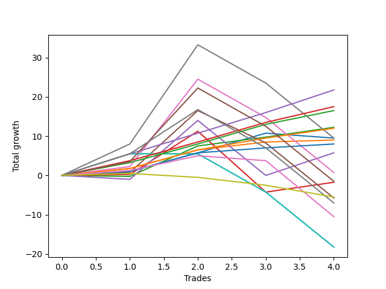

# Short Bernese 005 1v SB 
- Symbol: ES_1W
- Date Range: 03/18/2022 - 07/29/2022
- Trading Period: 7:20-12:30
- Number of Trades: 4



| Name | Win Percent | Profit | Avg Profit / Trade | Avg Time / Trade |      | Name | Win Percent | Profit | Avg Profit / Trade | Avg Time / Trade |
| ---- | ----------- | ------ | ------------------ | ---------------- | ---- | ---- | ----------- | ------ | ------------------ | ---------------- |
| Sorted By <br> Profit | | | | | | Sorted By <br> Win Percentage ||||
| Eighty-Five | 100.00 | 10875.00 | 2718.75 | 16:12 |     | Eighty-Five | 100.00 | 10875.00 | 2718.75 | 16:12 |
| Eighty-Four | 100.00 | 8750.00 | 2187.50 | 15:25 |     | Eighty-Four | 100.00 | 8750.00 | 2187.50 | 15:25 |
| Eighty-Three | 100.00 | 8250.00 | 2062.50 | 15:12 |     | Eighty-Three | 100.00 | 8250.00 | 2062.50 | 15:12 |
| Two | 75.00 | 6125.00 | 1531.25 | 18:30 |     | Eighty-Two | 100.00 | 6000.00 | 1500.00 | 04:28 |
| Eighty-Two | 100.00 | 6000.00 | 1500.00 | 04:28 |     | One | 100.00 | 4500.00 | 1125.00 | 06:20 |
| Zero | 75.00 | 4750.00 | 1187.50 | 02:56 |     | Eighty-One | 100.00 | 4000.00 | 1000.00 | 03:31 |
| Six | 50.00 | 4750.00 | 1187.50 | 48:16 |     | Two | 75.00 | 6125.00 | 1531.25 | 18:30 |
| One | 100.00 | 4500.00 | 1125.00 | 06:20 |     | Zero | 75.00 | 4750.00 | 1187.50 | 02:56 |
| Eighty-One | 100.00 | 4000.00 | 1000.00 | 03:31 |     | Two_C | 75.00 | -875.00 | -218.75 | 28:03 |
| Three | 50.00 | 2875.00 | 718.75 | 28:48 |     | Six | 50.00 | 4750.00 | 1187.50 | 48:16 |
| Five | 50.00 | 375.00 | 93.75 | 46:42 |     | Three | 50.00 | 2875.00 | 718.75 | 28:48 |
| NEWFI 000 | 50.00 | -750.00 | -187.50 | 50:30 |     | Five | 50.00 | 375.00 | 93.75 | 46:42 |
| Two_C | 75.00 | -875.00 | -218.75 | 28:03 |     | NEWFI 000 | 50.00 | -750.00 | -187.50 | 50:30 |
| MALAMUTE 002 | 25.00 | -2750.00 | -687.50 | 05:20 |     | Four | 50.00 | -2875.00 | -718.75 | 45:40 |
| Four | 50.00 | -2875.00 | -718.75 | 45:40 |     | MALAMUTE 001 | 50.00 | -3500.00 | -875.00 | 59:27 |
| MALAMUTE 001 | 50.00 | -3500.00 | -875.00 | 59:27 |     | NEWFI 0000 | 50.00 | -5250.00 | -1312.50 | 10:50 |
| NEWFI 0000 | 50.00 | -5250.00 | -1312.50 | 10:50 |     | MALAMUTE 002 | 25.00 | -2750.00 | -687.50 | 05:20 |
| BB100 | 25.00 | -9125.00 | -2281.25 | 60:55 |     | BB100 | 25.00 | -9125.00 | -2281.25 | 60:55 |
| Seven | 25.00 | -9125.00 | -2281.25 | 60:55 |     | Seven | 25.00 | -9125.00 | -2281.25 | 60:55 |

## NO STOPLOSS

### Test Zero
* Sell when price hits the middle line of the 20p bollinger
* No Stoploss
* Results:
```
Total Trades: 4
Percent Up: 25.00
Percent Down: 75.00
Total Points Moved Down: 9.50
Potential Profit: 4750.00
Total Points Ups: 1.25 Count Ups: 1
Total Points Downs: 10.75 Count Downs: 3
```

<details><summary>Trades</summary>

<code>In: 2022-03-25 11:18:00		Out: 2022-03-25 11:19:10		Total Position Time: 01:10		Total Move Down: 1.00		Total to Date: 1.00</code> <br />
<code>In: 2022-05-10 11:06:00		Out: 2022-05-10 11:07:10		Total Position Time: 01:10		Total Move Down: 4.75		Total to Date: 5.75</code> <br />
<code>In: 2022-05-25 11:37:00		Out: 2022-05-25 11:39:10		Total Position Time: 02:10		Total Move Down: 5.00		Total to Date: 10.75</code> <br />
<code>In: 2022-07-01 10:55:00		Out: 2022-07-01 11:02:15		Total Position Time: 07:15		Total Move Down: -1.25		Total to Date: 9.50</code> <br />


</details>

### Test One
* Sell when the price hits the upper line of the 20p 1std bollinger
* No Stoploss
* Results:
```
Total Trades: 4
Percent Up: 0.00
Percent Down: 100.00
Total Points Moved Down: 9.00
Potential Profit: 4500.00
Total Points Ups: 0.00 Count Ups: 0
Total Points Downs: 9.00 Count Downs: 4
```

<details><summary>Trades</summary>

<code>In: 2022-03-25 11:18:00		Out: 2022-03-25 11:19:45		Total Position Time: 01:45		Total Move Down: 1.75		Total to Date: 1.75</code> <br />
<code>In: 2022-05-10 11:06:00		Out: 2022-05-10 11:07:10		Total Position Time: 01:10		Total Move Down: 4.75		Total to Date: 6.50</code> <br />
<code>In: 2022-05-25 11:37:00		Out: 2022-05-25 11:49:55		Total Position Time: 12:55		Total Move Down: 2.00		Total to Date: 8.50</code> <br />
<code>In: 2022-07-01 10:55:00		Out: 2022-07-01 11:04:30		Total Position Time: 09:30		Total Move Down: 0.50		Total to Date: 9.00</code> <br />


</details>

### Test Two
* Sell when the price hits the upper line of the 20p 2std bollinger
* No Stoploss
* Results:
```
Total Trades: 4
Percent Up: 25.00
Percent Down: 75.00
Total Points Moved Down: 12.25
Potential Profit: 6125.00
Total Points Ups: 0.25 Count Ups: 1
Total Points Downs: 12.50 Count Downs: 3
```

<details><summary>Trades</summary>

<code>In: 2022-03-25 11:18:00		Out: 2022-03-25 12:00:55		Total Position Time: 42:55		Total Move Down: -0.25		Total to Date: -0.25</code> <br />
<code>In: 2022-05-10 11:06:00		Out: 2022-05-10 11:11:10		Total Position Time: 05:10		Total Move Down: 7.75		Total to Date: 7.50</code> <br />
<code>In: 2022-05-25 11:37:00		Out: 2022-05-25 11:50:00		Total Position Time: 13:00		Total Move Down: 2.25		Total to Date: 9.75</code> <br />
<code>In: 2022-07-01 10:55:00		Out: 2022-07-01 11:07:55		Total Position Time: 12:55		Total Move Down: 2.50		Total to Date: 12.25</code> <br />


</details>

### Test Two_C
* Sell when the price hits the upper line of the 20p 2std bollinger
* No Stoploss
* Results:
```
Total Trades: 4
Percent Up: 25.00
Percent Down: 75.00
Total Points Moved Down: -1.75
Potential Profit: -875.00
Total Points Ups: 15.50 Count Ups: 1
Total Points Downs: 13.75 Count Downs: 3
```

<details><summary>Trades</summary>

<code>In: 2022-03-25 11:18:00		Out: 2022-03-25 12:01:15		Total Position Time: 43:15		Total Move Down: 0.25		Total to Date: 0.25</code> <br />
<code>In: 2022-05-10 11:06:00		Out: 2022-05-10 11:16:05		Total Position Time: 10:05		Total Move Down: 11.00		Total to Date: 11.25</code> <br />
<code>In: 2022-05-25 11:37:00		Out: 2022-05-25 12:23:00		Total Position Time: 46:00		Total Move Down: -15.50		Total to Date: -4.25</code> <br />
<code>In: 2022-07-01 10:55:00		Out: 2022-07-01 11:07:55		Total Position Time: 12:55		Total Move Down: 2.50		Total to Date: -1.75</code> <br />


</details>

### Test Three
* Sell when price hits the middle line of the 50p bollinger
* No Stoploss
* Results:
```
Total Trades: 4
Percent Up: 50.00
Percent Down: 50.00
Total Points Moved Down: 5.75
Potential Profit: 2875.00
Total Points Ups: 15.00 Count Ups: 2
Total Points Downs: 20.75 Count Downs: 2
```

<details><summary>Trades</summary>

<code>In: 2022-03-25 11:18:00		Out: 2022-03-25 11:49:30		Total Position Time: 31:30		Total Move Down: -1.00		Total to Date: -1.00</code> <br />
<code>In: 2022-05-10 11:06:00		Out: 2022-05-10 11:16:20		Total Position Time: 10:20		Total Move Down: 15.00		Total to Date: 14.00</code> <br />
<code>In: 2022-05-25 11:37:00		Out: 2022-05-25 12:34:20		Total Position Time: 57:20		Total Move Down: -14.00		Total to Date: 0.00</code> <br />
<code>In: 2022-07-01 10:55:00		Out: 2022-07-01 11:11:05		Total Position Time: 16:05		Total Move Down: 5.75		Total to Date: 5.75</code> <br />


</details>

### Test Four
* Sell when the price hits the upper line of the 50p 1std bollinger
* No Stoploss
* Results:
```
Total Trades: 4
Percent Up: 50.00
Percent Down: 50.00
Total Points Moved Down: -5.75
Potential Profit: -2875.00
Total Points Ups: 22.25 Count Ups: 2
Total Points Downs: 16.50 Count Downs: 2
```

<details><summary>Trades</summary>

<code>In: 2022-03-25 11:18:00		Out: 2022-03-25 12:01:35		Total Position Time: 43:35		Total Move Down: 0.75		Total to Date: 0.75</code> <br />
<code>In: 2022-05-10 11:06:00		Out: 2022-05-10 11:24:05		Total Position Time: 18:05		Total Move Down: 15.75		Total to Date: 16.50</code> <br />
<code>In: 2022-05-25 11:37:00		Out: 2022-05-25 12:37:05		Total Position Time: 60:05		Total Move Down: -8.25		Total to Date: 8.25</code> <br />
<code>In: 2022-07-01 10:55:00		Out: 2022-07-01 11:55:55		Total Position Time: 60:55		Total Move Down: -14.00		Total to Date: -5.75</code> <br />


</details>

### Test Five
* Sell when the price hits the upper line of the 50p 2std bollinger
* No Stoploss
* Results:
```
Total Trades: 4
Percent Up: 50.00
Percent Down: 50.00
Total Points Moved Down: 0.75
Potential Profit: 375.00
Total Points Ups: 23.75 Count Ups: 2
Total Points Downs: 24.50 Count Downs: 2
```

<details><summary>Trades</summary>

<code>In: 2022-03-25 11:18:00		Out: 2022-03-25 12:01:55		Total Position Time: 43:55		Total Move Down: 2.25		Total to Date: 2.25</code> <br />
<code>In: 2022-05-10 11:06:00		Out: 2022-05-10 11:27:05		Total Position Time: 21:05		Total Move Down: 22.25		Total to Date: 24.50</code> <br />
<code>In: 2022-05-25 11:37:00		Out: 2022-05-25 12:37:55		Total Position Time: 60:55		Total Move Down: -9.75		Total to Date: 14.75</code> <br />
<code>In: 2022-07-01 10:55:00		Out: 2022-07-01 11:55:55		Total Position Time: 60:55		Total Move Down: -14.00		Total to Date: 0.75</code> <br />


</details>

### Test Six
* Sell when the price hits the middle line of the 1std VWAP
* No Stoploss
* Results:
```
Total Trades: 4
Percent Up: 50.00
Percent Down: 50.00
Total Points Moved Down: 9.50
Potential Profit: 4750.00
Total Points Ups: 23.75 Count Ups: 2
Total Points Downs: 33.25 Count Downs: 2
```

<details><summary>Trades</summary>

<code>In: 2022-03-25 11:18:00		Out: 2022-03-25 12:07:35		Total Position Time: 49:35		Total Move Down: 8.00		Total to Date: 8.00</code> <br />
<code>In: 2022-05-10 11:06:00		Out: 2022-05-10 11:27:40		Total Position Time: 21:40		Total Move Down: 25.25		Total to Date: 33.25</code> <br />
<code>In: 2022-05-25 11:37:00		Out: 2022-05-25 12:37:55		Total Position Time: 60:55		Total Move Down: -9.75		Total to Date: 23.50</code> <br />
<code>In: 2022-07-01 10:55:00		Out: 2022-07-01 11:55:55		Total Position Time: 60:55		Total Move Down: -14.00		Total to Date: 9.50</code> <br />


</details>

### Test Seven
* Sell when the price hits the upper line of the 1std VWAP
* No Stoploss
* Results:
```
Total Trades: 4
Percent Up: 75.00
Percent Down: 25.00
Total Points Moved Down: -18.25
Potential Profit: -9125.00
Total Points Ups: 23.75 Count Ups: 3
Total Points Downs: 5.50 Count Downs: 1
```

<details><summary>Trades</summary>

<code>In: 2022-03-25 11:18:00		Out: 2022-03-25 12:18:55		Total Position Time: 60:55		Total Move Down: 5.50		Total to Date: 5.50</code> <br />
<code>In: 2022-05-10 11:06:00		Out: 2022-05-10 12:06:55		Total Position Time: 60:55		Total Move Down: -0.00		Total to Date: 5.50</code> <br />
<code>In: 2022-05-25 11:37:00		Out: 2022-05-25 12:37:55		Total Position Time: 60:55		Total Move Down: -9.75		Total to Date: -4.25</code> <br />
<code>In: 2022-07-01 10:55:00		Out: 2022-07-01 11:55:55		Total Position Time: 60:55		Total Move Down: -14.00		Total to Date: -18.25</code> <br />


</details>

### Test BB100
* Sell when the price hits the upper line of the 1std VWAP
* No Stoploss
* Results:
```
Total Trades: 4
Percent Up: 75.00
Percent Down: 25.00
Total Points Moved Down: -18.25
Potential Profit: -9125.00
Total Points Ups: 23.75 Count Ups: 3
Total Points Downs: 5.50 Count Downs: 1
```

<details><summary>Trades</summary>

<code>In: 2022-03-25 11:18:00		Out: 2022-03-25 12:18:55		Total Position Time: 60:55		Total Move Down: 5.50		Total to Date: 5.50</code> <br />
<code>In: 2022-05-10 11:06:00		Out: 2022-05-10 12:06:55		Total Position Time: 60:55		Total Move Down: -0.00		Total to Date: 5.50</code> <br />
<code>In: 2022-05-25 11:37:00		Out: 2022-05-25 12:37:55		Total Position Time: 60:55		Total Move Down: -9.75		Total to Date: -4.25</code> <br />
<code>In: 2022-07-01 10:55:00		Out: 2022-07-01 11:55:55		Total Position Time: 60:55		Total Move Down: -14.00		Total to Date: -18.25</code> <br />


</details>

## TAKE PROFIT

### Test Eighty-One
* Take Profit of 1 Point
* No Stoploss
* Results:
```
Total Trades: 4
Percent Up: 0.00
Percent Down: 100.00
Total Points Moved Down: 8.00
Potential Profit: 4000.00
Total Points Ups: 0.00 Count Ups: 0
Total Points Downs: 8.00 Count Downs: 4
```

<details><summary>Trades</summary>

<code>In: 2022-03-25 11:18:00		Out: 2022-03-25 11:19:10		Total Position Time: 01:10		Total Move Down: 1.00		Total to Date: 1.00</code> <br />
<code>In: 2022-05-10 11:06:00		Out: 2022-05-10 11:07:10		Total Position Time: 01:10		Total Move Down: 4.75		Total to Date: 5.75</code> <br />
<code>In: 2022-05-25 11:37:00		Out: 2022-05-25 11:38:50		Total Position Time: 01:50		Total Move Down: 1.25		Total to Date: 7.00</code> <br />
<code>In: 2022-07-01 10:55:00		Out: 2022-07-01 11:04:55		Total Position Time: 09:55		Total Move Down: 1.00		Total to Date: 8.00</code> <br />


</details>

### Test Eighty-Two
* Take Profit of 2 Point
* No Stoploss
* Results:
```
Total Trades: 4
Percent Up: 0.00
Percent Down: 100.00
Total Points Moved Down: 12.00
Potential Profit: 6000.00
Total Points Ups: 0.00 Count Ups: 0
Total Points Downs: 12.00 Count Downs: 4
```

<details><summary>Trades</summary>

<code>In: 2022-03-25 11:18:00		Out: 2022-03-25 11:19:45		Total Position Time: 01:45		Total Move Down: 1.75		Total to Date: 1.75</code> <br />
<code>In: 2022-05-10 11:06:00		Out: 2022-05-10 11:07:10		Total Position Time: 01:10		Total Move Down: 4.75		Total to Date: 6.50</code> <br />
<code>In: 2022-05-25 11:37:00		Out: 2022-05-25 11:39:05		Total Position Time: 02:05		Total Move Down: 3.00		Total to Date: 9.50</code> <br />
<code>In: 2022-07-01 10:55:00		Out: 2022-07-01 11:07:55		Total Position Time: 12:55		Total Move Down: 2.50		Total to Date: 12.00</code> <br />


</details>

### Test Eighty-Three
* Take Profit of 3 Point
* No Stoploss
* Results:
```
Total Trades: 4
Percent Up: 0.00
Percent Down: 100.00
Total Points Moved Down: 16.50
Potential Profit: 8250.00
Total Points Ups: 0.00 Count Ups: 0
Total Points Downs: 16.50 Count Downs: 4
```

<details><summary>Trades</summary>

<code>In: 2022-03-25 11:18:00		Out: 2022-03-25 12:02:00		Total Position Time: 44:00		Total Move Down: 3.25		Total to Date: 3.25</code> <br />
<code>In: 2022-05-10 11:06:00		Out: 2022-05-10 11:07:10		Total Position Time: 01:10		Total Move Down: 4.75		Total to Date: 8.00</code> <br />
<code>In: 2022-05-25 11:37:00		Out: 2022-05-25 11:39:10		Total Position Time: 02:10		Total Move Down: 5.00		Total to Date: 13.00</code> <br />
<code>In: 2022-07-01 10:55:00		Out: 2022-07-01 11:08:30		Total Position Time: 13:30		Total Move Down: 3.50		Total to Date: 16.50</code> <br />


</details>

### Test Eighty-Four
* Take Profit of 4 Point
* No Stoploss
* Results:
```
Total Trades: 4
Percent Up: 0.00
Percent Down: 100.00
Total Points Moved Down: 17.50
Potential Profit: 8750.00
Total Points Ups: 0.00 Count Ups: 0
Total Points Downs: 17.50 Count Downs: 4
```

<details><summary>Trades</summary>

<code>In: 2022-03-25 11:18:00		Out: 2022-03-25 12:02:30		Total Position Time: 44:30		Total Move Down: 3.75		Total to Date: 3.75</code> <br />
<code>In: 2022-05-10 11:06:00		Out: 2022-05-10 11:07:10		Total Position Time: 01:10		Total Move Down: 4.75		Total to Date: 8.50</code> <br />
<code>In: 2022-05-25 11:37:00		Out: 2022-05-25 11:39:10		Total Position Time: 02:10		Total Move Down: 5.00		Total to Date: 13.50</code> <br />
<code>In: 2022-07-01 10:55:00		Out: 2022-07-01 11:08:50		Total Position Time: 13:50		Total Move Down: 4.00		Total to Date: 17.50</code> <br />


</details>

### Test Eighty-Five
* Take Profit of 5 Point
* No Stoploss
* Results:
```
Total Trades: 4
Percent Up: 0.00
Percent Down: 100.00
Total Points Moved Down: 21.75
Potential Profit: 10875.00
Total Points Ups: 0.00 Count Ups: 0
Total Points Downs: 21.75 Count Downs: 4
```

<details><summary>Trades</summary>

<code>In: 2022-03-25 11:18:00		Out: 2022-03-25 12:03:05		Total Position Time: 45:05		Total Move Down: 5.50		Total to Date: 5.50</code> <br />
<code>In: 2022-05-10 11:06:00		Out: 2022-05-10 11:07:15		Total Position Time: 01:15		Total Move Down: 5.25		Total to Date: 10.75</code> <br />
<code>In: 2022-05-25 11:37:00		Out: 2022-05-25 11:39:25		Total Position Time: 02:25		Total Move Down: 5.25		Total to Date: 16.00</code> <br />
<code>In: 2022-07-01 10:55:00		Out: 2022-07-01 11:11:05		Total Position Time: 16:05		Total Move Down: 5.75		Total to Date: 21.75</code> <br />


</details>

## Indicator Exits

### Test NEWFI 000
* Newfi 0000
* No Stoploss
* Results:
```
Total Trades: 4
Percent Up: 50.00
Percent Down: 50.00
Total Points Moved Down: -1.50
Potential Profit: -750.00
Total Points Ups: 23.75 Count Ups: 2
Total Points Downs: 22.25 Count Downs: 2
```

<details><summary>Trades</summary>

<code>In: 2022-03-25 11:18:00		Out: 2022-03-25 12:13:05		Total Position Time: 55:05		Total Move Down: 3.50		Total to Date: 3.50</code> <br />
<code>In: 2022-05-10 11:06:00		Out: 2022-05-10 11:31:05		Total Position Time: 25:05		Total Move Down: 18.75		Total to Date: 22.25</code> <br />
<code>In: 2022-05-25 11:37:00		Out: 2022-05-25 12:37:55		Total Position Time: 60:55		Total Move Down: -9.75		Total to Date: 12.50</code> <br />
<code>In: 2022-07-01 10:55:00		Out: 2022-07-01 11:55:55		Total Position Time: 60:55		Total Move Down: -14.00		Total to Date: -1.50</code> <br />


</details>

### Test NEWFI 0000
* Newfi 0000
* No Stoploss
* Results:
```
Total Trades: 4
Percent Up: 50.00
Percent Down: 50.00
Total Points Moved Down: -10.50
Potential Profit: -5250.00
Total Points Ups: 15.50 Count Ups: 2
Total Points Downs: 5.00 Count Downs: 2
```

<details><summary>Trades</summary>

<code>In: 2022-03-25 11:18:00		Out: 2022-03-25 11:19:05		Total Position Time: 01:05		Total Move Down: 1.25		Total to Date: 1.25</code> <br />
<code>In: 2022-05-10 11:06:00		Out: 2022-05-10 11:07:05		Total Position Time: 01:05		Total Move Down: 3.75		Total to Date: 5.00</code> <br />
<code>In: 2022-05-25 11:37:00		Out: 2022-05-25 11:46:05		Total Position Time: 09:05		Total Move Down: -1.25		Total to Date: 3.75</code> <br />
<code>In: 2022-07-01 10:55:00		Out: 2022-07-01 11:27:05		Total Position Time: 32:05		Total Move Down: -14.25		Total to Date: -10.50</code> <br />


</details>

### Test MALAMUTE 001
* Malamute 001
* No Stoploss
* Results:
```
Total Trades: 4
Percent Up: 50.00
Percent Down: 50.00
Total Points Moved Down: -7.00
Potential Profit: -3500.00
Total Points Ups: 23.75 Count Ups: 2
Total Points Downs: 16.75 Count Downs: 2
```

<details><summary>Trades</summary>

<code>In: 2022-03-25 11:18:00		Out: 2022-03-25 12:18:55		Total Position Time: 60:55		Total Move Down: 5.50		Total to Date: 5.50</code> <br />
<code>In: 2022-05-10 11:06:00		Out: 2022-05-10 12:01:05		Total Position Time: 55:05		Total Move Down: 11.25		Total to Date: 16.75</code> <br />
<code>In: 2022-05-25 11:37:00		Out: 2022-05-25 12:37:55		Total Position Time: 60:55		Total Move Down: -9.75		Total to Date: 7.00</code> <br />
<code>In: 2022-07-01 10:55:00		Out: 2022-07-01 11:55:55		Total Position Time: 60:55		Total Move Down: -14.00		Total to Date: -7.00</code> <br />


</details>

### Test MALAMUTE 002
* Malamute 001
* No Stoploss
* Results:
```
Total Trades: 4
Percent Up: 75.00
Percent Down: 25.00
Total Points Moved Down: -5.50
Potential Profit: -2750.00
Total Points Ups: 6.00 Count Ups: 3
Total Points Downs: 0.50 Count Downs: 1
```

<details><summary>Trades</summary>

<code>In: 2022-03-25 11:18:00		Out: 2022-03-25 11:25:05		Total Position Time: 07:05		Total Move Down: 0.50		Total to Date: 0.50</code> <br />
<code>In: 2022-05-10 11:06:00		Out: 2022-05-10 11:14:05		Total Position Time: 08:05		Total Move Down: -1.00		Total to Date: -0.50</code> <br />
<code>In: 2022-05-25 11:37:00		Out: 2022-05-25 11:38:05		Total Position Time: 01:05		Total Move Down: -2.00		Total to Date: -2.50</code> <br />
<code>In: 2022-07-01 10:55:00		Out: 2022-07-01 11:00:05		Total Position Time: 05:05		Total Move Down: -3.00		Total to Date: -5.50</code> <br />


</details>