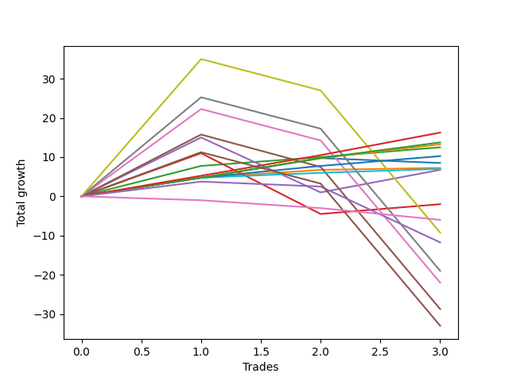

# Short Bernese 005 1v 
- Symbol: ES_1W
- Date Range: 03/18/2022 - 07/29/2022
- Trading Period: 7:20-12:30
- Number of Trades: 3



| Name | Win Percent | Profit | Avg Profit / Trade | Avg Time / Trade |      | Name | Win Percent | Profit | Avg Profit / Trade | Avg Time / Trade |
| ---- | ----------- | ------ | ------------------ | ---------------- | ---- | ---- | ----------- | ------ | ------------------ | ---------------- |
| Sorted By <br> Profit | | | | | | Sorted By <br> Win Percentage ||||
| Eighty-Five | 100.00 | 8125.00 | 2708.33 | 06:35 |     | Eighty-Five | 100.00 | 8125.00 | 2708.33 | 06:35 |
| Eighty-Four | 100.00 | 6875.00 | 2291.67 | 05:43 |     | Eighty-Four | 100.00 | 6875.00 | 2291.67 | 05:43 |
| Eighty-Three | 100.00 | 6625.00 | 2208.33 | 05:36 |     | Eighty-Three | 100.00 | 6625.00 | 2208.33 | 05:36 |
| Two | 100.00 | 6250.00 | 2083.33 | 10:21 |     | Two | 100.00 | 6250.00 | 2083.33 | 10:21 |
| Eighty-Two | 100.00 | 5125.00 | 1708.33 | 05:23 |     | Eighty-Two | 100.00 | 5125.00 | 1708.33 | 05:23 |
| Zero | 66.67 | 4250.00 | 1416.67 | 03:31 |     | One | 100.00 | 3625.00 | 1208.33 | 07:51 |
| One | 100.00 | 3625.00 | 1208.33 | 07:51 |     | Eighty-One | 100.00 | 3500.00 | 1166.67 | 04:18 |
| Eighty-One | 100.00 | 3500.00 | 1166.67 | 04:18 |     | Zero | 66.67 | 4250.00 | 1416.67 | 03:31 |
| Three | 66.67 | 3375.00 | 1125.00 | 27:55 |     | Three | 66.67 | 3375.00 | 1125.00 | 27:55 |
| Two_C | 66.67 | -1000.00 | -333.33 | 23:00 |     | Two_C | 66.67 | -1000.00 | -333.33 | 23:00 |
| MALAMUTE 002 | 0.00 | -3000.00 | -1000.00 | 04:45 |     | Seven | 33.33 | -4625.00 | -1541.67 | 94:20 |
| Seven | 33.33 | -4625.00 | -1541.67 | 94:20 |     | NEWFI 0000 | 33.33 | -5875.00 | -1958.33 | 14:05 |
| NEWFI 0000 | 33.33 | -5875.00 | -1958.33 | 14:05 |     | Six | 33.33 | -9500.00 | -3166.67 | 67:53 |
| Six | 33.33 | -9500.00 | -3166.67 | 67:53 |     | Five | 33.33 | -11000.00 | -3666.67 | 67:41 |
| Five | 33.33 | -11000.00 | -3666.67 | 67:41 |     | Four | 33.33 | -14375.00 | -4791.67 | 63:23 |
| Four | 33.33 | -14375.00 | -4791.67 | 63:23 |     | MALAMUTE 001 | 33.33 | -16500.00 | -5500.00 | 79:01 |
| MALAMUTE 001 | 33.33 | -16500.00 | -5500.00 | 79:01 |     | MALAMUTE 002 | 0.00 | -3000.00 | -1000.00 | 04:45 |

## NO STOPLOSS

### Test Zero
* Sell when price hits the middle line of the 20p bollinger
* No Stoploss
* Results:
```
Total Trades: 3
Percent Up: 33.33
Percent Down: 66.67
Total Points Moved Down: 8.50
Potential Profit: 4250.00
Total Points Ups: 1.25 Count Ups: 1
Total Points Downs: 9.75 Count Downs: 2
```

<details><summary>Trades</summary>

<code>In: 2022-05-10 11:06:00		Out: 2022-05-10 11:07:10		Total Position Time: 01:10		Total Move Down: 4.75		Total to Date: 4.75</code> <br />
<code>In: 2022-05-25 11:37:00		Out: 2022-05-25 11:39:10		Total Position Time: 02:10		Total Move Down: 5.00		Total to Date: 9.75</code> <br />
<code>In: 2022-07-01 10:55:00		Out: 2022-07-01 11:02:15		Total Position Time: 07:15		Total Move Down: -1.25		Total to Date: 8.50</code> <br />


</details>

### Test One
* Sell when the price hits the upper line of the 20p 1std bollinger
* No Stoploss
* Results:
```
Total Trades: 3
Percent Up: 0.00
Percent Down: 100.00
Total Points Moved Down: 7.25
Potential Profit: 3625.00
Total Points Ups: 0.00 Count Ups: 0
Total Points Downs: 7.25 Count Downs: 3
```

<details><summary>Trades</summary>

<code>In: 2022-05-10 11:06:00		Out: 2022-05-10 11:07:10		Total Position Time: 01:10		Total Move Down: 4.75		Total to Date: 4.75</code> <br />
<code>In: 2022-05-25 11:37:00		Out: 2022-05-25 11:49:55		Total Position Time: 12:55		Total Move Down: 2.00		Total to Date: 6.75</code> <br />
<code>In: 2022-07-01 10:55:00		Out: 2022-07-01 11:04:30		Total Position Time: 09:30		Total Move Down: 0.50		Total to Date: 7.25</code> <br />


</details>

### Test Two
* Sell when the price hits the upper line of the 20p 2std bollinger
* No Stoploss
* Results:
```
Total Trades: 3
Percent Up: 0.00
Percent Down: 100.00
Total Points Moved Down: 12.50
Potential Profit: 6250.00
Total Points Ups: 0.00 Count Ups: 0
Total Points Downs: 12.50 Count Downs: 3
```

<details><summary>Trades</summary>

<code>In: 2022-05-10 11:06:00		Out: 2022-05-10 11:11:10		Total Position Time: 05:10		Total Move Down: 7.75		Total to Date: 7.75</code> <br />
<code>In: 2022-05-25 11:37:00		Out: 2022-05-25 11:50:00		Total Position Time: 13:00		Total Move Down: 2.25		Total to Date: 10.00</code> <br />
<code>In: 2022-07-01 10:55:00		Out: 2022-07-01 11:07:55		Total Position Time: 12:55		Total Move Down: 2.50		Total to Date: 12.50</code> <br />


</details>

### Test Two_C
* Sell when the price hits the upper line of the 20p 2std bollinger
* No Stoploss
* Results:
```
Total Trades: 3
Percent Up: 33.33
Percent Down: 66.67
Total Points Moved Down: -2.00
Potential Profit: -1000.00
Total Points Ups: 15.50 Count Ups: 1
Total Points Downs: 13.50 Count Downs: 2
```

<details><summary>Trades</summary>

<code>In: 2022-05-10 11:06:00		Out: 2022-05-10 11:16:05		Total Position Time: 10:05		Total Move Down: 11.00		Total to Date: 11.00</code> <br />
<code>In: 2022-05-25 11:37:00		Out: 2022-05-25 12:23:00		Total Position Time: 46:00		Total Move Down: -15.50		Total to Date: -4.50</code> <br />
<code>In: 2022-07-01 10:55:00		Out: 2022-07-01 11:07:55		Total Position Time: 12:55		Total Move Down: 2.50		Total to Date: -2.00</code> <br />


</details>

### Test Three
* Sell when price hits the middle line of the 50p bollinger
* No Stoploss
* Results:
```
Total Trades: 3
Percent Up: 33.33
Percent Down: 66.67
Total Points Moved Down: 6.75
Potential Profit: 3375.00
Total Points Ups: 14.00 Count Ups: 1
Total Points Downs: 20.75 Count Downs: 2
```

<details><summary>Trades</summary>

<code>In: 2022-05-10 11:06:00		Out: 2022-05-10 11:16:20		Total Position Time: 10:20		Total Move Down: 15.00		Total to Date: 15.00</code> <br />
<code>In: 2022-05-25 11:37:00		Out: 2022-05-25 12:34:20		Total Position Time: 57:20		Total Move Down: -14.00		Total to Date: 1.00</code> <br />
<code>In: 2022-07-01 10:55:00		Out: 2022-07-01 11:11:05		Total Position Time: 16:05		Total Move Down: 5.75		Total to Date: 6.75</code> <br />


</details>

### Test Four
* Sell when the price hits the upper line of the 50p 1std bollinger
* No Stoploss
* Results:
```
Total Trades: 3
Percent Up: 66.67
Percent Down: 33.33
Total Points Moved Down: -28.75
Potential Profit: -14375.00
Total Points Ups: 44.50 Count Ups: 2
Total Points Downs: 15.75 Count Downs: 1
```

<details><summary>Trades</summary>

<code>In: 2022-05-10 11:06:00		Out: 2022-05-10 11:24:05		Total Position Time: 18:05		Total Move Down: 15.75		Total to Date: 15.75</code> <br />
<code>In: 2022-05-25 11:37:00		Out: 2022-05-25 12:37:05		Total Position Time: 60:05		Total Move Down: -8.25		Total to Date: 7.50</code> <br />
<code>In: 2022-07-01 10:55:00		Out: 2022-07-01 12:47:00		Total Position Time: 112:00		Total Move Down: -36.25		Total to Date: -28.75</code> <br />


</details>

### Test Five
* Sell when the price hits the upper line of the 50p 2std bollinger
* No Stoploss
* Results:
```
Total Trades: 3
Percent Up: 66.67
Percent Down: 33.33
Total Points Moved Down: -22.00
Potential Profit: -11000.00
Total Points Ups: 44.25 Count Ups: 2
Total Points Downs: 22.25 Count Downs: 1
```

<details><summary>Trades</summary>

<code>In: 2022-05-10 11:06:00		Out: 2022-05-10 11:27:05		Total Position Time: 21:05		Total Move Down: 22.25		Total to Date: 22.25</code> <br />
<code>In: 2022-05-25 11:37:00		Out: 2022-05-25 12:47:00		Total Position Time: 70:00		Total Move Down: -8.00		Total to Date: 14.25</code> <br />
<code>In: 2022-07-01 10:55:00		Out: 2022-07-01 12:47:00		Total Position Time: 112:00		Total Move Down: -36.25		Total to Date: -22.00</code> <br />


</details>

### Test Six
* Sell when the price hits the middle line of the 1std VWAP
* No Stoploss
* Results:
```
Total Trades: 3
Percent Up: 66.67
Percent Down: 33.33
Total Points Moved Down: -19.00
Potential Profit: -9500.00
Total Points Ups: 44.25 Count Ups: 2
Total Points Downs: 25.25 Count Downs: 1
```

<details><summary>Trades</summary>

<code>In: 2022-05-10 11:06:00		Out: 2022-05-10 11:27:40		Total Position Time: 21:40		Total Move Down: 25.25		Total to Date: 25.25</code> <br />
<code>In: 2022-05-25 11:37:00		Out: 2022-05-25 12:47:00		Total Position Time: 70:00		Total Move Down: -8.00		Total to Date: 17.25</code> <br />
<code>In: 2022-07-01 10:55:00		Out: 2022-07-01 12:47:00		Total Position Time: 112:00		Total Move Down: -36.25		Total to Date: -19.00</code> <br />


</details>

### Test Seven
* Sell when the price hits the upper line of the 1std VWAP
* No Stoploss
* Results:
```
Total Trades: 3
Percent Up: 66.67
Percent Down: 33.33
Total Points Moved Down: -9.25
Potential Profit: -4625.00
Total Points Ups: 44.25 Count Ups: 2
Total Points Downs: 35.00 Count Downs: 1
```

<details><summary>Trades</summary>

<code>In: 2022-05-10 11:06:00		Out: 2022-05-10 12:47:00		Total Position Time: 101:00		Total Move Down: 35.00		Total to Date: 35.00</code> <br />
<code>In: 2022-05-25 11:37:00		Out: 2022-05-25 12:47:00		Total Position Time: 70:00		Total Move Down: -8.00		Total to Date: 27.00</code> <br />
<code>In: 2022-07-01 10:55:00		Out: 2022-07-01 12:47:00		Total Position Time: 112:00		Total Move Down: -36.25		Total to Date: -9.25</code> <br />


</details>

## TAKE PROFIT

### Test Eighty-One
* Take Profit of 1 Point
* No Stoploss
* Results:
```
Total Trades: 3
Percent Up: 0.00
Percent Down: 100.00
Total Points Moved Down: 7.00
Potential Profit: 3500.00
Total Points Ups: 0.00 Count Ups: 0
Total Points Downs: 7.00 Count Downs: 3
```

<details><summary>Trades</summary>

<code>In: 2022-05-10 11:06:00		Out: 2022-05-10 11:07:10		Total Position Time: 01:10		Total Move Down: 4.75		Total to Date: 4.75</code> <br />
<code>In: 2022-05-25 11:37:00		Out: 2022-05-25 11:38:50		Total Position Time: 01:50		Total Move Down: 1.25		Total to Date: 6.00</code> <br />
<code>In: 2022-07-01 10:55:00		Out: 2022-07-01 11:04:55		Total Position Time: 09:55		Total Move Down: 1.00		Total to Date: 7.00</code> <br />


</details>

### Test Eighty-Two
* Take Profit of 2 Point
* No Stoploss
* Results:
```
Total Trades: 3
Percent Up: 0.00
Percent Down: 100.00
Total Points Moved Down: 10.25
Potential Profit: 5125.00
Total Points Ups: 0.00 Count Ups: 0
Total Points Downs: 10.25 Count Downs: 3
```

<details><summary>Trades</summary>

<code>In: 2022-05-10 11:06:00		Out: 2022-05-10 11:07:10		Total Position Time: 01:10		Total Move Down: 4.75		Total to Date: 4.75</code> <br />
<code>In: 2022-05-25 11:37:00		Out: 2022-05-25 11:39:05		Total Position Time: 02:05		Total Move Down: 3.00		Total to Date: 7.75</code> <br />
<code>In: 2022-07-01 10:55:00		Out: 2022-07-01 11:07:55		Total Position Time: 12:55		Total Move Down: 2.50		Total to Date: 10.25</code> <br />


</details>

### Test Eighty-Three
* Take Profit of 3 Point
* No Stoploss
* Results:
```
Total Trades: 3
Percent Up: 0.00
Percent Down: 100.00
Total Points Moved Down: 13.25
Potential Profit: 6625.00
Total Points Ups: 0.00 Count Ups: 0
Total Points Downs: 13.25 Count Downs: 3
```

<details><summary>Trades</summary>

<code>In: 2022-05-10 11:06:00		Out: 2022-05-10 11:07:10		Total Position Time: 01:10		Total Move Down: 4.75		Total to Date: 4.75</code> <br />
<code>In: 2022-05-25 11:37:00		Out: 2022-05-25 11:39:10		Total Position Time: 02:10		Total Move Down: 5.00		Total to Date: 9.75</code> <br />
<code>In: 2022-07-01 10:55:00		Out: 2022-07-01 11:08:30		Total Position Time: 13:30		Total Move Down: 3.50		Total to Date: 13.25</code> <br />


</details>

### Test Eighty-Four
* Take Profit of 4 Point
* No Stoploss
* Results:
```
Total Trades: 3
Percent Up: 0.00
Percent Down: 100.00
Total Points Moved Down: 13.75
Potential Profit: 6875.00
Total Points Ups: 0.00 Count Ups: 0
Total Points Downs: 13.75 Count Downs: 3
```

<details><summary>Trades</summary>

<code>In: 2022-05-10 11:06:00		Out: 2022-05-10 11:07:10		Total Position Time: 01:10		Total Move Down: 4.75		Total to Date: 4.75</code> <br />
<code>In: 2022-05-25 11:37:00		Out: 2022-05-25 11:39:10		Total Position Time: 02:10		Total Move Down: 5.00		Total to Date: 9.75</code> <br />
<code>In: 2022-07-01 10:55:00		Out: 2022-07-01 11:08:50		Total Position Time: 13:50		Total Move Down: 4.00		Total to Date: 13.75</code> <br />


</details>

### Test Eighty-Five
* Take Profit of 5 Point
* No Stoploss
* Results:
```
Total Trades: 3
Percent Up: 0.00
Percent Down: 100.00
Total Points Moved Down: 16.25
Potential Profit: 8125.00
Total Points Ups: 0.00 Count Ups: 0
Total Points Downs: 16.25 Count Downs: 3
```

<details><summary>Trades</summary>

<code>In: 2022-05-10 11:06:00		Out: 2022-05-10 11:07:15		Total Position Time: 01:15		Total Move Down: 5.25		Total to Date: 5.25</code> <br />
<code>In: 2022-05-25 11:37:00		Out: 2022-05-25 11:39:25		Total Position Time: 02:25		Total Move Down: 5.25		Total to Date: 10.50</code> <br />
<code>In: 2022-07-01 10:55:00		Out: 2022-07-01 11:11:05		Total Position Time: 16:05		Total Move Down: 5.75		Total to Date: 16.25</code> <br />


</details>

## Indicator Exits

### Test NEWFI 0000
* Newfi 0000
* No Stoploss
* Results:
```
Total Trades: 3
Percent Up: 66.67
Percent Down: 33.33
Total Points Moved Down: -11.75
Potential Profit: -5875.00
Total Points Ups: 15.50 Count Ups: 2
Total Points Downs: 3.75 Count Downs: 1
```

<details><summary>Trades</summary>

<code>In: 2022-05-10 11:06:00		Out: 2022-05-10 11:07:05		Total Position Time: 01:05		Total Move Down: 3.75		Total to Date: 3.75</code> <br />
<code>In: 2022-05-25 11:37:00		Out: 2022-05-25 11:46:05		Total Position Time: 09:05		Total Move Down: -1.25		Total to Date: 2.50</code> <br />
<code>In: 2022-07-01 10:55:00		Out: 2022-07-01 11:27:05		Total Position Time: 32:05		Total Move Down: -14.25		Total to Date: -11.75</code> <br />


</details>

### Test MALAMUTE 001
* Malamute 001
* No Stoploss
* Results:
```
Total Trades: 3
Percent Up: 66.67
Percent Down: 33.33
Total Points Moved Down: -33.00
Potential Profit: -16500.00
Total Points Ups: 44.25 Count Ups: 2
Total Points Downs: 11.25 Count Downs: 1
```

<details><summary>Trades</summary>

<code>In: 2022-05-10 11:06:00		Out: 2022-05-10 12:01:05		Total Position Time: 55:05		Total Move Down: 11.25		Total to Date: 11.25</code> <br />
<code>In: 2022-05-25 11:37:00		Out: 2022-05-25 12:47:00		Total Position Time: 70:00		Total Move Down: -8.00		Total to Date: 3.25</code> <br />
<code>In: 2022-07-01 10:55:00		Out: 2022-07-01 12:47:00		Total Position Time: 112:00		Total Move Down: -36.25		Total to Date: -33.00</code> <br />


</details>

### Test MALAMUTE 002
* Malamute 001
* No Stoploss
* Results:
```
Total Trades: 3
Percent Up: 100.00
Percent Down: 0.00
Total Points Moved Down: -6.00
Potential Profit: -3000.00
Total Points Ups: 6.00 Count Ups: 3
Total Points Downs: 0.00 Count Downs: 0
```

<details><summary>Trades</summary>

<code>In: 2022-05-10 11:06:00		Out: 2022-05-10 11:14:05		Total Position Time: 08:05		Total Move Down: -1.00		Total to Date: -1.00</code> <br />
<code>In: 2022-05-25 11:37:00		Out: 2022-05-25 11:38:05		Total Position Time: 01:05		Total Move Down: -2.00		Total to Date: -3.00</code> <br />
<code>In: 2022-07-01 10:55:00		Out: 2022-07-01 11:00:05		Total Position Time: 05:05		Total Move Down: -3.00		Total to Date: -6.00</code> <br />


</details>