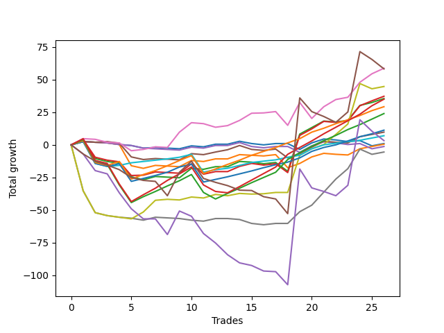

# Short Malamute 001 
- Symbol: ES_1W
- Date Range: 10/28/2022 - 11/04/2022
- Trading Period: 7:20-12:30
- Number of Trades: 26



| Name | Win Percent | Profit | Avg Profit / Trade | Avg Time / Trade |      | Name | Win Percent | Profit | Avg Profit / Trade | Avg Time / Trade |
| ---- | ----------- | ------ | ------------------ | ---------------- | ---- | ---- | ----------- | ------ | ------------------ | ---------------- |
| Sorted By <br> Profit | | | | | | Sorted By <br> Win Percentage ||||
| MALAMUTE 001 | 23.08 | 26750.00 | 1028.85 | 34:11 |     | Eighty-One | 88.46 | 3750.00 | 144.23 | 33:21 |
| Five | 69.23 | 22375.00 | 860.58 | 30:00 |     | Eighty-Three | 80.77 | -18875.00 | -725.96 | 55:44 |
| Two | 57.69 | 11625.00 | 447.12 | 17:33 |     | Eighty-Two | 80.77 | -27125.00 | -1043.27 | 50:10 |
| Two_C | 57.69 | 9625.00 | 370.19 | 21:42 |     | Eighty-Four | 76.92 | -10875.00 | -418.27 | 66:28 |
| Eighty-One | 88.46 | 3750.00 | 144.23 | 33:21 |     | Eighty-Five | 73.08 | -5625.00 | -216.35 | 69:56 |
| NEWFI 0000 | 15.38 | -0.00 | -0.00 | 44:41 |     | Five | 69.23 | 22375.00 | 860.58 | 30:00 |
| Four | 57.69 | -4375.00 | -168.27 | 10:38 |     | Seven | 61.54 | -8000.00 | -307.69 | 62:13 |
| Eighty-Five | 73.08 | -5625.00 | -216.35 | 69:56 |     | Two | 57.69 | 11625.00 | 447.12 | 17:33 |
| Seven | 61.54 | -8000.00 | -307.69 | 62:13 |     | Two_C | 57.69 | 9625.00 | 370.19 | 21:42 |
| One | 53.85 | -8500.00 | -326.92 | 10:05 |     | Four | 57.69 | -4375.00 | -168.27 | 10:38 |
| Eighty-Four | 76.92 | -10875.00 | -418.27 | 66:28 |     | One | 53.85 | -8500.00 | -326.92 | 10:05 |
| Three | 38.46 | -12625.00 | -485.58 | 03:40 |     | Zero | 42.31 | -12750.00 | -490.38 | 02:56 |
| Zero | 42.31 | -12750.00 | -490.38 | 02:56 |     | Six | 42.31 | -32875.00 | -1264.42 | 31:56 |
| Eighty-Three | 80.77 | -18875.00 | -725.96 | 55:44 |     | Three | 38.46 | -12625.00 | -485.58 | 03:40 |
| Eighty-Two | 80.77 | -27125.00 | -1043.27 | 50:10 |     | MALAMUTE 001 | 23.08 | 26750.00 | 1028.85 | 34:11 |
| Six | 42.31 | -32875.00 | -1264.42 | 31:56 |     | NEWFI 0000 | 15.38 | -0.00 | -0.00 | 44:41 |

## NO STOPLOSS

### Test Zero
* Sell when price hits the middle line of the 20p bollinger
* No Stoploss
* Results:
```
Total Trades: 26
Percent Up: 57.69
Percent Down: 42.31
Total Points Moved Down: -25.50
Potential Profit: -12750.00
Total Points Ups: 47.25 Count Ups: 15
Total Points Downs: 21.75 Count Downs: 11
```

<details><summary>Trades</summary>

<code>In: 2022-10-28 07:21:00		Out: 2022-10-28 08:03:05		Total Position Time: 42:05		Total Move Down: -28.25		Total to Date: -28.25</code> <br />
<code>In: 2022-10-28 08:33:00		Out: 2022-10-28 08:34:10		Total Position Time: 01:10		Total Move Down: 2.50		Total to Date: -25.75</code> <br />
<code>In: 2022-10-28 11:10:00		Out: 2022-10-28 11:11:10		Total Position Time: 01:10		Total Move Down: -0.50		Total to Date: -26.25</code> <br />
<code>In: 2022-10-28 12:24:00		Out: 2022-10-28 12:25:10		Total Position Time: 01:10		Total Move Down: -0.50		Total to Date: -26.75</code> <br />
<code>In: 2022-10-31 07:21:00		Out: 2022-10-31 07:24:15		Total Position Time: 03:15		Total Move Down: 5.25		Total to Date: -21.50</code> <br />
<code>In: 2022-10-31 07:40:00		Out: 2022-10-31 07:41:10		Total Position Time: 01:10		Total Move Down: -0.75		Total to Date: -22.25</code> <br />
<code>In: 2022-10-31 09:10:00		Out: 2022-10-31 09:11:10		Total Position Time: 01:10		Total Move Down: -2.00		Total to Date: -24.25</code> <br />
<code>In: 2022-10-31 10:58:00		Out: 2022-10-31 11:01:05		Total Position Time: 03:05		Total Move Down: 0.50		Total to Date: -23.75</code> <br />
<code>In: 2022-10-31 12:03:00		Out: 2022-10-31 12:04:10		Total Position Time: 01:10		Total Move Down: -0.50		Total to Date: -24.25</code> <br />
<code>In: 2022-11-01 07:21:00		Out: 2022-11-01 07:22:15		Total Position Time: 01:15		Total Move Down: -2.50		Total to Date: -26.75</code> <br />
<code>In: 2022-11-01 08:37:00		Out: 2022-11-01 08:38:25		Total Position Time: 01:25		Total Move Down: 2.25		Total to Date: -24.50</code> <br />
<code>In: 2022-11-01 08:42:00		Out: 2022-11-01 08:43:10		Total Position Time: 01:10		Total Move Down: -0.75		Total to Date: -25.25</code> <br />
<code>In: 2022-11-01 09:35:00		Out: 2022-11-01 09:36:10		Total Position Time: 01:10		Total Move Down: 2.00		Total to Date: -23.25</code> <br />
<code>In: 2022-11-01 10:42:00		Out: 2022-11-01 10:43:10		Total Position Time: 01:10		Total Move Down: -0.00		Total to Date: -23.25</code> <br />
<code>In: 2022-11-01 11:31:00		Out: 2022-11-01 11:33:05		Total Position Time: 02:05		Total Move Down: 2.25		Total to Date: -21.00</code> <br />
<code>In: 2022-11-02 07:21:00		Out: 2022-11-02 07:22:10		Total Position Time: 01:10		Total Move Down: 0.50		Total to Date: -20.50</code> <br />
<code>In: 2022-11-02 08:22:00		Out: 2022-11-02 08:23:10		Total Position Time: 01:10		Total Move Down: -1.00		Total to Date: -21.50</code> <br />
<code>In: 2022-11-02 09:10:00		Out: 2022-11-02 09:11:10		Total Position Time: 01:10		Total Move Down: 1.00		Total to Date: -20.50</code> <br />
<code>In: 2022-11-02 10:31:00		Out: 2022-11-02 10:32:10		Total Position Time: 01:10		Total Move Down: -0.00		Total to Date: -20.50</code> <br />
<code>In: 2022-11-02 11:45:00		Out: 2022-11-02 11:46:10		Total Position Time: 01:10		Total Move Down: -4.50		Total to Date: -25.00</code> <br />
<code>In: 2022-11-03 08:22:00		Out: 2022-11-03 08:23:10		Total Position Time: 01:10		Total Move Down: 3.00		Total to Date: -22.00</code> <br />
<code>In: 2022-11-03 10:22:00		Out: 2022-11-03 10:23:10		Total Position Time: 01:10		Total Move Down: -0.75		Total to Date: -22.75</code> <br />
<code>In: 2022-11-03 12:20:00		Out: 2022-11-03 12:21:10		Total Position Time: 01:10		Total Move Down: -1.25		Total to Date: -24.00</code> <br />
<code>In: 2022-11-04 08:03:00		Out: 2022-11-04 08:04:10		Total Position Time: 01:10		Total Move Down: 0.75		Total to Date: -23.25</code> <br />
<code>In: 2022-11-04 09:50:00		Out: 2022-11-04 09:51:10		Total Position Time: 01:10		Total Move Down: -4.00		Total to Date: -27.25</code> <br />
<code>In: 2022-11-04 10:40:00		Out: 2022-11-04 10:41:10		Total Position Time: 01:10		Total Move Down: 1.75		Total to Date: -25.50</code> <br />


</details>

### Test One
* Sell when the price hits the upper line of the 20p 1std bollinger
* No Stoploss
* Results:
```
Total Trades: 26
Percent Up: 46.15
Percent Down: 53.85
Total Points Moved Down: -17.00
Potential Profit: -8500.00
Total Points Ups: 58.25 Count Ups: 12
Total Points Downs: 41.25 Count Downs: 14
```

<details><summary>Trades</summary>

<code>In: 2022-10-28 07:21:00		Out: 2022-10-28 08:06:05		Total Position Time: 45:05		Total Move Down: -26.00		Total to Date: -26.00</code> <br />
<code>In: 2022-10-28 08:33:00		Out: 2022-10-28 08:34:10		Total Position Time: 01:10		Total Move Down: 2.50		Total to Date: -23.50</code> <br />
<code>In: 2022-10-28 11:10:00		Out: 2022-10-28 11:11:10		Total Position Time: 01:10		Total Move Down: -0.50		Total to Date: -24.00</code> <br />
<code>In: 2022-10-28 12:24:00		Out: 2022-10-28 12:36:55		Total Position Time: 12:55		Total Move Down: -0.50		Total to Date: -24.50</code> <br />
<code>In: 2022-10-31 07:21:00		Out: 2022-10-31 07:28:10		Total Position Time: 07:10		Total Move Down: 9.50		Total to Date: -15.00</code> <br />
<code>In: 2022-10-31 07:40:00		Out: 2022-10-31 08:58:20		Total Position Time: 78:20		Total Move Down: -16.25		Total to Date: -31.25</code> <br />
<code>In: 2022-10-31 09:10:00		Out: 2022-10-31 09:11:10		Total Position Time: 01:10		Total Move Down: -2.00		Total to Date: -33.25</code> <br />
<code>In: 2022-10-31 10:58:00		Out: 2022-10-31 11:10:05		Total Position Time: 12:05		Total Move Down: 2.25		Total to Date: -31.00</code> <br />
<code>In: 2022-10-31 12:03:00		Out: 2022-10-31 12:04:10		Total Position Time: 01:10		Total Move Down: -0.50		Total to Date: -31.50</code> <br />
<code>In: 2022-11-01 07:21:00		Out: 2022-11-01 07:27:25		Total Position Time: 06:25		Total Move Down: 1.25		Total to Date: -30.25</code> <br />
<code>In: 2022-11-01 08:37:00		Out: 2022-11-01 08:38:35		Total Position Time: 01:35		Total Move Down: 4.75		Total to Date: -25.50</code> <br />
<code>In: 2022-11-01 08:42:00		Out: 2022-11-01 08:43:10		Total Position Time: 01:10		Total Move Down: -0.75		Total to Date: -26.25</code> <br />
<code>In: 2022-11-01 09:35:00		Out: 2022-11-01 09:36:10		Total Position Time: 01:10		Total Move Down: 2.00		Total to Date: -24.25</code> <br />
<code>In: 2022-11-01 10:42:00		Out: 2022-11-01 11:06:50		Total Position Time: 24:50		Total Move Down: -0.00		Total to Date: -24.25</code> <br />
<code>In: 2022-11-01 11:31:00		Out: 2022-11-01 11:33:15		Total Position Time: 02:15		Total Move Down: 3.25		Total to Date: -21.00</code> <br />
<code>In: 2022-11-02 07:21:00		Out: 2022-11-02 07:22:10		Total Position Time: 01:10		Total Move Down: 0.50		Total to Date: -20.50</code> <br />
<code>In: 2022-11-02 08:22:00		Out: 2022-11-02 08:28:20		Total Position Time: 06:20		Total Move Down: -0.50		Total to Date: -21.00</code> <br />
<code>In: 2022-11-02 09:10:00		Out: 2022-11-02 09:11:10		Total Position Time: 01:10		Total Move Down: 1.00		Total to Date: -20.00</code> <br />
<code>In: 2022-11-02 10:31:00		Out: 2022-11-02 11:00:15		Total Position Time: 29:15		Total Move Down: -10.00		Total to Date: -30.00</code> <br />
<code>In: 2022-11-02 11:45:00		Out: 2022-11-02 11:46:25		Total Position Time: 01:25		Total Move Down: 3.25		Total to Date: -26.75</code> <br />
<code>In: 2022-11-03 08:22:00		Out: 2022-11-03 08:23:15		Total Position Time: 01:15		Total Move Down: 2.75		Total to Date: -24.00</code> <br />
<code>In: 2022-11-03 10:22:00		Out: 2022-11-03 10:23:10		Total Position Time: 01:10		Total Move Down: -0.75		Total to Date: -24.75</code> <br />
<code>In: 2022-11-03 12:20:00		Out: 2022-11-03 12:36:40		Total Position Time: 16:40		Total Move Down: -0.50		Total to Date: -25.25</code> <br />
<code>In: 2022-11-04 08:03:00		Out: 2022-11-04 08:05:30		Total Position Time: 02:30		Total Move Down: 4.75		Total to Date: -20.50</code> <br />
<code>In: 2022-11-04 09:50:00		Out: 2022-11-04 09:52:40		Total Position Time: 02:40		Total Move Down: 1.75		Total to Date: -18.75</code> <br />
<code>In: 2022-11-04 10:40:00		Out: 2022-11-04 10:41:10		Total Position Time: 01:10		Total Move Down: 1.75		Total to Date: -17.00</code> <br />


</details>

### Test Two
* Sell when the price hits the upper line of the 20p 2std bollinger
* No Stoploss
* Results:
```
Total Trades: 26
Percent Up: 42.31
Percent Down: 57.69
Total Points Moved Down: 23.25
Potential Profit: 11625.00
Total Points Ups: 63.75 Count Ups: 11
Total Points Downs: 87.00 Count Downs: 15
```

<details><summary>Trades</summary>

<code>In: 2022-10-28 07:21:00		Out: 2022-10-28 08:07:05		Total Position Time: 46:05		Total Move Down: -25.00		Total to Date: -25.00</code> <br />
<code>In: 2022-10-28 08:33:00		Out: 2022-10-28 08:34:50		Total Position Time: 01:50		Total Move Down: 3.25		Total to Date: -21.75</code> <br />
<code>In: 2022-10-28 11:10:00		Out: 2022-10-28 12:06:00		Total Position Time: 56:00		Total Move Down: -13.75		Total to Date: -35.50</code> <br />
<code>In: 2022-10-28 12:24:00		Out: 2022-10-28 12:47:00		Total Position Time: 23:00		Total Move Down: -2.25		Total to Date: -37.75</code> <br />
<code>In: 2022-10-31 07:21:00		Out: 2022-10-31 07:36:30		Total Position Time: 15:30		Total Move Down: 12.00		Total to Date: -25.75</code> <br />
<code>In: 2022-10-31 07:40:00		Out: 2022-10-31 08:58:35		Total Position Time: 78:35		Total Move Down: -10.50		Total to Date: -36.25</code> <br />
<code>In: 2022-10-31 09:10:00		Out: 2022-10-31 09:31:05		Total Position Time: 21:05		Total Move Down: -2.25		Total to Date: -38.50</code> <br />
<code>In: 2022-10-31 10:58:00		Out: 2022-10-31 11:17:05		Total Position Time: 19:05		Total Move Down: 2.50		Total to Date: -36.00</code> <br />
<code>In: 2022-10-31 12:03:00		Out: 2022-10-31 12:04:10		Total Position Time: 01:10		Total Move Down: -0.50		Total to Date: -36.50</code> <br />
<code>In: 2022-11-01 07:21:00		Out: 2022-11-01 07:39:55		Total Position Time: 18:55		Total Move Down: 3.00		Total to Date: -33.50</code> <br />
<code>In: 2022-11-01 08:37:00		Out: 2022-11-01 08:39:10		Total Position Time: 02:10		Total Move Down: 7.25		Total to Date: -26.25</code> <br />
<code>In: 2022-11-01 08:42:00		Out: 2022-11-01 08:43:10		Total Position Time: 01:10		Total Move Down: -0.75		Total to Date: -27.00</code> <br />
<code>In: 2022-11-01 09:35:00		Out: 2022-11-01 09:36:10		Total Position Time: 01:10		Total Move Down: 2.00		Total to Date: -25.00</code> <br />
<code>In: 2022-11-01 10:42:00		Out: 2022-11-01 11:20:10		Total Position Time: 38:10		Total Move Down: -0.00		Total to Date: -25.00</code> <br />
<code>In: 2022-11-01 11:31:00		Out: 2022-11-01 11:33:25		Total Position Time: 02:25		Total Move Down: 4.00		Total to Date: -21.00</code> <br />
<code>In: 2022-11-02 07:21:00		Out: 2022-11-02 07:22:10		Total Position Time: 01:10		Total Move Down: 0.50		Total to Date: -20.50</code> <br />
<code>In: 2022-11-02 08:22:00		Out: 2022-11-02 09:00:15		Total Position Time: 38:15		Total Move Down: -1.25		Total to Date: -21.75</code> <br />
<code>In: 2022-11-02 09:10:00		Out: 2022-11-02 09:11:10		Total Position Time: 01:10		Total Move Down: 1.00		Total to Date: -20.75</code> <br />
<code>In: 2022-11-02 10:31:00		Out: 2022-11-02 11:00:20		Total Position Time: 29:20		Total Move Down: -6.75		Total to Date: -27.50</code> <br />
<code>In: 2022-11-02 11:45:00		Out: 2022-11-02 11:50:40		Total Position Time: 05:40		Total Move Down: 28.50		Total to Date: 1.00</code> <br />
<code>In: 2022-11-03 08:22:00		Out: 2022-11-03 08:25:50		Total Position Time: 03:50		Total Move Down: 5.00		Total to Date: 6.00</code> <br />
<code>In: 2022-11-03 10:22:00		Out: 2022-11-03 10:23:10		Total Position Time: 01:10		Total Move Down: -0.75		Total to Date: 5.25</code> <br />
<code>In: 2022-11-03 12:20:00		Out: 2022-11-03 12:43:10		Total Position Time: 23:10		Total Move Down: 1.25		Total to Date: 6.50</code> <br />
<code>In: 2022-11-04 08:03:00		Out: 2022-11-04 08:09:05		Total Position Time: 06:05		Total Move Down: 11.50		Total to Date: 18.00</code> <br />
<code>In: 2022-11-04 09:50:00		Out: 2022-11-04 10:09:05		Total Position Time: 19:05		Total Move Down: 2.25		Total to Date: 20.25</code> <br />
<code>In: 2022-11-04 10:40:00		Out: 2022-11-04 10:41:20		Total Position Time: 01:20		Total Move Down: 3.00		Total to Date: 23.25</code> <br />


</details>

### Test Two_C
* Sell when the price hits the upper line of the 20p 2std bollinger
* No Stoploss
* Results:
```
Total Trades: 26
Percent Up: 42.31
Percent Down: 57.69
Total Points Moved Down: 19.25
Potential Profit: 9625.00
Total Points Ups: 71.50 Count Ups: 11
Total Points Downs: 90.75 Count Downs: 15
```

<details><summary>Trades</summary>

<code>In: 2022-10-28 07:21:00		Out: 2022-10-28 08:07:05		Total Position Time: 46:05		Total Move Down: -25.00		Total to Date: -25.00</code> <br />
<code>In: 2022-10-28 08:33:00		Out: 2022-10-28 08:35:20		Total Position Time: 02:20		Total Move Down: 4.00		Total to Date: -21.00</code> <br />
<code>In: 2022-10-28 11:10:00		Out: 2022-10-28 12:06:05		Total Position Time: 56:05		Total Move Down: -13.50		Total to Date: -34.50</code> <br />
<code>In: 2022-10-28 12:24:00		Out: 2022-10-28 12:47:00		Total Position Time: 23:00		Total Move Down: -2.25		Total to Date: -36.75</code> <br />
<code>In: 2022-10-31 07:21:00		Out: 2022-10-31 07:36:35		Total Position Time: 15:35		Total Move Down: 12.50		Total to Date: -24.25</code> <br />
<code>In: 2022-10-31 07:40:00		Out: 2022-10-31 08:58:35		Total Position Time: 78:35		Total Move Down: -10.50		Total to Date: -34.75</code> <br />
<code>In: 2022-10-31 09:10:00		Out: 2022-10-31 09:34:30		Total Position Time: 24:30		Total Move Down: 0.25		Total to Date: -34.50</code> <br />
<code>In: 2022-10-31 10:58:00		Out: 2022-10-31 11:17:05		Total Position Time: 19:05		Total Move Down: 2.50		Total to Date: -32.00</code> <br />
<code>In: 2022-10-31 12:03:00		Out: 2022-10-31 12:04:10		Total Position Time: 01:10		Total Move Down: -0.50		Total to Date: -32.50</code> <br />
<code>In: 2022-11-01 07:21:00		Out: 2022-11-01 07:39:55		Total Position Time: 18:55		Total Move Down: 3.00		Total to Date: -29.50</code> <br />
<code>In: 2022-11-01 08:37:00		Out: 2022-11-01 08:39:10		Total Position Time: 02:10		Total Move Down: 7.25		Total to Date: -22.25</code> <br />
<code>In: 2022-11-01 08:42:00		Out: 2022-11-01 09:32:25		Total Position Time: 50:25		Total Move Down: -8.00		Total to Date: -30.25</code> <br />
<code>In: 2022-11-01 09:35:00		Out: 2022-11-01 09:36:10		Total Position Time: 01:10		Total Move Down: 2.00		Total to Date: -28.25</code> <br />
<code>In: 2022-11-01 10:42:00		Out: 2022-11-01 11:20:10		Total Position Time: 38:10		Total Move Down: -0.00		Total to Date: -28.25</code> <br />
<code>In: 2022-11-01 11:31:00		Out: 2022-11-01 11:33:25		Total Position Time: 02:25		Total Move Down: 4.00		Total to Date: -24.25</code> <br />
<code>In: 2022-11-02 07:21:00		Out: 2022-11-02 08:13:05		Total Position Time: 52:05		Total Move Down: -3.00		Total to Date: -27.25</code> <br />
<code>In: 2022-11-02 08:22:00		Out: 2022-11-02 09:00:30		Total Position Time: 38:30		Total Move Down: -1.25		Total to Date: -28.50</code> <br />
<code>In: 2022-11-02 09:10:00		Out: 2022-11-02 09:11:10		Total Position Time: 01:10		Total Move Down: 1.00		Total to Date: -27.50</code> <br />
<code>In: 2022-11-02 10:31:00		Out: 2022-11-02 11:00:20		Total Position Time: 29:20		Total Move Down: -6.75		Total to Date: -34.25</code> <br />
<code>In: 2022-11-02 11:45:00		Out: 2022-11-02 11:50:40		Total Position Time: 05:40		Total Move Down: 28.50		Total to Date: -5.75</code> <br />
<code>In: 2022-11-03 08:22:00		Out: 2022-11-03 08:29:05		Total Position Time: 07:05		Total Move Down: 5.75		Total to Date: 0.00</code> <br />
<code>In: 2022-11-03 10:22:00		Out: 2022-11-03 10:23:10		Total Position Time: 01:10		Total Move Down: -0.75		Total to Date: -0.75</code> <br />
<code>In: 2022-11-03 12:20:00		Out: 2022-11-03 12:43:10		Total Position Time: 23:10		Total Move Down: 1.25		Total to Date: 0.50</code> <br />
<code>In: 2022-11-04 08:03:00		Out: 2022-11-04 08:09:05		Total Position Time: 06:05		Total Move Down: 11.50		Total to Date: 12.00</code> <br />
<code>In: 2022-11-04 09:50:00		Out: 2022-11-04 10:09:10		Total Position Time: 19:10		Total Move Down: 3.75		Total to Date: 15.75</code> <br />
<code>In: 2022-11-04 10:40:00		Out: 2022-11-04 10:41:25		Total Position Time: 01:25		Total Move Down: 3.50		Total to Date: 19.25</code> <br />


</details>

### Test Three
* Sell when price hits the middle line of the 50p bollinger
* No Stoploss
* Results:
```
Total Trades: 26
Percent Up: 61.54
Percent Down: 38.46
Total Points Moved Down: -25.25
Potential Profit: -12625.00
Total Points Ups: 47.00 Count Ups: 16
Total Points Downs: 21.75 Count Downs: 10
```

<details><summary>Trades</summary>

<code>In: 2022-10-28 07:21:00		Out: 2022-10-28 08:26:05		Total Position Time: 65:05		Total Move Down: -26.75		Total to Date: -26.75</code> <br />
<code>In: 2022-10-28 08:33:00		Out: 2022-10-28 08:34:10		Total Position Time: 01:10		Total Move Down: 2.50		Total to Date: -24.25</code> <br />
<code>In: 2022-10-28 11:10:00		Out: 2022-10-28 11:11:10		Total Position Time: 01:10		Total Move Down: -0.50		Total to Date: -24.75</code> <br />
<code>In: 2022-10-28 12:24:00		Out: 2022-10-28 12:25:10		Total Position Time: 01:10		Total Move Down: -0.50		Total to Date: -25.25</code> <br />
<code>In: 2022-10-31 07:21:00		Out: 2022-10-31 07:22:10		Total Position Time: 01:10		Total Move Down: 5.75		Total to Date: -19.50</code> <br />
<code>In: 2022-10-31 07:40:00		Out: 2022-10-31 07:41:10		Total Position Time: 01:10		Total Move Down: -0.75		Total to Date: -20.25</code> <br />
<code>In: 2022-10-31 09:10:00		Out: 2022-10-31 09:11:10		Total Position Time: 01:10		Total Move Down: -2.00		Total to Date: -22.25</code> <br />
<code>In: 2022-10-31 10:58:00		Out: 2022-10-31 10:59:10		Total Position Time: 01:10		Total Move Down: -0.50		Total to Date: -22.75</code> <br />
<code>In: 2022-10-31 12:03:00		Out: 2022-10-31 12:04:10		Total Position Time: 01:10		Total Move Down: -0.50		Total to Date: -23.25</code> <br />
<code>In: 2022-11-01 07:21:00		Out: 2022-11-01 07:22:10		Total Position Time: 01:10		Total Move Down: -3.25		Total to Date: -26.50</code> <br />
<code>In: 2022-11-01 08:37:00		Out: 2022-11-01 08:38:25		Total Position Time: 01:25		Total Move Down: 2.25		Total to Date: -24.25</code> <br />
<code>In: 2022-11-01 08:42:00		Out: 2022-11-01 08:43:10		Total Position Time: 01:10		Total Move Down: -0.75		Total to Date: -25.00</code> <br />
<code>In: 2022-11-01 09:35:00		Out: 2022-11-01 09:36:10		Total Position Time: 01:10		Total Move Down: 2.00		Total to Date: -23.00</code> <br />
<code>In: 2022-11-01 10:42:00		Out: 2022-11-01 10:43:10		Total Position Time: 01:10		Total Move Down: -0.00		Total to Date: -23.00</code> <br />
<code>In: 2022-11-01 11:31:00		Out: 2022-11-01 11:33:05		Total Position Time: 02:05		Total Move Down: 2.25		Total to Date: -20.75</code> <br />
<code>In: 2022-11-02 07:21:00		Out: 2022-11-02 07:22:10		Total Position Time: 01:10		Total Move Down: 0.50		Total to Date: -20.25</code> <br />
<code>In: 2022-11-02 08:22:00		Out: 2022-11-02 08:23:10		Total Position Time: 01:10		Total Move Down: -1.00		Total to Date: -21.25</code> <br />
<code>In: 2022-11-02 09:10:00		Out: 2022-11-02 09:11:10		Total Position Time: 01:10		Total Move Down: 1.00		Total to Date: -20.25</code> <br />
<code>In: 2022-11-02 10:31:00		Out: 2022-11-02 10:32:10		Total Position Time: 01:10		Total Move Down: -0.00		Total to Date: -20.25</code> <br />
<code>In: 2022-11-02 11:45:00		Out: 2022-11-02 11:46:10		Total Position Time: 01:10		Total Move Down: -4.50		Total to Date: -24.75</code> <br />
<code>In: 2022-11-03 08:22:00		Out: 2022-11-03 08:23:10		Total Position Time: 01:10		Total Move Down: 3.00		Total to Date: -21.75</code> <br />
<code>In: 2022-11-03 10:22:00		Out: 2022-11-03 10:23:10		Total Position Time: 01:10		Total Move Down: -0.75		Total to Date: -22.50</code> <br />
<code>In: 2022-11-03 12:20:00		Out: 2022-11-03 12:21:10		Total Position Time: 01:10		Total Move Down: -1.25		Total to Date: -23.75</code> <br />
<code>In: 2022-11-04 08:03:00		Out: 2022-11-04 08:04:10		Total Position Time: 01:10		Total Move Down: 0.75		Total to Date: -23.00</code> <br />
<code>In: 2022-11-04 09:50:00		Out: 2022-11-04 09:51:10		Total Position Time: 01:10		Total Move Down: -4.00		Total to Date: -27.00</code> <br />
<code>In: 2022-11-04 10:40:00		Out: 2022-11-04 10:41:10		Total Position Time: 01:10		Total Move Down: 1.75		Total to Date: -25.25</code> <br />


</details>

### Test Four
* Sell when the price hits the upper line of the 50p 1std bollinger
* No Stoploss
* Results:
```
Total Trades: 26
Percent Up: 42.31
Percent Down: 57.69
Total Points Moved Down: -8.75
Potential Profit: -4375.00
Total Points Ups: 51.25 Count Ups: 11
Total Points Downs: 42.50 Count Downs: 15
```

<details><summary>Trades</summary>

<code>In: 2022-10-28 07:21:00		Out: 2022-10-28 08:34:05		Total Position Time: 73:05		Total Move Down: -25.00		Total to Date: -25.00</code> <br />
<code>In: 2022-10-28 08:33:00		Out: 2022-10-28 08:34:10		Total Position Time: 01:10		Total Move Down: 2.50		Total to Date: -22.50</code> <br />
<code>In: 2022-10-28 11:10:00		Out: 2022-10-28 11:11:10		Total Position Time: 01:10		Total Move Down: -0.50		Total to Date: -23.00</code> <br />
<code>In: 2022-10-28 12:24:00		Out: 2022-10-28 12:37:15		Total Position Time: 13:15		Total Move Down: 0.50		Total to Date: -22.50</code> <br />
<code>In: 2022-10-31 07:21:00		Out: 2022-10-31 07:28:10		Total Position Time: 07:10		Total Move Down: 9.50		Total to Date: -13.00</code> <br />
<code>In: 2022-10-31 07:40:00		Out: 2022-10-31 08:58:35		Total Position Time: 78:35		Total Move Down: -10.50		Total to Date: -23.50</code> <br />
<code>In: 2022-10-31 09:10:00		Out: 2022-10-31 09:11:10		Total Position Time: 01:10		Total Move Down: -2.00		Total to Date: -25.50</code> <br />
<code>In: 2022-10-31 10:58:00		Out: 2022-10-31 11:09:05		Total Position Time: 11:05		Total Move Down: 0.75		Total to Date: -24.75</code> <br />
<code>In: 2022-10-31 12:03:00		Out: 2022-10-31 12:04:10		Total Position Time: 01:10		Total Move Down: -0.50		Total to Date: -25.25</code> <br />
<code>In: 2022-11-01 07:21:00		Out: 2022-11-01 07:22:10		Total Position Time: 01:10		Total Move Down: -3.25		Total to Date: -28.50</code> <br />
<code>In: 2022-11-01 08:37:00		Out: 2022-11-01 08:38:35		Total Position Time: 01:35		Total Move Down: 4.75		Total to Date: -23.75</code> <br />
<code>In: 2022-11-01 08:42:00		Out: 2022-11-01 08:43:10		Total Position Time: 01:10		Total Move Down: -0.75		Total to Date: -24.50</code> <br />
<code>In: 2022-11-01 09:35:00		Out: 2022-11-01 09:36:10		Total Position Time: 01:10		Total Move Down: 2.00		Total to Date: -22.50</code> <br />
<code>In: 2022-11-01 10:42:00		Out: 2022-11-01 10:57:30		Total Position Time: 15:30		Total Move Down: 1.75		Total to Date: -20.75</code> <br />
<code>In: 2022-11-01 11:31:00		Out: 2022-11-01 11:33:15		Total Position Time: 02:15		Total Move Down: 3.25		Total to Date: -17.50</code> <br />
<code>In: 2022-11-02 07:21:00		Out: 2022-11-02 07:22:10		Total Position Time: 01:10		Total Move Down: 0.50		Total to Date: -17.00</code> <br />
<code>In: 2022-11-02 08:22:00		Out: 2022-11-02 08:27:45		Total Position Time: 05:45		Total Move Down: -0.75		Total to Date: -17.75</code> <br />
<code>In: 2022-11-02 09:10:00		Out: 2022-11-02 09:11:10		Total Position Time: 01:10		Total Move Down: 1.00		Total to Date: -16.75</code> <br />
<code>In: 2022-11-02 10:31:00		Out: 2022-11-02 11:00:20		Total Position Time: 29:20		Total Move Down: -6.75		Total to Date: -23.50</code> <br />
<code>In: 2022-11-02 11:45:00		Out: 2022-11-02 11:46:25		Total Position Time: 01:25		Total Move Down: 3.25		Total to Date: -20.25</code> <br />
<code>In: 2022-11-03 08:22:00		Out: 2022-11-03 08:25:05		Total Position Time: 03:05		Total Move Down: 4.50		Total to Date: -15.75</code> <br />
<code>In: 2022-11-03 10:22:00		Out: 2022-11-03 10:23:10		Total Position Time: 01:10		Total Move Down: -0.75		Total to Date: -16.50</code> <br />
<code>In: 2022-11-03 12:20:00		Out: 2022-11-03 12:36:40		Total Position Time: 16:40		Total Move Down: -0.50		Total to Date: -17.00</code> <br />
<code>In: 2022-11-04 08:03:00		Out: 2022-11-04 08:05:30		Total Position Time: 02:30		Total Move Down: 4.75		Total to Date: -12.25</code> <br />
<code>In: 2022-11-04 09:50:00		Out: 2022-11-04 09:52:40		Total Position Time: 02:40		Total Move Down: 1.75		Total to Date: -10.50</code> <br />
<code>In: 2022-11-04 10:40:00		Out: 2022-11-04 10:41:10		Total Position Time: 01:10		Total Move Down: 1.75		Total to Date: -8.75</code> <br />


</details>

### Test Five
* Sell when the price hits the upper line of the 50p 2std bollinger
* No Stoploss
* Results:
```
Total Trades: 26
Percent Up: 30.77
Percent Down: 69.23
Total Points Moved Down: 44.75
Potential Profit: 22375.00
Total Points Ups: 46.25 Count Ups: 8
Total Points Downs: 91.00 Count Downs: 18
```

<details><summary>Trades</summary>

<code>In: 2022-10-28 07:21:00		Out: 2022-10-28 08:35:40		Total Position Time: 74:40		Total Move Down: -23.00		Total to Date: -23.00</code> <br />
<code>In: 2022-10-28 08:33:00		Out: 2022-10-28 08:35:40		Total Position Time: 02:40		Total Move Down: 4.75		Total to Date: -18.25</code> <br />
<code>In: 2022-10-28 11:10:00		Out: 2022-10-28 11:11:20		Total Position Time: 01:20		Total Move Down: -0.50		Total to Date: -18.75</code> <br />
<code>In: 2022-10-28 12:24:00		Out: 2022-10-28 12:47:00		Total Position Time: 23:00		Total Move Down: -2.25		Total to Date: -21.00</code> <br />
<code>In: 2022-10-31 07:21:00		Out: 2022-10-31 08:58:50		Total Position Time: 97:50		Total Move Down: 2.50		Total to Date: -18.50</code> <br />
<code>In: 2022-10-31 07:40:00		Out: 2022-10-31 08:58:50		Total Position Time: 78:50		Total Move Down: -6.00		Total to Date: -24.50</code> <br />
<code>In: 2022-10-31 09:10:00		Out: 2022-10-31 09:34:40		Total Position Time: 24:40		Total Move Down: 1.00		Total to Date: -23.50</code> <br />
<code>In: 2022-10-31 10:58:00		Out: 2022-10-31 11:59:15		Total Position Time: 61:15		Total Move Down: 2.00		Total to Date: -21.50</code> <br />
<code>In: 2022-10-31 12:03:00		Out: 2022-10-31 12:04:10		Total Position Time: 01:10		Total Move Down: -0.50		Total to Date: -22.00</code> <br />
<code>In: 2022-11-01 07:21:00		Out: 2022-11-01 07:40:40		Total Position Time: 19:40		Total Move Down: 10.50		Total to Date: -11.50</code> <br />
<code>In: 2022-11-01 08:37:00		Out: 2022-11-01 08:39:10		Total Position Time: 02:10		Total Move Down: 7.25		Total to Date: -4.25</code> <br />
<code>In: 2022-11-01 08:42:00		Out: 2022-11-01 08:43:10		Total Position Time: 01:10		Total Move Down: -0.75		Total to Date: -5.00</code> <br />
<code>In: 2022-11-01 09:35:00		Out: 2022-11-01 11:33:25		Total Position Time: 118:25		Total Move Down: -2.75		Total to Date: -7.75</code> <br />
<code>In: 2022-11-01 10:42:00		Out: 2022-11-01 11:33:25		Total Position Time: 51:25		Total Move Down: 1.25		Total to Date: -6.50</code> <br />
<code>In: 2022-11-01 11:31:00		Out: 2022-11-01 11:33:25		Total Position Time: 02:25		Total Move Down: 4.00		Total to Date: -2.50</code> <br />
<code>In: 2022-11-02 07:21:00		Out: 2022-11-02 07:22:10		Total Position Time: 01:10		Total Move Down: 0.50		Total to Date: -2.00</code> <br />
<code>In: 2022-11-02 08:22:00		Out: 2022-11-02 09:07:30		Total Position Time: 45:30		Total Move Down: 0.25		Total to Date: -1.75</code> <br />
<code>In: 2022-11-02 09:10:00		Out: 2022-11-02 09:11:10		Total Position Time: 01:10		Total Move Down: 1.00		Total to Date: -0.75</code> <br />
<code>In: 2022-11-02 10:31:00		Out: 2022-11-02 11:37:55		Total Position Time: 66:55		Total Move Down: -10.50		Total to Date: -11.25</code> <br />
<code>In: 2022-11-02 11:45:00		Out: 2022-11-02 11:49:35		Total Position Time: 04:35		Total Move Down: 17.50		Total to Date: 6.25</code> <br />
<code>In: 2022-11-03 08:22:00		Out: 2022-11-03 08:31:15		Total Position Time: 09:15		Total Move Down: 9.00		Total to Date: 15.25</code> <br />
<code>In: 2022-11-03 10:22:00		Out: 2022-11-03 10:59:05		Total Position Time: 37:05		Total Move Down: 5.50		Total to Date: 20.75</code> <br />
<code>In: 2022-11-03 12:20:00		Out: 2022-11-03 12:43:15		Total Position Time: 23:15		Total Move Down: 1.75		Total to Date: 22.50</code> <br />
<code>In: 2022-11-04 08:03:00		Out: 2022-11-04 08:09:05		Total Position Time: 06:05		Total Move Down: 11.50		Total to Date: 34.00</code> <br />
<code>In: 2022-11-04 09:50:00		Out: 2022-11-04 10:09:20		Total Position Time: 19:20		Total Move Down: 6.50		Total to Date: 40.50</code> <br />
<code>In: 2022-11-04 10:40:00		Out: 2022-11-04 10:45:20		Total Position Time: 05:20		Total Move Down: 4.25		Total to Date: 44.75</code> <br />


</details>

### Test Six
* Sell when the price hits the middle line of the 1std VWAP
* No Stoploss
* Results:
```
Total Trades: 26
Percent Up: 57.69
Percent Down: 42.31
Total Points Moved Down: -65.75
Potential Profit: -32875.00
Total Points Ups: 131.00 Count Ups: 15
Total Points Downs: 65.25 Count Downs: 11
```

<details><summary>Trades</summary>

<code>In: 2022-10-28 07:21:00		Out: 2022-10-28 12:47:00		Total Position Time: 326:00		Total Move Down: -63.00		Total to Date: -63.00</code> <br />
<code>In: 2022-10-28 08:33:00		Out: 2022-10-28 12:47:00		Total Position Time: 254:00		Total Move Down: -35.25		Total to Date: -98.25</code> <br />
<code>In: 2022-10-28 11:10:00		Out: 2022-10-28 12:47:00		Total Position Time: 97:00		Total Move Down: -16.75		Total to Date: -115.00</code> <br />
<code>In: 2022-10-28 12:24:00		Out: 2022-10-28 12:47:00		Total Position Time: 23:00		Total Move Down: -2.25		Total to Date: -117.25</code> <br />
<code>In: 2022-10-31 07:21:00		Out: 2022-10-31 07:22:10		Total Position Time: 01:10		Total Move Down: 5.75		Total to Date: -111.50</code> <br />
<code>In: 2022-10-31 07:40:00		Out: 2022-10-31 07:41:10		Total Position Time: 01:10		Total Move Down: -0.75		Total to Date: -112.25</code> <br />
<code>In: 2022-10-31 09:10:00		Out: 2022-10-31 09:11:15		Total Position Time: 01:15		Total Move Down: -1.50		Total to Date: -113.75</code> <br />
<code>In: 2022-10-31 10:58:00		Out: 2022-10-31 11:11:10		Total Position Time: 13:10		Total Move Down: 2.25		Total to Date: -111.50</code> <br />
<code>In: 2022-10-31 12:03:00		Out: 2022-10-31 12:04:10		Total Position Time: 01:10		Total Move Down: -0.50		Total to Date: -112.00</code> <br />
<code>In: 2022-11-01 07:21:00		Out: 2022-11-01 07:22:10		Total Position Time: 01:10		Total Move Down: -3.25		Total to Date: -115.25</code> <br />
<code>In: 2022-11-01 08:37:00		Out: 2022-11-01 08:38:10		Total Position Time: 01:10		Total Move Down: -1.25		Total to Date: -116.50</code> <br />
<code>In: 2022-11-01 08:42:00		Out: 2022-11-01 08:43:10		Total Position Time: 01:10		Total Move Down: -0.75		Total to Date: -117.25</code> <br />
<code>In: 2022-11-01 09:35:00		Out: 2022-11-01 09:36:10		Total Position Time: 01:10		Total Move Down: 2.00		Total to Date: -115.25</code> <br />
<code>In: 2022-11-01 10:42:00		Out: 2022-11-01 10:43:10		Total Position Time: 01:10		Total Move Down: -0.00		Total to Date: -115.25</code> <br />
<code>In: 2022-11-01 11:31:00		Out: 2022-11-01 11:32:10		Total Position Time: 01:10		Total Move Down: -0.75		Total to Date: -116.00</code> <br />
<code>In: 2022-11-02 07:21:00		Out: 2022-11-02 07:22:10		Total Position Time: 01:10		Total Move Down: 0.50		Total to Date: -115.50</code> <br />
<code>In: 2022-11-02 08:22:00		Out: 2022-11-02 08:23:10		Total Position Time: 01:10		Total Move Down: -1.00		Total to Date: -116.50</code> <br />
<code>In: 2022-11-02 09:10:00		Out: 2022-11-02 09:11:10		Total Position Time: 01:10		Total Move Down: 1.00		Total to Date: -115.50</code> <br />
<code>In: 2022-11-02 10:31:00		Out: 2022-11-02 10:32:10		Total Position Time: 01:10		Total Move Down: -0.00		Total to Date: -115.50</code> <br />
<code>In: 2022-11-02 11:45:00		Out: 2022-11-02 11:46:40		Total Position Time: 01:40		Total Move Down: 9.00		Total to Date: -106.50</code> <br />
<code>In: 2022-11-03 08:22:00		Out: 2022-11-03 08:31:55		Total Position Time: 09:55		Total Move Down: 10.00		Total to Date: -96.50</code> <br />
<code>In: 2022-11-03 10:22:00		Out: 2022-11-03 11:12:55		Total Position Time: 50:55		Total Move Down: 10.00		Total to Date: -86.50</code> <br />
<code>In: 2022-11-03 12:20:00		Out: 2022-11-03 12:47:00		Total Position Time: 27:00		Total Move Down: 8.00		Total to Date: -78.50</code> <br />
<code>In: 2022-11-04 08:03:00		Out: 2022-11-04 08:12:00		Total Position Time: 09:00		Total Move Down: 15.00		Total to Date: -63.50</code> <br />
<code>In: 2022-11-04 09:50:00		Out: 2022-11-04 09:51:10		Total Position Time: 01:10		Total Move Down: -4.00		Total to Date: -67.50</code> <br />
<code>In: 2022-11-04 10:40:00		Out: 2022-11-04 10:41:10		Total Position Time: 01:10		Total Move Down: 1.75		Total to Date: -65.75</code> <br />


</details>

### Test Seven
* Sell when the price hits the upper line of the 1std VWAP
* No Stoploss
* Results:
```
Total Trades: 26
Percent Up: 38.46
Percent Down: 61.54
Total Points Moved Down: -16.00
Potential Profit: -8000.00
Total Points Ups: 127.50 Count Ups: 10
Total Points Downs: 111.50 Count Downs: 16
```

<details><summary>Trades</summary>

<code>In: 2022-10-28 07:21:00		Out: 2022-10-28 12:47:00		Total Position Time: 326:00		Total Move Down: -63.00		Total to Date: -63.00</code> <br />
<code>In: 2022-10-28 08:33:00		Out: 2022-10-28 12:47:00		Total Position Time: 254:00		Total Move Down: -35.25		Total to Date: -98.25</code> <br />
<code>In: 2022-10-28 11:10:00		Out: 2022-10-28 12:47:00		Total Position Time: 97:00		Total Move Down: -16.75		Total to Date: -115.00</code> <br />
<code>In: 2022-10-28 12:24:00		Out: 2022-10-28 12:47:00		Total Position Time: 23:00		Total Move Down: -2.25		Total to Date: -117.25</code> <br />
<code>In: 2022-10-31 07:21:00		Out: 2022-10-31 07:26:40		Total Position Time: 05:40		Total Move Down: 7.75		Total to Date: -109.50</code> <br />
<code>In: 2022-10-31 07:40:00		Out: 2022-10-31 09:43:15		Total Position Time: 123:15		Total Move Down: -1.25		Total to Date: -110.75</code> <br />
<code>In: 2022-10-31 09:10:00		Out: 2022-10-31 09:43:15		Total Position Time: 33:15		Total Move Down: 5.25		Total to Date: -105.50</code> <br />
<code>In: 2022-10-31 10:58:00		Out: 2022-10-31 12:03:25		Total Position Time: 65:25		Total Move Down: 9.00		Total to Date: -96.50</code> <br />
<code>In: 2022-10-31 12:03:00		Out: 2022-10-31 12:04:20		Total Position Time: 01:20		Total Move Down: 0.75		Total to Date: -95.75</code> <br />
<code>In: 2022-11-01 07:21:00		Out: 2022-11-01 07:22:10		Total Position Time: 01:10		Total Move Down: -3.25		Total to Date: -99.00</code> <br />
<code>In: 2022-11-01 08:37:00		Out: 2022-11-01 08:38:25		Total Position Time: 01:25		Total Move Down: 2.25		Total to Date: -96.75</code> <br />
<code>In: 2022-11-01 08:42:00		Out: 2022-11-01 08:43:10		Total Position Time: 01:10		Total Move Down: -0.75		Total to Date: -97.50</code> <br />
<code>In: 2022-11-01 09:35:00		Out: 2022-11-01 09:37:05		Total Position Time: 02:05		Total Move Down: 2.75		Total to Date: -94.75</code> <br />
<code>In: 2022-11-01 10:42:00		Out: 2022-11-01 12:47:00		Total Position Time: 125:00		Total Move Down: -1.00		Total to Date: -95.75</code> <br />
<code>In: 2022-11-01 11:31:00		Out: 2022-11-01 12:47:00		Total Position Time: 76:00		Total Move Down: 1.75		Total to Date: -94.00</code> <br />
<code>In: 2022-11-02 07:21:00		Out: 2022-11-02 07:22:10		Total Position Time: 01:10		Total Move Down: 0.50		Total to Date: -93.50</code> <br />
<code>In: 2022-11-02 08:22:00		Out: 2022-11-02 08:28:50		Total Position Time: 06:50		Total Move Down: 0.25		Total to Date: -93.25</code> <br />
<code>In: 2022-11-02 09:10:00		Out: 2022-11-02 09:11:10		Total Position Time: 01:10		Total Move Down: 1.00		Total to Date: -92.25</code> <br />
<code>In: 2022-11-02 10:31:00		Out: 2022-11-02 10:32:10		Total Position Time: 01:10		Total Move Down: -0.00		Total to Date: -92.25</code> <br />
<code>In: 2022-11-02 11:45:00		Out: 2022-11-02 11:50:40		Total Position Time: 05:40		Total Move Down: 28.50		Total to Date: -63.75</code> <br />
<code>In: 2022-11-03 08:22:00		Out: 2022-11-03 12:47:00		Total Position Time: 265:00		Total Move Down: 3.25		Total to Date: -60.50</code> <br />
<code>In: 2022-11-03 10:22:00		Out: 2022-11-03 12:47:00		Total Position Time: 145:00		Total Move Down: 7.75		Total to Date: -52.75</code> <br />
<code>In: 2022-11-03 12:20:00		Out: 2022-11-03 12:47:00		Total Position Time: 27:00		Total Move Down: 8.00		Total to Date: -44.75</code> <br />
<code>In: 2022-11-04 08:03:00		Out: 2022-11-04 08:29:45		Total Position Time: 26:45		Total Move Down: 31.00		Total to Date: -13.75</code> <br />
<code>In: 2022-11-04 09:50:00		Out: 2022-11-04 09:51:10		Total Position Time: 01:10		Total Move Down: -4.00		Total to Date: -17.75</code> <br />
<code>In: 2022-11-04 10:40:00		Out: 2022-11-04 10:41:10		Total Position Time: 01:10		Total Move Down: 1.75		Total to Date: -16.00</code> <br />


</details>

## TAKE PROFIT

### Test Eighty-One
* Take Profit of 1 Point
* No Stoploss
* Results:
```
Total Trades: 26
Percent Up: 11.54
Percent Down: 88.46
Total Points Moved Down: 7.50
Potential Profit: 3750.00
Total Points Ups: 32.75 Count Ups: 3
Total Points Downs: 40.25 Count Downs: 23
```

<details><summary>Trades</summary>

<code>In: 2022-10-28 07:21:00		Out: 2022-10-28 07:22:45		Total Position Time: 01:45		Total Move Down: 1.75		Total to Date: 1.75</code> <br />
<code>In: 2022-10-28 08:33:00		Out: 2022-10-28 08:34:10		Total Position Time: 01:10		Total Move Down: 2.50		Total to Date: 4.25</code> <br />
<code>In: 2022-10-28 11:10:00		Out: 2022-10-28 12:47:00		Total Position Time: 97:00		Total Move Down: -16.75		Total to Date: -12.50</code> <br />
<code>In: 2022-10-28 12:24:00		Out: 2022-10-28 12:47:00		Total Position Time: 23:00		Total Move Down: -2.25		Total to Date: -14.75</code> <br />
<code>In: 2022-10-31 07:21:00		Out: 2022-10-31 07:22:10		Total Position Time: 01:10		Total Move Down: 5.75		Total to Date: -9.00</code> <br />
<code>In: 2022-10-31 07:40:00		Out: 2022-10-31 12:09:25		Total Position Time: 269:25		Total Move Down: 2.00		Total to Date: -7.00</code> <br />
<code>In: 2022-10-31 09:10:00		Out: 2022-10-31 09:34:40		Total Position Time: 24:40		Total Move Down: 1.00		Total to Date: -6.00</code> <br />
<code>In: 2022-10-31 10:58:00		Out: 2022-10-31 11:09:10		Total Position Time: 11:10		Total Move Down: 1.00		Total to Date: -5.00</code> <br />
<code>In: 2022-10-31 12:03:00		Out: 2022-10-31 12:04:45		Total Position Time: 01:45		Total Move Down: 1.00		Total to Date: -4.00</code> <br />
<code>In: 2022-11-01 07:21:00		Out: 2022-11-01 07:27:15		Total Position Time: 06:15		Total Move Down: 1.00		Total to Date: -3.00</code> <br />
<code>In: 2022-11-01 08:37:00		Out: 2022-11-01 08:38:25		Total Position Time: 01:25		Total Move Down: 2.25		Total to Date: -0.75</code> <br />
<code>In: 2022-11-01 08:42:00		Out: 2022-11-01 12:47:00		Total Position Time: 245:00		Total Move Down: -13.75		Total to Date: -14.50</code> <br />
<code>In: 2022-11-01 09:35:00		Out: 2022-11-01 09:36:10		Total Position Time: 01:10		Total Move Down: 2.00		Total to Date: -12.50</code> <br />
<code>In: 2022-11-01 10:42:00		Out: 2022-11-01 10:56:55		Total Position Time: 14:55		Total Move Down: 1.00		Total to Date: -11.50</code> <br />
<code>In: 2022-11-01 11:31:00		Out: 2022-11-01 11:33:05		Total Position Time: 02:05		Total Move Down: 2.25		Total to Date: -9.25</code> <br />
<code>In: 2022-11-02 07:21:00		Out: 2022-11-02 07:25:15		Total Position Time: 04:15		Total Move Down: 1.25		Total to Date: -8.00</code> <br />
<code>In: 2022-11-02 08:22:00		Out: 2022-11-02 09:07:55		Total Position Time: 45:55		Total Move Down: 1.00		Total to Date: -7.00</code> <br />
<code>In: 2022-11-02 09:10:00		Out: 2022-11-02 09:11:10		Total Position Time: 01:10		Total Move Down: 1.00		Total to Date: -6.00</code> <br />
<code>In: 2022-11-02 10:31:00		Out: 2022-11-02 11:50:50		Total Position Time: 79:50		Total Move Down: 2.00		Total to Date: -4.00</code> <br />
<code>In: 2022-11-02 11:45:00		Out: 2022-11-02 11:46:20		Total Position Time: 01:20		Total Move Down: 1.50		Total to Date: -2.50</code> <br />
<code>In: 2022-11-03 08:22:00		Out: 2022-11-03 08:23:10		Total Position Time: 01:10		Total Move Down: 3.00		Total to Date: 0.50</code> <br />
<code>In: 2022-11-03 10:22:00		Out: 2022-11-03 10:25:00		Total Position Time: 03:00		Total Move Down: 1.25		Total to Date: 1.75</code> <br />
<code>In: 2022-11-03 12:20:00		Out: 2022-11-03 12:43:10		Total Position Time: 23:10		Total Move Down: 1.25		Total to Date: 3.00</code> <br />
<code>In: 2022-11-04 08:03:00		Out: 2022-11-04 08:04:35		Total Position Time: 01:35		Total Move Down: 1.00		Total to Date: 4.00</code> <br />
<code>In: 2022-11-04 09:50:00		Out: 2022-11-04 09:52:40		Total Position Time: 02:40		Total Move Down: 1.75		Total to Date: 5.75</code> <br />
<code>In: 2022-11-04 10:40:00		Out: 2022-11-04 10:41:10		Total Position Time: 01:10		Total Move Down: 1.75		Total to Date: 7.50</code> <br />


</details>

### Test Eighty-Two
* Take Profit of 2 Point
* No Stoploss
* Results:
```
Total Trades: 26
Percent Up: 19.23
Percent Down: 80.77
Total Points Moved Down: -54.25
Potential Profit: -27125.00
Total Points Ups: 109.25 Count Ups: 5
Total Points Downs: 55.00 Count Downs: 21
```

<details><summary>Trades</summary>

<code>In: 2022-10-28 07:21:00		Out: 2022-10-28 12:47:00		Total Position Time: 326:00		Total Move Down: -63.00		Total to Date: -63.00</code> <br />
<code>In: 2022-10-28 08:33:00		Out: 2022-10-28 08:34:10		Total Position Time: 01:10		Total Move Down: 2.50		Total to Date: -60.50</code> <br />
<code>In: 2022-10-28 11:10:00		Out: 2022-10-28 12:47:00		Total Position Time: 97:00		Total Move Down: -16.75		Total to Date: -77.25</code> <br />
<code>In: 2022-10-28 12:24:00		Out: 2022-10-28 12:47:00		Total Position Time: 23:00		Total Move Down: -2.25		Total to Date: -79.50</code> <br />
<code>In: 2022-10-31 07:21:00		Out: 2022-10-31 07:22:10		Total Position Time: 01:10		Total Move Down: 5.75		Total to Date: -73.75</code> <br />
<code>In: 2022-10-31 07:40:00		Out: 2022-10-31 12:47:00		Total Position Time: 307:00		Total Move Down: -13.50		Total to Date: -87.25</code> <br />
<code>In: 2022-10-31 09:10:00		Out: 2022-10-31 09:34:50		Total Position Time: 24:50		Total Move Down: 2.25		Total to Date: -85.00</code> <br />
<code>In: 2022-10-31 10:58:00		Out: 2022-10-31 11:10:05		Total Position Time: 12:05		Total Move Down: 2.25		Total to Date: -82.75</code> <br />
<code>In: 2022-10-31 12:03:00		Out: 2022-10-31 12:08:10		Total Position Time: 05:10		Total Move Down: 2.50		Total to Date: -80.25</code> <br />
<code>In: 2022-11-01 07:21:00		Out: 2022-11-01 07:39:55		Total Position Time: 18:55		Total Move Down: 3.00		Total to Date: -77.25</code> <br />
<code>In: 2022-11-01 08:37:00		Out: 2022-11-01 08:38:25		Total Position Time: 01:25		Total Move Down: 2.25		Total to Date: -75.00</code> <br />
<code>In: 2022-11-01 08:42:00		Out: 2022-11-01 12:47:00		Total Position Time: 245:00		Total Move Down: -13.75		Total to Date: -88.75</code> <br />
<code>In: 2022-11-01 09:35:00		Out: 2022-11-01 09:36:10		Total Position Time: 01:10		Total Move Down: 2.00		Total to Date: -86.75</code> <br />
<code>In: 2022-11-01 10:42:00		Out: 2022-11-01 11:33:30		Total Position Time: 51:30		Total Move Down: 2.00		Total to Date: -84.75</code> <br />
<code>In: 2022-11-01 11:31:00		Out: 2022-11-01 11:33:05		Total Position Time: 02:05		Total Move Down: 2.25		Total to Date: -82.50</code> <br />
<code>In: 2022-11-02 07:21:00		Out: 2022-11-02 07:28:05		Total Position Time: 07:05		Total Move Down: 2.00		Total to Date: -80.50</code> <br />
<code>In: 2022-11-02 08:22:00		Out: 2022-11-02 09:08:20		Total Position Time: 46:20		Total Move Down: 2.50		Total to Date: -78.00</code> <br />
<code>In: 2022-11-02 09:10:00		Out: 2022-11-02 09:12:00		Total Position Time: 02:00		Total Move Down: 2.25		Total to Date: -75.75</code> <br />
<code>In: 2022-11-02 10:31:00		Out: 2022-11-02 11:50:50		Total Position Time: 79:50		Total Move Down: 2.00		Total to Date: -73.75</code> <br />
<code>In: 2022-11-02 11:45:00		Out: 2022-11-02 11:46:25		Total Position Time: 01:25		Total Move Down: 3.25		Total to Date: -70.50</code> <br />
<code>In: 2022-11-03 08:22:00		Out: 2022-11-03 08:23:10		Total Position Time: 01:10		Total Move Down: 3.00		Total to Date: -67.50</code> <br />
<code>In: 2022-11-03 10:22:00		Out: 2022-11-03 10:25:40		Total Position Time: 03:40		Total Move Down: 2.00		Total to Date: -65.50</code> <br />
<code>In: 2022-11-03 12:20:00		Out: 2022-11-03 12:43:25		Total Position Time: 23:25		Total Move Down: 3.00		Total to Date: -62.50</code> <br />
<code>In: 2022-11-04 08:03:00		Out: 2022-11-04 08:04:40		Total Position Time: 01:40		Total Move Down: 3.25		Total to Date: -59.25</code> <br />
<code>In: 2022-11-04 09:50:00		Out: 2022-11-04 10:09:05		Total Position Time: 19:05		Total Move Down: 2.25		Total to Date: -57.00</code> <br />
<code>In: 2022-11-04 10:40:00		Out: 2022-11-04 10:41:15		Total Position Time: 01:15		Total Move Down: 2.75		Total to Date: -54.25</code> <br />


</details>

### Test Eighty-Three
* Take Profit of 3 Point
* No Stoploss
* Results:
```
Total Trades: 26
Percent Up: 19.23
Percent Down: 80.77
Total Points Moved Down: -37.75
Potential Profit: -18875.00
Total Points Ups: 109.25 Count Ups: 5
Total Points Downs: 71.50 Count Downs: 21
```

<details><summary>Trades</summary>

<code>In: 2022-10-28 07:21:00		Out: 2022-10-28 12:47:00		Total Position Time: 326:00		Total Move Down: -63.00		Total to Date: -63.00</code> <br />
<code>In: 2022-10-28 08:33:00		Out: 2022-10-28 08:34:50		Total Position Time: 01:50		Total Move Down: 3.25		Total to Date: -59.75</code> <br />
<code>In: 2022-10-28 11:10:00		Out: 2022-10-28 12:47:00		Total Position Time: 97:00		Total Move Down: -16.75		Total to Date: -76.50</code> <br />
<code>In: 2022-10-28 12:24:00		Out: 2022-10-28 12:47:00		Total Position Time: 23:00		Total Move Down: -2.25		Total to Date: -78.75</code> <br />
<code>In: 2022-10-31 07:21:00		Out: 2022-10-31 07:22:10		Total Position Time: 01:10		Total Move Down: 5.75		Total to Date: -73.00</code> <br />
<code>In: 2022-10-31 07:40:00		Out: 2022-10-31 12:47:00		Total Position Time: 307:00		Total Move Down: -13.50		Total to Date: -86.50</code> <br />
<code>In: 2022-10-31 09:10:00		Out: 2022-10-31 09:37:45		Total Position Time: 27:45		Total Move Down: 3.50		Total to Date: -83.00</code> <br />
<code>In: 2022-10-31 10:58:00		Out: 2022-10-31 11:11:05		Total Position Time: 13:05		Total Move Down: 3.00		Total to Date: -80.00</code> <br />
<code>In: 2022-10-31 12:03:00		Out: 2022-10-31 12:09:05		Total Position Time: 06:05		Total Move Down: 3.75		Total to Date: -76.25</code> <br />
<code>In: 2022-11-01 07:21:00		Out: 2022-11-01 07:39:55		Total Position Time: 18:55		Total Move Down: 3.00		Total to Date: -73.25</code> <br />
<code>In: 2022-11-01 08:37:00		Out: 2022-11-01 08:38:30		Total Position Time: 01:30		Total Move Down: 3.75		Total to Date: -69.50</code> <br />
<code>In: 2022-11-01 08:42:00		Out: 2022-11-01 12:47:00		Total Position Time: 245:00		Total Move Down: -13.75		Total to Date: -83.25</code> <br />
<code>In: 2022-11-01 09:35:00		Out: 2022-11-01 09:36:25		Total Position Time: 01:25		Total Move Down: 3.50		Total to Date: -79.75</code> <br />
<code>In: 2022-11-01 10:42:00		Out: 2022-11-01 11:46:10		Total Position Time: 64:10		Total Move Down: 3.50		Total to Date: -76.25</code> <br />
<code>In: 2022-11-01 11:31:00		Out: 2022-11-01 11:33:15		Total Position Time: 02:15		Total Move Down: 3.25		Total to Date: -73.00</code> <br />
<code>In: 2022-11-02 07:21:00		Out: 2022-11-02 09:16:50		Total Position Time: 115:50		Total Move Down: 3.00		Total to Date: -70.00</code> <br />
<code>In: 2022-11-02 08:22:00		Out: 2022-11-02 09:08:25		Total Position Time: 46:25		Total Move Down: 3.00		Total to Date: -67.00</code> <br />
<code>In: 2022-11-02 09:10:00		Out: 2022-11-02 09:16:40		Total Position Time: 06:40		Total Move Down: 3.00		Total to Date: -64.00</code> <br />
<code>In: 2022-11-02 10:31:00		Out: 2022-11-02 11:51:10		Total Position Time: 80:10		Total Move Down: 3.50		Total to Date: -60.50</code> <br />
<code>In: 2022-11-02 11:45:00		Out: 2022-11-02 11:46:25		Total Position Time: 01:25		Total Move Down: 3.25		Total to Date: -57.25</code> <br />
<code>In: 2022-11-03 08:22:00		Out: 2022-11-03 08:23:10		Total Position Time: 01:10		Total Move Down: 3.00		Total to Date: -54.25</code> <br />
<code>In: 2022-11-03 10:22:00		Out: 2022-11-03 10:37:45		Total Position Time: 15:45		Total Move Down: 3.50		Total to Date: -50.75</code> <br />
<code>In: 2022-11-03 12:20:00		Out: 2022-11-03 12:43:25		Total Position Time: 23:25		Total Move Down: 3.00		Total to Date: -47.75</code> <br />
<code>In: 2022-11-04 08:03:00		Out: 2022-11-04 08:04:40		Total Position Time: 01:40		Total Move Down: 3.25		Total to Date: -44.50</code> <br />
<code>In: 2022-11-04 09:50:00		Out: 2022-11-04 10:09:10		Total Position Time: 19:10		Total Move Down: 3.75		Total to Date: -40.75</code> <br />
<code>In: 2022-11-04 10:40:00		Out: 2022-11-04 10:41:20		Total Position Time: 01:20		Total Move Down: 3.00		Total to Date: -37.75</code> <br />


</details>

### Test Eighty-Four
* Take Profit of 4 Point
* No Stoploss
* Results:
```
Total Trades: 26
Percent Up: 23.08
Percent Down: 76.92
Total Points Moved Down: -21.75
Potential Profit: -10875.00
Total Points Ups: 114.25 Count Ups: 6
Total Points Downs: 92.50 Count Downs: 20
```

<details><summary>Trades</summary>

<code>In: 2022-10-28 07:21:00		Out: 2022-10-28 12:47:00		Total Position Time: 326:00		Total Move Down: -63.00		Total to Date: -63.00</code> <br />
<code>In: 2022-10-28 08:33:00		Out: 2022-10-28 08:35:20		Total Position Time: 02:20		Total Move Down: 4.00		Total to Date: -59.00</code> <br />
<code>In: 2022-10-28 11:10:00		Out: 2022-10-28 12:47:00		Total Position Time: 97:00		Total Move Down: -16.75		Total to Date: -75.75</code> <br />
<code>In: 2022-10-28 12:24:00		Out: 2022-10-28 12:47:00		Total Position Time: 23:00		Total Move Down: -2.25		Total to Date: -78.00</code> <br />
<code>In: 2022-10-31 07:21:00		Out: 2022-10-31 07:22:10		Total Position Time: 01:10		Total Move Down: 5.75		Total to Date: -72.25</code> <br />
<code>In: 2022-10-31 07:40:00		Out: 2022-10-31 12:47:00		Total Position Time: 307:00		Total Move Down: -13.50		Total to Date: -85.75</code> <br />
<code>In: 2022-10-31 09:10:00		Out: 2022-10-31 09:43:05		Total Position Time: 33:05		Total Move Down: 4.50		Total to Date: -81.25</code> <br />
<code>In: 2022-10-31 10:58:00		Out: 2022-10-31 12:00:30		Total Position Time: 62:30		Total Move Down: 4.00		Total to Date: -77.25</code> <br />
<code>In: 2022-10-31 12:03:00		Out: 2022-10-31 12:09:10		Total Position Time: 06:10		Total Move Down: 4.25		Total to Date: -73.00</code> <br />
<code>In: 2022-11-01 07:21:00		Out: 2022-11-01 07:40:05		Total Position Time: 19:05		Total Move Down: 5.25		Total to Date: -67.75</code> <br />
<code>In: 2022-11-01 08:37:00		Out: 2022-11-01 08:38:35		Total Position Time: 01:35		Total Move Down: 4.75		Total to Date: -63.00</code> <br />
<code>In: 2022-11-01 08:42:00		Out: 2022-11-01 12:47:00		Total Position Time: 245:00		Total Move Down: -13.75		Total to Date: -76.75</code> <br />
<code>In: 2022-11-01 09:35:00		Out: 2022-11-01 12:47:00		Total Position Time: 192:00		Total Move Down: -5.00		Total to Date: -81.75</code> <br />
<code>In: 2022-11-01 10:42:00		Out: 2022-11-01 11:46:35		Total Position Time: 64:35		Total Move Down: 4.25		Total to Date: -77.50</code> <br />
<code>In: 2022-11-01 11:31:00		Out: 2022-11-01 11:33:25		Total Position Time: 02:25		Total Move Down: 4.00		Total to Date: -73.50</code> <br />
<code>In: 2022-11-02 07:21:00		Out: 2022-11-02 09:18:20		Total Position Time: 117:20		Total Move Down: 3.75		Total to Date: -69.75</code> <br />
<code>In: 2022-11-02 08:22:00		Out: 2022-11-02 09:16:40		Total Position Time: 54:40		Total Move Down: 4.00		Total to Date: -65.75</code> <br />
<code>In: 2022-11-02 09:10:00		Out: 2022-11-02 09:18:00		Total Position Time: 08:00		Total Move Down: 4.00		Total to Date: -61.75</code> <br />
<code>In: 2022-11-02 10:31:00		Out: 2022-11-02 11:51:15		Total Position Time: 80:15		Total Move Down: 9.75		Total to Date: -52.00</code> <br />
<code>In: 2022-11-02 11:45:00		Out: 2022-11-02 11:46:35		Total Position Time: 01:35		Total Move Down: 5.25		Total to Date: -46.75</code> <br />
<code>In: 2022-11-03 08:22:00		Out: 2022-11-03 08:24:45		Total Position Time: 02:45		Total Move Down: 4.25		Total to Date: -42.50</code> <br />
<code>In: 2022-11-03 10:22:00		Out: 2022-11-03 10:51:25		Total Position Time: 29:25		Total Move Down: 4.00		Total to Date: -38.50</code> <br />
<code>In: 2022-11-03 12:20:00		Out: 2022-11-03 12:44:30		Total Position Time: 24:30		Total Move Down: 4.50		Total to Date: -34.00</code> <br />
<code>In: 2022-11-04 08:03:00		Out: 2022-11-04 08:05:25		Total Position Time: 02:25		Total Move Down: 3.75		Total to Date: -30.25</code> <br />
<code>In: 2022-11-04 09:50:00		Out: 2022-11-04 10:09:15		Total Position Time: 19:15		Total Move Down: 4.25		Total to Date: -26.00</code> <br />
<code>In: 2022-11-04 10:40:00		Out: 2022-11-04 10:45:20		Total Position Time: 05:20		Total Move Down: 4.25		Total to Date: -21.75</code> <br />


</details>

### Test Eighty-Five
* Take Profit of 5 Point
* No Stoploss
* Results:
```
Total Trades: 26
Percent Up: 26.92
Percent Down: 73.08
Total Points Moved Down: -11.25
Potential Profit: -5625.00
Total Points Ups: 115.25 Count Ups: 7
Total Points Downs: 104.00 Count Downs: 19
```

<details><summary>Trades</summary>

<code>In: 2022-10-28 07:21:00		Out: 2022-10-28 12:47:00		Total Position Time: 326:00		Total Move Down: -63.00		Total to Date: -63.00</code> <br />
<code>In: 2022-10-28 08:33:00		Out: 2022-10-28 08:35:40		Total Position Time: 02:40		Total Move Down: 4.75		Total to Date: -58.25</code> <br />
<code>In: 2022-10-28 11:10:00		Out: 2022-10-28 12:47:00		Total Position Time: 97:00		Total Move Down: -16.75		Total to Date: -75.00</code> <br />
<code>In: 2022-10-28 12:24:00		Out: 2022-10-28 12:47:00		Total Position Time: 23:00		Total Move Down: -2.25		Total to Date: -77.25</code> <br />
<code>In: 2022-10-31 07:21:00		Out: 2022-10-31 07:22:10		Total Position Time: 01:10		Total Move Down: 5.75		Total to Date: -71.50</code> <br />
<code>In: 2022-10-31 07:40:00		Out: 2022-10-31 12:47:00		Total Position Time: 307:00		Total Move Down: -13.50		Total to Date: -85.00</code> <br />
<code>In: 2022-10-31 09:10:00		Out: 2022-10-31 09:43:15		Total Position Time: 33:15		Total Move Down: 5.25		Total to Date: -79.75</code> <br />
<code>In: 2022-10-31 10:58:00		Out: 2022-10-31 12:00:55		Total Position Time: 62:55		Total Move Down: 5.00		Total to Date: -74.75</code> <br />
<code>In: 2022-10-31 12:03:00		Out: 2022-10-31 12:09:25		Total Position Time: 06:25		Total Move Down: 6.00		Total to Date: -68.75</code> <br />
<code>In: 2022-11-01 07:21:00		Out: 2022-11-01 07:40:05		Total Position Time: 19:05		Total Move Down: 5.25		Total to Date: -63.50</code> <br />
<code>In: 2022-11-01 08:37:00		Out: 2022-11-01 08:39:05		Total Position Time: 02:05		Total Move Down: 5.25		Total to Date: -58.25</code> <br />
<code>In: 2022-11-01 08:42:00		Out: 2022-11-01 12:47:00		Total Position Time: 245:00		Total Move Down: -13.75		Total to Date: -72.00</code> <br />
<code>In: 2022-11-01 09:35:00		Out: 2022-11-01 12:47:00		Total Position Time: 192:00		Total Move Down: -5.00		Total to Date: -77.00</code> <br />
<code>In: 2022-11-01 10:42:00		Out: 2022-11-01 12:47:00		Total Position Time: 125:00		Total Move Down: -1.00		Total to Date: -78.00</code> <br />
<code>In: 2022-11-01 11:31:00		Out: 2022-11-01 11:44:05		Total Position Time: 13:05		Total Move Down: 4.75		Total to Date: -73.25</code> <br />
<code>In: 2022-11-02 07:21:00		Out: 2022-11-02 09:24:35		Total Position Time: 123:35		Total Move Down: 5.00		Total to Date: -68.25</code> <br />
<code>In: 2022-11-02 08:22:00		Out: 2022-11-02 09:18:00		Total Position Time: 56:00		Total Move Down: 5.00		Total to Date: -63.25</code> <br />
<code>In: 2022-11-02 09:10:00		Out: 2022-11-02 09:24:20		Total Position Time: 14:20		Total Move Down: 5.00		Total to Date: -58.25</code> <br />
<code>In: 2022-11-02 10:31:00		Out: 2022-11-02 11:51:15		Total Position Time: 80:15		Total Move Down: 9.75		Total to Date: -48.50</code> <br />
<code>In: 2022-11-02 11:45:00		Out: 2022-11-02 11:46:35		Total Position Time: 01:35		Total Move Down: 5.25		Total to Date: -43.25</code> <br />
<code>In: 2022-11-03 08:22:00		Out: 2022-11-03 08:25:10		Total Position Time: 03:10		Total Move Down: 5.50		Total to Date: -37.75</code> <br />
<code>In: 2022-11-03 10:22:00		Out: 2022-11-03 10:51:30		Total Position Time: 29:30		Total Move Down: 5.00		Total to Date: -32.75</code> <br />
<code>In: 2022-11-03 12:20:00		Out: 2022-11-03 12:45:25		Total Position Time: 25:25		Total Move Down: 5.00		Total to Date: -27.75</code> <br />
<code>In: 2022-11-04 08:03:00		Out: 2022-11-04 08:05:55		Total Position Time: 02:55		Total Move Down: 5.00		Total to Date: -22.75</code> <br />
<code>In: 2022-11-04 09:50:00		Out: 2022-11-04 10:09:20		Total Position Time: 19:20		Total Move Down: 6.50		Total to Date: -16.25</code> <br />
<code>In: 2022-11-04 10:40:00		Out: 2022-11-04 10:46:35		Total Position Time: 06:35		Total Move Down: 5.00		Total to Date: -11.25</code> <br />


</details>

## Indicator Exits

### Test NEWFI 0000
* Newfi 0000
* No Stoploss
* Results:
```
Total Trades: 26
Percent Up: 84.62
Percent Down: 15.38
Total Points Moved Down: -0.00
Potential Profit: -0.00
Total Points Ups: 158.75 Count Ups: 22
Total Points Downs: 158.75 Count Downs: 4
```

<details><summary>Trades</summary>

<code>In: 2022-10-28 07:21:00		Out: 2022-10-28 07:31:05		Total Position Time: 10:05		Total Move Down: -17.50		Total to Date: -17.50</code> <br />
<code>In: 2022-10-28 08:33:00		Out: 2022-10-28 08:50:05		Total Position Time: 17:05		Total Move Down: -7.00		Total to Date: -24.50</code> <br />
<code>In: 2022-10-28 11:10:00		Out: 2022-10-28 11:42:05		Total Position Time: 32:05		Total Move Down: -12.75		Total to Date: -37.25</code> <br />
<code>In: 2022-10-28 12:24:00		Out: 2022-10-28 12:31:05		Total Position Time: 07:05		Total Move Down: -2.50		Total to Date: -39.75</code> <br />
<code>In: 2022-10-31 07:21:00		Out: 2022-10-31 08:11:05		Total Position Time: 50:05		Total Move Down: -3.75		Total to Date: -43.50</code> <br />
<code>In: 2022-10-31 07:40:00		Out: 2022-10-31 08:11:05		Total Position Time: 31:05		Total Move Down: -12.25		Total to Date: -55.75</code> <br />
<code>In: 2022-10-31 09:10:00		Out: 2022-10-31 10:24:05		Total Position Time: 74:05		Total Move Down: -7.75		Total to Date: -63.50</code> <br />
<code>In: 2022-10-31 10:58:00		Out: 2022-10-31 11:30:05		Total Position Time: 32:05		Total Move Down: -0.00		Total to Date: -63.50</code> <br />
<code>In: 2022-10-31 12:03:00		Out: 2022-10-31 12:40:05		Total Position Time: 37:05		Total Move Down: -12.00		Total to Date: -75.50</code> <br />
<code>In: 2022-11-01 07:21:00		Out: 2022-11-01 08:37:05		Total Position Time: 76:05		Total Move Down: 11.75		Total to Date: -63.75</code> <br />
<code>In: 2022-11-01 08:37:00		Out: 2022-11-01 09:05:05		Total Position Time: 28:05		Total Move Down: -4.00		Total to Date: -67.75</code> <br />
<code>In: 2022-11-01 08:42:00		Out: 2022-11-01 09:05:05		Total Position Time: 23:05		Total Move Down: -13.25		Total to Date: -81.00</code> <br />
<code>In: 2022-11-01 09:35:00		Out: 2022-11-01 10:16:05		Total Position Time: 41:05		Total Move Down: -7.25		Total to Date: -88.25</code> <br />
<code>In: 2022-11-01 10:42:00		Out: 2022-11-01 12:09:05		Total Position Time: 87:05		Total Move Down: -9.00		Total to Date: -97.25</code> <br />
<code>In: 2022-11-01 11:31:00		Out: 2022-11-01 12:09:05		Total Position Time: 38:05		Total Move Down: -6.25		Total to Date: -103.50</code> <br />
<code>In: 2022-11-02 07:21:00		Out: 2022-11-02 07:59:05		Total Position Time: 38:05		Total Move Down: -6.75		Total to Date: -110.25</code> <br />
<code>In: 2022-11-02 08:22:00		Out: 2022-11-02 08:52:05		Total Position Time: 30:05		Total Move Down: -4.25		Total to Date: -114.50</code> <br />
<code>In: 2022-11-02 09:10:00		Out: 2022-11-02 10:01:05		Total Position Time: 51:05		Total Move Down: -0.50		Total to Date: -115.00</code> <br />
<code>In: 2022-11-02 10:31:00		Out: 2022-11-02 10:45:05		Total Position Time: 14:05		Total Move Down: -10.00		Total to Date: -125.00</code> <br />
<code>In: 2022-11-02 11:45:00		Out: 2022-11-02 12:47:00		Total Position Time: 62:00		Total Move Down: 88.75		Total to Date: -36.25</code> <br />
<code>In: 2022-11-03 08:22:00		Out: 2022-11-03 09:14:05		Total Position Time: 52:05		Total Move Down: -2.75		Total to Date: -39.00</code> <br />
<code>In: 2022-11-03 10:22:00		Out: 2022-11-03 11:32:05		Total Position Time: 70:05		Total Move Down: -3.25		Total to Date: -42.25</code> <br />
<code>In: 2022-11-03 12:20:00		Out: 2022-11-03 12:47:00		Total Position Time: 27:00		Total Move Down: 8.00		Total to Date: -34.25</code> <br />
<code>In: 2022-11-04 08:03:00		Out: 2022-11-04 09:32:05		Total Position Time: 89:05		Total Move Down: 50.25		Total to Date: 16.00</code> <br />
<code>In: 2022-11-04 09:50:00		Out: 2022-11-04 11:27:05		Total Position Time: 97:05		Total Move Down: -8.75		Total to Date: 7.25</code> <br />
<code>In: 2022-11-04 10:40:00		Out: 2022-11-04 11:27:05		Total Position Time: 47:05		Total Move Down: -7.25		Total to Date: 0.00</code> <br />


</details>

### Test MALAMUTE 001
* Malamute 001
* No Stoploss
* Results:
```
Total Trades: 26
Percent Up: 76.92
Percent Down: 23.08
Total Points Moved Down: 53.50
Potential Profit: 26750.00
Total Points Ups: 117.00 Count Ups: 20
Total Points Downs: 170.50 Count Downs: 6
```

<details><summary>Trades</summary>

<code>In: 2022-10-28 07:21:00		Out: 2022-10-28 07:30:05		Total Position Time: 09:05		Total Move Down: -15.00		Total to Date: -15.00</code> <br />
<code>In: 2022-10-28 08:33:00		Out: 2022-10-28 08:50:05		Total Position Time: 17:05		Total Move Down: -7.00		Total to Date: -22.00</code> <br />
<code>In: 2022-10-28 11:10:00		Out: 2022-10-28 11:30:05		Total Position Time: 20:05		Total Move Down: -5.50		Total to Date: -27.50</code> <br />
<code>In: 2022-10-28 12:24:00		Out: 2022-10-28 12:28:05		Total Position Time: 04:05		Total Move Down: -3.00		Total to Date: -30.50</code> <br />
<code>In: 2022-10-31 07:21:00		Out: 2022-10-31 07:31:05		Total Position Time: 10:05		Total Move Down: 7.25		Total to Date: -23.25</code> <br />
<code>In: 2022-10-31 07:40:00		Out: 2022-10-31 07:53:05		Total Position Time: 13:05		Total Move Down: -6.00		Total to Date: -29.25</code> <br />
<code>In: 2022-10-31 09:10:00		Out: 2022-10-31 10:17:05		Total Position Time: 67:05		Total Move Down: -2.25		Total to Date: -31.50</code> <br />
<code>In: 2022-10-31 10:58:00		Out: 2022-10-31 11:29:05		Total Position Time: 31:05		Total Move Down: -0.75		Total to Date: -32.25</code> <br />
<code>In: 2022-10-31 12:03:00		Out: 2022-10-31 12:39:05		Total Position Time: 36:05		Total Move Down: -11.00		Total to Date: -43.25</code> <br />
<code>In: 2022-11-01 07:21:00		Out: 2022-11-01 08:37:05		Total Position Time: 76:05		Total Move Down: 11.75		Total to Date: -31.50</code> <br />
<code>In: 2022-11-01 08:37:00		Out: 2022-11-01 08:42:05		Total Position Time: 05:05		Total Move Down: 8.50		Total to Date: -23.00</code> <br />
<code>In: 2022-11-01 08:42:00		Out: 2022-11-01 09:05:05		Total Position Time: 23:05		Total Move Down: -13.25		Total to Date: -36.25</code> <br />
<code>In: 2022-11-01 09:35:00		Out: 2022-11-01 10:01:05		Total Position Time: 26:05		Total Move Down: -3.00		Total to Date: -39.25</code> <br />
<code>In: 2022-11-01 10:42:00		Out: 2022-11-01 11:04:05		Total Position Time: 22:05		Total Move Down: -2.50		Total to Date: -41.75</code> <br />
<code>In: 2022-11-01 11:31:00		Out: 2022-11-01 12:05:05		Total Position Time: 34:05		Total Move Down: -3.50		Total to Date: -45.25</code> <br />
<code>In: 2022-11-02 07:21:00		Out: 2022-11-02 07:54:05		Total Position Time: 33:05		Total Move Down: -5.00		Total to Date: -50.25</code> <br />
<code>In: 2022-11-02 08:22:00		Out: 2022-11-02 08:48:05		Total Position Time: 26:05		Total Move Down: -4.75		Total to Date: -55.00</code> <br />
<code>In: 2022-11-02 09:10:00		Out: 2022-11-02 09:59:05		Total Position Time: 49:05		Total Move Down: -1.75		Total to Date: -56.75</code> <br />
<code>In: 2022-11-02 10:31:00		Out: 2022-11-02 10:42:05		Total Position Time: 11:05		Total Move Down: -11.25		Total to Date: -68.00</code> <br />
<code>In: 2022-11-02 11:45:00		Out: 2022-11-02 12:47:00		Total Position Time: 62:00		Total Move Down: 88.75		Total to Date: 20.75</code> <br />
<code>In: 2022-11-03 08:22:00		Out: 2022-11-03 09:13:05		Total Position Time: 51:05		Total Move Down: -3.75		Total to Date: 17.00</code> <br />
<code>In: 2022-11-03 10:22:00		Out: 2022-11-03 11:30:05		Total Position Time: 68:05		Total Move Down: -4.50		Total to Date: 12.50</code> <br />
<code>In: 2022-11-03 12:20:00		Out: 2022-11-03 12:47:00		Total Position Time: 27:00		Total Move Down: 8.00		Total to Date: 20.50</code> <br />
<code>In: 2022-11-04 08:03:00		Out: 2022-11-04 09:29:05		Total Position Time: 86:05		Total Move Down: 46.25		Total to Date: 66.75</code> <br />
<code>In: 2022-11-04 09:50:00		Out: 2022-11-04 10:24:05		Total Position Time: 34:05		Total Move Down: -6.00		Total to Date: 60.75</code> <br />
<code>In: 2022-11-04 10:40:00		Out: 2022-11-04 11:27:05		Total Position Time: 47:05		Total Move Down: -7.25		Total to Date: 53.50</code> <br />


</details>