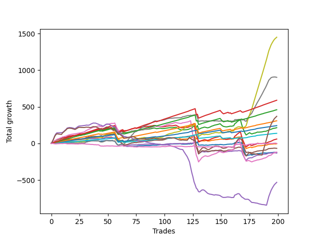

# Short Malamute 002 
- Symbol: ES_1W
- Date Range: 10/28/2022 - 11/04/2022
- Trading Period: 7:20-12:30
- Number of Trades: 199



| Name | Win Percent | Profit | Avg Profit / Trade | Avg Time / Trade |      | Name | Win Percent | Profit | Avg Profit / Trade | Avg Time / Trade |
| ---- | ----------- | ------ | ------------------ | ---------------- | ---- | ---- | ----------- | ------ | ------------------ | ---------------- |
| Sorted By <br> Profit | | | | | | Sorted By <br> Win Percentage ||||
| Seven | 75.88 | 725125.00 | 3643.84 | 75:00 |     | Eighty-One | 95.98 | 68625.00 | 344.85 | 17:16 |
| Six | 71.86 | 451000.00 | 2266.33 | 32:00 |     | Eighty-Two | 94.47 | 121750.00 | 611.81 | 24:44 |
| Eighty-Five | 90.95 | 294625.00 | 1480.53 | 46:47 |     | Eighty-Three | 93.47 | 154375.00 | 775.75 | 31:00 |
| Eighty-Four | 92.46 | 229875.00 | 1155.15 | 38:23 |     | Eighty-Four | 92.46 | 229875.00 | 1155.15 | 38:23 |
| MALAMUTE 001 | 47.74 | 184875.00 | 929.02 | 46:58 |     | Eighty-Five | 90.95 | 294625.00 | 1480.53 | 46:47 |
| Eighty-Three | 93.47 | 154375.00 | 775.75 | 31:00 |     | Five | 80.40 | -59125.00 | -297.11 | 40:44 |
| Eighty-Two | 94.47 | 121750.00 | 611.81 | 24:44 |     | Two | 79.90 | 107375.00 | 539.57 | 17:41 |
| Two | 79.90 | 107375.00 | 539.57 | 17:41 |     | One | 78.89 | -2250.00 | -11.31 | 10:21 |
| Eighty-One | 95.98 | 68625.00 | 344.85 | 17:16 |     | Two_C | 76.38 | 29750.00 | 149.50 | 19:54 |
| Two_C | 76.38 | 29750.00 | 149.50 | 19:54 |     | Seven | 75.88 | 725125.00 | 3643.84 | 75:00 |
| MALAMUTE 002 | 51.76 | -250.00 | -1.26 | 01:20 |     | Four | 75.88 | -33875.00 | -170.23 | 18:42 |
| One | 78.89 | -2250.00 | -11.31 | 10:21 |     | Six | 71.86 | 451000.00 | 2266.33 | 32:00 |
| Four | 75.88 | -33875.00 | -170.23 | 18:42 |     | Zero | 68.84 | -62250.00 | -312.81 | 05:24 |
| Five | 80.40 | -59125.00 | -297.11 | 40:44 |     | Three | 59.80 | -66500.00 | -334.17 | 10:29 |
| Zero | 68.84 | -62250.00 | -312.81 | 05:24 |     | MALAMUTE 002 | 51.76 | -250.00 | -1.26 | 01:20 |
| Three | 59.80 | -66500.00 | -334.17 | 10:29 |     | MALAMUTE 001 | 47.74 | 184875.00 | 929.02 | 46:58 |
| NEWFI 0000 | 34.17 | -266000.00 | -1336.68 | 40:41 |     | NEWFI 0000 | 34.17 | -266000.00 | -1336.68 | 40:41 |

## NO STOPLOSS

### Test Zero
* Sell when price hits the middle line of the 20p bollinger
* No Stoploss
* Results:
```
Total Trades: 199
Percent Up: 68.84
Percent Down: 31.16
Total Points Moved Up: -124.50
Potential Profit: -62250.00
Total Points Ups: 302.75 Count Ups: 137
Total Points Downs: -427.25 Count Downs: 62
```

<details><summary>Trades</summary>

<code>In: 2022-10-28 06:57:00		Out: 2022-10-28 06:58:10		Total Position Time: 01:10		Total Move Up: -1.00		Total to Date: -1.00</code> <br />
<code>In: 2022-10-28 07:03:00		Out: 2022-10-28 07:15:25		Total Position Time: 12:25		Total Move Up: 1.00		Total to Date: 0.00</code> <br />
<code>In: 2022-10-28 07:11:00		Out: 2022-10-28 07:15:25		Total Position Time: 04:25		Total Move Up: 6.50		Total to Date: 6.50</code> <br />
<code>In: 2022-10-28 07:23:00		Out: 2022-10-28 07:24:10		Total Position Time: 01:10		Total Move Up: -0.25		Total to Date: 6.25</code> <br />
<code>In: 2022-10-28 07:36:00		Out: 2022-10-28 07:37:10		Total Position Time: 01:10		Total Move Up: 2.50		Total to Date: 8.75</code> <br />
<code>In: 2022-10-28 07:53:00		Out: 2022-10-28 07:54:10		Total Position Time: 01:10		Total Move Up: 1.25		Total to Date: 10.00</code> <br />
<code>In: 2022-10-28 08:16:00		Out: 2022-10-28 08:19:05		Total Position Time: 03:05		Total Move Up: 2.00		Total to Date: 12.00</code> <br />
<code>In: 2022-10-28 08:24:00		Out: 2022-10-28 08:25:10		Total Position Time: 01:10		Total Move Up: 1.25		Total to Date: 13.25</code> <br />
<code>In: 2022-10-28 08:32:00		Out: 2022-10-28 08:39:05		Total Position Time: 07:05		Total Move Up: 1.00		Total to Date: 14.25</code> <br />
<code>In: 2022-10-28 08:34:00		Out: 2022-10-28 08:39:05		Total Position Time: 05:05		Total Move Up: 2.50		Total to Date: 16.75</code> <br />
<code>In: 2022-10-28 08:52:00		Out: 2022-10-28 08:53:10		Total Position Time: 01:10		Total Move Up: 1.25		Total to Date: 18.00</code> <br />
<code>In: 2022-10-28 08:54:00		Out: 2022-10-28 08:55:10		Total Position Time: 01:10		Total Move Up: 0.75		Total to Date: 18.75</code> <br />
<code>In: 2022-10-28 08:57:00		Out: 2022-10-28 08:58:10		Total Position Time: 01:10		Total Move Up: -1.25		Total to Date: 17.50</code> <br />
<code>In: 2022-10-28 09:05:00		Out: 2022-10-28 09:13:15		Total Position Time: 08:15		Total Move Up: 1.50		Total to Date: 19.00</code> <br />
<code>In: 2022-10-28 09:40:00		Out: 2022-10-28 09:50:25		Total Position Time: 10:25		Total Move Up: 0.50		Total to Date: 19.50</code> <br />
<code>In: 2022-10-28 09:58:00		Out: 2022-10-28 09:59:10		Total Position Time: 01:10		Total Move Up: 0.25		Total to Date: 19.75</code> <br />
<code>In: 2022-10-28 10:16:00		Out: 2022-10-28 10:17:10		Total Position Time: 01:10		Total Move Up: 0.75		Total to Date: 20.50</code> <br />
<code>In: 2022-10-28 10:28:00		Out: 2022-10-28 10:29:10		Total Position Time: 01:10		Total Move Up: 0.75		Total to Date: 21.25</code> <br />
<code>In: 2022-10-28 10:43:00		Out: 2022-10-28 10:44:10		Total Position Time: 01:10		Total Move Up: -1.50		Total to Date: 19.75</code> <br />
<code>In: 2022-10-28 10:51:00		Out: 2022-10-28 10:52:10		Total Position Time: 01:10		Total Move Up: 0.00		Total to Date: 19.75</code> <br />
<code>In: 2022-10-28 10:58:00		Out: 2022-10-28 11:01:10		Total Position Time: 03:10		Total Move Up: 0.00		Total to Date: 19.75</code> <br />
<code>In: 2022-10-28 11:23:00		Out: 2022-10-28 11:24:10		Total Position Time: 01:10		Total Move Up: 0.25		Total to Date: 20.00</code> <br />
<code>In: 2022-10-28 11:26:00		Out: 2022-10-28 11:27:10		Total Position Time: 01:10		Total Move Up: -1.00		Total to Date: 19.00</code> <br />
<code>In: 2022-10-28 11:29:00		Out: 2022-10-28 11:30:10		Total Position Time: 01:10		Total Move Up: 0.00		Total to Date: 19.00</code> <br />
<code>In: 2022-10-28 11:42:00		Out: 2022-10-28 11:43:10		Total Position Time: 01:10		Total Move Up: 2.25		Total to Date: 21.25</code> <br />
<code>In: 2022-10-28 11:52:00		Out: 2022-10-28 11:53:10		Total Position Time: 01:10		Total Move Up: -1.50		Total to Date: 19.75</code> <br />
<code>In: 2022-10-28 12:01:00		Out: 2022-10-28 12:02:10		Total Position Time: 01:10		Total Move Up: 3.25		Total to Date: 23.00</code> <br />
<code>In: 2022-10-28 12:05:00		Out: 2022-10-28 12:09:45		Total Position Time: 04:45		Total Move Up: 1.00		Total to Date: 24.00</code> <br />
<code>In: 2022-10-28 12:17:00		Out: 2022-10-28 12:18:20		Total Position Time: 01:20		Total Move Up: 0.00		Total to Date: 24.00</code> <br />
<code>In: 2022-10-31 06:51:00		Out: 2022-10-31 07:03:25		Total Position Time: 12:25		Total Move Up: 4.75		Total to Date: 28.75</code> <br />
<code>In: 2022-10-31 06:59:00		Out: 2022-10-31 07:03:25		Total Position Time: 04:25		Total Move Up: 4.00		Total to Date: 32.75</code> <br />
<code>In: 2022-10-31 07:02:00		Out: 2022-10-31 07:03:25		Total Position Time: 01:25		Total Move Up: 0.75		Total to Date: 33.50</code> <br />
<code>In: 2022-10-31 07:06:00		Out: 2022-10-31 07:12:15		Total Position Time: 06:15		Total Move Up: 0.00		Total to Date: 33.50</code> <br />
<code>In: 2022-10-31 07:22:00		Out: 2022-10-31 07:23:10		Total Position Time: 01:10		Total Move Up: 0.75		Total to Date: 34.25</code> <br />
<code>In: 2022-10-31 07:35:00		Out: 2022-10-31 07:41:15		Total Position Time: 06:15		Total Move Up: 1.00		Total to Date: 35.25</code> <br />
<code>In: 2022-10-31 07:49:00		Out: 2022-10-31 07:50:10		Total Position Time: 01:10		Total Move Up: 1.75		Total to Date: 37.00</code> <br />
<code>In: 2022-10-31 07:55:00		Out: 2022-10-31 07:57:05		Total Position Time: 02:05		Total Move Up: 0.00		Total to Date: 37.00</code> <br />
<code>In: 2022-10-31 08:13:00		Out: 2022-10-31 08:14:10		Total Position Time: 01:10		Total Move Up: -1.25		Total to Date: 35.75</code> <br />
<code>In: 2022-10-31 08:21:00		Out: 2022-10-31 08:22:10		Total Position Time: 01:10		Total Move Up: 0.50		Total to Date: 36.25</code> <br />
<code>In: 2022-10-31 08:30:00		Out: 2022-10-31 08:31:10		Total Position Time: 01:10		Total Move Up: -1.75		Total to Date: 34.50</code> <br />
<code>In: 2022-10-31 08:34:00		Out: 2022-10-31 08:35:10		Total Position Time: 01:10		Total Move Up: 0.75		Total to Date: 35.25</code> <br />
<code>In: 2022-10-31 08:38:00		Out: 2022-10-31 08:40:30		Total Position Time: 02:30		Total Move Up: -1.25		Total to Date: 34.00</code> <br />
<code>In: 2022-10-31 08:58:00		Out: 2022-10-31 09:13:50		Total Position Time: 15:50		Total Move Up: -5.00		Total to Date: 29.00</code> <br />
<code>In: 2022-10-31 09:08:00		Out: 2022-10-31 09:13:50		Total Position Time: 05:50		Total Move Up: 3.50		Total to Date: 32.50</code> <br />
<code>In: 2022-10-31 09:21:00		Out: 2022-10-31 09:22:10		Total Position Time: 01:10		Total Move Up: 0.50		Total to Date: 33.00</code> <br />
<code>In: 2022-10-31 09:42:00		Out: 2022-10-31 09:51:10		Total Position Time: 09:10		Total Move Up: 1.00		Total to Date: 34.00</code> <br />
<code>In: 2022-10-31 09:50:00		Out: 2022-10-31 09:51:10		Total Position Time: 01:10		Total Move Up: 2.50		Total to Date: 36.50</code> <br />
<code>In: 2022-10-31 09:54:00		Out: 2022-10-31 09:56:05		Total Position Time: 02:05		Total Move Up: 2.75		Total to Date: 39.25</code> <br />
<code>In: 2022-10-31 10:14:00		Out: 2022-10-31 10:15:10		Total Position Time: 01:10		Total Move Up: 1.75		Total to Date: 41.00</code> <br />
<code>In: 2022-10-31 10:26:00		Out: 2022-10-31 10:27:10		Total Position Time: 01:10		Total Move Up: -2.00		Total to Date: 39.00</code> <br />
<code>In: 2022-10-31 11:07:00		Out: 2022-10-31 11:08:10		Total Position Time: 01:10		Total Move Up: -1.00		Total to Date: 38.00</code> <br />
<code>In: 2022-10-31 11:24:00		Out: 2022-10-31 11:25:10		Total Position Time: 01:10		Total Move Up: -0.50		Total to Date: 37.50</code> <br />
<code>In: 2022-10-31 11:30:00		Out: 2022-10-31 11:31:10		Total Position Time: 01:10		Total Move Up: 1.00		Total to Date: 38.50</code> <br />
<code>In: 2022-10-31 11:49:00		Out: 2022-10-31 11:52:45		Total Position Time: 03:45		Total Move Up: 2.25		Total to Date: 40.75</code> <br />
<code>In: 2022-10-31 11:58:00		Out: 2022-10-31 12:19:35		Total Position Time: 21:35		Total Move Up: -9.75		Total to Date: 31.00</code> <br />
<code>In: 2022-10-31 12:28:00		Out: 2022-10-31 12:29:10		Total Position Time: 01:10		Total Move Up: 0.25		Total to Date: 31.25</code> <br />
<code>In: 2022-11-01 06:51:00		Out: 2022-11-01 07:21:30		Total Position Time: 30:30		Total Move Up: -21.75		Total to Date: 9.50</code> <br />
<code>In: 2022-11-01 06:58:00		Out: 2022-11-01 07:21:30		Total Position Time: 23:30		Total Move Up: -22.25		Total to Date: -12.75</code> <br />
<code>In: 2022-11-01 07:01:00		Out: 2022-11-01 07:21:30		Total Position Time: 20:30		Total Move Up: -11.50		Total to Date: -24.25</code> <br />
<code>In: 2022-11-01 07:16:00		Out: 2022-11-01 07:21:30		Total Position Time: 05:30		Total Move Up: 3.25		Total to Date: -21.00</code> <br />
<code>In: 2022-11-01 07:20:00		Out: 2022-11-01 07:21:30		Total Position Time: 01:30		Total Move Up: 6.25		Total to Date: -14.75</code> <br />
<code>In: 2022-11-01 07:27:00		Out: 2022-11-01 07:28:10		Total Position Time: 01:10		Total Move Up: 2.25		Total to Date: -12.50</code> <br />
<code>In: 2022-11-01 07:33:00		Out: 2022-11-01 07:34:10		Total Position Time: 01:10		Total Move Up: 2.50		Total to Date: -10.00</code> <br />
<code>In: 2022-11-01 07:39:00		Out: 2022-11-01 08:10:55		Total Position Time: 31:55		Total Move Up: -20.00		Total to Date: -30.00</code> <br />
<code>In: 2022-11-01 07:50:00		Out: 2022-11-01 08:10:55		Total Position Time: 20:55		Total Move Up: -4.25		Total to Date: -34.25</code> <br />
<code>In: 2022-11-01 07:54:00		Out: 2022-11-01 08:10:55		Total Position Time: 16:55		Total Move Up: -4.25		Total to Date: -38.50</code> <br />
<code>In: 2022-11-01 07:56:00		Out: 2022-11-01 08:10:55		Total Position Time: 14:55		Total Move Up: -3.25		Total to Date: -41.75</code> <br />
<code>In: 2022-11-01 07:58:00		Out: 2022-11-01 08:10:55		Total Position Time: 12:55		Total Move Up: -0.25		Total to Date: -42.00</code> <br />
<code>In: 2022-11-01 08:06:00		Out: 2022-11-01 08:10:55		Total Position Time: 04:55		Total Move Up: 1.00		Total to Date: -41.00</code> <br />
<code>In: 2022-11-01 08:19:00		Out: 2022-11-01 08:21:50		Total Position Time: 02:50		Total Move Up: -1.00		Total to Date: -42.00</code> <br />
<code>In: 2022-11-01 08:27:00		Out: 2022-11-01 08:28:40		Total Position Time: 01:40		Total Move Up: 1.75		Total to Date: -40.25</code> <br />
<code>In: 2022-11-01 08:36:00		Out: 2022-11-01 08:37:10		Total Position Time: 01:10		Total Move Up: -0.50		Total to Date: -40.75</code> <br />
<code>In: 2022-11-01 08:39:00		Out: 2022-11-01 08:48:25		Total Position Time: 09:25		Total Move Up: 0.25		Total to Date: -40.50</code> <br />
<code>In: 2022-11-01 09:04:00		Out: 2022-11-01 09:05:10		Total Position Time: 01:10		Total Move Up: 1.25		Total to Date: -39.25</code> <br />
<code>In: 2022-11-01 09:11:00		Out: 2022-11-01 09:12:10		Total Position Time: 01:10		Total Move Up: -2.00		Total to Date: -41.25</code> <br />
<code>In: 2022-11-01 09:20:00		Out: 2022-11-01 09:23:45		Total Position Time: 03:45		Total Move Up: 4.00		Total to Date: -37.25</code> <br />
<code>In: 2022-11-01 09:25:00		Out: 2022-11-01 09:26:15		Total Position Time: 01:15		Total Move Up: 4.25		Total to Date: -33.00</code> <br />
<code>In: 2022-11-01 09:28:00		Out: 2022-11-01 09:33:50		Total Position Time: 05:50		Total Move Up: 1.50		Total to Date: -31.50</code> <br />
<code>In: 2022-11-01 09:50:00		Out: 2022-11-01 09:51:10		Total Position Time: 01:10		Total Move Up: -1.25		Total to Date: -32.75</code> <br />
<code>In: 2022-11-01 10:03:00		Out: 2022-11-01 10:05:05		Total Position Time: 02:05		Total Move Up: 1.25		Total to Date: -31.50</code> <br />
<code>In: 2022-11-01 10:07:00		Out: 2022-11-01 10:10:30		Total Position Time: 03:30		Total Move Up: -0.75		Total to Date: -32.25</code> <br />
<code>In: 2022-11-01 10:09:00		Out: 2022-11-01 10:10:30		Total Position Time: 01:30		Total Move Up: 2.00		Total to Date: -30.25</code> <br />
<code>In: 2022-11-01 10:17:00		Out: 2022-11-01 10:18:10		Total Position Time: 01:10		Total Move Up: 1.75		Total to Date: -28.50</code> <br />
<code>In: 2022-11-01 10:24:00		Out: 2022-11-01 10:25:10		Total Position Time: 01:10		Total Move Up: -0.50		Total to Date: -29.00</code> <br />
<code>In: 2022-11-01 10:51:00		Out: 2022-11-01 10:52:10		Total Position Time: 01:10		Total Move Up: 0.25		Total to Date: -28.75</code> <br />
<code>In: 2022-11-01 10:53:00		Out: 2022-11-01 10:54:10		Total Position Time: 01:10		Total Move Up: -0.50		Total to Date: -29.25</code> <br />
<code>In: 2022-11-01 11:14:00		Out: 2022-11-01 11:15:15		Total Position Time: 01:15		Total Move Up: 0.00		Total to Date: -29.25</code> <br />
<code>In: 2022-11-01 11:19:00		Out: 2022-11-01 11:22:30		Total Position Time: 03:30		Total Move Up: 1.50		Total to Date: -27.75</code> <br />
<code>In: 2022-11-01 11:25:00		Out: 2022-11-01 11:28:40		Total Position Time: 03:40		Total Move Up: 1.75		Total to Date: -26.00</code> <br />
<code>In: 2022-11-01 11:34:00		Out: 2022-11-01 11:35:25		Total Position Time: 01:25		Total Move Up: 2.00		Total to Date: -24.00</code> <br />
<code>In: 2022-11-01 11:41:00		Out: 2022-11-01 11:53:10		Total Position Time: 12:10		Total Move Up: -1.25		Total to Date: -25.25</code> <br />
<code>In: 2022-11-01 12:04:00		Out: 2022-11-01 12:05:10		Total Position Time: 01:10		Total Move Up: 0.75		Total to Date: -24.50</code> <br />
<code>In: 2022-11-01 12:11:00		Out: 2022-11-01 12:12:10		Total Position Time: 01:10		Total Move Up: -0.50		Total to Date: -25.00</code> <br />
<code>In: 2022-11-02 06:51:00		Out: 2022-11-02 06:52:10		Total Position Time: 01:10		Total Move Up: 3.00		Total to Date: -22.00</code> <br />
<code>In: 2022-11-02 06:53:00		Out: 2022-11-02 06:55:10		Total Position Time: 02:10		Total Move Up: 1.25		Total to Date: -20.75</code> <br />
<code>In: 2022-11-02 06:57:00		Out: 2022-11-02 07:01:05		Total Position Time: 04:05		Total Move Up: 2.25		Total to Date: -18.50</code> <br />
<code>In: 2022-11-02 07:07:00		Out: 2022-11-02 07:08:10		Total Position Time: 01:10		Total Move Up: 2.00		Total to Date: -16.50</code> <br />
<code>In: 2022-11-02 07:09:00		Out: 2022-11-02 07:10:10		Total Position Time: 01:10		Total Move Up: 0.75		Total to Date: -15.75</code> <br />
<code>In: 2022-11-02 07:15:00		Out: 2022-11-02 07:30:20		Total Position Time: 15:20		Total Move Up: 0.00		Total to Date: -15.75</code> <br />
<code>In: 2022-11-02 07:21:00		Out: 2022-11-02 07:30:20		Total Position Time: 09:20		Total Move Up: 0.75		Total to Date: -15.00</code> <br />
<code>In: 2022-11-02 07:25:00		Out: 2022-11-02 07:30:20		Total Position Time: 05:20		Total Move Up: 1.50		Total to Date: -13.50</code> <br />
<code>In: 2022-11-02 07:36:00		Out: 2022-11-02 07:37:10		Total Position Time: 01:10		Total Move Up: 2.25		Total to Date: -11.25</code> <br />
<code>In: 2022-11-02 07:43:00		Out: 2022-11-02 07:44:10		Total Position Time: 01:10		Total Move Up: 1.50		Total to Date: -9.75</code> <br />
<code>In: 2022-11-02 07:51:00		Out: 2022-11-02 07:52:10		Total Position Time: 01:10		Total Move Up: 0.50		Total to Date: -9.25</code> <br />
<code>In: 2022-11-02 08:00:00		Out: 2022-11-02 08:01:10		Total Position Time: 01:10		Total Move Up: 1.50		Total to Date: -7.75</code> <br />
<code>In: 2022-11-02 08:06:00		Out: 2022-11-02 08:07:45		Total Position Time: 01:45		Total Move Up: 0.00		Total to Date: -7.75</code> <br />
<code>In: 2022-11-02 08:13:00		Out: 2022-11-02 08:23:05		Total Position Time: 10:05		Total Move Up: -0.25		Total to Date: -8.00</code> <br />
<code>In: 2022-11-02 08:28:00		Out: 2022-11-02 08:30:00		Total Position Time: 02:00		Total Move Up: 1.25		Total to Date: -6.75</code> <br />
<code>In: 2022-11-02 08:40:00		Out: 2022-11-02 08:41:10		Total Position Time: 01:10		Total Move Up: 0.00		Total to Date: -6.75</code> <br />
<code>In: 2022-11-02 08:48:00		Out: 2022-11-02 08:49:10		Total Position Time: 01:10		Total Move Up: 0.25		Total to Date: -6.50</code> <br />
<code>In: 2022-11-02 08:51:00		Out: 2022-11-02 08:52:10		Total Position Time: 01:10		Total Move Up: 0.50		Total to Date: -6.00</code> <br />
<code>In: 2022-11-02 08:54:00		Out: 2022-11-02 08:55:10		Total Position Time: 01:10		Total Move Up: 0.50		Total to Date: -5.50</code> <br />
<code>In: 2022-11-02 08:57:00		Out: 2022-11-02 09:06:00		Total Position Time: 09:00		Total Move Up: 0.50		Total to Date: -5.00</code> <br />
<code>In: 2022-11-02 09:04:00		Out: 2022-11-02 09:06:00		Total Position Time: 02:00		Total Move Up: 1.50		Total to Date: -3.50</code> <br />
<code>In: 2022-11-02 09:08:00		Out: 2022-11-02 09:43:40		Total Position Time: 35:40		Total Move Up: -6.50		Total to Date: -10.00</code> <br />
<code>In: 2022-11-02 09:35:00		Out: 2022-11-02 09:43:40		Total Position Time: 08:40		Total Move Up: 0.00		Total to Date: -10.00</code> <br />
<code>In: 2022-11-02 10:03:00		Out: 2022-11-02 10:04:10		Total Position Time: 01:10		Total Move Up: -1.00		Total to Date: -11.00</code> <br />
<code>In: 2022-11-02 10:13:00		Out: 2022-11-02 10:18:35		Total Position Time: 05:35		Total Move Up: 0.75		Total to Date: -10.25</code> <br />
<code>In: 2022-11-02 10:23:00		Out: 2022-11-02 10:28:30		Total Position Time: 05:30		Total Move Up: 0.00		Total to Date: -10.25</code> <br />
<code>In: 2022-11-02 10:31:00		Out: 2022-11-02 10:32:20		Total Position Time: 01:20		Total Move Up: 0.50		Total to Date: -9.75</code> <br />
<code>In: 2022-11-02 10:46:00		Out: 2022-11-02 10:47:10		Total Position Time: 01:10		Total Move Up: 3.00		Total to Date: -6.75</code> <br />
<code>In: 2022-11-02 10:56:00		Out: 2022-11-02 10:57:10		Total Position Time: 01:10		Total Move Up: -2.00		Total to Date: -8.75</code> <br />
<code>In: 2022-11-02 11:08:00		Out: 2022-11-02 11:09:10		Total Position Time: 01:10		Total Move Up: 5.50		Total to Date: -3.25</code> <br />
<code>In: 2022-11-02 11:10:00		Out: 2022-11-02 11:11:10		Total Position Time: 01:10		Total Move Up: -4.25		Total to Date: -7.50</code> <br />
<code>In: 2022-11-02 11:18:00		Out: 2022-11-02 11:20:25		Total Position Time: 02:25		Total Move Up: 9.75		Total to Date: 2.25</code> <br />
<code>In: 2022-11-02 11:32:00		Out: 2022-11-02 11:33:10		Total Position Time: 01:10		Total Move Up: 2.25		Total to Date: 4.50</code> <br />
<code>In: 2022-11-02 11:37:00		Out: 2022-11-02 11:42:10		Total Position Time: 05:10		Total Move Up: 25.75		Total to Date: 30.25</code> <br />
<code>In: 2022-11-02 11:47:00		Out: 2022-11-02 12:05:40		Total Position Time: 18:40		Total Move Up: -25.50		Total to Date: 4.75</code> <br />
<code>In: 2022-11-02 11:58:00		Out: 2022-11-02 12:05:40		Total Position Time: 07:40		Total Move Up: 17.25		Total to Date: 22.00</code> <br />
<code>In: 2022-11-02 12:14:00		Out: 2022-11-02 12:44:05		Total Position Time: 30:05		Total Move Up: -45.00		Total to Date: -23.00</code> <br />
<code>In: 2022-11-03 06:51:00		Out: 2022-11-03 07:03:45		Total Position Time: 12:45		Total Move Up: -1.00		Total to Date: -24.00</code> <br />
<code>In: 2022-11-03 07:10:00		Out: 2022-11-03 07:11:10		Total Position Time: 01:10		Total Move Up: 1.25		Total to Date: -22.75</code> <br />
<code>In: 2022-11-03 07:12:00		Out: 2022-11-03 07:13:10		Total Position Time: 01:10		Total Move Up: 1.50		Total to Date: -21.25</code> <br />
<code>In: 2022-11-03 07:20:00		Out: 2022-11-03 07:21:10		Total Position Time: 01:10		Total Move Up: -0.50		Total to Date: -21.75</code> <br />
<code>In: 2022-11-03 07:31:00		Out: 2022-11-03 07:32:10		Total Position Time: 01:10		Total Move Up: -4.50		Total to Date: -26.25</code> <br />
<code>In: 2022-11-03 07:53:00		Out: 2022-11-03 07:54:10		Total Position Time: 01:10		Total Move Up: 3.00		Total to Date: -23.25</code> <br />
<code>In: 2022-11-03 08:01:00		Out: 2022-11-03 08:02:10		Total Position Time: 01:10		Total Move Up: 1.00		Total to Date: -22.25</code> <br />
<code>In: 2022-11-03 08:05:00		Out: 2022-11-03 08:20:55		Total Position Time: 15:55		Total Move Up: -4.25		Total to Date: -26.50</code> <br />
<code>In: 2022-11-03 08:13:00		Out: 2022-11-03 08:20:55		Total Position Time: 07:55		Total Move Up: 2.75		Total to Date: -23.75</code> <br />
<code>In: 2022-11-03 08:25:00		Out: 2022-11-03 08:26:25		Total Position Time: 01:25		Total Move Up: 2.50		Total to Date: -21.25</code> <br />
<code>In: 2022-11-03 08:29:00		Out: 2022-11-03 08:37:20		Total Position Time: 08:20		Total Move Up: 0.50		Total to Date: -20.75</code> <br />
<code>In: 2022-11-03 08:45:00		Out: 2022-11-03 08:46:10		Total Position Time: 01:10		Total Move Up: 4.00		Total to Date: -16.75</code> <br />
<code>In: 2022-11-03 08:49:00		Out: 2022-11-03 08:50:10		Total Position Time: 01:10		Total Move Up: -1.75		Total to Date: -18.50</code> <br />
<code>In: 2022-11-03 08:51:00		Out: 2022-11-03 09:02:10		Total Position Time: 11:10		Total Move Up: 0.25		Total to Date: -18.25</code> <br />
<code>In: 2022-11-03 09:10:00		Out: 2022-11-03 09:11:10		Total Position Time: 01:10		Total Move Up: 3.25		Total to Date: -15.00</code> <br />
<code>In: 2022-11-03 09:23:00		Out: 2022-11-03 09:24:10		Total Position Time: 01:10		Total Move Up: -1.25		Total to Date: -16.25</code> <br />
<code>In: 2022-11-03 09:32:00		Out: 2022-11-03 09:33:55		Total Position Time: 01:55		Total Move Up: 0.00		Total to Date: -16.25</code> <br />
<code>In: 2022-11-03 09:35:00		Out: 2022-11-03 09:43:05		Total Position Time: 08:05		Total Move Up: -1.00		Total to Date: -17.25</code> <br />
<code>In: 2022-11-03 09:50:00		Out: 2022-11-03 09:51:10		Total Position Time: 01:10		Total Move Up: 3.00		Total to Date: -14.25</code> <br />
<code>In: 2022-11-03 09:58:00		Out: 2022-11-03 09:59:10		Total Position Time: 01:10		Total Move Up: -1.00		Total to Date: -15.25</code> <br />
<code>In: 2022-11-03 10:02:00		Out: 2022-11-03 10:16:10		Total Position Time: 14:10		Total Move Up: -1.25		Total to Date: -16.50</code> <br />
<code>In: 2022-11-03 10:20:00		Out: 2022-11-03 10:38:55		Total Position Time: 18:55		Total Move Up: -3.50		Total to Date: -20.00</code> <br />
<code>In: 2022-11-03 10:34:00		Out: 2022-11-03 10:38:55		Total Position Time: 04:55		Total Move Up: 2.50		Total to Date: -17.50</code> <br />
<code>In: 2022-11-03 10:44:00		Out: 2022-11-03 10:47:00		Total Position Time: 03:00		Total Move Up: 1.25		Total to Date: -16.25</code> <br />
<code>In: 2022-11-03 10:52:00		Out: 2022-11-03 10:53:25		Total Position Time: 01:25		Total Move Up: 3.25		Total to Date: -13.00</code> <br />
<code>In: 2022-11-03 11:12:00		Out: 2022-11-03 11:15:05		Total Position Time: 03:05		Total Move Up: 1.75		Total to Date: -11.25</code> <br />
<code>In: 2022-11-03 11:35:00		Out: 2022-11-03 11:36:10		Total Position Time: 01:10		Total Move Up: 0.25		Total to Date: -11.00</code> <br />
<code>In: 2022-11-03 11:56:00		Out: 2022-11-03 11:57:10		Total Position Time: 01:10		Total Move Up: 2.25		Total to Date: -8.75</code> <br />
<code>In: 2022-11-03 12:03:00		Out: 2022-11-03 12:04:10		Total Position Time: 01:10		Total Move Up: -1.75		Total to Date: -10.50</code> <br />
<code>In: 2022-11-03 12:14:00		Out: 2022-11-03 12:21:15		Total Position Time: 07:15		Total Move Up: 3.25		Total to Date: -7.25</code> <br />
<code>In: 2022-11-03 12:20:00		Out: 2022-11-03 12:21:15		Total Position Time: 01:15		Total Move Up: 3.00		Total to Date: -4.25</code> <br />
<code>In: 2022-11-04 06:51:00		Out: 2022-11-04 06:56:15		Total Position Time: 05:15		Total Move Up: 14.00		Total to Date: 9.75</code> <br />
<code>In: 2022-11-04 07:06:00		Out: 2022-11-04 07:07:10		Total Position Time: 01:10		Total Move Up: 0.50		Total to Date: 10.25</code> <br />
<code>In: 2022-11-04 07:08:00		Out: 2022-11-04 07:09:10		Total Position Time: 01:10		Total Move Up: -1.25		Total to Date: 9.00</code> <br />
<code>In: 2022-11-04 07:11:00		Out: 2022-11-04 07:12:10		Total Position Time: 01:10		Total Move Up: 3.00		Total to Date: 12.00</code> <br />
<code>In: 2022-11-04 07:19:00		Out: 2022-11-04 07:20:10		Total Position Time: 01:10		Total Move Up: 1.25		Total to Date: 13.25</code> <br />
<code>In: 2022-11-04 07:33:00		Out: 2022-11-04 07:34:10		Total Position Time: 01:10		Total Move Up: -4.50		Total to Date: 8.75</code> <br />
<code>In: 2022-11-04 07:46:00		Out: 2022-11-04 07:47:25		Total Position Time: 01:25		Total Move Up: 0.00		Total to Date: 8.75</code> <br />
<code>In: 2022-11-04 08:06:00		Out: 2022-11-04 09:09:10		Total Position Time: 63:10		Total Move Up: -56.25		Total to Date: -47.50</code> <br />
<code>In: 2022-11-04 08:20:00		Out: 2022-11-04 09:09:10		Total Position Time: 49:10		Total Move Up: -44.75		Total to Date: -92.25</code> <br />
<code>In: 2022-11-04 08:27:00		Out: 2022-11-04 09:09:10		Total Position Time: 42:10		Total Move Up: -44.00		Total to Date: -136.25</code> <br />
<code>In: 2022-11-04 08:36:00		Out: 2022-11-04 09:09:10		Total Position Time: 33:10		Total Move Up: -32.00		Total to Date: -168.25</code> <br />
<code>In: 2022-11-04 09:00:00		Out: 2022-11-04 09:09:10		Total Position Time: 09:10		Total Move Up: 2.75		Total to Date: -165.50</code> <br />
<code>In: 2022-11-04 09:14:00		Out: 2022-11-04 09:15:10		Total Position Time: 01:10		Total Move Up: 5.50		Total to Date: -160.00</code> <br />
<code>In: 2022-11-04 09:23:00		Out: 2022-11-04 09:24:10		Total Position Time: 01:10		Total Move Up: 2.50		Total to Date: -157.50</code> <br />
<code>In: 2022-11-04 09:33:00		Out: 2022-11-04 09:34:10		Total Position Time: 01:10		Total Move Up: 4.00		Total to Date: -153.50</code> <br />
<code>In: 2022-11-04 09:37:00		Out: 2022-11-04 09:54:50		Total Position Time: 17:50		Total Move Up: -7.50		Total to Date: -161.00</code> <br />
<code>In: 2022-11-04 09:47:00		Out: 2022-11-04 09:54:50		Total Position Time: 07:50		Total Move Up: 6.00		Total to Date: -155.00</code> <br />
<code>In: 2022-11-04 09:53:00		Out: 2022-11-04 09:54:50		Total Position Time: 01:50		Total Move Up: 4.75		Total to Date: -150.25</code> <br />
<code>In: 2022-11-04 09:57:00		Out: 2022-11-04 09:58:15		Total Position Time: 01:15		Total Move Up: 1.00		Total to Date: -149.25</code> <br />
<code>In: 2022-11-04 10:04:00		Out: 2022-11-04 10:05:10		Total Position Time: 01:10		Total Move Up: 6.00		Total to Date: -143.25</code> <br />
<code>In: 2022-11-04 10:08:00		Out: 2022-11-04 10:11:15		Total Position Time: 03:15		Total Move Up: 3.50		Total to Date: -139.75</code> <br />
<code>In: 2022-11-04 10:17:00		Out: 2022-11-04 10:18:10		Total Position Time: 01:10		Total Move Up: 0.25		Total to Date: -139.50</code> <br />
<code>In: 2022-11-04 10:28:00		Out: 2022-11-04 10:29:10		Total Position Time: 01:10		Total Move Up: 2.25		Total to Date: -137.25</code> <br />
<code>In: 2022-11-04 10:33:00		Out: 2022-11-04 10:38:10		Total Position Time: 05:10		Total Move Up: 2.00		Total to Date: -135.25</code> <br />
<code>In: 2022-11-04 10:37:00		Out: 2022-11-04 10:38:10		Total Position Time: 01:10		Total Move Up: 1.50		Total to Date: -133.75</code> <br />
<code>In: 2022-11-04 10:41:00		Out: 2022-11-04 10:47:20		Total Position Time: 06:20		Total Move Up: 2.50		Total to Date: -131.25</code> <br />
<code>In: 2022-11-04 10:52:00		Out: 2022-11-04 10:53:10		Total Position Time: 01:10		Total Move Up: 1.75		Total to Date: -129.50</code> <br />
<code>In: 2022-11-04 10:55:00		Out: 2022-11-04 10:57:45		Total Position Time: 02:45		Total Move Up: -1.75		Total to Date: -131.25</code> <br />
<code>In: 2022-11-04 11:05:00		Out: 2022-11-04 11:14:45		Total Position Time: 09:45		Total Move Up: -0.75		Total to Date: -132.00</code> <br />
<code>In: 2022-11-04 11:13:00		Out: 2022-11-04 11:14:45		Total Position Time: 01:45		Total Move Up: 2.00		Total to Date: -130.00</code> <br />
<code>In: 2022-11-04 11:16:00		Out: 2022-11-04 11:17:15		Total Position Time: 01:15		Total Move Up: 3.00		Total to Date: -127.00</code> <br />
<code>In: 2022-11-04 11:34:00		Out: 2022-11-04 11:35:10		Total Position Time: 01:10		Total Move Up: -0.25		Total to Date: -127.25</code> <br />
<code>In: 2022-11-04 11:37:00		Out: 2022-11-04 11:38:10		Total Position Time: 01:10		Total Move Up: 2.25		Total to Date: -125.00</code> <br />
<code>In: 2022-11-04 11:49:00		Out: 2022-11-04 11:50:10		Total Position Time: 01:10		Total Move Up: -0.25		Total to Date: -125.25</code> <br />
<code>In: 2022-11-04 12:01:00		Out: 2022-11-04 12:02:10		Total Position Time: 01:10		Total Move Up: 2.50		Total to Date: -122.75</code> <br />
<code>In: 2022-11-04 12:03:00		Out: 2022-11-04 12:04:10		Total Position Time: 01:10		Total Move Up: 1.25		Total to Date: -121.50</code> <br />
<code>In: 2022-11-04 12:17:00		Out: 2022-11-04 12:18:10		Total Position Time: 01:10		Total Move Up: -1.50		Total to Date: -123.00</code> <br />
<code>In: 2022-11-04 12:20:00		Out: 2022-11-04 12:27:15		Total Position Time: 07:15		Total Move Up: -1.50		Total to Date: -124.50</code> <br />


</details>

### Test One
* Sell when the price hits the upper line of the 20p 1std bollinger
* No Stoploss
* Results:
```
Total Trades: 199
Percent Up: 78.89
Percent Down: 21.11
Total Points Moved Up: -4.50
Potential Profit: -2250.00
Total Points Ups: 416.25 Count Ups: 157
Total Points Downs: -420.75 Count Downs: 42
```

<details><summary>Trades</summary>

<code>In: 2022-10-28 06:57:00		Out: 2022-10-28 07:00:05		Total Position Time: 03:05		Total Move Up: 0.00		Total to Date: 0.00</code> <br />
<code>In: 2022-10-28 07:03:00		Out: 2022-10-28 07:17:10		Total Position Time: 14:10		Total Move Up: 7.00		Total to Date: 7.00</code> <br />
<code>In: 2022-10-28 07:11:00		Out: 2022-10-28 07:17:10		Total Position Time: 06:10		Total Move Up: 12.50		Total to Date: 19.50</code> <br />
<code>In: 2022-10-28 07:23:00		Out: 2022-10-28 07:24:10		Total Position Time: 01:10		Total Move Up: -0.25		Total to Date: 19.25</code> <br />
<code>In: 2022-10-28 07:36:00		Out: 2022-10-28 07:37:55		Total Position Time: 01:55		Total Move Up: 3.00		Total to Date: 22.25</code> <br />
<code>In: 2022-10-28 07:53:00		Out: 2022-10-28 07:54:10		Total Position Time: 01:10		Total Move Up: 1.25		Total to Date: 23.50</code> <br />
<code>In: 2022-10-28 08:16:00		Out: 2022-10-28 08:21:00		Total Position Time: 05:00		Total Move Up: 4.50		Total to Date: 28.00</code> <br />
<code>In: 2022-10-28 08:24:00		Out: 2022-10-28 08:39:40		Total Position Time: 15:40		Total Move Up: 1.50		Total to Date: 29.50</code> <br />
<code>In: 2022-10-28 08:32:00		Out: 2022-10-28 08:39:40		Total Position Time: 07:40		Total Move Up: 2.00		Total to Date: 31.50</code> <br />
<code>In: 2022-10-28 08:34:00		Out: 2022-10-28 08:39:40		Total Position Time: 05:40		Total Move Up: 3.50		Total to Date: 35.00</code> <br />
<code>In: 2022-10-28 08:52:00		Out: 2022-10-28 08:53:10		Total Position Time: 01:10		Total Move Up: 1.25		Total to Date: 36.25</code> <br />
<code>In: 2022-10-28 08:54:00		Out: 2022-10-28 09:14:05		Total Position Time: 20:05		Total Move Up: 0.75		Total to Date: 37.00</code> <br />
<code>In: 2022-10-28 08:57:00		Out: 2022-10-28 09:14:05		Total Position Time: 17:05		Total Move Up: -1.25		Total to Date: 35.75</code> <br />
<code>In: 2022-10-28 09:05:00		Out: 2022-10-28 09:14:05		Total Position Time: 09:05		Total Move Up: 4.25		Total to Date: 40.00</code> <br />
<code>In: 2022-10-28 09:40:00		Out: 2022-10-28 09:53:40		Total Position Time: 13:40		Total Move Up: 3.25		Total to Date: 43.25</code> <br />
<code>In: 2022-10-28 09:58:00		Out: 2022-10-28 09:59:45		Total Position Time: 01:45		Total Move Up: 1.50		Total to Date: 44.75</code> <br />
<code>In: 2022-10-28 10:16:00		Out: 2022-10-28 10:33:50		Total Position Time: 17:50		Total Move Up: 0.75		Total to Date: 45.50</code> <br />
<code>In: 2022-10-28 10:28:00		Out: 2022-10-28 10:33:50		Total Position Time: 05:50		Total Move Up: 1.25		Total to Date: 46.75</code> <br />
<code>In: 2022-10-28 10:43:00		Out: 2022-10-28 10:45:25		Total Position Time: 02:25		Total Move Up: 0.25		Total to Date: 47.00</code> <br />
<code>In: 2022-10-28 10:51:00		Out: 2022-10-28 10:52:50		Total Position Time: 01:50		Total Move Up: 1.00		Total to Date: 48.00</code> <br />
<code>In: 2022-10-28 10:58:00		Out: 2022-10-28 11:16:05		Total Position Time: 18:05		Total Move Up: -0.50		Total to Date: 47.50</code> <br />
<code>In: 2022-10-28 11:23:00		Out: 2022-10-28 11:24:10		Total Position Time: 01:10		Total Move Up: 0.25		Total to Date: 47.75</code> <br />
<code>In: 2022-10-28 11:26:00		Out: 2022-10-28 11:32:05		Total Position Time: 06:05		Total Move Up: 0.50		Total to Date: 48.25</code> <br />
<code>In: 2022-10-28 11:29:00		Out: 2022-10-28 11:32:05		Total Position Time: 03:05		Total Move Up: 1.00		Total to Date: 49.25</code> <br />
<code>In: 2022-10-28 11:42:00		Out: 2022-10-28 11:43:10		Total Position Time: 01:10		Total Move Up: 2.25		Total to Date: 51.50</code> <br />
<code>In: 2022-10-28 11:52:00		Out: 2022-10-28 11:55:45		Total Position Time: 03:45		Total Move Up: -0.50		Total to Date: 51.00</code> <br />
<code>In: 2022-10-28 12:01:00		Out: 2022-10-28 12:02:10		Total Position Time: 01:10		Total Move Up: 3.25		Total to Date: 54.25</code> <br />
<code>In: 2022-10-28 12:05:00		Out: 2022-10-28 12:11:50		Total Position Time: 06:50		Total Move Up: 2.50		Total to Date: 56.75</code> <br />
<code>In: 2022-10-28 12:17:00		Out: 2022-10-28 12:26:20		Total Position Time: 09:20		Total Move Up: 0.75		Total to Date: 57.50</code> <br />
<code>In: 2022-10-31 06:51:00		Out: 2022-10-31 07:14:35		Total Position Time: 23:35		Total Move Up: 4.50		Total to Date: 62.00</code> <br />
<code>In: 2022-10-31 06:59:00		Out: 2022-10-31 07:14:35		Total Position Time: 15:35		Total Move Up: 3.75		Total to Date: 65.75</code> <br />
<code>In: 2022-10-31 07:02:00		Out: 2022-10-31 07:14:35		Total Position Time: 12:35		Total Move Up: 0.50		Total to Date: 66.25</code> <br />
<code>In: 2022-10-31 07:06:00		Out: 2022-10-31 07:14:35		Total Position Time: 08:35		Total Move Up: 2.00		Total to Date: 68.25</code> <br />
<code>In: 2022-10-31 07:22:00		Out: 2022-10-31 07:41:35		Total Position Time: 19:35		Total Move Up: -1.25		Total to Date: 67.00</code> <br />
<code>In: 2022-10-31 07:35:00		Out: 2022-10-31 07:41:35		Total Position Time: 06:35		Total Move Up: 3.50		Total to Date: 70.50</code> <br />
<code>In: 2022-10-31 07:49:00		Out: 2022-10-31 07:50:10		Total Position Time: 01:10		Total Move Up: 1.75		Total to Date: 72.25</code> <br />
<code>In: 2022-10-31 07:55:00		Out: 2022-10-31 08:01:05		Total Position Time: 06:05		Total Move Up: 3.00		Total to Date: 75.25</code> <br />
<code>In: 2022-10-31 08:13:00		Out: 2022-10-31 08:15:45		Total Position Time: 02:45		Total Move Up: 0.50		Total to Date: 75.75</code> <br />
<code>In: 2022-10-31 08:21:00		Out: 2022-10-31 08:23:20		Total Position Time: 02:20		Total Move Up: 2.75		Total to Date: 78.50</code> <br />
<code>In: 2022-10-31 08:30:00		Out: 2022-10-31 08:32:00		Total Position Time: 02:00		Total Move Up: -0.25		Total to Date: 78.25</code> <br />
<code>In: 2022-10-31 08:34:00		Out: 2022-10-31 08:35:10		Total Position Time: 01:10		Total Move Up: 0.75		Total to Date: 79.00</code> <br />
<code>In: 2022-10-31 08:38:00		Out: 2022-10-31 08:41:35		Total Position Time: 03:35		Total Move Up: 1.50		Total to Date: 80.50</code> <br />
<code>In: 2022-10-31 08:58:00		Out: 2022-10-31 09:16:05		Total Position Time: 18:05		Total Move Up: -1.25		Total to Date: 79.25</code> <br />
<code>In: 2022-10-31 09:08:00		Out: 2022-10-31 09:16:05		Total Position Time: 08:05		Total Move Up: 7.25		Total to Date: 86.50</code> <br />
<code>In: 2022-10-31 09:21:00		Out: 2022-10-31 09:57:05		Total Position Time: 36:05		Total Move Up: -12.75		Total to Date: 73.75</code> <br />
<code>In: 2022-10-31 09:42:00		Out: 2022-10-31 09:57:05		Total Position Time: 15:05		Total Move Up: 1.50		Total to Date: 75.25</code> <br />
<code>In: 2022-10-31 09:50:00		Out: 2022-10-31 09:57:05		Total Position Time: 07:05		Total Move Up: 3.00		Total to Date: 78.25</code> <br />
<code>In: 2022-10-31 09:54:00		Out: 2022-10-31 09:57:05		Total Position Time: 03:05		Total Move Up: 4.75		Total to Date: 83.00</code> <br />
<code>In: 2022-10-31 10:14:00		Out: 2022-10-31 10:15:10		Total Position Time: 01:10		Total Move Up: 1.75		Total to Date: 84.75</code> <br />
<code>In: 2022-10-31 10:26:00		Out: 2022-10-31 10:29:10		Total Position Time: 03:10		Total Move Up: 0.00		Total to Date: 84.75</code> <br />
<code>In: 2022-10-31 11:07:00		Out: 2022-10-31 11:19:10		Total Position Time: 12:10		Total Move Up: 0.50		Total to Date: 85.25</code> <br />
<code>In: 2022-10-31 11:24:00		Out: 2022-10-31 11:25:35		Total Position Time: 01:35		Total Move Up: 0.75		Total to Date: 86.00</code> <br />
<code>In: 2022-10-31 11:30:00		Out: 2022-10-31 11:31:25		Total Position Time: 01:25		Total Move Up: 2.00		Total to Date: 88.00</code> <br />
<code>In: 2022-10-31 11:49:00		Out: 2022-10-31 12:21:30		Total Position Time: 32:30		Total Move Up: -10.00		Total to Date: 78.00</code> <br />
<code>In: 2022-10-31 11:58:00		Out: 2022-10-31 12:21:30		Total Position Time: 23:30		Total Move Up: -9.00		Total to Date: 69.00</code> <br />
<code>In: 2022-10-31 12:28:00		Out: 2022-10-31 12:29:10		Total Position Time: 01:10		Total Move Up: 0.25		Total to Date: 69.25</code> <br />
<code>In: 2022-11-01 06:51:00		Out: 2022-11-01 07:23:40		Total Position Time: 32:40		Total Move Up: -18.50		Total to Date: 50.75</code> <br />
<code>In: 2022-11-01 06:58:00		Out: 2022-11-01 07:23:40		Total Position Time: 25:40		Total Move Up: -19.00		Total to Date: 31.75</code> <br />
<code>In: 2022-11-01 07:01:00		Out: 2022-11-01 07:23:40		Total Position Time: 22:40		Total Move Up: -8.25		Total to Date: 23.50</code> <br />
<code>In: 2022-11-01 07:16:00		Out: 2022-11-01 07:23:40		Total Position Time: 07:40		Total Move Up: 6.50		Total to Date: 30.00</code> <br />
<code>In: 2022-11-01 07:20:00		Out: 2022-11-01 07:23:40		Total Position Time: 03:40		Total Move Up: 9.50		Total to Date: 39.50</code> <br />
<code>In: 2022-11-01 07:27:00		Out: 2022-11-01 07:28:15		Total Position Time: 01:15		Total Move Up: 2.25		Total to Date: 41.75</code> <br />
<code>In: 2022-11-01 07:33:00		Out: 2022-11-01 07:34:15		Total Position Time: 01:15		Total Move Up: 2.00		Total to Date: 43.75</code> <br />
<code>In: 2022-11-01 07:39:00		Out: 2022-11-01 08:13:05		Total Position Time: 34:05		Total Move Up: -16.75		Total to Date: 27.00</code> <br />
<code>In: 2022-11-01 07:50:00		Out: 2022-11-01 08:13:05		Total Position Time: 23:05		Total Move Up: -1.00		Total to Date: 26.00</code> <br />
<code>In: 2022-11-01 07:54:00		Out: 2022-11-01 08:13:05		Total Position Time: 19:05		Total Move Up: -1.00		Total to Date: 25.00</code> <br />
<code>In: 2022-11-01 07:56:00		Out: 2022-11-01 08:13:05		Total Position Time: 17:05		Total Move Up: 0.00		Total to Date: 25.00</code> <br />
<code>In: 2022-11-01 07:58:00		Out: 2022-11-01 08:13:05		Total Position Time: 15:05		Total Move Up: 3.00		Total to Date: 28.00</code> <br />
<code>In: 2022-11-01 08:06:00		Out: 2022-11-01 08:13:05		Total Position Time: 07:05		Total Move Up: 4.25		Total to Date: 32.25</code> <br />
<code>In: 2022-11-01 08:19:00		Out: 2022-11-01 08:30:00		Total Position Time: 11:00		Total Move Up: 1.25		Total to Date: 33.50</code> <br />
<code>In: 2022-11-01 08:27:00		Out: 2022-11-01 08:30:00		Total Position Time: 03:00		Total Move Up: 5.00		Total to Date: 38.50</code> <br />
<code>In: 2022-11-01 08:36:00		Out: 2022-11-01 08:37:40		Total Position Time: 01:40		Total Move Up: 1.00		Total to Date: 39.50</code> <br />
<code>In: 2022-11-01 08:39:00		Out: 2022-11-01 08:55:00		Total Position Time: 16:00		Total Move Up: 3.00		Total to Date: 42.50</code> <br />
<code>In: 2022-11-01 09:04:00		Out: 2022-11-01 09:05:10		Total Position Time: 01:10		Total Move Up: 1.25		Total to Date: 43.75</code> <br />
<code>In: 2022-11-01 09:11:00		Out: 2022-11-01 09:42:15		Total Position Time: 31:15		Total Move Up: -7.25		Total to Date: 36.50</code> <br />
<code>In: 2022-11-01 09:20:00		Out: 2022-11-01 09:42:15		Total Position Time: 22:15		Total Move Up: 0.50		Total to Date: 37.00</code> <br />
<code>In: 2022-11-01 09:25:00		Out: 2022-11-01 09:42:15		Total Position Time: 17:15		Total Move Up: 1.00		Total to Date: 38.00</code> <br />
<code>In: 2022-11-01 09:28:00		Out: 2022-11-01 09:42:15		Total Position Time: 14:15		Total Move Up: 1.25		Total to Date: 39.25</code> <br />
<code>In: 2022-11-01 09:50:00		Out: 2022-11-01 09:58:35		Total Position Time: 08:35		Total Move Up: 0.00		Total to Date: 39.25</code> <br />
<code>In: 2022-11-01 10:03:00		Out: 2022-11-01 10:05:45		Total Position Time: 02:45		Total Move Up: 2.25		Total to Date: 41.50</code> <br />
<code>In: 2022-11-01 10:07:00		Out: 2022-11-01 10:11:05		Total Position Time: 04:05		Total Move Up: 1.25		Total to Date: 42.75</code> <br />
<code>In: 2022-11-01 10:09:00		Out: 2022-11-01 10:11:05		Total Position Time: 02:05		Total Move Up: 4.00		Total to Date: 46.75</code> <br />
<code>In: 2022-11-01 10:17:00		Out: 2022-11-01 10:18:10		Total Position Time: 01:10		Total Move Up: 1.75		Total to Date: 48.50</code> <br />
<code>In: 2022-11-01 10:24:00		Out: 2022-11-01 10:45:55		Total Position Time: 21:55		Total Move Up: -1.25		Total to Date: 47.25</code> <br />
<code>In: 2022-11-01 10:51:00		Out: 2022-11-01 10:52:10		Total Position Time: 01:10		Total Move Up: 0.25		Total to Date: 47.50</code> <br />
<code>In: 2022-11-01 10:53:00		Out: 2022-11-01 10:58:45		Total Position Time: 05:45		Total Move Up: 1.25		Total to Date: 48.75</code> <br />
<code>In: 2022-11-01 11:14:00		Out: 2022-11-01 11:29:50		Total Position Time: 15:50		Total Move Up: 0.00		Total to Date: 48.75</code> <br />
<code>In: 2022-11-01 11:19:00		Out: 2022-11-01 11:29:50		Total Position Time: 10:50		Total Move Up: 1.75		Total to Date: 50.50</code> <br />
<code>In: 2022-11-01 11:25:00		Out: 2022-11-01 11:29:50		Total Position Time: 04:50		Total Move Up: 2.75		Total to Date: 53.25</code> <br />
<code>In: 2022-11-01 11:34:00		Out: 2022-11-01 11:36:15		Total Position Time: 02:15		Total Move Up: 2.75		Total to Date: 56.00</code> <br />
<code>In: 2022-11-01 11:41:00		Out: 2022-11-01 11:54:15		Total Position Time: 13:15		Total Move Up: 0.25		Total to Date: 56.25</code> <br />
<code>In: 2022-11-01 12:04:00		Out: 2022-11-01 12:05:10		Total Position Time: 01:10		Total Move Up: 0.75		Total to Date: 57.00</code> <br />
<code>In: 2022-11-01 12:11:00		Out: 2022-11-01 12:46:15		Total Position Time: 35:15		Total Move Up: -3.00		Total to Date: 54.00</code> <br />
<code>In: 2022-11-02 06:51:00		Out: 2022-11-02 06:52:10		Total Position Time: 01:10		Total Move Up: 3.00		Total to Date: 57.00</code> <br />
<code>In: 2022-11-02 06:53:00		Out: 2022-11-02 07:05:05		Total Position Time: 12:05		Total Move Up: 0.50		Total to Date: 57.50</code> <br />
<code>In: 2022-11-02 06:57:00		Out: 2022-11-02 07:05:05		Total Position Time: 08:05		Total Move Up: 2.25		Total to Date: 59.75</code> <br />
<code>In: 2022-11-02 07:07:00		Out: 2022-11-02 07:08:10		Total Position Time: 01:10		Total Move Up: 2.00		Total to Date: 61.75</code> <br />
<code>In: 2022-11-02 07:09:00		Out: 2022-11-02 07:13:15		Total Position Time: 04:15		Total Move Up: 2.00		Total to Date: 63.75</code> <br />
<code>In: 2022-11-02 07:15:00		Out: 2022-11-02 07:36:20		Total Position Time: 21:20		Total Move Up: -0.50		Total to Date: 63.25</code> <br />
<code>In: 2022-11-02 07:21:00		Out: 2022-11-02 07:36:20		Total Position Time: 15:20		Total Move Up: 0.25		Total to Date: 63.50</code> <br />
<code>In: 2022-11-02 07:25:00		Out: 2022-11-02 07:36:20		Total Position Time: 11:20		Total Move Up: 1.00		Total to Date: 64.50</code> <br />
<code>In: 2022-11-02 07:36:00		Out: 2022-11-02 07:37:10		Total Position Time: 01:10		Total Move Up: 2.25		Total to Date: 66.75</code> <br />
<code>In: 2022-11-02 07:43:00		Out: 2022-11-02 07:44:10		Total Position Time: 01:10		Total Move Up: 1.50		Total to Date: 68.25</code> <br />
<code>In: 2022-11-02 07:51:00		Out: 2022-11-02 07:52:40		Total Position Time: 01:40		Total Move Up: 2.25		Total to Date: 70.50</code> <br />
<code>In: 2022-11-02 08:00:00		Out: 2022-11-02 08:01:15		Total Position Time: 01:15		Total Move Up: 2.00		Total to Date: 72.50</code> <br />
<code>In: 2022-11-02 08:06:00		Out: 2022-11-02 08:24:30		Total Position Time: 18:30		Total Move Up: -0.50		Total to Date: 72.00</code> <br />
<code>In: 2022-11-02 08:13:00		Out: 2022-11-02 08:24:30		Total Position Time: 11:30		Total Move Up: 1.25		Total to Date: 73.25</code> <br />
<code>In: 2022-11-02 08:28:00		Out: 2022-11-02 08:33:55		Total Position Time: 05:55		Total Move Up: 1.25		Total to Date: 74.50</code> <br />
<code>In: 2022-11-02 08:40:00		Out: 2022-11-02 08:42:30		Total Position Time: 02:30		Total Move Up: 2.00		Total to Date: 76.50</code> <br />
<code>In: 2022-11-02 08:48:00		Out: 2022-11-02 08:49:10		Total Position Time: 01:10		Total Move Up: 0.25		Total to Date: 76.75</code> <br />
<code>In: 2022-11-02 08:51:00		Out: 2022-11-02 08:52:25		Total Position Time: 01:25		Total Move Up: 1.25		Total to Date: 78.00</code> <br />
<code>In: 2022-11-02 08:54:00		Out: 2022-11-02 08:55:10		Total Position Time: 01:10		Total Move Up: 0.50		Total to Date: 78.50</code> <br />
<code>In: 2022-11-02 08:57:00		Out: 2022-11-02 09:45:00		Total Position Time: 48:00		Total Move Up: -9.25		Total to Date: 69.25</code> <br />
<code>In: 2022-11-02 09:04:00		Out: 2022-11-02 09:45:00		Total Position Time: 41:00		Total Move Up: -8.25		Total to Date: 61.00</code> <br />
<code>In: 2022-11-02 09:08:00		Out: 2022-11-02 09:45:00		Total Position Time: 37:00		Total Move Up: -5.00		Total to Date: 56.00</code> <br />
<code>In: 2022-11-02 09:35:00		Out: 2022-11-02 09:45:00		Total Position Time: 10:00		Total Move Up: 1.50		Total to Date: 57.50</code> <br />
<code>In: 2022-11-02 10:03:00		Out: 2022-11-02 10:05:40		Total Position Time: 02:40		Total Move Up: 0.25		Total to Date: 57.75</code> <br />
<code>In: 2022-11-02 10:13:00		Out: 2022-11-02 10:33:05		Total Position Time: 20:05		Total Move Up: 0.25		Total to Date: 58.00</code> <br />
<code>In: 2022-11-02 10:23:00		Out: 2022-11-02 10:33:05		Total Position Time: 10:05		Total Move Up: 1.00		Total to Date: 59.00</code> <br />
<code>In: 2022-11-02 10:31:00		Out: 2022-11-02 10:33:05		Total Position Time: 02:05		Total Move Up: 1.25		Total to Date: 60.25</code> <br />
<code>In: 2022-11-02 10:46:00		Out: 2022-11-02 10:47:10		Total Position Time: 01:10		Total Move Up: 3.00		Total to Date: 63.25</code> <br />
<code>In: 2022-11-02 10:56:00		Out: 2022-11-02 11:00:05		Total Position Time: 04:05		Total Move Up: 7.50		Total to Date: 70.75</code> <br />
<code>In: 2022-11-02 11:08:00		Out: 2022-11-02 11:09:10		Total Position Time: 01:10		Total Move Up: 5.50		Total to Date: 76.25</code> <br />
<code>In: 2022-11-02 11:10:00		Out: 2022-11-02 11:12:50		Total Position Time: 02:50		Total Move Up: 1.50		Total to Date: 77.75</code> <br />
<code>In: 2022-11-02 11:18:00		Out: 2022-11-02 11:27:45		Total Position Time: 09:45		Total Move Up: 15.75		Total to Date: 93.50</code> <br />
<code>In: 2022-11-02 11:32:00		Out: 2022-11-02 11:33:40		Total Position Time: 01:40		Total Move Up: 5.25		Total to Date: 98.75</code> <br />
<code>In: 2022-11-02 11:37:00		Out: 2022-11-02 12:08:50		Total Position Time: 31:50		Total Move Up: -18.00		Total to Date: 80.75</code> <br />
<code>In: 2022-11-02 11:47:00		Out: 2022-11-02 12:08:50		Total Position Time: 21:50		Total Move Up: -21.00		Total to Date: 59.75</code> <br />
<code>In: 2022-11-02 11:58:00		Out: 2022-11-02 12:08:50		Total Position Time: 10:50		Total Move Up: 21.75		Total to Date: 81.50</code> <br />
<code>In: 2022-11-02 12:14:00		Out: 2022-11-02 12:47:00		Total Position Time: 33:00		Total Move Up: -53.50		Total to Date: 28.00</code> <br />
<code>In: 2022-11-03 06:51:00		Out: 2022-11-03 07:04:45		Total Position Time: 13:45		Total Move Up: 4.50		Total to Date: 32.50</code> <br />
<code>In: 2022-11-03 07:10:00		Out: 2022-11-03 07:11:25		Total Position Time: 01:25		Total Move Up: 1.50		Total to Date: 34.00</code> <br />
<code>In: 2022-11-03 07:12:00		Out: 2022-11-03 07:13:10		Total Position Time: 01:10		Total Move Up: 1.50		Total to Date: 35.50</code> <br />
<code>In: 2022-11-03 07:20:00		Out: 2022-11-03 07:21:10		Total Position Time: 01:10		Total Move Up: -0.50		Total to Date: 35.00</code> <br />
<code>In: 2022-11-03 07:31:00		Out: 2022-11-03 07:41:45		Total Position Time: 10:45		Total Move Up: -0.75		Total to Date: 34.25</code> <br />
<code>In: 2022-11-03 07:53:00		Out: 2022-11-03 07:54:10		Total Position Time: 01:10		Total Move Up: 3.00		Total to Date: 37.25</code> <br />
<code>In: 2022-11-03 08:01:00		Out: 2022-11-03 08:02:30		Total Position Time: 01:30		Total Move Up: 2.00		Total to Date: 39.25</code> <br />
<code>In: 2022-11-03 08:05:00		Out: 2022-11-03 08:40:30		Total Position Time: 35:30		Total Move Up: -7.00		Total to Date: 32.25</code> <br />
<code>In: 2022-11-03 08:13:00		Out: 2022-11-03 08:40:30		Total Position Time: 27:30		Total Move Up: 0.00		Total to Date: 32.25</code> <br />
<code>In: 2022-11-03 08:25:00		Out: 2022-11-03 08:40:30		Total Position Time: 15:30		Total Move Up: 2.25		Total to Date: 34.50</code> <br />
<code>In: 2022-11-03 08:29:00		Out: 2022-11-03 08:40:30		Total Position Time: 11:30		Total Move Up: 4.50		Total to Date: 39.00</code> <br />
<code>In: 2022-11-03 08:45:00		Out: 2022-11-03 08:46:10		Total Position Time: 01:10		Total Move Up: 4.00		Total to Date: 43.00</code> <br />
<code>In: 2022-11-03 08:49:00		Out: 2022-11-03 09:03:20		Total Position Time: 14:20		Total Move Up: 0.50		Total to Date: 43.50</code> <br />
<code>In: 2022-11-03 08:51:00		Out: 2022-11-03 09:03:20		Total Position Time: 12:20		Total Move Up: 3.00		Total to Date: 46.50</code> <br />
<code>In: 2022-11-03 09:10:00		Out: 2022-11-03 09:11:10		Total Position Time: 01:10		Total Move Up: 3.25		Total to Date: 49.75</code> <br />
<code>In: 2022-11-03 09:23:00		Out: 2022-11-03 09:26:30		Total Position Time: 03:30		Total Move Up: 1.25		Total to Date: 51.00</code> <br />
<code>In: 2022-11-03 09:32:00		Out: 2022-11-03 09:44:15		Total Position Time: 12:15		Total Move Up: 1.25		Total to Date: 52.25</code> <br />
<code>In: 2022-11-03 09:35:00		Out: 2022-11-03 09:44:15		Total Position Time: 09:15		Total Move Up: 2.50		Total to Date: 54.75</code> <br />
<code>In: 2022-11-03 09:50:00		Out: 2022-11-03 09:51:10		Total Position Time: 01:10		Total Move Up: 3.00		Total to Date: 57.75</code> <br />
<code>In: 2022-11-03 09:58:00		Out: 2022-11-03 09:59:30		Total Position Time: 01:30		Total Move Up: 0.25		Total to Date: 58.00</code> <br />
<code>In: 2022-11-03 10:02:00		Out: 2022-11-03 10:18:10		Total Position Time: 16:10		Total Move Up: -0.25		Total to Date: 57.75</code> <br />
<code>In: 2022-11-03 10:20:00		Out: 2022-11-03 10:39:20		Total Position Time: 19:20		Total Move Up: -2.25		Total to Date: 55.50</code> <br />
<code>In: 2022-11-03 10:34:00		Out: 2022-11-03 10:39:20		Total Position Time: 05:20		Total Move Up: 3.75		Total to Date: 59.25</code> <br />
<code>In: 2022-11-03 10:44:00		Out: 2022-11-03 11:19:35		Total Position Time: 35:35		Total Move Up: -3.75		Total to Date: 55.50</code> <br />
<code>In: 2022-11-03 10:52:00		Out: 2022-11-03 11:19:35		Total Position Time: 27:35		Total Move Up: -1.25		Total to Date: 54.25</code> <br />
<code>In: 2022-11-03 11:12:00		Out: 2022-11-03 11:19:35		Total Position Time: 07:35		Total Move Up: 2.75		Total to Date: 57.00</code> <br />
<code>In: 2022-11-03 11:35:00		Out: 2022-11-03 11:36:25		Total Position Time: 01:25		Total Move Up: 1.00		Total to Date: 58.00</code> <br />
<code>In: 2022-11-03 11:56:00		Out: 2022-11-03 11:57:10		Total Position Time: 01:10		Total Move Up: 2.25		Total to Date: 60.25</code> <br />
<code>In: 2022-11-03 12:03:00		Out: 2022-11-03 12:24:45		Total Position Time: 21:45		Total Move Up: -3.50		Total to Date: 56.75</code> <br />
<code>In: 2022-11-03 12:14:00		Out: 2022-11-03 12:24:45		Total Position Time: 10:45		Total Move Up: 2.25		Total to Date: 59.00</code> <br />
<code>In: 2022-11-03 12:20:00		Out: 2022-11-03 12:24:45		Total Position Time: 04:45		Total Move Up: 2.00		Total to Date: 61.00</code> <br />
<code>In: 2022-11-04 06:51:00		Out: 2022-11-04 06:57:10		Total Position Time: 06:10		Total Move Up: 17.75		Total to Date: 78.75</code> <br />
<code>In: 2022-11-04 07:06:00		Out: 2022-11-04 07:07:10		Total Position Time: 01:10		Total Move Up: 0.50		Total to Date: 79.25</code> <br />
<code>In: 2022-11-04 07:08:00		Out: 2022-11-04 07:09:25		Total Position Time: 01:25		Total Move Up: 3.50		Total to Date: 82.75</code> <br />
<code>In: 2022-11-04 07:11:00		Out: 2022-11-04 07:12:10		Total Position Time: 01:10		Total Move Up: 3.00		Total to Date: 85.75</code> <br />
<code>In: 2022-11-04 07:19:00		Out: 2022-11-04 07:20:10		Total Position Time: 01:10		Total Move Up: 1.25		Total to Date: 87.00</code> <br />
<code>In: 2022-11-04 07:33:00		Out: 2022-11-04 07:35:40		Total Position Time: 02:40		Total Move Up: 0.25		Total to Date: 87.25</code> <br />
<code>In: 2022-11-04 07:46:00		Out: 2022-11-04 07:50:05		Total Position Time: 04:05		Total Move Up: 4.00		Total to Date: 91.25</code> <br />
<code>In: 2022-11-04 08:06:00		Out: 2022-11-04 09:11:10		Total Position Time: 65:10		Total Move Up: -52.50		Total to Date: 38.75</code> <br />
<code>In: 2022-11-04 08:20:00		Out: 2022-11-04 09:11:10		Total Position Time: 51:10		Total Move Up: -41.00		Total to Date: -2.25</code> <br />
<code>In: 2022-11-04 08:27:00		Out: 2022-11-04 09:11:10		Total Position Time: 44:10		Total Move Up: -40.25		Total to Date: -42.50</code> <br />
<code>In: 2022-11-04 08:36:00		Out: 2022-11-04 09:11:10		Total Position Time: 35:10		Total Move Up: -28.25		Total to Date: -70.75</code> <br />
<code>In: 2022-11-04 09:00:00		Out: 2022-11-04 09:11:10		Total Position Time: 11:10		Total Move Up: 6.50		Total to Date: -64.25</code> <br />
<code>In: 2022-11-04 09:14:00		Out: 2022-11-04 09:15:10		Total Position Time: 01:10		Total Move Up: 5.50		Total to Date: -58.75</code> <br />
<code>In: 2022-11-04 09:23:00		Out: 2022-11-04 09:27:10		Total Position Time: 04:10		Total Move Up: 4.75		Total to Date: -54.00</code> <br />
<code>In: 2022-11-04 09:33:00		Out: 2022-11-04 09:34:10		Total Position Time: 01:10		Total Move Up: 4.00		Total to Date: -50.00</code> <br />
<code>In: 2022-11-04 09:37:00		Out: 2022-11-04 09:58:40		Total Position Time: 21:40		Total Move Up: -8.00		Total to Date: -58.00</code> <br />
<code>In: 2022-11-04 09:47:00		Out: 2022-11-04 09:58:40		Total Position Time: 11:40		Total Move Up: 5.50		Total to Date: -52.50</code> <br />
<code>In: 2022-11-04 09:53:00		Out: 2022-11-04 09:58:40		Total Position Time: 05:40		Total Move Up: 4.25		Total to Date: -48.25</code> <br />
<code>In: 2022-11-04 09:57:00		Out: 2022-11-04 09:58:40		Total Position Time: 01:40		Total Move Up: 2.50		Total to Date: -45.75</code> <br />
<code>In: 2022-11-04 10:04:00		Out: 2022-11-04 10:05:10		Total Position Time: 01:10		Total Move Up: 6.00		Total to Date: -39.75</code> <br />
<code>In: 2022-11-04 10:08:00		Out: 2022-11-04 10:11:20		Total Position Time: 03:20		Total Move Up: 5.50		Total to Date: -34.25</code> <br />
<code>In: 2022-11-04 10:17:00		Out: 2022-11-04 10:20:50		Total Position Time: 03:50		Total Move Up: 1.75		Total to Date: -32.50</code> <br />
<code>In: 2022-11-04 10:28:00		Out: 2022-11-04 10:49:25		Total Position Time: 21:25		Total Move Up: 0.25		Total to Date: -32.25</code> <br />
<code>In: 2022-11-04 10:33:00		Out: 2022-11-04 10:49:25		Total Position Time: 16:25		Total Move Up: 1.00		Total to Date: -31.25</code> <br />
<code>In: 2022-11-04 10:37:00		Out: 2022-11-04 10:49:25		Total Position Time: 12:25		Total Move Up: 0.50		Total to Date: -30.75</code> <br />
<code>In: 2022-11-04 10:41:00		Out: 2022-11-04 10:49:25		Total Position Time: 08:25		Total Move Up: 3.50		Total to Date: -27.25</code> <br />
<code>In: 2022-11-04 10:52:00		Out: 2022-11-04 10:53:15		Total Position Time: 01:15		Total Move Up: 2.00		Total to Date: -25.25</code> <br />
<code>In: 2022-11-04 10:55:00		Out: 2022-11-04 11:03:10		Total Position Time: 08:10		Total Move Up: -1.00		Total to Date: -26.25</code> <br />
<code>In: 2022-11-04 11:05:00		Out: 2022-11-04 11:17:30		Total Position Time: 12:30		Total Move Up: 2.75		Total to Date: -23.50</code> <br />
<code>In: 2022-11-04 11:13:00		Out: 2022-11-04 11:17:30		Total Position Time: 04:30		Total Move Up: 5.50		Total to Date: -18.00</code> <br />
<code>In: 2022-11-04 11:16:00		Out: 2022-11-04 11:17:30		Total Position Time: 01:30		Total Move Up: 5.75		Total to Date: -12.25</code> <br />
<code>In: 2022-11-04 11:34:00		Out: 2022-11-04 11:35:20		Total Position Time: 01:20		Total Move Up: 0.00		Total to Date: -12.25</code> <br />
<code>In: 2022-11-04 11:37:00		Out: 2022-11-04 11:38:10		Total Position Time: 01:10		Total Move Up: 2.25		Total to Date: -10.00</code> <br />
<code>In: 2022-11-04 11:49:00		Out: 2022-11-04 11:50:15		Total Position Time: 01:15		Total Move Up: 0.00		Total to Date: -10.00</code> <br />
<code>In: 2022-11-04 12:01:00		Out: 2022-11-04 12:02:10		Total Position Time: 01:10		Total Move Up: 2.50		Total to Date: -7.50</code> <br />
<code>In: 2022-11-04 12:03:00		Out: 2022-11-04 12:04:10		Total Position Time: 01:10		Total Move Up: 1.25		Total to Date: -6.25</code> <br />
<code>In: 2022-11-04 12:17:00		Out: 2022-11-04 12:18:10		Total Position Time: 01:10		Total Move Up: -1.50		Total to Date: -7.75</code> <br />
<code>In: 2022-11-04 12:20:00		Out: 2022-11-04 12:34:05		Total Position Time: 14:05		Total Move Up: 3.25		Total to Date: -4.50</code> <br />


</details>

### Test Two
* Sell when the price hits the upper line of the 20p 2std bollinger
* No Stoploss
* Results:
```
Total Trades: 199
Percent Up: 79.90
Percent Down: 20.10
Total Points Moved Up: 214.75
Potential Profit: 107375.00
Total Points Ups: 721.75 Count Ups: 159
Total Points Downs: -507.00 Count Downs: 40
```

<details><summary>Trades</summary>

<code>In: 2022-10-28 06:57:00		Out: 2022-10-28 07:00:10		Total Position Time: 03:10		Total Move Up: 2.75		Total to Date: 2.75</code> <br />
<code>In: 2022-10-28 07:03:00		Out: 2022-10-28 07:25:20		Total Position Time: 22:20		Total Move Up: 12.50		Total to Date: 15.25</code> <br />
<code>In: 2022-10-28 07:11:00		Out: 2022-10-28 07:25:20		Total Position Time: 14:20		Total Move Up: 18.00		Total to Date: 33.25</code> <br />
<code>In: 2022-10-28 07:23:00		Out: 2022-10-28 07:25:20		Total Position Time: 02:20		Total Move Up: 5.75		Total to Date: 39.00</code> <br />
<code>In: 2022-10-28 07:36:00		Out: 2022-10-28 07:46:15		Total Position Time: 10:15		Total Move Up: 8.50		Total to Date: 47.50</code> <br />
<code>In: 2022-10-28 07:53:00		Out: 2022-10-28 08:10:40		Total Position Time: 17:40		Total Move Up: 5.50		Total to Date: 53.00</code> <br />
<code>In: 2022-10-28 08:16:00		Out: 2022-10-28 08:41:20		Total Position Time: 25:20		Total Move Up: 3.75		Total to Date: 56.75</code> <br />
<code>In: 2022-10-28 08:24:00		Out: 2022-10-28 08:41:20		Total Position Time: 17:20		Total Move Up: 4.25		Total to Date: 61.00</code> <br />
<code>In: 2022-10-28 08:32:00		Out: 2022-10-28 08:41:20		Total Position Time: 09:20		Total Move Up: 4.75		Total to Date: 65.75</code> <br />
<code>In: 2022-10-28 08:34:00		Out: 2022-10-28 08:41:20		Total Position Time: 07:20		Total Move Up: 6.25		Total to Date: 72.00</code> <br />
<code>In: 2022-10-28 08:52:00		Out: 2022-10-28 09:15:15		Total Position Time: 23:15		Total Move Up: 1.75		Total to Date: 73.75</code> <br />
<code>In: 2022-10-28 08:54:00		Out: 2022-10-28 09:15:15		Total Position Time: 21:15		Total Move Up: 3.75		Total to Date: 77.50</code> <br />
<code>In: 2022-10-28 08:57:00		Out: 2022-10-28 09:15:15		Total Position Time: 18:15		Total Move Up: 1.75		Total to Date: 79.25</code> <br />
<code>In: 2022-10-28 09:05:00		Out: 2022-10-28 09:15:15		Total Position Time: 10:15		Total Move Up: 7.25		Total to Date: 86.50</code> <br />
<code>In: 2022-10-28 09:40:00		Out: 2022-10-28 10:07:20		Total Position Time: 27:20		Total Move Up: 6.25		Total to Date: 92.75</code> <br />
<code>In: 2022-10-28 09:58:00		Out: 2022-10-28 10:07:20		Total Position Time: 09:20		Total Move Up: 4.75		Total to Date: 97.50</code> <br />
<code>In: 2022-10-28 10:16:00		Out: 2022-10-28 10:34:35		Total Position Time: 18:35		Total Move Up: 1.25		Total to Date: 98.75</code> <br />
<code>In: 2022-10-28 10:28:00		Out: 2022-10-28 10:34:35		Total Position Time: 06:35		Total Move Up: 1.75		Total to Date: 100.50</code> <br />
<code>In: 2022-10-28 10:43:00		Out: 2022-10-28 10:47:55		Total Position Time: 04:55		Total Move Up: 2.75		Total to Date: 103.25</code> <br />
<code>In: 2022-10-28 10:51:00		Out: 2022-10-28 11:17:20		Total Position Time: 26:20		Total Move Up: 1.00		Total to Date: 104.25</code> <br />
<code>In: 2022-10-28 10:58:00		Out: 2022-10-28 11:17:20		Total Position Time: 19:20		Total Move Up: 1.00		Total to Date: 105.25</code> <br />
<code>In: 2022-10-28 11:23:00		Out: 2022-10-28 11:33:45		Total Position Time: 10:45		Total Move Up: 2.50		Total to Date: 107.75</code> <br />
<code>In: 2022-10-28 11:26:00		Out: 2022-10-28 11:33:45		Total Position Time: 07:45		Total Move Up: 2.25		Total to Date: 110.00</code> <br />
<code>In: 2022-10-28 11:29:00		Out: 2022-10-28 11:33:45		Total Position Time: 04:45		Total Move Up: 2.75		Total to Date: 112.75</code> <br />
<code>In: 2022-10-28 11:42:00		Out: 2022-10-28 11:43:10		Total Position Time: 01:10		Total Move Up: 2.25		Total to Date: 115.00</code> <br />
<code>In: 2022-10-28 11:52:00		Out: 2022-10-28 12:01:55		Total Position Time: 09:55		Total Move Up: 1.50		Total to Date: 116.50</code> <br />
<code>In: 2022-10-28 12:01:00		Out: 2022-10-28 12:02:10		Total Position Time: 01:10		Total Move Up: 3.25		Total to Date: 119.75</code> <br />
<code>In: 2022-10-28 12:05:00		Out: 2022-10-28 12:28:50		Total Position Time: 23:50		Total Move Up: 4.50		Total to Date: 124.25</code> <br />
<code>In: 2022-10-28 12:17:00		Out: 2022-10-28 12:28:50		Total Position Time: 11:50		Total Move Up: 3.50		Total to Date: 127.75</code> <br />
<code>In: 2022-10-31 06:51:00		Out: 2022-10-31 07:16:05		Total Position Time: 25:05		Total Move Up: 6.75		Total to Date: 134.50</code> <br />
<code>In: 2022-10-31 06:59:00		Out: 2022-10-31 07:16:05		Total Position Time: 17:05		Total Move Up: 6.00		Total to Date: 140.50</code> <br />
<code>In: 2022-10-31 07:02:00		Out: 2022-10-31 07:16:05		Total Position Time: 14:05		Total Move Up: 2.75		Total to Date: 143.25</code> <br />
<code>In: 2022-10-31 07:06:00		Out: 2022-10-31 07:16:05		Total Position Time: 10:05		Total Move Up: 4.25		Total to Date: 147.50</code> <br />
<code>In: 2022-10-31 07:22:00		Out: 2022-10-31 07:43:30		Total Position Time: 21:30		Total Move Up: 0.50		Total to Date: 148.00</code> <br />
<code>In: 2022-10-31 07:35:00		Out: 2022-10-31 07:43:30		Total Position Time: 08:30		Total Move Up: 5.25		Total to Date: 153.25</code> <br />
<code>In: 2022-10-31 07:49:00		Out: 2022-10-31 08:02:10		Total Position Time: 13:10		Total Move Up: 4.00		Total to Date: 157.25</code> <br />
<code>In: 2022-10-31 07:55:00		Out: 2022-10-31 08:02:10		Total Position Time: 07:10		Total Move Up: 4.50		Total to Date: 161.75</code> <br />
<code>In: 2022-10-31 08:13:00		Out: 2022-10-31 08:24:20		Total Position Time: 11:20		Total Move Up: 4.75		Total to Date: 166.50</code> <br />
<code>In: 2022-10-31 08:21:00		Out: 2022-10-31 08:24:20		Total Position Time: 03:20		Total Move Up: 5.75		Total to Date: 172.25</code> <br />
<code>In: 2022-10-31 08:30:00		Out: 2022-10-31 08:42:05		Total Position Time: 12:05		Total Move Up: 2.25		Total to Date: 174.50</code> <br />
<code>In: 2022-10-31 08:34:00		Out: 2022-10-31 08:42:05		Total Position Time: 08:05		Total Move Up: 2.25		Total to Date: 176.75</code> <br />
<code>In: 2022-10-31 08:38:00		Out: 2022-10-31 08:42:05		Total Position Time: 04:05		Total Move Up: 2.00		Total to Date: 178.75</code> <br />
<code>In: 2022-10-31 08:58:00		Out: 2022-10-31 09:17:05		Total Position Time: 19:05		Total Move Up: 1.50		Total to Date: 180.25</code> <br />
<code>In: 2022-10-31 09:08:00		Out: 2022-10-31 09:17:05		Total Position Time: 09:05		Total Move Up: 10.00		Total to Date: 190.25</code> <br />
<code>In: 2022-10-31 09:21:00		Out: 2022-10-31 10:02:05		Total Position Time: 41:05		Total Move Up: -11.75		Total to Date: 178.50</code> <br />
<code>In: 2022-10-31 09:42:00		Out: 2022-10-31 10:02:05		Total Position Time: 20:05		Total Move Up: 2.50		Total to Date: 181.00</code> <br />
<code>In: 2022-10-31 09:50:00		Out: 2022-10-31 10:02:05		Total Position Time: 12:05		Total Move Up: 4.00		Total to Date: 185.00</code> <br />
<code>In: 2022-10-31 09:54:00		Out: 2022-10-31 10:02:05		Total Position Time: 08:05		Total Move Up: 5.75		Total to Date: 190.75</code> <br />
<code>In: 2022-10-31 10:14:00		Out: 2022-10-31 10:16:30		Total Position Time: 02:30		Total Move Up: 4.50		Total to Date: 195.25</code> <br />
<code>In: 2022-10-31 10:26:00		Out: 2022-10-31 10:29:40		Total Position Time: 03:40		Total Move Up: 3.50		Total to Date: 198.75</code> <br />
<code>In: 2022-10-31 11:07:00		Out: 2022-10-31 11:27:15		Total Position Time: 20:15		Total Move Up: 1.00		Total to Date: 199.75</code> <br />
<code>In: 2022-10-31 11:24:00		Out: 2022-10-31 11:27:15		Total Position Time: 03:15		Total Move Up: 1.75		Total to Date: 201.50</code> <br />
<code>In: 2022-10-31 11:30:00		Out: 2022-10-31 11:33:10		Total Position Time: 03:10		Total Move Up: 4.00		Total to Date: 205.50</code> <br />
<code>In: 2022-10-31 11:49:00		Out: 2022-10-31 12:22:10		Total Position Time: 33:10		Total Move Up: -8.75		Total to Date: 196.75</code> <br />
<code>In: 2022-10-31 11:58:00		Out: 2022-10-31 12:22:10		Total Position Time: 24:10		Total Move Up: -7.75		Total to Date: 189.00</code> <br />
<code>In: 2022-10-31 12:28:00		Out: 2022-10-31 12:29:50		Total Position Time: 01:50		Total Move Up: 1.75		Total to Date: 190.75</code> <br />
<code>In: 2022-11-01 06:51:00		Out: 2022-11-01 07:29:40		Total Position Time: 38:40		Total Move Up: -20.00		Total to Date: 170.75</code> <br />
<code>In: 2022-11-01 06:58:00		Out: 2022-11-01 07:29:40		Total Position Time: 31:40		Total Move Up: -20.50		Total to Date: 150.25</code> <br />
<code>In: 2022-11-01 07:01:00		Out: 2022-11-01 07:29:40		Total Position Time: 28:40		Total Move Up: -9.75		Total to Date: 140.50</code> <br />
<code>In: 2022-11-01 07:16:00		Out: 2022-11-01 07:29:40		Total Position Time: 13:40		Total Move Up: 5.00		Total to Date: 145.50</code> <br />
<code>In: 2022-11-01 07:20:00		Out: 2022-11-01 07:29:40		Total Position Time: 09:40		Total Move Up: 8.00		Total to Date: 153.50</code> <br />
<code>In: 2022-11-01 07:27:00		Out: 2022-11-01 07:29:40		Total Position Time: 02:40		Total Move Up: 4.50		Total to Date: 158.00</code> <br />
<code>In: 2022-11-01 07:33:00		Out: 2022-11-01 07:34:25		Total Position Time: 01:25		Total Move Up: 4.75		Total to Date: 162.75</code> <br />
<code>In: 2022-11-01 07:39:00		Out: 2022-11-01 08:16:20		Total Position Time: 37:20		Total Move Up: -15.75		Total to Date: 147.00</code> <br />
<code>In: 2022-11-01 07:50:00		Out: 2022-11-01 08:16:20		Total Position Time: 26:20		Total Move Up: 0.00		Total to Date: 147.00</code> <br />
<code>In: 2022-11-01 07:54:00		Out: 2022-11-01 08:16:20		Total Position Time: 22:20		Total Move Up: 0.00		Total to Date: 147.00</code> <br />
<code>In: 2022-11-01 07:56:00		Out: 2022-11-01 08:16:20		Total Position Time: 20:20		Total Move Up: 1.00		Total to Date: 148.00</code> <br />
<code>In: 2022-11-01 07:58:00		Out: 2022-11-01 08:16:20		Total Position Time: 18:20		Total Move Up: 4.00		Total to Date: 152.00</code> <br />
<code>In: 2022-11-01 08:06:00		Out: 2022-11-01 08:16:20		Total Position Time: 10:20		Total Move Up: 5.25		Total to Date: 157.25</code> <br />
<code>In: 2022-11-01 08:19:00		Out: 2022-11-01 08:30:50		Total Position Time: 11:50		Total Move Up: 4.00		Total to Date: 161.25</code> <br />
<code>In: 2022-11-01 08:27:00		Out: 2022-11-01 08:30:50		Total Position Time: 03:50		Total Move Up: 7.75		Total to Date: 169.00</code> <br />
<code>In: 2022-11-01 08:36:00		Out: 2022-11-01 08:58:05		Total Position Time: 22:05		Total Move Up: 0.50		Total to Date: 169.50</code> <br />
<code>In: 2022-11-01 08:39:00		Out: 2022-11-01 08:58:05		Total Position Time: 19:05		Total Move Up: 5.00		Total to Date: 174.50</code> <br />
<code>In: 2022-11-01 09:04:00		Out: 2022-11-01 09:05:50		Total Position Time: 01:50		Total Move Up: 3.50		Total to Date: 178.00</code> <br />
<code>In: 2022-11-01 09:11:00		Out: 2022-11-01 09:45:25		Total Position Time: 34:25		Total Move Up: -5.75		Total to Date: 172.25</code> <br />
<code>In: 2022-11-01 09:20:00		Out: 2022-11-01 09:45:25		Total Position Time: 25:25		Total Move Up: 2.00		Total to Date: 174.25</code> <br />
<code>In: 2022-11-01 09:25:00		Out: 2022-11-01 09:45:25		Total Position Time: 20:25		Total Move Up: 2.50		Total to Date: 176.75</code> <br />
<code>In: 2022-11-01 09:28:00		Out: 2022-11-01 09:45:25		Total Position Time: 17:25		Total Move Up: 2.75		Total to Date: 179.50</code> <br />
<code>In: 2022-11-01 09:50:00		Out: 2022-11-01 10:11:05		Total Position Time: 21:05		Total Move Up: 1.25		Total to Date: 180.75</code> <br />
<code>In: 2022-11-01 10:03:00		Out: 2022-11-01 10:11:05		Total Position Time: 08:05		Total Move Up: 3.00		Total to Date: 183.75</code> <br />
<code>In: 2022-11-01 10:07:00		Out: 2022-11-01 10:11:05		Total Position Time: 04:05		Total Move Up: 1.25		Total to Date: 185.00</code> <br />
<code>In: 2022-11-01 10:09:00		Out: 2022-11-01 10:11:05		Total Position Time: 02:05		Total Move Up: 4.00		Total to Date: 189.00</code> <br />
<code>In: 2022-11-01 10:17:00		Out: 2022-11-01 10:19:20		Total Position Time: 02:20		Total Move Up: 2.75		Total to Date: 191.75</code> <br />
<code>In: 2022-11-01 10:24:00		Out: 2022-11-01 11:00:05		Total Position Time: 36:05		Total Move Up: 0.00		Total to Date: 191.75</code> <br />
<code>In: 2022-11-01 10:51:00		Out: 2022-11-01 11:00:05		Total Position Time: 09:05		Total Move Up: 1.75		Total to Date: 193.50</code> <br />
<code>In: 2022-11-01 10:53:00		Out: 2022-11-01 11:00:05		Total Position Time: 07:05		Total Move Up: 2.50		Total to Date: 196.00</code> <br />
<code>In: 2022-11-01 11:14:00		Out: 2022-11-01 11:30:35		Total Position Time: 16:35		Total Move Up: 1.25		Total to Date: 197.25</code> <br />
<code>In: 2022-11-01 11:19:00		Out: 2022-11-01 11:30:35		Total Position Time: 11:35		Total Move Up: 3.00		Total to Date: 200.25</code> <br />
<code>In: 2022-11-01 11:25:00		Out: 2022-11-01 11:30:35		Total Position Time: 05:35		Total Move Up: 4.00		Total to Date: 204.25</code> <br />
<code>In: 2022-11-01 11:34:00		Out: 2022-11-01 11:56:00		Total Position Time: 22:00		Total Move Up: 3.50		Total to Date: 207.75</code> <br />
<code>In: 2022-11-01 11:41:00		Out: 2022-11-01 11:56:00		Total Position Time: 15:00		Total Move Up: 2.25		Total to Date: 210.00</code> <br />
<code>In: 2022-11-01 12:04:00		Out: 2022-11-01 12:47:00		Total Position Time: 43:00		Total Move Up: -4.25		Total to Date: 205.75</code> <br />
<code>In: 2022-11-01 12:11:00		Out: 2022-11-01 12:47:00		Total Position Time: 36:00		Total Move Up: -4.50		Total to Date: 201.25</code> <br />
<code>In: 2022-11-02 06:51:00		Out: 2022-11-02 07:05:35		Total Position Time: 14:35		Total Move Up: 1.75		Total to Date: 203.00</code> <br />
<code>In: 2022-11-02 06:53:00		Out: 2022-11-02 07:05:35		Total Position Time: 12:35		Total Move Up: 1.25		Total to Date: 204.25</code> <br />
<code>In: 2022-11-02 06:57:00		Out: 2022-11-02 07:05:35		Total Position Time: 08:35		Total Move Up: 3.00		Total to Date: 207.25</code> <br />
<code>In: 2022-11-02 07:07:00		Out: 2022-11-02 07:37:55		Total Position Time: 30:55		Total Move Up: -3.00		Total to Date: 204.25</code> <br />
<code>In: 2022-11-02 07:09:00		Out: 2022-11-02 07:37:55		Total Position Time: 28:55		Total Move Up: -2.00		Total to Date: 202.25</code> <br />
<code>In: 2022-11-02 07:15:00		Out: 2022-11-02 07:37:55		Total Position Time: 22:55		Total Move Up: 0.50		Total to Date: 202.75</code> <br />
<code>In: 2022-11-02 07:21:00		Out: 2022-11-02 07:37:55		Total Position Time: 16:55		Total Move Up: 1.25		Total to Date: 204.00</code> <br />
<code>In: 2022-11-02 07:25:00		Out: 2022-11-02 07:37:55		Total Position Time: 12:55		Total Move Up: 2.00		Total to Date: 206.00</code> <br />
<code>In: 2022-11-02 07:36:00		Out: 2022-11-02 07:37:55		Total Position Time: 01:55		Total Move Up: 3.00		Total to Date: 209.00</code> <br />
<code>In: 2022-11-02 07:43:00		Out: 2022-11-02 07:44:15		Total Position Time: 01:15		Total Move Up: 2.00		Total to Date: 211.00</code> <br />
<code>In: 2022-11-02 07:51:00		Out: 2022-11-02 07:52:55		Total Position Time: 01:55		Total Move Up: 3.50		Total to Date: 214.50</code> <br />
<code>In: 2022-11-02 08:00:00		Out: 2022-11-02 08:34:20		Total Position Time: 34:20		Total Move Up: 0.00		Total to Date: 214.50</code> <br />
<code>In: 2022-11-02 08:06:00		Out: 2022-11-02 08:34:20		Total Position Time: 28:20		Total Move Up: -1.00		Total to Date: 213.50</code> <br />
<code>In: 2022-11-02 08:13:00		Out: 2022-11-02 08:34:20		Total Position Time: 21:20		Total Move Up: 0.75		Total to Date: 214.25</code> <br />
<code>In: 2022-11-02 08:28:00		Out: 2022-11-02 08:34:20		Total Position Time: 06:20		Total Move Up: 2.25		Total to Date: 216.50</code> <br />
<code>In: 2022-11-02 08:40:00		Out: 2022-11-02 08:42:50		Total Position Time: 02:50		Total Move Up: 2.75		Total to Date: 219.25</code> <br />
<code>In: 2022-11-02 08:48:00		Out: 2022-11-02 08:49:35		Total Position Time: 01:35		Total Move Up: 1.50		Total to Date: 220.75</code> <br />
<code>In: 2022-11-02 08:51:00		Out: 2022-11-02 09:45:15		Total Position Time: 54:15		Total Move Up: -8.75		Total to Date: 212.00</code> <br />
<code>In: 2022-11-02 08:54:00		Out: 2022-11-02 09:45:15		Total Position Time: 51:15		Total Move Up: -9.50		Total to Date: 202.50</code> <br />
<code>In: 2022-11-02 08:57:00		Out: 2022-11-02 09:45:15		Total Position Time: 48:15		Total Move Up: -8.00		Total to Date: 194.50</code> <br />
<code>In: 2022-11-02 09:04:00		Out: 2022-11-02 09:45:15		Total Position Time: 41:15		Total Move Up: -7.00		Total to Date: 187.50</code> <br />
<code>In: 2022-11-02 09:08:00		Out: 2022-11-02 09:45:15		Total Position Time: 37:15		Total Move Up: -3.75		Total to Date: 183.75</code> <br />
<code>In: 2022-11-02 09:35:00		Out: 2022-11-02 09:45:15		Total Position Time: 10:15		Total Move Up: 2.75		Total to Date: 186.50</code> <br />
<code>In: 2022-11-02 10:03:00		Out: 2022-11-02 10:34:25		Total Position Time: 31:25		Total Move Up: -1.50		Total to Date: 185.00</code> <br />
<code>In: 2022-11-02 10:13:00		Out: 2022-11-02 10:34:25		Total Position Time: 21:25		Total Move Up: 0.50		Total to Date: 185.50</code> <br />
<code>In: 2022-11-02 10:23:00		Out: 2022-11-02 10:34:25		Total Position Time: 11:25		Total Move Up: 1.25		Total to Date: 186.75</code> <br />
<code>In: 2022-11-02 10:31:00		Out: 2022-11-02 10:34:25		Total Position Time: 03:25		Total Move Up: 1.50		Total to Date: 188.25</code> <br />
<code>In: 2022-11-02 10:46:00		Out: 2022-11-02 10:47:10		Total Position Time: 01:10		Total Move Up: 3.00		Total to Date: 191.25</code> <br />
<code>In: 2022-11-02 10:56:00		Out: 2022-11-02 11:00:05		Total Position Time: 04:05		Total Move Up: 7.50		Total to Date: 198.75</code> <br />
<code>In: 2022-11-02 11:08:00		Out: 2022-11-02 11:28:15		Total Position Time: 20:15		Total Move Up: 4.25		Total to Date: 203.00</code> <br />
<code>In: 2022-11-02 11:10:00		Out: 2022-11-02 11:28:15		Total Position Time: 18:15		Total Move Up: 4.50		Total to Date: 207.50</code> <br />
<code>In: 2022-11-02 11:18:00		Out: 2022-11-02 11:28:15		Total Position Time: 10:15		Total Move Up: 19.00		Total to Date: 226.50</code> <br />
<code>In: 2022-11-02 11:32:00		Out: 2022-11-02 11:35:40		Total Position Time: 03:40		Total Move Up: 10.50		Total to Date: 237.00</code> <br />
<code>In: 2022-11-02 11:37:00		Out: 2022-11-02 12:09:50		Total Position Time: 32:50		Total Move Up: -9.50		Total to Date: 227.50</code> <br />
<code>In: 2022-11-02 11:47:00		Out: 2022-11-02 12:09:50		Total Position Time: 22:50		Total Move Up: -12.50		Total to Date: 215.00</code> <br />
<code>In: 2022-11-02 11:58:00		Out: 2022-11-02 12:09:50		Total Position Time: 11:50		Total Move Up: 30.25		Total to Date: 245.25</code> <br />
<code>In: 2022-11-02 12:14:00		Out: 2022-11-02 12:47:00		Total Position Time: 33:00		Total Move Up: -53.50		Total to Date: 191.75</code> <br />
<code>In: 2022-11-03 06:51:00		Out: 2022-11-03 07:06:45		Total Position Time: 15:45		Total Move Up: 6.25		Total to Date: 198.00</code> <br />
<code>In: 2022-11-03 07:10:00		Out: 2022-11-03 07:14:10		Total Position Time: 04:10		Total Move Up: 8.25		Total to Date: 206.25</code> <br />
<code>In: 2022-11-03 07:12:00		Out: 2022-11-03 07:14:10		Total Position Time: 02:10		Total Move Up: 6.25		Total to Date: 212.50</code> <br />
<code>In: 2022-11-03 07:20:00		Out: 2022-11-03 07:22:40		Total Position Time: 02:40		Total Move Up: 3.50		Total to Date: 216.00</code> <br />
<code>In: 2022-11-03 07:31:00		Out: 2022-11-03 07:45:20		Total Position Time: 14:20		Total Move Up: 6.00		Total to Date: 222.00</code> <br />
<code>In: 2022-11-03 07:53:00		Out: 2022-11-03 08:46:35		Total Position Time: 53:35		Total Move Up: -1.75		Total to Date: 220.25</code> <br />
<code>In: 2022-11-03 08:01:00		Out: 2022-11-03 08:46:35		Total Position Time: 45:35		Total Move Up: -4.25		Total to Date: 216.00</code> <br />
<code>In: 2022-11-03 08:05:00		Out: 2022-11-03 08:46:35		Total Position Time: 41:35		Total Move Up: -3.25		Total to Date: 212.75</code> <br />
<code>In: 2022-11-03 08:13:00		Out: 2022-11-03 08:46:35		Total Position Time: 33:35		Total Move Up: 3.75		Total to Date: 216.50</code> <br />
<code>In: 2022-11-03 08:25:00		Out: 2022-11-03 08:46:35		Total Position Time: 21:35		Total Move Up: 6.00		Total to Date: 222.50</code> <br />
<code>In: 2022-11-03 08:29:00		Out: 2022-11-03 08:46:35		Total Position Time: 17:35		Total Move Up: 8.25		Total to Date: 230.75</code> <br />
<code>In: 2022-11-03 08:45:00		Out: 2022-11-03 08:46:35		Total Position Time: 01:35		Total Move Up: 7.00		Total to Date: 237.75</code> <br />
<code>In: 2022-11-03 08:49:00		Out: 2022-11-03 09:06:40		Total Position Time: 17:40		Total Move Up: 4.25		Total to Date: 242.00</code> <br />
<code>In: 2022-11-03 08:51:00		Out: 2022-11-03 09:06:40		Total Position Time: 15:40		Total Move Up: 6.75		Total to Date: 248.75</code> <br />
<code>In: 2022-11-03 09:10:00		Out: 2022-11-03 09:11:10		Total Position Time: 01:10		Total Move Up: 3.25		Total to Date: 252.00</code> <br />
<code>In: 2022-11-03 09:23:00		Out: 2022-11-03 09:44:45		Total Position Time: 21:45		Total Move Up: 3.75		Total to Date: 255.75</code> <br />
<code>In: 2022-11-03 09:32:00		Out: 2022-11-03 09:44:45		Total Position Time: 12:45		Total Move Up: 3.25		Total to Date: 259.00</code> <br />
<code>In: 2022-11-03 09:35:00		Out: 2022-11-03 09:44:45		Total Position Time: 09:45		Total Move Up: 4.50		Total to Date: 263.50</code> <br />
<code>In: 2022-11-03 09:50:00		Out: 2022-11-03 09:51:40		Total Position Time: 01:40		Total Move Up: 5.50		Total to Date: 269.00</code> <br />
<code>In: 2022-11-03 09:58:00		Out: 2022-11-03 11:19:55		Total Position Time: 81:55		Total Move Up: -15.25		Total to Date: 253.75</code> <br />
<code>In: 2022-11-03 10:02:00		Out: 2022-11-03 11:19:55		Total Position Time: 77:55		Total Move Up: -13.00		Total to Date: 240.75</code> <br />
<code>In: 2022-11-03 10:20:00		Out: 2022-11-03 11:19:55		Total Position Time: 59:55		Total Move Up: -8.75		Total to Date: 232.00</code> <br />
<code>In: 2022-11-03 10:34:00		Out: 2022-11-03 11:19:55		Total Position Time: 45:55		Total Move Up: -2.75		Total to Date: 229.25</code> <br />
<code>In: 2022-11-03 10:44:00		Out: 2022-11-03 11:19:55		Total Position Time: 35:55		Total Move Up: -3.00		Total to Date: 226.25</code> <br />
<code>In: 2022-11-03 10:52:00		Out: 2022-11-03 11:19:55		Total Position Time: 27:55		Total Move Up: -0.50		Total to Date: 225.75</code> <br />
<code>In: 2022-11-03 11:12:00		Out: 2022-11-03 11:19:55		Total Position Time: 07:55		Total Move Up: 3.50		Total to Date: 229.25</code> <br />
<code>In: 2022-11-03 11:35:00		Out: 2022-11-03 11:57:25		Total Position Time: 22:25		Total Move Up: 2.50		Total to Date: 231.75</code> <br />
<code>In: 2022-11-03 11:56:00		Out: 2022-11-03 11:57:25		Total Position Time: 01:25		Total Move Up: 4.00		Total to Date: 235.75</code> <br />
<code>In: 2022-11-03 12:03:00		Out: 2022-11-03 12:25:25		Total Position Time: 22:25		Total Move Up: -2.00		Total to Date: 233.75</code> <br />
<code>In: 2022-11-03 12:14:00		Out: 2022-11-03 12:25:25		Total Position Time: 11:25		Total Move Up: 3.75		Total to Date: 237.50</code> <br />
<code>In: 2022-11-03 12:20:00		Out: 2022-11-03 12:25:25		Total Position Time: 05:25		Total Move Up: 3.50		Total to Date: 241.00</code> <br />
<code>In: 2022-11-04 06:51:00		Out: 2022-11-04 07:00:05		Total Position Time: 09:05		Total Move Up: 27.50		Total to Date: 268.50</code> <br />
<code>In: 2022-11-04 07:06:00		Out: 2022-11-04 07:12:40		Total Position Time: 06:40		Total Move Up: 11.25		Total to Date: 279.75</code> <br />
<code>In: 2022-11-04 07:08:00		Out: 2022-11-04 07:12:40		Total Position Time: 04:40		Total Move Up: 15.50		Total to Date: 295.25</code> <br />
<code>In: 2022-11-04 07:11:00		Out: 2022-11-04 07:12:40		Total Position Time: 01:40		Total Move Up: 12.00		Total to Date: 307.25</code> <br />
<code>In: 2022-11-04 07:19:00		Out: 2022-11-04 07:22:55		Total Position Time: 03:55		Total Move Up: 7.25		Total to Date: 314.50</code> <br />
<code>In: 2022-11-04 07:33:00		Out: 2022-11-04 07:41:05		Total Position Time: 08:05		Total Move Up: 5.25		Total to Date: 319.75</code> <br />
<code>In: 2022-11-04 07:46:00		Out: 2022-11-04 09:17:15		Total Position Time: 91:15		Total Move Up: -58.75		Total to Date: 261.00</code> <br />
<code>In: 2022-11-04 08:06:00		Out: 2022-11-04 09:17:15		Total Position Time: 71:15		Total Move Up: -48.50		Total to Date: 212.50</code> <br />
<code>In: 2022-11-04 08:20:00		Out: 2022-11-04 09:17:15		Total Position Time: 57:15		Total Move Up: -37.00		Total to Date: 175.50</code> <br />
<code>In: 2022-11-04 08:27:00		Out: 2022-11-04 09:17:15		Total Position Time: 50:15		Total Move Up: -36.25		Total to Date: 139.25</code> <br />
<code>In: 2022-11-04 08:36:00		Out: 2022-11-04 09:17:15		Total Position Time: 41:15		Total Move Up: -24.25		Total to Date: 115.00</code> <br />
<code>In: 2022-11-04 09:00:00		Out: 2022-11-04 09:17:15		Total Position Time: 17:15		Total Move Up: 10.50		Total to Date: 125.50</code> <br />
<code>In: 2022-11-04 09:14:00		Out: 2022-11-04 09:17:15		Total Position Time: 03:15		Total Move Up: 10.50		Total to Date: 136.00</code> <br />
<code>In: 2022-11-04 09:23:00		Out: 2022-11-04 09:29:10		Total Position Time: 06:10		Total Move Up: 10.25		Total to Date: 146.25</code> <br />
<code>In: 2022-11-04 09:33:00		Out: 2022-11-04 10:04:35		Total Position Time: 31:35		Total Move Up: -9.75		Total to Date: 136.50</code> <br />
<code>In: 2022-11-04 09:37:00		Out: 2022-11-04 10:04:35		Total Position Time: 27:35		Total Move Up: -7.75		Total to Date: 128.75</code> <br />
<code>In: 2022-11-04 09:47:00		Out: 2022-11-04 10:04:35		Total Position Time: 17:35		Total Move Up: 5.75		Total to Date: 134.50</code> <br />
<code>In: 2022-11-04 09:53:00		Out: 2022-11-04 10:04:35		Total Position Time: 11:35		Total Move Up: 4.50		Total to Date: 139.00</code> <br />
<code>In: 2022-11-04 09:57:00		Out: 2022-11-04 10:04:35		Total Position Time: 07:35		Total Move Up: 2.75		Total to Date: 141.75</code> <br />
<code>In: 2022-11-04 10:04:00		Out: 2022-11-04 10:05:10		Total Position Time: 01:10		Total Move Up: 6.00		Total to Date: 147.75</code> <br />
<code>In: 2022-11-04 10:08:00		Out: 2022-11-04 10:11:25		Total Position Time: 03:25		Total Move Up: 6.75		Total to Date: 154.50</code> <br />
<code>In: 2022-11-04 10:17:00		Out: 2022-11-04 10:53:55		Total Position Time: 36:55		Total Move Up: -1.50		Total to Date: 153.00</code> <br />
<code>In: 2022-11-04 10:28:00		Out: 2022-11-04 10:53:55		Total Position Time: 25:55		Total Move Up: 1.00		Total to Date: 154.00</code> <br />
<code>In: 2022-11-04 10:33:00		Out: 2022-11-04 10:53:55		Total Position Time: 20:55		Total Move Up: 1.75		Total to Date: 155.75</code> <br />
<code>In: 2022-11-04 10:37:00		Out: 2022-11-04 10:53:55		Total Position Time: 16:55		Total Move Up: 1.25		Total to Date: 157.00</code> <br />
<code>In: 2022-11-04 10:41:00		Out: 2022-11-04 10:53:55		Total Position Time: 12:55		Total Move Up: 4.25		Total to Date: 161.25</code> <br />
<code>In: 2022-11-04 10:52:00		Out: 2022-11-04 10:53:55		Total Position Time: 01:55		Total Move Up: 3.00		Total to Date: 164.25</code> <br />
<code>In: 2022-11-04 10:55:00		Out: 2022-11-04 11:03:25		Total Position Time: 08:25		Total Move Up: 0.25		Total to Date: 164.50</code> <br />
<code>In: 2022-11-04 11:05:00		Out: 2022-11-04 11:17:55		Total Position Time: 12:55		Total Move Up: 4.25		Total to Date: 168.75</code> <br />
<code>In: 2022-11-04 11:13:00		Out: 2022-11-04 11:17:55		Total Position Time: 04:55		Total Move Up: 7.00		Total to Date: 175.75</code> <br />
<code>In: 2022-11-04 11:16:00		Out: 2022-11-04 11:17:55		Total Position Time: 01:55		Total Move Up: 7.25		Total to Date: 183.00</code> <br />
<code>In: 2022-11-04 11:34:00		Out: 2022-11-04 11:39:00		Total Position Time: 05:00		Total Move Up: 4.00		Total to Date: 187.00</code> <br />
<code>In: 2022-11-04 11:37:00		Out: 2022-11-04 11:39:00		Total Position Time: 02:00		Total Move Up: 5.25		Total to Date: 192.25</code> <br />
<code>In: 2022-11-04 11:49:00		Out: 2022-11-04 11:56:20		Total Position Time: 07:20		Total Move Up: 7.50		Total to Date: 199.75</code> <br />
<code>In: 2022-11-04 12:01:00		Out: 2022-11-04 12:04:30		Total Position Time: 03:30		Total Move Up: 5.00		Total to Date: 204.75</code> <br />
<code>In: 2022-11-04 12:03:00		Out: 2022-11-04 12:04:30		Total Position Time: 01:30		Total Move Up: 2.00		Total to Date: 206.75</code> <br />
<code>In: 2022-11-04 12:17:00		Out: 2022-11-04 12:34:15		Total Position Time: 17:15		Total Move Up: 3.50		Total to Date: 210.25</code> <br />
<code>In: 2022-11-04 12:20:00		Out: 2022-11-04 12:34:15		Total Position Time: 14:15		Total Move Up: 4.50		Total to Date: 214.75</code> <br />


</details>

### Test Two_C
* Sell when the price hits the upper line of the 20p 2std bollinger
* No Stoploss
* Results:
```
Total Trades: 199
Percent Up: 76.38
Percent Down: 23.62
Total Points Moved Up: 59.50
Potential Profit: 29750.00
Total Points Ups: 738.75 Count Ups: 152
Total Points Downs: -679.25 Count Downs: 47
```

<details><summary>Trades</summary>

<code>In: 2022-10-28 06:57:00		Out: 2022-10-28 07:00:45		Total Position Time: 03:45		Total Move Up: 6.00		Total to Date: 6.00</code> <br />
<code>In: 2022-10-28 07:03:00		Out: 2022-10-28 07:25:20		Total Position Time: 22:20		Total Move Up: 12.50		Total to Date: 18.50</code> <br />
<code>In: 2022-10-28 07:11:00		Out: 2022-10-28 07:25:20		Total Position Time: 14:20		Total Move Up: 18.00		Total to Date: 36.50</code> <br />
<code>In: 2022-10-28 07:23:00		Out: 2022-10-28 07:25:20		Total Position Time: 02:20		Total Move Up: 5.75		Total to Date: 42.25</code> <br />
<code>In: 2022-10-28 07:36:00		Out: 2022-10-28 07:46:20		Total Position Time: 10:20		Total Move Up: 9.50		Total to Date: 51.75</code> <br />
<code>In: 2022-10-28 07:53:00		Out: 2022-10-28 08:10:40		Total Position Time: 17:40		Total Move Up: 5.50		Total to Date: 57.25</code> <br />
<code>In: 2022-10-28 08:16:00		Out: 2022-10-28 08:41:20		Total Position Time: 25:20		Total Move Up: 3.75		Total to Date: 61.00</code> <br />
<code>In: 2022-10-28 08:24:00		Out: 2022-10-28 08:41:20		Total Position Time: 17:20		Total Move Up: 4.25		Total to Date: 65.25</code> <br />
<code>In: 2022-10-28 08:32:00		Out: 2022-10-28 08:41:20		Total Position Time: 09:20		Total Move Up: 4.75		Total to Date: 70.00</code> <br />
<code>In: 2022-10-28 08:34:00		Out: 2022-10-28 08:41:20		Total Position Time: 07:20		Total Move Up: 6.25		Total to Date: 76.25</code> <br />
<code>In: 2022-10-28 08:52:00		Out: 2022-10-28 09:15:15		Total Position Time: 23:15		Total Move Up: 1.75		Total to Date: 78.00</code> <br />
<code>In: 2022-10-28 08:54:00		Out: 2022-10-28 09:15:15		Total Position Time: 21:15		Total Move Up: 3.75		Total to Date: 81.75</code> <br />
<code>In: 2022-10-28 08:57:00		Out: 2022-10-28 09:15:15		Total Position Time: 18:15		Total Move Up: 1.75		Total to Date: 83.50</code> <br />
<code>In: 2022-10-28 09:05:00		Out: 2022-10-28 09:15:15		Total Position Time: 10:15		Total Move Up: 7.25		Total to Date: 90.75</code> <br />
<code>In: 2022-10-28 09:40:00		Out: 2022-10-28 10:07:20		Total Position Time: 27:20		Total Move Up: 6.25		Total to Date: 97.00</code> <br />
<code>In: 2022-10-28 09:58:00		Out: 2022-10-28 10:07:20		Total Position Time: 09:20		Total Move Up: 4.75		Total to Date: 101.75</code> <br />
<code>In: 2022-10-28 10:16:00		Out: 2022-10-28 10:34:35		Total Position Time: 18:35		Total Move Up: 1.25		Total to Date: 103.00</code> <br />
<code>In: 2022-10-28 10:28:00		Out: 2022-10-28 10:34:35		Total Position Time: 06:35		Total Move Up: 1.75		Total to Date: 104.75</code> <br />
<code>In: 2022-10-28 10:43:00		Out: 2022-10-28 10:47:55		Total Position Time: 04:55		Total Move Up: 2.75		Total to Date: 107.50</code> <br />
<code>In: 2022-10-28 10:51:00		Out: 2022-10-28 11:17:20		Total Position Time: 26:20		Total Move Up: 1.00		Total to Date: 108.50</code> <br />
<code>In: 2022-10-28 10:58:00		Out: 2022-10-28 11:17:20		Total Position Time: 19:20		Total Move Up: 1.00		Total to Date: 109.50</code> <br />
<code>In: 2022-10-28 11:23:00		Out: 2022-10-28 11:33:50		Total Position Time: 10:50		Total Move Up: 2.75		Total to Date: 112.25</code> <br />
<code>In: 2022-10-28 11:26:00		Out: 2022-10-28 11:33:50		Total Position Time: 07:50		Total Move Up: 2.50		Total to Date: 114.75</code> <br />
<code>In: 2022-10-28 11:29:00		Out: 2022-10-28 11:33:50		Total Position Time: 04:50		Total Move Up: 3.00		Total to Date: 117.75</code> <br />
<code>In: 2022-10-28 11:42:00		Out: 2022-10-28 11:43:20		Total Position Time: 01:20		Total Move Up: 2.75		Total to Date: 120.50</code> <br />
<code>In: 2022-10-28 11:52:00		Out: 2022-10-28 12:01:55		Total Position Time: 09:55		Total Move Up: 1.50		Total to Date: 122.00</code> <br />
<code>In: 2022-10-28 12:01:00		Out: 2022-10-28 12:02:10		Total Position Time: 01:10		Total Move Up: 3.25		Total to Date: 125.25</code> <br />
<code>In: 2022-10-28 12:05:00		Out: 2022-10-28 12:28:50		Total Position Time: 23:50		Total Move Up: 4.50		Total to Date: 129.75</code> <br />
<code>In: 2022-10-28 12:17:00		Out: 2022-10-28 12:28:50		Total Position Time: 11:50		Total Move Up: 3.50		Total to Date: 133.25</code> <br />
<code>In: 2022-10-31 06:51:00		Out: 2022-10-31 07:16:05		Total Position Time: 25:05		Total Move Up: 6.75		Total to Date: 140.00</code> <br />
<code>In: 2022-10-31 06:59:00		Out: 2022-10-31 07:16:05		Total Position Time: 17:05		Total Move Up: 6.00		Total to Date: 146.00</code> <br />
<code>In: 2022-10-31 07:02:00		Out: 2022-10-31 07:16:05		Total Position Time: 14:05		Total Move Up: 2.75		Total to Date: 148.75</code> <br />
<code>In: 2022-10-31 07:06:00		Out: 2022-10-31 07:16:05		Total Position Time: 10:05		Total Move Up: 4.25		Total to Date: 153.00</code> <br />
<code>In: 2022-10-31 07:22:00		Out: 2022-10-31 07:43:30		Total Position Time: 21:30		Total Move Up: 0.50		Total to Date: 153.50</code> <br />
<code>In: 2022-10-31 07:35:00		Out: 2022-10-31 07:43:30		Total Position Time: 08:30		Total Move Up: 5.25		Total to Date: 158.75</code> <br />
<code>In: 2022-10-31 07:49:00		Out: 2022-10-31 08:02:10		Total Position Time: 13:10		Total Move Up: 4.00		Total to Date: 162.75</code> <br />
<code>In: 2022-10-31 07:55:00		Out: 2022-10-31 08:02:10		Total Position Time: 07:10		Total Move Up: 4.50		Total to Date: 167.25</code> <br />
<code>In: 2022-10-31 08:13:00		Out: 2022-10-31 08:24:20		Total Position Time: 11:20		Total Move Up: 4.75		Total to Date: 172.00</code> <br />
<code>In: 2022-10-31 08:21:00		Out: 2022-10-31 08:24:20		Total Position Time: 03:20		Total Move Up: 5.75		Total to Date: 177.75</code> <br />
<code>In: 2022-10-31 08:30:00		Out: 2022-10-31 08:42:15		Total Position Time: 12:15		Total Move Up: 4.00		Total to Date: 181.75</code> <br />
<code>In: 2022-10-31 08:34:00		Out: 2022-10-31 08:42:15		Total Position Time: 08:15		Total Move Up: 4.00		Total to Date: 185.75</code> <br />
<code>In: 2022-10-31 08:38:00		Out: 2022-10-31 08:42:15		Total Position Time: 04:15		Total Move Up: 3.75		Total to Date: 189.50</code> <br />
<code>In: 2022-10-31 08:58:00		Out: 2022-10-31 09:17:10		Total Position Time: 19:10		Total Move Up: 2.00		Total to Date: 191.50</code> <br />
<code>In: 2022-10-31 09:08:00		Out: 2022-10-31 09:17:10		Total Position Time: 09:10		Total Move Up: 10.50		Total to Date: 202.00</code> <br />
<code>In: 2022-10-31 09:21:00		Out: 2022-10-31 10:02:05		Total Position Time: 41:05		Total Move Up: -11.75		Total to Date: 190.25</code> <br />
<code>In: 2022-10-31 09:42:00		Out: 2022-10-31 10:02:05		Total Position Time: 20:05		Total Move Up: 2.50		Total to Date: 192.75</code> <br />
<code>In: 2022-10-31 09:50:00		Out: 2022-10-31 10:02:05		Total Position Time: 12:05		Total Move Up: 4.00		Total to Date: 196.75</code> <br />
<code>In: 2022-10-31 09:54:00		Out: 2022-10-31 10:02:05		Total Position Time: 08:05		Total Move Up: 5.75		Total to Date: 202.50</code> <br />
<code>In: 2022-10-31 10:14:00		Out: 2022-10-31 10:16:30		Total Position Time: 02:30		Total Move Up: 4.50		Total to Date: 207.00</code> <br />
<code>In: 2022-10-31 10:26:00		Out: 2022-10-31 10:29:40		Total Position Time: 03:40		Total Move Up: 3.50		Total to Date: 210.50</code> <br />
<code>In: 2022-10-31 11:07:00		Out: 2022-10-31 11:27:50		Total Position Time: 20:50		Total Move Up: 1.25		Total to Date: 211.75</code> <br />
<code>In: 2022-10-31 11:24:00		Out: 2022-10-31 11:27:50		Total Position Time: 03:50		Total Move Up: 2.00		Total to Date: 213.75</code> <br />
<code>In: 2022-10-31 11:30:00		Out: 2022-10-31 11:33:10		Total Position Time: 03:10		Total Move Up: 4.00		Total to Date: 217.75</code> <br />
<code>In: 2022-10-31 11:49:00		Out: 2022-10-31 12:22:10		Total Position Time: 33:10		Total Move Up: -8.75		Total to Date: 209.00</code> <br />
<code>In: 2022-10-31 11:58:00		Out: 2022-10-31 12:22:10		Total Position Time: 24:10		Total Move Up: -7.75		Total to Date: 201.25</code> <br />
<code>In: 2022-10-31 12:28:00		Out: 2022-10-31 12:32:35		Total Position Time: 04:35		Total Move Up: 3.25		Total to Date: 204.50</code> <br />
<code>In: 2022-11-01 06:51:00		Out: 2022-11-01 07:30:00		Total Position Time: 39:00		Total Move Up: -18.25		Total to Date: 186.25</code> <br />
<code>In: 2022-11-01 06:58:00		Out: 2022-11-01 07:30:00		Total Position Time: 32:00		Total Move Up: -18.75		Total to Date: 167.50</code> <br />
<code>In: 2022-11-01 07:01:00		Out: 2022-11-01 07:30:00		Total Position Time: 29:00		Total Move Up: -8.00		Total to Date: 159.50</code> <br />
<code>In: 2022-11-01 07:16:00		Out: 2022-11-01 07:30:00		Total Position Time: 14:00		Total Move Up: 6.75		Total to Date: 166.25</code> <br />
<code>In: 2022-11-01 07:20:00		Out: 2022-11-01 07:30:00		Total Position Time: 10:00		Total Move Up: 9.75		Total to Date: 176.00</code> <br />
<code>In: 2022-11-01 07:27:00		Out: 2022-11-01 07:30:00		Total Position Time: 03:00		Total Move Up: 6.25		Total to Date: 182.25</code> <br />
<code>In: 2022-11-01 07:33:00		Out: 2022-11-01 07:34:35		Total Position Time: 01:35		Total Move Up: 5.50		Total to Date: 187.75</code> <br />
<code>In: 2022-11-01 07:39:00		Out: 2022-11-01 08:16:30		Total Position Time: 37:30		Total Move Up: -14.75		Total to Date: 173.00</code> <br />
<code>In: 2022-11-01 07:50:00		Out: 2022-11-01 08:16:30		Total Position Time: 26:30		Total Move Up: 1.00		Total to Date: 174.00</code> <br />
<code>In: 2022-11-01 07:54:00		Out: 2022-11-01 08:16:30		Total Position Time: 22:30		Total Move Up: 1.00		Total to Date: 175.00</code> <br />
<code>In: 2022-11-01 07:56:00		Out: 2022-11-01 08:16:30		Total Position Time: 20:30		Total Move Up: 2.00		Total to Date: 177.00</code> <br />
<code>In: 2022-11-01 07:58:00		Out: 2022-11-01 08:16:30		Total Position Time: 18:30		Total Move Up: 5.00		Total to Date: 182.00</code> <br />
<code>In: 2022-11-01 08:06:00		Out: 2022-11-01 08:16:30		Total Position Time: 10:30		Total Move Up: 6.25		Total to Date: 188.25</code> <br />
<code>In: 2022-11-01 08:19:00		Out: 2022-11-01 08:30:50		Total Position Time: 11:50		Total Move Up: 4.00		Total to Date: 192.25</code> <br />
<code>In: 2022-11-01 08:27:00		Out: 2022-11-01 08:30:50		Total Position Time: 03:50		Total Move Up: 7.75		Total to Date: 200.00</code> <br />
<code>In: 2022-11-01 08:36:00		Out: 2022-11-01 08:58:15		Total Position Time: 22:15		Total Move Up: 0.75		Total to Date: 200.75</code> <br />
<code>In: 2022-11-01 08:39:00		Out: 2022-11-01 08:58:15		Total Position Time: 19:15		Total Move Up: 5.25		Total to Date: 206.00</code> <br />
<code>In: 2022-11-01 09:04:00		Out: 2022-11-01 09:05:50		Total Position Time: 01:50		Total Move Up: 3.50		Total to Date: 209.50</code> <br />
<code>In: 2022-11-01 09:11:00		Out: 2022-11-01 09:45:35		Total Position Time: 34:35		Total Move Up: -4.75		Total to Date: 204.75</code> <br />
<code>In: 2022-11-01 09:20:00		Out: 2022-11-01 09:45:35		Total Position Time: 25:35		Total Move Up: 3.00		Total to Date: 207.75</code> <br />
<code>In: 2022-11-01 09:25:00		Out: 2022-11-01 09:45:35		Total Position Time: 20:35		Total Move Up: 3.50		Total to Date: 211.25</code> <br />
<code>In: 2022-11-01 09:28:00		Out: 2022-11-01 09:45:35		Total Position Time: 17:35		Total Move Up: 3.75		Total to Date: 215.00</code> <br />
<code>In: 2022-11-01 09:50:00		Out: 2022-11-01 10:11:20		Total Position Time: 21:20		Total Move Up: 1.75		Total to Date: 216.75</code> <br />
<code>In: 2022-11-01 10:03:00		Out: 2022-11-01 10:11:20		Total Position Time: 08:20		Total Move Up: 3.50		Total to Date: 220.25</code> <br />
<code>In: 2022-11-01 10:07:00		Out: 2022-11-01 10:11:20		Total Position Time: 04:20		Total Move Up: 1.75		Total to Date: 222.00</code> <br />
<code>In: 2022-11-01 10:09:00		Out: 2022-11-01 10:11:20		Total Position Time: 02:20		Total Move Up: 4.50		Total to Date: 226.50</code> <br />
<code>In: 2022-11-01 10:17:00		Out: 2022-11-01 11:00:15		Total Position Time: 43:15		Total Move Up: 0.75		Total to Date: 227.25</code> <br />
<code>In: 2022-11-01 10:24:00		Out: 2022-11-01 11:00:15		Total Position Time: 36:15		Total Move Up: 0.50		Total to Date: 227.75</code> <br />
<code>In: 2022-11-01 10:51:00		Out: 2022-11-01 11:00:15		Total Position Time: 09:15		Total Move Up: 2.25		Total to Date: 230.00</code> <br />
<code>In: 2022-11-01 10:53:00		Out: 2022-11-01 11:00:15		Total Position Time: 07:15		Total Move Up: 3.00		Total to Date: 233.00</code> <br />
<code>In: 2022-11-01 11:14:00		Out: 2022-11-01 11:32:25		Total Position Time: 18:25		Total Move Up: 0.75		Total to Date: 233.75</code> <br />
<code>In: 2022-11-01 11:19:00		Out: 2022-11-01 11:32:25		Total Position Time: 13:25		Total Move Up: 2.50		Total to Date: 236.25</code> <br />
<code>In: 2022-11-01 11:25:00		Out: 2022-11-01 11:32:25		Total Position Time: 07:25		Total Move Up: 3.50		Total to Date: 239.75</code> <br />
<code>In: 2022-11-01 11:34:00		Out: 2022-11-01 11:56:00		Total Position Time: 22:00		Total Move Up: 3.50		Total to Date: 243.25</code> <br />
<code>In: 2022-11-01 11:41:00		Out: 2022-11-01 11:56:00		Total Position Time: 15:00		Total Move Up: 2.25		Total to Date: 245.50</code> <br />
<code>In: 2022-11-01 12:04:00		Out: 2022-11-01 12:47:00		Total Position Time: 43:00		Total Move Up: -4.25		Total to Date: 241.25</code> <br />
<code>In: 2022-11-01 12:11:00		Out: 2022-11-01 12:47:00		Total Position Time: 36:00		Total Move Up: -4.50		Total to Date: 236.75</code> <br />
<code>In: 2022-11-02 06:51:00		Out: 2022-11-02 07:38:10		Total Position Time: 47:10		Total Move Up: -2.75		Total to Date: 234.00</code> <br />
<code>In: 2022-11-02 06:53:00		Out: 2022-11-02 07:38:10		Total Position Time: 45:10		Total Move Up: -3.25		Total to Date: 230.75</code> <br />
<code>In: 2022-11-02 06:57:00		Out: 2022-11-02 07:38:10		Total Position Time: 41:10		Total Move Up: -1.50		Total to Date: 229.25</code> <br />
<code>In: 2022-11-02 07:07:00		Out: 2022-11-02 07:38:10		Total Position Time: 31:10		Total Move Up: -2.25		Total to Date: 227.00</code> <br />
<code>In: 2022-11-02 07:09:00		Out: 2022-11-02 07:38:10		Total Position Time: 29:10		Total Move Up: -1.25		Total to Date: 225.75</code> <br />
<code>In: 2022-11-02 07:15:00		Out: 2022-11-02 07:38:10		Total Position Time: 23:10		Total Move Up: 1.25		Total to Date: 227.00</code> <br />
<code>In: 2022-11-02 07:21:00		Out: 2022-11-02 07:38:10		Total Position Time: 17:10		Total Move Up: 2.00		Total to Date: 229.00</code> <br />
<code>In: 2022-11-02 07:25:00		Out: 2022-11-02 07:38:10		Total Position Time: 13:10		Total Move Up: 2.75		Total to Date: 231.75</code> <br />
<code>In: 2022-11-02 07:36:00		Out: 2022-11-02 07:38:10		Total Position Time: 02:10		Total Move Up: 3.75		Total to Date: 235.50</code> <br />
<code>In: 2022-11-02 07:43:00		Out: 2022-11-02 07:44:15		Total Position Time: 01:15		Total Move Up: 2.00		Total to Date: 237.50</code> <br />
<code>In: 2022-11-02 07:51:00		Out: 2022-11-02 07:52:55		Total Position Time: 01:55		Total Move Up: 3.50		Total to Date: 241.00</code> <br />
<code>In: 2022-11-02 08:00:00		Out: 2022-11-02 08:34:20		Total Position Time: 34:20		Total Move Up: 0.00		Total to Date: 241.00</code> <br />
<code>In: 2022-11-02 08:06:00		Out: 2022-11-02 08:34:20		Total Position Time: 28:20		Total Move Up: -1.00		Total to Date: 240.00</code> <br />
<code>In: 2022-11-02 08:13:00		Out: 2022-11-02 08:34:20		Total Position Time: 21:20		Total Move Up: 0.75		Total to Date: 240.75</code> <br />
<code>In: 2022-11-02 08:28:00		Out: 2022-11-02 08:34:20		Total Position Time: 06:20		Total Move Up: 2.25		Total to Date: 243.00</code> <br />
<code>In: 2022-11-02 08:40:00		Out: 2022-11-02 08:42:55		Total Position Time: 02:55		Total Move Up: 3.25		Total to Date: 246.25</code> <br />
<code>In: 2022-11-02 08:48:00		Out: 2022-11-02 08:50:25		Total Position Time: 02:25		Total Move Up: 1.50		Total to Date: 247.75</code> <br />
<code>In: 2022-11-02 08:51:00		Out: 2022-11-02 09:46:05		Total Position Time: 55:05		Total Move Up: -8.25		Total to Date: 239.50</code> <br />
<code>In: 2022-11-02 08:54:00		Out: 2022-11-02 09:46:05		Total Position Time: 52:05		Total Move Up: -9.00		Total to Date: 230.50</code> <br />
<code>In: 2022-11-02 08:57:00		Out: 2022-11-02 09:46:05		Total Position Time: 49:05		Total Move Up: -7.50		Total to Date: 223.00</code> <br />
<code>In: 2022-11-02 09:04:00		Out: 2022-11-02 09:46:05		Total Position Time: 42:05		Total Move Up: -6.50		Total to Date: 216.50</code> <br />
<code>In: 2022-11-02 09:08:00		Out: 2022-11-02 09:46:05		Total Position Time: 38:05		Total Move Up: -3.25		Total to Date: 213.25</code> <br />
<code>In: 2022-11-02 09:35:00		Out: 2022-11-02 09:46:05		Total Position Time: 11:05		Total Move Up: 3.25		Total to Date: 216.50</code> <br />
<code>In: 2022-11-02 10:03:00		Out: 2022-11-02 10:34:25		Total Position Time: 31:25		Total Move Up: -1.50		Total to Date: 215.00</code> <br />
<code>In: 2022-11-02 10:13:00		Out: 2022-11-02 10:34:25		Total Position Time: 21:25		Total Move Up: 0.50		Total to Date: 215.50</code> <br />
<code>In: 2022-11-02 10:23:00		Out: 2022-11-02 10:34:25		Total Position Time: 11:25		Total Move Up: 1.25		Total to Date: 216.75</code> <br />
<code>In: 2022-11-02 10:31:00		Out: 2022-11-02 10:34:25		Total Position Time: 03:25		Total Move Up: 1.50		Total to Date: 218.25</code> <br />
<code>In: 2022-11-02 10:46:00		Out: 2022-11-02 10:47:15		Total Position Time: 01:15		Total Move Up: 3.00		Total to Date: 221.25</code> <br />
<code>In: 2022-11-02 10:56:00		Out: 2022-11-02 11:00:05		Total Position Time: 04:05		Total Move Up: 7.50		Total to Date: 228.75</code> <br />
<code>In: 2022-11-02 11:08:00		Out: 2022-11-02 11:28:15		Total Position Time: 20:15		Total Move Up: 4.25		Total to Date: 233.00</code> <br />
<code>In: 2022-11-02 11:10:00		Out: 2022-11-02 11:28:15		Total Position Time: 18:15		Total Move Up: 4.50		Total to Date: 237.50</code> <br />
<code>In: 2022-11-02 11:18:00		Out: 2022-11-02 11:28:15		Total Position Time: 10:15		Total Move Up: 19.00		Total to Date: 256.50</code> <br />
<code>In: 2022-11-02 11:32:00		Out: 2022-11-02 11:35:50		Total Position Time: 03:50		Total Move Up: 15.50		Total to Date: 272.00</code> <br />
<code>In: 2022-11-02 11:37:00		Out: 2022-11-02 12:47:00		Total Position Time: 70:00		Total Move Up: -78.75		Total to Date: 193.25</code> <br />
<code>In: 2022-11-02 11:47:00		Out: 2022-11-02 12:47:00		Total Position Time: 60:00		Total Move Up: -81.75		Total to Date: 111.50</code> <br />
<code>In: 2022-11-02 11:58:00		Out: 2022-11-02 12:47:00		Total Position Time: 49:00		Total Move Up: -39.00		Total to Date: 72.50</code> <br />
<code>In: 2022-11-02 12:14:00		Out: 2022-11-02 12:47:00		Total Position Time: 33:00		Total Move Up: -53.50		Total to Date: 19.00</code> <br />
<code>In: 2022-11-03 06:51:00		Out: 2022-11-03 07:08:20		Total Position Time: 17:20		Total Move Up: 6.50		Total to Date: 25.50</code> <br />
<code>In: 2022-11-03 07:10:00		Out: 2022-11-03 07:14:10		Total Position Time: 04:10		Total Move Up: 8.25		Total to Date: 33.75</code> <br />
<code>In: 2022-11-03 07:12:00		Out: 2022-11-03 07:14:10		Total Position Time: 02:10		Total Move Up: 6.25		Total to Date: 40.00</code> <br />
<code>In: 2022-11-03 07:20:00		Out: 2022-11-03 07:23:00		Total Position Time: 03:00		Total Move Up: 4.75		Total to Date: 44.75</code> <br />
<code>In: 2022-11-03 07:31:00		Out: 2022-11-03 07:45:20		Total Position Time: 14:20		Total Move Up: 6.00		Total to Date: 50.75</code> <br />
<code>In: 2022-11-03 07:53:00		Out: 2022-11-03 08:46:35		Total Position Time: 53:35		Total Move Up: -1.75		Total to Date: 49.00</code> <br />
<code>In: 2022-11-03 08:01:00		Out: 2022-11-03 08:46:35		Total Position Time: 45:35		Total Move Up: -4.25		Total to Date: 44.75</code> <br />
<code>In: 2022-11-03 08:05:00		Out: 2022-11-03 08:46:35		Total Position Time: 41:35		Total Move Up: -3.25		Total to Date: 41.50</code> <br />
<code>In: 2022-11-03 08:13:00		Out: 2022-11-03 08:46:35		Total Position Time: 33:35		Total Move Up: 3.75		Total to Date: 45.25</code> <br />
<code>In: 2022-11-03 08:25:00		Out: 2022-11-03 08:46:35		Total Position Time: 21:35		Total Move Up: 6.00		Total to Date: 51.25</code> <br />
<code>In: 2022-11-03 08:29:00		Out: 2022-11-03 08:46:35		Total Position Time: 17:35		Total Move Up: 8.25		Total to Date: 59.50</code> <br />
<code>In: 2022-11-03 08:45:00		Out: 2022-11-03 08:46:35		Total Position Time: 01:35		Total Move Up: 7.00		Total to Date: 66.50</code> <br />
<code>In: 2022-11-03 08:49:00		Out: 2022-11-03 09:06:40		Total Position Time: 17:40		Total Move Up: 4.25		Total to Date: 70.75</code> <br />
<code>In: 2022-11-03 08:51:00		Out: 2022-11-03 09:06:40		Total Position Time: 15:40		Total Move Up: 6.75		Total to Date: 77.50</code> <br />
<code>In: 2022-11-03 09:10:00		Out: 2022-11-03 09:11:10		Total Position Time: 01:10		Total Move Up: 3.25		Total to Date: 80.75</code> <br />
<code>In: 2022-11-03 09:23:00		Out: 2022-11-03 09:44:50		Total Position Time: 21:50		Total Move Up: 4.00		Total to Date: 84.75</code> <br />
<code>In: 2022-11-03 09:32:00		Out: 2022-11-03 09:44:50		Total Position Time: 12:50		Total Move Up: 3.50		Total to Date: 88.25</code> <br />
<code>In: 2022-11-03 09:35:00		Out: 2022-11-03 09:44:50		Total Position Time: 09:50		Total Move Up: 4.75		Total to Date: 93.00</code> <br />
<code>In: 2022-11-03 09:50:00		Out: 2022-11-03 09:51:40		Total Position Time: 01:40		Total Move Up: 5.50		Total to Date: 98.50</code> <br />
<code>In: 2022-11-03 09:58:00		Out: 2022-11-03 11:19:55		Total Position Time: 81:55		Total Move Up: -15.25		Total to Date: 83.25</code> <br />
<code>In: 2022-11-03 10:02:00		Out: 2022-11-03 11:19:55		Total Position Time: 77:55		Total Move Up: -13.00		Total to Date: 70.25</code> <br />
<code>In: 2022-11-03 10:20:00		Out: 2022-11-03 11:19:55		Total Position Time: 59:55		Total Move Up: -8.75		Total to Date: 61.50</code> <br />
<code>In: 2022-11-03 10:34:00		Out: 2022-11-03 11:19:55		Total Position Time: 45:55		Total Move Up: -2.75		Total to Date: 58.75</code> <br />
<code>In: 2022-11-03 10:44:00		Out: 2022-11-03 11:19:55		Total Position Time: 35:55		Total Move Up: -3.00		Total to Date: 55.75</code> <br />
<code>In: 2022-11-03 10:52:00		Out: 2022-11-03 11:19:55		Total Position Time: 27:55		Total Move Up: -0.50		Total to Date: 55.25</code> <br />
<code>In: 2022-11-03 11:12:00		Out: 2022-11-03 11:19:55		Total Position Time: 07:55		Total Move Up: 3.50		Total to Date: 58.75</code> <br />
<code>In: 2022-11-03 11:35:00		Out: 2022-11-03 11:57:25		Total Position Time: 22:25		Total Move Up: 2.50		Total to Date: 61.25</code> <br />
<code>In: 2022-11-03 11:56:00		Out: 2022-11-03 11:57:25		Total Position Time: 01:25		Total Move Up: 4.00		Total to Date: 65.25</code> <br />
<code>In: 2022-11-03 12:03:00		Out: 2022-11-03 12:25:25		Total Position Time: 22:25		Total Move Up: -2.00		Total to Date: 63.25</code> <br />
<code>In: 2022-11-03 12:14:00		Out: 2022-11-03 12:25:25		Total Position Time: 11:25		Total Move Up: 3.75		Total to Date: 67.00</code> <br />
<code>In: 2022-11-03 12:20:00		Out: 2022-11-03 12:25:25		Total Position Time: 05:25		Total Move Up: 3.50		Total to Date: 70.50</code> <br />
<code>In: 2022-11-04 06:51:00		Out: 2022-11-04 07:00:05		Total Position Time: 09:05		Total Move Up: 27.50		Total to Date: 98.00</code> <br />
<code>In: 2022-11-04 07:06:00		Out: 2022-11-04 07:12:45		Total Position Time: 06:45		Total Move Up: 11.25		Total to Date: 109.25</code> <br />
<code>In: 2022-11-04 07:08:00		Out: 2022-11-04 07:12:45		Total Position Time: 04:45		Total Move Up: 15.50		Total to Date: 124.75</code> <br />
<code>In: 2022-11-04 07:11:00		Out: 2022-11-04 07:12:45		Total Position Time: 01:45		Total Move Up: 12.00		Total to Date: 136.75</code> <br />
<code>In: 2022-11-04 07:19:00		Out: 2022-11-04 07:23:50		Total Position Time: 04:50		Total Move Up: 13.00		Total to Date: 149.75</code> <br />
<code>In: 2022-11-04 07:33:00		Out: 2022-11-04 07:41:05		Total Position Time: 08:05		Total Move Up: 5.25		Total to Date: 155.00</code> <br />
<code>In: 2022-11-04 07:46:00		Out: 2022-11-04 09:17:20		Total Position Time: 91:20		Total Move Up: -58.25		Total to Date: 96.75</code> <br />
<code>In: 2022-11-04 08:06:00		Out: 2022-11-04 09:17:20		Total Position Time: 71:20		Total Move Up: -48.00		Total to Date: 48.75</code> <br />
<code>In: 2022-11-04 08:20:00		Out: 2022-11-04 09:17:20		Total Position Time: 57:20		Total Move Up: -36.50		Total to Date: 12.25</code> <br />
<code>In: 2022-11-04 08:27:00		Out: 2022-11-04 09:17:20		Total Position Time: 50:20		Total Move Up: -35.75		Total to Date: -23.50</code> <br />
<code>In: 2022-11-04 08:36:00		Out: 2022-11-04 09:17:20		Total Position Time: 41:20		Total Move Up: -23.75		Total to Date: -47.25</code> <br />
<code>In: 2022-11-04 09:00:00		Out: 2022-11-04 09:17:20		Total Position Time: 17:20		Total Move Up: 11.00		Total to Date: -36.25</code> <br />
<code>In: 2022-11-04 09:14:00		Out: 2022-11-04 09:17:20		Total Position Time: 03:20		Total Move Up: 11.00		Total to Date: -25.25</code> <br />
<code>In: 2022-11-04 09:23:00		Out: 2022-11-04 09:29:10		Total Position Time: 06:10		Total Move Up: 10.25		Total to Date: -15.00</code> <br />
<code>In: 2022-11-04 09:33:00		Out: 2022-11-04 10:04:40		Total Position Time: 31:40		Total Move Up: -8.75		Total to Date: -23.75</code> <br />
<code>In: 2022-11-04 09:37:00		Out: 2022-11-04 10:04:40		Total Position Time: 27:40		Total Move Up: -6.75		Total to Date: -30.50</code> <br />
<code>In: 2022-11-04 09:47:00		Out: 2022-11-04 10:04:40		Total Position Time: 17:40		Total Move Up: 6.75		Total to Date: -23.75</code> <br />
<code>In: 2022-11-04 09:53:00		Out: 2022-11-04 10:04:40		Total Position Time: 11:40		Total Move Up: 5.50		Total to Date: -18.25</code> <br />
<code>In: 2022-11-04 09:57:00		Out: 2022-11-04 10:04:40		Total Position Time: 07:40		Total Move Up: 3.75		Total to Date: -14.50</code> <br />
<code>In: 2022-11-04 10:04:00		Out: 2022-11-04 10:05:10		Total Position Time: 01:10		Total Move Up: 6.00		Total to Date: -8.50</code> <br />
<code>In: 2022-11-04 10:08:00		Out: 2022-11-04 10:12:35		Total Position Time: 04:35		Total Move Up: 10.25		Total to Date: 1.75</code> <br />
<code>In: 2022-11-04 10:17:00		Out: 2022-11-04 11:18:15		Total Position Time: 61:15		Total Move Up: -3.00		Total to Date: -1.25</code> <br />
<code>In: 2022-11-04 10:28:00		Out: 2022-11-04 11:18:15		Total Position Time: 50:15		Total Move Up: -0.50		Total to Date: -1.75</code> <br />
<code>In: 2022-11-04 10:33:00		Out: 2022-11-04 11:18:15		Total Position Time: 45:15		Total Move Up: 0.25		Total to Date: -1.50</code> <br />
<code>In: 2022-11-04 10:37:00		Out: 2022-11-04 11:18:15		Total Position Time: 41:15		Total Move Up: -0.25		Total to Date: -1.75</code> <br />
<code>In: 2022-11-04 10:41:00		Out: 2022-11-04 11:18:15		Total Position Time: 37:15		Total Move Up: 2.75		Total to Date: 1.00</code> <br />
<code>In: 2022-11-04 10:52:00		Out: 2022-11-04 11:18:15		Total Position Time: 26:15		Total Move Up: 1.50		Total to Date: 2.50</code> <br />
<code>In: 2022-11-04 10:55:00		Out: 2022-11-04 11:18:15		Total Position Time: 23:15		Total Move Up: -0.75		Total to Date: 1.75</code> <br />
<code>In: 2022-11-04 11:05:00		Out: 2022-11-04 11:18:15		Total Position Time: 13:15		Total Move Up: 4.25		Total to Date: 6.00</code> <br />
<code>In: 2022-11-04 11:13:00		Out: 2022-11-04 11:18:15		Total Position Time: 05:15		Total Move Up: 7.00		Total to Date: 13.00</code> <br />
<code>In: 2022-11-04 11:16:00		Out: 2022-11-04 11:18:15		Total Position Time: 02:15		Total Move Up: 7.25		Total to Date: 20.25</code> <br />
<code>In: 2022-11-04 11:34:00		Out: 2022-11-04 11:39:00		Total Position Time: 05:00		Total Move Up: 4.00		Total to Date: 24.25</code> <br />
<code>In: 2022-11-04 11:37:00		Out: 2022-11-04 11:39:00		Total Position Time: 02:00		Total Move Up: 5.25		Total to Date: 29.50</code> <br />
<code>In: 2022-11-04 11:49:00		Out: 2022-11-04 11:56:25		Total Position Time: 07:25		Total Move Up: 7.50		Total to Date: 37.00</code> <br />
<code>In: 2022-11-04 12:01:00		Out: 2022-11-04 12:05:35		Total Position Time: 04:35		Total Move Up: 8.75		Total to Date: 45.75</code> <br />
<code>In: 2022-11-04 12:03:00		Out: 2022-11-04 12:05:35		Total Position Time: 02:35		Total Move Up: 5.75		Total to Date: 51.50</code> <br />
<code>In: 2022-11-04 12:17:00		Out: 2022-11-04 12:34:15		Total Position Time: 17:15		Total Move Up: 3.50		Total to Date: 55.00</code> <br />
<code>In: 2022-11-04 12:20:00		Out: 2022-11-04 12:34:15		Total Position Time: 14:15		Total Move Up: 4.50		Total to Date: 59.50</code> <br />


</details>

### Test Three
* Sell when price hits the middle line of the 50p bollinger
* No Stoploss
* Results:
```
Total Trades: 199
Percent Up: 59.80
Percent Down: 40.20
Total Points Moved Up: -133.00
Potential Profit: -66500.00
Total Points Ups: 376.75 Count Ups: 119
Total Points Downs: -509.75 Count Downs: 80
```

<details><summary>Trades</summary>

<code>In: 2022-10-28 06:57:00		Out: 2022-10-28 07:21:05		Total Position Time: 24:05		Total Move Up: -0.50		Total to Date: -0.50</code> <br />
<code>In: 2022-10-28 07:03:00		Out: 2022-10-28 07:21:05		Total Position Time: 18:05		Total Move Up: 5.75		Total to Date: 5.25</code> <br />
<code>In: 2022-10-28 07:11:00		Out: 2022-10-28 07:21:05		Total Position Time: 10:05		Total Move Up: 11.25		Total to Date: 16.50</code> <br />
<code>In: 2022-10-28 07:23:00		Out: 2022-10-28 07:24:10		Total Position Time: 01:10		Total Move Up: -0.25		Total to Date: 16.25</code> <br />
<code>In: 2022-10-28 07:36:00		Out: 2022-10-28 07:37:10		Total Position Time: 01:10		Total Move Up: 2.50		Total to Date: 18.75</code> <br />
<code>In: 2022-10-28 07:53:00		Out: 2022-10-28 07:54:10		Total Position Time: 01:10		Total Move Up: 1.25		Total to Date: 20.00</code> <br />
<code>In: 2022-10-28 08:16:00		Out: 2022-10-28 08:17:10		Total Position Time: 01:10		Total Move Up: -1.00		Total to Date: 19.00</code> <br />
<code>In: 2022-10-28 08:24:00		Out: 2022-10-28 08:25:10		Total Position Time: 01:10		Total Move Up: 1.25		Total to Date: 20.25</code> <br />
<code>In: 2022-10-28 08:32:00		Out: 2022-10-28 08:39:35		Total Position Time: 07:35		Total Move Up: 2.25		Total to Date: 22.50</code> <br />
<code>In: 2022-10-28 08:34:00		Out: 2022-10-28 08:39:35		Total Position Time: 05:35		Total Move Up: 3.75		Total to Date: 26.25</code> <br />
<code>In: 2022-10-28 08:52:00		Out: 2022-10-28 08:53:10		Total Position Time: 01:10		Total Move Up: 1.25		Total to Date: 27.50</code> <br />
<code>In: 2022-10-28 08:54:00		Out: 2022-10-28 08:55:10		Total Position Time: 01:10		Total Move Up: 0.75		Total to Date: 28.25</code> <br />
<code>In: 2022-10-28 08:57:00		Out: 2022-10-28 08:58:10		Total Position Time: 01:10		Total Move Up: -1.25		Total to Date: 27.00</code> <br />
<code>In: 2022-10-28 09:05:00		Out: 2022-10-28 09:08:25		Total Position Time: 03:25		Total Move Up: 0.75		Total to Date: 27.75</code> <br />
<code>In: 2022-10-28 09:40:00		Out: 2022-10-28 09:41:10		Total Position Time: 01:10		Total Move Up: -0.50		Total to Date: 27.25</code> <br />
<code>In: 2022-10-28 09:58:00		Out: 2022-10-28 09:59:10		Total Position Time: 01:10		Total Move Up: 0.25		Total to Date: 27.50</code> <br />
<code>In: 2022-10-28 10:16:00		Out: 2022-10-28 10:17:10		Total Position Time: 01:10		Total Move Up: 0.75		Total to Date: 28.25</code> <br />
<code>In: 2022-10-28 10:28:00		Out: 2022-10-28 10:29:10		Total Position Time: 01:10		Total Move Up: 0.75		Total to Date: 29.00</code> <br />
<code>In: 2022-10-28 10:43:00		Out: 2022-10-28 10:44:10		Total Position Time: 01:10		Total Move Up: -1.50		Total to Date: 27.50</code> <br />
<code>In: 2022-10-28 10:51:00		Out: 2022-10-28 10:52:10		Total Position Time: 01:10		Total Move Up: 0.00		Total to Date: 27.50</code> <br />
<code>In: 2022-10-28 10:58:00		Out: 2022-10-28 11:00:25		Total Position Time: 02:25		Total Move Up: -0.75		Total to Date: 26.75</code> <br />
<code>In: 2022-10-28 11:23:00		Out: 2022-10-28 11:24:10		Total Position Time: 01:10		Total Move Up: 0.25		Total to Date: 27.00</code> <br />
<code>In: 2022-10-28 11:26:00		Out: 2022-10-28 11:27:10		Total Position Time: 01:10		Total Move Up: -1.00		Total to Date: 26.00</code> <br />
<code>In: 2022-10-28 11:29:00		Out: 2022-10-28 11:30:10		Total Position Time: 01:10		Total Move Up: 0.00		Total to Date: 26.00</code> <br />
<code>In: 2022-10-28 11:42:00		Out: 2022-10-28 11:43:10		Total Position Time: 01:10		Total Move Up: 2.25		Total to Date: 28.25</code> <br />
<code>In: 2022-10-28 11:52:00		Out: 2022-10-28 11:53:10		Total Position Time: 01:10		Total Move Up: -1.50		Total to Date: 26.75</code> <br />
<code>In: 2022-10-28 12:01:00		Out: 2022-10-28 12:02:10		Total Position Time: 01:10		Total Move Up: 3.25		Total to Date: 30.00</code> <br />
<code>In: 2022-10-28 12:05:00		Out: 2022-10-28 12:06:10		Total Position Time: 01:10		Total Move Up: -1.25		Total to Date: 28.75</code> <br />
<code>In: 2022-10-28 12:17:00		Out: 2022-10-28 12:18:10		Total Position Time: 01:10		Total Move Up: 0.00		Total to Date: 28.75</code> <br />
<code>In: 2022-10-31 06:51:00		Out: 2022-10-31 07:16:55		Total Position Time: 25:55		Total Move Up: 10.50		Total to Date: 39.25</code> <br />
<code>In: 2022-10-31 06:59:00		Out: 2022-10-31 07:16:55		Total Position Time: 17:55		Total Move Up: 9.75		Total to Date: 49.00</code> <br />
<code>In: 2022-10-31 07:02:00		Out: 2022-10-31 07:16:55		Total Position Time: 14:55		Total Move Up: 6.50		Total to Date: 55.50</code> <br />
<code>In: 2022-10-31 07:06:00		Out: 2022-10-31 07:16:55		Total Position Time: 10:55		Total Move Up: 8.00		Total to Date: 63.50</code> <br />
<code>In: 2022-10-31 07:22:00		Out: 2022-10-31 07:23:10		Total Position Time: 01:10		Total Move Up: 0.75		Total to Date: 64.25</code> <br />
<code>In: 2022-10-31 07:35:00		Out: 2022-10-31 07:40:55		Total Position Time: 05:55		Total Move Up: 0.50		Total to Date: 64.75</code> <br />
<code>In: 2022-10-31 07:49:00		Out: 2022-10-31 07:50:10		Total Position Time: 01:10		Total Move Up: 1.75		Total to Date: 66.50</code> <br />
<code>In: 2022-10-31 07:55:00		Out: 2022-10-31 07:56:35		Total Position Time: 01:35		Total Move Up: -0.50		Total to Date: 66.00</code> <br />
<code>In: 2022-10-31 08:13:00		Out: 2022-10-31 08:14:10		Total Position Time: 01:10		Total Move Up: -1.25		Total to Date: 64.75</code> <br />
<code>In: 2022-10-31 08:21:00		Out: 2022-10-31 08:22:10		Total Position Time: 01:10		Total Move Up: 0.50		Total to Date: 65.25</code> <br />
<code>In: 2022-10-31 08:30:00		Out: 2022-10-31 08:31:10		Total Position Time: 01:10		Total Move Up: -1.75		Total to Date: 63.50</code> <br />
<code>In: 2022-10-31 08:34:00		Out: 2022-10-31 08:35:10		Total Position Time: 01:10		Total Move Up: 0.75		Total to Date: 64.25</code> <br />
<code>In: 2022-10-31 08:38:00		Out: 2022-10-31 08:39:10		Total Position Time: 01:10		Total Move Up: -2.00		Total to Date: 62.25</code> <br />
<code>In: 2022-10-31 08:58:00		Out: 2022-10-31 09:15:35		Total Position Time: 17:35		Total Move Up: -3.50		Total to Date: 58.75</code> <br />
<code>In: 2022-10-31 09:08:00		Out: 2022-10-31 09:15:35		Total Position Time: 07:35		Total Move Up: 5.00		Total to Date: 63.75</code> <br />
<code>In: 2022-10-31 09:21:00		Out: 2022-10-31 09:22:10		Total Position Time: 01:10		Total Move Up: 0.50		Total to Date: 64.25</code> <br />
<code>In: 2022-10-31 09:42:00		Out: 2022-10-31 10:08:30		Total Position Time: 26:30		Total Move Up: 4.00		Total to Date: 68.25</code> <br />
<code>In: 2022-10-31 09:50:00		Out: 2022-10-31 10:08:30		Total Position Time: 18:30		Total Move Up: 5.50		Total to Date: 73.75</code> <br />
<code>In: 2022-10-31 09:54:00		Out: 2022-10-31 10:08:30		Total Position Time: 14:30		Total Move Up: 7.25		Total to Date: 81.00</code> <br />
<code>In: 2022-10-31 10:14:00		Out: 2022-10-31 10:15:10		Total Position Time: 01:10		Total Move Up: 1.75		Total to Date: 82.75</code> <br />
<code>In: 2022-10-31 10:26:00		Out: 2022-10-31 10:27:10		Total Position Time: 01:10		Total Move Up: -2.00		Total to Date: 80.75</code> <br />
<code>In: 2022-10-31 11:07:00		Out: 2022-10-31 11:08:10		Total Position Time: 01:10		Total Move Up: -1.00		Total to Date: 79.75</code> <br />
<code>In: 2022-10-31 11:24:00		Out: 2022-10-31 11:25:20		Total Position Time: 01:20		Total Move Up: -0.50		Total to Date: 79.25</code> <br />
<code>In: 2022-10-31 11:30:00		Out: 2022-10-31 11:31:10		Total Position Time: 01:10		Total Move Up: 1.00		Total to Date: 80.25</code> <br />
<code>In: 2022-10-31 11:49:00		Out: 2022-10-31 11:50:10		Total Position Time: 01:10		Total Move Up: 0.00		Total to Date: 80.25</code> <br />
<code>In: 2022-10-31 11:58:00		Out: 2022-10-31 12:29:45		Total Position Time: 31:45		Total Move Up: -4.25		Total to Date: 76.00</code> <br />
<code>In: 2022-10-31 12:28:00		Out: 2022-10-31 12:29:45		Total Position Time: 01:45		Total Move Up: 1.25		Total to Date: 77.25</code> <br />
<code>In: 2022-11-01 06:51:00		Out: 2022-11-01 06:52:10		Total Position Time: 01:10		Total Move Up: -1.25		Total to Date: 76.00</code> <br />
<code>In: 2022-11-01 06:58:00		Out: 2022-11-01 06:59:10		Total Position Time: 01:10		Total Move Up: -1.50		Total to Date: 74.50</code> <br />
<code>In: 2022-11-01 07:01:00		Out: 2022-11-01 08:29:25		Total Position Time: 88:25		Total Move Up: -28.50		Total to Date: 46.00</code> <br />
<code>In: 2022-11-01 07:16:00		Out: 2022-11-01 08:29:25		Total Position Time: 73:25		Total Move Up: -13.75		Total to Date: 32.25</code> <br />
<code>In: 2022-11-01 07:20:00		Out: 2022-11-01 08:29:25		Total Position Time: 69:25		Total Move Up: -10.75		Total to Date: 21.50</code> <br />
<code>In: 2022-11-01 07:27:00		Out: 2022-11-01 08:29:25		Total Position Time: 62:25		Total Move Up: -14.25		Total to Date: 7.25</code> <br />
<code>In: 2022-11-01 07:33:00		Out: 2022-11-01 08:29:25		Total Position Time: 56:25		Total Move Up: -15.50		Total to Date: -8.25</code> <br />
<code>In: 2022-11-01 07:39:00		Out: 2022-11-01 08:29:25		Total Position Time: 50:25		Total Move Up: -17.25		Total to Date: -25.50</code> <br />
<code>In: 2022-11-01 07:50:00		Out: 2022-11-01 08:29:25		Total Position Time: 39:25		Total Move Up: -1.50		Total to Date: -27.00</code> <br />
<code>In: 2022-11-01 07:54:00		Out: 2022-11-01 08:29:25		Total Position Time: 35:25		Total Move Up: -1.50		Total to Date: -28.50</code> <br />
<code>In: 2022-11-01 07:56:00		Out: 2022-11-01 08:29:25		Total Position Time: 33:25		Total Move Up: -0.50		Total to Date: -29.00</code> <br />
<code>In: 2022-11-01 07:58:00		Out: 2022-11-01 08:29:25		Total Position Time: 31:25		Total Move Up: 2.50		Total to Date: -26.50</code> <br />
<code>In: 2022-11-01 08:06:00		Out: 2022-11-01 08:29:25		Total Position Time: 23:25		Total Move Up: 3.75		Total to Date: -22.75</code> <br />
<code>In: 2022-11-01 08:19:00		Out: 2022-11-01 08:29:25		Total Position Time: 10:25		Total Move Up: 0.00		Total to Date: -22.75</code> <br />
<code>In: 2022-11-01 08:27:00		Out: 2022-11-01 08:29:25		Total Position Time: 02:25		Total Move Up: 3.75		Total to Date: -19.00</code> <br />
<code>In: 2022-11-01 08:36:00		Out: 2022-11-01 08:37:10		Total Position Time: 01:10		Total Move Up: -0.50		Total to Date: -19.50</code> <br />
<code>In: 2022-11-01 08:39:00		Out: 2022-11-01 08:48:25		Total Position Time: 09:25		Total Move Up: 0.25		Total to Date: -19.25</code> <br />
<code>In: 2022-11-01 09:04:00		Out: 2022-11-01 09:05:10		Total Position Time: 01:10		Total Move Up: 1.25		Total to Date: -18.00</code> <br />
<code>In: 2022-11-01 09:11:00		Out: 2022-11-01 09:12:10		Total Position Time: 01:10		Total Move Up: -2.00		Total to Date: -20.00</code> <br />
<code>In: 2022-11-01 09:20:00		Out: 2022-11-01 09:21:10		Total Position Time: 01:10		Total Move Up: 1.75		Total to Date: -18.25</code> <br />
<code>In: 2022-11-01 09:25:00		Out: 2022-11-01 09:26:10		Total Position Time: 01:10		Total Move Up: 4.00		Total to Date: -14.25</code> <br />
<code>In: 2022-11-01 09:28:00		Out: 2022-11-01 09:29:10		Total Position Time: 01:10		Total Move Up: 0.50		Total to Date: -13.75</code> <br />
<code>In: 2022-11-01 09:50:00		Out: 2022-11-01 09:58:05		Total Position Time: 08:05		Total Move Up: -0.50		Total to Date: -14.25</code> <br />
<code>In: 2022-11-01 10:03:00		Out: 2022-11-01 10:05:05		Total Position Time: 02:05		Total Move Up: 1.25		Total to Date: -13.00</code> <br />
<code>In: 2022-11-01 10:07:00		Out: 2022-11-01 10:10:30		Total Position Time: 03:30		Total Move Up: -0.75		Total to Date: -13.75</code> <br />
<code>In: 2022-11-01 10:09:00		Out: 2022-11-01 10:10:30		Total Position Time: 01:30		Total Move Up: 2.00		Total to Date: -11.75</code> <br />
<code>In: 2022-11-01 10:17:00		Out: 2022-11-01 10:18:10		Total Position Time: 01:10		Total Move Up: 1.75		Total to Date: -10.00</code> <br />
<code>In: 2022-11-01 10:24:00		Out: 2022-11-01 10:25:10		Total Position Time: 01:10		Total Move Up: -0.50		Total to Date: -10.50</code> <br />
<code>In: 2022-11-01 10:51:00		Out: 2022-11-01 10:52:10		Total Position Time: 01:10		Total Move Up: 0.25		Total to Date: -10.25</code> <br />
<code>In: 2022-11-01 10:53:00		Out: 2022-11-01 10:55:15		Total Position Time: 02:15		Total Move Up: -0.25		Total to Date: -10.50</code> <br />
<code>In: 2022-11-01 11:14:00		Out: 2022-11-01 11:15:10		Total Position Time: 01:10		Total Move Up: -0.50		Total to Date: -11.00</code> <br />
<code>In: 2022-11-01 11:19:00		Out: 2022-11-01 11:20:10		Total Position Time: 01:10		Total Move Up: -1.00		Total to Date: -12.00</code> <br />
<code>In: 2022-11-01 11:25:00		Out: 2022-11-01 11:28:35		Total Position Time: 03:35		Total Move Up: 1.25		Total to Date: -10.75</code> <br />
<code>In: 2022-11-01 11:34:00		Out: 2022-11-01 11:35:25		Total Position Time: 01:25		Total Move Up: 2.00		Total to Date: -8.75</code> <br />
<code>In: 2022-11-01 11:41:00		Out: 2022-11-01 11:54:10		Total Position Time: 13:10		Total Move Up: 0.25		Total to Date: -8.50</code> <br />
<code>In: 2022-11-01 12:04:00		Out: 2022-11-01 12:05:10		Total Position Time: 01:10		Total Move Up: 0.75		Total to Date: -7.75</code> <br />
<code>In: 2022-11-01 12:11:00		Out: 2022-11-01 12:12:10		Total Position Time: 01:10		Total Move Up: -0.50		Total to Date: -8.25</code> <br />
<code>In: 2022-11-02 06:51:00		Out: 2022-11-02 07:38:20		Total Position Time: 47:20		Total Move Up: -2.50		Total to Date: -10.75</code> <br />
<code>In: 2022-11-02 06:53:00		Out: 2022-11-02 07:38:20		Total Position Time: 45:20		Total Move Up: -3.00		Total to Date: -13.75</code> <br />
<code>In: 2022-11-02 06:57:00		Out: 2022-11-02 07:38:20		Total Position Time: 41:20		Total Move Up: -1.25		Total to Date: -15.00</code> <br />
<code>In: 2022-11-02 07:07:00		Out: 2022-11-02 07:38:20		Total Position Time: 31:20		Total Move Up: -2.00		Total to Date: -17.00</code> <br />
<code>In: 2022-11-02 07:09:00		Out: 2022-11-02 07:38:20		Total Position Time: 29:20		Total Move Up: -1.00		Total to Date: -18.00</code> <br />
<code>In: 2022-11-02 07:15:00		Out: 2022-11-02 07:38:20		Total Position Time: 23:20		Total Move Up: 1.50		Total to Date: -16.50</code> <br />
<code>In: 2022-11-02 07:21:00		Out: 2022-11-02 07:38:20		Total Position Time: 17:20		Total Move Up: 2.25		Total to Date: -14.25</code> <br />
<code>In: 2022-11-02 07:25:00		Out: 2022-11-02 07:38:20		Total Position Time: 13:20		Total Move Up: 3.00		Total to Date: -11.25</code> <br />
<code>In: 2022-11-02 07:36:00		Out: 2022-11-02 07:38:20		Total Position Time: 02:20		Total Move Up: 4.00		Total to Date: -7.25</code> <br />
<code>In: 2022-11-02 07:43:00		Out: 2022-11-02 07:44:10		Total Position Time: 01:10		Total Move Up: 1.50		Total to Date: -5.75</code> <br />
<code>In: 2022-11-02 07:51:00		Out: 2022-11-02 07:52:10		Total Position Time: 01:10		Total Move Up: 0.50		Total to Date: -5.25</code> <br />
<code>In: 2022-11-02 08:00:00		Out: 2022-11-02 08:01:10		Total Position Time: 01:10		Total Move Up: 1.50		Total to Date: -3.75</code> <br />
<code>In: 2022-11-02 08:06:00		Out: 2022-11-02 08:07:10		Total Position Time: 01:10		Total Move Up: -1.00		Total to Date: -4.75</code> <br />
<code>In: 2022-11-02 08:13:00		Out: 2022-11-02 08:18:30		Total Position Time: 05:30		Total Move Up: -0.75		Total to Date: -5.50</code> <br />
<code>In: 2022-11-02 08:28:00		Out: 2022-11-02 08:34:10		Total Position Time: 06:10		Total Move Up: 2.00		Total to Date: -3.50</code> <br />
<code>In: 2022-11-02 08:40:00		Out: 2022-11-02 08:41:35		Total Position Time: 01:35		Total Move Up: 0.75		Total to Date: -2.75</code> <br />
<code>In: 2022-11-02 08:48:00		Out: 2022-11-02 08:49:10		Total Position Time: 01:10		Total Move Up: 0.25		Total to Date: -2.50</code> <br />
<code>In: 2022-11-02 08:51:00		Out: 2022-11-02 08:52:10		Total Position Time: 01:10		Total Move Up: 0.50		Total to Date: -2.00</code> <br />
<code>In: 2022-11-02 08:54:00		Out: 2022-11-02 08:55:10		Total Position Time: 01:10		Total Move Up: 0.50		Total to Date: -1.50</code> <br />
<code>In: 2022-11-02 08:57:00		Out: 2022-11-02 08:58:10		Total Position Time: 01:10		Total Move Up: -0.25		Total to Date: -1.75</code> <br />
<code>In: 2022-11-02 09:04:00		Out: 2022-11-02 09:05:10		Total Position Time: 01:10		Total Move Up: 1.00		Total to Date: -0.75</code> <br />
<code>In: 2022-11-02 09:08:00		Out: 2022-11-02 09:49:30		Total Position Time: 41:30		Total Move Up: -3.25		Total to Date: -4.00</code> <br />
<code>In: 2022-11-02 09:35:00		Out: 2022-11-02 09:49:30		Total Position Time: 14:30		Total Move Up: 3.25		Total to Date: -0.75</code> <br />
<code>In: 2022-11-02 10:03:00		Out: 2022-11-02 10:04:10		Total Position Time: 01:10		Total Move Up: -1.00		Total to Date: -1.75</code> <br />
<code>In: 2022-11-02 10:13:00		Out: 2022-11-02 10:14:10		Total Position Time: 01:10		Total Move Up: -1.00		Total to Date: -2.75</code> <br />
<code>In: 2022-11-02 10:23:00		Out: 2022-11-02 10:24:10		Total Position Time: 01:10		Total Move Up: 0.50		Total to Date: -2.25</code> <br />
<code>In: 2022-11-02 10:31:00		Out: 2022-11-02 10:32:25		Total Position Time: 01:25		Total Move Up: 1.00		Total to Date: -1.25</code> <br />
<code>In: 2022-11-02 10:46:00		Out: 2022-11-02 10:47:10		Total Position Time: 01:10		Total Move Up: 3.00		Total to Date: 1.75</code> <br />
<code>In: 2022-11-02 10:56:00		Out: 2022-11-02 10:57:10		Total Position Time: 01:10		Total Move Up: -2.00		Total to Date: -0.25</code> <br />
<code>In: 2022-11-02 11:08:00		Out: 2022-11-02 11:09:10		Total Position Time: 01:10		Total Move Up: 5.50		Total to Date: 5.25</code> <br />
<code>In: 2022-11-02 11:10:00		Out: 2022-11-02 11:11:10		Total Position Time: 01:10		Total Move Up: -4.25		Total to Date: 1.00</code> <br />
<code>In: 2022-11-02 11:18:00		Out: 2022-11-02 11:19:10		Total Position Time: 01:10		Total Move Up: 5.00		Total to Date: 6.00</code> <br />
<code>In: 2022-11-02 11:32:00		Out: 2022-11-02 11:33:10		Total Position Time: 01:10		Total Move Up: 2.25		Total to Date: 8.25</code> <br />
<code>In: 2022-11-02 11:37:00		Out: 2022-11-02 11:42:10		Total Position Time: 05:10		Total Move Up: 25.75		Total to Date: 34.00</code> <br />
<code>In: 2022-11-02 11:47:00		Out: 2022-11-02 12:47:00		Total Position Time: 60:00		Total Move Up: -81.75		Total to Date: -47.75</code> <br />
<code>In: 2022-11-02 11:58:00		Out: 2022-11-02 12:47:00		Total Position Time: 49:00		Total Move Up: -39.00		Total to Date: -86.75</code> <br />
<code>In: 2022-11-02 12:14:00		Out: 2022-11-02 12:47:00		Total Position Time: 33:00		Total Move Up: -53.50		Total to Date: -140.25</code> <br />
<code>In: 2022-11-03 06:51:00		Out: 2022-11-03 07:14:15		Total Position Time: 23:15		Total Move Up: 9.50		Total to Date: -130.75</code> <br />
<code>In: 2022-11-03 07:10:00		Out: 2022-11-03 07:14:15		Total Position Time: 04:15		Total Move Up: 10.25		Total to Date: -120.50</code> <br />
<code>In: 2022-11-03 07:12:00		Out: 2022-11-03 07:14:15		Total Position Time: 02:15		Total Move Up: 8.25		Total to Date: -112.25</code> <br />
<code>In: 2022-11-03 07:20:00		Out: 2022-11-03 07:21:10		Total Position Time: 01:10		Total Move Up: -0.50		Total to Date: -112.75</code> <br />
<code>In: 2022-11-03 07:31:00		Out: 2022-11-03 07:32:10		Total Position Time: 01:10		Total Move Up: -4.50		Total to Date: -117.25</code> <br />
<code>In: 2022-11-03 07:53:00		Out: 2022-11-03 07:54:10		Total Position Time: 01:10		Total Move Up: 3.00		Total to Date: -114.25</code> <br />
<code>In: 2022-11-03 08:01:00		Out: 2022-11-03 08:02:10		Total Position Time: 01:10		Total Move Up: 1.00		Total to Date: -113.25</code> <br />
<code>In: 2022-11-03 08:05:00		Out: 2022-11-03 08:06:10		Total Position Time: 01:10		Total Move Up: -2.25		Total to Date: -115.50</code> <br />
<code>In: 2022-11-03 08:13:00		Out: 2022-11-03 08:14:10		Total Position Time: 01:10		Total Move Up: 1.75		Total to Date: -113.75</code> <br />
<code>In: 2022-11-03 08:25:00		Out: 2022-11-03 08:45:50		Total Position Time: 20:50		Total Move Up: 4.00		Total to Date: -109.75</code> <br />
<code>In: 2022-11-03 08:29:00		Out: 2022-11-03 08:45:50		Total Position Time: 16:50		Total Move Up: 6.25		Total to Date: -103.50</code> <br />
<code>In: 2022-11-03 08:45:00		Out: 2022-11-03 08:46:10		Total Position Time: 01:10		Total Move Up: 4.00		Total to Date: -99.50</code> <br />
<code>In: 2022-11-03 08:49:00		Out: 2022-11-03 09:02:10		Total Position Time: 13:10		Total Move Up: -2.25		Total to Date: -101.75</code> <br />
<code>In: 2022-11-03 08:51:00		Out: 2022-11-03 09:02:10		Total Position Time: 11:10		Total Move Up: 0.25		Total to Date: -101.50</code> <br />
<code>In: 2022-11-03 09:10:00		Out: 2022-11-03 09:11:10		Total Position Time: 01:10		Total Move Up: 3.25		Total to Date: -98.25</code> <br />
<code>In: 2022-11-03 09:23:00		Out: 2022-11-03 09:24:10		Total Position Time: 01:10		Total Move Up: -1.25		Total to Date: -99.50</code> <br />
<code>In: 2022-11-03 09:32:00		Out: 2022-11-03 09:33:10		Total Position Time: 01:10		Total Move Up: -0.75		Total to Date: -100.25</code> <br />
<code>In: 2022-11-03 09:35:00		Out: 2022-11-03 09:36:10		Total Position Time: 01:10		Total Move Up: -3.75		Total to Date: -104.00</code> <br />
<code>In: 2022-11-03 09:50:00		Out: 2022-11-03 09:51:10		Total Position Time: 01:10		Total Move Up: 3.00		Total to Date: -101.00</code> <br />
<code>In: 2022-11-03 09:58:00		Out: 2022-11-03 09:59:10		Total Position Time: 01:10		Total Move Up: -1.00		Total to Date: -102.00</code> <br />
<code>In: 2022-11-03 10:02:00		Out: 2022-11-03 10:03:10		Total Position Time: 01:10		Total Move Up: -1.25		Total to Date: -103.25</code> <br />
<code>In: 2022-11-03 10:20:00		Out: 2022-11-03 11:20:10		Total Position Time: 60:10		Total Move Up: -7.75		Total to Date: -111.00</code> <br />
<code>In: 2022-11-03 10:34:00		Out: 2022-11-03 11:20:10		Total Position Time: 46:10		Total Move Up: -1.75		Total to Date: -112.75</code> <br />
<code>In: 2022-11-03 10:44:00		Out: 2022-11-03 11:20:10		Total Position Time: 36:10		Total Move Up: -2.00		Total to Date: -114.75</code> <br />
<code>In: 2022-11-03 10:52:00		Out: 2022-11-03 11:20:10		Total Position Time: 28:10		Total Move Up: 0.50		Total to Date: -114.25</code> <br />
<code>In: 2022-11-03 11:12:00		Out: 2022-11-03 11:20:10		Total Position Time: 08:10		Total Move Up: 4.50		Total to Date: -109.75</code> <br />
<code>In: 2022-11-03 11:35:00		Out: 2022-11-03 11:36:10		Total Position Time: 01:10		Total Move Up: 0.25		Total to Date: -109.50</code> <br />
<code>In: 2022-11-03 11:56:00		Out: 2022-11-03 11:57:10		Total Position Time: 01:10		Total Move Up: 2.25		Total to Date: -107.25</code> <br />
<code>In: 2022-11-03 12:03:00		Out: 2022-11-03 12:04:10		Total Position Time: 01:10		Total Move Up: -1.75		Total to Date: -109.00</code> <br />
<code>In: 2022-11-03 12:14:00		Out: 2022-11-03 12:21:15		Total Position Time: 07:15		Total Move Up: 3.25		Total to Date: -105.75</code> <br />
<code>In: 2022-11-03 12:20:00		Out: 2022-11-03 12:21:15		Total Position Time: 01:15		Total Move Up: 3.00		Total to Date: -102.75</code> <br />
<code>In: 2022-11-04 06:51:00		Out: 2022-11-04 06:52:10		Total Position Time: 01:10		Total Move Up: 1.00		Total to Date: -101.75</code> <br />
<code>In: 2022-11-04 07:06:00		Out: 2022-11-04 07:07:10		Total Position Time: 01:10		Total Move Up: 0.50		Total to Date: -101.25</code> <br />
<code>In: 2022-11-04 07:08:00		Out: 2022-11-04 07:09:10		Total Position Time: 01:10		Total Move Up: -1.25		Total to Date: -102.50</code> <br />
<code>In: 2022-11-04 07:11:00		Out: 2022-11-04 07:12:10		Total Position Time: 01:10		Total Move Up: 3.00		Total to Date: -99.50</code> <br />
<code>In: 2022-11-04 07:19:00		Out: 2022-11-04 07:20:10		Total Position Time: 01:10		Total Move Up: 1.25		Total to Date: -98.25</code> <br />
<code>In: 2022-11-04 07:33:00		Out: 2022-11-04 07:34:10		Total Position Time: 01:10		Total Move Up: -4.50		Total to Date: -102.75</code> <br />
<code>In: 2022-11-04 07:46:00		Out: 2022-11-04 07:47:10		Total Position Time: 01:10		Total Move Up: -1.25		Total to Date: -104.00</code> <br />
<code>In: 2022-11-04 08:06:00		Out: 2022-11-04 09:18:00		Total Position Time: 72:00		Total Move Up: -44.00		Total to Date: -148.00</code> <br />
<code>In: 2022-11-04 08:20:00		Out: 2022-11-04 09:18:00		Total Position Time: 58:00		Total Move Up: -32.50		Total to Date: -180.50</code> <br />
<code>In: 2022-11-04 08:27:00		Out: 2022-11-04 09:18:00		Total Position Time: 51:00		Total Move Up: -31.75		Total to Date: -212.25</code> <br />
<code>In: 2022-11-04 08:36:00		Out: 2022-11-04 09:18:00		Total Position Time: 42:00		Total Move Up: -19.75		Total to Date: -232.00</code> <br />
<code>In: 2022-11-04 09:00:00		Out: 2022-11-04 09:18:00		Total Position Time: 18:00		Total Move Up: 15.00		Total to Date: -217.00</code> <br />
<code>In: 2022-11-04 09:14:00		Out: 2022-11-04 09:18:00		Total Position Time: 04:00		Total Move Up: 15.00		Total to Date: -202.00</code> <br />
<code>In: 2022-11-04 09:23:00		Out: 2022-11-04 09:24:10		Total Position Time: 01:10		Total Move Up: 2.50		Total to Date: -199.50</code> <br />
<code>In: 2022-11-04 09:33:00		Out: 2022-11-04 09:34:10		Total Position Time: 01:10		Total Move Up: 4.00		Total to Date: -195.50</code> <br />
<code>In: 2022-11-04 09:37:00		Out: 2022-11-04 09:38:10		Total Position Time: 01:10		Total Move Up: -1.75		Total to Date: -197.25</code> <br />
<code>In: 2022-11-04 09:47:00		Out: 2022-11-04 10:05:15		Total Position Time: 18:15		Total Move Up: 9.25		Total to Date: -188.00</code> <br />
<code>In: 2022-11-04 09:53:00		Out: 2022-11-04 10:05:15		Total Position Time: 12:15		Total Move Up: 8.00		Total to Date: -180.00</code> <br />
<code>In: 2022-11-04 09:57:00		Out: 2022-11-04 10:05:15		Total Position Time: 08:15		Total Move Up: 6.25		Total to Date: -173.75</code> <br />
<code>In: 2022-11-04 10:04:00		Out: 2022-11-04 10:05:15		Total Position Time: 01:15		Total Move Up: 7.50		Total to Date: -166.25</code> <br />
<code>In: 2022-11-04 10:08:00		Out: 2022-11-04 10:11:20		Total Position Time: 03:20		Total Move Up: 5.50		Total to Date: -160.75</code> <br />
<code>In: 2022-11-04 10:17:00		Out: 2022-11-04 10:18:15		Total Position Time: 01:15		Total Move Up: 1.25		Total to Date: -159.50</code> <br />
<code>In: 2022-11-04 10:28:00		Out: 2022-11-04 10:29:10		Total Position Time: 01:10		Total Move Up: 2.25		Total to Date: -157.25</code> <br />
<code>In: 2022-11-04 10:33:00		Out: 2022-11-04 10:37:30		Total Position Time: 04:30		Total Move Up: 1.75		Total to Date: -155.50</code> <br />
<code>In: 2022-11-04 10:37:00		Out: 2022-11-04 10:38:10		Total Position Time: 01:10		Total Move Up: 1.50		Total to Date: -154.00</code> <br />
<code>In: 2022-11-04 10:41:00		Out: 2022-11-04 10:49:10		Total Position Time: 08:10		Total Move Up: 4.00		Total to Date: -150.00</code> <br />
<code>In: 2022-11-04 10:52:00		Out: 2022-11-04 10:53:25		Total Position Time: 01:25		Total Move Up: 2.25		Total to Date: -147.75</code> <br />
<code>In: 2022-11-04 10:55:00		Out: 2022-11-04 11:03:20		Total Position Time: 08:20		Total Move Up: 0.50		Total to Date: -147.25</code> <br />
<code>In: 2022-11-04 11:05:00		Out: 2022-11-04 11:17:30		Total Position Time: 12:30		Total Move Up: 2.75		Total to Date: -144.50</code> <br />
<code>In: 2022-11-04 11:13:00		Out: 2022-11-04 11:17:30		Total Position Time: 04:30		Total Move Up: 5.50		Total to Date: -139.00</code> <br />
<code>In: 2022-11-04 11:16:00		Out: 2022-11-04 11:17:30		Total Position Time: 01:30		Total Move Up: 5.75		Total to Date: -133.25</code> <br />
<code>In: 2022-11-04 11:34:00		Out: 2022-11-04 11:35:10		Total Position Time: 01:10		Total Move Up: -0.25		Total to Date: -133.50</code> <br />
<code>In: 2022-11-04 11:37:00		Out: 2022-11-04 11:38:10		Total Position Time: 01:10		Total Move Up: 2.25		Total to Date: -131.25</code> <br />
<code>In: 2022-11-04 11:49:00		Out: 2022-11-04 11:50:10		Total Position Time: 01:10		Total Move Up: -0.25		Total to Date: -131.50</code> <br />
<code>In: 2022-11-04 12:01:00		Out: 2022-11-04 12:02:10		Total Position Time: 01:10		Total Move Up: 2.50		Total to Date: -129.00</code> <br />
<code>In: 2022-11-04 12:03:00		Out: 2022-11-04 12:04:10		Total Position Time: 01:10		Total Move Up: 1.25		Total to Date: -127.75</code> <br />
<code>In: 2022-11-04 12:17:00		Out: 2022-11-04 12:18:10		Total Position Time: 01:10		Total Move Up: -1.50		Total to Date: -129.25</code> <br />
<code>In: 2022-11-04 12:20:00		Out: 2022-11-04 12:21:10		Total Position Time: 01:10		Total Move Up: -3.75		Total to Date: -133.00</code> <br />


</details>

### Test Four
* Sell when the price hits the upper line of the 50p 1std bollinger
* No Stoploss
* Results:
```
Total Trades: 199
Percent Up: 75.88
Percent Down: 24.12
Total Points Moved Up: -67.75
Potential Profit: -33875.00
Total Points Ups: 530.50 Count Ups: 151
Total Points Downs: -598.25 Count Downs: 48
```

<details><summary>Trades</summary>

<code>In: 2022-10-28 06:57:00		Out: 2022-10-28 07:23:10		Total Position Time: 26:10		Total Move Up: 1.50		Total to Date: 1.50</code> <br />
<code>In: 2022-10-28 07:03:00		Out: 2022-10-28 07:23:10		Total Position Time: 20:10		Total Move Up: 7.75		Total to Date: 9.25</code> <br />
<code>In: 2022-10-28 07:11:00		Out: 2022-10-28 07:23:10		Total Position Time: 12:10		Total Move Up: 13.25		Total to Date: 22.50</code> <br />
<code>In: 2022-10-28 07:23:00		Out: 2022-10-28 07:24:25		Total Position Time: 01:25		Total Move Up: 1.00		Total to Date: 23.50</code> <br />
<code>In: 2022-10-28 07:36:00		Out: 2022-10-28 07:37:10		Total Position Time: 01:10		Total Move Up: 2.50		Total to Date: 26.00</code> <br />
<code>In: 2022-10-28 07:53:00		Out: 2022-10-28 07:54:10		Total Position Time: 01:10		Total Move Up: 1.25		Total to Date: 27.25</code> <br />
<code>In: 2022-10-28 08:16:00		Out: 2022-10-28 08:19:25		Total Position Time: 03:25		Total Move Up: 3.25		Total to Date: 30.50</code> <br />
<code>In: 2022-10-28 08:24:00		Out: 2022-10-28 08:41:20		Total Position Time: 17:20		Total Move Up: 4.25		Total to Date: 34.75</code> <br />
<code>In: 2022-10-28 08:32:00		Out: 2022-10-28 08:41:20		Total Position Time: 09:20		Total Move Up: 4.75		Total to Date: 39.50</code> <br />
<code>In: 2022-10-28 08:34:00		Out: 2022-10-28 08:41:20		Total Position Time: 07:20		Total Move Up: 6.25		Total to Date: 45.75</code> <br />
<code>In: 2022-10-28 08:52:00		Out: 2022-10-28 08:53:10		Total Position Time: 01:10		Total Move Up: 1.25		Total to Date: 47.00</code> <br />
<code>In: 2022-10-28 08:54:00		Out: 2022-10-28 08:55:10		Total Position Time: 01:10		Total Move Up: 0.75		Total to Date: 47.75</code> <br />
<code>In: 2022-10-28 08:57:00		Out: 2022-10-28 09:02:25		Total Position Time: 05:25		Total Move Up: -0.75		Total to Date: 47.00</code> <br />
<code>In: 2022-10-28 09:05:00		Out: 2022-10-28 09:14:00		Total Position Time: 09:00		Total Move Up: 4.25		Total to Date: 51.25</code> <br />
<code>In: 2022-10-28 09:40:00		Out: 2022-10-28 09:51:25		Total Position Time: 11:25		Total Move Up: 2.00		Total to Date: 53.25</code> <br />
<code>In: 2022-10-28 09:58:00		Out: 2022-10-28 10:02:25		Total Position Time: 04:25		Total Move Up: 2.25		Total to Date: 55.50</code> <br />
<code>In: 2022-10-28 10:16:00		Out: 2022-10-28 10:17:10		Total Position Time: 01:10		Total Move Up: 0.75		Total to Date: 56.25</code> <br />
<code>In: 2022-10-28 10:28:00		Out: 2022-10-28 10:29:15		Total Position Time: 01:15		Total Move Up: 0.50		Total to Date: 56.75</code> <br />
<code>In: 2022-10-28 10:43:00		Out: 2022-10-28 10:44:20		Total Position Time: 01:20		Total Move Up: -0.75		Total to Date: 56.00</code> <br />
<code>In: 2022-10-28 10:51:00		Out: 2022-10-28 10:52:10		Total Position Time: 01:10		Total Move Up: 0.00		Total to Date: 56.00</code> <br />
<code>In: 2022-10-28 10:58:00		Out: 2022-10-28 11:16:30		Total Position Time: 18:30		Total Move Up: 0.50		Total to Date: 56.50</code> <br />
<code>In: 2022-10-28 11:23:00		Out: 2022-10-28 11:24:20		Total Position Time: 01:20		Total Move Up: 1.25		Total to Date: 57.75</code> <br />
<code>In: 2022-10-28 11:26:00		Out: 2022-10-28 11:30:40		Total Position Time: 04:40		Total Move Up: 0.25		Total to Date: 58.00</code> <br />
<code>In: 2022-10-28 11:29:00		Out: 2022-10-28 11:30:40		Total Position Time: 01:40		Total Move Up: 0.75		Total to Date: 58.75</code> <br />
<code>In: 2022-10-28 11:42:00		Out: 2022-10-28 11:43:10		Total Position Time: 01:10		Total Move Up: 2.25		Total to Date: 61.00</code> <br />
<code>In: 2022-10-28 11:52:00		Out: 2022-10-28 11:53:10		Total Position Time: 01:10		Total Move Up: -1.50		Total to Date: 59.50</code> <br />
<code>In: 2022-10-28 12:01:00		Out: 2022-10-28 12:02:10		Total Position Time: 01:10		Total Move Up: 3.25		Total to Date: 62.75</code> <br />
<code>In: 2022-10-28 12:05:00		Out: 2022-10-28 12:11:25		Total Position Time: 06:25		Total Move Up: 1.50		Total to Date: 64.25</code> <br />
<code>In: 2022-10-28 12:17:00		Out: 2022-10-28 12:26:30		Total Position Time: 09:30		Total Move Up: 1.25		Total to Date: 65.50</code> <br />
<code>In: 2022-10-31 06:51:00		Out: 2022-10-31 07:43:30		Total Position Time: 52:30		Total Move Up: 7.25		Total to Date: 72.75</code> <br />
<code>In: 2022-10-31 06:59:00		Out: 2022-10-31 07:43:30		Total Position Time: 44:30		Total Move Up: 6.50		Total to Date: 79.25</code> <br />
<code>In: 2022-10-31 07:02:00		Out: 2022-10-31 07:43:30		Total Position Time: 41:30		Total Move Up: 3.25		Total to Date: 82.50</code> <br />
<code>In: 2022-10-31 07:06:00		Out: 2022-10-31 07:43:30		Total Position Time: 37:30		Total Move Up: 4.75		Total to Date: 87.25</code> <br />
<code>In: 2022-10-31 07:22:00		Out: 2022-10-31 07:43:30		Total Position Time: 21:30		Total Move Up: 0.50		Total to Date: 87.75</code> <br />
<code>In: 2022-10-31 07:35:00		Out: 2022-10-31 07:43:30		Total Position Time: 08:30		Total Move Up: 5.25		Total to Date: 93.00</code> <br />
<code>In: 2022-10-31 07:49:00		Out: 2022-10-31 07:50:15		Total Position Time: 01:15		Total Move Up: 0.75		Total to Date: 93.75</code> <br />
<code>In: 2022-10-31 07:55:00		Out: 2022-10-31 08:01:05		Total Position Time: 06:05		Total Move Up: 3.00		Total to Date: 96.75</code> <br />
<code>In: 2022-10-31 08:13:00		Out: 2022-10-31 08:14:10		Total Position Time: 01:10		Total Move Up: -1.25		Total to Date: 95.50</code> <br />
<code>In: 2022-10-31 08:21:00		Out: 2022-10-31 08:22:10		Total Position Time: 01:10		Total Move Up: 0.50		Total to Date: 96.00</code> <br />
<code>In: 2022-10-31 08:30:00		Out: 2022-10-31 08:31:10		Total Position Time: 01:10		Total Move Up: -1.75		Total to Date: 94.25</code> <br />
<code>In: 2022-10-31 08:34:00		Out: 2022-10-31 08:35:10		Total Position Time: 01:10		Total Move Up: 0.75		Total to Date: 95.00</code> <br />
<code>In: 2022-10-31 08:38:00		Out: 2022-10-31 08:40:35		Total Position Time: 02:35		Total Move Up: -0.75		Total to Date: 94.25</code> <br />
<code>In: 2022-10-31 08:58:00		Out: 2022-10-31 09:16:50		Total Position Time: 18:50		Total Move Up: 1.75		Total to Date: 96.00</code> <br />
<code>In: 2022-10-31 09:08:00		Out: 2022-10-31 09:16:50		Total Position Time: 08:50		Total Move Up: 10.25		Total to Date: 106.25</code> <br />
<code>In: 2022-10-31 09:21:00		Out: 2022-10-31 10:16:15		Total Position Time: 55:15		Total Move Up: -9.25		Total to Date: 97.00</code> <br />
<code>In: 2022-10-31 09:42:00		Out: 2022-10-31 10:16:15		Total Position Time: 34:15		Total Move Up: 5.00		Total to Date: 102.00</code> <br />
<code>In: 2022-10-31 09:50:00		Out: 2022-10-31 10:16:15		Total Position Time: 26:15		Total Move Up: 6.50		Total to Date: 108.50</code> <br />
<code>In: 2022-10-31 09:54:00		Out: 2022-10-31 10:16:15		Total Position Time: 22:15		Total Move Up: 8.25		Total to Date: 116.75</code> <br />
<code>In: 2022-10-31 10:14:00		Out: 2022-10-31 10:16:15		Total Position Time: 02:15		Total Move Up: 3.25		Total to Date: 120.00</code> <br />
<code>In: 2022-10-31 10:26:00		Out: 2022-10-31 10:27:10		Total Position Time: 01:10		Total Move Up: -2.00		Total to Date: 118.00</code> <br />
<code>In: 2022-10-31 11:07:00		Out: 2022-10-31 11:27:10		Total Position Time: 20:10		Total Move Up: 1.00		Total to Date: 119.00</code> <br />
<code>In: 2022-10-31 11:24:00		Out: 2022-10-31 11:27:10		Total Position Time: 03:10		Total Move Up: 1.75		Total to Date: 120.75</code> <br />
<code>In: 2022-10-31 11:30:00		Out: 2022-10-31 11:31:25		Total Position Time: 01:25		Total Move Up: 2.00		Total to Date: 122.75</code> <br />
<code>In: 2022-10-31 11:49:00		Out: 2022-10-31 11:52:50		Total Position Time: 03:50		Total Move Up: 2.25		Total to Date: 125.00</code> <br />
<code>In: 2022-10-31 11:58:00		Out: 2022-10-31 12:36:15		Total Position Time: 38:15		Total Move Up: 1.00		Total to Date: 126.00</code> <br />
<code>In: 2022-10-31 12:28:00		Out: 2022-10-31 12:36:15		Total Position Time: 08:15		Total Move Up: 6.50		Total to Date: 132.50</code> <br />
<code>In: 2022-11-01 06:51:00		Out: 2022-11-01 08:30:45		Total Position Time: 99:45		Total Move Up: -35.75		Total to Date: 96.75</code> <br />
<code>In: 2022-11-01 06:58:00		Out: 2022-11-01 08:30:45		Total Position Time: 92:45		Total Move Up: -36.25		Total to Date: 60.50</code> <br />
<code>In: 2022-11-01 07:01:00		Out: 2022-11-01 08:30:45		Total Position Time: 89:45		Total Move Up: -25.50		Total to Date: 35.00</code> <br />
<code>In: 2022-11-01 07:16:00		Out: 2022-11-01 08:30:45		Total Position Time: 74:45		Total Move Up: -10.75		Total to Date: 24.25</code> <br />
<code>In: 2022-11-01 07:20:00		Out: 2022-11-01 08:30:45		Total Position Time: 70:45		Total Move Up: -7.75		Total to Date: 16.50</code> <br />
<code>In: 2022-11-01 07:27:00		Out: 2022-11-01 08:30:45		Total Position Time: 63:45		Total Move Up: -11.25		Total to Date: 5.25</code> <br />
<code>In: 2022-11-01 07:33:00		Out: 2022-11-01 08:30:45		Total Position Time: 57:45		Total Move Up: -12.50		Total to Date: -7.25</code> <br />
<code>In: 2022-11-01 07:39:00		Out: 2022-11-01 08:30:45		Total Position Time: 51:45		Total Move Up: -14.25		Total to Date: -21.50</code> <br />
<code>In: 2022-11-01 07:50:00		Out: 2022-11-01 08:30:45		Total Position Time: 40:45		Total Move Up: 1.50		Total to Date: -20.00</code> <br />
<code>In: 2022-11-01 07:54:00		Out: 2022-11-01 08:30:45		Total Position Time: 36:45		Total Move Up: 1.50		Total to Date: -18.50</code> <br />
<code>In: 2022-11-01 07:56:00		Out: 2022-11-01 08:30:45		Total Position Time: 34:45		Total Move Up: 2.50		Total to Date: -16.00</code> <br />
<code>In: 2022-11-01 07:58:00		Out: 2022-11-01 08:30:45		Total Position Time: 32:45		Total Move Up: 5.50		Total to Date: -10.50</code> <br />
<code>In: 2022-11-01 08:06:00		Out: 2022-11-01 08:30:45		Total Position Time: 24:45		Total Move Up: 6.75		Total to Date: -3.75</code> <br />
<code>In: 2022-11-01 08:19:00		Out: 2022-11-01 08:30:45		Total Position Time: 11:45		Total Move Up: 3.00		Total to Date: -0.75</code> <br />
<code>In: 2022-11-01 08:27:00		Out: 2022-11-01 08:30:45		Total Position Time: 03:45		Total Move Up: 6.75		Total to Date: 6.00</code> <br />
<code>In: 2022-11-01 08:36:00		Out: 2022-11-01 08:37:40		Total Position Time: 01:40		Total Move Up: 1.00		Total to Date: 7.00</code> <br />
<code>In: 2022-11-01 08:39:00		Out: 2022-11-01 08:57:30		Total Position Time: 18:30		Total Move Up: 3.75		Total to Date: 10.75</code> <br />
<code>In: 2022-11-01 09:04:00		Out: 2022-11-01 09:05:10		Total Position Time: 01:10		Total Move Up: 1.25		Total to Date: 12.00</code> <br />
<code>In: 2022-11-01 09:11:00		Out: 2022-11-01 09:12:10		Total Position Time: 01:10		Total Move Up: -2.00		Total to Date: 10.00</code> <br />
<code>In: 2022-11-01 09:20:00		Out: 2022-11-01 09:23:45		Total Position Time: 03:45		Total Move Up: 4.00		Total to Date: 14.00</code> <br />
<code>In: 2022-11-01 09:25:00		Out: 2022-11-01 10:05:45		Total Position Time: 40:45		Total Move Up: 2.00		Total to Date: 16.00</code> <br />
<code>In: 2022-11-01 09:28:00		Out: 2022-11-01 10:05:45		Total Position Time: 37:45		Total Move Up: 2.25		Total to Date: 18.25</code> <br />
<code>In: 2022-11-01 09:50:00		Out: 2022-11-01 10:05:45		Total Position Time: 15:45		Total Move Up: 0.50		Total to Date: 18.75</code> <br />
<code>In: 2022-11-01 10:03:00		Out: 2022-11-01 10:05:45		Total Position Time: 02:45		Total Move Up: 2.25		Total to Date: 21.00</code> <br />
<code>In: 2022-11-01 10:07:00		Out: 2022-11-01 10:11:05		Total Position Time: 04:05		Total Move Up: 1.25		Total to Date: 22.25</code> <br />
<code>In: 2022-11-01 10:09:00		Out: 2022-11-01 10:11:05		Total Position Time: 02:05		Total Move Up: 4.00		Total to Date: 26.25</code> <br />
<code>In: 2022-11-01 10:17:00		Out: 2022-11-01 10:18:10		Total Position Time: 01:10		Total Move Up: 1.75		Total to Date: 28.00</code> <br />
<code>In: 2022-11-01 10:24:00		Out: 2022-11-01 10:25:10		Total Position Time: 01:10		Total Move Up: -0.50		Total to Date: 27.50</code> <br />
<code>In: 2022-11-01 10:51:00		Out: 2022-11-01 11:00:30		Total Position Time: 09:30		Total Move Up: 2.75		Total to Date: 30.25</code> <br />
<code>In: 2022-11-01 10:53:00		Out: 2022-11-01 11:00:30		Total Position Time: 07:30		Total Move Up: 3.50		Total to Date: 33.75</code> <br />
<code>In: 2022-11-01 11:14:00		Out: 2022-11-01 11:15:15		Total Position Time: 01:15		Total Move Up: 0.00		Total to Date: 33.75</code> <br />
<code>In: 2022-11-01 11:19:00		Out: 2022-11-01 11:22:50		Total Position Time: 03:50		Total Move Up: 1.50		Total to Date: 35.25</code> <br />
<code>In: 2022-11-01 11:25:00		Out: 2022-11-01 11:29:50		Total Position Time: 04:50		Total Move Up: 2.75		Total to Date: 38.00</code> <br />
<code>In: 2022-11-01 11:34:00		Out: 2022-11-01 11:56:00		Total Position Time: 22:00		Total Move Up: 3.50		Total to Date: 41.50</code> <br />
<code>In: 2022-11-01 11:41:00		Out: 2022-11-01 11:56:00		Total Position Time: 15:00		Total Move Up: 2.25		Total to Date: 43.75</code> <br />
<code>In: 2022-11-01 12:04:00		Out: 2022-11-01 12:05:10		Total Position Time: 01:10		Total Move Up: 0.75		Total to Date: 44.50</code> <br />
<code>In: 2022-11-01 12:11:00		Out: 2022-11-01 12:12:15		Total Position Time: 01:15		Total Move Up: -0.25		Total to Date: 44.25</code> <br />
<code>In: 2022-11-02 06:51:00		Out: 2022-11-02 07:45:40		Total Position Time: 54:40		Total Move Up: -0.50		Total to Date: 43.75</code> <br />
<code>In: 2022-11-02 06:53:00		Out: 2022-11-02 07:45:40		Total Position Time: 52:40		Total Move Up: -1.00		Total to Date: 42.75</code> <br />
<code>In: 2022-11-02 06:57:00		Out: 2022-11-02 07:45:40		Total Position Time: 48:40		Total Move Up: 0.75		Total to Date: 43.50</code> <br />
<code>In: 2022-11-02 07:07:00		Out: 2022-11-02 07:45:40		Total Position Time: 38:40		Total Move Up: 0.00		Total to Date: 43.50</code> <br />
<code>In: 2022-11-02 07:09:00		Out: 2022-11-02 07:45:40		Total Position Time: 36:40		Total Move Up: 1.00		Total to Date: 44.50</code> <br />
<code>In: 2022-11-02 07:15:00		Out: 2022-11-02 07:45:40		Total Position Time: 30:40		Total Move Up: 3.50		Total to Date: 48.00</code> <br />
<code>In: 2022-11-02 07:21:00		Out: 2022-11-02 07:45:40		Total Position Time: 24:40		Total Move Up: 4.25		Total to Date: 52.25</code> <br />
<code>In: 2022-11-02 07:25:00		Out: 2022-11-02 07:45:40		Total Position Time: 20:40		Total Move Up: 5.00		Total to Date: 57.25</code> <br />
<code>In: 2022-11-02 07:36:00		Out: 2022-11-02 07:45:40		Total Position Time: 09:40		Total Move Up: 6.00		Total to Date: 63.25</code> <br />
<code>In: 2022-11-02 07:43:00		Out: 2022-11-02 07:45:40		Total Position Time: 02:40		Total Move Up: 3.75		Total to Date: 67.00</code> <br />
<code>In: 2022-11-02 07:51:00		Out: 2022-11-02 07:52:50		Total Position Time: 01:50		Total Move Up: 2.50		Total to Date: 69.50</code> <br />
<code>In: 2022-11-02 08:00:00		Out: 2022-11-02 08:01:10		Total Position Time: 01:10		Total Move Up: 1.50		Total to Date: 71.00</code> <br />
<code>In: 2022-11-02 08:06:00		Out: 2022-11-02 08:07:45		Total Position Time: 01:45		Total Move Up: 0.00		Total to Date: 71.00</code> <br />
<code>In: 2022-11-02 08:13:00		Out: 2022-11-02 08:36:40		Total Position Time: 23:40		Total Move Up: 1.75		Total to Date: 72.75</code> <br />
<code>In: 2022-11-02 08:28:00		Out: 2022-11-02 08:36:40		Total Position Time: 08:40		Total Move Up: 3.25		Total to Date: 76.00</code> <br />
<code>In: 2022-11-02 08:40:00		Out: 2022-11-02 08:42:50		Total Position Time: 02:50		Total Move Up: 2.75		Total to Date: 78.75</code> <br />
<code>In: 2022-11-02 08:48:00		Out: 2022-11-02 08:49:10		Total Position Time: 01:10		Total Move Up: 0.25		Total to Date: 79.00</code> <br />
<code>In: 2022-11-02 08:51:00		Out: 2022-11-02 08:52:10		Total Position Time: 01:10		Total Move Up: 0.50		Total to Date: 79.50</code> <br />
<code>In: 2022-11-02 08:54:00		Out: 2022-11-02 08:55:10		Total Position Time: 01:10		Total Move Up: 0.50		Total to Date: 80.00</code> <br />
<code>In: 2022-11-02 08:57:00		Out: 2022-11-02 09:06:25		Total Position Time: 09:25		Total Move Up: 1.00		Total to Date: 81.00</code> <br />
<code>In: 2022-11-02 09:04:00		Out: 2022-11-02 09:06:25		Total Position Time: 02:25		Total Move Up: 2.00		Total to Date: 83.00</code> <br />
<code>In: 2022-11-02 09:08:00		Out: 2022-11-02 09:55:50		Total Position Time: 47:50		Total Move Up: -0.50		Total to Date: 82.50</code> <br />
<code>In: 2022-11-02 09:35:00		Out: 2022-11-02 09:55:50		Total Position Time: 20:50		Total Move Up: 6.00		Total to Date: 88.50</code> <br />
<code>In: 2022-11-02 10:03:00		Out: 2022-11-02 10:04:10		Total Position Time: 01:10		Total Move Up: -1.00		Total to Date: 87.50</code> <br />
<code>In: 2022-11-02 10:13:00		Out: 2022-11-02 10:34:45		Total Position Time: 21:45		Total Move Up: 1.50		Total to Date: 89.00</code> <br />
<code>In: 2022-11-02 10:23:00		Out: 2022-11-02 10:34:45		Total Position Time: 11:45		Total Move Up: 2.25		Total to Date: 91.25</code> <br />
<code>In: 2022-11-02 10:31:00		Out: 2022-11-02 10:34:45		Total Position Time: 03:45		Total Move Up: 2.50		Total to Date: 93.75</code> <br />
<code>In: 2022-11-02 10:46:00		Out: 2022-11-02 10:47:10		Total Position Time: 01:10		Total Move Up: 3.00		Total to Date: 96.75</code> <br />
<code>In: 2022-11-02 10:56:00		Out: 2022-11-02 10:57:10		Total Position Time: 01:10		Total Move Up: -2.00		Total to Date: 94.75</code> <br />
<code>In: 2022-11-02 11:08:00		Out: 2022-11-02 11:09:10		Total Position Time: 01:10		Total Move Up: 5.50		Total to Date: 100.25</code> <br />
<code>In: 2022-11-02 11:10:00		Out: 2022-11-02 11:11:10		Total Position Time: 01:10		Total Move Up: -4.25		Total to Date: 96.00</code> <br />
<code>In: 2022-11-02 11:18:00		Out: 2022-11-02 11:20:00		Total Position Time: 02:00		Total Move Up: 7.75		Total to Date: 103.75</code> <br />
<code>In: 2022-11-02 11:32:00		Out: 2022-11-02 11:33:40		Total Position Time: 01:40		Total Move Up: 5.25		Total to Date: 109.00</code> <br />
<code>In: 2022-11-02 11:37:00		Out: 2022-11-02 12:47:00		Total Position Time: 70:00		Total Move Up: -78.75		Total to Date: 30.25</code> <br />
<code>In: 2022-11-02 11:47:00		Out: 2022-11-02 12:47:00		Total Position Time: 60:00		Total Move Up: -81.75		Total to Date: -51.50</code> <br />
<code>In: 2022-11-02 11:58:00		Out: 2022-11-02 12:47:00		Total Position Time: 49:00		Total Move Up: -39.00		Total to Date: -90.50</code> <br />
<code>In: 2022-11-02 12:14:00		Out: 2022-11-02 12:47:00		Total Position Time: 33:00		Total Move Up: -53.50		Total to Date: -144.00</code> <br />
<code>In: 2022-11-03 06:51:00		Out: 2022-11-03 07:20:10		Total Position Time: 29:10		Total Move Up: 14.50		Total to Date: -129.50</code> <br />
<code>In: 2022-11-03 07:10:00		Out: 2022-11-03 07:20:10		Total Position Time: 10:10		Total Move Up: 15.25		Total to Date: -114.25</code> <br />
<code>In: 2022-11-03 07:12:00		Out: 2022-11-03 07:20:10		Total Position Time: 08:10		Total Move Up: 13.25		Total to Date: -101.00</code> <br />
<code>In: 2022-11-03 07:20:00		Out: 2022-11-03 07:22:25		Total Position Time: 02:25		Total Move Up: 1.00		Total to Date: -100.00</code> <br />
<code>In: 2022-11-03 07:31:00		Out: 2022-11-03 07:32:10		Total Position Time: 01:10		Total Move Up: -4.50		Total to Date: -104.50</code> <br />
<code>In: 2022-11-03 07:53:00		Out: 2022-11-03 07:54:10		Total Position Time: 01:10		Total Move Up: 3.00		Total to Date: -101.50</code> <br />
<code>In: 2022-11-03 08:01:00		Out: 2022-11-03 08:02:10		Total Position Time: 01:10		Total Move Up: 1.00		Total to Date: -100.50</code> <br />
<code>In: 2022-11-03 08:05:00		Out: 2022-11-03 09:03:25		Total Position Time: 58:25		Total Move Up: -7.75		Total to Date: -108.25</code> <br />
<code>In: 2022-11-03 08:13:00		Out: 2022-11-03 09:03:25		Total Position Time: 50:25		Total Move Up: -0.75		Total to Date: -109.00</code> <br />
<code>In: 2022-11-03 08:25:00		Out: 2022-11-03 09:03:25		Total Position Time: 38:25		Total Move Up: 1.50		Total to Date: -107.50</code> <br />
<code>In: 2022-11-03 08:29:00		Out: 2022-11-03 09:03:25		Total Position Time: 34:25		Total Move Up: 3.75		Total to Date: -103.75</code> <br />
<code>In: 2022-11-03 08:45:00		Out: 2022-11-03 09:03:25		Total Position Time: 18:25		Total Move Up: 2.50		Total to Date: -101.25</code> <br />
<code>In: 2022-11-03 08:49:00		Out: 2022-11-03 09:03:25		Total Position Time: 14:25		Total Move Up: 0.25		Total to Date: -101.00</code> <br />
<code>In: 2022-11-03 08:51:00		Out: 2022-11-03 09:03:25		Total Position Time: 12:25		Total Move Up: 2.75		Total to Date: -98.25</code> <br />
<code>In: 2022-11-03 09:10:00		Out: 2022-11-03 09:11:10		Total Position Time: 01:10		Total Move Up: 3.25		Total to Date: -95.00</code> <br />
<code>In: 2022-11-03 09:23:00		Out: 2022-11-03 09:24:10		Total Position Time: 01:10		Total Move Up: -1.25		Total to Date: -96.25</code> <br />
<code>In: 2022-11-03 09:32:00		Out: 2022-11-03 09:33:10		Total Position Time: 01:10		Total Move Up: -0.75		Total to Date: -97.00</code> <br />
<code>In: 2022-11-03 09:35:00		Out: 2022-11-03 09:44:15		Total Position Time: 09:15		Total Move Up: 2.50		Total to Date: -94.50</code> <br />
<code>In: 2022-11-03 09:50:00		Out: 2022-11-03 09:51:10		Total Position Time: 01:10		Total Move Up: 3.00		Total to Date: -91.50</code> <br />
<code>In: 2022-11-03 09:58:00		Out: 2022-11-03 09:59:10		Total Position Time: 01:10		Total Move Up: -1.00		Total to Date: -92.50</code> <br />
<code>In: 2022-11-03 10:02:00		Out: 2022-11-03 11:22:10		Total Position Time: 80:10		Total Move Up: -8.75		Total to Date: -101.25</code> <br />
<code>In: 2022-11-03 10:20:00		Out: 2022-11-03 11:22:10		Total Position Time: 62:10		Total Move Up: -4.50		Total to Date: -105.75</code> <br />
<code>In: 2022-11-03 10:34:00		Out: 2022-11-03 11:22:10		Total Position Time: 48:10		Total Move Up: 1.50		Total to Date: -104.25</code> <br />
<code>In: 2022-11-03 10:44:00		Out: 2022-11-03 11:22:10		Total Position Time: 38:10		Total Move Up: 1.25		Total to Date: -103.00</code> <br />
<code>In: 2022-11-03 10:52:00		Out: 2022-11-03 11:22:10		Total Position Time: 30:10		Total Move Up: 3.75		Total to Date: -99.25</code> <br />
<code>In: 2022-11-03 11:12:00		Out: 2022-11-03 11:22:10		Total Position Time: 10:10		Total Move Up: 7.75		Total to Date: -91.50</code> <br />
<code>In: 2022-11-03 11:35:00		Out: 2022-11-03 11:36:10		Total Position Time: 01:10		Total Move Up: 0.25		Total to Date: -91.25</code> <br />
<code>In: 2022-11-03 11:56:00		Out: 2022-11-03 11:57:10		Total Position Time: 01:10		Total Move Up: 2.25		Total to Date: -89.00</code> <br />
<code>In: 2022-11-03 12:03:00		Out: 2022-11-03 12:25:45		Total Position Time: 22:45		Total Move Up: -1.25		Total to Date: -90.25</code> <br />
<code>In: 2022-11-03 12:14:00		Out: 2022-11-03 12:25:45		Total Position Time: 11:45		Total Move Up: 4.50		Total to Date: -85.75</code> <br />
<code>In: 2022-11-03 12:20:00		Out: 2022-11-03 12:25:45		Total Position Time: 05:45		Total Move Up: 4.25		Total to Date: -81.50</code> <br />
<code>In: 2022-11-04 06:51:00		Out: 2022-11-04 06:57:10		Total Position Time: 06:10		Total Move Up: 17.75		Total to Date: -63.75</code> <br />
<code>In: 2022-11-04 07:06:00		Out: 2022-11-04 07:07:10		Total Position Time: 01:10		Total Move Up: 0.50		Total to Date: -63.25</code> <br />
<code>In: 2022-11-04 07:08:00		Out: 2022-11-04 07:09:30		Total Position Time: 01:30		Total Move Up: 5.75		Total to Date: -57.50</code> <br />
<code>In: 2022-11-04 07:11:00		Out: 2022-11-04 07:12:15		Total Position Time: 01:15		Total Move Up: 4.75		Total to Date: -52.75</code> <br />
<code>In: 2022-11-04 07:19:00		Out: 2022-11-04 07:20:10		Total Position Time: 01:10		Total Move Up: 1.25		Total to Date: -51.50</code> <br />
<code>In: 2022-11-04 07:33:00		Out: 2022-11-04 07:34:10		Total Position Time: 01:10		Total Move Up: -4.50		Total to Date: -56.00</code> <br />
<code>In: 2022-11-04 07:46:00		Out: 2022-11-04 07:47:25		Total Position Time: 01:25		Total Move Up: 0.00		Total to Date: -56.00</code> <br />
<code>In: 2022-11-04 08:06:00		Out: 2022-11-04 09:28:10		Total Position Time: 82:10		Total Move Up: -41.00		Total to Date: -97.00</code> <br />
<code>In: 2022-11-04 08:20:00		Out: 2022-11-04 09:28:10		Total Position Time: 68:10		Total Move Up: -29.50		Total to Date: -126.50</code> <br />
<code>In: 2022-11-04 08:27:00		Out: 2022-11-04 09:28:10		Total Position Time: 61:10		Total Move Up: -28.75		Total to Date: -155.25</code> <br />
<code>In: 2022-11-04 08:36:00		Out: 2022-11-04 09:28:10		Total Position Time: 52:10		Total Move Up: -16.75		Total to Date: -172.00</code> <br />
<code>In: 2022-11-04 09:00:00		Out: 2022-11-04 09:28:10		Total Position Time: 28:10		Total Move Up: 18.00		Total to Date: -154.00</code> <br />
<code>In: 2022-11-04 09:14:00		Out: 2022-11-04 09:28:10		Total Position Time: 14:10		Total Move Up: 18.00		Total to Date: -136.00</code> <br />
<code>In: 2022-11-04 09:23:00		Out: 2022-11-04 09:28:10		Total Position Time: 05:10		Total Move Up: 8.75		Total to Date: -127.25</code> <br />
<code>In: 2022-11-04 09:33:00		Out: 2022-11-04 09:34:10		Total Position Time: 01:10		Total Move Up: 4.00		Total to Date: -123.25</code> <br />
<code>In: 2022-11-04 09:37:00		Out: 2022-11-04 10:32:00		Total Position Time: 55:00		Total Move Up: -6.75		Total to Date: -130.00</code> <br />
<code>In: 2022-11-04 09:47:00		Out: 2022-11-04 10:32:00		Total Position Time: 45:00		Total Move Up: 6.75		Total to Date: -123.25</code> <br />
<code>In: 2022-11-04 09:53:00		Out: 2022-11-04 10:32:00		Total Position Time: 39:00		Total Move Up: 5.50		Total to Date: -117.75</code> <br />
<code>In: 2022-11-04 09:57:00		Out: 2022-11-04 10:32:00		Total Position Time: 35:00		Total Move Up: 3.75		Total to Date: -114.00</code> <br />
<code>In: 2022-11-04 10:04:00		Out: 2022-11-04 10:32:00		Total Position Time: 28:00		Total Move Up: 5.00		Total to Date: -109.00</code> <br />
<code>In: 2022-11-04 10:08:00		Out: 2022-11-04 10:32:00		Total Position Time: 24:00		Total Move Up: 4.75		Total to Date: -104.25</code> <br />
<code>In: 2022-11-04 10:17:00		Out: 2022-11-04 10:32:00		Total Position Time: 15:00		Total Move Up: 0.75		Total to Date: -103.50</code> <br />
<code>In: 2022-11-04 10:28:00		Out: 2022-11-04 10:32:00		Total Position Time: 04:00		Total Move Up: 3.25		Total to Date: -100.25</code> <br />
<code>In: 2022-11-04 10:33:00		Out: 2022-11-04 11:18:30		Total Position Time: 45:30		Total Move Up: 1.25		Total to Date: -99.00</code> <br />
<code>In: 2022-11-04 10:37:00		Out: 2022-11-04 11:18:30		Total Position Time: 41:30		Total Move Up: 0.75		Total to Date: -98.25</code> <br />
<code>In: 2022-11-04 10:41:00		Out: 2022-11-04 11:18:30		Total Position Time: 37:30		Total Move Up: 3.75		Total to Date: -94.50</code> <br />
<code>In: 2022-11-04 10:52:00		Out: 2022-11-04 11:18:30		Total Position Time: 26:30		Total Move Up: 2.50		Total to Date: -92.00</code> <br />
<code>In: 2022-11-04 10:55:00		Out: 2022-11-04 11:18:30		Total Position Time: 23:30		Total Move Up: 0.25		Total to Date: -91.75</code> <br />
<code>In: 2022-11-04 11:05:00		Out: 2022-11-04 11:18:30		Total Position Time: 13:30		Total Move Up: 5.25		Total to Date: -86.50</code> <br />
<code>In: 2022-11-04 11:13:00		Out: 2022-11-04 11:18:30		Total Position Time: 05:30		Total Move Up: 8.00		Total to Date: -78.50</code> <br />
<code>In: 2022-11-04 11:16:00		Out: 2022-11-04 11:18:30		Total Position Time: 02:30		Total Move Up: 8.25		Total to Date: -70.25</code> <br />
<code>In: 2022-11-04 11:34:00		Out: 2022-11-04 11:35:10		Total Position Time: 01:10		Total Move Up: -0.25		Total to Date: -70.50</code> <br />
<code>In: 2022-11-04 11:37:00		Out: 2022-11-04 11:38:10		Total Position Time: 01:10		Total Move Up: 2.25		Total to Date: -68.25</code> <br />
<code>In: 2022-11-04 11:49:00		Out: 2022-11-04 11:50:10		Total Position Time: 01:10		Total Move Up: -0.25		Total to Date: -68.50</code> <br />
<code>In: 2022-11-04 12:01:00		Out: 2022-11-04 12:02:10		Total Position Time: 01:10		Total Move Up: 2.50		Total to Date: -66.00</code> <br />
<code>In: 2022-11-04 12:03:00		Out: 2022-11-04 12:04:10		Total Position Time: 01:10		Total Move Up: 1.25		Total to Date: -64.75</code> <br />
<code>In: 2022-11-04 12:17:00		Out: 2022-11-04 12:18:10		Total Position Time: 01:10		Total Move Up: -1.50		Total to Date: -66.25</code> <br />
<code>In: 2022-11-04 12:20:00		Out: 2022-11-04 12:27:15		Total Position Time: 07:15		Total Move Up: -1.50		Total to Date: -67.75</code> <br />


</details>

### Test Five
* Sell when the price hits the upper line of the 50p 2std bollinger
* No Stoploss
* Results:
```
Total Trades: 199
Percent Up: 80.40
Percent Down: 19.60
Total Points Moved Up: -118.25
Potential Profit: -59125.00
Total Points Ups: 968.75 Count Ups: 160
Total Points Downs: -1087.00 Count Downs: 39
```

<details><summary>Trades</summary>

<code>In: 2022-10-28 06:57:00		Out: 2022-10-28 07:25:20		Total Position Time: 28:20		Total Move Up: 6.25		Total to Date: 6.25</code> <br />
<code>In: 2022-10-28 07:03:00		Out: 2022-10-28 07:25:20		Total Position Time: 22:20		Total Move Up: 12.50		Total to Date: 18.75</code> <br />
<code>In: 2022-10-28 07:11:00		Out: 2022-10-28 07:25:20		Total Position Time: 14:20		Total Move Up: 18.00		Total to Date: 36.75</code> <br />
<code>In: 2022-10-28 07:23:00		Out: 2022-10-28 07:25:20		Total Position Time: 02:20		Total Move Up: 5.75		Total to Date: 42.50</code> <br />
<code>In: 2022-10-28 07:36:00		Out: 2022-10-28 07:47:05		Total Position Time: 11:05		Total Move Up: 13.25		Total to Date: 55.75</code> <br />
<code>In: 2022-10-28 07:53:00		Out: 2022-10-28 08:42:45		Total Position Time: 49:45		Total Move Up: 6.25		Total to Date: 62.00</code> <br />
<code>In: 2022-10-28 08:16:00		Out: 2022-10-28 08:42:45		Total Position Time: 26:45		Total Move Up: 5.50		Total to Date: 67.50</code> <br />
<code>In: 2022-10-28 08:24:00		Out: 2022-10-28 08:42:45		Total Position Time: 18:45		Total Move Up: 6.00		Total to Date: 73.50</code> <br />
<code>In: 2022-10-28 08:32:00		Out: 2022-10-28 08:42:45		Total Position Time: 10:45		Total Move Up: 6.50		Total to Date: 80.00</code> <br />
<code>In: 2022-10-28 08:34:00		Out: 2022-10-28 08:42:45		Total Position Time: 08:45		Total Move Up: 8.00		Total to Date: 88.00</code> <br />
<code>In: 2022-10-28 08:52:00		Out: 2022-10-28 09:15:50		Total Position Time: 23:50		Total Move Up: 2.75		Total to Date: 90.75</code> <br />
<code>In: 2022-10-28 08:54:00		Out: 2022-10-28 09:15:50		Total Position Time: 21:50		Total Move Up: 4.75		Total to Date: 95.50</code> <br />
<code>In: 2022-10-28 08:57:00		Out: 2022-10-28 09:15:50		Total Position Time: 18:50		Total Move Up: 2.75		Total to Date: 98.25</code> <br />
<code>In: 2022-10-28 09:05:00		Out: 2022-10-28 09:15:50		Total Position Time: 10:50		Total Move Up: 8.25		Total to Date: 106.50</code> <br />
<code>In: 2022-10-28 09:40:00		Out: 2022-10-28 10:07:20		Total Position Time: 27:20		Total Move Up: 6.25		Total to Date: 112.75</code> <br />
<code>In: 2022-10-28 09:58:00		Out: 2022-10-28 10:07:20		Total Position Time: 09:20		Total Move Up: 4.75		Total to Date: 117.50</code> <br />
<code>In: 2022-10-28 10:16:00		Out: 2022-10-28 10:36:45		Total Position Time: 20:45		Total Move Up: 3.25		Total to Date: 120.75</code> <br />
<code>In: 2022-10-28 10:28:00		Out: 2022-10-28 10:36:45		Total Position Time: 08:45		Total Move Up: 3.75		Total to Date: 124.50</code> <br />
<code>In: 2022-10-28 10:43:00		Out: 2022-10-28 10:47:05		Total Position Time: 04:05		Total Move Up: 1.75		Total to Date: 126.25</code> <br />
<code>In: 2022-10-28 10:51:00		Out: 2022-10-28 11:18:30		Total Position Time: 27:30		Total Move Up: 2.50		Total to Date: 128.75</code> <br />
<code>In: 2022-10-28 10:58:00		Out: 2022-10-28 11:18:30		Total Position Time: 20:30		Total Move Up: 2.50		Total to Date: 131.25</code> <br />
<code>In: 2022-10-28 11:23:00		Out: 2022-10-28 11:33:50		Total Position Time: 10:50		Total Move Up: 2.75		Total to Date: 134.00</code> <br />
<code>In: 2022-10-28 11:26:00		Out: 2022-10-28 11:33:50		Total Position Time: 07:50		Total Move Up: 2.50		Total to Date: 136.50</code> <br />
<code>In: 2022-10-28 11:29:00		Out: 2022-10-28 11:33:50		Total Position Time: 04:50		Total Move Up: 3.00		Total to Date: 139.50</code> <br />
<code>In: 2022-10-28 11:42:00		Out: 2022-10-28 11:43:10		Total Position Time: 01:10		Total Move Up: 2.25		Total to Date: 141.75</code> <br />
<code>In: 2022-10-28 11:52:00		Out: 2022-10-28 12:02:50		Total Position Time: 10:50		Total Move Up: 3.25		Total to Date: 145.00</code> <br />
<code>In: 2022-10-28 12:01:00		Out: 2022-10-28 12:02:50		Total Position Time: 01:50		Total Move Up: 4.00		Total to Date: 149.00</code> <br />
<code>In: 2022-10-28 12:05:00		Out: 2022-10-28 12:28:15		Total Position Time: 23:15		Total Move Up: 3.75		Total to Date: 152.75</code> <br />
<code>In: 2022-10-28 12:17:00		Out: 2022-10-28 12:28:15		Total Position Time: 11:15		Total Move Up: 2.75		Total to Date: 155.50</code> <br />
<code>In: 2022-10-31 06:51:00		Out: 2022-10-31 07:46:10		Total Position Time: 55:10		Total Move Up: 11.00		Total to Date: 166.50</code> <br />
<code>In: 2022-10-31 06:59:00		Out: 2022-10-31 07:46:10		Total Position Time: 47:10		Total Move Up: 10.25		Total to Date: 176.75</code> <br />
<code>In: 2022-10-31 07:02:00		Out: 2022-10-31 07:46:10		Total Position Time: 44:10		Total Move Up: 7.00		Total to Date: 183.75</code> <br />
<code>In: 2022-10-31 07:06:00		Out: 2022-10-31 07:46:10		Total Position Time: 40:10		Total Move Up: 8.50		Total to Date: 192.25</code> <br />
<code>In: 2022-10-31 07:22:00		Out: 2022-10-31 07:46:10		Total Position Time: 24:10		Total Move Up: 4.25		Total to Date: 196.50</code> <br />
<code>In: 2022-10-31 07:35:00		Out: 2022-10-31 07:46:10		Total Position Time: 11:10		Total Move Up: 9.00		Total to Date: 205.50</code> <br />
<code>In: 2022-10-31 07:49:00		Out: 2022-10-31 08:04:40		Total Position Time: 15:40		Total Move Up: 6.50		Total to Date: 212.00</code> <br />
<code>In: 2022-10-31 07:55:00		Out: 2022-10-31 08:04:40		Total Position Time: 09:40		Total Move Up: 7.00		Total to Date: 219.00</code> <br />
<code>In: 2022-10-31 08:13:00		Out: 2022-10-31 08:17:00		Total Position Time: 04:00		Total Move Up: 2.00		Total to Date: 221.00</code> <br />
<code>In: 2022-10-31 08:21:00		Out: 2022-10-31 08:24:20		Total Position Time: 03:20		Total Move Up: 5.75		Total to Date: 226.75</code> <br />
<code>In: 2022-10-31 08:30:00		Out: 2022-10-31 08:42:35		Total Position Time: 12:35		Total Move Up: 4.25		Total to Date: 231.00</code> <br />
<code>In: 2022-10-31 08:34:00		Out: 2022-10-31 08:42:35		Total Position Time: 08:35		Total Move Up: 4.25		Total to Date: 235.25</code> <br />
<code>In: 2022-10-31 08:38:00		Out: 2022-10-31 08:42:35		Total Position Time: 04:35		Total Move Up: 4.00		Total to Date: 239.25</code> <br />
<code>In: 2022-10-31 08:58:00		Out: 2022-10-31 10:17:40		Total Position Time: 79:40		Total Move Up: -8.00		Total to Date: 231.25</code> <br />
<code>In: 2022-10-31 09:08:00		Out: 2022-10-31 10:17:40		Total Position Time: 69:40		Total Move Up: 0.50		Total to Date: 231.75</code> <br />
<code>In: 2022-10-31 09:21:00		Out: 2022-10-31 10:17:40		Total Position Time: 56:40		Total Move Up: -6.25		Total to Date: 225.50</code> <br />
<code>In: 2022-10-31 09:42:00		Out: 2022-10-31 10:17:40		Total Position Time: 35:40		Total Move Up: 8.00		Total to Date: 233.50</code> <br />
<code>In: 2022-10-31 09:50:00		Out: 2022-10-31 10:17:40		Total Position Time: 27:40		Total Move Up: 9.50		Total to Date: 243.00</code> <br />
<code>In: 2022-10-31 09:54:00		Out: 2022-10-31 10:17:40		Total Position Time: 23:40		Total Move Up: 11.25		Total to Date: 254.25</code> <br />
<code>In: 2022-10-31 10:14:00		Out: 2022-10-31 10:17:40		Total Position Time: 03:40		Total Move Up: 6.25		Total to Date: 260.50</code> <br />
<code>In: 2022-10-31 10:26:00		Out: 2022-10-31 10:29:20		Total Position Time: 03:20		Total Move Up: 1.25		Total to Date: 261.75</code> <br />
<code>In: 2022-10-31 11:07:00		Out: 2022-10-31 11:36:25		Total Position Time: 29:25		Total Move Up: 3.00		Total to Date: 264.75</code> <br />
<code>In: 2022-10-31 11:24:00		Out: 2022-10-31 11:36:25		Total Position Time: 12:25		Total Move Up: 3.75		Total to Date: 268.50</code> <br />
<code>In: 2022-10-31 11:30:00		Out: 2022-10-31 11:36:25		Total Position Time: 06:25		Total Move Up: 5.00		Total to Date: 273.50</code> <br />
<code>In: 2022-10-31 11:49:00		Out: 2022-10-31 12:47:00		Total Position Time: 58:00		Total Move Up: -1.00		Total to Date: 272.50</code> <br />
<code>In: 2022-10-31 11:58:00		Out: 2022-10-31 12:47:00		Total Position Time: 49:00		Total Move Up: 0.00		Total to Date: 272.50</code> <br />
<code>In: 2022-10-31 12:28:00		Out: 2022-10-31 12:47:00		Total Position Time: 19:00		Total Move Up: 5.50		Total to Date: 278.00</code> <br />
<code>In: 2022-11-01 06:51:00		Out: 2022-11-01 08:58:40		Total Position Time: 127:40		Total Move Up: -35.00		Total to Date: 243.00</code> <br />
<code>In: 2022-11-01 06:58:00		Out: 2022-11-01 08:58:40		Total Position Time: 120:40		Total Move Up: -35.50		Total to Date: 207.50</code> <br />
<code>In: 2022-11-01 07:01:00		Out: 2022-11-01 08:58:40		Total Position Time: 117:40		Total Move Up: -24.75		Total to Date: 182.75</code> <br />
<code>In: 2022-11-01 07:16:00		Out: 2022-11-01 08:58:40		Total Position Time: 102:40		Total Move Up: -10.00		Total to Date: 172.75</code> <br />
<code>In: 2022-11-01 07:20:00		Out: 2022-11-01 08:58:40		Total Position Time: 98:40		Total Move Up: -7.00		Total to Date: 165.75</code> <br />
<code>In: 2022-11-01 07:27:00		Out: 2022-11-01 08:58:40		Total Position Time: 91:40		Total Move Up: -10.50		Total to Date: 155.25</code> <br />
<code>In: 2022-11-01 07:33:00		Out: 2022-11-01 08:58:40		Total Position Time: 85:40		Total Move Up: -11.75		Total to Date: 143.50</code> <br />
<code>In: 2022-11-01 07:39:00		Out: 2022-11-01 08:58:40		Total Position Time: 79:40		Total Move Up: -13.50		Total to Date: 130.00</code> <br />
<code>In: 2022-11-01 07:50:00		Out: 2022-11-01 08:58:40		Total Position Time: 68:40		Total Move Up: 2.25		Total to Date: 132.25</code> <br />
<code>In: 2022-11-01 07:54:00		Out: 2022-11-01 08:58:40		Total Position Time: 64:40		Total Move Up: 2.25		Total to Date: 134.50</code> <br />
<code>In: 2022-11-01 07:56:00		Out: 2022-11-01 08:58:40		Total Position Time: 62:40		Total Move Up: 3.25		Total to Date: 137.75</code> <br />
<code>In: 2022-11-01 07:58:00		Out: 2022-11-01 08:58:40		Total Position Time: 60:40		Total Move Up: 6.25		Total to Date: 144.00</code> <br />
<code>In: 2022-11-01 08:06:00		Out: 2022-11-01 08:58:40		Total Position Time: 52:40		Total Move Up: 7.50		Total to Date: 151.50</code> <br />
<code>In: 2022-11-01 08:19:00		Out: 2022-11-01 08:58:40		Total Position Time: 39:40		Total Move Up: 3.75		Total to Date: 155.25</code> <br />
<code>In: 2022-11-01 08:27:00		Out: 2022-11-01 08:58:40		Total Position Time: 31:40		Total Move Up: 7.50		Total to Date: 162.75</code> <br />
<code>In: 2022-11-01 08:36:00		Out: 2022-11-01 08:58:40		Total Position Time: 22:40		Total Move Up: 2.50		Total to Date: 165.25</code> <br />
<code>In: 2022-11-01 08:39:00		Out: 2022-11-01 08:58:40		Total Position Time: 19:40		Total Move Up: 7.00		Total to Date: 172.25</code> <br />
<code>In: 2022-11-01 09:04:00		Out: 2022-11-01 09:05:30		Total Position Time: 01:30		Total Move Up: 2.25		Total to Date: 174.50</code> <br />
<code>In: 2022-11-01 09:11:00		Out: 2022-11-01 10:11:50		Total Position Time: 60:50		Total Move Up: -4.75		Total to Date: 169.75</code> <br />
<code>In: 2022-11-01 09:20:00		Out: 2022-11-01 10:11:50		Total Position Time: 51:50		Total Move Up: 3.00		Total to Date: 172.75</code> <br />
<code>In: 2022-11-01 09:25:00		Out: 2022-11-01 10:11:50		Total Position Time: 46:50		Total Move Up: 3.50		Total to Date: 176.25</code> <br />
<code>In: 2022-11-01 09:28:00		Out: 2022-11-01 10:11:50		Total Position Time: 43:50		Total Move Up: 3.75		Total to Date: 180.00</code> <br />
<code>In: 2022-11-01 09:50:00		Out: 2022-11-01 10:11:50		Total Position Time: 21:50		Total Move Up: 2.00		Total to Date: 182.00</code> <br />
<code>In: 2022-11-01 10:03:00		Out: 2022-11-01 10:11:50		Total Position Time: 08:50		Total Move Up: 3.75		Total to Date: 185.75</code> <br />
<code>In: 2022-11-01 10:07:00		Out: 2022-11-01 10:11:50		Total Position Time: 04:50		Total Move Up: 2.00		Total to Date: 187.75</code> <br />
<code>In: 2022-11-01 10:09:00		Out: 2022-11-01 10:11:50		Total Position Time: 02:50		Total Move Up: 4.75		Total to Date: 192.50</code> <br />
<code>In: 2022-11-01 10:17:00		Out: 2022-11-01 10:18:10		Total Position Time: 01:10		Total Move Up: 1.75		Total to Date: 194.25</code> <br />
<code>In: 2022-11-01 10:24:00		Out: 2022-11-01 11:56:15		Total Position Time: 92:15		Total Move Up: 2.75		Total to Date: 197.00</code> <br />
<code>In: 2022-11-01 10:51:00		Out: 2022-11-01 11:56:15		Total Position Time: 65:15		Total Move Up: 4.50		Total to Date: 201.50</code> <br />
<code>In: 2022-11-01 10:53:00		Out: 2022-11-01 11:56:15		Total Position Time: 63:15		Total Move Up: 5.25		Total to Date: 206.75</code> <br />
<code>In: 2022-11-01 11:14:00		Out: 2022-11-01 11:56:15		Total Position Time: 42:15		Total Move Up: 3.25		Total to Date: 210.00</code> <br />
<code>In: 2022-11-01 11:19:00		Out: 2022-11-01 11:56:15		Total Position Time: 37:15		Total Move Up: 5.00		Total to Date: 215.00</code> <br />
<code>In: 2022-11-01 11:25:00		Out: 2022-11-01 11:56:15		Total Position Time: 31:15		Total Move Up: 6.00		Total to Date: 221.00</code> <br />
<code>In: 2022-11-01 11:34:00		Out: 2022-11-01 11:56:15		Total Position Time: 22:15		Total Move Up: 7.00		Total to Date: 228.00</code> <br />
<code>In: 2022-11-01 11:41:00		Out: 2022-11-01 11:56:15		Total Position Time: 15:15		Total Move Up: 5.75		Total to Date: 233.75</code> <br />
<code>In: 2022-11-01 12:04:00		Out: 2022-11-01 12:05:15		Total Position Time: 01:15		Total Move Up: 0.75		Total to Date: 234.50</code> <br />
<code>In: 2022-11-01 12:11:00		Out: 2022-11-01 12:47:00		Total Position Time: 36:00		Total Move Up: -4.50		Total to Date: 230.00</code> <br />
<code>In: 2022-11-02 06:51:00		Out: 2022-11-02 07:53:30		Total Position Time: 62:30		Total Move Up: 0.25		Total to Date: 230.25</code> <br />
<code>In: 2022-11-02 06:53:00		Out: 2022-11-02 07:53:30		Total Position Time: 60:30		Total Move Up: -0.25		Total to Date: 230.00</code> <br />
<code>In: 2022-11-02 06:57:00		Out: 2022-11-02 07:53:30		Total Position Time: 56:30		Total Move Up: 1.50		Total to Date: 231.50</code> <br />
<code>In: 2022-11-02 07:07:00		Out: 2022-11-02 07:53:30		Total Position Time: 46:30		Total Move Up: 0.75		Total to Date: 232.25</code> <br />
<code>In: 2022-11-02 07:09:00		Out: 2022-11-02 07:53:30		Total Position Time: 44:30		Total Move Up: 1.75		Total to Date: 234.00</code> <br />
<code>In: 2022-11-02 07:15:00		Out: 2022-11-02 07:53:30		Total Position Time: 38:30		Total Move Up: 4.25		Total to Date: 238.25</code> <br />
<code>In: 2022-11-02 07:21:00		Out: 2022-11-02 07:53:30		Total Position Time: 32:30		Total Move Up: 5.00		Total to Date: 243.25</code> <br />
<code>In: 2022-11-02 07:25:00		Out: 2022-11-02 07:53:30		Total Position Time: 28:30		Total Move Up: 5.75		Total to Date: 249.00</code> <br />
<code>In: 2022-11-02 07:36:00		Out: 2022-11-02 07:53:30		Total Position Time: 17:30		Total Move Up: 6.75		Total to Date: 255.75</code> <br />
<code>In: 2022-11-02 07:43:00		Out: 2022-11-02 07:53:30		Total Position Time: 10:30		Total Move Up: 4.50		Total to Date: 260.25</code> <br />
<code>In: 2022-11-02 07:51:00		Out: 2022-11-02 07:53:30		Total Position Time: 02:30		Total Move Up: 3.50		Total to Date: 263.75</code> <br />
<code>In: 2022-11-02 08:00:00		Out: 2022-11-02 08:01:45		Total Position Time: 01:45		Total Move Up: 3.00		Total to Date: 266.75</code> <br />
<code>In: 2022-11-02 08:06:00		Out: 2022-11-02 08:48:45		Total Position Time: 42:45		Total Move Up: 2.25		Total to Date: 269.00</code> <br />
<code>In: 2022-11-02 08:13:00		Out: 2022-11-02 08:48:45		Total Position Time: 35:45		Total Move Up: 4.00		Total to Date: 273.00</code> <br />
<code>In: 2022-11-02 08:28:00		Out: 2022-11-02 08:48:45		Total Position Time: 20:45		Total Move Up: 5.50		Total to Date: 278.50</code> <br />
<code>In: 2022-11-02 08:40:00		Out: 2022-11-02 08:48:45		Total Position Time: 08:45		Total Move Up: 4.75		Total to Date: 283.25</code> <br />
<code>In: 2022-11-02 08:48:00		Out: 2022-11-02 08:49:35		Total Position Time: 01:35		Total Move Up: 1.50		Total to Date: 284.75</code> <br />
<code>In: 2022-11-02 08:51:00		Out: 2022-11-02 09:57:50		Total Position Time: 66:50		Total Move Up: -3.50		Total to Date: 281.25</code> <br />
<code>In: 2022-11-02 08:54:00		Out: 2022-11-02 09:57:50		Total Position Time: 63:50		Total Move Up: -4.25		Total to Date: 277.00</code> <br />
<code>In: 2022-11-02 08:57:00		Out: 2022-11-02 09:57:50		Total Position Time: 60:50		Total Move Up: -2.75		Total to Date: 274.25</code> <br />
<code>In: 2022-11-02 09:04:00		Out: 2022-11-02 09:57:50		Total Position Time: 53:50		Total Move Up: -1.75		Total to Date: 272.50</code> <br />
<code>In: 2022-11-02 09:08:00		Out: 2022-11-02 09:57:50		Total Position Time: 49:50		Total Move Up: 1.50		Total to Date: 274.00</code> <br />
<code>In: 2022-11-02 09:35:00		Out: 2022-11-02 09:57:50		Total Position Time: 22:50		Total Move Up: 8.00		Total to Date: 282.00</code> <br />
<code>In: 2022-11-02 10:03:00		Out: 2022-11-02 10:37:05		Total Position Time: 34:05		Total Move Up: 0.75		Total to Date: 282.75</code> <br />
<code>In: 2022-11-02 10:13:00		Out: 2022-11-02 10:37:05		Total Position Time: 24:05		Total Move Up: 2.75		Total to Date: 285.50</code> <br />
<code>In: 2022-11-02 10:23:00		Out: 2022-11-02 10:37:05		Total Position Time: 14:05		Total Move Up: 3.50		Total to Date: 289.00</code> <br />
<code>In: 2022-11-02 10:31:00		Out: 2022-11-02 10:37:05		Total Position Time: 06:05		Total Move Up: 3.75		Total to Date: 292.75</code> <br />
<code>In: 2022-11-02 10:46:00		Out: 2022-11-02 10:47:10		Total Position Time: 01:10		Total Move Up: 3.00		Total to Date: 295.75</code> <br />
<code>In: 2022-11-02 10:56:00		Out: 2022-11-02 11:00:05		Total Position Time: 04:05		Total Move Up: 7.50		Total to Date: 303.25</code> <br />
<code>In: 2022-11-02 11:08:00		Out: 2022-11-02 11:09:10		Total Position Time: 01:10		Total Move Up: 5.50		Total to Date: 308.75</code> <br />
<code>In: 2022-11-02 11:10:00		Out: 2022-11-02 12:47:00		Total Position Time: 97:00		Total Move Up: -108.75		Total to Date: 200.00</code> <br />
<code>In: 2022-11-02 11:18:00		Out: 2022-11-02 12:47:00		Total Position Time: 89:00		Total Move Up: -94.25		Total to Date: 105.75</code> <br />
<code>In: 2022-11-02 11:32:00		Out: 2022-11-02 12:47:00		Total Position Time: 75:00		Total Move Up: -105.50		Total to Date: 0.25</code> <br />
<code>In: 2022-11-02 11:37:00		Out: 2022-11-02 12:47:00		Total Position Time: 70:00		Total Move Up: -78.75		Total to Date: -78.50</code> <br />
<code>In: 2022-11-02 11:47:00		Out: 2022-11-02 12:47:00		Total Position Time: 60:00		Total Move Up: -81.75		Total to Date: -160.25</code> <br />
<code>In: 2022-11-02 11:58:00		Out: 2022-11-02 12:47:00		Total Position Time: 49:00		Total Move Up: -39.00		Total to Date: -199.25</code> <br />
<code>In: 2022-11-02 12:14:00		Out: 2022-11-02 12:47:00		Total Position Time: 33:00		Total Move Up: -53.50		Total to Date: -252.75</code> <br />
<code>In: 2022-11-03 06:51:00		Out: 2022-11-03 07:26:00		Total Position Time: 35:00		Total Move Up: 19.75		Total to Date: -233.00</code> <br />
<code>In: 2022-11-03 07:10:00		Out: 2022-11-03 07:26:00		Total Position Time: 16:00		Total Move Up: 20.50		Total to Date: -212.50</code> <br />
<code>In: 2022-11-03 07:12:00		Out: 2022-11-03 07:26:00		Total Position Time: 14:00		Total Move Up: 18.50		Total to Date: -194.00</code> <br />
<code>In: 2022-11-03 07:20:00		Out: 2022-11-03 07:26:00		Total Position Time: 06:00		Total Move Up: 9.00		Total to Date: -185.00</code> <br />
<code>In: 2022-11-03 07:31:00		Out: 2022-11-03 07:48:35		Total Position Time: 17:35		Total Move Up: 9.75		Total to Date: -175.25</code> <br />
<code>In: 2022-11-03 07:53:00		Out: 2022-11-03 07:56:05		Total Position Time: 03:05		Total Move Up: 6.00		Total to Date: -169.25</code> <br />
<code>In: 2022-11-03 08:01:00		Out: 2022-11-03 09:06:40		Total Position Time: 65:40		Total Move Up: -4.75		Total to Date: -174.00</code> <br />
<code>In: 2022-11-03 08:05:00		Out: 2022-11-03 09:06:40		Total Position Time: 61:40		Total Move Up: -3.75		Total to Date: -177.75</code> <br />
<code>In: 2022-11-03 08:13:00		Out: 2022-11-03 09:06:40		Total Position Time: 53:40		Total Move Up: 3.25		Total to Date: -174.50</code> <br />
<code>In: 2022-11-03 08:25:00		Out: 2022-11-03 09:06:40		Total Position Time: 41:40		Total Move Up: 5.50		Total to Date: -169.00</code> <br />
<code>In: 2022-11-03 08:29:00		Out: 2022-11-03 09:06:40		Total Position Time: 37:40		Total Move Up: 7.75		Total to Date: -161.25</code> <br />
<code>In: 2022-11-03 08:45:00		Out: 2022-11-03 09:06:40		Total Position Time: 21:40		Total Move Up: 6.50		Total to Date: -154.75</code> <br />
<code>In: 2022-11-03 08:49:00		Out: 2022-11-03 09:06:40		Total Position Time: 17:40		Total Move Up: 4.25		Total to Date: -150.50</code> <br />
<code>In: 2022-11-03 08:51:00		Out: 2022-11-03 09:06:40		Total Position Time: 15:40		Total Move Up: 6.75		Total to Date: -143.75</code> <br />
<code>In: 2022-11-03 09:10:00		Out: 2022-11-03 09:11:10		Total Position Time: 01:10		Total Move Up: 3.25		Total to Date: -140.50</code> <br />
<code>In: 2022-11-03 09:23:00		Out: 2022-11-03 09:51:40		Total Position Time: 28:40		Total Move Up: 8.25		Total to Date: -132.25</code> <br />
<code>In: 2022-11-03 09:32:00		Out: 2022-11-03 09:51:40		Total Position Time: 19:40		Total Move Up: 7.75		Total to Date: -124.50</code> <br />
<code>In: 2022-11-03 09:35:00		Out: 2022-11-03 09:51:40		Total Position Time: 16:40		Total Move Up: 9.00		Total to Date: -115.50</code> <br />
<code>In: 2022-11-03 09:50:00		Out: 2022-11-03 09:51:40		Total Position Time: 01:40		Total Move Up: 5.50		Total to Date: -110.00</code> <br />
<code>In: 2022-11-03 09:58:00		Out: 2022-11-03 11:24:35		Total Position Time: 86:35		Total Move Up: -8.25		Total to Date: -118.25</code> <br />
<code>In: 2022-11-03 10:02:00		Out: 2022-11-03 11:24:35		Total Position Time: 82:35		Total Move Up: -6.00		Total to Date: -124.25</code> <br />
<code>In: 2022-11-03 10:20:00		Out: 2022-11-03 11:24:35		Total Position Time: 64:35		Total Move Up: -1.75		Total to Date: -126.00</code> <br />
<code>In: 2022-11-03 10:34:00		Out: 2022-11-03 11:24:35		Total Position Time: 50:35		Total Move Up: 4.25		Total to Date: -121.75</code> <br />
<code>In: 2022-11-03 10:44:00		Out: 2022-11-03 11:24:35		Total Position Time: 40:35		Total Move Up: 4.00		Total to Date: -117.75</code> <br />
<code>In: 2022-11-03 10:52:00		Out: 2022-11-03 11:24:35		Total Position Time: 32:35		Total Move Up: 6.50		Total to Date: -111.25</code> <br />
<code>In: 2022-11-03 11:12:00		Out: 2022-11-03 11:24:35		Total Position Time: 12:35		Total Move Up: 10.50		Total to Date: -100.75</code> <br />
<code>In: 2022-11-03 11:35:00		Out: 2022-11-03 12:34:45		Total Position Time: 59:45		Total Move Up: 2.75		Total to Date: -98.00</code> <br />
<code>In: 2022-11-03 11:56:00		Out: 2022-11-03 12:34:45		Total Position Time: 38:45		Total Move Up: 4.25		Total to Date: -93.75</code> <br />
<code>In: 2022-11-03 12:03:00		Out: 2022-11-03 12:34:45		Total Position Time: 31:45		Total Move Up: 0.50		Total to Date: -93.25</code> <br />
<code>In: 2022-11-03 12:14:00		Out: 2022-11-03 12:34:45		Total Position Time: 20:45		Total Move Up: 6.25		Total to Date: -87.00</code> <br />
<code>In: 2022-11-03 12:20:00		Out: 2022-11-03 12:34:45		Total Position Time: 14:45		Total Move Up: 6.00		Total to Date: -81.00</code> <br />
<code>In: 2022-11-04 06:51:00		Out: 2022-11-04 07:23:50		Total Position Time: 32:50		Total Move Up: 49.75		Total to Date: -31.25</code> <br />
<code>In: 2022-11-04 07:06:00		Out: 2022-11-04 07:23:50		Total Position Time: 17:50		Total Move Up: 22.25		Total to Date: -9.00</code> <br />
<code>In: 2022-11-04 07:08:00		Out: 2022-11-04 07:23:50		Total Position Time: 15:50		Total Move Up: 26.50		Total to Date: 17.50</code> <br />
<code>In: 2022-11-04 07:11:00		Out: 2022-11-04 07:23:50		Total Position Time: 12:50		Total Move Up: 23.00		Total to Date: 40.50</code> <br />
<code>In: 2022-11-04 07:19:00		Out: 2022-11-04 07:23:50		Total Position Time: 04:50		Total Move Up: 13.00		Total to Date: 53.50</code> <br />
<code>In: 2022-11-04 07:33:00		Out: 2022-11-04 11:18:40		Total Position Time: 225:40		Total Move Up: -64.50		Total to Date: -11.00</code> <br />
<code>In: 2022-11-04 07:46:00		Out: 2022-11-04 11:18:40		Total Position Time: 212:40		Total Move Up: -64.25		Total to Date: -75.25</code> <br />
<code>In: 2022-11-04 08:06:00		Out: 2022-11-04 11:18:40		Total Position Time: 192:40		Total Move Up: -54.00		Total to Date: -129.25</code> <br />
<code>In: 2022-11-04 08:20:00		Out: 2022-11-04 11:18:40		Total Position Time: 178:40		Total Move Up: -42.50		Total to Date: -171.75</code> <br />
<code>In: 2022-11-04 08:27:00		Out: 2022-11-04 11:18:40		Total Position Time: 171:40		Total Move Up: -41.75		Total to Date: -213.50</code> <br />
<code>In: 2022-11-04 08:36:00		Out: 2022-11-04 11:18:40		Total Position Time: 162:40		Total Move Up: -29.75		Total to Date: -243.25</code> <br />
<code>In: 2022-11-04 09:00:00		Out: 2022-11-04 11:18:40		Total Position Time: 138:40		Total Move Up: 5.00		Total to Date: -238.25</code> <br />
<code>In: 2022-11-04 09:14:00		Out: 2022-11-04 11:18:40		Total Position Time: 124:40		Total Move Up: 5.00		Total to Date: -233.25</code> <br />
<code>In: 2022-11-04 09:23:00		Out: 2022-11-04 11:18:40		Total Position Time: 115:40		Total Move Up: -4.25		Total to Date: -237.50</code> <br />
<code>In: 2022-11-04 09:33:00		Out: 2022-11-04 11:18:40		Total Position Time: 105:40		Total Move Up: -8.50		Total to Date: -246.00</code> <br />
<code>In: 2022-11-04 09:37:00		Out: 2022-11-04 11:18:40		Total Position Time: 101:40		Total Move Up: -6.50		Total to Date: -252.50</code> <br />
<code>In: 2022-11-04 09:47:00		Out: 2022-11-04 11:18:40		Total Position Time: 91:40		Total Move Up: 7.00		Total to Date: -245.50</code> <br />
<code>In: 2022-11-04 09:53:00		Out: 2022-11-04 11:18:40		Total Position Time: 85:40		Total Move Up: 5.75		Total to Date: -239.75</code> <br />
<code>In: 2022-11-04 09:57:00		Out: 2022-11-04 11:18:40		Total Position Time: 81:40		Total Move Up: 4.00		Total to Date: -235.75</code> <br />
<code>In: 2022-11-04 10:04:00		Out: 2022-11-04 11:18:40		Total Position Time: 74:40		Total Move Up: 5.25		Total to Date: -230.50</code> <br />
<code>In: 2022-11-04 10:08:00		Out: 2022-11-04 11:18:40		Total Position Time: 70:40		Total Move Up: 5.00		Total to Date: -225.50</code> <br />
<code>In: 2022-11-04 10:17:00		Out: 2022-11-04 11:18:40		Total Position Time: 61:40		Total Move Up: 1.00		Total to Date: -224.50</code> <br />
<code>In: 2022-11-04 10:28:00		Out: 2022-11-04 11:18:40		Total Position Time: 50:40		Total Move Up: 3.50		Total to Date: -221.00</code> <br />
<code>In: 2022-11-04 10:33:00		Out: 2022-11-04 11:18:40		Total Position Time: 45:40		Total Move Up: 4.25		Total to Date: -216.75</code> <br />
<code>In: 2022-11-04 10:37:00		Out: 2022-11-04 11:18:40		Total Position Time: 41:40		Total Move Up: 3.75		Total to Date: -213.00</code> <br />
<code>In: 2022-11-04 10:41:00		Out: 2022-11-04 11:18:40		Total Position Time: 37:40		Total Move Up: 6.75		Total to Date: -206.25</code> <br />
<code>In: 2022-11-04 10:52:00		Out: 2022-11-04 11:18:40		Total Position Time: 26:40		Total Move Up: 5.50		Total to Date: -200.75</code> <br />
<code>In: 2022-11-04 10:55:00		Out: 2022-11-04 11:18:40		Total Position Time: 23:40		Total Move Up: 3.25		Total to Date: -197.50</code> <br />
<code>In: 2022-11-04 11:05:00		Out: 2022-11-04 11:18:40		Total Position Time: 13:40		Total Move Up: 8.25		Total to Date: -189.25</code> <br />
<code>In: 2022-11-04 11:13:00		Out: 2022-11-04 11:18:40		Total Position Time: 05:40		Total Move Up: 11.00		Total to Date: -178.25</code> <br />
<code>In: 2022-11-04 11:16:00		Out: 2022-11-04 11:18:40		Total Position Time: 02:40		Total Move Up: 11.25		Total to Date: -167.00</code> <br />
<code>In: 2022-11-04 11:34:00		Out: 2022-11-04 11:36:00		Total Position Time: 02:00		Total Move Up: 2.25		Total to Date: -164.75</code> <br />
<code>In: 2022-11-04 11:37:00		Out: 2022-11-04 11:38:40		Total Position Time: 01:40		Total Move Up: 4.25		Total to Date: -160.50</code> <br />
<code>In: 2022-11-04 11:49:00		Out: 2022-11-04 12:09:15		Total Position Time: 20:15		Total Move Up: 14.75		Total to Date: -145.75</code> <br />
<code>In: 2022-11-04 12:01:00		Out: 2022-11-04 12:09:15		Total Position Time: 08:15		Total Move Up: 11.25		Total to Date: -134.50</code> <br />
<code>In: 2022-11-04 12:03:00		Out: 2022-11-04 12:09:15		Total Position Time: 06:15		Total Move Up: 8.25		Total to Date: -126.25</code> <br />
<code>In: 2022-11-04 12:17:00		Out: 2022-11-04 12:34:15		Total Position Time: 17:15		Total Move Up: 3.50		Total to Date: -122.75</code> <br />
<code>In: 2022-11-04 12:20:00		Out: 2022-11-04 12:34:15		Total Position Time: 14:15		Total Move Up: 4.50		Total to Date: -118.25</code> <br />


</details>

### Test Six
* Sell when the price hits the middle line of the 1std VWAP
* No Stoploss
* Results:
```
Total Trades: 199
Percent Up: 71.86
Percent Down: 28.14
Total Points Moved Up: 902.00
Potential Profit: 451000.00
Total Points Ups: 1168.25 Count Ups: 143
Total Points Downs: -266.25 Count Downs: 56
```

<details><summary>Trades</summary>

<code>In: 2022-10-28 06:57:00		Out: 2022-10-28 06:58:10		Total Position Time: 01:10		Total Move Up: -1.00		Total to Date: -1.00</code> <br />
<code>In: 2022-10-28 07:03:00		Out: 2022-10-28 07:04:15		Total Position Time: 01:15		Total Move Up: 0.75		Total to Date: -0.25</code> <br />
<code>In: 2022-10-28 07:11:00		Out: 2022-10-28 07:15:00		Total Position Time: 04:00		Total Move Up: 5.25		Total to Date: 5.00</code> <br />
<code>In: 2022-10-28 07:23:00		Out: 2022-10-28 07:24:10		Total Position Time: 01:10		Total Move Up: -0.25		Total to Date: 4.75</code> <br />
<code>In: 2022-10-28 07:36:00		Out: 2022-10-28 07:37:10		Total Position Time: 01:10		Total Move Up: 2.50		Total to Date: 7.25</code> <br />
<code>In: 2022-10-28 07:53:00		Out: 2022-10-28 07:54:10		Total Position Time: 01:10		Total Move Up: 1.25		Total to Date: 8.50</code> <br />
<code>In: 2022-10-28 08:16:00		Out: 2022-10-28 08:17:10		Total Position Time: 01:10		Total Move Up: -1.00		Total to Date: 7.50</code> <br />
<code>In: 2022-10-28 08:24:00		Out: 2022-10-28 08:25:10		Total Position Time: 01:10		Total Move Up: 1.25		Total to Date: 8.75</code> <br />
<code>In: 2022-10-28 08:32:00		Out: 2022-10-28 08:33:10		Total Position Time: 01:10		Total Move Up: -0.50		Total to Date: 8.25</code> <br />
<code>In: 2022-10-28 08:34:00		Out: 2022-10-28 08:35:10		Total Position Time: 01:10		Total Move Up: -0.75		Total to Date: 7.50</code> <br />
<code>In: 2022-10-28 08:52:00		Out: 2022-10-28 08:53:10		Total Position Time: 01:10		Total Move Up: 1.25		Total to Date: 8.75</code> <br />
<code>In: 2022-10-28 08:54:00		Out: 2022-10-28 08:55:10		Total Position Time: 01:10		Total Move Up: 0.75		Total to Date: 9.50</code> <br />
<code>In: 2022-10-28 08:57:00		Out: 2022-10-28 08:58:10		Total Position Time: 01:10		Total Move Up: -1.25		Total to Date: 8.25</code> <br />
<code>In: 2022-10-28 09:05:00		Out: 2022-10-28 09:06:10		Total Position Time: 01:10		Total Move Up: -4.25		Total to Date: 4.00</code> <br />
<code>In: 2022-10-28 09:40:00		Out: 2022-10-28 09:41:10		Total Position Time: 01:10		Total Move Up: -0.50		Total to Date: 3.50</code> <br />
<code>In: 2022-10-28 09:58:00		Out: 2022-10-28 09:59:10		Total Position Time: 01:10		Total Move Up: 0.25		Total to Date: 3.75</code> <br />
<code>In: 2022-10-28 10:16:00		Out: 2022-10-28 10:17:10		Total Position Time: 01:10		Total Move Up: 0.75		Total to Date: 4.50</code> <br />
<code>In: 2022-10-28 10:28:00		Out: 2022-10-28 10:29:10		Total Position Time: 01:10		Total Move Up: 0.75		Total to Date: 5.25</code> <br />
<code>In: 2022-10-28 10:43:00		Out: 2022-10-28 10:44:10		Total Position Time: 01:10		Total Move Up: -1.50		Total to Date: 3.75</code> <br />
<code>In: 2022-10-28 10:51:00		Out: 2022-10-28 10:52:10		Total Position Time: 01:10		Total Move Up: 0.00		Total to Date: 3.75</code> <br />
<code>In: 2022-10-28 10:58:00		Out: 2022-10-28 10:59:10		Total Position Time: 01:10		Total Move Up: -2.00		Total to Date: 1.75</code> <br />
<code>In: 2022-10-28 11:23:00		Out: 2022-10-28 11:24:10		Total Position Time: 01:10		Total Move Up: 0.25		Total to Date: 2.00</code> <br />
<code>In: 2022-10-28 11:26:00		Out: 2022-10-28 11:27:10		Total Position Time: 01:10		Total Move Up: -1.00		Total to Date: 1.00</code> <br />
<code>In: 2022-10-28 11:29:00		Out: 2022-10-28 11:30:10		Total Position Time: 01:10		Total Move Up: 0.00		Total to Date: 1.00</code> <br />
<code>In: 2022-10-28 11:42:00		Out: 2022-10-28 11:43:10		Total Position Time: 01:10		Total Move Up: 2.25		Total to Date: 3.25</code> <br />
<code>In: 2022-10-28 11:52:00		Out: 2022-10-28 11:53:10		Total Position Time: 01:10		Total Move Up: -1.50		Total to Date: 1.75</code> <br />
<code>In: 2022-10-28 12:01:00		Out: 2022-10-28 12:02:10		Total Position Time: 01:10		Total Move Up: 3.25		Total to Date: 5.00</code> <br />
<code>In: 2022-10-28 12:05:00		Out: 2022-10-28 12:06:10		Total Position Time: 01:10		Total Move Up: -1.25		Total to Date: 3.75</code> <br />
<code>In: 2022-10-28 12:17:00		Out: 2022-10-28 12:18:10		Total Position Time: 01:10		Total Move Up: 0.00		Total to Date: 3.75</code> <br />
<code>In: 2022-10-31 06:51:00		Out: 2022-10-31 07:16:15		Total Position Time: 25:15		Total Move Up: 7.50		Total to Date: 11.25</code> <br />
<code>In: 2022-10-31 06:59:00		Out: 2022-10-31 07:16:15		Total Position Time: 17:15		Total Move Up: 6.75		Total to Date: 18.00</code> <br />
<code>In: 2022-10-31 07:02:00		Out: 2022-10-31 07:16:15		Total Position Time: 14:15		Total Move Up: 3.50		Total to Date: 21.50</code> <br />
<code>In: 2022-10-31 07:06:00		Out: 2022-10-31 07:16:15		Total Position Time: 10:15		Total Move Up: 5.00		Total to Date: 26.50</code> <br />
<code>In: 2022-10-31 07:22:00		Out: 2022-10-31 07:23:15		Total Position Time: 01:15		Total Move Up: 1.50		Total to Date: 28.00</code> <br />
<code>In: 2022-10-31 07:35:00		Out: 2022-10-31 07:43:30		Total Position Time: 08:30		Total Move Up: 5.25		Total to Date: 33.25</code> <br />
<code>In: 2022-10-31 07:49:00		Out: 2022-10-31 07:50:10		Total Position Time: 01:10		Total Move Up: 1.75		Total to Date: 35.00</code> <br />
<code>In: 2022-10-31 07:55:00		Out: 2022-10-31 07:57:15		Total Position Time: 02:15		Total Move Up: 1.50		Total to Date: 36.50</code> <br />
<code>In: 2022-10-31 08:13:00		Out: 2022-10-31 08:14:10		Total Position Time: 01:10		Total Move Up: -1.25		Total to Date: 35.25</code> <br />
<code>In: 2022-10-31 08:21:00		Out: 2022-10-31 08:22:10		Total Position Time: 01:10		Total Move Up: 0.50		Total to Date: 35.75</code> <br />
<code>In: 2022-10-31 08:30:00		Out: 2022-10-31 08:31:10		Total Position Time: 01:10		Total Move Up: -1.75		Total to Date: 34.00</code> <br />
<code>In: 2022-10-31 08:34:00		Out: 2022-10-31 08:35:10		Total Position Time: 01:10		Total Move Up: 0.75		Total to Date: 34.75</code> <br />
<code>In: 2022-10-31 08:38:00		Out: 2022-10-31 08:39:10		Total Position Time: 01:10		Total Move Up: -2.00		Total to Date: 32.75</code> <br />
<code>In: 2022-10-31 08:58:00		Out: 2022-10-31 08:59:10		Total Position Time: 01:10		Total Move Up: -10.75		Total to Date: 22.00</code> <br />
<code>In: 2022-10-31 09:08:00		Out: 2022-10-31 09:09:25		Total Position Time: 01:25		Total Move Up: -3.00		Total to Date: 19.00</code> <br />
<code>In: 2022-10-31 09:21:00		Out: 2022-10-31 09:22:10		Total Position Time: 01:10		Total Move Up: 0.50		Total to Date: 19.50</code> <br />
<code>In: 2022-10-31 09:42:00		Out: 2022-10-31 10:08:30		Total Position Time: 26:30		Total Move Up: 4.00		Total to Date: 23.50</code> <br />
<code>In: 2022-10-31 09:50:00		Out: 2022-10-31 10:08:30		Total Position Time: 18:30		Total Move Up: 5.50		Total to Date: 29.00</code> <br />
<code>In: 2022-10-31 09:54:00		Out: 2022-10-31 10:08:30		Total Position Time: 14:30		Total Move Up: 7.25		Total to Date: 36.25</code> <br />
<code>In: 2022-10-31 10:14:00		Out: 2022-10-31 10:16:05		Total Position Time: 02:05		Total Move Up: 2.50		Total to Date: 38.75</code> <br />
<code>In: 2022-10-31 10:26:00		Out: 2022-10-31 10:27:10		Total Position Time: 01:10		Total Move Up: -2.00		Total to Date: 36.75</code> <br />
<code>In: 2022-10-31 11:07:00		Out: 2022-10-31 11:08:10		Total Position Time: 01:10		Total Move Up: -1.00		Total to Date: 35.75</code> <br />
<code>In: 2022-10-31 11:24:00		Out: 2022-10-31 11:25:10		Total Position Time: 01:10		Total Move Up: -0.50		Total to Date: 35.25</code> <br />
<code>In: 2022-10-31 11:30:00		Out: 2022-10-31 11:31:10		Total Position Time: 01:10		Total Move Up: 1.00		Total to Date: 36.25</code> <br />
<code>In: 2022-10-31 11:49:00		Out: 2022-10-31 11:50:10		Total Position Time: 01:10		Total Move Up: 0.00		Total to Date: 36.25</code> <br />
<code>In: 2022-10-31 11:58:00		Out: 2022-10-31 11:59:10		Total Position Time: 01:10		Total Move Up: -3.00		Total to Date: 33.25</code> <br />
<code>In: 2022-10-31 12:28:00		Out: 2022-10-31 12:29:45		Total Position Time: 01:45		Total Move Up: 1.25		Total to Date: 34.50</code> <br />
<code>In: 2022-11-01 06:51:00		Out: 2022-11-01 09:06:40		Total Position Time: 135:40		Total Move Up: -22.25		Total to Date: 12.25</code> <br />
<code>In: 2022-11-01 06:58:00		Out: 2022-11-01 09:06:40		Total Position Time: 128:40		Total Move Up: -22.75		Total to Date: -10.50</code> <br />
<code>In: 2022-11-01 07:01:00		Out: 2022-11-01 09:06:40		Total Position Time: 125:40		Total Move Up: -12.00		Total to Date: -22.50</code> <br />
<code>In: 2022-11-01 07:16:00		Out: 2022-11-01 09:06:40		Total Position Time: 110:40		Total Move Up: 2.75		Total to Date: -19.75</code> <br />
<code>In: 2022-11-01 07:20:00		Out: 2022-11-01 09:06:40		Total Position Time: 106:40		Total Move Up: 5.75		Total to Date: -14.00</code> <br />
<code>In: 2022-11-01 07:27:00		Out: 2022-11-01 09:06:40		Total Position Time: 99:40		Total Move Up: 2.25		Total to Date: -11.75</code> <br />
<code>In: 2022-11-01 07:33:00		Out: 2022-11-01 09:06:40		Total Position Time: 93:40		Total Move Up: 1.00		Total to Date: -10.75</code> <br />
<code>In: 2022-11-01 07:39:00		Out: 2022-11-01 09:06:40		Total Position Time: 87:40		Total Move Up: -0.75		Total to Date: -11.50</code> <br />
<code>In: 2022-11-01 07:50:00		Out: 2022-11-01 09:06:40		Total Position Time: 76:40		Total Move Up: 15.00		Total to Date: 3.50</code> <br />
<code>In: 2022-11-01 07:54:00		Out: 2022-11-01 09:06:40		Total Position Time: 72:40		Total Move Up: 15.00		Total to Date: 18.50</code> <br />
<code>In: 2022-11-01 07:56:00		Out: 2022-11-01 09:06:40		Total Position Time: 70:40		Total Move Up: 16.00		Total to Date: 34.50</code> <br />
<code>In: 2022-11-01 07:58:00		Out: 2022-11-01 09:06:40		Total Position Time: 68:40		Total Move Up: 19.00		Total to Date: 53.50</code> <br />
<code>In: 2022-11-01 08:06:00		Out: 2022-11-01 09:06:40		Total Position Time: 60:40		Total Move Up: 20.25		Total to Date: 73.75</code> <br />
<code>In: 2022-11-01 08:19:00		Out: 2022-11-01 09:06:40		Total Position Time: 47:40		Total Move Up: 16.50		Total to Date: 90.25</code> <br />
<code>In: 2022-11-01 08:27:00		Out: 2022-11-01 09:06:40		Total Position Time: 39:40		Total Move Up: 20.25		Total to Date: 110.50</code> <br />
<code>In: 2022-11-01 08:36:00		Out: 2022-11-01 09:06:40		Total Position Time: 30:40		Total Move Up: 15.25		Total to Date: 125.75</code> <br />
<code>In: 2022-11-01 08:39:00		Out: 2022-11-01 09:06:40		Total Position Time: 27:40		Total Move Up: 19.75		Total to Date: 145.50</code> <br />
<code>In: 2022-11-01 09:04:00		Out: 2022-11-01 09:06:40		Total Position Time: 02:40		Total Move Up: 13.25		Total to Date: 158.75</code> <br />
<code>In: 2022-11-01 09:11:00		Out: 2022-11-01 12:06:45		Total Position Time: 175:45		Total Move Up: 2.75		Total to Date: 161.50</code> <br />
<code>In: 2022-11-01 09:20:00		Out: 2022-11-01 12:06:45		Total Position Time: 166:45		Total Move Up: 10.50		Total to Date: 172.00</code> <br />
<code>In: 2022-11-01 09:25:00		Out: 2022-11-01 12:06:45		Total Position Time: 161:45		Total Move Up: 11.00		Total to Date: 183.00</code> <br />
<code>In: 2022-11-01 09:28:00		Out: 2022-11-01 12:06:45		Total Position Time: 158:45		Total Move Up: 11.25		Total to Date: 194.25</code> <br />
<code>In: 2022-11-01 09:50:00		Out: 2022-11-01 12:06:45		Total Position Time: 136:45		Total Move Up: 9.50		Total to Date: 203.75</code> <br />
<code>In: 2022-11-01 10:03:00		Out: 2022-11-01 12:06:45		Total Position Time: 123:45		Total Move Up: 11.25		Total to Date: 215.00</code> <br />
<code>In: 2022-11-01 10:07:00		Out: 2022-11-01 12:06:45		Total Position Time: 119:45		Total Move Up: 9.50		Total to Date: 224.50</code> <br />
<code>In: 2022-11-01 10:09:00		Out: 2022-11-01 12:06:45		Total Position Time: 117:45		Total Move Up: 12.25		Total to Date: 236.75</code> <br />
<code>In: 2022-11-01 10:17:00		Out: 2022-11-01 12:06:45		Total Position Time: 109:45		Total Move Up: 5.75		Total to Date: 242.50</code> <br />
<code>In: 2022-11-01 10:24:00		Out: 2022-11-01 12:06:45		Total Position Time: 102:45		Total Move Up: 5.50		Total to Date: 248.00</code> <br />
<code>In: 2022-11-01 10:51:00		Out: 2022-11-01 12:06:45		Total Position Time: 75:45		Total Move Up: 7.25		Total to Date: 255.25</code> <br />
<code>In: 2022-11-01 10:53:00		Out: 2022-11-01 12:06:45		Total Position Time: 73:45		Total Move Up: 8.00		Total to Date: 263.25</code> <br />
<code>In: 2022-11-01 11:14:00		Out: 2022-11-01 12:06:45		Total Position Time: 52:45		Total Move Up: 6.00		Total to Date: 269.25</code> <br />
<code>In: 2022-11-01 11:19:00		Out: 2022-11-01 12:06:45		Total Position Time: 47:45		Total Move Up: 7.75		Total to Date: 277.00</code> <br />
<code>In: 2022-11-01 11:25:00		Out: 2022-11-01 12:06:45		Total Position Time: 41:45		Total Move Up: 8.75		Total to Date: 285.75</code> <br />
<code>In: 2022-11-01 11:34:00		Out: 2022-11-01 12:06:45		Total Position Time: 32:45		Total Move Up: 9.75		Total to Date: 295.50</code> <br />
<code>In: 2022-11-01 11:41:00		Out: 2022-11-01 12:06:45		Total Position Time: 25:45		Total Move Up: 8.50		Total to Date: 304.00</code> <br />
<code>In: 2022-11-01 12:04:00		Out: 2022-11-01 12:06:45		Total Position Time: 02:45		Total Move Up: 3.50		Total to Date: 307.50</code> <br />
<code>In: 2022-11-01 12:11:00		Out: 2022-11-01 12:47:00		Total Position Time: 36:00		Total Move Up: -4.50		Total to Date: 303.00</code> <br />
<code>In: 2022-11-02 06:51:00		Out: 2022-11-02 06:52:10		Total Position Time: 01:10		Total Move Up: 3.00		Total to Date: 306.00</code> <br />
<code>In: 2022-11-02 06:53:00		Out: 2022-11-02 07:05:10		Total Position Time: 12:10		Total Move Up: 1.75		Total to Date: 307.75</code> <br />
<code>In: 2022-11-02 06:57:00		Out: 2022-11-02 07:05:10		Total Position Time: 08:10		Total Move Up: 3.50		Total to Date: 311.25</code> <br />
<code>In: 2022-11-02 07:07:00		Out: 2022-11-02 07:08:10		Total Position Time: 01:10		Total Move Up: 2.00		Total to Date: 313.25</code> <br />
<code>In: 2022-11-02 07:09:00		Out: 2022-11-02 07:47:35		Total Position Time: 38:35		Total Move Up: 1.25		Total to Date: 314.50</code> <br />
<code>In: 2022-11-02 07:15:00		Out: 2022-11-02 07:47:35		Total Position Time: 32:35		Total Move Up: 3.75		Total to Date: 318.25</code> <br />
<code>In: 2022-11-02 07:21:00		Out: 2022-11-02 07:47:35		Total Position Time: 26:35		Total Move Up: 4.50		Total to Date: 322.75</code> <br />
<code>In: 2022-11-02 07:25:00		Out: 2022-11-02 07:47:35		Total Position Time: 22:35		Total Move Up: 5.25		Total to Date: 328.00</code> <br />
<code>In: 2022-11-02 07:36:00		Out: 2022-11-02 07:47:35		Total Position Time: 11:35		Total Move Up: 6.25		Total to Date: 334.25</code> <br />
<code>In: 2022-11-02 07:43:00		Out: 2022-11-02 07:47:35		Total Position Time: 04:35		Total Move Up: 4.00		Total to Date: 338.25</code> <br />
<code>In: 2022-11-02 07:51:00		Out: 2022-11-02 07:52:55		Total Position Time: 01:55		Total Move Up: 3.50		Total to Date: 341.75</code> <br />
<code>In: 2022-11-02 08:00:00		Out: 2022-11-02 08:01:10		Total Position Time: 01:10		Total Move Up: 1.50		Total to Date: 343.25</code> <br />
<code>In: 2022-11-02 08:06:00		Out: 2022-11-02 08:07:30		Total Position Time: 01:30		Total Move Up: -0.50		Total to Date: 342.75</code> <br />
<code>In: 2022-11-02 08:13:00		Out: 2022-11-02 08:24:30		Total Position Time: 11:30		Total Move Up: 1.25		Total to Date: 344.00</code> <br />
<code>In: 2022-11-02 08:28:00		Out: 2022-11-02 08:34:20		Total Position Time: 06:20		Total Move Up: 2.25		Total to Date: 346.25</code> <br />
<code>In: 2022-11-02 08:40:00		Out: 2022-11-02 08:42:30		Total Position Time: 02:30		Total Move Up: 2.00		Total to Date: 348.25</code> <br />
<code>In: 2022-11-02 08:48:00		Out: 2022-11-02 08:49:10		Total Position Time: 01:10		Total Move Up: 0.25		Total to Date: 348.50</code> <br />
<code>In: 2022-11-02 08:51:00		Out: 2022-11-02 08:52:10		Total Position Time: 01:10		Total Move Up: 0.50		Total to Date: 349.00</code> <br />
<code>In: 2022-11-02 08:54:00		Out: 2022-11-02 08:55:10		Total Position Time: 01:10		Total Move Up: 0.50		Total to Date: 349.50</code> <br />
<code>In: 2022-11-02 08:57:00		Out: 2022-11-02 09:05:55		Total Position Time: 08:55		Total Move Up: 0.25		Total to Date: 349.75</code> <br />
<code>In: 2022-11-02 09:04:00		Out: 2022-11-02 09:05:55		Total Position Time: 01:55		Total Move Up: 1.25		Total to Date: 351.00</code> <br />
<code>In: 2022-11-02 09:08:00		Out: 2022-11-02 09:58:20		Total Position Time: 50:20		Total Move Up: 3.00		Total to Date: 354.00</code> <br />
<code>In: 2022-11-02 09:35:00		Out: 2022-11-02 09:58:20		Total Position Time: 23:20		Total Move Up: 9.50		Total to Date: 363.50</code> <br />
<code>In: 2022-11-02 10:03:00		Out: 2022-11-02 10:38:20		Total Position Time: 35:20		Total Move Up: 1.75		Total to Date: 365.25</code> <br />
<code>In: 2022-11-02 10:13:00		Out: 2022-11-02 10:38:20		Total Position Time: 25:20		Total Move Up: 3.75		Total to Date: 369.00</code> <br />
<code>In: 2022-11-02 10:23:00		Out: 2022-11-02 10:38:20		Total Position Time: 15:20		Total Move Up: 4.50		Total to Date: 373.50</code> <br />
<code>In: 2022-11-02 10:31:00		Out: 2022-11-02 10:38:20		Total Position Time: 07:20		Total Move Up: 4.75		Total to Date: 378.25</code> <br />
<code>In: 2022-11-02 10:46:00		Out: 2022-11-02 10:47:10		Total Position Time: 01:10		Total Move Up: 3.00		Total to Date: 381.25</code> <br />
<code>In: 2022-11-02 10:56:00		Out: 2022-11-02 10:57:10		Total Position Time: 01:10		Total Move Up: -2.00		Total to Date: 379.25</code> <br />
<code>In: 2022-11-02 11:08:00		Out: 2022-11-02 11:09:10		Total Position Time: 01:10		Total Move Up: 5.50		Total to Date: 384.75</code> <br />
<code>In: 2022-11-02 11:10:00		Out: 2022-11-02 11:11:10		Total Position Time: 01:10		Total Move Up: -4.25		Total to Date: 380.50</code> <br />
<code>In: 2022-11-02 11:18:00		Out: 2022-11-02 11:19:10		Total Position Time: 01:10		Total Move Up: 5.00		Total to Date: 385.50</code> <br />
<code>In: 2022-11-02 11:32:00		Out: 2022-11-02 11:33:10		Total Position Time: 01:10		Total Move Up: 2.25		Total to Date: 387.75</code> <br />
<code>In: 2022-11-02 11:37:00		Out: 2022-11-02 11:39:50		Total Position Time: 02:50		Total Move Up: 3.50		Total to Date: 391.25</code> <br />
<code>In: 2022-11-02 11:47:00		Out: 2022-11-02 11:48:15		Total Position Time: 01:15		Total Move Up: 0.75		Total to Date: 392.00</code> <br />
<code>In: 2022-11-02 11:58:00		Out: 2022-11-02 12:47:00		Total Position Time: 49:00		Total Move Up: -39.00		Total to Date: 353.00</code> <br />
<code>In: 2022-11-02 12:14:00		Out: 2022-11-02 12:47:00		Total Position Time: 33:00		Total Move Up: -53.50		Total to Date: 299.50</code> <br />
<code>In: 2022-11-03 06:51:00		Out: 2022-11-03 07:04:45		Total Position Time: 13:45		Total Move Up: 4.50		Total to Date: 304.00</code> <br />
<code>In: 2022-11-03 07:10:00		Out: 2022-11-03 07:11:30		Total Position Time: 01:30		Total Move Up: 3.00		Total to Date: 307.00</code> <br />
<code>In: 2022-11-03 07:12:00		Out: 2022-11-03 07:13:10		Total Position Time: 01:10		Total Move Up: 1.50		Total to Date: 308.50</code> <br />
<code>In: 2022-11-03 07:20:00		Out: 2022-11-03 07:21:10		Total Position Time: 01:10		Total Move Up: -0.50		Total to Date: 308.00</code> <br />
<code>In: 2022-11-03 07:31:00		Out: 2022-11-03 07:32:10		Total Position Time: 01:10		Total Move Up: -4.50		Total to Date: 303.50</code> <br />
<code>In: 2022-11-03 07:53:00		Out: 2022-11-03 07:54:10		Total Position Time: 01:10		Total Move Up: 3.00		Total to Date: 306.50</code> <br />
<code>In: 2022-11-03 08:01:00		Out: 2022-11-03 08:02:10		Total Position Time: 01:10		Total Move Up: 1.00		Total to Date: 307.50</code> <br />
<code>In: 2022-11-03 08:05:00		Out: 2022-11-03 08:06:10		Total Position Time: 01:10		Total Move Up: -2.25		Total to Date: 305.25</code> <br />
<code>In: 2022-11-03 08:13:00		Out: 2022-11-03 08:14:10		Total Position Time: 01:10		Total Move Up: 1.75		Total to Date: 307.00</code> <br />
<code>In: 2022-11-03 08:25:00		Out: 2022-11-03 08:26:10		Total Position Time: 01:10		Total Move Up: -0.50		Total to Date: 306.50</code> <br />
<code>In: 2022-11-03 08:29:00		Out: 2022-11-03 08:30:10		Total Position Time: 01:10		Total Move Up: -0.50		Total to Date: 306.00</code> <br />
<code>In: 2022-11-03 08:45:00		Out: 2022-11-03 08:46:10		Total Position Time: 01:10		Total Move Up: 4.00		Total to Date: 310.00</code> <br />
<code>In: 2022-11-03 08:49:00		Out: 2022-11-03 08:50:10		Total Position Time: 01:10		Total Move Up: -1.75		Total to Date: 308.25</code> <br />
<code>In: 2022-11-03 08:51:00		Out: 2022-11-03 08:52:10		Total Position Time: 01:10		Total Move Up: -2.75		Total to Date: 305.50</code> <br />
<code>In: 2022-11-03 09:10:00		Out: 2022-11-03 09:11:10		Total Position Time: 01:10		Total Move Up: 3.25		Total to Date: 308.75</code> <br />
<code>In: 2022-11-03 09:23:00		Out: 2022-11-03 09:24:10		Total Position Time: 01:10		Total Move Up: -1.25		Total to Date: 307.50</code> <br />
<code>In: 2022-11-03 09:32:00		Out: 2022-11-03 09:33:10		Total Position Time: 01:10		Total Move Up: -0.75		Total to Date: 306.75</code> <br />
<code>In: 2022-11-03 09:35:00		Out: 2022-11-03 09:36:10		Total Position Time: 01:10		Total Move Up: -3.75		Total to Date: 303.00</code> <br />
<code>In: 2022-11-03 09:50:00		Out: 2022-11-03 09:51:10		Total Position Time: 01:10		Total Move Up: 3.00		Total to Date: 306.00</code> <br />
<code>In: 2022-11-03 09:58:00		Out: 2022-11-03 09:59:10		Total Position Time: 01:10		Total Move Up: -1.00		Total to Date: 305.00</code> <br />
<code>In: 2022-11-03 10:02:00		Out: 2022-11-03 10:03:10		Total Position Time: 01:10		Total Move Up: -1.25		Total to Date: 303.75</code> <br />
<code>In: 2022-11-03 10:20:00		Out: 2022-11-03 10:21:10		Total Position Time: 01:10		Total Move Up: -1.00		Total to Date: 302.75</code> <br />
<code>In: 2022-11-03 10:34:00		Out: 2022-11-03 10:35:10		Total Position Time: 01:10		Total Move Up: 1.50		Total to Date: 304.25</code> <br />
<code>In: 2022-11-03 10:44:00		Out: 2022-11-03 10:45:10		Total Position Time: 01:10		Total Move Up: -1.25		Total to Date: 303.00</code> <br />
<code>In: 2022-11-03 10:52:00		Out: 2022-11-03 10:53:10		Total Position Time: 01:10		Total Move Up: 0.75		Total to Date: 303.75</code> <br />
<code>In: 2022-11-03 11:12:00		Out: 2022-11-03 11:13:10		Total Position Time: 01:10		Total Move Up: -1.75		Total to Date: 302.00</code> <br />
<code>In: 2022-11-03 11:35:00		Out: 2022-11-03 11:36:10		Total Position Time: 01:10		Total Move Up: 0.25		Total to Date: 302.25</code> <br />
<code>In: 2022-11-03 11:56:00		Out: 2022-11-03 11:57:10		Total Position Time: 01:10		Total Move Up: 2.25		Total to Date: 304.50</code> <br />
<code>In: 2022-11-03 12:03:00		Out: 2022-11-03 12:04:10		Total Position Time: 01:10		Total Move Up: -1.75		Total to Date: 302.75</code> <br />
<code>In: 2022-11-03 12:14:00		Out: 2022-11-03 12:15:10		Total Position Time: 01:10		Total Move Up: 1.50		Total to Date: 304.25</code> <br />
<code>In: 2022-11-03 12:20:00		Out: 2022-11-03 12:21:10		Total Position Time: 01:10		Total Move Up: 1.25		Total to Date: 305.50</code> <br />
<code>In: 2022-11-04 06:51:00		Out: 2022-11-04 06:56:40		Total Position Time: 05:40		Total Move Up: 18.75		Total to Date: 324.25</code> <br />
<code>In: 2022-11-04 07:06:00		Out: 2022-11-04 07:07:10		Total Position Time: 01:10		Total Move Up: 0.50		Total to Date: 324.75</code> <br />
<code>In: 2022-11-04 07:08:00		Out: 2022-11-04 07:09:10		Total Position Time: 01:10		Total Move Up: -1.25		Total to Date: 323.50</code> <br />
<code>In: 2022-11-04 07:11:00		Out: 2022-11-04 07:12:10		Total Position Time: 01:10		Total Move Up: 3.00		Total to Date: 326.50</code> <br />
<code>In: 2022-11-04 07:19:00		Out: 2022-11-04 07:20:10		Total Position Time: 01:10		Total Move Up: 1.25		Total to Date: 327.75</code> <br />
<code>In: 2022-11-04 07:33:00		Out: 2022-11-04 07:34:10		Total Position Time: 01:10		Total Move Up: -4.50		Total to Date: 323.25</code> <br />
<code>In: 2022-11-04 07:46:00		Out: 2022-11-04 07:47:10		Total Position Time: 01:10		Total Move Up: -1.25		Total to Date: 322.00</code> <br />
<code>In: 2022-11-04 08:06:00		Out: 2022-11-04 08:07:10		Total Position Time: 01:10		Total Move Up: -1.00		Total to Date: 321.00</code> <br />
<code>In: 2022-11-04 08:20:00		Out: 2022-11-04 08:21:10		Total Position Time: 01:10		Total Move Up: 3.50		Total to Date: 324.50</code> <br />
<code>In: 2022-11-04 08:27:00		Out: 2022-11-04 11:56:10		Total Position Time: 209:10		Total Move Up: -17.50		Total to Date: 307.00</code> <br />
<code>In: 2022-11-04 08:36:00		Out: 2022-11-04 11:56:10		Total Position Time: 200:10		Total Move Up: -5.50		Total to Date: 301.50</code> <br />
<code>In: 2022-11-04 09:00:00		Out: 2022-11-04 11:56:10		Total Position Time: 176:10		Total Move Up: 29.25		Total to Date: 330.75</code> <br />
<code>In: 2022-11-04 09:14:00		Out: 2022-11-04 11:56:10		Total Position Time: 162:10		Total Move Up: 29.25		Total to Date: 360.00</code> <br />
<code>In: 2022-11-04 09:23:00		Out: 2022-11-04 11:56:10		Total Position Time: 153:10		Total Move Up: 20.00		Total to Date: 380.00</code> <br />
<code>In: 2022-11-04 09:33:00		Out: 2022-11-04 11:56:10		Total Position Time: 143:10		Total Move Up: 15.75		Total to Date: 395.75</code> <br />
<code>In: 2022-11-04 09:37:00		Out: 2022-11-04 11:56:10		Total Position Time: 139:10		Total Move Up: 17.75		Total to Date: 413.50</code> <br />
<code>In: 2022-11-04 09:47:00		Out: 2022-11-04 11:56:10		Total Position Time: 129:10		Total Move Up: 31.25		Total to Date: 444.75</code> <br />
<code>In: 2022-11-04 09:53:00		Out: 2022-11-04 11:56:10		Total Position Time: 123:10		Total Move Up: 30.00		Total to Date: 474.75</code> <br />
<code>In: 2022-11-04 09:57:00		Out: 2022-11-04 11:56:10		Total Position Time: 119:10		Total Move Up: 28.25		Total to Date: 503.00</code> <br />
<code>In: 2022-11-04 10:04:00		Out: 2022-11-04 11:56:10		Total Position Time: 112:10		Total Move Up: 29.50		Total to Date: 532.50</code> <br />
<code>In: 2022-11-04 10:08:00		Out: 2022-11-04 11:56:10		Total Position Time: 108:10		Total Move Up: 29.25		Total to Date: 561.75</code> <br />
<code>In: 2022-11-04 10:17:00		Out: 2022-11-04 11:56:10		Total Position Time: 99:10		Total Move Up: 25.25		Total to Date: 587.00</code> <br />
<code>In: 2022-11-04 10:28:00		Out: 2022-11-04 11:56:10		Total Position Time: 88:10		Total Move Up: 27.75		Total to Date: 614.75</code> <br />
<code>In: 2022-11-04 10:33:00		Out: 2022-11-04 11:56:10		Total Position Time: 83:10		Total Move Up: 28.50		Total to Date: 643.25</code> <br />
<code>In: 2022-11-04 10:37:00		Out: 2022-11-04 11:56:10		Total Position Time: 79:10		Total Move Up: 28.00		Total to Date: 671.25</code> <br />
<code>In: 2022-11-04 10:41:00		Out: 2022-11-04 11:56:10		Total Position Time: 75:10		Total Move Up: 31.00		Total to Date: 702.25</code> <br />
<code>In: 2022-11-04 10:52:00		Out: 2022-11-04 11:56:10		Total Position Time: 64:10		Total Move Up: 29.75		Total to Date: 732.00</code> <br />
<code>In: 2022-11-04 10:55:00		Out: 2022-11-04 11:56:10		Total Position Time: 61:10		Total Move Up: 27.50		Total to Date: 759.50</code> <br />
<code>In: 2022-11-04 11:05:00		Out: 2022-11-04 11:56:10		Total Position Time: 51:10		Total Move Up: 32.50		Total to Date: 792.00</code> <br />
<code>In: 2022-11-04 11:13:00		Out: 2022-11-04 11:56:10		Total Position Time: 43:10		Total Move Up: 35.25		Total to Date: 827.25</code> <br />
<code>In: 2022-11-04 11:16:00		Out: 2022-11-04 11:56:10		Total Position Time: 40:10		Total Move Up: 35.50		Total to Date: 862.75</code> <br />
<code>In: 2022-11-04 11:34:00		Out: 2022-11-04 11:56:10		Total Position Time: 22:10		Total Move Up: 16.75		Total to Date: 879.50</code> <br />
<code>In: 2022-11-04 11:37:00		Out: 2022-11-04 11:56:10		Total Position Time: 19:10		Total Move Up: 18.00		Total to Date: 897.50</code> <br />
<code>In: 2022-11-04 11:49:00		Out: 2022-11-04 11:56:10		Total Position Time: 07:10		Total Move Up: 6.00		Total to Date: 903.50</code> <br />
<code>In: 2022-11-04 12:01:00		Out: 2022-11-04 12:02:10		Total Position Time: 01:10		Total Move Up: 2.50		Total to Date: 906.00</code> <br />
<code>In: 2022-11-04 12:03:00		Out: 2022-11-04 12:04:10		Total Position Time: 01:10		Total Move Up: 1.25		Total to Date: 907.25</code> <br />
<code>In: 2022-11-04 12:17:00		Out: 2022-11-04 12:18:10		Total Position Time: 01:10		Total Move Up: -1.50		Total to Date: 905.75</code> <br />
<code>In: 2022-11-04 12:20:00		Out: 2022-11-04 12:21:10		Total Position Time: 01:10		Total Move Up: -3.75		Total to Date: 902.00</code> <br />


</details>

### Test Seven
* Sell when the price hits the upper line of the 1std VWAP
* No Stoploss
* Results:
```
Total Trades: 199
Percent Up: 75.88
Percent Down: 24.12
Total Points Moved Up: 1450.25
Potential Profit: 725125.00
Total Points Ups: 1841.25 Count Ups: 151
Total Points Downs: -391.00 Count Downs: 48
```

<details><summary>Trades</summary>

<code>In: 2022-10-28 06:57:00		Out: 2022-10-28 06:58:30		Total Position Time: 01:30		Total Move Up: 1.25		Total to Date: 1.25</code> <br />
<code>In: 2022-10-28 07:03:00		Out: 2022-10-28 07:17:10		Total Position Time: 14:10		Total Move Up: 7.00		Total to Date: 8.25</code> <br />
<code>In: 2022-10-28 07:11:00		Out: 2022-10-28 07:17:10		Total Position Time: 06:10		Total Move Up: 12.50		Total to Date: 20.75</code> <br />
<code>In: 2022-10-28 07:23:00		Out: 2022-10-28 07:24:15		Total Position Time: 01:15		Total Move Up: 0.50		Total to Date: 21.25</code> <br />
<code>In: 2022-10-28 07:36:00		Out: 2022-10-28 07:37:10		Total Position Time: 01:10		Total Move Up: 2.50		Total to Date: 23.75</code> <br />
<code>In: 2022-10-28 07:53:00		Out: 2022-10-28 07:54:10		Total Position Time: 01:10		Total Move Up: 1.25		Total to Date: 25.00</code> <br />
<code>In: 2022-10-28 08:16:00		Out: 2022-10-28 08:17:10		Total Position Time: 01:10		Total Move Up: -1.00		Total to Date: 24.00</code> <br />
<code>In: 2022-10-28 08:24:00		Out: 2022-10-28 08:25:10		Total Position Time: 01:10		Total Move Up: 1.25		Total to Date: 25.25</code> <br />
<code>In: 2022-10-28 08:32:00		Out: 2022-10-28 08:33:10		Total Position Time: 01:10		Total Move Up: -0.50		Total to Date: 24.75</code> <br />
<code>In: 2022-10-28 08:34:00		Out: 2022-10-28 08:35:10		Total Position Time: 01:10		Total Move Up: -0.75		Total to Date: 24.00</code> <br />
<code>In: 2022-10-28 08:52:00		Out: 2022-10-28 08:53:10		Total Position Time: 01:10		Total Move Up: 1.25		Total to Date: 25.25</code> <br />
<code>In: 2022-10-28 08:54:00		Out: 2022-10-28 08:55:10		Total Position Time: 01:10		Total Move Up: 0.75		Total to Date: 26.00</code> <br />
<code>In: 2022-10-28 08:57:00		Out: 2022-10-28 08:58:10		Total Position Time: 01:10		Total Move Up: -1.25		Total to Date: 24.75</code> <br />
<code>In: 2022-10-28 09:05:00		Out: 2022-10-28 09:07:55		Total Position Time: 02:55		Total Move Up: -1.25		Total to Date: 23.50</code> <br />
<code>In: 2022-10-28 09:40:00		Out: 2022-10-28 09:41:10		Total Position Time: 01:10		Total Move Up: -0.50		Total to Date: 23.00</code> <br />
<code>In: 2022-10-28 09:58:00		Out: 2022-10-28 09:59:10		Total Position Time: 01:10		Total Move Up: 0.25		Total to Date: 23.25</code> <br />
<code>In: 2022-10-28 10:16:00		Out: 2022-10-28 10:17:10		Total Position Time: 01:10		Total Move Up: 0.75		Total to Date: 24.00</code> <br />
<code>In: 2022-10-28 10:28:00		Out: 2022-10-28 10:29:10		Total Position Time: 01:10		Total Move Up: 0.75		Total to Date: 24.75</code> <br />
<code>In: 2022-10-28 10:43:00		Out: 2022-10-28 10:44:10		Total Position Time: 01:10		Total Move Up: -1.50		Total to Date: 23.25</code> <br />
<code>In: 2022-10-28 10:51:00		Out: 2022-10-28 10:52:10		Total Position Time: 01:10		Total Move Up: 0.00		Total to Date: 23.25</code> <br />
<code>In: 2022-10-28 10:58:00		Out: 2022-10-28 10:59:10		Total Position Time: 01:10		Total Move Up: -2.00		Total to Date: 21.25</code> <br />
<code>In: 2022-10-28 11:23:00		Out: 2022-10-28 11:24:10		Total Position Time: 01:10		Total Move Up: 0.25		Total to Date: 21.50</code> <br />
<code>In: 2022-10-28 11:26:00		Out: 2022-10-28 11:27:10		Total Position Time: 01:10		Total Move Up: -1.00		Total to Date: 20.50</code> <br />
<code>In: 2022-10-28 11:29:00		Out: 2022-10-28 11:30:10		Total Position Time: 01:10		Total Move Up: 0.00		Total to Date: 20.50</code> <br />
<code>In: 2022-10-28 11:42:00		Out: 2022-10-28 11:43:10		Total Position Time: 01:10		Total Move Up: 2.25		Total to Date: 22.75</code> <br />
<code>In: 2022-10-28 11:52:00		Out: 2022-10-28 11:53:10		Total Position Time: 01:10		Total Move Up: -1.50		Total to Date: 21.25</code> <br />
<code>In: 2022-10-28 12:01:00		Out: 2022-10-28 12:02:10		Total Position Time: 01:10		Total Move Up: 3.25		Total to Date: 24.50</code> <br />
<code>In: 2022-10-28 12:05:00		Out: 2022-10-28 12:06:10		Total Position Time: 01:10		Total Move Up: -1.25		Total to Date: 23.25</code> <br />
<code>In: 2022-10-28 12:17:00		Out: 2022-10-28 12:18:10		Total Position Time: 01:10		Total Move Up: 0.00		Total to Date: 23.25</code> <br />
<code>In: 2022-10-31 06:51:00		Out: 2022-10-31 07:17:35		Total Position Time: 26:35		Total Move Up: 12.25		Total to Date: 35.50</code> <br />
<code>In: 2022-10-31 06:59:00		Out: 2022-10-31 07:17:35		Total Position Time: 18:35		Total Move Up: 11.50		Total to Date: 47.00</code> <br />
<code>In: 2022-10-31 07:02:00		Out: 2022-10-31 07:17:35		Total Position Time: 15:35		Total Move Up: 8.25		Total to Date: 55.25</code> <br />
<code>In: 2022-10-31 07:06:00		Out: 2022-10-31 07:17:35		Total Position Time: 11:35		Total Move Up: 9.75		Total to Date: 65.00</code> <br />
<code>In: 2022-10-31 07:22:00		Out: 2022-10-31 07:46:15		Total Position Time: 24:15		Total Move Up: 5.25		Total to Date: 70.25</code> <br />
<code>In: 2022-10-31 07:35:00		Out: 2022-10-31 07:46:15		Total Position Time: 11:15		Total Move Up: 10.00		Total to Date: 80.25</code> <br />
<code>In: 2022-10-31 07:49:00		Out: 2022-10-31 08:03:05		Total Position Time: 14:05		Total Move Up: 4.25		Total to Date: 84.50</code> <br />
<code>In: 2022-10-31 07:55:00		Out: 2022-10-31 08:03:05		Total Position Time: 08:05		Total Move Up: 4.75		Total to Date: 89.25</code> <br />
<code>In: 2022-10-31 08:13:00		Out: 2022-10-31 08:14:10		Total Position Time: 01:10		Total Move Up: -1.25		Total to Date: 88.00</code> <br />
<code>In: 2022-10-31 08:21:00		Out: 2022-10-31 08:22:10		Total Position Time: 01:10		Total Move Up: 0.50		Total to Date: 88.50</code> <br />
<code>In: 2022-10-31 08:30:00		Out: 2022-10-31 08:31:10		Total Position Time: 01:10		Total Move Up: -1.75		Total to Date: 86.75</code> <br />
<code>In: 2022-10-31 08:34:00		Out: 2022-10-31 08:35:10		Total Position Time: 01:10		Total Move Up: 0.75		Total to Date: 87.50</code> <br />
<code>In: 2022-10-31 08:38:00		Out: 2022-10-31 08:39:10		Total Position Time: 01:10		Total Move Up: -2.00		Total to Date: 85.50</code> <br />
<code>In: 2022-10-31 08:58:00		Out: 2022-10-31 09:04:40		Total Position Time: 06:40		Total Move Up: -5.25		Total to Date: 80.25</code> <br />
<code>In: 2022-10-31 09:08:00		Out: 2022-10-31 09:13:50		Total Position Time: 05:50		Total Move Up: 3.50		Total to Date: 83.75</code> <br />
<code>In: 2022-10-31 09:21:00		Out: 2022-10-31 09:22:10		Total Position Time: 01:10		Total Move Up: 0.50		Total to Date: 84.25</code> <br />
<code>In: 2022-10-31 09:42:00		Out: 2022-10-31 10:24:00		Total Position Time: 42:00		Total Move Up: 11.00		Total to Date: 95.25</code> <br />
<code>In: 2022-10-31 09:50:00		Out: 2022-10-31 10:24:00		Total Position Time: 34:00		Total Move Up: 12.50		Total to Date: 107.75</code> <br />
<code>In: 2022-10-31 09:54:00		Out: 2022-10-31 10:24:00		Total Position Time: 30:00		Total Move Up: 14.25		Total to Date: 122.00</code> <br />
<code>In: 2022-10-31 10:14:00		Out: 2022-10-31 10:24:00		Total Position Time: 10:00		Total Move Up: 9.25		Total to Date: 131.25</code> <br />
<code>In: 2022-10-31 10:26:00		Out: 2022-10-31 10:29:20		Total Position Time: 03:20		Total Move Up: 1.25		Total to Date: 132.50</code> <br />
<code>In: 2022-10-31 11:07:00		Out: 2022-10-31 11:27:10		Total Position Time: 20:10		Total Move Up: 1.00		Total to Date: 133.50</code> <br />
<code>In: 2022-10-31 11:24:00		Out: 2022-10-31 11:27:10		Total Position Time: 03:10		Total Move Up: 1.75		Total to Date: 135.25</code> <br />
<code>In: 2022-10-31 11:30:00		Out: 2022-10-31 11:32:15		Total Position Time: 02:15		Total Move Up: 2.50		Total to Date: 137.75</code> <br />
<code>In: 2022-10-31 11:49:00		Out: 2022-10-31 11:52:15		Total Position Time: 03:15		Total Move Up: 1.75		Total to Date: 139.50</code> <br />
<code>In: 2022-10-31 11:58:00		Out: 2022-10-31 12:36:30		Total Position Time: 38:30		Total Move Up: 1.75		Total to Date: 141.25</code> <br />
<code>In: 2022-10-31 12:28:00		Out: 2022-10-31 12:36:30		Total Position Time: 08:30		Total Move Up: 7.25		Total to Date: 148.50</code> <br />
<code>In: 2022-11-01 06:51:00		Out: 2022-11-01 12:47:00		Total Position Time: 356:00		Total Move Up: -33.75		Total to Date: 114.75</code> <br />
<code>In: 2022-11-01 06:58:00		Out: 2022-11-01 12:47:00		Total Position Time: 349:00		Total Move Up: -34.25		Total to Date: 80.50</code> <br />
<code>In: 2022-11-01 07:01:00		Out: 2022-11-01 12:47:00		Total Position Time: 346:00		Total Move Up: -23.50		Total to Date: 57.00</code> <br />
<code>In: 2022-11-01 07:16:00		Out: 2022-11-01 12:47:00		Total Position Time: 331:00		Total Move Up: -8.75		Total to Date: 48.25</code> <br />
<code>In: 2022-11-01 07:20:00		Out: 2022-11-01 12:47:00		Total Position Time: 327:00		Total Move Up: -5.75		Total to Date: 42.50</code> <br />
<code>In: 2022-11-01 07:27:00		Out: 2022-11-01 12:47:00		Total Position Time: 320:00		Total Move Up: -9.25		Total to Date: 33.25</code> <br />
<code>In: 2022-11-01 07:33:00		Out: 2022-11-01 12:47:00		Total Position Time: 314:00		Total Move Up: -10.50		Total to Date: 22.75</code> <br />
<code>In: 2022-11-01 07:39:00		Out: 2022-11-01 12:47:00		Total Position Time: 308:00		Total Move Up: -12.25		Total to Date: 10.50</code> <br />
<code>In: 2022-11-01 07:50:00		Out: 2022-11-01 12:47:00		Total Position Time: 297:00		Total Move Up: 3.50		Total to Date: 14.00</code> <br />
<code>In: 2022-11-01 07:54:00		Out: 2022-11-01 12:47:00		Total Position Time: 293:00		Total Move Up: 3.50		Total to Date: 17.50</code> <br />
<code>In: 2022-11-01 07:56:00		Out: 2022-11-01 12:47:00		Total Position Time: 291:00		Total Move Up: 4.50		Total to Date: 22.00</code> <br />
<code>In: 2022-11-01 07:58:00		Out: 2022-11-01 12:47:00		Total Position Time: 289:00		Total Move Up: 7.50		Total to Date: 29.50</code> <br />
<code>In: 2022-11-01 08:06:00		Out: 2022-11-01 12:47:00		Total Position Time: 281:00		Total Move Up: 8.75		Total to Date: 38.25</code> <br />
<code>In: 2022-11-01 08:19:00		Out: 2022-11-01 12:47:00		Total Position Time: 268:00		Total Move Up: 5.00		Total to Date: 43.25</code> <br />
<code>In: 2022-11-01 08:27:00		Out: 2022-11-01 12:47:00		Total Position Time: 260:00		Total Move Up: 8.75		Total to Date: 52.00</code> <br />
<code>In: 2022-11-01 08:36:00		Out: 2022-11-01 12:47:00		Total Position Time: 251:00		Total Move Up: 3.75		Total to Date: 55.75</code> <br />
<code>In: 2022-11-01 08:39:00		Out: 2022-11-01 12:47:00		Total Position Time: 248:00		Total Move Up: 8.25		Total to Date: 64.00</code> <br />
<code>In: 2022-11-01 09:04:00		Out: 2022-11-01 12:47:00		Total Position Time: 223:00		Total Move Up: 1.75		Total to Date: 65.75</code> <br />
<code>In: 2022-11-01 09:11:00		Out: 2022-11-01 12:47:00		Total Position Time: 216:00		Total Move Up: -5.00		Total to Date: 60.75</code> <br />
<code>In: 2022-11-01 09:20:00		Out: 2022-11-01 12:47:00		Total Position Time: 207:00		Total Move Up: 2.75		Total to Date: 63.50</code> <br />
<code>In: 2022-11-01 09:25:00		Out: 2022-11-01 12:47:00		Total Position Time: 202:00		Total Move Up: 3.25		Total to Date: 66.75</code> <br />
<code>In: 2022-11-01 09:28:00		Out: 2022-11-01 12:47:00		Total Position Time: 199:00		Total Move Up: 3.50		Total to Date: 70.25</code> <br />
<code>In: 2022-11-01 09:50:00		Out: 2022-11-01 12:47:00		Total Position Time: 177:00		Total Move Up: 1.75		Total to Date: 72.00</code> <br />
<code>In: 2022-11-01 10:03:00		Out: 2022-11-01 12:47:00		Total Position Time: 164:00		Total Move Up: 3.50		Total to Date: 75.50</code> <br />
<code>In: 2022-11-01 10:07:00		Out: 2022-11-01 12:47:00		Total Position Time: 160:00		Total Move Up: 1.75		Total to Date: 77.25</code> <br />
<code>In: 2022-11-01 10:09:00		Out: 2022-11-01 12:47:00		Total Position Time: 158:00		Total Move Up: 4.50		Total to Date: 81.75</code> <br />
<code>In: 2022-11-01 10:17:00		Out: 2022-11-01 12:47:00		Total Position Time: 150:00		Total Move Up: -2.00		Total to Date: 79.75</code> <br />
<code>In: 2022-11-01 10:24:00		Out: 2022-11-01 12:47:00		Total Position Time: 143:00		Total Move Up: -2.25		Total to Date: 77.50</code> <br />
<code>In: 2022-11-01 10:51:00		Out: 2022-11-01 12:47:00		Total Position Time: 116:00		Total Move Up: -0.50		Total to Date: 77.00</code> <br />
<code>In: 2022-11-01 10:53:00		Out: 2022-11-01 12:47:00		Total Position Time: 114:00		Total Move Up: 0.25		Total to Date: 77.25</code> <br />
<code>In: 2022-11-01 11:14:00		Out: 2022-11-01 12:47:00		Total Position Time: 93:00		Total Move Up: -1.75		Total to Date: 75.50</code> <br />
<code>In: 2022-11-01 11:19:00		Out: 2022-11-01 12:47:00		Total Position Time: 88:00		Total Move Up: 0.00		Total to Date: 75.50</code> <br />
<code>In: 2022-11-01 11:25:00		Out: 2022-11-01 12:47:00		Total Position Time: 82:00		Total Move Up: 1.00		Total to Date: 76.50</code> <br />
<code>In: 2022-11-01 11:34:00		Out: 2022-11-01 12:47:00		Total Position Time: 73:00		Total Move Up: 2.00		Total to Date: 78.50</code> <br />
<code>In: 2022-11-01 11:41:00		Out: 2022-11-01 12:47:00		Total Position Time: 66:00		Total Move Up: 0.75		Total to Date: 79.25</code> <br />
<code>In: 2022-11-01 12:04:00		Out: 2022-11-01 12:47:00		Total Position Time: 43:00		Total Move Up: -4.25		Total to Date: 75.00</code> <br />
<code>In: 2022-11-01 12:11:00		Out: 2022-11-01 12:47:00		Total Position Time: 36:00		Total Move Up: -4.50		Total to Date: 70.50</code> <br />
<code>In: 2022-11-02 06:51:00		Out: 2022-11-02 08:48:45		Total Position Time: 117:45		Total Move Up: 2.75		Total to Date: 73.25</code> <br />
<code>In: 2022-11-02 06:53:00		Out: 2022-11-02 08:48:45		Total Position Time: 115:45		Total Move Up: 2.25		Total to Date: 75.50</code> <br />
<code>In: 2022-11-02 06:57:00		Out: 2022-11-02 08:48:45		Total Position Time: 111:45		Total Move Up: 4.00		Total to Date: 79.50</code> <br />
<code>In: 2022-11-02 07:07:00		Out: 2022-11-02 08:48:45		Total Position Time: 101:45		Total Move Up: 3.25		Total to Date: 82.75</code> <br />
<code>In: 2022-11-02 07:09:00		Out: 2022-11-02 08:48:45		Total Position Time: 99:45		Total Move Up: 4.25		Total to Date: 87.00</code> <br />
<code>In: 2022-11-02 07:15:00		Out: 2022-11-02 08:48:45		Total Position Time: 93:45		Total Move Up: 6.75		Total to Date: 93.75</code> <br />
<code>In: 2022-11-02 07:21:00		Out: 2022-11-02 08:48:45		Total Position Time: 87:45		Total Move Up: 7.50		Total to Date: 101.25</code> <br />
<code>In: 2022-11-02 07:25:00		Out: 2022-11-02 08:48:45		Total Position Time: 83:45		Total Move Up: 8.25		Total to Date: 109.50</code> <br />
<code>In: 2022-11-02 07:36:00		Out: 2022-11-02 08:48:45		Total Position Time: 72:45		Total Move Up: 9.25		Total to Date: 118.75</code> <br />
<code>In: 2022-11-02 07:43:00		Out: 2022-11-02 08:48:45		Total Position Time: 65:45		Total Move Up: 7.00		Total to Date: 125.75</code> <br />
<code>In: 2022-11-02 07:51:00		Out: 2022-11-02 08:48:45		Total Position Time: 57:45		Total Move Up: 6.00		Total to Date: 131.75</code> <br />
<code>In: 2022-11-02 08:00:00		Out: 2022-11-02 08:48:45		Total Position Time: 48:45		Total Move Up: 3.25		Total to Date: 135.00</code> <br />
<code>In: 2022-11-02 08:06:00		Out: 2022-11-02 08:48:45		Total Position Time: 42:45		Total Move Up: 2.25		Total to Date: 137.25</code> <br />
<code>In: 2022-11-02 08:13:00		Out: 2022-11-02 08:48:45		Total Position Time: 35:45		Total Move Up: 4.00		Total to Date: 141.25</code> <br />
<code>In: 2022-11-02 08:28:00		Out: 2022-11-02 08:48:45		Total Position Time: 20:45		Total Move Up: 5.50		Total to Date: 146.75</code> <br />
<code>In: 2022-11-02 08:40:00		Out: 2022-11-02 08:48:45		Total Position Time: 08:45		Total Move Up: 4.75		Total to Date: 151.50</code> <br />
<code>In: 2022-11-02 08:48:00		Out: 2022-11-02 08:50:15		Total Position Time: 02:15		Total Move Up: 1.25		Total to Date: 152.75</code> <br />
<code>In: 2022-11-02 08:51:00		Out: 2022-11-02 10:41:00		Total Position Time: 110:00		Total Move Up: 3.75		Total to Date: 156.50</code> <br />
<code>In: 2022-11-02 08:54:00		Out: 2022-11-02 10:41:00		Total Position Time: 107:00		Total Move Up: 3.00		Total to Date: 159.50</code> <br />
<code>In: 2022-11-02 08:57:00		Out: 2022-11-02 10:41:00		Total Position Time: 104:00		Total Move Up: 4.50		Total to Date: 164.00</code> <br />
<code>In: 2022-11-02 09:04:00		Out: 2022-11-02 10:41:00		Total Position Time: 97:00		Total Move Up: 5.50		Total to Date: 169.50</code> <br />
<code>In: 2022-11-02 09:08:00		Out: 2022-11-02 10:41:00		Total Position Time: 93:00		Total Move Up: 8.75		Total to Date: 178.25</code> <br />
<code>In: 2022-11-02 09:35:00		Out: 2022-11-02 10:41:00		Total Position Time: 66:00		Total Move Up: 15.25		Total to Date: 193.50</code> <br />
<code>In: 2022-11-02 10:03:00		Out: 2022-11-02 10:41:00		Total Position Time: 38:00		Total Move Up: 8.25		Total to Date: 201.75</code> <br />
<code>In: 2022-11-02 10:13:00		Out: 2022-11-02 10:41:00		Total Position Time: 28:00		Total Move Up: 10.25		Total to Date: 212.00</code> <br />
<code>In: 2022-11-02 10:23:00		Out: 2022-11-02 10:41:00		Total Position Time: 18:00		Total Move Up: 11.00		Total to Date: 223.00</code> <br />
<code>In: 2022-11-02 10:31:00		Out: 2022-11-02 10:41:00		Total Position Time: 10:00		Total Move Up: 11.25		Total to Date: 234.25</code> <br />
<code>In: 2022-11-02 10:46:00		Out: 2022-11-02 10:47:10		Total Position Time: 01:10		Total Move Up: 3.00		Total to Date: 237.25</code> <br />
<code>In: 2022-11-02 10:56:00		Out: 2022-11-02 10:57:10		Total Position Time: 01:10		Total Move Up: -2.00		Total to Date: 235.25</code> <br />
<code>In: 2022-11-02 11:08:00		Out: 2022-11-02 11:09:10		Total Position Time: 01:10		Total Move Up: 5.50		Total to Date: 240.75</code> <br />
<code>In: 2022-11-02 11:10:00		Out: 2022-11-02 11:11:10		Total Position Time: 01:10		Total Move Up: -4.25		Total to Date: 236.50</code> <br />
<code>In: 2022-11-02 11:18:00		Out: 2022-11-02 11:19:10		Total Position Time: 01:10		Total Move Up: 5.00		Total to Date: 241.50</code> <br />
<code>In: 2022-11-02 11:32:00		Out: 2022-11-02 11:33:10		Total Position Time: 01:10		Total Move Up: 2.25		Total to Date: 243.75</code> <br />
<code>In: 2022-11-02 11:37:00		Out: 2022-11-02 11:42:10		Total Position Time: 05:10		Total Move Up: 25.75		Total to Date: 269.50</code> <br />
<code>In: 2022-11-02 11:47:00		Out: 2022-11-02 12:47:00		Total Position Time: 60:00		Total Move Up: -81.75		Total to Date: 187.75</code> <br />
<code>In: 2022-11-02 11:58:00		Out: 2022-11-02 12:47:00		Total Position Time: 49:00		Total Move Up: -39.00		Total to Date: 148.75</code> <br />
<code>In: 2022-11-02 12:14:00		Out: 2022-11-02 12:47:00		Total Position Time: 33:00		Total Move Up: -53.50		Total to Date: 95.25</code> <br />
<code>In: 2022-11-03 06:51:00		Out: 2022-11-03 07:14:25		Total Position Time: 23:25		Total Move Up: 9.75		Total to Date: 105.00</code> <br />
<code>In: 2022-11-03 07:10:00		Out: 2022-11-03 07:14:25		Total Position Time: 04:25		Total Move Up: 10.50		Total to Date: 115.50</code> <br />
<code>In: 2022-11-03 07:12:00		Out: 2022-11-03 07:14:25		Total Position Time: 02:25		Total Move Up: 8.50		Total to Date: 124.00</code> <br />
<code>In: 2022-11-03 07:20:00		Out: 2022-11-03 07:21:10		Total Position Time: 01:10		Total Move Up: -0.50		Total to Date: 123.50</code> <br />
<code>In: 2022-11-03 07:31:00		Out: 2022-11-03 07:32:10		Total Position Time: 01:10		Total Move Up: -4.50		Total to Date: 119.00</code> <br />
<code>In: 2022-11-03 07:53:00		Out: 2022-11-03 07:54:10		Total Position Time: 01:10		Total Move Up: 3.00		Total to Date: 122.00</code> <br />
<code>In: 2022-11-03 08:01:00		Out: 2022-11-03 08:02:10		Total Position Time: 01:10		Total Move Up: 1.00		Total to Date: 123.00</code> <br />
<code>In: 2022-11-03 08:05:00		Out: 2022-11-03 08:06:10		Total Position Time: 01:10		Total Move Up: -2.25		Total to Date: 120.75</code> <br />
<code>In: 2022-11-03 08:13:00		Out: 2022-11-03 08:14:10		Total Position Time: 01:10		Total Move Up: 1.75		Total to Date: 122.50</code> <br />
<code>In: 2022-11-03 08:25:00		Out: 2022-11-03 08:26:45		Total Position Time: 01:45		Total Move Up: 4.00		Total to Date: 126.50</code> <br />
<code>In: 2022-11-03 08:29:00		Out: 2022-11-03 08:45:50		Total Position Time: 16:50		Total Move Up: 6.25		Total to Date: 132.75</code> <br />
<code>In: 2022-11-03 08:45:00		Out: 2022-11-03 08:46:10		Total Position Time: 01:10		Total Move Up: 4.00		Total to Date: 136.75</code> <br />
<code>In: 2022-11-03 08:49:00		Out: 2022-11-03 09:06:30		Total Position Time: 17:30		Total Move Up: 3.00		Total to Date: 139.75</code> <br />
<code>In: 2022-11-03 08:51:00		Out: 2022-11-03 09:06:30		Total Position Time: 15:30		Total Move Up: 5.50		Total to Date: 145.25</code> <br />
<code>In: 2022-11-03 09:10:00		Out: 2022-11-03 09:11:10		Total Position Time: 01:10		Total Move Up: 3.25		Total to Date: 148.50</code> <br />
<code>In: 2022-11-03 09:23:00		Out: 2022-11-03 09:24:10		Total Position Time: 01:10		Total Move Up: -1.25		Total to Date: 147.25</code> <br />
<code>In: 2022-11-03 09:32:00		Out: 2022-11-03 09:33:10		Total Position Time: 01:10		Total Move Up: -0.75		Total to Date: 146.50</code> <br />
<code>In: 2022-11-03 09:35:00		Out: 2022-11-03 09:36:15		Total Position Time: 01:15		Total Move Up: -2.75		Total to Date: 143.75</code> <br />
<code>In: 2022-11-03 09:50:00		Out: 2022-11-03 09:51:10		Total Position Time: 01:10		Total Move Up: 3.00		Total to Date: 146.75</code> <br />
<code>In: 2022-11-03 09:58:00		Out: 2022-11-03 09:59:10		Total Position Time: 01:10		Total Move Up: -1.00		Total to Date: 145.75</code> <br />
<code>In: 2022-11-03 10:02:00		Out: 2022-11-03 10:03:10		Total Position Time: 01:10		Total Move Up: -1.25		Total to Date: 144.50</code> <br />
<code>In: 2022-11-03 10:20:00		Out: 2022-11-03 10:21:10		Total Position Time: 01:10		Total Move Up: -1.00		Total to Date: 143.50</code> <br />
<code>In: 2022-11-03 10:34:00		Out: 2022-11-03 10:39:15		Total Position Time: 05:15		Total Move Up: 3.25		Total to Date: 146.75</code> <br />
<code>In: 2022-11-03 10:44:00		Out: 2022-11-03 11:23:40		Total Position Time: 39:40		Total Move Up: 3.00		Total to Date: 149.75</code> <br />
<code>In: 2022-11-03 10:52:00		Out: 2022-11-03 11:23:40		Total Position Time: 31:40		Total Move Up: 5.50		Total to Date: 155.25</code> <br />
<code>In: 2022-11-03 11:12:00		Out: 2022-11-03 11:23:40		Total Position Time: 11:40		Total Move Up: 9.50		Total to Date: 164.75</code> <br />
<code>In: 2022-11-03 11:35:00		Out: 2022-11-03 11:36:10		Total Position Time: 01:10		Total Move Up: 0.25		Total to Date: 165.00</code> <br />
<code>In: 2022-11-03 11:56:00		Out: 2022-11-03 11:57:10		Total Position Time: 01:10		Total Move Up: 2.25		Total to Date: 167.25</code> <br />
<code>In: 2022-11-03 12:03:00		Out: 2022-11-03 12:04:10		Total Position Time: 01:10		Total Move Up: -1.75		Total to Date: 165.50</code> <br />
<code>In: 2022-11-03 12:14:00		Out: 2022-11-03 12:21:15		Total Position Time: 07:15		Total Move Up: 3.25		Total to Date: 168.75</code> <br />
<code>In: 2022-11-03 12:20:00		Out: 2022-11-03 12:21:15		Total Position Time: 01:15		Total Move Up: 3.00		Total to Date: 171.75</code> <br />
<code>In: 2022-11-04 06:51:00		Out: 2022-11-04 07:11:35		Total Position Time: 20:35		Total Move Up: 33.00		Total to Date: 204.75</code> <br />
<code>In: 2022-11-04 07:06:00		Out: 2022-11-04 07:11:35		Total Position Time: 05:35		Total Move Up: 5.50		Total to Date: 210.25</code> <br />
<code>In: 2022-11-04 07:08:00		Out: 2022-11-04 07:11:35		Total Position Time: 03:35		Total Move Up: 9.75		Total to Date: 220.00</code> <br />
<code>In: 2022-11-04 07:11:00		Out: 2022-11-04 07:12:25		Total Position Time: 01:25		Total Move Up: 6.25		Total to Date: 226.25</code> <br />
<code>In: 2022-11-04 07:19:00		Out: 2022-11-04 07:20:10		Total Position Time: 01:10		Total Move Up: 1.25		Total to Date: 227.50</code> <br />
<code>In: 2022-11-04 07:33:00		Out: 2022-11-04 07:34:10		Total Position Time: 01:10		Total Move Up: -4.50		Total to Date: 223.00</code> <br />
<code>In: 2022-11-04 07:46:00		Out: 2022-11-04 07:47:10		Total Position Time: 01:10		Total Move Up: -1.25		Total to Date: 221.75</code> <br />
<code>In: 2022-11-04 08:06:00		Out: 2022-11-04 12:46:35		Total Position Time: 280:35		Total Move Up: -6.75		Total to Date: 215.00</code> <br />
<code>In: 2022-11-04 08:20:00		Out: 2022-11-04 12:46:35		Total Position Time: 266:35		Total Move Up: 4.75		Total to Date: 219.75</code> <br />
<code>In: 2022-11-04 08:27:00		Out: 2022-11-04 12:46:35		Total Position Time: 259:35		Total Move Up: 5.50		Total to Date: 225.25</code> <br />
<code>In: 2022-11-04 08:36:00		Out: 2022-11-04 12:46:35		Total Position Time: 250:35		Total Move Up: 17.50		Total to Date: 242.75</code> <br />
<code>In: 2022-11-04 09:00:00		Out: 2022-11-04 12:46:35		Total Position Time: 226:35		Total Move Up: 52.25		Total to Date: 295.00</code> <br />
<code>In: 2022-11-04 09:14:00		Out: 2022-11-04 12:46:35		Total Position Time: 212:35		Total Move Up: 52.25		Total to Date: 347.25</code> <br />
<code>In: 2022-11-04 09:23:00		Out: 2022-11-04 12:46:35		Total Position Time: 203:35		Total Move Up: 43.00		Total to Date: 390.25</code> <br />
<code>In: 2022-11-04 09:33:00		Out: 2022-11-04 12:46:35		Total Position Time: 193:35		Total Move Up: 38.75		Total to Date: 429.00</code> <br />
<code>In: 2022-11-04 09:37:00		Out: 2022-11-04 12:46:35		Total Position Time: 189:35		Total Move Up: 40.75		Total to Date: 469.75</code> <br />
<code>In: 2022-11-04 09:47:00		Out: 2022-11-04 12:46:35		Total Position Time: 179:35		Total Move Up: 54.25		Total to Date: 524.00</code> <br />
<code>In: 2022-11-04 09:53:00		Out: 2022-11-04 12:46:35		Total Position Time: 173:35		Total Move Up: 53.00		Total to Date: 577.00</code> <br />
<code>In: 2022-11-04 09:57:00		Out: 2022-11-04 12:46:35		Total Position Time: 169:35		Total Move Up: 51.25		Total to Date: 628.25</code> <br />
<code>In: 2022-11-04 10:04:00		Out: 2022-11-04 12:46:35		Total Position Time: 162:35		Total Move Up: 52.50		Total to Date: 680.75</code> <br />
<code>In: 2022-11-04 10:08:00		Out: 2022-11-04 12:46:35		Total Position Time: 158:35		Total Move Up: 52.25		Total to Date: 733.00</code> <br />
<code>In: 2022-11-04 10:17:00		Out: 2022-11-04 12:46:35		Total Position Time: 149:35		Total Move Up: 48.25		Total to Date: 781.25</code> <br />
<code>In: 2022-11-04 10:28:00		Out: 2022-11-04 12:46:35		Total Position Time: 138:35		Total Move Up: 50.75		Total to Date: 832.00</code> <br />
<code>In: 2022-11-04 10:33:00		Out: 2022-11-04 12:46:35		Total Position Time: 133:35		Total Move Up: 51.50		Total to Date: 883.50</code> <br />
<code>In: 2022-11-04 10:37:00		Out: 2022-11-04 12:46:35		Total Position Time: 129:35		Total Move Up: 51.00		Total to Date: 934.50</code> <br />
<code>In: 2022-11-04 10:41:00		Out: 2022-11-04 12:46:35		Total Position Time: 125:35		Total Move Up: 54.00		Total to Date: 988.50</code> <br />
<code>In: 2022-11-04 10:52:00		Out: 2022-11-04 12:46:35		Total Position Time: 114:35		Total Move Up: 52.75		Total to Date: 1041.25</code> <br />
<code>In: 2022-11-04 10:55:00		Out: 2022-11-04 12:46:35		Total Position Time: 111:35		Total Move Up: 50.50		Total to Date: 1091.75</code> <br />
<code>In: 2022-11-04 11:05:00		Out: 2022-11-04 12:46:35		Total Position Time: 101:35		Total Move Up: 55.50		Total to Date: 1147.25</code> <br />
<code>In: 2022-11-04 11:13:00		Out: 2022-11-04 12:46:35		Total Position Time: 93:35		Total Move Up: 58.25		Total to Date: 1205.50</code> <br />
<code>In: 2022-11-04 11:16:00		Out: 2022-11-04 12:46:35		Total Position Time: 90:35		Total Move Up: 58.50		Total to Date: 1264.00</code> <br />
<code>In: 2022-11-04 11:34:00		Out: 2022-11-04 12:46:35		Total Position Time: 72:35		Total Move Up: 39.75		Total to Date: 1303.75</code> <br />
<code>In: 2022-11-04 11:37:00		Out: 2022-11-04 12:46:35		Total Position Time: 69:35		Total Move Up: 41.00		Total to Date: 1344.75</code> <br />
<code>In: 2022-11-04 11:49:00		Out: 2022-11-04 12:46:35		Total Position Time: 57:35		Total Move Up: 29.00		Total to Date: 1373.75</code> <br />
<code>In: 2022-11-04 12:01:00		Out: 2022-11-04 12:46:35		Total Position Time: 45:35		Total Move Up: 25.50		Total to Date: 1399.25</code> <br />
<code>In: 2022-11-04 12:03:00		Out: 2022-11-04 12:46:35		Total Position Time: 43:35		Total Move Up: 22.50		Total to Date: 1421.75</code> <br />
<code>In: 2022-11-04 12:17:00		Out: 2022-11-04 12:46:35		Total Position Time: 29:35		Total Move Up: 13.75		Total to Date: 1435.50</code> <br />
<code>In: 2022-11-04 12:20:00		Out: 2022-11-04 12:46:35		Total Position Time: 26:35		Total Move Up: 14.75		Total to Date: 1450.25</code> <br />


</details>

## TAKE PROFIT

### Test Eighty-One
* Take Profit of 1 Point
* No Stoploss
* Results:
```
Total Trades: 199
Percent Up: 95.98
Percent Down: 4.02
Total Points Moved Up: 137.25
Potential Profit: 68625.00
Total Points Ups: 314.75 Count Ups: 191
Total Points Downs: -177.50 Count Downs: 8
```

<details><summary>Trades</summary>

<code>In: 2022-10-28 06:57:00		Out: 2022-10-28 06:58:30		Total Position Time: 01:30		Total Move Up: 1.25		Total to Date: 1.25</code> <br />
<code>In: 2022-10-28 07:03:00		Out: 2022-10-28 07:04:25		Total Position Time: 01:25		Total Move Up: 1.50		Total to Date: 2.75</code> <br />
<code>In: 2022-10-28 07:11:00		Out: 2022-10-28 07:14:15		Total Position Time: 03:15		Total Move Up: 1.00		Total to Date: 3.75</code> <br />
<code>In: 2022-10-28 07:23:00		Out: 2022-10-28 07:24:25		Total Position Time: 01:25		Total Move Up: 1.00		Total to Date: 4.75</code> <br />
<code>In: 2022-10-28 07:36:00		Out: 2022-10-28 07:37:10		Total Position Time: 01:10		Total Move Up: 2.50		Total to Date: 7.25</code> <br />
<code>In: 2022-10-28 07:53:00		Out: 2022-10-28 07:54:10		Total Position Time: 01:10		Total Move Up: 1.25		Total to Date: 8.50</code> <br />
<code>In: 2022-10-28 08:16:00		Out: 2022-10-28 08:18:30		Total Position Time: 02:30		Total Move Up: 1.25		Total to Date: 9.75</code> <br />
<code>In: 2022-10-28 08:24:00		Out: 2022-10-28 08:25:10		Total Position Time: 01:10		Total Move Up: 1.25		Total to Date: 11.00</code> <br />
<code>In: 2022-10-28 08:32:00		Out: 2022-10-28 08:39:05		Total Position Time: 07:05		Total Move Up: 1.00		Total to Date: 12.00</code> <br />
<code>In: 2022-10-28 08:34:00		Out: 2022-10-28 08:39:00		Total Position Time: 05:00		Total Move Up: 1.25		Total to Date: 13.25</code> <br />
<code>In: 2022-10-28 08:52:00		Out: 2022-10-28 08:53:10		Total Position Time: 01:10		Total Move Up: 1.25		Total to Date: 14.50</code> <br />
<code>In: 2022-10-28 08:54:00		Out: 2022-10-28 08:55:15		Total Position Time: 01:15		Total Move Up: 1.50		Total to Date: 16.00</code> <br />
<code>In: 2022-10-28 08:57:00		Out: 2022-10-28 09:15:00		Total Position Time: 18:00		Total Move Up: 0.75		Total to Date: 16.75</code> <br />
<code>In: 2022-10-28 09:05:00		Out: 2022-10-28 09:08:25		Total Position Time: 03:25		Total Move Up: 0.75		Total to Date: 17.50</code> <br />
<code>In: 2022-10-28 09:40:00		Out: 2022-10-28 09:51:05		Total Position Time: 11:05		Total Move Up: 1.00		Total to Date: 18.50</code> <br />
<code>In: 2022-10-28 09:58:00		Out: 2022-10-28 09:59:30		Total Position Time: 01:30		Total Move Up: 0.75		Total to Date: 19.25</code> <br />
<code>In: 2022-10-28 10:16:00		Out: 2022-10-28 10:28:35		Total Position Time: 12:35		Total Move Up: 0.75		Total to Date: 20.00</code> <br />
<code>In: 2022-10-28 10:28:00		Out: 2022-10-28 10:33:45		Total Position Time: 05:45		Total Move Up: 1.25		Total to Date: 21.25</code> <br />
<code>In: 2022-10-28 10:43:00		Out: 2022-10-28 10:45:55		Total Position Time: 02:55		Total Move Up: 0.75		Total to Date: 22.00</code> <br />
<code>In: 2022-10-28 10:51:00		Out: 2022-10-28 10:52:35		Total Position Time: 01:35		Total Move Up: 1.00		Total to Date: 23.00</code> <br />
<code>In: 2022-10-28 10:58:00		Out: 2022-10-28 11:17:30		Total Position Time: 19:30		Total Move Up: 1.00		Total to Date: 24.00</code> <br />
<code>In: 2022-10-28 11:23:00		Out: 2022-10-28 11:24:20		Total Position Time: 01:20		Total Move Up: 1.25		Total to Date: 25.25</code> <br />
<code>In: 2022-10-28 11:26:00		Out: 2022-10-28 11:33:00		Total Position Time: 07:00		Total Move Up: 1.25		Total to Date: 26.50</code> <br />
<code>In: 2022-10-28 11:29:00		Out: 2022-10-28 11:31:50		Total Position Time: 02:50		Total Move Up: 1.25		Total to Date: 27.75</code> <br />
<code>In: 2022-10-28 11:42:00		Out: 2022-10-28 11:43:10		Total Position Time: 01:10		Total Move Up: 2.25		Total to Date: 30.00</code> <br />
<code>In: 2022-10-28 11:52:00		Out: 2022-10-28 12:01:55		Total Position Time: 09:55		Total Move Up: 1.50		Total to Date: 31.50</code> <br />
<code>In: 2022-10-28 12:01:00		Out: 2022-10-28 12:02:10		Total Position Time: 01:10		Total Move Up: 3.25		Total to Date: 34.75</code> <br />
<code>In: 2022-10-28 12:05:00		Out: 2022-10-28 12:10:10		Total Position Time: 05:10		Total Move Up: 1.50		Total to Date: 36.25</code> <br />
<code>In: 2022-10-28 12:17:00		Out: 2022-10-28 12:26:25		Total Position Time: 09:25		Total Move Up: 1.00		Total to Date: 37.25</code> <br />
<code>In: 2022-10-31 06:51:00		Out: 2022-10-31 06:52:10		Total Position Time: 01:10		Total Move Up: 1.25		Total to Date: 38.50</code> <br />
<code>In: 2022-10-31 06:59:00		Out: 2022-10-31 07:00:35		Total Position Time: 01:35		Total Move Up: 1.50		Total to Date: 40.00</code> <br />
<code>In: 2022-10-31 07:02:00		Out: 2022-10-31 07:03:15		Total Position Time: 01:15		Total Move Up: 1.00		Total to Date: 41.00</code> <br />
<code>In: 2022-10-31 07:06:00		Out: 2022-10-31 07:12:40		Total Position Time: 06:40		Total Move Up: 1.00		Total to Date: 42.00</code> <br />
<code>In: 2022-10-31 07:22:00		Out: 2022-10-31 07:23:15		Total Position Time: 01:15		Total Move Up: 1.50		Total to Date: 43.50</code> <br />
<code>In: 2022-10-31 07:35:00		Out: 2022-10-31 07:40:45		Total Position Time: 05:45		Total Move Up: 1.00		Total to Date: 44.50</code> <br />
<code>In: 2022-10-31 07:49:00		Out: 2022-10-31 07:50:10		Total Position Time: 01:10		Total Move Up: 1.75		Total to Date: 46.25</code> <br />
<code>In: 2022-10-31 07:55:00		Out: 2022-10-31 07:57:10		Total Position Time: 02:10		Total Move Up: 1.00		Total to Date: 47.25</code> <br />
<code>In: 2022-10-31 08:13:00		Out: 2022-10-31 08:16:50		Total Position Time: 03:50		Total Move Up: 1.75		Total to Date: 49.00</code> <br />
<code>In: 2022-10-31 08:21:00		Out: 2022-10-31 08:22:30		Total Position Time: 01:30		Total Move Up: 1.00		Total to Date: 50.00</code> <br />
<code>In: 2022-10-31 08:30:00		Out: 2022-10-31 08:32:55		Total Position Time: 02:55		Total Move Up: 1.00		Total to Date: 51.00</code> <br />
<code>In: 2022-10-31 08:34:00		Out: 2022-10-31 08:35:25		Total Position Time: 01:25		Total Move Up: 1.00		Total to Date: 52.00</code> <br />
<code>In: 2022-10-31 08:38:00		Out: 2022-10-31 08:41:35		Total Position Time: 03:35		Total Move Up: 1.50		Total to Date: 53.50</code> <br />
<code>In: 2022-10-31 08:58:00		Out: 2022-10-31 09:16:50		Total Position Time: 18:50		Total Move Up: 1.75		Total to Date: 55.25</code> <br />
<code>In: 2022-10-31 09:08:00		Out: 2022-10-31 09:12:25		Total Position Time: 04:25		Total Move Up: 0.75		Total to Date: 56.00</code> <br />
<code>In: 2022-10-31 09:21:00		Out: 2022-10-31 11:37:40		Total Position Time: 136:40		Total Move Up: 1.25		Total to Date: 57.25</code> <br />
<code>In: 2022-10-31 09:42:00		Out: 2022-10-31 09:51:10		Total Position Time: 09:10		Total Move Up: 1.00		Total to Date: 58.25</code> <br />
<code>In: 2022-10-31 09:50:00		Out: 2022-10-31 09:51:10		Total Position Time: 01:10		Total Move Up: 2.50		Total to Date: 60.75</code> <br />
<code>In: 2022-10-31 09:54:00		Out: 2022-10-31 09:55:25		Total Position Time: 01:25		Total Move Up: 1.25		Total to Date: 62.00</code> <br />
<code>In: 2022-10-31 10:14:00		Out: 2022-10-31 10:15:10		Total Position Time: 01:10		Total Move Up: 1.75		Total to Date: 63.75</code> <br />
<code>In: 2022-10-31 10:26:00		Out: 2022-10-31 10:29:20		Total Position Time: 03:20		Total Move Up: 1.25		Total to Date: 65.00</code> <br />
<code>In: 2022-10-31 11:07:00		Out: 2022-10-31 11:27:10		Total Position Time: 20:10		Total Move Up: 1.00		Total to Date: 66.00</code> <br />
<code>In: 2022-10-31 11:24:00		Out: 2022-10-31 11:25:40		Total Position Time: 01:40		Total Move Up: 1.00		Total to Date: 67.00</code> <br />
<code>In: 2022-10-31 11:30:00		Out: 2022-10-31 11:31:10		Total Position Time: 01:10		Total Move Up: 1.00		Total to Date: 68.00</code> <br />
<code>In: 2022-10-31 11:49:00		Out: 2022-10-31 11:52:15		Total Position Time: 03:15		Total Move Up: 1.75		Total to Date: 69.75</code> <br />
<code>In: 2022-10-31 11:58:00		Out: 2022-10-31 12:36:15		Total Position Time: 38:15		Total Move Up: 1.00		Total to Date: 70.75</code> <br />
<code>In: 2022-10-31 12:28:00		Out: 2022-10-31 12:29:45		Total Position Time: 01:45		Total Move Up: 1.25		Total to Date: 72.00</code> <br />
<code>In: 2022-11-01 06:51:00		Out: 2022-11-01 06:52:55		Total Position Time: 01:55		Total Move Up: 1.00		Total to Date: 73.00</code> <br />
<code>In: 2022-11-01 06:58:00		Out: 2022-11-01 12:47:00		Total Position Time: 349:00		Total Move Up: -34.25		Total to Date: 38.75</code> <br />
<code>In: 2022-11-01 07:01:00		Out: 2022-11-01 12:47:00		Total Position Time: 346:00		Total Move Up: -23.50		Total to Date: 15.25</code> <br />
<code>In: 2022-11-01 07:16:00		Out: 2022-11-01 07:17:15		Total Position Time: 01:15		Total Move Up: 1.00		Total to Date: 16.25</code> <br />
<code>In: 2022-11-01 07:20:00		Out: 2022-11-01 07:21:10		Total Position Time: 01:10		Total Move Up: 5.00		Total to Date: 21.25</code> <br />
<code>In: 2022-11-01 07:27:00		Out: 2022-11-01 07:28:10		Total Position Time: 01:10		Total Move Up: 2.25		Total to Date: 23.50</code> <br />
<code>In: 2022-11-01 07:33:00		Out: 2022-11-01 07:34:10		Total Position Time: 01:10		Total Move Up: 2.50		Total to Date: 26.00</code> <br />
<code>In: 2022-11-01 07:39:00		Out: 2022-11-01 12:47:00		Total Position Time: 308:00		Total Move Up: -12.25		Total to Date: 13.75</code> <br />
<code>In: 2022-11-01 07:50:00		Out: 2022-11-01 07:51:15		Total Position Time: 01:15		Total Move Up: 1.50		Total to Date: 15.25</code> <br />
<code>In: 2022-11-01 07:54:00		Out: 2022-11-01 07:55:10		Total Position Time: 01:10		Total Move Up: 2.75		Total to Date: 18.00</code> <br />
<code>In: 2022-11-01 07:56:00		Out: 2022-11-01 07:57:10		Total Position Time: 01:10		Total Move Up: 1.50		Total to Date: 19.50</code> <br />
<code>In: 2022-11-01 07:58:00		Out: 2022-11-01 08:00:20		Total Position Time: 02:20		Total Move Up: 1.00		Total to Date: 20.50</code> <br />
<code>In: 2022-11-01 08:06:00		Out: 2022-11-01 08:09:15		Total Position Time: 03:15		Total Move Up: 1.25		Total to Date: 21.75</code> <br />
<code>In: 2022-11-01 08:19:00		Out: 2022-11-01 08:30:00		Total Position Time: 11:00		Total Move Up: 1.25		Total to Date: 23.00</code> <br />
<code>In: 2022-11-01 08:27:00		Out: 2022-11-01 08:28:35		Total Position Time: 01:35		Total Move Up: 1.25		Total to Date: 24.25</code> <br />
<code>In: 2022-11-01 08:36:00		Out: 2022-11-01 08:37:40		Total Position Time: 01:40		Total Move Up: 1.00		Total to Date: 25.25</code> <br />
<code>In: 2022-11-01 08:39:00		Out: 2022-11-01 08:49:00		Total Position Time: 10:00		Total Move Up: 1.25		Total to Date: 26.50</code> <br />
<code>In: 2022-11-01 09:04:00		Out: 2022-11-01 09:05:10		Total Position Time: 01:10		Total Move Up: 1.25		Total to Date: 27.75</code> <br />
<code>In: 2022-11-01 09:11:00		Out: 2022-11-01 10:21:20		Total Position Time: 70:20		Total Move Up: 1.00		Total to Date: 28.75</code> <br />
<code>In: 2022-11-01 09:20:00		Out: 2022-11-01 09:21:10		Total Position Time: 01:10		Total Move Up: 1.75		Total to Date: 30.50</code> <br />
<code>In: 2022-11-01 09:25:00		Out: 2022-11-01 09:26:10		Total Position Time: 01:10		Total Move Up: 4.00		Total to Date: 34.50</code> <br />
<code>In: 2022-11-01 09:28:00		Out: 2022-11-01 09:30:30		Total Position Time: 02:30		Total Move Up: 1.00		Total to Date: 35.50</code> <br />
<code>In: 2022-11-01 09:50:00		Out: 2022-11-01 10:05:50		Total Position Time: 15:50		Total Move Up: 1.00		Total to Date: 36.50</code> <br />
<code>In: 2022-11-01 10:03:00		Out: 2022-11-01 10:05:05		Total Position Time: 02:05		Total Move Up: 1.25		Total to Date: 37.75</code> <br />
<code>In: 2022-11-01 10:07:00		Out: 2022-11-01 10:11:05		Total Position Time: 04:05		Total Move Up: 1.25		Total to Date: 39.00</code> <br />
<code>In: 2022-11-01 10:09:00		Out: 2022-11-01 10:10:10		Total Position Time: 01:10		Total Move Up: 1.00		Total to Date: 40.00</code> <br />
<code>In: 2022-11-01 10:17:00		Out: 2022-11-01 10:18:10		Total Position Time: 01:10		Total Move Up: 1.75		Total to Date: 41.75</code> <br />
<code>In: 2022-11-01 10:24:00		Out: 2022-11-01 11:00:35		Total Position Time: 36:35		Total Move Up: 1.25		Total to Date: 43.00</code> <br />
<code>In: 2022-11-01 10:51:00		Out: 2022-11-01 10:58:55		Total Position Time: 07:55		Total Move Up: 1.00		Total to Date: 44.00</code> <br />
<code>In: 2022-11-01 10:53:00		Out: 2022-11-01 10:58:45		Total Position Time: 05:45		Total Move Up: 1.25		Total to Date: 45.25</code> <br />
<code>In: 2022-11-01 11:14:00		Out: 2022-11-01 11:30:30		Total Position Time: 16:30		Total Move Up: 1.25		Total to Date: 46.50</code> <br />
<code>In: 2022-11-01 11:19:00		Out: 2022-11-01 11:22:30		Total Position Time: 03:30		Total Move Up: 1.50		Total to Date: 48.00</code> <br />
<code>In: 2022-11-01 11:25:00		Out: 2022-11-01 11:28:35		Total Position Time: 03:35		Total Move Up: 1.25		Total to Date: 49.25</code> <br />
<code>In: 2022-11-01 11:34:00		Out: 2022-11-01 11:35:10		Total Position Time: 01:10		Total Move Up: 1.25		Total to Date: 50.50</code> <br />
<code>In: 2022-11-01 11:41:00		Out: 2022-11-01 11:55:50		Total Position Time: 14:50		Total Move Up: 1.50		Total to Date: 52.00</code> <br />
<code>In: 2022-11-01 12:04:00		Out: 2022-11-01 12:05:20		Total Position Time: 01:20		Total Move Up: 1.75		Total to Date: 53.75</code> <br />
<code>In: 2022-11-01 12:11:00		Out: 2022-11-01 12:21:00		Total Position Time: 10:00		Total Move Up: 1.00		Total to Date: 54.75</code> <br />
<code>In: 2022-11-02 06:51:00		Out: 2022-11-02 06:52:10		Total Position Time: 01:10		Total Move Up: 3.00		Total to Date: 57.75</code> <br />
<code>In: 2022-11-02 06:53:00		Out: 2022-11-02 06:55:10		Total Position Time: 02:10		Total Move Up: 1.25		Total to Date: 59.00</code> <br />
<code>In: 2022-11-02 06:57:00		Out: 2022-11-02 07:00:45		Total Position Time: 03:45		Total Move Up: 1.50		Total to Date: 60.50</code> <br />
<code>In: 2022-11-02 07:07:00		Out: 2022-11-02 07:08:10		Total Position Time: 01:10		Total Move Up: 2.00		Total to Date: 62.50</code> <br />
<code>In: 2022-11-02 07:09:00		Out: 2022-11-02 07:10:15		Total Position Time: 01:15		Total Move Up: 0.75		Total to Date: 63.25</code> <br />
<code>In: 2022-11-02 07:15:00		Out: 2022-11-02 07:16:10		Total Position Time: 01:10		Total Move Up: 1.00		Total to Date: 64.25</code> <br />
<code>In: 2022-11-02 07:21:00		Out: 2022-11-02 07:23:05		Total Position Time: 02:05		Total Move Up: 0.75		Total to Date: 65.00</code> <br />
<code>In: 2022-11-02 07:25:00		Out: 2022-11-02 07:30:15		Total Position Time: 05:15		Total Move Up: 1.50		Total to Date: 66.50</code> <br />
<code>In: 2022-11-02 07:36:00		Out: 2022-11-02 07:37:10		Total Position Time: 01:10		Total Move Up: 2.25		Total to Date: 68.75</code> <br />
<code>In: 2022-11-02 07:43:00		Out: 2022-11-02 07:44:10		Total Position Time: 01:10		Total Move Up: 1.50		Total to Date: 70.25</code> <br />
<code>In: 2022-11-02 07:51:00		Out: 2022-11-02 07:52:20		Total Position Time: 01:20		Total Move Up: 1.00		Total to Date: 71.25</code> <br />
<code>In: 2022-11-02 08:00:00		Out: 2022-11-02 08:01:10		Total Position Time: 01:10		Total Move Up: 1.50		Total to Date: 72.75</code> <br />
<code>In: 2022-11-02 08:06:00		Out: 2022-11-02 08:36:50		Total Position Time: 30:50		Total Move Up: 0.75		Total to Date: 73.50</code> <br />
<code>In: 2022-11-02 08:13:00		Out: 2022-11-02 08:24:30		Total Position Time: 11:30		Total Move Up: 1.25		Total to Date: 74.75</code> <br />
<code>In: 2022-11-02 08:28:00		Out: 2022-11-02 08:30:00		Total Position Time: 02:00		Total Move Up: 1.25		Total to Date: 76.00</code> <br />
<code>In: 2022-11-02 08:40:00		Out: 2022-11-02 08:41:35		Total Position Time: 01:35		Total Move Up: 0.75		Total to Date: 76.75</code> <br />
<code>In: 2022-11-02 08:48:00		Out: 2022-11-02 08:49:35		Total Position Time: 01:35		Total Move Up: 1.50		Total to Date: 78.25</code> <br />
<code>In: 2022-11-02 08:51:00		Out: 2022-11-02 08:52:25		Total Position Time: 01:25		Total Move Up: 1.25		Total to Date: 79.50</code> <br />
<code>In: 2022-11-02 08:54:00		Out: 2022-11-02 08:55:30		Total Position Time: 01:30		Total Move Up: 1.00		Total to Date: 80.50</code> <br />
<code>In: 2022-11-02 08:57:00		Out: 2022-11-02 09:06:10		Total Position Time: 09:10		Total Move Up: 0.75		Total to Date: 81.25</code> <br />
<code>In: 2022-11-02 09:04:00		Out: 2022-11-02 09:05:10		Total Position Time: 01:10		Total Move Up: 1.00		Total to Date: 82.25</code> <br />
<code>In: 2022-11-02 09:08:00		Out: 2022-11-02 09:10:15		Total Position Time: 02:15		Total Move Up: 1.00		Total to Date: 83.25</code> <br />
<code>In: 2022-11-02 09:35:00		Out: 2022-11-02 09:44:30		Total Position Time: 09:30		Total Move Up: 1.25		Total to Date: 84.50</code> <br />
<code>In: 2022-11-02 10:03:00		Out: 2022-11-02 10:37:05		Total Position Time: 34:05		Total Move Up: 0.75		Total to Date: 85.25</code> <br />
<code>In: 2022-11-02 10:13:00		Out: 2022-11-02 10:18:35		Total Position Time: 05:35		Total Move Up: 0.75		Total to Date: 86.00</code> <br />
<code>In: 2022-11-02 10:23:00		Out: 2022-11-02 10:33:10		Total Position Time: 10:10		Total Move Up: 0.75		Total to Date: 86.75</code> <br />
<code>In: 2022-11-02 10:31:00		Out: 2022-11-02 10:32:25		Total Position Time: 01:25		Total Move Up: 1.00		Total to Date: 87.75</code> <br />
<code>In: 2022-11-02 10:46:00		Out: 2022-11-02 10:47:10		Total Position Time: 01:10		Total Move Up: 3.00		Total to Date: 90.75</code> <br />
<code>In: 2022-11-02 10:56:00		Out: 2022-11-02 11:00:05		Total Position Time: 04:05		Total Move Up: 7.50		Total to Date: 98.25</code> <br />
<code>In: 2022-11-02 11:08:00		Out: 2022-11-02 11:09:10		Total Position Time: 01:10		Total Move Up: 5.50		Total to Date: 103.75</code> <br />
<code>In: 2022-11-02 11:10:00		Out: 2022-11-02 11:12:50		Total Position Time: 02:50		Total Move Up: 1.50		Total to Date: 105.25</code> <br />
<code>In: 2022-11-02 11:18:00		Out: 2022-11-02 11:19:10		Total Position Time: 01:10		Total Move Up: 5.00		Total to Date: 110.25</code> <br />
<code>In: 2022-11-02 11:32:00		Out: 2022-11-02 11:33:10		Total Position Time: 01:10		Total Move Up: 2.25		Total to Date: 112.50</code> <br />
<code>In: 2022-11-02 11:37:00		Out: 2022-11-02 11:39:50		Total Position Time: 02:50		Total Move Up: 3.50		Total to Date: 116.00</code> <br />
<code>In: 2022-11-02 11:47:00		Out: 2022-11-02 11:48:15		Total Position Time: 01:15		Total Move Up: 0.75		Total to Date: 116.75</code> <br />
<code>In: 2022-11-02 11:58:00		Out: 2022-11-02 11:59:10		Total Position Time: 01:10		Total Move Up: 6.00		Total to Date: 122.75</code> <br />
<code>In: 2022-11-02 12:14:00		Out: 2022-11-02 12:47:00		Total Position Time: 33:00		Total Move Up: -53.50		Total to Date: 69.25</code> <br />
<code>In: 2022-11-03 06:51:00		Out: 2022-11-03 07:00:05		Total Position Time: 09:05		Total Move Up: 0.50		Total to Date: 69.75</code> <br />
<code>In: 2022-11-03 07:10:00		Out: 2022-11-03 07:11:10		Total Position Time: 01:10		Total Move Up: 1.25		Total to Date: 71.00</code> <br />
<code>In: 2022-11-03 07:12:00		Out: 2022-11-03 07:13:10		Total Position Time: 01:10		Total Move Up: 1.50		Total to Date: 72.50</code> <br />
<code>In: 2022-11-03 07:20:00		Out: 2022-11-03 07:22:25		Total Position Time: 02:25		Total Move Up: 1.00		Total to Date: 73.50</code> <br />
<code>In: 2022-11-03 07:31:00		Out: 2022-11-03 07:42:35		Total Position Time: 11:35		Total Move Up: 2.00		Total to Date: 75.50</code> <br />
<code>In: 2022-11-03 07:53:00		Out: 2022-11-03 07:54:10		Total Position Time: 01:10		Total Move Up: 3.00		Total to Date: 78.50</code> <br />
<code>In: 2022-11-03 08:01:00		Out: 2022-11-03 08:02:20		Total Position Time: 01:20		Total Move Up: 1.25		Total to Date: 79.75</code> <br />
<code>In: 2022-11-03 08:05:00		Out: 2022-11-03 09:16:05		Total Position Time: 71:05		Total Move Up: 0.75		Total to Date: 80.50</code> <br />
<code>In: 2022-11-03 08:13:00		Out: 2022-11-03 08:14:10		Total Position Time: 01:10		Total Move Up: 1.75		Total to Date: 82.25</code> <br />
<code>In: 2022-11-03 08:25:00		Out: 2022-11-03 08:26:20		Total Position Time: 01:20		Total Move Up: 2.25		Total to Date: 84.50</code> <br />
<code>In: 2022-11-03 08:29:00		Out: 2022-11-03 08:37:25		Total Position Time: 08:25		Total Move Up: 1.25		Total to Date: 85.75</code> <br />
<code>In: 2022-11-03 08:45:00		Out: 2022-11-03 08:46:10		Total Position Time: 01:10		Total Move Up: 4.00		Total to Date: 89.75</code> <br />
<code>In: 2022-11-03 08:49:00		Out: 2022-11-03 09:04:20		Total Position Time: 15:20		Total Move Up: 1.25		Total to Date: 91.00</code> <br />
<code>In: 2022-11-03 08:51:00		Out: 2022-11-03 09:03:05		Total Position Time: 12:05		Total Move Up: 1.00		Total to Date: 92.00</code> <br />
<code>In: 2022-11-03 09:10:00		Out: 2022-11-03 09:11:10		Total Position Time: 01:10		Total Move Up: 3.25		Total to Date: 95.25</code> <br />
<code>In: 2022-11-03 09:23:00		Out: 2022-11-03 09:26:25		Total Position Time: 03:25		Total Move Up: 1.75		Total to Date: 97.00</code> <br />
<code>In: 2022-11-03 09:32:00		Out: 2022-11-03 09:34:05		Total Position Time: 02:05		Total Move Up: 0.75		Total to Date: 97.75</code> <br />
<code>In: 2022-11-03 09:35:00		Out: 2022-11-03 09:43:50		Total Position Time: 08:50		Total Move Up: 1.25		Total to Date: 99.00</code> <br />
<code>In: 2022-11-03 09:50:00		Out: 2022-11-03 09:51:10		Total Position Time: 01:10		Total Move Up: 3.00		Total to Date: 102.00</code> <br />
<code>In: 2022-11-03 09:58:00		Out: 2022-11-03 12:47:00		Total Position Time: 169:00		Total Move Up: -18.50		Total to Date: 83.50</code> <br />
<code>In: 2022-11-03 10:02:00		Out: 2022-11-03 12:47:00		Total Position Time: 165:00		Total Move Up: -16.25		Total to Date: 67.25</code> <br />
<code>In: 2022-11-03 10:20:00		Out: 2022-11-03 11:27:35		Total Position Time: 67:35		Total Move Up: 1.00		Total to Date: 68.25</code> <br />
<code>In: 2022-11-03 10:34:00		Out: 2022-11-03 10:35:10		Total Position Time: 01:10		Total Move Up: 1.50		Total to Date: 69.75</code> <br />
<code>In: 2022-11-03 10:44:00		Out: 2022-11-03 10:47:00		Total Position Time: 03:00		Total Move Up: 1.25		Total to Date: 71.00</code> <br />
<code>In: 2022-11-03 10:52:00		Out: 2022-11-03 10:53:15		Total Position Time: 01:15		Total Move Up: 1.75		Total to Date: 72.75</code> <br />
<code>In: 2022-11-03 11:12:00		Out: 2022-11-03 11:14:40		Total Position Time: 02:40		Total Move Up: 1.50		Total to Date: 74.25</code> <br />
<code>In: 2022-11-03 11:35:00		Out: 2022-11-03 11:36:20		Total Position Time: 01:20		Total Move Up: 1.25		Total to Date: 75.50</code> <br />
<code>In: 2022-11-03 11:56:00		Out: 2022-11-03 11:57:10		Total Position Time: 01:10		Total Move Up: 2.25		Total to Date: 77.75</code> <br />
<code>In: 2022-11-03 12:03:00		Out: 2022-11-03 12:47:00		Total Position Time: 44:00		Total Move Up: -13.50		Total to Date: 64.25</code> <br />
<code>In: 2022-11-03 12:14:00		Out: 2022-11-03 12:15:10		Total Position Time: 01:10		Total Move Up: 1.50		Total to Date: 65.75</code> <br />
<code>In: 2022-11-03 12:20:00		Out: 2022-11-03 12:21:10		Total Position Time: 01:10		Total Move Up: 1.25		Total to Date: 67.00</code> <br />
<code>In: 2022-11-04 06:51:00		Out: 2022-11-04 06:52:10		Total Position Time: 01:10		Total Move Up: 1.00		Total to Date: 68.00</code> <br />
<code>In: 2022-11-04 07:06:00		Out: 2022-11-04 07:09:30		Total Position Time: 03:30		Total Move Up: 1.50		Total to Date: 69.50</code> <br />
<code>In: 2022-11-04 07:08:00		Out: 2022-11-04 07:09:20		Total Position Time: 01:20		Total Move Up: 1.25		Total to Date: 70.75</code> <br />
<code>In: 2022-11-04 07:11:00		Out: 2022-11-04 07:12:10		Total Position Time: 01:10		Total Move Up: 3.00		Total to Date: 73.75</code> <br />
<code>In: 2022-11-04 07:19:00		Out: 2022-11-04 07:20:10		Total Position Time: 01:10		Total Move Up: 1.25		Total to Date: 75.00</code> <br />
<code>In: 2022-11-04 07:33:00		Out: 2022-11-04 07:40:25		Total Position Time: 07:25		Total Move Up: 1.75		Total to Date: 76.75</code> <br />
<code>In: 2022-11-04 07:46:00		Out: 2022-11-04 07:49:40		Total Position Time: 03:40		Total Move Up: 1.00		Total to Date: 77.75</code> <br />
<code>In: 2022-11-04 08:06:00		Out: 2022-11-04 12:47:00		Total Position Time: 281:00		Total Move Up: -5.75		Total to Date: 72.00</code> <br />
<code>In: 2022-11-04 08:20:00		Out: 2022-11-04 08:21:10		Total Position Time: 01:10		Total Move Up: 3.50		Total to Date: 75.50</code> <br />
<code>In: 2022-11-04 08:27:00		Out: 2022-11-04 12:44:40		Total Position Time: 257:40		Total Move Up: 1.25		Total to Date: 76.75</code> <br />
<code>In: 2022-11-04 08:36:00		Out: 2022-11-04 12:09:00		Total Position Time: 213:00		Total Move Up: 1.25		Total to Date: 78.00</code> <br />
<code>In: 2022-11-04 09:00:00		Out: 2022-11-04 09:01:10		Total Position Time: 01:10		Total Move Up: 2.75		Total to Date: 80.75</code> <br />
<code>In: 2022-11-04 09:14:00		Out: 2022-11-04 09:15:10		Total Position Time: 01:10		Total Move Up: 5.50		Total to Date: 86.25</code> <br />
<code>In: 2022-11-04 09:23:00		Out: 2022-11-04 09:24:10		Total Position Time: 01:10		Total Move Up: 2.50		Total to Date: 88.75</code> <br />
<code>In: 2022-11-04 09:33:00		Out: 2022-11-04 09:34:10		Total Position Time: 01:10		Total Move Up: 4.00		Total to Date: 92.75</code> <br />
<code>In: 2022-11-04 09:37:00		Out: 2022-11-04 11:28:15		Total Position Time: 111:15		Total Move Up: 2.00		Total to Date: 94.75</code> <br />
<code>In: 2022-11-04 09:47:00		Out: 2022-11-04 09:48:10		Total Position Time: 01:10		Total Move Up: 1.75		Total to Date: 96.50</code> <br />
<code>In: 2022-11-04 09:53:00		Out: 2022-11-04 09:54:10		Total Position Time: 01:10		Total Move Up: 2.50		Total to Date: 99.00</code> <br />
<code>In: 2022-11-04 09:57:00		Out: 2022-11-04 09:58:15		Total Position Time: 01:15		Total Move Up: 1.00		Total to Date: 100.00</code> <br />
<code>In: 2022-11-04 10:04:00		Out: 2022-11-04 10:05:10		Total Position Time: 01:10		Total Move Up: 6.00		Total to Date: 106.00</code> <br />
<code>In: 2022-11-04 10:08:00		Out: 2022-11-04 10:11:15		Total Position Time: 03:15		Total Move Up: 3.50		Total to Date: 109.50</code> <br />
<code>In: 2022-11-04 10:17:00		Out: 2022-11-04 10:18:15		Total Position Time: 01:15		Total Move Up: 1.25		Total to Date: 110.75</code> <br />
<code>In: 2022-11-04 10:28:00		Out: 2022-11-04 10:29:10		Total Position Time: 01:10		Total Move Up: 2.25		Total to Date: 113.00</code> <br />
<code>In: 2022-11-04 10:33:00		Out: 2022-11-04 10:37:30		Total Position Time: 04:30		Total Move Up: 1.75		Total to Date: 114.75</code> <br />
<code>In: 2022-11-04 10:37:00		Out: 2022-11-04 10:38:10		Total Position Time: 01:10		Total Move Up: 1.50		Total to Date: 116.25</code> <br />
<code>In: 2022-11-04 10:41:00		Out: 2022-11-04 10:42:10		Total Position Time: 01:10		Total Move Up: 1.25		Total to Date: 117.50</code> <br />
<code>In: 2022-11-04 10:52:00		Out: 2022-11-04 10:53:10		Total Position Time: 01:10		Total Move Up: 1.75		Total to Date: 119.25</code> <br />
<code>In: 2022-11-04 10:55:00		Out: 2022-11-04 11:18:35		Total Position Time: 23:35		Total Move Up: 1.25		Total to Date: 120.50</code> <br />
<code>In: 2022-11-04 11:05:00		Out: 2022-11-04 11:17:25		Total Position Time: 12:25		Total Move Up: 1.25		Total to Date: 121.75</code> <br />
<code>In: 2022-11-04 11:13:00		Out: 2022-11-04 11:14:10		Total Position Time: 01:10		Total Move Up: 1.75		Total to Date: 123.50</code> <br />
<code>In: 2022-11-04 11:16:00		Out: 2022-11-04 11:17:10		Total Position Time: 01:10		Total Move Up: 2.25		Total to Date: 125.75</code> <br />
<code>In: 2022-11-04 11:34:00		Out: 2022-11-04 11:36:00		Total Position Time: 02:00		Total Move Up: 2.25		Total to Date: 128.00</code> <br />
<code>In: 2022-11-04 11:37:00		Out: 2022-11-04 11:38:10		Total Position Time: 01:10		Total Move Up: 2.25		Total to Date: 130.25</code> <br />
<code>In: 2022-11-04 11:49:00		Out: 2022-11-04 11:50:25		Total Position Time: 01:25		Total Move Up: 1.50		Total to Date: 131.75</code> <br />
<code>In: 2022-11-04 12:01:00		Out: 2022-11-04 12:02:10		Total Position Time: 01:10		Total Move Up: 2.50		Total to Date: 134.25</code> <br />
<code>In: 2022-11-04 12:03:00		Out: 2022-11-04 12:04:10		Total Position Time: 01:10		Total Move Up: 1.25		Total to Date: 135.50</code> <br />
<code>In: 2022-11-04 12:17:00		Out: 2022-11-04 12:19:05		Total Position Time: 02:05		Total Move Up: 0.75		Total to Date: 136.25</code> <br />
<code>In: 2022-11-04 12:20:00		Out: 2022-11-04 12:28:35		Total Position Time: 08:35		Total Move Up: 1.00		Total to Date: 137.25</code> <br />


</details>

### Test Eighty-Two
* Take Profit of 2 Point
* No Stoploss
* Results:
```
Total Trades: 199
Percent Up: 94.47
Percent Down: 5.53
Total Points Moved Up: 243.50
Potential Profit: 121750.00
Total Points Ups: 463.75 Count Ups: 188
Total Points Downs: -220.25 Count Downs: 11
```

<details><summary>Trades</summary>

<code>In: 2022-10-28 06:57:00		Out: 2022-10-28 07:00:10		Total Position Time: 03:10		Total Move Up: 2.75		Total to Date: 2.75</code> <br />
<code>In: 2022-10-28 07:03:00		Out: 2022-10-28 07:05:10		Total Position Time: 02:10		Total Move Up: 3.25		Total to Date: 6.00</code> <br />
<code>In: 2022-10-28 07:11:00		Out: 2022-10-28 07:14:25		Total Position Time: 03:25		Total Move Up: 2.50		Total to Date: 8.50</code> <br />
<code>In: 2022-10-28 07:23:00		Out: 2022-10-28 07:24:40		Total Position Time: 01:40		Total Move Up: 1.75		Total to Date: 10.25</code> <br />
<code>In: 2022-10-28 07:36:00		Out: 2022-10-28 07:37:10		Total Position Time: 01:10		Total Move Up: 2.50		Total to Date: 12.75</code> <br />
<code>In: 2022-10-28 07:53:00		Out: 2022-10-28 07:54:20		Total Position Time: 01:20		Total Move Up: 2.25		Total to Date: 15.00</code> <br />
<code>In: 2022-10-28 08:16:00		Out: 2022-10-28 08:19:05		Total Position Time: 03:05		Total Move Up: 2.00		Total to Date: 17.00</code> <br />
<code>In: 2022-10-28 08:24:00		Out: 2022-10-28 08:40:20		Total Position Time: 16:20		Total Move Up: 2.00		Total to Date: 19.00</code> <br />
<code>In: 2022-10-28 08:32:00		Out: 2022-10-28 08:39:35		Total Position Time: 07:35		Total Move Up: 2.25		Total to Date: 21.25</code> <br />
<code>In: 2022-10-28 08:34:00		Out: 2022-10-28 08:39:05		Total Position Time: 05:05		Total Move Up: 2.50		Total to Date: 23.75</code> <br />
<code>In: 2022-10-28 08:52:00		Out: 2022-10-28 09:15:40		Total Position Time: 23:40		Total Move Up: 1.75		Total to Date: 25.50</code> <br />
<code>In: 2022-10-28 08:54:00		Out: 2022-10-28 08:55:45		Total Position Time: 01:45		Total Move Up: 2.00		Total to Date: 27.50</code> <br />
<code>In: 2022-10-28 08:57:00		Out: 2022-10-28 09:15:40		Total Position Time: 18:40		Total Move Up: 1.75		Total to Date: 29.25</code> <br />
<code>In: 2022-10-28 09:05:00		Out: 2022-10-28 09:13:25		Total Position Time: 08:25		Total Move Up: 2.50		Total to Date: 31.75</code> <br />
<code>In: 2022-10-28 09:40:00		Out: 2022-10-28 09:51:25		Total Position Time: 11:25		Total Move Up: 2.00		Total to Date: 33.75</code> <br />
<code>In: 2022-10-28 09:58:00		Out: 2022-10-28 10:02:25		Total Position Time: 04:25		Total Move Up: 2.25		Total to Date: 36.00</code> <br />
<code>In: 2022-10-28 10:16:00		Out: 2022-10-28 10:36:05		Total Position Time: 20:05		Total Move Up: 2.50		Total to Date: 38.50</code> <br />
<code>In: 2022-10-28 10:28:00		Out: 2022-10-28 10:34:35		Total Position Time: 06:35		Total Move Up: 1.75		Total to Date: 40.25</code> <br />
<code>In: 2022-10-28 10:43:00		Out: 2022-10-28 10:47:15		Total Position Time: 04:15		Total Move Up: 2.00		Total to Date: 42.25</code> <br />
<code>In: 2022-10-28 10:51:00		Out: 2022-10-28 11:18:00		Total Position Time: 27:00		Total Move Up: 2.00		Total to Date: 44.25</code> <br />
<code>In: 2022-10-28 10:58:00		Out: 2022-10-28 11:18:00		Total Position Time: 20:00		Total Move Up: 2.00		Total to Date: 46.25</code> <br />
<code>In: 2022-10-28 11:23:00		Out: 2022-10-28 11:33:05		Total Position Time: 10:05		Total Move Up: 2.00		Total to Date: 48.25</code> <br />
<code>In: 2022-10-28 11:26:00		Out: 2022-10-28 11:33:45		Total Position Time: 07:45		Total Move Up: 2.25		Total to Date: 50.50</code> <br />
<code>In: 2022-10-28 11:29:00		Out: 2022-10-28 11:33:05		Total Position Time: 04:05		Total Move Up: 2.25		Total to Date: 52.75</code> <br />
<code>In: 2022-10-28 11:42:00		Out: 2022-10-28 11:43:10		Total Position Time: 01:10		Total Move Up: 2.25		Total to Date: 55.00</code> <br />
<code>In: 2022-10-28 11:52:00		Out: 2022-10-28 12:02:10		Total Position Time: 10:10		Total Move Up: 2.50		Total to Date: 57.50</code> <br />
<code>In: 2022-10-28 12:01:00		Out: 2022-10-28 12:02:10		Total Position Time: 01:10		Total Move Up: 3.25		Total to Date: 60.75</code> <br />
<code>In: 2022-10-28 12:05:00		Out: 2022-10-28 12:11:50		Total Position Time: 06:50		Total Move Up: 2.50		Total to Date: 63.25</code> <br />
<code>In: 2022-10-28 12:17:00		Out: 2022-10-28 12:28:05		Total Position Time: 11:05		Total Move Up: 2.00		Total to Date: 65.25</code> <br />
<code>In: 2022-10-31 06:51:00		Out: 2022-10-31 06:52:40		Total Position Time: 01:40		Total Move Up: 2.50		Total to Date: 67.75</code> <br />
<code>In: 2022-10-31 06:59:00		Out: 2022-10-31 07:00:45		Total Position Time: 01:45		Total Move Up: 2.25		Total to Date: 70.00</code> <br />
<code>In: 2022-10-31 07:02:00		Out: 2022-10-31 07:04:40		Total Position Time: 02:40		Total Move Up: 2.25		Total to Date: 72.25</code> <br />
<code>In: 2022-10-31 07:06:00		Out: 2022-10-31 07:14:30		Total Position Time: 08:30		Total Move Up: 2.00		Total to Date: 74.25</code> <br />
<code>In: 2022-10-31 07:22:00		Out: 2022-10-31 07:45:50		Total Position Time: 23:50		Total Move Up: 2.00		Total to Date: 76.25</code> <br />
<code>In: 2022-10-31 07:35:00		Out: 2022-10-31 07:41:35		Total Position Time: 06:35		Total Move Up: 3.50		Total to Date: 79.75</code> <br />
<code>In: 2022-10-31 07:49:00		Out: 2022-10-31 07:52:15		Total Position Time: 03:15		Total Move Up: 2.50		Total to Date: 82.25</code> <br />
<code>In: 2022-10-31 07:55:00		Out: 2022-10-31 07:58:35		Total Position Time: 03:35		Total Move Up: 2.00		Total to Date: 84.25</code> <br />
<code>In: 2022-10-31 08:13:00		Out: 2022-10-31 08:16:55		Total Position Time: 03:55		Total Move Up: 2.00		Total to Date: 86.25</code> <br />
<code>In: 2022-10-31 08:21:00		Out: 2022-10-31 08:23:15		Total Position Time: 02:15		Total Move Up: 2.25		Total to Date: 88.50</code> <br />
<code>In: 2022-10-31 08:30:00		Out: 2022-10-31 08:41:55		Total Position Time: 11:55		Total Move Up: 2.50		Total to Date: 91.00</code> <br />
<code>In: 2022-10-31 08:34:00		Out: 2022-10-31 08:41:55		Total Position Time: 07:55		Total Move Up: 2.50		Total to Date: 93.50</code> <br />
<code>In: 2022-10-31 08:38:00		Out: 2022-10-31 08:41:55		Total Position Time: 03:55		Total Move Up: 2.25		Total to Date: 95.75</code> <br />
<code>In: 2022-10-31 08:58:00		Out: 2022-10-31 09:16:50		Total Position Time: 18:50		Total Move Up: 1.75		Total to Date: 97.50</code> <br />
<code>In: 2022-10-31 09:08:00		Out: 2022-10-31 09:12:55		Total Position Time: 04:55		Total Move Up: 2.25		Total to Date: 99.75</code> <br />
<code>In: 2022-10-31 09:21:00		Out: 2022-10-31 12:47:00		Total Position Time: 206:00		Total Move Up: -4.50		Total to Date: 95.25</code> <br />
<code>In: 2022-10-31 09:42:00		Out: 2022-10-31 10:01:55		Total Position Time: 19:55		Total Move Up: 2.25		Total to Date: 97.50</code> <br />
<code>In: 2022-10-31 09:50:00		Out: 2022-10-31 09:51:10		Total Position Time: 01:10		Total Move Up: 2.50		Total to Date: 100.00</code> <br />
<code>In: 2022-10-31 09:54:00		Out: 2022-10-31 09:55:55		Total Position Time: 01:55		Total Move Up: 2.25		Total to Date: 102.25</code> <br />
<code>In: 2022-10-31 10:14:00		Out: 2022-10-31 10:16:05		Total Position Time: 02:05		Total Move Up: 2.50		Total to Date: 104.75</code> <br />
<code>In: 2022-10-31 10:26:00		Out: 2022-10-31 10:29:30		Total Position Time: 03:30		Total Move Up: 2.25		Total to Date: 107.00</code> <br />
<code>In: 2022-10-31 11:07:00		Out: 2022-10-31 11:33:15		Total Position Time: 26:15		Total Move Up: 2.25		Total to Date: 109.25</code> <br />
<code>In: 2022-10-31 11:24:00		Out: 2022-10-31 11:27:50		Total Position Time: 03:50		Total Move Up: 2.00		Total to Date: 111.25</code> <br />
<code>In: 2022-10-31 11:30:00		Out: 2022-10-31 11:31:25		Total Position Time: 01:25		Total Move Up: 2.00		Total to Date: 113.25</code> <br />
<code>In: 2022-10-31 11:49:00		Out: 2022-10-31 11:52:30		Total Position Time: 03:30		Total Move Up: 1.75		Total to Date: 115.00</code> <br />
<code>In: 2022-10-31 11:58:00		Out: 2022-10-31 12:37:05		Total Position Time: 39:05		Total Move Up: 2.25		Total to Date: 117.25</code> <br />
<code>In: 2022-10-31 12:28:00		Out: 2022-10-31 12:31:15		Total Position Time: 03:15		Total Move Up: 2.00		Total to Date: 119.25</code> <br />
<code>In: 2022-11-01 06:51:00		Out: 2022-11-01 12:47:00		Total Position Time: 356:00		Total Move Up: -33.75		Total to Date: 85.50</code> <br />
<code>In: 2022-11-01 06:58:00		Out: 2022-11-01 12:47:00		Total Position Time: 349:00		Total Move Up: -34.25		Total to Date: 51.25</code> <br />
<code>In: 2022-11-01 07:01:00		Out: 2022-11-01 12:47:00		Total Position Time: 346:00		Total Move Up: -23.50		Total to Date: 27.75</code> <br />
<code>In: 2022-11-01 07:16:00		Out: 2022-11-01 07:18:00		Total Position Time: 02:00		Total Move Up: 2.00		Total to Date: 29.75</code> <br />
<code>In: 2022-11-01 07:20:00		Out: 2022-11-01 07:21:10		Total Position Time: 01:10		Total Move Up: 5.00		Total to Date: 34.75</code> <br />
<code>In: 2022-11-01 07:27:00		Out: 2022-11-01 07:28:10		Total Position Time: 01:10		Total Move Up: 2.25		Total to Date: 37.00</code> <br />
<code>In: 2022-11-01 07:33:00		Out: 2022-11-01 07:34:10		Total Position Time: 01:10		Total Move Up: 2.50		Total to Date: 39.50</code> <br />
<code>In: 2022-11-01 07:39:00		Out: 2022-11-01 12:47:00		Total Position Time: 308:00		Total Move Up: -12.25		Total to Date: 27.25</code> <br />
<code>In: 2022-11-01 07:50:00		Out: 2022-11-01 07:54:55		Total Position Time: 04:55		Total Move Up: 2.50		Total to Date: 29.75</code> <br />
<code>In: 2022-11-01 07:54:00		Out: 2022-11-01 07:55:10		Total Position Time: 01:10		Total Move Up: 2.75		Total to Date: 32.50</code> <br />
<code>In: 2022-11-01 07:56:00		Out: 2022-11-01 08:16:30		Total Position Time: 20:30		Total Move Up: 2.00		Total to Date: 34.50</code> <br />
<code>In: 2022-11-01 07:58:00		Out: 2022-11-01 08:12:45		Total Position Time: 14:45		Total Move Up: 2.50		Total to Date: 37.00</code> <br />
<code>In: 2022-11-01 08:06:00		Out: 2022-11-01 08:11:35		Total Position Time: 05:35		Total Move Up: 1.75		Total to Date: 38.75</code> <br />
<code>In: 2022-11-01 08:19:00		Out: 2022-11-01 08:30:20		Total Position Time: 11:20		Total Move Up: 2.00		Total to Date: 40.75</code> <br />
<code>In: 2022-11-01 08:27:00		Out: 2022-11-01 08:28:45		Total Position Time: 01:45		Total Move Up: 2.25		Total to Date: 43.00</code> <br />
<code>In: 2022-11-01 08:36:00		Out: 2022-11-01 08:58:35		Total Position Time: 22:35		Total Move Up: 2.25		Total to Date: 45.25</code> <br />
<code>In: 2022-11-01 08:39:00		Out: 2022-11-01 08:49:35		Total Position Time: 10:35		Total Move Up: 1.75		Total to Date: 47.00</code> <br />
<code>In: 2022-11-01 09:04:00		Out: 2022-11-01 09:05:20		Total Position Time: 01:20		Total Move Up: 2.25		Total to Date: 49.25</code> <br />
<code>In: 2022-11-01 09:11:00		Out: 2022-11-01 12:06:40		Total Position Time: 175:40		Total Move Up: 1.75		Total to Date: 51.00</code> <br />
<code>In: 2022-11-01 09:20:00		Out: 2022-11-01 09:21:45		Total Position Time: 01:45		Total Move Up: 2.00		Total to Date: 53.00</code> <br />
<code>In: 2022-11-01 09:25:00		Out: 2022-11-01 09:26:10		Total Position Time: 01:10		Total Move Up: 4.00		Total to Date: 57.00</code> <br />
<code>In: 2022-11-01 09:28:00		Out: 2022-11-01 09:43:05		Total Position Time: 15:05		Total Move Up: 2.00		Total to Date: 59.00</code> <br />
<code>In: 2022-11-01 09:50:00		Out: 2022-11-01 10:11:45		Total Position Time: 21:45		Total Move Up: 2.50		Total to Date: 61.50</code> <br />
<code>In: 2022-11-01 10:03:00		Out: 2022-11-01 10:05:20		Total Position Time: 02:20		Total Move Up: 2.00		Total to Date: 63.50</code> <br />
<code>In: 2022-11-01 10:07:00		Out: 2022-11-01 10:11:45		Total Position Time: 04:45		Total Move Up: 2.50		Total to Date: 66.00</code> <br />
<code>In: 2022-11-01 10:09:00		Out: 2022-11-01 10:10:30		Total Position Time: 01:30		Total Move Up: 2.00		Total to Date: 68.00</code> <br />
<code>In: 2022-11-01 10:17:00		Out: 2022-11-01 10:18:30		Total Position Time: 01:30		Total Move Up: 2.50		Total to Date: 70.50</code> <br />
<code>In: 2022-11-01 10:24:00		Out: 2022-11-01 11:56:15		Total Position Time: 92:15		Total Move Up: 2.75		Total to Date: 73.25</code> <br />
<code>In: 2022-11-01 10:51:00		Out: 2022-11-01 11:00:15		Total Position Time: 09:15		Total Move Up: 2.25		Total to Date: 75.50</code> <br />
<code>In: 2022-11-01 10:53:00		Out: 2022-11-01 10:59:35		Total Position Time: 06:35		Total Move Up: 2.25		Total to Date: 77.75</code> <br />
<code>In: 2022-11-01 11:14:00		Out: 2022-11-01 11:56:15		Total Position Time: 42:15		Total Move Up: 3.25		Total to Date: 81.00</code> <br />
<code>In: 2022-11-01 11:19:00		Out: 2022-11-01 11:29:55		Total Position Time: 10:55		Total Move Up: 2.25		Total to Date: 83.25</code> <br />
<code>In: 2022-11-01 11:25:00		Out: 2022-11-01 11:29:40		Total Position Time: 04:40		Total Move Up: 2.25		Total to Date: 85.50</code> <br />
<code>In: 2022-11-01 11:34:00		Out: 2022-11-01 11:35:15		Total Position Time: 01:15		Total Move Up: 1.75		Total to Date: 87.25</code> <br />
<code>In: 2022-11-01 11:41:00		Out: 2022-11-01 11:56:00		Total Position Time: 15:00		Total Move Up: 2.25		Total to Date: 89.50</code> <br />
<code>In: 2022-11-01 12:04:00		Out: 2022-11-01 12:05:30		Total Position Time: 01:30		Total Move Up: 2.00		Total to Date: 91.50</code> <br />
<code>In: 2022-11-01 12:11:00		Out: 2022-11-01 12:47:00		Total Position Time: 36:00		Total Move Up: -4.50		Total to Date: 87.00</code> <br />
<code>In: 2022-11-02 06:51:00		Out: 2022-11-02 06:52:10		Total Position Time: 01:10		Total Move Up: 3.00		Total to Date: 90.00</code> <br />
<code>In: 2022-11-02 06:53:00		Out: 2022-11-02 07:05:45		Total Position Time: 12:45		Total Move Up: 1.75		Total to Date: 91.75</code> <br />
<code>In: 2022-11-02 06:57:00		Out: 2022-11-02 07:01:05		Total Position Time: 04:05		Total Move Up: 2.25		Total to Date: 94.00</code> <br />
<code>In: 2022-11-02 07:07:00		Out: 2022-11-02 07:08:10		Total Position Time: 01:10		Total Move Up: 2.00		Total to Date: 96.00</code> <br />
<code>In: 2022-11-02 07:09:00		Out: 2022-11-02 07:13:15		Total Position Time: 04:15		Total Move Up: 2.00		Total to Date: 98.00</code> <br />
<code>In: 2022-11-02 07:15:00		Out: 2022-11-02 07:43:50		Total Position Time: 28:50		Total Move Up: 2.00		Total to Date: 100.00</code> <br />
<code>In: 2022-11-02 07:21:00		Out: 2022-11-02 07:38:10		Total Position Time: 17:10		Total Move Up: 2.00		Total to Date: 102.00</code> <br />
<code>In: 2022-11-02 07:25:00		Out: 2022-11-02 07:37:55		Total Position Time: 12:55		Total Move Up: 2.00		Total to Date: 104.00</code> <br />
<code>In: 2022-11-02 07:36:00		Out: 2022-11-02 07:37:10		Total Position Time: 01:10		Total Move Up: 2.25		Total to Date: 106.25</code> <br />
<code>In: 2022-11-02 07:43:00		Out: 2022-11-02 07:44:15		Total Position Time: 01:15		Total Move Up: 2.00		Total to Date: 108.25</code> <br />
<code>In: 2022-11-02 07:51:00		Out: 2022-11-02 07:52:40		Total Position Time: 01:40		Total Move Up: 2.25		Total to Date: 110.50</code> <br />
<code>In: 2022-11-02 08:00:00		Out: 2022-11-02 08:01:15		Total Position Time: 01:15		Total Move Up: 2.00		Total to Date: 112.50</code> <br />
<code>In: 2022-11-02 08:06:00		Out: 2022-11-02 08:48:45		Total Position Time: 42:45		Total Move Up: 2.25		Total to Date: 114.75</code> <br />
<code>In: 2022-11-02 08:13:00		Out: 2022-11-02 08:36:40		Total Position Time: 23:40		Total Move Up: 1.75		Total to Date: 116.50</code> <br />
<code>In: 2022-11-02 08:28:00		Out: 2022-11-02 08:34:10		Total Position Time: 06:10		Total Move Up: 2.00		Total to Date: 118.50</code> <br />
<code>In: 2022-11-02 08:40:00		Out: 2022-11-02 08:42:30		Total Position Time: 02:30		Total Move Up: 2.00		Total to Date: 120.50</code> <br />
<code>In: 2022-11-02 08:48:00		Out: 2022-11-02 10:41:00		Total Position Time: 113:00		Total Move Up: 3.00		Total to Date: 123.50</code> <br />
<code>In: 2022-11-02 08:51:00		Out: 2022-11-02 08:55:30		Total Position Time: 04:30		Total Move Up: 1.75		Total to Date: 125.25</code> <br />
<code>In: 2022-11-02 08:54:00		Out: 2022-11-02 10:41:00		Total Position Time: 107:00		Total Move Up: 3.00		Total to Date: 128.25</code> <br />
<code>In: 2022-11-02 08:57:00		Out: 2022-11-02 10:41:00		Total Position Time: 104:00		Total Move Up: 4.50		Total to Date: 132.75</code> <br />
<code>In: 2022-11-02 09:04:00		Out: 2022-11-02 09:06:10		Total Position Time: 02:10		Total Move Up: 1.75		Total to Date: 134.50</code> <br />
<code>In: 2022-11-02 09:08:00		Out: 2022-11-02 09:57:55		Total Position Time: 49:55		Total Move Up: 2.00		Total to Date: 136.50</code> <br />
<code>In: 2022-11-02 09:35:00		Out: 2022-11-02 09:45:10		Total Position Time: 10:10		Total Move Up: 3.00		Total to Date: 139.50</code> <br />
<code>In: 2022-11-02 10:03:00		Out: 2022-11-02 10:38:25		Total Position Time: 35:25		Total Move Up: 2.00		Total to Date: 141.50</code> <br />
<code>In: 2022-11-02 10:13:00		Out: 2022-11-02 10:36:05		Total Position Time: 23:05		Total Move Up: 1.75		Total to Date: 143.25</code> <br />
<code>In: 2022-11-02 10:23:00		Out: 2022-11-02 10:34:40		Total Position Time: 11:40		Total Move Up: 1.75		Total to Date: 145.00</code> <br />
<code>In: 2022-11-02 10:31:00		Out: 2022-11-02 10:34:35		Total Position Time: 03:35		Total Move Up: 2.00		Total to Date: 147.00</code> <br />
<code>In: 2022-11-02 10:46:00		Out: 2022-11-02 10:47:10		Total Position Time: 01:10		Total Move Up: 3.00		Total to Date: 150.00</code> <br />
<code>In: 2022-11-02 10:56:00		Out: 2022-11-02 11:00:05		Total Position Time: 04:05		Total Move Up: 7.50		Total to Date: 157.50</code> <br />
<code>In: 2022-11-02 11:08:00		Out: 2022-11-02 11:09:10		Total Position Time: 01:10		Total Move Up: 5.50		Total to Date: 163.00</code> <br />
<code>In: 2022-11-02 11:10:00		Out: 2022-11-02 11:27:50		Total Position Time: 17:50		Total Move Up: 2.50		Total to Date: 165.50</code> <br />
<code>In: 2022-11-02 11:18:00		Out: 2022-11-02 11:19:10		Total Position Time: 01:10		Total Move Up: 5.00		Total to Date: 170.50</code> <br />
<code>In: 2022-11-02 11:32:00		Out: 2022-11-02 11:33:10		Total Position Time: 01:10		Total Move Up: 2.25		Total to Date: 172.75</code> <br />
<code>In: 2022-11-02 11:37:00		Out: 2022-11-02 11:39:50		Total Position Time: 02:50		Total Move Up: 3.50		Total to Date: 176.25</code> <br />
<code>In: 2022-11-02 11:47:00		Out: 2022-11-02 11:49:10		Total Position Time: 02:10		Total Move Up: 2.25		Total to Date: 178.50</code> <br />
<code>In: 2022-11-02 11:58:00		Out: 2022-11-02 11:59:10		Total Position Time: 01:10		Total Move Up: 6.00		Total to Date: 184.50</code> <br />
<code>In: 2022-11-02 12:14:00		Out: 2022-11-02 12:47:00		Total Position Time: 33:00		Total Move Up: -53.50		Total to Date: 131.00</code> <br />
<code>In: 2022-11-03 06:51:00		Out: 2022-11-03 07:04:35		Total Position Time: 13:35		Total Move Up: 2.00		Total to Date: 133.00</code> <br />
<code>In: 2022-11-03 07:10:00		Out: 2022-11-03 07:11:30		Total Position Time: 01:30		Total Move Up: 3.00		Total to Date: 136.00</code> <br />
<code>In: 2022-11-03 07:12:00		Out: 2022-11-03 07:13:30		Total Position Time: 01:30		Total Move Up: 1.75		Total to Date: 137.75</code> <br />
<code>In: 2022-11-03 07:20:00		Out: 2022-11-03 07:22:30		Total Position Time: 02:30		Total Move Up: 3.00		Total to Date: 140.75</code> <br />
<code>In: 2022-11-03 07:31:00		Out: 2022-11-03 07:42:35		Total Position Time: 11:35		Total Move Up: 2.00		Total to Date: 142.75</code> <br />
<code>In: 2022-11-03 07:53:00		Out: 2022-11-03 07:54:10		Total Position Time: 01:10		Total Move Up: 3.00		Total to Date: 145.75</code> <br />
<code>In: 2022-11-03 08:01:00		Out: 2022-11-03 08:02:25		Total Position Time: 01:25		Total Move Up: 2.00		Total to Date: 147.75</code> <br />
<code>In: 2022-11-03 08:05:00		Out: 2022-11-03 09:16:10		Total Position Time: 71:10		Total Move Up: 3.25		Total to Date: 151.00</code> <br />
<code>In: 2022-11-03 08:13:00		Out: 2022-11-03 08:20:40		Total Position Time: 07:40		Total Move Up: 2.25		Total to Date: 153.25</code> <br />
<code>In: 2022-11-03 08:25:00		Out: 2022-11-03 08:26:20		Total Position Time: 01:20		Total Move Up: 2.25		Total to Date: 155.50</code> <br />
<code>In: 2022-11-03 08:29:00		Out: 2022-11-03 08:39:40		Total Position Time: 10:40		Total Move Up: 2.50		Total to Date: 158.00</code> <br />
<code>In: 2022-11-03 08:45:00		Out: 2022-11-03 08:46:10		Total Position Time: 01:10		Total Move Up: 4.00		Total to Date: 162.00</code> <br />
<code>In: 2022-11-03 08:49:00		Out: 2022-11-03 09:04:45		Total Position Time: 15:45		Total Move Up: 2.00		Total to Date: 164.00</code> <br />
<code>In: 2022-11-03 08:51:00		Out: 2022-11-03 09:03:20		Total Position Time: 12:20		Total Move Up: 3.00		Total to Date: 167.00</code> <br />
<code>In: 2022-11-03 09:10:00		Out: 2022-11-03 09:11:10		Total Position Time: 01:10		Total Move Up: 3.25		Total to Date: 170.25</code> <br />
<code>In: 2022-11-03 09:23:00		Out: 2022-11-03 09:27:50		Total Position Time: 04:50		Total Move Up: 2.00		Total to Date: 172.25</code> <br />
<code>In: 2022-11-03 09:32:00		Out: 2022-11-03 09:44:25		Total Position Time: 12:25		Total Move Up: 2.50		Total to Date: 174.75</code> <br />
<code>In: 2022-11-03 09:35:00		Out: 2022-11-03 09:44:15		Total Position Time: 09:15		Total Move Up: 2.50		Total to Date: 177.25</code> <br />
<code>In: 2022-11-03 09:50:00		Out: 2022-11-03 09:51:10		Total Position Time: 01:10		Total Move Up: 3.00		Total to Date: 180.25</code> <br />
<code>In: 2022-11-03 09:58:00		Out: 2022-11-03 12:47:00		Total Position Time: 169:00		Total Move Up: -18.50		Total to Date: 161.75</code> <br />
<code>In: 2022-11-03 10:02:00		Out: 2022-11-03 12:47:00		Total Position Time: 165:00		Total Move Up: -16.25		Total to Date: 145.50</code> <br />
<code>In: 2022-11-03 10:20:00		Out: 2022-11-03 11:32:40		Total Position Time: 72:40		Total Move Up: 2.25		Total to Date: 147.75</code> <br />
<code>In: 2022-11-03 10:34:00		Out: 2022-11-03 10:38:45		Total Position Time: 04:45		Total Move Up: 2.00		Total to Date: 149.75</code> <br />
<code>In: 2022-11-03 10:44:00		Out: 2022-11-03 10:49:00		Total Position Time: 05:00		Total Move Up: 1.75		Total to Date: 151.50</code> <br />
<code>In: 2022-11-03 10:52:00		Out: 2022-11-03 10:53:20		Total Position Time: 01:20		Total Move Up: 2.00		Total to Date: 153.50</code> <br />
<code>In: 2022-11-03 11:12:00		Out: 2022-11-03 11:15:05		Total Position Time: 03:05		Total Move Up: 1.75		Total to Date: 155.25</code> <br />
<code>In: 2022-11-03 11:35:00		Out: 2022-11-03 11:53:35		Total Position Time: 18:35		Total Move Up: 2.00		Total to Date: 157.25</code> <br />
<code>In: 2022-11-03 11:56:00		Out: 2022-11-03 11:57:15		Total Position Time: 01:15		Total Move Up: 2.00		Total to Date: 159.25</code> <br />
<code>In: 2022-11-03 12:03:00		Out: 2022-11-03 12:47:00		Total Position Time: 44:00		Total Move Up: -13.50		Total to Date: 145.75</code> <br />
<code>In: 2022-11-03 12:14:00		Out: 2022-11-03 12:15:15		Total Position Time: 01:15		Total Move Up: 2.00		Total to Date: 147.75</code> <br />
<code>In: 2022-11-03 12:20:00		Out: 2022-11-03 12:21:15		Total Position Time: 01:15		Total Move Up: 3.00		Total to Date: 150.75</code> <br />
<code>In: 2022-11-04 06:51:00		Out: 2022-11-04 06:53:30		Total Position Time: 02:30		Total Move Up: 2.25		Total to Date: 153.00</code> <br />
<code>In: 2022-11-04 07:06:00		Out: 2022-11-04 07:10:10		Total Position Time: 04:10		Total Move Up: 1.75		Total to Date: 154.75</code> <br />
<code>In: 2022-11-04 07:08:00		Out: 2022-11-04 07:09:25		Total Position Time: 01:25		Total Move Up: 3.50		Total to Date: 158.25</code> <br />
<code>In: 2022-11-04 07:11:00		Out: 2022-11-04 07:12:10		Total Position Time: 01:10		Total Move Up: 3.00		Total to Date: 161.25</code> <br />
<code>In: 2022-11-04 07:19:00		Out: 2022-11-04 07:21:40		Total Position Time: 02:40		Total Move Up: 2.50		Total to Date: 163.75</code> <br />
<code>In: 2022-11-04 07:33:00		Out: 2022-11-04 07:40:35		Total Position Time: 07:35		Total Move Up: 2.25		Total to Date: 166.00</code> <br />
<code>In: 2022-11-04 07:46:00		Out: 2022-11-04 07:49:55		Total Position Time: 03:55		Total Move Up: 2.25		Total to Date: 168.25</code> <br />
<code>In: 2022-11-04 08:06:00		Out: 2022-11-04 12:47:00		Total Position Time: 281:00		Total Move Up: -5.75		Total to Date: 162.50</code> <br />
<code>In: 2022-11-04 08:20:00		Out: 2022-11-04 08:21:10		Total Position Time: 01:10		Total Move Up: 3.50		Total to Date: 166.00</code> <br />
<code>In: 2022-11-04 08:27:00		Out: 2022-11-04 12:44:55		Total Position Time: 257:55		Total Move Up: 2.25		Total to Date: 168.25</code> <br />
<code>In: 2022-11-04 08:36:00		Out: 2022-11-04 12:09:10		Total Position Time: 213:10		Total Move Up: 2.25		Total to Date: 170.50</code> <br />
<code>In: 2022-11-04 09:00:00		Out: 2022-11-04 09:01:10		Total Position Time: 01:10		Total Move Up: 2.75		Total to Date: 173.25</code> <br />
<code>In: 2022-11-04 09:14:00		Out: 2022-11-04 09:15:10		Total Position Time: 01:10		Total Move Up: 5.50		Total to Date: 178.75</code> <br />
<code>In: 2022-11-04 09:23:00		Out: 2022-11-04 09:24:10		Total Position Time: 01:10		Total Move Up: 2.50		Total to Date: 181.25</code> <br />
<code>In: 2022-11-04 09:33:00		Out: 2022-11-04 09:34:10		Total Position Time: 01:10		Total Move Up: 4.00		Total to Date: 185.25</code> <br />
<code>In: 2022-11-04 09:37:00		Out: 2022-11-04 11:28:15		Total Position Time: 111:15		Total Move Up: 2.00		Total to Date: 187.25</code> <br />
<code>In: 2022-11-04 09:47:00		Out: 2022-11-04 09:48:10		Total Position Time: 01:10		Total Move Up: 1.75		Total to Date: 189.00</code> <br />
<code>In: 2022-11-04 09:53:00		Out: 2022-11-04 09:54:10		Total Position Time: 01:10		Total Move Up: 2.50		Total to Date: 191.50</code> <br />
<code>In: 2022-11-04 09:57:00		Out: 2022-11-04 09:58:30		Total Position Time: 01:30		Total Move Up: 2.75		Total to Date: 194.25</code> <br />
<code>In: 2022-11-04 10:04:00		Out: 2022-11-04 10:05:10		Total Position Time: 01:10		Total Move Up: 6.00		Total to Date: 200.25</code> <br />
<code>In: 2022-11-04 10:08:00		Out: 2022-11-04 10:11:15		Total Position Time: 03:15		Total Move Up: 3.50		Total to Date: 203.75</code> <br />
<code>In: 2022-11-04 10:17:00		Out: 2022-11-04 10:20:30		Total Position Time: 03:30		Total Move Up: 2.25		Total to Date: 206.00</code> <br />
<code>In: 2022-11-04 10:28:00		Out: 2022-11-04 10:29:10		Total Position Time: 01:10		Total Move Up: 2.25		Total to Date: 208.25</code> <br />
<code>In: 2022-11-04 10:33:00		Out: 2022-11-04 10:37:30		Total Position Time: 04:30		Total Move Up: 1.75		Total to Date: 210.00</code> <br />
<code>In: 2022-11-04 10:37:00		Out: 2022-11-04 10:38:15		Total Position Time: 01:15		Total Move Up: 2.00		Total to Date: 212.00</code> <br />
<code>In: 2022-11-04 10:41:00		Out: 2022-11-04 10:47:20		Total Position Time: 06:20		Total Move Up: 2.50		Total to Date: 214.50</code> <br />
<code>In: 2022-11-04 10:52:00		Out: 2022-11-04 10:53:15		Total Position Time: 01:15		Total Move Up: 2.00		Total to Date: 216.50</code> <br />
<code>In: 2022-11-04 10:55:00		Out: 2022-11-04 11:18:40		Total Position Time: 23:40		Total Move Up: 3.25		Total to Date: 219.75</code> <br />
<code>In: 2022-11-04 11:05:00		Out: 2022-11-04 11:17:30		Total Position Time: 12:30		Total Move Up: 2.75		Total to Date: 222.50</code> <br />
<code>In: 2022-11-04 11:13:00		Out: 2022-11-04 11:14:30		Total Position Time: 01:30		Total Move Up: 1.75		Total to Date: 224.25</code> <br />
<code>In: 2022-11-04 11:16:00		Out: 2022-11-04 11:17:10		Total Position Time: 01:10		Total Move Up: 2.25		Total to Date: 226.50</code> <br />
<code>In: 2022-11-04 11:34:00		Out: 2022-11-04 11:36:00		Total Position Time: 02:00		Total Move Up: 2.25		Total to Date: 228.75</code> <br />
<code>In: 2022-11-04 11:37:00		Out: 2022-11-04 11:38:10		Total Position Time: 01:10		Total Move Up: 2.25		Total to Date: 231.00</code> <br />
<code>In: 2022-11-04 11:49:00		Out: 2022-11-04 11:50:35		Total Position Time: 01:35		Total Move Up: 2.25		Total to Date: 233.25</code> <br />
<code>In: 2022-11-04 12:01:00		Out: 2022-11-04 12:02:10		Total Position Time: 01:10		Total Move Up: 2.50		Total to Date: 235.75</code> <br />
<code>In: 2022-11-04 12:03:00		Out: 2022-11-04 12:04:25		Total Position Time: 01:25		Total Move Up: 2.25		Total to Date: 238.00</code> <br />
<code>In: 2022-11-04 12:17:00		Out: 2022-11-04 12:34:05		Total Position Time: 17:05		Total Move Up: 2.25		Total to Date: 240.25</code> <br />
<code>In: 2022-11-04 12:20:00		Out: 2022-11-04 12:34:05		Total Position Time: 14:05		Total Move Up: 3.25		Total to Date: 243.50</code> <br />


</details>

### Test Eighty-Three
* Take Profit of 3 Point
* No Stoploss
* Results:
```
Total Trades: 199
Percent Up: 93.47
Percent Down: 6.53
Total Points Moved Up: 308.75
Potential Profit: 154375.00
Total Points Ups: 617.00 Count Ups: 186
Total Points Downs: -308.25 Count Downs: 13
```

<details><summary>Trades</summary>

<code>In: 2022-10-28 06:57:00		Out: 2022-10-28 07:00:20		Total Position Time: 03:20		Total Move Up: 3.00		Total to Date: 3.00</code> <br />
<code>In: 2022-10-28 07:03:00		Out: 2022-10-28 07:05:10		Total Position Time: 02:10		Total Move Up: 3.25		Total to Date: 6.25</code> <br />
<code>In: 2022-10-28 07:11:00		Out: 2022-10-28 07:14:45		Total Position Time: 03:45		Total Move Up: 4.00		Total to Date: 10.25</code> <br />
<code>In: 2022-10-28 07:23:00		Out: 2022-10-28 07:25:10		Total Position Time: 02:10		Total Move Up: 3.50		Total to Date: 13.75</code> <br />
<code>In: 2022-10-28 07:36:00		Out: 2022-10-28 07:38:05		Total Position Time: 02:05		Total Move Up: 3.00		Total to Date: 16.75</code> <br />
<code>In: 2022-10-28 07:53:00		Out: 2022-10-28 07:54:35		Total Position Time: 01:35		Total Move Up: 2.75		Total to Date: 19.50</code> <br />
<code>In: 2022-10-28 08:16:00		Out: 2022-10-28 08:19:20		Total Position Time: 03:20		Total Move Up: 3.00		Total to Date: 22.50</code> <br />
<code>In: 2022-10-28 08:24:00		Out: 2022-10-28 08:41:00		Total Position Time: 17:00		Total Move Up: 3.00		Total to Date: 25.50</code> <br />
<code>In: 2022-10-28 08:32:00		Out: 2022-10-28 08:40:30		Total Position Time: 08:30		Total Move Up: 2.75		Total to Date: 28.25</code> <br />
<code>In: 2022-10-28 08:34:00		Out: 2022-10-28 08:39:35		Total Position Time: 05:35		Total Move Up: 3.75		Total to Date: 32.00</code> <br />
<code>In: 2022-10-28 08:52:00		Out: 2022-10-28 09:15:50		Total Position Time: 23:50		Total Move Up: 2.75		Total to Date: 34.75</code> <br />
<code>In: 2022-10-28 08:54:00		Out: 2022-10-28 09:15:00		Total Position Time: 21:00		Total Move Up: 2.75		Total to Date: 37.50</code> <br />
<code>In: 2022-10-28 08:57:00		Out: 2022-10-28 09:15:50		Total Position Time: 18:50		Total Move Up: 2.75		Total to Date: 40.25</code> <br />
<code>In: 2022-10-28 09:05:00		Out: 2022-10-28 09:13:40		Total Position Time: 08:40		Total Move Up: 3.25		Total to Date: 43.50</code> <br />
<code>In: 2022-10-28 09:40:00		Out: 2022-10-28 09:52:50		Total Position Time: 12:50		Total Move Up: 2.75		Total to Date: 46.25</code> <br />
<code>In: 2022-10-28 09:58:00		Out: 2022-10-28 10:07:10		Total Position Time: 09:10		Total Move Up: 3.00		Total to Date: 49.25</code> <br />
<code>In: 2022-10-28 10:16:00		Out: 2022-10-28 10:36:10		Total Position Time: 20:10		Total Move Up: 3.00		Total to Date: 52.25</code> <br />
<code>In: 2022-10-28 10:28:00		Out: 2022-10-28 10:36:10		Total Position Time: 08:10		Total Move Up: 3.50		Total to Date: 55.75</code> <br />
<code>In: 2022-10-28 10:43:00		Out: 2022-10-28 11:33:45		Total Position Time: 50:45		Total Move Up: 3.00		Total to Date: 58.75</code> <br />
<code>In: 2022-10-28 10:51:00		Out: 2022-10-28 11:33:45		Total Position Time: 42:45		Total Move Up: 3.00		Total to Date: 61.75</code> <br />
<code>In: 2022-10-28 10:58:00		Out: 2022-10-28 11:33:45		Total Position Time: 35:45		Total Move Up: 3.00		Total to Date: 64.75</code> <br />
<code>In: 2022-10-28 11:23:00		Out: 2022-10-28 11:34:05		Total Position Time: 11:05		Total Move Up: 3.00		Total to Date: 67.75</code> <br />
<code>In: 2022-10-28 11:26:00		Out: 2022-10-28 11:34:10		Total Position Time: 08:10		Total Move Up: 2.75		Total to Date: 70.50</code> <br />
<code>In: 2022-10-28 11:29:00		Out: 2022-10-28 11:33:50		Total Position Time: 04:50		Total Move Up: 3.00		Total to Date: 73.50</code> <br />
<code>In: 2022-10-28 11:42:00		Out: 2022-10-28 11:46:15		Total Position Time: 04:15		Total Move Up: 3.00		Total to Date: 76.50</code> <br />
<code>In: 2022-10-28 11:52:00		Out: 2022-10-28 12:02:20		Total Position Time: 10:20		Total Move Up: 3.00		Total to Date: 79.50</code> <br />
<code>In: 2022-10-28 12:01:00		Out: 2022-10-28 12:02:10		Total Position Time: 01:10		Total Move Up: 3.25		Total to Date: 82.75</code> <br />
<code>In: 2022-10-28 12:05:00		Out: 2022-10-28 12:13:30		Total Position Time: 08:30		Total Move Up: 2.75		Total to Date: 85.50</code> <br />
<code>In: 2022-10-28 12:17:00		Out: 2022-10-28 12:28:50		Total Position Time: 11:50		Total Move Up: 3.50		Total to Date: 89.00</code> <br />
<code>In: 2022-10-31 06:51:00		Out: 2022-10-31 06:53:20		Total Position Time: 02:20		Total Move Up: 3.25		Total to Date: 92.25</code> <br />
<code>In: 2022-10-31 06:59:00		Out: 2022-10-31 07:00:55		Total Position Time: 01:55		Total Move Up: 3.25		Total to Date: 95.50</code> <br />
<code>In: 2022-10-31 07:02:00		Out: 2022-10-31 07:04:55		Total Position Time: 02:55		Total Move Up: 2.75		Total to Date: 98.25</code> <br />
<code>In: 2022-10-31 07:06:00		Out: 2022-10-31 07:15:40		Total Position Time: 09:40		Total Move Up: 3.25		Total to Date: 101.50</code> <br />
<code>In: 2022-10-31 07:22:00		Out: 2022-10-31 07:46:05		Total Position Time: 24:05		Total Move Up: 3.25		Total to Date: 104.75</code> <br />
<code>In: 2022-10-31 07:35:00		Out: 2022-10-31 07:41:35		Total Position Time: 06:35		Total Move Up: 3.50		Total to Date: 108.25</code> <br />
<code>In: 2022-10-31 07:49:00		Out: 2022-10-31 07:53:45		Total Position Time: 04:45		Total Move Up: 3.25		Total to Date: 111.50</code> <br />
<code>In: 2022-10-31 07:55:00		Out: 2022-10-31 08:01:05		Total Position Time: 06:05		Total Move Up: 3.00		Total to Date: 114.50</code> <br />
<code>In: 2022-10-31 08:13:00		Out: 2022-10-31 08:24:10		Total Position Time: 11:10		Total Move Up: 3.25		Total to Date: 117.75</code> <br />
<code>In: 2022-10-31 08:21:00		Out: 2022-10-31 08:23:35		Total Position Time: 02:35		Total Move Up: 3.25		Total to Date: 121.00</code> <br />
<code>In: 2022-10-31 08:30:00		Out: 2022-10-31 08:42:00		Total Position Time: 12:00		Total Move Up: 3.00		Total to Date: 124.00</code> <br />
<code>In: 2022-10-31 08:34:00		Out: 2022-10-31 08:42:00		Total Position Time: 08:00		Total Move Up: 3.00		Total to Date: 127.00</code> <br />
<code>In: 2022-10-31 08:38:00		Out: 2022-10-31 08:42:15		Total Position Time: 04:15		Total Move Up: 3.75		Total to Date: 130.75</code> <br />
<code>In: 2022-10-31 08:58:00		Out: 2022-10-31 12:47:00		Total Position Time: 229:00		Total Move Up: -6.25		Total to Date: 124.50</code> <br />
<code>In: 2022-10-31 09:08:00		Out: 2022-10-31 09:13:00		Total Position Time: 05:00		Total Move Up: 3.00		Total to Date: 127.50</code> <br />
<code>In: 2022-10-31 09:21:00		Out: 2022-10-31 12:47:00		Total Position Time: 206:00		Total Move Up: -4.50		Total to Date: 123.00</code> <br />
<code>In: 2022-10-31 09:42:00		Out: 2022-10-31 10:02:15		Total Position Time: 20:15		Total Move Up: 3.00		Total to Date: 126.00</code> <br />
<code>In: 2022-10-31 09:50:00		Out: 2022-10-31 09:51:15		Total Position Time: 01:15		Total Move Up: 2.75		Total to Date: 128.75</code> <br />
<code>In: 2022-10-31 09:54:00		Out: 2022-10-31 09:56:05		Total Position Time: 02:05		Total Move Up: 2.75		Total to Date: 131.50</code> <br />
<code>In: 2022-10-31 10:14:00		Out: 2022-10-31 10:16:15		Total Position Time: 02:15		Total Move Up: 3.25		Total to Date: 134.75</code> <br />
<code>In: 2022-10-31 10:26:00		Out: 2022-10-31 10:29:40		Total Position Time: 03:40		Total Move Up: 3.50		Total to Date: 138.25</code> <br />
<code>In: 2022-10-31 11:07:00		Out: 2022-10-31 11:36:25		Total Position Time: 29:25		Total Move Up: 3.00		Total to Date: 141.25</code> <br />
<code>In: 2022-10-31 11:24:00		Out: 2022-10-31 11:33:15		Total Position Time: 09:15		Total Move Up: 3.00		Total to Date: 144.25</code> <br />
<code>In: 2022-10-31 11:30:00		Out: 2022-10-31 11:31:35		Total Position Time: 01:35		Total Move Up: 2.75		Total to Date: 147.00</code> <br />
<code>In: 2022-10-31 11:49:00		Out: 2022-10-31 11:53:00		Total Position Time: 04:00		Total Move Up: 3.00		Total to Date: 150.00</code> <br />
<code>In: 2022-10-31 11:58:00		Out: 2022-10-31 12:40:25		Total Position Time: 42:25		Total Move Up: 3.00		Total to Date: 153.00</code> <br />
<code>In: 2022-10-31 12:28:00		Out: 2022-10-31 12:32:35		Total Position Time: 04:35		Total Move Up: 3.25		Total to Date: 156.25</code> <br />
<code>In: 2022-11-01 06:51:00		Out: 2022-11-01 12:47:00		Total Position Time: 356:00		Total Move Up: -33.75		Total to Date: 122.50</code> <br />
<code>In: 2022-11-01 06:58:00		Out: 2022-11-01 12:47:00		Total Position Time: 349:00		Total Move Up: -34.25		Total to Date: 88.25</code> <br />
<code>In: 2022-11-01 07:01:00		Out: 2022-11-01 12:47:00		Total Position Time: 346:00		Total Move Up: -23.50		Total to Date: 64.75</code> <br />
<code>In: 2022-11-01 07:16:00		Out: 2022-11-01 07:21:30		Total Position Time: 05:30		Total Move Up: 3.25		Total to Date: 68.00</code> <br />
<code>In: 2022-11-01 07:20:00		Out: 2022-11-01 07:21:10		Total Position Time: 01:10		Total Move Up: 5.00		Total to Date: 73.00</code> <br />
<code>In: 2022-11-01 07:27:00		Out: 2022-11-01 07:28:35		Total Position Time: 01:35		Total Move Up: 3.00		Total to Date: 76.00</code> <br />
<code>In: 2022-11-01 07:33:00		Out: 2022-11-01 07:34:20		Total Position Time: 01:20		Total Move Up: 3.50		Total to Date: 79.50</code> <br />
<code>In: 2022-11-01 07:39:00		Out: 2022-11-01 12:47:00		Total Position Time: 308:00		Total Move Up: -12.25		Total to Date: 67.25</code> <br />
<code>In: 2022-11-01 07:50:00		Out: 2022-11-01 08:30:55		Total Position Time: 40:55		Total Move Up: 2.75		Total to Date: 70.00</code> <br />
<code>In: 2022-11-01 07:54:00		Out: 2022-11-01 08:30:55		Total Position Time: 36:55		Total Move Up: 2.75		Total to Date: 72.75</code> <br />
<code>In: 2022-11-01 07:56:00		Out: 2022-11-01 08:16:45		Total Position Time: 20:45		Total Move Up: 3.00		Total to Date: 75.75</code> <br />
<code>In: 2022-11-01 07:58:00		Out: 2022-11-01 08:13:05		Total Position Time: 15:05		Total Move Up: 3.00		Total to Date: 78.75</code> <br />
<code>In: 2022-11-01 08:06:00		Out: 2022-11-01 08:12:45		Total Position Time: 06:45		Total Move Up: 3.75		Total to Date: 82.50</code> <br />
<code>In: 2022-11-01 08:19:00		Out: 2022-11-01 08:30:35		Total Position Time: 11:35		Total Move Up: 3.00		Total to Date: 85.50</code> <br />
<code>In: 2022-11-01 08:27:00		Out: 2022-11-01 08:29:15		Total Position Time: 02:15		Total Move Up: 3.25		Total to Date: 88.75</code> <br />
<code>In: 2022-11-01 08:36:00		Out: 2022-11-01 09:01:05		Total Position Time: 25:05		Total Move Up: 3.00		Total to Date: 91.75</code> <br />
<code>In: 2022-11-01 08:39:00		Out: 2022-11-01 08:55:00		Total Position Time: 16:00		Total Move Up: 3.00		Total to Date: 94.75</code> <br />
<code>In: 2022-11-01 09:04:00		Out: 2022-11-01 09:05:50		Total Position Time: 01:50		Total Move Up: 3.50		Total to Date: 98.25</code> <br />
<code>In: 2022-11-01 09:11:00		Out: 2022-11-01 12:08:35		Total Position Time: 177:35		Total Move Up: 3.00		Total to Date: 101.25</code> <br />
<code>In: 2022-11-01 09:20:00		Out: 2022-11-01 09:23:35		Total Position Time: 03:35		Total Move Up: 3.25		Total to Date: 104.50</code> <br />
<code>In: 2022-11-01 09:25:00		Out: 2022-11-01 09:26:10		Total Position Time: 01:10		Total Move Up: 4.00		Total to Date: 108.50</code> <br />
<code>In: 2022-11-01 09:28:00		Out: 2022-11-01 09:45:00		Total Position Time: 17:00		Total Move Up: 2.75		Total to Date: 111.25</code> <br />
<code>In: 2022-11-01 09:50:00		Out: 2022-11-01 10:11:55		Total Position Time: 21:55		Total Move Up: 2.75		Total to Date: 114.00</code> <br />
<code>In: 2022-11-01 10:03:00		Out: 2022-11-01 10:11:05		Total Position Time: 08:05		Total Move Up: 3.00		Total to Date: 117.00</code> <br />
<code>In: 2022-11-01 10:07:00		Out: 2022-11-01 10:11:55		Total Position Time: 04:55		Total Move Up: 2.75		Total to Date: 119.75</code> <br />
<code>In: 2022-11-01 10:09:00		Out: 2022-11-01 10:11:00		Total Position Time: 02:00		Total Move Up: 3.00		Total to Date: 122.75</code> <br />
<code>In: 2022-11-01 10:17:00		Out: 2022-11-01 10:19:15		Total Position Time: 02:15		Total Move Up: 3.25		Total to Date: 126.00</code> <br />
<code>In: 2022-11-01 10:24:00		Out: 2022-11-01 11:59:20		Total Position Time: 95:20		Total Move Up: 3.25		Total to Date: 129.25</code> <br />
<code>In: 2022-11-01 10:51:00		Out: 2022-11-01 11:00:35		Total Position Time: 09:35		Total Move Up: 3.00		Total to Date: 132.25</code> <br />
<code>In: 2022-11-01 10:53:00		Out: 2022-11-01 11:00:15		Total Position Time: 07:15		Total Move Up: 3.00		Total to Date: 135.25</code> <br />
<code>In: 2022-11-01 11:14:00		Out: 2022-11-01 11:56:15		Total Position Time: 42:15		Total Move Up: 3.25		Total to Date: 138.50</code> <br />
<code>In: 2022-11-01 11:19:00		Out: 2022-11-01 11:30:30		Total Position Time: 11:30		Total Move Up: 3.00		Total to Date: 141.50</code> <br />
<code>In: 2022-11-01 11:25:00		Out: 2022-11-01 11:29:55		Total Position Time: 04:55		Total Move Up: 3.25		Total to Date: 144.75</code> <br />
<code>In: 2022-11-01 11:34:00		Out: 2022-11-01 11:36:10		Total Position Time: 02:10		Total Move Up: 3.00		Total to Date: 147.75</code> <br />
<code>In: 2022-11-01 11:41:00		Out: 2022-11-01 11:56:10		Total Position Time: 15:10		Total Move Up: 3.75		Total to Date: 151.50</code> <br />
<code>In: 2022-11-01 12:04:00		Out: 2022-11-01 12:06:45		Total Position Time: 02:45		Total Move Up: 3.50		Total to Date: 155.00</code> <br />
<code>In: 2022-11-01 12:11:00		Out: 2022-11-01 12:47:00		Total Position Time: 36:00		Total Move Up: -4.50		Total to Date: 150.50</code> <br />
<code>In: 2022-11-02 06:51:00		Out: 2022-11-02 06:52:15		Total Position Time: 01:15		Total Move Up: 2.75		Total to Date: 153.25</code> <br />
<code>In: 2022-11-02 06:53:00		Out: 2022-11-02 10:41:00		Total Position Time: 228:00		Total Move Up: 3.75		Total to Date: 157.00</code> <br />
<code>In: 2022-11-02 06:57:00		Out: 2022-11-02 07:05:10		Total Position Time: 08:10		Total Move Up: 3.50		Total to Date: 160.50</code> <br />
<code>In: 2022-11-02 07:07:00		Out: 2022-11-02 07:54:45		Total Position Time: 47:45		Total Move Up: 3.75		Total to Date: 164.25</code> <br />
<code>In: 2022-11-02 07:09:00		Out: 2022-11-02 07:13:20		Total Position Time: 04:20		Total Move Up: 2.75		Total to Date: 167.00</code> <br />
<code>In: 2022-11-02 07:15:00		Out: 2022-11-02 07:45:35		Total Position Time: 30:35		Total Move Up: 3.25		Total to Date: 170.25</code> <br />
<code>In: 2022-11-02 07:21:00		Out: 2022-11-02 07:44:30		Total Position Time: 23:30		Total Move Up: 2.75		Total to Date: 173.00</code> <br />
<code>In: 2022-11-02 07:25:00		Out: 2022-11-02 07:38:20		Total Position Time: 13:20		Total Move Up: 3.00		Total to Date: 176.00</code> <br />
<code>In: 2022-11-02 07:36:00		Out: 2022-11-02 07:37:55		Total Position Time: 01:55		Total Move Up: 3.00		Total to Date: 179.00</code> <br />
<code>In: 2022-11-02 07:43:00		Out: 2022-11-02 07:44:40		Total Position Time: 01:40		Total Move Up: 3.25		Total to Date: 182.25</code> <br />
<code>In: 2022-11-02 07:51:00		Out: 2022-11-02 07:52:55		Total Position Time: 01:55		Total Move Up: 3.50		Total to Date: 185.75</code> <br />
<code>In: 2022-11-02 08:00:00		Out: 2022-11-02 08:01:45		Total Position Time: 01:45		Total Move Up: 3.00		Total to Date: 188.75</code> <br />
<code>In: 2022-11-02 08:06:00		Out: 2022-11-02 10:41:00		Total Position Time: 155:00		Total Move Up: 3.75		Total to Date: 192.50</code> <br />
<code>In: 2022-11-02 08:13:00		Out: 2022-11-02 08:37:00		Total Position Time: 24:00		Total Move Up: 3.00		Total to Date: 195.50</code> <br />
<code>In: 2022-11-02 08:28:00		Out: 2022-11-02 08:34:55		Total Position Time: 06:55		Total Move Up: 3.00		Total to Date: 198.50</code> <br />
<code>In: 2022-11-02 08:40:00		Out: 2022-11-02 08:42:55		Total Position Time: 02:55		Total Move Up: 3.25		Total to Date: 201.75</code> <br />
<code>In: 2022-11-02 08:48:00		Out: 2022-11-02 10:41:00		Total Position Time: 113:00		Total Move Up: 3.00		Total to Date: 204.75</code> <br />
<code>In: 2022-11-02 08:51:00		Out: 2022-11-02 10:41:00		Total Position Time: 110:00		Total Move Up: 3.75		Total to Date: 208.50</code> <br />
<code>In: 2022-11-02 08:54:00		Out: 2022-11-02 10:41:00		Total Position Time: 107:00		Total Move Up: 3.00		Total to Date: 211.50</code> <br />
<code>In: 2022-11-02 08:57:00		Out: 2022-11-02 10:41:00		Total Position Time: 104:00		Total Move Up: 4.50		Total to Date: 216.00</code> <br />
<code>In: 2022-11-02 09:04:00		Out: 2022-11-02 10:41:00		Total Position Time: 97:00		Total Move Up: 5.50		Total to Date: 221.50</code> <br />
<code>In: 2022-11-02 09:08:00		Out: 2022-11-02 09:58:20		Total Position Time: 50:20		Total Move Up: 3.00		Total to Date: 224.50</code> <br />
<code>In: 2022-11-02 09:35:00		Out: 2022-11-02 09:45:15		Total Position Time: 10:15		Total Move Up: 2.75		Total to Date: 227.25</code> <br />
<code>In: 2022-11-02 10:03:00		Out: 2022-11-02 10:39:30		Total Position Time: 36:30		Total Move Up: 3.00		Total to Date: 230.25</code> <br />
<code>In: 2022-11-02 10:13:00		Out: 2022-11-02 10:37:05		Total Position Time: 24:05		Total Move Up: 2.75		Total to Date: 233.00</code> <br />
<code>In: 2022-11-02 10:23:00		Out: 2022-11-02 10:37:00		Total Position Time: 14:00		Total Move Up: 3.25		Total to Date: 236.25</code> <br />
<code>In: 2022-11-02 10:31:00		Out: 2022-11-02 10:36:05		Total Position Time: 05:05		Total Move Up: 2.75		Total to Date: 239.00</code> <br />
<code>In: 2022-11-02 10:46:00		Out: 2022-11-02 10:47:10		Total Position Time: 01:10		Total Move Up: 3.00		Total to Date: 242.00</code> <br />
<code>In: 2022-11-02 10:56:00		Out: 2022-11-02 11:00:05		Total Position Time: 04:05		Total Move Up: 7.50		Total to Date: 249.50</code> <br />
<code>In: 2022-11-02 11:08:00		Out: 2022-11-02 11:09:10		Total Position Time: 01:10		Total Move Up: 5.50		Total to Date: 255.00</code> <br />
<code>In: 2022-11-02 11:10:00		Out: 2022-11-02 11:28:05		Total Position Time: 18:05		Total Move Up: 3.25		Total to Date: 258.25</code> <br />
<code>In: 2022-11-02 11:18:00		Out: 2022-11-02 11:19:10		Total Position Time: 01:10		Total Move Up: 5.00		Total to Date: 263.25</code> <br />
<code>In: 2022-11-02 11:32:00		Out: 2022-11-02 11:33:15		Total Position Time: 01:15		Total Move Up: 4.50		Total to Date: 267.75</code> <br />
<code>In: 2022-11-02 11:37:00		Out: 2022-11-02 11:39:50		Total Position Time: 02:50		Total Move Up: 3.50		Total to Date: 271.25</code> <br />
<code>In: 2022-11-02 11:47:00		Out: 2022-11-02 12:47:00		Total Position Time: 60:00		Total Move Up: -81.75		Total to Date: 189.50</code> <br />
<code>In: 2022-11-02 11:58:00		Out: 2022-11-02 11:59:10		Total Position Time: 01:10		Total Move Up: 6.00		Total to Date: 195.50</code> <br />
<code>In: 2022-11-02 12:14:00		Out: 2022-11-02 12:47:00		Total Position Time: 33:00		Total Move Up: -53.50		Total to Date: 142.00</code> <br />
<code>In: 2022-11-03 06:51:00		Out: 2022-11-03 07:04:40		Total Position Time: 13:40		Total Move Up: 3.00		Total to Date: 145.00</code> <br />
<code>In: 2022-11-03 07:10:00		Out: 2022-11-03 07:11:30		Total Position Time: 01:30		Total Move Up: 3.00		Total to Date: 148.00</code> <br />
<code>In: 2022-11-03 07:12:00		Out: 2022-11-03 07:14:10		Total Position Time: 02:10		Total Move Up: 6.25		Total to Date: 154.25</code> <br />
<code>In: 2022-11-03 07:20:00		Out: 2022-11-03 07:22:30		Total Position Time: 02:30		Total Move Up: 3.00		Total to Date: 157.25</code> <br />
<code>In: 2022-11-03 07:31:00		Out: 2022-11-03 07:42:55		Total Position Time: 11:55		Total Move Up: 2.75		Total to Date: 160.00</code> <br />
<code>In: 2022-11-03 07:53:00		Out: 2022-11-03 07:54:10		Total Position Time: 01:10		Total Move Up: 3.00		Total to Date: 163.00</code> <br />
<code>In: 2022-11-03 08:01:00		Out: 2022-11-03 08:02:50		Total Position Time: 01:50		Total Move Up: 3.00		Total to Date: 166.00</code> <br />
<code>In: 2022-11-03 08:05:00		Out: 2022-11-03 09:16:10		Total Position Time: 71:10		Total Move Up: 3.25		Total to Date: 169.25</code> <br />
<code>In: 2022-11-03 08:13:00		Out: 2022-11-03 08:46:35		Total Position Time: 33:35		Total Move Up: 3.75		Total to Date: 173.00</code> <br />
<code>In: 2022-11-03 08:25:00		Out: 2022-11-03 08:26:30		Total Position Time: 01:30		Total Move Up: 3.00		Total to Date: 176.00</code> <br />
<code>In: 2022-11-03 08:29:00		Out: 2022-11-03 08:39:45		Total Position Time: 10:45		Total Move Up: 3.75		Total to Date: 179.75</code> <br />
<code>In: 2022-11-03 08:45:00		Out: 2022-11-03 08:46:10		Total Position Time: 01:10		Total Move Up: 4.00		Total to Date: 183.75</code> <br />
<code>In: 2022-11-03 08:49:00		Out: 2022-11-03 09:06:30		Total Position Time: 17:30		Total Move Up: 3.00		Total to Date: 186.75</code> <br />
<code>In: 2022-11-03 08:51:00		Out: 2022-11-03 09:03:20		Total Position Time: 12:20		Total Move Up: 3.00		Total to Date: 189.75</code> <br />
<code>In: 2022-11-03 09:10:00		Out: 2022-11-03 09:11:10		Total Position Time: 01:10		Total Move Up: 3.25		Total to Date: 193.00</code> <br />
<code>In: 2022-11-03 09:23:00		Out: 2022-11-03 09:44:25		Total Position Time: 21:25		Total Move Up: 3.00		Total to Date: 196.00</code> <br />
<code>In: 2022-11-03 09:32:00		Out: 2022-11-03 09:44:45		Total Position Time: 12:45		Total Move Up: 3.25		Total to Date: 199.25</code> <br />
<code>In: 2022-11-03 09:35:00		Out: 2022-11-03 09:44:20		Total Position Time: 09:20		Total Move Up: 2.75		Total to Date: 202.00</code> <br />
<code>In: 2022-11-03 09:50:00		Out: 2022-11-03 09:51:10		Total Position Time: 01:10		Total Move Up: 3.00		Total to Date: 205.00</code> <br />
<code>In: 2022-11-03 09:58:00		Out: 2022-11-03 12:47:00		Total Position Time: 169:00		Total Move Up: -18.50		Total to Date: 186.50</code> <br />
<code>In: 2022-11-03 10:02:00		Out: 2022-11-03 12:47:00		Total Position Time: 165:00		Total Move Up: -16.25		Total to Date: 170.25</code> <br />
<code>In: 2022-11-03 10:20:00		Out: 2022-11-03 11:32:50		Total Position Time: 72:50		Total Move Up: 3.50		Total to Date: 173.75</code> <br />
<code>In: 2022-11-03 10:34:00		Out: 2022-11-03 10:39:15		Total Position Time: 05:15		Total Move Up: 3.25		Total to Date: 177.00</code> <br />
<code>In: 2022-11-03 10:44:00		Out: 2022-11-03 11:23:50		Total Position Time: 39:50		Total Move Up: 2.75		Total to Date: 179.75</code> <br />
<code>In: 2022-11-03 10:52:00		Out: 2022-11-03 10:53:25		Total Position Time: 01:25		Total Move Up: 3.25		Total to Date: 183.00</code> <br />
<code>In: 2022-11-03 11:12:00		Out: 2022-11-03 11:19:40		Total Position Time: 07:40		Total Move Up: 2.75		Total to Date: 185.75</code> <br />
<code>In: 2022-11-03 11:35:00		Out: 2022-11-03 11:57:30		Total Position Time: 22:30		Total Move Up: 3.25		Total to Date: 189.00</code> <br />
<code>In: 2022-11-03 11:56:00		Out: 2022-11-03 11:57:20		Total Position Time: 01:20		Total Move Up: 3.00		Total to Date: 192.00</code> <br />
<code>In: 2022-11-03 12:03:00		Out: 2022-11-03 12:47:00		Total Position Time: 44:00		Total Move Up: -13.50		Total to Date: 178.50</code> <br />
<code>In: 2022-11-03 12:14:00		Out: 2022-11-03 12:21:15		Total Position Time: 07:15		Total Move Up: 3.25		Total to Date: 181.75</code> <br />
<code>In: 2022-11-03 12:20:00		Out: 2022-11-03 12:21:15		Total Position Time: 01:15		Total Move Up: 3.00		Total to Date: 184.75</code> <br />
<code>In: 2022-11-04 06:51:00		Out: 2022-11-04 06:53:35		Total Position Time: 02:35		Total Move Up: 3.25		Total to Date: 188.00</code> <br />
<code>In: 2022-11-04 07:06:00		Out: 2022-11-04 07:11:35		Total Position Time: 05:35		Total Move Up: 5.50		Total to Date: 193.50</code> <br />
<code>In: 2022-11-04 07:08:00		Out: 2022-11-04 07:09:25		Total Position Time: 01:25		Total Move Up: 3.50		Total to Date: 197.00</code> <br />
<code>In: 2022-11-04 07:11:00		Out: 2022-11-04 07:12:10		Total Position Time: 01:10		Total Move Up: 3.00		Total to Date: 200.00</code> <br />
<code>In: 2022-11-04 07:19:00		Out: 2022-11-04 07:22:00		Total Position Time: 03:00		Total Move Up: 4.00		Total to Date: 204.00</code> <br />
<code>In: 2022-11-04 07:33:00		Out: 2022-11-04 07:40:50		Total Position Time: 07:50		Total Move Up: 3.00		Total to Date: 207.00</code> <br />
<code>In: 2022-11-04 07:46:00		Out: 2022-11-04 07:50:05		Total Position Time: 04:05		Total Move Up: 4.00		Total to Date: 211.00</code> <br />
<code>In: 2022-11-04 08:06:00		Out: 2022-11-04 12:47:00		Total Position Time: 281:00		Total Move Up: -5.75		Total to Date: 205.25</code> <br />
<code>In: 2022-11-04 08:20:00		Out: 2022-11-04 08:21:10		Total Position Time: 01:10		Total Move Up: 3.50		Total to Date: 208.75</code> <br />
<code>In: 2022-11-04 08:27:00		Out: 2022-11-04 12:45:50		Total Position Time: 258:50		Total Move Up: 2.75		Total to Date: 211.50</code> <br />
<code>In: 2022-11-04 08:36:00		Out: 2022-11-04 12:09:15		Total Position Time: 213:15		Total Move Up: 3.25		Total to Date: 214.75</code> <br />
<code>In: 2022-11-04 09:00:00		Out: 2022-11-04 09:09:15		Total Position Time: 09:15		Total Move Up: 3.00		Total to Date: 217.75</code> <br />
<code>In: 2022-11-04 09:14:00		Out: 2022-11-04 09:15:10		Total Position Time: 01:10		Total Move Up: 5.50		Total to Date: 223.25</code> <br />
<code>In: 2022-11-04 09:23:00		Out: 2022-11-04 09:27:05		Total Position Time: 04:05		Total Move Up: 3.00		Total to Date: 226.25</code> <br />
<code>In: 2022-11-04 09:33:00		Out: 2022-11-04 09:34:10		Total Position Time: 01:10		Total Move Up: 4.00		Total to Date: 230.25</code> <br />
<code>In: 2022-11-04 09:37:00		Out: 2022-11-04 11:28:40		Total Position Time: 111:40		Total Move Up: 3.25		Total to Date: 233.50</code> <br />
<code>In: 2022-11-04 09:47:00		Out: 2022-11-04 09:50:35		Total Position Time: 03:35		Total Move Up: 4.00		Total to Date: 237.50</code> <br />
<code>In: 2022-11-04 09:53:00		Out: 2022-11-04 09:54:25		Total Position Time: 01:25		Total Move Up: 3.00		Total to Date: 240.50</code> <br />
<code>In: 2022-11-04 09:57:00		Out: 2022-11-04 09:58:30		Total Position Time: 01:30		Total Move Up: 2.75		Total to Date: 243.25</code> <br />
<code>In: 2022-11-04 10:04:00		Out: 2022-11-04 10:05:10		Total Position Time: 01:10		Total Move Up: 6.00		Total to Date: 249.25</code> <br />
<code>In: 2022-11-04 10:08:00		Out: 2022-11-04 10:11:15		Total Position Time: 03:15		Total Move Up: 3.50		Total to Date: 252.75</code> <br />
<code>In: 2022-11-04 10:17:00		Out: 2022-11-04 10:20:45		Total Position Time: 03:45		Total Move Up: 3.00		Total to Date: 255.75</code> <br />
<code>In: 2022-11-04 10:28:00		Out: 2022-11-04 10:31:35		Total Position Time: 03:35		Total Move Up: 3.00		Total to Date: 258.75</code> <br />
<code>In: 2022-11-04 10:33:00		Out: 2022-11-04 10:38:20		Total Position Time: 05:20		Total Move Up: 3.00		Total to Date: 261.75</code> <br />
<code>In: 2022-11-04 10:37:00		Out: 2022-11-04 10:38:30		Total Position Time: 01:30		Total Move Up: 2.75		Total to Date: 264.50</code> <br />
<code>In: 2022-11-04 10:41:00		Out: 2022-11-04 10:49:00		Total Position Time: 08:00		Total Move Up: 3.00		Total to Date: 267.50</code> <br />
<code>In: 2022-11-04 10:52:00		Out: 2022-11-04 10:53:50		Total Position Time: 01:50		Total Move Up: 3.00		Total to Date: 270.50</code> <br />
<code>In: 2022-11-04 10:55:00		Out: 2022-11-04 11:18:40		Total Position Time: 23:40		Total Move Up: 3.25		Total to Date: 273.75</code> <br />
<code>In: 2022-11-04 11:05:00		Out: 2022-11-04 11:17:50		Total Position Time: 12:50		Total Move Up: 4.25		Total to Date: 278.00</code> <br />
<code>In: 2022-11-04 11:13:00		Out: 2022-11-04 11:15:25		Total Position Time: 02:25		Total Move Up: 2.75		Total to Date: 280.75</code> <br />
<code>In: 2022-11-04 11:16:00		Out: 2022-11-04 11:17:15		Total Position Time: 01:15		Total Move Up: 3.00		Total to Date: 283.75</code> <br />
<code>In: 2022-11-04 11:34:00		Out: 2022-11-04 11:38:40		Total Position Time: 04:40		Total Move Up: 3.00		Total to Date: 286.75</code> <br />
<code>In: 2022-11-04 11:37:00		Out: 2022-11-04 11:38:15		Total Position Time: 01:15		Total Move Up: 3.25		Total to Date: 290.00</code> <br />
<code>In: 2022-11-04 11:49:00		Out: 2022-11-04 11:52:10		Total Position Time: 03:10		Total Move Up: 3.25		Total to Date: 293.25</code> <br />
<code>In: 2022-11-04 12:01:00		Out: 2022-11-04 12:02:30		Total Position Time: 01:30		Total Move Up: 3.00		Total to Date: 296.25</code> <br />
<code>In: 2022-11-04 12:03:00		Out: 2022-11-04 12:05:35		Total Position Time: 02:35		Total Move Up: 5.75		Total to Date: 302.00</code> <br />
<code>In: 2022-11-04 12:17:00		Out: 2022-11-04 12:34:15		Total Position Time: 17:15		Total Move Up: 3.50		Total to Date: 305.50</code> <br />
<code>In: 2022-11-04 12:20:00		Out: 2022-11-04 12:34:05		Total Position Time: 14:05		Total Move Up: 3.25		Total to Date: 308.75</code> <br />


</details>

### Test Eighty-Four
* Take Profit of 4 Point
* No Stoploss
* Results:
```
Total Trades: 199
Percent Up: 92.46
Percent Down: 7.54
Total Points Moved Up: 459.75
Potential Profit: 229875.00
Total Points Ups: 791.25 Count Ups: 184
Total Points Downs: -331.50 Count Downs: 15
```

<details><summary>Trades</summary>

<code>In: 2022-10-28 06:57:00		Out: 2022-10-28 07:00:25		Total Position Time: 03:25		Total Move Up: 4.50		Total to Date: 4.50</code> <br />
<code>In: 2022-10-28 07:03:00		Out: 2022-10-28 07:05:15		Total Position Time: 02:15		Total Move Up: 4.50		Total to Date: 9.00</code> <br />
<code>In: 2022-10-28 07:11:00		Out: 2022-10-28 07:14:45		Total Position Time: 03:45		Total Move Up: 4.00		Total to Date: 13.00</code> <br />
<code>In: 2022-10-28 07:23:00		Out: 2022-10-28 07:25:15		Total Position Time: 02:15		Total Move Up: 4.75		Total to Date: 17.75</code> <br />
<code>In: 2022-10-28 07:36:00		Out: 2022-10-28 07:39:00		Total Position Time: 03:00		Total Move Up: 4.00		Total to Date: 21.75</code> <br />
<code>In: 2022-10-28 07:53:00		Out: 2022-10-28 07:55:55		Total Position Time: 02:55		Total Move Up: 4.25		Total to Date: 26.00</code> <br />
<code>In: 2022-10-28 08:16:00		Out: 2022-10-28 08:20:55		Total Position Time: 04:55		Total Move Up: 4.25		Total to Date: 30.25</code> <br />
<code>In: 2022-10-28 08:24:00		Out: 2022-10-28 08:41:20		Total Position Time: 17:20		Total Move Up: 4.25		Total to Date: 34.50</code> <br />
<code>In: 2022-10-28 08:32:00		Out: 2022-10-28 08:41:20		Total Position Time: 09:20		Total Move Up: 4.75		Total to Date: 39.25</code> <br />
<code>In: 2022-10-28 08:34:00		Out: 2022-10-28 08:40:20		Total Position Time: 06:20		Total Move Up: 4.00		Total to Date: 43.25</code> <br />
<code>In: 2022-10-28 08:52:00		Out: 2022-10-28 09:16:25		Total Position Time: 24:25		Total Move Up: 4.50		Total to Date: 47.75</code> <br />
<code>In: 2022-10-28 08:54:00		Out: 2022-10-28 09:15:40		Total Position Time: 21:40		Total Move Up: 3.75		Total to Date: 51.50</code> <br />
<code>In: 2022-10-28 08:57:00		Out: 2022-10-28 09:16:25		Total Position Time: 19:25		Total Move Up: 4.50		Total to Date: 56.00</code> <br />
<code>In: 2022-10-28 09:05:00		Out: 2022-10-28 09:13:55		Total Position Time: 08:55		Total Move Up: 4.25		Total to Date: 60.25</code> <br />
<code>In: 2022-10-28 09:40:00		Out: 2022-10-28 09:54:10		Total Position Time: 14:10		Total Move Up: 4.00		Total to Date: 64.25</code> <br />
<code>In: 2022-10-28 09:58:00		Out: 2022-10-28 10:07:20		Total Position Time: 09:20		Total Move Up: 4.75		Total to Date: 69.00</code> <br />
<code>In: 2022-10-28 10:16:00		Out: 2022-10-28 10:37:55		Total Position Time: 21:55		Total Move Up: 4.75		Total to Date: 73.75</code> <br />
<code>In: 2022-10-28 10:28:00		Out: 2022-10-28 10:37:45		Total Position Time: 09:45		Total Move Up: 3.75		Total to Date: 77.50</code> <br />
<code>In: 2022-10-28 10:43:00		Out: 2022-10-28 11:34:20		Total Position Time: 51:20		Total Move Up: 4.50		Total to Date: 82.00</code> <br />
<code>In: 2022-10-28 10:51:00		Out: 2022-10-28 11:34:20		Total Position Time: 43:20		Total Move Up: 4.50		Total to Date: 86.50</code> <br />
<code>In: 2022-10-28 10:58:00		Out: 2022-10-28 11:34:20		Total Position Time: 36:20		Total Move Up: 4.50		Total to Date: 91.00</code> <br />
<code>In: 2022-10-28 11:23:00		Out: 2022-10-28 11:34:20		Total Position Time: 11:20		Total Move Up: 4.00		Total to Date: 95.00</code> <br />
<code>In: 2022-10-28 11:26:00		Out: 2022-10-28 11:34:25		Total Position Time: 08:25		Total Move Up: 4.00		Total to Date: 99.00</code> <br />
<code>In: 2022-10-28 11:29:00		Out: 2022-10-28 11:34:20		Total Position Time: 05:20		Total Move Up: 4.25		Total to Date: 103.25</code> <br />
<code>In: 2022-10-28 11:42:00		Out: 2022-10-28 11:51:05		Total Position Time: 09:05		Total Move Up: 4.00		Total to Date: 107.25</code> <br />
<code>In: 2022-10-28 11:52:00		Out: 2022-10-28 12:47:00		Total Position Time: 55:00		Total Move Up: 0.75		Total to Date: 108.00</code> <br />
<code>In: 2022-10-28 12:01:00		Out: 2022-10-28 12:02:30		Total Position Time: 01:30		Total Move Up: 4.25		Total to Date: 112.25</code> <br />
<code>In: 2022-10-28 12:05:00		Out: 2022-10-28 12:28:50		Total Position Time: 23:50		Total Move Up: 4.50		Total to Date: 116.75</code> <br />
<code>In: 2022-10-28 12:17:00		Out: 2022-10-28 12:47:00		Total Position Time: 30:00		Total Move Up: 1.25		Total to Date: 118.00</code> <br />
<code>In: 2022-10-31 06:51:00		Out: 2022-10-31 06:53:35		Total Position Time: 02:35		Total Move Up: 4.25		Total to Date: 122.25</code> <br />
<code>In: 2022-10-31 06:59:00		Out: 2022-10-31 07:01:05		Total Position Time: 02:05		Total Move Up: 4.00		Total to Date: 126.25</code> <br />
<code>In: 2022-10-31 07:02:00		Out: 2022-10-31 07:16:45		Total Position Time: 14:45		Total Move Up: 4.50		Total to Date: 130.75</code> <br />
<code>In: 2022-10-31 07:06:00		Out: 2022-10-31 07:16:05		Total Position Time: 10:05		Total Move Up: 4.25		Total to Date: 135.00</code> <br />
<code>In: 2022-10-31 07:22:00		Out: 2022-10-31 07:46:10		Total Position Time: 24:10		Total Move Up: 4.25		Total to Date: 139.25</code> <br />
<code>In: 2022-10-31 07:35:00		Out: 2022-10-31 07:43:30		Total Position Time: 08:30		Total Move Up: 5.25		Total to Date: 144.50</code> <br />
<code>In: 2022-10-31 07:49:00		Out: 2022-10-31 08:02:05		Total Position Time: 13:05		Total Move Up: 4.00		Total to Date: 148.50</code> <br />
<code>In: 2022-10-31 07:55:00		Out: 2022-10-31 08:01:55		Total Position Time: 06:55		Total Move Up: 4.00		Total to Date: 152.50</code> <br />
<code>In: 2022-10-31 08:13:00		Out: 2022-10-31 08:24:20		Total Position Time: 11:20		Total Move Up: 4.75		Total to Date: 157.25</code> <br />
<code>In: 2022-10-31 08:21:00		Out: 2022-10-31 08:24:10		Total Position Time: 03:10		Total Move Up: 4.25		Total to Date: 161.50</code> <br />
<code>In: 2022-10-31 08:30:00		Out: 2022-10-31 08:42:15		Total Position Time: 12:15		Total Move Up: 4.00		Total to Date: 165.50</code> <br />
<code>In: 2022-10-31 08:34:00		Out: 2022-10-31 08:42:15		Total Position Time: 08:15		Total Move Up: 4.00		Total to Date: 169.50</code> <br />
<code>In: 2022-10-31 08:38:00		Out: 2022-10-31 08:42:40		Total Position Time: 04:40		Total Move Up: 4.00		Total to Date: 173.50</code> <br />
<code>In: 2022-10-31 08:58:00		Out: 2022-10-31 12:47:00		Total Position Time: 229:00		Total Move Up: -6.25		Total to Date: 167.25</code> <br />
<code>In: 2022-10-31 09:08:00		Out: 2022-10-31 09:15:00		Total Position Time: 07:00		Total Move Up: 4.00		Total to Date: 171.25</code> <br />
<code>In: 2022-10-31 09:21:00		Out: 2022-10-31 12:47:00		Total Position Time: 206:00		Total Move Up: -4.50		Total to Date: 166.75</code> <br />
<code>In: 2022-10-31 09:42:00		Out: 2022-10-31 10:02:30		Total Position Time: 20:30		Total Move Up: 3.75		Total to Date: 170.50</code> <br />
<code>In: 2022-10-31 09:50:00		Out: 2022-10-31 10:02:15		Total Position Time: 12:15		Total Move Up: 4.50		Total to Date: 175.00</code> <br />
<code>In: 2022-10-31 09:54:00		Out: 2022-10-31 09:56:30		Total Position Time: 02:30		Total Move Up: 4.25		Total to Date: 179.25</code> <br />
<code>In: 2022-10-31 10:14:00		Out: 2022-10-31 10:16:30		Total Position Time: 02:30		Total Move Up: 4.50		Total to Date: 183.75</code> <br />
<code>In: 2022-10-31 10:26:00		Out: 2022-10-31 10:33:00		Total Position Time: 07:00		Total Move Up: 4.25		Total to Date: 188.00</code> <br />
<code>In: 2022-10-31 11:07:00		Out: 2022-10-31 11:37:30		Total Position Time: 30:30		Total Move Up: 4.75		Total to Date: 192.75</code> <br />
<code>In: 2022-10-31 11:24:00		Out: 2022-10-31 11:36:35		Total Position Time: 12:35		Total Move Up: 4.00		Total to Date: 196.75</code> <br />
<code>In: 2022-10-31 11:30:00		Out: 2022-10-31 11:33:15		Total Position Time: 03:15		Total Move Up: 4.25		Total to Date: 201.00</code> <br />
<code>In: 2022-10-31 11:49:00		Out: 2022-10-31 11:56:40		Total Position Time: 07:40		Total Move Up: 4.25		Total to Date: 205.25</code> <br />
<code>In: 2022-10-31 11:58:00		Out: 2022-10-31 12:43:40		Total Position Time: 45:40		Total Move Up: 4.00		Total to Date: 209.25</code> <br />
<code>In: 2022-10-31 12:28:00		Out: 2022-10-31 12:33:00		Total Position Time: 05:00		Total Move Up: 4.00		Total to Date: 213.25</code> <br />
<code>In: 2022-11-01 06:51:00		Out: 2022-11-01 12:47:00		Total Position Time: 356:00		Total Move Up: -33.75		Total to Date: 179.50</code> <br />
<code>In: 2022-11-01 06:58:00		Out: 2022-11-01 12:47:00		Total Position Time: 349:00		Total Move Up: -34.25		Total to Date: 145.25</code> <br />
<code>In: 2022-11-01 07:01:00		Out: 2022-11-01 12:47:00		Total Position Time: 346:00		Total Move Up: -23.50		Total to Date: 121.75</code> <br />
<code>In: 2022-11-01 07:16:00		Out: 2022-11-01 07:21:35		Total Position Time: 05:35		Total Move Up: 4.00		Total to Date: 125.75</code> <br />
<code>In: 2022-11-01 07:20:00		Out: 2022-11-01 07:21:10		Total Position Time: 01:10		Total Move Up: 5.00		Total to Date: 130.75</code> <br />
<code>In: 2022-11-01 07:27:00		Out: 2022-11-01 07:28:50		Total Position Time: 01:50		Total Move Up: 4.25		Total to Date: 135.00</code> <br />
<code>In: 2022-11-01 07:33:00		Out: 2022-11-01 07:34:25		Total Position Time: 01:25		Total Move Up: 4.75		Total to Date: 139.75</code> <br />
<code>In: 2022-11-01 07:39:00		Out: 2022-11-01 12:47:00		Total Position Time: 308:00		Total Move Up: -12.25		Total to Date: 127.50</code> <br />
<code>In: 2022-11-01 07:50:00		Out: 2022-11-01 09:05:30		Total Position Time: 75:30		Total Move Up: 4.00		Total to Date: 131.50</code> <br />
<code>In: 2022-11-01 07:54:00		Out: 2022-11-01 09:05:30		Total Position Time: 71:30		Total Move Up: 4.00		Total to Date: 135.50</code> <br />
<code>In: 2022-11-01 07:56:00		Out: 2022-11-01 08:30:55		Total Position Time: 34:55		Total Move Up: 3.75		Total to Date: 139.25</code> <br />
<code>In: 2022-11-01 07:58:00		Out: 2022-11-01 08:13:15		Total Position Time: 15:15		Total Move Up: 4.00		Total to Date: 143.25</code> <br />
<code>In: 2022-11-01 08:06:00		Out: 2022-11-01 08:12:45		Total Position Time: 06:45		Total Move Up: 3.75		Total to Date: 147.00</code> <br />
<code>In: 2022-11-01 08:19:00		Out: 2022-11-01 08:30:55		Total Position Time: 11:55		Total Move Up: 4.25		Total to Date: 151.25</code> <br />
<code>In: 2022-11-01 08:27:00		Out: 2022-11-01 08:29:55		Total Position Time: 02:55		Total Move Up: 4.25		Total to Date: 155.50</code> <br />
<code>In: 2022-11-01 08:36:00		Out: 2022-11-01 09:02:05		Total Position Time: 26:05		Total Move Up: 3.75		Total to Date: 159.25</code> <br />
<code>In: 2022-11-01 08:39:00		Out: 2022-11-01 08:57:50		Total Position Time: 18:50		Total Move Up: 4.00		Total to Date: 163.25</code> <br />
<code>In: 2022-11-01 09:04:00		Out: 2022-11-01 09:05:55		Total Position Time: 01:55		Total Move Up: 4.50		Total to Date: 167.75</code> <br />
<code>In: 2022-11-01 09:11:00		Out: 2022-11-01 12:08:45		Total Position Time: 177:45		Total Move Up: 4.25		Total to Date: 172.00</code> <br />
<code>In: 2022-11-01 09:20:00		Out: 2022-11-01 09:23:45		Total Position Time: 03:45		Total Move Up: 4.00		Total to Date: 176.00</code> <br />
<code>In: 2022-11-01 09:25:00		Out: 2022-11-01 09:26:15		Total Position Time: 01:15		Total Move Up: 4.25		Total to Date: 180.25</code> <br />
<code>In: 2022-11-01 09:28:00		Out: 2022-11-01 09:45:50		Total Position Time: 17:50		Total Move Up: 4.00		Total to Date: 184.25</code> <br />
<code>In: 2022-11-01 09:50:00		Out: 2022-11-01 10:12:00		Total Position Time: 22:00		Total Move Up: 4.00		Total to Date: 188.25</code> <br />
<code>In: 2022-11-01 10:03:00		Out: 2022-11-01 10:11:45		Total Position Time: 08:45		Total Move Up: 4.25		Total to Date: 192.50</code> <br />
<code>In: 2022-11-01 10:07:00		Out: 2022-11-01 10:12:00		Total Position Time: 05:00		Total Move Up: 4.00		Total to Date: 196.50</code> <br />
<code>In: 2022-11-01 10:09:00		Out: 2022-11-01 10:11:05		Total Position Time: 02:05		Total Move Up: 4.00		Total to Date: 200.50</code> <br />
<code>In: 2022-11-01 10:17:00		Out: 2022-11-01 10:21:20		Total Position Time: 04:20		Total Move Up: 4.00		Total to Date: 204.50</code> <br />
<code>In: 2022-11-01 10:24:00		Out: 2022-11-01 11:59:35		Total Position Time: 95:35		Total Move Up: 4.50		Total to Date: 209.00</code> <br />
<code>In: 2022-11-01 10:51:00		Out: 2022-11-01 11:56:15		Total Position Time: 65:15		Total Move Up: 4.50		Total to Date: 213.50</code> <br />
<code>In: 2022-11-01 10:53:00		Out: 2022-11-01 11:00:35		Total Position Time: 07:35		Total Move Up: 3.75		Total to Date: 217.25</code> <br />
<code>In: 2022-11-01 11:14:00		Out: 2022-11-01 11:59:25		Total Position Time: 45:25		Total Move Up: 4.25		Total to Date: 221.50</code> <br />
<code>In: 2022-11-01 11:19:00		Out: 2022-11-01 11:56:15		Total Position Time: 37:15		Total Move Up: 5.00		Total to Date: 226.50</code> <br />
<code>In: 2022-11-01 11:25:00		Out: 2022-11-01 11:30:30		Total Position Time: 05:30		Total Move Up: 4.00		Total to Date: 230.50</code> <br />
<code>In: 2022-11-01 11:34:00		Out: 2022-11-01 11:56:05		Total Position Time: 22:05		Total Move Up: 4.00		Total to Date: 234.50</code> <br />
<code>In: 2022-11-01 11:41:00		Out: 2022-11-01 11:56:15		Total Position Time: 15:15		Total Move Up: 5.75		Total to Date: 240.25</code> <br />
<code>In: 2022-11-01 12:04:00		Out: 2022-11-01 12:08:35		Total Position Time: 04:35		Total Move Up: 3.75		Total to Date: 244.00</code> <br />
<code>In: 2022-11-01 12:11:00		Out: 2022-11-01 12:47:00		Total Position Time: 36:00		Total Move Up: -4.50		Total to Date: 239.50</code> <br />
<code>In: 2022-11-02 06:51:00		Out: 2022-11-02 10:41:00		Total Position Time: 230:00		Total Move Up: 4.25		Total to Date: 243.75</code> <br />
<code>In: 2022-11-02 06:53:00		Out: 2022-11-02 10:41:15		Total Position Time: 228:15		Total Move Up: 4.00		Total to Date: 247.75</code> <br />
<code>In: 2022-11-02 06:57:00		Out: 2022-11-02 07:54:45		Total Position Time: 57:45		Total Move Up: 4.50		Total to Date: 252.25</code> <br />
<code>In: 2022-11-02 07:07:00		Out: 2022-11-02 10:41:00		Total Position Time: 214:00		Total Move Up: 4.75		Total to Date: 257.00</code> <br />
<code>In: 2022-11-02 07:09:00		Out: 2022-11-02 07:54:45		Total Position Time: 45:45		Total Move Up: 4.75		Total to Date: 261.75</code> <br />
<code>In: 2022-11-02 07:15:00		Out: 2022-11-02 07:47:55		Total Position Time: 32:55		Total Move Up: 4.00		Total to Date: 265.75</code> <br />
<code>In: 2022-11-02 07:21:00		Out: 2022-11-02 07:45:35		Total Position Time: 24:35		Total Move Up: 4.00		Total to Date: 269.75</code> <br />
<code>In: 2022-11-02 07:25:00		Out: 2022-11-02 07:44:40		Total Position Time: 19:40		Total Move Up: 4.50		Total to Date: 274.25</code> <br />
<code>In: 2022-11-02 07:36:00		Out: 2022-11-02 07:38:20		Total Position Time: 02:20		Total Move Up: 4.00		Total to Date: 278.25</code> <br />
<code>In: 2022-11-02 07:43:00		Out: 2022-11-02 07:46:00		Total Position Time: 03:00		Total Move Up: 3.75		Total to Date: 282.00</code> <br />
<code>In: 2022-11-02 07:51:00		Out: 2022-11-02 07:53:10		Total Position Time: 02:10		Total Move Up: 4.00		Total to Date: 286.00</code> <br />
<code>In: 2022-11-02 08:00:00		Out: 2022-11-02 10:41:00		Total Position Time: 161:00		Total Move Up: 4.75		Total to Date: 290.75</code> <br />
<code>In: 2022-11-02 08:06:00		Out: 2022-11-02 10:41:15		Total Position Time: 155:15		Total Move Up: 4.00		Total to Date: 294.75</code> <br />
<code>In: 2022-11-02 08:13:00		Out: 2022-11-02 08:50:10		Total Position Time: 37:10		Total Move Up: 4.00		Total to Date: 298.75</code> <br />
<code>In: 2022-11-02 08:28:00		Out: 2022-11-02 08:36:45		Total Position Time: 08:45		Total Move Up: 4.00		Total to Date: 302.75</code> <br />
<code>In: 2022-11-02 08:40:00		Out: 2022-11-02 08:43:10		Total Position Time: 03:10		Total Move Up: 4.25		Total to Date: 307.00</code> <br />
<code>In: 2022-11-02 08:48:00		Out: 2022-11-02 10:46:35		Total Position Time: 118:35		Total Move Up: 3.75		Total to Date: 310.75</code> <br />
<code>In: 2022-11-02 08:51:00		Out: 2022-11-02 10:41:15		Total Position Time: 110:15		Total Move Up: 4.00		Total to Date: 314.75</code> <br />
<code>In: 2022-11-02 08:54:00		Out: 2022-11-02 10:46:35		Total Position Time: 112:35		Total Move Up: 3.75		Total to Date: 318.50</code> <br />
<code>In: 2022-11-02 08:57:00		Out: 2022-11-02 10:41:00		Total Position Time: 104:00		Total Move Up: 4.50		Total to Date: 323.00</code> <br />
<code>In: 2022-11-02 09:04:00		Out: 2022-11-02 10:41:00		Total Position Time: 97:00		Total Move Up: 5.50		Total to Date: 328.50</code> <br />
<code>In: 2022-11-02 09:08:00		Out: 2022-11-02 10:40:05		Total Position Time: 92:05		Total Move Up: 4.25		Total to Date: 332.75</code> <br />
<code>In: 2022-11-02 09:35:00		Out: 2022-11-02 09:50:10		Total Position Time: 15:10		Total Move Up: 4.00		Total to Date: 336.75</code> <br />
<code>In: 2022-11-02 10:03:00		Out: 2022-11-02 10:40:10		Total Position Time: 37:10		Total Move Up: 4.00		Total to Date: 340.75</code> <br />
<code>In: 2022-11-02 10:13:00		Out: 2022-11-02 10:38:25		Total Position Time: 25:25		Total Move Up: 4.00		Total to Date: 344.75</code> <br />
<code>In: 2022-11-02 10:23:00		Out: 2022-11-02 10:37:15		Total Position Time: 14:15		Total Move Up: 4.00		Total to Date: 348.75</code> <br />
<code>In: 2022-11-02 10:31:00		Out: 2022-11-02 10:37:05		Total Position Time: 06:05		Total Move Up: 3.75		Total to Date: 352.50</code> <br />
<code>In: 2022-11-02 10:46:00		Out: 2022-11-02 10:48:30		Total Position Time: 02:30		Total Move Up: 4.00		Total to Date: 356.50</code> <br />
<code>In: 2022-11-02 10:56:00		Out: 2022-11-02 11:00:05		Total Position Time: 04:05		Total Move Up: 7.50		Total to Date: 364.00</code> <br />
<code>In: 2022-11-02 11:08:00		Out: 2022-11-02 11:09:10		Total Position Time: 01:10		Total Move Up: 5.50		Total to Date: 369.50</code> <br />
<code>In: 2022-11-02 11:10:00		Out: 2022-11-02 11:28:15		Total Position Time: 18:15		Total Move Up: 4.50		Total to Date: 374.00</code> <br />
<code>In: 2022-11-02 11:18:00		Out: 2022-11-02 11:19:10		Total Position Time: 01:10		Total Move Up: 5.00		Total to Date: 379.00</code> <br />
<code>In: 2022-11-02 11:32:00		Out: 2022-11-02 11:33:15		Total Position Time: 01:15		Total Move Up: 4.50		Total to Date: 383.50</code> <br />
<code>In: 2022-11-02 11:37:00		Out: 2022-11-02 11:40:00		Total Position Time: 03:00		Total Move Up: 4.00		Total to Date: 387.50</code> <br />
<code>In: 2022-11-02 11:47:00		Out: 2022-11-02 12:47:00		Total Position Time: 60:00		Total Move Up: -81.75		Total to Date: 305.75</code> <br />
<code>In: 2022-11-02 11:58:00		Out: 2022-11-02 11:59:10		Total Position Time: 01:10		Total Move Up: 6.00		Total to Date: 311.75</code> <br />
<code>In: 2022-11-02 12:14:00		Out: 2022-11-02 12:47:00		Total Position Time: 33:00		Total Move Up: -53.50		Total to Date: 258.25</code> <br />
<code>In: 2022-11-03 06:51:00		Out: 2022-11-03 07:04:45		Total Position Time: 13:45		Total Move Up: 4.50		Total to Date: 262.75</code> <br />
<code>In: 2022-11-03 07:10:00		Out: 2022-11-03 07:11:35		Total Position Time: 01:35		Total Move Up: 4.00		Total to Date: 266.75</code> <br />
<code>In: 2022-11-03 07:12:00		Out: 2022-11-03 07:14:10		Total Position Time: 02:10		Total Move Up: 6.25		Total to Date: 273.00</code> <br />
<code>In: 2022-11-03 07:20:00		Out: 2022-11-03 07:22:35		Total Position Time: 02:35		Total Move Up: 4.00		Total to Date: 277.00</code> <br />
<code>In: 2022-11-03 07:31:00		Out: 2022-11-03 07:45:15		Total Position Time: 14:15		Total Move Up: 4.75		Total to Date: 281.75</code> <br />
<code>In: 2022-11-03 07:53:00		Out: 2022-11-03 07:56:00		Total Position Time: 03:00		Total Move Up: 4.50		Total to Date: 286.25</code> <br />
<code>In: 2022-11-03 08:01:00		Out: 2022-11-03 08:03:00		Total Position Time: 02:00		Total Move Up: 4.25		Total to Date: 290.50</code> <br />
<code>In: 2022-11-03 08:05:00		Out: 2022-11-03 09:17:50		Total Position Time: 72:50		Total Move Up: 4.75		Total to Date: 295.25</code> <br />
<code>In: 2022-11-03 08:13:00		Out: 2022-11-03 08:46:50		Total Position Time: 33:50		Total Move Up: 4.25		Total to Date: 299.50</code> <br />
<code>In: 2022-11-03 08:25:00		Out: 2022-11-03 08:26:45		Total Position Time: 01:45		Total Move Up: 4.00		Total to Date: 303.50</code> <br />
<code>In: 2022-11-03 08:29:00		Out: 2022-11-03 08:39:55		Total Position Time: 10:55		Total Move Up: 3.75		Total to Date: 307.25</code> <br />
<code>In: 2022-11-03 08:45:00		Out: 2022-11-03 08:46:10		Total Position Time: 01:10		Total Move Up: 4.00		Total to Date: 311.25</code> <br />
<code>In: 2022-11-03 08:49:00		Out: 2022-11-03 09:06:40		Total Position Time: 17:40		Total Move Up: 4.25		Total to Date: 315.50</code> <br />
<code>In: 2022-11-03 08:51:00		Out: 2022-11-03 09:04:20		Total Position Time: 13:20		Total Move Up: 3.75		Total to Date: 319.25</code> <br />
<code>In: 2022-11-03 09:10:00		Out: 2022-11-03 09:11:20		Total Position Time: 01:20		Total Move Up: 4.25		Total to Date: 323.50</code> <br />
<code>In: 2022-11-03 09:23:00		Out: 2022-11-03 09:44:50		Total Position Time: 21:50		Total Move Up: 4.00		Total to Date: 327.50</code> <br />
<code>In: 2022-11-03 09:32:00		Out: 2022-11-03 09:46:55		Total Position Time: 14:55		Total Move Up: 4.50		Total to Date: 332.00</code> <br />
<code>In: 2022-11-03 09:35:00		Out: 2022-11-03 09:44:30		Total Position Time: 09:30		Total Move Up: 3.75		Total to Date: 335.75</code> <br />
<code>In: 2022-11-03 09:50:00		Out: 2022-11-03 09:51:40		Total Position Time: 01:40		Total Move Up: 5.50		Total to Date: 341.25</code> <br />
<code>In: 2022-11-03 09:58:00		Out: 2022-11-03 12:47:00		Total Position Time: 169:00		Total Move Up: -18.50		Total to Date: 322.75</code> <br />
<code>In: 2022-11-03 10:02:00		Out: 2022-11-03 12:47:00		Total Position Time: 165:00		Total Move Up: -16.25		Total to Date: 306.50</code> <br />
<code>In: 2022-11-03 10:20:00		Out: 2022-11-03 12:47:00		Total Position Time: 147:00		Total Move Up: -12.00		Total to Date: 294.50</code> <br />
<code>In: 2022-11-03 10:34:00		Out: 2022-11-03 10:40:45		Total Position Time: 06:45		Total Move Up: 4.25		Total to Date: 298.75</code> <br />
<code>In: 2022-11-03 10:44:00		Out: 2022-11-03 11:24:35		Total Position Time: 40:35		Total Move Up: 4.00		Total to Date: 302.75</code> <br />
<code>In: 2022-11-03 10:52:00		Out: 2022-11-03 11:22:10		Total Position Time: 30:10		Total Move Up: 3.75		Total to Date: 306.50</code> <br />
<code>In: 2022-11-03 11:12:00		Out: 2022-11-03 11:20:10		Total Position Time: 08:10		Total Move Up: 4.50		Total to Date: 311.00</code> <br />
<code>In: 2022-11-03 11:35:00		Out: 2022-11-03 12:47:00		Total Position Time: 72:00		Total Move Up: -11.25		Total to Date: 299.75</code> <br />
<code>In: 2022-11-03 11:56:00		Out: 2022-11-03 11:57:25		Total Position Time: 01:25		Total Move Up: 4.00		Total to Date: 303.75</code> <br />
<code>In: 2022-11-03 12:03:00		Out: 2022-11-03 12:47:00		Total Position Time: 44:00		Total Move Up: -13.50		Total to Date: 290.25</code> <br />
<code>In: 2022-11-03 12:14:00		Out: 2022-11-03 12:25:40		Total Position Time: 11:40		Total Move Up: 4.00		Total to Date: 294.25</code> <br />
<code>In: 2022-11-03 12:20:00		Out: 2022-11-03 12:25:45		Total Position Time: 05:45		Total Move Up: 4.25		Total to Date: 298.50</code> <br />
<code>In: 2022-11-04 06:51:00		Out: 2022-11-04 06:53:45		Total Position Time: 02:45		Total Move Up: 4.25		Total to Date: 302.75</code> <br />
<code>In: 2022-11-04 07:06:00		Out: 2022-11-04 07:11:35		Total Position Time: 05:35		Total Move Up: 5.50		Total to Date: 308.25</code> <br />
<code>In: 2022-11-04 07:08:00		Out: 2022-11-04 07:09:30		Total Position Time: 01:30		Total Move Up: 5.75		Total to Date: 314.00</code> <br />
<code>In: 2022-11-04 07:11:00		Out: 2022-11-04 07:12:15		Total Position Time: 01:15		Total Move Up: 4.75		Total to Date: 318.75</code> <br />
<code>In: 2022-11-04 07:19:00		Out: 2022-11-04 07:22:00		Total Position Time: 03:00		Total Move Up: 4.00		Total to Date: 322.75</code> <br />
<code>In: 2022-11-04 07:33:00		Out: 2022-11-04 07:41:05		Total Position Time: 08:05		Total Move Up: 5.25		Total to Date: 328.00</code> <br />
<code>In: 2022-11-04 07:46:00		Out: 2022-11-04 07:50:05		Total Position Time: 04:05		Total Move Up: 4.00		Total to Date: 332.00</code> <br />
<code>In: 2022-11-04 08:06:00		Out: 2022-11-04 12:47:00		Total Position Time: 281:00		Total Move Up: -5.75		Total to Date: 326.25</code> <br />
<code>In: 2022-11-04 08:20:00		Out: 2022-11-04 08:22:55		Total Position Time: 02:55		Total Move Up: 4.00		Total to Date: 330.25</code> <br />
<code>In: 2022-11-04 08:27:00		Out: 2022-11-04 12:46:15		Total Position Time: 259:15		Total Move Up: 4.00		Total to Date: 334.25</code> <br />
<code>In: 2022-11-04 08:36:00		Out: 2022-11-04 12:09:35		Total Position Time: 213:35		Total Move Up: 3.75		Total to Date: 338.00</code> <br />
<code>In: 2022-11-04 09:00:00		Out: 2022-11-04 09:09:30		Total Position Time: 09:30		Total Move Up: 4.25		Total to Date: 342.25</code> <br />
<code>In: 2022-11-04 09:14:00		Out: 2022-11-04 09:15:10		Total Position Time: 01:10		Total Move Up: 5.50		Total to Date: 347.75</code> <br />
<code>In: 2022-11-04 09:23:00		Out: 2022-11-04 09:27:10		Total Position Time: 04:10		Total Move Up: 4.75		Total to Date: 352.50</code> <br />
<code>In: 2022-11-04 09:33:00		Out: 2022-11-04 09:34:10		Total Position Time: 01:10		Total Move Up: 4.00		Total to Date: 356.50</code> <br />
<code>In: 2022-11-04 09:37:00		Out: 2022-11-04 11:38:40		Total Position Time: 121:40		Total Move Up: 4.00		Total to Date: 360.50</code> <br />
<code>In: 2022-11-04 09:47:00		Out: 2022-11-04 09:50:35		Total Position Time: 03:35		Total Move Up: 4.00		Total to Date: 364.50</code> <br />
<code>In: 2022-11-04 09:53:00		Out: 2022-11-04 09:54:50		Total Position Time: 01:50		Total Move Up: 4.75		Total to Date: 369.25</code> <br />
<code>In: 2022-11-04 09:57:00		Out: 2022-11-04 10:04:40		Total Position Time: 07:40		Total Move Up: 3.75		Total to Date: 373.00</code> <br />
<code>In: 2022-11-04 10:04:00		Out: 2022-11-04 10:05:10		Total Position Time: 01:10		Total Move Up: 6.00		Total to Date: 379.00</code> <br />
<code>In: 2022-11-04 10:08:00		Out: 2022-11-04 10:11:20		Total Position Time: 03:20		Total Move Up: 5.50		Total to Date: 384.50</code> <br />
<code>In: 2022-11-04 10:17:00		Out: 2022-11-04 11:22:45		Total Position Time: 65:45		Total Move Up: 4.75		Total to Date: 389.25</code> <br />
<code>In: 2022-11-04 10:28:00		Out: 2022-11-04 11:18:45		Total Position Time: 50:45		Total Move Up: 4.50		Total to Date: 393.75</code> <br />
<code>In: 2022-11-04 10:33:00		Out: 2022-11-04 10:38:35		Total Position Time: 05:35		Total Move Up: 4.25		Total to Date: 398.00</code> <br />
<code>In: 2022-11-04 10:37:00		Out: 2022-11-04 11:18:45		Total Position Time: 41:45		Total Move Up: 4.75		Total to Date: 402.75</code> <br />
<code>In: 2022-11-04 10:41:00		Out: 2022-11-04 10:49:10		Total Position Time: 08:10		Total Move Up: 4.00		Total to Date: 406.75</code> <br />
<code>In: 2022-11-04 10:52:00		Out: 2022-11-04 11:18:40		Total Position Time: 26:40		Total Move Up: 5.50		Total to Date: 412.25</code> <br />
<code>In: 2022-11-04 10:55:00		Out: 2022-11-04 11:18:45		Total Position Time: 23:45		Total Move Up: 4.25		Total to Date: 416.50</code> <br />
<code>In: 2022-11-04 11:05:00		Out: 2022-11-04 11:17:50		Total Position Time: 12:50		Total Move Up: 4.25		Total to Date: 420.75</code> <br />
<code>In: 2022-11-04 11:13:00		Out: 2022-11-04 11:17:25		Total Position Time: 04:25		Total Move Up: 4.00		Total to Date: 424.75</code> <br />
<code>In: 2022-11-04 11:16:00		Out: 2022-11-04 11:17:25		Total Position Time: 01:25		Total Move Up: 4.25		Total to Date: 429.00</code> <br />
<code>In: 2022-11-04 11:34:00		Out: 2022-11-04 11:39:00		Total Position Time: 05:00		Total Move Up: 4.00		Total to Date: 433.00</code> <br />
<code>In: 2022-11-04 11:37:00		Out: 2022-11-04 11:38:40		Total Position Time: 01:40		Total Move Up: 4.25		Total to Date: 437.25</code> <br />
<code>In: 2022-11-04 11:49:00		Out: 2022-11-04 11:55:45		Total Position Time: 06:45		Total Move Up: 4.00		Total to Date: 441.25</code> <br />
<code>In: 2022-11-04 12:01:00		Out: 2022-11-04 12:03:10		Total Position Time: 02:10		Total Move Up: 3.75		Total to Date: 445.00</code> <br />
<code>In: 2022-11-04 12:03:00		Out: 2022-11-04 12:05:35		Total Position Time: 02:35		Total Move Up: 5.75		Total to Date: 450.75</code> <br />
<code>In: 2022-11-04 12:17:00		Out: 2022-11-04 12:34:30		Total Position Time: 17:30		Total Move Up: 4.50		Total to Date: 455.25</code> <br />
<code>In: 2022-11-04 12:20:00		Out: 2022-11-04 12:34:15		Total Position Time: 14:15		Total Move Up: 4.50		Total to Date: 459.75</code> <br />


</details>

### Test Eighty-Five
* Take Profit of 5 Point
* No Stoploss
* Results:
```
Total Trades: 199
Percent Up: 90.95
Percent Down: 9.05
Total Points Moved Up: 589.25
Potential Profit: 294625.00
Total Points Ups: 942.75 Count Ups: 181
Total Points Downs: -353.50 Count Downs: 18
```

<details><summary>Trades</summary>

<code>In: 2022-10-28 06:57:00		Out: 2022-10-28 07:00:45		Total Position Time: 03:45		Total Move Up: 6.00		Total to Date: 6.00</code> <br />
<code>In: 2022-10-28 07:03:00		Out: 2022-10-28 07:05:20		Total Position Time: 02:20		Total Move Up: 5.25		Total to Date: 11.25</code> <br />
<code>In: 2022-10-28 07:11:00		Out: 2022-10-28 07:15:00		Total Position Time: 04:00		Total Move Up: 5.25		Total to Date: 16.50</code> <br />
<code>In: 2022-10-28 07:23:00		Out: 2022-10-28 07:25:20		Total Position Time: 02:20		Total Move Up: 5.75		Total to Date: 22.25</code> <br />
<code>In: 2022-10-28 07:36:00		Out: 2022-10-28 07:40:15		Total Position Time: 04:15		Total Move Up: 5.25		Total to Date: 27.50</code> <br />
<code>In: 2022-10-28 07:53:00		Out: 2022-10-28 08:00:50		Total Position Time: 07:50		Total Move Up: 5.25		Total to Date: 32.75</code> <br />
<code>In: 2022-10-28 08:16:00		Out: 2022-10-28 08:42:40		Total Position Time: 26:40		Total Move Up: 5.75		Total to Date: 38.50</code> <br />
<code>In: 2022-10-28 08:24:00		Out: 2022-10-28 08:41:40		Total Position Time: 17:40		Total Move Up: 4.75		Total to Date: 43.25</code> <br />
<code>In: 2022-10-28 08:32:00		Out: 2022-10-28 08:41:25		Total Position Time: 09:25		Total Move Up: 5.00		Total to Date: 48.25</code> <br />
<code>In: 2022-10-28 08:34:00		Out: 2022-10-28 08:41:00		Total Position Time: 07:00		Total Move Up: 5.00		Total to Date: 53.25</code> <br />
<code>In: 2022-10-28 08:52:00		Out: 2022-10-28 09:16:40		Total Position Time: 24:40		Total Move Up: 5.25		Total to Date: 58.50</code> <br />
<code>In: 2022-10-28 08:54:00		Out: 2022-10-28 09:15:50		Total Position Time: 21:50		Total Move Up: 4.75		Total to Date: 63.25</code> <br />
<code>In: 2022-10-28 08:57:00		Out: 2022-10-28 09:16:40		Total Position Time: 19:40		Total Move Up: 5.25		Total to Date: 68.50</code> <br />
<code>In: 2022-10-28 09:05:00		Out: 2022-10-28 09:14:25		Total Position Time: 09:25		Total Move Up: 5.25		Total to Date: 73.75</code> <br />
<code>In: 2022-10-28 09:40:00		Out: 2022-10-28 10:07:15		Total Position Time: 27:15		Total Move Up: 4.75		Total to Date: 78.50</code> <br />
<code>In: 2022-10-28 09:58:00		Out: 2022-10-28 10:08:10		Total Position Time: 10:10		Total Move Up: 5.25		Total to Date: 83.75</code> <br />
<code>In: 2022-10-28 10:16:00		Out: 2022-10-28 10:47:15		Total Position Time: 31:15		Total Move Up: 4.75		Total to Date: 88.50</code> <br />
<code>In: 2022-10-28 10:28:00		Out: 2022-10-28 10:37:55		Total Position Time: 09:55		Total Move Up: 5.25		Total to Date: 93.75</code> <br />
<code>In: 2022-10-28 10:43:00		Out: 2022-10-28 11:34:25		Total Position Time: 51:25		Total Move Up: 4.75		Total to Date: 98.50</code> <br />
<code>In: 2022-10-28 10:51:00		Out: 2022-10-28 11:34:25		Total Position Time: 43:25		Total Move Up: 4.75		Total to Date: 103.25</code> <br />
<code>In: 2022-10-28 10:58:00		Out: 2022-10-28 11:34:25		Total Position Time: 36:25		Total Move Up: 4.75		Total to Date: 108.00</code> <br />
<code>In: 2022-10-28 11:23:00		Out: 2022-10-28 11:34:30		Total Position Time: 11:30		Total Move Up: 5.25		Total to Date: 113.25</code> <br />
<code>In: 2022-10-28 11:26:00		Out: 2022-10-28 11:34:30		Total Position Time: 08:30		Total Move Up: 5.00		Total to Date: 118.25</code> <br />
<code>In: 2022-10-28 11:29:00		Out: 2022-10-28 11:34:30		Total Position Time: 05:30		Total Move Up: 5.50		Total to Date: 123.75</code> <br />
<code>In: 2022-10-28 11:42:00		Out: 2022-10-28 11:51:45		Total Position Time: 09:45		Total Move Up: 5.00		Total to Date: 128.75</code> <br />
<code>In: 2022-10-28 11:52:00		Out: 2022-10-28 12:47:00		Total Position Time: 55:00		Total Move Up: 0.75		Total to Date: 129.50</code> <br />
<code>In: 2022-10-28 12:01:00		Out: 2022-10-28 12:47:00		Total Position Time: 46:00		Total Move Up: 1.50		Total to Date: 131.00</code> <br />
<code>In: 2022-10-28 12:05:00		Out: 2022-10-28 12:47:00		Total Position Time: 42:00		Total Move Up: 2.25		Total to Date: 133.25</code> <br />
<code>In: 2022-10-28 12:17:00		Out: 2022-10-28 12:47:00		Total Position Time: 30:00		Total Move Up: 1.25		Total to Date: 134.50</code> <br />
<code>In: 2022-10-31 06:51:00		Out: 2022-10-31 06:54:00		Total Position Time: 03:00		Total Move Up: 5.50		Total to Date: 140.00</code> <br />
<code>In: 2022-10-31 06:59:00		Out: 2022-10-31 07:04:40		Total Position Time: 05:40		Total Move Up: 5.50		Total to Date: 145.50</code> <br />
<code>In: 2022-10-31 07:02:00		Out: 2022-10-31 07:16:55		Total Position Time: 14:55		Total Move Up: 6.50		Total to Date: 152.00</code> <br />
<code>In: 2022-10-31 07:06:00		Out: 2022-10-31 07:16:15		Total Position Time: 10:15		Total Move Up: 5.00		Total to Date: 157.00</code> <br />
<code>In: 2022-10-31 07:22:00		Out: 2022-10-31 07:46:15		Total Position Time: 24:15		Total Move Up: 5.25		Total to Date: 162.25</code> <br />
<code>In: 2022-10-31 07:35:00		Out: 2022-10-31 07:43:30		Total Position Time: 08:30		Total Move Up: 5.25		Total to Date: 167.50</code> <br />
<code>In: 2022-10-31 07:49:00		Out: 2022-10-31 08:03:00		Total Position Time: 14:00		Total Move Up: 5.25		Total to Date: 172.75</code> <br />
<code>In: 2022-10-31 07:55:00		Out: 2022-10-31 08:03:00		Total Position Time: 08:00		Total Move Up: 5.75		Total to Date: 178.50</code> <br />
<code>In: 2022-10-31 08:13:00		Out: 2022-10-31 08:24:25		Total Position Time: 11:25		Total Move Up: 4.75		Total to Date: 183.25</code> <br />
<code>In: 2022-10-31 08:21:00		Out: 2022-10-31 08:24:20		Total Position Time: 03:20		Total Move Up: 5.75		Total to Date: 189.00</code> <br />
<code>In: 2022-10-31 08:30:00		Out: 2022-10-31 08:44:50		Total Position Time: 14:50		Total Move Up: 5.00		Total to Date: 194.00</code> <br />
<code>In: 2022-10-31 08:34:00		Out: 2022-10-31 08:44:50		Total Position Time: 10:50		Total Move Up: 5.00		Total to Date: 199.00</code> <br />
<code>In: 2022-10-31 08:38:00		Out: 2022-10-31 08:44:50		Total Position Time: 06:50		Total Move Up: 4.75		Total to Date: 203.75</code> <br />
<code>In: 2022-10-31 08:58:00		Out: 2022-10-31 12:47:00		Total Position Time: 229:00		Total Move Up: -6.25		Total to Date: 197.50</code> <br />
<code>In: 2022-10-31 09:08:00		Out: 2022-10-31 09:15:30		Total Position Time: 07:30		Total Move Up: 4.75		Total to Date: 202.25</code> <br />
<code>In: 2022-10-31 09:21:00		Out: 2022-10-31 12:47:00		Total Position Time: 206:00		Total Move Up: -4.50		Total to Date: 197.75</code> <br />
<code>In: 2022-10-31 09:42:00		Out: 2022-10-31 10:11:00		Total Position Time: 29:00		Total Move Up: 5.25		Total to Date: 203.00</code> <br />
<code>In: 2022-10-31 09:50:00		Out: 2022-10-31 10:02:25		Total Position Time: 12:25		Total Move Up: 5.50		Total to Date: 208.50</code> <br />
<code>In: 2022-10-31 09:54:00		Out: 2022-10-31 10:00:35		Total Position Time: 06:35		Total Move Up: 5.00		Total to Date: 213.50</code> <br />
<code>In: 2022-10-31 10:14:00		Out: 2022-10-31 10:17:20		Total Position Time: 03:20		Total Move Up: 5.25		Total to Date: 218.75</code> <br />
<code>In: 2022-10-31 10:26:00		Out: 2022-10-31 10:38:15		Total Position Time: 12:15		Total Move Up: 5.25		Total to Date: 224.00</code> <br />
<code>In: 2022-10-31 11:07:00		Out: 2022-10-31 11:37:40		Total Position Time: 30:40		Total Move Up: 5.25		Total to Date: 229.25</code> <br />
<code>In: 2022-10-31 11:24:00		Out: 2022-10-31 11:37:30		Total Position Time: 13:30		Total Move Up: 5.50		Total to Date: 234.75</code> <br />
<code>In: 2022-10-31 11:30:00		Out: 2022-10-31 11:36:25		Total Position Time: 06:25		Total Move Up: 5.00		Total to Date: 239.75</code> <br />
<code>In: 2022-10-31 11:49:00		Out: 2022-10-31 12:47:00		Total Position Time: 58:00		Total Move Up: -1.00		Total to Date: 238.75</code> <br />
<code>In: 2022-10-31 11:58:00		Out: 2022-10-31 12:47:00		Total Position Time: 49:00		Total Move Up: 0.00		Total to Date: 238.75</code> <br />
<code>In: 2022-10-31 12:28:00		Out: 2022-10-31 12:33:25		Total Position Time: 05:25		Total Move Up: 5.25		Total to Date: 244.00</code> <br />
<code>In: 2022-11-01 06:51:00		Out: 2022-11-01 12:47:00		Total Position Time: 356:00		Total Move Up: -33.75		Total to Date: 210.25</code> <br />
<code>In: 2022-11-01 06:58:00		Out: 2022-11-01 12:47:00		Total Position Time: 349:00		Total Move Up: -34.25		Total to Date: 176.00</code> <br />
<code>In: 2022-11-01 07:01:00		Out: 2022-11-01 12:47:00		Total Position Time: 346:00		Total Move Up: -23.50		Total to Date: 152.50</code> <br />
<code>In: 2022-11-01 07:16:00		Out: 2022-11-01 07:21:45		Total Position Time: 05:45		Total Move Up: 5.00		Total to Date: 157.50</code> <br />
<code>In: 2022-11-01 07:20:00		Out: 2022-11-01 07:21:10		Total Position Time: 01:10		Total Move Up: 5.00		Total to Date: 162.50</code> <br />
<code>In: 2022-11-01 07:27:00		Out: 2022-11-01 07:29:35		Total Position Time: 02:35		Total Move Up: 5.00		Total to Date: 167.50</code> <br />
<code>In: 2022-11-01 07:33:00		Out: 2022-11-01 07:34:35		Total Position Time: 01:35		Total Move Up: 5.50		Total to Date: 173.00</code> <br />
<code>In: 2022-11-01 07:39:00		Out: 2022-11-01 12:47:00		Total Position Time: 308:00		Total Move Up: -12.25		Total to Date: 160.75</code> <br />
<code>In: 2022-11-01 07:50:00		Out: 2022-11-01 09:05:50		Total Position Time: 75:50		Total Move Up: 5.25		Total to Date: 166.00</code> <br />
<code>In: 2022-11-01 07:54:00		Out: 2022-11-01 09:05:50		Total Position Time: 71:50		Total Move Up: 5.25		Total to Date: 171.25</code> <br />
<code>In: 2022-11-01 07:56:00		Out: 2022-11-01 09:05:30		Total Position Time: 69:30		Total Move Up: 5.00		Total to Date: 176.25</code> <br />
<code>In: 2022-11-01 07:58:00		Out: 2022-11-01 08:16:30		Total Position Time: 18:30		Total Move Up: 5.00		Total to Date: 181.25</code> <br />
<code>In: 2022-11-01 08:06:00		Out: 2022-11-01 08:13:10		Total Position Time: 07:10		Total Move Up: 5.00		Total to Date: 186.25</code> <br />
<code>In: 2022-11-01 08:19:00		Out: 2022-11-01 09:02:05		Total Position Time: 43:05		Total Move Up: 5.00		Total to Date: 191.25</code> <br />
<code>In: 2022-11-01 08:27:00		Out: 2022-11-01 08:30:00		Total Position Time: 03:00		Total Move Up: 5.00		Total to Date: 196.25</code> <br />
<code>In: 2022-11-01 08:36:00		Out: 2022-11-01 09:05:50		Total Position Time: 29:50		Total Move Up: 5.50		Total to Date: 201.75</code> <br />
<code>In: 2022-11-01 08:39:00		Out: 2022-11-01 08:58:00		Total Position Time: 19:00		Total Move Up: 5.25		Total to Date: 207.00</code> <br />
<code>In: 2022-11-01 09:04:00		Out: 2022-11-01 09:06:00		Total Position Time: 02:00		Total Move Up: 6.50		Total to Date: 213.50</code> <br />
<code>In: 2022-11-01 09:11:00		Out: 2022-11-01 12:47:00		Total Position Time: 216:00		Total Move Up: -5.00		Total to Date: 208.50</code> <br />
<code>In: 2022-11-01 09:20:00		Out: 2022-11-01 10:12:00		Total Position Time: 52:00		Total Move Up: 5.00		Total to Date: 213.50</code> <br />
<code>In: 2022-11-01 09:25:00		Out: 2022-11-01 10:12:00		Total Position Time: 47:00		Total Move Up: 5.50		Total to Date: 219.00</code> <br />
<code>In: 2022-11-01 09:28:00		Out: 2022-11-01 10:12:00		Total Position Time: 44:00		Total Move Up: 5.75		Total to Date: 224.75</code> <br />
<code>In: 2022-11-01 09:50:00		Out: 2022-11-01 10:12:40		Total Position Time: 22:40		Total Move Up: 6.25		Total to Date: 231.00</code> <br />
<code>In: 2022-11-01 10:03:00		Out: 2022-11-01 10:12:00		Total Position Time: 09:00		Total Move Up: 5.75		Total to Date: 236.75</code> <br />
<code>In: 2022-11-01 10:07:00		Out: 2022-11-01 10:12:40		Total Position Time: 05:40		Total Move Up: 6.25		Total to Date: 243.00</code> <br />
<code>In: 2022-11-01 10:09:00		Out: 2022-11-01 10:11:45		Total Position Time: 02:45		Total Move Up: 5.25		Total to Date: 248.25</code> <br />
<code>In: 2022-11-01 10:17:00		Out: 2022-11-01 12:06:40		Total Position Time: 109:40		Total Move Up: 4.75		Total to Date: 253.00</code> <br />
<code>In: 2022-11-01 10:24:00		Out: 2022-11-01 12:06:45		Total Position Time: 102:45		Total Move Up: 5.50		Total to Date: 258.50</code> <br />
<code>In: 2022-11-01 10:51:00		Out: 2022-11-01 11:59:20		Total Position Time: 68:20		Total Move Up: 5.00		Total to Date: 263.50</code> <br />
<code>In: 2022-11-01 10:53:00		Out: 2022-11-01 11:56:15		Total Position Time: 63:15		Total Move Up: 5.25		Total to Date: 268.75</code> <br />
<code>In: 2022-11-01 11:14:00		Out: 2022-11-01 11:59:35		Total Position Time: 45:35		Total Move Up: 5.00		Total to Date: 273.75</code> <br />
<code>In: 2022-11-01 11:19:00		Out: 2022-11-01 11:56:15		Total Position Time: 37:15		Total Move Up: 5.00		Total to Date: 278.75</code> <br />
<code>In: 2022-11-01 11:25:00		Out: 2022-11-01 11:56:15		Total Position Time: 31:15		Total Move Up: 6.00		Total to Date: 284.75</code> <br />
<code>In: 2022-11-01 11:34:00		Out: 2022-11-01 11:56:10		Total Position Time: 22:10		Total Move Up: 5.00		Total to Date: 289.75</code> <br />
<code>In: 2022-11-01 11:41:00		Out: 2022-11-01 11:56:15		Total Position Time: 15:15		Total Move Up: 5.75		Total to Date: 295.50</code> <br />
<code>In: 2022-11-01 12:04:00		Out: 2022-11-01 12:08:50		Total Position Time: 04:50		Total Move Up: 5.00		Total to Date: 300.50</code> <br />
<code>In: 2022-11-01 12:11:00		Out: 2022-11-01 12:47:00		Total Position Time: 36:00		Total Move Up: -4.50		Total to Date: 296.00</code> <br />
<code>In: 2022-11-02 06:51:00		Out: 2022-11-02 10:43:05		Total Position Time: 232:05		Total Move Up: 5.00		Total to Date: 301.00</code> <br />
<code>In: 2022-11-02 06:53:00		Out: 2022-11-02 10:46:55		Total Position Time: 233:55		Total Move Up: 5.25		Total to Date: 306.25</code> <br />
<code>In: 2022-11-02 06:57:00		Out: 2022-11-02 10:41:00		Total Position Time: 224:00		Total Move Up: 5.50		Total to Date: 311.75</code> <br />
<code>In: 2022-11-02 07:07:00		Out: 2022-11-02 10:41:15		Total Position Time: 214:15		Total Move Up: 5.00		Total to Date: 316.75</code> <br />
<code>In: 2022-11-02 07:09:00		Out: 2022-11-02 10:41:00		Total Position Time: 212:00		Total Move Up: 5.75		Total to Date: 322.50</code> <br />
<code>In: 2022-11-02 07:15:00		Out: 2022-11-02 07:53:15		Total Position Time: 38:15		Total Move Up: 5.25		Total to Date: 327.75</code> <br />
<code>In: 2022-11-02 07:21:00		Out: 2022-11-02 07:52:55		Total Position Time: 31:55		Total Move Up: 5.00		Total to Date: 332.75</code> <br />
<code>In: 2022-11-02 07:25:00		Out: 2022-11-02 07:45:40		Total Position Time: 20:40		Total Move Up: 5.00		Total to Date: 337.75</code> <br />
<code>In: 2022-11-02 07:36:00		Out: 2022-11-02 07:44:40		Total Position Time: 08:40		Total Move Up: 5.50		Total to Date: 343.25</code> <br />
<code>In: 2022-11-02 07:43:00		Out: 2022-11-02 07:53:10		Total Position Time: 10:10		Total Move Up: 5.00		Total to Date: 348.25</code> <br />
<code>In: 2022-11-02 07:51:00		Out: 2022-11-02 07:54:40		Total Position Time: 03:40		Total Move Up: 5.50		Total to Date: 353.75</code> <br />
<code>In: 2022-11-02 08:00:00		Out: 2022-11-02 10:41:15		Total Position Time: 161:15		Total Move Up: 5.00		Total to Date: 358.75</code> <br />
<code>In: 2022-11-02 08:06:00		Out: 2022-11-02 10:46:55		Total Position Time: 160:55		Total Move Up: 5.25		Total to Date: 364.00</code> <br />
<code>In: 2022-11-02 08:13:00		Out: 2022-11-02 10:41:00		Total Position Time: 148:00		Total Move Up: 5.50		Total to Date: 369.50</code> <br />
<code>In: 2022-11-02 08:28:00		Out: 2022-11-02 08:43:10		Total Position Time: 15:10		Total Move Up: 5.00		Total to Date: 374.50</code> <br />
<code>In: 2022-11-02 08:40:00		Out: 2022-11-02 08:50:25		Total Position Time: 10:25		Total Move Up: 4.75		Total to Date: 379.25</code> <br />
<code>In: 2022-11-02 08:48:00		Out: 2022-11-02 10:47:05		Total Position Time: 119:05		Total Move Up: 5.00		Total to Date: 384.25</code> <br />
<code>In: 2022-11-02 08:51:00		Out: 2022-11-02 10:46:55		Total Position Time: 115:55		Total Move Up: 5.25		Total to Date: 389.50</code> <br />
<code>In: 2022-11-02 08:54:00		Out: 2022-11-02 10:47:05		Total Position Time: 113:05		Total Move Up: 5.00		Total to Date: 394.50</code> <br />
<code>In: 2022-11-02 08:57:00		Out: 2022-11-02 10:41:20		Total Position Time: 104:20		Total Move Up: 5.00		Total to Date: 399.50</code> <br />
<code>In: 2022-11-02 09:04:00		Out: 2022-11-02 10:41:00		Total Position Time: 97:00		Total Move Up: 5.50		Total to Date: 405.00</code> <br />
<code>In: 2022-11-02 09:08:00		Out: 2022-11-02 10:40:35		Total Position Time: 92:35		Total Move Up: 5.00		Total to Date: 410.00</code> <br />
<code>In: 2022-11-02 09:35:00		Out: 2022-11-02 09:51:20		Total Position Time: 16:20		Total Move Up: 5.00		Total to Date: 415.00</code> <br />
<code>In: 2022-11-02 10:03:00		Out: 2022-11-02 10:40:45		Total Position Time: 37:45		Total Move Up: 4.75		Total to Date: 419.75</code> <br />
<code>In: 2022-11-02 10:13:00		Out: 2022-11-02 10:39:30		Total Position Time: 26:30		Total Move Up: 5.00		Total to Date: 424.75</code> <br />
<code>In: 2022-11-02 10:23:00		Out: 2022-11-02 10:38:50		Total Position Time: 15:50		Total Move Up: 5.00		Total to Date: 429.75</code> <br />
<code>In: 2022-11-02 10:31:00		Out: 2022-11-02 10:38:25		Total Position Time: 07:25		Total Move Up: 5.00		Total to Date: 434.75</code> <br />
<code>In: 2022-11-02 10:46:00		Out: 2022-11-02 10:48:40		Total Position Time: 02:40		Total Move Up: 5.00		Total to Date: 439.75</code> <br />
<code>In: 2022-11-02 10:56:00		Out: 2022-11-02 11:00:05		Total Position Time: 04:05		Total Move Up: 7.50		Total to Date: 447.25</code> <br />
<code>In: 2022-11-02 11:08:00		Out: 2022-11-02 11:09:10		Total Position Time: 01:10		Total Move Up: 5.50		Total to Date: 452.75</code> <br />
<code>In: 2022-11-02 11:10:00		Out: 2022-11-02 11:28:25		Total Position Time: 18:25		Total Move Up: 5.25		Total to Date: 458.00</code> <br />
<code>In: 2022-11-02 11:18:00		Out: 2022-11-02 11:19:50		Total Position Time: 01:50		Total Move Up: 5.25		Total to Date: 463.25</code> <br />
<code>In: 2022-11-02 11:32:00		Out: 2022-11-02 11:33:40		Total Position Time: 01:40		Total Move Up: 5.25		Total to Date: 468.50</code> <br />
<code>In: 2022-11-02 11:37:00		Out: 2022-11-02 11:40:25		Total Position Time: 03:25		Total Move Up: 5.75		Total to Date: 474.25</code> <br />
<code>In: 2022-11-02 11:47:00		Out: 2022-11-02 12:47:00		Total Position Time: 60:00		Total Move Up: -81.75		Total to Date: 392.50</code> <br />
<code>In: 2022-11-02 11:58:00		Out: 2022-11-02 11:59:10		Total Position Time: 01:10		Total Move Up: 6.00		Total to Date: 398.50</code> <br />
<code>In: 2022-11-02 12:14:00		Out: 2022-11-02 12:47:00		Total Position Time: 33:00		Total Move Up: -53.50		Total to Date: 345.00</code> <br />
<code>In: 2022-11-03 06:51:00		Out: 2022-11-03 07:06:45		Total Position Time: 15:45		Total Move Up: 6.25		Total to Date: 351.25</code> <br />
<code>In: 2022-11-03 07:10:00		Out: 2022-11-03 07:12:50		Total Position Time: 02:50		Total Move Up: 5.50		Total to Date: 356.75</code> <br />
<code>In: 2022-11-03 07:12:00		Out: 2022-11-03 07:14:10		Total Position Time: 02:10		Total Move Up: 6.25		Total to Date: 363.00</code> <br />
<code>In: 2022-11-03 07:20:00		Out: 2022-11-03 07:23:25		Total Position Time: 03:25		Total Move Up: 6.75		Total to Date: 369.75</code> <br />
<code>In: 2022-11-03 07:31:00		Out: 2022-11-03 07:45:20		Total Position Time: 14:20		Total Move Up: 6.00		Total to Date: 375.75</code> <br />
<code>In: 2022-11-03 07:53:00		Out: 2022-11-03 07:56:05		Total Position Time: 03:05		Total Move Up: 6.00		Total to Date: 381.75</code> <br />
<code>In: 2022-11-03 08:01:00		Out: 2022-11-03 08:03:10		Total Position Time: 02:10		Total Move Up: 5.00		Total to Date: 386.75</code> <br />
<code>In: 2022-11-03 08:05:00		Out: 2022-11-03 09:19:50		Total Position Time: 74:50		Total Move Up: 5.25		Total to Date: 392.00</code> <br />
<code>In: 2022-11-03 08:13:00		Out: 2022-11-03 09:10:55		Total Position Time: 57:55		Total Move Up: 5.00		Total to Date: 397.00</code> <br />
<code>In: 2022-11-03 08:25:00		Out: 2022-11-03 08:46:30		Total Position Time: 21:30		Total Move Up: 5.00		Total to Date: 402.00</code> <br />
<code>In: 2022-11-03 08:29:00		Out: 2022-11-03 08:45:50		Total Position Time: 16:50		Total Move Up: 6.25		Total to Date: 408.25</code> <br />
<code>In: 2022-11-03 08:45:00		Out: 2022-11-03 08:46:25		Total Position Time: 01:25		Total Move Up: 5.75		Total to Date: 414.00</code> <br />
<code>In: 2022-11-03 08:49:00		Out: 2022-11-03 09:10:50		Total Position Time: 21:50		Total Move Up: 5.50		Total to Date: 419.50</code> <br />
<code>In: 2022-11-03 08:51:00		Out: 2022-11-03 09:06:20		Total Position Time: 15:20		Total Move Up: 4.75		Total to Date: 424.25</code> <br />
<code>In: 2022-11-03 09:10:00		Out: 2022-11-03 09:11:55		Total Position Time: 01:55		Total Move Up: 5.00		Total to Date: 429.25</code> <br />
<code>In: 2022-11-03 09:23:00		Out: 2022-11-03 09:47:00		Total Position Time: 24:00		Total Move Up: 5.25		Total to Date: 434.50</code> <br />
<code>In: 2022-11-03 09:32:00		Out: 2022-11-03 09:50:55		Total Position Time: 18:55		Total Move Up: 5.75		Total to Date: 440.25</code> <br />
<code>In: 2022-11-03 09:35:00		Out: 2022-11-03 09:44:55		Total Position Time: 09:55		Total Move Up: 5.00		Total to Date: 445.25</code> <br />
<code>In: 2022-11-03 09:50:00		Out: 2022-11-03 09:51:40		Total Position Time: 01:40		Total Move Up: 5.50		Total to Date: 450.75</code> <br />
<code>In: 2022-11-03 09:58:00		Out: 2022-11-03 12:47:00		Total Position Time: 169:00		Total Move Up: -18.50		Total to Date: 432.25</code> <br />
<code>In: 2022-11-03 10:02:00		Out: 2022-11-03 12:47:00		Total Position Time: 165:00		Total Move Up: -16.25		Total to Date: 416.00</code> <br />
<code>In: 2022-11-03 10:20:00		Out: 2022-11-03 12:47:00		Total Position Time: 147:00		Total Move Up: -12.00		Total to Date: 404.00</code> <br />
<code>In: 2022-11-03 10:34:00		Out: 2022-11-03 11:25:55		Total Position Time: 51:55		Total Move Up: 5.00		Total to Date: 409.00</code> <br />
<code>In: 2022-11-03 10:44:00		Out: 2022-11-03 11:27:25		Total Position Time: 43:25		Total Move Up: 5.50		Total to Date: 414.50</code> <br />
<code>In: 2022-11-03 10:52:00		Out: 2022-11-03 11:22:25		Total Position Time: 30:25		Total Move Up: 4.75		Total to Date: 419.25</code> <br />
<code>In: 2022-11-03 11:12:00		Out: 2022-11-03 11:20:20		Total Position Time: 08:20		Total Move Up: 5.00		Total to Date: 424.25</code> <br />
<code>In: 2022-11-03 11:35:00		Out: 2022-11-03 12:47:00		Total Position Time: 72:00		Total Move Up: -11.25		Total to Date: 413.00</code> <br />
<code>In: 2022-11-03 11:56:00		Out: 2022-11-03 11:59:55		Total Position Time: 03:55		Total Move Up: 4.75		Total to Date: 417.75</code> <br />
<code>In: 2022-11-03 12:03:00		Out: 2022-11-03 12:47:00		Total Position Time: 44:00		Total Move Up: -13.50		Total to Date: 404.25</code> <br />
<code>In: 2022-11-03 12:14:00		Out: 2022-11-03 12:33:00		Total Position Time: 19:00		Total Move Up: 5.00		Total to Date: 409.25</code> <br />
<code>In: 2022-11-03 12:20:00		Out: 2022-11-03 12:33:00		Total Position Time: 13:00		Total Move Up: 4.75		Total to Date: 414.00</code> <br />
<code>In: 2022-11-04 06:51:00		Out: 2022-11-04 06:53:50		Total Position Time: 02:50		Total Move Up: 5.25		Total to Date: 419.25</code> <br />
<code>In: 2022-11-04 07:06:00		Out: 2022-11-04 07:11:35		Total Position Time: 05:35		Total Move Up: 5.50		Total to Date: 424.75</code> <br />
<code>In: 2022-11-04 07:08:00		Out: 2022-11-04 07:09:30		Total Position Time: 01:30		Total Move Up: 5.75		Total to Date: 430.50</code> <br />
<code>In: 2022-11-04 07:11:00		Out: 2022-11-04 07:12:20		Total Position Time: 01:20		Total Move Up: 5.50		Total to Date: 436.00</code> <br />
<code>In: 2022-11-04 07:19:00		Out: 2022-11-04 07:22:45		Total Position Time: 03:45		Total Move Up: 5.75		Total to Date: 441.75</code> <br />
<code>In: 2022-11-04 07:33:00		Out: 2022-11-04 07:41:05		Total Position Time: 08:05		Total Move Up: 5.25		Total to Date: 447.00</code> <br />
<code>In: 2022-11-04 07:46:00		Out: 2022-11-04 12:47:00		Total Position Time: 301:00		Total Move Up: -16.00		Total to Date: 431.00</code> <br />
<code>In: 2022-11-04 08:06:00		Out: 2022-11-04 12:47:00		Total Position Time: 281:00		Total Move Up: -5.75		Total to Date: 425.25</code> <br />
<code>In: 2022-11-04 08:20:00		Out: 2022-11-04 08:23:05		Total Position Time: 03:05		Total Move Up: 5.25		Total to Date: 430.50</code> <br />
<code>In: 2022-11-04 08:27:00		Out: 2022-11-04 12:46:20		Total Position Time: 259:20		Total Move Up: 4.75		Total to Date: 435.25</code> <br />
<code>In: 2022-11-04 08:36:00		Out: 2022-11-04 12:10:45		Total Position Time: 214:45		Total Move Up: 5.25		Total to Date: 440.50</code> <br />
<code>In: 2022-11-04 09:00:00		Out: 2022-11-04 09:09:35		Total Position Time: 09:35		Total Move Up: 4.75		Total to Date: 445.25</code> <br />
<code>In: 2022-11-04 09:14:00		Out: 2022-11-04 09:15:10		Total Position Time: 01:10		Total Move Up: 5.50		Total to Date: 450.75</code> <br />
<code>In: 2022-11-04 09:23:00		Out: 2022-11-04 09:27:15		Total Position Time: 04:15		Total Move Up: 5.50		Total to Date: 456.25</code> <br />
<code>In: 2022-11-04 09:33:00		Out: 2022-11-04 09:34:50		Total Position Time: 01:50		Total Move Up: 5.50		Total to Date: 461.75</code> <br />
<code>In: 2022-11-04 09:37:00		Out: 2022-11-04 11:39:00		Total Position Time: 122:00		Total Move Up: 5.00		Total to Date: 466.75</code> <br />
<code>In: 2022-11-04 09:47:00		Out: 2022-11-04 09:50:50		Total Position Time: 03:50		Total Move Up: 5.50		Total to Date: 472.25</code> <br />
<code>In: 2022-11-04 09:53:00		Out: 2022-11-04 09:55:05		Total Position Time: 02:05		Total Move Up: 6.75		Total to Date: 479.00</code> <br />
<code>In: 2022-11-04 09:57:00		Out: 2022-11-04 10:05:05		Total Position Time: 08:05		Total Move Up: 4.75		Total to Date: 483.75</code> <br />
<code>In: 2022-11-04 10:04:00		Out: 2022-11-04 10:05:10		Total Position Time: 01:10		Total Move Up: 6.00		Total to Date: 489.75</code> <br />
<code>In: 2022-11-04 10:08:00		Out: 2022-11-04 10:11:20		Total Position Time: 03:20		Total Move Up: 5.50		Total to Date: 495.25</code> <br />
<code>In: 2022-11-04 10:17:00		Out: 2022-11-04 11:22:50		Total Position Time: 65:50		Total Move Up: 5.00		Total to Date: 500.25</code> <br />
<code>In: 2022-11-04 10:28:00		Out: 2022-11-04 11:19:55		Total Position Time: 51:55		Total Move Up: 5.75		Total to Date: 506.00</code> <br />
<code>In: 2022-11-04 10:33:00		Out: 2022-11-04 11:18:45		Total Position Time: 45:45		Total Move Up: 5.25		Total to Date: 511.25</code> <br />
<code>In: 2022-11-04 10:37:00		Out: 2022-11-04 11:19:55		Total Position Time: 42:55		Total Move Up: 6.00		Total to Date: 517.25</code> <br />
<code>In: 2022-11-04 10:41:00		Out: 2022-11-04 11:18:40		Total Position Time: 37:40		Total Move Up: 6.75		Total to Date: 524.00</code> <br />
<code>In: 2022-11-04 10:52:00		Out: 2022-11-04 11:18:40		Total Position Time: 26:40		Total Move Up: 5.50		Total to Date: 529.50</code> <br />
<code>In: 2022-11-04 10:55:00		Out: 2022-11-04 11:19:55		Total Position Time: 24:55		Total Move Up: 5.50		Total to Date: 535.00</code> <br />
<code>In: 2022-11-04 11:05:00		Out: 2022-11-04 11:18:30		Total Position Time: 13:30		Total Move Up: 5.25		Total to Date: 540.25</code> <br />
<code>In: 2022-11-04 11:13:00		Out: 2022-11-04 11:17:30		Total Position Time: 04:30		Total Move Up: 5.50		Total to Date: 545.75</code> <br />
<code>In: 2022-11-04 11:16:00		Out: 2022-11-04 11:17:30		Total Position Time: 01:30		Total Move Up: 5.75		Total to Date: 551.50</code> <br />
<code>In: 2022-11-04 11:34:00		Out: 2022-11-04 11:39:30		Total Position Time: 05:30		Total Move Up: 5.00		Total to Date: 556.50</code> <br />
<code>In: 2022-11-04 11:37:00		Out: 2022-11-04 11:39:00		Total Position Time: 02:00		Total Move Up: 5.25		Total to Date: 561.75</code> <br />
<code>In: 2022-11-04 11:49:00		Out: 2022-11-04 11:56:10		Total Position Time: 07:10		Total Move Up: 6.00		Total to Date: 567.75</code> <br />
<code>In: 2022-11-04 12:01:00		Out: 2022-11-04 12:04:25		Total Position Time: 03:25		Total Move Up: 5.25		Total to Date: 573.00</code> <br />
<code>In: 2022-11-04 12:03:00		Out: 2022-11-04 12:05:35		Total Position Time: 02:35		Total Move Up: 5.75		Total to Date: 578.75</code> <br />
<code>In: 2022-11-04 12:17:00		Out: 2022-11-04 12:34:35		Total Position Time: 17:35		Total Move Up: 5.00		Total to Date: 583.75</code> <br />
<code>In: 2022-11-04 12:20:00		Out: 2022-11-04 12:34:30		Total Position Time: 14:30		Total Move Up: 5.50		Total to Date: 589.25</code> <br />


</details>

## Indicator Exits

### Test NEWFI 0000
* Newfi 0000
* No Stoploss
* Results:
```
Total Trades: 199
Percent Up: 34.17
Percent Down: 65.83
Total Points Moved Up: -532.00
Potential Profit: -266000.00
Total Points Ups: 741.50 Count Ups: 68
Total Points Downs: -1273.50 Count Downs: 131
```

<details><summary>Trades</summary>

<code>In: 2022-10-28 06:57:00		Out: 2022-10-28 08:39:05		Total Position Time: 102:05		Total Move Up: 28.00		Total to Date: 28.00</code> <br />
<code>In: 2022-10-28 07:03:00		Out: 2022-10-28 08:39:05		Total Position Time: 96:05		Total Move Up: 34.25		Total to Date: 62.25</code> <br />
<code>In: 2022-10-28 07:11:00		Out: 2022-10-28 08:39:05		Total Position Time: 88:05		Total Move Up: 39.75		Total to Date: 102.00</code> <br />
<code>In: 2022-10-28 07:23:00		Out: 2022-10-28 08:39:05		Total Position Time: 76:05		Total Move Up: 27.50		Total to Date: 129.50</code> <br />
<code>In: 2022-10-28 07:36:00		Out: 2022-10-28 08:39:05		Total Position Time: 63:05		Total Move Up: 15.25		Total to Date: 144.75</code> <br />
<code>In: 2022-10-28 07:53:00		Out: 2022-10-28 08:39:05		Total Position Time: 46:05		Total Move Up: 0.75		Total to Date: 145.50</code> <br />
<code>In: 2022-10-28 08:16:00		Out: 2022-10-28 08:39:05		Total Position Time: 23:05		Total Move Up: 0.00		Total to Date: 145.50</code> <br />
<code>In: 2022-10-28 08:24:00		Out: 2022-10-28 08:39:05		Total Position Time: 15:05		Total Move Up: 0.50		Total to Date: 146.00</code> <br />
<code>In: 2022-10-28 08:32:00		Out: 2022-10-28 08:39:05		Total Position Time: 07:05		Total Move Up: 1.00		Total to Date: 147.00</code> <br />
<code>In: 2022-10-28 08:34:00		Out: 2022-10-28 08:39:05		Total Position Time: 05:05		Total Move Up: 2.50		Total to Date: 149.50</code> <br />
<code>In: 2022-10-28 08:52:00		Out: 2022-10-28 11:12:05		Total Position Time: 140:05		Total Move Up: 13.00		Total to Date: 162.50</code> <br />
<code>In: 2022-10-28 08:54:00		Out: 2022-10-28 11:12:05		Total Position Time: 138:05		Total Move Up: 15.00		Total to Date: 177.50</code> <br />
<code>In: 2022-10-28 08:57:00		Out: 2022-10-28 11:12:05		Total Position Time: 135:05		Total Move Up: 13.00		Total to Date: 190.50</code> <br />
<code>In: 2022-10-28 09:05:00		Out: 2022-10-28 11:12:05		Total Position Time: 127:05		Total Move Up: 18.50		Total to Date: 209.00</code> <br />
<code>In: 2022-10-28 09:40:00		Out: 2022-10-28 11:12:05		Total Position Time: 92:05		Total Move Up: 4.50		Total to Date: 213.50</code> <br />
<code>In: 2022-10-28 09:58:00		Out: 2022-10-28 11:12:05		Total Position Time: 74:05		Total Move Up: 3.00		Total to Date: 216.50</code> <br />
<code>In: 2022-10-28 10:16:00		Out: 2022-10-28 11:12:05		Total Position Time: 56:05		Total Move Up: -1.50		Total to Date: 215.00</code> <br />
<code>In: 2022-10-28 10:28:00		Out: 2022-10-28 11:12:05		Total Position Time: 44:05		Total Move Up: -1.00		Total to Date: 214.00</code> <br />
<code>In: 2022-10-28 10:43:00		Out: 2022-10-28 11:12:05		Total Position Time: 29:05		Total Move Up: -4.25		Total to Date: 209.75</code> <br />
<code>In: 2022-10-28 10:51:00		Out: 2022-10-28 11:12:05		Total Position Time: 21:05		Total Move Up: -4.25		Total to Date: 205.50</code> <br />
<code>In: 2022-10-28 10:58:00		Out: 2022-10-28 11:12:05		Total Position Time: 14:05		Total Move Up: -4.25		Total to Date: 201.25</code> <br />
<code>In: 2022-10-28 11:23:00		Out: 2022-10-28 12:47:00		Total Position Time: 84:00		Total Move Up: 11.00		Total to Date: 212.25</code> <br />
<code>In: 2022-10-28 11:26:00		Out: 2022-10-28 12:47:00		Total Position Time: 81:00		Total Move Up: 10.75		Total to Date: 223.00</code> <br />
<code>In: 2022-10-28 11:29:00		Out: 2022-10-28 12:47:00		Total Position Time: 78:00		Total Move Up: 11.25		Total to Date: 234.25</code> <br />
<code>In: 2022-10-28 11:42:00		Out: 2022-10-28 12:47:00		Total Position Time: 65:00		Total Move Up: 4.00		Total to Date: 238.25</code> <br />
<code>In: 2022-10-28 11:52:00		Out: 2022-10-28 12:47:00		Total Position Time: 55:00		Total Move Up: 0.75		Total to Date: 239.00</code> <br />
<code>In: 2022-10-28 12:01:00		Out: 2022-10-28 12:47:00		Total Position Time: 46:00		Total Move Up: 1.50		Total to Date: 240.50</code> <br />
<code>In: 2022-10-28 12:05:00		Out: 2022-10-28 12:47:00		Total Position Time: 42:00		Total Move Up: 2.25		Total to Date: 242.75</code> <br />
<code>In: 2022-10-28 12:17:00		Out: 2022-10-28 12:47:00		Total Position Time: 30:00		Total Move Up: 1.25		Total to Date: 244.00</code> <br />
<code>In: 2022-10-31 06:51:00		Out: 2022-10-31 06:53:05		Total Position Time: 02:05		Total Move Up: 2.00		Total to Date: 246.00</code> <br />
<code>In: 2022-10-31 06:59:00		Out: 2022-10-31 07:02:05		Total Position Time: 03:05		Total Move Up: 4.00		Total to Date: 250.00</code> <br />
<code>In: 2022-10-31 07:02:00		Out: 2022-10-31 07:13:05		Total Position Time: 11:05		Total Move Up: -1.50		Total to Date: 248.50</code> <br />
<code>In: 2022-10-31 07:06:00		Out: 2022-10-31 07:13:05		Total Position Time: 07:05		Total Move Up: 0.00		Total to Date: 248.50</code> <br />
<code>In: 2022-10-31 07:22:00		Out: 2022-10-31 09:12:05		Total Position Time: 110:05		Total Move Up: 5.50		Total to Date: 254.00</code> <br />
<code>In: 2022-10-31 07:35:00		Out: 2022-10-31 09:12:05		Total Position Time: 97:05		Total Move Up: 10.25		Total to Date: 264.25</code> <br />
<code>In: 2022-10-31 07:49:00		Out: 2022-10-31 09:12:05		Total Position Time: 83:05		Total Move Up: 6.50		Total to Date: 270.75</code> <br />
<code>In: 2022-10-31 07:55:00		Out: 2022-10-31 09:12:05		Total Position Time: 77:05		Total Move Up: 7.00		Total to Date: 277.75</code> <br />
<code>In: 2022-10-31 08:13:00		Out: 2022-10-31 09:12:05		Total Position Time: 59:05		Total Move Up: -0.75		Total to Date: 277.00</code> <br />
<code>In: 2022-10-31 08:21:00		Out: 2022-10-31 09:12:05		Total Position Time: 51:05		Total Move Up: 0.25		Total to Date: 277.25</code> <br />
<code>In: 2022-10-31 08:30:00		Out: 2022-10-31 09:12:05		Total Position Time: 42:05		Total Move Up: -5.75		Total to Date: 271.50</code> <br />
<code>In: 2022-10-31 08:34:00		Out: 2022-10-31 09:12:05		Total Position Time: 38:05		Total Move Up: -5.75		Total to Date: 265.75</code> <br />
<code>In: 2022-10-31 08:38:00		Out: 2022-10-31 09:12:05		Total Position Time: 34:05		Total Move Up: -6.00		Total to Date: 259.75</code> <br />
<code>In: 2022-10-31 08:58:00		Out: 2022-10-31 09:12:05		Total Position Time: 14:05		Total Move Up: -9.75		Total to Date: 250.00</code> <br />
<code>In: 2022-10-31 09:08:00		Out: 2022-10-31 09:12:05		Total Position Time: 04:05		Total Move Up: -1.25		Total to Date: 248.75</code> <br />
<code>In: 2022-10-31 09:21:00		Out: 2022-10-31 09:34:05		Total Position Time: 13:05		Total Move Up: -9.50		Total to Date: 239.25</code> <br />
<code>In: 2022-10-31 09:42:00		Out: 2022-10-31 09:46:05		Total Position Time: 04:05		Total Move Up: -1.75		Total to Date: 237.50</code> <br />
<code>In: 2022-10-31 09:50:00		Out: 2022-10-31 11:14:05		Total Position Time: 84:05		Total Move Up: 9.50		Total to Date: 247.00</code> <br />
<code>In: 2022-10-31 09:54:00		Out: 2022-10-31 11:14:05		Total Position Time: 80:05		Total Move Up: 11.25		Total to Date: 258.25</code> <br />
<code>In: 2022-10-31 10:14:00		Out: 2022-10-31 11:14:05		Total Position Time: 60:05		Total Move Up: 6.25		Total to Date: 264.50</code> <br />
<code>In: 2022-10-31 10:26:00		Out: 2022-10-31 11:14:05		Total Position Time: 48:05		Total Move Up: -1.25		Total to Date: 263.25</code> <br />
<code>In: 2022-10-31 11:07:00		Out: 2022-10-31 11:14:05		Total Position Time: 07:05		Total Move Up: -2.25		Total to Date: 261.00</code> <br />
<code>In: 2022-10-31 11:24:00		Out: 2022-10-31 12:07:05		Total Position Time: 43:05		Total Move Up: -9.25		Total to Date: 251.75</code> <br />
<code>In: 2022-10-31 11:30:00		Out: 2022-10-31 12:07:05		Total Position Time: 37:05		Total Move Up: -8.00		Total to Date: 243.75</code> <br />
<code>In: 2022-10-31 11:49:00		Out: 2022-10-31 12:07:05		Total Position Time: 18:05		Total Move Up: -10.50		Total to Date: 233.25</code> <br />
<code>In: 2022-10-31 11:58:00		Out: 2022-10-31 12:07:05		Total Position Time: 09:05		Total Move Up: -9.50		Total to Date: 223.75</code> <br />
<code>In: 2022-10-31 12:28:00		Out: 2022-10-31 12:47:00		Total Position Time: 19:00		Total Move Up: 5.50		Total to Date: 229.25</code> <br />
<code>In: 2022-11-01 06:51:00		Out: 2022-11-01 07:12:05		Total Position Time: 21:05		Total Move Up: -26.75		Total to Date: 202.50</code> <br />
<code>In: 2022-11-01 06:58:00		Out: 2022-11-01 07:12:05		Total Position Time: 14:05		Total Move Up: -27.25		Total to Date: 175.25</code> <br />
<code>In: 2022-11-01 07:01:00		Out: 2022-11-01 07:12:05		Total Position Time: 11:05		Total Move Up: -16.50		Total to Date: 158.75</code> <br />
<code>In: 2022-11-01 07:16:00		Out: 2022-11-01 07:47:05		Total Position Time: 31:05		Total Move Up: -12.25		Total to Date: 146.50</code> <br />
<code>In: 2022-11-01 07:20:00		Out: 2022-11-01 07:47:05		Total Position Time: 27:05		Total Move Up: -9.25		Total to Date: 137.25</code> <br />
<code>In: 2022-11-01 07:27:00		Out: 2022-11-01 07:47:05		Total Position Time: 20:05		Total Move Up: -12.75		Total to Date: 124.50</code> <br />
<code>In: 2022-11-01 07:33:00		Out: 2022-11-01 07:47:05		Total Position Time: 14:05		Total Move Up: -14.00		Total to Date: 110.50</code> <br />
<code>In: 2022-11-01 07:39:00		Out: 2022-11-01 07:47:05		Total Position Time: 08:05		Total Move Up: -15.75		Total to Date: 94.75</code> <br />
<code>In: 2022-11-01 07:50:00		Out: 2022-11-01 07:54:05		Total Position Time: 04:05		Total Move Up: -0.50		Total to Date: 94.25</code> <br />
<code>In: 2022-11-01 07:54:00		Out: 2022-11-01 08:01:05		Total Position Time: 07:05		Total Move Up: -5.25		Total to Date: 89.00</code> <br />
<code>In: 2022-11-01 07:56:00		Out: 2022-11-01 08:01:05		Total Position Time: 05:05		Total Move Up: -4.25		Total to Date: 84.75</code> <br />
<code>In: 2022-11-01 07:58:00		Out: 2022-11-01 08:01:05		Total Position Time: 03:05		Total Move Up: -1.25		Total to Date: 83.50</code> <br />
<code>In: 2022-11-01 08:06:00		Out: 2022-11-01 08:27:05		Total Position Time: 21:05		Total Move Up: 0.25		Total to Date: 83.75</code> <br />
<code>In: 2022-11-01 08:19:00		Out: 2022-11-01 08:27:05		Total Position Time: 08:05		Total Move Up: -3.50		Total to Date: 80.25</code> <br />
<code>In: 2022-11-01 08:27:00		Out: 2022-11-01 08:45:05		Total Position Time: 18:05		Total Move Up: -5.75		Total to Date: 74.50</code> <br />
<code>In: 2022-11-01 08:36:00		Out: 2022-11-01 08:45:05		Total Position Time: 09:05		Total Move Up: -10.75		Total to Date: 63.75</code> <br />
<code>In: 2022-11-01 08:39:00		Out: 2022-11-01 08:45:05		Total Position Time: 06:05		Total Move Up: -6.25		Total to Date: 57.50</code> <br />
<code>In: 2022-11-01 09:04:00		Out: 2022-11-01 09:39:05		Total Position Time: 35:05		Total Move Up: -5.00		Total to Date: 52.50</code> <br />
<code>In: 2022-11-01 09:11:00		Out: 2022-11-01 09:39:05		Total Position Time: 28:05		Total Move Up: -11.75		Total to Date: 40.75</code> <br />
<code>In: 2022-11-01 09:20:00		Out: 2022-11-01 09:39:05		Total Position Time: 19:05		Total Move Up: -4.00		Total to Date: 36.75</code> <br />
<code>In: 2022-11-01 09:25:00		Out: 2022-11-01 09:39:05		Total Position Time: 14:05		Total Move Up: -3.50		Total to Date: 33.25</code> <br />
<code>In: 2022-11-01 09:28:00		Out: 2022-11-01 09:39:05		Total Position Time: 11:05		Total Move Up: -3.25		Total to Date: 30.00</code> <br />
<code>In: 2022-11-01 09:50:00		Out: 2022-11-01 11:46:05		Total Position Time: 116:05		Total Move Up: -1.50		Total to Date: 28.50</code> <br />
<code>In: 2022-11-01 10:03:00		Out: 2022-11-01 11:46:05		Total Position Time: 103:05		Total Move Up: 0.25		Total to Date: 28.75</code> <br />
<code>In: 2022-11-01 10:07:00		Out: 2022-11-01 11:46:05		Total Position Time: 99:05		Total Move Up: -1.50		Total to Date: 27.25</code> <br />
<code>In: 2022-11-01 10:09:00		Out: 2022-11-01 11:46:05		Total Position Time: 97:05		Total Move Up: 1.25		Total to Date: 28.50</code> <br />
<code>In: 2022-11-01 10:17:00		Out: 2022-11-01 11:46:05		Total Position Time: 89:05		Total Move Up: -5.25		Total to Date: 23.25</code> <br />
<code>In: 2022-11-01 10:24:00		Out: 2022-11-01 11:46:05		Total Position Time: 82:05		Total Move Up: -5.50		Total to Date: 17.75</code> <br />
<code>In: 2022-11-01 10:51:00		Out: 2022-11-01 11:46:05		Total Position Time: 55:05		Total Move Up: -3.75		Total to Date: 14.00</code> <br />
<code>In: 2022-11-01 10:53:00		Out: 2022-11-01 11:46:05		Total Position Time: 53:05		Total Move Up: -3.00		Total to Date: 11.00</code> <br />
<code>In: 2022-11-01 11:14:00		Out: 2022-11-01 11:46:05		Total Position Time: 32:05		Total Move Up: -5.00		Total to Date: 6.00</code> <br />
<code>In: 2022-11-01 11:19:00		Out: 2022-11-01 11:46:05		Total Position Time: 27:05		Total Move Up: -3.25		Total to Date: 2.75</code> <br />
<code>In: 2022-11-01 11:25:00		Out: 2022-11-01 11:46:05		Total Position Time: 21:05		Total Move Up: -2.25		Total to Date: 0.50</code> <br />
<code>In: 2022-11-01 11:34:00		Out: 2022-11-01 11:46:05		Total Position Time: 12:05		Total Move Up: -1.25		Total to Date: -0.75</code> <br />
<code>In: 2022-11-01 11:41:00		Out: 2022-11-01 11:46:05		Total Position Time: 05:05		Total Move Up: -2.50		Total to Date: -3.25</code> <br />
<code>In: 2022-11-01 12:04:00		Out: 2022-11-01 12:47:00		Total Position Time: 43:00		Total Move Up: -4.25		Total to Date: -7.50</code> <br />
<code>In: 2022-11-01 12:11:00		Out: 2022-11-01 12:47:00		Total Position Time: 36:00		Total Move Up: -4.50		Total to Date: -12.00</code> <br />
<code>In: 2022-11-02 06:51:00		Out: 2022-11-02 06:53:05		Total Position Time: 02:05		Total Move Up: 0.00		Total to Date: -12.00</code> <br />
<code>In: 2022-11-02 06:53:00		Out: 2022-11-02 07:02:05		Total Position Time: 09:05		Total Move Up: -0.25		Total to Date: -12.25</code> <br />
<code>In: 2022-11-02 06:57:00		Out: 2022-11-02 07:02:05		Total Position Time: 05:05		Total Move Up: 1.50		Total to Date: -10.75</code> <br />
<code>In: 2022-11-02 07:07:00		Out: 2022-11-02 07:21:05		Total Position Time: 14:05		Total Move Up: -5.00		Total to Date: -15.75</code> <br />
<code>In: 2022-11-02 07:09:00		Out: 2022-11-02 07:21:05		Total Position Time: 12:05		Total Move Up: -4.00		Total to Date: -19.75</code> <br />
<code>In: 2022-11-02 07:15:00		Out: 2022-11-02 07:21:05		Total Position Time: 06:05		Total Move Up: -1.50		Total to Date: -21.25</code> <br />
<code>In: 2022-11-02 07:21:00		Out: 2022-11-02 07:24:05		Total Position Time: 03:05		Total Move Up: 0.00		Total to Date: -21.25</code> <br />
<code>In: 2022-11-02 07:25:00		Out: 2022-11-02 07:30:05		Total Position Time: 05:05		Total Move Up: 0.25		Total to Date: -21.00</code> <br />
<code>In: 2022-11-02 07:36:00		Out: 2022-11-02 07:38:05		Total Position Time: 02:05		Total Move Up: 3.25		Total to Date: -17.75</code> <br />
<code>In: 2022-11-02 07:43:00		Out: 2022-11-02 09:14:05		Total Position Time: 91:05		Total Move Up: -2.00		Total to Date: -19.75</code> <br />
<code>In: 2022-11-02 07:51:00		Out: 2022-11-02 09:14:05		Total Position Time: 83:05		Total Move Up: -3.00		Total to Date: -22.75</code> <br />
<code>In: 2022-11-02 08:00:00		Out: 2022-11-02 09:14:05		Total Position Time: 74:05		Total Move Up: -5.75		Total to Date: -28.50</code> <br />
<code>In: 2022-11-02 08:06:00		Out: 2022-11-02 09:14:05		Total Position Time: 68:05		Total Move Up: -6.75		Total to Date: -35.25</code> <br />
<code>In: 2022-11-02 08:13:00		Out: 2022-11-02 09:14:05		Total Position Time: 61:05		Total Move Up: -5.00		Total to Date: -40.25</code> <br />
<code>In: 2022-11-02 08:28:00		Out: 2022-11-02 09:14:05		Total Position Time: 46:05		Total Move Up: -3.50		Total to Date: -43.75</code> <br />
<code>In: 2022-11-02 08:40:00		Out: 2022-11-02 09:14:05		Total Position Time: 34:05		Total Move Up: -4.25		Total to Date: -48.00</code> <br />
<code>In: 2022-11-02 08:48:00		Out: 2022-11-02 09:14:05		Total Position Time: 26:05		Total Move Up: -7.50		Total to Date: -55.50</code> <br />
<code>In: 2022-11-02 08:51:00		Out: 2022-11-02 09:14:05		Total Position Time: 23:05		Total Move Up: -6.75		Total to Date: -62.25</code> <br />
<code>In: 2022-11-02 08:54:00		Out: 2022-11-02 09:14:05		Total Position Time: 20:05		Total Move Up: -7.50		Total to Date: -69.75</code> <br />
<code>In: 2022-11-02 08:57:00		Out: 2022-11-02 09:14:05		Total Position Time: 17:05		Total Move Up: -6.00		Total to Date: -75.75</code> <br />
<code>In: 2022-11-02 09:04:00		Out: 2022-11-02 09:14:05		Total Position Time: 10:05		Total Move Up: -5.00		Total to Date: -80.75</code> <br />
<code>In: 2022-11-02 09:08:00		Out: 2022-11-02 09:14:05		Total Position Time: 06:05		Total Move Up: -1.75		Total to Date: -82.50</code> <br />
<code>In: 2022-11-02 09:35:00		Out: 2022-11-02 09:42:05		Total Position Time: 07:05		Total Move Up: -1.50		Total to Date: -84.00</code> <br />
<code>In: 2022-11-02 10:03:00		Out: 2022-11-02 11:56:05		Total Position Time: 113:05		Total Move Up: -26.50		Total to Date: -110.50</code> <br />
<code>In: 2022-11-02 10:13:00		Out: 2022-11-02 11:56:05		Total Position Time: 103:05		Total Move Up: -24.50		Total to Date: -135.00</code> <br />
<code>In: 2022-11-02 10:23:00		Out: 2022-11-02 11:56:05		Total Position Time: 93:05		Total Move Up: -23.75		Total to Date: -158.75</code> <br />
<code>In: 2022-11-02 10:31:00		Out: 2022-11-02 11:56:05		Total Position Time: 85:05		Total Move Up: -23.50		Total to Date: -182.25</code> <br />
<code>In: 2022-11-02 10:46:00		Out: 2022-11-02 11:56:05		Total Position Time: 70:05		Total Move Up: -34.00		Total to Date: -216.25</code> <br />
<code>In: 2022-11-02 10:56:00		Out: 2022-11-02 11:56:05		Total Position Time: 60:05		Total Move Up: -37.00		Total to Date: -253.25</code> <br />
<code>In: 2022-11-02 11:08:00		Out: 2022-11-02 11:56:05		Total Position Time: 48:05		Total Move Up: -72.25		Total to Date: -325.50</code> <br />
<code>In: 2022-11-02 11:10:00		Out: 2022-11-02 11:56:05		Total Position Time: 46:05		Total Move Up: -72.00		Total to Date: -397.50</code> <br />
<code>In: 2022-11-02 11:18:00		Out: 2022-11-02 11:56:05		Total Position Time: 38:05		Total Move Up: -57.50		Total to Date: -455.00</code> <br />
<code>In: 2022-11-02 11:32:00		Out: 2022-11-02 11:56:05		Total Position Time: 24:05		Total Move Up: -68.75		Total to Date: -523.75</code> <br />
<code>In: 2022-11-02 11:37:00		Out: 2022-11-02 11:56:05		Total Position Time: 19:05		Total Move Up: -42.00		Total to Date: -565.75</code> <br />
<code>In: 2022-11-02 11:47:00		Out: 2022-11-02 11:56:05		Total Position Time: 09:05		Total Move Up: -45.00		Total to Date: -610.75</code> <br />
<code>In: 2022-11-02 11:58:00		Out: 2022-11-02 12:24:05		Total Position Time: 26:05		Total Move Up: -17.00		Total to Date: -627.75</code> <br />
<code>In: 2022-11-02 12:14:00		Out: 2022-11-02 12:24:05		Total Position Time: 10:05		Total Move Up: -31.50		Total to Date: -659.25</code> <br />
<code>In: 2022-11-03 06:51:00		Out: 2022-11-03 07:03:05		Total Position Time: 12:05		Total Move Up: -3.25		Total to Date: -662.50</code> <br />
<code>In: 2022-11-03 07:10:00		Out: 2022-11-03 08:36:05		Total Position Time: 86:05		Total Move Up: 14.00		Total to Date: -648.50</code> <br />
<code>In: 2022-11-03 07:12:00		Out: 2022-11-03 08:36:05		Total Position Time: 84:05		Total Move Up: 12.00		Total to Date: -636.50</code> <br />
<code>In: 2022-11-03 07:20:00		Out: 2022-11-03 08:36:05		Total Position Time: 76:05		Total Move Up: 2.50		Total to Date: -634.00</code> <br />
<code>In: 2022-11-03 07:31:00		Out: 2022-11-03 08:36:05		Total Position Time: 65:05		Total Move Up: -5.75		Total to Date: -639.75</code> <br />
<code>In: 2022-11-03 07:53:00		Out: 2022-11-03 08:36:05		Total Position Time: 43:05		Total Move Up: -12.50		Total to Date: -652.25</code> <br />
<code>In: 2022-11-03 08:01:00		Out: 2022-11-03 08:36:05		Total Position Time: 35:05		Total Move Up: -15.00		Total to Date: -667.25</code> <br />
<code>In: 2022-11-03 08:05:00		Out: 2022-11-03 08:36:05		Total Position Time: 31:05		Total Move Up: -14.00		Total to Date: -681.25</code> <br />
<code>In: 2022-11-03 08:13:00		Out: 2022-11-03 08:36:05		Total Position Time: 23:05		Total Move Up: -7.00		Total to Date: -688.25</code> <br />
<code>In: 2022-11-03 08:25:00		Out: 2022-11-03 08:36:05		Total Position Time: 11:05		Total Move Up: -4.75		Total to Date: -693.00</code> <br />
<code>In: 2022-11-03 08:29:00		Out: 2022-11-03 08:36:05		Total Position Time: 07:05		Total Move Up: -2.50		Total to Date: -695.50</code> <br />
<code>In: 2022-11-03 08:45:00		Out: 2022-11-03 08:59:05		Total Position Time: 14:05		Total Move Up: -2.75		Total to Date: -698.25</code> <br />
<code>In: 2022-11-03 08:49:00		Out: 2022-11-03 08:59:05		Total Position Time: 10:05		Total Move Up: -5.00		Total to Date: -703.25</code> <br />
<code>In: 2022-11-03 08:51:00		Out: 2022-11-03 08:59:05		Total Position Time: 08:05		Total Move Up: -2.50		Total to Date: -705.75</code> <br />
<code>In: 2022-11-03 09:10:00		Out: 2022-11-03 10:25:05		Total Position Time: 75:05		Total Move Up: 5.00		Total to Date: -700.75</code> <br />
<code>In: 2022-11-03 09:23:00		Out: 2022-11-03 10:25:05		Total Position Time: 62:05		Total Move Up: -2.50		Total to Date: -703.25</code> <br />
<code>In: 2022-11-03 09:32:00		Out: 2022-11-03 10:25:05		Total Position Time: 53:05		Total Move Up: -3.00		Total to Date: -706.25</code> <br />
<code>In: 2022-11-03 09:35:00		Out: 2022-11-03 10:25:05		Total Position Time: 50:05		Total Move Up: -1.75		Total to Date: -708.00</code> <br />
<code>In: 2022-11-03 09:50:00		Out: 2022-11-03 10:25:05		Total Position Time: 35:05		Total Move Up: -5.25		Total to Date: -713.25</code> <br />
<code>In: 2022-11-03 09:58:00		Out: 2022-11-03 10:25:05		Total Position Time: 27:05		Total Move Up: -11.25		Total to Date: -724.50</code> <br />
<code>In: 2022-11-03 10:02:00		Out: 2022-11-03 10:25:05		Total Position Time: 23:05		Total Move Up: -9.00		Total to Date: -733.50</code> <br />
<code>In: 2022-11-03 10:20:00		Out: 2022-11-03 10:25:05		Total Position Time: 05:05		Total Move Up: -4.75		Total to Date: -738.25</code> <br />
<code>In: 2022-11-03 10:34:00		Out: 2022-11-03 10:55:05		Total Position Time: 21:05		Total Move Up: 1.00		Total to Date: -737.25</code> <br />
<code>In: 2022-11-03 10:44:00		Out: 2022-11-03 10:55:05		Total Position Time: 11:05		Total Move Up: 0.75		Total to Date: -736.50</code> <br />
<code>In: 2022-11-03 10:52:00		Out: 2022-11-03 10:55:05		Total Position Time: 03:05		Total Move Up: 3.25		Total to Date: -733.25</code> <br />
<code>In: 2022-11-03 11:12:00		Out: 2022-11-03 11:16:05		Total Position Time: 04:05		Total Move Up: 1.75		Total to Date: -731.50</code> <br />
<code>In: 2022-11-03 11:35:00		Out: 2022-11-03 12:22:05		Total Position Time: 47:05		Total Move Up: -2.50		Total to Date: -734.00</code> <br />
<code>In: 2022-11-03 11:56:00		Out: 2022-11-03 12:22:05		Total Position Time: 26:05		Total Move Up: -1.00		Total to Date: -735.00</code> <br />
<code>In: 2022-11-03 12:03:00		Out: 2022-11-03 12:22:05		Total Position Time: 19:05		Total Move Up: -4.75		Total to Date: -739.75</code> <br />
<code>In: 2022-11-03 12:14:00		Out: 2022-11-03 12:22:05		Total Position Time: 08:05		Total Move Up: 1.00		Total to Date: -738.75</code> <br />
<code>In: 2022-11-03 12:20:00		Out: 2022-11-03 12:22:05		Total Position Time: 02:05		Total Move Up: 0.75		Total to Date: -738.00</code> <br />
<code>In: 2022-11-04 06:51:00		Out: 2022-11-04 08:15:05		Total Position Time: 84:05		Total Move Up: 32.50		Total to Date: -705.50</code> <br />
<code>In: 2022-11-04 07:06:00		Out: 2022-11-04 08:15:05		Total Position Time: 69:05		Total Move Up: 5.00		Total to Date: -700.50</code> <br />
<code>In: 2022-11-04 07:08:00		Out: 2022-11-04 08:15:05		Total Position Time: 67:05		Total Move Up: 9.25		Total to Date: -691.25</code> <br />
<code>In: 2022-11-04 07:11:00		Out: 2022-11-04 08:15:05		Total Position Time: 64:05		Total Move Up: 5.75		Total to Date: -685.50</code> <br />
<code>In: 2022-11-04 07:19:00		Out: 2022-11-04 08:15:05		Total Position Time: 56:05		Total Move Up: -4.25		Total to Date: -689.75</code> <br />
<code>In: 2022-11-04 07:33:00		Out: 2022-11-04 08:15:05		Total Position Time: 42:05		Total Move Up: -20.25		Total to Date: -710.00</code> <br />
<code>In: 2022-11-04 07:46:00		Out: 2022-11-04 08:15:05		Total Position Time: 29:05		Total Move Up: -20.00		Total to Date: -730.00</code> <br />
<code>In: 2022-11-04 08:06:00		Out: 2022-11-04 08:15:05		Total Position Time: 09:05		Total Move Up: -9.75		Total to Date: -739.75</code> <br />
<code>In: 2022-11-04 08:20:00		Out: 2022-11-04 08:32:05		Total Position Time: 12:05		Total Move Up: -11.50		Total to Date: -751.25</code> <br />
<code>In: 2022-11-04 08:27:00		Out: 2022-11-04 08:32:05		Total Position Time: 05:05		Total Move Up: -10.75		Total to Date: -762.00</code> <br />
<code>In: 2022-11-04 08:36:00		Out: 2022-11-04 08:37:05		Total Position Time: 01:05		Total Move Up: -1.50		Total to Date: -763.50</code> <br />
<code>In: 2022-11-04 09:00:00		Out: 2022-11-04 09:02:05		Total Position Time: 02:05		Total Move Up: 1.00		Total to Date: -762.50</code> <br />
<code>In: 2022-11-04 09:14:00		Out: 2022-11-04 10:45:05		Total Position Time: 91:05		Total Move Up: -2.50		Total to Date: -765.00</code> <br />
<code>In: 2022-11-04 09:23:00		Out: 2022-11-04 10:45:05		Total Position Time: 82:05		Total Move Up: -11.75		Total to Date: -776.75</code> <br />
<code>In: 2022-11-04 09:33:00		Out: 2022-11-04 10:45:05		Total Position Time: 72:05		Total Move Up: -16.00		Total to Date: -792.75</code> <br />
<code>In: 2022-11-04 09:37:00		Out: 2022-11-04 10:45:05		Total Position Time: 68:05		Total Move Up: -14.00		Total to Date: -806.75</code> <br />
<code>In: 2022-11-04 09:47:00		Out: 2022-11-04 10:45:05		Total Position Time: 58:05		Total Move Up: -0.50		Total to Date: -807.25</code> <br />
<code>In: 2022-11-04 09:53:00		Out: 2022-11-04 10:45:05		Total Position Time: 52:05		Total Move Up: -1.75		Total to Date: -809.00</code> <br />
<code>In: 2022-11-04 09:57:00		Out: 2022-11-04 10:45:05		Total Position Time: 48:05		Total Move Up: -3.50		Total to Date: -812.50</code> <br />
<code>In: 2022-11-04 10:04:00		Out: 2022-11-04 10:45:05		Total Position Time: 41:05		Total Move Up: -2.25		Total to Date: -814.75</code> <br />
<code>In: 2022-11-04 10:08:00		Out: 2022-11-04 10:45:05		Total Position Time: 37:05		Total Move Up: -2.50		Total to Date: -817.25</code> <br />
<code>In: 2022-11-04 10:17:00		Out: 2022-11-04 10:45:05		Total Position Time: 28:05		Total Move Up: -6.50		Total to Date: -823.75</code> <br />
<code>In: 2022-11-04 10:28:00		Out: 2022-11-04 10:45:05		Total Position Time: 17:05		Total Move Up: -4.00		Total to Date: -827.75</code> <br />
<code>In: 2022-11-04 10:33:00		Out: 2022-11-04 10:45:05		Total Position Time: 12:05		Total Move Up: -3.25		Total to Date: -831.00</code> <br />
<code>In: 2022-11-04 10:37:00		Out: 2022-11-04 10:45:05		Total Position Time: 08:05		Total Move Up: -3.75		Total to Date: -834.75</code> <br />
<code>In: 2022-11-04 10:41:00		Out: 2022-11-04 10:45:05		Total Position Time: 04:05		Total Move Up: -0.75		Total to Date: -835.50</code> <br />
<code>In: 2022-11-04 10:52:00		Out: 2022-11-04 11:01:05		Total Position Time: 09:05		Total Move Up: -1.75		Total to Date: -837.25</code> <br />
<code>In: 2022-11-04 10:55:00		Out: 2022-11-04 11:01:05		Total Position Time: 06:05		Total Move Up: -4.00		Total to Date: -841.25</code> <br />
<code>In: 2022-11-04 11:05:00		Out: 2022-11-04 11:09:05		Total Position Time: 04:05		Total Move Up: -2.75		Total to Date: -844.00</code> <br />
<code>In: 2022-11-04 11:13:00		Out: 2022-11-04 12:47:00		Total Position Time: 94:00		Total Move Up: 59.25		Total to Date: -784.75</code> <br />
<code>In: 2022-11-04 11:16:00		Out: 2022-11-04 12:47:00		Total Position Time: 91:00		Total Move Up: 59.50		Total to Date: -725.25</code> <br />
<code>In: 2022-11-04 11:34:00		Out: 2022-11-04 12:47:00		Total Position Time: 73:00		Total Move Up: 40.75		Total to Date: -684.50</code> <br />
<code>In: 2022-11-04 11:37:00		Out: 2022-11-04 12:47:00		Total Position Time: 70:00		Total Move Up: 42.00		Total to Date: -642.50</code> <br />
<code>In: 2022-11-04 11:49:00		Out: 2022-11-04 12:47:00		Total Position Time: 58:00		Total Move Up: 30.00		Total to Date: -612.50</code> <br />
<code>In: 2022-11-04 12:01:00		Out: 2022-11-04 12:47:00		Total Position Time: 46:00		Total Move Up: 26.50		Total to Date: -586.00</code> <br />
<code>In: 2022-11-04 12:03:00		Out: 2022-11-04 12:47:00		Total Position Time: 44:00		Total Move Up: 23.50		Total to Date: -562.50</code> <br />
<code>In: 2022-11-04 12:17:00		Out: 2022-11-04 12:47:00		Total Position Time: 30:00		Total Move Up: 14.75		Total to Date: -547.75</code> <br />
<code>In: 2022-11-04 12:20:00		Out: 2022-11-04 12:47:00		Total Position Time: 27:00		Total Move Up: 15.75		Total to Date: -532.00</code> <br />


</details>

### Test MALAMUTE 001
* Malamute 001
* No Stoploss
* Results:
```
Total Trades: 199
Percent Up: 47.74
Percent Down: 52.26
Total Points Moved Up: 369.75
Potential Profit: 184875.00
Total Points Ups: 1212.50 Count Ups: 95
Total Points Downs: -842.75 Count Downs: 104
```

<details><summary>Trades</summary>

<code>In: 2022-10-28 06:57:00		Out: 2022-10-28 08:34:05		Total Position Time: 97:05		Total Move Up: 25.25		Total to Date: 25.25</code> <br />
<code>In: 2022-10-28 07:03:00		Out: 2022-10-28 08:34:05		Total Position Time: 91:05		Total Move Up: 31.50		Total to Date: 56.75</code> <br />
<code>In: 2022-10-28 07:11:00		Out: 2022-10-28 08:34:05		Total Position Time: 83:05		Total Move Up: 37.00		Total to Date: 93.75</code> <br />
<code>In: 2022-10-28 07:23:00		Out: 2022-10-28 08:34:05		Total Position Time: 71:05		Total Move Up: 24.75		Total to Date: 118.50</code> <br />
<code>In: 2022-10-28 07:36:00		Out: 2022-10-28 08:34:05		Total Position Time: 58:05		Total Move Up: 12.50		Total to Date: 131.00</code> <br />
<code>In: 2022-10-28 07:53:00		Out: 2022-10-28 08:34:05		Total Position Time: 41:05		Total Move Up: -2.00		Total to Date: 129.00</code> <br />
<code>In: 2022-10-28 08:16:00		Out: 2022-10-28 08:34:05		Total Position Time: 18:05		Total Move Up: -2.75		Total to Date: 126.25</code> <br />
<code>In: 2022-10-28 08:24:00		Out: 2022-10-28 08:34:05		Total Position Time: 10:05		Total Move Up: -2.25		Total to Date: 124.00</code> <br />
<code>In: 2022-10-28 08:32:00		Out: 2022-10-28 08:34:05		Total Position Time: 02:05		Total Move Up: -1.75		Total to Date: 122.25</code> <br />
<code>In: 2022-10-28 08:34:00		Out: 2022-10-28 11:11:05		Total Position Time: 157:05		Total Move Up: 21.50		Total to Date: 143.75</code> <br />
<code>In: 2022-10-28 08:52:00		Out: 2022-10-28 11:11:05		Total Position Time: 139:05		Total Move Up: 12.50		Total to Date: 156.25</code> <br />
<code>In: 2022-10-28 08:54:00		Out: 2022-10-28 11:11:05		Total Position Time: 137:05		Total Move Up: 14.50		Total to Date: 170.75</code> <br />
<code>In: 2022-10-28 08:57:00		Out: 2022-10-28 11:11:05		Total Position Time: 134:05		Total Move Up: 12.50		Total to Date: 183.25</code> <br />
<code>In: 2022-10-28 09:05:00		Out: 2022-10-28 11:11:05		Total Position Time: 126:05		Total Move Up: 18.00		Total to Date: 201.25</code> <br />
<code>In: 2022-10-28 09:40:00		Out: 2022-10-28 11:11:05		Total Position Time: 91:05		Total Move Up: 4.00		Total to Date: 205.25</code> <br />
<code>In: 2022-10-28 09:58:00		Out: 2022-10-28 11:11:05		Total Position Time: 73:05		Total Move Up: 2.50		Total to Date: 207.75</code> <br />
<code>In: 2022-10-28 10:16:00		Out: 2022-10-28 11:11:05		Total Position Time: 55:05		Total Move Up: -2.00		Total to Date: 205.75</code> <br />
<code>In: 2022-10-28 10:28:00		Out: 2022-10-28 11:11:05		Total Position Time: 43:05		Total Move Up: -1.50		Total to Date: 204.25</code> <br />
<code>In: 2022-10-28 10:43:00		Out: 2022-10-28 11:11:05		Total Position Time: 28:05		Total Move Up: -4.75		Total to Date: 199.50</code> <br />
<code>In: 2022-10-28 10:51:00		Out: 2022-10-28 11:11:05		Total Position Time: 20:05		Total Move Up: -4.75		Total to Date: 194.75</code> <br />
<code>In: 2022-10-28 10:58:00		Out: 2022-10-28 11:11:05		Total Position Time: 13:05		Total Move Up: -4.75		Total to Date: 190.00</code> <br />
<code>In: 2022-10-28 11:23:00		Out: 2022-10-28 12:25:05		Total Position Time: 62:05		Total Move Up: 9.00		Total to Date: 199.00</code> <br />
<code>In: 2022-10-28 11:26:00		Out: 2022-10-28 12:25:05		Total Position Time: 59:05		Total Move Up: 8.75		Total to Date: 207.75</code> <br />
<code>In: 2022-10-28 11:29:00		Out: 2022-10-28 12:25:05		Total Position Time: 56:05		Total Move Up: 9.25		Total to Date: 217.00</code> <br />
<code>In: 2022-10-28 11:42:00		Out: 2022-10-28 12:25:05		Total Position Time: 43:05		Total Move Up: 2.00		Total to Date: 219.00</code> <br />
<code>In: 2022-10-28 11:52:00		Out: 2022-10-28 12:25:05		Total Position Time: 33:05		Total Move Up: -1.25		Total to Date: 217.75</code> <br />
<code>In: 2022-10-28 12:01:00		Out: 2022-10-28 12:25:05		Total Position Time: 24:05		Total Move Up: -0.50		Total to Date: 217.25</code> <br />
<code>In: 2022-10-28 12:05:00		Out: 2022-10-28 12:25:05		Total Position Time: 20:05		Total Move Up: 0.25		Total to Date: 217.50</code> <br />
<code>In: 2022-10-28 12:17:00		Out: 2022-10-28 12:25:05		Total Position Time: 08:05		Total Move Up: -0.75		Total to Date: 216.75</code> <br />
<code>In: 2022-10-31 06:51:00		Out: 2022-10-31 07:41:05		Total Position Time: 50:05		Total Move Up: 2.75		Total to Date: 219.50</code> <br />
<code>In: 2022-10-31 06:59:00		Out: 2022-10-31 07:41:05		Total Position Time: 42:05		Total Move Up: 2.00		Total to Date: 221.50</code> <br />
<code>In: 2022-10-31 07:02:00		Out: 2022-10-31 07:41:05		Total Position Time: 39:05		Total Move Up: -1.25		Total to Date: 220.25</code> <br />
<code>In: 2022-10-31 07:06:00		Out: 2022-10-31 07:41:05		Total Position Time: 35:05		Total Move Up: 0.25		Total to Date: 220.50</code> <br />
<code>In: 2022-10-31 07:22:00		Out: 2022-10-31 07:41:05		Total Position Time: 19:05		Total Move Up: -4.00		Total to Date: 216.50</code> <br />
<code>In: 2022-10-31 07:35:00		Out: 2022-10-31 07:41:05		Total Position Time: 06:05		Total Move Up: 0.75		Total to Date: 217.25</code> <br />
<code>In: 2022-10-31 07:49:00		Out: 2022-10-31 09:11:05		Total Position Time: 82:05		Total Move Up: 5.75		Total to Date: 223.00</code> <br />
<code>In: 2022-10-31 07:55:00		Out: 2022-10-31 09:11:05		Total Position Time: 76:05		Total Move Up: 6.25		Total to Date: 229.25</code> <br />
<code>In: 2022-10-31 08:13:00		Out: 2022-10-31 09:11:05		Total Position Time: 58:05		Total Move Up: -1.50		Total to Date: 227.75</code> <br />
<code>In: 2022-10-31 08:21:00		Out: 2022-10-31 09:11:05		Total Position Time: 50:05		Total Move Up: -0.50		Total to Date: 227.25</code> <br />
<code>In: 2022-10-31 08:30:00		Out: 2022-10-31 09:11:05		Total Position Time: 41:05		Total Move Up: -6.50		Total to Date: 220.75</code> <br />
<code>In: 2022-10-31 08:34:00		Out: 2022-10-31 09:11:05		Total Position Time: 37:05		Total Move Up: -6.50		Total to Date: 214.25</code> <br />
<code>In: 2022-10-31 08:38:00		Out: 2022-10-31 09:11:05		Total Position Time: 33:05		Total Move Up: -6.75		Total to Date: 207.50</code> <br />
<code>In: 2022-10-31 08:58:00		Out: 2022-10-31 09:11:05		Total Position Time: 13:05		Total Move Up: -10.50		Total to Date: 197.00</code> <br />
<code>In: 2022-10-31 09:08:00		Out: 2022-10-31 09:11:05		Total Position Time: 03:05		Total Move Up: -2.00		Total to Date: 195.00</code> <br />
<code>In: 2022-10-31 09:21:00		Out: 2022-10-31 10:59:05		Total Position Time: 98:05		Total Move Up: -6.00		Total to Date: 189.00</code> <br />
<code>In: 2022-10-31 09:42:00		Out: 2022-10-31 10:59:05		Total Position Time: 77:05		Total Move Up: 8.25		Total to Date: 197.25</code> <br />
<code>In: 2022-10-31 09:50:00		Out: 2022-10-31 10:59:05		Total Position Time: 69:05		Total Move Up: 9.75		Total to Date: 207.00</code> <br />
<code>In: 2022-10-31 09:54:00		Out: 2022-10-31 10:59:05		Total Position Time: 65:05		Total Move Up: 11.50		Total to Date: 218.50</code> <br />
<code>In: 2022-10-31 10:14:00		Out: 2022-10-31 10:59:05		Total Position Time: 45:05		Total Move Up: 6.50		Total to Date: 225.00</code> <br />
<code>In: 2022-10-31 10:26:00		Out: 2022-10-31 10:59:05		Total Position Time: 33:05		Total Move Up: -1.00		Total to Date: 224.00</code> <br />
<code>In: 2022-10-31 11:07:00		Out: 2022-10-31 12:04:05		Total Position Time: 57:05		Total Move Up: -10.25		Total to Date: 213.75</code> <br />
<code>In: 2022-10-31 11:24:00		Out: 2022-10-31 12:04:05		Total Position Time: 40:05		Total Move Up: -9.50		Total to Date: 204.25</code> <br />
<code>In: 2022-10-31 11:30:00		Out: 2022-10-31 12:04:05		Total Position Time: 34:05		Total Move Up: -8.25		Total to Date: 196.00</code> <br />
<code>In: 2022-10-31 11:49:00		Out: 2022-10-31 12:04:05		Total Position Time: 15:05		Total Move Up: -10.75		Total to Date: 185.25</code> <br />
<code>In: 2022-10-31 11:58:00		Out: 2022-10-31 12:04:05		Total Position Time: 06:05		Total Move Up: -9.75		Total to Date: 175.50</code> <br />
<code>In: 2022-10-31 12:28:00		Out: 2022-10-31 12:47:00		Total Position Time: 19:00		Total Move Up: 5.50		Total to Date: 181.00</code> <br />
<code>In: 2022-11-01 06:51:00		Out: 2022-11-01 07:06:05		Total Position Time: 15:05		Total Move Up: -17.00		Total to Date: 164.00</code> <br />
<code>In: 2022-11-01 06:58:00		Out: 2022-11-01 07:06:05		Total Position Time: 08:05		Total Move Up: -17.50		Total to Date: 146.50</code> <br />
<code>In: 2022-11-01 07:01:00		Out: 2022-11-01 07:06:05		Total Position Time: 05:05		Total Move Up: -6.75		Total to Date: 139.75</code> <br />
<code>In: 2022-11-01 07:16:00		Out: 2022-11-01 08:38:05		Total Position Time: 82:05		Total Move Up: -12.25		Total to Date: 127.50</code> <br />
<code>In: 2022-11-01 07:20:00		Out: 2022-11-01 08:38:05		Total Position Time: 78:05		Total Move Up: -9.25		Total to Date: 118.25</code> <br />
<code>In: 2022-11-01 07:27:00		Out: 2022-11-01 08:38:05		Total Position Time: 71:05		Total Move Up: -12.75		Total to Date: 105.50</code> <br />
<code>In: 2022-11-01 07:33:00		Out: 2022-11-01 08:38:05		Total Position Time: 65:05		Total Move Up: -14.00		Total to Date: 91.50</code> <br />
<code>In: 2022-11-01 07:39:00		Out: 2022-11-01 08:38:05		Total Position Time: 59:05		Total Move Up: -15.75		Total to Date: 75.75</code> <br />
<code>In: 2022-11-01 07:50:00		Out: 2022-11-01 08:38:05		Total Position Time: 48:05		Total Move Up: 0.00		Total to Date: 75.75</code> <br />
<code>In: 2022-11-01 07:54:00		Out: 2022-11-01 08:38:05		Total Position Time: 44:05		Total Move Up: 0.00		Total to Date: 75.75</code> <br />
<code>In: 2022-11-01 07:56:00		Out: 2022-11-01 08:38:05		Total Position Time: 42:05		Total Move Up: 1.00		Total to Date: 76.75</code> <br />
<code>In: 2022-11-01 07:58:00		Out: 2022-11-01 08:38:05		Total Position Time: 40:05		Total Move Up: 4.00		Total to Date: 80.75</code> <br />
<code>In: 2022-11-01 08:06:00		Out: 2022-11-01 08:38:05		Total Position Time: 32:05		Total Move Up: 5.25		Total to Date: 86.00</code> <br />
<code>In: 2022-11-01 08:19:00		Out: 2022-11-01 08:38:05		Total Position Time: 19:05		Total Move Up: 1.50		Total to Date: 87.50</code> <br />
<code>In: 2022-11-01 08:27:00		Out: 2022-11-01 08:38:05		Total Position Time: 11:05		Total Move Up: 5.25		Total to Date: 92.75</code> <br />
<code>In: 2022-11-01 08:36:00		Out: 2022-11-01 08:38:05		Total Position Time: 02:05		Total Move Up: 0.25		Total to Date: 93.00</code> <br />
<code>In: 2022-11-01 08:39:00		Out: 2022-11-01 08:43:05		Total Position Time: 04:05		Total Move Up: -5.50		Total to Date: 87.50</code> <br />
<code>In: 2022-11-01 09:04:00		Out: 2022-11-01 09:36:05		Total Position Time: 32:05		Total Move Up: -5.00		Total to Date: 82.50</code> <br />
<code>In: 2022-11-01 09:11:00		Out: 2022-11-01 09:36:05		Total Position Time: 25:05		Total Move Up: -11.75		Total to Date: 70.75</code> <br />
<code>In: 2022-11-01 09:20:00		Out: 2022-11-01 09:36:05		Total Position Time: 16:05		Total Move Up: -4.00		Total to Date: 66.75</code> <br />
<code>In: 2022-11-01 09:25:00		Out: 2022-11-01 09:36:05		Total Position Time: 11:05		Total Move Up: -3.50		Total to Date: 63.25</code> <br />
<code>In: 2022-11-01 09:28:00		Out: 2022-11-01 09:36:05		Total Position Time: 08:05		Total Move Up: -3.25		Total to Date: 60.00</code> <br />
<code>In: 2022-11-01 09:50:00		Out: 2022-11-01 10:43:05		Total Position Time: 53:05		Total Move Up: 0.00		Total to Date: 60.00</code> <br />
<code>In: 2022-11-01 10:03:00		Out: 2022-11-01 10:43:05		Total Position Time: 40:05		Total Move Up: 1.75		Total to Date: 61.75</code> <br />
<code>In: 2022-11-01 10:07:00		Out: 2022-11-01 10:43:05		Total Position Time: 36:05		Total Move Up: 0.00		Total to Date: 61.75</code> <br />
<code>In: 2022-11-01 10:09:00		Out: 2022-11-01 10:43:05		Total Position Time: 34:05		Total Move Up: 2.75		Total to Date: 64.50</code> <br />
<code>In: 2022-11-01 10:17:00		Out: 2022-11-01 10:43:05		Total Position Time: 26:05		Total Move Up: -3.75		Total to Date: 60.75</code> <br />
<code>In: 2022-11-01 10:24:00		Out: 2022-11-01 10:43:05		Total Position Time: 19:05		Total Move Up: -4.00		Total to Date: 56.75</code> <br />
<code>In: 2022-11-01 10:51:00		Out: 2022-11-01 11:32:05		Total Position Time: 41:05		Total Move Up: 1.75		Total to Date: 58.50</code> <br />
<code>In: 2022-11-01 10:53:00		Out: 2022-11-01 11:32:05		Total Position Time: 39:05		Total Move Up: 2.50		Total to Date: 61.00</code> <br />
<code>In: 2022-11-01 11:14:00		Out: 2022-11-01 11:32:05		Total Position Time: 18:05		Total Move Up: 0.50		Total to Date: 61.50</code> <br />
<code>In: 2022-11-01 11:19:00		Out: 2022-11-01 11:32:05		Total Position Time: 13:05		Total Move Up: 2.25		Total to Date: 63.75</code> <br />
<code>In: 2022-11-01 11:25:00		Out: 2022-11-01 11:32:05		Total Position Time: 07:05		Total Move Up: 3.25		Total to Date: 67.00</code> <br />
<code>In: 2022-11-01 11:34:00		Out: 2022-11-01 12:35:05		Total Position Time: 61:05		Total Move Up: 3.00		Total to Date: 70.00</code> <br />
<code>In: 2022-11-01 11:41:00		Out: 2022-11-01 12:35:05		Total Position Time: 54:05		Total Move Up: 1.75		Total to Date: 71.75</code> <br />
<code>In: 2022-11-01 12:04:00		Out: 2022-11-01 12:35:05		Total Position Time: 31:05		Total Move Up: -3.25		Total to Date: 68.50</code> <br />
<code>In: 2022-11-01 12:11:00		Out: 2022-11-01 12:35:05		Total Position Time: 24:05		Total Move Up: -3.50		Total to Date: 65.00</code> <br />
<code>In: 2022-11-02 06:51:00		Out: 2022-11-02 08:23:05		Total Position Time: 92:05		Total Move Up: -1.50		Total to Date: 63.50</code> <br />
<code>In: 2022-11-02 06:53:00		Out: 2022-11-02 08:23:05		Total Position Time: 90:05		Total Move Up: -2.00		Total to Date: 61.50</code> <br />
<code>In: 2022-11-02 06:57:00		Out: 2022-11-02 08:23:05		Total Position Time: 86:05		Total Move Up: -0.25		Total to Date: 61.25</code> <br />
<code>In: 2022-11-02 07:07:00		Out: 2022-11-02 08:23:05		Total Position Time: 76:05		Total Move Up: -1.00		Total to Date: 60.25</code> <br />
<code>In: 2022-11-02 07:09:00		Out: 2022-11-02 08:23:05		Total Position Time: 74:05		Total Move Up: 0.00		Total to Date: 60.25</code> <br />
<code>In: 2022-11-02 07:15:00		Out: 2022-11-02 08:23:05		Total Position Time: 68:05		Total Move Up: 2.50		Total to Date: 62.75</code> <br />
<code>In: 2022-11-02 07:21:00		Out: 2022-11-02 08:23:05		Total Position Time: 62:05		Total Move Up: 3.25		Total to Date: 66.00</code> <br />
<code>In: 2022-11-02 07:25:00		Out: 2022-11-02 08:23:05		Total Position Time: 58:05		Total Move Up: 4.00		Total to Date: 70.00</code> <br />
<code>In: 2022-11-02 07:36:00		Out: 2022-11-02 08:23:05		Total Position Time: 47:05		Total Move Up: 5.00		Total to Date: 75.00</code> <br />
<code>In: 2022-11-02 07:43:00		Out: 2022-11-02 08:23:05		Total Position Time: 40:05		Total Move Up: 2.75		Total to Date: 77.75</code> <br />
<code>In: 2022-11-02 07:51:00		Out: 2022-11-02 08:23:05		Total Position Time: 32:05		Total Move Up: 1.75		Total to Date: 79.50</code> <br />
<code>In: 2022-11-02 08:00:00		Out: 2022-11-02 08:23:05		Total Position Time: 23:05		Total Move Up: -1.00		Total to Date: 78.50</code> <br />
<code>In: 2022-11-02 08:06:00		Out: 2022-11-02 08:23:05		Total Position Time: 17:05		Total Move Up: -2.00		Total to Date: 76.50</code> <br />
<code>In: 2022-11-02 08:13:00		Out: 2022-11-02 08:23:05		Total Position Time: 10:05		Total Move Up: -0.25		Total to Date: 76.25</code> <br />
<code>In: 2022-11-02 08:28:00		Out: 2022-11-02 09:11:05		Total Position Time: 43:05		Total Move Up: -2.25		Total to Date: 74.00</code> <br />
<code>In: 2022-11-02 08:40:00		Out: 2022-11-02 09:11:05		Total Position Time: 31:05		Total Move Up: -3.00		Total to Date: 71.00</code> <br />
<code>In: 2022-11-02 08:48:00		Out: 2022-11-02 09:11:05		Total Position Time: 23:05		Total Move Up: -6.25		Total to Date: 64.75</code> <br />
<code>In: 2022-11-02 08:51:00		Out: 2022-11-02 09:11:05		Total Position Time: 20:05		Total Move Up: -5.50		Total to Date: 59.25</code> <br />
<code>In: 2022-11-02 08:54:00		Out: 2022-11-02 09:11:05		Total Position Time: 17:05		Total Move Up: -6.25		Total to Date: 53.00</code> <br />
<code>In: 2022-11-02 08:57:00		Out: 2022-11-02 09:11:05		Total Position Time: 14:05		Total Move Up: -4.75		Total to Date: 48.25</code> <br />
<code>In: 2022-11-02 09:04:00		Out: 2022-11-02 09:11:05		Total Position Time: 07:05		Total Move Up: -3.75		Total to Date: 44.50</code> <br />
<code>In: 2022-11-02 09:08:00		Out: 2022-11-02 09:11:05		Total Position Time: 03:05		Total Move Up: -0.50		Total to Date: 44.00</code> <br />
<code>In: 2022-11-02 09:35:00		Out: 2022-11-02 10:32:05		Total Position Time: 57:05		Total Move Up: 3.75		Total to Date: 47.75</code> <br />
<code>In: 2022-11-02 10:03:00		Out: 2022-11-02 10:32:05		Total Position Time: 29:05		Total Move Up: -3.25		Total to Date: 44.50</code> <br />
<code>In: 2022-11-02 10:13:00		Out: 2022-11-02 10:32:05		Total Position Time: 19:05		Total Move Up: -1.25		Total to Date: 43.25</code> <br />
<code>In: 2022-11-02 10:23:00		Out: 2022-11-02 10:32:05		Total Position Time: 09:05		Total Move Up: -0.50		Total to Date: 42.75</code> <br />
<code>In: 2022-11-02 10:31:00		Out: 2022-11-02 10:32:05		Total Position Time: 01:05		Total Move Up: -0.25		Total to Date: 42.50</code> <br />
<code>In: 2022-11-02 10:46:00		Out: 2022-11-02 11:46:05		Total Position Time: 60:05		Total Move Up: 22.25		Total to Date: 64.75</code> <br />
<code>In: 2022-11-02 10:56:00		Out: 2022-11-02 11:46:05		Total Position Time: 50:05		Total Move Up: 19.25		Total to Date: 84.00</code> <br />
<code>In: 2022-11-02 11:08:00		Out: 2022-11-02 11:46:05		Total Position Time: 38:05		Total Move Up: -16.00		Total to Date: 68.00</code> <br />
<code>In: 2022-11-02 11:10:00		Out: 2022-11-02 11:46:05		Total Position Time: 36:05		Total Move Up: -15.75		Total to Date: 52.25</code> <br />
<code>In: 2022-11-02 11:18:00		Out: 2022-11-02 11:46:05		Total Position Time: 28:05		Total Move Up: -1.25		Total to Date: 51.00</code> <br />
<code>In: 2022-11-02 11:32:00		Out: 2022-11-02 11:46:05		Total Position Time: 14:05		Total Move Up: -12.50		Total to Date: 38.50</code> <br />
<code>In: 2022-11-02 11:37:00		Out: 2022-11-02 11:46:05		Total Position Time: 09:05		Total Move Up: 14.25		Total to Date: 52.75</code> <br />
<code>In: 2022-11-02 11:47:00		Out: 2022-11-02 12:47:00		Total Position Time: 60:00		Total Move Up: -81.75		Total to Date: -29.00</code> <br />
<code>In: 2022-11-02 11:58:00		Out: 2022-11-02 12:47:00		Total Position Time: 49:00		Total Move Up: -39.00		Total to Date: -68.00</code> <br />
<code>In: 2022-11-02 12:14:00		Out: 2022-11-02 12:47:00		Total Position Time: 33:00		Total Move Up: -53.50		Total to Date: -121.50</code> <br />
<code>In: 2022-11-03 06:51:00		Out: 2022-11-03 08:23:05		Total Position Time: 92:05		Total Move Up: 18.75		Total to Date: -102.75</code> <br />
<code>In: 2022-11-03 07:10:00		Out: 2022-11-03 08:23:05		Total Position Time: 73:05		Total Move Up: 19.50		Total to Date: -83.25</code> <br />
<code>In: 2022-11-03 07:12:00		Out: 2022-11-03 08:23:05		Total Position Time: 71:05		Total Move Up: 17.50		Total to Date: -65.75</code> <br />
<code>In: 2022-11-03 07:20:00		Out: 2022-11-03 08:23:05		Total Position Time: 63:05		Total Move Up: 8.00		Total to Date: -57.75</code> <br />
<code>In: 2022-11-03 07:31:00		Out: 2022-11-03 08:23:05		Total Position Time: 52:05		Total Move Up: -0.25		Total to Date: -58.00</code> <br />
<code>In: 2022-11-03 07:53:00		Out: 2022-11-03 08:23:05		Total Position Time: 30:05		Total Move Up: -7.00		Total to Date: -65.00</code> <br />
<code>In: 2022-11-03 08:01:00		Out: 2022-11-03 08:23:05		Total Position Time: 22:05		Total Move Up: -9.50		Total to Date: -74.50</code> <br />
<code>In: 2022-11-03 08:05:00		Out: 2022-11-03 08:23:05		Total Position Time: 18:05		Total Move Up: -8.50		Total to Date: -83.00</code> <br />
<code>In: 2022-11-03 08:13:00		Out: 2022-11-03 08:23:05		Total Position Time: 10:05		Total Move Up: -1.50		Total to Date: -84.50</code> <br />
<code>In: 2022-11-03 08:25:00		Out: 2022-11-03 10:23:05		Total Position Time: 118:05		Total Move Up: 8.00		Total to Date: -76.50</code> <br />
<code>In: 2022-11-03 08:29:00		Out: 2022-11-03 10:23:05		Total Position Time: 114:05		Total Move Up: 10.25		Total to Date: -66.25</code> <br />
<code>In: 2022-11-03 08:45:00		Out: 2022-11-03 10:23:05		Total Position Time: 98:05		Total Move Up: 9.00		Total to Date: -57.25</code> <br />
<code>In: 2022-11-03 08:49:00		Out: 2022-11-03 10:23:05		Total Position Time: 94:05		Total Move Up: 6.75		Total to Date: -50.50</code> <br />
<code>In: 2022-11-03 08:51:00		Out: 2022-11-03 10:23:05		Total Position Time: 92:05		Total Move Up: 9.25		Total to Date: -41.25</code> <br />
<code>In: 2022-11-03 09:10:00		Out: 2022-11-03 10:23:05		Total Position Time: 73:05		Total Move Up: 5.75		Total to Date: -35.50</code> <br />
<code>In: 2022-11-03 09:23:00		Out: 2022-11-03 10:23:05		Total Position Time: 60:05		Total Move Up: -1.75		Total to Date: -37.25</code> <br />
<code>In: 2022-11-03 09:32:00		Out: 2022-11-03 10:23:05		Total Position Time: 51:05		Total Move Up: -2.25		Total to Date: -39.50</code> <br />
<code>In: 2022-11-03 09:35:00		Out: 2022-11-03 10:23:05		Total Position Time: 48:05		Total Move Up: -1.00		Total to Date: -40.50</code> <br />
<code>In: 2022-11-03 09:50:00		Out: 2022-11-03 10:23:05		Total Position Time: 33:05		Total Move Up: -4.50		Total to Date: -45.00</code> <br />
<code>In: 2022-11-03 09:58:00		Out: 2022-11-03 10:23:05		Total Position Time: 25:05		Total Move Up: -10.50		Total to Date: -55.50</code> <br />
<code>In: 2022-11-03 10:02:00		Out: 2022-11-03 10:23:05		Total Position Time: 21:05		Total Move Up: -8.25		Total to Date: -63.75</code> <br />
<code>In: 2022-11-03 10:20:00		Out: 2022-11-03 10:23:05		Total Position Time: 03:05		Total Move Up: -4.00		Total to Date: -67.75</code> <br />
<code>In: 2022-11-03 10:34:00		Out: 2022-11-03 12:21:05		Total Position Time: 107:05		Total Move Up: 3.25		Total to Date: -64.50</code> <br />
<code>In: 2022-11-03 10:44:00		Out: 2022-11-03 12:21:05		Total Position Time: 97:05		Total Move Up: 3.00		Total to Date: -61.50</code> <br />
<code>In: 2022-11-03 10:52:00		Out: 2022-11-03 12:21:05		Total Position Time: 89:05		Total Move Up: 5.50		Total to Date: -56.00</code> <br />
<code>In: 2022-11-03 11:12:00		Out: 2022-11-03 12:21:05		Total Position Time: 69:05		Total Move Up: 9.50		Total to Date: -46.50</code> <br />
<code>In: 2022-11-03 11:35:00		Out: 2022-11-03 12:21:05		Total Position Time: 46:05		Total Move Up: -2.00		Total to Date: -48.50</code> <br />
<code>In: 2022-11-03 11:56:00		Out: 2022-11-03 12:21:05		Total Position Time: 25:05		Total Move Up: -0.50		Total to Date: -49.00</code> <br />
<code>In: 2022-11-03 12:03:00		Out: 2022-11-03 12:21:05		Total Position Time: 18:05		Total Move Up: -4.25		Total to Date: -53.25</code> <br />
<code>In: 2022-11-03 12:14:00		Out: 2022-11-03 12:21:05		Total Position Time: 07:05		Total Move Up: 1.50		Total to Date: -51.75</code> <br />
<code>In: 2022-11-03 12:20:00		Out: 2022-11-03 12:21:05		Total Position Time: 01:05		Total Move Up: 1.25		Total to Date: -50.50</code> <br />
<code>In: 2022-11-04 06:51:00		Out: 2022-11-04 08:04:05		Total Position Time: 73:05		Total Move Up: 46.25		Total to Date: -4.25</code> <br />
<code>In: 2022-11-04 07:06:00		Out: 2022-11-04 08:04:05		Total Position Time: 58:05		Total Move Up: 18.75		Total to Date: 14.50</code> <br />
<code>In: 2022-11-04 07:08:00		Out: 2022-11-04 08:04:05		Total Position Time: 56:05		Total Move Up: 23.00		Total to Date: 37.50</code> <br />
<code>In: 2022-11-04 07:11:00		Out: 2022-11-04 08:04:05		Total Position Time: 53:05		Total Move Up: 19.50		Total to Date: 57.00</code> <br />
<code>In: 2022-11-04 07:19:00		Out: 2022-11-04 08:04:05		Total Position Time: 45:05		Total Move Up: 9.50		Total to Date: 66.50</code> <br />
<code>In: 2022-11-04 07:33:00		Out: 2022-11-04 08:04:05		Total Position Time: 31:05		Total Move Up: -6.50		Total to Date: 60.00</code> <br />
<code>In: 2022-11-04 07:46:00		Out: 2022-11-04 08:04:05		Total Position Time: 18:05		Total Move Up: -6.25		Total to Date: 53.75</code> <br />
<code>In: 2022-11-04 08:06:00		Out: 2022-11-04 09:51:05		Total Position Time: 105:05		Total Move Up: -56.50		Total to Date: -2.75</code> <br />
<code>In: 2022-11-04 08:20:00		Out: 2022-11-04 09:51:05		Total Position Time: 91:05		Total Move Up: -45.00		Total to Date: -47.75</code> <br />
<code>In: 2022-11-04 08:27:00		Out: 2022-11-04 09:51:05		Total Position Time: 84:05		Total Move Up: -44.25		Total to Date: -92.00</code> <br />
<code>In: 2022-11-04 08:36:00		Out: 2022-11-04 09:51:05		Total Position Time: 75:05		Total Move Up: -32.25		Total to Date: -124.25</code> <br />
<code>In: 2022-11-04 09:00:00		Out: 2022-11-04 09:51:05		Total Position Time: 51:05		Total Move Up: 2.50		Total to Date: -121.75</code> <br />
<code>In: 2022-11-04 09:14:00		Out: 2022-11-04 09:51:05		Total Position Time: 37:05		Total Move Up: 2.50		Total to Date: -119.25</code> <br />
<code>In: 2022-11-04 09:23:00		Out: 2022-11-04 09:51:05		Total Position Time: 28:05		Total Move Up: -6.75		Total to Date: -126.00</code> <br />
<code>In: 2022-11-04 09:33:00		Out: 2022-11-04 09:51:05		Total Position Time: 18:05		Total Move Up: -11.00		Total to Date: -137.00</code> <br />
<code>In: 2022-11-04 09:37:00		Out: 2022-11-04 09:51:05		Total Position Time: 14:05		Total Move Up: -9.00		Total to Date: -146.00</code> <br />
<code>In: 2022-11-04 09:47:00		Out: 2022-11-04 09:51:05		Total Position Time: 04:05		Total Move Up: 4.50		Total to Date: -141.50</code> <br />
<code>In: 2022-11-04 09:53:00		Out: 2022-11-04 10:41:05		Total Position Time: 48:05		Total Move Up: -0.50		Total to Date: -142.00</code> <br />
<code>In: 2022-11-04 09:57:00		Out: 2022-11-04 10:41:05		Total Position Time: 44:05		Total Move Up: -2.25		Total to Date: -144.25</code> <br />
<code>In: 2022-11-04 10:04:00		Out: 2022-11-04 10:41:05		Total Position Time: 37:05		Total Move Up: -1.00		Total to Date: -145.25</code> <br />
<code>In: 2022-11-04 10:08:00		Out: 2022-11-04 10:41:05		Total Position Time: 33:05		Total Move Up: -1.25		Total to Date: -146.50</code> <br />
<code>In: 2022-11-04 10:17:00		Out: 2022-11-04 10:41:05		Total Position Time: 24:05		Total Move Up: -5.25		Total to Date: -151.75</code> <br />
<code>In: 2022-11-04 10:28:00		Out: 2022-11-04 10:41:05		Total Position Time: 13:05		Total Move Up: -2.75		Total to Date: -154.50</code> <br />
<code>In: 2022-11-04 10:33:00		Out: 2022-11-04 10:41:05		Total Position Time: 08:05		Total Move Up: -2.00		Total to Date: -156.50</code> <br />
<code>In: 2022-11-04 10:37:00		Out: 2022-11-04 10:41:05		Total Position Time: 04:05		Total Move Up: -2.50		Total to Date: -159.00</code> <br />
<code>In: 2022-11-04 10:41:00		Out: 2022-11-04 12:47:00		Total Position Time: 126:00		Total Move Up: 55.00		Total to Date: -104.00</code> <br />
<code>In: 2022-11-04 10:52:00		Out: 2022-11-04 12:47:00		Total Position Time: 115:00		Total Move Up: 53.75		Total to Date: -50.25</code> <br />
<code>In: 2022-11-04 10:55:00		Out: 2022-11-04 12:47:00		Total Position Time: 112:00		Total Move Up: 51.50		Total to Date: 1.25</code> <br />
<code>In: 2022-11-04 11:05:00		Out: 2022-11-04 12:47:00		Total Position Time: 102:00		Total Move Up: 56.50		Total to Date: 57.75</code> <br />
<code>In: 2022-11-04 11:13:00		Out: 2022-11-04 12:47:00		Total Position Time: 94:00		Total Move Up: 59.25		Total to Date: 117.00</code> <br />
<code>In: 2022-11-04 11:16:00		Out: 2022-11-04 12:47:00		Total Position Time: 91:00		Total Move Up: 59.50		Total to Date: 176.50</code> <br />
<code>In: 2022-11-04 11:34:00		Out: 2022-11-04 12:47:00		Total Position Time: 73:00		Total Move Up: 40.75		Total to Date: 217.25</code> <br />
<code>In: 2022-11-04 11:37:00		Out: 2022-11-04 12:47:00		Total Position Time: 70:00		Total Move Up: 42.00		Total to Date: 259.25</code> <br />
<code>In: 2022-11-04 11:49:00		Out: 2022-11-04 12:47:00		Total Position Time: 58:00		Total Move Up: 30.00		Total to Date: 289.25</code> <br />
<code>In: 2022-11-04 12:01:00		Out: 2022-11-04 12:47:00		Total Position Time: 46:00		Total Move Up: 26.50		Total to Date: 315.75</code> <br />
<code>In: 2022-11-04 12:03:00		Out: 2022-11-04 12:47:00		Total Position Time: 44:00		Total Move Up: 23.50		Total to Date: 339.25</code> <br />
<code>In: 2022-11-04 12:17:00		Out: 2022-11-04 12:47:00		Total Position Time: 30:00		Total Move Up: 14.75		Total to Date: 354.00</code> <br />
<code>In: 2022-11-04 12:20:00		Out: 2022-11-04 12:47:00		Total Position Time: 27:00		Total Move Up: 15.75		Total to Date: 369.75</code> <br />


</details>

### Test MALAMUTE 002
* Malamute 001
* No Stoploss
* Results:
```
Total Trades: 199
Percent Up: 51.76
Percent Down: 48.24
Total Points Moved Up: -0.50
Potential Profit: -250.00
Total Points Ups: 190.50 Count Ups: 103
Total Points Downs: -191.00 Count Downs: 96
```

<details><summary>Trades</summary>

<code>In: 2022-10-28 06:57:00		Out: 2022-10-28 06:58:05		Total Position Time: 01:05		Total Move Up: -1.00		Total to Date: -1.00</code> <br />
<code>In: 2022-10-28 07:03:00		Out: 2022-10-28 07:04:05		Total Position Time: 01:05		Total Move Up: -1.50		Total to Date: -2.50</code> <br />
<code>In: 2022-10-28 07:11:00		Out: 2022-10-28 07:12:05		Total Position Time: 01:05		Total Move Up: -3.25		Total to Date: -5.75</code> <br />
<code>In: 2022-10-28 07:23:00		Out: 2022-10-28 07:24:05		Total Position Time: 01:05		Total Move Up: -0.75		Total to Date: -6.50</code> <br />
<code>In: 2022-10-28 07:36:00		Out: 2022-10-28 07:37:05		Total Position Time: 01:05		Total Move Up: 1.25		Total to Date: -5.25</code> <br />
<code>In: 2022-10-28 07:53:00		Out: 2022-10-28 07:54:05		Total Position Time: 01:05		Total Move Up: 1.50		Total to Date: -3.75</code> <br />
<code>In: 2022-10-28 08:16:00		Out: 2022-10-28 08:17:05		Total Position Time: 01:05		Total Move Up: -0.25		Total to Date: -4.00</code> <br />
<code>In: 2022-10-28 08:24:00		Out: 2022-10-28 08:25:05		Total Position Time: 01:05		Total Move Up: 2.00		Total to Date: -2.00</code> <br />
<code>In: 2022-10-28 08:32:00		Out: 2022-10-28 08:33:05		Total Position Time: 01:05		Total Move Up: 0.00		Total to Date: -2.00</code> <br />
<code>In: 2022-10-28 08:34:00		Out: 2022-10-28 08:35:05		Total Position Time: 01:05		Total Move Up: -0.50		Total to Date: -2.50</code> <br />
<code>In: 2022-10-28 08:52:00		Out: 2022-10-28 08:53:05		Total Position Time: 01:05		Total Move Up: 1.75		Total to Date: -0.75</code> <br />
<code>In: 2022-10-28 08:54:00		Out: 2022-10-28 08:55:05		Total Position Time: 01:05		Total Move Up: 0.50		Total to Date: -0.25</code> <br />
<code>In: 2022-10-28 08:57:00		Out: 2022-10-28 08:58:05		Total Position Time: 01:05		Total Move Up: -1.75		Total to Date: -2.00</code> <br />
<code>In: 2022-10-28 09:05:00		Out: 2022-10-28 09:06:05		Total Position Time: 01:05		Total Move Up: -4.00		Total to Date: -6.00</code> <br />
<code>In: 2022-10-28 09:40:00		Out: 2022-10-28 09:41:05		Total Position Time: 01:05		Total Move Up: -0.50		Total to Date: -6.50</code> <br />
<code>In: 2022-10-28 09:58:00		Out: 2022-10-28 09:59:05		Total Position Time: 01:05		Total Move Up: 0.25		Total to Date: -6.25</code> <br />
<code>In: 2022-10-28 10:16:00		Out: 2022-10-28 10:17:05		Total Position Time: 01:05		Total Move Up: 0.50		Total to Date: -5.75</code> <br />
<code>In: 2022-10-28 10:28:00		Out: 2022-10-28 10:29:05		Total Position Time: 01:05		Total Move Up: 0.75		Total to Date: -5.00</code> <br />
<code>In: 2022-10-28 10:43:00		Out: 2022-10-28 10:44:05		Total Position Time: 01:05		Total Move Up: -1.00		Total to Date: -6.00</code> <br />
<code>In: 2022-10-28 10:51:00		Out: 2022-10-28 10:52:05		Total Position Time: 01:05		Total Move Up: 0.25		Total to Date: -5.75</code> <br />
<code>In: 2022-10-28 10:58:00		Out: 2022-10-28 10:59:05		Total Position Time: 01:05		Total Move Up: -2.00		Total to Date: -7.75</code> <br />
<code>In: 2022-10-28 11:23:00		Out: 2022-10-28 11:24:05		Total Position Time: 01:05		Total Move Up: 0.50		Total to Date: -7.25</code> <br />
<code>In: 2022-10-28 11:26:00		Out: 2022-10-28 11:27:05		Total Position Time: 01:05		Total Move Up: -1.00		Total to Date: -8.25</code> <br />
<code>In: 2022-10-28 11:29:00		Out: 2022-10-28 11:30:05		Total Position Time: 01:05		Total Move Up: 0.00		Total to Date: -8.25</code> <br />
<code>In: 2022-10-28 11:42:00		Out: 2022-10-28 11:43:05		Total Position Time: 01:05		Total Move Up: 2.75		Total to Date: -5.50</code> <br />
<code>In: 2022-10-28 11:52:00		Out: 2022-10-28 11:53:05		Total Position Time: 01:05		Total Move Up: -0.75		Total to Date: -6.25</code> <br />
<code>In: 2022-10-28 12:01:00		Out: 2022-10-28 12:02:05		Total Position Time: 01:05		Total Move Up: 2.25		Total to Date: -4.00</code> <br />
<code>In: 2022-10-28 12:05:00		Out: 2022-10-28 12:06:05		Total Position Time: 01:05		Total Move Up: -1.00		Total to Date: -5.00</code> <br />
<code>In: 2022-10-28 12:17:00		Out: 2022-10-28 12:18:05		Total Position Time: 01:05		Total Move Up: -0.25		Total to Date: -5.25</code> <br />
<code>In: 2022-10-31 06:51:00		Out: 2022-10-31 07:00:05		Total Position Time: 09:05		Total Move Up: -2.00		Total to Date: -7.25</code> <br />
<code>In: 2022-10-31 06:59:00		Out: 2022-10-31 07:00:05		Total Position Time: 01:05		Total Move Up: -2.75		Total to Date: -10.00</code> <br />
<code>In: 2022-10-31 07:02:00		Out: 2022-10-31 07:03:05		Total Position Time: 01:05		Total Move Up: 0.25		Total to Date: -9.75</code> <br />
<code>In: 2022-10-31 07:06:00		Out: 2022-10-31 07:07:05		Total Position Time: 01:05		Total Move Up: -1.75		Total to Date: -11.50</code> <br />
<code>In: 2022-10-31 07:22:00		Out: 2022-10-31 07:23:05		Total Position Time: 01:05		Total Move Up: -0.25		Total to Date: -11.75</code> <br />
<code>In: 2022-10-31 07:35:00		Out: 2022-10-31 07:36:05		Total Position Time: 01:05		Total Move Up: -3.00		Total to Date: -14.75</code> <br />
<code>In: 2022-10-31 07:49:00		Out: 2022-10-31 07:50:05		Total Position Time: 01:05		Total Move Up: 1.25		Total to Date: -13.50</code> <br />
<code>In: 2022-10-31 07:55:00		Out: 2022-10-31 07:56:05		Total Position Time: 01:05		Total Move Up: -2.50		Total to Date: -16.00</code> <br />
<code>In: 2022-10-31 08:13:00		Out: 2022-10-31 08:14:05		Total Position Time: 01:05		Total Move Up: -1.75		Total to Date: -17.75</code> <br />
<code>In: 2022-10-31 08:21:00		Out: 2022-10-31 08:22:05		Total Position Time: 01:05		Total Move Up: 0.50		Total to Date: -17.25</code> <br />
<code>In: 2022-10-31 08:30:00		Out: 2022-10-31 08:31:05		Total Position Time: 01:05		Total Move Up: -2.25		Total to Date: -19.50</code> <br />
<code>In: 2022-10-31 08:34:00		Out: 2022-10-31 08:35:05		Total Position Time: 01:05		Total Move Up: 0.75		Total to Date: -18.75</code> <br />
<code>In: 2022-10-31 08:38:00		Out: 2022-10-31 08:39:05		Total Position Time: 01:05		Total Move Up: -2.00		Total to Date: -20.75</code> <br />
<code>In: 2022-10-31 08:58:00		Out: 2022-10-31 08:59:05		Total Position Time: 01:05		Total Move Up: -11.75		Total to Date: -32.50</code> <br />
<code>In: 2022-10-31 09:08:00		Out: 2022-10-31 09:09:05		Total Position Time: 01:05		Total Move Up: -4.25		Total to Date: -36.75</code> <br />
<code>In: 2022-10-31 09:21:00		Out: 2022-10-31 09:22:05		Total Position Time: 01:05		Total Move Up: 0.75		Total to Date: -36.00</code> <br />
<code>In: 2022-10-31 09:42:00		Out: 2022-10-31 09:43:05		Total Position Time: 01:05		Total Move Up: -1.75		Total to Date: -37.75</code> <br />
<code>In: 2022-10-31 09:50:00		Out: 2022-10-31 09:51:05		Total Position Time: 01:05		Total Move Up: 2.25		Total to Date: -35.50</code> <br />
<code>In: 2022-10-31 09:54:00		Out: 2022-10-31 09:55:05		Total Position Time: 01:05		Total Move Up: -0.25		Total to Date: -35.75</code> <br />
<code>In: 2022-10-31 10:14:00		Out: 2022-10-31 10:15:05		Total Position Time: 01:05		Total Move Up: 2.00		Total to Date: -33.75</code> <br />
<code>In: 2022-10-31 10:26:00		Out: 2022-10-31 10:27:05		Total Position Time: 01:05		Total Move Up: -0.75		Total to Date: -34.50</code> <br />
<code>In: 2022-10-31 11:07:00		Out: 2022-10-31 11:08:05		Total Position Time: 01:05		Total Move Up: -0.75		Total to Date: -35.25</code> <br />
<code>In: 2022-10-31 11:24:00		Out: 2022-10-31 11:25:05		Total Position Time: 01:05		Total Move Up: -0.50		Total to Date: -35.75</code> <br />
<code>In: 2022-10-31 11:30:00		Out: 2022-10-31 11:31:05		Total Position Time: 01:05		Total Move Up: 1.00		Total to Date: -34.75</code> <br />
<code>In: 2022-10-31 11:49:00		Out: 2022-10-31 11:50:05		Total Position Time: 01:05		Total Move Up: 0.75		Total to Date: -34.00</code> <br />
<code>In: 2022-10-31 11:58:00		Out: 2022-10-31 11:59:05		Total Position Time: 01:05		Total Move Up: -2.50		Total to Date: -36.50</code> <br />
<code>In: 2022-10-31 12:28:00		Out: 2022-10-31 12:29:05		Total Position Time: 01:05		Total Move Up: -0.25		Total to Date: -36.75</code> <br />
<code>In: 2022-11-01 06:51:00		Out: 2022-11-01 06:59:05		Total Position Time: 08:05		Total Move Up: -1.00		Total to Date: -37.75</code> <br />
<code>In: 2022-11-01 06:58:00		Out: 2022-11-01 06:59:05		Total Position Time: 01:05		Total Move Up: -1.50		Total to Date: -39.25</code> <br />
<code>In: 2022-11-01 07:01:00		Out: 2022-11-01 07:02:05		Total Position Time: 01:05		Total Move Up: 1.00		Total to Date: -38.25</code> <br />
<code>In: 2022-11-01 07:16:00		Out: 2022-11-01 07:17:05		Total Position Time: 01:05		Total Move Up: 0.75		Total to Date: -37.50</code> <br />
<code>In: 2022-11-01 07:20:00		Out: 2022-11-01 07:21:05		Total Position Time: 01:05		Total Move Up: 3.50		Total to Date: -34.00</code> <br />
<code>In: 2022-11-01 07:27:00		Out: 2022-11-01 07:28:05		Total Position Time: 01:05		Total Move Up: 2.00		Total to Date: -32.00</code> <br />
<code>In: 2022-11-01 07:33:00		Out: 2022-11-01 07:34:05		Total Position Time: 01:05		Total Move Up: 1.75		Total to Date: -30.25</code> <br />
<code>In: 2022-11-01 07:39:00		Out: 2022-11-01 07:40:05		Total Position Time: 01:05		Total Move Up: -9.00		Total to Date: -39.25</code> <br />
<code>In: 2022-11-01 07:50:00		Out: 2022-11-01 07:51:05		Total Position Time: 01:05		Total Move Up: 1.00		Total to Date: -38.25</code> <br />
<code>In: 2022-11-01 07:54:00		Out: 2022-11-01 07:55:05		Total Position Time: 01:05		Total Move Up: 2.25		Total to Date: -36.00</code> <br />
<code>In: 2022-11-01 07:56:00		Out: 2022-11-01 07:57:05		Total Position Time: 01:05		Total Move Up: 1.00		Total to Date: -35.00</code> <br />
<code>In: 2022-11-01 07:58:00		Out: 2022-11-01 07:59:05		Total Position Time: 01:05		Total Move Up: -4.25		Total to Date: -39.25</code> <br />
<code>In: 2022-11-01 08:06:00		Out: 2022-11-01 08:07:05		Total Position Time: 01:05		Total Move Up: -0.25		Total to Date: -39.50</code> <br />
<code>In: 2022-11-01 08:19:00		Out: 2022-11-01 08:20:05		Total Position Time: 01:05		Total Move Up: -4.25		Total to Date: -43.75</code> <br />
<code>In: 2022-11-01 08:27:00		Out: 2022-11-01 08:28:05		Total Position Time: 01:05		Total Move Up: -0.25		Total to Date: -44.00</code> <br />
<code>In: 2022-11-01 08:36:00		Out: 2022-11-01 08:37:05		Total Position Time: 01:05		Total Move Up: 0.50		Total to Date: -43.50</code> <br />
<code>In: 2022-11-01 08:39:00		Out: 2022-11-01 08:40:05		Total Position Time: 01:05		Total Move Up: -4.25		Total to Date: -47.75</code> <br />
<code>In: 2022-11-01 09:04:00		Out: 2022-11-01 09:05:05		Total Position Time: 01:05		Total Move Up: 1.25		Total to Date: -46.50</code> <br />
<code>In: 2022-11-01 09:11:00		Out: 2022-11-01 09:12:05		Total Position Time: 01:05		Total Move Up: -2.25		Total to Date: -48.75</code> <br />
<code>In: 2022-11-01 09:20:00		Out: 2022-11-01 09:21:05		Total Position Time: 01:05		Total Move Up: 0.75		Total to Date: -48.00</code> <br />
<code>In: 2022-11-01 09:25:00		Out: 2022-11-01 09:26:05		Total Position Time: 01:05		Total Move Up: 3.25		Total to Date: -44.75</code> <br />
<code>In: 2022-11-01 09:28:00		Out: 2022-11-01 09:29:05		Total Position Time: 01:05		Total Move Up: 0.25		Total to Date: -44.50</code> <br />
<code>In: 2022-11-01 09:50:00		Out: 2022-11-01 09:51:05		Total Position Time: 01:05		Total Move Up: -1.50		Total to Date: -46.00</code> <br />
<code>In: 2022-11-01 10:03:00		Out: 2022-11-01 10:04:05		Total Position Time: 01:05		Total Move Up: -0.50		Total to Date: -46.50</code> <br />
<code>In: 2022-11-01 10:07:00		Out: 2022-11-01 10:08:05		Total Position Time: 01:05		Total Move Up: -1.25		Total to Date: -47.75</code> <br />
<code>In: 2022-11-01 10:09:00		Out: 2022-11-01 10:10:05		Total Position Time: 01:05		Total Move Up: 0.75		Total to Date: -47.00</code> <br />
<code>In: 2022-11-01 10:17:00		Out: 2022-11-01 10:18:05		Total Position Time: 01:05		Total Move Up: 0.75		Total to Date: -46.25</code> <br />
<code>In: 2022-11-01 10:24:00		Out: 2022-11-01 10:25:05		Total Position Time: 01:05		Total Move Up: -0.25		Total to Date: -46.50</code> <br />
<code>In: 2022-11-01 10:51:00		Out: 2022-11-01 10:52:05		Total Position Time: 01:05		Total Move Up: 0.50		Total to Date: -46.00</code> <br />
<code>In: 2022-11-01 10:53:00		Out: 2022-11-01 10:54:05		Total Position Time: 01:05		Total Move Up: -1.00		Total to Date: -47.00</code> <br />
<code>In: 2022-11-01 11:14:00		Out: 2022-11-01 11:15:05		Total Position Time: 01:05		Total Move Up: -0.75		Total to Date: -47.75</code> <br />
<code>In: 2022-11-01 11:19:00		Out: 2022-11-01 11:20:05		Total Position Time: 01:05		Total Move Up: -0.25		Total to Date: -48.00</code> <br />
<code>In: 2022-11-01 11:25:00		Out: 2022-11-01 11:26:05		Total Position Time: 01:05		Total Move Up: -0.25		Total to Date: -48.25</code> <br />
<code>In: 2022-11-01 11:34:00		Out: 2022-11-01 11:35:05		Total Position Time: 01:05		Total Move Up: 1.50		Total to Date: -46.75</code> <br />
<code>In: 2022-11-01 11:41:00		Out: 2022-11-01 11:42:05		Total Position Time: 01:05		Total Move Up: -0.75		Total to Date: -47.50</code> <br />
<code>In: 2022-11-01 12:04:00		Out: 2022-11-01 12:05:05		Total Position Time: 01:05		Total Move Up: 1.00		Total to Date: -46.50</code> <br />
<code>In: 2022-11-01 12:11:00		Out: 2022-11-01 12:12:05		Total Position Time: 01:05		Total Move Up: -0.75		Total to Date: -47.25</code> <br />
<code>In: 2022-11-02 06:51:00		Out: 2022-11-02 06:54:05		Total Position Time: 03:05		Total Move Up: 0.75		Total to Date: -46.50</code> <br />
<code>In: 2022-11-02 06:53:00		Out: 2022-11-02 06:54:05		Total Position Time: 01:05		Total Move Up: 0.25		Total to Date: -46.25</code> <br />
<code>In: 2022-11-02 06:57:00		Out: 2022-11-02 06:58:05		Total Position Time: 01:05		Total Move Up: -0.75		Total to Date: -47.00</code> <br />
<code>In: 2022-11-02 07:07:00		Out: 2022-11-02 07:08:05		Total Position Time: 01:05		Total Move Up: 2.50		Total to Date: -44.50</code> <br />
<code>In: 2022-11-02 07:09:00		Out: 2022-11-02 07:10:05		Total Position Time: 01:05		Total Move Up: 1.50		Total to Date: -43.00</code> <br />
<code>In: 2022-11-02 07:15:00		Out: 2022-11-02 07:16:05		Total Position Time: 01:05		Total Move Up: 0.25		Total to Date: -42.75</code> <br />
<code>In: 2022-11-02 07:21:00		Out: 2022-11-02 07:22:05		Total Position Time: 01:05		Total Move Up: -1.00		Total to Date: -43.75</code> <br />
<code>In: 2022-11-02 07:25:00		Out: 2022-11-02 07:26:05		Total Position Time: 01:05		Total Move Up: 0.00		Total to Date: -43.75</code> <br />
<code>In: 2022-11-02 07:36:00		Out: 2022-11-02 07:37:05		Total Position Time: 01:05		Total Move Up: 2.75		Total to Date: -41.00</code> <br />
<code>In: 2022-11-02 07:43:00		Out: 2022-11-02 07:44:05		Total Position Time: 01:05		Total Move Up: 1.50		Total to Date: -39.50</code> <br />
<code>In: 2022-11-02 07:51:00		Out: 2022-11-02 07:52:05		Total Position Time: 01:05		Total Move Up: 1.25		Total to Date: -38.25</code> <br />
<code>In: 2022-11-02 08:00:00		Out: 2022-11-02 08:01:05		Total Position Time: 01:05		Total Move Up: 1.75		Total to Date: -36.50</code> <br />
<code>In: 2022-11-02 08:06:00		Out: 2022-11-02 08:07:05		Total Position Time: 01:05		Total Move Up: -1.00		Total to Date: -37.50</code> <br />
<code>In: 2022-11-02 08:13:00		Out: 2022-11-02 08:14:05		Total Position Time: 01:05		Total Move Up: -1.25		Total to Date: -38.75</code> <br />
<code>In: 2022-11-02 08:28:00		Out: 2022-11-02 08:29:05		Total Position Time: 01:05		Total Move Up: -1.00		Total to Date: -39.75</code> <br />
<code>In: 2022-11-02 08:40:00		Out: 2022-11-02 08:41:05		Total Position Time: 01:05		Total Move Up: 0.25		Total to Date: -39.50</code> <br />
<code>In: 2022-11-02 08:48:00		Out: 2022-11-02 08:49:05		Total Position Time: 01:05		Total Move Up: 0.50		Total to Date: -39.00</code> <br />
<code>In: 2022-11-02 08:51:00		Out: 2022-11-02 08:52:05		Total Position Time: 01:05		Total Move Up: 0.25		Total to Date: -38.75</code> <br />
<code>In: 2022-11-02 08:54:00		Out: 2022-11-02 08:55:05		Total Position Time: 01:05		Total Move Up: 0.00		Total to Date: -38.75</code> <br />
<code>In: 2022-11-02 08:57:00		Out: 2022-11-02 08:58:05		Total Position Time: 01:05		Total Move Up: -0.75		Total to Date: -39.50</code> <br />
<code>In: 2022-11-02 09:04:00		Out: 2022-11-02 09:05:05		Total Position Time: 01:05		Total Move Up: 0.50		Total to Date: -39.00</code> <br />
<code>In: 2022-11-02 09:08:00		Out: 2022-11-02 09:09:05		Total Position Time: 01:05		Total Move Up: 0.00		Total to Date: -39.00</code> <br />
<code>In: 2022-11-02 09:35:00		Out: 2022-11-02 09:36:05		Total Position Time: 01:05		Total Move Up: -2.50		Total to Date: -41.50</code> <br />
<code>In: 2022-11-02 10:03:00		Out: 2022-11-02 10:04:05		Total Position Time: 01:05		Total Move Up: -1.50		Total to Date: -43.00</code> <br />
<code>In: 2022-11-02 10:13:00		Out: 2022-11-02 10:14:05		Total Position Time: 01:05		Total Move Up: -1.75		Total to Date: -44.75</code> <br />
<code>In: 2022-11-02 10:23:00		Out: 2022-11-02 10:24:05		Total Position Time: 01:05		Total Move Up: 0.50		Total to Date: -44.25</code> <br />
<code>In: 2022-11-02 10:31:00		Out: 2022-11-02 10:32:05		Total Position Time: 01:05		Total Move Up: -0.25		Total to Date: -44.50</code> <br />
<code>In: 2022-11-02 10:46:00		Out: 2022-11-02 10:47:05		Total Position Time: 01:05		Total Move Up: 2.75		Total to Date: -41.75</code> <br />
<code>In: 2022-11-02 10:56:00		Out: 2022-11-02 10:57:05		Total Position Time: 01:05		Total Move Up: -2.50		Total to Date: -44.25</code> <br />
<code>In: 2022-11-02 11:08:00		Out: 2022-11-02 11:09:05		Total Position Time: 01:05		Total Move Up: 5.25		Total to Date: -39.00</code> <br />
<code>In: 2022-11-02 11:10:00		Out: 2022-11-02 11:11:05		Total Position Time: 01:05		Total Move Up: -3.00		Total to Date: -42.00</code> <br />
<code>In: 2022-11-02 11:18:00		Out: 2022-11-02 11:19:05		Total Position Time: 01:05		Total Move Up: 5.75		Total to Date: -36.25</code> <br />
<code>In: 2022-11-02 11:32:00		Out: 2022-11-02 11:33:05		Total Position Time: 01:05		Total Move Up: 4.00		Total to Date: -32.25</code> <br />
<code>In: 2022-11-02 11:37:00		Out: 2022-11-02 11:38:05		Total Position Time: 01:05		Total Move Up: -13.00		Total to Date: -45.25</code> <br />
<code>In: 2022-11-02 11:47:00		Out: 2022-11-02 11:48:05		Total Position Time: 01:05		Total Move Up: -3.00		Total to Date: -48.25</code> <br />
<code>In: 2022-11-02 11:58:00		Out: 2022-11-02 11:59:05		Total Position Time: 01:05		Total Move Up: 7.25		Total to Date: -41.00</code> <br />
<code>In: 2022-11-02 12:14:00		Out: 2022-11-02 12:15:05		Total Position Time: 01:05		Total Move Up: -5.00		Total to Date: -46.00</code> <br />
<code>In: 2022-11-03 06:51:00		Out: 2022-11-03 07:11:05		Total Position Time: 20:05		Total Move Up: -0.50		Total to Date: -46.50</code> <br />
<code>In: 2022-11-03 07:10:00		Out: 2022-11-03 07:11:05		Total Position Time: 01:05		Total Move Up: 0.25		Total to Date: -46.25</code> <br />
<code>In: 2022-11-03 07:12:00		Out: 2022-11-03 07:13:05		Total Position Time: 01:05		Total Move Up: 1.50		Total to Date: -44.75</code> <br />
<code>In: 2022-11-03 07:20:00		Out: 2022-11-03 07:21:05		Total Position Time: 01:05		Total Move Up: 0.25		Total to Date: -44.50</code> <br />
<code>In: 2022-11-03 07:31:00		Out: 2022-11-03 07:32:05		Total Position Time: 01:05		Total Move Up: -5.00		Total to Date: -49.50</code> <br />
<code>In: 2022-11-03 07:53:00		Out: 2022-11-03 07:54:05		Total Position Time: 01:05		Total Move Up: 2.75		Total to Date: -46.75</code> <br />
<code>In: 2022-11-03 08:01:00		Out: 2022-11-03 08:02:05		Total Position Time: 01:05		Total Move Up: 0.50		Total to Date: -46.25</code> <br />
<code>In: 2022-11-03 08:05:00		Out: 2022-11-03 08:06:05		Total Position Time: 01:05		Total Move Up: -2.50		Total to Date: -48.75</code> <br />
<code>In: 2022-11-03 08:13:00		Out: 2022-11-03 08:14:05		Total Position Time: 01:05		Total Move Up: 1.50		Total to Date: -47.25</code> <br />
<code>In: 2022-11-03 08:25:00		Out: 2022-11-03 08:26:05		Total Position Time: 01:05		Total Move Up: -0.50		Total to Date: -47.75</code> <br />
<code>In: 2022-11-03 08:29:00		Out: 2022-11-03 08:30:05		Total Position Time: 01:05		Total Move Up: -0.75		Total to Date: -48.50</code> <br />
<code>In: 2022-11-03 08:45:00		Out: 2022-11-03 08:46:05		Total Position Time: 01:05		Total Move Up: 5.50		Total to Date: -43.00</code> <br />
<code>In: 2022-11-03 08:49:00		Out: 2022-11-03 08:50:05		Total Position Time: 01:05		Total Move Up: -2.00		Total to Date: -45.00</code> <br />
<code>In: 2022-11-03 08:51:00		Out: 2022-11-03 08:52:05		Total Position Time: 01:05		Total Move Up: -2.25		Total to Date: -47.25</code> <br />
<code>In: 2022-11-03 09:10:00		Out: 2022-11-03 09:11:05		Total Position Time: 01:05		Total Move Up: 5.00		Total to Date: -42.25</code> <br />
<code>In: 2022-11-03 09:23:00		Out: 2022-11-03 09:24:05		Total Position Time: 01:05		Total Move Up: -1.25		Total to Date: -43.50</code> <br />
<code>In: 2022-11-03 09:32:00		Out: 2022-11-03 09:33:05		Total Position Time: 01:05		Total Move Up: 0.00		Total to Date: -43.50</code> <br />
<code>In: 2022-11-03 09:35:00		Out: 2022-11-03 09:36:05		Total Position Time: 01:05		Total Move Up: -4.75		Total to Date: -48.25</code> <br />
<code>In: 2022-11-03 09:50:00		Out: 2022-11-03 09:51:05		Total Position Time: 01:05		Total Move Up: 3.50		Total to Date: -44.75</code> <br />
<code>In: 2022-11-03 09:58:00		Out: 2022-11-03 09:59:05		Total Position Time: 01:05		Total Move Up: -0.50		Total to Date: -45.25</code> <br />
<code>In: 2022-11-03 10:02:00		Out: 2022-11-03 10:03:05		Total Position Time: 01:05		Total Move Up: -1.00		Total to Date: -46.25</code> <br />
<code>In: 2022-11-03 10:20:00		Out: 2022-11-03 10:21:05		Total Position Time: 01:05		Total Move Up: -1.25		Total to Date: -47.50</code> <br />
<code>In: 2022-11-03 10:34:00		Out: 2022-11-03 10:35:05		Total Position Time: 01:05		Total Move Up: 0.75		Total to Date: -46.75</code> <br />
<code>In: 2022-11-03 10:44:00		Out: 2022-11-03 10:45:05		Total Position Time: 01:05		Total Move Up: -1.25		Total to Date: -48.00</code> <br />
<code>In: 2022-11-03 10:52:00		Out: 2022-11-03 10:53:05		Total Position Time: 01:05		Total Move Up: 0.75		Total to Date: -47.25</code> <br />
<code>In: 2022-11-03 11:12:00		Out: 2022-11-03 11:13:05		Total Position Time: 01:05		Total Move Up: -1.00		Total to Date: -48.25</code> <br />
<code>In: 2022-11-03 11:35:00		Out: 2022-11-03 11:36:05		Total Position Time: 01:05		Total Move Up: 0.25		Total to Date: -48.00</code> <br />
<code>In: 2022-11-03 11:56:00		Out: 2022-11-03 11:57:05		Total Position Time: 01:05		Total Move Up: 1.75		Total to Date: -46.25</code> <br />
<code>In: 2022-11-03 12:03:00		Out: 2022-11-03 12:04:05		Total Position Time: 01:05		Total Move Up: -1.75		Total to Date: -48.00</code> <br />
<code>In: 2022-11-03 12:14:00		Out: 2022-11-03 12:15:05		Total Position Time: 01:05		Total Move Up: 0.50		Total to Date: -47.50</code> <br />
<code>In: 2022-11-03 12:20:00		Out: 2022-11-03 12:21:05		Total Position Time: 01:05		Total Move Up: 1.25		Total to Date: -46.25</code> <br />
<code>In: 2022-11-04 06:51:00		Out: 2022-11-04 07:07:05		Total Position Time: 16:05		Total Move Up: 29.25		Total to Date: -17.00</code> <br />
<code>In: 2022-11-04 07:06:00		Out: 2022-11-04 07:07:05		Total Position Time: 01:05		Total Move Up: 1.75		Total to Date: -15.25</code> <br />
<code>In: 2022-11-04 07:08:00		Out: 2022-11-04 07:09:05		Total Position Time: 01:05		Total Move Up: 0.00		Total to Date: -15.25</code> <br />
<code>In: 2022-11-04 07:11:00		Out: 2022-11-04 07:12:05		Total Position Time: 01:05		Total Move Up: 2.75		Total to Date: -12.50</code> <br />
<code>In: 2022-11-04 07:19:00		Out: 2022-11-04 07:20:05		Total Position Time: 01:05		Total Move Up: 1.75		Total to Date: -10.75</code> <br />
<code>In: 2022-11-04 07:33:00		Out: 2022-11-04 07:34:05		Total Position Time: 01:05		Total Move Up: -5.00		Total to Date: -15.75</code> <br />
<code>In: 2022-11-04 07:46:00		Out: 2022-11-04 07:47:05		Total Position Time: 01:05		Total Move Up: -2.50		Total to Date: -18.25</code> <br />
<code>In: 2022-11-04 08:06:00		Out: 2022-11-04 08:07:05		Total Position Time: 01:05		Total Move Up: -0.25		Total to Date: -18.50</code> <br />
<code>In: 2022-11-04 08:20:00		Out: 2022-11-04 08:21:05		Total Position Time: 01:05		Total Move Up: 2.00		Total to Date: -16.50</code> <br />
<code>In: 2022-11-04 08:27:00		Out: 2022-11-04 08:28:05		Total Position Time: 01:05		Total Move Up: -6.75		Total to Date: -23.25</code> <br />
<code>In: 2022-11-04 08:36:00		Out: 2022-11-04 08:37:05		Total Position Time: 01:05		Total Move Up: -1.50		Total to Date: -24.75</code> <br />
<code>In: 2022-11-04 09:00:00		Out: 2022-11-04 09:01:05		Total Position Time: 01:05		Total Move Up: 4.25		Total to Date: -20.50</code> <br />
<code>In: 2022-11-04 09:14:00		Out: 2022-11-04 09:15:05		Total Position Time: 01:05		Total Move Up: 6.00		Total to Date: -14.50</code> <br />
<code>In: 2022-11-04 09:23:00		Out: 2022-11-04 09:24:05		Total Position Time: 01:05		Total Move Up: 2.25		Total to Date: -12.25</code> <br />
<code>In: 2022-11-04 09:33:00		Out: 2022-11-04 09:34:05		Total Position Time: 01:05		Total Move Up: 3.50		Total to Date: -8.75</code> <br />
<code>In: 2022-11-04 09:37:00		Out: 2022-11-04 09:38:05		Total Position Time: 01:05		Total Move Up: -1.50		Total to Date: -10.25</code> <br />
<code>In: 2022-11-04 09:47:00		Out: 2022-11-04 09:48:05		Total Position Time: 01:05		Total Move Up: 2.50		Total to Date: -7.75</code> <br />
<code>In: 2022-11-04 09:53:00		Out: 2022-11-04 09:54:05		Total Position Time: 01:05		Total Move Up: 0.75		Total to Date: -7.00</code> <br />
<code>In: 2022-11-04 09:57:00		Out: 2022-11-04 09:58:05		Total Position Time: 01:05		Total Move Up: 0.25		Total to Date: -6.75</code> <br />
<code>In: 2022-11-04 10:04:00		Out: 2022-11-04 10:05:05		Total Position Time: 01:05		Total Move Up: 6.00		Total to Date: -0.75</code> <br />
<code>In: 2022-11-04 10:08:00		Out: 2022-11-04 10:09:05		Total Position Time: 01:05		Total Move Up: -2.75		Total to Date: -3.50</code> <br />
<code>In: 2022-11-04 10:17:00		Out: 2022-11-04 10:18:05		Total Position Time: 01:05		Total Move Up: -1.00		Total to Date: -4.50</code> <br />
<code>In: 2022-11-04 10:28:00		Out: 2022-11-04 10:29:05		Total Position Time: 01:05		Total Move Up: 2.00		Total to Date: -2.50</code> <br />
<code>In: 2022-11-04 10:33:00		Out: 2022-11-04 10:34:05		Total Position Time: 01:05		Total Move Up: -1.25		Total to Date: -3.75</code> <br />
<code>In: 2022-11-04 10:37:00		Out: 2022-11-04 10:38:05		Total Position Time: 01:05		Total Move Up: 1.25		Total to Date: -2.50</code> <br />
<code>In: 2022-11-04 10:41:00		Out: 2022-11-04 10:42:05		Total Position Time: 01:05		Total Move Up: 0.50		Total to Date: -2.00</code> <br />
<code>In: 2022-11-04 10:52:00		Out: 2022-11-04 10:53:05		Total Position Time: 01:05		Total Move Up: 1.00		Total to Date: -1.00</code> <br />
<code>In: 2022-11-04 10:55:00		Out: 2022-11-04 10:56:05		Total Position Time: 01:05		Total Move Up: -2.25		Total to Date: -3.25</code> <br />
<code>In: 2022-11-04 11:05:00		Out: 2022-11-04 11:06:05		Total Position Time: 01:05		Total Move Up: -2.25		Total to Date: -5.50</code> <br />
<code>In: 2022-11-04 11:13:00		Out: 2022-11-04 11:14:05		Total Position Time: 01:05		Total Move Up: 1.75		Total to Date: -3.75</code> <br />
<code>In: 2022-11-04 11:16:00		Out: 2022-11-04 11:17:05		Total Position Time: 01:05		Total Move Up: 1.75		Total to Date: -2.00</code> <br />
<code>In: 2022-11-04 11:34:00		Out: 2022-11-04 11:35:05		Total Position Time: 01:05		Total Move Up: -0.25		Total to Date: -2.25</code> <br />
<code>In: 2022-11-04 11:37:00		Out: 2022-11-04 11:38:05		Total Position Time: 01:05		Total Move Up: 1.50		Total to Date: -0.75</code> <br />
<code>In: 2022-11-04 11:49:00		Out: 2022-11-04 11:50:05		Total Position Time: 01:05		Total Move Up: -0.50		Total to Date: -1.25</code> <br />
<code>In: 2022-11-04 12:01:00		Out: 2022-11-04 12:02:05		Total Position Time: 01:05		Total Move Up: 2.75		Total to Date: 1.50</code> <br />
<code>In: 2022-11-04 12:03:00		Out: 2022-11-04 12:04:05		Total Position Time: 01:05		Total Move Up: 1.00		Total to Date: 2.50</code> <br />
<code>In: 2022-11-04 12:17:00		Out: 2022-11-04 12:18:05		Total Position Time: 01:05		Total Move Up: 1.00		Total to Date: 3.50</code> <br />
<code>In: 2022-11-04 12:20:00		Out: 2022-11-04 12:21:05		Total Position Time: 01:05		Total Move Up: -4.00		Total to Date: -0.50</code> <br />


</details>