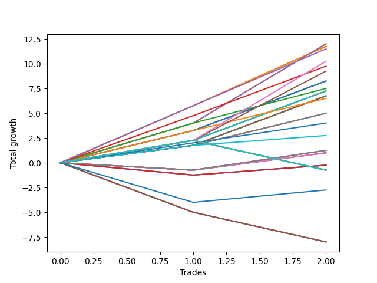

# Long Labrador 001 
- Symbol: ES_830-1130
- Date Range: 03/18/2022 - 12/30/2022
- Trading Period: 8:30-11:30
- Number of Trades: 3



| Name | Win Percent | Profit | Avg Profit / Trade | Avg Time / Trade |      | Name | Win Percent | Profit | Avg Profit / Trade | Avg Time / Trade |
| ---- | ----------- | ------ | ------------------ | ---------------- | ---- | ---- | ----------- | ------ | ------------------ | ---------------- |
| Sorted By <br> Profit | | | | | | Sorted By <br> Win Percentage ||||
| BB-50 U/L 1SD | 100.00 | 7625.00 | 2541.67 | 17:43 |     | BB-50 U/L 1SD | 100.00 | 7625.00 | 2541.67 | 17:43 |
| TP-5 | 100.00 | 7375.00 | 2458.33 | 16:05 |     | TP-5 | 100.00 | 7375.00 | 2458.33 | 16:05 |
| TP-4 | 100.00 | 5750.00 | 1916.67 | 14:30 |     | TP-4 | 100.00 | 5750.00 | 1916.67 | 14:30 |
| BB-20 U/L 2SD C | 100.00 | 5250.00 | 1750.00 | 13:11 |     | BB-20 U/L 2SD C | 100.00 | 5250.00 | 1750.00 | 13:11 |
| BB-100 Mid | 100.00 | 5000.00 | 1666.67 | 12:36 |     | BB-100 Mid | 100.00 | 5000.00 | 1666.67 | 12:36 |
| TP-3 | 100.00 | 4875.00 | 1625.00 | 13:10 |     | TP-3 | 100.00 | 4875.00 | 1625.00 | 13:10 |
| BB-50 Mid | 100.00 | 4625.00 | 1541.67 | 12:21 |     | BB-50 Mid | 100.00 | 4625.00 | 1541.67 | 12:21 |
| BB-20 U/L 2SD | 100.00 | 4125.00 | 1375.00 | 11:46 |     | BB-20 U/L 2SD | 100.00 | 4125.00 | 1375.00 | 11:46 |
| TP-2 | 100.00 | 2875.00 | 958.33 | 10:55 |     | TP-2 | 100.00 | 2875.00 | 958.33 | 10:55 |
| V U/L 1SD | 66.67 | 2375.00 | 791.67 | 29:46 |     | TP-1 | 100.00 | 1875.00 | 625.00 | 08:46 |
| TP-6 | 66.67 | 2125.00 | 708.33 | 28:23 |     | V U/L 1SD | 66.67 | 2375.00 | 791.67 | 29:46 |
| BB-20 U/L 1SD | 66.67 | 2000.00 | 666.67 | 08:56 |     | TP-6 | 66.67 | 2125.00 | 708.33 | 28:23 |
| TP-1 | 100.00 | 1875.00 | 625.00 | 08:46 |     | BB-20 U/L 1SD | 66.67 | 2000.00 | 666.67 | 08:56 |
| TP-8 | 66.67 | 1500.00 | 500.00 | 46:11 |     | TP-8 | 66.67 | 1500.00 | 500.00 | 46:11 |
| BB-200 Mid | 66.67 | 1125.00 | 375.00 | 07:53 |     | BB-200 Mid | 66.67 | 1125.00 | 375.00 | 07:53 |
| TP-7 | 66.67 | 1000.00 | 333.33 | 46:06 |     | TP-7 | 66.67 | 1000.00 | 333.33 | 46:06 |
| V Mid | 66.67 | 250.00 | 83.33 | 06:13 |     | V Mid | 66.67 | 250.00 | 83.33 | 06:13 |
| BB-20 Mid | 33.33 | -875.00 | -291.67 | 07:15 |     | BB-20 Mid | 33.33 | -875.00 | -291.67 | 07:15 |
| NEWFI 000 | 33.33 | -4000.00 | -1333.33 | 60:55 |     | NEWFI 000 | 33.33 | -4000.00 | -1333.33 | 60:55 |
| TP-10 | 33.33 | -4000.00 | -1333.33 | 60:55 |     | TP-10 | 33.33 | -4000.00 | -1333.33 | 60:55 |
| TP-9 | 33.33 | -4000.00 | -1333.33 | 60:55 |     | TP-9 | 33.33 | -4000.00 | -1333.33 | 60:55 |
| BB-200 U/L 2SD | 33.33 | -4000.00 | -1333.33 | 60:55 |     | BB-200 U/L 2SD | 33.33 | -4000.00 | -1333.33 | 60:55 |
| BB-100 U/L 2SD | 33.33 | -4000.00 | -1333.33 | 60:55 |     | BB-100 U/L 2SD | 33.33 | -4000.00 | -1333.33 | 60:55 |
| BB-50 U/L 2SD | 33.33 | -4000.00 | -1333.33 | 60:55 |     | BB-50 U/L 2SD | 33.33 | -4000.00 | -1333.33 | 60:55 |
| NEWFI 0000 | 33.33 | -4125.00 | -1375.00 | 32:25 |     | NEWFI 0000 | 33.33 | -4125.00 | -1375.00 | 32:25 |

## NO STOPLOSS

### Test BB-20 Mid
* Sell when price hits the middle line of the 20p bollinger
* No Stoploss
* Results:
```
Total Trades: 3
Percent Up: 33.33
Percent Down: 66.67
Total Points Moved Up: -1.75
Potential Profit: -875.00
Total Points Ups: 1.75 Count Ups: 1
Total Points Downs: -3.50 Count Downs: 2
```

<details><summary>Trades</summary>

<code>In: 2022-10-12 09:35:00		Out: 2022-10-12 09:45:55		Total Position Time: 10:55		Total Move Up: -2.75		Total to Date: -2.75</code> <br />
<code>In: 2022-10-17 11:29:00		Out: 2022-10-17 11:35:40		Total Position Time: 06:40		Total Move Up: -0.75		Total to Date: -3.50</code> <br />
<code>In: 2022-12-27 09:52:00		Out: 2022-12-27 09:56:10		Total Position Time: 04:10		Total Move Up: 1.75		Total to Date: -1.75</code> <br />


</details>

### Test BB-20 U/L 1SD
* Sell when the price hits the upper line of the 20p 1std bollinger
* No Stoploss
* Results:
```
Total Trades: 3
Percent Up: 66.67
Percent Down: 33.33
Total Points Moved Up: 4.00
Potential Profit: 2000.00
Total Points Ups: 5.00 Count Ups: 2
Total Points Downs: -1.00 Count Downs: 1
```

<details><summary>Trades</summary>

<code>In: 2022-10-12 09:35:00		Out: 2022-10-12 09:47:15		Total Position Time: 12:15		Total Move Up: -1.00		Total to Date: -1.00</code> <br />
<code>In: 2022-10-17 11:29:00		Out: 2022-10-17 11:36:10		Total Position Time: 07:10		Total Move Up: 1.75		Total to Date: 0.75</code> <br />
<code>In: 2022-12-27 09:52:00		Out: 2022-12-27 09:59:25		Total Position Time: 07:25		Total Move Up: 3.25		Total to Date: 4.00</code> <br />


</details>

### Test BB-20 U/L 2SD
* Sell when the price hits the upper line of the 20p 2std bollinger
* No Stoploss
* Results:
```
Total Trades: 3
Percent Up: 100.00
Percent Down: 0.00
Total Points Moved Up: 8.25
Potential Profit: 4125.00
Total Points Ups: 8.25 Count Ups: 3
Total Points Downs: 0.00 Count Downs: 0
```

<details><summary>Trades</summary>

<code>In: 2022-10-12 09:35:00		Out: 2022-10-12 09:53:00		Total Position Time: 18:00		Total Move Up: 1.00		Total to Date: 1.00</code> <br />
<code>In: 2022-10-17 11:29:00		Out: 2022-10-17 11:37:30		Total Position Time: 08:30		Total Move Up: 2.25		Total to Date: 3.25</code> <br />
<code>In: 2022-12-27 09:52:00		Out: 2022-12-27 10:00:50		Total Position Time: 08:50		Total Move Up: 5.00		Total to Date: 8.25</code> <br />


</details>

### Test BB-20 U/L 2SD C
* Sell when the price hits the upper line of the 20p 2std bollinger
* No Stoploss
* Results:
```
Total Trades: 3
Percent Up: 100.00
Percent Down: 0.00
Total Points Moved Up: 10.50
Potential Profit: 5250.00
Total Points Ups: 10.50 Count Ups: 3
Total Points Downs: 0.00 Count Downs: 0
```

<details><summary>Trades</summary>

<code>In: 2022-10-12 09:35:00		Out: 2022-10-12 09:56:50		Total Position Time: 21:50		Total Move Up: 3.25		Total to Date: 3.25</code> <br />
<code>In: 2022-10-17 11:29:00		Out: 2022-10-17 11:37:55		Total Position Time: 08:55		Total Move Up: 2.25		Total to Date: 5.50</code> <br />
<code>In: 2022-12-27 09:52:00		Out: 2022-12-27 10:00:50		Total Position Time: 08:50		Total Move Up: 5.00		Total to Date: 10.50</code> <br />


</details>

### Test BB-50 Mid
* Sell when price hits the middle line of the 50p bollinger
* No Stoploss
* Results:
```
Total Trades: 3
Percent Up: 100.00
Percent Down: 0.00
Total Points Moved Up: 9.25
Potential Profit: 4625.00
Total Points Ups: 9.25 Count Ups: 3
Total Points Downs: 0.00 Count Downs: 0
```

<details><summary>Trades</summary>

<code>In: 2022-10-12 09:35:00		Out: 2022-10-12 09:53:00		Total Position Time: 18:00		Total Move Up: 1.00		Total to Date: 1.00</code> <br />
<code>In: 2022-10-17 11:29:00		Out: 2022-10-17 11:39:15		Total Position Time: 10:15		Total Move Up: 3.25		Total to Date: 4.25</code> <br />
<code>In: 2022-12-27 09:52:00		Out: 2022-12-27 10:00:50		Total Position Time: 08:50		Total Move Up: 5.00		Total to Date: 9.25</code> <br />


</details>

### Test BB-50 U/L 1SD
* Sell when the price hits the upper line of the 50p 1std bollinger
* No Stoploss
* Results:
```
Total Trades: 3
Percent Up: 100.00
Percent Down: 0.00
Total Points Moved Up: 15.25
Potential Profit: 7625.00
Total Points Ups: 15.25 Count Ups: 3
Total Points Downs: 0.00 Count Downs: 0
```

<details><summary>Trades</summary>

<code>In: 2022-10-12 09:35:00		Out: 2022-10-12 09:59:05		Total Position Time: 24:05		Total Move Up: 3.50		Total to Date: 3.50</code> <br />
<code>In: 2022-10-17 11:29:00		Out: 2022-10-17 11:43:20		Total Position Time: 14:20		Total Move Up: 5.75		Total to Date: 9.25</code> <br />
<code>In: 2022-12-27 09:52:00		Out: 2022-12-27 10:06:45		Total Position Time: 14:45		Total Move Up: 6.00		Total to Date: 15.25</code> <br />


</details>

### Test BB-50 U/L 2SD
* Sell when the price hits the upper line of the 50p 2std bollinger
* No Stoploss
* Results:
```
Total Trades: 3
Percent Up: 33.33
Percent Down: 66.67
Total Points Moved Up: -8.00
Potential Profit: -4000.00
Total Points Ups: 2.25 Count Ups: 1
Total Points Downs: -10.25 Count Downs: 2
```

<details><summary>Trades</summary>

<code>In: 2022-10-12 09:35:00		Out: 2022-10-12 10:35:55		Total Position Time: 60:55		Total Move Up: -7.25		Total to Date: -7.25</code> <br />
<code>In: 2022-10-17 11:29:00		Out: 2022-10-17 12:29:55		Total Position Time: 60:55		Total Move Up: 2.25		Total to Date: -5.00</code> <br />
<code>In: 2022-12-27 09:52:00		Out: 2022-12-27 10:52:55		Total Position Time: 60:55		Total Move Up: -3.00		Total to Date: -8.00</code> <br />


</details>

### Test V Mid
* Sell when the price hits the middle line of the 1std VWAP
* No Stoploss
* Results:
```
Total Trades: 3
Percent Up: 66.67
Percent Down: 33.33
Total Points Moved Up: 0.50
Potential Profit: 250.00
Total Points Ups: 1.75 Count Ups: 2
Total Points Downs: -1.25 Count Downs: 1
```

<details><summary>Trades</summary>

<code>In: 2022-10-12 09:35:00		Out: 2022-10-12 09:51:20		Total Position Time: 16:20		Total Move Up: 0.75		Total to Date: 0.75</code> <br />
<code>In: 2022-10-17 11:29:00		Out: 2022-10-17 11:30:10		Total Position Time: 01:10		Total Move Up: -1.25		Total to Date: -0.50</code> <br />
<code>In: 2022-12-27 09:52:00		Out: 2022-12-27 09:53:10		Total Position Time: 01:10		Total Move Up: 1.00		Total to Date: 0.50</code> <br />


</details>

### Test V U/L 1SD
* Sell when the price hits the upper line of the 1std VWAP
* No Stoploss
* Results:
```
Total Trades: 3
Percent Up: 66.67
Percent Down: 33.33
Total Points Moved Up: 4.75
Potential Profit: 2375.00
Total Points Ups: 12.00 Count Ups: 2
Total Points Downs: -7.25 Count Downs: 1
```

<details><summary>Trades</summary>

<code>In: 2022-10-12 09:35:00		Out: 2022-10-12 10:35:55		Total Position Time: 60:55		Total Move Up: -7.25		Total to Date: -7.25</code> <br />
<code>In: 2022-10-17 11:29:00		Out: 2022-10-17 11:40:40		Total Position Time: 11:40		Total Move Up: 4.00		Total to Date: -3.25</code> <br />
<code>In: 2022-12-27 09:52:00		Out: 2022-12-27 10:08:45		Total Position Time: 16:45		Total Move Up: 8.00		Total to Date: 4.75</code> <br />


</details>

### Test BB-100 Mid
* Move to BB100 Mid
* No Stoploss
* Results:
```
Total Trades: 3
Percent Up: 100.00
Percent Down: 0.00
Total Points Moved Up: 10.00
Potential Profit: 5000.00
Total Points Ups: 10.00 Count Ups: 3
Total Points Downs: 0.00 Count Downs: 0
```

<details><summary>Trades</summary>

<code>In: 2022-10-12 09:35:00		Out: 2022-10-12 09:56:50		Total Position Time: 21:50		Total Move Up: 3.25		Total to Date: 3.25</code> <br />
<code>In: 2022-10-17 11:29:00		Out: 2022-10-17 11:36:10		Total Position Time: 07:10		Total Move Up: 1.75		Total to Date: 5.00</code> <br />
<code>In: 2022-12-27 09:52:00		Out: 2022-12-27 10:00:50		Total Position Time: 08:50		Total Move Up: 5.00		Total to Date: 10.00</code> <br />


</details>

### Test BB-100 U/L 2SD
* Move to BB100 Upper Band
* No Stoploss
* Results:
```
Total Trades: 3
Percent Up: 33.33
Percent Down: 66.67
Total Points Moved Up: -8.00
Potential Profit: -4000.00
Total Points Ups: 2.25 Count Ups: 1
Total Points Downs: -10.25 Count Downs: 2
```

<details><summary>Trades</summary>

<code>In: 2022-10-12 09:35:00		Out: 2022-10-12 10:35:55		Total Position Time: 60:55		Total Move Up: -7.25		Total to Date: -7.25</code> <br />
<code>In: 2022-10-17 11:29:00		Out: 2022-10-17 12:29:55		Total Position Time: 60:55		Total Move Up: 2.25		Total to Date: -5.00</code> <br />
<code>In: 2022-12-27 09:52:00		Out: 2022-12-27 10:52:55		Total Position Time: 60:55		Total Move Up: -3.00		Total to Date: -8.00</code> <br />


</details>

### Test BB-200 Mid
* Move to BB200 Mid
* No Stoploss
* Results:
```
Total Trades: 3
Percent Up: 66.67
Percent Down: 33.33
Total Points Moved Up: 2.25
Potential Profit: 1125.00
Total Points Ups: 3.00 Count Ups: 2
Total Points Downs: -0.75 Count Downs: 1
```

<details><summary>Trades</summary>

<code>In: 2022-10-12 09:35:00		Out: 2022-10-12 09:53:00		Total Position Time: 18:00		Total Move Up: 1.00		Total to Date: 1.00</code> <br />
<code>In: 2022-10-17 11:29:00		Out: 2022-10-17 11:30:20		Total Position Time: 01:20		Total Move Up: -0.75		Total to Date: 0.25</code> <br />
<code>In: 2022-12-27 09:52:00		Out: 2022-12-27 09:56:20		Total Position Time: 04:20		Total Move Up: 2.00		Total to Date: 2.25</code> <br />


</details>

### Test BB-200 U/L 2SD
* Move to BB200 Upper Band
* No Stoploss
* Results:
```
Total Trades: 3
Percent Up: 33.33
Percent Down: 66.67
Total Points Moved Up: -8.00
Potential Profit: -4000.00
Total Points Ups: 2.25 Count Ups: 1
Total Points Downs: -10.25 Count Downs: 2
```

<details><summary>Trades</summary>

<code>In: 2022-10-12 09:35:00		Out: 2022-10-12 10:35:55		Total Position Time: 60:55		Total Move Up: -7.25		Total to Date: -7.25</code> <br />
<code>In: 2022-10-17 11:29:00		Out: 2022-10-17 12:29:55		Total Position Time: 60:55		Total Move Up: 2.25		Total to Date: -5.00</code> <br />
<code>In: 2022-12-27 09:52:00		Out: 2022-12-27 10:52:55		Total Position Time: 60:55		Total Move Up: -3.00		Total to Date: -8.00</code> <br />


</details>

## TAKE PROFIT

### Test TP-1
* Take Profit of 1 Point
* No Stoploss
* Results:
```
Total Trades: 3
Percent Up: 100.00
Percent Down: 0.00
Total Points Moved Up: 3.75
Potential Profit: 1875.00
Total Points Ups: 3.75 Count Ups: 3
Total Points Downs: 0.00 Count Downs: 0
```

<details><summary>Trades</summary>

<code>In: 2022-10-12 09:35:00		Out: 2022-10-12 09:53:00		Total Position Time: 18:00		Total Move Up: 1.00		Total to Date: 1.00</code> <br />
<code>In: 2022-10-17 11:29:00		Out: 2022-10-17 11:36:10		Total Position Time: 07:10		Total Move Up: 1.75		Total to Date: 2.75</code> <br />
<code>In: 2022-12-27 09:52:00		Out: 2022-12-27 09:53:10		Total Position Time: 01:10		Total Move Up: 1.00		Total to Date: 3.75</code> <br />


</details>

### Test TP-2
* Take Profit of 2 Point
* No Stoploss
* Results:
```
Total Trades: 3
Percent Up: 100.00
Percent Down: 0.00
Total Points Moved Up: 5.75
Potential Profit: 2875.00
Total Points Ups: 5.75 Count Ups: 3
Total Points Downs: 0.00 Count Downs: 0
```

<details><summary>Trades</summary>

<code>In: 2022-10-12 09:35:00		Out: 2022-10-12 09:56:10		Total Position Time: 21:10		Total Move Up: 1.75		Total to Date: 1.75</code> <br />
<code>In: 2022-10-17 11:29:00		Out: 2022-10-17 11:36:15		Total Position Time: 07:15		Total Move Up: 2.00		Total to Date: 3.75</code> <br />
<code>In: 2022-12-27 09:52:00		Out: 2022-12-27 09:56:20		Total Position Time: 04:20		Total Move Up: 2.00		Total to Date: 5.75</code> <br />


</details>

### Test TP-3
* Take Profit of 3 Point
* No Stoploss
* Results:
```
Total Trades: 3
Percent Up: 100.00
Percent Down: 0.00
Total Points Moved Up: 9.75
Potential Profit: 4875.00
Total Points Ups: 9.75 Count Ups: 3
Total Points Downs: 0.00 Count Downs: 0
```

<details><summary>Trades</summary>

<code>In: 2022-10-12 09:35:00		Out: 2022-10-12 09:56:50		Total Position Time: 21:50		Total Move Up: 3.25		Total to Date: 3.25</code> <br />
<code>In: 2022-10-17 11:29:00		Out: 2022-10-17 11:39:15		Total Position Time: 10:15		Total Move Up: 3.25		Total to Date: 6.50</code> <br />
<code>In: 2022-12-27 09:52:00		Out: 2022-12-27 09:59:25		Total Position Time: 07:25		Total Move Up: 3.25		Total to Date: 9.75</code> <br />


</details>

### Test TP-4
* Take Profit of 4 Point
* No Stoploss
* Results:
```
Total Trades: 3
Percent Up: 100.00
Percent Down: 0.00
Total Points Moved Up: 11.50
Potential Profit: 5750.00
Total Points Ups: 11.50 Count Ups: 3
Total Points Downs: 0.00 Count Downs: 0
```

<details><summary>Trades</summary>

<code>In: 2022-10-12 09:35:00		Out: 2022-10-12 09:58:20		Total Position Time: 23:20		Total Move Up: 4.00		Total to Date: 4.00</code> <br />
<code>In: 2022-10-17 11:29:00		Out: 2022-10-17 11:40:40		Total Position Time: 11:40		Total Move Up: 4.00		Total to Date: 8.00</code> <br />
<code>In: 2022-12-27 09:52:00		Out: 2022-12-27 10:00:30		Total Position Time: 08:30		Total Move Up: 3.50		Total to Date: 11.50</code> <br />


</details>

### Test TP-5
* Take Profit of 5 Point
* No Stoploss
* Results:
```
Total Trades: 3
Percent Up: 100.00
Percent Down: 0.00
Total Points Moved Up: 14.75
Potential Profit: 7375.00
Total Points Ups: 14.75 Count Ups: 3
Total Points Downs: 0.00 Count Downs: 0
```

<details><summary>Trades</summary>

<code>In: 2022-10-12 09:35:00		Out: 2022-10-12 10:00:45		Total Position Time: 25:45		Total Move Up: 5.00		Total to Date: 5.00</code> <br />
<code>In: 2022-10-17 11:29:00		Out: 2022-10-17 11:42:40		Total Position Time: 13:40		Total Move Up: 4.75		Total to Date: 9.75</code> <br />
<code>In: 2022-12-27 09:52:00		Out: 2022-12-27 10:00:50		Total Position Time: 08:50		Total Move Up: 5.00		Total to Date: 14.75</code> <br />


</details>

### Test TP-6
* Take Profit of 6 Point
* No Stoploss
* Results:
```
Total Trades: 3
Percent Up: 66.67
Percent Down: 33.33
Total Points Moved Up: 4.25
Potential Profit: 2125.00
Total Points Ups: 11.50 Count Ups: 2
Total Points Downs: -7.25 Count Downs: 1
```

<details><summary>Trades</summary>

<code>In: 2022-10-12 09:35:00		Out: 2022-10-12 10:35:55		Total Position Time: 60:55		Total Move Up: -7.25		Total to Date: -7.25</code> <br />
<code>In: 2022-10-17 11:29:00		Out: 2022-10-17 11:43:20		Total Position Time: 14:20		Total Move Up: 5.75		Total to Date: -1.50</code> <br />
<code>In: 2022-12-27 09:52:00		Out: 2022-12-27 10:01:55		Total Position Time: 09:55		Total Move Up: 5.75		Total to Date: 4.25</code> <br />


</details>

### Test TP-7
* Take Profit of 7 Point
* No Stoploss
* Results:
```
Total Trades: 3
Percent Up: 66.67
Percent Down: 33.33
Total Points Moved Up: 2.00
Potential Profit: 1000.00
Total Points Ups: 9.25 Count Ups: 2
Total Points Downs: -7.25 Count Downs: 1
```

<details><summary>Trades</summary>

<code>In: 2022-10-12 09:35:00		Out: 2022-10-12 10:35:55		Total Position Time: 60:55		Total Move Up: -7.25		Total to Date: -7.25</code> <br />
<code>In: 2022-10-17 11:29:00		Out: 2022-10-17 12:29:55		Total Position Time: 60:55		Total Move Up: 2.25		Total to Date: -5.00</code> <br />
<code>In: 2022-12-27 09:52:00		Out: 2022-12-27 10:08:30		Total Position Time: 16:30		Total Move Up: 7.00		Total to Date: 2.00</code> <br />


</details>

### Test TP-8
* Take Profit of 8 Point
* No Stoploss
* Results:
```
Total Trades: 3
Percent Up: 66.67
Percent Down: 33.33
Total Points Moved Up: 3.00
Potential Profit: 1500.00
Total Points Ups: 10.25 Count Ups: 2
Total Points Downs: -7.25 Count Downs: 1
```

<details><summary>Trades</summary>

<code>In: 2022-10-12 09:35:00		Out: 2022-10-12 10:35:55		Total Position Time: 60:55		Total Move Up: -7.25		Total to Date: -7.25</code> <br />
<code>In: 2022-10-17 11:29:00		Out: 2022-10-17 12:29:55		Total Position Time: 60:55		Total Move Up: 2.25		Total to Date: -5.00</code> <br />
<code>In: 2022-12-27 09:52:00		Out: 2022-12-27 10:08:45		Total Position Time: 16:45		Total Move Up: 8.00		Total to Date: 3.00</code> <br />


</details>

### Test TP-9
* Take Profit of 9 Point
* No Stoploss
* Results:
```
Total Trades: 3
Percent Up: 33.33
Percent Down: 66.67
Total Points Moved Up: -8.00
Potential Profit: -4000.00
Total Points Ups: 2.25 Count Ups: 1
Total Points Downs: -10.25 Count Downs: 2
```

<details><summary>Trades</summary>

<code>In: 2022-10-12 09:35:00		Out: 2022-10-12 10:35:55		Total Position Time: 60:55		Total Move Up: -7.25		Total to Date: -7.25</code> <br />
<code>In: 2022-10-17 11:29:00		Out: 2022-10-17 12:29:55		Total Position Time: 60:55		Total Move Up: 2.25		Total to Date: -5.00</code> <br />
<code>In: 2022-12-27 09:52:00		Out: 2022-12-27 10:52:55		Total Position Time: 60:55		Total Move Up: -3.00		Total to Date: -8.00</code> <br />


</details>

### Test TP-10
* Take Profit of 10 Point
* No Stoploss
* Results:
```
Total Trades: 3
Percent Up: 33.33
Percent Down: 66.67
Total Points Moved Up: -8.00
Potential Profit: -4000.00
Total Points Ups: 2.25 Count Ups: 1
Total Points Downs: -10.25 Count Downs: 2
```

<details><summary>Trades</summary>

<code>In: 2022-10-12 09:35:00		Out: 2022-10-12 10:35:55		Total Position Time: 60:55		Total Move Up: -7.25		Total to Date: -7.25</code> <br />
<code>In: 2022-10-17 11:29:00		Out: 2022-10-17 12:29:55		Total Position Time: 60:55		Total Move Up: 2.25		Total to Date: -5.00</code> <br />
<code>In: 2022-12-27 09:52:00		Out: 2022-12-27 10:52:55		Total Position Time: 60:55		Total Move Up: -3.00		Total to Date: -8.00</code> <br />


</details>

## Indicator Exits

### Test NEWFI 000
* Newfi 0000
* No Stoploss
* Results:
```
Total Trades: 3
Percent Up: 33.33
Percent Down: 66.67
Total Points Moved Up: -8.00
Potential Profit: -4000.00
Total Points Ups: 2.25 Count Ups: 1
Total Points Downs: -10.25 Count Downs: 2
```

<details><summary>Trades</summary>

<code>In: 2022-10-12 09:35:00		Out: 2022-10-12 10:35:55		Total Position Time: 60:55		Total Move Up: -7.25		Total to Date: -7.25</code> <br />
<code>In: 2022-10-17 11:29:00		Out: 2022-10-17 12:29:55		Total Position Time: 60:55		Total Move Up: 2.25		Total to Date: -5.00</code> <br />
<code>In: 2022-12-27 09:52:00		Out: 2022-12-27 10:52:55		Total Position Time: 60:55		Total Move Up: -3.00		Total to Date: -8.00</code> <br />


</details>

### Test NEWFI 0000
* Newfi 0000
* No Stoploss
* Results:
```
Total Trades: 3
Percent Up: 33.33
Percent Down: 66.67
Total Points Moved Up: -8.25
Potential Profit: -4125.00
Total Points Ups: 1.25 Count Ups: 1
Total Points Downs: -9.50 Count Downs: 2
```

<details><summary>Trades</summary>

<code>In: 2022-10-12 09:35:00		Out: 2022-10-12 09:40:05		Total Position Time: 05:05		Total Move Up: -5.50		Total to Date: -5.50</code> <br />
<code>In: 2022-10-17 11:29:00		Out: 2022-10-17 12:10:05		Total Position Time: 41:05		Total Move Up: -4.00		Total to Date: -9.50</code> <br />
<code>In: 2022-12-27 09:52:00		Out: 2022-12-27 10:43:05		Total Position Time: 51:05		Total Move Up: 1.25		Total to Date: -8.25</code> <br />


</details>