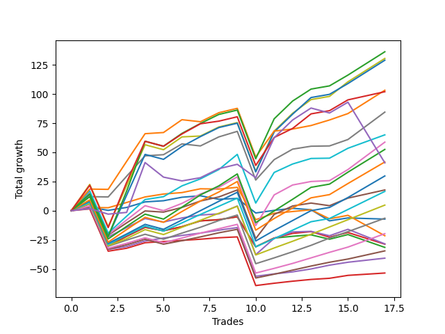

# Long Labrador 002 
- Symbol: ES_830-1130
- Date Range: 03/18/2022 - 12/30/2022
- Trading Period: 8:30-11:30
- Number of Trades: 20



| Name | Win Percent | Profit | Avg Profit / Trade | Avg Time / Trade |      | Name | Win Percent | Profit | Avg Profit / Trade | Avg Time / Trade |
| ---- | ----------- | ------ | ------------------ | ---------------- | ---- | ---- | ----------- | ------ | ------------------ | ---------------- |
| Sorted By <br> Profit | | | | | | Sorted By <br> Win Percentage ||||
| BB-200 U/L 2SD | 85.00 | 152500.00 | 7625.00 | 57:19 |     | BB-100 Mid | 90.00 | 72750.00 | 3637.50 | 31:33 |
| BB-100 U/L 2SD | 85.00 | 148875.00 | 7443.75 | 55:44 |     | TP-2 | 90.00 | -17125.00 | -856.25 | 10:37 |
| V U/L 1SD | 85.00 | 123625.00 | 6181.25 | 48:55 |     | TP-1 | 90.00 | -24125.00 | -1206.25 | 09:47 |
| BB-200 Mid | 85.00 | 100375.00 | 5018.75 | 33:30 |     | BB-200 U/L 2SD | 85.00 | 152500.00 | 7625.00 | 57:19 |
| BB-50 U/L 2SD | 85.00 | 90750.00 | 4537.50 | 36:24 |     | BB-100 U/L 2SD | 85.00 | 148875.00 | 7443.75 | 55:44 |
| NEWFI 000 | 85.00 | 84875.00 | 4243.75 | 52:00 |     | V U/L 1SD | 85.00 | 123625.00 | 6181.25 | 48:55 |
| V Mid | 85.00 | 84250.00 | 4212.50 | 27:32 |     | BB-200 Mid | 85.00 | 100375.00 | 5018.75 | 33:30 |
| BB-100 Mid | 90.00 | 72750.00 | 3637.50 | 31:33 |     | BB-50 U/L 2SD | 85.00 | 90750.00 | 4537.50 | 36:24 |
| BB-50 U/L 1SD | 80.00 | 51500.00 | 2575.00 | 30:10 |     | NEWFI 000 | 85.00 | 84875.00 | 4243.75 | 52:00 |
| TP-10 | 85.00 | 42000.00 | 2100.00 | 33:38 |     | V Mid | 85.00 | 84250.00 | 4212.50 | 27:32 |
| NEWFI 0000 | 65.00 | 40250.00 | 2012.50 | 35:09 |     | TP-10 | 85.00 | 42000.00 | 2100.00 | 33:38 |
| TP-9 | 85.00 | 35625.00 | 1781.25 | 30:55 |     | TP-9 | 85.00 | 35625.00 | 1781.25 | 30:55 |
| TP-8 | 85.00 | 28375.00 | 1418.75 | 29:06 |     | TP-8 | 85.00 | 28375.00 | 1418.75 | 29:06 |
| TP-7 | 85.00 | 18875.00 | 943.75 | 28:00 |     | TP-7 | 85.00 | 18875.00 | 943.75 | 28:00 |
| BB-50 Mid | 70.00 | 13000.00 | 650.00 | 20:12 |     | TP-6 | 85.00 | 12500.00 | 625.00 | 26:04 |
| TP-6 | 85.00 | 12500.00 | 625.00 | 26:04 |     | TP-5 | 85.00 | 5625.00 | 281.25 | 23:34 |
| BB-20 U/L 2SD C | 70.00 | 11625.00 | 581.25 | 20:48 |     | TP-4 | 85.00 | -2875.00 | -143.75 | 21:58 |
| TP-5 | 85.00 | 5625.00 | 281.25 | 23:34 |     | TP-3 | 85.00 | -12375.00 | -618.75 | 20:08 |
| BB-20 Mid | 65.00 | 3125.00 | 156.25 | 04:58 |     | BB-50 U/L 1SD | 80.00 | 51500.00 | 2575.00 | 30:10 |
| BB-20 U/L 2SD | 70.00 | 2500.00 | 125.00 | 19:46 |     | BB-50 Mid | 70.00 | 13000.00 | 650.00 | 20:12 |
| BB-20 U/L 1SD | 70.00 | 875.00 | 43.75 | 11:52 |     | BB-20 U/L 2SD C | 70.00 | 11625.00 | 581.25 | 20:48 |
| TP-4 | 85.00 | -2875.00 | -143.75 | 21:58 |     | BB-20 U/L 2SD | 70.00 | 2500.00 | 125.00 | 19:46 |
| TP-3 | 85.00 | -12375.00 | -618.75 | 20:08 |     | BB-20 U/L 1SD | 70.00 | 875.00 | 43.75 | 11:52 |
| TP-2 | 90.00 | -17125.00 | -856.25 | 10:37 |     | NEWFI 0000 | 65.00 | 40250.00 | 2012.50 | 35:09 |
| TP-1 | 90.00 | -24125.00 | -1206.25 | 09:47 |     | BB-20 Mid | 65.00 | 3125.00 | 156.25 | 04:58 |

## NO STOPLOSS

### Test BB-20 Mid
* Sell when price hits the middle line of the 20p bollinger
* No Stoploss
* Results:
```
Total Trades: 20
Percent Up: 65.00
Percent Down: 35.00
Total Points Moved Up: 6.25
Potential Profit: 3125.00
Total Points Ups: 36.25 Count Ups: 13
Total Points Downs: -30.00 Count Downs: 7
```

<details><summary>Trades</summary>

<code>In: 2022-05-03 11:29:00		Out: 2022-05-03 11:32:10		Total Position Time: 03:10		Total Move Up: 3.00		Total to Date: 3.00</code> <br />
<code>In: 2022-05-13 10:14:00		Out: 2022-05-13 10:24:25		Total Position Time: 10:25		Total Move Up: -2.75		Total to Date: 0.25</code> <br />
<code>In: 2022-05-13 11:18:00		Out: 2022-05-13 11:19:15		Total Position Time: 01:15		Total Move Up: 2.50		Total to Date: 2.75</code> <br />
<code>In: 2022-05-13 11:30:00		Out: 2022-05-13 11:31:10		Total Position Time: 01:10		Total Move Up: 4.75		Total to Date: 7.50</code> <br />
<code>In: 2022-05-25 09:40:00		Out: 2022-05-25 09:41:30		Total Position Time: 01:30		Total Move Up: 3.00		Total to Date: 10.50</code> <br />
<code>In: 2022-06-27 09:19:00		Out: 2022-06-27 09:20:10		Total Position Time: 01:10		Total Move Up: 1.00		Total to Date: 11.50</code> <br />
<code>In: 2022-07-08 09:46:00		Out: 2022-07-08 09:49:05		Total Position Time: 03:05		Total Move Up: 3.00		Total to Date: 14.50</code> <br />
<code>In: 2022-07-21 10:57:00		Out: 2022-07-21 10:59:25		Total Position Time: 02:25		Total Move Up: 1.25		Total to Date: 15.75</code> <br />
<code>In: 2022-08-01 10:37:00		Out: 2022-08-01 10:56:50		Total Position Time: 19:50		Total Move Up: -3.00		Total to Date: 12.75</code> <br />
<code>In: 2022-08-02 10:54:00		Out: 2022-08-02 10:55:10		Total Position Time: 01:10		Total Move Up: 0.75		Total to Date: 13.50</code> <br />
<code>In: 2022-09-02 09:56:00		Out: 2022-09-02 10:18:10		Total Position Time: 22:10		Total Move Up: -12.50		Total to Date: 1.00</code> <br />
<code>In: 2022-09-08 09:25:00		Out: 2022-09-08 09:26:25		Total Position Time: 01:25		Total Move Up: 2.25		Total to Date: 3.25</code> <br />
<code>In: 2022-09-12 09:13:00		Out: 2022-09-12 09:14:10		Total Position Time: 01:10		Total Move Up: 1.75		Total to Date: 5.00</code> <br />
<code>In: 2022-09-19 09:09:00		Out: 2022-09-19 09:10:10		Total Position Time: 01:10		Total Move Up: -1.25		Total to Date: 3.75</code> <br />
<code>In: 2022-09-21 11:20:00		Out: 2022-09-21 11:22:15		Total Position Time: 02:15		Total Move Up: 7.00		Total to Date: 10.75</code> <br />
<code>In: 2022-09-21 11:21:00		Out: 2022-09-21 11:22:15		Total Position Time: 01:15		Total Move Up: 3.50		Total to Date: 14.25</code> <br />
<code>In: 2022-10-04 10:05:00		Out: 2022-10-04 10:26:10		Total Position Time: 21:10		Total Move Up: -9.50		Total to Date: 4.75</code> <br />
<code>In: 2022-10-31 09:50:00		Out: 2022-10-31 09:51:10		Total Position Time: 01:10		Total Move Up: 2.50		Total to Date: 7.25</code> <br />
<code>In: 2022-11-08 11:15:00		Out: 2022-11-08 11:16:15		Total Position Time: 01:15		Total Move Up: -0.50		Total to Date: 6.75</code> <br />
<code>In: 2022-11-08 11:15:00		Out: 2022-11-08 11:16:15		Total Position Time: 01:15		Total Move Up: -0.50		Total to Date: 6.25</code> <br />


</details>

### Test BB-20 U/L 1SD
* Sell when the price hits the upper line of the 20p 1std bollinger
* No Stoploss
* Results:
```
Total Trades: 20
Percent Up: 70.00
Percent Down: 30.00
Total Points Moved Up: 1.75
Potential Profit: 875.00
Total Points Ups: 55.25 Count Ups: 14
Total Points Downs: -53.50 Count Downs: 6
```

<details><summary>Trades</summary>

<code>In: 2022-05-03 11:29:00		Out: 2022-05-03 11:32:25		Total Position Time: 03:25		Total Move Up: 2.75		Total to Date: 2.75</code> <br />
<code>In: 2022-05-13 10:14:00		Out: 2022-05-13 10:26:10		Total Position Time: 12:10		Total Move Up: -0.25		Total to Date: 2.50</code> <br />
<code>In: 2022-05-13 11:18:00		Out: 2022-05-13 11:20:05		Total Position Time: 02:05		Total Move Up: 4.50		Total to Date: 7.00</code> <br />
<code>In: 2022-05-13 11:30:00		Out: 2022-05-13 11:31:10		Total Position Time: 01:10		Total Move Up: 4.75		Total to Date: 11.75</code> <br />
<code>In: 2022-05-25 09:40:00		Out: 2022-05-25 09:44:25		Total Position Time: 04:25		Total Move Up: 4.25		Total to Date: 16.00</code> <br />
<code>In: 2022-06-27 09:19:00		Out: 2022-06-27 09:20:20		Total Position Time: 01:20		Total Move Up: 2.50		Total to Date: 18.50</code> <br />
<code>In: 2022-07-08 09:46:00		Out: 2022-07-08 10:06:55		Total Position Time: 20:55		Total Move Up: 1.25		Total to Date: 19.75</code> <br />
<code>In: 2022-07-21 10:57:00		Out: 2022-07-21 11:06:05		Total Position Time: 09:05		Total Move Up: 3.25		Total to Date: 23.00</code> <br />
<code>In: 2022-08-01 10:37:00		Out: 2022-08-01 10:59:05		Total Position Time: 22:05		Total Move Up: -0.25		Total to Date: 22.75</code> <br />
<code>In: 2022-08-02 10:54:00		Out: 2022-08-02 11:01:35		Total Position Time: 07:35		Total Move Up: 1.50		Total to Date: 24.25</code> <br />
<code>In: 2022-09-02 09:56:00		Out: 2022-09-02 10:43:30		Total Position Time: 47:30		Total Move Up: -27.75		Total to Date: -3.50</code> <br />
<code>In: 2022-09-08 09:25:00		Out: 2022-09-08 09:29:00		Total Position Time: 04:00		Total Move Up: 5.50		Total to Date: 2.00</code> <br />
<code>In: 2022-09-12 09:13:00		Out: 2022-09-12 09:21:25		Total Position Time: 08:25		Total Move Up: 1.50		Total to Date: 3.50</code> <br />
<code>In: 2022-09-19 09:09:00		Out: 2022-09-19 09:13:10		Total Position Time: 04:10		Total Move Up: 1.50		Total to Date: 5.00</code> <br />
<code>In: 2022-09-21 11:20:00		Out: 2022-09-21 11:25:25		Total Position Time: 05:25		Total Move Up: 11.25		Total to Date: 16.25</code> <br />
<code>In: 2022-09-21 11:21:00		Out: 2022-09-21 11:25:25		Total Position Time: 04:25		Total Move Up: 7.75		Total to Date: 24.00</code> <br />
<code>In: 2022-10-04 10:05:00		Out: 2022-10-04 10:30:05		Total Position Time: 25:05		Total Move Up: -7.75		Total to Date: 16.25</code> <br />
<code>In: 2022-10-31 09:50:00		Out: 2022-10-31 09:57:05		Total Position Time: 07:05		Total Move Up: 3.00		Total to Date: 19.25</code> <br />
<code>In: 2022-11-08 11:15:00		Out: 2022-11-08 11:38:35		Total Position Time: 23:35		Total Move Up: -8.75		Total to Date: 10.50</code> <br />
<code>In: 2022-11-08 11:15:00		Out: 2022-11-08 11:38:35		Total Position Time: 23:35		Total Move Up: -8.75		Total to Date: 1.75</code> <br />


</details>

### Test BB-20 U/L 2SD
* Sell when the price hits the upper line of the 20p 2std bollinger
* No Stoploss
* Results:
```
Total Trades: 20
Percent Up: 70.00
Percent Down: 30.00
Total Points Moved Up: 5.00
Potential Profit: 2500.00
Total Points Ups: 84.75 Count Ups: 14
Total Points Downs: -79.75 Count Downs: 6
```

<details><summary>Trades</summary>

<code>In: 2022-05-03 11:29:00		Out: 2022-05-03 11:34:55		Total Position Time: 05:55		Total Move Up: 6.25		Total to Date: 6.25</code> <br />
<code>In: 2022-05-13 10:14:00		Out: 2022-05-13 11:14:55		Total Position Time: 60:55		Total Move Up: -36.25		Total to Date: -30.00</code> <br />
<code>In: 2022-05-13 11:18:00		Out: 2022-05-13 11:31:20		Total Position Time: 13:20		Total Move Up: 8.00		Total to Date: -22.00</code> <br />
<code>In: 2022-05-13 11:30:00		Out: 2022-05-13 11:31:20		Total Position Time: 01:20		Total Move Up: 7.75		Total to Date: -14.25</code> <br />
<code>In: 2022-05-25 09:40:00		Out: 2022-05-25 09:45:20		Total Position Time: 05:20		Total Move Up: 6.50		Total to Date: -7.75</code> <br />
<code>In: 2022-06-27 09:19:00		Out: 2022-06-27 09:45:05		Total Position Time: 26:05		Total Move Up: -3.00		Total to Date: -10.75</code> <br />
<code>In: 2022-07-08 09:46:00		Out: 2022-07-08 10:11:05		Total Position Time: 25:05		Total Move Up: 3.50		Total to Date: -7.25</code> <br />
<code>In: 2022-07-21 10:57:00		Out: 2022-07-21 11:07:15		Total Position Time: 10:15		Total Move Up: 5.00		Total to Date: -2.25</code> <br />
<code>In: 2022-08-01 10:37:00		Out: 2022-08-01 11:06:40		Total Position Time: 29:40		Total Move Up: 1.00		Total to Date: -1.25</code> <br />
<code>In: 2022-08-02 10:54:00		Out: 2022-08-02 11:06:45		Total Position Time: 12:45		Total Move Up: 2.50		Total to Date: 1.25</code> <br />
<code>In: 2022-09-02 09:56:00		Out: 2022-09-02 10:43:50		Total Position Time: 47:50		Total Move Up: -25.75		Total to Date: -24.50</code> <br />
<code>In: 2022-09-08 09:25:00		Out: 2022-09-08 09:31:35		Total Position Time: 06:35		Total Move Up: 7.50		Total to Date: -17.00</code> <br />
<code>In: 2022-09-12 09:13:00		Out: 2022-09-12 09:21:25		Total Position Time: 08:25		Total Move Up: 1.50		Total to Date: -15.50</code> <br />
<code>In: 2022-09-19 09:09:00		Out: 2022-09-19 09:35:00		Total Position Time: 26:00		Total Move Up: 1.25		Total to Date: -14.25</code> <br />
<code>In: 2022-09-21 11:20:00		Out: 2022-09-21 11:31:40		Total Position Time: 11:40		Total Move Up: 16.75		Total to Date: 2.50</code> <br />
<code>In: 2022-09-21 11:21:00		Out: 2022-09-21 11:31:40		Total Position Time: 10:40		Total Move Up: 13.25		Total to Date: 15.75</code> <br />
<code>In: 2022-10-04 10:05:00		Out: 2022-10-04 10:32:15		Total Position Time: 27:15		Total Move Up: -3.75		Total to Date: 12.00</code> <br />
<code>In: 2022-10-31 09:50:00		Out: 2022-10-31 10:02:05		Total Position Time: 12:05		Total Move Up: 4.00		Total to Date: 16.00</code> <br />
<code>In: 2022-11-08 11:15:00		Out: 2022-11-08 11:42:10		Total Position Time: 27:10		Total Move Up: -5.50		Total to Date: 10.50</code> <br />
<code>In: 2022-11-08 11:15:00		Out: 2022-11-08 11:42:10		Total Position Time: 27:10		Total Move Up: -5.50		Total to Date: 5.00</code> <br />


</details>

### Test BB-20 U/L 2SD C
* Sell when the price hits the upper line of the 20p 2std bollinger
* No Stoploss
* Results:
```
Total Trades: 20
Percent Up: 70.00
Percent Down: 30.00
Total Points Moved Up: 23.25
Potential Profit: 11625.00
Total Points Ups: 103.00 Count Ups: 14
Total Points Downs: -79.75 Count Downs: 6
```

<details><summary>Trades</summary>

<code>In: 2022-05-03 11:29:00		Out: 2022-05-03 11:34:55		Total Position Time: 05:55		Total Move Up: 6.25		Total to Date: 6.25</code> <br />
<code>In: 2022-05-13 10:14:00		Out: 2022-05-13 11:14:55		Total Position Time: 60:55		Total Move Up: -36.25		Total to Date: -30.00</code> <br />
<code>In: 2022-05-13 11:18:00		Out: 2022-05-13 11:31:20		Total Position Time: 13:20		Total Move Up: 8.00		Total to Date: -22.00</code> <br />
<code>In: 2022-05-13 11:30:00		Out: 2022-05-13 11:31:20		Total Position Time: 01:20		Total Move Up: 7.75		Total to Date: -14.25</code> <br />
<code>In: 2022-05-25 09:40:00		Out: 2022-05-25 09:45:20		Total Position Time: 05:20		Total Move Up: 6.50		Total to Date: -7.75</code> <br />
<code>In: 2022-06-27 09:19:00		Out: 2022-06-27 09:45:05		Total Position Time: 26:05		Total Move Up: -3.00		Total to Date: -10.75</code> <br />
<code>In: 2022-07-08 09:46:00		Out: 2022-07-08 10:11:05		Total Position Time: 25:05		Total Move Up: 3.50		Total to Date: -7.25</code> <br />
<code>In: 2022-07-21 10:57:00		Out: 2022-07-21 11:07:15		Total Position Time: 10:15		Total Move Up: 5.00		Total to Date: -2.25</code> <br />
<code>In: 2022-08-01 10:37:00		Out: 2022-08-01 11:06:40		Total Position Time: 29:40		Total Move Up: 1.00		Total to Date: -1.25</code> <br />
<code>In: 2022-08-02 10:54:00		Out: 2022-08-02 11:06:45		Total Position Time: 12:45		Total Move Up: 2.50		Total to Date: 1.25</code> <br />
<code>In: 2022-09-02 09:56:00		Out: 2022-09-02 10:43:50		Total Position Time: 47:50		Total Move Up: -25.75		Total to Date: -24.50</code> <br />
<code>In: 2022-09-08 09:25:00		Out: 2022-09-08 09:31:35		Total Position Time: 06:35		Total Move Up: 7.50		Total to Date: -17.00</code> <br />
<code>In: 2022-09-12 09:13:00		Out: 2022-09-12 09:23:10		Total Position Time: 10:10		Total Move Up: 4.00		Total to Date: -13.00</code> <br />
<code>In: 2022-09-19 09:09:00		Out: 2022-09-19 09:35:05		Total Position Time: 26:05		Total Move Up: 1.50		Total to Date: -11.50</code> <br />
<code>In: 2022-09-21 11:20:00		Out: 2022-09-21 11:33:20		Total Position Time: 13:20		Total Move Up: 24.50		Total to Date: 13.00</code> <br />
<code>In: 2022-09-21 11:21:00		Out: 2022-09-21 11:33:20		Total Position Time: 12:20		Total Move Up: 21.00		Total to Date: 34.00</code> <br />
<code>In: 2022-10-04 10:05:00		Out: 2022-10-04 10:47:40		Total Position Time: 42:40		Total Move Up: -4.75		Total to Date: 29.25</code> <br />
<code>In: 2022-10-31 09:50:00		Out: 2022-10-31 10:02:05		Total Position Time: 12:05		Total Move Up: 4.00		Total to Date: 33.25</code> <br />
<code>In: 2022-11-08 11:15:00		Out: 2022-11-08 11:42:15		Total Position Time: 27:15		Total Move Up: -5.00		Total to Date: 28.25</code> <br />
<code>In: 2022-11-08 11:15:00		Out: 2022-11-08 11:42:15		Total Position Time: 27:15		Total Move Up: -5.00		Total to Date: 23.25</code> <br />


</details>

### Test BB-50 Mid
* Sell when price hits the middle line of the 50p bollinger
* No Stoploss
* Results:
```
Total Trades: 20
Percent Up: 70.00
Percent Down: 30.00
Total Points Moved Up: 26.00
Potential Profit: 13000.00
Total Points Ups: 123.25 Count Ups: 14
Total Points Downs: -97.25 Count Downs: 6
```

<details><summary>Trades</summary>

<code>In: 2022-05-03 11:29:00		Out: 2022-05-03 11:36:10		Total Position Time: 07:10		Total Move Up: 13.75		Total to Date: 13.75</code> <br />
<code>In: 2022-05-13 10:14:00		Out: 2022-05-13 11:14:55		Total Position Time: 60:55		Total Move Up: -36.25		Total to Date: -22.50</code> <br />
<code>In: 2022-05-13 11:18:00		Out: 2022-05-13 11:31:20		Total Position Time: 13:20		Total Move Up: 8.00		Total to Date: -14.50</code> <br />
<code>In: 2022-05-13 11:30:00		Out: 2022-05-13 11:31:20		Total Position Time: 01:20		Total Move Up: 7.75		Total to Date: -6.75</code> <br />
<code>In: 2022-05-25 09:40:00		Out: 2022-05-25 09:49:05		Total Position Time: 09:05		Total Move Up: 9.00		Total to Date: 2.25</code> <br />
<code>In: 2022-06-27 09:19:00		Out: 2022-06-27 09:45:05		Total Position Time: 26:05		Total Move Up: -3.00		Total to Date: -0.75</code> <br />
<code>In: 2022-07-08 09:46:00		Out: 2022-07-08 10:11:10		Total Position Time: 25:10		Total Move Up: 3.50		Total to Date: 2.75</code> <br />
<code>In: 2022-07-21 10:57:00		Out: 2022-07-21 11:00:05		Total Position Time: 03:05		Total Move Up: 2.50		Total to Date: 5.25</code> <br />
<code>In: 2022-08-01 10:37:00		Out: 2022-08-01 11:07:00		Total Position Time: 30:00		Total Move Up: 1.00		Total to Date: 6.25</code> <br />
<code>In: 2022-08-02 10:54:00		Out: 2022-08-02 11:08:40		Total Position Time: 14:40		Total Move Up: 6.75		Total to Date: 13.00</code> <br />
<code>In: 2022-09-02 09:56:00		Out: 2022-09-02 10:56:55		Total Position Time: 60:55		Total Move Up: -41.75		Total to Date: -28.75</code> <br />
<code>In: 2022-09-08 09:25:00		Out: 2022-09-08 09:39:40		Total Position Time: 14:40		Total Move Up: 14.00		Total to Date: -14.75</code> <br />
<code>In: 2022-09-12 09:13:00		Out: 2022-09-12 09:24:10		Total Position Time: 11:10		Total Move Up: 5.50		Total to Date: -9.25</code> <br />
<code>In: 2022-09-19 09:09:00		Out: 2022-09-19 09:10:45		Total Position Time: 01:45		Total Move Up: 0.50		Total to Date: -8.75</code> <br />
<code>In: 2022-09-21 11:20:00		Out: 2022-09-21 11:33:20		Total Position Time: 13:20		Total Move Up: 24.50		Total to Date: 15.75</code> <br />
<code>In: 2022-09-21 11:21:00		Out: 2022-09-21 11:33:20		Total Position Time: 12:20		Total Move Up: 21.00		Total to Date: 36.75</code> <br />
<code>In: 2022-10-04 10:05:00		Out: 2022-10-04 10:32:10		Total Position Time: 27:10		Total Move Up: -3.75		Total to Date: 33.00</code> <br />
<code>In: 2022-10-31 09:50:00		Out: 2022-10-31 10:08:30		Total Position Time: 18:30		Total Move Up: 5.50		Total to Date: 38.50</code> <br />
<code>In: 2022-11-08 11:15:00		Out: 2022-11-08 11:41:40		Total Position Time: 26:40		Total Move Up: -6.25		Total to Date: 32.25</code> <br />
<code>In: 2022-11-08 11:15:00		Out: 2022-11-08 11:41:40		Total Position Time: 26:40		Total Move Up: -6.25		Total to Date: 26.00</code> <br />


</details>

### Test BB-50 U/L 1SD
* Sell when the price hits the upper line of the 50p 1std bollinger
* No Stoploss
* Results:
```
Total Trades: 20
Percent Up: 80.00
Percent Down: 20.00
Total Points Moved Up: 103.00
Potential Profit: 51500.00
Total Points Ups: 184.25 Count Ups: 16
Total Points Downs: -81.25 Count Downs: 4
```

<details><summary>Trades</summary>

<code>In: 2022-05-03 11:29:00		Out: 2022-05-03 11:52:05		Total Position Time: 23:05		Total Move Up: 15.25		Total to Date: 15.25</code> <br />
<code>In: 2022-05-13 10:14:00		Out: 2022-05-13 11:14:55		Total Position Time: 60:55		Total Move Up: -36.25		Total to Date: -21.00</code> <br />
<code>In: 2022-05-13 11:18:00		Out: 2022-05-13 11:43:05		Total Position Time: 25:05		Total Move Up: 10.50		Total to Date: -10.50</code> <br />
<code>In: 2022-05-13 11:30:00		Out: 2022-05-13 11:43:05		Total Position Time: 13:05		Total Move Up: 10.25		Total to Date: -0.25</code> <br />
<code>In: 2022-05-25 09:40:00		Out: 2022-05-25 10:10:05		Total Position Time: 30:05		Total Move Up: 7.75		Total to Date: 7.50</code> <br />
<code>In: 2022-06-27 09:19:00		Out: 2022-06-27 09:53:20		Total Position Time: 34:20		Total Move Up: -1.00		Total to Date: 6.50</code> <br />
<code>In: 2022-07-08 09:46:00		Out: 2022-07-08 10:26:30		Total Position Time: 40:30		Total Move Up: 4.00		Total to Date: 10.50</code> <br />
<code>In: 2022-07-21 10:57:00		Out: 2022-07-21 11:07:45		Total Position Time: 10:45		Total Move Up: 5.50		Total to Date: 16.00</code> <br />
<code>In: 2022-08-01 10:37:00		Out: 2022-08-01 11:14:25		Total Position Time: 37:25		Total Move Up: 3.50		Total to Date: 19.50</code> <br />
<code>In: 2022-08-02 10:54:00		Out: 2022-08-02 11:22:35		Total Position Time: 28:35		Total Move Up: 6.00		Total to Date: 25.50</code> <br />
<code>In: 2022-09-02 09:56:00		Out: 2022-09-02 10:56:55		Total Position Time: 60:55		Total Move Up: -41.75		Total to Date: -16.25</code> <br />
<code>In: 2022-09-08 09:25:00		Out: 2022-09-08 09:49:55		Total Position Time: 24:55		Total Move Up: 20.75		Total to Date: 4.50</code> <br />
<code>In: 2022-09-12 09:13:00		Out: 2022-09-12 09:37:50		Total Position Time: 24:50		Total Move Up: 7.25		Total to Date: 11.75</code> <br />
<code>In: 2022-09-19 09:09:00		Out: 2022-09-19 09:19:20		Total Position Time: 10:20		Total Move Up: 2.50		Total to Date: 14.25</code> <br />
<code>In: 2022-09-21 11:20:00		Out: 2022-09-21 11:42:10		Total Position Time: 22:10		Total Move Up: 40.50		Total to Date: 54.75</code> <br />
<code>In: 2022-09-21 11:21:00		Out: 2022-09-21 11:42:10		Total Position Time: 21:10		Total Move Up: 37.00		Total to Date: 91.75</code> <br />
<code>In: 2022-10-04 10:05:00		Out: 2022-10-04 10:48:05		Total Position Time: 43:05		Total Move Up: -2.25		Total to Date: 89.50</code> <br />
<code>In: 2022-10-31 09:50:00		Out: 2022-10-31 10:16:15		Total Position Time: 26:15		Total Move Up: 6.50		Total to Date: 96.00</code> <br />
<code>In: 2022-11-08 11:15:00		Out: 2022-11-08 11:47:55		Total Position Time: 32:55		Total Move Up: 3.50		Total to Date: 99.50</code> <br />
<code>In: 2022-11-08 11:15:00		Out: 2022-11-08 11:47:55		Total Position Time: 32:55		Total Move Up: 3.50		Total to Date: 103.00</code> <br />


</details>

### Test BB-50 U/L 2SD
* Sell when the price hits the upper line of the 50p 2std bollinger
* No Stoploss
* Results:
```
Total Trades: 20
Percent Up: 85.00
Percent Down: 15.00
Total Points Moved Up: 181.50
Potential Profit: 90750.00
Total Points Ups: 263.75 Count Ups: 17
Total Points Downs: -82.25 Count Downs: 3
```

<details><summary>Trades</summary>

<code>In: 2022-05-03 11:29:00		Out: 2022-05-03 11:56:15		Total Position Time: 27:15		Total Move Up: 15.75		Total to Date: 15.75</code> <br />
<code>In: 2022-05-13 10:14:00		Out: 2022-05-13 11:14:55		Total Position Time: 60:55		Total Move Up: -36.25		Total to Date: -20.50</code> <br />
<code>In: 2022-05-13 11:18:00		Out: 2022-05-13 11:51:10		Total Position Time: 33:10		Total Move Up: 12.50		Total to Date: -8.00</code> <br />
<code>In: 2022-05-13 11:30:00		Out: 2022-05-13 11:51:10		Total Position Time: 21:10		Total Move Up: 12.25		Total to Date: 4.25</code> <br />
<code>In: 2022-05-25 09:40:00		Out: 2022-05-25 10:16:30		Total Position Time: 36:30		Total Move Up: 9.25		Total to Date: 13.50</code> <br />
<code>In: 2022-06-27 09:19:00		Out: 2022-06-27 10:19:55		Total Position Time: 60:55		Total Move Up: -4.25		Total to Date: 9.25</code> <br />
<code>In: 2022-07-08 09:46:00		Out: 2022-07-08 10:27:00		Total Position Time: 41:00		Total Move Up: 6.25		Total to Date: 15.50</code> <br />
<code>In: 2022-07-21 10:57:00		Out: 2022-07-21 11:13:05		Total Position Time: 16:05		Total Move Up: 8.00		Total to Date: 23.50</code> <br />
<code>In: 2022-08-01 10:37:00		Out: 2022-08-01 11:15:25		Total Position Time: 38:25		Total Move Up: 5.75		Total to Date: 29.25</code> <br />
<code>In: 2022-08-02 10:54:00		Out: 2022-08-02 11:23:25		Total Position Time: 29:25		Total Move Up: 9.00		Total to Date: 38.25</code> <br />
<code>In: 2022-09-02 09:56:00		Out: 2022-09-02 10:56:55		Total Position Time: 60:55		Total Move Up: -41.75		Total to Date: -3.50</code> <br />
<code>In: 2022-09-08 09:25:00		Out: 2022-09-08 09:53:05		Total Position Time: 28:05		Total Move Up: 26.25		Total to Date: 22.75</code> <br />
<code>In: 2022-09-12 09:13:00		Out: 2022-09-12 09:44:15		Total Position Time: 31:15		Total Move Up: 8.50		Total to Date: 31.25</code> <br />
<code>In: 2022-09-19 09:09:00		Out: 2022-09-19 09:35:30		Total Position Time: 26:30		Total Move Up: 3.00		Total to Date: 34.25</code> <br />
<code>In: 2022-09-21 11:20:00		Out: 2022-09-21 11:43:40		Total Position Time: 23:40		Total Move Up: 58.50		Total to Date: 92.75</code> <br />
<code>In: 2022-09-21 11:21:00		Out: 2022-09-21 11:43:40		Total Position Time: 22:40		Total Move Up: 55.00		Total to Date: 147.75</code> <br />
<code>In: 2022-10-04 10:05:00		Out: 2022-10-04 10:52:25		Total Position Time: 47:25		Total Move Up: 0.75		Total to Date: 148.50</code> <br />
<code>In: 2022-10-31 09:50:00		Out: 2022-10-31 10:17:40		Total Position Time: 27:40		Total Move Up: 9.50		Total to Date: 158.00</code> <br />
<code>In: 2022-11-08 11:15:00		Out: 2022-11-08 12:02:35		Total Position Time: 47:35		Total Move Up: 11.75		Total to Date: 169.75</code> <br />
<code>In: 2022-11-08 11:15:00		Out: 2022-11-08 12:02:35		Total Position Time: 47:35		Total Move Up: 11.75		Total to Date: 181.50</code> <br />


</details>

### Test V Mid
* Sell when the price hits the middle line of the 1std VWAP
* No Stoploss
* Results:
```
Total Trades: 20
Percent Up: 85.00
Percent Down: 15.00
Total Points Moved Up: 168.50
Potential Profit: 84250.00
Total Points Ups: 212.25 Count Ups: 17
Total Points Downs: -43.75 Count Downs: 3
```

<details><summary>Trades</summary>

<code>In: 2022-05-03 11:29:00		Out: 2022-05-03 11:36:05		Total Position Time: 07:05		Total Move Up: 12.00		Total to Date: 12.00</code> <br />
<code>In: 2022-05-13 10:14:00		Out: 2022-05-13 10:15:10		Total Position Time: 01:10		Total Move Up: -0.25		Total to Date: 11.75</code> <br />
<code>In: 2022-05-13 11:18:00		Out: 2022-05-13 11:52:25		Total Position Time: 34:25		Total Move Up: 17.75		Total to Date: 29.50</code> <br />
<code>In: 2022-05-13 11:30:00		Out: 2022-05-13 11:52:25		Total Position Time: 22:25		Total Move Up: 17.50		Total to Date: 47.00</code> <br />
<code>In: 2022-05-25 09:40:00		Out: 2022-05-25 10:37:05		Total Position Time: 57:05		Total Move Up: 15.50		Total to Date: 62.50</code> <br />
<code>In: 2022-06-27 09:19:00		Out: 2022-06-27 09:20:10		Total Position Time: 01:10		Total Move Up: 1.00		Total to Date: 63.50</code> <br />
<code>In: 2022-07-08 09:46:00		Out: 2022-07-08 10:29:10		Total Position Time: 43:10		Total Move Up: 9.25		Total to Date: 72.75</code> <br />
<code>In: 2022-07-21 10:57:00		Out: 2022-07-21 10:58:10		Total Position Time: 01:10		Total Move Up: -1.75		Total to Date: 71.00</code> <br />
<code>In: 2022-08-01 10:37:00		Out: 2022-08-01 11:37:55		Total Position Time: 60:55		Total Move Up: 7.75		Total to Date: 78.75</code> <br />
<code>In: 2022-08-02 10:54:00		Out: 2022-08-02 11:07:20		Total Position Time: 13:20		Total Move Up: 4.75		Total to Date: 83.50</code> <br />
<code>In: 2022-09-02 09:56:00		Out: 2022-09-02 10:56:55		Total Position Time: 60:55		Total Move Up: -41.75		Total to Date: 41.75</code> <br />
<code>In: 2022-09-08 09:25:00		Out: 2022-09-08 09:41:45		Total Position Time: 16:45		Total Move Up: 17.50		Total to Date: 59.25</code> <br />
<code>In: 2022-09-12 09:13:00		Out: 2022-09-12 09:44:25		Total Position Time: 31:25		Total Move Up: 9.00		Total to Date: 68.25</code> <br />
<code>In: 2022-09-19 09:09:00		Out: 2022-09-19 09:19:20		Total Position Time: 10:20		Total Move Up: 2.50		Total to Date: 70.75</code> <br />
<code>In: 2022-09-21 11:20:00		Out: 2022-09-21 11:35:00		Total Position Time: 15:00		Total Move Up: 36.00		Total to Date: 106.75</code> <br />
<code>In: 2022-09-21 11:21:00		Out: 2022-09-21 11:35:00		Total Position Time: 14:00		Total Move Up: 32.50		Total to Date: 139.25</code> <br />
<code>In: 2022-10-04 10:05:00		Out: 2022-10-04 10:51:55		Total Position Time: 46:55		Total Move Up: 0.25		Total to Date: 139.50</code> <br />
<code>In: 2022-10-31 09:50:00		Out: 2022-10-31 10:08:30		Total Position Time: 18:30		Total Move Up: 5.50		Total to Date: 145.00</code> <br />
<code>In: 2022-11-08 11:15:00		Out: 2022-11-08 12:02:35		Total Position Time: 47:35		Total Move Up: 11.75		Total to Date: 156.75</code> <br />
<code>In: 2022-11-08 11:15:00		Out: 2022-11-08 12:02:35		Total Position Time: 47:35		Total Move Up: 11.75		Total to Date: 168.50</code> <br />


</details>

### Test V U/L 1SD
* Sell when the price hits the upper line of the 1std VWAP
* No Stoploss
* Results:
```
Total Trades: 20
Percent Up: 85.00
Percent Down: 15.00
Total Points Moved Up: 247.25
Potential Profit: 123625.00
Total Points Ups: 329.50 Count Ups: 17
Total Points Downs: -82.25 Count Downs: 3
```

<details><summary>Trades</summary>

<code>In: 2022-05-03 11:29:00		Out: 2022-05-03 12:00:05		Total Position Time: 31:05		Total Move Up: 22.50		Total to Date: 22.50</code> <br />
<code>In: 2022-05-13 10:14:00		Out: 2022-05-13 11:14:55		Total Position Time: 60:55		Total Move Up: -36.25		Total to Date: -13.75</code> <br />
<code>In: 2022-05-13 11:18:00		Out: 2022-05-13 12:14:40		Total Position Time: 56:40		Total Move Up: 35.25		Total to Date: 21.50</code> <br />
<code>In: 2022-05-13 11:30:00		Out: 2022-05-13 12:14:40		Total Position Time: 44:40		Total Move Up: 35.00		Total to Date: 56.50</code> <br />
<code>In: 2022-05-25 09:40:00		Out: 2022-05-25 10:40:55		Total Position Time: 60:55		Total Move Up: 12.75		Total to Date: 69.25</code> <br />
<code>In: 2022-06-27 09:19:00		Out: 2022-06-27 10:19:55		Total Position Time: 60:55		Total Move Up: -4.25		Total to Date: 65.00</code> <br />
<code>In: 2022-07-08 09:46:00		Out: 2022-07-08 10:46:55		Total Position Time: 60:55		Total Move Up: 11.00		Total to Date: 76.00</code> <br />
<code>In: 2022-07-21 10:57:00		Out: 2022-07-21 10:59:10		Total Position Time: 02:10		Total Move Up: 0.75		Total to Date: 76.75</code> <br />
<code>In: 2022-08-01 10:37:00		Out: 2022-08-01 11:37:55		Total Position Time: 60:55		Total Move Up: 7.75		Total to Date: 84.50</code> <br />
<code>In: 2022-08-02 10:54:00		Out: 2022-08-02 11:54:55		Total Position Time: 60:55		Total Move Up: 3.75		Total to Date: 88.25</code> <br />
<code>In: 2022-09-02 09:56:00		Out: 2022-09-02 10:56:55		Total Position Time: 60:55		Total Move Up: -41.75		Total to Date: 46.50</code> <br />
<code>In: 2022-09-08 09:25:00		Out: 2022-09-08 10:13:25		Total Position Time: 48:25		Total Move Up: 34.50		Total to Date: 81.00</code> <br />
<code>In: 2022-09-12 09:13:00		Out: 2022-09-12 10:13:55		Total Position Time: 60:55		Total Move Up: 15.25		Total to Date: 96.25</code> <br />
<code>In: 2022-09-19 09:09:00		Out: 2022-09-19 09:54:35		Total Position Time: 45:35		Total Move Up: 11.75		Total to Date: 108.00</code> <br />
<code>In: 2022-09-21 11:20:00		Out: 2022-09-21 11:43:25		Total Position Time: 23:25		Total Move Up: 53.75		Total to Date: 161.75</code> <br />
<code>In: 2022-09-21 11:21:00		Out: 2022-09-21 11:43:25		Total Position Time: 22:25		Total Move Up: 50.25		Total to Date: 212.00</code> <br />
<code>In: 2022-10-04 10:05:00		Out: 2022-10-04 11:05:55		Total Position Time: 60:55		Total Move Up: 2.75		Total to Date: 214.75</code> <br />
<code>In: 2022-10-31 09:50:00		Out: 2022-10-31 10:24:00		Total Position Time: 34:00		Total Move Up: 12.50		Total to Date: 227.25</code> <br />
<code>In: 2022-11-08 11:15:00		Out: 2022-11-08 12:15:55		Total Position Time: 60:55		Total Move Up: 10.00		Total to Date: 237.25</code> <br />
<code>In: 2022-11-08 11:15:00		Out: 2022-11-08 12:15:55		Total Position Time: 60:55		Total Move Up: 10.00		Total to Date: 247.25</code> <br />


</details>

### Test BB-100 Mid
* Move to BB100 Mid
* No Stoploss
* Results:
```
Total Trades: 20
Percent Up: 90.00
Percent Down: 10.00
Total Points Moved Up: 145.50
Potential Profit: 72750.00
Total Points Ups: 223.50 Count Ups: 18
Total Points Downs: -78.00 Count Downs: 2
```

<details><summary>Trades</summary>

<code>In: 2022-05-03 11:29:00		Out: 2022-05-03 11:52:15		Total Position Time: 23:15		Total Move Up: 17.00		Total to Date: 17.00</code> <br />
<code>In: 2022-05-13 10:14:00		Out: 2022-05-13 11:14:55		Total Position Time: 60:55		Total Move Up: -36.25		Total to Date: -19.25</code> <br />
<code>In: 2022-05-13 11:18:00		Out: 2022-05-13 11:51:35		Total Position Time: 33:35		Total Move Up: 14.50		Total to Date: -4.75</code> <br />
<code>In: 2022-05-13 11:30:00		Out: 2022-05-13 11:51:35		Total Position Time: 21:35		Total Move Up: 14.25		Total to Date: 9.50</code> <br />
<code>In: 2022-05-25 09:40:00		Out: 2022-05-25 10:16:25		Total Position Time: 36:25		Total Move Up: 9.50		Total to Date: 19.00</code> <br />
<code>In: 2022-06-27 09:19:00		Out: 2022-06-27 09:20:20		Total Position Time: 01:20		Total Move Up: 2.50		Total to Date: 21.50</code> <br />
<code>In: 2022-07-08 09:46:00		Out: 2022-07-08 10:29:10		Total Position Time: 43:10		Total Move Up: 9.25		Total to Date: 30.75</code> <br />
<code>In: 2022-07-21 10:57:00		Out: 2022-07-21 11:08:15		Total Position Time: 11:15		Total Move Up: 6.00		Total to Date: 36.75</code> <br />
<code>In: 2022-08-01 10:37:00		Out: 2022-08-01 11:16:30		Total Position Time: 39:30		Total Move Up: 8.00		Total to Date: 44.75</code> <br />
<code>In: 2022-08-02 10:54:00		Out: 2022-08-02 11:32:45		Total Position Time: 38:45		Total Move Up: 13.00		Total to Date: 57.75</code> <br />
<code>In: 2022-09-02 09:56:00		Out: 2022-09-02 10:56:55		Total Position Time: 60:55		Total Move Up: -41.75		Total to Date: 16.00</code> <br />
<code>In: 2022-09-08 09:25:00		Out: 2022-09-08 09:53:05		Total Position Time: 28:05		Total Move Up: 26.25		Total to Date: 42.25</code> <br />
<code>In: 2022-09-12 09:13:00		Out: 2022-09-12 09:37:50		Total Position Time: 24:50		Total Move Up: 7.25		Total to Date: 49.50</code> <br />
<code>In: 2022-09-19 09:09:00		Out: 2022-09-19 09:35:40		Total Position Time: 26:40		Total Move Up: 4.75		Total to Date: 54.25</code> <br />
<code>In: 2022-09-21 11:20:00		Out: 2022-09-21 11:34:55		Total Position Time: 14:55		Total Move Up: 37.25		Total to Date: 91.50</code> <br />
<code>In: 2022-09-21 11:21:00		Out: 2022-09-21 11:34:55		Total Position Time: 13:55		Total Move Up: 33.75		Total to Date: 125.25</code> <br />
<code>In: 2022-10-04 10:05:00		Out: 2022-10-04 10:51:55		Total Position Time: 46:55		Total Move Up: 0.25		Total to Date: 125.50</code> <br />
<code>In: 2022-10-31 09:50:00		Out: 2022-10-31 10:17:20		Total Position Time: 27:20		Total Move Up: 8.50		Total to Date: 134.00</code> <br />
<code>In: 2022-11-08 11:15:00		Out: 2022-11-08 11:53:50		Total Position Time: 38:50		Total Move Up: 5.75		Total to Date: 139.75</code> <br />
<code>In: 2022-11-08 11:15:00		Out: 2022-11-08 11:53:50		Total Position Time: 38:50		Total Move Up: 5.75		Total to Date: 145.50</code> <br />


</details>

### Test BB-100 U/L 2SD
* Move to BB100 Upper Band
* No Stoploss
* Results:
```
Total Trades: 20
Percent Up: 85.00
Percent Down: 15.00
Total Points Moved Up: 297.75
Potential Profit: 148875.00
Total Points Ups: 380.00 Count Ups: 17
Total Points Downs: -82.25 Count Downs: 3
```

<details><summary>Trades</summary>

<code>In: 2022-05-03 11:29:00		Out: 2022-05-03 12:29:55		Total Position Time: 60:55		Total Move Up: 14.25		Total to Date: 14.25</code> <br />
<code>In: 2022-05-13 10:14:00		Out: 2022-05-13 11:14:55		Total Position Time: 60:55		Total Move Up: -36.25		Total to Date: -22.00</code> <br />
<code>In: 2022-05-13 11:18:00		Out: 2022-05-13 12:14:40		Total Position Time: 56:40		Total Move Up: 35.25		Total to Date: 13.25</code> <br />
<code>In: 2022-05-13 11:30:00		Out: 2022-05-13 12:14:40		Total Position Time: 44:40		Total Move Up: 35.00		Total to Date: 48.25</code> <br />
<code>In: 2022-05-25 09:40:00		Out: 2022-05-25 10:40:55		Total Position Time: 60:55		Total Move Up: 12.75		Total to Date: 61.00</code> <br />
<code>In: 2022-06-27 09:19:00		Out: 2022-06-27 10:19:55		Total Position Time: 60:55		Total Move Up: -4.25		Total to Date: 56.75</code> <br />
<code>In: 2022-07-08 09:46:00		Out: 2022-07-08 10:46:55		Total Position Time: 60:55		Total Move Up: 11.00		Total to Date: 67.75</code> <br />
<code>In: 2022-07-21 10:57:00		Out: 2022-07-21 11:57:55		Total Position Time: 60:55		Total Move Up: 8.50		Total to Date: 76.25</code> <br />
<code>In: 2022-08-01 10:37:00		Out: 2022-08-01 11:37:55		Total Position Time: 60:55		Total Move Up: 7.75		Total to Date: 84.00</code> <br />
<code>In: 2022-08-02 10:54:00		Out: 2022-08-02 11:54:55		Total Position Time: 60:55		Total Move Up: 3.75		Total to Date: 87.75</code> <br />
<code>In: 2022-09-02 09:56:00		Out: 2022-09-02 10:56:55		Total Position Time: 60:55		Total Move Up: -41.75		Total to Date: 46.00</code> <br />
<code>In: 2022-09-08 09:25:00		Out: 2022-09-08 10:25:55		Total Position Time: 60:55		Total Move Up: 34.25		Total to Date: 80.25</code> <br />
<code>In: 2022-09-12 09:13:00		Out: 2022-09-12 10:13:55		Total Position Time: 60:55		Total Move Up: 15.25		Total to Date: 95.50</code> <br />
<code>In: 2022-09-19 09:09:00		Out: 2022-09-19 09:58:50		Total Position Time: 49:50		Total Move Up: 14.25		Total to Date: 109.75</code> <br />
<code>In: 2022-09-21 11:20:00		Out: 2022-09-21 11:45:30		Total Position Time: 25:30		Total Move Up: 79.75		Total to Date: 189.50</code> <br />
<code>In: 2022-09-21 11:21:00		Out: 2022-09-21 11:45:30		Total Position Time: 24:30		Total Move Up: 76.25		Total to Date: 265.75</code> <br />
<code>In: 2022-10-04 10:05:00		Out: 2022-10-04 11:05:55		Total Position Time: 60:55		Total Move Up: 2.75		Total to Date: 268.50</code> <br />
<code>In: 2022-10-31 09:50:00		Out: 2022-10-31 10:50:55		Total Position Time: 60:55		Total Move Up: 9.25		Total to Date: 277.75</code> <br />
<code>In: 2022-11-08 11:15:00		Out: 2022-11-08 12:15:55		Total Position Time: 60:55		Total Move Up: 10.00		Total to Date: 287.75</code> <br />
<code>In: 2022-11-08 11:15:00		Out: 2022-11-08 12:15:55		Total Position Time: 60:55		Total Move Up: 10.00		Total to Date: 297.75</code> <br />


</details>

### Test BB-200 Mid
* Move to BB200 Mid
* No Stoploss
* Results:
```
Total Trades: 20
Percent Up: 85.00
Percent Down: 15.00
Total Points Moved Up: 200.75
Potential Profit: 100375.00
Total Points Ups: 244.50 Count Ups: 17
Total Points Downs: -43.75 Count Downs: 3
```

<details><summary>Trades</summary>

<code>In: 2022-05-03 11:29:00		Out: 2022-05-03 11:56:55		Total Position Time: 27:55		Total Move Up: 18.50		Total to Date: 18.50</code> <br />
<code>In: 2022-05-13 10:14:00		Out: 2022-05-13 10:15:10		Total Position Time: 01:10		Total Move Up: -0.25		Total to Date: 18.25</code> <br />
<code>In: 2022-05-13 11:18:00		Out: 2022-05-13 12:00:05		Total Position Time: 42:05		Total Move Up: 24.00		Total to Date: 42.25</code> <br />
<code>In: 2022-05-13 11:30:00		Out: 2022-05-13 12:00:05		Total Position Time: 30:05		Total Move Up: 23.75		Total to Date: 66.00</code> <br />
<code>In: 2022-05-25 09:40:00		Out: 2022-05-25 10:37:10		Total Position Time: 57:10		Total Move Up: 16.50		Total to Date: 82.50</code> <br />
<code>In: 2022-06-27 09:19:00		Out: 2022-06-27 09:20:10		Total Position Time: 01:10		Total Move Up: 1.00		Total to Date: 83.50</code> <br />
<code>In: 2022-07-08 09:46:00		Out: 2022-07-08 10:46:55		Total Position Time: 60:55		Total Move Up: 11.00		Total to Date: 94.50</code> <br />
<code>In: 2022-07-21 10:57:00		Out: 2022-07-21 10:58:10		Total Position Time: 01:10		Total Move Up: -1.75		Total to Date: 92.75</code> <br />
<code>In: 2022-08-01 10:37:00		Out: 2022-08-01 11:37:55		Total Position Time: 60:55		Total Move Up: 7.75		Total to Date: 100.50</code> <br />
<code>In: 2022-08-02 10:54:00		Out: 2022-08-02 11:54:55		Total Position Time: 60:55		Total Move Up: 3.75		Total to Date: 104.25</code> <br />
<code>In: 2022-09-02 09:56:00		Out: 2022-09-02 10:56:55		Total Position Time: 60:55		Total Move Up: -41.75		Total to Date: 62.50</code> <br />
<code>In: 2022-09-08 09:25:00		Out: 2022-09-08 09:44:25		Total Position Time: 19:25		Total Move Up: 22.25		Total to Date: 84.75</code> <br />
<code>In: 2022-09-12 09:13:00		Out: 2022-09-12 09:14:15		Total Position Time: 01:15		Total Move Up: 1.75		Total to Date: 86.50</code> <br />
<code>In: 2022-09-19 09:09:00		Out: 2022-09-19 09:35:30		Total Position Time: 26:30		Total Move Up: 3.00		Total to Date: 89.50</code> <br />
<code>In: 2022-09-21 11:20:00		Out: 2022-09-21 11:35:40		Total Position Time: 15:40		Total Move Up: 42.25		Total to Date: 131.75</code> <br />
<code>In: 2022-09-21 11:21:00		Out: 2022-09-21 11:35:40		Total Position Time: 14:40		Total Move Up: 38.75		Total to Date: 170.50</code> <br />
<code>In: 2022-10-04 10:05:00		Out: 2022-10-04 10:52:45		Total Position Time: 47:45		Total Move Up: 4.75		Total to Date: 175.25</code> <br />
<code>In: 2022-10-31 09:50:00		Out: 2022-10-31 10:08:30		Total Position Time: 18:30		Total Move Up: 5.50		Total to Date: 180.75</code> <br />
<code>In: 2022-11-08 11:15:00		Out: 2022-11-08 12:15:55		Total Position Time: 60:55		Total Move Up: 10.00		Total to Date: 190.75</code> <br />
<code>In: 2022-11-08 11:15:00		Out: 2022-11-08 12:15:55		Total Position Time: 60:55		Total Move Up: 10.00		Total to Date: 200.75</code> <br />


</details>

### Test BB-200 U/L 2SD
* Move to BB200 Upper Band
* No Stoploss
* Results:
```
Total Trades: 20
Percent Up: 85.00
Percent Down: 15.00
Total Points Moved Up: 305.00
Potential Profit: 152500.00
Total Points Ups: 387.25 Count Ups: 17
Total Points Downs: -82.25 Count Downs: 3
```

<details><summary>Trades</summary>

<code>In: 2022-05-03 11:29:00		Out: 2022-05-03 12:29:55		Total Position Time: 60:55		Total Move Up: 14.25		Total to Date: 14.25</code> <br />
<code>In: 2022-05-13 10:14:00		Out: 2022-05-13 11:14:55		Total Position Time: 60:55		Total Move Up: -36.25		Total to Date: -22.00</code> <br />
<code>In: 2022-05-13 11:18:00		Out: 2022-05-13 12:18:55		Total Position Time: 60:55		Total Move Up: 38.75		Total to Date: 16.75</code> <br />
<code>In: 2022-05-13 11:30:00		Out: 2022-05-13 12:30:55		Total Position Time: 60:55		Total Move Up: 42.75		Total to Date: 59.50</code> <br />
<code>In: 2022-05-25 09:40:00		Out: 2022-05-25 10:40:55		Total Position Time: 60:55		Total Move Up: 12.75		Total to Date: 72.25</code> <br />
<code>In: 2022-06-27 09:19:00		Out: 2022-06-27 10:19:55		Total Position Time: 60:55		Total Move Up: -4.25		Total to Date: 68.00</code> <br />
<code>In: 2022-07-08 09:46:00		Out: 2022-07-08 10:46:55		Total Position Time: 60:55		Total Move Up: 11.00		Total to Date: 79.00</code> <br />
<code>In: 2022-07-21 10:57:00		Out: 2022-07-21 11:57:55		Total Position Time: 60:55		Total Move Up: 8.50		Total to Date: 87.50</code> <br />
<code>In: 2022-08-01 10:37:00		Out: 2022-08-01 11:37:55		Total Position Time: 60:55		Total Move Up: 7.75		Total to Date: 95.25</code> <br />
<code>In: 2022-08-02 10:54:00		Out: 2022-08-02 11:54:55		Total Position Time: 60:55		Total Move Up: 3.75		Total to Date: 99.00</code> <br />
<code>In: 2022-09-02 09:56:00		Out: 2022-09-02 10:56:55		Total Position Time: 60:55		Total Move Up: -41.75		Total to Date: 57.25</code> <br />
<code>In: 2022-09-08 09:25:00		Out: 2022-09-08 10:25:55		Total Position Time: 60:55		Total Move Up: 34.25		Total to Date: 91.50</code> <br />
<code>In: 2022-09-12 09:13:00		Out: 2022-09-12 10:13:55		Total Position Time: 60:55		Total Move Up: 15.25		Total to Date: 106.75</code> <br />
<code>In: 2022-09-19 09:09:00		Out: 2022-09-19 10:09:55		Total Position Time: 60:55		Total Move Up: 10.25		Total to Date: 117.00</code> <br />
<code>In: 2022-09-21 11:20:00		Out: 2022-09-21 11:45:30		Total Position Time: 25:30		Total Move Up: 79.75		Total to Date: 196.75</code> <br />
<code>In: 2022-09-21 11:21:00		Out: 2022-09-21 11:45:30		Total Position Time: 24:30		Total Move Up: 76.25		Total to Date: 273.00</code> <br />
<code>In: 2022-10-04 10:05:00		Out: 2022-10-04 11:05:55		Total Position Time: 60:55		Total Move Up: 2.75		Total to Date: 275.75</code> <br />
<code>In: 2022-10-31 09:50:00		Out: 2022-10-31 10:50:55		Total Position Time: 60:55		Total Move Up: 9.25		Total to Date: 285.00</code> <br />
<code>In: 2022-11-08 11:15:00		Out: 2022-11-08 12:15:55		Total Position Time: 60:55		Total Move Up: 10.00		Total to Date: 295.00</code> <br />
<code>In: 2022-11-08 11:15:00		Out: 2022-11-08 12:15:55		Total Position Time: 60:55		Total Move Up: 10.00		Total to Date: 305.00</code> <br />


</details>

## TAKE PROFIT

### Test TP-1
* Take Profit of 1 Point
* No Stoploss
* Results:
```
Total Trades: 20
Percent Up: 90.00
Percent Down: 10.00
Total Points Moved Up: -48.25
Potential Profit: -24125.00
Total Points Ups: 29.75 Count Ups: 18
Total Points Downs: -78.00 Count Downs: 2
```

<details><summary>Trades</summary>

<code>In: 2022-05-03 11:29:00		Out: 2022-05-03 11:31:10		Total Position Time: 02:10		Total Move Up: 1.50		Total to Date: 1.50</code> <br />
<code>In: 2022-05-13 10:14:00		Out: 2022-05-13 11:14:55		Total Position Time: 60:55		Total Move Up: -36.25		Total to Date: -34.75</code> <br />
<code>In: 2022-05-13 11:18:00		Out: 2022-05-13 11:19:15		Total Position Time: 01:15		Total Move Up: 2.50		Total to Date: -32.25</code> <br />
<code>In: 2022-05-13 11:30:00		Out: 2022-05-13 11:31:10		Total Position Time: 01:10		Total Move Up: 4.75		Total to Date: -27.50</code> <br />
<code>In: 2022-05-25 09:40:00		Out: 2022-05-25 09:41:10		Total Position Time: 01:10		Total Move Up: 2.00		Total to Date: -25.50</code> <br />
<code>In: 2022-06-27 09:19:00		Out: 2022-06-27 09:20:10		Total Position Time: 01:10		Total Move Up: 1.00		Total to Date: -24.50</code> <br />
<code>In: 2022-07-08 09:46:00		Out: 2022-07-08 09:47:35		Total Position Time: 01:35		Total Move Up: 1.00		Total to Date: -23.50</code> <br />
<code>In: 2022-07-21 10:57:00		Out: 2022-07-21 10:59:15		Total Position Time: 02:15		Total Move Up: 1.00		Total to Date: -22.50</code> <br />
<code>In: 2022-08-01 10:37:00		Out: 2022-08-01 10:38:15		Total Position Time: 01:15		Total Move Up: 1.25		Total to Date: -21.25</code> <br />
<code>In: 2022-08-02 10:54:00		Out: 2022-08-02 10:55:10		Total Position Time: 01:10		Total Move Up: 0.75		Total to Date: -20.50</code> <br />
<code>In: 2022-09-02 09:56:00		Out: 2022-09-02 10:56:55		Total Position Time: 60:55		Total Move Up: -41.75		Total to Date: -62.25</code> <br />
<code>In: 2022-09-08 09:25:00		Out: 2022-09-08 09:26:15		Total Position Time: 01:15		Total Move Up: 2.00		Total to Date: -60.25</code> <br />
<code>In: 2022-09-12 09:13:00		Out: 2022-09-12 09:14:10		Total Position Time: 01:10		Total Move Up: 1.75		Total to Date: -58.50</code> <br />
<code>In: 2022-09-19 09:09:00		Out: 2022-09-19 09:13:10		Total Position Time: 04:10		Total Move Up: 1.50		Total to Date: -57.00</code> <br />
<code>In: 2022-09-21 11:20:00		Out: 2022-09-21 11:21:10		Total Position Time: 01:10		Total Move Up: 1.00		Total to Date: -56.00</code> <br />
<code>In: 2022-09-21 11:21:00		Out: 2022-09-21 11:22:10		Total Position Time: 01:10		Total Move Up: 2.25		Total to Date: -53.75</code> <br />
<code>In: 2022-10-04 10:05:00		Out: 2022-10-04 10:52:20		Total Position Time: 47:20		Total Move Up: 1.00		Total to Date: -52.75</code> <br />
<code>In: 2022-10-31 09:50:00		Out: 2022-10-31 09:51:10		Total Position Time: 01:10		Total Move Up: 2.50		Total to Date: -50.25</code> <br />
<code>In: 2022-11-08 11:15:00		Out: 2022-11-08 11:16:45		Total Position Time: 01:45		Total Move Up: 1.00		Total to Date: -49.25</code> <br />
<code>In: 2022-11-08 11:15:00		Out: 2022-11-08 11:16:45		Total Position Time: 01:45		Total Move Up: 1.00		Total to Date: -48.25</code> <br />


</details>

### Test TP-2
* Take Profit of 2 Point
* No Stoploss
* Results:
```
Total Trades: 20
Percent Up: 90.00
Percent Down: 10.00
Total Points Moved Up: -34.25
Potential Profit: -17125.00
Total Points Ups: 43.75 Count Ups: 18
Total Points Downs: -78.00 Count Downs: 2
```

<details><summary>Trades</summary>

<code>In: 2022-05-03 11:29:00		Out: 2022-05-03 11:32:10		Total Position Time: 03:10		Total Move Up: 3.00		Total to Date: 3.00</code> <br />
<code>In: 2022-05-13 10:14:00		Out: 2022-05-13 11:14:55		Total Position Time: 60:55		Total Move Up: -36.25		Total to Date: -33.25</code> <br />
<code>In: 2022-05-13 11:18:00		Out: 2022-05-13 11:19:15		Total Position Time: 01:15		Total Move Up: 2.50		Total to Date: -30.75</code> <br />
<code>In: 2022-05-13 11:30:00		Out: 2022-05-13 11:31:10		Total Position Time: 01:10		Total Move Up: 4.75		Total to Date: -26.00</code> <br />
<code>In: 2022-05-25 09:40:00		Out: 2022-05-25 09:41:20		Total Position Time: 01:20		Total Move Up: 2.25		Total to Date: -23.75</code> <br />
<code>In: 2022-06-27 09:19:00		Out: 2022-06-27 09:20:20		Total Position Time: 01:20		Total Move Up: 2.50		Total to Date: -21.25</code> <br />
<code>In: 2022-07-08 09:46:00		Out: 2022-07-08 09:48:20		Total Position Time: 02:20		Total Move Up: 2.25		Total to Date: -19.00</code> <br />
<code>In: 2022-07-21 10:57:00		Out: 2022-07-21 10:59:45		Total Position Time: 02:45		Total Move Up: 2.00		Total to Date: -17.00</code> <br />
<code>In: 2022-08-01 10:37:00		Out: 2022-08-01 10:38:25		Total Position Time: 01:25		Total Move Up: 2.50		Total to Date: -14.50</code> <br />
<code>In: 2022-08-02 10:54:00		Out: 2022-08-02 11:02:10		Total Position Time: 08:10		Total Move Up: 2.25		Total to Date: -12.25</code> <br />
<code>In: 2022-09-02 09:56:00		Out: 2022-09-02 10:56:55		Total Position Time: 60:55		Total Move Up: -41.75		Total to Date: -54.00</code> <br />
<code>In: 2022-09-08 09:25:00		Out: 2022-09-08 09:26:15		Total Position Time: 01:15		Total Move Up: 2.00		Total to Date: -52.00</code> <br />
<code>In: 2022-09-12 09:13:00		Out: 2022-09-12 09:14:10		Total Position Time: 01:10		Total Move Up: 1.75		Total to Date: -50.25</code> <br />
<code>In: 2022-09-19 09:09:00		Out: 2022-09-19 09:19:20		Total Position Time: 10:20		Total Move Up: 2.50		Total to Date: -47.75</code> <br />
<code>In: 2022-09-21 11:20:00		Out: 2022-09-21 11:21:15		Total Position Time: 01:15		Total Move Up: 2.00		Total to Date: -45.75</code> <br />
<code>In: 2022-09-21 11:21:00		Out: 2022-09-21 11:22:10		Total Position Time: 01:10		Total Move Up: 2.25		Total to Date: -43.50</code> <br />
<code>In: 2022-10-04 10:05:00		Out: 2022-10-04 10:52:40		Total Position Time: 47:40		Total Move Up: 3.25		Total to Date: -40.25</code> <br />
<code>In: 2022-10-31 09:50:00		Out: 2022-10-31 09:51:10		Total Position Time: 01:10		Total Move Up: 2.50		Total to Date: -37.75</code> <br />
<code>In: 2022-11-08 11:15:00		Out: 2022-11-08 11:16:55		Total Position Time: 01:55		Total Move Up: 1.75		Total to Date: -36.00</code> <br />
<code>In: 2022-11-08 11:15:00		Out: 2022-11-08 11:16:55		Total Position Time: 01:55		Total Move Up: 1.75		Total to Date: -34.25</code> <br />


</details>

### Test TP-3
* Take Profit of 3 Point
* No Stoploss
* Results:
```
Total Trades: 20
Percent Up: 85.00
Percent Down: 15.00
Total Points Moved Up: -24.75
Potential Profit: -12375.00
Total Points Ups: 57.50 Count Ups: 17
Total Points Downs: -82.25 Count Downs: 3
```

<details><summary>Trades</summary>

<code>In: 2022-05-03 11:29:00		Out: 2022-05-03 11:32:15		Total Position Time: 03:15		Total Move Up: 3.25		Total to Date: 3.25</code> <br />
<code>In: 2022-05-13 10:14:00		Out: 2022-05-13 11:14:55		Total Position Time: 60:55		Total Move Up: -36.25		Total to Date: -33.00</code> <br />
<code>In: 2022-05-13 11:18:00		Out: 2022-05-13 11:19:25		Total Position Time: 01:25		Total Move Up: 3.75		Total to Date: -29.25</code> <br />
<code>In: 2022-05-13 11:30:00		Out: 2022-05-13 11:31:10		Total Position Time: 01:10		Total Move Up: 4.75		Total to Date: -24.50</code> <br />
<code>In: 2022-05-25 09:40:00		Out: 2022-05-25 09:41:30		Total Position Time: 01:30		Total Move Up: 3.00		Total to Date: -21.50</code> <br />
<code>In: 2022-06-27 09:19:00		Out: 2022-06-27 10:19:55		Total Position Time: 60:55		Total Move Up: -4.25		Total to Date: -25.75</code> <br />
<code>In: 2022-07-08 09:46:00		Out: 2022-07-08 09:48:40		Total Position Time: 02:40		Total Move Up: 3.00		Total to Date: -22.75</code> <br />
<code>In: 2022-07-21 10:57:00		Out: 2022-07-21 11:01:30		Total Position Time: 04:30		Total Move Up: 3.25		Total to Date: -19.50</code> <br />
<code>In: 2022-08-01 10:37:00		Out: 2022-08-01 11:14:25		Total Position Time: 37:25		Total Move Up: 3.50		Total to Date: -16.00</code> <br />
<code>In: 2022-08-02 10:54:00		Out: 2022-08-02 11:07:00		Total Position Time: 13:00		Total Move Up: 3.00		Total to Date: -13.00</code> <br />
<code>In: 2022-09-02 09:56:00		Out: 2022-09-02 10:56:55		Total Position Time: 60:55		Total Move Up: -41.75		Total to Date: -54.75</code> <br />
<code>In: 2022-09-08 09:25:00		Out: 2022-09-08 09:26:35		Total Position Time: 01:35		Total Move Up: 3.25		Total to Date: -51.50</code> <br />
<code>In: 2022-09-12 09:13:00		Out: 2022-09-12 09:22:35		Total Position Time: 09:35		Total Move Up: 3.50		Total to Date: -48.00</code> <br />
<code>In: 2022-09-19 09:09:00		Out: 2022-09-19 09:35:35		Total Position Time: 26:35		Total Move Up: 3.50		Total to Date: -44.50</code> <br />
<code>In: 2022-09-21 11:20:00		Out: 2022-09-21 11:21:30		Total Position Time: 01:30		Total Move Up: 3.25		Total to Date: -41.25</code> <br />
<code>In: 2022-09-21 11:21:00		Out: 2022-09-21 11:22:15		Total Position Time: 01:15		Total Move Up: 3.50		Total to Date: -37.75</code> <br />
<code>In: 2022-10-04 10:05:00		Out: 2022-10-04 10:52:40		Total Position Time: 47:40		Total Move Up: 3.25		Total to Date: -34.50</code> <br />
<code>In: 2022-10-31 09:50:00		Out: 2022-10-31 09:51:15		Total Position Time: 01:15		Total Move Up: 2.75		Total to Date: -31.75</code> <br />
<code>In: 2022-11-08 11:15:00		Out: 2022-11-08 11:47:55		Total Position Time: 32:55		Total Move Up: 3.50		Total to Date: -28.25</code> <br />
<code>In: 2022-11-08 11:15:00		Out: 2022-11-08 11:47:55		Total Position Time: 32:55		Total Move Up: 3.50		Total to Date: -24.75</code> <br />


</details>

### Test TP-4
* Take Profit of 4 Point
* No Stoploss
* Results:
```
Total Trades: 20
Percent Up: 85.00
Percent Down: 15.00
Total Points Moved Up: -5.75
Potential Profit: -2875.00
Total Points Ups: 76.50 Count Ups: 17
Total Points Downs: -82.25 Count Downs: 3
```

<details><summary>Trades</summary>

<code>In: 2022-05-03 11:29:00		Out: 2022-05-03 11:32:20		Total Position Time: 03:20		Total Move Up: 4.00		Total to Date: 4.00</code> <br />
<code>In: 2022-05-13 10:14:00		Out: 2022-05-13 11:14:55		Total Position Time: 60:55		Total Move Up: -36.25		Total to Date: -32.25</code> <br />
<code>In: 2022-05-13 11:18:00		Out: 2022-05-13 11:19:30		Total Position Time: 01:30		Total Move Up: 4.25		Total to Date: -28.00</code> <br />
<code>In: 2022-05-13 11:30:00		Out: 2022-05-13 11:31:10		Total Position Time: 01:10		Total Move Up: 4.75		Total to Date: -23.25</code> <br />
<code>In: 2022-05-25 09:40:00		Out: 2022-05-25 09:44:25		Total Position Time: 04:25		Total Move Up: 4.25		Total to Date: -19.00</code> <br />
<code>In: 2022-06-27 09:19:00		Out: 2022-06-27 10:19:55		Total Position Time: 60:55		Total Move Up: -4.25		Total to Date: -23.25</code> <br />
<code>In: 2022-07-08 09:46:00		Out: 2022-07-08 09:49:45		Total Position Time: 03:45		Total Move Up: 4.00		Total to Date: -19.25</code> <br />
<code>In: 2022-07-21 10:57:00		Out: 2022-07-21 11:06:35		Total Position Time: 09:35		Total Move Up: 4.25		Total to Date: -15.00</code> <br />
<code>In: 2022-08-01 10:37:00		Out: 2022-08-01 11:14:30		Total Position Time: 37:30		Total Move Up: 3.75		Total to Date: -11.25</code> <br />
<code>In: 2022-08-02 10:54:00		Out: 2022-08-02 11:07:10		Total Position Time: 13:10		Total Move Up: 3.75		Total to Date: -7.50</code> <br />
<code>In: 2022-09-02 09:56:00		Out: 2022-09-02 10:56:55		Total Position Time: 60:55		Total Move Up: -41.75		Total to Date: -49.25</code> <br />
<code>In: 2022-09-08 09:25:00		Out: 2022-09-08 09:27:05		Total Position Time: 02:05		Total Move Up: 4.00		Total to Date: -45.25</code> <br />
<code>In: 2022-09-12 09:13:00		Out: 2022-09-12 09:23:20		Total Position Time: 10:20		Total Move Up: 4.25		Total to Date: -41.00</code> <br />
<code>In: 2022-09-19 09:09:00		Out: 2022-09-19 09:35:40		Total Position Time: 26:40		Total Move Up: 4.75		Total to Date: -36.25</code> <br />
<code>In: 2022-09-21 11:20:00		Out: 2022-09-21 11:21:40		Total Position Time: 01:40		Total Move Up: 5.75		Total to Date: -30.50</code> <br />
<code>In: 2022-09-21 11:21:00		Out: 2022-09-21 11:24:45		Total Position Time: 03:45		Total Move Up: 4.00		Total to Date: -26.50</code> <br />
<code>In: 2022-10-04 10:05:00		Out: 2022-10-04 10:52:45		Total Position Time: 47:45		Total Move Up: 4.75		Total to Date: -21.75</code> <br />
<code>In: 2022-10-31 09:50:00		Out: 2022-10-31 10:02:15		Total Position Time: 12:15		Total Move Up: 4.50		Total to Date: -17.25</code> <br />
<code>In: 2022-11-08 11:15:00		Out: 2022-11-08 11:53:50		Total Position Time: 38:50		Total Move Up: 5.75		Total to Date: -11.50</code> <br />
<code>In: 2022-11-08 11:15:00		Out: 2022-11-08 11:53:50		Total Position Time: 38:50		Total Move Up: 5.75		Total to Date: -5.75</code> <br />


</details>

### Test TP-5
* Take Profit of 5 Point
* No Stoploss
* Results:
```
Total Trades: 20
Percent Up: 85.00
Percent Down: 15.00
Total Points Moved Up: 11.25
Potential Profit: 5625.00
Total Points Ups: 93.50 Count Ups: 17
Total Points Downs: -82.25 Count Downs: 3
```

<details><summary>Trades</summary>

<code>In: 2022-05-03 11:29:00		Out: 2022-05-03 11:34:50		Total Position Time: 05:50		Total Move Up: 5.75		Total to Date: 5.75</code> <br />
<code>In: 2022-05-13 10:14:00		Out: 2022-05-13 11:14:55		Total Position Time: 60:55		Total Move Up: -36.25		Total to Date: -30.50</code> <br />
<code>In: 2022-05-13 11:18:00		Out: 2022-05-13 11:19:50		Total Position Time: 01:50		Total Move Up: 5.25		Total to Date: -25.25</code> <br />
<code>In: 2022-05-13 11:30:00		Out: 2022-05-13 11:31:15		Total Position Time: 01:15		Total Move Up: 5.00		Total to Date: -20.25</code> <br />
<code>In: 2022-05-25 09:40:00		Out: 2022-05-25 09:44:30		Total Position Time: 04:30		Total Move Up: 4.75		Total to Date: -15.50</code> <br />
<code>In: 2022-06-27 09:19:00		Out: 2022-06-27 10:19:55		Total Position Time: 60:55		Total Move Up: -4.25		Total to Date: -19.75</code> <br />
<code>In: 2022-07-08 09:46:00		Out: 2022-07-08 10:12:25		Total Position Time: 26:25		Total Move Up: 5.25		Total to Date: -14.50</code> <br />
<code>In: 2022-07-21 10:57:00		Out: 2022-07-21 11:06:50		Total Position Time: 09:50		Total Move Up: 5.00		Total to Date: -9.50</code> <br />
<code>In: 2022-08-01 10:37:00		Out: 2022-08-01 11:14:55		Total Position Time: 37:55		Total Move Up: 5.75		Total to Date: -3.75</code> <br />
<code>In: 2022-08-02 10:54:00		Out: 2022-08-02 11:07:30		Total Position Time: 13:30		Total Move Up: 4.75		Total to Date: 1.00</code> <br />
<code>In: 2022-09-02 09:56:00		Out: 2022-09-02 10:56:55		Total Position Time: 60:55		Total Move Up: -41.75		Total to Date: -40.75</code> <br />
<code>In: 2022-09-08 09:25:00		Out: 2022-09-08 09:27:30		Total Position Time: 02:30		Total Move Up: 5.00		Total to Date: -35.75</code> <br />
<code>In: 2022-09-12 09:13:00		Out: 2022-09-12 09:24:05		Total Position Time: 11:05		Total Move Up: 5.25		Total to Date: -30.50</code> <br />
<code>In: 2022-09-19 09:09:00		Out: 2022-09-19 09:35:45		Total Position Time: 26:45		Total Move Up: 5.50		Total to Date: -25.00</code> <br />
<code>In: 2022-09-21 11:20:00		Out: 2022-09-21 11:21:40		Total Position Time: 01:40		Total Move Up: 5.75		Total to Date: -19.25</code> <br />
<code>In: 2022-09-21 11:21:00		Out: 2022-09-21 11:24:50		Total Position Time: 03:50		Total Move Up: 7.25		Total to Date: -12.00</code> <br />
<code>In: 2022-10-04 10:05:00		Out: 2022-10-04 10:56:50		Total Position Time: 51:50		Total Move Up: 6.25		Total to Date: -5.75</code> <br />
<code>In: 2022-10-31 09:50:00		Out: 2022-10-31 10:02:25		Total Position Time: 12:25		Total Move Up: 5.50		Total to Date: -0.25</code> <br />
<code>In: 2022-11-08 11:15:00		Out: 2022-11-08 11:53:50		Total Position Time: 38:50		Total Move Up: 5.75		Total to Date: 5.50</code> <br />
<code>In: 2022-11-08 11:15:00		Out: 2022-11-08 11:53:50		Total Position Time: 38:50		Total Move Up: 5.75		Total to Date: 11.25</code> <br />


</details>

### Test TP-6
* Take Profit of 6 Point
* No Stoploss
* Results:
```
Total Trades: 20
Percent Up: 85.00
Percent Down: 15.00
Total Points Moved Up: 25.00
Potential Profit: 12500.00
Total Points Ups: 107.25 Count Ups: 17
Total Points Downs: -82.25 Count Downs: 3
```

<details><summary>Trades</summary>

<code>In: 2022-05-03 11:29:00		Out: 2022-05-03 11:34:55		Total Position Time: 05:55		Total Move Up: 6.25		Total to Date: 6.25</code> <br />
<code>In: 2022-05-13 10:14:00		Out: 2022-05-13 11:14:55		Total Position Time: 60:55		Total Move Up: -36.25		Total to Date: -30.00</code> <br />
<code>In: 2022-05-13 11:18:00		Out: 2022-05-13 11:20:00		Total Position Time: 02:00		Total Move Up: 6.00		Total to Date: -24.00</code> <br />
<code>In: 2022-05-13 11:30:00		Out: 2022-05-13 11:31:20		Total Position Time: 01:20		Total Move Up: 7.75		Total to Date: -16.25</code> <br />
<code>In: 2022-05-25 09:40:00		Out: 2022-05-25 09:45:20		Total Position Time: 05:20		Total Move Up: 6.50		Total to Date: -9.75</code> <br />
<code>In: 2022-06-27 09:19:00		Out: 2022-06-27 10:19:55		Total Position Time: 60:55		Total Move Up: -4.25		Total to Date: -14.00</code> <br />
<code>In: 2022-07-08 09:46:00		Out: 2022-07-08 10:27:00		Total Position Time: 41:00		Total Move Up: 6.25		Total to Date: -7.75</code> <br />
<code>In: 2022-07-21 10:57:00		Out: 2022-07-21 11:08:15		Total Position Time: 11:15		Total Move Up: 6.00		Total to Date: -1.75</code> <br />
<code>In: 2022-08-01 10:37:00		Out: 2022-08-01 11:15:10		Total Position Time: 38:10		Total Move Up: 6.00		Total to Date: 4.25</code> <br />
<code>In: 2022-08-02 10:54:00		Out: 2022-08-02 11:08:35		Total Position Time: 14:35		Total Move Up: 6.00		Total to Date: 10.25</code> <br />
<code>In: 2022-09-02 09:56:00		Out: 2022-09-02 10:56:55		Total Position Time: 60:55		Total Move Up: -41.75		Total to Date: -31.50</code> <br />
<code>In: 2022-09-08 09:25:00		Out: 2022-09-08 09:29:05		Total Position Time: 04:05		Total Move Up: 6.00		Total to Date: -25.50</code> <br />
<code>In: 2022-09-12 09:13:00		Out: 2022-09-12 09:31:40		Total Position Time: 18:40		Total Move Up: 5.75		Total to Date: -19.75</code> <br />
<code>In: 2022-09-19 09:09:00		Out: 2022-09-19 09:36:05		Total Position Time: 27:05		Total Move Up: 6.00		Total to Date: -13.75</code> <br />
<code>In: 2022-09-21 11:20:00		Out: 2022-09-21 11:21:45		Total Position Time: 01:45		Total Move Up: 6.50		Total to Date: -7.25</code> <br />
<code>In: 2022-09-21 11:21:00		Out: 2022-09-21 11:24:50		Total Position Time: 03:50		Total Move Up: 7.25		Total to Date: 0.00</code> <br />
<code>In: 2022-10-04 10:05:00		Out: 2022-10-04 10:56:50		Total Position Time: 51:50		Total Move Up: 6.25		Total to Date: 6.25</code> <br />
<code>In: 2022-10-31 09:50:00		Out: 2022-10-31 10:08:40		Total Position Time: 18:40		Total Move Up: 6.25		Total to Date: 12.50</code> <br />
<code>In: 2022-11-08 11:15:00		Out: 2022-11-08 12:01:35		Total Position Time: 46:35		Total Move Up: 6.25		Total to Date: 18.75</code> <br />
<code>In: 2022-11-08 11:15:00		Out: 2022-11-08 12:01:35		Total Position Time: 46:35		Total Move Up: 6.25		Total to Date: 25.00</code> <br />


</details>

### Test TP-7
* Take Profit of 7 Point
* No Stoploss
* Results:
```
Total Trades: 20
Percent Up: 85.00
Percent Down: 15.00
Total Points Moved Up: 37.75
Potential Profit: 18875.00
Total Points Ups: 120.00 Count Ups: 17
Total Points Downs: -82.25 Count Downs: 3
```

<details><summary>Trades</summary>

<code>In: 2022-05-03 11:29:00		Out: 2022-05-03 11:35:10		Total Position Time: 06:10		Total Move Up: 7.25		Total to Date: 7.25</code> <br />
<code>In: 2022-05-13 10:14:00		Out: 2022-05-13 11:14:55		Total Position Time: 60:55		Total Move Up: -36.25		Total to Date: -29.00</code> <br />
<code>In: 2022-05-13 11:18:00		Out: 2022-05-13 11:31:20		Total Position Time: 13:20		Total Move Up: 8.00		Total to Date: -21.00</code> <br />
<code>In: 2022-05-13 11:30:00		Out: 2022-05-13 11:31:20		Total Position Time: 01:20		Total Move Up: 7.75		Total to Date: -13.25</code> <br />
<code>In: 2022-05-25 09:40:00		Out: 2022-05-25 09:48:25		Total Position Time: 08:25		Total Move Up: 7.00		Total to Date: -6.25</code> <br />
<code>In: 2022-06-27 09:19:00		Out: 2022-06-27 10:19:55		Total Position Time: 60:55		Total Move Up: -4.25		Total to Date: -10.50</code> <br />
<code>In: 2022-07-08 09:46:00		Out: 2022-07-08 10:28:10		Total Position Time: 42:10		Total Move Up: 7.00		Total to Date: -3.50</code> <br />
<code>In: 2022-07-21 10:57:00		Out: 2022-07-21 11:08:40		Total Position Time: 11:40		Total Move Up: 7.25		Total to Date: 3.75</code> <br />
<code>In: 2022-08-01 10:37:00		Out: 2022-08-01 11:15:45		Total Position Time: 38:45		Total Move Up: 7.00		Total to Date: 10.75</code> <br />
<code>In: 2022-08-02 10:54:00		Out: 2022-08-02 11:08:50		Total Position Time: 14:50		Total Move Up: 7.00		Total to Date: 17.75</code> <br />
<code>In: 2022-09-02 09:56:00		Out: 2022-09-02 10:56:55		Total Position Time: 60:55		Total Move Up: -41.75		Total to Date: -24.00</code> <br />
<code>In: 2022-09-08 09:25:00		Out: 2022-09-08 09:31:15		Total Position Time: 06:15		Total Move Up: 7.00		Total to Date: -17.00</code> <br />
<code>In: 2022-09-12 09:13:00		Out: 2022-09-12 09:33:10		Total Position Time: 20:10		Total Move Up: 7.25		Total to Date: -9.75</code> <br />
<code>In: 2022-09-19 09:09:00		Out: 2022-09-19 09:36:15		Total Position Time: 27:15		Total Move Up: 7.25		Total to Date: -2.50</code> <br />
<code>In: 2022-09-21 11:20:00		Out: 2022-09-21 11:22:15		Total Position Time: 02:15		Total Move Up: 7.00		Total to Date: 4.50</code> <br />
<code>In: 2022-09-21 11:21:00		Out: 2022-09-21 11:24:50		Total Position Time: 03:50		Total Move Up: 7.25		Total to Date: 11.75</code> <br />
<code>In: 2022-10-04 10:05:00		Out: 2022-10-04 11:05:55		Total Position Time: 60:55		Total Move Up: 2.75		Total to Date: 14.50</code> <br />
<code>In: 2022-10-31 09:50:00		Out: 2022-10-31 10:16:30		Total Position Time: 26:30		Total Move Up: 7.75		Total to Date: 22.25</code> <br />
<code>In: 2022-11-08 11:15:00		Out: 2022-11-08 12:01:45		Total Position Time: 46:45		Total Move Up: 7.75		Total to Date: 30.00</code> <br />
<code>In: 2022-11-08 11:15:00		Out: 2022-11-08 12:01:45		Total Position Time: 46:45		Total Move Up: 7.75		Total to Date: 37.75</code> <br />


</details>

### Test TP-8
* Take Profit of 8 Point
* No Stoploss
* Results:
```
Total Trades: 20
Percent Up: 85.00
Percent Down: 15.00
Total Points Moved Up: 56.75
Potential Profit: 28375.00
Total Points Ups: 139.00 Count Ups: 17
Total Points Downs: -82.25 Count Downs: 3
```

<details><summary>Trades</summary>

<code>In: 2022-05-03 11:29:00		Out: 2022-05-03 11:35:20		Total Position Time: 06:20		Total Move Up: 8.25		Total to Date: 8.25</code> <br />
<code>In: 2022-05-13 10:14:00		Out: 2022-05-13 11:14:55		Total Position Time: 60:55		Total Move Up: -36.25		Total to Date: -28.00</code> <br />
<code>In: 2022-05-13 11:18:00		Out: 2022-05-13 11:31:20		Total Position Time: 13:20		Total Move Up: 8.00		Total to Date: -20.00</code> <br />
<code>In: 2022-05-13 11:30:00		Out: 2022-05-13 11:31:25		Total Position Time: 01:25		Total Move Up: 8.25		Total to Date: -11.75</code> <br />
<code>In: 2022-05-25 09:40:00		Out: 2022-05-25 09:48:50		Total Position Time: 08:50		Total Move Up: 8.25		Total to Date: -3.50</code> <br />
<code>In: 2022-06-27 09:19:00		Out: 2022-06-27 10:19:55		Total Position Time: 60:55		Total Move Up: -4.25		Total to Date: -7.75</code> <br />
<code>In: 2022-07-08 09:46:00		Out: 2022-07-08 10:28:40		Total Position Time: 42:40		Total Move Up: 8.00		Total to Date: 0.25</code> <br />
<code>In: 2022-07-21 10:57:00		Out: 2022-07-21 11:13:05		Total Position Time: 16:05		Total Move Up: 8.00		Total to Date: 8.25</code> <br />
<code>In: 2022-08-01 10:37:00		Out: 2022-08-01 11:16:30		Total Position Time: 39:30		Total Move Up: 8.00		Total to Date: 16.25</code> <br />
<code>In: 2022-08-02 10:54:00		Out: 2022-08-02 11:09:30		Total Position Time: 15:30		Total Move Up: 7.75		Total to Date: 24.00</code> <br />
<code>In: 2022-09-02 09:56:00		Out: 2022-09-02 10:56:55		Total Position Time: 60:55		Total Move Up: -41.75		Total to Date: -17.75</code> <br />
<code>In: 2022-09-08 09:25:00		Out: 2022-09-08 09:31:45		Total Position Time: 06:45		Total Move Up: 9.00		Total to Date: -8.75</code> <br />
<code>In: 2022-09-12 09:13:00		Out: 2022-09-12 09:43:10		Total Position Time: 30:10		Total Move Up: 8.50		Total to Date: -0.25</code> <br />
<code>In: 2022-09-19 09:09:00		Out: 2022-09-19 09:36:20		Total Position Time: 27:20		Total Move Up: 8.50		Total to Date: 8.25</code> <br />
<code>In: 2022-09-21 11:20:00		Out: 2022-09-21 11:24:50		Total Position Time: 04:50		Total Move Up: 10.75		Total to Date: 19.00</code> <br />
<code>In: 2022-09-21 11:21:00		Out: 2022-09-21 11:24:55		Total Position Time: 03:55		Total Move Up: 8.00		Total to Date: 27.00</code> <br />
<code>In: 2022-10-04 10:05:00		Out: 2022-10-04 11:05:55		Total Position Time: 60:55		Total Move Up: 2.75		Total to Date: 29.75</code> <br />
<code>In: 2022-10-31 09:50:00		Out: 2022-10-31 10:17:20		Total Position Time: 27:20		Total Move Up: 8.50		Total to Date: 38.25</code> <br />
<code>In: 2022-11-08 11:15:00		Out: 2022-11-08 12:02:10		Total Position Time: 47:10		Total Move Up: 9.25		Total to Date: 47.50</code> <br />
<code>In: 2022-11-08 11:15:00		Out: 2022-11-08 12:02:10		Total Position Time: 47:10		Total Move Up: 9.25		Total to Date: 56.75</code> <br />


</details>

### Test TP-9
* Take Profit of 9 Point
* No Stoploss
* Results:
```
Total Trades: 20
Percent Up: 85.00
Percent Down: 15.00
Total Points Moved Up: 71.25
Potential Profit: 35625.00
Total Points Ups: 153.50 Count Ups: 17
Total Points Downs: -82.25 Count Downs: 3
```

<details><summary>Trades</summary>

<code>In: 2022-05-03 11:29:00		Out: 2022-05-03 11:35:25		Total Position Time: 06:25		Total Move Up: 9.25		Total to Date: 9.25</code> <br />
<code>In: 2022-05-13 10:14:00		Out: 2022-05-13 11:14:55		Total Position Time: 60:55		Total Move Up: -36.25		Total to Date: -27.00</code> <br />
<code>In: 2022-05-13 11:18:00		Out: 2022-05-13 11:31:30		Total Position Time: 13:30		Total Move Up: 10.75		Total to Date: -16.25</code> <br />
<code>In: 2022-05-13 11:30:00		Out: 2022-05-13 11:31:30		Total Position Time: 01:30		Total Move Up: 10.50		Total to Date: -5.75</code> <br />
<code>In: 2022-05-25 09:40:00		Out: 2022-05-25 09:49:05		Total Position Time: 09:05		Total Move Up: 9.00		Total to Date: 3.25</code> <br />
<code>In: 2022-06-27 09:19:00		Out: 2022-06-27 10:19:55		Total Position Time: 60:55		Total Move Up: -4.25		Total to Date: -1.00</code> <br />
<code>In: 2022-07-08 09:46:00		Out: 2022-07-08 10:29:10		Total Position Time: 43:10		Total Move Up: 9.25		Total to Date: 8.25</code> <br />
<code>In: 2022-07-21 10:57:00		Out: 2022-07-21 11:14:55		Total Position Time: 17:55		Total Move Up: 9.00		Total to Date: 17.25</code> <br />
<code>In: 2022-08-01 10:37:00		Out: 2022-08-01 11:37:55		Total Position Time: 60:55		Total Move Up: 7.75		Total to Date: 25.00</code> <br />
<code>In: 2022-08-02 10:54:00		Out: 2022-08-02 11:09:45		Total Position Time: 15:45		Total Move Up: 9.00		Total to Date: 34.00</code> <br />
<code>In: 2022-09-02 09:56:00		Out: 2022-09-02 10:56:55		Total Position Time: 60:55		Total Move Up: -41.75		Total to Date: -7.75</code> <br />
<code>In: 2022-09-08 09:25:00		Out: 2022-09-08 09:32:30		Total Position Time: 07:30		Total Move Up: 10.00		Total to Date: 2.25</code> <br />
<code>In: 2022-09-12 09:13:00		Out: 2022-09-12 09:44:20		Total Position Time: 31:20		Total Move Up: 9.00		Total to Date: 11.25</code> <br />
<code>In: 2022-09-19 09:09:00		Out: 2022-09-19 09:45:10		Total Position Time: 36:10		Total Move Up: 8.75		Total to Date: 20.00</code> <br />
<code>In: 2022-09-21 11:20:00		Out: 2022-09-21 11:24:50		Total Position Time: 04:50		Total Move Up: 10.75		Total to Date: 30.75</code> <br />
<code>In: 2022-09-21 11:21:00		Out: 2022-09-21 11:25:35		Total Position Time: 04:35		Total Move Up: 9.75		Total to Date: 40.50</code> <br />
<code>In: 2022-10-04 10:05:00		Out: 2022-10-04 11:05:55		Total Position Time: 60:55		Total Move Up: 2.75		Total to Date: 43.25</code> <br />
<code>In: 2022-10-31 09:50:00		Out: 2022-10-31 10:17:40		Total Position Time: 27:40		Total Move Up: 9.50		Total to Date: 52.75</code> <br />
<code>In: 2022-11-08 11:15:00		Out: 2022-11-08 12:02:10		Total Position Time: 47:10		Total Move Up: 9.25		Total to Date: 62.00</code> <br />
<code>In: 2022-11-08 11:15:00		Out: 2022-11-08 12:02:10		Total Position Time: 47:10		Total Move Up: 9.25		Total to Date: 71.25</code> <br />


</details>

### Test TP-10
* Take Profit of 10 Point
* No Stoploss
* Results:
```
Total Trades: 20
Percent Up: 85.00
Percent Down: 15.00
Total Points Moved Up: 84.00
Potential Profit: 42000.00
Total Points Ups: 166.25 Count Ups: 17
Total Points Downs: -82.25 Count Downs: 3
```

<details><summary>Trades</summary>

<code>In: 2022-05-03 11:29:00		Out: 2022-05-03 11:36:05		Total Position Time: 07:05		Total Move Up: 12.00		Total to Date: 12.00</code> <br />
<code>In: 2022-05-13 10:14:00		Out: 2022-05-13 11:14:55		Total Position Time: 60:55		Total Move Up: -36.25		Total to Date: -24.25</code> <br />
<code>In: 2022-05-13 11:18:00		Out: 2022-05-13 11:31:30		Total Position Time: 13:30		Total Move Up: 10.75		Total to Date: -13.50</code> <br />
<code>In: 2022-05-13 11:30:00		Out: 2022-05-13 11:31:30		Total Position Time: 01:30		Total Move Up: 10.50		Total to Date: -3.00</code> <br />
<code>In: 2022-05-25 09:40:00		Out: 2022-05-25 09:49:30		Total Position Time: 09:30		Total Move Up: 10.25		Total to Date: 7.25</code> <br />
<code>In: 2022-06-27 09:19:00		Out: 2022-06-27 10:19:55		Total Position Time: 60:55		Total Move Up: -4.25		Total to Date: 3.00</code> <br />
<code>In: 2022-07-08 09:46:00		Out: 2022-07-08 10:39:20		Total Position Time: 53:20		Total Move Up: 10.25		Total to Date: 13.25</code> <br />
<code>In: 2022-07-21 10:57:00		Out: 2022-07-21 11:19:45		Total Position Time: 22:45		Total Move Up: 10.50		Total to Date: 23.75</code> <br />
<code>In: 2022-08-01 10:37:00		Out: 2022-08-01 11:37:55		Total Position Time: 60:55		Total Move Up: 7.75		Total to Date: 31.50</code> <br />
<code>In: 2022-08-02 10:54:00		Out: 2022-08-02 11:26:30		Total Position Time: 32:30		Total Move Up: 10.25		Total to Date: 41.75</code> <br />
<code>In: 2022-09-02 09:56:00		Out: 2022-09-02 10:56:55		Total Position Time: 60:55		Total Move Up: -41.75		Total to Date: 0.00</code> <br />
<code>In: 2022-09-08 09:25:00		Out: 2022-09-08 09:32:30		Total Position Time: 07:30		Total Move Up: 10.00		Total to Date: 10.00</code> <br />
<code>In: 2022-09-12 09:13:00		Out: 2022-09-12 09:55:35		Total Position Time: 42:35		Total Move Up: 10.00		Total to Date: 20.00</code> <br />
<code>In: 2022-09-19 09:09:00		Out: 2022-09-19 09:52:35		Total Position Time: 43:35		Total Move Up: 10.25		Total to Date: 30.25</code> <br />
<code>In: 2022-09-21 11:20:00		Out: 2022-09-21 11:24:50		Total Position Time: 04:50		Total Move Up: 10.75		Total to Date: 41.00</code> <br />
<code>In: 2022-09-21 11:21:00		Out: 2022-09-21 11:26:00		Total Position Time: 05:00		Total Move Up: 10.50		Total to Date: 51.50</code> <br />
<code>In: 2022-10-04 10:05:00		Out: 2022-10-04 11:05:55		Total Position Time: 60:55		Total Move Up: 2.75		Total to Date: 54.25</code> <br />
<code>In: 2022-10-31 09:50:00		Out: 2022-10-31 10:20:00		Total Position Time: 30:00		Total Move Up: 10.25		Total to Date: 64.50</code> <br />
<code>In: 2022-11-08 11:15:00		Out: 2022-11-08 12:02:15		Total Position Time: 47:15		Total Move Up: 9.75		Total to Date: 74.25</code> <br />
<code>In: 2022-11-08 11:15:00		Out: 2022-11-08 12:02:15		Total Position Time: 47:15		Total Move Up: 9.75		Total to Date: 84.00</code> <br />


</details>

## Indicator Exits

### Test NEWFI 000
* Newfi 0000
* No Stoploss
* Results:
```
Total Trades: 20
Percent Up: 85.00
Percent Down: 15.00
Total Points Moved Up: 169.75
Potential Profit: 84875.00
Total Points Ups: 252.00 Count Ups: 17
Total Points Downs: -82.25 Count Downs: 3
```

<details><summary>Trades</summary>

<code>In: 2022-05-03 11:29:00		Out: 2022-05-03 12:04:05		Total Position Time: 35:05		Total Move Up: 21.75		Total to Date: 21.75</code> <br />
<code>In: 2022-05-13 10:14:00		Out: 2022-05-13 11:14:55		Total Position Time: 60:55		Total Move Up: -36.25		Total to Date: -14.50</code> <br />
<code>In: 2022-05-13 11:18:00		Out: 2022-05-13 12:18:55		Total Position Time: 60:55		Total Move Up: 38.75		Total to Date: 24.25</code> <br />
<code>In: 2022-05-13 11:30:00		Out: 2022-05-13 12:22:05		Total Position Time: 52:05		Total Move Up: 35.25		Total to Date: 59.50</code> <br />
<code>In: 2022-05-25 09:40:00		Out: 2022-05-25 10:40:55		Total Position Time: 60:55		Total Move Up: 12.75		Total to Date: 72.25</code> <br />
<code>In: 2022-06-27 09:19:00		Out: 2022-06-27 10:19:55		Total Position Time: 60:55		Total Move Up: -4.25		Total to Date: 68.00</code> <br />
<code>In: 2022-07-08 09:46:00		Out: 2022-07-08 10:45:05		Total Position Time: 59:05		Total Move Up: 10.50		Total to Date: 78.50</code> <br />
<code>In: 2022-07-21 10:57:00		Out: 2022-07-21 11:26:05		Total Position Time: 29:05		Total Move Up: 8.75		Total to Date: 87.25</code> <br />
<code>In: 2022-08-01 10:37:00		Out: 2022-08-01 11:28:05		Total Position Time: 51:05		Total Move Up: 2.25		Total to Date: 89.50</code> <br />
<code>In: 2022-08-02 10:54:00		Out: 2022-08-02 11:54:55		Total Position Time: 60:55		Total Move Up: 3.75		Total to Date: 93.25</code> <br />
<code>In: 2022-09-02 09:56:00		Out: 2022-09-02 10:56:55		Total Position Time: 60:55		Total Move Up: -41.75		Total to Date: 51.50</code> <br />
<code>In: 2022-09-08 09:25:00		Out: 2022-09-08 09:56:05		Total Position Time: 31:05		Total Move Up: 24.00		Total to Date: 75.50</code> <br />
<code>In: 2022-09-12 09:13:00		Out: 2022-09-12 09:48:05		Total Position Time: 35:05		Total Move Up: 7.75		Total to Date: 83.25</code> <br />
<code>In: 2022-09-19 09:09:00		Out: 2022-09-19 10:03:05		Total Position Time: 54:05		Total Move Up: 12.50		Total to Date: 95.75</code> <br />
<code>In: 2022-09-21 11:20:00		Out: 2022-09-21 12:20:55		Total Position Time: 60:55		Total Move Up: 31.75		Total to Date: 127.50</code> <br />
<code>In: 2022-09-21 11:21:00		Out: 2022-09-21 12:21:55		Total Position Time: 60:55		Total Move Up: 23.25		Total to Date: 150.75</code> <br />
<code>In: 2022-10-04 10:05:00		Out: 2022-10-04 11:05:55		Total Position Time: 60:55		Total Move Up: 2.75		Total to Date: 153.50</code> <br />
<code>In: 2022-10-31 09:50:00		Out: 2022-10-31 10:50:55		Total Position Time: 60:55		Total Move Up: 9.25		Total to Date: 162.75</code> <br />
<code>In: 2022-11-08 11:15:00		Out: 2022-11-08 11:57:05		Total Position Time: 42:05		Total Move Up: 3.50		Total to Date: 166.25</code> <br />
<code>In: 2022-11-08 11:15:00		Out: 2022-11-08 11:57:05		Total Position Time: 42:05		Total Move Up: 3.50		Total to Date: 169.75</code> <br />


</details>

### Test NEWFI 0000
* Newfi 0000
* No Stoploss
* Results:
```
Total Trades: 20
Percent Up: 65.00
Percent Down: 35.00
Total Points Moved Up: 80.50
Potential Profit: 40250.00
Total Points Ups: 168.75 Count Ups: 13
Total Points Downs: -88.25 Count Downs: 7
```

<details><summary>Trades</summary>

<code>In: 2022-05-03 11:29:00		Out: 2022-05-03 11:32:05		Total Position Time: 03:05		Total Move Up: 1.75		Total to Date: 1.75</code> <br />
<code>In: 2022-05-13 10:14:00		Out: 2022-05-13 10:24:05		Total Position Time: 10:05		Total Move Up: -4.75		Total to Date: -3.00</code> <br />
<code>In: 2022-05-13 11:18:00		Out: 2022-05-13 11:30:05		Total Position Time: 12:05		Total Move Up: 1.50		Total to Date: -1.50</code> <br />
<code>In: 2022-05-13 11:30:00		Out: 2022-05-13 12:30:55		Total Position Time: 60:55		Total Move Up: 42.75		Total to Date: 41.25</code> <br />
<code>In: 2022-05-25 09:40:00		Out: 2022-05-25 10:40:55		Total Position Time: 60:55		Total Move Up: 12.75		Total to Date: 54.00</code> <br />
<code>In: 2022-06-27 09:19:00		Out: 2022-06-27 09:33:05		Total Position Time: 14:05		Total Move Up: -12.50		Total to Date: 41.50</code> <br />
<code>In: 2022-07-08 09:46:00		Out: 2022-07-08 10:02:05		Total Position Time: 16:05		Total Move Up: -3.25		Total to Date: 38.25</code> <br />
<code>In: 2022-07-21 10:57:00		Out: 2022-07-21 11:49:05		Total Position Time: 52:05		Total Move Up: 2.75		Total to Date: 41.00</code> <br />
<code>In: 2022-08-01 10:37:00		Out: 2022-08-01 11:37:55		Total Position Time: 60:55		Total Move Up: 7.75		Total to Date: 48.75</code> <br />
<code>In: 2022-08-02 10:54:00		Out: 2022-08-02 11:54:55		Total Position Time: 60:55		Total Move Up: 3.75		Total to Date: 52.50</code> <br />
<code>In: 2022-09-02 09:56:00		Out: 2022-09-02 10:06:05		Total Position Time: 10:05		Total Move Up: -11.50		Total to Date: 41.00</code> <br />
<code>In: 2022-09-08 09:25:00		Out: 2022-09-08 10:25:55		Total Position Time: 60:55		Total Move Up: 34.25		Total to Date: 75.25</code> <br />
<code>In: 2022-09-12 09:13:00		Out: 2022-09-12 10:13:55		Total Position Time: 60:55		Total Move Up: 15.25		Total to Date: 90.50</code> <br />
<code>In: 2022-09-19 09:09:00		Out: 2022-09-19 10:09:55		Total Position Time: 60:55		Total Move Up: 10.25		Total to Date: 100.75</code> <br />
<code>In: 2022-09-21 11:20:00		Out: 2022-09-21 11:21:05		Total Position Time: 01:05		Total Move Up: 3.50		Total to Date: 104.25</code> <br />
<code>In: 2022-09-21 11:21:00		Out: 2022-09-21 12:21:55		Total Position Time: 60:55		Total Move Up: 23.25		Total to Date: 127.50</code> <br />
<code>In: 2022-10-04 10:05:00		Out: 2022-10-04 10:11:05		Total Position Time: 06:05		Total Move Up: -4.25		Total to Date: 123.25</code> <br />
<code>In: 2022-10-31 09:50:00		Out: 2022-10-31 10:50:55		Total Position Time: 60:55		Total Move Up: 9.25		Total to Date: 132.50</code> <br />
<code>In: 2022-11-08 11:15:00		Out: 2022-11-08 11:30:05		Total Position Time: 15:05		Total Move Up: -26.00		Total to Date: 106.50</code> <br />
<code>In: 2022-11-08 11:15:00		Out: 2022-11-08 11:30:05		Total Position Time: 15:05		Total Move Up: -26.00		Total to Date: 80.50</code> <br />


</details>