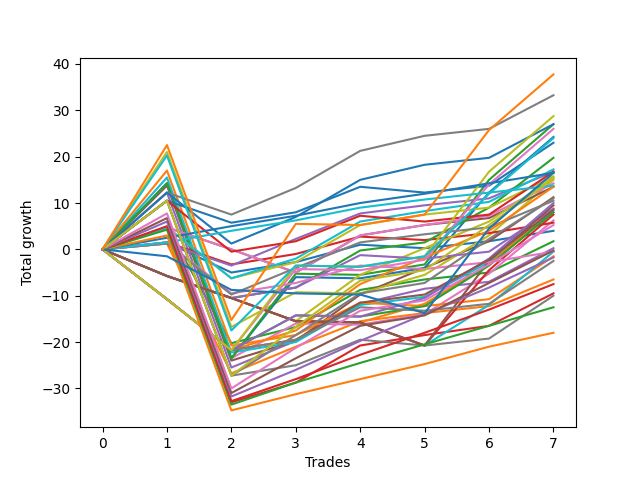

# Long Labrador 003 
- Symbol: ES_830-1130
- Date Range: 03/18/2022 - 12/30/2022
- Trading Period: 8:30-11:30
- Number of Trades: 7



| Name | Win Percent | Profit | Avg Profit / Trade | Avg Time / Trade |      | Name | Win Percent | Profit | Avg Profit / Trade | Avg Time / Trade |
| ---- | ----------- | ------ | ------------------ | ---------------- | ---- | ---- | ----------- | ------ | ------------------ | ---------------- |
| Sorted By <br> Profit | | | | | | Sorted By <br> Win Percentage ||||
| BB-50 Mid SL-5 | 85.71 | 16625.00 | 2375.00 | 07:29 |     | TP-2 | 100.00 | 8250.00 | 1178.57 | 03:40 |
| BB-200 U/L 2SD SL-10 | 57.14 | 14375.00 | 2053.57 | 43:38 |     | TP-1 | 100.00 | 6875.00 | 982.14 | 03:27 |
| BB-50 Mid SL-10 | 85.71 | 13500.00 | 1928.57 | 08:02 |     | BB-50 Mid SL-5 | 85.71 | 16625.00 | 2375.00 | 07:29 |
| BB-200 U/L 2SD | 71.43 | 13500.00 | 1928.57 | 57:22 |     | BB-50 Mid SL-10 | 85.71 | 13500.00 | 1928.57 | 08:02 |
| BB-100 U/L 2SD SL-10 | 57.14 | 13000.00 | 1857.14 | 41:23 |     | BB-20 U/L 2SD C SL-10 | 85.71 | 8625.00 | 1232.14 | 10:21 |
| BB-100 U/L 2SD | 71.43 | 12125.00 | 1732.14 | 55:07 |     | BB-20 U/L 1SD SL-5 | 85.71 | 8375.00 | 1196.43 | 05:14 |
| NEWFI 000 | 71.43 | 12000.00 | 1714.29 | 51:42 |     | BB-20 U/L 2SD SL-10 | 85.71 | 7875.00 | 1125.00 | 09:53 |
| V Mid SL-5 | 71.43 | 11500.00 | 1642.86 | 06:02 |     | TP-10 | 85.71 | 7625.00 | 1089.29 | 29:21 |
| BB-100 Mid SL-5 | 71.43 | 9875.00 | 1410.71 | 17:03 |     | BB-50 U/L 1SD | 85.71 | 5625.00 | 803.57 | 24:50 |
| BB-20 U/L 2SD C SL-10 | 85.71 | 8625.00 | 1232.14 | 10:21 |     | TP-9 | 85.71 | 5500.00 | 785.71 | 28:56 |
| BB-20 U/L 1SD SL-5 | 85.71 | 8375.00 | 1196.43 | 05:14 |     | BB-20 U/L 1SD SL-10 | 85.71 | 5250.00 | 750.00 | 05:47 |
| V Mid SL-10 | 71.43 | 8375.00 | 1196.43 | 06:35 |     | BB-100 Mid | 85.71 | 4000.00 | 571.43 | 27:03 |
| TP-2 | 100.00 | 8250.00 | 1178.57 | 03:40 |     | TP-8 | 85.71 | 2625.00 | 375.00 | 27:37 |
| NEWFI 0000 | 28.57 | 8250.00 | 1178.57 | 36:27 |     | BB-20 U/L 2SD | 85.71 | 875.00 | 125.00 | 15:45 |
| BB-20 U/L 2SD SL-10 | 85.71 | 7875.00 | 1125.00 | 09:53 |     | BB-50 Mid | 85.71 | 125.00 | 17.86 | 15:46 |
| BB-50 U/L 1SD SL-5 | 57.14 | 7750.00 | 1107.14 | 13:22 |     | TP-7 | 85.71 | -125.00 | -17.86 | 25:52 |
| TP-10 | 85.71 | 7625.00 | 1089.29 | 29:21 |     | TP-6 | 85.71 | -875.00 | -125.00 | 16:25 |
| V U/L 1SD | 71.43 | 7500.00 | 1071.43 | 37:33 |     | BB-20 U/L 1SD | 85.71 | -3250.00 | -464.29 | 11:37 |
| BB-20 U/L 2SD C SL-5 | 71.43 | 7125.00 | 1017.86 | 08:20 |     | TP-5 | 85.71 | -3750.00 | -535.71 | 16:07 |
| TP-1 | 100.00 | 6875.00 | 982.14 | 03:27 |     | BB-20 U/L 2SD C | 85.71 | -4750.00 | -678.57 | 18:05 |
| BB-50 U/L 1SD SL-10 | 71.43 | 6750.00 | 964.29 | 15:47 |     | TP-4 | 85.71 | -6250.00 | -892.86 | 14:07 |
| BB-20 U/L 2SD SL-5 | 71.43 | 6750.00 | 964.29 | 07:56 |     | TP-3 | 85.71 | -9000.00 | -1285.71 | 13:31 |
| BB-50 U/L 1SD | 85.71 | 5625.00 | 803.57 | 24:50 |     | BB-200 U/L 2SD | 71.43 | 13500.00 | 1928.57 | 57:22 |
| TP-9 | 85.71 | 5500.00 | 785.71 | 28:56 |     | BB-100 U/L 2SD | 71.43 | 12125.00 | 1732.14 | 55:07 |
| BB-20 U/L 1SD SL-10 | 85.71 | 5250.00 | 750.00 | 05:47 |     | NEWFI 000 | 71.43 | 12000.00 | 1714.29 | 51:42 |
| V U/L 1SD SL-10 | 57.14 | 5000.00 | 714.29 | 27:22 |     | V Mid SL-5 | 71.43 | 11500.00 | 1642.86 | 06:02 |
| BB-200 U/L 2SD SL-5 | 28.57 | 4750.00 | 678.57 | 36:11 |     | BB-100 Mid SL-5 | 71.43 | 9875.00 | 1410.71 | 17:03 |
| BB-200 Mid SL-5 | 57.14 | 4375.00 | 625.00 | 06:45 |     | V Mid SL-10 | 71.43 | 8375.00 | 1196.43 | 06:35 |
| V U/L 1SD SL-5 | 42.86 | 4375.00 | 625.00 | 24:52 |     | V U/L 1SD | 71.43 | 7500.00 | 1071.43 | 37:33 |
| BB-100 Mid SL-10 | 71.43 | 4250.00 | 607.14 | 18:00 |     | BB-20 U/L 2SD C SL-5 | 71.43 | 7125.00 | 1017.86 | 08:20 |
| BB-100 Mid | 85.71 | 4000.00 | 571.43 | 27:03 |     | BB-50 U/L 1SD SL-10 | 71.43 | 6750.00 | 964.29 | 15:47 |
| BB-50 U/L 2SD SL-10 | 57.14 | 4000.00 | 571.43 | 31:03 |     | BB-20 U/L 2SD SL-5 | 71.43 | 6750.00 | 964.29 | 07:56 |
| BB-100 U/L 2SD SL-5 | 28.57 | 3750.00 | 535.71 | 33:57 |     | BB-100 Mid SL-10 | 71.43 | 4250.00 | 607.14 | 18:00 |
| BB-50 U/L 2SD | 71.43 | 3125.00 | 446.43 | 40:41 |     | BB-50 U/L 2SD | 71.43 | 3125.00 | 446.43 | 40:41 |
| BB-20 Mid SL-5 | 71.43 | 2875.00 | 410.71 | 03:47 |     | BB-20 Mid SL-5 | 71.43 | 2875.00 | 410.71 | 03:47 |
| TP-8 | 85.71 | 2625.00 | 375.00 | 27:37 |     | BB-20 Mid | 71.43 | 2000.00 | 285.71 | 05:08 |
| BB-20 Mid | 71.43 | 2000.00 | 285.71 | 05:08 |     | BB-20 Mid SL-10 | 71.43 | -250.00 | -35.71 | 04:20 |
| BB-20 U/L 2SD | 85.71 | 875.00 | 125.00 | 15:45 |     | BB-200 Mid | 71.43 | -750.00 | -107.14 | 17:25 |
| BB-50 Mid | 85.71 | 125.00 | 17.86 | 15:46 |     | V Mid | 71.43 | -5000.00 | -714.29 | 14:20 |
| TP-7 | 85.71 | -125.00 | -17.86 | 25:52 |     | BB-200 U/L 2SD SL-10 | 57.14 | 14375.00 | 2053.57 | 43:38 |
| BB-20 Mid SL-10 | 71.43 | -250.00 | -35.71 | 04:20 |     | BB-100 U/L 2SD SL-10 | 57.14 | 13000.00 | 1857.14 | 41:23 |
| BB-50 U/L 2SD SL-5 | 28.57 | -250.00 | -35.71 | 25:57 |     | BB-50 U/L 1SD SL-5 | 57.14 | 7750.00 | 1107.14 | 13:22 |
| BB-200 Mid | 71.43 | -750.00 | -107.14 | 17:25 |     | V U/L 1SD SL-10 | 57.14 | 5000.00 | 714.29 | 27:22 |
| TP-6 | 85.71 | -875.00 | -125.00 | 16:25 |     | BB-200 Mid SL-5 | 57.14 | 4375.00 | 625.00 | 06:45 |
| BB-200 Mid SL-10 | 57.14 | -1250.00 | -178.57 | 07:42 |     | BB-50 U/L 2SD SL-10 | 57.14 | 4000.00 | 571.43 | 31:03 |
| BB-20 U/L 1SD | 85.71 | -3250.00 | -464.29 | 11:37 |     | BB-200 Mid SL-10 | 57.14 | -1250.00 | -178.57 | 07:42 |
| TP-5 | 85.71 | -3750.00 | -535.71 | 16:07 |     | V U/L 1SD SL-5 | 42.86 | 4375.00 | 625.00 | 24:52 |
| BB-20 U/L 2SD C | 85.71 | -4750.00 | -678.57 | 18:05 |     | NEWFI 0000 | 28.57 | 8250.00 | 1178.57 | 36:27 |
| V Mid | 71.43 | -5000.00 | -714.29 | 14:20 |     | BB-200 U/L 2SD SL-5 | 28.57 | 4750.00 | 678.57 | 36:11 |
| TP-4 | 85.71 | -6250.00 | -892.86 | 14:07 |     | BB-100 U/L 2SD SL-5 | 28.57 | 3750.00 | 535.71 | 33:57 |
| TP-3 | 85.71 | -9000.00 | -1285.71 | 13:31 |     | BB-50 U/L 2SD SL-5 | 28.57 | -250.00 | -35.71 | 25:57 |

## NO STOPLOSS

### Test BB-20 Mid
* Sell when price hits the middle line of the 20p bollinger
* No Stoploss
* Results:
```
Total Trades: 7
Percent Up: 71.43
Percent Down: 28.57
Total Points Moved Up: 4.00
Potential Profit: 2000.00
Total Points Ups: 11.25 Count Ups: 5
Total Points Downs: -7.25 Count Downs: 2
```

<details><summary>Trades</summary>

<code>In: 2022-05-03 11:24:00		Out: 2022-05-03 11:32:10		Total Position Time: 08:10		Total Move Up: 1.50		Total to Date: 1.50</code> <br />
<code>In: 2022-05-11 09:37:00		Out: 2022-05-11 09:49:20		Total Position Time: 12:20		Total Move Up: -6.50		Total to Date: -5.00</code> <br />
<code>In: 2022-05-16 09:48:00		Out: 2022-05-16 09:49:10		Total Position Time: 01:10		Total Move Up: 2.25		Total to Date: -2.75</code> <br />
<code>In: 2022-06-27 09:37:00		Out: 2022-06-27 09:41:05		Total Position Time: 04:05		Total Move Up: 3.75		Total to Date: 1.00</code> <br />
<code>In: 2022-10-17 11:29:00		Out: 2022-10-17 11:35:40		Total Position Time: 06:40		Total Move Up: -0.75		Total to Date: 0.25</code> <br />
<code>In: 2022-11-10 10:03:00		Out: 2022-11-10 10:04:10		Total Position Time: 01:10		Total Move Up: 1.50		Total to Date: 1.75</code> <br />
<code>In: 2022-11-11 08:34:00		Out: 2022-11-11 08:36:25		Total Position Time: 02:25		Total Move Up: 2.25		Total to Date: 4.00</code> <br />


</details>

### Test BB-20 U/L 1SD
* Sell when the price hits the upper line of the 20p 1std bollinger
* No Stoploss
* Results:
```
Total Trades: 7
Percent Up: 85.71
Percent Down: 14.29
Total Points Moved Up: -6.50
Potential Profit: -3250.00
Total Points Ups: 21.50 Count Ups: 6
Total Points Downs: -28.00 Count Downs: 1
```

<details><summary>Trades</summary>

<code>In: 2022-05-03 11:24:00		Out: 2022-05-03 11:32:25		Total Position Time: 08:25		Total Move Up: 1.25		Total to Date: 1.25</code> <br />
<code>In: 2022-05-11 09:37:00		Out: 2022-05-11 10:24:35		Total Position Time: 47:35		Total Move Up: -28.00		Total to Date: -26.75</code> <br />
<code>In: 2022-05-16 09:48:00		Out: 2022-05-16 09:50:05		Total Position Time: 02:05		Total Move Up: 5.75		Total to Date: -21.00</code> <br />
<code>In: 2022-06-27 09:37:00		Out: 2022-06-27 09:44:20		Total Position Time: 07:20		Total Move Up: 5.50		Total to Date: -15.50</code> <br />
<code>In: 2022-10-17 11:29:00		Out: 2022-10-17 11:36:10		Total Position Time: 07:10		Total Move Up: 1.75		Total to Date: -13.75</code> <br />
<code>In: 2022-11-10 10:03:00		Out: 2022-11-10 10:04:10		Total Position Time: 01:10		Total Move Up: 1.50		Total to Date: -12.25</code> <br />
<code>In: 2022-11-11 08:34:00		Out: 2022-11-11 08:41:35		Total Position Time: 07:35		Total Move Up: 5.75		Total to Date: -6.50</code> <br />


</details>

### Test BB-20 U/L 2SD
* Sell when the price hits the upper line of the 20p 2std bollinger
* No Stoploss
* Results:
```
Total Trades: 7
Percent Up: 85.71
Percent Down: 14.29
Total Points Moved Up: 1.75
Potential Profit: 875.00
Total Points Ups: 26.75 Count Ups: 6
Total Points Downs: -25.00 Count Downs: 1
```

<details><summary>Trades</summary>

<code>In: 2022-05-03 11:24:00		Out: 2022-05-03 11:34:55		Total Position Time: 10:55		Total Move Up: 4.75		Total to Date: 4.75</code> <br />
<code>In: 2022-05-11 09:37:00		Out: 2022-05-11 10:24:50		Total Position Time: 47:50		Total Move Up: -25.00		Total to Date: -20.25</code> <br />
<code>In: 2022-05-16 09:48:00		Out: 2022-05-16 10:06:30		Total Position Time: 18:30		Total Move Up: 3.50		Total to Date: -16.75</code> <br />
<code>In: 2022-06-27 09:37:00		Out: 2022-06-27 09:45:05		Total Position Time: 08:05		Total Move Up: 8.00		Total to Date: -8.75</code> <br />
<code>In: 2022-10-17 11:29:00		Out: 2022-10-17 11:37:30		Total Position Time: 08:30		Total Move Up: 2.25		Total to Date: -6.50</code> <br />
<code>In: 2022-11-10 10:03:00		Out: 2022-11-10 10:04:10		Total Position Time: 01:10		Total Move Up: 1.50		Total to Date: -5.00</code> <br />
<code>In: 2022-11-11 08:34:00		Out: 2022-11-11 08:49:20		Total Position Time: 15:20		Total Move Up: 6.75		Total to Date: 1.75</code> <br />


</details>

### Test BB-20 U/L 2SD C
* Sell when the price hits the upper line of the 20p 2std bollinger
* No Stoploss
* Results:
```
Total Trades: 7
Percent Up: 85.71
Percent Down: 14.29
Total Points Moved Up: -9.50
Potential Profit: -4750.00
Total Points Ups: 28.25 Count Ups: 6
Total Points Downs: -37.75 Count Downs: 1
```

<details><summary>Trades</summary>

<code>In: 2022-05-03 11:24:00		Out: 2022-05-03 11:34:55		Total Position Time: 10:55		Total Move Up: 4.75		Total to Date: 4.75</code> <br />
<code>In: 2022-05-11 09:37:00		Out: 2022-05-11 10:37:55		Total Position Time: 60:55		Total Move Up: -37.75		Total to Date: -33.00</code> <br />
<code>In: 2022-05-16 09:48:00		Out: 2022-05-16 10:07:00		Total Position Time: 19:00		Total Move Up: 4.25		Total to Date: -28.75</code> <br />
<code>In: 2022-06-27 09:37:00		Out: 2022-06-27 09:45:05		Total Position Time: 08:05		Total Move Up: 8.00		Total to Date: -20.75</code> <br />
<code>In: 2022-10-17 11:29:00		Out: 2022-10-17 11:37:55		Total Position Time: 08:55		Total Move Up: 2.25		Total to Date: -18.50</code> <br />
<code>In: 2022-11-10 10:03:00		Out: 2022-11-10 10:06:10		Total Position Time: 03:10		Total Move Up: 2.00		Total to Date: -16.50</code> <br />
<code>In: 2022-11-11 08:34:00		Out: 2022-11-11 08:49:40		Total Position Time: 15:40		Total Move Up: 7.00		Total to Date: -9.50</code> <br />


</details>

### Test BB-50 Mid
* Sell when price hits the middle line of the 50p bollinger
* No Stoploss
* Results:
```
Total Trades: 7
Percent Up: 85.71
Percent Down: 14.29
Total Points Moved Up: 0.25
Potential Profit: 125.00
Total Points Ups: 38.00 Count Ups: 6
Total Points Downs: -37.75 Count Downs: 1
```

<details><summary>Trades</summary>

<code>In: 2022-05-03 11:24:00		Out: 2022-05-03 11:36:10		Total Position Time: 12:10		Total Move Up: 12.25		Total to Date: 12.25</code> <br />
<code>In: 2022-05-11 09:37:00		Out: 2022-05-11 10:37:55		Total Position Time: 60:55		Total Move Up: -37.75		Total to Date: -25.50</code> <br />
<code>In: 2022-05-16 09:48:00		Out: 2022-05-16 09:50:05		Total Position Time: 02:05		Total Move Up: 5.75		Total to Date: -19.75</code> <br />
<code>In: 2022-06-27 09:37:00		Out: 2022-06-27 09:45:05		Total Position Time: 08:05		Total Move Up: 8.00		Total to Date: -11.75</code> <br />
<code>In: 2022-10-17 11:29:00		Out: 2022-10-17 11:39:15		Total Position Time: 10:15		Total Move Up: 3.25		Total to Date: -8.50</code> <br />
<code>In: 2022-11-10 10:03:00		Out: 2022-11-10 10:04:10		Total Position Time: 01:10		Total Move Up: 1.50		Total to Date: -7.00</code> <br />
<code>In: 2022-11-11 08:34:00		Out: 2022-11-11 08:49:45		Total Position Time: 15:45		Total Move Up: 7.25		Total to Date: 0.25</code> <br />


</details>

### Test BB-50 U/L 1SD
* Sell when the price hits the upper line of the 50p 1std bollinger
* No Stoploss
* Results:
```
Total Trades: 7
Percent Up: 85.71
Percent Down: 14.29
Total Points Moved Up: 11.25
Potential Profit: 5625.00
Total Points Ups: 49.00 Count Ups: 6
Total Points Downs: -37.75 Count Downs: 1
```

<details><summary>Trades</summary>

<code>In: 2022-05-03 11:24:00		Out: 2022-05-03 11:52:05		Total Position Time: 28:05		Total Move Up: 13.75		Total to Date: 13.75</code> <br />
<code>In: 2022-05-11 09:37:00		Out: 2022-05-11 10:37:55		Total Position Time: 60:55		Total Move Up: -37.75		Total to Date: -24.00</code> <br />
<code>In: 2022-05-16 09:48:00		Out: 2022-05-16 10:07:05		Total Position Time: 19:05		Total Move Up: 4.25		Total to Date: -19.75</code> <br />
<code>In: 2022-06-27 09:37:00		Out: 2022-06-27 09:53:20		Total Position Time: 16:20		Total Move Up: 10.00		Total to Date: -9.75</code> <br />
<code>In: 2022-10-17 11:29:00		Out: 2022-10-17 11:43:20		Total Position Time: 14:20		Total Move Up: 5.75		Total to Date: -4.00</code> <br />
<code>In: 2022-11-10 10:03:00		Out: 2022-11-10 10:13:45		Total Position Time: 10:45		Total Move Up: 5.75		Total to Date: 1.75</code> <br />
<code>In: 2022-11-11 08:34:00		Out: 2022-11-11 08:58:20		Total Position Time: 24:20		Total Move Up: 9.50		Total to Date: 11.25</code> <br />


</details>

### Test BB-50 U/L 2SD
* Sell when the price hits the upper line of the 50p 2std bollinger
* No Stoploss
* Results:
```
Total Trades: 7
Percent Up: 71.43
Percent Down: 28.57
Total Points Moved Up: 6.25
Potential Profit: 3125.00
Total Points Ups: 44.25 Count Ups: 5
Total Points Downs: -38.00 Count Downs: 2
```

<details><summary>Trades</summary>

<code>In: 2022-05-03 11:24:00		Out: 2022-05-03 11:56:15		Total Position Time: 32:15		Total Move Up: 14.25		Total to Date: 14.25</code> <br />
<code>In: 2022-05-11 09:37:00		Out: 2022-05-11 10:37:55		Total Position Time: 60:55		Total Move Up: -37.75		Total to Date: -23.50</code> <br />
<code>In: 2022-05-16 09:48:00		Out: 2022-05-16 10:07:35		Total Position Time: 19:35		Total Move Up: 7.50		Total to Date: -16.00</code> <br />
<code>In: 2022-06-27 09:37:00		Out: 2022-06-27 10:37:55		Total Position Time: 60:55		Total Move Up: -0.25		Total to Date: -16.25</code> <br />
<code>In: 2022-10-17 11:29:00		Out: 2022-10-17 12:29:55		Total Position Time: 60:55		Total Move Up: 2.25		Total to Date: -14.00</code> <br />
<code>In: 2022-11-10 10:03:00		Out: 2022-11-10 10:16:15		Total Position Time: 13:15		Total Move Up: 8.75		Total to Date: -5.25</code> <br />
<code>In: 2022-11-11 08:34:00		Out: 2022-11-11 09:11:00		Total Position Time: 37:00		Total Move Up: 11.50		Total to Date: 6.25</code> <br />


</details>

### Test V Mid
* Sell when the price hits the middle line of the 1std VWAP
* No Stoploss
* Results:
```
Total Trades: 7
Percent Up: 71.43
Percent Down: 28.57
Total Points Moved Up: -10.00
Potential Profit: -5000.00
Total Points Ups: 29.00 Count Ups: 5
Total Points Downs: -39.00 Count Downs: 2
```

<details><summary>Trades</summary>

<code>In: 2022-05-03 11:24:00		Out: 2022-05-03 11:36:05		Total Position Time: 12:05		Total Move Up: 10.50		Total to Date: 10.50</code> <br />
<code>In: 2022-05-11 09:37:00		Out: 2022-05-11 10:37:55		Total Position Time: 60:55		Total Move Up: -37.75		Total to Date: -27.25</code> <br />
<code>In: 2022-05-16 09:48:00		Out: 2022-05-16 09:49:10		Total Position Time: 01:10		Total Move Up: 2.25		Total to Date: -25.00</code> <br />
<code>In: 2022-06-27 09:37:00		Out: 2022-06-27 09:44:20		Total Position Time: 07:20		Total Move Up: 5.50		Total to Date: -19.50</code> <br />
<code>In: 2022-10-17 11:29:00		Out: 2022-10-17 11:30:10		Total Position Time: 01:10		Total Move Up: -1.25		Total to Date: -20.75</code> <br />
<code>In: 2022-11-10 10:03:00		Out: 2022-11-10 10:04:10		Total Position Time: 01:10		Total Move Up: 1.50		Total to Date: -19.25</code> <br />
<code>In: 2022-11-11 08:34:00		Out: 2022-11-11 08:50:30		Total Position Time: 16:30		Total Move Up: 9.25		Total to Date: -10.00</code> <br />


</details>

### Test V U/L 1SD
* Sell when the price hits the upper line of the 1std VWAP
* No Stoploss
* Results:
```
Total Trades: 7
Percent Up: 71.43
Percent Down: 28.57
Total Points Moved Up: 15.00
Potential Profit: 7500.00
Total Points Ups: 53.00 Count Ups: 5
Total Points Downs: -38.00 Count Downs: 2
```

<details><summary>Trades</summary>

<code>In: 2022-05-03 11:24:00		Out: 2022-05-03 12:00:05		Total Position Time: 36:05		Total Move Up: 21.00		Total to Date: 21.00</code> <br />
<code>In: 2022-05-11 09:37:00		Out: 2022-05-11 10:37:55		Total Position Time: 60:55		Total Move Up: -37.75		Total to Date: -16.75</code> <br />
<code>In: 2022-05-16 09:48:00		Out: 2022-05-16 10:07:35		Total Position Time: 19:35		Total Move Up: 7.50		Total to Date: -9.25</code> <br />
<code>In: 2022-06-27 09:37:00		Out: 2022-06-27 10:37:55		Total Position Time: 60:55		Total Move Up: -0.25		Total to Date: -9.50</code> <br />
<code>In: 2022-10-17 11:29:00		Out: 2022-10-17 11:40:40		Total Position Time: 11:40		Total Move Up: 4.00		Total to Date: -5.50</code> <br />
<code>In: 2022-11-10 10:03:00		Out: 2022-11-10 10:15:50		Total Position Time: 12:50		Total Move Up: 8.50		Total to Date: 3.00</code> <br />
<code>In: 2022-11-11 08:34:00		Out: 2022-11-11 09:34:55		Total Position Time: 60:55		Total Move Up: 12.00		Total to Date: 15.00</code> <br />


</details>

### Test BB-100 Mid
* Move to BB100 Mid
* No Stoploss
* Results:
```
Total Trades: 7
Percent Up: 85.71
Percent Down: 14.29
Total Points Moved Up: 8.00
Potential Profit: 4000.00
Total Points Ups: 45.75 Count Ups: 6
Total Points Downs: -37.75 Count Downs: 1
```

<details><summary>Trades</summary>

<code>In: 2022-05-03 11:24:00		Out: 2022-05-03 11:52:15		Total Position Time: 28:15		Total Move Up: 15.50		Total to Date: 15.50</code> <br />
<code>In: 2022-05-11 09:37:00		Out: 2022-05-11 10:37:55		Total Position Time: 60:55		Total Move Up: -37.75		Total to Date: -22.25</code> <br />
<code>In: 2022-05-16 09:48:00		Out: 2022-05-16 09:49:10		Total Position Time: 01:10		Total Move Up: 2.25		Total to Date: -20.00</code> <br />
<code>In: 2022-06-27 09:37:00		Out: 2022-06-27 10:20:05		Total Position Time: 43:05		Total Move Up: 8.00		Total to Date: -12.00</code> <br />
<code>In: 2022-10-17 11:29:00		Out: 2022-10-17 11:36:10		Total Position Time: 07:10		Total Move Up: 1.75		Total to Date: -10.25</code> <br />
<code>In: 2022-11-10 10:03:00		Out: 2022-11-10 10:15:00		Total Position Time: 12:00		Total Move Up: 7.50		Total to Date: -2.75</code> <br />
<code>In: 2022-11-11 08:34:00		Out: 2022-11-11 09:10:50		Total Position Time: 36:50		Total Move Up: 10.75		Total to Date: 8.00</code> <br />


</details>

### Test BB-100 U/L 2SD
* Move to BB100 Upper Band
* No Stoploss
* Results:
```
Total Trades: 7
Percent Up: 71.43
Percent Down: 28.57
Total Points Moved Up: 24.25
Potential Profit: 12125.00
Total Points Ups: 62.25 Count Ups: 5
Total Points Downs: -38.00 Count Downs: 2
```

<details><summary>Trades</summary>

<code>In: 2022-05-03 11:24:00		Out: 2022-05-03 12:24:55		Total Position Time: 60:55		Total Move Up: 14.25		Total to Date: 14.25</code> <br />
<code>In: 2022-05-11 09:37:00		Out: 2022-05-11 10:37:55		Total Position Time: 60:55		Total Move Up: -37.75		Total to Date: -23.50</code> <br />
<code>In: 2022-05-16 09:48:00		Out: 2022-05-16 10:24:00		Total Position Time: 36:00		Total Move Up: 17.50		Total to Date: -6.00</code> <br />
<code>In: 2022-06-27 09:37:00		Out: 2022-06-27 10:37:55		Total Position Time: 60:55		Total Move Up: -0.25		Total to Date: -6.25</code> <br />
<code>In: 2022-10-17 11:29:00		Out: 2022-10-17 12:29:55		Total Position Time: 60:55		Total Move Up: 2.25		Total to Date: -4.00</code> <br />
<code>In: 2022-11-10 10:03:00		Out: 2022-11-10 10:48:15		Total Position Time: 45:15		Total Move Up: 16.25		Total to Date: 12.25</code> <br />
<code>In: 2022-11-11 08:34:00		Out: 2022-11-11 09:34:55		Total Position Time: 60:55		Total Move Up: 12.00		Total to Date: 24.25</code> <br />


</details>

### Test BB-200 Mid
* Move to BB200 Mid
* No Stoploss
* Results:
```
Total Trades: 7
Percent Up: 71.43
Percent Down: 28.57
Total Points Moved Up: -1.50
Potential Profit: -750.00
Total Points Ups: 37.00 Count Ups: 5
Total Points Downs: -38.50 Count Downs: 2
```

<details><summary>Trades</summary>

<code>In: 2022-05-03 11:24:00		Out: 2022-05-03 11:56:55		Total Position Time: 32:55		Total Move Up: 17.00		Total to Date: 17.00</code> <br />
<code>In: 2022-05-11 09:37:00		Out: 2022-05-11 10:37:55		Total Position Time: 60:55		Total Move Up: -37.75		Total to Date: -20.75</code> <br />
<code>In: 2022-05-16 09:48:00		Out: 2022-05-16 09:49:10		Total Position Time: 01:10		Total Move Up: 2.25		Total to Date: -18.50</code> <br />
<code>In: 2022-06-27 09:37:00		Out: 2022-06-27 09:45:00		Total Position Time: 08:00		Total Move Up: 7.00		Total to Date: -11.50</code> <br />
<code>In: 2022-10-17 11:29:00		Out: 2022-10-17 11:30:20		Total Position Time: 01:20		Total Move Up: -0.75		Total to Date: -12.25</code> <br />
<code>In: 2022-11-10 10:03:00		Out: 2022-11-10 10:04:10		Total Position Time: 01:10		Total Move Up: 1.50		Total to Date: -10.75</code> <br />
<code>In: 2022-11-11 08:34:00		Out: 2022-11-11 08:50:30		Total Position Time: 16:30		Total Move Up: 9.25		Total to Date: -1.50</code> <br />


</details>

### Test BB-200 U/L 2SD
* Move to BB200 Upper Band
* No Stoploss
* Results:
```
Total Trades: 7
Percent Up: 71.43
Percent Down: 28.57
Total Points Moved Up: 27.00
Potential Profit: 13500.00
Total Points Ups: 65.00 Count Ups: 5
Total Points Downs: -38.00 Count Downs: 2
```

<details><summary>Trades</summary>

<code>In: 2022-05-03 11:24:00		Out: 2022-05-03 12:24:55		Total Position Time: 60:55		Total Move Up: 14.25		Total to Date: 14.25</code> <br />
<code>In: 2022-05-11 09:37:00		Out: 2022-05-11 10:37:55		Total Position Time: 60:55		Total Move Up: -37.75		Total to Date: -23.50</code> <br />
<code>In: 2022-05-16 09:48:00		Out: 2022-05-16 10:24:05		Total Position Time: 36:05		Total Move Up: 18.25		Total to Date: -5.25</code> <br />
<code>In: 2022-06-27 09:37:00		Out: 2022-06-27 10:37:55		Total Position Time: 60:55		Total Move Up: -0.25		Total to Date: -5.50</code> <br />
<code>In: 2022-10-17 11:29:00		Out: 2022-10-17 12:29:55		Total Position Time: 60:55		Total Move Up: 2.25		Total to Date: -3.25</code> <br />
<code>In: 2022-11-10 10:03:00		Out: 2022-11-10 11:03:55		Total Position Time: 60:55		Total Move Up: 18.25		Total to Date: 15.00</code> <br />
<code>In: 2022-11-11 08:34:00		Out: 2022-11-11 09:34:55		Total Position Time: 60:55		Total Move Up: 12.00		Total to Date: 27.00</code> <br />


</details>

## STOPLOSS OF 5

### Test BB-20 Mid SL-5
* Sell when price hits the middle line of the 20p bollinger
* Stoploss is 5 points
* Results:
```
Total Trades: 7
Percent Up: 71.43
Percent Down: 28.57
Total Points Moved Up: 5.75
Potential Profit: 2875.00
Total Points Ups: 11.25 Count Ups: 5
Total Points Downs: -5.50 Count Downs: 2
```

<details><summary>Trades</summary>

<code>In: 2022-05-03 11:24:00		Out: 2022-05-03 11:32:10		Total Position Time: 08:10		Total Move Up: 1.50		Total to Date: 1.50</code> <br />
<code>In: 2022-05-11 09:37:00		Out: 2022-05-11 09:39:55		Total Position Time: 02:55		Total Move Up: -4.75		Total to Date: -3.25</code> <br />
<code>In: 2022-05-16 09:48:00		Out: 2022-05-16 09:49:10		Total Position Time: 01:10		Total Move Up: 2.25		Total to Date: -1.00</code> <br />
<code>In: 2022-06-27 09:37:00		Out: 2022-06-27 09:41:05		Total Position Time: 04:05		Total Move Up: 3.75		Total to Date: 2.75</code> <br />
<code>In: 2022-10-17 11:29:00		Out: 2022-10-17 11:35:40		Total Position Time: 06:40		Total Move Up: -0.75		Total to Date: 2.00</code> <br />
<code>In: 2022-11-10 10:03:00		Out: 2022-11-10 10:04:10		Total Position Time: 01:10		Total Move Up: 1.50		Total to Date: 3.50</code> <br />
<code>In: 2022-11-11 08:34:00		Out: 2022-11-11 08:36:25		Total Position Time: 02:25		Total Move Up: 2.25		Total to Date: 5.75</code> <br />


</details>

### Test BB-20 U/L 1SD SL-5
* Sell when the price hits the upper line of the 20p 1std bollinger
* Stoploss is 5 points
* Results:
```
Total Trades: 7
Percent Up: 85.71
Percent Down: 14.29
Total Points Moved Up: 16.75
Potential Profit: 8375.00
Total Points Ups: 21.50 Count Ups: 6
Total Points Downs: -4.75 Count Downs: 1
```

<details><summary>Trades</summary>

<code>In: 2022-05-03 11:24:00		Out: 2022-05-03 11:32:25		Total Position Time: 08:25		Total Move Up: 1.25		Total to Date: 1.25</code> <br />
<code>In: 2022-05-11 09:37:00		Out: 2022-05-11 09:39:55		Total Position Time: 02:55		Total Move Up: -4.75		Total to Date: -3.50</code> <br />
<code>In: 2022-05-16 09:48:00		Out: 2022-05-16 09:50:05		Total Position Time: 02:05		Total Move Up: 5.75		Total to Date: 2.25</code> <br />
<code>In: 2022-06-27 09:37:00		Out: 2022-06-27 09:44:20		Total Position Time: 07:20		Total Move Up: 5.50		Total to Date: 7.75</code> <br />
<code>In: 2022-10-17 11:29:00		Out: 2022-10-17 11:36:10		Total Position Time: 07:10		Total Move Up: 1.75		Total to Date: 9.50</code> <br />
<code>In: 2022-11-10 10:03:00		Out: 2022-11-10 10:04:10		Total Position Time: 01:10		Total Move Up: 1.50		Total to Date: 11.00</code> <br />
<code>In: 2022-11-11 08:34:00		Out: 2022-11-11 08:41:35		Total Position Time: 07:35		Total Move Up: 5.75		Total to Date: 16.75</code> <br />


</details>

### Test BB-20 U/L 2SD SL-5
* Sell when the price hits the upper line of the 20p 2std bollinger
* Stoploss is 5 points
* Results:
```
Total Trades: 7
Percent Up: 71.43
Percent Down: 28.57
Total Points Moved Up: 13.50
Potential Profit: 6750.00
Total Points Ups: 23.25 Count Ups: 5
Total Points Downs: -9.75 Count Downs: 2
```

<details><summary>Trades</summary>

<code>In: 2022-05-03 11:24:00		Out: 2022-05-03 11:34:55		Total Position Time: 10:55		Total Move Up: 4.75		Total to Date: 4.75</code> <br />
<code>In: 2022-05-11 09:37:00		Out: 2022-05-11 09:39:55		Total Position Time: 02:55		Total Move Up: -4.75		Total to Date: 0.00</code> <br />
<code>In: 2022-05-16 09:48:00		Out: 2022-05-16 09:56:40		Total Position Time: 08:40		Total Move Up: -5.00		Total to Date: -5.00</code> <br />
<code>In: 2022-06-27 09:37:00		Out: 2022-06-27 09:45:05		Total Position Time: 08:05		Total Move Up: 8.00		Total to Date: 3.00</code> <br />
<code>In: 2022-10-17 11:29:00		Out: 2022-10-17 11:37:30		Total Position Time: 08:30		Total Move Up: 2.25		Total to Date: 5.25</code> <br />
<code>In: 2022-11-10 10:03:00		Out: 2022-11-10 10:04:10		Total Position Time: 01:10		Total Move Up: 1.50		Total to Date: 6.75</code> <br />
<code>In: 2022-11-11 08:34:00		Out: 2022-11-11 08:49:20		Total Position Time: 15:20		Total Move Up: 6.75		Total to Date: 13.50</code> <br />


</details>

### Test BB-20 U/L 2SD C SL-5
* Sell when the price hits the upper line of the 20p 2std bollinger
* Stoploss is 5 points
* Results:
```
Total Trades: 7
Percent Up: 71.43
Percent Down: 28.57
Total Points Moved Up: 14.25
Potential Profit: 7125.00
Total Points Ups: 24.00 Count Ups: 5
Total Points Downs: -9.75 Count Downs: 2
```

<details><summary>Trades</summary>

<code>In: 2022-05-03 11:24:00		Out: 2022-05-03 11:34:55		Total Position Time: 10:55		Total Move Up: 4.75		Total to Date: 4.75</code> <br />
<code>In: 2022-05-11 09:37:00		Out: 2022-05-11 09:39:55		Total Position Time: 02:55		Total Move Up: -4.75		Total to Date: 0.00</code> <br />
<code>In: 2022-05-16 09:48:00		Out: 2022-05-16 09:56:40		Total Position Time: 08:40		Total Move Up: -5.00		Total to Date: -5.00</code> <br />
<code>In: 2022-06-27 09:37:00		Out: 2022-06-27 09:45:05		Total Position Time: 08:05		Total Move Up: 8.00		Total to Date: 3.00</code> <br />
<code>In: 2022-10-17 11:29:00		Out: 2022-10-17 11:37:55		Total Position Time: 08:55		Total Move Up: 2.25		Total to Date: 5.25</code> <br />
<code>In: 2022-11-10 10:03:00		Out: 2022-11-10 10:06:10		Total Position Time: 03:10		Total Move Up: 2.00		Total to Date: 7.25</code> <br />
<code>In: 2022-11-11 08:34:00		Out: 2022-11-11 08:49:40		Total Position Time: 15:40		Total Move Up: 7.00		Total to Date: 14.25</code> <br />


</details>

### Test BB-50 Mid SL-5
* Sell when price hits the middle line of the 50p bollinger
* Stoploss is 5 points
* Results:
```
Total Trades: 7
Percent Up: 85.71
Percent Down: 14.29
Total Points Moved Up: 33.25
Potential Profit: 16625.00
Total Points Ups: 38.00 Count Ups: 6
Total Points Downs: -4.75 Count Downs: 1
```

<details><summary>Trades</summary>

<code>In: 2022-05-03 11:24:00		Out: 2022-05-03 11:36:10		Total Position Time: 12:10		Total Move Up: 12.25		Total to Date: 12.25</code> <br />
<code>In: 2022-05-11 09:37:00		Out: 2022-05-11 09:39:55		Total Position Time: 02:55		Total Move Up: -4.75		Total to Date: 7.50</code> <br />
<code>In: 2022-05-16 09:48:00		Out: 2022-05-16 09:50:05		Total Position Time: 02:05		Total Move Up: 5.75		Total to Date: 13.25</code> <br />
<code>In: 2022-06-27 09:37:00		Out: 2022-06-27 09:45:05		Total Position Time: 08:05		Total Move Up: 8.00		Total to Date: 21.25</code> <br />
<code>In: 2022-10-17 11:29:00		Out: 2022-10-17 11:39:15		Total Position Time: 10:15		Total Move Up: 3.25		Total to Date: 24.50</code> <br />
<code>In: 2022-11-10 10:03:00		Out: 2022-11-10 10:04:10		Total Position Time: 01:10		Total Move Up: 1.50		Total to Date: 26.00</code> <br />
<code>In: 2022-11-11 08:34:00		Out: 2022-11-11 08:49:45		Total Position Time: 15:45		Total Move Up: 7.25		Total to Date: 33.25</code> <br />


</details>

### Test BB-50 U/L 1SD SL-5
* Sell when the price hits the upper line of the 50p 1std bollinger
* Stoploss is 5 points
* Results:
```
Total Trades: 7
Percent Up: 57.14
Percent Down: 42.86
Total Points Moved Up: 15.50
Potential Profit: 7750.00
Total Points Ups: 31.00 Count Ups: 4
Total Points Downs: -15.50 Count Downs: 3
```

<details><summary>Trades</summary>

<code>In: 2022-05-03 11:24:00		Out: 2022-05-03 11:40:15		Total Position Time: 16:15		Total Move Up: -5.75		Total to Date: -5.75</code> <br />
<code>In: 2022-05-11 09:37:00		Out: 2022-05-11 09:39:55		Total Position Time: 02:55		Total Move Up: -4.75		Total to Date: -10.50</code> <br />
<code>In: 2022-05-16 09:48:00		Out: 2022-05-16 09:56:40		Total Position Time: 08:40		Total Move Up: -5.00		Total to Date: -15.50</code> <br />
<code>In: 2022-06-27 09:37:00		Out: 2022-06-27 09:53:20		Total Position Time: 16:20		Total Move Up: 10.00		Total to Date: -5.50</code> <br />
<code>In: 2022-10-17 11:29:00		Out: 2022-10-17 11:43:20		Total Position Time: 14:20		Total Move Up: 5.75		Total to Date: 0.25</code> <br />
<code>In: 2022-11-10 10:03:00		Out: 2022-11-10 10:13:45		Total Position Time: 10:45		Total Move Up: 5.75		Total to Date: 6.00</code> <br />
<code>In: 2022-11-11 08:34:00		Out: 2022-11-11 08:58:20		Total Position Time: 24:20		Total Move Up: 9.50		Total to Date: 15.50</code> <br />


</details>

### Test BB-50 U/L 2SD SL-5
* Sell when the price hits the upper line of the 50p 2std bollinger
* Stoploss is 5 points
* Results:
```
Total Trades: 7
Percent Up: 28.57
Percent Down: 71.43
Total Points Moved Up: -0.50
Potential Profit: -250.00
Total Points Ups: 20.25 Count Ups: 2
Total Points Downs: -20.75 Count Downs: 5
```

<details><summary>Trades</summary>

<code>In: 2022-05-03 11:24:00		Out: 2022-05-03 11:40:15		Total Position Time: 16:15		Total Move Up: -5.75		Total to Date: -5.75</code> <br />
<code>In: 2022-05-11 09:37:00		Out: 2022-05-11 09:39:55		Total Position Time: 02:55		Total Move Up: -4.75		Total to Date: -10.50</code> <br />
<code>In: 2022-05-16 09:48:00		Out: 2022-05-16 09:56:40		Total Position Time: 08:40		Total Move Up: -5.00		Total to Date: -15.50</code> <br />
<code>In: 2022-06-27 09:37:00		Out: 2022-06-27 10:37:55		Total Position Time: 60:55		Total Move Up: -0.25		Total to Date: -15.75</code> <br />
<code>In: 2022-10-17 11:29:00		Out: 2022-10-17 12:11:45		Total Position Time: 42:45		Total Move Up: -5.00		Total to Date: -20.75</code> <br />
<code>In: 2022-11-10 10:03:00		Out: 2022-11-10 10:16:15		Total Position Time: 13:15		Total Move Up: 8.75		Total to Date: -12.00</code> <br />
<code>In: 2022-11-11 08:34:00		Out: 2022-11-11 09:11:00		Total Position Time: 37:00		Total Move Up: 11.50		Total to Date: -0.50</code> <br />


</details>

### Test V Mid SL-5
* Sell when the price hits the middle line of the 1std VWAP
* Stoploss is 5 points
* Results:
```
Total Trades: 7
Percent Up: 71.43
Percent Down: 28.57
Total Points Moved Up: 23.00
Potential Profit: 11500.00
Total Points Ups: 29.00 Count Ups: 5
Total Points Downs: -6.00 Count Downs: 2
```

<details><summary>Trades</summary>

<code>In: 2022-05-03 11:24:00		Out: 2022-05-03 11:36:05		Total Position Time: 12:05		Total Move Up: 10.50		Total to Date: 10.50</code> <br />
<code>In: 2022-05-11 09:37:00		Out: 2022-05-11 09:39:55		Total Position Time: 02:55		Total Move Up: -4.75		Total to Date: 5.75</code> <br />
<code>In: 2022-05-16 09:48:00		Out: 2022-05-16 09:49:10		Total Position Time: 01:10		Total Move Up: 2.25		Total to Date: 8.00</code> <br />
<code>In: 2022-06-27 09:37:00		Out: 2022-06-27 09:44:20		Total Position Time: 07:20		Total Move Up: 5.50		Total to Date: 13.50</code> <br />
<code>In: 2022-10-17 11:29:00		Out: 2022-10-17 11:30:10		Total Position Time: 01:10		Total Move Up: -1.25		Total to Date: 12.25</code> <br />
<code>In: 2022-11-10 10:03:00		Out: 2022-11-10 10:04:10		Total Position Time: 01:10		Total Move Up: 1.50		Total to Date: 13.75</code> <br />
<code>In: 2022-11-11 08:34:00		Out: 2022-11-11 08:50:30		Total Position Time: 16:30		Total Move Up: 9.25		Total to Date: 23.00</code> <br />


</details>

### Test V U/L 1SD SL-5
* Sell when the price hits the upper line of the 1std VWAP
* Stoploss is 5 points
* Results:
```
Total Trades: 7
Percent Up: 42.86
Percent Down: 57.14
Total Points Moved Up: 8.75
Potential Profit: 4375.00
Total Points Ups: 24.50 Count Ups: 3
Total Points Downs: -15.75 Count Downs: 4
```

<details><summary>Trades</summary>

<code>In: 2022-05-03 11:24:00		Out: 2022-05-03 11:40:15		Total Position Time: 16:15		Total Move Up: -5.75		Total to Date: -5.75</code> <br />
<code>In: 2022-05-11 09:37:00		Out: 2022-05-11 09:39:55		Total Position Time: 02:55		Total Move Up: -4.75		Total to Date: -10.50</code> <br />
<code>In: 2022-05-16 09:48:00		Out: 2022-05-16 09:56:40		Total Position Time: 08:40		Total Move Up: -5.00		Total to Date: -15.50</code> <br />
<code>In: 2022-06-27 09:37:00		Out: 2022-06-27 10:37:55		Total Position Time: 60:55		Total Move Up: -0.25		Total to Date: -15.75</code> <br />
<code>In: 2022-10-17 11:29:00		Out: 2022-10-17 11:40:40		Total Position Time: 11:40		Total Move Up: 4.00		Total to Date: -11.75</code> <br />
<code>In: 2022-11-10 10:03:00		Out: 2022-11-10 10:15:50		Total Position Time: 12:50		Total Move Up: 8.50		Total to Date: -3.25</code> <br />
<code>In: 2022-11-11 08:34:00		Out: 2022-11-11 09:34:55		Total Position Time: 60:55		Total Move Up: 12.00		Total to Date: 8.75</code> <br />


</details>

### Test BB-100 Mid SL-5
* Move to BB100 Mid
* Stoploss is 5 points
* Results:
```
Total Trades: 7
Percent Up: 71.43
Percent Down: 28.57
Total Points Moved Up: 19.75
Potential Profit: 9875.00
Total Points Ups: 30.25 Count Ups: 5
Total Points Downs: -10.50 Count Downs: 2
```

<details><summary>Trades</summary>

<code>In: 2022-05-03 11:24:00		Out: 2022-05-03 11:40:15		Total Position Time: 16:15		Total Move Up: -5.75		Total to Date: -5.75</code> <br />
<code>In: 2022-05-11 09:37:00		Out: 2022-05-11 09:39:55		Total Position Time: 02:55		Total Move Up: -4.75		Total to Date: -10.50</code> <br />
<code>In: 2022-05-16 09:48:00		Out: 2022-05-16 09:49:10		Total Position Time: 01:10		Total Move Up: 2.25		Total to Date: -8.25</code> <br />
<code>In: 2022-06-27 09:37:00		Out: 2022-06-27 10:20:05		Total Position Time: 43:05		Total Move Up: 8.00		Total to Date: -0.25</code> <br />
<code>In: 2022-10-17 11:29:00		Out: 2022-10-17 11:36:10		Total Position Time: 07:10		Total Move Up: 1.75		Total to Date: 1.50</code> <br />
<code>In: 2022-11-10 10:03:00		Out: 2022-11-10 10:15:00		Total Position Time: 12:00		Total Move Up: 7.50		Total to Date: 9.00</code> <br />
<code>In: 2022-11-11 08:34:00		Out: 2022-11-11 09:10:50		Total Position Time: 36:50		Total Move Up: 10.75		Total to Date: 19.75</code> <br />


</details>

### Test BB-100 U/L 2SD SL-5
* Move to BB100 Upper Band
* Stoploss is 5 points
* Results:
```
Total Trades: 7
Percent Up: 28.57
Percent Down: 71.43
Total Points Moved Up: 7.50
Potential Profit: 3750.00
Total Points Ups: 28.25 Count Ups: 2
Total Points Downs: -20.75 Count Downs: 5
```

<details><summary>Trades</summary>

<code>In: 2022-05-03 11:24:00		Out: 2022-05-03 11:40:15		Total Position Time: 16:15		Total Move Up: -5.75		Total to Date: -5.75</code> <br />
<code>In: 2022-05-11 09:37:00		Out: 2022-05-11 09:39:55		Total Position Time: 02:55		Total Move Up: -4.75		Total to Date: -10.50</code> <br />
<code>In: 2022-05-16 09:48:00		Out: 2022-05-16 09:56:40		Total Position Time: 08:40		Total Move Up: -5.00		Total to Date: -15.50</code> <br />
<code>In: 2022-06-27 09:37:00		Out: 2022-06-27 10:37:55		Total Position Time: 60:55		Total Move Up: -0.25		Total to Date: -15.75</code> <br />
<code>In: 2022-10-17 11:29:00		Out: 2022-10-17 12:11:45		Total Position Time: 42:45		Total Move Up: -5.00		Total to Date: -20.75</code> <br />
<code>In: 2022-11-10 10:03:00		Out: 2022-11-10 10:48:15		Total Position Time: 45:15		Total Move Up: 16.25		Total to Date: -4.50</code> <br />
<code>In: 2022-11-11 08:34:00		Out: 2022-11-11 09:34:55		Total Position Time: 60:55		Total Move Up: 12.00		Total to Date: 7.50</code> <br />


</details>

### Test BB-200 Mid SL-5
* Move to BB200 Mid
* Stoploss is 5 points
* Results:
```
Total Trades: 7
Percent Up: 57.14
Percent Down: 42.86
Total Points Moved Up: 8.75
Potential Profit: 4375.00
Total Points Ups: 20.00 Count Ups: 4
Total Points Downs: -11.25 Count Downs: 3
```

<details><summary>Trades</summary>

<code>In: 2022-05-03 11:24:00		Out: 2022-05-03 11:40:15		Total Position Time: 16:15		Total Move Up: -5.75		Total to Date: -5.75</code> <br />
<code>In: 2022-05-11 09:37:00		Out: 2022-05-11 09:39:55		Total Position Time: 02:55		Total Move Up: -4.75		Total to Date: -10.50</code> <br />
<code>In: 2022-05-16 09:48:00		Out: 2022-05-16 09:49:10		Total Position Time: 01:10		Total Move Up: 2.25		Total to Date: -8.25</code> <br />
<code>In: 2022-06-27 09:37:00		Out: 2022-06-27 09:45:00		Total Position Time: 08:00		Total Move Up: 7.00		Total to Date: -1.25</code> <br />
<code>In: 2022-10-17 11:29:00		Out: 2022-10-17 11:30:20		Total Position Time: 01:20		Total Move Up: -0.75		Total to Date: -2.00</code> <br />
<code>In: 2022-11-10 10:03:00		Out: 2022-11-10 10:04:10		Total Position Time: 01:10		Total Move Up: 1.50		Total to Date: -0.50</code> <br />
<code>In: 2022-11-11 08:34:00		Out: 2022-11-11 08:50:30		Total Position Time: 16:30		Total Move Up: 9.25		Total to Date: 8.75</code> <br />


</details>

### Test BB-200 U/L 2SD SL-5
* Move to BB200 Upper Band
* Stoploss is 5 points
* Results:
```
Total Trades: 7
Percent Up: 28.57
Percent Down: 71.43
Total Points Moved Up: 9.50
Potential Profit: 4750.00
Total Points Ups: 30.25 Count Ups: 2
Total Points Downs: -20.75 Count Downs: 5
```

<details><summary>Trades</summary>

<code>In: 2022-05-03 11:24:00		Out: 2022-05-03 11:40:15		Total Position Time: 16:15		Total Move Up: -5.75		Total to Date: -5.75</code> <br />
<code>In: 2022-05-11 09:37:00		Out: 2022-05-11 09:39:55		Total Position Time: 02:55		Total Move Up: -4.75		Total to Date: -10.50</code> <br />
<code>In: 2022-05-16 09:48:00		Out: 2022-05-16 09:56:40		Total Position Time: 08:40		Total Move Up: -5.00		Total to Date: -15.50</code> <br />
<code>In: 2022-06-27 09:37:00		Out: 2022-06-27 10:37:55		Total Position Time: 60:55		Total Move Up: -0.25		Total to Date: -15.75</code> <br />
<code>In: 2022-10-17 11:29:00		Out: 2022-10-17 12:11:45		Total Position Time: 42:45		Total Move Up: -5.00		Total to Date: -20.75</code> <br />
<code>In: 2022-11-10 10:03:00		Out: 2022-11-10 11:03:55		Total Position Time: 60:55		Total Move Up: 18.25		Total to Date: -2.50</code> <br />
<code>In: 2022-11-11 08:34:00		Out: 2022-11-11 09:34:55		Total Position Time: 60:55		Total Move Up: 12.00		Total to Date: 9.50</code> <br />


</details>

## STOPLOSS OF 10

### Test BB-20 Mid SL-10
* Sell when price hits the middle line of the 20p bollinger
* Stoploss is 10 points
* Results:
```
Total Trades: 7
Percent Up: 71.43
Percent Down: 28.57
Total Points Moved Up: -0.50
Potential Profit: -250.00
Total Points Ups: 11.25 Count Ups: 5
Total Points Downs: -11.75 Count Downs: 2
```

<details><summary>Trades</summary>

<code>In: 2022-05-03 11:24:00		Out: 2022-05-03 11:32:10		Total Position Time: 08:10		Total Move Up: 1.50		Total to Date: 1.50</code> <br />
<code>In: 2022-05-11 09:37:00		Out: 2022-05-11 09:43:45		Total Position Time: 06:45		Total Move Up: -11.00		Total to Date: -9.50</code> <br />
<code>In: 2022-05-16 09:48:00		Out: 2022-05-16 09:49:10		Total Position Time: 01:10		Total Move Up: 2.25		Total to Date: -7.25</code> <br />
<code>In: 2022-06-27 09:37:00		Out: 2022-06-27 09:41:05		Total Position Time: 04:05		Total Move Up: 3.75		Total to Date: -3.50</code> <br />
<code>In: 2022-10-17 11:29:00		Out: 2022-10-17 11:35:40		Total Position Time: 06:40		Total Move Up: -0.75		Total to Date: -4.25</code> <br />
<code>In: 2022-11-10 10:03:00		Out: 2022-11-10 10:04:10		Total Position Time: 01:10		Total Move Up: 1.50		Total to Date: -2.75</code> <br />
<code>In: 2022-11-11 08:34:00		Out: 2022-11-11 08:36:25		Total Position Time: 02:25		Total Move Up: 2.25		Total to Date: -0.50</code> <br />


</details>

### Test BB-20 U/L 1SD SL-10
* Sell when the price hits the upper line of the 20p 1std bollinger
* Stoploss is 10 points
* Results:
```
Total Trades: 7
Percent Up: 85.71
Percent Down: 14.29
Total Points Moved Up: 10.50
Potential Profit: 5250.00
Total Points Ups: 21.50 Count Ups: 6
Total Points Downs: -11.00 Count Downs: 1
```

<details><summary>Trades</summary>

<code>In: 2022-05-03 11:24:00		Out: 2022-05-03 11:32:25		Total Position Time: 08:25		Total Move Up: 1.25		Total to Date: 1.25</code> <br />
<code>In: 2022-05-11 09:37:00		Out: 2022-05-11 09:43:45		Total Position Time: 06:45		Total Move Up: -11.00		Total to Date: -9.75</code> <br />
<code>In: 2022-05-16 09:48:00		Out: 2022-05-16 09:50:05		Total Position Time: 02:05		Total Move Up: 5.75		Total to Date: -4.00</code> <br />
<code>In: 2022-06-27 09:37:00		Out: 2022-06-27 09:44:20		Total Position Time: 07:20		Total Move Up: 5.50		Total to Date: 1.50</code> <br />
<code>In: 2022-10-17 11:29:00		Out: 2022-10-17 11:36:10		Total Position Time: 07:10		Total Move Up: 1.75		Total to Date: 3.25</code> <br />
<code>In: 2022-11-10 10:03:00		Out: 2022-11-10 10:04:10		Total Position Time: 01:10		Total Move Up: 1.50		Total to Date: 4.75</code> <br />
<code>In: 2022-11-11 08:34:00		Out: 2022-11-11 08:41:35		Total Position Time: 07:35		Total Move Up: 5.75		Total to Date: 10.50</code> <br />


</details>

### Test BB-20 U/L 2SD SL-10
* Sell when the price hits the upper line of the 20p 2std bollinger
* Stoploss is 10 points
* Results:
```
Total Trades: 7
Percent Up: 85.71
Percent Down: 14.29
Total Points Moved Up: 15.75
Potential Profit: 7875.00
Total Points Ups: 26.75 Count Ups: 6
Total Points Downs: -11.00 Count Downs: 1
```

<details><summary>Trades</summary>

<code>In: 2022-05-03 11:24:00		Out: 2022-05-03 11:34:55		Total Position Time: 10:55		Total Move Up: 4.75		Total to Date: 4.75</code> <br />
<code>In: 2022-05-11 09:37:00		Out: 2022-05-11 09:43:45		Total Position Time: 06:45		Total Move Up: -11.00		Total to Date: -6.25</code> <br />
<code>In: 2022-05-16 09:48:00		Out: 2022-05-16 10:06:30		Total Position Time: 18:30		Total Move Up: 3.50		Total to Date: -2.75</code> <br />
<code>In: 2022-06-27 09:37:00		Out: 2022-06-27 09:45:05		Total Position Time: 08:05		Total Move Up: 8.00		Total to Date: 5.25</code> <br />
<code>In: 2022-10-17 11:29:00		Out: 2022-10-17 11:37:30		Total Position Time: 08:30		Total Move Up: 2.25		Total to Date: 7.50</code> <br />
<code>In: 2022-11-10 10:03:00		Out: 2022-11-10 10:04:10		Total Position Time: 01:10		Total Move Up: 1.50		Total to Date: 9.00</code> <br />
<code>In: 2022-11-11 08:34:00		Out: 2022-11-11 08:49:20		Total Position Time: 15:20		Total Move Up: 6.75		Total to Date: 15.75</code> <br />


</details>

### Test BB-20 U/L 2SD C SL-10
* Sell when the price hits the upper line of the 20p 2std bollinger
* Stoploss is 10 points
* Results:
```
Total Trades: 7
Percent Up: 85.71
Percent Down: 14.29
Total Points Moved Up: 17.25
Potential Profit: 8625.00
Total Points Ups: 28.25 Count Ups: 6
Total Points Downs: -11.00 Count Downs: 1
```

<details><summary>Trades</summary>

<code>In: 2022-05-03 11:24:00		Out: 2022-05-03 11:34:55		Total Position Time: 10:55		Total Move Up: 4.75		Total to Date: 4.75</code> <br />
<code>In: 2022-05-11 09:37:00		Out: 2022-05-11 09:43:45		Total Position Time: 06:45		Total Move Up: -11.00		Total to Date: -6.25</code> <br />
<code>In: 2022-05-16 09:48:00		Out: 2022-05-16 10:07:00		Total Position Time: 19:00		Total Move Up: 4.25		Total to Date: -2.00</code> <br />
<code>In: 2022-06-27 09:37:00		Out: 2022-06-27 09:45:05		Total Position Time: 08:05		Total Move Up: 8.00		Total to Date: 6.00</code> <br />
<code>In: 2022-10-17 11:29:00		Out: 2022-10-17 11:37:55		Total Position Time: 08:55		Total Move Up: 2.25		Total to Date: 8.25</code> <br />
<code>In: 2022-11-10 10:03:00		Out: 2022-11-10 10:06:10		Total Position Time: 03:10		Total Move Up: 2.00		Total to Date: 10.25</code> <br />
<code>In: 2022-11-11 08:34:00		Out: 2022-11-11 08:49:40		Total Position Time: 15:40		Total Move Up: 7.00		Total to Date: 17.25</code> <br />


</details>

### Test BB-50 Mid SL-10
* Sell when price hits the middle line of the 50p bollinger
* Stoploss is 10 points
* Results:
```
Total Trades: 7
Percent Up: 85.71
Percent Down: 14.29
Total Points Moved Up: 27.00
Potential Profit: 13500.00
Total Points Ups: 38.00 Count Ups: 6
Total Points Downs: -11.00 Count Downs: 1
```

<details><summary>Trades</summary>

<code>In: 2022-05-03 11:24:00		Out: 2022-05-03 11:36:10		Total Position Time: 12:10		Total Move Up: 12.25		Total to Date: 12.25</code> <br />
<code>In: 2022-05-11 09:37:00		Out: 2022-05-11 09:43:45		Total Position Time: 06:45		Total Move Up: -11.00		Total to Date: 1.25</code> <br />
<code>In: 2022-05-16 09:48:00		Out: 2022-05-16 09:50:05		Total Position Time: 02:05		Total Move Up: 5.75		Total to Date: 7.00</code> <br />
<code>In: 2022-06-27 09:37:00		Out: 2022-06-27 09:45:05		Total Position Time: 08:05		Total Move Up: 8.00		Total to Date: 15.00</code> <br />
<code>In: 2022-10-17 11:29:00		Out: 2022-10-17 11:39:15		Total Position Time: 10:15		Total Move Up: 3.25		Total to Date: 18.25</code> <br />
<code>In: 2022-11-10 10:03:00		Out: 2022-11-10 10:04:10		Total Position Time: 01:10		Total Move Up: 1.50		Total to Date: 19.75</code> <br />
<code>In: 2022-11-11 08:34:00		Out: 2022-11-11 08:49:45		Total Position Time: 15:45		Total Move Up: 7.25		Total to Date: 27.00</code> <br />


</details>

### Test BB-50 U/L 1SD SL-10
* Sell when the price hits the upper line of the 50p 1std bollinger
* Stoploss is 10 points
* Results:
```
Total Trades: 7
Percent Up: 71.43
Percent Down: 28.57
Total Points Moved Up: 13.50
Potential Profit: 6750.00
Total Points Ups: 35.25 Count Ups: 5
Total Points Downs: -21.75 Count Downs: 2
```

<details><summary>Trades</summary>

<code>In: 2022-05-03 11:24:00		Out: 2022-05-03 11:43:00		Total Position Time: 19:00		Total Move Up: -10.75		Total to Date: -10.75</code> <br />
<code>In: 2022-05-11 09:37:00		Out: 2022-05-11 09:43:45		Total Position Time: 06:45		Total Move Up: -11.00		Total to Date: -21.75</code> <br />
<code>In: 2022-05-16 09:48:00		Out: 2022-05-16 10:07:05		Total Position Time: 19:05		Total Move Up: 4.25		Total to Date: -17.50</code> <br />
<code>In: 2022-06-27 09:37:00		Out: 2022-06-27 09:53:20		Total Position Time: 16:20		Total Move Up: 10.00		Total to Date: -7.50</code> <br />
<code>In: 2022-10-17 11:29:00		Out: 2022-10-17 11:43:20		Total Position Time: 14:20		Total Move Up: 5.75		Total to Date: -1.75</code> <br />
<code>In: 2022-11-10 10:03:00		Out: 2022-11-10 10:13:45		Total Position Time: 10:45		Total Move Up: 5.75		Total to Date: 4.00</code> <br />
<code>In: 2022-11-11 08:34:00		Out: 2022-11-11 08:58:20		Total Position Time: 24:20		Total Move Up: 9.50		Total to Date: 13.50</code> <br />


</details>

### Test BB-50 U/L 2SD SL-10
* Sell when the price hits the upper line of the 50p 2std bollinger
* Stoploss is 10 points
* Results:
```
Total Trades: 7
Percent Up: 57.14
Percent Down: 42.86
Total Points Moved Up: 8.00
Potential Profit: 4000.00
Total Points Ups: 30.00 Count Ups: 4
Total Points Downs: -22.00 Count Downs: 3
```

<details><summary>Trades</summary>

<code>In: 2022-05-03 11:24:00		Out: 2022-05-03 11:43:00		Total Position Time: 19:00		Total Move Up: -10.75		Total to Date: -10.75</code> <br />
<code>In: 2022-05-11 09:37:00		Out: 2022-05-11 09:43:45		Total Position Time: 06:45		Total Move Up: -11.00		Total to Date: -21.75</code> <br />
<code>In: 2022-05-16 09:48:00		Out: 2022-05-16 10:07:35		Total Position Time: 19:35		Total Move Up: 7.50		Total to Date: -14.25</code> <br />
<code>In: 2022-06-27 09:37:00		Out: 2022-06-27 10:37:55		Total Position Time: 60:55		Total Move Up: -0.25		Total to Date: -14.50</code> <br />
<code>In: 2022-10-17 11:29:00		Out: 2022-10-17 12:29:55		Total Position Time: 60:55		Total Move Up: 2.25		Total to Date: -12.25</code> <br />
<code>In: 2022-11-10 10:03:00		Out: 2022-11-10 10:16:15		Total Position Time: 13:15		Total Move Up: 8.75		Total to Date: -3.50</code> <br />
<code>In: 2022-11-11 08:34:00		Out: 2022-11-11 09:11:00		Total Position Time: 37:00		Total Move Up: 11.50		Total to Date: 8.00</code> <br />


</details>

### Test V Mid SL-10
* Sell when the price hits the middle line of the 1std VWAP
* Stoploss is 10 points
* Results:
```
Total Trades: 7
Percent Up: 71.43
Percent Down: 28.57
Total Points Moved Up: 16.75
Potential Profit: 8375.00
Total Points Ups: 29.00 Count Ups: 5
Total Points Downs: -12.25 Count Downs: 2
```

<details><summary>Trades</summary>

<code>In: 2022-05-03 11:24:00		Out: 2022-05-03 11:36:05		Total Position Time: 12:05		Total Move Up: 10.50		Total to Date: 10.50</code> <br />
<code>In: 2022-05-11 09:37:00		Out: 2022-05-11 09:43:45		Total Position Time: 06:45		Total Move Up: -11.00		Total to Date: -0.50</code> <br />
<code>In: 2022-05-16 09:48:00		Out: 2022-05-16 09:49:10		Total Position Time: 01:10		Total Move Up: 2.25		Total to Date: 1.75</code> <br />
<code>In: 2022-06-27 09:37:00		Out: 2022-06-27 09:44:20		Total Position Time: 07:20		Total Move Up: 5.50		Total to Date: 7.25</code> <br />
<code>In: 2022-10-17 11:29:00		Out: 2022-10-17 11:30:10		Total Position Time: 01:10		Total Move Up: -1.25		Total to Date: 6.00</code> <br />
<code>In: 2022-11-10 10:03:00		Out: 2022-11-10 10:04:10		Total Position Time: 01:10		Total Move Up: 1.50		Total to Date: 7.50</code> <br />
<code>In: 2022-11-11 08:34:00		Out: 2022-11-11 08:50:30		Total Position Time: 16:30		Total Move Up: 9.25		Total to Date: 16.75</code> <br />


</details>

### Test V U/L 1SD SL-10
* Sell when the price hits the upper line of the 1std VWAP
* Stoploss is 10 points
* Results:
```
Total Trades: 7
Percent Up: 57.14
Percent Down: 42.86
Total Points Moved Up: 10.00
Potential Profit: 5000.00
Total Points Ups: 32.00 Count Ups: 4
Total Points Downs: -22.00 Count Downs: 3
```

<details><summary>Trades</summary>

<code>In: 2022-05-03 11:24:00		Out: 2022-05-03 11:43:00		Total Position Time: 19:00		Total Move Up: -10.75		Total to Date: -10.75</code> <br />
<code>In: 2022-05-11 09:37:00		Out: 2022-05-11 09:43:45		Total Position Time: 06:45		Total Move Up: -11.00		Total to Date: -21.75</code> <br />
<code>In: 2022-05-16 09:48:00		Out: 2022-05-16 10:07:35		Total Position Time: 19:35		Total Move Up: 7.50		Total to Date: -14.25</code> <br />
<code>In: 2022-06-27 09:37:00		Out: 2022-06-27 10:37:55		Total Position Time: 60:55		Total Move Up: -0.25		Total to Date: -14.50</code> <br />
<code>In: 2022-10-17 11:29:00		Out: 2022-10-17 11:40:40		Total Position Time: 11:40		Total Move Up: 4.00		Total to Date: -10.50</code> <br />
<code>In: 2022-11-10 10:03:00		Out: 2022-11-10 10:15:50		Total Position Time: 12:50		Total Move Up: 8.50		Total to Date: -2.00</code> <br />
<code>In: 2022-11-11 08:34:00		Out: 2022-11-11 09:34:55		Total Position Time: 60:55		Total Move Up: 12.00		Total to Date: 10.00</code> <br />


</details>

### Test BB-100 Mid SL-10
* Move to BB100 Mid
* Stoploss is 10 points
* Results:
```
Total Trades: 7
Percent Up: 71.43
Percent Down: 28.57
Total Points Moved Up: 8.50
Potential Profit: 4250.00
Total Points Ups: 30.25 Count Ups: 5
Total Points Downs: -21.75 Count Downs: 2
```

<details><summary>Trades</summary>

<code>In: 2022-05-03 11:24:00		Out: 2022-05-03 11:43:00		Total Position Time: 19:00		Total Move Up: -10.75		Total to Date: -10.75</code> <br />
<code>In: 2022-05-11 09:37:00		Out: 2022-05-11 09:43:45		Total Position Time: 06:45		Total Move Up: -11.00		Total to Date: -21.75</code> <br />
<code>In: 2022-05-16 09:48:00		Out: 2022-05-16 09:49:10		Total Position Time: 01:10		Total Move Up: 2.25		Total to Date: -19.50</code> <br />
<code>In: 2022-06-27 09:37:00		Out: 2022-06-27 10:20:05		Total Position Time: 43:05		Total Move Up: 8.00		Total to Date: -11.50</code> <br />
<code>In: 2022-10-17 11:29:00		Out: 2022-10-17 11:36:10		Total Position Time: 07:10		Total Move Up: 1.75		Total to Date: -9.75</code> <br />
<code>In: 2022-11-10 10:03:00		Out: 2022-11-10 10:15:00		Total Position Time: 12:00		Total Move Up: 7.50		Total to Date: -2.25</code> <br />
<code>In: 2022-11-11 08:34:00		Out: 2022-11-11 09:10:50		Total Position Time: 36:50		Total Move Up: 10.75		Total to Date: 8.50</code> <br />


</details>

### Test BB-100 U/L 2SD SL-10
* Move to BB100 Upper Band
* Stoploss is 10 points
* Results:
```
Total Trades: 7
Percent Up: 57.14
Percent Down: 42.86
Total Points Moved Up: 26.00
Potential Profit: 13000.00
Total Points Ups: 48.00 Count Ups: 4
Total Points Downs: -22.00 Count Downs: 3
```

<details><summary>Trades</summary>

<code>In: 2022-05-03 11:24:00		Out: 2022-05-03 11:43:00		Total Position Time: 19:00		Total Move Up: -10.75		Total to Date: -10.75</code> <br />
<code>In: 2022-05-11 09:37:00		Out: 2022-05-11 09:43:45		Total Position Time: 06:45		Total Move Up: -11.00		Total to Date: -21.75</code> <br />
<code>In: 2022-05-16 09:48:00		Out: 2022-05-16 10:24:00		Total Position Time: 36:00		Total Move Up: 17.50		Total to Date: -4.25</code> <br />
<code>In: 2022-06-27 09:37:00		Out: 2022-06-27 10:37:55		Total Position Time: 60:55		Total Move Up: -0.25		Total to Date: -4.50</code> <br />
<code>In: 2022-10-17 11:29:00		Out: 2022-10-17 12:29:55		Total Position Time: 60:55		Total Move Up: 2.25		Total to Date: -2.25</code> <br />
<code>In: 2022-11-10 10:03:00		Out: 2022-11-10 10:48:15		Total Position Time: 45:15		Total Move Up: 16.25		Total to Date: 14.00</code> <br />
<code>In: 2022-11-11 08:34:00		Out: 2022-11-11 09:34:55		Total Position Time: 60:55		Total Move Up: 12.00		Total to Date: 26.00</code> <br />


</details>

### Test BB-200 Mid SL-10
* Move to BB200 Mid
* Stoploss is 10 points
* Results:
```
Total Trades: 7
Percent Up: 57.14
Percent Down: 42.86
Total Points Moved Up: -2.50
Potential Profit: -1250.00
Total Points Ups: 20.00 Count Ups: 4
Total Points Downs: -22.50 Count Downs: 3
```

<details><summary>Trades</summary>

<code>In: 2022-05-03 11:24:00		Out: 2022-05-03 11:43:00		Total Position Time: 19:00		Total Move Up: -10.75		Total to Date: -10.75</code> <br />
<code>In: 2022-05-11 09:37:00		Out: 2022-05-11 09:43:45		Total Position Time: 06:45		Total Move Up: -11.00		Total to Date: -21.75</code> <br />
<code>In: 2022-05-16 09:48:00		Out: 2022-05-16 09:49:10		Total Position Time: 01:10		Total Move Up: 2.25		Total to Date: -19.50</code> <br />
<code>In: 2022-06-27 09:37:00		Out: 2022-06-27 09:45:00		Total Position Time: 08:00		Total Move Up: 7.00		Total to Date: -12.50</code> <br />
<code>In: 2022-10-17 11:29:00		Out: 2022-10-17 11:30:20		Total Position Time: 01:20		Total Move Up: -0.75		Total to Date: -13.25</code> <br />
<code>In: 2022-11-10 10:03:00		Out: 2022-11-10 10:04:10		Total Position Time: 01:10		Total Move Up: 1.50		Total to Date: -11.75</code> <br />
<code>In: 2022-11-11 08:34:00		Out: 2022-11-11 08:50:30		Total Position Time: 16:30		Total Move Up: 9.25		Total to Date: -2.50</code> <br />


</details>

### Test BB-200 U/L 2SD SL-10
* Move to BB200 Upper Band
* Stoploss is 10 points
* Results:
```
Total Trades: 7
Percent Up: 57.14
Percent Down: 42.86
Total Points Moved Up: 28.75
Potential Profit: 14375.00
Total Points Ups: 50.75 Count Ups: 4
Total Points Downs: -22.00 Count Downs: 3
```

<details><summary>Trades</summary>

<code>In: 2022-05-03 11:24:00		Out: 2022-05-03 11:43:00		Total Position Time: 19:00		Total Move Up: -10.75		Total to Date: -10.75</code> <br />
<code>In: 2022-05-11 09:37:00		Out: 2022-05-11 09:43:45		Total Position Time: 06:45		Total Move Up: -11.00		Total to Date: -21.75</code> <br />
<code>In: 2022-05-16 09:48:00		Out: 2022-05-16 10:24:05		Total Position Time: 36:05		Total Move Up: 18.25		Total to Date: -3.50</code> <br />
<code>In: 2022-06-27 09:37:00		Out: 2022-06-27 10:37:55		Total Position Time: 60:55		Total Move Up: -0.25		Total to Date: -3.75</code> <br />
<code>In: 2022-10-17 11:29:00		Out: 2022-10-17 12:29:55		Total Position Time: 60:55		Total Move Up: 2.25		Total to Date: -1.50</code> <br />
<code>In: 2022-11-10 10:03:00		Out: 2022-11-10 11:03:55		Total Position Time: 60:55		Total Move Up: 18.25		Total to Date: 16.75</code> <br />
<code>In: 2022-11-11 08:34:00		Out: 2022-11-11 09:34:55		Total Position Time: 60:55		Total Move Up: 12.00		Total to Date: 28.75</code> <br />


</details>

## TAKE PROFIT

### Test TP-1
* Take Profit of 1 Point
* No Stoploss
* Results:
```
Total Trades: 7
Percent Up: 100.00
Percent Down: 0.00
Total Points Moved Up: 13.75
Potential Profit: 6875.00
Total Points Ups: 13.75 Count Ups: 7
Total Points Downs: 0.00 Count Downs: 0
```

<details><summary>Trades</summary>

<code>In: 2022-05-03 11:24:00		Out: 2022-05-03 11:32:10		Total Position Time: 08:10		Total Move Up: 1.50		Total to Date: 1.50</code> <br />
<code>In: 2022-05-11 09:37:00		Out: 2022-05-11 09:40:45		Total Position Time: 03:45		Total Move Up: 2.50		Total to Date: 4.00</code> <br />
<code>In: 2022-05-16 09:48:00		Out: 2022-05-16 09:49:10		Total Position Time: 01:10		Total Move Up: 2.25		Total to Date: 6.25</code> <br />
<code>In: 2022-06-27 09:37:00		Out: 2022-06-27 09:38:10		Total Position Time: 01:10		Total Move Up: 2.75		Total to Date: 9.00</code> <br />
<code>In: 2022-10-17 11:29:00		Out: 2022-10-17 11:36:10		Total Position Time: 07:10		Total Move Up: 1.75		Total to Date: 10.75</code> <br />
<code>In: 2022-11-10 10:03:00		Out: 2022-11-10 10:04:10		Total Position Time: 01:10		Total Move Up: 1.50		Total to Date: 12.25</code> <br />
<code>In: 2022-11-11 08:34:00		Out: 2022-11-11 08:35:35		Total Position Time: 01:35		Total Move Up: 1.50		Total to Date: 13.75</code> <br />


</details>

### Test TP-2
* Take Profit of 2 Point
* No Stoploss
* Results:
```
Total Trades: 7
Percent Up: 100.00
Percent Down: 0.00
Total Points Moved Up: 16.50
Potential Profit: 8250.00
Total Points Ups: 16.50 Count Ups: 7
Total Points Downs: 0.00 Count Downs: 0
```

<details><summary>Trades</summary>

<code>In: 2022-05-03 11:24:00		Out: 2022-05-03 11:32:20		Total Position Time: 08:20		Total Move Up: 2.50		Total to Date: 2.50</code> <br />
<code>In: 2022-05-11 09:37:00		Out: 2022-05-11 09:40:45		Total Position Time: 03:45		Total Move Up: 2.50		Total to Date: 5.00</code> <br />
<code>In: 2022-05-16 09:48:00		Out: 2022-05-16 09:49:10		Total Position Time: 01:10		Total Move Up: 2.25		Total to Date: 7.25</code> <br />
<code>In: 2022-06-27 09:37:00		Out: 2022-06-27 09:38:10		Total Position Time: 01:10		Total Move Up: 2.75		Total to Date: 10.00</code> <br />
<code>In: 2022-10-17 11:29:00		Out: 2022-10-17 11:36:15		Total Position Time: 07:15		Total Move Up: 2.00		Total to Date: 12.00</code> <br />
<code>In: 2022-11-10 10:03:00		Out: 2022-11-10 10:04:40		Total Position Time: 01:40		Total Move Up: 2.25		Total to Date: 14.25</code> <br />
<code>In: 2022-11-11 08:34:00		Out: 2022-11-11 08:36:20		Total Position Time: 02:20		Total Move Up: 2.25		Total to Date: 16.50</code> <br />


</details>

### Test TP-3
* Take Profit of 3 Point
* No Stoploss
* Results:
```
Total Trades: 7
Percent Up: 85.71
Percent Down: 14.29
Total Points Moved Up: -18.00
Potential Profit: -9000.00
Total Points Ups: 19.75 Count Ups: 6
Total Points Downs: -37.75 Count Downs: 1
```

<details><summary>Trades</summary>

<code>In: 2022-05-03 11:24:00		Out: 2022-05-03 11:34:45		Total Position Time: 10:45		Total Move Up: 3.00		Total to Date: 3.00</code> <br />
<code>In: 2022-05-11 09:37:00		Out: 2022-05-11 10:37:55		Total Position Time: 60:55		Total Move Up: -37.75		Total to Date: -34.75</code> <br />
<code>In: 2022-05-16 09:48:00		Out: 2022-05-16 09:49:15		Total Position Time: 01:15		Total Move Up: 3.50		Total to Date: -31.25</code> <br />
<code>In: 2022-06-27 09:37:00		Out: 2022-06-27 09:39:20		Total Position Time: 02:20		Total Move Up: 3.25		Total to Date: -28.00</code> <br />
<code>In: 2022-10-17 11:29:00		Out: 2022-10-17 11:39:15		Total Position Time: 10:15		Total Move Up: 3.25		Total to Date: -24.75</code> <br />
<code>In: 2022-11-10 10:03:00		Out: 2022-11-10 10:08:25		Total Position Time: 05:25		Total Move Up: 3.75		Total to Date: -21.00</code> <br />
<code>In: 2022-11-11 08:34:00		Out: 2022-11-11 08:37:45		Total Position Time: 03:45		Total Move Up: 3.00		Total to Date: -18.00</code> <br />


</details>

### Test TP-4
* Take Profit of 4 Point
* No Stoploss
* Results:
```
Total Trades: 7
Percent Up: 85.71
Percent Down: 14.29
Total Points Moved Up: -12.50
Potential Profit: -6250.00
Total Points Ups: 25.25 Count Ups: 6
Total Points Downs: -37.75 Count Downs: 1
```

<details><summary>Trades</summary>

<code>In: 2022-05-03 11:24:00		Out: 2022-05-03 11:34:50		Total Position Time: 10:50		Total Move Up: 4.25		Total to Date: 4.25</code> <br />
<code>In: 2022-05-11 09:37:00		Out: 2022-05-11 10:37:55		Total Position Time: 60:55		Total Move Up: -37.75		Total to Date: -33.50</code> <br />
<code>In: 2022-05-16 09:48:00		Out: 2022-05-16 09:49:25		Total Position Time: 01:25		Total Move Up: 4.75		Total to Date: -28.75</code> <br />
<code>In: 2022-06-27 09:37:00		Out: 2022-06-27 09:41:10		Total Position Time: 04:10		Total Move Up: 4.25		Total to Date: -24.50</code> <br />
<code>In: 2022-10-17 11:29:00		Out: 2022-10-17 11:40:40		Total Position Time: 11:40		Total Move Up: 4.00		Total to Date: -20.50</code> <br />
<code>In: 2022-11-10 10:03:00		Out: 2022-11-10 10:08:30		Total Position Time: 05:30		Total Move Up: 4.00		Total to Date: -16.50</code> <br />
<code>In: 2022-11-11 08:34:00		Out: 2022-11-11 08:38:25		Total Position Time: 04:25		Total Move Up: 4.00		Total to Date: -12.50</code> <br />


</details>

### Test TP-5
* Take Profit of 5 Point
* No Stoploss
* Results:
```
Total Trades: 7
Percent Up: 85.71
Percent Down: 14.29
Total Points Moved Up: -7.50
Potential Profit: -3750.00
Total Points Ups: 30.25 Count Ups: 6
Total Points Downs: -37.75 Count Downs: 1
```

<details><summary>Trades</summary>

<code>In: 2022-05-03 11:24:00		Out: 2022-05-03 11:35:00		Total Position Time: 11:00		Total Move Up: 5.00		Total to Date: 5.00</code> <br />
<code>In: 2022-05-11 09:37:00		Out: 2022-05-11 10:37:55		Total Position Time: 60:55		Total Move Up: -37.75		Total to Date: -32.75</code> <br />
<code>In: 2022-05-16 09:48:00		Out: 2022-05-16 09:50:00		Total Position Time: 02:00		Total Move Up: 4.75		Total to Date: -28.00</code> <br />
<code>In: 2022-06-27 09:37:00		Out: 2022-06-27 09:44:15		Total Position Time: 07:15		Total Move Up: 5.25		Total to Date: -22.75</code> <br />
<code>In: 2022-10-17 11:29:00		Out: 2022-10-17 11:42:40		Total Position Time: 13:40		Total Move Up: 4.75		Total to Date: -18.00</code> <br />
<code>In: 2022-11-10 10:03:00		Out: 2022-11-10 10:13:35		Total Position Time: 10:35		Total Move Up: 5.00		Total to Date: -13.00</code> <br />
<code>In: 2022-11-11 08:34:00		Out: 2022-11-11 08:41:30		Total Position Time: 07:30		Total Move Up: 5.50		Total to Date: -7.50</code> <br />


</details>

### Test TP-6
* Take Profit of 6 Point
* No Stoploss
* Results:
```
Total Trades: 7
Percent Up: 85.71
Percent Down: 14.29
Total Points Moved Up: -1.75
Potential Profit: -875.00
Total Points Ups: 36.00 Count Ups: 6
Total Points Downs: -37.75 Count Downs: 1
```

<details><summary>Trades</summary>

<code>In: 2022-05-03 11:24:00		Out: 2022-05-03 11:35:15		Total Position Time: 11:15		Total Move Up: 6.00		Total to Date: 6.00</code> <br />
<code>In: 2022-05-11 09:37:00		Out: 2022-05-11 10:37:55		Total Position Time: 60:55		Total Move Up: -37.75		Total to Date: -31.75</code> <br />
<code>In: 2022-05-16 09:48:00		Out: 2022-05-16 09:50:05		Total Position Time: 02:05		Total Move Up: 5.75		Total to Date: -26.00</code> <br />
<code>In: 2022-06-27 09:37:00		Out: 2022-06-27 09:44:55		Total Position Time: 07:55		Total Move Up: 6.25		Total to Date: -19.75</code> <br />
<code>In: 2022-10-17 11:29:00		Out: 2022-10-17 11:43:20		Total Position Time: 14:20		Total Move Up: 5.75		Total to Date: -14.00</code> <br />
<code>In: 2022-11-10 10:03:00		Out: 2022-11-10 10:13:45		Total Position Time: 10:45		Total Move Up: 5.75		Total to Date: -8.25</code> <br />
<code>In: 2022-11-11 08:34:00		Out: 2022-11-11 08:41:40		Total Position Time: 07:40		Total Move Up: 6.50		Total to Date: -1.75</code> <br />


</details>

### Test TP-7
* Take Profit of 7 Point
* No Stoploss
* Results:
```
Total Trades: 7
Percent Up: 85.71
Percent Down: 14.29
Total Points Moved Up: -0.25
Potential Profit: -125.00
Total Points Ups: 37.50 Count Ups: 6
Total Points Downs: -37.75 Count Downs: 1
```

<details><summary>Trades</summary>

<code>In: 2022-05-03 11:24:00		Out: 2022-05-03 11:35:20		Total Position Time: 11:20		Total Move Up: 6.75		Total to Date: 6.75</code> <br />
<code>In: 2022-05-11 09:37:00		Out: 2022-05-11 10:37:55		Total Position Time: 60:55		Total Move Up: -37.75		Total to Date: -31.00</code> <br />
<code>In: 2022-05-16 09:48:00		Out: 2022-05-16 10:07:35		Total Position Time: 19:35		Total Move Up: 7.50		Total to Date: -23.50</code> <br />
<code>In: 2022-06-27 09:37:00		Out: 2022-06-27 09:45:00		Total Position Time: 08:00		Total Move Up: 7.00		Total to Date: -16.50</code> <br />
<code>In: 2022-10-17 11:29:00		Out: 2022-10-17 12:29:55		Total Position Time: 60:55		Total Move Up: 2.25		Total to Date: -14.25</code> <br />
<code>In: 2022-11-10 10:03:00		Out: 2022-11-10 10:14:15		Total Position Time: 11:15		Total Move Up: 7.00		Total to Date: -7.25</code> <br />
<code>In: 2022-11-11 08:34:00		Out: 2022-11-11 08:43:10		Total Position Time: 09:10		Total Move Up: 7.00		Total to Date: -0.25</code> <br />


</details>

### Test TP-8
* Take Profit of 8 Point
* No Stoploss
* Results:
```
Total Trades: 7
Percent Up: 85.71
Percent Down: 14.29
Total Points Moved Up: 5.25
Potential Profit: 2625.00
Total Points Ups: 43.00 Count Ups: 6
Total Points Downs: -37.75 Count Downs: 1
```

<details><summary>Trades</summary>

<code>In: 2022-05-03 11:24:00		Out: 2022-05-03 11:35:45		Total Position Time: 11:45		Total Move Up: 7.75		Total to Date: 7.75</code> <br />
<code>In: 2022-05-11 09:37:00		Out: 2022-05-11 10:37:55		Total Position Time: 60:55		Total Move Up: -37.75		Total to Date: -30.00</code> <br />
<code>In: 2022-05-16 09:48:00		Out: 2022-05-16 10:11:25		Total Position Time: 23:25		Total Move Up: 8.75		Total to Date: -21.25</code> <br />
<code>In: 2022-06-27 09:37:00		Out: 2022-06-27 09:45:05		Total Position Time: 08:05		Total Move Up: 8.00		Total to Date: -13.25</code> <br />
<code>In: 2022-10-17 11:29:00		Out: 2022-10-17 12:29:55		Total Position Time: 60:55		Total Move Up: 2.25		Total to Date: -11.00</code> <br />
<code>In: 2022-11-10 10:03:00		Out: 2022-11-10 10:15:05		Total Position Time: 12:05		Total Move Up: 7.75		Total to Date: -3.25</code> <br />
<code>In: 2022-11-11 08:34:00		Out: 2022-11-11 08:50:10		Total Position Time: 16:10		Total Move Up: 8.50		Total to Date: 5.25</code> <br />


</details>

### Test TP-9
* Take Profit of 9 Point
* No Stoploss
* Results:
```
Total Trades: 7
Percent Up: 85.71
Percent Down: 14.29
Total Points Moved Up: 11.00
Potential Profit: 5500.00
Total Points Ups: 48.75 Count Ups: 6
Total Points Downs: -37.75 Count Downs: 1
```

<details><summary>Trades</summary>

<code>In: 2022-05-03 11:24:00		Out: 2022-05-03 11:36:05		Total Position Time: 12:05		Total Move Up: 10.50		Total to Date: 10.50</code> <br />
<code>In: 2022-05-11 09:37:00		Out: 2022-05-11 10:37:55		Total Position Time: 60:55		Total Move Up: -37.75		Total to Date: -27.25</code> <br />
<code>In: 2022-05-16 09:48:00		Out: 2022-05-16 10:11:30		Total Position Time: 23:30		Total Move Up: 8.75		Total to Date: -18.50</code> <br />
<code>In: 2022-06-27 09:37:00		Out: 2022-06-27 09:52:35		Total Position Time: 15:35		Total Move Up: 9.00		Total to Date: -9.50</code> <br />
<code>In: 2022-10-17 11:29:00		Out: 2022-10-17 12:29:55		Total Position Time: 60:55		Total Move Up: 2.25		Total to Date: -7.25</code> <br />
<code>In: 2022-11-10 10:03:00		Out: 2022-11-10 10:16:20		Total Position Time: 13:20		Total Move Up: 9.50		Total to Date: 2.25</code> <br />
<code>In: 2022-11-11 08:34:00		Out: 2022-11-11 08:50:15		Total Position Time: 16:15		Total Move Up: 8.75		Total to Date: 11.00</code> <br />


</details>

### Test TP-10
* Take Profit of 10 Point
* No Stoploss
* Results:
```
Total Trades: 7
Percent Up: 85.71
Percent Down: 14.29
Total Points Moved Up: 15.25
Potential Profit: 7625.00
Total Points Ups: 53.00 Count Ups: 6
Total Points Downs: -37.75 Count Downs: 1
```

<details><summary>Trades</summary>

<code>In: 2022-05-03 11:24:00		Out: 2022-05-03 11:36:05		Total Position Time: 12:05		Total Move Up: 10.50		Total to Date: 10.50</code> <br />
<code>In: 2022-05-11 09:37:00		Out: 2022-05-11 10:37:55		Total Position Time: 60:55		Total Move Up: -37.75		Total to Date: -27.25</code> <br />
<code>In: 2022-05-16 09:48:00		Out: 2022-05-16 10:11:35		Total Position Time: 23:35		Total Move Up: 10.50		Total to Date: -16.75</code> <br />
<code>In: 2022-06-27 09:37:00		Out: 2022-06-27 09:53:20		Total Position Time: 16:20		Total Move Up: 10.00		Total to Date: -6.75</code> <br />
<code>In: 2022-10-17 11:29:00		Out: 2022-10-17 12:29:55		Total Position Time: 60:55		Total Move Up: 2.25		Total to Date: -4.50</code> <br />
<code>In: 2022-11-10 10:03:00		Out: 2022-11-10 10:16:50		Total Position Time: 13:50		Total Move Up: 9.75		Total to Date: 5.25</code> <br />
<code>In: 2022-11-11 08:34:00		Out: 2022-11-11 08:51:50		Total Position Time: 17:50		Total Move Up: 10.00		Total to Date: 15.25</code> <br />


</details>

## Indicator Exits

### Test NEWFI 000
* Newfi 0000
* No Stoploss
* Results:
```
Total Trades: 7
Percent Up: 71.43
Percent Down: 28.57
Total Points Moved Up: 24.00
Potential Profit: 12000.00
Total Points Ups: 62.00 Count Ups: 5
Total Points Downs: -38.00 Count Downs: 2
```

<details><summary>Trades</summary>

<code>In: 2022-05-03 11:24:00		Out: 2022-05-03 12:04:05		Total Position Time: 40:05		Total Move Up: 20.25		Total to Date: 20.25</code> <br />
<code>In: 2022-05-11 09:37:00		Out: 2022-05-11 10:37:55		Total Position Time: 60:55		Total Move Up: -37.75		Total to Date: -17.50</code> <br />
<code>In: 2022-05-16 09:48:00		Out: 2022-05-16 10:17:05		Total Position Time: 29:05		Total Move Up: 14.00		Total to Date: -3.50</code> <br />
<code>In: 2022-06-27 09:37:00		Out: 2022-06-27 10:37:55		Total Position Time: 60:55		Total Move Up: -0.25		Total to Date: -3.75</code> <br />
<code>In: 2022-10-17 11:29:00		Out: 2022-10-17 12:29:55		Total Position Time: 60:55		Total Move Up: 2.25		Total to Date: -1.50</code> <br />
<code>In: 2022-11-10 10:03:00		Out: 2022-11-10 10:52:05		Total Position Time: 49:05		Total Move Up: 13.50		Total to Date: 12.00</code> <br />
<code>In: 2022-11-11 08:34:00		Out: 2022-11-11 09:34:55		Total Position Time: 60:55		Total Move Up: 12.00		Total to Date: 24.00</code> <br />


</details>

### Test NEWFI 0000
* Newfi 0000
* No Stoploss
* Results:
```
Total Trades: 7
Percent Up: 28.57
Percent Down: 71.43
Total Points Moved Up: 16.50
Potential Profit: 8250.00
Total Points Ups: 30.25 Count Ups: 2
Total Points Downs: -13.75 Count Downs: 5
```

<details><summary>Trades</summary>

<code>In: 2022-05-03 11:24:00		Out: 2022-05-03 11:29:05		Total Position Time: 05:05		Total Move Up: -1.50		Total to Date: -1.50</code> <br />
<code>In: 2022-05-11 09:37:00		Out: 2022-05-11 09:50:05		Total Position Time: 13:05		Total Move Up: -7.25		Total to Date: -8.75</code> <br />
<code>In: 2022-05-16 09:48:00		Out: 2022-05-16 10:03:05		Total Position Time: 15:05		Total Move Up: -0.75		Total to Date: -9.50</code> <br />
<code>In: 2022-06-27 09:37:00		Out: 2022-06-27 10:36:05		Total Position Time: 59:05		Total Move Up: -0.25		Total to Date: -9.75</code> <br />
<code>In: 2022-10-17 11:29:00		Out: 2022-10-17 12:10:05		Total Position Time: 41:05		Total Move Up: -4.00		Total to Date: -13.75</code> <br />
<code>In: 2022-11-10 10:03:00		Out: 2022-11-10 11:03:55		Total Position Time: 60:55		Total Move Up: 18.25		Total to Date: 4.50</code> <br />
<code>In: 2022-11-11 08:34:00		Out: 2022-11-11 09:34:55		Total Position Time: 60:55		Total Move Up: 12.00		Total to Date: 16.50</code> <br />


</details>