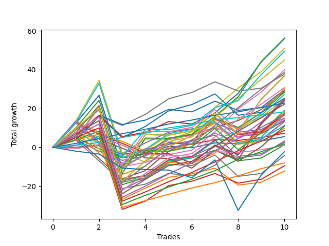

# Long Labrador 004 
- Symbol: ES_830-1130
- Date Range: 03/18/2022 - 12/30/2022
- Trading Period: 8:30-11:30
- Number of Trades: 10



| Name | Win Percent | Profit | Avg Profit / Trade | Avg Time / Trade |      | Name | Win Percent | Profit | Avg Profit / Trade | Avg Time / Trade |
| ---- | ----------- | ------ | ------------------ | ---------------- | ---- | ---- | ----------- | ------ | ------------------ | ---------------- |
| Sorted By <br> Profit | | | | | | Sorted By <br> Win Percentage ||||
| BB-200 U/L 2SD | 80.00 | 28125.00 | 2812.50 | 58:26 |     | TP-2 | 100.00 | 11375.00 | 1137.50 | 04:13 |
| BB-100 U/L 2SD | 80.00 | 28000.00 | 2800.00 | 53:54 |     | TP-1 | 100.00 | 9125.00 | 912.50 | 03:58 |
| V U/L 1SD | 80.00 | 25500.00 | 2550.00 | 39:08 |     | TP-10 | 90.00 | 22500.00 | 2250.00 | 31:06 |
| NEWFI 000 | 80.00 | 24750.00 | 2475.00 | 50:12 |     | TP-9 | 90.00 | 19375.00 | 1937.50 | 29:39 |
| TP-10 | 90.00 | 22500.00 | 2250.00 | 31:06 |     | TP-8 | 90.00 | 15375.00 | 1537.50 | 28:34 |
| BB-50 U/L 2SD | 80.00 | 20000.00 | 2000.00 | 39:09 |     | BB-50 U/L 1SD | 90.00 | 14500.00 | 1450.00 | 25:05 |
| TP-9 | 90.00 | 19375.00 | 1937.50 | 29:39 |     | BB-100 Mid | 90.00 | 13625.00 | 1362.50 | 26:58 |
| BB-50 Mid SL-5 | 80.00 | 18875.00 | 1887.50 | 09:01 |     | TP-7 | 90.00 | 11125.00 | 1112.50 | 27:10 |
| BB-200 U/L 2SD SL-10 | 60.00 | 18500.00 | 1850.00 | 43:25 |     | TP-6 | 90.00 | 8375.00 | 837.50 | 19:42 |
| BB-100 U/L 2SD SL-10 | 60.00 | 18375.00 | 1837.50 | 38:53 |     | TP-5 | 90.00 | 4375.00 | 437.50 | 17:49 |
| TP-8 | 90.00 | 15375.00 | 1537.50 | 28:34 |     | TP-4 | 90.00 | 875.00 | 87.50 | 16:23 |
| V U/L 1SD SL-5 | 50.00 | 15000.00 | 1500.00 | 24:44 |     | TP-3 | 90.00 | -4000.00 | -400.00 | 14:15 |
| V Mid SL-5 | 70.00 | 14875.00 | 1487.50 | 08:20 |     | BB-200 U/L 2SD | 80.00 | 28125.00 | 2812.50 | 58:26 |
| BB-50 U/L 1SD | 90.00 | 14500.00 | 1450.00 | 25:05 |     | BB-100 U/L 2SD | 80.00 | 28000.00 | 2800.00 | 53:54 |
| BB-100 Mid SL-5 | 70.00 | 14250.00 | 1425.00 | 16:39 |     | V U/L 1SD | 80.00 | 25500.00 | 2550.00 | 39:08 |
| BB-100 Mid | 90.00 | 13625.00 | 1362.50 | 26:58 |     | NEWFI 000 | 80.00 | 24750.00 | 2475.00 | 50:12 |
| BB-50 Mid SL-10 | 80.00 | 12625.00 | 1262.50 | 09:31 |     | BB-50 U/L 2SD | 80.00 | 20000.00 | 2000.00 | 39:09 |
| V U/L 1SD SL-10 | 60.00 | 12500.00 | 1250.00 | 26:36 |     | BB-50 Mid SL-5 | 80.00 | 18875.00 | 1887.50 | 09:01 |
| BB-50 U/L 1SD SL-5 | 60.00 | 12500.00 | 1250.00 | 14:20 |     | BB-50 Mid SL-10 | 80.00 | 12625.00 | 1262.50 | 09:31 |
| BB-100 U/L 2SD SL-5 | 40.00 | 12250.00 | 1225.00 | 33:34 |     | BB-200 Mid | 80.00 | 8875.00 | 887.50 | 21:30 |
| BB-200 U/L 2SD SL-5 | 40.00 | 12000.00 | 1200.00 | 38:05 |     | BB-20 U/L 1SD SL-5 | 80.00 | 7500.00 | 750.00 | 06:09 |
| TP-2 | 100.00 | 11375.00 | 1137.50 | 04:13 |     | V Mid | 80.00 | 6625.00 | 662.50 | 18:19 |
| TP-7 | 90.00 | 11125.00 | 1112.50 | 27:10 |     | BB-20 U/L 2SD C SL-10 | 80.00 | 5625.00 | 562.50 | 10:24 |
| BB-50 U/L 2SD SL-10 | 60.00 | 9500.00 | 950.00 | 28:20 |     | BB-20 U/L 2SD SL-10 | 80.00 | 4875.00 | 487.50 | 10:04 |
| TP-1 | 100.00 | 9125.00 | 912.50 | 03:58 |     | BB-50 Mid | 80.00 | 1625.00 | 162.50 | 16:55 |
| BB-200 Mid | 80.00 | 8875.00 | 887.50 | 21:30 |     | BB-20 U/L 1SD SL-10 | 80.00 | 1250.00 | 125.00 | 06:39 |
| V Mid SL-10 | 70.00 | 8625.00 | 862.50 | 08:50 |     | BB-20 U/L 2SD | 80.00 | 625.00 | 62.50 | 16:13 |
| TP-6 | 90.00 | 8375.00 | 837.50 | 19:42 |     | BB-20 U/L 2SD C | 80.00 | -4750.00 | -475.00 | 17:51 |
| BB-50 U/L 1SD SL-10 | 70.00 | 8375.00 | 837.50 | 16:09 |     | BB-20 U/L 1SD | 80.00 | -6125.00 | -612.50 | 12:24 |
| BB-50 U/L 2SD SL-5 | 40.00 | 8375.00 | 837.50 | 24:39 |     | V Mid SL-5 | 70.00 | 14875.00 | 1487.50 | 08:20 |
| BB-20 U/L 1SD SL-5 | 80.00 | 7500.00 | 750.00 | 06:09 |     | BB-100 Mid SL-5 | 70.00 | 14250.00 | 1425.00 | 16:39 |
| BB-20 U/L 2SD C SL-5 | 70.00 | 7250.00 | 725.00 | 08:52 |     | V Mid SL-10 | 70.00 | 8625.00 | 862.50 | 08:50 |
| BB-20 U/L 2SD SL-5 | 70.00 | 6875.00 | 687.50 | 08:35 |     | BB-50 U/L 1SD SL-10 | 70.00 | 8375.00 | 837.50 | 16:09 |
| V Mid | 80.00 | 6625.00 | 662.50 | 18:19 |     | BB-20 U/L 2SD C SL-5 | 70.00 | 7250.00 | 725.00 | 08:52 |
| BB-200 Mid SL-5 | 60.00 | 6625.00 | 662.50 | 08:31 |     | BB-20 U/L 2SD SL-5 | 70.00 | 6875.00 | 687.50 | 08:35 |
| BB-20 U/L 2SD C SL-10 | 80.00 | 5625.00 | 562.50 | 10:24 |     | BB-100 Mid SL-10 | 70.00 | 5500.00 | 550.00 | 17:25 |
| BB-100 Mid SL-10 | 70.00 | 5500.00 | 550.00 | 17:25 |     | BB-200 U/L 2SD SL-10 | 60.00 | 18500.00 | 1850.00 | 43:25 |
| BB-20 U/L 2SD SL-10 | 80.00 | 4875.00 | 487.50 | 10:04 |     | BB-100 U/L 2SD SL-10 | 60.00 | 18375.00 | 1837.50 | 38:53 |
| TP-5 | 90.00 | 4375.00 | 437.50 | 17:49 |     | V U/L 1SD SL-10 | 60.00 | 12500.00 | 1250.00 | 26:36 |
| BB-20 Mid SL-5 | 60.00 | 3625.00 | 362.50 | 04:05 |     | BB-50 U/L 1SD SL-5 | 60.00 | 12500.00 | 1250.00 | 14:20 |
| BB-20 Mid | 60.00 | 2750.00 | 275.00 | 05:01 |     | BB-50 U/L 2SD SL-10 | 60.00 | 9500.00 | 950.00 | 28:20 |
| BB-50 Mid | 80.00 | 1625.00 | 162.50 | 16:55 |     | BB-200 Mid SL-5 | 60.00 | 6625.00 | 662.50 | 08:31 |
| BB-20 U/L 1SD SL-10 | 80.00 | 1250.00 | 125.00 | 06:39 |     | BB-20 Mid SL-5 | 60.00 | 3625.00 | 362.50 | 04:05 |
| TP-4 | 90.00 | 875.00 | 87.50 | 16:23 |     | BB-20 Mid | 60.00 | 2750.00 | 275.00 | 05:01 |
| BB-20 U/L 2SD | 80.00 | 625.00 | 62.50 | 16:13 |     | BB-20 Mid SL-10 | 60.00 | 500.00 | 50.00 | 04:28 |
| BB-20 Mid SL-10 | 60.00 | 500.00 | 50.00 | 04:28 |     | BB-200 Mid SL-10 | 60.00 | -2125.00 | -212.50 | 09:17 |
| NEWFI 0000 | 30.00 | -1125.00 | -112.50 | 34:14 |     | V U/L 1SD SL-5 | 50.00 | 15000.00 | 1500.00 | 24:44 |
| BB-200 Mid SL-10 | 60.00 | -2125.00 | -212.50 | 09:17 |     | BB-100 U/L 2SD SL-5 | 40.00 | 12250.00 | 1225.00 | 33:34 |
| TP-3 | 90.00 | -4000.00 | -400.00 | 14:15 |     | BB-200 U/L 2SD SL-5 | 40.00 | 12000.00 | 1200.00 | 38:05 |
| BB-20 U/L 2SD C | 80.00 | -4750.00 | -475.00 | 17:51 |     | BB-50 U/L 2SD SL-5 | 40.00 | 8375.00 | 837.50 | 24:39 |
| BB-20 U/L 1SD | 80.00 | -6125.00 | -612.50 | 12:24 |     | NEWFI 0000 | 30.00 | -1125.00 | -112.50 | 34:14 |

## NO STOPLOSS

### Test BB-20 Mid
* Sell when price hits the middle line of the 20p bollinger
* No Stoploss
* Results:
```
Total Trades: 10
Percent Up: 60.00
Percent Down: 40.00
Total Points Moved Up: 5.50
Potential Profit: 2750.00
Total Points Ups: 13.75 Count Ups: 6
Total Points Downs: -8.25 Count Downs: 4
```

<details><summary>Trades</summary>

<code>In: 2022-04-20 09:19:00		Out: 2022-04-20 09:30:50		Total Position Time: 11:50		Total Move Up: -0.50		Total to Date: -0.50</code> <br />
<code>In: 2022-05-03 11:24:00		Out: 2022-05-03 11:32:10		Total Position Time: 08:10		Total Move Up: 1.50		Total to Date: 1.00</code> <br />
<code>In: 2022-05-11 09:37:00		Out: 2022-05-11 09:49:20		Total Position Time: 12:20		Total Move Up: -6.50		Total to Date: -5.50</code> <br />
<code>In: 2022-05-16 09:48:00		Out: 2022-05-16 09:49:10		Total Position Time: 01:10		Total Move Up: 2.25		Total to Date: -3.25</code> <br />
<code>In: 2022-06-27 09:37:00		Out: 2022-06-27 09:41:05		Total Position Time: 04:05		Total Move Up: 3.75		Total to Date: 0.50</code> <br />
<code>In: 2022-10-17 11:29:00		Out: 2022-10-17 11:35:40		Total Position Time: 06:40		Total Move Up: -0.75		Total to Date: -0.25</code> <br />
<code>In: 2022-10-31 09:50:00		Out: 2022-10-31 09:51:10		Total Position Time: 01:10		Total Move Up: 2.50		Total to Date: 2.25</code> <br />
<code>In: 2022-11-08 11:15:00		Out: 2022-11-08 11:16:15		Total Position Time: 01:15		Total Move Up: -0.50		Total to Date: 1.75</code> <br />
<code>In: 2022-11-10 10:03:00		Out: 2022-11-10 10:04:10		Total Position Time: 01:10		Total Move Up: 1.50		Total to Date: 3.25</code> <br />
<code>In: 2022-11-11 08:34:00		Out: 2022-11-11 08:36:25		Total Position Time: 02:25		Total Move Up: 2.25		Total to Date: 5.50</code> <br />


</details>

### Test BB-20 U/L 1SD
* Sell when the price hits the upper line of the 20p 1std bollinger
* No Stoploss
* Results:
```
Total Trades: 10
Percent Up: 80.00
Percent Down: 20.00
Total Points Moved Up: -12.25
Potential Profit: -6125.00
Total Points Ups: 24.50 Count Ups: 8
Total Points Downs: -36.75 Count Downs: 2
```

<details><summary>Trades</summary>

<code>In: 2022-04-20 09:19:00		Out: 2022-04-20 09:31:05		Total Position Time: 12:05		Total Move Up: 0.00		Total to Date: 0.00</code> <br />
<code>In: 2022-05-03 11:24:00		Out: 2022-05-03 11:32:25		Total Position Time: 08:25		Total Move Up: 1.25		Total to Date: 1.25</code> <br />
<code>In: 2022-05-11 09:37:00		Out: 2022-05-11 10:24:35		Total Position Time: 47:35		Total Move Up: -28.00		Total to Date: -26.75</code> <br />
<code>In: 2022-05-16 09:48:00		Out: 2022-05-16 09:50:05		Total Position Time: 02:05		Total Move Up: 5.75		Total to Date: -21.00</code> <br />
<code>In: 2022-06-27 09:37:00		Out: 2022-06-27 09:44:20		Total Position Time: 07:20		Total Move Up: 5.50		Total to Date: -15.50</code> <br />
<code>In: 2022-10-17 11:29:00		Out: 2022-10-17 11:36:10		Total Position Time: 07:10		Total Move Up: 1.75		Total to Date: -13.75</code> <br />
<code>In: 2022-10-31 09:50:00		Out: 2022-10-31 09:57:05		Total Position Time: 07:05		Total Move Up: 3.00		Total to Date: -10.75</code> <br />
<code>In: 2022-11-08 11:15:00		Out: 2022-11-08 11:38:35		Total Position Time: 23:35		Total Move Up: -8.75		Total to Date: -19.50</code> <br />
<code>In: 2022-11-10 10:03:00		Out: 2022-11-10 10:04:10		Total Position Time: 01:10		Total Move Up: 1.50		Total to Date: -18.00</code> <br />
<code>In: 2022-11-11 08:34:00		Out: 2022-11-11 08:41:35		Total Position Time: 07:35		Total Move Up: 5.75		Total to Date: -12.25</code> <br />


</details>

### Test BB-20 U/L 2SD
* Sell when the price hits the upper line of the 20p 2std bollinger
* No Stoploss
* Results:
```
Total Trades: 10
Percent Up: 80.00
Percent Down: 20.00
Total Points Moved Up: 1.25
Potential Profit: 625.00
Total Points Ups: 31.75 Count Ups: 8
Total Points Downs: -30.50 Count Downs: 2
```

<details><summary>Trades</summary>

<code>In: 2022-04-20 09:19:00		Out: 2022-04-20 09:31:35		Total Position Time: 12:35		Total Move Up: 1.00		Total to Date: 1.00</code> <br />
<code>In: 2022-05-03 11:24:00		Out: 2022-05-03 11:34:55		Total Position Time: 10:55		Total Move Up: 4.75		Total to Date: 5.75</code> <br />
<code>In: 2022-05-11 09:37:00		Out: 2022-05-11 10:24:50		Total Position Time: 47:50		Total Move Up: -25.00		Total to Date: -19.25</code> <br />
<code>In: 2022-05-16 09:48:00		Out: 2022-05-16 10:06:30		Total Position Time: 18:30		Total Move Up: 3.50		Total to Date: -15.75</code> <br />
<code>In: 2022-06-27 09:37:00		Out: 2022-06-27 09:45:05		Total Position Time: 08:05		Total Move Up: 8.00		Total to Date: -7.75</code> <br />
<code>In: 2022-10-17 11:29:00		Out: 2022-10-17 11:37:30		Total Position Time: 08:30		Total Move Up: 2.25		Total to Date: -5.50</code> <br />
<code>In: 2022-10-31 09:50:00		Out: 2022-10-31 10:02:05		Total Position Time: 12:05		Total Move Up: 4.00		Total to Date: -1.50</code> <br />
<code>In: 2022-11-08 11:15:00		Out: 2022-11-08 11:42:10		Total Position Time: 27:10		Total Move Up: -5.50		Total to Date: -7.00</code> <br />
<code>In: 2022-11-10 10:03:00		Out: 2022-11-10 10:04:10		Total Position Time: 01:10		Total Move Up: 1.50		Total to Date: -5.50</code> <br />
<code>In: 2022-11-11 08:34:00		Out: 2022-11-11 08:49:20		Total Position Time: 15:20		Total Move Up: 6.75		Total to Date: 1.25</code> <br />


</details>

### Test BB-20 U/L 2SD C
* Sell when the price hits the upper line of the 20p 2std bollinger
* No Stoploss
* Results:
```
Total Trades: 10
Percent Up: 80.00
Percent Down: 20.00
Total Points Moved Up: -9.50
Potential Profit: -4750.00
Total Points Ups: 33.25 Count Ups: 8
Total Points Downs: -42.75 Count Downs: 2
```

<details><summary>Trades</summary>

<code>In: 2022-04-20 09:19:00		Out: 2022-04-20 09:31:35		Total Position Time: 12:35		Total Move Up: 1.00		Total to Date: 1.00</code> <br />
<code>In: 2022-05-03 11:24:00		Out: 2022-05-03 11:34:55		Total Position Time: 10:55		Total Move Up: 4.75		Total to Date: 5.75</code> <br />
<code>In: 2022-05-11 09:37:00		Out: 2022-05-11 10:37:55		Total Position Time: 60:55		Total Move Up: -37.75		Total to Date: -32.00</code> <br />
<code>In: 2022-05-16 09:48:00		Out: 2022-05-16 10:07:00		Total Position Time: 19:00		Total Move Up: 4.25		Total to Date: -27.75</code> <br />
<code>In: 2022-06-27 09:37:00		Out: 2022-06-27 09:45:05		Total Position Time: 08:05		Total Move Up: 8.00		Total to Date: -19.75</code> <br />
<code>In: 2022-10-17 11:29:00		Out: 2022-10-17 11:37:55		Total Position Time: 08:55		Total Move Up: 2.25		Total to Date: -17.50</code> <br />
<code>In: 2022-10-31 09:50:00		Out: 2022-10-31 10:02:05		Total Position Time: 12:05		Total Move Up: 4.00		Total to Date: -13.50</code> <br />
<code>In: 2022-11-08 11:15:00		Out: 2022-11-08 11:42:15		Total Position Time: 27:15		Total Move Up: -5.00		Total to Date: -18.50</code> <br />
<code>In: 2022-11-10 10:03:00		Out: 2022-11-10 10:06:10		Total Position Time: 03:10		Total Move Up: 2.00		Total to Date: -16.50</code> <br />
<code>In: 2022-11-11 08:34:00		Out: 2022-11-11 08:49:40		Total Position Time: 15:40		Total Move Up: 7.00		Total to Date: -9.50</code> <br />


</details>

### Test BB-50 Mid
* Sell when price hits the middle line of the 50p bollinger
* No Stoploss
* Results:
```
Total Trades: 10
Percent Up: 80.00
Percent Down: 20.00
Total Points Moved Up: 3.25
Potential Profit: 1625.00
Total Points Ups: 47.25 Count Ups: 8
Total Points Downs: -44.00 Count Downs: 2
```

<details><summary>Trades</summary>

<code>In: 2022-04-20 09:19:00		Out: 2022-04-20 09:32:40		Total Position Time: 13:40		Total Move Up: 3.75		Total to Date: 3.75</code> <br />
<code>In: 2022-05-03 11:24:00		Out: 2022-05-03 11:36:10		Total Position Time: 12:10		Total Move Up: 12.25		Total to Date: 16.00</code> <br />
<code>In: 2022-05-11 09:37:00		Out: 2022-05-11 10:37:55		Total Position Time: 60:55		Total Move Up: -37.75		Total to Date: -21.75</code> <br />
<code>In: 2022-05-16 09:48:00		Out: 2022-05-16 09:50:05		Total Position Time: 02:05		Total Move Up: 5.75		Total to Date: -16.00</code> <br />
<code>In: 2022-06-27 09:37:00		Out: 2022-06-27 09:45:05		Total Position Time: 08:05		Total Move Up: 8.00		Total to Date: -8.00</code> <br />
<code>In: 2022-10-17 11:29:00		Out: 2022-10-17 11:39:15		Total Position Time: 10:15		Total Move Up: 3.25		Total to Date: -4.75</code> <br />
<code>In: 2022-10-31 09:50:00		Out: 2022-10-31 10:08:30		Total Position Time: 18:30		Total Move Up: 5.50		Total to Date: 0.75</code> <br />
<code>In: 2022-11-08 11:15:00		Out: 2022-11-08 11:41:40		Total Position Time: 26:40		Total Move Up: -6.25		Total to Date: -5.50</code> <br />
<code>In: 2022-11-10 10:03:00		Out: 2022-11-10 10:04:10		Total Position Time: 01:10		Total Move Up: 1.50		Total to Date: -4.00</code> <br />
<code>In: 2022-11-11 08:34:00		Out: 2022-11-11 08:49:45		Total Position Time: 15:45		Total Move Up: 7.25		Total to Date: 3.25</code> <br />


</details>

### Test BB-50 U/L 1SD
* Sell when the price hits the upper line of the 50p 1std bollinger
* No Stoploss
* Results:
```
Total Trades: 10
Percent Up: 90.00
Percent Down: 10.00
Total Points Moved Up: 29.00
Potential Profit: 14500.00
Total Points Ups: 66.75 Count Ups: 9
Total Points Downs: -37.75 Count Downs: 1
```

<details><summary>Trades</summary>

<code>In: 2022-04-20 09:19:00		Out: 2022-04-20 09:36:50		Total Position Time: 17:50		Total Move Up: 7.75		Total to Date: 7.75</code> <br />
<code>In: 2022-05-03 11:24:00		Out: 2022-05-03 11:52:05		Total Position Time: 28:05		Total Move Up: 13.75		Total to Date: 21.50</code> <br />
<code>In: 2022-05-11 09:37:00		Out: 2022-05-11 10:37:55		Total Position Time: 60:55		Total Move Up: -37.75		Total to Date: -16.25</code> <br />
<code>In: 2022-05-16 09:48:00		Out: 2022-05-16 10:07:05		Total Position Time: 19:05		Total Move Up: 4.25		Total to Date: -12.00</code> <br />
<code>In: 2022-06-27 09:37:00		Out: 2022-06-27 09:53:20		Total Position Time: 16:20		Total Move Up: 10.00		Total to Date: -2.00</code> <br />
<code>In: 2022-10-17 11:29:00		Out: 2022-10-17 11:43:20		Total Position Time: 14:20		Total Move Up: 5.75		Total to Date: 3.75</code> <br />
<code>In: 2022-10-31 09:50:00		Out: 2022-10-31 10:16:15		Total Position Time: 26:15		Total Move Up: 6.50		Total to Date: 10.25</code> <br />
<code>In: 2022-11-08 11:15:00		Out: 2022-11-08 11:47:55		Total Position Time: 32:55		Total Move Up: 3.50		Total to Date: 13.75</code> <br />
<code>In: 2022-11-10 10:03:00		Out: 2022-11-10 10:13:45		Total Position Time: 10:45		Total Move Up: 5.75		Total to Date: 19.50</code> <br />
<code>In: 2022-11-11 08:34:00		Out: 2022-11-11 08:58:20		Total Position Time: 24:20		Total Move Up: 9.50		Total to Date: 29.00</code> <br />


</details>

### Test BB-50 U/L 2SD
* Sell when the price hits the upper line of the 50p 2std bollinger
* No Stoploss
* Results:
```
Total Trades: 10
Percent Up: 80.00
Percent Down: 20.00
Total Points Moved Up: 40.00
Potential Profit: 20000.00
Total Points Ups: 78.00 Count Ups: 8
Total Points Downs: -38.00 Count Downs: 2
```

<details><summary>Trades</summary>

<code>In: 2022-04-20 09:19:00		Out: 2022-04-20 09:50:25		Total Position Time: 31:25		Total Move Up: 12.50		Total to Date: 12.50</code> <br />
<code>In: 2022-05-03 11:24:00		Out: 2022-05-03 11:56:15		Total Position Time: 32:15		Total Move Up: 14.25		Total to Date: 26.75</code> <br />
<code>In: 2022-05-11 09:37:00		Out: 2022-05-11 10:37:55		Total Position Time: 60:55		Total Move Up: -37.75		Total to Date: -11.00</code> <br />
<code>In: 2022-05-16 09:48:00		Out: 2022-05-16 10:07:35		Total Position Time: 19:35		Total Move Up: 7.50		Total to Date: -3.50</code> <br />
<code>In: 2022-06-27 09:37:00		Out: 2022-06-27 10:37:55		Total Position Time: 60:55		Total Move Up: -0.25		Total to Date: -3.75</code> <br />
<code>In: 2022-10-17 11:29:00		Out: 2022-10-17 12:29:55		Total Position Time: 60:55		Total Move Up: 2.25		Total to Date: -1.50</code> <br />
<code>In: 2022-10-31 09:50:00		Out: 2022-10-31 10:17:40		Total Position Time: 27:40		Total Move Up: 9.50		Total to Date: 8.00</code> <br />
<code>In: 2022-11-08 11:15:00		Out: 2022-11-08 12:02:35		Total Position Time: 47:35		Total Move Up: 11.75		Total to Date: 19.75</code> <br />
<code>In: 2022-11-10 10:03:00		Out: 2022-11-10 10:16:15		Total Position Time: 13:15		Total Move Up: 8.75		Total to Date: 28.50</code> <br />
<code>In: 2022-11-11 08:34:00		Out: 2022-11-11 09:11:00		Total Position Time: 37:00		Total Move Up: 11.50		Total to Date: 40.00</code> <br />


</details>

### Test V Mid
* Sell when the price hits the middle line of the 1std VWAP
* No Stoploss
* Results:
```
Total Trades: 10
Percent Up: 80.00
Percent Down: 20.00
Total Points Moved Up: 13.25
Potential Profit: 6625.00
Total Points Ups: 52.25 Count Ups: 8
Total Points Downs: -39.00 Count Downs: 2
```

<details><summary>Trades</summary>

<code>In: 2022-04-20 09:19:00		Out: 2022-04-20 09:35:50		Total Position Time: 16:50		Total Move Up: 6.00		Total to Date: 6.00</code> <br />
<code>In: 2022-05-03 11:24:00		Out: 2022-05-03 11:36:05		Total Position Time: 12:05		Total Move Up: 10.50		Total to Date: 16.50</code> <br />
<code>In: 2022-05-11 09:37:00		Out: 2022-05-11 10:37:55		Total Position Time: 60:55		Total Move Up: -37.75		Total to Date: -21.25</code> <br />
<code>In: 2022-05-16 09:48:00		Out: 2022-05-16 09:49:10		Total Position Time: 01:10		Total Move Up: 2.25		Total to Date: -19.00</code> <br />
<code>In: 2022-06-27 09:37:00		Out: 2022-06-27 09:44:20		Total Position Time: 07:20		Total Move Up: 5.50		Total to Date: -13.50</code> <br />
<code>In: 2022-10-17 11:29:00		Out: 2022-10-17 11:30:10		Total Position Time: 01:10		Total Move Up: -1.25		Total to Date: -14.75</code> <br />
<code>In: 2022-10-31 09:50:00		Out: 2022-10-31 10:08:30		Total Position Time: 18:30		Total Move Up: 5.50		Total to Date: -9.25</code> <br />
<code>In: 2022-11-08 11:15:00		Out: 2022-11-08 12:02:35		Total Position Time: 47:35		Total Move Up: 11.75		Total to Date: 2.50</code> <br />
<code>In: 2022-11-10 10:03:00		Out: 2022-11-10 10:04:10		Total Position Time: 01:10		Total Move Up: 1.50		Total to Date: 4.00</code> <br />
<code>In: 2022-11-11 08:34:00		Out: 2022-11-11 08:50:30		Total Position Time: 16:30		Total Move Up: 9.25		Total to Date: 13.25</code> <br />


</details>

### Test V U/L 1SD
* Sell when the price hits the upper line of the 1std VWAP
* No Stoploss
* Results:
```
Total Trades: 10
Percent Up: 80.00
Percent Down: 20.00
Total Points Moved Up: 51.00
Potential Profit: 25500.00
Total Points Ups: 89.00 Count Ups: 8
Total Points Downs: -38.00 Count Downs: 2
```

<details><summary>Trades</summary>

<code>In: 2022-04-20 09:19:00		Out: 2022-04-20 09:52:35		Total Position Time: 33:35		Total Move Up: 13.50		Total to Date: 13.50</code> <br />
<code>In: 2022-05-03 11:24:00		Out: 2022-05-03 12:00:05		Total Position Time: 36:05		Total Move Up: 21.00		Total to Date: 34.50</code> <br />
<code>In: 2022-05-11 09:37:00		Out: 2022-05-11 10:37:55		Total Position Time: 60:55		Total Move Up: -37.75		Total to Date: -3.25</code> <br />
<code>In: 2022-05-16 09:48:00		Out: 2022-05-16 10:07:35		Total Position Time: 19:35		Total Move Up: 7.50		Total to Date: 4.25</code> <br />
<code>In: 2022-06-27 09:37:00		Out: 2022-06-27 10:37:55		Total Position Time: 60:55		Total Move Up: -0.25		Total to Date: 4.00</code> <br />
<code>In: 2022-10-17 11:29:00		Out: 2022-10-17 11:40:40		Total Position Time: 11:40		Total Move Up: 4.00		Total to Date: 8.00</code> <br />
<code>In: 2022-10-31 09:50:00		Out: 2022-10-31 10:24:00		Total Position Time: 34:00		Total Move Up: 12.50		Total to Date: 20.50</code> <br />
<code>In: 2022-11-08 11:15:00		Out: 2022-11-08 12:15:55		Total Position Time: 60:55		Total Move Up: 10.00		Total to Date: 30.50</code> <br />
<code>In: 2022-11-10 10:03:00		Out: 2022-11-10 10:15:50		Total Position Time: 12:50		Total Move Up: 8.50		Total to Date: 39.00</code> <br />
<code>In: 2022-11-11 08:34:00		Out: 2022-11-11 09:34:55		Total Position Time: 60:55		Total Move Up: 12.00		Total to Date: 51.00</code> <br />


</details>

### Test BB-100 Mid
* Move to BB100 Mid
* No Stoploss
* Results:
```
Total Trades: 10
Percent Up: 90.00
Percent Down: 10.00
Total Points Moved Up: 27.25
Potential Profit: 13625.00
Total Points Ups: 65.00 Count Ups: 9
Total Points Downs: -37.75 Count Downs: 1
```

<details><summary>Trades</summary>

<code>In: 2022-04-20 09:19:00		Out: 2022-04-20 09:33:05		Total Position Time: 14:05		Total Move Up: 5.00		Total to Date: 5.00</code> <br />
<code>In: 2022-05-03 11:24:00		Out: 2022-05-03 11:52:15		Total Position Time: 28:15		Total Move Up: 15.50		Total to Date: 20.50</code> <br />
<code>In: 2022-05-11 09:37:00		Out: 2022-05-11 10:37:55		Total Position Time: 60:55		Total Move Up: -37.75		Total to Date: -17.25</code> <br />
<code>In: 2022-05-16 09:48:00		Out: 2022-05-16 09:49:10		Total Position Time: 01:10		Total Move Up: 2.25		Total to Date: -15.00</code> <br />
<code>In: 2022-06-27 09:37:00		Out: 2022-06-27 10:20:05		Total Position Time: 43:05		Total Move Up: 8.00		Total to Date: -7.00</code> <br />
<code>In: 2022-10-17 11:29:00		Out: 2022-10-17 11:36:10		Total Position Time: 07:10		Total Move Up: 1.75		Total to Date: -5.25</code> <br />
<code>In: 2022-10-31 09:50:00		Out: 2022-10-31 10:17:20		Total Position Time: 27:20		Total Move Up: 8.50		Total to Date: 3.25</code> <br />
<code>In: 2022-11-08 11:15:00		Out: 2022-11-08 11:53:50		Total Position Time: 38:50		Total Move Up: 5.75		Total to Date: 9.00</code> <br />
<code>In: 2022-11-10 10:03:00		Out: 2022-11-10 10:15:00		Total Position Time: 12:00		Total Move Up: 7.50		Total to Date: 16.50</code> <br />
<code>In: 2022-11-11 08:34:00		Out: 2022-11-11 09:10:50		Total Position Time: 36:50		Total Move Up: 10.75		Total to Date: 27.25</code> <br />


</details>

### Test BB-100 U/L 2SD
* Move to BB100 Upper Band
* No Stoploss
* Results:
```
Total Trades: 10
Percent Up: 80.00
Percent Down: 20.00
Total Points Moved Up: 56.00
Potential Profit: 28000.00
Total Points Ups: 94.00 Count Ups: 8
Total Points Downs: -38.00 Count Downs: 2
```

<details><summary>Trades</summary>

<code>In: 2022-04-20 09:19:00		Out: 2022-04-20 09:50:25		Total Position Time: 31:25		Total Move Up: 12.50		Total to Date: 12.50</code> <br />
<code>In: 2022-05-03 11:24:00		Out: 2022-05-03 12:24:55		Total Position Time: 60:55		Total Move Up: 14.25		Total to Date: 26.75</code> <br />
<code>In: 2022-05-11 09:37:00		Out: 2022-05-11 10:37:55		Total Position Time: 60:55		Total Move Up: -37.75		Total to Date: -11.00</code> <br />
<code>In: 2022-05-16 09:48:00		Out: 2022-05-16 10:24:00		Total Position Time: 36:00		Total Move Up: 17.50		Total to Date: 6.50</code> <br />
<code>In: 2022-06-27 09:37:00		Out: 2022-06-27 10:37:55		Total Position Time: 60:55		Total Move Up: -0.25		Total to Date: 6.25</code> <br />
<code>In: 2022-10-17 11:29:00		Out: 2022-10-17 12:29:55		Total Position Time: 60:55		Total Move Up: 2.25		Total to Date: 8.50</code> <br />
<code>In: 2022-10-31 09:50:00		Out: 2022-10-31 10:50:55		Total Position Time: 60:55		Total Move Up: 9.25		Total to Date: 17.75</code> <br />
<code>In: 2022-11-08 11:15:00		Out: 2022-11-08 12:15:55		Total Position Time: 60:55		Total Move Up: 10.00		Total to Date: 27.75</code> <br />
<code>In: 2022-11-10 10:03:00		Out: 2022-11-10 10:48:15		Total Position Time: 45:15		Total Move Up: 16.25		Total to Date: 44.00</code> <br />
<code>In: 2022-11-11 08:34:00		Out: 2022-11-11 09:34:55		Total Position Time: 60:55		Total Move Up: 12.00		Total to Date: 56.00</code> <br />


</details>

### Test BB-200 Mid
* Move to BB200 Mid
* No Stoploss
* Results:
```
Total Trades: 10
Percent Up: 80.00
Percent Down: 20.00
Total Points Moved Up: 17.75
Potential Profit: 8875.00
Total Points Ups: 56.25 Count Ups: 8
Total Points Downs: -38.50 Count Downs: 2
```

<details><summary>Trades</summary>

<code>In: 2022-04-20 09:19:00		Out: 2022-04-20 09:32:40		Total Position Time: 13:40		Total Move Up: 3.75		Total to Date: 3.75</code> <br />
<code>In: 2022-05-03 11:24:00		Out: 2022-05-03 11:56:55		Total Position Time: 32:55		Total Move Up: 17.00		Total to Date: 20.75</code> <br />
<code>In: 2022-05-11 09:37:00		Out: 2022-05-11 10:37:55		Total Position Time: 60:55		Total Move Up: -37.75		Total to Date: -17.00</code> <br />
<code>In: 2022-05-16 09:48:00		Out: 2022-05-16 09:49:10		Total Position Time: 01:10		Total Move Up: 2.25		Total to Date: -14.75</code> <br />
<code>In: 2022-06-27 09:37:00		Out: 2022-06-27 09:45:00		Total Position Time: 08:00		Total Move Up: 7.00		Total to Date: -7.75</code> <br />
<code>In: 2022-10-17 11:29:00		Out: 2022-10-17 11:30:20		Total Position Time: 01:20		Total Move Up: -0.75		Total to Date: -8.50</code> <br />
<code>In: 2022-10-31 09:50:00		Out: 2022-10-31 10:08:30		Total Position Time: 18:30		Total Move Up: 5.50		Total to Date: -3.00</code> <br />
<code>In: 2022-11-08 11:15:00		Out: 2022-11-08 12:15:55		Total Position Time: 60:55		Total Move Up: 10.00		Total to Date: 7.00</code> <br />
<code>In: 2022-11-10 10:03:00		Out: 2022-11-10 10:04:10		Total Position Time: 01:10		Total Move Up: 1.50		Total to Date: 8.50</code> <br />
<code>In: 2022-11-11 08:34:00		Out: 2022-11-11 08:50:30		Total Position Time: 16:30		Total Move Up: 9.25		Total to Date: 17.75</code> <br />


</details>

### Test BB-200 U/L 2SD
* Move to BB200 Upper Band
* No Stoploss
* Results:
```
Total Trades: 10
Percent Up: 80.00
Percent Down: 20.00
Total Points Moved Up: 56.25
Potential Profit: 28125.00
Total Points Ups: 94.25 Count Ups: 8
Total Points Downs: -38.00 Count Downs: 2
```

<details><summary>Trades</summary>

<code>In: 2022-04-20 09:19:00		Out: 2022-04-20 10:19:55		Total Position Time: 60:55		Total Move Up: 10.00		Total to Date: 10.00</code> <br />
<code>In: 2022-05-03 11:24:00		Out: 2022-05-03 12:24:55		Total Position Time: 60:55		Total Move Up: 14.25		Total to Date: 24.25</code> <br />
<code>In: 2022-05-11 09:37:00		Out: 2022-05-11 10:37:55		Total Position Time: 60:55		Total Move Up: -37.75		Total to Date: -13.50</code> <br />
<code>In: 2022-05-16 09:48:00		Out: 2022-05-16 10:24:05		Total Position Time: 36:05		Total Move Up: 18.25		Total to Date: 4.75</code> <br />
<code>In: 2022-06-27 09:37:00		Out: 2022-06-27 10:37:55		Total Position Time: 60:55		Total Move Up: -0.25		Total to Date: 4.50</code> <br />
<code>In: 2022-10-17 11:29:00		Out: 2022-10-17 12:29:55		Total Position Time: 60:55		Total Move Up: 2.25		Total to Date: 6.75</code> <br />
<code>In: 2022-10-31 09:50:00		Out: 2022-10-31 10:50:55		Total Position Time: 60:55		Total Move Up: 9.25		Total to Date: 16.00</code> <br />
<code>In: 2022-11-08 11:15:00		Out: 2022-11-08 12:15:55		Total Position Time: 60:55		Total Move Up: 10.00		Total to Date: 26.00</code> <br />
<code>In: 2022-11-10 10:03:00		Out: 2022-11-10 11:03:55		Total Position Time: 60:55		Total Move Up: 18.25		Total to Date: 44.25</code> <br />
<code>In: 2022-11-11 08:34:00		Out: 2022-11-11 09:34:55		Total Position Time: 60:55		Total Move Up: 12.00		Total to Date: 56.25</code> <br />


</details>

## STOPLOSS OF 5

### Test BB-20 Mid SL-5
* Sell when price hits the middle line of the 20p bollinger
* Stoploss is 5 points
* Results:
```
Total Trades: 10
Percent Up: 60.00
Percent Down: 40.00
Total Points Moved Up: 7.25
Potential Profit: 3625.00
Total Points Ups: 13.75 Count Ups: 6
Total Points Downs: -6.50 Count Downs: 4
```

<details><summary>Trades</summary>

<code>In: 2022-04-20 09:19:00		Out: 2022-04-20 09:30:50		Total Position Time: 11:50		Total Move Up: -0.50		Total to Date: -0.50</code> <br />
<code>In: 2022-05-03 11:24:00		Out: 2022-05-03 11:32:10		Total Position Time: 08:10		Total Move Up: 1.50		Total to Date: 1.00</code> <br />
<code>In: 2022-05-11 09:37:00		Out: 2022-05-11 09:39:55		Total Position Time: 02:55		Total Move Up: -4.75		Total to Date: -3.75</code> <br />
<code>In: 2022-05-16 09:48:00		Out: 2022-05-16 09:49:10		Total Position Time: 01:10		Total Move Up: 2.25		Total to Date: -1.50</code> <br />
<code>In: 2022-06-27 09:37:00		Out: 2022-06-27 09:41:05		Total Position Time: 04:05		Total Move Up: 3.75		Total to Date: 2.25</code> <br />
<code>In: 2022-10-17 11:29:00		Out: 2022-10-17 11:35:40		Total Position Time: 06:40		Total Move Up: -0.75		Total to Date: 1.50</code> <br />
<code>In: 2022-10-31 09:50:00		Out: 2022-10-31 09:51:10		Total Position Time: 01:10		Total Move Up: 2.50		Total to Date: 4.00</code> <br />
<code>In: 2022-11-08 11:15:00		Out: 2022-11-08 11:16:15		Total Position Time: 01:15		Total Move Up: -0.50		Total to Date: 3.50</code> <br />
<code>In: 2022-11-10 10:03:00		Out: 2022-11-10 10:04:10		Total Position Time: 01:10		Total Move Up: 1.50		Total to Date: 5.00</code> <br />
<code>In: 2022-11-11 08:34:00		Out: 2022-11-11 08:36:25		Total Position Time: 02:25		Total Move Up: 2.25		Total to Date: 7.25</code> <br />


</details>

### Test BB-20 U/L 1SD SL-5
* Sell when the price hits the upper line of the 20p 1std bollinger
* Stoploss is 5 points
* Results:
```
Total Trades: 10
Percent Up: 80.00
Percent Down: 20.00
Total Points Moved Up: 15.00
Potential Profit: 7500.00
Total Points Ups: 24.50 Count Ups: 8
Total Points Downs: -9.50 Count Downs: 2
```

<details><summary>Trades</summary>

<code>In: 2022-04-20 09:19:00		Out: 2022-04-20 09:31:05		Total Position Time: 12:05		Total Move Up: 0.00		Total to Date: 0.00</code> <br />
<code>In: 2022-05-03 11:24:00		Out: 2022-05-03 11:32:25		Total Position Time: 08:25		Total Move Up: 1.25		Total to Date: 1.25</code> <br />
<code>In: 2022-05-11 09:37:00		Out: 2022-05-11 09:39:55		Total Position Time: 02:55		Total Move Up: -4.75		Total to Date: -3.50</code> <br />
<code>In: 2022-05-16 09:48:00		Out: 2022-05-16 09:50:05		Total Position Time: 02:05		Total Move Up: 5.75		Total to Date: 2.25</code> <br />
<code>In: 2022-06-27 09:37:00		Out: 2022-06-27 09:44:20		Total Position Time: 07:20		Total Move Up: 5.50		Total to Date: 7.75</code> <br />
<code>In: 2022-10-17 11:29:00		Out: 2022-10-17 11:36:10		Total Position Time: 07:10		Total Move Up: 1.75		Total to Date: 9.50</code> <br />
<code>In: 2022-10-31 09:50:00		Out: 2022-10-31 09:57:05		Total Position Time: 07:05		Total Move Up: 3.00		Total to Date: 12.50</code> <br />
<code>In: 2022-11-08 11:15:00		Out: 2022-11-08 11:20:40		Total Position Time: 05:40		Total Move Up: -4.75		Total to Date: 7.75</code> <br />
<code>In: 2022-11-10 10:03:00		Out: 2022-11-10 10:04:10		Total Position Time: 01:10		Total Move Up: 1.50		Total to Date: 9.25</code> <br />
<code>In: 2022-11-11 08:34:00		Out: 2022-11-11 08:41:35		Total Position Time: 07:35		Total Move Up: 5.75		Total to Date: 15.00</code> <br />


</details>

### Test BB-20 U/L 2SD SL-5
* Sell when the price hits the upper line of the 20p 2std bollinger
* Stoploss is 5 points
* Results:
```
Total Trades: 10
Percent Up: 70.00
Percent Down: 30.00
Total Points Moved Up: 13.75
Potential Profit: 6875.00
Total Points Ups: 28.25 Count Ups: 7
Total Points Downs: -14.50 Count Downs: 3
```

<details><summary>Trades</summary>

<code>In: 2022-04-20 09:19:00		Out: 2022-04-20 09:31:35		Total Position Time: 12:35		Total Move Up: 1.00		Total to Date: 1.00</code> <br />
<code>In: 2022-05-03 11:24:00		Out: 2022-05-03 11:34:55		Total Position Time: 10:55		Total Move Up: 4.75		Total to Date: 5.75</code> <br />
<code>In: 2022-05-11 09:37:00		Out: 2022-05-11 09:39:55		Total Position Time: 02:55		Total Move Up: -4.75		Total to Date: 1.00</code> <br />
<code>In: 2022-05-16 09:48:00		Out: 2022-05-16 09:56:40		Total Position Time: 08:40		Total Move Up: -5.00		Total to Date: -4.00</code> <br />
<code>In: 2022-06-27 09:37:00		Out: 2022-06-27 09:45:05		Total Position Time: 08:05		Total Move Up: 8.00		Total to Date: 4.00</code> <br />
<code>In: 2022-10-17 11:29:00		Out: 2022-10-17 11:37:30		Total Position Time: 08:30		Total Move Up: 2.25		Total to Date: 6.25</code> <br />
<code>In: 2022-10-31 09:50:00		Out: 2022-10-31 10:02:05		Total Position Time: 12:05		Total Move Up: 4.00		Total to Date: 10.25</code> <br />
<code>In: 2022-11-08 11:15:00		Out: 2022-11-08 11:20:40		Total Position Time: 05:40		Total Move Up: -4.75		Total to Date: 5.50</code> <br />
<code>In: 2022-11-10 10:03:00		Out: 2022-11-10 10:04:10		Total Position Time: 01:10		Total Move Up: 1.50		Total to Date: 7.00</code> <br />
<code>In: 2022-11-11 08:34:00		Out: 2022-11-11 08:49:20		Total Position Time: 15:20		Total Move Up: 6.75		Total to Date: 13.75</code> <br />


</details>

### Test BB-20 U/L 2SD C SL-5
* Sell when the price hits the upper line of the 20p 2std bollinger
* Stoploss is 5 points
* Results:
```
Total Trades: 10
Percent Up: 70.00
Percent Down: 30.00
Total Points Moved Up: 14.50
Potential Profit: 7250.00
Total Points Ups: 29.00 Count Ups: 7
Total Points Downs: -14.50 Count Downs: 3
```

<details><summary>Trades</summary>

<code>In: 2022-04-20 09:19:00		Out: 2022-04-20 09:31:35		Total Position Time: 12:35		Total Move Up: 1.00		Total to Date: 1.00</code> <br />
<code>In: 2022-05-03 11:24:00		Out: 2022-05-03 11:34:55		Total Position Time: 10:55		Total Move Up: 4.75		Total to Date: 5.75</code> <br />
<code>In: 2022-05-11 09:37:00		Out: 2022-05-11 09:39:55		Total Position Time: 02:55		Total Move Up: -4.75		Total to Date: 1.00</code> <br />
<code>In: 2022-05-16 09:48:00		Out: 2022-05-16 09:56:40		Total Position Time: 08:40		Total Move Up: -5.00		Total to Date: -4.00</code> <br />
<code>In: 2022-06-27 09:37:00		Out: 2022-06-27 09:45:05		Total Position Time: 08:05		Total Move Up: 8.00		Total to Date: 4.00</code> <br />
<code>In: 2022-10-17 11:29:00		Out: 2022-10-17 11:37:55		Total Position Time: 08:55		Total Move Up: 2.25		Total to Date: 6.25</code> <br />
<code>In: 2022-10-31 09:50:00		Out: 2022-10-31 10:02:05		Total Position Time: 12:05		Total Move Up: 4.00		Total to Date: 10.25</code> <br />
<code>In: 2022-11-08 11:15:00		Out: 2022-11-08 11:20:40		Total Position Time: 05:40		Total Move Up: -4.75		Total to Date: 5.50</code> <br />
<code>In: 2022-11-10 10:03:00		Out: 2022-11-10 10:06:10		Total Position Time: 03:10		Total Move Up: 2.00		Total to Date: 7.50</code> <br />
<code>In: 2022-11-11 08:34:00		Out: 2022-11-11 08:49:40		Total Position Time: 15:40		Total Move Up: 7.00		Total to Date: 14.50</code> <br />


</details>

### Test BB-50 Mid SL-5
* Sell when price hits the middle line of the 50p bollinger
* Stoploss is 5 points
* Results:
```
Total Trades: 10
Percent Up: 80.00
Percent Down: 20.00
Total Points Moved Up: 37.75
Potential Profit: 18875.00
Total Points Ups: 47.25 Count Ups: 8
Total Points Downs: -9.50 Count Downs: 2
```

<details><summary>Trades</summary>

<code>In: 2022-04-20 09:19:00		Out: 2022-04-20 09:32:40		Total Position Time: 13:40		Total Move Up: 3.75		Total to Date: 3.75</code> <br />
<code>In: 2022-05-03 11:24:00		Out: 2022-05-03 11:36:10		Total Position Time: 12:10		Total Move Up: 12.25		Total to Date: 16.00</code> <br />
<code>In: 2022-05-11 09:37:00		Out: 2022-05-11 09:39:55		Total Position Time: 02:55		Total Move Up: -4.75		Total to Date: 11.25</code> <br />
<code>In: 2022-05-16 09:48:00		Out: 2022-05-16 09:50:05		Total Position Time: 02:05		Total Move Up: 5.75		Total to Date: 17.00</code> <br />
<code>In: 2022-06-27 09:37:00		Out: 2022-06-27 09:45:05		Total Position Time: 08:05		Total Move Up: 8.00		Total to Date: 25.00</code> <br />
<code>In: 2022-10-17 11:29:00		Out: 2022-10-17 11:39:15		Total Position Time: 10:15		Total Move Up: 3.25		Total to Date: 28.25</code> <br />
<code>In: 2022-10-31 09:50:00		Out: 2022-10-31 10:08:30		Total Position Time: 18:30		Total Move Up: 5.50		Total to Date: 33.75</code> <br />
<code>In: 2022-11-08 11:15:00		Out: 2022-11-08 11:20:40		Total Position Time: 05:40		Total Move Up: -4.75		Total to Date: 29.00</code> <br />
<code>In: 2022-11-10 10:03:00		Out: 2022-11-10 10:04:10		Total Position Time: 01:10		Total Move Up: 1.50		Total to Date: 30.50</code> <br />
<code>In: 2022-11-11 08:34:00		Out: 2022-11-11 08:49:45		Total Position Time: 15:45		Total Move Up: 7.25		Total to Date: 37.75</code> <br />


</details>

### Test BB-50 U/L 1SD SL-5
* Sell when the price hits the upper line of the 50p 1std bollinger
* Stoploss is 5 points
* Results:
```
Total Trades: 10
Percent Up: 60.00
Percent Down: 40.00
Total Points Moved Up: 25.00
Potential Profit: 12500.00
Total Points Ups: 45.25 Count Ups: 6
Total Points Downs: -20.25 Count Downs: 4
```

<details><summary>Trades</summary>

<code>In: 2022-04-20 09:19:00		Out: 2022-04-20 09:36:50		Total Position Time: 17:50		Total Move Up: 7.75		Total to Date: 7.75</code> <br />
<code>In: 2022-05-03 11:24:00		Out: 2022-05-03 11:40:15		Total Position Time: 16:15		Total Move Up: -5.75		Total to Date: 2.00</code> <br />
<code>In: 2022-05-11 09:37:00		Out: 2022-05-11 09:39:55		Total Position Time: 02:55		Total Move Up: -4.75		Total to Date: -2.75</code> <br />
<code>In: 2022-05-16 09:48:00		Out: 2022-05-16 09:56:40		Total Position Time: 08:40		Total Move Up: -5.00		Total to Date: -7.75</code> <br />
<code>In: 2022-06-27 09:37:00		Out: 2022-06-27 09:53:20		Total Position Time: 16:20		Total Move Up: 10.00		Total to Date: 2.25</code> <br />
<code>In: 2022-10-17 11:29:00		Out: 2022-10-17 11:43:20		Total Position Time: 14:20		Total Move Up: 5.75		Total to Date: 8.00</code> <br />
<code>In: 2022-10-31 09:50:00		Out: 2022-10-31 10:16:15		Total Position Time: 26:15		Total Move Up: 6.50		Total to Date: 14.50</code> <br />
<code>In: 2022-11-08 11:15:00		Out: 2022-11-08 11:20:40		Total Position Time: 05:40		Total Move Up: -4.75		Total to Date: 9.75</code> <br />
<code>In: 2022-11-10 10:03:00		Out: 2022-11-10 10:13:45		Total Position Time: 10:45		Total Move Up: 5.75		Total to Date: 15.50</code> <br />
<code>In: 2022-11-11 08:34:00		Out: 2022-11-11 08:58:20		Total Position Time: 24:20		Total Move Up: 9.50		Total to Date: 25.00</code> <br />


</details>

### Test BB-50 U/L 2SD SL-5
* Sell when the price hits the upper line of the 50p 2std bollinger
* Stoploss is 5 points
* Results:
```
Total Trades: 10
Percent Up: 40.00
Percent Down: 60.00
Total Points Moved Up: 16.75
Potential Profit: 8375.00
Total Points Ups: 42.25 Count Ups: 4
Total Points Downs: -25.50 Count Downs: 6
```

<details><summary>Trades</summary>

<code>In: 2022-04-20 09:19:00		Out: 2022-04-20 09:50:25		Total Position Time: 31:25		Total Move Up: 12.50		Total to Date: 12.50</code> <br />
<code>In: 2022-05-03 11:24:00		Out: 2022-05-03 11:40:15		Total Position Time: 16:15		Total Move Up: -5.75		Total to Date: 6.75</code> <br />
<code>In: 2022-05-11 09:37:00		Out: 2022-05-11 09:39:55		Total Position Time: 02:55		Total Move Up: -4.75		Total to Date: 2.00</code> <br />
<code>In: 2022-05-16 09:48:00		Out: 2022-05-16 09:56:40		Total Position Time: 08:40		Total Move Up: -5.00		Total to Date: -3.00</code> <br />
<code>In: 2022-06-27 09:37:00		Out: 2022-06-27 10:37:55		Total Position Time: 60:55		Total Move Up: -0.25		Total to Date: -3.25</code> <br />
<code>In: 2022-10-17 11:29:00		Out: 2022-10-17 12:11:45		Total Position Time: 42:45		Total Move Up: -5.00		Total to Date: -8.25</code> <br />
<code>In: 2022-10-31 09:50:00		Out: 2022-10-31 10:17:40		Total Position Time: 27:40		Total Move Up: 9.50		Total to Date: 1.25</code> <br />
<code>In: 2022-11-08 11:15:00		Out: 2022-11-08 11:20:40		Total Position Time: 05:40		Total Move Up: -4.75		Total to Date: -3.50</code> <br />
<code>In: 2022-11-10 10:03:00		Out: 2022-11-10 10:16:15		Total Position Time: 13:15		Total Move Up: 8.75		Total to Date: 5.25</code> <br />
<code>In: 2022-11-11 08:34:00		Out: 2022-11-11 09:11:00		Total Position Time: 37:00		Total Move Up: 11.50		Total to Date: 16.75</code> <br />


</details>

### Test V Mid SL-5
* Sell when the price hits the middle line of the 1std VWAP
* Stoploss is 5 points
* Results:
```
Total Trades: 10
Percent Up: 70.00
Percent Down: 30.00
Total Points Moved Up: 29.75
Potential Profit: 14875.00
Total Points Ups: 40.50 Count Ups: 7
Total Points Downs: -10.75 Count Downs: 3
```

<details><summary>Trades</summary>

<code>In: 2022-04-20 09:19:00		Out: 2022-04-20 09:35:50		Total Position Time: 16:50		Total Move Up: 6.00		Total to Date: 6.00</code> <br />
<code>In: 2022-05-03 11:24:00		Out: 2022-05-03 11:36:05		Total Position Time: 12:05		Total Move Up: 10.50		Total to Date: 16.50</code> <br />
<code>In: 2022-05-11 09:37:00		Out: 2022-05-11 09:39:55		Total Position Time: 02:55		Total Move Up: -4.75		Total to Date: 11.75</code> <br />
<code>In: 2022-05-16 09:48:00		Out: 2022-05-16 09:49:10		Total Position Time: 01:10		Total Move Up: 2.25		Total to Date: 14.00</code> <br />
<code>In: 2022-06-27 09:37:00		Out: 2022-06-27 09:44:20		Total Position Time: 07:20		Total Move Up: 5.50		Total to Date: 19.50</code> <br />
<code>In: 2022-10-17 11:29:00		Out: 2022-10-17 11:30:10		Total Position Time: 01:10		Total Move Up: -1.25		Total to Date: 18.25</code> <br />
<code>In: 2022-10-31 09:50:00		Out: 2022-10-31 10:08:30		Total Position Time: 18:30		Total Move Up: 5.50		Total to Date: 23.75</code> <br />
<code>In: 2022-11-08 11:15:00		Out: 2022-11-08 11:20:40		Total Position Time: 05:40		Total Move Up: -4.75		Total to Date: 19.00</code> <br />
<code>In: 2022-11-10 10:03:00		Out: 2022-11-10 10:04:10		Total Position Time: 01:10		Total Move Up: 1.50		Total to Date: 20.50</code> <br />
<code>In: 2022-11-11 08:34:00		Out: 2022-11-11 08:50:30		Total Position Time: 16:30		Total Move Up: 9.25		Total to Date: 29.75</code> <br />


</details>

### Test V U/L 1SD SL-5
* Sell when the price hits the upper line of the 1std VWAP
* Stoploss is 5 points
* Results:
```
Total Trades: 10
Percent Up: 50.00
Percent Down: 50.00
Total Points Moved Up: 30.00
Potential Profit: 15000.00
Total Points Ups: 50.50 Count Ups: 5
Total Points Downs: -20.50 Count Downs: 5
```

<details><summary>Trades</summary>

<code>In: 2022-04-20 09:19:00		Out: 2022-04-20 09:52:35		Total Position Time: 33:35		Total Move Up: 13.50		Total to Date: 13.50</code> <br />
<code>In: 2022-05-03 11:24:00		Out: 2022-05-03 11:40:15		Total Position Time: 16:15		Total Move Up: -5.75		Total to Date: 7.75</code> <br />
<code>In: 2022-05-11 09:37:00		Out: 2022-05-11 09:39:55		Total Position Time: 02:55		Total Move Up: -4.75		Total to Date: 3.00</code> <br />
<code>In: 2022-05-16 09:48:00		Out: 2022-05-16 09:56:40		Total Position Time: 08:40		Total Move Up: -5.00		Total to Date: -2.00</code> <br />
<code>In: 2022-06-27 09:37:00		Out: 2022-06-27 10:37:55		Total Position Time: 60:55		Total Move Up: -0.25		Total to Date: -2.25</code> <br />
<code>In: 2022-10-17 11:29:00		Out: 2022-10-17 11:40:40		Total Position Time: 11:40		Total Move Up: 4.00		Total to Date: 1.75</code> <br />
<code>In: 2022-10-31 09:50:00		Out: 2022-10-31 10:24:00		Total Position Time: 34:00		Total Move Up: 12.50		Total to Date: 14.25</code> <br />
<code>In: 2022-11-08 11:15:00		Out: 2022-11-08 11:20:40		Total Position Time: 05:40		Total Move Up: -4.75		Total to Date: 9.50</code> <br />
<code>In: 2022-11-10 10:03:00		Out: 2022-11-10 10:15:50		Total Position Time: 12:50		Total Move Up: 8.50		Total to Date: 18.00</code> <br />
<code>In: 2022-11-11 08:34:00		Out: 2022-11-11 09:34:55		Total Position Time: 60:55		Total Move Up: 12.00		Total to Date: 30.00</code> <br />


</details>

### Test BB-100 Mid SL-5
* Move to BB100 Mid
* Stoploss is 5 points
* Results:
```
Total Trades: 10
Percent Up: 70.00
Percent Down: 30.00
Total Points Moved Up: 28.50
Potential Profit: 14250.00
Total Points Ups: 43.75 Count Ups: 7
Total Points Downs: -15.25 Count Downs: 3
```

<details><summary>Trades</summary>

<code>In: 2022-04-20 09:19:00		Out: 2022-04-20 09:33:05		Total Position Time: 14:05		Total Move Up: 5.00		Total to Date: 5.00</code> <br />
<code>In: 2022-05-03 11:24:00		Out: 2022-05-03 11:40:15		Total Position Time: 16:15		Total Move Up: -5.75		Total to Date: -0.75</code> <br />
<code>In: 2022-05-11 09:37:00		Out: 2022-05-11 09:39:55		Total Position Time: 02:55		Total Move Up: -4.75		Total to Date: -5.50</code> <br />
<code>In: 2022-05-16 09:48:00		Out: 2022-05-16 09:49:10		Total Position Time: 01:10		Total Move Up: 2.25		Total to Date: -3.25</code> <br />
<code>In: 2022-06-27 09:37:00		Out: 2022-06-27 10:20:05		Total Position Time: 43:05		Total Move Up: 8.00		Total to Date: 4.75</code> <br />
<code>In: 2022-10-17 11:29:00		Out: 2022-10-17 11:36:10		Total Position Time: 07:10		Total Move Up: 1.75		Total to Date: 6.50</code> <br />
<code>In: 2022-10-31 09:50:00		Out: 2022-10-31 10:17:20		Total Position Time: 27:20		Total Move Up: 8.50		Total to Date: 15.00</code> <br />
<code>In: 2022-11-08 11:15:00		Out: 2022-11-08 11:20:40		Total Position Time: 05:40		Total Move Up: -4.75		Total to Date: 10.25</code> <br />
<code>In: 2022-11-10 10:03:00		Out: 2022-11-10 10:15:00		Total Position Time: 12:00		Total Move Up: 7.50		Total to Date: 17.75</code> <br />
<code>In: 2022-11-11 08:34:00		Out: 2022-11-11 09:10:50		Total Position Time: 36:50		Total Move Up: 10.75		Total to Date: 28.50</code> <br />


</details>

### Test BB-100 U/L 2SD SL-5
* Move to BB100 Upper Band
* Stoploss is 5 points
* Results:
```
Total Trades: 10
Percent Up: 40.00
Percent Down: 60.00
Total Points Moved Up: 24.50
Potential Profit: 12250.00
Total Points Ups: 50.00 Count Ups: 4
Total Points Downs: -25.50 Count Downs: 6
```

<details><summary>Trades</summary>

<code>In: 2022-04-20 09:19:00		Out: 2022-04-20 09:50:25		Total Position Time: 31:25		Total Move Up: 12.50		Total to Date: 12.50</code> <br />
<code>In: 2022-05-03 11:24:00		Out: 2022-05-03 11:40:15		Total Position Time: 16:15		Total Move Up: -5.75		Total to Date: 6.75</code> <br />
<code>In: 2022-05-11 09:37:00		Out: 2022-05-11 09:39:55		Total Position Time: 02:55		Total Move Up: -4.75		Total to Date: 2.00</code> <br />
<code>In: 2022-05-16 09:48:00		Out: 2022-05-16 09:56:40		Total Position Time: 08:40		Total Move Up: -5.00		Total to Date: -3.00</code> <br />
<code>In: 2022-06-27 09:37:00		Out: 2022-06-27 10:37:55		Total Position Time: 60:55		Total Move Up: -0.25		Total to Date: -3.25</code> <br />
<code>In: 2022-10-17 11:29:00		Out: 2022-10-17 12:11:45		Total Position Time: 42:45		Total Move Up: -5.00		Total to Date: -8.25</code> <br />
<code>In: 2022-10-31 09:50:00		Out: 2022-10-31 10:50:55		Total Position Time: 60:55		Total Move Up: 9.25		Total to Date: 1.00</code> <br />
<code>In: 2022-11-08 11:15:00		Out: 2022-11-08 11:20:40		Total Position Time: 05:40		Total Move Up: -4.75		Total to Date: -3.75</code> <br />
<code>In: 2022-11-10 10:03:00		Out: 2022-11-10 10:48:15		Total Position Time: 45:15		Total Move Up: 16.25		Total to Date: 12.50</code> <br />
<code>In: 2022-11-11 08:34:00		Out: 2022-11-11 09:34:55		Total Position Time: 60:55		Total Move Up: 12.00		Total to Date: 24.50</code> <br />


</details>

### Test BB-200 Mid SL-5
* Move to BB200 Mid
* Stoploss is 5 points
* Results:
```
Total Trades: 10
Percent Up: 60.00
Percent Down: 40.00
Total Points Moved Up: 13.25
Potential Profit: 6625.00
Total Points Ups: 29.25 Count Ups: 6
Total Points Downs: -16.00 Count Downs: 4
```

<details><summary>Trades</summary>

<code>In: 2022-04-20 09:19:00		Out: 2022-04-20 09:32:40		Total Position Time: 13:40		Total Move Up: 3.75		Total to Date: 3.75</code> <br />
<code>In: 2022-05-03 11:24:00		Out: 2022-05-03 11:40:15		Total Position Time: 16:15		Total Move Up: -5.75		Total to Date: -2.00</code> <br />
<code>In: 2022-05-11 09:37:00		Out: 2022-05-11 09:39:55		Total Position Time: 02:55		Total Move Up: -4.75		Total to Date: -6.75</code> <br />
<code>In: 2022-05-16 09:48:00		Out: 2022-05-16 09:49:10		Total Position Time: 01:10		Total Move Up: 2.25		Total to Date: -4.50</code> <br />
<code>In: 2022-06-27 09:37:00		Out: 2022-06-27 09:45:00		Total Position Time: 08:00		Total Move Up: 7.00		Total to Date: 2.50</code> <br />
<code>In: 2022-10-17 11:29:00		Out: 2022-10-17 11:30:20		Total Position Time: 01:20		Total Move Up: -0.75		Total to Date: 1.75</code> <br />
<code>In: 2022-10-31 09:50:00		Out: 2022-10-31 10:08:30		Total Position Time: 18:30		Total Move Up: 5.50		Total to Date: 7.25</code> <br />
<code>In: 2022-11-08 11:15:00		Out: 2022-11-08 11:20:40		Total Position Time: 05:40		Total Move Up: -4.75		Total to Date: 2.50</code> <br />
<code>In: 2022-11-10 10:03:00		Out: 2022-11-10 10:04:10		Total Position Time: 01:10		Total Move Up: 1.50		Total to Date: 4.00</code> <br />
<code>In: 2022-11-11 08:34:00		Out: 2022-11-11 08:50:30		Total Position Time: 16:30		Total Move Up: 9.25		Total to Date: 13.25</code> <br />


</details>

### Test BB-200 U/L 2SD SL-5
* Move to BB200 Upper Band
* Stoploss is 5 points
* Results:
```
Total Trades: 10
Percent Up: 40.00
Percent Down: 60.00
Total Points Moved Up: 24.00
Potential Profit: 12000.00
Total Points Ups: 49.50 Count Ups: 4
Total Points Downs: -25.50 Count Downs: 6
```

<details><summary>Trades</summary>

<code>In: 2022-04-20 09:19:00		Out: 2022-04-20 10:19:55		Total Position Time: 60:55		Total Move Up: 10.00		Total to Date: 10.00</code> <br />
<code>In: 2022-05-03 11:24:00		Out: 2022-05-03 11:40:15		Total Position Time: 16:15		Total Move Up: -5.75		Total to Date: 4.25</code> <br />
<code>In: 2022-05-11 09:37:00		Out: 2022-05-11 09:39:55		Total Position Time: 02:55		Total Move Up: -4.75		Total to Date: -0.50</code> <br />
<code>In: 2022-05-16 09:48:00		Out: 2022-05-16 09:56:40		Total Position Time: 08:40		Total Move Up: -5.00		Total to Date: -5.50</code> <br />
<code>In: 2022-06-27 09:37:00		Out: 2022-06-27 10:37:55		Total Position Time: 60:55		Total Move Up: -0.25		Total to Date: -5.75</code> <br />
<code>In: 2022-10-17 11:29:00		Out: 2022-10-17 12:11:45		Total Position Time: 42:45		Total Move Up: -5.00		Total to Date: -10.75</code> <br />
<code>In: 2022-10-31 09:50:00		Out: 2022-10-31 10:50:55		Total Position Time: 60:55		Total Move Up: 9.25		Total to Date: -1.50</code> <br />
<code>In: 2022-11-08 11:15:00		Out: 2022-11-08 11:20:40		Total Position Time: 05:40		Total Move Up: -4.75		Total to Date: -6.25</code> <br />
<code>In: 2022-11-10 10:03:00		Out: 2022-11-10 11:03:55		Total Position Time: 60:55		Total Move Up: 18.25		Total to Date: 12.00</code> <br />
<code>In: 2022-11-11 08:34:00		Out: 2022-11-11 09:34:55		Total Position Time: 60:55		Total Move Up: 12.00		Total to Date: 24.00</code> <br />


</details>

## STOPLOSS OF 10

### Test BB-20 Mid SL-10
* Sell when price hits the middle line of the 20p bollinger
* Stoploss is 10 points
* Results:
```
Total Trades: 10
Percent Up: 60.00
Percent Down: 40.00
Total Points Moved Up: 1.00
Potential Profit: 500.00
Total Points Ups: 13.75 Count Ups: 6
Total Points Downs: -12.75 Count Downs: 4
```

<details><summary>Trades</summary>

<code>In: 2022-04-20 09:19:00		Out: 2022-04-20 09:30:50		Total Position Time: 11:50		Total Move Up: -0.50		Total to Date: -0.50</code> <br />
<code>In: 2022-05-03 11:24:00		Out: 2022-05-03 11:32:10		Total Position Time: 08:10		Total Move Up: 1.50		Total to Date: 1.00</code> <br />
<code>In: 2022-05-11 09:37:00		Out: 2022-05-11 09:43:45		Total Position Time: 06:45		Total Move Up: -11.00		Total to Date: -10.00</code> <br />
<code>In: 2022-05-16 09:48:00		Out: 2022-05-16 09:49:10		Total Position Time: 01:10		Total Move Up: 2.25		Total to Date: -7.75</code> <br />
<code>In: 2022-06-27 09:37:00		Out: 2022-06-27 09:41:05		Total Position Time: 04:05		Total Move Up: 3.75		Total to Date: -4.00</code> <br />
<code>In: 2022-10-17 11:29:00		Out: 2022-10-17 11:35:40		Total Position Time: 06:40		Total Move Up: -0.75		Total to Date: -4.75</code> <br />
<code>In: 2022-10-31 09:50:00		Out: 2022-10-31 09:51:10		Total Position Time: 01:10		Total Move Up: 2.50		Total to Date: -2.25</code> <br />
<code>In: 2022-11-08 11:15:00		Out: 2022-11-08 11:16:15		Total Position Time: 01:15		Total Move Up: -0.50		Total to Date: -2.75</code> <br />
<code>In: 2022-11-10 10:03:00		Out: 2022-11-10 10:04:10		Total Position Time: 01:10		Total Move Up: 1.50		Total to Date: -1.25</code> <br />
<code>In: 2022-11-11 08:34:00		Out: 2022-11-11 08:36:25		Total Position Time: 02:25		Total Move Up: 2.25		Total to Date: 1.00</code> <br />


</details>

### Test BB-20 U/L 1SD SL-10
* Sell when the price hits the upper line of the 20p 1std bollinger
* Stoploss is 10 points
* Results:
```
Total Trades: 10
Percent Up: 80.00
Percent Down: 20.00
Total Points Moved Up: 2.50
Potential Profit: 1250.00
Total Points Ups: 24.50 Count Ups: 8
Total Points Downs: -22.00 Count Downs: 2
```

<details><summary>Trades</summary>

<code>In: 2022-04-20 09:19:00		Out: 2022-04-20 09:31:05		Total Position Time: 12:05		Total Move Up: 0.00		Total to Date: 0.00</code> <br />
<code>In: 2022-05-03 11:24:00		Out: 2022-05-03 11:32:25		Total Position Time: 08:25		Total Move Up: 1.25		Total to Date: 1.25</code> <br />
<code>In: 2022-05-11 09:37:00		Out: 2022-05-11 09:43:45		Total Position Time: 06:45		Total Move Up: -11.00		Total to Date: -9.75</code> <br />
<code>In: 2022-05-16 09:48:00		Out: 2022-05-16 09:50:05		Total Position Time: 02:05		Total Move Up: 5.75		Total to Date: -4.00</code> <br />
<code>In: 2022-06-27 09:37:00		Out: 2022-06-27 09:44:20		Total Position Time: 07:20		Total Move Up: 5.50		Total to Date: 1.50</code> <br />
<code>In: 2022-10-17 11:29:00		Out: 2022-10-17 11:36:10		Total Position Time: 07:10		Total Move Up: 1.75		Total to Date: 3.25</code> <br />
<code>In: 2022-10-31 09:50:00		Out: 2022-10-31 09:57:05		Total Position Time: 07:05		Total Move Up: 3.00		Total to Date: 6.25</code> <br />
<code>In: 2022-11-08 11:15:00		Out: 2022-11-08 11:21:50		Total Position Time: 06:50		Total Move Up: -11.00		Total to Date: -4.75</code> <br />
<code>In: 2022-11-10 10:03:00		Out: 2022-11-10 10:04:10		Total Position Time: 01:10		Total Move Up: 1.50		Total to Date: -3.25</code> <br />
<code>In: 2022-11-11 08:34:00		Out: 2022-11-11 08:41:35		Total Position Time: 07:35		Total Move Up: 5.75		Total to Date: 2.50</code> <br />


</details>

### Test BB-20 U/L 2SD SL-10
* Sell when the price hits the upper line of the 20p 2std bollinger
* Stoploss is 10 points
* Results:
```
Total Trades: 10
Percent Up: 80.00
Percent Down: 20.00
Total Points Moved Up: 9.75
Potential Profit: 4875.00
Total Points Ups: 31.75 Count Ups: 8
Total Points Downs: -22.00 Count Downs: 2
```

<details><summary>Trades</summary>

<code>In: 2022-04-20 09:19:00		Out: 2022-04-20 09:31:35		Total Position Time: 12:35		Total Move Up: 1.00		Total to Date: 1.00</code> <br />
<code>In: 2022-05-03 11:24:00		Out: 2022-05-03 11:34:55		Total Position Time: 10:55		Total Move Up: 4.75		Total to Date: 5.75</code> <br />
<code>In: 2022-05-11 09:37:00		Out: 2022-05-11 09:43:45		Total Position Time: 06:45		Total Move Up: -11.00		Total to Date: -5.25</code> <br />
<code>In: 2022-05-16 09:48:00		Out: 2022-05-16 10:06:30		Total Position Time: 18:30		Total Move Up: 3.50		Total to Date: -1.75</code> <br />
<code>In: 2022-06-27 09:37:00		Out: 2022-06-27 09:45:05		Total Position Time: 08:05		Total Move Up: 8.00		Total to Date: 6.25</code> <br />
<code>In: 2022-10-17 11:29:00		Out: 2022-10-17 11:37:30		Total Position Time: 08:30		Total Move Up: 2.25		Total to Date: 8.50</code> <br />
<code>In: 2022-10-31 09:50:00		Out: 2022-10-31 10:02:05		Total Position Time: 12:05		Total Move Up: 4.00		Total to Date: 12.50</code> <br />
<code>In: 2022-11-08 11:15:00		Out: 2022-11-08 11:21:50		Total Position Time: 06:50		Total Move Up: -11.00		Total to Date: 1.50</code> <br />
<code>In: 2022-11-10 10:03:00		Out: 2022-11-10 10:04:10		Total Position Time: 01:10		Total Move Up: 1.50		Total to Date: 3.00</code> <br />
<code>In: 2022-11-11 08:34:00		Out: 2022-11-11 08:49:20		Total Position Time: 15:20		Total Move Up: 6.75		Total to Date: 9.75</code> <br />


</details>

### Test BB-20 U/L 2SD C SL-10
* Sell when the price hits the upper line of the 20p 2std bollinger
* Stoploss is 10 points
* Results:
```
Total Trades: 10
Percent Up: 80.00
Percent Down: 20.00
Total Points Moved Up: 11.25
Potential Profit: 5625.00
Total Points Ups: 33.25 Count Ups: 8
Total Points Downs: -22.00 Count Downs: 2
```

<details><summary>Trades</summary>

<code>In: 2022-04-20 09:19:00		Out: 2022-04-20 09:31:35		Total Position Time: 12:35		Total Move Up: 1.00		Total to Date: 1.00</code> <br />
<code>In: 2022-05-03 11:24:00		Out: 2022-05-03 11:34:55		Total Position Time: 10:55		Total Move Up: 4.75		Total to Date: 5.75</code> <br />
<code>In: 2022-05-11 09:37:00		Out: 2022-05-11 09:43:45		Total Position Time: 06:45		Total Move Up: -11.00		Total to Date: -5.25</code> <br />
<code>In: 2022-05-16 09:48:00		Out: 2022-05-16 10:07:00		Total Position Time: 19:00		Total Move Up: 4.25		Total to Date: -1.00</code> <br />
<code>In: 2022-06-27 09:37:00		Out: 2022-06-27 09:45:05		Total Position Time: 08:05		Total Move Up: 8.00		Total to Date: 7.00</code> <br />
<code>In: 2022-10-17 11:29:00		Out: 2022-10-17 11:37:55		Total Position Time: 08:55		Total Move Up: 2.25		Total to Date: 9.25</code> <br />
<code>In: 2022-10-31 09:50:00		Out: 2022-10-31 10:02:05		Total Position Time: 12:05		Total Move Up: 4.00		Total to Date: 13.25</code> <br />
<code>In: 2022-11-08 11:15:00		Out: 2022-11-08 11:21:50		Total Position Time: 06:50		Total Move Up: -11.00		Total to Date: 2.25</code> <br />
<code>In: 2022-11-10 10:03:00		Out: 2022-11-10 10:06:10		Total Position Time: 03:10		Total Move Up: 2.00		Total to Date: 4.25</code> <br />
<code>In: 2022-11-11 08:34:00		Out: 2022-11-11 08:49:40		Total Position Time: 15:40		Total Move Up: 7.00		Total to Date: 11.25</code> <br />


</details>

### Test BB-50 Mid SL-10
* Sell when price hits the middle line of the 50p bollinger
* Stoploss is 10 points
* Results:
```
Total Trades: 10
Percent Up: 80.00
Percent Down: 20.00
Total Points Moved Up: 25.25
Potential Profit: 12625.00
Total Points Ups: 47.25 Count Ups: 8
Total Points Downs: -22.00 Count Downs: 2
```

<details><summary>Trades</summary>

<code>In: 2022-04-20 09:19:00		Out: 2022-04-20 09:32:40		Total Position Time: 13:40		Total Move Up: 3.75		Total to Date: 3.75</code> <br />
<code>In: 2022-05-03 11:24:00		Out: 2022-05-03 11:36:10		Total Position Time: 12:10		Total Move Up: 12.25		Total to Date: 16.00</code> <br />
<code>In: 2022-05-11 09:37:00		Out: 2022-05-11 09:43:45		Total Position Time: 06:45		Total Move Up: -11.00		Total to Date: 5.00</code> <br />
<code>In: 2022-05-16 09:48:00		Out: 2022-05-16 09:50:05		Total Position Time: 02:05		Total Move Up: 5.75		Total to Date: 10.75</code> <br />
<code>In: 2022-06-27 09:37:00		Out: 2022-06-27 09:45:05		Total Position Time: 08:05		Total Move Up: 8.00		Total to Date: 18.75</code> <br />
<code>In: 2022-10-17 11:29:00		Out: 2022-10-17 11:39:15		Total Position Time: 10:15		Total Move Up: 3.25		Total to Date: 22.00</code> <br />
<code>In: 2022-10-31 09:50:00		Out: 2022-10-31 10:08:30		Total Position Time: 18:30		Total Move Up: 5.50		Total to Date: 27.50</code> <br />
<code>In: 2022-11-08 11:15:00		Out: 2022-11-08 11:21:50		Total Position Time: 06:50		Total Move Up: -11.00		Total to Date: 16.50</code> <br />
<code>In: 2022-11-10 10:03:00		Out: 2022-11-10 10:04:10		Total Position Time: 01:10		Total Move Up: 1.50		Total to Date: 18.00</code> <br />
<code>In: 2022-11-11 08:34:00		Out: 2022-11-11 08:49:45		Total Position Time: 15:45		Total Move Up: 7.25		Total to Date: 25.25</code> <br />


</details>

### Test BB-50 U/L 1SD SL-10
* Sell when the price hits the upper line of the 50p 1std bollinger
* Stoploss is 10 points
* Results:
```
Total Trades: 10
Percent Up: 70.00
Percent Down: 30.00
Total Points Moved Up: 16.75
Potential Profit: 8375.00
Total Points Ups: 49.50 Count Ups: 7
Total Points Downs: -32.75 Count Downs: 3
```

<details><summary>Trades</summary>

<code>In: 2022-04-20 09:19:00		Out: 2022-04-20 09:36:50		Total Position Time: 17:50		Total Move Up: 7.75		Total to Date: 7.75</code> <br />
<code>In: 2022-05-03 11:24:00		Out: 2022-05-03 11:43:00		Total Position Time: 19:00		Total Move Up: -10.75		Total to Date: -3.00</code> <br />
<code>In: 2022-05-11 09:37:00		Out: 2022-05-11 09:43:45		Total Position Time: 06:45		Total Move Up: -11.00		Total to Date: -14.00</code> <br />
<code>In: 2022-05-16 09:48:00		Out: 2022-05-16 10:07:05		Total Position Time: 19:05		Total Move Up: 4.25		Total to Date: -9.75</code> <br />
<code>In: 2022-06-27 09:37:00		Out: 2022-06-27 09:53:20		Total Position Time: 16:20		Total Move Up: 10.00		Total to Date: 0.25</code> <br />
<code>In: 2022-10-17 11:29:00		Out: 2022-10-17 11:43:20		Total Position Time: 14:20		Total Move Up: 5.75		Total to Date: 6.00</code> <br />
<code>In: 2022-10-31 09:50:00		Out: 2022-10-31 10:16:15		Total Position Time: 26:15		Total Move Up: 6.50		Total to Date: 12.50</code> <br />
<code>In: 2022-11-08 11:15:00		Out: 2022-11-08 11:21:50		Total Position Time: 06:50		Total Move Up: -11.00		Total to Date: 1.50</code> <br />
<code>In: 2022-11-10 10:03:00		Out: 2022-11-10 10:13:45		Total Position Time: 10:45		Total Move Up: 5.75		Total to Date: 7.25</code> <br />
<code>In: 2022-11-11 08:34:00		Out: 2022-11-11 08:58:20		Total Position Time: 24:20		Total Move Up: 9.50		Total to Date: 16.75</code> <br />


</details>

### Test BB-50 U/L 2SD SL-10
* Sell when the price hits the upper line of the 50p 2std bollinger
* Stoploss is 10 points
* Results:
```
Total Trades: 10
Percent Up: 60.00
Percent Down: 40.00
Total Points Moved Up: 19.00
Potential Profit: 9500.00
Total Points Ups: 52.00 Count Ups: 6
Total Points Downs: -33.00 Count Downs: 4
```

<details><summary>Trades</summary>

<code>In: 2022-04-20 09:19:00		Out: 2022-04-20 09:50:25		Total Position Time: 31:25		Total Move Up: 12.50		Total to Date: 12.50</code> <br />
<code>In: 2022-05-03 11:24:00		Out: 2022-05-03 11:43:00		Total Position Time: 19:00		Total Move Up: -10.75		Total to Date: 1.75</code> <br />
<code>In: 2022-05-11 09:37:00		Out: 2022-05-11 09:43:45		Total Position Time: 06:45		Total Move Up: -11.00		Total to Date: -9.25</code> <br />
<code>In: 2022-05-16 09:48:00		Out: 2022-05-16 10:07:35		Total Position Time: 19:35		Total Move Up: 7.50		Total to Date: -1.75</code> <br />
<code>In: 2022-06-27 09:37:00		Out: 2022-06-27 10:37:55		Total Position Time: 60:55		Total Move Up: -0.25		Total to Date: -2.00</code> <br />
<code>In: 2022-10-17 11:29:00		Out: 2022-10-17 12:29:55		Total Position Time: 60:55		Total Move Up: 2.25		Total to Date: 0.25</code> <br />
<code>In: 2022-10-31 09:50:00		Out: 2022-10-31 10:17:40		Total Position Time: 27:40		Total Move Up: 9.50		Total to Date: 9.75</code> <br />
<code>In: 2022-11-08 11:15:00		Out: 2022-11-08 11:21:50		Total Position Time: 06:50		Total Move Up: -11.00		Total to Date: -1.25</code> <br />
<code>In: 2022-11-10 10:03:00		Out: 2022-11-10 10:16:15		Total Position Time: 13:15		Total Move Up: 8.75		Total to Date: 7.50</code> <br />
<code>In: 2022-11-11 08:34:00		Out: 2022-11-11 09:11:00		Total Position Time: 37:00		Total Move Up: 11.50		Total to Date: 19.00</code> <br />


</details>

### Test V Mid SL-10
* Sell when the price hits the middle line of the 1std VWAP
* Stoploss is 10 points
* Results:
```
Total Trades: 10
Percent Up: 70.00
Percent Down: 30.00
Total Points Moved Up: 17.25
Potential Profit: 8625.00
Total Points Ups: 40.50 Count Ups: 7
Total Points Downs: -23.25 Count Downs: 3
```

<details><summary>Trades</summary>

<code>In: 2022-04-20 09:19:00		Out: 2022-04-20 09:35:50		Total Position Time: 16:50		Total Move Up: 6.00		Total to Date: 6.00</code> <br />
<code>In: 2022-05-03 11:24:00		Out: 2022-05-03 11:36:05		Total Position Time: 12:05		Total Move Up: 10.50		Total to Date: 16.50</code> <br />
<code>In: 2022-05-11 09:37:00		Out: 2022-05-11 09:43:45		Total Position Time: 06:45		Total Move Up: -11.00		Total to Date: 5.50</code> <br />
<code>In: 2022-05-16 09:48:00		Out: 2022-05-16 09:49:10		Total Position Time: 01:10		Total Move Up: 2.25		Total to Date: 7.75</code> <br />
<code>In: 2022-06-27 09:37:00		Out: 2022-06-27 09:44:20		Total Position Time: 07:20		Total Move Up: 5.50		Total to Date: 13.25</code> <br />
<code>In: 2022-10-17 11:29:00		Out: 2022-10-17 11:30:10		Total Position Time: 01:10		Total Move Up: -1.25		Total to Date: 12.00</code> <br />
<code>In: 2022-10-31 09:50:00		Out: 2022-10-31 10:08:30		Total Position Time: 18:30		Total Move Up: 5.50		Total to Date: 17.50</code> <br />
<code>In: 2022-11-08 11:15:00		Out: 2022-11-08 11:21:50		Total Position Time: 06:50		Total Move Up: -11.00		Total to Date: 6.50</code> <br />
<code>In: 2022-11-10 10:03:00		Out: 2022-11-10 10:04:10		Total Position Time: 01:10		Total Move Up: 1.50		Total to Date: 8.00</code> <br />
<code>In: 2022-11-11 08:34:00		Out: 2022-11-11 08:50:30		Total Position Time: 16:30		Total Move Up: 9.25		Total to Date: 17.25</code> <br />


</details>

### Test V U/L 1SD SL-10
* Sell when the price hits the upper line of the 1std VWAP
* Stoploss is 10 points
* Results:
```
Total Trades: 10
Percent Up: 60.00
Percent Down: 40.00
Total Points Moved Up: 25.00
Potential Profit: 12500.00
Total Points Ups: 58.00 Count Ups: 6
Total Points Downs: -33.00 Count Downs: 4
```

<details><summary>Trades</summary>

<code>In: 2022-04-20 09:19:00		Out: 2022-04-20 09:52:35		Total Position Time: 33:35		Total Move Up: 13.50		Total to Date: 13.50</code> <br />
<code>In: 2022-05-03 11:24:00		Out: 2022-05-03 11:43:00		Total Position Time: 19:00		Total Move Up: -10.75		Total to Date: 2.75</code> <br />
<code>In: 2022-05-11 09:37:00		Out: 2022-05-11 09:43:45		Total Position Time: 06:45		Total Move Up: -11.00		Total to Date: -8.25</code> <br />
<code>In: 2022-05-16 09:48:00		Out: 2022-05-16 10:07:35		Total Position Time: 19:35		Total Move Up: 7.50		Total to Date: -0.75</code> <br />
<code>In: 2022-06-27 09:37:00		Out: 2022-06-27 10:37:55		Total Position Time: 60:55		Total Move Up: -0.25		Total to Date: -1.00</code> <br />
<code>In: 2022-10-17 11:29:00		Out: 2022-10-17 11:40:40		Total Position Time: 11:40		Total Move Up: 4.00		Total to Date: 3.00</code> <br />
<code>In: 2022-10-31 09:50:00		Out: 2022-10-31 10:24:00		Total Position Time: 34:00		Total Move Up: 12.50		Total to Date: 15.50</code> <br />
<code>In: 2022-11-08 11:15:00		Out: 2022-11-08 11:21:50		Total Position Time: 06:50		Total Move Up: -11.00		Total to Date: 4.50</code> <br />
<code>In: 2022-11-10 10:03:00		Out: 2022-11-10 10:15:50		Total Position Time: 12:50		Total Move Up: 8.50		Total to Date: 13.00</code> <br />
<code>In: 2022-11-11 08:34:00		Out: 2022-11-11 09:34:55		Total Position Time: 60:55		Total Move Up: 12.00		Total to Date: 25.00</code> <br />


</details>

### Test BB-100 Mid SL-10
* Move to BB100 Mid
* Stoploss is 10 points
* Results:
```
Total Trades: 10
Percent Up: 70.00
Percent Down: 30.00
Total Points Moved Up: 11.00
Potential Profit: 5500.00
Total Points Ups: 43.75 Count Ups: 7
Total Points Downs: -32.75 Count Downs: 3
```

<details><summary>Trades</summary>

<code>In: 2022-04-20 09:19:00		Out: 2022-04-20 09:33:05		Total Position Time: 14:05		Total Move Up: 5.00		Total to Date: 5.00</code> <br />
<code>In: 2022-05-03 11:24:00		Out: 2022-05-03 11:43:00		Total Position Time: 19:00		Total Move Up: -10.75		Total to Date: -5.75</code> <br />
<code>In: 2022-05-11 09:37:00		Out: 2022-05-11 09:43:45		Total Position Time: 06:45		Total Move Up: -11.00		Total to Date: -16.75</code> <br />
<code>In: 2022-05-16 09:48:00		Out: 2022-05-16 09:49:10		Total Position Time: 01:10		Total Move Up: 2.25		Total to Date: -14.50</code> <br />
<code>In: 2022-06-27 09:37:00		Out: 2022-06-27 10:20:05		Total Position Time: 43:05		Total Move Up: 8.00		Total to Date: -6.50</code> <br />
<code>In: 2022-10-17 11:29:00		Out: 2022-10-17 11:36:10		Total Position Time: 07:10		Total Move Up: 1.75		Total to Date: -4.75</code> <br />
<code>In: 2022-10-31 09:50:00		Out: 2022-10-31 10:17:20		Total Position Time: 27:20		Total Move Up: 8.50		Total to Date: 3.75</code> <br />
<code>In: 2022-11-08 11:15:00		Out: 2022-11-08 11:21:50		Total Position Time: 06:50		Total Move Up: -11.00		Total to Date: -7.25</code> <br />
<code>In: 2022-11-10 10:03:00		Out: 2022-11-10 10:15:00		Total Position Time: 12:00		Total Move Up: 7.50		Total to Date: 0.25</code> <br />
<code>In: 2022-11-11 08:34:00		Out: 2022-11-11 09:10:50		Total Position Time: 36:50		Total Move Up: 10.75		Total to Date: 11.00</code> <br />


</details>

### Test BB-100 U/L 2SD SL-10
* Move to BB100 Upper Band
* Stoploss is 10 points
* Results:
```
Total Trades: 10
Percent Up: 60.00
Percent Down: 40.00
Total Points Moved Up: 36.75
Potential Profit: 18375.00
Total Points Ups: 69.75 Count Ups: 6
Total Points Downs: -33.00 Count Downs: 4
```

<details><summary>Trades</summary>

<code>In: 2022-04-20 09:19:00		Out: 2022-04-20 09:50:25		Total Position Time: 31:25		Total Move Up: 12.50		Total to Date: 12.50</code> <br />
<code>In: 2022-05-03 11:24:00		Out: 2022-05-03 11:43:00		Total Position Time: 19:00		Total Move Up: -10.75		Total to Date: 1.75</code> <br />
<code>In: 2022-05-11 09:37:00		Out: 2022-05-11 09:43:45		Total Position Time: 06:45		Total Move Up: -11.00		Total to Date: -9.25</code> <br />
<code>In: 2022-05-16 09:48:00		Out: 2022-05-16 10:24:00		Total Position Time: 36:00		Total Move Up: 17.50		Total to Date: 8.25</code> <br />
<code>In: 2022-06-27 09:37:00		Out: 2022-06-27 10:37:55		Total Position Time: 60:55		Total Move Up: -0.25		Total to Date: 8.00</code> <br />
<code>In: 2022-10-17 11:29:00		Out: 2022-10-17 12:29:55		Total Position Time: 60:55		Total Move Up: 2.25		Total to Date: 10.25</code> <br />
<code>In: 2022-10-31 09:50:00		Out: 2022-10-31 10:50:55		Total Position Time: 60:55		Total Move Up: 9.25		Total to Date: 19.50</code> <br />
<code>In: 2022-11-08 11:15:00		Out: 2022-11-08 11:21:50		Total Position Time: 06:50		Total Move Up: -11.00		Total to Date: 8.50</code> <br />
<code>In: 2022-11-10 10:03:00		Out: 2022-11-10 10:48:15		Total Position Time: 45:15		Total Move Up: 16.25		Total to Date: 24.75</code> <br />
<code>In: 2022-11-11 08:34:00		Out: 2022-11-11 09:34:55		Total Position Time: 60:55		Total Move Up: 12.00		Total to Date: 36.75</code> <br />


</details>

### Test BB-200 Mid SL-10
* Move to BB200 Mid
* Stoploss is 10 points
* Results:
```
Total Trades: 10
Percent Up: 60.00
Percent Down: 40.00
Total Points Moved Up: -4.25
Potential Profit: -2125.00
Total Points Ups: 29.25 Count Ups: 6
Total Points Downs: -33.50 Count Downs: 4
```

<details><summary>Trades</summary>

<code>In: 2022-04-20 09:19:00		Out: 2022-04-20 09:32:40		Total Position Time: 13:40		Total Move Up: 3.75		Total to Date: 3.75</code> <br />
<code>In: 2022-05-03 11:24:00		Out: 2022-05-03 11:43:00		Total Position Time: 19:00		Total Move Up: -10.75		Total to Date: -7.00</code> <br />
<code>In: 2022-05-11 09:37:00		Out: 2022-05-11 09:43:45		Total Position Time: 06:45		Total Move Up: -11.00		Total to Date: -18.00</code> <br />
<code>In: 2022-05-16 09:48:00		Out: 2022-05-16 09:49:10		Total Position Time: 01:10		Total Move Up: 2.25		Total to Date: -15.75</code> <br />
<code>In: 2022-06-27 09:37:00		Out: 2022-06-27 09:45:00		Total Position Time: 08:00		Total Move Up: 7.00		Total to Date: -8.75</code> <br />
<code>In: 2022-10-17 11:29:00		Out: 2022-10-17 11:30:20		Total Position Time: 01:20		Total Move Up: -0.75		Total to Date: -9.50</code> <br />
<code>In: 2022-10-31 09:50:00		Out: 2022-10-31 10:08:30		Total Position Time: 18:30		Total Move Up: 5.50		Total to Date: -4.00</code> <br />
<code>In: 2022-11-08 11:15:00		Out: 2022-11-08 11:21:50		Total Position Time: 06:50		Total Move Up: -11.00		Total to Date: -15.00</code> <br />
<code>In: 2022-11-10 10:03:00		Out: 2022-11-10 10:04:10		Total Position Time: 01:10		Total Move Up: 1.50		Total to Date: -13.50</code> <br />
<code>In: 2022-11-11 08:34:00		Out: 2022-11-11 08:50:30		Total Position Time: 16:30		Total Move Up: 9.25		Total to Date: -4.25</code> <br />


</details>

### Test BB-200 U/L 2SD SL-10
* Move to BB200 Upper Band
* Stoploss is 10 points
* Results:
```
Total Trades: 10
Percent Up: 60.00
Percent Down: 40.00
Total Points Moved Up: 37.00
Potential Profit: 18500.00
Total Points Ups: 70.00 Count Ups: 6
Total Points Downs: -33.00 Count Downs: 4
```

<details><summary>Trades</summary>

<code>In: 2022-04-20 09:19:00		Out: 2022-04-20 10:19:55		Total Position Time: 60:55		Total Move Up: 10.00		Total to Date: 10.00</code> <br />
<code>In: 2022-05-03 11:24:00		Out: 2022-05-03 11:43:00		Total Position Time: 19:00		Total Move Up: -10.75		Total to Date: -0.75</code> <br />
<code>In: 2022-05-11 09:37:00		Out: 2022-05-11 09:43:45		Total Position Time: 06:45		Total Move Up: -11.00		Total to Date: -11.75</code> <br />
<code>In: 2022-05-16 09:48:00		Out: 2022-05-16 10:24:05		Total Position Time: 36:05		Total Move Up: 18.25		Total to Date: 6.50</code> <br />
<code>In: 2022-06-27 09:37:00		Out: 2022-06-27 10:37:55		Total Position Time: 60:55		Total Move Up: -0.25		Total to Date: 6.25</code> <br />
<code>In: 2022-10-17 11:29:00		Out: 2022-10-17 12:29:55		Total Position Time: 60:55		Total Move Up: 2.25		Total to Date: 8.50</code> <br />
<code>In: 2022-10-31 09:50:00		Out: 2022-10-31 10:50:55		Total Position Time: 60:55		Total Move Up: 9.25		Total to Date: 17.75</code> <br />
<code>In: 2022-11-08 11:15:00		Out: 2022-11-08 11:21:50		Total Position Time: 06:50		Total Move Up: -11.00		Total to Date: 6.75</code> <br />
<code>In: 2022-11-10 10:03:00		Out: 2022-11-10 11:03:55		Total Position Time: 60:55		Total Move Up: 18.25		Total to Date: 25.00</code> <br />
<code>In: 2022-11-11 08:34:00		Out: 2022-11-11 09:34:55		Total Position Time: 60:55		Total Move Up: 12.00		Total to Date: 37.00</code> <br />


</details>

## TAKE PROFIT

### Test TP-1
* Take Profit of 1 Point
* No Stoploss
* Results:
```
Total Trades: 10
Percent Up: 100.00
Percent Down: 0.00
Total Points Moved Up: 18.25
Potential Profit: 9125.00
Total Points Ups: 18.25 Count Ups: 10
Total Points Downs: 0.00 Count Downs: 0
```

<details><summary>Trades</summary>

<code>In: 2022-04-20 09:19:00		Out: 2022-04-20 09:31:35		Total Position Time: 12:35		Total Move Up: 1.00		Total to Date: 1.00</code> <br />
<code>In: 2022-05-03 11:24:00		Out: 2022-05-03 11:32:10		Total Position Time: 08:10		Total Move Up: 1.50		Total to Date: 2.50</code> <br />
<code>In: 2022-05-11 09:37:00		Out: 2022-05-11 09:40:45		Total Position Time: 03:45		Total Move Up: 2.50		Total to Date: 5.00</code> <br />
<code>In: 2022-05-16 09:48:00		Out: 2022-05-16 09:49:10		Total Position Time: 01:10		Total Move Up: 2.25		Total to Date: 7.25</code> <br />
<code>In: 2022-06-27 09:37:00		Out: 2022-06-27 09:38:10		Total Position Time: 01:10		Total Move Up: 2.75		Total to Date: 10.00</code> <br />
<code>In: 2022-10-17 11:29:00		Out: 2022-10-17 11:36:10		Total Position Time: 07:10		Total Move Up: 1.75		Total to Date: 11.75</code> <br />
<code>In: 2022-10-31 09:50:00		Out: 2022-10-31 09:51:10		Total Position Time: 01:10		Total Move Up: 2.50		Total to Date: 14.25</code> <br />
<code>In: 2022-11-08 11:15:00		Out: 2022-11-08 11:16:45		Total Position Time: 01:45		Total Move Up: 1.00		Total to Date: 15.25</code> <br />
<code>In: 2022-11-10 10:03:00		Out: 2022-11-10 10:04:10		Total Position Time: 01:10		Total Move Up: 1.50		Total to Date: 16.75</code> <br />
<code>In: 2022-11-11 08:34:00		Out: 2022-11-11 08:35:35		Total Position Time: 01:35		Total Move Up: 1.50		Total to Date: 18.25</code> <br />


</details>

### Test TP-2
* Take Profit of 2 Point
* No Stoploss
* Results:
```
Total Trades: 10
Percent Up: 100.00
Percent Down: 0.00
Total Points Moved Up: 22.75
Potential Profit: 11375.00
Total Points Ups: 22.75 Count Ups: 10
Total Points Downs: 0.00 Count Downs: 0
```

<details><summary>Trades</summary>

<code>In: 2022-04-20 09:19:00		Out: 2022-04-20 09:32:30		Total Position Time: 13:30		Total Move Up: 2.00		Total to Date: 2.00</code> <br />
<code>In: 2022-05-03 11:24:00		Out: 2022-05-03 11:32:20		Total Position Time: 08:20		Total Move Up: 2.50		Total to Date: 4.50</code> <br />
<code>In: 2022-05-11 09:37:00		Out: 2022-05-11 09:40:45		Total Position Time: 03:45		Total Move Up: 2.50		Total to Date: 7.00</code> <br />
<code>In: 2022-05-16 09:48:00		Out: 2022-05-16 09:49:10		Total Position Time: 01:10		Total Move Up: 2.25		Total to Date: 9.25</code> <br />
<code>In: 2022-06-27 09:37:00		Out: 2022-06-27 09:38:10		Total Position Time: 01:10		Total Move Up: 2.75		Total to Date: 12.00</code> <br />
<code>In: 2022-10-17 11:29:00		Out: 2022-10-17 11:36:15		Total Position Time: 07:15		Total Move Up: 2.00		Total to Date: 14.00</code> <br />
<code>In: 2022-10-31 09:50:00		Out: 2022-10-31 09:51:10		Total Position Time: 01:10		Total Move Up: 2.50		Total to Date: 16.50</code> <br />
<code>In: 2022-11-08 11:15:00		Out: 2022-11-08 11:16:55		Total Position Time: 01:55		Total Move Up: 1.75		Total to Date: 18.25</code> <br />
<code>In: 2022-11-10 10:03:00		Out: 2022-11-10 10:04:40		Total Position Time: 01:40		Total Move Up: 2.25		Total to Date: 20.50</code> <br />
<code>In: 2022-11-11 08:34:00		Out: 2022-11-11 08:36:20		Total Position Time: 02:20		Total Move Up: 2.25		Total to Date: 22.75</code> <br />


</details>

### Test TP-3
* Take Profit of 3 Point
* No Stoploss
* Results:
```
Total Trades: 10
Percent Up: 90.00
Percent Down: 10.00
Total Points Moved Up: -8.00
Potential Profit: -4000.00
Total Points Ups: 29.75 Count Ups: 9
Total Points Downs: -37.75 Count Downs: 1
```

<details><summary>Trades</summary>

<code>In: 2022-04-20 09:19:00		Out: 2022-04-20 09:32:40		Total Position Time: 13:40		Total Move Up: 3.75		Total to Date: 3.75</code> <br />
<code>In: 2022-05-03 11:24:00		Out: 2022-05-03 11:34:45		Total Position Time: 10:45		Total Move Up: 3.00		Total to Date: 6.75</code> <br />
<code>In: 2022-05-11 09:37:00		Out: 2022-05-11 10:37:55		Total Position Time: 60:55		Total Move Up: -37.75		Total to Date: -31.00</code> <br />
<code>In: 2022-05-16 09:48:00		Out: 2022-05-16 09:49:15		Total Position Time: 01:15		Total Move Up: 3.50		Total to Date: -27.50</code> <br />
<code>In: 2022-06-27 09:37:00		Out: 2022-06-27 09:39:20		Total Position Time: 02:20		Total Move Up: 3.25		Total to Date: -24.25</code> <br />
<code>In: 2022-10-17 11:29:00		Out: 2022-10-17 11:39:15		Total Position Time: 10:15		Total Move Up: 3.25		Total to Date: -21.00</code> <br />
<code>In: 2022-10-31 09:50:00		Out: 2022-10-31 09:51:15		Total Position Time: 01:15		Total Move Up: 2.75		Total to Date: -18.25</code> <br />
<code>In: 2022-11-08 11:15:00		Out: 2022-11-08 11:47:55		Total Position Time: 32:55		Total Move Up: 3.50		Total to Date: -14.75</code> <br />
<code>In: 2022-11-10 10:03:00		Out: 2022-11-10 10:08:25		Total Position Time: 05:25		Total Move Up: 3.75		Total to Date: -11.00</code> <br />
<code>In: 2022-11-11 08:34:00		Out: 2022-11-11 08:37:45		Total Position Time: 03:45		Total Move Up: 3.00		Total to Date: -8.00</code> <br />


</details>

### Test TP-4
* Take Profit of 4 Point
* No Stoploss
* Results:
```
Total Trades: 10
Percent Up: 90.00
Percent Down: 10.00
Total Points Moved Up: 1.75
Potential Profit: 875.00
Total Points Ups: 39.50 Count Ups: 9
Total Points Downs: -37.75 Count Downs: 1
```

<details><summary>Trades</summary>

<code>In: 2022-04-20 09:19:00		Out: 2022-04-20 09:32:50		Total Position Time: 13:50		Total Move Up: 4.00		Total to Date: 4.00</code> <br />
<code>In: 2022-05-03 11:24:00		Out: 2022-05-03 11:34:50		Total Position Time: 10:50		Total Move Up: 4.25		Total to Date: 8.25</code> <br />
<code>In: 2022-05-11 09:37:00		Out: 2022-05-11 10:37:55		Total Position Time: 60:55		Total Move Up: -37.75		Total to Date: -29.50</code> <br />
<code>In: 2022-05-16 09:48:00		Out: 2022-05-16 09:49:25		Total Position Time: 01:25		Total Move Up: 4.75		Total to Date: -24.75</code> <br />
<code>In: 2022-06-27 09:37:00		Out: 2022-06-27 09:41:10		Total Position Time: 04:10		Total Move Up: 4.25		Total to Date: -20.50</code> <br />
<code>In: 2022-10-17 11:29:00		Out: 2022-10-17 11:40:40		Total Position Time: 11:40		Total Move Up: 4.00		Total to Date: -16.50</code> <br />
<code>In: 2022-10-31 09:50:00		Out: 2022-10-31 10:02:15		Total Position Time: 12:15		Total Move Up: 4.50		Total to Date: -12.00</code> <br />
<code>In: 2022-11-08 11:15:00		Out: 2022-11-08 11:53:50		Total Position Time: 38:50		Total Move Up: 5.75		Total to Date: -6.25</code> <br />
<code>In: 2022-11-10 10:03:00		Out: 2022-11-10 10:08:30		Total Position Time: 05:30		Total Move Up: 4.00		Total to Date: -2.25</code> <br />
<code>In: 2022-11-11 08:34:00		Out: 2022-11-11 08:38:25		Total Position Time: 04:25		Total Move Up: 4.00		Total to Date: 1.75</code> <br />


</details>

### Test TP-5
* Take Profit of 5 Point
* No Stoploss
* Results:
```
Total Trades: 10
Percent Up: 90.00
Percent Down: 10.00
Total Points Moved Up: 8.75
Potential Profit: 4375.00
Total Points Ups: 46.50 Count Ups: 9
Total Points Downs: -37.75 Count Downs: 1
```

<details><summary>Trades</summary>

<code>In: 2022-04-20 09:19:00		Out: 2022-04-20 09:33:05		Total Position Time: 14:05		Total Move Up: 5.00		Total to Date: 5.00</code> <br />
<code>In: 2022-05-03 11:24:00		Out: 2022-05-03 11:35:00		Total Position Time: 11:00		Total Move Up: 5.00		Total to Date: 10.00</code> <br />
<code>In: 2022-05-11 09:37:00		Out: 2022-05-11 10:37:55		Total Position Time: 60:55		Total Move Up: -37.75		Total to Date: -27.75</code> <br />
<code>In: 2022-05-16 09:48:00		Out: 2022-05-16 09:50:00		Total Position Time: 02:00		Total Move Up: 4.75		Total to Date: -23.00</code> <br />
<code>In: 2022-06-27 09:37:00		Out: 2022-06-27 09:44:15		Total Position Time: 07:15		Total Move Up: 5.25		Total to Date: -17.75</code> <br />
<code>In: 2022-10-17 11:29:00		Out: 2022-10-17 11:42:40		Total Position Time: 13:40		Total Move Up: 4.75		Total to Date: -13.00</code> <br />
<code>In: 2022-10-31 09:50:00		Out: 2022-10-31 10:02:25		Total Position Time: 12:25		Total Move Up: 5.50		Total to Date: -7.50</code> <br />
<code>In: 2022-11-08 11:15:00		Out: 2022-11-08 11:53:50		Total Position Time: 38:50		Total Move Up: 5.75		Total to Date: -1.75</code> <br />
<code>In: 2022-11-10 10:03:00		Out: 2022-11-10 10:13:35		Total Position Time: 10:35		Total Move Up: 5.00		Total to Date: 3.25</code> <br />
<code>In: 2022-11-11 08:34:00		Out: 2022-11-11 08:41:30		Total Position Time: 07:30		Total Move Up: 5.50		Total to Date: 8.75</code> <br />


</details>

### Test TP-6
* Take Profit of 6 Point
* No Stoploss
* Results:
```
Total Trades: 10
Percent Up: 90.00
Percent Down: 10.00
Total Points Moved Up: 16.75
Potential Profit: 8375.00
Total Points Ups: 54.50 Count Ups: 9
Total Points Downs: -37.75 Count Downs: 1
```

<details><summary>Trades</summary>

<code>In: 2022-04-20 09:19:00		Out: 2022-04-20 09:35:50		Total Position Time: 16:50		Total Move Up: 6.00		Total to Date: 6.00</code> <br />
<code>In: 2022-05-03 11:24:00		Out: 2022-05-03 11:35:15		Total Position Time: 11:15		Total Move Up: 6.00		Total to Date: 12.00</code> <br />
<code>In: 2022-05-11 09:37:00		Out: 2022-05-11 10:37:55		Total Position Time: 60:55		Total Move Up: -37.75		Total to Date: -25.75</code> <br />
<code>In: 2022-05-16 09:48:00		Out: 2022-05-16 09:50:05		Total Position Time: 02:05		Total Move Up: 5.75		Total to Date: -20.00</code> <br />
<code>In: 2022-06-27 09:37:00		Out: 2022-06-27 09:44:55		Total Position Time: 07:55		Total Move Up: 6.25		Total to Date: -13.75</code> <br />
<code>In: 2022-10-17 11:29:00		Out: 2022-10-17 11:43:20		Total Position Time: 14:20		Total Move Up: 5.75		Total to Date: -8.00</code> <br />
<code>In: 2022-10-31 09:50:00		Out: 2022-10-31 10:08:40		Total Position Time: 18:40		Total Move Up: 6.25		Total to Date: -1.75</code> <br />
<code>In: 2022-11-08 11:15:00		Out: 2022-11-08 12:01:35		Total Position Time: 46:35		Total Move Up: 6.25		Total to Date: 4.50</code> <br />
<code>In: 2022-11-10 10:03:00		Out: 2022-11-10 10:13:45		Total Position Time: 10:45		Total Move Up: 5.75		Total to Date: 10.25</code> <br />
<code>In: 2022-11-11 08:34:00		Out: 2022-11-11 08:41:40		Total Position Time: 07:40		Total Move Up: 6.50		Total to Date: 16.75</code> <br />


</details>

### Test TP-7
* Take Profit of 7 Point
* No Stoploss
* Results:
```
Total Trades: 10
Percent Up: 90.00
Percent Down: 10.00
Total Points Moved Up: 22.25
Potential Profit: 11125.00
Total Points Ups: 60.00 Count Ups: 9
Total Points Downs: -37.75 Count Downs: 1
```

<details><summary>Trades</summary>

<code>In: 2022-04-20 09:19:00		Out: 2022-04-20 09:36:20		Total Position Time: 17:20		Total Move Up: 7.00		Total to Date: 7.00</code> <br />
<code>In: 2022-05-03 11:24:00		Out: 2022-05-03 11:35:20		Total Position Time: 11:20		Total Move Up: 6.75		Total to Date: 13.75</code> <br />
<code>In: 2022-05-11 09:37:00		Out: 2022-05-11 10:37:55		Total Position Time: 60:55		Total Move Up: -37.75		Total to Date: -24.00</code> <br />
<code>In: 2022-05-16 09:48:00		Out: 2022-05-16 10:07:35		Total Position Time: 19:35		Total Move Up: 7.50		Total to Date: -16.50</code> <br />
<code>In: 2022-06-27 09:37:00		Out: 2022-06-27 09:45:00		Total Position Time: 08:00		Total Move Up: 7.00		Total to Date: -9.50</code> <br />
<code>In: 2022-10-17 11:29:00		Out: 2022-10-17 12:29:55		Total Position Time: 60:55		Total Move Up: 2.25		Total to Date: -7.25</code> <br />
<code>In: 2022-10-31 09:50:00		Out: 2022-10-31 10:16:30		Total Position Time: 26:30		Total Move Up: 7.75		Total to Date: 0.50</code> <br />
<code>In: 2022-11-08 11:15:00		Out: 2022-11-08 12:01:45		Total Position Time: 46:45		Total Move Up: 7.75		Total to Date: 8.25</code> <br />
<code>In: 2022-11-10 10:03:00		Out: 2022-11-10 10:14:15		Total Position Time: 11:15		Total Move Up: 7.00		Total to Date: 15.25</code> <br />
<code>In: 2022-11-11 08:34:00		Out: 2022-11-11 08:43:10		Total Position Time: 09:10		Total Move Up: 7.00		Total to Date: 22.25</code> <br />


</details>

### Test TP-8
* Take Profit of 8 Point
* No Stoploss
* Results:
```
Total Trades: 10
Percent Up: 90.00
Percent Down: 10.00
Total Points Moved Up: 30.75
Potential Profit: 15375.00
Total Points Ups: 68.50 Count Ups: 9
Total Points Downs: -37.75 Count Downs: 1
```

<details><summary>Trades</summary>

<code>In: 2022-04-20 09:19:00		Out: 2022-04-20 09:36:50		Total Position Time: 17:50		Total Move Up: 7.75		Total to Date: 7.75</code> <br />
<code>In: 2022-05-03 11:24:00		Out: 2022-05-03 11:35:45		Total Position Time: 11:45		Total Move Up: 7.75		Total to Date: 15.50</code> <br />
<code>In: 2022-05-11 09:37:00		Out: 2022-05-11 10:37:55		Total Position Time: 60:55		Total Move Up: -37.75		Total to Date: -22.25</code> <br />
<code>In: 2022-05-16 09:48:00		Out: 2022-05-16 10:11:25		Total Position Time: 23:25		Total Move Up: 8.75		Total to Date: -13.50</code> <br />
<code>In: 2022-06-27 09:37:00		Out: 2022-06-27 09:45:05		Total Position Time: 08:05		Total Move Up: 8.00		Total to Date: -5.50</code> <br />
<code>In: 2022-10-17 11:29:00		Out: 2022-10-17 12:29:55		Total Position Time: 60:55		Total Move Up: 2.25		Total to Date: -3.25</code> <br />
<code>In: 2022-10-31 09:50:00		Out: 2022-10-31 10:17:20		Total Position Time: 27:20		Total Move Up: 8.50		Total to Date: 5.25</code> <br />
<code>In: 2022-11-08 11:15:00		Out: 2022-11-08 12:02:10		Total Position Time: 47:10		Total Move Up: 9.25		Total to Date: 14.50</code> <br />
<code>In: 2022-11-10 10:03:00		Out: 2022-11-10 10:15:05		Total Position Time: 12:05		Total Move Up: 7.75		Total to Date: 22.25</code> <br />
<code>In: 2022-11-11 08:34:00		Out: 2022-11-11 08:50:10		Total Position Time: 16:10		Total Move Up: 8.50		Total to Date: 30.75</code> <br />


</details>

### Test TP-9
* Take Profit of 9 Point
* No Stoploss
* Results:
```
Total Trades: 10
Percent Up: 90.00
Percent Down: 10.00
Total Points Moved Up: 38.75
Potential Profit: 19375.00
Total Points Ups: 76.50 Count Ups: 9
Total Points Downs: -37.75 Count Downs: 1
```

<details><summary>Trades</summary>

<code>In: 2022-04-20 09:19:00		Out: 2022-04-20 09:38:05		Total Position Time: 19:05		Total Move Up: 9.00		Total to Date: 9.00</code> <br />
<code>In: 2022-05-03 11:24:00		Out: 2022-05-03 11:36:05		Total Position Time: 12:05		Total Move Up: 10.50		Total to Date: 19.50</code> <br />
<code>In: 2022-05-11 09:37:00		Out: 2022-05-11 10:37:55		Total Position Time: 60:55		Total Move Up: -37.75		Total to Date: -18.25</code> <br />
<code>In: 2022-05-16 09:48:00		Out: 2022-05-16 10:11:30		Total Position Time: 23:30		Total Move Up: 8.75		Total to Date: -9.50</code> <br />
<code>In: 2022-06-27 09:37:00		Out: 2022-06-27 09:52:35		Total Position Time: 15:35		Total Move Up: 9.00		Total to Date: -0.50</code> <br />
<code>In: 2022-10-17 11:29:00		Out: 2022-10-17 12:29:55		Total Position Time: 60:55		Total Move Up: 2.25		Total to Date: 1.75</code> <br />
<code>In: 2022-10-31 09:50:00		Out: 2022-10-31 10:17:40		Total Position Time: 27:40		Total Move Up: 9.50		Total to Date: 11.25</code> <br />
<code>In: 2022-11-08 11:15:00		Out: 2022-11-08 12:02:10		Total Position Time: 47:10		Total Move Up: 9.25		Total to Date: 20.50</code> <br />
<code>In: 2022-11-10 10:03:00		Out: 2022-11-10 10:16:20		Total Position Time: 13:20		Total Move Up: 9.50		Total to Date: 30.00</code> <br />
<code>In: 2022-11-11 08:34:00		Out: 2022-11-11 08:50:15		Total Position Time: 16:15		Total Move Up: 8.75		Total to Date: 38.75</code> <br />


</details>

### Test TP-10
* Take Profit of 10 Point
* No Stoploss
* Results:
```
Total Trades: 10
Percent Up: 90.00
Percent Down: 10.00
Total Points Moved Up: 45.00
Potential Profit: 22500.00
Total Points Ups: 82.75 Count Ups: 9
Total Points Downs: -37.75 Count Downs: 1
```

<details><summary>Trades</summary>

<code>In: 2022-04-20 09:19:00		Out: 2022-04-20 09:47:20		Total Position Time: 28:20		Total Move Up: 9.75		Total to Date: 9.75</code> <br />
<code>In: 2022-05-03 11:24:00		Out: 2022-05-03 11:36:05		Total Position Time: 12:05		Total Move Up: 10.50		Total to Date: 20.25</code> <br />
<code>In: 2022-05-11 09:37:00		Out: 2022-05-11 10:37:55		Total Position Time: 60:55		Total Move Up: -37.75		Total to Date: -17.50</code> <br />
<code>In: 2022-05-16 09:48:00		Out: 2022-05-16 10:11:35		Total Position Time: 23:35		Total Move Up: 10.50		Total to Date: -7.00</code> <br />
<code>In: 2022-06-27 09:37:00		Out: 2022-06-27 09:53:20		Total Position Time: 16:20		Total Move Up: 10.00		Total to Date: 3.00</code> <br />
<code>In: 2022-10-17 11:29:00		Out: 2022-10-17 12:29:55		Total Position Time: 60:55		Total Move Up: 2.25		Total to Date: 5.25</code> <br />
<code>In: 2022-10-31 09:50:00		Out: 2022-10-31 10:20:00		Total Position Time: 30:00		Total Move Up: 10.25		Total to Date: 15.50</code> <br />
<code>In: 2022-11-08 11:15:00		Out: 2022-11-08 12:02:15		Total Position Time: 47:15		Total Move Up: 9.75		Total to Date: 25.25</code> <br />
<code>In: 2022-11-10 10:03:00		Out: 2022-11-10 10:16:50		Total Position Time: 13:50		Total Move Up: 9.75		Total to Date: 35.00</code> <br />
<code>In: 2022-11-11 08:34:00		Out: 2022-11-11 08:51:50		Total Position Time: 17:50		Total Move Up: 10.00		Total to Date: 45.00</code> <br />


</details>

## Indicator Exits

### Test NEWFI 000
* Newfi 0000
* No Stoploss
* Results:
```
Total Trades: 10
Percent Up: 80.00
Percent Down: 20.00
Total Points Moved Up: 49.50
Potential Profit: 24750.00
Total Points Ups: 87.50 Count Ups: 8
Total Points Downs: -38.00 Count Downs: 2
```

<details><summary>Trades</summary>

<code>In: 2022-04-20 09:19:00		Out: 2022-04-20 09:56:05		Total Position Time: 37:05		Total Move Up: 12.75		Total to Date: 12.75</code> <br />
<code>In: 2022-05-03 11:24:00		Out: 2022-05-03 12:04:05		Total Position Time: 40:05		Total Move Up: 20.25		Total to Date: 33.00</code> <br />
<code>In: 2022-05-11 09:37:00		Out: 2022-05-11 10:37:55		Total Position Time: 60:55		Total Move Up: -37.75		Total to Date: -4.75</code> <br />
<code>In: 2022-05-16 09:48:00		Out: 2022-05-16 10:17:05		Total Position Time: 29:05		Total Move Up: 14.00		Total to Date: 9.25</code> <br />
<code>In: 2022-06-27 09:37:00		Out: 2022-06-27 10:37:55		Total Position Time: 60:55		Total Move Up: -0.25		Total to Date: 9.00</code> <br />
<code>In: 2022-10-17 11:29:00		Out: 2022-10-17 12:29:55		Total Position Time: 60:55		Total Move Up: 2.25		Total to Date: 11.25</code> <br />
<code>In: 2022-10-31 09:50:00		Out: 2022-10-31 10:50:55		Total Position Time: 60:55		Total Move Up: 9.25		Total to Date: 20.50</code> <br />
<code>In: 2022-11-08 11:15:00		Out: 2022-11-08 11:57:05		Total Position Time: 42:05		Total Move Up: 3.50		Total to Date: 24.00</code> <br />
<code>In: 2022-11-10 10:03:00		Out: 2022-11-10 10:52:05		Total Position Time: 49:05		Total Move Up: 13.50		Total to Date: 37.50</code> <br />
<code>In: 2022-11-11 08:34:00		Out: 2022-11-11 09:34:55		Total Position Time: 60:55		Total Move Up: 12.00		Total to Date: 49.50</code> <br />


</details>

### Test NEWFI 0000
* Newfi 0000
* No Stoploss
* Results:
```
Total Trades: 10
Percent Up: 30.00
Percent Down: 70.00
Total Points Moved Up: -2.25
Potential Profit: -1125.00
Total Points Ups: 39.50 Count Ups: 3
Total Points Downs: -41.75 Count Downs: 7
```

<details><summary>Trades</summary>

<code>In: 2022-04-20 09:19:00		Out: 2022-04-20 09:30:05		Total Position Time: 11:05		Total Move Up: -2.00		Total to Date: -2.00</code> <br />
<code>In: 2022-05-03 11:24:00		Out: 2022-05-03 11:29:05		Total Position Time: 05:05		Total Move Up: -1.50		Total to Date: -3.50</code> <br />
<code>In: 2022-05-11 09:37:00		Out: 2022-05-11 09:50:05		Total Position Time: 13:05		Total Move Up: -7.25		Total to Date: -10.75</code> <br />
<code>In: 2022-05-16 09:48:00		Out: 2022-05-16 10:03:05		Total Position Time: 15:05		Total Move Up: -0.75		Total to Date: -11.50</code> <br />
<code>In: 2022-06-27 09:37:00		Out: 2022-06-27 10:36:05		Total Position Time: 59:05		Total Move Up: -0.25		Total to Date: -11.75</code> <br />
<code>In: 2022-10-17 11:29:00		Out: 2022-10-17 12:10:05		Total Position Time: 41:05		Total Move Up: -4.00		Total to Date: -15.75</code> <br />
<code>In: 2022-10-31 09:50:00		Out: 2022-10-31 10:50:55		Total Position Time: 60:55		Total Move Up: 9.25		Total to Date: -6.50</code> <br />
<code>In: 2022-11-08 11:15:00		Out: 2022-11-08 11:30:05		Total Position Time: 15:05		Total Move Up: -26.00		Total to Date: -32.50</code> <br />
<code>In: 2022-11-10 10:03:00		Out: 2022-11-10 11:03:55		Total Position Time: 60:55		Total Move Up: 18.25		Total to Date: -14.25</code> <br />
<code>In: 2022-11-11 08:34:00		Out: 2022-11-11 09:34:55		Total Position Time: 60:55		Total Move Up: 12.00		Total to Date: -2.25</code> <br />


</details>