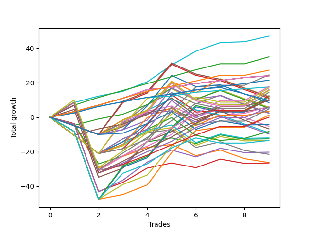

# Long Labrador 005 
- Symbol: ES_830-1130
- Date Range: 03/18/2022 - 12/30/2022
- Trading Period: 8:30-11:30
- Number of Trades: 9



| Name | Win Percent | Profit | Avg Profit / Trade | Avg Time / Trade |      | Name | Win Percent | Profit | Avg Profit / Trade | Avg Time / Trade |
| ---- | ----------- | ------ | ------------------ | ---------------- | ---- | ---- | ----------- | ------ | ------------------ | ---------------- |
| Sorted By <br> Profit | | | | | | Sorted By <br> Win Percentage ||||
| BB-100 Mid | 100.00 | 23500.00 | 2611.11 | 30:11 |     | BB-100 Mid | 100.00 | 23500.00 | 2611.11 | 30:11 |
| TP-4 | 100.00 | 17500.00 | 1944.44 | 14:34 |     | TP-4 | 100.00 | 17500.00 | 1944.44 | 14:34 |
| TP-3 | 100.00 | 13625.00 | 1513.89 | 11:55 |     | TP-3 | 100.00 | 13625.00 | 1513.89 | 11:55 |
| V Mid | 88.89 | 12250.00 | 1361.11 | 35:53 |     | BB-20 Mid | 100.00 | 12000.00 | 1333.33 | 02:39 |
| BB-20 Mid | 100.00 | 12000.00 | 1333.33 | 02:39 |     | TP-2 | 100.00 | 10750.00 | 1194.44 | 04:38 |
| TP-2 | 100.00 | 10750.00 | 1194.44 | 04:38 |     | TP-1 | 100.00 | 8750.00 | 972.22 | 01:11 |
| TP-8 | 88.89 | 8875.00 | 986.11 | 34:06 |     | V Mid | 88.89 | 12250.00 | 1361.11 | 35:53 |
| TP-1 | 100.00 | 8750.00 | 972.22 | 01:11 |     | TP-8 | 88.89 | 8875.00 | 986.11 | 34:06 |
| TP-10 | 77.78 | 8500.00 | 944.44 | 45:57 |     | TP-7 | 88.89 | 5125.00 | 569.44 | 29:09 |
| TP-9 | 77.78 | 7250.00 | 805.56 | 44:52 |     | TP-6 | 88.89 | 2875.00 | 319.44 | 27:29 |
| BB-100 U/L 2SD | 66.67 | 6250.00 | 694.44 | 57:20 |     | TP-5 | 88.89 | 0.00 | 0.00 | 25:36 |
| V U/L 1SD | 77.78 | 6125.00 | 680.56 | 51:31 |     | TP-10 | 77.78 | 8500.00 | 944.44 | 45:57 |
| BB-200 U/L 2SD | 66.67 | 6000.00 | 666.67 | 58:16 |     | TP-9 | 77.78 | 7250.00 | 805.56 | 44:52 |
| TP-7 | 88.89 | 5125.00 | 569.44 | 29:09 |     | V U/L 1SD | 77.78 | 6125.00 | 680.56 | 51:31 |
| NEWFI 0000 | 55.56 | 4875.00 | 541.67 | 25:42 |     | BB-50 U/L 2SD | 77.78 | 3125.00 | 347.22 | 47:38 |
| BB-50 U/L 2SD | 77.78 | 3125.00 | 347.22 | 47:38 |     | BB-50 U/L 1SD | 77.78 | 2875.00 | 319.44 | 33:09 |
| TP-6 | 88.89 | 2875.00 | 319.44 | 27:29 |     | BB-200 Mid | 77.78 | 625.00 | 69.44 | 45:44 |
| BB-50 U/L 1SD | 77.78 | 2875.00 | 319.44 | 33:09 |     | BB-100 U/L 2SD | 66.67 | 6250.00 | 694.44 | 57:20 |
| BB-200 Mid | 77.78 | 625.00 | 69.44 | 45:44 |     | BB-200 U/L 2SD | 66.67 | 6000.00 | 666.67 | 58:16 |
| TP-5 | 88.89 | 0.00 | 0.00 | 25:36 |     | NEWFI 000 | 66.67 | -6750.00 | -750.00 | 51:46 |
| BB-20 U/L 2SD | 55.56 | -6250.00 | -694.44 | 26:21 |     | NEWFI 0000 | 55.56 | 4875.00 | 541.67 | 25:42 |
| NEWFI 000 | 66.67 | -6750.00 | -750.00 | 51:46 |     | BB-20 U/L 2SD | 55.56 | -6250.00 | -694.44 | 26:21 |
| BB-50 Mid | 55.56 | -10125.00 | -1125.00 | 26:33 |     | BB-50 Mid | 55.56 | -10125.00 | -1125.00 | 26:33 |
| BB-20 U/L 1SD | 44.44 | -13125.00 | -1458.33 | 23:28 |     | BB-20 U/L 2SD C | 55.56 | -13250.00 | -1472.22 | 27:26 |
| BB-20 U/L 2SD C | 55.56 | -13250.00 | -1472.22 | 27:26 |     | BB-20 U/L 1SD | 44.44 | -13125.00 | -1458.33 | 23:28 |

## NO STOPLOSS

### Test BB-20 Mid
* Sell when price hits the middle line of the 20p bollinger
* No Stoploss
* Results:
```
Total Trades: 9
Percent Up: 100.00
Percent Down: 0.00
Total Points Moved Up: 24.00
Potential Profit: 12000.00
Total Points Ups: 24.00 Count Ups: 9
Total Points Downs: 0.00 Count Downs: 0
```

<details><summary>Trades</summary>

<code>In: 2022-05-06 11:12:00		Out: 2022-05-06 11:15:05		Total Position Time: 03:05		Total Move Up: 3.25		Total to Date: 3.25</code> <br />
<code>In: 2022-05-12 10:12:00		Out: 2022-05-12 10:13:10		Total Position Time: 01:10		Total Move Up: 3.75		Total to Date: 7.00</code> <br />
<code>In: 2022-05-16 09:47:00		Out: 2022-05-16 09:48:15		Total Position Time: 01:15		Total Move Up: 4.00		Total to Date: 11.00</code> <br />
<code>In: 2022-07-20 10:18:00		Out: 2022-07-20 10:20:15		Total Position Time: 02:15		Total Move Up: 5.00		Total to Date: 16.00</code> <br />
<code>In: 2022-09-06 10:18:00		Out: 2022-09-06 10:25:10		Total Position Time: 07:10		Total Move Up: 1.25		Total to Date: 17.25</code> <br />
<code>In: 2022-11-08 11:14:00		Out: 2022-11-08 11:15:10		Total Position Time: 01:10		Total Move Up: 2.25		Total to Date: 19.50</code> <br />
<code>In: 2022-12-27 09:52:00		Out: 2022-12-27 09:56:10		Total Position Time: 04:10		Total Move Up: 1.75		Total to Date: 21.25</code> <br />
<code>In: 2022-12-27 11:01:00		Out: 2022-12-27 11:03:20		Total Position Time: 02:20		Total Move Up: 1.75		Total to Date: 23.00</code> <br />
<code>In: 2022-12-27 11:24:00		Out: 2022-12-27 11:25:20		Total Position Time: 01:20		Total Move Up: 1.00		Total to Date: 24.00</code> <br />


</details>

### Test BB-20 U/L 1SD
* Sell when the price hits the upper line of the 20p 1std bollinger
* No Stoploss
* Results:
```
Total Trades: 9
Percent Up: 44.44
Percent Down: 55.56
Total Points Moved Up: -26.25
Potential Profit: -13125.00
Total Points Ups: 17.00 Count Ups: 4
Total Points Downs: -43.25 Count Downs: 5
```

<details><summary>Trades</summary>

<code>In: 2022-05-06 11:12:00		Out: 2022-05-06 11:49:10		Total Position Time: 37:10		Total Move Up: -3.75		Total to Date: -3.75</code> <br />
<code>In: 2022-05-12 10:12:00		Out: 2022-05-12 11:02:25		Total Position Time: 50:25		Total Move Up: -25.75		Total to Date: -29.50</code> <br />
<code>In: 2022-05-16 09:47:00		Out: 2022-05-16 09:50:05		Total Position Time: 03:05		Total Move Up: 6.75		Total to Date: -22.75</code> <br />
<code>In: 2022-07-20 10:18:00		Out: 2022-07-20 10:27:20		Total Position Time: 09:20		Total Move Up: 5.25		Total to Date: -17.50</code> <br />
<code>In: 2022-09-06 10:18:00		Out: 2022-09-06 10:30:55		Total Position Time: 12:55		Total Move Up: 1.75		Total to Date: -15.75</code> <br />
<code>In: 2022-11-08 11:14:00		Out: 2022-11-08 11:38:35		Total Position Time: 24:35		Total Move Up: -6.50		Total to Date: -22.25</code> <br />
<code>In: 2022-12-27 09:52:00		Out: 2022-12-27 09:59:25		Total Position Time: 07:25		Total Move Up: 3.25		Total to Date: -19.00</code> <br />
<code>In: 2022-12-27 11:01:00		Out: 2022-12-27 11:45:40		Total Position Time: 44:40		Total Move Up: -5.00		Total to Date: -24.00</code> <br />
<code>In: 2022-12-27 11:24:00		Out: 2022-12-27 11:45:40		Total Position Time: 21:40		Total Move Up: -2.25		Total to Date: -26.25</code> <br />


</details>

### Test BB-20 U/L 2SD
* Sell when the price hits the upper line of the 20p 2std bollinger
* No Stoploss
* Results:
```
Total Trades: 9
Percent Up: 55.56
Percent Down: 44.44
Total Points Moved Up: -12.50
Potential Profit: -6250.00
Total Points Ups: 20.25 Count Ups: 5
Total Points Downs: -32.75 Count Downs: 4
```

<details><summary>Trades</summary>

<code>In: 2022-05-06 11:12:00		Out: 2022-05-06 11:49:10		Total Position Time: 37:10		Total Move Up: -3.75		Total to Date: -3.75</code> <br />
<code>In: 2022-05-12 10:12:00		Out: 2022-05-12 11:04:05		Total Position Time: 52:05		Total Move Up: -23.25		Total to Date: -27.00</code> <br />
<code>In: 2022-05-16 09:47:00		Out: 2022-05-16 10:06:30		Total Position Time: 19:30		Total Move Up: 4.50		Total to Date: -22.50</code> <br />
<code>In: 2022-07-20 10:18:00		Out: 2022-07-20 10:28:40		Total Position Time: 10:40		Total Move Up: 8.25		Total to Date: -14.25</code> <br />
<code>In: 2022-09-06 10:18:00		Out: 2022-09-06 10:31:10		Total Position Time: 13:10		Total Move Up: 2.25		Total to Date: -12.00</code> <br />
<code>In: 2022-11-08 11:14:00		Out: 2022-11-08 11:42:10		Total Position Time: 28:10		Total Move Up: -3.25		Total to Date: -15.25</code> <br />
<code>In: 2022-12-27 09:52:00		Out: 2022-12-27 10:00:50		Total Position Time: 08:50		Total Move Up: 5.00		Total to Date: -10.25</code> <br />
<code>In: 2022-12-27 11:01:00		Out: 2022-12-27 11:46:20		Total Position Time: 45:20		Total Move Up: -2.50		Total to Date: -12.75</code> <br />
<code>In: 2022-12-27 11:24:00		Out: 2022-12-27 11:46:20		Total Position Time: 22:20		Total Move Up: 0.25		Total to Date: -12.50</code> <br />


</details>

### Test BB-20 U/L 2SD C
* Sell when the price hits the upper line of the 20p 2std bollinger
* No Stoploss
* Results:
```
Total Trades: 9
Percent Up: 55.56
Percent Down: 44.44
Total Points Moved Up: -26.50
Potential Profit: -13250.00
Total Points Ups: 21.75 Count Ups: 5
Total Points Downs: -48.25 Count Downs: 4
```

<details><summary>Trades</summary>

<code>In: 2022-05-06 11:12:00		Out: 2022-05-06 11:49:10		Total Position Time: 37:10		Total Move Up: -3.75		Total to Date: -3.75</code> <br />
<code>In: 2022-05-12 10:12:00		Out: 2022-05-12 11:12:55		Total Position Time: 60:55		Total Move Up: -39.25		Total to Date: -43.00</code> <br />
<code>In: 2022-05-16 09:47:00		Out: 2022-05-16 10:07:00		Total Position Time: 20:00		Total Move Up: 5.25		Total to Date: -37.75</code> <br />
<code>In: 2022-07-20 10:18:00		Out: 2022-07-20 10:28:40		Total Position Time: 10:40		Total Move Up: 8.25		Total to Date: -29.50</code> <br />
<code>In: 2022-09-06 10:18:00		Out: 2022-09-06 10:31:30		Total Position Time: 13:30		Total Move Up: 3.00		Total to Date: -26.50</code> <br />
<code>In: 2022-11-08 11:14:00		Out: 2022-11-08 11:42:15		Total Position Time: 28:15		Total Move Up: -2.75		Total to Date: -29.25</code> <br />
<code>In: 2022-12-27 09:52:00		Out: 2022-12-27 10:00:50		Total Position Time: 08:50		Total Move Up: 5.00		Total to Date: -24.25</code> <br />
<code>In: 2022-12-27 11:01:00		Out: 2022-12-27 11:46:20		Total Position Time: 45:20		Total Move Up: -2.50		Total to Date: -26.75</code> <br />
<code>In: 2022-12-27 11:24:00		Out: 2022-12-27 11:46:20		Total Position Time: 22:20		Total Move Up: 0.25		Total to Date: -26.50</code> <br />


</details>

### Test BB-50 Mid
* Sell when price hits the middle line of the 50p bollinger
* No Stoploss
* Results:
```
Total Trades: 9
Percent Up: 55.56
Percent Down: 44.44
Total Points Moved Up: -20.25
Potential Profit: -10125.00
Total Points Ups: 29.50 Count Ups: 5
Total Points Downs: -49.75 Count Downs: 4
```

<details><summary>Trades</summary>

<code>In: 2022-05-06 11:12:00		Out: 2022-05-06 11:49:15		Total Position Time: 37:15		Total Move Up: -4.00		Total to Date: -4.00</code> <br />
<code>In: 2022-05-12 10:12:00		Out: 2022-05-12 11:12:55		Total Position Time: 60:55		Total Move Up: -39.25		Total to Date: -43.25</code> <br />
<code>In: 2022-05-16 09:47:00		Out: 2022-05-16 09:50:05		Total Position Time: 03:05		Total Move Up: 6.75		Total to Date: -36.50</code> <br />
<code>In: 2022-07-20 10:18:00		Out: 2022-07-20 10:30:00		Total Position Time: 12:00		Total Move Up: 10.50		Total to Date: -26.00</code> <br />
<code>In: 2022-09-06 10:18:00		Out: 2022-09-06 10:39:40		Total Position Time: 21:40		Total Move Up: 7.00		Total to Date: -19.00</code> <br />
<code>In: 2022-11-08 11:14:00		Out: 2022-11-08 11:41:40		Total Position Time: 27:40		Total Move Up: -4.00		Total to Date: -23.00</code> <br />
<code>In: 2022-12-27 09:52:00		Out: 2022-12-27 10:00:50		Total Position Time: 08:50		Total Move Up: 5.00		Total to Date: -18.00</code> <br />
<code>In: 2022-12-27 11:01:00		Out: 2022-12-27 11:46:20		Total Position Time: 45:20		Total Move Up: -2.50		Total to Date: -20.50</code> <br />
<code>In: 2022-12-27 11:24:00		Out: 2022-12-27 11:46:20		Total Position Time: 22:20		Total Move Up: 0.25		Total to Date: -20.25</code> <br />


</details>

### Test BB-50 U/L 1SD
* Sell when the price hits the upper line of the 50p 1std bollinger
* No Stoploss
* Results:
```
Total Trades: 9
Percent Up: 77.78
Percent Down: 22.22
Total Points Moved Up: 5.75
Potential Profit: 2875.00
Total Points Ups: 45.25 Count Ups: 7
Total Points Downs: -39.50 Count Downs: 2
```

<details><summary>Trades</summary>

<code>In: 2022-05-06 11:12:00		Out: 2022-05-06 11:50:10		Total Position Time: 38:10		Total Move Up: 4.50		Total to Date: 4.50</code> <br />
<code>In: 2022-05-12 10:12:00		Out: 2022-05-12 11:12:55		Total Position Time: 60:55		Total Move Up: -39.25		Total to Date: -34.75</code> <br />
<code>In: 2022-05-16 09:47:00		Out: 2022-05-16 10:07:05		Total Position Time: 20:05		Total Move Up: 5.25		Total to Date: -29.50</code> <br />
<code>In: 2022-07-20 10:18:00		Out: 2022-07-20 10:32:45		Total Position Time: 14:45		Total Move Up: 15.50		Total to Date: -14.00</code> <br />
<code>In: 2022-09-06 10:18:00		Out: 2022-09-06 10:56:40		Total Position Time: 38:40		Total Move Up: 5.75		Total to Date: -8.25</code> <br />
<code>In: 2022-11-08 11:14:00		Out: 2022-11-08 11:47:55		Total Position Time: 33:55		Total Move Up: 5.75		Total to Date: -2.50</code> <br />
<code>In: 2022-12-27 09:52:00		Out: 2022-12-27 10:06:45		Total Position Time: 14:45		Total Move Up: 6.00		Total to Date: 3.50</code> <br />
<code>In: 2022-12-27 11:01:00		Out: 2022-12-27 11:51:05		Total Position Time: 50:05		Total Move Up: -0.25		Total to Date: 3.25</code> <br />
<code>In: 2022-12-27 11:24:00		Out: 2022-12-27 11:51:05		Total Position Time: 27:05		Total Move Up: 2.50		Total to Date: 5.75</code> <br />


</details>

### Test BB-50 U/L 2SD
* Sell when the price hits the upper line of the 50p 2std bollinger
* No Stoploss
* Results:
```
Total Trades: 9
Percent Up: 77.78
Percent Down: 22.22
Total Points Moved Up: 6.25
Potential Profit: 3125.00
Total Points Ups: 48.50 Count Ups: 7
Total Points Downs: -42.25 Count Downs: 2
```

<details><summary>Trades</summary>

<code>In: 2022-05-06 11:12:00		Out: 2022-05-06 11:50:35		Total Position Time: 38:35		Total Move Up: 8.50		Total to Date: 8.50</code> <br />
<code>In: 2022-05-12 10:12:00		Out: 2022-05-12 11:12:55		Total Position Time: 60:55		Total Move Up: -39.25		Total to Date: -30.75</code> <br />
<code>In: 2022-05-16 09:47:00		Out: 2022-05-16 10:07:35		Total Position Time: 20:35		Total Move Up: 8.50		Total to Date: -22.25</code> <br />
<code>In: 2022-07-20 10:18:00		Out: 2022-07-20 11:18:55		Total Position Time: 60:55		Total Move Up: 5.50		Total to Date: -16.75</code> <br />
<code>In: 2022-09-06 10:18:00		Out: 2022-09-06 10:58:55		Total Position Time: 40:55		Total Move Up: 6.75		Total to Date: -10.00</code> <br />
<code>In: 2022-11-08 11:14:00		Out: 2022-11-08 12:02:35		Total Position Time: 48:35		Total Move Up: 14.00		Total to Date: 4.00</code> <br />
<code>In: 2022-12-27 09:52:00		Out: 2022-12-27 10:52:55		Total Position Time: 60:55		Total Move Up: -3.00		Total to Date: 1.00</code> <br />
<code>In: 2022-12-27 11:01:00		Out: 2022-12-27 12:01:10		Total Position Time: 60:10		Total Move Up: 1.25		Total to Date: 2.25</code> <br />
<code>In: 2022-12-27 11:24:00		Out: 2022-12-27 12:01:10		Total Position Time: 37:10		Total Move Up: 4.00		Total to Date: 6.25</code> <br />


</details>

### Test V Mid
* Sell when the price hits the middle line of the 1std VWAP
* No Stoploss
* Results:
```
Total Trades: 9
Percent Up: 88.89
Percent Down: 11.11
Total Points Moved Up: 24.50
Potential Profit: 12250.00
Total Points Ups: 63.75 Count Ups: 8
Total Points Downs: -39.25 Count Downs: 1
```

<details><summary>Trades</summary>

<code>In: 2022-05-06 11:12:00		Out: 2022-05-06 11:50:20		Total Position Time: 38:20		Total Move Up: 8.50		Total to Date: 8.50</code> <br />
<code>In: 2022-05-12 10:12:00		Out: 2022-05-12 11:12:55		Total Position Time: 60:55		Total Move Up: -39.25		Total to Date: -30.75</code> <br />
<code>In: 2022-05-16 09:47:00		Out: 2022-05-16 09:48:10		Total Position Time: 01:10		Total Move Up: 2.75		Total to Date: -28.00</code> <br />
<code>In: 2022-07-20 10:18:00		Out: 2022-07-20 10:32:15		Total Position Time: 14:15		Total Move Up: 13.75		Total to Date: -14.25</code> <br />
<code>In: 2022-09-06 10:18:00		Out: 2022-09-06 11:11:05		Total Position Time: 53:05		Total Move Up: 17.75		Total to Date: 3.50</code> <br />
<code>In: 2022-11-08 11:14:00		Out: 2022-11-08 12:02:35		Total Position Time: 48:35		Total Move Up: 14.00		Total to Date: 17.50</code> <br />
<code>In: 2022-12-27 09:52:00		Out: 2022-12-27 09:53:10		Total Position Time: 01:10		Total Move Up: 1.00		Total to Date: 18.50</code> <br />
<code>In: 2022-12-27 11:01:00		Out: 2022-12-27 12:01:55		Total Position Time: 60:55		Total Move Up: 0.00		Total to Date: 18.50</code> <br />
<code>In: 2022-12-27 11:24:00		Out: 2022-12-27 12:08:40		Total Position Time: 44:40		Total Move Up: 6.00		Total to Date: 24.50</code> <br />


</details>

### Test V U/L 1SD
* Sell when the price hits the upper line of the 1std VWAP
* No Stoploss
* Results:
```
Total Trades: 9
Percent Up: 77.78
Percent Down: 22.22
Total Points Moved Up: 12.25
Potential Profit: 6125.00
Total Points Ups: 59.75 Count Ups: 7
Total Points Downs: -47.50 Count Downs: 2
```

<details><summary>Trades</summary>

<code>In: 2022-05-06 11:12:00		Out: 2022-05-06 12:12:55		Total Position Time: 60:55		Total Move Up: -8.25		Total to Date: -8.25</code> <br />
<code>In: 2022-05-12 10:12:00		Out: 2022-05-12 11:12:55		Total Position Time: 60:55		Total Move Up: -39.25		Total to Date: -47.50</code> <br />
<code>In: 2022-05-16 09:47:00		Out: 2022-05-16 10:07:35		Total Position Time: 20:35		Total Move Up: 8.50		Total to Date: -39.00</code> <br />
<code>In: 2022-07-20 10:18:00		Out: 2022-07-20 11:18:55		Total Position Time: 60:55		Total Move Up: 5.50		Total to Date: -33.50</code> <br />
<code>In: 2022-09-06 10:18:00		Out: 2022-09-06 11:18:55		Total Position Time: 60:55		Total Move Up: 16.75		Total to Date: -16.75</code> <br />
<code>In: 2022-11-08 11:14:00		Out: 2022-11-08 12:14:55		Total Position Time: 60:55		Total Move Up: 12.75		Total to Date: -4.00</code> <br />
<code>In: 2022-12-27 09:52:00		Out: 2022-12-27 10:08:45		Total Position Time: 16:45		Total Move Up: 8.00		Total to Date: 4.00</code> <br />
<code>In: 2022-12-27 11:01:00		Out: 2022-12-27 12:01:55		Total Position Time: 60:55		Total Move Up: 0.00		Total to Date: 4.00</code> <br />
<code>In: 2022-12-27 11:24:00		Out: 2022-12-27 12:24:55		Total Position Time: 60:55		Total Move Up: 8.25		Total to Date: 12.25</code> <br />


</details>

### Test BB-100 Mid
* Move to BB100 Mid
* No Stoploss
* Results:
```
Total Trades: 9
Percent Up: 100.00
Percent Down: 0.00
Total Points Moved Up: 47.00
Potential Profit: 23500.00
Total Points Ups: 47.00 Count Ups: 9
Total Points Downs: 0.00 Count Downs: 0
```

<details><summary>Trades</summary>

<code>In: 2022-05-06 11:12:00		Out: 2022-05-06 11:50:35		Total Position Time: 38:35		Total Move Up: 8.50		Total to Date: 8.50</code> <br />
<code>In: 2022-05-12 10:12:00		Out: 2022-05-12 10:13:10		Total Position Time: 01:10		Total Move Up: 3.75		Total to Date: 12.25</code> <br />
<code>In: 2022-05-16 09:47:00		Out: 2022-05-16 09:48:10		Total Position Time: 01:10		Total Move Up: 2.75		Total to Date: 15.00</code> <br />
<code>In: 2022-07-20 10:18:00		Out: 2022-07-20 11:18:55		Total Position Time: 60:55		Total Move Up: 5.50		Total to Date: 20.50</code> <br />
<code>In: 2022-09-06 10:18:00		Out: 2022-09-06 11:00:30		Total Position Time: 42:30		Total Move Up: 9.75		Total to Date: 30.25</code> <br />
<code>In: 2022-11-08 11:14:00		Out: 2022-11-08 11:53:50		Total Position Time: 39:50		Total Move Up: 8.00		Total to Date: 38.25</code> <br />
<code>In: 2022-12-27 09:52:00		Out: 2022-12-27 10:00:50		Total Position Time: 08:50		Total Move Up: 5.00		Total to Date: 43.25</code> <br />
<code>In: 2022-12-27 11:01:00		Out: 2022-12-27 11:51:50		Total Position Time: 50:50		Total Move Up: 0.50		Total to Date: 43.75</code> <br />
<code>In: 2022-12-27 11:24:00		Out: 2022-12-27 11:51:50		Total Position Time: 27:50		Total Move Up: 3.25		Total to Date: 47.00</code> <br />


</details>

### Test BB-100 U/L 2SD
* Move to BB100 Upper Band
* No Stoploss
* Results:
```
Total Trades: 9
Percent Up: 66.67
Percent Down: 33.33
Total Points Moved Up: 12.50
Potential Profit: 6250.00
Total Points Ups: 63.00 Count Ups: 6
Total Points Downs: -50.50 Count Downs: 3
```

<details><summary>Trades</summary>

<code>In: 2022-05-06 11:12:00		Out: 2022-05-06 12:12:55		Total Position Time: 60:55		Total Move Up: -8.25		Total to Date: -8.25</code> <br />
<code>In: 2022-05-12 10:12:00		Out: 2022-05-12 11:12:55		Total Position Time: 60:55		Total Move Up: -39.25		Total to Date: -47.50</code> <br />
<code>In: 2022-05-16 09:47:00		Out: 2022-05-16 10:24:00		Total Position Time: 37:00		Total Move Up: 18.50		Total to Date: -29.00</code> <br />
<code>In: 2022-07-20 10:18:00		Out: 2022-07-20 11:18:55		Total Position Time: 60:55		Total Move Up: 5.50		Total to Date: -23.50</code> <br />
<code>In: 2022-09-06 10:18:00		Out: 2022-09-06 11:18:55		Total Position Time: 60:55		Total Move Up: 16.75		Total to Date: -6.75</code> <br />
<code>In: 2022-11-08 11:14:00		Out: 2022-11-08 12:14:55		Total Position Time: 60:55		Total Move Up: 12.75		Total to Date: 6.00</code> <br />
<code>In: 2022-12-27 09:52:00		Out: 2022-12-27 10:52:55		Total Position Time: 60:55		Total Move Up: -3.00		Total to Date: 3.00</code> <br />
<code>In: 2022-12-27 11:01:00		Out: 2022-12-27 12:01:55		Total Position Time: 60:55		Total Move Up: 0.00		Total to Date: 3.00</code> <br />
<code>In: 2022-12-27 11:24:00		Out: 2022-12-27 12:16:35		Total Position Time: 52:35		Total Move Up: 9.50		Total to Date: 12.50</code> <br />


</details>

### Test BB-200 Mid
* Move to BB200 Mid
* No Stoploss
* Results:
```
Total Trades: 9
Percent Up: 77.78
Percent Down: 22.22
Total Points Moved Up: 1.25
Potential Profit: 625.00
Total Points Ups: 48.75 Count Ups: 7
Total Points Downs: -47.50 Count Downs: 2
```

<details><summary>Trades</summary>

<code>In: 2022-05-06 11:12:00		Out: 2022-05-06 12:12:55		Total Position Time: 60:55		Total Move Up: -8.25		Total to Date: -8.25</code> <br />
<code>In: 2022-05-12 10:12:00		Out: 2022-05-12 11:12:55		Total Position Time: 60:55		Total Move Up: -39.25		Total to Date: -47.50</code> <br />
<code>In: 2022-05-16 09:47:00		Out: 2022-05-16 09:48:10		Total Position Time: 01:10		Total Move Up: 2.75		Total to Date: -44.75</code> <br />
<code>In: 2022-07-20 10:18:00		Out: 2022-07-20 11:18:55		Total Position Time: 60:55		Total Move Up: 5.50		Total to Date: -39.25</code> <br />
<code>In: 2022-09-06 10:18:00		Out: 2022-09-06 11:11:10		Total Position Time: 53:10		Total Move Up: 18.75		Total to Date: -20.50</code> <br />
<code>In: 2022-11-08 11:14:00		Out: 2022-11-08 12:14:55		Total Position Time: 60:55		Total Move Up: 12.75		Total to Date: -7.75</code> <br />
<code>In: 2022-12-27 09:52:00		Out: 2022-12-27 09:56:20		Total Position Time: 04:20		Total Move Up: 2.00		Total to Date: -5.75</code> <br />
<code>In: 2022-12-27 11:01:00		Out: 2022-12-27 12:01:55		Total Position Time: 60:55		Total Move Up: 0.00		Total to Date: -5.75</code> <br />
<code>In: 2022-12-27 11:24:00		Out: 2022-12-27 12:12:25		Total Position Time: 48:25		Total Move Up: 7.00		Total to Date: 1.25</code> <br />


</details>

### Test BB-200 U/L 2SD
* Move to BB200 Upper Band
* No Stoploss
* Results:
```
Total Trades: 9
Percent Up: 66.67
Percent Down: 33.33
Total Points Moved Up: 12.00
Potential Profit: 6000.00
Total Points Ups: 62.50 Count Ups: 6
Total Points Downs: -50.50 Count Downs: 3
```

<details><summary>Trades</summary>

<code>In: 2022-05-06 11:12:00		Out: 2022-05-06 12:12:55		Total Position Time: 60:55		Total Move Up: -8.25		Total to Date: -8.25</code> <br />
<code>In: 2022-05-12 10:12:00		Out: 2022-05-12 11:12:55		Total Position Time: 60:55		Total Move Up: -39.25		Total to Date: -47.50</code> <br />
<code>In: 2022-05-16 09:47:00		Out: 2022-05-16 10:24:05		Total Position Time: 37:05		Total Move Up: 19.25		Total to Date: -28.25</code> <br />
<code>In: 2022-07-20 10:18:00		Out: 2022-07-20 11:18:55		Total Position Time: 60:55		Total Move Up: 5.50		Total to Date: -22.75</code> <br />
<code>In: 2022-09-06 10:18:00		Out: 2022-09-06 11:18:55		Total Position Time: 60:55		Total Move Up: 16.75		Total to Date: -6.00</code> <br />
<code>In: 2022-11-08 11:14:00		Out: 2022-11-08 12:14:55		Total Position Time: 60:55		Total Move Up: 12.75		Total to Date: 6.75</code> <br />
<code>In: 2022-12-27 09:52:00		Out: 2022-12-27 10:52:55		Total Position Time: 60:55		Total Move Up: -3.00		Total to Date: 3.75</code> <br />
<code>In: 2022-12-27 11:01:00		Out: 2022-12-27 12:01:55		Total Position Time: 60:55		Total Move Up: 0.00		Total to Date: 3.75</code> <br />
<code>In: 2022-12-27 11:24:00		Out: 2022-12-27 12:24:55		Total Position Time: 60:55		Total Move Up: 8.25		Total to Date: 12.00</code> <br />


</details>

## TAKE PROFIT

### Test TP-1
* Take Profit of 1 Point
* No Stoploss
* Results:
```
Total Trades: 9
Percent Up: 100.00
Percent Down: 0.00
Total Points Moved Up: 17.50
Potential Profit: 8750.00
Total Points Ups: 17.50 Count Ups: 9
Total Points Downs: 0.00 Count Downs: 0
```

<details><summary>Trades</summary>

<code>In: 2022-05-06 11:12:00		Out: 2022-05-06 11:13:10		Total Position Time: 01:10		Total Move Up: 2.50		Total to Date: 2.50</code> <br />
<code>In: 2022-05-12 10:12:00		Out: 2022-05-12 10:13:10		Total Position Time: 01:10		Total Move Up: 3.75		Total to Date: 6.25</code> <br />
<code>In: 2022-05-16 09:47:00		Out: 2022-05-16 09:48:10		Total Position Time: 01:10		Total Move Up: 2.75		Total to Date: 9.00</code> <br />
<code>In: 2022-07-20 10:18:00		Out: 2022-07-20 10:19:10		Total Position Time: 01:10		Total Move Up: 2.50		Total to Date: 11.50</code> <br />
<code>In: 2022-09-06 10:18:00		Out: 2022-09-06 10:19:10		Total Position Time: 01:10		Total Move Up: 0.75		Total to Date: 12.25</code> <br />
<code>In: 2022-11-08 11:14:00		Out: 2022-11-08 11:15:10		Total Position Time: 01:10		Total Move Up: 2.25		Total to Date: 14.50</code> <br />
<code>In: 2022-12-27 09:52:00		Out: 2022-12-27 09:53:10		Total Position Time: 01:10		Total Move Up: 1.00		Total to Date: 15.50</code> <br />
<code>In: 2022-12-27 11:01:00		Out: 2022-12-27 11:02:10		Total Position Time: 01:10		Total Move Up: 1.00		Total to Date: 16.50</code> <br />
<code>In: 2022-12-27 11:24:00		Out: 2022-12-27 11:25:20		Total Position Time: 01:20		Total Move Up: 1.00		Total to Date: 17.50</code> <br />


</details>

### Test TP-2
* Take Profit of 2 Point
* No Stoploss
* Results:
```
Total Trades: 9
Percent Up: 100.00
Percent Down: 0.00
Total Points Moved Up: 21.50
Potential Profit: 10750.00
Total Points Ups: 21.50 Count Ups: 9
Total Points Downs: 0.00 Count Downs: 0
```

<details><summary>Trades</summary>

<code>In: 2022-05-06 11:12:00		Out: 2022-05-06 11:13:10		Total Position Time: 01:10		Total Move Up: 2.50		Total to Date: 2.50</code> <br />
<code>In: 2022-05-12 10:12:00		Out: 2022-05-12 10:13:10		Total Position Time: 01:10		Total Move Up: 3.75		Total to Date: 6.25</code> <br />
<code>In: 2022-05-16 09:47:00		Out: 2022-05-16 09:48:10		Total Position Time: 01:10		Total Move Up: 2.75		Total to Date: 9.00</code> <br />
<code>In: 2022-07-20 10:18:00		Out: 2022-07-20 10:19:10		Total Position Time: 01:10		Total Move Up: 2.50		Total to Date: 11.50</code> <br />
<code>In: 2022-09-06 10:18:00		Out: 2022-09-06 10:20:15		Total Position Time: 02:15		Total Move Up: 2.00		Total to Date: 13.50</code> <br />
<code>In: 2022-11-08 11:14:00		Out: 2022-11-08 11:15:10		Total Position Time: 01:10		Total Move Up: 2.25		Total to Date: 15.75</code> <br />
<code>In: 2022-12-27 09:52:00		Out: 2022-12-27 09:56:20		Total Position Time: 04:20		Total Move Up: 2.00		Total to Date: 17.75</code> <br />
<code>In: 2022-12-27 11:01:00		Out: 2022-12-27 11:03:20		Total Position Time: 02:20		Total Move Up: 1.75		Total to Date: 19.50</code> <br />
<code>In: 2022-12-27 11:24:00		Out: 2022-12-27 11:51:00		Total Position Time: 27:00		Total Move Up: 2.00		Total to Date: 21.50</code> <br />


</details>

### Test TP-3
* Take Profit of 3 Point
* No Stoploss
* Results:
```
Total Trades: 9
Percent Up: 100.00
Percent Down: 0.00
Total Points Moved Up: 27.25
Potential Profit: 13625.00
Total Points Ups: 27.25 Count Ups: 9
Total Points Downs: 0.00 Count Downs: 0
```

<details><summary>Trades</summary>

<code>In: 2022-05-06 11:12:00		Out: 2022-05-06 11:15:05		Total Position Time: 03:05		Total Move Up: 3.25		Total to Date: 3.25</code> <br />
<code>In: 2022-05-12 10:12:00		Out: 2022-05-12 10:13:10		Total Position Time: 01:10		Total Move Up: 3.75		Total to Date: 7.00</code> <br />
<code>In: 2022-05-16 09:47:00		Out: 2022-05-16 09:48:15		Total Position Time: 01:15		Total Move Up: 4.00		Total to Date: 11.00</code> <br />
<code>In: 2022-07-20 10:18:00		Out: 2022-07-20 10:19:20		Total Position Time: 01:20		Total Move Up: 4.00		Total to Date: 15.00</code> <br />
<code>In: 2022-09-06 10:18:00		Out: 2022-09-06 10:20:20		Total Position Time: 02:20		Total Move Up: 3.00		Total to Date: 18.00</code> <br />
<code>In: 2022-11-08 11:14:00		Out: 2022-11-08 11:16:25		Total Position Time: 02:25		Total Move Up: 3.00		Total to Date: 21.00</code> <br />
<code>In: 2022-12-27 09:52:00		Out: 2022-12-27 09:59:25		Total Position Time: 07:25		Total Move Up: 3.25		Total to Date: 24.25</code> <br />
<code>In: 2022-12-27 11:01:00		Out: 2022-12-27 12:01:55		Total Position Time: 60:55		Total Move Up: 0.00		Total to Date: 24.25</code> <br />
<code>In: 2022-12-27 11:24:00		Out: 2022-12-27 11:51:20		Total Position Time: 27:20		Total Move Up: 3.00		Total to Date: 27.25</code> <br />


</details>

### Test TP-4
* Take Profit of 4 Point
* No Stoploss
* Results:
```
Total Trades: 9
Percent Up: 100.00
Percent Down: 0.00
Total Points Moved Up: 35.00
Potential Profit: 17500.00
Total Points Ups: 35.00 Count Ups: 9
Total Points Downs: 0.00 Count Downs: 0
```

<details><summary>Trades</summary>

<code>In: 2022-05-06 11:12:00		Out: 2022-05-06 11:15:50		Total Position Time: 03:50		Total Move Up: 7.00		Total to Date: 7.00</code> <br />
<code>In: 2022-05-12 10:12:00		Out: 2022-05-12 10:13:15		Total Position Time: 01:15		Total Move Up: 4.50		Total to Date: 11.50</code> <br />
<code>In: 2022-05-16 09:47:00		Out: 2022-05-16 09:48:15		Total Position Time: 01:15		Total Move Up: 4.00		Total to Date: 15.50</code> <br />
<code>In: 2022-07-20 10:18:00		Out: 2022-07-20 10:19:20		Total Position Time: 01:20		Total Move Up: 4.00		Total to Date: 19.50</code> <br />
<code>In: 2022-09-06 10:18:00		Out: 2022-09-06 10:32:00		Total Position Time: 14:00		Total Move Up: 4.00		Total to Date: 23.50</code> <br />
<code>In: 2022-11-08 11:14:00		Out: 2022-11-08 11:16:55		Total Position Time: 02:55		Total Move Up: 4.00		Total to Date: 27.50</code> <br />
<code>In: 2022-12-27 09:52:00		Out: 2022-12-27 10:00:30		Total Position Time: 08:30		Total Move Up: 3.50		Total to Date: 31.00</code> <br />
<code>In: 2022-12-27 11:01:00		Out: 2022-12-27 12:01:55		Total Position Time: 60:55		Total Move Up: 0.00		Total to Date: 31.00</code> <br />
<code>In: 2022-12-27 11:24:00		Out: 2022-12-27 12:01:10		Total Position Time: 37:10		Total Move Up: 4.00		Total to Date: 35.00</code> <br />


</details>

### Test TP-5
* Take Profit of 5 Point
* No Stoploss
* Results:
```
Total Trades: 9
Percent Up: 88.89
Percent Down: 11.11
Total Points Moved Up: 0.00
Potential Profit: 0.00
Total Points Ups: 39.25 Count Ups: 8
Total Points Downs: -39.25 Count Downs: 1
```

<details><summary>Trades</summary>

<code>In: 2022-05-06 11:12:00		Out: 2022-05-06 11:15:50		Total Position Time: 03:50		Total Move Up: 7.00		Total to Date: 7.00</code> <br />
<code>In: 2022-05-12 10:12:00		Out: 2022-05-12 11:12:55		Total Position Time: 60:55		Total Move Up: -39.25		Total to Date: -32.25</code> <br />
<code>In: 2022-05-16 09:47:00		Out: 2022-05-16 09:48:45		Total Position Time: 01:45		Total Move Up: 5.00		Total to Date: -27.25</code> <br />
<code>In: 2022-07-20 10:18:00		Out: 2022-07-20 10:19:40		Total Position Time: 01:40		Total Move Up: 5.25		Total to Date: -22.00</code> <br />
<code>In: 2022-09-06 10:18:00		Out: 2022-09-06 10:32:05		Total Position Time: 14:05		Total Move Up: 6.00		Total to Date: -16.00</code> <br />
<code>In: 2022-11-08 11:14:00		Out: 2022-11-08 11:47:55		Total Position Time: 33:55		Total Move Up: 5.75		Total to Date: -10.25</code> <br />
<code>In: 2022-12-27 09:52:00		Out: 2022-12-27 10:00:50		Total Position Time: 08:50		Total Move Up: 5.00		Total to Date: -5.25</code> <br />
<code>In: 2022-12-27 11:01:00		Out: 2022-12-27 12:01:55		Total Position Time: 60:55		Total Move Up: 0.00		Total to Date: -5.25</code> <br />
<code>In: 2022-12-27 11:24:00		Out: 2022-12-27 12:08:35		Total Position Time: 44:35		Total Move Up: 5.25		Total to Date: 0.00</code> <br />


</details>

### Test TP-6
* Take Profit of 6 Point
* No Stoploss
* Results:
```
Total Trades: 9
Percent Up: 88.89
Percent Down: 11.11
Total Points Moved Up: 5.75
Potential Profit: 2875.00
Total Points Ups: 45.00 Count Ups: 8
Total Points Downs: -39.25 Count Downs: 1
```

<details><summary>Trades</summary>

<code>In: 2022-05-06 11:12:00		Out: 2022-05-06 11:15:50		Total Position Time: 03:50		Total Move Up: 7.00		Total to Date: 7.00</code> <br />
<code>In: 2022-05-12 10:12:00		Out: 2022-05-12 11:12:55		Total Position Time: 60:55		Total Move Up: -39.25		Total to Date: -32.25</code> <br />
<code>In: 2022-05-16 09:47:00		Out: 2022-05-16 09:50:00		Total Position Time: 03:00		Total Move Up: 5.75		Total to Date: -26.50</code> <br />
<code>In: 2022-07-20 10:18:00		Out: 2022-07-20 10:28:15		Total Position Time: 10:15		Total Move Up: 6.50		Total to Date: -20.00</code> <br />
<code>In: 2022-09-06 10:18:00		Out: 2022-09-06 10:32:05		Total Position Time: 14:05		Total Move Up: 6.00		Total to Date: -14.00</code> <br />
<code>In: 2022-11-08 11:14:00		Out: 2022-11-08 11:53:50		Total Position Time: 39:50		Total Move Up: 8.00		Total to Date: -6.00</code> <br />
<code>In: 2022-12-27 09:52:00		Out: 2022-12-27 10:01:55		Total Position Time: 09:55		Total Move Up: 5.75		Total to Date: -0.25</code> <br />
<code>In: 2022-12-27 11:01:00		Out: 2022-12-27 12:01:55		Total Position Time: 60:55		Total Move Up: 0.00		Total to Date: -0.25</code> <br />
<code>In: 2022-12-27 11:24:00		Out: 2022-12-27 12:08:40		Total Position Time: 44:40		Total Move Up: 6.00		Total to Date: 5.75</code> <br />


</details>

### Test TP-7
* Take Profit of 7 Point
* No Stoploss
* Results:
```
Total Trades: 9
Percent Up: 88.89
Percent Down: 11.11
Total Points Moved Up: 10.25
Potential Profit: 5125.00
Total Points Ups: 49.50 Count Ups: 8
Total Points Downs: -39.25 Count Downs: 1
```

<details><summary>Trades</summary>

<code>In: 2022-05-06 11:12:00		Out: 2022-05-06 11:15:50		Total Position Time: 03:50		Total Move Up: 7.00		Total to Date: 7.00</code> <br />
<code>In: 2022-05-12 10:12:00		Out: 2022-05-12 11:12:55		Total Position Time: 60:55		Total Move Up: -39.25		Total to Date: -32.25</code> <br />
<code>In: 2022-05-16 09:47:00		Out: 2022-05-16 09:50:05		Total Position Time: 03:05		Total Move Up: 6.75		Total to Date: -25.50</code> <br />
<code>In: 2022-07-20 10:18:00		Out: 2022-07-20 10:28:20		Total Position Time: 10:20		Total Move Up: 7.25		Total to Date: -18.25</code> <br />
<code>In: 2022-09-06 10:18:00		Out: 2022-09-06 10:34:05		Total Position Time: 16:05		Total Move Up: 6.75		Total to Date: -11.50</code> <br />
<code>In: 2022-11-08 11:14:00		Out: 2022-11-08 11:53:50		Total Position Time: 39:50		Total Move Up: 8.00		Total to Date: -3.50</code> <br />
<code>In: 2022-12-27 09:52:00		Out: 2022-12-27 10:08:30		Total Position Time: 16:30		Total Move Up: 7.00		Total to Date: 3.50</code> <br />
<code>In: 2022-12-27 11:01:00		Out: 2022-12-27 12:01:55		Total Position Time: 60:55		Total Move Up: 0.00		Total to Date: 3.50</code> <br />
<code>In: 2022-12-27 11:24:00		Out: 2022-12-27 12:14:55		Total Position Time: 50:55		Total Move Up: 6.75		Total to Date: 10.25</code> <br />


</details>

### Test TP-8
* Take Profit of 8 Point
* No Stoploss
* Results:
```
Total Trades: 9
Percent Up: 88.89
Percent Down: 11.11
Total Points Moved Up: 17.75
Potential Profit: 8875.00
Total Points Ups: 57.00 Count Ups: 8
Total Points Downs: -39.25 Count Downs: 1
```

<details><summary>Trades</summary>

<code>In: 2022-05-06 11:12:00		Out: 2022-05-06 11:16:05		Total Position Time: 04:05		Total Move Up: 8.25		Total to Date: 8.25</code> <br />
<code>In: 2022-05-12 10:12:00		Out: 2022-05-12 11:12:55		Total Position Time: 60:55		Total Move Up: -39.25		Total to Date: -31.00</code> <br />
<code>In: 2022-05-16 09:47:00		Out: 2022-05-16 10:07:35		Total Position Time: 20:35		Total Move Up: 8.50		Total to Date: -22.50</code> <br />
<code>In: 2022-07-20 10:18:00		Out: 2022-07-20 10:28:40		Total Position Time: 10:40		Total Move Up: 8.25		Total to Date: -14.25</code> <br />
<code>In: 2022-09-06 10:18:00		Out: 2022-09-06 10:59:55		Total Position Time: 41:55		Total Move Up: 8.00		Total to Date: -6.25</code> <br />
<code>In: 2022-11-08 11:14:00		Out: 2022-11-08 11:53:50		Total Position Time: 39:50		Total Move Up: 8.00		Total to Date: 1.75</code> <br />
<code>In: 2022-12-27 09:52:00		Out: 2022-12-27 10:08:45		Total Position Time: 16:45		Total Move Up: 8.00		Total to Date: 9.75</code> <br />
<code>In: 2022-12-27 11:01:00		Out: 2022-12-27 12:01:55		Total Position Time: 60:55		Total Move Up: 0.00		Total to Date: 9.75</code> <br />
<code>In: 2022-12-27 11:24:00		Out: 2022-12-27 12:15:15		Total Position Time: 51:15		Total Move Up: 8.00		Total to Date: 17.75</code> <br />


</details>

### Test TP-9
* Take Profit of 9 Point
* No Stoploss
* Results:
```
Total Trades: 9
Percent Up: 77.78
Percent Down: 22.22
Total Points Moved Up: 14.50
Potential Profit: 7250.00
Total Points Ups: 56.75 Count Ups: 7
Total Points Downs: -42.25 Count Downs: 2
```

<details><summary>Trades</summary>

<code>In: 2022-05-06 11:12:00		Out: 2022-05-06 11:54:15		Total Position Time: 42:15		Total Move Up: 8.75		Total to Date: 8.75</code> <br />
<code>In: 2022-05-12 10:12:00		Out: 2022-05-12 11:12:55		Total Position Time: 60:55		Total Move Up: -39.25		Total to Date: -30.50</code> <br />
<code>In: 2022-05-16 09:47:00		Out: 2022-05-16 10:11:25		Total Position Time: 24:25		Total Move Up: 9.75		Total to Date: -20.75</code> <br />
<code>In: 2022-07-20 10:18:00		Out: 2022-07-20 10:29:40		Total Position Time: 11:40		Total Move Up: 9.00		Total to Date: -11.75</code> <br />
<code>In: 2022-09-06 10:18:00		Out: 2022-09-06 11:00:30		Total Position Time: 42:30		Total Move Up: 9.75		Total to Date: -2.00</code> <br />
<code>In: 2022-11-08 11:14:00		Out: 2022-11-08 12:01:45		Total Position Time: 47:45		Total Move Up: 10.00		Total to Date: 8.00</code> <br />
<code>In: 2022-12-27 09:52:00		Out: 2022-12-27 10:52:55		Total Position Time: 60:55		Total Move Up: -3.00		Total to Date: 5.00</code> <br />
<code>In: 2022-12-27 11:01:00		Out: 2022-12-27 12:01:55		Total Position Time: 60:55		Total Move Up: 0.00		Total to Date: 5.00</code> <br />
<code>In: 2022-12-27 11:24:00		Out: 2022-12-27 12:16:35		Total Position Time: 52:35		Total Move Up: 9.50		Total to Date: 14.50</code> <br />


</details>

### Test TP-10
* Take Profit of 10 Point
* No Stoploss
* Results:
```
Total Trades: 9
Percent Up: 77.78
Percent Down: 22.22
Total Points Moved Up: 17.00
Potential Profit: 8500.00
Total Points Ups: 59.25 Count Ups: 7
Total Points Downs: -42.25 Count Downs: 2
```

<details><summary>Trades</summary>

<code>In: 2022-05-06 11:12:00		Out: 2022-05-06 11:55:05		Total Position Time: 43:05		Total Move Up: 10.00		Total to Date: 10.00</code> <br />
<code>In: 2022-05-12 10:12:00		Out: 2022-05-12 11:12:55		Total Position Time: 60:55		Total Move Up: -39.25		Total to Date: -29.25</code> <br />
<code>In: 2022-05-16 09:47:00		Out: 2022-05-16 10:11:30		Total Position Time: 24:30		Total Move Up: 9.75		Total to Date: -19.50</code> <br />
<code>In: 2022-07-20 10:18:00		Out: 2022-07-20 10:30:00		Total Position Time: 12:00		Total Move Up: 10.50		Total to Date: -9.00</code> <br />
<code>In: 2022-09-06 10:18:00		Out: 2022-09-06 11:00:35		Total Position Time: 42:35		Total Move Up: 10.75		Total to Date: 1.75</code> <br />
<code>In: 2022-11-08 11:14:00		Out: 2022-11-08 12:01:45		Total Position Time: 47:45		Total Move Up: 10.00		Total to Date: 11.75</code> <br />
<code>In: 2022-12-27 09:52:00		Out: 2022-12-27 10:52:55		Total Position Time: 60:55		Total Move Up: -3.00		Total to Date: 8.75</code> <br />
<code>In: 2022-12-27 11:01:00		Out: 2022-12-27 12:01:55		Total Position Time: 60:55		Total Move Up: 0.00		Total to Date: 8.75</code> <br />
<code>In: 2022-12-27 11:24:00		Out: 2022-12-27 12:24:55		Total Position Time: 60:55		Total Move Up: 8.25		Total to Date: 17.00</code> <br />


</details>

## Indicator Exits

### Test NEWFI 000
* Newfi 0000
* No Stoploss
* Results:
```
Total Trades: 9
Percent Up: 66.67
Percent Down: 33.33
Total Points Moved Up: -13.50
Potential Profit: -6750.00
Total Points Ups: 37.00 Count Ups: 6
Total Points Downs: -50.50 Count Downs: 3
```

<details><summary>Trades</summary>

<code>In: 2022-05-06 11:12:00		Out: 2022-05-06 12:12:55		Total Position Time: 60:55		Total Move Up: -8.25		Total to Date: -8.25</code> <br />
<code>In: 2022-05-12 10:12:00		Out: 2022-05-12 11:12:55		Total Position Time: 60:55		Total Move Up: -39.25		Total to Date: -47.50</code> <br />
<code>In: 2022-05-16 09:47:00		Out: 2022-05-16 10:17:05		Total Position Time: 30:05		Total Move Up: 15.00		Total to Date: -32.50</code> <br />
<code>In: 2022-07-20 10:18:00		Out: 2022-07-20 11:18:55		Total Position Time: 60:55		Total Move Up: 5.50		Total to Date: -27.00</code> <br />
<code>In: 2022-09-06 10:18:00		Out: 2022-09-06 11:05:05		Total Position Time: 47:05		Total Move Up: 9.25		Total to Date: -17.75</code> <br />
<code>In: 2022-11-08 11:14:00		Out: 2022-11-08 11:57:05		Total Position Time: 43:05		Total Move Up: 5.75		Total to Date: -12.00</code> <br />
<code>In: 2022-12-27 09:52:00		Out: 2022-12-27 10:52:55		Total Position Time: 60:55		Total Move Up: -3.00		Total to Date: -15.00</code> <br />
<code>In: 2022-12-27 11:01:00		Out: 2022-12-27 12:01:55		Total Position Time: 60:55		Total Move Up: 0.00		Total to Date: -15.00</code> <br />
<code>In: 2022-12-27 11:24:00		Out: 2022-12-27 12:05:05		Total Position Time: 41:05		Total Move Up: 1.50		Total to Date: -13.50</code> <br />


</details>

### Test NEWFI 0000
* Newfi 0000
* No Stoploss
* Results:
```
Total Trades: 9
Percent Up: 55.56
Percent Down: 44.44
Total Points Moved Up: 9.75
Potential Profit: 4875.00
Total Points Ups: 27.25 Count Ups: 5
Total Points Downs: -17.50 Count Downs: 4
```

<details><summary>Trades</summary>

<code>In: 2022-05-06 11:12:00		Out: 2022-05-06 11:29:05		Total Position Time: 17:05		Total Move Up: -5.00		Total to Date: -5.00</code> <br />
<code>In: 2022-05-12 10:12:00		Out: 2022-05-12 10:22:05		Total Position Time: 10:05		Total Move Up: -5.00		Total to Date: -10.00</code> <br />
<code>In: 2022-05-16 09:47:00		Out: 2022-05-16 09:48:05		Total Position Time: 01:05		Total Move Up: 0.75		Total to Date: -9.25</code> <br />
<code>In: 2022-07-20 10:18:00		Out: 2022-07-20 11:18:55		Total Position Time: 60:55		Total Move Up: 5.50		Total to Date: -3.75</code> <br />
<code>In: 2022-09-06 10:18:00		Out: 2022-09-06 11:18:55		Total Position Time: 60:55		Total Move Up: 16.75		Total to Date: 13.00</code> <br />
<code>In: 2022-11-08 11:14:00		Out: 2022-11-08 11:15:05		Total Position Time: 01:05		Total Move Up: 3.00		Total to Date: 16.00</code> <br />
<code>In: 2022-12-27 09:52:00		Out: 2022-12-27 10:43:05		Total Position Time: 51:05		Total Move Up: 1.25		Total to Date: 17.25</code> <br />
<code>In: 2022-12-27 11:01:00		Out: 2022-12-27 11:23:05		Total Position Time: 22:05		Total Move Up: -3.75		Total to Date: 13.50</code> <br />
<code>In: 2022-12-27 11:24:00		Out: 2022-12-27 11:31:05		Total Position Time: 07:05		Total Move Up: -3.75		Total to Date: 9.75</code> <br />


</details>