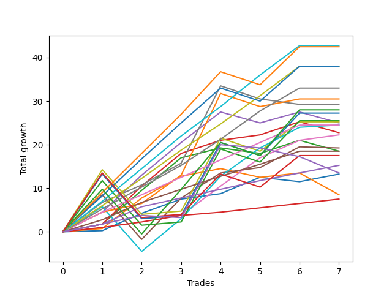

# Long Labrador 006 
- Symbol: ES_830-1130
- Date Range: 03/18/2022 - 12/30/2022
- Trading Period: 8:30-11:30
- Number of Trades: 6



| Name | Win Percent | Profit | Avg Profit / Trade | Avg Time / Trade |      | Name | Win Percent | Profit | Avg Profit / Trade | Avg Time / Trade |
| ---- | ----------- | ------ | ------------------ | ---------------- | ---- | ---- | ----------- | ------ | ------------------ | ---------------- |
| Sorted By <br> Profit | | | | | | Sorted By <br> Win Percentage ||||
| TP-10 | 83.33 | 19125.00 | 3187.50 | 43:53 |     | TP-7 | 100.00 | 17625.00 | 2937.50 | 27:10 |
| BB-100 U/L 2SD | 83.33 | 18750.00 | 3125.00 | 55:52 |     | BB-100 Mid | 100.00 | 17375.00 | 2895.83 | 35:03 |
| BB-200 U/L 2SD | 83.33 | 17875.00 | 2979.17 | 60:55 |     | BB-50 U/L 2SD | 100.00 | 16250.00 | 2708.33 | 47:06 |
| V U/L 1SD | 83.33 | 17750.00 | 2958.33 | 48:42 |     | TP-6 | 100.00 | 15875.00 | 2645.83 | 26:19 |
| TP-7 | 100.00 | 17625.00 | 2937.50 | 27:10 |     | TP-5 | 100.00 | 14000.00 | 2333.33 | 26:01 |
| BB-100 Mid | 100.00 | 17375.00 | 2895.83 | 35:03 |     | TP-4 | 100.00 | 10250.00 | 1708.33 | 18:55 |
| NEWFI 06 | 83.33 | 17250.00 | 2875.00 | 60:26 |     | TP-3 | 100.00 | 7250.00 | 1208.33 | 16:42 |
| TP-9 | 83.33 | 16750.00 | 2791.67 | 41:51 |     | TP-2 | 100.00 | 5625.00 | 937.50 | 05:35 |
| BB-50 U/L 2SD | 100.00 | 16250.00 | 2708.33 | 47:06 |     | TP-1 | 100.00 | 3125.00 | 520.83 | 03:03 |
| TP-6 | 100.00 | 15875.00 | 2645.83 | 26:19 |     | TP-10 | 83.33 | 19125.00 | 3187.50 | 43:53 |
| BB-100 U/L 2SD SL-10 | 83.33 | 15375.00 | 2562.50 | 49:19 |     | BB-100 U/L 2SD | 83.33 | 18750.00 | 3125.00 | 55:52 |
| BB-100 U/L 2SD SL-5 | 66.67 | 15000.00 | 2500.00 | 41:06 |     | BB-200 U/L 2SD | 83.33 | 17875.00 | 2979.17 | 60:55 |
| TP-8 | 83.33 | 14750.00 | 2458.33 | 41:14 |     | V U/L 1SD | 83.33 | 17750.00 | 2958.33 | 48:42 |
| BB-50 U/L 1SD | 83.33 | 14750.00 | 2458.33 | 30:09 |     | NEWFI 06 | 83.33 | 17250.00 | 2875.00 | 60:26 |
| BB-200 U/L 2SD SL-10 | 83.33 | 14500.00 | 2416.67 | 54:21 |     | TP-9 | 83.33 | 16750.00 | 2791.67 | 41:51 |
| V U/L 1SD SL-10 | 83.33 | 14375.00 | 2395.83 | 42:09 |     | BB-100 U/L 2SD SL-10 | 83.33 | 15375.00 | 2562.50 | 49:19 |
| BB-200 Mid | 83.33 | 14250.00 | 2375.00 | 34:32 |     | TP-8 | 83.33 | 14750.00 | 2458.33 | 41:14 |
| BB-200 U/L 2SD SL-5 | 66.67 | 14125.00 | 2354.17 | 46:09 |     | BB-50 U/L 1SD | 83.33 | 14750.00 | 2458.33 | 30:09 |
| TP-5 | 100.00 | 14000.00 | 2333.33 | 26:01 |     | BB-200 U/L 2SD SL-10 | 83.33 | 14500.00 | 2416.67 | 54:21 |
| V U/L 1SD SL-5 | 66.67 | 14000.00 | 2333.33 | 33:56 |     | V U/L 1SD SL-10 | 83.33 | 14375.00 | 2395.83 | 42:09 |
| NEWFI 000 | 83.33 | 13875.00 | 2312.50 | 53:40 |     | BB-200 Mid | 83.33 | 14250.00 | 2375.00 | 34:32 |
| V Mid | 66.67 | 12625.00 | 2104.17 | 33:42 |     | NEWFI 000 | 83.33 | 13875.00 | 2312.50 | 53:40 |
| BB-200 Mid SL-10 | 83.33 | 10875.00 | 1812.50 | 27:59 |     | BB-200 Mid SL-10 | 83.33 | 10875.00 | 1812.50 | 27:59 |
| BB-200 Mid SL-5 | 66.67 | 10500.00 | 1750.00 | 19:46 |     | BB-100 Mid SL-10 | 83.33 | 9250.00 | 1541.67 | 31:11 |
| TP-4 | 100.00 | 10250.00 | 1708.33 | 18:55 |     | BB-50 U/L 2SD SL-10 | 83.33 | 8125.00 | 1354.17 | 43:15 |
| BB-100 Mid SL-10 | 83.33 | 9250.00 | 1541.67 | 31:11 |     | BB-20 U/L 2SD C | 83.33 | 7000.00 | 1166.67 | 22:47 |
| V Mid SL-10 | 66.67 | 9250.00 | 1541.67 | 27:09 |     | BB-20 Mid SL-10 | 83.33 | 4625.00 | 770.83 | 06:52 |
| BB-50 U/L 1SD SL-10 | 66.67 | 9250.00 | 1541.67 | 26:35 |     | BB-20 Mid SL-5 | 83.33 | 4625.00 | 770.83 | 06:52 |
| BB-50 U/L 1SD SL-5 | 66.67 | 9000.00 | 1500.00 | 20:11 |     | BB-20 Mid | 83.33 | 4625.00 | 770.83 | 06:52 |
| V Mid SL-5 | 50.00 | 8875.00 | 1479.17 | 18:56 |     | BB-100 U/L 2SD SL-5 | 66.67 | 15000.00 | 2500.00 | 41:06 |
| BB-100 Mid SL-5 | 66.67 | 8625.00 | 1437.50 | 24:40 |     | BB-200 U/L 2SD SL-5 | 66.67 | 14125.00 | 2354.17 | 46:09 |
| BB-50 Mid | 66.67 | 8250.00 | 1375.00 | 23:37 |     | V U/L 1SD SL-5 | 66.67 | 14000.00 | 2333.33 | 33:56 |
| BB-50 U/L 2SD SL-10 | 83.33 | 8125.00 | 1354.17 | 43:15 |     | V Mid | 66.67 | 12625.00 | 2104.17 | 33:42 |
| TP-3 | 100.00 | 7250.00 | 1208.33 | 16:42 |     | BB-200 Mid SL-5 | 66.67 | 10500.00 | 1750.00 | 19:46 |
| BB-50 U/L 2SD SL-5 | 66.67 | 7125.00 | 1187.50 | 35:10 |     | V Mid SL-10 | 66.67 | 9250.00 | 1541.67 | 27:09 |
| BB-20 U/L 2SD C | 83.33 | 7000.00 | 1166.67 | 22:47 |     | BB-50 U/L 1SD SL-10 | 66.67 | 9250.00 | 1541.67 | 26:35 |
| NEWFI 0000 | 33.33 | 5750.00 | 958.33 | 14:33 |     | BB-50 U/L 1SD SL-5 | 66.67 | 9000.00 | 1500.00 | 20:11 |
| TP-2 | 100.00 | 5625.00 | 937.50 | 05:35 |     | BB-100 Mid SL-5 | 66.67 | 8625.00 | 1437.50 | 24:40 |
| BB-50 Mid SL-5 | 66.67 | 5500.00 | 916.67 | 14:34 |     | BB-50 Mid | 66.67 | 8250.00 | 1375.00 | 23:37 |
| BB-20 U/L 2SD | 66.67 | 5375.00 | 895.83 | 21:05 |     | BB-50 U/L 2SD SL-5 | 66.67 | 7125.00 | 1187.50 | 35:10 |
| BB-20 Mid SL-10 | 83.33 | 4625.00 | 770.83 | 06:52 |     | BB-50 Mid SL-5 | 66.67 | 5500.00 | 916.67 | 14:34 |
| BB-20 Mid SL-5 | 83.33 | 4625.00 | 770.83 | 06:52 |     | BB-20 U/L 2SD | 66.67 | 5375.00 | 895.83 | 21:05 |
| BB-20 Mid | 83.33 | 4625.00 | 770.83 | 06:52 |     | BB-50 Mid SL-10 | 66.67 | 4625.00 | 770.83 | 20:10 |
| BB-50 Mid SL-10 | 66.67 | 4625.00 | 770.83 | 20:10 |     | BB-20 U/L 2SD C SL-5 | 66.67 | 2375.00 | 395.83 | 13:37 |
| TP-1 | 100.00 | 3125.00 | 520.83 | 03:03 |     | BB-20 U/L 2SD SL-5 | 66.67 | 2000.00 | 333.33 | 13:34 |
| BB-20 U/L 2SD C SL-5 | 66.67 | 2375.00 | 395.83 | 13:37 |     | BB-20 U/L 2SD C SL-10 | 66.67 | 1500.00 | 250.00 | 19:14 |
| BB-20 U/L 2SD SL-5 | 66.67 | 2000.00 | 333.33 | 13:34 |     | BB-20 U/L 2SD SL-10 | 66.67 | 1125.00 | 187.50 | 19:10 |
| BB-20 U/L 2SD C SL-10 | 66.67 | 1500.00 | 250.00 | 19:14 |     | BB-20 U/L 1SD | 66.67 | 750.00 | 125.00 | 19:45 |
| BB-20 U/L 2SD SL-10 | 66.67 | 1125.00 | 187.50 | 19:10 |     | BB-20 U/L 1SD SL-5 | 66.67 | -1000.00 | -166.67 | 12:39 |
| BB-20 U/L 1SD | 66.67 | 750.00 | 125.00 | 19:45 |     | BB-20 U/L 1SD SL-10 | 66.67 | -3125.00 | -520.83 | 18:09 |
| BB-20 U/L 1SD SL-5 | 66.67 | -1000.00 | -166.67 | 12:39 |     | V Mid SL-5 | 50.00 | 8875.00 | 1479.17 | 18:56 |
| BB-20 U/L 1SD SL-10 | 66.67 | -3125.00 | -520.83 | 18:09 |     | NEWFI 0000 | 33.33 | 5750.00 | 958.33 | 14:33 |

## NO STOPLOSS

### Test BB-20 Mid
* Sell when price hits the middle line of the 20p bollinger
* No Stoploss
* Results:
```
Total Trades: 6
Percent Up: 83.33
Percent Down: 16.67
Total Points Moved Up: 9.25
Potential Profit: 4625.00
Total Points Ups: 10.25 Count Ups: 5
Total Points Downs: -1.00 Count Downs: 1
```

<details><summary>Trades</summary>

<code>In: 2022-04-20 09:18:00		Out: 2022-04-20 09:30:50		Total Position Time: 12:50		Total Move Up: 0.25		Total to Date: 0.25</code> <br />
<code>In: 2022-06-27 09:36:00		Out: 2022-06-27 09:41:05		Total Position Time: 05:05		Total Move Up: 3.25		Total to Date: 3.50</code> <br />
<code>In: 2022-09-06 10:18:00		Out: 2022-09-06 10:25:10		Total Position Time: 07:10		Total Move Up: 1.25		Total to Date: 4.75</code> <br />
<code>In: 2022-09-20 10:37:00		Out: 2022-09-20 10:43:05		Total Position Time: 06:05		Total Move Up: 3.75		Total to Date: 8.50</code> <br />
<code>In: 2022-10-25 10:18:00		Out: 2022-10-25 10:25:45		Total Position Time: 07:45		Total Move Up: -1.00		Total to Date: 7.50</code> <br />
<code>In: 2022-12-27 11:01:00		Out: 2022-12-27 11:03:20		Total Position Time: 02:20		Total Move Up: 1.75		Total to Date: 9.25</code> <br />


</details>

### Test BB-20 U/L 1SD
* Sell when the price hits the upper line of the 20p 1std bollinger
* No Stoploss
* Results:
```
Total Trades: 6
Percent Up: 66.67
Percent Down: 33.33
Total Points Moved Up: 1.50
Potential Profit: 750.00
Total Points Ups: 8.50 Count Ups: 4
Total Points Downs: -7.00 Count Downs: 2
```

<details><summary>Trades</summary>

<code>In: 2022-04-20 09:18:00		Out: 2022-04-20 09:31:05		Total Position Time: 13:05		Total Move Up: 0.75		Total to Date: 0.75</code> <br />
<code>In: 2022-06-27 09:36:00		Out: 2022-06-27 09:44:20		Total Position Time: 08:20		Total Move Up: 5.00		Total to Date: 5.75</code> <br />
<code>In: 2022-09-06 10:18:00		Out: 2022-09-06 10:30:55		Total Position Time: 12:55		Total Move Up: 1.75		Total to Date: 7.50</code> <br />
<code>In: 2022-09-20 10:37:00		Out: 2022-09-20 11:08:15		Total Position Time: 31:15		Total Move Up: -2.00		Total to Date: 5.50</code> <br />
<code>In: 2022-10-25 10:18:00		Out: 2022-10-25 10:26:20		Total Position Time: 08:20		Total Move Up: 1.00		Total to Date: 6.50</code> <br />
<code>In: 2022-12-27 11:01:00		Out: 2022-12-27 11:45:40		Total Position Time: 44:40		Total Move Up: -5.00		Total to Date: 1.50</code> <br />


</details>

### Test BB-20 U/L 2SD
* Sell when the price hits the upper line of the 20p 2std bollinger
* No Stoploss
* Results:
```
Total Trades: 6
Percent Up: 66.67
Percent Down: 33.33
Total Points Moved Up: 10.75
Potential Profit: 5375.00
Total Points Ups: 14.50 Count Ups: 4
Total Points Downs: -3.75 Count Downs: 2
```

<details><summary>Trades</summary>

<code>In: 2022-04-20 09:18:00		Out: 2022-04-20 09:31:35		Total Position Time: 13:35		Total Move Up: 1.75		Total to Date: 1.75</code> <br />
<code>In: 2022-06-27 09:36:00		Out: 2022-06-27 09:45:05		Total Position Time: 09:05		Total Move Up: 7.50		Total to Date: 9.25</code> <br />
<code>In: 2022-09-06 10:18:00		Out: 2022-09-06 10:31:10		Total Position Time: 13:10		Total Move Up: 2.25		Total to Date: 11.50</code> <br />
<code>In: 2022-09-20 10:37:00		Out: 2022-09-20 11:10:05		Total Position Time: 33:05		Total Move Up: -1.25		Total to Date: 10.25</code> <br />
<code>In: 2022-10-25 10:18:00		Out: 2022-10-25 10:30:20		Total Position Time: 12:20		Total Move Up: 3.00		Total to Date: 13.25</code> <br />
<code>In: 2022-12-27 11:01:00		Out: 2022-12-27 11:46:20		Total Position Time: 45:20		Total Move Up: -2.50		Total to Date: 10.75</code> <br />


</details>

### Test BB-20 U/L 2SD C
* Sell when the price hits the upper line of the 20p 2std bollinger
* No Stoploss
* Results:
```
Total Trades: 6
Percent Up: 83.33
Percent Down: 16.67
Total Points Moved Up: 14.00
Potential Profit: 7000.00
Total Points Ups: 16.50 Count Ups: 5
Total Points Downs: -2.50 Count Downs: 1
```

<details><summary>Trades</summary>

<code>In: 2022-04-20 09:18:00		Out: 2022-04-20 09:31:35		Total Position Time: 13:35		Total Move Up: 1.75		Total to Date: 1.75</code> <br />
<code>In: 2022-06-27 09:36:00		Out: 2022-06-27 09:45:05		Total Position Time: 09:05		Total Move Up: 7.50		Total to Date: 9.25</code> <br />
<code>In: 2022-09-06 10:18:00		Out: 2022-09-06 10:31:30		Total Position Time: 13:30		Total Move Up: 3.00		Total to Date: 12.25</code> <br />
<code>In: 2022-09-20 10:37:00		Out: 2022-09-20 11:19:55		Total Position Time: 42:55		Total Move Up: 1.25		Total to Date: 13.50</code> <br />
<code>In: 2022-10-25 10:18:00		Out: 2022-10-25 10:30:20		Total Position Time: 12:20		Total Move Up: 3.00		Total to Date: 16.50</code> <br />
<code>In: 2022-12-27 11:01:00		Out: 2022-12-27 11:46:20		Total Position Time: 45:20		Total Move Up: -2.50		Total to Date: 14.00</code> <br />


</details>

### Test BB-50 Mid
* Sell when price hits the middle line of the 50p bollinger
* No Stoploss
* Results:
```
Total Trades: 6
Percent Up: 66.67
Percent Down: 33.33
Total Points Moved Up: 16.50
Potential Profit: 8250.00
Total Points Ups: 21.50 Count Ups: 4
Total Points Downs: -5.00 Count Downs: 2
```

<details><summary>Trades</summary>

<code>In: 2022-04-20 09:18:00		Out: 2022-04-20 09:32:40		Total Position Time: 14:40		Total Move Up: 4.50		Total to Date: 4.50</code> <br />
<code>In: 2022-06-27 09:36:00		Out: 2022-06-27 09:45:05		Total Position Time: 09:05		Total Move Up: 7.50		Total to Date: 12.00</code> <br />
<code>In: 2022-09-06 10:18:00		Out: 2022-09-06 10:39:40		Total Position Time: 21:40		Total Move Up: 7.00		Total to Date: 19.00</code> <br />
<code>In: 2022-09-20 10:37:00		Out: 2022-09-20 11:19:15		Total Position Time: 42:15		Total Move Up: -2.50		Total to Date: 16.50</code> <br />
<code>In: 2022-10-25 10:18:00		Out: 2022-10-25 10:26:45		Total Position Time: 08:45		Total Move Up: 2.50		Total to Date: 19.00</code> <br />
<code>In: 2022-12-27 11:01:00		Out: 2022-12-27 11:46:20		Total Position Time: 45:20		Total Move Up: -2.50		Total to Date: 16.50</code> <br />


</details>

### Test BB-50 U/L 1SD
* Sell when the price hits the upper line of the 50p 1std bollinger
* No Stoploss
* Results:
```
Total Trades: 6
Percent Up: 83.33
Percent Down: 16.67
Total Points Moved Up: 29.50
Potential Profit: 14750.00
Total Points Ups: 29.75 Count Ups: 5
Total Points Downs: -0.25 Count Downs: 1
```

<details><summary>Trades</summary>

<code>In: 2022-04-20 09:18:00		Out: 2022-04-20 09:36:50		Total Position Time: 18:50		Total Move Up: 8.50		Total to Date: 8.50</code> <br />
<code>In: 2022-06-27 09:36:00		Out: 2022-06-27 09:53:20		Total Position Time: 17:20		Total Move Up: 9.50		Total to Date: 18.00</code> <br />
<code>In: 2022-09-06 10:18:00		Out: 2022-09-06 10:56:40		Total Position Time: 38:40		Total Move Up: 5.75		Total to Date: 23.75</code> <br />
<code>In: 2022-09-20 10:37:00		Out: 2022-09-20 11:19:55		Total Position Time: 42:55		Total Move Up: 1.25		Total to Date: 25.00</code> <br />
<code>In: 2022-10-25 10:18:00		Out: 2022-10-25 10:31:05		Total Position Time: 13:05		Total Move Up: 4.75		Total to Date: 29.75</code> <br />
<code>In: 2022-12-27 11:01:00		Out: 2022-12-27 11:51:05		Total Position Time: 50:05		Total Move Up: -0.25		Total to Date: 29.50</code> <br />


</details>

### Test BB-50 U/L 2SD
* Sell when the price hits the upper line of the 50p 2std bollinger
* No Stoploss
* Results:
```
Total Trades: 6
Percent Up: 100.00
Percent Down: 0.00
Total Points Moved Up: 32.50
Potential Profit: 16250.00
Total Points Ups: 32.50 Count Ups: 6
Total Points Downs: 0.00 Count Downs: 0
```

<details><summary>Trades</summary>

<code>In: 2022-04-20 09:18:00		Out: 2022-04-20 09:50:25		Total Position Time: 32:25		Total Move Up: 13.25		Total to Date: 13.25</code> <br />
<code>In: 2022-06-27 09:36:00		Out: 2022-06-27 10:36:55		Total Position Time: 60:55		Total Move Up: 0.75		Total to Date: 14.00</code> <br />
<code>In: 2022-09-06 10:18:00		Out: 2022-09-06 10:58:55		Total Position Time: 40:55		Total Move Up: 6.75		Total to Date: 20.75</code> <br />
<code>In: 2022-09-20 10:37:00		Out: 2022-09-20 11:21:45		Total Position Time: 44:45		Total Move Up: 6.50		Total to Date: 27.25</code> <br />
<code>In: 2022-10-25 10:18:00		Out: 2022-10-25 11:01:30		Total Position Time: 43:30		Total Move Up: 4.00		Total to Date: 31.25</code> <br />
<code>In: 2022-12-27 11:01:00		Out: 2022-12-27 12:01:10		Total Position Time: 60:10		Total Move Up: 1.25		Total to Date: 32.50</code> <br />


</details>

### Test V Mid
* Sell when the price hits the middle line of the 1std VWAP
* No Stoploss
* Results:
```
Total Trades: 6
Percent Up: 66.67
Percent Down: 33.33
Total Points Moved Up: 25.25
Potential Profit: 12625.00
Total Points Ups: 29.50 Count Ups: 4
Total Points Downs: -4.25 Count Downs: 2
```

<details><summary>Trades</summary>

<code>In: 2022-04-20 09:18:00		Out: 2022-04-20 09:35:50		Total Position Time: 17:50		Total Move Up: 6.75		Total to Date: 6.75</code> <br />
<code>In: 2022-06-27 09:36:00		Out: 2022-06-27 09:44:20		Total Position Time: 08:20		Total Move Up: 5.00		Total to Date: 11.75</code> <br />
<code>In: 2022-09-06 10:18:00		Out: 2022-09-06 11:11:05		Total Position Time: 53:05		Total Move Up: 17.75		Total to Date: 29.50</code> <br />
<code>In: 2022-09-20 10:37:00		Out: 2022-09-20 11:37:55		Total Position Time: 60:55		Total Move Up: -3.00		Total to Date: 26.50</code> <br />
<code>In: 2022-10-25 10:18:00		Out: 2022-10-25 10:19:10		Total Position Time: 01:10		Total Move Up: -1.25		Total to Date: 25.25</code> <br />
<code>In: 2022-12-27 11:01:00		Out: 2022-12-27 12:01:55		Total Position Time: 60:55		Total Move Up: 0.00		Total to Date: 25.25</code> <br />


</details>

### Test V U/L 1SD
* Sell when the price hits the upper line of the 1std VWAP
* No Stoploss
* Results:
```
Total Trades: 6
Percent Up: 83.33
Percent Down: 16.67
Total Points Moved Up: 35.50
Potential Profit: 17750.00
Total Points Ups: 38.50 Count Ups: 5
Total Points Downs: -3.00 Count Downs: 1
```

<details><summary>Trades</summary>

<code>In: 2022-04-20 09:18:00		Out: 2022-04-20 09:52:35		Total Position Time: 34:35		Total Move Up: 14.25		Total to Date: 14.25</code> <br />
<code>In: 2022-06-27 09:36:00		Out: 2022-06-27 10:36:55		Total Position Time: 60:55		Total Move Up: 0.75		Total to Date: 15.00</code> <br />
<code>In: 2022-09-06 10:18:00		Out: 2022-09-06 11:18:55		Total Position Time: 60:55		Total Move Up: 16.75		Total to Date: 31.75</code> <br />
<code>In: 2022-09-20 10:37:00		Out: 2022-09-20 11:37:55		Total Position Time: 60:55		Total Move Up: -3.00		Total to Date: 28.75</code> <br />
<code>In: 2022-10-25 10:18:00		Out: 2022-10-25 10:32:00		Total Position Time: 14:00		Total Move Up: 6.75		Total to Date: 35.50</code> <br />
<code>In: 2022-12-27 11:01:00		Out: 2022-12-27 12:01:55		Total Position Time: 60:55		Total Move Up: 0.00		Total to Date: 35.50</code> <br />


</details>

### Test BB-100 Mid
* Move to BB100 Mid
* No Stoploss
* Results:
```
Total Trades: 6
Percent Up: 100.00
Percent Down: 0.00
Total Points Moved Up: 34.75
Potential Profit: 17375.00
Total Points Ups: 34.75 Count Ups: 6
Total Points Downs: 0.00 Count Downs: 0
```

<details><summary>Trades</summary>

<code>In: 2022-04-20 09:18:00		Out: 2022-04-20 09:33:05		Total Position Time: 15:05		Total Move Up: 5.75		Total to Date: 5.75</code> <br />
<code>In: 2022-06-27 09:36:00		Out: 2022-06-27 10:20:05		Total Position Time: 44:05		Total Move Up: 7.50		Total to Date: 13.25</code> <br />
<code>In: 2022-09-06 10:18:00		Out: 2022-09-06 11:00:30		Total Position Time: 42:30		Total Move Up: 9.75		Total to Date: 23.00</code> <br />
<code>In: 2022-09-20 10:37:00		Out: 2022-09-20 11:21:45		Total Position Time: 44:45		Total Move Up: 6.50		Total to Date: 29.50</code> <br />
<code>In: 2022-10-25 10:18:00		Out: 2022-10-25 10:31:05		Total Position Time: 13:05		Total Move Up: 4.75		Total to Date: 34.25</code> <br />
<code>In: 2022-12-27 11:01:00		Out: 2022-12-27 11:51:50		Total Position Time: 50:50		Total Move Up: 0.50		Total to Date: 34.75</code> <br />


</details>

### Test BB-100 U/L 2SD
* Move to BB100 Upper Band
* No Stoploss
* Results:
```
Total Trades: 6
Percent Up: 83.33
Percent Down: 16.67
Total Points Moved Up: 37.50
Potential Profit: 18750.00
Total Points Ups: 40.50 Count Ups: 5
Total Points Downs: -3.00 Count Downs: 1
```

<details><summary>Trades</summary>

<code>In: 2022-04-20 09:18:00		Out: 2022-04-20 09:50:25		Total Position Time: 32:25		Total Move Up: 13.25		Total to Date: 13.25</code> <br />
<code>In: 2022-06-27 09:36:00		Out: 2022-06-27 10:36:55		Total Position Time: 60:55		Total Move Up: 0.75		Total to Date: 14.00</code> <br />
<code>In: 2022-09-06 10:18:00		Out: 2022-09-06 11:18:55		Total Position Time: 60:55		Total Move Up: 16.75		Total to Date: 30.75</code> <br />
<code>In: 2022-09-20 10:37:00		Out: 2022-09-20 11:37:55		Total Position Time: 60:55		Total Move Up: -3.00		Total to Date: 27.75</code> <br />
<code>In: 2022-10-25 10:18:00		Out: 2022-10-25 11:17:10		Total Position Time: 59:10		Total Move Up: 9.75		Total to Date: 37.50</code> <br />
<code>In: 2022-12-27 11:01:00		Out: 2022-12-27 12:01:55		Total Position Time: 60:55		Total Move Up: 0.00		Total to Date: 37.50</code> <br />


</details>

### Test BB-200 Mid
* Move to BB200 Mid
* No Stoploss
* Results:
```
Total Trades: 6
Percent Up: 83.33
Percent Down: 16.67
Total Points Moved Up: 28.50
Potential Profit: 14250.00
Total Points Ups: 31.50 Count Ups: 5
Total Points Downs: -3.00 Count Downs: 1
```

<details><summary>Trades</summary>

<code>In: 2022-04-20 09:18:00		Out: 2022-04-20 09:32:40		Total Position Time: 14:40		Total Move Up: 4.50		Total to Date: 4.50</code> <br />
<code>In: 2022-06-27 09:36:00		Out: 2022-06-27 09:45:00		Total Position Time: 09:00		Total Move Up: 6.50		Total to Date: 11.00</code> <br />
<code>In: 2022-09-06 10:18:00		Out: 2022-09-06 11:11:10		Total Position Time: 53:10		Total Move Up: 18.75		Total to Date: 29.75</code> <br />
<code>In: 2022-09-20 10:37:00		Out: 2022-09-20 11:37:55		Total Position Time: 60:55		Total Move Up: -3.00		Total to Date: 26.75</code> <br />
<code>In: 2022-10-25 10:18:00		Out: 2022-10-25 10:26:35		Total Position Time: 08:35		Total Move Up: 1.75		Total to Date: 28.50</code> <br />
<code>In: 2022-12-27 11:01:00		Out: 2022-12-27 12:01:55		Total Position Time: 60:55		Total Move Up: 0.00		Total to Date: 28.50</code> <br />


</details>

### Test BB-200 U/L 2SD
* Move to BB200 Upper Band
* No Stoploss
* Results:
```
Total Trades: 6
Percent Up: 83.33
Percent Down: 16.67
Total Points Moved Up: 35.75
Potential Profit: 17875.00
Total Points Ups: 38.75 Count Ups: 5
Total Points Downs: -3.00 Count Downs: 1
```

<details><summary>Trades</summary>

<code>In: 2022-04-20 09:18:00		Out: 2022-04-20 10:18:55		Total Position Time: 60:55		Total Move Up: 11.75		Total to Date: 11.75</code> <br />
<code>In: 2022-06-27 09:36:00		Out: 2022-06-27 10:36:55		Total Position Time: 60:55		Total Move Up: 0.75		Total to Date: 12.50</code> <br />
<code>In: 2022-09-06 10:18:00		Out: 2022-09-06 11:18:55		Total Position Time: 60:55		Total Move Up: 16.75		Total to Date: 29.25</code> <br />
<code>In: 2022-09-20 10:37:00		Out: 2022-09-20 11:37:55		Total Position Time: 60:55		Total Move Up: -3.00		Total to Date: 26.25</code> <br />
<code>In: 2022-10-25 10:18:00		Out: 2022-10-25 11:18:55		Total Position Time: 60:55		Total Move Up: 9.50		Total to Date: 35.75</code> <br />
<code>In: 2022-12-27 11:01:00		Out: 2022-12-27 12:01:55		Total Position Time: 60:55		Total Move Up: 0.00		Total to Date: 35.75</code> <br />


</details>

## STOPLOSS OF 5

### Test BB-20 Mid SL-5
* Sell when price hits the middle line of the 20p bollinger
* Stoploss is 5 points
* Results:
```
Total Trades: 6
Percent Up: 83.33
Percent Down: 16.67
Total Points Moved Up: 9.25
Potential Profit: 4625.00
Total Points Ups: 10.25 Count Ups: 5
Total Points Downs: -1.00 Count Downs: 1
```

<details><summary>Trades</summary>

<code>In: 2022-04-20 09:18:00		Out: 2022-04-20 09:30:50		Total Position Time: 12:50		Total Move Up: 0.25		Total to Date: 0.25</code> <br />
<code>In: 2022-06-27 09:36:00		Out: 2022-06-27 09:41:05		Total Position Time: 05:05		Total Move Up: 3.25		Total to Date: 3.50</code> <br />
<code>In: 2022-09-06 10:18:00		Out: 2022-09-06 10:25:10		Total Position Time: 07:10		Total Move Up: 1.25		Total to Date: 4.75</code> <br />
<code>In: 2022-09-20 10:37:00		Out: 2022-09-20 10:43:05		Total Position Time: 06:05		Total Move Up: 3.75		Total to Date: 8.50</code> <br />
<code>In: 2022-10-25 10:18:00		Out: 2022-10-25 10:25:45		Total Position Time: 07:45		Total Move Up: -1.00		Total to Date: 7.50</code> <br />
<code>In: 2022-12-27 11:01:00		Out: 2022-12-27 11:03:20		Total Position Time: 02:20		Total Move Up: 1.75		Total to Date: 9.25</code> <br />


</details>

### Test BB-20 U/L 1SD SL-5
* Sell when the price hits the upper line of the 20p 1std bollinger
* Stoploss is 5 points
* Results:
```
Total Trades: 6
Percent Up: 66.67
Percent Down: 33.33
Total Points Moved Up: -2.00
Potential Profit: -1000.00
Total Points Ups: 8.50 Count Ups: 4
Total Points Downs: -10.50 Count Downs: 2
```

<details><summary>Trades</summary>

<code>In: 2022-04-20 09:18:00		Out: 2022-04-20 09:31:05		Total Position Time: 13:05		Total Move Up: 0.75		Total to Date: 0.75</code> <br />
<code>In: 2022-06-27 09:36:00		Out: 2022-06-27 09:44:20		Total Position Time: 08:20		Total Move Up: 5.00		Total to Date: 5.75</code> <br />
<code>In: 2022-09-06 10:18:00		Out: 2022-09-06 10:30:55		Total Position Time: 12:55		Total Move Up: 1.75		Total to Date: 7.50</code> <br />
<code>In: 2022-09-20 10:37:00		Out: 2022-09-20 10:50:40		Total Position Time: 13:40		Total Move Up: -5.25		Total to Date: 2.25</code> <br />
<code>In: 2022-10-25 10:18:00		Out: 2022-10-25 10:26:20		Total Position Time: 08:20		Total Move Up: 1.00		Total to Date: 3.25</code> <br />
<code>In: 2022-12-27 11:01:00		Out: 2022-12-27 11:20:35		Total Position Time: 19:35		Total Move Up: -5.25		Total to Date: -2.00</code> <br />


</details>

### Test BB-20 U/L 2SD SL-5
* Sell when the price hits the upper line of the 20p 2std bollinger
* Stoploss is 5 points
* Results:
```
Total Trades: 6
Percent Up: 66.67
Percent Down: 33.33
Total Points Moved Up: 4.00
Potential Profit: 2000.00
Total Points Ups: 14.50 Count Ups: 4
Total Points Downs: -10.50 Count Downs: 2
```

<details><summary>Trades</summary>

<code>In: 2022-04-20 09:18:00		Out: 2022-04-20 09:31:35		Total Position Time: 13:35		Total Move Up: 1.75		Total to Date: 1.75</code> <br />
<code>In: 2022-06-27 09:36:00		Out: 2022-06-27 09:45:05		Total Position Time: 09:05		Total Move Up: 7.50		Total to Date: 9.25</code> <br />
<code>In: 2022-09-06 10:18:00		Out: 2022-09-06 10:31:10		Total Position Time: 13:10		Total Move Up: 2.25		Total to Date: 11.50</code> <br />
<code>In: 2022-09-20 10:37:00		Out: 2022-09-20 10:50:40		Total Position Time: 13:40		Total Move Up: -5.25		Total to Date: 6.25</code> <br />
<code>In: 2022-10-25 10:18:00		Out: 2022-10-25 10:30:20		Total Position Time: 12:20		Total Move Up: 3.00		Total to Date: 9.25</code> <br />
<code>In: 2022-12-27 11:01:00		Out: 2022-12-27 11:20:35		Total Position Time: 19:35		Total Move Up: -5.25		Total to Date: 4.00</code> <br />


</details>

### Test BB-20 U/L 2SD C SL-5
* Sell when the price hits the upper line of the 20p 2std bollinger
* Stoploss is 5 points
* Results:
```
Total Trades: 6
Percent Up: 66.67
Percent Down: 33.33
Total Points Moved Up: 4.75
Potential Profit: 2375.00
Total Points Ups: 15.25 Count Ups: 4
Total Points Downs: -10.50 Count Downs: 2
```

<details><summary>Trades</summary>

<code>In: 2022-04-20 09:18:00		Out: 2022-04-20 09:31:35		Total Position Time: 13:35		Total Move Up: 1.75		Total to Date: 1.75</code> <br />
<code>In: 2022-06-27 09:36:00		Out: 2022-06-27 09:45:05		Total Position Time: 09:05		Total Move Up: 7.50		Total to Date: 9.25</code> <br />
<code>In: 2022-09-06 10:18:00		Out: 2022-09-06 10:31:30		Total Position Time: 13:30		Total Move Up: 3.00		Total to Date: 12.25</code> <br />
<code>In: 2022-09-20 10:37:00		Out: 2022-09-20 10:50:40		Total Position Time: 13:40		Total Move Up: -5.25		Total to Date: 7.00</code> <br />
<code>In: 2022-10-25 10:18:00		Out: 2022-10-25 10:30:20		Total Position Time: 12:20		Total Move Up: 3.00		Total to Date: 10.00</code> <br />
<code>In: 2022-12-27 11:01:00		Out: 2022-12-27 11:20:35		Total Position Time: 19:35		Total Move Up: -5.25		Total to Date: 4.75</code> <br />


</details>

### Test BB-50 Mid SL-5
* Sell when price hits the middle line of the 50p bollinger
* Stoploss is 5 points
* Results:
```
Total Trades: 6
Percent Up: 66.67
Percent Down: 33.33
Total Points Moved Up: 11.00
Potential Profit: 5500.00
Total Points Ups: 21.50 Count Ups: 4
Total Points Downs: -10.50 Count Downs: 2
```

<details><summary>Trades</summary>

<code>In: 2022-04-20 09:18:00		Out: 2022-04-20 09:32:40		Total Position Time: 14:40		Total Move Up: 4.50		Total to Date: 4.50</code> <br />
<code>In: 2022-06-27 09:36:00		Out: 2022-06-27 09:45:05		Total Position Time: 09:05		Total Move Up: 7.50		Total to Date: 12.00</code> <br />
<code>In: 2022-09-06 10:18:00		Out: 2022-09-06 10:39:40		Total Position Time: 21:40		Total Move Up: 7.00		Total to Date: 19.00</code> <br />
<code>In: 2022-09-20 10:37:00		Out: 2022-09-20 10:50:40		Total Position Time: 13:40		Total Move Up: -5.25		Total to Date: 13.75</code> <br />
<code>In: 2022-10-25 10:18:00		Out: 2022-10-25 10:26:45		Total Position Time: 08:45		Total Move Up: 2.50		Total to Date: 16.25</code> <br />
<code>In: 2022-12-27 11:01:00		Out: 2022-12-27 11:20:35		Total Position Time: 19:35		Total Move Up: -5.25		Total to Date: 11.00</code> <br />


</details>

### Test BB-50 U/L 1SD SL-5
* Sell when the price hits the upper line of the 50p 1std bollinger
* Stoploss is 5 points
* Results:
```
Total Trades: 6
Percent Up: 66.67
Percent Down: 33.33
Total Points Moved Up: 18.00
Potential Profit: 9000.00
Total Points Ups: 28.50 Count Ups: 4
Total Points Downs: -10.50 Count Downs: 2
```

<details><summary>Trades</summary>

<code>In: 2022-04-20 09:18:00		Out: 2022-04-20 09:36:50		Total Position Time: 18:50		Total Move Up: 8.50		Total to Date: 8.50</code> <br />
<code>In: 2022-06-27 09:36:00		Out: 2022-06-27 09:53:20		Total Position Time: 17:20		Total Move Up: 9.50		Total to Date: 18.00</code> <br />
<code>In: 2022-09-06 10:18:00		Out: 2022-09-06 10:56:40		Total Position Time: 38:40		Total Move Up: 5.75		Total to Date: 23.75</code> <br />
<code>In: 2022-09-20 10:37:00		Out: 2022-09-20 10:50:40		Total Position Time: 13:40		Total Move Up: -5.25		Total to Date: 18.50</code> <br />
<code>In: 2022-10-25 10:18:00		Out: 2022-10-25 10:31:05		Total Position Time: 13:05		Total Move Up: 4.75		Total to Date: 23.25</code> <br />
<code>In: 2022-12-27 11:01:00		Out: 2022-12-27 11:20:35		Total Position Time: 19:35		Total Move Up: -5.25		Total to Date: 18.00</code> <br />


</details>

### Test BB-50 U/L 2SD SL-5
* Sell when the price hits the upper line of the 50p 2std bollinger
* Stoploss is 5 points
* Results:
```
Total Trades: 6
Percent Up: 66.67
Percent Down: 33.33
Total Points Moved Up: 14.25
Potential Profit: 7125.00
Total Points Ups: 24.75 Count Ups: 4
Total Points Downs: -10.50 Count Downs: 2
```

<details><summary>Trades</summary>

<code>In: 2022-04-20 09:18:00		Out: 2022-04-20 09:50:25		Total Position Time: 32:25		Total Move Up: 13.25		Total to Date: 13.25</code> <br />
<code>In: 2022-06-27 09:36:00		Out: 2022-06-27 10:36:55		Total Position Time: 60:55		Total Move Up: 0.75		Total to Date: 14.00</code> <br />
<code>In: 2022-09-06 10:18:00		Out: 2022-09-06 10:58:55		Total Position Time: 40:55		Total Move Up: 6.75		Total to Date: 20.75</code> <br />
<code>In: 2022-09-20 10:37:00		Out: 2022-09-20 10:50:40		Total Position Time: 13:40		Total Move Up: -5.25		Total to Date: 15.50</code> <br />
<code>In: 2022-10-25 10:18:00		Out: 2022-10-25 11:01:30		Total Position Time: 43:30		Total Move Up: 4.00		Total to Date: 19.50</code> <br />
<code>In: 2022-12-27 11:01:00		Out: 2022-12-27 11:20:35		Total Position Time: 19:35		Total Move Up: -5.25		Total to Date: 14.25</code> <br />


</details>

### Test V Mid SL-5
* Sell when the price hits the middle line of the 1std VWAP
* Stoploss is 5 points
* Results:
```
Total Trades: 6
Percent Up: 50.00
Percent Down: 50.00
Total Points Moved Up: 17.75
Potential Profit: 8875.00
Total Points Ups: 29.50 Count Ups: 3
Total Points Downs: -11.75 Count Downs: 3
```

<details><summary>Trades</summary>

<code>In: 2022-04-20 09:18:00		Out: 2022-04-20 09:35:50		Total Position Time: 17:50		Total Move Up: 6.75		Total to Date: 6.75</code> <br />
<code>In: 2022-06-27 09:36:00		Out: 2022-06-27 09:44:20		Total Position Time: 08:20		Total Move Up: 5.00		Total to Date: 11.75</code> <br />
<code>In: 2022-09-06 10:18:00		Out: 2022-09-06 11:11:05		Total Position Time: 53:05		Total Move Up: 17.75		Total to Date: 29.50</code> <br />
<code>In: 2022-09-20 10:37:00		Out: 2022-09-20 10:50:40		Total Position Time: 13:40		Total Move Up: -5.25		Total to Date: 24.25</code> <br />
<code>In: 2022-10-25 10:18:00		Out: 2022-10-25 10:19:10		Total Position Time: 01:10		Total Move Up: -1.25		Total to Date: 23.00</code> <br />
<code>In: 2022-12-27 11:01:00		Out: 2022-12-27 11:20:35		Total Position Time: 19:35		Total Move Up: -5.25		Total to Date: 17.75</code> <br />


</details>

### Test V U/L 1SD SL-5
* Sell when the price hits the upper line of the 1std VWAP
* Stoploss is 5 points
* Results:
```
Total Trades: 6
Percent Up: 66.67
Percent Down: 33.33
Total Points Moved Up: 28.00
Potential Profit: 14000.00
Total Points Ups: 38.50 Count Ups: 4
Total Points Downs: -10.50 Count Downs: 2
```

<details><summary>Trades</summary>

<code>In: 2022-04-20 09:18:00		Out: 2022-04-20 09:52:35		Total Position Time: 34:35		Total Move Up: 14.25		Total to Date: 14.25</code> <br />
<code>In: 2022-06-27 09:36:00		Out: 2022-06-27 10:36:55		Total Position Time: 60:55		Total Move Up: 0.75		Total to Date: 15.00</code> <br />
<code>In: 2022-09-06 10:18:00		Out: 2022-09-06 11:18:55		Total Position Time: 60:55		Total Move Up: 16.75		Total to Date: 31.75</code> <br />
<code>In: 2022-09-20 10:37:00		Out: 2022-09-20 10:50:40		Total Position Time: 13:40		Total Move Up: -5.25		Total to Date: 26.50</code> <br />
<code>In: 2022-10-25 10:18:00		Out: 2022-10-25 10:32:00		Total Position Time: 14:00		Total Move Up: 6.75		Total to Date: 33.25</code> <br />
<code>In: 2022-12-27 11:01:00		Out: 2022-12-27 11:20:35		Total Position Time: 19:35		Total Move Up: -5.25		Total to Date: 28.00</code> <br />


</details>

### Test BB-100 Mid SL-5
* Move to BB100 Mid
* Stoploss is 5 points
* Results:
```
Total Trades: 6
Percent Up: 66.67
Percent Down: 33.33
Total Points Moved Up: 17.25
Potential Profit: 8625.00
Total Points Ups: 27.75 Count Ups: 4
Total Points Downs: -10.50 Count Downs: 2
```

<details><summary>Trades</summary>

<code>In: 2022-04-20 09:18:00		Out: 2022-04-20 09:33:05		Total Position Time: 15:05		Total Move Up: 5.75		Total to Date: 5.75</code> <br />
<code>In: 2022-06-27 09:36:00		Out: 2022-06-27 10:20:05		Total Position Time: 44:05		Total Move Up: 7.50		Total to Date: 13.25</code> <br />
<code>In: 2022-09-06 10:18:00		Out: 2022-09-06 11:00:30		Total Position Time: 42:30		Total Move Up: 9.75		Total to Date: 23.00</code> <br />
<code>In: 2022-09-20 10:37:00		Out: 2022-09-20 10:50:40		Total Position Time: 13:40		Total Move Up: -5.25		Total to Date: 17.75</code> <br />
<code>In: 2022-10-25 10:18:00		Out: 2022-10-25 10:31:05		Total Position Time: 13:05		Total Move Up: 4.75		Total to Date: 22.50</code> <br />
<code>In: 2022-12-27 11:01:00		Out: 2022-12-27 11:20:35		Total Position Time: 19:35		Total Move Up: -5.25		Total to Date: 17.25</code> <br />


</details>

### Test BB-100 U/L 2SD SL-5
* Move to BB100 Upper Band
* Stoploss is 5 points
* Results:
```
Total Trades: 6
Percent Up: 66.67
Percent Down: 33.33
Total Points Moved Up: 30.00
Potential Profit: 15000.00
Total Points Ups: 40.50 Count Ups: 4
Total Points Downs: -10.50 Count Downs: 2
```

<details><summary>Trades</summary>

<code>In: 2022-04-20 09:18:00		Out: 2022-04-20 09:50:25		Total Position Time: 32:25		Total Move Up: 13.25		Total to Date: 13.25</code> <br />
<code>In: 2022-06-27 09:36:00		Out: 2022-06-27 10:36:55		Total Position Time: 60:55		Total Move Up: 0.75		Total to Date: 14.00</code> <br />
<code>In: 2022-09-06 10:18:00		Out: 2022-09-06 11:18:55		Total Position Time: 60:55		Total Move Up: 16.75		Total to Date: 30.75</code> <br />
<code>In: 2022-09-20 10:37:00		Out: 2022-09-20 10:50:40		Total Position Time: 13:40		Total Move Up: -5.25		Total to Date: 25.50</code> <br />
<code>In: 2022-10-25 10:18:00		Out: 2022-10-25 11:17:10		Total Position Time: 59:10		Total Move Up: 9.75		Total to Date: 35.25</code> <br />
<code>In: 2022-12-27 11:01:00		Out: 2022-12-27 11:20:35		Total Position Time: 19:35		Total Move Up: -5.25		Total to Date: 30.00</code> <br />


</details>

### Test BB-200 Mid SL-5
* Move to BB200 Mid
* Stoploss is 5 points
* Results:
```
Total Trades: 6
Percent Up: 66.67
Percent Down: 33.33
Total Points Moved Up: 21.00
Potential Profit: 10500.00
Total Points Ups: 31.50 Count Ups: 4
Total Points Downs: -10.50 Count Downs: 2
```

<details><summary>Trades</summary>

<code>In: 2022-04-20 09:18:00		Out: 2022-04-20 09:32:40		Total Position Time: 14:40		Total Move Up: 4.50		Total to Date: 4.50</code> <br />
<code>In: 2022-06-27 09:36:00		Out: 2022-06-27 09:45:00		Total Position Time: 09:00		Total Move Up: 6.50		Total to Date: 11.00</code> <br />
<code>In: 2022-09-06 10:18:00		Out: 2022-09-06 11:11:10		Total Position Time: 53:10		Total Move Up: 18.75		Total to Date: 29.75</code> <br />
<code>In: 2022-09-20 10:37:00		Out: 2022-09-20 10:50:40		Total Position Time: 13:40		Total Move Up: -5.25		Total to Date: 24.50</code> <br />
<code>In: 2022-10-25 10:18:00		Out: 2022-10-25 10:26:35		Total Position Time: 08:35		Total Move Up: 1.75		Total to Date: 26.25</code> <br />
<code>In: 2022-12-27 11:01:00		Out: 2022-12-27 11:20:35		Total Position Time: 19:35		Total Move Up: -5.25		Total to Date: 21.00</code> <br />


</details>

### Test BB-200 U/L 2SD SL-5
* Move to BB200 Upper Band
* Stoploss is 5 points
* Results:
```
Total Trades: 6
Percent Up: 66.67
Percent Down: 33.33
Total Points Moved Up: 28.25
Potential Profit: 14125.00
Total Points Ups: 38.75 Count Ups: 4
Total Points Downs: -10.50 Count Downs: 2
```

<details><summary>Trades</summary>

<code>In: 2022-04-20 09:18:00		Out: 2022-04-20 10:18:55		Total Position Time: 60:55		Total Move Up: 11.75		Total to Date: 11.75</code> <br />
<code>In: 2022-06-27 09:36:00		Out: 2022-06-27 10:36:55		Total Position Time: 60:55		Total Move Up: 0.75		Total to Date: 12.50</code> <br />
<code>In: 2022-09-06 10:18:00		Out: 2022-09-06 11:18:55		Total Position Time: 60:55		Total Move Up: 16.75		Total to Date: 29.25</code> <br />
<code>In: 2022-09-20 10:37:00		Out: 2022-09-20 10:50:40		Total Position Time: 13:40		Total Move Up: -5.25		Total to Date: 24.00</code> <br />
<code>In: 2022-10-25 10:18:00		Out: 2022-10-25 11:18:55		Total Position Time: 60:55		Total Move Up: 9.50		Total to Date: 33.50</code> <br />
<code>In: 2022-12-27 11:01:00		Out: 2022-12-27 11:20:35		Total Position Time: 19:35		Total Move Up: -5.25		Total to Date: 28.25</code> <br />


</details>

## STOPLOSS OF 10

### Test BB-20 Mid SL-10
* Sell when price hits the middle line of the 20p bollinger
* Stoploss is 10 points
* Results:
```
Total Trades: 6
Percent Up: 83.33
Percent Down: 16.67
Total Points Moved Up: 9.25
Potential Profit: 4625.00
Total Points Ups: 10.25 Count Ups: 5
Total Points Downs: -1.00 Count Downs: 1
```

<details><summary>Trades</summary>

<code>In: 2022-04-20 09:18:00		Out: 2022-04-20 09:30:50		Total Position Time: 12:50		Total Move Up: 0.25		Total to Date: 0.25</code> <br />
<code>In: 2022-06-27 09:36:00		Out: 2022-06-27 09:41:05		Total Position Time: 05:05		Total Move Up: 3.25		Total to Date: 3.50</code> <br />
<code>In: 2022-09-06 10:18:00		Out: 2022-09-06 10:25:10		Total Position Time: 07:10		Total Move Up: 1.25		Total to Date: 4.75</code> <br />
<code>In: 2022-09-20 10:37:00		Out: 2022-09-20 10:43:05		Total Position Time: 06:05		Total Move Up: 3.75		Total to Date: 8.50</code> <br />
<code>In: 2022-10-25 10:18:00		Out: 2022-10-25 10:25:45		Total Position Time: 07:45		Total Move Up: -1.00		Total to Date: 7.50</code> <br />
<code>In: 2022-12-27 11:01:00		Out: 2022-12-27 11:03:20		Total Position Time: 02:20		Total Move Up: 1.75		Total to Date: 9.25</code> <br />


</details>

### Test BB-20 U/L 1SD SL-10
* Sell when the price hits the upper line of the 20p 1std bollinger
* Stoploss is 10 points
* Results:
```
Total Trades: 6
Percent Up: 66.67
Percent Down: 33.33
Total Points Moved Up: -6.25
Potential Profit: -3125.00
Total Points Ups: 8.50 Count Ups: 4
Total Points Downs: -14.75 Count Downs: 2
```

<details><summary>Trades</summary>

<code>In: 2022-04-20 09:18:00		Out: 2022-04-20 09:31:05		Total Position Time: 13:05		Total Move Up: 0.75		Total to Date: 0.75</code> <br />
<code>In: 2022-06-27 09:36:00		Out: 2022-06-27 09:44:20		Total Position Time: 08:20		Total Move Up: 5.00		Total to Date: 5.75</code> <br />
<code>In: 2022-09-06 10:18:00		Out: 2022-09-06 10:30:55		Total Position Time: 12:55		Total Move Up: 1.75		Total to Date: 7.50</code> <br />
<code>In: 2022-09-20 10:37:00		Out: 2022-09-20 10:58:35		Total Position Time: 21:35		Total Move Up: -9.75		Total to Date: -2.25</code> <br />
<code>In: 2022-10-25 10:18:00		Out: 2022-10-25 10:26:20		Total Position Time: 08:20		Total Move Up: 1.00		Total to Date: -1.25</code> <br />
<code>In: 2022-12-27 11:01:00		Out: 2022-12-27 11:45:40		Total Position Time: 44:40		Total Move Up: -5.00		Total to Date: -6.25</code> <br />


</details>

### Test BB-20 U/L 2SD SL-10
* Sell when the price hits the upper line of the 20p 2std bollinger
* Stoploss is 10 points
* Results:
```
Total Trades: 6
Percent Up: 66.67
Percent Down: 33.33
Total Points Moved Up: 2.25
Potential Profit: 1125.00
Total Points Ups: 14.50 Count Ups: 4
Total Points Downs: -12.25 Count Downs: 2
```

<details><summary>Trades</summary>

<code>In: 2022-04-20 09:18:00		Out: 2022-04-20 09:31:35		Total Position Time: 13:35		Total Move Up: 1.75		Total to Date: 1.75</code> <br />
<code>In: 2022-06-27 09:36:00		Out: 2022-06-27 09:45:05		Total Position Time: 09:05		Total Move Up: 7.50		Total to Date: 9.25</code> <br />
<code>In: 2022-09-06 10:18:00		Out: 2022-09-06 10:31:10		Total Position Time: 13:10		Total Move Up: 2.25		Total to Date: 11.50</code> <br />
<code>In: 2022-09-20 10:37:00		Out: 2022-09-20 10:58:35		Total Position Time: 21:35		Total Move Up: -9.75		Total to Date: 1.75</code> <br />
<code>In: 2022-10-25 10:18:00		Out: 2022-10-25 10:30:20		Total Position Time: 12:20		Total Move Up: 3.00		Total to Date: 4.75</code> <br />
<code>In: 2022-12-27 11:01:00		Out: 2022-12-27 11:46:20		Total Position Time: 45:20		Total Move Up: -2.50		Total to Date: 2.25</code> <br />


</details>

### Test BB-20 U/L 2SD C SL-10
* Sell when the price hits the upper line of the 20p 2std bollinger
* Stoploss is 10 points
* Results:
```
Total Trades: 6
Percent Up: 66.67
Percent Down: 33.33
Total Points Moved Up: 3.00
Potential Profit: 1500.00
Total Points Ups: 15.25 Count Ups: 4
Total Points Downs: -12.25 Count Downs: 2
```

<details><summary>Trades</summary>

<code>In: 2022-04-20 09:18:00		Out: 2022-04-20 09:31:35		Total Position Time: 13:35		Total Move Up: 1.75		Total to Date: 1.75</code> <br />
<code>In: 2022-06-27 09:36:00		Out: 2022-06-27 09:45:05		Total Position Time: 09:05		Total Move Up: 7.50		Total to Date: 9.25</code> <br />
<code>In: 2022-09-06 10:18:00		Out: 2022-09-06 10:31:30		Total Position Time: 13:30		Total Move Up: 3.00		Total to Date: 12.25</code> <br />
<code>In: 2022-09-20 10:37:00		Out: 2022-09-20 10:58:35		Total Position Time: 21:35		Total Move Up: -9.75		Total to Date: 2.50</code> <br />
<code>In: 2022-10-25 10:18:00		Out: 2022-10-25 10:30:20		Total Position Time: 12:20		Total Move Up: 3.00		Total to Date: 5.50</code> <br />
<code>In: 2022-12-27 11:01:00		Out: 2022-12-27 11:46:20		Total Position Time: 45:20		Total Move Up: -2.50		Total to Date: 3.00</code> <br />


</details>

### Test BB-50 Mid SL-10
* Sell when price hits the middle line of the 50p bollinger
* Stoploss is 10 points
* Results:
```
Total Trades: 6
Percent Up: 66.67
Percent Down: 33.33
Total Points Moved Up: 9.25
Potential Profit: 4625.00
Total Points Ups: 21.50 Count Ups: 4
Total Points Downs: -12.25 Count Downs: 2
```

<details><summary>Trades</summary>

<code>In: 2022-04-20 09:18:00		Out: 2022-04-20 09:32:40		Total Position Time: 14:40		Total Move Up: 4.50		Total to Date: 4.50</code> <br />
<code>In: 2022-06-27 09:36:00		Out: 2022-06-27 09:45:05		Total Position Time: 09:05		Total Move Up: 7.50		Total to Date: 12.00</code> <br />
<code>In: 2022-09-06 10:18:00		Out: 2022-09-06 10:39:40		Total Position Time: 21:40		Total Move Up: 7.00		Total to Date: 19.00</code> <br />
<code>In: 2022-09-20 10:37:00		Out: 2022-09-20 10:58:35		Total Position Time: 21:35		Total Move Up: -9.75		Total to Date: 9.25</code> <br />
<code>In: 2022-10-25 10:18:00		Out: 2022-10-25 10:26:45		Total Position Time: 08:45		Total Move Up: 2.50		Total to Date: 11.75</code> <br />
<code>In: 2022-12-27 11:01:00		Out: 2022-12-27 11:46:20		Total Position Time: 45:20		Total Move Up: -2.50		Total to Date: 9.25</code> <br />


</details>

### Test BB-50 U/L 1SD SL-10
* Sell when the price hits the upper line of the 50p 1std bollinger
* Stoploss is 10 points
* Results:
```
Total Trades: 6
Percent Up: 66.67
Percent Down: 33.33
Total Points Moved Up: 18.50
Potential Profit: 9250.00
Total Points Ups: 28.50 Count Ups: 4
Total Points Downs: -10.00 Count Downs: 2
```

<details><summary>Trades</summary>

<code>In: 2022-04-20 09:18:00		Out: 2022-04-20 09:36:50		Total Position Time: 18:50		Total Move Up: 8.50		Total to Date: 8.50</code> <br />
<code>In: 2022-06-27 09:36:00		Out: 2022-06-27 09:53:20		Total Position Time: 17:20		Total Move Up: 9.50		Total to Date: 18.00</code> <br />
<code>In: 2022-09-06 10:18:00		Out: 2022-09-06 10:56:40		Total Position Time: 38:40		Total Move Up: 5.75		Total to Date: 23.75</code> <br />
<code>In: 2022-09-20 10:37:00		Out: 2022-09-20 10:58:35		Total Position Time: 21:35		Total Move Up: -9.75		Total to Date: 14.00</code> <br />
<code>In: 2022-10-25 10:18:00		Out: 2022-10-25 10:31:05		Total Position Time: 13:05		Total Move Up: 4.75		Total to Date: 18.75</code> <br />
<code>In: 2022-12-27 11:01:00		Out: 2022-12-27 11:51:05		Total Position Time: 50:05		Total Move Up: -0.25		Total to Date: 18.50</code> <br />


</details>

### Test BB-50 U/L 2SD SL-10
* Sell when the price hits the upper line of the 50p 2std bollinger
* Stoploss is 10 points
* Results:
```
Total Trades: 6
Percent Up: 83.33
Percent Down: 16.67
Total Points Moved Up: 16.25
Potential Profit: 8125.00
Total Points Ups: 26.00 Count Ups: 5
Total Points Downs: -9.75 Count Downs: 1
```

<details><summary>Trades</summary>

<code>In: 2022-04-20 09:18:00		Out: 2022-04-20 09:50:25		Total Position Time: 32:25		Total Move Up: 13.25		Total to Date: 13.25</code> <br />
<code>In: 2022-06-27 09:36:00		Out: 2022-06-27 10:36:55		Total Position Time: 60:55		Total Move Up: 0.75		Total to Date: 14.00</code> <br />
<code>In: 2022-09-06 10:18:00		Out: 2022-09-06 10:58:55		Total Position Time: 40:55		Total Move Up: 6.75		Total to Date: 20.75</code> <br />
<code>In: 2022-09-20 10:37:00		Out: 2022-09-20 10:58:35		Total Position Time: 21:35		Total Move Up: -9.75		Total to Date: 11.00</code> <br />
<code>In: 2022-10-25 10:18:00		Out: 2022-10-25 11:01:30		Total Position Time: 43:30		Total Move Up: 4.00		Total to Date: 15.00</code> <br />
<code>In: 2022-12-27 11:01:00		Out: 2022-12-27 12:01:10		Total Position Time: 60:10		Total Move Up: 1.25		Total to Date: 16.25</code> <br />


</details>

### Test V Mid SL-10
* Sell when the price hits the middle line of the 1std VWAP
* Stoploss is 10 points
* Results:
```
Total Trades: 6
Percent Up: 66.67
Percent Down: 33.33
Total Points Moved Up: 18.50
Potential Profit: 9250.00
Total Points Ups: 29.50 Count Ups: 4
Total Points Downs: -11.00 Count Downs: 2
```

<details><summary>Trades</summary>

<code>In: 2022-04-20 09:18:00		Out: 2022-04-20 09:35:50		Total Position Time: 17:50		Total Move Up: 6.75		Total to Date: 6.75</code> <br />
<code>In: 2022-06-27 09:36:00		Out: 2022-06-27 09:44:20		Total Position Time: 08:20		Total Move Up: 5.00		Total to Date: 11.75</code> <br />
<code>In: 2022-09-06 10:18:00		Out: 2022-09-06 11:11:05		Total Position Time: 53:05		Total Move Up: 17.75		Total to Date: 29.50</code> <br />
<code>In: 2022-09-20 10:37:00		Out: 2022-09-20 10:58:35		Total Position Time: 21:35		Total Move Up: -9.75		Total to Date: 19.75</code> <br />
<code>In: 2022-10-25 10:18:00		Out: 2022-10-25 10:19:10		Total Position Time: 01:10		Total Move Up: -1.25		Total to Date: 18.50</code> <br />
<code>In: 2022-12-27 11:01:00		Out: 2022-12-27 12:01:55		Total Position Time: 60:55		Total Move Up: 0.00		Total to Date: 18.50</code> <br />


</details>

### Test V U/L 1SD SL-10
* Sell when the price hits the upper line of the 1std VWAP
* Stoploss is 10 points
* Results:
```
Total Trades: 6
Percent Up: 83.33
Percent Down: 16.67
Total Points Moved Up: 28.75
Potential Profit: 14375.00
Total Points Ups: 38.50 Count Ups: 5
Total Points Downs: -9.75 Count Downs: 1
```

<details><summary>Trades</summary>

<code>In: 2022-04-20 09:18:00		Out: 2022-04-20 09:52:35		Total Position Time: 34:35		Total Move Up: 14.25		Total to Date: 14.25</code> <br />
<code>In: 2022-06-27 09:36:00		Out: 2022-06-27 10:36:55		Total Position Time: 60:55		Total Move Up: 0.75		Total to Date: 15.00</code> <br />
<code>In: 2022-09-06 10:18:00		Out: 2022-09-06 11:18:55		Total Position Time: 60:55		Total Move Up: 16.75		Total to Date: 31.75</code> <br />
<code>In: 2022-09-20 10:37:00		Out: 2022-09-20 10:58:35		Total Position Time: 21:35		Total Move Up: -9.75		Total to Date: 22.00</code> <br />
<code>In: 2022-10-25 10:18:00		Out: 2022-10-25 10:32:00		Total Position Time: 14:00		Total Move Up: 6.75		Total to Date: 28.75</code> <br />
<code>In: 2022-12-27 11:01:00		Out: 2022-12-27 12:01:55		Total Position Time: 60:55		Total Move Up: 0.00		Total to Date: 28.75</code> <br />


</details>

### Test BB-100 Mid SL-10
* Move to BB100 Mid
* Stoploss is 10 points
* Results:
```
Total Trades: 6
Percent Up: 83.33
Percent Down: 16.67
Total Points Moved Up: 18.50
Potential Profit: 9250.00
Total Points Ups: 28.25 Count Ups: 5
Total Points Downs: -9.75 Count Downs: 1
```

<details><summary>Trades</summary>

<code>In: 2022-04-20 09:18:00		Out: 2022-04-20 09:33:05		Total Position Time: 15:05		Total Move Up: 5.75		Total to Date: 5.75</code> <br />
<code>In: 2022-06-27 09:36:00		Out: 2022-06-27 10:20:05		Total Position Time: 44:05		Total Move Up: 7.50		Total to Date: 13.25</code> <br />
<code>In: 2022-09-06 10:18:00		Out: 2022-09-06 11:00:30		Total Position Time: 42:30		Total Move Up: 9.75		Total to Date: 23.00</code> <br />
<code>In: 2022-09-20 10:37:00		Out: 2022-09-20 10:58:35		Total Position Time: 21:35		Total Move Up: -9.75		Total to Date: 13.25</code> <br />
<code>In: 2022-10-25 10:18:00		Out: 2022-10-25 10:31:05		Total Position Time: 13:05		Total Move Up: 4.75		Total to Date: 18.00</code> <br />
<code>In: 2022-12-27 11:01:00		Out: 2022-12-27 11:51:50		Total Position Time: 50:50		Total Move Up: 0.50		Total to Date: 18.50</code> <br />


</details>

### Test BB-100 U/L 2SD SL-10
* Move to BB100 Upper Band
* Stoploss is 10 points
* Results:
```
Total Trades: 6
Percent Up: 83.33
Percent Down: 16.67
Total Points Moved Up: 30.75
Potential Profit: 15375.00
Total Points Ups: 40.50 Count Ups: 5
Total Points Downs: -9.75 Count Downs: 1
```

<details><summary>Trades</summary>

<code>In: 2022-04-20 09:18:00		Out: 2022-04-20 09:50:25		Total Position Time: 32:25		Total Move Up: 13.25		Total to Date: 13.25</code> <br />
<code>In: 2022-06-27 09:36:00		Out: 2022-06-27 10:36:55		Total Position Time: 60:55		Total Move Up: 0.75		Total to Date: 14.00</code> <br />
<code>In: 2022-09-06 10:18:00		Out: 2022-09-06 11:18:55		Total Position Time: 60:55		Total Move Up: 16.75		Total to Date: 30.75</code> <br />
<code>In: 2022-09-20 10:37:00		Out: 2022-09-20 10:58:35		Total Position Time: 21:35		Total Move Up: -9.75		Total to Date: 21.00</code> <br />
<code>In: 2022-10-25 10:18:00		Out: 2022-10-25 11:17:10		Total Position Time: 59:10		Total Move Up: 9.75		Total to Date: 30.75</code> <br />
<code>In: 2022-12-27 11:01:00		Out: 2022-12-27 12:01:55		Total Position Time: 60:55		Total Move Up: 0.00		Total to Date: 30.75</code> <br />


</details>

### Test BB-200 Mid SL-10
* Move to BB200 Mid
* Stoploss is 10 points
* Results:
```
Total Trades: 6
Percent Up: 83.33
Percent Down: 16.67
Total Points Moved Up: 21.75
Potential Profit: 10875.00
Total Points Ups: 31.50 Count Ups: 5
Total Points Downs: -9.75 Count Downs: 1
```

<details><summary>Trades</summary>

<code>In: 2022-04-20 09:18:00		Out: 2022-04-20 09:32:40		Total Position Time: 14:40		Total Move Up: 4.50		Total to Date: 4.50</code> <br />
<code>In: 2022-06-27 09:36:00		Out: 2022-06-27 09:45:00		Total Position Time: 09:00		Total Move Up: 6.50		Total to Date: 11.00</code> <br />
<code>In: 2022-09-06 10:18:00		Out: 2022-09-06 11:11:10		Total Position Time: 53:10		Total Move Up: 18.75		Total to Date: 29.75</code> <br />
<code>In: 2022-09-20 10:37:00		Out: 2022-09-20 10:58:35		Total Position Time: 21:35		Total Move Up: -9.75		Total to Date: 20.00</code> <br />
<code>In: 2022-10-25 10:18:00		Out: 2022-10-25 10:26:35		Total Position Time: 08:35		Total Move Up: 1.75		Total to Date: 21.75</code> <br />
<code>In: 2022-12-27 11:01:00		Out: 2022-12-27 12:01:55		Total Position Time: 60:55		Total Move Up: 0.00		Total to Date: 21.75</code> <br />


</details>

### Test BB-200 U/L 2SD SL-10
* Move to BB200 Upper Band
* Stoploss is 10 points
* Results:
```
Total Trades: 6
Percent Up: 83.33
Percent Down: 16.67
Total Points Moved Up: 29.00
Potential Profit: 14500.00
Total Points Ups: 38.75 Count Ups: 5
Total Points Downs: -9.75 Count Downs: 1
```

<details><summary>Trades</summary>

<code>In: 2022-04-20 09:18:00		Out: 2022-04-20 10:18:55		Total Position Time: 60:55		Total Move Up: 11.75		Total to Date: 11.75</code> <br />
<code>In: 2022-06-27 09:36:00		Out: 2022-06-27 10:36:55		Total Position Time: 60:55		Total Move Up: 0.75		Total to Date: 12.50</code> <br />
<code>In: 2022-09-06 10:18:00		Out: 2022-09-06 11:18:55		Total Position Time: 60:55		Total Move Up: 16.75		Total to Date: 29.25</code> <br />
<code>In: 2022-09-20 10:37:00		Out: 2022-09-20 10:58:35		Total Position Time: 21:35		Total Move Up: -9.75		Total to Date: 19.50</code> <br />
<code>In: 2022-10-25 10:18:00		Out: 2022-10-25 11:18:55		Total Position Time: 60:55		Total Move Up: 9.50		Total to Date: 29.00</code> <br />
<code>In: 2022-12-27 11:01:00		Out: 2022-12-27 12:01:55		Total Position Time: 60:55		Total Move Up: 0.00		Total to Date: 29.00</code> <br />


</details>

## TAKE PROFIT

### Test TP-1
* Take Profit of 1 Point
* No Stoploss
* Results:
```
Total Trades: 6
Percent Up: 100.00
Percent Down: 0.00
Total Points Moved Up: 6.25
Potential Profit: 3125.00
Total Points Ups: 6.25 Count Ups: 6
Total Points Downs: 0.00 Count Downs: 0
```

<details><summary>Trades</summary>

<code>In: 2022-04-20 09:18:00		Out: 2022-04-20 09:19:10		Total Position Time: 01:10		Total Move Up: 1.00		Total to Date: 1.00</code> <br />
<code>In: 2022-06-27 09:36:00		Out: 2022-06-27 09:38:00		Total Position Time: 02:00		Total Move Up: 1.50		Total to Date: 2.50</code> <br />
<code>In: 2022-09-06 10:18:00		Out: 2022-09-06 10:19:10		Total Position Time: 01:10		Total Move Up: 0.75		Total to Date: 3.25</code> <br />
<code>In: 2022-09-20 10:37:00		Out: 2022-09-20 10:41:30		Total Position Time: 04:30		Total Move Up: 1.00		Total to Date: 4.25</code> <br />
<code>In: 2022-10-25 10:18:00		Out: 2022-10-25 10:26:20		Total Position Time: 08:20		Total Move Up: 1.00		Total to Date: 5.25</code> <br />
<code>In: 2022-12-27 11:01:00		Out: 2022-12-27 11:02:10		Total Position Time: 01:10		Total Move Up: 1.00		Total to Date: 6.25</code> <br />


</details>

### Test TP-2
* Take Profit of 2 Point
* No Stoploss
* Results:
```
Total Trades: 6
Percent Up: 100.00
Percent Down: 0.00
Total Points Moved Up: 11.25
Potential Profit: 5625.00
Total Points Ups: 11.25 Count Ups: 6
Total Points Downs: 0.00 Count Downs: 0
```

<details><summary>Trades</summary>

<code>In: 2022-04-20 09:18:00		Out: 2022-04-20 09:31:35		Total Position Time: 13:35		Total Move Up: 1.75		Total to Date: 1.75</code> <br />
<code>In: 2022-06-27 09:36:00		Out: 2022-06-27 09:38:05		Total Position Time: 02:05		Total Move Up: 2.00		Total to Date: 3.75</code> <br />
<code>In: 2022-09-06 10:18:00		Out: 2022-09-06 10:20:15		Total Position Time: 02:15		Total Move Up: 2.00		Total to Date: 5.75</code> <br />
<code>In: 2022-09-20 10:37:00		Out: 2022-09-20 10:41:40		Total Position Time: 04:40		Total Move Up: 2.00		Total to Date: 7.75</code> <br />
<code>In: 2022-10-25 10:18:00		Out: 2022-10-25 10:26:35		Total Position Time: 08:35		Total Move Up: 1.75		Total to Date: 9.50</code> <br />
<code>In: 2022-12-27 11:01:00		Out: 2022-12-27 11:03:20		Total Position Time: 02:20		Total Move Up: 1.75		Total to Date: 11.25</code> <br />


</details>

### Test TP-3
* Take Profit of 3 Point
* No Stoploss
* Results:
```
Total Trades: 6
Percent Up: 100.00
Percent Down: 0.00
Total Points Moved Up: 14.50
Potential Profit: 7250.00
Total Points Ups: 14.50 Count Ups: 6
Total Points Downs: 0.00 Count Downs: 0
```

<details><summary>Trades</summary>

<code>In: 2022-04-20 09:18:00		Out: 2022-04-20 09:32:30		Total Position Time: 14:30		Total Move Up: 2.75		Total to Date: 2.75</code> <br />
<code>In: 2022-06-27 09:36:00		Out: 2022-06-27 09:41:00		Total Position Time: 05:00		Total Move Up: 3.00		Total to Date: 5.75</code> <br />
<code>In: 2022-09-06 10:18:00		Out: 2022-09-06 10:20:20		Total Position Time: 02:20		Total Move Up: 3.00		Total to Date: 8.75</code> <br />
<code>In: 2022-09-20 10:37:00		Out: 2022-09-20 10:42:10		Total Position Time: 05:10		Total Move Up: 2.75		Total to Date: 11.50</code> <br />
<code>In: 2022-10-25 10:18:00		Out: 2022-10-25 10:30:20		Total Position Time: 12:20		Total Move Up: 3.00		Total to Date: 14.50</code> <br />
<code>In: 2022-12-27 11:01:00		Out: 2022-12-27 12:01:55		Total Position Time: 60:55		Total Move Up: 0.00		Total to Date: 14.50</code> <br />


</details>

### Test TP-4
* Take Profit of 4 Point
* No Stoploss
* Results:
```
Total Trades: 6
Percent Up: 100.00
Percent Down: 0.00
Total Points Moved Up: 20.50
Potential Profit: 10250.00
Total Points Ups: 20.50 Count Ups: 6
Total Points Downs: 0.00 Count Downs: 0
```

<details><summary>Trades</summary>

<code>In: 2022-04-20 09:18:00		Out: 2022-04-20 09:32:40		Total Position Time: 14:40		Total Move Up: 4.50		Total to Date: 4.50</code> <br />
<code>In: 2022-06-27 09:36:00		Out: 2022-06-27 09:41:15		Total Position Time: 05:15		Total Move Up: 4.00		Total to Date: 8.50</code> <br />
<code>In: 2022-09-06 10:18:00		Out: 2022-09-06 10:32:00		Total Position Time: 14:00		Total Move Up: 4.00		Total to Date: 12.50</code> <br />
<code>In: 2022-09-20 10:37:00		Out: 2022-09-20 10:43:15		Total Position Time: 06:15		Total Move Up: 4.00		Total to Date: 16.50</code> <br />
<code>In: 2022-10-25 10:18:00		Out: 2022-10-25 10:30:30		Total Position Time: 12:30		Total Move Up: 4.00		Total to Date: 20.50</code> <br />
<code>In: 2022-12-27 11:01:00		Out: 2022-12-27 12:01:55		Total Position Time: 60:55		Total Move Up: 0.00		Total to Date: 20.50</code> <br />


</details>

### Test TP-5
* Take Profit of 5 Point
* No Stoploss
* Results:
```
Total Trades: 6
Percent Up: 100.00
Percent Down: 0.00
Total Points Moved Up: 28.00
Potential Profit: 14000.00
Total Points Ups: 28.00 Count Ups: 6
Total Points Downs: 0.00 Count Downs: 0
```

<details><summary>Trades</summary>

<code>In: 2022-04-20 09:18:00		Out: 2022-04-20 09:32:55		Total Position Time: 14:55		Total Move Up: 5.25		Total to Date: 5.25</code> <br />
<code>In: 2022-06-27 09:36:00		Out: 2022-06-27 09:44:20		Total Position Time: 08:20		Total Move Up: 5.00		Total to Date: 10.25</code> <br />
<code>In: 2022-09-06 10:18:00		Out: 2022-09-06 10:32:05		Total Position Time: 14:05		Total Move Up: 6.00		Total to Date: 16.25</code> <br />
<code>In: 2022-09-20 10:37:00		Out: 2022-09-20 11:21:45		Total Position Time: 44:45		Total Move Up: 6.50		Total to Date: 22.75</code> <br />
<code>In: 2022-10-25 10:18:00		Out: 2022-10-25 10:31:10		Total Position Time: 13:10		Total Move Up: 5.25		Total to Date: 28.00</code> <br />
<code>In: 2022-12-27 11:01:00		Out: 2022-12-27 12:01:55		Total Position Time: 60:55		Total Move Up: 0.00		Total to Date: 28.00</code> <br />


</details>

### Test TP-6
* Take Profit of 6 Point
* No Stoploss
* Results:
```
Total Trades: 6
Percent Up: 100.00
Percent Down: 0.00
Total Points Moved Up: 31.75
Potential Profit: 15875.00
Total Points Ups: 31.75 Count Ups: 6
Total Points Downs: 0.00 Count Downs: 0
```

<details><summary>Trades</summary>

<code>In: 2022-04-20 09:18:00		Out: 2022-04-20 09:33:10		Total Position Time: 15:10		Total Move Up: 6.00		Total to Date: 6.00</code> <br />
<code>In: 2022-06-27 09:36:00		Out: 2022-06-27 09:45:00		Total Position Time: 09:00		Total Move Up: 6.50		Total to Date: 12.50</code> <br />
<code>In: 2022-09-06 10:18:00		Out: 2022-09-06 10:32:05		Total Position Time: 14:05		Total Move Up: 6.00		Total to Date: 18.50</code> <br />
<code>In: 2022-09-20 10:37:00		Out: 2022-09-20 11:21:45		Total Position Time: 44:45		Total Move Up: 6.50		Total to Date: 25.00</code> <br />
<code>In: 2022-10-25 10:18:00		Out: 2022-10-25 10:32:00		Total Position Time: 14:00		Total Move Up: 6.75		Total to Date: 31.75</code> <br />
<code>In: 2022-12-27 11:01:00		Out: 2022-12-27 12:01:55		Total Position Time: 60:55		Total Move Up: 0.00		Total to Date: 31.75</code> <br />


</details>

### Test TP-7
* Take Profit of 7 Point
* No Stoploss
* Results:
```
Total Trades: 6
Percent Up: 100.00
Percent Down: 0.00
Total Points Moved Up: 35.25
Potential Profit: 17625.00
Total Points Ups: 35.25 Count Ups: 6
Total Points Downs: 0.00 Count Downs: 0
```

<details><summary>Trades</summary>

<code>In: 2022-04-20 09:18:00		Out: 2022-04-20 09:36:05		Total Position Time: 18:05		Total Move Up: 7.00		Total to Date: 7.00</code> <br />
<code>In: 2022-06-27 09:36:00		Out: 2022-06-27 09:45:05		Total Position Time: 09:05		Total Move Up: 7.50		Total to Date: 14.50</code> <br />
<code>In: 2022-09-06 10:18:00		Out: 2022-09-06 10:34:05		Total Position Time: 16:05		Total Move Up: 6.75		Total to Date: 21.25</code> <br />
<code>In: 2022-09-20 10:37:00		Out: 2022-09-20 11:21:55		Total Position Time: 44:55		Total Move Up: 7.25		Total to Date: 28.50</code> <br />
<code>In: 2022-10-25 10:18:00		Out: 2022-10-25 10:32:00		Total Position Time: 14:00		Total Move Up: 6.75		Total to Date: 35.25</code> <br />
<code>In: 2022-12-27 11:01:00		Out: 2022-12-27 12:01:55		Total Position Time: 60:55		Total Move Up: 0.00		Total to Date: 35.25</code> <br />


</details>

### Test TP-8
* Take Profit of 8 Point
* No Stoploss
* Results:
```
Total Trades: 6
Percent Up: 83.33
Percent Down: 16.67
Total Points Moved Up: 29.50
Potential Profit: 14750.00
Total Points Ups: 32.50 Count Ups: 5
Total Points Downs: -3.00 Count Downs: 1
```

<details><summary>Trades</summary>

<code>In: 2022-04-20 09:18:00		Out: 2022-04-20 09:36:40		Total Position Time: 18:40		Total Move Up: 8.25		Total to Date: 8.25</code> <br />
<code>In: 2022-06-27 09:36:00		Out: 2022-06-27 09:51:25		Total Position Time: 15:25		Total Move Up: 8.25		Total to Date: 16.50</code> <br />
<code>In: 2022-09-06 10:18:00		Out: 2022-09-06 10:59:55		Total Position Time: 41:55		Total Move Up: 8.00		Total to Date: 24.50</code> <br />
<code>In: 2022-09-20 10:37:00		Out: 2022-09-20 11:37:55		Total Position Time: 60:55		Total Move Up: -3.00		Total to Date: 21.50</code> <br />
<code>In: 2022-10-25 10:18:00		Out: 2022-10-25 11:07:35		Total Position Time: 49:35		Total Move Up: 8.00		Total to Date: 29.50</code> <br />
<code>In: 2022-12-27 11:01:00		Out: 2022-12-27 12:01:55		Total Position Time: 60:55		Total Move Up: 0.00		Total to Date: 29.50</code> <br />


</details>

### Test TP-9
* Take Profit of 9 Point
* No Stoploss
* Results:
```
Total Trades: 6
Percent Up: 83.33
Percent Down: 16.67
Total Points Moved Up: 33.50
Potential Profit: 16750.00
Total Points Ups: 36.50 Count Ups: 5
Total Points Downs: -3.00 Count Downs: 1
```

<details><summary>Trades</summary>

<code>In: 2022-04-20 09:18:00		Out: 2022-04-20 09:36:55		Total Position Time: 18:55		Total Move Up: 9.00		Total to Date: 9.00</code> <br />
<code>In: 2022-06-27 09:36:00		Out: 2022-06-27 09:52:45		Total Position Time: 16:45		Total Move Up: 9.00		Total to Date: 18.00</code> <br />
<code>In: 2022-09-06 10:18:00		Out: 2022-09-06 11:00:30		Total Position Time: 42:30		Total Move Up: 9.75		Total to Date: 27.75</code> <br />
<code>In: 2022-09-20 10:37:00		Out: 2022-09-20 11:37:55		Total Position Time: 60:55		Total Move Up: -3.00		Total to Date: 24.75</code> <br />
<code>In: 2022-10-25 10:18:00		Out: 2022-10-25 11:09:10		Total Position Time: 51:10		Total Move Up: 8.75		Total to Date: 33.50</code> <br />
<code>In: 2022-12-27 11:01:00		Out: 2022-12-27 12:01:55		Total Position Time: 60:55		Total Move Up: 0.00		Total to Date: 33.50</code> <br />


</details>

### Test TP-10
* Take Profit of 10 Point
* No Stoploss
* Results:
```
Total Trades: 6
Percent Up: 83.33
Percent Down: 16.67
Total Points Moved Up: 38.25
Potential Profit: 19125.00
Total Points Ups: 41.25 Count Ups: 5
Total Points Downs: -3.00 Count Downs: 1
```

<details><summary>Trades</summary>

<code>In: 2022-04-20 09:18:00		Out: 2022-04-20 09:38:05		Total Position Time: 20:05		Total Move Up: 9.75		Total to Date: 9.75</code> <br />
<code>In: 2022-06-27 09:36:00		Out: 2022-06-27 09:55:25		Total Position Time: 19:25		Total Move Up: 10.25		Total to Date: 20.00</code> <br />
<code>In: 2022-09-06 10:18:00		Out: 2022-09-06 11:00:35		Total Position Time: 42:35		Total Move Up: 10.75		Total to Date: 30.75</code> <br />
<code>In: 2022-09-20 10:37:00		Out: 2022-09-20 11:37:55		Total Position Time: 60:55		Total Move Up: -3.00		Total to Date: 27.75</code> <br />
<code>In: 2022-10-25 10:18:00		Out: 2022-10-25 11:17:25		Total Position Time: 59:25		Total Move Up: 10.50		Total to Date: 38.25</code> <br />
<code>In: 2022-12-27 11:01:00		Out: 2022-12-27 12:01:55		Total Position Time: 60:55		Total Move Up: 0.00		Total to Date: 38.25</code> <br />


</details>

## Indicator Exits

### Test NEWFI 000
* Newfi 0000
* No Stoploss
* Results:
```
Total Trades: 6
Percent Up: 83.33
Percent Down: 16.67
Total Points Moved Up: 27.75
Potential Profit: 13875.00
Total Points Ups: 30.75 Count Ups: 5
Total Points Downs: -3.00 Count Downs: 1
```

<details><summary>Trades</summary>

<code>In: 2022-04-20 09:18:00		Out: 2022-04-20 09:56:05		Total Position Time: 38:05		Total Move Up: 13.50		Total to Date: 13.50</code> <br />
<code>In: 2022-06-27 09:36:00		Out: 2022-06-27 10:36:55		Total Position Time: 60:55		Total Move Up: 0.75		Total to Date: 14.25</code> <br />
<code>In: 2022-09-06 10:18:00		Out: 2022-09-06 11:05:05		Total Position Time: 47:05		Total Move Up: 9.25		Total to Date: 23.50</code> <br />
<code>In: 2022-09-20 10:37:00		Out: 2022-09-20 11:37:55		Total Position Time: 60:55		Total Move Up: -3.00		Total to Date: 20.50</code> <br />
<code>In: 2022-10-25 10:18:00		Out: 2022-10-25 11:12:05		Total Position Time: 54:05		Total Move Up: 7.25		Total to Date: 27.75</code> <br />
<code>In: 2022-12-27 11:01:00		Out: 2022-12-27 12:01:55		Total Position Time: 60:55		Total Move Up: 0.00		Total to Date: 27.75</code> <br />


</details>

### Test NEWFI 0000
* Newfi 0000
* No Stoploss
* Results:
```
Total Trades: 6
Percent Up: 33.33
Percent Down: 66.67
Total Points Moved Up: 11.50
Potential Profit: 5750.00
Total Points Ups: 18.50 Count Ups: 2
Total Points Downs: -7.00 Count Downs: 4
```

<details><summary>Trades</summary>

<code>In: 2022-04-20 09:18:00		Out: 2022-04-20 09:19:05		Total Position Time: 01:05		Total Move Up: 1.75		Total to Date: 1.75</code> <br />
<code>In: 2022-06-27 09:36:00		Out: 2022-06-27 09:37:05		Total Position Time: 01:05		Total Move Up: -0.50		Total to Date: 1.25</code> <br />
<code>In: 2022-09-06 10:18:00		Out: 2022-09-06 11:18:55		Total Position Time: 60:55		Total Move Up: 16.75		Total to Date: 18.00</code> <br />
<code>In: 2022-09-20 10:37:00		Out: 2022-09-20 10:38:05		Total Position Time: 01:05		Total Move Up: -0.75		Total to Date: 17.25</code> <br />
<code>In: 2022-10-25 10:18:00		Out: 2022-10-25 10:19:05		Total Position Time: 01:05		Total Move Up: -2.00		Total to Date: 15.25</code> <br />
<code>In: 2022-12-27 11:01:00		Out: 2022-12-27 11:23:05		Total Position Time: 22:05		Total Move Up: -3.75		Total to Date: 11.50</code> <br />


</details>

### Test NEWFI 06
* Newfi 06
* No Stoploss
* Results:
```
Total Trades: 6
Percent Up: 83.33
Percent Down: 16.67
Total Points Moved Up: 34.50
Potential Profit: 17250.00
Total Points Ups: 37.50 Count Ups: 5
Total Points Downs: -3.00 Count Downs: 1
```

<details><summary>Trades</summary>

<code>In: 2022-04-20 09:18:00		Out: 2022-04-20 10:18:55		Total Position Time: 60:55		Total Move Up: 11.75		Total to Date: 11.75</code> <br />
<code>In: 2022-06-27 09:36:00		Out: 2022-06-27 10:36:55		Total Position Time: 60:55		Total Move Up: 0.75		Total to Date: 12.50</code> <br />
<code>In: 2022-09-06 10:18:00		Out: 2022-09-06 11:18:55		Total Position Time: 60:55		Total Move Up: 16.75		Total to Date: 29.25</code> <br />
<code>In: 2022-09-20 10:37:00		Out: 2022-09-20 11:37:55		Total Position Time: 60:55		Total Move Up: -3.00		Total to Date: 26.25</code> <br />
<code>In: 2022-10-25 10:18:00		Out: 2022-10-25 11:16:05		Total Position Time: 58:05		Total Move Up: 8.25		Total to Date: 34.50</code> <br />
<code>In: 2022-12-27 11:01:00		Out: 2022-12-27 12:01:55		Total Position Time: 60:55		Total Move Up: 0.00		Total to Date: 34.50</code> <br />


</details>