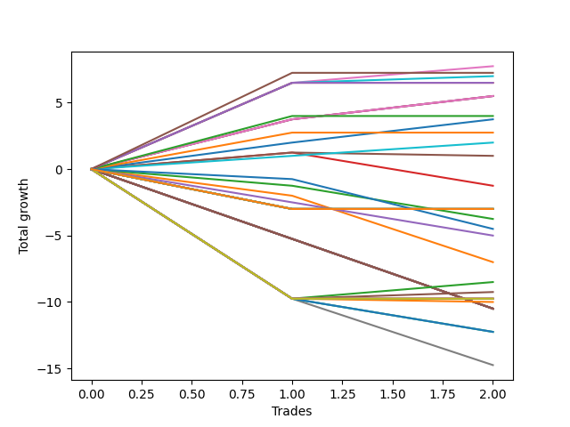

# Long Labrador 007 
- Symbol: ES_830-1130
- Date Range: 03/18/2022 - 12/30/2022
- Trading Period: 8:30-11:30
- Number of Trades: 2



| Name | Win Percent | Profit | Avg Profit / Trade | Avg Time / Trade |      | Name | Win Percent | Profit | Avg Profit / Trade | Avg Time / Trade |
| ---- | ----------- | ------ | ------------------ | ---------------- | ---- | ---- | ----------- | ------ | ------------------ | ---------------- |
| Sorted By <br> Profit | | | | | | Sorted By <br> Win Percentage ||||
| BB-50 U/L 2SD | 100.00 | 3875.00 | 1937.50 | 52:27 |     | BB-50 U/L 2SD | 100.00 | 3875.00 | 1937.50 | 52:27 |
| TP-7 | 100.00 | 3625.00 | 1812.50 | 52:55 |     | TP-7 | 100.00 | 3625.00 | 1812.50 | 52:55 |
| BB-100 Mid | 100.00 | 3500.00 | 1750.00 | 47:47 |     | BB-100 Mid | 100.00 | 3500.00 | 1750.00 | 47:47 |
| TP-6 | 100.00 | 3250.00 | 1625.00 | 52:50 |     | TP-6 | 100.00 | 3250.00 | 1625.00 | 52:50 |
| TP-5 | 100.00 | 3250.00 | 1625.00 | 52:50 |     | TP-5 | 100.00 | 3250.00 | 1625.00 | 52:50 |
| BB-20 Mid | 100.00 | 2750.00 | 1375.00 | 04:12 |     | BB-20 Mid | 100.00 | 2750.00 | 1375.00 | 04:12 |
| TP-4 | 100.00 | 2000.00 | 1000.00 | 33:35 |     | TP-4 | 100.00 | 2000.00 | 1000.00 | 33:35 |
| TP-2 | 100.00 | 1875.00 | 937.50 | 03:30 |     | TP-2 | 100.00 | 1875.00 | 937.50 | 03:30 |
| TP-3 | 100.00 | 1375.00 | 687.50 | 33:02 |     | TP-3 | 100.00 | 1375.00 | 687.50 | 33:02 |
| TP-1 | 100.00 | 1000.00 | 500.00 | 02:50 |     | TP-1 | 100.00 | 1000.00 | 500.00 | 02:50 |
| BB-50 U/L 1SD | 50.00 | 500.00 | 250.00 | 46:30 |     | BB-50 U/L 1SD | 50.00 | 500.00 | 250.00 | 46:30 |
| BB-20 U/L 2SD C | 50.00 | -625.00 | -312.50 | 44:07 |     | BB-20 U/L 2SD C | 50.00 | -625.00 | -312.50 | 44:07 |
| NEWFI 000 | 50.00 | -1500.00 | -750.00 | 60:55 |     | NEWFI 000 | 50.00 | -1500.00 | -750.00 | 60:55 |
| TP-10 | 50.00 | -1500.00 | -750.00 | 60:55 |     | TP-10 | 50.00 | -1500.00 | -750.00 | 60:55 |
| TP-9 | 50.00 | -1500.00 | -750.00 | 60:55 |     | TP-9 | 50.00 | -1500.00 | -750.00 | 60:55 |
| TP-8 | 50.00 | -1500.00 | -750.00 | 60:55 |     | TP-8 | 50.00 | -1500.00 | -750.00 | 60:55 |
| BB-200 U/L 2SD | 50.00 | -1500.00 | -750.00 | 60:55 |     | BB-200 U/L 2SD | 50.00 | -1500.00 | -750.00 | 60:55 |
| BB-200 Mid | 50.00 | -1500.00 | -750.00 | 60:55 |     | BB-200 Mid | 50.00 | -1500.00 | -750.00 | 60:55 |
| BB-100 U/L 2SD | 50.00 | -1500.00 | -750.00 | 60:55 |     | BB-100 U/L 2SD | 50.00 | -1500.00 | -750.00 | 60:55 |
| V U/L 1SD | 50.00 | -1500.00 | -750.00 | 60:55 |     | V U/L 1SD | 50.00 | -1500.00 | -750.00 | 60:55 |
| V Mid | 50.00 | -1500.00 | -750.00 | 60:55 |     | V Mid | 50.00 | -1500.00 | -750.00 | 60:55 |
| BB-20 U/L 2SD | 0.00 | -1875.00 | -937.50 | 39:12 |     | BB-20 U/L 2SD | 0.00 | -1875.00 | -937.50 | 39:12 |
| NEWFI 0000 | 0.00 | -2250.00 | -1125.00 | 11:35 |     | NEWFI 0000 | 0.00 | -2250.00 | -1125.00 | 11:35 |
| BB-50 Mid | 0.00 | -2500.00 | -1250.00 | 43:47 |     | BB-50 Mid | 0.00 | -2500.00 | -1250.00 | 43:47 |
| BB-20 U/L 1SD | 0.00 | -3500.00 | -1750.00 | 37:57 |     | BB-20 U/L 1SD | 0.00 | -3500.00 | -1750.00 | 37:57 |

## NO STOPLOSS

### Test BB-20 Mid
* Sell when price hits the middle line of the 20p bollinger
* No Stoploss
* Results:
```
Total Trades: 2
Percent Up: 100.00
Percent Down: 0.00
Total Points Moved Up: 5.50
Potential Profit: 2750.00
Total Points Ups: 5.50 Count Ups: 2
Total Points Downs: 0.00 Count Downs: 0
```

<details><summary>Trades</summary>

<code>In: 2022-09-20 10:37:00		Out: 2022-09-20 10:43:05		Total Position Time: 06:05		Total Move Up: 3.75		Total to Date: 3.75</code> <br />
<code>In: 2022-12-27 11:01:00		Out: 2022-12-27 11:03:20		Total Position Time: 02:20		Total Move Up: 1.75		Total to Date: 5.50</code> <br />


</details>

### Test BB-20 U/L 1SD
* Sell when the price hits the upper line of the 20p 1std bollinger
* No Stoploss
* Results:
```
Total Trades: 2
Percent Up: 0.00
Percent Down: 100.00
Total Points Moved Up: -7.00
Potential Profit: -3500.00
Total Points Ups: 0.00 Count Ups: 0
Total Points Downs: -7.00 Count Downs: 2
```

<details><summary>Trades</summary>

<code>In: 2022-09-20 10:37:00		Out: 2022-09-20 11:08:15		Total Position Time: 31:15		Total Move Up: -2.00		Total to Date: -2.00</code> <br />
<code>In: 2022-12-27 11:01:00		Out: 2022-12-27 11:45:40		Total Position Time: 44:40		Total Move Up: -5.00		Total to Date: -7.00</code> <br />


</details>

### Test BB-20 U/L 2SD
* Sell when the price hits the upper line of the 20p 2std bollinger
* No Stoploss
* Results:
```
Total Trades: 2
Percent Up: 0.00
Percent Down: 100.00
Total Points Moved Up: -3.75
Potential Profit: -1875.00
Total Points Ups: 0.00 Count Ups: 0
Total Points Downs: -3.75 Count Downs: 2
```

<details><summary>Trades</summary>

<code>In: 2022-09-20 10:37:00		Out: 2022-09-20 11:10:05		Total Position Time: 33:05		Total Move Up: -1.25		Total to Date: -1.25</code> <br />
<code>In: 2022-12-27 11:01:00		Out: 2022-12-27 11:46:20		Total Position Time: 45:20		Total Move Up: -2.50		Total to Date: -3.75</code> <br />


</details>

### Test BB-20 U/L 2SD C
* Sell when the price hits the upper line of the 20p 2std bollinger
* No Stoploss
* Results:
```
Total Trades: 2
Percent Up: 50.00
Percent Down: 50.00
Total Points Moved Up: -1.25
Potential Profit: -625.00
Total Points Ups: 1.25 Count Ups: 1
Total Points Downs: -2.50 Count Downs: 1
```

<details><summary>Trades</summary>

<code>In: 2022-09-20 10:37:00		Out: 2022-09-20 11:19:55		Total Position Time: 42:55		Total Move Up: 1.25		Total to Date: 1.25</code> <br />
<code>In: 2022-12-27 11:01:00		Out: 2022-12-27 11:46:20		Total Position Time: 45:20		Total Move Up: -2.50		Total to Date: -1.25</code> <br />


</details>

### Test BB-50 Mid
* Sell when price hits the middle line of the 50p bollinger
* No Stoploss
* Results:
```
Total Trades: 2
Percent Up: 0.00
Percent Down: 100.00
Total Points Moved Up: -5.00
Potential Profit: -2500.00
Total Points Ups: 0.00 Count Ups: 0
Total Points Downs: -5.00 Count Downs: 2
```

<details><summary>Trades</summary>

<code>In: 2022-09-20 10:37:00		Out: 2022-09-20 11:19:15		Total Position Time: 42:15		Total Move Up: -2.50		Total to Date: -2.50</code> <br />
<code>In: 2022-12-27 11:01:00		Out: 2022-12-27 11:46:20		Total Position Time: 45:20		Total Move Up: -2.50		Total to Date: -5.00</code> <br />


</details>

### Test BB-50 U/L 1SD
* Sell when the price hits the upper line of the 50p 1std bollinger
* No Stoploss
* Results:
```
Total Trades: 2
Percent Up: 50.00
Percent Down: 50.00
Total Points Moved Up: 1.00
Potential Profit: 500.00
Total Points Ups: 1.25 Count Ups: 1
Total Points Downs: -0.25 Count Downs: 1
```

<details><summary>Trades</summary>

<code>In: 2022-09-20 10:37:00		Out: 2022-09-20 11:19:55		Total Position Time: 42:55		Total Move Up: 1.25		Total to Date: 1.25</code> <br />
<code>In: 2022-12-27 11:01:00		Out: 2022-12-27 11:51:05		Total Position Time: 50:05		Total Move Up: -0.25		Total to Date: 1.00</code> <br />


</details>

### Test BB-50 U/L 2SD
* Sell when the price hits the upper line of the 50p 2std bollinger
* No Stoploss
* Results:
```
Total Trades: 2
Percent Up: 100.00
Percent Down: 0.00
Total Points Moved Up: 7.75
Potential Profit: 3875.00
Total Points Ups: 7.75 Count Ups: 2
Total Points Downs: 0.00 Count Downs: 0
```

<details><summary>Trades</summary>

<code>In: 2022-09-20 10:37:00		Out: 2022-09-20 11:21:45		Total Position Time: 44:45		Total Move Up: 6.50		Total to Date: 6.50</code> <br />
<code>In: 2022-12-27 11:01:00		Out: 2022-12-27 12:01:10		Total Position Time: 60:10		Total Move Up: 1.25		Total to Date: 7.75</code> <br />


</details>

### Test V Mid
* Sell when the price hits the middle line of the 1std VWAP
* No Stoploss
* Results:
```
Total Trades: 2
Percent Up: 50.00
Percent Down: 50.00
Total Points Moved Up: -3.00
Potential Profit: -1500.00
Total Points Ups: 0.00 Count Ups: 1
Total Points Downs: -3.00 Count Downs: 1
```

<details><summary>Trades</summary>

<code>In: 2022-09-20 10:37:00		Out: 2022-09-20 11:37:55		Total Position Time: 60:55		Total Move Up: -3.00		Total to Date: -3.00</code> <br />
<code>In: 2022-12-27 11:01:00		Out: 2022-12-27 12:01:55		Total Position Time: 60:55		Total Move Up: 0.00		Total to Date: -3.00</code> <br />


</details>

### Test V U/L 1SD
* Sell when the price hits the upper line of the 1std VWAP
* No Stoploss
* Results:
```
Total Trades: 2
Percent Up: 50.00
Percent Down: 50.00
Total Points Moved Up: -3.00
Potential Profit: -1500.00
Total Points Ups: 0.00 Count Ups: 1
Total Points Downs: -3.00 Count Downs: 1
```

<details><summary>Trades</summary>

<code>In: 2022-09-20 10:37:00		Out: 2022-09-20 11:37:55		Total Position Time: 60:55		Total Move Up: -3.00		Total to Date: -3.00</code> <br />
<code>In: 2022-12-27 11:01:00		Out: 2022-12-27 12:01:55		Total Position Time: 60:55		Total Move Up: 0.00		Total to Date: -3.00</code> <br />


</details>

### Test BB-100 Mid
* Move to BB100 Mid
* No Stoploss
* Results:
```
Total Trades: 2
Percent Up: 100.00
Percent Down: 0.00
Total Points Moved Up: 7.00
Potential Profit: 3500.00
Total Points Ups: 7.00 Count Ups: 2
Total Points Downs: 0.00 Count Downs: 0
```

<details><summary>Trades</summary>

<code>In: 2022-09-20 10:37:00		Out: 2022-09-20 11:21:45		Total Position Time: 44:45		Total Move Up: 6.50		Total to Date: 6.50</code> <br />
<code>In: 2022-12-27 11:01:00		Out: 2022-12-27 11:51:50		Total Position Time: 50:50		Total Move Up: 0.50		Total to Date: 7.00</code> <br />


</details>

### Test BB-100 U/L 2SD
* Move to BB100 Upper Band
* No Stoploss
* Results:
```
Total Trades: 2
Percent Up: 50.00
Percent Down: 50.00
Total Points Moved Up: -3.00
Potential Profit: -1500.00
Total Points Ups: 0.00 Count Ups: 1
Total Points Downs: -3.00 Count Downs: 1
```

<details><summary>Trades</summary>

<code>In: 2022-09-20 10:37:00		Out: 2022-09-20 11:37:55		Total Position Time: 60:55		Total Move Up: -3.00		Total to Date: -3.00</code> <br />
<code>In: 2022-12-27 11:01:00		Out: 2022-12-27 12:01:55		Total Position Time: 60:55		Total Move Up: 0.00		Total to Date: -3.00</code> <br />


</details>

### Test BB-200 Mid
* Move to BB200 Mid
* No Stoploss
* Results:
```
Total Trades: 2
Percent Up: 50.00
Percent Down: 50.00
Total Points Moved Up: -3.00
Potential Profit: -1500.00
Total Points Ups: 0.00 Count Ups: 1
Total Points Downs: -3.00 Count Downs: 1
```

<details><summary>Trades</summary>

<code>In: 2022-09-20 10:37:00		Out: 2022-09-20 11:37:55		Total Position Time: 60:55		Total Move Up: -3.00		Total to Date: -3.00</code> <br />
<code>In: 2022-12-27 11:01:00		Out: 2022-12-27 12:01:55		Total Position Time: 60:55		Total Move Up: 0.00		Total to Date: -3.00</code> <br />


</details>

### Test BB-200 U/L 2SD
* Move to BB200 Upper Band
* No Stoploss
* Results:
```
Total Trades: 2
Percent Up: 50.00
Percent Down: 50.00
Total Points Moved Up: -3.00
Potential Profit: -1500.00
Total Points Ups: 0.00 Count Ups: 1
Total Points Downs: -3.00 Count Downs: 1
```

<details><summary>Trades</summary>

<code>In: 2022-09-20 10:37:00		Out: 2022-09-20 11:37:55		Total Position Time: 60:55		Total Move Up: -3.00		Total to Date: -3.00</code> <br />
<code>In: 2022-12-27 11:01:00		Out: 2022-12-27 12:01:55		Total Position Time: 60:55		Total Move Up: 0.00		Total to Date: -3.00</code> <br />


</details>

## TAKE PROFIT

### Test TP-1
* Take Profit of 1 Point
* No Stoploss
* Results:
```
Total Trades: 2
Percent Up: 100.00
Percent Down: 0.00
Total Points Moved Up: 2.00
Potential Profit: 1000.00
Total Points Ups: 2.00 Count Ups: 2
Total Points Downs: 0.00 Count Downs: 0
```

<details><summary>Trades</summary>

<code>In: 2022-09-20 10:37:00		Out: 2022-09-20 10:41:30		Total Position Time: 04:30		Total Move Up: 1.00		Total to Date: 1.00</code> <br />
<code>In: 2022-12-27 11:01:00		Out: 2022-12-27 11:02:10		Total Position Time: 01:10		Total Move Up: 1.00		Total to Date: 2.00</code> <br />


</details>

### Test TP-2
* Take Profit of 2 Point
* No Stoploss
* Results:
```
Total Trades: 2
Percent Up: 100.00
Percent Down: 0.00
Total Points Moved Up: 3.75
Potential Profit: 1875.00
Total Points Ups: 3.75 Count Ups: 2
Total Points Downs: 0.00 Count Downs: 0
```

<details><summary>Trades</summary>

<code>In: 2022-09-20 10:37:00		Out: 2022-09-20 10:41:40		Total Position Time: 04:40		Total Move Up: 2.00		Total to Date: 2.00</code> <br />
<code>In: 2022-12-27 11:01:00		Out: 2022-12-27 11:03:20		Total Position Time: 02:20		Total Move Up: 1.75		Total to Date: 3.75</code> <br />


</details>

### Test TP-3
* Take Profit of 3 Point
* No Stoploss
* Results:
```
Total Trades: 2
Percent Up: 100.00
Percent Down: 0.00
Total Points Moved Up: 2.75
Potential Profit: 1375.00
Total Points Ups: 2.75 Count Ups: 2
Total Points Downs: 0.00 Count Downs: 0
```

<details><summary>Trades</summary>

<code>In: 2022-09-20 10:37:00		Out: 2022-09-20 10:42:10		Total Position Time: 05:10		Total Move Up: 2.75		Total to Date: 2.75</code> <br />
<code>In: 2022-12-27 11:01:00		Out: 2022-12-27 12:01:55		Total Position Time: 60:55		Total Move Up: 0.00		Total to Date: 2.75</code> <br />


</details>

### Test TP-4
* Take Profit of 4 Point
* No Stoploss
* Results:
```
Total Trades: 2
Percent Up: 100.00
Percent Down: 0.00
Total Points Moved Up: 4.00
Potential Profit: 2000.00
Total Points Ups: 4.00 Count Ups: 2
Total Points Downs: 0.00 Count Downs: 0
```

<details><summary>Trades</summary>

<code>In: 2022-09-20 10:37:00		Out: 2022-09-20 10:43:15		Total Position Time: 06:15		Total Move Up: 4.00		Total to Date: 4.00</code> <br />
<code>In: 2022-12-27 11:01:00		Out: 2022-12-27 12:01:55		Total Position Time: 60:55		Total Move Up: 0.00		Total to Date: 4.00</code> <br />


</details>

### Test TP-5
* Take Profit of 5 Point
* No Stoploss
* Results:
```
Total Trades: 2
Percent Up: 100.00
Percent Down: 0.00
Total Points Moved Up: 6.50
Potential Profit: 3250.00
Total Points Ups: 6.50 Count Ups: 2
Total Points Downs: 0.00 Count Downs: 0
```

<details><summary>Trades</summary>

<code>In: 2022-09-20 10:37:00		Out: 2022-09-20 11:21:45		Total Position Time: 44:45		Total Move Up: 6.50		Total to Date: 6.50</code> <br />
<code>In: 2022-12-27 11:01:00		Out: 2022-12-27 12:01:55		Total Position Time: 60:55		Total Move Up: 0.00		Total to Date: 6.50</code> <br />


</details>

### Test TP-6
* Take Profit of 6 Point
* No Stoploss
* Results:
```
Total Trades: 2
Percent Up: 100.00
Percent Down: 0.00
Total Points Moved Up: 6.50
Potential Profit: 3250.00
Total Points Ups: 6.50 Count Ups: 2
Total Points Downs: 0.00 Count Downs: 0
```

<details><summary>Trades</summary>

<code>In: 2022-09-20 10:37:00		Out: 2022-09-20 11:21:45		Total Position Time: 44:45		Total Move Up: 6.50		Total to Date: 6.50</code> <br />
<code>In: 2022-12-27 11:01:00		Out: 2022-12-27 12:01:55		Total Position Time: 60:55		Total Move Up: 0.00		Total to Date: 6.50</code> <br />


</details>

### Test TP-7
* Take Profit of 7 Point
* No Stoploss
* Results:
```
Total Trades: 2
Percent Up: 100.00
Percent Down: 0.00
Total Points Moved Up: 7.25
Potential Profit: 3625.00
Total Points Ups: 7.25 Count Ups: 2
Total Points Downs: 0.00 Count Downs: 0
```

<details><summary>Trades</summary>

<code>In: 2022-09-20 10:37:00		Out: 2022-09-20 11:21:55		Total Position Time: 44:55		Total Move Up: 7.25		Total to Date: 7.25</code> <br />
<code>In: 2022-12-27 11:01:00		Out: 2022-12-27 12:01:55		Total Position Time: 60:55		Total Move Up: 0.00		Total to Date: 7.25</code> <br />


</details>

### Test TP-8
* Take Profit of 8 Point
* No Stoploss
* Results:
```
Total Trades: 2
Percent Up: 50.00
Percent Down: 50.00
Total Points Moved Up: -3.00
Potential Profit: -1500.00
Total Points Ups: 0.00 Count Ups: 1
Total Points Downs: -3.00 Count Downs: 1
```

<details><summary>Trades</summary>

<code>In: 2022-09-20 10:37:00		Out: 2022-09-20 11:37:55		Total Position Time: 60:55		Total Move Up: -3.00		Total to Date: -3.00</code> <br />
<code>In: 2022-12-27 11:01:00		Out: 2022-12-27 12:01:55		Total Position Time: 60:55		Total Move Up: 0.00		Total to Date: -3.00</code> <br />


</details>

### Test TP-9
* Take Profit of 9 Point
* No Stoploss
* Results:
```
Total Trades: 2
Percent Up: 50.00
Percent Down: 50.00
Total Points Moved Up: -3.00
Potential Profit: -1500.00
Total Points Ups: 0.00 Count Ups: 1
Total Points Downs: -3.00 Count Downs: 1
```

<details><summary>Trades</summary>

<code>In: 2022-09-20 10:37:00		Out: 2022-09-20 11:37:55		Total Position Time: 60:55		Total Move Up: -3.00		Total to Date: -3.00</code> <br />
<code>In: 2022-12-27 11:01:00		Out: 2022-12-27 12:01:55		Total Position Time: 60:55		Total Move Up: 0.00		Total to Date: -3.00</code> <br />


</details>

### Test TP-10
* Take Profit of 10 Point
* No Stoploss
* Results:
```
Total Trades: 2
Percent Up: 50.00
Percent Down: 50.00
Total Points Moved Up: -3.00
Potential Profit: -1500.00
Total Points Ups: 0.00 Count Ups: 1
Total Points Downs: -3.00 Count Downs: 1
```

<details><summary>Trades</summary>

<code>In: 2022-09-20 10:37:00		Out: 2022-09-20 11:37:55		Total Position Time: 60:55		Total Move Up: -3.00		Total to Date: -3.00</code> <br />
<code>In: 2022-12-27 11:01:00		Out: 2022-12-27 12:01:55		Total Position Time: 60:55		Total Move Up: 0.00		Total to Date: -3.00</code> <br />


</details>

## Indicator Exits

### Test NEWFI 000
* Newfi 0000
* No Stoploss
* Results:
```
Total Trades: 2
Percent Up: 50.00
Percent Down: 50.00
Total Points Moved Up: -3.00
Potential Profit: -1500.00
Total Points Ups: 0.00 Count Ups: 1
Total Points Downs: -3.00 Count Downs: 1
```

<details><summary>Trades</summary>

<code>In: 2022-09-20 10:37:00		Out: 2022-09-20 11:37:55		Total Position Time: 60:55		Total Move Up: -3.00		Total to Date: -3.00</code> <br />
<code>In: 2022-12-27 11:01:00		Out: 2022-12-27 12:01:55		Total Position Time: 60:55		Total Move Up: 0.00		Total to Date: -3.00</code> <br />


</details>

### Test NEWFI 0000
* Newfi 0000
* No Stoploss
* Results:
```
Total Trades: 2
Percent Up: 0.00
Percent Down: 100.00
Total Points Moved Up: -4.50
Potential Profit: -2250.00
Total Points Ups: 0.00 Count Ups: 0
Total Points Downs: -4.50 Count Downs: 2
```

<details><summary>Trades</summary>

<code>In: 2022-09-20 10:37:00		Out: 2022-09-20 10:38:05		Total Position Time: 01:05		Total Move Up: -0.75		Total to Date: -0.75</code> <br />
<code>In: 2022-12-27 11:01:00		Out: 2022-12-27 11:23:05		Total Position Time: 22:05		Total Move Up: -3.75		Total to Date: -4.50</code> <br />


</details>