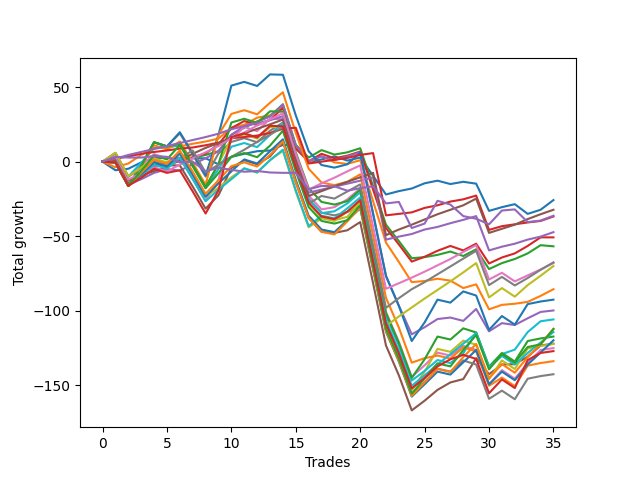

# Long Labrador 011 
- Symbol: ES_830-1130
- Date Range: 03/18/2022 - 12/30/2022
- Trading Period: 8:30-11:30
- Number of Trades: 35



| Name | Win Percent | Profit | Avg Profit / Trade | Avg Time / Trade |      | Name | Win Percent | Profit | Avg Profit / Trade | Avg Time / Trade |
| ---- | ----------- | ------ | ------------------ | ---------------- | ---- | ---- | ----------- | ------ | ------------------ | ---------------- |
| Sorted By <br> Profit | | | | | | Sorted By <br> Win Percentage ||||
| BB-20 Mid | 65.71 | -12875.00 | -367.86 | 08:29 |     | TP-1 | 91.43 | -18375.00 | -525.00 | 08:19 |
| TP-3 | 85.71 | -16125.00 | -460.71 | 20:18 |     | TP-2 | 88.57 | -23625.00 | -675.00 | 11:56 |
| NEWFI 0000 | 48.57 | -18125.00 | -517.86 | 12:09 |     | TP-3 | 85.71 | -16125.00 | -460.71 | 20:18 |
| TP-1 | 91.43 | -18375.00 | -525.00 | 08:19 |     | TP-4 | 77.14 | -34000.00 | -971.43 | 26:51 |
| TP-2 | 88.57 | -23625.00 | -675.00 | 11:56 |     | TP-5 | 71.43 | -33750.00 | -964.29 | 31:05 |
| BB-20 U/L 2SD C | 68.57 | -25375.00 | -725.00 | 26:23 |     | BB-20 U/L 2SD C | 68.57 | -25375.00 | -725.00 | 26:23 |
| BB-20 U/L 2SD | 68.57 | -28375.00 | -810.71 | 24:06 |     | BB-20 U/L 2SD | 68.57 | -28375.00 | -810.71 | 24:06 |
| TP-5 | 71.43 | -33750.00 | -964.29 | 31:05 |     | BB-20 Mid | 65.71 | -12875.00 | -367.86 | 08:29 |
| TP-4 | 77.14 | -34000.00 | -971.43 | 26:51 |     | TP-6 | 65.71 | -35000.00 | -1000.00 | 35:36 |
| TP-6 | 65.71 | -35000.00 | -1000.00 | 35:36 |     | BB-50 Mid | 65.71 | -49875.00 | -1425.00 | 30:54 |
| BB-20 U/L 1SD | 62.86 | -42750.00 | -1221.43 | 19:01 |     | BB-20 U/L 1SD | 62.86 | -42750.00 | -1221.43 | 19:01 |
| BB-100 U/L 2SD | 45.71 | -46250.00 | -1321.43 | 59:43 |     | BB-100 Mid | 62.86 | -52875.00 | -1510.71 | 46:27 |
| BB-50 Mid | 65.71 | -49875.00 | -1425.00 | 30:54 |     | BB-50 U/L 1SD | 62.86 | -61000.00 | -1742.86 | 42:30 |
| BB-100 Mid | 62.86 | -52875.00 | -1510.71 | 46:27 |     | TP-7 | 57.14 | -57125.00 | -1632.14 | 40:20 |
| TP-9 | 51.43 | -56000.00 | -1600.00 | 47:59 |     | TP-9 | 51.43 | -56000.00 | -1600.00 | 47:59 |
| TP-10 | 51.43 | -56125.00 | -1603.57 | 49:47 |     | TP-10 | 51.43 | -56125.00 | -1603.57 | 49:47 |
| TP-7 | 57.14 | -57125.00 | -1632.14 | 40:20 |     | TP-8 | 51.43 | -59875.00 | -1710.71 | 44:52 |
| BB-200 U/L 2SD | 45.71 | -58625.00 | -1675.00 | 59:51 |     | BB-50 U/L 2SD | 51.43 | -62500.00 | -1785.71 | 49:03 |
| TP-8 | 51.43 | -59875.00 | -1710.71 | 44:52 |     | NEWFI 0000 | 48.57 | -18125.00 | -517.86 | 12:09 |
| BB-50 U/L 1SD | 62.86 | -61000.00 | -1742.86 | 42:30 |     | NEWFI 000 | 48.57 | -63500.00 | -1814.29 | 55:28 |
| V U/L 1SD | 45.71 | -61125.00 | -1746.43 | 58:32 |     | BB-200 Mid | 48.57 | -66875.00 | -1910.71 | 51:42 |
| BB-50 U/L 2SD | 51.43 | -62500.00 | -1785.71 | 49:03 |     | V Mid | 48.57 | -71250.00 | -2035.71 | 53:28 |
| NEWFI 000 | 48.57 | -63500.00 | -1814.29 | 55:28 |     | BB-100 U/L 2SD | 45.71 | -46250.00 | -1321.43 | 59:43 |
| BB-200 Mid | 48.57 | -66875.00 | -1910.71 | 51:42 |     | BB-200 U/L 2SD | 45.71 | -58625.00 | -1675.00 | 59:51 |
| V Mid | 48.57 | -71250.00 | -2035.71 | 53:28 |     | V U/L 1SD | 45.71 | -61125.00 | -1746.43 | 58:32 |

## NO STOPLOSS

### Test BB-20 Mid
* Sell when price hits the middle line of the 20p bollinger
* No Stoploss
* Results:
```
Total Trades: 35
Percent Up: 65.71
Percent Down: 34.29
Total Points Moved Up: -25.75
Potential Profit: -12875.00
Total Points Ups: 52.00 Count Ups: 23
Total Points Downs: -77.75 Count Downs: 12
```

<details><summary>Trades</summary>

<code>In: 2022-03-21 10:07:00		Out: 2022-03-21 10:26:15		Total Position Time: 19:15		Total Move Up: -5.75		Total to Date: -5.75</code> <br />
<code>In: 2022-03-23 09:49:00		Out: 2022-03-23 09:53:05		Total Position Time: 04:05		Total Move Up: 1.00		Total to Date: -4.75</code> <br />
<code>In: 2022-03-28 09:00:00		Out: 2022-03-28 09:01:50		Total Position Time: 01:50		Total Move Up: 4.25		Total to Date: -0.50</code> <br />
<code>In: 2022-03-28 09:21:00		Out: 2022-03-28 09:22:50		Total Position Time: 01:50		Total Move Up: 3.00		Total to Date: 2.50</code> <br />
<code>In: 2022-03-31 09:38:00		Out: 2022-03-31 09:39:55		Total Position Time: 01:55		Total Move Up: 0.00		Total to Date: 2.50</code> <br />
<code>In: 2022-03-31 11:13:00		Out: 2022-03-31 11:23:30		Total Position Time: 10:30		Total Move Up: -0.50		Total to Date: 2.00</code> <br />
<code>In: 2022-04-12 11:26:00		Out: 2022-04-12 11:35:55		Total Position Time: 09:55		Total Move Up: 0.25		Total to Date: 2.25</code> <br />
<code>In: 2022-04-12 11:27:00		Out: 2022-04-12 11:35:55		Total Position Time: 08:55		Total Move Up: 0.00		Total to Date: 2.25</code> <br />
<code>In: 2022-05-11 10:50:00		Out: 2022-05-11 11:00:40		Total Position Time: 10:40		Total Move Up: -4.00		Total to Date: -1.75</code> <br />
<code>In: 2022-05-17 11:25:00		Out: 2022-05-17 11:31:35		Total Position Time: 06:35		Total Move Up: 5.00		Total to Date: 3.25</code> <br />
<code>In: 2022-06-06 09:15:00		Out: 2022-06-06 09:26:40		Total Position Time: 11:40		Total Move Up: 2.00		Total to Date: 5.25</code> <br />
<code>In: 2022-06-08 09:48:00		Out: 2022-06-08 09:53:05		Total Position Time: 05:05		Total Move Up: 1.75		Total to Date: 7.00</code> <br />
<code>In: 2022-06-23 09:50:00		Out: 2022-06-23 09:54:00		Total Position Time: 04:00		Total Move Up: 0.50		Total to Date: 7.50</code> <br />
<code>In: 2022-06-27 09:37:00		Out: 2022-06-27 09:41:05		Total Position Time: 04:05		Total Move Up: 3.75		Total to Date: 11.25</code> <br />
<code>In: 2022-07-18 10:02:00		Out: 2022-07-18 10:14:10		Total Position Time: 12:10		Total Move Up: -0.25		Total to Date: 11.00</code> <br />
<code>In: 2022-07-18 10:52:00		Out: 2022-07-18 11:13:30		Total Position Time: 21:30		Total Move Up: -11.50		Total to Date: -0.50</code> <br />
<code>In: 2022-07-18 11:06:00		Out: 2022-07-18 11:13:30		Total Position Time: 07:30		Total Move Up: 2.00		Total to Date: 1.50</code> <br />
<code>In: 2022-07-26 08:41:00		Out: 2022-07-26 08:43:45		Total Position Time: 02:45		Total Move Up: 2.00		Total to Date: 3.50</code> <br />
<code>In: 2022-08-08 09:22:00		Out: 2022-08-08 09:39:15		Total Position Time: 17:15		Total Move Up: -2.75		Total to Date: 0.75</code> <br />
<code>In: 2022-08-18 09:47:00		Out: 2022-08-18 09:48:10		Total Position Time: 01:10		Total Move Up: 2.00		Total to Date: 2.75</code> <br />
<code>In: 2022-09-02 09:55:00		Out: 2022-09-02 10:18:10		Total Position Time: 23:10		Total Move Up: -12.25		Total to Date: -9.50</code> <br />
<code>In: 2022-09-02 09:56:00		Out: 2022-09-02 10:18:10		Total Position Time: 22:10		Total Move Up: -12.50		Total to Date: -22.00</code> <br />
<code>In: 2022-09-02 10:11:00		Out: 2022-09-02 10:18:10		Total Position Time: 07:10		Total Move Up: 2.25		Total to Date: -19.75</code> <br />
<code>In: 2022-09-02 10:12:00		Out: 2022-09-02 10:18:10		Total Position Time: 06:10		Total Move Up: 1.75		Total to Date: -18.00</code> <br />
<code>In: 2022-09-12 09:07:00		Out: 2022-09-12 09:08:15		Total Position Time: 01:15		Total Move Up: 3.50		Total to Date: -14.50</code> <br />
<code>In: 2022-09-12 09:13:00		Out: 2022-09-12 09:14:10		Total Position Time: 01:10		Total Move Up: 1.75		Total to Date: -12.75</code> <br />
<code>In: 2022-09-14 11:00:00		Out: 2022-09-14 11:15:30		Total Position Time: 15:30		Total Move Up: -2.25		Total to Date: -15.00</code> <br />
<code>In: 2022-09-23 09:15:00		Out: 2022-09-23 09:19:50		Total Position Time: 04:50		Total Move Up: 1.50		Total to Date: -13.50</code> <br />
<code>In: 2022-09-26 09:37:00		Out: 2022-09-26 09:46:35		Total Position Time: 09:35		Total Move Up: -1.25		Total to Date: -14.75</code> <br />
<code>In: 2022-09-27 09:05:00		Out: 2022-09-27 09:27:30		Total Position Time: 22:30		Total Move Up: -18.25		Total to Date: -33.00</code> <br />
<code>In: 2022-10-31 09:50:00		Out: 2022-10-31 09:51:10		Total Position Time: 01:10		Total Move Up: 2.50		Total to Date: -30.50</code> <br />
<code>In: 2022-11-09 09:18:00		Out: 2022-11-09 09:20:55		Total Position Time: 02:55		Total Move Up: 2.00		Total to Date: -28.50</code> <br />
<code>In: 2022-11-15 10:31:00		Out: 2022-11-15 10:43:25		Total Position Time: 12:25		Total Move Up: -6.50		Total to Date: -35.00</code> <br />
<code>In: 2022-12-19 08:43:00		Out: 2022-12-19 08:45:40		Total Position Time: 02:40		Total Move Up: 2.75		Total to Date: -32.25</code> <br />
<code>In: 2022-12-30 10:29:00		Out: 2022-12-30 10:31:05		Total Position Time: 02:05		Total Move Up: 6.50		Total to Date: -25.75</code> <br />


</details>

### Test BB-20 U/L 1SD
* Sell when the price hits the upper line of the 20p 1std bollinger
* No Stoploss
* Results:
```
Total Trades: 35
Percent Up: 62.86
Percent Down: 37.14
Total Points Moved Up: -85.50
Potential Profit: -42750.00
Total Points Ups: 65.25 Count Ups: 22
Total Points Downs: -150.75 Count Downs: 13
```

<details><summary>Trades</summary>

<code>In: 2022-03-21 10:07:00		Out: 2022-03-21 10:32:05		Total Position Time: 25:05		Total Move Up: -3.75		Total to Date: -3.75</code> <br />
<code>In: 2022-03-23 09:49:00		Out: 2022-03-23 09:59:45		Total Position Time: 10:45		Total Move Up: 2.50		Total to Date: -1.25</code> <br />
<code>In: 2022-03-28 09:00:00		Out: 2022-03-28 09:05:15		Total Position Time: 05:15		Total Move Up: 5.75		Total to Date: 4.50</code> <br />
<code>In: 2022-03-28 09:21:00		Out: 2022-03-28 09:25:35		Total Position Time: 04:35		Total Move Up: 4.75		Total to Date: 9.25</code> <br />
<code>In: 2022-03-31 09:38:00		Out: 2022-03-31 09:41:05		Total Position Time: 03:05		Total Move Up: 1.25		Total to Date: 10.50</code> <br />
<code>In: 2022-03-31 11:13:00		Out: 2022-03-31 11:29:15		Total Position Time: 16:15		Total Move Up: -0.25		Total to Date: 10.25</code> <br />
<code>In: 2022-04-12 11:26:00		Out: 2022-04-12 11:37:20		Total Position Time: 11:20		Total Move Up: 1.75		Total to Date: 12.00</code> <br />
<code>In: 2022-04-12 11:27:00		Out: 2022-04-12 11:37:20		Total Position Time: 10:20		Total Move Up: 1.50		Total to Date: 13.50</code> <br />
<code>In: 2022-05-11 10:50:00		Out: 2022-05-11 11:01:20		Total Position Time: 11:20		Total Move Up: 2.00		Total to Date: 15.50</code> <br />
<code>In: 2022-05-17 11:25:00		Out: 2022-05-17 11:39:45		Total Position Time: 14:45		Total Move Up: 7.25		Total to Date: 22.75</code> <br />
<code>In: 2022-06-06 09:15:00		Out: 2022-06-06 09:37:35		Total Position Time: 22:35		Total Move Up: 2.00		Total to Date: 24.75</code> <br />
<code>In: 2022-06-08 09:48:00		Out: 2022-06-08 09:59:05		Total Position Time: 11:05		Total Move Up: 4.75		Total to Date: 29.50</code> <br />
<code>In: 2022-06-23 09:50:00		Out: 2022-06-23 09:56:15		Total Position Time: 06:15		Total Move Up: 1.50		Total to Date: 31.00</code> <br />
<code>In: 2022-06-27 09:37:00		Out: 2022-06-27 09:44:20		Total Position Time: 07:20		Total Move Up: 5.50		Total to Date: 36.50</code> <br />
<code>In: 2022-07-18 10:02:00		Out: 2022-07-18 11:02:55		Total Position Time: 60:55		Total Move Up: -27.25		Total to Date: 9.25</code> <br />
<code>In: 2022-07-18 10:52:00		Out: 2022-07-18 11:15:45		Total Position Time: 23:45		Total Move Up: -9.50		Total to Date: -0.25</code> <br />
<code>In: 2022-07-18 11:06:00		Out: 2022-07-18 11:15:45		Total Position Time: 09:45		Total Move Up: 4.00		Total to Date: 3.75</code> <br />
<code>In: 2022-07-26 08:41:00		Out: 2022-07-26 09:15:35		Total Position Time: 34:35		Total Move Up: -4.25		Total to Date: -0.50</code> <br />
<code>In: 2022-08-08 09:22:00		Out: 2022-08-08 09:43:00		Total Position Time: 21:00		Total Move Up: -1.00		Total to Date: -1.50</code> <br />
<code>In: 2022-08-18 09:47:00		Out: 2022-08-18 09:55:25		Total Position Time: 08:25		Total Move Up: 2.50		Total to Date: 1.00</code> <br />
<code>In: 2022-09-02 09:55:00		Out: 2022-09-02 10:43:30		Total Position Time: 48:30		Total Move Up: -27.50		Total to Date: -26.50</code> <br />
<code>In: 2022-09-02 09:56:00		Out: 2022-09-02 10:43:30		Total Position Time: 47:30		Total Move Up: -27.75		Total to Date: -54.25</code> <br />
<code>In: 2022-09-02 10:11:00		Out: 2022-09-02 10:43:30		Total Position Time: 32:30		Total Move Up: -13.00		Total to Date: -67.25</code> <br />
<code>In: 2022-09-02 10:12:00		Out: 2022-09-02 10:43:30		Total Position Time: 31:30		Total Move Up: -13.50		Total to Date: -80.75</code> <br />
<code>In: 2022-09-12 09:07:00		Out: 2022-09-12 09:21:25		Total Position Time: 14:25		Total Move Up: 0.75		Total to Date: -80.00</code> <br />
<code>In: 2022-09-12 09:13:00		Out: 2022-09-12 09:21:25		Total Position Time: 08:25		Total Move Up: 1.50		Total to Date: -78.50</code> <br />
<code>In: 2022-09-14 11:00:00		Out: 2022-09-14 11:19:10		Total Position Time: 19:10		Total Move Up: -1.25		Total to Date: -79.75</code> <br />
<code>In: 2022-09-23 09:15:00		Out: 2022-09-23 09:46:10		Total Position Time: 31:10		Total Move Up: -5.00		Total to Date: -84.75</code> <br />
<code>In: 2022-09-26 09:37:00		Out: 2022-09-26 09:47:05		Total Position Time: 10:05		Total Move Up: 2.50		Total to Date: -82.25</code> <br />
<code>In: 2022-09-27 09:05:00		Out: 2022-09-27 09:31:05		Total Position Time: 26:05		Total Move Up: -16.75		Total to Date: -99.00</code> <br />
<code>In: 2022-10-31 09:50:00		Out: 2022-10-31 09:57:05		Total Position Time: 07:05		Total Move Up: 3.00		Total to Date: -96.00</code> <br />
<code>In: 2022-11-09 09:18:00		Out: 2022-11-09 09:32:45		Total Position Time: 14:45		Total Move Up: 0.75		Total to Date: -95.25</code> <br />
<code>In: 2022-11-15 10:31:00		Out: 2022-11-15 10:44:25		Total Position Time: 13:25		Total Move Up: 1.25		Total to Date: -94.00</code> <br />
<code>In: 2022-12-19 08:43:00		Out: 2022-12-19 08:52:05		Total Position Time: 09:05		Total Move Up: 4.00		Total to Date: -90.00</code> <br />
<code>In: 2022-12-30 10:29:00		Out: 2022-12-30 11:03:00		Total Position Time: 34:00		Total Move Up: 4.50		Total to Date: -85.50</code> <br />


</details>

### Test BB-20 U/L 2SD
* Sell when the price hits the upper line of the 20p 2std bollinger
* No Stoploss
* Results:
```
Total Trades: 35
Percent Up: 68.57
Percent Down: 31.43
Total Points Moved Up: -56.75
Potential Profit: -28375.00
Total Points Ups: 88.50 Count Ups: 24
Total Points Downs: -145.25 Count Downs: 11
```

<details><summary>Trades</summary>

<code>In: 2022-03-21 10:07:00		Out: 2022-03-21 10:34:15		Total Position Time: 27:15		Total Move Up: 0.25		Total to Date: 0.25</code> <br />
<code>In: 2022-03-23 09:49:00		Out: 2022-03-23 10:49:55		Total Position Time: 60:55		Total Move Up: -15.75		Total to Date: -15.50</code> <br />
<code>In: 2022-03-28 09:00:00		Out: 2022-03-28 09:07:10		Total Position Time: 07:10		Total Move Up: 7.50		Total to Date: -8.00</code> <br />
<code>In: 2022-03-28 09:21:00		Out: 2022-03-28 09:30:55		Total Position Time: 09:55		Total Move Up: 5.50		Total to Date: -2.50</code> <br />
<code>In: 2022-03-31 09:38:00		Out: 2022-03-31 09:44:20		Total Position Time: 06:20		Total Move Up: 2.00		Total to Date: -0.50</code> <br />
<code>In: 2022-03-31 11:13:00		Out: 2022-03-31 11:29:25		Total Position Time: 16:25		Total Move Up: 0.75		Total to Date: 0.25</code> <br />
<code>In: 2022-04-12 11:26:00		Out: 2022-04-12 11:46:50		Total Position Time: 20:50		Total Move Up: 2.25		Total to Date: 2.50</code> <br />
<code>In: 2022-04-12 11:27:00		Out: 2022-04-12 11:46:50		Total Position Time: 19:50		Total Move Up: 2.00		Total to Date: 4.50</code> <br />
<code>In: 2022-05-11 10:50:00		Out: 2022-05-11 11:02:35		Total Position Time: 12:35		Total Move Up: 2.50		Total to Date: 7.00</code> <br />
<code>In: 2022-05-17 11:25:00		Out: 2022-05-17 11:40:05		Total Position Time: 15:05		Total Move Up: 11.00		Total to Date: 18.00</code> <br />
<code>In: 2022-06-06 09:15:00		Out: 2022-06-06 09:41:50		Total Position Time: 26:50		Total Move Up: 4.75		Total to Date: 22.75</code> <br />
<code>In: 2022-06-08 09:48:00		Out: 2022-06-08 10:00:05		Total Position Time: 12:05		Total Move Up: 4.25		Total to Date: 27.00</code> <br />
<code>In: 2022-06-23 09:50:00		Out: 2022-06-23 10:07:40		Total Position Time: 17:40		Total Move Up: 3.50		Total to Date: 30.50</code> <br />
<code>In: 2022-06-27 09:37:00		Out: 2022-06-27 09:45:05		Total Position Time: 08:05		Total Move Up: 8.00		Total to Date: 38.50</code> <br />
<code>In: 2022-07-18 10:02:00		Out: 2022-07-18 11:02:55		Total Position Time: 60:55		Total Move Up: -27.25		Total to Date: 11.25</code> <br />
<code>In: 2022-07-18 10:52:00		Out: 2022-07-18 11:16:05		Total Position Time: 24:05		Total Move Up: -8.50		Total to Date: 2.75</code> <br />
<code>In: 2022-07-18 11:06:00		Out: 2022-07-18 11:16:05		Total Position Time: 10:05		Total Move Up: 5.00		Total to Date: 7.75</code> <br />
<code>In: 2022-07-26 08:41:00		Out: 2022-07-26 09:16:25		Total Position Time: 35:25		Total Move Up: -3.00		Total to Date: 4.75</code> <br />
<code>In: 2022-08-08 09:22:00		Out: 2022-08-08 09:45:40		Total Position Time: 23:40		Total Move Up: 1.50		Total to Date: 6.25</code> <br />
<code>In: 2022-08-18 09:47:00		Out: 2022-08-18 10:06:05		Total Position Time: 19:05		Total Move Up: 2.75		Total to Date: 9.00</code> <br />
<code>In: 2022-09-02 09:55:00		Out: 2022-09-02 10:43:50		Total Position Time: 48:50		Total Move Up: -25.50		Total to Date: -16.50</code> <br />
<code>In: 2022-09-02 09:56:00		Out: 2022-09-02 10:43:50		Total Position Time: 47:50		Total Move Up: -25.75		Total to Date: -42.25</code> <br />
<code>In: 2022-09-02 10:11:00		Out: 2022-09-02 10:43:50		Total Position Time: 32:50		Total Move Up: -11.00		Total to Date: -53.25</code> <br />
<code>In: 2022-09-02 10:12:00		Out: 2022-09-02 10:43:50		Total Position Time: 31:50		Total Move Up: -11.50		Total to Date: -64.75</code> <br />
<code>In: 2022-09-12 09:07:00		Out: 2022-09-12 09:21:25		Total Position Time: 14:25		Total Move Up: 0.75		Total to Date: -64.00</code> <br />
<code>In: 2022-09-12 09:13:00		Out: 2022-09-12 09:21:25		Total Position Time: 08:25		Total Move Up: 1.50		Total to Date: -62.50</code> <br />
<code>In: 2022-09-14 11:00:00		Out: 2022-09-14 11:30:30		Total Position Time: 30:30		Total Move Up: 2.25		Total to Date: -60.25</code> <br />
<code>In: 2022-09-23 09:15:00		Out: 2022-09-23 09:46:55		Total Position Time: 31:55		Total Move Up: -3.00		Total to Date: -63.25</code> <br />
<code>In: 2022-09-26 09:37:00		Out: 2022-09-26 09:47:25		Total Position Time: 10:25		Total Move Up: 4.50		Total to Date: -58.75</code> <br />
<code>In: 2022-09-27 09:05:00		Out: 2022-09-27 09:34:25		Total Position Time: 29:25		Total Move Up: -13.25		Total to Date: -72.00</code> <br />
<code>In: 2022-10-31 09:50:00		Out: 2022-10-31 10:02:05		Total Position Time: 12:05		Total Move Up: 4.00		Total to Date: -68.00</code> <br />
<code>In: 2022-11-09 09:18:00		Out: 2022-11-09 09:34:10		Total Position Time: 16:10		Total Move Up: 2.75		Total to Date: -65.25</code> <br />
<code>In: 2022-11-15 10:31:00		Out: 2022-11-15 10:46:40		Total Position Time: 15:40		Total Move Up: 3.75		Total to Date: -61.50</code> <br />
<code>In: 2022-12-19 08:43:00		Out: 2022-12-19 09:02:30		Total Position Time: 19:30		Total Move Up: 5.50		Total to Date: -56.00</code> <br />
<code>In: 2022-12-30 10:29:00		Out: 2022-12-30 11:28:35		Total Position Time: 59:35		Total Move Up: -0.75		Total to Date: -56.75</code> <br />


</details>

### Test BB-20 U/L 2SD C
* Sell when the price hits the upper line of the 20p 2std bollinger
* No Stoploss
* Results:
```
Total Trades: 35
Percent Up: 68.57
Percent Down: 31.43
Total Points Moved Up: -50.75
Potential Profit: -25375.00
Total Points Ups: 96.50 Count Ups: 24
Total Points Downs: -147.25 Count Downs: 11
```

<details><summary>Trades</summary>

<code>In: 2022-03-21 10:07:00		Out: 2022-03-21 10:34:15		Total Position Time: 27:15		Total Move Up: 0.25		Total to Date: 0.25</code> <br />
<code>In: 2022-03-23 09:49:00		Out: 2022-03-23 10:49:55		Total Position Time: 60:55		Total Move Up: -15.75		Total to Date: -15.50</code> <br />
<code>In: 2022-03-28 09:00:00		Out: 2022-03-28 09:07:10		Total Position Time: 07:10		Total Move Up: 7.50		Total to Date: -8.00</code> <br />
<code>In: 2022-03-28 09:21:00		Out: 2022-03-28 09:30:55		Total Position Time: 09:55		Total Move Up: 5.50		Total to Date: -2.50</code> <br />
<code>In: 2022-03-31 09:38:00		Out: 2022-03-31 09:44:20		Total Position Time: 06:20		Total Move Up: 2.00		Total to Date: -0.50</code> <br />
<code>In: 2022-03-31 11:13:00		Out: 2022-03-31 11:29:25		Total Position Time: 16:25		Total Move Up: 0.75		Total to Date: 0.25</code> <br />
<code>In: 2022-04-12 11:26:00		Out: 2022-04-12 11:47:00		Total Position Time: 21:00		Total Move Up: 2.75		Total to Date: 3.00</code> <br />
<code>In: 2022-04-12 11:27:00		Out: 2022-04-12 11:47:00		Total Position Time: 20:00		Total Move Up: 2.50		Total to Date: 5.50</code> <br />
<code>In: 2022-05-11 10:50:00		Out: 2022-05-11 11:04:55		Total Position Time: 14:55		Total Move Up: 6.00		Total to Date: 11.50</code> <br />
<code>In: 2022-05-17 11:25:00		Out: 2022-05-17 11:40:05		Total Position Time: 15:05		Total Move Up: 11.00		Total to Date: 22.50</code> <br />
<code>In: 2022-06-06 09:15:00		Out: 2022-06-06 09:41:50		Total Position Time: 26:50		Total Move Up: 4.75		Total to Date: 27.25</code> <br />
<code>In: 2022-06-08 09:48:00		Out: 2022-06-08 10:48:55		Total Position Time: 60:55		Total Move Up: -2.75		Total to Date: 24.50</code> <br />
<code>In: 2022-06-23 09:50:00		Out: 2022-06-23 10:07:40		Total Position Time: 17:40		Total Move Up: 3.50		Total to Date: 28.00</code> <br />
<code>In: 2022-06-27 09:37:00		Out: 2022-06-27 09:45:05		Total Position Time: 08:05		Total Move Up: 8.00		Total to Date: 36.00</code> <br />
<code>In: 2022-07-18 10:02:00		Out: 2022-07-18 11:02:55		Total Position Time: 60:55		Total Move Up: -27.25		Total to Date: 8.75</code> <br />
<code>In: 2022-07-18 10:52:00		Out: 2022-07-18 11:16:05		Total Position Time: 24:05		Total Move Up: -8.50		Total to Date: 0.25</code> <br />
<code>In: 2022-07-18 11:06:00		Out: 2022-07-18 11:16:05		Total Position Time: 10:05		Total Move Up: 5.00		Total to Date: 5.25</code> <br />
<code>In: 2022-07-26 08:41:00		Out: 2022-07-26 09:16:25		Total Position Time: 35:25		Total Move Up: -3.00		Total to Date: 2.25</code> <br />
<code>In: 2022-08-08 09:22:00		Out: 2022-08-08 09:45:55		Total Position Time: 23:55		Total Move Up: 1.75		Total to Date: 4.00</code> <br />
<code>In: 2022-08-18 09:47:00		Out: 2022-08-18 10:06:05		Total Position Time: 19:05		Total Move Up: 2.75		Total to Date: 6.75</code> <br />
<code>In: 2022-09-02 09:55:00		Out: 2022-09-02 10:43:50		Total Position Time: 48:50		Total Move Up: -25.50		Total to Date: -18.75</code> <br />
<code>In: 2022-09-02 09:56:00		Out: 2022-09-02 10:43:50		Total Position Time: 47:50		Total Move Up: -25.75		Total to Date: -44.50</code> <br />
<code>In: 2022-09-02 10:11:00		Out: 2022-09-02 10:43:50		Total Position Time: 32:50		Total Move Up: -11.00		Total to Date: -55.50</code> <br />
<code>In: 2022-09-02 10:12:00		Out: 2022-09-02 10:43:50		Total Position Time: 31:50		Total Move Up: -11.50		Total to Date: -67.00</code> <br />
<code>In: 2022-09-12 09:07:00		Out: 2022-09-12 09:23:10		Total Position Time: 16:10		Total Move Up: 3.25		Total to Date: -63.75</code> <br />
<code>In: 2022-09-12 09:13:00		Out: 2022-09-12 09:23:10		Total Position Time: 10:10		Total Move Up: 4.00		Total to Date: -59.75</code> <br />
<code>In: 2022-09-14 11:00:00		Out: 2022-09-14 11:30:55		Total Position Time: 30:55		Total Move Up: 3.25		Total to Date: -56.50</code> <br />
<code>In: 2022-09-23 09:15:00		Out: 2022-09-23 09:46:55		Total Position Time: 31:55		Total Move Up: -3.00		Total to Date: -59.50</code> <br />
<code>In: 2022-09-26 09:37:00		Out: 2022-09-26 09:47:25		Total Position Time: 10:25		Total Move Up: 4.50		Total to Date: -55.00</code> <br />
<code>In: 2022-09-27 09:05:00		Out: 2022-09-27 09:34:25		Total Position Time: 29:25		Total Move Up: -13.25		Total to Date: -68.25</code> <br />
<code>In: 2022-10-31 09:50:00		Out: 2022-10-31 10:02:05		Total Position Time: 12:05		Total Move Up: 4.00		Total to Date: -64.25</code> <br />
<code>In: 2022-11-09 09:18:00		Out: 2022-11-09 09:34:45		Total Position Time: 16:45		Total Move Up: 2.75		Total to Date: -61.50</code> <br />
<code>In: 2022-11-15 10:31:00		Out: 2022-11-15 11:10:05		Total Position Time: 39:05		Total Move Up: 5.00		Total to Date: -56.50</code> <br />
<code>In: 2022-12-19 08:43:00		Out: 2022-12-19 09:02:35		Total Position Time: 19:35		Total Move Up: 5.75		Total to Date: -50.75</code> <br />
<code>In: 2022-12-30 10:29:00		Out: 2022-12-30 11:28:45		Total Position Time: 59:45		Total Move Up: 0.00		Total to Date: -50.75</code> <br />


</details>

### Test BB-50 Mid
* Sell when price hits the middle line of the 50p bollinger
* No Stoploss
* Results:
```
Total Trades: 35
Percent Up: 65.71
Percent Down: 34.29
Total Points Moved Up: -99.75
Potential Profit: -49875.00
Total Points Ups: 97.75 Count Ups: 23
Total Points Downs: -197.50 Count Downs: 12
```

<details><summary>Trades</summary>

<code>In: 2022-03-21 10:07:00		Out: 2022-03-21 10:34:15		Total Position Time: 27:15		Total Move Up: 0.25		Total to Date: 0.25</code> <br />
<code>In: 2022-03-23 09:49:00		Out: 2022-03-23 10:49:55		Total Position Time: 60:55		Total Move Up: -15.75		Total to Date: -15.50</code> <br />
<code>In: 2022-03-28 09:00:00		Out: 2022-03-28 09:24:15		Total Position Time: 24:15		Total Move Up: 3.75		Total to Date: -11.75</code> <br />
<code>In: 2022-03-28 09:21:00		Out: 2022-03-28 09:24:15		Total Position Time: 03:15		Total Move Up: 4.25		Total to Date: -7.50</code> <br />
<code>In: 2022-03-31 09:38:00		Out: 2022-03-31 09:45:45		Total Position Time: 07:45		Total Move Up: 2.50		Total to Date: -5.00</code> <br />
<code>In: 2022-03-31 11:13:00		Out: 2022-03-31 11:49:05		Total Position Time: 36:05		Total Move Up: -1.00		Total to Date: -6.00</code> <br />
<code>In: 2022-04-12 11:26:00		Out: 2022-04-12 11:47:05		Total Position Time: 21:05		Total Move Up: 4.25		Total to Date: -1.75</code> <br />
<code>In: 2022-04-12 11:27:00		Out: 2022-04-12 11:47:05		Total Position Time: 20:05		Total Move Up: 4.00		Total to Date: 2.25</code> <br />
<code>In: 2022-05-11 10:50:00		Out: 2022-05-11 11:04:45		Total Position Time: 14:45		Total Move Up: 4.75		Total to Date: 7.00</code> <br />
<code>In: 2022-05-17 11:25:00		Out: 2022-05-17 11:40:05		Total Position Time: 15:05		Total Move Up: 11.00		Total to Date: 18.00</code> <br />
<code>In: 2022-06-06 09:15:00		Out: 2022-06-06 09:43:15		Total Position Time: 28:15		Total Move Up: 5.75		Total to Date: 23.75</code> <br />
<code>In: 2022-06-08 09:48:00		Out: 2022-06-08 10:19:05		Total Position Time: 31:05		Total Move Up: 3.00		Total to Date: 26.75</code> <br />
<code>In: 2022-06-23 09:50:00		Out: 2022-06-23 10:07:40		Total Position Time: 17:40		Total Move Up: 3.50		Total to Date: 30.25</code> <br />
<code>In: 2022-06-27 09:37:00		Out: 2022-06-27 09:45:05		Total Position Time: 08:05		Total Move Up: 8.00		Total to Date: 38.25</code> <br />
<code>In: 2022-07-18 10:02:00		Out: 2022-07-18 11:02:55		Total Position Time: 60:55		Total Move Up: -27.25		Total to Date: 11.00</code> <br />
<code>In: 2022-07-18 10:52:00		Out: 2022-07-18 11:37:50		Total Position Time: 45:50		Total Move Up: -10.50		Total to Date: 0.50</code> <br />
<code>In: 2022-07-18 11:06:00		Out: 2022-07-18 11:37:50		Total Position Time: 31:50		Total Move Up: 3.00		Total to Date: 3.50</code> <br />
<code>In: 2022-07-26 08:41:00		Out: 2022-07-26 09:16:45		Total Position Time: 35:45		Total Move Up: -2.50		Total to Date: 1.00</code> <br />
<code>In: 2022-08-08 09:22:00		Out: 2022-08-08 09:49:00		Total Position Time: 27:00		Total Move Up: 2.50		Total to Date: 3.50</code> <br />
<code>In: 2022-08-18 09:47:00		Out: 2022-08-18 10:06:05		Total Position Time: 19:05		Total Move Up: 2.75		Total to Date: 6.25</code> <br />
<code>In: 2022-09-02 09:55:00		Out: 2022-09-02 10:55:55		Total Position Time: 60:55		Total Move Up: -41.00		Total to Date: -34.75</code> <br />
<code>In: 2022-09-02 09:56:00		Out: 2022-09-02 10:56:55		Total Position Time: 60:55		Total Move Up: -41.75		Total to Date: -76.50</code> <br />
<code>In: 2022-09-02 10:11:00		Out: 2022-09-02 11:11:55		Total Position Time: 60:55		Total Move Up: -20.00		Total to Date: -96.50</code> <br />
<code>In: 2022-09-02 10:12:00		Out: 2022-09-02 11:12:05		Total Position Time: 60:05		Total Move Up: -19.25		Total to Date: -115.75</code> <br />
<code>In: 2022-09-12 09:07:00		Out: 2022-09-12 09:24:10		Total Position Time: 17:10		Total Move Up: 4.75		Total to Date: -111.00</code> <br />
<code>In: 2022-09-12 09:13:00		Out: 2022-09-12 09:24:10		Total Position Time: 11:10		Total Move Up: 5.50		Total to Date: -105.50</code> <br />
<code>In: 2022-09-14 11:00:00		Out: 2022-09-14 11:29:30		Total Position Time: 29:30		Total Move Up: 1.00		Total to Date: -104.50</code> <br />
<code>In: 2022-09-23 09:15:00		Out: 2022-09-23 09:48:45		Total Position Time: 33:45		Total Move Up: -2.25		Total to Date: -106.75</code> <br />
<code>In: 2022-09-26 09:37:00		Out: 2022-09-26 09:52:50		Total Position Time: 15:50		Total Move Up: 8.00		Total to Date: -98.75</code> <br />
<code>In: 2022-09-27 09:05:00		Out: 2022-09-27 09:48:50		Total Position Time: 43:50		Total Move Up: -15.00		Total to Date: -113.75</code> <br />
<code>In: 2022-10-31 09:50:00		Out: 2022-10-31 10:08:30		Total Position Time: 18:30		Total Move Up: 5.50		Total to Date: -108.25</code> <br />
<code>In: 2022-11-09 09:18:00		Out: 2022-11-09 09:52:25		Total Position Time: 34:25		Total Move Up: -1.25		Total to Date: -109.50</code> <br />
<code>In: 2022-11-15 10:31:00		Out: 2022-11-15 10:57:35		Total Position Time: 26:35		Total Move Up: 4.50		Total to Date: -105.00</code> <br />
<code>In: 2022-12-19 08:43:00		Out: 2022-12-19 08:54:45		Total Position Time: 11:45		Total Move Up: 4.25		Total to Date: -100.75</code> <br />
<code>In: 2022-12-30 10:29:00		Out: 2022-12-30 11:29:20		Total Position Time: 60:20		Total Move Up: 1.00		Total to Date: -99.75</code> <br />


</details>

### Test BB-50 U/L 1SD
* Sell when the price hits the upper line of the 50p 1std bollinger
* No Stoploss
* Results:
```
Total Trades: 35
Percent Up: 62.86
Percent Down: 37.14
Total Points Moved Up: -122.00
Potential Profit: -61000.00
Total Points Ups: 123.75 Count Ups: 22
Total Points Downs: -245.75 Count Downs: 13
```

<details><summary>Trades</summary>

<code>In: 2022-03-21 10:07:00		Out: 2022-03-21 10:49:05		Total Position Time: 42:05		Total Move Up: 1.00		Total to Date: 1.00</code> <br />
<code>In: 2022-03-23 09:49:00		Out: 2022-03-23 10:49:55		Total Position Time: 60:55		Total Move Up: -15.75		Total to Date: -14.75</code> <br />
<code>In: 2022-03-28 09:00:00		Out: 2022-03-28 09:35:05		Total Position Time: 35:05		Total Move Up: 5.75		Total to Date: -9.00</code> <br />
<code>In: 2022-03-28 09:21:00		Out: 2022-03-28 09:35:05		Total Position Time: 14:05		Total Move Up: 6.25		Total to Date: -2.75</code> <br />
<code>In: 2022-03-31 09:38:00		Out: 2022-03-31 10:29:50		Total Position Time: 51:50		Total Move Up: 0.25		Total to Date: -2.50</code> <br />
<code>In: 2022-03-31 11:13:00		Out: 2022-03-31 11:56:10		Total Position Time: 43:10		Total Move Up: 0.00		Total to Date: -2.50</code> <br />
<code>In: 2022-04-12 11:26:00		Out: 2022-04-12 12:26:55		Total Position Time: 60:55		Total Move Up: -14.25		Total to Date: -16.75</code> <br />
<code>In: 2022-04-12 11:27:00		Out: 2022-04-12 12:27:55		Total Position Time: 60:55		Total Move Up: -14.75		Total to Date: -31.50</code> <br />
<code>In: 2022-05-11 10:50:00		Out: 2022-05-11 11:18:15		Total Position Time: 28:15		Total Move Up: 9.00		Total to Date: -22.50</code> <br />
<code>In: 2022-05-17 11:25:00		Out: 2022-05-17 11:44:30		Total Position Time: 19:30		Total Move Up: 18.25		Total to Date: -4.25</code> <br />
<code>In: 2022-06-06 09:15:00		Out: 2022-06-06 09:55:15		Total Position Time: 40:15		Total Move Up: 5.25		Total to Date: 1.00</code> <br />
<code>In: 2022-06-08 09:48:00		Out: 2022-06-08 10:48:55		Total Position Time: 60:55		Total Move Up: -2.75		Total to Date: -1.75</code> <br />
<code>In: 2022-06-23 09:50:00		Out: 2022-06-23 10:18:10		Total Position Time: 28:10		Total Move Up: 5.25		Total to Date: 3.50</code> <br />
<code>In: 2022-06-27 09:37:00		Out: 2022-06-27 09:53:20		Total Position Time: 16:20		Total Move Up: 10.00		Total to Date: 13.50</code> <br />
<code>In: 2022-07-18 10:02:00		Out: 2022-07-18 11:02:55		Total Position Time: 60:55		Total Move Up: -27.25		Total to Date: -13.75</code> <br />
<code>In: 2022-07-18 10:52:00		Out: 2022-07-18 11:52:55		Total Position Time: 60:55		Total Move Up: -24.00		Total to Date: -37.75</code> <br />
<code>In: 2022-07-18 11:06:00		Out: 2022-07-18 12:06:55		Total Position Time: 60:55		Total Move Up: -9.25		Total to Date: -47.00</code> <br />
<code>In: 2022-07-26 08:41:00		Out: 2022-07-26 09:24:05		Total Position Time: 43:05		Total Move Up: -0.75		Total to Date: -47.75</code> <br />
<code>In: 2022-08-08 09:22:00		Out: 2022-08-08 10:06:15		Total Position Time: 44:15		Total Move Up: 1.75		Total to Date: -46.00</code> <br />
<code>In: 2022-08-18 09:47:00		Out: 2022-08-18 10:09:35		Total Position Time: 22:35		Total Move Up: 5.50		Total to Date: -40.50</code> <br />
<code>In: 2022-09-02 09:55:00		Out: 2022-09-02 10:55:55		Total Position Time: 60:55		Total Move Up: -41.00		Total to Date: -81.50</code> <br />
<code>In: 2022-09-02 09:56:00		Out: 2022-09-02 10:56:55		Total Position Time: 60:55		Total Move Up: -41.75		Total to Date: -123.25</code> <br />
<code>In: 2022-09-02 10:11:00		Out: 2022-09-02 11:11:55		Total Position Time: 60:55		Total Move Up: -20.00		Total to Date: -143.25</code> <br />
<code>In: 2022-09-02 10:12:00		Out: 2022-09-02 11:12:55		Total Position Time: 60:55		Total Move Up: -23.50		Total to Date: -166.75</code> <br />
<code>In: 2022-09-12 09:07:00		Out: 2022-09-12 09:37:50		Total Position Time: 30:50		Total Move Up: 6.50		Total to Date: -160.25</code> <br />
<code>In: 2022-09-12 09:13:00		Out: 2022-09-12 09:37:50		Total Position Time: 24:50		Total Move Up: 7.25		Total to Date: -153.00</code> <br />
<code>In: 2022-09-14 11:00:00		Out: 2022-09-14 11:32:05		Total Position Time: 32:05		Total Move Up: 5.00		Total to Date: -148.00</code> <br />
<code>In: 2022-09-23 09:15:00		Out: 2022-09-23 09:51:30		Total Position Time: 36:30		Total Move Up: 2.25		Total to Date: -145.75</code> <br />
<code>In: 2022-09-26 09:37:00		Out: 2022-09-26 09:58:20		Total Position Time: 21:20		Total Move Up: 14.00		Total to Date: -131.75</code> <br />
<code>In: 2022-09-27 09:05:00		Out: 2022-09-27 09:54:15		Total Position Time: 49:15		Total Move Up: -10.75		Total to Date: -142.50</code> <br />
<code>In: 2022-10-31 09:50:00		Out: 2022-10-31 10:16:15		Total Position Time: 26:15		Total Move Up: 6.50		Total to Date: -136.00</code> <br />
<code>In: 2022-11-09 09:18:00		Out: 2022-11-09 10:01:50		Total Position Time: 43:50		Total Move Up: 0.25		Total to Date: -135.75</code> <br />
<code>In: 2022-11-15 10:31:00		Out: 2022-11-15 11:10:05		Total Position Time: 39:05		Total Move Up: 5.00		Total to Date: -130.75</code> <br />
<code>In: 2022-12-19 08:43:00		Out: 2022-12-19 09:07:05		Total Position Time: 24:05		Total Move Up: 7.50		Total to Date: -123.25</code> <br />
<code>In: 2022-12-30 10:29:00		Out: 2022-12-30 11:29:55		Total Position Time: 60:55		Total Move Up: 1.25		Total to Date: -122.00</code> <br />


</details>

### Test BB-50 U/L 2SD
* Sell when the price hits the upper line of the 50p 2std bollinger
* No Stoploss
* Results:
```
Total Trades: 35
Percent Up: 51.43
Percent Down: 48.57
Total Points Moved Up: -125.00
Potential Profit: -62500.00
Total Points Ups: 145.75 Count Ups: 18
Total Points Downs: -270.75 Count Downs: 17
```

<details><summary>Trades</summary>

<code>In: 2022-03-21 10:07:00		Out: 2022-03-21 11:00:15		Total Position Time: 53:15		Total Move Up: 5.75		Total to Date: 5.75</code> <br />
<code>In: 2022-03-23 09:49:00		Out: 2022-03-23 10:49:55		Total Position Time: 60:55		Total Move Up: -15.75		Total to Date: -10.00</code> <br />
<code>In: 2022-03-28 09:00:00		Out: 2022-03-28 09:39:50		Total Position Time: 39:50		Total Move Up: 7.25		Total to Date: -2.75</code> <br />
<code>In: 2022-03-28 09:21:00		Out: 2022-03-28 09:39:50		Total Position Time: 18:50		Total Move Up: 7.75		Total to Date: 5.00</code> <br />
<code>In: 2022-03-31 09:38:00		Out: 2022-03-31 10:38:55		Total Position Time: 60:55		Total Move Up: -2.75		Total to Date: 2.25</code> <br />
<code>In: 2022-03-31 11:13:00		Out: 2022-03-31 11:57:45		Total Position Time: 44:45		Total Move Up: 0.50		Total to Date: 2.75</code> <br />
<code>In: 2022-04-12 11:26:00		Out: 2022-04-12 12:26:55		Total Position Time: 60:55		Total Move Up: -14.25		Total to Date: -11.50</code> <br />
<code>In: 2022-04-12 11:27:00		Out: 2022-04-12 12:27:55		Total Position Time: 60:55		Total Move Up: -14.75		Total to Date: -26.25</code> <br />
<code>In: 2022-05-11 10:50:00		Out: 2022-05-11 11:23:40		Total Position Time: 33:40		Total Move Up: 14.25		Total to Date: -12.00</code> <br />
<code>In: 2022-05-17 11:25:00		Out: 2022-05-17 11:48:40		Total Position Time: 23:40		Total Move Up: 27.25		Total to Date: 15.25</code> <br />
<code>In: 2022-06-06 09:15:00		Out: 2022-06-06 09:56:20		Total Position Time: 41:20		Total Move Up: 8.00		Total to Date: 23.25</code> <br />
<code>In: 2022-06-08 09:48:00		Out: 2022-06-08 10:48:55		Total Position Time: 60:55		Total Move Up: -2.75		Total to Date: 20.50</code> <br />
<code>In: 2022-06-23 09:50:00		Out: 2022-06-23 10:23:20		Total Position Time: 33:20		Total Move Up: 8.25		Total to Date: 28.75</code> <br />
<code>In: 2022-06-27 09:37:00		Out: 2022-06-27 10:37:55		Total Position Time: 60:55		Total Move Up: -0.25		Total to Date: 28.50</code> <br />
<code>In: 2022-07-18 10:02:00		Out: 2022-07-18 11:02:55		Total Position Time: 60:55		Total Move Up: -27.25		Total to Date: 1.25</code> <br />
<code>In: 2022-07-18 10:52:00		Out: 2022-07-18 11:52:55		Total Position Time: 60:55		Total Move Up: -24.00		Total to Date: -22.75</code> <br />
<code>In: 2022-07-18 11:06:00		Out: 2022-07-18 12:06:55		Total Position Time: 60:55		Total Move Up: -9.25		Total to Date: -32.00</code> <br />
<code>In: 2022-07-26 08:41:00		Out: 2022-07-26 09:31:15		Total Position Time: 50:15		Total Move Up: 1.50		Total to Date: -30.50</code> <br />
<code>In: 2022-08-08 09:22:00		Out: 2022-08-08 10:13:20		Total Position Time: 51:20		Total Move Up: 5.25		Total to Date: -25.25</code> <br />
<code>In: 2022-08-18 09:47:00		Out: 2022-08-18 10:11:40		Total Position Time: 24:40		Total Move Up: 7.25		Total to Date: -18.00</code> <br />
<code>In: 2022-09-02 09:55:00		Out: 2022-09-02 10:55:55		Total Position Time: 60:55		Total Move Up: -41.00		Total to Date: -59.00</code> <br />
<code>In: 2022-09-02 09:56:00		Out: 2022-09-02 10:56:55		Total Position Time: 60:55		Total Move Up: -41.75		Total to Date: -100.75</code> <br />
<code>In: 2022-09-02 10:11:00		Out: 2022-09-02 11:11:55		Total Position Time: 60:55		Total Move Up: -20.00		Total to Date: -120.75</code> <br />
<code>In: 2022-09-02 10:12:00		Out: 2022-09-02 11:12:55		Total Position Time: 60:55		Total Move Up: -23.50		Total to Date: -144.25</code> <br />
<code>In: 2022-09-12 09:07:00		Out: 2022-09-12 09:44:15		Total Position Time: 37:15		Total Move Up: 7.75		Total to Date: -136.50</code> <br />
<code>In: 2022-09-12 09:13:00		Out: 2022-09-12 09:44:15		Total Position Time: 31:15		Total Move Up: 8.50		Total to Date: -128.00</code> <br />
<code>In: 2022-09-14 11:00:00		Out: 2022-09-14 12:00:55		Total Position Time: 60:55		Total Move Up: -2.00		Total to Date: -130.00</code> <br />
<code>In: 2022-09-23 09:15:00		Out: 2022-09-23 09:53:10		Total Position Time: 38:10		Total Move Up: 6.50		Total to Date: -123.50</code> <br />
<code>In: 2022-09-26 09:37:00		Out: 2022-09-26 10:37:55		Total Position Time: 60:55		Total Move Up: -2.75		Total to Date: -126.25</code> <br />
<code>In: 2022-09-27 09:05:00		Out: 2022-09-27 10:05:55		Total Position Time: 60:55		Total Move Up: -23.00		Total to Date: -149.25</code> <br />
<code>In: 2022-10-31 09:50:00		Out: 2022-10-31 10:17:40		Total Position Time: 27:40		Total Move Up: 9.50		Total to Date: -139.75</code> <br />
<code>In: 2022-11-09 09:18:00		Out: 2022-11-09 10:18:55		Total Position Time: 60:55		Total Move Up: -5.75		Total to Date: -145.50</code> <br />
<code>In: 2022-11-15 10:31:00		Out: 2022-11-15 11:10:20		Total Position Time: 39:20		Total Move Up: 10.50		Total to Date: -135.00</code> <br />
<code>In: 2022-12-19 08:43:00		Out: 2022-12-19 09:14:55		Total Position Time: 31:55		Total Move Up: 8.75		Total to Date: -126.25</code> <br />
<code>In: 2022-12-30 10:29:00		Out: 2022-12-30 11:29:55		Total Position Time: 60:55		Total Move Up: 1.25		Total to Date: -125.00</code> <br />


</details>

### Test V Mid
* Sell when the price hits the middle line of the 1std VWAP
* No Stoploss
* Results:
```
Total Trades: 35
Percent Up: 48.57
Percent Down: 51.43
Total Points Moved Up: -142.50
Potential Profit: -71250.00
Total Points Ups: 130.25 Count Ups: 17
Total Points Downs: -272.75 Count Downs: 18
```

<details><summary>Trades</summary>

<code>In: 2022-03-21 10:07:00		Out: 2022-03-21 11:07:55		Total Position Time: 60:55		Total Move Up: -0.50		Total to Date: -0.50</code> <br />
<code>In: 2022-03-23 09:49:00		Out: 2022-03-23 10:49:55		Total Position Time: 60:55		Total Move Up: -15.75		Total to Date: -16.25</code> <br />
<code>In: 2022-03-28 09:00:00		Out: 2022-03-28 10:00:55		Total Position Time: 60:55		Total Move Up: 13.25		Total to Date: -3.00</code> <br />
<code>In: 2022-03-28 09:21:00		Out: 2022-03-28 10:21:55		Total Position Time: 60:55		Total Move Up: 16.00		Total to Date: 13.00</code> <br />
<code>In: 2022-03-31 09:38:00		Out: 2022-03-31 10:38:55		Total Position Time: 60:55		Total Move Up: -2.75		Total to Date: 10.25</code> <br />
<code>In: 2022-03-31 11:13:00		Out: 2022-03-31 12:02:15		Total Position Time: 49:15		Total Move Up: 8.75		Total to Date: 19.00</code> <br />
<code>In: 2022-04-12 11:26:00		Out: 2022-04-12 12:26:55		Total Position Time: 60:55		Total Move Up: -14.25		Total to Date: 4.75</code> <br />
<code>In: 2022-04-12 11:27:00		Out: 2022-04-12 12:27:55		Total Position Time: 60:55		Total Move Up: -14.75		Total to Date: -10.00</code> <br />
<code>In: 2022-05-11 10:50:00		Out: 2022-05-11 11:50:55		Total Position Time: 60:55		Total Move Up: 15.50		Total to Date: 5.50</code> <br />
<code>In: 2022-05-17 11:25:00		Out: 2022-05-17 11:27:25		Total Position Time: 02:25		Total Move Up: 7.75		Total to Date: 13.25</code> <br />
<code>In: 2022-06-06 09:15:00		Out: 2022-06-06 10:15:55		Total Position Time: 60:55		Total Move Up: 2.50		Total to Date: 15.75</code> <br />
<code>In: 2022-06-08 09:48:00		Out: 2022-06-08 10:48:55		Total Position Time: 60:55		Total Move Up: -2.75		Total to Date: 13.00</code> <br />
<code>In: 2022-06-23 09:50:00		Out: 2022-06-23 10:50:55		Total Position Time: 60:55		Total Move Up: 7.75		Total to Date: 20.75</code> <br />
<code>In: 2022-06-27 09:37:00		Out: 2022-06-27 09:44:20		Total Position Time: 07:20		Total Move Up: 5.50		Total to Date: 26.25</code> <br />
<code>In: 2022-07-18 10:02:00		Out: 2022-07-18 11:02:55		Total Position Time: 60:55		Total Move Up: -27.25		Total to Date: -1.00</code> <br />
<code>In: 2022-07-18 10:52:00		Out: 2022-07-18 11:52:55		Total Position Time: 60:55		Total Move Up: -24.00		Total to Date: -25.00</code> <br />
<code>In: 2022-07-18 11:06:00		Out: 2022-07-18 12:06:55		Total Position Time: 60:55		Total Move Up: -9.25		Total to Date: -34.25</code> <br />
<code>In: 2022-07-26 08:41:00		Out: 2022-07-26 09:41:55		Total Position Time: 60:55		Total Move Up: -1.75		Total to Date: -36.00</code> <br />
<code>In: 2022-08-08 09:22:00		Out: 2022-08-08 10:22:55		Total Position Time: 60:55		Total Move Up: 2.25		Total to Date: -33.75</code> <br />
<code>In: 2022-08-18 09:47:00		Out: 2022-08-18 10:06:30		Total Position Time: 19:30		Total Move Up: 4.00		Total to Date: -29.75</code> <br />
<code>In: 2022-09-02 09:55:00		Out: 2022-09-02 10:55:55		Total Position Time: 60:55		Total Move Up: -41.00		Total to Date: -70.75</code> <br />
<code>In: 2022-09-02 09:56:00		Out: 2022-09-02 10:56:55		Total Position Time: 60:55		Total Move Up: -41.75		Total to Date: -112.50</code> <br />
<code>In: 2022-09-02 10:11:00		Out: 2022-09-02 11:11:55		Total Position Time: 60:55		Total Move Up: -20.00		Total to Date: -132.50</code> <br />
<code>In: 2022-09-02 10:12:00		Out: 2022-09-02 11:12:55		Total Position Time: 60:55		Total Move Up: -23.50		Total to Date: -156.00</code> <br />
<code>In: 2022-09-12 09:07:00		Out: 2022-09-12 09:44:25		Total Position Time: 37:25		Total Move Up: 8.25		Total to Date: -147.75</code> <br />
<code>In: 2022-09-12 09:13:00		Out: 2022-09-12 09:44:25		Total Position Time: 31:25		Total Move Up: 9.00		Total to Date: -138.75</code> <br />
<code>In: 2022-09-14 11:00:00		Out: 2022-09-14 12:00:55		Total Position Time: 60:55		Total Move Up: -2.00		Total to Date: -140.75</code> <br />
<code>In: 2022-09-23 09:15:00		Out: 2022-09-23 10:15:55		Total Position Time: 60:55		Total Move Up: 7.50		Total to Date: -133.25</code> <br />
<code>In: 2022-09-26 09:37:00		Out: 2022-09-26 10:37:55		Total Position Time: 60:55		Total Move Up: -2.75		Total to Date: -136.00</code> <br />
<code>In: 2022-09-27 09:05:00		Out: 2022-09-27 10:05:55		Total Position Time: 60:55		Total Move Up: -23.00		Total to Date: -159.00</code> <br />
<code>In: 2022-10-31 09:50:00		Out: 2022-10-31 10:08:30		Total Position Time: 18:30		Total Move Up: 5.50		Total to Date: -153.50</code> <br />
<code>In: 2022-11-09 09:18:00		Out: 2022-11-09 10:18:55		Total Position Time: 60:55		Total Move Up: -5.75		Total to Date: -159.25</code> <br />
<code>In: 2022-11-15 10:31:00		Out: 2022-11-15 11:31:55		Total Position Time: 60:55		Total Move Up: 13.75		Total to Date: -145.50</code> <br />
<code>In: 2022-12-19 08:43:00		Out: 2022-12-19 09:43:55		Total Position Time: 60:55		Total Move Up: 1.75		Total to Date: -143.75</code> <br />
<code>In: 2022-12-30 10:29:00		Out: 2022-12-30 11:29:55		Total Position Time: 60:55		Total Move Up: 1.25		Total to Date: -142.50</code> <br />


</details>

### Test V U/L 1SD
* Sell when the price hits the upper line of the 1std VWAP
* No Stoploss
* Results:
```
Total Trades: 35
Percent Up: 45.71
Percent Down: 54.29
Total Points Moved Up: -122.25
Potential Profit: -61125.00
Total Points Ups: 150.75 Count Ups: 16
Total Points Downs: -273.00 Count Downs: 19
```

<details><summary>Trades</summary>

<code>In: 2022-03-21 10:07:00		Out: 2022-03-21 11:07:55		Total Position Time: 60:55		Total Move Up: -0.50		Total to Date: -0.50</code> <br />
<code>In: 2022-03-23 09:49:00		Out: 2022-03-23 10:49:55		Total Position Time: 60:55		Total Move Up: -15.75		Total to Date: -16.25</code> <br />
<code>In: 2022-03-28 09:00:00		Out: 2022-03-28 10:00:55		Total Position Time: 60:55		Total Move Up: 13.25		Total to Date: -3.00</code> <br />
<code>In: 2022-03-28 09:21:00		Out: 2022-03-28 10:21:55		Total Position Time: 60:55		Total Move Up: 16.00		Total to Date: 13.00</code> <br />
<code>In: 2022-03-31 09:38:00		Out: 2022-03-31 10:38:55		Total Position Time: 60:55		Total Move Up: -2.75		Total to Date: 10.25</code> <br />
<code>In: 2022-03-31 11:13:00		Out: 2022-03-31 12:13:55		Total Position Time: 60:55		Total Move Up: 1.75		Total to Date: 12.00</code> <br />
<code>In: 2022-04-12 11:26:00		Out: 2022-04-12 12:26:55		Total Position Time: 60:55		Total Move Up: -14.25		Total to Date: -2.25</code> <br />
<code>In: 2022-04-12 11:27:00		Out: 2022-04-12 12:27:55		Total Position Time: 60:55		Total Move Up: -14.75		Total to Date: -17.00</code> <br />
<code>In: 2022-05-11 10:50:00		Out: 2022-05-11 11:50:55		Total Position Time: 60:55		Total Move Up: 15.50		Total to Date: -1.50</code> <br />
<code>In: 2022-05-17 11:25:00		Out: 2022-05-17 11:40:20		Total Position Time: 15:20		Total Move Up: 17.25		Total to Date: 15.75</code> <br />
<code>In: 2022-06-06 09:15:00		Out: 2022-06-06 10:15:55		Total Position Time: 60:55		Total Move Up: 2.50		Total to Date: 18.25</code> <br />
<code>In: 2022-06-08 09:48:00		Out: 2022-06-08 10:48:55		Total Position Time: 60:55		Total Move Up: -2.75		Total to Date: 15.50</code> <br />
<code>In: 2022-06-23 09:50:00		Out: 2022-06-23 10:50:55		Total Position Time: 60:55		Total Move Up: 7.75		Total to Date: 23.25</code> <br />
<code>In: 2022-06-27 09:37:00		Out: 2022-06-27 10:37:55		Total Position Time: 60:55		Total Move Up: -0.25		Total to Date: 23.00</code> <br />
<code>In: 2022-07-18 10:02:00		Out: 2022-07-18 11:02:55		Total Position Time: 60:55		Total Move Up: -27.25		Total to Date: -4.25</code> <br />
<code>In: 2022-07-18 10:52:00		Out: 2022-07-18 11:52:55		Total Position Time: 60:55		Total Move Up: -24.00		Total to Date: -28.25</code> <br />
<code>In: 2022-07-18 11:06:00		Out: 2022-07-18 12:06:55		Total Position Time: 60:55		Total Move Up: -9.25		Total to Date: -37.50</code> <br />
<code>In: 2022-07-26 08:41:00		Out: 2022-07-26 09:41:55		Total Position Time: 60:55		Total Move Up: -1.75		Total to Date: -39.25</code> <br />
<code>In: 2022-08-08 09:22:00		Out: 2022-08-08 10:22:55		Total Position Time: 60:55		Total Move Up: 2.25		Total to Date: -37.00</code> <br />
<code>In: 2022-08-18 09:47:00		Out: 2022-08-18 10:37:15		Total Position Time: 50:15		Total Move Up: 10.00		Total to Date: -27.00</code> <br />
<code>In: 2022-09-02 09:55:00		Out: 2022-09-02 10:55:55		Total Position Time: 60:55		Total Move Up: -41.00		Total to Date: -68.00</code> <br />
<code>In: 2022-09-02 09:56:00		Out: 2022-09-02 10:56:55		Total Position Time: 60:55		Total Move Up: -41.75		Total to Date: -109.75</code> <br />
<code>In: 2022-09-02 10:11:00		Out: 2022-09-02 11:11:55		Total Position Time: 60:55		Total Move Up: -20.00		Total to Date: -129.75</code> <br />
<code>In: 2022-09-02 10:12:00		Out: 2022-09-02 11:12:55		Total Position Time: 60:55		Total Move Up: -23.50		Total to Date: -153.25</code> <br />
<code>In: 2022-09-12 09:07:00		Out: 2022-09-12 10:07:55		Total Position Time: 60:55		Total Move Up: 12.50		Total to Date: -140.75</code> <br />
<code>In: 2022-09-12 09:13:00		Out: 2022-09-12 10:13:55		Total Position Time: 60:55		Total Move Up: 15.25		Total to Date: -125.50</code> <br />
<code>In: 2022-09-14 11:00:00		Out: 2022-09-14 12:00:55		Total Position Time: 60:55		Total Move Up: -2.00		Total to Date: -127.50</code> <br />
<code>In: 2022-09-23 09:15:00		Out: 2022-09-23 10:15:55		Total Position Time: 60:55		Total Move Up: 7.50		Total to Date: -120.00</code> <br />
<code>In: 2022-09-26 09:37:00		Out: 2022-09-26 10:37:55		Total Position Time: 60:55		Total Move Up: -2.75		Total to Date: -122.75</code> <br />
<code>In: 2022-09-27 09:05:00		Out: 2022-09-27 10:05:55		Total Position Time: 60:55		Total Move Up: -23.00		Total to Date: -145.75</code> <br />
<code>In: 2022-10-31 09:50:00		Out: 2022-10-31 10:24:00		Total Position Time: 34:00		Total Move Up: 12.50		Total to Date: -133.25</code> <br />
<code>In: 2022-11-09 09:18:00		Out: 2022-11-09 10:18:55		Total Position Time: 60:55		Total Move Up: -5.75		Total to Date: -139.00</code> <br />
<code>In: 2022-11-15 10:31:00		Out: 2022-11-15 11:31:55		Total Position Time: 60:55		Total Move Up: 13.75		Total to Date: -125.25</code> <br />
<code>In: 2022-12-19 08:43:00		Out: 2022-12-19 09:43:55		Total Position Time: 60:55		Total Move Up: 1.75		Total to Date: -123.50</code> <br />
<code>In: 2022-12-30 10:29:00		Out: 2022-12-30 11:29:55		Total Position Time: 60:55		Total Move Up: 1.25		Total to Date: -122.25</code> <br />


</details>

### Test BB-100 Mid
* Move to BB100 Mid
* No Stoploss
* Results:
```
Total Trades: 35
Percent Up: 62.86
Percent Down: 37.14
Total Points Moved Up: -105.75
Potential Profit: -52875.00
Total Points Ups: 153.50 Count Ups: 22
Total Points Downs: -259.25 Count Downs: 13
```

<details><summary>Trades</summary>

<code>In: 2022-03-21 10:07:00		Out: 2022-03-21 11:00:15		Total Position Time: 53:15		Total Move Up: 5.75		Total to Date: 5.75</code> <br />
<code>In: 2022-03-23 09:49:00		Out: 2022-03-23 10:49:55		Total Position Time: 60:55		Total Move Up: -15.75		Total to Date: -10.00</code> <br />
<code>In: 2022-03-28 09:00:00		Out: 2022-03-28 09:44:30		Total Position Time: 44:30		Total Move Up: 9.25		Total to Date: -0.75</code> <br />
<code>In: 2022-03-28 09:21:00		Out: 2022-03-28 09:44:30		Total Position Time: 23:30		Total Move Up: 9.75		Total to Date: 9.00</code> <br />
<code>In: 2022-03-31 09:38:00		Out: 2022-03-31 10:31:05		Total Position Time: 53:05		Total Move Up: 0.25		Total to Date: 9.25</code> <br />
<code>In: 2022-03-31 11:13:00		Out: 2022-03-31 11:59:20		Total Position Time: 46:20		Total Move Up: 2.00		Total to Date: 11.25</code> <br />
<code>In: 2022-04-12 11:26:00		Out: 2022-04-12 12:26:55		Total Position Time: 60:55		Total Move Up: -14.25		Total to Date: -3.00</code> <br />
<code>In: 2022-04-12 11:27:00		Out: 2022-04-12 12:27:55		Total Position Time: 60:55		Total Move Up: -14.75		Total to Date: -17.75</code> <br />
<code>In: 2022-05-11 10:50:00		Out: 2022-05-11 11:23:10		Total Position Time: 33:10		Total Move Up: 12.75		Total to Date: -5.00</code> <br />
<code>In: 2022-05-17 11:25:00		Out: 2022-05-17 11:40:15		Total Position Time: 15:15		Total Move Up: 15.00		Total to Date: 10.00</code> <br />
<code>In: 2022-06-06 09:15:00		Out: 2022-06-06 10:15:55		Total Position Time: 60:55		Total Move Up: 2.50		Total to Date: 12.50</code> <br />
<code>In: 2022-06-08 09:48:00		Out: 2022-06-08 10:48:55		Total Position Time: 60:55		Total Move Up: -2.75		Total to Date: 9.75</code> <br />
<code>In: 2022-06-23 09:50:00		Out: 2022-06-23 10:23:20		Total Position Time: 33:20		Total Move Up: 8.25		Total to Date: 18.00</code> <br />
<code>In: 2022-06-27 09:37:00		Out: 2022-06-27 10:20:05		Total Position Time: 43:05		Total Move Up: 8.00		Total to Date: 26.00</code> <br />
<code>In: 2022-07-18 10:02:00		Out: 2022-07-18 11:02:55		Total Position Time: 60:55		Total Move Up: -27.25		Total to Date: -1.25</code> <br />
<code>In: 2022-07-18 10:52:00		Out: 2022-07-18 11:52:55		Total Position Time: 60:55		Total Move Up: -24.00		Total to Date: -25.25</code> <br />
<code>In: 2022-07-18 11:06:00		Out: 2022-07-18 12:06:55		Total Position Time: 60:55		Total Move Up: -9.25		Total to Date: -34.50</code> <br />
<code>In: 2022-07-26 08:41:00		Out: 2022-07-26 09:31:20		Total Position Time: 50:20		Total Move Up: 1.25		Total to Date: -33.25</code> <br />
<code>In: 2022-08-08 09:22:00		Out: 2022-08-08 10:13:15		Total Position Time: 51:15		Total Move Up: 5.25		Total to Date: -28.00</code> <br />
<code>In: 2022-08-18 09:47:00		Out: 2022-08-18 10:21:10		Total Position Time: 34:10		Total Move Up: 7.50		Total to Date: -20.50</code> <br />
<code>In: 2022-09-02 09:55:00		Out: 2022-09-02 10:55:55		Total Position Time: 60:55		Total Move Up: -41.00		Total to Date: -61.50</code> <br />
<code>In: 2022-09-02 09:56:00		Out: 2022-09-02 10:56:55		Total Position Time: 60:55		Total Move Up: -41.75		Total to Date: -103.25</code> <br />
<code>In: 2022-09-02 10:11:00		Out: 2022-09-02 11:11:55		Total Position Time: 60:55		Total Move Up: -20.00		Total to Date: -123.25</code> <br />
<code>In: 2022-09-02 10:12:00		Out: 2022-09-02 11:12:55		Total Position Time: 60:55		Total Move Up: -23.50		Total to Date: -146.75</code> <br />
<code>In: 2022-09-12 09:07:00		Out: 2022-09-12 09:37:50		Total Position Time: 30:50		Total Move Up: 6.50		Total to Date: -140.25</code> <br />
<code>In: 2022-09-12 09:13:00		Out: 2022-09-12 09:37:50		Total Position Time: 24:50		Total Move Up: 7.25		Total to Date: -133.00</code> <br />
<code>In: 2022-09-14 11:00:00		Out: 2022-09-14 12:00:55		Total Position Time: 60:55		Total Move Up: -2.00		Total to Date: -135.00</code> <br />
<code>In: 2022-09-23 09:15:00		Out: 2022-09-23 09:53:10		Total Position Time: 38:10		Total Move Up: 6.50		Total to Date: -128.50</code> <br />
<code>In: 2022-09-26 09:37:00		Out: 2022-09-26 09:58:20		Total Position Time: 21:20		Total Move Up: 14.00		Total to Date: -114.50</code> <br />
<code>In: 2022-09-27 09:05:00		Out: 2022-09-27 10:05:55		Total Position Time: 60:55		Total Move Up: -23.00		Total to Date: -137.50</code> <br />
<code>In: 2022-10-31 09:50:00		Out: 2022-10-31 10:17:20		Total Position Time: 27:20		Total Move Up: 8.50		Total to Date: -129.00</code> <br />
<code>In: 2022-11-09 09:18:00		Out: 2022-11-09 09:34:55		Total Position Time: 16:55		Total Move Up: 3.00		Total to Date: -126.00</code> <br />
<code>In: 2022-11-15 10:31:00		Out: 2022-11-15 11:11:15		Total Position Time: 40:15		Total Move Up: 11.75		Total to Date: -114.25</code> <br />
<code>In: 2022-12-19 08:43:00		Out: 2022-12-19 09:14:15		Total Position Time: 31:15		Total Move Up: 7.25		Total to Date: -107.00</code> <br />
<code>In: 2022-12-30 10:29:00		Out: 2022-12-30 11:29:55		Total Position Time: 60:55		Total Move Up: 1.25		Total to Date: -105.75</code> <br />


</details>

### Test BB-100 U/L 2SD
* Move to BB100 Upper Band
* No Stoploss
* Results:
```
Total Trades: 35
Percent Up: 45.71
Percent Down: 54.29
Total Points Moved Up: -92.50
Potential Profit: -46250.00
Total Points Ups: 180.50 Count Ups: 16
Total Points Downs: -273.00 Count Downs: 19
```

<details><summary>Trades</summary>

<code>In: 2022-03-21 10:07:00		Out: 2022-03-21 11:07:55		Total Position Time: 60:55		Total Move Up: -0.50		Total to Date: -0.50</code> <br />
<code>In: 2022-03-23 09:49:00		Out: 2022-03-23 10:49:55		Total Position Time: 60:55		Total Move Up: -15.75		Total to Date: -16.25</code> <br />
<code>In: 2022-03-28 09:00:00		Out: 2022-03-28 10:00:55		Total Position Time: 60:55		Total Move Up: 13.25		Total to Date: -3.00</code> <br />
<code>In: 2022-03-28 09:21:00		Out: 2022-03-28 10:21:55		Total Position Time: 60:55		Total Move Up: 16.00		Total to Date: 13.00</code> <br />
<code>In: 2022-03-31 09:38:00		Out: 2022-03-31 10:38:55		Total Position Time: 60:55		Total Move Up: -2.75		Total to Date: 10.25</code> <br />
<code>In: 2022-03-31 11:13:00		Out: 2022-03-31 12:02:45		Total Position Time: 49:45		Total Move Up: 9.50		Total to Date: 19.75</code> <br />
<code>In: 2022-04-12 11:26:00		Out: 2022-04-12 12:26:55		Total Position Time: 60:55		Total Move Up: -14.25		Total to Date: 5.50</code> <br />
<code>In: 2022-04-12 11:27:00		Out: 2022-04-12 12:27:55		Total Position Time: 60:55		Total Move Up: -14.75		Total to Date: -9.25</code> <br />
<code>In: 2022-05-11 10:50:00		Out: 2022-05-11 11:43:50		Total Position Time: 53:50		Total Move Up: 27.25		Total to Date: 18.00</code> <br />
<code>In: 2022-05-17 11:25:00		Out: 2022-05-17 12:02:20		Total Position Time: 37:20		Total Move Up: 33.00		Total to Date: 51.00</code> <br />
<code>In: 2022-06-06 09:15:00		Out: 2022-06-06 10:15:55		Total Position Time: 60:55		Total Move Up: 2.50		Total to Date: 53.50</code> <br />
<code>In: 2022-06-08 09:48:00		Out: 2022-06-08 10:48:55		Total Position Time: 60:55		Total Move Up: -2.75		Total to Date: 50.75</code> <br />
<code>In: 2022-06-23 09:50:00		Out: 2022-06-23 10:50:55		Total Position Time: 60:55		Total Move Up: 7.75		Total to Date: 58.50</code> <br />
<code>In: 2022-06-27 09:37:00		Out: 2022-06-27 10:37:55		Total Position Time: 60:55		Total Move Up: -0.25		Total to Date: 58.25</code> <br />
<code>In: 2022-07-18 10:02:00		Out: 2022-07-18 11:02:55		Total Position Time: 60:55		Total Move Up: -27.25		Total to Date: 31.00</code> <br />
<code>In: 2022-07-18 10:52:00		Out: 2022-07-18 11:52:55		Total Position Time: 60:55		Total Move Up: -24.00		Total to Date: 7.00</code> <br />
<code>In: 2022-07-18 11:06:00		Out: 2022-07-18 12:06:55		Total Position Time: 60:55		Total Move Up: -9.25		Total to Date: -2.25</code> <br />
<code>In: 2022-07-26 08:41:00		Out: 2022-07-26 09:41:55		Total Position Time: 60:55		Total Move Up: -1.75		Total to Date: -4.00</code> <br />
<code>In: 2022-08-08 09:22:00		Out: 2022-08-08 10:22:55		Total Position Time: 60:55		Total Move Up: 2.25		Total to Date: -1.75</code> <br />
<code>In: 2022-08-18 09:47:00		Out: 2022-08-18 10:47:55		Total Position Time: 60:55		Total Move Up: 7.75		Total to Date: 6.00</code> <br />
<code>In: 2022-09-02 09:55:00		Out: 2022-09-02 10:55:55		Total Position Time: 60:55		Total Move Up: -41.00		Total to Date: -35.00</code> <br />
<code>In: 2022-09-02 09:56:00		Out: 2022-09-02 10:56:55		Total Position Time: 60:55		Total Move Up: -41.75		Total to Date: -76.75</code> <br />
<code>In: 2022-09-02 10:11:00		Out: 2022-09-02 11:11:55		Total Position Time: 60:55		Total Move Up: -20.00		Total to Date: -96.75</code> <br />
<code>In: 2022-09-02 10:12:00		Out: 2022-09-02 11:12:55		Total Position Time: 60:55		Total Move Up: -23.50		Total to Date: -120.25</code> <br />
<code>In: 2022-09-12 09:07:00		Out: 2022-09-12 10:07:55		Total Position Time: 60:55		Total Move Up: 12.50		Total to Date: -107.75</code> <br />
<code>In: 2022-09-12 09:13:00		Out: 2022-09-12 10:13:55		Total Position Time: 60:55		Total Move Up: 15.25		Total to Date: -92.50</code> <br />
<code>In: 2022-09-14 11:00:00		Out: 2022-09-14 12:00:55		Total Position Time: 60:55		Total Move Up: -2.00		Total to Date: -94.50</code> <br />
<code>In: 2022-09-23 09:15:00		Out: 2022-09-23 10:15:55		Total Position Time: 60:55		Total Move Up: 7.50		Total to Date: -87.00</code> <br />
<code>In: 2022-09-26 09:37:00		Out: 2022-09-26 10:37:55		Total Position Time: 60:55		Total Move Up: -2.75		Total to Date: -89.75</code> <br />
<code>In: 2022-09-27 09:05:00		Out: 2022-09-27 10:05:55		Total Position Time: 60:55		Total Move Up: -23.00		Total to Date: -112.75</code> <br />
<code>In: 2022-10-31 09:50:00		Out: 2022-10-31 10:50:55		Total Position Time: 60:55		Total Move Up: 9.25		Total to Date: -103.50</code> <br />
<code>In: 2022-11-09 09:18:00		Out: 2022-11-09 10:18:55		Total Position Time: 60:55		Total Move Up: -5.75		Total to Date: -109.25</code> <br />
<code>In: 2022-11-15 10:31:00		Out: 2022-11-15 11:31:55		Total Position Time: 60:55		Total Move Up: 13.75		Total to Date: -95.50</code> <br />
<code>In: 2022-12-19 08:43:00		Out: 2022-12-19 09:43:55		Total Position Time: 60:55		Total Move Up: 1.75		Total to Date: -93.75</code> <br />
<code>In: 2022-12-30 10:29:00		Out: 2022-12-30 11:29:55		Total Position Time: 60:55		Total Move Up: 1.25		Total to Date: -92.50</code> <br />


</details>

### Test BB-200 Mid
* Move to BB200 Mid
* No Stoploss
* Results:
```
Total Trades: 35
Percent Up: 48.57
Percent Down: 51.43
Total Points Moved Up: -133.75
Potential Profit: -66875.00
Total Points Ups: 139.00 Count Ups: 17
Total Points Downs: -272.75 Count Downs: 18
```

<details><summary>Trades</summary>

<code>In: 2022-03-21 10:07:00		Out: 2022-03-21 11:07:55		Total Position Time: 60:55		Total Move Up: -0.50		Total to Date: -0.50</code> <br />
<code>In: 2022-03-23 09:49:00		Out: 2022-03-23 10:49:55		Total Position Time: 60:55		Total Move Up: -15.75		Total to Date: -16.25</code> <br />
<code>In: 2022-03-28 09:00:00		Out: 2022-03-28 10:00:55		Total Position Time: 60:55		Total Move Up: 13.25		Total to Date: -3.00</code> <br />
<code>In: 2022-03-28 09:21:00		Out: 2022-03-28 10:20:05		Total Position Time: 59:05		Total Move Up: 14.00		Total to Date: 11.00</code> <br />
<code>In: 2022-03-31 09:38:00		Out: 2022-03-31 10:38:55		Total Position Time: 60:55		Total Move Up: -2.75		Total to Date: 8.25</code> <br />
<code>In: 2022-03-31 11:13:00		Out: 2022-03-31 12:00:15		Total Position Time: 47:15		Total Move Up: 5.25		Total to Date: 13.50</code> <br />
<code>In: 2022-04-12 11:26:00		Out: 2022-04-12 12:26:55		Total Position Time: 60:55		Total Move Up: -14.25		Total to Date: -0.75</code> <br />
<code>In: 2022-04-12 11:27:00		Out: 2022-04-12 12:27:55		Total Position Time: 60:55		Total Move Up: -14.75		Total to Date: -15.50</code> <br />
<code>In: 2022-05-11 10:50:00		Out: 2022-05-11 11:45:00		Total Position Time: 55:00		Total Move Up: 33.50		Total to Date: 18.00</code> <br />
<code>In: 2022-05-17 11:25:00		Out: 2022-05-17 11:40:10		Total Position Time: 15:10		Total Move Up: 14.00		Total to Date: 32.00</code> <br />
<code>In: 2022-06-06 09:15:00		Out: 2022-06-06 10:15:55		Total Position Time: 60:55		Total Move Up: 2.50		Total to Date: 34.50</code> <br />
<code>In: 2022-06-08 09:48:00		Out: 2022-06-08 10:48:55		Total Position Time: 60:55		Total Move Up: -2.75		Total to Date: 31.75</code> <br />
<code>In: 2022-06-23 09:50:00		Out: 2022-06-23 10:50:55		Total Position Time: 60:55		Total Move Up: 7.75		Total to Date: 39.50</code> <br />
<code>In: 2022-06-27 09:37:00		Out: 2022-06-27 09:45:00		Total Position Time: 08:00		Total Move Up: 7.00		Total to Date: 46.50</code> <br />
<code>In: 2022-07-18 10:02:00		Out: 2022-07-18 11:02:55		Total Position Time: 60:55		Total Move Up: -27.25		Total to Date: 19.25</code> <br />
<code>In: 2022-07-18 10:52:00		Out: 2022-07-18 11:52:55		Total Position Time: 60:55		Total Move Up: -24.00		Total to Date: -4.75</code> <br />
<code>In: 2022-07-18 11:06:00		Out: 2022-07-18 12:06:55		Total Position Time: 60:55		Total Move Up: -9.25		Total to Date: -14.00</code> <br />
<code>In: 2022-07-26 08:41:00		Out: 2022-07-26 09:41:55		Total Position Time: 60:55		Total Move Up: -1.75		Total to Date: -15.75</code> <br />
<code>In: 2022-08-08 09:22:00		Out: 2022-08-08 10:22:55		Total Position Time: 60:55		Total Move Up: 2.25		Total to Date: -13.50</code> <br />
<code>In: 2022-08-18 09:47:00		Out: 2022-08-18 10:07:45		Total Position Time: 20:45		Total Move Up: 5.00		Total to Date: -8.50</code> <br />
<code>In: 2022-09-02 09:55:00		Out: 2022-09-02 10:55:55		Total Position Time: 60:55		Total Move Up: -41.00		Total to Date: -49.50</code> <br />
<code>In: 2022-09-02 09:56:00		Out: 2022-09-02 10:56:55		Total Position Time: 60:55		Total Move Up: -41.75		Total to Date: -91.25</code> <br />
<code>In: 2022-09-02 10:11:00		Out: 2022-09-02 11:11:55		Total Position Time: 60:55		Total Move Up: -20.00		Total to Date: -111.25</code> <br />
<code>In: 2022-09-02 10:12:00		Out: 2022-09-02 11:12:55		Total Position Time: 60:55		Total Move Up: -23.50		Total to Date: -134.75</code> <br />
<code>In: 2022-09-12 09:07:00		Out: 2022-09-12 09:08:10		Total Position Time: 01:10		Total Move Up: 3.00		Total to Date: -131.75</code> <br />
<code>In: 2022-09-12 09:13:00		Out: 2022-09-12 09:14:15		Total Position Time: 01:15		Total Move Up: 1.75		Total to Date: -130.00</code> <br />
<code>In: 2022-09-14 11:00:00		Out: 2022-09-14 12:00:55		Total Position Time: 60:55		Total Move Up: -2.00		Total to Date: -132.00</code> <br />
<code>In: 2022-09-23 09:15:00		Out: 2022-09-23 10:15:55		Total Position Time: 60:55		Total Move Up: 7.50		Total to Date: -124.50</code> <br />
<code>In: 2022-09-26 09:37:00		Out: 2022-09-26 10:37:55		Total Position Time: 60:55		Total Move Up: -2.75		Total to Date: -127.25</code> <br />
<code>In: 2022-09-27 09:05:00		Out: 2022-09-27 10:05:55		Total Position Time: 60:55		Total Move Up: -23.00		Total to Date: -150.25</code> <br />
<code>In: 2022-10-31 09:50:00		Out: 2022-10-31 10:08:30		Total Position Time: 18:30		Total Move Up: 5.50		Total to Date: -144.75</code> <br />
<code>In: 2022-11-09 09:18:00		Out: 2022-11-09 10:18:55		Total Position Time: 60:55		Total Move Up: -5.75		Total to Date: -150.50</code> <br />
<code>In: 2022-11-15 10:31:00		Out: 2022-11-15 11:31:55		Total Position Time: 60:55		Total Move Up: 13.75		Total to Date: -136.75</code> <br />
<code>In: 2022-12-19 08:43:00		Out: 2022-12-19 09:43:55		Total Position Time: 60:55		Total Move Up: 1.75		Total to Date: -135.00</code> <br />
<code>In: 2022-12-30 10:29:00		Out: 2022-12-30 11:29:55		Total Position Time: 60:55		Total Move Up: 1.25		Total to Date: -133.75</code> <br />


</details>

### Test BB-200 U/L 2SD
* Move to BB200 Upper Band
* No Stoploss
* Results:
```
Total Trades: 35
Percent Up: 45.71
Percent Down: 54.29
Total Points Moved Up: -117.25
Potential Profit: -58625.00
Total Points Ups: 155.75 Count Ups: 16
Total Points Downs: -273.00 Count Downs: 19
```

<details><summary>Trades</summary>

<code>In: 2022-03-21 10:07:00		Out: 2022-03-21 11:07:55		Total Position Time: 60:55		Total Move Up: -0.50		Total to Date: -0.50</code> <br />
<code>In: 2022-03-23 09:49:00		Out: 2022-03-23 10:49:55		Total Position Time: 60:55		Total Move Up: -15.75		Total to Date: -16.25</code> <br />
<code>In: 2022-03-28 09:00:00		Out: 2022-03-28 10:00:55		Total Position Time: 60:55		Total Move Up: 13.25		Total to Date: -3.00</code> <br />
<code>In: 2022-03-28 09:21:00		Out: 2022-03-28 10:21:55		Total Position Time: 60:55		Total Move Up: 16.00		Total to Date: 13.00</code> <br />
<code>In: 2022-03-31 09:38:00		Out: 2022-03-31 10:38:55		Total Position Time: 60:55		Total Move Up: -2.75		Total to Date: 10.25</code> <br />
<code>In: 2022-03-31 11:13:00		Out: 2022-03-31 12:13:55		Total Position Time: 60:55		Total Move Up: 1.75		Total to Date: 12.00</code> <br />
<code>In: 2022-04-12 11:26:00		Out: 2022-04-12 12:26:55		Total Position Time: 60:55		Total Move Up: -14.25		Total to Date: -2.25</code> <br />
<code>In: 2022-04-12 11:27:00		Out: 2022-04-12 12:27:55		Total Position Time: 60:55		Total Move Up: -14.75		Total to Date: -17.00</code> <br />
<code>In: 2022-05-11 10:50:00		Out: 2022-05-11 11:50:55		Total Position Time: 60:55		Total Move Up: 15.50		Total to Date: -1.50</code> <br />
<code>In: 2022-05-17 11:25:00		Out: 2022-05-17 11:48:45		Total Position Time: 23:45		Total Move Up: 27.75		Total to Date: 26.25</code> <br />
<code>In: 2022-06-06 09:15:00		Out: 2022-06-06 10:15:55		Total Position Time: 60:55		Total Move Up: 2.50		Total to Date: 28.75</code> <br />
<code>In: 2022-06-08 09:48:00		Out: 2022-06-08 10:48:55		Total Position Time: 60:55		Total Move Up: -2.75		Total to Date: 26.00</code> <br />
<code>In: 2022-06-23 09:50:00		Out: 2022-06-23 10:50:55		Total Position Time: 60:55		Total Move Up: 7.75		Total to Date: 33.75</code> <br />
<code>In: 2022-06-27 09:37:00		Out: 2022-06-27 10:37:55		Total Position Time: 60:55		Total Move Up: -0.25		Total to Date: 33.50</code> <br />
<code>In: 2022-07-18 10:02:00		Out: 2022-07-18 11:02:55		Total Position Time: 60:55		Total Move Up: -27.25		Total to Date: 6.25</code> <br />
<code>In: 2022-07-18 10:52:00		Out: 2022-07-18 11:52:55		Total Position Time: 60:55		Total Move Up: -24.00		Total to Date: -17.75</code> <br />
<code>In: 2022-07-18 11:06:00		Out: 2022-07-18 12:06:55		Total Position Time: 60:55		Total Move Up: -9.25		Total to Date: -27.00</code> <br />
<code>In: 2022-07-26 08:41:00		Out: 2022-07-26 09:41:55		Total Position Time: 60:55		Total Move Up: -1.75		Total to Date: -28.75</code> <br />
<code>In: 2022-08-08 09:22:00		Out: 2022-08-08 10:22:55		Total Position Time: 60:55		Total Move Up: 2.25		Total to Date: -26.50</code> <br />
<code>In: 2022-08-18 09:47:00		Out: 2022-08-18 10:47:55		Total Position Time: 60:55		Total Move Up: 7.75		Total to Date: -18.75</code> <br />
<code>In: 2022-09-02 09:55:00		Out: 2022-09-02 10:55:55		Total Position Time: 60:55		Total Move Up: -41.00		Total to Date: -59.75</code> <br />
<code>In: 2022-09-02 09:56:00		Out: 2022-09-02 10:56:55		Total Position Time: 60:55		Total Move Up: -41.75		Total to Date: -101.50</code> <br />
<code>In: 2022-09-02 10:11:00		Out: 2022-09-02 11:11:55		Total Position Time: 60:55		Total Move Up: -20.00		Total to Date: -121.50</code> <br />
<code>In: 2022-09-02 10:12:00		Out: 2022-09-02 11:12:55		Total Position Time: 60:55		Total Move Up: -23.50		Total to Date: -145.00</code> <br />
<code>In: 2022-09-12 09:07:00		Out: 2022-09-12 10:07:55		Total Position Time: 60:55		Total Move Up: 12.50		Total to Date: -132.50</code> <br />
<code>In: 2022-09-12 09:13:00		Out: 2022-09-12 10:13:55		Total Position Time: 60:55		Total Move Up: 15.25		Total to Date: -117.25</code> <br />
<code>In: 2022-09-14 11:00:00		Out: 2022-09-14 12:00:55		Total Position Time: 60:55		Total Move Up: -2.00		Total to Date: -119.25</code> <br />
<code>In: 2022-09-23 09:15:00		Out: 2022-09-23 10:15:55		Total Position Time: 60:55		Total Move Up: 7.50		Total to Date: -111.75</code> <br />
<code>In: 2022-09-26 09:37:00		Out: 2022-09-26 10:37:55		Total Position Time: 60:55		Total Move Up: -2.75		Total to Date: -114.50</code> <br />
<code>In: 2022-09-27 09:05:00		Out: 2022-09-27 10:05:55		Total Position Time: 60:55		Total Move Up: -23.00		Total to Date: -137.50</code> <br />
<code>In: 2022-10-31 09:50:00		Out: 2022-10-31 10:50:55		Total Position Time: 60:55		Total Move Up: 9.25		Total to Date: -128.25</code> <br />
<code>In: 2022-11-09 09:18:00		Out: 2022-11-09 10:18:55		Total Position Time: 60:55		Total Move Up: -5.75		Total to Date: -134.00</code> <br />
<code>In: 2022-11-15 10:31:00		Out: 2022-11-15 11:31:55		Total Position Time: 60:55		Total Move Up: 13.75		Total to Date: -120.25</code> <br />
<code>In: 2022-12-19 08:43:00		Out: 2022-12-19 09:43:55		Total Position Time: 60:55		Total Move Up: 1.75		Total to Date: -118.50</code> <br />
<code>In: 2022-12-30 10:29:00		Out: 2022-12-30 11:29:55		Total Position Time: 60:55		Total Move Up: 1.25		Total to Date: -117.25</code> <br />


</details>

## TAKE PROFIT

### Test TP-1
* Take Profit of 1 Point
* No Stoploss
* Results:
```
Total Trades: 35
Percent Up: 91.43
Percent Down: 8.57
Total Points Moved Up: -36.75
Potential Profit: -18375.00
Total Points Ups: 52.00 Count Ups: 32
Total Points Downs: -88.75 Count Downs: 3
```

<details><summary>Trades</summary>

<code>In: 2022-03-21 10:07:00		Out: 2022-03-21 10:08:10		Total Position Time: 01:10		Total Move Up: 2.00		Total to Date: 2.00</code> <br />
<code>In: 2022-03-23 09:49:00		Out: 2022-03-23 09:52:50		Total Position Time: 03:50		Total Move Up: 1.50		Total to Date: 3.50</code> <br />
<code>In: 2022-03-28 09:00:00		Out: 2022-03-28 09:01:10		Total Position Time: 01:10		Total Move Up: 1.75		Total to Date: 5.25</code> <br />
<code>In: 2022-03-28 09:21:00		Out: 2022-03-28 09:22:10		Total Position Time: 01:10		Total Move Up: 1.25		Total to Date: 6.50</code> <br />
<code>In: 2022-03-31 09:38:00		Out: 2022-03-31 09:40:45		Total Position Time: 02:45		Total Move Up: 1.00		Total to Date: 7.50</code> <br />
<code>In: 2022-03-31 11:13:00		Out: 2022-03-31 11:36:50		Total Position Time: 23:50		Total Move Up: 1.25		Total to Date: 8.75</code> <br />
<code>In: 2022-04-12 11:26:00		Out: 2022-04-12 11:28:25		Total Position Time: 02:25		Total Move Up: 0.75		Total to Date: 9.50</code> <br />
<code>In: 2022-04-12 11:27:00		Out: 2022-04-12 11:37:20		Total Position Time: 10:20		Total Move Up: 1.50		Total to Date: 11.00</code> <br />
<code>In: 2022-05-11 10:50:00		Out: 2022-05-11 10:51:10		Total Position Time: 01:10		Total Move Up: 1.75		Total to Date: 12.75</code> <br />
<code>In: 2022-05-17 11:25:00		Out: 2022-05-17 11:26:40		Total Position Time: 01:40		Total Move Up: 3.00		Total to Date: 15.75</code> <br />
<code>In: 2022-06-06 09:15:00		Out: 2022-06-06 09:16:45		Total Position Time: 01:45		Total Move Up: 0.75		Total to Date: 16.50</code> <br />
<code>In: 2022-06-08 09:48:00		Out: 2022-06-08 09:49:20		Total Position Time: 01:20		Total Move Up: 1.00		Total to Date: 17.50</code> <br />
<code>In: 2022-06-23 09:50:00		Out: 2022-06-23 09:54:10		Total Position Time: 04:10		Total Move Up: 1.75		Total to Date: 19.25</code> <br />
<code>In: 2022-06-27 09:37:00		Out: 2022-06-27 09:38:10		Total Position Time: 01:10		Total Move Up: 2.75		Total to Date: 22.00</code> <br />
<code>In: 2022-07-18 10:02:00		Out: 2022-07-18 10:05:00		Total Position Time: 03:00		Total Move Up: 0.75		Total to Date: 22.75</code> <br />
<code>In: 2022-07-18 10:52:00		Out: 2022-07-18 11:52:55		Total Position Time: 60:55		Total Move Up: -24.00		Total to Date: -1.25</code> <br />
<code>In: 2022-07-18 11:06:00		Out: 2022-07-18 11:07:35		Total Position Time: 01:35		Total Move Up: 1.25		Total to Date: 0.00</code> <br />
<code>In: 2022-07-26 08:41:00		Out: 2022-07-26 08:43:40		Total Position Time: 02:40		Total Move Up: 1.25		Total to Date: 1.25</code> <br />
<code>In: 2022-08-08 09:22:00		Out: 2022-08-08 09:23:40		Total Position Time: 01:40		Total Move Up: 1.25		Total to Date: 2.50</code> <br />
<code>In: 2022-08-18 09:47:00		Out: 2022-08-18 09:48:10		Total Position Time: 01:10		Total Move Up: 2.00		Total to Date: 4.50</code> <br />
<code>In: 2022-09-02 09:55:00		Out: 2022-09-02 09:56:15		Total Position Time: 01:15		Total Move Up: 1.25		Total to Date: 5.75</code> <br />
<code>In: 2022-09-02 09:56:00		Out: 2022-09-02 10:56:55		Total Position Time: 60:55		Total Move Up: -41.75		Total to Date: -36.00</code> <br />
<code>In: 2022-09-02 10:11:00		Out: 2022-09-02 10:12:10		Total Position Time: 01:10		Total Move Up: 1.00		Total to Date: -35.00</code> <br />
<code>In: 2022-09-02 10:12:00		Out: 2022-09-02 10:15:00		Total Position Time: 03:00		Total Move Up: 1.00		Total to Date: -34.00</code> <br />
<code>In: 2022-09-12 09:07:00		Out: 2022-09-12 09:08:10		Total Position Time: 01:10		Total Move Up: 3.00		Total to Date: -31.00</code> <br />
<code>In: 2022-09-12 09:13:00		Out: 2022-09-12 09:14:10		Total Position Time: 01:10		Total Move Up: 1.75		Total to Date: -29.25</code> <br />
<code>In: 2022-09-14 11:00:00		Out: 2022-09-14 11:01:10		Total Position Time: 01:10		Total Move Up: 2.50		Total to Date: -26.75</code> <br />
<code>In: 2022-09-23 09:15:00		Out: 2022-09-23 09:18:05		Total Position Time: 03:05		Total Move Up: 1.50		Total to Date: -25.25</code> <br />
<code>In: 2022-09-26 09:37:00		Out: 2022-09-26 09:47:05		Total Position Time: 10:05		Total Move Up: 2.50		Total to Date: -22.75</code> <br />
<code>In: 2022-09-27 09:05:00		Out: 2022-09-27 10:05:55		Total Position Time: 60:55		Total Move Up: -23.00		Total to Date: -45.75</code> <br />
<code>In: 2022-10-31 09:50:00		Out: 2022-10-31 09:51:10		Total Position Time: 01:10		Total Move Up: 2.50		Total to Date: -43.25</code> <br />
<code>In: 2022-11-09 09:18:00		Out: 2022-11-09 09:19:10		Total Position Time: 01:10		Total Move Up: 1.25		Total to Date: -42.00</code> <br />
<code>In: 2022-11-15 10:31:00		Out: 2022-11-15 10:44:25		Total Position Time: 13:25		Total Move Up: 1.25		Total to Date: -40.75</code> <br />
<code>In: 2022-12-19 08:43:00		Out: 2022-12-19 08:44:30		Total Position Time: 01:30		Total Move Up: 1.00		Total to Date: -39.75</code> <br />
<code>In: 2022-12-30 10:29:00		Out: 2022-12-30 10:30:10		Total Position Time: 01:10		Total Move Up: 3.00		Total to Date: -36.75</code> <br />


</details>

### Test TP-2
* Take Profit of 2 Point
* No Stoploss
* Results:
```
Total Trades: 35
Percent Up: 88.57
Percent Down: 11.43
Total Points Moved Up: -47.25
Potential Profit: -23625.00
Total Points Ups: 68.75 Count Ups: 31
Total Points Downs: -116.00 Count Downs: 4
```

<details><summary>Trades</summary>

<code>In: 2022-03-21 10:07:00		Out: 2022-03-21 10:08:10		Total Position Time: 01:10		Total Move Up: 2.00		Total to Date: 2.00</code> <br />
<code>In: 2022-03-23 09:49:00		Out: 2022-03-23 09:59:10		Total Position Time: 10:10		Total Move Up: 2.50		Total to Date: 4.50</code> <br />
<code>In: 2022-03-28 09:00:00		Out: 2022-03-28 09:01:30		Total Position Time: 01:30		Total Move Up: 2.00		Total to Date: 6.50</code> <br />
<code>In: 2022-03-28 09:21:00		Out: 2022-03-28 09:22:15		Total Position Time: 01:15		Total Move Up: 2.00		Total to Date: 8.50</code> <br />
<code>In: 2022-03-31 09:38:00		Out: 2022-03-31 09:44:20		Total Position Time: 06:20		Total Move Up: 2.00		Total to Date: 10.50</code> <br />
<code>In: 2022-03-31 11:13:00		Out: 2022-03-31 11:59:20		Total Position Time: 46:20		Total Move Up: 2.00		Total to Date: 12.50</code> <br />
<code>In: 2022-04-12 11:26:00		Out: 2022-04-12 11:37:30		Total Position Time: 11:30		Total Move Up: 2.00		Total to Date: 14.50</code> <br />
<code>In: 2022-04-12 11:27:00		Out: 2022-04-12 11:37:35		Total Position Time: 10:35		Total Move Up: 2.00		Total to Date: 16.50</code> <br />
<code>In: 2022-05-11 10:50:00		Out: 2022-05-11 10:51:15		Total Position Time: 01:15		Total Move Up: 2.25		Total to Date: 18.75</code> <br />
<code>In: 2022-05-17 11:25:00		Out: 2022-05-17 11:26:40		Total Position Time: 01:40		Total Move Up: 3.00		Total to Date: 21.75</code> <br />
<code>In: 2022-06-06 09:15:00		Out: 2022-06-06 09:17:05		Total Position Time: 02:05		Total Move Up: 2.00		Total to Date: 23.75</code> <br />
<code>In: 2022-06-08 09:48:00		Out: 2022-06-08 09:51:35		Total Position Time: 03:35		Total Move Up: 2.00		Total to Date: 25.75</code> <br />
<code>In: 2022-06-23 09:50:00		Out: 2022-06-23 09:56:40		Total Position Time: 06:40		Total Move Up: 2.00		Total to Date: 27.75</code> <br />
<code>In: 2022-06-27 09:37:00		Out: 2022-06-27 09:38:10		Total Position Time: 01:10		Total Move Up: 2.75		Total to Date: 30.50</code> <br />
<code>In: 2022-07-18 10:02:00		Out: 2022-07-18 11:02:55		Total Position Time: 60:55		Total Move Up: -27.25		Total to Date: 3.25</code> <br />
<code>In: 2022-07-18 10:52:00		Out: 2022-07-18 11:52:55		Total Position Time: 60:55		Total Move Up: -24.00		Total to Date: -20.75</code> <br />
<code>In: 2022-07-18 11:06:00		Out: 2022-07-18 11:12:35		Total Position Time: 06:35		Total Move Up: 2.00		Total to Date: -18.75</code> <br />
<code>In: 2022-07-26 08:41:00		Out: 2022-07-26 08:43:45		Total Position Time: 02:45		Total Move Up: 2.00		Total to Date: -16.75</code> <br />
<code>In: 2022-08-08 09:22:00		Out: 2022-08-08 09:26:45		Total Position Time: 04:45		Total Move Up: 2.00		Total to Date: -14.75</code> <br />
<code>In: 2022-08-18 09:47:00		Out: 2022-08-18 09:48:10		Total Position Time: 01:10		Total Move Up: 2.00		Total to Date: -12.75</code> <br />
<code>In: 2022-09-02 09:55:00		Out: 2022-09-02 09:56:35		Total Position Time: 01:35		Total Move Up: 2.25		Total to Date: -10.50</code> <br />
<code>In: 2022-09-02 09:56:00		Out: 2022-09-02 10:56:55		Total Position Time: 60:55		Total Move Up: -41.75		Total to Date: -52.25</code> <br />
<code>In: 2022-09-02 10:11:00		Out: 2022-09-02 10:17:35		Total Position Time: 06:35		Total Move Up: 2.00		Total to Date: -50.25</code> <br />
<code>In: 2022-09-02 10:12:00		Out: 2022-09-02 10:17:40		Total Position Time: 05:40		Total Move Up: 1.75		Total to Date: -48.50</code> <br />
<code>In: 2022-09-12 09:07:00		Out: 2022-09-12 09:08:10		Total Position Time: 01:10		Total Move Up: 3.00		Total to Date: -45.50</code> <br />
<code>In: 2022-09-12 09:13:00		Out: 2022-09-12 09:14:10		Total Position Time: 01:10		Total Move Up: 1.75		Total to Date: -43.75</code> <br />
<code>In: 2022-09-14 11:00:00		Out: 2022-09-14 11:01:10		Total Position Time: 01:10		Total Move Up: 2.50		Total to Date: -41.25</code> <br />
<code>In: 2022-09-23 09:15:00		Out: 2022-09-23 09:18:20		Total Position Time: 03:20		Total Move Up: 2.25		Total to Date: -39.00</code> <br />
<code>In: 2022-09-26 09:37:00		Out: 2022-09-26 09:47:05		Total Position Time: 10:05		Total Move Up: 2.50		Total to Date: -36.50</code> <br />
<code>In: 2022-09-27 09:05:00		Out: 2022-09-27 10:05:55		Total Position Time: 60:55		Total Move Up: -23.00		Total to Date: -59.50</code> <br />
<code>In: 2022-10-31 09:50:00		Out: 2022-10-31 09:51:10		Total Position Time: 01:10		Total Move Up: 2.50		Total to Date: -57.00</code> <br />
<code>In: 2022-11-09 09:18:00		Out: 2022-11-09 09:20:55		Total Position Time: 02:55		Total Move Up: 2.00		Total to Date: -55.00</code> <br />
<code>In: 2022-11-15 10:31:00		Out: 2022-11-15 10:46:35		Total Position Time: 15:35		Total Move Up: 2.75		Total to Date: -52.25</code> <br />
<code>In: 2022-12-19 08:43:00		Out: 2022-12-19 08:45:20		Total Position Time: 02:20		Total Move Up: 2.00		Total to Date: -50.25</code> <br />
<code>In: 2022-12-30 10:29:00		Out: 2022-12-30 10:30:10		Total Position Time: 01:10		Total Move Up: 3.00		Total to Date: -47.25</code> <br />


</details>

### Test TP-3
* Take Profit of 3 Point
* No Stoploss
* Results:
```
Total Trades: 35
Percent Up: 85.71
Percent Down: 14.29
Total Points Moved Up: -32.25
Potential Profit: -16125.00
Total Points Ups: 99.50 Count Ups: 30
Total Points Downs: -131.75 Count Downs: 5
```

<details><summary>Trades</summary>

<code>In: 2022-03-21 10:07:00		Out: 2022-03-21 10:38:35		Total Position Time: 31:35		Total Move Up: 3.00		Total to Date: 3.00</code> <br />
<code>In: 2022-03-23 09:49:00		Out: 2022-03-23 10:49:55		Total Position Time: 60:55		Total Move Up: -15.75		Total to Date: -12.75</code> <br />
<code>In: 2022-03-28 09:00:00		Out: 2022-03-28 09:01:40		Total Position Time: 01:40		Total Move Up: 3.50		Total to Date: -9.25</code> <br />
<code>In: 2022-03-28 09:21:00		Out: 2022-03-28 09:22:50		Total Position Time: 01:50		Total Move Up: 3.00		Total to Date: -6.25</code> <br />
<code>In: 2022-03-31 09:38:00		Out: 2022-03-31 09:46:15		Total Position Time: 08:15		Total Move Up: 2.75		Total to Date: -3.50</code> <br />
<code>In: 2022-03-31 11:13:00		Out: 2022-03-31 12:00:05		Total Position Time: 47:05		Total Move Up: 4.50		Total to Date: 1.00</code> <br />
<code>In: 2022-04-12 11:26:00		Out: 2022-04-12 11:47:05		Total Position Time: 21:05		Total Move Up: 4.25		Total to Date: 5.25</code> <br />
<code>In: 2022-04-12 11:27:00		Out: 2022-04-12 11:47:05		Total Position Time: 20:05		Total Move Up: 4.00		Total to Date: 9.25</code> <br />
<code>In: 2022-05-11 10:50:00		Out: 2022-05-11 10:52:55		Total Position Time: 02:55		Total Move Up: 3.25		Total to Date: 12.50</code> <br />
<code>In: 2022-05-17 11:25:00		Out: 2022-05-17 11:26:40		Total Position Time: 01:40		Total Move Up: 3.00		Total to Date: 15.50</code> <br />
<code>In: 2022-06-06 09:15:00		Out: 2022-06-06 09:19:35		Total Position Time: 04:35		Total Move Up: 3.50		Total to Date: 19.00</code> <br />
<code>In: 2022-06-08 09:48:00		Out: 2022-06-08 09:53:00		Total Position Time: 05:00		Total Move Up: 3.00		Total to Date: 22.00</code> <br />
<code>In: 2022-06-23 09:50:00		Out: 2022-06-23 09:56:50		Total Position Time: 06:50		Total Move Up: 3.00		Total to Date: 25.00</code> <br />
<code>In: 2022-06-27 09:37:00		Out: 2022-06-27 09:39:20		Total Position Time: 02:20		Total Move Up: 3.25		Total to Date: 28.25</code> <br />
<code>In: 2022-07-18 10:02:00		Out: 2022-07-18 11:02:55		Total Position Time: 60:55		Total Move Up: -27.25		Total to Date: 1.00</code> <br />
<code>In: 2022-07-18 10:52:00		Out: 2022-07-18 11:52:55		Total Position Time: 60:55		Total Move Up: -24.00		Total to Date: -23.00</code> <br />
<code>In: 2022-07-18 11:06:00		Out: 2022-07-18 11:13:55		Total Position Time: 07:55		Total Move Up: 3.25		Total to Date: -19.75</code> <br />
<code>In: 2022-07-26 08:41:00		Out: 2022-07-26 09:34:35		Total Position Time: 53:35		Total Move Up: 3.25		Total to Date: -16.50</code> <br />
<code>In: 2022-08-08 09:22:00		Out: 2022-08-08 09:50:40		Total Position Time: 28:40		Total Move Up: 3.00		Total to Date: -13.50</code> <br />
<code>In: 2022-08-18 09:47:00		Out: 2022-08-18 10:06:15		Total Position Time: 19:15		Total Move Up: 3.00		Total to Date: -10.50</code> <br />
<code>In: 2022-09-02 09:55:00		Out: 2022-09-02 09:56:40		Total Position Time: 01:40		Total Move Up: 3.00		Total to Date: -7.50</code> <br />
<code>In: 2022-09-02 09:56:00		Out: 2022-09-02 10:56:55		Total Position Time: 60:55		Total Move Up: -41.75		Total to Date: -49.25</code> <br />
<code>In: 2022-09-02 10:11:00		Out: 2022-09-02 10:18:15		Total Position Time: 07:15		Total Move Up: 3.75		Total to Date: -45.50</code> <br />
<code>In: 2022-09-02 10:12:00		Out: 2022-09-02 10:18:15		Total Position Time: 06:15		Total Move Up: 3.25		Total to Date: -42.25</code> <br />
<code>In: 2022-09-12 09:07:00		Out: 2022-09-12 09:08:15		Total Position Time: 01:15		Total Move Up: 3.50		Total to Date: -38.75</code> <br />
<code>In: 2022-09-12 09:13:00		Out: 2022-09-12 09:22:35		Total Position Time: 09:35		Total Move Up: 3.50		Total to Date: -35.25</code> <br />
<code>In: 2022-09-14 11:00:00		Out: 2022-09-14 11:30:40		Total Position Time: 30:40		Total Move Up: 3.00		Total to Date: -32.25</code> <br />
<code>In: 2022-09-23 09:15:00		Out: 2022-09-23 09:52:00		Total Position Time: 37:00		Total Move Up: 3.00		Total to Date: -29.25</code> <br />
<code>In: 2022-09-26 09:37:00		Out: 2022-09-26 09:47:25		Total Position Time: 10:25		Total Move Up: 4.50		Total to Date: -24.75</code> <br />
<code>In: 2022-09-27 09:05:00		Out: 2022-09-27 10:05:55		Total Position Time: 60:55		Total Move Up: -23.00		Total to Date: -47.75</code> <br />
<code>In: 2022-10-31 09:50:00		Out: 2022-10-31 09:51:15		Total Position Time: 01:15		Total Move Up: 2.75		Total to Date: -45.00</code> <br />
<code>In: 2022-11-09 09:18:00		Out: 2022-11-09 09:34:45		Total Position Time: 16:45		Total Move Up: 2.75		Total to Date: -42.25</code> <br />
<code>In: 2022-11-15 10:31:00		Out: 2022-11-15 10:46:40		Total Position Time: 15:40		Total Move Up: 3.75		Total to Date: -38.50</code> <br />
<code>In: 2022-12-19 08:43:00		Out: 2022-12-19 08:45:45		Total Position Time: 02:45		Total Move Up: 3.25		Total to Date: -35.25</code> <br />
<code>In: 2022-12-30 10:29:00		Out: 2022-12-30 10:30:10		Total Position Time: 01:10		Total Move Up: 3.00		Total to Date: -32.25</code> <br />


</details>

### Test TP-4
* Take Profit of 4 Point
* No Stoploss
* Results:
```
Total Trades: 35
Percent Up: 77.14
Percent Down: 22.86
Total Points Moved Up: -68.00
Potential Profit: -34000.00
Total Points Ups: 113.25 Count Ups: 27
Total Points Downs: -181.25 Count Downs: 8
```

<details><summary>Trades</summary>

<code>In: 2022-03-21 10:07:00		Out: 2022-03-21 10:38:40		Total Position Time: 31:40		Total Move Up: 3.75		Total to Date: 3.75</code> <br />
<code>In: 2022-03-23 09:49:00		Out: 2022-03-23 10:49:55		Total Position Time: 60:55		Total Move Up: -15.75		Total to Date: -12.00</code> <br />
<code>In: 2022-03-28 09:00:00		Out: 2022-03-28 09:01:50		Total Position Time: 01:50		Total Move Up: 4.25		Total to Date: -7.75</code> <br />
<code>In: 2022-03-28 09:21:00		Out: 2022-03-28 09:23:25		Total Position Time: 02:25		Total Move Up: 4.00		Total to Date: -3.75</code> <br />
<code>In: 2022-03-31 09:38:00		Out: 2022-03-31 10:38:55		Total Position Time: 60:55		Total Move Up: -2.75		Total to Date: -6.50</code> <br />
<code>In: 2022-03-31 11:13:00		Out: 2022-03-31 12:00:05		Total Position Time: 47:05		Total Move Up: 4.50		Total to Date: -2.00</code> <br />
<code>In: 2022-04-12 11:26:00		Out: 2022-04-12 11:47:05		Total Position Time: 21:05		Total Move Up: 4.25		Total to Date: 2.25</code> <br />
<code>In: 2022-04-12 11:27:00		Out: 2022-04-12 11:47:05		Total Position Time: 20:05		Total Move Up: 4.00		Total to Date: 6.25</code> <br />
<code>In: 2022-05-11 10:50:00		Out: 2022-05-11 11:01:40		Total Position Time: 11:40		Total Move Up: 4.25		Total to Date: 10.50</code> <br />
<code>In: 2022-05-17 11:25:00		Out: 2022-05-17 11:27:05		Total Position Time: 02:05		Total Move Up: 5.25		Total to Date: 15.75</code> <br />
<code>In: 2022-06-06 09:15:00		Out: 2022-06-06 09:19:45		Total Position Time: 04:45		Total Move Up: 3.75		Total to Date: 19.50</code> <br />
<code>In: 2022-06-08 09:48:00		Out: 2022-06-08 09:59:05		Total Position Time: 11:05		Total Move Up: 4.75		Total to Date: 24.25</code> <br />
<code>In: 2022-06-23 09:50:00		Out: 2022-06-23 10:07:45		Total Position Time: 17:45		Total Move Up: 4.00		Total to Date: 28.25</code> <br />
<code>In: 2022-06-27 09:37:00		Out: 2022-06-27 09:41:10		Total Position Time: 04:10		Total Move Up: 4.25		Total to Date: 32.50</code> <br />
<code>In: 2022-07-18 10:02:00		Out: 2022-07-18 11:02:55		Total Position Time: 60:55		Total Move Up: -27.25		Total to Date: 5.25</code> <br />
<code>In: 2022-07-18 10:52:00		Out: 2022-07-18 11:52:55		Total Position Time: 60:55		Total Move Up: -24.00		Total to Date: -18.75</code> <br />
<code>In: 2022-07-18 11:06:00		Out: 2022-07-18 11:15:40		Total Position Time: 09:40		Total Move Up: 4.25		Total to Date: -14.50</code> <br />
<code>In: 2022-07-26 08:41:00		Out: 2022-07-26 09:36:00		Total Position Time: 55:00		Total Move Up: 3.75		Total to Date: -10.75</code> <br />
<code>In: 2022-08-08 09:22:00		Out: 2022-08-08 09:51:35		Total Position Time: 29:35		Total Move Up: 4.25		Total to Date: -6.50</code> <br />
<code>In: 2022-08-18 09:47:00		Out: 2022-08-18 10:06:30		Total Position Time: 19:30		Total Move Up: 4.00		Total to Date: -2.50</code> <br />
<code>In: 2022-09-02 09:55:00		Out: 2022-09-02 10:55:55		Total Position Time: 60:55		Total Move Up: -41.00		Total to Date: -43.50</code> <br />
<code>In: 2022-09-02 09:56:00		Out: 2022-09-02 10:56:55		Total Position Time: 60:55		Total Move Up: -41.75		Total to Date: -85.25</code> <br />
<code>In: 2022-09-02 10:11:00		Out: 2022-09-02 10:18:15		Total Position Time: 07:15		Total Move Up: 3.75		Total to Date: -81.50</code> <br />
<code>In: 2022-09-02 10:12:00		Out: 2022-09-02 10:18:25		Total Position Time: 06:25		Total Move Up: 3.75		Total to Date: -77.75</code> <br />
<code>In: 2022-09-12 09:07:00		Out: 2022-09-12 09:23:50		Total Position Time: 16:50		Total Move Up: 4.00		Total to Date: -73.75</code> <br />
<code>In: 2022-09-12 09:13:00		Out: 2022-09-12 09:23:20		Total Position Time: 10:20		Total Move Up: 4.25		Total to Date: -69.50</code> <br />
<code>In: 2022-09-14 11:00:00		Out: 2022-09-14 11:31:00		Total Position Time: 31:00		Total Move Up: 4.25		Total to Date: -65.25</code> <br />
<code>In: 2022-09-23 09:15:00		Out: 2022-09-23 09:52:40		Total Position Time: 37:40		Total Move Up: 4.75		Total to Date: -60.50</code> <br />
<code>In: 2022-09-26 09:37:00		Out: 2022-09-26 09:47:25		Total Position Time: 10:25		Total Move Up: 4.50		Total to Date: -56.00</code> <br />
<code>In: 2022-09-27 09:05:00		Out: 2022-09-27 10:05:55		Total Position Time: 60:55		Total Move Up: -23.00		Total to Date: -79.00</code> <br />
<code>In: 2022-10-31 09:50:00		Out: 2022-10-31 10:02:15		Total Position Time: 12:15		Total Move Up: 4.50		Total to Date: -74.50</code> <br />
<code>In: 2022-11-09 09:18:00		Out: 2022-11-09 10:18:55		Total Position Time: 60:55		Total Move Up: -5.75		Total to Date: -80.25</code> <br />
<code>In: 2022-11-15 10:31:00		Out: 2022-11-15 10:57:30		Total Position Time: 26:30		Total Move Up: 4.00		Total to Date: -76.25</code> <br />
<code>In: 2022-12-19 08:43:00		Out: 2022-12-19 08:46:25		Total Position Time: 03:25		Total Move Up: 4.00		Total to Date: -72.25</code> <br />
<code>In: 2022-12-30 10:29:00		Out: 2022-12-30 10:30:25		Total Position Time: 01:25		Total Move Up: 4.25		Total to Date: -68.00</code> <br />


</details>

### Test TP-5
* Take Profit of 5 Point
* No Stoploss
* Results:
```
Total Trades: 35
Percent Up: 71.43
Percent Down: 28.57
Total Points Moved Up: -67.50
Potential Profit: -33750.00
Total Points Ups: 130.25 Count Ups: 25
Total Points Downs: -197.75 Count Downs: 10
```

<details><summary>Trades</summary>

<code>In: 2022-03-21 10:07:00		Out: 2022-03-21 11:00:15		Total Position Time: 53:15		Total Move Up: 5.75		Total to Date: 5.75</code> <br />
<code>In: 2022-03-23 09:49:00		Out: 2022-03-23 10:49:55		Total Position Time: 60:55		Total Move Up: -15.75		Total to Date: -10.00</code> <br />
<code>In: 2022-03-28 09:00:00		Out: 2022-03-28 09:02:10		Total Position Time: 02:10		Total Move Up: 5.25		Total to Date: -4.75</code> <br />
<code>In: 2022-03-28 09:21:00		Out: 2022-03-28 09:25:35		Total Position Time: 04:35		Total Move Up: 4.75		Total to Date: 0.00</code> <br />
<code>In: 2022-03-31 09:38:00		Out: 2022-03-31 10:38:55		Total Position Time: 60:55		Total Move Up: -2.75		Total to Date: -2.75</code> <br />
<code>In: 2022-03-31 11:13:00		Out: 2022-03-31 12:00:15		Total Position Time: 47:15		Total Move Up: 5.25		Total to Date: 2.50</code> <br />
<code>In: 2022-04-12 11:26:00		Out: 2022-04-12 11:55:20		Total Position Time: 29:20		Total Move Up: 5.00		Total to Date: 7.50</code> <br />
<code>In: 2022-04-12 11:27:00		Out: 2022-04-12 12:27:55		Total Position Time: 60:55		Total Move Up: -14.75		Total to Date: -7.25</code> <br />
<code>In: 2022-05-11 10:50:00		Out: 2022-05-11 11:04:50		Total Position Time: 14:50		Total Move Up: 5.25		Total to Date: -2.00</code> <br />
<code>In: 2022-05-17 11:25:00		Out: 2022-05-17 11:27:05		Total Position Time: 02:05		Total Move Up: 5.25		Total to Date: 3.25</code> <br />
<code>In: 2022-06-06 09:15:00		Out: 2022-06-06 09:41:50		Total Position Time: 26:50		Total Move Up: 4.75		Total to Date: 8.00</code> <br />
<code>In: 2022-06-08 09:48:00		Out: 2022-06-08 09:59:10		Total Position Time: 11:10		Total Move Up: 5.25		Total to Date: 13.25</code> <br />
<code>In: 2022-06-23 09:50:00		Out: 2022-06-23 10:13:00		Total Position Time: 23:00		Total Move Up: 4.75		Total to Date: 18.00</code> <br />
<code>In: 2022-06-27 09:37:00		Out: 2022-06-27 09:44:15		Total Position Time: 07:15		Total Move Up: 5.25		Total to Date: 23.25</code> <br />
<code>In: 2022-07-18 10:02:00		Out: 2022-07-18 11:02:55		Total Position Time: 60:55		Total Move Up: -27.25		Total to Date: -4.00</code> <br />
<code>In: 2022-07-18 10:52:00		Out: 2022-07-18 11:52:55		Total Position Time: 60:55		Total Move Up: -24.00		Total to Date: -28.00</code> <br />
<code>In: 2022-07-18 11:06:00		Out: 2022-07-18 11:16:05		Total Position Time: 10:05		Total Move Up: 5.00		Total to Date: -23.00</code> <br />
<code>In: 2022-07-26 08:41:00		Out: 2022-07-26 09:41:55		Total Position Time: 60:55		Total Move Up: -1.75		Total to Date: -24.75</code> <br />
<code>In: 2022-08-08 09:22:00		Out: 2022-08-08 09:52:15		Total Position Time: 30:15		Total Move Up: 4.75		Total to Date: -20.00</code> <br />
<code>In: 2022-08-18 09:47:00		Out: 2022-08-18 10:07:35		Total Position Time: 20:35		Total Move Up: 4.75		Total to Date: -15.25</code> <br />
<code>In: 2022-09-02 09:55:00		Out: 2022-09-02 10:55:55		Total Position Time: 60:55		Total Move Up: -41.00		Total to Date: -56.25</code> <br />
<code>In: 2022-09-02 09:56:00		Out: 2022-09-02 10:56:55		Total Position Time: 60:55		Total Move Up: -41.75		Total to Date: -98.00</code> <br />
<code>In: 2022-09-02 10:11:00		Out: 2022-09-02 10:18:40		Total Position Time: 07:40		Total Move Up: 6.50		Total to Date: -91.50</code> <br />
<code>In: 2022-09-02 10:12:00		Out: 2022-09-02 10:18:40		Total Position Time: 06:40		Total Move Up: 6.00		Total to Date: -85.50</code> <br />
<code>In: 2022-09-12 09:07:00		Out: 2022-09-12 09:24:10		Total Position Time: 17:10		Total Move Up: 4.75		Total to Date: -80.75</code> <br />
<code>In: 2022-09-12 09:13:00		Out: 2022-09-12 09:24:05		Total Position Time: 11:05		Total Move Up: 5.25		Total to Date: -75.50</code> <br />
<code>In: 2022-09-14 11:00:00		Out: 2022-09-14 11:32:00		Total Position Time: 32:00		Total Move Up: 5.25		Total to Date: -70.25</code> <br />
<code>In: 2022-09-23 09:15:00		Out: 2022-09-23 09:52:45		Total Position Time: 37:45		Total Move Up: 5.25		Total to Date: -65.00</code> <br />
<code>In: 2022-09-26 09:37:00		Out: 2022-09-26 09:48:20		Total Position Time: 11:20		Total Move Up: 5.25		Total to Date: -59.75</code> <br />
<code>In: 2022-09-27 09:05:00		Out: 2022-09-27 10:05:55		Total Position Time: 60:55		Total Move Up: -23.00		Total to Date: -82.75</code> <br />
<code>In: 2022-10-31 09:50:00		Out: 2022-10-31 10:02:25		Total Position Time: 12:25		Total Move Up: 5.50		Total to Date: -77.25</code> <br />
<code>In: 2022-11-09 09:18:00		Out: 2022-11-09 10:18:55		Total Position Time: 60:55		Total Move Up: -5.75		Total to Date: -83.00</code> <br />
<code>In: 2022-11-15 10:31:00		Out: 2022-11-15 11:10:05		Total Position Time: 39:05		Total Move Up: 5.00		Total to Date: -78.00</code> <br />
<code>In: 2022-12-19 08:43:00		Out: 2022-12-19 09:02:30		Total Position Time: 19:30		Total Move Up: 5.50		Total to Date: -72.50</code> <br />
<code>In: 2022-12-30 10:29:00		Out: 2022-12-30 10:30:35		Total Position Time: 01:35		Total Move Up: 5.00		Total to Date: -67.50</code> <br />


</details>

### Test TP-6
* Take Profit of 6 Point
* No Stoploss
* Results:
```
Total Trades: 35
Percent Up: 65.71
Percent Down: 34.29
Total Points Moved Up: -70.00
Potential Profit: -35000.00
Total Points Ups: 144.75 Count Ups: 23
Total Points Downs: -214.75 Count Downs: 12
```

<details><summary>Trades</summary>

<code>In: 2022-03-21 10:07:00		Out: 2022-03-21 11:00:20		Total Position Time: 53:20		Total Move Up: 6.00		Total to Date: 6.00</code> <br />
<code>In: 2022-03-23 09:49:00		Out: 2022-03-23 10:49:55		Total Position Time: 60:55		Total Move Up: -15.75		Total to Date: -9.75</code> <br />
<code>In: 2022-03-28 09:00:00		Out: 2022-03-28 09:03:00		Total Position Time: 03:00		Total Move Up: 5.75		Total to Date: -4.00</code> <br />
<code>In: 2022-03-28 09:21:00		Out: 2022-03-28 09:31:40		Total Position Time: 10:40		Total Move Up: 6.25		Total to Date: 2.25</code> <br />
<code>In: 2022-03-31 09:38:00		Out: 2022-03-31 10:38:55		Total Position Time: 60:55		Total Move Up: -2.75		Total to Date: -0.50</code> <br />
<code>In: 2022-03-31 11:13:00		Out: 2022-03-31 12:00:25		Total Position Time: 47:25		Total Move Up: 6.00		Total to Date: 5.50</code> <br />
<code>In: 2022-04-12 11:26:00		Out: 2022-04-12 12:26:55		Total Position Time: 60:55		Total Move Up: -14.25		Total to Date: -8.75</code> <br />
<code>In: 2022-04-12 11:27:00		Out: 2022-04-12 12:27:55		Total Position Time: 60:55		Total Move Up: -14.75		Total to Date: -23.50</code> <br />
<code>In: 2022-05-11 10:50:00		Out: 2022-05-11 11:04:55		Total Position Time: 14:55		Total Move Up: 6.00		Total to Date: -17.50</code> <br />
<code>In: 2022-05-17 11:25:00		Out: 2022-05-17 11:27:20		Total Position Time: 02:20		Total Move Up: 7.00		Total to Date: -10.50</code> <br />
<code>In: 2022-06-06 09:15:00		Out: 2022-06-06 09:46:50		Total Position Time: 31:50		Total Move Up: 6.00		Total to Date: -4.50</code> <br />
<code>In: 2022-06-08 09:48:00		Out: 2022-06-08 10:48:55		Total Position Time: 60:55		Total Move Up: -2.75		Total to Date: -7.25</code> <br />
<code>In: 2022-06-23 09:50:00		Out: 2022-06-23 10:23:20		Total Position Time: 33:20		Total Move Up: 8.25		Total to Date: 1.00</code> <br />
<code>In: 2022-06-27 09:37:00		Out: 2022-06-27 09:44:55		Total Position Time: 07:55		Total Move Up: 6.25		Total to Date: 7.25</code> <br />
<code>In: 2022-07-18 10:02:00		Out: 2022-07-18 11:02:55		Total Position Time: 60:55		Total Move Up: -27.25		Total to Date: -20.00</code> <br />
<code>In: 2022-07-18 10:52:00		Out: 2022-07-18 11:52:55		Total Position Time: 60:55		Total Move Up: -24.00		Total to Date: -44.00</code> <br />
<code>In: 2022-07-18 11:06:00		Out: 2022-07-18 11:18:05		Total Position Time: 12:05		Total Move Up: 6.00		Total to Date: -38.00</code> <br />
<code>In: 2022-07-26 08:41:00		Out: 2022-07-26 09:41:55		Total Position Time: 60:55		Total Move Up: -1.75		Total to Date: -39.75</code> <br />
<code>In: 2022-08-08 09:22:00		Out: 2022-08-08 10:13:55		Total Position Time: 51:55		Total Move Up: 6.25		Total to Date: -33.50</code> <br />
<code>In: 2022-08-18 09:47:00		Out: 2022-08-18 10:09:55		Total Position Time: 22:55		Total Move Up: 6.00		Total to Date: -27.50</code> <br />
<code>In: 2022-09-02 09:55:00		Out: 2022-09-02 10:55:55		Total Position Time: 60:55		Total Move Up: -41.00		Total to Date: -68.50</code> <br />
<code>In: 2022-09-02 09:56:00		Out: 2022-09-02 10:56:55		Total Position Time: 60:55		Total Move Up: -41.75		Total to Date: -110.25</code> <br />
<code>In: 2022-09-02 10:11:00		Out: 2022-09-02 10:18:40		Total Position Time: 07:40		Total Move Up: 6.50		Total to Date: -103.75</code> <br />
<code>In: 2022-09-02 10:12:00		Out: 2022-09-02 10:18:40		Total Position Time: 06:40		Total Move Up: 6.00		Total to Date: -97.75</code> <br />
<code>In: 2022-09-12 09:07:00		Out: 2022-09-12 09:33:05		Total Position Time: 26:05		Total Move Up: 6.00		Total to Date: -91.75</code> <br />
<code>In: 2022-09-12 09:13:00		Out: 2022-09-12 09:31:40		Total Position Time: 18:40		Total Move Up: 5.75		Total to Date: -86.00</code> <br />
<code>In: 2022-09-14 11:00:00		Out: 2022-09-14 11:33:00		Total Position Time: 33:00		Total Move Up: 5.75		Total to Date: -80.25</code> <br />
<code>In: 2022-09-23 09:15:00		Out: 2022-09-23 09:52:50		Total Position Time: 37:50		Total Move Up: 6.00		Total to Date: -74.25</code> <br />
<code>In: 2022-09-26 09:37:00		Out: 2022-09-26 09:51:15		Total Position Time: 14:15		Total Move Up: 6.25		Total to Date: -68.00</code> <br />
<code>In: 2022-09-27 09:05:00		Out: 2022-09-27 10:05:55		Total Position Time: 60:55		Total Move Up: -23.00		Total to Date: -91.00</code> <br />
<code>In: 2022-10-31 09:50:00		Out: 2022-10-31 10:08:40		Total Position Time: 18:40		Total Move Up: 6.25		Total to Date: -84.75</code> <br />
<code>In: 2022-11-09 09:18:00		Out: 2022-11-09 10:18:55		Total Position Time: 60:55		Total Move Up: -5.75		Total to Date: -90.50</code> <br />
<code>In: 2022-11-15 10:31:00		Out: 2022-11-15 11:10:15		Total Position Time: 39:15		Total Move Up: 7.75		Total to Date: -82.75</code> <br />
<code>In: 2022-12-19 08:43:00		Out: 2022-12-19 09:02:50		Total Position Time: 19:50		Total Move Up: 6.25		Total to Date: -76.50</code> <br />
<code>In: 2022-12-30 10:29:00		Out: 2022-12-30 10:30:55		Total Position Time: 01:55		Total Move Up: 6.50		Total to Date: -70.00</code> <br />


</details>

### Test TP-7
* Take Profit of 7 Point
* No Stoploss
* Results:
```
Total Trades: 35
Percent Up: 57.14
Percent Down: 42.86
Total Points Moved Up: -114.25
Potential Profit: -57125.00
Total Points Ups: 144.50 Count Ups: 20
Total Points Downs: -258.75 Count Downs: 15
```

<details><summary>Trades</summary>

<code>In: 2022-03-21 10:07:00		Out: 2022-03-21 11:07:55		Total Position Time: 60:55		Total Move Up: -0.50		Total to Date: -0.50</code> <br />
<code>In: 2022-03-23 09:49:00		Out: 2022-03-23 10:49:55		Total Position Time: 60:55		Total Move Up: -15.75		Total to Date: -16.25</code> <br />
<code>In: 2022-03-28 09:00:00		Out: 2022-03-28 09:07:05		Total Position Time: 07:05		Total Move Up: 7.00		Total to Date: -9.25</code> <br />
<code>In: 2022-03-28 09:21:00		Out: 2022-03-28 09:36:00		Total Position Time: 15:00		Total Move Up: 7.25		Total to Date: -2.00</code> <br />
<code>In: 2022-03-31 09:38:00		Out: 2022-03-31 10:38:55		Total Position Time: 60:55		Total Move Up: -2.75		Total to Date: -4.75</code> <br />
<code>In: 2022-03-31 11:13:00		Out: 2022-03-31 12:01:05		Total Position Time: 48:05		Total Move Up: 7.25		Total to Date: 2.50</code> <br />
<code>In: 2022-04-12 11:26:00		Out: 2022-04-12 12:26:55		Total Position Time: 60:55		Total Move Up: -14.25		Total to Date: -11.75</code> <br />
<code>In: 2022-04-12 11:27:00		Out: 2022-04-12 12:27:55		Total Position Time: 60:55		Total Move Up: -14.75		Total to Date: -26.50</code> <br />
<code>In: 2022-05-11 10:50:00		Out: 2022-05-11 11:05:00		Total Position Time: 15:00		Total Move Up: 7.75		Total to Date: -18.75</code> <br />
<code>In: 2022-05-17 11:25:00		Out: 2022-05-17 11:27:20		Total Position Time: 02:20		Total Move Up: 7.00		Total to Date: -11.75</code> <br />
<code>In: 2022-06-06 09:15:00		Out: 2022-06-06 09:56:10		Total Position Time: 41:10		Total Move Up: 7.25		Total to Date: -4.50</code> <br />
<code>In: 2022-06-08 09:48:00		Out: 2022-06-08 10:48:55		Total Position Time: 60:55		Total Move Up: -2.75		Total to Date: -7.25</code> <br />
<code>In: 2022-06-23 09:50:00		Out: 2022-06-23 10:23:20		Total Position Time: 33:20		Total Move Up: 8.25		Total to Date: 1.00</code> <br />
<code>In: 2022-06-27 09:37:00		Out: 2022-06-27 09:45:00		Total Position Time: 08:00		Total Move Up: 7.00		Total to Date: 8.00</code> <br />
<code>In: 2022-07-18 10:02:00		Out: 2022-07-18 11:02:55		Total Position Time: 60:55		Total Move Up: -27.25		Total to Date: -19.25</code> <br />
<code>In: 2022-07-18 10:52:00		Out: 2022-07-18 11:52:55		Total Position Time: 60:55		Total Move Up: -24.00		Total to Date: -43.25</code> <br />
<code>In: 2022-07-18 11:06:00		Out: 2022-07-18 11:20:45		Total Position Time: 14:45		Total Move Up: 7.00		Total to Date: -36.25</code> <br />
<code>In: 2022-07-26 08:41:00		Out: 2022-07-26 09:41:55		Total Position Time: 60:55		Total Move Up: -1.75		Total to Date: -38.00</code> <br />
<code>In: 2022-08-08 09:22:00		Out: 2022-08-08 10:14:10		Total Position Time: 52:10		Total Move Up: 6.75		Total to Date: -31.25</code> <br />
<code>In: 2022-08-18 09:47:00		Out: 2022-08-18 10:11:40		Total Position Time: 24:40		Total Move Up: 7.25		Total to Date: -24.00</code> <br />
<code>In: 2022-09-02 09:55:00		Out: 2022-09-02 10:55:55		Total Position Time: 60:55		Total Move Up: -41.00		Total to Date: -65.00</code> <br />
<code>In: 2022-09-02 09:56:00		Out: 2022-09-02 10:56:55		Total Position Time: 60:55		Total Move Up: -41.75		Total to Date: -106.75</code> <br />
<code>In: 2022-09-02 10:11:00		Out: 2022-09-02 11:11:55		Total Position Time: 60:55		Total Move Up: -20.00		Total to Date: -126.75</code> <br />
<code>In: 2022-09-02 10:12:00		Out: 2022-09-02 11:12:55		Total Position Time: 60:55		Total Move Up: -23.50		Total to Date: -150.25</code> <br />
<code>In: 2022-09-12 09:07:00		Out: 2022-09-12 09:39:50		Total Position Time: 32:50		Total Move Up: 7.00		Total to Date: -143.25</code> <br />
<code>In: 2022-09-12 09:13:00		Out: 2022-09-12 09:33:10		Total Position Time: 20:10		Total Move Up: 7.25		Total to Date: -136.00</code> <br />
<code>In: 2022-09-14 11:00:00		Out: 2022-09-14 11:41:25		Total Position Time: 41:25		Total Move Up: 7.00		Total to Date: -129.00</code> <br />
<code>In: 2022-09-23 09:15:00		Out: 2022-09-23 09:53:25		Total Position Time: 38:25		Total Move Up: 7.00		Total to Date: -122.00</code> <br />
<code>In: 2022-09-26 09:37:00		Out: 2022-09-26 09:52:40		Total Position Time: 15:40		Total Move Up: 7.00		Total to Date: -115.00</code> <br />
<code>In: 2022-09-27 09:05:00		Out: 2022-09-27 10:05:55		Total Position Time: 60:55		Total Move Up: -23.00		Total to Date: -138.00</code> <br />
<code>In: 2022-10-31 09:50:00		Out: 2022-10-31 10:16:30		Total Position Time: 26:30		Total Move Up: 7.75		Total to Date: -130.25</code> <br />
<code>In: 2022-11-09 09:18:00		Out: 2022-11-09 10:18:55		Total Position Time: 60:55		Total Move Up: -5.75		Total to Date: -136.00</code> <br />
<code>In: 2022-11-15 10:31:00		Out: 2022-11-15 11:10:15		Total Position Time: 39:15		Total Move Up: 7.75		Total to Date: -128.25</code> <br />
<code>In: 2022-12-19 08:43:00		Out: 2022-12-19 09:03:10		Total Position Time: 20:10		Total Move Up: 7.00		Total to Date: -121.25</code> <br />
<code>In: 2022-12-30 10:29:00		Out: 2022-12-30 10:31:00		Total Position Time: 02:00		Total Move Up: 7.00		Total to Date: -114.25</code> <br />


</details>

### Test TP-8
* Take Profit of 8 Point
* No Stoploss
* Results:
```
Total Trades: 35
Percent Up: 51.43
Percent Down: 48.57
Total Points Moved Up: -119.75
Potential Profit: -59875.00
Total Points Ups: 150.25 Count Ups: 18
Total Points Downs: -270.00 Count Downs: 17
```

<details><summary>Trades</summary>

<code>In: 2022-03-21 10:07:00		Out: 2022-03-21 11:07:55		Total Position Time: 60:55		Total Move Up: -0.50		Total to Date: -0.50</code> <br />
<code>In: 2022-03-23 09:49:00		Out: 2022-03-23 10:49:55		Total Position Time: 60:55		Total Move Up: -15.75		Total to Date: -16.25</code> <br />
<code>In: 2022-03-28 09:00:00		Out: 2022-03-28 09:40:15		Total Position Time: 40:15		Total Move Up: 7.75		Total to Date: -8.50</code> <br />
<code>In: 2022-03-28 09:21:00		Out: 2022-03-28 09:40:05		Total Position Time: 19:05		Total Move Up: 8.00		Total to Date: -0.50</code> <br />
<code>In: 2022-03-31 09:38:00		Out: 2022-03-31 10:38:55		Total Position Time: 60:55		Total Move Up: -2.75		Total to Date: -3.25</code> <br />
<code>In: 2022-03-31 11:13:00		Out: 2022-03-31 12:02:15		Total Position Time: 49:15		Total Move Up: 8.75		Total to Date: 5.50</code> <br />
<code>In: 2022-04-12 11:26:00		Out: 2022-04-12 12:26:55		Total Position Time: 60:55		Total Move Up: -14.25		Total to Date: -8.75</code> <br />
<code>In: 2022-04-12 11:27:00		Out: 2022-04-12 12:27:55		Total Position Time: 60:55		Total Move Up: -14.75		Total to Date: -23.50</code> <br />
<code>In: 2022-05-11 10:50:00		Out: 2022-05-11 11:18:15		Total Position Time: 28:15		Total Move Up: 9.00		Total to Date: -14.50</code> <br />
<code>In: 2022-05-17 11:25:00		Out: 2022-05-17 11:27:30		Total Position Time: 02:30		Total Move Up: 8.00		Total to Date: -6.50</code> <br />
<code>In: 2022-06-06 09:15:00		Out: 2022-06-06 09:56:20		Total Position Time: 41:20		Total Move Up: 8.00		Total to Date: 1.50</code> <br />
<code>In: 2022-06-08 09:48:00		Out: 2022-06-08 10:48:55		Total Position Time: 60:55		Total Move Up: -2.75		Total to Date: -1.25</code> <br />
<code>In: 2022-06-23 09:50:00		Out: 2022-06-23 10:23:20		Total Position Time: 33:20		Total Move Up: 8.25		Total to Date: 7.00</code> <br />
<code>In: 2022-06-27 09:37:00		Out: 2022-06-27 09:45:05		Total Position Time: 08:05		Total Move Up: 8.00		Total to Date: 15.00</code> <br />
<code>In: 2022-07-18 10:02:00		Out: 2022-07-18 11:02:55		Total Position Time: 60:55		Total Move Up: -27.25		Total to Date: -12.25</code> <br />
<code>In: 2022-07-18 10:52:00		Out: 2022-07-18 11:52:55		Total Position Time: 60:55		Total Move Up: -24.00		Total to Date: -36.25</code> <br />
<code>In: 2022-07-18 11:06:00		Out: 2022-07-18 12:06:55		Total Position Time: 60:55		Total Move Up: -9.25		Total to Date: -45.50</code> <br />
<code>In: 2022-07-26 08:41:00		Out: 2022-07-26 09:41:55		Total Position Time: 60:55		Total Move Up: -1.75		Total to Date: -47.25</code> <br />
<code>In: 2022-08-08 09:22:00		Out: 2022-08-08 10:16:20		Total Position Time: 54:20		Total Move Up: 8.00		Total to Date: -39.25</code> <br />
<code>In: 2022-08-18 09:47:00		Out: 2022-08-18 10:21:20		Total Position Time: 34:20		Total Move Up: 8.00		Total to Date: -31.25</code> <br />
<code>In: 2022-09-02 09:55:00		Out: 2022-09-02 10:55:55		Total Position Time: 60:55		Total Move Up: -41.00		Total to Date: -72.25</code> <br />
<code>In: 2022-09-02 09:56:00		Out: 2022-09-02 10:56:55		Total Position Time: 60:55		Total Move Up: -41.75		Total to Date: -114.00</code> <br />
<code>In: 2022-09-02 10:11:00		Out: 2022-09-02 11:11:55		Total Position Time: 60:55		Total Move Up: -20.00		Total to Date: -134.00</code> <br />
<code>In: 2022-09-02 10:12:00		Out: 2022-09-02 11:12:55		Total Position Time: 60:55		Total Move Up: -23.50		Total to Date: -157.50</code> <br />
<code>In: 2022-09-12 09:07:00		Out: 2022-09-12 09:44:20		Total Position Time: 37:20		Total Move Up: 8.25		Total to Date: -149.25</code> <br />
<code>In: 2022-09-12 09:13:00		Out: 2022-09-12 09:43:10		Total Position Time: 30:10		Total Move Up: 8.50		Total to Date: -140.75</code> <br />
<code>In: 2022-09-14 11:00:00		Out: 2022-09-14 12:00:55		Total Position Time: 60:55		Total Move Up: -2.00		Total to Date: -142.75</code> <br />
<code>In: 2022-09-23 09:15:00		Out: 2022-09-23 10:02:05		Total Position Time: 47:05		Total Move Up: 8.25		Total to Date: -134.50</code> <br />
<code>In: 2022-09-26 09:37:00		Out: 2022-09-26 09:52:55		Total Position Time: 15:55		Total Move Up: 8.25		Total to Date: -126.25</code> <br />
<code>In: 2022-09-27 09:05:00		Out: 2022-09-27 10:05:55		Total Position Time: 60:55		Total Move Up: -23.00		Total to Date: -149.25</code> <br />
<code>In: 2022-10-31 09:50:00		Out: 2022-10-31 10:17:20		Total Position Time: 27:20		Total Move Up: 8.50		Total to Date: -140.75</code> <br />
<code>In: 2022-11-09 09:18:00		Out: 2022-11-09 10:18:55		Total Position Time: 60:55		Total Move Up: -5.75		Total to Date: -146.50</code> <br />
<code>In: 2022-11-15 10:31:00		Out: 2022-11-15 11:10:20		Total Position Time: 39:20		Total Move Up: 10.50		Total to Date: -136.00</code> <br />
<code>In: 2022-12-19 08:43:00		Out: 2022-12-19 09:07:30		Total Position Time: 24:30		Total Move Up: 8.00		Total to Date: -128.00</code> <br />
<code>In: 2022-12-30 10:29:00		Out: 2022-12-30 10:31:35		Total Position Time: 02:35		Total Move Up: 8.25		Total to Date: -119.75</code> <br />


</details>

### Test TP-9
* Take Profit of 9 Point
* No Stoploss
* Results:
```
Total Trades: 35
Percent Up: 51.43
Percent Down: 48.57
Total Points Moved Up: -112.00
Potential Profit: -56000.00
Total Points Ups: 158.00 Count Ups: 18
Total Points Downs: -270.00 Count Downs: 17
```

<details><summary>Trades</summary>

<code>In: 2022-03-21 10:07:00		Out: 2022-03-21 11:07:55		Total Position Time: 60:55		Total Move Up: -0.50		Total to Date: -0.50</code> <br />
<code>In: 2022-03-23 09:49:00		Out: 2022-03-23 10:49:55		Total Position Time: 60:55		Total Move Up: -15.75		Total to Date: -16.25</code> <br />
<code>In: 2022-03-28 09:00:00		Out: 2022-03-28 09:44:15		Total Position Time: 44:15		Total Move Up: 8.75		Total to Date: -7.50</code> <br />
<code>In: 2022-03-28 09:21:00		Out: 2022-03-28 09:42:55		Total Position Time: 21:55		Total Move Up: 8.75		Total to Date: 1.25</code> <br />
<code>In: 2022-03-31 09:38:00		Out: 2022-03-31 10:38:55		Total Position Time: 60:55		Total Move Up: -2.75		Total to Date: -1.50</code> <br />
<code>In: 2022-03-31 11:13:00		Out: 2022-03-31 12:02:25		Total Position Time: 49:25		Total Move Up: 9.00		Total to Date: 7.50</code> <br />
<code>In: 2022-04-12 11:26:00		Out: 2022-04-12 12:26:55		Total Position Time: 60:55		Total Move Up: -14.25		Total to Date: -6.75</code> <br />
<code>In: 2022-04-12 11:27:00		Out: 2022-04-12 12:27:55		Total Position Time: 60:55		Total Move Up: -14.75		Total to Date: -21.50</code> <br />
<code>In: 2022-05-11 10:50:00		Out: 2022-05-11 11:18:15		Total Position Time: 28:15		Total Move Up: 9.00		Total to Date: -12.50</code> <br />
<code>In: 2022-05-17 11:25:00		Out: 2022-05-17 11:40:00		Total Position Time: 15:00		Total Move Up: 9.50		Total to Date: -3.00</code> <br />
<code>In: 2022-06-06 09:15:00		Out: 2022-06-06 10:15:55		Total Position Time: 60:55		Total Move Up: 2.50		Total to Date: -0.50</code> <br />
<code>In: 2022-06-08 09:48:00		Out: 2022-06-08 10:48:55		Total Position Time: 60:55		Total Move Up: -2.75		Total to Date: -3.25</code> <br />
<code>In: 2022-06-23 09:50:00		Out: 2022-06-23 10:50:55		Total Position Time: 60:55		Total Move Up: 7.75		Total to Date: 4.50</code> <br />
<code>In: 2022-06-27 09:37:00		Out: 2022-06-27 09:52:35		Total Position Time: 15:35		Total Move Up: 9.00		Total to Date: 13.50</code> <br />
<code>In: 2022-07-18 10:02:00		Out: 2022-07-18 11:02:55		Total Position Time: 60:55		Total Move Up: -27.25		Total to Date: -13.75</code> <br />
<code>In: 2022-07-18 10:52:00		Out: 2022-07-18 11:52:55		Total Position Time: 60:55		Total Move Up: -24.00		Total to Date: -37.75</code> <br />
<code>In: 2022-07-18 11:06:00		Out: 2022-07-18 12:06:55		Total Position Time: 60:55		Total Move Up: -9.25		Total to Date: -47.00</code> <br />
<code>In: 2022-07-26 08:41:00		Out: 2022-07-26 09:41:55		Total Position Time: 60:55		Total Move Up: -1.75		Total to Date: -48.75</code> <br />
<code>In: 2022-08-08 09:22:00		Out: 2022-08-08 10:16:40		Total Position Time: 54:40		Total Move Up: 8.75		Total to Date: -40.00</code> <br />
<code>In: 2022-08-18 09:47:00		Out: 2022-08-18 10:35:55		Total Position Time: 48:55		Total Move Up: 9.25		Total to Date: -30.75</code> <br />
<code>In: 2022-09-02 09:55:00		Out: 2022-09-02 10:55:55		Total Position Time: 60:55		Total Move Up: -41.00		Total to Date: -71.75</code> <br />
<code>In: 2022-09-02 09:56:00		Out: 2022-09-02 10:56:55		Total Position Time: 60:55		Total Move Up: -41.75		Total to Date: -113.50</code> <br />
<code>In: 2022-09-02 10:11:00		Out: 2022-09-02 11:11:55		Total Position Time: 60:55		Total Move Up: -20.00		Total to Date: -133.50</code> <br />
<code>In: 2022-09-02 10:12:00		Out: 2022-09-02 11:12:55		Total Position Time: 60:55		Total Move Up: -23.50		Total to Date: -157.00</code> <br />
<code>In: 2022-09-12 09:07:00		Out: 2022-09-12 09:47:45		Total Position Time: 40:45		Total Move Up: 9.00		Total to Date: -148.00</code> <br />
<code>In: 2022-09-12 09:13:00		Out: 2022-09-12 09:44:20		Total Position Time: 31:20		Total Move Up: 9.00		Total to Date: -139.00</code> <br />
<code>In: 2022-09-14 11:00:00		Out: 2022-09-14 12:00:55		Total Position Time: 60:55		Total Move Up: -2.00		Total to Date: -141.00</code> <br />
<code>In: 2022-09-23 09:15:00		Out: 2022-09-23 10:03:45		Total Position Time: 48:45		Total Move Up: 10.00		Total to Date: -131.00</code> <br />
<code>In: 2022-09-26 09:37:00		Out: 2022-09-26 09:55:05		Total Position Time: 18:05		Total Move Up: 8.75		Total to Date: -122.25</code> <br />
<code>In: 2022-09-27 09:05:00		Out: 2022-09-27 10:05:55		Total Position Time: 60:55		Total Move Up: -23.00		Total to Date: -145.25</code> <br />
<code>In: 2022-10-31 09:50:00		Out: 2022-10-31 10:17:40		Total Position Time: 27:40		Total Move Up: 9.50		Total to Date: -135.75</code> <br />
<code>In: 2022-11-09 09:18:00		Out: 2022-11-09 10:18:55		Total Position Time: 60:55		Total Move Up: -5.75		Total to Date: -141.50</code> <br />
<code>In: 2022-11-15 10:31:00		Out: 2022-11-15 11:10:20		Total Position Time: 39:20		Total Move Up: 10.50		Total to Date: -131.00</code> <br />
<code>In: 2022-12-19 08:43:00		Out: 2022-12-19 09:15:05		Total Position Time: 32:05		Total Move Up: 8.75		Total to Date: -122.25</code> <br />
<code>In: 2022-12-30 10:29:00		Out: 2022-12-30 10:35:10		Total Position Time: 06:10		Total Move Up: 10.25		Total to Date: -112.00</code> <br />


</details>

### Test TP-10
* Take Profit of 10 Point
* No Stoploss
* Results:
```
Total Trades: 35
Percent Up: 51.43
Percent Down: 48.57
Total Points Moved Up: -112.25
Potential Profit: -56125.00
Total Points Ups: 157.75 Count Ups: 18
Total Points Downs: -270.00 Count Downs: 17
```

<details><summary>Trades</summary>

<code>In: 2022-03-21 10:07:00		Out: 2022-03-21 11:07:55		Total Position Time: 60:55		Total Move Up: -0.50		Total to Date: -0.50</code> <br />
<code>In: 2022-03-23 09:49:00		Out: 2022-03-23 10:49:55		Total Position Time: 60:55		Total Move Up: -15.75		Total to Date: -16.25</code> <br />
<code>In: 2022-03-28 09:00:00		Out: 2022-03-28 09:44:35		Total Position Time: 44:35		Total Move Up: 10.00		Total to Date: -6.25</code> <br />
<code>In: 2022-03-28 09:21:00		Out: 2022-03-28 09:44:35		Total Position Time: 23:35		Total Move Up: 10.50		Total to Date: 4.25</code> <br />
<code>In: 2022-03-31 09:38:00		Out: 2022-03-31 10:38:55		Total Position Time: 60:55		Total Move Up: -2.75		Total to Date: 1.50</code> <br />
<code>In: 2022-03-31 11:13:00		Out: 2022-03-31 12:03:15		Total Position Time: 50:15		Total Move Up: 9.75		Total to Date: 11.25</code> <br />
<code>In: 2022-04-12 11:26:00		Out: 2022-04-12 12:26:55		Total Position Time: 60:55		Total Move Up: -14.25		Total to Date: -3.00</code> <br />
<code>In: 2022-04-12 11:27:00		Out: 2022-04-12 12:27:55		Total Position Time: 60:55		Total Move Up: -14.75		Total to Date: -17.75</code> <br />
<code>In: 2022-05-11 10:50:00		Out: 2022-05-11 11:18:20		Total Position Time: 28:20		Total Move Up: 10.00		Total to Date: -7.75</code> <br />
<code>In: 2022-05-17 11:25:00		Out: 2022-05-17 11:40:05		Total Position Time: 15:05		Total Move Up: 11.00		Total to Date: 3.25</code> <br />
<code>In: 2022-06-06 09:15:00		Out: 2022-06-06 10:15:55		Total Position Time: 60:55		Total Move Up: 2.50		Total to Date: 5.75</code> <br />
<code>In: 2022-06-08 09:48:00		Out: 2022-06-08 10:48:55		Total Position Time: 60:55		Total Move Up: -2.75		Total to Date: 3.00</code> <br />
<code>In: 2022-06-23 09:50:00		Out: 2022-06-23 10:50:55		Total Position Time: 60:55		Total Move Up: 7.75		Total to Date: 10.75</code> <br />
<code>In: 2022-06-27 09:37:00		Out: 2022-06-27 09:53:20		Total Position Time: 16:20		Total Move Up: 10.00		Total to Date: 20.75</code> <br />
<code>In: 2022-07-18 10:02:00		Out: 2022-07-18 11:02:55		Total Position Time: 60:55		Total Move Up: -27.25		Total to Date: -6.50</code> <br />
<code>In: 2022-07-18 10:52:00		Out: 2022-07-18 11:52:55		Total Position Time: 60:55		Total Move Up: -24.00		Total to Date: -30.50</code> <br />
<code>In: 2022-07-18 11:06:00		Out: 2022-07-18 12:06:55		Total Position Time: 60:55		Total Move Up: -9.25		Total to Date: -39.75</code> <br />
<code>In: 2022-07-26 08:41:00		Out: 2022-07-26 09:41:55		Total Position Time: 60:55		Total Move Up: -1.75		Total to Date: -41.50</code> <br />
<code>In: 2022-08-08 09:22:00		Out: 2022-08-08 10:22:55		Total Position Time: 60:55		Total Move Up: 2.25		Total to Date: -39.25</code> <br />
<code>In: 2022-08-18 09:47:00		Out: 2022-08-18 10:37:10		Total Position Time: 50:10		Total Move Up: 10.00		Total to Date: -29.25</code> <br />
<code>In: 2022-09-02 09:55:00		Out: 2022-09-02 10:55:55		Total Position Time: 60:55		Total Move Up: -41.00		Total to Date: -70.25</code> <br />
<code>In: 2022-09-02 09:56:00		Out: 2022-09-02 10:56:55		Total Position Time: 60:55		Total Move Up: -41.75		Total to Date: -112.00</code> <br />
<code>In: 2022-09-02 10:11:00		Out: 2022-09-02 11:11:55		Total Position Time: 60:55		Total Move Up: -20.00		Total to Date: -132.00</code> <br />
<code>In: 2022-09-02 10:12:00		Out: 2022-09-02 11:12:55		Total Position Time: 60:55		Total Move Up: -23.50		Total to Date: -155.50</code> <br />
<code>In: 2022-09-12 09:07:00		Out: 2022-09-12 09:56:30		Total Position Time: 49:30		Total Move Up: 10.25		Total to Date: -145.25</code> <br />
<code>In: 2022-09-12 09:13:00		Out: 2022-09-12 09:55:35		Total Position Time: 42:35		Total Move Up: 10.00		Total to Date: -135.25</code> <br />
<code>In: 2022-09-14 11:00:00		Out: 2022-09-14 12:00:55		Total Position Time: 60:55		Total Move Up: -2.00		Total to Date: -137.25</code> <br />
<code>In: 2022-09-23 09:15:00		Out: 2022-09-23 10:03:55		Total Position Time: 48:55		Total Move Up: 11.00		Total to Date: -126.25</code> <br />
<code>In: 2022-09-26 09:37:00		Out: 2022-09-26 09:55:45		Total Position Time: 18:45		Total Move Up: 10.00		Total to Date: -116.25</code> <br />
<code>In: 2022-09-27 09:05:00		Out: 2022-09-27 10:05:55		Total Position Time: 60:55		Total Move Up: -23.00		Total to Date: -139.25</code> <br />
<code>In: 2022-10-31 09:50:00		Out: 2022-10-31 10:20:00		Total Position Time: 30:00		Total Move Up: 10.25		Total to Date: -129.00</code> <br />
<code>In: 2022-11-09 09:18:00		Out: 2022-11-09 10:18:55		Total Position Time: 60:55		Total Move Up: -5.75		Total to Date: -134.75</code> <br />
<code>In: 2022-11-15 10:31:00		Out: 2022-11-15 11:10:20		Total Position Time: 39:20		Total Move Up: 10.50		Total to Date: -124.25</code> <br />
<code>In: 2022-12-19 08:43:00		Out: 2022-12-19 09:43:55		Total Position Time: 60:55		Total Move Up: 1.75		Total to Date: -122.50</code> <br />
<code>In: 2022-12-30 10:29:00		Out: 2022-12-30 10:35:10		Total Position Time: 06:10		Total Move Up: 10.25		Total to Date: -112.25</code> <br />


</details>

## Indicator Exits

### Test NEWFI 000
* Newfi 0000
* No Stoploss
* Results:
```
Total Trades: 35
Percent Up: 48.57
Percent Down: 51.43
Total Points Moved Up: -127.00
Potential Profit: -63500.00
Total Points Ups: 144.00 Count Ups: 17
Total Points Downs: -271.00 Count Downs: 18
```

<details><summary>Trades</summary>

<code>In: 2022-03-21 10:07:00		Out: 2022-03-21 11:07:55		Total Position Time: 60:55		Total Move Up: -0.50		Total to Date: -0.50</code> <br />
<code>In: 2022-03-23 09:49:00		Out: 2022-03-23 10:49:55		Total Position Time: 60:55		Total Move Up: -15.75		Total to Date: -16.25</code> <br />
<code>In: 2022-03-28 09:00:00		Out: 2022-03-28 09:39:05		Total Position Time: 39:05		Total Move Up: 5.50		Total to Date: -10.75</code> <br />
<code>In: 2022-03-28 09:21:00		Out: 2022-03-28 09:39:05		Total Position Time: 18:05		Total Move Up: 6.00		Total to Date: -4.75</code> <br />
<code>In: 2022-03-31 09:38:00		Out: 2022-03-31 10:38:55		Total Position Time: 60:55		Total Move Up: -2.75		Total to Date: -7.50</code> <br />
<code>In: 2022-03-31 11:13:00		Out: 2022-03-31 12:13:55		Total Position Time: 60:55		Total Move Up: 1.75		Total to Date: -5.75</code> <br />
<code>In: 2022-04-12 11:26:00		Out: 2022-04-12 12:26:55		Total Position Time: 60:55		Total Move Up: -14.25		Total to Date: -20.00</code> <br />
<code>In: 2022-04-12 11:27:00		Out: 2022-04-12 12:27:55		Total Position Time: 60:55		Total Move Up: -14.75		Total to Date: -34.75</code> <br />
<code>In: 2022-05-11 10:50:00		Out: 2022-05-11 11:50:55		Total Position Time: 60:55		Total Move Up: 15.50		Total to Date: -19.25</code> <br />
<code>In: 2022-05-17 11:25:00		Out: 2022-05-17 12:25:55		Total Position Time: 60:55		Total Move Up: 35.75		Total to Date: 16.50</code> <br />
<code>In: 2022-06-06 09:15:00		Out: 2022-06-06 10:15:55		Total Position Time: 60:55		Total Move Up: 2.50		Total to Date: 19.00</code> <br />
<code>In: 2022-06-08 09:48:00		Out: 2022-06-08 10:48:55		Total Position Time: 60:55		Total Move Up: -2.75		Total to Date: 16.25</code> <br />
<code>In: 2022-06-23 09:50:00		Out: 2022-06-23 10:50:55		Total Position Time: 60:55		Total Move Up: 7.75		Total to Date: 24.00</code> <br />
<code>In: 2022-06-27 09:37:00		Out: 2022-06-27 10:37:55		Total Position Time: 60:55		Total Move Up: -0.25		Total to Date: 23.75</code> <br />
<code>In: 2022-07-18 10:02:00		Out: 2022-07-18 11:02:55		Total Position Time: 60:55		Total Move Up: -27.25		Total to Date: -3.50</code> <br />
<code>In: 2022-07-18 10:52:00		Out: 2022-07-18 11:52:55		Total Position Time: 60:55		Total Move Up: -24.00		Total to Date: -27.50</code> <br />
<code>In: 2022-07-18 11:06:00		Out: 2022-07-18 12:06:55		Total Position Time: 60:55		Total Move Up: -9.25		Total to Date: -36.75</code> <br />
<code>In: 2022-07-26 08:41:00		Out: 2022-07-26 09:41:55		Total Position Time: 60:55		Total Move Up: -1.75		Total to Date: -38.50</code> <br />
<code>In: 2022-08-08 09:22:00		Out: 2022-08-08 10:21:05		Total Position Time: 59:05		Total Move Up: 5.00		Total to Date: -33.50</code> <br />
<code>In: 2022-08-18 09:47:00		Out: 2022-08-18 10:47:55		Total Position Time: 60:55		Total Move Up: 7.75		Total to Date: -25.75</code> <br />
<code>In: 2022-09-02 09:55:00		Out: 2022-09-02 10:55:55		Total Position Time: 60:55		Total Move Up: -41.00		Total to Date: -66.75</code> <br />
<code>In: 2022-09-02 09:56:00		Out: 2022-09-02 10:56:55		Total Position Time: 60:55		Total Move Up: -41.75		Total to Date: -108.50</code> <br />
<code>In: 2022-09-02 10:11:00		Out: 2022-09-02 11:11:55		Total Position Time: 60:55		Total Move Up: -20.00		Total to Date: -128.50</code> <br />
<code>In: 2022-09-02 10:12:00		Out: 2022-09-02 11:12:55		Total Position Time: 60:55		Total Move Up: -23.50		Total to Date: -152.00</code> <br />
<code>In: 2022-09-12 09:07:00		Out: 2022-09-12 09:48:05		Total Position Time: 41:05		Total Move Up: 7.00		Total to Date: -145.00</code> <br />
<code>In: 2022-09-12 09:13:00		Out: 2022-09-12 09:48:05		Total Position Time: 35:05		Total Move Up: 7.75		Total to Date: -137.25</code> <br />
<code>In: 2022-09-14 11:00:00		Out: 2022-09-14 11:40:05		Total Position Time: 40:05		Total Move Up: 4.75		Total to Date: -132.50</code> <br />
<code>In: 2022-09-23 09:15:00		Out: 2022-09-23 09:58:05		Total Position Time: 43:05		Total Move Up: 3.00		Total to Date: -129.50</code> <br />
<code>In: 2022-09-26 09:37:00		Out: 2022-09-26 10:37:55		Total Position Time: 60:55		Total Move Up: -2.75		Total to Date: -132.25</code> <br />
<code>In: 2022-09-27 09:05:00		Out: 2022-09-27 10:05:55		Total Position Time: 60:55		Total Move Up: -23.00		Total to Date: -155.25</code> <br />
<code>In: 2022-10-31 09:50:00		Out: 2022-10-31 10:50:55		Total Position Time: 60:55		Total Move Up: 9.25		Total to Date: -146.00</code> <br />
<code>In: 2022-11-09 09:18:00		Out: 2022-11-09 10:18:55		Total Position Time: 60:55		Total Move Up: -5.75		Total to Date: -151.75</code> <br />
<code>In: 2022-11-15 10:31:00		Out: 2022-11-15 11:25:05		Total Position Time: 54:05		Total Move Up: 18.75		Total to Date: -133.00</code> <br />
<code>In: 2022-12-19 08:43:00		Out: 2022-12-19 09:11:05		Total Position Time: 28:05		Total Move Up: 4.75		Total to Date: -128.25</code> <br />
<code>In: 2022-12-30 10:29:00		Out: 2022-12-30 11:29:55		Total Position Time: 60:55		Total Move Up: 1.25		Total to Date: -127.00</code> <br />


</details>

### Test NEWFI 0000
* Newfi 0000
* No Stoploss
* Results:
```
Total Trades: 35
Percent Up: 48.57
Percent Down: 51.43
Total Points Moved Up: -36.25
Potential Profit: -18125.00
Total Points Ups: 46.50 Count Ups: 17
Total Points Downs: -82.75 Count Downs: 18
```

<details><summary>Trades</summary>

<code>In: 2022-03-21 10:07:00		Out: 2022-03-21 10:08:05		Total Position Time: 01:05		Total Move Up: 3.25		Total to Date: 3.25</code> <br />
<code>In: 2022-03-23 09:49:00		Out: 2022-03-23 10:08:05		Total Position Time: 19:05		Total Move Up: -0.50		Total to Date: 2.75</code> <br />
<code>In: 2022-03-28 09:00:00		Out: 2022-03-28 09:21:05		Total Position Time: 21:05		Total Move Up: 0.00		Total to Date: 2.75</code> <br />
<code>In: 2022-03-28 09:21:00		Out: 2022-03-28 09:22:05		Total Position Time: 01:05		Total Move Up: 1.00		Total to Date: 3.75</code> <br />
<code>In: 2022-03-31 09:38:00		Out: 2022-03-31 09:57:05		Total Position Time: 19:05		Total Move Up: -0.50		Total to Date: 3.25</code> <br />
<code>In: 2022-03-31 11:13:00		Out: 2022-03-31 11:19:05		Total Position Time: 06:05		Total Move Up: -3.75		Total to Date: -0.50</code> <br />
<code>In: 2022-04-12 11:26:00		Out: 2022-04-12 11:27:05		Total Position Time: 01:05		Total Move Up: 0.50		Total to Date: 0.00</code> <br />
<code>In: 2022-04-12 11:27:00		Out: 2022-04-12 11:33:05		Total Position Time: 06:05		Total Move Up: -6.50		Total to Date: -6.50</code> <br />
<code>In: 2022-05-11 10:50:00		Out: 2022-05-11 10:51:05		Total Position Time: 01:05		Total Move Up: 2.50		Total to Date: -4.00</code> <br />
<code>In: 2022-05-17 11:25:00		Out: 2022-05-17 11:26:05		Total Position Time: 01:05		Total Move Up: -1.50		Total to Date: -5.50</code> <br />
<code>In: 2022-06-06 09:15:00		Out: 2022-06-06 09:16:05		Total Position Time: 01:05		Total Move Up: -1.25		Total to Date: -6.75</code> <br />
<code>In: 2022-06-08 09:48:00		Out: 2022-06-08 10:08:05		Total Position Time: 20:05		Total Move Up: 0.50		Total to Date: -6.25</code> <br />
<code>In: 2022-06-23 09:50:00		Out: 2022-06-23 10:06:05		Total Position Time: 16:05		Total Move Up: -1.00		Total to Date: -7.25</code> <br />
<code>In: 2022-06-27 09:37:00		Out: 2022-06-27 10:36:05		Total Position Time: 59:05		Total Move Up: -0.25		Total to Date: -7.50</code> <br />
<code>In: 2022-07-18 10:02:00		Out: 2022-07-18 10:14:05		Total Position Time: 12:05		Total Move Up: 0.00		Total to Date: -7.50</code> <br />
<code>In: 2022-07-18 10:52:00		Out: 2022-07-18 11:01:05		Total Position Time: 09:05		Total Move Up: -11.00		Total to Date: -18.50</code> <br />
<code>In: 2022-07-18 11:06:00		Out: 2022-07-18 11:14:05		Total Position Time: 08:05		Total Move Up: 2.25		Total to Date: -16.25</code> <br />
<code>In: 2022-07-26 08:41:00		Out: 2022-07-26 08:42:05		Total Position Time: 01:05		Total Move Up: -0.25		Total to Date: -16.50</code> <br />
<code>In: 2022-08-08 09:22:00		Out: 2022-08-08 09:32:05		Total Position Time: 10:05		Total Move Up: -3.00		Total to Date: -19.50</code> <br />
<code>In: 2022-08-18 09:47:00		Out: 2022-08-18 09:48:05		Total Position Time: 01:05		Total Move Up: 1.75		Total to Date: -17.75</code> <br />
<code>In: 2022-09-02 09:55:00		Out: 2022-09-02 09:56:05		Total Position Time: 01:05		Total Move Up: 1.25		Total to Date: -16.50</code> <br />
<code>In: 2022-09-02 09:56:00		Out: 2022-09-02 10:06:05		Total Position Time: 10:05		Total Move Up: -11.50		Total to Date: -28.00</code> <br />
<code>In: 2022-09-02 10:11:00		Out: 2022-09-02 10:12:05		Total Position Time: 01:05		Total Move Up: 1.00		Total to Date: -27.00</code> <br />
<code>In: 2022-09-02 10:12:00		Out: 2022-09-02 10:28:05		Total Position Time: 16:05		Total Move Up: -17.50		Total to Date: -44.50</code> <br />
<code>In: 2022-09-12 09:07:00		Out: 2022-09-12 09:08:05		Total Position Time: 01:05		Total Move Up: 3.00		Total to Date: -41.50</code> <br />
<code>In: 2022-09-12 09:13:00		Out: 2022-09-12 10:13:55		Total Position Time: 60:55		Total Move Up: 15.25		Total to Date: -26.25</code> <br />
<code>In: 2022-09-14 11:00:00		Out: 2022-09-14 11:07:05		Total Position Time: 07:05		Total Move Up: -2.50		Total to Date: -28.75</code> <br />
<code>In: 2022-09-23 09:15:00		Out: 2022-09-23 09:34:05		Total Position Time: 19:05		Total Move Up: -7.75		Total to Date: -36.50</code> <br />
<code>In: 2022-09-26 09:37:00		Out: 2022-09-26 09:41:05		Total Position Time: 04:05		Total Move Up: -1.75		Total to Date: -38.25</code> <br />
<code>In: 2022-09-27 09:05:00		Out: 2022-09-27 09:06:05		Total Position Time: 01:05		Total Move Up: -3.75		Total to Date: -42.00</code> <br />
<code>In: 2022-10-31 09:50:00		Out: 2022-10-31 10:50:55		Total Position Time: 60:55		Total Move Up: 9.25		Total to Date: -32.75</code> <br />
<code>In: 2022-11-09 09:18:00		Out: 2022-11-09 09:19:05		Total Position Time: 01:05		Total Move Up: 0.75		Total to Date: -32.00</code> <br />
<code>In: 2022-11-15 10:31:00		Out: 2022-11-15 10:35:05		Total Position Time: 04:05		Total Move Up: -8.50		Total to Date: -40.50</code> <br />
<code>In: 2022-12-19 08:43:00		Out: 2022-12-19 08:44:05		Total Position Time: 01:05		Total Move Up: 1.00		Total to Date: -39.50</code> <br />
<code>In: 2022-12-30 10:29:00		Out: 2022-12-30 10:51:05		Total Position Time: 22:05		Total Move Up: 3.25		Total to Date: -36.25</code> <br />


</details>