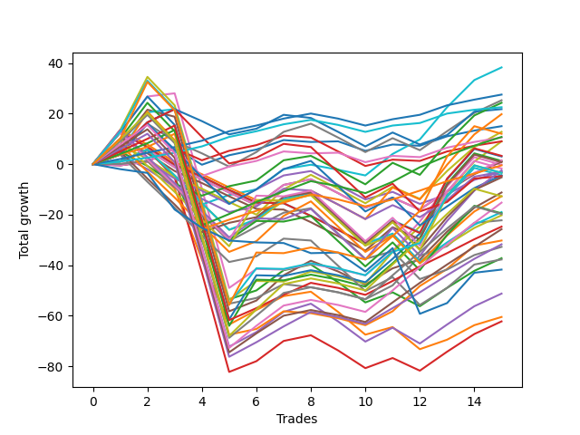

# Long Labrador 012 
- Symbol: ES_830-1130
- Date Range: 03/18/2022 - 12/30/2022
- Trading Period: 8:30-11:30
- Number of Trades: 16



| Name | Win Percent | Profit | Avg Profit / Trade | Avg Time / Trade |      | Name | Win Percent | Profit | Avg Profit / Trade | Avg Time / Trade |
| ---- | ----------- | ------ | ------------------ | ---------------- | ---- | ---- | ----------- | ------ | ------------------ | ---------------- |
| Sorted By <br> Profit | | | | | | Sorted By <br> Win Percentage ||||
| BB-100 Mid | 81.25 | 20750.00 | 1296.88 | 29:35 |     | TP-2 | 87.50 | 14625.00 | 914.06 | 11:58 |
| TP-2 | 87.50 | 14625.00 | 914.06 | 11:58 |     | TP-1 | 87.50 | 11750.00 | 734.38 | 11:26 |
| TP-1 | 87.50 | 11750.00 | 734.38 | 11:26 |     | BB-100 Mid | 81.25 | 20750.00 | 1296.88 | 29:35 |
| TP-4 | 81.25 | 7375.00 | 460.94 | 19:48 |     | TP-4 | 81.25 | 7375.00 | 460.94 | 19:48 |
| BB-20 Mid | 62.50 | 6125.00 | 382.81 | 05:19 |     | TP-3 | 81.25 | 1375.00 | 85.94 | 18:18 |
| TP-3 | 81.25 | 1375.00 | 85.94 | 18:18 |     | TP-5 | 75.00 | -9875.00 | -617.19 | 24:17 |
| V U/L 1SD | 56.25 | 875.00 | 54.69 | 44:36 |     | BB-50 U/L 1SD | 68.75 | -3875.00 | -242.19 | 31:44 |
| BB-100 U/L 2SD | 50.00 | -2125.00 | -132.81 | 56:35 |     | V Mid | 68.75 | -10750.00 | -671.88 | 24:06 |
| BB-200 U/L 2SD | 50.00 | -3000.00 | -187.50 | 59:21 |     | BB-20 Mid | 62.50 | 6125.00 | 382.81 | 05:19 |
| BB-50 U/L 2SD | 56.25 | -3750.00 | -234.38 | 46:14 |     | TP-8 | 62.50 | -11250.00 | -703.12 | 37:35 |
| BB-50 U/L 1SD | 68.75 | -3875.00 | -242.19 | 31:44 |     | BB-200 Mid | 62.50 | -14625.00 | -914.06 | 30:05 |
| NEWFI 000 | 50.00 | -5375.00 | -335.94 | 54:16 |     | TP-7 | 62.50 | -16500.00 | -1031.25 | 36:27 |
| TP-5 | 75.00 | -9875.00 | -617.19 | 24:17 |     | BB-20 U/L 2SD | 62.50 | -18125.00 | -1132.81 | 23:36 |
| TP-10 | 56.25 | -10000.00 | -625.00 | 42:08 |     | TP-6 | 62.50 | -19500.00 | -1218.75 | 31:23 |
| V Mid | 68.75 | -10750.00 | -671.88 | 24:06 |     | BB-50 Mid | 62.50 | -25125.00 | -1570.31 | 24:35 |
| TP-8 | 62.50 | -11250.00 | -703.12 | 37:35 |     | BB-20 U/L 2SD C | 62.50 | -29500.00 | -1843.75 | 25:27 |
| TP-9 | 56.25 | -13500.00 | -843.75 | 40:56 |     | V U/L 1SD | 56.25 | 875.00 | 54.69 | 44:36 |
| BB-200 Mid | 62.50 | -14625.00 | -914.06 | 30:05 |     | BB-50 U/L 2SD | 56.25 | -3750.00 | -234.38 | 46:14 |
| TP-7 | 62.50 | -16500.00 | -1031.25 | 36:27 |     | TP-10 | 56.25 | -10000.00 | -625.00 | 42:08 |
| BB-20 U/L 2SD | 62.50 | -18125.00 | -1132.81 | 23:36 |     | TP-9 | 56.25 | -13500.00 | -843.75 | 40:56 |
| TP-6 | 62.50 | -19500.00 | -1218.75 | 31:23 |     | BB-20 U/L 1SD | 56.25 | -30750.00 | -1921.88 | 19:26 |
| NEWFI 0000 | 31.25 | -23625.00 | -1476.56 | 23:18 |     | BB-100 U/L 2SD | 50.00 | -2125.00 | -132.81 | 56:35 |
| BB-50 Mid | 62.50 | -25125.00 | -1570.31 | 24:35 |     | BB-200 U/L 2SD | 50.00 | -3000.00 | -187.50 | 59:21 |
| BB-20 U/L 2SD C | 62.50 | -29500.00 | -1843.75 | 25:27 |     | NEWFI 000 | 50.00 | -5375.00 | -335.94 | 54:16 |
| BB-20 U/L 1SD | 56.25 | -30750.00 | -1921.88 | 19:26 |     | NEWFI 0000 | 31.25 | -23625.00 | -1476.56 | 23:18 |

## NO STOPLOSS

### Test BB-20 Mid
* Sell when price hits the middle line of the 20p bollinger
* No Stoploss
* Results:
```
Total Trades: 16
Percent Up: 62.50
Percent Down: 37.50
Total Points Moved Up: 12.25
Potential Profit: 6125.00
Total Points Ups: 27.00 Count Ups: 10
Total Points Downs: -14.75 Count Downs: 6
```

<details><summary>Trades</summary>

<code>In: 2022-04-20 09:19:00		Out: 2022-04-20 09:30:50		Total Position Time: 11:50		Total Move Up: -0.50		Total to Date: -0.50</code> <br />
<code>In: 2022-05-03 11:24:00		Out: 2022-05-03 11:32:10		Total Position Time: 08:10		Total Move Up: 1.50		Total to Date: 1.00</code> <br />
<code>In: 2022-05-06 11:00:00		Out: 2022-05-06 11:02:20		Total Position Time: 02:20		Total Move Up: 5.25		Total to Date: 6.25</code> <br />
<code>In: 2022-05-11 09:37:00		Out: 2022-05-11 09:49:20		Total Position Time: 12:20		Total Move Up: -6.50		Total to Date: -0.25</code> <br />
<code>In: 2022-05-12 10:12:00		Out: 2022-05-12 10:13:10		Total Position Time: 01:10		Total Move Up: 3.75		Total to Date: 3.50</code> <br />
<code>In: 2022-05-16 09:48:00		Out: 2022-05-16 09:49:10		Total Position Time: 01:10		Total Move Up: 2.25		Total to Date: 5.75</code> <br />
<code>In: 2022-06-27 09:37:00		Out: 2022-06-27 09:41:05		Total Position Time: 04:05		Total Move Up: 3.75		Total to Date: 9.50</code> <br />
<code>In: 2022-10-12 09:35:00		Out: 2022-10-12 09:45:55		Total Position Time: 10:55		Total Move Up: -2.75		Total to Date: 6.75</code> <br />
<code>In: 2022-10-17 11:29:00		Out: 2022-10-17 11:35:40		Total Position Time: 06:40		Total Move Up: -0.75		Total to Date: 6.00</code> <br />
<code>In: 2022-10-26 10:04:00		Out: 2022-10-26 10:12:05		Total Position Time: 08:05		Total Move Up: 0.25		Total to Date: 6.25</code> <br />
<code>In: 2022-10-26 10:12:00		Out: 2022-10-26 10:20:10		Total Position Time: 08:10		Total Move Up: -3.75		Total to Date: 2.50</code> <br />
<code>In: 2022-10-31 09:50:00		Out: 2022-10-31 09:51:10		Total Position Time: 01:10		Total Move Up: 2.50		Total to Date: 5.00</code> <br />
<code>In: 2022-11-08 11:15:00		Out: 2022-11-08 11:16:15		Total Position Time: 01:15		Total Move Up: -0.50		Total to Date: 4.50</code> <br />
<code>In: 2022-11-10 10:02:00		Out: 2022-11-10 10:03:10		Total Position Time: 01:10		Total Move Up: 3.75		Total to Date: 8.25</code> <br />
<code>In: 2022-11-11 08:34:00		Out: 2022-11-11 08:36:25		Total Position Time: 02:25		Total Move Up: 2.25		Total to Date: 10.50</code> <br />
<code>In: 2022-12-27 09:52:00		Out: 2022-12-27 09:56:10		Total Position Time: 04:10		Total Move Up: 1.75		Total to Date: 12.25</code> <br />


</details>

### Test BB-20 U/L 1SD
* Sell when the price hits the upper line of the 20p 1std bollinger
* No Stoploss
* Results:
```
Total Trades: 16
Percent Up: 56.25
Percent Down: 43.75
Total Points Moved Up: -61.50
Potential Profit: -30750.00
Total Points Ups: 30.00 Count Ups: 9
Total Points Downs: -91.50 Count Downs: 7
```

<details><summary>Trades</summary>

<code>In: 2022-04-20 09:19:00		Out: 2022-04-20 09:31:05		Total Position Time: 12:05		Total Move Up: 0.00		Total to Date: 0.00</code> <br />
<code>In: 2022-05-03 11:24:00		Out: 2022-05-03 11:32:25		Total Position Time: 08:25		Total Move Up: 1.25		Total to Date: 1.25</code> <br />
<code>In: 2022-05-06 11:00:00		Out: 2022-05-06 11:49:10		Total Position Time: 49:10		Total Move Up: -11.00		Total to Date: -9.75</code> <br />
<code>In: 2022-05-11 09:37:00		Out: 2022-05-11 10:24:35		Total Position Time: 47:35		Total Move Up: -28.00		Total to Date: -37.75</code> <br />
<code>In: 2022-05-12 10:12:00		Out: 2022-05-12 11:02:25		Total Position Time: 50:25		Total Move Up: -25.75		Total to Date: -63.50</code> <br />
<code>In: 2022-05-16 09:48:00		Out: 2022-05-16 09:50:05		Total Position Time: 02:05		Total Move Up: 5.75		Total to Date: -57.75</code> <br />
<code>In: 2022-06-27 09:37:00		Out: 2022-06-27 09:44:20		Total Position Time: 07:20		Total Move Up: 5.50		Total to Date: -52.25</code> <br />
<code>In: 2022-10-12 09:35:00		Out: 2022-10-12 09:47:15		Total Position Time: 12:15		Total Move Up: -1.00		Total to Date: -53.25</code> <br />
<code>In: 2022-10-17 11:29:00		Out: 2022-10-17 11:36:10		Total Position Time: 07:10		Total Move Up: 1.75		Total to Date: -51.50</code> <br />
<code>In: 2022-10-26 10:04:00		Out: 2022-10-26 10:41:50		Total Position Time: 37:50		Total Move Up: -8.00		Total to Date: -59.50</code> <br />
<code>In: 2022-10-26 10:12:00		Out: 2022-10-26 10:41:50		Total Position Time: 29:50		Total Move Up: -9.00		Total to Date: -68.50</code> <br />
<code>In: 2022-10-31 09:50:00		Out: 2022-10-31 09:57:05		Total Position Time: 07:05		Total Move Up: 3.00		Total to Date: -65.50</code> <br />
<code>In: 2022-11-08 11:15:00		Out: 2022-11-08 11:38:35		Total Position Time: 23:35		Total Move Up: -8.75		Total to Date: -74.25</code> <br />
<code>In: 2022-11-10 10:02:00		Out: 2022-11-10 10:03:10		Total Position Time: 01:10		Total Move Up: 3.75		Total to Date: -70.50</code> <br />
<code>In: 2022-11-11 08:34:00		Out: 2022-11-11 08:41:35		Total Position Time: 07:35		Total Move Up: 5.75		Total to Date: -64.75</code> <br />
<code>In: 2022-12-27 09:52:00		Out: 2022-12-27 09:59:25		Total Position Time: 07:25		Total Move Up: 3.25		Total to Date: -61.50</code> <br />


</details>

### Test BB-20 U/L 2SD
* Sell when the price hits the upper line of the 20p 2std bollinger
* No Stoploss
* Results:
```
Total Trades: 16
Percent Up: 62.50
Percent Down: 37.50
Total Points Moved Up: -36.25
Potential Profit: -18125.00
Total Points Ups: 43.50 Count Ups: 10
Total Points Downs: -79.75 Count Downs: 6
```

<details><summary>Trades</summary>

<code>In: 2022-04-20 09:19:00		Out: 2022-04-20 09:31:35		Total Position Time: 12:35		Total Move Up: 1.00		Total to Date: 1.00</code> <br />
<code>In: 2022-05-03 11:24:00		Out: 2022-05-03 11:34:55		Total Position Time: 10:55		Total Move Up: 4.75		Total to Date: 5.75</code> <br />
<code>In: 2022-05-06 11:00:00		Out: 2022-05-06 11:49:10		Total Position Time: 49:10		Total Move Up: -11.00		Total to Date: -5.25</code> <br />
<code>In: 2022-05-11 09:37:00		Out: 2022-05-11 10:24:50		Total Position Time: 47:50		Total Move Up: -25.00		Total to Date: -30.25</code> <br />
<code>In: 2022-05-12 10:12:00		Out: 2022-05-12 11:04:05		Total Position Time: 52:05		Total Move Up: -23.25		Total to Date: -53.50</code> <br />
<code>In: 2022-05-16 09:48:00		Out: 2022-05-16 10:06:30		Total Position Time: 18:30		Total Move Up: 3.50		Total to Date: -50.00</code> <br />
<code>In: 2022-06-27 09:37:00		Out: 2022-06-27 09:45:05		Total Position Time: 08:05		Total Move Up: 8.00		Total to Date: -42.00</code> <br />
<code>In: 2022-10-12 09:35:00		Out: 2022-10-12 09:53:00		Total Position Time: 18:00		Total Move Up: 1.00		Total to Date: -41.00</code> <br />
<code>In: 2022-10-17 11:29:00		Out: 2022-10-17 11:37:30		Total Position Time: 08:30		Total Move Up: 2.25		Total to Date: -38.75</code> <br />
<code>In: 2022-10-26 10:04:00		Out: 2022-10-26 10:51:25		Total Position Time: 47:25		Total Move Up: -7.00		Total to Date: -45.75</code> <br />
<code>In: 2022-10-26 10:12:00		Out: 2022-10-26 10:51:25		Total Position Time: 39:25		Total Move Up: -8.00		Total to Date: -53.75</code> <br />
<code>In: 2022-10-31 09:50:00		Out: 2022-10-31 10:02:05		Total Position Time: 12:05		Total Move Up: 4.00		Total to Date: -49.75</code> <br />
<code>In: 2022-11-08 11:15:00		Out: 2022-11-08 11:42:10		Total Position Time: 27:10		Total Move Up: -5.50		Total to Date: -55.25</code> <br />
<code>In: 2022-11-10 10:02:00		Out: 2022-11-10 10:03:45		Total Position Time: 01:45		Total Move Up: 7.25		Total to Date: -48.00</code> <br />
<code>In: 2022-11-11 08:34:00		Out: 2022-11-11 08:49:20		Total Position Time: 15:20		Total Move Up: 6.75		Total to Date: -41.25</code> <br />
<code>In: 2022-12-27 09:52:00		Out: 2022-12-27 10:00:50		Total Position Time: 08:50		Total Move Up: 5.00		Total to Date: -36.25</code> <br />


</details>

### Test BB-20 U/L 2SD C
* Sell when the price hits the upper line of the 20p 2std bollinger
* No Stoploss
* Results:
```
Total Trades: 16
Percent Up: 62.50
Percent Down: 37.50
Total Points Moved Up: -59.00
Potential Profit: -29500.00
Total Points Ups: 47.00 Count Ups: 10
Total Points Downs: -106.00 Count Downs: 6
```

<details><summary>Trades</summary>

<code>In: 2022-04-20 09:19:00		Out: 2022-04-20 09:31:35		Total Position Time: 12:35		Total Move Up: 1.00		Total to Date: 1.00</code> <br />
<code>In: 2022-05-03 11:24:00		Out: 2022-05-03 11:34:55		Total Position Time: 10:55		Total Move Up: 4.75		Total to Date: 5.75</code> <br />
<code>In: 2022-05-06 11:00:00		Out: 2022-05-06 11:49:10		Total Position Time: 49:10		Total Move Up: -11.00		Total to Date: -5.25</code> <br />
<code>In: 2022-05-11 09:37:00		Out: 2022-05-11 10:37:55		Total Position Time: 60:55		Total Move Up: -37.75		Total to Date: -43.00</code> <br />
<code>In: 2022-05-12 10:12:00		Out: 2022-05-12 11:12:55		Total Position Time: 60:55		Total Move Up: -39.25		Total to Date: -82.25</code> <br />
<code>In: 2022-05-16 09:48:00		Out: 2022-05-16 10:07:00		Total Position Time: 19:00		Total Move Up: 4.25		Total to Date: -78.00</code> <br />
<code>In: 2022-06-27 09:37:00		Out: 2022-06-27 09:45:05		Total Position Time: 08:05		Total Move Up: 8.00		Total to Date: -70.00</code> <br />
<code>In: 2022-10-12 09:35:00		Out: 2022-10-12 09:56:50		Total Position Time: 21:50		Total Move Up: 3.25		Total to Date: -66.75</code> <br />
<code>In: 2022-10-17 11:29:00		Out: 2022-10-17 11:37:55		Total Position Time: 08:55		Total Move Up: 2.25		Total to Date: -64.50</code> <br />
<code>In: 2022-10-26 10:04:00		Out: 2022-10-26 10:52:40		Total Position Time: 48:40		Total Move Up: -6.00		Total to Date: -70.50</code> <br />
<code>In: 2022-10-26 10:12:00		Out: 2022-10-26 10:52:40		Total Position Time: 40:40		Total Move Up: -7.00		Total to Date: -77.50</code> <br />
<code>In: 2022-10-31 09:50:00		Out: 2022-10-31 10:02:05		Total Position Time: 12:05		Total Move Up: 4.00		Total to Date: -73.50</code> <br />
<code>In: 2022-11-08 11:15:00		Out: 2022-11-08 11:42:15		Total Position Time: 27:15		Total Move Up: -5.00		Total to Date: -78.50</code> <br />
<code>In: 2022-11-10 10:02:00		Out: 2022-11-10 10:03:55		Total Position Time: 01:55		Total Move Up: 7.50		Total to Date: -71.00</code> <br />
<code>In: 2022-11-11 08:34:00		Out: 2022-11-11 08:49:40		Total Position Time: 15:40		Total Move Up: 7.00		Total to Date: -64.00</code> <br />
<code>In: 2022-12-27 09:52:00		Out: 2022-12-27 10:00:50		Total Position Time: 08:50		Total Move Up: 5.00		Total to Date: -59.00</code> <br />


</details>

### Test BB-50 Mid
* Sell when price hits the middle line of the 50p bollinger
* No Stoploss
* Results:
```
Total Trades: 16
Percent Up: 62.50
Percent Down: 37.50
Total Points Moved Up: -50.25
Potential Profit: -25125.00
Total Points Ups: 59.25 Count Ups: 10
Total Points Downs: -109.50 Count Downs: 6
```

<details><summary>Trades</summary>

<code>In: 2022-04-20 09:19:00		Out: 2022-04-20 09:32:40		Total Position Time: 13:40		Total Move Up: 3.75		Total to Date: 3.75</code> <br />
<code>In: 2022-05-03 11:24:00		Out: 2022-05-03 11:36:10		Total Position Time: 12:10		Total Move Up: 12.25		Total to Date: 16.00</code> <br />
<code>In: 2022-05-06 11:00:00		Out: 2022-05-06 11:49:15		Total Position Time: 49:15		Total Move Up: -11.25		Total to Date: 4.75</code> <br />
<code>In: 2022-05-11 09:37:00		Out: 2022-05-11 10:37:55		Total Position Time: 60:55		Total Move Up: -37.75		Total to Date: -33.00</code> <br />
<code>In: 2022-05-12 10:12:00		Out: 2022-05-12 11:12:55		Total Position Time: 60:55		Total Move Up: -39.25		Total to Date: -72.25</code> <br />
<code>In: 2022-05-16 09:48:00		Out: 2022-05-16 09:50:05		Total Position Time: 02:05		Total Move Up: 5.75		Total to Date: -66.50</code> <br />
<code>In: 2022-06-27 09:37:00		Out: 2022-06-27 09:45:05		Total Position Time: 08:05		Total Move Up: 8.00		Total to Date: -58.50</code> <br />
<code>In: 2022-10-12 09:35:00		Out: 2022-10-12 09:53:00		Total Position Time: 18:00		Total Move Up: 1.00		Total to Date: -57.50</code> <br />
<code>In: 2022-10-17 11:29:00		Out: 2022-10-17 11:39:15		Total Position Time: 10:15		Total Move Up: 3.25		Total to Date: -54.25</code> <br />
<code>In: 2022-10-26 10:04:00		Out: 2022-10-26 10:51:15		Total Position Time: 47:15		Total Move Up: -7.00		Total to Date: -61.25</code> <br />
<code>In: 2022-10-26 10:12:00		Out: 2022-10-26 10:51:15		Total Position Time: 39:15		Total Move Up: -8.00		Total to Date: -69.25</code> <br />
<code>In: 2022-10-31 09:50:00		Out: 2022-10-31 10:08:30		Total Position Time: 18:30		Total Move Up: 5.50		Total to Date: -63.75</code> <br />
<code>In: 2022-11-08 11:15:00		Out: 2022-11-08 11:41:40		Total Position Time: 26:40		Total Move Up: -6.25		Total to Date: -70.00</code> <br />
<code>In: 2022-11-10 10:02:00		Out: 2022-11-10 10:03:55		Total Position Time: 01:55		Total Move Up: 7.50		Total to Date: -62.50</code> <br />
<code>In: 2022-11-11 08:34:00		Out: 2022-11-11 08:49:45		Total Position Time: 15:45		Total Move Up: 7.25		Total to Date: -55.25</code> <br />
<code>In: 2022-12-27 09:52:00		Out: 2022-12-27 10:00:50		Total Position Time: 08:50		Total Move Up: 5.00		Total to Date: -50.25</code> <br />


</details>

### Test BB-50 U/L 1SD
* Sell when the price hits the upper line of the 50p 1std bollinger
* No Stoploss
* Results:
```
Total Trades: 16
Percent Up: 68.75
Percent Down: 31.25
Total Points Moved Up: -7.75
Potential Profit: -3875.00
Total Points Ups: 81.50 Count Ups: 11
Total Points Downs: -89.25 Count Downs: 5
```

<details><summary>Trades</summary>

<code>In: 2022-04-20 09:19:00		Out: 2022-04-20 09:36:50		Total Position Time: 17:50		Total Move Up: 7.75		Total to Date: 7.75</code> <br />
<code>In: 2022-05-03 11:24:00		Out: 2022-05-03 11:52:05		Total Position Time: 28:05		Total Move Up: 13.75		Total to Date: 21.50</code> <br />
<code>In: 2022-05-06 11:00:00		Out: 2022-05-06 11:50:10		Total Position Time: 50:10		Total Move Up: -2.75		Total to Date: 18.75</code> <br />
<code>In: 2022-05-11 09:37:00		Out: 2022-05-11 10:37:55		Total Position Time: 60:55		Total Move Up: -37.75		Total to Date: -19.00</code> <br />
<code>In: 2022-05-12 10:12:00		Out: 2022-05-12 11:12:55		Total Position Time: 60:55		Total Move Up: -39.25		Total to Date: -58.25</code> <br />
<code>In: 2022-05-16 09:48:00		Out: 2022-05-16 10:07:05		Total Position Time: 19:05		Total Move Up: 4.25		Total to Date: -54.00</code> <br />
<code>In: 2022-06-27 09:37:00		Out: 2022-06-27 09:53:20		Total Position Time: 16:20		Total Move Up: 10.00		Total to Date: -44.00</code> <br />
<code>In: 2022-10-12 09:35:00		Out: 2022-10-12 09:59:05		Total Position Time: 24:05		Total Move Up: 3.50		Total to Date: -40.50</code> <br />
<code>In: 2022-10-17 11:29:00		Out: 2022-10-17 11:43:20		Total Position Time: 14:20		Total Move Up: 5.75		Total to Date: -34.75</code> <br />
<code>In: 2022-10-26 10:04:00		Out: 2022-10-26 11:01:00		Total Position Time: 57:00		Total Move Up: -4.25		Total to Date: -39.00</code> <br />
<code>In: 2022-10-26 10:12:00		Out: 2022-10-26 11:01:00		Total Position Time: 49:00		Total Move Up: -5.25		Total to Date: -44.25</code> <br />
<code>In: 2022-10-31 09:50:00		Out: 2022-10-31 10:16:15		Total Position Time: 26:15		Total Move Up: 6.50		Total to Date: -37.75</code> <br />
<code>In: 2022-11-08 11:15:00		Out: 2022-11-08 11:47:55		Total Position Time: 32:55		Total Move Up: 3.50		Total to Date: -34.25</code> <br />
<code>In: 2022-11-10 10:02:00		Out: 2022-11-10 10:13:45		Total Position Time: 11:45		Total Move Up: 11.00		Total to Date: -23.25</code> <br />
<code>In: 2022-11-11 08:34:00		Out: 2022-11-11 08:58:20		Total Position Time: 24:20		Total Move Up: 9.50		Total to Date: -13.75</code> <br />
<code>In: 2022-12-27 09:52:00		Out: 2022-12-27 10:06:45		Total Position Time: 14:45		Total Move Up: 6.00		Total to Date: -7.75</code> <br />


</details>

### Test BB-50 U/L 2SD
* Sell when the price hits the upper line of the 50p 2std bollinger
* No Stoploss
* Results:
```
Total Trades: 16
Percent Up: 56.25
Percent Down: 43.75
Total Points Moved Up: -7.50
Potential Profit: -3750.00
Total Points Ups: 84.50 Count Ups: 9
Total Points Downs: -92.00 Count Downs: 7
```

<details><summary>Trades</summary>

<code>In: 2022-04-20 09:19:00		Out: 2022-04-20 09:50:25		Total Position Time: 31:25		Total Move Up: 12.50		Total to Date: 12.50</code> <br />
<code>In: 2022-05-03 11:24:00		Out: 2022-05-03 11:56:15		Total Position Time: 32:15		Total Move Up: 14.25		Total to Date: 26.75</code> <br />
<code>In: 2022-05-06 11:00:00		Out: 2022-05-06 11:50:35		Total Position Time: 50:35		Total Move Up: 1.25		Total to Date: 28.00</code> <br />
<code>In: 2022-05-11 09:37:00		Out: 2022-05-11 10:37:55		Total Position Time: 60:55		Total Move Up: -37.75		Total to Date: -9.75</code> <br />
<code>In: 2022-05-12 10:12:00		Out: 2022-05-12 11:12:55		Total Position Time: 60:55		Total Move Up: -39.25		Total to Date: -49.00</code> <br />
<code>In: 2022-05-16 09:48:00		Out: 2022-05-16 10:07:35		Total Position Time: 19:35		Total Move Up: 7.50		Total to Date: -41.50</code> <br />
<code>In: 2022-06-27 09:37:00		Out: 2022-06-27 10:37:55		Total Position Time: 60:55		Total Move Up: -0.25		Total to Date: -41.75</code> <br />
<code>In: 2022-10-12 09:35:00		Out: 2022-10-12 10:35:55		Total Position Time: 60:55		Total Move Up: -7.25		Total to Date: -49.00</code> <br />
<code>In: 2022-10-17 11:29:00		Out: 2022-10-17 12:29:55		Total Position Time: 60:55		Total Move Up: 2.25		Total to Date: -46.75</code> <br />
<code>In: 2022-10-26 10:04:00		Out: 2022-10-26 11:04:55		Total Position Time: 60:55		Total Move Up: -2.00		Total to Date: -48.75</code> <br />
<code>In: 2022-10-26 10:12:00		Out: 2022-10-26 11:05:05		Total Position Time: 53:05		Total Move Up: -2.50		Total to Date: -51.25</code> <br />
<code>In: 2022-10-31 09:50:00		Out: 2022-10-31 10:17:40		Total Position Time: 27:40		Total Move Up: 9.50		Total to Date: -41.75</code> <br />
<code>In: 2022-11-08 11:15:00		Out: 2022-11-08 12:02:35		Total Position Time: 47:35		Total Move Up: 11.75		Total to Date: -30.00</code> <br />
<code>In: 2022-11-10 10:02:00		Out: 2022-11-10 10:16:15		Total Position Time: 14:15		Total Move Up: 14.00		Total to Date: -16.00</code> <br />
<code>In: 2022-11-11 08:34:00		Out: 2022-11-11 09:11:00		Total Position Time: 37:00		Total Move Up: 11.50		Total to Date: -4.50</code> <br />
<code>In: 2022-12-27 09:52:00		Out: 2022-12-27 10:52:55		Total Position Time: 60:55		Total Move Up: -3.00		Total to Date: -7.50</code> <br />


</details>

### Test V Mid
* Sell when the price hits the middle line of the 1std VWAP
* No Stoploss
* Results:
```
Total Trades: 16
Percent Up: 68.75
Percent Down: 31.25
Total Points Moved Up: -21.50
Potential Profit: -10750.00
Total Points Ups: 61.50 Count Ups: 11
Total Points Downs: -83.00 Count Downs: 5
```

<details><summary>Trades</summary>

<code>In: 2022-04-20 09:19:00		Out: 2022-04-20 09:35:50		Total Position Time: 16:50		Total Move Up: 6.00		Total to Date: 6.00</code> <br />
<code>In: 2022-05-03 11:24:00		Out: 2022-05-03 11:36:05		Total Position Time: 12:05		Total Move Up: 10.50		Total to Date: 16.50</code> <br />
<code>In: 2022-05-06 11:00:00		Out: 2022-05-06 11:02:20		Total Position Time: 02:20		Total Move Up: 5.25		Total to Date: 21.75</code> <br />
<code>In: 2022-05-11 09:37:00		Out: 2022-05-11 10:37:55		Total Position Time: 60:55		Total Move Up: -37.75		Total to Date: -16.00</code> <br />
<code>In: 2022-05-12 10:12:00		Out: 2022-05-12 11:12:55		Total Position Time: 60:55		Total Move Up: -39.25		Total to Date: -55.25</code> <br />
<code>In: 2022-05-16 09:48:00		Out: 2022-05-16 09:49:10		Total Position Time: 01:10		Total Move Up: 2.25		Total to Date: -53.00</code> <br />
<code>In: 2022-06-27 09:37:00		Out: 2022-06-27 09:44:20		Total Position Time: 07:20		Total Move Up: 5.50		Total to Date: -47.50</code> <br />
<code>In: 2022-10-12 09:35:00		Out: 2022-10-12 09:51:20		Total Position Time: 16:20		Total Move Up: 0.75		Total to Date: -46.75</code> <br />
<code>In: 2022-10-17 11:29:00		Out: 2022-10-17 11:30:10		Total Position Time: 01:10		Total Move Up: -1.25		Total to Date: -48.00</code> <br />
<code>In: 2022-10-26 10:04:00		Out: 2022-10-26 11:04:55		Total Position Time: 60:55		Total Move Up: -2.00		Total to Date: -50.00</code> <br />
<code>In: 2022-10-26 10:12:00		Out: 2022-10-26 11:12:55		Total Position Time: 60:55		Total Move Up: -2.75		Total to Date: -52.75</code> <br />
<code>In: 2022-10-31 09:50:00		Out: 2022-10-31 10:08:30		Total Position Time: 18:30		Total Move Up: 5.50		Total to Date: -47.25</code> <br />
<code>In: 2022-11-08 11:15:00		Out: 2022-11-08 12:02:35		Total Position Time: 47:35		Total Move Up: 11.75		Total to Date: -35.50</code> <br />
<code>In: 2022-11-10 10:02:00		Out: 2022-11-10 10:03:10		Total Position Time: 01:10		Total Move Up: 3.75		Total to Date: -31.75</code> <br />
<code>In: 2022-11-11 08:34:00		Out: 2022-11-11 08:50:30		Total Position Time: 16:30		Total Move Up: 9.25		Total to Date: -22.50</code> <br />
<code>In: 2022-12-27 09:52:00		Out: 2022-12-27 09:53:10		Total Position Time: 01:10		Total Move Up: 1.00		Total to Date: -21.50</code> <br />


</details>

### Test V U/L 1SD
* Sell when the price hits the upper line of the 1std VWAP
* No Stoploss
* Results:
```
Total Trades: 16
Percent Up: 56.25
Percent Down: 43.75
Total Points Moved Up: 1.75
Potential Profit: 875.00
Total Points Ups: 102.25 Count Ups: 9
Total Points Downs: -100.50 Count Downs: 7
```

<details><summary>Trades</summary>

<code>In: 2022-04-20 09:19:00		Out: 2022-04-20 09:52:35		Total Position Time: 33:35		Total Move Up: 13.50		Total to Date: 13.50</code> <br />
<code>In: 2022-05-03 11:24:00		Out: 2022-05-03 12:00:05		Total Position Time: 36:05		Total Move Up: 21.00		Total to Date: 34.50</code> <br />
<code>In: 2022-05-06 11:00:00		Out: 2022-05-06 12:00:55		Total Position Time: 60:55		Total Move Up: -11.25		Total to Date: 23.25</code> <br />
<code>In: 2022-05-11 09:37:00		Out: 2022-05-11 10:37:55		Total Position Time: 60:55		Total Move Up: -37.75		Total to Date: -14.50</code> <br />
<code>In: 2022-05-12 10:12:00		Out: 2022-05-12 11:12:55		Total Position Time: 60:55		Total Move Up: -39.25		Total to Date: -53.75</code> <br />
<code>In: 2022-05-16 09:48:00		Out: 2022-05-16 10:07:35		Total Position Time: 19:35		Total Move Up: 7.50		Total to Date: -46.25</code> <br />
<code>In: 2022-06-27 09:37:00		Out: 2022-06-27 10:37:55		Total Position Time: 60:55		Total Move Up: -0.25		Total to Date: -46.50</code> <br />
<code>In: 2022-10-12 09:35:00		Out: 2022-10-12 10:35:55		Total Position Time: 60:55		Total Move Up: -7.25		Total to Date: -53.75</code> <br />
<code>In: 2022-10-17 11:29:00		Out: 2022-10-17 11:40:40		Total Position Time: 11:40		Total Move Up: 4.00		Total to Date: -49.75</code> <br />
<code>In: 2022-10-26 10:04:00		Out: 2022-10-26 11:04:55		Total Position Time: 60:55		Total Move Up: -2.00		Total to Date: -51.75</code> <br />
<code>In: 2022-10-26 10:12:00		Out: 2022-10-26 11:12:55		Total Position Time: 60:55		Total Move Up: -2.75		Total to Date: -54.50</code> <br />
<code>In: 2022-10-31 09:50:00		Out: 2022-10-31 10:24:00		Total Position Time: 34:00		Total Move Up: 12.50		Total to Date: -42.00</code> <br />
<code>In: 2022-11-08 11:15:00		Out: 2022-11-08 12:15:55		Total Position Time: 60:55		Total Move Up: 10.00		Total to Date: -32.00</code> <br />
<code>In: 2022-11-10 10:02:00		Out: 2022-11-10 10:15:50		Total Position Time: 13:50		Total Move Up: 13.75		Total to Date: -18.25</code> <br />
<code>In: 2022-11-11 08:34:00		Out: 2022-11-11 09:34:55		Total Position Time: 60:55		Total Move Up: 12.00		Total to Date: -6.25</code> <br />
<code>In: 2022-12-27 09:52:00		Out: 2022-12-27 10:08:45		Total Position Time: 16:45		Total Move Up: 8.00		Total to Date: 1.75</code> <br />


</details>

### Test BB-100 Mid
* Move to BB100 Mid
* No Stoploss
* Results:
```
Total Trades: 16
Percent Up: 81.25
Percent Down: 18.75
Total Points Moved Up: 41.50
Potential Profit: 20750.00
Total Points Ups: 83.50 Count Ups: 13
Total Points Downs: -42.00 Count Downs: 3
```

<details><summary>Trades</summary>

<code>In: 2022-04-20 09:19:00		Out: 2022-04-20 09:33:05		Total Position Time: 14:05		Total Move Up: 5.00		Total to Date: 5.00</code> <br />
<code>In: 2022-05-03 11:24:00		Out: 2022-05-03 11:52:15		Total Position Time: 28:15		Total Move Up: 15.50		Total to Date: 20.50</code> <br />
<code>In: 2022-05-06 11:00:00		Out: 2022-05-06 11:50:35		Total Position Time: 50:35		Total Move Up: 1.25		Total to Date: 21.75</code> <br />
<code>In: 2022-05-11 09:37:00		Out: 2022-05-11 10:37:55		Total Position Time: 60:55		Total Move Up: -37.75		Total to Date: -16.00</code> <br />
<code>In: 2022-05-12 10:12:00		Out: 2022-05-12 10:13:10		Total Position Time: 01:10		Total Move Up: 3.75		Total to Date: -12.25</code> <br />
<code>In: 2022-05-16 09:48:00		Out: 2022-05-16 09:49:10		Total Position Time: 01:10		Total Move Up: 2.25		Total to Date: -10.00</code> <br />
<code>In: 2022-06-27 09:37:00		Out: 2022-06-27 10:20:05		Total Position Time: 43:05		Total Move Up: 8.00		Total to Date: -2.00</code> <br />
<code>In: 2022-10-12 09:35:00		Out: 2022-10-12 09:56:50		Total Position Time: 21:50		Total Move Up: 3.25		Total to Date: 1.25</code> <br />
<code>In: 2022-10-17 11:29:00		Out: 2022-10-17 11:36:10		Total Position Time: 07:10		Total Move Up: 1.75		Total to Date: 3.00</code> <br />
<code>In: 2022-10-26 10:04:00		Out: 2022-10-26 11:04:55		Total Position Time: 60:55		Total Move Up: -2.00		Total to Date: 1.00</code> <br />
<code>In: 2022-10-26 10:12:00		Out: 2022-10-26 11:11:30		Total Position Time: 59:30		Total Move Up: -2.25		Total to Date: -1.25</code> <br />
<code>In: 2022-10-31 09:50:00		Out: 2022-10-31 10:17:20		Total Position Time: 27:20		Total Move Up: 8.50		Total to Date: 7.25</code> <br />
<code>In: 2022-11-08 11:15:00		Out: 2022-11-08 11:53:50		Total Position Time: 38:50		Total Move Up: 5.75		Total to Date: 13.00</code> <br />
<code>In: 2022-11-10 10:02:00		Out: 2022-11-10 10:15:00		Total Position Time: 13:00		Total Move Up: 12.75		Total to Date: 25.75</code> <br />
<code>In: 2022-11-11 08:34:00		Out: 2022-11-11 09:10:50		Total Position Time: 36:50		Total Move Up: 10.75		Total to Date: 36.50</code> <br />
<code>In: 2022-12-27 09:52:00		Out: 2022-12-27 10:00:50		Total Position Time: 08:50		Total Move Up: 5.00		Total to Date: 41.50</code> <br />


</details>

### Test BB-100 U/L 2SD
* Move to BB100 Upper Band
* No Stoploss
* Results:
```
Total Trades: 16
Percent Up: 50.00
Percent Down: 50.00
Total Points Moved Up: -4.25
Potential Profit: -2125.00
Total Points Ups: 99.25 Count Ups: 8
Total Points Downs: -103.50 Count Downs: 8
```

<details><summary>Trades</summary>

<code>In: 2022-04-20 09:19:00		Out: 2022-04-20 09:50:25		Total Position Time: 31:25		Total Move Up: 12.50		Total to Date: 12.50</code> <br />
<code>In: 2022-05-03 11:24:00		Out: 2022-05-03 12:24:55		Total Position Time: 60:55		Total Move Up: 14.25		Total to Date: 26.75</code> <br />
<code>In: 2022-05-06 11:00:00		Out: 2022-05-06 12:00:55		Total Position Time: 60:55		Total Move Up: -11.25		Total to Date: 15.50</code> <br />
<code>In: 2022-05-11 09:37:00		Out: 2022-05-11 10:37:55		Total Position Time: 60:55		Total Move Up: -37.75		Total to Date: -22.25</code> <br />
<code>In: 2022-05-12 10:12:00		Out: 2022-05-12 11:12:55		Total Position Time: 60:55		Total Move Up: -39.25		Total to Date: -61.50</code> <br />
<code>In: 2022-05-16 09:48:00		Out: 2022-05-16 10:24:00		Total Position Time: 36:00		Total Move Up: 17.50		Total to Date: -44.00</code> <br />
<code>In: 2022-06-27 09:37:00		Out: 2022-06-27 10:37:55		Total Position Time: 60:55		Total Move Up: -0.25		Total to Date: -44.25</code> <br />
<code>In: 2022-10-12 09:35:00		Out: 2022-10-12 10:35:55		Total Position Time: 60:55		Total Move Up: -7.25		Total to Date: -51.50</code> <br />
<code>In: 2022-10-17 11:29:00		Out: 2022-10-17 12:29:55		Total Position Time: 60:55		Total Move Up: 2.25		Total to Date: -49.25</code> <br />
<code>In: 2022-10-26 10:04:00		Out: 2022-10-26 11:04:55		Total Position Time: 60:55		Total Move Up: -2.00		Total to Date: -51.25</code> <br />
<code>In: 2022-10-26 10:12:00		Out: 2022-10-26 11:12:55		Total Position Time: 60:55		Total Move Up: -2.75		Total to Date: -54.00</code> <br />
<code>In: 2022-10-31 09:50:00		Out: 2022-10-31 10:50:55		Total Position Time: 60:55		Total Move Up: 9.25		Total to Date: -44.75</code> <br />
<code>In: 2022-11-08 11:15:00		Out: 2022-11-08 12:15:55		Total Position Time: 60:55		Total Move Up: 10.00		Total to Date: -34.75</code> <br />
<code>In: 2022-11-10 10:02:00		Out: 2022-11-10 10:48:15		Total Position Time: 46:15		Total Move Up: 21.50		Total to Date: -13.25</code> <br />
<code>In: 2022-11-11 08:34:00		Out: 2022-11-11 09:34:55		Total Position Time: 60:55		Total Move Up: 12.00		Total to Date: -1.25</code> <br />
<code>In: 2022-12-27 09:52:00		Out: 2022-12-27 10:52:55		Total Position Time: 60:55		Total Move Up: -3.00		Total to Date: -4.25</code> <br />


</details>

### Test BB-200 Mid
* Move to BB200 Mid
* No Stoploss
* Results:
```
Total Trades: 16
Percent Up: 62.50
Percent Down: 37.50
Total Points Moved Up: -29.25
Potential Profit: -14625.00
Total Points Ups: 64.50 Count Ups: 10
Total Points Downs: -93.75 Count Downs: 6
```

<details><summary>Trades</summary>

<code>In: 2022-04-20 09:19:00		Out: 2022-04-20 09:32:40		Total Position Time: 13:40		Total Move Up: 3.75		Total to Date: 3.75</code> <br />
<code>In: 2022-05-03 11:24:00		Out: 2022-05-03 11:56:55		Total Position Time: 32:55		Total Move Up: 17.00		Total to Date: 20.75</code> <br />
<code>In: 2022-05-06 11:00:00		Out: 2022-05-06 12:00:55		Total Position Time: 60:55		Total Move Up: -11.25		Total to Date: 9.50</code> <br />
<code>In: 2022-05-11 09:37:00		Out: 2022-05-11 10:37:55		Total Position Time: 60:55		Total Move Up: -37.75		Total to Date: -28.25</code> <br />
<code>In: 2022-05-12 10:12:00		Out: 2022-05-12 11:12:55		Total Position Time: 60:55		Total Move Up: -39.25		Total to Date: -67.50</code> <br />
<code>In: 2022-05-16 09:48:00		Out: 2022-05-16 09:49:10		Total Position Time: 01:10		Total Move Up: 2.25		Total to Date: -65.25</code> <br />
<code>In: 2022-06-27 09:37:00		Out: 2022-06-27 09:45:00		Total Position Time: 08:00		Total Move Up: 7.00		Total to Date: -58.25</code> <br />
<code>In: 2022-10-12 09:35:00		Out: 2022-10-12 09:53:00		Total Position Time: 18:00		Total Move Up: 1.00		Total to Date: -57.25</code> <br />
<code>In: 2022-10-17 11:29:00		Out: 2022-10-17 11:30:20		Total Position Time: 01:20		Total Move Up: -0.75		Total to Date: -58.00</code> <br />
<code>In: 2022-10-26 10:04:00		Out: 2022-10-26 11:04:55		Total Position Time: 60:55		Total Move Up: -2.00		Total to Date: -60.00</code> <br />
<code>In: 2022-10-26 10:12:00		Out: 2022-10-26 11:12:55		Total Position Time: 60:55		Total Move Up: -2.75		Total to Date: -62.75</code> <br />
<code>In: 2022-10-31 09:50:00		Out: 2022-10-31 10:08:30		Total Position Time: 18:30		Total Move Up: 5.50		Total to Date: -57.25</code> <br />
<code>In: 2022-11-08 11:15:00		Out: 2022-11-08 12:15:55		Total Position Time: 60:55		Total Move Up: 10.00		Total to Date: -47.25</code> <br />
<code>In: 2022-11-10 10:02:00		Out: 2022-11-10 10:03:35		Total Position Time: 01:35		Total Move Up: 6.75		Total to Date: -40.50</code> <br />
<code>In: 2022-11-11 08:34:00		Out: 2022-11-11 08:50:30		Total Position Time: 16:30		Total Move Up: 9.25		Total to Date: -31.25</code> <br />
<code>In: 2022-12-27 09:52:00		Out: 2022-12-27 09:56:20		Total Position Time: 04:20		Total Move Up: 2.00		Total to Date: -29.25</code> <br />


</details>

### Test BB-200 U/L 2SD
* Move to BB200 Upper Band
* No Stoploss
* Results:
```
Total Trades: 16
Percent Up: 50.00
Percent Down: 50.00
Total Points Moved Up: -6.00
Potential Profit: -3000.00
Total Points Ups: 97.50 Count Ups: 8
Total Points Downs: -103.50 Count Downs: 8
```

<details><summary>Trades</summary>

<code>In: 2022-04-20 09:19:00		Out: 2022-04-20 10:19:55		Total Position Time: 60:55		Total Move Up: 10.00		Total to Date: 10.00</code> <br />
<code>In: 2022-05-03 11:24:00		Out: 2022-05-03 12:24:55		Total Position Time: 60:55		Total Move Up: 14.25		Total to Date: 24.25</code> <br />
<code>In: 2022-05-06 11:00:00		Out: 2022-05-06 12:00:55		Total Position Time: 60:55		Total Move Up: -11.25		Total to Date: 13.00</code> <br />
<code>In: 2022-05-11 09:37:00		Out: 2022-05-11 10:37:55		Total Position Time: 60:55		Total Move Up: -37.75		Total to Date: -24.75</code> <br />
<code>In: 2022-05-12 10:12:00		Out: 2022-05-12 11:12:55		Total Position Time: 60:55		Total Move Up: -39.25		Total to Date: -64.00</code> <br />
<code>In: 2022-05-16 09:48:00		Out: 2022-05-16 10:24:05		Total Position Time: 36:05		Total Move Up: 18.25		Total to Date: -45.75</code> <br />
<code>In: 2022-06-27 09:37:00		Out: 2022-06-27 10:37:55		Total Position Time: 60:55		Total Move Up: -0.25		Total to Date: -46.00</code> <br />
<code>In: 2022-10-12 09:35:00		Out: 2022-10-12 10:35:55		Total Position Time: 60:55		Total Move Up: -7.25		Total to Date: -53.25</code> <br />
<code>In: 2022-10-17 11:29:00		Out: 2022-10-17 12:29:55		Total Position Time: 60:55		Total Move Up: 2.25		Total to Date: -51.00</code> <br />
<code>In: 2022-10-26 10:04:00		Out: 2022-10-26 11:04:55		Total Position Time: 60:55		Total Move Up: -2.00		Total to Date: -53.00</code> <br />
<code>In: 2022-10-26 10:12:00		Out: 2022-10-26 11:12:55		Total Position Time: 60:55		Total Move Up: -2.75		Total to Date: -55.75</code> <br />
<code>In: 2022-10-31 09:50:00		Out: 2022-10-31 10:50:55		Total Position Time: 60:55		Total Move Up: 9.25		Total to Date: -46.50</code> <br />
<code>In: 2022-11-08 11:15:00		Out: 2022-11-08 12:15:55		Total Position Time: 60:55		Total Move Up: 10.00		Total to Date: -36.50</code> <br />
<code>In: 2022-11-10 10:02:00		Out: 2022-11-10 11:02:55		Total Position Time: 60:55		Total Move Up: 21.50		Total to Date: -15.00</code> <br />
<code>In: 2022-11-11 08:34:00		Out: 2022-11-11 09:34:55		Total Position Time: 60:55		Total Move Up: 12.00		Total to Date: -3.00</code> <br />
<code>In: 2022-12-27 09:52:00		Out: 2022-12-27 10:52:55		Total Position Time: 60:55		Total Move Up: -3.00		Total to Date: -6.00</code> <br />


</details>

## TAKE PROFIT

### Test TP-1
* Take Profit of 1 Point
* No Stoploss
* Results:
```
Total Trades: 16
Percent Up: 87.50
Percent Down: 12.50
Total Points Moved Up: 23.50
Potential Profit: 11750.00
Total Points Ups: 28.25 Count Ups: 14
Total Points Downs: -4.75 Count Downs: 2
```

<details><summary>Trades</summary>

<code>In: 2022-04-20 09:19:00		Out: 2022-04-20 09:31:35		Total Position Time: 12:35		Total Move Up: 1.00		Total to Date: 1.00</code> <br />
<code>In: 2022-05-03 11:24:00		Out: 2022-05-03 11:32:10		Total Position Time: 08:10		Total Move Up: 1.50		Total to Date: 2.50</code> <br />
<code>In: 2022-05-06 11:00:00		Out: 2022-05-06 11:01:20		Total Position Time: 01:20		Total Move Up: 2.00		Total to Date: 4.50</code> <br />
<code>In: 2022-05-11 09:37:00		Out: 2022-05-11 09:40:45		Total Position Time: 03:45		Total Move Up: 2.50		Total to Date: 7.00</code> <br />
<code>In: 2022-05-12 10:12:00		Out: 2022-05-12 10:13:10		Total Position Time: 01:10		Total Move Up: 3.75		Total to Date: 10.75</code> <br />
<code>In: 2022-05-16 09:48:00		Out: 2022-05-16 09:49:10		Total Position Time: 01:10		Total Move Up: 2.25		Total to Date: 13.00</code> <br />
<code>In: 2022-06-27 09:37:00		Out: 2022-06-27 09:38:10		Total Position Time: 01:10		Total Move Up: 2.75		Total to Date: 15.75</code> <br />
<code>In: 2022-10-12 09:35:00		Out: 2022-10-12 09:53:00		Total Position Time: 18:00		Total Move Up: 1.00		Total to Date: 16.75</code> <br />
<code>In: 2022-10-17 11:29:00		Out: 2022-10-17 11:36:10		Total Position Time: 07:10		Total Move Up: 1.75		Total to Date: 18.50</code> <br />
<code>In: 2022-10-26 10:04:00		Out: 2022-10-26 11:04:55		Total Position Time: 60:55		Total Move Up: -2.00		Total to Date: 16.50</code> <br />
<code>In: 2022-10-26 10:12:00		Out: 2022-10-26 11:12:55		Total Position Time: 60:55		Total Move Up: -2.75		Total to Date: 13.75</code> <br />
<code>In: 2022-10-31 09:50:00		Out: 2022-10-31 09:51:10		Total Position Time: 01:10		Total Move Up: 2.50		Total to Date: 16.25</code> <br />
<code>In: 2022-11-08 11:15:00		Out: 2022-11-08 11:16:45		Total Position Time: 01:45		Total Move Up: 1.00		Total to Date: 17.25</code> <br />
<code>In: 2022-11-10 10:02:00		Out: 2022-11-10 10:03:10		Total Position Time: 01:10		Total Move Up: 3.75		Total to Date: 21.00</code> <br />
<code>In: 2022-11-11 08:34:00		Out: 2022-11-11 08:35:35		Total Position Time: 01:35		Total Move Up: 1.50		Total to Date: 22.50</code> <br />
<code>In: 2022-12-27 09:52:00		Out: 2022-12-27 09:53:10		Total Position Time: 01:10		Total Move Up: 1.00		Total to Date: 23.50</code> <br />


</details>

### Test TP-2
* Take Profit of 2 Point
* No Stoploss
* Results:
```
Total Trades: 16
Percent Up: 87.50
Percent Down: 12.50
Total Points Moved Up: 29.25
Potential Profit: 14625.00
Total Points Ups: 34.00 Count Ups: 14
Total Points Downs: -4.75 Count Downs: 2
```

<details><summary>Trades</summary>

<code>In: 2022-04-20 09:19:00		Out: 2022-04-20 09:32:30		Total Position Time: 13:30		Total Move Up: 2.00		Total to Date: 2.00</code> <br />
<code>In: 2022-05-03 11:24:00		Out: 2022-05-03 11:32:20		Total Position Time: 08:20		Total Move Up: 2.50		Total to Date: 4.50</code> <br />
<code>In: 2022-05-06 11:00:00		Out: 2022-05-06 11:01:25		Total Position Time: 01:25		Total Move Up: 2.25		Total to Date: 6.75</code> <br />
<code>In: 2022-05-11 09:37:00		Out: 2022-05-11 09:40:45		Total Position Time: 03:45		Total Move Up: 2.50		Total to Date: 9.25</code> <br />
<code>In: 2022-05-12 10:12:00		Out: 2022-05-12 10:13:10		Total Position Time: 01:10		Total Move Up: 3.75		Total to Date: 13.00</code> <br />
<code>In: 2022-05-16 09:48:00		Out: 2022-05-16 09:49:10		Total Position Time: 01:10		Total Move Up: 2.25		Total to Date: 15.25</code> <br />
<code>In: 2022-06-27 09:37:00		Out: 2022-06-27 09:38:10		Total Position Time: 01:10		Total Move Up: 2.75		Total to Date: 18.00</code> <br />
<code>In: 2022-10-12 09:35:00		Out: 2022-10-12 09:56:10		Total Position Time: 21:10		Total Move Up: 1.75		Total to Date: 19.75</code> <br />
<code>In: 2022-10-17 11:29:00		Out: 2022-10-17 11:36:15		Total Position Time: 07:15		Total Move Up: 2.00		Total to Date: 21.75</code> <br />
<code>In: 2022-10-26 10:04:00		Out: 2022-10-26 11:04:55		Total Position Time: 60:55		Total Move Up: -2.00		Total to Date: 19.75</code> <br />
<code>In: 2022-10-26 10:12:00		Out: 2022-10-26 11:12:55		Total Position Time: 60:55		Total Move Up: -2.75		Total to Date: 17.00</code> <br />
<code>In: 2022-10-31 09:50:00		Out: 2022-10-31 09:51:10		Total Position Time: 01:10		Total Move Up: 2.50		Total to Date: 19.50</code> <br />
<code>In: 2022-11-08 11:15:00		Out: 2022-11-08 11:16:55		Total Position Time: 01:55		Total Move Up: 1.75		Total to Date: 21.25</code> <br />
<code>In: 2022-11-10 10:02:00		Out: 2022-11-10 10:03:10		Total Position Time: 01:10		Total Move Up: 3.75		Total to Date: 25.00</code> <br />
<code>In: 2022-11-11 08:34:00		Out: 2022-11-11 08:36:20		Total Position Time: 02:20		Total Move Up: 2.25		Total to Date: 27.25</code> <br />
<code>In: 2022-12-27 09:52:00		Out: 2022-12-27 09:56:20		Total Position Time: 04:20		Total Move Up: 2.00		Total to Date: 29.25</code> <br />


</details>

### Test TP-3
* Take Profit of 3 Point
* No Stoploss
* Results:
```
Total Trades: 16
Percent Up: 81.25
Percent Down: 18.75
Total Points Moved Up: 2.75
Potential Profit: 1375.00
Total Points Ups: 45.25 Count Ups: 13
Total Points Downs: -42.50 Count Downs: 3
```

<details><summary>Trades</summary>

<code>In: 2022-04-20 09:19:00		Out: 2022-04-20 09:32:40		Total Position Time: 13:40		Total Move Up: 3.75		Total to Date: 3.75</code> <br />
<code>In: 2022-05-03 11:24:00		Out: 2022-05-03 11:34:45		Total Position Time: 10:45		Total Move Up: 3.00		Total to Date: 6.75</code> <br />
<code>In: 2022-05-06 11:00:00		Out: 2022-05-06 11:02:20		Total Position Time: 02:20		Total Move Up: 5.25		Total to Date: 12.00</code> <br />
<code>In: 2022-05-11 09:37:00		Out: 2022-05-11 10:37:55		Total Position Time: 60:55		Total Move Up: -37.75		Total to Date: -25.75</code> <br />
<code>In: 2022-05-12 10:12:00		Out: 2022-05-12 10:13:10		Total Position Time: 01:10		Total Move Up: 3.75		Total to Date: -22.00</code> <br />
<code>In: 2022-05-16 09:48:00		Out: 2022-05-16 09:49:15		Total Position Time: 01:15		Total Move Up: 3.50		Total to Date: -18.50</code> <br />
<code>In: 2022-06-27 09:37:00		Out: 2022-06-27 09:39:20		Total Position Time: 02:20		Total Move Up: 3.25		Total to Date: -15.25</code> <br />
<code>In: 2022-10-12 09:35:00		Out: 2022-10-12 09:56:50		Total Position Time: 21:50		Total Move Up: 3.25		Total to Date: -12.00</code> <br />
<code>In: 2022-10-17 11:29:00		Out: 2022-10-17 11:39:15		Total Position Time: 10:15		Total Move Up: 3.25		Total to Date: -8.75</code> <br />
<code>In: 2022-10-26 10:04:00		Out: 2022-10-26 11:04:55		Total Position Time: 60:55		Total Move Up: -2.00		Total to Date: -10.75</code> <br />
<code>In: 2022-10-26 10:12:00		Out: 2022-10-26 11:12:55		Total Position Time: 60:55		Total Move Up: -2.75		Total to Date: -13.50</code> <br />
<code>In: 2022-10-31 09:50:00		Out: 2022-10-31 09:51:15		Total Position Time: 01:15		Total Move Up: 2.75		Total to Date: -10.75</code> <br />
<code>In: 2022-11-08 11:15:00		Out: 2022-11-08 11:47:55		Total Position Time: 32:55		Total Move Up: 3.50		Total to Date: -7.25</code> <br />
<code>In: 2022-11-10 10:02:00		Out: 2022-11-10 10:03:10		Total Position Time: 01:10		Total Move Up: 3.75		Total to Date: -3.50</code> <br />
<code>In: 2022-11-11 08:34:00		Out: 2022-11-11 08:37:45		Total Position Time: 03:45		Total Move Up: 3.00		Total to Date: -0.50</code> <br />
<code>In: 2022-12-27 09:52:00		Out: 2022-12-27 09:59:25		Total Position Time: 07:25		Total Move Up: 3.25		Total to Date: 2.75</code> <br />


</details>

### Test TP-4
* Take Profit of 4 Point
* No Stoploss
* Results:
```
Total Trades: 16
Percent Up: 81.25
Percent Down: 18.75
Total Points Moved Up: 14.75
Potential Profit: 7375.00
Total Points Ups: 57.25 Count Ups: 13
Total Points Downs: -42.50 Count Downs: 3
```

<details><summary>Trades</summary>

<code>In: 2022-04-20 09:19:00		Out: 2022-04-20 09:32:50		Total Position Time: 13:50		Total Move Up: 4.00		Total to Date: 4.00</code> <br />
<code>In: 2022-05-03 11:24:00		Out: 2022-05-03 11:34:50		Total Position Time: 10:50		Total Move Up: 4.25		Total to Date: 8.25</code> <br />
<code>In: 2022-05-06 11:00:00		Out: 2022-05-06 11:02:20		Total Position Time: 02:20		Total Move Up: 5.25		Total to Date: 13.50</code> <br />
<code>In: 2022-05-11 09:37:00		Out: 2022-05-11 10:37:55		Total Position Time: 60:55		Total Move Up: -37.75		Total to Date: -24.25</code> <br />
<code>In: 2022-05-12 10:12:00		Out: 2022-05-12 10:13:15		Total Position Time: 01:15		Total Move Up: 4.50		Total to Date: -19.75</code> <br />
<code>In: 2022-05-16 09:48:00		Out: 2022-05-16 09:49:25		Total Position Time: 01:25		Total Move Up: 4.75		Total to Date: -15.00</code> <br />
<code>In: 2022-06-27 09:37:00		Out: 2022-06-27 09:41:10		Total Position Time: 04:10		Total Move Up: 4.25		Total to Date: -10.75</code> <br />
<code>In: 2022-10-12 09:35:00		Out: 2022-10-12 09:58:20		Total Position Time: 23:20		Total Move Up: 4.00		Total to Date: -6.75</code> <br />
<code>In: 2022-10-17 11:29:00		Out: 2022-10-17 11:40:40		Total Position Time: 11:40		Total Move Up: 4.00		Total to Date: -2.75</code> <br />
<code>In: 2022-10-26 10:04:00		Out: 2022-10-26 11:04:55		Total Position Time: 60:55		Total Move Up: -2.00		Total to Date: -4.75</code> <br />
<code>In: 2022-10-26 10:12:00		Out: 2022-10-26 11:12:55		Total Position Time: 60:55		Total Move Up: -2.75		Total to Date: -7.50</code> <br />
<code>In: 2022-10-31 09:50:00		Out: 2022-10-31 10:02:15		Total Position Time: 12:15		Total Move Up: 4.50		Total to Date: -3.00</code> <br />
<code>In: 2022-11-08 11:15:00		Out: 2022-11-08 11:53:50		Total Position Time: 38:50		Total Move Up: 5.75		Total to Date: 2.75</code> <br />
<code>In: 2022-11-10 10:02:00		Out: 2022-11-10 10:03:15		Total Position Time: 01:15		Total Move Up: 4.50		Total to Date: 7.25</code> <br />
<code>In: 2022-11-11 08:34:00		Out: 2022-11-11 08:38:25		Total Position Time: 04:25		Total Move Up: 4.00		Total to Date: 11.25</code> <br />
<code>In: 2022-12-27 09:52:00		Out: 2022-12-27 10:00:30		Total Position Time: 08:30		Total Move Up: 3.50		Total to Date: 14.75</code> <br />


</details>

### Test TP-5
* Take Profit of 5 Point
* No Stoploss
* Results:
```
Total Trades: 16
Percent Up: 75.00
Percent Down: 25.00
Total Points Moved Up: -19.75
Potential Profit: -9875.00
Total Points Ups: 62.00 Count Ups: 12
Total Points Downs: -81.75 Count Downs: 4
```

<details><summary>Trades</summary>

<code>In: 2022-04-20 09:19:00		Out: 2022-04-20 09:33:05		Total Position Time: 14:05		Total Move Up: 5.00		Total to Date: 5.00</code> <br />
<code>In: 2022-05-03 11:24:00		Out: 2022-05-03 11:35:00		Total Position Time: 11:00		Total Move Up: 5.00		Total to Date: 10.00</code> <br />
<code>In: 2022-05-06 11:00:00		Out: 2022-05-06 11:02:20		Total Position Time: 02:20		Total Move Up: 5.25		Total to Date: 15.25</code> <br />
<code>In: 2022-05-11 09:37:00		Out: 2022-05-11 10:37:55		Total Position Time: 60:55		Total Move Up: -37.75		Total to Date: -22.50</code> <br />
<code>In: 2022-05-12 10:12:00		Out: 2022-05-12 11:12:55		Total Position Time: 60:55		Total Move Up: -39.25		Total to Date: -61.75</code> <br />
<code>In: 2022-05-16 09:48:00		Out: 2022-05-16 09:50:00		Total Position Time: 02:00		Total Move Up: 4.75		Total to Date: -57.00</code> <br />
<code>In: 2022-06-27 09:37:00		Out: 2022-06-27 09:44:15		Total Position Time: 07:15		Total Move Up: 5.25		Total to Date: -51.75</code> <br />
<code>In: 2022-10-12 09:35:00		Out: 2022-10-12 10:00:45		Total Position Time: 25:45		Total Move Up: 5.00		Total to Date: -46.75</code> <br />
<code>In: 2022-10-17 11:29:00		Out: 2022-10-17 11:42:40		Total Position Time: 13:40		Total Move Up: 4.75		Total to Date: -42.00</code> <br />
<code>In: 2022-10-26 10:04:00		Out: 2022-10-26 11:04:55		Total Position Time: 60:55		Total Move Up: -2.00		Total to Date: -44.00</code> <br />
<code>In: 2022-10-26 10:12:00		Out: 2022-10-26 11:12:55		Total Position Time: 60:55		Total Move Up: -2.75		Total to Date: -46.75</code> <br />
<code>In: 2022-10-31 09:50:00		Out: 2022-10-31 10:02:25		Total Position Time: 12:25		Total Move Up: 5.50		Total to Date: -41.25</code> <br />
<code>In: 2022-11-08 11:15:00		Out: 2022-11-08 11:53:50		Total Position Time: 38:50		Total Move Up: 5.75		Total to Date: -35.50</code> <br />
<code>In: 2022-11-10 10:02:00		Out: 2022-11-10 10:03:25		Total Position Time: 01:25		Total Move Up: 5.25		Total to Date: -30.25</code> <br />
<code>In: 2022-11-11 08:34:00		Out: 2022-11-11 08:41:30		Total Position Time: 07:30		Total Move Up: 5.50		Total to Date: -24.75</code> <br />
<code>In: 2022-12-27 09:52:00		Out: 2022-12-27 10:00:50		Total Position Time: 08:50		Total Move Up: 5.00		Total to Date: -19.75</code> <br />


</details>

### Test TP-6
* Take Profit of 6 Point
* No Stoploss
* Results:
```
Total Trades: 16
Percent Up: 62.50
Percent Down: 37.50
Total Points Moved Up: -39.00
Potential Profit: -19500.00
Total Points Ups: 61.25 Count Ups: 10
Total Points Downs: -100.25 Count Downs: 6
```

<details><summary>Trades</summary>

<code>In: 2022-04-20 09:19:00		Out: 2022-04-20 09:35:50		Total Position Time: 16:50		Total Move Up: 6.00		Total to Date: 6.00</code> <br />
<code>In: 2022-05-03 11:24:00		Out: 2022-05-03 11:35:15		Total Position Time: 11:15		Total Move Up: 6.00		Total to Date: 12.00</code> <br />
<code>In: 2022-05-06 11:00:00		Out: 2022-05-06 12:00:55		Total Position Time: 60:55		Total Move Up: -11.25		Total to Date: 0.75</code> <br />
<code>In: 2022-05-11 09:37:00		Out: 2022-05-11 10:37:55		Total Position Time: 60:55		Total Move Up: -37.75		Total to Date: -37.00</code> <br />
<code>In: 2022-05-12 10:12:00		Out: 2022-05-12 11:12:55		Total Position Time: 60:55		Total Move Up: -39.25		Total to Date: -76.25</code> <br />
<code>In: 2022-05-16 09:48:00		Out: 2022-05-16 09:50:05		Total Position Time: 02:05		Total Move Up: 5.75		Total to Date: -70.50</code> <br />
<code>In: 2022-06-27 09:37:00		Out: 2022-06-27 09:44:55		Total Position Time: 07:55		Total Move Up: 6.25		Total to Date: -64.25</code> <br />
<code>In: 2022-10-12 09:35:00		Out: 2022-10-12 10:35:55		Total Position Time: 60:55		Total Move Up: -7.25		Total to Date: -71.50</code> <br />
<code>In: 2022-10-17 11:29:00		Out: 2022-10-17 11:43:20		Total Position Time: 14:20		Total Move Up: 5.75		Total to Date: -65.75</code> <br />
<code>In: 2022-10-26 10:04:00		Out: 2022-10-26 11:04:55		Total Position Time: 60:55		Total Move Up: -2.00		Total to Date: -67.75</code> <br />
<code>In: 2022-10-26 10:12:00		Out: 2022-10-26 11:12:55		Total Position Time: 60:55		Total Move Up: -2.75		Total to Date: -70.50</code> <br />
<code>In: 2022-10-31 09:50:00		Out: 2022-10-31 10:08:40		Total Position Time: 18:40		Total Move Up: 6.25		Total to Date: -64.25</code> <br />
<code>In: 2022-11-08 11:15:00		Out: 2022-11-08 12:01:35		Total Position Time: 46:35		Total Move Up: 6.25		Total to Date: -58.00</code> <br />
<code>In: 2022-11-10 10:02:00		Out: 2022-11-10 10:03:35		Total Position Time: 01:35		Total Move Up: 6.75		Total to Date: -51.25</code> <br />
<code>In: 2022-11-11 08:34:00		Out: 2022-11-11 08:41:40		Total Position Time: 07:40		Total Move Up: 6.50		Total to Date: -44.75</code> <br />
<code>In: 2022-12-27 09:52:00		Out: 2022-12-27 10:01:55		Total Position Time: 09:55		Total Move Up: 5.75		Total to Date: -39.00</code> <br />


</details>

### Test TP-7
* Take Profit of 7 Point
* No Stoploss
* Results:
```
Total Trades: 16
Percent Up: 62.50
Percent Down: 37.50
Total Points Moved Up: -33.00
Potential Profit: -16500.00
Total Points Ups: 67.25 Count Ups: 10
Total Points Downs: -100.25 Count Downs: 6
```

<details><summary>Trades</summary>

<code>In: 2022-04-20 09:19:00		Out: 2022-04-20 09:36:20		Total Position Time: 17:20		Total Move Up: 7.00		Total to Date: 7.00</code> <br />
<code>In: 2022-05-03 11:24:00		Out: 2022-05-03 11:35:20		Total Position Time: 11:20		Total Move Up: 6.75		Total to Date: 13.75</code> <br />
<code>In: 2022-05-06 11:00:00		Out: 2022-05-06 12:00:55		Total Position Time: 60:55		Total Move Up: -11.25		Total to Date: 2.50</code> <br />
<code>In: 2022-05-11 09:37:00		Out: 2022-05-11 10:37:55		Total Position Time: 60:55		Total Move Up: -37.75		Total to Date: -35.25</code> <br />
<code>In: 2022-05-12 10:12:00		Out: 2022-05-12 11:12:55		Total Position Time: 60:55		Total Move Up: -39.25		Total to Date: -74.50</code> <br />
<code>In: 2022-05-16 09:48:00		Out: 2022-05-16 10:07:35		Total Position Time: 19:35		Total Move Up: 7.50		Total to Date: -67.00</code> <br />
<code>In: 2022-06-27 09:37:00		Out: 2022-06-27 09:45:00		Total Position Time: 08:00		Total Move Up: 7.00		Total to Date: -60.00</code> <br />
<code>In: 2022-10-12 09:35:00		Out: 2022-10-12 10:35:55		Total Position Time: 60:55		Total Move Up: -7.25		Total to Date: -67.25</code> <br />
<code>In: 2022-10-17 11:29:00		Out: 2022-10-17 12:29:55		Total Position Time: 60:55		Total Move Up: 2.25		Total to Date: -65.00</code> <br />
<code>In: 2022-10-26 10:04:00		Out: 2022-10-26 11:04:55		Total Position Time: 60:55		Total Move Up: -2.00		Total to Date: -67.00</code> <br />
<code>In: 2022-10-26 10:12:00		Out: 2022-10-26 11:12:55		Total Position Time: 60:55		Total Move Up: -2.75		Total to Date: -69.75</code> <br />
<code>In: 2022-10-31 09:50:00		Out: 2022-10-31 10:16:30		Total Position Time: 26:30		Total Move Up: 7.75		Total to Date: -62.00</code> <br />
<code>In: 2022-11-08 11:15:00		Out: 2022-11-08 12:01:45		Total Position Time: 46:45		Total Move Up: 7.75		Total to Date: -54.25</code> <br />
<code>In: 2022-11-10 10:02:00		Out: 2022-11-10 10:03:45		Total Position Time: 01:45		Total Move Up: 7.25		Total to Date: -47.00</code> <br />
<code>In: 2022-11-11 08:34:00		Out: 2022-11-11 08:43:10		Total Position Time: 09:10		Total Move Up: 7.00		Total to Date: -40.00</code> <br />
<code>In: 2022-12-27 09:52:00		Out: 2022-12-27 10:08:30		Total Position Time: 16:30		Total Move Up: 7.00		Total to Date: -33.00</code> <br />


</details>

### Test TP-8
* Take Profit of 8 Point
* No Stoploss
* Results:
```
Total Trades: 16
Percent Up: 62.50
Percent Down: 37.50
Total Points Moved Up: -22.50
Potential Profit: -11250.00
Total Points Ups: 77.75 Count Ups: 10
Total Points Downs: -100.25 Count Downs: 6
```

<details><summary>Trades</summary>

<code>In: 2022-04-20 09:19:00		Out: 2022-04-20 09:36:50		Total Position Time: 17:50		Total Move Up: 7.75		Total to Date: 7.75</code> <br />
<code>In: 2022-05-03 11:24:00		Out: 2022-05-03 11:35:45		Total Position Time: 11:45		Total Move Up: 7.75		Total to Date: 15.50</code> <br />
<code>In: 2022-05-06 11:00:00		Out: 2022-05-06 12:00:55		Total Position Time: 60:55		Total Move Up: -11.25		Total to Date: 4.25</code> <br />
<code>In: 2022-05-11 09:37:00		Out: 2022-05-11 10:37:55		Total Position Time: 60:55		Total Move Up: -37.75		Total to Date: -33.50</code> <br />
<code>In: 2022-05-12 10:12:00		Out: 2022-05-12 11:12:55		Total Position Time: 60:55		Total Move Up: -39.25		Total to Date: -72.75</code> <br />
<code>In: 2022-05-16 09:48:00		Out: 2022-05-16 10:11:25		Total Position Time: 23:25		Total Move Up: 8.75		Total to Date: -64.00</code> <br />
<code>In: 2022-06-27 09:37:00		Out: 2022-06-27 09:45:05		Total Position Time: 08:05		Total Move Up: 8.00		Total to Date: -56.00</code> <br />
<code>In: 2022-10-12 09:35:00		Out: 2022-10-12 10:35:55		Total Position Time: 60:55		Total Move Up: -7.25		Total to Date: -63.25</code> <br />
<code>In: 2022-10-17 11:29:00		Out: 2022-10-17 12:29:55		Total Position Time: 60:55		Total Move Up: 2.25		Total to Date: -61.00</code> <br />
<code>In: 2022-10-26 10:04:00		Out: 2022-10-26 11:04:55		Total Position Time: 60:55		Total Move Up: -2.00		Total to Date: -63.00</code> <br />
<code>In: 2022-10-26 10:12:00		Out: 2022-10-26 11:12:55		Total Position Time: 60:55		Total Move Up: -2.75		Total to Date: -65.75</code> <br />
<code>In: 2022-10-31 09:50:00		Out: 2022-10-31 10:17:20		Total Position Time: 27:20		Total Move Up: 8.50		Total to Date: -57.25</code> <br />
<code>In: 2022-11-08 11:15:00		Out: 2022-11-08 12:02:10		Total Position Time: 47:10		Total Move Up: 9.25		Total to Date: -48.00</code> <br />
<code>In: 2022-11-10 10:02:00		Out: 2022-11-10 10:08:25		Total Position Time: 06:25		Total Move Up: 9.00		Total to Date: -39.00</code> <br />
<code>In: 2022-11-11 08:34:00		Out: 2022-11-11 08:50:10		Total Position Time: 16:10		Total Move Up: 8.50		Total to Date: -30.50</code> <br />
<code>In: 2022-12-27 09:52:00		Out: 2022-12-27 10:08:45		Total Position Time: 16:45		Total Move Up: 8.00		Total to Date: -22.50</code> <br />


</details>

### Test TP-9
* Take Profit of 9 Point
* No Stoploss
* Results:
```
Total Trades: 16
Percent Up: 56.25
Percent Down: 43.75
Total Points Moved Up: -27.00
Potential Profit: -13500.00
Total Points Ups: 76.25 Count Ups: 9
Total Points Downs: -103.25 Count Downs: 7
```

<details><summary>Trades</summary>

<code>In: 2022-04-20 09:19:00		Out: 2022-04-20 09:38:05		Total Position Time: 19:05		Total Move Up: 9.00		Total to Date: 9.00</code> <br />
<code>In: 2022-05-03 11:24:00		Out: 2022-05-03 11:36:05		Total Position Time: 12:05		Total Move Up: 10.50		Total to Date: 19.50</code> <br />
<code>In: 2022-05-06 11:00:00		Out: 2022-05-06 12:00:55		Total Position Time: 60:55		Total Move Up: -11.25		Total to Date: 8.25</code> <br />
<code>In: 2022-05-11 09:37:00		Out: 2022-05-11 10:37:55		Total Position Time: 60:55		Total Move Up: -37.75		Total to Date: -29.50</code> <br />
<code>In: 2022-05-12 10:12:00		Out: 2022-05-12 11:12:55		Total Position Time: 60:55		Total Move Up: -39.25		Total to Date: -68.75</code> <br />
<code>In: 2022-05-16 09:48:00		Out: 2022-05-16 10:11:30		Total Position Time: 23:30		Total Move Up: 8.75		Total to Date: -60.00</code> <br />
<code>In: 2022-06-27 09:37:00		Out: 2022-06-27 09:52:35		Total Position Time: 15:35		Total Move Up: 9.00		Total to Date: -51.00</code> <br />
<code>In: 2022-10-12 09:35:00		Out: 2022-10-12 10:35:55		Total Position Time: 60:55		Total Move Up: -7.25		Total to Date: -58.25</code> <br />
<code>In: 2022-10-17 11:29:00		Out: 2022-10-17 12:29:55		Total Position Time: 60:55		Total Move Up: 2.25		Total to Date: -56.00</code> <br />
<code>In: 2022-10-26 10:04:00		Out: 2022-10-26 11:04:55		Total Position Time: 60:55		Total Move Up: -2.00		Total to Date: -58.00</code> <br />
<code>In: 2022-10-26 10:12:00		Out: 2022-10-26 11:12:55		Total Position Time: 60:55		Total Move Up: -2.75		Total to Date: -60.75</code> <br />
<code>In: 2022-10-31 09:50:00		Out: 2022-10-31 10:17:40		Total Position Time: 27:40		Total Move Up: 9.50		Total to Date: -51.25</code> <br />
<code>In: 2022-11-08 11:15:00		Out: 2022-11-08 12:02:10		Total Position Time: 47:10		Total Move Up: 9.25		Total to Date: -42.00</code> <br />
<code>In: 2022-11-10 10:02:00		Out: 2022-11-10 10:08:30		Total Position Time: 06:30		Total Move Up: 9.25		Total to Date: -32.75</code> <br />
<code>In: 2022-11-11 08:34:00		Out: 2022-11-11 08:50:15		Total Position Time: 16:15		Total Move Up: 8.75		Total to Date: -24.00</code> <br />
<code>In: 2022-12-27 09:52:00		Out: 2022-12-27 10:52:55		Total Position Time: 60:55		Total Move Up: -3.00		Total to Date: -27.00</code> <br />


</details>

### Test TP-10
* Take Profit of 10 Point
* No Stoploss
* Results:
```
Total Trades: 16
Percent Up: 56.25
Percent Down: 43.75
Total Points Moved Up: -20.00
Potential Profit: -10000.00
Total Points Ups: 83.25 Count Ups: 9
Total Points Downs: -103.25 Count Downs: 7
```

<details><summary>Trades</summary>

<code>In: 2022-04-20 09:19:00		Out: 2022-04-20 09:47:20		Total Position Time: 28:20		Total Move Up: 9.75		Total to Date: 9.75</code> <br />
<code>In: 2022-05-03 11:24:00		Out: 2022-05-03 11:36:05		Total Position Time: 12:05		Total Move Up: 10.50		Total to Date: 20.25</code> <br />
<code>In: 2022-05-06 11:00:00		Out: 2022-05-06 12:00:55		Total Position Time: 60:55		Total Move Up: -11.25		Total to Date: 9.00</code> <br />
<code>In: 2022-05-11 09:37:00		Out: 2022-05-11 10:37:55		Total Position Time: 60:55		Total Move Up: -37.75		Total to Date: -28.75</code> <br />
<code>In: 2022-05-12 10:12:00		Out: 2022-05-12 11:12:55		Total Position Time: 60:55		Total Move Up: -39.25		Total to Date: -68.00</code> <br />
<code>In: 2022-05-16 09:48:00		Out: 2022-05-16 10:11:35		Total Position Time: 23:35		Total Move Up: 10.50		Total to Date: -57.50</code> <br />
<code>In: 2022-06-27 09:37:00		Out: 2022-06-27 09:53:20		Total Position Time: 16:20		Total Move Up: 10.00		Total to Date: -47.50</code> <br />
<code>In: 2022-10-12 09:35:00		Out: 2022-10-12 10:35:55		Total Position Time: 60:55		Total Move Up: -7.25		Total to Date: -54.75</code> <br />
<code>In: 2022-10-17 11:29:00		Out: 2022-10-17 12:29:55		Total Position Time: 60:55		Total Move Up: 2.25		Total to Date: -52.50</code> <br />
<code>In: 2022-10-26 10:04:00		Out: 2022-10-26 11:04:55		Total Position Time: 60:55		Total Move Up: -2.00		Total to Date: -54.50</code> <br />
<code>In: 2022-10-26 10:12:00		Out: 2022-10-26 11:12:55		Total Position Time: 60:55		Total Move Up: -2.75		Total to Date: -57.25</code> <br />
<code>In: 2022-10-31 09:50:00		Out: 2022-10-31 10:20:00		Total Position Time: 30:00		Total Move Up: 10.25		Total to Date: -47.00</code> <br />
<code>In: 2022-11-08 11:15:00		Out: 2022-11-08 12:02:15		Total Position Time: 47:15		Total Move Up: 9.75		Total to Date: -37.25</code> <br />
<code>In: 2022-11-10 10:02:00		Out: 2022-11-10 10:13:35		Total Position Time: 11:35		Total Move Up: 10.25		Total to Date: -27.00</code> <br />
<code>In: 2022-11-11 08:34:00		Out: 2022-11-11 08:51:50		Total Position Time: 17:50		Total Move Up: 10.00		Total to Date: -17.00</code> <br />
<code>In: 2022-12-27 09:52:00		Out: 2022-12-27 10:52:55		Total Position Time: 60:55		Total Move Up: -3.00		Total to Date: -20.00</code> <br />


</details>

## Indicator Exits

### Test NEWFI 000
* Newfi 0000
* No Stoploss
* Results:
```
Total Trades: 16
Percent Up: 50.00
Percent Down: 50.00
Total Points Moved Up: -10.75
Potential Profit: -5375.00
Total Points Ups: 92.75 Count Ups: 8
Total Points Downs: -103.50 Count Downs: 8
```

<details><summary>Trades</summary>

<code>In: 2022-04-20 09:19:00		Out: 2022-04-20 09:56:05		Total Position Time: 37:05		Total Move Up: 12.75		Total to Date: 12.75</code> <br />
<code>In: 2022-05-03 11:24:00		Out: 2022-05-03 12:04:05		Total Position Time: 40:05		Total Move Up: 20.25		Total to Date: 33.00</code> <br />
<code>In: 2022-05-06 11:00:00		Out: 2022-05-06 12:00:55		Total Position Time: 60:55		Total Move Up: -11.25		Total to Date: 21.75</code> <br />
<code>In: 2022-05-11 09:37:00		Out: 2022-05-11 10:37:55		Total Position Time: 60:55		Total Move Up: -37.75		Total to Date: -16.00</code> <br />
<code>In: 2022-05-12 10:12:00		Out: 2022-05-12 11:12:55		Total Position Time: 60:55		Total Move Up: -39.25		Total to Date: -55.25</code> <br />
<code>In: 2022-05-16 09:48:00		Out: 2022-05-16 10:17:05		Total Position Time: 29:05		Total Move Up: 14.00		Total to Date: -41.25</code> <br />
<code>In: 2022-06-27 09:37:00		Out: 2022-06-27 10:37:55		Total Position Time: 60:55		Total Move Up: -0.25		Total to Date: -41.50</code> <br />
<code>In: 2022-10-12 09:35:00		Out: 2022-10-12 10:35:55		Total Position Time: 60:55		Total Move Up: -7.25		Total to Date: -48.75</code> <br />
<code>In: 2022-10-17 11:29:00		Out: 2022-10-17 12:29:55		Total Position Time: 60:55		Total Move Up: 2.25		Total to Date: -46.50</code> <br />
<code>In: 2022-10-26 10:04:00		Out: 2022-10-26 11:04:55		Total Position Time: 60:55		Total Move Up: -2.00		Total to Date: -48.50</code> <br />
<code>In: 2022-10-26 10:12:00		Out: 2022-10-26 11:12:55		Total Position Time: 60:55		Total Move Up: -2.75		Total to Date: -51.25</code> <br />
<code>In: 2022-10-31 09:50:00		Out: 2022-10-31 10:50:55		Total Position Time: 60:55		Total Move Up: 9.25		Total to Date: -42.00</code> <br />
<code>In: 2022-11-08 11:15:00		Out: 2022-11-08 11:57:05		Total Position Time: 42:05		Total Move Up: 3.50		Total to Date: -38.50</code> <br />
<code>In: 2022-11-10 10:02:00		Out: 2022-11-10 10:52:05		Total Position Time: 50:05		Total Move Up: 18.75		Total to Date: -19.75</code> <br />
<code>In: 2022-11-11 08:34:00		Out: 2022-11-11 09:34:55		Total Position Time: 60:55		Total Move Up: 12.00		Total to Date: -7.75</code> <br />
<code>In: 2022-12-27 09:52:00		Out: 2022-12-27 10:52:55		Total Position Time: 60:55		Total Move Up: -3.00		Total to Date: -10.75</code> <br />


</details>

### Test NEWFI 0000
* Newfi 0000
* No Stoploss
* Results:
```
Total Trades: 16
Percent Up: 31.25
Percent Down: 68.75
Total Points Moved Up: -47.25
Potential Profit: -23625.00
Total Points Ups: 27.00 Count Ups: 5
Total Points Downs: -74.25 Count Downs: 11
```

<details><summary>Trades</summary>

<code>In: 2022-04-20 09:19:00		Out: 2022-04-20 09:30:05		Total Position Time: 11:05		Total Move Up: -2.00		Total to Date: -2.00</code> <br />
<code>In: 2022-05-03 11:24:00		Out: 2022-05-03 11:29:05		Total Position Time: 05:05		Total Move Up: -1.50		Total to Date: -3.50</code> <br />
<code>In: 2022-05-06 11:00:00		Out: 2022-05-06 11:10:05		Total Position Time: 10:05		Total Move Up: -14.50		Total to Date: -18.00</code> <br />
<code>In: 2022-05-11 09:37:00		Out: 2022-05-11 09:50:05		Total Position Time: 13:05		Total Move Up: -7.25		Total to Date: -25.25</code> <br />
<code>In: 2022-05-12 10:12:00		Out: 2022-05-12 10:22:05		Total Position Time: 10:05		Total Move Up: -5.00		Total to Date: -30.25</code> <br />
<code>In: 2022-05-16 09:48:00		Out: 2022-05-16 10:03:05		Total Position Time: 15:05		Total Move Up: -0.75		Total to Date: -31.00</code> <br />
<code>In: 2022-06-27 09:37:00		Out: 2022-06-27 10:36:05		Total Position Time: 59:05		Total Move Up: -0.25		Total to Date: -31.25</code> <br />
<code>In: 2022-10-12 09:35:00		Out: 2022-10-12 09:40:05		Total Position Time: 05:05		Total Move Up: -5.50		Total to Date: -36.75</code> <br />
<code>In: 2022-10-17 11:29:00		Out: 2022-10-17 12:10:05		Total Position Time: 41:05		Total Move Up: -4.00		Total to Date: -40.75</code> <br />
<code>In: 2022-10-26 10:04:00		Out: 2022-10-26 10:12:05		Total Position Time: 08:05		Total Move Up: 0.25		Total to Date: -40.50</code> <br />
<code>In: 2022-10-26 10:12:00		Out: 2022-10-26 10:18:05		Total Position Time: 06:05		Total Move Up: -7.50		Total to Date: -48.00</code> <br />
<code>In: 2022-10-31 09:50:00		Out: 2022-10-31 10:50:55		Total Position Time: 60:55		Total Move Up: 9.25		Total to Date: -38.75</code> <br />
<code>In: 2022-11-08 11:15:00		Out: 2022-11-08 11:30:05		Total Position Time: 15:05		Total Move Up: -26.00		Total to Date: -64.75</code> <br />
<code>In: 2022-11-10 10:02:00		Out: 2022-11-10 10:03:05		Total Position Time: 01:05		Total Move Up: 4.25		Total to Date: -60.50</code> <br />
<code>In: 2022-11-11 08:34:00		Out: 2022-11-11 09:34:55		Total Position Time: 60:55		Total Move Up: 12.00		Total to Date: -48.50</code> <br />
<code>In: 2022-12-27 09:52:00		Out: 2022-12-27 10:43:05		Total Position Time: 51:05		Total Move Up: 1.25		Total to Date: -47.25</code> <br />


</details>