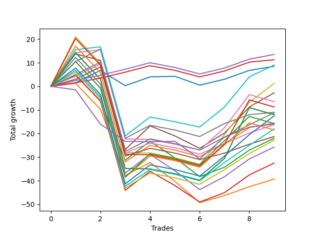

# Long Labrador 013 
- Symbol: ES_830-1130
- Date Range: 03/18/2022 - 12/30/2022
- Trading Period: 8:30-11:30
- Number of Trades: 9



| Name | Win Percent | Profit | Avg Profit / Trade | Avg Time / Trade |      | Name | Win Percent | Profit | Avg Profit / Trade | Avg Time / Trade |
| ---- | ----------- | ------ | ------------------ | ---------------- | ---- | ---- | ----------- | ------ | ------------------ | ---------------- |
| Sorted By <br> Profit | | | | | | Sorted By <br> Win Percentage ||||
| V Mid SL-5 | 66.67 | 7750.00 | 861.11 | 05:24 |     | TP-2 | 77.78 | 6750.00 | 750.00 | 15:54 |
| BB-50 Mid SL-5 | 55.56 | 7625.00 | 847.22 | 06:45 |     | TP-1 | 77.78 | 5625.00 | 625.00 | 15:31 |
| TP-2 | 77.78 | 6750.00 | 750.00 | 15:54 |     | BB-20 Mid | 77.78 | 4250.00 | 472.22 | 05:31 |
| TP-1 | 77.78 | 5625.00 | 625.00 | 15:31 |     | BB-20 Mid SL-10 | 77.78 | 2000.00 | 222.22 | 04:53 |
| BB-100 Mid | 66.67 | 4500.00 | 500.00 | 39:09 |     | V Mid SL-5 | 66.67 | 7750.00 | 861.11 | 05:24 |
| BB-20 Mid | 77.78 | 4250.00 | 472.22 | 05:31 |     | BB-100 Mid | 66.67 | 4500.00 | 500.00 | 39:09 |
| BB-20 U/L 2SD C SL-5 | 55.56 | 3125.00 | 347.22 | 05:53 |     | BB-20 Mid SL-5 | 66.67 | 1250.00 | 138.89 | 03:01 |
| BB-20 U/L 2SD SL-5 | 55.56 | 3000.00 | 333.33 | 05:52 |     | V Mid SL-10 | 66.67 | 250.00 | 27.78 | 09:30 |
| BB-100 Mid SL-5 | 44.44 | 2750.00 | 305.56 | 13:18 |     | V Mid | 66.67 | -5500.00 | -611.11 | 25:02 |
| V U/L 1SD SL-5 | 33.33 | 2625.00 | 291.67 | 17:00 |     | TP-5 | 66.67 | -5625.00 | -625.00 | 25:06 |
| BB-50 U/L 1SD SL-5 | 44.44 | 2375.00 | 263.89 | 10:43 |     | TP-4 | 66.67 | -8125.00 | -902.78 | 24:40 |
| BB-20 Mid SL-10 | 77.78 | 2000.00 | 222.22 | 04:53 |     | TP-3 | 66.67 | -10625.00 | -1180.56 | 23:06 |
| BB-20 Mid SL-5 | 66.67 | 1250.00 | 138.89 | 03:01 |     | BB-50 Mid SL-5 | 55.56 | 7625.00 | 847.22 | 06:45 |
| V U/L 1SD | 44.44 | 625.00 | 69.44 | 45:01 |     | BB-20 U/L 2SD C SL-5 | 55.56 | 3125.00 | 347.22 | 05:53 |
| V Mid SL-10 | 66.67 | 250.00 | 27.78 | 09:30 |     | BB-20 U/L 2SD SL-5 | 55.56 | 3000.00 | 333.33 | 05:52 |
| BB-200 U/L 2SD SL-5 | 22.22 | -625.00 | -69.44 | 30:07 |     | BB-50 U/L 1SD | 55.56 | -1375.00 | -152.78 | 34:55 |
| BB-100 U/L 2SD SL-5 | 22.22 | -625.00 | -69.44 | 28:30 |     | BB-50 Mid SL-10 | 55.56 | -1500.00 | -166.67 | 10:56 |
| BB-50 U/L 1SD | 55.56 | -1375.00 | -152.78 | 34:55 |     | BB-20 U/L 1SD SL-5 | 55.56 | -3125.00 | -347.22 | 04:44 |
| BB-50 Mid SL-10 | 55.56 | -1500.00 | -166.67 | 10:56 |     | BB-20 U/L 2SD C SL-10 | 55.56 | -6000.00 | -666.67 | 10:05 |
| NEWFI 06 | 33.33 | -1875.00 | -208.33 | 59:56 |     | BB-20 U/L 2SD SL-10 | 55.56 | -6125.00 | -680.56 | 10:04 |
| BB-20 U/L 1SD SL-5 | 55.56 | -3125.00 | -347.22 | 04:44 |     | TP-8 | 55.56 | -6250.00 | -694.44 | 34:53 |
| BB-50 U/L 2SD | 44.44 | -3250.00 | -361.11 | 46:50 |     | BB-200 Mid | 55.56 | -7750.00 | -861.11 | 34:20 |
| BB-200 Mid SL-5 | 44.44 | -3750.00 | -416.67 | 06:39 |     | TP-7 | 55.56 | -9000.00 | -1000.00 | 34:11 |
| BB-50 U/L 2SD SL-5 | 22.22 | -4250.00 | -472.22 | 21:15 |     | BB-20 U/L 2SD | 55.56 | -11000.00 | -1222.22 | 25:03 |
| NEWFI 000 | 33.33 | -4375.00 | -486.11 | 57:23 |     | TP-6 | 55.56 | -11375.00 | -1263.89 | 32:33 |
| V Mid | 66.67 | -5500.00 | -611.11 | 25:02 |     | BB-20 U/L 1SD SL-10 | 55.56 | -12250.00 | -1361.11 | 08:56 |
| TP-5 | 66.67 | -5625.00 | -625.00 | 25:06 |     | BB-50 Mid | 55.56 | -12875.00 | -1430.56 | 27:21 |
| BB-20 U/L 2SD C SL-10 | 55.56 | -6000.00 | -666.67 | 10:05 |     | BB-20 U/L 2SD C | 55.56 | -16250.00 | -1805.56 | 26:48 |
| BB-200 U/L 2SD | 33.33 | -6000.00 | -666.67 | 60:55 |     | BB-20 U/L 1SD | 55.56 | -19625.00 | -2180.56 | 21:45 |
| BB-100 U/L 2SD | 33.33 | -6000.00 | -666.67 | 59:17 |     | BB-100 Mid SL-5 | 44.44 | 2750.00 | 305.56 | 13:18 |
| BB-20 U/L 2SD SL-10 | 55.56 | -6125.00 | -680.56 | 10:04 |     | BB-50 U/L 1SD SL-5 | 44.44 | 2375.00 | 263.89 | 10:43 |
| TP-8 | 55.56 | -6250.00 | -694.44 | 34:53 |     | V U/L 1SD | 44.44 | 625.00 | 69.44 | 45:01 |
| BB-200 Mid | 55.56 | -7750.00 | -861.11 | 34:20 |     | BB-50 U/L 2SD | 44.44 | -3250.00 | -361.11 | 46:50 |
| TP-10 | 44.44 | -7875.00 | -875.00 | 41:37 |     | BB-200 Mid SL-5 | 44.44 | -3750.00 | -416.67 | 06:39 |
| NEWFI 0000 | 44.44 | -8000.00 | -888.89 | 23:50 |     | TP-10 | 44.44 | -7875.00 | -875.00 | 41:37 |
| TP-4 | 66.67 | -8125.00 | -902.78 | 24:40 |     | NEWFI 0000 | 44.44 | -8000.00 | -888.89 | 23:50 |
| BB-100 Mid SL-10 | 44.44 | -8875.00 | -986.11 | 17:48 |     | BB-100 Mid SL-10 | 44.44 | -8875.00 | -986.11 | 17:48 |
| TP-7 | 55.56 | -9000.00 | -1000.00 | 34:11 |     | TP-9 | 44.44 | -9250.00 | -1027.78 | 40:42 |
| V U/L 1SD SL-10 | 33.33 | -9000.00 | -1000.00 | 21:30 |     | BB-50 U/L 1SD SL-10 | 44.44 | -9250.00 | -1027.78 | 15:13 |
| TP-9 | 44.44 | -9250.00 | -1027.78 | 40:42 |     | BB-200 Mid SL-10 | 44.44 | -15375.00 | -1708.33 | 11:09 |
| BB-50 U/L 1SD SL-10 | 44.44 | -9250.00 | -1027.78 | 15:13 |     | V U/L 1SD SL-5 | 33.33 | 2625.00 | 291.67 | 17:00 |
| TP-3 | 66.67 | -10625.00 | -1180.56 | 23:06 |     | NEWFI 06 | 33.33 | -1875.00 | -208.33 | 59:56 |
| BB-20 U/L 2SD | 55.56 | -11000.00 | -1222.22 | 25:03 |     | NEWFI 000 | 33.33 | -4375.00 | -486.11 | 57:23 |
| TP-6 | 55.56 | -11375.00 | -1263.89 | 32:33 |     | BB-200 U/L 2SD | 33.33 | -6000.00 | -666.67 | 60:55 |
| BB-20 U/L 1SD SL-10 | 55.56 | -12250.00 | -1361.11 | 08:56 |     | BB-100 U/L 2SD | 33.33 | -6000.00 | -666.67 | 59:17 |
| BB-200 U/L 2SD SL-10 | 22.22 | -12250.00 | -1361.11 | 34:37 |     | V U/L 1SD SL-10 | 33.33 | -9000.00 | -1000.00 | 21:30 |
| BB-100 U/L 2SD SL-10 | 22.22 | -12250.00 | -1361.11 | 33:00 |     | BB-200 U/L 2SD SL-5 | 22.22 | -625.00 | -69.44 | 30:07 |
| BB-50 Mid | 55.56 | -12875.00 | -1430.56 | 27:21 |     | BB-100 U/L 2SD SL-5 | 22.22 | -625.00 | -69.44 | 28:30 |
| BB-200 Mid SL-10 | 44.44 | -15375.00 | -1708.33 | 11:09 |     | BB-50 U/L 2SD SL-5 | 22.22 | -4250.00 | -472.22 | 21:15 |
| BB-50 U/L 2SD SL-10 | 22.22 | -15875.00 | -1763.89 | 25:45 |     | BB-200 U/L 2SD SL-10 | 22.22 | -12250.00 | -1361.11 | 34:37 |
| BB-20 U/L 2SD C | 55.56 | -16250.00 | -1805.56 | 26:48 |     | BB-100 U/L 2SD SL-10 | 22.22 | -12250.00 | -1361.11 | 33:00 |
| BB-20 U/L 1SD | 55.56 | -19625.00 | -2180.56 | 21:45 |     | BB-50 U/L 2SD SL-10 | 22.22 | -15875.00 | -1763.89 | 25:45 |

## NO STOPLOSS

### Test BB-20 Mid
* Sell when price hits the middle line of the 20p bollinger
* No Stoploss
* Results:
```
Total Trades: 9
Percent Up: 77.78
Percent Down: 22.22
Total Points Moved Up: 8.50
Potential Profit: 4250.00
Total Points Ups: 18.75 Count Ups: 7
Total Points Downs: -10.25 Count Downs: 2
```

<details><summary>Trades</summary>

<code>In: 2022-05-03 11:24:00		Out: 2022-05-03 11:32:10		Total Position Time: 08:10		Total Move Up: 1.50		Total to Date: 1.50</code> <br />
<code>In: 2022-05-06 11:00:00		Out: 2022-05-06 11:02:20		Total Position Time: 02:20		Total Move Up: 5.25		Total to Date: 6.75</code> <br />
<code>In: 2022-05-11 09:37:00		Out: 2022-05-11 09:49:20		Total Position Time: 12:20		Total Move Up: -6.50		Total to Date: 0.25</code> <br />
<code>In: 2022-06-27 09:37:00		Out: 2022-06-27 09:41:05		Total Position Time: 04:05		Total Move Up: 3.75		Total to Date: 4.00</code> <br />
<code>In: 2022-10-26 10:04:00		Out: 2022-10-26 10:12:05		Total Position Time: 08:05		Total Move Up: 0.25		Total to Date: 4.25</code> <br />
<code>In: 2022-10-26 10:12:00		Out: 2022-10-26 10:20:10		Total Position Time: 08:10		Total Move Up: -3.75		Total to Date: 0.50</code> <br />
<code>In: 2022-10-31 09:50:00		Out: 2022-10-31 09:51:10		Total Position Time: 01:10		Total Move Up: 2.50		Total to Date: 3.00</code> <br />
<code>In: 2022-11-10 10:02:00		Out: 2022-11-10 10:03:10		Total Position Time: 01:10		Total Move Up: 3.75		Total to Date: 6.75</code> <br />
<code>In: 2022-12-27 09:52:00		Out: 2022-12-27 09:56:10		Total Position Time: 04:10		Total Move Up: 1.75		Total to Date: 8.50</code> <br />


</details>

### Test BB-20 U/L 1SD
* Sell when the price hits the upper line of the 20p 1std bollinger
* No Stoploss
* Results:
```
Total Trades: 9
Percent Up: 55.56
Percent Down: 44.44
Total Points Moved Up: -39.25
Potential Profit: -19625.00
Total Points Ups: 16.75 Count Ups: 5
Total Points Downs: -56.00 Count Downs: 4
```

<details><summary>Trades</summary>

<code>In: 2022-05-03 11:24:00		Out: 2022-05-03 11:32:25		Total Position Time: 08:25		Total Move Up: 1.25		Total to Date: 1.25</code> <br />
<code>In: 2022-05-06 11:00:00		Out: 2022-05-06 11:49:10		Total Position Time: 49:10		Total Move Up: -11.00		Total to Date: -9.75</code> <br />
<code>In: 2022-05-11 09:37:00		Out: 2022-05-11 10:24:35		Total Position Time: 47:35		Total Move Up: -28.00		Total to Date: -37.75</code> <br />
<code>In: 2022-06-27 09:37:00		Out: 2022-06-27 09:44:20		Total Position Time: 07:20		Total Move Up: 5.50		Total to Date: -32.25</code> <br />
<code>In: 2022-10-26 10:04:00		Out: 2022-10-26 10:41:50		Total Position Time: 37:50		Total Move Up: -8.00		Total to Date: -40.25</code> <br />
<code>In: 2022-10-26 10:12:00		Out: 2022-10-26 10:41:50		Total Position Time: 29:50		Total Move Up: -9.00		Total to Date: -49.25</code> <br />
<code>In: 2022-10-31 09:50:00		Out: 2022-10-31 09:57:05		Total Position Time: 07:05		Total Move Up: 3.00		Total to Date: -46.25</code> <br />
<code>In: 2022-11-10 10:02:00		Out: 2022-11-10 10:03:10		Total Position Time: 01:10		Total Move Up: 3.75		Total to Date: -42.50</code> <br />
<code>In: 2022-12-27 09:52:00		Out: 2022-12-27 09:59:25		Total Position Time: 07:25		Total Move Up: 3.25		Total to Date: -39.25</code> <br />


</details>

### Test BB-20 U/L 2SD
* Sell when the price hits the upper line of the 20p 2std bollinger
* No Stoploss
* Results:
```
Total Trades: 9
Percent Up: 55.56
Percent Down: 44.44
Total Points Moved Up: -22.00
Potential Profit: -11000.00
Total Points Ups: 29.00 Count Ups: 5
Total Points Downs: -51.00 Count Downs: 4
```

<details><summary>Trades</summary>

<code>In: 2022-05-03 11:24:00		Out: 2022-05-03 11:34:55		Total Position Time: 10:55		Total Move Up: 4.75		Total to Date: 4.75</code> <br />
<code>In: 2022-05-06 11:00:00		Out: 2022-05-06 11:49:10		Total Position Time: 49:10		Total Move Up: -11.00		Total to Date: -6.25</code> <br />
<code>In: 2022-05-11 09:37:00		Out: 2022-05-11 10:24:50		Total Position Time: 47:50		Total Move Up: -25.00		Total to Date: -31.25</code> <br />
<code>In: 2022-06-27 09:37:00		Out: 2022-06-27 09:45:05		Total Position Time: 08:05		Total Move Up: 8.00		Total to Date: -23.25</code> <br />
<code>In: 2022-10-26 10:04:00		Out: 2022-10-26 10:51:25		Total Position Time: 47:25		Total Move Up: -7.00		Total to Date: -30.25</code> <br />
<code>In: 2022-10-26 10:12:00		Out: 2022-10-26 10:51:25		Total Position Time: 39:25		Total Move Up: -8.00		Total to Date: -38.25</code> <br />
<code>In: 2022-10-31 09:50:00		Out: 2022-10-31 10:02:05		Total Position Time: 12:05		Total Move Up: 4.00		Total to Date: -34.25</code> <br />
<code>In: 2022-11-10 10:02:00		Out: 2022-11-10 10:03:45		Total Position Time: 01:45		Total Move Up: 7.25		Total to Date: -27.00</code> <br />
<code>In: 2022-12-27 09:52:00		Out: 2022-12-27 10:00:50		Total Position Time: 08:50		Total Move Up: 5.00		Total to Date: -22.00</code> <br />


</details>

### Test BB-20 U/L 2SD C
* Sell when the price hits the upper line of the 20p 2std bollinger
* No Stoploss
* Results:
```
Total Trades: 9
Percent Up: 55.56
Percent Down: 44.44
Total Points Moved Up: -32.50
Potential Profit: -16250.00
Total Points Ups: 29.25 Count Ups: 5
Total Points Downs: -61.75 Count Downs: 4
```

<details><summary>Trades</summary>

<code>In: 2022-05-03 11:24:00		Out: 2022-05-03 11:34:55		Total Position Time: 10:55		Total Move Up: 4.75		Total to Date: 4.75</code> <br />
<code>In: 2022-05-06 11:00:00		Out: 2022-05-06 11:49:10		Total Position Time: 49:10		Total Move Up: -11.00		Total to Date: -6.25</code> <br />
<code>In: 2022-05-11 09:37:00		Out: 2022-05-11 10:37:55		Total Position Time: 60:55		Total Move Up: -37.75		Total to Date: -44.00</code> <br />
<code>In: 2022-06-27 09:37:00		Out: 2022-06-27 09:45:05		Total Position Time: 08:05		Total Move Up: 8.00		Total to Date: -36.00</code> <br />
<code>In: 2022-10-26 10:04:00		Out: 2022-10-26 10:52:40		Total Position Time: 48:40		Total Move Up: -6.00		Total to Date: -42.00</code> <br />
<code>In: 2022-10-26 10:12:00		Out: 2022-10-26 10:52:40		Total Position Time: 40:40		Total Move Up: -7.00		Total to Date: -49.00</code> <br />
<code>In: 2022-10-31 09:50:00		Out: 2022-10-31 10:02:05		Total Position Time: 12:05		Total Move Up: 4.00		Total to Date: -45.00</code> <br />
<code>In: 2022-11-10 10:02:00		Out: 2022-11-10 10:03:55		Total Position Time: 01:55		Total Move Up: 7.50		Total to Date: -37.50</code> <br />
<code>In: 2022-12-27 09:52:00		Out: 2022-12-27 10:00:50		Total Position Time: 08:50		Total Move Up: 5.00		Total to Date: -32.50</code> <br />


</details>

### Test BB-50 Mid
* Sell when price hits the middle line of the 50p bollinger
* No Stoploss
* Results:
```
Total Trades: 9
Percent Up: 55.56
Percent Down: 44.44
Total Points Moved Up: -25.75
Potential Profit: -12875.00
Total Points Ups: 38.25 Count Ups: 5
Total Points Downs: -64.00 Count Downs: 4
```

<details><summary>Trades</summary>

<code>In: 2022-05-03 11:24:00		Out: 2022-05-03 11:36:10		Total Position Time: 12:10		Total Move Up: 12.25		Total to Date: 12.25</code> <br />
<code>In: 2022-05-06 11:00:00		Out: 2022-05-06 11:49:15		Total Position Time: 49:15		Total Move Up: -11.25		Total to Date: 1.00</code> <br />
<code>In: 2022-05-11 09:37:00		Out: 2022-05-11 10:37:55		Total Position Time: 60:55		Total Move Up: -37.75		Total to Date: -36.75</code> <br />
<code>In: 2022-06-27 09:37:00		Out: 2022-06-27 09:45:05		Total Position Time: 08:05		Total Move Up: 8.00		Total to Date: -28.75</code> <br />
<code>In: 2022-10-26 10:04:00		Out: 2022-10-26 10:51:15		Total Position Time: 47:15		Total Move Up: -7.00		Total to Date: -35.75</code> <br />
<code>In: 2022-10-26 10:12:00		Out: 2022-10-26 10:51:15		Total Position Time: 39:15		Total Move Up: -8.00		Total to Date: -43.75</code> <br />
<code>In: 2022-10-31 09:50:00		Out: 2022-10-31 10:08:30		Total Position Time: 18:30		Total Move Up: 5.50		Total to Date: -38.25</code> <br />
<code>In: 2022-11-10 10:02:00		Out: 2022-11-10 10:03:55		Total Position Time: 01:55		Total Move Up: 7.50		Total to Date: -30.75</code> <br />
<code>In: 2022-12-27 09:52:00		Out: 2022-12-27 10:00:50		Total Position Time: 08:50		Total Move Up: 5.00		Total to Date: -25.75</code> <br />


</details>

### Test BB-50 U/L 1SD
* Sell when the price hits the upper line of the 50p 1std bollinger
* No Stoploss
* Results:
```
Total Trades: 9
Percent Up: 55.56
Percent Down: 44.44
Total Points Moved Up: -2.75
Potential Profit: -1375.00
Total Points Ups: 47.25 Count Ups: 5
Total Points Downs: -50.00 Count Downs: 4
```

<details><summary>Trades</summary>

<code>In: 2022-05-03 11:24:00		Out: 2022-05-03 11:52:05		Total Position Time: 28:05		Total Move Up: 13.75		Total to Date: 13.75</code> <br />
<code>In: 2022-05-06 11:00:00		Out: 2022-05-06 11:50:10		Total Position Time: 50:10		Total Move Up: -2.75		Total to Date: 11.00</code> <br />
<code>In: 2022-05-11 09:37:00		Out: 2022-05-11 10:37:55		Total Position Time: 60:55		Total Move Up: -37.75		Total to Date: -26.75</code> <br />
<code>In: 2022-06-27 09:37:00		Out: 2022-06-27 09:53:20		Total Position Time: 16:20		Total Move Up: 10.00		Total to Date: -16.75</code> <br />
<code>In: 2022-10-26 10:04:00		Out: 2022-10-26 11:01:00		Total Position Time: 57:00		Total Move Up: -4.25		Total to Date: -21.00</code> <br />
<code>In: 2022-10-26 10:12:00		Out: 2022-10-26 11:01:00		Total Position Time: 49:00		Total Move Up: -5.25		Total to Date: -26.25</code> <br />
<code>In: 2022-10-31 09:50:00		Out: 2022-10-31 10:16:15		Total Position Time: 26:15		Total Move Up: 6.50		Total to Date: -19.75</code> <br />
<code>In: 2022-11-10 10:02:00		Out: 2022-11-10 10:13:45		Total Position Time: 11:45		Total Move Up: 11.00		Total to Date: -8.75</code> <br />
<code>In: 2022-12-27 09:52:00		Out: 2022-12-27 10:06:45		Total Position Time: 14:45		Total Move Up: 6.00		Total to Date: -2.75</code> <br />


</details>

### Test BB-50 U/L 2SD
* Sell when the price hits the upper line of the 50p 2std bollinger
* No Stoploss
* Results:
```
Total Trades: 9
Percent Up: 44.44
Percent Down: 55.56
Total Points Moved Up: -6.50
Potential Profit: -3250.00
Total Points Ups: 39.00 Count Ups: 4
Total Points Downs: -45.50 Count Downs: 5
```

<details><summary>Trades</summary>

<code>In: 2022-05-03 11:24:00		Out: 2022-05-03 11:56:15		Total Position Time: 32:15		Total Move Up: 14.25		Total to Date: 14.25</code> <br />
<code>In: 2022-05-06 11:00:00		Out: 2022-05-06 11:50:35		Total Position Time: 50:35		Total Move Up: 1.25		Total to Date: 15.50</code> <br />
<code>In: 2022-05-11 09:37:00		Out: 2022-05-11 10:37:55		Total Position Time: 60:55		Total Move Up: -37.75		Total to Date: -22.25</code> <br />
<code>In: 2022-06-27 09:37:00		Out: 2022-06-27 10:37:55		Total Position Time: 60:55		Total Move Up: -0.25		Total to Date: -22.50</code> <br />
<code>In: 2022-10-26 10:04:00		Out: 2022-10-26 11:04:55		Total Position Time: 60:55		Total Move Up: -2.00		Total to Date: -24.50</code> <br />
<code>In: 2022-10-26 10:12:00		Out: 2022-10-26 11:05:05		Total Position Time: 53:05		Total Move Up: -2.50		Total to Date: -27.00</code> <br />
<code>In: 2022-10-31 09:50:00		Out: 2022-10-31 10:17:40		Total Position Time: 27:40		Total Move Up: 9.50		Total to Date: -17.50</code> <br />
<code>In: 2022-11-10 10:02:00		Out: 2022-11-10 10:16:15		Total Position Time: 14:15		Total Move Up: 14.00		Total to Date: -3.50</code> <br />
<code>In: 2022-12-27 09:52:00		Out: 2022-12-27 10:52:55		Total Position Time: 60:55		Total Move Up: -3.00		Total to Date: -6.50</code> <br />


</details>

### Test V Mid
* Sell when the price hits the middle line of the 1std VWAP
* No Stoploss
* Results:
```
Total Trades: 9
Percent Up: 66.67
Percent Down: 33.33
Total Points Moved Up: -11.00
Potential Profit: -5500.00
Total Points Ups: 31.50 Count Ups: 6
Total Points Downs: -42.50 Count Downs: 3
```

<details><summary>Trades</summary>

<code>In: 2022-05-03 11:24:00		Out: 2022-05-03 11:36:05		Total Position Time: 12:05		Total Move Up: 10.50		Total to Date: 10.50</code> <br />
<code>In: 2022-05-06 11:00:00		Out: 2022-05-06 11:02:20		Total Position Time: 02:20		Total Move Up: 5.25		Total to Date: 15.75</code> <br />
<code>In: 2022-05-11 09:37:00		Out: 2022-05-11 10:37:55		Total Position Time: 60:55		Total Move Up: -37.75		Total to Date: -22.00</code> <br />
<code>In: 2022-06-27 09:37:00		Out: 2022-06-27 09:44:20		Total Position Time: 07:20		Total Move Up: 5.50		Total to Date: -16.50</code> <br />
<code>In: 2022-10-26 10:04:00		Out: 2022-10-26 11:04:55		Total Position Time: 60:55		Total Move Up: -2.00		Total to Date: -18.50</code> <br />
<code>In: 2022-10-26 10:12:00		Out: 2022-10-26 11:12:55		Total Position Time: 60:55		Total Move Up: -2.75		Total to Date: -21.25</code> <br />
<code>In: 2022-10-31 09:50:00		Out: 2022-10-31 10:08:30		Total Position Time: 18:30		Total Move Up: 5.50		Total to Date: -15.75</code> <br />
<code>In: 2022-11-10 10:02:00		Out: 2022-11-10 10:03:10		Total Position Time: 01:10		Total Move Up: 3.75		Total to Date: -12.00</code> <br />
<code>In: 2022-12-27 09:52:00		Out: 2022-12-27 09:53:10		Total Position Time: 01:10		Total Move Up: 1.00		Total to Date: -11.00</code> <br />


</details>

### Test V U/L 1SD
* Sell when the price hits the upper line of the 1std VWAP
* No Stoploss
* Results:
```
Total Trades: 9
Percent Up: 44.44
Percent Down: 55.56
Total Points Moved Up: 1.25
Potential Profit: 625.00
Total Points Ups: 55.25 Count Ups: 4
Total Points Downs: -54.00 Count Downs: 5
```

<details><summary>Trades</summary>

<code>In: 2022-05-03 11:24:00		Out: 2022-05-03 12:00:05		Total Position Time: 36:05		Total Move Up: 21.00		Total to Date: 21.00</code> <br />
<code>In: 2022-05-06 11:00:00		Out: 2022-05-06 12:00:55		Total Position Time: 60:55		Total Move Up: -11.25		Total to Date: 9.75</code> <br />
<code>In: 2022-05-11 09:37:00		Out: 2022-05-11 10:37:55		Total Position Time: 60:55		Total Move Up: -37.75		Total to Date: -28.00</code> <br />
<code>In: 2022-06-27 09:37:00		Out: 2022-06-27 10:37:55		Total Position Time: 60:55		Total Move Up: -0.25		Total to Date: -28.25</code> <br />
<code>In: 2022-10-26 10:04:00		Out: 2022-10-26 11:04:55		Total Position Time: 60:55		Total Move Up: -2.00		Total to Date: -30.25</code> <br />
<code>In: 2022-10-26 10:12:00		Out: 2022-10-26 11:12:55		Total Position Time: 60:55		Total Move Up: -2.75		Total to Date: -33.00</code> <br />
<code>In: 2022-10-31 09:50:00		Out: 2022-10-31 10:24:00		Total Position Time: 34:00		Total Move Up: 12.50		Total to Date: -20.50</code> <br />
<code>In: 2022-11-10 10:02:00		Out: 2022-11-10 10:15:50		Total Position Time: 13:50		Total Move Up: 13.75		Total to Date: -6.75</code> <br />
<code>In: 2022-12-27 09:52:00		Out: 2022-12-27 10:08:45		Total Position Time: 16:45		Total Move Up: 8.00		Total to Date: 1.25</code> <br />


</details>

### Test BB-100 Mid
* Move to BB100 Mid
* No Stoploss
* Results:
```
Total Trades: 9
Percent Up: 66.67
Percent Down: 33.33
Total Points Moved Up: 9.00
Potential Profit: 4500.00
Total Points Ups: 51.00 Count Ups: 6
Total Points Downs: -42.00 Count Downs: 3
```

<details><summary>Trades</summary>

<code>In: 2022-05-03 11:24:00		Out: 2022-05-03 11:52:15		Total Position Time: 28:15		Total Move Up: 15.50		Total to Date: 15.50</code> <br />
<code>In: 2022-05-06 11:00:00		Out: 2022-05-06 11:50:35		Total Position Time: 50:35		Total Move Up: 1.25		Total to Date: 16.75</code> <br />
<code>In: 2022-05-11 09:37:00		Out: 2022-05-11 10:37:55		Total Position Time: 60:55		Total Move Up: -37.75		Total to Date: -21.00</code> <br />
<code>In: 2022-06-27 09:37:00		Out: 2022-06-27 10:20:05		Total Position Time: 43:05		Total Move Up: 8.00		Total to Date: -13.00</code> <br />
<code>In: 2022-10-26 10:04:00		Out: 2022-10-26 11:04:55		Total Position Time: 60:55		Total Move Up: -2.00		Total to Date: -15.00</code> <br />
<code>In: 2022-10-26 10:12:00		Out: 2022-10-26 11:11:30		Total Position Time: 59:30		Total Move Up: -2.25		Total to Date: -17.25</code> <br />
<code>In: 2022-10-31 09:50:00		Out: 2022-10-31 10:17:20		Total Position Time: 27:20		Total Move Up: 8.50		Total to Date: -8.75</code> <br />
<code>In: 2022-11-10 10:02:00		Out: 2022-11-10 10:15:00		Total Position Time: 13:00		Total Move Up: 12.75		Total to Date: 4.00</code> <br />
<code>In: 2022-12-27 09:52:00		Out: 2022-12-27 10:00:50		Total Position Time: 08:50		Total Move Up: 5.00		Total to Date: 9.00</code> <br />


</details>

### Test BB-100 U/L 2SD
* Move to BB100 Upper Band
* No Stoploss
* Results:
```
Total Trades: 9
Percent Up: 33.33
Percent Down: 66.67
Total Points Moved Up: -12.00
Potential Profit: -6000.00
Total Points Ups: 45.00 Count Ups: 3
Total Points Downs: -57.00 Count Downs: 6
```

<details><summary>Trades</summary>

<code>In: 2022-05-03 11:24:00		Out: 2022-05-03 12:24:55		Total Position Time: 60:55		Total Move Up: 14.25		Total to Date: 14.25</code> <br />
<code>In: 2022-05-06 11:00:00		Out: 2022-05-06 12:00:55		Total Position Time: 60:55		Total Move Up: -11.25		Total to Date: 3.00</code> <br />
<code>In: 2022-05-11 09:37:00		Out: 2022-05-11 10:37:55		Total Position Time: 60:55		Total Move Up: -37.75		Total to Date: -34.75</code> <br />
<code>In: 2022-06-27 09:37:00		Out: 2022-06-27 10:37:55		Total Position Time: 60:55		Total Move Up: -0.25		Total to Date: -35.00</code> <br />
<code>In: 2022-10-26 10:04:00		Out: 2022-10-26 11:04:55		Total Position Time: 60:55		Total Move Up: -2.00		Total to Date: -37.00</code> <br />
<code>In: 2022-10-26 10:12:00		Out: 2022-10-26 11:12:55		Total Position Time: 60:55		Total Move Up: -2.75		Total to Date: -39.75</code> <br />
<code>In: 2022-10-31 09:50:00		Out: 2022-10-31 10:50:55		Total Position Time: 60:55		Total Move Up: 9.25		Total to Date: -30.50</code> <br />
<code>In: 2022-11-10 10:02:00		Out: 2022-11-10 10:48:15		Total Position Time: 46:15		Total Move Up: 21.50		Total to Date: -9.00</code> <br />
<code>In: 2022-12-27 09:52:00		Out: 2022-12-27 10:52:55		Total Position Time: 60:55		Total Move Up: -3.00		Total to Date: -12.00</code> <br />


</details>

### Test BB-200 Mid
* Move to BB200 Mid
* No Stoploss
* Results:
```
Total Trades: 9
Percent Up: 55.56
Percent Down: 44.44
Total Points Moved Up: -15.50
Potential Profit: -7750.00
Total Points Ups: 38.25 Count Ups: 5
Total Points Downs: -53.75 Count Downs: 4
```

<details><summary>Trades</summary>

<code>In: 2022-05-03 11:24:00		Out: 2022-05-03 11:56:55		Total Position Time: 32:55		Total Move Up: 17.00		Total to Date: 17.00</code> <br />
<code>In: 2022-05-06 11:00:00		Out: 2022-05-06 12:00:55		Total Position Time: 60:55		Total Move Up: -11.25		Total to Date: 5.75</code> <br />
<code>In: 2022-05-11 09:37:00		Out: 2022-05-11 10:37:55		Total Position Time: 60:55		Total Move Up: -37.75		Total to Date: -32.00</code> <br />
<code>In: 2022-06-27 09:37:00		Out: 2022-06-27 09:45:00		Total Position Time: 08:00		Total Move Up: 7.00		Total to Date: -25.00</code> <br />
<code>In: 2022-10-26 10:04:00		Out: 2022-10-26 11:04:55		Total Position Time: 60:55		Total Move Up: -2.00		Total to Date: -27.00</code> <br />
<code>In: 2022-10-26 10:12:00		Out: 2022-10-26 11:12:55		Total Position Time: 60:55		Total Move Up: -2.75		Total to Date: -29.75</code> <br />
<code>In: 2022-10-31 09:50:00		Out: 2022-10-31 10:08:30		Total Position Time: 18:30		Total Move Up: 5.50		Total to Date: -24.25</code> <br />
<code>In: 2022-11-10 10:02:00		Out: 2022-11-10 10:03:35		Total Position Time: 01:35		Total Move Up: 6.75		Total to Date: -17.50</code> <br />
<code>In: 2022-12-27 09:52:00		Out: 2022-12-27 09:56:20		Total Position Time: 04:20		Total Move Up: 2.00		Total to Date: -15.50</code> <br />


</details>

### Test BB-200 U/L 2SD
* Move to BB200 Upper Band
* No Stoploss
* Results:
```
Total Trades: 9
Percent Up: 33.33
Percent Down: 66.67
Total Points Moved Up: -12.00
Potential Profit: -6000.00
Total Points Ups: 45.00 Count Ups: 3
Total Points Downs: -57.00 Count Downs: 6
```

<details><summary>Trades</summary>

<code>In: 2022-05-03 11:24:00		Out: 2022-05-03 12:24:55		Total Position Time: 60:55		Total Move Up: 14.25		Total to Date: 14.25</code> <br />
<code>In: 2022-05-06 11:00:00		Out: 2022-05-06 12:00:55		Total Position Time: 60:55		Total Move Up: -11.25		Total to Date: 3.00</code> <br />
<code>In: 2022-05-11 09:37:00		Out: 2022-05-11 10:37:55		Total Position Time: 60:55		Total Move Up: -37.75		Total to Date: -34.75</code> <br />
<code>In: 2022-06-27 09:37:00		Out: 2022-06-27 10:37:55		Total Position Time: 60:55		Total Move Up: -0.25		Total to Date: -35.00</code> <br />
<code>In: 2022-10-26 10:04:00		Out: 2022-10-26 11:04:55		Total Position Time: 60:55		Total Move Up: -2.00		Total to Date: -37.00</code> <br />
<code>In: 2022-10-26 10:12:00		Out: 2022-10-26 11:12:55		Total Position Time: 60:55		Total Move Up: -2.75		Total to Date: -39.75</code> <br />
<code>In: 2022-10-31 09:50:00		Out: 2022-10-31 10:50:55		Total Position Time: 60:55		Total Move Up: 9.25		Total to Date: -30.50</code> <br />
<code>In: 2022-11-10 10:02:00		Out: 2022-11-10 11:02:55		Total Position Time: 60:55		Total Move Up: 21.50		Total to Date: -9.00</code> <br />
<code>In: 2022-12-27 09:52:00		Out: 2022-12-27 10:52:55		Total Position Time: 60:55		Total Move Up: -3.00		Total to Date: -12.00</code> <br />


</details>

## STOPLOSS OF 5

### Test BB-20 Mid SL-5
* Sell when price hits the middle line of the 20p bollinger
* Stoploss is 5 points
* Results:
```
Total Trades: 9
Percent Up: 66.67
Percent Down: 33.33
Total Points Moved Up: 2.50
Potential Profit: 1250.00
Total Points Ups: 18.50 Count Ups: 6
Total Points Downs: -16.00 Count Downs: 3
```

<details><summary>Trades</summary>

<code>In: 2022-05-03 11:24:00		Out: 2022-05-03 11:32:10		Total Position Time: 08:10		Total Move Up: 1.50		Total to Date: 1.50</code> <br />
<code>In: 2022-05-06 11:00:00		Out: 2022-05-06 11:02:20		Total Position Time: 02:20		Total Move Up: 5.25		Total to Date: 6.75</code> <br />
<code>In: 2022-05-11 09:37:00		Out: 2022-05-11 09:39:55		Total Position Time: 02:55		Total Move Up: -4.75		Total to Date: 2.00</code> <br />
<code>In: 2022-06-27 09:37:00		Out: 2022-06-27 09:41:05		Total Position Time: 04:05		Total Move Up: 3.75		Total to Date: 5.75</code> <br />
<code>In: 2022-10-26 10:04:00		Out: 2022-10-26 10:06:00		Total Position Time: 02:00		Total Move Up: -5.50		Total to Date: 0.25</code> <br />
<code>In: 2022-10-26 10:12:00		Out: 2022-10-26 10:13:10		Total Position Time: 01:10		Total Move Up: -5.75		Total to Date: -5.50</code> <br />
<code>In: 2022-10-31 09:50:00		Out: 2022-10-31 09:51:10		Total Position Time: 01:10		Total Move Up: 2.50		Total to Date: -3.00</code> <br />
<code>In: 2022-11-10 10:02:00		Out: 2022-11-10 10:03:10		Total Position Time: 01:10		Total Move Up: 3.75		Total to Date: 0.75</code> <br />
<code>In: 2022-12-27 09:52:00		Out: 2022-12-27 09:56:10		Total Position Time: 04:10		Total Move Up: 1.75		Total to Date: 2.50</code> <br />


</details>

### Test BB-20 U/L 1SD SL-5
* Sell when the price hits the upper line of the 20p 1std bollinger
* Stoploss is 5 points
* Results:
```
Total Trades: 9
Percent Up: 55.56
Percent Down: 44.44
Total Points Moved Up: -6.25
Potential Profit: -3125.00
Total Points Ups: 16.75 Count Ups: 5
Total Points Downs: -23.00 Count Downs: 4
```

<details><summary>Trades</summary>

<code>In: 2022-05-03 11:24:00		Out: 2022-05-03 11:32:25		Total Position Time: 08:25		Total Move Up: 1.25		Total to Date: 1.25</code> <br />
<code>In: 2022-05-06 11:00:00		Out: 2022-05-06 11:05:10		Total Position Time: 05:10		Total Move Up: -7.00		Total to Date: -5.75</code> <br />
<code>In: 2022-05-11 09:37:00		Out: 2022-05-11 09:39:55		Total Position Time: 02:55		Total Move Up: -4.75		Total to Date: -10.50</code> <br />
<code>In: 2022-06-27 09:37:00		Out: 2022-06-27 09:44:20		Total Position Time: 07:20		Total Move Up: 5.50		Total to Date: -5.00</code> <br />
<code>In: 2022-10-26 10:04:00		Out: 2022-10-26 10:06:00		Total Position Time: 02:00		Total Move Up: -5.50		Total to Date: -10.50</code> <br />
<code>In: 2022-10-26 10:12:00		Out: 2022-10-26 10:13:10		Total Position Time: 01:10		Total Move Up: -5.75		Total to Date: -16.25</code> <br />
<code>In: 2022-10-31 09:50:00		Out: 2022-10-31 09:57:05		Total Position Time: 07:05		Total Move Up: 3.00		Total to Date: -13.25</code> <br />
<code>In: 2022-11-10 10:02:00		Out: 2022-11-10 10:03:10		Total Position Time: 01:10		Total Move Up: 3.75		Total to Date: -9.50</code> <br />
<code>In: 2022-12-27 09:52:00		Out: 2022-12-27 09:59:25		Total Position Time: 07:25		Total Move Up: 3.25		Total to Date: -6.25</code> <br />


</details>

### Test BB-20 U/L 2SD SL-5
* Sell when the price hits the upper line of the 20p 2std bollinger
* Stoploss is 5 points
* Results:
```
Total Trades: 9
Percent Up: 55.56
Percent Down: 44.44
Total Points Moved Up: 6.00
Potential Profit: 3000.00
Total Points Ups: 29.00 Count Ups: 5
Total Points Downs: -23.00 Count Downs: 4
```

<details><summary>Trades</summary>

<code>In: 2022-05-03 11:24:00		Out: 2022-05-03 11:34:55		Total Position Time: 10:55		Total Move Up: 4.75		Total to Date: 4.75</code> <br />
<code>In: 2022-05-06 11:00:00		Out: 2022-05-06 11:05:10		Total Position Time: 05:10		Total Move Up: -7.00		Total to Date: -2.25</code> <br />
<code>In: 2022-05-11 09:37:00		Out: 2022-05-11 09:39:55		Total Position Time: 02:55		Total Move Up: -4.75		Total to Date: -7.00</code> <br />
<code>In: 2022-06-27 09:37:00		Out: 2022-06-27 09:45:05		Total Position Time: 08:05		Total Move Up: 8.00		Total to Date: 1.00</code> <br />
<code>In: 2022-10-26 10:04:00		Out: 2022-10-26 10:06:00		Total Position Time: 02:00		Total Move Up: -5.50		Total to Date: -4.50</code> <br />
<code>In: 2022-10-26 10:12:00		Out: 2022-10-26 10:13:10		Total Position Time: 01:10		Total Move Up: -5.75		Total to Date: -10.25</code> <br />
<code>In: 2022-10-31 09:50:00		Out: 2022-10-31 10:02:05		Total Position Time: 12:05		Total Move Up: 4.00		Total to Date: -6.25</code> <br />
<code>In: 2022-11-10 10:02:00		Out: 2022-11-10 10:03:45		Total Position Time: 01:45		Total Move Up: 7.25		Total to Date: 1.00</code> <br />
<code>In: 2022-12-27 09:52:00		Out: 2022-12-27 10:00:50		Total Position Time: 08:50		Total Move Up: 5.00		Total to Date: 6.00</code> <br />


</details>

### Test BB-20 U/L 2SD C SL-5
* Sell when the price hits the upper line of the 20p 2std bollinger
* Stoploss is 5 points
* Results:
```
Total Trades: 9
Percent Up: 55.56
Percent Down: 44.44
Total Points Moved Up: 6.25
Potential Profit: 3125.00
Total Points Ups: 29.25 Count Ups: 5
Total Points Downs: -23.00 Count Downs: 4
```

<details><summary>Trades</summary>

<code>In: 2022-05-03 11:24:00		Out: 2022-05-03 11:34:55		Total Position Time: 10:55		Total Move Up: 4.75		Total to Date: 4.75</code> <br />
<code>In: 2022-05-06 11:00:00		Out: 2022-05-06 11:05:10		Total Position Time: 05:10		Total Move Up: -7.00		Total to Date: -2.25</code> <br />
<code>In: 2022-05-11 09:37:00		Out: 2022-05-11 09:39:55		Total Position Time: 02:55		Total Move Up: -4.75		Total to Date: -7.00</code> <br />
<code>In: 2022-06-27 09:37:00		Out: 2022-06-27 09:45:05		Total Position Time: 08:05		Total Move Up: 8.00		Total to Date: 1.00</code> <br />
<code>In: 2022-10-26 10:04:00		Out: 2022-10-26 10:06:00		Total Position Time: 02:00		Total Move Up: -5.50		Total to Date: -4.50</code> <br />
<code>In: 2022-10-26 10:12:00		Out: 2022-10-26 10:13:10		Total Position Time: 01:10		Total Move Up: -5.75		Total to Date: -10.25</code> <br />
<code>In: 2022-10-31 09:50:00		Out: 2022-10-31 10:02:05		Total Position Time: 12:05		Total Move Up: 4.00		Total to Date: -6.25</code> <br />
<code>In: 2022-11-10 10:02:00		Out: 2022-11-10 10:03:55		Total Position Time: 01:55		Total Move Up: 7.50		Total to Date: 1.25</code> <br />
<code>In: 2022-12-27 09:52:00		Out: 2022-12-27 10:00:50		Total Position Time: 08:50		Total Move Up: 5.00		Total to Date: 6.25</code> <br />


</details>

### Test BB-50 Mid SL-5
* Sell when price hits the middle line of the 50p bollinger
* Stoploss is 5 points
* Results:
```
Total Trades: 9
Percent Up: 55.56
Percent Down: 44.44
Total Points Moved Up: 15.25
Potential Profit: 7625.00
Total Points Ups: 38.25 Count Ups: 5
Total Points Downs: -23.00 Count Downs: 4
```

<details><summary>Trades</summary>

<code>In: 2022-05-03 11:24:00		Out: 2022-05-03 11:36:10		Total Position Time: 12:10		Total Move Up: 12.25		Total to Date: 12.25</code> <br />
<code>In: 2022-05-06 11:00:00		Out: 2022-05-06 11:05:10		Total Position Time: 05:10		Total Move Up: -7.00		Total to Date: 5.25</code> <br />
<code>In: 2022-05-11 09:37:00		Out: 2022-05-11 09:39:55		Total Position Time: 02:55		Total Move Up: -4.75		Total to Date: 0.50</code> <br />
<code>In: 2022-06-27 09:37:00		Out: 2022-06-27 09:45:05		Total Position Time: 08:05		Total Move Up: 8.00		Total to Date: 8.50</code> <br />
<code>In: 2022-10-26 10:04:00		Out: 2022-10-26 10:06:00		Total Position Time: 02:00		Total Move Up: -5.50		Total to Date: 3.00</code> <br />
<code>In: 2022-10-26 10:12:00		Out: 2022-10-26 10:13:10		Total Position Time: 01:10		Total Move Up: -5.75		Total to Date: -2.75</code> <br />
<code>In: 2022-10-31 09:50:00		Out: 2022-10-31 10:08:30		Total Position Time: 18:30		Total Move Up: 5.50		Total to Date: 2.75</code> <br />
<code>In: 2022-11-10 10:02:00		Out: 2022-11-10 10:03:55		Total Position Time: 01:55		Total Move Up: 7.50		Total to Date: 10.25</code> <br />
<code>In: 2022-12-27 09:52:00		Out: 2022-12-27 10:00:50		Total Position Time: 08:50		Total Move Up: 5.00		Total to Date: 15.25</code> <br />


</details>

### Test BB-50 U/L 1SD SL-5
* Sell when the price hits the upper line of the 50p 1std bollinger
* Stoploss is 5 points
* Results:
```
Total Trades: 9
Percent Up: 44.44
Percent Down: 55.56
Total Points Moved Up: 4.75
Potential Profit: 2375.00
Total Points Ups: 33.50 Count Ups: 4
Total Points Downs: -28.75 Count Downs: 5
```

<details><summary>Trades</summary>

<code>In: 2022-05-03 11:24:00		Out: 2022-05-03 11:40:15		Total Position Time: 16:15		Total Move Up: -5.75		Total to Date: -5.75</code> <br />
<code>In: 2022-05-06 11:00:00		Out: 2022-05-06 11:05:10		Total Position Time: 05:10		Total Move Up: -7.00		Total to Date: -12.75</code> <br />
<code>In: 2022-05-11 09:37:00		Out: 2022-05-11 09:39:55		Total Position Time: 02:55		Total Move Up: -4.75		Total to Date: -17.50</code> <br />
<code>In: 2022-06-27 09:37:00		Out: 2022-06-27 09:53:20		Total Position Time: 16:20		Total Move Up: 10.00		Total to Date: -7.50</code> <br />
<code>In: 2022-10-26 10:04:00		Out: 2022-10-26 10:06:00		Total Position Time: 02:00		Total Move Up: -5.50		Total to Date: -13.00</code> <br />
<code>In: 2022-10-26 10:12:00		Out: 2022-10-26 10:13:10		Total Position Time: 01:10		Total Move Up: -5.75		Total to Date: -18.75</code> <br />
<code>In: 2022-10-31 09:50:00		Out: 2022-10-31 10:16:15		Total Position Time: 26:15		Total Move Up: 6.50		Total to Date: -12.25</code> <br />
<code>In: 2022-11-10 10:02:00		Out: 2022-11-10 10:13:45		Total Position Time: 11:45		Total Move Up: 11.00		Total to Date: -1.25</code> <br />
<code>In: 2022-12-27 09:52:00		Out: 2022-12-27 10:06:45		Total Position Time: 14:45		Total Move Up: 6.00		Total to Date: 4.75</code> <br />


</details>

### Test BB-50 U/L 2SD SL-5
* Sell when the price hits the upper line of the 50p 2std bollinger
* Stoploss is 5 points
* Results:
```
Total Trades: 9
Percent Up: 22.22
Percent Down: 77.78
Total Points Moved Up: -8.50
Potential Profit: -4250.00
Total Points Ups: 23.50 Count Ups: 2
Total Points Downs: -32.00 Count Downs: 7
```

<details><summary>Trades</summary>

<code>In: 2022-05-03 11:24:00		Out: 2022-05-03 11:40:15		Total Position Time: 16:15		Total Move Up: -5.75		Total to Date: -5.75</code> <br />
<code>In: 2022-05-06 11:00:00		Out: 2022-05-06 11:05:10		Total Position Time: 05:10		Total Move Up: -7.00		Total to Date: -12.75</code> <br />
<code>In: 2022-05-11 09:37:00		Out: 2022-05-11 09:39:55		Total Position Time: 02:55		Total Move Up: -4.75		Total to Date: -17.50</code> <br />
<code>In: 2022-06-27 09:37:00		Out: 2022-06-27 10:37:55		Total Position Time: 60:55		Total Move Up: -0.25		Total to Date: -17.75</code> <br />
<code>In: 2022-10-26 10:04:00		Out: 2022-10-26 10:06:00		Total Position Time: 02:00		Total Move Up: -5.50		Total to Date: -23.25</code> <br />
<code>In: 2022-10-26 10:12:00		Out: 2022-10-26 10:13:10		Total Position Time: 01:10		Total Move Up: -5.75		Total to Date: -29.00</code> <br />
<code>In: 2022-10-31 09:50:00		Out: 2022-10-31 10:17:40		Total Position Time: 27:40		Total Move Up: 9.50		Total to Date: -19.50</code> <br />
<code>In: 2022-11-10 10:02:00		Out: 2022-11-10 10:16:15		Total Position Time: 14:15		Total Move Up: 14.00		Total to Date: -5.50</code> <br />
<code>In: 2022-12-27 09:52:00		Out: 2022-12-27 10:52:55		Total Position Time: 60:55		Total Move Up: -3.00		Total to Date: -8.50</code> <br />


</details>

### Test V Mid SL-5
* Sell when the price hits the middle line of the 1std VWAP
* Stoploss is 5 points
* Results:
```
Total Trades: 9
Percent Up: 66.67
Percent Down: 33.33
Total Points Moved Up: 15.50
Potential Profit: 7750.00
Total Points Ups: 31.50 Count Ups: 6
Total Points Downs: -16.00 Count Downs: 3
```

<details><summary>Trades</summary>

<code>In: 2022-05-03 11:24:00		Out: 2022-05-03 11:36:05		Total Position Time: 12:05		Total Move Up: 10.50		Total to Date: 10.50</code> <br />
<code>In: 2022-05-06 11:00:00		Out: 2022-05-06 11:02:20		Total Position Time: 02:20		Total Move Up: 5.25		Total to Date: 15.75</code> <br />
<code>In: 2022-05-11 09:37:00		Out: 2022-05-11 09:39:55		Total Position Time: 02:55		Total Move Up: -4.75		Total to Date: 11.00</code> <br />
<code>In: 2022-06-27 09:37:00		Out: 2022-06-27 09:44:20		Total Position Time: 07:20		Total Move Up: 5.50		Total to Date: 16.50</code> <br />
<code>In: 2022-10-26 10:04:00		Out: 2022-10-26 10:06:00		Total Position Time: 02:00		Total Move Up: -5.50		Total to Date: 11.00</code> <br />
<code>In: 2022-10-26 10:12:00		Out: 2022-10-26 10:13:10		Total Position Time: 01:10		Total Move Up: -5.75		Total to Date: 5.25</code> <br />
<code>In: 2022-10-31 09:50:00		Out: 2022-10-31 10:08:30		Total Position Time: 18:30		Total Move Up: 5.50		Total to Date: 10.75</code> <br />
<code>In: 2022-11-10 10:02:00		Out: 2022-11-10 10:03:10		Total Position Time: 01:10		Total Move Up: 3.75		Total to Date: 14.50</code> <br />
<code>In: 2022-12-27 09:52:00		Out: 2022-12-27 09:53:10		Total Position Time: 01:10		Total Move Up: 1.00		Total to Date: 15.50</code> <br />


</details>

### Test V U/L 1SD SL-5
* Sell when the price hits the upper line of the 1std VWAP
* Stoploss is 5 points
* Results:
```
Total Trades: 9
Percent Up: 33.33
Percent Down: 66.67
Total Points Moved Up: 5.25
Potential Profit: 2625.00
Total Points Ups: 34.25 Count Ups: 3
Total Points Downs: -29.00 Count Downs: 6
```

<details><summary>Trades</summary>

<code>In: 2022-05-03 11:24:00		Out: 2022-05-03 11:40:15		Total Position Time: 16:15		Total Move Up: -5.75		Total to Date: -5.75</code> <br />
<code>In: 2022-05-06 11:00:00		Out: 2022-05-06 11:05:10		Total Position Time: 05:10		Total Move Up: -7.00		Total to Date: -12.75</code> <br />
<code>In: 2022-05-11 09:37:00		Out: 2022-05-11 09:39:55		Total Position Time: 02:55		Total Move Up: -4.75		Total to Date: -17.50</code> <br />
<code>In: 2022-06-27 09:37:00		Out: 2022-06-27 10:37:55		Total Position Time: 60:55		Total Move Up: -0.25		Total to Date: -17.75</code> <br />
<code>In: 2022-10-26 10:04:00		Out: 2022-10-26 10:06:00		Total Position Time: 02:00		Total Move Up: -5.50		Total to Date: -23.25</code> <br />
<code>In: 2022-10-26 10:12:00		Out: 2022-10-26 10:13:10		Total Position Time: 01:10		Total Move Up: -5.75		Total to Date: -29.00</code> <br />
<code>In: 2022-10-31 09:50:00		Out: 2022-10-31 10:24:00		Total Position Time: 34:00		Total Move Up: 12.50		Total to Date: -16.50</code> <br />
<code>In: 2022-11-10 10:02:00		Out: 2022-11-10 10:15:50		Total Position Time: 13:50		Total Move Up: 13.75		Total to Date: -2.75</code> <br />
<code>In: 2022-12-27 09:52:00		Out: 2022-12-27 10:08:45		Total Position Time: 16:45		Total Move Up: 8.00		Total to Date: 5.25</code> <br />


</details>

### Test BB-100 Mid SL-5
* Move to BB100 Mid
* Stoploss is 5 points
* Results:
```
Total Trades: 9
Percent Up: 44.44
Percent Down: 55.56
Total Points Moved Up: 5.50
Potential Profit: 2750.00
Total Points Ups: 34.25 Count Ups: 4
Total Points Downs: -28.75 Count Downs: 5
```

<details><summary>Trades</summary>

<code>In: 2022-05-03 11:24:00		Out: 2022-05-03 11:40:15		Total Position Time: 16:15		Total Move Up: -5.75		Total to Date: -5.75</code> <br />
<code>In: 2022-05-06 11:00:00		Out: 2022-05-06 11:05:10		Total Position Time: 05:10		Total Move Up: -7.00		Total to Date: -12.75</code> <br />
<code>In: 2022-05-11 09:37:00		Out: 2022-05-11 09:39:55		Total Position Time: 02:55		Total Move Up: -4.75		Total to Date: -17.50</code> <br />
<code>In: 2022-06-27 09:37:00		Out: 2022-06-27 10:20:05		Total Position Time: 43:05		Total Move Up: 8.00		Total to Date: -9.50</code> <br />
<code>In: 2022-10-26 10:04:00		Out: 2022-10-26 10:06:00		Total Position Time: 02:00		Total Move Up: -5.50		Total to Date: -15.00</code> <br />
<code>In: 2022-10-26 10:12:00		Out: 2022-10-26 10:13:10		Total Position Time: 01:10		Total Move Up: -5.75		Total to Date: -20.75</code> <br />
<code>In: 2022-10-31 09:50:00		Out: 2022-10-31 10:17:20		Total Position Time: 27:20		Total Move Up: 8.50		Total to Date: -12.25</code> <br />
<code>In: 2022-11-10 10:02:00		Out: 2022-11-10 10:15:00		Total Position Time: 13:00		Total Move Up: 12.75		Total to Date: 0.50</code> <br />
<code>In: 2022-12-27 09:52:00		Out: 2022-12-27 10:00:50		Total Position Time: 08:50		Total Move Up: 5.00		Total to Date: 5.50</code> <br />


</details>

### Test BB-100 U/L 2SD SL-5
* Move to BB100 Upper Band
* Stoploss is 5 points
* Results:
```
Total Trades: 9
Percent Up: 22.22
Percent Down: 77.78
Total Points Moved Up: -1.25
Potential Profit: -625.00
Total Points Ups: 30.75 Count Ups: 2
Total Points Downs: -32.00 Count Downs: 7
```

<details><summary>Trades</summary>

<code>In: 2022-05-03 11:24:00		Out: 2022-05-03 11:40:15		Total Position Time: 16:15		Total Move Up: -5.75		Total to Date: -5.75</code> <br />
<code>In: 2022-05-06 11:00:00		Out: 2022-05-06 11:05:10		Total Position Time: 05:10		Total Move Up: -7.00		Total to Date: -12.75</code> <br />
<code>In: 2022-05-11 09:37:00		Out: 2022-05-11 09:39:55		Total Position Time: 02:55		Total Move Up: -4.75		Total to Date: -17.50</code> <br />
<code>In: 2022-06-27 09:37:00		Out: 2022-06-27 10:37:55		Total Position Time: 60:55		Total Move Up: -0.25		Total to Date: -17.75</code> <br />
<code>In: 2022-10-26 10:04:00		Out: 2022-10-26 10:06:00		Total Position Time: 02:00		Total Move Up: -5.50		Total to Date: -23.25</code> <br />
<code>In: 2022-10-26 10:12:00		Out: 2022-10-26 10:13:10		Total Position Time: 01:10		Total Move Up: -5.75		Total to Date: -29.00</code> <br />
<code>In: 2022-10-31 09:50:00		Out: 2022-10-31 10:50:55		Total Position Time: 60:55		Total Move Up: 9.25		Total to Date: -19.75</code> <br />
<code>In: 2022-11-10 10:02:00		Out: 2022-11-10 10:48:15		Total Position Time: 46:15		Total Move Up: 21.50		Total to Date: 1.75</code> <br />
<code>In: 2022-12-27 09:52:00		Out: 2022-12-27 10:52:55		Total Position Time: 60:55		Total Move Up: -3.00		Total to Date: -1.25</code> <br />


</details>

### Test BB-200 Mid SL-5
* Move to BB200 Mid
* Stoploss is 5 points
* Results:
```
Total Trades: 9
Percent Up: 44.44
Percent Down: 55.56
Total Points Moved Up: -7.50
Potential Profit: -3750.00
Total Points Ups: 21.25 Count Ups: 4
Total Points Downs: -28.75 Count Downs: 5
```

<details><summary>Trades</summary>

<code>In: 2022-05-03 11:24:00		Out: 2022-05-03 11:40:15		Total Position Time: 16:15		Total Move Up: -5.75		Total to Date: -5.75</code> <br />
<code>In: 2022-05-06 11:00:00		Out: 2022-05-06 11:05:10		Total Position Time: 05:10		Total Move Up: -7.00		Total to Date: -12.75</code> <br />
<code>In: 2022-05-11 09:37:00		Out: 2022-05-11 09:39:55		Total Position Time: 02:55		Total Move Up: -4.75		Total to Date: -17.50</code> <br />
<code>In: 2022-06-27 09:37:00		Out: 2022-06-27 09:45:00		Total Position Time: 08:00		Total Move Up: 7.00		Total to Date: -10.50</code> <br />
<code>In: 2022-10-26 10:04:00		Out: 2022-10-26 10:06:00		Total Position Time: 02:00		Total Move Up: -5.50		Total to Date: -16.00</code> <br />
<code>In: 2022-10-26 10:12:00		Out: 2022-10-26 10:13:10		Total Position Time: 01:10		Total Move Up: -5.75		Total to Date: -21.75</code> <br />
<code>In: 2022-10-31 09:50:00		Out: 2022-10-31 10:08:30		Total Position Time: 18:30		Total Move Up: 5.50		Total to Date: -16.25</code> <br />
<code>In: 2022-11-10 10:02:00		Out: 2022-11-10 10:03:35		Total Position Time: 01:35		Total Move Up: 6.75		Total to Date: -9.50</code> <br />
<code>In: 2022-12-27 09:52:00		Out: 2022-12-27 09:56:20		Total Position Time: 04:20		Total Move Up: 2.00		Total to Date: -7.50</code> <br />


</details>

### Test BB-200 U/L 2SD SL-5
* Move to BB200 Upper Band
* Stoploss is 5 points
* Results:
```
Total Trades: 9
Percent Up: 22.22
Percent Down: 77.78
Total Points Moved Up: -1.25
Potential Profit: -625.00
Total Points Ups: 30.75 Count Ups: 2
Total Points Downs: -32.00 Count Downs: 7
```

<details><summary>Trades</summary>

<code>In: 2022-05-03 11:24:00		Out: 2022-05-03 11:40:15		Total Position Time: 16:15		Total Move Up: -5.75		Total to Date: -5.75</code> <br />
<code>In: 2022-05-06 11:00:00		Out: 2022-05-06 11:05:10		Total Position Time: 05:10		Total Move Up: -7.00		Total to Date: -12.75</code> <br />
<code>In: 2022-05-11 09:37:00		Out: 2022-05-11 09:39:55		Total Position Time: 02:55		Total Move Up: -4.75		Total to Date: -17.50</code> <br />
<code>In: 2022-06-27 09:37:00		Out: 2022-06-27 10:37:55		Total Position Time: 60:55		Total Move Up: -0.25		Total to Date: -17.75</code> <br />
<code>In: 2022-10-26 10:04:00		Out: 2022-10-26 10:06:00		Total Position Time: 02:00		Total Move Up: -5.50		Total to Date: -23.25</code> <br />
<code>In: 2022-10-26 10:12:00		Out: 2022-10-26 10:13:10		Total Position Time: 01:10		Total Move Up: -5.75		Total to Date: -29.00</code> <br />
<code>In: 2022-10-31 09:50:00		Out: 2022-10-31 10:50:55		Total Position Time: 60:55		Total Move Up: 9.25		Total to Date: -19.75</code> <br />
<code>In: 2022-11-10 10:02:00		Out: 2022-11-10 11:02:55		Total Position Time: 60:55		Total Move Up: 21.50		Total to Date: 1.75</code> <br />
<code>In: 2022-12-27 09:52:00		Out: 2022-12-27 10:52:55		Total Position Time: 60:55		Total Move Up: -3.00		Total to Date: -1.25</code> <br />


</details>

## STOPLOSS OF 10

### Test BB-20 Mid SL-10
* Sell when price hits the middle line of the 20p bollinger
* Stoploss is 10 points
* Results:
```
Total Trades: 9
Percent Up: 77.78
Percent Down: 22.22
Total Points Moved Up: 4.00
Potential Profit: 2000.00
Total Points Ups: 18.75 Count Ups: 7
Total Points Downs: -14.75 Count Downs: 2
```

<details><summary>Trades</summary>

<code>In: 2022-05-03 11:24:00		Out: 2022-05-03 11:32:10		Total Position Time: 08:10		Total Move Up: 1.50		Total to Date: 1.50</code> <br />
<code>In: 2022-05-06 11:00:00		Out: 2022-05-06 11:02:20		Total Position Time: 02:20		Total Move Up: 5.25		Total to Date: 6.75</code> <br />
<code>In: 2022-05-11 09:37:00		Out: 2022-05-11 09:43:45		Total Position Time: 06:45		Total Move Up: -11.00		Total to Date: -4.25</code> <br />
<code>In: 2022-06-27 09:37:00		Out: 2022-06-27 09:41:05		Total Position Time: 04:05		Total Move Up: 3.75		Total to Date: -0.50</code> <br />
<code>In: 2022-10-26 10:04:00		Out: 2022-10-26 10:12:05		Total Position Time: 08:05		Total Move Up: 0.25		Total to Date: -0.25</code> <br />
<code>In: 2022-10-26 10:12:00		Out: 2022-10-26 10:20:10		Total Position Time: 08:10		Total Move Up: -3.75		Total to Date: -4.00</code> <br />
<code>In: 2022-10-31 09:50:00		Out: 2022-10-31 09:51:10		Total Position Time: 01:10		Total Move Up: 2.50		Total to Date: -1.50</code> <br />
<code>In: 2022-11-10 10:02:00		Out: 2022-11-10 10:03:10		Total Position Time: 01:10		Total Move Up: 3.75		Total to Date: 2.25</code> <br />
<code>In: 2022-12-27 09:52:00		Out: 2022-12-27 09:56:10		Total Position Time: 04:10		Total Move Up: 1.75		Total to Date: 4.00</code> <br />


</details>

### Test BB-20 U/L 1SD SL-10
* Sell when the price hits the upper line of the 20p 1std bollinger
* Stoploss is 10 points
* Results:
```
Total Trades: 9
Percent Up: 55.56
Percent Down: 44.44
Total Points Moved Up: -24.50
Potential Profit: -12250.00
Total Points Ups: 16.75 Count Ups: 5
Total Points Downs: -41.25 Count Downs: 4
```

<details><summary>Trades</summary>

<code>In: 2022-05-03 11:24:00		Out: 2022-05-03 11:32:25		Total Position Time: 08:25		Total Move Up: 1.25		Total to Date: 1.25</code> <br />
<code>In: 2022-05-06 11:00:00		Out: 2022-05-06 11:06:05		Total Position Time: 06:05		Total Move Up: -10.25		Total to Date: -9.00</code> <br />
<code>In: 2022-05-11 09:37:00		Out: 2022-05-11 09:43:45		Total Position Time: 06:45		Total Move Up: -11.00		Total to Date: -20.00</code> <br />
<code>In: 2022-06-27 09:37:00		Out: 2022-06-27 09:44:20		Total Position Time: 07:20		Total Move Up: 5.50		Total to Date: -14.50</code> <br />
<code>In: 2022-10-26 10:04:00		Out: 2022-10-26 10:26:10		Total Position Time: 22:10		Total Move Up: -10.00		Total to Date: -24.50</code> <br />
<code>In: 2022-10-26 10:12:00		Out: 2022-10-26 10:26:00		Total Position Time: 14:00		Total Move Up: -10.00		Total to Date: -34.50</code> <br />
<code>In: 2022-10-31 09:50:00		Out: 2022-10-31 09:57:05		Total Position Time: 07:05		Total Move Up: 3.00		Total to Date: -31.50</code> <br />
<code>In: 2022-11-10 10:02:00		Out: 2022-11-10 10:03:10		Total Position Time: 01:10		Total Move Up: 3.75		Total to Date: -27.75</code> <br />
<code>In: 2022-12-27 09:52:00		Out: 2022-12-27 09:59:25		Total Position Time: 07:25		Total Move Up: 3.25		Total to Date: -24.50</code> <br />


</details>

### Test BB-20 U/L 2SD SL-10
* Sell when the price hits the upper line of the 20p 2std bollinger
* Stoploss is 10 points
* Results:
```
Total Trades: 9
Percent Up: 55.56
Percent Down: 44.44
Total Points Moved Up: -12.25
Potential Profit: -6125.00
Total Points Ups: 29.00 Count Ups: 5
Total Points Downs: -41.25 Count Downs: 4
```

<details><summary>Trades</summary>

<code>In: 2022-05-03 11:24:00		Out: 2022-05-03 11:34:55		Total Position Time: 10:55		Total Move Up: 4.75		Total to Date: 4.75</code> <br />
<code>In: 2022-05-06 11:00:00		Out: 2022-05-06 11:06:05		Total Position Time: 06:05		Total Move Up: -10.25		Total to Date: -5.50</code> <br />
<code>In: 2022-05-11 09:37:00		Out: 2022-05-11 09:43:45		Total Position Time: 06:45		Total Move Up: -11.00		Total to Date: -16.50</code> <br />
<code>In: 2022-06-27 09:37:00		Out: 2022-06-27 09:45:05		Total Position Time: 08:05		Total Move Up: 8.00		Total to Date: -8.50</code> <br />
<code>In: 2022-10-26 10:04:00		Out: 2022-10-26 10:26:10		Total Position Time: 22:10		Total Move Up: -10.00		Total to Date: -18.50</code> <br />
<code>In: 2022-10-26 10:12:00		Out: 2022-10-26 10:26:00		Total Position Time: 14:00		Total Move Up: -10.00		Total to Date: -28.50</code> <br />
<code>In: 2022-10-31 09:50:00		Out: 2022-10-31 10:02:05		Total Position Time: 12:05		Total Move Up: 4.00		Total to Date: -24.50</code> <br />
<code>In: 2022-11-10 10:02:00		Out: 2022-11-10 10:03:45		Total Position Time: 01:45		Total Move Up: 7.25		Total to Date: -17.25</code> <br />
<code>In: 2022-12-27 09:52:00		Out: 2022-12-27 10:00:50		Total Position Time: 08:50		Total Move Up: 5.00		Total to Date: -12.25</code> <br />


</details>

### Test BB-20 U/L 2SD C SL-10
* Sell when the price hits the upper line of the 20p 2std bollinger
* Stoploss is 10 points
* Results:
```
Total Trades: 9
Percent Up: 55.56
Percent Down: 44.44
Total Points Moved Up: -12.00
Potential Profit: -6000.00
Total Points Ups: 29.25 Count Ups: 5
Total Points Downs: -41.25 Count Downs: 4
```

<details><summary>Trades</summary>

<code>In: 2022-05-03 11:24:00		Out: 2022-05-03 11:34:55		Total Position Time: 10:55		Total Move Up: 4.75		Total to Date: 4.75</code> <br />
<code>In: 2022-05-06 11:00:00		Out: 2022-05-06 11:06:05		Total Position Time: 06:05		Total Move Up: -10.25		Total to Date: -5.50</code> <br />
<code>In: 2022-05-11 09:37:00		Out: 2022-05-11 09:43:45		Total Position Time: 06:45		Total Move Up: -11.00		Total to Date: -16.50</code> <br />
<code>In: 2022-06-27 09:37:00		Out: 2022-06-27 09:45:05		Total Position Time: 08:05		Total Move Up: 8.00		Total to Date: -8.50</code> <br />
<code>In: 2022-10-26 10:04:00		Out: 2022-10-26 10:26:10		Total Position Time: 22:10		Total Move Up: -10.00		Total to Date: -18.50</code> <br />
<code>In: 2022-10-26 10:12:00		Out: 2022-10-26 10:26:00		Total Position Time: 14:00		Total Move Up: -10.00		Total to Date: -28.50</code> <br />
<code>In: 2022-10-31 09:50:00		Out: 2022-10-31 10:02:05		Total Position Time: 12:05		Total Move Up: 4.00		Total to Date: -24.50</code> <br />
<code>In: 2022-11-10 10:02:00		Out: 2022-11-10 10:03:55		Total Position Time: 01:55		Total Move Up: 7.50		Total to Date: -17.00</code> <br />
<code>In: 2022-12-27 09:52:00		Out: 2022-12-27 10:00:50		Total Position Time: 08:50		Total Move Up: 5.00		Total to Date: -12.00</code> <br />


</details>

### Test BB-50 Mid SL-10
* Sell when price hits the middle line of the 50p bollinger
* Stoploss is 10 points
* Results:
```
Total Trades: 9
Percent Up: 55.56
Percent Down: 44.44
Total Points Moved Up: -3.00
Potential Profit: -1500.00
Total Points Ups: 38.25 Count Ups: 5
Total Points Downs: -41.25 Count Downs: 4
```

<details><summary>Trades</summary>

<code>In: 2022-05-03 11:24:00		Out: 2022-05-03 11:36:10		Total Position Time: 12:10		Total Move Up: 12.25		Total to Date: 12.25</code> <br />
<code>In: 2022-05-06 11:00:00		Out: 2022-05-06 11:06:05		Total Position Time: 06:05		Total Move Up: -10.25		Total to Date: 2.00</code> <br />
<code>In: 2022-05-11 09:37:00		Out: 2022-05-11 09:43:45		Total Position Time: 06:45		Total Move Up: -11.00		Total to Date: -9.00</code> <br />
<code>In: 2022-06-27 09:37:00		Out: 2022-06-27 09:45:05		Total Position Time: 08:05		Total Move Up: 8.00		Total to Date: -1.00</code> <br />
<code>In: 2022-10-26 10:04:00		Out: 2022-10-26 10:26:10		Total Position Time: 22:10		Total Move Up: -10.00		Total to Date: -11.00</code> <br />
<code>In: 2022-10-26 10:12:00		Out: 2022-10-26 10:26:00		Total Position Time: 14:00		Total Move Up: -10.00		Total to Date: -21.00</code> <br />
<code>In: 2022-10-31 09:50:00		Out: 2022-10-31 10:08:30		Total Position Time: 18:30		Total Move Up: 5.50		Total to Date: -15.50</code> <br />
<code>In: 2022-11-10 10:02:00		Out: 2022-11-10 10:03:55		Total Position Time: 01:55		Total Move Up: 7.50		Total to Date: -8.00</code> <br />
<code>In: 2022-12-27 09:52:00		Out: 2022-12-27 10:00:50		Total Position Time: 08:50		Total Move Up: 5.00		Total to Date: -3.00</code> <br />


</details>

### Test BB-50 U/L 1SD SL-10
* Sell when the price hits the upper line of the 50p 1std bollinger
* Stoploss is 10 points
* Results:
```
Total Trades: 9
Percent Up: 44.44
Percent Down: 55.56
Total Points Moved Up: -18.50
Potential Profit: -9250.00
Total Points Ups: 33.50 Count Ups: 4
Total Points Downs: -52.00 Count Downs: 5
```

<details><summary>Trades</summary>

<code>In: 2022-05-03 11:24:00		Out: 2022-05-03 11:43:00		Total Position Time: 19:00		Total Move Up: -10.75		Total to Date: -10.75</code> <br />
<code>In: 2022-05-06 11:00:00		Out: 2022-05-06 11:06:05		Total Position Time: 06:05		Total Move Up: -10.25		Total to Date: -21.00</code> <br />
<code>In: 2022-05-11 09:37:00		Out: 2022-05-11 09:43:45		Total Position Time: 06:45		Total Move Up: -11.00		Total to Date: -32.00</code> <br />
<code>In: 2022-06-27 09:37:00		Out: 2022-06-27 09:53:20		Total Position Time: 16:20		Total Move Up: 10.00		Total to Date: -22.00</code> <br />
<code>In: 2022-10-26 10:04:00		Out: 2022-10-26 10:26:10		Total Position Time: 22:10		Total Move Up: -10.00		Total to Date: -32.00</code> <br />
<code>In: 2022-10-26 10:12:00		Out: 2022-10-26 10:26:00		Total Position Time: 14:00		Total Move Up: -10.00		Total to Date: -42.00</code> <br />
<code>In: 2022-10-31 09:50:00		Out: 2022-10-31 10:16:15		Total Position Time: 26:15		Total Move Up: 6.50		Total to Date: -35.50</code> <br />
<code>In: 2022-11-10 10:02:00		Out: 2022-11-10 10:13:45		Total Position Time: 11:45		Total Move Up: 11.00		Total to Date: -24.50</code> <br />
<code>In: 2022-12-27 09:52:00		Out: 2022-12-27 10:06:45		Total Position Time: 14:45		Total Move Up: 6.00		Total to Date: -18.50</code> <br />


</details>

### Test BB-50 U/L 2SD SL-10
* Sell when the price hits the upper line of the 50p 2std bollinger
* Stoploss is 10 points
* Results:
```
Total Trades: 9
Percent Up: 22.22
Percent Down: 77.78
Total Points Moved Up: -31.75
Potential Profit: -15875.00
Total Points Ups: 23.50 Count Ups: 2
Total Points Downs: -55.25 Count Downs: 7
```

<details><summary>Trades</summary>

<code>In: 2022-05-03 11:24:00		Out: 2022-05-03 11:43:00		Total Position Time: 19:00		Total Move Up: -10.75		Total to Date: -10.75</code> <br />
<code>In: 2022-05-06 11:00:00		Out: 2022-05-06 11:06:05		Total Position Time: 06:05		Total Move Up: -10.25		Total to Date: -21.00</code> <br />
<code>In: 2022-05-11 09:37:00		Out: 2022-05-11 09:43:45		Total Position Time: 06:45		Total Move Up: -11.00		Total to Date: -32.00</code> <br />
<code>In: 2022-06-27 09:37:00		Out: 2022-06-27 10:37:55		Total Position Time: 60:55		Total Move Up: -0.25		Total to Date: -32.25</code> <br />
<code>In: 2022-10-26 10:04:00		Out: 2022-10-26 10:26:10		Total Position Time: 22:10		Total Move Up: -10.00		Total to Date: -42.25</code> <br />
<code>In: 2022-10-26 10:12:00		Out: 2022-10-26 10:26:00		Total Position Time: 14:00		Total Move Up: -10.00		Total to Date: -52.25</code> <br />
<code>In: 2022-10-31 09:50:00		Out: 2022-10-31 10:17:40		Total Position Time: 27:40		Total Move Up: 9.50		Total to Date: -42.75</code> <br />
<code>In: 2022-11-10 10:02:00		Out: 2022-11-10 10:16:15		Total Position Time: 14:15		Total Move Up: 14.00		Total to Date: -28.75</code> <br />
<code>In: 2022-12-27 09:52:00		Out: 2022-12-27 10:52:55		Total Position Time: 60:55		Total Move Up: -3.00		Total to Date: -31.75</code> <br />


</details>

### Test V Mid SL-10
* Sell when the price hits the middle line of the 1std VWAP
* Stoploss is 10 points
* Results:
```
Total Trades: 9
Percent Up: 66.67
Percent Down: 33.33
Total Points Moved Up: 0.50
Potential Profit: 250.00
Total Points Ups: 31.50 Count Ups: 6
Total Points Downs: -31.00 Count Downs: 3
```

<details><summary>Trades</summary>

<code>In: 2022-05-03 11:24:00		Out: 2022-05-03 11:36:05		Total Position Time: 12:05		Total Move Up: 10.50		Total to Date: 10.50</code> <br />
<code>In: 2022-05-06 11:00:00		Out: 2022-05-06 11:02:20		Total Position Time: 02:20		Total Move Up: 5.25		Total to Date: 15.75</code> <br />
<code>In: 2022-05-11 09:37:00		Out: 2022-05-11 09:43:45		Total Position Time: 06:45		Total Move Up: -11.00		Total to Date: 4.75</code> <br />
<code>In: 2022-06-27 09:37:00		Out: 2022-06-27 09:44:20		Total Position Time: 07:20		Total Move Up: 5.50		Total to Date: 10.25</code> <br />
<code>In: 2022-10-26 10:04:00		Out: 2022-10-26 10:26:10		Total Position Time: 22:10		Total Move Up: -10.00		Total to Date: 0.25</code> <br />
<code>In: 2022-10-26 10:12:00		Out: 2022-10-26 10:26:00		Total Position Time: 14:00		Total Move Up: -10.00		Total to Date: -9.75</code> <br />
<code>In: 2022-10-31 09:50:00		Out: 2022-10-31 10:08:30		Total Position Time: 18:30		Total Move Up: 5.50		Total to Date: -4.25</code> <br />
<code>In: 2022-11-10 10:02:00		Out: 2022-11-10 10:03:10		Total Position Time: 01:10		Total Move Up: 3.75		Total to Date: -0.50</code> <br />
<code>In: 2022-12-27 09:52:00		Out: 2022-12-27 09:53:10		Total Position Time: 01:10		Total Move Up: 1.00		Total to Date: 0.50</code> <br />


</details>

### Test V U/L 1SD SL-10
* Sell when the price hits the upper line of the 1std VWAP
* Stoploss is 10 points
* Results:
```
Total Trades: 9
Percent Up: 33.33
Percent Down: 66.67
Total Points Moved Up: -18.00
Potential Profit: -9000.00
Total Points Ups: 34.25 Count Ups: 3
Total Points Downs: -52.25 Count Downs: 6
```

<details><summary>Trades</summary>

<code>In: 2022-05-03 11:24:00		Out: 2022-05-03 11:43:00		Total Position Time: 19:00		Total Move Up: -10.75		Total to Date: -10.75</code> <br />
<code>In: 2022-05-06 11:00:00		Out: 2022-05-06 11:06:05		Total Position Time: 06:05		Total Move Up: -10.25		Total to Date: -21.00</code> <br />
<code>In: 2022-05-11 09:37:00		Out: 2022-05-11 09:43:45		Total Position Time: 06:45		Total Move Up: -11.00		Total to Date: -32.00</code> <br />
<code>In: 2022-06-27 09:37:00		Out: 2022-06-27 10:37:55		Total Position Time: 60:55		Total Move Up: -0.25		Total to Date: -32.25</code> <br />
<code>In: 2022-10-26 10:04:00		Out: 2022-10-26 10:26:10		Total Position Time: 22:10		Total Move Up: -10.00		Total to Date: -42.25</code> <br />
<code>In: 2022-10-26 10:12:00		Out: 2022-10-26 10:26:00		Total Position Time: 14:00		Total Move Up: -10.00		Total to Date: -52.25</code> <br />
<code>In: 2022-10-31 09:50:00		Out: 2022-10-31 10:24:00		Total Position Time: 34:00		Total Move Up: 12.50		Total to Date: -39.75</code> <br />
<code>In: 2022-11-10 10:02:00		Out: 2022-11-10 10:15:50		Total Position Time: 13:50		Total Move Up: 13.75		Total to Date: -26.00</code> <br />
<code>In: 2022-12-27 09:52:00		Out: 2022-12-27 10:08:45		Total Position Time: 16:45		Total Move Up: 8.00		Total to Date: -18.00</code> <br />


</details>

### Test BB-100 Mid SL-10
* Move to BB100 Mid
* Stoploss is 10 points
* Results:
```
Total Trades: 9
Percent Up: 44.44
Percent Down: 55.56
Total Points Moved Up: -17.75
Potential Profit: -8875.00
Total Points Ups: 34.25 Count Ups: 4
Total Points Downs: -52.00 Count Downs: 5
```

<details><summary>Trades</summary>

<code>In: 2022-05-03 11:24:00		Out: 2022-05-03 11:43:00		Total Position Time: 19:00		Total Move Up: -10.75		Total to Date: -10.75</code> <br />
<code>In: 2022-05-06 11:00:00		Out: 2022-05-06 11:06:05		Total Position Time: 06:05		Total Move Up: -10.25		Total to Date: -21.00</code> <br />
<code>In: 2022-05-11 09:37:00		Out: 2022-05-11 09:43:45		Total Position Time: 06:45		Total Move Up: -11.00		Total to Date: -32.00</code> <br />
<code>In: 2022-06-27 09:37:00		Out: 2022-06-27 10:20:05		Total Position Time: 43:05		Total Move Up: 8.00		Total to Date: -24.00</code> <br />
<code>In: 2022-10-26 10:04:00		Out: 2022-10-26 10:26:10		Total Position Time: 22:10		Total Move Up: -10.00		Total to Date: -34.00</code> <br />
<code>In: 2022-10-26 10:12:00		Out: 2022-10-26 10:26:00		Total Position Time: 14:00		Total Move Up: -10.00		Total to Date: -44.00</code> <br />
<code>In: 2022-10-31 09:50:00		Out: 2022-10-31 10:17:20		Total Position Time: 27:20		Total Move Up: 8.50		Total to Date: -35.50</code> <br />
<code>In: 2022-11-10 10:02:00		Out: 2022-11-10 10:15:00		Total Position Time: 13:00		Total Move Up: 12.75		Total to Date: -22.75</code> <br />
<code>In: 2022-12-27 09:52:00		Out: 2022-12-27 10:00:50		Total Position Time: 08:50		Total Move Up: 5.00		Total to Date: -17.75</code> <br />


</details>

### Test BB-100 U/L 2SD SL-10
* Move to BB100 Upper Band
* Stoploss is 10 points
* Results:
```
Total Trades: 9
Percent Up: 22.22
Percent Down: 77.78
Total Points Moved Up: -24.50
Potential Profit: -12250.00
Total Points Ups: 30.75 Count Ups: 2
Total Points Downs: -55.25 Count Downs: 7
```

<details><summary>Trades</summary>

<code>In: 2022-05-03 11:24:00		Out: 2022-05-03 11:43:00		Total Position Time: 19:00		Total Move Up: -10.75		Total to Date: -10.75</code> <br />
<code>In: 2022-05-06 11:00:00		Out: 2022-05-06 11:06:05		Total Position Time: 06:05		Total Move Up: -10.25		Total to Date: -21.00</code> <br />
<code>In: 2022-05-11 09:37:00		Out: 2022-05-11 09:43:45		Total Position Time: 06:45		Total Move Up: -11.00		Total to Date: -32.00</code> <br />
<code>In: 2022-06-27 09:37:00		Out: 2022-06-27 10:37:55		Total Position Time: 60:55		Total Move Up: -0.25		Total to Date: -32.25</code> <br />
<code>In: 2022-10-26 10:04:00		Out: 2022-10-26 10:26:10		Total Position Time: 22:10		Total Move Up: -10.00		Total to Date: -42.25</code> <br />
<code>In: 2022-10-26 10:12:00		Out: 2022-10-26 10:26:00		Total Position Time: 14:00		Total Move Up: -10.00		Total to Date: -52.25</code> <br />
<code>In: 2022-10-31 09:50:00		Out: 2022-10-31 10:50:55		Total Position Time: 60:55		Total Move Up: 9.25		Total to Date: -43.00</code> <br />
<code>In: 2022-11-10 10:02:00		Out: 2022-11-10 10:48:15		Total Position Time: 46:15		Total Move Up: 21.50		Total to Date: -21.50</code> <br />
<code>In: 2022-12-27 09:52:00		Out: 2022-12-27 10:52:55		Total Position Time: 60:55		Total Move Up: -3.00		Total to Date: -24.50</code> <br />


</details>

### Test BB-200 Mid SL-10
* Move to BB200 Mid
* Stoploss is 10 points
* Results:
```
Total Trades: 9
Percent Up: 44.44
Percent Down: 55.56
Total Points Moved Up: -30.75
Potential Profit: -15375.00
Total Points Ups: 21.25 Count Ups: 4
Total Points Downs: -52.00 Count Downs: 5
```

<details><summary>Trades</summary>

<code>In: 2022-05-03 11:24:00		Out: 2022-05-03 11:43:00		Total Position Time: 19:00		Total Move Up: -10.75		Total to Date: -10.75</code> <br />
<code>In: 2022-05-06 11:00:00		Out: 2022-05-06 11:06:05		Total Position Time: 06:05		Total Move Up: -10.25		Total to Date: -21.00</code> <br />
<code>In: 2022-05-11 09:37:00		Out: 2022-05-11 09:43:45		Total Position Time: 06:45		Total Move Up: -11.00		Total to Date: -32.00</code> <br />
<code>In: 2022-06-27 09:37:00		Out: 2022-06-27 09:45:00		Total Position Time: 08:00		Total Move Up: 7.00		Total to Date: -25.00</code> <br />
<code>In: 2022-10-26 10:04:00		Out: 2022-10-26 10:26:10		Total Position Time: 22:10		Total Move Up: -10.00		Total to Date: -35.00</code> <br />
<code>In: 2022-10-26 10:12:00		Out: 2022-10-26 10:26:00		Total Position Time: 14:00		Total Move Up: -10.00		Total to Date: -45.00</code> <br />
<code>In: 2022-10-31 09:50:00		Out: 2022-10-31 10:08:30		Total Position Time: 18:30		Total Move Up: 5.50		Total to Date: -39.50</code> <br />
<code>In: 2022-11-10 10:02:00		Out: 2022-11-10 10:03:35		Total Position Time: 01:35		Total Move Up: 6.75		Total to Date: -32.75</code> <br />
<code>In: 2022-12-27 09:52:00		Out: 2022-12-27 09:56:20		Total Position Time: 04:20		Total Move Up: 2.00		Total to Date: -30.75</code> <br />


</details>

### Test BB-200 U/L 2SD SL-10
* Move to BB200 Upper Band
* Stoploss is 10 points
* Results:
```
Total Trades: 9
Percent Up: 22.22
Percent Down: 77.78
Total Points Moved Up: -24.50
Potential Profit: -12250.00
Total Points Ups: 30.75 Count Ups: 2
Total Points Downs: -55.25 Count Downs: 7
```

<details><summary>Trades</summary>

<code>In: 2022-05-03 11:24:00		Out: 2022-05-03 11:43:00		Total Position Time: 19:00		Total Move Up: -10.75		Total to Date: -10.75</code> <br />
<code>In: 2022-05-06 11:00:00		Out: 2022-05-06 11:06:05		Total Position Time: 06:05		Total Move Up: -10.25		Total to Date: -21.00</code> <br />
<code>In: 2022-05-11 09:37:00		Out: 2022-05-11 09:43:45		Total Position Time: 06:45		Total Move Up: -11.00		Total to Date: -32.00</code> <br />
<code>In: 2022-06-27 09:37:00		Out: 2022-06-27 10:37:55		Total Position Time: 60:55		Total Move Up: -0.25		Total to Date: -32.25</code> <br />
<code>In: 2022-10-26 10:04:00		Out: 2022-10-26 10:26:10		Total Position Time: 22:10		Total Move Up: -10.00		Total to Date: -42.25</code> <br />
<code>In: 2022-10-26 10:12:00		Out: 2022-10-26 10:26:00		Total Position Time: 14:00		Total Move Up: -10.00		Total to Date: -52.25</code> <br />
<code>In: 2022-10-31 09:50:00		Out: 2022-10-31 10:50:55		Total Position Time: 60:55		Total Move Up: 9.25		Total to Date: -43.00</code> <br />
<code>In: 2022-11-10 10:02:00		Out: 2022-11-10 11:02:55		Total Position Time: 60:55		Total Move Up: 21.50		Total to Date: -21.50</code> <br />
<code>In: 2022-12-27 09:52:00		Out: 2022-12-27 10:52:55		Total Position Time: 60:55		Total Move Up: -3.00		Total to Date: -24.50</code> <br />


</details>

## TAKE PROFIT

### Test TP-1
* Take Profit of 1 Point
* No Stoploss
* Results:
```
Total Trades: 9
Percent Up: 77.78
Percent Down: 22.22
Total Points Moved Up: 11.25
Potential Profit: 5625.00
Total Points Ups: 16.00 Count Ups: 7
Total Points Downs: -4.75 Count Downs: 2
```

<details><summary>Trades</summary>

<code>In: 2022-05-03 11:24:00		Out: 2022-05-03 11:32:10		Total Position Time: 08:10		Total Move Up: 1.50		Total to Date: 1.50</code> <br />
<code>In: 2022-05-06 11:00:00		Out: 2022-05-06 11:01:20		Total Position Time: 01:20		Total Move Up: 2.00		Total to Date: 3.50</code> <br />
<code>In: 2022-05-11 09:37:00		Out: 2022-05-11 09:40:45		Total Position Time: 03:45		Total Move Up: 2.50		Total to Date: 6.00</code> <br />
<code>In: 2022-06-27 09:37:00		Out: 2022-06-27 09:38:10		Total Position Time: 01:10		Total Move Up: 2.75		Total to Date: 8.75</code> <br />
<code>In: 2022-10-26 10:04:00		Out: 2022-10-26 11:04:55		Total Position Time: 60:55		Total Move Up: -2.00		Total to Date: 6.75</code> <br />
<code>In: 2022-10-26 10:12:00		Out: 2022-10-26 11:12:55		Total Position Time: 60:55		Total Move Up: -2.75		Total to Date: 4.00</code> <br />
<code>In: 2022-10-31 09:50:00		Out: 2022-10-31 09:51:10		Total Position Time: 01:10		Total Move Up: 2.50		Total to Date: 6.50</code> <br />
<code>In: 2022-11-10 10:02:00		Out: 2022-11-10 10:03:10		Total Position Time: 01:10		Total Move Up: 3.75		Total to Date: 10.25</code> <br />
<code>In: 2022-12-27 09:52:00		Out: 2022-12-27 09:53:10		Total Position Time: 01:10		Total Move Up: 1.00		Total to Date: 11.25</code> <br />


</details>

### Test TP-2
* Take Profit of 2 Point
* No Stoploss
* Results:
```
Total Trades: 9
Percent Up: 77.78
Percent Down: 22.22
Total Points Moved Up: 13.50
Potential Profit: 6750.00
Total Points Ups: 18.25 Count Ups: 7
Total Points Downs: -4.75 Count Downs: 2
```

<details><summary>Trades</summary>

<code>In: 2022-05-03 11:24:00		Out: 2022-05-03 11:32:20		Total Position Time: 08:20		Total Move Up: 2.50		Total to Date: 2.50</code> <br />
<code>In: 2022-05-06 11:00:00		Out: 2022-05-06 11:01:25		Total Position Time: 01:25		Total Move Up: 2.25		Total to Date: 4.75</code> <br />
<code>In: 2022-05-11 09:37:00		Out: 2022-05-11 09:40:45		Total Position Time: 03:45		Total Move Up: 2.50		Total to Date: 7.25</code> <br />
<code>In: 2022-06-27 09:37:00		Out: 2022-06-27 09:38:10		Total Position Time: 01:10		Total Move Up: 2.75		Total to Date: 10.00</code> <br />
<code>In: 2022-10-26 10:04:00		Out: 2022-10-26 11:04:55		Total Position Time: 60:55		Total Move Up: -2.00		Total to Date: 8.00</code> <br />
<code>In: 2022-10-26 10:12:00		Out: 2022-10-26 11:12:55		Total Position Time: 60:55		Total Move Up: -2.75		Total to Date: 5.25</code> <br />
<code>In: 2022-10-31 09:50:00		Out: 2022-10-31 09:51:10		Total Position Time: 01:10		Total Move Up: 2.50		Total to Date: 7.75</code> <br />
<code>In: 2022-11-10 10:02:00		Out: 2022-11-10 10:03:10		Total Position Time: 01:10		Total Move Up: 3.75		Total to Date: 11.50</code> <br />
<code>In: 2022-12-27 09:52:00		Out: 2022-12-27 09:56:20		Total Position Time: 04:20		Total Move Up: 2.00		Total to Date: 13.50</code> <br />


</details>

### Test TP-3
* Take Profit of 3 Point
* No Stoploss
* Results:
```
Total Trades: 9
Percent Up: 66.67
Percent Down: 33.33
Total Points Moved Up: -21.25
Potential Profit: -10625.00
Total Points Ups: 21.25 Count Ups: 6
Total Points Downs: -42.50 Count Downs: 3
```

<details><summary>Trades</summary>

<code>In: 2022-05-03 11:24:00		Out: 2022-05-03 11:34:45		Total Position Time: 10:45		Total Move Up: 3.00		Total to Date: 3.00</code> <br />
<code>In: 2022-05-06 11:00:00		Out: 2022-05-06 11:02:20		Total Position Time: 02:20		Total Move Up: 5.25		Total to Date: 8.25</code> <br />
<code>In: 2022-05-11 09:37:00		Out: 2022-05-11 10:37:55		Total Position Time: 60:55		Total Move Up: -37.75		Total to Date: -29.50</code> <br />
<code>In: 2022-06-27 09:37:00		Out: 2022-06-27 09:39:20		Total Position Time: 02:20		Total Move Up: 3.25		Total to Date: -26.25</code> <br />
<code>In: 2022-10-26 10:04:00		Out: 2022-10-26 11:04:55		Total Position Time: 60:55		Total Move Up: -2.00		Total to Date: -28.25</code> <br />
<code>In: 2022-10-26 10:12:00		Out: 2022-10-26 11:12:55		Total Position Time: 60:55		Total Move Up: -2.75		Total to Date: -31.00</code> <br />
<code>In: 2022-10-31 09:50:00		Out: 2022-10-31 09:51:15		Total Position Time: 01:15		Total Move Up: 2.75		Total to Date: -28.25</code> <br />
<code>In: 2022-11-10 10:02:00		Out: 2022-11-10 10:03:10		Total Position Time: 01:10		Total Move Up: 3.75		Total to Date: -24.50</code> <br />
<code>In: 2022-12-27 09:52:00		Out: 2022-12-27 09:59:25		Total Position Time: 07:25		Total Move Up: 3.25		Total to Date: -21.25</code> <br />


</details>

### Test TP-4
* Take Profit of 4 Point
* No Stoploss
* Results:
```
Total Trades: 9
Percent Up: 66.67
Percent Down: 33.33
Total Points Moved Up: -16.25
Potential Profit: -8125.00
Total Points Ups: 26.25 Count Ups: 6
Total Points Downs: -42.50 Count Downs: 3
```

<details><summary>Trades</summary>

<code>In: 2022-05-03 11:24:00		Out: 2022-05-03 11:34:50		Total Position Time: 10:50		Total Move Up: 4.25		Total to Date: 4.25</code> <br />
<code>In: 2022-05-06 11:00:00		Out: 2022-05-06 11:02:20		Total Position Time: 02:20		Total Move Up: 5.25		Total to Date: 9.50</code> <br />
<code>In: 2022-05-11 09:37:00		Out: 2022-05-11 10:37:55		Total Position Time: 60:55		Total Move Up: -37.75		Total to Date: -28.25</code> <br />
<code>In: 2022-06-27 09:37:00		Out: 2022-06-27 09:41:10		Total Position Time: 04:10		Total Move Up: 4.25		Total to Date: -24.00</code> <br />
<code>In: 2022-10-26 10:04:00		Out: 2022-10-26 11:04:55		Total Position Time: 60:55		Total Move Up: -2.00		Total to Date: -26.00</code> <br />
<code>In: 2022-10-26 10:12:00		Out: 2022-10-26 11:12:55		Total Position Time: 60:55		Total Move Up: -2.75		Total to Date: -28.75</code> <br />
<code>In: 2022-10-31 09:50:00		Out: 2022-10-31 10:02:15		Total Position Time: 12:15		Total Move Up: 4.50		Total to Date: -24.25</code> <br />
<code>In: 2022-11-10 10:02:00		Out: 2022-11-10 10:03:15		Total Position Time: 01:15		Total Move Up: 4.50		Total to Date: -19.75</code> <br />
<code>In: 2022-12-27 09:52:00		Out: 2022-12-27 10:00:30		Total Position Time: 08:30		Total Move Up: 3.50		Total to Date: -16.25</code> <br />


</details>

### Test TP-5
* Take Profit of 5 Point
* No Stoploss
* Results:
```
Total Trades: 9
Percent Up: 66.67
Percent Down: 33.33
Total Points Moved Up: -11.25
Potential Profit: -5625.00
Total Points Ups: 31.25 Count Ups: 6
Total Points Downs: -42.50 Count Downs: 3
```

<details><summary>Trades</summary>

<code>In: 2022-05-03 11:24:00		Out: 2022-05-03 11:35:00		Total Position Time: 11:00		Total Move Up: 5.00		Total to Date: 5.00</code> <br />
<code>In: 2022-05-06 11:00:00		Out: 2022-05-06 11:02:20		Total Position Time: 02:20		Total Move Up: 5.25		Total to Date: 10.25</code> <br />
<code>In: 2022-05-11 09:37:00		Out: 2022-05-11 10:37:55		Total Position Time: 60:55		Total Move Up: -37.75		Total to Date: -27.50</code> <br />
<code>In: 2022-06-27 09:37:00		Out: 2022-06-27 09:44:15		Total Position Time: 07:15		Total Move Up: 5.25		Total to Date: -22.25</code> <br />
<code>In: 2022-10-26 10:04:00		Out: 2022-10-26 11:04:55		Total Position Time: 60:55		Total Move Up: -2.00		Total to Date: -24.25</code> <br />
<code>In: 2022-10-26 10:12:00		Out: 2022-10-26 11:12:55		Total Position Time: 60:55		Total Move Up: -2.75		Total to Date: -27.00</code> <br />
<code>In: 2022-10-31 09:50:00		Out: 2022-10-31 10:02:25		Total Position Time: 12:25		Total Move Up: 5.50		Total to Date: -21.50</code> <br />
<code>In: 2022-11-10 10:02:00		Out: 2022-11-10 10:03:25		Total Position Time: 01:25		Total Move Up: 5.25		Total to Date: -16.25</code> <br />
<code>In: 2022-12-27 09:52:00		Out: 2022-12-27 10:00:50		Total Position Time: 08:50		Total Move Up: 5.00		Total to Date: -11.25</code> <br />


</details>

### Test TP-6
* Take Profit of 6 Point
* No Stoploss
* Results:
```
Total Trades: 9
Percent Up: 55.56
Percent Down: 44.44
Total Points Moved Up: -22.75
Potential Profit: -11375.00
Total Points Ups: 31.00 Count Ups: 5
Total Points Downs: -53.75 Count Downs: 4
```

<details><summary>Trades</summary>

<code>In: 2022-05-03 11:24:00		Out: 2022-05-03 11:35:15		Total Position Time: 11:15		Total Move Up: 6.00		Total to Date: 6.00</code> <br />
<code>In: 2022-05-06 11:00:00		Out: 2022-05-06 12:00:55		Total Position Time: 60:55		Total Move Up: -11.25		Total to Date: -5.25</code> <br />
<code>In: 2022-05-11 09:37:00		Out: 2022-05-11 10:37:55		Total Position Time: 60:55		Total Move Up: -37.75		Total to Date: -43.00</code> <br />
<code>In: 2022-06-27 09:37:00		Out: 2022-06-27 09:44:55		Total Position Time: 07:55		Total Move Up: 6.25		Total to Date: -36.75</code> <br />
<code>In: 2022-10-26 10:04:00		Out: 2022-10-26 11:04:55		Total Position Time: 60:55		Total Move Up: -2.00		Total to Date: -38.75</code> <br />
<code>In: 2022-10-26 10:12:00		Out: 2022-10-26 11:12:55		Total Position Time: 60:55		Total Move Up: -2.75		Total to Date: -41.50</code> <br />
<code>In: 2022-10-31 09:50:00		Out: 2022-10-31 10:08:40		Total Position Time: 18:40		Total Move Up: 6.25		Total to Date: -35.25</code> <br />
<code>In: 2022-11-10 10:02:00		Out: 2022-11-10 10:03:35		Total Position Time: 01:35		Total Move Up: 6.75		Total to Date: -28.50</code> <br />
<code>In: 2022-12-27 09:52:00		Out: 2022-12-27 10:01:55		Total Position Time: 09:55		Total Move Up: 5.75		Total to Date: -22.75</code> <br />


</details>

### Test TP-7
* Take Profit of 7 Point
* No Stoploss
* Results:
```
Total Trades: 9
Percent Up: 55.56
Percent Down: 44.44
Total Points Moved Up: -18.00
Potential Profit: -9000.00
Total Points Ups: 35.75 Count Ups: 5
Total Points Downs: -53.75 Count Downs: 4
```

<details><summary>Trades</summary>

<code>In: 2022-05-03 11:24:00		Out: 2022-05-03 11:35:20		Total Position Time: 11:20		Total Move Up: 6.75		Total to Date: 6.75</code> <br />
<code>In: 2022-05-06 11:00:00		Out: 2022-05-06 12:00:55		Total Position Time: 60:55		Total Move Up: -11.25		Total to Date: -4.50</code> <br />
<code>In: 2022-05-11 09:37:00		Out: 2022-05-11 10:37:55		Total Position Time: 60:55		Total Move Up: -37.75		Total to Date: -42.25</code> <br />
<code>In: 2022-06-27 09:37:00		Out: 2022-06-27 09:45:00		Total Position Time: 08:00		Total Move Up: 7.00		Total to Date: -35.25</code> <br />
<code>In: 2022-10-26 10:04:00		Out: 2022-10-26 11:04:55		Total Position Time: 60:55		Total Move Up: -2.00		Total to Date: -37.25</code> <br />
<code>In: 2022-10-26 10:12:00		Out: 2022-10-26 11:12:55		Total Position Time: 60:55		Total Move Up: -2.75		Total to Date: -40.00</code> <br />
<code>In: 2022-10-31 09:50:00		Out: 2022-10-31 10:16:30		Total Position Time: 26:30		Total Move Up: 7.75		Total to Date: -32.25</code> <br />
<code>In: 2022-11-10 10:02:00		Out: 2022-11-10 10:03:45		Total Position Time: 01:45		Total Move Up: 7.25		Total to Date: -25.00</code> <br />
<code>In: 2022-12-27 09:52:00		Out: 2022-12-27 10:08:30		Total Position Time: 16:30		Total Move Up: 7.00		Total to Date: -18.00</code> <br />


</details>

### Test TP-8
* Take Profit of 8 Point
* No Stoploss
* Results:
```
Total Trades: 9
Percent Up: 55.56
Percent Down: 44.44
Total Points Moved Up: -12.50
Potential Profit: -6250.00
Total Points Ups: 41.25 Count Ups: 5
Total Points Downs: -53.75 Count Downs: 4
```

<details><summary>Trades</summary>

<code>In: 2022-05-03 11:24:00		Out: 2022-05-03 11:35:45		Total Position Time: 11:45		Total Move Up: 7.75		Total to Date: 7.75</code> <br />
<code>In: 2022-05-06 11:00:00		Out: 2022-05-06 12:00:55		Total Position Time: 60:55		Total Move Up: -11.25		Total to Date: -3.50</code> <br />
<code>In: 2022-05-11 09:37:00		Out: 2022-05-11 10:37:55		Total Position Time: 60:55		Total Move Up: -37.75		Total to Date: -41.25</code> <br />
<code>In: 2022-06-27 09:37:00		Out: 2022-06-27 09:45:05		Total Position Time: 08:05		Total Move Up: 8.00		Total to Date: -33.25</code> <br />
<code>In: 2022-10-26 10:04:00		Out: 2022-10-26 11:04:55		Total Position Time: 60:55		Total Move Up: -2.00		Total to Date: -35.25</code> <br />
<code>In: 2022-10-26 10:12:00		Out: 2022-10-26 11:12:55		Total Position Time: 60:55		Total Move Up: -2.75		Total to Date: -38.00</code> <br />
<code>In: 2022-10-31 09:50:00		Out: 2022-10-31 10:17:20		Total Position Time: 27:20		Total Move Up: 8.50		Total to Date: -29.50</code> <br />
<code>In: 2022-11-10 10:02:00		Out: 2022-11-10 10:08:25		Total Position Time: 06:25		Total Move Up: 9.00		Total to Date: -20.50</code> <br />
<code>In: 2022-12-27 09:52:00		Out: 2022-12-27 10:08:45		Total Position Time: 16:45		Total Move Up: 8.00		Total to Date: -12.50</code> <br />


</details>

### Test TP-9
* Take Profit of 9 Point
* No Stoploss
* Results:
```
Total Trades: 9
Percent Up: 44.44
Percent Down: 55.56
Total Points Moved Up: -18.50
Potential Profit: -9250.00
Total Points Ups: 38.25 Count Ups: 4
Total Points Downs: -56.75 Count Downs: 5
```

<details><summary>Trades</summary>

<code>In: 2022-05-03 11:24:00		Out: 2022-05-03 11:36:05		Total Position Time: 12:05		Total Move Up: 10.50		Total to Date: 10.50</code> <br />
<code>In: 2022-05-06 11:00:00		Out: 2022-05-06 12:00:55		Total Position Time: 60:55		Total Move Up: -11.25		Total to Date: -0.75</code> <br />
<code>In: 2022-05-11 09:37:00		Out: 2022-05-11 10:37:55		Total Position Time: 60:55		Total Move Up: -37.75		Total to Date: -38.50</code> <br />
<code>In: 2022-06-27 09:37:00		Out: 2022-06-27 09:52:35		Total Position Time: 15:35		Total Move Up: 9.00		Total to Date: -29.50</code> <br />
<code>In: 2022-10-26 10:04:00		Out: 2022-10-26 11:04:55		Total Position Time: 60:55		Total Move Up: -2.00		Total to Date: -31.50</code> <br />
<code>In: 2022-10-26 10:12:00		Out: 2022-10-26 11:12:55		Total Position Time: 60:55		Total Move Up: -2.75		Total to Date: -34.25</code> <br />
<code>In: 2022-10-31 09:50:00		Out: 2022-10-31 10:17:40		Total Position Time: 27:40		Total Move Up: 9.50		Total to Date: -24.75</code> <br />
<code>In: 2022-11-10 10:02:00		Out: 2022-11-10 10:08:30		Total Position Time: 06:30		Total Move Up: 9.25		Total to Date: -15.50</code> <br />
<code>In: 2022-12-27 09:52:00		Out: 2022-12-27 10:52:55		Total Position Time: 60:55		Total Move Up: -3.00		Total to Date: -18.50</code> <br />


</details>

### Test TP-10
* Take Profit of 10 Point
* No Stoploss
* Results:
```
Total Trades: 9
Percent Up: 44.44
Percent Down: 55.56
Total Points Moved Up: -15.75
Potential Profit: -7875.00
Total Points Ups: 41.00 Count Ups: 4
Total Points Downs: -56.75 Count Downs: 5
```

<details><summary>Trades</summary>

<code>In: 2022-05-03 11:24:00		Out: 2022-05-03 11:36:05		Total Position Time: 12:05		Total Move Up: 10.50		Total to Date: 10.50</code> <br />
<code>In: 2022-05-06 11:00:00		Out: 2022-05-06 12:00:55		Total Position Time: 60:55		Total Move Up: -11.25		Total to Date: -0.75</code> <br />
<code>In: 2022-05-11 09:37:00		Out: 2022-05-11 10:37:55		Total Position Time: 60:55		Total Move Up: -37.75		Total to Date: -38.50</code> <br />
<code>In: 2022-06-27 09:37:00		Out: 2022-06-27 09:53:20		Total Position Time: 16:20		Total Move Up: 10.00		Total to Date: -28.50</code> <br />
<code>In: 2022-10-26 10:04:00		Out: 2022-10-26 11:04:55		Total Position Time: 60:55		Total Move Up: -2.00		Total to Date: -30.50</code> <br />
<code>In: 2022-10-26 10:12:00		Out: 2022-10-26 11:12:55		Total Position Time: 60:55		Total Move Up: -2.75		Total to Date: -33.25</code> <br />
<code>In: 2022-10-31 09:50:00		Out: 2022-10-31 10:20:00		Total Position Time: 30:00		Total Move Up: 10.25		Total to Date: -23.00</code> <br />
<code>In: 2022-11-10 10:02:00		Out: 2022-11-10 10:13:35		Total Position Time: 11:35		Total Move Up: 10.25		Total to Date: -12.75</code> <br />
<code>In: 2022-12-27 09:52:00		Out: 2022-12-27 10:52:55		Total Position Time: 60:55		Total Move Up: -3.00		Total to Date: -15.75</code> <br />


</details>

## Indicator Exits

### Test NEWFI 000
* Newfi 0000
* No Stoploss
* Results:
```
Total Trades: 9
Percent Up: 33.33
Percent Down: 66.67
Total Points Moved Up: -8.75
Potential Profit: -4375.00
Total Points Ups: 48.25 Count Ups: 3
Total Points Downs: -57.00 Count Downs: 6
```

<details><summary>Trades</summary>

<code>In: 2022-05-03 11:24:00		Out: 2022-05-03 12:04:05		Total Position Time: 40:05		Total Move Up: 20.25		Total to Date: 20.25</code> <br />
<code>In: 2022-05-06 11:00:00		Out: 2022-05-06 12:00:55		Total Position Time: 60:55		Total Move Up: -11.25		Total to Date: 9.00</code> <br />
<code>In: 2022-05-11 09:37:00		Out: 2022-05-11 10:37:55		Total Position Time: 60:55		Total Move Up: -37.75		Total to Date: -28.75</code> <br />
<code>In: 2022-06-27 09:37:00		Out: 2022-06-27 10:37:55		Total Position Time: 60:55		Total Move Up: -0.25		Total to Date: -29.00</code> <br />
<code>In: 2022-10-26 10:04:00		Out: 2022-10-26 11:04:55		Total Position Time: 60:55		Total Move Up: -2.00		Total to Date: -31.00</code> <br />
<code>In: 2022-10-26 10:12:00		Out: 2022-10-26 11:12:55		Total Position Time: 60:55		Total Move Up: -2.75		Total to Date: -33.75</code> <br />
<code>In: 2022-10-31 09:50:00		Out: 2022-10-31 10:50:55		Total Position Time: 60:55		Total Move Up: 9.25		Total to Date: -24.50</code> <br />
<code>In: 2022-11-10 10:02:00		Out: 2022-11-10 10:52:05		Total Position Time: 50:05		Total Move Up: 18.75		Total to Date: -5.75</code> <br />
<code>In: 2022-12-27 09:52:00		Out: 2022-12-27 10:52:55		Total Position Time: 60:55		Total Move Up: -3.00		Total to Date: -8.75</code> <br />


</details>

### Test NEWFI 0000
* Newfi 0000
* No Stoploss
* Results:
```
Total Trades: 9
Percent Up: 44.44
Percent Down: 55.56
Total Points Moved Up: -16.00
Potential Profit: -8000.00
Total Points Ups: 15.00 Count Ups: 4
Total Points Downs: -31.00 Count Downs: 5
```

<details><summary>Trades</summary>

<code>In: 2022-05-03 11:24:00		Out: 2022-05-03 11:29:05		Total Position Time: 05:05		Total Move Up: -1.50		Total to Date: -1.50</code> <br />
<code>In: 2022-05-06 11:00:00		Out: 2022-05-06 11:10:05		Total Position Time: 10:05		Total Move Up: -14.50		Total to Date: -16.00</code> <br />
<code>In: 2022-05-11 09:37:00		Out: 2022-05-11 09:50:05		Total Position Time: 13:05		Total Move Up: -7.25		Total to Date: -23.25</code> <br />
<code>In: 2022-06-27 09:37:00		Out: 2022-06-27 10:36:05		Total Position Time: 59:05		Total Move Up: -0.25		Total to Date: -23.50</code> <br />
<code>In: 2022-10-26 10:04:00		Out: 2022-10-26 10:12:05		Total Position Time: 08:05		Total Move Up: 0.25		Total to Date: -23.25</code> <br />
<code>In: 2022-10-26 10:12:00		Out: 2022-10-26 10:18:05		Total Position Time: 06:05		Total Move Up: -7.50		Total to Date: -30.75</code> <br />
<code>In: 2022-10-31 09:50:00		Out: 2022-10-31 10:50:55		Total Position Time: 60:55		Total Move Up: 9.25		Total to Date: -21.50</code> <br />
<code>In: 2022-11-10 10:02:00		Out: 2022-11-10 10:03:05		Total Position Time: 01:05		Total Move Up: 4.25		Total to Date: -17.25</code> <br />
<code>In: 2022-12-27 09:52:00		Out: 2022-12-27 10:43:05		Total Position Time: 51:05		Total Move Up: 1.25		Total to Date: -16.00</code> <br />


</details>

### Test NEWFI 06
* Newfi 06
* No Stoploss
* Results:
```
Total Trades: 9
Percent Up: 33.33
Percent Down: 66.67
Total Points Moved Up: -3.75
Potential Profit: -1875.00
Total Points Ups: 53.25 Count Ups: 3
Total Points Downs: -57.00 Count Downs: 6
```

<details><summary>Trades</summary>

<code>In: 2022-05-03 11:24:00		Out: 2022-05-03 12:16:05		Total Position Time: 52:05		Total Move Up: 22.50		Total to Date: 22.50</code> <br />
<code>In: 2022-05-06 11:00:00		Out: 2022-05-06 12:00:55		Total Position Time: 60:55		Total Move Up: -11.25		Total to Date: 11.25</code> <br />
<code>In: 2022-05-11 09:37:00		Out: 2022-05-11 10:37:55		Total Position Time: 60:55		Total Move Up: -37.75		Total to Date: -26.50</code> <br />
<code>In: 2022-06-27 09:37:00		Out: 2022-06-27 10:37:55		Total Position Time: 60:55		Total Move Up: -0.25		Total to Date: -26.75</code> <br />
<code>In: 2022-10-26 10:04:00		Out: 2022-10-26 11:04:55		Total Position Time: 60:55		Total Move Up: -2.00		Total to Date: -28.75</code> <br />
<code>In: 2022-10-26 10:12:00		Out: 2022-10-26 11:12:55		Total Position Time: 60:55		Total Move Up: -2.75		Total to Date: -31.50</code> <br />
<code>In: 2022-10-31 09:50:00		Out: 2022-10-31 10:50:55		Total Position Time: 60:55		Total Move Up: 9.25		Total to Date: -22.25</code> <br />
<code>In: 2022-11-10 10:02:00		Out: 2022-11-10 11:02:55		Total Position Time: 60:55		Total Move Up: 21.50		Total to Date: -0.75</code> <br />
<code>In: 2022-12-27 09:52:00		Out: 2022-12-27 10:52:55		Total Position Time: 60:55		Total Move Up: -3.00		Total to Date: -3.75</code> <br />


</details>