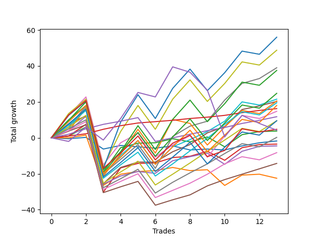

# Long Labrador 014 
- Symbol: ES_830-1130
- Date Range: 03/18/2022 - 12/30/2022
- Trading Period: 8:30-11:30
- Number of Trades: 15



| Name | Win Percent | Profit | Avg Profit / Trade | Avg Time / Trade |      | Name | Win Percent | Profit | Avg Profit / Trade | Avg Time / Trade |
| ---- | ----------- | ------ | ------------------ | ---------------- | ---- | ---- | ----------- | ------ | ------------------ | ---------------- |
| Sorted By <br> Profit | | | | | | Sorted By <br> Win Percentage ||||
| V Mid | 86.67 | 22750.00 | 1516.67 | 31:56 |     | TP-1 | 100.00 | 9625.00 | 641.67 | 03:29 |
| BB-100 U/L 2SD | 66.67 | 20000.00 | 1333.33 | 137:51 |     | BB-50 U/L 1SD | 93.33 | 12625.00 | 841.67 | 27:48 |
| V U/L 1SD | 66.67 | 15500.00 | 1033.33 | 135:37 |     | TP-2 | 93.33 | 8000.00 | 533.33 | 11:24 |
| BB-100 Mid | 80.00 | 13875.00 | 925.00 | 33:45 |     | V Mid | 86.67 | 22750.00 | 1516.67 | 31:56 |
| BB-200 Mid | 66.67 | 13500.00 | 900.00 | 40:15 |     | BB-20 U/L 2SD C | 86.67 | -125.00 | -8.33 | 17:59 |
| BB-50 U/L 1SD | 93.33 | 12625.00 | 841.67 | 27:48 |     | BB-100 Mid | 80.00 | 13875.00 | 925.00 | 33:45 |
| BB-200 U/L 2SD | 66.67 | 10750.00 | 716.67 | 141:55 |     | BB-20 U/L 2SD | 80.00 | 3500.00 | 233.33 | 16:53 |
| TP-1 | 100.00 | 9625.00 | 641.67 | 03:29 |     | BB-50 Mid | 80.00 | 625.00 | 41.67 | 17:01 |
| TP-2 | 93.33 | 8000.00 | 533.33 | 11:24 |     | TP-3 | 80.00 | -15875.00 | -1058.33 | 103:58 |
| TP-10 | 66.67 | 4375.00 | 291.67 | 126:59 |     | TP-7 | 73.33 | 2750.00 | 183.33 | 116:38 |
| BB-20 U/L 2SD | 80.00 | 3500.00 | 233.33 | 16:53 |     | TP-6 | 73.33 | -2375.00 | -158.33 | 114:59 |
| TP-7 | 73.33 | 2750.00 | 183.33 | 116:38 |     | TP-5 | 73.33 | -7625.00 | -508.33 | 111:17 |
| TP-9 | 66.67 | 1000.00 | 66.67 | 125:22 |     | TP-4 | 73.33 | -12500.00 | -833.33 | 108:53 |
| BB-50 Mid | 80.00 | 625.00 | 41.67 | 17:01 |     | BB-100 U/L 2SD | 66.67 | 20000.00 | 1333.33 | 137:51 |
| BB-20 U/L 2SD C | 86.67 | -125.00 | -8.33 | 17:59 |     | V U/L 1SD | 66.67 | 15500.00 | 1033.33 | 135:37 |
| BB-50 U/L 2SD | 66.67 | -875.00 | -58.33 | 123:38 |     | BB-200 Mid | 66.67 | 13500.00 | 900.00 | 40:15 |
| BB-20 Mid | 53.33 | -1000.00 | -66.67 | 04:09 |     | BB-200 U/L 2SD | 66.67 | 10750.00 | 716.67 | 141:55 |
| TP-6 | 73.33 | -2375.00 | -158.33 | 114:59 |     | TP-10 | 66.67 | 4375.00 | 291.67 | 126:59 |
| TP-8 | 66.67 | -3250.00 | -216.67 | 122:30 |     | TP-9 | 66.67 | 1000.00 | 66.67 | 125:22 |
| NEWFI 000 | 66.67 | -5625.00 | -375.00 | 130:59 |     | BB-50 U/L 2SD | 66.67 | -875.00 | -58.33 | 123:38 |
| TP-5 | 73.33 | -7625.00 | -508.33 | 111:17 |     | TP-8 | 66.67 | -3250.00 | -216.67 | 122:30 |
| NEWFI 0000 | 33.33 | -8375.00 | -558.33 | 114:09 |     | NEWFI 000 | 66.67 | -5625.00 | -375.00 | 130:59 |
| BB-20 U/L 1SD | 66.67 | -10750.00 | -716.67 | 12:38 |     | BB-20 U/L 1SD | 66.67 | -10750.00 | -716.67 | 12:38 |
| TP-4 | 73.33 | -12500.00 | -833.33 | 108:53 |     | BB-20 Mid | 53.33 | -1000.00 | -66.67 | 04:09 |
| TP-3 | 80.00 | -15875.00 | -1058.33 | 103:58 |     | NEWFI 0000 | 33.33 | -8375.00 | -558.33 | 114:09 |

## NO STOPLOSS

### Test BB-20 Mid
* Sell when price hits the middle line of the 20p bollinger
* No Stoploss
* Results:
```
Total Trades: 15
Percent Up: 53.33
Percent Down: 46.67
Total Points Moved Up: -2.00
Potential Profit: -1000.00
Total Points Ups: 11.25 Count Ups: 8
Total Points Downs: -13.25 Count Downs: 7
```

<details><summary>Trades</summary>

<code>In: 2022-04-20 09:19:00		Out: 2022-04-20 09:30:50		Total Position Time: 11:50		Total Move Up: -0.50		Total to Date: -0.50</code> <br />
<code>In: 2022-05-02 08:34:00		Out: 2022-05-02 08:35:10		Total Position Time: 01:10		Total Move Up: 0.75		Total to Date: 0.25</code> <br />
<code>In: 2022-05-11 09:37:00		Out: 2022-05-11 09:49:20		Total Position Time: 12:20		Total Move Up: -6.50		Total to Date: -6.25</code> <br />
<code>In: 2022-05-19 10:19:00		Out: 2022-05-19 10:20:10		Total Position Time: 01:10		Total Move Up: 2.00		Total to Date: -4.25</code> <br />
<code>In: 2022-05-25 09:31:00		Out: 2022-05-25 09:41:30		Total Position Time: 10:30		Total Move Up: -2.00		Total to Date: -6.25</code> <br />
<code>In: 2022-07-08 10:07:00		Out: 2022-07-08 10:08:10		Total Position Time: 01:10		Total Move Up: -0.75		Total to Date: -7.00</code> <br />
<code>In: 2022-07-25 11:07:00		Out: 2022-07-25 11:10:40		Total Position Time: 03:40		Total Move Up: -0.75		Total to Date: -7.75</code> <br />
<code>In: 2022-09-06 10:18:00		Out: 2022-09-06 10:25:10		Total Position Time: 07:10		Total Move Up: 1.25		Total to Date: -6.50</code> <br />
<code>In: 2022-09-12 09:08:00		Out: 2022-09-12 09:12:10		Total Position Time: 04:10		Total Move Up: -2.25		Total to Date: -8.75</code> <br />
<code>In: 2022-10-19 08:39:00		Out: 2022-10-19 08:40:10		Total Position Time: 01:10		Total Move Up: 0.50		Total to Date: -8.25</code> <br />
<code>In: 2022-11-08 11:15:00		Out: 2022-11-08 11:16:15		Total Position Time: 01:15		Total Move Up: -0.50		Total to Date: -8.75</code> <br />
<code>In: 2022-11-11 08:34:00		Out: 2022-11-11 08:36:25		Total Position Time: 02:25		Total Move Up: 2.25		Total to Date: -6.50</code> <br />
<code>In: 2022-11-25 09:59:00		Out: 2022-11-25 10:00:10		Total Position Time: 01:10		Total Move Up: 1.75		Total to Date: -4.75</code> <br />
<code>In: 2022-12-09 10:15:00		Out: 2022-12-09 10:16:50		Total Position Time: 01:50		Total Move Up: 1.75		Total to Date: -3.00</code> <br />
<code>In: 2022-12-27 11:24:00		Out: 2022-12-27 11:25:20		Total Position Time: 01:20		Total Move Up: 1.00		Total to Date: -2.00</code> <br />


</details>

### Test BB-20 U/L 1SD
* Sell when the price hits the upper line of the 20p 1std bollinger
* No Stoploss
* Results:
```
Total Trades: 15
Percent Up: 66.67
Percent Down: 33.33
Total Points Moved Up: -21.50
Potential Profit: -10750.00
Total Points Ups: 20.00 Count Ups: 10
Total Points Downs: -41.50 Count Downs: 5
```

<details><summary>Trades</summary>

<code>In: 2022-04-20 09:19:00		Out: 2022-04-20 09:31:05		Total Position Time: 12:05		Total Move Up: 0.00		Total to Date: 0.00</code> <br />
<code>In: 2022-05-02 08:34:00		Out: 2022-05-02 08:36:15		Total Position Time: 02:15		Total Move Up: 1.50		Total to Date: 1.50</code> <br />
<code>In: 2022-05-11 09:37:00		Out: 2022-05-11 10:24:35		Total Position Time: 47:35		Total Move Up: -28.00		Total to Date: -26.50</code> <br />
<code>In: 2022-05-19 10:19:00		Out: 2022-05-19 10:22:45		Total Position Time: 03:45		Total Move Up: 6.25		Total to Date: -20.25</code> <br />
<code>In: 2022-05-25 09:31:00		Out: 2022-05-25 09:44:25		Total Position Time: 13:25		Total Move Up: -0.75		Total to Date: -21.00</code> <br />
<code>In: 2022-07-08 10:07:00		Out: 2022-07-08 10:09:40		Total Position Time: 02:40		Total Move Up: 1.50		Total to Date: -19.50</code> <br />
<code>In: 2022-07-25 11:07:00		Out: 2022-07-25 11:11:40		Total Position Time: 04:40		Total Move Up: 0.50		Total to Date: -19.00</code> <br />
<code>In: 2022-09-06 10:18:00		Out: 2022-09-06 10:30:55		Total Position Time: 12:55		Total Move Up: 1.75		Total to Date: -17.25</code> <br />
<code>In: 2022-09-12 09:08:00		Out: 2022-09-12 09:21:25		Total Position Time: 13:25		Total Move Up: -1.75		Total to Date: -19.00</code> <br />
<code>In: 2022-10-19 08:39:00		Out: 2022-10-19 08:46:05		Total Position Time: 07:05		Total Move Up: 0.50		Total to Date: -18.50</code> <br />
<code>In: 2022-11-08 11:15:00		Out: 2022-11-08 11:38:35		Total Position Time: 23:35		Total Move Up: -8.75		Total to Date: -27.25</code> <br />
<code>In: 2022-11-11 08:34:00		Out: 2022-11-11 08:41:35		Total Position Time: 07:35		Total Move Up: 5.75		Total to Date: -21.50</code> <br />
<code>In: 2022-11-25 09:59:00		Out: 2022-11-25 10:00:10		Total Position Time: 01:10		Total Move Up: 1.75		Total to Date: -19.75</code> <br />
<code>In: 2022-12-09 10:15:00		Out: 2022-12-09 10:30:40		Total Position Time: 15:40		Total Move Up: 0.50		Total to Date: -19.25</code> <br />
<code>In: 2022-12-27 11:24:00		Out: 2022-12-27 11:45:40		Total Position Time: 21:40		Total Move Up: -2.25		Total to Date: -21.50</code> <br />


</details>

### Test BB-20 U/L 2SD
* Sell when the price hits the upper line of the 20p 2std bollinger
* No Stoploss
* Results:
```
Total Trades: 15
Percent Up: 80.00
Percent Down: 20.00
Total Points Moved Up: 7.00
Potential Profit: 3500.00
Total Points Ups: 39.25 Count Ups: 12
Total Points Downs: -32.25 Count Downs: 3
```

<details><summary>Trades</summary>

<code>In: 2022-04-20 09:19:00		Out: 2022-04-20 09:31:35		Total Position Time: 12:35		Total Move Up: 1.00		Total to Date: 1.00</code> <br />
<code>In: 2022-05-02 08:34:00		Out: 2022-05-02 08:36:35		Total Position Time: 02:35		Total Move Up: 5.00		Total to Date: 6.00</code> <br />
<code>In: 2022-05-11 09:37:00		Out: 2022-05-11 10:24:50		Total Position Time: 47:50		Total Move Up: -25.00		Total to Date: -19.00</code> <br />
<code>In: 2022-05-19 10:19:00		Out: 2022-05-19 10:44:05		Total Position Time: 25:05		Total Move Up: 13.50		Total to Date: -5.50</code> <br />
<code>In: 2022-05-25 09:31:00		Out: 2022-05-25 09:45:20		Total Position Time: 14:20		Total Move Up: 1.50		Total to Date: -4.00</code> <br />
<code>In: 2022-07-08 10:07:00		Out: 2022-07-08 10:11:05		Total Position Time: 04:05		Total Move Up: 2.50		Total to Date: -1.50</code> <br />
<code>In: 2022-07-25 11:07:00		Out: 2022-07-25 11:35:50		Total Position Time: 28:50		Total Move Up: 0.25		Total to Date: -1.25</code> <br />
<code>In: 2022-09-06 10:18:00		Out: 2022-09-06 10:31:10		Total Position Time: 13:10		Total Move Up: 2.25		Total to Date: 1.00</code> <br />
<code>In: 2022-09-12 09:08:00		Out: 2022-09-12 09:21:25		Total Position Time: 13:25		Total Move Up: -1.75		Total to Date: -0.75</code> <br />
<code>In: 2022-10-19 08:39:00		Out: 2022-10-19 08:48:05		Total Position Time: 09:05		Total Move Up: 2.75		Total to Date: 2.00</code> <br />
<code>In: 2022-11-08 11:15:00		Out: 2022-11-08 11:42:10		Total Position Time: 27:10		Total Move Up: -5.50		Total to Date: -3.50</code> <br />
<code>In: 2022-11-11 08:34:00		Out: 2022-11-11 08:49:20		Total Position Time: 15:20		Total Move Up: 6.75		Total to Date: 3.25</code> <br />
<code>In: 2022-11-25 09:59:00		Out: 2022-11-25 10:00:10		Total Position Time: 01:10		Total Move Up: 1.75		Total to Date: 5.00</code> <br />
<code>In: 2022-12-09 10:15:00		Out: 2022-12-09 10:31:15		Total Position Time: 16:15		Total Move Up: 1.75		Total to Date: 6.75</code> <br />
<code>In: 2022-12-27 11:24:00		Out: 2022-12-27 11:46:20		Total Position Time: 22:20		Total Move Up: 0.25		Total to Date: 7.00</code> <br />


</details>

### Test BB-20 U/L 2SD C
* Sell when the price hits the upper line of the 20p 2std bollinger
* No Stoploss
* Results:
```
Total Trades: 15
Percent Up: 86.67
Percent Down: 13.33
Total Points Moved Up: -0.25
Potential Profit: -125.00
Total Points Ups: 42.50 Count Ups: 13
Total Points Downs: -42.75 Count Downs: 2
```

<details><summary>Trades</summary>

<code>In: 2022-04-20 09:19:00		Out: 2022-04-20 09:31:35		Total Position Time: 12:35		Total Move Up: 1.00		Total to Date: 1.00</code> <br />
<code>In: 2022-05-02 08:34:00		Out: 2022-05-02 08:36:45		Total Position Time: 02:45		Total Move Up: 6.50		Total to Date: 7.50</code> <br />
<code>In: 2022-05-11 09:37:00		Out: 2022-05-11 10:37:55		Total Position Time: 60:55		Total Move Up: -37.75		Total to Date: -30.25</code> <br />
<code>In: 2022-05-19 10:19:00		Out: 2022-05-19 10:44:05		Total Position Time: 25:05		Total Move Up: 13.50		Total to Date: -16.75</code> <br />
<code>In: 2022-05-25 09:31:00		Out: 2022-05-25 09:45:20		Total Position Time: 14:20		Total Move Up: 1.50		Total to Date: -15.25</code> <br />
<code>In: 2022-07-08 10:07:00		Out: 2022-07-08 10:11:05		Total Position Time: 04:05		Total Move Up: 2.50		Total to Date: -12.75</code> <br />
<code>In: 2022-07-25 11:07:00		Out: 2022-07-25 11:35:50		Total Position Time: 28:50		Total Move Up: 0.25		Total to Date: -12.50</code> <br />
<code>In: 2022-09-06 10:18:00		Out: 2022-09-06 10:31:30		Total Position Time: 13:30		Total Move Up: 3.00		Total to Date: -9.50</code> <br />
<code>In: 2022-09-12 09:08:00		Out: 2022-09-12 09:23:10		Total Position Time: 15:10		Total Move Up: 0.75		Total to Date: -8.75</code> <br />
<code>In: 2022-10-19 08:39:00		Out: 2022-10-19 08:48:45		Total Position Time: 09:45		Total Move Up: 2.75		Total to Date: -6.00</code> <br />
<code>In: 2022-11-08 11:15:00		Out: 2022-11-08 11:42:15		Total Position Time: 27:15		Total Move Up: -5.00		Total to Date: -11.00</code> <br />
<code>In: 2022-11-11 08:34:00		Out: 2022-11-11 08:49:40		Total Position Time: 15:40		Total Move Up: 7.00		Total to Date: -4.00</code> <br />
<code>In: 2022-11-25 09:59:00		Out: 2022-11-25 10:00:20		Total Position Time: 01:20		Total Move Up: 1.75		Total to Date: -2.25</code> <br />
<code>In: 2022-12-09 10:15:00		Out: 2022-12-09 10:31:20		Total Position Time: 16:20		Total Move Up: 1.75		Total to Date: -0.50</code> <br />
<code>In: 2022-12-27 11:24:00		Out: 2022-12-27 11:46:20		Total Position Time: 22:20		Total Move Up: 0.25		Total to Date: -0.25</code> <br />


</details>

### Test BB-50 Mid
* Sell when price hits the middle line of the 50p bollinger
* No Stoploss
* Results:
```
Total Trades: 15
Percent Up: 80.00
Percent Down: 20.00
Total Points Moved Up: 1.25
Potential Profit: 625.00
Total Points Ups: 46.25 Count Ups: 12
Total Points Downs: -45.00 Count Downs: 3
```

<details><summary>Trades</summary>

<code>In: 2022-04-20 09:19:00		Out: 2022-04-20 09:32:40		Total Position Time: 13:40		Total Move Up: 3.75		Total to Date: 3.75</code> <br />
<code>In: 2022-05-02 08:34:00		Out: 2022-05-02 08:38:15		Total Position Time: 04:15		Total Move Up: 8.25		Total to Date: 12.00</code> <br />
<code>In: 2022-05-11 09:37:00		Out: 2022-05-11 10:37:55		Total Position Time: 60:55		Total Move Up: -37.75		Total to Date: -25.75</code> <br />
<code>In: 2022-05-19 10:19:00		Out: 2022-05-19 10:21:15		Total Position Time: 02:15		Total Move Up: 4.50		Total to Date: -21.25</code> <br />
<code>In: 2022-05-25 09:31:00		Out: 2022-05-25 09:49:05		Total Position Time: 18:05		Total Move Up: 4.00		Total to Date: -17.25</code> <br />
<code>In: 2022-07-08 10:07:00		Out: 2022-07-08 10:11:10		Total Position Time: 04:10		Total Move Up: 2.50		Total to Date: -14.75</code> <br />
<code>In: 2022-07-25 11:07:00		Out: 2022-07-25 11:35:45		Total Position Time: 28:45		Total Move Up: -1.00		Total to Date: -15.75</code> <br />
<code>In: 2022-09-06 10:18:00		Out: 2022-09-06 10:39:40		Total Position Time: 21:40		Total Move Up: 7.00		Total to Date: -8.75</code> <br />
<code>In: 2022-09-12 09:08:00		Out: 2022-09-12 09:24:10		Total Position Time: 16:10		Total Move Up: 2.25		Total to Date: -6.50</code> <br />
<code>In: 2022-10-19 08:39:00		Out: 2022-10-19 08:40:30		Total Position Time: 01:30		Total Move Up: 2.00		Total to Date: -4.50</code> <br />
<code>In: 2022-11-08 11:15:00		Out: 2022-11-08 11:41:40		Total Position Time: 26:40		Total Move Up: -6.25		Total to Date: -10.75</code> <br />
<code>In: 2022-11-11 08:34:00		Out: 2022-11-11 08:49:45		Total Position Time: 15:45		Total Move Up: 7.25		Total to Date: -3.50</code> <br />
<code>In: 2022-11-25 09:59:00		Out: 2022-11-25 10:00:10		Total Position Time: 01:10		Total Move Up: 1.75		Total to Date: -1.75</code> <br />
<code>In: 2022-12-09 10:15:00		Out: 2022-12-09 10:33:05		Total Position Time: 18:05		Total Move Up: 2.75		Total to Date: 1.00</code> <br />
<code>In: 2022-12-27 11:24:00		Out: 2022-12-27 11:46:20		Total Position Time: 22:20		Total Move Up: 0.25		Total to Date: 1.25</code> <br />


</details>

### Test BB-50 U/L 1SD
* Sell when the price hits the upper line of the 50p 1std bollinger
* No Stoploss
* Results:
```
Total Trades: 15
Percent Up: 93.33
Percent Down: 6.67
Total Points Moved Up: 25.25
Potential Profit: 12625.00
Total Points Ups: 63.00 Count Ups: 14
Total Points Downs: -37.75 Count Downs: 1
```

<details><summary>Trades</summary>

<code>In: 2022-04-20 09:19:00		Out: 2022-04-20 09:36:50		Total Position Time: 17:50		Total Move Up: 7.75		Total to Date: 7.75</code> <br />
<code>In: 2022-05-02 08:34:00		Out: 2022-05-02 08:55:50		Total Position Time: 21:50		Total Move Up: 4.50		Total to Date: 12.25</code> <br />
<code>In: 2022-05-11 09:37:00		Out: 2022-05-11 10:37:55		Total Position Time: 60:55		Total Move Up: -37.75		Total to Date: -25.50</code> <br />
<code>In: 2022-05-19 10:19:00		Out: 2022-05-19 10:25:40		Total Position Time: 06:40		Total Move Up: 9.00		Total to Date: -16.50</code> <br />
<code>In: 2022-05-25 09:31:00		Out: 2022-05-25 10:10:05		Total Position Time: 39:05		Total Move Up: 2.75		Total to Date: -13.75</code> <br />
<code>In: 2022-07-08 10:07:00		Out: 2022-07-08 10:26:30		Total Position Time: 19:30		Total Move Up: 3.00		Total to Date: -10.75</code> <br />
<code>In: 2022-07-25 11:07:00		Out: 2022-07-25 11:41:00		Total Position Time: 34:00		Total Move Up: 0.00		Total to Date: -10.75</code> <br />
<code>In: 2022-09-06 10:18:00		Out: 2022-09-06 10:56:40		Total Position Time: 38:40		Total Move Up: 5.75		Total to Date: -5.00</code> <br />
<code>In: 2022-09-12 09:08:00		Out: 2022-09-12 09:37:50		Total Position Time: 29:50		Total Move Up: 4.00		Total to Date: -1.00</code> <br />
<code>In: 2022-10-19 08:39:00		Out: 2022-10-19 08:52:10		Total Position Time: 13:10		Total Move Up: 6.50		Total to Date: 5.50</code> <br />
<code>In: 2022-11-08 11:15:00		Out: 2022-11-08 11:47:55		Total Position Time: 32:55		Total Move Up: 3.50		Total to Date: 9.00</code> <br />
<code>In: 2022-11-11 08:34:00		Out: 2022-11-11 08:58:20		Total Position Time: 24:20		Total Move Up: 9.50		Total to Date: 18.50</code> <br />
<code>In: 2022-11-25 09:59:00		Out: 2022-11-25 10:14:30		Total Position Time: 15:30		Total Move Up: 2.25		Total to Date: 20.75</code> <br />
<code>In: 2022-12-09 10:15:00		Out: 2022-12-09 10:50:45		Total Position Time: 35:45		Total Move Up: 2.00		Total to Date: 22.75</code> <br />
<code>In: 2022-12-27 11:24:00		Out: 2022-12-27 11:51:05		Total Position Time: 27:05		Total Move Up: 2.50		Total to Date: 25.25</code> <br />


</details>

### Test BB-50 U/L 2SD
* Sell when the price hits the upper line of the 50p 2std bollinger
* No Stoploss
* Results:
```
Total Trades: 15
Percent Up: 66.67
Percent Down: 33.33
Total Points Moved Up: -1.75
Potential Profit: -875.00
Total Points Ups: 83.75 Count Ups: 10
Total Points Downs: -85.50 Count Downs: 5
```

<details><summary>Trades</summary>

<code>In: 2022-04-20 09:19:00		Out: 2022-04-20 09:50:25		Total Position Time: 31:25		Total Move Up: 12.50		Total to Date: 12.50</code> <br />
<code>In: 2022-05-02 08:34:00		Out: 2022-05-02 09:00:45		Total Position Time: 26:45		Total Move Up: 10.25		Total to Date: 22.75</code> <br />
<code>In: 2022-05-11 09:37:00		Out: 2022-05-11 10:37:55		Total Position Time: 60:55		Total Move Up: -37.75		Total to Date: -15.00</code> <br />
<code>In: 2022-05-19 10:19:00		Out: 2022-05-19 10:31:30		Total Position Time: 12:30		Total Move Up: 12.25		Total to Date: -2.75</code> <br />
<code>In: 2022-05-25 09:31:00		Out: 2022-05-25 10:16:30		Total Position Time: 45:30		Total Move Up: 4.25		Total to Date: 1.50</code> <br />
<code>In: 2022-07-08 10:07:00		Out: 2022-07-08 10:27:00		Total Position Time: 20:00		Total Move Up: 5.25		Total to Date: 6.75</code> <br />
<code>In: 2022-07-25 11:07:00		Out: 2022-07-25 12:07:55		Total Position Time: 60:55		Total Move Up: -13.25		Total to Date: -6.50</code> <br />
<code>In: 2022-09-06 10:18:00		Out: 2022-09-06 10:58:55		Total Position Time: 40:55		Total Move Up: 6.75		Total to Date: 0.25</code> <br />
<code>In: 2022-09-12 09:08:00		Out: 2022-09-12 09:44:15		Total Position Time: 36:15		Total Move Up: 5.25		Total to Date: 5.50</code> <br />
<code>In: 2022-10-19 08:39:00		Out: 2022-10-19 09:39:55		Total Position Time: 60:55		Total Move Up: -12.00		Total to Date: -6.50</code> <br />
<code>In: 2022-11-08 11:15:00		Out: 2022-11-08 12:02:35		Total Position Time: 47:35		Total Move Up: 11.75		Total to Date: 5.25</code> <br />
<code>In: 2022-11-11 08:34:00		Out: 2022-11-11 09:11:00		Total Position Time: 37:00		Total Move Up: 11.50		Total to Date: 16.75</code> <br />
<code>In: 2022-11-25 09:59:00		Out: 2022-11-28 07:14:55		Total Position Time: 1275:55		Total Move Up: -20.75		Total to Date: -4.00</code> <br />
<code>In: 2022-12-09 10:15:00		Out: 2022-12-09 11:15:55		Total Position Time: 60:55		Total Move Up: -1.75		Total to Date: -5.75</code> <br />
<code>In: 2022-12-27 11:24:00		Out: 2022-12-27 12:01:10		Total Position Time: 37:10		Total Move Up: 4.00		Total to Date: -1.75</code> <br />


</details>

### Test V Mid
* Sell when the price hits the middle line of the 1std VWAP
* No Stoploss
* Results:
```
Total Trades: 15
Percent Up: 86.67
Percent Down: 13.33
Total Points Moved Up: 45.50
Potential Profit: 22750.00
Total Points Ups: 96.50 Count Ups: 13
Total Points Downs: -51.00 Count Downs: 2
```

<details><summary>Trades</summary>

<code>In: 2022-04-20 09:19:00		Out: 2022-04-20 09:35:50		Total Position Time: 16:50		Total Move Up: 6.00		Total to Date: 6.00</code> <br />
<code>In: 2022-05-02 08:34:00		Out: 2022-05-02 09:00:50		Total Position Time: 26:50		Total Move Up: 11.75		Total to Date: 17.75</code> <br />
<code>In: 2022-05-11 09:37:00		Out: 2022-05-11 10:37:55		Total Position Time: 60:55		Total Move Up: -37.75		Total to Date: -20.00</code> <br />
<code>In: 2022-05-19 10:19:00		Out: 2022-05-19 10:22:55		Total Position Time: 03:55		Total Move Up: 8.00		Total to Date: -12.00</code> <br />
<code>In: 2022-05-25 09:31:00		Out: 2022-05-25 10:31:55		Total Position Time: 60:55		Total Move Up: 4.75		Total to Date: -7.25</code> <br />
<code>In: 2022-07-08 10:07:00		Out: 2022-07-08 10:29:10		Total Position Time: 22:10		Total Move Up: 8.25		Total to Date: 1.00</code> <br />
<code>In: 2022-07-25 11:07:00		Out: 2022-07-25 12:07:55		Total Position Time: 60:55		Total Move Up: -13.25		Total to Date: -12.25</code> <br />
<code>In: 2022-09-06 10:18:00		Out: 2022-09-06 11:11:05		Total Position Time: 53:05		Total Move Up: 17.75		Total to Date: 5.50</code> <br />
<code>In: 2022-09-12 09:08:00		Out: 2022-09-12 09:44:25		Total Position Time: 36:25		Total Move Up: 5.75		Total to Date: 11.25</code> <br />
<code>In: 2022-10-19 08:39:00		Out: 2022-10-19 08:48:05		Total Position Time: 09:05		Total Move Up: 2.75		Total to Date: 14.00</code> <br />
<code>In: 2022-11-08 11:15:00		Out: 2022-11-08 12:02:35		Total Position Time: 47:35		Total Move Up: 11.75		Total to Date: 25.75</code> <br />
<code>In: 2022-11-11 08:34:00		Out: 2022-11-11 08:50:30		Total Position Time: 16:30		Total Move Up: 9.25		Total to Date: 35.00</code> <br />
<code>In: 2022-11-25 09:59:00		Out: 2022-11-25 10:00:10		Total Position Time: 01:10		Total Move Up: 1.75		Total to Date: 36.75</code> <br />
<code>In: 2022-12-09 10:15:00		Out: 2022-12-09 10:33:05		Total Position Time: 18:05		Total Move Up: 2.75		Total to Date: 39.50</code> <br />
<code>In: 2022-12-27 11:24:00		Out: 2022-12-27 12:08:40		Total Position Time: 44:40		Total Move Up: 6.00		Total to Date: 45.50</code> <br />


</details>

### Test V U/L 1SD
* Sell when the price hits the upper line of the 1std VWAP
* No Stoploss
* Results:
```
Total Trades: 15
Percent Up: 66.67
Percent Down: 33.33
Total Points Moved Up: 31.00
Potential Profit: 15500.00
Total Points Ups: 118.25 Count Ups: 10
Total Points Downs: -87.25 Count Downs: 5
```

<details><summary>Trades</summary>

<code>In: 2022-04-20 09:19:00		Out: 2022-04-20 09:52:35		Total Position Time: 33:35		Total Move Up: 13.50		Total to Date: 13.50</code> <br />
<code>In: 2022-05-02 08:34:00		Out: 2022-05-02 09:34:55		Total Position Time: 60:55		Total Move Up: 8.00		Total to Date: 21.50</code> <br />
<code>In: 2022-05-11 09:37:00		Out: 2022-05-11 10:37:55		Total Position Time: 60:55		Total Move Up: -37.75		Total to Date: -16.25</code> <br />
<code>In: 2022-05-19 10:19:00		Out: 2022-05-19 10:55:35		Total Position Time: 36:35		Total Move Up: 19.75		Total to Date: 3.50</code> <br />
<code>In: 2022-05-25 09:31:00		Out: 2022-05-25 10:31:55		Total Position Time: 60:55		Total Move Up: 4.75		Total to Date: 8.25</code> <br />
<code>In: 2022-07-08 10:07:00		Out: 2022-07-08 11:07:55		Total Position Time: 60:55		Total Move Up: 14.50		Total to Date: 22.75</code> <br />
<code>In: 2022-07-25 11:07:00		Out: 2022-07-25 12:07:55		Total Position Time: 60:55		Total Move Up: -13.25		Total to Date: 9.50</code> <br />
<code>In: 2022-09-06 10:18:00		Out: 2022-09-06 11:18:55		Total Position Time: 60:55		Total Move Up: 16.75		Total to Date: 26.25</code> <br />
<code>In: 2022-09-12 09:08:00		Out: 2022-09-12 10:08:55		Total Position Time: 60:55		Total Move Up: 10.75		Total to Date: 37.00</code> <br />
<code>In: 2022-10-19 08:39:00		Out: 2022-10-19 09:39:55		Total Position Time: 60:55		Total Move Up: -12.00		Total to Date: 25.00</code> <br />
<code>In: 2022-11-08 11:15:00		Out: 2022-11-08 12:15:55		Total Position Time: 60:55		Total Move Up: 10.00		Total to Date: 35.00</code> <br />
<code>In: 2022-11-11 08:34:00		Out: 2022-11-11 09:34:55		Total Position Time: 60:55		Total Move Up: 12.00		Total to Date: 47.00</code> <br />
<code>In: 2022-11-25 09:59:00		Out: 2022-11-28 06:32:05		Total Position Time: 1233:05		Total Move Up: -22.50		Total to Date: 24.50</code> <br />
<code>In: 2022-12-09 10:15:00		Out: 2022-12-09 11:15:55		Total Position Time: 60:55		Total Move Up: -1.75		Total to Date: 22.75</code> <br />
<code>In: 2022-12-27 11:24:00		Out: 2022-12-27 12:24:55		Total Position Time: 60:55		Total Move Up: 8.25		Total to Date: 31.00</code> <br />


</details>

### Test BB-100 Mid
* Move to BB100 Mid
* No Stoploss
* Results:
```
Total Trades: 15
Percent Up: 80.00
Percent Down: 20.00
Total Points Moved Up: 27.75
Potential Profit: 13875.00
Total Points Ups: 80.50 Count Ups: 12
Total Points Downs: -52.75 Count Downs: 3
```

<details><summary>Trades</summary>

<code>In: 2022-04-20 09:19:00		Out: 2022-04-20 09:33:05		Total Position Time: 14:05		Total Move Up: 5.00		Total to Date: 5.00</code> <br />
<code>In: 2022-05-02 08:34:00		Out: 2022-05-02 09:00:50		Total Position Time: 26:50		Total Move Up: 11.75		Total to Date: 16.75</code> <br />
<code>In: 2022-05-11 09:37:00		Out: 2022-05-11 10:37:55		Total Position Time: 60:55		Total Move Up: -37.75		Total to Date: -21.00</code> <br />
<code>In: 2022-05-19 10:19:00		Out: 2022-05-19 10:44:00		Total Position Time: 25:00		Total Move Up: 11.25		Total to Date: -9.75</code> <br />
<code>In: 2022-05-25 09:31:00		Out: 2022-05-25 10:16:25		Total Position Time: 45:25		Total Move Up: 4.50		Total to Date: -5.25</code> <br />
<code>In: 2022-07-08 10:07:00		Out: 2022-07-08 10:29:10		Total Position Time: 22:10		Total Move Up: 8.25		Total to Date: 3.00</code> <br />
<code>In: 2022-07-25 11:07:00		Out: 2022-07-25 12:07:55		Total Position Time: 60:55		Total Move Up: -13.25		Total to Date: -10.25</code> <br />
<code>In: 2022-09-06 10:18:00		Out: 2022-09-06 11:00:30		Total Position Time: 42:30		Total Move Up: 9.75		Total to Date: -0.50</code> <br />
<code>In: 2022-09-12 09:08:00		Out: 2022-09-12 09:37:50		Total Position Time: 29:50		Total Move Up: 4.00		Total to Date: 3.50</code> <br />
<code>In: 2022-10-19 08:39:00		Out: 2022-10-19 08:52:00		Total Position Time: 13:00		Total Move Up: 4.50		Total to Date: 8.00</code> <br />
<code>In: 2022-11-08 11:15:00		Out: 2022-11-08 11:53:50		Total Position Time: 38:50		Total Move Up: 5.75		Total to Date: 13.75</code> <br />
<code>In: 2022-11-11 08:34:00		Out: 2022-11-11 09:10:50		Total Position Time: 36:50		Total Move Up: 10.75		Total to Date: 24.50</code> <br />
<code>In: 2022-11-25 09:59:00		Out: 2022-11-25 10:00:10		Total Position Time: 01:10		Total Move Up: 1.75		Total to Date: 26.25</code> <br />
<code>In: 2022-12-09 10:15:00		Out: 2022-12-09 11:15:55		Total Position Time: 60:55		Total Move Up: -1.75		Total to Date: 24.50</code> <br />
<code>In: 2022-12-27 11:24:00		Out: 2022-12-27 11:51:50		Total Position Time: 27:50		Total Move Up: 3.25		Total to Date: 27.75</code> <br />


</details>

### Test BB-100 U/L 2SD
* Move to BB100 Upper Band
* No Stoploss
* Results:
```
Total Trades: 15
Percent Up: 66.67
Percent Down: 33.33
Total Points Moved Up: 40.00
Potential Profit: 20000.00
Total Points Ups: 125.50 Count Ups: 10
Total Points Downs: -85.50 Count Downs: 5
```

<details><summary>Trades</summary>

<code>In: 2022-04-20 09:19:00		Out: 2022-04-20 09:50:25		Total Position Time: 31:25		Total Move Up: 12.50		Total to Date: 12.50</code> <br />
<code>In: 2022-05-02 08:34:00		Out: 2022-05-02 09:34:55		Total Position Time: 60:55		Total Move Up: 8.00		Total to Date: 20.50</code> <br />
<code>In: 2022-05-11 09:37:00		Out: 2022-05-11 10:37:55		Total Position Time: 60:55		Total Move Up: -37.75		Total to Date: -17.25</code> <br />
<code>In: 2022-05-19 10:19:00		Out: 2022-05-19 10:57:05		Total Position Time: 38:05		Total Move Up: 26.00		Total to Date: 8.75</code> <br />
<code>In: 2022-05-25 09:31:00		Out: 2022-05-25 10:31:55		Total Position Time: 60:55		Total Move Up: 4.75		Total to Date: 13.50</code> <br />
<code>In: 2022-07-08 10:07:00		Out: 2022-07-08 11:07:40		Total Position Time: 60:40		Total Move Up: 15.25		Total to Date: 28.75</code> <br />
<code>In: 2022-07-25 11:07:00		Out: 2022-07-25 12:07:55		Total Position Time: 60:55		Total Move Up: -13.25		Total to Date: 15.50</code> <br />
<code>In: 2022-09-06 10:18:00		Out: 2022-09-06 11:18:55		Total Position Time: 60:55		Total Move Up: 16.75		Total to Date: 32.25</code> <br />
<code>In: 2022-09-12 09:08:00		Out: 2022-09-12 10:08:55		Total Position Time: 60:55		Total Move Up: 10.75		Total to Date: 43.00</code> <br />
<code>In: 2022-10-19 08:39:00		Out: 2022-10-19 09:39:55		Total Position Time: 60:55		Total Move Up: -12.00		Total to Date: 31.00</code> <br />
<code>In: 2022-11-08 11:15:00		Out: 2022-11-08 12:15:55		Total Position Time: 60:55		Total Move Up: 10.00		Total to Date: 41.00</code> <br />
<code>In: 2022-11-11 08:34:00		Out: 2022-11-11 09:34:55		Total Position Time: 60:55		Total Move Up: 12.00		Total to Date: 53.00</code> <br />
<code>In: 2022-11-25 09:59:00		Out: 2022-11-28 07:14:55		Total Position Time: 1275:55		Total Move Up: -20.75		Total to Date: 32.25</code> <br />
<code>In: 2022-12-09 10:15:00		Out: 2022-12-09 11:15:55		Total Position Time: 60:55		Total Move Up: -1.75		Total to Date: 30.50</code> <br />
<code>In: 2022-12-27 11:24:00		Out: 2022-12-27 12:16:35		Total Position Time: 52:35		Total Move Up: 9.50		Total to Date: 40.00</code> <br />


</details>

### Test BB-200 Mid
* Move to BB200 Mid
* No Stoploss
* Results:
```
Total Trades: 15
Percent Up: 66.67
Percent Down: 33.33
Total Points Moved Up: 27.00
Potential Profit: 13500.00
Total Points Ups: 94.00 Count Ups: 10
Total Points Downs: -67.00 Count Downs: 5
```

<details><summary>Trades</summary>

<code>In: 2022-04-20 09:19:00		Out: 2022-04-20 09:32:40		Total Position Time: 13:40		Total Move Up: 3.75		Total to Date: 3.75</code> <br />
<code>In: 2022-05-02 08:34:00		Out: 2022-05-02 09:20:20		Total Position Time: 46:20		Total Move Up: 12.75		Total to Date: 16.50</code> <br />
<code>In: 2022-05-11 09:37:00		Out: 2022-05-11 10:37:55		Total Position Time: 60:55		Total Move Up: -37.75		Total to Date: -21.25</code> <br />
<code>In: 2022-05-19 10:19:00		Out: 2022-05-19 10:31:30		Total Position Time: 12:30		Total Move Up: 12.25		Total to Date: -9.00</code> <br />
<code>In: 2022-05-25 09:31:00		Out: 2022-05-25 10:31:55		Total Position Time: 60:55		Total Move Up: 4.75		Total to Date: -4.25</code> <br />
<code>In: 2022-07-08 10:07:00		Out: 2022-07-08 10:49:25		Total Position Time: 42:25		Total Move Up: 13.75		Total to Date: 9.50</code> <br />
<code>In: 2022-07-25 11:07:00		Out: 2022-07-25 12:07:55		Total Position Time: 60:55		Total Move Up: -13.25		Total to Date: -3.75</code> <br />
<code>In: 2022-09-06 10:18:00		Out: 2022-09-06 11:11:10		Total Position Time: 53:10		Total Move Up: 18.75		Total to Date: 15.00</code> <br />
<code>In: 2022-09-12 09:08:00		Out: 2022-09-12 09:12:10		Total Position Time: 04:10		Total Move Up: -2.25		Total to Date: 12.75</code> <br />
<code>In: 2022-10-19 08:39:00		Out: 2022-10-19 09:39:55		Total Position Time: 60:55		Total Move Up: -12.00		Total to Date: 0.75</code> <br />
<code>In: 2022-11-08 11:15:00		Out: 2022-11-08 12:15:55		Total Position Time: 60:55		Total Move Up: 10.00		Total to Date: 10.75</code> <br />
<code>In: 2022-11-11 08:34:00		Out: 2022-11-11 08:50:30		Total Position Time: 16:30		Total Move Up: 9.25		Total to Date: 20.00</code> <br />
<code>In: 2022-11-25 09:59:00		Out: 2022-11-25 10:00:10		Total Position Time: 01:10		Total Move Up: 1.75		Total to Date: 21.75</code> <br />
<code>In: 2022-12-09 10:15:00		Out: 2022-12-09 11:15:55		Total Position Time: 60:55		Total Move Up: -1.75		Total to Date: 20.00</code> <br />
<code>In: 2022-12-27 11:24:00		Out: 2022-12-27 12:12:25		Total Position Time: 48:25		Total Move Up: 7.00		Total to Date: 27.00</code> <br />


</details>

### Test BB-200 U/L 2SD
* Move to BB200 Upper Band
* No Stoploss
* Results:
```
Total Trades: 15
Percent Up: 66.67
Percent Down: 33.33
Total Points Moved Up: 21.50
Potential Profit: 10750.00
Total Points Ups: 107.00 Count Ups: 10
Total Points Downs: -85.50 Count Downs: 5
```

<details><summary>Trades</summary>

<code>In: 2022-04-20 09:19:00		Out: 2022-04-20 10:19:55		Total Position Time: 60:55		Total Move Up: 10.00		Total to Date: 10.00</code> <br />
<code>In: 2022-05-02 08:34:00		Out: 2022-05-02 09:34:55		Total Position Time: 60:55		Total Move Up: 8.00		Total to Date: 18.00</code> <br />
<code>In: 2022-05-11 09:37:00		Out: 2022-05-11 10:37:55		Total Position Time: 60:55		Total Move Up: -37.75		Total to Date: -19.75</code> <br />
<code>In: 2022-05-19 10:19:00		Out: 2022-05-19 11:19:55		Total Position Time: 60:55		Total Move Up: 12.00		Total to Date: -7.75</code> <br />
<code>In: 2022-05-25 09:31:00		Out: 2022-05-25 10:31:55		Total Position Time: 60:55		Total Move Up: 4.75		Total to Date: -3.00</code> <br />
<code>In: 2022-07-08 10:07:00		Out: 2022-07-08 11:07:55		Total Position Time: 60:55		Total Move Up: 14.50		Total to Date: 11.50</code> <br />
<code>In: 2022-07-25 11:07:00		Out: 2022-07-25 12:07:55		Total Position Time: 60:55		Total Move Up: -13.25		Total to Date: -1.75</code> <br />
<code>In: 2022-09-06 10:18:00		Out: 2022-09-06 11:18:55		Total Position Time: 60:55		Total Move Up: 16.75		Total to Date: 15.00</code> <br />
<code>In: 2022-09-12 09:08:00		Out: 2022-09-12 10:08:55		Total Position Time: 60:55		Total Move Up: 10.75		Total to Date: 25.75</code> <br />
<code>In: 2022-10-19 08:39:00		Out: 2022-10-19 09:39:55		Total Position Time: 60:55		Total Move Up: -12.00		Total to Date: 13.75</code> <br />
<code>In: 2022-11-08 11:15:00		Out: 2022-11-08 12:15:55		Total Position Time: 60:55		Total Move Up: 10.00		Total to Date: 23.75</code> <br />
<code>In: 2022-11-11 08:34:00		Out: 2022-11-11 09:34:55		Total Position Time: 60:55		Total Move Up: 12.00		Total to Date: 35.75</code> <br />
<code>In: 2022-11-25 09:59:00		Out: 2022-11-28 07:14:55		Total Position Time: 1275:55		Total Move Up: -20.75		Total to Date: 15.00</code> <br />
<code>In: 2022-12-09 10:15:00		Out: 2022-12-09 11:15:55		Total Position Time: 60:55		Total Move Up: -1.75		Total to Date: 13.25</code> <br />
<code>In: 2022-12-27 11:24:00		Out: 2022-12-27 12:24:55		Total Position Time: 60:55		Total Move Up: 8.25		Total to Date: 21.50</code> <br />


</details>

## TAKE PROFIT

### Test TP-1
* Take Profit of 1 Point
* No Stoploss
* Results:
```
Total Trades: 15
Percent Up: 100.00
Percent Down: 0.00
Total Points Moved Up: 19.25
Potential Profit: 9625.00
Total Points Ups: 19.25 Count Ups: 15
Total Points Downs: 0.00 Count Downs: 0
```

<details><summary>Trades</summary>

<code>In: 2022-04-20 09:19:00		Out: 2022-04-20 09:31:35		Total Position Time: 12:35		Total Move Up: 1.00		Total to Date: 1.00</code> <br />
<code>In: 2022-05-02 08:34:00		Out: 2022-05-02 08:35:15		Total Position Time: 01:15		Total Move Up: 1.25		Total to Date: 2.25</code> <br />
<code>In: 2022-05-11 09:37:00		Out: 2022-05-11 09:40:45		Total Position Time: 03:45		Total Move Up: 2.50		Total to Date: 4.75</code> <br />
<code>In: 2022-05-19 10:19:00		Out: 2022-05-19 10:20:10		Total Position Time: 01:10		Total Move Up: 2.00		Total to Date: 6.75</code> <br />
<code>In: 2022-05-25 09:31:00		Out: 2022-05-25 09:32:10		Total Position Time: 01:10		Total Move Up: 1.25		Total to Date: 8.00</code> <br />
<code>In: 2022-07-08 10:07:00		Out: 2022-07-08 10:09:40		Total Position Time: 02:40		Total Move Up: 1.50		Total to Date: 9.50</code> <br />
<code>In: 2022-07-25 11:07:00		Out: 2022-07-25 11:11:45		Total Position Time: 04:45		Total Move Up: 0.75		Total to Date: 10.25</code> <br />
<code>In: 2022-09-06 10:18:00		Out: 2022-09-06 10:19:10		Total Position Time: 01:10		Total Move Up: 0.75		Total to Date: 11.00</code> <br />
<code>In: 2022-09-12 09:08:00		Out: 2022-09-12 09:23:20		Total Position Time: 15:20		Total Move Up: 1.00		Total to Date: 12.00</code> <br />
<code>In: 2022-10-19 08:39:00		Out: 2022-10-19 08:40:25		Total Position Time: 01:25		Total Move Up: 0.75		Total to Date: 12.75</code> <br />
<code>In: 2022-11-08 11:15:00		Out: 2022-11-08 11:16:45		Total Position Time: 01:45		Total Move Up: 1.00		Total to Date: 13.75</code> <br />
<code>In: 2022-11-11 08:34:00		Out: 2022-11-11 08:35:35		Total Position Time: 01:35		Total Move Up: 1.50		Total to Date: 15.25</code> <br />
<code>In: 2022-11-25 09:59:00		Out: 2022-11-25 10:00:10		Total Position Time: 01:10		Total Move Up: 1.75		Total to Date: 17.00</code> <br />
<code>In: 2022-12-09 10:15:00		Out: 2022-12-09 10:16:10		Total Position Time: 01:10		Total Move Up: 1.25		Total to Date: 18.25</code> <br />
<code>In: 2022-12-27 11:24:00		Out: 2022-12-27 11:25:20		Total Position Time: 01:20		Total Move Up: 1.00		Total to Date: 19.25</code> <br />


</details>

### Test TP-2
* Take Profit of 2 Point
* No Stoploss
* Results:
```
Total Trades: 15
Percent Up: 93.33
Percent Down: 6.67
Total Points Moved Up: 16.00
Potential Profit: 8000.00
Total Points Ups: 29.25 Count Ups: 14
Total Points Downs: -13.25 Count Downs: 1
```

<details><summary>Trades</summary>

<code>In: 2022-04-20 09:19:00		Out: 2022-04-20 09:32:30		Total Position Time: 13:30		Total Move Up: 2.00		Total to Date: 2.00</code> <br />
<code>In: 2022-05-02 08:34:00		Out: 2022-05-02 08:36:20		Total Position Time: 02:20		Total Move Up: 3.00		Total to Date: 5.00</code> <br />
<code>In: 2022-05-11 09:37:00		Out: 2022-05-11 09:40:45		Total Position Time: 03:45		Total Move Up: 2.50		Total to Date: 7.50</code> <br />
<code>In: 2022-05-19 10:19:00		Out: 2022-05-19 10:20:20		Total Position Time: 01:20		Total Move Up: 1.75		Total to Date: 9.25</code> <br />
<code>In: 2022-05-25 09:31:00		Out: 2022-05-25 09:48:25		Total Position Time: 17:25		Total Move Up: 2.00		Total to Date: 11.25</code> <br />
<code>In: 2022-07-08 10:07:00		Out: 2022-07-08 10:10:05		Total Position Time: 03:05		Total Move Up: 2.00		Total to Date: 13.25</code> <br />
<code>In: 2022-07-25 11:07:00		Out: 2022-07-25 12:07:55		Total Position Time: 60:55		Total Move Up: -13.25		Total to Date: 0.00</code> <br />
<code>In: 2022-09-06 10:18:00		Out: 2022-09-06 10:20:15		Total Position Time: 02:15		Total Move Up: 2.00		Total to Date: 2.00</code> <br />
<code>In: 2022-09-12 09:08:00		Out: 2022-09-12 09:24:05		Total Position Time: 16:05		Total Move Up: 2.00		Total to Date: 4.00</code> <br />
<code>In: 2022-10-19 08:39:00		Out: 2022-10-19 08:40:30		Total Position Time: 01:30		Total Move Up: 2.00		Total to Date: 6.00</code> <br />
<code>In: 2022-11-08 11:15:00		Out: 2022-11-08 11:16:55		Total Position Time: 01:55		Total Move Up: 1.75		Total to Date: 7.75</code> <br />
<code>In: 2022-11-11 08:34:00		Out: 2022-11-11 08:36:20		Total Position Time: 02:20		Total Move Up: 2.25		Total to Date: 10.00</code> <br />
<code>In: 2022-11-25 09:59:00		Out: 2022-11-25 10:00:25		Total Position Time: 01:25		Total Move Up: 2.25		Total to Date: 12.25</code> <br />
<code>In: 2022-12-09 10:15:00		Out: 2022-12-09 10:31:20		Total Position Time: 16:20		Total Move Up: 1.75		Total to Date: 14.00</code> <br />
<code>In: 2022-12-27 11:24:00		Out: 2022-12-27 11:51:00		Total Position Time: 27:00		Total Move Up: 2.00		Total to Date: 16.00</code> <br />


</details>

### Test TP-3
* Take Profit of 3 Point
* No Stoploss
* Results:
```
Total Trades: 15
Percent Up: 80.00
Percent Down: 20.00
Total Points Moved Up: -31.75
Potential Profit: -15875.00
Total Points Ups: 40.00 Count Ups: 12
Total Points Downs: -71.75 Count Downs: 3
```

<details><summary>Trades</summary>

<code>In: 2022-04-20 09:19:00		Out: 2022-04-20 09:32:40		Total Position Time: 13:40		Total Move Up: 3.75		Total to Date: 3.75</code> <br />
<code>In: 2022-05-02 08:34:00		Out: 2022-05-02 08:36:30		Total Position Time: 02:30		Total Move Up: 3.50		Total to Date: 7.25</code> <br />
<code>In: 2022-05-11 09:37:00		Out: 2022-05-11 10:37:55		Total Position Time: 60:55		Total Move Up: -37.75		Total to Date: -30.50</code> <br />
<code>In: 2022-05-19 10:19:00		Out: 2022-05-19 10:20:55		Total Position Time: 01:55		Total Move Up: 3.25		Total to Date: -27.25</code> <br />
<code>In: 2022-05-25 09:31:00		Out: 2022-05-25 09:48:50		Total Position Time: 17:50		Total Move Up: 3.25		Total to Date: -24.00</code> <br />
<code>In: 2022-07-08 10:07:00		Out: 2022-07-08 10:11:15		Total Position Time: 04:15		Total Move Up: 3.00		Total to Date: -21.00</code> <br />
<code>In: 2022-07-25 11:07:00		Out: 2022-07-25 12:07:55		Total Position Time: 60:55		Total Move Up: -13.25		Total to Date: -34.25</code> <br />
<code>In: 2022-09-06 10:18:00		Out: 2022-09-06 10:20:20		Total Position Time: 02:20		Total Move Up: 3.00		Total to Date: -31.25</code> <br />
<code>In: 2022-09-12 09:08:00		Out: 2022-09-12 09:32:15		Total Position Time: 24:15		Total Move Up: 2.75		Total to Date: -28.50</code> <br />
<code>In: 2022-10-19 08:39:00		Out: 2022-10-19 08:51:50		Total Position Time: 12:50		Total Move Up: 5.00		Total to Date: -23.50</code> <br />
<code>In: 2022-11-08 11:15:00		Out: 2022-11-08 11:47:55		Total Position Time: 32:55		Total Move Up: 3.50		Total to Date: -20.00</code> <br />
<code>In: 2022-11-11 08:34:00		Out: 2022-11-11 08:37:45		Total Position Time: 03:45		Total Move Up: 3.00		Total to Date: -17.00</code> <br />
<code>In: 2022-11-25 09:59:00		Out: 2022-11-28 07:14:55		Total Position Time: 1275:55		Total Move Up: -20.75		Total to Date: -37.75</code> <br />
<code>In: 2022-12-09 10:15:00		Out: 2022-12-09 10:33:10		Total Position Time: 18:10		Total Move Up: 3.00		Total to Date: -34.75</code> <br />
<code>In: 2022-12-27 11:24:00		Out: 2022-12-27 11:51:20		Total Position Time: 27:20		Total Move Up: 3.00		Total to Date: -31.75</code> <br />


</details>

### Test TP-4
* Take Profit of 4 Point
* No Stoploss
* Results:
```
Total Trades: 15
Percent Up: 73.33
Percent Down: 26.67
Total Points Moved Up: -25.00
Potential Profit: -12500.00
Total Points Ups: 48.50 Count Ups: 11
Total Points Downs: -73.50 Count Downs: 4
```

<details><summary>Trades</summary>

<code>In: 2022-04-20 09:19:00		Out: 2022-04-20 09:32:50		Total Position Time: 13:50		Total Move Up: 4.00		Total to Date: 4.00</code> <br />
<code>In: 2022-05-02 08:34:00		Out: 2022-05-02 08:36:35		Total Position Time: 02:35		Total Move Up: 5.00		Total to Date: 9.00</code> <br />
<code>In: 2022-05-11 09:37:00		Out: 2022-05-11 10:37:55		Total Position Time: 60:55		Total Move Up: -37.75		Total to Date: -28.75</code> <br />
<code>In: 2022-05-19 10:19:00		Out: 2022-05-19 10:21:15		Total Position Time: 02:15		Total Move Up: 4.50		Total to Date: -24.25</code> <br />
<code>In: 2022-05-25 09:31:00		Out: 2022-05-25 09:49:05		Total Position Time: 18:05		Total Move Up: 4.00		Total to Date: -20.25</code> <br />
<code>In: 2022-07-08 10:07:00		Out: 2022-07-08 10:12:25		Total Position Time: 05:25		Total Move Up: 4.25		Total to Date: -16.00</code> <br />
<code>In: 2022-07-25 11:07:00		Out: 2022-07-25 12:07:55		Total Position Time: 60:55		Total Move Up: -13.25		Total to Date: -29.25</code> <br />
<code>In: 2022-09-06 10:18:00		Out: 2022-09-06 10:32:00		Total Position Time: 14:00		Total Move Up: 4.00		Total to Date: -25.25</code> <br />
<code>In: 2022-09-12 09:08:00		Out: 2022-09-12 09:33:10		Total Position Time: 25:10		Total Move Up: 4.00		Total to Date: -21.25</code> <br />
<code>In: 2022-10-19 08:39:00		Out: 2022-10-19 08:51:50		Total Position Time: 12:50		Total Move Up: 5.00		Total to Date: -16.25</code> <br />
<code>In: 2022-11-08 11:15:00		Out: 2022-11-08 11:53:50		Total Position Time: 38:50		Total Move Up: 5.75		Total to Date: -10.50</code> <br />
<code>In: 2022-11-11 08:34:00		Out: 2022-11-11 08:38:25		Total Position Time: 04:25		Total Move Up: 4.00		Total to Date: -6.50</code> <br />
<code>In: 2022-11-25 09:59:00		Out: 2022-11-28 07:14:55		Total Position Time: 1275:55		Total Move Up: -20.75		Total to Date: -27.25</code> <br />
<code>In: 2022-12-09 10:15:00		Out: 2022-12-09 11:15:55		Total Position Time: 60:55		Total Move Up: -1.75		Total to Date: -29.00</code> <br />
<code>In: 2022-12-27 11:24:00		Out: 2022-12-27 12:01:10		Total Position Time: 37:10		Total Move Up: 4.00		Total to Date: -25.00</code> <br />


</details>

### Test TP-5
* Take Profit of 5 Point
* No Stoploss
* Results:
```
Total Trades: 15
Percent Up: 73.33
Percent Down: 26.67
Total Points Moved Up: -15.25
Potential Profit: -7625.00
Total Points Ups: 58.25 Count Ups: 11
Total Points Downs: -73.50 Count Downs: 4
```

<details><summary>Trades</summary>

<code>In: 2022-04-20 09:19:00		Out: 2022-04-20 09:33:05		Total Position Time: 14:05		Total Move Up: 5.00		Total to Date: 5.00</code> <br />
<code>In: 2022-05-02 08:34:00		Out: 2022-05-02 08:36:35		Total Position Time: 02:35		Total Move Up: 5.00		Total to Date: 10.00</code> <br />
<code>In: 2022-05-11 09:37:00		Out: 2022-05-11 10:37:55		Total Position Time: 60:55		Total Move Up: -37.75		Total to Date: -27.75</code> <br />
<code>In: 2022-05-19 10:19:00		Out: 2022-05-19 10:21:35		Total Position Time: 02:35		Total Move Up: 5.00		Total to Date: -22.75</code> <br />
<code>In: 2022-05-25 09:31:00		Out: 2022-05-25 09:49:30		Total Position Time: 18:30		Total Move Up: 5.25		Total to Date: -17.50</code> <br />
<code>In: 2022-07-08 10:07:00		Out: 2022-07-08 10:27:00		Total Position Time: 20:00		Total Move Up: 5.25		Total to Date: -12.25</code> <br />
<code>In: 2022-07-25 11:07:00		Out: 2022-07-25 12:07:55		Total Position Time: 60:55		Total Move Up: -13.25		Total to Date: -25.50</code> <br />
<code>In: 2022-09-06 10:18:00		Out: 2022-09-06 10:32:05		Total Position Time: 14:05		Total Move Up: 6.00		Total to Date: -19.50</code> <br />
<code>In: 2022-09-12 09:08:00		Out: 2022-09-12 09:43:10		Total Position Time: 35:10		Total Move Up: 5.25		Total to Date: -14.25</code> <br />
<code>In: 2022-10-19 08:39:00		Out: 2022-10-19 08:51:50		Total Position Time: 12:50		Total Move Up: 5.00		Total to Date: -9.25</code> <br />
<code>In: 2022-11-08 11:15:00		Out: 2022-11-08 11:53:50		Total Position Time: 38:50		Total Move Up: 5.75		Total to Date: -3.50</code> <br />
<code>In: 2022-11-11 08:34:00		Out: 2022-11-11 08:41:30		Total Position Time: 07:30		Total Move Up: 5.50		Total to Date: 2.00</code> <br />
<code>In: 2022-11-25 09:59:00		Out: 2022-11-28 07:14:55		Total Position Time: 1275:55		Total Move Up: -20.75		Total to Date: -18.75</code> <br />
<code>In: 2022-12-09 10:15:00		Out: 2022-12-09 11:15:55		Total Position Time: 60:55		Total Move Up: -1.75		Total to Date: -20.50</code> <br />
<code>In: 2022-12-27 11:24:00		Out: 2022-12-27 12:08:35		Total Position Time: 44:35		Total Move Up: 5.25		Total to Date: -15.25</code> <br />


</details>

### Test TP-6
* Take Profit of 6 Point
* No Stoploss
* Results:
```
Total Trades: 15
Percent Up: 73.33
Percent Down: 26.67
Total Points Moved Up: -4.75
Potential Profit: -2375.00
Total Points Ups: 68.75 Count Ups: 11
Total Points Downs: -73.50 Count Downs: 4
```

<details><summary>Trades</summary>

<code>In: 2022-04-20 09:19:00		Out: 2022-04-20 09:35:50		Total Position Time: 16:50		Total Move Up: 6.00		Total to Date: 6.00</code> <br />
<code>In: 2022-05-02 08:34:00		Out: 2022-05-02 08:36:45		Total Position Time: 02:45		Total Move Up: 6.50		Total to Date: 12.50</code> <br />
<code>In: 2022-05-11 09:37:00		Out: 2022-05-11 10:37:55		Total Position Time: 60:55		Total Move Up: -37.75		Total to Date: -25.25</code> <br />
<code>In: 2022-05-19 10:19:00		Out: 2022-05-19 10:22:45		Total Position Time: 03:45		Total Move Up: 6.25		Total to Date: -19.00</code> <br />
<code>In: 2022-05-25 09:31:00		Out: 2022-05-25 10:29:45		Total Position Time: 58:45		Total Move Up: 6.50		Total to Date: -12.50</code> <br />
<code>In: 2022-07-08 10:07:00		Out: 2022-07-08 10:28:10		Total Position Time: 21:10		Total Move Up: 6.00		Total to Date: -6.50</code> <br />
<code>In: 2022-07-25 11:07:00		Out: 2022-07-25 12:07:55		Total Position Time: 60:55		Total Move Up: -13.25		Total to Date: -19.75</code> <br />
<code>In: 2022-09-06 10:18:00		Out: 2022-09-06 10:32:05		Total Position Time: 14:05		Total Move Up: 6.00		Total to Date: -13.75</code> <br />
<code>In: 2022-09-12 09:08:00		Out: 2022-09-12 09:44:50		Total Position Time: 36:50		Total Move Up: 6.25		Total to Date: -7.50</code> <br />
<code>In: 2022-10-19 08:39:00		Out: 2022-10-19 08:52:10		Total Position Time: 13:10		Total Move Up: 6.50		Total to Date: -1.00</code> <br />
<code>In: 2022-11-08 11:15:00		Out: 2022-11-08 12:01:35		Total Position Time: 46:35		Total Move Up: 6.25		Total to Date: 5.25</code> <br />
<code>In: 2022-11-11 08:34:00		Out: 2022-11-11 08:41:40		Total Position Time: 07:40		Total Move Up: 6.50		Total to Date: 11.75</code> <br />
<code>In: 2022-11-25 09:59:00		Out: 2022-11-28 07:14:55		Total Position Time: 1275:55		Total Move Up: -20.75		Total to Date: -9.00</code> <br />
<code>In: 2022-12-09 10:15:00		Out: 2022-12-09 11:15:55		Total Position Time: 60:55		Total Move Up: -1.75		Total to Date: -10.75</code> <br />
<code>In: 2022-12-27 11:24:00		Out: 2022-12-27 12:08:40		Total Position Time: 44:40		Total Move Up: 6.00		Total to Date: -4.75</code> <br />


</details>

### Test TP-7
* Take Profit of 7 Point
* No Stoploss
* Results:
```
Total Trades: 15
Percent Up: 73.33
Percent Down: 26.67
Total Points Moved Up: 5.50
Potential Profit: 2750.00
Total Points Ups: 79.00 Count Ups: 11
Total Points Downs: -73.50 Count Downs: 4
```

<details><summary>Trades</summary>

<code>In: 2022-04-20 09:19:00		Out: 2022-04-20 09:36:20		Total Position Time: 17:20		Total Move Up: 7.00		Total to Date: 7.00</code> <br />
<code>In: 2022-05-02 08:34:00		Out: 2022-05-02 08:38:15		Total Position Time: 04:15		Total Move Up: 8.25		Total to Date: 15.25</code> <br />
<code>In: 2022-05-11 09:37:00		Out: 2022-05-11 10:37:55		Total Position Time: 60:55		Total Move Up: -37.75		Total to Date: -22.50</code> <br />
<code>In: 2022-05-19 10:19:00		Out: 2022-05-19 10:22:50		Total Position Time: 03:50		Total Move Up: 7.50		Total to Date: -15.00</code> <br />
<code>In: 2022-05-25 09:31:00		Out: 2022-05-25 10:30:45		Total Position Time: 59:45		Total Move Up: 6.75		Total to Date: -8.25</code> <br />
<code>In: 2022-07-08 10:07:00		Out: 2022-07-08 10:28:40		Total Position Time: 21:40		Total Move Up: 7.00		Total to Date: -1.25</code> <br />
<code>In: 2022-07-25 11:07:00		Out: 2022-07-25 12:07:55		Total Position Time: 60:55		Total Move Up: -13.25		Total to Date: -14.50</code> <br />
<code>In: 2022-09-06 10:18:00		Out: 2022-09-06 10:34:05		Total Position Time: 16:05		Total Move Up: 6.75		Total to Date: -7.75</code> <br />
<code>In: 2022-09-12 09:08:00		Out: 2022-09-12 09:55:55		Total Position Time: 47:55		Total Move Up: 7.25		Total to Date: -0.50</code> <br />
<code>In: 2022-10-19 08:39:00		Out: 2022-10-19 08:52:15		Total Position Time: 13:15		Total Move Up: 7.00		Total to Date: 6.50</code> <br />
<code>In: 2022-11-08 11:15:00		Out: 2022-11-08 12:01:45		Total Position Time: 46:45		Total Move Up: 7.75		Total to Date: 14.25</code> <br />
<code>In: 2022-11-11 08:34:00		Out: 2022-11-11 08:43:10		Total Position Time: 09:10		Total Move Up: 7.00		Total to Date: 21.25</code> <br />
<code>In: 2022-11-25 09:59:00		Out: 2022-11-28 07:14:55		Total Position Time: 1275:55		Total Move Up: -20.75		Total to Date: 0.50</code> <br />
<code>In: 2022-12-09 10:15:00		Out: 2022-12-09 11:15:55		Total Position Time: 60:55		Total Move Up: -1.75		Total to Date: -1.25</code> <br />
<code>In: 2022-12-27 11:24:00		Out: 2022-12-27 12:14:55		Total Position Time: 50:55		Total Move Up: 6.75		Total to Date: 5.50</code> <br />


</details>

### Test TP-8
* Take Profit of 8 Point
* No Stoploss
* Results:
```
Total Trades: 15
Percent Up: 66.67
Percent Down: 33.33
Total Points Moved Up: -6.50
Potential Profit: -3250.00
Total Points Ups: 79.00 Count Ups: 10
Total Points Downs: -85.50 Count Downs: 5
```

<details><summary>Trades</summary>

<code>In: 2022-04-20 09:19:00		Out: 2022-04-20 09:36:50		Total Position Time: 17:50		Total Move Up: 7.75		Total to Date: 7.75</code> <br />
<code>In: 2022-05-02 08:34:00		Out: 2022-05-02 08:38:15		Total Position Time: 04:15		Total Move Up: 8.25		Total to Date: 16.00</code> <br />
<code>In: 2022-05-11 09:37:00		Out: 2022-05-11 10:37:55		Total Position Time: 60:55		Total Move Up: -37.75		Total to Date: -21.75</code> <br />
<code>In: 2022-05-19 10:19:00		Out: 2022-05-19 10:22:55		Total Position Time: 03:55		Total Move Up: 8.00		Total to Date: -13.75</code> <br />
<code>In: 2022-05-25 09:31:00		Out: 2022-05-25 10:31:55		Total Position Time: 60:55		Total Move Up: 4.75		Total to Date: -9.00</code> <br />
<code>In: 2022-07-08 10:07:00		Out: 2022-07-08 10:29:10		Total Position Time: 22:10		Total Move Up: 8.25		Total to Date: -0.75</code> <br />
<code>In: 2022-07-25 11:07:00		Out: 2022-07-25 12:07:55		Total Position Time: 60:55		Total Move Up: -13.25		Total to Date: -14.00</code> <br />
<code>In: 2022-09-06 10:18:00		Out: 2022-09-06 10:59:55		Total Position Time: 41:55		Total Move Up: 8.00		Total to Date: -6.00</code> <br />
<code>In: 2022-09-12 09:08:00		Out: 2022-09-12 10:00:20		Total Position Time: 52:20		Total Move Up: 8.25		Total to Date: 2.25</code> <br />
<code>In: 2022-10-19 08:39:00		Out: 2022-10-19 09:39:55		Total Position Time: 60:55		Total Move Up: -12.00		Total to Date: -9.75</code> <br />
<code>In: 2022-11-08 11:15:00		Out: 2022-11-08 12:02:10		Total Position Time: 47:10		Total Move Up: 9.25		Total to Date: -0.50</code> <br />
<code>In: 2022-11-11 08:34:00		Out: 2022-11-11 08:50:10		Total Position Time: 16:10		Total Move Up: 8.50		Total to Date: 8.00</code> <br />
<code>In: 2022-11-25 09:59:00		Out: 2022-11-28 07:14:55		Total Position Time: 1275:55		Total Move Up: -20.75		Total to Date: -12.75</code> <br />
<code>In: 2022-12-09 10:15:00		Out: 2022-12-09 11:15:55		Total Position Time: 60:55		Total Move Up: -1.75		Total to Date: -14.50</code> <br />
<code>In: 2022-12-27 11:24:00		Out: 2022-12-27 12:15:15		Total Position Time: 51:15		Total Move Up: 8.00		Total to Date: -6.50</code> <br />


</details>

### Test TP-9
* Take Profit of 9 Point
* No Stoploss
* Results:
```
Total Trades: 15
Percent Up: 66.67
Percent Down: 33.33
Total Points Moved Up: 2.00
Potential Profit: 1000.00
Total Points Ups: 87.50 Count Ups: 10
Total Points Downs: -85.50 Count Downs: 5
```

<details><summary>Trades</summary>

<code>In: 2022-04-20 09:19:00		Out: 2022-04-20 09:38:05		Total Position Time: 19:05		Total Move Up: 9.00		Total to Date: 9.00</code> <br />
<code>In: 2022-05-02 08:34:00		Out: 2022-05-02 09:00:40		Total Position Time: 26:40		Total Move Up: 9.00		Total to Date: 18.00</code> <br />
<code>In: 2022-05-11 09:37:00		Out: 2022-05-11 10:37:55		Total Position Time: 60:55		Total Move Up: -37.75		Total to Date: -19.75</code> <br />
<code>In: 2022-05-19 10:19:00		Out: 2022-05-19 10:23:20		Total Position Time: 04:20		Total Move Up: 9.00		Total to Date: -10.75</code> <br />
<code>In: 2022-05-25 09:31:00		Out: 2022-05-25 10:31:55		Total Position Time: 60:55		Total Move Up: 4.75		Total to Date: -6.00</code> <br />
<code>In: 2022-07-08 10:07:00		Out: 2022-07-08 10:39:20		Total Position Time: 32:20		Total Move Up: 9.25		Total to Date: 3.25</code> <br />
<code>In: 2022-07-25 11:07:00		Out: 2022-07-25 12:07:55		Total Position Time: 60:55		Total Move Up: -13.25		Total to Date: -10.00</code> <br />
<code>In: 2022-09-06 10:18:00		Out: 2022-09-06 11:00:30		Total Position Time: 42:30		Total Move Up: 9.75		Total to Date: -0.25</code> <br />
<code>In: 2022-09-12 09:08:00		Out: 2022-09-12 10:07:15		Total Position Time: 59:15		Total Move Up: 9.25		Total to Date: 9.00</code> <br />
<code>In: 2022-10-19 08:39:00		Out: 2022-10-19 09:39:55		Total Position Time: 60:55		Total Move Up: -12.00		Total to Date: -3.00</code> <br />
<code>In: 2022-11-08 11:15:00		Out: 2022-11-08 12:02:10		Total Position Time: 47:10		Total Move Up: 9.25		Total to Date: 6.25</code> <br />
<code>In: 2022-11-11 08:34:00		Out: 2022-11-11 08:50:15		Total Position Time: 16:15		Total Move Up: 8.75		Total to Date: 15.00</code> <br />
<code>In: 2022-11-25 09:59:00		Out: 2022-11-28 07:14:55		Total Position Time: 1275:55		Total Move Up: -20.75		Total to Date: -5.75</code> <br />
<code>In: 2022-12-09 10:15:00		Out: 2022-12-09 11:15:55		Total Position Time: 60:55		Total Move Up: -1.75		Total to Date: -7.50</code> <br />
<code>In: 2022-12-27 11:24:00		Out: 2022-12-27 12:16:35		Total Position Time: 52:35		Total Move Up: 9.50		Total to Date: 2.00</code> <br />


</details>

### Test TP-10
* Take Profit of 10 Point
* No Stoploss
* Results:
```
Total Trades: 15
Percent Up: 66.67
Percent Down: 33.33
Total Points Moved Up: 8.75
Potential Profit: 4375.00
Total Points Ups: 94.25 Count Ups: 10
Total Points Downs: -85.50 Count Downs: 5
```

<details><summary>Trades</summary>

<code>In: 2022-04-20 09:19:00		Out: 2022-04-20 09:47:20		Total Position Time: 28:20		Total Move Up: 9.75		Total to Date: 9.75</code> <br />
<code>In: 2022-05-02 08:34:00		Out: 2022-05-02 09:00:45		Total Position Time: 26:45		Total Move Up: 10.25		Total to Date: 20.00</code> <br />
<code>In: 2022-05-11 09:37:00		Out: 2022-05-11 10:37:55		Total Position Time: 60:55		Total Move Up: -37.75		Total to Date: -17.75</code> <br />
<code>In: 2022-05-19 10:19:00		Out: 2022-05-19 10:26:00		Total Position Time: 07:00		Total Move Up: 10.00		Total to Date: -7.75</code> <br />
<code>In: 2022-05-25 09:31:00		Out: 2022-05-25 10:31:55		Total Position Time: 60:55		Total Move Up: 4.75		Total to Date: -3.00</code> <br />
<code>In: 2022-07-08 10:07:00		Out: 2022-07-08 10:40:55		Total Position Time: 33:55		Total Move Up: 10.75		Total to Date: 7.75</code> <br />
<code>In: 2022-07-25 11:07:00		Out: 2022-07-25 12:07:55		Total Position Time: 60:55		Total Move Up: -13.25		Total to Date: -5.50</code> <br />
<code>In: 2022-09-06 10:18:00		Out: 2022-09-06 11:00:35		Total Position Time: 42:35		Total Move Up: 10.75		Total to Date: 5.25</code> <br />
<code>In: 2022-09-12 09:08:00		Out: 2022-09-12 10:07:50		Total Position Time: 59:50		Total Move Up: 10.00		Total to Date: 15.25</code> <br />
<code>In: 2022-10-19 08:39:00		Out: 2022-10-19 09:39:55		Total Position Time: 60:55		Total Move Up: -12.00		Total to Date: 3.25</code> <br />
<code>In: 2022-11-08 11:15:00		Out: 2022-11-08 12:02:15		Total Position Time: 47:15		Total Move Up: 9.75		Total to Date: 13.00</code> <br />
<code>In: 2022-11-11 08:34:00		Out: 2022-11-11 08:51:50		Total Position Time: 17:50		Total Move Up: 10.00		Total to Date: 23.00</code> <br />
<code>In: 2022-11-25 09:59:00		Out: 2022-11-28 07:14:55		Total Position Time: 1275:55		Total Move Up: -20.75		Total to Date: 2.25</code> <br />
<code>In: 2022-12-09 10:15:00		Out: 2022-12-09 11:15:55		Total Position Time: 60:55		Total Move Up: -1.75		Total to Date: 0.50</code> <br />
<code>In: 2022-12-27 11:24:00		Out: 2022-12-27 12:24:55		Total Position Time: 60:55		Total Move Up: 8.25		Total to Date: 8.75</code> <br />


</details>

## Indicator Exits

### Test NEWFI 000
* Newfi 0000
* No Stoploss
* Results:
```
Total Trades: 15
Percent Up: 66.67
Percent Down: 33.33
Total Points Moved Up: -11.25
Potential Profit: -5625.00
Total Points Ups: 74.25 Count Ups: 10
Total Points Downs: -85.50 Count Downs: 5
```

<details><summary>Trades</summary>

<code>In: 2022-04-20 09:19:00		Out: 2022-04-20 09:56:05		Total Position Time: 37:05		Total Move Up: 12.75		Total to Date: 12.75</code> <br />
<code>In: 2022-05-02 08:34:00		Out: 2022-05-02 09:34:55		Total Position Time: 60:55		Total Move Up: 8.00		Total to Date: 20.75</code> <br />
<code>In: 2022-05-11 09:37:00		Out: 2022-05-11 10:37:55		Total Position Time: 60:55		Total Move Up: -37.75		Total to Date: -17.00</code> <br />
<code>In: 2022-05-19 10:19:00		Out: 2022-05-19 10:36:05		Total Position Time: 17:05		Total Move Up: 8.50		Total to Date: -8.50</code> <br />
<code>In: 2022-05-25 09:31:00		Out: 2022-05-25 10:31:55		Total Position Time: 60:55		Total Move Up: 4.75		Total to Date: -3.75</code> <br />
<code>In: 2022-07-08 10:07:00		Out: 2022-07-08 10:45:05		Total Position Time: 38:05		Total Move Up: 9.50		Total to Date: 5.75</code> <br />
<code>In: 2022-07-25 11:07:00		Out: 2022-07-25 12:07:55		Total Position Time: 60:55		Total Move Up: -13.25		Total to Date: -7.50</code> <br />
<code>In: 2022-09-06 10:18:00		Out: 2022-09-06 11:05:05		Total Position Time: 47:05		Total Move Up: 9.25		Total to Date: 1.75</code> <br />
<code>In: 2022-09-12 09:08:00		Out: 2022-09-12 09:48:05		Total Position Time: 40:05		Total Move Up: 4.50		Total to Date: 6.25</code> <br />
<code>In: 2022-10-19 08:39:00		Out: 2022-10-19 09:39:55		Total Position Time: 60:55		Total Move Up: -12.00		Total to Date: -5.75</code> <br />
<code>In: 2022-11-08 11:15:00		Out: 2022-11-08 11:57:05		Total Position Time: 42:05		Total Move Up: 3.50		Total to Date: -2.25</code> <br />
<code>In: 2022-11-11 08:34:00		Out: 2022-11-11 09:34:55		Total Position Time: 60:55		Total Move Up: 12.00		Total to Date: 9.75</code> <br />
<code>In: 2022-11-25 09:59:00		Out: 2022-11-28 07:14:55		Total Position Time: 1275:55		Total Move Up: -20.75		Total to Date: -11.00</code> <br />
<code>In: 2022-12-09 10:15:00		Out: 2022-12-09 11:15:55		Total Position Time: 60:55		Total Move Up: -1.75		Total to Date: -12.75</code> <br />
<code>In: 2022-12-27 11:24:00		Out: 2022-12-27 12:05:05		Total Position Time: 41:05		Total Move Up: 1.50		Total to Date: -11.25</code> <br />


</details>

### Test NEWFI 0000
* Newfi 0000
* No Stoploss
* Results:
```
Total Trades: 15
Percent Up: 33.33
Percent Down: 66.67
Total Points Moved Up: -16.75
Potential Profit: -8375.00
Total Points Ups: 63.25 Count Ups: 5
Total Points Downs: -80.00 Count Downs: 10
```

<details><summary>Trades</summary>

<code>In: 2022-04-20 09:19:00		Out: 2022-04-20 09:30:05		Total Position Time: 11:05		Total Move Up: -2.00		Total to Date: -2.00</code> <br />
<code>In: 2022-05-02 08:34:00		Out: 2022-05-02 09:34:55		Total Position Time: 60:55		Total Move Up: 8.00		Total to Date: 6.00</code> <br />
<code>In: 2022-05-11 09:37:00		Out: 2022-05-11 09:50:05		Total Position Time: 13:05		Total Move Up: -7.25		Total to Date: -1.25</code> <br />
<code>In: 2022-05-19 10:19:00		Out: 2022-05-19 11:19:55		Total Position Time: 60:55		Total Move Up: 12.00		Total to Date: 10.75</code> <br />
<code>In: 2022-05-25 09:31:00		Out: 2022-05-25 09:39:05		Total Position Time: 08:05		Total Move Up: -3.00		Total to Date: 7.75</code> <br />
<code>In: 2022-07-08 10:07:00		Out: 2022-07-08 11:07:55		Total Position Time: 60:55		Total Move Up: 14.50		Total to Date: 22.25</code> <br />
<code>In: 2022-07-25 11:07:00		Out: 2022-07-25 11:24:05		Total Position Time: 17:05		Total Move Up: -2.50		Total to Date: 19.75</code> <br />
<code>In: 2022-09-06 10:18:00		Out: 2022-09-06 11:18:55		Total Position Time: 60:55		Total Move Up: 16.75		Total to Date: 36.50</code> <br />
<code>In: 2022-09-12 09:08:00		Out: 2022-09-12 09:13:05		Total Position Time: 05:05		Total Move Up: -3.00		Total to Date: 33.50</code> <br />
<code>In: 2022-10-19 08:39:00		Out: 2022-10-19 09:11:05		Total Position Time: 32:05		Total Move Up: -10.00		Total to Date: 23.50</code> <br />
<code>In: 2022-11-08 11:15:00		Out: 2022-11-08 11:30:05		Total Position Time: 15:05		Total Move Up: -26.00		Total to Date: -2.50</code> <br />
<code>In: 2022-11-11 08:34:00		Out: 2022-11-11 09:34:55		Total Position Time: 60:55		Total Move Up: 12.00		Total to Date: 9.50</code> <br />
<code>In: 2022-11-25 09:59:00		Out: 2022-11-28 06:45:05		Total Position Time: 1246:05		Total Move Up: -18.00		Total to Date: -8.50</code> <br />
<code>In: 2022-12-09 10:15:00		Out: 2022-12-09 11:08:05		Total Position Time: 53:05		Total Move Up: -4.50		Total to Date: -13.00</code> <br />
<code>In: 2022-12-27 11:24:00		Out: 2022-12-27 11:31:05		Total Position Time: 07:05		Total Move Up: -3.75		Total to Date: -16.75</code> <br />


</details>