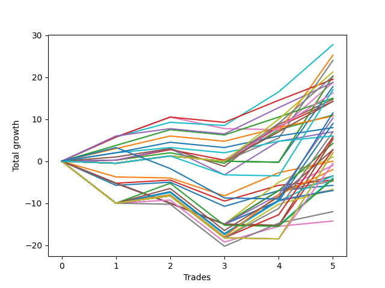

# Long Labrador 015 
- Symbol: ES_830-1130
- Date Range: 03/18/2022 - 12/30/2022
- Trading Period: 8:30-11:30
- Number of Trades: 5



| Name | Win Percent | Profit | Avg Profit / Trade | Avg Time / Trade |      | Name | Win Percent | Profit | Avg Profit / Trade | Avg Time / Trade |
| ---- | ----------- | ------ | ------------------ | ---------------- | ---- | ---- | ----------- | ------ | ------------------ | ---------------- |
| Sorted By <br> Profit | | | | | | Sorted By <br> Win Percentage ||||
| BB-100 Mid | 80.00 | 13875.00 | 2775.00 | 46:22 |     | BB-100 Mid | 80.00 | 13875.00 | 2775.00 | 46:22 |
| BB-200 Mid | 60.00 | 12625.00 | 2525.00 | 47:09 |     | TP-5 | 80.00 | 9750.00 | 1950.00 | 39:13 |
| V Mid | 60.00 | 12000.00 | 2400.00 | 49:50 |     | TP-6 | 80.00 | 9375.00 | 1875.00 | 40:12 |
| TP-10 | 60.00 | 10625.00 | 2125.00 | 43:46 |     | TP-4 | 80.00 | 7500.00 | 1500.00 | 27:16 |
| TP-9 | 60.00 | 10125.00 | 2025.00 | 43:37 |     | BB-50 U/L 1SD | 80.00 | 7375.00 | 1475.00 | 36:17 |
| BB-200 U/L 2SD | 40.00 | 10125.00 | 2025.00 | 60:55 |     | BB-20 U/L 2SD C | 80.00 | 7125.00 | 1425.00 | 19:35 |
| V U/L 1SD | 40.00 | 10125.00 | 2025.00 | 60:55 |     | BB-20 U/L 2SD | 80.00 | 5500.00 | 1100.00 | 17:36 |
| TP-5 | 80.00 | 9750.00 | 1950.00 | 39:13 |     | TP-3 | 80.00 | 5375.00 | 1075.00 | 24:52 |
| TP-6 | 80.00 | 9375.00 | 1875.00 | 40:12 |     | TP-2 | 80.00 | 4000.00 | 800.00 | 17:13 |
| BB-50 U/L 2SD | 60.00 | 9375.00 | 1875.00 | 49:21 |     | BB-50 Mid | 80.00 | 3500.00 | 700.00 | 22:56 |
| BB-100 U/L 2SD | 40.00 | 8875.00 | 1775.00 | 59:58 |     | TP-1 | 80.00 | 3000.00 | 600.00 | 13:13 |
| NEWFI 000 | 40.00 | 8500.00 | 1700.00 | 59:45 |     | BB-200 Mid | 60.00 | 12625.00 | 2525.00 | 47:09 |
| TP-8 | 60.00 | 8125.00 | 1625.00 | 41:54 |     | V Mid | 60.00 | 12000.00 | 2400.00 | 49:50 |
| TP-4 | 80.00 | 7500.00 | 1500.00 | 27:16 |     | TP-10 | 60.00 | 10625.00 | 2125.00 | 43:46 |
| BB-50 U/L 1SD | 80.00 | 7375.00 | 1475.00 | 36:17 |     | TP-9 | 60.00 | 10125.00 | 2025.00 | 43:37 |
| BB-20 U/L 2SD C | 80.00 | 7125.00 | 1425.00 | 19:35 |     | BB-50 U/L 2SD | 60.00 | 9375.00 | 1875.00 | 49:21 |
| TP-7 | 60.00 | 7125.00 | 1425.00 | 41:51 |     | TP-8 | 60.00 | 8125.00 | 1625.00 | 41:54 |
| NEWFI 0000 | 40.00 | 5750.00 | 1150.00 | 29:15 |     | TP-7 | 60.00 | 7125.00 | 1425.00 | 41:51 |
| BB-20 U/L 2SD | 80.00 | 5500.00 | 1100.00 | 17:36 |     | BB-200 Mid SL-10 | 60.00 | 3500.00 | 700.00 | 26:16 |
| TP-3 | 80.00 | 5375.00 | 1075.00 | 24:52 |     | V Mid SL-10 | 60.00 | 2875.00 | 575.00 | 28:57 |
| BB-200 Mid SL-5 | 40.00 | 5125.00 | 1025.00 | 14:39 |     | BB-100 Mid SL-10 | 60.00 | 1375.00 | 275.00 | 27:06 |
| V Mid SL-5 | 40.00 | 4500.00 | 900.00 | 17:20 |     | BB-50 U/L 1SD SL-10 | 60.00 | -1000.00 | -200.00 | 21:08 |
| TP-2 | 80.00 | 4000.00 | 800.00 | 17:13 |     | BB-20 U/L 2SD C SL-10 | 60.00 | -1750.00 | -350.00 | 12:59 |
| BB-50 Mid | 80.00 | 3500.00 | 700.00 | 22:56 |     | BB-20 Mid SL-5 | 60.00 | -2250.00 | -450.00 | 03:47 |
| BB-200 Mid SL-10 | 60.00 | 3500.00 | 700.00 | 26:16 |     | BB-20 Mid | 60.00 | -2875.00 | -575.00 | 09:34 |
| TP-1 | 80.00 | 3000.00 | 600.00 | 13:13 |     | BB-20 U/L 2SD SL-10 | 60.00 | -3375.00 | -675.00 | 11:00 |
| V Mid SL-10 | 60.00 | 2875.00 | 575.00 | 28:57 |     | BB-50 Mid SL-10 | 60.00 | -3500.00 | -700.00 | 12:55 |
| BB-200 U/L 2SD SL-5 | 20.00 | 2625.00 | 525.00 | 28:25 |     | BB-20 Mid SL-10 | 60.00 | -7125.00 | -1425.00 | 05:38 |
| V U/L 1SD SL-5 | 20.00 | 2625.00 | 525.00 | 28:25 |     | BB-200 U/L 2SD | 40.00 | 10125.00 | 2025.00 | 60:55 |
| BB-100 Mid SL-5 | 40.00 | 2125.00 | 425.00 | 16:37 |     | V U/L 1SD | 40.00 | 10125.00 | 2025.00 | 60:55 |
| BB-100 Mid SL-10 | 60.00 | 1375.00 | 275.00 | 27:06 |     | BB-100 U/L 2SD | 40.00 | 8875.00 | 1775.00 | 59:58 |
| BB-100 U/L 2SD SL-5 | 20.00 | 1375.00 | 275.00 | 27:28 |     | NEWFI 000 | 40.00 | 8500.00 | 1700.00 | 59:45 |
| BB-200 U/L 2SD SL-10 | 40.00 | 1000.00 | 200.00 | 40:02 |     | NEWFI 0000 | 40.00 | 5750.00 | 1150.00 | 29:15 |
| V U/L 1SD SL-10 | 40.00 | 1000.00 | 200.00 | 40:02 |     | BB-200 Mid SL-5 | 40.00 | 5125.00 | 1025.00 | 14:39 |
| BB-50 U/L 1SD SL-5 | 40.00 | 500.00 | 100.00 | 10:54 |     | V Mid SL-5 | 40.00 | 4500.00 | 900.00 | 17:20 |
| BB-20 U/L 1SD | 40.00 | 0.00 | 0.00 | 15:44 |     | BB-100 Mid SL-5 | 40.00 | 2125.00 | 425.00 | 16:37 |
| BB-100 U/L 2SD SL-10 | 40.00 | -250.00 | -50.00 | 39:05 |     | BB-200 U/L 2SD SL-10 | 40.00 | 1000.00 | 200.00 | 40:02 |
| BB-20 U/L 2SD C SL-5 | 40.00 | -500.00 | -100.00 | 09:15 |     | V U/L 1SD SL-10 | 40.00 | 1000.00 | 200.00 | 40:02 |
| BB-50 U/L 1SD SL-10 | 60.00 | -1000.00 | -200.00 | 21:08 |     | BB-50 U/L 1SD SL-5 | 40.00 | 500.00 | 100.00 | 10:54 |
| BB-20 U/L 2SD C SL-10 | 60.00 | -1750.00 | -350.00 | 12:59 |     | BB-20 U/L 1SD | 40.00 | 0.00 | 0.00 | 15:44 |
| BB-20 U/L 2SD SL-5 | 40.00 | -1750.00 | -350.00 | 07:17 |     | BB-100 U/L 2SD SL-10 | 40.00 | -250.00 | -50.00 | 39:05 |
| BB-50 U/L 2SD SL-5 | 20.00 | -2000.00 | -400.00 | 20:11 |     | BB-20 U/L 2SD C SL-5 | 40.00 | -500.00 | -100.00 | 09:15 |
| BB-50 U/L 2SD SL-10 | 40.00 | -2125.00 | -425.00 | 31:01 |     | BB-20 U/L 2SD SL-5 | 40.00 | -1750.00 | -350.00 | 07:17 |
| BB-20 Mid SL-5 | 60.00 | -2250.00 | -450.00 | 03:47 |     | BB-50 U/L 2SD SL-10 | 40.00 | -2125.00 | -425.00 | 31:01 |
| BB-50 Mid SL-5 | 40.00 | -2375.00 | -475.00 | 09:07 |     | BB-50 Mid SL-5 | 40.00 | -2375.00 | -475.00 | 09:07 |
| BB-20 Mid | 60.00 | -2875.00 | -575.00 | 09:34 |     | BB-20 U/L 1SD SL-5 | 40.00 | -3375.00 | -675.00 | 06:46 |
| BB-20 U/L 2SD SL-10 | 60.00 | -3375.00 | -675.00 | 11:00 |     | BB-20 U/L 1SD SL-10 | 40.00 | -6000.00 | -1200.00 | 09:57 |
| BB-20 U/L 1SD SL-5 | 40.00 | -3375.00 | -675.00 | 06:46 |     | BB-200 U/L 2SD SL-5 | 20.00 | 2625.00 | 525.00 | 28:25 |
| BB-50 Mid SL-10 | 60.00 | -3500.00 | -700.00 | 12:55 |     | V U/L 1SD SL-5 | 20.00 | 2625.00 | 525.00 | 28:25 |
| BB-20 U/L 1SD SL-10 | 40.00 | -6000.00 | -1200.00 | 09:57 |     | BB-100 U/L 2SD SL-5 | 20.00 | 1375.00 | 275.00 | 27:28 |
| BB-20 Mid SL-10 | 60.00 | -7125.00 | -1425.00 | 05:38 |     | BB-50 U/L 2SD SL-5 | 20.00 | -2000.00 | -400.00 | 20:11 |

## NO STOPLOSS

### Test BB-20 Mid
* Sell when price hits the middle line of the 20p bollinger
* No Stoploss
* Results:
```
Total Trades: 5
Percent Up: 60.00
Percent Down: 40.00
Total Points Moved Up: -5.75
Potential Profit: -2875.00
Total Points Ups: 5.75 Count Ups: 3
Total Points Downs: -11.50 Count Downs: 2
```

<details><summary>Trades</summary>

<code>In: 2022-03-21 10:07:00		Out: 2022-03-21 10:26:15		Total Position Time: 19:15		Total Move Up: -5.75		Total to Date: -5.75</code> <br />
<code>In: 2022-03-23 10:33:00		Out: 2022-03-23 10:38:30		Total Position Time: 05:30		Total Move Up: 0.75		Total to Date: -5.00</code> <br />
<code>In: 2022-03-28 08:44:00		Out: 2022-03-28 09:01:50		Total Position Time: 17:50		Total Move Up: -5.75		Total to Date: -10.75</code> <br />
<code>In: 2022-06-27 09:37:00		Out: 2022-06-27 09:41:05		Total Position Time: 04:05		Total Move Up: 3.75		Total to Date: -7.00</code> <br />
<code>In: 2022-09-20 11:02:00		Out: 2022-09-20 11:03:10		Total Position Time: 01:10		Total Move Up: 1.25		Total to Date: -5.75</code> <br />


</details>

### Test BB-20 U/L 1SD
* Sell when the price hits the upper line of the 20p 1std bollinger
* No Stoploss
* Results:
```
Total Trades: 5
Percent Up: 40.00
Percent Down: 60.00
Total Points Moved Up: 0.00
Potential Profit: 0.00
Total Points Ups: 8.25 Count Ups: 2
Total Points Downs: -8.25 Count Downs: 3
```

<details><summary>Trades</summary>

<code>In: 2022-03-21 10:07:00		Out: 2022-03-21 10:32:05		Total Position Time: 25:05		Total Move Up: -3.75		Total to Date: -3.75</code> <br />
<code>In: 2022-03-23 10:33:00		Out: 2022-03-23 10:51:45		Total Position Time: 18:45		Total Move Up: -0.25		Total to Date: -4.00</code> <br />
<code>In: 2022-03-28 08:44:00		Out: 2022-03-28 09:05:15		Total Position Time: 21:15		Total Move Up: -4.25		Total to Date: -8.25</code> <br />
<code>In: 2022-06-27 09:37:00		Out: 2022-06-27 09:44:20		Total Position Time: 07:20		Total Move Up: 5.50		Total to Date: -2.75</code> <br />
<code>In: 2022-09-20 11:02:00		Out: 2022-09-20 11:08:15		Total Position Time: 06:15		Total Move Up: 2.75		Total to Date: 0.00</code> <br />


</details>

### Test BB-20 U/L 2SD
* Sell when the price hits the upper line of the 20p 2std bollinger
* No Stoploss
* Results:
```
Total Trades: 5
Percent Up: 80.00
Percent Down: 20.00
Total Points Moved Up: 11.00
Potential Profit: 5500.00
Total Points Ups: 13.50 Count Ups: 4
Total Points Downs: -2.50 Count Downs: 1
```

<details><summary>Trades</summary>

<code>In: 2022-03-21 10:07:00		Out: 2022-03-21 10:34:15		Total Position Time: 27:15		Total Move Up: 0.25		Total to Date: 0.25</code> <br />
<code>In: 2022-03-23 10:33:00		Out: 2022-03-23 10:54:25		Total Position Time: 21:25		Total Move Up: 1.75		Total to Date: 2.00</code> <br />
<code>In: 2022-03-28 08:44:00		Out: 2022-03-28 09:07:10		Total Position Time: 23:10		Total Move Up: -2.50		Total to Date: -0.50</code> <br />
<code>In: 2022-06-27 09:37:00		Out: 2022-06-27 09:45:05		Total Position Time: 08:05		Total Move Up: 8.00		Total to Date: 7.50</code> <br />
<code>In: 2022-09-20 11:02:00		Out: 2022-09-20 11:10:05		Total Position Time: 08:05		Total Move Up: 3.50		Total to Date: 11.00</code> <br />


</details>

### Test BB-20 U/L 2SD C
* Sell when the price hits the upper line of the 20p 2std bollinger
* No Stoploss
* Results:
```
Total Trades: 5
Percent Up: 80.00
Percent Down: 20.00
Total Points Moved Up: 14.25
Potential Profit: 7125.00
Total Points Ups: 16.75 Count Ups: 4
Total Points Downs: -2.50 Count Downs: 1
```

<details><summary>Trades</summary>

<code>In: 2022-03-21 10:07:00		Out: 2022-03-21 10:34:15		Total Position Time: 27:15		Total Move Up: 0.25		Total to Date: 0.25</code> <br />
<code>In: 2022-03-23 10:33:00		Out: 2022-03-23 10:54:30		Total Position Time: 21:30		Total Move Up: 2.50		Total to Date: 2.75</code> <br />
<code>In: 2022-03-28 08:44:00		Out: 2022-03-28 09:07:10		Total Position Time: 23:10		Total Move Up: -2.50		Total to Date: 0.25</code> <br />
<code>In: 2022-06-27 09:37:00		Out: 2022-06-27 09:45:05		Total Position Time: 08:05		Total Move Up: 8.00		Total to Date: 8.25</code> <br />
<code>In: 2022-09-20 11:02:00		Out: 2022-09-20 11:19:55		Total Position Time: 17:55		Total Move Up: 6.00		Total to Date: 14.25</code> <br />


</details>

### Test BB-50 Mid
* Sell when price hits the middle line of the 50p bollinger
* No Stoploss
* Results:
```
Total Trades: 5
Percent Up: 80.00
Percent Down: 20.00
Total Points Moved Up: 7.00
Potential Profit: 3500.00
Total Points Ups: 13.25 Count Ups: 4
Total Points Downs: -6.25 Count Downs: 1
```

<details><summary>Trades</summary>

<code>In: 2022-03-21 10:07:00		Out: 2022-03-21 10:34:15		Total Position Time: 27:15		Total Move Up: 0.25		Total to Date: 0.25</code> <br />
<code>In: 2022-03-23 10:33:00		Out: 2022-03-23 10:54:50		Total Position Time: 21:50		Total Move Up: 2.75		Total to Date: 3.00</code> <br />
<code>In: 2022-03-28 08:44:00		Out: 2022-03-28 09:24:15		Total Position Time: 40:15		Total Move Up: -6.25		Total to Date: -3.25</code> <br />
<code>In: 2022-06-27 09:37:00		Out: 2022-06-27 09:45:05		Total Position Time: 08:05		Total Move Up: 8.00		Total to Date: 4.75</code> <br />
<code>In: 2022-09-20 11:02:00		Out: 2022-09-20 11:19:15		Total Position Time: 17:15		Total Move Up: 2.25		Total to Date: 7.00</code> <br />


</details>

### Test BB-50 U/L 1SD
* Sell when the price hits the upper line of the 50p 1std bollinger
* No Stoploss
* Results:
```
Total Trades: 5
Percent Up: 80.00
Percent Down: 20.00
Total Points Moved Up: 14.75
Potential Profit: 7375.00
Total Points Ups: 19.00 Count Ups: 4
Total Points Downs: -4.25 Count Downs: 1
```

<details><summary>Trades</summary>

<code>In: 2022-03-21 10:07:00		Out: 2022-03-21 10:49:05		Total Position Time: 42:05		Total Move Up: 1.00		Total to Date: 1.00</code> <br />
<code>In: 2022-03-23 10:33:00		Out: 2022-03-23 11:27:00		Total Position Time: 54:00		Total Move Up: 2.00		Total to Date: 3.00</code> <br />
<code>In: 2022-03-28 08:44:00		Out: 2022-03-28 09:35:05		Total Position Time: 51:05		Total Move Up: -4.25		Total to Date: -1.25</code> <br />
<code>In: 2022-06-27 09:37:00		Out: 2022-06-27 09:53:20		Total Position Time: 16:20		Total Move Up: 10.00		Total to Date: 8.75</code> <br />
<code>In: 2022-09-20 11:02:00		Out: 2022-09-20 11:19:55		Total Position Time: 17:55		Total Move Up: 6.00		Total to Date: 14.75</code> <br />


</details>

### Test BB-50 U/L 2SD
* Sell when the price hits the upper line of the 50p 2std bollinger
* No Stoploss
* Results:
```
Total Trades: 5
Percent Up: 60.00
Percent Down: 40.00
Total Points Moved Up: 18.75
Potential Profit: 9375.00
Total Points Ups: 21.75 Count Ups: 3
Total Points Downs: -3.00 Count Downs: 2
```

<details><summary>Trades</summary>

<code>In: 2022-03-21 10:07:00		Out: 2022-03-21 11:00:15		Total Position Time: 53:15		Total Move Up: 5.75		Total to Date: 5.75</code> <br />
<code>In: 2022-03-23 10:33:00		Out: 2022-03-23 11:30:00		Total Position Time: 57:00		Total Move Up: 4.75		Total to Date: 10.50</code> <br />
<code>In: 2022-03-28 08:44:00		Out: 2022-03-28 09:39:50		Total Position Time: 55:50		Total Move Up: -2.75		Total to Date: 7.75</code> <br />
<code>In: 2022-06-27 09:37:00		Out: 2022-06-27 10:37:55		Total Position Time: 60:55		Total Move Up: -0.25		Total to Date: 7.50</code> <br />
<code>In: 2022-09-20 11:02:00		Out: 2022-09-20 11:21:45		Total Position Time: 19:45		Total Move Up: 11.25		Total to Date: 18.75</code> <br />


</details>

### Test V Mid
* Sell when the price hits the middle line of the 1std VWAP
* No Stoploss
* Results:
```
Total Trades: 5
Percent Up: 60.00
Percent Down: 40.00
Total Points Moved Up: 24.00
Potential Profit: 12000.00
Total Points Ups: 25.75 Count Ups: 3
Total Points Downs: -1.75 Count Downs: 2
```

<details><summary>Trades</summary>

<code>In: 2022-03-21 10:07:00		Out: 2022-03-21 11:07:55		Total Position Time: 60:55		Total Move Up: -0.50		Total to Date: -0.50</code> <br />
<code>In: 2022-03-23 10:33:00		Out: 2022-03-23 11:33:55		Total Position Time: 60:55		Total Move Up: 1.75		Total to Date: 1.25</code> <br />
<code>In: 2022-03-28 08:44:00		Out: 2022-03-28 09:44:55		Total Position Time: 60:55		Total Move Up: -1.25		Total to Date: 0.00</code> <br />
<code>In: 2022-06-27 09:37:00		Out: 2022-06-27 09:44:20		Total Position Time: 07:20		Total Move Up: 5.50		Total to Date: 5.50</code> <br />
<code>In: 2022-09-20 11:02:00		Out: 2022-09-20 12:01:05		Total Position Time: 59:05		Total Move Up: 18.50		Total to Date: 24.00</code> <br />


</details>

### Test V U/L 1SD
* Sell when the price hits the upper line of the 1std VWAP
* No Stoploss
* Results:
```
Total Trades: 5
Percent Up: 40.00
Percent Down: 60.00
Total Points Moved Up: 20.25
Potential Profit: 10125.00
Total Points Ups: 22.25 Count Ups: 2
Total Points Downs: -2.00 Count Downs: 3
```

<details><summary>Trades</summary>

<code>In: 2022-03-21 10:07:00		Out: 2022-03-21 11:07:55		Total Position Time: 60:55		Total Move Up: -0.50		Total to Date: -0.50</code> <br />
<code>In: 2022-03-23 10:33:00		Out: 2022-03-23 11:33:55		Total Position Time: 60:55		Total Move Up: 1.75		Total to Date: 1.25</code> <br />
<code>In: 2022-03-28 08:44:00		Out: 2022-03-28 09:44:55		Total Position Time: 60:55		Total Move Up: -1.25		Total to Date: 0.00</code> <br />
<code>In: 2022-06-27 09:37:00		Out: 2022-06-27 10:37:55		Total Position Time: 60:55		Total Move Up: -0.25		Total to Date: -0.25</code> <br />
<code>In: 2022-09-20 11:02:00		Out: 2022-09-20 12:02:55		Total Position Time: 60:55		Total Move Up: 20.50		Total to Date: 20.25</code> <br />


</details>

### Test BB-100 Mid
* Move to BB100 Mid
* No Stoploss
* Results:
```
Total Trades: 5
Percent Up: 80.00
Percent Down: 20.00
Total Points Moved Up: 27.75
Potential Profit: 13875.00
Total Points Ups: 28.50 Count Ups: 4
Total Points Downs: -0.75 Count Downs: 1
```

<details><summary>Trades</summary>

<code>In: 2022-03-21 10:07:00		Out: 2022-03-21 11:00:15		Total Position Time: 53:15		Total Move Up: 5.75		Total to Date: 5.75</code> <br />
<code>In: 2022-03-23 10:33:00		Out: 2022-03-23 11:28:15		Total Position Time: 55:15		Total Move Up: 3.50		Total to Date: 9.25</code> <br />
<code>In: 2022-03-28 08:44:00		Out: 2022-03-28 09:44:30		Total Position Time: 60:30		Total Move Up: -0.75		Total to Date: 8.50</code> <br />
<code>In: 2022-06-27 09:37:00		Out: 2022-06-27 10:20:05		Total Position Time: 43:05		Total Move Up: 8.00		Total to Date: 16.50</code> <br />
<code>In: 2022-09-20 11:02:00		Out: 2022-09-20 11:21:45		Total Position Time: 19:45		Total Move Up: 11.25		Total to Date: 27.75</code> <br />


</details>

### Test BB-100 U/L 2SD
* Move to BB100 Upper Band
* No Stoploss
* Results:
```
Total Trades: 5
Percent Up: 40.00
Percent Down: 60.00
Total Points Moved Up: 17.75
Potential Profit: 8875.00
Total Points Ups: 19.75 Count Ups: 2
Total Points Downs: -2.00 Count Downs: 3
```

<details><summary>Trades</summary>

<code>In: 2022-03-21 10:07:00		Out: 2022-03-21 11:07:55		Total Position Time: 60:55		Total Move Up: -0.50		Total to Date: -0.50</code> <br />
<code>In: 2022-03-23 10:33:00		Out: 2022-03-23 11:33:55		Total Position Time: 60:55		Total Move Up: 1.75		Total to Date: 1.25</code> <br />
<code>In: 2022-03-28 08:44:00		Out: 2022-03-28 09:44:55		Total Position Time: 60:55		Total Move Up: -1.25		Total to Date: 0.00</code> <br />
<code>In: 2022-06-27 09:37:00		Out: 2022-06-27 10:37:55		Total Position Time: 60:55		Total Move Up: -0.25		Total to Date: -0.25</code> <br />
<code>In: 2022-09-20 11:02:00		Out: 2022-09-20 11:58:10		Total Position Time: 56:10		Total Move Up: 18.00		Total to Date: 17.75</code> <br />


</details>

### Test BB-200 Mid
* Move to BB200 Mid
* No Stoploss
* Results:
```
Total Trades: 5
Percent Up: 60.00
Percent Down: 40.00
Total Points Moved Up: 25.25
Potential Profit: 12625.00
Total Points Ups: 27.00 Count Ups: 3
Total Points Downs: -1.75 Count Downs: 2
```

<details><summary>Trades</summary>

<code>In: 2022-03-21 10:07:00		Out: 2022-03-21 11:07:55		Total Position Time: 60:55		Total Move Up: -0.50		Total to Date: -0.50</code> <br />
<code>In: 2022-03-23 10:33:00		Out: 2022-03-23 11:33:55		Total Position Time: 60:55		Total Move Up: 1.75		Total to Date: 1.25</code> <br />
<code>In: 2022-03-28 08:44:00		Out: 2022-03-28 09:44:55		Total Position Time: 60:55		Total Move Up: -1.25		Total to Date: 0.00</code> <br />
<code>In: 2022-06-27 09:37:00		Out: 2022-06-27 09:45:00		Total Position Time: 08:00		Total Move Up: 7.00		Total to Date: 7.00</code> <br />
<code>In: 2022-09-20 11:02:00		Out: 2022-09-20 11:47:00		Total Position Time: 45:00		Total Move Up: 18.25		Total to Date: 25.25</code> <br />


</details>

### Test BB-200 U/L 2SD
* Move to BB200 Upper Band
* No Stoploss
* Results:
```
Total Trades: 5
Percent Up: 40.00
Percent Down: 60.00
Total Points Moved Up: 20.25
Potential Profit: 10125.00
Total Points Ups: 22.25 Count Ups: 2
Total Points Downs: -2.00 Count Downs: 3
```

<details><summary>Trades</summary>

<code>In: 2022-03-21 10:07:00		Out: 2022-03-21 11:07:55		Total Position Time: 60:55		Total Move Up: -0.50		Total to Date: -0.50</code> <br />
<code>In: 2022-03-23 10:33:00		Out: 2022-03-23 11:33:55		Total Position Time: 60:55		Total Move Up: 1.75		Total to Date: 1.25</code> <br />
<code>In: 2022-03-28 08:44:00		Out: 2022-03-28 09:44:55		Total Position Time: 60:55		Total Move Up: -1.25		Total to Date: 0.00</code> <br />
<code>In: 2022-06-27 09:37:00		Out: 2022-06-27 10:37:55		Total Position Time: 60:55		Total Move Up: -0.25		Total to Date: -0.25</code> <br />
<code>In: 2022-09-20 11:02:00		Out: 2022-09-20 12:02:55		Total Position Time: 60:55		Total Move Up: 20.50		Total to Date: 20.25</code> <br />


</details>

## STOPLOSS OF 5

### Test BB-20 Mid SL-5
* Sell when price hits the middle line of the 20p bollinger
* Stoploss is 5 points
* Results:
```
Total Trades: 5
Percent Up: 60.00
Percent Down: 40.00
Total Points Moved Up: -4.50
Potential Profit: -2250.00
Total Points Ups: 5.75 Count Ups: 3
Total Points Downs: -10.25 Count Downs: 2
```

<details><summary>Trades</summary>

<code>In: 2022-03-21 10:07:00		Out: 2022-03-21 10:12:40		Total Position Time: 05:40		Total Move Up: -5.25		Total to Date: -5.25</code> <br />
<code>In: 2022-03-23 10:33:00		Out: 2022-03-23 10:38:30		Total Position Time: 05:30		Total Move Up: 0.75		Total to Date: -4.50</code> <br />
<code>In: 2022-03-28 08:44:00		Out: 2022-03-28 08:46:30		Total Position Time: 02:30		Total Move Up: -5.00		Total to Date: -9.50</code> <br />
<code>In: 2022-06-27 09:37:00		Out: 2022-06-27 09:41:05		Total Position Time: 04:05		Total Move Up: 3.75		Total to Date: -5.75</code> <br />
<code>In: 2022-09-20 11:02:00		Out: 2022-09-20 11:03:10		Total Position Time: 01:10		Total Move Up: 1.25		Total to Date: -4.50</code> <br />


</details>

### Test BB-20 U/L 1SD SL-5
* Sell when the price hits the upper line of the 20p 1std bollinger
* Stoploss is 5 points
* Results:
```
Total Trades: 5
Percent Up: 40.00
Percent Down: 60.00
Total Points Moved Up: -6.75
Potential Profit: -3375.00
Total Points Ups: 8.25 Count Ups: 2
Total Points Downs: -15.00 Count Downs: 3
```

<details><summary>Trades</summary>

<code>In: 2022-03-21 10:07:00		Out: 2022-03-21 10:12:40		Total Position Time: 05:40		Total Move Up: -5.25		Total to Date: -5.25</code> <br />
<code>In: 2022-03-23 10:33:00		Out: 2022-03-23 10:45:05		Total Position Time: 12:05		Total Move Up: -4.75		Total to Date: -10.00</code> <br />
<code>In: 2022-03-28 08:44:00		Out: 2022-03-28 08:46:30		Total Position Time: 02:30		Total Move Up: -5.00		Total to Date: -15.00</code> <br />
<code>In: 2022-06-27 09:37:00		Out: 2022-06-27 09:44:20		Total Position Time: 07:20		Total Move Up: 5.50		Total to Date: -9.50</code> <br />
<code>In: 2022-09-20 11:02:00		Out: 2022-09-20 11:08:15		Total Position Time: 06:15		Total Move Up: 2.75		Total to Date: -6.75</code> <br />


</details>

### Test BB-20 U/L 2SD SL-5
* Sell when the price hits the upper line of the 20p 2std bollinger
* Stoploss is 5 points
* Results:
```
Total Trades: 5
Percent Up: 40.00
Percent Down: 60.00
Total Points Moved Up: -3.50
Potential Profit: -1750.00
Total Points Ups: 11.50 Count Ups: 2
Total Points Downs: -15.00 Count Downs: 3
```

<details><summary>Trades</summary>

<code>In: 2022-03-21 10:07:00		Out: 2022-03-21 10:12:40		Total Position Time: 05:40		Total Move Up: -5.25		Total to Date: -5.25</code> <br />
<code>In: 2022-03-23 10:33:00		Out: 2022-03-23 10:45:05		Total Position Time: 12:05		Total Move Up: -4.75		Total to Date: -10.00</code> <br />
<code>In: 2022-03-28 08:44:00		Out: 2022-03-28 08:46:30		Total Position Time: 02:30		Total Move Up: -5.00		Total to Date: -15.00</code> <br />
<code>In: 2022-06-27 09:37:00		Out: 2022-06-27 09:45:05		Total Position Time: 08:05		Total Move Up: 8.00		Total to Date: -7.00</code> <br />
<code>In: 2022-09-20 11:02:00		Out: 2022-09-20 11:10:05		Total Position Time: 08:05		Total Move Up: 3.50		Total to Date: -3.50</code> <br />


</details>

### Test BB-20 U/L 2SD C SL-5
* Sell when the price hits the upper line of the 20p 2std bollinger
* Stoploss is 5 points
* Results:
```
Total Trades: 5
Percent Up: 40.00
Percent Down: 60.00
Total Points Moved Up: -1.00
Potential Profit: -500.00
Total Points Ups: 14.00 Count Ups: 2
Total Points Downs: -15.00 Count Downs: 3
```

<details><summary>Trades</summary>

<code>In: 2022-03-21 10:07:00		Out: 2022-03-21 10:12:40		Total Position Time: 05:40		Total Move Up: -5.25		Total to Date: -5.25</code> <br />
<code>In: 2022-03-23 10:33:00		Out: 2022-03-23 10:45:05		Total Position Time: 12:05		Total Move Up: -4.75		Total to Date: -10.00</code> <br />
<code>In: 2022-03-28 08:44:00		Out: 2022-03-28 08:46:30		Total Position Time: 02:30		Total Move Up: -5.00		Total to Date: -15.00</code> <br />
<code>In: 2022-06-27 09:37:00		Out: 2022-06-27 09:45:05		Total Position Time: 08:05		Total Move Up: 8.00		Total to Date: -7.00</code> <br />
<code>In: 2022-09-20 11:02:00		Out: 2022-09-20 11:19:55		Total Position Time: 17:55		Total Move Up: 6.00		Total to Date: -1.00</code> <br />


</details>

### Test BB-50 Mid SL-5
* Sell when price hits the middle line of the 50p bollinger
* Stoploss is 5 points
* Results:
```
Total Trades: 5
Percent Up: 40.00
Percent Down: 60.00
Total Points Moved Up: -4.75
Potential Profit: -2375.00
Total Points Ups: 10.25 Count Ups: 2
Total Points Downs: -15.00 Count Downs: 3
```

<details><summary>Trades</summary>

<code>In: 2022-03-21 10:07:00		Out: 2022-03-21 10:12:40		Total Position Time: 05:40		Total Move Up: -5.25		Total to Date: -5.25</code> <br />
<code>In: 2022-03-23 10:33:00		Out: 2022-03-23 10:45:05		Total Position Time: 12:05		Total Move Up: -4.75		Total to Date: -10.00</code> <br />
<code>In: 2022-03-28 08:44:00		Out: 2022-03-28 08:46:30		Total Position Time: 02:30		Total Move Up: -5.00		Total to Date: -15.00</code> <br />
<code>In: 2022-06-27 09:37:00		Out: 2022-06-27 09:45:05		Total Position Time: 08:05		Total Move Up: 8.00		Total to Date: -7.00</code> <br />
<code>In: 2022-09-20 11:02:00		Out: 2022-09-20 11:19:15		Total Position Time: 17:15		Total Move Up: 2.25		Total to Date: -4.75</code> <br />


</details>

### Test BB-50 U/L 1SD SL-5
* Sell when the price hits the upper line of the 50p 1std bollinger
* Stoploss is 5 points
* Results:
```
Total Trades: 5
Percent Up: 40.00
Percent Down: 60.00
Total Points Moved Up: 1.00
Potential Profit: 500.00
Total Points Ups: 16.00 Count Ups: 2
Total Points Downs: -15.00 Count Downs: 3
```

<details><summary>Trades</summary>

<code>In: 2022-03-21 10:07:00		Out: 2022-03-21 10:12:40		Total Position Time: 05:40		Total Move Up: -5.25		Total to Date: -5.25</code> <br />
<code>In: 2022-03-23 10:33:00		Out: 2022-03-23 10:45:05		Total Position Time: 12:05		Total Move Up: -4.75		Total to Date: -10.00</code> <br />
<code>In: 2022-03-28 08:44:00		Out: 2022-03-28 08:46:30		Total Position Time: 02:30		Total Move Up: -5.00		Total to Date: -15.00</code> <br />
<code>In: 2022-06-27 09:37:00		Out: 2022-06-27 09:53:20		Total Position Time: 16:20		Total Move Up: 10.00		Total to Date: -5.00</code> <br />
<code>In: 2022-09-20 11:02:00		Out: 2022-09-20 11:19:55		Total Position Time: 17:55		Total Move Up: 6.00		Total to Date: 1.00</code> <br />


</details>

### Test BB-50 U/L 2SD SL-5
* Sell when the price hits the upper line of the 50p 2std bollinger
* Stoploss is 5 points
* Results:
```
Total Trades: 5
Percent Up: 20.00
Percent Down: 80.00
Total Points Moved Up: -4.00
Potential Profit: -2000.00
Total Points Ups: 11.25 Count Ups: 1
Total Points Downs: -15.25 Count Downs: 4
```

<details><summary>Trades</summary>

<code>In: 2022-03-21 10:07:00		Out: 2022-03-21 10:12:40		Total Position Time: 05:40		Total Move Up: -5.25		Total to Date: -5.25</code> <br />
<code>In: 2022-03-23 10:33:00		Out: 2022-03-23 10:45:05		Total Position Time: 12:05		Total Move Up: -4.75		Total to Date: -10.00</code> <br />
<code>In: 2022-03-28 08:44:00		Out: 2022-03-28 08:46:30		Total Position Time: 02:30		Total Move Up: -5.00		Total to Date: -15.00</code> <br />
<code>In: 2022-06-27 09:37:00		Out: 2022-06-27 10:37:55		Total Position Time: 60:55		Total Move Up: -0.25		Total to Date: -15.25</code> <br />
<code>In: 2022-09-20 11:02:00		Out: 2022-09-20 11:21:45		Total Position Time: 19:45		Total Move Up: 11.25		Total to Date: -4.00</code> <br />


</details>

### Test V Mid SL-5
* Sell when the price hits the middle line of the 1std VWAP
* Stoploss is 5 points
* Results:
```
Total Trades: 5
Percent Up: 40.00
Percent Down: 60.00
Total Points Moved Up: 9.00
Potential Profit: 4500.00
Total Points Ups: 24.00 Count Ups: 2
Total Points Downs: -15.00 Count Downs: 3
```

<details><summary>Trades</summary>

<code>In: 2022-03-21 10:07:00		Out: 2022-03-21 10:12:40		Total Position Time: 05:40		Total Move Up: -5.25		Total to Date: -5.25</code> <br />
<code>In: 2022-03-23 10:33:00		Out: 2022-03-23 10:45:05		Total Position Time: 12:05		Total Move Up: -4.75		Total to Date: -10.00</code> <br />
<code>In: 2022-03-28 08:44:00		Out: 2022-03-28 08:46:30		Total Position Time: 02:30		Total Move Up: -5.00		Total to Date: -15.00</code> <br />
<code>In: 2022-06-27 09:37:00		Out: 2022-06-27 09:44:20		Total Position Time: 07:20		Total Move Up: 5.50		Total to Date: -9.50</code> <br />
<code>In: 2022-09-20 11:02:00		Out: 2022-09-20 12:01:05		Total Position Time: 59:05		Total Move Up: 18.50		Total to Date: 9.00</code> <br />


</details>

### Test V U/L 1SD SL-5
* Sell when the price hits the upper line of the 1std VWAP
* Stoploss is 5 points
* Results:
```
Total Trades: 5
Percent Up: 20.00
Percent Down: 80.00
Total Points Moved Up: 5.25
Potential Profit: 2625.00
Total Points Ups: 20.50 Count Ups: 1
Total Points Downs: -15.25 Count Downs: 4
```

<details><summary>Trades</summary>

<code>In: 2022-03-21 10:07:00		Out: 2022-03-21 10:12:40		Total Position Time: 05:40		Total Move Up: -5.25		Total to Date: -5.25</code> <br />
<code>In: 2022-03-23 10:33:00		Out: 2022-03-23 10:45:05		Total Position Time: 12:05		Total Move Up: -4.75		Total to Date: -10.00</code> <br />
<code>In: 2022-03-28 08:44:00		Out: 2022-03-28 08:46:30		Total Position Time: 02:30		Total Move Up: -5.00		Total to Date: -15.00</code> <br />
<code>In: 2022-06-27 09:37:00		Out: 2022-06-27 10:37:55		Total Position Time: 60:55		Total Move Up: -0.25		Total to Date: -15.25</code> <br />
<code>In: 2022-09-20 11:02:00		Out: 2022-09-20 12:02:55		Total Position Time: 60:55		Total Move Up: 20.50		Total to Date: 5.25</code> <br />


</details>

### Test BB-100 Mid SL-5
* Move to BB100 Mid
* Stoploss is 5 points
* Results:
```
Total Trades: 5
Percent Up: 40.00
Percent Down: 60.00
Total Points Moved Up: 4.25
Potential Profit: 2125.00
Total Points Ups: 19.25 Count Ups: 2
Total Points Downs: -15.00 Count Downs: 3
```

<details><summary>Trades</summary>

<code>In: 2022-03-21 10:07:00		Out: 2022-03-21 10:12:40		Total Position Time: 05:40		Total Move Up: -5.25		Total to Date: -5.25</code> <br />
<code>In: 2022-03-23 10:33:00		Out: 2022-03-23 10:45:05		Total Position Time: 12:05		Total Move Up: -4.75		Total to Date: -10.00</code> <br />
<code>In: 2022-03-28 08:44:00		Out: 2022-03-28 08:46:30		Total Position Time: 02:30		Total Move Up: -5.00		Total to Date: -15.00</code> <br />
<code>In: 2022-06-27 09:37:00		Out: 2022-06-27 10:20:05		Total Position Time: 43:05		Total Move Up: 8.00		Total to Date: -7.00</code> <br />
<code>In: 2022-09-20 11:02:00		Out: 2022-09-20 11:21:45		Total Position Time: 19:45		Total Move Up: 11.25		Total to Date: 4.25</code> <br />


</details>

### Test BB-100 U/L 2SD SL-5
* Move to BB100 Upper Band
* Stoploss is 5 points
* Results:
```
Total Trades: 5
Percent Up: 20.00
Percent Down: 80.00
Total Points Moved Up: 2.75
Potential Profit: 1375.00
Total Points Ups: 18.00 Count Ups: 1
Total Points Downs: -15.25 Count Downs: 4
```

<details><summary>Trades</summary>

<code>In: 2022-03-21 10:07:00		Out: 2022-03-21 10:12:40		Total Position Time: 05:40		Total Move Up: -5.25		Total to Date: -5.25</code> <br />
<code>In: 2022-03-23 10:33:00		Out: 2022-03-23 10:45:05		Total Position Time: 12:05		Total Move Up: -4.75		Total to Date: -10.00</code> <br />
<code>In: 2022-03-28 08:44:00		Out: 2022-03-28 08:46:30		Total Position Time: 02:30		Total Move Up: -5.00		Total to Date: -15.00</code> <br />
<code>In: 2022-06-27 09:37:00		Out: 2022-06-27 10:37:55		Total Position Time: 60:55		Total Move Up: -0.25		Total to Date: -15.25</code> <br />
<code>In: 2022-09-20 11:02:00		Out: 2022-09-20 11:58:10		Total Position Time: 56:10		Total Move Up: 18.00		Total to Date: 2.75</code> <br />


</details>

### Test BB-200 Mid SL-5
* Move to BB200 Mid
* Stoploss is 5 points
* Results:
```
Total Trades: 5
Percent Up: 40.00
Percent Down: 60.00
Total Points Moved Up: 10.25
Potential Profit: 5125.00
Total Points Ups: 25.25 Count Ups: 2
Total Points Downs: -15.00 Count Downs: 3
```

<details><summary>Trades</summary>

<code>In: 2022-03-21 10:07:00		Out: 2022-03-21 10:12:40		Total Position Time: 05:40		Total Move Up: -5.25		Total to Date: -5.25</code> <br />
<code>In: 2022-03-23 10:33:00		Out: 2022-03-23 10:45:05		Total Position Time: 12:05		Total Move Up: -4.75		Total to Date: -10.00</code> <br />
<code>In: 2022-03-28 08:44:00		Out: 2022-03-28 08:46:30		Total Position Time: 02:30		Total Move Up: -5.00		Total to Date: -15.00</code> <br />
<code>In: 2022-06-27 09:37:00		Out: 2022-06-27 09:45:00		Total Position Time: 08:00		Total Move Up: 7.00		Total to Date: -8.00</code> <br />
<code>In: 2022-09-20 11:02:00		Out: 2022-09-20 11:47:00		Total Position Time: 45:00		Total Move Up: 18.25		Total to Date: 10.25</code> <br />


</details>

### Test BB-200 U/L 2SD SL-5
* Move to BB200 Upper Band
* Stoploss is 5 points
* Results:
```
Total Trades: 5
Percent Up: 20.00
Percent Down: 80.00
Total Points Moved Up: 5.25
Potential Profit: 2625.00
Total Points Ups: 20.50 Count Ups: 1
Total Points Downs: -15.25 Count Downs: 4
```

<details><summary>Trades</summary>

<code>In: 2022-03-21 10:07:00		Out: 2022-03-21 10:12:40		Total Position Time: 05:40		Total Move Up: -5.25		Total to Date: -5.25</code> <br />
<code>In: 2022-03-23 10:33:00		Out: 2022-03-23 10:45:05		Total Position Time: 12:05		Total Move Up: -4.75		Total to Date: -10.00</code> <br />
<code>In: 2022-03-28 08:44:00		Out: 2022-03-28 08:46:30		Total Position Time: 02:30		Total Move Up: -5.00		Total to Date: -15.00</code> <br />
<code>In: 2022-06-27 09:37:00		Out: 2022-06-27 10:37:55		Total Position Time: 60:55		Total Move Up: -0.25		Total to Date: -15.25</code> <br />
<code>In: 2022-09-20 11:02:00		Out: 2022-09-20 12:02:55		Total Position Time: 60:55		Total Move Up: 20.50		Total to Date: 5.25</code> <br />


</details>

## STOPLOSS OF 10

### Test BB-20 Mid SL-10
* Sell when price hits the middle line of the 20p bollinger
* Stoploss is 10 points
* Results:
```
Total Trades: 5
Percent Up: 60.00
Percent Down: 40.00
Total Points Moved Up: -14.25
Potential Profit: -7125.00
Total Points Ups: 5.75 Count Ups: 3
Total Points Downs: -20.00 Count Downs: 2
```

<details><summary>Trades</summary>

<code>In: 2022-03-21 10:07:00		Out: 2022-03-21 10:18:25		Total Position Time: 11:25		Total Move Up: -10.00		Total to Date: -10.00</code> <br />
<code>In: 2022-03-23 10:33:00		Out: 2022-03-23 10:38:30		Total Position Time: 05:30		Total Move Up: 0.75		Total to Date: -9.25</code> <br />
<code>In: 2022-03-28 08:44:00		Out: 2022-03-28 08:50:00		Total Position Time: 06:00		Total Move Up: -10.00		Total to Date: -19.25</code> <br />
<code>In: 2022-06-27 09:37:00		Out: 2022-06-27 09:41:05		Total Position Time: 04:05		Total Move Up: 3.75		Total to Date: -15.50</code> <br />
<code>In: 2022-09-20 11:02:00		Out: 2022-09-20 11:03:10		Total Position Time: 01:10		Total Move Up: 1.25		Total to Date: -14.25</code> <br />


</details>

### Test BB-20 U/L 1SD SL-10
* Sell when the price hits the upper line of the 20p 1std bollinger
* Stoploss is 10 points
* Results:
```
Total Trades: 5
Percent Up: 40.00
Percent Down: 60.00
Total Points Moved Up: -12.00
Potential Profit: -6000.00
Total Points Ups: 8.25 Count Ups: 2
Total Points Downs: -20.25 Count Downs: 3
```

<details><summary>Trades</summary>

<code>In: 2022-03-21 10:07:00		Out: 2022-03-21 10:18:25		Total Position Time: 11:25		Total Move Up: -10.00		Total to Date: -10.00</code> <br />
<code>In: 2022-03-23 10:33:00		Out: 2022-03-23 10:51:45		Total Position Time: 18:45		Total Move Up: -0.25		Total to Date: -10.25</code> <br />
<code>In: 2022-03-28 08:44:00		Out: 2022-03-28 08:50:00		Total Position Time: 06:00		Total Move Up: -10.00		Total to Date: -20.25</code> <br />
<code>In: 2022-06-27 09:37:00		Out: 2022-06-27 09:44:20		Total Position Time: 07:20		Total Move Up: 5.50		Total to Date: -14.75</code> <br />
<code>In: 2022-09-20 11:02:00		Out: 2022-09-20 11:08:15		Total Position Time: 06:15		Total Move Up: 2.75		Total to Date: -12.00</code> <br />


</details>

### Test BB-20 U/L 2SD SL-10
* Sell when the price hits the upper line of the 20p 2std bollinger
* Stoploss is 10 points
* Results:
```
Total Trades: 5
Percent Up: 60.00
Percent Down: 40.00
Total Points Moved Up: -6.75
Potential Profit: -3375.00
Total Points Ups: 13.25 Count Ups: 3
Total Points Downs: -20.00 Count Downs: 2
```

<details><summary>Trades</summary>

<code>In: 2022-03-21 10:07:00		Out: 2022-03-21 10:18:25		Total Position Time: 11:25		Total Move Up: -10.00		Total to Date: -10.00</code> <br />
<code>In: 2022-03-23 10:33:00		Out: 2022-03-23 10:54:25		Total Position Time: 21:25		Total Move Up: 1.75		Total to Date: -8.25</code> <br />
<code>In: 2022-03-28 08:44:00		Out: 2022-03-28 08:50:00		Total Position Time: 06:00		Total Move Up: -10.00		Total to Date: -18.25</code> <br />
<code>In: 2022-06-27 09:37:00		Out: 2022-06-27 09:45:05		Total Position Time: 08:05		Total Move Up: 8.00		Total to Date: -10.25</code> <br />
<code>In: 2022-09-20 11:02:00		Out: 2022-09-20 11:10:05		Total Position Time: 08:05		Total Move Up: 3.50		Total to Date: -6.75</code> <br />


</details>

### Test BB-20 U/L 2SD C SL-10
* Sell when the price hits the upper line of the 20p 2std bollinger
* Stoploss is 10 points
* Results:
```
Total Trades: 5
Percent Up: 60.00
Percent Down: 40.00
Total Points Moved Up: -3.50
Potential Profit: -1750.00
Total Points Ups: 16.50 Count Ups: 3
Total Points Downs: -20.00 Count Downs: 2
```

<details><summary>Trades</summary>

<code>In: 2022-03-21 10:07:00		Out: 2022-03-21 10:18:25		Total Position Time: 11:25		Total Move Up: -10.00		Total to Date: -10.00</code> <br />
<code>In: 2022-03-23 10:33:00		Out: 2022-03-23 10:54:30		Total Position Time: 21:30		Total Move Up: 2.50		Total to Date: -7.50</code> <br />
<code>In: 2022-03-28 08:44:00		Out: 2022-03-28 08:50:00		Total Position Time: 06:00		Total Move Up: -10.00		Total to Date: -17.50</code> <br />
<code>In: 2022-06-27 09:37:00		Out: 2022-06-27 09:45:05		Total Position Time: 08:05		Total Move Up: 8.00		Total to Date: -9.50</code> <br />
<code>In: 2022-09-20 11:02:00		Out: 2022-09-20 11:19:55		Total Position Time: 17:55		Total Move Up: 6.00		Total to Date: -3.50</code> <br />


</details>

### Test BB-50 Mid SL-10
* Sell when price hits the middle line of the 50p bollinger
* Stoploss is 10 points
* Results:
```
Total Trades: 5
Percent Up: 60.00
Percent Down: 40.00
Total Points Moved Up: -7.00
Potential Profit: -3500.00
Total Points Ups: 13.00 Count Ups: 3
Total Points Downs: -20.00 Count Downs: 2
```

<details><summary>Trades</summary>

<code>In: 2022-03-21 10:07:00		Out: 2022-03-21 10:18:25		Total Position Time: 11:25		Total Move Up: -10.00		Total to Date: -10.00</code> <br />
<code>In: 2022-03-23 10:33:00		Out: 2022-03-23 10:54:50		Total Position Time: 21:50		Total Move Up: 2.75		Total to Date: -7.25</code> <br />
<code>In: 2022-03-28 08:44:00		Out: 2022-03-28 08:50:00		Total Position Time: 06:00		Total Move Up: -10.00		Total to Date: -17.25</code> <br />
<code>In: 2022-06-27 09:37:00		Out: 2022-06-27 09:45:05		Total Position Time: 08:05		Total Move Up: 8.00		Total to Date: -9.25</code> <br />
<code>In: 2022-09-20 11:02:00		Out: 2022-09-20 11:19:15		Total Position Time: 17:15		Total Move Up: 2.25		Total to Date: -7.00</code> <br />


</details>

### Test BB-50 U/L 1SD SL-10
* Sell when the price hits the upper line of the 50p 1std bollinger
* Stoploss is 10 points
* Results:
```
Total Trades: 5
Percent Up: 60.00
Percent Down: 40.00
Total Points Moved Up: -2.00
Potential Profit: -1000.00
Total Points Ups: 18.00 Count Ups: 3
Total Points Downs: -20.00 Count Downs: 2
```

<details><summary>Trades</summary>

<code>In: 2022-03-21 10:07:00		Out: 2022-03-21 10:18:25		Total Position Time: 11:25		Total Move Up: -10.00		Total to Date: -10.00</code> <br />
<code>In: 2022-03-23 10:33:00		Out: 2022-03-23 11:27:00		Total Position Time: 54:00		Total Move Up: 2.00		Total to Date: -8.00</code> <br />
<code>In: 2022-03-28 08:44:00		Out: 2022-03-28 08:50:00		Total Position Time: 06:00		Total Move Up: -10.00		Total to Date: -18.00</code> <br />
<code>In: 2022-06-27 09:37:00		Out: 2022-06-27 09:53:20		Total Position Time: 16:20		Total Move Up: 10.00		Total to Date: -8.00</code> <br />
<code>In: 2022-09-20 11:02:00		Out: 2022-09-20 11:19:55		Total Position Time: 17:55		Total Move Up: 6.00		Total to Date: -2.00</code> <br />


</details>

### Test BB-50 U/L 2SD SL-10
* Sell when the price hits the upper line of the 50p 2std bollinger
* Stoploss is 10 points
* Results:
```
Total Trades: 5
Percent Up: 40.00
Percent Down: 60.00
Total Points Moved Up: -4.25
Potential Profit: -2125.00
Total Points Ups: 16.00 Count Ups: 2
Total Points Downs: -20.25 Count Downs: 3
```

<details><summary>Trades</summary>

<code>In: 2022-03-21 10:07:00		Out: 2022-03-21 10:18:25		Total Position Time: 11:25		Total Move Up: -10.00		Total to Date: -10.00</code> <br />
<code>In: 2022-03-23 10:33:00		Out: 2022-03-23 11:30:00		Total Position Time: 57:00		Total Move Up: 4.75		Total to Date: -5.25</code> <br />
<code>In: 2022-03-28 08:44:00		Out: 2022-03-28 08:50:00		Total Position Time: 06:00		Total Move Up: -10.00		Total to Date: -15.25</code> <br />
<code>In: 2022-06-27 09:37:00		Out: 2022-06-27 10:37:55		Total Position Time: 60:55		Total Move Up: -0.25		Total to Date: -15.50</code> <br />
<code>In: 2022-09-20 11:02:00		Out: 2022-09-20 11:21:45		Total Position Time: 19:45		Total Move Up: 11.25		Total to Date: -4.25</code> <br />


</details>

### Test V Mid SL-10
* Sell when the price hits the middle line of the 1std VWAP
* Stoploss is 10 points
* Results:
```
Total Trades: 5
Percent Up: 60.00
Percent Down: 40.00
Total Points Moved Up: 5.75
Potential Profit: 2875.00
Total Points Ups: 25.75 Count Ups: 3
Total Points Downs: -20.00 Count Downs: 2
```

<details><summary>Trades</summary>

<code>In: 2022-03-21 10:07:00		Out: 2022-03-21 10:18:25		Total Position Time: 11:25		Total Move Up: -10.00		Total to Date: -10.00</code> <br />
<code>In: 2022-03-23 10:33:00		Out: 2022-03-23 11:33:55		Total Position Time: 60:55		Total Move Up: 1.75		Total to Date: -8.25</code> <br />
<code>In: 2022-03-28 08:44:00		Out: 2022-03-28 08:50:00		Total Position Time: 06:00		Total Move Up: -10.00		Total to Date: -18.25</code> <br />
<code>In: 2022-06-27 09:37:00		Out: 2022-06-27 09:44:20		Total Position Time: 07:20		Total Move Up: 5.50		Total to Date: -12.75</code> <br />
<code>In: 2022-09-20 11:02:00		Out: 2022-09-20 12:01:05		Total Position Time: 59:05		Total Move Up: 18.50		Total to Date: 5.75</code> <br />


</details>

### Test V U/L 1SD SL-10
* Sell when the price hits the upper line of the 1std VWAP
* Stoploss is 10 points
* Results:
```
Total Trades: 5
Percent Up: 40.00
Percent Down: 60.00
Total Points Moved Up: 2.00
Potential Profit: 1000.00
Total Points Ups: 22.25 Count Ups: 2
Total Points Downs: -20.25 Count Downs: 3
```

<details><summary>Trades</summary>

<code>In: 2022-03-21 10:07:00		Out: 2022-03-21 10:18:25		Total Position Time: 11:25		Total Move Up: -10.00		Total to Date: -10.00</code> <br />
<code>In: 2022-03-23 10:33:00		Out: 2022-03-23 11:33:55		Total Position Time: 60:55		Total Move Up: 1.75		Total to Date: -8.25</code> <br />
<code>In: 2022-03-28 08:44:00		Out: 2022-03-28 08:50:00		Total Position Time: 06:00		Total Move Up: -10.00		Total to Date: -18.25</code> <br />
<code>In: 2022-06-27 09:37:00		Out: 2022-06-27 10:37:55		Total Position Time: 60:55		Total Move Up: -0.25		Total to Date: -18.50</code> <br />
<code>In: 2022-09-20 11:02:00		Out: 2022-09-20 12:02:55		Total Position Time: 60:55		Total Move Up: 20.50		Total to Date: 2.00</code> <br />


</details>

### Test BB-100 Mid SL-10
* Move to BB100 Mid
* Stoploss is 10 points
* Results:
```
Total Trades: 5
Percent Up: 60.00
Percent Down: 40.00
Total Points Moved Up: 2.75
Potential Profit: 1375.00
Total Points Ups: 22.75 Count Ups: 3
Total Points Downs: -20.00 Count Downs: 2
```

<details><summary>Trades</summary>

<code>In: 2022-03-21 10:07:00		Out: 2022-03-21 10:18:25		Total Position Time: 11:25		Total Move Up: -10.00		Total to Date: -10.00</code> <br />
<code>In: 2022-03-23 10:33:00		Out: 2022-03-23 11:28:15		Total Position Time: 55:15		Total Move Up: 3.50		Total to Date: -6.50</code> <br />
<code>In: 2022-03-28 08:44:00		Out: 2022-03-28 08:50:00		Total Position Time: 06:00		Total Move Up: -10.00		Total to Date: -16.50</code> <br />
<code>In: 2022-06-27 09:37:00		Out: 2022-06-27 10:20:05		Total Position Time: 43:05		Total Move Up: 8.00		Total to Date: -8.50</code> <br />
<code>In: 2022-09-20 11:02:00		Out: 2022-09-20 11:21:45		Total Position Time: 19:45		Total Move Up: 11.25		Total to Date: 2.75</code> <br />


</details>

### Test BB-100 U/L 2SD SL-10
* Move to BB100 Upper Band
* Stoploss is 10 points
* Results:
```
Total Trades: 5
Percent Up: 40.00
Percent Down: 60.00
Total Points Moved Up: -0.50
Potential Profit: -250.00
Total Points Ups: 19.75 Count Ups: 2
Total Points Downs: -20.25 Count Downs: 3
```

<details><summary>Trades</summary>

<code>In: 2022-03-21 10:07:00		Out: 2022-03-21 10:18:25		Total Position Time: 11:25		Total Move Up: -10.00		Total to Date: -10.00</code> <br />
<code>In: 2022-03-23 10:33:00		Out: 2022-03-23 11:33:55		Total Position Time: 60:55		Total Move Up: 1.75		Total to Date: -8.25</code> <br />
<code>In: 2022-03-28 08:44:00		Out: 2022-03-28 08:50:00		Total Position Time: 06:00		Total Move Up: -10.00		Total to Date: -18.25</code> <br />
<code>In: 2022-06-27 09:37:00		Out: 2022-06-27 10:37:55		Total Position Time: 60:55		Total Move Up: -0.25		Total to Date: -18.50</code> <br />
<code>In: 2022-09-20 11:02:00		Out: 2022-09-20 11:58:10		Total Position Time: 56:10		Total Move Up: 18.00		Total to Date: -0.50</code> <br />


</details>

### Test BB-200 Mid SL-10
* Move to BB200 Mid
* Stoploss is 10 points
* Results:
```
Total Trades: 5
Percent Up: 60.00
Percent Down: 40.00
Total Points Moved Up: 7.00
Potential Profit: 3500.00
Total Points Ups: 27.00 Count Ups: 3
Total Points Downs: -20.00 Count Downs: 2
```

<details><summary>Trades</summary>

<code>In: 2022-03-21 10:07:00		Out: 2022-03-21 10:18:25		Total Position Time: 11:25		Total Move Up: -10.00		Total to Date: -10.00</code> <br />
<code>In: 2022-03-23 10:33:00		Out: 2022-03-23 11:33:55		Total Position Time: 60:55		Total Move Up: 1.75		Total to Date: -8.25</code> <br />
<code>In: 2022-03-28 08:44:00		Out: 2022-03-28 08:50:00		Total Position Time: 06:00		Total Move Up: -10.00		Total to Date: -18.25</code> <br />
<code>In: 2022-06-27 09:37:00		Out: 2022-06-27 09:45:00		Total Position Time: 08:00		Total Move Up: 7.00		Total to Date: -11.25</code> <br />
<code>In: 2022-09-20 11:02:00		Out: 2022-09-20 11:47:00		Total Position Time: 45:00		Total Move Up: 18.25		Total to Date: 7.00</code> <br />


</details>

### Test BB-200 U/L 2SD SL-10
* Move to BB200 Upper Band
* Stoploss is 10 points
* Results:
```
Total Trades: 5
Percent Up: 40.00
Percent Down: 60.00
Total Points Moved Up: 2.00
Potential Profit: 1000.00
Total Points Ups: 22.25 Count Ups: 2
Total Points Downs: -20.25 Count Downs: 3
```

<details><summary>Trades</summary>

<code>In: 2022-03-21 10:07:00		Out: 2022-03-21 10:18:25		Total Position Time: 11:25		Total Move Up: -10.00		Total to Date: -10.00</code> <br />
<code>In: 2022-03-23 10:33:00		Out: 2022-03-23 11:33:55		Total Position Time: 60:55		Total Move Up: 1.75		Total to Date: -8.25</code> <br />
<code>In: 2022-03-28 08:44:00		Out: 2022-03-28 08:50:00		Total Position Time: 06:00		Total Move Up: -10.00		Total to Date: -18.25</code> <br />
<code>In: 2022-06-27 09:37:00		Out: 2022-06-27 10:37:55		Total Position Time: 60:55		Total Move Up: -0.25		Total to Date: -18.50</code> <br />
<code>In: 2022-09-20 11:02:00		Out: 2022-09-20 12:02:55		Total Position Time: 60:55		Total Move Up: 20.50		Total to Date: 2.00</code> <br />


</details>

## TAKE PROFIT

### Test TP-1
* Take Profit of 1 Point
* No Stoploss
* Results:
```
Total Trades: 5
Percent Up: 80.00
Percent Down: 20.00
Total Points Moved Up: 6.00
Potential Profit: 3000.00
Total Points Ups: 7.25 Count Ups: 4
Total Points Downs: -1.25 Count Downs: 1
```

<details><summary>Trades</summary>

<code>In: 2022-03-21 10:07:00		Out: 2022-03-21 10:08:10		Total Position Time: 01:10		Total Move Up: 2.00		Total to Date: 2.00</code> <br />
<code>In: 2022-03-23 10:33:00		Out: 2022-03-23 10:34:40		Total Position Time: 01:40		Total Move Up: 1.25		Total to Date: 3.25</code> <br />
<code>In: 2022-03-28 08:44:00		Out: 2022-03-28 09:44:55		Total Position Time: 60:55		Total Move Up: -1.25		Total to Date: 2.00</code> <br />
<code>In: 2022-06-27 09:37:00		Out: 2022-06-27 09:38:10		Total Position Time: 01:10		Total Move Up: 2.75		Total to Date: 4.75</code> <br />
<code>In: 2022-09-20 11:02:00		Out: 2022-09-20 11:03:10		Total Position Time: 01:10		Total Move Up: 1.25		Total to Date: 6.00</code> <br />


</details>

### Test TP-2
* Take Profit of 2 Point
* No Stoploss
* Results:
```
Total Trades: 5
Percent Up: 80.00
Percent Down: 20.00
Total Points Moved Up: 8.00
Potential Profit: 4000.00
Total Points Ups: 9.25 Count Ups: 4
Total Points Downs: -1.25 Count Downs: 1
```

<details><summary>Trades</summary>

<code>In: 2022-03-21 10:07:00		Out: 2022-03-21 10:08:10		Total Position Time: 01:10		Total Move Up: 2.00		Total to Date: 2.00</code> <br />
<code>In: 2022-03-23 10:33:00		Out: 2022-03-23 10:54:30		Total Position Time: 21:30		Total Move Up: 2.50		Total to Date: 4.50</code> <br />
<code>In: 2022-03-28 08:44:00		Out: 2022-03-28 09:44:55		Total Position Time: 60:55		Total Move Up: -1.25		Total to Date: 3.25</code> <br />
<code>In: 2022-06-27 09:37:00		Out: 2022-06-27 09:38:10		Total Position Time: 01:10		Total Move Up: 2.75		Total to Date: 6.00</code> <br />
<code>In: 2022-09-20 11:02:00		Out: 2022-09-20 11:03:20		Total Position Time: 01:20		Total Move Up: 2.00		Total to Date: 8.00</code> <br />


</details>

### Test TP-3
* Take Profit of 3 Point
* No Stoploss
* Results:
```
Total Trades: 5
Percent Up: 80.00
Percent Down: 20.00
Total Points Moved Up: 10.75
Potential Profit: 5375.00
Total Points Ups: 12.00 Count Ups: 4
Total Points Downs: -1.25 Count Downs: 1
```

<details><summary>Trades</summary>

<code>In: 2022-03-21 10:07:00		Out: 2022-03-21 10:38:35		Total Position Time: 31:35		Total Move Up: 3.00		Total to Date: 3.00</code> <br />
<code>In: 2022-03-23 10:33:00		Out: 2022-03-23 10:55:00		Total Position Time: 22:00		Total Move Up: 3.00		Total to Date: 6.00</code> <br />
<code>In: 2022-03-28 08:44:00		Out: 2022-03-28 09:44:55		Total Position Time: 60:55		Total Move Up: -1.25		Total to Date: 4.75</code> <br />
<code>In: 2022-06-27 09:37:00		Out: 2022-06-27 09:39:20		Total Position Time: 02:20		Total Move Up: 3.25		Total to Date: 8.00</code> <br />
<code>In: 2022-09-20 11:02:00		Out: 2022-09-20 11:09:30		Total Position Time: 07:30		Total Move Up: 2.75		Total to Date: 10.75</code> <br />


</details>

### Test TP-4
* Take Profit of 4 Point
* No Stoploss
* Results:
```
Total Trades: 5
Percent Up: 80.00
Percent Down: 20.00
Total Points Moved Up: 15.00
Potential Profit: 7500.00
Total Points Ups: 16.25 Count Ups: 4
Total Points Downs: -1.25 Count Downs: 1
```

<details><summary>Trades</summary>

<code>In: 2022-03-21 10:07:00		Out: 2022-03-21 10:38:40		Total Position Time: 31:40		Total Move Up: 3.75		Total to Date: 3.75</code> <br />
<code>In: 2022-03-23 10:33:00		Out: 2022-03-23 10:55:10		Total Position Time: 22:10		Total Move Up: 3.75		Total to Date: 7.50</code> <br />
<code>In: 2022-03-28 08:44:00		Out: 2022-03-28 09:44:55		Total Position Time: 60:55		Total Move Up: -1.25		Total to Date: 6.25</code> <br />
<code>In: 2022-06-27 09:37:00		Out: 2022-06-27 09:41:10		Total Position Time: 04:10		Total Move Up: 4.25		Total to Date: 10.50</code> <br />
<code>In: 2022-09-20 11:02:00		Out: 2022-09-20 11:19:25		Total Position Time: 17:25		Total Move Up: 4.50		Total to Date: 15.00</code> <br />


</details>

### Test TP-5
* Take Profit of 5 Point
* No Stoploss
* Results:
```
Total Trades: 5
Percent Up: 80.00
Percent Down: 20.00
Total Points Moved Up: 19.50
Potential Profit: 9750.00
Total Points Ups: 20.75 Count Ups: 4
Total Points Downs: -1.25 Count Downs: 1
```

<details><summary>Trades</summary>

<code>In: 2022-03-21 10:07:00		Out: 2022-03-21 11:00:15		Total Position Time: 53:15		Total Move Up: 5.75		Total to Date: 5.75</code> <br />
<code>In: 2022-03-23 10:33:00		Out: 2022-03-23 11:30:00		Total Position Time: 57:00		Total Move Up: 4.75		Total to Date: 10.50</code> <br />
<code>In: 2022-03-28 08:44:00		Out: 2022-03-28 09:44:55		Total Position Time: 60:55		Total Move Up: -1.25		Total to Date: 9.25</code> <br />
<code>In: 2022-06-27 09:37:00		Out: 2022-06-27 09:44:15		Total Position Time: 07:15		Total Move Up: 5.25		Total to Date: 14.50</code> <br />
<code>In: 2022-09-20 11:02:00		Out: 2022-09-20 11:19:40		Total Position Time: 17:40		Total Move Up: 5.00		Total to Date: 19.50</code> <br />


</details>

### Test TP-6
* Take Profit of 6 Point
* No Stoploss
* Results:
```
Total Trades: 5
Percent Up: 80.00
Percent Down: 20.00
Total Points Moved Up: 18.75
Potential Profit: 9375.00
Total Points Ups: 20.00 Count Ups: 4
Total Points Downs: -1.25 Count Downs: 1
```

<details><summary>Trades</summary>

<code>In: 2022-03-21 10:07:00		Out: 2022-03-21 11:00:20		Total Position Time: 53:20		Total Move Up: 6.00		Total to Date: 6.00</code> <br />
<code>In: 2022-03-23 10:33:00		Out: 2022-03-23 11:33:55		Total Position Time: 60:55		Total Move Up: 1.75		Total to Date: 7.75</code> <br />
<code>In: 2022-03-28 08:44:00		Out: 2022-03-28 09:44:55		Total Position Time: 60:55		Total Move Up: -1.25		Total to Date: 6.50</code> <br />
<code>In: 2022-06-27 09:37:00		Out: 2022-06-27 09:44:55		Total Position Time: 07:55		Total Move Up: 6.25		Total to Date: 12.75</code> <br />
<code>In: 2022-09-20 11:02:00		Out: 2022-09-20 11:19:55		Total Position Time: 17:55		Total Move Up: 6.00		Total to Date: 18.75</code> <br />


</details>

### Test TP-7
* Take Profit of 7 Point
* No Stoploss
* Results:
```
Total Trades: 5
Percent Up: 60.00
Percent Down: 40.00
Total Points Moved Up: 14.25
Potential Profit: 7125.00
Total Points Ups: 16.00 Count Ups: 3
Total Points Downs: -1.75 Count Downs: 2
```

<details><summary>Trades</summary>

<code>In: 2022-03-21 10:07:00		Out: 2022-03-21 11:07:55		Total Position Time: 60:55		Total Move Up: -0.50		Total to Date: -0.50</code> <br />
<code>In: 2022-03-23 10:33:00		Out: 2022-03-23 11:33:55		Total Position Time: 60:55		Total Move Up: 1.75		Total to Date: 1.25</code> <br />
<code>In: 2022-03-28 08:44:00		Out: 2022-03-28 09:44:55		Total Position Time: 60:55		Total Move Up: -1.25		Total to Date: 0.00</code> <br />
<code>In: 2022-06-27 09:37:00		Out: 2022-06-27 09:45:00		Total Position Time: 08:00		Total Move Up: 7.00		Total to Date: 7.00</code> <br />
<code>In: 2022-09-20 11:02:00		Out: 2022-09-20 11:20:30		Total Position Time: 18:30		Total Move Up: 7.25		Total to Date: 14.25</code> <br />


</details>

### Test TP-8
* Take Profit of 8 Point
* No Stoploss
* Results:
```
Total Trades: 5
Percent Up: 60.00
Percent Down: 40.00
Total Points Moved Up: 16.25
Potential Profit: 8125.00
Total Points Ups: 18.00 Count Ups: 3
Total Points Downs: -1.75 Count Downs: 2
```

<details><summary>Trades</summary>

<code>In: 2022-03-21 10:07:00		Out: 2022-03-21 11:07:55		Total Position Time: 60:55		Total Move Up: -0.50		Total to Date: -0.50</code> <br />
<code>In: 2022-03-23 10:33:00		Out: 2022-03-23 11:33:55		Total Position Time: 60:55		Total Move Up: 1.75		Total to Date: 1.25</code> <br />
<code>In: 2022-03-28 08:44:00		Out: 2022-03-28 09:44:55		Total Position Time: 60:55		Total Move Up: -1.25		Total to Date: 0.00</code> <br />
<code>In: 2022-06-27 09:37:00		Out: 2022-06-27 09:45:05		Total Position Time: 08:05		Total Move Up: 8.00		Total to Date: 8.00</code> <br />
<code>In: 2022-09-20 11:02:00		Out: 2022-09-20 11:20:40		Total Position Time: 18:40		Total Move Up: 8.25		Total to Date: 16.25</code> <br />


</details>

### Test TP-9
* Take Profit of 9 Point
* No Stoploss
* Results:
```
Total Trades: 5
Percent Up: 60.00
Percent Down: 40.00
Total Points Moved Up: 20.25
Potential Profit: 10125.00
Total Points Ups: 22.00 Count Ups: 3
Total Points Downs: -1.75 Count Downs: 2
```

<details><summary>Trades</summary>

<code>In: 2022-03-21 10:07:00		Out: 2022-03-21 11:07:55		Total Position Time: 60:55		Total Move Up: -0.50		Total to Date: -0.50</code> <br />
<code>In: 2022-03-23 10:33:00		Out: 2022-03-23 11:33:55		Total Position Time: 60:55		Total Move Up: 1.75		Total to Date: 1.25</code> <br />
<code>In: 2022-03-28 08:44:00		Out: 2022-03-28 09:44:55		Total Position Time: 60:55		Total Move Up: -1.25		Total to Date: 0.00</code> <br />
<code>In: 2022-06-27 09:37:00		Out: 2022-06-27 09:52:35		Total Position Time: 15:35		Total Move Up: 9.00		Total to Date: 9.00</code> <br />
<code>In: 2022-09-20 11:02:00		Out: 2022-09-20 11:21:45		Total Position Time: 19:45		Total Move Up: 11.25		Total to Date: 20.25</code> <br />


</details>

### Test TP-10
* Take Profit of 10 Point
* No Stoploss
* Results:
```
Total Trades: 5
Percent Up: 60.00
Percent Down: 40.00
Total Points Moved Up: 21.25
Potential Profit: 10625.00
Total Points Ups: 23.00 Count Ups: 3
Total Points Downs: -1.75 Count Downs: 2
```

<details><summary>Trades</summary>

<code>In: 2022-03-21 10:07:00		Out: 2022-03-21 11:07:55		Total Position Time: 60:55		Total Move Up: -0.50		Total to Date: -0.50</code> <br />
<code>In: 2022-03-23 10:33:00		Out: 2022-03-23 11:33:55		Total Position Time: 60:55		Total Move Up: 1.75		Total to Date: 1.25</code> <br />
<code>In: 2022-03-28 08:44:00		Out: 2022-03-28 09:44:55		Total Position Time: 60:55		Total Move Up: -1.25		Total to Date: 0.00</code> <br />
<code>In: 2022-06-27 09:37:00		Out: 2022-06-27 09:53:20		Total Position Time: 16:20		Total Move Up: 10.00		Total to Date: 10.00</code> <br />
<code>In: 2022-09-20 11:02:00		Out: 2022-09-20 11:21:45		Total Position Time: 19:45		Total Move Up: 11.25		Total to Date: 21.25</code> <br />


</details>

## Indicator Exits

### Test NEWFI 000
* Newfi 0000
* No Stoploss
* Results:
```
Total Trades: 5
Percent Up: 40.00
Percent Down: 60.00
Total Points Moved Up: 17.00
Potential Profit: 8500.00
Total Points Ups: 22.25 Count Ups: 2
Total Points Downs: -5.25 Count Downs: 3
```

<details><summary>Trades</summary>

<code>In: 2022-03-21 10:07:00		Out: 2022-03-21 11:07:55		Total Position Time: 60:55		Total Move Up: -0.50		Total to Date: -0.50</code> <br />
<code>In: 2022-03-23 10:33:00		Out: 2022-03-23 11:33:55		Total Position Time: 60:55		Total Move Up: 1.75		Total to Date: 1.25</code> <br />
<code>In: 2022-03-28 08:44:00		Out: 2022-03-28 09:39:05		Total Position Time: 55:05		Total Move Up: -4.50		Total to Date: -3.25</code> <br />
<code>In: 2022-06-27 09:37:00		Out: 2022-06-27 10:37:55		Total Position Time: 60:55		Total Move Up: -0.25		Total to Date: -3.50</code> <br />
<code>In: 2022-09-20 11:02:00		Out: 2022-09-20 12:02:55		Total Position Time: 60:55		Total Move Up: 20.50		Total to Date: 17.00</code> <br />


</details>

### Test NEWFI 0000
* Newfi 0000
* No Stoploss
* Results:
```
Total Trades: 5
Percent Up: 40.00
Percent Down: 60.00
Total Points Moved Up: 11.50
Potential Profit: 5750.00
Total Points Ups: 23.75 Count Ups: 2
Total Points Downs: -12.25 Count Downs: 3
```

<details><summary>Trades</summary>

<code>In: 2022-03-21 10:07:00		Out: 2022-03-21 10:08:05		Total Position Time: 01:05		Total Move Up: 3.25		Total to Date: 3.25</code> <br />
<code>In: 2022-03-23 10:33:00		Out: 2022-03-23 10:50:05		Total Position Time: 17:05		Total Move Up: -5.00		Total to Date: -1.75</code> <br />
<code>In: 2022-03-28 08:44:00		Out: 2022-03-28 08:52:05		Total Position Time: 08:05		Total Move Up: -7.00		Total to Date: -8.75</code> <br />
<code>In: 2022-06-27 09:37:00		Out: 2022-06-27 10:36:05		Total Position Time: 59:05		Total Move Up: -0.25		Total to Date: -9.00</code> <br />
<code>In: 2022-09-20 11:02:00		Out: 2022-09-20 12:02:55		Total Position Time: 60:55		Total Move Up: 20.50		Total to Date: 11.50</code> <br />


</details>