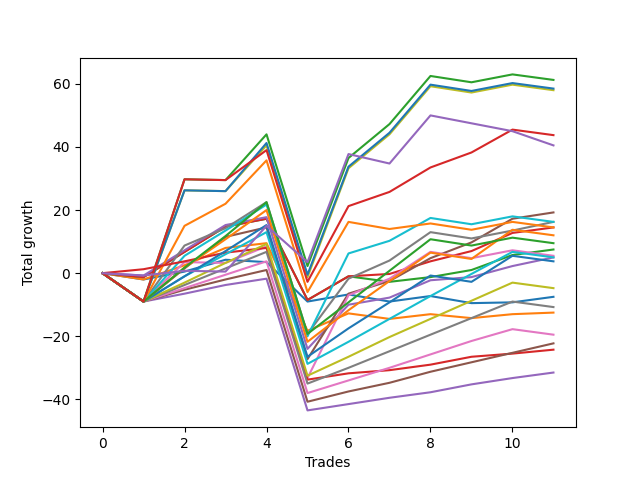

# Long Labrador 017 
- Symbol: ES_830-1130
- Date Range: 03/18/2022 - 12/30/2022
- Trading Period: 8:30-11:30
- Number of Trades: 11



| Name | Win Percent | Profit | Avg Profit / Trade | Avg Time / Trade |      | Name | Win Percent | Profit | Avg Profit / Trade | Avg Time / Trade |
| ---- | ----------- | ------ | ------------------ | ---------------- | ---- | ---- | ----------- | ------ | ------------------ | ---------------- |
| Sorted By <br> Profit | | | | | | Sorted By <br> Win Percentage ||||
| BB-200 U/L 2SD SL-10 | 54.55 | 45125.00 | 4102.27 | 55:42 |     | TP-1 | 90.91 | -12125.00 | -1102.27 | 09:00 |
| BB-100 U/L 2SD SL-10 | 54.55 | 43750.00 | 3977.27 | 55:17 |     | BB-50 U/L 1SD SL-10 | 81.82 | 24125.00 | 2193.18 | 27:05 |
| V U/L 1SD SL-10 | 54.55 | 43500.00 | 3954.55 | 54:10 |     | BB-50 Mid SL-10 | 81.82 | 17500.00 | 1590.91 | 15:39 |
| BB-200 U/L 2SD | 54.55 | 30625.00 | 2784.09 | 60:55 |     | BB-20 U/L 2SD C SL-10 | 81.82 | 14250.00 | 1295.45 | 14:42 |
| BB-100 U/L 2SD | 54.55 | 29250.00 | 2659.09 | 60:30 |     | BB-50 U/L 1SD | 81.82 | 9625.00 | 875.00 | 32:17 |
| V U/L 1SD | 54.55 | 29000.00 | 2636.36 | 59:23 |     | BB-20 U/L 2SD C | 81.82 | 7250.00 | 659.09 | 18:31 |
| BB-50 U/L 1SD SL-10 | 81.82 | 24125.00 | 2193.18 | 27:05 |     | BB-50 Mid | 81.82 | 2500.00 | 227.27 | 20:40 |
| V Mid SL-10 | 72.73 | 22625.00 | 2056.82 | 32:05 |     | TP-3 | 81.82 | -11125.00 | -1011.36 | 20:41 |
| BB-100 Mid SL-10 | 63.64 | 22625.00 | 2056.82 | 38:59 |     | TP-2 | 81.82 | -15750.00 | -1431.82 | 16:00 |
| NEWFI 000 | 63.64 | 21875.00 | 1988.64 | 47:27 |     | V Mid SL-10 | 72.73 | 22625.00 | 2056.82 | 32:05 |
| BB-200 Mid SL-10 | 54.55 | 21750.00 | 1977.27 | 33:08 |     | BB-20 U/L 2SD SL-10 | 72.73 | 10750.00 | 977.27 | 14:18 |
| NEWFI 0000 | 36.36 | 20250.00 | 1840.91 | 30:35 |     | V Mid | 72.73 | 8125.00 | 738.64 | 37:17 |
| BB-50 Mid SL-10 | 81.82 | 17500.00 | 1590.91 | 15:39 |     | BB-20 U/L 2SD | 72.73 | 3750.00 | 340.91 | 18:07 |
| BB-50 U/L 2SD SL-10 | 54.55 | 17250.00 | 1568.18 | 41:32 |     | TP-7 | 72.73 | 2500.00 | 227.27 | 33:17 |
| BB-20 U/L 2SD C SL-10 | 81.82 | 14250.00 | 1295.45 | 14:42 |     | TP-6 | 72.73 | -2375.00 | -215.91 | 30:01 |
| BB-100 U/L 2SD SL-5 | 27.27 | 13125.00 | 1193.18 | 26:07 |     | TP-5 | 72.73 | -5375.00 | -488.64 | 28:44 |
| V U/L 1SD SL-5 | 27.27 | 12875.00 | 1170.45 | 25:00 |     | TP-4 | 72.73 | -9750.00 | -886.36 | 25:24 |
| BB-200 U/L 2SD SL-5 | 27.27 | 12750.00 | 1159.09 | 26:08 |     | BB-100 Mid SL-10 | 63.64 | 22625.00 | 2056.82 | 38:59 |
| BB-20 U/L 2SD SL-10 | 72.73 | 10750.00 | 977.27 | 14:18 |     | NEWFI 000 | 63.64 | 21875.00 | 1988.64 | 47:27 |
| BB-50 U/L 1SD | 81.82 | 9625.00 | 875.00 | 32:17 |     | BB-100 Mid | 63.64 | 8125.00 | 738.64 | 44:11 |
| V Mid | 72.73 | 8125.00 | 738.64 | 37:17 |     | TP-9 | 63.64 | 6000.00 | 545.45 | 39:45 |
| BB-100 Mid | 63.64 | 8125.00 | 738.64 | 44:11 |     | TP-10 | 63.64 | 4750.00 | 431.82 | 43:28 |
| BB-20 U/L 2SD C | 81.82 | 7250.00 | 659.09 | 18:31 |     | TP-8 | 63.64 | 1875.00 | 170.45 | 36:31 |
| BB-200 Mid | 54.55 | 7250.00 | 659.09 | 38:21 |     | BB-20 U/L 1SD SL-10 | 63.64 | 1750.00 | 159.09 | 10:26 |
| TP-9 | 63.64 | 6000.00 | 545.45 | 39:45 |     | BB-20 U/L 1SD | 63.64 | -6250.00 | -568.18 | 14:13 |
| BB-100 Mid SL-5 | 36.36 | 5750.00 | 522.73 | 14:44 |     | BB-200 U/L 2SD SL-10 | 54.55 | 45125.00 | 4102.27 | 55:42 |
| TP-10 | 63.64 | 4750.00 | 431.82 | 43:28 |     | BB-100 U/L 2SD SL-10 | 54.55 | 43750.00 | 3977.27 | 55:17 |
| BB-20 U/L 2SD | 72.73 | 3750.00 | 340.91 | 18:07 |     | V U/L 1SD SL-10 | 54.55 | 43500.00 | 3954.55 | 54:10 |
| BB-200 Mid SL-5 | 36.36 | 3250.00 | 295.45 | 10:27 |     | BB-200 U/L 2SD | 54.55 | 30625.00 | 2784.09 | 60:55 |
| BB-50 U/L 2SD | 54.55 | 2750.00 | 250.00 | 46:45 |     | BB-100 U/L 2SD | 54.55 | 29250.00 | 2659.09 | 60:30 |
| BB-50 Mid | 81.82 | 2500.00 | 227.27 | 20:40 |     | V U/L 1SD | 54.55 | 29000.00 | 2636.36 | 59:23 |
| TP-7 | 72.73 | 2500.00 | 227.27 | 33:17 |     | BB-200 Mid SL-10 | 54.55 | 21750.00 | 1977.27 | 33:08 |
| TP-8 | 63.64 | 1875.00 | 170.45 | 36:31 |     | BB-50 U/L 2SD SL-10 | 54.55 | 17250.00 | 1568.18 | 41:32 |
| BB-20 U/L 1SD SL-10 | 63.64 | 1750.00 | 159.09 | 10:26 |     | BB-200 Mid | 54.55 | 7250.00 | 659.09 | 38:21 |
| BB-50 U/L 1SD SL-5 | 36.36 | 1375.00 | 125.00 | 11:46 |     | BB-50 U/L 2SD | 54.55 | 2750.00 | 250.00 | 46:45 |
| V Mid SL-5 | 36.36 | 1000.00 | 90.91 | 11:03 |     | BB-20 Mid SL-10 | 54.55 | -3375.00 | -306.82 | 05:30 |
| BB-50 U/L 2SD SL-5 | 27.27 | 750.00 | 68.18 | 16:44 |     | BB-20 Mid | 54.55 | -3750.00 | -340.91 | 06:59 |
| TP-6 | 72.73 | -2375.00 | -215.91 | 30:01 |     | BB-20 U/L 1SD SL-5 | 45.45 | -7250.00 | -659.09 | 05:24 |
| BB-20 Mid SL-10 | 54.55 | -3375.00 | -306.82 | 05:30 |     | BB-20 Mid SL-5 | 45.45 | -8125.00 | -738.64 | 03:13 |
| BB-20 Mid | 54.55 | -3750.00 | -340.91 | 06:59 |     | NEWFI 0000 | 36.36 | 20250.00 | 1840.91 | 30:35 |
| BB-50 Mid SL-5 | 36.36 | -4125.00 | -375.00 | 07:27 |     | BB-100 Mid SL-5 | 36.36 | 5750.00 | 522.73 | 14:44 |
| TP-5 | 72.73 | -5375.00 | -488.64 | 28:44 |     | BB-200 Mid SL-5 | 36.36 | 3250.00 | 295.45 | 10:27 |
| BB-20 U/L 1SD | 63.64 | -6250.00 | -568.18 | 14:13 |     | BB-50 U/L 1SD SL-5 | 36.36 | 1375.00 | 125.00 | 11:46 |
| BB-20 U/L 1SD SL-5 | 45.45 | -7250.00 | -659.09 | 05:24 |     | V Mid SL-5 | 36.36 | 1000.00 | 90.91 | 11:03 |
| BB-20 Mid SL-5 | 45.45 | -8125.00 | -738.64 | 03:13 |     | BB-50 Mid SL-5 | 36.36 | -4125.00 | -375.00 | 07:27 |
| BB-20 U/L 2SD C SL-5 | 36.36 | -8125.00 | -738.64 | 06:37 |     | BB-20 U/L 2SD C SL-5 | 36.36 | -8125.00 | -738.64 | 06:37 |
| BB-20 U/L 2SD SL-5 | 36.36 | -9375.00 | -852.27 | 06:27 |     | BB-20 U/L 2SD SL-5 | 36.36 | -9375.00 | -852.27 | 06:27 |
| TP-4 | 72.73 | -9750.00 | -886.36 | 25:24 |     | BB-100 U/L 2SD SL-5 | 27.27 | 13125.00 | 1193.18 | 26:07 |
| TP-3 | 81.82 | -11125.00 | -1011.36 | 20:41 |     | V U/L 1SD SL-5 | 27.27 | 12875.00 | 1170.45 | 25:00 |
| TP-1 | 90.91 | -12125.00 | -1102.27 | 09:00 |     | BB-200 U/L 2SD SL-5 | 27.27 | 12750.00 | 1159.09 | 26:08 |
| TP-2 | 81.82 | -15750.00 | -1431.82 | 16:00 |     | BB-50 U/L 2SD SL-5 | 27.27 | 750.00 | 68.18 | 16:44 |

## NO STOPLOSS

### Test BB-20 Mid
* Sell when price hits the middle line of the 20p bollinger
* No Stoploss
* Results:
```
Total Trades: 11
Percent Up: 54.55
Percent Down: 45.45
Total Points Moved Up: -7.50
Potential Profit: -3750.00
Total Points Ups: 12.25 Count Ups: 6
Total Points Downs: -19.75 Count Downs: 5
```

<details><summary>Trades</summary>

<code>In: 2022-03-31 09:17:00		Out: 2022-03-31 09:32:35		Total Position Time: 15:35		Total Move Up: -2.00		Total to Date: -2.00</code> <br />
<code>In: 2022-05-13 11:18:00		Out: 2022-05-13 11:19:15		Total Position Time: 01:15		Total Move Up: 2.50		Total to Date: 0.50</code> <br />
<code>In: 2022-06-27 09:37:00		Out: 2022-06-27 09:41:05		Total Position Time: 04:05		Total Move Up: 3.75		Total to Date: 4.25</code> <br />
<code>In: 2022-07-08 10:07:00		Out: 2022-07-08 10:08:10		Total Position Time: 01:10		Total Move Up: -0.75		Total to Date: 3.50</code> <br />
<code>In: 2022-09-02 09:56:00		Out: 2022-09-02 10:18:10		Total Position Time: 22:10		Total Move Up: -12.50		Total to Date: -9.00</code> <br />
<code>In: 2022-09-08 09:25:00		Out: 2022-09-08 09:26:25		Total Position Time: 01:25		Total Move Up: 2.25		Total to Date: -6.75</code> <br />
<code>In: 2022-09-12 09:08:00		Out: 2022-09-12 09:12:10		Total Position Time: 04:10		Total Move Up: -2.25		Total to Date: -9.00</code> <br />
<code>In: 2022-09-12 09:13:00		Out: 2022-09-12 09:14:10		Total Position Time: 01:10		Total Move Up: 1.75		Total to Date: -7.25</code> <br />
<code>In: 2022-09-14 11:00:00		Out: 2022-09-14 11:15:30		Total Position Time: 15:30		Total Move Up: -2.25		Total to Date: -9.50</code> <br />
<code>In: 2022-09-14 11:07:00		Out: 2022-09-14 11:15:30		Total Position Time: 08:30		Total Move Up: 0.25		Total to Date: -9.25</code> <br />
<code>In: 2022-12-09 10:15:00		Out: 2022-12-09 10:16:50		Total Position Time: 01:50		Total Move Up: 1.75		Total to Date: -7.50</code> <br />


</details>

### Test BB-20 U/L 1SD
* Sell when the price hits the upper line of the 20p 1std bollinger
* No Stoploss
* Results:
```
Total Trades: 11
Percent Up: 63.64
Percent Down: 36.36
Total Points Moved Up: -12.50
Potential Profit: -6250.00
Total Points Ups: 20.25 Count Ups: 7
Total Points Downs: -32.75 Count Downs: 4
```

<details><summary>Trades</summary>

<code>In: 2022-03-31 09:17:00		Out: 2022-03-31 09:41:05		Total Position Time: 24:05		Total Move Up: -2.00		Total to Date: -2.00</code> <br />
<code>In: 2022-05-13 11:18:00		Out: 2022-05-13 11:20:05		Total Position Time: 02:05		Total Move Up: 4.50		Total to Date: 2.50</code> <br />
<code>In: 2022-06-27 09:37:00		Out: 2022-06-27 09:44:20		Total Position Time: 07:20		Total Move Up: 5.50		Total to Date: 8.00</code> <br />
<code>In: 2022-07-08 10:07:00		Out: 2022-07-08 10:09:40		Total Position Time: 02:40		Total Move Up: 1.50		Total to Date: 9.50</code> <br />
<code>In: 2022-09-02 09:56:00		Out: 2022-09-02 10:43:30		Total Position Time: 47:30		Total Move Up: -27.75		Total to Date: -18.25</code> <br />
<code>In: 2022-09-08 09:25:00		Out: 2022-09-08 09:29:00		Total Position Time: 04:00		Total Move Up: 5.50		Total to Date: -12.75</code> <br />
<code>In: 2022-09-12 09:08:00		Out: 2022-09-12 09:21:25		Total Position Time: 13:25		Total Move Up: -1.75		Total to Date: -14.50</code> <br />
<code>In: 2022-09-12 09:13:00		Out: 2022-09-12 09:21:25		Total Position Time: 08:25		Total Move Up: 1.50		Total to Date: -13.00</code> <br />
<code>In: 2022-09-14 11:00:00		Out: 2022-09-14 11:19:10		Total Position Time: 19:10		Total Move Up: -1.25		Total to Date: -14.25</code> <br />
<code>In: 2022-09-14 11:07:00		Out: 2022-09-14 11:19:10		Total Position Time: 12:10		Total Move Up: 1.25		Total to Date: -13.00</code> <br />
<code>In: 2022-12-09 10:15:00		Out: 2022-12-09 10:30:40		Total Position Time: 15:40		Total Move Up: 0.50		Total to Date: -12.50</code> <br />


</details>

### Test BB-20 U/L 2SD
* Sell when the price hits the upper line of the 20p 2std bollinger
* No Stoploss
* Results:
```
Total Trades: 11
Percent Up: 72.73
Percent Down: 27.27
Total Points Moved Up: 7.50
Potential Profit: 3750.00
Total Points Ups: 36.25 Count Ups: 8
Total Points Downs: -28.75 Count Downs: 3
```

<details><summary>Trades</summary>

<code>In: 2022-03-31 09:17:00		Out: 2022-03-31 09:44:20		Total Position Time: 27:20		Total Move Up: -1.25		Total to Date: -1.25</code> <br />
<code>In: 2022-05-13 11:18:00		Out: 2022-05-13 11:31:20		Total Position Time: 13:20		Total Move Up: 8.00		Total to Date: 6.75</code> <br />
<code>In: 2022-06-27 09:37:00		Out: 2022-06-27 09:45:05		Total Position Time: 08:05		Total Move Up: 8.00		Total to Date: 14.75</code> <br />
<code>In: 2022-07-08 10:07:00		Out: 2022-07-08 10:11:05		Total Position Time: 04:05		Total Move Up: 2.50		Total to Date: 17.25</code> <br />
<code>In: 2022-09-02 09:56:00		Out: 2022-09-02 10:43:50		Total Position Time: 47:50		Total Move Up: -25.75		Total to Date: -8.50</code> <br />
<code>In: 2022-09-08 09:25:00		Out: 2022-09-08 09:31:35		Total Position Time: 06:35		Total Move Up: 7.50		Total to Date: -1.00</code> <br />
<code>In: 2022-09-12 09:08:00		Out: 2022-09-12 09:21:25		Total Position Time: 13:25		Total Move Up: -1.75		Total to Date: -2.75</code> <br />
<code>In: 2022-09-12 09:13:00		Out: 2022-09-12 09:21:25		Total Position Time: 08:25		Total Move Up: 1.50		Total to Date: -1.25</code> <br />
<code>In: 2022-09-14 11:00:00		Out: 2022-09-14 11:30:30		Total Position Time: 30:30		Total Move Up: 2.25		Total to Date: 1.00</code> <br />
<code>In: 2022-09-14 11:07:00		Out: 2022-09-14 11:30:30		Total Position Time: 23:30		Total Move Up: 4.75		Total to Date: 5.75</code> <br />
<code>In: 2022-12-09 10:15:00		Out: 2022-12-09 10:31:15		Total Position Time: 16:15		Total Move Up: 1.75		Total to Date: 7.50</code> <br />


</details>

### Test BB-20 U/L 2SD C
* Sell when the price hits the upper line of the 20p 2std bollinger
* No Stoploss
* Results:
```
Total Trades: 11
Percent Up: 81.82
Percent Down: 18.18
Total Points Moved Up: 14.50
Potential Profit: 7250.00
Total Points Ups: 41.50 Count Ups: 9
Total Points Downs: -27.00 Count Downs: 2
```

<details><summary>Trades</summary>

<code>In: 2022-03-31 09:17:00		Out: 2022-03-31 09:44:20		Total Position Time: 27:20		Total Move Up: -1.25		Total to Date: -1.25</code> <br />
<code>In: 2022-05-13 11:18:00		Out: 2022-05-13 11:31:20		Total Position Time: 13:20		Total Move Up: 8.00		Total to Date: 6.75</code> <br />
<code>In: 2022-06-27 09:37:00		Out: 2022-06-27 09:45:05		Total Position Time: 08:05		Total Move Up: 8.00		Total to Date: 14.75</code> <br />
<code>In: 2022-07-08 10:07:00		Out: 2022-07-08 10:11:05		Total Position Time: 04:05		Total Move Up: 2.50		Total to Date: 17.25</code> <br />
<code>In: 2022-09-02 09:56:00		Out: 2022-09-02 10:43:50		Total Position Time: 47:50		Total Move Up: -25.75		Total to Date: -8.50</code> <br />
<code>In: 2022-09-08 09:25:00		Out: 2022-09-08 09:31:35		Total Position Time: 06:35		Total Move Up: 7.50		Total to Date: -1.00</code> <br />
<code>In: 2022-09-12 09:08:00		Out: 2022-09-12 09:23:10		Total Position Time: 15:10		Total Move Up: 0.75		Total to Date: -0.25</code> <br />
<code>In: 2022-09-12 09:13:00		Out: 2022-09-12 09:23:10		Total Position Time: 10:10		Total Move Up: 4.00		Total to Date: 3.75</code> <br />
<code>In: 2022-09-14 11:00:00		Out: 2022-09-14 11:30:55		Total Position Time: 30:55		Total Move Up: 3.25		Total to Date: 7.00</code> <br />
<code>In: 2022-09-14 11:07:00		Out: 2022-09-14 11:30:55		Total Position Time: 23:55		Total Move Up: 5.75		Total to Date: 12.75</code> <br />
<code>In: 2022-12-09 10:15:00		Out: 2022-12-09 10:31:20		Total Position Time: 16:20		Total Move Up: 1.75		Total to Date: 14.50</code> <br />


</details>

### Test BB-50 Mid
* Sell when price hits the middle line of the 50p bollinger
* No Stoploss
* Results:
```
Total Trades: 11
Percent Up: 81.82
Percent Down: 18.18
Total Points Moved Up: 5.00
Potential Profit: 2500.00
Total Points Ups: 47.50 Count Ups: 9
Total Points Downs: -42.50 Count Downs: 2
```

<details><summary>Trades</summary>

<code>In: 2022-03-31 09:17:00		Out: 2022-03-31 09:45:45		Total Position Time: 28:45		Total Move Up: -0.75		Total to Date: -0.75</code> <br />
<code>In: 2022-05-13 11:18:00		Out: 2022-05-13 11:31:20		Total Position Time: 13:20		Total Move Up: 8.00		Total to Date: 7.25</code> <br />
<code>In: 2022-06-27 09:37:00		Out: 2022-06-27 09:45:05		Total Position Time: 08:05		Total Move Up: 8.00		Total to Date: 15.25</code> <br />
<code>In: 2022-07-08 10:07:00		Out: 2022-07-08 10:11:10		Total Position Time: 04:10		Total Move Up: 2.50		Total to Date: 17.75</code> <br />
<code>In: 2022-09-02 09:56:00		Out: 2022-09-02 10:56:55		Total Position Time: 60:55		Total Move Up: -41.75		Total to Date: -24.00</code> <br />
<code>In: 2022-09-08 09:25:00		Out: 2022-09-08 09:39:40		Total Position Time: 14:40		Total Move Up: 14.00		Total to Date: -10.00</code> <br />
<code>In: 2022-09-12 09:08:00		Out: 2022-09-12 09:24:10		Total Position Time: 16:10		Total Move Up: 2.25		Total to Date: -7.75</code> <br />
<code>In: 2022-09-12 09:13:00		Out: 2022-09-12 09:24:10		Total Position Time: 11:10		Total Move Up: 5.50		Total to Date: -2.25</code> <br />
<code>In: 2022-09-14 11:00:00		Out: 2022-09-14 11:29:30		Total Position Time: 29:30		Total Move Up: 1.00		Total to Date: -1.25</code> <br />
<code>In: 2022-09-14 11:07:00		Out: 2022-09-14 11:29:30		Total Position Time: 22:30		Total Move Up: 3.50		Total to Date: 2.25</code> <br />
<code>In: 2022-12-09 10:15:00		Out: 2022-12-09 10:33:05		Total Position Time: 18:05		Total Move Up: 2.75		Total to Date: 5.00</code> <br />


</details>

### Test BB-50 U/L 1SD
* Sell when the price hits the upper line of the 50p 1std bollinger
* No Stoploss
* Results:
```
Total Trades: 11
Percent Up: 81.82
Percent Down: 18.18
Total Points Moved Up: 19.25
Potential Profit: 9625.00
Total Points Ups: 70.00 Count Ups: 9
Total Points Downs: -50.75 Count Downs: 2
```

<details><summary>Trades</summary>

<code>In: 2022-03-31 09:17:00		Out: 2022-03-31 10:17:55		Total Position Time: 60:55		Total Move Up: -9.00		Total to Date: -9.00</code> <br />
<code>In: 2022-05-13 11:18:00		Out: 2022-05-13 11:43:05		Total Position Time: 25:05		Total Move Up: 10.50		Total to Date: 1.50</code> <br />
<code>In: 2022-06-27 09:37:00		Out: 2022-06-27 09:53:20		Total Position Time: 16:20		Total Move Up: 10.00		Total to Date: 11.50</code> <br />
<code>In: 2022-07-08 10:07:00		Out: 2022-07-08 10:26:30		Total Position Time: 19:30		Total Move Up: 3.00		Total to Date: 14.50</code> <br />
<code>In: 2022-09-02 09:56:00		Out: 2022-09-02 10:56:55		Total Position Time: 60:55		Total Move Up: -41.75		Total to Date: -27.25</code> <br />
<code>In: 2022-09-08 09:25:00		Out: 2022-09-08 09:49:55		Total Position Time: 24:55		Total Move Up: 20.75		Total to Date: -6.50</code> <br />
<code>In: 2022-09-12 09:08:00		Out: 2022-09-12 09:37:50		Total Position Time: 29:50		Total Move Up: 4.00		Total to Date: -2.50</code> <br />
<code>In: 2022-09-12 09:13:00		Out: 2022-09-12 09:37:50		Total Position Time: 24:50		Total Move Up: 7.25		Total to Date: 4.75</code> <br />
<code>In: 2022-09-14 11:00:00		Out: 2022-09-14 11:32:05		Total Position Time: 32:05		Total Move Up: 5.00		Total to Date: 9.75</code> <br />
<code>In: 2022-09-14 11:07:00		Out: 2022-09-14 11:32:05		Total Position Time: 25:05		Total Move Up: 7.50		Total to Date: 17.25</code> <br />
<code>In: 2022-12-09 10:15:00		Out: 2022-12-09 10:50:45		Total Position Time: 35:45		Total Move Up: 2.00		Total to Date: 19.25</code> <br />


</details>

### Test BB-50 U/L 2SD
* Sell when the price hits the upper line of the 50p 2std bollinger
* No Stoploss
* Results:
```
Total Trades: 11
Percent Up: 54.55
Percent Down: 45.45
Total Points Moved Up: 5.50
Potential Profit: 2750.00
Total Points Ups: 60.25 Count Ups: 6
Total Points Downs: -54.75 Count Downs: 5
```

<details><summary>Trades</summary>

<code>In: 2022-03-31 09:17:00		Out: 2022-03-31 10:17:55		Total Position Time: 60:55		Total Move Up: -9.00		Total to Date: -9.00</code> <br />
<code>In: 2022-05-13 11:18:00		Out: 2022-05-13 11:51:10		Total Position Time: 33:10		Total Move Up: 12.50		Total to Date: 3.50</code> <br />
<code>In: 2022-06-27 09:37:00		Out: 2022-06-27 10:37:55		Total Position Time: 60:55		Total Move Up: -0.25		Total to Date: 3.25</code> <br />
<code>In: 2022-07-08 10:07:00		Out: 2022-07-08 10:27:00		Total Position Time: 20:00		Total Move Up: 5.25		Total to Date: 8.50</code> <br />
<code>In: 2022-09-02 09:56:00		Out: 2022-09-02 10:56:55		Total Position Time: 60:55		Total Move Up: -41.75		Total to Date: -33.25</code> <br />
<code>In: 2022-09-08 09:25:00		Out: 2022-09-08 09:53:05		Total Position Time: 28:05		Total Move Up: 26.25		Total to Date: -7.00</code> <br />
<code>In: 2022-09-12 09:08:00		Out: 2022-09-12 09:44:15		Total Position Time: 36:15		Total Move Up: 5.25		Total to Date: -1.75</code> <br />
<code>In: 2022-09-12 09:13:00		Out: 2022-09-12 09:44:15		Total Position Time: 31:15		Total Move Up: 8.50		Total to Date: 6.75</code> <br />
<code>In: 2022-09-14 11:00:00		Out: 2022-09-14 12:00:55		Total Position Time: 60:55		Total Move Up: -2.00		Total to Date: 4.75</code> <br />
<code>In: 2022-09-14 11:07:00		Out: 2022-09-14 12:07:55		Total Position Time: 60:55		Total Move Up: 2.50		Total to Date: 7.25</code> <br />
<code>In: 2022-12-09 10:15:00		Out: 2022-12-09 11:15:55		Total Position Time: 60:55		Total Move Up: -1.75		Total to Date: 5.50</code> <br />


</details>

### Test V Mid
* Sell when the price hits the middle line of the 1std VWAP
* No Stoploss
* Results:
```
Total Trades: 11
Percent Up: 72.73
Percent Down: 27.27
Total Points Moved Up: 16.25
Potential Profit: 8125.00
Total Points Ups: 69.00 Count Ups: 8
Total Points Downs: -52.75 Count Downs: 3
```

<details><summary>Trades</summary>

<code>In: 2022-03-31 09:17:00		Out: 2022-03-31 10:17:55		Total Position Time: 60:55		Total Move Up: -9.00		Total to Date: -9.00</code> <br />
<code>In: 2022-05-13 11:18:00		Out: 2022-05-13 11:52:25		Total Position Time: 34:25		Total Move Up: 17.75		Total to Date: 8.75</code> <br />
<code>In: 2022-06-27 09:37:00		Out: 2022-06-27 09:44:20		Total Position Time: 07:20		Total Move Up: 5.50		Total to Date: 14.25</code> <br />
<code>In: 2022-07-08 10:07:00		Out: 2022-07-08 10:29:10		Total Position Time: 22:10		Total Move Up: 8.25		Total to Date: 22.50</code> <br />
<code>In: 2022-09-02 09:56:00		Out: 2022-09-02 10:56:55		Total Position Time: 60:55		Total Move Up: -41.75		Total to Date: -19.25</code> <br />
<code>In: 2022-09-08 09:25:00		Out: 2022-09-08 09:41:45		Total Position Time: 16:45		Total Move Up: 17.50		Total to Date: -1.75</code> <br />
<code>In: 2022-09-12 09:08:00		Out: 2022-09-12 09:44:25		Total Position Time: 36:25		Total Move Up: 5.75		Total to Date: 4.00</code> <br />
<code>In: 2022-09-12 09:13:00		Out: 2022-09-12 09:44:25		Total Position Time: 31:25		Total Move Up: 9.00		Total to Date: 13.00</code> <br />
<code>In: 2022-09-14 11:00:00		Out: 2022-09-14 12:00:55		Total Position Time: 60:55		Total Move Up: -2.00		Total to Date: 11.00</code> <br />
<code>In: 2022-09-14 11:07:00		Out: 2022-09-14 12:07:55		Total Position Time: 60:55		Total Move Up: 2.50		Total to Date: 13.50</code> <br />
<code>In: 2022-12-09 10:15:00		Out: 2022-12-09 10:33:05		Total Position Time: 18:05		Total Move Up: 2.75		Total to Date: 16.25</code> <br />


</details>

### Test V U/L 1SD
* Sell when the price hits the upper line of the 1std VWAP
* No Stoploss
* Results:
```
Total Trades: 11
Percent Up: 54.55
Percent Down: 45.45
Total Points Moved Up: 58.00
Potential Profit: 29000.00
Total Points Ups: 112.75 Count Ups: 6
Total Points Downs: -54.75 Count Downs: 5
```

<details><summary>Trades</summary>

<code>In: 2022-03-31 09:17:00		Out: 2022-03-31 10:17:55		Total Position Time: 60:55		Total Move Up: -9.00		Total to Date: -9.00</code> <br />
<code>In: 2022-05-13 11:18:00		Out: 2022-05-13 12:14:40		Total Position Time: 56:40		Total Move Up: 35.25		Total to Date: 26.25</code> <br />
<code>In: 2022-06-27 09:37:00		Out: 2022-06-27 10:37:55		Total Position Time: 60:55		Total Move Up: -0.25		Total to Date: 26.00</code> <br />
<code>In: 2022-07-08 10:07:00		Out: 2022-07-08 11:07:55		Total Position Time: 60:55		Total Move Up: 14.50		Total to Date: 40.50</code> <br />
<code>In: 2022-09-02 09:56:00		Out: 2022-09-02 10:56:55		Total Position Time: 60:55		Total Move Up: -41.75		Total to Date: -1.25</code> <br />
<code>In: 2022-09-08 09:25:00		Out: 2022-09-08 10:13:25		Total Position Time: 48:25		Total Move Up: 34.50		Total to Date: 33.25</code> <br />
<code>In: 2022-09-12 09:08:00		Out: 2022-09-12 10:08:55		Total Position Time: 60:55		Total Move Up: 10.75		Total to Date: 44.00</code> <br />
<code>In: 2022-09-12 09:13:00		Out: 2022-09-12 10:13:55		Total Position Time: 60:55		Total Move Up: 15.25		Total to Date: 59.25</code> <br />
<code>In: 2022-09-14 11:00:00		Out: 2022-09-14 12:00:55		Total Position Time: 60:55		Total Move Up: -2.00		Total to Date: 57.25</code> <br />
<code>In: 2022-09-14 11:07:00		Out: 2022-09-14 12:07:55		Total Position Time: 60:55		Total Move Up: 2.50		Total to Date: 59.75</code> <br />
<code>In: 2022-12-09 10:15:00		Out: 2022-12-09 11:15:55		Total Position Time: 60:55		Total Move Up: -1.75		Total to Date: 58.00</code> <br />


</details>

### Test BB-100 Mid
* Move to BB100 Mid
* No Stoploss
* Results:
```
Total Trades: 11
Percent Up: 63.64
Percent Down: 36.36
Total Points Moved Up: 16.25
Potential Profit: 8125.00
Total Points Ups: 70.75 Count Ups: 7
Total Points Downs: -54.50 Count Downs: 4
```

<details><summary>Trades</summary>

<code>In: 2022-03-31 09:17:00		Out: 2022-03-31 10:17:55		Total Position Time: 60:55		Total Move Up: -9.00		Total to Date: -9.00</code> <br />
<code>In: 2022-05-13 11:18:00		Out: 2022-05-13 11:51:35		Total Position Time: 33:35		Total Move Up: 14.50		Total to Date: 5.50</code> <br />
<code>In: 2022-06-27 09:37:00		Out: 2022-06-27 10:20:05		Total Position Time: 43:05		Total Move Up: 8.00		Total to Date: 13.50</code> <br />
<code>In: 2022-07-08 10:07:00		Out: 2022-07-08 10:29:10		Total Position Time: 22:10		Total Move Up: 8.25		Total to Date: 21.75</code> <br />
<code>In: 2022-09-02 09:56:00		Out: 2022-09-02 10:56:55		Total Position Time: 60:55		Total Move Up: -41.75		Total to Date: -20.00</code> <br />
<code>In: 2022-09-08 09:25:00		Out: 2022-09-08 09:53:05		Total Position Time: 28:05		Total Move Up: 26.25		Total to Date: 6.25</code> <br />
<code>In: 2022-09-12 09:08:00		Out: 2022-09-12 09:37:50		Total Position Time: 29:50		Total Move Up: 4.00		Total to Date: 10.25</code> <br />
<code>In: 2022-09-12 09:13:00		Out: 2022-09-12 09:37:50		Total Position Time: 24:50		Total Move Up: 7.25		Total to Date: 17.50</code> <br />
<code>In: 2022-09-14 11:00:00		Out: 2022-09-14 12:00:55		Total Position Time: 60:55		Total Move Up: -2.00		Total to Date: 15.50</code> <br />
<code>In: 2022-09-14 11:07:00		Out: 2022-09-14 12:07:55		Total Position Time: 60:55		Total Move Up: 2.50		Total to Date: 18.00</code> <br />
<code>In: 2022-12-09 10:15:00		Out: 2022-12-09 11:15:55		Total Position Time: 60:55		Total Move Up: -1.75		Total to Date: 16.25</code> <br />


</details>

### Test BB-100 U/L 2SD
* Move to BB100 Upper Band
* No Stoploss
* Results:
```
Total Trades: 11
Percent Up: 54.55
Percent Down: 45.45
Total Points Moved Up: 58.50
Potential Profit: 29250.00
Total Points Ups: 113.25 Count Ups: 6
Total Points Downs: -54.75 Count Downs: 5
```

<details><summary>Trades</summary>

<code>In: 2022-03-31 09:17:00		Out: 2022-03-31 10:17:55		Total Position Time: 60:55		Total Move Up: -9.00		Total to Date: -9.00</code> <br />
<code>In: 2022-05-13 11:18:00		Out: 2022-05-13 12:14:40		Total Position Time: 56:40		Total Move Up: 35.25		Total to Date: 26.25</code> <br />
<code>In: 2022-06-27 09:37:00		Out: 2022-06-27 10:37:55		Total Position Time: 60:55		Total Move Up: -0.25		Total to Date: 26.00</code> <br />
<code>In: 2022-07-08 10:07:00		Out: 2022-07-08 11:07:40		Total Position Time: 60:40		Total Move Up: 15.25		Total to Date: 41.25</code> <br />
<code>In: 2022-09-02 09:56:00		Out: 2022-09-02 10:56:55		Total Position Time: 60:55		Total Move Up: -41.75		Total to Date: -0.50</code> <br />
<code>In: 2022-09-08 09:25:00		Out: 2022-09-08 10:25:55		Total Position Time: 60:55		Total Move Up: 34.25		Total to Date: 33.75</code> <br />
<code>In: 2022-09-12 09:08:00		Out: 2022-09-12 10:08:55		Total Position Time: 60:55		Total Move Up: 10.75		Total to Date: 44.50</code> <br />
<code>In: 2022-09-12 09:13:00		Out: 2022-09-12 10:13:55		Total Position Time: 60:55		Total Move Up: 15.25		Total to Date: 59.75</code> <br />
<code>In: 2022-09-14 11:00:00		Out: 2022-09-14 12:00:55		Total Position Time: 60:55		Total Move Up: -2.00		Total to Date: 57.75</code> <br />
<code>In: 2022-09-14 11:07:00		Out: 2022-09-14 12:07:55		Total Position Time: 60:55		Total Move Up: 2.50		Total to Date: 60.25</code> <br />
<code>In: 2022-12-09 10:15:00		Out: 2022-12-09 11:15:55		Total Position Time: 60:55		Total Move Up: -1.75		Total to Date: 58.50</code> <br />


</details>

### Test BB-200 Mid
* Move to BB200 Mid
* No Stoploss
* Results:
```
Total Trades: 11
Percent Up: 54.55
Percent Down: 45.45
Total Points Moved Up: 14.50
Potential Profit: 7250.00
Total Points Ups: 71.25 Count Ups: 6
Total Points Downs: -56.75 Count Downs: 5
```

<details><summary>Trades</summary>

<code>In: 2022-03-31 09:17:00		Out: 2022-03-31 10:17:55		Total Position Time: 60:55		Total Move Up: -9.00		Total to Date: -9.00</code> <br />
<code>In: 2022-05-13 11:18:00		Out: 2022-05-13 12:00:05		Total Position Time: 42:05		Total Move Up: 24.00		Total to Date: 15.00</code> <br />
<code>In: 2022-06-27 09:37:00		Out: 2022-06-27 09:45:00		Total Position Time: 08:00		Total Move Up: 7.00		Total to Date: 22.00</code> <br />
<code>In: 2022-07-08 10:07:00		Out: 2022-07-08 10:49:25		Total Position Time: 42:25		Total Move Up: 13.75		Total to Date: 35.75</code> <br />
<code>In: 2022-09-02 09:56:00		Out: 2022-09-02 10:56:55		Total Position Time: 60:55		Total Move Up: -41.75		Total to Date: -6.00</code> <br />
<code>In: 2022-09-08 09:25:00		Out: 2022-09-08 09:44:25		Total Position Time: 19:25		Total Move Up: 22.25		Total to Date: 16.25</code> <br />
<code>In: 2022-09-12 09:08:00		Out: 2022-09-12 09:12:10		Total Position Time: 04:10		Total Move Up: -2.25		Total to Date: 14.00</code> <br />
<code>In: 2022-09-12 09:13:00		Out: 2022-09-12 09:14:15		Total Position Time: 01:15		Total Move Up: 1.75		Total to Date: 15.75</code> <br />
<code>In: 2022-09-14 11:00:00		Out: 2022-09-14 12:00:55		Total Position Time: 60:55		Total Move Up: -2.00		Total to Date: 13.75</code> <br />
<code>In: 2022-09-14 11:07:00		Out: 2022-09-14 12:07:55		Total Position Time: 60:55		Total Move Up: 2.50		Total to Date: 16.25</code> <br />
<code>In: 2022-12-09 10:15:00		Out: 2022-12-09 11:15:55		Total Position Time: 60:55		Total Move Up: -1.75		Total to Date: 14.50</code> <br />


</details>

### Test BB-200 U/L 2SD
* Move to BB200 Upper Band
* No Stoploss
* Results:
```
Total Trades: 11
Percent Up: 54.55
Percent Down: 45.45
Total Points Moved Up: 61.25
Potential Profit: 30625.00
Total Points Ups: 116.00 Count Ups: 6
Total Points Downs: -54.75 Count Downs: 5
```

<details><summary>Trades</summary>

<code>In: 2022-03-31 09:17:00		Out: 2022-03-31 10:17:55		Total Position Time: 60:55		Total Move Up: -9.00		Total to Date: -9.00</code> <br />
<code>In: 2022-05-13 11:18:00		Out: 2022-05-13 12:18:55		Total Position Time: 60:55		Total Move Up: 38.75		Total to Date: 29.75</code> <br />
<code>In: 2022-06-27 09:37:00		Out: 2022-06-27 10:37:55		Total Position Time: 60:55		Total Move Up: -0.25		Total to Date: 29.50</code> <br />
<code>In: 2022-07-08 10:07:00		Out: 2022-07-08 11:07:55		Total Position Time: 60:55		Total Move Up: 14.50		Total to Date: 44.00</code> <br />
<code>In: 2022-09-02 09:56:00		Out: 2022-09-02 10:56:55		Total Position Time: 60:55		Total Move Up: -41.75		Total to Date: 2.25</code> <br />
<code>In: 2022-09-08 09:25:00		Out: 2022-09-08 10:25:55		Total Position Time: 60:55		Total Move Up: 34.25		Total to Date: 36.50</code> <br />
<code>In: 2022-09-12 09:08:00		Out: 2022-09-12 10:08:55		Total Position Time: 60:55		Total Move Up: 10.75		Total to Date: 47.25</code> <br />
<code>In: 2022-09-12 09:13:00		Out: 2022-09-12 10:13:55		Total Position Time: 60:55		Total Move Up: 15.25		Total to Date: 62.50</code> <br />
<code>In: 2022-09-14 11:00:00		Out: 2022-09-14 12:00:55		Total Position Time: 60:55		Total Move Up: -2.00		Total to Date: 60.50</code> <br />
<code>In: 2022-09-14 11:07:00		Out: 2022-09-14 12:07:55		Total Position Time: 60:55		Total Move Up: 2.50		Total to Date: 63.00</code> <br />
<code>In: 2022-12-09 10:15:00		Out: 2022-12-09 11:15:55		Total Position Time: 60:55		Total Move Up: -1.75		Total to Date: 61.25</code> <br />


</details>

## STOPLOSS OF 5

### Test BB-20 Mid SL-5
* Sell when price hits the middle line of the 20p bollinger
* Stoploss is 5 points
* Results:
```
Total Trades: 11
Percent Up: 45.45
Percent Down: 54.55
Total Points Moved Up: -16.25
Potential Profit: -8125.00
Total Points Ups: 12.00 Count Ups: 5
Total Points Downs: -28.25 Count Downs: 6
```

<details><summary>Trades</summary>

<code>In: 2022-03-31 09:17:00		Out: 2022-03-31 09:26:20		Total Position Time: 09:20		Total Move Up: -5.00		Total to Date: -5.00</code> <br />
<code>In: 2022-05-13 11:18:00		Out: 2022-05-13 11:19:15		Total Position Time: 01:15		Total Move Up: 2.50		Total to Date: -2.50</code> <br />
<code>In: 2022-06-27 09:37:00		Out: 2022-06-27 09:41:05		Total Position Time: 04:05		Total Move Up: 3.75		Total to Date: 1.25</code> <br />
<code>In: 2022-07-08 10:07:00		Out: 2022-07-08 10:08:10		Total Position Time: 01:10		Total Move Up: -0.75		Total to Date: 0.50</code> <br />
<code>In: 2022-09-02 09:56:00		Out: 2022-09-02 10:00:30		Total Position Time: 04:30		Total Move Up: -5.50		Total to Date: -5.00</code> <br />
<code>In: 2022-09-08 09:25:00		Out: 2022-09-08 09:26:25		Total Position Time: 01:25		Total Move Up: 2.25		Total to Date: -2.75</code> <br />
<code>In: 2022-09-12 09:08:00		Out: 2022-09-12 09:09:20		Total Position Time: 01:20		Total Move Up: -6.25		Total to Date: -9.00</code> <br />
<code>In: 2022-09-12 09:13:00		Out: 2022-09-12 09:14:10		Total Position Time: 01:10		Total Move Up: 1.75		Total to Date: -7.25</code> <br />
<code>In: 2022-09-14 11:00:00		Out: 2022-09-14 11:04:20		Total Position Time: 04:20		Total Move Up: -5.00		Total to Date: -12.25</code> <br />
<code>In: 2022-09-14 11:07:00		Out: 2022-09-14 11:12:05		Total Position Time: 05:05		Total Move Up: -5.75		Total to Date: -18.00</code> <br />
<code>In: 2022-12-09 10:15:00		Out: 2022-12-09 10:16:50		Total Position Time: 01:50		Total Move Up: 1.75		Total to Date: -16.25</code> <br />


</details>

### Test BB-20 U/L 1SD SL-5
* Sell when the price hits the upper line of the 20p 1std bollinger
* Stoploss is 5 points
* Results:
```
Total Trades: 11
Percent Up: 45.45
Percent Down: 54.55
Total Points Moved Up: -14.50
Potential Profit: -7250.00
Total Points Ups: 18.50 Count Ups: 5
Total Points Downs: -33.00 Count Downs: 6
```

<details><summary>Trades</summary>

<code>In: 2022-03-31 09:17:00		Out: 2022-03-31 09:26:20		Total Position Time: 09:20		Total Move Up: -5.00		Total to Date: -5.00</code> <br />
<code>In: 2022-05-13 11:18:00		Out: 2022-05-13 11:20:05		Total Position Time: 02:05		Total Move Up: 4.50		Total to Date: -0.50</code> <br />
<code>In: 2022-06-27 09:37:00		Out: 2022-06-27 09:44:20		Total Position Time: 07:20		Total Move Up: 5.50		Total to Date: 5.00</code> <br />
<code>In: 2022-07-08 10:07:00		Out: 2022-07-08 10:09:40		Total Position Time: 02:40		Total Move Up: 1.50		Total to Date: 6.50</code> <br />
<code>In: 2022-09-02 09:56:00		Out: 2022-09-02 10:00:30		Total Position Time: 04:30		Total Move Up: -5.50		Total to Date: 1.00</code> <br />
<code>In: 2022-09-08 09:25:00		Out: 2022-09-08 09:29:00		Total Position Time: 04:00		Total Move Up: 5.50		Total to Date: 6.50</code> <br />
<code>In: 2022-09-12 09:08:00		Out: 2022-09-12 09:09:20		Total Position Time: 01:20		Total Move Up: -6.25		Total to Date: 0.25</code> <br />
<code>In: 2022-09-12 09:13:00		Out: 2022-09-12 09:21:25		Total Position Time: 08:25		Total Move Up: 1.50		Total to Date: 1.75</code> <br />
<code>In: 2022-09-14 11:00:00		Out: 2022-09-14 11:04:20		Total Position Time: 04:20		Total Move Up: -5.00		Total to Date: -3.25</code> <br />
<code>In: 2022-09-14 11:07:00		Out: 2022-09-14 11:12:05		Total Position Time: 05:05		Total Move Up: -5.75		Total to Date: -9.00</code> <br />
<code>In: 2022-12-09 10:15:00		Out: 2022-12-09 10:25:20		Total Position Time: 10:20		Total Move Up: -5.50		Total to Date: -14.50</code> <br />


</details>

### Test BB-20 U/L 2SD SL-5
* Sell when the price hits the upper line of the 20p 2std bollinger
* Stoploss is 5 points
* Results:
```
Total Trades: 11
Percent Up: 36.36
Percent Down: 63.64
Total Points Moved Up: -18.75
Potential Profit: -9375.00
Total Points Ups: 19.50 Count Ups: 4
Total Points Downs: -38.25 Count Downs: 7
```

<details><summary>Trades</summary>

<code>In: 2022-03-31 09:17:00		Out: 2022-03-31 09:26:20		Total Position Time: 09:20		Total Move Up: -5.00		Total to Date: -5.00</code> <br />
<code>In: 2022-05-13 11:18:00		Out: 2022-05-13 11:27:00		Total Position Time: 09:00		Total Move Up: -5.25		Total to Date: -10.25</code> <br />
<code>In: 2022-06-27 09:37:00		Out: 2022-06-27 09:45:05		Total Position Time: 08:05		Total Move Up: 8.00		Total to Date: -2.25</code> <br />
<code>In: 2022-07-08 10:07:00		Out: 2022-07-08 10:11:05		Total Position Time: 04:05		Total Move Up: 2.50		Total to Date: 0.25</code> <br />
<code>In: 2022-09-02 09:56:00		Out: 2022-09-02 10:00:30		Total Position Time: 04:30		Total Move Up: -5.50		Total to Date: -5.25</code> <br />
<code>In: 2022-09-08 09:25:00		Out: 2022-09-08 09:31:35		Total Position Time: 06:35		Total Move Up: 7.50		Total to Date: 2.25</code> <br />
<code>In: 2022-09-12 09:08:00		Out: 2022-09-12 09:09:20		Total Position Time: 01:20		Total Move Up: -6.25		Total to Date: -4.00</code> <br />
<code>In: 2022-09-12 09:13:00		Out: 2022-09-12 09:21:25		Total Position Time: 08:25		Total Move Up: 1.50		Total to Date: -2.50</code> <br />
<code>In: 2022-09-14 11:00:00		Out: 2022-09-14 11:04:20		Total Position Time: 04:20		Total Move Up: -5.00		Total to Date: -7.50</code> <br />
<code>In: 2022-09-14 11:07:00		Out: 2022-09-14 11:12:05		Total Position Time: 05:05		Total Move Up: -5.75		Total to Date: -13.25</code> <br />
<code>In: 2022-12-09 10:15:00		Out: 2022-12-09 10:25:20		Total Position Time: 10:20		Total Move Up: -5.50		Total to Date: -18.75</code> <br />


</details>

### Test BB-20 U/L 2SD C SL-5
* Sell when the price hits the upper line of the 20p 2std bollinger
* Stoploss is 5 points
* Results:
```
Total Trades: 11
Percent Up: 36.36
Percent Down: 63.64
Total Points Moved Up: -16.25
Potential Profit: -8125.00
Total Points Ups: 22.00 Count Ups: 4
Total Points Downs: -38.25 Count Downs: 7
```

<details><summary>Trades</summary>

<code>In: 2022-03-31 09:17:00		Out: 2022-03-31 09:26:20		Total Position Time: 09:20		Total Move Up: -5.00		Total to Date: -5.00</code> <br />
<code>In: 2022-05-13 11:18:00		Out: 2022-05-13 11:27:00		Total Position Time: 09:00		Total Move Up: -5.25		Total to Date: -10.25</code> <br />
<code>In: 2022-06-27 09:37:00		Out: 2022-06-27 09:45:05		Total Position Time: 08:05		Total Move Up: 8.00		Total to Date: -2.25</code> <br />
<code>In: 2022-07-08 10:07:00		Out: 2022-07-08 10:11:05		Total Position Time: 04:05		Total Move Up: 2.50		Total to Date: 0.25</code> <br />
<code>In: 2022-09-02 09:56:00		Out: 2022-09-02 10:00:30		Total Position Time: 04:30		Total Move Up: -5.50		Total to Date: -5.25</code> <br />
<code>In: 2022-09-08 09:25:00		Out: 2022-09-08 09:31:35		Total Position Time: 06:35		Total Move Up: 7.50		Total to Date: 2.25</code> <br />
<code>In: 2022-09-12 09:08:00		Out: 2022-09-12 09:09:20		Total Position Time: 01:20		Total Move Up: -6.25		Total to Date: -4.00</code> <br />
<code>In: 2022-09-12 09:13:00		Out: 2022-09-12 09:23:10		Total Position Time: 10:10		Total Move Up: 4.00		Total to Date: 0.00</code> <br />
<code>In: 2022-09-14 11:00:00		Out: 2022-09-14 11:04:20		Total Position Time: 04:20		Total Move Up: -5.00		Total to Date: -5.00</code> <br />
<code>In: 2022-09-14 11:07:00		Out: 2022-09-14 11:12:05		Total Position Time: 05:05		Total Move Up: -5.75		Total to Date: -10.75</code> <br />
<code>In: 2022-12-09 10:15:00		Out: 2022-12-09 10:25:20		Total Position Time: 10:20		Total Move Up: -5.50		Total to Date: -16.25</code> <br />


</details>

### Test BB-50 Mid SL-5
* Sell when price hits the middle line of the 50p bollinger
* Stoploss is 5 points
* Results:
```
Total Trades: 11
Percent Up: 36.36
Percent Down: 63.64
Total Points Moved Up: -8.25
Potential Profit: -4125.00
Total Points Ups: 30.00 Count Ups: 4
Total Points Downs: -38.25 Count Downs: 7
```

<details><summary>Trades</summary>

<code>In: 2022-03-31 09:17:00		Out: 2022-03-31 09:26:20		Total Position Time: 09:20		Total Move Up: -5.00		Total to Date: -5.00</code> <br />
<code>In: 2022-05-13 11:18:00		Out: 2022-05-13 11:27:00		Total Position Time: 09:00		Total Move Up: -5.25		Total to Date: -10.25</code> <br />
<code>In: 2022-06-27 09:37:00		Out: 2022-06-27 09:45:05		Total Position Time: 08:05		Total Move Up: 8.00		Total to Date: -2.25</code> <br />
<code>In: 2022-07-08 10:07:00		Out: 2022-07-08 10:11:10		Total Position Time: 04:10		Total Move Up: 2.50		Total to Date: 0.25</code> <br />
<code>In: 2022-09-02 09:56:00		Out: 2022-09-02 10:00:30		Total Position Time: 04:30		Total Move Up: -5.50		Total to Date: -5.25</code> <br />
<code>In: 2022-09-08 09:25:00		Out: 2022-09-08 09:39:40		Total Position Time: 14:40		Total Move Up: 14.00		Total to Date: 8.75</code> <br />
<code>In: 2022-09-12 09:08:00		Out: 2022-09-12 09:09:20		Total Position Time: 01:20		Total Move Up: -6.25		Total to Date: 2.50</code> <br />
<code>In: 2022-09-12 09:13:00		Out: 2022-09-12 09:24:10		Total Position Time: 11:10		Total Move Up: 5.50		Total to Date: 8.00</code> <br />
<code>In: 2022-09-14 11:00:00		Out: 2022-09-14 11:04:20		Total Position Time: 04:20		Total Move Up: -5.00		Total to Date: 3.00</code> <br />
<code>In: 2022-09-14 11:07:00		Out: 2022-09-14 11:12:05		Total Position Time: 05:05		Total Move Up: -5.75		Total to Date: -2.75</code> <br />
<code>In: 2022-12-09 10:15:00		Out: 2022-12-09 10:25:20		Total Position Time: 10:20		Total Move Up: -5.50		Total to Date: -8.25</code> <br />


</details>

### Test BB-50 U/L 1SD SL-5
* Sell when the price hits the upper line of the 50p 1std bollinger
* Stoploss is 5 points
* Results:
```
Total Trades: 11
Percent Up: 36.36
Percent Down: 63.64
Total Points Moved Up: 2.75
Potential Profit: 1375.00
Total Points Ups: 41.00 Count Ups: 4
Total Points Downs: -38.25 Count Downs: 7
```

<details><summary>Trades</summary>

<code>In: 2022-03-31 09:17:00		Out: 2022-03-31 09:26:20		Total Position Time: 09:20		Total Move Up: -5.00		Total to Date: -5.00</code> <br />
<code>In: 2022-05-13 11:18:00		Out: 2022-05-13 11:27:00		Total Position Time: 09:00		Total Move Up: -5.25		Total to Date: -10.25</code> <br />
<code>In: 2022-06-27 09:37:00		Out: 2022-06-27 09:53:20		Total Position Time: 16:20		Total Move Up: 10.00		Total to Date: -0.25</code> <br />
<code>In: 2022-07-08 10:07:00		Out: 2022-07-08 10:26:30		Total Position Time: 19:30		Total Move Up: 3.00		Total to Date: 2.75</code> <br />
<code>In: 2022-09-02 09:56:00		Out: 2022-09-02 10:00:30		Total Position Time: 04:30		Total Move Up: -5.50		Total to Date: -2.75</code> <br />
<code>In: 2022-09-08 09:25:00		Out: 2022-09-08 09:49:55		Total Position Time: 24:55		Total Move Up: 20.75		Total to Date: 18.00</code> <br />
<code>In: 2022-09-12 09:08:00		Out: 2022-09-12 09:09:20		Total Position Time: 01:20		Total Move Up: -6.25		Total to Date: 11.75</code> <br />
<code>In: 2022-09-12 09:13:00		Out: 2022-09-12 09:37:50		Total Position Time: 24:50		Total Move Up: 7.25		Total to Date: 19.00</code> <br />
<code>In: 2022-09-14 11:00:00		Out: 2022-09-14 11:04:20		Total Position Time: 04:20		Total Move Up: -5.00		Total to Date: 14.00</code> <br />
<code>In: 2022-09-14 11:07:00		Out: 2022-09-14 11:12:05		Total Position Time: 05:05		Total Move Up: -5.75		Total to Date: 8.25</code> <br />
<code>In: 2022-12-09 10:15:00		Out: 2022-12-09 10:25:20		Total Position Time: 10:20		Total Move Up: -5.50		Total to Date: 2.75</code> <br />


</details>

### Test BB-50 U/L 2SD SL-5
* Sell when the price hits the upper line of the 50p 2std bollinger
* Stoploss is 5 points
* Results:
```
Total Trades: 11
Percent Up: 27.27
Percent Down: 72.73
Total Points Moved Up: 1.50
Potential Profit: 750.00
Total Points Ups: 40.00 Count Ups: 3
Total Points Downs: -38.50 Count Downs: 8
```

<details><summary>Trades</summary>

<code>In: 2022-03-31 09:17:00		Out: 2022-03-31 09:26:20		Total Position Time: 09:20		Total Move Up: -5.00		Total to Date: -5.00</code> <br />
<code>In: 2022-05-13 11:18:00		Out: 2022-05-13 11:27:00		Total Position Time: 09:00		Total Move Up: -5.25		Total to Date: -10.25</code> <br />
<code>In: 2022-06-27 09:37:00		Out: 2022-06-27 10:37:55		Total Position Time: 60:55		Total Move Up: -0.25		Total to Date: -10.50</code> <br />
<code>In: 2022-07-08 10:07:00		Out: 2022-07-08 10:27:00		Total Position Time: 20:00		Total Move Up: 5.25		Total to Date: -5.25</code> <br />
<code>In: 2022-09-02 09:56:00		Out: 2022-09-02 10:00:30		Total Position Time: 04:30		Total Move Up: -5.50		Total to Date: -10.75</code> <br />
<code>In: 2022-09-08 09:25:00		Out: 2022-09-08 09:53:05		Total Position Time: 28:05		Total Move Up: 26.25		Total to Date: 15.50</code> <br />
<code>In: 2022-09-12 09:08:00		Out: 2022-09-12 09:09:20		Total Position Time: 01:20		Total Move Up: -6.25		Total to Date: 9.25</code> <br />
<code>In: 2022-09-12 09:13:00		Out: 2022-09-12 09:44:15		Total Position Time: 31:15		Total Move Up: 8.50		Total to Date: 17.75</code> <br />
<code>In: 2022-09-14 11:00:00		Out: 2022-09-14 11:04:20		Total Position Time: 04:20		Total Move Up: -5.00		Total to Date: 12.75</code> <br />
<code>In: 2022-09-14 11:07:00		Out: 2022-09-14 11:12:05		Total Position Time: 05:05		Total Move Up: -5.75		Total to Date: 7.00</code> <br />
<code>In: 2022-12-09 10:15:00		Out: 2022-12-09 10:25:20		Total Position Time: 10:20		Total Move Up: -5.50		Total to Date: 1.50</code> <br />


</details>

### Test V Mid SL-5
* Sell when the price hits the middle line of the 1std VWAP
* Stoploss is 5 points
* Results:
```
Total Trades: 11
Percent Up: 36.36
Percent Down: 63.64
Total Points Moved Up: 2.00
Potential Profit: 1000.00
Total Points Ups: 40.25 Count Ups: 4
Total Points Downs: -38.25 Count Downs: 7
```

<details><summary>Trades</summary>

<code>In: 2022-03-31 09:17:00		Out: 2022-03-31 09:26:20		Total Position Time: 09:20		Total Move Up: -5.00		Total to Date: -5.00</code> <br />
<code>In: 2022-05-13 11:18:00		Out: 2022-05-13 11:27:00		Total Position Time: 09:00		Total Move Up: -5.25		Total to Date: -10.25</code> <br />
<code>In: 2022-06-27 09:37:00		Out: 2022-06-27 09:44:20		Total Position Time: 07:20		Total Move Up: 5.50		Total to Date: -4.75</code> <br />
<code>In: 2022-07-08 10:07:00		Out: 2022-07-08 10:29:10		Total Position Time: 22:10		Total Move Up: 8.25		Total to Date: 3.50</code> <br />
<code>In: 2022-09-02 09:56:00		Out: 2022-09-02 10:00:30		Total Position Time: 04:30		Total Move Up: -5.50		Total to Date: -2.00</code> <br />
<code>In: 2022-09-08 09:25:00		Out: 2022-09-08 09:41:45		Total Position Time: 16:45		Total Move Up: 17.50		Total to Date: 15.50</code> <br />
<code>In: 2022-09-12 09:08:00		Out: 2022-09-12 09:09:20		Total Position Time: 01:20		Total Move Up: -6.25		Total to Date: 9.25</code> <br />
<code>In: 2022-09-12 09:13:00		Out: 2022-09-12 09:44:25		Total Position Time: 31:25		Total Move Up: 9.00		Total to Date: 18.25</code> <br />
<code>In: 2022-09-14 11:00:00		Out: 2022-09-14 11:04:20		Total Position Time: 04:20		Total Move Up: -5.00		Total to Date: 13.25</code> <br />
<code>In: 2022-09-14 11:07:00		Out: 2022-09-14 11:12:05		Total Position Time: 05:05		Total Move Up: -5.75		Total to Date: 7.50</code> <br />
<code>In: 2022-12-09 10:15:00		Out: 2022-12-09 10:25:20		Total Position Time: 10:20		Total Move Up: -5.50		Total to Date: 2.00</code> <br />


</details>

### Test V U/L 1SD SL-5
* Sell when the price hits the upper line of the 1std VWAP
* Stoploss is 5 points
* Results:
```
Total Trades: 11
Percent Up: 27.27
Percent Down: 72.73
Total Points Moved Up: 25.75
Potential Profit: 12875.00
Total Points Ups: 64.25 Count Ups: 3
Total Points Downs: -38.50 Count Downs: 8
```

<details><summary>Trades</summary>

<code>In: 2022-03-31 09:17:00		Out: 2022-03-31 09:26:20		Total Position Time: 09:20		Total Move Up: -5.00		Total to Date: -5.00</code> <br />
<code>In: 2022-05-13 11:18:00		Out: 2022-05-13 11:27:00		Total Position Time: 09:00		Total Move Up: -5.25		Total to Date: -10.25</code> <br />
<code>In: 2022-06-27 09:37:00		Out: 2022-06-27 10:37:55		Total Position Time: 60:55		Total Move Up: -0.25		Total to Date: -10.50</code> <br />
<code>In: 2022-07-08 10:07:00		Out: 2022-07-08 11:07:55		Total Position Time: 60:55		Total Move Up: 14.50		Total to Date: 4.00</code> <br />
<code>In: 2022-09-02 09:56:00		Out: 2022-09-02 10:00:30		Total Position Time: 04:30		Total Move Up: -5.50		Total to Date: -1.50</code> <br />
<code>In: 2022-09-08 09:25:00		Out: 2022-09-08 10:13:25		Total Position Time: 48:25		Total Move Up: 34.50		Total to Date: 33.00</code> <br />
<code>In: 2022-09-12 09:08:00		Out: 2022-09-12 09:09:20		Total Position Time: 01:20		Total Move Up: -6.25		Total to Date: 26.75</code> <br />
<code>In: 2022-09-12 09:13:00		Out: 2022-09-12 10:13:55		Total Position Time: 60:55		Total Move Up: 15.25		Total to Date: 42.00</code> <br />
<code>In: 2022-09-14 11:00:00		Out: 2022-09-14 11:04:20		Total Position Time: 04:20		Total Move Up: -5.00		Total to Date: 37.00</code> <br />
<code>In: 2022-09-14 11:07:00		Out: 2022-09-14 11:12:05		Total Position Time: 05:05		Total Move Up: -5.75		Total to Date: 31.25</code> <br />
<code>In: 2022-12-09 10:15:00		Out: 2022-12-09 10:25:20		Total Position Time: 10:20		Total Move Up: -5.50		Total to Date: 25.75</code> <br />


</details>

### Test BB-100 Mid SL-5
* Move to BB100 Mid
* Stoploss is 5 points
* Results:
```
Total Trades: 11
Percent Up: 36.36
Percent Down: 63.64
Total Points Moved Up: 11.50
Potential Profit: 5750.00
Total Points Ups: 49.75 Count Ups: 4
Total Points Downs: -38.25 Count Downs: 7
```

<details><summary>Trades</summary>

<code>In: 2022-03-31 09:17:00		Out: 2022-03-31 09:26:20		Total Position Time: 09:20		Total Move Up: -5.00		Total to Date: -5.00</code> <br />
<code>In: 2022-05-13 11:18:00		Out: 2022-05-13 11:27:00		Total Position Time: 09:00		Total Move Up: -5.25		Total to Date: -10.25</code> <br />
<code>In: 2022-06-27 09:37:00		Out: 2022-06-27 10:20:05		Total Position Time: 43:05		Total Move Up: 8.00		Total to Date: -2.25</code> <br />
<code>In: 2022-07-08 10:07:00		Out: 2022-07-08 10:29:10		Total Position Time: 22:10		Total Move Up: 8.25		Total to Date: 6.00</code> <br />
<code>In: 2022-09-02 09:56:00		Out: 2022-09-02 10:00:30		Total Position Time: 04:30		Total Move Up: -5.50		Total to Date: 0.50</code> <br />
<code>In: 2022-09-08 09:25:00		Out: 2022-09-08 09:53:05		Total Position Time: 28:05		Total Move Up: 26.25		Total to Date: 26.75</code> <br />
<code>In: 2022-09-12 09:08:00		Out: 2022-09-12 09:09:20		Total Position Time: 01:20		Total Move Up: -6.25		Total to Date: 20.50</code> <br />
<code>In: 2022-09-12 09:13:00		Out: 2022-09-12 09:37:50		Total Position Time: 24:50		Total Move Up: 7.25		Total to Date: 27.75</code> <br />
<code>In: 2022-09-14 11:00:00		Out: 2022-09-14 11:04:20		Total Position Time: 04:20		Total Move Up: -5.00		Total to Date: 22.75</code> <br />
<code>In: 2022-09-14 11:07:00		Out: 2022-09-14 11:12:05		Total Position Time: 05:05		Total Move Up: -5.75		Total to Date: 17.00</code> <br />
<code>In: 2022-12-09 10:15:00		Out: 2022-12-09 10:25:20		Total Position Time: 10:20		Total Move Up: -5.50		Total to Date: 11.50</code> <br />


</details>

### Test BB-100 U/L 2SD SL-5
* Move to BB100 Upper Band
* Stoploss is 5 points
* Results:
```
Total Trades: 11
Percent Up: 27.27
Percent Down: 72.73
Total Points Moved Up: 26.25
Potential Profit: 13125.00
Total Points Ups: 64.75 Count Ups: 3
Total Points Downs: -38.50 Count Downs: 8
```

<details><summary>Trades</summary>

<code>In: 2022-03-31 09:17:00		Out: 2022-03-31 09:26:20		Total Position Time: 09:20		Total Move Up: -5.00		Total to Date: -5.00</code> <br />
<code>In: 2022-05-13 11:18:00		Out: 2022-05-13 11:27:00		Total Position Time: 09:00		Total Move Up: -5.25		Total to Date: -10.25</code> <br />
<code>In: 2022-06-27 09:37:00		Out: 2022-06-27 10:37:55		Total Position Time: 60:55		Total Move Up: -0.25		Total to Date: -10.50</code> <br />
<code>In: 2022-07-08 10:07:00		Out: 2022-07-08 11:07:40		Total Position Time: 60:40		Total Move Up: 15.25		Total to Date: 4.75</code> <br />
<code>In: 2022-09-02 09:56:00		Out: 2022-09-02 10:00:30		Total Position Time: 04:30		Total Move Up: -5.50		Total to Date: -0.75</code> <br />
<code>In: 2022-09-08 09:25:00		Out: 2022-09-08 10:25:55		Total Position Time: 60:55		Total Move Up: 34.25		Total to Date: 33.50</code> <br />
<code>In: 2022-09-12 09:08:00		Out: 2022-09-12 09:09:20		Total Position Time: 01:20		Total Move Up: -6.25		Total to Date: 27.25</code> <br />
<code>In: 2022-09-12 09:13:00		Out: 2022-09-12 10:13:55		Total Position Time: 60:55		Total Move Up: 15.25		Total to Date: 42.50</code> <br />
<code>In: 2022-09-14 11:00:00		Out: 2022-09-14 11:04:20		Total Position Time: 04:20		Total Move Up: -5.00		Total to Date: 37.50</code> <br />
<code>In: 2022-09-14 11:07:00		Out: 2022-09-14 11:12:05		Total Position Time: 05:05		Total Move Up: -5.75		Total to Date: 31.75</code> <br />
<code>In: 2022-12-09 10:15:00		Out: 2022-12-09 10:25:20		Total Position Time: 10:20		Total Move Up: -5.50		Total to Date: 26.25</code> <br />


</details>

### Test BB-200 Mid SL-5
* Move to BB200 Mid
* Stoploss is 5 points
* Results:
```
Total Trades: 11
Percent Up: 36.36
Percent Down: 63.64
Total Points Moved Up: 6.50
Potential Profit: 3250.00
Total Points Ups: 44.75 Count Ups: 4
Total Points Downs: -38.25 Count Downs: 7
```

<details><summary>Trades</summary>

<code>In: 2022-03-31 09:17:00		Out: 2022-03-31 09:26:20		Total Position Time: 09:20		Total Move Up: -5.00		Total to Date: -5.00</code> <br />
<code>In: 2022-05-13 11:18:00		Out: 2022-05-13 11:27:00		Total Position Time: 09:00		Total Move Up: -5.25		Total to Date: -10.25</code> <br />
<code>In: 2022-06-27 09:37:00		Out: 2022-06-27 09:45:00		Total Position Time: 08:00		Total Move Up: 7.00		Total to Date: -3.25</code> <br />
<code>In: 2022-07-08 10:07:00		Out: 2022-07-08 10:49:25		Total Position Time: 42:25		Total Move Up: 13.75		Total to Date: 10.50</code> <br />
<code>In: 2022-09-02 09:56:00		Out: 2022-09-02 10:00:30		Total Position Time: 04:30		Total Move Up: -5.50		Total to Date: 5.00</code> <br />
<code>In: 2022-09-08 09:25:00		Out: 2022-09-08 09:44:25		Total Position Time: 19:25		Total Move Up: 22.25		Total to Date: 27.25</code> <br />
<code>In: 2022-09-12 09:08:00		Out: 2022-09-12 09:09:20		Total Position Time: 01:20		Total Move Up: -6.25		Total to Date: 21.00</code> <br />
<code>In: 2022-09-12 09:13:00		Out: 2022-09-12 09:14:15		Total Position Time: 01:15		Total Move Up: 1.75		Total to Date: 22.75</code> <br />
<code>In: 2022-09-14 11:00:00		Out: 2022-09-14 11:04:20		Total Position Time: 04:20		Total Move Up: -5.00		Total to Date: 17.75</code> <br />
<code>In: 2022-09-14 11:07:00		Out: 2022-09-14 11:12:05		Total Position Time: 05:05		Total Move Up: -5.75		Total to Date: 12.00</code> <br />
<code>In: 2022-12-09 10:15:00		Out: 2022-12-09 10:25:20		Total Position Time: 10:20		Total Move Up: -5.50		Total to Date: 6.50</code> <br />


</details>

### Test BB-200 U/L 2SD SL-5
* Move to BB200 Upper Band
* Stoploss is 5 points
* Results:
```
Total Trades: 11
Percent Up: 27.27
Percent Down: 72.73
Total Points Moved Up: 25.50
Potential Profit: 12750.00
Total Points Ups: 64.00 Count Ups: 3
Total Points Downs: -38.50 Count Downs: 8
```

<details><summary>Trades</summary>

<code>In: 2022-03-31 09:17:00		Out: 2022-03-31 09:26:20		Total Position Time: 09:20		Total Move Up: -5.00		Total to Date: -5.00</code> <br />
<code>In: 2022-05-13 11:18:00		Out: 2022-05-13 11:27:00		Total Position Time: 09:00		Total Move Up: -5.25		Total to Date: -10.25</code> <br />
<code>In: 2022-06-27 09:37:00		Out: 2022-06-27 10:37:55		Total Position Time: 60:55		Total Move Up: -0.25		Total to Date: -10.50</code> <br />
<code>In: 2022-07-08 10:07:00		Out: 2022-07-08 11:07:55		Total Position Time: 60:55		Total Move Up: 14.50		Total to Date: 4.00</code> <br />
<code>In: 2022-09-02 09:56:00		Out: 2022-09-02 10:00:30		Total Position Time: 04:30		Total Move Up: -5.50		Total to Date: -1.50</code> <br />
<code>In: 2022-09-08 09:25:00		Out: 2022-09-08 10:25:55		Total Position Time: 60:55		Total Move Up: 34.25		Total to Date: 32.75</code> <br />
<code>In: 2022-09-12 09:08:00		Out: 2022-09-12 09:09:20		Total Position Time: 01:20		Total Move Up: -6.25		Total to Date: 26.50</code> <br />
<code>In: 2022-09-12 09:13:00		Out: 2022-09-12 10:13:55		Total Position Time: 60:55		Total Move Up: 15.25		Total to Date: 41.75</code> <br />
<code>In: 2022-09-14 11:00:00		Out: 2022-09-14 11:04:20		Total Position Time: 04:20		Total Move Up: -5.00		Total to Date: 36.75</code> <br />
<code>In: 2022-09-14 11:07:00		Out: 2022-09-14 11:12:05		Total Position Time: 05:05		Total Move Up: -5.75		Total to Date: 31.00</code> <br />
<code>In: 2022-12-09 10:15:00		Out: 2022-12-09 10:25:20		Total Position Time: 10:20		Total Move Up: -5.50		Total to Date: 25.50</code> <br />


</details>

## STOPLOSS OF 10

### Test BB-20 Mid SL-10
* Sell when price hits the middle line of the 20p bollinger
* Stoploss is 10 points
* Results:
```
Total Trades: 11
Percent Up: 54.55
Percent Down: 45.45
Total Points Moved Up: -6.75
Potential Profit: -3375.00
Total Points Ups: 12.25 Count Ups: 6
Total Points Downs: -19.00 Count Downs: 5
```

<details><summary>Trades</summary>

<code>In: 2022-03-31 09:17:00		Out: 2022-03-31 09:32:35		Total Position Time: 15:35		Total Move Up: -2.00		Total to Date: -2.00</code> <br />
<code>In: 2022-05-13 11:18:00		Out: 2022-05-13 11:19:15		Total Position Time: 01:15		Total Move Up: 2.50		Total to Date: 0.50</code> <br />
<code>In: 2022-06-27 09:37:00		Out: 2022-06-27 09:41:05		Total Position Time: 04:05		Total Move Up: 3.75		Total to Date: 4.25</code> <br />
<code>In: 2022-07-08 10:07:00		Out: 2022-07-08 10:08:10		Total Position Time: 01:10		Total Move Up: -0.75		Total to Date: 3.50</code> <br />
<code>In: 2022-09-02 09:56:00		Out: 2022-09-02 10:01:50		Total Position Time: 05:50		Total Move Up: -11.75		Total to Date: -8.25</code> <br />
<code>In: 2022-09-08 09:25:00		Out: 2022-09-08 09:26:25		Total Position Time: 01:25		Total Move Up: 2.25		Total to Date: -6.00</code> <br />
<code>In: 2022-09-12 09:08:00		Out: 2022-09-12 09:12:10		Total Position Time: 04:10		Total Move Up: -2.25		Total to Date: -8.25</code> <br />
<code>In: 2022-09-12 09:13:00		Out: 2022-09-12 09:14:10		Total Position Time: 01:10		Total Move Up: 1.75		Total to Date: -6.50</code> <br />
<code>In: 2022-09-14 11:00:00		Out: 2022-09-14 11:15:30		Total Position Time: 15:30		Total Move Up: -2.25		Total to Date: -8.75</code> <br />
<code>In: 2022-09-14 11:07:00		Out: 2022-09-14 11:15:30		Total Position Time: 08:30		Total Move Up: 0.25		Total to Date: -8.50</code> <br />
<code>In: 2022-12-09 10:15:00		Out: 2022-12-09 10:16:50		Total Position Time: 01:50		Total Move Up: 1.75		Total to Date: -6.75</code> <br />


</details>

### Test BB-20 U/L 1SD SL-10
* Sell when the price hits the upper line of the 20p 1std bollinger
* Stoploss is 10 points
* Results:
```
Total Trades: 11
Percent Up: 63.64
Percent Down: 36.36
Total Points Moved Up: 3.50
Potential Profit: 1750.00
Total Points Ups: 20.25 Count Ups: 7
Total Points Downs: -16.75 Count Downs: 4
```

<details><summary>Trades</summary>

<code>In: 2022-03-31 09:17:00		Out: 2022-03-31 09:41:05		Total Position Time: 24:05		Total Move Up: -2.00		Total to Date: -2.00</code> <br />
<code>In: 2022-05-13 11:18:00		Out: 2022-05-13 11:20:05		Total Position Time: 02:05		Total Move Up: 4.50		Total to Date: 2.50</code> <br />
<code>In: 2022-06-27 09:37:00		Out: 2022-06-27 09:44:20		Total Position Time: 07:20		Total Move Up: 5.50		Total to Date: 8.00</code> <br />
<code>In: 2022-07-08 10:07:00		Out: 2022-07-08 10:09:40		Total Position Time: 02:40		Total Move Up: 1.50		Total to Date: 9.50</code> <br />
<code>In: 2022-09-02 09:56:00		Out: 2022-09-02 10:01:50		Total Position Time: 05:50		Total Move Up: -11.75		Total to Date: -2.25</code> <br />
<code>In: 2022-09-08 09:25:00		Out: 2022-09-08 09:29:00		Total Position Time: 04:00		Total Move Up: 5.50		Total to Date: 3.25</code> <br />
<code>In: 2022-09-12 09:08:00		Out: 2022-09-12 09:21:25		Total Position Time: 13:25		Total Move Up: -1.75		Total to Date: 1.50</code> <br />
<code>In: 2022-09-12 09:13:00		Out: 2022-09-12 09:21:25		Total Position Time: 08:25		Total Move Up: 1.50		Total to Date: 3.00</code> <br />
<code>In: 2022-09-14 11:00:00		Out: 2022-09-14 11:19:10		Total Position Time: 19:10		Total Move Up: -1.25		Total to Date: 1.75</code> <br />
<code>In: 2022-09-14 11:07:00		Out: 2022-09-14 11:19:10		Total Position Time: 12:10		Total Move Up: 1.25		Total to Date: 3.00</code> <br />
<code>In: 2022-12-09 10:15:00		Out: 2022-12-09 10:30:40		Total Position Time: 15:40		Total Move Up: 0.50		Total to Date: 3.50</code> <br />


</details>

### Test BB-20 U/L 2SD SL-10
* Sell when the price hits the upper line of the 20p 2std bollinger
* Stoploss is 10 points
* Results:
```
Total Trades: 11
Percent Up: 72.73
Percent Down: 27.27
Total Points Moved Up: 21.50
Potential Profit: 10750.00
Total Points Ups: 36.25 Count Ups: 8
Total Points Downs: -14.75 Count Downs: 3
```

<details><summary>Trades</summary>

<code>In: 2022-03-31 09:17:00		Out: 2022-03-31 09:44:20		Total Position Time: 27:20		Total Move Up: -1.25		Total to Date: -1.25</code> <br />
<code>In: 2022-05-13 11:18:00		Out: 2022-05-13 11:31:20		Total Position Time: 13:20		Total Move Up: 8.00		Total to Date: 6.75</code> <br />
<code>In: 2022-06-27 09:37:00		Out: 2022-06-27 09:45:05		Total Position Time: 08:05		Total Move Up: 8.00		Total to Date: 14.75</code> <br />
<code>In: 2022-07-08 10:07:00		Out: 2022-07-08 10:11:05		Total Position Time: 04:05		Total Move Up: 2.50		Total to Date: 17.25</code> <br />
<code>In: 2022-09-02 09:56:00		Out: 2022-09-02 10:01:50		Total Position Time: 05:50		Total Move Up: -11.75		Total to Date: 5.50</code> <br />
<code>In: 2022-09-08 09:25:00		Out: 2022-09-08 09:31:35		Total Position Time: 06:35		Total Move Up: 7.50		Total to Date: 13.00</code> <br />
<code>In: 2022-09-12 09:08:00		Out: 2022-09-12 09:21:25		Total Position Time: 13:25		Total Move Up: -1.75		Total to Date: 11.25</code> <br />
<code>In: 2022-09-12 09:13:00		Out: 2022-09-12 09:21:25		Total Position Time: 08:25		Total Move Up: 1.50		Total to Date: 12.75</code> <br />
<code>In: 2022-09-14 11:00:00		Out: 2022-09-14 11:30:30		Total Position Time: 30:30		Total Move Up: 2.25		Total to Date: 15.00</code> <br />
<code>In: 2022-09-14 11:07:00		Out: 2022-09-14 11:30:30		Total Position Time: 23:30		Total Move Up: 4.75		Total to Date: 19.75</code> <br />
<code>In: 2022-12-09 10:15:00		Out: 2022-12-09 10:31:15		Total Position Time: 16:15		Total Move Up: 1.75		Total to Date: 21.50</code> <br />


</details>

### Test BB-20 U/L 2SD C SL-10
* Sell when the price hits the upper line of the 20p 2std bollinger
* Stoploss is 10 points
* Results:
```
Total Trades: 11
Percent Up: 81.82
Percent Down: 18.18
Total Points Moved Up: 28.50
Potential Profit: 14250.00
Total Points Ups: 41.50 Count Ups: 9
Total Points Downs: -13.00 Count Downs: 2
```

<details><summary>Trades</summary>

<code>In: 2022-03-31 09:17:00		Out: 2022-03-31 09:44:20		Total Position Time: 27:20		Total Move Up: -1.25		Total to Date: -1.25</code> <br />
<code>In: 2022-05-13 11:18:00		Out: 2022-05-13 11:31:20		Total Position Time: 13:20		Total Move Up: 8.00		Total to Date: 6.75</code> <br />
<code>In: 2022-06-27 09:37:00		Out: 2022-06-27 09:45:05		Total Position Time: 08:05		Total Move Up: 8.00		Total to Date: 14.75</code> <br />
<code>In: 2022-07-08 10:07:00		Out: 2022-07-08 10:11:05		Total Position Time: 04:05		Total Move Up: 2.50		Total to Date: 17.25</code> <br />
<code>In: 2022-09-02 09:56:00		Out: 2022-09-02 10:01:50		Total Position Time: 05:50		Total Move Up: -11.75		Total to Date: 5.50</code> <br />
<code>In: 2022-09-08 09:25:00		Out: 2022-09-08 09:31:35		Total Position Time: 06:35		Total Move Up: 7.50		Total to Date: 13.00</code> <br />
<code>In: 2022-09-12 09:08:00		Out: 2022-09-12 09:23:10		Total Position Time: 15:10		Total Move Up: 0.75		Total to Date: 13.75</code> <br />
<code>In: 2022-09-12 09:13:00		Out: 2022-09-12 09:23:10		Total Position Time: 10:10		Total Move Up: 4.00		Total to Date: 17.75</code> <br />
<code>In: 2022-09-14 11:00:00		Out: 2022-09-14 11:30:55		Total Position Time: 30:55		Total Move Up: 3.25		Total to Date: 21.00</code> <br />
<code>In: 2022-09-14 11:07:00		Out: 2022-09-14 11:30:55		Total Position Time: 23:55		Total Move Up: 5.75		Total to Date: 26.75</code> <br />
<code>In: 2022-12-09 10:15:00		Out: 2022-12-09 10:31:20		Total Position Time: 16:20		Total Move Up: 1.75		Total to Date: 28.50</code> <br />


</details>

### Test BB-50 Mid SL-10
* Sell when price hits the middle line of the 50p bollinger
* Stoploss is 10 points
* Results:
```
Total Trades: 11
Percent Up: 81.82
Percent Down: 18.18
Total Points Moved Up: 35.00
Potential Profit: 17500.00
Total Points Ups: 47.50 Count Ups: 9
Total Points Downs: -12.50 Count Downs: 2
```

<details><summary>Trades</summary>

<code>In: 2022-03-31 09:17:00		Out: 2022-03-31 09:45:45		Total Position Time: 28:45		Total Move Up: -0.75		Total to Date: -0.75</code> <br />
<code>In: 2022-05-13 11:18:00		Out: 2022-05-13 11:31:20		Total Position Time: 13:20		Total Move Up: 8.00		Total to Date: 7.25</code> <br />
<code>In: 2022-06-27 09:37:00		Out: 2022-06-27 09:45:05		Total Position Time: 08:05		Total Move Up: 8.00		Total to Date: 15.25</code> <br />
<code>In: 2022-07-08 10:07:00		Out: 2022-07-08 10:11:10		Total Position Time: 04:10		Total Move Up: 2.50		Total to Date: 17.75</code> <br />
<code>In: 2022-09-02 09:56:00		Out: 2022-09-02 10:01:50		Total Position Time: 05:50		Total Move Up: -11.75		Total to Date: 6.00</code> <br />
<code>In: 2022-09-08 09:25:00		Out: 2022-09-08 09:39:40		Total Position Time: 14:40		Total Move Up: 14.00		Total to Date: 20.00</code> <br />
<code>In: 2022-09-12 09:08:00		Out: 2022-09-12 09:24:10		Total Position Time: 16:10		Total Move Up: 2.25		Total to Date: 22.25</code> <br />
<code>In: 2022-09-12 09:13:00		Out: 2022-09-12 09:24:10		Total Position Time: 11:10		Total Move Up: 5.50		Total to Date: 27.75</code> <br />
<code>In: 2022-09-14 11:00:00		Out: 2022-09-14 11:29:30		Total Position Time: 29:30		Total Move Up: 1.00		Total to Date: 28.75</code> <br />
<code>In: 2022-09-14 11:07:00		Out: 2022-09-14 11:29:30		Total Position Time: 22:30		Total Move Up: 3.50		Total to Date: 32.25</code> <br />
<code>In: 2022-12-09 10:15:00		Out: 2022-12-09 10:33:05		Total Position Time: 18:05		Total Move Up: 2.75		Total to Date: 35.00</code> <br />


</details>

### Test BB-50 U/L 1SD SL-10
* Sell when the price hits the upper line of the 50p 1std bollinger
* Stoploss is 10 points
* Results:
```
Total Trades: 11
Percent Up: 81.82
Percent Down: 18.18
Total Points Moved Up: 48.25
Potential Profit: 24125.00
Total Points Ups: 70.00 Count Ups: 9
Total Points Downs: -21.75 Count Downs: 2
```

<details><summary>Trades</summary>

<code>In: 2022-03-31 09:17:00		Out: 2022-03-31 10:15:40		Total Position Time: 58:40		Total Move Up: -10.00		Total to Date: -10.00</code> <br />
<code>In: 2022-05-13 11:18:00		Out: 2022-05-13 11:43:05		Total Position Time: 25:05		Total Move Up: 10.50		Total to Date: 0.50</code> <br />
<code>In: 2022-06-27 09:37:00		Out: 2022-06-27 09:53:20		Total Position Time: 16:20		Total Move Up: 10.00		Total to Date: 10.50</code> <br />
<code>In: 2022-07-08 10:07:00		Out: 2022-07-08 10:26:30		Total Position Time: 19:30		Total Move Up: 3.00		Total to Date: 13.50</code> <br />
<code>In: 2022-09-02 09:56:00		Out: 2022-09-02 10:01:50		Total Position Time: 05:50		Total Move Up: -11.75		Total to Date: 1.75</code> <br />
<code>In: 2022-09-08 09:25:00		Out: 2022-09-08 09:49:55		Total Position Time: 24:55		Total Move Up: 20.75		Total to Date: 22.50</code> <br />
<code>In: 2022-09-12 09:08:00		Out: 2022-09-12 09:37:50		Total Position Time: 29:50		Total Move Up: 4.00		Total to Date: 26.50</code> <br />
<code>In: 2022-09-12 09:13:00		Out: 2022-09-12 09:37:50		Total Position Time: 24:50		Total Move Up: 7.25		Total to Date: 33.75</code> <br />
<code>In: 2022-09-14 11:00:00		Out: 2022-09-14 11:32:05		Total Position Time: 32:05		Total Move Up: 5.00		Total to Date: 38.75</code> <br />
<code>In: 2022-09-14 11:07:00		Out: 2022-09-14 11:32:05		Total Position Time: 25:05		Total Move Up: 7.50		Total to Date: 46.25</code> <br />
<code>In: 2022-12-09 10:15:00		Out: 2022-12-09 10:50:45		Total Position Time: 35:45		Total Move Up: 2.00		Total to Date: 48.25</code> <br />


</details>

### Test BB-50 U/L 2SD SL-10
* Sell when the price hits the upper line of the 50p 2std bollinger
* Stoploss is 10 points
* Results:
```
Total Trades: 11
Percent Up: 54.55
Percent Down: 45.45
Total Points Moved Up: 34.50
Potential Profit: 17250.00
Total Points Ups: 60.25 Count Ups: 6
Total Points Downs: -25.75 Count Downs: 5
```

<details><summary>Trades</summary>

<code>In: 2022-03-31 09:17:00		Out: 2022-03-31 10:15:40		Total Position Time: 58:40		Total Move Up: -10.00		Total to Date: -10.00</code> <br />
<code>In: 2022-05-13 11:18:00		Out: 2022-05-13 11:51:10		Total Position Time: 33:10		Total Move Up: 12.50		Total to Date: 2.50</code> <br />
<code>In: 2022-06-27 09:37:00		Out: 2022-06-27 10:37:55		Total Position Time: 60:55		Total Move Up: -0.25		Total to Date: 2.25</code> <br />
<code>In: 2022-07-08 10:07:00		Out: 2022-07-08 10:27:00		Total Position Time: 20:00		Total Move Up: 5.25		Total to Date: 7.50</code> <br />
<code>In: 2022-09-02 09:56:00		Out: 2022-09-02 10:01:50		Total Position Time: 05:50		Total Move Up: -11.75		Total to Date: -4.25</code> <br />
<code>In: 2022-09-08 09:25:00		Out: 2022-09-08 09:53:05		Total Position Time: 28:05		Total Move Up: 26.25		Total to Date: 22.00</code> <br />
<code>In: 2022-09-12 09:08:00		Out: 2022-09-12 09:44:15		Total Position Time: 36:15		Total Move Up: 5.25		Total to Date: 27.25</code> <br />
<code>In: 2022-09-12 09:13:00		Out: 2022-09-12 09:44:15		Total Position Time: 31:15		Total Move Up: 8.50		Total to Date: 35.75</code> <br />
<code>In: 2022-09-14 11:00:00		Out: 2022-09-14 12:00:55		Total Position Time: 60:55		Total Move Up: -2.00		Total to Date: 33.75</code> <br />
<code>In: 2022-09-14 11:07:00		Out: 2022-09-14 12:07:55		Total Position Time: 60:55		Total Move Up: 2.50		Total to Date: 36.25</code> <br />
<code>In: 2022-12-09 10:15:00		Out: 2022-12-09 11:15:55		Total Position Time: 60:55		Total Move Up: -1.75		Total to Date: 34.50</code> <br />


</details>

### Test V Mid SL-10
* Sell when the price hits the middle line of the 1std VWAP
* Stoploss is 10 points
* Results:
```
Total Trades: 11
Percent Up: 72.73
Percent Down: 27.27
Total Points Moved Up: 45.25
Potential Profit: 22625.00
Total Points Ups: 69.00 Count Ups: 8
Total Points Downs: -23.75 Count Downs: 3
```

<details><summary>Trades</summary>

<code>In: 2022-03-31 09:17:00		Out: 2022-03-31 10:15:40		Total Position Time: 58:40		Total Move Up: -10.00		Total to Date: -10.00</code> <br />
<code>In: 2022-05-13 11:18:00		Out: 2022-05-13 11:52:25		Total Position Time: 34:25		Total Move Up: 17.75		Total to Date: 7.75</code> <br />
<code>In: 2022-06-27 09:37:00		Out: 2022-06-27 09:44:20		Total Position Time: 07:20		Total Move Up: 5.50		Total to Date: 13.25</code> <br />
<code>In: 2022-07-08 10:07:00		Out: 2022-07-08 10:29:10		Total Position Time: 22:10		Total Move Up: 8.25		Total to Date: 21.50</code> <br />
<code>In: 2022-09-02 09:56:00		Out: 2022-09-02 10:01:50		Total Position Time: 05:50		Total Move Up: -11.75		Total to Date: 9.75</code> <br />
<code>In: 2022-09-08 09:25:00		Out: 2022-09-08 09:41:45		Total Position Time: 16:45		Total Move Up: 17.50		Total to Date: 27.25</code> <br />
<code>In: 2022-09-12 09:08:00		Out: 2022-09-12 09:44:25		Total Position Time: 36:25		Total Move Up: 5.75		Total to Date: 33.00</code> <br />
<code>In: 2022-09-12 09:13:00		Out: 2022-09-12 09:44:25		Total Position Time: 31:25		Total Move Up: 9.00		Total to Date: 42.00</code> <br />
<code>In: 2022-09-14 11:00:00		Out: 2022-09-14 12:00:55		Total Position Time: 60:55		Total Move Up: -2.00		Total to Date: 40.00</code> <br />
<code>In: 2022-09-14 11:07:00		Out: 2022-09-14 12:07:55		Total Position Time: 60:55		Total Move Up: 2.50		Total to Date: 42.50</code> <br />
<code>In: 2022-12-09 10:15:00		Out: 2022-12-09 10:33:05		Total Position Time: 18:05		Total Move Up: 2.75		Total to Date: 45.25</code> <br />


</details>

### Test V U/L 1SD SL-10
* Sell when the price hits the upper line of the 1std VWAP
* Stoploss is 10 points
* Results:
```
Total Trades: 11
Percent Up: 54.55
Percent Down: 45.45
Total Points Moved Up: 87.00
Potential Profit: 43500.00
Total Points Ups: 112.75 Count Ups: 6
Total Points Downs: -25.75 Count Downs: 5
```

<details><summary>Trades</summary>

<code>In: 2022-03-31 09:17:00		Out: 2022-03-31 10:15:40		Total Position Time: 58:40		Total Move Up: -10.00		Total to Date: -10.00</code> <br />
<code>In: 2022-05-13 11:18:00		Out: 2022-05-13 12:14:40		Total Position Time: 56:40		Total Move Up: 35.25		Total to Date: 25.25</code> <br />
<code>In: 2022-06-27 09:37:00		Out: 2022-06-27 10:37:55		Total Position Time: 60:55		Total Move Up: -0.25		Total to Date: 25.00</code> <br />
<code>In: 2022-07-08 10:07:00		Out: 2022-07-08 11:07:55		Total Position Time: 60:55		Total Move Up: 14.50		Total to Date: 39.50</code> <br />
<code>In: 2022-09-02 09:56:00		Out: 2022-09-02 10:01:50		Total Position Time: 05:50		Total Move Up: -11.75		Total to Date: 27.75</code> <br />
<code>In: 2022-09-08 09:25:00		Out: 2022-09-08 10:13:25		Total Position Time: 48:25		Total Move Up: 34.50		Total to Date: 62.25</code> <br />
<code>In: 2022-09-12 09:08:00		Out: 2022-09-12 10:08:55		Total Position Time: 60:55		Total Move Up: 10.75		Total to Date: 73.00</code> <br />
<code>In: 2022-09-12 09:13:00		Out: 2022-09-12 10:13:55		Total Position Time: 60:55		Total Move Up: 15.25		Total to Date: 88.25</code> <br />
<code>In: 2022-09-14 11:00:00		Out: 2022-09-14 12:00:55		Total Position Time: 60:55		Total Move Up: -2.00		Total to Date: 86.25</code> <br />
<code>In: 2022-09-14 11:07:00		Out: 2022-09-14 12:07:55		Total Position Time: 60:55		Total Move Up: 2.50		Total to Date: 88.75</code> <br />
<code>In: 2022-12-09 10:15:00		Out: 2022-12-09 11:15:55		Total Position Time: 60:55		Total Move Up: -1.75		Total to Date: 87.00</code> <br />


</details>

### Test BB-100 Mid SL-10
* Move to BB100 Mid
* Stoploss is 10 points
* Results:
```
Total Trades: 11
Percent Up: 63.64
Percent Down: 36.36
Total Points Moved Up: 45.25
Potential Profit: 22625.00
Total Points Ups: 70.75 Count Ups: 7
Total Points Downs: -25.50 Count Downs: 4
```

<details><summary>Trades</summary>

<code>In: 2022-03-31 09:17:00		Out: 2022-03-31 10:15:40		Total Position Time: 58:40		Total Move Up: -10.00		Total to Date: -10.00</code> <br />
<code>In: 2022-05-13 11:18:00		Out: 2022-05-13 11:51:35		Total Position Time: 33:35		Total Move Up: 14.50		Total to Date: 4.50</code> <br />
<code>In: 2022-06-27 09:37:00		Out: 2022-06-27 10:20:05		Total Position Time: 43:05		Total Move Up: 8.00		Total to Date: 12.50</code> <br />
<code>In: 2022-07-08 10:07:00		Out: 2022-07-08 10:29:10		Total Position Time: 22:10		Total Move Up: 8.25		Total to Date: 20.75</code> <br />
<code>In: 2022-09-02 09:56:00		Out: 2022-09-02 10:01:50		Total Position Time: 05:50		Total Move Up: -11.75		Total to Date: 9.00</code> <br />
<code>In: 2022-09-08 09:25:00		Out: 2022-09-08 09:53:05		Total Position Time: 28:05		Total Move Up: 26.25		Total to Date: 35.25</code> <br />
<code>In: 2022-09-12 09:08:00		Out: 2022-09-12 09:37:50		Total Position Time: 29:50		Total Move Up: 4.00		Total to Date: 39.25</code> <br />
<code>In: 2022-09-12 09:13:00		Out: 2022-09-12 09:37:50		Total Position Time: 24:50		Total Move Up: 7.25		Total to Date: 46.50</code> <br />
<code>In: 2022-09-14 11:00:00		Out: 2022-09-14 12:00:55		Total Position Time: 60:55		Total Move Up: -2.00		Total to Date: 44.50</code> <br />
<code>In: 2022-09-14 11:07:00		Out: 2022-09-14 12:07:55		Total Position Time: 60:55		Total Move Up: 2.50		Total to Date: 47.00</code> <br />
<code>In: 2022-12-09 10:15:00		Out: 2022-12-09 11:15:55		Total Position Time: 60:55		Total Move Up: -1.75		Total to Date: 45.25</code> <br />


</details>

### Test BB-100 U/L 2SD SL-10
* Move to BB100 Upper Band
* Stoploss is 10 points
* Results:
```
Total Trades: 11
Percent Up: 54.55
Percent Down: 45.45
Total Points Moved Up: 87.50
Potential Profit: 43750.00
Total Points Ups: 113.25 Count Ups: 6
Total Points Downs: -25.75 Count Downs: 5
```

<details><summary>Trades</summary>

<code>In: 2022-03-31 09:17:00		Out: 2022-03-31 10:15:40		Total Position Time: 58:40		Total Move Up: -10.00		Total to Date: -10.00</code> <br />
<code>In: 2022-05-13 11:18:00		Out: 2022-05-13 12:14:40		Total Position Time: 56:40		Total Move Up: 35.25		Total to Date: 25.25</code> <br />
<code>In: 2022-06-27 09:37:00		Out: 2022-06-27 10:37:55		Total Position Time: 60:55		Total Move Up: -0.25		Total to Date: 25.00</code> <br />
<code>In: 2022-07-08 10:07:00		Out: 2022-07-08 11:07:40		Total Position Time: 60:40		Total Move Up: 15.25		Total to Date: 40.25</code> <br />
<code>In: 2022-09-02 09:56:00		Out: 2022-09-02 10:01:50		Total Position Time: 05:50		Total Move Up: -11.75		Total to Date: 28.50</code> <br />
<code>In: 2022-09-08 09:25:00		Out: 2022-09-08 10:25:55		Total Position Time: 60:55		Total Move Up: 34.25		Total to Date: 62.75</code> <br />
<code>In: 2022-09-12 09:08:00		Out: 2022-09-12 10:08:55		Total Position Time: 60:55		Total Move Up: 10.75		Total to Date: 73.50</code> <br />
<code>In: 2022-09-12 09:13:00		Out: 2022-09-12 10:13:55		Total Position Time: 60:55		Total Move Up: 15.25		Total to Date: 88.75</code> <br />
<code>In: 2022-09-14 11:00:00		Out: 2022-09-14 12:00:55		Total Position Time: 60:55		Total Move Up: -2.00		Total to Date: 86.75</code> <br />
<code>In: 2022-09-14 11:07:00		Out: 2022-09-14 12:07:55		Total Position Time: 60:55		Total Move Up: 2.50		Total to Date: 89.25</code> <br />
<code>In: 2022-12-09 10:15:00		Out: 2022-12-09 11:15:55		Total Position Time: 60:55		Total Move Up: -1.75		Total to Date: 87.50</code> <br />


</details>

### Test BB-200 Mid SL-10
* Move to BB200 Mid
* Stoploss is 10 points
* Results:
```
Total Trades: 11
Percent Up: 54.55
Percent Down: 45.45
Total Points Moved Up: 43.50
Potential Profit: 21750.00
Total Points Ups: 71.25 Count Ups: 6
Total Points Downs: -27.75 Count Downs: 5
```

<details><summary>Trades</summary>

<code>In: 2022-03-31 09:17:00		Out: 2022-03-31 10:15:40		Total Position Time: 58:40		Total Move Up: -10.00		Total to Date: -10.00</code> <br />
<code>In: 2022-05-13 11:18:00		Out: 2022-05-13 12:00:05		Total Position Time: 42:05		Total Move Up: 24.00		Total to Date: 14.00</code> <br />
<code>In: 2022-06-27 09:37:00		Out: 2022-06-27 09:45:00		Total Position Time: 08:00		Total Move Up: 7.00		Total to Date: 21.00</code> <br />
<code>In: 2022-07-08 10:07:00		Out: 2022-07-08 10:49:25		Total Position Time: 42:25		Total Move Up: 13.75		Total to Date: 34.75</code> <br />
<code>In: 2022-09-02 09:56:00		Out: 2022-09-02 10:01:50		Total Position Time: 05:50		Total Move Up: -11.75		Total to Date: 23.00</code> <br />
<code>In: 2022-09-08 09:25:00		Out: 2022-09-08 09:44:25		Total Position Time: 19:25		Total Move Up: 22.25		Total to Date: 45.25</code> <br />
<code>In: 2022-09-12 09:08:00		Out: 2022-09-12 09:12:10		Total Position Time: 04:10		Total Move Up: -2.25		Total to Date: 43.00</code> <br />
<code>In: 2022-09-12 09:13:00		Out: 2022-09-12 09:14:15		Total Position Time: 01:15		Total Move Up: 1.75		Total to Date: 44.75</code> <br />
<code>In: 2022-09-14 11:00:00		Out: 2022-09-14 12:00:55		Total Position Time: 60:55		Total Move Up: -2.00		Total to Date: 42.75</code> <br />
<code>In: 2022-09-14 11:07:00		Out: 2022-09-14 12:07:55		Total Position Time: 60:55		Total Move Up: 2.50		Total to Date: 45.25</code> <br />
<code>In: 2022-12-09 10:15:00		Out: 2022-12-09 11:15:55		Total Position Time: 60:55		Total Move Up: -1.75		Total to Date: 43.50</code> <br />


</details>

### Test BB-200 U/L 2SD SL-10
* Move to BB200 Upper Band
* Stoploss is 10 points
* Results:
```
Total Trades: 11
Percent Up: 54.55
Percent Down: 45.45
Total Points Moved Up: 90.25
Potential Profit: 45125.00
Total Points Ups: 116.00 Count Ups: 6
Total Points Downs: -25.75 Count Downs: 5
```

<details><summary>Trades</summary>

<code>In: 2022-03-31 09:17:00		Out: 2022-03-31 10:15:40		Total Position Time: 58:40		Total Move Up: -10.00		Total to Date: -10.00</code> <br />
<code>In: 2022-05-13 11:18:00		Out: 2022-05-13 12:18:55		Total Position Time: 60:55		Total Move Up: 38.75		Total to Date: 28.75</code> <br />
<code>In: 2022-06-27 09:37:00		Out: 2022-06-27 10:37:55		Total Position Time: 60:55		Total Move Up: -0.25		Total to Date: 28.50</code> <br />
<code>In: 2022-07-08 10:07:00		Out: 2022-07-08 11:07:55		Total Position Time: 60:55		Total Move Up: 14.50		Total to Date: 43.00</code> <br />
<code>In: 2022-09-02 09:56:00		Out: 2022-09-02 10:01:50		Total Position Time: 05:50		Total Move Up: -11.75		Total to Date: 31.25</code> <br />
<code>In: 2022-09-08 09:25:00		Out: 2022-09-08 10:25:55		Total Position Time: 60:55		Total Move Up: 34.25		Total to Date: 65.50</code> <br />
<code>In: 2022-09-12 09:08:00		Out: 2022-09-12 10:08:55		Total Position Time: 60:55		Total Move Up: 10.75		Total to Date: 76.25</code> <br />
<code>In: 2022-09-12 09:13:00		Out: 2022-09-12 10:13:55		Total Position Time: 60:55		Total Move Up: 15.25		Total to Date: 91.50</code> <br />
<code>In: 2022-09-14 11:00:00		Out: 2022-09-14 12:00:55		Total Position Time: 60:55		Total Move Up: -2.00		Total to Date: 89.50</code> <br />
<code>In: 2022-09-14 11:07:00		Out: 2022-09-14 12:07:55		Total Position Time: 60:55		Total Move Up: 2.50		Total to Date: 92.00</code> <br />
<code>In: 2022-12-09 10:15:00		Out: 2022-12-09 11:15:55		Total Position Time: 60:55		Total Move Up: -1.75		Total to Date: 90.25</code> <br />


</details>

## TAKE PROFIT

### Test TP-1
* Take Profit of 1 Point
* No Stoploss
* Results:
```
Total Trades: 11
Percent Up: 90.91
Percent Down: 9.09
Total Points Moved Up: -24.25
Potential Profit: -12125.00
Total Points Ups: 17.50 Count Ups: 10
Total Points Downs: -41.75 Count Downs: 1
```

<details><summary>Trades</summary>

<code>In: 2022-03-31 09:17:00		Out: 2022-03-31 09:19:05		Total Position Time: 02:05		Total Move Up: 1.25		Total to Date: 1.25</code> <br />
<code>In: 2022-05-13 11:18:00		Out: 2022-05-13 11:19:15		Total Position Time: 01:15		Total Move Up: 2.50		Total to Date: 3.75</code> <br />
<code>In: 2022-06-27 09:37:00		Out: 2022-06-27 09:38:10		Total Position Time: 01:10		Total Move Up: 2.75		Total to Date: 6.50</code> <br />
<code>In: 2022-07-08 10:07:00		Out: 2022-07-08 10:09:40		Total Position Time: 02:40		Total Move Up: 1.50		Total to Date: 8.00</code> <br />
<code>In: 2022-09-02 09:56:00		Out: 2022-09-02 10:56:55		Total Position Time: 60:55		Total Move Up: -41.75		Total to Date: -33.75</code> <br />
<code>In: 2022-09-08 09:25:00		Out: 2022-09-08 09:26:15		Total Position Time: 01:15		Total Move Up: 2.00		Total to Date: -31.75</code> <br />
<code>In: 2022-09-12 09:08:00		Out: 2022-09-12 09:23:20		Total Position Time: 15:20		Total Move Up: 1.00		Total to Date: -30.75</code> <br />
<code>In: 2022-09-12 09:13:00		Out: 2022-09-12 09:14:10		Total Position Time: 01:10		Total Move Up: 1.75		Total to Date: -29.00</code> <br />
<code>In: 2022-09-14 11:00:00		Out: 2022-09-14 11:01:10		Total Position Time: 01:10		Total Move Up: 2.50		Total to Date: -26.50</code> <br />
<code>In: 2022-09-14 11:07:00		Out: 2022-09-14 11:18:00		Total Position Time: 11:00		Total Move Up: 1.00		Total to Date: -25.50</code> <br />
<code>In: 2022-12-09 10:15:00		Out: 2022-12-09 10:16:10		Total Position Time: 01:10		Total Move Up: 1.25		Total to Date: -24.25</code> <br />


</details>

### Test TP-2
* Take Profit of 2 Point
* No Stoploss
* Results:
```
Total Trades: 11
Percent Up: 81.82
Percent Down: 18.18
Total Points Moved Up: -31.50
Potential Profit: -15750.00
Total Points Ups: 19.25 Count Ups: 9
Total Points Downs: -50.75 Count Downs: 2
```

<details><summary>Trades</summary>

<code>In: 2022-03-31 09:17:00		Out: 2022-03-31 10:17:55		Total Position Time: 60:55		Total Move Up: -9.00		Total to Date: -9.00</code> <br />
<code>In: 2022-05-13 11:18:00		Out: 2022-05-13 11:19:15		Total Position Time: 01:15		Total Move Up: 2.50		Total to Date: -6.50</code> <br />
<code>In: 2022-06-27 09:37:00		Out: 2022-06-27 09:38:10		Total Position Time: 01:10		Total Move Up: 2.75		Total to Date: -3.75</code> <br />
<code>In: 2022-07-08 10:07:00		Out: 2022-07-08 10:10:05		Total Position Time: 03:05		Total Move Up: 2.00		Total to Date: -1.75</code> <br />
<code>In: 2022-09-02 09:56:00		Out: 2022-09-02 10:56:55		Total Position Time: 60:55		Total Move Up: -41.75		Total to Date: -43.50</code> <br />
<code>In: 2022-09-08 09:25:00		Out: 2022-09-08 09:26:15		Total Position Time: 01:15		Total Move Up: 2.00		Total to Date: -41.50</code> <br />
<code>In: 2022-09-12 09:08:00		Out: 2022-09-12 09:24:05		Total Position Time: 16:05		Total Move Up: 2.00		Total to Date: -39.50</code> <br />
<code>In: 2022-09-12 09:13:00		Out: 2022-09-12 09:14:10		Total Position Time: 01:10		Total Move Up: 1.75		Total to Date: -37.75</code> <br />
<code>In: 2022-09-14 11:00:00		Out: 2022-09-14 11:01:10		Total Position Time: 01:10		Total Move Up: 2.50		Total to Date: -35.25</code> <br />
<code>In: 2022-09-14 11:07:00		Out: 2022-09-14 11:19:50		Total Position Time: 12:50		Total Move Up: 2.00		Total to Date: -33.25</code> <br />
<code>In: 2022-12-09 10:15:00		Out: 2022-12-09 10:31:20		Total Position Time: 16:20		Total Move Up: 1.75		Total to Date: -31.50</code> <br />


</details>

### Test TP-3
* Take Profit of 3 Point
* No Stoploss
* Results:
```
Total Trades: 11
Percent Up: 81.82
Percent Down: 18.18
Total Points Moved Up: -22.25
Potential Profit: -11125.00
Total Points Ups: 28.50 Count Ups: 9
Total Points Downs: -50.75 Count Downs: 2
```

<details><summary>Trades</summary>

<code>In: 2022-03-31 09:17:00		Out: 2022-03-31 10:17:55		Total Position Time: 60:55		Total Move Up: -9.00		Total to Date: -9.00</code> <br />
<code>In: 2022-05-13 11:18:00		Out: 2022-05-13 11:19:25		Total Position Time: 01:25		Total Move Up: 3.75		Total to Date: -5.25</code> <br />
<code>In: 2022-06-27 09:37:00		Out: 2022-06-27 09:39:20		Total Position Time: 02:20		Total Move Up: 3.25		Total to Date: -2.00</code> <br />
<code>In: 2022-07-08 10:07:00		Out: 2022-07-08 10:11:15		Total Position Time: 04:15		Total Move Up: 3.00		Total to Date: 1.00</code> <br />
<code>In: 2022-09-02 09:56:00		Out: 2022-09-02 10:56:55		Total Position Time: 60:55		Total Move Up: -41.75		Total to Date: -40.75</code> <br />
<code>In: 2022-09-08 09:25:00		Out: 2022-09-08 09:26:35		Total Position Time: 01:35		Total Move Up: 3.25		Total to Date: -37.50</code> <br />
<code>In: 2022-09-12 09:08:00		Out: 2022-09-12 09:32:15		Total Position Time: 24:15		Total Move Up: 2.75		Total to Date: -34.75</code> <br />
<code>In: 2022-09-12 09:13:00		Out: 2022-09-12 09:22:35		Total Position Time: 09:35		Total Move Up: 3.50		Total to Date: -31.25</code> <br />
<code>In: 2022-09-14 11:00:00		Out: 2022-09-14 11:30:40		Total Position Time: 30:40		Total Move Up: 3.00		Total to Date: -28.25</code> <br />
<code>In: 2022-09-14 11:07:00		Out: 2022-09-14 11:20:35		Total Position Time: 13:35		Total Move Up: 3.00		Total to Date: -25.25</code> <br />
<code>In: 2022-12-09 10:15:00		Out: 2022-12-09 10:33:10		Total Position Time: 18:10		Total Move Up: 3.00		Total to Date: -22.25</code> <br />


</details>

### Test TP-4
* Take Profit of 4 Point
* No Stoploss
* Results:
```
Total Trades: 11
Percent Up: 72.73
Percent Down: 27.27
Total Points Moved Up: -19.50
Potential Profit: -9750.00
Total Points Ups: 33.00 Count Ups: 8
Total Points Downs: -52.50 Count Downs: 3
```

<details><summary>Trades</summary>

<code>In: 2022-03-31 09:17:00		Out: 2022-03-31 10:17:55		Total Position Time: 60:55		Total Move Up: -9.00		Total to Date: -9.00</code> <br />
<code>In: 2022-05-13 11:18:00		Out: 2022-05-13 11:19:30		Total Position Time: 01:30		Total Move Up: 4.25		Total to Date: -4.75</code> <br />
<code>In: 2022-06-27 09:37:00		Out: 2022-06-27 09:41:10		Total Position Time: 04:10		Total Move Up: 4.25		Total to Date: -0.50</code> <br />
<code>In: 2022-07-08 10:07:00		Out: 2022-07-08 10:12:25		Total Position Time: 05:25		Total Move Up: 4.25		Total to Date: 3.75</code> <br />
<code>In: 2022-09-02 09:56:00		Out: 2022-09-02 10:56:55		Total Position Time: 60:55		Total Move Up: -41.75		Total to Date: -38.00</code> <br />
<code>In: 2022-09-08 09:25:00		Out: 2022-09-08 09:27:05		Total Position Time: 02:05		Total Move Up: 4.00		Total to Date: -34.00</code> <br />
<code>In: 2022-09-12 09:08:00		Out: 2022-09-12 09:33:10		Total Position Time: 25:10		Total Move Up: 4.00		Total to Date: -30.00</code> <br />
<code>In: 2022-09-12 09:13:00		Out: 2022-09-12 09:23:20		Total Position Time: 10:20		Total Move Up: 4.25		Total to Date: -25.75</code> <br />
<code>In: 2022-09-14 11:00:00		Out: 2022-09-14 11:31:00		Total Position Time: 31:00		Total Move Up: 4.25		Total to Date: -21.50</code> <br />
<code>In: 2022-09-14 11:07:00		Out: 2022-09-14 11:24:05		Total Position Time: 17:05		Total Move Up: 3.75		Total to Date: -17.75</code> <br />
<code>In: 2022-12-09 10:15:00		Out: 2022-12-09 11:15:55		Total Position Time: 60:55		Total Move Up: -1.75		Total to Date: -19.50</code> <br />


</details>

### Test TP-5
* Take Profit of 5 Point
* No Stoploss
* Results:
```
Total Trades: 11
Percent Up: 72.73
Percent Down: 27.27
Total Points Moved Up: -10.75
Potential Profit: -5375.00
Total Points Ups: 41.75 Count Ups: 8
Total Points Downs: -52.50 Count Downs: 3
```

<details><summary>Trades</summary>

<code>In: 2022-03-31 09:17:00		Out: 2022-03-31 10:17:55		Total Position Time: 60:55		Total Move Up: -9.00		Total to Date: -9.00</code> <br />
<code>In: 2022-05-13 11:18:00		Out: 2022-05-13 11:19:50		Total Position Time: 01:50		Total Move Up: 5.25		Total to Date: -3.75</code> <br />
<code>In: 2022-06-27 09:37:00		Out: 2022-06-27 09:44:15		Total Position Time: 07:15		Total Move Up: 5.25		Total to Date: 1.50</code> <br />
<code>In: 2022-07-08 10:07:00		Out: 2022-07-08 10:27:00		Total Position Time: 20:00		Total Move Up: 5.25		Total to Date: 6.75</code> <br />
<code>In: 2022-09-02 09:56:00		Out: 2022-09-02 10:56:55		Total Position Time: 60:55		Total Move Up: -41.75		Total to Date: -35.00</code> <br />
<code>In: 2022-09-08 09:25:00		Out: 2022-09-08 09:27:30		Total Position Time: 02:30		Total Move Up: 5.00		Total to Date: -30.00</code> <br />
<code>In: 2022-09-12 09:08:00		Out: 2022-09-12 09:43:10		Total Position Time: 35:10		Total Move Up: 5.25		Total to Date: -24.75</code> <br />
<code>In: 2022-09-12 09:13:00		Out: 2022-09-12 09:24:05		Total Position Time: 11:05		Total Move Up: 5.25		Total to Date: -19.50</code> <br />
<code>In: 2022-09-14 11:00:00		Out: 2022-09-14 11:32:00		Total Position Time: 32:00		Total Move Up: 5.25		Total to Date: -14.25</code> <br />
<code>In: 2022-09-14 11:07:00		Out: 2022-09-14 11:30:35		Total Position Time: 23:35		Total Move Up: 5.25		Total to Date: -9.00</code> <br />
<code>In: 2022-12-09 10:15:00		Out: 2022-12-09 11:15:55		Total Position Time: 60:55		Total Move Up: -1.75		Total to Date: -10.75</code> <br />


</details>

### Test TP-6
* Take Profit of 6 Point
* No Stoploss
* Results:
```
Total Trades: 11
Percent Up: 72.73
Percent Down: 27.27
Total Points Moved Up: -4.75
Potential Profit: -2375.00
Total Points Ups: 47.75 Count Ups: 8
Total Points Downs: -52.50 Count Downs: 3
```

<details><summary>Trades</summary>

<code>In: 2022-03-31 09:17:00		Out: 2022-03-31 10:17:55		Total Position Time: 60:55		Total Move Up: -9.00		Total to Date: -9.00</code> <br />
<code>In: 2022-05-13 11:18:00		Out: 2022-05-13 11:20:00		Total Position Time: 02:00		Total Move Up: 6.00		Total to Date: -3.00</code> <br />
<code>In: 2022-06-27 09:37:00		Out: 2022-06-27 09:44:55		Total Position Time: 07:55		Total Move Up: 6.25		Total to Date: 3.25</code> <br />
<code>In: 2022-07-08 10:07:00		Out: 2022-07-08 10:28:10		Total Position Time: 21:10		Total Move Up: 6.00		Total to Date: 9.25</code> <br />
<code>In: 2022-09-02 09:56:00		Out: 2022-09-02 10:56:55		Total Position Time: 60:55		Total Move Up: -41.75		Total to Date: -32.50</code> <br />
<code>In: 2022-09-08 09:25:00		Out: 2022-09-08 09:29:05		Total Position Time: 04:05		Total Move Up: 6.00		Total to Date: -26.50</code> <br />
<code>In: 2022-09-12 09:08:00		Out: 2022-09-12 09:44:50		Total Position Time: 36:50		Total Move Up: 6.25		Total to Date: -20.25</code> <br />
<code>In: 2022-09-12 09:13:00		Out: 2022-09-12 09:31:40		Total Position Time: 18:40		Total Move Up: 5.75		Total to Date: -14.50</code> <br />
<code>In: 2022-09-14 11:00:00		Out: 2022-09-14 11:33:00		Total Position Time: 33:00		Total Move Up: 5.75		Total to Date: -8.75</code> <br />
<code>In: 2022-09-14 11:07:00		Out: 2022-09-14 11:30:55		Total Position Time: 23:55		Total Move Up: 5.75		Total to Date: -3.00</code> <br />
<code>In: 2022-12-09 10:15:00		Out: 2022-12-09 11:15:55		Total Position Time: 60:55		Total Move Up: -1.75		Total to Date: -4.75</code> <br />


</details>

### Test TP-7
* Take Profit of 7 Point
* No Stoploss
* Results:
```
Total Trades: 11
Percent Up: 72.73
Percent Down: 27.27
Total Points Moved Up: 5.00
Potential Profit: 2500.00
Total Points Ups: 57.50 Count Ups: 8
Total Points Downs: -52.50 Count Downs: 3
```

<details><summary>Trades</summary>

<code>In: 2022-03-31 09:17:00		Out: 2022-03-31 10:17:55		Total Position Time: 60:55		Total Move Up: -9.00		Total to Date: -9.00</code> <br />
<code>In: 2022-05-13 11:18:00		Out: 2022-05-13 11:31:20		Total Position Time: 13:20		Total Move Up: 8.00		Total to Date: -1.00</code> <br />
<code>In: 2022-06-27 09:37:00		Out: 2022-06-27 09:45:00		Total Position Time: 08:00		Total Move Up: 7.00		Total to Date: 6.00</code> <br />
<code>In: 2022-07-08 10:07:00		Out: 2022-07-08 10:28:40		Total Position Time: 21:40		Total Move Up: 7.00		Total to Date: 13.00</code> <br />
<code>In: 2022-09-02 09:56:00		Out: 2022-09-02 10:56:55		Total Position Time: 60:55		Total Move Up: -41.75		Total to Date: -28.75</code> <br />
<code>In: 2022-09-08 09:25:00		Out: 2022-09-08 09:31:15		Total Position Time: 06:15		Total Move Up: 7.00		Total to Date: -21.75</code> <br />
<code>In: 2022-09-12 09:08:00		Out: 2022-09-12 09:55:55		Total Position Time: 47:55		Total Move Up: 7.25		Total to Date: -14.50</code> <br />
<code>In: 2022-09-12 09:13:00		Out: 2022-09-12 09:33:10		Total Position Time: 20:10		Total Move Up: 7.25		Total to Date: -7.25</code> <br />
<code>In: 2022-09-14 11:00:00		Out: 2022-09-14 11:41:25		Total Position Time: 41:25		Total Move Up: 7.00		Total to Date: -0.25</code> <br />
<code>In: 2022-09-14 11:07:00		Out: 2022-09-14 11:31:40		Total Position Time: 24:40		Total Move Up: 7.00		Total to Date: 6.75</code> <br />
<code>In: 2022-12-09 10:15:00		Out: 2022-12-09 11:15:55		Total Position Time: 60:55		Total Move Up: -1.75		Total to Date: 5.00</code> <br />


</details>

### Test TP-8
* Take Profit of 8 Point
* No Stoploss
* Results:
```
Total Trades: 11
Percent Up: 63.64
Percent Down: 36.36
Total Points Moved Up: 3.75
Potential Profit: 1875.00
Total Points Ups: 58.25 Count Ups: 7
Total Points Downs: -54.50 Count Downs: 4
```

<details><summary>Trades</summary>

<code>In: 2022-03-31 09:17:00		Out: 2022-03-31 10:17:55		Total Position Time: 60:55		Total Move Up: -9.00		Total to Date: -9.00</code> <br />
<code>In: 2022-05-13 11:18:00		Out: 2022-05-13 11:31:20		Total Position Time: 13:20		Total Move Up: 8.00		Total to Date: -1.00</code> <br />
<code>In: 2022-06-27 09:37:00		Out: 2022-06-27 09:45:05		Total Position Time: 08:05		Total Move Up: 8.00		Total to Date: 7.00</code> <br />
<code>In: 2022-07-08 10:07:00		Out: 2022-07-08 10:29:10		Total Position Time: 22:10		Total Move Up: 8.25		Total to Date: 15.25</code> <br />
<code>In: 2022-09-02 09:56:00		Out: 2022-09-02 10:56:55		Total Position Time: 60:55		Total Move Up: -41.75		Total to Date: -26.50</code> <br />
<code>In: 2022-09-08 09:25:00		Out: 2022-09-08 09:31:45		Total Position Time: 06:45		Total Move Up: 9.00		Total to Date: -17.50</code> <br />
<code>In: 2022-09-12 09:08:00		Out: 2022-09-12 10:00:20		Total Position Time: 52:20		Total Move Up: 8.25		Total to Date: -9.25</code> <br />
<code>In: 2022-09-12 09:13:00		Out: 2022-09-12 09:43:10		Total Position Time: 30:10		Total Move Up: 8.50		Total to Date: -0.75</code> <br />
<code>In: 2022-09-14 11:00:00		Out: 2022-09-14 12:00:55		Total Position Time: 60:55		Total Move Up: -2.00		Total to Date: -2.75</code> <br />
<code>In: 2022-09-14 11:07:00		Out: 2022-09-14 11:32:20		Total Position Time: 25:20		Total Move Up: 8.25		Total to Date: 5.50</code> <br />
<code>In: 2022-12-09 10:15:00		Out: 2022-12-09 11:15:55		Total Position Time: 60:55		Total Move Up: -1.75		Total to Date: 3.75</code> <br />


</details>

### Test TP-9
* Take Profit of 9 Point
* No Stoploss
* Results:
```
Total Trades: 11
Percent Up: 63.64
Percent Down: 36.36
Total Points Moved Up: 12.00
Potential Profit: 6000.00
Total Points Ups: 66.50 Count Ups: 7
Total Points Downs: -54.50 Count Downs: 4
```

<details><summary>Trades</summary>

<code>In: 2022-03-31 09:17:00		Out: 2022-03-31 10:17:55		Total Position Time: 60:55		Total Move Up: -9.00		Total to Date: -9.00</code> <br />
<code>In: 2022-05-13 11:18:00		Out: 2022-05-13 11:31:30		Total Position Time: 13:30		Total Move Up: 10.75		Total to Date: 1.75</code> <br />
<code>In: 2022-06-27 09:37:00		Out: 2022-06-27 09:52:35		Total Position Time: 15:35		Total Move Up: 9.00		Total to Date: 10.75</code> <br />
<code>In: 2022-07-08 10:07:00		Out: 2022-07-08 10:39:20		Total Position Time: 32:20		Total Move Up: 9.25		Total to Date: 20.00</code> <br />
<code>In: 2022-09-02 09:56:00		Out: 2022-09-02 10:56:55		Total Position Time: 60:55		Total Move Up: -41.75		Total to Date: -21.75</code> <br />
<code>In: 2022-09-08 09:25:00		Out: 2022-09-08 09:32:30		Total Position Time: 07:30		Total Move Up: 10.00		Total to Date: -11.75</code> <br />
<code>In: 2022-09-12 09:08:00		Out: 2022-09-12 10:07:15		Total Position Time: 59:15		Total Move Up: 9.25		Total to Date: -2.50</code> <br />
<code>In: 2022-09-12 09:13:00		Out: 2022-09-12 09:44:20		Total Position Time: 31:20		Total Move Up: 9.00		Total to Date: 6.50</code> <br />
<code>In: 2022-09-14 11:00:00		Out: 2022-09-14 12:00:55		Total Position Time: 60:55		Total Move Up: -2.00		Total to Date: 4.50</code> <br />
<code>In: 2022-09-14 11:07:00		Out: 2022-09-14 11:41:15		Total Position Time: 34:15		Total Move Up: 9.25		Total to Date: 13.75</code> <br />
<code>In: 2022-12-09 10:15:00		Out: 2022-12-09 11:15:55		Total Position Time: 60:55		Total Move Up: -1.75		Total to Date: 12.00</code> <br />


</details>

### Test TP-10
* Take Profit of 10 Point
* No Stoploss
* Results:
```
Total Trades: 11
Percent Up: 63.64
Percent Down: 36.36
Total Points Moved Up: 9.50
Potential Profit: 4750.00
Total Points Ups: 64.00 Count Ups: 7
Total Points Downs: -54.50 Count Downs: 4
```

<details><summary>Trades</summary>

<code>In: 2022-03-31 09:17:00		Out: 2022-03-31 10:17:55		Total Position Time: 60:55		Total Move Up: -9.00		Total to Date: -9.00</code> <br />
<code>In: 2022-05-13 11:18:00		Out: 2022-05-13 11:31:30		Total Position Time: 13:30		Total Move Up: 10.75		Total to Date: 1.75</code> <br />
<code>In: 2022-06-27 09:37:00		Out: 2022-06-27 09:53:20		Total Position Time: 16:20		Total Move Up: 10.00		Total to Date: 11.75</code> <br />
<code>In: 2022-07-08 10:07:00		Out: 2022-07-08 10:40:55		Total Position Time: 33:55		Total Move Up: 10.75		Total to Date: 22.50</code> <br />
<code>In: 2022-09-02 09:56:00		Out: 2022-09-02 10:56:55		Total Position Time: 60:55		Total Move Up: -41.75		Total to Date: -19.25</code> <br />
<code>In: 2022-09-08 09:25:00		Out: 2022-09-08 09:32:30		Total Position Time: 07:30		Total Move Up: 10.00		Total to Date: -9.25</code> <br />
<code>In: 2022-09-12 09:08:00		Out: 2022-09-12 10:07:50		Total Position Time: 59:50		Total Move Up: 10.00		Total to Date: 0.75</code> <br />
<code>In: 2022-09-12 09:13:00		Out: 2022-09-12 09:55:35		Total Position Time: 42:35		Total Move Up: 10.00		Total to Date: 10.75</code> <br />
<code>In: 2022-09-14 11:00:00		Out: 2022-09-14 12:00:55		Total Position Time: 60:55		Total Move Up: -2.00		Total to Date: 8.75</code> <br />
<code>In: 2022-09-14 11:07:00		Out: 2022-09-14 12:07:55		Total Position Time: 60:55		Total Move Up: 2.50		Total to Date: 11.25</code> <br />
<code>In: 2022-12-09 10:15:00		Out: 2022-12-09 11:15:55		Total Position Time: 60:55		Total Move Up: -1.75		Total to Date: 9.50</code> <br />


</details>

## Indicator Exits

### Test NEWFI 000
* Newfi 0000
* No Stoploss
* Results:
```
Total Trades: 11
Percent Up: 63.64
Percent Down: 36.36
Total Points Moved Up: 43.75
Potential Profit: 21875.00
Total Points Ups: 96.50 Count Ups: 7
Total Points Downs: -52.75 Count Downs: 4
```

<details><summary>Trades</summary>

<code>In: 2022-03-31 09:17:00		Out: 2022-03-31 10:17:55		Total Position Time: 60:55		Total Move Up: -9.00		Total to Date: -9.00</code> <br />
<code>In: 2022-05-13 11:18:00		Out: 2022-05-13 12:18:55		Total Position Time: 60:55		Total Move Up: 38.75		Total to Date: 29.75</code> <br />
<code>In: 2022-06-27 09:37:00		Out: 2022-06-27 10:37:55		Total Position Time: 60:55		Total Move Up: -0.25		Total to Date: 29.50</code> <br />
<code>In: 2022-07-08 10:07:00		Out: 2022-07-08 10:45:05		Total Position Time: 38:05		Total Move Up: 9.50		Total to Date: 39.00</code> <br />
<code>In: 2022-09-02 09:56:00		Out: 2022-09-02 10:56:55		Total Position Time: 60:55		Total Move Up: -41.75		Total to Date: -2.75</code> <br />
<code>In: 2022-09-08 09:25:00		Out: 2022-09-08 09:56:05		Total Position Time: 31:05		Total Move Up: 24.00		Total to Date: 21.25</code> <br />
<code>In: 2022-09-12 09:08:00		Out: 2022-09-12 09:48:05		Total Position Time: 40:05		Total Move Up: 4.50		Total to Date: 25.75</code> <br />
<code>In: 2022-09-12 09:13:00		Out: 2022-09-12 09:48:05		Total Position Time: 35:05		Total Move Up: 7.75		Total to Date: 33.50</code> <br />
<code>In: 2022-09-14 11:00:00		Out: 2022-09-14 11:40:05		Total Position Time: 40:05		Total Move Up: 4.75		Total to Date: 38.25</code> <br />
<code>In: 2022-09-14 11:07:00		Out: 2022-09-14 11:40:05		Total Position Time: 33:05		Total Move Up: 7.25		Total to Date: 45.50</code> <br />
<code>In: 2022-12-09 10:15:00		Out: 2022-12-09 11:15:55		Total Position Time: 60:55		Total Move Up: -1.75		Total to Date: 43.75</code> <br />


</details>

### Test NEWFI 0000
* Newfi 0000
* No Stoploss
* Results:
```
Total Trades: 11
Percent Up: 36.36
Percent Down: 63.64
Total Points Moved Up: 40.50
Potential Profit: 20250.00
Total Points Ups: 65.50 Count Ups: 4
Total Points Downs: -25.00 Count Downs: 7
```

<details><summary>Trades</summary>

<code>In: 2022-03-31 09:17:00		Out: 2022-03-31 09:20:05		Total Position Time: 03:05		Total Move Up: -0.75		Total to Date: -0.75</code> <br />
<code>In: 2022-05-13 11:18:00		Out: 2022-05-13 11:30:05		Total Position Time: 12:05		Total Move Up: 1.50		Total to Date: 0.75</code> <br />
<code>In: 2022-06-27 09:37:00		Out: 2022-06-27 10:36:05		Total Position Time: 59:05		Total Move Up: -0.25		Total to Date: 0.50</code> <br />
<code>In: 2022-07-08 10:07:00		Out: 2022-07-08 11:07:55		Total Position Time: 60:55		Total Move Up: 14.50		Total to Date: 15.00</code> <br />
<code>In: 2022-09-02 09:56:00		Out: 2022-09-02 10:06:05		Total Position Time: 10:05		Total Move Up: -11.50		Total to Date: 3.50</code> <br />
<code>In: 2022-09-08 09:25:00		Out: 2022-09-08 10:25:55		Total Position Time: 60:55		Total Move Up: 34.25		Total to Date: 37.75</code> <br />
<code>In: 2022-09-12 09:08:00		Out: 2022-09-12 09:13:05		Total Position Time: 05:05		Total Move Up: -3.00		Total to Date: 34.75</code> <br />
<code>In: 2022-09-12 09:13:00		Out: 2022-09-12 10:13:55		Total Position Time: 60:55		Total Move Up: 15.25		Total to Date: 50.00</code> <br />
<code>In: 2022-09-14 11:00:00		Out: 2022-09-14 11:07:05		Total Position Time: 07:05		Total Move Up: -2.50		Total to Date: 47.50</code> <br />
<code>In: 2022-09-14 11:07:00		Out: 2022-09-14 11:11:05		Total Position Time: 04:05		Total Move Up: -2.50		Total to Date: 45.00</code> <br />
<code>In: 2022-12-09 10:15:00		Out: 2022-12-09 11:08:05		Total Position Time: 53:05		Total Move Up: -4.50		Total to Date: 40.50</code> <br />


</details>