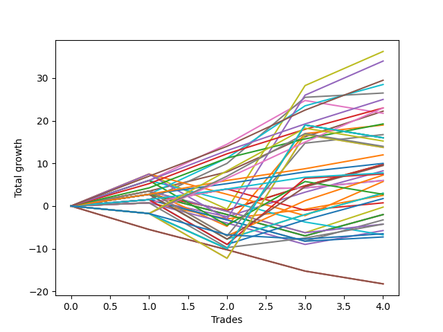

# Long Malinois 001 
- Symbol: ES_830-1130
- Date Range: 03/18/2022 - 12/30/2022
- Trading Period: 8:30-11:30
- Number of Trades: 4



| Name | Win Percent | Profit | Avg Profit / Trade | Avg Time / Trade |      | Name | Win Percent | Profit | Avg Profit / Trade | Avg Time / Trade |
| ---- | ----------- | ------ | ------------------ | ---------------- | ---- | ---- | ----------- | ------ | ------------------ | ---------------- |
| Sorted By <br> Profit | | | | | | Sorted By <br> Win Percentage ||||
| V U/L 1SD | 75.00 | 18125.00 | 4531.25 | 39:35 |     | TP-7 | 100.00 | 14750.00 | 3687.50 | 15:17 |
| V U/L 1SD SL-10 | 75.00 | 17000.00 | 4250.00 | 27:55 |     | BB-100 Mid | 100.00 | 14250.00 | 3562.50 | 26:30 |
| TP-7 | 100.00 | 14750.00 | 3687.50 | 15:17 |     | V Mid | 100.00 | 13250.00 | 3312.50 | 20:46 |
| BB-100 Mid | 100.00 | 14250.00 | 3562.50 | 26:30 |     | TP-6 | 100.00 | 12500.00 | 3125.00 | 13:15 |
| V Mid | 100.00 | 13250.00 | 3312.50 | 20:46 |     | TP-5 | 100.00 | 11500.00 | 2875.00 | 12:51 |
| TP-6 | 100.00 | 12500.00 | 3125.00 | 13:15 |     | BB-50 U/L 1SD | 100.00 | 11125.00 | 2781.25 | 25:47 |
| TP-5 | 100.00 | 11500.00 | 2875.00 | 12:51 |     | TP-4 | 100.00 | 9625.00 | 2406.25 | 08:00 |
| TP-8 | 75.00 | 11500.00 | 2875.00 | 25:48 |     | TP-3 | 100.00 | 6000.00 | 1500.00 | 07:10 |
| BB-50 U/L 1SD | 100.00 | 11125.00 | 2781.25 | 25:47 |     | TP-2 | 100.00 | 5000.00 | 1250.00 | 05:53 |
| BB-50 U/L 2SD | 75.00 | 10875.00 | 2718.75 | 39:37 |     | TP-1 | 100.00 | 3875.00 | 968.75 | 01:10 |
| TP-4 | 100.00 | 9625.00 | 2406.25 | 08:00 |     | BB-20 Mid SL-10 | 100.00 | 3000.00 | 750.00 | 05:11 |
| BB-200 Mid | 75.00 | 9500.00 | 2375.00 | 33:06 |     | BB-20 Mid | 100.00 | 3000.00 | 750.00 | 05:11 |
| BB-200 Mid SL-10 | 75.00 | 8375.00 | 2093.75 | 21:26 |     | V U/L 1SD | 75.00 | 18125.00 | 4531.25 | 39:35 |
| NEWFI 06 | 25.00 | 8000.00 | 2000.00 | 60:55 |     | V U/L 1SD SL-10 | 75.00 | 17000.00 | 4250.00 | 27:55 |
| NEWFI 000 | 25.00 | 8000.00 | 2000.00 | 60:55 |     | TP-8 | 75.00 | 11500.00 | 2875.00 | 25:48 |
| BB-200 U/L 2SD | 25.00 | 8000.00 | 2000.00 | 60:55 |     | BB-50 U/L 2SD | 75.00 | 10875.00 | 2718.75 | 39:37 |
| BB-100 U/L 2SD | 25.00 | 8000.00 | 2000.00 | 60:55 |     | BB-200 Mid | 75.00 | 9500.00 | 2375.00 | 33:06 |
| TP-10 | 50.00 | 7625.00 | 1906.25 | 46:38 |     | BB-200 Mid SL-10 | 75.00 | 8375.00 | 2093.75 | 21:26 |
| TP-9 | 50.00 | 7000.00 | 1750.00 | 46:26 |     | BB-20 U/L 2SD C | 75.00 | 4875.00 | 1218.75 | 21:03 |
| BB-200 U/L 2SD SL-10 | 25.00 | 6875.00 | 1718.75 | 49:15 |     | BB-20 U/L 2SD | 75.00 | 4875.00 | 1218.75 | 21:03 |
| BB-100 U/L 2SD SL-10 | 25.00 | 6875.00 | 1718.75 | 49:15 |     | BB-100 Mid SL-10 | 75.00 | 4750.00 | 1187.50 | 20:25 |
| TP-3 | 100.00 | 6000.00 | 1500.00 | 07:10 |     | BB-50 Mid | 75.00 | 4125.00 | 1031.25 | 20:53 |
| TP-2 | 100.00 | 5000.00 | 1250.00 | 05:53 |     | V Mid SL-10 | 75.00 | 3750.00 | 937.50 | 14:45 |
| BB-20 U/L 2SD C | 75.00 | 4875.00 | 1218.75 | 21:03 |     | BB-50 U/L 1SD SL-10 | 75.00 | 3625.00 | 906.25 | 19:48 |
| BB-20 U/L 2SD | 75.00 | 4875.00 | 1218.75 | 21:03 |     | BB-20 U/L 2SD C SL-10 | 75.00 | 1500.00 | 375.00 | 15:20 |
| BB-100 Mid SL-10 | 75.00 | 4750.00 | 1187.50 | 20:25 |     | BB-20 U/L 2SD SL-10 | 75.00 | 1500.00 | 375.00 | 15:20 |
| BB-50 Mid | 75.00 | 4125.00 | 1031.25 | 20:53 |     | BB-20 U/L 1SD | 75.00 | 1250.00 | 312.50 | 17:38 |
| TP-1 | 100.00 | 3875.00 | 968.75 | 01:10 |     | BB-50 Mid SL-10 | 75.00 | 875.00 | 218.75 | 15:08 |
| V Mid SL-10 | 75.00 | 3750.00 | 937.50 | 14:45 |     | BB-20 Mid SL-5 | 75.00 | 375.00 | 93.75 | 04:20 |
| BB-50 U/L 1SD SL-10 | 75.00 | 3625.00 | 906.25 | 19:48 |     | BB-20 U/L 1SD SL-10 | 75.00 | -2125.00 | -531.25 | 11:55 |
| BB-20 Mid SL-10 | 100.00 | 3000.00 | 750.00 | 05:11 |     | TP-10 | 50.00 | 7625.00 | 1906.25 | 46:38 |
| BB-20 Mid | 100.00 | 3000.00 | 750.00 | 05:11 |     | TP-9 | 50.00 | 7000.00 | 1750.00 | 46:26 |
| V U/L 1SD SL-5 | 50.00 | 2875.00 | 718.75 | 13:58 |     | V U/L 1SD SL-5 | 50.00 | 2875.00 | 718.75 | 13:58 |
| BB-20 U/L 2SD C SL-10 | 75.00 | 1500.00 | 375.00 | 15:20 |     | BB-50 U/L 2SD SL-10 | 50.00 | 1375.00 | 343.75 | 33:32 |
| BB-20 U/L 2SD SL-10 | 75.00 | 1500.00 | 375.00 | 15:20 |     | BB-50 U/L 1SD SL-5 | 50.00 | -125.00 | -31.25 | 12:50 |
| BB-50 U/L 2SD SL-10 | 50.00 | 1375.00 | 343.75 | 33:32 |     | BB-100 Mid SL-5 | 50.00 | -1000.00 | -250.00 | 11:18 |
| BB-20 U/L 1SD | 75.00 | 1250.00 | 312.50 | 17:38 |     | BB-20 U/L 2SD C SL-5 | 50.00 | -1000.00 | -250.00 | 11:17 |
| BB-50 Mid SL-10 | 75.00 | 875.00 | 218.75 | 15:08 |     | BB-20 U/L 2SD SL-5 | 50.00 | -1000.00 | -250.00 | 11:17 |
| BB-20 Mid SL-5 | 75.00 | 375.00 | 93.75 | 04:20 |     | BB-50 Mid SL-5 | 50.00 | -1625.00 | -406.25 | 11:06 |
| BB-50 U/L 1SD SL-5 | 50.00 | -125.00 | -31.25 | 12:50 |     | BB-200 Mid SL-5 | 50.00 | -2125.00 | -531.25 | 10:12 |
| BB-100 Mid SL-5 | 50.00 | -1000.00 | -250.00 | 11:18 |     | BB-20 U/L 1SD SL-5 | 50.00 | -2875.00 | -718.75 | 10:41 |
| BB-20 U/L 2SD C SL-5 | 50.00 | -1000.00 | -250.00 | 11:17 |     | V Mid SL-5 | 50.00 | -3625.00 | -906.25 | 05:26 |
| BB-20 U/L 2SD SL-5 | 50.00 | -1000.00 | -250.00 | 11:17 |     | NEWFI 06 | 25.00 | 8000.00 | 2000.00 | 60:55 |
| BB-50 Mid SL-5 | 50.00 | -1625.00 | -406.25 | 11:06 |     | NEWFI 000 | 25.00 | 8000.00 | 2000.00 | 60:55 |
| BB-20 U/L 1SD SL-10 | 75.00 | -2125.00 | -531.25 | 11:55 |     | BB-200 U/L 2SD | 25.00 | 8000.00 | 2000.00 | 60:55 |
| BB-200 Mid SL-5 | 50.00 | -2125.00 | -531.25 | 10:12 |     | BB-100 U/L 2SD | 25.00 | 8000.00 | 2000.00 | 60:55 |
| BB-20 U/L 1SD SL-5 | 50.00 | -2875.00 | -718.75 | 10:41 |     | BB-200 U/L 2SD SL-10 | 25.00 | 6875.00 | 1718.75 | 49:15 |
| NEWFI 0000 | 25.00 | -3250.00 | -812.50 | 22:50 |     | BB-100 U/L 2SD SL-10 | 25.00 | 6875.00 | 1718.75 | 49:15 |
| BB-50 U/L 2SD SL-5 | 25.00 | -3375.00 | -843.75 | 24:32 |     | NEWFI 0000 | 25.00 | -3250.00 | -812.50 | 22:50 |
| V Mid SL-5 | 50.00 | -3625.00 | -906.25 | 05:26 |     | BB-50 U/L 2SD SL-5 | 25.00 | -3375.00 | -843.75 | 24:32 |
| BB-200 U/L 2SD SL-5 | 0.00 | -9125.00 | -2281.25 | 29:51 |     | BB-200 U/L 2SD SL-5 | 0.00 | -9125.00 | -2281.25 | 29:51 |
| BB-100 U/L 2SD SL-5 | 0.00 | -9125.00 | -2281.25 | 29:51 |     | BB-100 U/L 2SD SL-5 | 0.00 | -9125.00 | -2281.25 | 29:51 |

## NO STOPLOSS

### Test BB-20 Mid
* Sell when price hits the middle line of the 20p bollinger
* No Stoploss
* Results:
```
Total Trades: 4
Percent Up: 100.00
Percent Down: 0.00
Total Points Moved Up: 6.00
Potential Profit: 3000.00
Total Points Ups: 6.00 Count Ups: 4
Total Points Downs: 0.00 Count Downs: 0
```

<details><summary>Trades</summary>

<code>In: 2022-04-19 10:33:00		Out: 2022-04-19 10:37:15		Total Position Time: 04:15		Total Move Up: 0.75		Total to Date: 0.75</code> <br />
<code>In: 2022-05-06 11:12:00		Out: 2022-05-06 11:15:05		Total Position Time: 03:05		Total Move Up: 3.25		Total to Date: 4.00</code> <br />
<code>In: 2022-05-13 11:10:00		Out: 2022-05-13 11:19:15		Total Position Time: 09:15		Total Move Up: 0.25		Total to Date: 4.25</code> <br />
<code>In: 2022-12-27 09:52:00		Out: 2022-12-27 09:56:10		Total Position Time: 04:10		Total Move Up: 1.75		Total to Date: 6.00</code> <br />


</details>

### Test BB-20 U/L 1SD
* Sell when the price hits the upper line of the 20p 1std bollinger
* No Stoploss
* Results:
```
Total Trades: 4
Percent Up: 75.00
Percent Down: 25.00
Total Points Moved Up: 2.50
Potential Profit: 1250.00
Total Points Ups: 6.25 Count Ups: 3
Total Points Downs: -3.75 Count Downs: 1
```

<details><summary>Trades</summary>

<code>In: 2022-04-19 10:33:00		Out: 2022-04-19 10:48:55		Total Position Time: 15:55		Total Move Up: 0.75		Total to Date: 0.75</code> <br />
<code>In: 2022-05-06 11:12:00		Out: 2022-05-06 11:49:10		Total Position Time: 37:10		Total Move Up: -3.75		Total to Date: -3.00</code> <br />
<code>In: 2022-05-13 11:10:00		Out: 2022-05-13 11:20:05		Total Position Time: 10:05		Total Move Up: 2.25		Total to Date: -0.75</code> <br />
<code>In: 2022-12-27 09:52:00		Out: 2022-12-27 09:59:25		Total Position Time: 07:25		Total Move Up: 3.25		Total to Date: 2.50</code> <br />


</details>

### Test BB-20 U/L 2SD
* Sell when the price hits the upper line of the 20p 2std bollinger
* No Stoploss
* Results:
```
Total Trades: 4
Percent Up: 75.00
Percent Down: 25.00
Total Points Moved Up: 9.75
Potential Profit: 4875.00
Total Points Ups: 13.50 Count Ups: 3
Total Points Downs: -3.75 Count Downs: 1
```

<details><summary>Trades</summary>

<code>In: 2022-04-19 10:33:00		Out: 2022-04-19 10:49:55		Total Position Time: 16:55		Total Move Up: 2.75		Total to Date: 2.75</code> <br />
<code>In: 2022-05-06 11:12:00		Out: 2022-05-06 11:49:10		Total Position Time: 37:10		Total Move Up: -3.75		Total to Date: -1.00</code> <br />
<code>In: 2022-05-13 11:10:00		Out: 2022-05-13 11:31:20		Total Position Time: 21:20		Total Move Up: 5.75		Total to Date: 4.75</code> <br />
<code>In: 2022-12-27 09:52:00		Out: 2022-12-27 10:00:50		Total Position Time: 08:50		Total Move Up: 5.00		Total to Date: 9.75</code> <br />


</details>

### Test BB-20 U/L 2SD C
* Sell when the price hits the upper line of the 20p 2std bollinger
* No Stoploss
* Results:
```
Total Trades: 4
Percent Up: 75.00
Percent Down: 25.00
Total Points Moved Up: 9.75
Potential Profit: 4875.00
Total Points Ups: 13.50 Count Ups: 3
Total Points Downs: -3.75 Count Downs: 1
```

<details><summary>Trades</summary>

<code>In: 2022-04-19 10:33:00		Out: 2022-04-19 10:49:55		Total Position Time: 16:55		Total Move Up: 2.75		Total to Date: 2.75</code> <br />
<code>In: 2022-05-06 11:12:00		Out: 2022-05-06 11:49:10		Total Position Time: 37:10		Total Move Up: -3.75		Total to Date: -1.00</code> <br />
<code>In: 2022-05-13 11:10:00		Out: 2022-05-13 11:31:20		Total Position Time: 21:20		Total Move Up: 5.75		Total to Date: 4.75</code> <br />
<code>In: 2022-12-27 09:52:00		Out: 2022-12-27 10:00:50		Total Position Time: 08:50		Total Move Up: 5.00		Total to Date: 9.75</code> <br />


</details>

### Test BB-50 Mid
* Sell when price hits the middle line of the 50p bollinger
* No Stoploss
* Results:
```
Total Trades: 4
Percent Up: 75.00
Percent Down: 25.00
Total Points Moved Up: 8.25
Potential Profit: 4125.00
Total Points Ups: 12.25 Count Ups: 3
Total Points Downs: -4.00 Count Downs: 1
```

<details><summary>Trades</summary>

<code>In: 2022-04-19 10:33:00		Out: 2022-04-19 10:49:10		Total Position Time: 16:10		Total Move Up: 1.50		Total to Date: 1.50</code> <br />
<code>In: 2022-05-06 11:12:00		Out: 2022-05-06 11:49:15		Total Position Time: 37:15		Total Move Up: -4.00		Total to Date: -2.50</code> <br />
<code>In: 2022-05-13 11:10:00		Out: 2022-05-13 11:31:20		Total Position Time: 21:20		Total Move Up: 5.75		Total to Date: 3.25</code> <br />
<code>In: 2022-12-27 09:52:00		Out: 2022-12-27 10:00:50		Total Position Time: 08:50		Total Move Up: 5.00		Total to Date: 8.25</code> <br />


</details>

### Test BB-50 U/L 1SD
* Sell when the price hits the upper line of the 50p 1std bollinger
* No Stoploss
* Results:
```
Total Trades: 4
Percent Up: 100.00
Percent Down: 0.00
Total Points Moved Up: 22.25
Potential Profit: 11125.00
Total Points Ups: 22.25 Count Ups: 4
Total Points Downs: 0.00 Count Downs: 0
```

<details><summary>Trades</summary>

<code>In: 2022-04-19 10:33:00		Out: 2022-04-19 10:50:10		Total Position Time: 17:10		Total Move Up: 3.50		Total to Date: 3.50</code> <br />
<code>In: 2022-05-06 11:12:00		Out: 2022-05-06 11:50:10		Total Position Time: 38:10		Total Move Up: 4.50		Total to Date: 8.00</code> <br />
<code>In: 2022-05-13 11:10:00		Out: 2022-05-13 11:43:05		Total Position Time: 33:05		Total Move Up: 8.25		Total to Date: 16.25</code> <br />
<code>In: 2022-12-27 09:52:00		Out: 2022-12-27 10:06:45		Total Position Time: 14:45		Total Move Up: 6.00		Total to Date: 22.25</code> <br />


</details>

### Test BB-50 U/L 2SD
* Sell when the price hits the upper line of the 50p 2std bollinger
* No Stoploss
* Results:
```
Total Trades: 4
Percent Up: 75.00
Percent Down: 25.00
Total Points Moved Up: 21.75
Potential Profit: 10875.00
Total Points Ups: 24.75 Count Ups: 3
Total Points Downs: -3.00 Count Downs: 1
```

<details><summary>Trades</summary>

<code>In: 2022-04-19 10:33:00		Out: 2022-04-19 10:50:50		Total Position Time: 17:50		Total Move Up: 6.00		Total to Date: 6.00</code> <br />
<code>In: 2022-05-06 11:12:00		Out: 2022-05-06 11:50:35		Total Position Time: 38:35		Total Move Up: 8.50		Total to Date: 14.50</code> <br />
<code>In: 2022-05-13 11:10:00		Out: 2022-05-13 11:51:10		Total Position Time: 41:10		Total Move Up: 10.25		Total to Date: 24.75</code> <br />
<code>In: 2022-12-27 09:52:00		Out: 2022-12-27 10:52:55		Total Position Time: 60:55		Total Move Up: -3.00		Total to Date: 21.75</code> <br />


</details>

### Test V Mid
* Sell when the price hits the middle line of the 1std VWAP
* No Stoploss
* Results:
```
Total Trades: 4
Percent Up: 100.00
Percent Down: 0.00
Total Points Moved Up: 26.50
Potential Profit: 13250.00
Total Points Ups: 26.50 Count Ups: 4
Total Points Downs: 0.00 Count Downs: 0
```

<details><summary>Trades</summary>

<code>In: 2022-04-19 10:33:00		Out: 2022-04-19 10:34:10		Total Position Time: 01:10		Total Move Up: 1.50		Total to Date: 1.50</code> <br />
<code>In: 2022-05-06 11:12:00		Out: 2022-05-06 11:50:20		Total Position Time: 38:20		Total Move Up: 8.50		Total to Date: 10.00</code> <br />
<code>In: 2022-05-13 11:10:00		Out: 2022-05-13 11:52:25		Total Position Time: 42:25		Total Move Up: 15.50		Total to Date: 25.50</code> <br />
<code>In: 2022-12-27 09:52:00		Out: 2022-12-27 09:53:10		Total Position Time: 01:10		Total Move Up: 1.00		Total to Date: 26.50</code> <br />


</details>

### Test V U/L 1SD
* Sell when the price hits the upper line of the 1std VWAP
* No Stoploss
* Results:
```
Total Trades: 4
Percent Up: 75.00
Percent Down: 25.00
Total Points Moved Up: 36.25
Potential Profit: 18125.00
Total Points Ups: 44.50 Count Ups: 3
Total Points Downs: -8.25 Count Downs: 1
```

<details><summary>Trades</summary>

<code>In: 2022-04-19 10:33:00		Out: 2022-04-19 10:52:45		Total Position Time: 19:45		Total Move Up: 7.50		Total to Date: 7.50</code> <br />
<code>In: 2022-05-06 11:12:00		Out: 2022-05-06 12:12:55		Total Position Time: 60:55		Total Move Up: -8.25		Total to Date: -0.75</code> <br />
<code>In: 2022-05-13 11:10:00		Out: 2022-05-13 12:10:55		Total Position Time: 60:55		Total Move Up: 29.00		Total to Date: 28.25</code> <br />
<code>In: 2022-12-27 09:52:00		Out: 2022-12-27 10:08:45		Total Position Time: 16:45		Total Move Up: 8.00		Total to Date: 36.25</code> <br />


</details>

### Test BB-100 Mid
* Move to BB100 Mid
* No Stoploss
* Results:
```
Total Trades: 4
Percent Up: 100.00
Percent Down: 0.00
Total Points Moved Up: 28.50
Potential Profit: 14250.00
Total Points Ups: 28.50 Count Ups: 4
Total Points Downs: 0.00 Count Downs: 0
```

<details><summary>Trades</summary>

<code>In: 2022-04-19 10:33:00		Out: 2022-04-19 10:50:00		Total Position Time: 17:00		Total Move Up: 2.75		Total to Date: 2.75</code> <br />
<code>In: 2022-05-06 11:12:00		Out: 2022-05-06 11:50:35		Total Position Time: 38:35		Total Move Up: 8.50		Total to Date: 11.25</code> <br />
<code>In: 2022-05-13 11:10:00		Out: 2022-05-13 11:51:35		Total Position Time: 41:35		Total Move Up: 12.25		Total to Date: 23.50</code> <br />
<code>In: 2022-12-27 09:52:00		Out: 2022-12-27 10:00:50		Total Position Time: 08:50		Total Move Up: 5.00		Total to Date: 28.50</code> <br />


</details>

### Test BB-100 U/L 2SD
* Move to BB100 Upper Band
* No Stoploss
* Results:
```
Total Trades: 4
Percent Up: 25.00
Percent Down: 75.00
Total Points Moved Up: 16.00
Potential Profit: 8000.00
Total Points Ups: 29.00 Count Ups: 1
Total Points Downs: -13.00 Count Downs: 3
```

<details><summary>Trades</summary>

<code>In: 2022-04-19 10:33:00		Out: 2022-04-19 11:33:55		Total Position Time: 60:55		Total Move Up: -1.75		Total to Date: -1.75</code> <br />
<code>In: 2022-05-06 11:12:00		Out: 2022-05-06 12:12:55		Total Position Time: 60:55		Total Move Up: -8.25		Total to Date: -10.00</code> <br />
<code>In: 2022-05-13 11:10:00		Out: 2022-05-13 12:10:55		Total Position Time: 60:55		Total Move Up: 29.00		Total to Date: 19.00</code> <br />
<code>In: 2022-12-27 09:52:00		Out: 2022-12-27 10:52:55		Total Position Time: 60:55		Total Move Up: -3.00		Total to Date: 16.00</code> <br />


</details>

### Test BB-200 Mid
* Move to BB200 Mid
* No Stoploss
* Results:
```
Total Trades: 4
Percent Up: 75.00
Percent Down: 25.00
Total Points Moved Up: 19.00
Potential Profit: 9500.00
Total Points Ups: 27.25 Count Ups: 3
Total Points Downs: -8.25 Count Downs: 1
```

<details><summary>Trades</summary>

<code>In: 2022-04-19 10:33:00		Out: 2022-04-19 10:50:05		Total Position Time: 17:05		Total Move Up: 3.50		Total to Date: 3.50</code> <br />
<code>In: 2022-05-06 11:12:00		Out: 2022-05-06 12:12:55		Total Position Time: 60:55		Total Move Up: -8.25		Total to Date: -4.75</code> <br />
<code>In: 2022-05-13 11:10:00		Out: 2022-05-13 12:00:05		Total Position Time: 50:05		Total Move Up: 21.75		Total to Date: 17.00</code> <br />
<code>In: 2022-12-27 09:52:00		Out: 2022-12-27 09:56:20		Total Position Time: 04:20		Total Move Up: 2.00		Total to Date: 19.00</code> <br />


</details>

### Test BB-200 U/L 2SD
* Move to BB200 Upper Band
* No Stoploss
* Results:
```
Total Trades: 4
Percent Up: 25.00
Percent Down: 75.00
Total Points Moved Up: 16.00
Potential Profit: 8000.00
Total Points Ups: 29.00 Count Ups: 1
Total Points Downs: -13.00 Count Downs: 3
```

<details><summary>Trades</summary>

<code>In: 2022-04-19 10:33:00		Out: 2022-04-19 11:33:55		Total Position Time: 60:55		Total Move Up: -1.75		Total to Date: -1.75</code> <br />
<code>In: 2022-05-06 11:12:00		Out: 2022-05-06 12:12:55		Total Position Time: 60:55		Total Move Up: -8.25		Total to Date: -10.00</code> <br />
<code>In: 2022-05-13 11:10:00		Out: 2022-05-13 12:10:55		Total Position Time: 60:55		Total Move Up: 29.00		Total to Date: 19.00</code> <br />
<code>In: 2022-12-27 09:52:00		Out: 2022-12-27 10:52:55		Total Position Time: 60:55		Total Move Up: -3.00		Total to Date: 16.00</code> <br />


</details>

## STOPLOSS OF 5

### Test BB-20 Mid SL-5
* Sell when price hits the middle line of the 20p bollinger
* Stoploss is 5 points
* Results:
```
Total Trades: 4
Percent Up: 75.00
Percent Down: 25.00
Total Points Moved Up: 0.75
Potential Profit: 375.00
Total Points Ups: 5.75 Count Ups: 3
Total Points Downs: -5.00 Count Downs: 1
```

<details><summary>Trades</summary>

<code>In: 2022-04-19 10:33:00		Out: 2022-04-19 10:37:15		Total Position Time: 04:15		Total Move Up: 0.75		Total to Date: 0.75</code> <br />
<code>In: 2022-05-06 11:12:00		Out: 2022-05-06 11:15:05		Total Position Time: 03:05		Total Move Up: 3.25		Total to Date: 4.00</code> <br />
<code>In: 2022-05-13 11:10:00		Out: 2022-05-13 11:15:50		Total Position Time: 05:50		Total Move Up: -5.00		Total to Date: -1.00</code> <br />
<code>In: 2022-12-27 09:52:00		Out: 2022-12-27 09:56:10		Total Position Time: 04:10		Total Move Up: 1.75		Total to Date: 0.75</code> <br />


</details>

### Test BB-20 U/L 1SD SL-5
* Sell when the price hits the upper line of the 20p 1std bollinger
* Stoploss is 5 points
* Results:
```
Total Trades: 4
Percent Up: 50.00
Percent Down: 50.00
Total Points Moved Up: -5.75
Potential Profit: -2875.00
Total Points Ups: 4.00 Count Ups: 2
Total Points Downs: -9.75 Count Downs: 2
```

<details><summary>Trades</summary>

<code>In: 2022-04-19 10:33:00		Out: 2022-04-19 10:48:55		Total Position Time: 15:55		Total Move Up: 0.75		Total to Date: 0.75</code> <br />
<code>In: 2022-05-06 11:12:00		Out: 2022-05-06 11:25:35		Total Position Time: 13:35		Total Move Up: -4.75		Total to Date: -4.00</code> <br />
<code>In: 2022-05-13 11:10:00		Out: 2022-05-13 11:15:50		Total Position Time: 05:50		Total Move Up: -5.00		Total to Date: -9.00</code> <br />
<code>In: 2022-12-27 09:52:00		Out: 2022-12-27 09:59:25		Total Position Time: 07:25		Total Move Up: 3.25		Total to Date: -5.75</code> <br />


</details>

### Test BB-20 U/L 2SD SL-5
* Sell when the price hits the upper line of the 20p 2std bollinger
* Stoploss is 5 points
* Results:
```
Total Trades: 4
Percent Up: 50.00
Percent Down: 50.00
Total Points Moved Up: -2.00
Potential Profit: -1000.00
Total Points Ups: 7.75 Count Ups: 2
Total Points Downs: -9.75 Count Downs: 2
```

<details><summary>Trades</summary>

<code>In: 2022-04-19 10:33:00		Out: 2022-04-19 10:49:55		Total Position Time: 16:55		Total Move Up: 2.75		Total to Date: 2.75</code> <br />
<code>In: 2022-05-06 11:12:00		Out: 2022-05-06 11:25:35		Total Position Time: 13:35		Total Move Up: -4.75		Total to Date: -2.00</code> <br />
<code>In: 2022-05-13 11:10:00		Out: 2022-05-13 11:15:50		Total Position Time: 05:50		Total Move Up: -5.00		Total to Date: -7.00</code> <br />
<code>In: 2022-12-27 09:52:00		Out: 2022-12-27 10:00:50		Total Position Time: 08:50		Total Move Up: 5.00		Total to Date: -2.00</code> <br />


</details>

### Test BB-20 U/L 2SD C SL-5
* Sell when the price hits the upper line of the 20p 2std bollinger
* Stoploss is 5 points
* Results:
```
Total Trades: 4
Percent Up: 50.00
Percent Down: 50.00
Total Points Moved Up: -2.00
Potential Profit: -1000.00
Total Points Ups: 7.75 Count Ups: 2
Total Points Downs: -9.75 Count Downs: 2
```

<details><summary>Trades</summary>

<code>In: 2022-04-19 10:33:00		Out: 2022-04-19 10:49:55		Total Position Time: 16:55		Total Move Up: 2.75		Total to Date: 2.75</code> <br />
<code>In: 2022-05-06 11:12:00		Out: 2022-05-06 11:25:35		Total Position Time: 13:35		Total Move Up: -4.75		Total to Date: -2.00</code> <br />
<code>In: 2022-05-13 11:10:00		Out: 2022-05-13 11:15:50		Total Position Time: 05:50		Total Move Up: -5.00		Total to Date: -7.00</code> <br />
<code>In: 2022-12-27 09:52:00		Out: 2022-12-27 10:00:50		Total Position Time: 08:50		Total Move Up: 5.00		Total to Date: -2.00</code> <br />


</details>

### Test BB-50 Mid SL-5
* Sell when price hits the middle line of the 50p bollinger
* Stoploss is 5 points
* Results:
```
Total Trades: 4
Percent Up: 50.00
Percent Down: 50.00
Total Points Moved Up: -3.25
Potential Profit: -1625.00
Total Points Ups: 6.50 Count Ups: 2
Total Points Downs: -9.75 Count Downs: 2
```

<details><summary>Trades</summary>

<code>In: 2022-04-19 10:33:00		Out: 2022-04-19 10:49:10		Total Position Time: 16:10		Total Move Up: 1.50		Total to Date: 1.50</code> <br />
<code>In: 2022-05-06 11:12:00		Out: 2022-05-06 11:25:35		Total Position Time: 13:35		Total Move Up: -4.75		Total to Date: -3.25</code> <br />
<code>In: 2022-05-13 11:10:00		Out: 2022-05-13 11:15:50		Total Position Time: 05:50		Total Move Up: -5.00		Total to Date: -8.25</code> <br />
<code>In: 2022-12-27 09:52:00		Out: 2022-12-27 10:00:50		Total Position Time: 08:50		Total Move Up: 5.00		Total to Date: -3.25</code> <br />


</details>

### Test BB-50 U/L 1SD SL-5
* Sell when the price hits the upper line of the 50p 1std bollinger
* Stoploss is 5 points
* Results:
```
Total Trades: 4
Percent Up: 50.00
Percent Down: 50.00
Total Points Moved Up: -0.25
Potential Profit: -125.00
Total Points Ups: 9.50 Count Ups: 2
Total Points Downs: -9.75 Count Downs: 2
```

<details><summary>Trades</summary>

<code>In: 2022-04-19 10:33:00		Out: 2022-04-19 10:50:10		Total Position Time: 17:10		Total Move Up: 3.50		Total to Date: 3.50</code> <br />
<code>In: 2022-05-06 11:12:00		Out: 2022-05-06 11:25:35		Total Position Time: 13:35		Total Move Up: -4.75		Total to Date: -1.25</code> <br />
<code>In: 2022-05-13 11:10:00		Out: 2022-05-13 11:15:50		Total Position Time: 05:50		Total Move Up: -5.00		Total to Date: -6.25</code> <br />
<code>In: 2022-12-27 09:52:00		Out: 2022-12-27 10:06:45		Total Position Time: 14:45		Total Move Up: 6.00		Total to Date: -0.25</code> <br />


</details>

### Test BB-50 U/L 2SD SL-5
* Sell when the price hits the upper line of the 50p 2std bollinger
* Stoploss is 5 points
* Results:
```
Total Trades: 4
Percent Up: 25.00
Percent Down: 75.00
Total Points Moved Up: -6.75
Potential Profit: -3375.00
Total Points Ups: 6.00 Count Ups: 1
Total Points Downs: -12.75 Count Downs: 3
```

<details><summary>Trades</summary>

<code>In: 2022-04-19 10:33:00		Out: 2022-04-19 10:50:50		Total Position Time: 17:50		Total Move Up: 6.00		Total to Date: 6.00</code> <br />
<code>In: 2022-05-06 11:12:00		Out: 2022-05-06 11:25:35		Total Position Time: 13:35		Total Move Up: -4.75		Total to Date: 1.25</code> <br />
<code>In: 2022-05-13 11:10:00		Out: 2022-05-13 11:15:50		Total Position Time: 05:50		Total Move Up: -5.00		Total to Date: -3.75</code> <br />
<code>In: 2022-12-27 09:52:00		Out: 2022-12-27 10:52:55		Total Position Time: 60:55		Total Move Up: -3.00		Total to Date: -6.75</code> <br />


</details>

### Test V Mid SL-5
* Sell when the price hits the middle line of the 1std VWAP
* Stoploss is 5 points
* Results:
```
Total Trades: 4
Percent Up: 50.00
Percent Down: 50.00
Total Points Moved Up: -7.25
Potential Profit: -3625.00
Total Points Ups: 2.50 Count Ups: 2
Total Points Downs: -9.75 Count Downs: 2
```

<details><summary>Trades</summary>

<code>In: 2022-04-19 10:33:00		Out: 2022-04-19 10:34:10		Total Position Time: 01:10		Total Move Up: 1.50		Total to Date: 1.50</code> <br />
<code>In: 2022-05-06 11:12:00		Out: 2022-05-06 11:25:35		Total Position Time: 13:35		Total Move Up: -4.75		Total to Date: -3.25</code> <br />
<code>In: 2022-05-13 11:10:00		Out: 2022-05-13 11:15:50		Total Position Time: 05:50		Total Move Up: -5.00		Total to Date: -8.25</code> <br />
<code>In: 2022-12-27 09:52:00		Out: 2022-12-27 09:53:10		Total Position Time: 01:10		Total Move Up: 1.00		Total to Date: -7.25</code> <br />


</details>

### Test V U/L 1SD SL-5
* Sell when the price hits the upper line of the 1std VWAP
* Stoploss is 5 points
* Results:
```
Total Trades: 4
Percent Up: 50.00
Percent Down: 50.00
Total Points Moved Up: 5.75
Potential Profit: 2875.00
Total Points Ups: 15.50 Count Ups: 2
Total Points Downs: -9.75 Count Downs: 2
```

<details><summary>Trades</summary>

<code>In: 2022-04-19 10:33:00		Out: 2022-04-19 10:52:45		Total Position Time: 19:45		Total Move Up: 7.50		Total to Date: 7.50</code> <br />
<code>In: 2022-05-06 11:12:00		Out: 2022-05-06 11:25:35		Total Position Time: 13:35		Total Move Up: -4.75		Total to Date: 2.75</code> <br />
<code>In: 2022-05-13 11:10:00		Out: 2022-05-13 11:15:50		Total Position Time: 05:50		Total Move Up: -5.00		Total to Date: -2.25</code> <br />
<code>In: 2022-12-27 09:52:00		Out: 2022-12-27 10:08:45		Total Position Time: 16:45		Total Move Up: 8.00		Total to Date: 5.75</code> <br />


</details>

### Test BB-100 Mid SL-5
* Move to BB100 Mid
* Stoploss is 5 points
* Results:
```
Total Trades: 4
Percent Up: 50.00
Percent Down: 50.00
Total Points Moved Up: -2.00
Potential Profit: -1000.00
Total Points Ups: 7.75 Count Ups: 2
Total Points Downs: -9.75 Count Downs: 2
```

<details><summary>Trades</summary>

<code>In: 2022-04-19 10:33:00		Out: 2022-04-19 10:50:00		Total Position Time: 17:00		Total Move Up: 2.75		Total to Date: 2.75</code> <br />
<code>In: 2022-05-06 11:12:00		Out: 2022-05-06 11:25:35		Total Position Time: 13:35		Total Move Up: -4.75		Total to Date: -2.00</code> <br />
<code>In: 2022-05-13 11:10:00		Out: 2022-05-13 11:15:50		Total Position Time: 05:50		Total Move Up: -5.00		Total to Date: -7.00</code> <br />
<code>In: 2022-12-27 09:52:00		Out: 2022-12-27 10:00:50		Total Position Time: 08:50		Total Move Up: 5.00		Total to Date: -2.00</code> <br />


</details>

### Test BB-100 U/L 2SD SL-5
* Move to BB100 Upper Band
* Stoploss is 5 points
* Results:
```
Total Trades: 4
Percent Up: 0.00
Percent Down: 100.00
Total Points Moved Up: -18.25
Potential Profit: -9125.00
Total Points Ups: 0.00 Count Ups: 0
Total Points Downs: -18.25 Count Downs: 4
```

<details><summary>Trades</summary>

<code>In: 2022-04-19 10:33:00		Out: 2022-04-19 11:12:05		Total Position Time: 39:05		Total Move Up: -5.50		Total to Date: -5.50</code> <br />
<code>In: 2022-05-06 11:12:00		Out: 2022-05-06 11:25:35		Total Position Time: 13:35		Total Move Up: -4.75		Total to Date: -10.25</code> <br />
<code>In: 2022-05-13 11:10:00		Out: 2022-05-13 11:15:50		Total Position Time: 05:50		Total Move Up: -5.00		Total to Date: -15.25</code> <br />
<code>In: 2022-12-27 09:52:00		Out: 2022-12-27 10:52:55		Total Position Time: 60:55		Total Move Up: -3.00		Total to Date: -18.25</code> <br />


</details>

### Test BB-200 Mid SL-5
* Move to BB200 Mid
* Stoploss is 5 points
* Results:
```
Total Trades: 4
Percent Up: 50.00
Percent Down: 50.00
Total Points Moved Up: -4.25
Potential Profit: -2125.00
Total Points Ups: 5.50 Count Ups: 2
Total Points Downs: -9.75 Count Downs: 2
```

<details><summary>Trades</summary>

<code>In: 2022-04-19 10:33:00		Out: 2022-04-19 10:50:05		Total Position Time: 17:05		Total Move Up: 3.50		Total to Date: 3.50</code> <br />
<code>In: 2022-05-06 11:12:00		Out: 2022-05-06 11:25:35		Total Position Time: 13:35		Total Move Up: -4.75		Total to Date: -1.25</code> <br />
<code>In: 2022-05-13 11:10:00		Out: 2022-05-13 11:15:50		Total Position Time: 05:50		Total Move Up: -5.00		Total to Date: -6.25</code> <br />
<code>In: 2022-12-27 09:52:00		Out: 2022-12-27 09:56:20		Total Position Time: 04:20		Total Move Up: 2.00		Total to Date: -4.25</code> <br />


</details>

### Test BB-200 U/L 2SD SL-5
* Move to BB200 Upper Band
* Stoploss is 5 points
* Results:
```
Total Trades: 4
Percent Up: 0.00
Percent Down: 100.00
Total Points Moved Up: -18.25
Potential Profit: -9125.00
Total Points Ups: 0.00 Count Ups: 0
Total Points Downs: -18.25 Count Downs: 4
```

<details><summary>Trades</summary>

<code>In: 2022-04-19 10:33:00		Out: 2022-04-19 11:12:05		Total Position Time: 39:05		Total Move Up: -5.50		Total to Date: -5.50</code> <br />
<code>In: 2022-05-06 11:12:00		Out: 2022-05-06 11:25:35		Total Position Time: 13:35		Total Move Up: -4.75		Total to Date: -10.25</code> <br />
<code>In: 2022-05-13 11:10:00		Out: 2022-05-13 11:15:50		Total Position Time: 05:50		Total Move Up: -5.00		Total to Date: -15.25</code> <br />
<code>In: 2022-12-27 09:52:00		Out: 2022-12-27 10:52:55		Total Position Time: 60:55		Total Move Up: -3.00		Total to Date: -18.25</code> <br />


</details>

## STOPLOSS OF 10

### Test BB-20 Mid SL-10
* Sell when price hits the middle line of the 20p bollinger
* Stoploss is 10 points
* Results:
```
Total Trades: 4
Percent Up: 100.00
Percent Down: 0.00
Total Points Moved Up: 6.00
Potential Profit: 3000.00
Total Points Ups: 6.00 Count Ups: 4
Total Points Downs: 0.00 Count Downs: 0
```

<details><summary>Trades</summary>

<code>In: 2022-04-19 10:33:00		Out: 2022-04-19 10:37:15		Total Position Time: 04:15		Total Move Up: 0.75		Total to Date: 0.75</code> <br />
<code>In: 2022-05-06 11:12:00		Out: 2022-05-06 11:15:05		Total Position Time: 03:05		Total Move Up: 3.25		Total to Date: 4.00</code> <br />
<code>In: 2022-05-13 11:10:00		Out: 2022-05-13 11:19:15		Total Position Time: 09:15		Total Move Up: 0.25		Total to Date: 4.25</code> <br />
<code>In: 2022-12-27 09:52:00		Out: 2022-12-27 09:56:10		Total Position Time: 04:10		Total Move Up: 1.75		Total to Date: 6.00</code> <br />


</details>

### Test BB-20 U/L 1SD SL-10
* Sell when the price hits the upper line of the 20p 1std bollinger
* Stoploss is 10 points
* Results:
```
Total Trades: 4
Percent Up: 75.00
Percent Down: 25.00
Total Points Moved Up: -4.25
Potential Profit: -2125.00
Total Points Ups: 6.25 Count Ups: 3
Total Points Downs: -10.50 Count Downs: 1
```

<details><summary>Trades</summary>

<code>In: 2022-04-19 10:33:00		Out: 2022-04-19 10:48:55		Total Position Time: 15:55		Total Move Up: 0.75		Total to Date: 0.75</code> <br />
<code>In: 2022-05-06 11:12:00		Out: 2022-05-06 11:26:15		Total Position Time: 14:15		Total Move Up: -10.50		Total to Date: -9.75</code> <br />
<code>In: 2022-05-13 11:10:00		Out: 2022-05-13 11:20:05		Total Position Time: 10:05		Total Move Up: 2.25		Total to Date: -7.50</code> <br />
<code>In: 2022-12-27 09:52:00		Out: 2022-12-27 09:59:25		Total Position Time: 07:25		Total Move Up: 3.25		Total to Date: -4.25</code> <br />


</details>

### Test BB-20 U/L 2SD SL-10
* Sell when the price hits the upper line of the 20p 2std bollinger
* Stoploss is 10 points
* Results:
```
Total Trades: 4
Percent Up: 75.00
Percent Down: 25.00
Total Points Moved Up: 3.00
Potential Profit: 1500.00
Total Points Ups: 13.50 Count Ups: 3
Total Points Downs: -10.50 Count Downs: 1
```

<details><summary>Trades</summary>

<code>In: 2022-04-19 10:33:00		Out: 2022-04-19 10:49:55		Total Position Time: 16:55		Total Move Up: 2.75		Total to Date: 2.75</code> <br />
<code>In: 2022-05-06 11:12:00		Out: 2022-05-06 11:26:15		Total Position Time: 14:15		Total Move Up: -10.50		Total to Date: -7.75</code> <br />
<code>In: 2022-05-13 11:10:00		Out: 2022-05-13 11:31:20		Total Position Time: 21:20		Total Move Up: 5.75		Total to Date: -2.00</code> <br />
<code>In: 2022-12-27 09:52:00		Out: 2022-12-27 10:00:50		Total Position Time: 08:50		Total Move Up: 5.00		Total to Date: 3.00</code> <br />


</details>

### Test BB-20 U/L 2SD C SL-10
* Sell when the price hits the upper line of the 20p 2std bollinger
* Stoploss is 10 points
* Results:
```
Total Trades: 4
Percent Up: 75.00
Percent Down: 25.00
Total Points Moved Up: 3.00
Potential Profit: 1500.00
Total Points Ups: 13.50 Count Ups: 3
Total Points Downs: -10.50 Count Downs: 1
```

<details><summary>Trades</summary>

<code>In: 2022-04-19 10:33:00		Out: 2022-04-19 10:49:55		Total Position Time: 16:55		Total Move Up: 2.75		Total to Date: 2.75</code> <br />
<code>In: 2022-05-06 11:12:00		Out: 2022-05-06 11:26:15		Total Position Time: 14:15		Total Move Up: -10.50		Total to Date: -7.75</code> <br />
<code>In: 2022-05-13 11:10:00		Out: 2022-05-13 11:31:20		Total Position Time: 21:20		Total Move Up: 5.75		Total to Date: -2.00</code> <br />
<code>In: 2022-12-27 09:52:00		Out: 2022-12-27 10:00:50		Total Position Time: 08:50		Total Move Up: 5.00		Total to Date: 3.00</code> <br />


</details>

### Test BB-50 Mid SL-10
* Sell when price hits the middle line of the 50p bollinger
* Stoploss is 10 points
* Results:
```
Total Trades: 4
Percent Up: 75.00
Percent Down: 25.00
Total Points Moved Up: 1.75
Potential Profit: 875.00
Total Points Ups: 12.25 Count Ups: 3
Total Points Downs: -10.50 Count Downs: 1
```

<details><summary>Trades</summary>

<code>In: 2022-04-19 10:33:00		Out: 2022-04-19 10:49:10		Total Position Time: 16:10		Total Move Up: 1.50		Total to Date: 1.50</code> <br />
<code>In: 2022-05-06 11:12:00		Out: 2022-05-06 11:26:15		Total Position Time: 14:15		Total Move Up: -10.50		Total to Date: -9.00</code> <br />
<code>In: 2022-05-13 11:10:00		Out: 2022-05-13 11:31:20		Total Position Time: 21:20		Total Move Up: 5.75		Total to Date: -3.25</code> <br />
<code>In: 2022-12-27 09:52:00		Out: 2022-12-27 10:00:50		Total Position Time: 08:50		Total Move Up: 5.00		Total to Date: 1.75</code> <br />


</details>

### Test BB-50 U/L 1SD SL-10
* Sell when the price hits the upper line of the 50p 1std bollinger
* Stoploss is 10 points
* Results:
```
Total Trades: 4
Percent Up: 75.00
Percent Down: 25.00
Total Points Moved Up: 7.25
Potential Profit: 3625.00
Total Points Ups: 17.75 Count Ups: 3
Total Points Downs: -10.50 Count Downs: 1
```

<details><summary>Trades</summary>

<code>In: 2022-04-19 10:33:00		Out: 2022-04-19 10:50:10		Total Position Time: 17:10		Total Move Up: 3.50		Total to Date: 3.50</code> <br />
<code>In: 2022-05-06 11:12:00		Out: 2022-05-06 11:26:15		Total Position Time: 14:15		Total Move Up: -10.50		Total to Date: -7.00</code> <br />
<code>In: 2022-05-13 11:10:00		Out: 2022-05-13 11:43:05		Total Position Time: 33:05		Total Move Up: 8.25		Total to Date: 1.25</code> <br />
<code>In: 2022-12-27 09:52:00		Out: 2022-12-27 10:06:45		Total Position Time: 14:45		Total Move Up: 6.00		Total to Date: 7.25</code> <br />


</details>

### Test BB-50 U/L 2SD SL-10
* Sell when the price hits the upper line of the 50p 2std bollinger
* Stoploss is 10 points
* Results:
```
Total Trades: 4
Percent Up: 50.00
Percent Down: 50.00
Total Points Moved Up: 2.75
Potential Profit: 1375.00
Total Points Ups: 16.25 Count Ups: 2
Total Points Downs: -13.50 Count Downs: 2
```

<details><summary>Trades</summary>

<code>In: 2022-04-19 10:33:00		Out: 2022-04-19 10:50:50		Total Position Time: 17:50		Total Move Up: 6.00		Total to Date: 6.00</code> <br />
<code>In: 2022-05-06 11:12:00		Out: 2022-05-06 11:26:15		Total Position Time: 14:15		Total Move Up: -10.50		Total to Date: -4.50</code> <br />
<code>In: 2022-05-13 11:10:00		Out: 2022-05-13 11:51:10		Total Position Time: 41:10		Total Move Up: 10.25		Total to Date: 5.75</code> <br />
<code>In: 2022-12-27 09:52:00		Out: 2022-12-27 10:52:55		Total Position Time: 60:55		Total Move Up: -3.00		Total to Date: 2.75</code> <br />


</details>

### Test V Mid SL-10
* Sell when the price hits the middle line of the 1std VWAP
* Stoploss is 10 points
* Results:
```
Total Trades: 4
Percent Up: 75.00
Percent Down: 25.00
Total Points Moved Up: 7.50
Potential Profit: 3750.00
Total Points Ups: 18.00 Count Ups: 3
Total Points Downs: -10.50 Count Downs: 1
```

<details><summary>Trades</summary>

<code>In: 2022-04-19 10:33:00		Out: 2022-04-19 10:34:10		Total Position Time: 01:10		Total Move Up: 1.50		Total to Date: 1.50</code> <br />
<code>In: 2022-05-06 11:12:00		Out: 2022-05-06 11:26:15		Total Position Time: 14:15		Total Move Up: -10.50		Total to Date: -9.00</code> <br />
<code>In: 2022-05-13 11:10:00		Out: 2022-05-13 11:52:25		Total Position Time: 42:25		Total Move Up: 15.50		Total to Date: 6.50</code> <br />
<code>In: 2022-12-27 09:52:00		Out: 2022-12-27 09:53:10		Total Position Time: 01:10		Total Move Up: 1.00		Total to Date: 7.50</code> <br />


</details>

### Test V U/L 1SD SL-10
* Sell when the price hits the upper line of the 1std VWAP
* Stoploss is 10 points
* Results:
```
Total Trades: 4
Percent Up: 75.00
Percent Down: 25.00
Total Points Moved Up: 34.00
Potential Profit: 17000.00
Total Points Ups: 44.50 Count Ups: 3
Total Points Downs: -10.50 Count Downs: 1
```

<details><summary>Trades</summary>

<code>In: 2022-04-19 10:33:00		Out: 2022-04-19 10:52:45		Total Position Time: 19:45		Total Move Up: 7.50		Total to Date: 7.50</code> <br />
<code>In: 2022-05-06 11:12:00		Out: 2022-05-06 11:26:15		Total Position Time: 14:15		Total Move Up: -10.50		Total to Date: -3.00</code> <br />
<code>In: 2022-05-13 11:10:00		Out: 2022-05-13 12:10:55		Total Position Time: 60:55		Total Move Up: 29.00		Total to Date: 26.00</code> <br />
<code>In: 2022-12-27 09:52:00		Out: 2022-12-27 10:08:45		Total Position Time: 16:45		Total Move Up: 8.00		Total to Date: 34.00</code> <br />


</details>

### Test BB-100 Mid SL-10
* Move to BB100 Mid
* Stoploss is 10 points
* Results:
```
Total Trades: 4
Percent Up: 75.00
Percent Down: 25.00
Total Points Moved Up: 9.50
Potential Profit: 4750.00
Total Points Ups: 20.00 Count Ups: 3
Total Points Downs: -10.50 Count Downs: 1
```

<details><summary>Trades</summary>

<code>In: 2022-04-19 10:33:00		Out: 2022-04-19 10:50:00		Total Position Time: 17:00		Total Move Up: 2.75		Total to Date: 2.75</code> <br />
<code>In: 2022-05-06 11:12:00		Out: 2022-05-06 11:26:15		Total Position Time: 14:15		Total Move Up: -10.50		Total to Date: -7.75</code> <br />
<code>In: 2022-05-13 11:10:00		Out: 2022-05-13 11:51:35		Total Position Time: 41:35		Total Move Up: 12.25		Total to Date: 4.50</code> <br />
<code>In: 2022-12-27 09:52:00		Out: 2022-12-27 10:00:50		Total Position Time: 08:50		Total Move Up: 5.00		Total to Date: 9.50</code> <br />


</details>

### Test BB-100 U/L 2SD SL-10
* Move to BB100 Upper Band
* Stoploss is 10 points
* Results:
```
Total Trades: 4
Percent Up: 25.00
Percent Down: 75.00
Total Points Moved Up: 13.75
Potential Profit: 6875.00
Total Points Ups: 29.00 Count Ups: 1
Total Points Downs: -15.25 Count Downs: 3
```

<details><summary>Trades</summary>

<code>In: 2022-04-19 10:33:00		Out: 2022-04-19 11:33:55		Total Position Time: 60:55		Total Move Up: -1.75		Total to Date: -1.75</code> <br />
<code>In: 2022-05-06 11:12:00		Out: 2022-05-06 11:26:15		Total Position Time: 14:15		Total Move Up: -10.50		Total to Date: -12.25</code> <br />
<code>In: 2022-05-13 11:10:00		Out: 2022-05-13 12:10:55		Total Position Time: 60:55		Total Move Up: 29.00		Total to Date: 16.75</code> <br />
<code>In: 2022-12-27 09:52:00		Out: 2022-12-27 10:52:55		Total Position Time: 60:55		Total Move Up: -3.00		Total to Date: 13.75</code> <br />


</details>

### Test BB-200 Mid SL-10
* Move to BB200 Mid
* Stoploss is 10 points
* Results:
```
Total Trades: 4
Percent Up: 75.00
Percent Down: 25.00
Total Points Moved Up: 16.75
Potential Profit: 8375.00
Total Points Ups: 27.25 Count Ups: 3
Total Points Downs: -10.50 Count Downs: 1
```

<details><summary>Trades</summary>

<code>In: 2022-04-19 10:33:00		Out: 2022-04-19 10:50:05		Total Position Time: 17:05		Total Move Up: 3.50		Total to Date: 3.50</code> <br />
<code>In: 2022-05-06 11:12:00		Out: 2022-05-06 11:26:15		Total Position Time: 14:15		Total Move Up: -10.50		Total to Date: -7.00</code> <br />
<code>In: 2022-05-13 11:10:00		Out: 2022-05-13 12:00:05		Total Position Time: 50:05		Total Move Up: 21.75		Total to Date: 14.75</code> <br />
<code>In: 2022-12-27 09:52:00		Out: 2022-12-27 09:56:20		Total Position Time: 04:20		Total Move Up: 2.00		Total to Date: 16.75</code> <br />


</details>

### Test BB-200 U/L 2SD SL-10
* Move to BB200 Upper Band
* Stoploss is 10 points
* Results:
```
Total Trades: 4
Percent Up: 25.00
Percent Down: 75.00
Total Points Moved Up: 13.75
Potential Profit: 6875.00
Total Points Ups: 29.00 Count Ups: 1
Total Points Downs: -15.25 Count Downs: 3
```

<details><summary>Trades</summary>

<code>In: 2022-04-19 10:33:00		Out: 2022-04-19 11:33:55		Total Position Time: 60:55		Total Move Up: -1.75		Total to Date: -1.75</code> <br />
<code>In: 2022-05-06 11:12:00		Out: 2022-05-06 11:26:15		Total Position Time: 14:15		Total Move Up: -10.50		Total to Date: -12.25</code> <br />
<code>In: 2022-05-13 11:10:00		Out: 2022-05-13 12:10:55		Total Position Time: 60:55		Total Move Up: 29.00		Total to Date: 16.75</code> <br />
<code>In: 2022-12-27 09:52:00		Out: 2022-12-27 10:52:55		Total Position Time: 60:55		Total Move Up: -3.00		Total to Date: 13.75</code> <br />


</details>

## TAKE PROFIT

### Test TP-1
* Take Profit of 1 Point
* No Stoploss
* Results:
```
Total Trades: 4
Percent Up: 100.00
Percent Down: 0.00
Total Points Moved Up: 7.75
Potential Profit: 3875.00
Total Points Ups: 7.75 Count Ups: 4
Total Points Downs: 0.00 Count Downs: 0
```

<details><summary>Trades</summary>

<code>In: 2022-04-19 10:33:00		Out: 2022-04-19 10:34:10		Total Position Time: 01:10		Total Move Up: 1.50		Total to Date: 1.50</code> <br />
<code>In: 2022-05-06 11:12:00		Out: 2022-05-06 11:13:10		Total Position Time: 01:10		Total Move Up: 2.50		Total to Date: 4.00</code> <br />
<code>In: 2022-05-13 11:10:00		Out: 2022-05-13 11:11:10		Total Position Time: 01:10		Total Move Up: 2.75		Total to Date: 6.75</code> <br />
<code>In: 2022-12-27 09:52:00		Out: 2022-12-27 09:53:10		Total Position Time: 01:10		Total Move Up: 1.00		Total to Date: 7.75</code> <br />


</details>

### Test TP-2
* Take Profit of 2 Point
* No Stoploss
* Results:
```
Total Trades: 4
Percent Up: 100.00
Percent Down: 0.00
Total Points Moved Up: 10.00
Potential Profit: 5000.00
Total Points Ups: 10.00 Count Ups: 4
Total Points Downs: 0.00 Count Downs: 0
```

<details><summary>Trades</summary>

<code>In: 2022-04-19 10:33:00		Out: 2022-04-19 10:49:55		Total Position Time: 16:55		Total Move Up: 2.75		Total to Date: 2.75</code> <br />
<code>In: 2022-05-06 11:12:00		Out: 2022-05-06 11:13:10		Total Position Time: 01:10		Total Move Up: 2.50		Total to Date: 5.25</code> <br />
<code>In: 2022-05-13 11:10:00		Out: 2022-05-13 11:11:10		Total Position Time: 01:10		Total Move Up: 2.75		Total to Date: 8.00</code> <br />
<code>In: 2022-12-27 09:52:00		Out: 2022-12-27 09:56:20		Total Position Time: 04:20		Total Move Up: 2.00		Total to Date: 10.00</code> <br />


</details>

### Test TP-3
* Take Profit of 3 Point
* No Stoploss
* Results:
```
Total Trades: 4
Percent Up: 100.00
Percent Down: 0.00
Total Points Moved Up: 12.00
Potential Profit: 6000.00
Total Points Ups: 12.00 Count Ups: 4
Total Points Downs: 0.00 Count Downs: 0
```

<details><summary>Trades</summary>

<code>In: 2022-04-19 10:33:00		Out: 2022-04-19 10:50:00		Total Position Time: 17:00		Total Move Up: 2.75		Total to Date: 2.75</code> <br />
<code>In: 2022-05-06 11:12:00		Out: 2022-05-06 11:15:05		Total Position Time: 03:05		Total Move Up: 3.25		Total to Date: 6.00</code> <br />
<code>In: 2022-05-13 11:10:00		Out: 2022-05-13 11:11:10		Total Position Time: 01:10		Total Move Up: 2.75		Total to Date: 8.75</code> <br />
<code>In: 2022-12-27 09:52:00		Out: 2022-12-27 09:59:25		Total Position Time: 07:25		Total Move Up: 3.25		Total to Date: 12.00</code> <br />


</details>

### Test TP-4
* Take Profit of 4 Point
* No Stoploss
* Results:
```
Total Trades: 4
Percent Up: 100.00
Percent Down: 0.00
Total Points Moved Up: 19.25
Potential Profit: 9625.00
Total Points Ups: 19.25 Count Ups: 4
Total Points Downs: 0.00 Count Downs: 0
```

<details><summary>Trades</summary>

<code>In: 2022-04-19 10:33:00		Out: 2022-04-19 10:50:15		Total Position Time: 17:15		Total Move Up: 4.25		Total to Date: 4.25</code> <br />
<code>In: 2022-05-06 11:12:00		Out: 2022-05-06 11:15:50		Total Position Time: 03:50		Total Move Up: 7.00		Total to Date: 11.25</code> <br />
<code>In: 2022-05-13 11:10:00		Out: 2022-05-13 11:12:25		Total Position Time: 02:25		Total Move Up: 4.50		Total to Date: 15.75</code> <br />
<code>In: 2022-12-27 09:52:00		Out: 2022-12-27 10:00:30		Total Position Time: 08:30		Total Move Up: 3.50		Total to Date: 19.25</code> <br />


</details>

### Test TP-5
* Take Profit of 5 Point
* No Stoploss
* Results:
```
Total Trades: 4
Percent Up: 100.00
Percent Down: 0.00
Total Points Moved Up: 23.00
Potential Profit: 11500.00
Total Points Ups: 23.00 Count Ups: 4
Total Points Downs: 0.00 Count Downs: 0
```

<details><summary>Trades</summary>

<code>In: 2022-04-19 10:33:00		Out: 2022-04-19 10:50:25		Total Position Time: 17:25		Total Move Up: 5.25		Total to Date: 5.25</code> <br />
<code>In: 2022-05-06 11:12:00		Out: 2022-05-06 11:15:50		Total Position Time: 03:50		Total Move Up: 7.00		Total to Date: 12.25</code> <br />
<code>In: 2022-05-13 11:10:00		Out: 2022-05-13 11:31:20		Total Position Time: 21:20		Total Move Up: 5.75		Total to Date: 18.00</code> <br />
<code>In: 2022-12-27 09:52:00		Out: 2022-12-27 10:00:50		Total Position Time: 08:50		Total Move Up: 5.00		Total to Date: 23.00</code> <br />


</details>

### Test TP-6
* Take Profit of 6 Point
* No Stoploss
* Results:
```
Total Trades: 4
Percent Up: 100.00
Percent Down: 0.00
Total Points Moved Up: 25.00
Potential Profit: 12500.00
Total Points Ups: 25.00 Count Ups: 4
Total Points Downs: 0.00 Count Downs: 0
```

<details><summary>Trades</summary>

<code>In: 2022-04-19 10:33:00		Out: 2022-04-19 10:50:50		Total Position Time: 17:50		Total Move Up: 6.00		Total to Date: 6.00</code> <br />
<code>In: 2022-05-06 11:12:00		Out: 2022-05-06 11:15:50		Total Position Time: 03:50		Total Move Up: 7.00		Total to Date: 13.00</code> <br />
<code>In: 2022-05-13 11:10:00		Out: 2022-05-13 11:31:25		Total Position Time: 21:25		Total Move Up: 6.25		Total to Date: 19.25</code> <br />
<code>In: 2022-12-27 09:52:00		Out: 2022-12-27 10:01:55		Total Position Time: 09:55		Total Move Up: 5.75		Total to Date: 25.00</code> <br />


</details>

### Test TP-7
* Take Profit of 7 Point
* No Stoploss
* Results:
```
Total Trades: 4
Percent Up: 100.00
Percent Down: 0.00
Total Points Moved Up: 29.50
Potential Profit: 14750.00
Total Points Ups: 29.50 Count Ups: 4
Total Points Downs: 0.00 Count Downs: 0
```

<details><summary>Trades</summary>

<code>In: 2022-04-19 10:33:00		Out: 2022-04-19 10:52:20		Total Position Time: 19:20		Total Move Up: 7.00		Total to Date: 7.00</code> <br />
<code>In: 2022-05-06 11:12:00		Out: 2022-05-06 11:15:50		Total Position Time: 03:50		Total Move Up: 7.00		Total to Date: 14.00</code> <br />
<code>In: 2022-05-13 11:10:00		Out: 2022-05-13 11:31:30		Total Position Time: 21:30		Total Move Up: 8.50		Total to Date: 22.50</code> <br />
<code>In: 2022-12-27 09:52:00		Out: 2022-12-27 10:08:30		Total Position Time: 16:30		Total Move Up: 7.00		Total to Date: 29.50</code> <br />


</details>

### Test TP-8
* Take Profit of 8 Point
* No Stoploss
* Results:
```
Total Trades: 4
Percent Up: 75.00
Percent Down: 25.00
Total Points Moved Up: 23.00
Potential Profit: 11500.00
Total Points Ups: 24.75 Count Ups: 3
Total Points Downs: -1.75 Count Downs: 1
```

<details><summary>Trades</summary>

<code>In: 2022-04-19 10:33:00		Out: 2022-04-19 11:33:55		Total Position Time: 60:55		Total Move Up: -1.75		Total to Date: -1.75</code> <br />
<code>In: 2022-05-06 11:12:00		Out: 2022-05-06 11:16:05		Total Position Time: 04:05		Total Move Up: 8.25		Total to Date: 6.50</code> <br />
<code>In: 2022-05-13 11:10:00		Out: 2022-05-13 11:31:30		Total Position Time: 21:30		Total Move Up: 8.50		Total to Date: 15.00</code> <br />
<code>In: 2022-12-27 09:52:00		Out: 2022-12-27 10:08:45		Total Position Time: 16:45		Total Move Up: 8.00		Total to Date: 23.00</code> <br />


</details>

### Test TP-9
* Take Profit of 9 Point
* No Stoploss
* Results:
```
Total Trades: 4
Percent Up: 50.00
Percent Down: 50.00
Total Points Moved Up: 14.00
Potential Profit: 7000.00
Total Points Ups: 18.75 Count Ups: 2
Total Points Downs: -4.75 Count Downs: 2
```

<details><summary>Trades</summary>

<code>In: 2022-04-19 10:33:00		Out: 2022-04-19 11:33:55		Total Position Time: 60:55		Total Move Up: -1.75		Total to Date: -1.75</code> <br />
<code>In: 2022-05-06 11:12:00		Out: 2022-05-06 11:54:15		Total Position Time: 42:15		Total Move Up: 8.75		Total to Date: 7.00</code> <br />
<code>In: 2022-05-13 11:10:00		Out: 2022-05-13 11:31:40		Total Position Time: 21:40		Total Move Up: 10.00		Total to Date: 17.00</code> <br />
<code>In: 2022-12-27 09:52:00		Out: 2022-12-27 10:52:55		Total Position Time: 60:55		Total Move Up: -3.00		Total to Date: 14.00</code> <br />


</details>

### Test TP-10
* Take Profit of 10 Point
* No Stoploss
* Results:
```
Total Trades: 4
Percent Up: 50.00
Percent Down: 50.00
Total Points Moved Up: 15.25
Potential Profit: 7625.00
Total Points Ups: 20.00 Count Ups: 2
Total Points Downs: -4.75 Count Downs: 2
```

<details><summary>Trades</summary>

<code>In: 2022-04-19 10:33:00		Out: 2022-04-19 11:33:55		Total Position Time: 60:55		Total Move Up: -1.75		Total to Date: -1.75</code> <br />
<code>In: 2022-05-06 11:12:00		Out: 2022-05-06 11:55:05		Total Position Time: 43:05		Total Move Up: 10.00		Total to Date: 8.25</code> <br />
<code>In: 2022-05-13 11:10:00		Out: 2022-05-13 11:31:40		Total Position Time: 21:40		Total Move Up: 10.00		Total to Date: 18.25</code> <br />
<code>In: 2022-12-27 09:52:00		Out: 2022-12-27 10:52:55		Total Position Time: 60:55		Total Move Up: -3.00		Total to Date: 15.25</code> <br />


</details>

## Indicator Exits

### Test NEWFI 000
* Newfi 0000
* No Stoploss
* Results:
```
Total Trades: 4
Percent Up: 25.00
Percent Down: 75.00
Total Points Moved Up: 16.00
Potential Profit: 8000.00
Total Points Ups: 29.00 Count Ups: 1
Total Points Downs: -13.00 Count Downs: 3
```

<details><summary>Trades</summary>

<code>In: 2022-04-19 10:33:00		Out: 2022-04-19 11:33:55		Total Position Time: 60:55		Total Move Up: -1.75		Total to Date: -1.75</code> <br />
<code>In: 2022-05-06 11:12:00		Out: 2022-05-06 12:12:55		Total Position Time: 60:55		Total Move Up: -8.25		Total to Date: -10.00</code> <br />
<code>In: 2022-05-13 11:10:00		Out: 2022-05-13 12:10:55		Total Position Time: 60:55		Total Move Up: 29.00		Total to Date: 19.00</code> <br />
<code>In: 2022-12-27 09:52:00		Out: 2022-12-27 10:52:55		Total Position Time: 60:55		Total Move Up: -3.00		Total to Date: 16.00</code> <br />


</details>

### Test NEWFI 0000
* Newfi 0000
* No Stoploss
* Results:
```
Total Trades: 4
Percent Up: 25.00
Percent Down: 75.00
Total Points Moved Up: -6.50
Potential Profit: -3250.00
Total Points Ups: 1.25 Count Ups: 1
Total Points Downs: -7.75 Count Downs: 3
```

<details><summary>Trades</summary>

<code>In: 2022-04-19 10:33:00		Out: 2022-04-19 10:48:05		Total Position Time: 15:05		Total Move Up: -1.75		Total to Date: -1.75</code> <br />
<code>In: 2022-05-06 11:12:00		Out: 2022-05-06 11:29:05		Total Position Time: 17:05		Total Move Up: -5.00		Total to Date: -6.75</code> <br />
<code>In: 2022-05-13 11:10:00		Out: 2022-05-13 11:18:05		Total Position Time: 08:05		Total Move Up: -1.00		Total to Date: -7.75</code> <br />
<code>In: 2022-12-27 09:52:00		Out: 2022-12-27 10:43:05		Total Position Time: 51:05		Total Move Up: 1.25		Total to Date: -6.50</code> <br />


</details>

### Test NEWFI 06
* Newfi 06
* No Stoploss
* Results:
```
Total Trades: 4
Percent Up: 25.00
Percent Down: 75.00
Total Points Moved Up: 16.00
Potential Profit: 8000.00
Total Points Ups: 29.00 Count Ups: 1
Total Points Downs: -13.00 Count Downs: 3
```

<details><summary>Trades</summary>

<code>In: 2022-04-19 10:33:00		Out: 2022-04-19 11:33:55		Total Position Time: 60:55		Total Move Up: -1.75		Total to Date: -1.75</code> <br />
<code>In: 2022-05-06 11:12:00		Out: 2022-05-06 12:12:55		Total Position Time: 60:55		Total Move Up: -8.25		Total to Date: -10.00</code> <br />
<code>In: 2022-05-13 11:10:00		Out: 2022-05-13 12:10:55		Total Position Time: 60:55		Total Move Up: 29.00		Total to Date: 19.00</code> <br />
<code>In: 2022-12-27 09:52:00		Out: 2022-12-27 10:52:55		Total Position Time: 60:55		Total Move Up: -3.00		Total to Date: 16.00</code> <br />


</details>