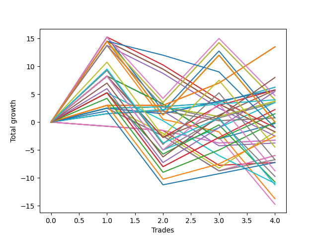

# Long Malinois 002 
- Symbol: ES_830-1130
- Date Range: 03/18/2022 - 12/30/2022
- Trading Period: 8:30-11:30
- Number of Trades: 4



| Name | Win Percent | Profit | Avg Profit / Trade | Avg Time / Trade |      | Name | Win Percent | Profit | Avg Profit / Trade | Avg Time / Trade |
| ---- | ----------- | ------ | ------------------ | ---------------- | ---- | ---- | ----------- | ------ | ------------------ | ---------------- |
| Sorted By <br> Profit | | | | | | Sorted By <br> Win Percentage ||||
| BB-50 U/L 1SD | 100.00 | 6750.00 | 1687.50 | 24:07 |     | BB-50 U/L 1SD | 100.00 | 6750.00 | 1687.50 | 24:07 |
| TP-7 | 75.00 | 4000.00 | 1000.00 | 35:56 |     | BB-20 U/L 2SD C | 100.00 | 3125.00 | 781.25 | 14:27 |
| BB-20 U/L 2SD C | 100.00 | 3125.00 | 781.25 | 14:27 |     | TP-1 | 100.00 | 2000.00 | 500.00 | 06:02 |
| BB-50 Mid | 75.00 | 2875.00 | 718.75 | 12:38 |     | TP-7 | 75.00 | 4000.00 | 1000.00 | 35:56 |
| TP-6 | 75.00 | 2750.00 | 687.50 | 33:01 |     | BB-50 Mid | 75.00 | 2875.00 | 718.75 | 12:38 |
| TP-1 | 100.00 | 2000.00 | 500.00 | 06:02 |     | TP-6 | 75.00 | 2750.00 | 687.50 | 33:01 |
| BB-20 U/L 2SD | 75.00 | 1875.00 | 468.75 | 13:51 |     | BB-20 U/L 2SD | 75.00 | 1875.00 | 468.75 | 13:51 |
| BB-100 Mid | 75.00 | 1750.00 | 437.50 | 31:28 |     | BB-100 Mid | 75.00 | 1750.00 | 437.50 | 31:28 |
| V Mid | 75.00 | 1750.00 | 437.50 | 32:08 |     | V Mid | 75.00 | 1750.00 | 437.50 | 32:08 |
| TP-5 | 75.00 | 1125.00 | 281.25 | 32:13 |     | TP-5 | 75.00 | 1125.00 | 281.25 | 32:13 |
| BB-20 U/L 1SD | 75.00 | 375.00 | 93.75 | 06:57 |     | BB-20 U/L 1SD | 75.00 | 375.00 | 93.75 | 06:57 |
| BB-100 U/L 2SD | 50.00 | 375.00 | 93.75 | 60:51 |     | TP-4 | 75.00 | 0.00 | 0.00 | 26:05 |
| TP-4 | 75.00 | 0.00 | 0.00 | 26:05 |     | TP-3 | 75.00 | -1250.00 | -312.50 | 25:33 |
| BB-200 U/L 2SD | 50.00 | 0.00 | 0.00 | 60:55 |     | TP-2 | 75.00 | -3625.00 | -906.25 | 20:23 |
| V U/L 1SD | 50.00 | 0.00 | 0.00 | 60:55 |     | BB-100 U/L 2SD | 50.00 | 375.00 | 93.75 | 60:51 |
| NEWFI 0000 | 25.00 | -500.00 | -125.00 | 28:47 |     | BB-200 U/L 2SD | 50.00 | 0.00 | 0.00 | 60:55 |
| TP-3 | 75.00 | -1250.00 | -312.50 | 25:33 |     | V U/L 1SD | 50.00 | 0.00 | 0.00 | 60:55 |
| BB-20 Mid | 25.00 | -1625.00 | -406.25 | 02:32 |     | TP-10 | 50.00 | -2250.00 | -562.50 | 53:53 |
| TP-10 | 50.00 | -2250.00 | -562.50 | 53:53 |     | TP-9 | 50.00 | -3375.00 | -843.75 | 53:21 |
| TP-9 | 50.00 | -3375.00 | -843.75 | 53:21 |     | TP-8 | 50.00 | -4375.00 | -1093.75 | 49:05 |
| TP-2 | 75.00 | -3625.00 | -906.25 | 20:23 |     | NEWFI 000 | 50.00 | -5625.00 | -1406.25 | 50:00 |
| TP-8 | 50.00 | -4375.00 | -1093.75 | 49:05 |     | BB-50 U/L 2SD | 50.00 | -7375.00 | -1843.75 | 44:31 |
| NEWFI 000 | 50.00 | -5625.00 | -1406.25 | 50:00 |     | NEWFI 0000 | 25.00 | -500.00 | -125.00 | 28:47 |
| BB-200 Mid | 25.00 | -6875.00 | -1718.75 | 42:06 |     | BB-20 Mid | 25.00 | -1625.00 | -406.25 | 02:32 |
| BB-50 U/L 2SD | 50.00 | -7375.00 | -1843.75 | 44:31 |     | BB-200 Mid | 25.00 | -6875.00 | -1718.75 | 42:06 |

## NO STOPLOSS

### Test BB-20 Mid
* Sell when price hits the middle line of the 20p bollinger
* No Stoploss
* Results:
```
Total Trades: 4
Percent Up: 25.00
Percent Down: 75.00
Total Points Moved Up: -3.25
Potential Profit: -1625.00
Total Points Ups: 0.50 Count Ups: 1
Total Points Downs: -3.75 Count Downs: 3
```

<details><summary>Trades</summary>

<code>In: 2022-07-08 10:07:00		Out: 2022-07-08 10:08:10		Total Position Time: 01:10		Total Move Up: -0.75		Total to Date: -0.75</code> <br />
<code>In: 2022-07-25 11:07:00		Out: 2022-07-25 11:10:40		Total Position Time: 03:40		Total Move Up: -0.75		Total to Date: -1.50</code> <br />
<code>In: 2022-09-12 09:08:00		Out: 2022-09-12 09:12:10		Total Position Time: 04:10		Total Move Up: -2.25		Total to Date: -3.75</code> <br />
<code>In: 2022-10-19 08:39:00		Out: 2022-10-19 08:40:10		Total Position Time: 01:10		Total Move Up: 0.50		Total to Date: -3.25</code> <br />


</details>

### Test BB-20 U/L 1SD
* Sell when the price hits the upper line of the 20p 1std bollinger
* No Stoploss
* Results:
```
Total Trades: 4
Percent Up: 75.00
Percent Down: 25.00
Total Points Moved Up: 0.75
Potential Profit: 375.00
Total Points Ups: 2.50 Count Ups: 3
Total Points Downs: -1.75 Count Downs: 1
```

<details><summary>Trades</summary>

<code>In: 2022-07-08 10:07:00		Out: 2022-07-08 10:09:40		Total Position Time: 02:40		Total Move Up: 1.50		Total to Date: 1.50</code> <br />
<code>In: 2022-07-25 11:07:00		Out: 2022-07-25 11:11:40		Total Position Time: 04:40		Total Move Up: 0.50		Total to Date: 2.00</code> <br />
<code>In: 2022-09-12 09:08:00		Out: 2022-09-12 09:21:25		Total Position Time: 13:25		Total Move Up: -1.75		Total to Date: 0.25</code> <br />
<code>In: 2022-10-19 08:39:00		Out: 2022-10-19 08:46:05		Total Position Time: 07:05		Total Move Up: 0.50		Total to Date: 0.75</code> <br />


</details>

### Test BB-20 U/L 2SD
* Sell when the price hits the upper line of the 20p 2std bollinger
* No Stoploss
* Results:
```
Total Trades: 4
Percent Up: 75.00
Percent Down: 25.00
Total Points Moved Up: 3.75
Potential Profit: 1875.00
Total Points Ups: 5.50 Count Ups: 3
Total Points Downs: -1.75 Count Downs: 1
```

<details><summary>Trades</summary>

<code>In: 2022-07-08 10:07:00		Out: 2022-07-08 10:11:05		Total Position Time: 04:05		Total Move Up: 2.50		Total to Date: 2.50</code> <br />
<code>In: 2022-07-25 11:07:00		Out: 2022-07-25 11:35:50		Total Position Time: 28:50		Total Move Up: 0.25		Total to Date: 2.75</code> <br />
<code>In: 2022-09-12 09:08:00		Out: 2022-09-12 09:21:25		Total Position Time: 13:25		Total Move Up: -1.75		Total to Date: 1.00</code> <br />
<code>In: 2022-10-19 08:39:00		Out: 2022-10-19 08:48:05		Total Position Time: 09:05		Total Move Up: 2.75		Total to Date: 3.75</code> <br />


</details>

### Test BB-20 U/L 2SD C
* Sell when the price hits the upper line of the 20p 2std bollinger
* No Stoploss
* Results:
```
Total Trades: 4
Percent Up: 100.00
Percent Down: 0.00
Total Points Moved Up: 6.25
Potential Profit: 3125.00
Total Points Ups: 6.25 Count Ups: 4
Total Points Downs: 0.00 Count Downs: 0
```

<details><summary>Trades</summary>

<code>In: 2022-07-08 10:07:00		Out: 2022-07-08 10:11:05		Total Position Time: 04:05		Total Move Up: 2.50		Total to Date: 2.50</code> <br />
<code>In: 2022-07-25 11:07:00		Out: 2022-07-25 11:35:50		Total Position Time: 28:50		Total Move Up: 0.25		Total to Date: 2.75</code> <br />
<code>In: 2022-09-12 09:08:00		Out: 2022-09-12 09:23:10		Total Position Time: 15:10		Total Move Up: 0.75		Total to Date: 3.50</code> <br />
<code>In: 2022-10-19 08:39:00		Out: 2022-10-19 08:48:45		Total Position Time: 09:45		Total Move Up: 2.75		Total to Date: 6.25</code> <br />


</details>

### Test BB-50 Mid
* Sell when price hits the middle line of the 50p bollinger
* No Stoploss
* Results:
```
Total Trades: 4
Percent Up: 75.00
Percent Down: 25.00
Total Points Moved Up: 5.75
Potential Profit: 2875.00
Total Points Ups: 6.75 Count Ups: 3
Total Points Downs: -1.00 Count Downs: 1
```

<details><summary>Trades</summary>

<code>In: 2022-07-08 10:07:00		Out: 2022-07-08 10:11:10		Total Position Time: 04:10		Total Move Up: 2.50		Total to Date: 2.50</code> <br />
<code>In: 2022-07-25 11:07:00		Out: 2022-07-25 11:35:45		Total Position Time: 28:45		Total Move Up: -1.00		Total to Date: 1.50</code> <br />
<code>In: 2022-09-12 09:08:00		Out: 2022-09-12 09:24:10		Total Position Time: 16:10		Total Move Up: 2.25		Total to Date: 3.75</code> <br />
<code>In: 2022-10-19 08:39:00		Out: 2022-10-19 08:40:30		Total Position Time: 01:30		Total Move Up: 2.00		Total to Date: 5.75</code> <br />


</details>

### Test BB-50 U/L 1SD
* Sell when the price hits the upper line of the 50p 1std bollinger
* No Stoploss
* Results:
```
Total Trades: 4
Percent Up: 100.00
Percent Down: 0.00
Total Points Moved Up: 13.50
Potential Profit: 6750.00
Total Points Ups: 13.50 Count Ups: 4
Total Points Downs: 0.00 Count Downs: 0
```

<details><summary>Trades</summary>

<code>In: 2022-07-08 10:07:00		Out: 2022-07-08 10:26:30		Total Position Time: 19:30		Total Move Up: 3.00		Total to Date: 3.00</code> <br />
<code>In: 2022-07-25 11:07:00		Out: 2022-07-25 11:41:00		Total Position Time: 34:00		Total Move Up: 0.00		Total to Date: 3.00</code> <br />
<code>In: 2022-09-12 09:08:00		Out: 2022-09-12 09:37:50		Total Position Time: 29:50		Total Move Up: 4.00		Total to Date: 7.00</code> <br />
<code>In: 2022-10-19 08:39:00		Out: 2022-10-19 08:52:10		Total Position Time: 13:10		Total Move Up: 6.50		Total to Date: 13.50</code> <br />


</details>

### Test BB-50 U/L 2SD
* Sell when the price hits the upper line of the 50p 2std bollinger
* No Stoploss
* Results:
```
Total Trades: 4
Percent Up: 50.00
Percent Down: 50.00
Total Points Moved Up: -14.75
Potential Profit: -7375.00
Total Points Ups: 10.50 Count Ups: 2
Total Points Downs: -25.25 Count Downs: 2
```

<details><summary>Trades</summary>

<code>In: 2022-07-08 10:07:00		Out: 2022-07-08 10:27:00		Total Position Time: 20:00		Total Move Up: 5.25		Total to Date: 5.25</code> <br />
<code>In: 2022-07-25 11:07:00		Out: 2022-07-25 12:07:55		Total Position Time: 60:55		Total Move Up: -13.25		Total to Date: -8.00</code> <br />
<code>In: 2022-09-12 09:08:00		Out: 2022-09-12 09:44:15		Total Position Time: 36:15		Total Move Up: 5.25		Total to Date: -2.75</code> <br />
<code>In: 2022-10-19 08:39:00		Out: 2022-10-19 09:39:55		Total Position Time: 60:55		Total Move Up: -12.00		Total to Date: -14.75</code> <br />


</details>

### Test V Mid
* Sell when the price hits the middle line of the 1std VWAP
* No Stoploss
* Results:
```
Total Trades: 4
Percent Up: 75.00
Percent Down: 25.00
Total Points Moved Up: 3.50
Potential Profit: 1750.00
Total Points Ups: 16.75 Count Ups: 3
Total Points Downs: -13.25 Count Downs: 1
```

<details><summary>Trades</summary>

<code>In: 2022-07-08 10:07:00		Out: 2022-07-08 10:29:10		Total Position Time: 22:10		Total Move Up: 8.25		Total to Date: 8.25</code> <br />
<code>In: 2022-07-25 11:07:00		Out: 2022-07-25 12:07:55		Total Position Time: 60:55		Total Move Up: -13.25		Total to Date: -5.00</code> <br />
<code>In: 2022-09-12 09:08:00		Out: 2022-09-12 09:44:25		Total Position Time: 36:25		Total Move Up: 5.75		Total to Date: 0.75</code> <br />
<code>In: 2022-10-19 08:39:00		Out: 2022-10-19 08:48:05		Total Position Time: 09:05		Total Move Up: 2.75		Total to Date: 3.50</code> <br />


</details>

### Test V U/L 1SD
* Sell when the price hits the upper line of the 1std VWAP
* No Stoploss
* Results:
```
Total Trades: 4
Percent Up: 50.00
Percent Down: 50.00
Total Points Moved Up: 0.00
Potential Profit: 0.00
Total Points Ups: 25.25 Count Ups: 2
Total Points Downs: -25.25 Count Downs: 2
```

<details><summary>Trades</summary>

<code>In: 2022-07-08 10:07:00		Out: 2022-07-08 11:07:55		Total Position Time: 60:55		Total Move Up: 14.50		Total to Date: 14.50</code> <br />
<code>In: 2022-07-25 11:07:00		Out: 2022-07-25 12:07:55		Total Position Time: 60:55		Total Move Up: -13.25		Total to Date: 1.25</code> <br />
<code>In: 2022-09-12 09:08:00		Out: 2022-09-12 10:08:55		Total Position Time: 60:55		Total Move Up: 10.75		Total to Date: 12.00</code> <br />
<code>In: 2022-10-19 08:39:00		Out: 2022-10-19 09:39:55		Total Position Time: 60:55		Total Move Up: -12.00		Total to Date: 0.00</code> <br />


</details>

### Test BB-100 Mid
* Move to BB100 Mid
* No Stoploss
* Results:
```
Total Trades: 4
Percent Up: 75.00
Percent Down: 25.00
Total Points Moved Up: 3.50
Potential Profit: 1750.00
Total Points Ups: 16.75 Count Ups: 3
Total Points Downs: -13.25 Count Downs: 1
```

<details><summary>Trades</summary>

<code>In: 2022-07-08 10:07:00		Out: 2022-07-08 10:29:10		Total Position Time: 22:10		Total Move Up: 8.25		Total to Date: 8.25</code> <br />
<code>In: 2022-07-25 11:07:00		Out: 2022-07-25 12:07:55		Total Position Time: 60:55		Total Move Up: -13.25		Total to Date: -5.00</code> <br />
<code>In: 2022-09-12 09:08:00		Out: 2022-09-12 09:37:50		Total Position Time: 29:50		Total Move Up: 4.00		Total to Date: -1.00</code> <br />
<code>In: 2022-10-19 08:39:00		Out: 2022-10-19 08:52:00		Total Position Time: 13:00		Total Move Up: 4.50		Total to Date: 3.50</code> <br />


</details>

### Test BB-100 U/L 2SD
* Move to BB100 Upper Band
* No Stoploss
* Results:
```
Total Trades: 4
Percent Up: 50.00
Percent Down: 50.00
Total Points Moved Up: 0.75
Potential Profit: 375.00
Total Points Ups: 26.00 Count Ups: 2
Total Points Downs: -25.25 Count Downs: 2
```

<details><summary>Trades</summary>

<code>In: 2022-07-08 10:07:00		Out: 2022-07-08 11:07:40		Total Position Time: 60:40		Total Move Up: 15.25		Total to Date: 15.25</code> <br />
<code>In: 2022-07-25 11:07:00		Out: 2022-07-25 12:07:55		Total Position Time: 60:55		Total Move Up: -13.25		Total to Date: 2.00</code> <br />
<code>In: 2022-09-12 09:08:00		Out: 2022-09-12 10:08:55		Total Position Time: 60:55		Total Move Up: 10.75		Total to Date: 12.75</code> <br />
<code>In: 2022-10-19 08:39:00		Out: 2022-10-19 09:39:55		Total Position Time: 60:55		Total Move Up: -12.00		Total to Date: 0.75</code> <br />


</details>

### Test BB-200 Mid
* Move to BB200 Mid
* No Stoploss
* Results:
```
Total Trades: 4
Percent Up: 25.00
Percent Down: 75.00
Total Points Moved Up: -13.75
Potential Profit: -6875.00
Total Points Ups: 13.75 Count Ups: 1
Total Points Downs: -27.50 Count Downs: 3
```

<details><summary>Trades</summary>

<code>In: 2022-07-08 10:07:00		Out: 2022-07-08 10:49:25		Total Position Time: 42:25		Total Move Up: 13.75		Total to Date: 13.75</code> <br />
<code>In: 2022-07-25 11:07:00		Out: 2022-07-25 12:07:55		Total Position Time: 60:55		Total Move Up: -13.25		Total to Date: 0.50</code> <br />
<code>In: 2022-09-12 09:08:00		Out: 2022-09-12 09:12:10		Total Position Time: 04:10		Total Move Up: -2.25		Total to Date: -1.75</code> <br />
<code>In: 2022-10-19 08:39:00		Out: 2022-10-19 09:39:55		Total Position Time: 60:55		Total Move Up: -12.00		Total to Date: -13.75</code> <br />


</details>

### Test BB-200 U/L 2SD
* Move to BB200 Upper Band
* No Stoploss
* Results:
```
Total Trades: 4
Percent Up: 50.00
Percent Down: 50.00
Total Points Moved Up: 0.00
Potential Profit: 0.00
Total Points Ups: 25.25 Count Ups: 2
Total Points Downs: -25.25 Count Downs: 2
```

<details><summary>Trades</summary>

<code>In: 2022-07-08 10:07:00		Out: 2022-07-08 11:07:55		Total Position Time: 60:55		Total Move Up: 14.50		Total to Date: 14.50</code> <br />
<code>In: 2022-07-25 11:07:00		Out: 2022-07-25 12:07:55		Total Position Time: 60:55		Total Move Up: -13.25		Total to Date: 1.25</code> <br />
<code>In: 2022-09-12 09:08:00		Out: 2022-09-12 10:08:55		Total Position Time: 60:55		Total Move Up: 10.75		Total to Date: 12.00</code> <br />
<code>In: 2022-10-19 08:39:00		Out: 2022-10-19 09:39:55		Total Position Time: 60:55		Total Move Up: -12.00		Total to Date: 0.00</code> <br />


</details>

## TAKE PROFIT

### Test TP-1
* Take Profit of 1 Point
* No Stoploss
* Results:
```
Total Trades: 4
Percent Up: 100.00
Percent Down: 0.00
Total Points Moved Up: 4.00
Potential Profit: 2000.00
Total Points Ups: 4.00 Count Ups: 4
Total Points Downs: 0.00 Count Downs: 0
```

<details><summary>Trades</summary>

<code>In: 2022-07-08 10:07:00		Out: 2022-07-08 10:09:40		Total Position Time: 02:40		Total Move Up: 1.50		Total to Date: 1.50</code> <br />
<code>In: 2022-07-25 11:07:00		Out: 2022-07-25 11:11:45		Total Position Time: 04:45		Total Move Up: 0.75		Total to Date: 2.25</code> <br />
<code>In: 2022-09-12 09:08:00		Out: 2022-09-12 09:23:20		Total Position Time: 15:20		Total Move Up: 1.00		Total to Date: 3.25</code> <br />
<code>In: 2022-10-19 08:39:00		Out: 2022-10-19 08:40:25		Total Position Time: 01:25		Total Move Up: 0.75		Total to Date: 4.00</code> <br />


</details>

### Test TP-2
* Take Profit of 2 Point
* No Stoploss
* Results:
```
Total Trades: 4
Percent Up: 75.00
Percent Down: 25.00
Total Points Moved Up: -7.25
Potential Profit: -3625.00
Total Points Ups: 6.00 Count Ups: 3
Total Points Downs: -13.25 Count Downs: 1
```

<details><summary>Trades</summary>

<code>In: 2022-07-08 10:07:00		Out: 2022-07-08 10:10:05		Total Position Time: 03:05		Total Move Up: 2.00		Total to Date: 2.00</code> <br />
<code>In: 2022-07-25 11:07:00		Out: 2022-07-25 12:07:55		Total Position Time: 60:55		Total Move Up: -13.25		Total to Date: -11.25</code> <br />
<code>In: 2022-09-12 09:08:00		Out: 2022-09-12 09:24:05		Total Position Time: 16:05		Total Move Up: 2.00		Total to Date: -9.25</code> <br />
<code>In: 2022-10-19 08:39:00		Out: 2022-10-19 08:40:30		Total Position Time: 01:30		Total Move Up: 2.00		Total to Date: -7.25</code> <br />


</details>

### Test TP-3
* Take Profit of 3 Point
* No Stoploss
* Results:
```
Total Trades: 4
Percent Up: 75.00
Percent Down: 25.00
Total Points Moved Up: -2.50
Potential Profit: -1250.00
Total Points Ups: 10.75 Count Ups: 3
Total Points Downs: -13.25 Count Downs: 1
```

<details><summary>Trades</summary>

<code>In: 2022-07-08 10:07:00		Out: 2022-07-08 10:11:15		Total Position Time: 04:15		Total Move Up: 3.00		Total to Date: 3.00</code> <br />
<code>In: 2022-07-25 11:07:00		Out: 2022-07-25 12:07:55		Total Position Time: 60:55		Total Move Up: -13.25		Total to Date: -10.25</code> <br />
<code>In: 2022-09-12 09:08:00		Out: 2022-09-12 09:32:15		Total Position Time: 24:15		Total Move Up: 2.75		Total to Date: -7.50</code> <br />
<code>In: 2022-10-19 08:39:00		Out: 2022-10-19 08:51:50		Total Position Time: 12:50		Total Move Up: 5.00		Total to Date: -2.50</code> <br />


</details>

### Test TP-4
* Take Profit of 4 Point
* No Stoploss
* Results:
```
Total Trades: 4
Percent Up: 75.00
Percent Down: 25.00
Total Points Moved Up: 0.00
Potential Profit: 0.00
Total Points Ups: 13.25 Count Ups: 3
Total Points Downs: -13.25 Count Downs: 1
```

<details><summary>Trades</summary>

<code>In: 2022-07-08 10:07:00		Out: 2022-07-08 10:12:25		Total Position Time: 05:25		Total Move Up: 4.25		Total to Date: 4.25</code> <br />
<code>In: 2022-07-25 11:07:00		Out: 2022-07-25 12:07:55		Total Position Time: 60:55		Total Move Up: -13.25		Total to Date: -9.00</code> <br />
<code>In: 2022-09-12 09:08:00		Out: 2022-09-12 09:33:10		Total Position Time: 25:10		Total Move Up: 4.00		Total to Date: -5.00</code> <br />
<code>In: 2022-10-19 08:39:00		Out: 2022-10-19 08:51:50		Total Position Time: 12:50		Total Move Up: 5.00		Total to Date: 0.00</code> <br />


</details>

### Test TP-5
* Take Profit of 5 Point
* No Stoploss
* Results:
```
Total Trades: 4
Percent Up: 75.00
Percent Down: 25.00
Total Points Moved Up: 2.25
Potential Profit: 1125.00
Total Points Ups: 15.50 Count Ups: 3
Total Points Downs: -13.25 Count Downs: 1
```

<details><summary>Trades</summary>

<code>In: 2022-07-08 10:07:00		Out: 2022-07-08 10:27:00		Total Position Time: 20:00		Total Move Up: 5.25		Total to Date: 5.25</code> <br />
<code>In: 2022-07-25 11:07:00		Out: 2022-07-25 12:07:55		Total Position Time: 60:55		Total Move Up: -13.25		Total to Date: -8.00</code> <br />
<code>In: 2022-09-12 09:08:00		Out: 2022-09-12 09:43:10		Total Position Time: 35:10		Total Move Up: 5.25		Total to Date: -2.75</code> <br />
<code>In: 2022-10-19 08:39:00		Out: 2022-10-19 08:51:50		Total Position Time: 12:50		Total Move Up: 5.00		Total to Date: 2.25</code> <br />


</details>

### Test TP-6
* Take Profit of 6 Point
* No Stoploss
* Results:
```
Total Trades: 4
Percent Up: 75.00
Percent Down: 25.00
Total Points Moved Up: 5.50
Potential Profit: 2750.00
Total Points Ups: 18.75 Count Ups: 3
Total Points Downs: -13.25 Count Downs: 1
```

<details><summary>Trades</summary>

<code>In: 2022-07-08 10:07:00		Out: 2022-07-08 10:28:10		Total Position Time: 21:10		Total Move Up: 6.00		Total to Date: 6.00</code> <br />
<code>In: 2022-07-25 11:07:00		Out: 2022-07-25 12:07:55		Total Position Time: 60:55		Total Move Up: -13.25		Total to Date: -7.25</code> <br />
<code>In: 2022-09-12 09:08:00		Out: 2022-09-12 09:44:50		Total Position Time: 36:50		Total Move Up: 6.25		Total to Date: -1.00</code> <br />
<code>In: 2022-10-19 08:39:00		Out: 2022-10-19 08:52:10		Total Position Time: 13:10		Total Move Up: 6.50		Total to Date: 5.50</code> <br />


</details>

### Test TP-7
* Take Profit of 7 Point
* No Stoploss
* Results:
```
Total Trades: 4
Percent Up: 75.00
Percent Down: 25.00
Total Points Moved Up: 8.00
Potential Profit: 4000.00
Total Points Ups: 21.25 Count Ups: 3
Total Points Downs: -13.25 Count Downs: 1
```

<details><summary>Trades</summary>

<code>In: 2022-07-08 10:07:00		Out: 2022-07-08 10:28:40		Total Position Time: 21:40		Total Move Up: 7.00		Total to Date: 7.00</code> <br />
<code>In: 2022-07-25 11:07:00		Out: 2022-07-25 12:07:55		Total Position Time: 60:55		Total Move Up: -13.25		Total to Date: -6.25</code> <br />
<code>In: 2022-09-12 09:08:00		Out: 2022-09-12 09:55:55		Total Position Time: 47:55		Total Move Up: 7.25		Total to Date: 1.00</code> <br />
<code>In: 2022-10-19 08:39:00		Out: 2022-10-19 08:52:15		Total Position Time: 13:15		Total Move Up: 7.00		Total to Date: 8.00</code> <br />


</details>

### Test TP-8
* Take Profit of 8 Point
* No Stoploss
* Results:
```
Total Trades: 4
Percent Up: 50.00
Percent Down: 50.00
Total Points Moved Up: -8.75
Potential Profit: -4375.00
Total Points Ups: 16.50 Count Ups: 2
Total Points Downs: -25.25 Count Downs: 2
```

<details><summary>Trades</summary>

<code>In: 2022-07-08 10:07:00		Out: 2022-07-08 10:29:10		Total Position Time: 22:10		Total Move Up: 8.25		Total to Date: 8.25</code> <br />
<code>In: 2022-07-25 11:07:00		Out: 2022-07-25 12:07:55		Total Position Time: 60:55		Total Move Up: -13.25		Total to Date: -5.00</code> <br />
<code>In: 2022-09-12 09:08:00		Out: 2022-09-12 10:00:20		Total Position Time: 52:20		Total Move Up: 8.25		Total to Date: 3.25</code> <br />
<code>In: 2022-10-19 08:39:00		Out: 2022-10-19 09:39:55		Total Position Time: 60:55		Total Move Up: -12.00		Total to Date: -8.75</code> <br />


</details>

### Test TP-9
* Take Profit of 9 Point
* No Stoploss
* Results:
```
Total Trades: 4
Percent Up: 50.00
Percent Down: 50.00
Total Points Moved Up: -6.75
Potential Profit: -3375.00
Total Points Ups: 18.50 Count Ups: 2
Total Points Downs: -25.25 Count Downs: 2
```

<details><summary>Trades</summary>

<code>In: 2022-07-08 10:07:00		Out: 2022-07-08 10:39:20		Total Position Time: 32:20		Total Move Up: 9.25		Total to Date: 9.25</code> <br />
<code>In: 2022-07-25 11:07:00		Out: 2022-07-25 12:07:55		Total Position Time: 60:55		Total Move Up: -13.25		Total to Date: -4.00</code> <br />
<code>In: 2022-09-12 09:08:00		Out: 2022-09-12 10:07:15		Total Position Time: 59:15		Total Move Up: 9.25		Total to Date: 5.25</code> <br />
<code>In: 2022-10-19 08:39:00		Out: 2022-10-19 09:39:55		Total Position Time: 60:55		Total Move Up: -12.00		Total to Date: -6.75</code> <br />


</details>

### Test TP-10
* Take Profit of 10 Point
* No Stoploss
* Results:
```
Total Trades: 4
Percent Up: 50.00
Percent Down: 50.00
Total Points Moved Up: -4.50
Potential Profit: -2250.00
Total Points Ups: 20.75 Count Ups: 2
Total Points Downs: -25.25 Count Downs: 2
```

<details><summary>Trades</summary>

<code>In: 2022-07-08 10:07:00		Out: 2022-07-08 10:40:55		Total Position Time: 33:55		Total Move Up: 10.75		Total to Date: 10.75</code> <br />
<code>In: 2022-07-25 11:07:00		Out: 2022-07-25 12:07:55		Total Position Time: 60:55		Total Move Up: -13.25		Total to Date: -2.50</code> <br />
<code>In: 2022-09-12 09:08:00		Out: 2022-09-12 10:07:50		Total Position Time: 59:50		Total Move Up: 10.00		Total to Date: 7.50</code> <br />
<code>In: 2022-10-19 08:39:00		Out: 2022-10-19 09:39:55		Total Position Time: 60:55		Total Move Up: -12.00		Total to Date: -4.50</code> <br />


</details>

## Indicator Exits

### Test NEWFI 000
* Newfi 0000
* No Stoploss
* Results:
```
Total Trades: 4
Percent Up: 50.00
Percent Down: 50.00
Total Points Moved Up: -11.25
Potential Profit: -5625.00
Total Points Ups: 14.00 Count Ups: 2
Total Points Downs: -25.25 Count Downs: 2
```

<details><summary>Trades</summary>

<code>In: 2022-07-08 10:07:00		Out: 2022-07-08 10:45:05		Total Position Time: 38:05		Total Move Up: 9.50		Total to Date: 9.50</code> <br />
<code>In: 2022-07-25 11:07:00		Out: 2022-07-25 12:07:55		Total Position Time: 60:55		Total Move Up: -13.25		Total to Date: -3.75</code> <br />
<code>In: 2022-09-12 09:08:00		Out: 2022-09-12 09:48:05		Total Position Time: 40:05		Total Move Up: 4.50		Total to Date: 0.75</code> <br />
<code>In: 2022-10-19 08:39:00		Out: 2022-10-19 09:39:55		Total Position Time: 60:55		Total Move Up: -12.00		Total to Date: -11.25</code> <br />


</details>

### Test NEWFI 0000
* Newfi 0000
* No Stoploss
* Results:
```
Total Trades: 4
Percent Up: 25.00
Percent Down: 75.00
Total Points Moved Up: -1.00
Potential Profit: -500.00
Total Points Ups: 14.50 Count Ups: 1
Total Points Downs: -15.50 Count Downs: 3
```

<details><summary>Trades</summary>

<code>In: 2022-07-08 10:07:00		Out: 2022-07-08 11:07:55		Total Position Time: 60:55		Total Move Up: 14.50		Total to Date: 14.50</code> <br />
<code>In: 2022-07-25 11:07:00		Out: 2022-07-25 11:24:05		Total Position Time: 17:05		Total Move Up: -2.50		Total to Date: 12.00</code> <br />
<code>In: 2022-09-12 09:08:00		Out: 2022-09-12 09:13:05		Total Position Time: 05:05		Total Move Up: -3.00		Total to Date: 9.00</code> <br />
<code>In: 2022-10-19 08:39:00		Out: 2022-10-19 09:11:05		Total Position Time: 32:05		Total Move Up: -10.00		Total to Date: -1.00</code> <br />


</details>