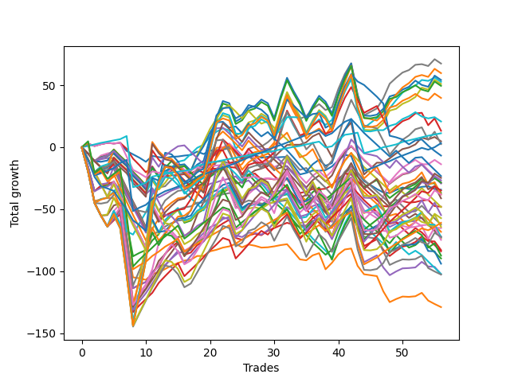

# Long Malinois 003 
- Symbol: ES_830-1130
- Date Range: 03/18/2022 - 12/30/2022
- Trading Period: 8:30-11:30
- Number of Trades: 56



| Name | Win Percent | Profit | Avg Profit / Trade | Avg Time / Trade |      | Name | Win Percent | Profit | Avg Profit / Trade | Avg Time / Trade |
| ---- | ----------- | ------ | ------------------ | ---------------- | ---- | ---- | ----------- | ------ | ------------------ | ---------------- |
| Sorted By <br> Profit | | | | | | Sorted By <br> Win Percentage ||||
| V Mid | 76.79 | 33750.00 | 602.68 | 32:53 |     | TP-1 | 94.64 | 5625.00 | 100.45 | 10:26 |
| BB-200 Mid | 69.64 | 29875.00 | 533.48 | 39:13 |     | TP-2 | 89.29 | 1625.00 | 29.02 | 16:56 |
| BB-100 U/L 2SD | 55.36 | 27125.00 | 484.38 | 57:14 |     | BB-50 U/L 1SD | 78.57 | 2375.00 | 42.41 | 32:37 |
| BB-100 Mid | 73.21 | 26375.00 | 470.98 | 36:32 |     | TP-3 | 78.57 | -30500.00 | -544.64 | 23:30 |
| V U/L 1SD | 58.93 | 25500.00 | 455.36 | 55:55 |     | V Mid | 76.79 | 33750.00 | 602.68 | 32:53 |
| BB-200 U/L 2SD | 55.36 | 24750.00 | 441.96 | 59:27 |     | TP-4 | 75.00 | -14250.00 | -254.46 | 28:57 |
| NEWFI 06 | 55.36 | 19875.00 | 354.91 | 58:52 |     | BB-100 Mid | 73.21 | 26375.00 | 470.98 | 36:32 |
| NEWFI 000 | 55.36 | 10375.00 | 185.27 | 55:28 |     | BB-200 Mid | 69.64 | 29875.00 | 533.48 | 39:13 |
| V Mid SL-10 | 64.29 | 6625.00 | 118.30 | 19:11 |     | TP-5 | 69.64 | -17500.00 | -312.50 | 33:36 |
| TP-1 | 94.64 | 5625.00 | 100.45 | 10:26 |     | TP-6 | 67.86 | -13375.00 | -238.84 | 37:49 |
| BB-50 U/L 1SD | 78.57 | 2375.00 | 42.41 | 32:37 |     | BB-20 U/L 2SD | 66.07 | -18500.00 | -330.36 | 21:51 |
| TP-2 | 89.29 | 1625.00 | 29.02 | 16:56 |     | BB-20 U/L 2SD C | 66.07 | -41500.00 | -741.07 | 24:10 |
| BB-200 Mid SL-10 | 57.14 | 1250.00 | 22.32 | 22:52 |     | V Mid SL-10 | 64.29 | 6625.00 | 118.30 | 19:11 |
| NEWFI 0000 | 37.50 | -3375.00 | -60.27 | 30:35 |     | TP-7 | 64.29 | -12375.00 | -220.98 | 41:45 |
| BB-50 U/L 2SD | 62.50 | -6875.00 | -122.77 | 45:30 |     | BB-50 Mid | 64.29 | -51250.00 | -915.18 | 23:58 |
| V Mid SL-5 | 42.86 | -11625.00 | -207.59 | 12:01 |     | BB-50 U/L 2SD | 62.50 | -6875.00 | -122.77 | 45:30 |
| TP-7 | 64.29 | -12375.00 | -220.98 | 41:45 |     | TP-8 | 60.71 | -19125.00 | -341.52 | 44:48 |
| TP-6 | 67.86 | -13375.00 | -238.84 | 37:49 |     | BB-50 U/L 1SD SL-10 | 60.71 | -19125.00 | -341.52 | 19:38 |
| TP-4 | 75.00 | -14250.00 | -254.46 | 28:57 |     | BB-20 U/L 2SD C SL-10 | 60.71 | -36250.00 | -647.32 | 13:17 |
| BB-20 U/L 2SD C SL-5 | 50.00 | -14250.00 | -254.46 | 09:12 |     | BB-20 U/L 2SD SL-10 | 60.71 | -36750.00 | -656.25 | 12:25 |
| BB-20 U/L 2SD SL-5 | 50.00 | -14500.00 | -258.93 | 08:21 |     | V U/L 1SD | 58.93 | 25500.00 | 455.36 | 55:55 |
| BB-200 Mid SL-5 | 35.71 | -14625.00 | -261.16 | 13:42 |     | BB-100 Mid SL-10 | 58.93 | -20625.00 | -368.30 | 23:08 |
| BB-20 Mid | 51.79 | -17125.00 | -305.80 | 05:34 |     | BB-200 Mid SL-10 | 57.14 | 1250.00 | 22.32 | 22:52 |
| TP-5 | 69.64 | -17500.00 | -312.50 | 33:36 |     | BB-50 Mid SL-10 | 57.14 | -47000.00 | -839.29 | 13:15 |
| BB-20 U/L 2SD | 66.07 | -18500.00 | -330.36 | 21:51 |     | BB-20 U/L 1SD | 57.14 | -64500.00 | -1151.79 | 15:34 |
| TP-8 | 60.71 | -19125.00 | -341.52 | 44:48 |     | BB-100 U/L 2SD | 55.36 | 27125.00 | 484.38 | 57:14 |
| BB-50 U/L 1SD SL-10 | 60.71 | -19125.00 | -341.52 | 19:38 |     | BB-200 U/L 2SD | 55.36 | 24750.00 | 441.96 | 59:27 |
| BB-100 Mid SL-10 | 58.93 | -20625.00 | -368.30 | 23:08 |     | NEWFI 06 | 55.36 | 19875.00 | 354.91 | 58:52 |
| BB-20 Mid SL-5 | 51.79 | -24000.00 | -428.57 | 02:40 |     | NEWFI 000 | 55.36 | 10375.00 | 185.27 | 55:28 |
| BB-50 U/L 1SD SL-5 | 37.50 | -24125.00 | -430.80 | 13:01 |     | TP-10 | 55.36 | -28625.00 | -511.16 | 48:15 |
| V U/L 1SD SL-10 | 44.64 | -27375.00 | -488.84 | 36:53 |     | TP-9 | 55.36 | -36250.00 | -647.32 | 47:32 |
| TP-10 | 55.36 | -28625.00 | -511.16 | 48:15 |     | BB-20 U/L 1SD SL-10 | 55.36 | -51375.00 | -917.41 | 08:57 |
| TP-3 | 78.57 | -30500.00 | -544.64 | 23:30 |     | BB-20 U/L 1SD SL-5 | 53.57 | -36000.00 | -642.86 | 06:09 |
| BB-50 Mid SL-5 | 44.64 | -31250.00 | -558.04 | 08:33 |     | BB-20 Mid | 51.79 | -17125.00 | -305.80 | 05:34 |
| BB-200 U/L 2SD SL-10 | 41.07 | -32125.00 | -573.66 | 39:30 |     | BB-20 Mid SL-5 | 51.79 | -24000.00 | -428.57 | 02:40 |
| BB-20 Mid SL-10 | 51.79 | -32625.00 | -582.59 | 04:02 |     | BB-20 Mid SL-10 | 51.79 | -32625.00 | -582.59 | 04:02 |
| V U/L 1SD SL-5 | 23.21 | -34125.00 | -609.38 | 21:53 |     | BB-20 U/L 2SD C SL-5 | 50.00 | -14250.00 | -254.46 | 09:12 |
| BB-20 U/L 1SD SL-5 | 53.57 | -36000.00 | -642.86 | 06:09 |     | BB-20 U/L 2SD SL-5 | 50.00 | -14500.00 | -258.93 | 08:21 |
| BB-20 U/L 2SD C SL-10 | 60.71 | -36250.00 | -647.32 | 13:17 |     | BB-50 U/L 2SD SL-10 | 46.43 | -43750.00 | -781.25 | 28:39 |
| TP-9 | 55.36 | -36250.00 | -647.32 | 47:32 |     | V U/L 1SD SL-10 | 44.64 | -27375.00 | -488.84 | 36:53 |
| BB-200 U/L 2SD SL-5 | 19.64 | -36250.00 | -647.32 | 24:09 |     | BB-50 Mid SL-5 | 44.64 | -31250.00 | -558.04 | 08:33 |
| BB-20 U/L 2SD SL-10 | 60.71 | -36750.00 | -656.25 | 12:25 |     | V Mid SL-5 | 42.86 | -11625.00 | -207.59 | 12:01 |
| BB-100 U/L 2SD SL-10 | 41.07 | -37375.00 | -667.41 | 37:28 |     | BB-200 U/L 2SD SL-10 | 41.07 | -32125.00 | -573.66 | 39:30 |
| BB-20 U/L 2SD C | 66.07 | -41500.00 | -741.07 | 24:10 |     | BB-100 U/L 2SD SL-10 | 41.07 | -37375.00 | -667.41 | 37:28 |
| BB-100 U/L 2SD SL-5 | 19.64 | -42000.00 | -750.00 | 22:18 |     | NEWFI 0000 | 37.50 | -3375.00 | -60.27 | 30:35 |
| BB-50 U/L 2SD SL-10 | 46.43 | -43750.00 | -781.25 | 28:39 |     | BB-50 U/L 1SD SL-5 | 37.50 | -24125.00 | -430.80 | 13:01 |
| BB-100 Mid SL-5 | 32.14 | -44875.00 | -801.34 | 14:23 |     | BB-200 Mid SL-5 | 35.71 | -14625.00 | -261.16 | 13:42 |
| BB-50 Mid SL-10 | 57.14 | -47000.00 | -839.29 | 13:15 |     | BB-100 Mid SL-5 | 32.14 | -44875.00 | -801.34 | 14:23 |
| BB-50 U/L 2SD SL-5 | 21.43 | -51125.00 | -912.95 | 18:09 |     | V U/L 1SD SL-5 | 23.21 | -34125.00 | -609.38 | 21:53 |
| BB-50 Mid | 64.29 | -51250.00 | -915.18 | 23:58 |     | BB-50 U/L 2SD SL-5 | 21.43 | -51125.00 | -912.95 | 18:09 |
| BB-20 U/L 1SD SL-10 | 55.36 | -51375.00 | -917.41 | 08:57 |     | BB-200 U/L 2SD SL-5 | 19.64 | -36250.00 | -647.32 | 24:09 |
| BB-20 U/L 1SD | 57.14 | -64500.00 | -1151.79 | 15:34 |     | BB-100 U/L 2SD SL-5 | 19.64 | -42000.00 | -750.00 | 22:18 |

## NO STOPLOSS

### Test BB-20 Mid
* Sell when price hits the middle line of the 20p bollinger
* No Stoploss
* Results:
```
Total Trades: 56
Percent Up: 51.79
Percent Down: 48.21
Total Points Moved Up: -34.25
Potential Profit: -17125.00
Total Points Ups: 45.75 Count Ups: 29
Total Points Downs: -80.00 Count Downs: 27
```

<details><summary>Trades</summary>

<code>In: 2022-03-21 09:43:00		Out: 2022-03-21 09:45:05		Total Position Time: 02:05		Total Move Up: 2.75		Total to Date: 2.75</code> <br />
<code>In: 2022-03-21 09:45:00		Out: 2022-03-21 09:47:05		Total Position Time: 02:05		Total Move Up: -1.75		Total to Date: 1.00</code> <br />
<code>In: 2022-03-23 09:17:00		Out: 2022-03-23 09:19:25		Total Position Time: 02:25		Total Move Up: 1.50		Total to Date: 2.50</code> <br />
<code>In: 2022-03-31 08:41:00		Out: 2022-03-31 08:42:10		Total Position Time: 01:10		Total Move Up: 1.00		Total to Date: 3.50</code> <br />
<code>In: 2022-04-20 09:19:00		Out: 2022-04-20 09:30:50		Total Position Time: 11:50		Total Move Up: -0.50		Total to Date: 3.00</code> <br />
<code>In: 2022-05-06 11:13:00		Out: 2022-05-06 11:15:05		Total Position Time: 02:05		Total Move Up: 0.50		Total to Date: 3.50</code> <br />
<code>In: 2022-05-11 09:37:00		Out: 2022-05-11 09:49:20		Total Position Time: 12:20		Total Move Up: -6.50		Total to Date: -3.00</code> <br />
<code>In: 2022-05-12 10:13:00		Out: 2022-05-12 10:16:05		Total Position Time: 03:05		Total Move Up: -2.75		Total to Date: -5.75</code> <br />
<code>In: 2022-05-13 11:11:00		Out: 2022-05-13 11:19:15		Total Position Time: 08:15		Total Move Up: -2.75		Total to Date: -8.50</code> <br />
<code>In: 2022-05-13 11:12:00		Out: 2022-05-13 11:19:15		Total Position Time: 07:15		Total Move Up: -3.25		Total to Date: -11.75</code> <br />
<code>In: 2022-05-13 11:30:00		Out: 2022-05-13 11:31:10		Total Position Time: 01:10		Total Move Up: 4.75		Total to Date: -7.00</code> <br />
<code>In: 2022-05-17 11:28:00		Out: 2022-05-17 11:31:35		Total Position Time: 03:35		Total Move Up: -1.00		Total to Date: -8.00</code> <br />
<code>In: 2022-05-19 10:20:00		Out: 2022-05-19 10:21:10		Total Position Time: 01:10		Total Move Up: -0.75		Total to Date: -8.75</code> <br />
<code>In: 2022-06-27 09:39:00		Out: 2022-06-27 09:41:05		Total Position Time: 02:05		Total Move Up: 1.00		Total to Date: -7.75</code> <br />
<code>In: 2022-06-27 09:41:00		Out: 2022-06-27 09:42:10		Total Position Time: 01:10		Total Move Up: 0.25		Total to Date: -7.50</code> <br />
<code>In: 2022-06-27 10:12:00		Out: 2022-06-27 10:13:10		Total Position Time: 01:10		Total Move Up: 0.75		Total to Date: -6.75</code> <br />
<code>In: 2022-06-27 10:54:00		Out: 2022-06-27 10:55:15		Total Position Time: 01:15		Total Move Up: 0.50		Total to Date: -6.25</code> <br />
<code>In: 2022-07-20 10:19:00		Out: 2022-07-20 10:20:15		Total Position Time: 01:15		Total Move Up: 2.75		Total to Date: -3.50</code> <br />
<code>In: 2022-07-20 10:20:00		Out: 2022-07-20 10:23:05		Total Position Time: 03:05		Total Move Up: -2.00		Total to Date: -5.50</code> <br />
<code>In: 2022-07-20 11:03:00		Out: 2022-07-20 11:04:25		Total Position Time: 01:25		Total Move Up: 2.75		Total to Date: -2.75</code> <br />
<code>In: 2022-07-20 11:04:00		Out: 2022-07-20 11:05:10		Total Position Time: 01:10		Total Move Up: 0.50		Total to Date: -2.25</code> <br />
<code>In: 2022-07-25 09:28:00		Out: 2022-07-25 09:29:10		Total Position Time: 01:10		Total Move Up: 0.50		Total to Date: -1.75</code> <br />
<code>In: 2022-07-25 11:24:00		Out: 2022-07-25 11:25:35		Total Position Time: 01:35		Total Move Up: 0.75		Total to Date: -1.00</code> <br />
<code>In: 2022-08-01 10:09:00		Out: 2022-08-01 10:14:20		Total Position Time: 05:20		Total Move Up: -0.50		Total to Date: -1.50</code> <br />
<code>In: 2022-08-01 10:42:00		Out: 2022-08-01 10:56:50		Total Position Time: 14:50		Total Move Up: -5.50		Total to Date: -7.00</code> <br />
<code>In: 2022-08-01 10:53:00		Out: 2022-08-01 10:56:50		Total Position Time: 03:50		Total Move Up: -0.50		Total to Date: -7.50</code> <br />
<code>In: 2022-08-05 08:33:00		Out: 2022-08-05 08:37:00		Total Position Time: 04:00		Total Move Up: 1.25		Total to Date: -6.25</code> <br />
<code>In: 2022-08-18 09:35:00		Out: 2022-08-18 09:48:00		Total Position Time: 13:00		Total Move Up: -2.25		Total to Date: -8.50</code> <br />
<code>In: 2022-08-25 08:31:00		Out: 2022-08-25 08:32:10		Total Position Time: 01:10		Total Move Up: 0.75		Total to Date: -7.75</code> <br />
<code>In: 2022-09-06 09:31:00		Out: 2022-09-06 09:35:20		Total Position Time: 04:20		Total Move Up: -0.75		Total to Date: -8.50</code> <br />
<code>In: 2022-09-06 10:20:00		Out: 2022-09-06 10:25:10		Total Position Time: 05:10		Total Move Up: 0.50		Total to Date: -8.00</code> <br />
<code>In: 2022-09-06 10:21:00		Out: 2022-09-06 10:25:10		Total Position Time: 04:10		Total Move Up: 0.25		Total to Date: -7.75</code> <br />
<code>In: 2022-09-14 10:54:00		Out: 2022-09-14 11:15:30		Total Position Time: 21:30		Total Move Up: -7.00		Total to Date: -14.75</code> <br />
<code>In: 2022-09-14 10:55:00		Out: 2022-09-14 11:15:30		Total Position Time: 20:30		Total Move Up: -7.25		Total to Date: -22.00</code> <br />
<code>In: 2022-09-16 08:34:00		Out: 2022-09-16 08:35:10		Total Position Time: 01:10		Total Move Up: 1.25		Total to Date: -20.75</code> <br />
<code>In: 2022-09-19 08:44:00		Out: 2022-09-19 08:46:05		Total Position Time: 02:05		Total Move Up: 2.00		Total to Date: -18.75</code> <br />
<code>In: 2022-09-19 08:46:00		Out: 2022-09-19 08:47:10		Total Position Time: 01:10		Total Move Up: -0.25		Total to Date: -19.00</code> <br />
<code>In: 2022-09-20 10:24:00		Out: 2022-09-20 10:25:10		Total Position Time: 01:10		Total Move Up: 0.50		Total to Date: -18.50</code> <br />
<code>In: 2022-09-29 09:28:00		Out: 2022-09-29 09:32:20		Total Position Time: 04:20		Total Move Up: 3.00		Total to Date: -15.50</code> <br />
<code>In: 2022-10-04 10:25:00		Out: 2022-10-04 10:26:10		Total Position Time: 01:10		Total Move Up: 5.00		Total to Date: -10.50</code> <br />
<code>In: 2022-10-04 10:26:00		Out: 2022-10-04 10:27:10		Total Position Time: 01:10		Total Move Up: 4.25		Total to Date: -6.25</code> <br />
<code>In: 2022-10-04 10:27:00		Out: 2022-10-04 10:28:10		Total Position Time: 01:10		Total Move Up: -0.75		Total to Date: -7.00</code> <br />
<code>In: 2022-10-20 09:18:00		Out: 2022-10-20 09:57:05		Total Position Time: 39:05		Total Move Up: -13.75		Total to Date: -20.75</code> <br />
<code>In: 2022-10-20 09:34:00		Out: 2022-10-20 09:57:05		Total Position Time: 23:05		Total Move Up: -6.50		Total to Date: -27.25</code> <br />
<code>In: 2022-11-07 08:50:00		Out: 2022-11-07 09:07:00		Total Position Time: 17:00		Total Move Up: -3.25		Total to Date: -30.50</code> <br />
<code>In: 2022-11-07 08:52:00		Out: 2022-11-07 09:07:00		Total Position Time: 15:00		Total Move Up: -3.25		Total to Date: -33.75</code> <br />
<code>In: 2022-11-08 11:04:00		Out: 2022-11-08 11:15:05		Total Position Time: 11:05		Total Move Up: -2.75		Total to Date: -36.50</code> <br />
<code>In: 2022-11-08 11:15:00		Out: 2022-11-08 11:16:15		Total Position Time: 01:15		Total Move Up: -0.50		Total to Date: -37.00</code> <br />
<code>In: 2022-12-08 11:15:00		Out: 2022-12-08 11:17:10		Total Position Time: 02:10		Total Move Up: 2.50		Total to Date: -34.50</code> <br />
<code>In: 2022-12-08 11:17:00		Out: 2022-12-08 11:18:10		Total Position Time: 01:10		Total Move Up: 2.00		Total to Date: -32.50</code> <br />
<code>In: 2022-12-08 11:18:00		Out: 2022-12-08 11:19:10		Total Position Time: 01:10		Total Move Up: -1.25		Total to Date: -33.75</code> <br />
<code>In: 2022-12-09 11:15:00		Out: 2022-12-09 11:16:10		Total Position Time: 01:10		Total Move Up: 0.50		Total to Date: -33.25</code> <br />
<code>In: 2022-12-27 09:53:00		Out: 2022-12-27 09:56:10		Total Position Time: 03:10		Total Move Up: 1.25		Total to Date: -32.00</code> <br />
<code>In: 2022-12-27 11:02:00		Out: 2022-12-27 11:03:20		Total Position Time: 01:20		Total Move Up: 0.50		Total to Date: -31.50</code> <br />
<code>In: 2022-12-27 11:26:00		Out: 2022-12-27 11:34:50		Total Position Time: 08:50		Total Move Up: -2.25		Total to Date: -33.75</code> <br />
<code>In: 2022-12-30 10:31:00		Out: 2022-12-30 10:32:10		Total Position Time: 01:10		Total Move Up: -0.50		Total to Date: -34.25</code> <br />


</details>

### Test BB-20 U/L 1SD
* Sell when the price hits the upper line of the 20p 1std bollinger
* No Stoploss
* Results:
```
Total Trades: 56
Percent Up: 57.14
Percent Down: 42.86
Total Points Moved Up: -129.00
Potential Profit: -64500.00
Total Points Ups: 66.75 Count Ups: 32
Total Points Downs: -195.75 Count Downs: 24
```

<details><summary>Trades</summary>

<code>In: 2022-03-21 09:43:00		Out: 2022-03-21 10:32:05		Total Position Time: 49:05		Total Move Up: -20.00		Total to Date: -20.00</code> <br />
<code>In: 2022-03-21 09:45:00		Out: 2022-03-21 10:32:05		Total Position Time: 47:05		Total Move Up: -23.50		Total to Date: -43.50</code> <br />
<code>In: 2022-03-23 09:17:00		Out: 2022-03-23 09:30:05		Total Position Time: 13:05		Total Move Up: 1.50		Total to Date: -42.00</code> <br />
<code>In: 2022-03-31 08:41:00		Out: 2022-03-31 08:42:10		Total Position Time: 01:10		Total Move Up: 1.00		Total to Date: -41.00</code> <br />
<code>In: 2022-04-20 09:19:00		Out: 2022-04-20 09:31:05		Total Position Time: 12:05		Total Move Up: 0.00		Total to Date: -41.00</code> <br />
<code>In: 2022-05-06 11:13:00		Out: 2022-05-06 11:49:10		Total Position Time: 36:10		Total Move Up: -6.50		Total to Date: -47.50</code> <br />
<code>In: 2022-05-11 09:37:00		Out: 2022-05-11 10:24:35		Total Position Time: 47:35		Total Move Up: -28.00		Total to Date: -75.50</code> <br />
<code>In: 2022-05-12 10:13:00		Out: 2022-05-12 11:02:25		Total Position Time: 49:25		Total Move Up: -29.50		Total to Date: -105.00</code> <br />
<code>In: 2022-05-13 11:11:00		Out: 2022-05-13 11:20:05		Total Position Time: 09:05		Total Move Up: -0.75		Total to Date: -105.75</code> <br />
<code>In: 2022-05-13 11:12:00		Out: 2022-05-13 11:20:05		Total Position Time: 08:05		Total Move Up: -1.25		Total to Date: -107.00</code> <br />
<code>In: 2022-05-13 11:30:00		Out: 2022-05-13 11:31:10		Total Position Time: 01:10		Total Move Up: 4.75		Total to Date: -102.25</code> <br />
<code>In: 2022-05-17 11:28:00		Out: 2022-05-17 11:39:45		Total Position Time: 11:45		Total Move Up: 1.25		Total to Date: -101.00</code> <br />
<code>In: 2022-05-19 10:20:00		Out: 2022-05-19 10:22:45		Total Position Time: 02:45		Total Move Up: 2.75		Total to Date: -98.25</code> <br />
<code>In: 2022-06-27 09:39:00		Out: 2022-06-27 09:44:20		Total Position Time: 05:20		Total Move Up: 2.75		Total to Date: -95.50</code> <br />
<code>In: 2022-06-27 09:41:00		Out: 2022-06-27 09:44:20		Total Position Time: 03:20		Total Move Up: 2.00		Total to Date: -93.50</code> <br />
<code>In: 2022-06-27 10:12:00		Out: 2022-06-27 10:16:10		Total Position Time: 04:10		Total Move Up: 2.00		Total to Date: -91.50</code> <br />
<code>In: 2022-06-27 10:54:00		Out: 2022-06-27 11:03:15		Total Position Time: 09:15		Total Move Up: 0.75		Total to Date: -90.75</code> <br />
<code>In: 2022-07-20 10:19:00		Out: 2022-07-20 10:27:20		Total Position Time: 08:20		Total Move Up: 3.00		Total to Date: -87.75</code> <br />
<code>In: 2022-07-20 10:20:00		Out: 2022-07-20 10:27:20		Total Position Time: 07:20		Total Move Up: 0.00		Total to Date: -87.75</code> <br />
<code>In: 2022-07-20 11:03:00		Out: 2022-07-20 11:09:20		Total Position Time: 06:20		Total Move Up: 3.75		Total to Date: -84.00</code> <br />
<code>In: 2022-07-20 11:04:00		Out: 2022-07-20 11:09:20		Total Position Time: 05:20		Total Move Up: 1.25		Total to Date: -82.75</code> <br />
<code>In: 2022-07-25 09:28:00		Out: 2022-07-25 09:30:40		Total Position Time: 02:40		Total Move Up: 1.75		Total to Date: -81.00</code> <br />
<code>In: 2022-07-25 11:24:00		Out: 2022-07-25 11:35:25		Total Position Time: 11:25		Total Move Up: 1.00		Total to Date: -80.00</code> <br />
<code>In: 2022-08-01 10:09:00		Out: 2022-08-01 10:16:10		Total Position Time: 07:10		Total Move Up: 2.00		Total to Date: -78.00</code> <br />
<code>In: 2022-08-01 10:42:00		Out: 2022-08-01 10:59:05		Total Position Time: 17:05		Total Move Up: -2.75		Total to Date: -80.75</code> <br />
<code>In: 2022-08-01 10:53:00		Out: 2022-08-01 10:59:05		Total Position Time: 06:05		Total Move Up: 2.25		Total to Date: -78.50</code> <br />
<code>In: 2022-08-05 08:33:00		Out: 2022-08-05 08:51:30		Total Position Time: 18:30		Total Move Up: -1.00		Total to Date: -79.50</code> <br />
<code>In: 2022-08-18 09:35:00		Out: 2022-08-18 09:55:25		Total Position Time: 20:25		Total Move Up: -1.50		Total to Date: -81.00</code> <br />
<code>In: 2022-08-25 08:31:00		Out: 2022-08-25 08:37:30		Total Position Time: 06:30		Total Move Up: 0.25		Total to Date: -80.75</code> <br />
<code>In: 2022-09-06 09:31:00		Out: 2022-09-06 09:38:00		Total Position Time: 07:00		Total Move Up: 0.75		Total to Date: -80.00</code> <br />
<code>In: 2022-09-06 10:20:00		Out: 2022-09-06 10:30:55		Total Position Time: 10:55		Total Move Up: 1.00		Total to Date: -79.00</code> <br />
<code>In: 2022-09-06 10:21:00		Out: 2022-09-06 10:30:55		Total Position Time: 09:55		Total Move Up: 0.75		Total to Date: -78.25</code> <br />
<code>In: 2022-09-14 10:54:00		Out: 2022-09-14 11:19:10		Total Position Time: 25:10		Total Move Up: -6.00		Total to Date: -84.25</code> <br />
<code>In: 2022-09-14 10:55:00		Out: 2022-09-14 11:19:10		Total Position Time: 24:10		Total Move Up: -6.25		Total to Date: -90.50</code> <br />
<code>In: 2022-09-16 08:34:00		Out: 2022-09-16 08:51:25		Total Position Time: 17:25		Total Move Up: -0.75		Total to Date: -91.25</code> <br />
<code>In: 2022-09-19 08:44:00		Out: 2022-09-19 08:48:10		Total Position Time: 04:10		Total Move Up: 4.00		Total to Date: -87.25</code> <br />
<code>In: 2022-09-19 08:46:00		Out: 2022-09-19 08:48:10		Total Position Time: 02:10		Total Move Up: 1.75		Total to Date: -85.50</code> <br />
<code>In: 2022-09-20 10:24:00		Out: 2022-09-20 11:08:15		Total Position Time: 44:15		Total Move Up: -13.00		Total to Date: -98.50</code> <br />
<code>In: 2022-09-29 09:28:00		Out: 2022-09-29 09:35:05		Total Position Time: 07:05		Total Move Up: 5.25		Total to Date: -93.25</code> <br />
<code>In: 2022-10-04 10:25:00		Out: 2022-10-04 10:30:05		Total Position Time: 05:05		Total Move Up: 6.75		Total to Date: -86.50</code> <br />
<code>In: 2022-10-04 10:26:00		Out: 2022-10-04 10:30:05		Total Position Time: 04:05		Total Move Up: 4.00		Total to Date: -82.50</code> <br />
<code>In: 2022-10-04 10:27:00		Out: 2022-10-04 10:30:05		Total Position Time: 03:05		Total Move Up: 0.75		Total to Date: -81.75</code> <br />
<code>In: 2022-10-20 09:18:00		Out: 2022-10-20 09:59:10		Total Position Time: 41:10		Total Move Up: -14.00		Total to Date: -95.75</code> <br />
<code>In: 2022-10-20 09:34:00		Out: 2022-10-20 09:59:10		Total Position Time: 25:10		Total Move Up: -6.75		Total to Date: -102.50</code> <br />
<code>In: 2022-11-07 08:50:00		Out: 2022-11-07 09:07:20		Total Position Time: 17:20		Total Move Up: -0.75		Total to Date: -103.25</code> <br />
<code>In: 2022-11-07 08:52:00		Out: 2022-11-07 09:07:20		Total Position Time: 15:20		Total Move Up: -0.75		Total to Date: -104.00</code> <br />
<code>In: 2022-11-08 11:04:00		Out: 2022-11-08 11:38:35		Total Position Time: 34:35		Total Move Up: -12.25		Total to Date: -116.25</code> <br />
<code>In: 2022-11-08 11:15:00		Out: 2022-11-08 11:38:35		Total Position Time: 23:35		Total Move Up: -8.75		Total to Date: -125.00</code> <br />
<code>In: 2022-12-08 11:15:00		Out: 2022-12-08 11:23:10		Total Position Time: 08:10		Total Move Up: 2.50		Total to Date: -122.50</code> <br />
<code>In: 2022-12-08 11:17:00		Out: 2022-12-08 11:23:10		Total Position Time: 06:10		Total Move Up: 2.00		Total to Date: -120.50</code> <br />
<code>In: 2022-12-08 11:18:00		Out: 2022-12-08 11:23:10		Total Position Time: 05:10		Total Move Up: -0.25		Total to Date: -120.75</code> <br />
<code>In: 2022-12-09 11:15:00		Out: 2022-12-09 11:16:10		Total Position Time: 01:10		Total Move Up: 0.50		Total to Date: -120.25</code> <br />
<code>In: 2022-12-27 09:53:00		Out: 2022-12-27 09:59:25		Total Position Time: 06:25		Total Move Up: 2.75		Total to Date: -117.50</code> <br />
<code>In: 2022-12-27 11:02:00		Out: 2022-12-27 11:45:40		Total Position Time: 43:40		Total Move Up: -6.25		Total to Date: -123.75</code> <br />
<code>In: 2022-12-27 11:26:00		Out: 2022-12-27 11:45:40		Total Position Time: 19:40		Total Move Up: -2.75		Total to Date: -126.50</code> <br />
<code>In: 2022-12-30 10:31:00		Out: 2022-12-30 11:03:00		Total Position Time: 32:00		Total Move Up: -2.50		Total to Date: -129.00</code> <br />


</details>

### Test BB-20 U/L 2SD
* Sell when the price hits the upper line of the 20p 2std bollinger
* No Stoploss
* Results:
```
Total Trades: 56
Percent Up: 66.07
Percent Down: 33.93
Total Points Moved Up: -37.00
Potential Profit: -18500.00
Total Points Ups: 144.50 Count Ups: 37
Total Points Downs: -181.50 Count Downs: 19
```

<details><summary>Trades</summary>

<code>In: 2022-03-21 09:43:00		Out: 2022-03-21 10:34:15		Total Position Time: 51:15		Total Move Up: -16.00		Total to Date: -16.00</code> <br />
<code>In: 2022-03-21 09:45:00		Out: 2022-03-21 10:34:15		Total Position Time: 49:15		Total Move Up: -19.50		Total to Date: -35.50</code> <br />
<code>In: 2022-03-23 09:17:00		Out: 2022-03-23 09:31:05		Total Position Time: 14:05		Total Move Up: 4.00		Total to Date: -31.50</code> <br />
<code>In: 2022-03-31 08:41:00		Out: 2022-03-31 08:42:10		Total Position Time: 01:10		Total Move Up: 1.00		Total to Date: -30.50</code> <br />
<code>In: 2022-04-20 09:19:00		Out: 2022-04-20 09:31:35		Total Position Time: 12:35		Total Move Up: 1.00		Total to Date: -29.50</code> <br />
<code>In: 2022-05-06 11:13:00		Out: 2022-05-06 11:49:10		Total Position Time: 36:10		Total Move Up: -6.50		Total to Date: -36.00</code> <br />
<code>In: 2022-05-11 09:37:00		Out: 2022-05-11 10:24:50		Total Position Time: 47:50		Total Move Up: -25.00		Total to Date: -61.00</code> <br />
<code>In: 2022-05-12 10:13:00		Out: 2022-05-12 11:04:05		Total Position Time: 51:05		Total Move Up: -27.00		Total to Date: -88.00</code> <br />
<code>In: 2022-05-13 11:11:00		Out: 2022-05-13 11:31:20		Total Position Time: 20:20		Total Move Up: 2.75		Total to Date: -85.25</code> <br />
<code>In: 2022-05-13 11:12:00		Out: 2022-05-13 11:31:20		Total Position Time: 19:20		Total Move Up: 2.25		Total to Date: -83.00</code> <br />
<code>In: 2022-05-13 11:30:00		Out: 2022-05-13 11:31:20		Total Position Time: 01:20		Total Move Up: 7.75		Total to Date: -75.25</code> <br />
<code>In: 2022-05-17 11:28:00		Out: 2022-05-17 11:40:05		Total Position Time: 12:05		Total Move Up: 5.00		Total to Date: -70.25</code> <br />
<code>In: 2022-05-19 10:20:00		Out: 2022-05-19 10:44:05		Total Position Time: 24:05		Total Move Up: 10.00		Total to Date: -60.25</code> <br />
<code>In: 2022-06-27 09:39:00		Out: 2022-06-27 09:45:05		Total Position Time: 06:05		Total Move Up: 5.25		Total to Date: -55.00</code> <br />
<code>In: 2022-06-27 09:41:00		Out: 2022-06-27 09:45:05		Total Position Time: 04:05		Total Move Up: 4.50		Total to Date: -50.50</code> <br />
<code>In: 2022-06-27 10:12:00		Out: 2022-06-27 11:12:55		Total Position Time: 60:55		Total Move Up: -10.50		Total to Date: -61.00</code> <br />
<code>In: 2022-06-27 10:54:00		Out: 2022-06-27 11:13:35		Total Position Time: 19:35		Total Move Up: 1.75		Total to Date: -59.25</code> <br />
<code>In: 2022-07-20 10:19:00		Out: 2022-07-20 10:28:40		Total Position Time: 09:40		Total Move Up: 6.00		Total to Date: -53.25</code> <br />
<code>In: 2022-07-20 10:20:00		Out: 2022-07-20 10:28:40		Total Position Time: 08:40		Total Move Up: 3.00		Total to Date: -50.25</code> <br />
<code>In: 2022-07-20 11:03:00		Out: 2022-07-20 11:16:15		Total Position Time: 13:15		Total Move Up: 6.75		Total to Date: -43.50</code> <br />
<code>In: 2022-07-20 11:04:00		Out: 2022-07-20 11:16:15		Total Position Time: 12:15		Total Move Up: 4.25		Total to Date: -39.25</code> <br />
<code>In: 2022-07-25 09:28:00		Out: 2022-07-25 09:32:05		Total Position Time: 04:05		Total Move Up: 2.75		Total to Date: -36.50</code> <br />
<code>In: 2022-07-25 11:24:00		Out: 2022-07-25 11:35:50		Total Position Time: 11:50		Total Move Up: 3.00		Total to Date: -33.50</code> <br />
<code>In: 2022-08-01 10:09:00		Out: 2022-08-01 11:06:40		Total Position Time: 57:40		Total Move Up: -14.75		Total to Date: -48.25</code> <br />
<code>In: 2022-08-01 10:42:00		Out: 2022-08-01 11:06:40		Total Position Time: 24:40		Total Move Up: -1.50		Total to Date: -49.75</code> <br />
<code>In: 2022-08-01 10:53:00		Out: 2022-08-01 11:06:40		Total Position Time: 13:40		Total Move Up: 3.50		Total to Date: -46.25</code> <br />
<code>In: 2022-08-05 08:33:00		Out: 2022-08-05 08:53:30		Total Position Time: 20:30		Total Move Up: 1.00		Total to Date: -45.25</code> <br />
<code>In: 2022-08-18 09:35:00		Out: 2022-08-18 10:06:05		Total Position Time: 31:05		Total Move Up: -1.25		Total to Date: -46.50</code> <br />
<code>In: 2022-08-25 08:31:00		Out: 2022-08-25 08:43:20		Total Position Time: 12:20		Total Move Up: 3.50		Total to Date: -43.00</code> <br />
<code>In: 2022-09-06 09:31:00		Out: 2022-09-06 09:42:25		Total Position Time: 11:25		Total Move Up: 2.25		Total to Date: -40.75</code> <br />
<code>In: 2022-09-06 10:20:00		Out: 2022-09-06 10:31:10		Total Position Time: 11:10		Total Move Up: 1.50		Total to Date: -39.25</code> <br />
<code>In: 2022-09-06 10:21:00		Out: 2022-09-06 10:31:10		Total Position Time: 10:10		Total Move Up: 1.25		Total to Date: -38.00</code> <br />
<code>In: 2022-09-14 10:54:00		Out: 2022-09-14 11:30:30		Total Position Time: 36:30		Total Move Up: -2.50		Total to Date: -40.50</code> <br />
<code>In: 2022-09-14 10:55:00		Out: 2022-09-14 11:30:30		Total Position Time: 35:30		Total Move Up: -2.75		Total to Date: -43.25</code> <br />
<code>In: 2022-09-16 08:34:00		Out: 2022-09-16 08:51:35		Total Position Time: 17:35		Total Move Up: 1.00		Total to Date: -42.25</code> <br />
<code>In: 2022-09-19 08:44:00		Out: 2022-09-19 08:52:40		Total Position Time: 08:40		Total Move Up: 6.00		Total to Date: -36.25</code> <br />
<code>In: 2022-09-19 08:46:00		Out: 2022-09-19 08:52:40		Total Position Time: 06:40		Total Move Up: 3.75		Total to Date: -32.50</code> <br />
<code>In: 2022-09-20 10:24:00		Out: 2022-09-20 11:10:05		Total Position Time: 46:05		Total Move Up: -12.25		Total to Date: -44.75</code> <br />
<code>In: 2022-09-29 09:28:00		Out: 2022-09-29 09:38:20		Total Position Time: 10:20		Total Move Up: 5.00		Total to Date: -39.75</code> <br />
<code>In: 2022-10-04 10:25:00		Out: 2022-10-04 10:32:15		Total Position Time: 07:15		Total Move Up: 10.75		Total to Date: -29.00</code> <br />
<code>In: 2022-10-04 10:26:00		Out: 2022-10-04 10:32:15		Total Position Time: 06:15		Total Move Up: 8.00		Total to Date: -21.00</code> <br />
<code>In: 2022-10-04 10:27:00		Out: 2022-10-04 10:32:15		Total Position Time: 05:15		Total Move Up: 4.75		Total to Date: -16.25</code> <br />
<code>In: 2022-10-20 09:18:00		Out: 2022-10-20 10:03:25		Total Position Time: 45:25		Total Move Up: -11.50		Total to Date: -27.75</code> <br />
<code>In: 2022-10-20 09:34:00		Out: 2022-10-20 10:03:25		Total Position Time: 29:25		Total Move Up: -4.25		Total to Date: -32.00</code> <br />
<code>In: 2022-11-07 08:50:00		Out: 2022-11-07 09:13:00		Total Position Time: 23:00		Total Move Up: 2.75		Total to Date: -29.25</code> <br />
<code>In: 2022-11-07 08:52:00		Out: 2022-11-07 09:13:00		Total Position Time: 21:00		Total Move Up: 2.75		Total to Date: -26.50</code> <br />
<code>In: 2022-11-08 11:04:00		Out: 2022-11-08 11:42:10		Total Position Time: 38:10		Total Move Up: -9.00		Total to Date: -35.50</code> <br />
<code>In: 2022-11-08 11:15:00		Out: 2022-11-08 11:42:10		Total Position Time: 27:10		Total Move Up: -5.50		Total to Date: -41.00</code> <br />
<code>In: 2022-12-08 11:15:00		Out: 2022-12-08 11:25:35		Total Position Time: 10:35		Total Move Up: 4.00		Total to Date: -37.00</code> <br />
<code>In: 2022-12-08 11:17:00		Out: 2022-12-08 11:25:35		Total Position Time: 08:35		Total Move Up: 3.50		Total to Date: -33.50</code> <br />
<code>In: 2022-12-08 11:18:00		Out: 2022-12-08 11:25:35		Total Position Time: 07:35		Total Move Up: 1.25		Total to Date: -32.25</code> <br />
<code>In: 2022-12-09 11:15:00		Out: 2022-12-09 11:34:45		Total Position Time: 19:45		Total Move Up: 2.50		Total to Date: -29.75</code> <br />
<code>In: 2022-12-27 09:53:00		Out: 2022-12-27 10:00:50		Total Position Time: 07:50		Total Move Up: 4.50		Total to Date: -25.25</code> <br />
<code>In: 2022-12-27 11:02:00		Out: 2022-12-27 11:46:20		Total Position Time: 44:20		Total Move Up: -3.75		Total to Date: -29.00</code> <br />
<code>In: 2022-12-27 11:26:00		Out: 2022-12-27 11:46:20		Total Position Time: 20:20		Total Move Up: -0.25		Total to Date: -29.25</code> <br />
<code>In: 2022-12-30 10:31:00		Out: 2022-12-30 11:28:35		Total Position Time: 57:35		Total Move Up: -7.75		Total to Date: -37.00</code> <br />


</details>

### Test BB-20 U/L 2SD C
* Sell when the price hits the upper line of the 20p 2std bollinger
* No Stoploss
* Results:
```
Total Trades: 56
Percent Up: 66.07
Percent Down: 33.93
Total Points Moved Up: -83.00
Potential Profit: -41500.00
Total Points Ups: 145.50 Count Ups: 37
Total Points Downs: -228.50 Count Downs: 19
```

<details><summary>Trades</summary>

<code>In: 2022-03-21 09:43:00		Out: 2022-03-21 10:34:15		Total Position Time: 51:15		Total Move Up: -16.00		Total to Date: -16.00</code> <br />
<code>In: 2022-03-21 09:45:00		Out: 2022-03-21 10:34:15		Total Position Time: 49:15		Total Move Up: -19.50		Total to Date: -35.50</code> <br />
<code>In: 2022-03-23 09:17:00		Out: 2022-03-23 09:31:10		Total Position Time: 14:10		Total Move Up: 4.50		Total to Date: -31.00</code> <br />
<code>In: 2022-03-31 08:41:00		Out: 2022-03-31 08:42:25		Total Position Time: 01:25		Total Move Up: 1.75		Total to Date: -29.25</code> <br />
<code>In: 2022-04-20 09:19:00		Out: 2022-04-20 09:31:35		Total Position Time: 12:35		Total Move Up: 1.00		Total to Date: -28.25</code> <br />
<code>In: 2022-05-06 11:13:00		Out: 2022-05-06 11:49:10		Total Position Time: 36:10		Total Move Up: -6.50		Total to Date: -34.75</code> <br />
<code>In: 2022-05-11 09:37:00		Out: 2022-05-11 10:37:55		Total Position Time: 60:55		Total Move Up: -37.75		Total to Date: -72.50</code> <br />
<code>In: 2022-05-12 10:13:00		Out: 2022-05-12 11:13:55		Total Position Time: 60:55		Total Move Up: -41.25		Total to Date: -113.75</code> <br />
<code>In: 2022-05-13 11:11:00		Out: 2022-05-13 11:31:20		Total Position Time: 20:20		Total Move Up: 2.75		Total to Date: -111.00</code> <br />
<code>In: 2022-05-13 11:12:00		Out: 2022-05-13 11:31:20		Total Position Time: 19:20		Total Move Up: 2.25		Total to Date: -108.75</code> <br />
<code>In: 2022-05-13 11:30:00		Out: 2022-05-13 11:31:20		Total Position Time: 01:20		Total Move Up: 7.75		Total to Date: -101.00</code> <br />
<code>In: 2022-05-17 11:28:00		Out: 2022-05-17 11:40:05		Total Position Time: 12:05		Total Move Up: 5.00		Total to Date: -96.00</code> <br />
<code>In: 2022-05-19 10:20:00		Out: 2022-05-19 10:44:05		Total Position Time: 24:05		Total Move Up: 10.00		Total to Date: -86.00</code> <br />
<code>In: 2022-06-27 09:39:00		Out: 2022-06-27 09:45:05		Total Position Time: 06:05		Total Move Up: 5.25		Total to Date: -80.75</code> <br />
<code>In: 2022-06-27 09:41:00		Out: 2022-06-27 09:45:05		Total Position Time: 04:05		Total Move Up: 4.50		Total to Date: -76.25</code> <br />
<code>In: 2022-06-27 10:12:00		Out: 2022-06-27 11:12:55		Total Position Time: 60:55		Total Move Up: -10.50		Total to Date: -86.75</code> <br />
<code>In: 2022-06-27 10:54:00		Out: 2022-06-27 11:13:35		Total Position Time: 19:35		Total Move Up: 1.75		Total to Date: -85.00</code> <br />
<code>In: 2022-07-20 10:19:00		Out: 2022-07-20 10:28:40		Total Position Time: 09:40		Total Move Up: 6.00		Total to Date: -79.00</code> <br />
<code>In: 2022-07-20 10:20:00		Out: 2022-07-20 10:28:40		Total Position Time: 08:40		Total Move Up: 3.00		Total to Date: -76.00</code> <br />
<code>In: 2022-07-20 11:03:00		Out: 2022-07-20 11:16:15		Total Position Time: 13:15		Total Move Up: 6.75		Total to Date: -69.25</code> <br />
<code>In: 2022-07-20 11:04:00		Out: 2022-07-20 11:16:15		Total Position Time: 12:15		Total Move Up: 4.25		Total to Date: -65.00</code> <br />
<code>In: 2022-07-25 09:28:00		Out: 2022-07-25 09:32:15		Total Position Time: 04:15		Total Move Up: 3.50		Total to Date: -61.50</code> <br />
<code>In: 2022-07-25 11:24:00		Out: 2022-07-25 11:35:50		Total Position Time: 11:50		Total Move Up: 3.00		Total to Date: -58.50</code> <br />
<code>In: 2022-08-01 10:09:00		Out: 2022-08-01 11:06:40		Total Position Time: 57:40		Total Move Up: -14.75		Total to Date: -73.25</code> <br />
<code>In: 2022-08-01 10:42:00		Out: 2022-08-01 11:06:40		Total Position Time: 24:40		Total Move Up: -1.50		Total to Date: -74.75</code> <br />
<code>In: 2022-08-01 10:53:00		Out: 2022-08-01 11:06:40		Total Position Time: 13:40		Total Move Up: 3.50		Total to Date: -71.25</code> <br />
<code>In: 2022-08-05 08:33:00		Out: 2022-08-05 08:53:50		Total Position Time: 20:50		Total Move Up: 1.50		Total to Date: -69.75</code> <br />
<code>In: 2022-08-18 09:35:00		Out: 2022-08-18 10:06:05		Total Position Time: 31:05		Total Move Up: -1.25		Total to Date: -71.00</code> <br />
<code>In: 2022-08-25 08:31:00		Out: 2022-08-25 08:43:50		Total Position Time: 12:50		Total Move Up: 3.50		Total to Date: -67.50</code> <br />
<code>In: 2022-09-06 09:31:00		Out: 2022-09-06 09:42:25		Total Position Time: 11:25		Total Move Up: 2.25		Total to Date: -65.25</code> <br />
<code>In: 2022-09-06 10:20:00		Out: 2022-09-06 10:31:30		Total Position Time: 11:30		Total Move Up: 2.25		Total to Date: -63.00</code> <br />
<code>In: 2022-09-06 10:21:00		Out: 2022-09-06 10:31:30		Total Position Time: 10:30		Total Move Up: 2.00		Total to Date: -61.00</code> <br />
<code>In: 2022-09-14 10:54:00		Out: 2022-09-14 11:30:55		Total Position Time: 36:55		Total Move Up: -1.50		Total to Date: -62.50</code> <br />
<code>In: 2022-09-14 10:55:00		Out: 2022-09-14 11:30:55		Total Position Time: 35:55		Total Move Up: -1.75		Total to Date: -64.25</code> <br />
<code>In: 2022-09-16 08:34:00		Out: 2022-09-16 08:51:35		Total Position Time: 17:35		Total Move Up: 1.00		Total to Date: -63.25</code> <br />
<code>In: 2022-09-19 08:44:00		Out: 2022-09-19 08:52:40		Total Position Time: 08:40		Total Move Up: 6.00		Total to Date: -57.25</code> <br />
<code>In: 2022-09-19 08:46:00		Out: 2022-09-19 08:52:40		Total Position Time: 06:40		Total Move Up: 3.75		Total to Date: -53.50</code> <br />
<code>In: 2022-09-20 10:24:00		Out: 2022-09-20 11:19:55		Total Position Time: 55:55		Total Move Up: -9.75		Total to Date: -63.25</code> <br />
<code>In: 2022-09-29 09:28:00		Out: 2022-09-29 09:38:20		Total Position Time: 10:20		Total Move Up: 5.00		Total to Date: -58.25</code> <br />
<code>In: 2022-10-04 10:25:00		Out: 2022-10-04 10:47:40		Total Position Time: 22:40		Total Move Up: 9.75		Total to Date: -48.50</code> <br />
<code>In: 2022-10-04 10:26:00		Out: 2022-10-04 10:47:40		Total Position Time: 21:40		Total Move Up: 7.00		Total to Date: -41.50</code> <br />
<code>In: 2022-10-04 10:27:00		Out: 2022-10-04 10:47:40		Total Position Time: 20:40		Total Move Up: 3.75		Total to Date: -37.75</code> <br />
<code>In: 2022-10-20 09:18:00		Out: 2022-10-20 10:18:55		Total Position Time: 60:55		Total Move Up: -25.50		Total to Date: -63.25</code> <br />
<code>In: 2022-10-20 09:34:00		Out: 2022-10-20 10:34:55		Total Position Time: 60:55		Total Move Up: -16.50		Total to Date: -79.75</code> <br />
<code>In: 2022-11-07 08:50:00		Out: 2022-11-07 09:13:05		Total Position Time: 23:05		Total Move Up: 2.75		Total to Date: -77.00</code> <br />
<code>In: 2022-11-07 08:52:00		Out: 2022-11-07 09:13:05		Total Position Time: 21:05		Total Move Up: 2.75		Total to Date: -74.25</code> <br />
<code>In: 2022-11-08 11:04:00		Out: 2022-11-08 11:42:15		Total Position Time: 38:15		Total Move Up: -8.50		Total to Date: -82.75</code> <br />
<code>In: 2022-11-08 11:15:00		Out: 2022-11-08 11:42:15		Total Position Time: 27:15		Total Move Up: -5.00		Total to Date: -87.75</code> <br />
<code>In: 2022-12-08 11:15:00		Out: 2022-12-08 11:25:35		Total Position Time: 10:35		Total Move Up: 4.00		Total to Date: -83.75</code> <br />
<code>In: 2022-12-08 11:17:00		Out: 2022-12-08 11:25:35		Total Position Time: 08:35		Total Move Up: 3.50		Total to Date: -80.25</code> <br />
<code>In: 2022-12-08 11:18:00		Out: 2022-12-08 11:25:35		Total Position Time: 07:35		Total Move Up: 1.25		Total to Date: -79.00</code> <br />
<code>In: 2022-12-09 11:15:00		Out: 2022-12-09 11:34:45		Total Position Time: 19:45		Total Move Up: 2.50		Total to Date: -76.50</code> <br />
<code>In: 2022-12-27 09:53:00		Out: 2022-12-27 10:00:50		Total Position Time: 07:50		Total Move Up: 4.50		Total to Date: -72.00</code> <br />
<code>In: 2022-12-27 11:02:00		Out: 2022-12-27 11:46:20		Total Position Time: 44:20		Total Move Up: -3.75		Total to Date: -75.75</code> <br />
<code>In: 2022-12-27 11:26:00		Out: 2022-12-27 11:46:20		Total Position Time: 20:20		Total Move Up: -0.25		Total to Date: -76.00</code> <br />
<code>In: 2022-12-30 10:31:00		Out: 2022-12-30 11:28:45		Total Position Time: 57:45		Total Move Up: -7.00		Total to Date: -83.00</code> <br />


</details>

### Test BB-50 Mid
* Sell when price hits the middle line of the 50p bollinger
* No Stoploss
* Results:
```
Total Trades: 56
Percent Up: 64.29
Percent Down: 35.71
Total Points Moved Up: -102.50
Potential Profit: -51250.00
Total Points Ups: 135.25 Count Ups: 36
Total Points Downs: -237.75 Count Downs: 20
```

<details><summary>Trades</summary>

<code>In: 2022-03-21 09:43:00		Out: 2022-03-21 10:34:15		Total Position Time: 51:15		Total Move Up: -16.00		Total to Date: -16.00</code> <br />
<code>In: 2022-03-21 09:45:00		Out: 2022-03-21 10:34:15		Total Position Time: 49:15		Total Move Up: -19.50		Total to Date: -35.50</code> <br />
<code>In: 2022-03-23 09:17:00		Out: 2022-03-23 09:30:30		Total Position Time: 13:30		Total Move Up: 2.75		Total to Date: -32.75</code> <br />
<code>In: 2022-03-31 08:41:00		Out: 2022-03-31 08:42:10		Total Position Time: 01:10		Total Move Up: 1.00		Total to Date: -31.75</code> <br />
<code>In: 2022-04-20 09:19:00		Out: 2022-04-20 09:32:40		Total Position Time: 13:40		Total Move Up: 3.75		Total to Date: -28.00</code> <br />
<code>In: 2022-05-06 11:13:00		Out: 2022-05-06 11:49:15		Total Position Time: 36:15		Total Move Up: -6.75		Total to Date: -34.75</code> <br />
<code>In: 2022-05-11 09:37:00		Out: 2022-05-11 10:37:55		Total Position Time: 60:55		Total Move Up: -37.75		Total to Date: -72.50</code> <br />
<code>In: 2022-05-12 10:13:00		Out: 2022-05-12 11:13:55		Total Position Time: 60:55		Total Move Up: -41.25		Total to Date: -113.75</code> <br />
<code>In: 2022-05-13 11:11:00		Out: 2022-05-13 11:31:20		Total Position Time: 20:20		Total Move Up: 2.75		Total to Date: -111.00</code> <br />
<code>In: 2022-05-13 11:12:00		Out: 2022-05-13 11:31:20		Total Position Time: 19:20		Total Move Up: 2.25		Total to Date: -108.75</code> <br />
<code>In: 2022-05-13 11:30:00		Out: 2022-05-13 11:31:20		Total Position Time: 01:20		Total Move Up: 7.75		Total to Date: -101.00</code> <br />
<code>In: 2022-05-17 11:28:00		Out: 2022-05-17 11:40:05		Total Position Time: 12:05		Total Move Up: 5.00		Total to Date: -96.00</code> <br />
<code>In: 2022-05-19 10:20:00		Out: 2022-05-19 10:21:15		Total Position Time: 01:15		Total Move Up: 1.00		Total to Date: -95.00</code> <br />
<code>In: 2022-06-27 09:39:00		Out: 2022-06-27 09:45:05		Total Position Time: 06:05		Total Move Up: 5.25		Total to Date: -89.75</code> <br />
<code>In: 2022-06-27 09:41:00		Out: 2022-06-27 09:45:05		Total Position Time: 04:05		Total Move Up: 4.50		Total to Date: -85.25</code> <br />
<code>In: 2022-06-27 10:12:00		Out: 2022-06-27 10:13:10		Total Position Time: 01:10		Total Move Up: 0.75		Total to Date: -84.50</code> <br />
<code>In: 2022-06-27 10:54:00		Out: 2022-06-27 11:13:35		Total Position Time: 19:35		Total Move Up: 1.75		Total to Date: -82.75</code> <br />
<code>In: 2022-07-20 10:19:00		Out: 2022-07-20 10:30:00		Total Position Time: 11:00		Total Move Up: 8.25		Total to Date: -74.50</code> <br />
<code>In: 2022-07-20 10:20:00		Out: 2022-07-20 10:30:00		Total Position Time: 10:00		Total Move Up: 5.25		Total to Date: -69.25</code> <br />
<code>In: 2022-07-20 11:03:00		Out: 2022-07-20 11:09:50		Total Position Time: 06:50		Total Move Up: 4.75		Total to Date: -64.50</code> <br />
<code>In: 2022-07-20 11:04:00		Out: 2022-07-20 11:09:50		Total Position Time: 05:50		Total Move Up: 2.25		Total to Date: -62.25</code> <br />
<code>In: 2022-07-25 09:28:00		Out: 2022-07-25 09:32:35		Total Position Time: 04:35		Total Move Up: 4.25		Total to Date: -58.00</code> <br />
<code>In: 2022-07-25 11:24:00		Out: 2022-07-25 11:35:45		Total Position Time: 11:45		Total Move Up: 1.75		Total to Date: -56.25</code> <br />
<code>In: 2022-08-01 10:09:00		Out: 2022-08-01 11:07:00		Total Position Time: 58:00		Total Move Up: -14.75		Total to Date: -71.00</code> <br />
<code>In: 2022-08-01 10:42:00		Out: 2022-08-01 11:07:00		Total Position Time: 25:00		Total Move Up: -1.50		Total to Date: -72.50</code> <br />
<code>In: 2022-08-01 10:53:00		Out: 2022-08-01 11:07:00		Total Position Time: 14:00		Total Move Up: 3.50		Total to Date: -69.00</code> <br />
<code>In: 2022-08-05 08:33:00		Out: 2022-08-05 09:03:40		Total Position Time: 30:40		Total Move Up: -0.25		Total to Date: -69.25</code> <br />
<code>In: 2022-08-18 09:35:00		Out: 2022-08-18 10:06:05		Total Position Time: 31:05		Total Move Up: -1.25		Total to Date: -70.50</code> <br />
<code>In: 2022-08-25 08:31:00		Out: 2022-08-25 08:45:10		Total Position Time: 14:10		Total Move Up: 3.50		Total to Date: -67.00</code> <br />
<code>In: 2022-09-06 09:31:00		Out: 2022-09-06 09:47:05		Total Position Time: 16:05		Total Move Up: 6.50		Total to Date: -60.50</code> <br />
<code>In: 2022-09-06 10:20:00		Out: 2022-09-06 10:39:40		Total Position Time: 19:40		Total Move Up: 6.25		Total to Date: -54.25</code> <br />
<code>In: 2022-09-06 10:21:00		Out: 2022-09-06 10:39:40		Total Position Time: 18:40		Total Move Up: 6.00		Total to Date: -48.25</code> <br />
<code>In: 2022-09-14 10:54:00		Out: 2022-09-14 11:29:30		Total Position Time: 35:30		Total Move Up: -3.75		Total to Date: -52.00</code> <br />
<code>In: 2022-09-14 10:55:00		Out: 2022-09-14 11:29:30		Total Position Time: 34:30		Total Move Up: -4.00		Total to Date: -56.00</code> <br />
<code>In: 2022-09-16 08:34:00		Out: 2022-09-16 08:35:15		Total Position Time: 01:15		Total Move Up: 1.50		Total to Date: -54.50</code> <br />
<code>In: 2022-09-19 08:44:00		Out: 2022-09-19 09:10:45		Total Position Time: 26:45		Total Move Up: 2.75		Total to Date: -51.75</code> <br />
<code>In: 2022-09-19 08:46:00		Out: 2022-09-19 09:10:45		Total Position Time: 24:45		Total Move Up: 0.50		Total to Date: -51.25</code> <br />
<code>In: 2022-09-20 10:24:00		Out: 2022-09-20 11:19:15		Total Position Time: 55:15		Total Move Up: -13.50		Total to Date: -64.75</code> <br />
<code>In: 2022-09-29 09:28:00		Out: 2022-09-29 10:28:55		Total Position Time: 60:55		Total Move Up: -9.50		Total to Date: -74.25</code> <br />
<code>In: 2022-10-04 10:25:00		Out: 2022-10-04 10:32:10		Total Position Time: 07:10		Total Move Up: 10.75		Total to Date: -63.50</code> <br />
<code>In: 2022-10-04 10:26:00		Out: 2022-10-04 10:32:10		Total Position Time: 06:10		Total Move Up: 8.00		Total to Date: -55.50</code> <br />
<code>In: 2022-10-04 10:27:00		Out: 2022-10-04 10:32:10		Total Position Time: 05:10		Total Move Up: 4.75		Total to Date: -50.75</code> <br />
<code>In: 2022-10-20 09:18:00		Out: 2022-10-20 10:18:55		Total Position Time: 60:55		Total Move Up: -25.50		Total to Date: -76.25</code> <br />
<code>In: 2022-10-20 09:34:00		Out: 2022-10-20 10:34:55		Total Position Time: 60:55		Total Move Up: -16.50		Total to Date: -92.75</code> <br />
<code>In: 2022-11-07 08:50:00		Out: 2022-11-07 09:13:00		Total Position Time: 23:00		Total Move Up: 2.75		Total to Date: -90.00</code> <br />
<code>In: 2022-11-07 08:52:00		Out: 2022-11-07 09:13:00		Total Position Time: 21:00		Total Move Up: 2.75		Total to Date: -87.25</code> <br />
<code>In: 2022-11-08 11:04:00		Out: 2022-11-08 11:41:40		Total Position Time: 37:40		Total Move Up: -9.75		Total to Date: -97.00</code> <br />
<code>In: 2022-11-08 11:15:00		Out: 2022-11-08 11:41:40		Total Position Time: 26:40		Total Move Up: -6.25		Total to Date: -103.25</code> <br />
<code>In: 2022-12-08 11:15:00		Out: 2022-12-08 11:41:05		Total Position Time: 26:05		Total Move Up: 3.00		Total to Date: -100.25</code> <br />
<code>In: 2022-12-08 11:17:00		Out: 2022-12-08 11:41:05		Total Position Time: 24:05		Total Move Up: 2.50		Total to Date: -97.75</code> <br />
<code>In: 2022-12-08 11:18:00		Out: 2022-12-08 11:41:05		Total Position Time: 23:05		Total Move Up: 0.25		Total to Date: -97.50</code> <br />
<code>In: 2022-12-09 11:15:00		Out: 2022-12-09 11:16:10		Total Position Time: 01:10		Total Move Up: 0.50		Total to Date: -97.00</code> <br />
<code>In: 2022-12-27 09:53:00		Out: 2022-12-27 10:00:50		Total Position Time: 07:50		Total Move Up: 4.50		Total to Date: -92.50</code> <br />
<code>In: 2022-12-27 11:02:00		Out: 2022-12-27 11:46:20		Total Position Time: 44:20		Total Move Up: -3.75		Total to Date: -96.25</code> <br />
<code>In: 2022-12-27 11:26:00		Out: 2022-12-27 11:46:20		Total Position Time: 20:20		Total Move Up: -0.25		Total to Date: -96.50</code> <br />
<code>In: 2022-12-30 10:31:00		Out: 2022-12-30 11:29:20		Total Position Time: 58:20		Total Move Up: -6.00		Total to Date: -102.50</code> <br />


</details>

### Test BB-50 U/L 1SD
* Sell when the price hits the upper line of the 50p 1std bollinger
* No Stoploss
* Results:
```
Total Trades: 56
Percent Up: 78.57
Percent Down: 21.43
Total Points Moved Up: 4.75
Potential Profit: 2375.00
Total Points Ups: 220.00 Count Ups: 44
Total Points Downs: -215.25 Count Downs: 12
```

<details><summary>Trades</summary>

<code>In: 2022-03-21 09:43:00		Out: 2022-03-21 10:43:55		Total Position Time: 60:55		Total Move Up: -19.50		Total to Date: -19.50</code> <br />
<code>In: 2022-03-21 09:45:00		Out: 2022-03-21 10:45:55		Total Position Time: 60:55		Total Move Up: -25.50		Total to Date: -45.00</code> <br />
<code>In: 2022-03-23 09:17:00		Out: 2022-03-23 10:17:55		Total Position Time: 60:55		Total Move Up: -10.25		Total to Date: -55.25</code> <br />
<code>In: 2022-03-31 08:41:00		Out: 2022-03-31 09:00:15		Total Position Time: 19:15		Total Move Up: 0.50		Total to Date: -54.75</code> <br />
<code>In: 2022-04-20 09:19:00		Out: 2022-04-20 09:36:50		Total Position Time: 17:50		Total Move Up: 7.75		Total to Date: -47.00</code> <br />
<code>In: 2022-05-06 11:13:00		Out: 2022-05-06 11:50:10		Total Position Time: 37:10		Total Move Up: 1.75		Total to Date: -45.25</code> <br />
<code>In: 2022-05-11 09:37:00		Out: 2022-05-11 10:37:55		Total Position Time: 60:55		Total Move Up: -37.75		Total to Date: -83.00</code> <br />
<code>In: 2022-05-12 10:13:00		Out: 2022-05-12 11:13:55		Total Position Time: 60:55		Total Move Up: -41.25		Total to Date: -124.25</code> <br />
<code>In: 2022-05-13 11:11:00		Out: 2022-05-13 11:43:05		Total Position Time: 32:05		Total Move Up: 5.25		Total to Date: -119.00</code> <br />
<code>In: 2022-05-13 11:12:00		Out: 2022-05-13 11:43:05		Total Position Time: 31:05		Total Move Up: 4.75		Total to Date: -114.25</code> <br />
<code>In: 2022-05-13 11:30:00		Out: 2022-05-13 11:43:05		Total Position Time: 13:05		Total Move Up: 10.25		Total to Date: -104.00</code> <br />
<code>In: 2022-05-17 11:28:00		Out: 2022-05-17 11:44:30		Total Position Time: 16:30		Total Move Up: 12.25		Total to Date: -91.75</code> <br />
<code>In: 2022-05-19 10:20:00		Out: 2022-05-19 10:25:40		Total Position Time: 05:40		Total Move Up: 5.50		Total to Date: -86.25</code> <br />
<code>In: 2022-06-27 09:39:00		Out: 2022-06-27 09:53:20		Total Position Time: 14:20		Total Move Up: 7.25		Total to Date: -79.00</code> <br />
<code>In: 2022-06-27 09:41:00		Out: 2022-06-27 09:53:20		Total Position Time: 12:20		Total Move Up: 6.50		Total to Date: -72.50</code> <br />
<code>In: 2022-06-27 10:12:00		Out: 2022-06-27 10:13:10		Total Position Time: 01:10		Total Move Up: 0.75		Total to Date: -71.75</code> <br />
<code>In: 2022-06-27 10:54:00		Out: 2022-06-27 11:18:25		Total Position Time: 24:25		Total Move Up: 4.00		Total to Date: -67.75</code> <br />
<code>In: 2022-07-20 10:19:00		Out: 2022-07-20 10:32:45		Total Position Time: 13:45		Total Move Up: 13.25		Total to Date: -54.50</code> <br />
<code>In: 2022-07-20 10:20:00		Out: 2022-07-20 10:32:45		Total Position Time: 12:45		Total Move Up: 10.25		Total to Date: -44.25</code> <br />
<code>In: 2022-07-20 11:03:00		Out: 2022-07-20 11:23:10		Total Position Time: 20:10		Total Move Up: 10.75		Total to Date: -33.50</code> <br />
<code>In: 2022-07-20 11:04:00		Out: 2022-07-20 11:23:10		Total Position Time: 19:10		Total Move Up: 8.25		Total to Date: -25.25</code> <br />
<code>In: 2022-07-25 09:28:00		Out: 2022-07-25 09:41:15		Total Position Time: 13:15		Total Move Up: 8.00		Total to Date: -17.25</code> <br />
<code>In: 2022-07-25 11:24:00		Out: 2022-07-25 11:41:00		Total Position Time: 17:00		Total Move Up: 2.75		Total to Date: -14.50</code> <br />
<code>In: 2022-08-01 10:09:00		Out: 2022-08-01 11:09:55		Total Position Time: 60:55		Total Move Up: -14.75		Total to Date: -29.25</code> <br />
<code>In: 2022-08-01 10:42:00		Out: 2022-08-01 11:14:25		Total Position Time: 32:25		Total Move Up: 1.00		Total to Date: -28.25</code> <br />
<code>In: 2022-08-01 10:53:00		Out: 2022-08-01 11:14:25		Total Position Time: 21:25		Total Move Up: 6.00		Total to Date: -22.25</code> <br />
<code>In: 2022-08-05 08:33:00		Out: 2022-08-05 09:05:15		Total Position Time: 32:15		Total Move Up: 3.50		Total to Date: -18.75</code> <br />
<code>In: 2022-08-18 09:35:00		Out: 2022-08-18 10:09:35		Total Position Time: 34:35		Total Move Up: 1.50		Total to Date: -17.25</code> <br />
<code>In: 2022-08-25 08:31:00		Out: 2022-08-25 09:06:00		Total Position Time: 35:00		Total Move Up: 2.00		Total to Date: -15.25</code> <br />
<code>In: 2022-09-06 09:31:00		Out: 2022-09-06 09:57:15		Total Position Time: 26:15		Total Move Up: 7.25		Total to Date: -8.00</code> <br />
<code>In: 2022-09-06 10:20:00		Out: 2022-09-06 10:56:40		Total Position Time: 36:40		Total Move Up: 5.00		Total to Date: -3.00</code> <br />
<code>In: 2022-09-06 10:21:00		Out: 2022-09-06 10:56:40		Total Position Time: 35:40		Total Move Up: 4.75		Total to Date: 1.75</code> <br />
<code>In: 2022-09-14 10:54:00		Out: 2022-09-14 11:32:05		Total Position Time: 38:05		Total Move Up: 0.25		Total to Date: 2.00</code> <br />
<code>In: 2022-09-14 10:55:00		Out: 2022-09-14 11:32:05		Total Position Time: 37:05		Total Move Up: 0.00		Total to Date: 2.00</code> <br />
<code>In: 2022-09-16 08:34:00		Out: 2022-09-16 08:52:15		Total Position Time: 18:15		Total Move Up: 2.00		Total to Date: 4.00</code> <br />
<code>In: 2022-09-19 08:44:00		Out: 2022-09-19 09:19:20		Total Position Time: 35:20		Total Move Up: 4.75		Total to Date: 8.75</code> <br />
<code>In: 2022-09-19 08:46:00		Out: 2022-09-19 09:19:20		Total Position Time: 33:20		Total Move Up: 2.50		Total to Date: 11.25</code> <br />
<code>In: 2022-09-20 10:24:00		Out: 2022-09-20 11:19:55		Total Position Time: 55:55		Total Move Up: -9.75		Total to Date: 1.50</code> <br />
<code>In: 2022-09-29 09:28:00		Out: 2022-09-29 10:28:55		Total Position Time: 60:55		Total Move Up: -9.50		Total to Date: -8.00</code> <br />
<code>In: 2022-10-04 10:25:00		Out: 2022-10-04 10:48:05		Total Position Time: 23:05		Total Move Up: 12.25		Total to Date: 4.25</code> <br />
<code>In: 2022-10-04 10:26:00		Out: 2022-10-04 10:48:05		Total Position Time: 22:05		Total Move Up: 9.50		Total to Date: 13.75</code> <br />
<code>In: 2022-10-04 10:27:00		Out: 2022-10-04 10:48:05		Total Position Time: 21:05		Total Move Up: 6.25		Total to Date: 20.00</code> <br />
<code>In: 2022-10-20 09:18:00		Out: 2022-10-20 10:18:55		Total Position Time: 60:55		Total Move Up: -25.50		Total to Date: -5.50</code> <br />
<code>In: 2022-10-20 09:34:00		Out: 2022-10-20 10:34:55		Total Position Time: 60:55		Total Move Up: -16.50		Total to Date: -22.00</code> <br />
<code>In: 2022-11-07 08:50:00		Out: 2022-11-07 09:24:55		Total Position Time: 34:55		Total Move Up: 4.75		Total to Date: -17.25</code> <br />
<code>In: 2022-11-07 08:52:00		Out: 2022-11-07 09:24:55		Total Position Time: 32:55		Total Move Up: 4.75		Total to Date: -12.50</code> <br />
<code>In: 2022-11-08 11:04:00		Out: 2022-11-08 11:47:55		Total Position Time: 43:55		Total Move Up: 0.00		Total to Date: -12.50</code> <br />
<code>In: 2022-11-08 11:15:00		Out: 2022-11-08 11:47:55		Total Position Time: 32:55		Total Move Up: 3.50		Total to Date: -9.00</code> <br />
<code>In: 2022-12-08 11:15:00		Out: 2022-12-08 11:52:05		Total Position Time: 37:05		Total Move Up: 4.00		Total to Date: -5.00</code> <br />
<code>In: 2022-12-08 11:17:00		Out: 2022-12-08 11:52:05		Total Position Time: 35:05		Total Move Up: 3.50		Total to Date: -1.50</code> <br />
<code>In: 2022-12-08 11:18:00		Out: 2022-12-08 11:52:05		Total Position Time: 34:05		Total Move Up: 1.25		Total to Date: -0.25</code> <br />
<code>In: 2022-12-09 11:15:00		Out: 2022-12-09 11:34:45		Total Position Time: 19:45		Total Move Up: 2.50		Total to Date: 2.25</code> <br />
<code>In: 2022-12-27 09:53:00		Out: 2022-12-27 10:06:45		Total Position Time: 13:45		Total Move Up: 5.50		Total to Date: 7.75</code> <br />
<code>In: 2022-12-27 11:02:00		Out: 2022-12-27 11:51:05		Total Position Time: 49:05		Total Move Up: -1.50		Total to Date: 6.25</code> <br />
<code>In: 2022-12-27 11:26:00		Out: 2022-12-27 11:51:05		Total Position Time: 25:05		Total Move Up: 2.00		Total to Date: 8.25</code> <br />
<code>In: 2022-12-30 10:31:00		Out: 2022-12-30 11:31:55		Total Position Time: 60:55		Total Move Up: -3.50		Total to Date: 4.75</code> <br />


</details>

### Test BB-50 U/L 2SD
* Sell when the price hits the upper line of the 50p 2std bollinger
* No Stoploss
* Results:
```
Total Trades: 56
Percent Up: 62.50
Percent Down: 37.50
Total Points Moved Up: -13.75
Potential Profit: -6875.00
Total Points Ups: 260.75 Count Ups: 35
Total Points Downs: -274.50 Count Downs: 21
```

<details><summary>Trades</summary>

<code>In: 2022-03-21 09:43:00		Out: 2022-03-21 10:43:55		Total Position Time: 60:55		Total Move Up: -19.50		Total to Date: -19.50</code> <br />
<code>In: 2022-03-21 09:45:00		Out: 2022-03-21 10:45:55		Total Position Time: 60:55		Total Move Up: -25.50		Total to Date: -45.00</code> <br />
<code>In: 2022-03-23 09:17:00		Out: 2022-03-23 10:17:55		Total Position Time: 60:55		Total Move Up: -10.25		Total to Date: -55.25</code> <br />
<code>In: 2022-03-31 08:41:00		Out: 2022-03-31 09:41:55		Total Position Time: 60:55		Total Move Up: -8.75		Total to Date: -64.00</code> <br />
<code>In: 2022-04-20 09:19:00		Out: 2022-04-20 09:50:25		Total Position Time: 31:25		Total Move Up: 12.50		Total to Date: -51.50</code> <br />
<code>In: 2022-05-06 11:13:00		Out: 2022-05-06 11:50:35		Total Position Time: 37:35		Total Move Up: 5.75		Total to Date: -45.75</code> <br />
<code>In: 2022-05-11 09:37:00		Out: 2022-05-11 10:37:55		Total Position Time: 60:55		Total Move Up: -37.75		Total to Date: -83.50</code> <br />
<code>In: 2022-05-12 10:13:00		Out: 2022-05-12 11:13:55		Total Position Time: 60:55		Total Move Up: -41.25		Total to Date: -124.75</code> <br />
<code>In: 2022-05-13 11:11:00		Out: 2022-05-13 11:51:10		Total Position Time: 40:10		Total Move Up: 7.25		Total to Date: -117.50</code> <br />
<code>In: 2022-05-13 11:12:00		Out: 2022-05-13 11:51:10		Total Position Time: 39:10		Total Move Up: 6.75		Total to Date: -110.75</code> <br />
<code>In: 2022-05-13 11:30:00		Out: 2022-05-13 11:51:10		Total Position Time: 21:10		Total Move Up: 12.25		Total to Date: -98.50</code> <br />
<code>In: 2022-05-17 11:28:00		Out: 2022-05-17 11:48:40		Total Position Time: 20:40		Total Move Up: 21.25		Total to Date: -77.25</code> <br />
<code>In: 2022-05-19 10:20:00		Out: 2022-05-19 10:31:30		Total Position Time: 11:30		Total Move Up: 8.75		Total to Date: -68.50</code> <br />
<code>In: 2022-06-27 09:39:00		Out: 2022-06-27 10:39:55		Total Position Time: 60:55		Total Move Up: -1.25		Total to Date: -69.75</code> <br />
<code>In: 2022-06-27 09:41:00		Out: 2022-06-27 10:41:55		Total Position Time: 60:55		Total Move Up: -5.75		Total to Date: -75.50</code> <br />
<code>In: 2022-06-27 10:12:00		Out: 2022-06-27 11:12:55		Total Position Time: 60:55		Total Move Up: -10.50		Total to Date: -86.00</code> <br />
<code>In: 2022-06-27 10:54:00		Out: 2022-06-27 11:20:05		Total Position Time: 26:05		Total Move Up: 6.00		Total to Date: -80.00</code> <br />
<code>In: 2022-07-20 10:19:00		Out: 2022-07-20 11:19:55		Total Position Time: 60:55		Total Move Up: 5.00		Total to Date: -75.00</code> <br />
<code>In: 2022-07-20 10:20:00		Out: 2022-07-20 11:20:55		Total Position Time: 60:55		Total Move Up: 3.00		Total to Date: -72.00</code> <br />
<code>In: 2022-07-20 11:03:00		Out: 2022-07-20 11:26:20		Total Position Time: 23:20		Total Move Up: 14.25		Total to Date: -57.75</code> <br />
<code>In: 2022-07-20 11:04:00		Out: 2022-07-20 11:26:20		Total Position Time: 22:20		Total Move Up: 11.75		Total to Date: -46.00</code> <br />
<code>In: 2022-07-25 09:28:00		Out: 2022-07-25 09:47:20		Total Position Time: 19:20		Total Move Up: 13.25		Total to Date: -32.75</code> <br />
<code>In: 2022-07-25 11:24:00		Out: 2022-07-25 12:24:55		Total Position Time: 60:55		Total Move Up: -1.75		Total to Date: -34.50</code> <br />
<code>In: 2022-08-01 10:09:00		Out: 2022-08-01 11:09:55		Total Position Time: 60:55		Total Move Up: -14.75		Total to Date: -49.25</code> <br />
<code>In: 2022-08-01 10:42:00		Out: 2022-08-01 11:15:25		Total Position Time: 33:25		Total Move Up: 3.25		Total to Date: -46.00</code> <br />
<code>In: 2022-08-01 10:53:00		Out: 2022-08-01 11:15:25		Total Position Time: 22:25		Total Move Up: 8.25		Total to Date: -37.75</code> <br />
<code>In: 2022-08-05 08:33:00		Out: 2022-08-05 09:11:25		Total Position Time: 38:25		Total Move Up: 4.50		Total to Date: -33.25</code> <br />
<code>In: 2022-08-18 09:35:00		Out: 2022-08-18 10:11:40		Total Position Time: 36:40		Total Move Up: 3.25		Total to Date: -30.00</code> <br />
<code>In: 2022-08-25 08:31:00		Out: 2022-08-25 09:31:55		Total Position Time: 60:55		Total Move Up: -3.00		Total to Date: -33.00</code> <br />
<code>In: 2022-09-06 09:31:00		Out: 2022-09-06 10:31:55		Total Position Time: 60:55		Total Move Up: -12.00		Total to Date: -45.00</code> <br />
<code>In: 2022-09-06 10:20:00		Out: 2022-09-06 10:58:55		Total Position Time: 38:55		Total Move Up: 6.00		Total to Date: -39.00</code> <br />
<code>In: 2022-09-06 10:21:00		Out: 2022-09-06 10:58:55		Total Position Time: 37:55		Total Move Up: 5.75		Total to Date: -33.25</code> <br />
<code>In: 2022-09-14 10:54:00		Out: 2022-09-14 11:54:55		Total Position Time: 60:55		Total Move Up: -10.50		Total to Date: -43.75</code> <br />
<code>In: 2022-09-14 10:55:00		Out: 2022-09-14 11:55:55		Total Position Time: 60:55		Total Move Up: -9.00		Total to Date: -52.75</code> <br />
<code>In: 2022-09-16 08:34:00		Out: 2022-09-16 08:59:25		Total Position Time: 25:25		Total Move Up: 5.00		Total to Date: -47.75</code> <br />
<code>In: 2022-09-19 08:44:00		Out: 2022-09-19 09:35:30		Total Position Time: 51:30		Total Move Up: 5.25		Total to Date: -42.50</code> <br />
<code>In: 2022-09-19 08:46:00		Out: 2022-09-19 09:35:30		Total Position Time: 49:30		Total Move Up: 3.00		Total to Date: -39.50</code> <br />
<code>In: 2022-09-20 10:24:00		Out: 2022-09-20 11:21:45		Total Position Time: 57:45		Total Move Up: -4.50		Total to Date: -44.00</code> <br />
<code>In: 2022-09-29 09:28:00		Out: 2022-09-29 10:28:55		Total Position Time: 60:55		Total Move Up: -9.50		Total to Date: -53.50</code> <br />
<code>In: 2022-10-04 10:25:00		Out: 2022-10-04 10:52:25		Total Position Time: 27:25		Total Move Up: 15.25		Total to Date: -38.25</code> <br />
<code>In: 2022-10-04 10:26:00		Out: 2022-10-04 10:52:25		Total Position Time: 26:25		Total Move Up: 12.50		Total to Date: -25.75</code> <br />
<code>In: 2022-10-04 10:27:00		Out: 2022-10-04 10:52:25		Total Position Time: 25:25		Total Move Up: 9.25		Total to Date: -16.50</code> <br />
<code>In: 2022-10-20 09:18:00		Out: 2022-10-20 10:18:55		Total Position Time: 60:55		Total Move Up: -25.50		Total to Date: -42.00</code> <br />
<code>In: 2022-10-20 09:34:00		Out: 2022-10-20 10:34:55		Total Position Time: 60:55		Total Move Up: -16.50		Total to Date: -58.50</code> <br />
<code>In: 2022-11-07 08:50:00		Out: 2022-11-07 09:31:20		Total Position Time: 41:20		Total Move Up: 5.25		Total to Date: -53.25</code> <br />
<code>In: 2022-11-07 08:52:00		Out: 2022-11-07 09:31:20		Total Position Time: 39:20		Total Move Up: 5.25		Total to Date: -48.00</code> <br />
<code>In: 2022-11-08 11:04:00		Out: 2022-11-08 12:02:35		Total Position Time: 58:35		Total Move Up: 8.25		Total to Date: -39.75</code> <br />
<code>In: 2022-11-08 11:15:00		Out: 2022-11-08 12:02:35		Total Position Time: 47:35		Total Move Up: 11.75		Total to Date: -28.00</code> <br />
<code>In: 2022-12-08 11:15:00		Out: 2022-12-08 11:53:55		Total Position Time: 38:55		Total Move Up: 6.00		Total to Date: -22.00</code> <br />
<code>In: 2022-12-08 11:17:00		Out: 2022-12-08 11:53:55		Total Position Time: 36:55		Total Move Up: 5.50		Total to Date: -16.50</code> <br />
<code>In: 2022-12-08 11:18:00		Out: 2022-12-08 11:53:55		Total Position Time: 35:55		Total Move Up: 3.25		Total to Date: -13.25</code> <br />
<code>In: 2022-12-09 11:15:00		Out: 2022-12-09 12:06:15		Total Position Time: 51:15		Total Move Up: 3.00		Total to Date: -10.25</code> <br />
<code>In: 2022-12-27 09:53:00		Out: 2022-12-27 10:53:55		Total Position Time: 60:55		Total Move Up: -3.50		Total to Date: -13.75</code> <br />
<code>In: 2022-12-27 11:02:00		Out: 2022-12-27 12:01:10		Total Position Time: 59:10		Total Move Up: 0.00		Total to Date: -13.75</code> <br />
<code>In: 2022-12-27 11:26:00		Out: 2022-12-27 12:01:10		Total Position Time: 35:10		Total Move Up: 3.50		Total to Date: -10.25</code> <br />
<code>In: 2022-12-30 10:31:00		Out: 2022-12-30 11:31:55		Total Position Time: 60:55		Total Move Up: -3.50		Total to Date: -13.75</code> <br />


</details>

### Test V Mid
* Sell when the price hits the middle line of the 1std VWAP
* No Stoploss
* Results:
```
Total Trades: 56
Percent Up: 76.79
Percent Down: 23.21
Total Points Moved Up: 67.50
Potential Profit: 33750.00
Total Points Ups: 265.00 Count Ups: 43
Total Points Downs: -197.50 Count Downs: 13
```

<details><summary>Trades</summary>

<code>In: 2022-03-21 09:43:00		Out: 2022-03-21 10:43:55		Total Position Time: 60:55		Total Move Up: -19.50		Total to Date: -19.50</code> <br />
<code>In: 2022-03-21 09:45:00		Out: 2022-03-21 10:45:55		Total Position Time: 60:55		Total Move Up: -25.50		Total to Date: -45.00</code> <br />
<code>In: 2022-03-23 09:17:00		Out: 2022-03-23 09:18:10		Total Position Time: 01:10		Total Move Up: -0.50		Total to Date: -45.50</code> <br />
<code>In: 2022-03-31 08:41:00		Out: 2022-03-31 08:42:10		Total Position Time: 01:10		Total Move Up: 1.00		Total to Date: -44.50</code> <br />
<code>In: 2022-04-20 09:19:00		Out: 2022-04-20 09:35:50		Total Position Time: 16:50		Total Move Up: 6.00		Total to Date: -38.50</code> <br />
<code>In: 2022-05-06 11:13:00		Out: 2022-05-06 11:50:20		Total Position Time: 37:20		Total Move Up: 5.75		Total to Date: -32.75</code> <br />
<code>In: 2022-05-11 09:37:00		Out: 2022-05-11 10:37:55		Total Position Time: 60:55		Total Move Up: -37.75		Total to Date: -70.50</code> <br />
<code>In: 2022-05-12 10:13:00		Out: 2022-05-12 11:13:55		Total Position Time: 60:55		Total Move Up: -41.25		Total to Date: -111.75</code> <br />
<code>In: 2022-05-13 11:11:00		Out: 2022-05-13 11:52:25		Total Position Time: 41:25		Total Move Up: 12.50		Total to Date: -99.25</code> <br />
<code>In: 2022-05-13 11:12:00		Out: 2022-05-13 11:52:25		Total Position Time: 40:25		Total Move Up: 12.00		Total to Date: -87.25</code> <br />
<code>In: 2022-05-13 11:30:00		Out: 2022-05-13 11:52:25		Total Position Time: 22:25		Total Move Up: 17.50		Total to Date: -69.75</code> <br />
<code>In: 2022-05-17 11:28:00		Out: 2022-05-17 11:39:45		Total Position Time: 11:45		Total Move Up: 1.25		Total to Date: -68.50</code> <br />
<code>In: 2022-05-19 10:20:00		Out: 2022-05-19 10:22:55		Total Position Time: 02:55		Total Move Up: 4.50		Total to Date: -64.00</code> <br />
<code>In: 2022-06-27 09:39:00		Out: 2022-06-27 09:44:20		Total Position Time: 05:20		Total Move Up: 2.75		Total to Date: -61.25</code> <br />
<code>In: 2022-06-27 09:41:00		Out: 2022-06-27 09:44:20		Total Position Time: 03:20		Total Move Up: 2.00		Total to Date: -59.25</code> <br />
<code>In: 2022-06-27 10:12:00		Out: 2022-06-27 10:13:10		Total Position Time: 01:10		Total Move Up: 0.75		Total to Date: -58.50</code> <br />
<code>In: 2022-06-27 10:54:00		Out: 2022-06-27 11:38:50		Total Position Time: 44:50		Total Move Up: 7.75		Total to Date: -50.75</code> <br />
<code>In: 2022-07-20 10:19:00		Out: 2022-07-20 10:32:15		Total Position Time: 13:15		Total Move Up: 11.50		Total to Date: -39.25</code> <br />
<code>In: 2022-07-20 10:20:00		Out: 2022-07-20 10:32:15		Total Position Time: 12:15		Total Move Up: 8.50		Total to Date: -30.75</code> <br />
<code>In: 2022-07-20 11:03:00		Out: 2022-07-20 11:23:10		Total Position Time: 20:10		Total Move Up: 10.75		Total to Date: -20.00</code> <br />
<code>In: 2022-07-20 11:04:00		Out: 2022-07-20 11:23:10		Total Position Time: 19:10		Total Move Up: 8.25		Total to Date: -11.75</code> <br />
<code>In: 2022-07-25 09:28:00		Out: 2022-07-25 09:29:10		Total Position Time: 01:10		Total Move Up: 0.50		Total to Date: -11.25</code> <br />
<code>In: 2022-07-25 11:24:00		Out: 2022-07-25 12:24:55		Total Position Time: 60:55		Total Move Up: -1.75		Total to Date: -13.00</code> <br />
<code>In: 2022-08-01 10:09:00		Out: 2022-08-01 10:15:05		Total Position Time: 06:05		Total Move Up: 1.00		Total to Date: -12.00</code> <br />
<code>In: 2022-08-01 10:42:00		Out: 2022-08-01 11:42:55		Total Position Time: 60:55		Total Move Up: 3.00		Total to Date: -9.00</code> <br />
<code>In: 2022-08-01 10:53:00		Out: 2022-08-01 11:53:55		Total Position Time: 60:55		Total Move Up: 7.75		Total to Date: -1.25</code> <br />
<code>In: 2022-08-05 08:33:00		Out: 2022-08-05 09:33:55		Total Position Time: 60:55		Total Move Up: 1.75		Total to Date: 0.50</code> <br />
<code>In: 2022-08-18 09:35:00		Out: 2022-08-18 10:06:30		Total Position Time: 31:30		Total Move Up: 0.00		Total to Date: 0.50</code> <br />
<code>In: 2022-08-25 08:31:00		Out: 2022-08-25 08:43:20		Total Position Time: 12:20		Total Move Up: 3.50		Total to Date: 4.00</code> <br />
<code>In: 2022-09-06 09:31:00		Out: 2022-09-06 09:44:50		Total Position Time: 13:50		Total Move Up: 4.75		Total to Date: 8.75</code> <br />
<code>In: 2022-09-06 10:20:00		Out: 2022-09-06 11:11:05		Total Position Time: 51:05		Total Move Up: 17.00		Total to Date: 25.75</code> <br />
<code>In: 2022-09-06 10:21:00		Out: 2022-09-06 11:11:05		Total Position Time: 50:05		Total Move Up: 16.75		Total to Date: 42.50</code> <br />
<code>In: 2022-09-14 10:54:00		Out: 2022-09-14 11:54:55		Total Position Time: 60:55		Total Move Up: -10.50		Total to Date: 32.00</code> <br />
<code>In: 2022-09-14 10:55:00		Out: 2022-09-14 11:55:55		Total Position Time: 60:55		Total Move Up: -9.00		Total to Date: 23.00</code> <br />
<code>In: 2022-09-16 08:34:00		Out: 2022-09-16 08:52:15		Total Position Time: 18:15		Total Move Up: 2.00		Total to Date: 25.00</code> <br />
<code>In: 2022-09-19 08:44:00		Out: 2022-09-19 08:52:40		Total Position Time: 08:40		Total Move Up: 6.00		Total to Date: 31.00</code> <br />
<code>In: 2022-09-19 08:46:00		Out: 2022-09-19 08:52:40		Total Position Time: 06:40		Total Move Up: 3.75		Total to Date: 34.75</code> <br />
<code>In: 2022-09-20 10:24:00		Out: 2022-09-20 11:24:55		Total Position Time: 60:55		Total Move Up: -4.75		Total to Date: 30.00</code> <br />
<code>In: 2022-09-29 09:28:00		Out: 2022-09-29 09:30:50		Total Position Time: 02:50		Total Move Up: 2.25		Total to Date: 32.25</code> <br />
<code>In: 2022-10-04 10:25:00		Out: 2022-10-04 10:51:55		Total Position Time: 26:55		Total Move Up: 14.75		Total to Date: 47.00</code> <br />
<code>In: 2022-10-04 10:26:00		Out: 2022-10-04 10:51:55		Total Position Time: 25:55		Total Move Up: 12.00		Total to Date: 59.00</code> <br />
<code>In: 2022-10-04 10:27:00		Out: 2022-10-04 10:51:55		Total Position Time: 24:55		Total Move Up: 8.75		Total to Date: 67.75</code> <br />
<code>In: 2022-10-20 09:18:00		Out: 2022-10-20 10:18:55		Total Position Time: 60:55		Total Move Up: -25.50		Total to Date: 42.25</code> <br />
<code>In: 2022-10-20 09:34:00		Out: 2022-10-20 10:34:55		Total Position Time: 60:55		Total Move Up: -16.50		Total to Date: 25.75</code> <br />
<code>In: 2022-11-07 08:50:00		Out: 2022-11-07 09:13:00		Total Position Time: 23:00		Total Move Up: 2.75		Total to Date: 28.50</code> <br />
<code>In: 2022-11-07 08:52:00		Out: 2022-11-07 09:13:00		Total Position Time: 21:00		Total Move Up: 2.75		Total to Date: 31.25</code> <br />
<code>In: 2022-11-08 11:04:00		Out: 2022-11-08 12:02:35		Total Position Time: 58:35		Total Move Up: 8.25		Total to Date: 39.50</code> <br />
<code>In: 2022-11-08 11:15:00		Out: 2022-11-08 12:02:35		Total Position Time: 47:35		Total Move Up: 11.75		Total to Date: 51.25</code> <br />
<code>In: 2022-12-08 11:15:00		Out: 2022-12-08 11:52:25		Total Position Time: 37:25		Total Move Up: 4.75		Total to Date: 56.00</code> <br />
<code>In: 2022-12-08 11:17:00		Out: 2022-12-08 11:52:25		Total Position Time: 35:25		Total Move Up: 4.25		Total to Date: 60.25</code> <br />
<code>In: 2022-12-08 11:18:00		Out: 2022-12-08 11:52:25		Total Position Time: 34:25		Total Move Up: 2.00		Total to Date: 62.25</code> <br />
<code>In: 2022-12-09 11:15:00		Out: 2022-12-09 12:06:30		Total Position Time: 51:30		Total Move Up: 4.25		Total to Date: 66.50</code> <br />
<code>In: 2022-12-27 09:53:00		Out: 2022-12-27 09:54:10		Total Position Time: 01:10		Total Move Up: 0.50		Total to Date: 67.00</code> <br />
<code>In: 2022-12-27 11:02:00		Out: 2022-12-27 12:02:55		Total Position Time: 60:55		Total Move Up: -1.50		Total to Date: 65.50</code> <br />
<code>In: 2022-12-27 11:26:00		Out: 2022-12-27 12:08:40		Total Position Time: 42:40		Total Move Up: 5.50		Total to Date: 71.00</code> <br />
<code>In: 2022-12-30 10:31:00		Out: 2022-12-30 11:31:55		Total Position Time: 60:55		Total Move Up: -3.50		Total to Date: 67.50</code> <br />


</details>

### Test V U/L 1SD
* Sell when the price hits the upper line of the 1std VWAP
* No Stoploss
* Results:
```
Total Trades: 56
Percent Up: 58.93
Percent Down: 41.07
Total Points Moved Up: 51.00
Potential Profit: 25500.00
Total Points Ups: 339.25 Count Ups: 33
Total Points Downs: -288.25 Count Downs: 23
```

<details><summary>Trades</summary>

<code>In: 2022-03-21 09:43:00		Out: 2022-03-21 10:43:55		Total Position Time: 60:55		Total Move Up: -19.50		Total to Date: -19.50</code> <br />
<code>In: 2022-03-21 09:45:00		Out: 2022-03-21 10:45:55		Total Position Time: 60:55		Total Move Up: -25.50		Total to Date: -45.00</code> <br />
<code>In: 2022-03-23 09:17:00		Out: 2022-03-23 10:17:55		Total Position Time: 60:55		Total Move Up: -10.25		Total to Date: -55.25</code> <br />
<code>In: 2022-03-31 08:41:00		Out: 2022-03-31 08:42:10		Total Position Time: 01:10		Total Move Up: 1.00		Total to Date: -54.25</code> <br />
<code>In: 2022-04-20 09:19:00		Out: 2022-04-20 09:52:35		Total Position Time: 33:35		Total Move Up: 13.50		Total to Date: -40.75</code> <br />
<code>In: 2022-05-06 11:13:00		Out: 2022-05-06 12:13:55		Total Position Time: 60:55		Total Move Up: -10.75		Total to Date: -51.50</code> <br />
<code>In: 2022-05-11 09:37:00		Out: 2022-05-11 10:37:55		Total Position Time: 60:55		Total Move Up: -37.75		Total to Date: -89.25</code> <br />
<code>In: 2022-05-12 10:13:00		Out: 2022-05-12 11:13:55		Total Position Time: 60:55		Total Move Up: -41.25		Total to Date: -130.50</code> <br />
<code>In: 2022-05-13 11:11:00		Out: 2022-05-13 12:11:55		Total Position Time: 60:55		Total Move Up: 25.25		Total to Date: -105.25</code> <br />
<code>In: 2022-05-13 11:12:00		Out: 2022-05-13 12:12:55		Total Position Time: 60:55		Total Move Up: 27.00		Total to Date: -78.25</code> <br />
<code>In: 2022-05-13 11:30:00		Out: 2022-05-13 12:14:40		Total Position Time: 44:40		Total Move Up: 35.00		Total to Date: -43.25</code> <br />
<code>In: 2022-05-17 11:28:00		Out: 2022-05-17 11:40:20		Total Position Time: 12:20		Total Move Up: 11.25		Total to Date: -32.00</code> <br />
<code>In: 2022-05-19 10:20:00		Out: 2022-05-19 10:55:35		Total Position Time: 35:35		Total Move Up: 16.25		Total to Date: -15.75</code> <br />
<code>In: 2022-06-27 09:39:00		Out: 2022-06-27 10:39:55		Total Position Time: 60:55		Total Move Up: -1.25		Total to Date: -17.00</code> <br />
<code>In: 2022-06-27 09:41:00		Out: 2022-06-27 10:41:55		Total Position Time: 60:55		Total Move Up: -5.75		Total to Date: -22.75</code> <br />
<code>In: 2022-06-27 10:12:00		Out: 2022-06-27 11:12:55		Total Position Time: 60:55		Total Move Up: -10.50		Total to Date: -33.25</code> <br />
<code>In: 2022-06-27 10:54:00		Out: 2022-06-27 11:54:55		Total Position Time: 60:55		Total Move Up: 3.00		Total to Date: -30.25</code> <br />
<code>In: 2022-07-20 10:19:00		Out: 2022-07-20 11:19:55		Total Position Time: 60:55		Total Move Up: 5.00		Total to Date: -25.25</code> <br />
<code>In: 2022-07-20 10:20:00		Out: 2022-07-20 11:20:55		Total Position Time: 60:55		Total Move Up: 3.00		Total to Date: -22.25</code> <br />
<code>In: 2022-07-20 11:03:00		Out: 2022-07-20 12:03:55		Total Position Time: 60:55		Total Move Up: 21.50		Total to Date: -0.75</code> <br />
<code>In: 2022-07-20 11:04:00		Out: 2022-07-20 12:04:25		Total Position Time: 60:25		Total Move Up: 21.25		Total to Date: 20.50</code> <br />
<code>In: 2022-07-25 09:28:00		Out: 2022-07-25 09:32:45		Total Position Time: 04:45		Total Move Up: 5.25		Total to Date: 25.75</code> <br />
<code>In: 2022-07-25 11:24:00		Out: 2022-07-25 12:24:55		Total Position Time: 60:55		Total Move Up: -1.75		Total to Date: 24.00</code> <br />
<code>In: 2022-08-01 10:09:00		Out: 2022-08-01 11:09:55		Total Position Time: 60:55		Total Move Up: -14.75		Total to Date: 9.25</code> <br />
<code>In: 2022-08-01 10:42:00		Out: 2022-08-01 11:42:55		Total Position Time: 60:55		Total Move Up: 3.00		Total to Date: 12.25</code> <br />
<code>In: 2022-08-01 10:53:00		Out: 2022-08-01 11:53:55		Total Position Time: 60:55		Total Move Up: 7.75		Total to Date: 20.00</code> <br />
<code>In: 2022-08-05 08:33:00		Out: 2022-08-05 09:33:55		Total Position Time: 60:55		Total Move Up: 1.75		Total to Date: 21.75</code> <br />
<code>In: 2022-08-18 09:35:00		Out: 2022-08-18 10:35:55		Total Position Time: 60:55		Total Move Up: 5.25		Total to Date: 27.00</code> <br />
<code>In: 2022-08-25 08:31:00		Out: 2022-08-25 09:31:55		Total Position Time: 60:55		Total Move Up: -3.00		Total to Date: 24.00</code> <br />
<code>In: 2022-09-06 09:31:00		Out: 2022-09-06 10:31:55		Total Position Time: 60:55		Total Move Up: -12.00		Total to Date: 12.00</code> <br />
<code>In: 2022-09-06 10:20:00		Out: 2022-09-06 11:20:55		Total Position Time: 60:55		Total Move Up: 17.50		Total to Date: 29.50</code> <br />
<code>In: 2022-09-06 10:21:00		Out: 2022-09-06 11:21:55		Total Position Time: 60:55		Total Move Up: 15.00		Total to Date: 44.50</code> <br />
<code>In: 2022-09-14 10:54:00		Out: 2022-09-14 11:54:55		Total Position Time: 60:55		Total Move Up: -10.50		Total to Date: 34.00</code> <br />
<code>In: 2022-09-14 10:55:00		Out: 2022-09-14 11:55:55		Total Position Time: 60:55		Total Move Up: -9.00		Total to Date: 25.00</code> <br />
<code>In: 2022-09-16 08:34:00		Out: 2022-09-16 09:34:55		Total Position Time: 60:55		Total Move Up: -13.25		Total to Date: 11.75</code> <br />
<code>In: 2022-09-19 08:44:00		Out: 2022-09-19 09:44:55		Total Position Time: 60:55		Total Move Up: 10.00		Total to Date: 21.75</code> <br />
<code>In: 2022-09-19 08:46:00		Out: 2022-09-19 09:46:55		Total Position Time: 60:55		Total Move Up: 8.25		Total to Date: 30.00</code> <br />
<code>In: 2022-09-20 10:24:00		Out: 2022-09-20 11:24:55		Total Position Time: 60:55		Total Move Up: -4.75		Total to Date: 25.25</code> <br />
<code>In: 2022-09-29 09:28:00		Out: 2022-09-29 10:28:55		Total Position Time: 60:55		Total Move Up: -9.50		Total to Date: 15.75</code> <br />
<code>In: 2022-10-04 10:25:00		Out: 2022-10-04 11:25:55		Total Position Time: 60:55		Total Move Up: 16.25		Total to Date: 32.00</code> <br />
<code>In: 2022-10-04 10:26:00		Out: 2022-10-04 11:26:55		Total Position Time: 60:55		Total Move Up: 13.75		Total to Date: 45.75</code> <br />
<code>In: 2022-10-04 10:27:00		Out: 2022-10-04 11:27:55		Total Position Time: 60:55		Total Move Up: 10.25		Total to Date: 56.00</code> <br />
<code>In: 2022-10-20 09:18:00		Out: 2022-10-20 10:18:55		Total Position Time: 60:55		Total Move Up: -25.50		Total to Date: 30.50</code> <br />
<code>In: 2022-10-20 09:34:00		Out: 2022-10-20 10:34:55		Total Position Time: 60:55		Total Move Up: -16.50		Total to Date: 14.00</code> <br />
<code>In: 2022-11-07 08:50:00		Out: 2022-11-07 09:50:55		Total Position Time: 60:55		Total Move Up: -0.25		Total to Date: 13.75</code> <br />
<code>In: 2022-11-07 08:52:00		Out: 2022-11-07 09:52:55		Total Position Time: 60:55		Total Move Up: 1.00		Total to Date: 14.75</code> <br />
<code>In: 2022-11-08 11:04:00		Out: 2022-11-08 12:04:55		Total Position Time: 60:55		Total Move Up: 4.75		Total to Date: 19.50</code> <br />
<code>In: 2022-11-08 11:15:00		Out: 2022-11-08 12:15:55		Total Position Time: 60:55		Total Move Up: 10.00		Total to Date: 29.50</code> <br />
<code>In: 2022-12-08 11:15:00		Out: 2022-12-08 12:15:55		Total Position Time: 60:55		Total Move Up: 1.50		Total to Date: 31.00</code> <br />
<code>In: 2022-12-08 11:17:00		Out: 2022-12-08 12:17:55		Total Position Time: 60:55		Total Move Up: 4.00		Total to Date: 35.00</code> <br />
<code>In: 2022-12-08 11:18:00		Out: 2022-12-08 12:18:55		Total Position Time: 60:55		Total Move Up: 2.25		Total to Date: 37.25</code> <br />
<code>In: 2022-12-09 11:15:00		Out: 2022-12-09 12:15:55		Total Position Time: 60:55		Total Move Up: 3.25		Total to Date: 40.50</code> <br />
<code>In: 2022-12-27 09:53:00		Out: 2022-12-27 10:08:45		Total Position Time: 15:45		Total Move Up: 7.50		Total to Date: 48.00</code> <br />
<code>In: 2022-12-27 11:02:00		Out: 2022-12-27 12:02:55		Total Position Time: 60:55		Total Move Up: -1.50		Total to Date: 46.50</code> <br />
<code>In: 2022-12-27 11:26:00		Out: 2022-12-27 12:26:55		Total Position Time: 60:55		Total Move Up: 8.00		Total to Date: 54.50</code> <br />
<code>In: 2022-12-30 10:31:00		Out: 2022-12-30 11:31:55		Total Position Time: 60:55		Total Move Up: -3.50		Total to Date: 51.00</code> <br />


</details>

### Test BB-100 Mid
* Move to BB100 Mid
* No Stoploss
* Results:
```
Total Trades: 56
Percent Up: 73.21
Percent Down: 26.79
Total Points Moved Up: 52.75
Potential Profit: 26375.00
Total Points Ups: 240.00 Count Ups: 41
Total Points Downs: -187.25 Count Downs: 15
```

<details><summary>Trades</summary>

<code>In: 2022-03-21 09:43:00		Out: 2022-03-21 10:43:55		Total Position Time: 60:55		Total Move Up: -19.50		Total to Date: -19.50</code> <br />
<code>In: 2022-03-21 09:45:00		Out: 2022-03-21 10:45:55		Total Position Time: 60:55		Total Move Up: -25.50		Total to Date: -45.00</code> <br />
<code>In: 2022-03-23 09:17:00		Out: 2022-03-23 09:31:00		Total Position Time: 14:00		Total Move Up: 3.25		Total to Date: -41.75</code> <br />
<code>In: 2022-03-31 08:41:00		Out: 2022-03-31 08:42:10		Total Position Time: 01:10		Total Move Up: 1.00		Total to Date: -40.75</code> <br />
<code>In: 2022-04-20 09:19:00		Out: 2022-04-20 09:33:05		Total Position Time: 14:05		Total Move Up: 5.00		Total to Date: -35.75</code> <br />
<code>In: 2022-05-06 11:13:00		Out: 2022-05-06 11:50:35		Total Position Time: 37:35		Total Move Up: 5.75		Total to Date: -30.00</code> <br />
<code>In: 2022-05-11 09:37:00		Out: 2022-05-11 10:37:55		Total Position Time: 60:55		Total Move Up: -37.75		Total to Date: -67.75</code> <br />
<code>In: 2022-05-12 10:13:00		Out: 2022-05-12 10:16:05		Total Position Time: 03:05		Total Move Up: -2.75		Total to Date: -70.50</code> <br />
<code>In: 2022-05-13 11:11:00		Out: 2022-05-13 11:51:35		Total Position Time: 40:35		Total Move Up: 9.25		Total to Date: -61.25</code> <br />
<code>In: 2022-05-13 11:12:00		Out: 2022-05-13 11:51:35		Total Position Time: 39:35		Total Move Up: 8.75		Total to Date: -52.50</code> <br />
<code>In: 2022-05-13 11:30:00		Out: 2022-05-13 11:51:35		Total Position Time: 21:35		Total Move Up: 14.25		Total to Date: -38.25</code> <br />
<code>In: 2022-05-17 11:28:00		Out: 2022-05-17 11:40:15		Total Position Time: 12:15		Total Move Up: 9.00		Total to Date: -29.25</code> <br />
<code>In: 2022-05-19 10:20:00		Out: 2022-05-19 10:44:00		Total Position Time: 24:00		Total Move Up: 7.75		Total to Date: -21.50</code> <br />
<code>In: 2022-06-27 09:39:00		Out: 2022-06-27 10:20:05		Total Position Time: 41:05		Total Move Up: 5.25		Total to Date: -16.25</code> <br />
<code>In: 2022-06-27 09:41:00		Out: 2022-06-27 10:20:05		Total Position Time: 39:05		Total Move Up: 4.50		Total to Date: -11.75</code> <br />
<code>In: 2022-06-27 10:12:00		Out: 2022-06-27 10:20:05		Total Position Time: 08:05		Total Move Up: 1.25		Total to Date: -10.50</code> <br />
<code>In: 2022-06-27 10:54:00		Out: 2022-06-27 11:19:00		Total Position Time: 25:00		Total Move Up: 5.00		Total to Date: -5.50</code> <br />
<code>In: 2022-07-20 10:19:00		Out: 2022-07-20 11:19:55		Total Position Time: 60:55		Total Move Up: 5.00		Total to Date: -0.50</code> <br />
<code>In: 2022-07-20 10:20:00		Out: 2022-07-20 11:20:45		Total Position Time: 60:45		Total Move Up: 2.50		Total to Date: 2.00</code> <br />
<code>In: 2022-07-20 11:03:00		Out: 2022-07-20 11:20:45		Total Position Time: 17:45		Total Move Up: 6.50		Total to Date: 8.50</code> <br />
<code>In: 2022-07-20 11:04:00		Out: 2022-07-20 11:20:45		Total Position Time: 16:45		Total Move Up: 4.00		Total to Date: 12.50</code> <br />
<code>In: 2022-07-25 09:28:00		Out: 2022-07-25 09:30:45		Total Position Time: 02:45		Total Move Up: 2.75		Total to Date: 15.25</code> <br />
<code>In: 2022-07-25 11:24:00		Out: 2022-07-25 12:24:55		Total Position Time: 60:55		Total Move Up: -1.75		Total to Date: 13.50</code> <br />
<code>In: 2022-08-01 10:09:00		Out: 2022-08-01 11:09:55		Total Position Time: 60:55		Total Move Up: -14.75		Total to Date: -1.25</code> <br />
<code>In: 2022-08-01 10:42:00		Out: 2022-08-01 11:16:30		Total Position Time: 34:30		Total Move Up: 5.50		Total to Date: 4.25</code> <br />
<code>In: 2022-08-01 10:53:00		Out: 2022-08-01 11:16:30		Total Position Time: 23:30		Total Move Up: 10.50		Total to Date: 14.75</code> <br />
<code>In: 2022-08-05 08:33:00		Out: 2022-08-05 09:15:55		Total Position Time: 42:55		Total Move Up: 7.00		Total to Date: 21.75</code> <br />
<code>In: 2022-08-18 09:35:00		Out: 2022-08-18 10:21:10		Total Position Time: 46:10		Total Move Up: 3.50		Total to Date: 25.25</code> <br />
<code>In: 2022-08-25 08:31:00		Out: 2022-08-25 09:31:55		Total Position Time: 60:55		Total Move Up: -3.00		Total to Date: 22.25</code> <br />
<code>In: 2022-09-06 09:31:00		Out: 2022-09-06 10:31:55		Total Position Time: 60:55		Total Move Up: -12.00		Total to Date: 10.25</code> <br />
<code>In: 2022-09-06 10:20:00		Out: 2022-09-06 11:00:30		Total Position Time: 40:30		Total Move Up: 9.00		Total to Date: 19.25</code> <br />
<code>In: 2022-09-06 10:21:00		Out: 2022-09-06 11:00:30		Total Position Time: 39:30		Total Move Up: 8.75		Total to Date: 28.00</code> <br />
<code>In: 2022-09-14 10:54:00		Out: 2022-09-14 11:54:55		Total Position Time: 60:55		Total Move Up: -10.50		Total to Date: 17.50</code> <br />
<code>In: 2022-09-14 10:55:00		Out: 2022-09-14 11:55:55		Total Position Time: 60:55		Total Move Up: -9.00		Total to Date: 8.50</code> <br />
<code>In: 2022-09-16 08:34:00		Out: 2022-09-16 08:55:45		Total Position Time: 21:45		Total Move Up: 2.25		Total to Date: 10.75</code> <br />
<code>In: 2022-09-19 08:44:00		Out: 2022-09-19 09:35:40		Total Position Time: 51:40		Total Move Up: 7.00		Total to Date: 17.75</code> <br />
<code>In: 2022-09-19 08:46:00		Out: 2022-09-19 09:35:40		Total Position Time: 49:40		Total Move Up: 4.75		Total to Date: 22.50</code> <br />
<code>In: 2022-09-20 10:24:00		Out: 2022-09-20 11:21:45		Total Position Time: 57:45		Total Move Up: -4.50		Total to Date: 18.00</code> <br />
<code>In: 2022-09-29 09:28:00		Out: 2022-09-29 09:34:45		Total Position Time: 06:45		Total Move Up: 4.00		Total to Date: 22.00</code> <br />
<code>In: 2022-10-04 10:25:00		Out: 2022-10-04 10:51:55		Total Position Time: 26:55		Total Move Up: 14.75		Total to Date: 36.75</code> <br />
<code>In: 2022-10-04 10:26:00		Out: 2022-10-04 10:51:55		Total Position Time: 25:55		Total Move Up: 12.00		Total to Date: 48.75</code> <br />
<code>In: 2022-10-04 10:27:00		Out: 2022-10-04 10:51:55		Total Position Time: 24:55		Total Move Up: 8.75		Total to Date: 57.50</code> <br />
<code>In: 2022-10-20 09:18:00		Out: 2022-10-20 10:18:55		Total Position Time: 60:55		Total Move Up: -25.50		Total to Date: 32.00</code> <br />
<code>In: 2022-10-20 09:34:00		Out: 2022-10-20 10:34:55		Total Position Time: 60:55		Total Move Up: -16.50		Total to Date: 15.50</code> <br />
<code>In: 2022-11-07 08:50:00		Out: 2022-11-07 09:13:15		Total Position Time: 23:15		Total Move Up: 4.00		Total to Date: 19.50</code> <br />
<code>In: 2022-11-07 08:52:00		Out: 2022-11-07 09:13:15		Total Position Time: 21:15		Total Move Up: 4.00		Total to Date: 23.50</code> <br />
<code>In: 2022-11-08 11:04:00		Out: 2022-11-08 11:53:50		Total Position Time: 49:50		Total Move Up: 2.25		Total to Date: 25.75</code> <br />
<code>In: 2022-11-08 11:15:00		Out: 2022-11-08 11:53:50		Total Position Time: 38:50		Total Move Up: 5.75		Total to Date: 31.50</code> <br />
<code>In: 2022-12-08 11:15:00		Out: 2022-12-08 11:54:20		Total Position Time: 39:20		Total Move Up: 6.50		Total to Date: 38.00</code> <br />
<code>In: 2022-12-08 11:17:00		Out: 2022-12-08 11:54:20		Total Position Time: 37:20		Total Move Up: 6.00		Total to Date: 44.00</code> <br />
<code>In: 2022-12-08 11:18:00		Out: 2022-12-08 11:54:20		Total Position Time: 36:20		Total Move Up: 3.75		Total to Date: 47.75</code> <br />
<code>In: 2022-12-09 11:15:00		Out: 2022-12-09 11:28:05		Total Position Time: 13:05		Total Move Up: 2.00		Total to Date: 49.75</code> <br />
<code>In: 2022-12-27 09:53:00		Out: 2022-12-27 10:00:50		Total Position Time: 07:50		Total Move Up: 4.50		Total to Date: 54.25</code> <br />
<code>In: 2022-12-27 11:02:00		Out: 2022-12-27 11:51:50		Total Position Time: 49:50		Total Move Up: -0.75		Total to Date: 53.50</code> <br />
<code>In: 2022-12-27 11:26:00		Out: 2022-12-27 11:51:50		Total Position Time: 25:50		Total Move Up: 2.75		Total to Date: 56.25</code> <br />
<code>In: 2022-12-30 10:31:00		Out: 2022-12-30 11:31:55		Total Position Time: 60:55		Total Move Up: -3.50		Total to Date: 52.75</code> <br />


</details>

### Test BB-100 U/L 2SD
* Move to BB100 Upper Band
* No Stoploss
* Results:
```
Total Trades: 56
Percent Up: 55.36
Percent Down: 44.64
Total Points Moved Up: 54.25
Potential Profit: 27125.00
Total Points Ups: 354.75 Count Ups: 31
Total Points Downs: -300.50 Count Downs: 25
```

<details><summary>Trades</summary>

<code>In: 2022-03-21 09:43:00		Out: 2022-03-21 10:43:55		Total Position Time: 60:55		Total Move Up: -19.50		Total to Date: -19.50</code> <br />
<code>In: 2022-03-21 09:45:00		Out: 2022-03-21 10:45:55		Total Position Time: 60:55		Total Move Up: -25.50		Total to Date: -45.00</code> <br />
<code>In: 2022-03-23 09:17:00		Out: 2022-03-23 10:17:55		Total Position Time: 60:55		Total Move Up: -10.25		Total to Date: -55.25</code> <br />
<code>In: 2022-03-31 08:41:00		Out: 2022-03-31 09:41:55		Total Position Time: 60:55		Total Move Up: -8.75		Total to Date: -64.00</code> <br />
<code>In: 2022-04-20 09:19:00		Out: 2022-04-20 09:50:25		Total Position Time: 31:25		Total Move Up: 12.50		Total to Date: -51.50</code> <br />
<code>In: 2022-05-06 11:13:00		Out: 2022-05-06 12:13:55		Total Position Time: 60:55		Total Move Up: -10.75		Total to Date: -62.25</code> <br />
<code>In: 2022-05-11 09:37:00		Out: 2022-05-11 10:37:55		Total Position Time: 60:55		Total Move Up: -37.75		Total to Date: -100.00</code> <br />
<code>In: 2022-05-12 10:13:00		Out: 2022-05-12 11:13:55		Total Position Time: 60:55		Total Move Up: -41.25		Total to Date: -141.25</code> <br />
<code>In: 2022-05-13 11:11:00		Out: 2022-05-13 12:11:55		Total Position Time: 60:55		Total Move Up: 25.25		Total to Date: -116.00</code> <br />
<code>In: 2022-05-13 11:12:00		Out: 2022-05-13 12:12:55		Total Position Time: 60:55		Total Move Up: 27.00		Total to Date: -89.00</code> <br />
<code>In: 2022-05-13 11:30:00		Out: 2022-05-13 12:14:40		Total Position Time: 44:40		Total Move Up: 35.00		Total to Date: -54.00</code> <br />
<code>In: 2022-05-17 11:28:00		Out: 2022-05-17 12:02:20		Total Position Time: 34:20		Total Move Up: 27.00		Total to Date: -27.00</code> <br />
<code>In: 2022-05-19 10:20:00		Out: 2022-05-19 10:57:05		Total Position Time: 37:05		Total Move Up: 22.50		Total to Date: -4.50</code> <br />
<code>In: 2022-06-27 09:39:00		Out: 2022-06-27 10:39:55		Total Position Time: 60:55		Total Move Up: -1.25		Total to Date: -5.75</code> <br />
<code>In: 2022-06-27 09:41:00		Out: 2022-06-27 10:41:55		Total Position Time: 60:55		Total Move Up: -5.75		Total to Date: -11.50</code> <br />
<code>In: 2022-06-27 10:12:00		Out: 2022-06-27 11:12:55		Total Position Time: 60:55		Total Move Up: -10.50		Total to Date: -22.00</code> <br />
<code>In: 2022-06-27 10:54:00		Out: 2022-06-27 11:54:55		Total Position Time: 60:55		Total Move Up: 3.00		Total to Date: -19.00</code> <br />
<code>In: 2022-07-20 10:19:00		Out: 2022-07-20 11:19:55		Total Position Time: 60:55		Total Move Up: 5.00		Total to Date: -14.00</code> <br />
<code>In: 2022-07-20 10:20:00		Out: 2022-07-20 11:20:55		Total Position Time: 60:55		Total Move Up: 3.00		Total to Date: -11.00</code> <br />
<code>In: 2022-07-20 11:03:00		Out: 2022-07-20 11:39:55		Total Position Time: 36:55		Total Move Up: 18.75		Total to Date: 7.75</code> <br />
<code>In: 2022-07-20 11:04:00		Out: 2022-07-20 11:39:55		Total Position Time: 35:55		Total Move Up: 16.25		Total to Date: 24.00</code> <br />
<code>In: 2022-07-25 09:28:00		Out: 2022-07-25 09:47:20		Total Position Time: 19:20		Total Move Up: 13.25		Total to Date: 37.25</code> <br />
<code>In: 2022-07-25 11:24:00		Out: 2022-07-25 12:24:55		Total Position Time: 60:55		Total Move Up: -1.75		Total to Date: 35.50</code> <br />
<code>In: 2022-08-01 10:09:00		Out: 2022-08-01 11:09:55		Total Position Time: 60:55		Total Move Up: -14.75		Total to Date: 20.75</code> <br />
<code>In: 2022-08-01 10:42:00		Out: 2022-08-01 11:42:55		Total Position Time: 60:55		Total Move Up: 3.00		Total to Date: 23.75</code> <br />
<code>In: 2022-08-01 10:53:00		Out: 2022-08-01 11:53:55		Total Position Time: 60:55		Total Move Up: 7.75		Total to Date: 31.50</code> <br />
<code>In: 2022-08-05 08:33:00		Out: 2022-08-05 09:33:55		Total Position Time: 60:55		Total Move Up: 1.75		Total to Date: 33.25</code> <br />
<code>In: 2022-08-18 09:35:00		Out: 2022-08-18 10:35:55		Total Position Time: 60:55		Total Move Up: 5.25		Total to Date: 38.50</code> <br />
<code>In: 2022-08-25 08:31:00		Out: 2022-08-25 09:31:55		Total Position Time: 60:55		Total Move Up: -3.00		Total to Date: 35.50</code> <br />
<code>In: 2022-09-06 09:31:00		Out: 2022-09-06 10:31:55		Total Position Time: 60:55		Total Move Up: -12.00		Total to Date: 23.50</code> <br />
<code>In: 2022-09-06 10:20:00		Out: 2022-09-06 11:20:55		Total Position Time: 60:55		Total Move Up: 17.50		Total to Date: 41.00</code> <br />
<code>In: 2022-09-06 10:21:00		Out: 2022-09-06 11:21:55		Total Position Time: 60:55		Total Move Up: 15.00		Total to Date: 56.00</code> <br />
<code>In: 2022-09-14 10:54:00		Out: 2022-09-14 11:54:55		Total Position Time: 60:55		Total Move Up: -10.50		Total to Date: 45.50</code> <br />
<code>In: 2022-09-14 10:55:00		Out: 2022-09-14 11:55:55		Total Position Time: 60:55		Total Move Up: -9.00		Total to Date: 36.50</code> <br />
<code>In: 2022-09-16 08:34:00		Out: 2022-09-16 09:34:55		Total Position Time: 60:55		Total Move Up: -13.25		Total to Date: 23.25</code> <br />
<code>In: 2022-09-19 08:44:00		Out: 2022-09-19 09:44:55		Total Position Time: 60:55		Total Move Up: 10.00		Total to Date: 33.25</code> <br />
<code>In: 2022-09-19 08:46:00		Out: 2022-09-19 09:46:55		Total Position Time: 60:55		Total Move Up: 8.25		Total to Date: 41.50</code> <br />
<code>In: 2022-09-20 10:24:00		Out: 2022-09-20 11:24:55		Total Position Time: 60:55		Total Move Up: -4.75		Total to Date: 36.75</code> <br />
<code>In: 2022-09-29 09:28:00		Out: 2022-09-29 10:28:55		Total Position Time: 60:55		Total Move Up: -9.50		Total to Date: 27.25</code> <br />
<code>In: 2022-10-04 10:25:00		Out: 2022-10-04 11:25:55		Total Position Time: 60:55		Total Move Up: 16.25		Total to Date: 43.50</code> <br />
<code>In: 2022-10-04 10:26:00		Out: 2022-10-04 11:26:55		Total Position Time: 60:55		Total Move Up: 13.75		Total to Date: 57.25</code> <br />
<code>In: 2022-10-04 10:27:00		Out: 2022-10-04 11:27:55		Total Position Time: 60:55		Total Move Up: 10.25		Total to Date: 67.50</code> <br />
<code>In: 2022-10-20 09:18:00		Out: 2022-10-20 10:18:55		Total Position Time: 60:55		Total Move Up: -25.50		Total to Date: 42.00</code> <br />
<code>In: 2022-10-20 09:34:00		Out: 2022-10-20 10:34:55		Total Position Time: 60:55		Total Move Up: -16.50		Total to Date: 25.50</code> <br />
<code>In: 2022-11-07 08:50:00		Out: 2022-11-07 09:50:55		Total Position Time: 60:55		Total Move Up: -0.25		Total to Date: 25.25</code> <br />
<code>In: 2022-11-07 08:52:00		Out: 2022-11-07 09:52:55		Total Position Time: 60:55		Total Move Up: 1.00		Total to Date: 26.25</code> <br />
<code>In: 2022-11-08 11:04:00		Out: 2022-11-08 12:04:55		Total Position Time: 60:55		Total Move Up: 4.75		Total to Date: 31.00</code> <br />
<code>In: 2022-11-08 11:15:00		Out: 2022-11-08 12:15:55		Total Position Time: 60:55		Total Move Up: 10.00		Total to Date: 41.00</code> <br />
<code>In: 2022-12-08 11:15:00		Out: 2022-12-08 12:15:55		Total Position Time: 60:55		Total Move Up: 1.50		Total to Date: 42.50</code> <br />
<code>In: 2022-12-08 11:17:00		Out: 2022-12-08 12:17:55		Total Position Time: 60:55		Total Move Up: 4.00		Total to Date: 46.50</code> <br />
<code>In: 2022-12-08 11:18:00		Out: 2022-12-08 12:18:55		Total Position Time: 60:55		Total Move Up: 2.25		Total to Date: 48.75</code> <br />
<code>In: 2022-12-09 11:15:00		Out: 2022-12-09 12:06:55		Total Position Time: 51:55		Total Move Up: 5.00		Total to Date: 53.75</code> <br />
<code>In: 2022-12-27 09:53:00		Out: 2022-12-27 10:53:55		Total Position Time: 60:55		Total Move Up: -3.50		Total to Date: 50.25</code> <br />
<code>In: 2022-12-27 11:02:00		Out: 2022-12-27 12:02:55		Total Position Time: 60:55		Total Move Up: -1.50		Total to Date: 48.75</code> <br />
<code>In: 2022-12-27 11:26:00		Out: 2022-12-27 12:16:35		Total Position Time: 50:35		Total Move Up: 9.00		Total to Date: 57.75</code> <br />
<code>In: 2022-12-30 10:31:00		Out: 2022-12-30 11:31:55		Total Position Time: 60:55		Total Move Up: -3.50		Total to Date: 54.25</code> <br />


</details>

### Test BB-200 Mid
* Move to BB200 Mid
* No Stoploss
* Results:
```
Total Trades: 56
Percent Up: 69.64
Percent Down: 30.36
Total Points Moved Up: 59.75
Potential Profit: 29875.00
Total Points Ups: 297.75 Count Ups: 39
Total Points Downs: -238.00 Count Downs: 17
```

<details><summary>Trades</summary>

<code>In: 2022-03-21 09:43:00		Out: 2022-03-21 10:43:55		Total Position Time: 60:55		Total Move Up: -19.50		Total to Date: -19.50</code> <br />
<code>In: 2022-03-21 09:45:00		Out: 2022-03-21 10:45:55		Total Position Time: 60:55		Total Move Up: -25.50		Total to Date: -45.00</code> <br />
<code>In: 2022-03-23 09:17:00		Out: 2022-03-23 09:30:50		Total Position Time: 13:50		Total Move Up: 2.75		Total to Date: -42.25</code> <br />
<code>In: 2022-03-31 08:41:00		Out: 2022-03-31 08:42:25		Total Position Time: 01:25		Total Move Up: 1.75		Total to Date: -40.50</code> <br />
<code>In: 2022-04-20 09:19:00		Out: 2022-04-20 09:32:40		Total Position Time: 13:40		Total Move Up: 3.75		Total to Date: -36.75</code> <br />
<code>In: 2022-05-06 11:13:00		Out: 2022-05-06 12:13:55		Total Position Time: 60:55		Total Move Up: -10.75		Total to Date: -47.50</code> <br />
<code>In: 2022-05-11 09:37:00		Out: 2022-05-11 10:37:55		Total Position Time: 60:55		Total Move Up: -37.75		Total to Date: -85.25</code> <br />
<code>In: 2022-05-12 10:13:00		Out: 2022-05-12 11:13:55		Total Position Time: 60:55		Total Move Up: -41.25		Total to Date: -126.50</code> <br />
<code>In: 2022-05-13 11:11:00		Out: 2022-05-13 12:00:05		Total Position Time: 49:05		Total Move Up: 18.75		Total to Date: -107.75</code> <br />
<code>In: 2022-05-13 11:12:00		Out: 2022-05-13 12:00:05		Total Position Time: 48:05		Total Move Up: 18.25		Total to Date: -89.50</code> <br />
<code>In: 2022-05-13 11:30:00		Out: 2022-05-13 12:00:05		Total Position Time: 30:05		Total Move Up: 23.75		Total to Date: -65.75</code> <br />
<code>In: 2022-05-17 11:28:00		Out: 2022-05-17 11:40:10		Total Position Time: 12:10		Total Move Up: 8.00		Total to Date: -57.75</code> <br />
<code>In: 2022-05-19 10:20:00		Out: 2022-05-19 10:31:30		Total Position Time: 11:30		Total Move Up: 8.75		Total to Date: -49.00</code> <br />
<code>In: 2022-06-27 09:39:00		Out: 2022-06-27 09:45:00		Total Position Time: 06:00		Total Move Up: 4.25		Total to Date: -44.75</code> <br />
<code>In: 2022-06-27 09:41:00		Out: 2022-06-27 09:45:00		Total Position Time: 04:00		Total Move Up: 3.50		Total to Date: -41.25</code> <br />
<code>In: 2022-06-27 10:12:00		Out: 2022-06-27 10:13:10		Total Position Time: 01:10		Total Move Up: 0.75		Total to Date: -40.50</code> <br />
<code>In: 2022-06-27 10:54:00		Out: 2022-06-27 11:54:55		Total Position Time: 60:55		Total Move Up: 3.00		Total to Date: -37.50</code> <br />
<code>In: 2022-07-20 10:19:00		Out: 2022-07-20 11:19:55		Total Position Time: 60:55		Total Move Up: 5.00		Total to Date: -32.50</code> <br />
<code>In: 2022-07-20 10:20:00		Out: 2022-07-20 11:20:55		Total Position Time: 60:55		Total Move Up: 3.00		Total to Date: -29.50</code> <br />
<code>In: 2022-07-20 11:03:00		Out: 2022-07-20 11:26:50		Total Position Time: 23:50		Total Move Up: 15.75		Total to Date: -13.75</code> <br />
<code>In: 2022-07-20 11:04:00		Out: 2022-07-20 11:26:50		Total Position Time: 22:50		Total Move Up: 13.25		Total to Date: -0.50</code> <br />
<code>In: 2022-07-25 09:28:00		Out: 2022-07-25 09:29:10		Total Position Time: 01:10		Total Move Up: 0.50		Total to Date: 0.00</code> <br />
<code>In: 2022-07-25 11:24:00		Out: 2022-07-25 12:24:55		Total Position Time: 60:55		Total Move Up: -1.75		Total to Date: -1.75</code> <br />
<code>In: 2022-08-01 10:09:00		Out: 2022-08-01 11:09:55		Total Position Time: 60:55		Total Move Up: -14.75		Total to Date: -16.50</code> <br />
<code>In: 2022-08-01 10:42:00		Out: 2022-08-01 11:42:55		Total Position Time: 60:55		Total Move Up: 3.00		Total to Date: -13.50</code> <br />
<code>In: 2022-08-01 10:53:00		Out: 2022-08-01 11:53:55		Total Position Time: 60:55		Total Move Up: 7.75		Total to Date: -5.75</code> <br />
<code>In: 2022-08-05 08:33:00		Out: 2022-08-05 09:33:55		Total Position Time: 60:55		Total Move Up: 1.75		Total to Date: -4.00</code> <br />
<code>In: 2022-08-18 09:35:00		Out: 2022-08-18 10:07:45		Total Position Time: 32:45		Total Move Up: 1.00		Total to Date: -3.00</code> <br />
<code>In: 2022-08-25 08:31:00		Out: 2022-08-25 08:32:10		Total Position Time: 01:10		Total Move Up: 0.75		Total to Date: -2.25</code> <br />
<code>In: 2022-09-06 09:31:00		Out: 2022-09-06 09:44:55		Total Position Time: 13:55		Total Move Up: 6.00		Total to Date: 3.75</code> <br />
<code>In: 2022-09-06 10:20:00		Out: 2022-09-06 11:11:10		Total Position Time: 51:10		Total Move Up: 18.00		Total to Date: 21.75</code> <br />
<code>In: 2022-09-06 10:21:00		Out: 2022-09-06 11:11:10		Total Position Time: 50:10		Total Move Up: 17.75		Total to Date: 39.50</code> <br />
<code>In: 2022-09-14 10:54:00		Out: 2022-09-14 11:54:55		Total Position Time: 60:55		Total Move Up: -10.50		Total to Date: 29.00</code> <br />
<code>In: 2022-09-14 10:55:00		Out: 2022-09-14 11:55:55		Total Position Time: 60:55		Total Move Up: -9.00		Total to Date: 20.00</code> <br />
<code>In: 2022-09-16 08:34:00		Out: 2022-09-16 09:34:55		Total Position Time: 60:55		Total Move Up: -13.25		Total to Date: 6.75</code> <br />
<code>In: 2022-09-19 08:44:00		Out: 2022-09-19 09:35:30		Total Position Time: 51:30		Total Move Up: 5.25		Total to Date: 12.00</code> <br />
<code>In: 2022-09-19 08:46:00		Out: 2022-09-19 09:35:30		Total Position Time: 49:30		Total Move Up: 3.00		Total to Date: 15.00</code> <br />
<code>In: 2022-09-20 10:24:00		Out: 2022-09-20 11:24:55		Total Position Time: 60:55		Total Move Up: -4.75		Total to Date: 10.25</code> <br />
<code>In: 2022-09-29 09:28:00		Out: 2022-09-29 09:38:25		Total Position Time: 10:25		Total Move Up: 6.50		Total to Date: 16.75</code> <br />
<code>In: 2022-10-04 10:25:00		Out: 2022-10-04 10:52:45		Total Position Time: 27:45		Total Move Up: 19.25		Total to Date: 36.00</code> <br />
<code>In: 2022-10-04 10:26:00		Out: 2022-10-04 10:52:45		Total Position Time: 26:45		Total Move Up: 16.50		Total to Date: 52.50</code> <br />
<code>In: 2022-10-04 10:27:00		Out: 2022-10-04 10:52:45		Total Position Time: 25:45		Total Move Up: 13.25		Total to Date: 65.75</code> <br />
<code>In: 2022-10-20 09:18:00		Out: 2022-10-20 10:18:55		Total Position Time: 60:55		Total Move Up: -25.50		Total to Date: 40.25</code> <br />
<code>In: 2022-10-20 09:34:00		Out: 2022-10-20 10:34:55		Total Position Time: 60:55		Total Move Up: -16.50		Total to Date: 23.75</code> <br />
<code>In: 2022-11-07 08:50:00		Out: 2022-11-07 08:51:10		Total Position Time: 01:10		Total Move Up: -1.00		Total to Date: 22.75</code> <br />
<code>In: 2022-11-07 08:52:00		Out: 2022-11-07 08:53:10		Total Position Time: 01:10		Total Move Up: -1.25		Total to Date: 21.50</code> <br />
<code>In: 2022-11-08 11:04:00		Out: 2022-11-08 12:04:55		Total Position Time: 60:55		Total Move Up: 4.75		Total to Date: 26.25</code> <br />
<code>In: 2022-11-08 11:15:00		Out: 2022-11-08 12:15:55		Total Position Time: 60:55		Total Move Up: 10.00		Total to Date: 36.25</code> <br />
<code>In: 2022-12-08 11:15:00		Out: 2022-12-08 11:54:00		Total Position Time: 39:00		Total Move Up: 6.25		Total to Date: 42.50</code> <br />
<code>In: 2022-12-08 11:17:00		Out: 2022-12-08 11:54:00		Total Position Time: 37:00		Total Move Up: 5.75		Total to Date: 48.25</code> <br />
<code>In: 2022-12-08 11:18:00		Out: 2022-12-08 11:54:00		Total Position Time: 36:00		Total Move Up: 3.50		Total to Date: 51.75</code> <br />
<code>In: 2022-12-09 11:15:00		Out: 2022-12-09 12:06:55		Total Position Time: 51:55		Total Move Up: 5.00		Total to Date: 56.75</code> <br />
<code>In: 2022-12-27 09:53:00		Out: 2022-12-27 09:56:20		Total Position Time: 03:20		Total Move Up: 1.50		Total to Date: 58.25</code> <br />
<code>In: 2022-12-27 11:02:00		Out: 2022-12-27 12:02:55		Total Position Time: 60:55		Total Move Up: -1.50		Total to Date: 56.75</code> <br />
<code>In: 2022-12-27 11:26:00		Out: 2022-12-27 12:12:25		Total Position Time: 46:25		Total Move Up: 6.50		Total to Date: 63.25</code> <br />
<code>In: 2022-12-30 10:31:00		Out: 2022-12-30 11:31:55		Total Position Time: 60:55		Total Move Up: -3.50		Total to Date: 59.75</code> <br />


</details>

### Test BB-200 U/L 2SD
* Move to BB200 Upper Band
* No Stoploss
* Results:
```
Total Trades: 56
Percent Up: 55.36
Percent Down: 44.64
Total Points Moved Up: 49.50
Potential Profit: 24750.00
Total Points Ups: 350.00 Count Ups: 31
Total Points Downs: -300.50 Count Downs: 25
```

<details><summary>Trades</summary>

<code>In: 2022-03-21 09:43:00		Out: 2022-03-21 10:43:55		Total Position Time: 60:55		Total Move Up: -19.50		Total to Date: -19.50</code> <br />
<code>In: 2022-03-21 09:45:00		Out: 2022-03-21 10:45:55		Total Position Time: 60:55		Total Move Up: -25.50		Total to Date: -45.00</code> <br />
<code>In: 2022-03-23 09:17:00		Out: 2022-03-23 10:17:55		Total Position Time: 60:55		Total Move Up: -10.25		Total to Date: -55.25</code> <br />
<code>In: 2022-03-31 08:41:00		Out: 2022-03-31 09:41:55		Total Position Time: 60:55		Total Move Up: -8.75		Total to Date: -64.00</code> <br />
<code>In: 2022-04-20 09:19:00		Out: 2022-04-20 10:19:55		Total Position Time: 60:55		Total Move Up: 10.00		Total to Date: -54.00</code> <br />
<code>In: 2022-05-06 11:13:00		Out: 2022-05-06 12:13:55		Total Position Time: 60:55		Total Move Up: -10.75		Total to Date: -64.75</code> <br />
<code>In: 2022-05-11 09:37:00		Out: 2022-05-11 10:37:55		Total Position Time: 60:55		Total Move Up: -37.75		Total to Date: -102.50</code> <br />
<code>In: 2022-05-12 10:13:00		Out: 2022-05-12 11:13:55		Total Position Time: 60:55		Total Move Up: -41.25		Total to Date: -143.75</code> <br />
<code>In: 2022-05-13 11:11:00		Out: 2022-05-13 12:11:55		Total Position Time: 60:55		Total Move Up: 25.25		Total to Date: -118.50</code> <br />
<code>In: 2022-05-13 11:12:00		Out: 2022-05-13 12:12:55		Total Position Time: 60:55		Total Move Up: 27.00		Total to Date: -91.50</code> <br />
<code>In: 2022-05-13 11:30:00		Out: 2022-05-13 12:30:55		Total Position Time: 60:55		Total Move Up: 42.75		Total to Date: -48.75</code> <br />
<code>In: 2022-05-17 11:28:00		Out: 2022-05-17 11:48:45		Total Position Time: 20:45		Total Move Up: 21.75		Total to Date: -27.00</code> <br />
<code>In: 2022-05-19 10:20:00		Out: 2022-05-19 11:20:55		Total Position Time: 60:55		Total Move Up: 12.50		Total to Date: -14.50</code> <br />
<code>In: 2022-06-27 09:39:00		Out: 2022-06-27 10:39:55		Total Position Time: 60:55		Total Move Up: -1.25		Total to Date: -15.75</code> <br />
<code>In: 2022-06-27 09:41:00		Out: 2022-06-27 10:41:55		Total Position Time: 60:55		Total Move Up: -5.75		Total to Date: -21.50</code> <br />
<code>In: 2022-06-27 10:12:00		Out: 2022-06-27 11:12:55		Total Position Time: 60:55		Total Move Up: -10.50		Total to Date: -32.00</code> <br />
<code>In: 2022-06-27 10:54:00		Out: 2022-06-27 11:54:55		Total Position Time: 60:55		Total Move Up: 3.00		Total to Date: -29.00</code> <br />
<code>In: 2022-07-20 10:19:00		Out: 2022-07-20 11:19:55		Total Position Time: 60:55		Total Move Up: 5.00		Total to Date: -24.00</code> <br />
<code>In: 2022-07-20 10:20:00		Out: 2022-07-20 11:20:55		Total Position Time: 60:55		Total Move Up: 3.00		Total to Date: -21.00</code> <br />
<code>In: 2022-07-20 11:03:00		Out: 2022-07-20 12:03:55		Total Position Time: 60:55		Total Move Up: 21.50		Total to Date: 0.50</code> <br />
<code>In: 2022-07-20 11:04:00		Out: 2022-07-20 12:04:55		Total Position Time: 60:55		Total Move Up: 21.50		Total to Date: 22.00</code> <br />
<code>In: 2022-07-25 09:28:00		Out: 2022-07-25 09:47:20		Total Position Time: 19:20		Total Move Up: 13.25		Total to Date: 35.25</code> <br />
<code>In: 2022-07-25 11:24:00		Out: 2022-07-25 12:24:55		Total Position Time: 60:55		Total Move Up: -1.75		Total to Date: 33.50</code> <br />
<code>In: 2022-08-01 10:09:00		Out: 2022-08-01 11:09:55		Total Position Time: 60:55		Total Move Up: -14.75		Total to Date: 18.75</code> <br />
<code>In: 2022-08-01 10:42:00		Out: 2022-08-01 11:42:55		Total Position Time: 60:55		Total Move Up: 3.00		Total to Date: 21.75</code> <br />
<code>In: 2022-08-01 10:53:00		Out: 2022-08-01 11:53:55		Total Position Time: 60:55		Total Move Up: 7.75		Total to Date: 29.50</code> <br />
<code>In: 2022-08-05 08:33:00		Out: 2022-08-05 09:33:55		Total Position Time: 60:55		Total Move Up: 1.75		Total to Date: 31.25</code> <br />
<code>In: 2022-08-18 09:35:00		Out: 2022-08-18 10:35:55		Total Position Time: 60:55		Total Move Up: 5.25		Total to Date: 36.50</code> <br />
<code>In: 2022-08-25 08:31:00		Out: 2022-08-25 09:31:55		Total Position Time: 60:55		Total Move Up: -3.00		Total to Date: 33.50</code> <br />
<code>In: 2022-09-06 09:31:00		Out: 2022-09-06 10:31:55		Total Position Time: 60:55		Total Move Up: -12.00		Total to Date: 21.50</code> <br />
<code>In: 2022-09-06 10:20:00		Out: 2022-09-06 11:20:55		Total Position Time: 60:55		Total Move Up: 17.50		Total to Date: 39.00</code> <br />
<code>In: 2022-09-06 10:21:00		Out: 2022-09-06 11:21:55		Total Position Time: 60:55		Total Move Up: 15.00		Total to Date: 54.00</code> <br />
<code>In: 2022-09-14 10:54:00		Out: 2022-09-14 11:54:55		Total Position Time: 60:55		Total Move Up: -10.50		Total to Date: 43.50</code> <br />
<code>In: 2022-09-14 10:55:00		Out: 2022-09-14 11:55:55		Total Position Time: 60:55		Total Move Up: -9.00		Total to Date: 34.50</code> <br />
<code>In: 2022-09-16 08:34:00		Out: 2022-09-16 09:34:55		Total Position Time: 60:55		Total Move Up: -13.25		Total to Date: 21.25</code> <br />
<code>In: 2022-09-19 08:44:00		Out: 2022-09-19 09:44:55		Total Position Time: 60:55		Total Move Up: 10.00		Total to Date: 31.25</code> <br />
<code>In: 2022-09-19 08:46:00		Out: 2022-09-19 09:46:55		Total Position Time: 60:55		Total Move Up: 8.25		Total to Date: 39.50</code> <br />
<code>In: 2022-09-20 10:24:00		Out: 2022-09-20 11:24:55		Total Position Time: 60:55		Total Move Up: -4.75		Total to Date: 34.75</code> <br />
<code>In: 2022-09-29 09:28:00		Out: 2022-09-29 10:28:55		Total Position Time: 60:55		Total Move Up: -9.50		Total to Date: 25.25</code> <br />
<code>In: 2022-10-04 10:25:00		Out: 2022-10-04 11:25:55		Total Position Time: 60:55		Total Move Up: 16.25		Total to Date: 41.50</code> <br />
<code>In: 2022-10-04 10:26:00		Out: 2022-10-04 11:26:55		Total Position Time: 60:55		Total Move Up: 13.75		Total to Date: 55.25</code> <br />
<code>In: 2022-10-04 10:27:00		Out: 2022-10-04 11:27:55		Total Position Time: 60:55		Total Move Up: 10.25		Total to Date: 65.50</code> <br />
<code>In: 2022-10-20 09:18:00		Out: 2022-10-20 10:18:55		Total Position Time: 60:55		Total Move Up: -25.50		Total to Date: 40.00</code> <br />
<code>In: 2022-10-20 09:34:00		Out: 2022-10-20 10:34:55		Total Position Time: 60:55		Total Move Up: -16.50		Total to Date: 23.50</code> <br />
<code>In: 2022-11-07 08:50:00		Out: 2022-11-07 09:50:55		Total Position Time: 60:55		Total Move Up: -0.25		Total to Date: 23.25</code> <br />
<code>In: 2022-11-07 08:52:00		Out: 2022-11-07 09:52:55		Total Position Time: 60:55		Total Move Up: 1.00		Total to Date: 24.25</code> <br />
<code>In: 2022-11-08 11:04:00		Out: 2022-11-08 12:04:55		Total Position Time: 60:55		Total Move Up: 4.75		Total to Date: 29.00</code> <br />
<code>In: 2022-11-08 11:15:00		Out: 2022-11-08 12:15:55		Total Position Time: 60:55		Total Move Up: 10.00		Total to Date: 39.00</code> <br />
<code>In: 2022-12-08 11:15:00		Out: 2022-12-08 12:15:55		Total Position Time: 60:55		Total Move Up: 1.50		Total to Date: 40.50</code> <br />
<code>In: 2022-12-08 11:17:00		Out: 2022-12-08 12:17:55		Total Position Time: 60:55		Total Move Up: 4.00		Total to Date: 44.50</code> <br />
<code>In: 2022-12-08 11:18:00		Out: 2022-12-08 12:18:55		Total Position Time: 60:55		Total Move Up: 2.25		Total to Date: 46.75</code> <br />
<code>In: 2022-12-09 11:15:00		Out: 2022-12-09 12:15:55		Total Position Time: 60:55		Total Move Up: 3.25		Total to Date: 50.00</code> <br />
<code>In: 2022-12-27 09:53:00		Out: 2022-12-27 10:53:55		Total Position Time: 60:55		Total Move Up: -3.50		Total to Date: 46.50</code> <br />
<code>In: 2022-12-27 11:02:00		Out: 2022-12-27 12:02:55		Total Position Time: 60:55		Total Move Up: -1.50		Total to Date: 45.00</code> <br />
<code>In: 2022-12-27 11:26:00		Out: 2022-12-27 12:26:55		Total Position Time: 60:55		Total Move Up: 8.00		Total to Date: 53.00</code> <br />
<code>In: 2022-12-30 10:31:00		Out: 2022-12-30 11:31:55		Total Position Time: 60:55		Total Move Up: -3.50		Total to Date: 49.50</code> <br />


</details>

## STOPLOSS OF 5

### Test BB-20 Mid SL-5
* Sell when price hits the middle line of the 20p bollinger
* Stoploss is 5 points
* Results:
```
Total Trades: 56
Percent Up: 51.79
Percent Down: 48.21
Total Points Moved Up: -48.00
Potential Profit: -24000.00
Total Points Ups: 45.75 Count Ups: 29
Total Points Downs: -93.75 Count Downs: 27
```

<details><summary>Trades</summary>

<code>In: 2022-03-21 09:43:00		Out: 2022-03-21 09:45:05		Total Position Time: 02:05		Total Move Up: 2.75		Total to Date: 2.75</code> <br />
<code>In: 2022-03-21 09:45:00		Out: 2022-03-21 09:47:05		Total Position Time: 02:05		Total Move Up: -1.75		Total to Date: 1.00</code> <br />
<code>In: 2022-03-23 09:17:00		Out: 2022-03-23 09:19:25		Total Position Time: 02:25		Total Move Up: 1.50		Total to Date: 2.50</code> <br />
<code>In: 2022-03-31 08:41:00		Out: 2022-03-31 08:42:10		Total Position Time: 01:10		Total Move Up: 1.00		Total to Date: 3.50</code> <br />
<code>In: 2022-04-20 09:19:00		Out: 2022-04-20 09:30:50		Total Position Time: 11:50		Total Move Up: -0.50		Total to Date: 3.00</code> <br />
<code>In: 2022-05-06 11:13:00		Out: 2022-05-06 11:15:05		Total Position Time: 02:05		Total Move Up: 0.50		Total to Date: 3.50</code> <br />
<code>In: 2022-05-11 09:37:00		Out: 2022-05-11 09:39:55		Total Position Time: 02:55		Total Move Up: -4.75		Total to Date: -1.25</code> <br />
<code>In: 2022-05-12 10:13:00		Out: 2022-05-12 10:14:10		Total Position Time: 01:10		Total Move Up: -8.00		Total to Date: -9.25</code> <br />
<code>In: 2022-05-13 11:11:00		Out: 2022-05-13 11:14:00		Total Position Time: 03:00		Total Move Up: -5.25		Total to Date: -14.50</code> <br />
<code>In: 2022-05-13 11:12:00		Out: 2022-05-13 11:14:00		Total Position Time: 02:00		Total Move Up: -5.75		Total to Date: -20.25</code> <br />
<code>In: 2022-05-13 11:30:00		Out: 2022-05-13 11:31:10		Total Position Time: 01:10		Total Move Up: 4.75		Total to Date: -15.50</code> <br />
<code>In: 2022-05-17 11:28:00		Out: 2022-05-17 11:30:05		Total Position Time: 02:05		Total Move Up: -7.50		Total to Date: -23.00</code> <br />
<code>In: 2022-05-19 10:20:00		Out: 2022-05-19 10:21:10		Total Position Time: 01:10		Total Move Up: -0.75		Total to Date: -23.75</code> <br />
<code>In: 2022-06-27 09:39:00		Out: 2022-06-27 09:41:05		Total Position Time: 02:05		Total Move Up: 1.00		Total to Date: -22.75</code> <br />
<code>In: 2022-06-27 09:41:00		Out: 2022-06-27 09:42:10		Total Position Time: 01:10		Total Move Up: 0.25		Total to Date: -22.50</code> <br />
<code>In: 2022-06-27 10:12:00		Out: 2022-06-27 10:13:10		Total Position Time: 01:10		Total Move Up: 0.75		Total to Date: -21.75</code> <br />
<code>In: 2022-06-27 10:54:00		Out: 2022-06-27 10:55:15		Total Position Time: 01:15		Total Move Up: 0.50		Total to Date: -21.25</code> <br />
<code>In: 2022-07-20 10:19:00		Out: 2022-07-20 10:20:15		Total Position Time: 01:15		Total Move Up: 2.75		Total to Date: -18.50</code> <br />
<code>In: 2022-07-20 10:20:00		Out: 2022-07-20 10:23:05		Total Position Time: 03:05		Total Move Up: -2.00		Total to Date: -20.50</code> <br />
<code>In: 2022-07-20 11:03:00		Out: 2022-07-20 11:04:25		Total Position Time: 01:25		Total Move Up: 2.75		Total to Date: -17.75</code> <br />
<code>In: 2022-07-20 11:04:00		Out: 2022-07-20 11:05:10		Total Position Time: 01:10		Total Move Up: 0.50		Total to Date: -17.25</code> <br />
<code>In: 2022-07-25 09:28:00		Out: 2022-07-25 09:29:10		Total Position Time: 01:10		Total Move Up: 0.50		Total to Date: -16.75</code> <br />
<code>In: 2022-07-25 11:24:00		Out: 2022-07-25 11:25:35		Total Position Time: 01:35		Total Move Up: 0.75		Total to Date: -16.00</code> <br />
<code>In: 2022-08-01 10:09:00		Out: 2022-08-01 10:14:20		Total Position Time: 05:20		Total Move Up: -0.50		Total to Date: -16.50</code> <br />
<code>In: 2022-08-01 10:42:00		Out: 2022-08-01 10:43:50		Total Position Time: 01:50		Total Move Up: -5.50		Total to Date: -22.00</code> <br />
<code>In: 2022-08-01 10:53:00		Out: 2022-08-01 10:56:50		Total Position Time: 03:50		Total Move Up: -0.50		Total to Date: -22.50</code> <br />
<code>In: 2022-08-05 08:33:00		Out: 2022-08-05 08:37:00		Total Position Time: 04:00		Total Move Up: 1.25		Total to Date: -21.25</code> <br />
<code>In: 2022-08-18 09:35:00		Out: 2022-08-18 09:44:05		Total Position Time: 09:05		Total Move Up: -4.75		Total to Date: -26.00</code> <br />
<code>In: 2022-08-25 08:31:00		Out: 2022-08-25 08:32:10		Total Position Time: 01:10		Total Move Up: 0.75		Total to Date: -25.25</code> <br />
<code>In: 2022-09-06 09:31:00		Out: 2022-09-06 09:35:20		Total Position Time: 04:20		Total Move Up: -0.75		Total to Date: -26.00</code> <br />
<code>In: 2022-09-06 10:20:00		Out: 2022-09-06 10:25:10		Total Position Time: 05:10		Total Move Up: 0.50		Total to Date: -25.50</code> <br />
<code>In: 2022-09-06 10:21:00		Out: 2022-09-06 10:25:10		Total Position Time: 04:10		Total Move Up: 0.25		Total to Date: -25.25</code> <br />
<code>In: 2022-09-14 10:54:00		Out: 2022-09-14 10:56:25		Total Position Time: 02:25		Total Move Up: -5.75		Total to Date: -31.00</code> <br />
<code>In: 2022-09-14 10:55:00		Out: 2022-09-14 10:56:25		Total Position Time: 01:25		Total Move Up: -6.00		Total to Date: -37.00</code> <br />
<code>In: 2022-09-16 08:34:00		Out: 2022-09-16 08:35:10		Total Position Time: 01:10		Total Move Up: 1.25		Total to Date: -35.75</code> <br />
<code>In: 2022-09-19 08:44:00		Out: 2022-09-19 08:46:05		Total Position Time: 02:05		Total Move Up: 2.00		Total to Date: -33.75</code> <br />
<code>In: 2022-09-19 08:46:00		Out: 2022-09-19 08:47:10		Total Position Time: 01:10		Total Move Up: -0.25		Total to Date: -34.00</code> <br />
<code>In: 2022-09-20 10:24:00		Out: 2022-09-20 10:25:10		Total Position Time: 01:10		Total Move Up: 0.50		Total to Date: -33.50</code> <br />
<code>In: 2022-09-29 09:28:00		Out: 2022-09-29 09:32:20		Total Position Time: 04:20		Total Move Up: 3.00		Total to Date: -30.50</code> <br />
<code>In: 2022-10-04 10:25:00		Out: 2022-10-04 10:26:10		Total Position Time: 01:10		Total Move Up: 5.00		Total to Date: -25.50</code> <br />
<code>In: 2022-10-04 10:26:00		Out: 2022-10-04 10:27:10		Total Position Time: 01:10		Total Move Up: 4.25		Total to Date: -21.25</code> <br />
<code>In: 2022-10-04 10:27:00		Out: 2022-10-04 10:28:10		Total Position Time: 01:10		Total Move Up: -0.75		Total to Date: -22.00</code> <br />
<code>In: 2022-10-20 09:18:00		Out: 2022-10-20 09:20:45		Total Position Time: 02:45		Total Move Up: -5.50		Total to Date: -27.50</code> <br />
<code>In: 2022-10-20 09:34:00		Out: 2022-10-20 09:38:30		Total Position Time: 04:30		Total Move Up: -5.75		Total to Date: -33.25</code> <br />
<code>In: 2022-11-07 08:50:00		Out: 2022-11-07 08:59:50		Total Position Time: 09:50		Total Move Up: -4.75		Total to Date: -38.00</code> <br />
<code>In: 2022-11-07 08:52:00		Out: 2022-11-07 08:59:50		Total Position Time: 07:50		Total Move Up: -4.75		Total to Date: -42.75</code> <br />
<code>In: 2022-11-08 11:04:00		Out: 2022-11-08 11:07:00		Total Position Time: 03:00		Total Move Up: -4.75		Total to Date: -47.50</code> <br />
<code>In: 2022-11-08 11:15:00		Out: 2022-11-08 11:16:15		Total Position Time: 01:15		Total Move Up: -0.50		Total to Date: -48.00</code> <br />
<code>In: 2022-12-08 11:15:00		Out: 2022-12-08 11:17:10		Total Position Time: 02:10		Total Move Up: 2.50		Total to Date: -45.50</code> <br />
<code>In: 2022-12-08 11:17:00		Out: 2022-12-08 11:18:10		Total Position Time: 01:10		Total Move Up: 2.00		Total to Date: -43.50</code> <br />
<code>In: 2022-12-08 11:18:00		Out: 2022-12-08 11:19:10		Total Position Time: 01:10		Total Move Up: -1.25		Total to Date: -44.75</code> <br />
<code>In: 2022-12-09 11:15:00		Out: 2022-12-09 11:16:10		Total Position Time: 01:10		Total Move Up: 0.50		Total to Date: -44.25</code> <br />
<code>In: 2022-12-27 09:53:00		Out: 2022-12-27 09:56:10		Total Position Time: 03:10		Total Move Up: 1.25		Total to Date: -43.00</code> <br />
<code>In: 2022-12-27 11:02:00		Out: 2022-12-27 11:03:20		Total Position Time: 01:20		Total Move Up: 0.50		Total to Date: -42.50</code> <br />
<code>In: 2022-12-27 11:26:00		Out: 2022-12-27 11:28:30		Total Position Time: 02:30		Total Move Up: -5.00		Total to Date: -47.50</code> <br />
<code>In: 2022-12-30 10:31:00		Out: 2022-12-30 10:32:10		Total Position Time: 01:10		Total Move Up: -0.50		Total to Date: -48.00</code> <br />


</details>

### Test BB-20 U/L 1SD SL-5
* Sell when the price hits the upper line of the 20p 1std bollinger
* Stoploss is 5 points
* Results:
```
Total Trades: 56
Percent Up: 53.57
Percent Down: 46.43
Total Points Moved Up: -72.00
Potential Profit: -36000.00
Total Points Ups: 64.75 Count Ups: 30
Total Points Downs: -136.75 Count Downs: 26
```

<details><summary>Trades</summary>

<code>In: 2022-03-21 09:43:00		Out: 2022-03-21 09:51:50		Total Position Time: 08:50		Total Move Up: -5.25		Total to Date: -5.25</code> <br />
<code>In: 2022-03-21 09:45:00		Out: 2022-03-21 09:51:20		Total Position Time: 06:20		Total Move Up: -6.00		Total to Date: -11.25</code> <br />
<code>In: 2022-03-23 09:17:00		Out: 2022-03-23 09:30:05		Total Position Time: 13:05		Total Move Up: 1.50		Total to Date: -9.75</code> <br />
<code>In: 2022-03-31 08:41:00		Out: 2022-03-31 08:42:10		Total Position Time: 01:10		Total Move Up: 1.00		Total to Date: -8.75</code> <br />
<code>In: 2022-04-20 09:19:00		Out: 2022-04-20 09:31:05		Total Position Time: 12:05		Total Move Up: 0.00		Total to Date: -8.75</code> <br />
<code>In: 2022-05-06 11:13:00		Out: 2022-05-06 11:20:30		Total Position Time: 07:30		Total Move Up: -5.25		Total to Date: -14.00</code> <br />
<code>In: 2022-05-11 09:37:00		Out: 2022-05-11 09:39:55		Total Position Time: 02:55		Total Move Up: -4.75		Total to Date: -18.75</code> <br />
<code>In: 2022-05-12 10:13:00		Out: 2022-05-12 10:14:10		Total Position Time: 01:10		Total Move Up: -8.00		Total to Date: -26.75</code> <br />
<code>In: 2022-05-13 11:11:00		Out: 2022-05-13 11:14:00		Total Position Time: 03:00		Total Move Up: -5.25		Total to Date: -32.00</code> <br />
<code>In: 2022-05-13 11:12:00		Out: 2022-05-13 11:14:00		Total Position Time: 02:00		Total Move Up: -5.75		Total to Date: -37.75</code> <br />
<code>In: 2022-05-13 11:30:00		Out: 2022-05-13 11:31:10		Total Position Time: 01:10		Total Move Up: 4.75		Total to Date: -33.00</code> <br />
<code>In: 2022-05-17 11:28:00		Out: 2022-05-17 11:30:05		Total Position Time: 02:05		Total Move Up: -7.50		Total to Date: -40.50</code> <br />
<code>In: 2022-05-19 10:20:00		Out: 2022-05-19 10:22:45		Total Position Time: 02:45		Total Move Up: 2.75		Total to Date: -37.75</code> <br />
<code>In: 2022-06-27 09:39:00		Out: 2022-06-27 09:44:20		Total Position Time: 05:20		Total Move Up: 2.75		Total to Date: -35.00</code> <br />
<code>In: 2022-06-27 09:41:00		Out: 2022-06-27 09:44:20		Total Position Time: 03:20		Total Move Up: 2.00		Total to Date: -33.00</code> <br />
<code>In: 2022-06-27 10:12:00		Out: 2022-06-27 10:16:10		Total Position Time: 04:10		Total Move Up: 2.00		Total to Date: -31.00</code> <br />
<code>In: 2022-06-27 10:54:00		Out: 2022-06-27 11:01:05		Total Position Time: 07:05		Total Move Up: -5.25		Total to Date: -36.25</code> <br />
<code>In: 2022-07-20 10:19:00		Out: 2022-07-20 10:27:20		Total Position Time: 08:20		Total Move Up: 3.00		Total to Date: -33.25</code> <br />
<code>In: 2022-07-20 10:20:00		Out: 2022-07-20 10:27:20		Total Position Time: 07:20		Total Move Up: 0.00		Total to Date: -33.25</code> <br />
<code>In: 2022-07-20 11:03:00		Out: 2022-07-20 11:09:20		Total Position Time: 06:20		Total Move Up: 3.75		Total to Date: -29.50</code> <br />
<code>In: 2022-07-20 11:04:00		Out: 2022-07-20 11:09:20		Total Position Time: 05:20		Total Move Up: 1.25		Total to Date: -28.25</code> <br />
<code>In: 2022-07-25 09:28:00		Out: 2022-07-25 09:30:40		Total Position Time: 02:40		Total Move Up: 1.75		Total to Date: -26.50</code> <br />
<code>In: 2022-07-25 11:24:00		Out: 2022-07-25 11:35:25		Total Position Time: 11:25		Total Move Up: 1.00		Total to Date: -25.50</code> <br />
<code>In: 2022-08-01 10:09:00		Out: 2022-08-01 10:16:10		Total Position Time: 07:10		Total Move Up: 2.00		Total to Date: -23.50</code> <br />
<code>In: 2022-08-01 10:42:00		Out: 2022-08-01 10:43:50		Total Position Time: 01:50		Total Move Up: -5.50		Total to Date: -29.00</code> <br />
<code>In: 2022-08-01 10:53:00		Out: 2022-08-01 10:59:05		Total Position Time: 06:05		Total Move Up: 2.25		Total to Date: -26.75</code> <br />
<code>In: 2022-08-05 08:33:00		Out: 2022-08-05 08:46:45		Total Position Time: 13:45		Total Move Up: -5.50		Total to Date: -32.25</code> <br />
<code>In: 2022-08-18 09:35:00		Out: 2022-08-18 09:44:05		Total Position Time: 09:05		Total Move Up: -4.75		Total to Date: -37.00</code> <br />
<code>In: 2022-08-25 08:31:00		Out: 2022-08-25 08:37:30		Total Position Time: 06:30		Total Move Up: 0.25		Total to Date: -36.75</code> <br />
<code>In: 2022-09-06 09:31:00		Out: 2022-09-06 09:38:00		Total Position Time: 07:00		Total Move Up: 0.75		Total to Date: -36.00</code> <br />
<code>In: 2022-09-06 10:20:00		Out: 2022-09-06 10:30:55		Total Position Time: 10:55		Total Move Up: 1.00		Total to Date: -35.00</code> <br />
<code>In: 2022-09-06 10:21:00		Out: 2022-09-06 10:30:55		Total Position Time: 09:55		Total Move Up: 0.75		Total to Date: -34.25</code> <br />
<code>In: 2022-09-14 10:54:00		Out: 2022-09-14 10:56:25		Total Position Time: 02:25		Total Move Up: -5.75		Total to Date: -40.00</code> <br />
<code>In: 2022-09-14 10:55:00		Out: 2022-09-14 10:56:25		Total Position Time: 01:25		Total Move Up: -6.00		Total to Date: -46.00</code> <br />
<code>In: 2022-09-16 08:34:00		Out: 2022-09-16 08:37:20		Total Position Time: 03:20		Total Move Up: -5.50		Total to Date: -51.50</code> <br />
<code>In: 2022-09-19 08:44:00		Out: 2022-09-19 08:48:10		Total Position Time: 04:10		Total Move Up: 4.00		Total to Date: -47.50</code> <br />
<code>In: 2022-09-19 08:46:00		Out: 2022-09-19 08:48:10		Total Position Time: 02:10		Total Move Up: 1.75		Total to Date: -45.75</code> <br />
<code>In: 2022-09-20 10:24:00		Out: 2022-09-20 10:29:05		Total Position Time: 05:05		Total Move Up: -5.00		Total to Date: -50.75</code> <br />
<code>In: 2022-09-29 09:28:00		Out: 2022-09-29 09:35:05		Total Position Time: 07:05		Total Move Up: 5.25		Total to Date: -45.50</code> <br />
<code>In: 2022-10-04 10:25:00		Out: 2022-10-04 10:30:05		Total Position Time: 05:05		Total Move Up: 6.75		Total to Date: -38.75</code> <br />
<code>In: 2022-10-04 10:26:00		Out: 2022-10-04 10:30:05		Total Position Time: 04:05		Total Move Up: 4.00		Total to Date: -34.75</code> <br />
<code>In: 2022-10-04 10:27:00		Out: 2022-10-04 10:30:05		Total Position Time: 03:05		Total Move Up: 0.75		Total to Date: -34.00</code> <br />
<code>In: 2022-10-20 09:18:00		Out: 2022-10-20 09:20:45		Total Position Time: 02:45		Total Move Up: -5.50		Total to Date: -39.50</code> <br />
<code>In: 2022-10-20 09:34:00		Out: 2022-10-20 09:38:30		Total Position Time: 04:30		Total Move Up: -5.75		Total to Date: -45.25</code> <br />
<code>In: 2022-11-07 08:50:00		Out: 2022-11-07 08:59:50		Total Position Time: 09:50		Total Move Up: -4.75		Total to Date: -50.00</code> <br />
<code>In: 2022-11-07 08:52:00		Out: 2022-11-07 08:59:50		Total Position Time: 07:50		Total Move Up: -4.75		Total to Date: -54.75</code> <br />
<code>In: 2022-11-08 11:04:00		Out: 2022-11-08 11:07:00		Total Position Time: 03:00		Total Move Up: -4.75		Total to Date: -59.50</code> <br />
<code>In: 2022-11-08 11:15:00		Out: 2022-11-08 11:20:40		Total Position Time: 05:40		Total Move Up: -4.75		Total to Date: -64.25</code> <br />
<code>In: 2022-12-08 11:15:00		Out: 2022-12-08 11:23:10		Total Position Time: 08:10		Total Move Up: 2.50		Total to Date: -61.75</code> <br />
<code>In: 2022-12-08 11:17:00		Out: 2022-12-08 11:23:10		Total Position Time: 06:10		Total Move Up: 2.00		Total to Date: -59.75</code> <br />
<code>In: 2022-12-08 11:18:00		Out: 2022-12-08 11:23:10		Total Position Time: 05:10		Total Move Up: -0.25		Total to Date: -60.00</code> <br />
<code>In: 2022-12-09 11:15:00		Out: 2022-12-09 11:16:10		Total Position Time: 01:10		Total Move Up: 0.50		Total to Date: -59.50</code> <br />
<code>In: 2022-12-27 09:53:00		Out: 2022-12-27 09:59:25		Total Position Time: 06:25		Total Move Up: 2.75		Total to Date: -56.75</code> <br />
<code>In: 2022-12-27 11:02:00		Out: 2022-12-27 11:16:10		Total Position Time: 14:10		Total Move Up: -5.25		Total to Date: -62.00</code> <br />
<code>In: 2022-12-27 11:26:00		Out: 2022-12-27 11:28:30		Total Position Time: 02:30		Total Move Up: -5.00		Total to Date: -67.00</code> <br />
<code>In: 2022-12-30 10:31:00		Out: 2022-12-30 11:02:45		Total Position Time: 31:45		Total Move Up: -5.00		Total to Date: -72.00</code> <br />


</details>

### Test BB-20 U/L 2SD SL-5
* Sell when the price hits the upper line of the 20p 2std bollinger
* Stoploss is 5 points
* Results:
```
Total Trades: 56
Percent Up: 50.00
Percent Down: 50.00
Total Points Moved Up: -29.00
Potential Profit: -14500.00
Total Points Ups: 123.00 Count Ups: 28
Total Points Downs: -152.00 Count Downs: 28
```

<details><summary>Trades</summary>

<code>In: 2022-03-21 09:43:00		Out: 2022-03-21 09:51:50		Total Position Time: 08:50		Total Move Up: -5.25		Total to Date: -5.25</code> <br />
<code>In: 2022-03-21 09:45:00		Out: 2022-03-21 09:51:20		Total Position Time: 06:20		Total Move Up: -6.00		Total to Date: -11.25</code> <br />
<code>In: 2022-03-23 09:17:00		Out: 2022-03-23 09:31:05		Total Position Time: 14:05		Total Move Up: 4.00		Total to Date: -7.25</code> <br />
<code>In: 2022-03-31 08:41:00		Out: 2022-03-31 08:42:10		Total Position Time: 01:10		Total Move Up: 1.00		Total to Date: -6.25</code> <br />
<code>In: 2022-04-20 09:19:00		Out: 2022-04-20 09:31:35		Total Position Time: 12:35		Total Move Up: 1.00		Total to Date: -5.25</code> <br />
<code>In: 2022-05-06 11:13:00		Out: 2022-05-06 11:20:30		Total Position Time: 07:30		Total Move Up: -5.25		Total to Date: -10.50</code> <br />
<code>In: 2022-05-11 09:37:00		Out: 2022-05-11 09:39:55		Total Position Time: 02:55		Total Move Up: -4.75		Total to Date: -15.25</code> <br />
<code>In: 2022-05-12 10:13:00		Out: 2022-05-12 10:14:10		Total Position Time: 01:10		Total Move Up: -8.00		Total to Date: -23.25</code> <br />
<code>In: 2022-05-13 11:11:00		Out: 2022-05-13 11:14:00		Total Position Time: 03:00		Total Move Up: -5.25		Total to Date: -28.50</code> <br />
<code>In: 2022-05-13 11:12:00		Out: 2022-05-13 11:14:00		Total Position Time: 02:00		Total Move Up: -5.75		Total to Date: -34.25</code> <br />
<code>In: 2022-05-13 11:30:00		Out: 2022-05-13 11:31:20		Total Position Time: 01:20		Total Move Up: 7.75		Total to Date: -26.50</code> <br />
<code>In: 2022-05-17 11:28:00		Out: 2022-05-17 11:30:05		Total Position Time: 02:05		Total Move Up: -7.50		Total to Date: -34.00</code> <br />
<code>In: 2022-05-19 10:20:00		Out: 2022-05-19 10:44:05		Total Position Time: 24:05		Total Move Up: 10.00		Total to Date: -24.00</code> <br />
<code>In: 2022-06-27 09:39:00		Out: 2022-06-27 09:45:05		Total Position Time: 06:05		Total Move Up: 5.25		Total to Date: -18.75</code> <br />
<code>In: 2022-06-27 09:41:00		Out: 2022-06-27 09:45:05		Total Position Time: 04:05		Total Move Up: 4.50		Total to Date: -14.25</code> <br />
<code>In: 2022-06-27 10:12:00		Out: 2022-06-27 10:30:50		Total Position Time: 18:50		Total Move Up: -5.25		Total to Date: -19.50</code> <br />
<code>In: 2022-06-27 10:54:00		Out: 2022-06-27 11:01:05		Total Position Time: 07:05		Total Move Up: -5.25		Total to Date: -24.75</code> <br />
<code>In: 2022-07-20 10:19:00		Out: 2022-07-20 10:28:40		Total Position Time: 09:40		Total Move Up: 6.00		Total to Date: -18.75</code> <br />
<code>In: 2022-07-20 10:20:00		Out: 2022-07-20 10:28:40		Total Position Time: 08:40		Total Move Up: 3.00		Total to Date: -15.75</code> <br />
<code>In: 2022-07-20 11:03:00		Out: 2022-07-20 11:16:15		Total Position Time: 13:15		Total Move Up: 6.75		Total to Date: -9.00</code> <br />
<code>In: 2022-07-20 11:04:00		Out: 2022-07-20 11:16:15		Total Position Time: 12:15		Total Move Up: 4.25		Total to Date: -4.75</code> <br />
<code>In: 2022-07-25 09:28:00		Out: 2022-07-25 09:32:05		Total Position Time: 04:05		Total Move Up: 2.75		Total to Date: -2.00</code> <br />
<code>In: 2022-07-25 11:24:00		Out: 2022-07-25 11:35:50		Total Position Time: 11:50		Total Move Up: 3.00		Total to Date: 1.00</code> <br />
<code>In: 2022-08-01 10:09:00		Out: 2022-08-01 10:18:55		Total Position Time: 09:55		Total Move Up: -5.00		Total to Date: -4.00</code> <br />
<code>In: 2022-08-01 10:42:00		Out: 2022-08-01 10:43:50		Total Position Time: 01:50		Total Move Up: -5.50		Total to Date: -9.50</code> <br />
<code>In: 2022-08-01 10:53:00		Out: 2022-08-01 11:06:40		Total Position Time: 13:40		Total Move Up: 3.50		Total to Date: -6.00</code> <br />
<code>In: 2022-08-05 08:33:00		Out: 2022-08-05 08:46:45		Total Position Time: 13:45		Total Move Up: -5.50		Total to Date: -11.50</code> <br />
<code>In: 2022-08-18 09:35:00		Out: 2022-08-18 09:44:05		Total Position Time: 09:05		Total Move Up: -4.75		Total to Date: -16.25</code> <br />
<code>In: 2022-08-25 08:31:00		Out: 2022-08-25 08:43:20		Total Position Time: 12:20		Total Move Up: 3.50		Total to Date: -12.75</code> <br />
<code>In: 2022-09-06 09:31:00		Out: 2022-09-06 09:41:00		Total Position Time: 10:00		Total Move Up: -5.25		Total to Date: -18.00</code> <br />
<code>In: 2022-09-06 10:20:00		Out: 2022-09-06 10:31:10		Total Position Time: 11:10		Total Move Up: 1.50		Total to Date: -16.50</code> <br />
<code>In: 2022-09-06 10:21:00		Out: 2022-09-06 10:31:10		Total Position Time: 10:10		Total Move Up: 1.25		Total to Date: -15.25</code> <br />
<code>In: 2022-09-14 10:54:00		Out: 2022-09-14 10:56:25		Total Position Time: 02:25		Total Move Up: -5.75		Total to Date: -21.00</code> <br />
<code>In: 2022-09-14 10:55:00		Out: 2022-09-14 10:56:25		Total Position Time: 01:25		Total Move Up: -6.00		Total to Date: -27.00</code> <br />
<code>In: 2022-09-16 08:34:00		Out: 2022-09-16 08:37:20		Total Position Time: 03:20		Total Move Up: -5.50		Total to Date: -32.50</code> <br />
<code>In: 2022-09-19 08:44:00		Out: 2022-09-19 08:52:40		Total Position Time: 08:40		Total Move Up: 6.00		Total to Date: -26.50</code> <br />
<code>In: 2022-09-19 08:46:00		Out: 2022-09-19 08:52:40		Total Position Time: 06:40		Total Move Up: 3.75		Total to Date: -22.75</code> <br />
<code>In: 2022-09-20 10:24:00		Out: 2022-09-20 10:29:05		Total Position Time: 05:05		Total Move Up: -5.00		Total to Date: -27.75</code> <br />
<code>In: 2022-09-29 09:28:00		Out: 2022-09-29 09:38:20		Total Position Time: 10:20		Total Move Up: 5.00		Total to Date: -22.75</code> <br />
<code>In: 2022-10-04 10:25:00		Out: 2022-10-04 10:32:15		Total Position Time: 07:15		Total Move Up: 10.75		Total to Date: -12.00</code> <br />
<code>In: 2022-10-04 10:26:00		Out: 2022-10-04 10:32:15		Total Position Time: 06:15		Total Move Up: 8.00		Total to Date: -4.00</code> <br />
<code>In: 2022-10-04 10:27:00		Out: 2022-10-04 10:32:15		Total Position Time: 05:15		Total Move Up: 4.75		Total to Date: 0.75</code> <br />
<code>In: 2022-10-20 09:18:00		Out: 2022-10-20 09:20:45		Total Position Time: 02:45		Total Move Up: -5.50		Total to Date: -4.75</code> <br />
<code>In: 2022-10-20 09:34:00		Out: 2022-10-20 09:38:30		Total Position Time: 04:30		Total Move Up: -5.75		Total to Date: -10.50</code> <br />
<code>In: 2022-11-07 08:50:00		Out: 2022-11-07 08:59:50		Total Position Time: 09:50		Total Move Up: -4.75		Total to Date: -15.25</code> <br />
<code>In: 2022-11-07 08:52:00		Out: 2022-11-07 08:59:50		Total Position Time: 07:50		Total Move Up: -4.75		Total to Date: -20.00</code> <br />
<code>In: 2022-11-08 11:04:00		Out: 2022-11-08 11:07:00		Total Position Time: 03:00		Total Move Up: -4.75		Total to Date: -24.75</code> <br />
<code>In: 2022-11-08 11:15:00		Out: 2022-11-08 11:20:40		Total Position Time: 05:40		Total Move Up: -4.75		Total to Date: -29.50</code> <br />
<code>In: 2022-12-08 11:15:00		Out: 2022-12-08 11:25:35		Total Position Time: 10:35		Total Move Up: 4.00		Total to Date: -25.50</code> <br />
<code>In: 2022-12-08 11:17:00		Out: 2022-12-08 11:25:35		Total Position Time: 08:35		Total Move Up: 3.50		Total to Date: -22.00</code> <br />
<code>In: 2022-12-08 11:18:00		Out: 2022-12-08 11:25:35		Total Position Time: 07:35		Total Move Up: 1.25		Total to Date: -20.75</code> <br />
<code>In: 2022-12-09 11:15:00		Out: 2022-12-09 11:34:45		Total Position Time: 19:45		Total Move Up: 2.50		Total to Date: -18.25</code> <br />
<code>In: 2022-12-27 09:53:00		Out: 2022-12-27 10:00:50		Total Position Time: 07:50		Total Move Up: 4.50		Total to Date: -13.75</code> <br />
<code>In: 2022-12-27 11:02:00		Out: 2022-12-27 11:16:10		Total Position Time: 14:10		Total Move Up: -5.25		Total to Date: -19.00</code> <br />
<code>In: 2022-12-27 11:26:00		Out: 2022-12-27 11:28:30		Total Position Time: 02:30		Total Move Up: -5.00		Total to Date: -24.00</code> <br />
<code>In: 2022-12-30 10:31:00		Out: 2022-12-30 11:02:45		Total Position Time: 31:45		Total Move Up: -5.00		Total to Date: -29.00</code> <br />


</details>

### Test BB-20 U/L 2SD C SL-5
* Sell when the price hits the upper line of the 20p 2std bollinger
* Stoploss is 5 points
* Results:
```
Total Trades: 56
Percent Up: 50.00
Percent Down: 50.00
Total Points Moved Up: -28.50
Potential Profit: -14250.00
Total Points Ups: 123.50 Count Ups: 28
Total Points Downs: -152.00 Count Downs: 28
```

<details><summary>Trades</summary>

<code>In: 2022-03-21 09:43:00		Out: 2022-03-21 09:51:50		Total Position Time: 08:50		Total Move Up: -5.25		Total to Date: -5.25</code> <br />
<code>In: 2022-03-21 09:45:00		Out: 2022-03-21 09:51:20		Total Position Time: 06:20		Total Move Up: -6.00		Total to Date: -11.25</code> <br />
<code>In: 2022-03-23 09:17:00		Out: 2022-03-23 09:31:10		Total Position Time: 14:10		Total Move Up: 4.50		Total to Date: -6.75</code> <br />
<code>In: 2022-03-31 08:41:00		Out: 2022-03-31 08:42:25		Total Position Time: 01:25		Total Move Up: 1.75		Total to Date: -5.00</code> <br />
<code>In: 2022-04-20 09:19:00		Out: 2022-04-20 09:31:35		Total Position Time: 12:35		Total Move Up: 1.00		Total to Date: -4.00</code> <br />
<code>In: 2022-05-06 11:13:00		Out: 2022-05-06 11:20:30		Total Position Time: 07:30		Total Move Up: -5.25		Total to Date: -9.25</code> <br />
<code>In: 2022-05-11 09:37:00		Out: 2022-05-11 09:39:55		Total Position Time: 02:55		Total Move Up: -4.75		Total to Date: -14.00</code> <br />
<code>In: 2022-05-12 10:13:00		Out: 2022-05-12 10:14:10		Total Position Time: 01:10		Total Move Up: -8.00		Total to Date: -22.00</code> <br />
<code>In: 2022-05-13 11:11:00		Out: 2022-05-13 11:14:00		Total Position Time: 03:00		Total Move Up: -5.25		Total to Date: -27.25</code> <br />
<code>In: 2022-05-13 11:12:00		Out: 2022-05-13 11:14:00		Total Position Time: 02:00		Total Move Up: -5.75		Total to Date: -33.00</code> <br />
<code>In: 2022-05-13 11:30:00		Out: 2022-05-13 11:31:20		Total Position Time: 01:20		Total Move Up: 7.75		Total to Date: -25.25</code> <br />
<code>In: 2022-05-17 11:28:00		Out: 2022-05-17 11:30:05		Total Position Time: 02:05		Total Move Up: -7.50		Total to Date: -32.75</code> <br />
<code>In: 2022-05-19 10:20:00		Out: 2022-05-19 10:44:05		Total Position Time: 24:05		Total Move Up: 10.00		Total to Date: -22.75</code> <br />
<code>In: 2022-06-27 09:39:00		Out: 2022-06-27 09:45:05		Total Position Time: 06:05		Total Move Up: 5.25		Total to Date: -17.50</code> <br />
<code>In: 2022-06-27 09:41:00		Out: 2022-06-27 09:45:05		Total Position Time: 04:05		Total Move Up: 4.50		Total to Date: -13.00</code> <br />
<code>In: 2022-06-27 10:12:00		Out: 2022-06-27 10:30:50		Total Position Time: 18:50		Total Move Up: -5.25		Total to Date: -18.25</code> <br />
<code>In: 2022-06-27 10:54:00		Out: 2022-06-27 11:01:05		Total Position Time: 07:05		Total Move Up: -5.25		Total to Date: -23.50</code> <br />
<code>In: 2022-07-20 10:19:00		Out: 2022-07-20 10:28:40		Total Position Time: 09:40		Total Move Up: 6.00		Total to Date: -17.50</code> <br />
<code>In: 2022-07-20 10:20:00		Out: 2022-07-20 10:28:40		Total Position Time: 08:40		Total Move Up: 3.00		Total to Date: -14.50</code> <br />
<code>In: 2022-07-20 11:03:00		Out: 2022-07-20 11:16:15		Total Position Time: 13:15		Total Move Up: 6.75		Total to Date: -7.75</code> <br />
<code>In: 2022-07-20 11:04:00		Out: 2022-07-20 11:16:15		Total Position Time: 12:15		Total Move Up: 4.25		Total to Date: -3.50</code> <br />
<code>In: 2022-07-25 09:28:00		Out: 2022-07-25 09:32:15		Total Position Time: 04:15		Total Move Up: 3.50		Total to Date: 0.00</code> <br />
<code>In: 2022-07-25 11:24:00		Out: 2022-07-25 11:35:50		Total Position Time: 11:50		Total Move Up: 3.00		Total to Date: 3.00</code> <br />
<code>In: 2022-08-01 10:09:00		Out: 2022-08-01 10:18:55		Total Position Time: 09:55		Total Move Up: -5.00		Total to Date: -2.00</code> <br />
<code>In: 2022-08-01 10:42:00		Out: 2022-08-01 10:43:50		Total Position Time: 01:50		Total Move Up: -5.50		Total to Date: -7.50</code> <br />
<code>In: 2022-08-01 10:53:00		Out: 2022-08-01 11:06:40		Total Position Time: 13:40		Total Move Up: 3.50		Total to Date: -4.00</code> <br />
<code>In: 2022-08-05 08:33:00		Out: 2022-08-05 08:46:45		Total Position Time: 13:45		Total Move Up: -5.50		Total to Date: -9.50</code> <br />
<code>In: 2022-08-18 09:35:00		Out: 2022-08-18 09:44:05		Total Position Time: 09:05		Total Move Up: -4.75		Total to Date: -14.25</code> <br />
<code>In: 2022-08-25 08:31:00		Out: 2022-08-25 08:43:50		Total Position Time: 12:50		Total Move Up: 3.50		Total to Date: -10.75</code> <br />
<code>In: 2022-09-06 09:31:00		Out: 2022-09-06 09:41:00		Total Position Time: 10:00		Total Move Up: -5.25		Total to Date: -16.00</code> <br />
<code>In: 2022-09-06 10:20:00		Out: 2022-09-06 10:31:30		Total Position Time: 11:30		Total Move Up: 2.25		Total to Date: -13.75</code> <br />
<code>In: 2022-09-06 10:21:00		Out: 2022-09-06 10:31:30		Total Position Time: 10:30		Total Move Up: 2.00		Total to Date: -11.75</code> <br />
<code>In: 2022-09-14 10:54:00		Out: 2022-09-14 10:56:25		Total Position Time: 02:25		Total Move Up: -5.75		Total to Date: -17.50</code> <br />
<code>In: 2022-09-14 10:55:00		Out: 2022-09-14 10:56:25		Total Position Time: 01:25		Total Move Up: -6.00		Total to Date: -23.50</code> <br />
<code>In: 2022-09-16 08:34:00		Out: 2022-09-16 08:37:20		Total Position Time: 03:20		Total Move Up: -5.50		Total to Date: -29.00</code> <br />
<code>In: 2022-09-19 08:44:00		Out: 2022-09-19 08:52:40		Total Position Time: 08:40		Total Move Up: 6.00		Total to Date: -23.00</code> <br />
<code>In: 2022-09-19 08:46:00		Out: 2022-09-19 08:52:40		Total Position Time: 06:40		Total Move Up: 3.75		Total to Date: -19.25</code> <br />
<code>In: 2022-09-20 10:24:00		Out: 2022-09-20 10:29:05		Total Position Time: 05:05		Total Move Up: -5.00		Total to Date: -24.25</code> <br />
<code>In: 2022-09-29 09:28:00		Out: 2022-09-29 09:38:20		Total Position Time: 10:20		Total Move Up: 5.00		Total to Date: -19.25</code> <br />
<code>In: 2022-10-04 10:25:00		Out: 2022-10-04 10:47:40		Total Position Time: 22:40		Total Move Up: 9.75		Total to Date: -9.50</code> <br />
<code>In: 2022-10-04 10:26:00		Out: 2022-10-04 10:47:40		Total Position Time: 21:40		Total Move Up: 7.00		Total to Date: -2.50</code> <br />
<code>In: 2022-10-04 10:27:00		Out: 2022-10-04 10:47:40		Total Position Time: 20:40		Total Move Up: 3.75		Total to Date: 1.25</code> <br />
<code>In: 2022-10-20 09:18:00		Out: 2022-10-20 09:20:45		Total Position Time: 02:45		Total Move Up: -5.50		Total to Date: -4.25</code> <br />
<code>In: 2022-10-20 09:34:00		Out: 2022-10-20 09:38:30		Total Position Time: 04:30		Total Move Up: -5.75		Total to Date: -10.00</code> <br />
<code>In: 2022-11-07 08:50:00		Out: 2022-11-07 08:59:50		Total Position Time: 09:50		Total Move Up: -4.75		Total to Date: -14.75</code> <br />
<code>In: 2022-11-07 08:52:00		Out: 2022-11-07 08:59:50		Total Position Time: 07:50		Total Move Up: -4.75		Total to Date: -19.50</code> <br />
<code>In: 2022-11-08 11:04:00		Out: 2022-11-08 11:07:00		Total Position Time: 03:00		Total Move Up: -4.75		Total to Date: -24.25</code> <br />
<code>In: 2022-11-08 11:15:00		Out: 2022-11-08 11:20:40		Total Position Time: 05:40		Total Move Up: -4.75		Total to Date: -29.00</code> <br />
<code>In: 2022-12-08 11:15:00		Out: 2022-12-08 11:25:35		Total Position Time: 10:35		Total Move Up: 4.00		Total to Date: -25.00</code> <br />
<code>In: 2022-12-08 11:17:00		Out: 2022-12-08 11:25:35		Total Position Time: 08:35		Total Move Up: 3.50		Total to Date: -21.50</code> <br />
<code>In: 2022-12-08 11:18:00		Out: 2022-12-08 11:25:35		Total Position Time: 07:35		Total Move Up: 1.25		Total to Date: -20.25</code> <br />
<code>In: 2022-12-09 11:15:00		Out: 2022-12-09 11:34:45		Total Position Time: 19:45		Total Move Up: 2.50		Total to Date: -17.75</code> <br />
<code>In: 2022-12-27 09:53:00		Out: 2022-12-27 10:00:50		Total Position Time: 07:50		Total Move Up: 4.50		Total to Date: -13.25</code> <br />
<code>In: 2022-12-27 11:02:00		Out: 2022-12-27 11:16:10		Total Position Time: 14:10		Total Move Up: -5.25		Total to Date: -18.50</code> <br />
<code>In: 2022-12-27 11:26:00		Out: 2022-12-27 11:28:30		Total Position Time: 02:30		Total Move Up: -5.00		Total to Date: -23.50</code> <br />
<code>In: 2022-12-30 10:31:00		Out: 2022-12-30 11:02:45		Total Position Time: 31:45		Total Move Up: -5.00		Total to Date: -28.50</code> <br />


</details>

### Test BB-50 Mid SL-5
* Sell when price hits the middle line of the 50p bollinger
* Stoploss is 5 points
* Results:
```
Total Trades: 56
Percent Up: 44.64
Percent Down: 55.36
Total Points Moved Up: -62.50
Potential Profit: -31250.00
Total Points Ups: 105.50 Count Ups: 25
Total Points Downs: -168.00 Count Downs: 31
```

<details><summary>Trades</summary>

<code>In: 2022-03-21 09:43:00		Out: 2022-03-21 09:51:50		Total Position Time: 08:50		Total Move Up: -5.25		Total to Date: -5.25</code> <br />
<code>In: 2022-03-21 09:45:00		Out: 2022-03-21 09:51:20		Total Position Time: 06:20		Total Move Up: -6.00		Total to Date: -11.25</code> <br />
<code>In: 2022-03-23 09:17:00		Out: 2022-03-23 09:30:30		Total Position Time: 13:30		Total Move Up: 2.75		Total to Date: -8.50</code> <br />
<code>In: 2022-03-31 08:41:00		Out: 2022-03-31 08:42:10		Total Position Time: 01:10		Total Move Up: 1.00		Total to Date: -7.50</code> <br />
<code>In: 2022-04-20 09:19:00		Out: 2022-04-20 09:32:40		Total Position Time: 13:40		Total Move Up: 3.75		Total to Date: -3.75</code> <br />
<code>In: 2022-05-06 11:13:00		Out: 2022-05-06 11:20:30		Total Position Time: 07:30		Total Move Up: -5.25		Total to Date: -9.00</code> <br />
<code>In: 2022-05-11 09:37:00		Out: 2022-05-11 09:39:55		Total Position Time: 02:55		Total Move Up: -4.75		Total to Date: -13.75</code> <br />
<code>In: 2022-05-12 10:13:00		Out: 2022-05-12 10:14:10		Total Position Time: 01:10		Total Move Up: -8.00		Total to Date: -21.75</code> <br />
<code>In: 2022-05-13 11:11:00		Out: 2022-05-13 11:14:00		Total Position Time: 03:00		Total Move Up: -5.25		Total to Date: -27.00</code> <br />
<code>In: 2022-05-13 11:12:00		Out: 2022-05-13 11:14:00		Total Position Time: 02:00		Total Move Up: -5.75		Total to Date: -32.75</code> <br />
<code>In: 2022-05-13 11:30:00		Out: 2022-05-13 11:31:20		Total Position Time: 01:20		Total Move Up: 7.75		Total to Date: -25.00</code> <br />
<code>In: 2022-05-17 11:28:00		Out: 2022-05-17 11:30:05		Total Position Time: 02:05		Total Move Up: -7.50		Total to Date: -32.50</code> <br />
<code>In: 2022-05-19 10:20:00		Out: 2022-05-19 10:21:15		Total Position Time: 01:15		Total Move Up: 1.00		Total to Date: -31.50</code> <br />
<code>In: 2022-06-27 09:39:00		Out: 2022-06-27 09:45:05		Total Position Time: 06:05		Total Move Up: 5.25		Total to Date: -26.25</code> <br />
<code>In: 2022-06-27 09:41:00		Out: 2022-06-27 09:45:05		Total Position Time: 04:05		Total Move Up: 4.50		Total to Date: -21.75</code> <br />
<code>In: 2022-06-27 10:12:00		Out: 2022-06-27 10:13:10		Total Position Time: 01:10		Total Move Up: 0.75		Total to Date: -21.00</code> <br />
<code>In: 2022-06-27 10:54:00		Out: 2022-06-27 11:01:05		Total Position Time: 07:05		Total Move Up: -5.25		Total to Date: -26.25</code> <br />
<code>In: 2022-07-20 10:19:00		Out: 2022-07-20 10:30:00		Total Position Time: 11:00		Total Move Up: 8.25		Total to Date: -18.00</code> <br />
<code>In: 2022-07-20 10:20:00		Out: 2022-07-20 10:30:00		Total Position Time: 10:00		Total Move Up: 5.25		Total to Date: -12.75</code> <br />
<code>In: 2022-07-20 11:03:00		Out: 2022-07-20 11:09:50		Total Position Time: 06:50		Total Move Up: 4.75		Total to Date: -8.00</code> <br />
<code>In: 2022-07-20 11:04:00		Out: 2022-07-20 11:09:50		Total Position Time: 05:50		Total Move Up: 2.25		Total to Date: -5.75</code> <br />
<code>In: 2022-07-25 09:28:00		Out: 2022-07-25 09:32:35		Total Position Time: 04:35		Total Move Up: 4.25		Total to Date: -1.50</code> <br />
<code>In: 2022-07-25 11:24:00		Out: 2022-07-25 11:35:45		Total Position Time: 11:45		Total Move Up: 1.75		Total to Date: 0.25</code> <br />
<code>In: 2022-08-01 10:09:00		Out: 2022-08-01 10:18:55		Total Position Time: 09:55		Total Move Up: -5.00		Total to Date: -4.75</code> <br />
<code>In: 2022-08-01 10:42:00		Out: 2022-08-01 10:43:50		Total Position Time: 01:50		Total Move Up: -5.50		Total to Date: -10.25</code> <br />
<code>In: 2022-08-01 10:53:00		Out: 2022-08-01 11:07:00		Total Position Time: 14:00		Total Move Up: 3.50		Total to Date: -6.75</code> <br />
<code>In: 2022-08-05 08:33:00		Out: 2022-08-05 08:46:45		Total Position Time: 13:45		Total Move Up: -5.50		Total to Date: -12.25</code> <br />
<code>In: 2022-08-18 09:35:00		Out: 2022-08-18 09:44:05		Total Position Time: 09:05		Total Move Up: -4.75		Total to Date: -17.00</code> <br />
<code>In: 2022-08-25 08:31:00		Out: 2022-08-25 08:45:10		Total Position Time: 14:10		Total Move Up: 3.50		Total to Date: -13.50</code> <br />
<code>In: 2022-09-06 09:31:00		Out: 2022-09-06 09:41:00		Total Position Time: 10:00		Total Move Up: -5.25		Total to Date: -18.75</code> <br />
<code>In: 2022-09-06 10:20:00		Out: 2022-09-06 10:39:40		Total Position Time: 19:40		Total Move Up: 6.25		Total to Date: -12.50</code> <br />
<code>In: 2022-09-06 10:21:00		Out: 2022-09-06 10:39:40		Total Position Time: 18:40		Total Move Up: 6.00		Total to Date: -6.50</code> <br />
<code>In: 2022-09-14 10:54:00		Out: 2022-09-14 10:56:25		Total Position Time: 02:25		Total Move Up: -5.75		Total to Date: -12.25</code> <br />
<code>In: 2022-09-14 10:55:00		Out: 2022-09-14 10:56:25		Total Position Time: 01:25		Total Move Up: -6.00		Total to Date: -18.25</code> <br />
<code>In: 2022-09-16 08:34:00		Out: 2022-09-16 08:35:15		Total Position Time: 01:15		Total Move Up: 1.50		Total to Date: -16.75</code> <br />
<code>In: 2022-09-19 08:44:00		Out: 2022-09-19 09:06:35		Total Position Time: 22:35		Total Move Up: -6.25		Total to Date: -23.00</code> <br />
<code>In: 2022-09-19 08:46:00		Out: 2022-09-19 08:57:20		Total Position Time: 11:20		Total Move Up: -4.75		Total to Date: -27.75</code> <br />
<code>In: 2022-09-20 10:24:00		Out: 2022-09-20 10:29:05		Total Position Time: 05:05		Total Move Up: -5.00		Total to Date: -32.75</code> <br />
<code>In: 2022-09-29 09:28:00		Out: 2022-09-29 09:57:20		Total Position Time: 29:20		Total Move Up: -5.75		Total to Date: -38.50</code> <br />
<code>In: 2022-10-04 10:25:00		Out: 2022-10-04 10:32:10		Total Position Time: 07:10		Total Move Up: 10.75		Total to Date: -27.75</code> <br />
<code>In: 2022-10-04 10:26:00		Out: 2022-10-04 10:32:10		Total Position Time: 06:10		Total Move Up: 8.00		Total to Date: -19.75</code> <br />
<code>In: 2022-10-04 10:27:00		Out: 2022-10-04 10:32:10		Total Position Time: 05:10		Total Move Up: 4.75		Total to Date: -15.00</code> <br />
<code>In: 2022-10-20 09:18:00		Out: 2022-10-20 09:20:45		Total Position Time: 02:45		Total Move Up: -5.50		Total to Date: -20.50</code> <br />
<code>In: 2022-10-20 09:34:00		Out: 2022-10-20 09:38:30		Total Position Time: 04:30		Total Move Up: -5.75		Total to Date: -26.25</code> <br />
<code>In: 2022-11-07 08:50:00		Out: 2022-11-07 08:59:50		Total Position Time: 09:50		Total Move Up: -4.75		Total to Date: -31.00</code> <br />
<code>In: 2022-11-07 08:52:00		Out: 2022-11-07 08:59:50		Total Position Time: 07:50		Total Move Up: -4.75		Total to Date: -35.75</code> <br />
<code>In: 2022-11-08 11:04:00		Out: 2022-11-08 11:07:00		Total Position Time: 03:00		Total Move Up: -4.75		Total to Date: -40.50</code> <br />
<code>In: 2022-11-08 11:15:00		Out: 2022-11-08 11:20:40		Total Position Time: 05:40		Total Move Up: -4.75		Total to Date: -45.25</code> <br />
<code>In: 2022-12-08 11:15:00		Out: 2022-12-08 11:41:05		Total Position Time: 26:05		Total Move Up: 3.00		Total to Date: -42.25</code> <br />
<code>In: 2022-12-08 11:17:00		Out: 2022-12-08 11:30:55		Total Position Time: 13:55		Total Move Up: -5.25		Total to Date: -47.50</code> <br />
<code>In: 2022-12-08 11:18:00		Out: 2022-12-08 11:30:30		Total Position Time: 12:30		Total Move Up: -4.75		Total to Date: -52.25</code> <br />
<code>In: 2022-12-09 11:15:00		Out: 2022-12-09 11:16:10		Total Position Time: 01:10		Total Move Up: 0.50		Total to Date: -51.75</code> <br />
<code>In: 2022-12-27 09:53:00		Out: 2022-12-27 10:00:50		Total Position Time: 07:50		Total Move Up: 4.50		Total to Date: -47.25</code> <br />
<code>In: 2022-12-27 11:02:00		Out: 2022-12-27 11:16:10		Total Position Time: 14:10		Total Move Up: -5.25		Total to Date: -52.50</code> <br />
<code>In: 2022-12-27 11:26:00		Out: 2022-12-27 11:28:30		Total Position Time: 02:30		Total Move Up: -5.00		Total to Date: -57.50</code> <br />
<code>In: 2022-12-30 10:31:00		Out: 2022-12-30 11:02:45		Total Position Time: 31:45		Total Move Up: -5.00		Total to Date: -62.50</code> <br />


</details>

### Test BB-50 U/L 1SD SL-5
* Sell when the price hits the upper line of the 50p 1std bollinger
* Stoploss is 5 points
* Results:
```
Total Trades: 56
Percent Up: 37.50
Percent Down: 62.50
Total Points Moved Up: -48.25
Potential Profit: -24125.00
Total Points Ups: 139.75 Count Ups: 21
Total Points Downs: -188.00 Count Downs: 35
```

<details><summary>Trades</summary>

<code>In: 2022-03-21 09:43:00		Out: 2022-03-21 09:51:50		Total Position Time: 08:50		Total Move Up: -5.25		Total to Date: -5.25</code> <br />
<code>In: 2022-03-21 09:45:00		Out: 2022-03-21 09:51:20		Total Position Time: 06:20		Total Move Up: -6.00		Total to Date: -11.25</code> <br />
<code>In: 2022-03-23 09:17:00		Out: 2022-03-23 09:42:25		Total Position Time: 25:25		Total Move Up: -5.00		Total to Date: -16.25</code> <br />
<code>In: 2022-03-31 08:41:00		Out: 2022-03-31 09:00:15		Total Position Time: 19:15		Total Move Up: 0.50		Total to Date: -15.75</code> <br />
<code>In: 2022-04-20 09:19:00		Out: 2022-04-20 09:36:50		Total Position Time: 17:50		Total Move Up: 7.75		Total to Date: -8.00</code> <br />
<code>In: 2022-05-06 11:13:00		Out: 2022-05-06 11:20:30		Total Position Time: 07:30		Total Move Up: -5.25		Total to Date: -13.25</code> <br />
<code>In: 2022-05-11 09:37:00		Out: 2022-05-11 09:39:55		Total Position Time: 02:55		Total Move Up: -4.75		Total to Date: -18.00</code> <br />
<code>In: 2022-05-12 10:13:00		Out: 2022-05-12 10:14:10		Total Position Time: 01:10		Total Move Up: -8.00		Total to Date: -26.00</code> <br />
<code>In: 2022-05-13 11:11:00		Out: 2022-05-13 11:14:00		Total Position Time: 03:00		Total Move Up: -5.25		Total to Date: -31.25</code> <br />
<code>In: 2022-05-13 11:12:00		Out: 2022-05-13 11:14:00		Total Position Time: 02:00		Total Move Up: -5.75		Total to Date: -37.00</code> <br />
<code>In: 2022-05-13 11:30:00		Out: 2022-05-13 11:43:05		Total Position Time: 13:05		Total Move Up: 10.25		Total to Date: -26.75</code> <br />
<code>In: 2022-05-17 11:28:00		Out: 2022-05-17 11:30:05		Total Position Time: 02:05		Total Move Up: -7.50		Total to Date: -34.25</code> <br />
<code>In: 2022-05-19 10:20:00		Out: 2022-05-19 10:25:40		Total Position Time: 05:40		Total Move Up: 5.50		Total to Date: -28.75</code> <br />
<code>In: 2022-06-27 09:39:00		Out: 2022-06-27 09:53:20		Total Position Time: 14:20		Total Move Up: 7.25		Total to Date: -21.50</code> <br />
<code>In: 2022-06-27 09:41:00		Out: 2022-06-27 09:53:20		Total Position Time: 12:20		Total Move Up: 6.50		Total to Date: -15.00</code> <br />
<code>In: 2022-06-27 10:12:00		Out: 2022-06-27 10:13:10		Total Position Time: 01:10		Total Move Up: 0.75		Total to Date: -14.25</code> <br />
<code>In: 2022-06-27 10:54:00		Out: 2022-06-27 11:01:05		Total Position Time: 07:05		Total Move Up: -5.25		Total to Date: -19.50</code> <br />
<code>In: 2022-07-20 10:19:00		Out: 2022-07-20 10:32:45		Total Position Time: 13:45		Total Move Up: 13.25		Total to Date: -6.25</code> <br />
<code>In: 2022-07-20 10:20:00		Out: 2022-07-20 10:32:45		Total Position Time: 12:45		Total Move Up: 10.25		Total to Date: 4.00</code> <br />
<code>In: 2022-07-20 11:03:00		Out: 2022-07-20 11:23:10		Total Position Time: 20:10		Total Move Up: 10.75		Total to Date: 14.75</code> <br />
<code>In: 2022-07-20 11:04:00		Out: 2022-07-20 11:23:10		Total Position Time: 19:10		Total Move Up: 8.25		Total to Date: 23.00</code> <br />
<code>In: 2022-07-25 09:28:00		Out: 2022-07-25 09:41:15		Total Position Time: 13:15		Total Move Up: 8.00		Total to Date: 31.00</code> <br />
<code>In: 2022-07-25 11:24:00		Out: 2022-07-25 11:41:00		Total Position Time: 17:00		Total Move Up: 2.75		Total to Date: 33.75</code> <br />
<code>In: 2022-08-01 10:09:00		Out: 2022-08-01 10:18:55		Total Position Time: 09:55		Total Move Up: -5.00		Total to Date: 28.75</code> <br />
<code>In: 2022-08-01 10:42:00		Out: 2022-08-01 10:43:50		Total Position Time: 01:50		Total Move Up: -5.50		Total to Date: 23.25</code> <br />
<code>In: 2022-08-01 10:53:00		Out: 2022-08-01 11:14:25		Total Position Time: 21:25		Total Move Up: 6.00		Total to Date: 29.25</code> <br />
<code>In: 2022-08-05 08:33:00		Out: 2022-08-05 08:46:45		Total Position Time: 13:45		Total Move Up: -5.50		Total to Date: 23.75</code> <br />
<code>In: 2022-08-18 09:35:00		Out: 2022-08-18 09:44:05		Total Position Time: 09:05		Total Move Up: -4.75		Total to Date: 19.00</code> <br />
<code>In: 2022-08-25 08:31:00		Out: 2022-08-25 09:06:00		Total Position Time: 35:00		Total Move Up: 2.00		Total to Date: 21.00</code> <br />
<code>In: 2022-09-06 09:31:00		Out: 2022-09-06 09:41:00		Total Position Time: 10:00		Total Move Up: -5.25		Total to Date: 15.75</code> <br />
<code>In: 2022-09-06 10:20:00		Out: 2022-09-06 10:51:35		Total Position Time: 31:35		Total Move Up: -4.75		Total to Date: 11.00</code> <br />
<code>In: 2022-09-06 10:21:00		Out: 2022-09-06 10:51:25		Total Position Time: 30:25		Total Move Up: -4.75		Total to Date: 6.25</code> <br />
<code>In: 2022-09-14 10:54:00		Out: 2022-09-14 10:56:25		Total Position Time: 02:25		Total Move Up: -5.75		Total to Date: 0.50</code> <br />
<code>In: 2022-09-14 10:55:00		Out: 2022-09-14 10:56:25		Total Position Time: 01:25		Total Move Up: -6.00		Total to Date: -5.50</code> <br />
<code>In: 2022-09-16 08:34:00		Out: 2022-09-16 08:37:20		Total Position Time: 03:20		Total Move Up: -5.50		Total to Date: -11.00</code> <br />
<code>In: 2022-09-19 08:44:00		Out: 2022-09-19 09:06:35		Total Position Time: 22:35		Total Move Up: -6.25		Total to Date: -17.25</code> <br />
<code>In: 2022-09-19 08:46:00		Out: 2022-09-19 08:57:20		Total Position Time: 11:20		Total Move Up: -4.75		Total to Date: -22.00</code> <br />
<code>In: 2022-09-20 10:24:00		Out: 2022-09-20 10:29:05		Total Position Time: 05:05		Total Move Up: -5.00		Total to Date: -27.00</code> <br />
<code>In: 2022-09-29 09:28:00		Out: 2022-09-29 09:57:20		Total Position Time: 29:20		Total Move Up: -5.75		Total to Date: -32.75</code> <br />
<code>In: 2022-10-04 10:25:00		Out: 2022-10-04 10:48:05		Total Position Time: 23:05		Total Move Up: 12.25		Total to Date: -20.50</code> <br />
<code>In: 2022-10-04 10:26:00		Out: 2022-10-04 10:48:05		Total Position Time: 22:05		Total Move Up: 9.50		Total to Date: -11.00</code> <br />
<code>In: 2022-10-04 10:27:00		Out: 2022-10-04 10:48:05		Total Position Time: 21:05		Total Move Up: 6.25		Total to Date: -4.75</code> <br />
<code>In: 2022-10-20 09:18:00		Out: 2022-10-20 09:20:45		Total Position Time: 02:45		Total Move Up: -5.50		Total to Date: -10.25</code> <br />
<code>In: 2022-10-20 09:34:00		Out: 2022-10-20 09:38:30		Total Position Time: 04:30		Total Move Up: -5.75		Total to Date: -16.00</code> <br />
<code>In: 2022-11-07 08:50:00		Out: 2022-11-07 08:59:50		Total Position Time: 09:50		Total Move Up: -4.75		Total to Date: -20.75</code> <br />
<code>In: 2022-11-07 08:52:00		Out: 2022-11-07 08:59:50		Total Position Time: 07:50		Total Move Up: -4.75		Total to Date: -25.50</code> <br />
<code>In: 2022-11-08 11:04:00		Out: 2022-11-08 11:07:00		Total Position Time: 03:00		Total Move Up: -4.75		Total to Date: -30.25</code> <br />
<code>In: 2022-11-08 11:15:00		Out: 2022-11-08 11:20:40		Total Position Time: 05:40		Total Move Up: -4.75		Total to Date: -35.00</code> <br />
<code>In: 2022-12-08 11:15:00		Out: 2022-12-08 11:52:05		Total Position Time: 37:05		Total Move Up: 4.00		Total to Date: -31.00</code> <br />
<code>In: 2022-12-08 11:17:00		Out: 2022-12-08 11:30:55		Total Position Time: 13:55		Total Move Up: -5.25		Total to Date: -36.25</code> <br />
<code>In: 2022-12-08 11:18:00		Out: 2022-12-08 11:30:30		Total Position Time: 12:30		Total Move Up: -4.75		Total to Date: -41.00</code> <br />
<code>In: 2022-12-09 11:15:00		Out: 2022-12-09 11:34:45		Total Position Time: 19:45		Total Move Up: 2.50		Total to Date: -38.50</code> <br />
<code>In: 2022-12-27 09:53:00		Out: 2022-12-27 10:06:45		Total Position Time: 13:45		Total Move Up: 5.50		Total to Date: -33.00</code> <br />
<code>In: 2022-12-27 11:02:00		Out: 2022-12-27 11:16:10		Total Position Time: 14:10		Total Move Up: -5.25		Total to Date: -38.25</code> <br />
<code>In: 2022-12-27 11:26:00		Out: 2022-12-27 11:28:30		Total Position Time: 02:30		Total Move Up: -5.00		Total to Date: -43.25</code> <br />
<code>In: 2022-12-30 10:31:00		Out: 2022-12-30 11:02:45		Total Position Time: 31:45		Total Move Up: -5.00		Total to Date: -48.25</code> <br />


</details>

### Test BB-50 U/L 2SD SL-5
* Sell when the price hits the upper line of the 50p 2std bollinger
* Stoploss is 5 points
* Results:
```
Total Trades: 56
Percent Up: 21.43
Percent Down: 78.57
Total Points Moved Up: -102.25
Potential Profit: -51125.00
Total Points Ups: 127.00 Count Ups: 12
Total Points Downs: -229.25 Count Downs: 44
```

<details><summary>Trades</summary>

<code>In: 2022-03-21 09:43:00		Out: 2022-03-21 09:51:50		Total Position Time: 08:50		Total Move Up: -5.25		Total to Date: -5.25</code> <br />
<code>In: 2022-03-21 09:45:00		Out: 2022-03-21 09:51:20		Total Position Time: 06:20		Total Move Up: -6.00		Total to Date: -11.25</code> <br />
<code>In: 2022-03-23 09:17:00		Out: 2022-03-23 09:42:25		Total Position Time: 25:25		Total Move Up: -5.00		Total to Date: -16.25</code> <br />
<code>In: 2022-03-31 08:41:00		Out: 2022-03-31 09:05:30		Total Position Time: 24:30		Total Move Up: -4.75		Total to Date: -21.00</code> <br />
<code>In: 2022-04-20 09:19:00		Out: 2022-04-20 09:50:25		Total Position Time: 31:25		Total Move Up: 12.50		Total to Date: -8.50</code> <br />
<code>In: 2022-05-06 11:13:00		Out: 2022-05-06 11:20:30		Total Position Time: 07:30		Total Move Up: -5.25		Total to Date: -13.75</code> <br />
<code>In: 2022-05-11 09:37:00		Out: 2022-05-11 09:39:55		Total Position Time: 02:55		Total Move Up: -4.75		Total to Date: -18.50</code> <br />
<code>In: 2022-05-12 10:13:00		Out: 2022-05-12 10:14:10		Total Position Time: 01:10		Total Move Up: -8.00		Total to Date: -26.50</code> <br />
<code>In: 2022-05-13 11:11:00		Out: 2022-05-13 11:14:00		Total Position Time: 03:00		Total Move Up: -5.25		Total to Date: -31.75</code> <br />
<code>In: 2022-05-13 11:12:00		Out: 2022-05-13 11:14:00		Total Position Time: 02:00		Total Move Up: -5.75		Total to Date: -37.50</code> <br />
<code>In: 2022-05-13 11:30:00		Out: 2022-05-13 11:51:10		Total Position Time: 21:10		Total Move Up: 12.25		Total to Date: -25.25</code> <br />
<code>In: 2022-05-17 11:28:00		Out: 2022-05-17 11:30:05		Total Position Time: 02:05		Total Move Up: -7.50		Total to Date: -32.75</code> <br />
<code>In: 2022-05-19 10:20:00		Out: 2022-05-19 10:31:30		Total Position Time: 11:30		Total Move Up: 8.75		Total to Date: -24.00</code> <br />
<code>In: 2022-06-27 09:39:00		Out: 2022-06-27 10:39:55		Total Position Time: 60:55		Total Move Up: -1.25		Total to Date: -25.25</code> <br />
<code>In: 2022-06-27 09:41:00		Out: 2022-06-27 10:07:05		Total Position Time: 26:05		Total Move Up: -5.25		Total to Date: -30.50</code> <br />
<code>In: 2022-06-27 10:12:00		Out: 2022-06-27 10:30:50		Total Position Time: 18:50		Total Move Up: -5.25		Total to Date: -35.75</code> <br />
<code>In: 2022-06-27 10:54:00		Out: 2022-06-27 11:01:05		Total Position Time: 07:05		Total Move Up: -5.25		Total to Date: -41.00</code> <br />
<code>In: 2022-07-20 10:19:00		Out: 2022-07-20 10:57:10		Total Position Time: 38:10		Total Move Up: -5.00		Total to Date: -46.00</code> <br />
<code>In: 2022-07-20 10:20:00		Out: 2022-07-20 10:56:55		Total Position Time: 36:55		Total Move Up: -5.00		Total to Date: -51.00</code> <br />
<code>In: 2022-07-20 11:03:00		Out: 2022-07-20 11:26:20		Total Position Time: 23:20		Total Move Up: 14.25		Total to Date: -36.75</code> <br />
<code>In: 2022-07-20 11:04:00		Out: 2022-07-20 11:26:20		Total Position Time: 22:20		Total Move Up: 11.75		Total to Date: -25.00</code> <br />
<code>In: 2022-07-25 09:28:00		Out: 2022-07-25 09:47:20		Total Position Time: 19:20		Total Move Up: 13.25		Total to Date: -11.75</code> <br />
<code>In: 2022-07-25 11:24:00		Out: 2022-07-25 11:53:40		Total Position Time: 29:40		Total Move Up: -4.75		Total to Date: -16.50</code> <br />
<code>In: 2022-08-01 10:09:00		Out: 2022-08-01 10:18:55		Total Position Time: 09:55		Total Move Up: -5.00		Total to Date: -21.50</code> <br />
<code>In: 2022-08-01 10:42:00		Out: 2022-08-01 10:43:50		Total Position Time: 01:50		Total Move Up: -5.50		Total to Date: -27.00</code> <br />
<code>In: 2022-08-01 10:53:00		Out: 2022-08-01 11:15:25		Total Position Time: 22:25		Total Move Up: 8.25		Total to Date: -18.75</code> <br />
<code>In: 2022-08-05 08:33:00		Out: 2022-08-05 08:46:45		Total Position Time: 13:45		Total Move Up: -5.50		Total to Date: -24.25</code> <br />
<code>In: 2022-08-18 09:35:00		Out: 2022-08-18 09:44:05		Total Position Time: 09:05		Total Move Up: -4.75		Total to Date: -29.00</code> <br />
<code>In: 2022-08-25 08:31:00		Out: 2022-08-25 09:14:25		Total Position Time: 43:25		Total Move Up: -6.50		Total to Date: -35.50</code> <br />
<code>In: 2022-09-06 09:31:00		Out: 2022-09-06 09:41:00		Total Position Time: 10:00		Total Move Up: -5.25		Total to Date: -40.75</code> <br />
<code>In: 2022-09-06 10:20:00		Out: 2022-09-06 10:51:35		Total Position Time: 31:35		Total Move Up: -4.75		Total to Date: -45.50</code> <br />
<code>In: 2022-09-06 10:21:00		Out: 2022-09-06 10:51:25		Total Position Time: 30:25		Total Move Up: -4.75		Total to Date: -50.25</code> <br />
<code>In: 2022-09-14 10:54:00		Out: 2022-09-14 10:56:25		Total Position Time: 02:25		Total Move Up: -5.75		Total to Date: -56.00</code> <br />
<code>In: 2022-09-14 10:55:00		Out: 2022-09-14 10:56:25		Total Position Time: 01:25		Total Move Up: -6.00		Total to Date: -62.00</code> <br />
<code>In: 2022-09-16 08:34:00		Out: 2022-09-16 08:37:20		Total Position Time: 03:20		Total Move Up: -5.50		Total to Date: -67.50</code> <br />
<code>In: 2022-09-19 08:44:00		Out: 2022-09-19 09:06:35		Total Position Time: 22:35		Total Move Up: -6.25		Total to Date: -73.75</code> <br />
<code>In: 2022-09-19 08:46:00		Out: 2022-09-19 08:57:20		Total Position Time: 11:20		Total Move Up: -4.75		Total to Date: -78.50</code> <br />
<code>In: 2022-09-20 10:24:00		Out: 2022-09-20 10:29:05		Total Position Time: 05:05		Total Move Up: -5.00		Total to Date: -83.50</code> <br />
<code>In: 2022-09-29 09:28:00		Out: 2022-09-29 09:57:20		Total Position Time: 29:20		Total Move Up: -5.75		Total to Date: -89.25</code> <br />
<code>In: 2022-10-04 10:25:00		Out: 2022-10-04 10:52:25		Total Position Time: 27:25		Total Move Up: 15.25		Total to Date: -74.00</code> <br />
<code>In: 2022-10-04 10:26:00		Out: 2022-10-04 10:52:25		Total Position Time: 26:25		Total Move Up: 12.50		Total to Date: -61.50</code> <br />
<code>In: 2022-10-04 10:27:00		Out: 2022-10-04 10:52:25		Total Position Time: 25:25		Total Move Up: 9.25		Total to Date: -52.25</code> <br />
<code>In: 2022-10-20 09:18:00		Out: 2022-10-20 09:20:45		Total Position Time: 02:45		Total Move Up: -5.50		Total to Date: -57.75</code> <br />
<code>In: 2022-10-20 09:34:00		Out: 2022-10-20 09:38:30		Total Position Time: 04:30		Total Move Up: -5.75		Total to Date: -63.50</code> <br />
<code>In: 2022-11-07 08:50:00		Out: 2022-11-07 08:59:50		Total Position Time: 09:50		Total Move Up: -4.75		Total to Date: -68.25</code> <br />
<code>In: 2022-11-07 08:52:00		Out: 2022-11-07 08:59:50		Total Position Time: 07:50		Total Move Up: -4.75		Total to Date: -73.00</code> <br />
<code>In: 2022-11-08 11:04:00		Out: 2022-11-08 11:07:00		Total Position Time: 03:00		Total Move Up: -4.75		Total to Date: -77.75</code> <br />
<code>In: 2022-11-08 11:15:00		Out: 2022-11-08 11:20:40		Total Position Time: 05:40		Total Move Up: -4.75		Total to Date: -82.50</code> <br />
<code>In: 2022-12-08 11:15:00		Out: 2022-12-08 11:53:55		Total Position Time: 38:55		Total Move Up: 6.00		Total to Date: -76.50</code> <br />
<code>In: 2022-12-08 11:17:00		Out: 2022-12-08 11:30:55		Total Position Time: 13:55		Total Move Up: -5.25		Total to Date: -81.75</code> <br />
<code>In: 2022-12-08 11:18:00		Out: 2022-12-08 11:30:30		Total Position Time: 12:30		Total Move Up: -4.75		Total to Date: -86.50</code> <br />
<code>In: 2022-12-09 11:15:00		Out: 2022-12-09 12:06:15		Total Position Time: 51:15		Total Move Up: 3.00		Total to Date: -83.50</code> <br />
<code>In: 2022-12-27 09:53:00		Out: 2022-12-27 10:53:55		Total Position Time: 60:55		Total Move Up: -3.50		Total to Date: -87.00</code> <br />
<code>In: 2022-12-27 11:02:00		Out: 2022-12-27 11:16:10		Total Position Time: 14:10		Total Move Up: -5.25		Total to Date: -92.25</code> <br />
<code>In: 2022-12-27 11:26:00		Out: 2022-12-27 11:28:30		Total Position Time: 02:30		Total Move Up: -5.00		Total to Date: -97.25</code> <br />
<code>In: 2022-12-30 10:31:00		Out: 2022-12-30 11:02:45		Total Position Time: 31:45		Total Move Up: -5.00		Total to Date: -102.25</code> <br />


</details>

### Test V Mid SL-5
* Sell when the price hits the middle line of the 1std VWAP
* Stoploss is 5 points
* Results:
```
Total Trades: 56
Percent Up: 42.86
Percent Down: 57.14
Total Points Moved Up: -23.25
Potential Profit: -11625.00
Total Points Ups: 143.25 Count Ups: 24
Total Points Downs: -166.50 Count Downs: 32
```

<details><summary>Trades</summary>

<code>In: 2022-03-21 09:43:00		Out: 2022-03-21 09:51:50		Total Position Time: 08:50		Total Move Up: -5.25		Total to Date: -5.25</code> <br />
<code>In: 2022-03-21 09:45:00		Out: 2022-03-21 09:51:20		Total Position Time: 06:20		Total Move Up: -6.00		Total to Date: -11.25</code> <br />
<code>In: 2022-03-23 09:17:00		Out: 2022-03-23 09:18:10		Total Position Time: 01:10		Total Move Up: -0.50		Total to Date: -11.75</code> <br />
<code>In: 2022-03-31 08:41:00		Out: 2022-03-31 08:42:10		Total Position Time: 01:10		Total Move Up: 1.00		Total to Date: -10.75</code> <br />
<code>In: 2022-04-20 09:19:00		Out: 2022-04-20 09:35:50		Total Position Time: 16:50		Total Move Up: 6.00		Total to Date: -4.75</code> <br />
<code>In: 2022-05-06 11:13:00		Out: 2022-05-06 11:20:30		Total Position Time: 07:30		Total Move Up: -5.25		Total to Date: -10.00</code> <br />
<code>In: 2022-05-11 09:37:00		Out: 2022-05-11 09:39:55		Total Position Time: 02:55		Total Move Up: -4.75		Total to Date: -14.75</code> <br />
<code>In: 2022-05-12 10:13:00		Out: 2022-05-12 10:14:10		Total Position Time: 01:10		Total Move Up: -8.00		Total to Date: -22.75</code> <br />
<code>In: 2022-05-13 11:11:00		Out: 2022-05-13 11:14:00		Total Position Time: 03:00		Total Move Up: -5.25		Total to Date: -28.00</code> <br />
<code>In: 2022-05-13 11:12:00		Out: 2022-05-13 11:14:00		Total Position Time: 02:00		Total Move Up: -5.75		Total to Date: -33.75</code> <br />
<code>In: 2022-05-13 11:30:00		Out: 2022-05-13 11:52:25		Total Position Time: 22:25		Total Move Up: 17.50		Total to Date: -16.25</code> <br />
<code>In: 2022-05-17 11:28:00		Out: 2022-05-17 11:30:05		Total Position Time: 02:05		Total Move Up: -7.50		Total to Date: -23.75</code> <br />
<code>In: 2022-05-19 10:20:00		Out: 2022-05-19 10:22:55		Total Position Time: 02:55		Total Move Up: 4.50		Total to Date: -19.25</code> <br />
<code>In: 2022-06-27 09:39:00		Out: 2022-06-27 09:44:20		Total Position Time: 05:20		Total Move Up: 2.75		Total to Date: -16.50</code> <br />
<code>In: 2022-06-27 09:41:00		Out: 2022-06-27 09:44:20		Total Position Time: 03:20		Total Move Up: 2.00		Total to Date: -14.50</code> <br />
<code>In: 2022-06-27 10:12:00		Out: 2022-06-27 10:13:10		Total Position Time: 01:10		Total Move Up: 0.75		Total to Date: -13.75</code> <br />
<code>In: 2022-06-27 10:54:00		Out: 2022-06-27 11:01:05		Total Position Time: 07:05		Total Move Up: -5.25		Total to Date: -19.00</code> <br />
<code>In: 2022-07-20 10:19:00		Out: 2022-07-20 10:32:15		Total Position Time: 13:15		Total Move Up: 11.50		Total to Date: -7.50</code> <br />
<code>In: 2022-07-20 10:20:00		Out: 2022-07-20 10:32:15		Total Position Time: 12:15		Total Move Up: 8.50		Total to Date: 1.00</code> <br />
<code>In: 2022-07-20 11:03:00		Out: 2022-07-20 11:23:10		Total Position Time: 20:10		Total Move Up: 10.75		Total to Date: 11.75</code> <br />
<code>In: 2022-07-20 11:04:00		Out: 2022-07-20 11:23:10		Total Position Time: 19:10		Total Move Up: 8.25		Total to Date: 20.00</code> <br />
<code>In: 2022-07-25 09:28:00		Out: 2022-07-25 09:29:10		Total Position Time: 01:10		Total Move Up: 0.50		Total to Date: 20.50</code> <br />
<code>In: 2022-07-25 11:24:00		Out: 2022-07-25 11:53:40		Total Position Time: 29:40		Total Move Up: -4.75		Total to Date: 15.75</code> <br />
<code>In: 2022-08-01 10:09:00		Out: 2022-08-01 10:15:05		Total Position Time: 06:05		Total Move Up: 1.00		Total to Date: 16.75</code> <br />
<code>In: 2022-08-01 10:42:00		Out: 2022-08-01 10:43:50		Total Position Time: 01:50		Total Move Up: -5.50		Total to Date: 11.25</code> <br />
<code>In: 2022-08-01 10:53:00		Out: 2022-08-01 11:53:55		Total Position Time: 60:55		Total Move Up: 7.75		Total to Date: 19.00</code> <br />
<code>In: 2022-08-05 08:33:00		Out: 2022-08-05 08:46:45		Total Position Time: 13:45		Total Move Up: -5.50		Total to Date: 13.50</code> <br />
<code>In: 2022-08-18 09:35:00		Out: 2022-08-18 09:44:05		Total Position Time: 09:05		Total Move Up: -4.75		Total to Date: 8.75</code> <br />
<code>In: 2022-08-25 08:31:00		Out: 2022-08-25 08:43:20		Total Position Time: 12:20		Total Move Up: 3.50		Total to Date: 12.25</code> <br />
<code>In: 2022-09-06 09:31:00		Out: 2022-09-06 09:41:00		Total Position Time: 10:00		Total Move Up: -5.25		Total to Date: 7.00</code> <br />
<code>In: 2022-09-06 10:20:00		Out: 2022-09-06 10:51:35		Total Position Time: 31:35		Total Move Up: -4.75		Total to Date: 2.25</code> <br />
<code>In: 2022-09-06 10:21:00		Out: 2022-09-06 10:51:25		Total Position Time: 30:25		Total Move Up: -4.75		Total to Date: -2.50</code> <br />
<code>In: 2022-09-14 10:54:00		Out: 2022-09-14 10:56:25		Total Position Time: 02:25		Total Move Up: -5.75		Total to Date: -8.25</code> <br />
<code>In: 2022-09-14 10:55:00		Out: 2022-09-14 10:56:25		Total Position Time: 01:25		Total Move Up: -6.00		Total to Date: -14.25</code> <br />
<code>In: 2022-09-16 08:34:00		Out: 2022-09-16 08:37:20		Total Position Time: 03:20		Total Move Up: -5.50		Total to Date: -19.75</code> <br />
<code>In: 2022-09-19 08:44:00		Out: 2022-09-19 08:52:40		Total Position Time: 08:40		Total Move Up: 6.00		Total to Date: -13.75</code> <br />
<code>In: 2022-09-19 08:46:00		Out: 2022-09-19 08:52:40		Total Position Time: 06:40		Total Move Up: 3.75		Total to Date: -10.00</code> <br />
<code>In: 2022-09-20 10:24:00		Out: 2022-09-20 10:29:05		Total Position Time: 05:05		Total Move Up: -5.00		Total to Date: -15.00</code> <br />
<code>In: 2022-09-29 09:28:00		Out: 2022-09-29 09:30:50		Total Position Time: 02:50		Total Move Up: 2.25		Total to Date: -12.75</code> <br />
<code>In: 2022-10-04 10:25:00		Out: 2022-10-04 10:51:55		Total Position Time: 26:55		Total Move Up: 14.75		Total to Date: 2.00</code> <br />
<code>In: 2022-10-04 10:26:00		Out: 2022-10-04 10:51:55		Total Position Time: 25:55		Total Move Up: 12.00		Total to Date: 14.00</code> <br />
<code>In: 2022-10-04 10:27:00		Out: 2022-10-04 10:51:55		Total Position Time: 24:55		Total Move Up: 8.75		Total to Date: 22.75</code> <br />
<code>In: 2022-10-20 09:18:00		Out: 2022-10-20 09:20:45		Total Position Time: 02:45		Total Move Up: -5.50		Total to Date: 17.25</code> <br />
<code>In: 2022-10-20 09:34:00		Out: 2022-10-20 09:38:30		Total Position Time: 04:30		Total Move Up: -5.75		Total to Date: 11.50</code> <br />
<code>In: 2022-11-07 08:50:00		Out: 2022-11-07 08:59:50		Total Position Time: 09:50		Total Move Up: -4.75		Total to Date: 6.75</code> <br />
<code>In: 2022-11-07 08:52:00		Out: 2022-11-07 08:59:50		Total Position Time: 07:50		Total Move Up: -4.75		Total to Date: 2.00</code> <br />
<code>In: 2022-11-08 11:04:00		Out: 2022-11-08 11:07:00		Total Position Time: 03:00		Total Move Up: -4.75		Total to Date: -2.75</code> <br />
<code>In: 2022-11-08 11:15:00		Out: 2022-11-08 11:20:40		Total Position Time: 05:40		Total Move Up: -4.75		Total to Date: -7.50</code> <br />
<code>In: 2022-12-08 11:15:00		Out: 2022-12-08 11:52:25		Total Position Time: 37:25		Total Move Up: 4.75		Total to Date: -2.75</code> <br />
<code>In: 2022-12-08 11:17:00		Out: 2022-12-08 11:30:55		Total Position Time: 13:55		Total Move Up: -5.25		Total to Date: -8.00</code> <br />
<code>In: 2022-12-08 11:18:00		Out: 2022-12-08 11:30:30		Total Position Time: 12:30		Total Move Up: -4.75		Total to Date: -12.75</code> <br />
<code>In: 2022-12-09 11:15:00		Out: 2022-12-09 12:06:30		Total Position Time: 51:30		Total Move Up: 4.25		Total to Date: -8.50</code> <br />
<code>In: 2022-12-27 09:53:00		Out: 2022-12-27 09:54:10		Total Position Time: 01:10		Total Move Up: 0.50		Total to Date: -8.00</code> <br />
<code>In: 2022-12-27 11:02:00		Out: 2022-12-27 11:16:10		Total Position Time: 14:10		Total Move Up: -5.25		Total to Date: -13.25</code> <br />
<code>In: 2022-12-27 11:26:00		Out: 2022-12-27 11:28:30		Total Position Time: 02:30		Total Move Up: -5.00		Total to Date: -18.25</code> <br />
<code>In: 2022-12-30 10:31:00		Out: 2022-12-30 11:02:45		Total Position Time: 31:45		Total Move Up: -5.00		Total to Date: -23.25</code> <br />


</details>

### Test V U/L 1SD SL-5
* Sell when the price hits the upper line of the 1std VWAP
* Stoploss is 5 points
* Results:
```
Total Trades: 56
Percent Up: 23.21
Percent Down: 76.79
Total Points Moved Up: -68.25
Potential Profit: -34125.00
Total Points Ups: 157.75 Count Ups: 13
Total Points Downs: -226.00 Count Downs: 43
```

<details><summary>Trades</summary>

<code>In: 2022-03-21 09:43:00		Out: 2022-03-21 09:51:50		Total Position Time: 08:50		Total Move Up: -5.25		Total to Date: -5.25</code> <br />
<code>In: 2022-03-21 09:45:00		Out: 2022-03-21 09:51:20		Total Position Time: 06:20		Total Move Up: -6.00		Total to Date: -11.25</code> <br />
<code>In: 2022-03-23 09:17:00		Out: 2022-03-23 09:42:25		Total Position Time: 25:25		Total Move Up: -5.00		Total to Date: -16.25</code> <br />
<code>In: 2022-03-31 08:41:00		Out: 2022-03-31 08:42:10		Total Position Time: 01:10		Total Move Up: 1.00		Total to Date: -15.25</code> <br />
<code>In: 2022-04-20 09:19:00		Out: 2022-04-20 09:52:35		Total Position Time: 33:35		Total Move Up: 13.50		Total to Date: -1.75</code> <br />
<code>In: 2022-05-06 11:13:00		Out: 2022-05-06 11:20:30		Total Position Time: 07:30		Total Move Up: -5.25		Total to Date: -7.00</code> <br />
<code>In: 2022-05-11 09:37:00		Out: 2022-05-11 09:39:55		Total Position Time: 02:55		Total Move Up: -4.75		Total to Date: -11.75</code> <br />
<code>In: 2022-05-12 10:13:00		Out: 2022-05-12 10:14:10		Total Position Time: 01:10		Total Move Up: -8.00		Total to Date: -19.75</code> <br />
<code>In: 2022-05-13 11:11:00		Out: 2022-05-13 11:14:00		Total Position Time: 03:00		Total Move Up: -5.25		Total to Date: -25.00</code> <br />
<code>In: 2022-05-13 11:12:00		Out: 2022-05-13 11:14:00		Total Position Time: 02:00		Total Move Up: -5.75		Total to Date: -30.75</code> <br />
<code>In: 2022-05-13 11:30:00		Out: 2022-05-13 12:14:40		Total Position Time: 44:40		Total Move Up: 35.00		Total to Date: 4.25</code> <br />
<code>In: 2022-05-17 11:28:00		Out: 2022-05-17 11:30:05		Total Position Time: 02:05		Total Move Up: -7.50		Total to Date: -3.25</code> <br />
<code>In: 2022-05-19 10:20:00		Out: 2022-05-19 10:48:20		Total Position Time: 28:20		Total Move Up: -5.00		Total to Date: -8.25</code> <br />
<code>In: 2022-06-27 09:39:00		Out: 2022-06-27 10:39:55		Total Position Time: 60:55		Total Move Up: -1.25		Total to Date: -9.50</code> <br />
<code>In: 2022-06-27 09:41:00		Out: 2022-06-27 10:07:05		Total Position Time: 26:05		Total Move Up: -5.25		Total to Date: -14.75</code> <br />
<code>In: 2022-06-27 10:12:00		Out: 2022-06-27 10:30:50		Total Position Time: 18:50		Total Move Up: -5.25		Total to Date: -20.00</code> <br />
<code>In: 2022-06-27 10:54:00		Out: 2022-06-27 11:01:05		Total Position Time: 07:05		Total Move Up: -5.25		Total to Date: -25.25</code> <br />
<code>In: 2022-07-20 10:19:00		Out: 2022-07-20 10:57:10		Total Position Time: 38:10		Total Move Up: -5.00		Total to Date: -30.25</code> <br />
<code>In: 2022-07-20 10:20:00		Out: 2022-07-20 10:56:55		Total Position Time: 36:55		Total Move Up: -5.00		Total to Date: -35.25</code> <br />
<code>In: 2022-07-20 11:03:00		Out: 2022-07-20 12:03:55		Total Position Time: 60:55		Total Move Up: 21.50		Total to Date: -13.75</code> <br />
<code>In: 2022-07-20 11:04:00		Out: 2022-07-20 12:04:25		Total Position Time: 60:25		Total Move Up: 21.25		Total to Date: 7.50</code> <br />
<code>In: 2022-07-25 09:28:00		Out: 2022-07-25 09:32:45		Total Position Time: 04:45		Total Move Up: 5.25		Total to Date: 12.75</code> <br />
<code>In: 2022-07-25 11:24:00		Out: 2022-07-25 11:53:40		Total Position Time: 29:40		Total Move Up: -4.75		Total to Date: 8.00</code> <br />
<code>In: 2022-08-01 10:09:00		Out: 2022-08-01 10:18:55		Total Position Time: 09:55		Total Move Up: -5.00		Total to Date: 3.00</code> <br />
<code>In: 2022-08-01 10:42:00		Out: 2022-08-01 10:43:50		Total Position Time: 01:50		Total Move Up: -5.50		Total to Date: -2.50</code> <br />
<code>In: 2022-08-01 10:53:00		Out: 2022-08-01 11:53:55		Total Position Time: 60:55		Total Move Up: 7.75		Total to Date: 5.25</code> <br />
<code>In: 2022-08-05 08:33:00		Out: 2022-08-05 08:46:45		Total Position Time: 13:45		Total Move Up: -5.50		Total to Date: -0.25</code> <br />
<code>In: 2022-08-18 09:35:00		Out: 2022-08-18 09:44:05		Total Position Time: 09:05		Total Move Up: -4.75		Total to Date: -5.00</code> <br />
<code>In: 2022-08-25 08:31:00		Out: 2022-08-25 09:14:25		Total Position Time: 43:25		Total Move Up: -6.50		Total to Date: -11.50</code> <br />
<code>In: 2022-09-06 09:31:00		Out: 2022-09-06 09:41:00		Total Position Time: 10:00		Total Move Up: -5.25		Total to Date: -16.75</code> <br />
<code>In: 2022-09-06 10:20:00		Out: 2022-09-06 10:51:35		Total Position Time: 31:35		Total Move Up: -4.75		Total to Date: -21.50</code> <br />
<code>In: 2022-09-06 10:21:00		Out: 2022-09-06 10:51:25		Total Position Time: 30:25		Total Move Up: -4.75		Total to Date: -26.25</code> <br />
<code>In: 2022-09-14 10:54:00		Out: 2022-09-14 10:56:25		Total Position Time: 02:25		Total Move Up: -5.75		Total to Date: -32.00</code> <br />
<code>In: 2022-09-14 10:55:00		Out: 2022-09-14 10:56:25		Total Position Time: 01:25		Total Move Up: -6.00		Total to Date: -38.00</code> <br />
<code>In: 2022-09-16 08:34:00		Out: 2022-09-16 08:37:20		Total Position Time: 03:20		Total Move Up: -5.50		Total to Date: -43.50</code> <br />
<code>In: 2022-09-19 08:44:00		Out: 2022-09-19 09:06:35		Total Position Time: 22:35		Total Move Up: -6.25		Total to Date: -49.75</code> <br />
<code>In: 2022-09-19 08:46:00		Out: 2022-09-19 08:57:20		Total Position Time: 11:20		Total Move Up: -4.75		Total to Date: -54.50</code> <br />
<code>In: 2022-09-20 10:24:00		Out: 2022-09-20 10:29:05		Total Position Time: 05:05		Total Move Up: -5.00		Total to Date: -59.50</code> <br />
<code>In: 2022-09-29 09:28:00		Out: 2022-09-29 09:57:20		Total Position Time: 29:20		Total Move Up: -5.75		Total to Date: -65.25</code> <br />
<code>In: 2022-10-04 10:25:00		Out: 2022-10-04 11:25:55		Total Position Time: 60:55		Total Move Up: 16.25		Total to Date: -49.00</code> <br />
<code>In: 2022-10-04 10:26:00		Out: 2022-10-04 11:26:55		Total Position Time: 60:55		Total Move Up: 13.75		Total to Date: -35.25</code> <br />
<code>In: 2022-10-04 10:27:00		Out: 2022-10-04 11:27:55		Total Position Time: 60:55		Total Move Up: 10.25		Total to Date: -25.00</code> <br />
<code>In: 2022-10-20 09:18:00		Out: 2022-10-20 09:20:45		Total Position Time: 02:45		Total Move Up: -5.50		Total to Date: -30.50</code> <br />
<code>In: 2022-10-20 09:34:00		Out: 2022-10-20 09:38:30		Total Position Time: 04:30		Total Move Up: -5.75		Total to Date: -36.25</code> <br />
<code>In: 2022-11-07 08:50:00		Out: 2022-11-07 08:59:50		Total Position Time: 09:50		Total Move Up: -4.75		Total to Date: -41.00</code> <br />
<code>In: 2022-11-07 08:52:00		Out: 2022-11-07 08:59:50		Total Position Time: 07:50		Total Move Up: -4.75		Total to Date: -45.75</code> <br />
<code>In: 2022-11-08 11:04:00		Out: 2022-11-08 11:07:00		Total Position Time: 03:00		Total Move Up: -4.75		Total to Date: -50.50</code> <br />
<code>In: 2022-11-08 11:15:00		Out: 2022-11-08 11:20:40		Total Position Time: 05:40		Total Move Up: -4.75		Total to Date: -55.25</code> <br />
<code>In: 2022-12-08 11:15:00		Out: 2022-12-08 12:15:55		Total Position Time: 60:55		Total Move Up: 1.50		Total to Date: -53.75</code> <br />
<code>In: 2022-12-08 11:17:00		Out: 2022-12-08 11:30:55		Total Position Time: 13:55		Total Move Up: -5.25		Total to Date: -59.00</code> <br />
<code>In: 2022-12-08 11:18:00		Out: 2022-12-08 11:30:30		Total Position Time: 12:30		Total Move Up: -4.75		Total to Date: -63.75</code> <br />
<code>In: 2022-12-09 11:15:00		Out: 2022-12-09 12:15:55		Total Position Time: 60:55		Total Move Up: 3.25		Total to Date: -60.50</code> <br />
<code>In: 2022-12-27 09:53:00		Out: 2022-12-27 10:08:45		Total Position Time: 15:45		Total Move Up: 7.50		Total to Date: -53.00</code> <br />
<code>In: 2022-12-27 11:02:00		Out: 2022-12-27 11:16:10		Total Position Time: 14:10		Total Move Up: -5.25		Total to Date: -58.25</code> <br />
<code>In: 2022-12-27 11:26:00		Out: 2022-12-27 11:28:30		Total Position Time: 02:30		Total Move Up: -5.00		Total to Date: -63.25</code> <br />
<code>In: 2022-12-30 10:31:00		Out: 2022-12-30 11:02:45		Total Position Time: 31:45		Total Move Up: -5.00		Total to Date: -68.25</code> <br />


</details>

### Test BB-100 Mid SL-5
* Move to BB100 Mid
* Stoploss is 5 points
* Results:
```
Total Trades: 56
Percent Up: 32.14
Percent Down: 67.86
Total Points Moved Up: -89.75
Potential Profit: -44875.00
Total Points Ups: 114.00 Count Ups: 18
Total Points Downs: -203.75 Count Downs: 38
```

<details><summary>Trades</summary>

<code>In: 2022-03-21 09:43:00		Out: 2022-03-21 09:51:50		Total Position Time: 08:50		Total Move Up: -5.25		Total to Date: -5.25</code> <br />
<code>In: 2022-03-21 09:45:00		Out: 2022-03-21 09:51:20		Total Position Time: 06:20		Total Move Up: -6.00		Total to Date: -11.25</code> <br />
<code>In: 2022-03-23 09:17:00		Out: 2022-03-23 09:31:00		Total Position Time: 14:00		Total Move Up: 3.25		Total to Date: -8.00</code> <br />
<code>In: 2022-03-31 08:41:00		Out: 2022-03-31 08:42:10		Total Position Time: 01:10		Total Move Up: 1.00		Total to Date: -7.00</code> <br />
<code>In: 2022-04-20 09:19:00		Out: 2022-04-20 09:33:05		Total Position Time: 14:05		Total Move Up: 5.00		Total to Date: -2.00</code> <br />
<code>In: 2022-05-06 11:13:00		Out: 2022-05-06 11:20:30		Total Position Time: 07:30		Total Move Up: -5.25		Total to Date: -7.25</code> <br />
<code>In: 2022-05-11 09:37:00		Out: 2022-05-11 09:39:55		Total Position Time: 02:55		Total Move Up: -4.75		Total to Date: -12.00</code> <br />
<code>In: 2022-05-12 10:13:00		Out: 2022-05-12 10:14:10		Total Position Time: 01:10		Total Move Up: -8.00		Total to Date: -20.00</code> <br />
<code>In: 2022-05-13 11:11:00		Out: 2022-05-13 11:14:00		Total Position Time: 03:00		Total Move Up: -5.25		Total to Date: -25.25</code> <br />
<code>In: 2022-05-13 11:12:00		Out: 2022-05-13 11:14:00		Total Position Time: 02:00		Total Move Up: -5.75		Total to Date: -31.00</code> <br />
<code>In: 2022-05-13 11:30:00		Out: 2022-05-13 11:51:35		Total Position Time: 21:35		Total Move Up: 14.25		Total to Date: -16.75</code> <br />
<code>In: 2022-05-17 11:28:00		Out: 2022-05-17 11:30:05		Total Position Time: 02:05		Total Move Up: -7.50		Total to Date: -24.25</code> <br />
<code>In: 2022-05-19 10:20:00		Out: 2022-05-19 10:44:00		Total Position Time: 24:00		Total Move Up: 7.75		Total to Date: -16.50</code> <br />
<code>In: 2022-06-27 09:39:00		Out: 2022-06-27 10:20:05		Total Position Time: 41:05		Total Move Up: 5.25		Total to Date: -11.25</code> <br />
<code>In: 2022-06-27 09:41:00		Out: 2022-06-27 10:07:05		Total Position Time: 26:05		Total Move Up: -5.25		Total to Date: -16.50</code> <br />
<code>In: 2022-06-27 10:12:00		Out: 2022-06-27 10:20:05		Total Position Time: 08:05		Total Move Up: 1.25		Total to Date: -15.25</code> <br />
<code>In: 2022-06-27 10:54:00		Out: 2022-06-27 11:01:05		Total Position Time: 07:05		Total Move Up: -5.25		Total to Date: -20.50</code> <br />
<code>In: 2022-07-20 10:19:00		Out: 2022-07-20 10:57:10		Total Position Time: 38:10		Total Move Up: -5.00		Total to Date: -25.50</code> <br />
<code>In: 2022-07-20 10:20:00		Out: 2022-07-20 10:56:55		Total Position Time: 36:55		Total Move Up: -5.00		Total to Date: -30.50</code> <br />
<code>In: 2022-07-20 11:03:00		Out: 2022-07-20 11:20:45		Total Position Time: 17:45		Total Move Up: 6.50		Total to Date: -24.00</code> <br />
<code>In: 2022-07-20 11:04:00		Out: 2022-07-20 11:20:45		Total Position Time: 16:45		Total Move Up: 4.00		Total to Date: -20.00</code> <br />
<code>In: 2022-07-25 09:28:00		Out: 2022-07-25 09:30:45		Total Position Time: 02:45		Total Move Up: 2.75		Total to Date: -17.25</code> <br />
<code>In: 2022-07-25 11:24:00		Out: 2022-07-25 11:53:40		Total Position Time: 29:40		Total Move Up: -4.75		Total to Date: -22.00</code> <br />
<code>In: 2022-08-01 10:09:00		Out: 2022-08-01 10:18:55		Total Position Time: 09:55		Total Move Up: -5.00		Total to Date: -27.00</code> <br />
<code>In: 2022-08-01 10:42:00		Out: 2022-08-01 10:43:50		Total Position Time: 01:50		Total Move Up: -5.50		Total to Date: -32.50</code> <br />
<code>In: 2022-08-01 10:53:00		Out: 2022-08-01 11:16:30		Total Position Time: 23:30		Total Move Up: 10.50		Total to Date: -22.00</code> <br />
<code>In: 2022-08-05 08:33:00		Out: 2022-08-05 08:46:45		Total Position Time: 13:45		Total Move Up: -5.50		Total to Date: -27.50</code> <br />
<code>In: 2022-08-18 09:35:00		Out: 2022-08-18 09:44:05		Total Position Time: 09:05		Total Move Up: -4.75		Total to Date: -32.25</code> <br />
<code>In: 2022-08-25 08:31:00		Out: 2022-08-25 09:14:25		Total Position Time: 43:25		Total Move Up: -6.50		Total to Date: -38.75</code> <br />
<code>In: 2022-09-06 09:31:00		Out: 2022-09-06 09:41:00		Total Position Time: 10:00		Total Move Up: -5.25		Total to Date: -44.00</code> <br />
<code>In: 2022-09-06 10:20:00		Out: 2022-09-06 10:51:35		Total Position Time: 31:35		Total Move Up: -4.75		Total to Date: -48.75</code> <br />
<code>In: 2022-09-06 10:21:00		Out: 2022-09-06 10:51:25		Total Position Time: 30:25		Total Move Up: -4.75		Total to Date: -53.50</code> <br />
<code>In: 2022-09-14 10:54:00		Out: 2022-09-14 10:56:25		Total Position Time: 02:25		Total Move Up: -5.75		Total to Date: -59.25</code> <br />
<code>In: 2022-09-14 10:55:00		Out: 2022-09-14 10:56:25		Total Position Time: 01:25		Total Move Up: -6.00		Total to Date: -65.25</code> <br />
<code>In: 2022-09-16 08:34:00		Out: 2022-09-16 08:37:20		Total Position Time: 03:20		Total Move Up: -5.50		Total to Date: -70.75</code> <br />
<code>In: 2022-09-19 08:44:00		Out: 2022-09-19 09:06:35		Total Position Time: 22:35		Total Move Up: -6.25		Total to Date: -77.00</code> <br />
<code>In: 2022-09-19 08:46:00		Out: 2022-09-19 08:57:20		Total Position Time: 11:20		Total Move Up: -4.75		Total to Date: -81.75</code> <br />
<code>In: 2022-09-20 10:24:00		Out: 2022-09-20 10:29:05		Total Position Time: 05:05		Total Move Up: -5.00		Total to Date: -86.75</code> <br />
<code>In: 2022-09-29 09:28:00		Out: 2022-09-29 09:34:45		Total Position Time: 06:45		Total Move Up: 4.00		Total to Date: -82.75</code> <br />
<code>In: 2022-10-04 10:25:00		Out: 2022-10-04 10:51:55		Total Position Time: 26:55		Total Move Up: 14.75		Total to Date: -68.00</code> <br />
<code>In: 2022-10-04 10:26:00		Out: 2022-10-04 10:51:55		Total Position Time: 25:55		Total Move Up: 12.00		Total to Date: -56.00</code> <br />
<code>In: 2022-10-04 10:27:00		Out: 2022-10-04 10:51:55		Total Position Time: 24:55		Total Move Up: 8.75		Total to Date: -47.25</code> <br />
<code>In: 2022-10-20 09:18:00		Out: 2022-10-20 09:20:45		Total Position Time: 02:45		Total Move Up: -5.50		Total to Date: -52.75</code> <br />
<code>In: 2022-10-20 09:34:00		Out: 2022-10-20 09:38:30		Total Position Time: 04:30		Total Move Up: -5.75		Total to Date: -58.50</code> <br />
<code>In: 2022-11-07 08:50:00		Out: 2022-11-07 08:59:50		Total Position Time: 09:50		Total Move Up: -4.75		Total to Date: -63.25</code> <br />
<code>In: 2022-11-07 08:52:00		Out: 2022-11-07 08:59:50		Total Position Time: 07:50		Total Move Up: -4.75		Total to Date: -68.00</code> <br />
<code>In: 2022-11-08 11:04:00		Out: 2022-11-08 11:07:00		Total Position Time: 03:00		Total Move Up: -4.75		Total to Date: -72.75</code> <br />
<code>In: 2022-11-08 11:15:00		Out: 2022-11-08 11:20:40		Total Position Time: 05:40		Total Move Up: -4.75		Total to Date: -77.50</code> <br />
<code>In: 2022-12-08 11:15:00		Out: 2022-12-08 11:54:20		Total Position Time: 39:20		Total Move Up: 6.50		Total to Date: -71.00</code> <br />
<code>In: 2022-12-08 11:17:00		Out: 2022-12-08 11:30:55		Total Position Time: 13:55		Total Move Up: -5.25		Total to Date: -76.25</code> <br />
<code>In: 2022-12-08 11:18:00		Out: 2022-12-08 11:30:30		Total Position Time: 12:30		Total Move Up: -4.75		Total to Date: -81.00</code> <br />
<code>In: 2022-12-09 11:15:00		Out: 2022-12-09 11:28:05		Total Position Time: 13:05		Total Move Up: 2.00		Total to Date: -79.00</code> <br />
<code>In: 2022-12-27 09:53:00		Out: 2022-12-27 10:00:50		Total Position Time: 07:50		Total Move Up: 4.50		Total to Date: -74.50</code> <br />
<code>In: 2022-12-27 11:02:00		Out: 2022-12-27 11:16:10		Total Position Time: 14:10		Total Move Up: -5.25		Total to Date: -79.75</code> <br />
<code>In: 2022-12-27 11:26:00		Out: 2022-12-27 11:28:30		Total Position Time: 02:30		Total Move Up: -5.00		Total to Date: -84.75</code> <br />
<code>In: 2022-12-30 10:31:00		Out: 2022-12-30 11:02:45		Total Position Time: 31:45		Total Move Up: -5.00		Total to Date: -89.75</code> <br />


</details>

### Test BB-100 U/L 2SD SL-5
* Move to BB100 Upper Band
* Stoploss is 5 points
* Results:
```
Total Trades: 56
Percent Up: 19.64
Percent Down: 80.36
Total Points Moved Up: -84.00
Potential Profit: -42000.00
Total Points Ups: 150.25 Count Ups: 11
Total Points Downs: -234.25 Count Downs: 45
```

<details><summary>Trades</summary>

<code>In: 2022-03-21 09:43:00		Out: 2022-03-21 09:51:50		Total Position Time: 08:50		Total Move Up: -5.25		Total to Date: -5.25</code> <br />
<code>In: 2022-03-21 09:45:00		Out: 2022-03-21 09:51:20		Total Position Time: 06:20		Total Move Up: -6.00		Total to Date: -11.25</code> <br />
<code>In: 2022-03-23 09:17:00		Out: 2022-03-23 09:42:25		Total Position Time: 25:25		Total Move Up: -5.00		Total to Date: -16.25</code> <br />
<code>In: 2022-03-31 08:41:00		Out: 2022-03-31 09:05:30		Total Position Time: 24:30		Total Move Up: -4.75		Total to Date: -21.00</code> <br />
<code>In: 2022-04-20 09:19:00		Out: 2022-04-20 09:50:25		Total Position Time: 31:25		Total Move Up: 12.50		Total to Date: -8.50</code> <br />
<code>In: 2022-05-06 11:13:00		Out: 2022-05-06 11:20:30		Total Position Time: 07:30		Total Move Up: -5.25		Total to Date: -13.75</code> <br />
<code>In: 2022-05-11 09:37:00		Out: 2022-05-11 09:39:55		Total Position Time: 02:55		Total Move Up: -4.75		Total to Date: -18.50</code> <br />
<code>In: 2022-05-12 10:13:00		Out: 2022-05-12 10:14:10		Total Position Time: 01:10		Total Move Up: -8.00		Total to Date: -26.50</code> <br />
<code>In: 2022-05-13 11:11:00		Out: 2022-05-13 11:14:00		Total Position Time: 03:00		Total Move Up: -5.25		Total to Date: -31.75</code> <br />
<code>In: 2022-05-13 11:12:00		Out: 2022-05-13 11:14:00		Total Position Time: 02:00		Total Move Up: -5.75		Total to Date: -37.50</code> <br />
<code>In: 2022-05-13 11:30:00		Out: 2022-05-13 12:14:40		Total Position Time: 44:40		Total Move Up: 35.00		Total to Date: -2.50</code> <br />
<code>In: 2022-05-17 11:28:00		Out: 2022-05-17 11:30:05		Total Position Time: 02:05		Total Move Up: -7.50		Total to Date: -10.00</code> <br />
<code>In: 2022-05-19 10:20:00		Out: 2022-05-19 10:48:20		Total Position Time: 28:20		Total Move Up: -5.00		Total to Date: -15.00</code> <br />
<code>In: 2022-06-27 09:39:00		Out: 2022-06-27 10:39:55		Total Position Time: 60:55		Total Move Up: -1.25		Total to Date: -16.25</code> <br />
<code>In: 2022-06-27 09:41:00		Out: 2022-06-27 10:07:05		Total Position Time: 26:05		Total Move Up: -5.25		Total to Date: -21.50</code> <br />
<code>In: 2022-06-27 10:12:00		Out: 2022-06-27 10:30:50		Total Position Time: 18:50		Total Move Up: -5.25		Total to Date: -26.75</code> <br />
<code>In: 2022-06-27 10:54:00		Out: 2022-06-27 11:01:05		Total Position Time: 07:05		Total Move Up: -5.25		Total to Date: -32.00</code> <br />
<code>In: 2022-07-20 10:19:00		Out: 2022-07-20 10:57:10		Total Position Time: 38:10		Total Move Up: -5.00		Total to Date: -37.00</code> <br />
<code>In: 2022-07-20 10:20:00		Out: 2022-07-20 10:56:55		Total Position Time: 36:55		Total Move Up: -5.00		Total to Date: -42.00</code> <br />
<code>In: 2022-07-20 11:03:00		Out: 2022-07-20 11:39:55		Total Position Time: 36:55		Total Move Up: 18.75		Total to Date: -23.25</code> <br />
<code>In: 2022-07-20 11:04:00		Out: 2022-07-20 11:39:55		Total Position Time: 35:55		Total Move Up: 16.25		Total to Date: -7.00</code> <br />
<code>In: 2022-07-25 09:28:00		Out: 2022-07-25 09:47:20		Total Position Time: 19:20		Total Move Up: 13.25		Total to Date: 6.25</code> <br />
<code>In: 2022-07-25 11:24:00		Out: 2022-07-25 11:53:40		Total Position Time: 29:40		Total Move Up: -4.75		Total to Date: 1.50</code> <br />
<code>In: 2022-08-01 10:09:00		Out: 2022-08-01 10:18:55		Total Position Time: 09:55		Total Move Up: -5.00		Total to Date: -3.50</code> <br />
<code>In: 2022-08-01 10:42:00		Out: 2022-08-01 10:43:50		Total Position Time: 01:50		Total Move Up: -5.50		Total to Date: -9.00</code> <br />
<code>In: 2022-08-01 10:53:00		Out: 2022-08-01 11:53:55		Total Position Time: 60:55		Total Move Up: 7.75		Total to Date: -1.25</code> <br />
<code>In: 2022-08-05 08:33:00		Out: 2022-08-05 08:46:45		Total Position Time: 13:45		Total Move Up: -5.50		Total to Date: -6.75</code> <br />
<code>In: 2022-08-18 09:35:00		Out: 2022-08-18 09:44:05		Total Position Time: 09:05		Total Move Up: -4.75		Total to Date: -11.50</code> <br />
<code>In: 2022-08-25 08:31:00		Out: 2022-08-25 09:14:25		Total Position Time: 43:25		Total Move Up: -6.50		Total to Date: -18.00</code> <br />
<code>In: 2022-09-06 09:31:00		Out: 2022-09-06 09:41:00		Total Position Time: 10:00		Total Move Up: -5.25		Total to Date: -23.25</code> <br />
<code>In: 2022-09-06 10:20:00		Out: 2022-09-06 10:51:35		Total Position Time: 31:35		Total Move Up: -4.75		Total to Date: -28.00</code> <br />
<code>In: 2022-09-06 10:21:00		Out: 2022-09-06 10:51:25		Total Position Time: 30:25		Total Move Up: -4.75		Total to Date: -32.75</code> <br />
<code>In: 2022-09-14 10:54:00		Out: 2022-09-14 10:56:25		Total Position Time: 02:25		Total Move Up: -5.75		Total to Date: -38.50</code> <br />
<code>In: 2022-09-14 10:55:00		Out: 2022-09-14 10:56:25		Total Position Time: 01:25		Total Move Up: -6.00		Total to Date: -44.50</code> <br />
<code>In: 2022-09-16 08:34:00		Out: 2022-09-16 08:37:20		Total Position Time: 03:20		Total Move Up: -5.50		Total to Date: -50.00</code> <br />
<code>In: 2022-09-19 08:44:00		Out: 2022-09-19 09:06:35		Total Position Time: 22:35		Total Move Up: -6.25		Total to Date: -56.25</code> <br />
<code>In: 2022-09-19 08:46:00		Out: 2022-09-19 08:57:20		Total Position Time: 11:20		Total Move Up: -4.75		Total to Date: -61.00</code> <br />
<code>In: 2022-09-20 10:24:00		Out: 2022-09-20 10:29:05		Total Position Time: 05:05		Total Move Up: -5.00		Total to Date: -66.00</code> <br />
<code>In: 2022-09-29 09:28:00		Out: 2022-09-29 09:57:20		Total Position Time: 29:20		Total Move Up: -5.75		Total to Date: -71.75</code> <br />
<code>In: 2022-10-04 10:25:00		Out: 2022-10-04 11:25:55		Total Position Time: 60:55		Total Move Up: 16.25		Total to Date: -55.50</code> <br />
<code>In: 2022-10-04 10:26:00		Out: 2022-10-04 11:26:55		Total Position Time: 60:55		Total Move Up: 13.75		Total to Date: -41.75</code> <br />
<code>In: 2022-10-04 10:27:00		Out: 2022-10-04 11:27:55		Total Position Time: 60:55		Total Move Up: 10.25		Total to Date: -31.50</code> <br />
<code>In: 2022-10-20 09:18:00		Out: 2022-10-20 09:20:45		Total Position Time: 02:45		Total Move Up: -5.50		Total to Date: -37.00</code> <br />
<code>In: 2022-10-20 09:34:00		Out: 2022-10-20 09:38:30		Total Position Time: 04:30		Total Move Up: -5.75		Total to Date: -42.75</code> <br />
<code>In: 2022-11-07 08:50:00		Out: 2022-11-07 08:59:50		Total Position Time: 09:50		Total Move Up: -4.75		Total to Date: -47.50</code> <br />
<code>In: 2022-11-07 08:52:00		Out: 2022-11-07 08:59:50		Total Position Time: 07:50		Total Move Up: -4.75		Total to Date: -52.25</code> <br />
<code>In: 2022-11-08 11:04:00		Out: 2022-11-08 11:07:00		Total Position Time: 03:00		Total Move Up: -4.75		Total to Date: -57.00</code> <br />
<code>In: 2022-11-08 11:15:00		Out: 2022-11-08 11:20:40		Total Position Time: 05:40		Total Move Up: -4.75		Total to Date: -61.75</code> <br />
<code>In: 2022-12-08 11:15:00		Out: 2022-12-08 12:15:55		Total Position Time: 60:55		Total Move Up: 1.50		Total to Date: -60.25</code> <br />
<code>In: 2022-12-08 11:17:00		Out: 2022-12-08 11:30:55		Total Position Time: 13:55		Total Move Up: -5.25		Total to Date: -65.50</code> <br />
<code>In: 2022-12-08 11:18:00		Out: 2022-12-08 11:30:30		Total Position Time: 12:30		Total Move Up: -4.75		Total to Date: -70.25</code> <br />
<code>In: 2022-12-09 11:15:00		Out: 2022-12-09 12:06:55		Total Position Time: 51:55		Total Move Up: 5.00		Total to Date: -65.25</code> <br />
<code>In: 2022-12-27 09:53:00		Out: 2022-12-27 10:53:55		Total Position Time: 60:55		Total Move Up: -3.50		Total to Date: -68.75</code> <br />
<code>In: 2022-12-27 11:02:00		Out: 2022-12-27 11:16:10		Total Position Time: 14:10		Total Move Up: -5.25		Total to Date: -74.00</code> <br />
<code>In: 2022-12-27 11:26:00		Out: 2022-12-27 11:28:30		Total Position Time: 02:30		Total Move Up: -5.00		Total to Date: -79.00</code> <br />
<code>In: 2022-12-30 10:31:00		Out: 2022-12-30 11:02:45		Total Position Time: 31:45		Total Move Up: -5.00		Total to Date: -84.00</code> <br />


</details>

### Test BB-200 Mid SL-5
* Move to BB200 Mid
* Stoploss is 5 points
* Results:
```
Total Trades: 56
Percent Up: 35.71
Percent Down: 64.29
Total Points Moved Up: -29.25
Potential Profit: -14625.00
Total Points Ups: 155.50 Count Ups: 20
Total Points Downs: -184.75 Count Downs: 36
```

<details><summary>Trades</summary>

<code>In: 2022-03-21 09:43:00		Out: 2022-03-21 09:51:50		Total Position Time: 08:50		Total Move Up: -5.25		Total to Date: -5.25</code> <br />
<code>In: 2022-03-21 09:45:00		Out: 2022-03-21 09:51:20		Total Position Time: 06:20		Total Move Up: -6.00		Total to Date: -11.25</code> <br />
<code>In: 2022-03-23 09:17:00		Out: 2022-03-23 09:30:50		Total Position Time: 13:50		Total Move Up: 2.75		Total to Date: -8.50</code> <br />
<code>In: 2022-03-31 08:41:00		Out: 2022-03-31 08:42:25		Total Position Time: 01:25		Total Move Up: 1.75		Total to Date: -6.75</code> <br />
<code>In: 2022-04-20 09:19:00		Out: 2022-04-20 09:32:40		Total Position Time: 13:40		Total Move Up: 3.75		Total to Date: -3.00</code> <br />
<code>In: 2022-05-06 11:13:00		Out: 2022-05-06 11:20:30		Total Position Time: 07:30		Total Move Up: -5.25		Total to Date: -8.25</code> <br />
<code>In: 2022-05-11 09:37:00		Out: 2022-05-11 09:39:55		Total Position Time: 02:55		Total Move Up: -4.75		Total to Date: -13.00</code> <br />
<code>In: 2022-05-12 10:13:00		Out: 2022-05-12 10:14:10		Total Position Time: 01:10		Total Move Up: -8.00		Total to Date: -21.00</code> <br />
<code>In: 2022-05-13 11:11:00		Out: 2022-05-13 11:14:00		Total Position Time: 03:00		Total Move Up: -5.25		Total to Date: -26.25</code> <br />
<code>In: 2022-05-13 11:12:00		Out: 2022-05-13 11:14:00		Total Position Time: 02:00		Total Move Up: -5.75		Total to Date: -32.00</code> <br />
<code>In: 2022-05-13 11:30:00		Out: 2022-05-13 12:00:05		Total Position Time: 30:05		Total Move Up: 23.75		Total to Date: -8.25</code> <br />
<code>In: 2022-05-17 11:28:00		Out: 2022-05-17 11:30:05		Total Position Time: 02:05		Total Move Up: -7.50		Total to Date: -15.75</code> <br />
<code>In: 2022-05-19 10:20:00		Out: 2022-05-19 10:31:30		Total Position Time: 11:30		Total Move Up: 8.75		Total to Date: -7.00</code> <br />
<code>In: 2022-06-27 09:39:00		Out: 2022-06-27 09:45:00		Total Position Time: 06:00		Total Move Up: 4.25		Total to Date: -2.75</code> <br />
<code>In: 2022-06-27 09:41:00		Out: 2022-06-27 09:45:00		Total Position Time: 04:00		Total Move Up: 3.50		Total to Date: 0.75</code> <br />
<code>In: 2022-06-27 10:12:00		Out: 2022-06-27 10:13:10		Total Position Time: 01:10		Total Move Up: 0.75		Total to Date: 1.50</code> <br />
<code>In: 2022-06-27 10:54:00		Out: 2022-06-27 11:01:05		Total Position Time: 07:05		Total Move Up: -5.25		Total to Date: -3.75</code> <br />
<code>In: 2022-07-20 10:19:00		Out: 2022-07-20 10:57:10		Total Position Time: 38:10		Total Move Up: -5.00		Total to Date: -8.75</code> <br />
<code>In: 2022-07-20 10:20:00		Out: 2022-07-20 10:56:55		Total Position Time: 36:55		Total Move Up: -5.00		Total to Date: -13.75</code> <br />
<code>In: 2022-07-20 11:03:00		Out: 2022-07-20 11:26:50		Total Position Time: 23:50		Total Move Up: 15.75		Total to Date: 2.00</code> <br />
<code>In: 2022-07-20 11:04:00		Out: 2022-07-20 11:26:50		Total Position Time: 22:50		Total Move Up: 13.25		Total to Date: 15.25</code> <br />
<code>In: 2022-07-25 09:28:00		Out: 2022-07-25 09:29:10		Total Position Time: 01:10		Total Move Up: 0.50		Total to Date: 15.75</code> <br />
<code>In: 2022-07-25 11:24:00		Out: 2022-07-25 11:53:40		Total Position Time: 29:40		Total Move Up: -4.75		Total to Date: 11.00</code> <br />
<code>In: 2022-08-01 10:09:00		Out: 2022-08-01 10:18:55		Total Position Time: 09:55		Total Move Up: -5.00		Total to Date: 6.00</code> <br />
<code>In: 2022-08-01 10:42:00		Out: 2022-08-01 10:43:50		Total Position Time: 01:50		Total Move Up: -5.50		Total to Date: 0.50</code> <br />
<code>In: 2022-08-01 10:53:00		Out: 2022-08-01 11:53:55		Total Position Time: 60:55		Total Move Up: 7.75		Total to Date: 8.25</code> <br />
<code>In: 2022-08-05 08:33:00		Out: 2022-08-05 08:46:45		Total Position Time: 13:45		Total Move Up: -5.50		Total to Date: 2.75</code> <br />
<code>In: 2022-08-18 09:35:00		Out: 2022-08-18 09:44:05		Total Position Time: 09:05		Total Move Up: -4.75		Total to Date: -2.00</code> <br />
<code>In: 2022-08-25 08:31:00		Out: 2022-08-25 08:32:10		Total Position Time: 01:10		Total Move Up: 0.75		Total to Date: -1.25</code> <br />
<code>In: 2022-09-06 09:31:00		Out: 2022-09-06 09:41:00		Total Position Time: 10:00		Total Move Up: -5.25		Total to Date: -6.50</code> <br />
<code>In: 2022-09-06 10:20:00		Out: 2022-09-06 10:51:35		Total Position Time: 31:35		Total Move Up: -4.75		Total to Date: -11.25</code> <br />
<code>In: 2022-09-06 10:21:00		Out: 2022-09-06 10:51:25		Total Position Time: 30:25		Total Move Up: -4.75		Total to Date: -16.00</code> <br />
<code>In: 2022-09-14 10:54:00		Out: 2022-09-14 10:56:25		Total Position Time: 02:25		Total Move Up: -5.75		Total to Date: -21.75</code> <br />
<code>In: 2022-09-14 10:55:00		Out: 2022-09-14 10:56:25		Total Position Time: 01:25		Total Move Up: -6.00		Total to Date: -27.75</code> <br />
<code>In: 2022-09-16 08:34:00		Out: 2022-09-16 08:37:20		Total Position Time: 03:20		Total Move Up: -5.50		Total to Date: -33.25</code> <br />
<code>In: 2022-09-19 08:44:00		Out: 2022-09-19 09:06:35		Total Position Time: 22:35		Total Move Up: -6.25		Total to Date: -39.50</code> <br />
<code>In: 2022-09-19 08:46:00		Out: 2022-09-19 08:57:20		Total Position Time: 11:20		Total Move Up: -4.75		Total to Date: -44.25</code> <br />
<code>In: 2022-09-20 10:24:00		Out: 2022-09-20 10:29:05		Total Position Time: 05:05		Total Move Up: -5.00		Total to Date: -49.25</code> <br />
<code>In: 2022-09-29 09:28:00		Out: 2022-09-29 09:38:25		Total Position Time: 10:25		Total Move Up: 6.50		Total to Date: -42.75</code> <br />
<code>In: 2022-10-04 10:25:00		Out: 2022-10-04 10:52:45		Total Position Time: 27:45		Total Move Up: 19.25		Total to Date: -23.50</code> <br />
<code>In: 2022-10-04 10:26:00		Out: 2022-10-04 10:52:45		Total Position Time: 26:45		Total Move Up: 16.50		Total to Date: -7.00</code> <br />
<code>In: 2022-10-04 10:27:00		Out: 2022-10-04 10:52:45		Total Position Time: 25:45		Total Move Up: 13.25		Total to Date: 6.25</code> <br />
<code>In: 2022-10-20 09:18:00		Out: 2022-10-20 09:20:45		Total Position Time: 02:45		Total Move Up: -5.50		Total to Date: 0.75</code> <br />
<code>In: 2022-10-20 09:34:00		Out: 2022-10-20 09:38:30		Total Position Time: 04:30		Total Move Up: -5.75		Total to Date: -5.00</code> <br />
<code>In: 2022-11-07 08:50:00		Out: 2022-11-07 08:51:10		Total Position Time: 01:10		Total Move Up: -1.00		Total to Date: -6.00</code> <br />
<code>In: 2022-11-07 08:52:00		Out: 2022-11-07 08:53:10		Total Position Time: 01:10		Total Move Up: -1.25		Total to Date: -7.25</code> <br />
<code>In: 2022-11-08 11:04:00		Out: 2022-11-08 11:07:00		Total Position Time: 03:00		Total Move Up: -4.75		Total to Date: -12.00</code> <br />
<code>In: 2022-11-08 11:15:00		Out: 2022-11-08 11:20:40		Total Position Time: 05:40		Total Move Up: -4.75		Total to Date: -16.75</code> <br />
<code>In: 2022-12-08 11:15:00		Out: 2022-12-08 11:54:00		Total Position Time: 39:00		Total Move Up: 6.25		Total to Date: -10.50</code> <br />
<code>In: 2022-12-08 11:17:00		Out: 2022-12-08 11:30:55		Total Position Time: 13:55		Total Move Up: -5.25		Total to Date: -15.75</code> <br />
<code>In: 2022-12-08 11:18:00		Out: 2022-12-08 11:30:30		Total Position Time: 12:30		Total Move Up: -4.75		Total to Date: -20.50</code> <br />
<code>In: 2022-12-09 11:15:00		Out: 2022-12-09 12:06:55		Total Position Time: 51:55		Total Move Up: 5.00		Total to Date: -15.50</code> <br />
<code>In: 2022-12-27 09:53:00		Out: 2022-12-27 09:56:20		Total Position Time: 03:20		Total Move Up: 1.50		Total to Date: -14.00</code> <br />
<code>In: 2022-12-27 11:02:00		Out: 2022-12-27 11:16:10		Total Position Time: 14:10		Total Move Up: -5.25		Total to Date: -19.25</code> <br />
<code>In: 2022-12-27 11:26:00		Out: 2022-12-27 11:28:30		Total Position Time: 02:30		Total Move Up: -5.00		Total to Date: -24.25</code> <br />
<code>In: 2022-12-30 10:31:00		Out: 2022-12-30 11:02:45		Total Position Time: 31:45		Total Move Up: -5.00		Total to Date: -29.25</code> <br />


</details>

### Test BB-200 U/L 2SD SL-5
* Move to BB200 Upper Band
* Stoploss is 5 points
* Results:
```
Total Trades: 56
Percent Up: 19.64
Percent Down: 80.36
Total Points Moved Up: -72.50
Potential Profit: -36250.00
Total Points Ups: 161.75 Count Ups: 11
Total Points Downs: -234.25 Count Downs: 45
```

<details><summary>Trades</summary>

<code>In: 2022-03-21 09:43:00		Out: 2022-03-21 09:51:50		Total Position Time: 08:50		Total Move Up: -5.25		Total to Date: -5.25</code> <br />
<code>In: 2022-03-21 09:45:00		Out: 2022-03-21 09:51:20		Total Position Time: 06:20		Total Move Up: -6.00		Total to Date: -11.25</code> <br />
<code>In: 2022-03-23 09:17:00		Out: 2022-03-23 09:42:25		Total Position Time: 25:25		Total Move Up: -5.00		Total to Date: -16.25</code> <br />
<code>In: 2022-03-31 08:41:00		Out: 2022-03-31 09:05:30		Total Position Time: 24:30		Total Move Up: -4.75		Total to Date: -21.00</code> <br />
<code>In: 2022-04-20 09:19:00		Out: 2022-04-20 10:19:55		Total Position Time: 60:55		Total Move Up: 10.00		Total to Date: -11.00</code> <br />
<code>In: 2022-05-06 11:13:00		Out: 2022-05-06 11:20:30		Total Position Time: 07:30		Total Move Up: -5.25		Total to Date: -16.25</code> <br />
<code>In: 2022-05-11 09:37:00		Out: 2022-05-11 09:39:55		Total Position Time: 02:55		Total Move Up: -4.75		Total to Date: -21.00</code> <br />
<code>In: 2022-05-12 10:13:00		Out: 2022-05-12 10:14:10		Total Position Time: 01:10		Total Move Up: -8.00		Total to Date: -29.00</code> <br />
<code>In: 2022-05-13 11:11:00		Out: 2022-05-13 11:14:00		Total Position Time: 03:00		Total Move Up: -5.25		Total to Date: -34.25</code> <br />
<code>In: 2022-05-13 11:12:00		Out: 2022-05-13 11:14:00		Total Position Time: 02:00		Total Move Up: -5.75		Total to Date: -40.00</code> <br />
<code>In: 2022-05-13 11:30:00		Out: 2022-05-13 12:30:55		Total Position Time: 60:55		Total Move Up: 42.75		Total to Date: 2.75</code> <br />
<code>In: 2022-05-17 11:28:00		Out: 2022-05-17 11:30:05		Total Position Time: 02:05		Total Move Up: -7.50		Total to Date: -4.75</code> <br />
<code>In: 2022-05-19 10:20:00		Out: 2022-05-19 10:48:20		Total Position Time: 28:20		Total Move Up: -5.00		Total to Date: -9.75</code> <br />
<code>In: 2022-06-27 09:39:00		Out: 2022-06-27 10:39:55		Total Position Time: 60:55		Total Move Up: -1.25		Total to Date: -11.00</code> <br />
<code>In: 2022-06-27 09:41:00		Out: 2022-06-27 10:07:05		Total Position Time: 26:05		Total Move Up: -5.25		Total to Date: -16.25</code> <br />
<code>In: 2022-06-27 10:12:00		Out: 2022-06-27 10:30:50		Total Position Time: 18:50		Total Move Up: -5.25		Total to Date: -21.50</code> <br />
<code>In: 2022-06-27 10:54:00		Out: 2022-06-27 11:01:05		Total Position Time: 07:05		Total Move Up: -5.25		Total to Date: -26.75</code> <br />
<code>In: 2022-07-20 10:19:00		Out: 2022-07-20 10:57:10		Total Position Time: 38:10		Total Move Up: -5.00		Total to Date: -31.75</code> <br />
<code>In: 2022-07-20 10:20:00		Out: 2022-07-20 10:56:55		Total Position Time: 36:55		Total Move Up: -5.00		Total to Date: -36.75</code> <br />
<code>In: 2022-07-20 11:03:00		Out: 2022-07-20 12:03:55		Total Position Time: 60:55		Total Move Up: 21.50		Total to Date: -15.25</code> <br />
<code>In: 2022-07-20 11:04:00		Out: 2022-07-20 12:04:55		Total Position Time: 60:55		Total Move Up: 21.50		Total to Date: 6.25</code> <br />
<code>In: 2022-07-25 09:28:00		Out: 2022-07-25 09:47:20		Total Position Time: 19:20		Total Move Up: 13.25		Total to Date: 19.50</code> <br />
<code>In: 2022-07-25 11:24:00		Out: 2022-07-25 11:53:40		Total Position Time: 29:40		Total Move Up: -4.75		Total to Date: 14.75</code> <br />
<code>In: 2022-08-01 10:09:00		Out: 2022-08-01 10:18:55		Total Position Time: 09:55		Total Move Up: -5.00		Total to Date: 9.75</code> <br />
<code>In: 2022-08-01 10:42:00		Out: 2022-08-01 10:43:50		Total Position Time: 01:50		Total Move Up: -5.50		Total to Date: 4.25</code> <br />
<code>In: 2022-08-01 10:53:00		Out: 2022-08-01 11:53:55		Total Position Time: 60:55		Total Move Up: 7.75		Total to Date: 12.00</code> <br />
<code>In: 2022-08-05 08:33:00		Out: 2022-08-05 08:46:45		Total Position Time: 13:45		Total Move Up: -5.50		Total to Date: 6.50</code> <br />
<code>In: 2022-08-18 09:35:00		Out: 2022-08-18 09:44:05		Total Position Time: 09:05		Total Move Up: -4.75		Total to Date: 1.75</code> <br />
<code>In: 2022-08-25 08:31:00		Out: 2022-08-25 09:14:25		Total Position Time: 43:25		Total Move Up: -6.50		Total to Date: -4.75</code> <br />
<code>In: 2022-09-06 09:31:00		Out: 2022-09-06 09:41:00		Total Position Time: 10:00		Total Move Up: -5.25		Total to Date: -10.00</code> <br />
<code>In: 2022-09-06 10:20:00		Out: 2022-09-06 10:51:35		Total Position Time: 31:35		Total Move Up: -4.75		Total to Date: -14.75</code> <br />
<code>In: 2022-09-06 10:21:00		Out: 2022-09-06 10:51:25		Total Position Time: 30:25		Total Move Up: -4.75		Total to Date: -19.50</code> <br />
<code>In: 2022-09-14 10:54:00		Out: 2022-09-14 10:56:25		Total Position Time: 02:25		Total Move Up: -5.75		Total to Date: -25.25</code> <br />
<code>In: 2022-09-14 10:55:00		Out: 2022-09-14 10:56:25		Total Position Time: 01:25		Total Move Up: -6.00		Total to Date: -31.25</code> <br />
<code>In: 2022-09-16 08:34:00		Out: 2022-09-16 08:37:20		Total Position Time: 03:20		Total Move Up: -5.50		Total to Date: -36.75</code> <br />
<code>In: 2022-09-19 08:44:00		Out: 2022-09-19 09:06:35		Total Position Time: 22:35		Total Move Up: -6.25		Total to Date: -43.00</code> <br />
<code>In: 2022-09-19 08:46:00		Out: 2022-09-19 08:57:20		Total Position Time: 11:20		Total Move Up: -4.75		Total to Date: -47.75</code> <br />
<code>In: 2022-09-20 10:24:00		Out: 2022-09-20 10:29:05		Total Position Time: 05:05		Total Move Up: -5.00		Total to Date: -52.75</code> <br />
<code>In: 2022-09-29 09:28:00		Out: 2022-09-29 09:57:20		Total Position Time: 29:20		Total Move Up: -5.75		Total to Date: -58.50</code> <br />
<code>In: 2022-10-04 10:25:00		Out: 2022-10-04 11:25:55		Total Position Time: 60:55		Total Move Up: 16.25		Total to Date: -42.25</code> <br />
<code>In: 2022-10-04 10:26:00		Out: 2022-10-04 11:26:55		Total Position Time: 60:55		Total Move Up: 13.75		Total to Date: -28.50</code> <br />
<code>In: 2022-10-04 10:27:00		Out: 2022-10-04 11:27:55		Total Position Time: 60:55		Total Move Up: 10.25		Total to Date: -18.25</code> <br />
<code>In: 2022-10-20 09:18:00		Out: 2022-10-20 09:20:45		Total Position Time: 02:45		Total Move Up: -5.50		Total to Date: -23.75</code> <br />
<code>In: 2022-10-20 09:34:00		Out: 2022-10-20 09:38:30		Total Position Time: 04:30		Total Move Up: -5.75		Total to Date: -29.50</code> <br />
<code>In: 2022-11-07 08:50:00		Out: 2022-11-07 08:59:50		Total Position Time: 09:50		Total Move Up: -4.75		Total to Date: -34.25</code> <br />
<code>In: 2022-11-07 08:52:00		Out: 2022-11-07 08:59:50		Total Position Time: 07:50		Total Move Up: -4.75		Total to Date: -39.00</code> <br />
<code>In: 2022-11-08 11:04:00		Out: 2022-11-08 11:07:00		Total Position Time: 03:00		Total Move Up: -4.75		Total to Date: -43.75</code> <br />
<code>In: 2022-11-08 11:15:00		Out: 2022-11-08 11:20:40		Total Position Time: 05:40		Total Move Up: -4.75		Total to Date: -48.50</code> <br />
<code>In: 2022-12-08 11:15:00		Out: 2022-12-08 12:15:55		Total Position Time: 60:55		Total Move Up: 1.50		Total to Date: -47.00</code> <br />
<code>In: 2022-12-08 11:17:00		Out: 2022-12-08 11:30:55		Total Position Time: 13:55		Total Move Up: -5.25		Total to Date: -52.25</code> <br />
<code>In: 2022-12-08 11:18:00		Out: 2022-12-08 11:30:30		Total Position Time: 12:30		Total Move Up: -4.75		Total to Date: -57.00</code> <br />
<code>In: 2022-12-09 11:15:00		Out: 2022-12-09 12:15:55		Total Position Time: 60:55		Total Move Up: 3.25		Total to Date: -53.75</code> <br />
<code>In: 2022-12-27 09:53:00		Out: 2022-12-27 10:53:55		Total Position Time: 60:55		Total Move Up: -3.50		Total to Date: -57.25</code> <br />
<code>In: 2022-12-27 11:02:00		Out: 2022-12-27 11:16:10		Total Position Time: 14:10		Total Move Up: -5.25		Total to Date: -62.50</code> <br />
<code>In: 2022-12-27 11:26:00		Out: 2022-12-27 11:28:30		Total Position Time: 02:30		Total Move Up: -5.00		Total to Date: -67.50</code> <br />
<code>In: 2022-12-30 10:31:00		Out: 2022-12-30 11:02:45		Total Position Time: 31:45		Total Move Up: -5.00		Total to Date: -72.50</code> <br />


</details>

## STOPLOSS OF 10

### Test BB-20 Mid SL-10
* Sell when price hits the middle line of the 20p bollinger
* Stoploss is 10 points
* Results:
```
Total Trades: 56
Percent Up: 51.79
Percent Down: 48.21
Total Points Moved Up: -65.25
Potential Profit: -32625.00
Total Points Ups: 45.75 Count Ups: 29
Total Points Downs: -111.00 Count Downs: 27
```

<details><summary>Trades</summary>

<code>In: 2022-03-21 09:43:00		Out: 2022-03-21 09:45:05		Total Position Time: 02:05		Total Move Up: 2.75		Total to Date: 2.75</code> <br />
<code>In: 2022-03-21 09:45:00		Out: 2022-03-21 09:47:05		Total Position Time: 02:05		Total Move Up: -1.75		Total to Date: 1.00</code> <br />
<code>In: 2022-03-23 09:17:00		Out: 2022-03-23 09:19:25		Total Position Time: 02:25		Total Move Up: 1.50		Total to Date: 2.50</code> <br />
<code>In: 2022-03-31 08:41:00		Out: 2022-03-31 08:42:10		Total Position Time: 01:10		Total Move Up: 1.00		Total to Date: 3.50</code> <br />
<code>In: 2022-04-20 09:19:00		Out: 2022-04-20 09:30:50		Total Position Time: 11:50		Total Move Up: -0.50		Total to Date: 3.00</code> <br />
<code>In: 2022-05-06 11:13:00		Out: 2022-05-06 11:15:05		Total Position Time: 02:05		Total Move Up: 0.50		Total to Date: 3.50</code> <br />
<code>In: 2022-05-11 09:37:00		Out: 2022-05-11 09:43:45		Total Position Time: 06:45		Total Move Up: -11.00		Total to Date: -7.50</code> <br />
<code>In: 2022-05-12 10:13:00		Out: 2022-05-12 10:14:35		Total Position Time: 01:35		Total Move Up: -10.75		Total to Date: -18.25</code> <br />
<code>In: 2022-05-13 11:11:00		Out: 2022-05-13 11:19:15		Total Position Time: 08:15		Total Move Up: -2.75		Total to Date: -21.00</code> <br />
<code>In: 2022-05-13 11:12:00		Out: 2022-05-13 11:19:15		Total Position Time: 07:15		Total Move Up: -3.25		Total to Date: -24.25</code> <br />
<code>In: 2022-05-13 11:30:00		Out: 2022-05-13 11:31:10		Total Position Time: 01:10		Total Move Up: 4.75		Total to Date: -19.50</code> <br />
<code>In: 2022-05-17 11:28:00		Out: 2022-05-17 11:31:35		Total Position Time: 03:35		Total Move Up: -1.00		Total to Date: -20.50</code> <br />
<code>In: 2022-05-19 10:20:00		Out: 2022-05-19 10:21:10		Total Position Time: 01:10		Total Move Up: -0.75		Total to Date: -21.25</code> <br />
<code>In: 2022-06-27 09:39:00		Out: 2022-06-27 09:41:05		Total Position Time: 02:05		Total Move Up: 1.00		Total to Date: -20.25</code> <br />
<code>In: 2022-06-27 09:41:00		Out: 2022-06-27 09:42:10		Total Position Time: 01:10		Total Move Up: 0.25		Total to Date: -20.00</code> <br />
<code>In: 2022-06-27 10:12:00		Out: 2022-06-27 10:13:10		Total Position Time: 01:10		Total Move Up: 0.75		Total to Date: -19.25</code> <br />
<code>In: 2022-06-27 10:54:00		Out: 2022-06-27 10:55:15		Total Position Time: 01:15		Total Move Up: 0.50		Total to Date: -18.75</code> <br />
<code>In: 2022-07-20 10:19:00		Out: 2022-07-20 10:20:15		Total Position Time: 01:15		Total Move Up: 2.75		Total to Date: -16.00</code> <br />
<code>In: 2022-07-20 10:20:00		Out: 2022-07-20 10:23:05		Total Position Time: 03:05		Total Move Up: -2.00		Total to Date: -18.00</code> <br />
<code>In: 2022-07-20 11:03:00		Out: 2022-07-20 11:04:25		Total Position Time: 01:25		Total Move Up: 2.75		Total to Date: -15.25</code> <br />
<code>In: 2022-07-20 11:04:00		Out: 2022-07-20 11:05:10		Total Position Time: 01:10		Total Move Up: 0.50		Total to Date: -14.75</code> <br />
<code>In: 2022-07-25 09:28:00		Out: 2022-07-25 09:29:10		Total Position Time: 01:10		Total Move Up: 0.50		Total to Date: -14.25</code> <br />
<code>In: 2022-07-25 11:24:00		Out: 2022-07-25 11:25:35		Total Position Time: 01:35		Total Move Up: 0.75		Total to Date: -13.50</code> <br />
<code>In: 2022-08-01 10:09:00		Out: 2022-08-01 10:14:20		Total Position Time: 05:20		Total Move Up: -0.50		Total to Date: -14.00</code> <br />
<code>In: 2022-08-01 10:42:00		Out: 2022-08-01 10:46:20		Total Position Time: 04:20		Total Move Up: -10.25		Total to Date: -24.25</code> <br />
<code>In: 2022-08-01 10:53:00		Out: 2022-08-01 10:56:50		Total Position Time: 03:50		Total Move Up: -0.50		Total to Date: -24.75</code> <br />
<code>In: 2022-08-05 08:33:00		Out: 2022-08-05 08:37:00		Total Position Time: 04:00		Total Move Up: 1.25		Total to Date: -23.50</code> <br />
<code>In: 2022-08-18 09:35:00		Out: 2022-08-18 09:48:00		Total Position Time: 13:00		Total Move Up: -2.25		Total to Date: -25.75</code> <br />
<code>In: 2022-08-25 08:31:00		Out: 2022-08-25 08:32:10		Total Position Time: 01:10		Total Move Up: 0.75		Total to Date: -25.00</code> <br />
<code>In: 2022-09-06 09:31:00		Out: 2022-09-06 09:35:20		Total Position Time: 04:20		Total Move Up: -0.75		Total to Date: -25.75</code> <br />
<code>In: 2022-09-06 10:20:00		Out: 2022-09-06 10:25:10		Total Position Time: 05:10		Total Move Up: 0.50		Total to Date: -25.25</code> <br />
<code>In: 2022-09-06 10:21:00		Out: 2022-09-06 10:25:10		Total Position Time: 04:10		Total Move Up: 0.25		Total to Date: -25.00</code> <br />
<code>In: 2022-09-14 10:54:00		Out: 2022-09-14 11:04:25		Total Position Time: 10:25		Total Move Up: -10.00		Total to Date: -35.00</code> <br />
<code>In: 2022-09-14 10:55:00		Out: 2022-09-14 11:04:20		Total Position Time: 09:20		Total Move Up: -10.00		Total to Date: -45.00</code> <br />
<code>In: 2022-09-16 08:34:00		Out: 2022-09-16 08:35:10		Total Position Time: 01:10		Total Move Up: 1.25		Total to Date: -43.75</code> <br />
<code>In: 2022-09-19 08:44:00		Out: 2022-09-19 08:46:05		Total Position Time: 02:05		Total Move Up: 2.00		Total to Date: -41.75</code> <br />
<code>In: 2022-09-19 08:46:00		Out: 2022-09-19 08:47:10		Total Position Time: 01:10		Total Move Up: -0.25		Total to Date: -42.00</code> <br />
<code>In: 2022-09-20 10:24:00		Out: 2022-09-20 10:25:10		Total Position Time: 01:10		Total Move Up: 0.50		Total to Date: -41.50</code> <br />
<code>In: 2022-09-29 09:28:00		Out: 2022-09-29 09:32:20		Total Position Time: 04:20		Total Move Up: 3.00		Total to Date: -38.50</code> <br />
<code>In: 2022-10-04 10:25:00		Out: 2022-10-04 10:26:10		Total Position Time: 01:10		Total Move Up: 5.00		Total to Date: -33.50</code> <br />
<code>In: 2022-10-04 10:26:00		Out: 2022-10-04 10:27:10		Total Position Time: 01:10		Total Move Up: 4.25		Total to Date: -29.25</code> <br />
<code>In: 2022-10-04 10:27:00		Out: 2022-10-04 10:28:10		Total Position Time: 01:10		Total Move Up: -0.75		Total to Date: -30.00</code> <br />
<code>In: 2022-10-20 09:18:00		Out: 2022-10-20 09:27:05		Total Position Time: 09:05		Total Move Up: -10.50		Total to Date: -40.50</code> <br />
<code>In: 2022-10-20 09:34:00		Out: 2022-10-20 09:46:00		Total Position Time: 12:00		Total Move Up: -10.25		Total to Date: -50.75</code> <br />
<code>In: 2022-11-07 08:50:00		Out: 2022-11-07 09:07:00		Total Position Time: 17:00		Total Move Up: -3.25		Total to Date: -54.00</code> <br />
<code>In: 2022-11-07 08:52:00		Out: 2022-11-07 09:07:00		Total Position Time: 15:00		Total Move Up: -3.25		Total to Date: -57.25</code> <br />
<code>In: 2022-11-08 11:04:00		Out: 2022-11-08 11:10:10		Total Position Time: 06:10		Total Move Up: -10.25		Total to Date: -67.50</code> <br />
<code>In: 2022-11-08 11:15:00		Out: 2022-11-08 11:16:15		Total Position Time: 01:15		Total Move Up: -0.50		Total to Date: -68.00</code> <br />
<code>In: 2022-12-08 11:15:00		Out: 2022-12-08 11:17:10		Total Position Time: 02:10		Total Move Up: 2.50		Total to Date: -65.50</code> <br />
<code>In: 2022-12-08 11:17:00		Out: 2022-12-08 11:18:10		Total Position Time: 01:10		Total Move Up: 2.00		Total to Date: -63.50</code> <br />
<code>In: 2022-12-08 11:18:00		Out: 2022-12-08 11:19:10		Total Position Time: 01:10		Total Move Up: -1.25		Total to Date: -64.75</code> <br />
<code>In: 2022-12-09 11:15:00		Out: 2022-12-09 11:16:10		Total Position Time: 01:10		Total Move Up: 0.50		Total to Date: -64.25</code> <br />
<code>In: 2022-12-27 09:53:00		Out: 2022-12-27 09:56:10		Total Position Time: 03:10		Total Move Up: 1.25		Total to Date: -63.00</code> <br />
<code>In: 2022-12-27 11:02:00		Out: 2022-12-27 11:03:20		Total Position Time: 01:20		Total Move Up: 0.50		Total to Date: -62.50</code> <br />
<code>In: 2022-12-27 11:26:00		Out: 2022-12-27 11:34:50		Total Position Time: 08:50		Total Move Up: -2.25		Total to Date: -64.75</code> <br />
<code>In: 2022-12-30 10:31:00		Out: 2022-12-30 10:32:10		Total Position Time: 01:10		Total Move Up: -0.50		Total to Date: -65.25</code> <br />


</details>

### Test BB-20 U/L 1SD SL-10
* Sell when the price hits the upper line of the 20p 1std bollinger
* Stoploss is 10 points
* Results:
```
Total Trades: 56
Percent Up: 55.36
Percent Down: 44.64
Total Points Moved Up: -102.75
Potential Profit: -51375.00
Total Points Ups: 65.50 Count Ups: 31
Total Points Downs: -168.25 Count Downs: 25
```

<details><summary>Trades</summary>

<code>In: 2022-03-21 09:43:00		Out: 2022-03-21 09:54:20		Total Position Time: 11:20		Total Move Up: -10.00		Total to Date: -10.00</code> <br />
<code>In: 2022-03-21 09:45:00		Out: 2022-03-21 09:52:35		Total Position Time: 07:35		Total Move Up: -10.00		Total to Date: -20.00</code> <br />
<code>In: 2022-03-23 09:17:00		Out: 2022-03-23 09:30:05		Total Position Time: 13:05		Total Move Up: 1.50		Total to Date: -18.50</code> <br />
<code>In: 2022-03-31 08:41:00		Out: 2022-03-31 08:42:10		Total Position Time: 01:10		Total Move Up: 1.00		Total to Date: -17.50</code> <br />
<code>In: 2022-04-20 09:19:00		Out: 2022-04-20 09:31:05		Total Position Time: 12:05		Total Move Up: 0.00		Total to Date: -17.50</code> <br />
<code>In: 2022-05-06 11:13:00		Out: 2022-05-06 11:25:55		Total Position Time: 12:55		Total Move Up: -11.25		Total to Date: -28.75</code> <br />
<code>In: 2022-05-11 09:37:00		Out: 2022-05-11 09:43:45		Total Position Time: 06:45		Total Move Up: -11.00		Total to Date: -39.75</code> <br />
<code>In: 2022-05-12 10:13:00		Out: 2022-05-12 10:14:35		Total Position Time: 01:35		Total Move Up: -10.75		Total to Date: -50.50</code> <br />
<code>In: 2022-05-13 11:11:00		Out: 2022-05-13 11:20:05		Total Position Time: 09:05		Total Move Up: -0.75		Total to Date: -51.25</code> <br />
<code>In: 2022-05-13 11:12:00		Out: 2022-05-13 11:20:05		Total Position Time: 08:05		Total Move Up: -1.25		Total to Date: -52.50</code> <br />
<code>In: 2022-05-13 11:30:00		Out: 2022-05-13 11:31:10		Total Position Time: 01:10		Total Move Up: 4.75		Total to Date: -47.75</code> <br />
<code>In: 2022-05-17 11:28:00		Out: 2022-05-17 11:34:45		Total Position Time: 06:45		Total Move Up: -10.25		Total to Date: -58.00</code> <br />
<code>In: 2022-05-19 10:20:00		Out: 2022-05-19 10:22:45		Total Position Time: 02:45		Total Move Up: 2.75		Total to Date: -55.25</code> <br />
<code>In: 2022-06-27 09:39:00		Out: 2022-06-27 09:44:20		Total Position Time: 05:20		Total Move Up: 2.75		Total to Date: -52.50</code> <br />
<code>In: 2022-06-27 09:41:00		Out: 2022-06-27 09:44:20		Total Position Time: 03:20		Total Move Up: 2.00		Total to Date: -50.50</code> <br />
<code>In: 2022-06-27 10:12:00		Out: 2022-06-27 10:16:10		Total Position Time: 04:10		Total Move Up: 2.00		Total to Date: -48.50</code> <br />
<code>In: 2022-06-27 10:54:00		Out: 2022-06-27 11:03:15		Total Position Time: 09:15		Total Move Up: 0.75		Total to Date: -47.75</code> <br />
<code>In: 2022-07-20 10:19:00		Out: 2022-07-20 10:27:20		Total Position Time: 08:20		Total Move Up: 3.00		Total to Date: -44.75</code> <br />
<code>In: 2022-07-20 10:20:00		Out: 2022-07-20 10:27:20		Total Position Time: 07:20		Total Move Up: 0.00		Total to Date: -44.75</code> <br />
<code>In: 2022-07-20 11:03:00		Out: 2022-07-20 11:09:20		Total Position Time: 06:20		Total Move Up: 3.75		Total to Date: -41.00</code> <br />
<code>In: 2022-07-20 11:04:00		Out: 2022-07-20 11:09:20		Total Position Time: 05:20		Total Move Up: 1.25		Total to Date: -39.75</code> <br />
<code>In: 2022-07-25 09:28:00		Out: 2022-07-25 09:30:40		Total Position Time: 02:40		Total Move Up: 1.75		Total to Date: -38.00</code> <br />
<code>In: 2022-07-25 11:24:00		Out: 2022-07-25 11:35:25		Total Position Time: 11:25		Total Move Up: 1.00		Total to Date: -37.00</code> <br />
<code>In: 2022-08-01 10:09:00		Out: 2022-08-01 10:16:10		Total Position Time: 07:10		Total Move Up: 2.00		Total to Date: -35.00</code> <br />
<code>In: 2022-08-01 10:42:00		Out: 2022-08-01 10:46:20		Total Position Time: 04:20		Total Move Up: -10.25		Total to Date: -45.25</code> <br />
<code>In: 2022-08-01 10:53:00		Out: 2022-08-01 10:59:05		Total Position Time: 06:05		Total Move Up: 2.25		Total to Date: -43.00</code> <br />
<code>In: 2022-08-05 08:33:00		Out: 2022-08-05 08:51:30		Total Position Time: 18:30		Total Move Up: -1.00		Total to Date: -44.00</code> <br />
<code>In: 2022-08-18 09:35:00		Out: 2022-08-18 09:55:25		Total Position Time: 20:25		Total Move Up: -1.50		Total to Date: -45.50</code> <br />
<code>In: 2022-08-25 08:31:00		Out: 2022-08-25 08:37:30		Total Position Time: 06:30		Total Move Up: 0.25		Total to Date: -45.25</code> <br />
<code>In: 2022-09-06 09:31:00		Out: 2022-09-06 09:38:00		Total Position Time: 07:00		Total Move Up: 0.75		Total to Date: -44.50</code> <br />
<code>In: 2022-09-06 10:20:00		Out: 2022-09-06 10:30:55		Total Position Time: 10:55		Total Move Up: 1.00		Total to Date: -43.50</code> <br />
<code>In: 2022-09-06 10:21:00		Out: 2022-09-06 10:30:55		Total Position Time: 09:55		Total Move Up: 0.75		Total to Date: -42.75</code> <br />
<code>In: 2022-09-14 10:54:00		Out: 2022-09-14 11:04:25		Total Position Time: 10:25		Total Move Up: -10.00		Total to Date: -52.75</code> <br />
<code>In: 2022-09-14 10:55:00		Out: 2022-09-14 11:04:20		Total Position Time: 09:20		Total Move Up: -10.00		Total to Date: -62.75</code> <br />
<code>In: 2022-09-16 08:34:00		Out: 2022-09-16 08:51:25		Total Position Time: 17:25		Total Move Up: -0.75		Total to Date: -63.50</code> <br />
<code>In: 2022-09-19 08:44:00		Out: 2022-09-19 08:48:10		Total Position Time: 04:10		Total Move Up: 4.00		Total to Date: -59.50</code> <br />
<code>In: 2022-09-19 08:46:00		Out: 2022-09-19 08:48:10		Total Position Time: 02:10		Total Move Up: 1.75		Total to Date: -57.75</code> <br />
<code>In: 2022-09-20 10:24:00		Out: 2022-09-20 10:30:10		Total Position Time: 06:10		Total Move Up: -10.50		Total to Date: -68.25</code> <br />
<code>In: 2022-09-29 09:28:00		Out: 2022-09-29 09:35:05		Total Position Time: 07:05		Total Move Up: 5.25		Total to Date: -63.00</code> <br />
<code>In: 2022-10-04 10:25:00		Out: 2022-10-04 10:30:05		Total Position Time: 05:05		Total Move Up: 6.75		Total to Date: -56.25</code> <br />
<code>In: 2022-10-04 10:26:00		Out: 2022-10-04 10:30:05		Total Position Time: 04:05		Total Move Up: 4.00		Total to Date: -52.25</code> <br />
<code>In: 2022-10-04 10:27:00		Out: 2022-10-04 10:30:05		Total Position Time: 03:05		Total Move Up: 0.75		Total to Date: -51.50</code> <br />
<code>In: 2022-10-20 09:18:00		Out: 2022-10-20 09:27:05		Total Position Time: 09:05		Total Move Up: -10.50		Total to Date: -62.00</code> <br />
<code>In: 2022-10-20 09:34:00		Out: 2022-10-20 09:46:00		Total Position Time: 12:00		Total Move Up: -10.25		Total to Date: -72.25</code> <br />
<code>In: 2022-11-07 08:50:00		Out: 2022-11-07 09:07:20		Total Position Time: 17:20		Total Move Up: -0.75		Total to Date: -73.00</code> <br />
<code>In: 2022-11-07 08:52:00		Out: 2022-11-07 09:07:20		Total Position Time: 15:20		Total Move Up: -0.75		Total to Date: -73.75</code> <br />
<code>In: 2022-11-08 11:04:00		Out: 2022-11-08 11:10:10		Total Position Time: 06:10		Total Move Up: -10.25		Total to Date: -84.00</code> <br />
<code>In: 2022-11-08 11:15:00		Out: 2022-11-08 11:21:50		Total Position Time: 06:50		Total Move Up: -11.00		Total to Date: -95.00</code> <br />
<code>In: 2022-12-08 11:15:00		Out: 2022-12-08 11:23:10		Total Position Time: 08:10		Total Move Up: 2.50		Total to Date: -92.50</code> <br />
<code>In: 2022-12-08 11:17:00		Out: 2022-12-08 11:23:10		Total Position Time: 06:10		Total Move Up: 2.00		Total to Date: -90.50</code> <br />
<code>In: 2022-12-08 11:18:00		Out: 2022-12-08 11:23:10		Total Position Time: 05:10		Total Move Up: -0.25		Total to Date: -90.75</code> <br />
<code>In: 2022-12-09 11:15:00		Out: 2022-12-09 11:16:10		Total Position Time: 01:10		Total Move Up: 0.50		Total to Date: -90.25</code> <br />
<code>In: 2022-12-27 09:53:00		Out: 2022-12-27 09:59:25		Total Position Time: 06:25		Total Move Up: 2.75		Total to Date: -87.50</code> <br />
<code>In: 2022-12-27 11:02:00		Out: 2022-12-27 11:40:45		Total Position Time: 38:45		Total Move Up: -10.00		Total to Date: -97.50</code> <br />
<code>In: 2022-12-27 11:26:00		Out: 2022-12-27 11:45:40		Total Position Time: 19:40		Total Move Up: -2.75		Total to Date: -100.25</code> <br />
<code>In: 2022-12-30 10:31:00		Out: 2022-12-30 11:03:00		Total Position Time: 32:00		Total Move Up: -2.50		Total to Date: -102.75</code> <br />


</details>

### Test BB-20 U/L 2SD SL-10
* Sell when the price hits the upper line of the 20p 2std bollinger
* Stoploss is 10 points
* Results:
```
Total Trades: 56
Percent Up: 60.71
Percent Down: 39.29
Total Points Moved Up: -73.50
Potential Profit: -36750.00
Total Points Ups: 134.50 Count Ups: 34
Total Points Downs: -208.00 Count Downs: 22
```

<details><summary>Trades</summary>

<code>In: 2022-03-21 09:43:00		Out: 2022-03-21 09:54:20		Total Position Time: 11:20		Total Move Up: -10.00		Total to Date: -10.00</code> <br />
<code>In: 2022-03-21 09:45:00		Out: 2022-03-21 09:52:35		Total Position Time: 07:35		Total Move Up: -10.00		Total to Date: -20.00</code> <br />
<code>In: 2022-03-23 09:17:00		Out: 2022-03-23 09:31:05		Total Position Time: 14:05		Total Move Up: 4.00		Total to Date: -16.00</code> <br />
<code>In: 2022-03-31 08:41:00		Out: 2022-03-31 08:42:10		Total Position Time: 01:10		Total Move Up: 1.00		Total to Date: -15.00</code> <br />
<code>In: 2022-04-20 09:19:00		Out: 2022-04-20 09:31:35		Total Position Time: 12:35		Total Move Up: 1.00		Total to Date: -14.00</code> <br />
<code>In: 2022-05-06 11:13:00		Out: 2022-05-06 11:25:55		Total Position Time: 12:55		Total Move Up: -11.25		Total to Date: -25.25</code> <br />
<code>In: 2022-05-11 09:37:00		Out: 2022-05-11 09:43:45		Total Position Time: 06:45		Total Move Up: -11.00		Total to Date: -36.25</code> <br />
<code>In: 2022-05-12 10:13:00		Out: 2022-05-12 10:14:35		Total Position Time: 01:35		Total Move Up: -10.75		Total to Date: -47.00</code> <br />
<code>In: 2022-05-13 11:11:00		Out: 2022-05-13 11:26:55		Total Position Time: 15:55		Total Move Up: -10.00		Total to Date: -57.00</code> <br />
<code>In: 2022-05-13 11:12:00		Out: 2022-05-13 11:26:55		Total Position Time: 14:55		Total Move Up: -10.50		Total to Date: -67.50</code> <br />
<code>In: 2022-05-13 11:30:00		Out: 2022-05-13 11:31:20		Total Position Time: 01:20		Total Move Up: 7.75		Total to Date: -59.75</code> <br />
<code>In: 2022-05-17 11:28:00		Out: 2022-05-17 11:34:45		Total Position Time: 06:45		Total Move Up: -10.25		Total to Date: -70.00</code> <br />
<code>In: 2022-05-19 10:20:00		Out: 2022-05-19 10:44:05		Total Position Time: 24:05		Total Move Up: 10.00		Total to Date: -60.00</code> <br />
<code>In: 2022-06-27 09:39:00		Out: 2022-06-27 09:45:05		Total Position Time: 06:05		Total Move Up: 5.25		Total to Date: -54.75</code> <br />
<code>In: 2022-06-27 09:41:00		Out: 2022-06-27 09:45:05		Total Position Time: 04:05		Total Move Up: 4.50		Total to Date: -50.25</code> <br />
<code>In: 2022-06-27 10:12:00		Out: 2022-06-27 10:41:40		Total Position Time: 29:40		Total Move Up: -10.00		Total to Date: -60.25</code> <br />
<code>In: 2022-06-27 10:54:00		Out: 2022-06-27 11:13:35		Total Position Time: 19:35		Total Move Up: 1.75		Total to Date: -58.50</code> <br />
<code>In: 2022-07-20 10:19:00		Out: 2022-07-20 10:28:40		Total Position Time: 09:40		Total Move Up: 6.00		Total to Date: -52.50</code> <br />
<code>In: 2022-07-20 10:20:00		Out: 2022-07-20 10:28:40		Total Position Time: 08:40		Total Move Up: 3.00		Total to Date: -49.50</code> <br />
<code>In: 2022-07-20 11:03:00		Out: 2022-07-20 11:16:15		Total Position Time: 13:15		Total Move Up: 6.75		Total to Date: -42.75</code> <br />
<code>In: 2022-07-20 11:04:00		Out: 2022-07-20 11:16:15		Total Position Time: 12:15		Total Move Up: 4.25		Total to Date: -38.50</code> <br />
<code>In: 2022-07-25 09:28:00		Out: 2022-07-25 09:32:05		Total Position Time: 04:05		Total Move Up: 2.75		Total to Date: -35.75</code> <br />
<code>In: 2022-07-25 11:24:00		Out: 2022-07-25 11:35:50		Total Position Time: 11:50		Total Move Up: 3.00		Total to Date: -32.75</code> <br />
<code>In: 2022-08-01 10:09:00		Out: 2022-08-01 10:22:00		Total Position Time: 13:00		Total Move Up: -10.00		Total to Date: -42.75</code> <br />
<code>In: 2022-08-01 10:42:00		Out: 2022-08-01 10:46:20		Total Position Time: 04:20		Total Move Up: -10.25		Total to Date: -53.00</code> <br />
<code>In: 2022-08-01 10:53:00		Out: 2022-08-01 11:06:40		Total Position Time: 13:40		Total Move Up: 3.50		Total to Date: -49.50</code> <br />
<code>In: 2022-08-05 08:33:00		Out: 2022-08-05 08:53:30		Total Position Time: 20:30		Total Move Up: 1.00		Total to Date: -48.50</code> <br />
<code>In: 2022-08-18 09:35:00		Out: 2022-08-18 10:06:05		Total Position Time: 31:05		Total Move Up: -1.25		Total to Date: -49.75</code> <br />
<code>In: 2022-08-25 08:31:00		Out: 2022-08-25 08:43:20		Total Position Time: 12:20		Total Move Up: 3.50		Total to Date: -46.25</code> <br />
<code>In: 2022-09-06 09:31:00		Out: 2022-09-06 09:42:25		Total Position Time: 11:25		Total Move Up: 2.25		Total to Date: -44.00</code> <br />
<code>In: 2022-09-06 10:20:00		Out: 2022-09-06 10:31:10		Total Position Time: 11:10		Total Move Up: 1.50		Total to Date: -42.50</code> <br />
<code>In: 2022-09-06 10:21:00		Out: 2022-09-06 10:31:10		Total Position Time: 10:10		Total Move Up: 1.25		Total to Date: -41.25</code> <br />
<code>In: 2022-09-14 10:54:00		Out: 2022-09-14 11:04:25		Total Position Time: 10:25		Total Move Up: -10.00		Total to Date: -51.25</code> <br />
<code>In: 2022-09-14 10:55:00		Out: 2022-09-14 11:04:20		Total Position Time: 09:20		Total Move Up: -10.00		Total to Date: -61.25</code> <br />
<code>In: 2022-09-16 08:34:00		Out: 2022-09-16 08:51:35		Total Position Time: 17:35		Total Move Up: 1.00		Total to Date: -60.25</code> <br />
<code>In: 2022-09-19 08:44:00		Out: 2022-09-19 08:52:40		Total Position Time: 08:40		Total Move Up: 6.00		Total to Date: -54.25</code> <br />
<code>In: 2022-09-19 08:46:00		Out: 2022-09-19 08:52:40		Total Position Time: 06:40		Total Move Up: 3.75		Total to Date: -50.50</code> <br />
<code>In: 2022-09-20 10:24:00		Out: 2022-09-20 10:30:10		Total Position Time: 06:10		Total Move Up: -10.50		Total to Date: -61.00</code> <br />
<code>In: 2022-09-29 09:28:00		Out: 2022-09-29 09:38:20		Total Position Time: 10:20		Total Move Up: 5.00		Total to Date: -56.00</code> <br />
<code>In: 2022-10-04 10:25:00		Out: 2022-10-04 10:32:15		Total Position Time: 07:15		Total Move Up: 10.75		Total to Date: -45.25</code> <br />
<code>In: 2022-10-04 10:26:00		Out: 2022-10-04 10:32:15		Total Position Time: 06:15		Total Move Up: 8.00		Total to Date: -37.25</code> <br />
<code>In: 2022-10-04 10:27:00		Out: 2022-10-04 10:32:15		Total Position Time: 05:15		Total Move Up: 4.75		Total to Date: -32.50</code> <br />
<code>In: 2022-10-20 09:18:00		Out: 2022-10-20 09:27:05		Total Position Time: 09:05		Total Move Up: -10.50		Total to Date: -43.00</code> <br />
<code>In: 2022-10-20 09:34:00		Out: 2022-10-20 09:46:00		Total Position Time: 12:00		Total Move Up: -10.25		Total to Date: -53.25</code> <br />
<code>In: 2022-11-07 08:50:00		Out: 2022-11-07 09:13:00		Total Position Time: 23:00		Total Move Up: 2.75		Total to Date: -50.50</code> <br />
<code>In: 2022-11-07 08:52:00		Out: 2022-11-07 09:13:00		Total Position Time: 21:00		Total Move Up: 2.75		Total to Date: -47.75</code> <br />
<code>In: 2022-11-08 11:04:00		Out: 2022-11-08 11:10:10		Total Position Time: 06:10		Total Move Up: -10.25		Total to Date: -58.00</code> <br />
<code>In: 2022-11-08 11:15:00		Out: 2022-11-08 11:21:50		Total Position Time: 06:50		Total Move Up: -11.00		Total to Date: -69.00</code> <br />
<code>In: 2022-12-08 11:15:00		Out: 2022-12-08 11:25:35		Total Position Time: 10:35		Total Move Up: 4.00		Total to Date: -65.00</code> <br />
<code>In: 2022-12-08 11:17:00		Out: 2022-12-08 11:25:35		Total Position Time: 08:35		Total Move Up: 3.50		Total to Date: -61.50</code> <br />
<code>In: 2022-12-08 11:18:00		Out: 2022-12-08 11:25:35		Total Position Time: 07:35		Total Move Up: 1.25		Total to Date: -60.25</code> <br />
<code>In: 2022-12-09 11:15:00		Out: 2022-12-09 11:34:45		Total Position Time: 19:45		Total Move Up: 2.50		Total to Date: -57.75</code> <br />
<code>In: 2022-12-27 09:53:00		Out: 2022-12-27 10:00:50		Total Position Time: 07:50		Total Move Up: 4.50		Total to Date: -53.25</code> <br />
<code>In: 2022-12-27 11:02:00		Out: 2022-12-27 11:40:45		Total Position Time: 38:45		Total Move Up: -10.00		Total to Date: -63.25</code> <br />
<code>In: 2022-12-27 11:26:00		Out: 2022-12-27 11:46:20		Total Position Time: 20:20		Total Move Up: -0.25		Total to Date: -63.50</code> <br />
<code>In: 2022-12-30 10:31:00		Out: 2022-12-30 11:09:50		Total Position Time: 38:50		Total Move Up: -10.00		Total to Date: -73.50</code> <br />


</details>

### Test BB-20 U/L 2SD C SL-10
* Sell when the price hits the upper line of the 20p 2std bollinger
* Stoploss is 10 points
* Results:
```
Total Trades: 56
Percent Up: 60.71
Percent Down: 39.29
Total Points Moved Up: -72.50
Potential Profit: -36250.00
Total Points Ups: 135.50 Count Ups: 34
Total Points Downs: -208.00 Count Downs: 22
```

<details><summary>Trades</summary>

<code>In: 2022-03-21 09:43:00		Out: 2022-03-21 09:54:20		Total Position Time: 11:20		Total Move Up: -10.00		Total to Date: -10.00</code> <br />
<code>In: 2022-03-21 09:45:00		Out: 2022-03-21 09:52:35		Total Position Time: 07:35		Total Move Up: -10.00		Total to Date: -20.00</code> <br />
<code>In: 2022-03-23 09:17:00		Out: 2022-03-23 09:31:10		Total Position Time: 14:10		Total Move Up: 4.50		Total to Date: -15.50</code> <br />
<code>In: 2022-03-31 08:41:00		Out: 2022-03-31 08:42:25		Total Position Time: 01:25		Total Move Up: 1.75		Total to Date: -13.75</code> <br />
<code>In: 2022-04-20 09:19:00		Out: 2022-04-20 09:31:35		Total Position Time: 12:35		Total Move Up: 1.00		Total to Date: -12.75</code> <br />
<code>In: 2022-05-06 11:13:00		Out: 2022-05-06 11:25:55		Total Position Time: 12:55		Total Move Up: -11.25		Total to Date: -24.00</code> <br />
<code>In: 2022-05-11 09:37:00		Out: 2022-05-11 09:43:45		Total Position Time: 06:45		Total Move Up: -11.00		Total to Date: -35.00</code> <br />
<code>In: 2022-05-12 10:13:00		Out: 2022-05-12 10:14:35		Total Position Time: 01:35		Total Move Up: -10.75		Total to Date: -45.75</code> <br />
<code>In: 2022-05-13 11:11:00		Out: 2022-05-13 11:26:55		Total Position Time: 15:55		Total Move Up: -10.00		Total to Date: -55.75</code> <br />
<code>In: 2022-05-13 11:12:00		Out: 2022-05-13 11:26:55		Total Position Time: 14:55		Total Move Up: -10.50		Total to Date: -66.25</code> <br />
<code>In: 2022-05-13 11:30:00		Out: 2022-05-13 11:31:20		Total Position Time: 01:20		Total Move Up: 7.75		Total to Date: -58.50</code> <br />
<code>In: 2022-05-17 11:28:00		Out: 2022-05-17 11:34:45		Total Position Time: 06:45		Total Move Up: -10.25		Total to Date: -68.75</code> <br />
<code>In: 2022-05-19 10:20:00		Out: 2022-05-19 10:44:05		Total Position Time: 24:05		Total Move Up: 10.00		Total to Date: -58.75</code> <br />
<code>In: 2022-06-27 09:39:00		Out: 2022-06-27 09:45:05		Total Position Time: 06:05		Total Move Up: 5.25		Total to Date: -53.50</code> <br />
<code>In: 2022-06-27 09:41:00		Out: 2022-06-27 09:45:05		Total Position Time: 04:05		Total Move Up: 4.50		Total to Date: -49.00</code> <br />
<code>In: 2022-06-27 10:12:00		Out: 2022-06-27 10:41:40		Total Position Time: 29:40		Total Move Up: -10.00		Total to Date: -59.00</code> <br />
<code>In: 2022-06-27 10:54:00		Out: 2022-06-27 11:13:35		Total Position Time: 19:35		Total Move Up: 1.75		Total to Date: -57.25</code> <br />
<code>In: 2022-07-20 10:19:00		Out: 2022-07-20 10:28:40		Total Position Time: 09:40		Total Move Up: 6.00		Total to Date: -51.25</code> <br />
<code>In: 2022-07-20 10:20:00		Out: 2022-07-20 10:28:40		Total Position Time: 08:40		Total Move Up: 3.00		Total to Date: -48.25</code> <br />
<code>In: 2022-07-20 11:03:00		Out: 2022-07-20 11:16:15		Total Position Time: 13:15		Total Move Up: 6.75		Total to Date: -41.50</code> <br />
<code>In: 2022-07-20 11:04:00		Out: 2022-07-20 11:16:15		Total Position Time: 12:15		Total Move Up: 4.25		Total to Date: -37.25</code> <br />
<code>In: 2022-07-25 09:28:00		Out: 2022-07-25 09:32:15		Total Position Time: 04:15		Total Move Up: 3.50		Total to Date: -33.75</code> <br />
<code>In: 2022-07-25 11:24:00		Out: 2022-07-25 11:35:50		Total Position Time: 11:50		Total Move Up: 3.00		Total to Date: -30.75</code> <br />
<code>In: 2022-08-01 10:09:00		Out: 2022-08-01 10:22:00		Total Position Time: 13:00		Total Move Up: -10.00		Total to Date: -40.75</code> <br />
<code>In: 2022-08-01 10:42:00		Out: 2022-08-01 10:46:20		Total Position Time: 04:20		Total Move Up: -10.25		Total to Date: -51.00</code> <br />
<code>In: 2022-08-01 10:53:00		Out: 2022-08-01 11:06:40		Total Position Time: 13:40		Total Move Up: 3.50		Total to Date: -47.50</code> <br />
<code>In: 2022-08-05 08:33:00		Out: 2022-08-05 08:53:50		Total Position Time: 20:50		Total Move Up: 1.50		Total to Date: -46.00</code> <br />
<code>In: 2022-08-18 09:35:00		Out: 2022-08-18 10:06:05		Total Position Time: 31:05		Total Move Up: -1.25		Total to Date: -47.25</code> <br />
<code>In: 2022-08-25 08:31:00		Out: 2022-08-25 08:43:50		Total Position Time: 12:50		Total Move Up: 3.50		Total to Date: -43.75</code> <br />
<code>In: 2022-09-06 09:31:00		Out: 2022-09-06 09:42:25		Total Position Time: 11:25		Total Move Up: 2.25		Total to Date: -41.50</code> <br />
<code>In: 2022-09-06 10:20:00		Out: 2022-09-06 10:31:30		Total Position Time: 11:30		Total Move Up: 2.25		Total to Date: -39.25</code> <br />
<code>In: 2022-09-06 10:21:00		Out: 2022-09-06 10:31:30		Total Position Time: 10:30		Total Move Up: 2.00		Total to Date: -37.25</code> <br />
<code>In: 2022-09-14 10:54:00		Out: 2022-09-14 11:04:25		Total Position Time: 10:25		Total Move Up: -10.00		Total to Date: -47.25</code> <br />
<code>In: 2022-09-14 10:55:00		Out: 2022-09-14 11:04:20		Total Position Time: 09:20		Total Move Up: -10.00		Total to Date: -57.25</code> <br />
<code>In: 2022-09-16 08:34:00		Out: 2022-09-16 08:51:35		Total Position Time: 17:35		Total Move Up: 1.00		Total to Date: -56.25</code> <br />
<code>In: 2022-09-19 08:44:00		Out: 2022-09-19 08:52:40		Total Position Time: 08:40		Total Move Up: 6.00		Total to Date: -50.25</code> <br />
<code>In: 2022-09-19 08:46:00		Out: 2022-09-19 08:52:40		Total Position Time: 06:40		Total Move Up: 3.75		Total to Date: -46.50</code> <br />
<code>In: 2022-09-20 10:24:00		Out: 2022-09-20 10:30:10		Total Position Time: 06:10		Total Move Up: -10.50		Total to Date: -57.00</code> <br />
<code>In: 2022-09-29 09:28:00		Out: 2022-09-29 09:38:20		Total Position Time: 10:20		Total Move Up: 5.00		Total to Date: -52.00</code> <br />
<code>In: 2022-10-04 10:25:00		Out: 2022-10-04 10:47:40		Total Position Time: 22:40		Total Move Up: 9.75		Total to Date: -42.25</code> <br />
<code>In: 2022-10-04 10:26:00		Out: 2022-10-04 10:47:40		Total Position Time: 21:40		Total Move Up: 7.00		Total to Date: -35.25</code> <br />
<code>In: 2022-10-04 10:27:00		Out: 2022-10-04 10:47:40		Total Position Time: 20:40		Total Move Up: 3.75		Total to Date: -31.50</code> <br />
<code>In: 2022-10-20 09:18:00		Out: 2022-10-20 09:27:05		Total Position Time: 09:05		Total Move Up: -10.50		Total to Date: -42.00</code> <br />
<code>In: 2022-10-20 09:34:00		Out: 2022-10-20 09:46:00		Total Position Time: 12:00		Total Move Up: -10.25		Total to Date: -52.25</code> <br />
<code>In: 2022-11-07 08:50:00		Out: 2022-11-07 09:13:05		Total Position Time: 23:05		Total Move Up: 2.75		Total to Date: -49.50</code> <br />
<code>In: 2022-11-07 08:52:00		Out: 2022-11-07 09:13:05		Total Position Time: 21:05		Total Move Up: 2.75		Total to Date: -46.75</code> <br />
<code>In: 2022-11-08 11:04:00		Out: 2022-11-08 11:10:10		Total Position Time: 06:10		Total Move Up: -10.25		Total to Date: -57.00</code> <br />
<code>In: 2022-11-08 11:15:00		Out: 2022-11-08 11:21:50		Total Position Time: 06:50		Total Move Up: -11.00		Total to Date: -68.00</code> <br />
<code>In: 2022-12-08 11:15:00		Out: 2022-12-08 11:25:35		Total Position Time: 10:35		Total Move Up: 4.00		Total to Date: -64.00</code> <br />
<code>In: 2022-12-08 11:17:00		Out: 2022-12-08 11:25:35		Total Position Time: 08:35		Total Move Up: 3.50		Total to Date: -60.50</code> <br />
<code>In: 2022-12-08 11:18:00		Out: 2022-12-08 11:25:35		Total Position Time: 07:35		Total Move Up: 1.25		Total to Date: -59.25</code> <br />
<code>In: 2022-12-09 11:15:00		Out: 2022-12-09 11:34:45		Total Position Time: 19:45		Total Move Up: 2.50		Total to Date: -56.75</code> <br />
<code>In: 2022-12-27 09:53:00		Out: 2022-12-27 10:00:50		Total Position Time: 07:50		Total Move Up: 4.50		Total to Date: -52.25</code> <br />
<code>In: 2022-12-27 11:02:00		Out: 2022-12-27 11:40:45		Total Position Time: 38:45		Total Move Up: -10.00		Total to Date: -62.25</code> <br />
<code>In: 2022-12-27 11:26:00		Out: 2022-12-27 11:46:20		Total Position Time: 20:20		Total Move Up: -0.25		Total to Date: -62.50</code> <br />
<code>In: 2022-12-30 10:31:00		Out: 2022-12-30 11:09:50		Total Position Time: 38:50		Total Move Up: -10.00		Total to Date: -72.50</code> <br />


</details>

### Test BB-50 Mid SL-10
* Sell when price hits the middle line of the 50p bollinger
* Stoploss is 10 points
* Results:
```
Total Trades: 56
Percent Up: 57.14
Percent Down: 42.86
Total Points Moved Up: -94.00
Potential Profit: -47000.00
Total Points Ups: 124.75 Count Ups: 32
Total Points Downs: -218.75 Count Downs: 24
```

<details><summary>Trades</summary>

<code>In: 2022-03-21 09:43:00		Out: 2022-03-21 09:54:20		Total Position Time: 11:20		Total Move Up: -10.00		Total to Date: -10.00</code> <br />
<code>In: 2022-03-21 09:45:00		Out: 2022-03-21 09:52:35		Total Position Time: 07:35		Total Move Up: -10.00		Total to Date: -20.00</code> <br />
<code>In: 2022-03-23 09:17:00		Out: 2022-03-23 09:30:30		Total Position Time: 13:30		Total Move Up: 2.75		Total to Date: -17.25</code> <br />
<code>In: 2022-03-31 08:41:00		Out: 2022-03-31 08:42:10		Total Position Time: 01:10		Total Move Up: 1.00		Total to Date: -16.25</code> <br />
<code>In: 2022-04-20 09:19:00		Out: 2022-04-20 09:32:40		Total Position Time: 13:40		Total Move Up: 3.75		Total to Date: -12.50</code> <br />
<code>In: 2022-05-06 11:13:00		Out: 2022-05-06 11:25:55		Total Position Time: 12:55		Total Move Up: -11.25		Total to Date: -23.75</code> <br />
<code>In: 2022-05-11 09:37:00		Out: 2022-05-11 09:43:45		Total Position Time: 06:45		Total Move Up: -11.00		Total to Date: -34.75</code> <br />
<code>In: 2022-05-12 10:13:00		Out: 2022-05-12 10:14:35		Total Position Time: 01:35		Total Move Up: -10.75		Total to Date: -45.50</code> <br />
<code>In: 2022-05-13 11:11:00		Out: 2022-05-13 11:26:55		Total Position Time: 15:55		Total Move Up: -10.00		Total to Date: -55.50</code> <br />
<code>In: 2022-05-13 11:12:00		Out: 2022-05-13 11:26:55		Total Position Time: 14:55		Total Move Up: -10.50		Total to Date: -66.00</code> <br />
<code>In: 2022-05-13 11:30:00		Out: 2022-05-13 11:31:20		Total Position Time: 01:20		Total Move Up: 7.75		Total to Date: -58.25</code> <br />
<code>In: 2022-05-17 11:28:00		Out: 2022-05-17 11:34:45		Total Position Time: 06:45		Total Move Up: -10.25		Total to Date: -68.50</code> <br />
<code>In: 2022-05-19 10:20:00		Out: 2022-05-19 10:21:15		Total Position Time: 01:15		Total Move Up: 1.00		Total to Date: -67.50</code> <br />
<code>In: 2022-06-27 09:39:00		Out: 2022-06-27 09:45:05		Total Position Time: 06:05		Total Move Up: 5.25		Total to Date: -62.25</code> <br />
<code>In: 2022-06-27 09:41:00		Out: 2022-06-27 09:45:05		Total Position Time: 04:05		Total Move Up: 4.50		Total to Date: -57.75</code> <br />
<code>In: 2022-06-27 10:12:00		Out: 2022-06-27 10:13:10		Total Position Time: 01:10		Total Move Up: 0.75		Total to Date: -57.00</code> <br />
<code>In: 2022-06-27 10:54:00		Out: 2022-06-27 11:13:35		Total Position Time: 19:35		Total Move Up: 1.75		Total to Date: -55.25</code> <br />
<code>In: 2022-07-20 10:19:00		Out: 2022-07-20 10:30:00		Total Position Time: 11:00		Total Move Up: 8.25		Total to Date: -47.00</code> <br />
<code>In: 2022-07-20 10:20:00		Out: 2022-07-20 10:30:00		Total Position Time: 10:00		Total Move Up: 5.25		Total to Date: -41.75</code> <br />
<code>In: 2022-07-20 11:03:00		Out: 2022-07-20 11:09:50		Total Position Time: 06:50		Total Move Up: 4.75		Total to Date: -37.00</code> <br />
<code>In: 2022-07-20 11:04:00		Out: 2022-07-20 11:09:50		Total Position Time: 05:50		Total Move Up: 2.25		Total to Date: -34.75</code> <br />
<code>In: 2022-07-25 09:28:00		Out: 2022-07-25 09:32:35		Total Position Time: 04:35		Total Move Up: 4.25		Total to Date: -30.50</code> <br />
<code>In: 2022-07-25 11:24:00		Out: 2022-07-25 11:35:45		Total Position Time: 11:45		Total Move Up: 1.75		Total to Date: -28.75</code> <br />
<code>In: 2022-08-01 10:09:00		Out: 2022-08-01 10:22:00		Total Position Time: 13:00		Total Move Up: -10.00		Total to Date: -38.75</code> <br />
<code>In: 2022-08-01 10:42:00		Out: 2022-08-01 10:46:20		Total Position Time: 04:20		Total Move Up: -10.25		Total to Date: -49.00</code> <br />
<code>In: 2022-08-01 10:53:00		Out: 2022-08-01 11:07:00		Total Position Time: 14:00		Total Move Up: 3.50		Total to Date: -45.50</code> <br />
<code>In: 2022-08-05 08:33:00		Out: 2022-08-05 09:03:40		Total Position Time: 30:40		Total Move Up: -0.25		Total to Date: -45.75</code> <br />
<code>In: 2022-08-18 09:35:00		Out: 2022-08-18 10:06:05		Total Position Time: 31:05		Total Move Up: -1.25		Total to Date: -47.00</code> <br />
<code>In: 2022-08-25 08:31:00		Out: 2022-08-25 08:45:10		Total Position Time: 14:10		Total Move Up: 3.50		Total to Date: -43.50</code> <br />
<code>In: 2022-09-06 09:31:00		Out: 2022-09-06 09:47:05		Total Position Time: 16:05		Total Move Up: 6.50		Total to Date: -37.00</code> <br />
<code>In: 2022-09-06 10:20:00		Out: 2022-09-06 10:39:40		Total Position Time: 19:40		Total Move Up: 6.25		Total to Date: -30.75</code> <br />
<code>In: 2022-09-06 10:21:00		Out: 2022-09-06 10:39:40		Total Position Time: 18:40		Total Move Up: 6.00		Total to Date: -24.75</code> <br />
<code>In: 2022-09-14 10:54:00		Out: 2022-09-14 11:04:25		Total Position Time: 10:25		Total Move Up: -10.00		Total to Date: -34.75</code> <br />
<code>In: 2022-09-14 10:55:00		Out: 2022-09-14 11:04:20		Total Position Time: 09:20		Total Move Up: -10.00		Total to Date: -44.75</code> <br />
<code>In: 2022-09-16 08:34:00		Out: 2022-09-16 08:35:15		Total Position Time: 01:15		Total Move Up: 1.50		Total to Date: -43.25</code> <br />
<code>In: 2022-09-19 08:44:00		Out: 2022-09-19 09:10:45		Total Position Time: 26:45		Total Move Up: 2.75		Total to Date: -40.50</code> <br />
<code>In: 2022-09-19 08:46:00		Out: 2022-09-19 09:06:55		Total Position Time: 20:55		Total Move Up: -10.25		Total to Date: -50.75</code> <br />
<code>In: 2022-09-20 10:24:00		Out: 2022-09-20 10:30:10		Total Position Time: 06:10		Total Move Up: -10.50		Total to Date: -61.25</code> <br />
<code>In: 2022-09-29 09:28:00		Out: 2022-09-29 10:07:10		Total Position Time: 39:10		Total Move Up: -10.25		Total to Date: -71.50</code> <br />
<code>In: 2022-10-04 10:25:00		Out: 2022-10-04 10:32:10		Total Position Time: 07:10		Total Move Up: 10.75		Total to Date: -60.75</code> <br />
<code>In: 2022-10-04 10:26:00		Out: 2022-10-04 10:32:10		Total Position Time: 06:10		Total Move Up: 8.00		Total to Date: -52.75</code> <br />
<code>In: 2022-10-04 10:27:00		Out: 2022-10-04 10:32:10		Total Position Time: 05:10		Total Move Up: 4.75		Total to Date: -48.00</code> <br />
<code>In: 2022-10-20 09:18:00		Out: 2022-10-20 09:27:05		Total Position Time: 09:05		Total Move Up: -10.50		Total to Date: -58.50</code> <br />
<code>In: 2022-10-20 09:34:00		Out: 2022-10-20 09:46:00		Total Position Time: 12:00		Total Move Up: -10.25		Total to Date: -68.75</code> <br />
<code>In: 2022-11-07 08:50:00		Out: 2022-11-07 09:13:00		Total Position Time: 23:00		Total Move Up: 2.75		Total to Date: -66.00</code> <br />
<code>In: 2022-11-07 08:52:00		Out: 2022-11-07 09:13:00		Total Position Time: 21:00		Total Move Up: 2.75		Total to Date: -63.25</code> <br />
<code>In: 2022-11-08 11:04:00		Out: 2022-11-08 11:10:10		Total Position Time: 06:10		Total Move Up: -10.25		Total to Date: -73.50</code> <br />
<code>In: 2022-11-08 11:15:00		Out: 2022-11-08 11:21:50		Total Position Time: 06:50		Total Move Up: -11.00		Total to Date: -84.50</code> <br />
<code>In: 2022-12-08 11:15:00		Out: 2022-12-08 11:41:05		Total Position Time: 26:05		Total Move Up: 3.00		Total to Date: -81.50</code> <br />
<code>In: 2022-12-08 11:17:00		Out: 2022-12-08 11:41:05		Total Position Time: 24:05		Total Move Up: 2.50		Total to Date: -79.00</code> <br />
<code>In: 2022-12-08 11:18:00		Out: 2022-12-08 11:41:05		Total Position Time: 23:05		Total Move Up: 0.25		Total to Date: -78.75</code> <br />
<code>In: 2022-12-09 11:15:00		Out: 2022-12-09 11:16:10		Total Position Time: 01:10		Total Move Up: 0.50		Total to Date: -78.25</code> <br />
<code>In: 2022-12-27 09:53:00		Out: 2022-12-27 10:00:50		Total Position Time: 07:50		Total Move Up: 4.50		Total to Date: -73.75</code> <br />
<code>In: 2022-12-27 11:02:00		Out: 2022-12-27 11:40:45		Total Position Time: 38:45		Total Move Up: -10.00		Total to Date: -83.75</code> <br />
<code>In: 2022-12-27 11:26:00		Out: 2022-12-27 11:46:20		Total Position Time: 20:20		Total Move Up: -0.25		Total to Date: -84.00</code> <br />
<code>In: 2022-12-30 10:31:00		Out: 2022-12-30 11:09:50		Total Position Time: 38:50		Total Move Up: -10.00		Total to Date: -94.00</code> <br />


</details>

### Test BB-50 U/L 1SD SL-10
* Sell when the price hits the upper line of the 50p 1std bollinger
* Stoploss is 10 points
* Results:
```
Total Trades: 56
Percent Up: 60.71
Percent Down: 39.29
Total Points Moved Up: -38.25
Potential Profit: -19125.00
Total Points Ups: 188.75 Count Ups: 34
Total Points Downs: -227.00 Count Downs: 22
```

<details><summary>Trades</summary>

<code>In: 2022-03-21 09:43:00		Out: 2022-03-21 09:54:20		Total Position Time: 11:20		Total Move Up: -10.00		Total to Date: -10.00</code> <br />
<code>In: 2022-03-21 09:45:00		Out: 2022-03-21 09:52:35		Total Position Time: 07:35		Total Move Up: -10.00		Total to Date: -20.00</code> <br />
<code>In: 2022-03-23 09:17:00		Out: 2022-03-23 09:46:00		Total Position Time: 29:00		Total Move Up: -10.00		Total to Date: -30.00</code> <br />
<code>In: 2022-03-31 08:41:00		Out: 2022-03-31 09:00:15		Total Position Time: 19:15		Total Move Up: 0.50		Total to Date: -29.50</code> <br />
<code>In: 2022-04-20 09:19:00		Out: 2022-04-20 09:36:50		Total Position Time: 17:50		Total Move Up: 7.75		Total to Date: -21.75</code> <br />
<code>In: 2022-05-06 11:13:00		Out: 2022-05-06 11:25:55		Total Position Time: 12:55		Total Move Up: -11.25		Total to Date: -33.00</code> <br />
<code>In: 2022-05-11 09:37:00		Out: 2022-05-11 09:43:45		Total Position Time: 06:45		Total Move Up: -11.00		Total to Date: -44.00</code> <br />
<code>In: 2022-05-12 10:13:00		Out: 2022-05-12 10:14:35		Total Position Time: 01:35		Total Move Up: -10.75		Total to Date: -54.75</code> <br />
<code>In: 2022-05-13 11:11:00		Out: 2022-05-13 11:26:55		Total Position Time: 15:55		Total Move Up: -10.00		Total to Date: -64.75</code> <br />
<code>In: 2022-05-13 11:12:00		Out: 2022-05-13 11:26:55		Total Position Time: 14:55		Total Move Up: -10.50		Total to Date: -75.25</code> <br />
<code>In: 2022-05-13 11:30:00		Out: 2022-05-13 11:43:05		Total Position Time: 13:05		Total Move Up: 10.25		Total to Date: -65.00</code> <br />
<code>In: 2022-05-17 11:28:00		Out: 2022-05-17 11:34:45		Total Position Time: 06:45		Total Move Up: -10.25		Total to Date: -75.25</code> <br />
<code>In: 2022-05-19 10:20:00		Out: 2022-05-19 10:25:40		Total Position Time: 05:40		Total Move Up: 5.50		Total to Date: -69.75</code> <br />
<code>In: 2022-06-27 09:39:00		Out: 2022-06-27 09:53:20		Total Position Time: 14:20		Total Move Up: 7.25		Total to Date: -62.50</code> <br />
<code>In: 2022-06-27 09:41:00		Out: 2022-06-27 09:53:20		Total Position Time: 12:20		Total Move Up: 6.50		Total to Date: -56.00</code> <br />
<code>In: 2022-06-27 10:12:00		Out: 2022-06-27 10:13:10		Total Position Time: 01:10		Total Move Up: 0.75		Total to Date: -55.25</code> <br />
<code>In: 2022-06-27 10:54:00		Out: 2022-06-27 11:18:25		Total Position Time: 24:25		Total Move Up: 4.00		Total to Date: -51.25</code> <br />
<code>In: 2022-07-20 10:19:00		Out: 2022-07-20 10:32:45		Total Position Time: 13:45		Total Move Up: 13.25		Total to Date: -38.00</code> <br />
<code>In: 2022-07-20 10:20:00		Out: 2022-07-20 10:32:45		Total Position Time: 12:45		Total Move Up: 10.25		Total to Date: -27.75</code> <br />
<code>In: 2022-07-20 11:03:00		Out: 2022-07-20 11:23:10		Total Position Time: 20:10		Total Move Up: 10.75		Total to Date: -17.00</code> <br />
<code>In: 2022-07-20 11:04:00		Out: 2022-07-20 11:23:10		Total Position Time: 19:10		Total Move Up: 8.25		Total to Date: -8.75</code> <br />
<code>In: 2022-07-25 09:28:00		Out: 2022-07-25 09:41:15		Total Position Time: 13:15		Total Move Up: 8.00		Total to Date: -0.75</code> <br />
<code>In: 2022-07-25 11:24:00		Out: 2022-07-25 11:41:00		Total Position Time: 17:00		Total Move Up: 2.75		Total to Date: 2.00</code> <br />
<code>In: 2022-08-01 10:09:00		Out: 2022-08-01 10:22:00		Total Position Time: 13:00		Total Move Up: -10.00		Total to Date: -8.00</code> <br />
<code>In: 2022-08-01 10:42:00		Out: 2022-08-01 10:46:20		Total Position Time: 04:20		Total Move Up: -10.25		Total to Date: -18.25</code> <br />
<code>In: 2022-08-01 10:53:00		Out: 2022-08-01 11:14:25		Total Position Time: 21:25		Total Move Up: 6.00		Total to Date: -12.25</code> <br />
<code>In: 2022-08-05 08:33:00		Out: 2022-08-05 09:05:15		Total Position Time: 32:15		Total Move Up: 3.50		Total to Date: -8.75</code> <br />
<code>In: 2022-08-18 09:35:00		Out: 2022-08-18 10:09:35		Total Position Time: 34:35		Total Move Up: 1.50		Total to Date: -7.25</code> <br />
<code>In: 2022-08-25 08:31:00		Out: 2022-08-25 09:06:00		Total Position Time: 35:00		Total Move Up: 2.00		Total to Date: -5.25</code> <br />
<code>In: 2022-09-06 09:31:00		Out: 2022-09-06 09:57:15		Total Position Time: 26:15		Total Move Up: 7.25		Total to Date: 2.00</code> <br />
<code>In: 2022-09-06 10:20:00		Out: 2022-09-06 10:56:40		Total Position Time: 36:40		Total Move Up: 5.00		Total to Date: 7.00</code> <br />
<code>In: 2022-09-06 10:21:00		Out: 2022-09-06 10:56:40		Total Position Time: 35:40		Total Move Up: 4.75		Total to Date: 11.75</code> <br />
<code>In: 2022-09-14 10:54:00		Out: 2022-09-14 11:04:25		Total Position Time: 10:25		Total Move Up: -10.00		Total to Date: 1.75</code> <br />
<code>In: 2022-09-14 10:55:00		Out: 2022-09-14 11:04:20		Total Position Time: 09:20		Total Move Up: -10.00		Total to Date: -8.25</code> <br />
<code>In: 2022-09-16 08:34:00		Out: 2022-09-16 08:52:15		Total Position Time: 18:15		Total Move Up: 2.00		Total to Date: -6.25</code> <br />
<code>In: 2022-09-19 08:44:00		Out: 2022-09-19 09:19:20		Total Position Time: 35:20		Total Move Up: 4.75		Total to Date: -1.50</code> <br />
<code>In: 2022-09-19 08:46:00		Out: 2022-09-19 09:06:55		Total Position Time: 20:55		Total Move Up: -10.25		Total to Date: -11.75</code> <br />
<code>In: 2022-09-20 10:24:00		Out: 2022-09-20 10:30:10		Total Position Time: 06:10		Total Move Up: -10.50		Total to Date: -22.25</code> <br />
<code>In: 2022-09-29 09:28:00		Out: 2022-09-29 10:07:10		Total Position Time: 39:10		Total Move Up: -10.25		Total to Date: -32.50</code> <br />
<code>In: 2022-10-04 10:25:00		Out: 2022-10-04 10:48:05		Total Position Time: 23:05		Total Move Up: 12.25		Total to Date: -20.25</code> <br />
<code>In: 2022-10-04 10:26:00		Out: 2022-10-04 10:48:05		Total Position Time: 22:05		Total Move Up: 9.50		Total to Date: -10.75</code> <br />
<code>In: 2022-10-04 10:27:00		Out: 2022-10-04 10:48:05		Total Position Time: 21:05		Total Move Up: 6.25		Total to Date: -4.50</code> <br />
<code>In: 2022-10-20 09:18:00		Out: 2022-10-20 09:27:05		Total Position Time: 09:05		Total Move Up: -10.50		Total to Date: -15.00</code> <br />
<code>In: 2022-10-20 09:34:00		Out: 2022-10-20 09:46:00		Total Position Time: 12:00		Total Move Up: -10.25		Total to Date: -25.25</code> <br />
<code>In: 2022-11-07 08:50:00		Out: 2022-11-07 09:24:55		Total Position Time: 34:55		Total Move Up: 4.75		Total to Date: -20.50</code> <br />
<code>In: 2022-11-07 08:52:00		Out: 2022-11-07 09:24:55		Total Position Time: 32:55		Total Move Up: 4.75		Total to Date: -15.75</code> <br />
<code>In: 2022-11-08 11:04:00		Out: 2022-11-08 11:10:10		Total Position Time: 06:10		Total Move Up: -10.25		Total to Date: -26.00</code> <br />
<code>In: 2022-11-08 11:15:00		Out: 2022-11-08 11:21:50		Total Position Time: 06:50		Total Move Up: -11.00		Total to Date: -37.00</code> <br />
<code>In: 2022-12-08 11:15:00		Out: 2022-12-08 11:52:05		Total Position Time: 37:05		Total Move Up: 4.00		Total to Date: -33.00</code> <br />
<code>In: 2022-12-08 11:17:00		Out: 2022-12-08 11:52:05		Total Position Time: 35:05		Total Move Up: 3.50		Total to Date: -29.50</code> <br />
<code>In: 2022-12-08 11:18:00		Out: 2022-12-08 11:52:05		Total Position Time: 34:05		Total Move Up: 1.25		Total to Date: -28.25</code> <br />
<code>In: 2022-12-09 11:15:00		Out: 2022-12-09 11:34:45		Total Position Time: 19:45		Total Move Up: 2.50		Total to Date: -25.75</code> <br />
<code>In: 2022-12-27 09:53:00		Out: 2022-12-27 10:06:45		Total Position Time: 13:45		Total Move Up: 5.50		Total to Date: -20.25</code> <br />
<code>In: 2022-12-27 11:02:00		Out: 2022-12-27 11:40:45		Total Position Time: 38:45		Total Move Up: -10.00		Total to Date: -30.25</code> <br />
<code>In: 2022-12-27 11:26:00		Out: 2022-12-27 11:51:05		Total Position Time: 25:05		Total Move Up: 2.00		Total to Date: -28.25</code> <br />
<code>In: 2022-12-30 10:31:00		Out: 2022-12-30 11:09:50		Total Position Time: 38:50		Total Move Up: -10.00		Total to Date: -38.25</code> <br />


</details>

### Test BB-50 U/L 2SD SL-10
* Sell when the price hits the upper line of the 50p 2std bollinger
* Stoploss is 10 points
* Results:
```
Total Trades: 56
Percent Up: 46.43
Percent Down: 53.57
Total Points Moved Up: -87.50
Potential Profit: -43750.00
Total Points Ups: 193.50 Count Ups: 26
Total Points Downs: -281.00 Count Downs: 30
```

<details><summary>Trades</summary>

<code>In: 2022-03-21 09:43:00		Out: 2022-03-21 09:54:20		Total Position Time: 11:20		Total Move Up: -10.00		Total to Date: -10.00</code> <br />
<code>In: 2022-03-21 09:45:00		Out: 2022-03-21 09:52:35		Total Position Time: 07:35		Total Move Up: -10.00		Total to Date: -20.00</code> <br />
<code>In: 2022-03-23 09:17:00		Out: 2022-03-23 09:46:00		Total Position Time: 29:00		Total Move Up: -10.00		Total to Date: -30.00</code> <br />
<code>In: 2022-03-31 08:41:00		Out: 2022-03-31 09:25:00		Total Position Time: 44:00		Total Move Up: -10.00		Total to Date: -40.00</code> <br />
<code>In: 2022-04-20 09:19:00		Out: 2022-04-20 09:50:25		Total Position Time: 31:25		Total Move Up: 12.50		Total to Date: -27.50</code> <br />
<code>In: 2022-05-06 11:13:00		Out: 2022-05-06 11:25:55		Total Position Time: 12:55		Total Move Up: -11.25		Total to Date: -38.75</code> <br />
<code>In: 2022-05-11 09:37:00		Out: 2022-05-11 09:43:45		Total Position Time: 06:45		Total Move Up: -11.00		Total to Date: -49.75</code> <br />
<code>In: 2022-05-12 10:13:00		Out: 2022-05-12 10:14:35		Total Position Time: 01:35		Total Move Up: -10.75		Total to Date: -60.50</code> <br />
<code>In: 2022-05-13 11:11:00		Out: 2022-05-13 11:26:55		Total Position Time: 15:55		Total Move Up: -10.00		Total to Date: -70.50</code> <br />
<code>In: 2022-05-13 11:12:00		Out: 2022-05-13 11:26:55		Total Position Time: 14:55		Total Move Up: -10.50		Total to Date: -81.00</code> <br />
<code>In: 2022-05-13 11:30:00		Out: 2022-05-13 11:51:10		Total Position Time: 21:10		Total Move Up: 12.25		Total to Date: -68.75</code> <br />
<code>In: 2022-05-17 11:28:00		Out: 2022-05-17 11:34:45		Total Position Time: 06:45		Total Move Up: -10.25		Total to Date: -79.00</code> <br />
<code>In: 2022-05-19 10:20:00		Out: 2022-05-19 10:31:30		Total Position Time: 11:30		Total Move Up: 8.75		Total to Date: -70.25</code> <br />
<code>In: 2022-06-27 09:39:00		Out: 2022-06-27 10:39:55		Total Position Time: 60:55		Total Move Up: -1.25		Total to Date: -71.50</code> <br />
<code>In: 2022-06-27 09:41:00		Out: 2022-06-27 10:41:55		Total Position Time: 60:55		Total Move Up: -5.75		Total to Date: -77.25</code> <br />
<code>In: 2022-06-27 10:12:00		Out: 2022-06-27 10:41:40		Total Position Time: 29:40		Total Move Up: -10.00		Total to Date: -87.25</code> <br />
<code>In: 2022-06-27 10:54:00		Out: 2022-06-27 11:20:05		Total Position Time: 26:05		Total Move Up: 6.00		Total to Date: -81.25</code> <br />
<code>In: 2022-07-20 10:19:00		Out: 2022-07-20 11:19:55		Total Position Time: 60:55		Total Move Up: 5.00		Total to Date: -76.25</code> <br />
<code>In: 2022-07-20 10:20:00		Out: 2022-07-20 11:20:55		Total Position Time: 60:55		Total Move Up: 3.00		Total to Date: -73.25</code> <br />
<code>In: 2022-07-20 11:03:00		Out: 2022-07-20 11:26:20		Total Position Time: 23:20		Total Move Up: 14.25		Total to Date: -59.00</code> <br />
<code>In: 2022-07-20 11:04:00		Out: 2022-07-20 11:26:20		Total Position Time: 22:20		Total Move Up: 11.75		Total to Date: -47.25</code> <br />
<code>In: 2022-07-25 09:28:00		Out: 2022-07-25 09:47:20		Total Position Time: 19:20		Total Move Up: 13.25		Total to Date: -34.00</code> <br />
<code>In: 2022-07-25 11:24:00		Out: 2022-07-25 12:06:30		Total Position Time: 42:30		Total Move Up: -10.25		Total to Date: -44.25</code> <br />
<code>In: 2022-08-01 10:09:00		Out: 2022-08-01 10:22:00		Total Position Time: 13:00		Total Move Up: -10.00		Total to Date: -54.25</code> <br />
<code>In: 2022-08-01 10:42:00		Out: 2022-08-01 10:46:20		Total Position Time: 04:20		Total Move Up: -10.25		Total to Date: -64.50</code> <br />
<code>In: 2022-08-01 10:53:00		Out: 2022-08-01 11:15:25		Total Position Time: 22:25		Total Move Up: 8.25		Total to Date: -56.25</code> <br />
<code>In: 2022-08-05 08:33:00		Out: 2022-08-05 09:11:25		Total Position Time: 38:25		Total Move Up: 4.50		Total to Date: -51.75</code> <br />
<code>In: 2022-08-18 09:35:00		Out: 2022-08-18 10:11:40		Total Position Time: 36:40		Total Move Up: 3.25		Total to Date: -48.50</code> <br />
<code>In: 2022-08-25 08:31:00		Out: 2022-08-25 09:31:55		Total Position Time: 60:55		Total Move Up: -3.00		Total to Date: -51.50</code> <br />
<code>In: 2022-09-06 09:31:00		Out: 2022-09-06 10:08:00		Total Position Time: 37:00		Total Move Up: -10.25		Total to Date: -61.75</code> <br />
<code>In: 2022-09-06 10:20:00		Out: 2022-09-06 10:58:55		Total Position Time: 38:55		Total Move Up: 6.00		Total to Date: -55.75</code> <br />
<code>In: 2022-09-06 10:21:00		Out: 2022-09-06 10:58:55		Total Position Time: 37:55		Total Move Up: 5.75		Total to Date: -50.00</code> <br />
<code>In: 2022-09-14 10:54:00		Out: 2022-09-14 11:04:25		Total Position Time: 10:25		Total Move Up: -10.00		Total to Date: -60.00</code> <br />
<code>In: 2022-09-14 10:55:00		Out: 2022-09-14 11:04:20		Total Position Time: 09:20		Total Move Up: -10.00		Total to Date: -70.00</code> <br />
<code>In: 2022-09-16 08:34:00		Out: 2022-09-16 08:59:25		Total Position Time: 25:25		Total Move Up: 5.00		Total to Date: -65.00</code> <br />
<code>In: 2022-09-19 08:44:00		Out: 2022-09-19 09:35:30		Total Position Time: 51:30		Total Move Up: 5.25		Total to Date: -59.75</code> <br />
<code>In: 2022-09-19 08:46:00		Out: 2022-09-19 09:06:55		Total Position Time: 20:55		Total Move Up: -10.25		Total to Date: -70.00</code> <br />
<code>In: 2022-09-20 10:24:00		Out: 2022-09-20 10:30:10		Total Position Time: 06:10		Total Move Up: -10.50		Total to Date: -80.50</code> <br />
<code>In: 2022-09-29 09:28:00		Out: 2022-09-29 10:07:10		Total Position Time: 39:10		Total Move Up: -10.25		Total to Date: -90.75</code> <br />
<code>In: 2022-10-04 10:25:00		Out: 2022-10-04 10:52:25		Total Position Time: 27:25		Total Move Up: 15.25		Total to Date: -75.50</code> <br />
<code>In: 2022-10-04 10:26:00		Out: 2022-10-04 10:52:25		Total Position Time: 26:25		Total Move Up: 12.50		Total to Date: -63.00</code> <br />
<code>In: 2022-10-04 10:27:00		Out: 2022-10-04 10:52:25		Total Position Time: 25:25		Total Move Up: 9.25		Total to Date: -53.75</code> <br />
<code>In: 2022-10-20 09:18:00		Out: 2022-10-20 09:27:05		Total Position Time: 09:05		Total Move Up: -10.50		Total to Date: -64.25</code> <br />
<code>In: 2022-10-20 09:34:00		Out: 2022-10-20 09:46:00		Total Position Time: 12:00		Total Move Up: -10.25		Total to Date: -74.50</code> <br />
<code>In: 2022-11-07 08:50:00		Out: 2022-11-07 09:31:20		Total Position Time: 41:20		Total Move Up: 5.25		Total to Date: -69.25</code> <br />
<code>In: 2022-11-07 08:52:00		Out: 2022-11-07 09:31:20		Total Position Time: 39:20		Total Move Up: 5.25		Total to Date: -64.00</code> <br />
<code>In: 2022-11-08 11:04:00		Out: 2022-11-08 11:10:10		Total Position Time: 06:10		Total Move Up: -10.25		Total to Date: -74.25</code> <br />
<code>In: 2022-11-08 11:15:00		Out: 2022-11-08 11:21:50		Total Position Time: 06:50		Total Move Up: -11.00		Total to Date: -85.25</code> <br />
<code>In: 2022-12-08 11:15:00		Out: 2022-12-08 11:53:55		Total Position Time: 38:55		Total Move Up: 6.00		Total to Date: -79.25</code> <br />
<code>In: 2022-12-08 11:17:00		Out: 2022-12-08 11:53:55		Total Position Time: 36:55		Total Move Up: 5.50		Total to Date: -73.75</code> <br />
<code>In: 2022-12-08 11:18:00		Out: 2022-12-08 11:53:55		Total Position Time: 35:55		Total Move Up: 3.25		Total to Date: -70.50</code> <br />
<code>In: 2022-12-09 11:15:00		Out: 2022-12-09 12:06:15		Total Position Time: 51:15		Total Move Up: 3.00		Total to Date: -67.50</code> <br />
<code>In: 2022-12-27 09:53:00		Out: 2022-12-27 10:53:55		Total Position Time: 60:55		Total Move Up: -3.50		Total to Date: -71.00</code> <br />
<code>In: 2022-12-27 11:02:00		Out: 2022-12-27 11:40:45		Total Position Time: 38:45		Total Move Up: -10.00		Total to Date: -81.00</code> <br />
<code>In: 2022-12-27 11:26:00		Out: 2022-12-27 12:01:10		Total Position Time: 35:10		Total Move Up: 3.50		Total to Date: -77.50</code> <br />
<code>In: 2022-12-30 10:31:00		Out: 2022-12-30 11:09:50		Total Position Time: 38:50		Total Move Up: -10.00		Total to Date: -87.50</code> <br />


</details>

### Test V Mid SL-10
* Sell when the price hits the middle line of the 1std VWAP
* Stoploss is 10 points
* Results:
```
Total Trades: 56
Percent Up: 64.29
Percent Down: 35.71
Total Points Moved Up: 13.25
Potential Profit: 6625.00
Total Points Ups: 210.50 Count Ups: 36
Total Points Downs: -197.25 Count Downs: 20
```

<details><summary>Trades</summary>

<code>In: 2022-03-21 09:43:00		Out: 2022-03-21 09:54:20		Total Position Time: 11:20		Total Move Up: -10.00		Total to Date: -10.00</code> <br />
<code>In: 2022-03-21 09:45:00		Out: 2022-03-21 09:52:35		Total Position Time: 07:35		Total Move Up: -10.00		Total to Date: -20.00</code> <br />
<code>In: 2022-03-23 09:17:00		Out: 2022-03-23 09:18:10		Total Position Time: 01:10		Total Move Up: -0.50		Total to Date: -20.50</code> <br />
<code>In: 2022-03-31 08:41:00		Out: 2022-03-31 08:42:10		Total Position Time: 01:10		Total Move Up: 1.00		Total to Date: -19.50</code> <br />
<code>In: 2022-04-20 09:19:00		Out: 2022-04-20 09:35:50		Total Position Time: 16:50		Total Move Up: 6.00		Total to Date: -13.50</code> <br />
<code>In: 2022-05-06 11:13:00		Out: 2022-05-06 11:25:55		Total Position Time: 12:55		Total Move Up: -11.25		Total to Date: -24.75</code> <br />
<code>In: 2022-05-11 09:37:00		Out: 2022-05-11 09:43:45		Total Position Time: 06:45		Total Move Up: -11.00		Total to Date: -35.75</code> <br />
<code>In: 2022-05-12 10:13:00		Out: 2022-05-12 10:14:35		Total Position Time: 01:35		Total Move Up: -10.75		Total to Date: -46.50</code> <br />
<code>In: 2022-05-13 11:11:00		Out: 2022-05-13 11:26:55		Total Position Time: 15:55		Total Move Up: -10.00		Total to Date: -56.50</code> <br />
<code>In: 2022-05-13 11:12:00		Out: 2022-05-13 11:26:55		Total Position Time: 14:55		Total Move Up: -10.50		Total to Date: -67.00</code> <br />
<code>In: 2022-05-13 11:30:00		Out: 2022-05-13 11:52:25		Total Position Time: 22:25		Total Move Up: 17.50		Total to Date: -49.50</code> <br />
<code>In: 2022-05-17 11:28:00		Out: 2022-05-17 11:34:45		Total Position Time: 06:45		Total Move Up: -10.25		Total to Date: -59.75</code> <br />
<code>In: 2022-05-19 10:20:00		Out: 2022-05-19 10:22:55		Total Position Time: 02:55		Total Move Up: 4.50		Total to Date: -55.25</code> <br />
<code>In: 2022-06-27 09:39:00		Out: 2022-06-27 09:44:20		Total Position Time: 05:20		Total Move Up: 2.75		Total to Date: -52.50</code> <br />
<code>In: 2022-06-27 09:41:00		Out: 2022-06-27 09:44:20		Total Position Time: 03:20		Total Move Up: 2.00		Total to Date: -50.50</code> <br />
<code>In: 2022-06-27 10:12:00		Out: 2022-06-27 10:13:10		Total Position Time: 01:10		Total Move Up: 0.75		Total to Date: -49.75</code> <br />
<code>In: 2022-06-27 10:54:00		Out: 2022-06-27 11:38:50		Total Position Time: 44:50		Total Move Up: 7.75		Total to Date: -42.00</code> <br />
<code>In: 2022-07-20 10:19:00		Out: 2022-07-20 10:32:15		Total Position Time: 13:15		Total Move Up: 11.50		Total to Date: -30.50</code> <br />
<code>In: 2022-07-20 10:20:00		Out: 2022-07-20 10:32:15		Total Position Time: 12:15		Total Move Up: 8.50		Total to Date: -22.00</code> <br />
<code>In: 2022-07-20 11:03:00		Out: 2022-07-20 11:23:10		Total Position Time: 20:10		Total Move Up: 10.75		Total to Date: -11.25</code> <br />
<code>In: 2022-07-20 11:04:00		Out: 2022-07-20 11:23:10		Total Position Time: 19:10		Total Move Up: 8.25		Total to Date: -3.00</code> <br />
<code>In: 2022-07-25 09:28:00		Out: 2022-07-25 09:29:10		Total Position Time: 01:10		Total Move Up: 0.50		Total to Date: -2.50</code> <br />
<code>In: 2022-07-25 11:24:00		Out: 2022-07-25 12:06:30		Total Position Time: 42:30		Total Move Up: -10.25		Total to Date: -12.75</code> <br />
<code>In: 2022-08-01 10:09:00		Out: 2022-08-01 10:15:05		Total Position Time: 06:05		Total Move Up: 1.00		Total to Date: -11.75</code> <br />
<code>In: 2022-08-01 10:42:00		Out: 2022-08-01 10:46:20		Total Position Time: 04:20		Total Move Up: -10.25		Total to Date: -22.00</code> <br />
<code>In: 2022-08-01 10:53:00		Out: 2022-08-01 11:53:55		Total Position Time: 60:55		Total Move Up: 7.75		Total to Date: -14.25</code> <br />
<code>In: 2022-08-05 08:33:00		Out: 2022-08-05 09:33:55		Total Position Time: 60:55		Total Move Up: 1.75		Total to Date: -12.50</code> <br />
<code>In: 2022-08-18 09:35:00		Out: 2022-08-18 10:06:30		Total Position Time: 31:30		Total Move Up: 0.00		Total to Date: -12.50</code> <br />
<code>In: 2022-08-25 08:31:00		Out: 2022-08-25 08:43:20		Total Position Time: 12:20		Total Move Up: 3.50		Total to Date: -9.00</code> <br />
<code>In: 2022-09-06 09:31:00		Out: 2022-09-06 09:44:50		Total Position Time: 13:50		Total Move Up: 4.75		Total to Date: -4.25</code> <br />
<code>In: 2022-09-06 10:20:00		Out: 2022-09-06 11:11:05		Total Position Time: 51:05		Total Move Up: 17.00		Total to Date: 12.75</code> <br />
<code>In: 2022-09-06 10:21:00		Out: 2022-09-06 11:11:05		Total Position Time: 50:05		Total Move Up: 16.75		Total to Date: 29.50</code> <br />
<code>In: 2022-09-14 10:54:00		Out: 2022-09-14 11:04:25		Total Position Time: 10:25		Total Move Up: -10.00		Total to Date: 19.50</code> <br />
<code>In: 2022-09-14 10:55:00		Out: 2022-09-14 11:04:20		Total Position Time: 09:20		Total Move Up: -10.00		Total to Date: 9.50</code> <br />
<code>In: 2022-09-16 08:34:00		Out: 2022-09-16 08:52:15		Total Position Time: 18:15		Total Move Up: 2.00		Total to Date: 11.50</code> <br />
<code>In: 2022-09-19 08:44:00		Out: 2022-09-19 08:52:40		Total Position Time: 08:40		Total Move Up: 6.00		Total to Date: 17.50</code> <br />
<code>In: 2022-09-19 08:46:00		Out: 2022-09-19 08:52:40		Total Position Time: 06:40		Total Move Up: 3.75		Total to Date: 21.25</code> <br />
<code>In: 2022-09-20 10:24:00		Out: 2022-09-20 10:30:10		Total Position Time: 06:10		Total Move Up: -10.50		Total to Date: 10.75</code> <br />
<code>In: 2022-09-29 09:28:00		Out: 2022-09-29 09:30:50		Total Position Time: 02:50		Total Move Up: 2.25		Total to Date: 13.00</code> <br />
<code>In: 2022-10-04 10:25:00		Out: 2022-10-04 10:51:55		Total Position Time: 26:55		Total Move Up: 14.75		Total to Date: 27.75</code> <br />
<code>In: 2022-10-04 10:26:00		Out: 2022-10-04 10:51:55		Total Position Time: 25:55		Total Move Up: 12.00		Total to Date: 39.75</code> <br />
<code>In: 2022-10-04 10:27:00		Out: 2022-10-04 10:51:55		Total Position Time: 24:55		Total Move Up: 8.75		Total to Date: 48.50</code> <br />
<code>In: 2022-10-20 09:18:00		Out: 2022-10-20 09:27:05		Total Position Time: 09:05		Total Move Up: -10.50		Total to Date: 38.00</code> <br />
<code>In: 2022-10-20 09:34:00		Out: 2022-10-20 09:46:00		Total Position Time: 12:00		Total Move Up: -10.25		Total to Date: 27.75</code> <br />
<code>In: 2022-11-07 08:50:00		Out: 2022-11-07 09:13:00		Total Position Time: 23:00		Total Move Up: 2.75		Total to Date: 30.50</code> <br />
<code>In: 2022-11-07 08:52:00		Out: 2022-11-07 09:13:00		Total Position Time: 21:00		Total Move Up: 2.75		Total to Date: 33.25</code> <br />
<code>In: 2022-11-08 11:04:00		Out: 2022-11-08 11:10:10		Total Position Time: 06:10		Total Move Up: -10.25		Total to Date: 23.00</code> <br />
<code>In: 2022-11-08 11:15:00		Out: 2022-11-08 11:21:50		Total Position Time: 06:50		Total Move Up: -11.00		Total to Date: 12.00</code> <br />
<code>In: 2022-12-08 11:15:00		Out: 2022-12-08 11:52:25		Total Position Time: 37:25		Total Move Up: 4.75		Total to Date: 16.75</code> <br />
<code>In: 2022-12-08 11:17:00		Out: 2022-12-08 11:52:25		Total Position Time: 35:25		Total Move Up: 4.25		Total to Date: 21.00</code> <br />
<code>In: 2022-12-08 11:18:00		Out: 2022-12-08 11:52:25		Total Position Time: 34:25		Total Move Up: 2.00		Total to Date: 23.00</code> <br />
<code>In: 2022-12-09 11:15:00		Out: 2022-12-09 12:06:30		Total Position Time: 51:30		Total Move Up: 4.25		Total to Date: 27.25</code> <br />
<code>In: 2022-12-27 09:53:00		Out: 2022-12-27 09:54:10		Total Position Time: 01:10		Total Move Up: 0.50		Total to Date: 27.75</code> <br />
<code>In: 2022-12-27 11:02:00		Out: 2022-12-27 11:40:45		Total Position Time: 38:45		Total Move Up: -10.00		Total to Date: 17.75</code> <br />
<code>In: 2022-12-27 11:26:00		Out: 2022-12-27 12:08:40		Total Position Time: 42:40		Total Move Up: 5.50		Total to Date: 23.25</code> <br />
<code>In: 2022-12-30 10:31:00		Out: 2022-12-30 11:09:50		Total Position Time: 38:50		Total Move Up: -10.00		Total to Date: 13.25</code> <br />


</details>

### Test V U/L 1SD SL-10
* Sell when the price hits the upper line of the 1std VWAP
* Stoploss is 10 points
* Results:
```
Total Trades: 56
Percent Up: 44.64
Percent Down: 55.36
Total Points Moved Up: -54.75
Potential Profit: -27375.00
Total Points Ups: 233.50 Count Ups: 25
Total Points Downs: -288.25 Count Downs: 31
```

<details><summary>Trades</summary>

<code>In: 2022-03-21 09:43:00		Out: 2022-03-21 09:54:20		Total Position Time: 11:20		Total Move Up: -10.00		Total to Date: -10.00</code> <br />
<code>In: 2022-03-21 09:45:00		Out: 2022-03-21 09:52:35		Total Position Time: 07:35		Total Move Up: -10.00		Total to Date: -20.00</code> <br />
<code>In: 2022-03-23 09:17:00		Out: 2022-03-23 09:46:00		Total Position Time: 29:00		Total Move Up: -10.00		Total to Date: -30.00</code> <br />
<code>In: 2022-03-31 08:41:00		Out: 2022-03-31 08:42:10		Total Position Time: 01:10		Total Move Up: 1.00		Total to Date: -29.00</code> <br />
<code>In: 2022-04-20 09:19:00		Out: 2022-04-20 09:52:35		Total Position Time: 33:35		Total Move Up: 13.50		Total to Date: -15.50</code> <br />
<code>In: 2022-05-06 11:13:00		Out: 2022-05-06 11:25:55		Total Position Time: 12:55		Total Move Up: -11.25		Total to Date: -26.75</code> <br />
<code>In: 2022-05-11 09:37:00		Out: 2022-05-11 09:43:45		Total Position Time: 06:45		Total Move Up: -11.00		Total to Date: -37.75</code> <br />
<code>In: 2022-05-12 10:13:00		Out: 2022-05-12 10:14:35		Total Position Time: 01:35		Total Move Up: -10.75		Total to Date: -48.50</code> <br />
<code>In: 2022-05-13 11:11:00		Out: 2022-05-13 11:26:55		Total Position Time: 15:55		Total Move Up: -10.00		Total to Date: -58.50</code> <br />
<code>In: 2022-05-13 11:12:00		Out: 2022-05-13 11:26:55		Total Position Time: 14:55		Total Move Up: -10.50		Total to Date: -69.00</code> <br />
<code>In: 2022-05-13 11:30:00		Out: 2022-05-13 12:14:40		Total Position Time: 44:40		Total Move Up: 35.00		Total to Date: -34.00</code> <br />
<code>In: 2022-05-17 11:28:00		Out: 2022-05-17 11:34:45		Total Position Time: 06:45		Total Move Up: -10.25		Total to Date: -44.25</code> <br />
<code>In: 2022-05-19 10:20:00		Out: 2022-05-19 10:49:45		Total Position Time: 29:45		Total Move Up: -10.25		Total to Date: -54.50</code> <br />
<code>In: 2022-06-27 09:39:00		Out: 2022-06-27 10:39:55		Total Position Time: 60:55		Total Move Up: -1.25		Total to Date: -55.75</code> <br />
<code>In: 2022-06-27 09:41:00		Out: 2022-06-27 10:41:55		Total Position Time: 60:55		Total Move Up: -5.75		Total to Date: -61.50</code> <br />
<code>In: 2022-06-27 10:12:00		Out: 2022-06-27 10:41:40		Total Position Time: 29:40		Total Move Up: -10.00		Total to Date: -71.50</code> <br />
<code>In: 2022-06-27 10:54:00		Out: 2022-06-27 11:54:55		Total Position Time: 60:55		Total Move Up: 3.00		Total to Date: -68.50</code> <br />
<code>In: 2022-07-20 10:19:00		Out: 2022-07-20 11:19:55		Total Position Time: 60:55		Total Move Up: 5.00		Total to Date: -63.50</code> <br />
<code>In: 2022-07-20 10:20:00		Out: 2022-07-20 11:20:55		Total Position Time: 60:55		Total Move Up: 3.00		Total to Date: -60.50</code> <br />
<code>In: 2022-07-20 11:03:00		Out: 2022-07-20 12:03:55		Total Position Time: 60:55		Total Move Up: 21.50		Total to Date: -39.00</code> <br />
<code>In: 2022-07-20 11:04:00		Out: 2022-07-20 12:04:25		Total Position Time: 60:25		Total Move Up: 21.25		Total to Date: -17.75</code> <br />
<code>In: 2022-07-25 09:28:00		Out: 2022-07-25 09:32:45		Total Position Time: 04:45		Total Move Up: 5.25		Total to Date: -12.50</code> <br />
<code>In: 2022-07-25 11:24:00		Out: 2022-07-25 12:06:30		Total Position Time: 42:30		Total Move Up: -10.25		Total to Date: -22.75</code> <br />
<code>In: 2022-08-01 10:09:00		Out: 2022-08-01 10:22:00		Total Position Time: 13:00		Total Move Up: -10.00		Total to Date: -32.75</code> <br />
<code>In: 2022-08-01 10:42:00		Out: 2022-08-01 10:46:20		Total Position Time: 04:20		Total Move Up: -10.25		Total to Date: -43.00</code> <br />
<code>In: 2022-08-01 10:53:00		Out: 2022-08-01 11:53:55		Total Position Time: 60:55		Total Move Up: 7.75		Total to Date: -35.25</code> <br />
<code>In: 2022-08-05 08:33:00		Out: 2022-08-05 09:33:55		Total Position Time: 60:55		Total Move Up: 1.75		Total to Date: -33.50</code> <br />
<code>In: 2022-08-18 09:35:00		Out: 2022-08-18 10:35:55		Total Position Time: 60:55		Total Move Up: 5.25		Total to Date: -28.25</code> <br />
<code>In: 2022-08-25 08:31:00		Out: 2022-08-25 09:31:55		Total Position Time: 60:55		Total Move Up: -3.00		Total to Date: -31.25</code> <br />
<code>In: 2022-09-06 09:31:00		Out: 2022-09-06 10:08:00		Total Position Time: 37:00		Total Move Up: -10.25		Total to Date: -41.50</code> <br />
<code>In: 2022-09-06 10:20:00		Out: 2022-09-06 11:20:55		Total Position Time: 60:55		Total Move Up: 17.50		Total to Date: -24.00</code> <br />
<code>In: 2022-09-06 10:21:00		Out: 2022-09-06 11:21:55		Total Position Time: 60:55		Total Move Up: 15.00		Total to Date: -9.00</code> <br />
<code>In: 2022-09-14 10:54:00		Out: 2022-09-14 11:04:25		Total Position Time: 10:25		Total Move Up: -10.00		Total to Date: -19.00</code> <br />
<code>In: 2022-09-14 10:55:00		Out: 2022-09-14 11:04:20		Total Position Time: 09:20		Total Move Up: -10.00		Total to Date: -29.00</code> <br />
<code>In: 2022-09-16 08:34:00		Out: 2022-09-16 09:17:50		Total Position Time: 43:50		Total Move Up: -10.25		Total to Date: -39.25</code> <br />
<code>In: 2022-09-19 08:44:00		Out: 2022-09-19 09:44:55		Total Position Time: 60:55		Total Move Up: 10.00		Total to Date: -29.25</code> <br />
<code>In: 2022-09-19 08:46:00		Out: 2022-09-19 09:06:55		Total Position Time: 20:55		Total Move Up: -10.25		Total to Date: -39.50</code> <br />
<code>In: 2022-09-20 10:24:00		Out: 2022-09-20 10:30:10		Total Position Time: 06:10		Total Move Up: -10.50		Total to Date: -50.00</code> <br />
<code>In: 2022-09-29 09:28:00		Out: 2022-09-29 10:07:10		Total Position Time: 39:10		Total Move Up: -10.25		Total to Date: -60.25</code> <br />
<code>In: 2022-10-04 10:25:00		Out: 2022-10-04 11:25:55		Total Position Time: 60:55		Total Move Up: 16.25		Total to Date: -44.00</code> <br />
<code>In: 2022-10-04 10:26:00		Out: 2022-10-04 11:26:55		Total Position Time: 60:55		Total Move Up: 13.75		Total to Date: -30.25</code> <br />
<code>In: 2022-10-04 10:27:00		Out: 2022-10-04 11:27:55		Total Position Time: 60:55		Total Move Up: 10.25		Total to Date: -20.00</code> <br />
<code>In: 2022-10-20 09:18:00		Out: 2022-10-20 09:27:05		Total Position Time: 09:05		Total Move Up: -10.50		Total to Date: -30.50</code> <br />
<code>In: 2022-10-20 09:34:00		Out: 2022-10-20 09:46:00		Total Position Time: 12:00		Total Move Up: -10.25		Total to Date: -40.75</code> <br />
<code>In: 2022-11-07 08:50:00		Out: 2022-11-07 09:50:55		Total Position Time: 60:55		Total Move Up: -0.25		Total to Date: -41.00</code> <br />
<code>In: 2022-11-07 08:52:00		Out: 2022-11-07 09:52:55		Total Position Time: 60:55		Total Move Up: 1.00		Total to Date: -40.00</code> <br />
<code>In: 2022-11-08 11:04:00		Out: 2022-11-08 11:10:10		Total Position Time: 06:10		Total Move Up: -10.25		Total to Date: -50.25</code> <br />
<code>In: 2022-11-08 11:15:00		Out: 2022-11-08 11:21:50		Total Position Time: 06:50		Total Move Up: -11.00		Total to Date: -61.25</code> <br />
<code>In: 2022-12-08 11:15:00		Out: 2022-12-08 12:15:55		Total Position Time: 60:55		Total Move Up: 1.50		Total to Date: -59.75</code> <br />
<code>In: 2022-12-08 11:17:00		Out: 2022-12-08 12:17:55		Total Position Time: 60:55		Total Move Up: 4.00		Total to Date: -55.75</code> <br />
<code>In: 2022-12-08 11:18:00		Out: 2022-12-08 12:18:55		Total Position Time: 60:55		Total Move Up: 2.25		Total to Date: -53.50</code> <br />
<code>In: 2022-12-09 11:15:00		Out: 2022-12-09 12:15:55		Total Position Time: 60:55		Total Move Up: 3.25		Total to Date: -50.25</code> <br />
<code>In: 2022-12-27 09:53:00		Out: 2022-12-27 10:08:45		Total Position Time: 15:45		Total Move Up: 7.50		Total to Date: -42.75</code> <br />
<code>In: 2022-12-27 11:02:00		Out: 2022-12-27 11:40:45		Total Position Time: 38:45		Total Move Up: -10.00		Total to Date: -52.75</code> <br />
<code>In: 2022-12-27 11:26:00		Out: 2022-12-27 12:26:55		Total Position Time: 60:55		Total Move Up: 8.00		Total to Date: -44.75</code> <br />
<code>In: 2022-12-30 10:31:00		Out: 2022-12-30 11:09:50		Total Position Time: 38:50		Total Move Up: -10.00		Total to Date: -54.75</code> <br />


</details>

### Test BB-100 Mid SL-10
* Move to BB100 Mid
* Stoploss is 10 points
* Results:
```
Total Trades: 56
Percent Up: 58.93
Percent Down: 41.07
Total Points Moved Up: -41.25
Potential Profit: -20625.00
Total Points Ups: 189.00 Count Ups: 33
Total Points Downs: -230.25 Count Downs: 23
```

<details><summary>Trades</summary>

<code>In: 2022-03-21 09:43:00		Out: 2022-03-21 09:54:20		Total Position Time: 11:20		Total Move Up: -10.00		Total to Date: -10.00</code> <br />
<code>In: 2022-03-21 09:45:00		Out: 2022-03-21 09:52:35		Total Position Time: 07:35		Total Move Up: -10.00		Total to Date: -20.00</code> <br />
<code>In: 2022-03-23 09:17:00		Out: 2022-03-23 09:31:00		Total Position Time: 14:00		Total Move Up: 3.25		Total to Date: -16.75</code> <br />
<code>In: 2022-03-31 08:41:00		Out: 2022-03-31 08:42:10		Total Position Time: 01:10		Total Move Up: 1.00		Total to Date: -15.75</code> <br />
<code>In: 2022-04-20 09:19:00		Out: 2022-04-20 09:33:05		Total Position Time: 14:05		Total Move Up: 5.00		Total to Date: -10.75</code> <br />
<code>In: 2022-05-06 11:13:00		Out: 2022-05-06 11:25:55		Total Position Time: 12:55		Total Move Up: -11.25		Total to Date: -22.00</code> <br />
<code>In: 2022-05-11 09:37:00		Out: 2022-05-11 09:43:45		Total Position Time: 06:45		Total Move Up: -11.00		Total to Date: -33.00</code> <br />
<code>In: 2022-05-12 10:13:00		Out: 2022-05-12 10:14:35		Total Position Time: 01:35		Total Move Up: -10.75		Total to Date: -43.75</code> <br />
<code>In: 2022-05-13 11:11:00		Out: 2022-05-13 11:26:55		Total Position Time: 15:55		Total Move Up: -10.00		Total to Date: -53.75</code> <br />
<code>In: 2022-05-13 11:12:00		Out: 2022-05-13 11:26:55		Total Position Time: 14:55		Total Move Up: -10.50		Total to Date: -64.25</code> <br />
<code>In: 2022-05-13 11:30:00		Out: 2022-05-13 11:51:35		Total Position Time: 21:35		Total Move Up: 14.25		Total to Date: -50.00</code> <br />
<code>In: 2022-05-17 11:28:00		Out: 2022-05-17 11:34:45		Total Position Time: 06:45		Total Move Up: -10.25		Total to Date: -60.25</code> <br />
<code>In: 2022-05-19 10:20:00		Out: 2022-05-19 10:44:00		Total Position Time: 24:00		Total Move Up: 7.75		Total to Date: -52.50</code> <br />
<code>In: 2022-06-27 09:39:00		Out: 2022-06-27 10:20:05		Total Position Time: 41:05		Total Move Up: 5.25		Total to Date: -47.25</code> <br />
<code>In: 2022-06-27 09:41:00		Out: 2022-06-27 10:20:05		Total Position Time: 39:05		Total Move Up: 4.50		Total to Date: -42.75</code> <br />
<code>In: 2022-06-27 10:12:00		Out: 2022-06-27 10:20:05		Total Position Time: 08:05		Total Move Up: 1.25		Total to Date: -41.50</code> <br />
<code>In: 2022-06-27 10:54:00		Out: 2022-06-27 11:19:00		Total Position Time: 25:00		Total Move Up: 5.00		Total to Date: -36.50</code> <br />
<code>In: 2022-07-20 10:19:00		Out: 2022-07-20 11:19:55		Total Position Time: 60:55		Total Move Up: 5.00		Total to Date: -31.50</code> <br />
<code>In: 2022-07-20 10:20:00		Out: 2022-07-20 11:20:45		Total Position Time: 60:45		Total Move Up: 2.50		Total to Date: -29.00</code> <br />
<code>In: 2022-07-20 11:03:00		Out: 2022-07-20 11:20:45		Total Position Time: 17:45		Total Move Up: 6.50		Total to Date: -22.50</code> <br />
<code>In: 2022-07-20 11:04:00		Out: 2022-07-20 11:20:45		Total Position Time: 16:45		Total Move Up: 4.00		Total to Date: -18.50</code> <br />
<code>In: 2022-07-25 09:28:00		Out: 2022-07-25 09:30:45		Total Position Time: 02:45		Total Move Up: 2.75		Total to Date: -15.75</code> <br />
<code>In: 2022-07-25 11:24:00		Out: 2022-07-25 12:06:30		Total Position Time: 42:30		Total Move Up: -10.25		Total to Date: -26.00</code> <br />
<code>In: 2022-08-01 10:09:00		Out: 2022-08-01 10:22:00		Total Position Time: 13:00		Total Move Up: -10.00		Total to Date: -36.00</code> <br />
<code>In: 2022-08-01 10:42:00		Out: 2022-08-01 10:46:20		Total Position Time: 04:20		Total Move Up: -10.25		Total to Date: -46.25</code> <br />
<code>In: 2022-08-01 10:53:00		Out: 2022-08-01 11:16:30		Total Position Time: 23:30		Total Move Up: 10.50		Total to Date: -35.75</code> <br />
<code>In: 2022-08-05 08:33:00		Out: 2022-08-05 09:15:55		Total Position Time: 42:55		Total Move Up: 7.00		Total to Date: -28.75</code> <br />
<code>In: 2022-08-18 09:35:00		Out: 2022-08-18 10:21:10		Total Position Time: 46:10		Total Move Up: 3.50		Total to Date: -25.25</code> <br />
<code>In: 2022-08-25 08:31:00		Out: 2022-08-25 09:31:55		Total Position Time: 60:55		Total Move Up: -3.00		Total to Date: -28.25</code> <br />
<code>In: 2022-09-06 09:31:00		Out: 2022-09-06 10:08:00		Total Position Time: 37:00		Total Move Up: -10.25		Total to Date: -38.50</code> <br />
<code>In: 2022-09-06 10:20:00		Out: 2022-09-06 11:00:30		Total Position Time: 40:30		Total Move Up: 9.00		Total to Date: -29.50</code> <br />
<code>In: 2022-09-06 10:21:00		Out: 2022-09-06 11:00:30		Total Position Time: 39:30		Total Move Up: 8.75		Total to Date: -20.75</code> <br />
<code>In: 2022-09-14 10:54:00		Out: 2022-09-14 11:04:25		Total Position Time: 10:25		Total Move Up: -10.00		Total to Date: -30.75</code> <br />
<code>In: 2022-09-14 10:55:00		Out: 2022-09-14 11:04:20		Total Position Time: 09:20		Total Move Up: -10.00		Total to Date: -40.75</code> <br />
<code>In: 2022-09-16 08:34:00		Out: 2022-09-16 08:55:45		Total Position Time: 21:45		Total Move Up: 2.25		Total to Date: -38.50</code> <br />
<code>In: 2022-09-19 08:44:00		Out: 2022-09-19 09:35:40		Total Position Time: 51:40		Total Move Up: 7.00		Total to Date: -31.50</code> <br />
<code>In: 2022-09-19 08:46:00		Out: 2022-09-19 09:06:55		Total Position Time: 20:55		Total Move Up: -10.25		Total to Date: -41.75</code> <br />
<code>In: 2022-09-20 10:24:00		Out: 2022-09-20 10:30:10		Total Position Time: 06:10		Total Move Up: -10.50		Total to Date: -52.25</code> <br />
<code>In: 2022-09-29 09:28:00		Out: 2022-09-29 09:34:45		Total Position Time: 06:45		Total Move Up: 4.00		Total to Date: -48.25</code> <br />
<code>In: 2022-10-04 10:25:00		Out: 2022-10-04 10:51:55		Total Position Time: 26:55		Total Move Up: 14.75		Total to Date: -33.50</code> <br />
<code>In: 2022-10-04 10:26:00		Out: 2022-10-04 10:51:55		Total Position Time: 25:55		Total Move Up: 12.00		Total to Date: -21.50</code> <br />
<code>In: 2022-10-04 10:27:00		Out: 2022-10-04 10:51:55		Total Position Time: 24:55		Total Move Up: 8.75		Total to Date: -12.75</code> <br />
<code>In: 2022-10-20 09:18:00		Out: 2022-10-20 09:27:05		Total Position Time: 09:05		Total Move Up: -10.50		Total to Date: -23.25</code> <br />
<code>In: 2022-10-20 09:34:00		Out: 2022-10-20 09:46:00		Total Position Time: 12:00		Total Move Up: -10.25		Total to Date: -33.50</code> <br />
<code>In: 2022-11-07 08:50:00		Out: 2022-11-07 09:13:15		Total Position Time: 23:15		Total Move Up: 4.00		Total to Date: -29.50</code> <br />
<code>In: 2022-11-07 08:52:00		Out: 2022-11-07 09:13:15		Total Position Time: 21:15		Total Move Up: 4.00		Total to Date: -25.50</code> <br />
<code>In: 2022-11-08 11:04:00		Out: 2022-11-08 11:10:10		Total Position Time: 06:10		Total Move Up: -10.25		Total to Date: -35.75</code> <br />
<code>In: 2022-11-08 11:15:00		Out: 2022-11-08 11:21:50		Total Position Time: 06:50		Total Move Up: -11.00		Total to Date: -46.75</code> <br />
<code>In: 2022-12-08 11:15:00		Out: 2022-12-08 11:54:20		Total Position Time: 39:20		Total Move Up: 6.50		Total to Date: -40.25</code> <br />
<code>In: 2022-12-08 11:17:00		Out: 2022-12-08 11:54:20		Total Position Time: 37:20		Total Move Up: 6.00		Total to Date: -34.25</code> <br />
<code>In: 2022-12-08 11:18:00		Out: 2022-12-08 11:54:20		Total Position Time: 36:20		Total Move Up: 3.75		Total to Date: -30.50</code> <br />
<code>In: 2022-12-09 11:15:00		Out: 2022-12-09 11:28:05		Total Position Time: 13:05		Total Move Up: 2.00		Total to Date: -28.50</code> <br />
<code>In: 2022-12-27 09:53:00		Out: 2022-12-27 10:00:50		Total Position Time: 07:50		Total Move Up: 4.50		Total to Date: -24.00</code> <br />
<code>In: 2022-12-27 11:02:00		Out: 2022-12-27 11:40:45		Total Position Time: 38:45		Total Move Up: -10.00		Total to Date: -34.00</code> <br />
<code>In: 2022-12-27 11:26:00		Out: 2022-12-27 11:51:50		Total Position Time: 25:50		Total Move Up: 2.75		Total to Date: -31.25</code> <br />
<code>In: 2022-12-30 10:31:00		Out: 2022-12-30 11:09:50		Total Position Time: 38:50		Total Move Up: -10.00		Total to Date: -41.25</code> <br />


</details>

### Test BB-100 U/L 2SD SL-10
* Move to BB100 Upper Band
* Stoploss is 10 points
* Results:
```
Total Trades: 56
Percent Up: 41.07
Percent Down: 58.93
Total Points Moved Up: -74.75
Potential Profit: -37375.00
Total Points Ups: 227.00 Count Ups: 23
Total Points Downs: -301.75 Count Downs: 33
```

<details><summary>Trades</summary>

<code>In: 2022-03-21 09:43:00		Out: 2022-03-21 09:54:20		Total Position Time: 11:20		Total Move Up: -10.00		Total to Date: -10.00</code> <br />
<code>In: 2022-03-21 09:45:00		Out: 2022-03-21 09:52:35		Total Position Time: 07:35		Total Move Up: -10.00		Total to Date: -20.00</code> <br />
<code>In: 2022-03-23 09:17:00		Out: 2022-03-23 09:46:00		Total Position Time: 29:00		Total Move Up: -10.00		Total to Date: -30.00</code> <br />
<code>In: 2022-03-31 08:41:00		Out: 2022-03-31 09:25:00		Total Position Time: 44:00		Total Move Up: -10.00		Total to Date: -40.00</code> <br />
<code>In: 2022-04-20 09:19:00		Out: 2022-04-20 09:50:25		Total Position Time: 31:25		Total Move Up: 12.50		Total to Date: -27.50</code> <br />
<code>In: 2022-05-06 11:13:00		Out: 2022-05-06 11:25:55		Total Position Time: 12:55		Total Move Up: -11.25		Total to Date: -38.75</code> <br />
<code>In: 2022-05-11 09:37:00		Out: 2022-05-11 09:43:45		Total Position Time: 06:45		Total Move Up: -11.00		Total to Date: -49.75</code> <br />
<code>In: 2022-05-12 10:13:00		Out: 2022-05-12 10:14:35		Total Position Time: 01:35		Total Move Up: -10.75		Total to Date: -60.50</code> <br />
<code>In: 2022-05-13 11:11:00		Out: 2022-05-13 11:26:55		Total Position Time: 15:55		Total Move Up: -10.00		Total to Date: -70.50</code> <br />
<code>In: 2022-05-13 11:12:00		Out: 2022-05-13 11:26:55		Total Position Time: 14:55		Total Move Up: -10.50		Total to Date: -81.00</code> <br />
<code>In: 2022-05-13 11:30:00		Out: 2022-05-13 12:14:40		Total Position Time: 44:40		Total Move Up: 35.00		Total to Date: -46.00</code> <br />
<code>In: 2022-05-17 11:28:00		Out: 2022-05-17 11:34:45		Total Position Time: 06:45		Total Move Up: -10.25		Total to Date: -56.25</code> <br />
<code>In: 2022-05-19 10:20:00		Out: 2022-05-19 10:49:45		Total Position Time: 29:45		Total Move Up: -10.25		Total to Date: -66.50</code> <br />
<code>In: 2022-06-27 09:39:00		Out: 2022-06-27 10:39:55		Total Position Time: 60:55		Total Move Up: -1.25		Total to Date: -67.75</code> <br />
<code>In: 2022-06-27 09:41:00		Out: 2022-06-27 10:41:55		Total Position Time: 60:55		Total Move Up: -5.75		Total to Date: -73.50</code> <br />
<code>In: 2022-06-27 10:12:00		Out: 2022-06-27 10:41:40		Total Position Time: 29:40		Total Move Up: -10.00		Total to Date: -83.50</code> <br />
<code>In: 2022-06-27 10:54:00		Out: 2022-06-27 11:54:55		Total Position Time: 60:55		Total Move Up: 3.00		Total to Date: -80.50</code> <br />
<code>In: 2022-07-20 10:19:00		Out: 2022-07-20 11:19:55		Total Position Time: 60:55		Total Move Up: 5.00		Total to Date: -75.50</code> <br />
<code>In: 2022-07-20 10:20:00		Out: 2022-07-20 11:20:55		Total Position Time: 60:55		Total Move Up: 3.00		Total to Date: -72.50</code> <br />
<code>In: 2022-07-20 11:03:00		Out: 2022-07-20 11:39:55		Total Position Time: 36:55		Total Move Up: 18.75		Total to Date: -53.75</code> <br />
<code>In: 2022-07-20 11:04:00		Out: 2022-07-20 11:39:55		Total Position Time: 35:55		Total Move Up: 16.25		Total to Date: -37.50</code> <br />
<code>In: 2022-07-25 09:28:00		Out: 2022-07-25 09:47:20		Total Position Time: 19:20		Total Move Up: 13.25		Total to Date: -24.25</code> <br />
<code>In: 2022-07-25 11:24:00		Out: 2022-07-25 12:06:30		Total Position Time: 42:30		Total Move Up: -10.25		Total to Date: -34.50</code> <br />
<code>In: 2022-08-01 10:09:00		Out: 2022-08-01 10:22:00		Total Position Time: 13:00		Total Move Up: -10.00		Total to Date: -44.50</code> <br />
<code>In: 2022-08-01 10:42:00		Out: 2022-08-01 10:46:20		Total Position Time: 04:20		Total Move Up: -10.25		Total to Date: -54.75</code> <br />
<code>In: 2022-08-01 10:53:00		Out: 2022-08-01 11:53:55		Total Position Time: 60:55		Total Move Up: 7.75		Total to Date: -47.00</code> <br />
<code>In: 2022-08-05 08:33:00		Out: 2022-08-05 09:33:55		Total Position Time: 60:55		Total Move Up: 1.75		Total to Date: -45.25</code> <br />
<code>In: 2022-08-18 09:35:00		Out: 2022-08-18 10:35:55		Total Position Time: 60:55		Total Move Up: 5.25		Total to Date: -40.00</code> <br />
<code>In: 2022-08-25 08:31:00		Out: 2022-08-25 09:31:55		Total Position Time: 60:55		Total Move Up: -3.00		Total to Date: -43.00</code> <br />
<code>In: 2022-09-06 09:31:00		Out: 2022-09-06 10:08:00		Total Position Time: 37:00		Total Move Up: -10.25		Total to Date: -53.25</code> <br />
<code>In: 2022-09-06 10:20:00		Out: 2022-09-06 11:20:55		Total Position Time: 60:55		Total Move Up: 17.50		Total to Date: -35.75</code> <br />
<code>In: 2022-09-06 10:21:00		Out: 2022-09-06 11:21:55		Total Position Time: 60:55		Total Move Up: 15.00		Total to Date: -20.75</code> <br />
<code>In: 2022-09-14 10:54:00		Out: 2022-09-14 11:04:25		Total Position Time: 10:25		Total Move Up: -10.00		Total to Date: -30.75</code> <br />
<code>In: 2022-09-14 10:55:00		Out: 2022-09-14 11:04:20		Total Position Time: 09:20		Total Move Up: -10.00		Total to Date: -40.75</code> <br />
<code>In: 2022-09-16 08:34:00		Out: 2022-09-16 09:17:50		Total Position Time: 43:50		Total Move Up: -10.25		Total to Date: -51.00</code> <br />
<code>In: 2022-09-19 08:44:00		Out: 2022-09-19 09:44:55		Total Position Time: 60:55		Total Move Up: 10.00		Total to Date: -41.00</code> <br />
<code>In: 2022-09-19 08:46:00		Out: 2022-09-19 09:06:55		Total Position Time: 20:55		Total Move Up: -10.25		Total to Date: -51.25</code> <br />
<code>In: 2022-09-20 10:24:00		Out: 2022-09-20 10:30:10		Total Position Time: 06:10		Total Move Up: -10.50		Total to Date: -61.75</code> <br />
<code>In: 2022-09-29 09:28:00		Out: 2022-09-29 10:07:10		Total Position Time: 39:10		Total Move Up: -10.25		Total to Date: -72.00</code> <br />
<code>In: 2022-10-04 10:25:00		Out: 2022-10-04 11:25:55		Total Position Time: 60:55		Total Move Up: 16.25		Total to Date: -55.75</code> <br />
<code>In: 2022-10-04 10:26:00		Out: 2022-10-04 11:26:55		Total Position Time: 60:55		Total Move Up: 13.75		Total to Date: -42.00</code> <br />
<code>In: 2022-10-04 10:27:00		Out: 2022-10-04 11:27:55		Total Position Time: 60:55		Total Move Up: 10.25		Total to Date: -31.75</code> <br />
<code>In: 2022-10-20 09:18:00		Out: 2022-10-20 09:27:05		Total Position Time: 09:05		Total Move Up: -10.50		Total to Date: -42.25</code> <br />
<code>In: 2022-10-20 09:34:00		Out: 2022-10-20 09:46:00		Total Position Time: 12:00		Total Move Up: -10.25		Total to Date: -52.50</code> <br />
<code>In: 2022-11-07 08:50:00		Out: 2022-11-07 09:50:55		Total Position Time: 60:55		Total Move Up: -0.25		Total to Date: -52.75</code> <br />
<code>In: 2022-11-07 08:52:00		Out: 2022-11-07 09:52:55		Total Position Time: 60:55		Total Move Up: 1.00		Total to Date: -51.75</code> <br />
<code>In: 2022-11-08 11:04:00		Out: 2022-11-08 11:10:10		Total Position Time: 06:10		Total Move Up: -10.25		Total to Date: -62.00</code> <br />
<code>In: 2022-11-08 11:15:00		Out: 2022-11-08 11:21:50		Total Position Time: 06:50		Total Move Up: -11.00		Total to Date: -73.00</code> <br />
<code>In: 2022-12-08 11:15:00		Out: 2022-12-08 12:15:55		Total Position Time: 60:55		Total Move Up: 1.50		Total to Date: -71.50</code> <br />
<code>In: 2022-12-08 11:17:00		Out: 2022-12-08 12:17:55		Total Position Time: 60:55		Total Move Up: 4.00		Total to Date: -67.50</code> <br />
<code>In: 2022-12-08 11:18:00		Out: 2022-12-08 12:18:55		Total Position Time: 60:55		Total Move Up: 2.25		Total to Date: -65.25</code> <br />
<code>In: 2022-12-09 11:15:00		Out: 2022-12-09 12:06:55		Total Position Time: 51:55		Total Move Up: 5.00		Total to Date: -60.25</code> <br />
<code>In: 2022-12-27 09:53:00		Out: 2022-12-27 10:53:55		Total Position Time: 60:55		Total Move Up: -3.50		Total to Date: -63.75</code> <br />
<code>In: 2022-12-27 11:02:00		Out: 2022-12-27 11:40:45		Total Position Time: 38:45		Total Move Up: -10.00		Total to Date: -73.75</code> <br />
<code>In: 2022-12-27 11:26:00		Out: 2022-12-27 12:16:35		Total Position Time: 50:35		Total Move Up: 9.00		Total to Date: -64.75</code> <br />
<code>In: 2022-12-30 10:31:00		Out: 2022-12-30 11:09:50		Total Position Time: 38:50		Total Move Up: -10.00		Total to Date: -74.75</code> <br />


</details>

### Test BB-200 Mid SL-10
* Move to BB200 Mid
* Stoploss is 10 points
* Results:
```
Total Trades: 56
Percent Up: 57.14
Percent Down: 42.86
Total Points Moved Up: 2.50
Potential Profit: 1250.00
Total Points Ups: 232.00 Count Ups: 32
Total Points Downs: -229.50 Count Downs: 24
```

<details><summary>Trades</summary>

<code>In: 2022-03-21 09:43:00		Out: 2022-03-21 09:54:20		Total Position Time: 11:20		Total Move Up: -10.00		Total to Date: -10.00</code> <br />
<code>In: 2022-03-21 09:45:00		Out: 2022-03-21 09:52:35		Total Position Time: 07:35		Total Move Up: -10.00		Total to Date: -20.00</code> <br />
<code>In: 2022-03-23 09:17:00		Out: 2022-03-23 09:30:50		Total Position Time: 13:50		Total Move Up: 2.75		Total to Date: -17.25</code> <br />
<code>In: 2022-03-31 08:41:00		Out: 2022-03-31 08:42:25		Total Position Time: 01:25		Total Move Up: 1.75		Total to Date: -15.50</code> <br />
<code>In: 2022-04-20 09:19:00		Out: 2022-04-20 09:32:40		Total Position Time: 13:40		Total Move Up: 3.75		Total to Date: -11.75</code> <br />
<code>In: 2022-05-06 11:13:00		Out: 2022-05-06 11:25:55		Total Position Time: 12:55		Total Move Up: -11.25		Total to Date: -23.00</code> <br />
<code>In: 2022-05-11 09:37:00		Out: 2022-05-11 09:43:45		Total Position Time: 06:45		Total Move Up: -11.00		Total to Date: -34.00</code> <br />
<code>In: 2022-05-12 10:13:00		Out: 2022-05-12 10:14:35		Total Position Time: 01:35		Total Move Up: -10.75		Total to Date: -44.75</code> <br />
<code>In: 2022-05-13 11:11:00		Out: 2022-05-13 11:26:55		Total Position Time: 15:55		Total Move Up: -10.00		Total to Date: -54.75</code> <br />
<code>In: 2022-05-13 11:12:00		Out: 2022-05-13 11:26:55		Total Position Time: 14:55		Total Move Up: -10.50		Total to Date: -65.25</code> <br />
<code>In: 2022-05-13 11:30:00		Out: 2022-05-13 12:00:05		Total Position Time: 30:05		Total Move Up: 23.75		Total to Date: -41.50</code> <br />
<code>In: 2022-05-17 11:28:00		Out: 2022-05-17 11:34:45		Total Position Time: 06:45		Total Move Up: -10.25		Total to Date: -51.75</code> <br />
<code>In: 2022-05-19 10:20:00		Out: 2022-05-19 10:31:30		Total Position Time: 11:30		Total Move Up: 8.75		Total to Date: -43.00</code> <br />
<code>In: 2022-06-27 09:39:00		Out: 2022-06-27 09:45:00		Total Position Time: 06:00		Total Move Up: 4.25		Total to Date: -38.75</code> <br />
<code>In: 2022-06-27 09:41:00		Out: 2022-06-27 09:45:00		Total Position Time: 04:00		Total Move Up: 3.50		Total to Date: -35.25</code> <br />
<code>In: 2022-06-27 10:12:00		Out: 2022-06-27 10:13:10		Total Position Time: 01:10		Total Move Up: 0.75		Total to Date: -34.50</code> <br />
<code>In: 2022-06-27 10:54:00		Out: 2022-06-27 11:54:55		Total Position Time: 60:55		Total Move Up: 3.00		Total to Date: -31.50</code> <br />
<code>In: 2022-07-20 10:19:00		Out: 2022-07-20 11:19:55		Total Position Time: 60:55		Total Move Up: 5.00		Total to Date: -26.50</code> <br />
<code>In: 2022-07-20 10:20:00		Out: 2022-07-20 11:20:55		Total Position Time: 60:55		Total Move Up: 3.00		Total to Date: -23.50</code> <br />
<code>In: 2022-07-20 11:03:00		Out: 2022-07-20 11:26:50		Total Position Time: 23:50		Total Move Up: 15.75		Total to Date: -7.75</code> <br />
<code>In: 2022-07-20 11:04:00		Out: 2022-07-20 11:26:50		Total Position Time: 22:50		Total Move Up: 13.25		Total to Date: 5.50</code> <br />
<code>In: 2022-07-25 09:28:00		Out: 2022-07-25 09:29:10		Total Position Time: 01:10		Total Move Up: 0.50		Total to Date: 6.00</code> <br />
<code>In: 2022-07-25 11:24:00		Out: 2022-07-25 12:06:30		Total Position Time: 42:30		Total Move Up: -10.25		Total to Date: -4.25</code> <br />
<code>In: 2022-08-01 10:09:00		Out: 2022-08-01 10:22:00		Total Position Time: 13:00		Total Move Up: -10.00		Total to Date: -14.25</code> <br />
<code>In: 2022-08-01 10:42:00		Out: 2022-08-01 10:46:20		Total Position Time: 04:20		Total Move Up: -10.25		Total to Date: -24.50</code> <br />
<code>In: 2022-08-01 10:53:00		Out: 2022-08-01 11:53:55		Total Position Time: 60:55		Total Move Up: 7.75		Total to Date: -16.75</code> <br />
<code>In: 2022-08-05 08:33:00		Out: 2022-08-05 09:33:55		Total Position Time: 60:55		Total Move Up: 1.75		Total to Date: -15.00</code> <br />
<code>In: 2022-08-18 09:35:00		Out: 2022-08-18 10:07:45		Total Position Time: 32:45		Total Move Up: 1.00		Total to Date: -14.00</code> <br />
<code>In: 2022-08-25 08:31:00		Out: 2022-08-25 08:32:10		Total Position Time: 01:10		Total Move Up: 0.75		Total to Date: -13.25</code> <br />
<code>In: 2022-09-06 09:31:00		Out: 2022-09-06 09:44:55		Total Position Time: 13:55		Total Move Up: 6.00		Total to Date: -7.25</code> <br />
<code>In: 2022-09-06 10:20:00		Out: 2022-09-06 11:11:10		Total Position Time: 51:10		Total Move Up: 18.00		Total to Date: 10.75</code> <br />
<code>In: 2022-09-06 10:21:00		Out: 2022-09-06 11:11:10		Total Position Time: 50:10		Total Move Up: 17.75		Total to Date: 28.50</code> <br />
<code>In: 2022-09-14 10:54:00		Out: 2022-09-14 11:04:25		Total Position Time: 10:25		Total Move Up: -10.00		Total to Date: 18.50</code> <br />
<code>In: 2022-09-14 10:55:00		Out: 2022-09-14 11:04:20		Total Position Time: 09:20		Total Move Up: -10.00		Total to Date: 8.50</code> <br />
<code>In: 2022-09-16 08:34:00		Out: 2022-09-16 09:17:50		Total Position Time: 43:50		Total Move Up: -10.25		Total to Date: -1.75</code> <br />
<code>In: 2022-09-19 08:44:00		Out: 2022-09-19 09:35:30		Total Position Time: 51:30		Total Move Up: 5.25		Total to Date: 3.50</code> <br />
<code>In: 2022-09-19 08:46:00		Out: 2022-09-19 09:06:55		Total Position Time: 20:55		Total Move Up: -10.25		Total to Date: -6.75</code> <br />
<code>In: 2022-09-20 10:24:00		Out: 2022-09-20 10:30:10		Total Position Time: 06:10		Total Move Up: -10.50		Total to Date: -17.25</code> <br />
<code>In: 2022-09-29 09:28:00		Out: 2022-09-29 09:38:25		Total Position Time: 10:25		Total Move Up: 6.50		Total to Date: -10.75</code> <br />
<code>In: 2022-10-04 10:25:00		Out: 2022-10-04 10:52:45		Total Position Time: 27:45		Total Move Up: 19.25		Total to Date: 8.50</code> <br />
<code>In: 2022-10-04 10:26:00		Out: 2022-10-04 10:52:45		Total Position Time: 26:45		Total Move Up: 16.50		Total to Date: 25.00</code> <br />
<code>In: 2022-10-04 10:27:00		Out: 2022-10-04 10:52:45		Total Position Time: 25:45		Total Move Up: 13.25		Total to Date: 38.25</code> <br />
<code>In: 2022-10-20 09:18:00		Out: 2022-10-20 09:27:05		Total Position Time: 09:05		Total Move Up: -10.50		Total to Date: 27.75</code> <br />
<code>In: 2022-10-20 09:34:00		Out: 2022-10-20 09:46:00		Total Position Time: 12:00		Total Move Up: -10.25		Total to Date: 17.50</code> <br />
<code>In: 2022-11-07 08:50:00		Out: 2022-11-07 08:51:10		Total Position Time: 01:10		Total Move Up: -1.00		Total to Date: 16.50</code> <br />
<code>In: 2022-11-07 08:52:00		Out: 2022-11-07 08:53:10		Total Position Time: 01:10		Total Move Up: -1.25		Total to Date: 15.25</code> <br />
<code>In: 2022-11-08 11:04:00		Out: 2022-11-08 11:10:10		Total Position Time: 06:10		Total Move Up: -10.25		Total to Date: 5.00</code> <br />
<code>In: 2022-11-08 11:15:00		Out: 2022-11-08 11:21:50		Total Position Time: 06:50		Total Move Up: -11.00		Total to Date: -6.00</code> <br />
<code>In: 2022-12-08 11:15:00		Out: 2022-12-08 11:54:00		Total Position Time: 39:00		Total Move Up: 6.25		Total to Date: 0.25</code> <br />
<code>In: 2022-12-08 11:17:00		Out: 2022-12-08 11:54:00		Total Position Time: 37:00		Total Move Up: 5.75		Total to Date: 6.00</code> <br />
<code>In: 2022-12-08 11:18:00		Out: 2022-12-08 11:54:00		Total Position Time: 36:00		Total Move Up: 3.50		Total to Date: 9.50</code> <br />
<code>In: 2022-12-09 11:15:00		Out: 2022-12-09 12:06:55		Total Position Time: 51:55		Total Move Up: 5.00		Total to Date: 14.50</code> <br />
<code>In: 2022-12-27 09:53:00		Out: 2022-12-27 09:56:20		Total Position Time: 03:20		Total Move Up: 1.50		Total to Date: 16.00</code> <br />
<code>In: 2022-12-27 11:02:00		Out: 2022-12-27 11:40:45		Total Position Time: 38:45		Total Move Up: -10.00		Total to Date: 6.00</code> <br />
<code>In: 2022-12-27 11:26:00		Out: 2022-12-27 12:12:25		Total Position Time: 46:25		Total Move Up: 6.50		Total to Date: 12.50</code> <br />
<code>In: 2022-12-30 10:31:00		Out: 2022-12-30 11:09:50		Total Position Time: 38:50		Total Move Up: -10.00		Total to Date: 2.50</code> <br />


</details>

### Test BB-200 U/L 2SD SL-10
* Move to BB200 Upper Band
* Stoploss is 10 points
* Results:
```
Total Trades: 56
Percent Up: 41.07
Percent Down: 58.93
Total Points Moved Up: -64.25
Potential Profit: -32125.00
Total Points Ups: 237.50 Count Ups: 23
Total Points Downs: -301.75 Count Downs: 33
```

<details><summary>Trades</summary>

<code>In: 2022-03-21 09:43:00		Out: 2022-03-21 09:54:20		Total Position Time: 11:20		Total Move Up: -10.00		Total to Date: -10.00</code> <br />
<code>In: 2022-03-21 09:45:00		Out: 2022-03-21 09:52:35		Total Position Time: 07:35		Total Move Up: -10.00		Total to Date: -20.00</code> <br />
<code>In: 2022-03-23 09:17:00		Out: 2022-03-23 09:46:00		Total Position Time: 29:00		Total Move Up: -10.00		Total to Date: -30.00</code> <br />
<code>In: 2022-03-31 08:41:00		Out: 2022-03-31 09:25:00		Total Position Time: 44:00		Total Move Up: -10.00		Total to Date: -40.00</code> <br />
<code>In: 2022-04-20 09:19:00		Out: 2022-04-20 10:19:55		Total Position Time: 60:55		Total Move Up: 10.00		Total to Date: -30.00</code> <br />
<code>In: 2022-05-06 11:13:00		Out: 2022-05-06 11:25:55		Total Position Time: 12:55		Total Move Up: -11.25		Total to Date: -41.25</code> <br />
<code>In: 2022-05-11 09:37:00		Out: 2022-05-11 09:43:45		Total Position Time: 06:45		Total Move Up: -11.00		Total to Date: -52.25</code> <br />
<code>In: 2022-05-12 10:13:00		Out: 2022-05-12 10:14:35		Total Position Time: 01:35		Total Move Up: -10.75		Total to Date: -63.00</code> <br />
<code>In: 2022-05-13 11:11:00		Out: 2022-05-13 11:26:55		Total Position Time: 15:55		Total Move Up: -10.00		Total to Date: -73.00</code> <br />
<code>In: 2022-05-13 11:12:00		Out: 2022-05-13 11:26:55		Total Position Time: 14:55		Total Move Up: -10.50		Total to Date: -83.50</code> <br />
<code>In: 2022-05-13 11:30:00		Out: 2022-05-13 12:30:55		Total Position Time: 60:55		Total Move Up: 42.75		Total to Date: -40.75</code> <br />
<code>In: 2022-05-17 11:28:00		Out: 2022-05-17 11:34:45		Total Position Time: 06:45		Total Move Up: -10.25		Total to Date: -51.00</code> <br />
<code>In: 2022-05-19 10:20:00		Out: 2022-05-19 10:49:45		Total Position Time: 29:45		Total Move Up: -10.25		Total to Date: -61.25</code> <br />
<code>In: 2022-06-27 09:39:00		Out: 2022-06-27 10:39:55		Total Position Time: 60:55		Total Move Up: -1.25		Total to Date: -62.50</code> <br />
<code>In: 2022-06-27 09:41:00		Out: 2022-06-27 10:41:55		Total Position Time: 60:55		Total Move Up: -5.75		Total to Date: -68.25</code> <br />
<code>In: 2022-06-27 10:12:00		Out: 2022-06-27 10:41:40		Total Position Time: 29:40		Total Move Up: -10.00		Total to Date: -78.25</code> <br />
<code>In: 2022-06-27 10:54:00		Out: 2022-06-27 11:54:55		Total Position Time: 60:55		Total Move Up: 3.00		Total to Date: -75.25</code> <br />
<code>In: 2022-07-20 10:19:00		Out: 2022-07-20 11:19:55		Total Position Time: 60:55		Total Move Up: 5.00		Total to Date: -70.25</code> <br />
<code>In: 2022-07-20 10:20:00		Out: 2022-07-20 11:20:55		Total Position Time: 60:55		Total Move Up: 3.00		Total to Date: -67.25</code> <br />
<code>In: 2022-07-20 11:03:00		Out: 2022-07-20 12:03:55		Total Position Time: 60:55		Total Move Up: 21.50		Total to Date: -45.75</code> <br />
<code>In: 2022-07-20 11:04:00		Out: 2022-07-20 12:04:55		Total Position Time: 60:55		Total Move Up: 21.50		Total to Date: -24.25</code> <br />
<code>In: 2022-07-25 09:28:00		Out: 2022-07-25 09:47:20		Total Position Time: 19:20		Total Move Up: 13.25		Total to Date: -11.00</code> <br />
<code>In: 2022-07-25 11:24:00		Out: 2022-07-25 12:06:30		Total Position Time: 42:30		Total Move Up: -10.25		Total to Date: -21.25</code> <br />
<code>In: 2022-08-01 10:09:00		Out: 2022-08-01 10:22:00		Total Position Time: 13:00		Total Move Up: -10.00		Total to Date: -31.25</code> <br />
<code>In: 2022-08-01 10:42:00		Out: 2022-08-01 10:46:20		Total Position Time: 04:20		Total Move Up: -10.25		Total to Date: -41.50</code> <br />
<code>In: 2022-08-01 10:53:00		Out: 2022-08-01 11:53:55		Total Position Time: 60:55		Total Move Up: 7.75		Total to Date: -33.75</code> <br />
<code>In: 2022-08-05 08:33:00		Out: 2022-08-05 09:33:55		Total Position Time: 60:55		Total Move Up: 1.75		Total to Date: -32.00</code> <br />
<code>In: 2022-08-18 09:35:00		Out: 2022-08-18 10:35:55		Total Position Time: 60:55		Total Move Up: 5.25		Total to Date: -26.75</code> <br />
<code>In: 2022-08-25 08:31:00		Out: 2022-08-25 09:31:55		Total Position Time: 60:55		Total Move Up: -3.00		Total to Date: -29.75</code> <br />
<code>In: 2022-09-06 09:31:00		Out: 2022-09-06 10:08:00		Total Position Time: 37:00		Total Move Up: -10.25		Total to Date: -40.00</code> <br />
<code>In: 2022-09-06 10:20:00		Out: 2022-09-06 11:20:55		Total Position Time: 60:55		Total Move Up: 17.50		Total to Date: -22.50</code> <br />
<code>In: 2022-09-06 10:21:00		Out: 2022-09-06 11:21:55		Total Position Time: 60:55		Total Move Up: 15.00		Total to Date: -7.50</code> <br />
<code>In: 2022-09-14 10:54:00		Out: 2022-09-14 11:04:25		Total Position Time: 10:25		Total Move Up: -10.00		Total to Date: -17.50</code> <br />
<code>In: 2022-09-14 10:55:00		Out: 2022-09-14 11:04:20		Total Position Time: 09:20		Total Move Up: -10.00		Total to Date: -27.50</code> <br />
<code>In: 2022-09-16 08:34:00		Out: 2022-09-16 09:17:50		Total Position Time: 43:50		Total Move Up: -10.25		Total to Date: -37.75</code> <br />
<code>In: 2022-09-19 08:44:00		Out: 2022-09-19 09:44:55		Total Position Time: 60:55		Total Move Up: 10.00		Total to Date: -27.75</code> <br />
<code>In: 2022-09-19 08:46:00		Out: 2022-09-19 09:06:55		Total Position Time: 20:55		Total Move Up: -10.25		Total to Date: -38.00</code> <br />
<code>In: 2022-09-20 10:24:00		Out: 2022-09-20 10:30:10		Total Position Time: 06:10		Total Move Up: -10.50		Total to Date: -48.50</code> <br />
<code>In: 2022-09-29 09:28:00		Out: 2022-09-29 10:07:10		Total Position Time: 39:10		Total Move Up: -10.25		Total to Date: -58.75</code> <br />
<code>In: 2022-10-04 10:25:00		Out: 2022-10-04 11:25:55		Total Position Time: 60:55		Total Move Up: 16.25		Total to Date: -42.50</code> <br />
<code>In: 2022-10-04 10:26:00		Out: 2022-10-04 11:26:55		Total Position Time: 60:55		Total Move Up: 13.75		Total to Date: -28.75</code> <br />
<code>In: 2022-10-04 10:27:00		Out: 2022-10-04 11:27:55		Total Position Time: 60:55		Total Move Up: 10.25		Total to Date: -18.50</code> <br />
<code>In: 2022-10-20 09:18:00		Out: 2022-10-20 09:27:05		Total Position Time: 09:05		Total Move Up: -10.50		Total to Date: -29.00</code> <br />
<code>In: 2022-10-20 09:34:00		Out: 2022-10-20 09:46:00		Total Position Time: 12:00		Total Move Up: -10.25		Total to Date: -39.25</code> <br />
<code>In: 2022-11-07 08:50:00		Out: 2022-11-07 09:50:55		Total Position Time: 60:55		Total Move Up: -0.25		Total to Date: -39.50</code> <br />
<code>In: 2022-11-07 08:52:00		Out: 2022-11-07 09:52:55		Total Position Time: 60:55		Total Move Up: 1.00		Total to Date: -38.50</code> <br />
<code>In: 2022-11-08 11:04:00		Out: 2022-11-08 11:10:10		Total Position Time: 06:10		Total Move Up: -10.25		Total to Date: -48.75</code> <br />
<code>In: 2022-11-08 11:15:00		Out: 2022-11-08 11:21:50		Total Position Time: 06:50		Total Move Up: -11.00		Total to Date: -59.75</code> <br />
<code>In: 2022-12-08 11:15:00		Out: 2022-12-08 12:15:55		Total Position Time: 60:55		Total Move Up: 1.50		Total to Date: -58.25</code> <br />
<code>In: 2022-12-08 11:17:00		Out: 2022-12-08 12:17:55		Total Position Time: 60:55		Total Move Up: 4.00		Total to Date: -54.25</code> <br />
<code>In: 2022-12-08 11:18:00		Out: 2022-12-08 12:18:55		Total Position Time: 60:55		Total Move Up: 2.25		Total to Date: -52.00</code> <br />
<code>In: 2022-12-09 11:15:00		Out: 2022-12-09 12:15:55		Total Position Time: 60:55		Total Move Up: 3.25		Total to Date: -48.75</code> <br />
<code>In: 2022-12-27 09:53:00		Out: 2022-12-27 10:53:55		Total Position Time: 60:55		Total Move Up: -3.50		Total to Date: -52.25</code> <br />
<code>In: 2022-12-27 11:02:00		Out: 2022-12-27 11:40:45		Total Position Time: 38:45		Total Move Up: -10.00		Total to Date: -62.25</code> <br />
<code>In: 2022-12-27 11:26:00		Out: 2022-12-27 12:26:55		Total Position Time: 60:55		Total Move Up: 8.00		Total to Date: -54.25</code> <br />
<code>In: 2022-12-30 10:31:00		Out: 2022-12-30 11:09:50		Total Position Time: 38:50		Total Move Up: -10.00		Total to Date: -64.25</code> <br />


</details>

## TAKE PROFIT

### Test TP-1
* Take Profit of 1 Point
* No Stoploss
* Results:
```
Total Trades: 56
Percent Up: 94.64
Percent Down: 5.36
Total Points Moved Up: 11.25
Potential Profit: 5625.00
Total Points Ups: 73.75 Count Ups: 53
Total Points Downs: -62.50 Count Downs: 3
```

<details><summary>Trades</summary>

<code>In: 2022-03-21 09:43:00		Out: 2022-03-21 09:44:15		Total Position Time: 01:15		Total Move Up: 1.00		Total to Date: 1.00</code> <br />
<code>In: 2022-03-21 09:45:00		Out: 2022-03-21 09:49:45		Total Position Time: 04:45		Total Move Up: 1.25		Total to Date: 2.25</code> <br />
<code>In: 2022-03-23 09:17:00		Out: 2022-03-23 09:18:40		Total Position Time: 01:40		Total Move Up: 1.25		Total to Date: 3.50</code> <br />
<code>In: 2022-03-31 08:41:00		Out: 2022-03-31 08:42:10		Total Position Time: 01:10		Total Move Up: 1.00		Total to Date: 4.50</code> <br />
<code>In: 2022-04-20 09:19:00		Out: 2022-04-20 09:31:35		Total Position Time: 12:35		Total Move Up: 1.00		Total to Date: 5.50</code> <br />
<code>In: 2022-05-06 11:13:00		Out: 2022-05-06 11:15:45		Total Position Time: 02:45		Total Move Up: 1.00		Total to Date: 6.50</code> <br />
<code>In: 2022-05-11 09:37:00		Out: 2022-05-11 09:40:45		Total Position Time: 03:45		Total Move Up: 2.50		Total to Date: 9.00</code> <br />
<code>In: 2022-05-12 10:13:00		Out: 2022-05-12 11:13:55		Total Position Time: 60:55		Total Move Up: -41.25		Total to Date: -32.25</code> <br />
<code>In: 2022-05-13 11:11:00		Out: 2022-05-13 11:12:25		Total Position Time: 01:25		Total Move Up: 1.50		Total to Date: -30.75</code> <br />
<code>In: 2022-05-13 11:12:00		Out: 2022-05-13 11:31:20		Total Position Time: 19:20		Total Move Up: 2.25		Total to Date: -28.50</code> <br />
<code>In: 2022-05-13 11:30:00		Out: 2022-05-13 11:31:10		Total Position Time: 01:10		Total Move Up: 4.75		Total to Date: -23.75</code> <br />
<code>In: 2022-05-17 11:28:00		Out: 2022-05-17 11:39:45		Total Position Time: 11:45		Total Move Up: 1.25		Total to Date: -22.50</code> <br />
<code>In: 2022-05-19 10:20:00		Out: 2022-05-19 10:21:15		Total Position Time: 01:15		Total Move Up: 1.00		Total to Date: -21.50</code> <br />
<code>In: 2022-06-27 09:39:00		Out: 2022-06-27 09:41:05		Total Position Time: 02:05		Total Move Up: 1.00		Total to Date: -20.50</code> <br />
<code>In: 2022-06-27 09:41:00		Out: 2022-06-27 09:42:55		Total Position Time: 01:55		Total Move Up: 0.75		Total to Date: -19.75</code> <br />
<code>In: 2022-06-27 10:12:00		Out: 2022-06-27 10:13:10		Total Position Time: 01:10		Total Move Up: 0.75		Total to Date: -19.00</code> <br />
<code>In: 2022-06-27 10:54:00		Out: 2022-06-27 10:57:55		Total Position Time: 03:55		Total Move Up: 0.75		Total to Date: -18.25</code> <br />
<code>In: 2022-07-20 10:19:00		Out: 2022-07-20 10:20:10		Total Position Time: 01:10		Total Move Up: 3.25		Total to Date: -15.00</code> <br />
<code>In: 2022-07-20 10:20:00		Out: 2022-07-20 10:28:15		Total Position Time: 08:15		Total Move Up: 1.25		Total to Date: -13.75</code> <br />
<code>In: 2022-07-20 11:03:00		Out: 2022-07-20 11:04:10		Total Position Time: 01:10		Total Move Up: 1.50		Total to Date: -12.25</code> <br />
<code>In: 2022-07-20 11:04:00		Out: 2022-07-20 11:06:20		Total Position Time: 02:20		Total Move Up: 0.75		Total to Date: -11.50</code> <br />
<code>In: 2022-07-25 09:28:00		Out: 2022-07-25 09:29:40		Total Position Time: 01:40		Total Move Up: 1.00		Total to Date: -10.50</code> <br />
<code>In: 2022-07-25 11:24:00		Out: 2022-07-25 11:25:40		Total Position Time: 01:40		Total Move Up: 1.00		Total to Date: -9.50</code> <br />
<code>In: 2022-08-01 10:09:00		Out: 2022-08-01 10:15:00		Total Position Time: 06:00		Total Move Up: 1.00		Total to Date: -8.50</code> <br />
<code>In: 2022-08-01 10:42:00		Out: 2022-08-01 11:14:25		Total Position Time: 32:25		Total Move Up: 1.00		Total to Date: -7.50</code> <br />
<code>In: 2022-08-01 10:53:00		Out: 2022-08-01 10:57:10		Total Position Time: 04:10		Total Move Up: 1.00		Total to Date: -6.50</code> <br />
<code>In: 2022-08-05 08:33:00		Out: 2022-08-05 08:37:00		Total Position Time: 04:00		Total Move Up: 1.25		Total to Date: -5.25</code> <br />
<code>In: 2022-08-18 09:35:00		Out: 2022-08-18 10:07:35		Total Position Time: 32:35		Total Move Up: 0.75		Total to Date: -4.50</code> <br />
<code>In: 2022-08-25 08:31:00		Out: 2022-08-25 08:32:10		Total Position Time: 01:10		Total Move Up: 0.75		Total to Date: -3.75</code> <br />
<code>In: 2022-09-06 09:31:00		Out: 2022-09-06 09:38:00		Total Position Time: 07:00		Total Move Up: 0.75		Total to Date: -3.00</code> <br />
<code>In: 2022-09-06 10:20:00		Out: 2022-09-06 10:21:20		Total Position Time: 01:20		Total Move Up: 1.25		Total to Date: -1.75</code> <br />
<code>In: 2022-09-06 10:21:00		Out: 2022-09-06 10:31:05		Total Position Time: 10:05		Total Move Up: 1.00		Total to Date: -0.75</code> <br />
<code>In: 2022-09-14 10:54:00		Out: 2022-09-14 11:33:00		Total Position Time: 39:00		Total Move Up: 1.00		Total to Date: 0.25</code> <br />
<code>In: 2022-09-14 10:55:00		Out: 2022-09-14 11:33:00		Total Position Time: 38:00		Total Move Up: 0.75		Total to Date: 1.00</code> <br />
<code>In: 2022-09-16 08:34:00		Out: 2022-09-16 08:35:10		Total Position Time: 01:10		Total Move Up: 1.25		Total to Date: 2.25</code> <br />
<code>In: 2022-09-19 08:44:00		Out: 2022-09-19 08:45:25		Total Position Time: 01:25		Total Move Up: 1.25		Total to Date: 3.50</code> <br />
<code>In: 2022-09-19 08:46:00		Out: 2022-09-19 08:47:35		Total Position Time: 01:35		Total Move Up: 1.00		Total to Date: 4.50</code> <br />
<code>In: 2022-09-20 10:24:00		Out: 2022-09-20 11:24:55		Total Position Time: 60:55		Total Move Up: -4.75		Total to Date: -0.25</code> <br />
<code>In: 2022-09-29 09:28:00		Out: 2022-09-29 09:29:45		Total Position Time: 01:45		Total Move Up: 1.00		Total to Date: 0.75</code> <br />
<code>In: 2022-10-04 10:25:00		Out: 2022-10-04 10:26:10		Total Position Time: 01:10		Total Move Up: 5.00		Total to Date: 5.75</code> <br />
<code>In: 2022-10-04 10:26:00		Out: 2022-10-04 10:27:10		Total Position Time: 01:10		Total Move Up: 4.25		Total to Date: 10.00</code> <br />
<code>In: 2022-10-04 10:27:00		Out: 2022-10-04 10:29:35		Total Position Time: 02:35		Total Move Up: 0.75		Total to Date: 10.75</code> <br />
<code>In: 2022-10-20 09:18:00		Out: 2022-10-20 09:19:25		Total Position Time: 01:25		Total Move Up: 1.00		Total to Date: 11.75</code> <br />
<code>In: 2022-10-20 09:34:00		Out: 2022-10-20 10:34:55		Total Position Time: 60:55		Total Move Up: -16.50		Total to Date: -4.75</code> <br />
<code>In: 2022-11-07 08:50:00		Out: 2022-11-07 09:08:05		Total Position Time: 18:05		Total Move Up: 1.25		Total to Date: -3.50</code> <br />
<code>In: 2022-11-07 08:52:00		Out: 2022-11-07 09:08:05		Total Position Time: 16:05		Total Move Up: 1.25		Total to Date: -2.25</code> <br />
<code>In: 2022-11-08 11:04:00		Out: 2022-11-08 11:53:50		Total Position Time: 49:50		Total Move Up: 2.25		Total to Date: 0.00</code> <br />
<code>In: 2022-11-08 11:15:00		Out: 2022-11-08 11:16:45		Total Position Time: 01:45		Total Move Up: 1.00		Total to Date: 1.00</code> <br />
<code>In: 2022-12-08 11:15:00		Out: 2022-12-08 11:17:05		Total Position Time: 02:05		Total Move Up: 1.25		Total to Date: 2.25</code> <br />
<code>In: 2022-12-08 11:17:00		Out: 2022-12-08 11:18:10		Total Position Time: 01:10		Total Move Up: 2.00		Total to Date: 4.25</code> <br />
<code>In: 2022-12-08 11:18:00		Out: 2022-12-08 11:23:30		Total Position Time: 05:30		Total Move Up: 1.25		Total to Date: 5.50</code> <br />
<code>In: 2022-12-09 11:15:00		Out: 2022-12-09 11:16:55		Total Position Time: 01:55		Total Move Up: 1.25		Total to Date: 6.75</code> <br />
<code>In: 2022-12-27 09:53:00		Out: 2022-12-27 09:56:10		Total Position Time: 03:10		Total Move Up: 1.25		Total to Date: 8.00</code> <br />
<code>In: 2022-12-27 11:02:00		Out: 2022-12-27 11:04:05		Total Position Time: 02:05		Total Move Up: 1.25		Total to Date: 9.25</code> <br />
<code>In: 2022-12-27 11:26:00		Out: 2022-12-27 11:48:10		Total Position Time: 22:10		Total Move Up: 1.00		Total to Date: 10.25</code> <br />
<code>In: 2022-12-30 10:31:00		Out: 2022-12-30 10:33:10		Total Position Time: 02:10		Total Move Up: 1.00		Total to Date: 11.25</code> <br />


</details>

### Test TP-2
* Take Profit of 2 Point
* No Stoploss
* Results:
```
Total Trades: 56
Percent Up: 89.29
Percent Down: 10.71
Total Points Moved Up: 3.25
Potential Profit: 1625.00
Total Points Ups: 118.25 Count Ups: 50
Total Points Downs: -115.00 Count Downs: 6
```

<details><summary>Trades</summary>

<code>In: 2022-03-21 09:43:00		Out: 2022-03-21 09:44:55		Total Position Time: 01:55		Total Move Up: 2.75		Total to Date: 2.75</code> <br />
<code>In: 2022-03-21 09:45:00		Out: 2022-03-21 10:45:55		Total Position Time: 60:55		Total Move Up: -25.50		Total to Date: -22.75</code> <br />
<code>In: 2022-03-23 09:17:00		Out: 2022-03-23 09:19:40		Total Position Time: 02:40		Total Move Up: 1.75		Total to Date: -21.00</code> <br />
<code>In: 2022-03-31 08:41:00		Out: 2022-03-31 08:42:35		Total Position Time: 01:35		Total Move Up: 2.00		Total to Date: -19.00</code> <br />
<code>In: 2022-04-20 09:19:00		Out: 2022-04-20 09:32:30		Total Position Time: 13:30		Total Move Up: 2.00		Total to Date: -17.00</code> <br />
<code>In: 2022-05-06 11:13:00		Out: 2022-05-06 11:15:50		Total Position Time: 02:50		Total Move Up: 4.25		Total to Date: -12.75</code> <br />
<code>In: 2022-05-11 09:37:00		Out: 2022-05-11 09:40:45		Total Position Time: 03:45		Total Move Up: 2.50		Total to Date: -10.25</code> <br />
<code>In: 2022-05-12 10:13:00		Out: 2022-05-12 11:13:55		Total Position Time: 60:55		Total Move Up: -41.25		Total to Date: -51.50</code> <br />
<code>In: 2022-05-13 11:11:00		Out: 2022-05-13 11:31:20		Total Position Time: 20:20		Total Move Up: 2.75		Total to Date: -48.75</code> <br />
<code>In: 2022-05-13 11:12:00		Out: 2022-05-13 11:31:20		Total Position Time: 19:20		Total Move Up: 2.25		Total to Date: -46.50</code> <br />
<code>In: 2022-05-13 11:30:00		Out: 2022-05-13 11:31:10		Total Position Time: 01:10		Total Move Up: 4.75		Total to Date: -41.75</code> <br />
<code>In: 2022-05-17 11:28:00		Out: 2022-05-17 11:40:00		Total Position Time: 12:00		Total Move Up: 3.50		Total to Date: -38.25</code> <br />
<code>In: 2022-05-19 10:20:00		Out: 2022-05-19 10:22:45		Total Position Time: 02:45		Total Move Up: 2.75		Total to Date: -35.50</code> <br />
<code>In: 2022-06-27 09:39:00		Out: 2022-06-27 09:41:15		Total Position Time: 02:15		Total Move Up: 1.75		Total to Date: -33.75</code> <br />
<code>In: 2022-06-27 09:41:00		Out: 2022-06-27 09:44:20		Total Position Time: 03:20		Total Move Up: 2.00		Total to Date: -31.75</code> <br />
<code>In: 2022-06-27 10:12:00		Out: 2022-06-27 10:16:15		Total Position Time: 04:15		Total Move Up: 2.25		Total to Date: -29.50</code> <br />
<code>In: 2022-06-27 10:54:00		Out: 2022-06-27 11:14:45		Total Position Time: 20:45		Total Move Up: 2.25		Total to Date: -27.25</code> <br />
<code>In: 2022-07-20 10:19:00		Out: 2022-07-20 10:20:10		Total Position Time: 01:10		Total Move Up: 3.25		Total to Date: -24.00</code> <br />
<code>In: 2022-07-20 10:20:00		Out: 2022-07-20 10:28:20		Total Position Time: 08:20		Total Move Up: 2.00		Total to Date: -22.00</code> <br />
<code>In: 2022-07-20 11:03:00		Out: 2022-07-20 11:04:20		Total Position Time: 01:20		Total Move Up: 2.00		Total to Date: -20.00</code> <br />
<code>In: 2022-07-20 11:04:00		Out: 2022-07-20 11:09:40		Total Position Time: 05:40		Total Move Up: 1.75		Total to Date: -18.25</code> <br />
<code>In: 2022-07-25 09:28:00		Out: 2022-07-25 09:30:30		Total Position Time: 02:30		Total Move Up: 1.75		Total to Date: -16.50</code> <br />
<code>In: 2022-07-25 11:24:00		Out: 2022-07-25 11:35:45		Total Position Time: 11:45		Total Move Up: 1.75		Total to Date: -14.75</code> <br />
<code>In: 2022-08-01 10:09:00		Out: 2022-08-01 10:16:10		Total Position Time: 07:10		Total Move Up: 2.00		Total to Date: -12.75</code> <br />
<code>In: 2022-08-01 10:42:00		Out: 2022-08-01 11:14:50		Total Position Time: 32:50		Total Move Up: 2.25		Total to Date: -10.50</code> <br />
<code>In: 2022-08-01 10:53:00		Out: 2022-08-01 10:59:00		Total Position Time: 06:00		Total Move Up: 2.25		Total to Date: -8.25</code> <br />
<code>In: 2022-08-05 08:33:00		Out: 2022-08-05 09:04:00		Total Position Time: 31:00		Total Move Up: 2.00		Total to Date: -6.25</code> <br />
<code>In: 2022-08-18 09:35:00		Out: 2022-08-18 10:09:55		Total Position Time: 34:55		Total Move Up: 2.00		Total to Date: -4.25</code> <br />
<code>In: 2022-08-25 08:31:00		Out: 2022-08-25 08:42:50		Total Position Time: 11:50		Total Move Up: 2.00		Total to Date: -2.25</code> <br />
<code>In: 2022-09-06 09:31:00		Out: 2022-09-06 09:42:25		Total Position Time: 11:25		Total Move Up: 2.25		Total to Date: 0.00</code> <br />
<code>In: 2022-09-06 10:20:00		Out: 2022-09-06 10:21:40		Total Position Time: 01:40		Total Move Up: 1.75		Total to Date: 1.75</code> <br />
<code>In: 2022-09-06 10:21:00		Out: 2022-09-06 10:31:30		Total Position Time: 10:30		Total Move Up: 2.00		Total to Date: 3.75</code> <br />
<code>In: 2022-09-14 10:54:00		Out: 2022-09-14 11:41:15		Total Position Time: 47:15		Total Move Up: 2.00		Total to Date: 5.75</code> <br />
<code>In: 2022-09-14 10:55:00		Out: 2022-09-14 11:41:25		Total Position Time: 46:25		Total Move Up: 2.00		Total to Date: 7.75</code> <br />
<code>In: 2022-09-16 08:34:00		Out: 2022-09-16 08:52:20		Total Position Time: 18:20		Total Move Up: 2.25		Total to Date: 10.00</code> <br />
<code>In: 2022-09-19 08:44:00		Out: 2022-09-19 08:45:45		Total Position Time: 01:45		Total Move Up: 1.75		Total to Date: 11.75</code> <br />
<code>In: 2022-09-19 08:46:00		Out: 2022-09-19 08:48:00		Total Position Time: 02:00		Total Move Up: 2.00		Total to Date: 13.75</code> <br />
<code>In: 2022-09-20 10:24:00		Out: 2022-09-20 11:24:55		Total Position Time: 60:55		Total Move Up: -4.75		Total to Date: 9.00</code> <br />
<code>In: 2022-09-29 09:28:00		Out: 2022-09-29 09:30:50		Total Position Time: 02:50		Total Move Up: 2.25		Total to Date: 11.25</code> <br />
<code>In: 2022-10-04 10:25:00		Out: 2022-10-04 10:26:10		Total Position Time: 01:10		Total Move Up: 5.00		Total to Date: 16.25</code> <br />
<code>In: 2022-10-04 10:26:00		Out: 2022-10-04 10:27:10		Total Position Time: 01:10		Total Move Up: 4.25		Total to Date: 20.50</code> <br />
<code>In: 2022-10-04 10:27:00		Out: 2022-10-04 10:30:35		Total Position Time: 03:35		Total Move Up: 2.25		Total to Date: 22.75</code> <br />
<code>In: 2022-10-20 09:18:00		Out: 2022-10-20 10:18:55		Total Position Time: 60:55		Total Move Up: -25.50		Total to Date: -2.75</code> <br />
<code>In: 2022-10-20 09:34:00		Out: 2022-10-20 10:34:55		Total Position Time: 60:55		Total Move Up: -16.50		Total to Date: -19.25</code> <br />
<code>In: 2022-11-07 08:50:00		Out: 2022-11-07 09:11:05		Total Position Time: 21:05		Total Move Up: 2.00		Total to Date: -17.25</code> <br />
<code>In: 2022-11-07 08:52:00		Out: 2022-11-07 09:11:05		Total Position Time: 19:05		Total Move Up: 2.00		Total to Date: -15.25</code> <br />
<code>In: 2022-11-08 11:04:00		Out: 2022-11-08 11:53:50		Total Position Time: 49:50		Total Move Up: 2.25		Total to Date: -13.00</code> <br />
<code>In: 2022-11-08 11:15:00		Out: 2022-11-08 11:16:55		Total Position Time: 01:55		Total Move Up: 1.75		Total to Date: -11.25</code> <br />
<code>In: 2022-12-08 11:15:00		Out: 2022-12-08 11:17:10		Total Position Time: 02:10		Total Move Up: 2.50		Total to Date: -8.75</code> <br />
<code>In: 2022-12-08 11:17:00		Out: 2022-12-08 11:18:10		Total Position Time: 01:10		Total Move Up: 2.00		Total to Date: -6.75</code> <br />
<code>In: 2022-12-08 11:18:00		Out: 2022-12-08 11:52:25		Total Position Time: 34:25		Total Move Up: 2.00		Total to Date: -4.75</code> <br />
<code>In: 2022-12-09 11:15:00		Out: 2022-12-09 11:18:05		Total Position Time: 03:05		Total Move Up: 2.00		Total to Date: -2.75</code> <br />
<code>In: 2022-12-27 09:53:00		Out: 2022-12-27 09:59:00		Total Position Time: 06:00		Total Move Up: 2.25		Total to Date: -0.50</code> <br />
<code>In: 2022-12-27 11:02:00		Out: 2022-12-27 12:02:55		Total Position Time: 60:55		Total Move Up: -1.50		Total to Date: -2.00</code> <br />
<code>In: 2022-12-27 11:26:00		Out: 2022-12-27 11:51:05		Total Position Time: 25:05		Total Move Up: 2.00		Total to Date: 0.00</code> <br />
<code>In: 2022-12-30 10:31:00		Out: 2022-12-30 10:35:10		Total Position Time: 04:10		Total Move Up: 3.25		Total to Date: 3.25</code> <br />


</details>

### Test TP-3
* Take Profit of 3 Point
* No Stoploss
* Results:
```
Total Trades: 56
Percent Up: 78.57
Percent Down: 21.43
Total Points Moved Up: -61.00
Potential Profit: -30500.00
Total Points Ups: 145.25 Count Ups: 44
Total Points Downs: -206.25 Count Downs: 12
```

<details><summary>Trades</summary>

<code>In: 2022-03-21 09:43:00		Out: 2022-03-21 09:45:00		Total Position Time: 02:00		Total Move Up: 3.50		Total to Date: 3.50</code> <br />
<code>In: 2022-03-21 09:45:00		Out: 2022-03-21 10:45:55		Total Position Time: 60:55		Total Move Up: -25.50		Total to Date: -22.00</code> <br />
<code>In: 2022-03-23 09:17:00		Out: 2022-03-23 09:30:55		Total Position Time: 13:55		Total Move Up: 3.25		Total to Date: -18.75</code> <br />
<code>In: 2022-03-31 08:41:00		Out: 2022-03-31 09:41:55		Total Position Time: 60:55		Total Move Up: -8.75		Total to Date: -27.50</code> <br />
<code>In: 2022-04-20 09:19:00		Out: 2022-04-20 09:32:40		Total Position Time: 13:40		Total Move Up: 3.75		Total to Date: -23.75</code> <br />
<code>In: 2022-05-06 11:13:00		Out: 2022-05-06 11:15:50		Total Position Time: 02:50		Total Move Up: 4.25		Total to Date: -19.50</code> <br />
<code>In: 2022-05-11 09:37:00		Out: 2022-05-11 10:37:55		Total Position Time: 60:55		Total Move Up: -37.75		Total to Date: -57.25</code> <br />
<code>In: 2022-05-12 10:13:00		Out: 2022-05-12 11:13:55		Total Position Time: 60:55		Total Move Up: -41.25		Total to Date: -98.50</code> <br />
<code>In: 2022-05-13 11:11:00		Out: 2022-05-13 11:31:25		Total Position Time: 20:25		Total Move Up: 3.25		Total to Date: -95.25</code> <br />
<code>In: 2022-05-13 11:12:00		Out: 2022-05-13 11:31:25		Total Position Time: 19:25		Total Move Up: 2.75		Total to Date: -92.50</code> <br />
<code>In: 2022-05-13 11:30:00		Out: 2022-05-13 11:31:10		Total Position Time: 01:10		Total Move Up: 4.75		Total to Date: -87.75</code> <br />
<code>In: 2022-05-17 11:28:00		Out: 2022-05-17 11:40:00		Total Position Time: 12:00		Total Move Up: 3.50		Total to Date: -84.25</code> <br />
<code>In: 2022-05-19 10:20:00		Out: 2022-05-19 10:22:50		Total Position Time: 02:50		Total Move Up: 4.00		Total to Date: -80.25</code> <br />
<code>In: 2022-06-27 09:39:00		Out: 2022-06-27 09:44:25		Total Position Time: 05:25		Total Move Up: 3.00		Total to Date: -77.25</code> <br />
<code>In: 2022-06-27 09:41:00		Out: 2022-06-27 09:45:00		Total Position Time: 04:00		Total Move Up: 3.50		Total to Date: -73.75</code> <br />
<code>In: 2022-06-27 10:12:00		Out: 2022-06-27 11:12:55		Total Position Time: 60:55		Total Move Up: -10.50		Total to Date: -84.25</code> <br />
<code>In: 2022-06-27 10:54:00		Out: 2022-06-27 11:16:55		Total Position Time: 22:55		Total Move Up: 3.25		Total to Date: -81.00</code> <br />
<code>In: 2022-07-20 10:19:00		Out: 2022-07-20 10:20:10		Total Position Time: 01:10		Total Move Up: 3.25		Total to Date: -77.75</code> <br />
<code>In: 2022-07-20 10:20:00		Out: 2022-07-20 10:28:40		Total Position Time: 08:40		Total Move Up: 3.00		Total to Date: -74.75</code> <br />
<code>In: 2022-07-20 11:03:00		Out: 2022-07-20 11:05:00		Total Position Time: 02:00		Total Move Up: 3.00		Total to Date: -71.75</code> <br />
<code>In: 2022-07-20 11:04:00		Out: 2022-07-20 11:09:55		Total Position Time: 05:55		Total Move Up: 3.00		Total to Date: -68.75</code> <br />
<code>In: 2022-07-25 09:28:00		Out: 2022-07-25 09:32:05		Total Position Time: 04:05		Total Move Up: 2.75		Total to Date: -66.00</code> <br />
<code>In: 2022-07-25 11:24:00		Out: 2022-07-25 11:35:50		Total Position Time: 11:50		Total Move Up: 3.00		Total to Date: -63.00</code> <br />
<code>In: 2022-08-01 10:09:00		Out: 2022-08-01 11:09:55		Total Position Time: 60:55		Total Move Up: -14.75		Total to Date: -77.75</code> <br />
<code>In: 2022-08-01 10:42:00		Out: 2022-08-01 11:14:55		Total Position Time: 32:55		Total Move Up: 3.25		Total to Date: -74.50</code> <br />
<code>In: 2022-08-01 10:53:00		Out: 2022-08-01 10:59:30		Total Position Time: 06:30		Total Move Up: 2.75		Total to Date: -71.75</code> <br />
<code>In: 2022-08-05 08:33:00		Out: 2022-08-05 09:04:25		Total Position Time: 31:25		Total Move Up: 3.75		Total to Date: -68.00</code> <br />
<code>In: 2022-08-18 09:35:00		Out: 2022-08-18 10:11:40		Total Position Time: 36:40		Total Move Up: 3.25		Total to Date: -64.75</code> <br />
<code>In: 2022-08-25 08:31:00		Out: 2022-08-25 08:43:15		Total Position Time: 12:15		Total Move Up: 3.00		Total to Date: -61.75</code> <br />
<code>In: 2022-09-06 09:31:00		Out: 2022-09-06 09:43:55		Total Position Time: 12:55		Total Move Up: 3.00		Total to Date: -58.75</code> <br />
<code>In: 2022-09-06 10:20:00		Out: 2022-09-06 10:31:55		Total Position Time: 11:55		Total Move Up: 3.00		Total to Date: -55.75</code> <br />
<code>In: 2022-09-06 10:21:00		Out: 2022-09-06 10:32:00		Total Position Time: 11:00		Total Move Up: 3.00		Total to Date: -52.75</code> <br />
<code>In: 2022-09-14 10:54:00		Out: 2022-09-14 11:54:55		Total Position Time: 60:55		Total Move Up: -10.50		Total to Date: -63.25</code> <br />
<code>In: 2022-09-14 10:55:00		Out: 2022-09-14 11:55:55		Total Position Time: 60:55		Total Move Up: -9.00		Total to Date: -72.25</code> <br />
<code>In: 2022-09-16 08:34:00		Out: 2022-09-16 08:59:05		Total Position Time: 25:05		Total Move Up: 2.50		Total to Date: -69.75</code> <br />
<code>In: 2022-09-19 08:44:00		Out: 2022-09-19 08:47:35		Total Position Time: 03:35		Total Move Up: 3.25		Total to Date: -66.50</code> <br />
<code>In: 2022-09-19 08:46:00		Out: 2022-09-19 08:52:40		Total Position Time: 06:40		Total Move Up: 3.75		Total to Date: -62.75</code> <br />
<code>In: 2022-09-20 10:24:00		Out: 2022-09-20 11:24:55		Total Position Time: 60:55		Total Move Up: -4.75		Total to Date: -67.50</code> <br />
<code>In: 2022-09-29 09:28:00		Out: 2022-09-29 09:31:30		Total Position Time: 03:30		Total Move Up: 3.00		Total to Date: -64.50</code> <br />
<code>In: 2022-10-04 10:25:00		Out: 2022-10-04 10:26:10		Total Position Time: 01:10		Total Move Up: 5.00		Total to Date: -59.50</code> <br />
<code>In: 2022-10-04 10:26:00		Out: 2022-10-04 10:27:10		Total Position Time: 01:10		Total Move Up: 4.25		Total to Date: -55.25</code> <br />
<code>In: 2022-10-04 10:27:00		Out: 2022-10-04 10:31:30		Total Position Time: 04:30		Total Move Up: 2.75		Total to Date: -52.50</code> <br />
<code>In: 2022-10-20 09:18:00		Out: 2022-10-20 10:18:55		Total Position Time: 60:55		Total Move Up: -25.50		Total to Date: -78.00</code> <br />
<code>In: 2022-10-20 09:34:00		Out: 2022-10-20 10:34:55		Total Position Time: 60:55		Total Move Up: -16.50		Total to Date: -94.50</code> <br />
<code>In: 2022-11-07 08:50:00		Out: 2022-11-07 09:13:05		Total Position Time: 23:05		Total Move Up: 2.75		Total to Date: -91.75</code> <br />
<code>In: 2022-11-07 08:52:00		Out: 2022-11-07 09:13:05		Total Position Time: 21:05		Total Move Up: 2.75		Total to Date: -89.00</code> <br />
<code>In: 2022-11-08 11:04:00		Out: 2022-11-08 12:01:45		Total Position Time: 57:45		Total Move Up: 4.25		Total to Date: -84.75</code> <br />
<code>In: 2022-11-08 11:15:00		Out: 2022-11-08 11:47:55		Total Position Time: 32:55		Total Move Up: 3.50		Total to Date: -81.25</code> <br />
<code>In: 2022-12-08 11:15:00		Out: 2022-12-08 11:17:35		Total Position Time: 02:35		Total Move Up: 3.25		Total to Date: -78.00</code> <br />
<code>In: 2022-12-08 11:17:00		Out: 2022-12-08 11:23:30		Total Position Time: 06:30		Total Move Up: 3.50		Total to Date: -74.50</code> <br />
<code>In: 2022-12-08 11:18:00		Out: 2022-12-08 11:53:50		Total Position Time: 35:50		Total Move Up: 3.00		Total to Date: -71.50</code> <br />
<code>In: 2022-12-09 11:15:00		Out: 2022-12-09 11:28:15		Total Position Time: 13:15		Total Move Up: 3.00		Total to Date: -68.50</code> <br />
<code>In: 2022-12-27 09:53:00		Out: 2022-12-27 09:59:30		Total Position Time: 06:30		Total Move Up: 3.00		Total to Date: -65.50</code> <br />
<code>In: 2022-12-27 11:02:00		Out: 2022-12-27 12:02:55		Total Position Time: 60:55		Total Move Up: -1.50		Total to Date: -67.00</code> <br />
<code>In: 2022-12-27 11:26:00		Out: 2022-12-27 11:51:50		Total Position Time: 25:50		Total Move Up: 2.75		Total to Date: -64.25</code> <br />
<code>In: 2022-12-30 10:31:00		Out: 2022-12-30 10:35:10		Total Position Time: 04:10		Total Move Up: 3.25		Total to Date: -61.00</code> <br />


</details>

### Test TP-4
* Take Profit of 4 Point
* No Stoploss
* Results:
```
Total Trades: 56
Percent Up: 75.00
Percent Down: 25.00
Total Points Moved Up: -28.50
Potential Profit: -14250.00
Total Points Ups: 183.00 Count Ups: 42
Total Points Downs: -211.50 Count Downs: 14
```

<details><summary>Trades</summary>

<code>In: 2022-03-21 09:43:00		Out: 2022-03-21 09:49:45		Total Position Time: 06:45		Total Move Up: 4.75		Total to Date: 4.75</code> <br />
<code>In: 2022-03-21 09:45:00		Out: 2022-03-21 10:45:55		Total Position Time: 60:55		Total Move Up: -25.50		Total to Date: -20.75</code> <br />
<code>In: 2022-03-23 09:17:00		Out: 2022-03-23 09:31:05		Total Position Time: 14:05		Total Move Up: 4.00		Total to Date: -16.75</code> <br />
<code>In: 2022-03-31 08:41:00		Out: 2022-03-31 09:41:55		Total Position Time: 60:55		Total Move Up: -8.75		Total to Date: -25.50</code> <br />
<code>In: 2022-04-20 09:19:00		Out: 2022-04-20 09:32:50		Total Position Time: 13:50		Total Move Up: 4.00		Total to Date: -21.50</code> <br />
<code>In: 2022-05-06 11:13:00		Out: 2022-05-06 11:15:50		Total Position Time: 02:50		Total Move Up: 4.25		Total to Date: -17.25</code> <br />
<code>In: 2022-05-11 09:37:00		Out: 2022-05-11 10:37:55		Total Position Time: 60:55		Total Move Up: -37.75		Total to Date: -55.00</code> <br />
<code>In: 2022-05-12 10:13:00		Out: 2022-05-12 11:13:55		Total Position Time: 60:55		Total Move Up: -41.25		Total to Date: -96.25</code> <br />
<code>In: 2022-05-13 11:11:00		Out: 2022-05-13 11:31:30		Total Position Time: 20:30		Total Move Up: 5.50		Total to Date: -90.75</code> <br />
<code>In: 2022-05-13 11:12:00		Out: 2022-05-13 11:31:30		Total Position Time: 19:30		Total Move Up: 5.00		Total to Date: -85.75</code> <br />
<code>In: 2022-05-13 11:30:00		Out: 2022-05-13 11:31:10		Total Position Time: 01:10		Total Move Up: 4.75		Total to Date: -81.00</code> <br />
<code>In: 2022-05-17 11:28:00		Out: 2022-05-17 11:40:05		Total Position Time: 12:05		Total Move Up: 5.00		Total to Date: -76.00</code> <br />
<code>In: 2022-05-19 10:20:00		Out: 2022-05-19 10:22:50		Total Position Time: 02:50		Total Move Up: 4.00		Total to Date: -72.00</code> <br />
<code>In: 2022-06-27 09:39:00		Out: 2022-06-27 09:45:00		Total Position Time: 06:00		Total Move Up: 4.25		Total to Date: -67.75</code> <br />
<code>In: 2022-06-27 09:41:00		Out: 2022-06-27 09:45:05		Total Position Time: 04:05		Total Move Up: 4.50		Total to Date: -63.25</code> <br />
<code>In: 2022-06-27 10:12:00		Out: 2022-06-27 11:12:55		Total Position Time: 60:55		Total Move Up: -10.50		Total to Date: -73.75</code> <br />
<code>In: 2022-06-27 10:54:00		Out: 2022-06-27 11:18:25		Total Position Time: 24:25		Total Move Up: 4.00		Total to Date: -69.75</code> <br />
<code>In: 2022-07-20 10:19:00		Out: 2022-07-20 10:28:15		Total Position Time: 09:15		Total Move Up: 4.25		Total to Date: -65.50</code> <br />
<code>In: 2022-07-20 10:20:00		Out: 2022-07-20 10:29:50		Total Position Time: 09:50		Total Move Up: 4.50		Total to Date: -61.00</code> <br />
<code>In: 2022-07-20 11:03:00		Out: 2022-07-20 11:07:25		Total Position Time: 04:25		Total Move Up: 4.00		Total to Date: -57.00</code> <br />
<code>In: 2022-07-20 11:04:00		Out: 2022-07-20 11:16:15		Total Position Time: 12:15		Total Move Up: 4.25		Total to Date: -52.75</code> <br />
<code>In: 2022-07-25 09:28:00		Out: 2022-07-25 09:32:30		Total Position Time: 04:30		Total Move Up: 4.25		Total to Date: -48.50</code> <br />
<code>In: 2022-07-25 11:24:00		Out: 2022-07-25 12:24:55		Total Position Time: 60:55		Total Move Up: -1.75		Total to Date: -50.25</code> <br />
<code>In: 2022-08-01 10:09:00		Out: 2022-08-01 11:09:55		Total Position Time: 60:55		Total Move Up: -14.75		Total to Date: -65.00</code> <br />
<code>In: 2022-08-01 10:42:00		Out: 2022-08-01 11:15:45		Total Position Time: 33:45		Total Move Up: 4.50		Total to Date: -60.50</code> <br />
<code>In: 2022-08-01 10:53:00		Out: 2022-08-01 10:59:35		Total Position Time: 06:35		Total Move Up: 4.00		Total to Date: -56.50</code> <br />
<code>In: 2022-08-05 08:33:00		Out: 2022-08-05 09:05:20		Total Position Time: 32:20		Total Move Up: 4.25		Total to Date: -52.25</code> <br />
<code>In: 2022-08-18 09:35:00		Out: 2022-08-18 10:21:20		Total Position Time: 46:20		Total Move Up: 4.00		Total to Date: -48.25</code> <br />
<code>In: 2022-08-25 08:31:00		Out: 2022-08-25 08:59:40		Total Position Time: 28:40		Total Move Up: 3.75		Total to Date: -44.50</code> <br />
<code>In: 2022-09-06 09:31:00		Out: 2022-09-06 09:44:20		Total Position Time: 13:20		Total Move Up: 4.00		Total to Date: -40.50</code> <br />
<code>In: 2022-09-06 10:20:00		Out: 2022-09-06 10:32:05		Total Position Time: 12:05		Total Move Up: 5.25		Total to Date: -35.25</code> <br />
<code>In: 2022-09-06 10:21:00		Out: 2022-09-06 10:32:05		Total Position Time: 11:05		Total Move Up: 5.00		Total to Date: -30.25</code> <br />
<code>In: 2022-09-14 10:54:00		Out: 2022-09-14 11:54:55		Total Position Time: 60:55		Total Move Up: -10.50		Total to Date: -40.75</code> <br />
<code>In: 2022-09-14 10:55:00		Out: 2022-09-14 11:55:55		Total Position Time: 60:55		Total Move Up: -9.00		Total to Date: -49.75</code> <br />
<code>In: 2022-09-16 08:34:00		Out: 2022-09-16 08:59:15		Total Position Time: 25:15		Total Move Up: 3.75		Total to Date: -46.00</code> <br />
<code>In: 2022-09-19 08:44:00		Out: 2022-09-19 08:47:55		Total Position Time: 03:55		Total Move Up: 4.00		Total to Date: -42.00</code> <br />
<code>In: 2022-09-19 08:46:00		Out: 2022-09-19 09:35:40		Total Position Time: 49:40		Total Move Up: 4.75		Total to Date: -37.25</code> <br />
<code>In: 2022-09-20 10:24:00		Out: 2022-09-20 11:24:55		Total Position Time: 60:55		Total Move Up: -4.75		Total to Date: -42.00</code> <br />
<code>In: 2022-09-29 09:28:00		Out: 2022-09-29 09:34:45		Total Position Time: 06:45		Total Move Up: 4.00		Total to Date: -38.00</code> <br />
<code>In: 2022-10-04 10:25:00		Out: 2022-10-04 10:26:10		Total Position Time: 01:10		Total Move Up: 5.00		Total to Date: -33.00</code> <br />
<code>In: 2022-10-04 10:26:00		Out: 2022-10-04 10:27:10		Total Position Time: 01:10		Total Move Up: 4.25		Total to Date: -28.75</code> <br />
<code>In: 2022-10-04 10:27:00		Out: 2022-10-04 10:32:05		Total Position Time: 05:05		Total Move Up: 4.25		Total to Date: -24.50</code> <br />
<code>In: 2022-10-20 09:18:00		Out: 2022-10-20 10:18:55		Total Position Time: 60:55		Total Move Up: -25.50		Total to Date: -50.00</code> <br />
<code>In: 2022-10-20 09:34:00		Out: 2022-10-20 10:34:55		Total Position Time: 60:55		Total Move Up: -16.50		Total to Date: -66.50</code> <br />
<code>In: 2022-11-07 08:50:00		Out: 2022-11-07 09:13:15		Total Position Time: 23:15		Total Move Up: 4.00		Total to Date: -62.50</code> <br />
<code>In: 2022-11-07 08:52:00		Out: 2022-11-07 09:13:15		Total Position Time: 21:15		Total Move Up: 4.00		Total to Date: -58.50</code> <br />
<code>In: 2022-11-08 11:04:00		Out: 2022-11-08 12:01:45		Total Position Time: 57:45		Total Move Up: 4.25		Total to Date: -54.25</code> <br />
<code>In: 2022-11-08 11:15:00		Out: 2022-11-08 11:53:50		Total Position Time: 38:50		Total Move Up: 5.75		Total to Date: -48.50</code> <br />
<code>In: 2022-12-08 11:15:00		Out: 2022-12-08 11:23:35		Total Position Time: 08:35		Total Move Up: 4.25		Total to Date: -44.25</code> <br />
<code>In: 2022-12-08 11:17:00		Out: 2022-12-08 11:52:25		Total Position Time: 35:25		Total Move Up: 4.25		Total to Date: -40.00</code> <br />
<code>In: 2022-12-08 11:18:00		Out: 2022-12-08 11:54:25		Total Position Time: 36:25		Total Move Up: 4.00		Total to Date: -36.00</code> <br />
<code>In: 2022-12-09 11:15:00		Out: 2022-12-09 12:06:30		Total Position Time: 51:30		Total Move Up: 4.25		Total to Date: -31.75</code> <br />
<code>In: 2022-12-27 09:53:00		Out: 2022-12-27 10:00:50		Total Position Time: 07:50		Total Move Up: 4.50		Total to Date: -27.25</code> <br />
<code>In: 2022-12-27 11:02:00		Out: 2022-12-27 12:02:55		Total Position Time: 60:55		Total Move Up: -1.50		Total to Date: -28.75</code> <br />
<code>In: 2022-12-27 11:26:00		Out: 2022-12-27 12:08:15		Total Position Time: 42:15		Total Move Up: 3.75		Total to Date: -25.00</code> <br />
<code>In: 2022-12-30 10:31:00		Out: 2022-12-30 11:31:55		Total Position Time: 60:55		Total Move Up: -3.50		Total to Date: -28.50</code> <br />


</details>

### Test TP-5
* Take Profit of 5 Point
* No Stoploss
* Results:
```
Total Trades: 56
Percent Up: 69.64
Percent Down: 30.36
Total Points Moved Up: -35.00
Potential Profit: -17500.00
Total Points Ups: 209.25 Count Ups: 39
Total Points Downs: -244.25 Count Downs: 17
```

<details><summary>Trades</summary>

<code>In: 2022-03-21 09:43:00		Out: 2022-03-21 10:43:55		Total Position Time: 60:55		Total Move Up: -19.50		Total to Date: -19.50</code> <br />
<code>In: 2022-03-21 09:45:00		Out: 2022-03-21 10:45:55		Total Position Time: 60:55		Total Move Up: -25.50		Total to Date: -45.00</code> <br />
<code>In: 2022-03-23 09:17:00		Out: 2022-03-23 10:17:55		Total Position Time: 60:55		Total Move Up: -10.25		Total to Date: -55.25</code> <br />
<code>In: 2022-03-31 08:41:00		Out: 2022-03-31 09:41:55		Total Position Time: 60:55		Total Move Up: -8.75		Total to Date: -64.00</code> <br />
<code>In: 2022-04-20 09:19:00		Out: 2022-04-20 09:33:05		Total Position Time: 14:05		Total Move Up: 5.00		Total to Date: -59.00</code> <br />
<code>In: 2022-05-06 11:13:00		Out: 2022-05-06 11:16:00		Total Position Time: 03:00		Total Move Up: 5.00		Total to Date: -54.00</code> <br />
<code>In: 2022-05-11 09:37:00		Out: 2022-05-11 10:37:55		Total Position Time: 60:55		Total Move Up: -37.75		Total to Date: -91.75</code> <br />
<code>In: 2022-05-12 10:13:00		Out: 2022-05-12 11:13:55		Total Position Time: 60:55		Total Move Up: -41.25		Total to Date: -133.00</code> <br />
<code>In: 2022-05-13 11:11:00		Out: 2022-05-13 11:31:30		Total Position Time: 20:30		Total Move Up: 5.50		Total to Date: -127.50</code> <br />
<code>In: 2022-05-13 11:12:00		Out: 2022-05-13 11:31:30		Total Position Time: 19:30		Total Move Up: 5.00		Total to Date: -122.50</code> <br />
<code>In: 2022-05-13 11:30:00		Out: 2022-05-13 11:31:15		Total Position Time: 01:15		Total Move Up: 5.00		Total to Date: -117.50</code> <br />
<code>In: 2022-05-17 11:28:00		Out: 2022-05-17 11:40:10		Total Position Time: 12:10		Total Move Up: 8.00		Total to Date: -109.50</code> <br />
<code>In: 2022-05-19 10:20:00		Out: 2022-05-19 10:23:20		Total Position Time: 03:20		Total Move Up: 5.50		Total to Date: -104.00</code> <br />
<code>In: 2022-06-27 09:39:00		Out: 2022-06-27 09:45:05		Total Position Time: 06:05		Total Move Up: 5.25		Total to Date: -98.75</code> <br />
<code>In: 2022-06-27 09:41:00		Out: 2022-06-27 09:51:25		Total Position Time: 10:25		Total Move Up: 5.25		Total to Date: -93.50</code> <br />
<code>In: 2022-06-27 10:12:00		Out: 2022-06-27 11:12:55		Total Position Time: 60:55		Total Move Up: -10.50		Total to Date: -104.00</code> <br />
<code>In: 2022-06-27 10:54:00		Out: 2022-06-27 11:19:00		Total Position Time: 25:00		Total Move Up: 5.00		Total to Date: -99.00</code> <br />
<code>In: 2022-07-20 10:19:00		Out: 2022-07-20 10:28:20		Total Position Time: 09:20		Total Move Up: 5.00		Total to Date: -94.00</code> <br />
<code>In: 2022-07-20 10:20:00		Out: 2022-07-20 10:30:00		Total Position Time: 10:00		Total Move Up: 5.25		Total to Date: -88.75</code> <br />
<code>In: 2022-07-20 11:03:00		Out: 2022-07-20 11:09:55		Total Position Time: 06:55		Total Move Up: 5.50		Total to Date: -83.25</code> <br />
<code>In: 2022-07-20 11:04:00		Out: 2022-07-20 11:21:25		Total Position Time: 17:25		Total Move Up: 4.75		Total to Date: -78.50</code> <br />
<code>In: 2022-07-25 09:28:00		Out: 2022-07-25 09:32:45		Total Position Time: 04:45		Total Move Up: 5.25		Total to Date: -73.25</code> <br />
<code>In: 2022-07-25 11:24:00		Out: 2022-07-25 12:24:55		Total Position Time: 60:55		Total Move Up: -1.75		Total to Date: -75.00</code> <br />
<code>In: 2022-08-01 10:09:00		Out: 2022-08-01 11:09:55		Total Position Time: 60:55		Total Move Up: -14.75		Total to Date: -89.75</code> <br />
<code>In: 2022-08-01 10:42:00		Out: 2022-08-01 11:16:30		Total Position Time: 34:30		Total Move Up: 5.50		Total to Date: -84.25</code> <br />
<code>In: 2022-08-01 10:53:00		Out: 2022-08-01 11:14:25		Total Position Time: 21:25		Total Move Up: 6.00		Total to Date: -78.25</code> <br />
<code>In: 2022-08-05 08:33:00		Out: 2022-08-05 09:05:45		Total Position Time: 32:45		Total Move Up: 5.50		Total to Date: -72.75</code> <br />
<code>In: 2022-08-18 09:35:00		Out: 2022-08-18 10:35:55		Total Position Time: 60:55		Total Move Up: 5.25		Total to Date: -67.50</code> <br />
<code>In: 2022-08-25 08:31:00		Out: 2022-08-25 09:31:55		Total Position Time: 60:55		Total Move Up: -3.00		Total to Date: -70.50</code> <br />
<code>In: 2022-09-06 09:31:00		Out: 2022-09-06 09:44:55		Total Position Time: 13:55		Total Move Up: 6.00		Total to Date: -64.50</code> <br />
<code>In: 2022-09-06 10:20:00		Out: 2022-09-06 10:32:05		Total Position Time: 12:05		Total Move Up: 5.25		Total to Date: -59.25</code> <br />
<code>In: 2022-09-06 10:21:00		Out: 2022-09-06 10:32:05		Total Position Time: 11:05		Total Move Up: 5.00		Total to Date: -54.25</code> <br />
<code>In: 2022-09-14 10:54:00		Out: 2022-09-14 11:54:55		Total Position Time: 60:55		Total Move Up: -10.50		Total to Date: -64.75</code> <br />
<code>In: 2022-09-14 10:55:00		Out: 2022-09-14 11:55:55		Total Position Time: 60:55		Total Move Up: -9.00		Total to Date: -73.75</code> <br />
<code>In: 2022-09-16 08:34:00		Out: 2022-09-16 08:59:25		Total Position Time: 25:25		Total Move Up: 5.00		Total to Date: -68.75</code> <br />
<code>In: 2022-09-19 08:44:00		Out: 2022-09-19 08:52:40		Total Position Time: 08:40		Total Move Up: 6.00		Total to Date: -62.75</code> <br />
<code>In: 2022-09-19 08:46:00		Out: 2022-09-19 09:35:45		Total Position Time: 49:45		Total Move Up: 5.50		Total to Date: -57.25</code> <br />
<code>In: 2022-09-20 10:24:00		Out: 2022-09-20 11:24:55		Total Position Time: 60:55		Total Move Up: -4.75		Total to Date: -62.00</code> <br />
<code>In: 2022-09-29 09:28:00		Out: 2022-09-29 09:35:00		Total Position Time: 07:00		Total Move Up: 5.50		Total to Date: -56.50</code> <br />
<code>In: 2022-10-04 10:25:00		Out: 2022-10-04 10:26:10		Total Position Time: 01:10		Total Move Up: 5.00		Total to Date: -51.50</code> <br />
<code>In: 2022-10-04 10:26:00		Out: 2022-10-04 10:27:50		Total Position Time: 01:50		Total Move Up: 5.00		Total to Date: -46.50</code> <br />
<code>In: 2022-10-04 10:27:00		Out: 2022-10-04 10:48:05		Total Position Time: 21:05		Total Move Up: 6.25		Total to Date: -40.25</code> <br />
<code>In: 2022-10-20 09:18:00		Out: 2022-10-20 10:18:55		Total Position Time: 60:55		Total Move Up: -25.50		Total to Date: -65.75</code> <br />
<code>In: 2022-10-20 09:34:00		Out: 2022-10-20 10:34:55		Total Position Time: 60:55		Total Move Up: -16.50		Total to Date: -82.25</code> <br />
<code>In: 2022-11-07 08:50:00		Out: 2022-11-07 09:25:00		Total Position Time: 35:00		Total Move Up: 5.25		Total to Date: -77.00</code> <br />
<code>In: 2022-11-07 08:52:00		Out: 2022-11-07 09:25:00		Total Position Time: 33:00		Total Move Up: 5.25		Total to Date: -71.75</code> <br />
<code>In: 2022-11-08 11:04:00		Out: 2022-11-08 12:02:10		Total Position Time: 58:10		Total Move Up: 5.75		Total to Date: -66.00</code> <br />
<code>In: 2022-11-08 11:15:00		Out: 2022-11-08 11:53:50		Total Position Time: 38:50		Total Move Up: 5.75		Total to Date: -60.25</code> <br />
<code>In: 2022-12-08 11:15:00		Out: 2022-12-08 11:53:00		Total Position Time: 38:00		Total Move Up: 4.75		Total to Date: -55.50</code> <br />
<code>In: 2022-12-08 11:17:00		Out: 2022-12-08 11:53:45		Total Position Time: 36:45		Total Move Up: 4.75		Total to Date: -50.75</code> <br />
<code>In: 2022-12-08 11:18:00		Out: 2022-12-08 11:56:35		Total Position Time: 38:35		Total Move Up: 4.75		Total to Date: -46.00</code> <br />
<code>In: 2022-12-09 11:15:00		Out: 2022-12-09 12:06:55		Total Position Time: 51:55		Total Move Up: 5.00		Total to Date: -41.00</code> <br />
<code>In: 2022-12-27 09:53:00		Out: 2022-12-27 10:01:15		Total Position Time: 08:15		Total Move Up: 5.50		Total to Date: -35.50</code> <br />
<code>In: 2022-12-27 11:02:00		Out: 2022-12-27 12:02:55		Total Position Time: 60:55		Total Move Up: -1.50		Total to Date: -37.00</code> <br />
<code>In: 2022-12-27 11:26:00		Out: 2022-12-27 12:08:40		Total Position Time: 42:40		Total Move Up: 5.50		Total to Date: -31.50</code> <br />
<code>In: 2022-12-30 10:31:00		Out: 2022-12-30 11:31:55		Total Position Time: 60:55		Total Move Up: -3.50		Total to Date: -35.00</code> <br />


</details>

### Test TP-6
* Take Profit of 6 Point
* No Stoploss
* Results:
```
Total Trades: 56
Percent Up: 67.86
Percent Down: 32.14
Total Points Moved Up: -26.75
Potential Profit: -13375.00
Total Points Ups: 230.75 Count Ups: 38
Total Points Downs: -257.50 Count Downs: 18
```

<details><summary>Trades</summary>

<code>In: 2022-03-21 09:43:00		Out: 2022-03-21 10:43:55		Total Position Time: 60:55		Total Move Up: -19.50		Total to Date: -19.50</code> <br />
<code>In: 2022-03-21 09:45:00		Out: 2022-03-21 10:45:55		Total Position Time: 60:55		Total Move Up: -25.50		Total to Date: -45.00</code> <br />
<code>In: 2022-03-23 09:17:00		Out: 2022-03-23 10:17:55		Total Position Time: 60:55		Total Move Up: -10.25		Total to Date: -55.25</code> <br />
<code>In: 2022-03-31 08:41:00		Out: 2022-03-31 09:41:55		Total Position Time: 60:55		Total Move Up: -8.75		Total to Date: -64.00</code> <br />
<code>In: 2022-04-20 09:19:00		Out: 2022-04-20 09:35:50		Total Position Time: 16:50		Total Move Up: 6.00		Total to Date: -58.00</code> <br />
<code>In: 2022-05-06 11:13:00		Out: 2022-05-06 11:50:30		Total Position Time: 37:30		Total Move Up: 5.75		Total to Date: -52.25</code> <br />
<code>In: 2022-05-11 09:37:00		Out: 2022-05-11 10:37:55		Total Position Time: 60:55		Total Move Up: -37.75		Total to Date: -90.00</code> <br />
<code>In: 2022-05-12 10:13:00		Out: 2022-05-12 11:13:55		Total Position Time: 60:55		Total Move Up: -41.25		Total to Date: -131.25</code> <br />
<code>In: 2022-05-13 11:11:00		Out: 2022-05-13 11:31:40		Total Position Time: 20:40		Total Move Up: 7.00		Total to Date: -124.25</code> <br />
<code>In: 2022-05-13 11:12:00		Out: 2022-05-13 11:31:40		Total Position Time: 19:40		Total Move Up: 6.50		Total to Date: -117.75</code> <br />
<code>In: 2022-05-13 11:30:00		Out: 2022-05-13 11:31:20		Total Position Time: 01:20		Total Move Up: 7.75		Total to Date: -110.00</code> <br />
<code>In: 2022-05-17 11:28:00		Out: 2022-05-17 11:40:10		Total Position Time: 12:10		Total Move Up: 8.00		Total to Date: -102.00</code> <br />
<code>In: 2022-05-19 10:20:00		Out: 2022-05-19 10:23:35		Total Position Time: 03:35		Total Move Up: 6.50		Total to Date: -95.50</code> <br />
<code>In: 2022-06-27 09:39:00		Out: 2022-06-27 09:51:25		Total Position Time: 12:25		Total Move Up: 6.00		Total to Date: -89.50</code> <br />
<code>In: 2022-06-27 09:41:00		Out: 2022-06-27 09:52:45		Total Position Time: 11:45		Total Move Up: 6.00		Total to Date: -83.50</code> <br />
<code>In: 2022-06-27 10:12:00		Out: 2022-06-27 11:12:55		Total Position Time: 60:55		Total Move Up: -10.50		Total to Date: -94.00</code> <br />
<code>In: 2022-06-27 10:54:00		Out: 2022-06-27 11:20:10		Total Position Time: 26:10		Total Move Up: 6.25		Total to Date: -87.75</code> <br />
<code>In: 2022-07-20 10:19:00		Out: 2022-07-20 10:28:40		Total Position Time: 09:40		Total Move Up: 6.00		Total to Date: -81.75</code> <br />
<code>In: 2022-07-20 10:20:00		Out: 2022-07-20 10:31:10		Total Position Time: 11:10		Total Move Up: 6.00		Total to Date: -75.75</code> <br />
<code>In: 2022-07-20 11:03:00		Out: 2022-07-20 11:16:15		Total Position Time: 13:15		Total Move Up: 6.75		Total to Date: -69.00</code> <br />
<code>In: 2022-07-20 11:04:00		Out: 2022-07-20 11:22:35		Total Position Time: 18:35		Total Move Up: 6.25		Total to Date: -62.75</code> <br />
<code>In: 2022-07-25 09:28:00		Out: 2022-07-25 09:32:55		Total Position Time: 04:55		Total Move Up: 6.25		Total to Date: -56.50</code> <br />
<code>In: 2022-07-25 11:24:00		Out: 2022-07-25 12:24:55		Total Position Time: 60:55		Total Move Up: -1.75		Total to Date: -58.25</code> <br />
<code>In: 2022-08-01 10:09:00		Out: 2022-08-01 11:09:55		Total Position Time: 60:55		Total Move Up: -14.75		Total to Date: -73.00</code> <br />
<code>In: 2022-08-01 10:42:00		Out: 2022-08-01 11:38:20		Total Position Time: 56:20		Total Move Up: 6.00		Total to Date: -67.00</code> <br />
<code>In: 2022-08-01 10:53:00		Out: 2022-08-01 11:14:25		Total Position Time: 21:25		Total Move Up: 6.00		Total to Date: -61.00</code> <br />
<code>In: 2022-08-05 08:33:00		Out: 2022-08-05 09:15:50		Total Position Time: 42:50		Total Move Up: 6.25		Total to Date: -54.75</code> <br />
<code>In: 2022-08-18 09:35:00		Out: 2022-08-18 10:35:55		Total Position Time: 60:55		Total Move Up: 5.25		Total to Date: -49.50</code> <br />
<code>In: 2022-08-25 08:31:00		Out: 2022-08-25 09:31:55		Total Position Time: 60:55		Total Move Up: -3.00		Total to Date: -52.50</code> <br />
<code>In: 2022-09-06 09:31:00		Out: 2022-09-06 09:44:55		Total Position Time: 13:55		Total Move Up: 6.00		Total to Date: -46.50</code> <br />
<code>In: 2022-09-06 10:20:00		Out: 2022-09-06 10:34:00		Total Position Time: 14:00		Total Move Up: 6.00		Total to Date: -40.50</code> <br />
<code>In: 2022-09-06 10:21:00		Out: 2022-09-06 10:34:05		Total Position Time: 13:05		Total Move Up: 5.75		Total to Date: -34.75</code> <br />
<code>In: 2022-09-14 10:54:00		Out: 2022-09-14 11:54:55		Total Position Time: 60:55		Total Move Up: -10.50		Total to Date: -45.25</code> <br />
<code>In: 2022-09-14 10:55:00		Out: 2022-09-14 11:55:55		Total Position Time: 60:55		Total Move Up: -9.00		Total to Date: -54.25</code> <br />
<code>In: 2022-09-16 08:34:00		Out: 2022-09-16 09:34:55		Total Position Time: 60:55		Total Move Up: -13.25		Total to Date: -67.50</code> <br />
<code>In: 2022-09-19 08:44:00		Out: 2022-09-19 09:35:40		Total Position Time: 51:40		Total Move Up: 7.00		Total to Date: -60.50</code> <br />
<code>In: 2022-09-19 08:46:00		Out: 2022-09-19 09:36:05		Total Position Time: 50:05		Total Move Up: 6.00		Total to Date: -54.50</code> <br />
<code>In: 2022-09-20 10:24:00		Out: 2022-09-20 11:24:55		Total Position Time: 60:55		Total Move Up: -4.75		Total to Date: -59.25</code> <br />
<code>In: 2022-09-29 09:28:00		Out: 2022-09-29 09:38:25		Total Position Time: 10:25		Total Move Up: 6.50		Total to Date: -52.75</code> <br />
<code>In: 2022-10-04 10:25:00		Out: 2022-10-04 10:26:15		Total Position Time: 01:15		Total Move Up: 6.25		Total to Date: -46.50</code> <br />
<code>In: 2022-10-04 10:26:00		Out: 2022-10-04 10:31:30		Total Position Time: 05:30		Total Move Up: 6.00		Total to Date: -40.50</code> <br />
<code>In: 2022-10-04 10:27:00		Out: 2022-10-04 10:48:05		Total Position Time: 21:05		Total Move Up: 6.25		Total to Date: -34.25</code> <br />
<code>In: 2022-10-20 09:18:00		Out: 2022-10-20 10:18:55		Total Position Time: 60:55		Total Move Up: -25.50		Total to Date: -59.75</code> <br />
<code>In: 2022-10-20 09:34:00		Out: 2022-10-20 10:34:55		Total Position Time: 60:55		Total Move Up: -16.50		Total to Date: -76.25</code> <br />
<code>In: 2022-11-07 08:50:00		Out: 2022-11-07 09:31:25		Total Position Time: 41:25		Total Move Up: 6.25		Total to Date: -70.00</code> <br />
<code>In: 2022-11-07 08:52:00		Out: 2022-11-07 09:31:25		Total Position Time: 39:25		Total Move Up: 6.25		Total to Date: -63.75</code> <br />
<code>In: 2022-11-08 11:04:00		Out: 2022-11-08 12:02:15		Total Position Time: 58:15		Total Move Up: 6.25		Total to Date: -57.50</code> <br />
<code>In: 2022-11-08 11:15:00		Out: 2022-11-08 12:01:35		Total Position Time: 46:35		Total Move Up: 6.25		Total to Date: -51.25</code> <br />
<code>In: 2022-12-08 11:15:00		Out: 2022-12-08 11:53:55		Total Position Time: 38:55		Total Move Up: 6.00		Total to Date: -45.25</code> <br />
<code>In: 2022-12-08 11:17:00		Out: 2022-12-08 11:54:00		Total Position Time: 37:00		Total Move Up: 5.75		Total to Date: -39.50</code> <br />
<code>In: 2022-12-08 11:18:00		Out: 2022-12-08 12:18:55		Total Position Time: 60:55		Total Move Up: 2.25		Total to Date: -37.25</code> <br />
<code>In: 2022-12-09 11:15:00		Out: 2022-12-09 12:15:55		Total Position Time: 60:55		Total Move Up: 3.25		Total to Date: -34.00</code> <br />
<code>In: 2022-12-27 09:53:00		Out: 2022-12-27 10:02:20		Total Position Time: 09:20		Total Move Up: 5.75		Total to Date: -28.25</code> <br />
<code>In: 2022-12-27 11:02:00		Out: 2022-12-27 12:02:55		Total Position Time: 60:55		Total Move Up: -1.50		Total to Date: -29.75</code> <br />
<code>In: 2022-12-27 11:26:00		Out: 2022-12-27 12:12:25		Total Position Time: 46:25		Total Move Up: 6.50		Total to Date: -23.25</code> <br />
<code>In: 2022-12-30 10:31:00		Out: 2022-12-30 11:31:55		Total Position Time: 60:55		Total Move Up: -3.50		Total to Date: -26.75</code> <br />


</details>

### Test TP-7
* Take Profit of 7 Point
* No Stoploss
* Results:
```
Total Trades: 56
Percent Up: 64.29
Percent Down: 35.71
Total Points Moved Up: -24.75
Potential Profit: -12375.00
Total Points Ups: 242.50 Count Ups: 36
Total Points Downs: -267.25 Count Downs: 20
```

<details><summary>Trades</summary>

<code>In: 2022-03-21 09:43:00		Out: 2022-03-21 10:43:55		Total Position Time: 60:55		Total Move Up: -19.50		Total to Date: -19.50</code> <br />
<code>In: 2022-03-21 09:45:00		Out: 2022-03-21 10:45:55		Total Position Time: 60:55		Total Move Up: -25.50		Total to Date: -45.00</code> <br />
<code>In: 2022-03-23 09:17:00		Out: 2022-03-23 10:17:55		Total Position Time: 60:55		Total Move Up: -10.25		Total to Date: -55.25</code> <br />
<code>In: 2022-03-31 08:41:00		Out: 2022-03-31 09:41:55		Total Position Time: 60:55		Total Move Up: -8.75		Total to Date: -64.00</code> <br />
<code>In: 2022-04-20 09:19:00		Out: 2022-04-20 09:36:20		Total Position Time: 17:20		Total Move Up: 7.00		Total to Date: -57.00</code> <br />
<code>In: 2022-05-06 11:13:00		Out: 2022-05-06 11:55:05		Total Position Time: 42:05		Total Move Up: 7.25		Total to Date: -49.75</code> <br />
<code>In: 2022-05-11 09:37:00		Out: 2022-05-11 10:37:55		Total Position Time: 60:55		Total Move Up: -37.75		Total to Date: -87.50</code> <br />
<code>In: 2022-05-12 10:13:00		Out: 2022-05-12 11:13:55		Total Position Time: 60:55		Total Move Up: -41.25		Total to Date: -128.75</code> <br />
<code>In: 2022-05-13 11:11:00		Out: 2022-05-13 11:31:40		Total Position Time: 20:40		Total Move Up: 7.00		Total to Date: -121.75</code> <br />
<code>In: 2022-05-13 11:12:00		Out: 2022-05-13 11:31:45		Total Position Time: 19:45		Total Move Up: 7.25		Total to Date: -114.50</code> <br />
<code>In: 2022-05-13 11:30:00		Out: 2022-05-13 11:31:20		Total Position Time: 01:20		Total Move Up: 7.75		Total to Date: -106.75</code> <br />
<code>In: 2022-05-17 11:28:00		Out: 2022-05-17 11:40:10		Total Position Time: 12:10		Total Move Up: 8.00		Total to Date: -98.75</code> <br />
<code>In: 2022-05-19 10:20:00		Out: 2022-05-19 10:31:20		Total Position Time: 11:20		Total Move Up: 7.25		Total to Date: -91.50</code> <br />
<code>In: 2022-06-27 09:39:00		Out: 2022-06-27 09:52:45		Total Position Time: 13:45		Total Move Up: 6.75		Total to Date: -84.75</code> <br />
<code>In: 2022-06-27 09:41:00		Out: 2022-06-27 09:55:25		Total Position Time: 14:25		Total Move Up: 7.25		Total to Date: -77.50</code> <br />
<code>In: 2022-06-27 10:12:00		Out: 2022-06-27 11:12:55		Total Position Time: 60:55		Total Move Up: -10.50		Total to Date: -88.00</code> <br />
<code>In: 2022-06-27 10:54:00		Out: 2022-06-27 11:38:35		Total Position Time: 44:35		Total Move Up: 7.00		Total to Date: -81.00</code> <br />
<code>In: 2022-07-20 10:19:00		Out: 2022-07-20 10:29:50		Total Position Time: 10:50		Total Move Up: 7.50		Total to Date: -73.50</code> <br />
<code>In: 2022-07-20 10:20:00		Out: 2022-07-20 10:32:15		Total Position Time: 12:15		Total Move Up: 8.50		Total to Date: -65.00</code> <br />
<code>In: 2022-07-20 11:03:00		Out: 2022-07-20 11:20:50		Total Position Time: 17:50		Total Move Up: 7.25		Total to Date: -57.75</code> <br />
<code>In: 2022-07-20 11:04:00		Out: 2022-07-20 11:23:10		Total Position Time: 19:10		Total Move Up: 8.25		Total to Date: -49.50</code> <br />
<code>In: 2022-07-25 09:28:00		Out: 2022-07-25 09:36:15		Total Position Time: 08:15		Total Move Up: 7.25		Total to Date: -42.25</code> <br />
<code>In: 2022-07-25 11:24:00		Out: 2022-07-25 12:24:55		Total Position Time: 60:55		Total Move Up: -1.75		Total to Date: -44.00</code> <br />
<code>In: 2022-08-01 10:09:00		Out: 2022-08-01 11:09:55		Total Position Time: 60:55		Total Move Up: -14.75		Total to Date: -58.75</code> <br />
<code>In: 2022-08-01 10:42:00		Out: 2022-08-01 11:42:55		Total Position Time: 60:55		Total Move Up: 3.00		Total to Date: -55.75</code> <br />
<code>In: 2022-08-01 10:53:00		Out: 2022-08-01 11:14:50		Total Position Time: 21:50		Total Move Up: 7.25		Total to Date: -48.50</code> <br />
<code>In: 2022-08-05 08:33:00		Out: 2022-08-05 09:15:55		Total Position Time: 42:55		Total Move Up: 7.00		Total to Date: -41.50</code> <br />
<code>In: 2022-08-18 09:35:00		Out: 2022-08-18 10:35:55		Total Position Time: 60:55		Total Move Up: 5.25		Total to Date: -36.25</code> <br />
<code>In: 2022-08-25 08:31:00		Out: 2022-08-25 09:31:55		Total Position Time: 60:55		Total Move Up: -3.00		Total to Date: -39.25</code> <br />
<code>In: 2022-09-06 09:31:00		Out: 2022-09-06 09:57:10		Total Position Time: 26:10		Total Move Up: 7.50		Total to Date: -31.75</code> <br />
<code>In: 2022-09-06 10:20:00		Out: 2022-09-06 10:59:55		Total Position Time: 39:55		Total Move Up: 7.25		Total to Date: -24.50</code> <br />
<code>In: 2022-09-06 10:21:00		Out: 2022-09-06 10:59:55		Total Position Time: 38:55		Total Move Up: 7.00		Total to Date: -17.50</code> <br />
<code>In: 2022-09-14 10:54:00		Out: 2022-09-14 11:54:55		Total Position Time: 60:55		Total Move Up: -10.50		Total to Date: -28.00</code> <br />
<code>In: 2022-09-14 10:55:00		Out: 2022-09-14 11:55:55		Total Position Time: 60:55		Total Move Up: -9.00		Total to Date: -37.00</code> <br />
<code>In: 2022-09-16 08:34:00		Out: 2022-09-16 09:34:55		Total Position Time: 60:55		Total Move Up: -13.25		Total to Date: -50.25</code> <br />
<code>In: 2022-09-19 08:44:00		Out: 2022-09-19 09:35:45		Total Position Time: 51:45		Total Move Up: 7.75		Total to Date: -42.50</code> <br />
<code>In: 2022-09-19 08:46:00		Out: 2022-09-19 09:36:15		Total Position Time: 50:15		Total Move Up: 7.25		Total to Date: -35.25</code> <br />
<code>In: 2022-09-20 10:24:00		Out: 2022-09-20 11:24:55		Total Position Time: 60:55		Total Move Up: -4.75		Total to Date: -40.00</code> <br />
<code>In: 2022-09-29 09:28:00		Out: 2022-09-29 10:28:55		Total Position Time: 60:55		Total Move Up: -9.50		Total to Date: -49.50</code> <br />
<code>In: 2022-10-04 10:25:00		Out: 2022-10-04 10:26:30		Total Position Time: 01:30		Total Move Up: 7.00		Total to Date: -42.50</code> <br />
<code>In: 2022-10-04 10:26:00		Out: 2022-10-04 10:32:05		Total Position Time: 06:05		Total Move Up: 7.50		Total to Date: -35.00</code> <br />
<code>In: 2022-10-04 10:27:00		Out: 2022-10-04 10:48:35		Total Position Time: 21:35		Total Move Up: 7.00		Total to Date: -28.00</code> <br />
<code>In: 2022-10-20 09:18:00		Out: 2022-10-20 10:18:55		Total Position Time: 60:55		Total Move Up: -25.50		Total to Date: -53.50</code> <br />
<code>In: 2022-10-20 09:34:00		Out: 2022-10-20 10:34:55		Total Position Time: 60:55		Total Move Up: -16.50		Total to Date: -70.00</code> <br />
<code>In: 2022-11-07 08:50:00		Out: 2022-11-07 09:50:55		Total Position Time: 60:55		Total Move Up: -0.25		Total to Date: -70.25</code> <br />
<code>In: 2022-11-07 08:52:00		Out: 2022-11-07 09:52:55		Total Position Time: 60:55		Total Move Up: 1.00		Total to Date: -69.25</code> <br />
<code>In: 2022-11-08 11:04:00		Out: 2022-11-08 12:02:20		Total Position Time: 58:20		Total Move Up: 7.50		Total to Date: -61.75</code> <br />
<code>In: 2022-11-08 11:15:00		Out: 2022-11-08 12:01:45		Total Position Time: 46:45		Total Move Up: 7.75		Total to Date: -54.00</code> <br />
<code>In: 2022-12-08 11:15:00		Out: 2022-12-08 11:54:35		Total Position Time: 39:35		Total Move Up: 7.00		Total to Date: -47.00</code> <br />
<code>In: 2022-12-08 11:17:00		Out: 2022-12-08 11:56:35		Total Position Time: 39:35		Total Move Up: 7.00		Total to Date: -40.00</code> <br />
<code>In: 2022-12-08 11:18:00		Out: 2022-12-08 12:18:55		Total Position Time: 60:55		Total Move Up: 2.25		Total to Date: -37.75</code> <br />
<code>In: 2022-12-09 11:15:00		Out: 2022-12-09 12:15:55		Total Position Time: 60:55		Total Move Up: 3.25		Total to Date: -34.50</code> <br />
<code>In: 2022-12-27 09:53:00		Out: 2022-12-27 10:08:35		Total Position Time: 15:35		Total Move Up: 7.25		Total to Date: -27.25</code> <br />
<code>In: 2022-12-27 11:02:00		Out: 2022-12-27 12:02:55		Total Position Time: 60:55		Total Move Up: -1.50		Total to Date: -28.75</code> <br />
<code>In: 2022-12-27 11:26:00		Out: 2022-12-27 12:15:15		Total Position Time: 49:15		Total Move Up: 7.50		Total to Date: -21.25</code> <br />
<code>In: 2022-12-30 10:31:00		Out: 2022-12-30 11:31:55		Total Position Time: 60:55		Total Move Up: -3.50		Total to Date: -24.75</code> <br />


</details>

### Test TP-8
* Take Profit of 8 Point
* No Stoploss
* Results:
```
Total Trades: 56
Percent Up: 60.71
Percent Down: 39.29
Total Points Moved Up: -38.25
Potential Profit: -19125.00
Total Points Ups: 238.25 Count Ups: 34
Total Points Downs: -276.50 Count Downs: 22
```

<details><summary>Trades</summary>

<code>In: 2022-03-21 09:43:00		Out: 2022-03-21 10:43:55		Total Position Time: 60:55		Total Move Up: -19.50		Total to Date: -19.50</code> <br />
<code>In: 2022-03-21 09:45:00		Out: 2022-03-21 10:45:55		Total Position Time: 60:55		Total Move Up: -25.50		Total to Date: -45.00</code> <br />
<code>In: 2022-03-23 09:17:00		Out: 2022-03-23 10:17:55		Total Position Time: 60:55		Total Move Up: -10.25		Total to Date: -55.25</code> <br />
<code>In: 2022-03-31 08:41:00		Out: 2022-03-31 09:41:55		Total Position Time: 60:55		Total Move Up: -8.75		Total to Date: -64.00</code> <br />
<code>In: 2022-04-20 09:19:00		Out: 2022-04-20 09:36:50		Total Position Time: 17:50		Total Move Up: 7.75		Total to Date: -56.25</code> <br />
<code>In: 2022-05-06 11:13:00		Out: 2022-05-06 11:55:15		Total Position Time: 42:15		Total Move Up: 8.00		Total to Date: -48.25</code> <br />
<code>In: 2022-05-11 09:37:00		Out: 2022-05-11 10:37:55		Total Position Time: 60:55		Total Move Up: -37.75		Total to Date: -86.00</code> <br />
<code>In: 2022-05-12 10:13:00		Out: 2022-05-12 11:13:55		Total Position Time: 60:55		Total Move Up: -41.25		Total to Date: -127.25</code> <br />
<code>In: 2022-05-13 11:11:00		Out: 2022-05-13 11:31:45		Total Position Time: 20:45		Total Move Up: 7.75		Total to Date: -119.50</code> <br />
<code>In: 2022-05-13 11:12:00		Out: 2022-05-13 11:31:55		Total Position Time: 19:55		Total Move Up: 8.25		Total to Date: -111.25</code> <br />
<code>In: 2022-05-13 11:30:00		Out: 2022-05-13 11:31:25		Total Position Time: 01:25		Total Move Up: 8.25		Total to Date: -103.00</code> <br />
<code>In: 2022-05-17 11:28:00		Out: 2022-05-17 11:40:10		Total Position Time: 12:10		Total Move Up: 8.00		Total to Date: -95.00</code> <br />
<code>In: 2022-05-19 10:20:00		Out: 2022-05-19 10:31:30		Total Position Time: 11:30		Total Move Up: 8.75		Total to Date: -86.25</code> <br />
<code>In: 2022-06-27 09:39:00		Out: 2022-06-27 09:55:25		Total Position Time: 16:25		Total Move Up: 8.00		Total to Date: -78.25</code> <br />
<code>In: 2022-06-27 09:41:00		Out: 2022-06-27 10:41:55		Total Position Time: 60:55		Total Move Up: -5.75		Total to Date: -84.00</code> <br />
<code>In: 2022-06-27 10:12:00		Out: 2022-06-27 11:12:55		Total Position Time: 60:55		Total Move Up: -10.50		Total to Date: -94.50</code> <br />
<code>In: 2022-06-27 10:54:00		Out: 2022-06-27 11:54:55		Total Position Time: 60:55		Total Move Up: 3.00		Total to Date: -91.50</code> <br />
<code>In: 2022-07-20 10:19:00		Out: 2022-07-20 10:30:00		Total Position Time: 11:00		Total Move Up: 8.25		Total to Date: -83.25</code> <br />
<code>In: 2022-07-20 10:20:00		Out: 2022-07-20 10:32:15		Total Position Time: 12:15		Total Move Up: 8.50		Total to Date: -74.75</code> <br />
<code>In: 2022-07-20 11:03:00		Out: 2022-07-20 11:22:25		Total Position Time: 19:25		Total Move Up: 8.50		Total to Date: -66.25</code> <br />
<code>In: 2022-07-20 11:04:00		Out: 2022-07-20 11:23:10		Total Position Time: 19:10		Total Move Up: 8.25		Total to Date: -58.00</code> <br />
<code>In: 2022-07-25 09:28:00		Out: 2022-07-25 09:41:15		Total Position Time: 13:15		Total Move Up: 8.00		Total to Date: -50.00</code> <br />
<code>In: 2022-07-25 11:24:00		Out: 2022-07-25 12:24:55		Total Position Time: 60:55		Total Move Up: -1.75		Total to Date: -51.75</code> <br />
<code>In: 2022-08-01 10:09:00		Out: 2022-08-01 11:09:55		Total Position Time: 60:55		Total Move Up: -14.75		Total to Date: -66.50</code> <br />
<code>In: 2022-08-01 10:42:00		Out: 2022-08-01 11:42:55		Total Position Time: 60:55		Total Move Up: 3.00		Total to Date: -63.50</code> <br />
<code>In: 2022-08-01 10:53:00		Out: 2022-08-01 11:14:55		Total Position Time: 21:55		Total Move Up: 8.25		Total to Date: -55.25</code> <br />
<code>In: 2022-08-05 08:33:00		Out: 2022-08-05 09:17:05		Total Position Time: 44:05		Total Move Up: 8.00		Total to Date: -47.25</code> <br />
<code>In: 2022-08-18 09:35:00		Out: 2022-08-18 10:35:55		Total Position Time: 60:55		Total Move Up: 5.25		Total to Date: -42.00</code> <br />
<code>In: 2022-08-25 08:31:00		Out: 2022-08-25 09:31:55		Total Position Time: 60:55		Total Move Up: -3.00		Total to Date: -45.00</code> <br />
<code>In: 2022-09-06 09:31:00		Out: 2022-09-06 09:57:20		Total Position Time: 26:20		Total Move Up: 8.50		Total to Date: -36.50</code> <br />
<code>In: 2022-09-06 10:20:00		Out: 2022-09-06 11:00:30		Total Position Time: 40:30		Total Move Up: 9.00		Total to Date: -27.50</code> <br />
<code>In: 2022-09-06 10:21:00		Out: 2022-09-06 11:00:30		Total Position Time: 39:30		Total Move Up: 8.75		Total to Date: -18.75</code> <br />
<code>In: 2022-09-14 10:54:00		Out: 2022-09-14 11:54:55		Total Position Time: 60:55		Total Move Up: -10.50		Total to Date: -29.25</code> <br />
<code>In: 2022-09-14 10:55:00		Out: 2022-09-14 11:55:55		Total Position Time: 60:55		Total Move Up: -9.00		Total to Date: -38.25</code> <br />
<code>In: 2022-09-16 08:34:00		Out: 2022-09-16 09:34:55		Total Position Time: 60:55		Total Move Up: -13.25		Total to Date: -51.50</code> <br />
<code>In: 2022-09-19 08:44:00		Out: 2022-09-19 09:35:45		Total Position Time: 51:45		Total Move Up: 7.75		Total to Date: -43.75</code> <br />
<code>In: 2022-09-19 08:46:00		Out: 2022-09-19 09:36:20		Total Position Time: 50:20		Total Move Up: 8.50		Total to Date: -35.25</code> <br />
<code>In: 2022-09-20 10:24:00		Out: 2022-09-20 11:24:55		Total Position Time: 60:55		Total Move Up: -4.75		Total to Date: -40.00</code> <br />
<code>In: 2022-09-29 09:28:00		Out: 2022-09-29 10:28:55		Total Position Time: 60:55		Total Move Up: -9.50		Total to Date: -49.50</code> <br />
<code>In: 2022-10-04 10:25:00		Out: 2022-10-04 10:27:50		Total Position Time: 02:50		Total Move Up: 7.75		Total to Date: -41.75</code> <br />
<code>In: 2022-10-04 10:26:00		Out: 2022-10-04 10:32:15		Total Position Time: 06:15		Total Move Up: 8.00		Total to Date: -33.75</code> <br />
<code>In: 2022-10-04 10:27:00		Out: 2022-10-04 10:51:55		Total Position Time: 24:55		Total Move Up: 8.75		Total to Date: -25.00</code> <br />
<code>In: 2022-10-20 09:18:00		Out: 2022-10-20 10:18:55		Total Position Time: 60:55		Total Move Up: -25.50		Total to Date: -50.50</code> <br />
<code>In: 2022-10-20 09:34:00		Out: 2022-10-20 10:34:55		Total Position Time: 60:55		Total Move Up: -16.50		Total to Date: -67.00</code> <br />
<code>In: 2022-11-07 08:50:00		Out: 2022-11-07 09:50:55		Total Position Time: 60:55		Total Move Up: -0.25		Total to Date: -67.25</code> <br />
<code>In: 2022-11-07 08:52:00		Out: 2022-11-07 09:52:55		Total Position Time: 60:55		Total Move Up: 1.00		Total to Date: -66.25</code> <br />
<code>In: 2022-11-08 11:04:00		Out: 2022-11-08 12:02:35		Total Position Time: 58:35		Total Move Up: 8.25		Total to Date: -58.00</code> <br />
<code>In: 2022-11-08 11:15:00		Out: 2022-11-08 12:02:10		Total Position Time: 47:10		Total Move Up: 9.25		Total to Date: -48.75</code> <br />
<code>In: 2022-12-08 11:15:00		Out: 2022-12-08 12:15:55		Total Position Time: 60:55		Total Move Up: 1.50		Total to Date: -47.25</code> <br />
<code>In: 2022-12-08 11:17:00		Out: 2022-12-08 12:17:55		Total Position Time: 60:55		Total Move Up: 4.00		Total to Date: -43.25</code> <br />
<code>In: 2022-12-08 11:18:00		Out: 2022-12-08 12:18:55		Total Position Time: 60:55		Total Move Up: 2.25		Total to Date: -41.00</code> <br />
<code>In: 2022-12-09 11:15:00		Out: 2022-12-09 12:15:55		Total Position Time: 60:55		Total Move Up: 3.25		Total to Date: -37.75</code> <br />
<code>In: 2022-12-27 09:53:00		Out: 2022-12-27 10:53:55		Total Position Time: 60:55		Total Move Up: -3.50		Total to Date: -41.25</code> <br />
<code>In: 2022-12-27 11:02:00		Out: 2022-12-27 12:02:55		Total Position Time: 60:55		Total Move Up: -1.50		Total to Date: -42.75</code> <br />
<code>In: 2022-12-27 11:26:00		Out: 2022-12-27 12:16:30		Total Position Time: 50:30		Total Move Up: 8.00		Total to Date: -34.75</code> <br />
<code>In: 2022-12-30 10:31:00		Out: 2022-12-30 11:31:55		Total Position Time: 60:55		Total Move Up: -3.50		Total to Date: -38.25</code> <br />


</details>

### Test TP-9
* Take Profit of 9 Point
* No Stoploss
* Results:
```
Total Trades: 56
Percent Up: 55.36
Percent Down: 44.64
Total Points Moved Up: -72.50
Potential Profit: -36250.00
Total Points Ups: 228.00 Count Ups: 31
Total Points Downs: -300.50 Count Downs: 25
```

<details><summary>Trades</summary>

<code>In: 2022-03-21 09:43:00		Out: 2022-03-21 10:43:55		Total Position Time: 60:55		Total Move Up: -19.50		Total to Date: -19.50</code> <br />
<code>In: 2022-03-21 09:45:00		Out: 2022-03-21 10:45:55		Total Position Time: 60:55		Total Move Up: -25.50		Total to Date: -45.00</code> <br />
<code>In: 2022-03-23 09:17:00		Out: 2022-03-23 10:17:55		Total Position Time: 60:55		Total Move Up: -10.25		Total to Date: -55.25</code> <br />
<code>In: 2022-03-31 08:41:00		Out: 2022-03-31 09:41:55		Total Position Time: 60:55		Total Move Up: -8.75		Total to Date: -64.00</code> <br />
<code>In: 2022-04-20 09:19:00		Out: 2022-04-20 09:38:05		Total Position Time: 19:05		Total Move Up: 9.00		Total to Date: -55.00</code> <br />
<code>In: 2022-05-06 11:13:00		Out: 2022-05-06 12:13:55		Total Position Time: 60:55		Total Move Up: -10.75		Total to Date: -65.75</code> <br />
<code>In: 2022-05-11 09:37:00		Out: 2022-05-11 10:37:55		Total Position Time: 60:55		Total Move Up: -37.75		Total to Date: -103.50</code> <br />
<code>In: 2022-05-12 10:13:00		Out: 2022-05-12 11:13:55		Total Position Time: 60:55		Total Move Up: -41.25		Total to Date: -144.75</code> <br />
<code>In: 2022-05-13 11:11:00		Out: 2022-05-13 11:32:00		Total Position Time: 21:00		Total Move Up: 10.75		Total to Date: -134.00</code> <br />
<code>In: 2022-05-13 11:12:00		Out: 2022-05-13 11:32:00		Total Position Time: 20:00		Total Move Up: 10.25		Total to Date: -123.75</code> <br />
<code>In: 2022-05-13 11:30:00		Out: 2022-05-13 11:31:30		Total Position Time: 01:30		Total Move Up: 10.50		Total to Date: -113.25</code> <br />
<code>In: 2022-05-17 11:28:00		Out: 2022-05-17 11:40:15		Total Position Time: 12:15		Total Move Up: 9.00		Total to Date: -104.25</code> <br />
<code>In: 2022-05-19 10:20:00		Out: 2022-05-19 10:32:05		Total Position Time: 12:05		Total Move Up: 8.75		Total to Date: -95.50</code> <br />
<code>In: 2022-06-27 09:39:00		Out: 2022-06-27 10:39:55		Total Position Time: 60:55		Total Move Up: -1.25		Total to Date: -96.75</code> <br />
<code>In: 2022-06-27 09:41:00		Out: 2022-06-27 10:41:55		Total Position Time: 60:55		Total Move Up: -5.75		Total to Date: -102.50</code> <br />
<code>In: 2022-06-27 10:12:00		Out: 2022-06-27 11:12:55		Total Position Time: 60:55		Total Move Up: -10.50		Total to Date: -113.00</code> <br />
<code>In: 2022-06-27 10:54:00		Out: 2022-06-27 11:54:55		Total Position Time: 60:55		Total Move Up: 3.00		Total to Date: -110.00</code> <br />
<code>In: 2022-07-20 10:19:00		Out: 2022-07-20 10:31:10		Total Position Time: 12:10		Total Move Up: 9.00		Total to Date: -101.00</code> <br />
<code>In: 2022-07-20 10:20:00		Out: 2022-07-20 10:32:35		Total Position Time: 12:35		Total Move Up: 9.25		Total to Date: -91.75</code> <br />
<code>In: 2022-07-20 11:03:00		Out: 2022-07-20 11:22:50		Total Position Time: 19:50		Total Move Up: 9.50		Total to Date: -82.25</code> <br />
<code>In: 2022-07-20 11:04:00		Out: 2022-07-20 11:24:40		Total Position Time: 20:40		Total Move Up: 8.75		Total to Date: -73.50</code> <br />
<code>In: 2022-07-25 09:28:00		Out: 2022-07-25 09:41:40		Total Position Time: 13:40		Total Move Up: 10.00		Total to Date: -63.50</code> <br />
<code>In: 2022-07-25 11:24:00		Out: 2022-07-25 12:24:55		Total Position Time: 60:55		Total Move Up: -1.75		Total to Date: -65.25</code> <br />
<code>In: 2022-08-01 10:09:00		Out: 2022-08-01 11:09:55		Total Position Time: 60:55		Total Move Up: -14.75		Total to Date: -80.00</code> <br />
<code>In: 2022-08-01 10:42:00		Out: 2022-08-01 11:42:55		Total Position Time: 60:55		Total Move Up: 3.00		Total to Date: -77.00</code> <br />
<code>In: 2022-08-01 10:53:00		Out: 2022-08-01 11:15:45		Total Position Time: 22:45		Total Move Up: 9.50		Total to Date: -67.50</code> <br />
<code>In: 2022-08-05 08:33:00		Out: 2022-08-05 09:33:55		Total Position Time: 60:55		Total Move Up: 1.75		Total to Date: -65.75</code> <br />
<code>In: 2022-08-18 09:35:00		Out: 2022-08-18 10:35:55		Total Position Time: 60:55		Total Move Up: 5.25		Total to Date: -60.50</code> <br />
<code>In: 2022-08-25 08:31:00		Out: 2022-08-25 09:31:55		Total Position Time: 60:55		Total Move Up: -3.00		Total to Date: -63.50</code> <br />
<code>In: 2022-09-06 09:31:00		Out: 2022-09-06 10:31:55		Total Position Time: 60:55		Total Move Up: -12.00		Total to Date: -75.50</code> <br />
<code>In: 2022-09-06 10:20:00		Out: 2022-09-06 11:00:35		Total Position Time: 40:35		Total Move Up: 10.00		Total to Date: -65.50</code> <br />
<code>In: 2022-09-06 10:21:00		Out: 2022-09-06 11:00:35		Total Position Time: 39:35		Total Move Up: 9.75		Total to Date: -55.75</code> <br />
<code>In: 2022-09-14 10:54:00		Out: 2022-09-14 11:54:55		Total Position Time: 60:55		Total Move Up: -10.50		Total to Date: -66.25</code> <br />
<code>In: 2022-09-14 10:55:00		Out: 2022-09-14 11:55:55		Total Position Time: 60:55		Total Move Up: -9.00		Total to Date: -75.25</code> <br />
<code>In: 2022-09-16 08:34:00		Out: 2022-09-16 09:34:55		Total Position Time: 60:55		Total Move Up: -13.25		Total to Date: -88.50</code> <br />
<code>In: 2022-09-19 08:44:00		Out: 2022-09-19 09:36:15		Total Position Time: 52:15		Total Move Up: 9.50		Total to Date: -79.00</code> <br />
<code>In: 2022-09-19 08:46:00		Out: 2022-09-19 09:45:10		Total Position Time: 59:10		Total Move Up: 8.75		Total to Date: -70.25</code> <br />
<code>In: 2022-09-20 10:24:00		Out: 2022-09-20 11:24:55		Total Position Time: 60:55		Total Move Up: -4.75		Total to Date: -75.00</code> <br />
<code>In: 2022-09-29 09:28:00		Out: 2022-09-29 10:28:55		Total Position Time: 60:55		Total Move Up: -9.50		Total to Date: -84.50</code> <br />
<code>In: 2022-10-04 10:25:00		Out: 2022-10-04 10:31:30		Total Position Time: 06:30		Total Move Up: 8.75		Total to Date: -75.75</code> <br />
<code>In: 2022-10-04 10:26:00		Out: 2022-10-04 10:48:05		Total Position Time: 22:05		Total Move Up: 9.50		Total to Date: -66.25</code> <br />
<code>In: 2022-10-04 10:27:00		Out: 2022-10-04 10:52:05		Total Position Time: 25:05		Total Move Up: 9.25		Total to Date: -57.00</code> <br />
<code>In: 2022-10-20 09:18:00		Out: 2022-10-20 10:18:55		Total Position Time: 60:55		Total Move Up: -25.50		Total to Date: -82.50</code> <br />
<code>In: 2022-10-20 09:34:00		Out: 2022-10-20 10:34:55		Total Position Time: 60:55		Total Move Up: -16.50		Total to Date: -99.00</code> <br />
<code>In: 2022-11-07 08:50:00		Out: 2022-11-07 09:50:55		Total Position Time: 60:55		Total Move Up: -0.25		Total to Date: -99.25</code> <br />
<code>In: 2022-11-07 08:52:00		Out: 2022-11-07 09:52:55		Total Position Time: 60:55		Total Move Up: 1.00		Total to Date: -98.25</code> <br />
<code>In: 2022-11-08 11:04:00		Out: 2022-11-08 12:04:55		Total Position Time: 60:55		Total Move Up: 4.75		Total to Date: -93.50</code> <br />
<code>In: 2022-11-08 11:15:00		Out: 2022-11-08 12:02:10		Total Position Time: 47:10		Total Move Up: 9.25		Total to Date: -84.25</code> <br />
<code>In: 2022-12-08 11:15:00		Out: 2022-12-08 12:15:55		Total Position Time: 60:55		Total Move Up: 1.50		Total to Date: -82.75</code> <br />
<code>In: 2022-12-08 11:17:00		Out: 2022-12-08 12:17:55		Total Position Time: 60:55		Total Move Up: 4.00		Total to Date: -78.75</code> <br />
<code>In: 2022-12-08 11:18:00		Out: 2022-12-08 12:18:55		Total Position Time: 60:55		Total Move Up: 2.25		Total to Date: -76.50</code> <br />
<code>In: 2022-12-09 11:15:00		Out: 2022-12-09 12:15:55		Total Position Time: 60:55		Total Move Up: 3.25		Total to Date: -73.25</code> <br />
<code>In: 2022-12-27 09:53:00		Out: 2022-12-27 10:53:55		Total Position Time: 60:55		Total Move Up: -3.50		Total to Date: -76.75</code> <br />
<code>In: 2022-12-27 11:02:00		Out: 2022-12-27 12:02:55		Total Position Time: 60:55		Total Move Up: -1.50		Total to Date: -78.25</code> <br />
<code>In: 2022-12-27 11:26:00		Out: 2022-12-27 12:16:40		Total Position Time: 50:40		Total Move Up: 9.25		Total to Date: -69.00</code> <br />
<code>In: 2022-12-30 10:31:00		Out: 2022-12-30 11:31:55		Total Position Time: 60:55		Total Move Up: -3.50		Total to Date: -72.50</code> <br />


</details>

### Test TP-10
* Take Profit of 10 Point
* No Stoploss
* Results:
```
Total Trades: 56
Percent Up: 55.36
Percent Down: 44.64
Total Points Moved Up: -57.25
Potential Profit: -28625.00
Total Points Ups: 243.25 Count Ups: 31
Total Points Downs: -300.50 Count Downs: 25
```

<details><summary>Trades</summary>

<code>In: 2022-03-21 09:43:00		Out: 2022-03-21 10:43:55		Total Position Time: 60:55		Total Move Up: -19.50		Total to Date: -19.50</code> <br />
<code>In: 2022-03-21 09:45:00		Out: 2022-03-21 10:45:55		Total Position Time: 60:55		Total Move Up: -25.50		Total to Date: -45.00</code> <br />
<code>In: 2022-03-23 09:17:00		Out: 2022-03-23 10:17:55		Total Position Time: 60:55		Total Move Up: -10.25		Total to Date: -55.25</code> <br />
<code>In: 2022-03-31 08:41:00		Out: 2022-03-31 09:41:55		Total Position Time: 60:55		Total Move Up: -8.75		Total to Date: -64.00</code> <br />
<code>In: 2022-04-20 09:19:00		Out: 2022-04-20 09:47:20		Total Position Time: 28:20		Total Move Up: 9.75		Total to Date: -54.25</code> <br />
<code>In: 2022-05-06 11:13:00		Out: 2022-05-06 12:13:55		Total Position Time: 60:55		Total Move Up: -10.75		Total to Date: -65.00</code> <br />
<code>In: 2022-05-11 09:37:00		Out: 2022-05-11 10:37:55		Total Position Time: 60:55		Total Move Up: -37.75		Total to Date: -102.75</code> <br />
<code>In: 2022-05-12 10:13:00		Out: 2022-05-12 11:13:55		Total Position Time: 60:55		Total Move Up: -41.25		Total to Date: -144.00</code> <br />
<code>In: 2022-05-13 11:11:00		Out: 2022-05-13 11:32:00		Total Position Time: 21:00		Total Move Up: 10.75		Total to Date: -133.25</code> <br />
<code>In: 2022-05-13 11:12:00		Out: 2022-05-13 11:32:00		Total Position Time: 20:00		Total Move Up: 10.25		Total to Date: -123.00</code> <br />
<code>In: 2022-05-13 11:30:00		Out: 2022-05-13 11:31:30		Total Position Time: 01:30		Total Move Up: 10.50		Total to Date: -112.50</code> <br />
<code>In: 2022-05-17 11:28:00		Out: 2022-05-17 11:40:20		Total Position Time: 12:20		Total Move Up: 11.25		Total to Date: -101.25</code> <br />
<code>In: 2022-05-19 10:20:00		Out: 2022-05-19 10:44:10		Total Position Time: 24:10		Total Move Up: 10.00		Total to Date: -91.25</code> <br />
<code>In: 2022-06-27 09:39:00		Out: 2022-06-27 10:39:55		Total Position Time: 60:55		Total Move Up: -1.25		Total to Date: -92.50</code> <br />
<code>In: 2022-06-27 09:41:00		Out: 2022-06-27 10:41:55		Total Position Time: 60:55		Total Move Up: -5.75		Total to Date: -98.25</code> <br />
<code>In: 2022-06-27 10:12:00		Out: 2022-06-27 11:12:55		Total Position Time: 60:55		Total Move Up: -10.50		Total to Date: -108.75</code> <br />
<code>In: 2022-06-27 10:54:00		Out: 2022-06-27 11:54:55		Total Position Time: 60:55		Total Move Up: 3.00		Total to Date: -105.75</code> <br />
<code>In: 2022-07-20 10:19:00		Out: 2022-07-20 10:32:15		Total Position Time: 13:15		Total Move Up: 11.50		Total to Date: -94.25</code> <br />
<code>In: 2022-07-20 10:20:00		Out: 2022-07-20 10:32:45		Total Position Time: 12:45		Total Move Up: 10.25		Total to Date: -84.00</code> <br />
<code>In: 2022-07-20 11:03:00		Out: 2022-07-20 11:23:10		Total Position Time: 20:10		Total Move Up: 10.75		Total to Date: -73.25</code> <br />
<code>In: 2022-07-20 11:04:00		Out: 2022-07-20 11:25:20		Total Position Time: 21:20		Total Move Up: 9.75		Total to Date: -63.50</code> <br />
<code>In: 2022-07-25 09:28:00		Out: 2022-07-25 09:41:40		Total Position Time: 13:40		Total Move Up: 10.00		Total to Date: -53.50</code> <br />
<code>In: 2022-07-25 11:24:00		Out: 2022-07-25 12:24:55		Total Position Time: 60:55		Total Move Up: -1.75		Total to Date: -55.25</code> <br />
<code>In: 2022-08-01 10:09:00		Out: 2022-08-01 11:09:55		Total Position Time: 60:55		Total Move Up: -14.75		Total to Date: -70.00</code> <br />
<code>In: 2022-08-01 10:42:00		Out: 2022-08-01 11:42:55		Total Position Time: 60:55		Total Move Up: 3.00		Total to Date: -67.00</code> <br />
<code>In: 2022-08-01 10:53:00		Out: 2022-08-01 11:16:30		Total Position Time: 23:30		Total Move Up: 10.50		Total to Date: -56.50</code> <br />
<code>In: 2022-08-05 08:33:00		Out: 2022-08-05 09:33:55		Total Position Time: 60:55		Total Move Up: 1.75		Total to Date: -54.75</code> <br />
<code>In: 2022-08-18 09:35:00		Out: 2022-08-18 10:35:55		Total Position Time: 60:55		Total Move Up: 5.25		Total to Date: -49.50</code> <br />
<code>In: 2022-08-25 08:31:00		Out: 2022-08-25 09:31:55		Total Position Time: 60:55		Total Move Up: -3.00		Total to Date: -52.50</code> <br />
<code>In: 2022-09-06 09:31:00		Out: 2022-09-06 10:31:55		Total Position Time: 60:55		Total Move Up: -12.00		Total to Date: -64.50</code> <br />
<code>In: 2022-09-06 10:20:00		Out: 2022-09-06 11:00:35		Total Position Time: 40:35		Total Move Up: 10.00		Total to Date: -54.50</code> <br />
<code>In: 2022-09-06 10:21:00		Out: 2022-09-06 11:02:00		Total Position Time: 41:00		Total Move Up: 11.00		Total to Date: -43.50</code> <br />
<code>In: 2022-09-14 10:54:00		Out: 2022-09-14 11:54:55		Total Position Time: 60:55		Total Move Up: -10.50		Total to Date: -54.00</code> <br />
<code>In: 2022-09-14 10:55:00		Out: 2022-09-14 11:55:55		Total Position Time: 60:55		Total Move Up: -9.00		Total to Date: -63.00</code> <br />
<code>In: 2022-09-16 08:34:00		Out: 2022-09-16 09:34:55		Total Position Time: 60:55		Total Move Up: -13.25		Total to Date: -76.25</code> <br />
<code>In: 2022-09-19 08:44:00		Out: 2022-09-19 09:36:20		Total Position Time: 52:20		Total Move Up: 10.75		Total to Date: -65.50</code> <br />
<code>In: 2022-09-19 08:46:00		Out: 2022-09-19 09:46:55		Total Position Time: 60:55		Total Move Up: 8.25		Total to Date: -57.25</code> <br />
<code>In: 2022-09-20 10:24:00		Out: 2022-09-20 11:24:55		Total Position Time: 60:55		Total Move Up: -4.75		Total to Date: -62.00</code> <br />
<code>In: 2022-09-29 09:28:00		Out: 2022-09-29 10:28:55		Total Position Time: 60:55		Total Move Up: -9.50		Total to Date: -71.50</code> <br />
<code>In: 2022-10-04 10:25:00		Out: 2022-10-04 10:32:05		Total Position Time: 07:05		Total Move Up: 10.25		Total to Date: -61.25</code> <br />
<code>In: 2022-10-04 10:26:00		Out: 2022-10-04 10:48:35		Total Position Time: 22:35		Total Move Up: 10.25		Total to Date: -51.00</code> <br />
<code>In: 2022-10-04 10:27:00		Out: 2022-10-04 10:52:35		Total Position Time: 25:35		Total Move Up: 10.00		Total to Date: -41.00</code> <br />
<code>In: 2022-10-20 09:18:00		Out: 2022-10-20 10:18:55		Total Position Time: 60:55		Total Move Up: -25.50		Total to Date: -66.50</code> <br />
<code>In: 2022-10-20 09:34:00		Out: 2022-10-20 10:34:55		Total Position Time: 60:55		Total Move Up: -16.50		Total to Date: -83.00</code> <br />
<code>In: 2022-11-07 08:50:00		Out: 2022-11-07 09:50:55		Total Position Time: 60:55		Total Move Up: -0.25		Total to Date: -83.25</code> <br />
<code>In: 2022-11-07 08:52:00		Out: 2022-11-07 09:52:55		Total Position Time: 60:55		Total Move Up: 1.00		Total to Date: -82.25</code> <br />
<code>In: 2022-11-08 11:04:00		Out: 2022-11-08 12:04:55		Total Position Time: 60:55		Total Move Up: 4.75		Total to Date: -77.50</code> <br />
<code>In: 2022-11-08 11:15:00		Out: 2022-11-08 12:02:15		Total Position Time: 47:15		Total Move Up: 9.75		Total to Date: -67.75</code> <br />
<code>In: 2022-12-08 11:15:00		Out: 2022-12-08 12:15:55		Total Position Time: 60:55		Total Move Up: 1.50		Total to Date: -66.25</code> <br />
<code>In: 2022-12-08 11:17:00		Out: 2022-12-08 12:17:55		Total Position Time: 60:55		Total Move Up: 4.00		Total to Date: -62.25</code> <br />
<code>In: 2022-12-08 11:18:00		Out: 2022-12-08 12:18:55		Total Position Time: 60:55		Total Move Up: 2.25		Total to Date: -60.00</code> <br />
<code>In: 2022-12-09 11:15:00		Out: 2022-12-09 12:15:55		Total Position Time: 60:55		Total Move Up: 3.25		Total to Date: -56.75</code> <br />
<code>In: 2022-12-27 09:53:00		Out: 2022-12-27 10:53:55		Total Position Time: 60:55		Total Move Up: -3.50		Total to Date: -60.25</code> <br />
<code>In: 2022-12-27 11:02:00		Out: 2022-12-27 12:02:55		Total Position Time: 60:55		Total Move Up: -1.50		Total to Date: -61.75</code> <br />
<code>In: 2022-12-27 11:26:00		Out: 2022-12-27 12:26:55		Total Position Time: 60:55		Total Move Up: 8.00		Total to Date: -53.75</code> <br />
<code>In: 2022-12-30 10:31:00		Out: 2022-12-30 11:31:55		Total Position Time: 60:55		Total Move Up: -3.50		Total to Date: -57.25</code> <br />


</details>

## Indicator Exits

### Test NEWFI 000
* Newfi 0000
* No Stoploss
* Results:
```
Total Trades: 56
Percent Up: 55.36
Percent Down: 44.64
Total Points Moved Up: 20.75
Potential Profit: 10375.00
Total Points Ups: 302.25 Count Ups: 31
Total Points Downs: -281.50 Count Downs: 25
```

<details><summary>Trades</summary>

<code>In: 2022-03-21 09:43:00		Out: 2022-03-21 10:43:55		Total Position Time: 60:55		Total Move Up: -19.50		Total to Date: -19.50</code> <br />
<code>In: 2022-03-21 09:45:00		Out: 2022-03-21 10:45:55		Total Position Time: 60:55		Total Move Up: -25.50		Total to Date: -45.00</code> <br />
<code>In: 2022-03-23 09:17:00		Out: 2022-03-23 10:17:55		Total Position Time: 60:55		Total Move Up: -10.25		Total to Date: -55.25</code> <br />
<code>In: 2022-03-31 08:41:00		Out: 2022-03-31 09:41:55		Total Position Time: 60:55		Total Move Up: -8.75		Total to Date: -64.00</code> <br />
<code>In: 2022-04-20 09:19:00		Out: 2022-04-20 09:56:05		Total Position Time: 37:05		Total Move Up: 12.75		Total to Date: -51.25</code> <br />
<code>In: 2022-05-06 11:13:00		Out: 2022-05-06 12:13:55		Total Position Time: 60:55		Total Move Up: -10.75		Total to Date: -62.00</code> <br />
<code>In: 2022-05-11 09:37:00		Out: 2022-05-11 10:37:55		Total Position Time: 60:55		Total Move Up: -37.75		Total to Date: -99.75</code> <br />
<code>In: 2022-05-12 10:13:00		Out: 2022-05-12 11:13:55		Total Position Time: 60:55		Total Move Up: -41.25		Total to Date: -141.00</code> <br />
<code>In: 2022-05-13 11:11:00		Out: 2022-05-13 12:11:55		Total Position Time: 60:55		Total Move Up: 25.25		Total to Date: -115.75</code> <br />
<code>In: 2022-05-13 11:12:00		Out: 2022-05-13 12:12:55		Total Position Time: 60:55		Total Move Up: 27.00		Total to Date: -88.75</code> <br />
<code>In: 2022-05-13 11:30:00		Out: 2022-05-13 12:22:05		Total Position Time: 52:05		Total Move Up: 35.25		Total to Date: -53.50</code> <br />
<code>In: 2022-05-17 11:28:00		Out: 2022-05-17 12:28:55		Total Position Time: 60:55		Total Move Up: 28.50		Total to Date: -25.00</code> <br />
<code>In: 2022-05-19 10:20:00		Out: 2022-05-19 10:36:05		Total Position Time: 16:05		Total Move Up: 5.00		Total to Date: -20.00</code> <br />
<code>In: 2022-06-27 09:39:00		Out: 2022-06-27 10:39:55		Total Position Time: 60:55		Total Move Up: -1.25		Total to Date: -21.25</code> <br />
<code>In: 2022-06-27 09:41:00		Out: 2022-06-27 10:41:55		Total Position Time: 60:55		Total Move Up: -5.75		Total to Date: -27.00</code> <br />
<code>In: 2022-06-27 10:12:00		Out: 2022-06-27 11:12:55		Total Position Time: 60:55		Total Move Up: -10.50		Total to Date: -37.50</code> <br />
<code>In: 2022-06-27 10:54:00		Out: 2022-06-27 11:23:05		Total Position Time: 29:05		Total Move Up: 4.75		Total to Date: -32.75</code> <br />
<code>In: 2022-07-20 10:19:00		Out: 2022-07-20 11:19:55		Total Position Time: 60:55		Total Move Up: 5.00		Total to Date: -27.75</code> <br />
<code>In: 2022-07-20 10:20:00		Out: 2022-07-20 11:20:55		Total Position Time: 60:55		Total Move Up: 3.00		Total to Date: -24.75</code> <br />
<code>In: 2022-07-20 11:03:00		Out: 2022-07-20 12:03:55		Total Position Time: 60:55		Total Move Up: 21.50		Total to Date: -3.25</code> <br />
<code>In: 2022-07-20 11:04:00		Out: 2022-07-20 12:04:55		Total Position Time: 60:55		Total Move Up: 21.50		Total to Date: 18.25</code> <br />
<code>In: 2022-07-25 09:28:00		Out: 2022-07-25 09:46:05		Total Position Time: 18:05		Total Move Up: 9.25		Total to Date: 27.50</code> <br />
<code>In: 2022-07-25 11:24:00		Out: 2022-07-25 12:24:55		Total Position Time: 60:55		Total Move Up: -1.75		Total to Date: 25.75</code> <br />
<code>In: 2022-08-01 10:09:00		Out: 2022-08-01 11:09:55		Total Position Time: 60:55		Total Move Up: -14.75		Total to Date: 11.00</code> <br />
<code>In: 2022-08-01 10:42:00		Out: 2022-08-01 11:28:05		Total Position Time: 46:05		Total Move Up: -0.25		Total to Date: 10.75</code> <br />
<code>In: 2022-08-01 10:53:00		Out: 2022-08-01 11:28:05		Total Position Time: 35:05		Total Move Up: 4.75		Total to Date: 15.50</code> <br />
<code>In: 2022-08-05 08:33:00		Out: 2022-08-05 09:33:55		Total Position Time: 60:55		Total Move Up: 1.75		Total to Date: 17.25</code> <br />
<code>In: 2022-08-18 09:35:00		Out: 2022-08-18 10:35:55		Total Position Time: 60:55		Total Move Up: 5.25		Total to Date: 22.50</code> <br />
<code>In: 2022-08-25 08:31:00		Out: 2022-08-25 09:31:55		Total Position Time: 60:55		Total Move Up: -3.00		Total to Date: 19.50</code> <br />
<code>In: 2022-09-06 09:31:00		Out: 2022-09-06 10:31:55		Total Position Time: 60:55		Total Move Up: -12.00		Total to Date: 7.50</code> <br />
<code>In: 2022-09-06 10:20:00		Out: 2022-09-06 11:05:05		Total Position Time: 45:05		Total Move Up: 8.50		Total to Date: 16.00</code> <br />
<code>In: 2022-09-06 10:21:00		Out: 2022-09-06 11:05:05		Total Position Time: 44:05		Total Move Up: 8.25		Total to Date: 24.25</code> <br />
<code>In: 2022-09-14 10:54:00		Out: 2022-09-14 11:40:05		Total Position Time: 46:05		Total Move Up: 0.00		Total to Date: 24.25</code> <br />
<code>In: 2022-09-14 10:55:00		Out: 2022-09-14 11:40:05		Total Position Time: 45:05		Total Move Up: -0.25		Total to Date: 24.00</code> <br />
<code>In: 2022-09-16 08:34:00		Out: 2022-09-16 09:34:55		Total Position Time: 60:55		Total Move Up: -13.25		Total to Date: 10.75</code> <br />
<code>In: 2022-09-19 08:44:00		Out: 2022-09-19 09:44:55		Total Position Time: 60:55		Total Move Up: 10.00		Total to Date: 20.75</code> <br />
<code>In: 2022-09-19 08:46:00		Out: 2022-09-19 09:46:55		Total Position Time: 60:55		Total Move Up: 8.25		Total to Date: 29.00</code> <br />
<code>In: 2022-09-20 10:24:00		Out: 2022-09-20 11:24:55		Total Position Time: 60:55		Total Move Up: -4.75		Total to Date: 24.25</code> <br />
<code>In: 2022-09-29 09:28:00		Out: 2022-09-29 10:28:55		Total Position Time: 60:55		Total Move Up: -9.50		Total to Date: 14.75</code> <br />
<code>In: 2022-10-04 10:25:00		Out: 2022-10-04 11:25:55		Total Position Time: 60:55		Total Move Up: 16.25		Total to Date: 31.00</code> <br />
<code>In: 2022-10-04 10:26:00		Out: 2022-10-04 11:26:55		Total Position Time: 60:55		Total Move Up: 13.75		Total to Date: 44.75</code> <br />
<code>In: 2022-10-04 10:27:00		Out: 2022-10-04 11:27:55		Total Position Time: 60:55		Total Move Up: 10.25		Total to Date: 55.00</code> <br />
<code>In: 2022-10-20 09:18:00		Out: 2022-10-20 10:18:55		Total Position Time: 60:55		Total Move Up: -25.50		Total to Date: 29.50</code> <br />
<code>In: 2022-10-20 09:34:00		Out: 2022-10-20 10:34:55		Total Position Time: 60:55		Total Move Up: -16.50		Total to Date: 13.00</code> <br />
<code>In: 2022-11-07 08:50:00		Out: 2022-11-07 09:50:55		Total Position Time: 60:55		Total Move Up: -0.25		Total to Date: 12.75</code> <br />
<code>In: 2022-11-07 08:52:00		Out: 2022-11-07 09:52:55		Total Position Time: 60:55		Total Move Up: 1.00		Total to Date: 13.75</code> <br />
<code>In: 2022-11-08 11:04:00		Out: 2022-11-08 11:57:05		Total Position Time: 53:05		Total Move Up: 0.00		Total to Date: 13.75</code> <br />
<code>In: 2022-11-08 11:15:00		Out: 2022-11-08 11:57:05		Total Position Time: 42:05		Total Move Up: 3.50		Total to Date: 17.25</code> <br />
<code>In: 2022-12-08 11:15:00		Out: 2022-12-08 12:15:55		Total Position Time: 60:55		Total Move Up: 1.50		Total to Date: 18.75</code> <br />
<code>In: 2022-12-08 11:17:00		Out: 2022-12-08 12:17:55		Total Position Time: 60:55		Total Move Up: 4.00		Total to Date: 22.75</code> <br />
<code>In: 2022-12-08 11:18:00		Out: 2022-12-08 12:18:55		Total Position Time: 60:55		Total Move Up: 2.25		Total to Date: 25.00</code> <br />
<code>In: 2022-12-09 11:15:00		Out: 2022-12-09 12:15:55		Total Position Time: 60:55		Total Move Up: 3.25		Total to Date: 28.25</code> <br />
<code>In: 2022-12-27 09:53:00		Out: 2022-12-27 10:53:55		Total Position Time: 60:55		Total Move Up: -3.50		Total to Date: 24.75</code> <br />
<code>In: 2022-12-27 11:02:00		Out: 2022-12-27 12:02:55		Total Position Time: 60:55		Total Move Up: -1.50		Total to Date: 23.25</code> <br />
<code>In: 2022-12-27 11:26:00		Out: 2022-12-27 12:05:05		Total Position Time: 39:05		Total Move Up: 1.00		Total to Date: 24.25</code> <br />
<code>In: 2022-12-30 10:31:00		Out: 2022-12-30 11:31:55		Total Position Time: 60:55		Total Move Up: -3.50		Total to Date: 20.75</code> <br />


</details>

### Test NEWFI 0000
* Newfi 0000
* No Stoploss
* Results:
```
Total Trades: 56
Percent Up: 37.50
Percent Down: 62.50
Total Points Moved Up: -6.75
Potential Profit: -3375.00
Total Points Ups: 209.75 Count Ups: 21
Total Points Downs: -216.50 Count Downs: 35
```

<details><summary>Trades</summary>

<code>In: 2022-03-21 09:43:00		Out: 2022-03-21 09:57:05		Total Position Time: 14:05		Total Move Up: -10.25		Total to Date: -10.25</code> <br />
<code>In: 2022-03-21 09:45:00		Out: 2022-03-21 09:57:05		Total Position Time: 12:05		Total Move Up: -13.75		Total to Date: -24.00</code> <br />
<code>In: 2022-03-23 09:17:00		Out: 2022-03-23 09:48:05		Total Position Time: 31:05		Total Move Up: -7.50		Total to Date: -31.50</code> <br />
<code>In: 2022-03-31 08:41:00		Out: 2022-03-31 08:56:05		Total Position Time: 15:05		Total Move Up: -1.75		Total to Date: -33.25</code> <br />
<code>In: 2022-04-20 09:19:00		Out: 2022-04-20 09:30:05		Total Position Time: 11:05		Total Move Up: -2.00		Total to Date: -35.25</code> <br />
<code>In: 2022-05-06 11:13:00		Out: 2022-05-06 11:29:05		Total Position Time: 16:05		Total Move Up: -7.75		Total to Date: -43.00</code> <br />
<code>In: 2022-05-11 09:37:00		Out: 2022-05-11 09:50:05		Total Position Time: 13:05		Total Move Up: -7.25		Total to Date: -50.25</code> <br />
<code>In: 2022-05-12 10:13:00		Out: 2022-05-12 10:22:05		Total Position Time: 09:05		Total Move Up: -8.75		Total to Date: -59.00</code> <br />
<code>In: 2022-05-13 11:11:00		Out: 2022-05-13 11:18:05		Total Position Time: 07:05		Total Move Up: -4.00		Total to Date: -63.00</code> <br />
<code>In: 2022-05-13 11:12:00		Out: 2022-05-13 11:18:05		Total Position Time: 06:05		Total Move Up: -4.50		Total to Date: -67.50</code> <br />
<code>In: 2022-05-13 11:30:00		Out: 2022-05-13 12:30:55		Total Position Time: 60:55		Total Move Up: 42.75		Total to Date: -24.75</code> <br />
<code>In: 2022-05-17 11:28:00		Out: 2022-05-17 11:38:05		Total Position Time: 10:05		Total Move Up: -2.25		Total to Date: -27.00</code> <br />
<code>In: 2022-05-19 10:20:00		Out: 2022-05-19 11:20:55		Total Position Time: 60:55		Total Move Up: 12.50		Total to Date: -14.50</code> <br />
<code>In: 2022-06-27 09:39:00		Out: 2022-06-27 10:36:05		Total Position Time: 57:05		Total Move Up: -3.00		Total to Date: -17.50</code> <br />
<code>In: 2022-06-27 09:41:00		Out: 2022-06-27 10:36:05		Total Position Time: 55:05		Total Move Up: -3.75		Total to Date: -21.25</code> <br />
<code>In: 2022-06-27 10:12:00		Out: 2022-06-27 10:36:05		Total Position Time: 24:05		Total Move Up: -7.00		Total to Date: -28.25</code> <br />
<code>In: 2022-06-27 10:54:00		Out: 2022-06-27 11:54:55		Total Position Time: 60:55		Total Move Up: 3.00		Total to Date: -25.25</code> <br />
<code>In: 2022-07-20 10:19:00		Out: 2022-07-20 11:19:55		Total Position Time: 60:55		Total Move Up: 5.00		Total to Date: -20.25</code> <br />
<code>In: 2022-07-20 10:20:00		Out: 2022-07-20 11:20:55		Total Position Time: 60:55		Total Move Up: 3.00		Total to Date: -17.25</code> <br />
<code>In: 2022-07-20 11:03:00		Out: 2022-07-20 12:03:55		Total Position Time: 60:55		Total Move Up: 21.50		Total to Date: 4.25</code> <br />
<code>In: 2022-07-20 11:04:00		Out: 2022-07-20 12:04:55		Total Position Time: 60:55		Total Move Up: 21.50		Total to Date: 25.75</code> <br />
<code>In: 2022-07-25 09:28:00		Out: 2022-07-25 10:25:05		Total Position Time: 57:05		Total Move Up: 5.75		Total to Date: 31.50</code> <br />
<code>In: 2022-07-25 11:24:00		Out: 2022-07-25 11:33:05		Total Position Time: 09:05		Total Move Up: 0.50		Total to Date: 32.00</code> <br />
<code>In: 2022-08-01 10:09:00		Out: 2022-08-01 10:24:05		Total Position Time: 15:05		Total Move Up: -8.75		Total to Date: 23.25</code> <br />
<code>In: 2022-08-01 10:42:00		Out: 2022-08-01 11:42:55		Total Position Time: 60:55		Total Move Up: 3.00		Total to Date: 26.25</code> <br />
<code>In: 2022-08-01 10:53:00		Out: 2022-08-01 11:53:55		Total Position Time: 60:55		Total Move Up: 7.75		Total to Date: 34.00</code> <br />
<code>In: 2022-08-05 08:33:00		Out: 2022-08-05 08:51:05		Total Position Time: 18:05		Total Move Up: -1.50		Total to Date: 32.50</code> <br />
<code>In: 2022-08-18 09:35:00		Out: 2022-08-18 09:39:05		Total Position Time: 04:05		Total Move Up: -2.25		Total to Date: 30.25</code> <br />
<code>In: 2022-08-25 08:31:00		Out: 2022-08-25 09:19:05		Total Position Time: 48:05		Total Move Up: -4.75		Total to Date: 25.50</code> <br />
<code>In: 2022-09-06 09:31:00		Out: 2022-09-06 10:16:05		Total Position Time: 45:05		Total Move Up: -19.50		Total to Date: 6.00</code> <br />
<code>In: 2022-09-06 10:20:00		Out: 2022-09-06 11:20:55		Total Position Time: 60:55		Total Move Up: 17.50		Total to Date: 23.50</code> <br />
<code>In: 2022-09-06 10:21:00		Out: 2022-09-06 11:21:55		Total Position Time: 60:55		Total Move Up: 15.00		Total to Date: 38.50</code> <br />
<code>In: 2022-09-14 10:54:00		Out: 2022-09-14 11:00:05		Total Position Time: 06:05		Total Move Up: -4.75		Total to Date: 33.75</code> <br />
<code>In: 2022-09-14 10:55:00		Out: 2022-09-14 11:00:05		Total Position Time: 05:05		Total Move Up: -5.00		Total to Date: 28.75</code> <br />
<code>In: 2022-09-16 08:34:00		Out: 2022-09-16 08:42:05		Total Position Time: 08:05		Total Move Up: -5.00		Total to Date: 23.75</code> <br />
<code>In: 2022-09-19 08:44:00		Out: 2022-09-19 09:09:05		Total Position Time: 25:05		Total Move Up: 3.00		Total to Date: 26.75</code> <br />
<code>In: 2022-09-19 08:46:00		Out: 2022-09-19 09:09:05		Total Position Time: 23:05		Total Move Up: 0.75		Total to Date: 27.50</code> <br />
<code>In: 2022-09-20 10:24:00		Out: 2022-09-20 10:38:05		Total Position Time: 14:05		Total Move Up: -11.75		Total to Date: 15.75</code> <br />
<code>In: 2022-09-29 09:28:00		Out: 2022-09-29 09:54:05		Total Position Time: 26:05		Total Move Up: 3.00		Total to Date: 18.75</code> <br />
<code>In: 2022-10-04 10:25:00		Out: 2022-10-04 11:25:55		Total Position Time: 60:55		Total Move Up: 16.25		Total to Date: 35.00</code> <br />
<code>In: 2022-10-04 10:26:00		Out: 2022-10-04 11:26:55		Total Position Time: 60:55		Total Move Up: 13.75		Total to Date: 48.75</code> <br />
<code>In: 2022-10-04 10:27:00		Out: 2022-10-04 11:27:55		Total Position Time: 60:55		Total Move Up: 10.25		Total to Date: 59.00</code> <br />
<code>In: 2022-10-20 09:18:00		Out: 2022-10-20 09:24:05		Total Position Time: 06:05		Total Move Up: -6.00		Total to Date: 53.00</code> <br />
<code>In: 2022-10-20 09:34:00		Out: 2022-10-20 09:42:05		Total Position Time: 08:05		Total Move Up: -2.75		Total to Date: 50.25</code> <br />
<code>In: 2022-11-07 08:50:00		Out: 2022-11-07 09:04:05		Total Position Time: 14:05		Total Move Up: -4.75		Total to Date: 45.50</code> <br />
<code>In: 2022-11-07 08:52:00		Out: 2022-11-07 09:04:05		Total Position Time: 12:05		Total Move Up: -4.75		Total to Date: 40.75</code> <br />
<code>In: 2022-11-08 11:04:00		Out: 2022-11-08 11:14:05		Total Position Time: 10:05		Total Move Up: -5.50		Total to Date: 35.25</code> <br />
<code>In: 2022-11-08 11:15:00		Out: 2022-11-08 11:30:05		Total Position Time: 15:05		Total Move Up: -26.00		Total to Date: 9.25</code> <br />
<code>In: 2022-12-08 11:15:00		Out: 2022-12-08 11:34:05		Total Position Time: 19:05		Total Move Up: -1.25		Total to Date: 8.00</code> <br />
<code>In: 2022-12-08 11:17:00		Out: 2022-12-08 11:34:05		Total Position Time: 17:05		Total Move Up: -1.75		Total to Date: 6.25</code> <br />
<code>In: 2022-12-08 11:18:00		Out: 2022-12-08 11:34:05		Total Position Time: 16:05		Total Move Up: -4.00		Total to Date: 2.25</code> <br />
<code>In: 2022-12-09 11:15:00		Out: 2022-12-09 12:15:55		Total Position Time: 60:55		Total Move Up: 3.25		Total to Date: 5.50</code> <br />
<code>In: 2022-12-27 09:53:00		Out: 2022-12-27 10:43:05		Total Position Time: 50:05		Total Move Up: 0.75		Total to Date: 6.25</code> <br />
<code>In: 2022-12-27 11:02:00		Out: 2022-12-27 11:23:05		Total Position Time: 21:05		Total Move Up: -5.00		Total to Date: 1.25</code> <br />
<code>In: 2022-12-27 11:26:00		Out: 2022-12-27 11:31:05		Total Position Time: 05:05		Total Move Up: -4.25		Total to Date: -3.00</code> <br />
<code>In: 2022-12-30 10:31:00		Out: 2022-12-30 10:51:05		Total Position Time: 20:05		Total Move Up: -3.75		Total to Date: -6.75</code> <br />


</details>

### Test NEWFI 06
* Newfi 06
* No Stoploss
* Results:
```
Total Trades: 56
Percent Up: 55.36
Percent Down: 44.64
Total Points Moved Up: 39.75
Potential Profit: 19875.00
Total Points Ups: 340.25 Count Ups: 31
Total Points Downs: -300.50 Count Downs: 25
```

<details><summary>Trades</summary>

<code>In: 2022-03-21 09:43:00		Out: 2022-03-21 10:43:55		Total Position Time: 60:55		Total Move Up: -19.50		Total to Date: -19.50</code> <br />
<code>In: 2022-03-21 09:45:00		Out: 2022-03-21 10:45:55		Total Position Time: 60:55		Total Move Up: -25.50		Total to Date: -45.00</code> <br />
<code>In: 2022-03-23 09:17:00		Out: 2022-03-23 10:17:55		Total Position Time: 60:55		Total Move Up: -10.25		Total to Date: -55.25</code> <br />
<code>In: 2022-03-31 08:41:00		Out: 2022-03-31 09:41:55		Total Position Time: 60:55		Total Move Up: -8.75		Total to Date: -64.00</code> <br />
<code>In: 2022-04-20 09:19:00		Out: 2022-04-20 10:19:55		Total Position Time: 60:55		Total Move Up: 10.00		Total to Date: -54.00</code> <br />
<code>In: 2022-05-06 11:13:00		Out: 2022-05-06 12:13:55		Total Position Time: 60:55		Total Move Up: -10.75		Total to Date: -64.75</code> <br />
<code>In: 2022-05-11 09:37:00		Out: 2022-05-11 10:37:55		Total Position Time: 60:55		Total Move Up: -37.75		Total to Date: -102.50</code> <br />
<code>In: 2022-05-12 10:13:00		Out: 2022-05-12 11:13:55		Total Position Time: 60:55		Total Move Up: -41.25		Total to Date: -143.75</code> <br />
<code>In: 2022-05-13 11:11:00		Out: 2022-05-13 12:11:55		Total Position Time: 60:55		Total Move Up: 25.25		Total to Date: -118.50</code> <br />
<code>In: 2022-05-13 11:12:00		Out: 2022-05-13 12:12:55		Total Position Time: 60:55		Total Move Up: 27.00		Total to Date: -91.50</code> <br />
<code>In: 2022-05-13 11:30:00		Out: 2022-05-13 12:30:55		Total Position Time: 60:55		Total Move Up: 42.75		Total to Date: -48.75</code> <br />
<code>In: 2022-05-17 11:28:00		Out: 2022-05-17 11:57:05		Total Position Time: 29:05		Total Move Up: 20.50		Total to Date: -28.25</code> <br />
<code>In: 2022-05-19 10:20:00		Out: 2022-05-19 11:20:55		Total Position Time: 60:55		Total Move Up: 12.50		Total to Date: -15.75</code> <br />
<code>In: 2022-06-27 09:39:00		Out: 2022-06-27 10:39:55		Total Position Time: 60:55		Total Move Up: -1.25		Total to Date: -17.00</code> <br />
<code>In: 2022-06-27 09:41:00		Out: 2022-06-27 10:41:55		Total Position Time: 60:55		Total Move Up: -5.75		Total to Date: -22.75</code> <br />
<code>In: 2022-06-27 10:12:00		Out: 2022-06-27 11:12:55		Total Position Time: 60:55		Total Move Up: -10.50		Total to Date: -33.25</code> <br />
<code>In: 2022-06-27 10:54:00		Out: 2022-06-27 11:43:05		Total Position Time: 49:05		Total Move Up: 2.25		Total to Date: -31.00</code> <br />
<code>In: 2022-07-20 10:19:00		Out: 2022-07-20 11:19:55		Total Position Time: 60:55		Total Move Up: 5.00		Total to Date: -26.00</code> <br />
<code>In: 2022-07-20 10:20:00		Out: 2022-07-20 11:20:55		Total Position Time: 60:55		Total Move Up: 3.00		Total to Date: -23.00</code> <br />
<code>In: 2022-07-20 11:03:00		Out: 2022-07-20 12:03:55		Total Position Time: 60:55		Total Move Up: 21.50		Total to Date: -1.50</code> <br />
<code>In: 2022-07-20 11:04:00		Out: 2022-07-20 12:04:55		Total Position Time: 60:55		Total Move Up: 21.50		Total to Date: 20.00</code> <br />
<code>In: 2022-07-25 09:28:00		Out: 2022-07-25 10:28:55		Total Position Time: 60:55		Total Move Up: 3.25		Total to Date: 23.25</code> <br />
<code>In: 2022-07-25 11:24:00		Out: 2022-07-25 12:24:55		Total Position Time: 60:55		Total Move Up: -1.75		Total to Date: 21.50</code> <br />
<code>In: 2022-08-01 10:09:00		Out: 2022-08-01 11:09:55		Total Position Time: 60:55		Total Move Up: -14.75		Total to Date: 6.75</code> <br />
<code>In: 2022-08-01 10:42:00		Out: 2022-08-01 11:42:55		Total Position Time: 60:55		Total Move Up: 3.00		Total to Date: 9.75</code> <br />
<code>In: 2022-08-01 10:53:00		Out: 2022-08-01 11:53:55		Total Position Time: 60:55		Total Move Up: 7.75		Total to Date: 17.50</code> <br />
<code>In: 2022-08-05 08:33:00		Out: 2022-08-05 09:33:55		Total Position Time: 60:55		Total Move Up: 1.75		Total to Date: 19.25</code> <br />
<code>In: 2022-08-18 09:35:00		Out: 2022-08-18 10:35:55		Total Position Time: 60:55		Total Move Up: 5.25		Total to Date: 24.50</code> <br />
<code>In: 2022-08-25 08:31:00		Out: 2022-08-25 09:31:55		Total Position Time: 60:55		Total Move Up: -3.00		Total to Date: 21.50</code> <br />
<code>In: 2022-09-06 09:31:00		Out: 2022-09-06 10:31:55		Total Position Time: 60:55		Total Move Up: -12.00		Total to Date: 9.50</code> <br />
<code>In: 2022-09-06 10:20:00		Out: 2022-09-06 11:20:55		Total Position Time: 60:55		Total Move Up: 17.50		Total to Date: 27.00</code> <br />
<code>In: 2022-09-06 10:21:00		Out: 2022-09-06 11:21:55		Total Position Time: 60:55		Total Move Up: 15.00		Total to Date: 42.00</code> <br />
<code>In: 2022-09-14 10:54:00		Out: 2022-09-14 11:54:55		Total Position Time: 60:55		Total Move Up: -10.50		Total to Date: 31.50</code> <br />
<code>In: 2022-09-14 10:55:00		Out: 2022-09-14 11:55:55		Total Position Time: 60:55		Total Move Up: -9.00		Total to Date: 22.50</code> <br />
<code>In: 2022-09-16 08:34:00		Out: 2022-09-16 09:34:55		Total Position Time: 60:55		Total Move Up: -13.25		Total to Date: 9.25</code> <br />
<code>In: 2022-09-19 08:44:00		Out: 2022-09-19 09:44:55		Total Position Time: 60:55		Total Move Up: 10.00		Total to Date: 19.25</code> <br />
<code>In: 2022-09-19 08:46:00		Out: 2022-09-19 09:46:55		Total Position Time: 60:55		Total Move Up: 8.25		Total to Date: 27.50</code> <br />
<code>In: 2022-09-20 10:24:00		Out: 2022-09-20 11:24:55		Total Position Time: 60:55		Total Move Up: -4.75		Total to Date: 22.75</code> <br />
<code>In: 2022-09-29 09:28:00		Out: 2022-09-29 10:28:55		Total Position Time: 60:55		Total Move Up: -9.50		Total to Date: 13.25</code> <br />
<code>In: 2022-10-04 10:25:00		Out: 2022-10-04 11:05:05		Total Position Time: 40:05		Total Move Up: 18.00		Total to Date: 31.25</code> <br />
<code>In: 2022-10-04 10:26:00		Out: 2022-10-04 11:05:05		Total Position Time: 39:05		Total Move Up: 15.25		Total to Date: 46.50</code> <br />
<code>In: 2022-10-04 10:27:00		Out: 2022-10-04 11:05:05		Total Position Time: 38:05		Total Move Up: 12.00		Total to Date: 58.50</code> <br />
<code>In: 2022-10-20 09:18:00		Out: 2022-10-20 10:18:55		Total Position Time: 60:55		Total Move Up: -25.50		Total to Date: 33.00</code> <br />
<code>In: 2022-10-20 09:34:00		Out: 2022-10-20 10:34:55		Total Position Time: 60:55		Total Move Up: -16.50		Total to Date: 16.50</code> <br />
<code>In: 2022-11-07 08:50:00		Out: 2022-11-07 09:50:55		Total Position Time: 60:55		Total Move Up: -0.25		Total to Date: 16.25</code> <br />
<code>In: 2022-11-07 08:52:00		Out: 2022-11-07 09:52:55		Total Position Time: 60:55		Total Move Up: 1.00		Total to Date: 17.25</code> <br />
<code>In: 2022-11-08 11:04:00		Out: 2022-11-08 12:04:55		Total Position Time: 60:55		Total Move Up: 4.75		Total to Date: 22.00</code> <br />
<code>In: 2022-11-08 11:15:00		Out: 2022-11-08 12:15:55		Total Position Time: 60:55		Total Move Up: 10.00		Total to Date: 32.00</code> <br />
<code>In: 2022-12-08 11:15:00		Out: 2022-12-08 12:15:55		Total Position Time: 60:55		Total Move Up: 1.50		Total to Date: 33.50</code> <br />
<code>In: 2022-12-08 11:17:00		Out: 2022-12-08 12:17:55		Total Position Time: 60:55		Total Move Up: 4.00		Total to Date: 37.50</code> <br />
<code>In: 2022-12-08 11:18:00		Out: 2022-12-08 12:18:55		Total Position Time: 60:55		Total Move Up: 2.25		Total to Date: 39.75</code> <br />
<code>In: 2022-12-09 11:15:00		Out: 2022-12-09 12:15:55		Total Position Time: 60:55		Total Move Up: 3.25		Total to Date: 43.00</code> <br />
<code>In: 2022-12-27 09:53:00		Out: 2022-12-27 10:53:55		Total Position Time: 60:55		Total Move Up: -3.50		Total to Date: 39.50</code> <br />
<code>In: 2022-12-27 11:02:00		Out: 2022-12-27 12:02:55		Total Position Time: 60:55		Total Move Up: -1.50		Total to Date: 38.00</code> <br />
<code>In: 2022-12-27 11:26:00		Out: 2022-12-27 12:22:05		Total Position Time: 56:05		Total Move Up: 5.25		Total to Date: 43.25</code> <br />
<code>In: 2022-12-30 10:31:00		Out: 2022-12-30 11:31:55		Total Position Time: 60:55		Total Move Up: -3.50		Total to Date: 39.75</code> <br />


</details>