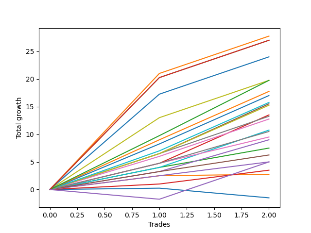

# Long Pointer 002 
- Symbol: ES_830-1130
- Date Range: 03/18/2022 - 12/30/2022
- Trading Period: 8:30-11:30
- Number of Trades: 2



| Name | Win Percent | Profit | Avg Profit / Trade | Avg Time / Trade |      | Name | Win Percent | Profit | Avg Profit / Trade | Avg Time / Trade |
| ---- | ----------- | ------ | ------------------ | ---------------- | ---- | ---- | ----------- | ------ | ------------------ | ---------------- |
| Sorted By <br> Profit | | | | | | Sorted By <br> Win Percentage ||||
| BB-200 Mid | 100.00 | 13875.00 | 6937.50 | 44:52 |     | BB-200 Mid | 100.00 | 13875.00 | 6937.50 | 44:52 |
| NEWFI 000 | 100.00 | 13500.00 | 6750.00 | 44:57 |     | NEWFI 000 | 100.00 | 13500.00 | 6750.00 | 44:57 |
| BB-200 U/L 2SD | 100.00 | 13500.00 | 6750.00 | 44:57 |     | BB-200 U/L 2SD | 100.00 | 13500.00 | 6750.00 | 44:57 |
| BB-100 U/L 2SD | 100.00 | 12000.00 | 6000.00 | 33:52 |     | BB-100 U/L 2SD | 100.00 | 12000.00 | 6000.00 | 33:52 |
| TP-10 | 100.00 | 9875.00 | 4937.50 | 28:17 |     | TP-10 | 100.00 | 9875.00 | 4937.50 | 28:17 |
| V U/L 1SD | 100.00 | 9875.00 | 4937.50 | 32:12 |     | V U/L 1SD | 100.00 | 9875.00 | 4937.50 | 32:12 |
| TP-9 | 100.00 | 8875.00 | 4437.50 | 26:55 |     | TP-9 | 100.00 | 8875.00 | 4437.50 | 26:55 |
| TP-8 | 100.00 | 8500.00 | 4250.00 | 26:47 |     | TP-8 | 100.00 | 8500.00 | 4250.00 | 26:47 |
| TP-7 | 100.00 | 7875.00 | 3937.50 | 22:07 |     | TP-7 | 100.00 | 7875.00 | 3937.50 | 22:07 |
| BB-50 U/L 1SD | 100.00 | 7750.00 | 3875.00 | 23:17 |     | BB-50 U/L 1SD | 100.00 | 7750.00 | 3875.00 | 23:17 |
| TP-6 | 100.00 | 7625.00 | 3812.50 | 22:05 |     | TP-6 | 100.00 | 7625.00 | 3812.50 | 22:05 |
| BB-20 U/L 2SD C | 100.00 | 6750.00 | 3375.00 | 15:47 |     | BB-20 U/L 2SD C | 100.00 | 6750.00 | 3375.00 | 15:47 |
| V Mid | 100.00 | 6625.00 | 3312.50 | 27:05 |     | V Mid | 100.00 | 6625.00 | 3312.50 | 27:05 |
| BB-50 U/L 2SD | 100.00 | 6375.00 | 3187.50 | 31:32 |     | BB-50 U/L 2SD | 100.00 | 6375.00 | 3187.50 | 31:32 |
| BB-100 Mid | 100.00 | 5375.00 | 2687.50 | 19:27 |     | BB-100 Mid | 100.00 | 5375.00 | 2687.50 | 19:27 |
| TP-5 | 100.00 | 5250.00 | 2625.00 | 15:40 |     | TP-5 | 100.00 | 5250.00 | 2625.00 | 15:40 |
| TP-4 | 100.00 | 4750.00 | 2375.00 | 07:15 |     | TP-4 | 100.00 | 4750.00 | 2375.00 | 07:15 |
| BB-50 Mid | 100.00 | 4500.00 | 2250.00 | 21:30 |     | BB-50 Mid | 100.00 | 4500.00 | 2250.00 | 21:30 |
| BB-20 U/L 2SD | 100.00 | 3750.00 | 1875.00 | 07:15 |     | BB-20 U/L 2SD | 100.00 | 3750.00 | 1875.00 | 07:15 |
| TP-3 | 100.00 | 3125.00 | 1562.50 | 06:07 |     | TP-3 | 100.00 | 3125.00 | 1562.50 | 06:07 |
| TP-2 | 100.00 | 2500.00 | 1250.00 | 06:02 |     | TP-2 | 100.00 | 2500.00 | 1250.00 | 06:02 |
| NEWFI 0000 | 50.00 | 2500.00 | 1250.00 | 15:02 |     | TP-1 | 100.00 | 1750.00 | 875.00 | 02:40 |
| TP-1 | 100.00 | 1750.00 | 875.00 | 02:40 |     | BB-20 U/L 1SD | 100.00 | 1375.00 | 687.50 | 05:40 |
| BB-20 U/L 1SD | 100.00 | 1375.00 | 687.50 | 05:40 |     | NEWFI 0000 | 50.00 | 2500.00 | 1250.00 | 15:02 |
| BB-20 Mid | 50.00 | -750.00 | -375.00 | 04:15 |     | BB-20 Mid | 50.00 | -750.00 | -375.00 | 04:15 |

## NO STOPLOSS

### Test BB-20 Mid
* Sell when price hits the middle line of the 20p bollinger
* No Stoploss
* Results:
```
Total Trades: 2
Percent Up: 50.00
Percent Down: 50.00
Total Points Moved Up: -1.50
Potential Profit: -750.00
Total Points Ups: 0.25 Count Ups: 1
Total Points Downs: -1.75 Count Downs: 1
```

<details><summary>Trades</summary>

<code>In: 2022-07-05 08:08:00		Out: 2022-07-05 08:15:20		Total Position Time: 07:20		Total Move Up: 0.25		Total to Date: 0.25</code> <br />
<code>In: 2022-10-11 12:18:00		Out: 2022-10-11 12:19:10		Total Position Time: 01:10		Total Move Up: -1.75		Total to Date: -1.50</code> <br />


</details>

### Test BB-20 U/L 1SD
* Sell when the price hits the upper line of the 20p 1std bollinger
* No Stoploss
* Results:
```
Total Trades: 2
Percent Up: 100.00
Percent Down: 0.00
Total Points Moved Up: 2.75
Potential Profit: 1375.00
Total Points Ups: 2.75 Count Ups: 2
Total Points Downs: 0.00 Count Downs: 0
```

<details><summary>Trades</summary>

<code>In: 2022-07-05 08:08:00		Out: 2022-07-05 08:16:40		Total Position Time: 08:40		Total Move Up: 2.50		Total to Date: 2.50</code> <br />
<code>In: 2022-10-11 12:18:00		Out: 2022-10-11 12:20:40		Total Position Time: 02:40		Total Move Up: 0.25		Total to Date: 2.75</code> <br />


</details>

### Test BB-20 U/L 2SD
* Sell when the price hits the upper line of the 20p 2std bollinger
* No Stoploss
* Results:
```
Total Trades: 2
Percent Up: 100.00
Percent Down: 0.00
Total Points Moved Up: 7.50
Potential Profit: 3750.00
Total Points Ups: 7.50 Count Ups: 2
Total Points Downs: 0.00 Count Downs: 0
```

<details><summary>Trades</summary>

<code>In: 2022-07-05 08:08:00		Out: 2022-07-05 08:17:55		Total Position Time: 09:55		Total Move Up: 4.00		Total to Date: 4.00</code> <br />
<code>In: 2022-10-11 12:18:00		Out: 2022-10-11 12:22:35		Total Position Time: 04:35		Total Move Up: 3.50		Total to Date: 7.50</code> <br />


</details>

### Test BB-20 U/L 2SD C
* Sell when the price hits the upper line of the 20p 2std bollinger
* No Stoploss
* Results:
```
Total Trades: 2
Percent Up: 100.00
Percent Down: 0.00
Total Points Moved Up: 13.50
Potential Profit: 6750.00
Total Points Ups: 13.50 Count Ups: 2
Total Points Downs: 0.00 Count Downs: 0
```

<details><summary>Trades</summary>

<code>In: 2022-07-05 08:08:00		Out: 2022-07-05 08:20:35		Total Position Time: 12:35		Total Move Up: 4.75		Total to Date: 4.75</code> <br />
<code>In: 2022-10-11 12:18:00		Out: 2022-10-11 12:37:00		Total Position Time: 19:00		Total Move Up: 8.75		Total to Date: 13.50</code> <br />


</details>

### Test BB-50 Mid
* Sell when price hits the middle line of the 50p bollinger
* No Stoploss
* Results:
```
Total Trades: 2
Percent Up: 100.00
Percent Down: 0.00
Total Points Moved Up: 9.00
Potential Profit: 4500.00
Total Points Ups: 9.00 Count Ups: 2
Total Points Downs: 0.00 Count Downs: 0
```

<details><summary>Trades</summary>

<code>In: 2022-07-05 08:08:00		Out: 2022-07-05 08:32:25		Total Position Time: 24:25		Total Move Up: 3.25		Total to Date: 3.25</code> <br />
<code>In: 2022-10-11 12:18:00		Out: 2022-10-11 12:36:35		Total Position Time: 18:35		Total Move Up: 5.75		Total to Date: 9.00</code> <br />


</details>

### Test BB-50 U/L 1SD
* Sell when the price hits the upper line of the 50p 1std bollinger
* No Stoploss
* Results:
```
Total Trades: 2
Percent Up: 100.00
Percent Down: 0.00
Total Points Moved Up: 15.50
Potential Profit: 7750.00
Total Points Ups: 15.50 Count Ups: 2
Total Points Downs: 0.00 Count Downs: 0
```

<details><summary>Trades</summary>

<code>In: 2022-07-05 08:08:00		Out: 2022-07-05 08:33:10		Total Position Time: 25:10		Total Move Up: 6.50		Total to Date: 6.50</code> <br />
<code>In: 2022-10-11 12:18:00		Out: 2022-10-11 12:39:25		Total Position Time: 21:25		Total Move Up: 9.00		Total to Date: 15.50</code> <br />


</details>

### Test BB-50 U/L 2SD
* Sell when the price hits the upper line of the 50p 2std bollinger
* No Stoploss
* Results:
```
Total Trades: 2
Percent Up: 100.00
Percent Down: 0.00
Total Points Moved Up: 12.75
Potential Profit: 6375.00
Total Points Ups: 12.75 Count Ups: 2
Total Points Downs: 0.00 Count Downs: 0
```

<details><summary>Trades</summary>

<code>In: 2022-07-05 08:08:00		Out: 2022-07-05 08:42:05		Total Position Time: 34:05		Total Move Up: 6.00		Total to Date: 6.00</code> <br />
<code>In: 2022-10-11 12:18:00		Out: 2022-10-11 12:47:00		Total Position Time: 29:00		Total Move Up: 6.75		Total to Date: 12.75</code> <br />


</details>

### Test V Mid
* Sell when the price hits the middle line of the 1std VWAP
* No Stoploss
* Results:
```
Total Trades: 2
Percent Up: 100.00
Percent Down: 0.00
Total Points Moved Up: 13.25
Potential Profit: 6625.00
Total Points Ups: 13.25 Count Ups: 2
Total Points Downs: 0.00 Count Downs: 0
```

<details><summary>Trades</summary>

<code>In: 2022-07-05 08:08:00		Out: 2022-07-05 08:33:10		Total Position Time: 25:10		Total Move Up: 6.50		Total to Date: 6.50</code> <br />
<code>In: 2022-10-11 12:18:00		Out: 2022-10-11 12:47:00		Total Position Time: 29:00		Total Move Up: 6.75		Total to Date: 13.25</code> <br />


</details>

### Test V U/L 1SD
* Sell when the price hits the upper line of the 1std VWAP
* No Stoploss
* Results:
```
Total Trades: 2
Percent Up: 100.00
Percent Down: 0.00
Total Points Moved Up: 19.75
Potential Profit: 9875.00
Total Points Ups: 19.75 Count Ups: 2
Total Points Downs: 0.00 Count Downs: 0
```

<details><summary>Trades</summary>

<code>In: 2022-07-05 08:08:00		Out: 2022-07-05 08:43:25		Total Position Time: 35:25		Total Move Up: 13.00		Total to Date: 13.00</code> <br />
<code>In: 2022-10-11 12:18:00		Out: 2022-10-11 12:47:00		Total Position Time: 29:00		Total Move Up: 6.75		Total to Date: 19.75</code> <br />


</details>

### Test BB-100 Mid
* Move to BB100 Mid
* No Stoploss
* Results:
```
Total Trades: 2
Percent Up: 100.00
Percent Down: 0.00
Total Points Moved Up: 10.75
Potential Profit: 5375.00
Total Points Ups: 10.75 Count Ups: 2
Total Points Downs: 0.00 Count Downs: 0
```

<details><summary>Trades</summary>

<code>In: 2022-07-05 08:08:00		Out: 2022-07-05 08:17:55		Total Position Time: 09:55		Total Move Up: 4.00		Total to Date: 4.00</code> <br />
<code>In: 2022-10-11 12:18:00		Out: 2022-10-11 12:47:00		Total Position Time: 29:00		Total Move Up: 6.75		Total to Date: 10.75</code> <br />


</details>

### Test BB-100 U/L 2SD
* Move to BB100 Upper Band
* No Stoploss
* Results:
```
Total Trades: 2
Percent Up: 100.00
Percent Down: 0.00
Total Points Moved Up: 24.00
Potential Profit: 12000.00
Total Points Ups: 24.00 Count Ups: 2
Total Points Downs: 0.00 Count Downs: 0
```

<details><summary>Trades</summary>

<code>In: 2022-07-05 08:08:00		Out: 2022-07-05 08:46:45		Total Position Time: 38:45		Total Move Up: 17.25		Total to Date: 17.25</code> <br />
<code>In: 2022-10-11 12:18:00		Out: 2022-10-11 12:47:00		Total Position Time: 29:00		Total Move Up: 6.75		Total to Date: 24.00</code> <br />


</details>

### Test BB-200 Mid
* Move to BB200 Mid
* No Stoploss
* Results:
```
Total Trades: 2
Percent Up: 100.00
Percent Down: 0.00
Total Points Moved Up: 27.75
Potential Profit: 13875.00
Total Points Ups: 27.75 Count Ups: 2
Total Points Downs: 0.00 Count Downs: 0
```

<details><summary>Trades</summary>

<code>In: 2022-07-05 08:08:00		Out: 2022-07-05 09:08:45		Total Position Time: 60:45		Total Move Up: 21.00		Total to Date: 21.00</code> <br />
<code>In: 2022-10-11 12:18:00		Out: 2022-10-11 12:47:00		Total Position Time: 29:00		Total Move Up: 6.75		Total to Date: 27.75</code> <br />


</details>

### Test BB-200 U/L 2SD
* Move to BB200 Upper Band
* No Stoploss
* Results:
```
Total Trades: 2
Percent Up: 100.00
Percent Down: 0.00
Total Points Moved Up: 27.00
Potential Profit: 13500.00
Total Points Ups: 27.00 Count Ups: 2
Total Points Downs: 0.00 Count Downs: 0
```

<details><summary>Trades</summary>

<code>In: 2022-07-05 08:08:00		Out: 2022-07-05 09:08:55		Total Position Time: 60:55		Total Move Up: 20.25		Total to Date: 20.25</code> <br />
<code>In: 2022-10-11 12:18:00		Out: 2022-10-11 12:47:00		Total Position Time: 29:00		Total Move Up: 6.75		Total to Date: 27.00</code> <br />


</details>

## TAKE PROFIT

### Test TP-1
* Take Profit of 1 Point
* No Stoploss
* Results:
```
Total Trades: 2
Percent Up: 100.00
Percent Down: 0.00
Total Points Moved Up: 3.50
Potential Profit: 1750.00
Total Points Ups: 3.50 Count Ups: 2
Total Points Downs: 0.00 Count Downs: 0
```

<details><summary>Trades</summary>

<code>In: 2022-07-05 08:08:00		Out: 2022-07-05 08:09:55		Total Position Time: 01:55		Total Move Up: 1.00		Total to Date: 1.00</code> <br />
<code>In: 2022-10-11 12:18:00		Out: 2022-10-11 12:21:25		Total Position Time: 03:25		Total Move Up: 2.50		Total to Date: 3.50</code> <br />


</details>

### Test TP-2
* Take Profit of 2 Point
* No Stoploss
* Results:
```
Total Trades: 2
Percent Up: 100.00
Percent Down: 0.00
Total Points Moved Up: 5.00
Potential Profit: 2500.00
Total Points Ups: 5.00 Count Ups: 2
Total Points Downs: 0.00 Count Downs: 0
```

<details><summary>Trades</summary>

<code>In: 2022-07-05 08:08:00		Out: 2022-07-05 08:16:40		Total Position Time: 08:40		Total Move Up: 2.50		Total to Date: 2.50</code> <br />
<code>In: 2022-10-11 12:18:00		Out: 2022-10-11 12:21:25		Total Position Time: 03:25		Total Move Up: 2.50		Total to Date: 5.00</code> <br />


</details>

### Test TP-3
* Take Profit of 3 Point
* No Stoploss
* Results:
```
Total Trades: 2
Percent Up: 100.00
Percent Down: 0.00
Total Points Moved Up: 6.25
Potential Profit: 3125.00
Total Points Ups: 6.25 Count Ups: 2
Total Points Downs: 0.00 Count Downs: 0
```

<details><summary>Trades</summary>

<code>In: 2022-07-05 08:08:00		Out: 2022-07-05 08:16:45		Total Position Time: 08:45		Total Move Up: 3.25		Total to Date: 3.25</code> <br />
<code>In: 2022-10-11 12:18:00		Out: 2022-10-11 12:21:30		Total Position Time: 03:30		Total Move Up: 3.00		Total to Date: 6.25</code> <br />


</details>

### Test TP-4
* Take Profit of 4 Point
* No Stoploss
* Results:
```
Total Trades: 2
Percent Up: 100.00
Percent Down: 0.00
Total Points Moved Up: 9.50
Potential Profit: 4750.00
Total Points Ups: 9.50 Count Ups: 2
Total Points Downs: 0.00 Count Downs: 0
```

<details><summary>Trades</summary>

<code>In: 2022-07-05 08:08:00		Out: 2022-07-05 08:17:50		Total Position Time: 09:50		Total Move Up: 4.75		Total to Date: 4.75</code> <br />
<code>In: 2022-10-11 12:18:00		Out: 2022-10-11 12:22:40		Total Position Time: 04:40		Total Move Up: 4.75		Total to Date: 9.50</code> <br />


</details>

### Test TP-5
* Take Profit of 5 Point
* No Stoploss
* Results:
```
Total Trades: 2
Percent Up: 100.00
Percent Down: 0.00
Total Points Moved Up: 10.50
Potential Profit: 5250.00
Total Points Ups: 10.50 Count Ups: 2
Total Points Downs: 0.00 Count Downs: 0
```

<details><summary>Trades</summary>

<code>In: 2022-07-05 08:08:00		Out: 2022-07-05 08:20:45		Total Position Time: 12:45		Total Move Up: 4.75		Total to Date: 4.75</code> <br />
<code>In: 2022-10-11 12:18:00		Out: 2022-10-11 12:36:35		Total Position Time: 18:35		Total Move Up: 5.75		Total to Date: 10.50</code> <br />


</details>

### Test TP-6
* Take Profit of 6 Point
* No Stoploss
* Results:
```
Total Trades: 2
Percent Up: 100.00
Percent Down: 0.00
Total Points Moved Up: 15.25
Potential Profit: 7625.00
Total Points Ups: 15.25 Count Ups: 2
Total Points Downs: 0.00 Count Downs: 0
```

<details><summary>Trades</summary>

<code>In: 2022-07-05 08:08:00		Out: 2022-07-05 08:33:10		Total Position Time: 25:10		Total Move Up: 6.50		Total to Date: 6.50</code> <br />
<code>In: 2022-10-11 12:18:00		Out: 2022-10-11 12:37:00		Total Position Time: 19:00		Total Move Up: 8.75		Total to Date: 15.25</code> <br />


</details>

### Test TP-7
* Take Profit of 7 Point
* No Stoploss
* Results:
```
Total Trades: 2
Percent Up: 100.00
Percent Down: 0.00
Total Points Moved Up: 15.75
Potential Profit: 7875.00
Total Points Ups: 15.75 Count Ups: 2
Total Points Downs: 0.00 Count Downs: 0
```

<details><summary>Trades</summary>

<code>In: 2022-07-05 08:08:00		Out: 2022-07-05 08:33:15		Total Position Time: 25:15		Total Move Up: 7.00		Total to Date: 7.00</code> <br />
<code>In: 2022-10-11 12:18:00		Out: 2022-10-11 12:37:00		Total Position Time: 19:00		Total Move Up: 8.75		Total to Date: 15.75</code> <br />


</details>

### Test TP-8
* Take Profit of 8 Point
* No Stoploss
* Results:
```
Total Trades: 2
Percent Up: 100.00
Percent Down: 0.00
Total Points Moved Up: 17.00
Potential Profit: 8500.00
Total Points Ups: 17.00 Count Ups: 2
Total Points Downs: 0.00 Count Downs: 0
```

<details><summary>Trades</summary>

<code>In: 2022-07-05 08:08:00		Out: 2022-07-05 08:42:35		Total Position Time: 34:35		Total Move Up: 8.25		Total to Date: 8.25</code> <br />
<code>In: 2022-10-11 12:18:00		Out: 2022-10-11 12:37:00		Total Position Time: 19:00		Total Move Up: 8.75		Total to Date: 17.00</code> <br />


</details>

### Test TP-9
* Take Profit of 9 Point
* No Stoploss
* Results:
```
Total Trades: 2
Percent Up: 100.00
Percent Down: 0.00
Total Points Moved Up: 17.75
Potential Profit: 8875.00
Total Points Ups: 17.75 Count Ups: 2
Total Points Downs: 0.00 Count Downs: 0
```

<details><summary>Trades</summary>

<code>In: 2022-07-05 08:08:00		Out: 2022-07-05 08:42:50		Total Position Time: 34:50		Total Move Up: 9.00		Total to Date: 9.00</code> <br />
<code>In: 2022-10-11 12:18:00		Out: 2022-10-11 12:37:00		Total Position Time: 19:00		Total Move Up: 8.75		Total to Date: 17.75</code> <br />


</details>

### Test TP-10
* Take Profit of 10 Point
* No Stoploss
* Results:
```
Total Trades: 2
Percent Up: 100.00
Percent Down: 0.00
Total Points Moved Up: 19.75
Potential Profit: 9875.00
Total Points Ups: 19.75 Count Ups: 2
Total Points Downs: 0.00 Count Downs: 0
```

<details><summary>Trades</summary>

<code>In: 2022-07-05 08:08:00		Out: 2022-07-05 08:43:00		Total Position Time: 35:00		Total Move Up: 9.75		Total to Date: 9.75</code> <br />
<code>In: 2022-10-11 12:18:00		Out: 2022-10-11 12:39:35		Total Position Time: 21:35		Total Move Up: 10.00		Total to Date: 19.75</code> <br />


</details>

## Indicator Exits

### Test NEWFI 000
* Newfi 0000
* No Stoploss
* Results:
```
Total Trades: 2
Percent Up: 100.00
Percent Down: 0.00
Total Points Moved Up: 27.00
Potential Profit: 13500.00
Total Points Ups: 27.00 Count Ups: 2
Total Points Downs: 0.00 Count Downs: 0
```

<details><summary>Trades</summary>

<code>In: 2022-07-05 08:08:00		Out: 2022-07-05 09:08:55		Total Position Time: 60:55		Total Move Up: 20.25		Total to Date: 20.25</code> <br />
<code>In: 2022-10-11 12:18:00		Out: 2022-10-11 12:47:00		Total Position Time: 29:00		Total Move Up: 6.75		Total to Date: 27.00</code> <br />


</details>

### Test NEWFI 0000
* Newfi 0000
* No Stoploss
* Results:
```
Total Trades: 2
Percent Up: 50.00
Percent Down: 50.00
Total Points Moved Up: 5.00
Potential Profit: 2500.00
Total Points Ups: 6.75 Count Ups: 1
Total Points Downs: -1.75 Count Downs: 1
```

<details><summary>Trades</summary>

<code>In: 2022-07-05 08:08:00		Out: 2022-07-05 08:09:05		Total Position Time: 01:05		Total Move Up: -1.75		Total to Date: -1.75</code> <br />
<code>In: 2022-10-11 12:18:00		Out: 2022-10-11 12:47:00		Total Position Time: 29:00		Total Move Up: 6.75		Total to Date: 5.00</code> <br />


</details>