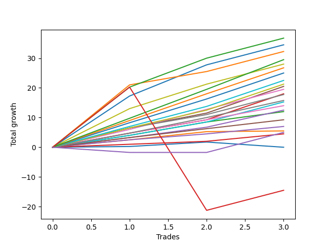

# Long Pointer 003 
- Symbol: ES_830-1130
- Date Range: 03/18/2022 - 12/30/2022
- Trading Period: 8:30-11:30
- Number of Trades: 3



| Name | Win Percent | Profit | Avg Profit / Trade | Avg Time / Trade |      | Name | Win Percent | Profit | Avg Profit / Trade | Avg Time / Trade |
| ---- | ----------- | ------ | ------------------ | ---------------- | ---- | ---- | ----------- | ------ | ------------------ | ---------------- |
| Sorted By <br> Profit | | | | | | Sorted By <br> Win Percentage ||||
| BB-200 U/L 2SD | 100.00 | 18375.00 | 6125.00 | 38:00 |     | BB-200 U/L 2SD | 100.00 | 18375.00 | 6125.00 | 38:00 |
| BB-100 U/L 2SD | 100.00 | 17250.00 | 5750.00 | 30:41 |     | BB-100 U/L 2SD | 100.00 | 17250.00 | 5750.00 | 30:41 |
| BB-200 Mid | 100.00 | 16125.00 | 5375.00 | 32:25 |     | BB-200 Mid | 100.00 | 16125.00 | 5375.00 | 32:25 |
| TP-10 | 100.00 | 14750.00 | 4916.67 | 26:41 |     | TP-10 | 100.00 | 14750.00 | 4916.67 | 26:41 |
| V U/L 1SD | 100.00 | 14000.00 | 4666.67 | 28:05 |     | V U/L 1SD | 100.00 | 14000.00 | 4666.67 | 28:05 |
| TP-9 | 100.00 | 13375.00 | 4458.33 | 24:38 |     | TP-9 | 100.00 | 13375.00 | 4458.33 | 24:38 |
| TP-8 | 100.00 | 12500.00 | 4166.67 | 24:26 |     | TP-8 | 100.00 | 12500.00 | 4166.67 | 24:26 |
| TP-7 | 100.00 | 11250.00 | 3750.00 | 20:23 |     | TP-7 | 100.00 | 11250.00 | 3750.00 | 20:23 |
| TP-6 | 100.00 | 10625.00 | 3541.67 | 19:15 |     | TP-6 | 100.00 | 10625.00 | 3541.67 | 19:15 |
| BB-50 U/L 1SD | 100.00 | 10250.00 | 3416.67 | 19:15 |     | BB-50 U/L 1SD | 100.00 | 10250.00 | 3416.67 | 19:15 |
| BB-50 U/L 2SD | 100.00 | 9750.00 | 3250.00 | 26:43 |     | BB-50 U/L 2SD | 100.00 | 9750.00 | 3250.00 | 26:43 |
| BB-20 U/L 2SD C | 100.00 | 9000.00 | 3000.00 | 13:01 |     | BB-20 U/L 2SD C | 100.00 | 9000.00 | 3000.00 | 13:01 |
| V Mid | 100.00 | 8875.00 | 2958.33 | 20:33 |     | V Mid | 100.00 | 8875.00 | 2958.33 | 20:33 |
| TP-5 | 100.00 | 7875.00 | 2625.00 | 13:56 |     | TP-5 | 100.00 | 7875.00 | 2625.00 | 13:56 |
| BB-100 Mid | 100.00 | 7625.00 | 2541.67 | 15:28 |     | BB-100 Mid | 100.00 | 7625.00 | 2541.67 | 15:28 |
| TP-4 | 100.00 | 7000.00 | 2333.33 | 07:20 |     | TP-4 | 100.00 | 7000.00 | 2333.33 | 07:20 |
| BB-50 Mid | 100.00 | 6250.00 | 2083.33 | 16:43 |     | BB-50 Mid | 100.00 | 6250.00 | 2083.33 | 16:43 |
| BB-20 U/L 2SD | 100.00 | 6000.00 | 2000.00 | 07:20 |     | BB-20 U/L 2SD | 100.00 | 6000.00 | 2000.00 | 07:20 |
| TP-3 | 100.00 | 4625.00 | 1541.67 | 06:25 |     | TP-3 | 100.00 | 4625.00 | 1541.67 | 06:25 |
| TP-2 | 100.00 | 3500.00 | 1166.67 | 06:08 |     | TP-2 | 100.00 | 3500.00 | 1166.67 | 06:08 |
| BB-20 U/L 1SD | 100.00 | 2750.00 | 916.67 | 06:03 |     | BB-20 U/L 1SD | 100.00 | 2750.00 | 916.67 | 06:03 |
| NEWFI 0000 | 66.67 | 2500.00 | 833.33 | 10:23 |     | TP-1 | 100.00 | 2250.00 | 750.00 | 03:11 |
| TP-1 | 100.00 | 2250.00 | 750.00 | 03:11 |     | NEWFI 0000 | 66.67 | 2500.00 | 833.33 | 10:23 |
| BB-20 Mid | 66.67 | 0.00 | 0.00 | 04:50 |     | BB-20 Mid | 66.67 | 0.00 | 0.00 | 04:50 |
| NEWFI 000 | 66.67 | -7250.00 | -2416.67 | 50:16 |     | NEWFI 000 | 66.67 | -7250.00 | -2416.67 | 50:16 |

## NO STOPLOSS

### Test BB-20 Mid
* Sell when price hits the middle line of the 20p bollinger
* No Stoploss
* Results:
```
Total Trades: 3
Percent Up: 66.67
Percent Down: 33.33
Total Points Moved Up: 0.00
Potential Profit: 0.00
Total Points Ups: 1.75 Count Ups: 2
Total Points Downs: -1.75 Count Downs: 1
```

<details><summary>Trades</summary>

<code>In: 2022-07-05 08:08:00		Out: 2022-07-05 08:15:20		Total Position Time: 07:20		Total Move Up: 0.25		Total to Date: 0.25</code> <br />
<code>In: 2022-09-21 10:23:00		Out: 2022-09-21 10:29:00		Total Position Time: 06:00		Total Move Up: 1.50		Total to Date: 1.75</code> <br />
<code>In: 2022-10-11 12:18:00		Out: 2022-10-11 12:19:10		Total Position Time: 01:10		Total Move Up: -1.75		Total to Date: 0.00</code> <br />


</details>

### Test BB-20 U/L 1SD
* Sell when the price hits the upper line of the 20p 1std bollinger
* No Stoploss
* Results:
```
Total Trades: 3
Percent Up: 100.00
Percent Down: 0.00
Total Points Moved Up: 5.50
Potential Profit: 2750.00
Total Points Ups: 5.50 Count Ups: 3
Total Points Downs: 0.00 Count Downs: 0
```

<details><summary>Trades</summary>

<code>In: 2022-07-05 08:08:00		Out: 2022-07-05 08:16:40		Total Position Time: 08:40		Total Move Up: 2.50		Total to Date: 2.50</code> <br />
<code>In: 2022-09-21 10:23:00		Out: 2022-09-21 10:29:50		Total Position Time: 06:50		Total Move Up: 2.75		Total to Date: 5.25</code> <br />
<code>In: 2022-10-11 12:18:00		Out: 2022-10-11 12:20:40		Total Position Time: 02:40		Total Move Up: 0.25		Total to Date: 5.50</code> <br />


</details>

### Test BB-20 U/L 2SD
* Sell when the price hits the upper line of the 20p 2std bollinger
* No Stoploss
* Results:
```
Total Trades: 3
Percent Up: 100.00
Percent Down: 0.00
Total Points Moved Up: 12.00
Potential Profit: 6000.00
Total Points Ups: 12.00 Count Ups: 3
Total Points Downs: 0.00 Count Downs: 0
```

<details><summary>Trades</summary>

<code>In: 2022-07-05 08:08:00		Out: 2022-07-05 08:17:55		Total Position Time: 09:55		Total Move Up: 4.00		Total to Date: 4.00</code> <br />
<code>In: 2022-09-21 10:23:00		Out: 2022-09-21 10:30:30		Total Position Time: 07:30		Total Move Up: 4.50		Total to Date: 8.50</code> <br />
<code>In: 2022-10-11 12:18:00		Out: 2022-10-11 12:22:35		Total Position Time: 04:35		Total Move Up: 3.50		Total to Date: 12.00</code> <br />


</details>

### Test BB-20 U/L 2SD C
* Sell when the price hits the upper line of the 20p 2std bollinger
* No Stoploss
* Results:
```
Total Trades: 3
Percent Up: 100.00
Percent Down: 0.00
Total Points Moved Up: 18.00
Potential Profit: 9000.00
Total Points Ups: 18.00 Count Ups: 3
Total Points Downs: 0.00 Count Downs: 0
```

<details><summary>Trades</summary>

<code>In: 2022-07-05 08:08:00		Out: 2022-07-05 08:20:35		Total Position Time: 12:35		Total Move Up: 4.75		Total to Date: 4.75</code> <br />
<code>In: 2022-09-21 10:23:00		Out: 2022-09-21 10:30:30		Total Position Time: 07:30		Total Move Up: 4.50		Total to Date: 9.25</code> <br />
<code>In: 2022-10-11 12:18:00		Out: 2022-10-11 12:37:00		Total Position Time: 19:00		Total Move Up: 8.75		Total to Date: 18.00</code> <br />


</details>

### Test BB-50 Mid
* Sell when price hits the middle line of the 50p bollinger
* No Stoploss
* Results:
```
Total Trades: 3
Percent Up: 100.00
Percent Down: 0.00
Total Points Moved Up: 12.50
Potential Profit: 6250.00
Total Points Ups: 12.50 Count Ups: 3
Total Points Downs: 0.00 Count Downs: 0
```

<details><summary>Trades</summary>

<code>In: 2022-07-05 08:08:00		Out: 2022-07-05 08:32:25		Total Position Time: 24:25		Total Move Up: 3.25		Total to Date: 3.25</code> <br />
<code>In: 2022-09-21 10:23:00		Out: 2022-09-21 10:30:10		Total Position Time: 07:10		Total Move Up: 3.50		Total to Date: 6.75</code> <br />
<code>In: 2022-10-11 12:18:00		Out: 2022-10-11 12:36:35		Total Position Time: 18:35		Total Move Up: 5.75		Total to Date: 12.50</code> <br />


</details>

### Test BB-50 U/L 1SD
* Sell when the price hits the upper line of the 50p 1std bollinger
* No Stoploss
* Results:
```
Total Trades: 3
Percent Up: 100.00
Percent Down: 0.00
Total Points Moved Up: 20.50
Potential Profit: 10250.00
Total Points Ups: 20.50 Count Ups: 3
Total Points Downs: 0.00 Count Downs: 0
```

<details><summary>Trades</summary>

<code>In: 2022-07-05 08:08:00		Out: 2022-07-05 08:33:10		Total Position Time: 25:10		Total Move Up: 6.50		Total to Date: 6.50</code> <br />
<code>In: 2022-09-21 10:23:00		Out: 2022-09-21 10:34:10		Total Position Time: 11:10		Total Move Up: 5.00		Total to Date: 11.50</code> <br />
<code>In: 2022-10-11 12:18:00		Out: 2022-10-11 12:39:25		Total Position Time: 21:25		Total Move Up: 9.00		Total to Date: 20.50</code> <br />


</details>

### Test BB-50 U/L 2SD
* Sell when the price hits the upper line of the 50p 2std bollinger
* No Stoploss
* Results:
```
Total Trades: 3
Percent Up: 100.00
Percent Down: 0.00
Total Points Moved Up: 19.50
Potential Profit: 9750.00
Total Points Ups: 19.50 Count Ups: 3
Total Points Downs: 0.00 Count Downs: 0
```

<details><summary>Trades</summary>

<code>In: 2022-07-05 08:08:00		Out: 2022-07-05 08:42:05		Total Position Time: 34:05		Total Move Up: 6.00		Total to Date: 6.00</code> <br />
<code>In: 2022-09-21 10:23:00		Out: 2022-09-21 10:40:05		Total Position Time: 17:05		Total Move Up: 6.75		Total to Date: 12.75</code> <br />
<code>In: 2022-10-11 12:18:00		Out: 2022-10-11 12:47:00		Total Position Time: 29:00		Total Move Up: 6.75		Total to Date: 19.50</code> <br />


</details>

### Test V Mid
* Sell when the price hits the middle line of the 1std VWAP
* No Stoploss
* Results:
```
Total Trades: 3
Percent Up: 100.00
Percent Down: 0.00
Total Points Moved Up: 17.75
Potential Profit: 8875.00
Total Points Ups: 17.75 Count Ups: 3
Total Points Downs: 0.00 Count Downs: 0
```

<details><summary>Trades</summary>

<code>In: 2022-07-05 08:08:00		Out: 2022-07-05 08:33:10		Total Position Time: 25:10		Total Move Up: 6.50		Total to Date: 6.50</code> <br />
<code>In: 2022-09-21 10:23:00		Out: 2022-09-21 10:30:30		Total Position Time: 07:30		Total Move Up: 4.50		Total to Date: 11.00</code> <br />
<code>In: 2022-10-11 12:18:00		Out: 2022-10-11 12:47:00		Total Position Time: 29:00		Total Move Up: 6.75		Total to Date: 17.75</code> <br />


</details>

### Test V U/L 1SD
* Sell when the price hits the upper line of the 1std VWAP
* No Stoploss
* Results:
```
Total Trades: 3
Percent Up: 100.00
Percent Down: 0.00
Total Points Moved Up: 28.00
Potential Profit: 14000.00
Total Points Ups: 28.00 Count Ups: 3
Total Points Downs: 0.00 Count Downs: 0
```

<details><summary>Trades</summary>

<code>In: 2022-07-05 08:08:00		Out: 2022-07-05 08:43:25		Total Position Time: 35:25		Total Move Up: 13.00		Total to Date: 13.00</code> <br />
<code>In: 2022-09-21 10:23:00		Out: 2022-09-21 10:42:50		Total Position Time: 19:50		Total Move Up: 8.25		Total to Date: 21.25</code> <br />
<code>In: 2022-10-11 12:18:00		Out: 2022-10-11 12:47:00		Total Position Time: 29:00		Total Move Up: 6.75		Total to Date: 28.00</code> <br />


</details>

### Test BB-100 Mid
* Move to BB100 Mid
* No Stoploss
* Results:
```
Total Trades: 3
Percent Up: 100.00
Percent Down: 0.00
Total Points Moved Up: 15.25
Potential Profit: 7625.00
Total Points Ups: 15.25 Count Ups: 3
Total Points Downs: 0.00 Count Downs: 0
```

<details><summary>Trades</summary>

<code>In: 2022-07-05 08:08:00		Out: 2022-07-05 08:17:55		Total Position Time: 09:55		Total Move Up: 4.00		Total to Date: 4.00</code> <br />
<code>In: 2022-09-21 10:23:00		Out: 2022-09-21 10:30:30		Total Position Time: 07:30		Total Move Up: 4.50		Total to Date: 8.50</code> <br />
<code>In: 2022-10-11 12:18:00		Out: 2022-10-11 12:47:00		Total Position Time: 29:00		Total Move Up: 6.75		Total to Date: 15.25</code> <br />


</details>

### Test BB-100 U/L 2SD
* Move to BB100 Upper Band
* No Stoploss
* Results:
```
Total Trades: 3
Percent Up: 100.00
Percent Down: 0.00
Total Points Moved Up: 34.50
Potential Profit: 17250.00
Total Points Ups: 34.50 Count Ups: 3
Total Points Downs: 0.00 Count Downs: 0
```

<details><summary>Trades</summary>

<code>In: 2022-07-05 08:08:00		Out: 2022-07-05 08:46:45		Total Position Time: 38:45		Total Move Up: 17.25		Total to Date: 17.25</code> <br />
<code>In: 2022-09-21 10:23:00		Out: 2022-09-21 10:47:20		Total Position Time: 24:20		Total Move Up: 10.50		Total to Date: 27.75</code> <br />
<code>In: 2022-10-11 12:18:00		Out: 2022-10-11 12:47:00		Total Position Time: 29:00		Total Move Up: 6.75		Total to Date: 34.50</code> <br />


</details>

### Test BB-200 Mid
* Move to BB200 Mid
* No Stoploss
* Results:
```
Total Trades: 3
Percent Up: 100.00
Percent Down: 0.00
Total Points Moved Up: 32.25
Potential Profit: 16125.00
Total Points Ups: 32.25 Count Ups: 3
Total Points Downs: 0.00 Count Downs: 0
```

<details><summary>Trades</summary>

<code>In: 2022-07-05 08:08:00		Out: 2022-07-05 09:08:45		Total Position Time: 60:45		Total Move Up: 21.00		Total to Date: 21.00</code> <br />
<code>In: 2022-09-21 10:23:00		Out: 2022-09-21 10:30:30		Total Position Time: 07:30		Total Move Up: 4.50		Total to Date: 25.50</code> <br />
<code>In: 2022-10-11 12:18:00		Out: 2022-10-11 12:47:00		Total Position Time: 29:00		Total Move Up: 6.75		Total to Date: 32.25</code> <br />


</details>

### Test BB-200 U/L 2SD
* Move to BB200 Upper Band
* No Stoploss
* Results:
```
Total Trades: 3
Percent Up: 100.00
Percent Down: 0.00
Total Points Moved Up: 36.75
Potential Profit: 18375.00
Total Points Ups: 36.75 Count Ups: 3
Total Points Downs: 0.00 Count Downs: 0
```

<details><summary>Trades</summary>

<code>In: 2022-07-05 08:08:00		Out: 2022-07-05 09:08:55		Total Position Time: 60:55		Total Move Up: 20.25		Total to Date: 20.25</code> <br />
<code>In: 2022-09-21 10:23:00		Out: 2022-09-21 10:47:05		Total Position Time: 24:05		Total Move Up: 9.75		Total to Date: 30.00</code> <br />
<code>In: 2022-10-11 12:18:00		Out: 2022-10-11 12:47:00		Total Position Time: 29:00		Total Move Up: 6.75		Total to Date: 36.75</code> <br />


</details>

## TAKE PROFIT

### Test TP-1
* Take Profit of 1 Point
* No Stoploss
* Results:
```
Total Trades: 3
Percent Up: 100.00
Percent Down: 0.00
Total Points Moved Up: 4.50
Potential Profit: 2250.00
Total Points Ups: 4.50 Count Ups: 3
Total Points Downs: 0.00 Count Downs: 0
```

<details><summary>Trades</summary>

<code>In: 2022-07-05 08:08:00		Out: 2022-07-05 08:09:55		Total Position Time: 01:55		Total Move Up: 1.00		Total to Date: 1.00</code> <br />
<code>In: 2022-09-21 10:23:00		Out: 2022-09-21 10:27:15		Total Position Time: 04:15		Total Move Up: 1.00		Total to Date: 2.00</code> <br />
<code>In: 2022-10-11 12:18:00		Out: 2022-10-11 12:21:25		Total Position Time: 03:25		Total Move Up: 2.50		Total to Date: 4.50</code> <br />


</details>

### Test TP-2
* Take Profit of 2 Point
* No Stoploss
* Results:
```
Total Trades: 3
Percent Up: 100.00
Percent Down: 0.00
Total Points Moved Up: 7.00
Potential Profit: 3500.00
Total Points Ups: 7.00 Count Ups: 3
Total Points Downs: 0.00 Count Downs: 0
```

<details><summary>Trades</summary>

<code>In: 2022-07-05 08:08:00		Out: 2022-07-05 08:16:40		Total Position Time: 08:40		Total Move Up: 2.50		Total to Date: 2.50</code> <br />
<code>In: 2022-09-21 10:23:00		Out: 2022-09-21 10:29:20		Total Position Time: 06:20		Total Move Up: 2.00		Total to Date: 4.50</code> <br />
<code>In: 2022-10-11 12:18:00		Out: 2022-10-11 12:21:25		Total Position Time: 03:25		Total Move Up: 2.50		Total to Date: 7.00</code> <br />


</details>

### Test TP-3
* Take Profit of 3 Point
* No Stoploss
* Results:
```
Total Trades: 3
Percent Up: 100.00
Percent Down: 0.00
Total Points Moved Up: 9.25
Potential Profit: 4625.00
Total Points Ups: 9.25 Count Ups: 3
Total Points Downs: 0.00 Count Downs: 0
```

<details><summary>Trades</summary>

<code>In: 2022-07-05 08:08:00		Out: 2022-07-05 08:16:45		Total Position Time: 08:45		Total Move Up: 3.25		Total to Date: 3.25</code> <br />
<code>In: 2022-09-21 10:23:00		Out: 2022-09-21 10:30:00		Total Position Time: 07:00		Total Move Up: 3.00		Total to Date: 6.25</code> <br />
<code>In: 2022-10-11 12:18:00		Out: 2022-10-11 12:21:30		Total Position Time: 03:30		Total Move Up: 3.00		Total to Date: 9.25</code> <br />


</details>

### Test TP-4
* Take Profit of 4 Point
* No Stoploss
* Results:
```
Total Trades: 3
Percent Up: 100.00
Percent Down: 0.00
Total Points Moved Up: 14.00
Potential Profit: 7000.00
Total Points Ups: 14.00 Count Ups: 3
Total Points Downs: 0.00 Count Downs: 0
```

<details><summary>Trades</summary>

<code>In: 2022-07-05 08:08:00		Out: 2022-07-05 08:17:50		Total Position Time: 09:50		Total Move Up: 4.75		Total to Date: 4.75</code> <br />
<code>In: 2022-09-21 10:23:00		Out: 2022-09-21 10:30:30		Total Position Time: 07:30		Total Move Up: 4.50		Total to Date: 9.25</code> <br />
<code>In: 2022-10-11 12:18:00		Out: 2022-10-11 12:22:40		Total Position Time: 04:40		Total Move Up: 4.75		Total to Date: 14.00</code> <br />


</details>

### Test TP-5
* Take Profit of 5 Point
* No Stoploss
* Results:
```
Total Trades: 3
Percent Up: 100.00
Percent Down: 0.00
Total Points Moved Up: 15.75
Potential Profit: 7875.00
Total Points Ups: 15.75 Count Ups: 3
Total Points Downs: 0.00 Count Downs: 0
```

<details><summary>Trades</summary>

<code>In: 2022-07-05 08:08:00		Out: 2022-07-05 08:20:45		Total Position Time: 12:45		Total Move Up: 4.75		Total to Date: 4.75</code> <br />
<code>In: 2022-09-21 10:23:00		Out: 2022-09-21 10:33:30		Total Position Time: 10:30		Total Move Up: 5.25		Total to Date: 10.00</code> <br />
<code>In: 2022-10-11 12:18:00		Out: 2022-10-11 12:36:35		Total Position Time: 18:35		Total Move Up: 5.75		Total to Date: 15.75</code> <br />


</details>

### Test TP-6
* Take Profit of 6 Point
* No Stoploss
* Results:
```
Total Trades: 3
Percent Up: 100.00
Percent Down: 0.00
Total Points Moved Up: 21.25
Potential Profit: 10625.00
Total Points Ups: 21.25 Count Ups: 3
Total Points Downs: 0.00 Count Downs: 0
```

<details><summary>Trades</summary>

<code>In: 2022-07-05 08:08:00		Out: 2022-07-05 08:33:10		Total Position Time: 25:10		Total Move Up: 6.50		Total to Date: 6.50</code> <br />
<code>In: 2022-09-21 10:23:00		Out: 2022-09-21 10:36:35		Total Position Time: 13:35		Total Move Up: 6.00		Total to Date: 12.50</code> <br />
<code>In: 2022-10-11 12:18:00		Out: 2022-10-11 12:37:00		Total Position Time: 19:00		Total Move Up: 8.75		Total to Date: 21.25</code> <br />


</details>

### Test TP-7
* Take Profit of 7 Point
* No Stoploss
* Results:
```
Total Trades: 3
Percent Up: 100.00
Percent Down: 0.00
Total Points Moved Up: 22.50
Potential Profit: 11250.00
Total Points Ups: 22.50 Count Ups: 3
Total Points Downs: 0.00 Count Downs: 0
```

<details><summary>Trades</summary>

<code>In: 2022-07-05 08:08:00		Out: 2022-07-05 08:33:15		Total Position Time: 25:15		Total Move Up: 7.00		Total to Date: 7.00</code> <br />
<code>In: 2022-09-21 10:23:00		Out: 2022-09-21 10:39:55		Total Position Time: 16:55		Total Move Up: 6.75		Total to Date: 13.75</code> <br />
<code>In: 2022-10-11 12:18:00		Out: 2022-10-11 12:37:00		Total Position Time: 19:00		Total Move Up: 8.75		Total to Date: 22.50</code> <br />


</details>

### Test TP-8
* Take Profit of 8 Point
* No Stoploss
* Results:
```
Total Trades: 3
Percent Up: 100.00
Percent Down: 0.00
Total Points Moved Up: 25.00
Potential Profit: 12500.00
Total Points Ups: 25.00 Count Ups: 3
Total Points Downs: 0.00 Count Downs: 0
```

<details><summary>Trades</summary>

<code>In: 2022-07-05 08:08:00		Out: 2022-07-05 08:42:35		Total Position Time: 34:35		Total Move Up: 8.25		Total to Date: 8.25</code> <br />
<code>In: 2022-09-21 10:23:00		Out: 2022-09-21 10:42:45		Total Position Time: 19:45		Total Move Up: 8.00		Total to Date: 16.25</code> <br />
<code>In: 2022-10-11 12:18:00		Out: 2022-10-11 12:37:00		Total Position Time: 19:00		Total Move Up: 8.75		Total to Date: 25.00</code> <br />


</details>

### Test TP-9
* Take Profit of 9 Point
* No Stoploss
* Results:
```
Total Trades: 3
Percent Up: 100.00
Percent Down: 0.00
Total Points Moved Up: 26.75
Potential Profit: 13375.00
Total Points Ups: 26.75 Count Ups: 3
Total Points Downs: 0.00 Count Downs: 0
```

<details><summary>Trades</summary>

<code>In: 2022-07-05 08:08:00		Out: 2022-07-05 08:42:50		Total Position Time: 34:50		Total Move Up: 9.00		Total to Date: 9.00</code> <br />
<code>In: 2022-09-21 10:23:00		Out: 2022-09-21 10:43:05		Total Position Time: 20:05		Total Move Up: 9.00		Total to Date: 18.00</code> <br />
<code>In: 2022-10-11 12:18:00		Out: 2022-10-11 12:37:00		Total Position Time: 19:00		Total Move Up: 8.75		Total to Date: 26.75</code> <br />


</details>

### Test TP-10
* Take Profit of 10 Point
* No Stoploss
* Results:
```
Total Trades: 3
Percent Up: 100.00
Percent Down: 0.00
Total Points Moved Up: 29.50
Potential Profit: 14750.00
Total Points Ups: 29.50 Count Ups: 3
Total Points Downs: 0.00 Count Downs: 0
```

<details><summary>Trades</summary>

<code>In: 2022-07-05 08:08:00		Out: 2022-07-05 08:43:00		Total Position Time: 35:00		Total Move Up: 9.75		Total to Date: 9.75</code> <br />
<code>In: 2022-09-21 10:23:00		Out: 2022-09-21 10:46:30		Total Position Time: 23:30		Total Move Up: 9.75		Total to Date: 19.50</code> <br />
<code>In: 2022-10-11 12:18:00		Out: 2022-10-11 12:39:35		Total Position Time: 21:35		Total Move Up: 10.00		Total to Date: 29.50</code> <br />


</details>

## Indicator Exits

### Test NEWFI 000
* Newfi 0000
* No Stoploss
* Results:
```
Total Trades: 3
Percent Up: 66.67
Percent Down: 33.33
Total Points Moved Up: -14.50
Potential Profit: -7250.00
Total Points Ups: 27.00 Count Ups: 2
Total Points Downs: -41.50 Count Downs: 1
```

<details><summary>Trades</summary>

<code>In: 2022-07-05 08:08:00		Out: 2022-07-05 09:08:55		Total Position Time: 60:55		Total Move Up: 20.25		Total to Date: 20.25</code> <br />
<code>In: 2022-09-21 10:23:00		Out: 2022-09-21 11:23:55		Total Position Time: 60:55		Total Move Up: -41.50		Total to Date: -21.25</code> <br />
<code>In: 2022-10-11 12:18:00		Out: 2022-10-11 12:47:00		Total Position Time: 29:00		Total Move Up: 6.75		Total to Date: -14.50</code> <br />


</details>

### Test NEWFI 0000
* Newfi 0000
* No Stoploss
* Results:
```
Total Trades: 3
Percent Up: 66.67
Percent Down: 33.33
Total Points Moved Up: 5.00
Potential Profit: 2500.00
Total Points Ups: 6.75 Count Ups: 2
Total Points Downs: -1.75 Count Downs: 1
```

<details><summary>Trades</summary>

<code>In: 2022-07-05 08:08:00		Out: 2022-07-05 08:09:05		Total Position Time: 01:05		Total Move Up: -1.75		Total to Date: -1.75</code> <br />
<code>In: 2022-09-21 10:23:00		Out: 2022-09-21 10:24:05		Total Position Time: 01:05		Total Move Up: 0.00		Total to Date: -1.75</code> <br />
<code>In: 2022-10-11 12:18:00		Out: 2022-10-11 12:47:00		Total Position Time: 29:00		Total Move Up: 6.75		Total to Date: 5.00</code> <br />


</details>