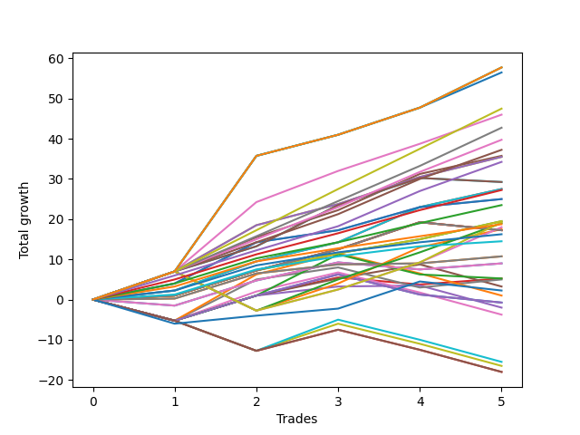

# Long Pointer 103 SD 
- Symbol: ES_830-1130
- Date Range: 03/18/2022 - 12/30/2022
- Trading Period: 8:30-11:30
- Number of Trades: 5



| Name | Win Percent | Profit | Avg Profit / Trade | Avg Time / Trade |      | Name | Win Percent | Profit | Avg Profit / Trade | Avg Time / Trade |
| ---- | ----------- | ------ | ------------------ | ---------------- | ---- | ---- | ----------- | ------ | ------------------ | ---------------- |
| Sorted By <br> Profit | | | | | | Sorted By <br> Win Percentage ||||
| NEWFI 06 | 100.00 | 28875.00 | 5775.00 | 46:33 |     | NEWFI 06 | 100.00 | 28875.00 | 5775.00 | 46:33 |
| NEWFI 000 | 100.00 | 28875.00 | 5775.00 | 46:33 |     | NEWFI 000 | 100.00 | 28875.00 | 5775.00 | 46:33 |
| BB-200 U/L 2SD | 100.00 | 28875.00 | 5775.00 | 46:33 |     | BB-200 U/L 2SD | 100.00 | 28875.00 | 5775.00 | 46:33 |
| BB-100 U/L 2SD | 100.00 | 28250.00 | 5650.00 | 46:29 |     | BB-100 U/L 2SD | 100.00 | 28250.00 | 5650.00 | 46:29 |
| TP-10 | 100.00 | 23750.00 | 4750.00 | 30:06 |     | TP-10 | 100.00 | 23750.00 | 4750.00 | 30:06 |
| BB-50 U/L 2SD | 100.00 | 23000.00 | 4600.00 | 31:31 |     | BB-50 U/L 2SD | 100.00 | 23000.00 | 4600.00 | 31:31 |
| TP-9 | 100.00 | 21375.00 | 4275.00 | 27:31 |     | TP-9 | 100.00 | 21375.00 | 4275.00 | 27:31 |
| TP-8 | 100.00 | 19875.00 | 3975.00 | 27:00 |     | TP-8 | 100.00 | 19875.00 | 3975.00 | 27:00 |
| TP-7 | 100.00 | 18625.00 | 3725.00 | 22:05 |     | TP-7 | 100.00 | 18625.00 | 3725.00 | 22:05 |
| BB-50 U/L 1SD | 100.00 | 17875.00 | 3575.00 | 24:48 |     | BB-50 U/L 1SD | 100.00 | 17875.00 | 3575.00 | 24:48 |
| V U/L 1SD SL-10 | 100.00 | 17750.00 | 3550.00 | 30:07 |     | V U/L 1SD SL-10 | 100.00 | 17750.00 | 3550.00 | 30:07 |
| V U/L 1SD | 100.00 | 17750.00 | 3550.00 | 30:07 |     | V U/L 1SD | 100.00 | 17750.00 | 3550.00 | 30:07 |
| TP-6 | 100.00 | 17125.00 | 3425.00 | 21:49 |     | TP-6 | 100.00 | 17125.00 | 3425.00 | 21:49 |
| BB-100 Mid SL-10 | 80.00 | 14625.00 | 2925.00 | 19:17 |     | BB-20 U/L 2SD C SL-10 | 100.00 | 13750.00 | 2750.00 | 17:24 |
| BB-100 Mid | 80.00 | 14625.00 | 2925.00 | 19:17 |     | BB-20 U/L 2SD C | 100.00 | 13750.00 | 2750.00 | 17:24 |
| BB-20 U/L 2SD C SL-10 | 100.00 | 13750.00 | 2750.00 | 17:24 |     | TP-5 | 100.00 | 13625.00 | 2725.00 | 20:58 |
| BB-20 U/L 2SD C | 100.00 | 13750.00 | 2750.00 | 17:24 |     | BB-50 Mid SL-10 | 100.00 | 12500.00 | 2500.00 | 14:53 |
| TP-5 | 100.00 | 13625.00 | 2725.00 | 20:58 |     | BB-50 Mid | 100.00 | 12500.00 | 2500.00 | 14:53 |
| BB-50 Mid SL-10 | 100.00 | 12500.00 | 2500.00 | 14:53 |     | TP-4 | 100.00 | 11750.00 | 2350.00 | 10:26 |
| BB-50 Mid | 100.00 | 12500.00 | 2500.00 | 14:53 |     | BB-20 U/L 2SD SL-10 | 100.00 | 9750.00 | 1950.00 | 14:13 |
| TP-4 | 100.00 | 11750.00 | 2350.00 | 10:26 |     | BB-20 U/L 2SD | 100.00 | 9750.00 | 1950.00 | 14:13 |
| BB-20 U/L 2SD SL-10 | 100.00 | 9750.00 | 1950.00 | 14:13 |     | TP-3 | 100.00 | 9375.00 | 1875.00 | 05:38 |
| BB-20 U/L 2SD | 100.00 | 9750.00 | 1950.00 | 14:13 |     | TP-2 | 100.00 | 8125.00 | 1625.00 | 05:13 |
| BB-200 U/L 2SD SL-10 | 80.00 | 9625.00 | 1925.00 | 36:49 |     | TP-1 | 100.00 | 7250.00 | 1450.00 | 05:04 |
| BB-50 U/L 2SD SL-10 | 80.00 | 9500.00 | 1900.00 | 27:33 |     | BB-20 U/L 1SD SL-10 | 100.00 | 5375.00 | 1075.00 | 11:11 |
| TP-3 | 100.00 | 9375.00 | 1875.00 | 05:38 |     | BB-20 U/L 1SD | 100.00 | 5375.00 | 1075.00 | 11:11 |
| BB-100 U/L 2SD SL-10 | 80.00 | 9000.00 | 1800.00 | 36:45 |     | BB-100 Mid SL-10 | 80.00 | 14625.00 | 2925.00 | 19:17 |
| BB-50 U/L 1SD SL-10 | 80.00 | 8750.00 | 1750.00 | 23:14 |     | BB-100 Mid | 80.00 | 14625.00 | 2925.00 | 19:17 |
| BB-200 Mid SL-10 | 80.00 | 8625.00 | 1725.00 | 21:34 |     | BB-200 U/L 2SD SL-10 | 80.00 | 9625.00 | 1925.00 | 36:49 |
| V Mid SL-10 | 80.00 | 8625.00 | 1725.00 | 21:34 |     | BB-50 U/L 2SD SL-10 | 80.00 | 9500.00 | 1900.00 | 27:33 |
| BB-200 Mid | 80.00 | 8625.00 | 1725.00 | 21:34 |     | BB-100 U/L 2SD SL-10 | 80.00 | 9000.00 | 1800.00 | 36:45 |
| V Mid | 80.00 | 8625.00 | 1725.00 | 21:34 |     | BB-50 U/L 1SD SL-10 | 80.00 | 8750.00 | 1750.00 | 23:14 |
| TP-2 | 100.00 | 8125.00 | 1625.00 | 05:13 |     | BB-200 Mid SL-10 | 80.00 | 8625.00 | 1725.00 | 21:34 |
| TP-1 | 100.00 | 7250.00 | 1450.00 | 05:04 |     | V Mid SL-10 | 80.00 | 8625.00 | 1725.00 | 21:34 |
| BB-20 U/L 1SD SL-10 | 100.00 | 5375.00 | 1075.00 | 11:11 |     | BB-200 Mid | 80.00 | 8625.00 | 1725.00 | 21:34 |
| BB-20 U/L 1SD | 100.00 | 5375.00 | 1075.00 | 11:11 |     | V Mid | 80.00 | 8625.00 | 1725.00 | 21:34 |
| BB-20 Mid SL-10 | 60.00 | 4500.00 | 900.00 | 04:33 |     | BB-20 Mid SL-10 | 60.00 | 4500.00 | 900.00 | 04:33 |
| BB-20 Mid | 60.00 | 4500.00 | 900.00 | 04:33 |     | BB-20 Mid | 60.00 | 4500.00 | 900.00 | 04:33 |
| BB-20 Mid SL-5 | 60.00 | 2625.00 | 525.00 | 02:58 |     | BB-20 Mid SL-5 | 60.00 | 2625.00 | 525.00 | 02:58 |
| BB-100 Mid SL-5 | 40.00 | 2625.00 | 525.00 | 12:07 |     | BB-50 Mid SL-5 | 60.00 | 2500.00 | 500.00 | 10:39 |
| BB-50 Mid SL-5 | 60.00 | 2500.00 | 500.00 | 10:39 |     | BB-20 U/L 2SD SL-5 | 60.00 | 1625.00 | 325.00 | 08:55 |
| BB-20 U/L 2SD SL-5 | 60.00 | 1625.00 | 325.00 | 08:55 |     | NEWFI 0000 | 60.00 | 1125.00 | 225.00 | 17:28 |
| NEWFI 0000 | 60.00 | 1125.00 | 225.00 | 17:28 |     | BB-20 U/L 1SD SL-5 | 60.00 | -1000.00 | -200.00 | 08:08 |
| V U/L 1SD SL-5 | 40.00 | 500.00 | 100.00 | 18:33 |     | BB-100 Mid SL-5 | 40.00 | 2625.00 | 525.00 | 12:07 |
| BB-200 Mid SL-5 | 40.00 | -375.00 | -75.00 | 15:28 |     | V U/L 1SD SL-5 | 40.00 | 500.00 | 100.00 | 18:33 |
| V Mid SL-5 | 40.00 | -375.00 | -75.00 | 15:28 |     | BB-200 Mid SL-5 | 40.00 | -375.00 | -75.00 | 15:28 |
| BB-20 U/L 1SD SL-5 | 60.00 | -1000.00 | -200.00 | 08:08 |     | V Mid SL-5 | 40.00 | -375.00 | -75.00 | 15:28 |
| BB-20 U/L 2SD C SL-5 | 40.00 | -1875.00 | -375.00 | 10:24 |     | BB-20 U/L 2SD C SL-5 | 40.00 | -1875.00 | -375.00 | 10:24 |
| BB-50 U/L 2SD SL-5 | 20.00 | -7750.00 | -1550.00 | 15:34 |     | BB-50 U/L 2SD SL-5 | 20.00 | -7750.00 | -1550.00 | 15:34 |
| BB-50 U/L 1SD SL-5 | 20.00 | -8250.00 | -1650.00 | 14:20 |     | BB-50 U/L 1SD SL-5 | 20.00 | -8250.00 | -1650.00 | 14:20 |
| BB-200 U/L 2SD SL-5 | 20.00 | -9000.00 | -1800.00 | 19:52 |     | BB-200 U/L 2SD SL-5 | 20.00 | -9000.00 | -1800.00 | 19:52 |
| BB-100 U/L 2SD SL-5 | 20.00 | -9000.00 | -1800.00 | 19:52 |     | BB-100 U/L 2SD SL-5 | 20.00 | -9000.00 | -1800.00 | 19:52 |

## NO STOPLOSS

### Test BB-20 Mid
* Sell when price hits the middle line of the 20p bollinger
* No Stoploss
* Results:
```
Total Trades: 5
Percent Up: 60.00
Percent Down: 40.00
Total Points Moved Up: 9.00
Potential Profit: 4500.00
Total Points Ups: 12.25 Count Ups: 3
Total Points Downs: -3.25 Count Downs: 2
```

<details><summary>Trades</summary>

<code>In: 2022-03-25 12:26:00		Out: 2022-03-25 12:37:10		Total Position Time: 11:10		Total Move Up: -1.50		Total to Date: -1.50</code> <br />
<code>In: 2022-05-06 09:03:00		Out: 2022-05-06 09:04:10		Total Position Time: 01:10		Total Move Up: 6.25		Total to Date: 4.75</code> <br />
<code>In: 2022-08-05 08:32:00		Out: 2022-08-05 08:37:00		Total Position Time: 05:00		Total Move Up: 4.50		Total to Date: 9.25</code> <br />
<code>In: 2022-10-11 12:18:00		Out: 2022-10-11 12:19:10		Total Position Time: 01:10		Total Move Up: -1.75		Total to Date: 7.50</code> <br />
<code>In: 2022-10-17 09:48:00		Out: 2022-10-17 09:52:15		Total Position Time: 04:15		Total Move Up: 1.50		Total to Date: 9.00</code> <br />


</details>

### Test BB-20 U/L 1SD
* Sell when the price hits the upper line of the 20p 1std bollinger
* No Stoploss
* Results:
```
Total Trades: 5
Percent Up: 100.00
Percent Down: 0.00
Total Points Moved Up: 10.75
Potential Profit: 5375.00
Total Points Ups: 10.75 Count Ups: 5
Total Points Downs: 0.00 Count Downs: 0
```

<details><summary>Trades</summary>

<code>In: 2022-03-25 12:26:00		Out: 2022-03-25 12:40:55		Total Position Time: 14:55		Total Move Up: 0.25		Total to Date: 0.25</code> <br />
<code>In: 2022-05-06 09:03:00		Out: 2022-05-06 09:04:10		Total Position Time: 01:10		Total Move Up: 6.25		Total to Date: 6.50</code> <br />
<code>In: 2022-08-05 08:32:00		Out: 2022-08-05 08:51:30		Total Position Time: 19:30		Total Move Up: 2.25		Total to Date: 8.75</code> <br />
<code>In: 2022-10-11 12:18:00		Out: 2022-10-11 12:20:40		Total Position Time: 02:40		Total Move Up: 0.25		Total to Date: 9.00</code> <br />
<code>In: 2022-10-17 09:48:00		Out: 2022-10-17 10:05:40		Total Position Time: 17:40		Total Move Up: 1.75		Total to Date: 10.75</code> <br />


</details>

### Test BB-20 U/L 2SD
* Sell when the price hits the upper line of the 20p 2std bollinger
* No Stoploss
* Results:
```
Total Trades: 5
Percent Up: 100.00
Percent Down: 0.00
Total Points Moved Up: 19.50
Potential Profit: 9750.00
Total Points Ups: 19.50 Count Ups: 5
Total Points Downs: 0.00 Count Downs: 0
```

<details><summary>Trades</summary>

<code>In: 2022-03-25 12:26:00		Out: 2022-03-25 12:41:35		Total Position Time: 15:35		Total Move Up: 1.00		Total to Date: 1.00</code> <br />
<code>In: 2022-05-06 09:03:00		Out: 2022-05-06 09:04:10		Total Position Time: 01:10		Total Move Up: 6.25		Total to Date: 7.25</code> <br />
<code>In: 2022-08-05 08:32:00		Out: 2022-08-05 08:53:30		Total Position Time: 21:30		Total Move Up: 4.25		Total to Date: 11.50</code> <br />
<code>In: 2022-10-11 12:18:00		Out: 2022-10-11 12:22:35		Total Position Time: 04:35		Total Move Up: 3.50		Total to Date: 15.00</code> <br />
<code>In: 2022-10-17 09:48:00		Out: 2022-10-17 10:16:15		Total Position Time: 28:15		Total Move Up: 4.50		Total to Date: 19.50</code> <br />


</details>

### Test BB-20 U/L 2SD C
* Sell when the price hits the upper line of the 20p 2std bollinger
* No Stoploss
* Results:
```
Total Trades: 5
Percent Up: 100.00
Percent Down: 0.00
Total Points Moved Up: 27.50
Potential Profit: 13750.00
Total Points Ups: 27.50 Count Ups: 5
Total Points Downs: 0.00 Count Downs: 0
```

<details><summary>Trades</summary>

<code>In: 2022-03-25 12:26:00		Out: 2022-03-25 12:41:55		Total Position Time: 15:55		Total Move Up: 2.25		Total to Date: 2.25</code> <br />
<code>In: 2022-05-06 09:03:00		Out: 2022-05-06 09:05:00		Total Position Time: 02:00		Total Move Up: 7.25		Total to Date: 9.50</code> <br />
<code>In: 2022-08-05 08:32:00		Out: 2022-08-05 08:53:50		Total Position Time: 21:50		Total Move Up: 4.75		Total to Date: 14.25</code> <br />
<code>In: 2022-10-11 12:18:00		Out: 2022-10-11 12:37:00		Total Position Time: 19:00		Total Move Up: 8.75		Total to Date: 23.00</code> <br />
<code>In: 2022-10-17 09:48:00		Out: 2022-10-17 10:16:15		Total Position Time: 28:15		Total Move Up: 4.50		Total to Date: 27.50</code> <br />


</details>

### Test BB-50 Mid
* Sell when price hits the middle line of the 50p bollinger
* No Stoploss
* Results:
```
Total Trades: 5
Percent Up: 100.00
Percent Down: 0.00
Total Points Moved Up: 25.00
Potential Profit: 12500.00
Total Points Ups: 25.00 Count Ups: 5
Total Points Downs: 0.00 Count Downs: 0
```

<details><summary>Trades</summary>

<code>In: 2022-03-25 12:26:00		Out: 2022-03-25 12:42:40		Total Position Time: 16:40		Total Move Up: 4.00		Total to Date: 4.00</code> <br />
<code>In: 2022-05-06 09:03:00		Out: 2022-05-06 09:06:05		Total Position Time: 03:05		Total Move Up: 10.25		Total to Date: 14.25</code> <br />
<code>In: 2022-08-05 08:32:00		Out: 2022-08-05 09:03:40		Total Position Time: 31:40		Total Move Up: 3.00		Total to Date: 17.25</code> <br />
<code>In: 2022-10-11 12:18:00		Out: 2022-10-11 12:36:35		Total Position Time: 18:35		Total Move Up: 5.75		Total to Date: 23.00</code> <br />
<code>In: 2022-10-17 09:48:00		Out: 2022-10-17 09:52:25		Total Position Time: 04:25		Total Move Up: 2.00		Total to Date: 25.00</code> <br />


</details>

### Test BB-50 U/L 1SD
* Sell when the price hits the upper line of the 50p 1std bollinger
* No Stoploss
* Results:
```
Total Trades: 5
Percent Up: 100.00
Percent Down: 0.00
Total Points Moved Up: 35.75
Potential Profit: 17875.00
Total Points Ups: 35.75 Count Ups: 5
Total Points Downs: 0.00 Count Downs: 0
```

<details><summary>Trades</summary>

<code>In: 2022-03-25 12:26:00		Out: 2022-03-25 12:47:00		Total Position Time: 21:00		Total Move Up: 7.00		Total to Date: 7.00</code> <br />
<code>In: 2022-05-06 09:03:00		Out: 2022-05-06 09:23:05		Total Position Time: 20:05		Total Move Up: 8.50		Total to Date: 15.50</code> <br />
<code>In: 2022-08-05 08:32:00		Out: 2022-08-05 09:05:15		Total Position Time: 33:15		Total Move Up: 6.75		Total to Date: 22.25</code> <br />
<code>In: 2022-10-11 12:18:00		Out: 2022-10-11 12:39:25		Total Position Time: 21:25		Total Move Up: 9.00		Total to Date: 31.25</code> <br />
<code>In: 2022-10-17 09:48:00		Out: 2022-10-17 10:16:15		Total Position Time: 28:15		Total Move Up: 4.50		Total to Date: 35.75</code> <br />


</details>

### Test BB-50 U/L 2SD
* Sell when the price hits the upper line of the 50p 2std bollinger
* No Stoploss
* Results:
```
Total Trades: 5
Percent Up: 100.00
Percent Down: 0.00
Total Points Moved Up: 46.00
Potential Profit: 23000.00
Total Points Ups: 46.00 Count Ups: 5
Total Points Downs: 0.00 Count Downs: 0
```

<details><summary>Trades</summary>

<code>In: 2022-03-25 12:26:00		Out: 2022-03-25 12:47:00		Total Position Time: 21:00		Total Move Up: 7.00		Total to Date: 7.00</code> <br />
<code>In: 2022-05-06 09:03:00		Out: 2022-05-06 09:35:05		Total Position Time: 32:05		Total Move Up: 17.25		Total to Date: 24.25</code> <br />
<code>In: 2022-08-05 08:32:00		Out: 2022-08-05 09:11:25		Total Position Time: 39:25		Total Move Up: 7.75		Total to Date: 32.00</code> <br />
<code>In: 2022-10-11 12:18:00		Out: 2022-10-11 12:47:00		Total Position Time: 29:00		Total Move Up: 6.75		Total to Date: 38.75</code> <br />
<code>In: 2022-10-17 09:48:00		Out: 2022-10-17 10:24:05		Total Position Time: 36:05		Total Move Up: 7.25		Total to Date: 46.00</code> <br />


</details>

### Test V Mid
* Sell when the price hits the middle line of the 1std VWAP
* No Stoploss
* Results:
```
Total Trades: 5
Percent Up: 80.00
Percent Down: 20.00
Total Points Moved Up: 17.25
Potential Profit: 8625.00
Total Points Ups: 19.25 Count Ups: 4
Total Points Downs: -2.00 Count Downs: 1
```

<details><summary>Trades</summary>

<code>In: 2022-03-25 12:26:00		Out: 2022-03-25 12:41:35		Total Position Time: 15:35		Total Move Up: 1.00		Total to Date: 1.00</code> <br />
<code>In: 2022-05-06 09:03:00		Out: 2022-05-06 09:04:10		Total Position Time: 01:10		Total Move Up: 6.25		Total to Date: 7.25</code> <br />
<code>In: 2022-08-05 08:32:00		Out: 2022-08-05 09:32:55		Total Position Time: 60:55		Total Move Up: 5.25		Total to Date: 12.50</code> <br />
<code>In: 2022-10-11 12:18:00		Out: 2022-10-11 12:47:00		Total Position Time: 29:00		Total Move Up: 6.75		Total to Date: 19.25</code> <br />
<code>In: 2022-10-17 09:48:00		Out: 2022-10-17 09:49:10		Total Position Time: 01:10		Total Move Up: -2.00		Total to Date: 17.25</code> <br />


</details>

### Test V U/L 1SD
* Sell when the price hits the upper line of the 1std VWAP
* No Stoploss
* Results:
```
Total Trades: 5
Percent Up: 100.00
Percent Down: 0.00
Total Points Moved Up: 35.50
Potential Profit: 17750.00
Total Points Ups: 35.50 Count Ups: 5
Total Points Downs: 0.00 Count Downs: 0
```

<details><summary>Trades</summary>

<code>In: 2022-03-25 12:26:00		Out: 2022-03-25 12:47:00		Total Position Time: 21:00		Total Move Up: 7.00		Total to Date: 7.00</code> <br />
<code>In: 2022-05-06 09:03:00		Out: 2022-05-06 09:06:40		Total Position Time: 03:40		Total Move Up: 11.50		Total to Date: 18.50</code> <br />
<code>In: 2022-08-05 08:32:00		Out: 2022-08-05 09:32:55		Total Position Time: 60:55		Total Move Up: 5.25		Total to Date: 23.75</code> <br />
<code>In: 2022-10-11 12:18:00		Out: 2022-10-11 12:47:00		Total Position Time: 29:00		Total Move Up: 6.75		Total to Date: 30.50</code> <br />
<code>In: 2022-10-17 09:48:00		Out: 2022-10-17 10:24:00		Total Position Time: 36:00		Total Move Up: 5.00		Total to Date: 35.50</code> <br />


</details>

### Test BB-100 Mid
* Move to BB100 Mid
* No Stoploss
* Results:
```
Total Trades: 5
Percent Up: 80.00
Percent Down: 20.00
Total Points Moved Up: 29.25
Potential Profit: 14625.00
Total Points Ups: 30.25 Count Ups: 4
Total Points Downs: -1.00 Count Downs: 1
```

<details><summary>Trades</summary>

<code>In: 2022-03-25 12:26:00		Out: 2022-03-25 12:46:55		Total Position Time: 20:55		Total Move Up: 7.00		Total to Date: 7.00</code> <br />
<code>In: 2022-05-06 09:03:00		Out: 2022-05-06 09:04:10		Total Position Time: 01:10		Total Move Up: 6.25		Total to Date: 13.25</code> <br />
<code>In: 2022-08-05 08:32:00		Out: 2022-08-05 09:15:55		Total Position Time: 43:55		Total Move Up: 10.25		Total to Date: 23.50</code> <br />
<code>In: 2022-10-11 12:18:00		Out: 2022-10-11 12:47:00		Total Position Time: 29:00		Total Move Up: 6.75		Total to Date: 30.25</code> <br />
<code>In: 2022-10-17 09:48:00		Out: 2022-10-17 09:49:25		Total Position Time: 01:25		Total Move Up: -1.00		Total to Date: 29.25</code> <br />


</details>

### Test BB-100 U/L 2SD
* Move to BB100 Upper Band
* No Stoploss
* Results:
```
Total Trades: 5
Percent Up: 100.00
Percent Down: 0.00
Total Points Moved Up: 56.50
Potential Profit: 28250.00
Total Points Ups: 56.50 Count Ups: 5
Total Points Downs: 0.00 Count Downs: 0
```

<details><summary>Trades</summary>

<code>In: 2022-03-25 12:26:00		Out: 2022-03-25 12:47:00		Total Position Time: 21:00		Total Move Up: 7.00		Total to Date: 7.00</code> <br />
<code>In: 2022-05-06 09:03:00		Out: 2022-05-06 10:03:55		Total Position Time: 60:55		Total Move Up: 28.75		Total to Date: 35.75</code> <br />
<code>In: 2022-08-05 08:32:00		Out: 2022-08-05 09:32:55		Total Position Time: 60:55		Total Move Up: 5.25		Total to Date: 41.00</code> <br />
<code>In: 2022-10-11 12:18:00		Out: 2022-10-11 12:47:00		Total Position Time: 29:00		Total Move Up: 6.75		Total to Date: 47.75</code> <br />
<code>In: 2022-10-17 09:48:00		Out: 2022-10-17 10:48:35		Total Position Time: 60:35		Total Move Up: 8.75		Total to Date: 56.50</code> <br />


</details>

### Test BB-200 Mid
* Move to BB200 Mid
* No Stoploss
* Results:
```
Total Trades: 5
Percent Up: 80.00
Percent Down: 20.00
Total Points Moved Up: 17.25
Potential Profit: 8625.00
Total Points Ups: 19.25 Count Ups: 4
Total Points Downs: -2.00 Count Downs: 1
```

<details><summary>Trades</summary>

<code>In: 2022-03-25 12:26:00		Out: 2022-03-25 12:41:35		Total Position Time: 15:35		Total Move Up: 1.00		Total to Date: 1.00</code> <br />
<code>In: 2022-05-06 09:03:00		Out: 2022-05-06 09:04:10		Total Position Time: 01:10		Total Move Up: 6.25		Total to Date: 7.25</code> <br />
<code>In: 2022-08-05 08:32:00		Out: 2022-08-05 09:32:55		Total Position Time: 60:55		Total Move Up: 5.25		Total to Date: 12.50</code> <br />
<code>In: 2022-10-11 12:18:00		Out: 2022-10-11 12:47:00		Total Position Time: 29:00		Total Move Up: 6.75		Total to Date: 19.25</code> <br />
<code>In: 2022-10-17 09:48:00		Out: 2022-10-17 09:49:10		Total Position Time: 01:10		Total Move Up: -2.00		Total to Date: 17.25</code> <br />


</details>

### Test BB-200 U/L 2SD
* Move to BB200 Upper Band
* No Stoploss
* Results:
```
Total Trades: 5
Percent Up: 100.00
Percent Down: 0.00
Total Points Moved Up: 57.75
Potential Profit: 28875.00
Total Points Ups: 57.75 Count Ups: 5
Total Points Downs: 0.00 Count Downs: 0
```

<details><summary>Trades</summary>

<code>In: 2022-03-25 12:26:00		Out: 2022-03-25 12:47:00		Total Position Time: 21:00		Total Move Up: 7.00		Total to Date: 7.00</code> <br />
<code>In: 2022-05-06 09:03:00		Out: 2022-05-06 10:03:55		Total Position Time: 60:55		Total Move Up: 28.75		Total to Date: 35.75</code> <br />
<code>In: 2022-08-05 08:32:00		Out: 2022-08-05 09:32:55		Total Position Time: 60:55		Total Move Up: 5.25		Total to Date: 41.00</code> <br />
<code>In: 2022-10-11 12:18:00		Out: 2022-10-11 12:47:00		Total Position Time: 29:00		Total Move Up: 6.75		Total to Date: 47.75</code> <br />
<code>In: 2022-10-17 09:48:00		Out: 2022-10-17 10:48:55		Total Position Time: 60:55		Total Move Up: 10.00		Total to Date: 57.75</code> <br />


</details>

## STOPLOSS OF 5

### Test BB-20 Mid SL-5
* Sell when price hits the middle line of the 20p bollinger
* Stoploss is 5 points
* Results:
```
Total Trades: 5
Percent Up: 60.00
Percent Down: 40.00
Total Points Moved Up: 5.25
Potential Profit: 2625.00
Total Points Ups: 12.25 Count Ups: 3
Total Points Downs: -7.00 Count Downs: 2
```

<details><summary>Trades</summary>

<code>In: 2022-03-25 12:26:00		Out: 2022-03-25 12:29:15		Total Position Time: 03:15		Total Move Up: -5.25		Total to Date: -5.25</code> <br />
<code>In: 2022-05-06 09:03:00		Out: 2022-05-06 09:04:10		Total Position Time: 01:10		Total Move Up: 6.25		Total to Date: 1.00</code> <br />
<code>In: 2022-08-05 08:32:00		Out: 2022-08-05 08:37:00		Total Position Time: 05:00		Total Move Up: 4.50		Total to Date: 5.50</code> <br />
<code>In: 2022-10-11 12:18:00		Out: 2022-10-11 12:19:10		Total Position Time: 01:10		Total Move Up: -1.75		Total to Date: 3.75</code> <br />
<code>In: 2022-10-17 09:48:00		Out: 2022-10-17 09:52:15		Total Position Time: 04:15		Total Move Up: 1.50		Total to Date: 5.25</code> <br />


</details>

### Test BB-20 U/L 1SD SL-5
* Sell when the price hits the upper line of the 20p 1std bollinger
* Stoploss is 5 points
* Results:
```
Total Trades: 5
Percent Up: 60.00
Percent Down: 40.00
Total Points Moved Up: -2.00
Potential Profit: -1000.00
Total Points Ups: 8.75 Count Ups: 3
Total Points Downs: -10.75 Count Downs: 2
```

<details><summary>Trades</summary>

<code>In: 2022-03-25 12:26:00		Out: 2022-03-25 12:29:15		Total Position Time: 03:15		Total Move Up: -5.25		Total to Date: -5.25</code> <br />
<code>In: 2022-05-06 09:03:00		Out: 2022-05-06 09:04:10		Total Position Time: 01:10		Total Move Up: 6.25		Total to Date: 1.00</code> <br />
<code>In: 2022-08-05 08:32:00		Out: 2022-08-05 08:51:30		Total Position Time: 19:30		Total Move Up: 2.25		Total to Date: 3.25</code> <br />
<code>In: 2022-10-11 12:18:00		Out: 2022-10-11 12:20:40		Total Position Time: 02:40		Total Move Up: 0.25		Total to Date: 3.50</code> <br />
<code>In: 2022-10-17 09:48:00		Out: 2022-10-17 10:02:05		Total Position Time: 14:05		Total Move Up: -5.50		Total to Date: -2.00</code> <br />


</details>

### Test BB-20 U/L 2SD SL-5
* Sell when the price hits the upper line of the 20p 2std bollinger
* Stoploss is 5 points
* Results:
```
Total Trades: 5
Percent Up: 60.00
Percent Down: 40.00
Total Points Moved Up: 3.25
Potential Profit: 1625.00
Total Points Ups: 14.00 Count Ups: 3
Total Points Downs: -10.75 Count Downs: 2
```

<details><summary>Trades</summary>

<code>In: 2022-03-25 12:26:00		Out: 2022-03-25 12:29:15		Total Position Time: 03:15		Total Move Up: -5.25		Total to Date: -5.25</code> <br />
<code>In: 2022-05-06 09:03:00		Out: 2022-05-06 09:04:10		Total Position Time: 01:10		Total Move Up: 6.25		Total to Date: 1.00</code> <br />
<code>In: 2022-08-05 08:32:00		Out: 2022-08-05 08:53:30		Total Position Time: 21:30		Total Move Up: 4.25		Total to Date: 5.25</code> <br />
<code>In: 2022-10-11 12:18:00		Out: 2022-10-11 12:22:35		Total Position Time: 04:35		Total Move Up: 3.50		Total to Date: 8.75</code> <br />
<code>In: 2022-10-17 09:48:00		Out: 2022-10-17 10:02:05		Total Position Time: 14:05		Total Move Up: -5.50		Total to Date: 3.25</code> <br />


</details>

### Test BB-20 U/L 2SD C SL-5
* Sell when the price hits the upper line of the 20p 2std bollinger
* Stoploss is 5 points
* Results:
```
Total Trades: 5
Percent Up: 40.00
Percent Down: 60.00
Total Points Moved Up: -3.75
Potential Profit: -1875.00
Total Points Ups: 12.00 Count Ups: 2
Total Points Downs: -15.75 Count Downs: 3
```

<details><summary>Trades</summary>

<code>In: 2022-03-25 12:26:00		Out: 2022-03-25 12:29:15		Total Position Time: 03:15		Total Move Up: -5.25		Total to Date: -5.25</code> <br />
<code>In: 2022-05-06 09:03:00		Out: 2022-05-06 09:05:00		Total Position Time: 02:00		Total Move Up: 7.25		Total to Date: 2.00</code> <br />
<code>In: 2022-08-05 08:32:00		Out: 2022-08-05 08:53:50		Total Position Time: 21:50		Total Move Up: 4.75		Total to Date: 6.75</code> <br />
<code>In: 2022-10-11 12:18:00		Out: 2022-10-11 12:28:50		Total Position Time: 10:50		Total Move Up: -5.00		Total to Date: 1.75</code> <br />
<code>In: 2022-10-17 09:48:00		Out: 2022-10-17 10:02:05		Total Position Time: 14:05		Total Move Up: -5.50		Total to Date: -3.75</code> <br />


</details>

### Test BB-50 Mid SL-5
* Sell when price hits the middle line of the 50p bollinger
* Stoploss is 5 points
* Results:
```
Total Trades: 5
Percent Up: 60.00
Percent Down: 40.00
Total Points Moved Up: 5.00
Potential Profit: 2500.00
Total Points Ups: 15.25 Count Ups: 3
Total Points Downs: -10.25 Count Downs: 2
```

<details><summary>Trades</summary>

<code>In: 2022-03-25 12:26:00		Out: 2022-03-25 12:29:15		Total Position Time: 03:15		Total Move Up: -5.25		Total to Date: -5.25</code> <br />
<code>In: 2022-05-06 09:03:00		Out: 2022-05-06 09:06:05		Total Position Time: 03:05		Total Move Up: 10.25		Total to Date: 5.00</code> <br />
<code>In: 2022-08-05 08:32:00		Out: 2022-08-05 09:03:40		Total Position Time: 31:40		Total Move Up: 3.00		Total to Date: 8.00</code> <br />
<code>In: 2022-10-11 12:18:00		Out: 2022-10-11 12:28:50		Total Position Time: 10:50		Total Move Up: -5.00		Total to Date: 3.00</code> <br />
<code>In: 2022-10-17 09:48:00		Out: 2022-10-17 09:52:25		Total Position Time: 04:25		Total Move Up: 2.00		Total to Date: 5.00</code> <br />


</details>

### Test BB-50 U/L 1SD SL-5
* Sell when the price hits the upper line of the 50p 1std bollinger
* Stoploss is 5 points
* Results:
```
Total Trades: 5
Percent Up: 20.00
Percent Down: 80.00
Total Points Moved Up: -16.50
Potential Profit: -8250.00
Total Points Ups: 6.75 Count Ups: 1
Total Points Downs: -23.25 Count Downs: 4
```

<details><summary>Trades</summary>

<code>In: 2022-03-25 12:26:00		Out: 2022-03-25 12:29:15		Total Position Time: 03:15		Total Move Up: -5.25		Total to Date: -5.25</code> <br />
<code>In: 2022-05-06 09:03:00		Out: 2022-05-06 09:13:15		Total Position Time: 10:15		Total Move Up: -7.50		Total to Date: -12.75</code> <br />
<code>In: 2022-08-05 08:32:00		Out: 2022-08-05 09:05:15		Total Position Time: 33:15		Total Move Up: 6.75		Total to Date: -6.00</code> <br />
<code>In: 2022-10-11 12:18:00		Out: 2022-10-11 12:28:50		Total Position Time: 10:50		Total Move Up: -5.00		Total to Date: -11.00</code> <br />
<code>In: 2022-10-17 09:48:00		Out: 2022-10-17 10:02:05		Total Position Time: 14:05		Total Move Up: -5.50		Total to Date: -16.50</code> <br />


</details>

### Test BB-50 U/L 2SD SL-5
* Sell when the price hits the upper line of the 50p 2std bollinger
* Stoploss is 5 points
* Results:
```
Total Trades: 5
Percent Up: 20.00
Percent Down: 80.00
Total Points Moved Up: -15.50
Potential Profit: -7750.00
Total Points Ups: 7.75 Count Ups: 1
Total Points Downs: -23.25 Count Downs: 4
```

<details><summary>Trades</summary>

<code>In: 2022-03-25 12:26:00		Out: 2022-03-25 12:29:15		Total Position Time: 03:15		Total Move Up: -5.25		Total to Date: -5.25</code> <br />
<code>In: 2022-05-06 09:03:00		Out: 2022-05-06 09:13:15		Total Position Time: 10:15		Total Move Up: -7.50		Total to Date: -12.75</code> <br />
<code>In: 2022-08-05 08:32:00		Out: 2022-08-05 09:11:25		Total Position Time: 39:25		Total Move Up: 7.75		Total to Date: -5.00</code> <br />
<code>In: 2022-10-11 12:18:00		Out: 2022-10-11 12:28:50		Total Position Time: 10:50		Total Move Up: -5.00		Total to Date: -10.00</code> <br />
<code>In: 2022-10-17 09:48:00		Out: 2022-10-17 10:02:05		Total Position Time: 14:05		Total Move Up: -5.50		Total to Date: -15.50</code> <br />


</details>

### Test V Mid SL-5
* Sell when the price hits the middle line of the 1std VWAP
* Stoploss is 5 points
* Results:
```
Total Trades: 5
Percent Up: 40.00
Percent Down: 60.00
Total Points Moved Up: -0.75
Potential Profit: -375.00
Total Points Ups: 11.50 Count Ups: 2
Total Points Downs: -12.25 Count Downs: 3
```

<details><summary>Trades</summary>

<code>In: 2022-03-25 12:26:00		Out: 2022-03-25 12:29:15		Total Position Time: 03:15		Total Move Up: -5.25		Total to Date: -5.25</code> <br />
<code>In: 2022-05-06 09:03:00		Out: 2022-05-06 09:04:10		Total Position Time: 01:10		Total Move Up: 6.25		Total to Date: 1.00</code> <br />
<code>In: 2022-08-05 08:32:00		Out: 2022-08-05 09:32:55		Total Position Time: 60:55		Total Move Up: 5.25		Total to Date: 6.25</code> <br />
<code>In: 2022-10-11 12:18:00		Out: 2022-10-11 12:28:50		Total Position Time: 10:50		Total Move Up: -5.00		Total to Date: 1.25</code> <br />
<code>In: 2022-10-17 09:48:00		Out: 2022-10-17 09:49:10		Total Position Time: 01:10		Total Move Up: -2.00		Total to Date: -0.75</code> <br />


</details>

### Test V U/L 1SD SL-5
* Sell when the price hits the upper line of the 1std VWAP
* Stoploss is 5 points
* Results:
```
Total Trades: 5
Percent Up: 40.00
Percent Down: 60.00
Total Points Moved Up: 1.00
Potential Profit: 500.00
Total Points Ups: 16.75 Count Ups: 2
Total Points Downs: -15.75 Count Downs: 3
```

<details><summary>Trades</summary>

<code>In: 2022-03-25 12:26:00		Out: 2022-03-25 12:29:15		Total Position Time: 03:15		Total Move Up: -5.25		Total to Date: -5.25</code> <br />
<code>In: 2022-05-06 09:03:00		Out: 2022-05-06 09:06:40		Total Position Time: 03:40		Total Move Up: 11.50		Total to Date: 6.25</code> <br />
<code>In: 2022-08-05 08:32:00		Out: 2022-08-05 09:32:55		Total Position Time: 60:55		Total Move Up: 5.25		Total to Date: 11.50</code> <br />
<code>In: 2022-10-11 12:18:00		Out: 2022-10-11 12:28:50		Total Position Time: 10:50		Total Move Up: -5.00		Total to Date: 6.50</code> <br />
<code>In: 2022-10-17 09:48:00		Out: 2022-10-17 10:02:05		Total Position Time: 14:05		Total Move Up: -5.50		Total to Date: 1.00</code> <br />


</details>

### Test BB-100 Mid SL-5
* Move to BB100 Mid
* Stoploss is 5 points
* Results:
```
Total Trades: 5
Percent Up: 40.00
Percent Down: 60.00
Total Points Moved Up: 5.25
Potential Profit: 2625.00
Total Points Ups: 16.50 Count Ups: 2
Total Points Downs: -11.25 Count Downs: 3
```

<details><summary>Trades</summary>

<code>In: 2022-03-25 12:26:00		Out: 2022-03-25 12:29:15		Total Position Time: 03:15		Total Move Up: -5.25		Total to Date: -5.25</code> <br />
<code>In: 2022-05-06 09:03:00		Out: 2022-05-06 09:04:10		Total Position Time: 01:10		Total Move Up: 6.25		Total to Date: 1.00</code> <br />
<code>In: 2022-08-05 08:32:00		Out: 2022-08-05 09:15:55		Total Position Time: 43:55		Total Move Up: 10.25		Total to Date: 11.25</code> <br />
<code>In: 2022-10-11 12:18:00		Out: 2022-10-11 12:28:50		Total Position Time: 10:50		Total Move Up: -5.00		Total to Date: 6.25</code> <br />
<code>In: 2022-10-17 09:48:00		Out: 2022-10-17 09:49:25		Total Position Time: 01:25		Total Move Up: -1.00		Total to Date: 5.25</code> <br />


</details>

### Test BB-100 U/L 2SD SL-5
* Move to BB100 Upper Band
* Stoploss is 5 points
* Results:
```
Total Trades: 5
Percent Up: 20.00
Percent Down: 80.00
Total Points Moved Up: -18.00
Potential Profit: -9000.00
Total Points Ups: 5.25 Count Ups: 1
Total Points Downs: -23.25 Count Downs: 4
```

<details><summary>Trades</summary>

<code>In: 2022-03-25 12:26:00		Out: 2022-03-25 12:29:15		Total Position Time: 03:15		Total Move Up: -5.25		Total to Date: -5.25</code> <br />
<code>In: 2022-05-06 09:03:00		Out: 2022-05-06 09:13:15		Total Position Time: 10:15		Total Move Up: -7.50		Total to Date: -12.75</code> <br />
<code>In: 2022-08-05 08:32:00		Out: 2022-08-05 09:32:55		Total Position Time: 60:55		Total Move Up: 5.25		Total to Date: -7.50</code> <br />
<code>In: 2022-10-11 12:18:00		Out: 2022-10-11 12:28:50		Total Position Time: 10:50		Total Move Up: -5.00		Total to Date: -12.50</code> <br />
<code>In: 2022-10-17 09:48:00		Out: 2022-10-17 10:02:05		Total Position Time: 14:05		Total Move Up: -5.50		Total to Date: -18.00</code> <br />


</details>

### Test BB-200 Mid SL-5
* Move to BB200 Mid
* Stoploss is 5 points
* Results:
```
Total Trades: 5
Percent Up: 40.00
Percent Down: 60.00
Total Points Moved Up: -0.75
Potential Profit: -375.00
Total Points Ups: 11.50 Count Ups: 2
Total Points Downs: -12.25 Count Downs: 3
```

<details><summary>Trades</summary>

<code>In: 2022-03-25 12:26:00		Out: 2022-03-25 12:29:15		Total Position Time: 03:15		Total Move Up: -5.25		Total to Date: -5.25</code> <br />
<code>In: 2022-05-06 09:03:00		Out: 2022-05-06 09:04:10		Total Position Time: 01:10		Total Move Up: 6.25		Total to Date: 1.00</code> <br />
<code>In: 2022-08-05 08:32:00		Out: 2022-08-05 09:32:55		Total Position Time: 60:55		Total Move Up: 5.25		Total to Date: 6.25</code> <br />
<code>In: 2022-10-11 12:18:00		Out: 2022-10-11 12:28:50		Total Position Time: 10:50		Total Move Up: -5.00		Total to Date: 1.25</code> <br />
<code>In: 2022-10-17 09:48:00		Out: 2022-10-17 09:49:10		Total Position Time: 01:10		Total Move Up: -2.00		Total to Date: -0.75</code> <br />


</details>

### Test BB-200 U/L 2SD SL-5
* Move to BB200 Upper Band
* Stoploss is 5 points
* Results:
```
Total Trades: 5
Percent Up: 20.00
Percent Down: 80.00
Total Points Moved Up: -18.00
Potential Profit: -9000.00
Total Points Ups: 5.25 Count Ups: 1
Total Points Downs: -23.25 Count Downs: 4
```

<details><summary>Trades</summary>

<code>In: 2022-03-25 12:26:00		Out: 2022-03-25 12:29:15		Total Position Time: 03:15		Total Move Up: -5.25		Total to Date: -5.25</code> <br />
<code>In: 2022-05-06 09:03:00		Out: 2022-05-06 09:13:15		Total Position Time: 10:15		Total Move Up: -7.50		Total to Date: -12.75</code> <br />
<code>In: 2022-08-05 08:32:00		Out: 2022-08-05 09:32:55		Total Position Time: 60:55		Total Move Up: 5.25		Total to Date: -7.50</code> <br />
<code>In: 2022-10-11 12:18:00		Out: 2022-10-11 12:28:50		Total Position Time: 10:50		Total Move Up: -5.00		Total to Date: -12.50</code> <br />
<code>In: 2022-10-17 09:48:00		Out: 2022-10-17 10:02:05		Total Position Time: 14:05		Total Move Up: -5.50		Total to Date: -18.00</code> <br />


</details>

## STOPLOSS OF 10

### Test BB-20 Mid SL-10
* Sell when price hits the middle line of the 20p bollinger
* Stoploss is 10 points
* Results:
```
Total Trades: 5
Percent Up: 60.00
Percent Down: 40.00
Total Points Moved Up: 9.00
Potential Profit: 4500.00
Total Points Ups: 12.25 Count Ups: 3
Total Points Downs: -3.25 Count Downs: 2
```

<details><summary>Trades</summary>

<code>In: 2022-03-25 12:26:00		Out: 2022-03-25 12:37:10		Total Position Time: 11:10		Total Move Up: -1.50		Total to Date: -1.50</code> <br />
<code>In: 2022-05-06 09:03:00		Out: 2022-05-06 09:04:10		Total Position Time: 01:10		Total Move Up: 6.25		Total to Date: 4.75</code> <br />
<code>In: 2022-08-05 08:32:00		Out: 2022-08-05 08:37:00		Total Position Time: 05:00		Total Move Up: 4.50		Total to Date: 9.25</code> <br />
<code>In: 2022-10-11 12:18:00		Out: 2022-10-11 12:19:10		Total Position Time: 01:10		Total Move Up: -1.75		Total to Date: 7.50</code> <br />
<code>In: 2022-10-17 09:48:00		Out: 2022-10-17 09:52:15		Total Position Time: 04:15		Total Move Up: 1.50		Total to Date: 9.00</code> <br />


</details>

### Test BB-20 U/L 1SD SL-10
* Sell when the price hits the upper line of the 20p 1std bollinger
* Stoploss is 10 points
* Results:
```
Total Trades: 5
Percent Up: 100.00
Percent Down: 0.00
Total Points Moved Up: 10.75
Potential Profit: 5375.00
Total Points Ups: 10.75 Count Ups: 5
Total Points Downs: 0.00 Count Downs: 0
```

<details><summary>Trades</summary>

<code>In: 2022-03-25 12:26:00		Out: 2022-03-25 12:40:55		Total Position Time: 14:55		Total Move Up: 0.25		Total to Date: 0.25</code> <br />
<code>In: 2022-05-06 09:03:00		Out: 2022-05-06 09:04:10		Total Position Time: 01:10		Total Move Up: 6.25		Total to Date: 6.50</code> <br />
<code>In: 2022-08-05 08:32:00		Out: 2022-08-05 08:51:30		Total Position Time: 19:30		Total Move Up: 2.25		Total to Date: 8.75</code> <br />
<code>In: 2022-10-11 12:18:00		Out: 2022-10-11 12:20:40		Total Position Time: 02:40		Total Move Up: 0.25		Total to Date: 9.00</code> <br />
<code>In: 2022-10-17 09:48:00		Out: 2022-10-17 10:05:40		Total Position Time: 17:40		Total Move Up: 1.75		Total to Date: 10.75</code> <br />


</details>

### Test BB-20 U/L 2SD SL-10
* Sell when the price hits the upper line of the 20p 2std bollinger
* Stoploss is 10 points
* Results:
```
Total Trades: 5
Percent Up: 100.00
Percent Down: 0.00
Total Points Moved Up: 19.50
Potential Profit: 9750.00
Total Points Ups: 19.50 Count Ups: 5
Total Points Downs: 0.00 Count Downs: 0
```

<details><summary>Trades</summary>

<code>In: 2022-03-25 12:26:00		Out: 2022-03-25 12:41:35		Total Position Time: 15:35		Total Move Up: 1.00		Total to Date: 1.00</code> <br />
<code>In: 2022-05-06 09:03:00		Out: 2022-05-06 09:04:10		Total Position Time: 01:10		Total Move Up: 6.25		Total to Date: 7.25</code> <br />
<code>In: 2022-08-05 08:32:00		Out: 2022-08-05 08:53:30		Total Position Time: 21:30		Total Move Up: 4.25		Total to Date: 11.50</code> <br />
<code>In: 2022-10-11 12:18:00		Out: 2022-10-11 12:22:35		Total Position Time: 04:35		Total Move Up: 3.50		Total to Date: 15.00</code> <br />
<code>In: 2022-10-17 09:48:00		Out: 2022-10-17 10:16:15		Total Position Time: 28:15		Total Move Up: 4.50		Total to Date: 19.50</code> <br />


</details>

### Test BB-20 U/L 2SD C SL-10
* Sell when the price hits the upper line of the 20p 2std bollinger
* Stoploss is 10 points
* Results:
```
Total Trades: 5
Percent Up: 100.00
Percent Down: 0.00
Total Points Moved Up: 27.50
Potential Profit: 13750.00
Total Points Ups: 27.50 Count Ups: 5
Total Points Downs: 0.00 Count Downs: 0
```

<details><summary>Trades</summary>

<code>In: 2022-03-25 12:26:00		Out: 2022-03-25 12:41:55		Total Position Time: 15:55		Total Move Up: 2.25		Total to Date: 2.25</code> <br />
<code>In: 2022-05-06 09:03:00		Out: 2022-05-06 09:05:00		Total Position Time: 02:00		Total Move Up: 7.25		Total to Date: 9.50</code> <br />
<code>In: 2022-08-05 08:32:00		Out: 2022-08-05 08:53:50		Total Position Time: 21:50		Total Move Up: 4.75		Total to Date: 14.25</code> <br />
<code>In: 2022-10-11 12:18:00		Out: 2022-10-11 12:37:00		Total Position Time: 19:00		Total Move Up: 8.75		Total to Date: 23.00</code> <br />
<code>In: 2022-10-17 09:48:00		Out: 2022-10-17 10:16:15		Total Position Time: 28:15		Total Move Up: 4.50		Total to Date: 27.50</code> <br />


</details>

### Test BB-50 Mid SL-10
* Sell when price hits the middle line of the 50p bollinger
* Stoploss is 10 points
* Results:
```
Total Trades: 5
Percent Up: 100.00
Percent Down: 0.00
Total Points Moved Up: 25.00
Potential Profit: 12500.00
Total Points Ups: 25.00 Count Ups: 5
Total Points Downs: 0.00 Count Downs: 0
```

<details><summary>Trades</summary>

<code>In: 2022-03-25 12:26:00		Out: 2022-03-25 12:42:40		Total Position Time: 16:40		Total Move Up: 4.00		Total to Date: 4.00</code> <br />
<code>In: 2022-05-06 09:03:00		Out: 2022-05-06 09:06:05		Total Position Time: 03:05		Total Move Up: 10.25		Total to Date: 14.25</code> <br />
<code>In: 2022-08-05 08:32:00		Out: 2022-08-05 09:03:40		Total Position Time: 31:40		Total Move Up: 3.00		Total to Date: 17.25</code> <br />
<code>In: 2022-10-11 12:18:00		Out: 2022-10-11 12:36:35		Total Position Time: 18:35		Total Move Up: 5.75		Total to Date: 23.00</code> <br />
<code>In: 2022-10-17 09:48:00		Out: 2022-10-17 09:52:25		Total Position Time: 04:25		Total Move Up: 2.00		Total to Date: 25.00</code> <br />


</details>

### Test BB-50 U/L 1SD SL-10
* Sell when the price hits the upper line of the 50p 1std bollinger
* Stoploss is 10 points
* Results:
```
Total Trades: 5
Percent Up: 80.00
Percent Down: 20.00
Total Points Moved Up: 17.50
Potential Profit: 8750.00
Total Points Ups: 27.25 Count Ups: 4
Total Points Downs: -9.75 Count Downs: 1
```

<details><summary>Trades</summary>

<code>In: 2022-03-25 12:26:00		Out: 2022-03-25 12:47:00		Total Position Time: 21:00		Total Move Up: 7.00		Total to Date: 7.00</code> <br />
<code>In: 2022-05-06 09:03:00		Out: 2022-05-06 09:15:15		Total Position Time: 12:15		Total Move Up: -9.75		Total to Date: -2.75</code> <br />
<code>In: 2022-08-05 08:32:00		Out: 2022-08-05 09:05:15		Total Position Time: 33:15		Total Move Up: 6.75		Total to Date: 4.00</code> <br />
<code>In: 2022-10-11 12:18:00		Out: 2022-10-11 12:39:25		Total Position Time: 21:25		Total Move Up: 9.00		Total to Date: 13.00</code> <br />
<code>In: 2022-10-17 09:48:00		Out: 2022-10-17 10:16:15		Total Position Time: 28:15		Total Move Up: 4.50		Total to Date: 17.50</code> <br />


</details>

### Test BB-50 U/L 2SD SL-10
* Sell when the price hits the upper line of the 50p 2std bollinger
* Stoploss is 10 points
* Results:
```
Total Trades: 5
Percent Up: 80.00
Percent Down: 20.00
Total Points Moved Up: 19.00
Potential Profit: 9500.00
Total Points Ups: 28.75 Count Ups: 4
Total Points Downs: -9.75 Count Downs: 1
```

<details><summary>Trades</summary>

<code>In: 2022-03-25 12:26:00		Out: 2022-03-25 12:47:00		Total Position Time: 21:00		Total Move Up: 7.00		Total to Date: 7.00</code> <br />
<code>In: 2022-05-06 09:03:00		Out: 2022-05-06 09:15:15		Total Position Time: 12:15		Total Move Up: -9.75		Total to Date: -2.75</code> <br />
<code>In: 2022-08-05 08:32:00		Out: 2022-08-05 09:11:25		Total Position Time: 39:25		Total Move Up: 7.75		Total to Date: 5.00</code> <br />
<code>In: 2022-10-11 12:18:00		Out: 2022-10-11 12:47:00		Total Position Time: 29:00		Total Move Up: 6.75		Total to Date: 11.75</code> <br />
<code>In: 2022-10-17 09:48:00		Out: 2022-10-17 10:24:05		Total Position Time: 36:05		Total Move Up: 7.25		Total to Date: 19.00</code> <br />


</details>

### Test V Mid SL-10
* Sell when the price hits the middle line of the 1std VWAP
* Stoploss is 10 points
* Results:
```
Total Trades: 5
Percent Up: 80.00
Percent Down: 20.00
Total Points Moved Up: 17.25
Potential Profit: 8625.00
Total Points Ups: 19.25 Count Ups: 4
Total Points Downs: -2.00 Count Downs: 1
```

<details><summary>Trades</summary>

<code>In: 2022-03-25 12:26:00		Out: 2022-03-25 12:41:35		Total Position Time: 15:35		Total Move Up: 1.00		Total to Date: 1.00</code> <br />
<code>In: 2022-05-06 09:03:00		Out: 2022-05-06 09:04:10		Total Position Time: 01:10		Total Move Up: 6.25		Total to Date: 7.25</code> <br />
<code>In: 2022-08-05 08:32:00		Out: 2022-08-05 09:32:55		Total Position Time: 60:55		Total Move Up: 5.25		Total to Date: 12.50</code> <br />
<code>In: 2022-10-11 12:18:00		Out: 2022-10-11 12:47:00		Total Position Time: 29:00		Total Move Up: 6.75		Total to Date: 19.25</code> <br />
<code>In: 2022-10-17 09:48:00		Out: 2022-10-17 09:49:10		Total Position Time: 01:10		Total Move Up: -2.00		Total to Date: 17.25</code> <br />


</details>

### Test V U/L 1SD SL-10
* Sell when the price hits the upper line of the 1std VWAP
* Stoploss is 10 points
* Results:
```
Total Trades: 5
Percent Up: 100.00
Percent Down: 0.00
Total Points Moved Up: 35.50
Potential Profit: 17750.00
Total Points Ups: 35.50 Count Ups: 5
Total Points Downs: 0.00 Count Downs: 0
```

<details><summary>Trades</summary>

<code>In: 2022-03-25 12:26:00		Out: 2022-03-25 12:47:00		Total Position Time: 21:00		Total Move Up: 7.00		Total to Date: 7.00</code> <br />
<code>In: 2022-05-06 09:03:00		Out: 2022-05-06 09:06:40		Total Position Time: 03:40		Total Move Up: 11.50		Total to Date: 18.50</code> <br />
<code>In: 2022-08-05 08:32:00		Out: 2022-08-05 09:32:55		Total Position Time: 60:55		Total Move Up: 5.25		Total to Date: 23.75</code> <br />
<code>In: 2022-10-11 12:18:00		Out: 2022-10-11 12:47:00		Total Position Time: 29:00		Total Move Up: 6.75		Total to Date: 30.50</code> <br />
<code>In: 2022-10-17 09:48:00		Out: 2022-10-17 10:24:00		Total Position Time: 36:00		Total Move Up: 5.00		Total to Date: 35.50</code> <br />


</details>

### Test BB-100 Mid SL-10
* Move to BB100 Mid
* Stoploss is 10 points
* Results:
```
Total Trades: 5
Percent Up: 80.00
Percent Down: 20.00
Total Points Moved Up: 29.25
Potential Profit: 14625.00
Total Points Ups: 30.25 Count Ups: 4
Total Points Downs: -1.00 Count Downs: 1
```

<details><summary>Trades</summary>

<code>In: 2022-03-25 12:26:00		Out: 2022-03-25 12:46:55		Total Position Time: 20:55		Total Move Up: 7.00		Total to Date: 7.00</code> <br />
<code>In: 2022-05-06 09:03:00		Out: 2022-05-06 09:04:10		Total Position Time: 01:10		Total Move Up: 6.25		Total to Date: 13.25</code> <br />
<code>In: 2022-08-05 08:32:00		Out: 2022-08-05 09:15:55		Total Position Time: 43:55		Total Move Up: 10.25		Total to Date: 23.50</code> <br />
<code>In: 2022-10-11 12:18:00		Out: 2022-10-11 12:47:00		Total Position Time: 29:00		Total Move Up: 6.75		Total to Date: 30.25</code> <br />
<code>In: 2022-10-17 09:48:00		Out: 2022-10-17 09:49:25		Total Position Time: 01:25		Total Move Up: -1.00		Total to Date: 29.25</code> <br />


</details>

### Test BB-100 U/L 2SD SL-10
* Move to BB100 Upper Band
* Stoploss is 10 points
* Results:
```
Total Trades: 5
Percent Up: 80.00
Percent Down: 20.00
Total Points Moved Up: 18.00
Potential Profit: 9000.00
Total Points Ups: 27.75 Count Ups: 4
Total Points Downs: -9.75 Count Downs: 1
```

<details><summary>Trades</summary>

<code>In: 2022-03-25 12:26:00		Out: 2022-03-25 12:47:00		Total Position Time: 21:00		Total Move Up: 7.00		Total to Date: 7.00</code> <br />
<code>In: 2022-05-06 09:03:00		Out: 2022-05-06 09:15:15		Total Position Time: 12:15		Total Move Up: -9.75		Total to Date: -2.75</code> <br />
<code>In: 2022-08-05 08:32:00		Out: 2022-08-05 09:32:55		Total Position Time: 60:55		Total Move Up: 5.25		Total to Date: 2.50</code> <br />
<code>In: 2022-10-11 12:18:00		Out: 2022-10-11 12:47:00		Total Position Time: 29:00		Total Move Up: 6.75		Total to Date: 9.25</code> <br />
<code>In: 2022-10-17 09:48:00		Out: 2022-10-17 10:48:35		Total Position Time: 60:35		Total Move Up: 8.75		Total to Date: 18.00</code> <br />


</details>

### Test BB-200 Mid SL-10
* Move to BB200 Mid
* Stoploss is 10 points
* Results:
```
Total Trades: 5
Percent Up: 80.00
Percent Down: 20.00
Total Points Moved Up: 17.25
Potential Profit: 8625.00
Total Points Ups: 19.25 Count Ups: 4
Total Points Downs: -2.00 Count Downs: 1
```

<details><summary>Trades</summary>

<code>In: 2022-03-25 12:26:00		Out: 2022-03-25 12:41:35		Total Position Time: 15:35		Total Move Up: 1.00		Total to Date: 1.00</code> <br />
<code>In: 2022-05-06 09:03:00		Out: 2022-05-06 09:04:10		Total Position Time: 01:10		Total Move Up: 6.25		Total to Date: 7.25</code> <br />
<code>In: 2022-08-05 08:32:00		Out: 2022-08-05 09:32:55		Total Position Time: 60:55		Total Move Up: 5.25		Total to Date: 12.50</code> <br />
<code>In: 2022-10-11 12:18:00		Out: 2022-10-11 12:47:00		Total Position Time: 29:00		Total Move Up: 6.75		Total to Date: 19.25</code> <br />
<code>In: 2022-10-17 09:48:00		Out: 2022-10-17 09:49:10		Total Position Time: 01:10		Total Move Up: -2.00		Total to Date: 17.25</code> <br />


</details>

### Test BB-200 U/L 2SD SL-10
* Move to BB200 Upper Band
* Stoploss is 10 points
* Results:
```
Total Trades: 5
Percent Up: 80.00
Percent Down: 20.00
Total Points Moved Up: 19.25
Potential Profit: 9625.00
Total Points Ups: 29.00 Count Ups: 4
Total Points Downs: -9.75 Count Downs: 1
```

<details><summary>Trades</summary>

<code>In: 2022-03-25 12:26:00		Out: 2022-03-25 12:47:00		Total Position Time: 21:00		Total Move Up: 7.00		Total to Date: 7.00</code> <br />
<code>In: 2022-05-06 09:03:00		Out: 2022-05-06 09:15:15		Total Position Time: 12:15		Total Move Up: -9.75		Total to Date: -2.75</code> <br />
<code>In: 2022-08-05 08:32:00		Out: 2022-08-05 09:32:55		Total Position Time: 60:55		Total Move Up: 5.25		Total to Date: 2.50</code> <br />
<code>In: 2022-10-11 12:18:00		Out: 2022-10-11 12:47:00		Total Position Time: 29:00		Total Move Up: 6.75		Total to Date: 9.25</code> <br />
<code>In: 2022-10-17 09:48:00		Out: 2022-10-17 10:48:55		Total Position Time: 60:55		Total Move Up: 10.00		Total to Date: 19.25</code> <br />


</details>

## TAKE PROFIT

### Test TP-1
* Take Profit of 1 Point
* No Stoploss
* Results:
```
Total Trades: 5
Percent Up: 100.00
Percent Down: 0.00
Total Points Moved Up: 14.50
Potential Profit: 7250.00
Total Points Ups: 14.50 Count Ups: 5
Total Points Downs: 0.00 Count Downs: 0
```

<details><summary>Trades</summary>

<code>In: 2022-03-25 12:26:00		Out: 2022-03-25 12:41:30		Total Position Time: 15:30		Total Move Up: 1.25		Total to Date: 1.25</code> <br />
<code>In: 2022-05-06 09:03:00		Out: 2022-05-06 09:04:10		Total Position Time: 01:10		Total Move Up: 6.25		Total to Date: 7.50</code> <br />
<code>In: 2022-08-05 08:32:00		Out: 2022-08-05 08:33:10		Total Position Time: 01:10		Total Move Up: 3.25		Total to Date: 10.75</code> <br />
<code>In: 2022-10-11 12:18:00		Out: 2022-10-11 12:21:25		Total Position Time: 03:25		Total Move Up: 2.50		Total to Date: 13.25</code> <br />
<code>In: 2022-10-17 09:48:00		Out: 2022-10-17 09:52:05		Total Position Time: 04:05		Total Move Up: 1.25		Total to Date: 14.50</code> <br />


</details>

### Test TP-2
* Take Profit of 2 Point
* No Stoploss
* Results:
```
Total Trades: 5
Percent Up: 100.00
Percent Down: 0.00
Total Points Moved Up: 16.25
Potential Profit: 8125.00
Total Points Ups: 16.25 Count Ups: 5
Total Points Downs: 0.00 Count Downs: 0
```

<details><summary>Trades</summary>

<code>In: 2022-03-25 12:26:00		Out: 2022-03-25 12:41:55		Total Position Time: 15:55		Total Move Up: 2.25		Total to Date: 2.25</code> <br />
<code>In: 2022-05-06 09:03:00		Out: 2022-05-06 09:04:10		Total Position Time: 01:10		Total Move Up: 6.25		Total to Date: 8.50</code> <br />
<code>In: 2022-08-05 08:32:00		Out: 2022-08-05 08:33:10		Total Position Time: 01:10		Total Move Up: 3.25		Total to Date: 11.75</code> <br />
<code>In: 2022-10-11 12:18:00		Out: 2022-10-11 12:21:25		Total Position Time: 03:25		Total Move Up: 2.50		Total to Date: 14.25</code> <br />
<code>In: 2022-10-17 09:48:00		Out: 2022-10-17 09:52:25		Total Position Time: 04:25		Total Move Up: 2.00		Total to Date: 16.25</code> <br />


</details>

### Test TP-3
* Take Profit of 3 Point
* No Stoploss
* Results:
```
Total Trades: 5
Percent Up: 100.00
Percent Down: 0.00
Total Points Moved Up: 18.75
Potential Profit: 9375.00
Total Points Ups: 18.75 Count Ups: 5
Total Points Downs: 0.00 Count Downs: 0
```

<details><summary>Trades</summary>

<code>In: 2022-03-25 12:26:00		Out: 2022-03-25 12:42:05		Total Position Time: 16:05		Total Move Up: 3.25		Total to Date: 3.25</code> <br />
<code>In: 2022-05-06 09:03:00		Out: 2022-05-06 09:04:10		Total Position Time: 01:10		Total Move Up: 6.25		Total to Date: 9.50</code> <br />
<code>In: 2022-08-05 08:32:00		Out: 2022-08-05 08:33:10		Total Position Time: 01:10		Total Move Up: 3.25		Total to Date: 12.75</code> <br />
<code>In: 2022-10-11 12:18:00		Out: 2022-10-11 12:21:30		Total Position Time: 03:30		Total Move Up: 3.00		Total to Date: 15.75</code> <br />
<code>In: 2022-10-17 09:48:00		Out: 2022-10-17 09:54:15		Total Position Time: 06:15		Total Move Up: 3.00		Total to Date: 18.75</code> <br />


</details>

### Test TP-4
* Take Profit of 4 Point
* No Stoploss
* Results:
```
Total Trades: 5
Percent Up: 100.00
Percent Down: 0.00
Total Points Moved Up: 23.50
Potential Profit: 11750.00
Total Points Ups: 23.50 Count Ups: 5
Total Points Downs: 0.00 Count Downs: 0
```

<details><summary>Trades</summary>

<code>In: 2022-03-25 12:26:00		Out: 2022-03-25 12:42:40		Total Position Time: 16:40		Total Move Up: 4.00		Total to Date: 4.00</code> <br />
<code>In: 2022-05-06 09:03:00		Out: 2022-05-06 09:04:10		Total Position Time: 01:10		Total Move Up: 6.25		Total to Date: 10.25</code> <br />
<code>In: 2022-08-05 08:32:00		Out: 2022-08-05 08:33:25		Total Position Time: 01:25		Total Move Up: 4.00		Total to Date: 14.25</code> <br />
<code>In: 2022-10-11 12:18:00		Out: 2022-10-11 12:22:40		Total Position Time: 04:40		Total Move Up: 4.75		Total to Date: 19.00</code> <br />
<code>In: 2022-10-17 09:48:00		Out: 2022-10-17 10:16:15		Total Position Time: 28:15		Total Move Up: 4.50		Total to Date: 23.50</code> <br />


</details>

### Test TP-5
* Take Profit of 5 Point
* No Stoploss
* Results:
```
Total Trades: 5
Percent Up: 100.00
Percent Down: 0.00
Total Points Moved Up: 27.25
Potential Profit: 13625.00
Total Points Ups: 27.25 Count Ups: 5
Total Points Downs: 0.00 Count Downs: 0
```

<details><summary>Trades</summary>

<code>In: 2022-03-25 12:26:00		Out: 2022-03-25 12:43:05		Total Position Time: 17:05		Total Move Up: 5.00		Total to Date: 5.00</code> <br />
<code>In: 2022-05-06 09:03:00		Out: 2022-05-06 09:04:10		Total Position Time: 01:10		Total Move Up: 6.25		Total to Date: 11.25</code> <br />
<code>In: 2022-08-05 08:32:00		Out: 2022-08-05 09:04:00		Total Position Time: 32:00		Total Move Up: 5.25		Total to Date: 16.50</code> <br />
<code>In: 2022-10-11 12:18:00		Out: 2022-10-11 12:36:35		Total Position Time: 18:35		Total Move Up: 5.75		Total to Date: 22.25</code> <br />
<code>In: 2022-10-17 09:48:00		Out: 2022-10-17 10:24:00		Total Position Time: 36:00		Total Move Up: 5.00		Total to Date: 27.25</code> <br />


</details>

### Test TP-6
* Take Profit of 6 Point
* No Stoploss
* Results:
```
Total Trades: 5
Percent Up: 100.00
Percent Down: 0.00
Total Points Moved Up: 34.25
Potential Profit: 17125.00
Total Points Ups: 34.25 Count Ups: 5
Total Points Downs: 0.00 Count Downs: 0
```

<details><summary>Trades</summary>

<code>In: 2022-03-25 12:26:00		Out: 2022-03-25 12:46:35		Total Position Time: 20:35		Total Move Up: 6.00		Total to Date: 6.00</code> <br />
<code>In: 2022-05-06 09:03:00		Out: 2022-05-06 09:04:10		Total Position Time: 01:10		Total Move Up: 6.25		Total to Date: 12.25</code> <br />
<code>In: 2022-08-05 08:32:00		Out: 2022-08-05 09:04:15		Total Position Time: 32:15		Total Move Up: 6.00		Total to Date: 18.25</code> <br />
<code>In: 2022-10-11 12:18:00		Out: 2022-10-11 12:37:00		Total Position Time: 19:00		Total Move Up: 8.75		Total to Date: 27.00</code> <br />
<code>In: 2022-10-17 09:48:00		Out: 2022-10-17 10:24:05		Total Position Time: 36:05		Total Move Up: 7.25		Total to Date: 34.25</code> <br />


</details>

### Test TP-7
* Take Profit of 7 Point
* No Stoploss
* Results:
```
Total Trades: 5
Percent Up: 100.00
Percent Down: 0.00
Total Points Moved Up: 37.25
Potential Profit: 18625.00
Total Points Ups: 37.25 Count Ups: 5
Total Points Downs: 0.00 Count Downs: 0
```

<details><summary>Trades</summary>

<code>In: 2022-03-25 12:26:00		Out: 2022-03-25 12:46:55		Total Position Time: 20:55		Total Move Up: 7.00		Total to Date: 7.00</code> <br />
<code>In: 2022-05-06 09:03:00		Out: 2022-05-06 09:05:00		Total Position Time: 02:00		Total Move Up: 7.25		Total to Date: 14.25</code> <br />
<code>In: 2022-08-05 08:32:00		Out: 2022-08-05 09:04:25		Total Position Time: 32:25		Total Move Up: 7.00		Total to Date: 21.25</code> <br />
<code>In: 2022-10-11 12:18:00		Out: 2022-10-11 12:37:00		Total Position Time: 19:00		Total Move Up: 8.75		Total to Date: 30.00</code> <br />
<code>In: 2022-10-17 09:48:00		Out: 2022-10-17 10:24:05		Total Position Time: 36:05		Total Move Up: 7.25		Total to Date: 37.25</code> <br />


</details>

### Test TP-8
* Take Profit of 8 Point
* No Stoploss
* Results:
```
Total Trades: 5
Percent Up: 100.00
Percent Down: 0.00
Total Points Moved Up: 39.75
Potential Profit: 19875.00
Total Points Ups: 39.75 Count Ups: 5
Total Points Downs: 0.00 Count Downs: 0
```

<details><summary>Trades</summary>

<code>In: 2022-03-25 12:26:00		Out: 2022-03-25 12:47:00		Total Position Time: 21:00		Total Move Up: 7.00		Total to Date: 7.00</code> <br />
<code>In: 2022-05-06 09:03:00		Out: 2022-05-06 09:05:30		Total Position Time: 02:30		Total Move Up: 8.00		Total to Date: 15.00</code> <br />
<code>In: 2022-08-05 08:32:00		Out: 2022-08-05 09:05:40		Total Position Time: 33:40		Total Move Up: 8.00		Total to Date: 23.00</code> <br />
<code>In: 2022-10-11 12:18:00		Out: 2022-10-11 12:37:00		Total Position Time: 19:00		Total Move Up: 8.75		Total to Date: 31.75</code> <br />
<code>In: 2022-10-17 09:48:00		Out: 2022-10-17 10:46:50		Total Position Time: 58:50		Total Move Up: 8.00		Total to Date: 39.75</code> <br />


</details>

### Test TP-9
* Take Profit of 9 Point
* No Stoploss
* Results:
```
Total Trades: 5
Percent Up: 100.00
Percent Down: 0.00
Total Points Moved Up: 42.75
Potential Profit: 21375.00
Total Points Ups: 42.75 Count Ups: 5
Total Points Downs: 0.00 Count Downs: 0
```

<details><summary>Trades</summary>

<code>In: 2022-03-25 12:26:00		Out: 2022-03-25 12:47:00		Total Position Time: 21:00		Total Move Up: 7.00		Total to Date: 7.00</code> <br />
<code>In: 2022-05-06 09:03:00		Out: 2022-05-06 09:06:00		Total Position Time: 03:00		Total Move Up: 8.75		Total to Date: 15.75</code> <br />
<code>In: 2022-08-05 08:32:00		Out: 2022-08-05 09:05:50		Total Position Time: 33:50		Total Move Up: 8.75		Total to Date: 24.50</code> <br />
<code>In: 2022-10-11 12:18:00		Out: 2022-10-11 12:37:00		Total Position Time: 19:00		Total Move Up: 8.75		Total to Date: 33.25</code> <br />
<code>In: 2022-10-17 09:48:00		Out: 2022-10-17 10:48:45		Total Position Time: 60:45		Total Move Up: 9.50		Total to Date: 42.75</code> <br />


</details>

### Test TP-10
* Take Profit of 10 Point
* No Stoploss
* Results:
```
Total Trades: 5
Percent Up: 100.00
Percent Down: 0.00
Total Points Moved Up: 47.50
Potential Profit: 23750.00
Total Points Ups: 47.50 Count Ups: 5
Total Points Downs: 0.00 Count Downs: 0
```

<details><summary>Trades</summary>

<code>In: 2022-03-25 12:26:00		Out: 2022-03-25 12:47:00		Total Position Time: 21:00		Total Move Up: 7.00		Total to Date: 7.00</code> <br />
<code>In: 2022-05-06 09:03:00		Out: 2022-05-06 09:06:05		Total Position Time: 03:05		Total Move Up: 10.25		Total to Date: 17.25</code> <br />
<code>In: 2022-08-05 08:32:00		Out: 2022-08-05 09:15:55		Total Position Time: 43:55		Total Move Up: 10.25		Total to Date: 27.50</code> <br />
<code>In: 2022-10-11 12:18:00		Out: 2022-10-11 12:39:35		Total Position Time: 21:35		Total Move Up: 10.00		Total to Date: 37.50</code> <br />
<code>In: 2022-10-17 09:48:00		Out: 2022-10-17 10:48:55		Total Position Time: 60:55		Total Move Up: 10.00		Total to Date: 47.50</code> <br />


</details>

## Indicator Exits

### Test NEWFI 000
* Newfi 0000
* No Stoploss
* Results:
```
Total Trades: 5
Percent Up: 100.00
Percent Down: 0.00
Total Points Moved Up: 57.75
Potential Profit: 28875.00
Total Points Ups: 57.75 Count Ups: 5
Total Points Downs: 0.00 Count Downs: 0
```

<details><summary>Trades</summary>

<code>In: 2022-03-25 12:26:00		Out: 2022-03-25 12:47:00		Total Position Time: 21:00		Total Move Up: 7.00		Total to Date: 7.00</code> <br />
<code>In: 2022-05-06 09:03:00		Out: 2022-05-06 10:03:55		Total Position Time: 60:55		Total Move Up: 28.75		Total to Date: 35.75</code> <br />
<code>In: 2022-08-05 08:32:00		Out: 2022-08-05 09:32:55		Total Position Time: 60:55		Total Move Up: 5.25		Total to Date: 41.00</code> <br />
<code>In: 2022-10-11 12:18:00		Out: 2022-10-11 12:47:00		Total Position Time: 29:00		Total Move Up: 6.75		Total to Date: 47.75</code> <br />
<code>In: 2022-10-17 09:48:00		Out: 2022-10-17 10:48:55		Total Position Time: 60:55		Total Move Up: 10.00		Total to Date: 57.75</code> <br />


</details>

### Test NEWFI 0000
* Newfi 0000
* No Stoploss
* Results:
```
Total Trades: 5
Percent Up: 60.00
Percent Down: 40.00
Total Points Moved Up: 2.25
Potential Profit: 1125.00
Total Points Ups: 10.50 Count Ups: 3
Total Points Downs: -8.25 Count Downs: 2
```

<details><summary>Trades</summary>

<code>In: 2022-03-25 12:26:00		Out: 2022-03-25 12:32:05		Total Position Time: 06:05		Total Move Up: -6.00		Total to Date: -6.00</code> <br />
<code>In: 2022-05-06 09:03:00		Out: 2022-05-06 09:19:05		Total Position Time: 16:05		Total Move Up: 2.00		Total to Date: -4.00</code> <br />
<code>In: 2022-08-05 08:32:00		Out: 2022-08-05 08:51:05		Total Position Time: 19:05		Total Move Up: 1.75		Total to Date: -2.25</code> <br />
<code>In: 2022-10-11 12:18:00		Out: 2022-10-11 12:47:00		Total Position Time: 29:00		Total Move Up: 6.75		Total to Date: 4.50</code> <br />
<code>In: 2022-10-17 09:48:00		Out: 2022-10-17 10:05:05		Total Position Time: 17:05		Total Move Up: -2.25		Total to Date: 2.25</code> <br />


</details>

### Test NEWFI 06
* Newfi 06
* No Stoploss
* Results:
```
Total Trades: 5
Percent Up: 100.00
Percent Down: 0.00
Total Points Moved Up: 57.75
Potential Profit: 28875.00
Total Points Ups: 57.75 Count Ups: 5
Total Points Downs: 0.00 Count Downs: 0
```

<details><summary>Trades</summary>

<code>In: 2022-03-25 12:26:00		Out: 2022-03-25 12:47:00		Total Position Time: 21:00		Total Move Up: 7.00		Total to Date: 7.00</code> <br />
<code>In: 2022-05-06 09:03:00		Out: 2022-05-06 10:03:55		Total Position Time: 60:55		Total Move Up: 28.75		Total to Date: 35.75</code> <br />
<code>In: 2022-08-05 08:32:00		Out: 2022-08-05 09:32:55		Total Position Time: 60:55		Total Move Up: 5.25		Total to Date: 41.00</code> <br />
<code>In: 2022-10-11 12:18:00		Out: 2022-10-11 12:47:00		Total Position Time: 29:00		Total Move Up: 6.75		Total to Date: 47.75</code> <br />
<code>In: 2022-10-17 09:48:00		Out: 2022-10-17 10:48:55		Total Position Time: 60:55		Total Move Up: 10.00		Total to Date: 57.75</code> <br />


</details>